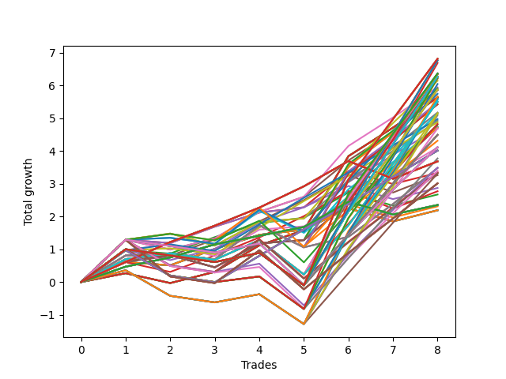

# Short HLT 105_90d 
- Symbol: TSLA
- Date Range: 01/10/2024 - 05/17/2024
- Trading Period: 8:30-12:30
- Number of Trades: 8



| Id. | Name | Win Percent | Profit | Avg Profit / Trade | Avg Time / Trade | Std |      | Name | Win Percent | Profit | Avg Profit / Trade | Avg Time / Trade | Std |
| --- | ---- | ----------- | ------ | ------------------ | ---------------- | --- | ---- | ---- | ----------- | ------ | ------------------ | ---------------- | --- |
| | Sorted By <br> Profit | | | | | | | Sorted By <br> Win Percentage |||||
|0| TP-3 180m | 62.50 | 6.81 | 0.85 | 103:00 | 1.30 |     | TP-1.25 45m | 87.50 | 6.14 | 0.77 | 37:00 | 0.67 |
|1| TP-3 165m | 62.50 | 6.81 | 0.85 | 103:00 | 1.30 |     | TP-1.25 30m | 87.50 | 5.94 | 0.74 | 26:22 | 0.54 |
|2| TP-3 150m | 62.50 | 6.81 | 0.85 | 103:00 | 1.30 |     | TP-2.25 45m | 87.50 | 5.91 | 0.74 | 42:15 | 0.78 |
|3| TP-3 135m | 62.50 | 6.81 | 0.85 | 103:00 | 1.30 |     | TP-2 45m | 87.50 | 5.85 | 0.73 | 42:07 | 0.76 |
|4| TP-3 120m | 62.50 | 6.81 | 0.85 | 103:00 | 1.30 |     | TP-1.75 45m | 87.50 | 5.85 | 0.73 | 42:07 | 0.76 |
|5| TP-2.25 180m | 62.50 | 6.76 | 0.85 | 88:07 | 1.23 |     | TP-1 30m | 87.50 | 5.65 | 0.71 | 23:07 | 0.48 |
|6| TP-2.25 165m | 62.50 | 6.76 | 0.85 | 88:07 | 1.23 |     | TP-3 30m | 87.50 | 5.63 | 0.70 | 29:00 | 0.70 |
|7| TP-2.25 150m | 62.50 | 6.76 | 0.85 | 88:07 | 1.23 |     | TP-2.75 30m | 87.50 | 5.63 | 0.70 | 29:00 | 0.70 |
|8| TP-2.25 135m | 62.50 | 6.76 | 0.85 | 88:07 | 1.23 |     | TP-2.5 30m | 87.50 | 5.63 | 0.70 | 29:00 | 0.70 |
|9| TP-2.25 120m | 62.50 | 6.76 | 0.85 | 88:07 | 1.23 |     | TP-2.25 30m | 87.50 | 5.63 | 0.70 | 29:00 | 0.70 |
|10| TP-3 105m | 62.50 | 6.68 | 0.84 | 96:00 | 1.45 |     | TP-2 30m | 87.50 | 5.63 | 0.70 | 29:00 | 0.70 |
|11| TP-2.75 180m | 62.50 | 6.36 | 0.80 | 102:30 | 1.20 |     | TP-1.75 30m | 87.50 | 5.63 | 0.70 | 29:00 | 0.70 |
|12| TP-2.75 165m | 62.50 | 6.36 | 0.80 | 102:30 | 1.20 |     | TP-1 45m | 87.50 | 5.17 | 0.65 | 31:30 | 0.56 |
|13| TP-2.75 150m | 62.50 | 6.36 | 0.80 | 102:30 | 1.20 |     | TP-1.5 45m | 87.50 | 5.14 | 0.64 | 41:52 | 0.60 |
|14| TP-2.75 135m | 62.50 | 6.36 | 0.80 | 102:30 | 1.20 |     | TP-0.75 75m | 87.50 | 4.97 | 0.62 | 34:07 | 0.38 |
|15| TP-2.75 120m | 62.50 | 6.36 | 0.80 | 102:30 | 1.20 |     | TP-1.5 30m | 87.50 | 4.92 | 0.61 | 28:45 | 0.52 |
|16| TP-2.5 180m | 62.50 | 6.34 | 0.79 | 102:15 | 1.20 |     | TP-0.75 60m | 87.50 | 4.87 | 0.61 | 32:07 | 0.39 |
|17| TP-2.5 165m | 62.50 | 6.34 | 0.79 | 102:15 | 1.20 |     | TP-3 45m | 87.50 | 4.73 | 0.59 | 44:00 | 0.54 |
|18| TP-2.5 150m | 62.50 | 6.34 | 0.79 | 102:15 | 1.20 |     | TP-2.75 45m | 87.50 | 4.73 | 0.59 | 44:00 | 0.54 |
|19| TP-2.5 135m | 62.50 | 6.34 | 0.79 | 102:15 | 1.20 |     | TP-2.5 45m | 87.50 | 4.73 | 0.59 | 44:00 | 0.54 |
|20| TP-2.5 120m | 62.50 | 6.34 | 0.79 | 102:15 | 1.20 |     | TP-0.75 30m | 87.50 | 4.68 | 0.59 | 21:45 | 0.39 |
|21| TP-2.25 75m | 75.00 | 6.32 | 0.79 | 66:45 | 1.09 |     | TP-0.75 45m | 87.50 | 4.10 | 0.51 | 27:22 | 0.45 |
|22| TP-2 180m | 62.50 | 6.27 | 0.78 | 85:22 | 1.16 |     | TP-0.5 180m | 87.50 | 3.68 | 0.46 | 18:15 | 0.39 |
|23| TP-2 165m | 62.50 | 6.27 | 0.78 | 85:22 | 1.16 |     | TP-0.5 165m | 87.50 | 3.68 | 0.46 | 18:15 | 0.39 |
|24| TP-2 150m | 62.50 | 6.27 | 0.78 | 85:22 | 1.16 |     | TP-0.5 150m | 87.50 | 3.68 | 0.46 | 18:15 | 0.39 |
|25| TP-2 135m | 62.50 | 6.27 | 0.78 | 85:22 | 1.16 |     | TP-0.5 135m | 87.50 | 3.68 | 0.46 | 18:15 | 0.39 |
|26| TP-2 120m | 62.50 | 6.27 | 0.78 | 85:22 | 1.16 |     | TP-0.5 120m | 87.50 | 3.68 | 0.46 | 18:15 | 0.39 |
|27| TP-2 75m | 75.00 | 6.26 | 0.78 | 66:37 | 1.08 |     | TP-0.5 105m | 87.50 | 3.68 | 0.46 | 18:15 | 0.39 |
|28| TP-2.75 105m | 62.50 | 6.23 | 0.78 | 95:30 | 1.36 |     | TP-0.5 90m | 87.50 | 3.68 | 0.46 | 18:15 | 0.39 |
|29| TP-2.5 105m | 62.50 | 6.21 | 0.78 | 95:15 | 1.35 |     | TP-0.5 75m | 87.50 | 3.68 | 0.46 | 18:15 | 0.39 |
|30| TP-1.75 75m | 75.00 | 6.20 | 0.78 | 65:45 | 1.07 |     | TP-0.5 60m | 87.50 | 3.68 | 0.46 | 18:15 | 0.39 |
|31| TP-1.25 45m | 87.50 | 6.14 | 0.77 | 37:00 | 0.67 |     | TP-0.5 45m | 87.50 | 3.26 | 0.41 | 16:45 | 0.39 |
|32| TP-2.25 105m | 62.50 | 6.04 | 0.76 | 84:52 | 1.31 |     | TP-0.25 180m | 87.50 | 2.35 | 0.29 | 06:37 | 0.30 |
|33| TP-1.25 30m | 87.50 | 5.94 | 0.74 | 26:22 | 0.54 |     | TP-0.25 165m | 87.50 | 2.35 | 0.29 | 06:37 | 0.30 |
|34| TP-2.25 45m | 87.50 | 5.91 | 0.74 | 42:15 | 0.78 |     | TP-0.25 150m | 87.50 | 2.35 | 0.29 | 06:37 | 0.30 |
|35| TP-1.75 180m | 62.50 | 5.87 | 0.73 | 83:00 | 1.11 |     | TP-0.25 135m | 87.50 | 2.35 | 0.29 | 06:37 | 0.30 |
|36| TP-1.75 165m | 62.50 | 5.87 | 0.73 | 83:00 | 1.11 |     | TP-0.25 120m | 87.50 | 2.35 | 0.29 | 06:37 | 0.30 |
|37| TP-1.75 150m | 62.50 | 5.87 | 0.73 | 83:00 | 1.11 |     | TP-0.25 105m | 87.50 | 2.35 | 0.29 | 06:37 | 0.30 |
|38| TP-1.75 135m | 62.50 | 5.87 | 0.73 | 83:00 | 1.11 |     | TP-0.25 90m | 87.50 | 2.35 | 0.29 | 06:37 | 0.30 |
|39| TP-1.75 120m | 62.50 | 5.87 | 0.73 | 83:00 | 1.11 |     | TP-0.25 75m | 87.50 | 2.35 | 0.29 | 06:37 | 0.30 |
|40| TP-2 45m | 87.50 | 5.85 | 0.73 | 42:07 | 0.76 |     | TP-0.25 60m | 87.50 | 2.35 | 0.29 | 06:37 | 0.30 |
|41| TP-1.75 45m | 87.50 | 5.85 | 0.73 | 42:07 | 0.76 |     | TP-0.25 45m | 87.50 | 2.35 | 0.29 | 06:37 | 0.30 |
|42| TP-1.25 60m | 75.00 | 5.74 | 0.72 | 44:30 | 0.79 |     | TP-0.25 30m | 87.50 | 2.35 | 0.29 | 06:37 | 0.30 |
|43| TP-3 90m | 62.50 | 5.66 | 0.71 | 85:22 | 1.33 |     | TP-0.25 15m | 87.50 | 2.35 | 0.29 | 06:37 | 0.30 |
|44| TP-1 30m | 87.50 | 5.65 | 0.71 | 23:07 | 0.48 |     | TP-2.25 75m | 75.00 | 6.32 | 0.79 | 66:45 | 1.09 |
|45| TP-3 30m | 87.50 | 5.63 | 0.70 | 29:00 | 0.70 |     | TP-2 75m | 75.00 | 6.26 | 0.78 | 66:37 | 1.08 |
|46| TP-2.75 30m | 87.50 | 5.63 | 0.70 | 29:00 | 0.70 |     | TP-1.75 75m | 75.00 | 6.20 | 0.78 | 65:45 | 1.07 |
|47| TP-2.5 30m | 87.50 | 5.63 | 0.70 | 29:00 | 0.70 |     | TP-1.25 60m | 75.00 | 5.74 | 0.72 | 44:30 | 0.79 |
|48| TP-2.25 30m | 87.50 | 5.63 | 0.70 | 29:00 | 0.70 |     | TP-3 75m | 75.00 | 5.50 | 0.69 | 72:15 | 0.97 |
|49| TP-2 30m | 87.50 | 5.63 | 0.70 | 29:00 | 0.70 |     | TP-2.75 75m | 75.00 | 5.50 | 0.69 | 72:15 | 0.97 |
|50| TP-1.75 30m | 87.50 | 5.63 | 0.70 | 29:00 | 0.70 |     | TP-2.5 75m | 75.00 | 5.50 | 0.69 | 72:15 | 0.97 |
|51| TP-2.75 90m | 62.50 | 5.60 | 0.70 | 85:15 | 1.32 |     | TP-2.25 60m | 75.00 | 5.48 | 0.69 | 55:22 | 0.87 |
|52| TP-2.5 90m | 62.50 | 5.58 | 0.70 | 85:00 | 1.32 |     | TP-2 60m | 75.00 | 5.42 | 0.68 | 55:15 | 0.86 |
|53| TP-2 105m | 62.50 | 5.55 | 0.69 | 82:07 | 1.24 |     | TP-1.75 60m | 75.00 | 5.42 | 0.68 | 55:15 | 0.86 |
|54| TP-3 75m | 75.00 | 5.50 | 0.69 | 72:15 | 0.97 |     | TP-1.5 75m | 75.00 | 4.82 | 0.60 | 64:37 | 0.88 |
|55| TP-2.75 75m | 75.00 | 5.50 | 0.69 | 72:15 | 0.97 |     | TP-1.25 75m | 75.00 | 4.80 | 0.60 | 48:52 | 0.92 |
|56| TP-2.5 75m | 75.00 | 5.50 | 0.69 | 72:15 | 0.97 |     | TP-1 60m | 75.00 | 4.73 | 0.59 | 37:22 | 0.69 |
|57| TP-2.25 60m | 75.00 | 5.48 | 0.69 | 55:22 | 0.87 |     | TP-1.5 60m | 75.00 | 4.71 | 0.59 | 55:00 | 0.71 |
|58| TP-2 60m | 75.00 | 5.42 | 0.68 | 55:15 | 0.86 |     | TP-1 75m | 75.00 | 4.31 | 0.54 | 39:45 | 0.81 |
|59| TP-1.75 60m | 75.00 | 5.42 | 0.68 | 55:15 | 0.86 |     | TP-0.75 180m | 75.00 | 4.01 | 0.50 | 36:00 | 0.59 |
|60| TP-1 45m | 87.50 | 5.17 | 0.65 | 31:30 | 0.56 |     | TP-0.75 165m | 75.00 | 4.01 | 0.50 | 36:00 | 0.59 |
|61| TP-1.75 105m | 62.50 | 5.15 | 0.64 | 79:45 | 1.19 |     | TP-0.75 150m | 75.00 | 4.01 | 0.50 | 36:00 | 0.59 |
|62| TP-1.5 45m | 87.50 | 5.14 | 0.64 | 41:52 | 0.60 |     | TP-0.75 135m | 75.00 | 4.01 | 0.50 | 36:00 | 0.59 |
|63| TP-2.25 90m | 62.50 | 5.14 | 0.64 | 78:00 | 1.24 |     | TP-0.75 120m | 75.00 | 4.01 | 0.50 | 36:00 | 0.59 |
|64| TP-2 90m | 62.50 | 5.09 | 0.64 | 75:37 | 1.22 |     | TP-0.75 105m | 75.00 | 4.01 | 0.50 | 36:00 | 0.59 |
|65| TP-0.75 75m | 87.50 | 4.97 | 0.62 | 34:07 | 0.38 |     | TP-0.75 90m | 75.00 | 4.01 | 0.50 | 36:00 | 0.59 |
|66| TP-1.5 30m | 87.50 | 4.92 | 0.61 | 28:45 | 0.52 |     | TP-3 60m | 75.00 | 3.48 | 0.44 | 59:00 | 0.61 |
|67| TP-0.75 60m | 87.50 | 4.87 | 0.61 | 32:07 | 0.39 |     | TP-2.75 60m | 75.00 | 3.48 | 0.44 | 59:00 | 0.61 |
|68| TP-1.5 75m | 75.00 | 4.82 | 0.60 | 64:37 | 0.88 |     | TP-2.5 60m | 75.00 | 3.48 | 0.44 | 59:00 | 0.61 |
|69| TP-1.25 75m | 75.00 | 4.80 | 0.60 | 48:52 | 0.92 |     | TP-1 15m | 75.00 | 3.33 | 0.42 | 12:22 | 0.53 |
|70| TP-3 45m | 87.50 | 4.73 | 0.59 | 44:00 | 0.54 |     | TP-1.25 15m | 75.00 | 2.87 | 0.36 | 13:30 | 0.47 |
|71| TP-2.75 45m | 87.50 | 4.73 | 0.59 | 44:00 | 0.54 |     | TP-0.5 30m | 75.00 | 2.77 | 0.35 | 14:52 | 0.45 |
|72| TP-2.5 45m | 87.50 | 4.73 | 0.59 | 44:00 | 0.54 |     | TP-0.75 15m | 75.00 | 2.67 | 0.33 | 11:45 | 0.42 |
|73| TP-1 60m | 75.00 | 4.73 | 0.59 | 37:22 | 0.69 |     | TP-0.5 15m | 75.00 | 2.31 | 0.29 | 11:07 | 0.36 |
|74| TP-1.5 60m | 75.00 | 4.71 | 0.59 | 55:00 | 0.71 |     | TP-3 15m | 75.00 | 2.19 | 0.27 | 14:00 | 0.34 |
|75| TP-1.75 90m | 62.50 | 4.69 | 0.59 | 73:15 | 1.17 |     | TP-2.75 15m | 75.00 | 2.19 | 0.27 | 14:00 | 0.34 |
|76| TP-0.75 30m | 87.50 | 4.68 | 0.59 | 21:45 | 0.39 |     | TP-2.5 15m | 75.00 | 2.19 | 0.27 | 14:00 | 0.34 |
|77| TP-1.5 180m | 62.50 | 4.49 | 0.56 | 81:52 | 0.91 |     | TP-2.25 15m | 75.00 | 2.19 | 0.27 | 14:00 | 0.34 |
|78| TP-1.5 165m | 62.50 | 4.49 | 0.56 | 81:52 | 0.91 |     | TP-2 15m | 75.00 | 2.19 | 0.27 | 14:00 | 0.34 |
|79| TP-1.5 150m | 62.50 | 4.49 | 0.56 | 81:52 | 0.91 |     | TP-1.75 15m | 75.00 | 2.19 | 0.27 | 14:00 | 0.34 |
|80| TP-1.5 135m | 62.50 | 4.49 | 0.56 | 81:52 | 0.91 |     | TP-1.5 15m | 75.00 | 2.19 | 0.27 | 14:00 | 0.34 |
|81| TP-1.5 120m | 62.50 | 4.49 | 0.56 | 81:52 | 0.91 |     | TP-3 180m | 62.50 | 6.81 | 0.85 | 103:00 | 1.30 |
|82| TP-1 75m | 75.00 | 4.31 | 0.54 | 39:45 | 0.81 |     | TP-3 165m | 62.50 | 6.81 | 0.85 | 103:00 | 1.30 |
|83| TP-1.25 180m | 62.50 | 4.11 | 0.51 | 59:37 | 0.95 |     | TP-3 150m | 62.50 | 6.81 | 0.85 | 103:00 | 1.30 |
|84| TP-1.25 165m | 62.50 | 4.11 | 0.51 | 59:37 | 0.95 |     | TP-3 135m | 62.50 | 6.81 | 0.85 | 103:00 | 1.30 |
|85| TP-1.25 150m | 62.50 | 4.11 | 0.51 | 59:37 | 0.95 |     | TP-3 120m | 62.50 | 6.81 | 0.85 | 103:00 | 1.30 |
|86| TP-1.25 135m | 62.50 | 4.11 | 0.51 | 59:37 | 0.95 |     | TP-2.25 180m | 62.50 | 6.76 | 0.85 | 88:07 | 1.23 |
|87| TP-1.25 120m | 62.50 | 4.11 | 0.51 | 59:37 | 0.95 |     | TP-2.25 165m | 62.50 | 6.76 | 0.85 | 88:07 | 1.23 |
|88| TP-0.75 45m | 87.50 | 4.10 | 0.51 | 27:22 | 0.45 |     | TP-2.25 150m | 62.50 | 6.76 | 0.85 | 88:07 | 1.23 |
|89| TP-0.75 180m | 75.00 | 4.01 | 0.50 | 36:00 | 0.59 |     | TP-2.25 135m | 62.50 | 6.76 | 0.85 | 88:07 | 1.23 |
|90| TP-0.75 165m | 75.00 | 4.01 | 0.50 | 36:00 | 0.59 |     | TP-2.25 120m | 62.50 | 6.76 | 0.85 | 88:07 | 1.23 |
|91| TP-0.75 150m | 75.00 | 4.01 | 0.50 | 36:00 | 0.59 |     | TP-3 105m | 62.50 | 6.68 | 0.84 | 96:00 | 1.45 |
|92| TP-0.75 135m | 75.00 | 4.01 | 0.50 | 36:00 | 0.59 |     | TP-2.75 180m | 62.50 | 6.36 | 0.80 | 102:30 | 1.20 |
|93| TP-0.75 120m | 75.00 | 4.01 | 0.50 | 36:00 | 0.59 |     | TP-2.75 165m | 62.50 | 6.36 | 0.80 | 102:30 | 1.20 |
|94| TP-0.75 105m | 75.00 | 4.01 | 0.50 | 36:00 | 0.59 |     | TP-2.75 150m | 62.50 | 6.36 | 0.80 | 102:30 | 1.20 |
|95| TP-0.75 90m | 75.00 | 4.01 | 0.50 | 36:00 | 0.59 |     | TP-2.75 135m | 62.50 | 6.36 | 0.80 | 102:30 | 1.20 |
|96| TP-1.5 105m | 62.50 | 3.77 | 0.47 | 78:37 | 1.00 |     | TP-2.75 120m | 62.50 | 6.36 | 0.80 | 102:30 | 1.20 |
|97| TP-0.5 180m | 87.50 | 3.68 | 0.46 | 18:15 | 0.39 |     | TP-2.5 180m | 62.50 | 6.34 | 0.79 | 102:15 | 1.20 |
|98| TP-0.5 165m | 87.50 | 3.68 | 0.46 | 18:15 | 0.39 |     | TP-2.5 165m | 62.50 | 6.34 | 0.79 | 102:15 | 1.20 |
|99| TP-0.5 150m | 87.50 | 3.68 | 0.46 | 18:15 | 0.39 |     | TP-2.5 150m | 62.50 | 6.34 | 0.79 | 102:15 | 1.20 |
|100| TP-0.5 135m | 87.50 | 3.68 | 0.46 | 18:15 | 0.39 |     | TP-2.5 135m | 62.50 | 6.34 | 0.79 | 102:15 | 1.20 |
|101| TP-0.5 120m | 87.50 | 3.68 | 0.46 | 18:15 | 0.39 |     | TP-2.5 120m | 62.50 | 6.34 | 0.79 | 102:15 | 1.20 |
|102| TP-0.5 105m | 87.50 | 3.68 | 0.46 | 18:15 | 0.39 |     | TP-2 180m | 62.50 | 6.27 | 0.78 | 85:22 | 1.16 |
|103| TP-0.5 90m | 87.50 | 3.68 | 0.46 | 18:15 | 0.39 |     | TP-2 165m | 62.50 | 6.27 | 0.78 | 85:22 | 1.16 |
|104| TP-0.5 75m | 87.50 | 3.68 | 0.46 | 18:15 | 0.39 |     | TP-2 150m | 62.50 | 6.27 | 0.78 | 85:22 | 1.16 |
|105| TP-0.5 60m | 87.50 | 3.68 | 0.46 | 18:15 | 0.39 |     | TP-2 135m | 62.50 | 6.27 | 0.78 | 85:22 | 1.16 |
|106| TP-1.25 90m | 62.50 | 3.49 | 0.44 | 52:37 | 1.02 |     | TP-2 120m | 62.50 | 6.27 | 0.78 | 85:22 | 1.16 |
|107| TP-3 60m | 75.00 | 3.48 | 0.44 | 59:00 | 0.61 |     | TP-2.75 105m | 62.50 | 6.23 | 0.78 | 95:30 | 1.36 |
|108| TP-2.75 60m | 75.00 | 3.48 | 0.44 | 59:00 | 0.61 |     | TP-2.5 105m | 62.50 | 6.21 | 0.78 | 95:15 | 1.35 |
|109| TP-2.5 60m | 75.00 | 3.48 | 0.44 | 59:00 | 0.61 |     | TP-2.25 105m | 62.50 | 6.04 | 0.76 | 84:52 | 1.31 |
|110| TP-1.25 105m | 62.50 | 3.39 | 0.42 | 56:22 | 1.03 |     | TP-1.75 180m | 62.50 | 5.87 | 0.73 | 83:00 | 1.11 |
|111| TP-1 90m | 62.50 | 3.35 | 0.42 | 41:37 | 0.92 |     | TP-1.75 165m | 62.50 | 5.87 | 0.73 | 83:00 | 1.11 |
|112| TP-1 15m | 75.00 | 3.33 | 0.42 | 12:22 | 0.53 |     | TP-1.75 150m | 62.50 | 5.87 | 0.73 | 83:00 | 1.11 |
|113| TP-1 105m | 62.50 | 3.33 | 0.42 | 43:30 | 0.93 |     | TP-1.75 135m | 62.50 | 5.87 | 0.73 | 83:00 | 1.11 |
|114| TP-1.5 90m | 62.50 | 3.31 | 0.41 | 72:07 | 0.96 |     | TP-1.75 120m | 62.50 | 5.87 | 0.73 | 83:00 | 1.11 |
|115| TP-0.5 45m | 87.50 | 3.26 | 0.41 | 16:45 | 0.39 |     | TP-3 90m | 62.50 | 5.66 | 0.71 | 85:22 | 1.33 |
|116| TP-1 180m | 62.50 | 3.01 | 0.38 | 43:45 | 0.98 |     | TP-2.75 90m | 62.50 | 5.60 | 0.70 | 85:15 | 1.32 |
|117| TP-1 165m | 62.50 | 3.01 | 0.38 | 43:45 | 0.98 |     | TP-2.5 90m | 62.50 | 5.58 | 0.70 | 85:00 | 1.32 |
|118| TP-1 150m | 62.50 | 3.01 | 0.38 | 43:45 | 0.98 |     | TP-2 105m | 62.50 | 5.55 | 0.69 | 82:07 | 1.24 |
|119| TP-1 135m | 62.50 | 3.01 | 0.38 | 43:45 | 0.98 |     | TP-1.75 105m | 62.50 | 5.15 | 0.64 | 79:45 | 1.19 |
|120| TP-1 120m | 62.50 | 3.01 | 0.38 | 43:45 | 0.98 |     | TP-2.25 90m | 62.50 | 5.14 | 0.64 | 78:00 | 1.24 |
|121| TP-1.25 15m | 75.00 | 2.87 | 0.36 | 13:30 | 0.47 |     | TP-2 90m | 62.50 | 5.09 | 0.64 | 75:37 | 1.22 |
|122| TP-0.5 30m | 75.00 | 2.77 | 0.35 | 14:52 | 0.45 |     | TP-1.75 90m | 62.50 | 4.69 | 0.59 | 73:15 | 1.17 |
|123| TP-0.75 15m | 75.00 | 2.67 | 0.33 | 11:45 | 0.42 |     | TP-1.5 180m | 62.50 | 4.49 | 0.56 | 81:52 | 0.91 |
|124| TP-0.25 180m | 87.50 | 2.35 | 0.29 | 06:37 | 0.30 |     | TP-1.5 165m | 62.50 | 4.49 | 0.56 | 81:52 | 0.91 |
|125| TP-0.25 165m | 87.50 | 2.35 | 0.29 | 06:37 | 0.30 |     | TP-1.5 150m | 62.50 | 4.49 | 0.56 | 81:52 | 0.91 |
|126| TP-0.25 150m | 87.50 | 2.35 | 0.29 | 06:37 | 0.30 |     | TP-1.5 135m | 62.50 | 4.49 | 0.56 | 81:52 | 0.91 |
|127| TP-0.25 135m | 87.50 | 2.35 | 0.29 | 06:37 | 0.30 |     | TP-1.5 120m | 62.50 | 4.49 | 0.56 | 81:52 | 0.91 |
|128| TP-0.25 120m | 87.50 | 2.35 | 0.29 | 06:37 | 0.30 |     | TP-1.25 180m | 62.50 | 4.11 | 0.51 | 59:37 | 0.95 |
|129| TP-0.25 105m | 87.50 | 2.35 | 0.29 | 06:37 | 0.30 |     | TP-1.25 165m | 62.50 | 4.11 | 0.51 | 59:37 | 0.95 |
|130| TP-0.25 90m | 87.50 | 2.35 | 0.29 | 06:37 | 0.30 |     | TP-1.25 150m | 62.50 | 4.11 | 0.51 | 59:37 | 0.95 |
|131| TP-0.25 75m | 87.50 | 2.35 | 0.29 | 06:37 | 0.30 |     | TP-1.25 135m | 62.50 | 4.11 | 0.51 | 59:37 | 0.95 |
|132| TP-0.25 60m | 87.50 | 2.35 | 0.29 | 06:37 | 0.30 |     | TP-1.25 120m | 62.50 | 4.11 | 0.51 | 59:37 | 0.95 |
|133| TP-0.25 45m | 87.50 | 2.35 | 0.29 | 06:37 | 0.30 |     | TP-1.5 105m | 62.50 | 3.77 | 0.47 | 78:37 | 1.00 |
|134| TP-0.25 30m | 87.50 | 2.35 | 0.29 | 06:37 | 0.30 |     | TP-1.25 90m | 62.50 | 3.49 | 0.44 | 52:37 | 1.02 |
|135| TP-0.25 15m | 87.50 | 2.35 | 0.29 | 06:37 | 0.30 |     | TP-1.25 105m | 62.50 | 3.39 | 0.42 | 56:22 | 1.03 |
|136| TP-0.5 15m | 75.00 | 2.31 | 0.29 | 11:07 | 0.36 |     | TP-1 90m | 62.50 | 3.35 | 0.42 | 41:37 | 0.92 |
|137| TP-3 15m | 75.00 | 2.19 | 0.27 | 14:00 | 0.34 |     | TP-1 105m | 62.50 | 3.33 | 0.42 | 43:30 | 0.93 |
|138| TP-2.75 15m | 75.00 | 2.19 | 0.27 | 14:00 | 0.34 |     | TP-1.5 90m | 62.50 | 3.31 | 0.41 | 72:07 | 0.96 |
|139| TP-2.5 15m | 75.00 | 2.19 | 0.27 | 14:00 | 0.34 |     | TP-1 180m | 62.50 | 3.01 | 0.38 | 43:45 | 0.98 |
|140| TP-2.25 15m | 75.00 | 2.19 | 0.27 | 14:00 | 0.34 |     | TP-1 165m | 62.50 | 3.01 | 0.38 | 43:45 | 0.98 |
|141| TP-2 15m | 75.00 | 2.19 | 0.27 | 14:00 | 0.34 |     | TP-1 150m | 62.50 | 3.01 | 0.38 | 43:45 | 0.98 |
|142| TP-1.75 15m | 75.00 | 2.19 | 0.27 | 14:00 | 0.34 |     | TP-1 135m | 62.50 | 3.01 | 0.38 | 43:45 | 0.98 |
|143| TP-1.5 15m | 75.00 | 2.19 | 0.27 | 14:00 | 0.34 |     | TP-1 120m | 62.50 | 3.01 | 0.38 | 43:45 | 0.98 |

### Test TP-0.25 15m
* Take Profit of 0.25 Point
* 0.25 Stoploss
* Results:
```
Total Trades: 8
Percent Up: 12.50
Percent Down: 87.50
Total Points Moved Down: 2.35
Potential Profit: 1175.00
Total Points Ups: 0.39 Count Ups: 1
Total Points Downs: 2.74 Count Downs: 7
```

<details><summary>Trades</summary>

<code>In: 2024-02-07 11:10:00		Out: 2024-02-07 11:13:00		Total Position Time: 03:00		Total Move Down: 0.47		Total to Date: 0.47</code> <br />
<code>In: 2024-02-22 10:55:00		Out: 2024-02-22 11:00:00		Total Position Time: 05:00		Total Move Down: 0.28		Total to Date: 0.75</code> <br />
<code>In: 2024-03-18 11:50:00		Out: 2024-03-18 11:57:00		Total Position Time: 07:00		Total Move Down: 0.40		Total to Date: 1.15</code> <br />
<code>In: 2024-03-27 09:55:00		Out: 2024-03-27 10:03:00		Total Position Time: 08:00		Total Move Down: 0.26		Total to Date: 1.41</code> <br />
<code>In: 2024-04-24 11:10:00		Out: 2024-04-24 11:18:00		Total Position Time: 08:00		Total Move Down: 0.27		Total to Date: 1.68</code> <br />
<code>In: 2024-04-29 09:40:00		Out: 2024-04-29 09:42:00		Total Position Time: 02:00		Total Move Down: 0.77		Total to Date: 2.45</code> <br />
<code>In: 2024-05-14 08:40:00		Out: 2024-05-14 08:50:00		Total Position Time: 10:00		Total Move Down: -0.39		Total to Date: 2.06</code> <br />
<code>In: 2024-05-17 09:45:00		Out: 2024-05-17 09:55:00		Total Position Time: 10:00		Total Move Down: 0.29		Total to Date: 2.35</code> <br />


</details>

### Test TP-0.5 15m
* Take Profit of 0.5 Point
* 0.5 Stoploss
* Results:
```
Total Trades: 8
Percent Up: 25.00
Percent Down: 75.00
Total Points Moved Down: 2.31
Potential Profit: 1155.00
Total Points Ups: 0.50 Count Ups: 2
Total Points Downs: 2.81 Count Downs: 6
```

<details><summary>Trades</summary>

<code>In: 2024-02-07 11:10:00		Out: 2024-02-07 11:14:00		Total Position Time: 04:00		Total Move Down: 0.61		Total to Date: 0.61</code> <br />
<code>In: 2024-02-22 10:55:00		Out: 2024-02-22 11:09:00		Total Position Time: 14:00		Total Move Down: -0.10		Total to Date: 0.51</code> <br />
<code>In: 2024-03-18 11:50:00		Out: 2024-03-18 12:03:00		Total Position Time: 13:00		Total Move Down: 0.50		Total to Date: 1.01</code> <br />
<code>In: 2024-03-27 09:55:00		Out: 2024-03-27 10:09:00		Total Position Time: 14:00		Total Move Down: 0.43		Total to Date: 1.44</code> <br />
<code>In: 2024-04-24 11:10:00		Out: 2024-04-24 11:24:00		Total Position Time: 14:00		Total Move Down: 0.16		Total to Date: 1.60</code> <br />
<code>In: 2024-04-29 09:40:00		Out: 2024-04-29 09:42:00		Total Position Time: 02:00		Total Move Down: 0.77		Total to Date: 2.37</code> <br />
<code>In: 2024-05-14 08:40:00		Out: 2024-05-14 08:54:00		Total Position Time: 14:00		Total Move Down: -0.40		Total to Date: 1.97</code> <br />
<code>In: 2024-05-17 09:45:00		Out: 2024-05-17 09:59:00		Total Position Time: 14:00		Total Move Down: 0.34		Total to Date: 2.31</code> <br />


</details>

### Test TP-0.75 15m
* Take Profit of 0.75 Point
* 0.75 Stoploss
* Results:
```
Total Trades: 8
Percent Up: 25.00
Percent Down: 75.00
Total Points Moved Down: 2.67
Potential Profit: 1335.00
Total Points Ups: 0.50 Count Ups: 2
Total Points Downs: 3.17 Count Downs: 6
```

<details><summary>Trades</summary>

<code>In: 2024-02-07 11:10:00		Out: 2024-02-07 11:18:00		Total Position Time: 08:00		Total Move Down: 0.97		Total to Date: 0.97</code> <br />
<code>In: 2024-02-22 10:55:00		Out: 2024-02-22 11:09:00		Total Position Time: 14:00		Total Move Down: -0.10		Total to Date: 0.87</code> <br />
<code>In: 2024-03-18 11:50:00		Out: 2024-03-18 12:04:00		Total Position Time: 14:00		Total Move Down: 0.50		Total to Date: 1.37</code> <br />
<code>In: 2024-03-27 09:55:00		Out: 2024-03-27 10:09:00		Total Position Time: 14:00		Total Move Down: 0.43		Total to Date: 1.80</code> <br />
<code>In: 2024-04-24 11:10:00		Out: 2024-04-24 11:24:00		Total Position Time: 14:00		Total Move Down: 0.16		Total to Date: 1.96</code> <br />
<code>In: 2024-04-29 09:40:00		Out: 2024-04-29 09:42:00		Total Position Time: 02:00		Total Move Down: 0.77		Total to Date: 2.73</code> <br />
<code>In: 2024-05-14 08:40:00		Out: 2024-05-14 08:54:00		Total Position Time: 14:00		Total Move Down: -0.40		Total to Date: 2.33</code> <br />
<code>In: 2024-05-17 09:45:00		Out: 2024-05-17 09:59:00		Total Position Time: 14:00		Total Move Down: 0.34		Total to Date: 2.67</code> <br />


</details>

### Test TP-1 15m
* Take Profit of 1 Point
* 1 Stoploss
* Results:
```
Total Trades: 8
Percent Up: 25.00
Percent Down: 75.00
Total Points Moved Down: 3.33
Potential Profit: 1665.00
Total Points Ups: 0.50 Count Ups: 2
Total Points Downs: 3.83 Count Downs: 6
```

<details><summary>Trades</summary>

<code>In: 2024-02-07 11:10:00		Out: 2024-02-07 11:20:00		Total Position Time: 10:00		Total Move Down: 1.29		Total to Date: 1.29</code> <br />
<code>In: 2024-02-22 10:55:00		Out: 2024-02-22 11:09:00		Total Position Time: 14:00		Total Move Down: -0.10		Total to Date: 1.19</code> <br />
<code>In: 2024-03-18 11:50:00		Out: 2024-03-18 12:04:00		Total Position Time: 14:00		Total Move Down: 0.50		Total to Date: 1.69</code> <br />
<code>In: 2024-03-27 09:55:00		Out: 2024-03-27 10:09:00		Total Position Time: 14:00		Total Move Down: 0.43		Total to Date: 2.12</code> <br />
<code>In: 2024-04-24 11:10:00		Out: 2024-04-24 11:24:00		Total Position Time: 14:00		Total Move Down: 0.16		Total to Date: 2.28</code> <br />
<code>In: 2024-04-29 09:40:00		Out: 2024-04-29 09:45:00		Total Position Time: 05:00		Total Move Down: 1.11		Total to Date: 3.39</code> <br />
<code>In: 2024-05-14 08:40:00		Out: 2024-05-14 08:54:00		Total Position Time: 14:00		Total Move Down: -0.40		Total to Date: 2.99</code> <br />
<code>In: 2024-05-17 09:45:00		Out: 2024-05-17 09:59:00		Total Position Time: 14:00		Total Move Down: 0.34		Total to Date: 3.33</code> <br />


</details>

### Test TP-1.25 15m
* Take Profit of 1.25 Point
* 1.25 Stoploss
* Results:
```
Total Trades: 8
Percent Up: 25.00
Percent Down: 75.00
Total Points Moved Down: 2.87
Potential Profit: 1435.00
Total Points Ups: 0.50 Count Ups: 2
Total Points Downs: 3.37 Count Downs: 6
```

<details><summary>Trades</summary>

<code>In: 2024-02-07 11:10:00		Out: 2024-02-07 11:20:00		Total Position Time: 10:00		Total Move Down: 1.29		Total to Date: 1.29</code> <br />
<code>In: 2024-02-22 10:55:00		Out: 2024-02-22 11:09:00		Total Position Time: 14:00		Total Move Down: -0.10		Total to Date: 1.19</code> <br />
<code>In: 2024-03-18 11:50:00		Out: 2024-03-18 12:04:00		Total Position Time: 14:00		Total Move Down: 0.50		Total to Date: 1.69</code> <br />
<code>In: 2024-03-27 09:55:00		Out: 2024-03-27 10:09:00		Total Position Time: 14:00		Total Move Down: 0.43		Total to Date: 2.12</code> <br />
<code>In: 2024-04-24 11:10:00		Out: 2024-04-24 11:24:00		Total Position Time: 14:00		Total Move Down: 0.16		Total to Date: 2.28</code> <br />
<code>In: 2024-04-29 09:40:00		Out: 2024-04-29 09:54:00		Total Position Time: 14:00		Total Move Down: 0.65		Total to Date: 2.93</code> <br />
<code>In: 2024-05-14 08:40:00		Out: 2024-05-14 08:54:00		Total Position Time: 14:00		Total Move Down: -0.40		Total to Date: 2.53</code> <br />
<code>In: 2024-05-17 09:45:00		Out: 2024-05-17 09:59:00		Total Position Time: 14:00		Total Move Down: 0.34		Total to Date: 2.87</code> <br />


</details>

### Test TP-1.5 15m
* Take Profit of 1.5 Point
* 1.5 Stoploss
* Results:
```
Total Trades: 8
Percent Up: 25.00
Percent Down: 75.00
Total Points Moved Down: 2.19
Potential Profit: 1095.00
Total Points Ups: 0.50 Count Ups: 2
Total Points Downs: 2.69 Count Downs: 6
```

<details><summary>Trades</summary>

<code>In: 2024-02-07 11:10:00		Out: 2024-02-07 11:24:00		Total Position Time: 14:00		Total Move Down: 0.61		Total to Date: 0.61</code> <br />
<code>In: 2024-02-22 10:55:00		Out: 2024-02-22 11:09:00		Total Position Time: 14:00		Total Move Down: -0.10		Total to Date: 0.51</code> <br />
<code>In: 2024-03-18 11:50:00		Out: 2024-03-18 12:04:00		Total Position Time: 14:00		Total Move Down: 0.50		Total to Date: 1.01</code> <br />
<code>In: 2024-03-27 09:55:00		Out: 2024-03-27 10:09:00		Total Position Time: 14:00		Total Move Down: 0.43		Total to Date: 1.44</code> <br />
<code>In: 2024-04-24 11:10:00		Out: 2024-04-24 11:24:00		Total Position Time: 14:00		Total Move Down: 0.16		Total to Date: 1.60</code> <br />
<code>In: 2024-04-29 09:40:00		Out: 2024-04-29 09:54:00		Total Position Time: 14:00		Total Move Down: 0.65		Total to Date: 2.25</code> <br />
<code>In: 2024-05-14 08:40:00		Out: 2024-05-14 08:54:00		Total Position Time: 14:00		Total Move Down: -0.40		Total to Date: 1.85</code> <br />
<code>In: 2024-05-17 09:45:00		Out: 2024-05-17 09:59:00		Total Position Time: 14:00		Total Move Down: 0.34		Total to Date: 2.19</code> <br />


</details>

### Test TP-1.75 15m
* Take Profit of 1.75 Point
* 1.75 Stoploss
* Results:
```
Total Trades: 8
Percent Up: 25.00
Percent Down: 75.00
Total Points Moved Down: 2.19
Potential Profit: 1095.00
Total Points Ups: 0.50 Count Ups: 2
Total Points Downs: 2.69 Count Downs: 6
```

<details><summary>Trades</summary>

<code>In: 2024-02-07 11:10:00		Out: 2024-02-07 11:24:00		Total Position Time: 14:00		Total Move Down: 0.61		Total to Date: 0.61</code> <br />
<code>In: 2024-02-22 10:55:00		Out: 2024-02-22 11:09:00		Total Position Time: 14:00		Total Move Down: -0.10		Total to Date: 0.51</code> <br />
<code>In: 2024-03-18 11:50:00		Out: 2024-03-18 12:04:00		Total Position Time: 14:00		Total Move Down: 0.50		Total to Date: 1.01</code> <br />
<code>In: 2024-03-27 09:55:00		Out: 2024-03-27 10:09:00		Total Position Time: 14:00		Total Move Down: 0.43		Total to Date: 1.44</code> <br />
<code>In: 2024-04-24 11:10:00		Out: 2024-04-24 11:24:00		Total Position Time: 14:00		Total Move Down: 0.16		Total to Date: 1.60</code> <br />
<code>In: 2024-04-29 09:40:00		Out: 2024-04-29 09:54:00		Total Position Time: 14:00		Total Move Down: 0.65		Total to Date: 2.25</code> <br />
<code>In: 2024-05-14 08:40:00		Out: 2024-05-14 08:54:00		Total Position Time: 14:00		Total Move Down: -0.40		Total to Date: 1.85</code> <br />
<code>In: 2024-05-17 09:45:00		Out: 2024-05-17 09:59:00		Total Position Time: 14:00		Total Move Down: 0.34		Total to Date: 2.19</code> <br />


</details>

### Test TP-2 15m
* Take Profit of 2 Point
* 2 Stoploss
* Results:
```
Total Trades: 8
Percent Up: 25.00
Percent Down: 75.00
Total Points Moved Down: 2.19
Potential Profit: 1095.00
Total Points Ups: 0.50 Count Ups: 2
Total Points Downs: 2.69 Count Downs: 6
```

<details><summary>Trades</summary>

<code>In: 2024-02-07 11:10:00		Out: 2024-02-07 11:24:00		Total Position Time: 14:00		Total Move Down: 0.61		Total to Date: 0.61</code> <br />
<code>In: 2024-02-22 10:55:00		Out: 2024-02-22 11:09:00		Total Position Time: 14:00		Total Move Down: -0.10		Total to Date: 0.51</code> <br />
<code>In: 2024-03-18 11:50:00		Out: 2024-03-18 12:04:00		Total Position Time: 14:00		Total Move Down: 0.50		Total to Date: 1.01</code> <br />
<code>In: 2024-03-27 09:55:00		Out: 2024-03-27 10:09:00		Total Position Time: 14:00		Total Move Down: 0.43		Total to Date: 1.44</code> <br />
<code>In: 2024-04-24 11:10:00		Out: 2024-04-24 11:24:00		Total Position Time: 14:00		Total Move Down: 0.16		Total to Date: 1.60</code> <br />
<code>In: 2024-04-29 09:40:00		Out: 2024-04-29 09:54:00		Total Position Time: 14:00		Total Move Down: 0.65		Total to Date: 2.25</code> <br />
<code>In: 2024-05-14 08:40:00		Out: 2024-05-14 08:54:00		Total Position Time: 14:00		Total Move Down: -0.40		Total to Date: 1.85</code> <br />
<code>In: 2024-05-17 09:45:00		Out: 2024-05-17 09:59:00		Total Position Time: 14:00		Total Move Down: 0.34		Total to Date: 2.19</code> <br />


</details>

### Test TP-2.25 15m
* Take Profit of 2.25 Point
* 2.25 Stoploss
* Results:
```
Total Trades: 8
Percent Up: 25.00
Percent Down: 75.00
Total Points Moved Down: 2.19
Potential Profit: 1095.00
Total Points Ups: 0.50 Count Ups: 2
Total Points Downs: 2.69 Count Downs: 6
```

<details><summary>Trades</summary>

<code>In: 2024-02-07 11:10:00		Out: 2024-02-07 11:24:00		Total Position Time: 14:00		Total Move Down: 0.61		Total to Date: 0.61</code> <br />
<code>In: 2024-02-22 10:55:00		Out: 2024-02-22 11:09:00		Total Position Time: 14:00		Total Move Down: -0.10		Total to Date: 0.51</code> <br />
<code>In: 2024-03-18 11:50:00		Out: 2024-03-18 12:04:00		Total Position Time: 14:00		Total Move Down: 0.50		Total to Date: 1.01</code> <br />
<code>In: 2024-03-27 09:55:00		Out: 2024-03-27 10:09:00		Total Position Time: 14:00		Total Move Down: 0.43		Total to Date: 1.44</code> <br />
<code>In: 2024-04-24 11:10:00		Out: 2024-04-24 11:24:00		Total Position Time: 14:00		Total Move Down: 0.16		Total to Date: 1.60</code> <br />
<code>In: 2024-04-29 09:40:00		Out: 2024-04-29 09:54:00		Total Position Time: 14:00		Total Move Down: 0.65		Total to Date: 2.25</code> <br />
<code>In: 2024-05-14 08:40:00		Out: 2024-05-14 08:54:00		Total Position Time: 14:00		Total Move Down: -0.40		Total to Date: 1.85</code> <br />
<code>In: 2024-05-17 09:45:00		Out: 2024-05-17 09:59:00		Total Position Time: 14:00		Total Move Down: 0.34		Total to Date: 2.19</code> <br />


</details>

### Test TP-2.5 15m
* Take Profit of 2.5 Point
* 2.5 Stoploss
* Results:
```
Total Trades: 8
Percent Up: 25.00
Percent Down: 75.00
Total Points Moved Down: 2.19
Potential Profit: 1095.00
Total Points Ups: 0.50 Count Ups: 2
Total Points Downs: 2.69 Count Downs: 6
```

<details><summary>Trades</summary>

<code>In: 2024-02-07 11:10:00		Out: 2024-02-07 11:24:00		Total Position Time: 14:00		Total Move Down: 0.61		Total to Date: 0.61</code> <br />
<code>In: 2024-02-22 10:55:00		Out: 2024-02-22 11:09:00		Total Position Time: 14:00		Total Move Down: -0.10		Total to Date: 0.51</code> <br />
<code>In: 2024-03-18 11:50:00		Out: 2024-03-18 12:04:00		Total Position Time: 14:00		Total Move Down: 0.50		Total to Date: 1.01</code> <br />
<code>In: 2024-03-27 09:55:00		Out: 2024-03-27 10:09:00		Total Position Time: 14:00		Total Move Down: 0.43		Total to Date: 1.44</code> <br />
<code>In: 2024-04-24 11:10:00		Out: 2024-04-24 11:24:00		Total Position Time: 14:00		Total Move Down: 0.16		Total to Date: 1.60</code> <br />
<code>In: 2024-04-29 09:40:00		Out: 2024-04-29 09:54:00		Total Position Time: 14:00		Total Move Down: 0.65		Total to Date: 2.25</code> <br />
<code>In: 2024-05-14 08:40:00		Out: 2024-05-14 08:54:00		Total Position Time: 14:00		Total Move Down: -0.40		Total to Date: 1.85</code> <br />
<code>In: 2024-05-17 09:45:00		Out: 2024-05-17 09:59:00		Total Position Time: 14:00		Total Move Down: 0.34		Total to Date: 2.19</code> <br />


</details>

### Test TP-2.75 15m
* Take Profit of 2.75 Point
* 2.75 Stoploss
* Results:
```
Total Trades: 8
Percent Up: 25.00
Percent Down: 75.00
Total Points Moved Down: 2.19
Potential Profit: 1095.00
Total Points Ups: 0.50 Count Ups: 2
Total Points Downs: 2.69 Count Downs: 6
```

<details><summary>Trades</summary>

<code>In: 2024-02-07 11:10:00		Out: 2024-02-07 11:24:00		Total Position Time: 14:00		Total Move Down: 0.61		Total to Date: 0.61</code> <br />
<code>In: 2024-02-22 10:55:00		Out: 2024-02-22 11:09:00		Total Position Time: 14:00		Total Move Down: -0.10		Total to Date: 0.51</code> <br />
<code>In: 2024-03-18 11:50:00		Out: 2024-03-18 12:04:00		Total Position Time: 14:00		Total Move Down: 0.50		Total to Date: 1.01</code> <br />
<code>In: 2024-03-27 09:55:00		Out: 2024-03-27 10:09:00		Total Position Time: 14:00		Total Move Down: 0.43		Total to Date: 1.44</code> <br />
<code>In: 2024-04-24 11:10:00		Out: 2024-04-24 11:24:00		Total Position Time: 14:00		Total Move Down: 0.16		Total to Date: 1.60</code> <br />
<code>In: 2024-04-29 09:40:00		Out: 2024-04-29 09:54:00		Total Position Time: 14:00		Total Move Down: 0.65		Total to Date: 2.25</code> <br />
<code>In: 2024-05-14 08:40:00		Out: 2024-05-14 08:54:00		Total Position Time: 14:00		Total Move Down: -0.40		Total to Date: 1.85</code> <br />
<code>In: 2024-05-17 09:45:00		Out: 2024-05-17 09:59:00		Total Position Time: 14:00		Total Move Down: 0.34		Total to Date: 2.19</code> <br />


</details>

### Test TP-3 15m
* Take Profit of 3 Point
* 3 Stoploss
* Results:
```
Total Trades: 8
Percent Up: 25.00
Percent Down: 75.00
Total Points Moved Down: 2.19
Potential Profit: 1095.00
Total Points Ups: 0.50 Count Ups: 2
Total Points Downs: 2.69 Count Downs: 6
```

<details><summary>Trades</summary>

<code>In: 2024-02-07 11:10:00		Out: 2024-02-07 11:24:00		Total Position Time: 14:00		Total Move Down: 0.61		Total to Date: 0.61</code> <br />
<code>In: 2024-02-22 10:55:00		Out: 2024-02-22 11:09:00		Total Position Time: 14:00		Total Move Down: -0.10		Total to Date: 0.51</code> <br />
<code>In: 2024-03-18 11:50:00		Out: 2024-03-18 12:04:00		Total Position Time: 14:00		Total Move Down: 0.50		Total to Date: 1.01</code> <br />
<code>In: 2024-03-27 09:55:00		Out: 2024-03-27 10:09:00		Total Position Time: 14:00		Total Move Down: 0.43		Total to Date: 1.44</code> <br />
<code>In: 2024-04-24 11:10:00		Out: 2024-04-24 11:24:00		Total Position Time: 14:00		Total Move Down: 0.16		Total to Date: 1.60</code> <br />
<code>In: 2024-04-29 09:40:00		Out: 2024-04-29 09:54:00		Total Position Time: 14:00		Total Move Down: 0.65		Total to Date: 2.25</code> <br />
<code>In: 2024-05-14 08:40:00		Out: 2024-05-14 08:54:00		Total Position Time: 14:00		Total Move Down: -0.40		Total to Date: 1.85</code> <br />
<code>In: 2024-05-17 09:45:00		Out: 2024-05-17 09:59:00		Total Position Time: 14:00		Total Move Down: 0.34		Total to Date: 2.19</code> <br />


</details>

### Test TP-0.25 30m
* Take Profit of 0.25 Point
* 0.25 Stoploss
* Results:
```
Total Trades: 8
Percent Up: 12.50
Percent Down: 87.50
Total Points Moved Down: 2.35
Potential Profit: 1175.00
Total Points Ups: 0.39 Count Ups: 1
Total Points Downs: 2.74 Count Downs: 7
```

<details><summary>Trades</summary>

<code>In: 2024-02-07 11:10:00		Out: 2024-02-07 11:13:00		Total Position Time: 03:00		Total Move Down: 0.47		Total to Date: 0.47</code> <br />
<code>In: 2024-02-22 10:55:00		Out: 2024-02-22 11:00:00		Total Position Time: 05:00		Total Move Down: 0.28		Total to Date: 0.75</code> <br />
<code>In: 2024-03-18 11:50:00		Out: 2024-03-18 11:57:00		Total Position Time: 07:00		Total Move Down: 0.40		Total to Date: 1.15</code> <br />
<code>In: 2024-03-27 09:55:00		Out: 2024-03-27 10:03:00		Total Position Time: 08:00		Total Move Down: 0.26		Total to Date: 1.41</code> <br />
<code>In: 2024-04-24 11:10:00		Out: 2024-04-24 11:18:00		Total Position Time: 08:00		Total Move Down: 0.27		Total to Date: 1.68</code> <br />
<code>In: 2024-04-29 09:40:00		Out: 2024-04-29 09:42:00		Total Position Time: 02:00		Total Move Down: 0.77		Total to Date: 2.45</code> <br />
<code>In: 2024-05-14 08:40:00		Out: 2024-05-14 08:50:00		Total Position Time: 10:00		Total Move Down: -0.39		Total to Date: 2.06</code> <br />
<code>In: 2024-05-17 09:45:00		Out: 2024-05-17 09:55:00		Total Position Time: 10:00		Total Move Down: 0.29		Total to Date: 2.35</code> <br />


</details>

### Test TP-0.5 30m
* Take Profit of 0.5 Point
* 0.5 Stoploss
* Results:
```
Total Trades: 8
Percent Up: 25.00
Percent Down: 75.00
Total Points Moved Down: 2.77
Potential Profit: 1385.00
Total Points Ups: 0.84 Count Ups: 2
Total Points Downs: 3.61 Count Downs: 6
```

<details><summary>Trades</summary>

<code>In: 2024-02-07 11:10:00		Out: 2024-02-07 11:14:00		Total Position Time: 04:00		Total Move Down: 0.61		Total to Date: 0.61</code> <br />
<code>In: 2024-02-22 10:55:00		Out: 2024-02-22 11:24:00		Total Position Time: 29:00		Total Move Down: -0.30		Total to Date: 0.31</code> <br />
<code>In: 2024-03-18 11:50:00		Out: 2024-03-18 12:03:00		Total Position Time: 13:00		Total Move Down: 0.50		Total to Date: 0.81</code> <br />
<code>In: 2024-03-27 09:55:00		Out: 2024-03-27 10:10:00		Total Position Time: 15:00		Total Move Down: 0.55		Total to Date: 1.36</code> <br />
<code>In: 2024-04-24 11:10:00		Out: 2024-04-24 11:35:00		Total Position Time: 25:00		Total Move Down: 0.65		Total to Date: 2.01</code> <br />
<code>In: 2024-04-29 09:40:00		Out: 2024-04-29 09:42:00		Total Position Time: 02:00		Total Move Down: 0.77		Total to Date: 2.78</code> <br />
<code>In: 2024-05-14 08:40:00		Out: 2024-05-14 08:55:00		Total Position Time: 15:00		Total Move Down: -0.54		Total to Date: 2.24</code> <br />
<code>In: 2024-05-17 09:45:00		Out: 2024-05-17 10:01:00		Total Position Time: 16:00		Total Move Down: 0.53		Total to Date: 2.77</code> <br />


</details>

### Test TP-0.75 30m
* Take Profit of 0.75 Point
* 0.75 Stoploss
* Results:
```
Total Trades: 8
Percent Up: 12.50
Percent Down: 87.50
Total Points Moved Down: 4.68
Potential Profit: 2340.00
Total Points Ups: 0.30 Count Ups: 1
Total Points Downs: 4.98 Count Downs: 7
```

<details><summary>Trades</summary>

<code>In: 2024-02-07 11:10:00		Out: 2024-02-07 11:18:00		Total Position Time: 08:00		Total Move Down: 0.97		Total to Date: 0.97</code> <br />
<code>In: 2024-02-22 10:55:00		Out: 2024-02-22 11:24:00		Total Position Time: 29:00		Total Move Down: -0.30		Total to Date: 0.67</code> <br />
<code>In: 2024-03-18 11:50:00		Out: 2024-03-18 12:19:00		Total Position Time: 29:00		Total Move Down: 0.34		Total to Date: 1.01</code> <br />
<code>In: 2024-03-27 09:55:00		Out: 2024-03-27 10:24:00		Total Position Time: 29:00		Total Move Down: 0.81		Total to Date: 1.82</code> <br />
<code>In: 2024-04-24 11:10:00		Out: 2024-04-24 11:39:00		Total Position Time: 29:00		Total Move Down: 0.46		Total to Date: 2.28</code> <br />
<code>In: 2024-04-29 09:40:00		Out: 2024-04-29 09:42:00		Total Position Time: 02:00		Total Move Down: 0.77		Total to Date: 3.05</code> <br />
<code>In: 2024-05-14 08:40:00		Out: 2024-05-14 09:08:00		Total Position Time: 28:00		Total Move Down: 0.83		Total to Date: 3.88</code> <br />
<code>In: 2024-05-17 09:45:00		Out: 2024-05-17 10:05:00		Total Position Time: 20:00		Total Move Down: 0.80		Total to Date: 4.68</code> <br />


</details>

### Test TP-1 30m
* Take Profit of 1 Point
* 1 Stoploss
* Results:
```
Total Trades: 8
Percent Up: 12.50
Percent Down: 87.50
Total Points Moved Down: 5.65
Potential Profit: 2825.00
Total Points Ups: 0.30 Count Ups: 1
Total Points Downs: 5.95 Count Downs: 7
```

<details><summary>Trades</summary>

<code>In: 2024-02-07 11:10:00		Out: 2024-02-07 11:20:00		Total Position Time: 10:00		Total Move Down: 1.29		Total to Date: 1.29</code> <br />
<code>In: 2024-02-22 10:55:00		Out: 2024-02-22 11:24:00		Total Position Time: 29:00		Total Move Down: -0.30		Total to Date: 0.99</code> <br />
<code>In: 2024-03-18 11:50:00		Out: 2024-03-18 12:19:00		Total Position Time: 29:00		Total Move Down: 0.34		Total to Date: 1.33</code> <br />
<code>In: 2024-03-27 09:55:00		Out: 2024-03-27 10:24:00		Total Position Time: 29:00		Total Move Down: 0.81		Total to Date: 2.14</code> <br />
<code>In: 2024-04-24 11:10:00		Out: 2024-04-24 11:39:00		Total Position Time: 29:00		Total Move Down: 0.46		Total to Date: 2.60</code> <br />
<code>In: 2024-04-29 09:40:00		Out: 2024-04-29 09:45:00		Total Position Time: 05:00		Total Move Down: 1.11		Total to Date: 3.71</code> <br />
<code>In: 2024-05-14 08:40:00		Out: 2024-05-14 09:09:00		Total Position Time: 29:00		Total Move Down: 0.87		Total to Date: 4.58</code> <br />
<code>In: 2024-05-17 09:45:00		Out: 2024-05-17 10:10:00		Total Position Time: 25:00		Total Move Down: 1.07		Total to Date: 5.65</code> <br />


</details>

### Test TP-1.25 30m
* Take Profit of 1.25 Point
* 1.25 Stoploss
* Results:
```
Total Trades: 8
Percent Up: 12.50
Percent Down: 87.50
Total Points Moved Down: 5.94
Potential Profit: 2970.00
Total Points Ups: 0.30 Count Ups: 1
Total Points Downs: 6.24 Count Downs: 7
```

<details><summary>Trades</summary>

<code>In: 2024-02-07 11:10:00		Out: 2024-02-07 11:20:00		Total Position Time: 10:00		Total Move Down: 1.29		Total to Date: 1.29</code> <br />
<code>In: 2024-02-22 10:55:00		Out: 2024-02-22 11:24:00		Total Position Time: 29:00		Total Move Down: -0.30		Total to Date: 0.99</code> <br />
<code>In: 2024-03-18 11:50:00		Out: 2024-03-18 12:19:00		Total Position Time: 29:00		Total Move Down: 0.34		Total to Date: 1.33</code> <br />
<code>In: 2024-03-27 09:55:00		Out: 2024-03-27 10:24:00		Total Position Time: 29:00		Total Move Down: 0.81		Total to Date: 2.14</code> <br />
<code>In: 2024-04-24 11:10:00		Out: 2024-04-24 11:39:00		Total Position Time: 29:00		Total Move Down: 0.46		Total to Date: 2.60</code> <br />
<code>In: 2024-04-29 09:40:00		Out: 2024-04-29 10:07:00		Total Position Time: 27:00		Total Move Down: 1.55		Total to Date: 4.15</code> <br />
<code>In: 2024-05-14 08:40:00		Out: 2024-05-14 09:09:00		Total Position Time: 29:00		Total Move Down: 0.87		Total to Date: 5.02</code> <br />
<code>In: 2024-05-17 09:45:00		Out: 2024-05-17 10:14:00		Total Position Time: 29:00		Total Move Down: 0.92		Total to Date: 5.94</code> <br />


</details>

### Test TP-1.5 30m
* Take Profit of 1.5 Point
* 1.5 Stoploss
* Results:
```
Total Trades: 8
Percent Up: 12.50
Percent Down: 87.50
Total Points Moved Down: 4.92
Potential Profit: 2460.00
Total Points Ups: 0.30 Count Ups: 1
Total Points Downs: 5.22 Count Downs: 7
```

<details><summary>Trades</summary>

<code>In: 2024-02-07 11:10:00		Out: 2024-02-07 11:39:00		Total Position Time: 29:00		Total Move Down: 0.27		Total to Date: 0.27</code> <br />
<code>In: 2024-02-22 10:55:00		Out: 2024-02-22 11:24:00		Total Position Time: 29:00		Total Move Down: -0.30		Total to Date: -0.03</code> <br />
<code>In: 2024-03-18 11:50:00		Out: 2024-03-18 12:19:00		Total Position Time: 29:00		Total Move Down: 0.34		Total to Date: 0.31</code> <br />
<code>In: 2024-03-27 09:55:00		Out: 2024-03-27 10:24:00		Total Position Time: 29:00		Total Move Down: 0.81		Total to Date: 1.12</code> <br />
<code>In: 2024-04-24 11:10:00		Out: 2024-04-24 11:39:00		Total Position Time: 29:00		Total Move Down: 0.46		Total to Date: 1.58</code> <br />
<code>In: 2024-04-29 09:40:00		Out: 2024-04-29 10:07:00		Total Position Time: 27:00		Total Move Down: 1.55		Total to Date: 3.13</code> <br />
<code>In: 2024-05-14 08:40:00		Out: 2024-05-14 09:09:00		Total Position Time: 29:00		Total Move Down: 0.87		Total to Date: 4.00</code> <br />
<code>In: 2024-05-17 09:45:00		Out: 2024-05-17 10:14:00		Total Position Time: 29:00		Total Move Down: 0.92		Total to Date: 4.92</code> <br />


</details>

### Test TP-1.75 30m
* Take Profit of 1.75 Point
* 1.75 Stoploss
* Results:
```
Total Trades: 8
Percent Up: 12.50
Percent Down: 87.50
Total Points Moved Down: 5.63
Potential Profit: 2815.00
Total Points Ups: 0.30 Count Ups: 1
Total Points Downs: 5.93 Count Downs: 7
```

<details><summary>Trades</summary>

<code>In: 2024-02-07 11:10:00		Out: 2024-02-07 11:39:00		Total Position Time: 29:00		Total Move Down: 0.27		Total to Date: 0.27</code> <br />
<code>In: 2024-02-22 10:55:00		Out: 2024-02-22 11:24:00		Total Position Time: 29:00		Total Move Down: -0.30		Total to Date: -0.03</code> <br />
<code>In: 2024-03-18 11:50:00		Out: 2024-03-18 12:19:00		Total Position Time: 29:00		Total Move Down: 0.34		Total to Date: 0.31</code> <br />
<code>In: 2024-03-27 09:55:00		Out: 2024-03-27 10:24:00		Total Position Time: 29:00		Total Move Down: 0.81		Total to Date: 1.12</code> <br />
<code>In: 2024-04-24 11:10:00		Out: 2024-04-24 11:39:00		Total Position Time: 29:00		Total Move Down: 0.46		Total to Date: 1.58</code> <br />
<code>In: 2024-04-29 09:40:00		Out: 2024-04-29 10:09:00		Total Position Time: 29:00		Total Move Down: 2.26		Total to Date: 3.84</code> <br />
<code>In: 2024-05-14 08:40:00		Out: 2024-05-14 09:09:00		Total Position Time: 29:00		Total Move Down: 0.87		Total to Date: 4.71</code> <br />
<code>In: 2024-05-17 09:45:00		Out: 2024-05-17 10:14:00		Total Position Time: 29:00		Total Move Down: 0.92		Total to Date: 5.63</code> <br />


</details>

### Test TP-2 30m
* Take Profit of 2 Point
* 2 Stoploss
* Results:
```
Total Trades: 8
Percent Up: 12.50
Percent Down: 87.50
Total Points Moved Down: 5.63
Potential Profit: 2815.00
Total Points Ups: 0.30 Count Ups: 1
Total Points Downs: 5.93 Count Downs: 7
```

<details><summary>Trades</summary>

<code>In: 2024-02-07 11:10:00		Out: 2024-02-07 11:39:00		Total Position Time: 29:00		Total Move Down: 0.27		Total to Date: 0.27</code> <br />
<code>In: 2024-02-22 10:55:00		Out: 2024-02-22 11:24:00		Total Position Time: 29:00		Total Move Down: -0.30		Total to Date: -0.03</code> <br />
<code>In: 2024-03-18 11:50:00		Out: 2024-03-18 12:19:00		Total Position Time: 29:00		Total Move Down: 0.34		Total to Date: 0.31</code> <br />
<code>In: 2024-03-27 09:55:00		Out: 2024-03-27 10:24:00		Total Position Time: 29:00		Total Move Down: 0.81		Total to Date: 1.12</code> <br />
<code>In: 2024-04-24 11:10:00		Out: 2024-04-24 11:39:00		Total Position Time: 29:00		Total Move Down: 0.46		Total to Date: 1.58</code> <br />
<code>In: 2024-04-29 09:40:00		Out: 2024-04-29 10:09:00		Total Position Time: 29:00		Total Move Down: 2.26		Total to Date: 3.84</code> <br />
<code>In: 2024-05-14 08:40:00		Out: 2024-05-14 09:09:00		Total Position Time: 29:00		Total Move Down: 0.87		Total to Date: 4.71</code> <br />
<code>In: 2024-05-17 09:45:00		Out: 2024-05-17 10:14:00		Total Position Time: 29:00		Total Move Down: 0.92		Total to Date: 5.63</code> <br />


</details>

### Test TP-2.25 30m
* Take Profit of 2.25 Point
* 2.25 Stoploss
* Results:
```
Total Trades: 8
Percent Up: 12.50
Percent Down: 87.50
Total Points Moved Down: 5.63
Potential Profit: 2815.00
Total Points Ups: 0.30 Count Ups: 1
Total Points Downs: 5.93 Count Downs: 7
```

<details><summary>Trades</summary>

<code>In: 2024-02-07 11:10:00		Out: 2024-02-07 11:39:00		Total Position Time: 29:00		Total Move Down: 0.27		Total to Date: 0.27</code> <br />
<code>In: 2024-02-22 10:55:00		Out: 2024-02-22 11:24:00		Total Position Time: 29:00		Total Move Down: -0.30		Total to Date: -0.03</code> <br />
<code>In: 2024-03-18 11:50:00		Out: 2024-03-18 12:19:00		Total Position Time: 29:00		Total Move Down: 0.34		Total to Date: 0.31</code> <br />
<code>In: 2024-03-27 09:55:00		Out: 2024-03-27 10:24:00		Total Position Time: 29:00		Total Move Down: 0.81		Total to Date: 1.12</code> <br />
<code>In: 2024-04-24 11:10:00		Out: 2024-04-24 11:39:00		Total Position Time: 29:00		Total Move Down: 0.46		Total to Date: 1.58</code> <br />
<code>In: 2024-04-29 09:40:00		Out: 2024-04-29 10:09:00		Total Position Time: 29:00		Total Move Down: 2.26		Total to Date: 3.84</code> <br />
<code>In: 2024-05-14 08:40:00		Out: 2024-05-14 09:09:00		Total Position Time: 29:00		Total Move Down: 0.87		Total to Date: 4.71</code> <br />
<code>In: 2024-05-17 09:45:00		Out: 2024-05-17 10:14:00		Total Position Time: 29:00		Total Move Down: 0.92		Total to Date: 5.63</code> <br />


</details>

### Test TP-2.5 30m
* Take Profit of 2.5 Point
* 2.5 Stoploss
* Results:
```
Total Trades: 8
Percent Up: 12.50
Percent Down: 87.50
Total Points Moved Down: 5.63
Potential Profit: 2815.00
Total Points Ups: 0.30 Count Ups: 1
Total Points Downs: 5.93 Count Downs: 7
```

<details><summary>Trades</summary>

<code>In: 2024-02-07 11:10:00		Out: 2024-02-07 11:39:00		Total Position Time: 29:00		Total Move Down: 0.27		Total to Date: 0.27</code> <br />
<code>In: 2024-02-22 10:55:00		Out: 2024-02-22 11:24:00		Total Position Time: 29:00		Total Move Down: -0.30		Total to Date: -0.03</code> <br />
<code>In: 2024-03-18 11:50:00		Out: 2024-03-18 12:19:00		Total Position Time: 29:00		Total Move Down: 0.34		Total to Date: 0.31</code> <br />
<code>In: 2024-03-27 09:55:00		Out: 2024-03-27 10:24:00		Total Position Time: 29:00		Total Move Down: 0.81		Total to Date: 1.12</code> <br />
<code>In: 2024-04-24 11:10:00		Out: 2024-04-24 11:39:00		Total Position Time: 29:00		Total Move Down: 0.46		Total to Date: 1.58</code> <br />
<code>In: 2024-04-29 09:40:00		Out: 2024-04-29 10:09:00		Total Position Time: 29:00		Total Move Down: 2.26		Total to Date: 3.84</code> <br />
<code>In: 2024-05-14 08:40:00		Out: 2024-05-14 09:09:00		Total Position Time: 29:00		Total Move Down: 0.87		Total to Date: 4.71</code> <br />
<code>In: 2024-05-17 09:45:00		Out: 2024-05-17 10:14:00		Total Position Time: 29:00		Total Move Down: 0.92		Total to Date: 5.63</code> <br />


</details>

### Test TP-2.75 30m
* Take Profit of 2.75 Point
* 2.75 Stoploss
* Results:
```
Total Trades: 8
Percent Up: 12.50
Percent Down: 87.50
Total Points Moved Down: 5.63
Potential Profit: 2815.00
Total Points Ups: 0.30 Count Ups: 1
Total Points Downs: 5.93 Count Downs: 7
```

<details><summary>Trades</summary>

<code>In: 2024-02-07 11:10:00		Out: 2024-02-07 11:39:00		Total Position Time: 29:00		Total Move Down: 0.27		Total to Date: 0.27</code> <br />
<code>In: 2024-02-22 10:55:00		Out: 2024-02-22 11:24:00		Total Position Time: 29:00		Total Move Down: -0.30		Total to Date: -0.03</code> <br />
<code>In: 2024-03-18 11:50:00		Out: 2024-03-18 12:19:00		Total Position Time: 29:00		Total Move Down: 0.34		Total to Date: 0.31</code> <br />
<code>In: 2024-03-27 09:55:00		Out: 2024-03-27 10:24:00		Total Position Time: 29:00		Total Move Down: 0.81		Total to Date: 1.12</code> <br />
<code>In: 2024-04-24 11:10:00		Out: 2024-04-24 11:39:00		Total Position Time: 29:00		Total Move Down: 0.46		Total to Date: 1.58</code> <br />
<code>In: 2024-04-29 09:40:00		Out: 2024-04-29 10:09:00		Total Position Time: 29:00		Total Move Down: 2.26		Total to Date: 3.84</code> <br />
<code>In: 2024-05-14 08:40:00		Out: 2024-05-14 09:09:00		Total Position Time: 29:00		Total Move Down: 0.87		Total to Date: 4.71</code> <br />
<code>In: 2024-05-17 09:45:00		Out: 2024-05-17 10:14:00		Total Position Time: 29:00		Total Move Down: 0.92		Total to Date: 5.63</code> <br />


</details>

### Test TP-3 30m
* Take Profit of 3 Point
* 3 Stoploss
* Results:
```
Total Trades: 8
Percent Up: 12.50
Percent Down: 87.50
Total Points Moved Down: 5.63
Potential Profit: 2815.00
Total Points Ups: 0.30 Count Ups: 1
Total Points Downs: 5.93 Count Downs: 7
```

<details><summary>Trades</summary>

<code>In: 2024-02-07 11:10:00		Out: 2024-02-07 11:39:00		Total Position Time: 29:00		Total Move Down: 0.27		Total to Date: 0.27</code> <br />
<code>In: 2024-02-22 10:55:00		Out: 2024-02-22 11:24:00		Total Position Time: 29:00		Total Move Down: -0.30		Total to Date: -0.03</code> <br />
<code>In: 2024-03-18 11:50:00		Out: 2024-03-18 12:19:00		Total Position Time: 29:00		Total Move Down: 0.34		Total to Date: 0.31</code> <br />
<code>In: 2024-03-27 09:55:00		Out: 2024-03-27 10:24:00		Total Position Time: 29:00		Total Move Down: 0.81		Total to Date: 1.12</code> <br />
<code>In: 2024-04-24 11:10:00		Out: 2024-04-24 11:39:00		Total Position Time: 29:00		Total Move Down: 0.46		Total to Date: 1.58</code> <br />
<code>In: 2024-04-29 09:40:00		Out: 2024-04-29 10:09:00		Total Position Time: 29:00		Total Move Down: 2.26		Total to Date: 3.84</code> <br />
<code>In: 2024-05-14 08:40:00		Out: 2024-05-14 09:09:00		Total Position Time: 29:00		Total Move Down: 0.87		Total to Date: 4.71</code> <br />
<code>In: 2024-05-17 09:45:00		Out: 2024-05-17 10:14:00		Total Position Time: 29:00		Total Move Down: 0.92		Total to Date: 5.63</code> <br />


</details>

### Test TP-0.25 45m
* Take Profit of 0.25 Point
* 0.25 Stoploss
* Results:
```
Total Trades: 8
Percent Up: 12.50
Percent Down: 87.50
Total Points Moved Down: 2.35
Potential Profit: 1175.00
Total Points Ups: 0.39 Count Ups: 1
Total Points Downs: 2.74 Count Downs: 7
```

<details><summary>Trades</summary>

<code>In: 2024-02-07 11:10:00		Out: 2024-02-07 11:13:00		Total Position Time: 03:00		Total Move Down: 0.47		Total to Date: 0.47</code> <br />
<code>In: 2024-02-22 10:55:00		Out: 2024-02-22 11:00:00		Total Position Time: 05:00		Total Move Down: 0.28		Total to Date: 0.75</code> <br />
<code>In: 2024-03-18 11:50:00		Out: 2024-03-18 11:57:00		Total Position Time: 07:00		Total Move Down: 0.40		Total to Date: 1.15</code> <br />
<code>In: 2024-03-27 09:55:00		Out: 2024-03-27 10:03:00		Total Position Time: 08:00		Total Move Down: 0.26		Total to Date: 1.41</code> <br />
<code>In: 2024-04-24 11:10:00		Out: 2024-04-24 11:18:00		Total Position Time: 08:00		Total Move Down: 0.27		Total to Date: 1.68</code> <br />
<code>In: 2024-04-29 09:40:00		Out: 2024-04-29 09:42:00		Total Position Time: 02:00		Total Move Down: 0.77		Total to Date: 2.45</code> <br />
<code>In: 2024-05-14 08:40:00		Out: 2024-05-14 08:50:00		Total Position Time: 10:00		Total Move Down: -0.39		Total to Date: 2.06</code> <br />
<code>In: 2024-05-17 09:45:00		Out: 2024-05-17 09:55:00		Total Position Time: 10:00		Total Move Down: 0.29		Total to Date: 2.35</code> <br />


</details>

### Test TP-0.5 45m
* Take Profit of 0.5 Point
* 0.5 Stoploss
* Results:
```
Total Trades: 8
Percent Up: 12.50
Percent Down: 87.50
Total Points Moved Down: 3.26
Potential Profit: 1630.00
Total Points Ups: 0.54 Count Ups: 1
Total Points Downs: 3.80 Count Downs: 7
```

<details><summary>Trades</summary>

<code>In: 2024-02-07 11:10:00		Out: 2024-02-07 11:14:00		Total Position Time: 04:00		Total Move Down: 0.61		Total to Date: 0.61</code> <br />
<code>In: 2024-02-22 10:55:00		Out: 2024-02-22 11:39:00		Total Position Time: 44:00		Total Move Down: 0.19		Total to Date: 0.80</code> <br />
<code>In: 2024-03-18 11:50:00		Out: 2024-03-18 12:03:00		Total Position Time: 13:00		Total Move Down: 0.50		Total to Date: 1.30</code> <br />
<code>In: 2024-03-27 09:55:00		Out: 2024-03-27 10:10:00		Total Position Time: 15:00		Total Move Down: 0.55		Total to Date: 1.85</code> <br />
<code>In: 2024-04-24 11:10:00		Out: 2024-04-24 11:35:00		Total Position Time: 25:00		Total Move Down: 0.65		Total to Date: 2.50</code> <br />
<code>In: 2024-04-29 09:40:00		Out: 2024-04-29 09:42:00		Total Position Time: 02:00		Total Move Down: 0.77		Total to Date: 3.27</code> <br />
<code>In: 2024-05-14 08:40:00		Out: 2024-05-14 08:55:00		Total Position Time: 15:00		Total Move Down: -0.54		Total to Date: 2.73</code> <br />
<code>In: 2024-05-17 09:45:00		Out: 2024-05-17 10:01:00		Total Position Time: 16:00		Total Move Down: 0.53		Total to Date: 3.26</code> <br />


</details>

### Test TP-0.75 45m
* Take Profit of 0.75 Point
* 0.75 Stoploss
* Results:
```
Total Trades: 8
Percent Up: 12.50
Percent Down: 87.50
Total Points Moved Down: 4.10
Potential Profit: 2050.00
Total Points Ups: 0.37 Count Ups: 1
Total Points Downs: 4.47 Count Downs: 7
```

<details><summary>Trades</summary>

<code>In: 2024-02-07 11:10:00		Out: 2024-02-07 11:18:00		Total Position Time: 08:00		Total Move Down: 0.97		Total to Date: 0.97</code> <br />
<code>In: 2024-02-22 10:55:00		Out: 2024-02-22 11:39:00		Total Position Time: 44:00		Total Move Down: 0.19		Total to Date: 1.16</code> <br />
<code>In: 2024-03-18 11:50:00		Out: 2024-03-18 12:34:00		Total Position Time: 44:00		Total Move Down: -0.37		Total to Date: 0.79</code> <br />
<code>In: 2024-03-27 09:55:00		Out: 2024-03-27 10:24:00		Total Position Time: 29:00		Total Move Down: 0.81		Total to Date: 1.60</code> <br />
<code>In: 2024-04-24 11:10:00		Out: 2024-04-24 11:54:00		Total Position Time: 44:00		Total Move Down: 0.10		Total to Date: 1.70</code> <br />
<code>In: 2024-04-29 09:40:00		Out: 2024-04-29 09:42:00		Total Position Time: 02:00		Total Move Down: 0.77		Total to Date: 2.47</code> <br />
<code>In: 2024-05-14 08:40:00		Out: 2024-05-14 09:08:00		Total Position Time: 28:00		Total Move Down: 0.83		Total to Date: 3.30</code> <br />
<code>In: 2024-05-17 09:45:00		Out: 2024-05-17 10:05:00		Total Position Time: 20:00		Total Move Down: 0.80		Total to Date: 4.10</code> <br />


</details>

### Test TP-1 45m
* Take Profit of 1 Point
* 1 Stoploss
* Results:
```
Total Trades: 8
Percent Up: 12.50
Percent Down: 87.50
Total Points Moved Down: 5.17
Potential Profit: 2585.00
Total Points Ups: 0.37 Count Ups: 1
Total Points Downs: 5.54 Count Downs: 7
```

<details><summary>Trades</summary>

<code>In: 2024-02-07 11:10:00		Out: 2024-02-07 11:20:00		Total Position Time: 10:00		Total Move Down: 1.29		Total to Date: 1.29</code> <br />
<code>In: 2024-02-22 10:55:00		Out: 2024-02-22 11:39:00		Total Position Time: 44:00		Total Move Down: 0.19		Total to Date: 1.48</code> <br />
<code>In: 2024-03-18 11:50:00		Out: 2024-03-18 12:34:00		Total Position Time: 44:00		Total Move Down: -0.37		Total to Date: 1.11</code> <br />
<code>In: 2024-03-27 09:55:00		Out: 2024-03-27 10:39:00		Total Position Time: 44:00		Total Move Down: 0.73		Total to Date: 1.84</code> <br />
<code>In: 2024-04-24 11:10:00		Out: 2024-04-24 11:54:00		Total Position Time: 44:00		Total Move Down: 0.10		Total to Date: 1.94</code> <br />
<code>In: 2024-04-29 09:40:00		Out: 2024-04-29 09:45:00		Total Position Time: 05:00		Total Move Down: 1.11		Total to Date: 3.05</code> <br />
<code>In: 2024-05-14 08:40:00		Out: 2024-05-14 09:16:00		Total Position Time: 36:00		Total Move Down: 1.05		Total to Date: 4.10</code> <br />
<code>In: 2024-05-17 09:45:00		Out: 2024-05-17 10:10:00		Total Position Time: 25:00		Total Move Down: 1.07		Total to Date: 5.17</code> <br />


</details>

### Test TP-1.25 45m
* Take Profit of 1.25 Point
* 1.25 Stoploss
* Results:
```
Total Trades: 8
Percent Up: 12.50
Percent Down: 87.50
Total Points Moved Down: 6.14
Potential Profit: 3070.00
Total Points Ups: 0.37 Count Ups: 1
Total Points Downs: 6.51 Count Downs: 7
```

<details><summary>Trades</summary>

<code>In: 2024-02-07 11:10:00		Out: 2024-02-07 11:20:00		Total Position Time: 10:00		Total Move Down: 1.29		Total to Date: 1.29</code> <br />
<code>In: 2024-02-22 10:55:00		Out: 2024-02-22 11:39:00		Total Position Time: 44:00		Total Move Down: 0.19		Total to Date: 1.48</code> <br />
<code>In: 2024-03-18 11:50:00		Out: 2024-03-18 12:34:00		Total Position Time: 44:00		Total Move Down: -0.37		Total to Date: 1.11</code> <br />
<code>In: 2024-03-27 09:55:00		Out: 2024-03-27 10:39:00		Total Position Time: 44:00		Total Move Down: 0.73		Total to Date: 1.84</code> <br />
<code>In: 2024-04-24 11:10:00		Out: 2024-04-24 11:54:00		Total Position Time: 44:00		Total Move Down: 0.10		Total to Date: 1.94</code> <br />
<code>In: 2024-04-29 09:40:00		Out: 2024-04-29 10:07:00		Total Position Time: 27:00		Total Move Down: 1.55		Total to Date: 3.49</code> <br />
<code>In: 2024-05-14 08:40:00		Out: 2024-05-14 09:19:00		Total Position Time: 39:00		Total Move Down: 1.36		Total to Date: 4.85</code> <br />
<code>In: 2024-05-17 09:45:00		Out: 2024-05-17 10:29:00		Total Position Time: 44:00		Total Move Down: 1.29		Total to Date: 6.14</code> <br />


</details>

### Test TP-1.5 45m
* Take Profit of 1.5 Point
* 1.5 Stoploss
* Results:
```
Total Trades: 8
Percent Up: 12.50
Percent Down: 87.50
Total Points Moved Down: 5.14
Potential Profit: 2570.00
Total Points Ups: 0.37 Count Ups: 1
Total Points Downs: 5.51 Count Downs: 7
```

<details><summary>Trades</summary>

<code>In: 2024-02-07 11:10:00		Out: 2024-02-07 11:54:00		Total Position Time: 44:00		Total Move Down: 0.63		Total to Date: 0.63</code> <br />
<code>In: 2024-02-22 10:55:00		Out: 2024-02-22 11:39:00		Total Position Time: 44:00		Total Move Down: 0.19		Total to Date: 0.82</code> <br />
<code>In: 2024-03-18 11:50:00		Out: 2024-03-18 12:34:00		Total Position Time: 44:00		Total Move Down: -0.37		Total to Date: 0.45</code> <br />
<code>In: 2024-03-27 09:55:00		Out: 2024-03-27 10:39:00		Total Position Time: 44:00		Total Move Down: 0.73		Total to Date: 1.18</code> <br />
<code>In: 2024-04-24 11:10:00		Out: 2024-04-24 11:54:00		Total Position Time: 44:00		Total Move Down: 0.10		Total to Date: 1.28</code> <br />
<code>In: 2024-04-29 09:40:00		Out: 2024-04-29 10:07:00		Total Position Time: 27:00		Total Move Down: 1.55		Total to Date: 2.83</code> <br />
<code>In: 2024-05-14 08:40:00		Out: 2024-05-14 09:24:00		Total Position Time: 44:00		Total Move Down: 1.02		Total to Date: 3.85</code> <br />
<code>In: 2024-05-17 09:45:00		Out: 2024-05-17 10:29:00		Total Position Time: 44:00		Total Move Down: 1.29		Total to Date: 5.14</code> <br />


</details>

### Test TP-1.75 45m
* Take Profit of 1.75 Point
* 1.75 Stoploss
* Results:
```
Total Trades: 8
Percent Up: 12.50
Percent Down: 87.50
Total Points Moved Down: 5.85
Potential Profit: 2925.00
Total Points Ups: 0.37 Count Ups: 1
Total Points Downs: 6.22 Count Downs: 7
```

<details><summary>Trades</summary>

<code>In: 2024-02-07 11:10:00		Out: 2024-02-07 11:54:00		Total Position Time: 44:00		Total Move Down: 0.63		Total to Date: 0.63</code> <br />
<code>In: 2024-02-22 10:55:00		Out: 2024-02-22 11:39:00		Total Position Time: 44:00		Total Move Down: 0.19		Total to Date: 0.82</code> <br />
<code>In: 2024-03-18 11:50:00		Out: 2024-03-18 12:34:00		Total Position Time: 44:00		Total Move Down: -0.37		Total to Date: 0.45</code> <br />
<code>In: 2024-03-27 09:55:00		Out: 2024-03-27 10:39:00		Total Position Time: 44:00		Total Move Down: 0.73		Total to Date: 1.18</code> <br />
<code>In: 2024-04-24 11:10:00		Out: 2024-04-24 11:54:00		Total Position Time: 44:00		Total Move Down: 0.10		Total to Date: 1.28</code> <br />
<code>In: 2024-04-29 09:40:00		Out: 2024-04-29 10:09:00		Total Position Time: 29:00		Total Move Down: 2.26		Total to Date: 3.54</code> <br />
<code>In: 2024-05-14 08:40:00		Out: 2024-05-14 09:24:00		Total Position Time: 44:00		Total Move Down: 1.02		Total to Date: 4.56</code> <br />
<code>In: 2024-05-17 09:45:00		Out: 2024-05-17 10:29:00		Total Position Time: 44:00		Total Move Down: 1.29		Total to Date: 5.85</code> <br />


</details>

### Test TP-2 45m
* Take Profit of 2 Point
* 2 Stoploss
* Results:
```
Total Trades: 8
Percent Up: 12.50
Percent Down: 87.50
Total Points Moved Down: 5.85
Potential Profit: 2925.00
Total Points Ups: 0.37 Count Ups: 1
Total Points Downs: 6.22 Count Downs: 7
```

<details><summary>Trades</summary>

<code>In: 2024-02-07 11:10:00		Out: 2024-02-07 11:54:00		Total Position Time: 44:00		Total Move Down: 0.63		Total to Date: 0.63</code> <br />
<code>In: 2024-02-22 10:55:00		Out: 2024-02-22 11:39:00		Total Position Time: 44:00		Total Move Down: 0.19		Total to Date: 0.82</code> <br />
<code>In: 2024-03-18 11:50:00		Out: 2024-03-18 12:34:00		Total Position Time: 44:00		Total Move Down: -0.37		Total to Date: 0.45</code> <br />
<code>In: 2024-03-27 09:55:00		Out: 2024-03-27 10:39:00		Total Position Time: 44:00		Total Move Down: 0.73		Total to Date: 1.18</code> <br />
<code>In: 2024-04-24 11:10:00		Out: 2024-04-24 11:54:00		Total Position Time: 44:00		Total Move Down: 0.10		Total to Date: 1.28</code> <br />
<code>In: 2024-04-29 09:40:00		Out: 2024-04-29 10:09:00		Total Position Time: 29:00		Total Move Down: 2.26		Total to Date: 3.54</code> <br />
<code>In: 2024-05-14 08:40:00		Out: 2024-05-14 09:24:00		Total Position Time: 44:00		Total Move Down: 1.02		Total to Date: 4.56</code> <br />
<code>In: 2024-05-17 09:45:00		Out: 2024-05-17 10:29:00		Total Position Time: 44:00		Total Move Down: 1.29		Total to Date: 5.85</code> <br />


</details>

### Test TP-2.25 45m
* Take Profit of 2.25 Point
* 2.25 Stoploss
* Results:
```
Total Trades: 8
Percent Up: 12.50
Percent Down: 87.50
Total Points Moved Down: 5.91
Potential Profit: 2955.00
Total Points Ups: 0.37 Count Ups: 1
Total Points Downs: 6.28 Count Downs: 7
```

<details><summary>Trades</summary>

<code>In: 2024-02-07 11:10:00		Out: 2024-02-07 11:54:00		Total Position Time: 44:00		Total Move Down: 0.63		Total to Date: 0.63</code> <br />
<code>In: 2024-02-22 10:55:00		Out: 2024-02-22 11:39:00		Total Position Time: 44:00		Total Move Down: 0.19		Total to Date: 0.82</code> <br />
<code>In: 2024-03-18 11:50:00		Out: 2024-03-18 12:34:00		Total Position Time: 44:00		Total Move Down: -0.37		Total to Date: 0.45</code> <br />
<code>In: 2024-03-27 09:55:00		Out: 2024-03-27 10:39:00		Total Position Time: 44:00		Total Move Down: 0.73		Total to Date: 1.18</code> <br />
<code>In: 2024-04-24 11:10:00		Out: 2024-04-24 11:54:00		Total Position Time: 44:00		Total Move Down: 0.10		Total to Date: 1.28</code> <br />
<code>In: 2024-04-29 09:40:00		Out: 2024-04-29 10:10:00		Total Position Time: 30:00		Total Move Down: 2.32		Total to Date: 3.60</code> <br />
<code>In: 2024-05-14 08:40:00		Out: 2024-05-14 09:24:00		Total Position Time: 44:00		Total Move Down: 1.02		Total to Date: 4.62</code> <br />
<code>In: 2024-05-17 09:45:00		Out: 2024-05-17 10:29:00		Total Position Time: 44:00		Total Move Down: 1.29		Total to Date: 5.91</code> <br />


</details>

### Test TP-2.5 45m
* Take Profit of 2.5 Point
* 2.5 Stoploss
* Results:
```
Total Trades: 8
Percent Up: 12.50
Percent Down: 87.50
Total Points Moved Down: 4.73
Potential Profit: 2365.00
Total Points Ups: 0.37 Count Ups: 1
Total Points Downs: 5.10 Count Downs: 7
```

<details><summary>Trades</summary>

<code>In: 2024-02-07 11:10:00		Out: 2024-02-07 11:54:00		Total Position Time: 44:00		Total Move Down: 0.63		Total to Date: 0.63</code> <br />
<code>In: 2024-02-22 10:55:00		Out: 2024-02-22 11:39:00		Total Position Time: 44:00		Total Move Down: 0.19		Total to Date: 0.82</code> <br />
<code>In: 2024-03-18 11:50:00		Out: 2024-03-18 12:34:00		Total Position Time: 44:00		Total Move Down: -0.37		Total to Date: 0.45</code> <br />
<code>In: 2024-03-27 09:55:00		Out: 2024-03-27 10:39:00		Total Position Time: 44:00		Total Move Down: 0.73		Total to Date: 1.18</code> <br />
<code>In: 2024-04-24 11:10:00		Out: 2024-04-24 11:54:00		Total Position Time: 44:00		Total Move Down: 0.10		Total to Date: 1.28</code> <br />
<code>In: 2024-04-29 09:40:00		Out: 2024-04-29 10:24:00		Total Position Time: 44:00		Total Move Down: 1.14		Total to Date: 2.42</code> <br />
<code>In: 2024-05-14 08:40:00		Out: 2024-05-14 09:24:00		Total Position Time: 44:00		Total Move Down: 1.02		Total to Date: 3.44</code> <br />
<code>In: 2024-05-17 09:45:00		Out: 2024-05-17 10:29:00		Total Position Time: 44:00		Total Move Down: 1.29		Total to Date: 4.73</code> <br />


</details>

### Test TP-2.75 45m
* Take Profit of 2.75 Point
* 2.75 Stoploss
* Results:
```
Total Trades: 8
Percent Up: 12.50
Percent Down: 87.50
Total Points Moved Down: 4.73
Potential Profit: 2365.00
Total Points Ups: 0.37 Count Ups: 1
Total Points Downs: 5.10 Count Downs: 7
```

<details><summary>Trades</summary>

<code>In: 2024-02-07 11:10:00		Out: 2024-02-07 11:54:00		Total Position Time: 44:00		Total Move Down: 0.63		Total to Date: 0.63</code> <br />
<code>In: 2024-02-22 10:55:00		Out: 2024-02-22 11:39:00		Total Position Time: 44:00		Total Move Down: 0.19		Total to Date: 0.82</code> <br />
<code>In: 2024-03-18 11:50:00		Out: 2024-03-18 12:34:00		Total Position Time: 44:00		Total Move Down: -0.37		Total to Date: 0.45</code> <br />
<code>In: 2024-03-27 09:55:00		Out: 2024-03-27 10:39:00		Total Position Time: 44:00		Total Move Down: 0.73		Total to Date: 1.18</code> <br />
<code>In: 2024-04-24 11:10:00		Out: 2024-04-24 11:54:00		Total Position Time: 44:00		Total Move Down: 0.10		Total to Date: 1.28</code> <br />
<code>In: 2024-04-29 09:40:00		Out: 2024-04-29 10:24:00		Total Position Time: 44:00		Total Move Down: 1.14		Total to Date: 2.42</code> <br />
<code>In: 2024-05-14 08:40:00		Out: 2024-05-14 09:24:00		Total Position Time: 44:00		Total Move Down: 1.02		Total to Date: 3.44</code> <br />
<code>In: 2024-05-17 09:45:00		Out: 2024-05-17 10:29:00		Total Position Time: 44:00		Total Move Down: 1.29		Total to Date: 4.73</code> <br />


</details>

### Test TP-3 45m
* Take Profit of 3 Point
* 3 Stoploss
* Results:
```
Total Trades: 8
Percent Up: 12.50
Percent Down: 87.50
Total Points Moved Down: 4.73
Potential Profit: 2365.00
Total Points Ups: 0.37 Count Ups: 1
Total Points Downs: 5.10 Count Downs: 7
```

<details><summary>Trades</summary>

<code>In: 2024-02-07 11:10:00		Out: 2024-02-07 11:54:00		Total Position Time: 44:00		Total Move Down: 0.63		Total to Date: 0.63</code> <br />
<code>In: 2024-02-22 10:55:00		Out: 2024-02-22 11:39:00		Total Position Time: 44:00		Total Move Down: 0.19		Total to Date: 0.82</code> <br />
<code>In: 2024-03-18 11:50:00		Out: 2024-03-18 12:34:00		Total Position Time: 44:00		Total Move Down: -0.37		Total to Date: 0.45</code> <br />
<code>In: 2024-03-27 09:55:00		Out: 2024-03-27 10:39:00		Total Position Time: 44:00		Total Move Down: 0.73		Total to Date: 1.18</code> <br />
<code>In: 2024-04-24 11:10:00		Out: 2024-04-24 11:54:00		Total Position Time: 44:00		Total Move Down: 0.10		Total to Date: 1.28</code> <br />
<code>In: 2024-04-29 09:40:00		Out: 2024-04-29 10:24:00		Total Position Time: 44:00		Total Move Down: 1.14		Total to Date: 2.42</code> <br />
<code>In: 2024-05-14 08:40:00		Out: 2024-05-14 09:24:00		Total Position Time: 44:00		Total Move Down: 1.02		Total to Date: 3.44</code> <br />
<code>In: 2024-05-17 09:45:00		Out: 2024-05-17 10:29:00		Total Position Time: 44:00		Total Move Down: 1.29		Total to Date: 4.73</code> <br />


</details>

### Test TP-0.25 60m
* Take Profit of 0.25 Point
* 0.25 Stoploss
* Results:
```
Total Trades: 8
Percent Up: 12.50
Percent Down: 87.50
Total Points Moved Down: 2.35
Potential Profit: 1175.00
Total Points Ups: 0.39 Count Ups: 1
Total Points Downs: 2.74 Count Downs: 7
```

<details><summary>Trades</summary>

<code>In: 2024-02-07 11:10:00		Out: 2024-02-07 11:13:00		Total Position Time: 03:00		Total Move Down: 0.47		Total to Date: 0.47</code> <br />
<code>In: 2024-02-22 10:55:00		Out: 2024-02-22 11:00:00		Total Position Time: 05:00		Total Move Down: 0.28		Total to Date: 0.75</code> <br />
<code>In: 2024-03-18 11:50:00		Out: 2024-03-18 11:57:00		Total Position Time: 07:00		Total Move Down: 0.40		Total to Date: 1.15</code> <br />
<code>In: 2024-03-27 09:55:00		Out: 2024-03-27 10:03:00		Total Position Time: 08:00		Total Move Down: 0.26		Total to Date: 1.41</code> <br />
<code>In: 2024-04-24 11:10:00		Out: 2024-04-24 11:18:00		Total Position Time: 08:00		Total Move Down: 0.27		Total to Date: 1.68</code> <br />
<code>In: 2024-04-29 09:40:00		Out: 2024-04-29 09:42:00		Total Position Time: 02:00		Total Move Down: 0.77		Total to Date: 2.45</code> <br />
<code>In: 2024-05-14 08:40:00		Out: 2024-05-14 08:50:00		Total Position Time: 10:00		Total Move Down: -0.39		Total to Date: 2.06</code> <br />
<code>In: 2024-05-17 09:45:00		Out: 2024-05-17 09:55:00		Total Position Time: 10:00		Total Move Down: 0.29		Total to Date: 2.35</code> <br />


</details>

### Test TP-0.5 60m
* Take Profit of 0.5 Point
* 0.5 Stoploss
* Results:
```
Total Trades: 8
Percent Up: 12.50
Percent Down: 87.50
Total Points Moved Down: 3.68
Potential Profit: 1840.00
Total Points Ups: 0.54 Count Ups: 1
Total Points Downs: 4.22 Count Downs: 7
```

<details><summary>Trades</summary>

<code>In: 2024-02-07 11:10:00		Out: 2024-02-07 11:14:00		Total Position Time: 04:00		Total Move Down: 0.61		Total to Date: 0.61</code> <br />
<code>In: 2024-02-22 10:55:00		Out: 2024-02-22 11:51:00		Total Position Time: 56:00		Total Move Down: 0.61		Total to Date: 1.22</code> <br />
<code>In: 2024-03-18 11:50:00		Out: 2024-03-18 12:03:00		Total Position Time: 13:00		Total Move Down: 0.50		Total to Date: 1.72</code> <br />
<code>In: 2024-03-27 09:55:00		Out: 2024-03-27 10:10:00		Total Position Time: 15:00		Total Move Down: 0.55		Total to Date: 2.27</code> <br />
<code>In: 2024-04-24 11:10:00		Out: 2024-04-24 11:35:00		Total Position Time: 25:00		Total Move Down: 0.65		Total to Date: 2.92</code> <br />
<code>In: 2024-04-29 09:40:00		Out: 2024-04-29 09:42:00		Total Position Time: 02:00		Total Move Down: 0.77		Total to Date: 3.69</code> <br />
<code>In: 2024-05-14 08:40:00		Out: 2024-05-14 08:55:00		Total Position Time: 15:00		Total Move Down: -0.54		Total to Date: 3.15</code> <br />
<code>In: 2024-05-17 09:45:00		Out: 2024-05-17 10:01:00		Total Position Time: 16:00		Total Move Down: 0.53		Total to Date: 3.68</code> <br />


</details>

### Test TP-0.75 60m
* Take Profit of 0.75 Point
* 0.75 Stoploss
* Results:
```
Total Trades: 8
Percent Up: 12.50
Percent Down: 87.50
Total Points Moved Down: 4.87
Potential Profit: 2435.00
Total Points Ups: 0.18 Count Ups: 1
Total Points Downs: 5.05 Count Downs: 7
```

<details><summary>Trades</summary>

<code>In: 2024-02-07 11:10:00		Out: 2024-02-07 11:18:00		Total Position Time: 08:00		Total Move Down: 0.97		Total to Date: 0.97</code> <br />
<code>In: 2024-02-22 10:55:00		Out: 2024-02-22 11:54:00		Total Position Time: 59:00		Total Move Down: 0.06		Total to Date: 1.03</code> <br />
<code>In: 2024-03-18 11:50:00		Out: 2024-03-18 12:49:00		Total Position Time: 59:00		Total Move Down: -0.18		Total to Date: 0.85</code> <br />
<code>In: 2024-03-27 09:55:00		Out: 2024-03-27 10:24:00		Total Position Time: 29:00		Total Move Down: 0.81		Total to Date: 1.66</code> <br />
<code>In: 2024-04-24 11:10:00		Out: 2024-04-24 12:02:00		Total Position Time: 52:00		Total Move Down: 0.81		Total to Date: 2.47</code> <br />
<code>In: 2024-04-29 09:40:00		Out: 2024-04-29 09:42:00		Total Position Time: 02:00		Total Move Down: 0.77		Total to Date: 3.24</code> <br />
<code>In: 2024-05-14 08:40:00		Out: 2024-05-14 09:08:00		Total Position Time: 28:00		Total Move Down: 0.83		Total to Date: 4.07</code> <br />
<code>In: 2024-05-17 09:45:00		Out: 2024-05-17 10:05:00		Total Position Time: 20:00		Total Move Down: 0.80		Total to Date: 4.87</code> <br />


</details>

### Test TP-1 60m
* Take Profit of 1 Point
* 1 Stoploss
* Results:
```
Total Trades: 8
Percent Up: 25.00
Percent Down: 75.00
Total Points Moved Down: 4.73
Potential Profit: 2365.00
Total Points Ups: 0.85 Count Ups: 2
Total Points Downs: 5.58 Count Downs: 6
```

<details><summary>Trades</summary>

<code>In: 2024-02-07 11:10:00		Out: 2024-02-07 11:20:00		Total Position Time: 10:00		Total Move Down: 1.29		Total to Date: 1.29</code> <br />
<code>In: 2024-02-22 10:55:00		Out: 2024-02-22 11:54:00		Total Position Time: 59:00		Total Move Down: 0.06		Total to Date: 1.35</code> <br />
<code>In: 2024-03-18 11:50:00		Out: 2024-03-18 12:49:00		Total Position Time: 59:00		Total Move Down: -0.18		Total to Date: 1.17</code> <br />
<code>In: 2024-03-27 09:55:00		Out: 2024-03-27 10:41:00		Total Position Time: 46:00		Total Move Down: 1.00		Total to Date: 2.17</code> <br />
<code>In: 2024-04-24 11:10:00		Out: 2024-04-24 12:09:00		Total Position Time: 59:00		Total Move Down: -0.67		Total to Date: 1.50</code> <br />
<code>In: 2024-04-29 09:40:00		Out: 2024-04-29 09:45:00		Total Position Time: 05:00		Total Move Down: 1.11		Total to Date: 2.61</code> <br />
<code>In: 2024-05-14 08:40:00		Out: 2024-05-14 09:16:00		Total Position Time: 36:00		Total Move Down: 1.05		Total to Date: 3.66</code> <br />
<code>In: 2024-05-17 09:45:00		Out: 2024-05-17 10:10:00		Total Position Time: 25:00		Total Move Down: 1.07		Total to Date: 4.73</code> <br />


</details>

### Test TP-1.25 60m
* Take Profit of 1.25 Point
* 1.25 Stoploss
* Results:
```
Total Trades: 8
Percent Up: 25.00
Percent Down: 75.00
Total Points Moved Down: 5.74
Potential Profit: 2870.00
Total Points Ups: 0.85 Count Ups: 2
Total Points Downs: 6.59 Count Downs: 6
```

<details><summary>Trades</summary>

<code>In: 2024-02-07 11:10:00		Out: 2024-02-07 11:20:00		Total Position Time: 10:00		Total Move Down: 1.29		Total to Date: 1.29</code> <br />
<code>In: 2024-02-22 10:55:00		Out: 2024-02-22 11:54:00		Total Position Time: 59:00		Total Move Down: 0.06		Total to Date: 1.35</code> <br />
<code>In: 2024-03-18 11:50:00		Out: 2024-03-18 12:49:00		Total Position Time: 59:00		Total Move Down: -0.18		Total to Date: 1.17</code> <br />
<code>In: 2024-03-27 09:55:00		Out: 2024-03-27 10:54:00		Total Position Time: 59:00		Total Move Down: 1.04		Total to Date: 2.21</code> <br />
<code>In: 2024-04-24 11:10:00		Out: 2024-04-24 12:09:00		Total Position Time: 59:00		Total Move Down: -0.67		Total to Date: 1.54</code> <br />
<code>In: 2024-04-29 09:40:00		Out: 2024-04-29 10:07:00		Total Position Time: 27:00		Total Move Down: 1.55		Total to Date: 3.09</code> <br />
<code>In: 2024-05-14 08:40:00		Out: 2024-05-14 09:19:00		Total Position Time: 39:00		Total Move Down: 1.36		Total to Date: 4.45</code> <br />
<code>In: 2024-05-17 09:45:00		Out: 2024-05-17 10:29:00		Total Position Time: 44:00		Total Move Down: 1.29		Total to Date: 5.74</code> <br />


</details>

### Test TP-1.5 60m
* Take Profit of 1.5 Point
* 1.5 Stoploss
* Results:
```
Total Trades: 8
Percent Up: 25.00
Percent Down: 75.00
Total Points Moved Down: 4.71
Potential Profit: 2355.00
Total Points Ups: 0.85 Count Ups: 2
Total Points Downs: 5.56 Count Downs: 6
```

<details><summary>Trades</summary>

<code>In: 2024-02-07 11:10:00		Out: 2024-02-07 12:09:00		Total Position Time: 59:00		Total Move Down: 0.81		Total to Date: 0.81</code> <br />
<code>In: 2024-02-22 10:55:00		Out: 2024-02-22 11:54:00		Total Position Time: 59:00		Total Move Down: 0.06		Total to Date: 0.87</code> <br />
<code>In: 2024-03-18 11:50:00		Out: 2024-03-18 12:49:00		Total Position Time: 59:00		Total Move Down: -0.18		Total to Date: 0.69</code> <br />
<code>In: 2024-03-27 09:55:00		Out: 2024-03-27 10:54:00		Total Position Time: 59:00		Total Move Down: 1.04		Total to Date: 1.73</code> <br />
<code>In: 2024-04-24 11:10:00		Out: 2024-04-24 12:09:00		Total Position Time: 59:00		Total Move Down: -0.67		Total to Date: 1.06</code> <br />
<code>In: 2024-04-29 09:40:00		Out: 2024-04-29 10:07:00		Total Position Time: 27:00		Total Move Down: 1.55		Total to Date: 2.61</code> <br />
<code>In: 2024-05-14 08:40:00		Out: 2024-05-14 09:39:00		Total Position Time: 59:00		Total Move Down: 1.00		Total to Date: 3.61</code> <br />
<code>In: 2024-05-17 09:45:00		Out: 2024-05-17 10:44:00		Total Position Time: 59:00		Total Move Down: 1.10		Total to Date: 4.71</code> <br />


</details>

### Test TP-1.75 60m
* Take Profit of 1.75 Point
* 1.75 Stoploss
* Results:
```
Total Trades: 8
Percent Up: 25.00
Percent Down: 75.00
Total Points Moved Down: 5.42
Potential Profit: 2710.00
Total Points Ups: 0.85 Count Ups: 2
Total Points Downs: 6.27 Count Downs: 6
```

<details><summary>Trades</summary>

<code>In: 2024-02-07 11:10:00		Out: 2024-02-07 12:09:00		Total Position Time: 59:00		Total Move Down: 0.81		Total to Date: 0.81</code> <br />
<code>In: 2024-02-22 10:55:00		Out: 2024-02-22 11:54:00		Total Position Time: 59:00		Total Move Down: 0.06		Total to Date: 0.87</code> <br />
<code>In: 2024-03-18 11:50:00		Out: 2024-03-18 12:49:00		Total Position Time: 59:00		Total Move Down: -0.18		Total to Date: 0.69</code> <br />
<code>In: 2024-03-27 09:55:00		Out: 2024-03-27 10:54:00		Total Position Time: 59:00		Total Move Down: 1.04		Total to Date: 1.73</code> <br />
<code>In: 2024-04-24 11:10:00		Out: 2024-04-24 12:09:00		Total Position Time: 59:00		Total Move Down: -0.67		Total to Date: 1.06</code> <br />
<code>In: 2024-04-29 09:40:00		Out: 2024-04-29 10:09:00		Total Position Time: 29:00		Total Move Down: 2.26		Total to Date: 3.32</code> <br />
<code>In: 2024-05-14 08:40:00		Out: 2024-05-14 09:39:00		Total Position Time: 59:00		Total Move Down: 1.00		Total to Date: 4.32</code> <br />
<code>In: 2024-05-17 09:45:00		Out: 2024-05-17 10:44:00		Total Position Time: 59:00		Total Move Down: 1.10		Total to Date: 5.42</code> <br />


</details>

### Test TP-2 60m
* Take Profit of 2 Point
* 2 Stoploss
* Results:
```
Total Trades: 8
Percent Up: 25.00
Percent Down: 75.00
Total Points Moved Down: 5.42
Potential Profit: 2710.00
Total Points Ups: 0.85 Count Ups: 2
Total Points Downs: 6.27 Count Downs: 6
```

<details><summary>Trades</summary>

<code>In: 2024-02-07 11:10:00		Out: 2024-02-07 12:09:00		Total Position Time: 59:00		Total Move Down: 0.81		Total to Date: 0.81</code> <br />
<code>In: 2024-02-22 10:55:00		Out: 2024-02-22 11:54:00		Total Position Time: 59:00		Total Move Down: 0.06		Total to Date: 0.87</code> <br />
<code>In: 2024-03-18 11:50:00		Out: 2024-03-18 12:49:00		Total Position Time: 59:00		Total Move Down: -0.18		Total to Date: 0.69</code> <br />
<code>In: 2024-03-27 09:55:00		Out: 2024-03-27 10:54:00		Total Position Time: 59:00		Total Move Down: 1.04		Total to Date: 1.73</code> <br />
<code>In: 2024-04-24 11:10:00		Out: 2024-04-24 12:09:00		Total Position Time: 59:00		Total Move Down: -0.67		Total to Date: 1.06</code> <br />
<code>In: 2024-04-29 09:40:00		Out: 2024-04-29 10:09:00		Total Position Time: 29:00		Total Move Down: 2.26		Total to Date: 3.32</code> <br />
<code>In: 2024-05-14 08:40:00		Out: 2024-05-14 09:39:00		Total Position Time: 59:00		Total Move Down: 1.00		Total to Date: 4.32</code> <br />
<code>In: 2024-05-17 09:45:00		Out: 2024-05-17 10:44:00		Total Position Time: 59:00		Total Move Down: 1.10		Total to Date: 5.42</code> <br />


</details>

### Test TP-2.25 60m
* Take Profit of 2.25 Point
* 2.25 Stoploss
* Results:
```
Total Trades: 8
Percent Up: 25.00
Percent Down: 75.00
Total Points Moved Down: 5.48
Potential Profit: 2740.00
Total Points Ups: 0.85 Count Ups: 2
Total Points Downs: 6.33 Count Downs: 6
```

<details><summary>Trades</summary>

<code>In: 2024-02-07 11:10:00		Out: 2024-02-07 12:09:00		Total Position Time: 59:00		Total Move Down: 0.81		Total to Date: 0.81</code> <br />
<code>In: 2024-02-22 10:55:00		Out: 2024-02-22 11:54:00		Total Position Time: 59:00		Total Move Down: 0.06		Total to Date: 0.87</code> <br />
<code>In: 2024-03-18 11:50:00		Out: 2024-03-18 12:49:00		Total Position Time: 59:00		Total Move Down: -0.18		Total to Date: 0.69</code> <br />
<code>In: 2024-03-27 09:55:00		Out: 2024-03-27 10:54:00		Total Position Time: 59:00		Total Move Down: 1.04		Total to Date: 1.73</code> <br />
<code>In: 2024-04-24 11:10:00		Out: 2024-04-24 12:09:00		Total Position Time: 59:00		Total Move Down: -0.67		Total to Date: 1.06</code> <br />
<code>In: 2024-04-29 09:40:00		Out: 2024-04-29 10:10:00		Total Position Time: 30:00		Total Move Down: 2.32		Total to Date: 3.38</code> <br />
<code>In: 2024-05-14 08:40:00		Out: 2024-05-14 09:39:00		Total Position Time: 59:00		Total Move Down: 1.00		Total to Date: 4.38</code> <br />
<code>In: 2024-05-17 09:45:00		Out: 2024-05-17 10:44:00		Total Position Time: 59:00		Total Move Down: 1.10		Total to Date: 5.48</code> <br />


</details>

### Test TP-2.5 60m
* Take Profit of 2.5 Point
* 2.5 Stoploss
* Results:
```
Total Trades: 8
Percent Up: 25.00
Percent Down: 75.00
Total Points Moved Down: 3.48
Potential Profit: 1740.00
Total Points Ups: 0.85 Count Ups: 2
Total Points Downs: 4.33 Count Downs: 6
```

<details><summary>Trades</summary>

<code>In: 2024-02-07 11:10:00		Out: 2024-02-07 12:09:00		Total Position Time: 59:00		Total Move Down: 0.81		Total to Date: 0.81</code> <br />
<code>In: 2024-02-22 10:55:00		Out: 2024-02-22 11:54:00		Total Position Time: 59:00		Total Move Down: 0.06		Total to Date: 0.87</code> <br />
<code>In: 2024-03-18 11:50:00		Out: 2024-03-18 12:49:00		Total Position Time: 59:00		Total Move Down: -0.18		Total to Date: 0.69</code> <br />
<code>In: 2024-03-27 09:55:00		Out: 2024-03-27 10:54:00		Total Position Time: 59:00		Total Move Down: 1.04		Total to Date: 1.73</code> <br />
<code>In: 2024-04-24 11:10:00		Out: 2024-04-24 12:09:00		Total Position Time: 59:00		Total Move Down: -0.67		Total to Date: 1.06</code> <br />
<code>In: 2024-04-29 09:40:00		Out: 2024-04-29 10:39:00		Total Position Time: 59:00		Total Move Down: 0.32		Total to Date: 1.38</code> <br />
<code>In: 2024-05-14 08:40:00		Out: 2024-05-14 09:39:00		Total Position Time: 59:00		Total Move Down: 1.00		Total to Date: 2.38</code> <br />
<code>In: 2024-05-17 09:45:00		Out: 2024-05-17 10:44:00		Total Position Time: 59:00		Total Move Down: 1.10		Total to Date: 3.48</code> <br />


</details>

### Test TP-2.75 60m
* Take Profit of 2.75 Point
* 2.75 Stoploss
* Results:
```
Total Trades: 8
Percent Up: 25.00
Percent Down: 75.00
Total Points Moved Down: 3.48
Potential Profit: 1740.00
Total Points Ups: 0.85 Count Ups: 2
Total Points Downs: 4.33 Count Downs: 6
```

<details><summary>Trades</summary>

<code>In: 2024-02-07 11:10:00		Out: 2024-02-07 12:09:00		Total Position Time: 59:00		Total Move Down: 0.81		Total to Date: 0.81</code> <br />
<code>In: 2024-02-22 10:55:00		Out: 2024-02-22 11:54:00		Total Position Time: 59:00		Total Move Down: 0.06		Total to Date: 0.87</code> <br />
<code>In: 2024-03-18 11:50:00		Out: 2024-03-18 12:49:00		Total Position Time: 59:00		Total Move Down: -0.18		Total to Date: 0.69</code> <br />
<code>In: 2024-03-27 09:55:00		Out: 2024-03-27 10:54:00		Total Position Time: 59:00		Total Move Down: 1.04		Total to Date: 1.73</code> <br />
<code>In: 2024-04-24 11:10:00		Out: 2024-04-24 12:09:00		Total Position Time: 59:00		Total Move Down: -0.67		Total to Date: 1.06</code> <br />
<code>In: 2024-04-29 09:40:00		Out: 2024-04-29 10:39:00		Total Position Time: 59:00		Total Move Down: 0.32		Total to Date: 1.38</code> <br />
<code>In: 2024-05-14 08:40:00		Out: 2024-05-14 09:39:00		Total Position Time: 59:00		Total Move Down: 1.00		Total to Date: 2.38</code> <br />
<code>In: 2024-05-17 09:45:00		Out: 2024-05-17 10:44:00		Total Position Time: 59:00		Total Move Down: 1.10		Total to Date: 3.48</code> <br />


</details>

### Test TP-3 60m
* Take Profit of 3 Point
* 3 Stoploss
* Results:
```
Total Trades: 8
Percent Up: 25.00
Percent Down: 75.00
Total Points Moved Down: 3.48
Potential Profit: 1740.00
Total Points Ups: 0.85 Count Ups: 2
Total Points Downs: 4.33 Count Downs: 6
```

<details><summary>Trades</summary>

<code>In: 2024-02-07 11:10:00		Out: 2024-02-07 12:09:00		Total Position Time: 59:00		Total Move Down: 0.81		Total to Date: 0.81</code> <br />
<code>In: 2024-02-22 10:55:00		Out: 2024-02-22 11:54:00		Total Position Time: 59:00		Total Move Down: 0.06		Total to Date: 0.87</code> <br />
<code>In: 2024-03-18 11:50:00		Out: 2024-03-18 12:49:00		Total Position Time: 59:00		Total Move Down: -0.18		Total to Date: 0.69</code> <br />
<code>In: 2024-03-27 09:55:00		Out: 2024-03-27 10:54:00		Total Position Time: 59:00		Total Move Down: 1.04		Total to Date: 1.73</code> <br />
<code>In: 2024-04-24 11:10:00		Out: 2024-04-24 12:09:00		Total Position Time: 59:00		Total Move Down: -0.67		Total to Date: 1.06</code> <br />
<code>In: 2024-04-29 09:40:00		Out: 2024-04-29 10:39:00		Total Position Time: 59:00		Total Move Down: 0.32		Total to Date: 1.38</code> <br />
<code>In: 2024-05-14 08:40:00		Out: 2024-05-14 09:39:00		Total Position Time: 59:00		Total Move Down: 1.00		Total to Date: 2.38</code> <br />
<code>In: 2024-05-17 09:45:00		Out: 2024-05-17 10:44:00		Total Position Time: 59:00		Total Move Down: 1.10		Total to Date: 3.48</code> <br />


</details>

### Test TP-0.25 75m
* Take Profit of 0.25 Point
* 0.25 Stoploss
* Results:
```
Total Trades: 8
Percent Up: 12.50
Percent Down: 87.50
Total Points Moved Down: 2.35
Potential Profit: 1175.00
Total Points Ups: 0.39 Count Ups: 1
Total Points Downs: 2.74 Count Downs: 7
```

<details><summary>Trades</summary>

<code>In: 2024-02-07 11:10:00		Out: 2024-02-07 11:13:00		Total Position Time: 03:00		Total Move Down: 0.47		Total to Date: 0.47</code> <br />
<code>In: 2024-02-22 10:55:00		Out: 2024-02-22 11:00:00		Total Position Time: 05:00		Total Move Down: 0.28		Total to Date: 0.75</code> <br />
<code>In: 2024-03-18 11:50:00		Out: 2024-03-18 11:57:00		Total Position Time: 07:00		Total Move Down: 0.40		Total to Date: 1.15</code> <br />
<code>In: 2024-03-27 09:55:00		Out: 2024-03-27 10:03:00		Total Position Time: 08:00		Total Move Down: 0.26		Total to Date: 1.41</code> <br />
<code>In: 2024-04-24 11:10:00		Out: 2024-04-24 11:18:00		Total Position Time: 08:00		Total Move Down: 0.27		Total to Date: 1.68</code> <br />
<code>In: 2024-04-29 09:40:00		Out: 2024-04-29 09:42:00		Total Position Time: 02:00		Total Move Down: 0.77		Total to Date: 2.45</code> <br />
<code>In: 2024-05-14 08:40:00		Out: 2024-05-14 08:50:00		Total Position Time: 10:00		Total Move Down: -0.39		Total to Date: 2.06</code> <br />
<code>In: 2024-05-17 09:45:00		Out: 2024-05-17 09:55:00		Total Position Time: 10:00		Total Move Down: 0.29		Total to Date: 2.35</code> <br />


</details>

### Test TP-0.5 75m
* Take Profit of 0.5 Point
* 0.5 Stoploss
* Results:
```
Total Trades: 8
Percent Up: 12.50
Percent Down: 87.50
Total Points Moved Down: 3.68
Potential Profit: 1840.00
Total Points Ups: 0.54 Count Ups: 1
Total Points Downs: 4.22 Count Downs: 7
```

<details><summary>Trades</summary>

<code>In: 2024-02-07 11:10:00		Out: 2024-02-07 11:14:00		Total Position Time: 04:00		Total Move Down: 0.61		Total to Date: 0.61</code> <br />
<code>In: 2024-02-22 10:55:00		Out: 2024-02-22 11:51:00		Total Position Time: 56:00		Total Move Down: 0.61		Total to Date: 1.22</code> <br />
<code>In: 2024-03-18 11:50:00		Out: 2024-03-18 12:03:00		Total Position Time: 13:00		Total Move Down: 0.50		Total to Date: 1.72</code> <br />
<code>In: 2024-03-27 09:55:00		Out: 2024-03-27 10:10:00		Total Position Time: 15:00		Total Move Down: 0.55		Total to Date: 2.27</code> <br />
<code>In: 2024-04-24 11:10:00		Out: 2024-04-24 11:35:00		Total Position Time: 25:00		Total Move Down: 0.65		Total to Date: 2.92</code> <br />
<code>In: 2024-04-29 09:40:00		Out: 2024-04-29 09:42:00		Total Position Time: 02:00		Total Move Down: 0.77		Total to Date: 3.69</code> <br />
<code>In: 2024-05-14 08:40:00		Out: 2024-05-14 08:55:00		Total Position Time: 15:00		Total Move Down: -0.54		Total to Date: 3.15</code> <br />
<code>In: 2024-05-17 09:45:00		Out: 2024-05-17 10:01:00		Total Position Time: 16:00		Total Move Down: 0.53		Total to Date: 3.68</code> <br />


</details>

### Test TP-0.75 75m
* Take Profit of 0.75 Point
* 0.75 Stoploss
* Results:
```
Total Trades: 8
Percent Up: 12.50
Percent Down: 87.50
Total Points Moved Down: 4.97
Potential Profit: 2485.00
Total Points Ups: 0.20 Count Ups: 1
Total Points Downs: 5.17 Count Downs: 7
```

<details><summary>Trades</summary>

<code>In: 2024-02-07 11:10:00		Out: 2024-02-07 11:18:00		Total Position Time: 08:00		Total Move Down: 0.97		Total to Date: 0.97</code> <br />
<code>In: 2024-02-22 10:55:00		Out: 2024-02-22 12:09:00		Total Position Time: 74:00		Total Move Down: 0.18		Total to Date: 1.15</code> <br />
<code>In: 2024-03-18 11:50:00		Out: 2024-03-18 12:50:00		Total Position Time: 60:00		Total Move Down: -0.20		Total to Date: 0.95</code> <br />
<code>In: 2024-03-27 09:55:00		Out: 2024-03-27 10:24:00		Total Position Time: 29:00		Total Move Down: 0.81		Total to Date: 1.76</code> <br />
<code>In: 2024-04-24 11:10:00		Out: 2024-04-24 12:02:00		Total Position Time: 52:00		Total Move Down: 0.81		Total to Date: 2.57</code> <br />
<code>In: 2024-04-29 09:40:00		Out: 2024-04-29 09:42:00		Total Position Time: 02:00		Total Move Down: 0.77		Total to Date: 3.34</code> <br />
<code>In: 2024-05-14 08:40:00		Out: 2024-05-14 09:08:00		Total Position Time: 28:00		Total Move Down: 0.83		Total to Date: 4.17</code> <br />
<code>In: 2024-05-17 09:45:00		Out: 2024-05-17 10:05:00		Total Position Time: 20:00		Total Move Down: 0.80		Total to Date: 4.97</code> <br />


</details>

### Test TP-1 75m
* Take Profit of 1 Point
* 1 Stoploss
* Results:
```
Total Trades: 8
Percent Up: 25.00
Percent Down: 75.00
Total Points Moved Down: 4.31
Potential Profit: 2155.00
Total Points Ups: 1.39 Count Ups: 2
Total Points Downs: 5.70 Count Downs: 6
```

<details><summary>Trades</summary>

<code>In: 2024-02-07 11:10:00		Out: 2024-02-07 11:20:00		Total Position Time: 10:00		Total Move Down: 1.29		Total to Date: 1.29</code> <br />
<code>In: 2024-02-22 10:55:00		Out: 2024-02-22 12:09:00		Total Position Time: 74:00		Total Move Down: 0.18		Total to Date: 1.47</code> <br />
<code>In: 2024-03-18 11:50:00		Out: 2024-03-18 12:50:00		Total Position Time: 60:00		Total Move Down: -0.20		Total to Date: 1.27</code> <br />
<code>In: 2024-03-27 09:55:00		Out: 2024-03-27 10:41:00		Total Position Time: 46:00		Total Move Down: 1.00		Total to Date: 2.27</code> <br />
<code>In: 2024-04-24 11:10:00		Out: 2024-04-24 12:12:00		Total Position Time: 62:00		Total Move Down: -1.19		Total to Date: 1.08</code> <br />
<code>In: 2024-04-29 09:40:00		Out: 2024-04-29 09:45:00		Total Position Time: 05:00		Total Move Down: 1.11		Total to Date: 2.19</code> <br />
<code>In: 2024-05-14 08:40:00		Out: 2024-05-14 09:16:00		Total Position Time: 36:00		Total Move Down: 1.05		Total to Date: 3.24</code> <br />
<code>In: 2024-05-17 09:45:00		Out: 2024-05-17 10:10:00		Total Position Time: 25:00		Total Move Down: 1.07		Total to Date: 4.31</code> <br />


</details>

### Test TP-1.25 75m
* Take Profit of 1.25 Point
* 1.25 Stoploss
* Results:
```
Total Trades: 8
Percent Up: 25.00
Percent Down: 75.00
Total Points Moved Down: 4.80
Potential Profit: 2400.00
Total Points Ups: 1.47 Count Ups: 2
Total Points Downs: 6.27 Count Downs: 6
```

<details><summary>Trades</summary>

<code>In: 2024-02-07 11:10:00		Out: 2024-02-07 11:20:00		Total Position Time: 10:00		Total Move Down: 1.29		Total to Date: 1.29</code> <br />
<code>In: 2024-02-22 10:55:00		Out: 2024-02-22 12:09:00		Total Position Time: 74:00		Total Move Down: 0.18		Total to Date: 1.47</code> <br />
<code>In: 2024-03-18 11:50:00		Out: 2024-03-18 12:50:00		Total Position Time: 60:00		Total Move Down: -0.20		Total to Date: 1.27</code> <br />
<code>In: 2024-03-27 09:55:00		Out: 2024-03-27 11:09:00		Total Position Time: 74:00		Total Move Down: 0.60		Total to Date: 1.87</code> <br />
<code>In: 2024-04-24 11:10:00		Out: 2024-04-24 12:13:00		Total Position Time: 63:00		Total Move Down: -1.27		Total to Date: 0.60</code> <br />
<code>In: 2024-04-29 09:40:00		Out: 2024-04-29 10:07:00		Total Position Time: 27:00		Total Move Down: 1.55		Total to Date: 2.15</code> <br />
<code>In: 2024-05-14 08:40:00		Out: 2024-05-14 09:19:00		Total Position Time: 39:00		Total Move Down: 1.36		Total to Date: 3.51</code> <br />
<code>In: 2024-05-17 09:45:00		Out: 2024-05-17 10:29:00		Total Position Time: 44:00		Total Move Down: 1.29		Total to Date: 4.80</code> <br />


</details>

### Test TP-1.5 75m
* Take Profit of 1.5 Point
* 1.5 Stoploss
* Results:
```
Total Trades: 8
Percent Up: 25.00
Percent Down: 75.00
Total Points Moved Down: 4.82
Potential Profit: 2410.00
Total Points Ups: 1.25 Count Ups: 2
Total Points Downs: 6.07 Count Downs: 6
```

<details><summary>Trades</summary>

<code>In: 2024-02-07 11:10:00		Out: 2024-02-07 12:24:00		Total Position Time: 74:00		Total Move Down: 0.70		Total to Date: 0.70</code> <br />
<code>In: 2024-02-22 10:55:00		Out: 2024-02-22 12:09:00		Total Position Time: 74:00		Total Move Down: 0.18		Total to Date: 0.88</code> <br />
<code>In: 2024-03-18 11:50:00		Out: 2024-03-18 12:50:00		Total Position Time: 60:00		Total Move Down: -0.20		Total to Date: 0.68</code> <br />
<code>In: 2024-03-27 09:55:00		Out: 2024-03-27 11:09:00		Total Position Time: 74:00		Total Move Down: 0.60		Total to Date: 1.28</code> <br />
<code>In: 2024-04-24 11:10:00		Out: 2024-04-24 12:24:00		Total Position Time: 74:00		Total Move Down: -1.05		Total to Date: 0.23</code> <br />
<code>In: 2024-04-29 09:40:00		Out: 2024-04-29 10:07:00		Total Position Time: 27:00		Total Move Down: 1.55		Total to Date: 1.78</code> <br />
<code>In: 2024-05-14 08:40:00		Out: 2024-05-14 09:50:00		Total Position Time: 70:00		Total Move Down: 1.54		Total to Date: 3.32</code> <br />
<code>In: 2024-05-17 09:45:00		Out: 2024-05-17 10:49:00		Total Position Time: 64:00		Total Move Down: 1.50		Total to Date: 4.82</code> <br />


</details>

### Test TP-1.75 75m
* Take Profit of 1.75 Point
* 1.75 Stoploss
* Results:
```
Total Trades: 8
Percent Up: 25.00
Percent Down: 75.00
Total Points Moved Down: 6.20
Potential Profit: 3100.00
Total Points Ups: 1.25 Count Ups: 2
Total Points Downs: 7.45 Count Downs: 6
```

<details><summary>Trades</summary>

<code>In: 2024-02-07 11:10:00		Out: 2024-02-07 12:24:00		Total Position Time: 74:00		Total Move Down: 0.70		Total to Date: 0.70</code> <br />
<code>In: 2024-02-22 10:55:00		Out: 2024-02-22 12:09:00		Total Position Time: 74:00		Total Move Down: 0.18		Total to Date: 0.88</code> <br />
<code>In: 2024-03-18 11:50:00		Out: 2024-03-18 12:50:00		Total Position Time: 60:00		Total Move Down: -0.20		Total to Date: 0.68</code> <br />
<code>In: 2024-03-27 09:55:00		Out: 2024-03-27 11:09:00		Total Position Time: 74:00		Total Move Down: 0.60		Total to Date: 1.28</code> <br />
<code>In: 2024-04-24 11:10:00		Out: 2024-04-24 12:24:00		Total Position Time: 74:00		Total Move Down: -1.05		Total to Date: 0.23</code> <br />
<code>In: 2024-04-29 09:40:00		Out: 2024-04-29 10:09:00		Total Position Time: 29:00		Total Move Down: 2.26		Total to Date: 2.49</code> <br />
<code>In: 2024-05-14 08:40:00		Out: 2024-05-14 09:52:00		Total Position Time: 72:00		Total Move Down: 1.82		Total to Date: 4.31</code> <br />
<code>In: 2024-05-17 09:45:00		Out: 2024-05-17 10:54:00		Total Position Time: 69:00		Total Move Down: 1.89		Total to Date: 6.20</code> <br />


</details>

### Test TP-2 75m
* Take Profit of 2 Point
* 2 Stoploss
* Results:
```
Total Trades: 8
Percent Up: 25.00
Percent Down: 75.00
Total Points Moved Down: 6.26
Potential Profit: 3130.00
Total Points Ups: 1.25 Count Ups: 2
Total Points Downs: 7.51 Count Downs: 6
```

<details><summary>Trades</summary>

<code>In: 2024-02-07 11:10:00		Out: 2024-02-07 12:24:00		Total Position Time: 74:00		Total Move Down: 0.70		Total to Date: 0.70</code> <br />
<code>In: 2024-02-22 10:55:00		Out: 2024-02-22 12:09:00		Total Position Time: 74:00		Total Move Down: 0.18		Total to Date: 0.88</code> <br />
<code>In: 2024-03-18 11:50:00		Out: 2024-03-18 12:50:00		Total Position Time: 60:00		Total Move Down: -0.20		Total to Date: 0.68</code> <br />
<code>In: 2024-03-27 09:55:00		Out: 2024-03-27 11:09:00		Total Position Time: 74:00		Total Move Down: 0.60		Total to Date: 1.28</code> <br />
<code>In: 2024-04-24 11:10:00		Out: 2024-04-24 12:24:00		Total Position Time: 74:00		Total Move Down: -1.05		Total to Date: 0.23</code> <br />
<code>In: 2024-04-29 09:40:00		Out: 2024-04-29 10:09:00		Total Position Time: 29:00		Total Move Down: 2.26		Total to Date: 2.49</code> <br />
<code>In: 2024-05-14 08:40:00		Out: 2024-05-14 09:54:00		Total Position Time: 74:00		Total Move Down: 1.88		Total to Date: 4.37</code> <br />
<code>In: 2024-05-17 09:45:00		Out: 2024-05-17 10:59:00		Total Position Time: 74:00		Total Move Down: 1.89		Total to Date: 6.26</code> <br />


</details>

### Test TP-2.25 75m
* Take Profit of 2.25 Point
* 2.25 Stoploss
* Results:
```
Total Trades: 8
Percent Up: 25.00
Percent Down: 75.00
Total Points Moved Down: 6.32
Potential Profit: 3160.00
Total Points Ups: 1.25 Count Ups: 2
Total Points Downs: 7.57 Count Downs: 6
```

<details><summary>Trades</summary>

<code>In: 2024-02-07 11:10:00		Out: 2024-02-07 12:24:00		Total Position Time: 74:00		Total Move Down: 0.70		Total to Date: 0.70</code> <br />
<code>In: 2024-02-22 10:55:00		Out: 2024-02-22 12:09:00		Total Position Time: 74:00		Total Move Down: 0.18		Total to Date: 0.88</code> <br />
<code>In: 2024-03-18 11:50:00		Out: 2024-03-18 12:50:00		Total Position Time: 60:00		Total Move Down: -0.20		Total to Date: 0.68</code> <br />
<code>In: 2024-03-27 09:55:00		Out: 2024-03-27 11:09:00		Total Position Time: 74:00		Total Move Down: 0.60		Total to Date: 1.28</code> <br />
<code>In: 2024-04-24 11:10:00		Out: 2024-04-24 12:24:00		Total Position Time: 74:00		Total Move Down: -1.05		Total to Date: 0.23</code> <br />
<code>In: 2024-04-29 09:40:00		Out: 2024-04-29 10:10:00		Total Position Time: 30:00		Total Move Down: 2.32		Total to Date: 2.55</code> <br />
<code>In: 2024-05-14 08:40:00		Out: 2024-05-14 09:54:00		Total Position Time: 74:00		Total Move Down: 1.88		Total to Date: 4.43</code> <br />
<code>In: 2024-05-17 09:45:00		Out: 2024-05-17 10:59:00		Total Position Time: 74:00		Total Move Down: 1.89		Total to Date: 6.32</code> <br />


</details>

### Test TP-2.5 75m
* Take Profit of 2.5 Point
* 2.5 Stoploss
* Results:
```
Total Trades: 8
Percent Up: 25.00
Percent Down: 75.00
Total Points Moved Down: 5.50
Potential Profit: 2750.00
Total Points Ups: 1.25 Count Ups: 2
Total Points Downs: 6.75 Count Downs: 6
```

<details><summary>Trades</summary>

<code>In: 2024-02-07 11:10:00		Out: 2024-02-07 12:24:00		Total Position Time: 74:00		Total Move Down: 0.70		Total to Date: 0.70</code> <br />
<code>In: 2024-02-22 10:55:00		Out: 2024-02-22 12:09:00		Total Position Time: 74:00		Total Move Down: 0.18		Total to Date: 0.88</code> <br />
<code>In: 2024-03-18 11:50:00		Out: 2024-03-18 12:50:00		Total Position Time: 60:00		Total Move Down: -0.20		Total to Date: 0.68</code> <br />
<code>In: 2024-03-27 09:55:00		Out: 2024-03-27 11:09:00		Total Position Time: 74:00		Total Move Down: 0.60		Total to Date: 1.28</code> <br />
<code>In: 2024-04-24 11:10:00		Out: 2024-04-24 12:24:00		Total Position Time: 74:00		Total Move Down: -1.05		Total to Date: 0.23</code> <br />
<code>In: 2024-04-29 09:40:00		Out: 2024-04-29 10:54:00		Total Position Time: 74:00		Total Move Down: 1.50		Total to Date: 1.73</code> <br />
<code>In: 2024-05-14 08:40:00		Out: 2024-05-14 09:54:00		Total Position Time: 74:00		Total Move Down: 1.88		Total to Date: 3.61</code> <br />
<code>In: 2024-05-17 09:45:00		Out: 2024-05-17 10:59:00		Total Position Time: 74:00		Total Move Down: 1.89		Total to Date: 5.50</code> <br />


</details>

### Test TP-2.75 75m
* Take Profit of 2.75 Point
* 2.75 Stoploss
* Results:
```
Total Trades: 8
Percent Up: 25.00
Percent Down: 75.00
Total Points Moved Down: 5.50
Potential Profit: 2750.00
Total Points Ups: 1.25 Count Ups: 2
Total Points Downs: 6.75 Count Downs: 6
```

<details><summary>Trades</summary>

<code>In: 2024-02-07 11:10:00		Out: 2024-02-07 12:24:00		Total Position Time: 74:00		Total Move Down: 0.70		Total to Date: 0.70</code> <br />
<code>In: 2024-02-22 10:55:00		Out: 2024-02-22 12:09:00		Total Position Time: 74:00		Total Move Down: 0.18		Total to Date: 0.88</code> <br />
<code>In: 2024-03-18 11:50:00		Out: 2024-03-18 12:50:00		Total Position Time: 60:00		Total Move Down: -0.20		Total to Date: 0.68</code> <br />
<code>In: 2024-03-27 09:55:00		Out: 2024-03-27 11:09:00		Total Position Time: 74:00		Total Move Down: 0.60		Total to Date: 1.28</code> <br />
<code>In: 2024-04-24 11:10:00		Out: 2024-04-24 12:24:00		Total Position Time: 74:00		Total Move Down: -1.05		Total to Date: 0.23</code> <br />
<code>In: 2024-04-29 09:40:00		Out: 2024-04-29 10:54:00		Total Position Time: 74:00		Total Move Down: 1.50		Total to Date: 1.73</code> <br />
<code>In: 2024-05-14 08:40:00		Out: 2024-05-14 09:54:00		Total Position Time: 74:00		Total Move Down: 1.88		Total to Date: 3.61</code> <br />
<code>In: 2024-05-17 09:45:00		Out: 2024-05-17 10:59:00		Total Position Time: 74:00		Total Move Down: 1.89		Total to Date: 5.50</code> <br />


</details>

### Test TP-3 75m
* Take Profit of 3 Point
* 3 Stoploss
* Results:
```
Total Trades: 8
Percent Up: 25.00
Percent Down: 75.00
Total Points Moved Down: 5.50
Potential Profit: 2750.00
Total Points Ups: 1.25 Count Ups: 2
Total Points Downs: 6.75 Count Downs: 6
```

<details><summary>Trades</summary>

<code>In: 2024-02-07 11:10:00		Out: 2024-02-07 12:24:00		Total Position Time: 74:00		Total Move Down: 0.70		Total to Date: 0.70</code> <br />
<code>In: 2024-02-22 10:55:00		Out: 2024-02-22 12:09:00		Total Position Time: 74:00		Total Move Down: 0.18		Total to Date: 0.88</code> <br />
<code>In: 2024-03-18 11:50:00		Out: 2024-03-18 12:50:00		Total Position Time: 60:00		Total Move Down: -0.20		Total to Date: 0.68</code> <br />
<code>In: 2024-03-27 09:55:00		Out: 2024-03-27 11:09:00		Total Position Time: 74:00		Total Move Down: 0.60		Total to Date: 1.28</code> <br />
<code>In: 2024-04-24 11:10:00		Out: 2024-04-24 12:24:00		Total Position Time: 74:00		Total Move Down: -1.05		Total to Date: 0.23</code> <br />
<code>In: 2024-04-29 09:40:00		Out: 2024-04-29 10:54:00		Total Position Time: 74:00		Total Move Down: 1.50		Total to Date: 1.73</code> <br />
<code>In: 2024-05-14 08:40:00		Out: 2024-05-14 09:54:00		Total Position Time: 74:00		Total Move Down: 1.88		Total to Date: 3.61</code> <br />
<code>In: 2024-05-17 09:45:00		Out: 2024-05-17 10:59:00		Total Position Time: 74:00		Total Move Down: 1.89		Total to Date: 5.50</code> <br />


</details>

### Test TP-0.25 90m
* Take Profit of 0.25 Point
* 0.25 Stoploss
* Results:
```
Total Trades: 8
Percent Up: 12.50
Percent Down: 87.50
Total Points Moved Down: 2.35
Potential Profit: 1175.00
Total Points Ups: 0.39 Count Ups: 1
Total Points Downs: 2.74 Count Downs: 7
```

<details><summary>Trades</summary>

<code>In: 2024-02-07 11:10:00		Out: 2024-02-07 11:13:00		Total Position Time: 03:00		Total Move Down: 0.47		Total to Date: 0.47</code> <br />
<code>In: 2024-02-22 10:55:00		Out: 2024-02-22 11:00:00		Total Position Time: 05:00		Total Move Down: 0.28		Total to Date: 0.75</code> <br />
<code>In: 2024-03-18 11:50:00		Out: 2024-03-18 11:57:00		Total Position Time: 07:00		Total Move Down: 0.40		Total to Date: 1.15</code> <br />
<code>In: 2024-03-27 09:55:00		Out: 2024-03-27 10:03:00		Total Position Time: 08:00		Total Move Down: 0.26		Total to Date: 1.41</code> <br />
<code>In: 2024-04-24 11:10:00		Out: 2024-04-24 11:18:00		Total Position Time: 08:00		Total Move Down: 0.27		Total to Date: 1.68</code> <br />
<code>In: 2024-04-29 09:40:00		Out: 2024-04-29 09:42:00		Total Position Time: 02:00		Total Move Down: 0.77		Total to Date: 2.45</code> <br />
<code>In: 2024-05-14 08:40:00		Out: 2024-05-14 08:50:00		Total Position Time: 10:00		Total Move Down: -0.39		Total to Date: 2.06</code> <br />
<code>In: 2024-05-17 09:45:00		Out: 2024-05-17 09:55:00		Total Position Time: 10:00		Total Move Down: 0.29		Total to Date: 2.35</code> <br />


</details>

### Test TP-0.5 90m
* Take Profit of 0.5 Point
* 0.5 Stoploss
* Results:
```
Total Trades: 8
Percent Up: 12.50
Percent Down: 87.50
Total Points Moved Down: 3.68
Potential Profit: 1840.00
Total Points Ups: 0.54 Count Ups: 1
Total Points Downs: 4.22 Count Downs: 7
```

<details><summary>Trades</summary>

<code>In: 2024-02-07 11:10:00		Out: 2024-02-07 11:14:00		Total Position Time: 04:00		Total Move Down: 0.61		Total to Date: 0.61</code> <br />
<code>In: 2024-02-22 10:55:00		Out: 2024-02-22 11:51:00		Total Position Time: 56:00		Total Move Down: 0.61		Total to Date: 1.22</code> <br />
<code>In: 2024-03-18 11:50:00		Out: 2024-03-18 12:03:00		Total Position Time: 13:00		Total Move Down: 0.50		Total to Date: 1.72</code> <br />
<code>In: 2024-03-27 09:55:00		Out: 2024-03-27 10:10:00		Total Position Time: 15:00		Total Move Down: 0.55		Total to Date: 2.27</code> <br />
<code>In: 2024-04-24 11:10:00		Out: 2024-04-24 11:35:00		Total Position Time: 25:00		Total Move Down: 0.65		Total to Date: 2.92</code> <br />
<code>In: 2024-04-29 09:40:00		Out: 2024-04-29 09:42:00		Total Position Time: 02:00		Total Move Down: 0.77		Total to Date: 3.69</code> <br />
<code>In: 2024-05-14 08:40:00		Out: 2024-05-14 08:55:00		Total Position Time: 15:00		Total Move Down: -0.54		Total to Date: 3.15</code> <br />
<code>In: 2024-05-17 09:45:00		Out: 2024-05-17 10:01:00		Total Position Time: 16:00		Total Move Down: 0.53		Total to Date: 3.68</code> <br />


</details>

### Test TP-0.75 90m
* Take Profit of 0.75 Point
* 0.75 Stoploss
* Results:
```
Total Trades: 8
Percent Up: 25.00
Percent Down: 75.00
Total Points Moved Down: 4.01
Potential Profit: 2005.00
Total Points Ups: 0.98 Count Ups: 2
Total Points Downs: 4.99 Count Downs: 6
```

<details><summary>Trades</summary>

<code>In: 2024-02-07 11:10:00		Out: 2024-02-07 11:18:00		Total Position Time: 08:00		Total Move Down: 0.97		Total to Date: 0.97</code> <br />
<code>In: 2024-02-22 10:55:00		Out: 2024-02-22 12:24:00		Total Position Time: 89:00		Total Move Down: -0.78		Total to Date: 0.19</code> <br />
<code>In: 2024-03-18 11:50:00		Out: 2024-03-18 12:50:00		Total Position Time: 60:00		Total Move Down: -0.20		Total to Date: -0.01</code> <br />
<code>In: 2024-03-27 09:55:00		Out: 2024-03-27 10:24:00		Total Position Time: 29:00		Total Move Down: 0.81		Total to Date: 0.80</code> <br />
<code>In: 2024-04-24 11:10:00		Out: 2024-04-24 12:02:00		Total Position Time: 52:00		Total Move Down: 0.81		Total to Date: 1.61</code> <br />
<code>In: 2024-04-29 09:40:00		Out: 2024-04-29 09:42:00		Total Position Time: 02:00		Total Move Down: 0.77		Total to Date: 2.38</code> <br />
<code>In: 2024-05-14 08:40:00		Out: 2024-05-14 09:08:00		Total Position Time: 28:00		Total Move Down: 0.83		Total to Date: 3.21</code> <br />
<code>In: 2024-05-17 09:45:00		Out: 2024-05-17 10:05:00		Total Position Time: 20:00		Total Move Down: 0.80		Total to Date: 4.01</code> <br />


</details>

### Test TP-1 90m
* Take Profit of 1 Point
* 1 Stoploss
* Results:
```
Total Trades: 8
Percent Up: 37.50
Percent Down: 62.50
Total Points Moved Down: 3.35
Potential Profit: 1675.00
Total Points Ups: 2.17 Count Ups: 3
Total Points Downs: 5.52 Count Downs: 5
```

<details><summary>Trades</summary>

<code>In: 2024-02-07 11:10:00		Out: 2024-02-07 11:20:00		Total Position Time: 10:00		Total Move Down: 1.29		Total to Date: 1.29</code> <br />
<code>In: 2024-02-22 10:55:00		Out: 2024-02-22 12:24:00		Total Position Time: 89:00		Total Move Down: -0.78		Total to Date: 0.51</code> <br />
<code>In: 2024-03-18 11:50:00		Out: 2024-03-18 12:50:00		Total Position Time: 60:00		Total Move Down: -0.20		Total to Date: 0.31</code> <br />
<code>In: 2024-03-27 09:55:00		Out: 2024-03-27 10:41:00		Total Position Time: 46:00		Total Move Down: 1.00		Total to Date: 1.31</code> <br />
<code>In: 2024-04-24 11:10:00		Out: 2024-04-24 12:12:00		Total Position Time: 62:00		Total Move Down: -1.19		Total to Date: 0.12</code> <br />
<code>In: 2024-04-29 09:40:00		Out: 2024-04-29 09:45:00		Total Position Time: 05:00		Total Move Down: 1.11		Total to Date: 1.23</code> <br />
<code>In: 2024-05-14 08:40:00		Out: 2024-05-14 09:16:00		Total Position Time: 36:00		Total Move Down: 1.05		Total to Date: 2.28</code> <br />
<code>In: 2024-05-17 09:45:00		Out: 2024-05-17 10:10:00		Total Position Time: 25:00		Total Move Down: 1.07		Total to Date: 3.35</code> <br />


</details>

### Test TP-1.25 90m
* Take Profit of 1.25 Point
* 1.25 Stoploss
* Results:
```
Total Trades: 8
Percent Up: 37.50
Percent Down: 62.50
Total Points Moved Down: 3.49
Potential Profit: 1745.00
Total Points Ups: 2.25 Count Ups: 3
Total Points Downs: 5.74 Count Downs: 5
```

<details><summary>Trades</summary>

<code>In: 2024-02-07 11:10:00		Out: 2024-02-07 11:20:00		Total Position Time: 10:00		Total Move Down: 1.29		Total to Date: 1.29</code> <br />
<code>In: 2024-02-22 10:55:00		Out: 2024-02-22 12:24:00		Total Position Time: 89:00		Total Move Down: -0.78		Total to Date: 0.51</code> <br />
<code>In: 2024-03-18 11:50:00		Out: 2024-03-18 12:50:00		Total Position Time: 60:00		Total Move Down: -0.20		Total to Date: 0.31</code> <br />
<code>In: 2024-03-27 09:55:00		Out: 2024-03-27 11:24:00		Total Position Time: 89:00		Total Move Down: 0.25		Total to Date: 0.56</code> <br />
<code>In: 2024-04-24 11:10:00		Out: 2024-04-24 12:13:00		Total Position Time: 63:00		Total Move Down: -1.27		Total to Date: -0.71</code> <br />
<code>In: 2024-04-29 09:40:00		Out: 2024-04-29 10:07:00		Total Position Time: 27:00		Total Move Down: 1.55		Total to Date: 0.84</code> <br />
<code>In: 2024-05-14 08:40:00		Out: 2024-05-14 09:19:00		Total Position Time: 39:00		Total Move Down: 1.36		Total to Date: 2.20</code> <br />
<code>In: 2024-05-17 09:45:00		Out: 2024-05-17 10:29:00		Total Position Time: 44:00		Total Move Down: 1.29		Total to Date: 3.49</code> <br />


</details>

### Test TP-1.5 90m
* Take Profit of 1.5 Point
* 1.5 Stoploss
* Results:
```
Total Trades: 8
Percent Up: 37.50
Percent Down: 62.50
Total Points Moved Down: 3.31
Potential Profit: 1655.00
Total Points Ups: 1.89 Count Ups: 3
Total Points Downs: 5.20 Count Downs: 5
```

<details><summary>Trades</summary>

<code>In: 2024-02-07 11:10:00		Out: 2024-02-07 12:39:00		Total Position Time: 89:00		Total Move Down: 0.36		Total to Date: 0.36</code> <br />
<code>In: 2024-02-22 10:55:00		Out: 2024-02-22 12:24:00		Total Position Time: 89:00		Total Move Down: -0.78		Total to Date: -0.42</code> <br />
<code>In: 2024-03-18 11:50:00		Out: 2024-03-18 12:50:00		Total Position Time: 60:00		Total Move Down: -0.20		Total to Date: -0.62</code> <br />
<code>In: 2024-03-27 09:55:00		Out: 2024-03-27 11:24:00		Total Position Time: 89:00		Total Move Down: 0.25		Total to Date: -0.37</code> <br />
<code>In: 2024-04-24 11:10:00		Out: 2024-04-24 12:39:00		Total Position Time: 89:00		Total Move Down: -0.91		Total to Date: -1.28</code> <br />
<code>In: 2024-04-29 09:40:00		Out: 2024-04-29 10:07:00		Total Position Time: 27:00		Total Move Down: 1.55		Total to Date: 0.27</code> <br />
<code>In: 2024-05-14 08:40:00		Out: 2024-05-14 09:50:00		Total Position Time: 70:00		Total Move Down: 1.54		Total to Date: 1.81</code> <br />
<code>In: 2024-05-17 09:45:00		Out: 2024-05-17 10:49:00		Total Position Time: 64:00		Total Move Down: 1.50		Total to Date: 3.31</code> <br />


</details>

### Test TP-1.75 90m
* Take Profit of 1.75 Point
* 1.75 Stoploss
* Results:
```
Total Trades: 8
Percent Up: 37.50
Percent Down: 62.50
Total Points Moved Down: 4.69
Potential Profit: 2345.00
Total Points Ups: 1.89 Count Ups: 3
Total Points Downs: 6.58 Count Downs: 5
```

<details><summary>Trades</summary>

<code>In: 2024-02-07 11:10:00		Out: 2024-02-07 12:39:00		Total Position Time: 89:00		Total Move Down: 0.36		Total to Date: 0.36</code> <br />
<code>In: 2024-02-22 10:55:00		Out: 2024-02-22 12:24:00		Total Position Time: 89:00		Total Move Down: -0.78		Total to Date: -0.42</code> <br />
<code>In: 2024-03-18 11:50:00		Out: 2024-03-18 12:50:00		Total Position Time: 60:00		Total Move Down: -0.20		Total to Date: -0.62</code> <br />
<code>In: 2024-03-27 09:55:00		Out: 2024-03-27 11:24:00		Total Position Time: 89:00		Total Move Down: 0.25		Total to Date: -0.37</code> <br />
<code>In: 2024-04-24 11:10:00		Out: 2024-04-24 12:39:00		Total Position Time: 89:00		Total Move Down: -0.91		Total to Date: -1.28</code> <br />
<code>In: 2024-04-29 09:40:00		Out: 2024-04-29 10:09:00		Total Position Time: 29:00		Total Move Down: 2.26		Total to Date: 0.98</code> <br />
<code>In: 2024-05-14 08:40:00		Out: 2024-05-14 09:52:00		Total Position Time: 72:00		Total Move Down: 1.82		Total to Date: 2.80</code> <br />
<code>In: 2024-05-17 09:45:00		Out: 2024-05-17 10:54:00		Total Position Time: 69:00		Total Move Down: 1.89		Total to Date: 4.69</code> <br />


</details>

### Test TP-2 90m
* Take Profit of 2 Point
* 2 Stoploss
* Results:
```
Total Trades: 8
Percent Up: 37.50
Percent Down: 62.50
Total Points Moved Down: 5.09
Potential Profit: 2545.00
Total Points Ups: 1.89 Count Ups: 3
Total Points Downs: 6.98 Count Downs: 5
```

<details><summary>Trades</summary>

<code>In: 2024-02-07 11:10:00		Out: 2024-02-07 12:39:00		Total Position Time: 89:00		Total Move Down: 0.36		Total to Date: 0.36</code> <br />
<code>In: 2024-02-22 10:55:00		Out: 2024-02-22 12:24:00		Total Position Time: 89:00		Total Move Down: -0.78		Total to Date: -0.42</code> <br />
<code>In: 2024-03-18 11:50:00		Out: 2024-03-18 12:50:00		Total Position Time: 60:00		Total Move Down: -0.20		Total to Date: -0.62</code> <br />
<code>In: 2024-03-27 09:55:00		Out: 2024-03-27 11:24:00		Total Position Time: 89:00		Total Move Down: 0.25		Total to Date: -0.37</code> <br />
<code>In: 2024-04-24 11:10:00		Out: 2024-04-24 12:39:00		Total Position Time: 89:00		Total Move Down: -0.91		Total to Date: -1.28</code> <br />
<code>In: 2024-04-29 09:40:00		Out: 2024-04-29 10:09:00		Total Position Time: 29:00		Total Move Down: 2.26		Total to Date: 0.98</code> <br />
<code>In: 2024-05-14 08:40:00		Out: 2024-05-14 10:04:00		Total Position Time: 84:00		Total Move Down: 2.04		Total to Date: 3.02</code> <br />
<code>In: 2024-05-17 09:45:00		Out: 2024-05-17 11:01:00		Total Position Time: 76:00		Total Move Down: 2.07		Total to Date: 5.09</code> <br />


</details>

### Test TP-2.25 90m
* Take Profit of 2.25 Point
* 2.25 Stoploss
* Results:
```
Total Trades: 8
Percent Up: 37.50
Percent Down: 62.50
Total Points Moved Down: 5.14
Potential Profit: 2570.00
Total Points Ups: 1.89 Count Ups: 3
Total Points Downs: 7.03 Count Downs: 5
```

<details><summary>Trades</summary>

<code>In: 2024-02-07 11:10:00		Out: 2024-02-07 12:39:00		Total Position Time: 89:00		Total Move Down: 0.36		Total to Date: 0.36</code> <br />
<code>In: 2024-02-22 10:55:00		Out: 2024-02-22 12:24:00		Total Position Time: 89:00		Total Move Down: -0.78		Total to Date: -0.42</code> <br />
<code>In: 2024-03-18 11:50:00		Out: 2024-03-18 12:50:00		Total Position Time: 60:00		Total Move Down: -0.20		Total to Date: -0.62</code> <br />
<code>In: 2024-03-27 09:55:00		Out: 2024-03-27 11:24:00		Total Position Time: 89:00		Total Move Down: 0.25		Total to Date: -0.37</code> <br />
<code>In: 2024-04-24 11:10:00		Out: 2024-04-24 12:39:00		Total Position Time: 89:00		Total Move Down: -0.91		Total to Date: -1.28</code> <br />
<code>In: 2024-04-29 09:40:00		Out: 2024-04-29 10:10:00		Total Position Time: 30:00		Total Move Down: 2.32		Total to Date: 1.04</code> <br />
<code>In: 2024-05-14 08:40:00		Out: 2024-05-14 10:09:00		Total Position Time: 89:00		Total Move Down: 1.86		Total to Date: 2.90</code> <br />
<code>In: 2024-05-17 09:45:00		Out: 2024-05-17 11:14:00		Total Position Time: 89:00		Total Move Down: 2.24		Total to Date: 5.14</code> <br />


</details>

### Test TP-2.5 90m
* Take Profit of 2.5 Point
* 2.5 Stoploss
* Results:
```
Total Trades: 8
Percent Up: 37.50
Percent Down: 62.50
Total Points Moved Down: 5.58
Potential Profit: 2790.00
Total Points Ups: 1.89 Count Ups: 3
Total Points Downs: 7.47 Count Downs: 5
```

<details><summary>Trades</summary>

<code>In: 2024-02-07 11:10:00		Out: 2024-02-07 12:39:00		Total Position Time: 89:00		Total Move Down: 0.36		Total to Date: 0.36</code> <br />
<code>In: 2024-02-22 10:55:00		Out: 2024-02-22 12:24:00		Total Position Time: 89:00		Total Move Down: -0.78		Total to Date: -0.42</code> <br />
<code>In: 2024-03-18 11:50:00		Out: 2024-03-18 12:50:00		Total Position Time: 60:00		Total Move Down: -0.20		Total to Date: -0.62</code> <br />
<code>In: 2024-03-27 09:55:00		Out: 2024-03-27 11:24:00		Total Position Time: 89:00		Total Move Down: 0.25		Total to Date: -0.37</code> <br />
<code>In: 2024-04-24 11:10:00		Out: 2024-04-24 12:39:00		Total Position Time: 89:00		Total Move Down: -0.91		Total to Date: -1.28</code> <br />
<code>In: 2024-04-29 09:40:00		Out: 2024-04-29 11:06:00		Total Position Time: 86:00		Total Move Down: 2.76		Total to Date: 1.48</code> <br />
<code>In: 2024-05-14 08:40:00		Out: 2024-05-14 10:09:00		Total Position Time: 89:00		Total Move Down: 1.86		Total to Date: 3.34</code> <br />
<code>In: 2024-05-17 09:45:00		Out: 2024-05-17 11:14:00		Total Position Time: 89:00		Total Move Down: 2.24		Total to Date: 5.58</code> <br />


</details>

### Test TP-2.75 90m
* Take Profit of 2.75 Point
* 2.75 Stoploss
* Results:
```
Total Trades: 8
Percent Up: 37.50
Percent Down: 62.50
Total Points Moved Down: 5.60
Potential Profit: 2800.00
Total Points Ups: 1.89 Count Ups: 3
Total Points Downs: 7.49 Count Downs: 5
```

<details><summary>Trades</summary>

<code>In: 2024-02-07 11:10:00		Out: 2024-02-07 12:39:00		Total Position Time: 89:00		Total Move Down: 0.36		Total to Date: 0.36</code> <br />
<code>In: 2024-02-22 10:55:00		Out: 2024-02-22 12:24:00		Total Position Time: 89:00		Total Move Down: -0.78		Total to Date: -0.42</code> <br />
<code>In: 2024-03-18 11:50:00		Out: 2024-03-18 12:50:00		Total Position Time: 60:00		Total Move Down: -0.20		Total to Date: -0.62</code> <br />
<code>In: 2024-03-27 09:55:00		Out: 2024-03-27 11:24:00		Total Position Time: 89:00		Total Move Down: 0.25		Total to Date: -0.37</code> <br />
<code>In: 2024-04-24 11:10:00		Out: 2024-04-24 12:39:00		Total Position Time: 89:00		Total Move Down: -0.91		Total to Date: -1.28</code> <br />
<code>In: 2024-04-29 09:40:00		Out: 2024-04-29 11:08:00		Total Position Time: 88:00		Total Move Down: 2.78		Total to Date: 1.50</code> <br />
<code>In: 2024-05-14 08:40:00		Out: 2024-05-14 10:09:00		Total Position Time: 89:00		Total Move Down: 1.86		Total to Date: 3.36</code> <br />
<code>In: 2024-05-17 09:45:00		Out: 2024-05-17 11:14:00		Total Position Time: 89:00		Total Move Down: 2.24		Total to Date: 5.60</code> <br />


</details>

### Test TP-3 90m
* Take Profit of 3 Point
* 3 Stoploss
* Results:
```
Total Trades: 8
Percent Up: 37.50
Percent Down: 62.50
Total Points Moved Down: 5.66
Potential Profit: 2830.00
Total Points Ups: 1.89 Count Ups: 3
Total Points Downs: 7.55 Count Downs: 5
```

<details><summary>Trades</summary>

<code>In: 2024-02-07 11:10:00		Out: 2024-02-07 12:39:00		Total Position Time: 89:00		Total Move Down: 0.36		Total to Date: 0.36</code> <br />
<code>In: 2024-02-22 10:55:00		Out: 2024-02-22 12:24:00		Total Position Time: 89:00		Total Move Down: -0.78		Total to Date: -0.42</code> <br />
<code>In: 2024-03-18 11:50:00		Out: 2024-03-18 12:50:00		Total Position Time: 60:00		Total Move Down: -0.20		Total to Date: -0.62</code> <br />
<code>In: 2024-03-27 09:55:00		Out: 2024-03-27 11:24:00		Total Position Time: 89:00		Total Move Down: 0.25		Total to Date: -0.37</code> <br />
<code>In: 2024-04-24 11:10:00		Out: 2024-04-24 12:39:00		Total Position Time: 89:00		Total Move Down: -0.91		Total to Date: -1.28</code> <br />
<code>In: 2024-04-29 09:40:00		Out: 2024-04-29 11:09:00		Total Position Time: 89:00		Total Move Down: 2.84		Total to Date: 1.56</code> <br />
<code>In: 2024-05-14 08:40:00		Out: 2024-05-14 10:09:00		Total Position Time: 89:00		Total Move Down: 1.86		Total to Date: 3.42</code> <br />
<code>In: 2024-05-17 09:45:00		Out: 2024-05-17 11:14:00		Total Position Time: 89:00		Total Move Down: 2.24		Total to Date: 5.66</code> <br />


</details>

### Test TP-0.25 105m
* Take Profit of 0.25 Point
* 0.25 Stoploss
* Results:
```
Total Trades: 8
Percent Up: 12.50
Percent Down: 87.50
Total Points Moved Down: 2.35
Potential Profit: 1175.00
Total Points Ups: 0.39 Count Ups: 1
Total Points Downs: 2.74 Count Downs: 7
```

<details><summary>Trades</summary>

<code>In: 2024-02-07 11:10:00		Out: 2024-02-07 11:13:00		Total Position Time: 03:00		Total Move Down: 0.47		Total to Date: 0.47</code> <br />
<code>In: 2024-02-22 10:55:00		Out: 2024-02-22 11:00:00		Total Position Time: 05:00		Total Move Down: 0.28		Total to Date: 0.75</code> <br />
<code>In: 2024-03-18 11:50:00		Out: 2024-03-18 11:57:00		Total Position Time: 07:00		Total Move Down: 0.40		Total to Date: 1.15</code> <br />
<code>In: 2024-03-27 09:55:00		Out: 2024-03-27 10:03:00		Total Position Time: 08:00		Total Move Down: 0.26		Total to Date: 1.41</code> <br />
<code>In: 2024-04-24 11:10:00		Out: 2024-04-24 11:18:00		Total Position Time: 08:00		Total Move Down: 0.27		Total to Date: 1.68</code> <br />
<code>In: 2024-04-29 09:40:00		Out: 2024-04-29 09:42:00		Total Position Time: 02:00		Total Move Down: 0.77		Total to Date: 2.45</code> <br />
<code>In: 2024-05-14 08:40:00		Out: 2024-05-14 08:50:00		Total Position Time: 10:00		Total Move Down: -0.39		Total to Date: 2.06</code> <br />
<code>In: 2024-05-17 09:45:00		Out: 2024-05-17 09:55:00		Total Position Time: 10:00		Total Move Down: 0.29		Total to Date: 2.35</code> <br />


</details>

### Test TP-0.5 105m
* Take Profit of 0.5 Point
* 0.5 Stoploss
* Results:
```
Total Trades: 8
Percent Up: 12.50
Percent Down: 87.50
Total Points Moved Down: 3.68
Potential Profit: 1840.00
Total Points Ups: 0.54 Count Ups: 1
Total Points Downs: 4.22 Count Downs: 7
```

<details><summary>Trades</summary>

<code>In: 2024-02-07 11:10:00		Out: 2024-02-07 11:14:00		Total Position Time: 04:00		Total Move Down: 0.61		Total to Date: 0.61</code> <br />
<code>In: 2024-02-22 10:55:00		Out: 2024-02-22 11:51:00		Total Position Time: 56:00		Total Move Down: 0.61		Total to Date: 1.22</code> <br />
<code>In: 2024-03-18 11:50:00		Out: 2024-03-18 12:03:00		Total Position Time: 13:00		Total Move Down: 0.50		Total to Date: 1.72</code> <br />
<code>In: 2024-03-27 09:55:00		Out: 2024-03-27 10:10:00		Total Position Time: 15:00		Total Move Down: 0.55		Total to Date: 2.27</code> <br />
<code>In: 2024-04-24 11:10:00		Out: 2024-04-24 11:35:00		Total Position Time: 25:00		Total Move Down: 0.65		Total to Date: 2.92</code> <br />
<code>In: 2024-04-29 09:40:00		Out: 2024-04-29 09:42:00		Total Position Time: 02:00		Total Move Down: 0.77		Total to Date: 3.69</code> <br />
<code>In: 2024-05-14 08:40:00		Out: 2024-05-14 08:55:00		Total Position Time: 15:00		Total Move Down: -0.54		Total to Date: 3.15</code> <br />
<code>In: 2024-05-17 09:45:00		Out: 2024-05-17 10:01:00		Total Position Time: 16:00		Total Move Down: 0.53		Total to Date: 3.68</code> <br />


</details>

### Test TP-0.75 105m
* Take Profit of 0.75 Point
* 0.75 Stoploss
* Results:
```
Total Trades: 8
Percent Up: 25.00
Percent Down: 75.00
Total Points Moved Down: 4.01
Potential Profit: 2005.00
Total Points Ups: 0.98 Count Ups: 2
Total Points Downs: 4.99 Count Downs: 6
```

<details><summary>Trades</summary>

<code>In: 2024-02-07 11:10:00		Out: 2024-02-07 11:18:00		Total Position Time: 08:00		Total Move Down: 0.97		Total to Date: 0.97</code> <br />
<code>In: 2024-02-22 10:55:00		Out: 2024-02-22 12:24:00		Total Position Time: 89:00		Total Move Down: -0.78		Total to Date: 0.19</code> <br />
<code>In: 2024-03-18 11:50:00		Out: 2024-03-18 12:50:00		Total Position Time: 60:00		Total Move Down: -0.20		Total to Date: -0.01</code> <br />
<code>In: 2024-03-27 09:55:00		Out: 2024-03-27 10:24:00		Total Position Time: 29:00		Total Move Down: 0.81		Total to Date: 0.80</code> <br />
<code>In: 2024-04-24 11:10:00		Out: 2024-04-24 12:02:00		Total Position Time: 52:00		Total Move Down: 0.81		Total to Date: 1.61</code> <br />
<code>In: 2024-04-29 09:40:00		Out: 2024-04-29 09:42:00		Total Position Time: 02:00		Total Move Down: 0.77		Total to Date: 2.38</code> <br />
<code>In: 2024-05-14 08:40:00		Out: 2024-05-14 09:08:00		Total Position Time: 28:00		Total Move Down: 0.83		Total to Date: 3.21</code> <br />
<code>In: 2024-05-17 09:45:00		Out: 2024-05-17 10:05:00		Total Position Time: 20:00		Total Move Down: 0.80		Total to Date: 4.01</code> <br />


</details>

### Test TP-1 105m
* Take Profit of 1 Point
* 1 Stoploss
* Results:
```
Total Trades: 8
Percent Up: 37.50
Percent Down: 62.50
Total Points Moved Down: 3.33
Potential Profit: 1665.00
Total Points Ups: 2.19 Count Ups: 3
Total Points Downs: 5.52 Count Downs: 5
```

<details><summary>Trades</summary>

<code>In: 2024-02-07 11:10:00		Out: 2024-02-07 11:20:00		Total Position Time: 10:00		Total Move Down: 1.29		Total to Date: 1.29</code> <br />
<code>In: 2024-02-22 10:55:00		Out: 2024-02-22 12:39:00		Total Position Time: 104:00		Total Move Down: -0.80		Total to Date: 0.49</code> <br />
<code>In: 2024-03-18 11:50:00		Out: 2024-03-18 12:50:00		Total Position Time: 60:00		Total Move Down: -0.20		Total to Date: 0.29</code> <br />
<code>In: 2024-03-27 09:55:00		Out: 2024-03-27 10:41:00		Total Position Time: 46:00		Total Move Down: 1.00		Total to Date: 1.29</code> <br />
<code>In: 2024-04-24 11:10:00		Out: 2024-04-24 12:12:00		Total Position Time: 62:00		Total Move Down: -1.19		Total to Date: 0.10</code> <br />
<code>In: 2024-04-29 09:40:00		Out: 2024-04-29 09:45:00		Total Position Time: 05:00		Total Move Down: 1.11		Total to Date: 1.21</code> <br />
<code>In: 2024-05-14 08:40:00		Out: 2024-05-14 09:16:00		Total Position Time: 36:00		Total Move Down: 1.05		Total to Date: 2.26</code> <br />
<code>In: 2024-05-17 09:45:00		Out: 2024-05-17 10:10:00		Total Position Time: 25:00		Total Move Down: 1.07		Total to Date: 3.33</code> <br />


</details>

### Test TP-1.25 105m
* Take Profit of 1.25 Point
* 1.25 Stoploss
* Results:
```
Total Trades: 8
Percent Up: 37.50
Percent Down: 62.50
Total Points Moved Down: 3.39
Potential Profit: 1695.00
Total Points Ups: 2.27 Count Ups: 3
Total Points Downs: 5.66 Count Downs: 5
```

<details><summary>Trades</summary>

<code>In: 2024-02-07 11:10:00		Out: 2024-02-07 11:20:00		Total Position Time: 10:00		Total Move Down: 1.29		Total to Date: 1.29</code> <br />
<code>In: 2024-02-22 10:55:00		Out: 2024-02-22 12:39:00		Total Position Time: 104:00		Total Move Down: -0.80		Total to Date: 0.49</code> <br />
<code>In: 2024-03-18 11:50:00		Out: 2024-03-18 12:50:00		Total Position Time: 60:00		Total Move Down: -0.20		Total to Date: 0.29</code> <br />
<code>In: 2024-03-27 09:55:00		Out: 2024-03-27 11:39:00		Total Position Time: 104:00		Total Move Down: 0.17		Total to Date: 0.46</code> <br />
<code>In: 2024-04-24 11:10:00		Out: 2024-04-24 12:13:00		Total Position Time: 63:00		Total Move Down: -1.27		Total to Date: -0.81</code> <br />
<code>In: 2024-04-29 09:40:00		Out: 2024-04-29 10:07:00		Total Position Time: 27:00		Total Move Down: 1.55		Total to Date: 0.74</code> <br />
<code>In: 2024-05-14 08:40:00		Out: 2024-05-14 09:19:00		Total Position Time: 39:00		Total Move Down: 1.36		Total to Date: 2.10</code> <br />
<code>In: 2024-05-17 09:45:00		Out: 2024-05-17 10:29:00		Total Position Time: 44:00		Total Move Down: 1.29		Total to Date: 3.39</code> <br />


</details>

### Test TP-1.5 105m
* Take Profit of 1.5 Point
* 1.5 Stoploss
* Results:
```
Total Trades: 8
Percent Up: 37.50
Percent Down: 62.50
Total Points Moved Down: 3.77
Potential Profit: 1885.00
Total Points Ups: 1.99 Count Ups: 3
Total Points Downs: 5.76 Count Downs: 5
```

<details><summary>Trades</summary>

<code>In: 2024-02-07 11:10:00		Out: 2024-02-07 12:50:00		Total Position Time: 100:00		Total Move Down: 1.00		Total to Date: 1.00</code> <br />
<code>In: 2024-02-22 10:55:00		Out: 2024-02-22 12:39:00		Total Position Time: 104:00		Total Move Down: -0.80		Total to Date: 0.20</code> <br />
<code>In: 2024-03-18 11:50:00		Out: 2024-03-18 12:50:00		Total Position Time: 60:00		Total Move Down: -0.20		Total to Date: 0.00</code> <br />
<code>In: 2024-03-27 09:55:00		Out: 2024-03-27 11:39:00		Total Position Time: 104:00		Total Move Down: 0.17		Total to Date: 0.17</code> <br />
<code>In: 2024-04-24 11:10:00		Out: 2024-04-24 12:50:00		Total Position Time: 100:00		Total Move Down: -0.99		Total to Date: -0.82</code> <br />
<code>In: 2024-04-29 09:40:00		Out: 2024-04-29 10:07:00		Total Position Time: 27:00		Total Move Down: 1.55		Total to Date: 0.73</code> <br />
<code>In: 2024-05-14 08:40:00		Out: 2024-05-14 09:50:00		Total Position Time: 70:00		Total Move Down: 1.54		Total to Date: 2.27</code> <br />
<code>In: 2024-05-17 09:45:00		Out: 2024-05-17 10:49:00		Total Position Time: 64:00		Total Move Down: 1.50		Total to Date: 3.77</code> <br />


</details>

### Test TP-1.75 105m
* Take Profit of 1.75 Point
* 1.75 Stoploss
* Results:
```
Total Trades: 8
Percent Up: 37.50
Percent Down: 62.50
Total Points Moved Down: 5.15
Potential Profit: 2575.00
Total Points Ups: 1.99 Count Ups: 3
Total Points Downs: 7.14 Count Downs: 5
```

<details><summary>Trades</summary>

<code>In: 2024-02-07 11:10:00		Out: 2024-02-07 12:50:00		Total Position Time: 100:00		Total Move Down: 1.00		Total to Date: 1.00</code> <br />
<code>In: 2024-02-22 10:55:00		Out: 2024-02-22 12:39:00		Total Position Time: 104:00		Total Move Down: -0.80		Total to Date: 0.20</code> <br />
<code>In: 2024-03-18 11:50:00		Out: 2024-03-18 12:50:00		Total Position Time: 60:00		Total Move Down: -0.20		Total to Date: 0.00</code> <br />
<code>In: 2024-03-27 09:55:00		Out: 2024-03-27 11:39:00		Total Position Time: 104:00		Total Move Down: 0.17		Total to Date: 0.17</code> <br />
<code>In: 2024-04-24 11:10:00		Out: 2024-04-24 12:50:00		Total Position Time: 100:00		Total Move Down: -0.99		Total to Date: -0.82</code> <br />
<code>In: 2024-04-29 09:40:00		Out: 2024-04-29 10:09:00		Total Position Time: 29:00		Total Move Down: 2.26		Total to Date: 1.44</code> <br />
<code>In: 2024-05-14 08:40:00		Out: 2024-05-14 09:52:00		Total Position Time: 72:00		Total Move Down: 1.82		Total to Date: 3.26</code> <br />
<code>In: 2024-05-17 09:45:00		Out: 2024-05-17 10:54:00		Total Position Time: 69:00		Total Move Down: 1.89		Total to Date: 5.15</code> <br />


</details>

### Test TP-2 105m
* Take Profit of 2 Point
* 2 Stoploss
* Results:
```
Total Trades: 8
Percent Up: 37.50
Percent Down: 62.50
Total Points Moved Down: 5.55
Potential Profit: 2775.00
Total Points Ups: 1.99 Count Ups: 3
Total Points Downs: 7.54 Count Downs: 5
```

<details><summary>Trades</summary>

<code>In: 2024-02-07 11:10:00		Out: 2024-02-07 12:50:00		Total Position Time: 100:00		Total Move Down: 1.00		Total to Date: 1.00</code> <br />
<code>In: 2024-02-22 10:55:00		Out: 2024-02-22 12:39:00		Total Position Time: 104:00		Total Move Down: -0.80		Total to Date: 0.20</code> <br />
<code>In: 2024-03-18 11:50:00		Out: 2024-03-18 12:50:00		Total Position Time: 60:00		Total Move Down: -0.20		Total to Date: 0.00</code> <br />
<code>In: 2024-03-27 09:55:00		Out: 2024-03-27 11:39:00		Total Position Time: 104:00		Total Move Down: 0.17		Total to Date: 0.17</code> <br />
<code>In: 2024-04-24 11:10:00		Out: 2024-04-24 12:50:00		Total Position Time: 100:00		Total Move Down: -0.99		Total to Date: -0.82</code> <br />
<code>In: 2024-04-29 09:40:00		Out: 2024-04-29 10:09:00		Total Position Time: 29:00		Total Move Down: 2.26		Total to Date: 1.44</code> <br />
<code>In: 2024-05-14 08:40:00		Out: 2024-05-14 10:04:00		Total Position Time: 84:00		Total Move Down: 2.04		Total to Date: 3.48</code> <br />
<code>In: 2024-05-17 09:45:00		Out: 2024-05-17 11:01:00		Total Position Time: 76:00		Total Move Down: 2.07		Total to Date: 5.55</code> <br />


</details>

### Test TP-2.25 105m
* Take Profit of 2.25 Point
* 2.25 Stoploss
* Results:
```
Total Trades: 8
Percent Up: 37.50
Percent Down: 62.50
Total Points Moved Down: 6.04
Potential Profit: 3020.00
Total Points Ups: 1.99 Count Ups: 3
Total Points Downs: 8.03 Count Downs: 5
```

<details><summary>Trades</summary>

<code>In: 2024-02-07 11:10:00		Out: 2024-02-07 12:50:00		Total Position Time: 100:00		Total Move Down: 1.00		Total to Date: 1.00</code> <br />
<code>In: 2024-02-22 10:55:00		Out: 2024-02-22 12:39:00		Total Position Time: 104:00		Total Move Down: -0.80		Total to Date: 0.20</code> <br />
<code>In: 2024-03-18 11:50:00		Out: 2024-03-18 12:50:00		Total Position Time: 60:00		Total Move Down: -0.20		Total to Date: 0.00</code> <br />
<code>In: 2024-03-27 09:55:00		Out: 2024-03-27 11:39:00		Total Position Time: 104:00		Total Move Down: 0.17		Total to Date: 0.17</code> <br />
<code>In: 2024-04-24 11:10:00		Out: 2024-04-24 12:50:00		Total Position Time: 100:00		Total Move Down: -0.99		Total to Date: -0.82</code> <br />
<code>In: 2024-04-29 09:40:00		Out: 2024-04-29 10:10:00		Total Position Time: 30:00		Total Move Down: 2.32		Total to Date: 1.50</code> <br />
<code>In: 2024-05-14 08:40:00		Out: 2024-05-14 10:12:00		Total Position Time: 92:00		Total Move Down: 2.30		Total to Date: 3.80</code> <br />
<code>In: 2024-05-17 09:45:00		Out: 2024-05-17 11:14:00		Total Position Time: 89:00		Total Move Down: 2.24		Total to Date: 6.04</code> <br />


</details>

### Test TP-2.5 105m
* Take Profit of 2.5 Point
* 2.5 Stoploss
* Results:
```
Total Trades: 8
Percent Up: 37.50
Percent Down: 62.50
Total Points Moved Down: 6.21
Potential Profit: 3105.00
Total Points Ups: 1.99 Count Ups: 3
Total Points Downs: 8.20 Count Downs: 5
```

<details><summary>Trades</summary>

<code>In: 2024-02-07 11:10:00		Out: 2024-02-07 12:50:00		Total Position Time: 100:00		Total Move Down: 1.00		Total to Date: 1.00</code> <br />
<code>In: 2024-02-22 10:55:00		Out: 2024-02-22 12:39:00		Total Position Time: 104:00		Total Move Down: -0.80		Total to Date: 0.20</code> <br />
<code>In: 2024-03-18 11:50:00		Out: 2024-03-18 12:50:00		Total Position Time: 60:00		Total Move Down: -0.20		Total to Date: 0.00</code> <br />
<code>In: 2024-03-27 09:55:00		Out: 2024-03-27 11:39:00		Total Position Time: 104:00		Total Move Down: 0.17		Total to Date: 0.17</code> <br />
<code>In: 2024-04-24 11:10:00		Out: 2024-04-24 12:50:00		Total Position Time: 100:00		Total Move Down: -0.99		Total to Date: -0.82</code> <br />
<code>In: 2024-04-29 09:40:00		Out: 2024-04-29 11:06:00		Total Position Time: 86:00		Total Move Down: 2.76		Total to Date: 1.94</code> <br />
<code>In: 2024-05-14 08:40:00		Out: 2024-05-14 10:24:00		Total Position Time: 104:00		Total Move Down: 1.93		Total to Date: 3.87</code> <br />
<code>In: 2024-05-17 09:45:00		Out: 2024-05-17 11:29:00		Total Position Time: 104:00		Total Move Down: 2.34		Total to Date: 6.21</code> <br />


</details>

### Test TP-2.75 105m
* Take Profit of 2.75 Point
* 2.75 Stoploss
* Results:
```
Total Trades: 8
Percent Up: 37.50
Percent Down: 62.50
Total Points Moved Down: 6.23
Potential Profit: 3115.00
Total Points Ups: 1.99 Count Ups: 3
Total Points Downs: 8.22 Count Downs: 5
```

<details><summary>Trades</summary>

<code>In: 2024-02-07 11:10:00		Out: 2024-02-07 12:50:00		Total Position Time: 100:00		Total Move Down: 1.00		Total to Date: 1.00</code> <br />
<code>In: 2024-02-22 10:55:00		Out: 2024-02-22 12:39:00		Total Position Time: 104:00		Total Move Down: -0.80		Total to Date: 0.20</code> <br />
<code>In: 2024-03-18 11:50:00		Out: 2024-03-18 12:50:00		Total Position Time: 60:00		Total Move Down: -0.20		Total to Date: 0.00</code> <br />
<code>In: 2024-03-27 09:55:00		Out: 2024-03-27 11:39:00		Total Position Time: 104:00		Total Move Down: 0.17		Total to Date: 0.17</code> <br />
<code>In: 2024-04-24 11:10:00		Out: 2024-04-24 12:50:00		Total Position Time: 100:00		Total Move Down: -0.99		Total to Date: -0.82</code> <br />
<code>In: 2024-04-29 09:40:00		Out: 2024-04-29 11:08:00		Total Position Time: 88:00		Total Move Down: 2.78		Total to Date: 1.96</code> <br />
<code>In: 2024-05-14 08:40:00		Out: 2024-05-14 10:24:00		Total Position Time: 104:00		Total Move Down: 1.93		Total to Date: 3.89</code> <br />
<code>In: 2024-05-17 09:45:00		Out: 2024-05-17 11:29:00		Total Position Time: 104:00		Total Move Down: 2.34		Total to Date: 6.23</code> <br />


</details>

### Test TP-3 105m
* Take Profit of 3 Point
* 3 Stoploss
* Results:
```
Total Trades: 8
Percent Up: 37.50
Percent Down: 62.50
Total Points Moved Down: 6.68
Potential Profit: 3340.00
Total Points Ups: 1.99 Count Ups: 3
Total Points Downs: 8.67 Count Downs: 5
```

<details><summary>Trades</summary>

<code>In: 2024-02-07 11:10:00		Out: 2024-02-07 12:50:00		Total Position Time: 100:00		Total Move Down: 1.00		Total to Date: 1.00</code> <br />
<code>In: 2024-02-22 10:55:00		Out: 2024-02-22 12:39:00		Total Position Time: 104:00		Total Move Down: -0.80		Total to Date: 0.20</code> <br />
<code>In: 2024-03-18 11:50:00		Out: 2024-03-18 12:50:00		Total Position Time: 60:00		Total Move Down: -0.20		Total to Date: 0.00</code> <br />
<code>In: 2024-03-27 09:55:00		Out: 2024-03-27 11:39:00		Total Position Time: 104:00		Total Move Down: 0.17		Total to Date: 0.17</code> <br />
<code>In: 2024-04-24 11:10:00		Out: 2024-04-24 12:50:00		Total Position Time: 100:00		Total Move Down: -0.99		Total to Date: -0.82</code> <br />
<code>In: 2024-04-29 09:40:00		Out: 2024-04-29 11:12:00		Total Position Time: 92:00		Total Move Down: 3.23		Total to Date: 2.41</code> <br />
<code>In: 2024-05-14 08:40:00		Out: 2024-05-14 10:24:00		Total Position Time: 104:00		Total Move Down: 1.93		Total to Date: 4.34</code> <br />
<code>In: 2024-05-17 09:45:00		Out: 2024-05-17 11:29:00		Total Position Time: 104:00		Total Move Down: 2.34		Total to Date: 6.68</code> <br />


</details>

### Test TP-0.25 120m
* Take Profit of 0.25 Point
* 0.25 Stoploss
* Results:
```
Total Trades: 8
Percent Up: 12.50
Percent Down: 87.50
Total Points Moved Down: 2.35
Potential Profit: 1175.00
Total Points Ups: 0.39 Count Ups: 1
Total Points Downs: 2.74 Count Downs: 7
```

<details><summary>Trades</summary>

<code>In: 2024-02-07 11:10:00		Out: 2024-02-07 11:13:00		Total Position Time: 03:00		Total Move Down: 0.47		Total to Date: 0.47</code> <br />
<code>In: 2024-02-22 10:55:00		Out: 2024-02-22 11:00:00		Total Position Time: 05:00		Total Move Down: 0.28		Total to Date: 0.75</code> <br />
<code>In: 2024-03-18 11:50:00		Out: 2024-03-18 11:57:00		Total Position Time: 07:00		Total Move Down: 0.40		Total to Date: 1.15</code> <br />
<code>In: 2024-03-27 09:55:00		Out: 2024-03-27 10:03:00		Total Position Time: 08:00		Total Move Down: 0.26		Total to Date: 1.41</code> <br />
<code>In: 2024-04-24 11:10:00		Out: 2024-04-24 11:18:00		Total Position Time: 08:00		Total Move Down: 0.27		Total to Date: 1.68</code> <br />
<code>In: 2024-04-29 09:40:00		Out: 2024-04-29 09:42:00		Total Position Time: 02:00		Total Move Down: 0.77		Total to Date: 2.45</code> <br />
<code>In: 2024-05-14 08:40:00		Out: 2024-05-14 08:50:00		Total Position Time: 10:00		Total Move Down: -0.39		Total to Date: 2.06</code> <br />
<code>In: 2024-05-17 09:45:00		Out: 2024-05-17 09:55:00		Total Position Time: 10:00		Total Move Down: 0.29		Total to Date: 2.35</code> <br />


</details>

### Test TP-0.5 120m
* Take Profit of 0.5 Point
* 0.5 Stoploss
* Results:
```
Total Trades: 8
Percent Up: 12.50
Percent Down: 87.50
Total Points Moved Down: 3.68
Potential Profit: 1840.00
Total Points Ups: 0.54 Count Ups: 1
Total Points Downs: 4.22 Count Downs: 7
```

<details><summary>Trades</summary>

<code>In: 2024-02-07 11:10:00		Out: 2024-02-07 11:14:00		Total Position Time: 04:00		Total Move Down: 0.61		Total to Date: 0.61</code> <br />
<code>In: 2024-02-22 10:55:00		Out: 2024-02-22 11:51:00		Total Position Time: 56:00		Total Move Down: 0.61		Total to Date: 1.22</code> <br />
<code>In: 2024-03-18 11:50:00		Out: 2024-03-18 12:03:00		Total Position Time: 13:00		Total Move Down: 0.50		Total to Date: 1.72</code> <br />
<code>In: 2024-03-27 09:55:00		Out: 2024-03-27 10:10:00		Total Position Time: 15:00		Total Move Down: 0.55		Total to Date: 2.27</code> <br />
<code>In: 2024-04-24 11:10:00		Out: 2024-04-24 11:35:00		Total Position Time: 25:00		Total Move Down: 0.65		Total to Date: 2.92</code> <br />
<code>In: 2024-04-29 09:40:00		Out: 2024-04-29 09:42:00		Total Position Time: 02:00		Total Move Down: 0.77		Total to Date: 3.69</code> <br />
<code>In: 2024-05-14 08:40:00		Out: 2024-05-14 08:55:00		Total Position Time: 15:00		Total Move Down: -0.54		Total to Date: 3.15</code> <br />
<code>In: 2024-05-17 09:45:00		Out: 2024-05-17 10:01:00		Total Position Time: 16:00		Total Move Down: 0.53		Total to Date: 3.68</code> <br />


</details>

### Test TP-0.75 120m
* Take Profit of 0.75 Point
* 0.75 Stoploss
* Results:
```
Total Trades: 8
Percent Up: 25.00
Percent Down: 75.00
Total Points Moved Down: 4.01
Potential Profit: 2005.00
Total Points Ups: 0.98 Count Ups: 2
Total Points Downs: 4.99 Count Downs: 6
```

<details><summary>Trades</summary>

<code>In: 2024-02-07 11:10:00		Out: 2024-02-07 11:18:00		Total Position Time: 08:00		Total Move Down: 0.97		Total to Date: 0.97</code> <br />
<code>In: 2024-02-22 10:55:00		Out: 2024-02-22 12:24:00		Total Position Time: 89:00		Total Move Down: -0.78		Total to Date: 0.19</code> <br />
<code>In: 2024-03-18 11:50:00		Out: 2024-03-18 12:50:00		Total Position Time: 60:00		Total Move Down: -0.20		Total to Date: -0.01</code> <br />
<code>In: 2024-03-27 09:55:00		Out: 2024-03-27 10:24:00		Total Position Time: 29:00		Total Move Down: 0.81		Total to Date: 0.80</code> <br />
<code>In: 2024-04-24 11:10:00		Out: 2024-04-24 12:02:00		Total Position Time: 52:00		Total Move Down: 0.81		Total to Date: 1.61</code> <br />
<code>In: 2024-04-29 09:40:00		Out: 2024-04-29 09:42:00		Total Position Time: 02:00		Total Move Down: 0.77		Total to Date: 2.38</code> <br />
<code>In: 2024-05-14 08:40:00		Out: 2024-05-14 09:08:00		Total Position Time: 28:00		Total Move Down: 0.83		Total to Date: 3.21</code> <br />
<code>In: 2024-05-17 09:45:00		Out: 2024-05-17 10:05:00		Total Position Time: 20:00		Total Move Down: 0.80		Total to Date: 4.01</code> <br />


</details>

### Test TP-1 120m
* Take Profit of 1 Point
* 1 Stoploss
* Results:
```
Total Trades: 8
Percent Up: 37.50
Percent Down: 62.50
Total Points Moved Down: 3.01
Potential Profit: 1505.00
Total Points Ups: 2.51 Count Ups: 3
Total Points Downs: 5.52 Count Downs: 5
```

<details><summary>Trades</summary>

<code>In: 2024-02-07 11:10:00		Out: 2024-02-07 11:20:00		Total Position Time: 10:00		Total Move Down: 1.29		Total to Date: 1.29</code> <br />
<code>In: 2024-02-22 10:55:00		Out: 2024-02-22 12:41:00		Total Position Time: 106:00		Total Move Down: -1.12		Total to Date: 0.17</code> <br />
<code>In: 2024-03-18 11:50:00		Out: 2024-03-18 12:50:00		Total Position Time: 60:00		Total Move Down: -0.20		Total to Date: -0.03</code> <br />
<code>In: 2024-03-27 09:55:00		Out: 2024-03-27 10:41:00		Total Position Time: 46:00		Total Move Down: 1.00		Total to Date: 0.97</code> <br />
<code>In: 2024-04-24 11:10:00		Out: 2024-04-24 12:12:00		Total Position Time: 62:00		Total Move Down: -1.19		Total to Date: -0.22</code> <br />
<code>In: 2024-04-29 09:40:00		Out: 2024-04-29 09:45:00		Total Position Time: 05:00		Total Move Down: 1.11		Total to Date: 0.89</code> <br />
<code>In: 2024-05-14 08:40:00		Out: 2024-05-14 09:16:00		Total Position Time: 36:00		Total Move Down: 1.05		Total to Date: 1.94</code> <br />
<code>In: 2024-05-17 09:45:00		Out: 2024-05-17 10:10:00		Total Position Time: 25:00		Total Move Down: 1.07		Total to Date: 3.01</code> <br />


</details>

### Test TP-1.25 120m
* Take Profit of 1.25 Point
* 1.25 Stoploss
* Results:
```
Total Trades: 8
Percent Up: 37.50
Percent Down: 62.50
Total Points Moved Down: 4.11
Potential Profit: 2055.00
Total Points Ups: 1.66 Count Ups: 3
Total Points Downs: 5.77 Count Downs: 5
```

<details><summary>Trades</summary>

<code>In: 2024-02-07 11:10:00		Out: 2024-02-07 11:20:00		Total Position Time: 10:00		Total Move Down: 1.29		Total to Date: 1.29</code> <br />
<code>In: 2024-02-22 10:55:00		Out: 2024-02-22 12:50:00		Total Position Time: 115:00		Total Move Down: -0.19		Total to Date: 1.10</code> <br />
<code>In: 2024-03-18 11:50:00		Out: 2024-03-18 12:50:00		Total Position Time: 60:00		Total Move Down: -0.20		Total to Date: 0.90</code> <br />
<code>In: 2024-03-27 09:55:00		Out: 2024-03-27 11:54:00		Total Position Time: 119:00		Total Move Down: 0.28		Total to Date: 1.18</code> <br />
<code>In: 2024-04-24 11:10:00		Out: 2024-04-24 12:13:00		Total Position Time: 63:00		Total Move Down: -1.27		Total to Date: -0.09</code> <br />
<code>In: 2024-04-29 09:40:00		Out: 2024-04-29 10:07:00		Total Position Time: 27:00		Total Move Down: 1.55		Total to Date: 1.46</code> <br />
<code>In: 2024-05-14 08:40:00		Out: 2024-05-14 09:19:00		Total Position Time: 39:00		Total Move Down: 1.36		Total to Date: 2.82</code> <br />
<code>In: 2024-05-17 09:45:00		Out: 2024-05-17 10:29:00		Total Position Time: 44:00		Total Move Down: 1.29		Total to Date: 4.11</code> <br />


</details>

### Test TP-1.5 120m
* Take Profit of 1.5 Point
* 1.5 Stoploss
* Results:
```
Total Trades: 8
Percent Up: 37.50
Percent Down: 62.50
Total Points Moved Down: 4.49
Potential Profit: 2245.00
Total Points Ups: 1.38 Count Ups: 3
Total Points Downs: 5.87 Count Downs: 5
```

<details><summary>Trades</summary>

<code>In: 2024-02-07 11:10:00		Out: 2024-02-07 12:50:00		Total Position Time: 100:00		Total Move Down: 1.00		Total to Date: 1.00</code> <br />
<code>In: 2024-02-22 10:55:00		Out: 2024-02-22 12:50:00		Total Position Time: 115:00		Total Move Down: -0.19		Total to Date: 0.81</code> <br />
<code>In: 2024-03-18 11:50:00		Out: 2024-03-18 12:50:00		Total Position Time: 60:00		Total Move Down: -0.20		Total to Date: 0.61</code> <br />
<code>In: 2024-03-27 09:55:00		Out: 2024-03-27 11:54:00		Total Position Time: 119:00		Total Move Down: 0.28		Total to Date: 0.89</code> <br />
<code>In: 2024-04-24 11:10:00		Out: 2024-04-24 12:50:00		Total Position Time: 100:00		Total Move Down: -0.99		Total to Date: -0.10</code> <br />
<code>In: 2024-04-29 09:40:00		Out: 2024-04-29 10:07:00		Total Position Time: 27:00		Total Move Down: 1.55		Total to Date: 1.45</code> <br />
<code>In: 2024-05-14 08:40:00		Out: 2024-05-14 09:50:00		Total Position Time: 70:00		Total Move Down: 1.54		Total to Date: 2.99</code> <br />
<code>In: 2024-05-17 09:45:00		Out: 2024-05-17 10:49:00		Total Position Time: 64:00		Total Move Down: 1.50		Total to Date: 4.49</code> <br />


</details>

### Test TP-1.75 120m
* Take Profit of 1.75 Point
* 1.75 Stoploss
* Results:
```
Total Trades: 8
Percent Up: 37.50
Percent Down: 62.50
Total Points Moved Down: 5.87
Potential Profit: 2935.00
Total Points Ups: 1.38 Count Ups: 3
Total Points Downs: 7.25 Count Downs: 5
```

<details><summary>Trades</summary>

<code>In: 2024-02-07 11:10:00		Out: 2024-02-07 12:50:00		Total Position Time: 100:00		Total Move Down: 1.00		Total to Date: 1.00</code> <br />
<code>In: 2024-02-22 10:55:00		Out: 2024-02-22 12:50:00		Total Position Time: 115:00		Total Move Down: -0.19		Total to Date: 0.81</code> <br />
<code>In: 2024-03-18 11:50:00		Out: 2024-03-18 12:50:00		Total Position Time: 60:00		Total Move Down: -0.20		Total to Date: 0.61</code> <br />
<code>In: 2024-03-27 09:55:00		Out: 2024-03-27 11:54:00		Total Position Time: 119:00		Total Move Down: 0.28		Total to Date: 0.89</code> <br />
<code>In: 2024-04-24 11:10:00		Out: 2024-04-24 12:50:00		Total Position Time: 100:00		Total Move Down: -0.99		Total to Date: -0.10</code> <br />
<code>In: 2024-04-29 09:40:00		Out: 2024-04-29 10:09:00		Total Position Time: 29:00		Total Move Down: 2.26		Total to Date: 2.16</code> <br />
<code>In: 2024-05-14 08:40:00		Out: 2024-05-14 09:52:00		Total Position Time: 72:00		Total Move Down: 1.82		Total to Date: 3.98</code> <br />
<code>In: 2024-05-17 09:45:00		Out: 2024-05-17 10:54:00		Total Position Time: 69:00		Total Move Down: 1.89		Total to Date: 5.87</code> <br />


</details>

### Test TP-2 120m
* Take Profit of 2 Point
* 2 Stoploss
* Results:
```
Total Trades: 8
Percent Up: 37.50
Percent Down: 62.50
Total Points Moved Down: 6.27
Potential Profit: 3135.00
Total Points Ups: 1.38 Count Ups: 3
Total Points Downs: 7.65 Count Downs: 5
```

<details><summary>Trades</summary>

<code>In: 2024-02-07 11:10:00		Out: 2024-02-07 12:50:00		Total Position Time: 100:00		Total Move Down: 1.00		Total to Date: 1.00</code> <br />
<code>In: 2024-02-22 10:55:00		Out: 2024-02-22 12:50:00		Total Position Time: 115:00		Total Move Down: -0.19		Total to Date: 0.81</code> <br />
<code>In: 2024-03-18 11:50:00		Out: 2024-03-18 12:50:00		Total Position Time: 60:00		Total Move Down: -0.20		Total to Date: 0.61</code> <br />
<code>In: 2024-03-27 09:55:00		Out: 2024-03-27 11:54:00		Total Position Time: 119:00		Total Move Down: 0.28		Total to Date: 0.89</code> <br />
<code>In: 2024-04-24 11:10:00		Out: 2024-04-24 12:50:00		Total Position Time: 100:00		Total Move Down: -0.99		Total to Date: -0.10</code> <br />
<code>In: 2024-04-29 09:40:00		Out: 2024-04-29 10:09:00		Total Position Time: 29:00		Total Move Down: 2.26		Total to Date: 2.16</code> <br />
<code>In: 2024-05-14 08:40:00		Out: 2024-05-14 10:04:00		Total Position Time: 84:00		Total Move Down: 2.04		Total to Date: 4.20</code> <br />
<code>In: 2024-05-17 09:45:00		Out: 2024-05-17 11:01:00		Total Position Time: 76:00		Total Move Down: 2.07		Total to Date: 6.27</code> <br />


</details>

### Test TP-2.25 120m
* Take Profit of 2.25 Point
* 2.25 Stoploss
* Results:
```
Total Trades: 8
Percent Up: 37.50
Percent Down: 62.50
Total Points Moved Down: 6.76
Potential Profit: 3380.00
Total Points Ups: 1.38 Count Ups: 3
Total Points Downs: 8.14 Count Downs: 5
```

<details><summary>Trades</summary>

<code>In: 2024-02-07 11:10:00		Out: 2024-02-07 12:50:00		Total Position Time: 100:00		Total Move Down: 1.00		Total to Date: 1.00</code> <br />
<code>In: 2024-02-22 10:55:00		Out: 2024-02-22 12:50:00		Total Position Time: 115:00		Total Move Down: -0.19		Total to Date: 0.81</code> <br />
<code>In: 2024-03-18 11:50:00		Out: 2024-03-18 12:50:00		Total Position Time: 60:00		Total Move Down: -0.20		Total to Date: 0.61</code> <br />
<code>In: 2024-03-27 09:55:00		Out: 2024-03-27 11:54:00		Total Position Time: 119:00		Total Move Down: 0.28		Total to Date: 0.89</code> <br />
<code>In: 2024-04-24 11:10:00		Out: 2024-04-24 12:50:00		Total Position Time: 100:00		Total Move Down: -0.99		Total to Date: -0.10</code> <br />
<code>In: 2024-04-29 09:40:00		Out: 2024-04-29 10:10:00		Total Position Time: 30:00		Total Move Down: 2.32		Total to Date: 2.22</code> <br />
<code>In: 2024-05-14 08:40:00		Out: 2024-05-14 10:12:00		Total Position Time: 92:00		Total Move Down: 2.30		Total to Date: 4.52</code> <br />
<code>In: 2024-05-17 09:45:00		Out: 2024-05-17 11:14:00		Total Position Time: 89:00		Total Move Down: 2.24		Total to Date: 6.76</code> <br />


</details>

### Test TP-2.5 120m
* Take Profit of 2.5 Point
* 2.5 Stoploss
* Results:
```
Total Trades: 8
Percent Up: 37.50
Percent Down: 62.50
Total Points Moved Down: 6.34
Potential Profit: 3170.00
Total Points Ups: 1.38 Count Ups: 3
Total Points Downs: 7.72 Count Downs: 5
```

<details><summary>Trades</summary>

<code>In: 2024-02-07 11:10:00		Out: 2024-02-07 12:50:00		Total Position Time: 100:00		Total Move Down: 1.00		Total to Date: 1.00</code> <br />
<code>In: 2024-02-22 10:55:00		Out: 2024-02-22 12:50:00		Total Position Time: 115:00		Total Move Down: -0.19		Total to Date: 0.81</code> <br />
<code>In: 2024-03-18 11:50:00		Out: 2024-03-18 12:50:00		Total Position Time: 60:00		Total Move Down: -0.20		Total to Date: 0.61</code> <br />
<code>In: 2024-03-27 09:55:00		Out: 2024-03-27 11:54:00		Total Position Time: 119:00		Total Move Down: 0.28		Total to Date: 0.89</code> <br />
<code>In: 2024-04-24 11:10:00		Out: 2024-04-24 12:50:00		Total Position Time: 100:00		Total Move Down: -0.99		Total to Date: -0.10</code> <br />
<code>In: 2024-04-29 09:40:00		Out: 2024-04-29 11:06:00		Total Position Time: 86:00		Total Move Down: 2.76		Total to Date: 2.66</code> <br />
<code>In: 2024-05-14 08:40:00		Out: 2024-05-14 10:39:00		Total Position Time: 119:00		Total Move Down: 1.84		Total to Date: 4.50</code> <br />
<code>In: 2024-05-17 09:45:00		Out: 2024-05-17 11:44:00		Total Position Time: 119:00		Total Move Down: 1.84		Total to Date: 6.34</code> <br />


</details>

### Test TP-2.75 120m
* Take Profit of 2.75 Point
* 2.75 Stoploss
* Results:
```
Total Trades: 8
Percent Up: 37.50
Percent Down: 62.50
Total Points Moved Down: 6.36
Potential Profit: 3180.00
Total Points Ups: 1.38 Count Ups: 3
Total Points Downs: 7.74 Count Downs: 5
```

<details><summary>Trades</summary>

<code>In: 2024-02-07 11:10:00		Out: 2024-02-07 12:50:00		Total Position Time: 100:00		Total Move Down: 1.00		Total to Date: 1.00</code> <br />
<code>In: 2024-02-22 10:55:00		Out: 2024-02-22 12:50:00		Total Position Time: 115:00		Total Move Down: -0.19		Total to Date: 0.81</code> <br />
<code>In: 2024-03-18 11:50:00		Out: 2024-03-18 12:50:00		Total Position Time: 60:00		Total Move Down: -0.20		Total to Date: 0.61</code> <br />
<code>In: 2024-03-27 09:55:00		Out: 2024-03-27 11:54:00		Total Position Time: 119:00		Total Move Down: 0.28		Total to Date: 0.89</code> <br />
<code>In: 2024-04-24 11:10:00		Out: 2024-04-24 12:50:00		Total Position Time: 100:00		Total Move Down: -0.99		Total to Date: -0.10</code> <br />
<code>In: 2024-04-29 09:40:00		Out: 2024-04-29 11:08:00		Total Position Time: 88:00		Total Move Down: 2.78		Total to Date: 2.68</code> <br />
<code>In: 2024-05-14 08:40:00		Out: 2024-05-14 10:39:00		Total Position Time: 119:00		Total Move Down: 1.84		Total to Date: 4.52</code> <br />
<code>In: 2024-05-17 09:45:00		Out: 2024-05-17 11:44:00		Total Position Time: 119:00		Total Move Down: 1.84		Total to Date: 6.36</code> <br />


</details>

### Test TP-3 120m
* Take Profit of 3 Point
* 3 Stoploss
* Results:
```
Total Trades: 8
Percent Up: 37.50
Percent Down: 62.50
Total Points Moved Down: 6.81
Potential Profit: 3405.00
Total Points Ups: 1.38 Count Ups: 3
Total Points Downs: 8.19 Count Downs: 5
```

<details><summary>Trades</summary>

<code>In: 2024-02-07 11:10:00		Out: 2024-02-07 12:50:00		Total Position Time: 100:00		Total Move Down: 1.00		Total to Date: 1.00</code> <br />
<code>In: 2024-02-22 10:55:00		Out: 2024-02-22 12:50:00		Total Position Time: 115:00		Total Move Down: -0.19		Total to Date: 0.81</code> <br />
<code>In: 2024-03-18 11:50:00		Out: 2024-03-18 12:50:00		Total Position Time: 60:00		Total Move Down: -0.20		Total to Date: 0.61</code> <br />
<code>In: 2024-03-27 09:55:00		Out: 2024-03-27 11:54:00		Total Position Time: 119:00		Total Move Down: 0.28		Total to Date: 0.89</code> <br />
<code>In: 2024-04-24 11:10:00		Out: 2024-04-24 12:50:00		Total Position Time: 100:00		Total Move Down: -0.99		Total to Date: -0.10</code> <br />
<code>In: 2024-04-29 09:40:00		Out: 2024-04-29 11:12:00		Total Position Time: 92:00		Total Move Down: 3.23		Total to Date: 3.13</code> <br />
<code>In: 2024-05-14 08:40:00		Out: 2024-05-14 10:39:00		Total Position Time: 119:00		Total Move Down: 1.84		Total to Date: 4.97</code> <br />
<code>In: 2024-05-17 09:45:00		Out: 2024-05-17 11:44:00		Total Position Time: 119:00		Total Move Down: 1.84		Total to Date: 6.81</code> <br />


</details>

### Test TP-0.25 135m
* Take Profit of 0.25 Point
* 0.25 Stoploss
* Results:
```
Total Trades: 8
Percent Up: 12.50
Percent Down: 87.50
Total Points Moved Down: 2.35
Potential Profit: 1175.00
Total Points Ups: 0.39 Count Ups: 1
Total Points Downs: 2.74 Count Downs: 7
```

<details><summary>Trades</summary>

<code>In: 2024-02-07 11:10:00		Out: 2024-02-07 11:13:00		Total Position Time: 03:00		Total Move Down: 0.47		Total to Date: 0.47</code> <br />
<code>In: 2024-02-22 10:55:00		Out: 2024-02-22 11:00:00		Total Position Time: 05:00		Total Move Down: 0.28		Total to Date: 0.75</code> <br />
<code>In: 2024-03-18 11:50:00		Out: 2024-03-18 11:57:00		Total Position Time: 07:00		Total Move Down: 0.40		Total to Date: 1.15</code> <br />
<code>In: 2024-03-27 09:55:00		Out: 2024-03-27 10:03:00		Total Position Time: 08:00		Total Move Down: 0.26		Total to Date: 1.41</code> <br />
<code>In: 2024-04-24 11:10:00		Out: 2024-04-24 11:18:00		Total Position Time: 08:00		Total Move Down: 0.27		Total to Date: 1.68</code> <br />
<code>In: 2024-04-29 09:40:00		Out: 2024-04-29 09:42:00		Total Position Time: 02:00		Total Move Down: 0.77		Total to Date: 2.45</code> <br />
<code>In: 2024-05-14 08:40:00		Out: 2024-05-14 08:50:00		Total Position Time: 10:00		Total Move Down: -0.39		Total to Date: 2.06</code> <br />
<code>In: 2024-05-17 09:45:00		Out: 2024-05-17 09:55:00		Total Position Time: 10:00		Total Move Down: 0.29		Total to Date: 2.35</code> <br />


</details>

### Test TP-0.5 135m
* Take Profit of 0.5 Point
* 0.5 Stoploss
* Results:
```
Total Trades: 8
Percent Up: 12.50
Percent Down: 87.50
Total Points Moved Down: 3.68
Potential Profit: 1840.00
Total Points Ups: 0.54 Count Ups: 1
Total Points Downs: 4.22 Count Downs: 7
```

<details><summary>Trades</summary>

<code>In: 2024-02-07 11:10:00		Out: 2024-02-07 11:14:00		Total Position Time: 04:00		Total Move Down: 0.61		Total to Date: 0.61</code> <br />
<code>In: 2024-02-22 10:55:00		Out: 2024-02-22 11:51:00		Total Position Time: 56:00		Total Move Down: 0.61		Total to Date: 1.22</code> <br />
<code>In: 2024-03-18 11:50:00		Out: 2024-03-18 12:03:00		Total Position Time: 13:00		Total Move Down: 0.50		Total to Date: 1.72</code> <br />
<code>In: 2024-03-27 09:55:00		Out: 2024-03-27 10:10:00		Total Position Time: 15:00		Total Move Down: 0.55		Total to Date: 2.27</code> <br />
<code>In: 2024-04-24 11:10:00		Out: 2024-04-24 11:35:00		Total Position Time: 25:00		Total Move Down: 0.65		Total to Date: 2.92</code> <br />
<code>In: 2024-04-29 09:40:00		Out: 2024-04-29 09:42:00		Total Position Time: 02:00		Total Move Down: 0.77		Total to Date: 3.69</code> <br />
<code>In: 2024-05-14 08:40:00		Out: 2024-05-14 08:55:00		Total Position Time: 15:00		Total Move Down: -0.54		Total to Date: 3.15</code> <br />
<code>In: 2024-05-17 09:45:00		Out: 2024-05-17 10:01:00		Total Position Time: 16:00		Total Move Down: 0.53		Total to Date: 3.68</code> <br />


</details>

### Test TP-0.75 135m
* Take Profit of 0.75 Point
* 0.75 Stoploss
* Results:
```
Total Trades: 8
Percent Up: 25.00
Percent Down: 75.00
Total Points Moved Down: 4.01
Potential Profit: 2005.00
Total Points Ups: 0.98 Count Ups: 2
Total Points Downs: 4.99 Count Downs: 6
```

<details><summary>Trades</summary>

<code>In: 2024-02-07 11:10:00		Out: 2024-02-07 11:18:00		Total Position Time: 08:00		Total Move Down: 0.97		Total to Date: 0.97</code> <br />
<code>In: 2024-02-22 10:55:00		Out: 2024-02-22 12:24:00		Total Position Time: 89:00		Total Move Down: -0.78		Total to Date: 0.19</code> <br />
<code>In: 2024-03-18 11:50:00		Out: 2024-03-18 12:50:00		Total Position Time: 60:00		Total Move Down: -0.20		Total to Date: -0.01</code> <br />
<code>In: 2024-03-27 09:55:00		Out: 2024-03-27 10:24:00		Total Position Time: 29:00		Total Move Down: 0.81		Total to Date: 0.80</code> <br />
<code>In: 2024-04-24 11:10:00		Out: 2024-04-24 12:02:00		Total Position Time: 52:00		Total Move Down: 0.81		Total to Date: 1.61</code> <br />
<code>In: 2024-04-29 09:40:00		Out: 2024-04-29 09:42:00		Total Position Time: 02:00		Total Move Down: 0.77		Total to Date: 2.38</code> <br />
<code>In: 2024-05-14 08:40:00		Out: 2024-05-14 09:08:00		Total Position Time: 28:00		Total Move Down: 0.83		Total to Date: 3.21</code> <br />
<code>In: 2024-05-17 09:45:00		Out: 2024-05-17 10:05:00		Total Position Time: 20:00		Total Move Down: 0.80		Total to Date: 4.01</code> <br />


</details>

### Test TP-1 135m
* Take Profit of 1 Point
* 1 Stoploss
* Results:
```
Total Trades: 8
Percent Up: 37.50
Percent Down: 62.50
Total Points Moved Down: 3.01
Potential Profit: 1505.00
Total Points Ups: 2.51 Count Ups: 3
Total Points Downs: 5.52 Count Downs: 5
```

<details><summary>Trades</summary>

<code>In: 2024-02-07 11:10:00		Out: 2024-02-07 11:20:00		Total Position Time: 10:00		Total Move Down: 1.29		Total to Date: 1.29</code> <br />
<code>In: 2024-02-22 10:55:00		Out: 2024-02-22 12:41:00		Total Position Time: 106:00		Total Move Down: -1.12		Total to Date: 0.17</code> <br />
<code>In: 2024-03-18 11:50:00		Out: 2024-03-18 12:50:00		Total Position Time: 60:00		Total Move Down: -0.20		Total to Date: -0.03</code> <br />
<code>In: 2024-03-27 09:55:00		Out: 2024-03-27 10:41:00		Total Position Time: 46:00		Total Move Down: 1.00		Total to Date: 0.97</code> <br />
<code>In: 2024-04-24 11:10:00		Out: 2024-04-24 12:12:00		Total Position Time: 62:00		Total Move Down: -1.19		Total to Date: -0.22</code> <br />
<code>In: 2024-04-29 09:40:00		Out: 2024-04-29 09:45:00		Total Position Time: 05:00		Total Move Down: 1.11		Total to Date: 0.89</code> <br />
<code>In: 2024-05-14 08:40:00		Out: 2024-05-14 09:16:00		Total Position Time: 36:00		Total Move Down: 1.05		Total to Date: 1.94</code> <br />
<code>In: 2024-05-17 09:45:00		Out: 2024-05-17 10:10:00		Total Position Time: 25:00		Total Move Down: 1.07		Total to Date: 3.01</code> <br />


</details>

### Test TP-1.25 135m
* Take Profit of 1.25 Point
* 1.25 Stoploss
* Results:
```
Total Trades: 8
Percent Up: 37.50
Percent Down: 62.50
Total Points Moved Down: 4.11
Potential Profit: 2055.00
Total Points Ups: 1.66 Count Ups: 3
Total Points Downs: 5.77 Count Downs: 5
```

<details><summary>Trades</summary>

<code>In: 2024-02-07 11:10:00		Out: 2024-02-07 11:20:00		Total Position Time: 10:00		Total Move Down: 1.29		Total to Date: 1.29</code> <br />
<code>In: 2024-02-22 10:55:00		Out: 2024-02-22 12:50:00		Total Position Time: 115:00		Total Move Down: -0.19		Total to Date: 1.10</code> <br />
<code>In: 2024-03-18 11:50:00		Out: 2024-03-18 12:50:00		Total Position Time: 60:00		Total Move Down: -0.20		Total to Date: 0.90</code> <br />
<code>In: 2024-03-27 09:55:00		Out: 2024-03-27 11:54:00		Total Position Time: 119:00		Total Move Down: 0.28		Total to Date: 1.18</code> <br />
<code>In: 2024-04-24 11:10:00		Out: 2024-04-24 12:13:00		Total Position Time: 63:00		Total Move Down: -1.27		Total to Date: -0.09</code> <br />
<code>In: 2024-04-29 09:40:00		Out: 2024-04-29 10:07:00		Total Position Time: 27:00		Total Move Down: 1.55		Total to Date: 1.46</code> <br />
<code>In: 2024-05-14 08:40:00		Out: 2024-05-14 09:19:00		Total Position Time: 39:00		Total Move Down: 1.36		Total to Date: 2.82</code> <br />
<code>In: 2024-05-17 09:45:00		Out: 2024-05-17 10:29:00		Total Position Time: 44:00		Total Move Down: 1.29		Total to Date: 4.11</code> <br />


</details>

### Test TP-1.5 135m
* Take Profit of 1.5 Point
* 1.5 Stoploss
* Results:
```
Total Trades: 8
Percent Up: 37.50
Percent Down: 62.50
Total Points Moved Down: 4.49
Potential Profit: 2245.00
Total Points Ups: 1.38 Count Ups: 3
Total Points Downs: 5.87 Count Downs: 5
```

<details><summary>Trades</summary>

<code>In: 2024-02-07 11:10:00		Out: 2024-02-07 12:50:00		Total Position Time: 100:00		Total Move Down: 1.00		Total to Date: 1.00</code> <br />
<code>In: 2024-02-22 10:55:00		Out: 2024-02-22 12:50:00		Total Position Time: 115:00		Total Move Down: -0.19		Total to Date: 0.81</code> <br />
<code>In: 2024-03-18 11:50:00		Out: 2024-03-18 12:50:00		Total Position Time: 60:00		Total Move Down: -0.20		Total to Date: 0.61</code> <br />
<code>In: 2024-03-27 09:55:00		Out: 2024-03-27 11:54:00		Total Position Time: 119:00		Total Move Down: 0.28		Total to Date: 0.89</code> <br />
<code>In: 2024-04-24 11:10:00		Out: 2024-04-24 12:50:00		Total Position Time: 100:00		Total Move Down: -0.99		Total to Date: -0.10</code> <br />
<code>In: 2024-04-29 09:40:00		Out: 2024-04-29 10:07:00		Total Position Time: 27:00		Total Move Down: 1.55		Total to Date: 1.45</code> <br />
<code>In: 2024-05-14 08:40:00		Out: 2024-05-14 09:50:00		Total Position Time: 70:00		Total Move Down: 1.54		Total to Date: 2.99</code> <br />
<code>In: 2024-05-17 09:45:00		Out: 2024-05-17 10:49:00		Total Position Time: 64:00		Total Move Down: 1.50		Total to Date: 4.49</code> <br />


</details>

### Test TP-1.75 135m
* Take Profit of 1.75 Point
* 1.75 Stoploss
* Results:
```
Total Trades: 8
Percent Up: 37.50
Percent Down: 62.50
Total Points Moved Down: 5.87
Potential Profit: 2935.00
Total Points Ups: 1.38 Count Ups: 3
Total Points Downs: 7.25 Count Downs: 5
```

<details><summary>Trades</summary>

<code>In: 2024-02-07 11:10:00		Out: 2024-02-07 12:50:00		Total Position Time: 100:00		Total Move Down: 1.00		Total to Date: 1.00</code> <br />
<code>In: 2024-02-22 10:55:00		Out: 2024-02-22 12:50:00		Total Position Time: 115:00		Total Move Down: -0.19		Total to Date: 0.81</code> <br />
<code>In: 2024-03-18 11:50:00		Out: 2024-03-18 12:50:00		Total Position Time: 60:00		Total Move Down: -0.20		Total to Date: 0.61</code> <br />
<code>In: 2024-03-27 09:55:00		Out: 2024-03-27 11:54:00		Total Position Time: 119:00		Total Move Down: 0.28		Total to Date: 0.89</code> <br />
<code>In: 2024-04-24 11:10:00		Out: 2024-04-24 12:50:00		Total Position Time: 100:00		Total Move Down: -0.99		Total to Date: -0.10</code> <br />
<code>In: 2024-04-29 09:40:00		Out: 2024-04-29 10:09:00		Total Position Time: 29:00		Total Move Down: 2.26		Total to Date: 2.16</code> <br />
<code>In: 2024-05-14 08:40:00		Out: 2024-05-14 09:52:00		Total Position Time: 72:00		Total Move Down: 1.82		Total to Date: 3.98</code> <br />
<code>In: 2024-05-17 09:45:00		Out: 2024-05-17 10:54:00		Total Position Time: 69:00		Total Move Down: 1.89		Total to Date: 5.87</code> <br />


</details>

### Test TP-2 135m
* Take Profit of 2 Point
* 2 Stoploss
* Results:
```
Total Trades: 8
Percent Up: 37.50
Percent Down: 62.50
Total Points Moved Down: 6.27
Potential Profit: 3135.00
Total Points Ups: 1.38 Count Ups: 3
Total Points Downs: 7.65 Count Downs: 5
```

<details><summary>Trades</summary>

<code>In: 2024-02-07 11:10:00		Out: 2024-02-07 12:50:00		Total Position Time: 100:00		Total Move Down: 1.00		Total to Date: 1.00</code> <br />
<code>In: 2024-02-22 10:55:00		Out: 2024-02-22 12:50:00		Total Position Time: 115:00		Total Move Down: -0.19		Total to Date: 0.81</code> <br />
<code>In: 2024-03-18 11:50:00		Out: 2024-03-18 12:50:00		Total Position Time: 60:00		Total Move Down: -0.20		Total to Date: 0.61</code> <br />
<code>In: 2024-03-27 09:55:00		Out: 2024-03-27 11:54:00		Total Position Time: 119:00		Total Move Down: 0.28		Total to Date: 0.89</code> <br />
<code>In: 2024-04-24 11:10:00		Out: 2024-04-24 12:50:00		Total Position Time: 100:00		Total Move Down: -0.99		Total to Date: -0.10</code> <br />
<code>In: 2024-04-29 09:40:00		Out: 2024-04-29 10:09:00		Total Position Time: 29:00		Total Move Down: 2.26		Total to Date: 2.16</code> <br />
<code>In: 2024-05-14 08:40:00		Out: 2024-05-14 10:04:00		Total Position Time: 84:00		Total Move Down: 2.04		Total to Date: 4.20</code> <br />
<code>In: 2024-05-17 09:45:00		Out: 2024-05-17 11:01:00		Total Position Time: 76:00		Total Move Down: 2.07		Total to Date: 6.27</code> <br />


</details>

### Test TP-2.25 135m
* Take Profit of 2.25 Point
* 2.25 Stoploss
* Results:
```
Total Trades: 8
Percent Up: 37.50
Percent Down: 62.50
Total Points Moved Down: 6.76
Potential Profit: 3380.00
Total Points Ups: 1.38 Count Ups: 3
Total Points Downs: 8.14 Count Downs: 5
```

<details><summary>Trades</summary>

<code>In: 2024-02-07 11:10:00		Out: 2024-02-07 12:50:00		Total Position Time: 100:00		Total Move Down: 1.00		Total to Date: 1.00</code> <br />
<code>In: 2024-02-22 10:55:00		Out: 2024-02-22 12:50:00		Total Position Time: 115:00		Total Move Down: -0.19		Total to Date: 0.81</code> <br />
<code>In: 2024-03-18 11:50:00		Out: 2024-03-18 12:50:00		Total Position Time: 60:00		Total Move Down: -0.20		Total to Date: 0.61</code> <br />
<code>In: 2024-03-27 09:55:00		Out: 2024-03-27 11:54:00		Total Position Time: 119:00		Total Move Down: 0.28		Total to Date: 0.89</code> <br />
<code>In: 2024-04-24 11:10:00		Out: 2024-04-24 12:50:00		Total Position Time: 100:00		Total Move Down: -0.99		Total to Date: -0.10</code> <br />
<code>In: 2024-04-29 09:40:00		Out: 2024-04-29 10:10:00		Total Position Time: 30:00		Total Move Down: 2.32		Total to Date: 2.22</code> <br />
<code>In: 2024-05-14 08:40:00		Out: 2024-05-14 10:12:00		Total Position Time: 92:00		Total Move Down: 2.30		Total to Date: 4.52</code> <br />
<code>In: 2024-05-17 09:45:00		Out: 2024-05-17 11:14:00		Total Position Time: 89:00		Total Move Down: 2.24		Total to Date: 6.76</code> <br />


</details>

### Test TP-2.5 135m
* Take Profit of 2.5 Point
* 2.5 Stoploss
* Results:
```
Total Trades: 8
Percent Up: 37.50
Percent Down: 62.50
Total Points Moved Down: 6.34
Potential Profit: 3170.00
Total Points Ups: 1.38 Count Ups: 3
Total Points Downs: 7.72 Count Downs: 5
```

<details><summary>Trades</summary>

<code>In: 2024-02-07 11:10:00		Out: 2024-02-07 12:50:00		Total Position Time: 100:00		Total Move Down: 1.00		Total to Date: 1.00</code> <br />
<code>In: 2024-02-22 10:55:00		Out: 2024-02-22 12:50:00		Total Position Time: 115:00		Total Move Down: -0.19		Total to Date: 0.81</code> <br />
<code>In: 2024-03-18 11:50:00		Out: 2024-03-18 12:50:00		Total Position Time: 60:00		Total Move Down: -0.20		Total to Date: 0.61</code> <br />
<code>In: 2024-03-27 09:55:00		Out: 2024-03-27 11:54:00		Total Position Time: 119:00		Total Move Down: 0.28		Total to Date: 0.89</code> <br />
<code>In: 2024-04-24 11:10:00		Out: 2024-04-24 12:50:00		Total Position Time: 100:00		Total Move Down: -0.99		Total to Date: -0.10</code> <br />
<code>In: 2024-04-29 09:40:00		Out: 2024-04-29 11:06:00		Total Position Time: 86:00		Total Move Down: 2.76		Total to Date: 2.66</code> <br />
<code>In: 2024-05-14 08:40:00		Out: 2024-05-14 10:39:00		Total Position Time: 119:00		Total Move Down: 1.84		Total to Date: 4.50</code> <br />
<code>In: 2024-05-17 09:45:00		Out: 2024-05-17 11:44:00		Total Position Time: 119:00		Total Move Down: 1.84		Total to Date: 6.34</code> <br />


</details>

### Test TP-2.75 135m
* Take Profit of 2.75 Point
* 2.75 Stoploss
* Results:
```
Total Trades: 8
Percent Up: 37.50
Percent Down: 62.50
Total Points Moved Down: 6.36
Potential Profit: 3180.00
Total Points Ups: 1.38 Count Ups: 3
Total Points Downs: 7.74 Count Downs: 5
```

<details><summary>Trades</summary>

<code>In: 2024-02-07 11:10:00		Out: 2024-02-07 12:50:00		Total Position Time: 100:00		Total Move Down: 1.00		Total to Date: 1.00</code> <br />
<code>In: 2024-02-22 10:55:00		Out: 2024-02-22 12:50:00		Total Position Time: 115:00		Total Move Down: -0.19		Total to Date: 0.81</code> <br />
<code>In: 2024-03-18 11:50:00		Out: 2024-03-18 12:50:00		Total Position Time: 60:00		Total Move Down: -0.20		Total to Date: 0.61</code> <br />
<code>In: 2024-03-27 09:55:00		Out: 2024-03-27 11:54:00		Total Position Time: 119:00		Total Move Down: 0.28		Total to Date: 0.89</code> <br />
<code>In: 2024-04-24 11:10:00		Out: 2024-04-24 12:50:00		Total Position Time: 100:00		Total Move Down: -0.99		Total to Date: -0.10</code> <br />
<code>In: 2024-04-29 09:40:00		Out: 2024-04-29 11:08:00		Total Position Time: 88:00		Total Move Down: 2.78		Total to Date: 2.68</code> <br />
<code>In: 2024-05-14 08:40:00		Out: 2024-05-14 10:39:00		Total Position Time: 119:00		Total Move Down: 1.84		Total to Date: 4.52</code> <br />
<code>In: 2024-05-17 09:45:00		Out: 2024-05-17 11:44:00		Total Position Time: 119:00		Total Move Down: 1.84		Total to Date: 6.36</code> <br />


</details>

### Test TP-3 135m
* Take Profit of 3 Point
* 3 Stoploss
* Results:
```
Total Trades: 8
Percent Up: 37.50
Percent Down: 62.50
Total Points Moved Down: 6.81
Potential Profit: 3405.00
Total Points Ups: 1.38 Count Ups: 3
Total Points Downs: 8.19 Count Downs: 5
```

<details><summary>Trades</summary>

<code>In: 2024-02-07 11:10:00		Out: 2024-02-07 12:50:00		Total Position Time: 100:00		Total Move Down: 1.00		Total to Date: 1.00</code> <br />
<code>In: 2024-02-22 10:55:00		Out: 2024-02-22 12:50:00		Total Position Time: 115:00		Total Move Down: -0.19		Total to Date: 0.81</code> <br />
<code>In: 2024-03-18 11:50:00		Out: 2024-03-18 12:50:00		Total Position Time: 60:00		Total Move Down: -0.20		Total to Date: 0.61</code> <br />
<code>In: 2024-03-27 09:55:00		Out: 2024-03-27 11:54:00		Total Position Time: 119:00		Total Move Down: 0.28		Total to Date: 0.89</code> <br />
<code>In: 2024-04-24 11:10:00		Out: 2024-04-24 12:50:00		Total Position Time: 100:00		Total Move Down: -0.99		Total to Date: -0.10</code> <br />
<code>In: 2024-04-29 09:40:00		Out: 2024-04-29 11:12:00		Total Position Time: 92:00		Total Move Down: 3.23		Total to Date: 3.13</code> <br />
<code>In: 2024-05-14 08:40:00		Out: 2024-05-14 10:39:00		Total Position Time: 119:00		Total Move Down: 1.84		Total to Date: 4.97</code> <br />
<code>In: 2024-05-17 09:45:00		Out: 2024-05-17 11:44:00		Total Position Time: 119:00		Total Move Down: 1.84		Total to Date: 6.81</code> <br />


</details>

### Test TP-0.25 150m
* Take Profit of 0.25 Point
* 0.25 Stoploss
* Results:
```
Total Trades: 8
Percent Up: 12.50
Percent Down: 87.50
Total Points Moved Down: 2.35
Potential Profit: 1175.00
Total Points Ups: 0.39 Count Ups: 1
Total Points Downs: 2.74 Count Downs: 7
```

<details><summary>Trades</summary>

<code>In: 2024-02-07 11:10:00		Out: 2024-02-07 11:13:00		Total Position Time: 03:00		Total Move Down: 0.47		Total to Date: 0.47</code> <br />
<code>In: 2024-02-22 10:55:00		Out: 2024-02-22 11:00:00		Total Position Time: 05:00		Total Move Down: 0.28		Total to Date: 0.75</code> <br />
<code>In: 2024-03-18 11:50:00		Out: 2024-03-18 11:57:00		Total Position Time: 07:00		Total Move Down: 0.40		Total to Date: 1.15</code> <br />
<code>In: 2024-03-27 09:55:00		Out: 2024-03-27 10:03:00		Total Position Time: 08:00		Total Move Down: 0.26		Total to Date: 1.41</code> <br />
<code>In: 2024-04-24 11:10:00		Out: 2024-04-24 11:18:00		Total Position Time: 08:00		Total Move Down: 0.27		Total to Date: 1.68</code> <br />
<code>In: 2024-04-29 09:40:00		Out: 2024-04-29 09:42:00		Total Position Time: 02:00		Total Move Down: 0.77		Total to Date: 2.45</code> <br />
<code>In: 2024-05-14 08:40:00		Out: 2024-05-14 08:50:00		Total Position Time: 10:00		Total Move Down: -0.39		Total to Date: 2.06</code> <br />
<code>In: 2024-05-17 09:45:00		Out: 2024-05-17 09:55:00		Total Position Time: 10:00		Total Move Down: 0.29		Total to Date: 2.35</code> <br />


</details>

### Test TP-0.5 150m
* Take Profit of 0.5 Point
* 0.5 Stoploss
* Results:
```
Total Trades: 8
Percent Up: 12.50
Percent Down: 87.50
Total Points Moved Down: 3.68
Potential Profit: 1840.00
Total Points Ups: 0.54 Count Ups: 1
Total Points Downs: 4.22 Count Downs: 7
```

<details><summary>Trades</summary>

<code>In: 2024-02-07 11:10:00		Out: 2024-02-07 11:14:00		Total Position Time: 04:00		Total Move Down: 0.61		Total to Date: 0.61</code> <br />
<code>In: 2024-02-22 10:55:00		Out: 2024-02-22 11:51:00		Total Position Time: 56:00		Total Move Down: 0.61		Total to Date: 1.22</code> <br />
<code>In: 2024-03-18 11:50:00		Out: 2024-03-18 12:03:00		Total Position Time: 13:00		Total Move Down: 0.50		Total to Date: 1.72</code> <br />
<code>In: 2024-03-27 09:55:00		Out: 2024-03-27 10:10:00		Total Position Time: 15:00		Total Move Down: 0.55		Total to Date: 2.27</code> <br />
<code>In: 2024-04-24 11:10:00		Out: 2024-04-24 11:35:00		Total Position Time: 25:00		Total Move Down: 0.65		Total to Date: 2.92</code> <br />
<code>In: 2024-04-29 09:40:00		Out: 2024-04-29 09:42:00		Total Position Time: 02:00		Total Move Down: 0.77		Total to Date: 3.69</code> <br />
<code>In: 2024-05-14 08:40:00		Out: 2024-05-14 08:55:00		Total Position Time: 15:00		Total Move Down: -0.54		Total to Date: 3.15</code> <br />
<code>In: 2024-05-17 09:45:00		Out: 2024-05-17 10:01:00		Total Position Time: 16:00		Total Move Down: 0.53		Total to Date: 3.68</code> <br />


</details>

### Test TP-0.75 150m
* Take Profit of 0.75 Point
* 0.75 Stoploss
* Results:
```
Total Trades: 8
Percent Up: 25.00
Percent Down: 75.00
Total Points Moved Down: 4.01
Potential Profit: 2005.00
Total Points Ups: 0.98 Count Ups: 2
Total Points Downs: 4.99 Count Downs: 6
```

<details><summary>Trades</summary>

<code>In: 2024-02-07 11:10:00		Out: 2024-02-07 11:18:00		Total Position Time: 08:00		Total Move Down: 0.97		Total to Date: 0.97</code> <br />
<code>In: 2024-02-22 10:55:00		Out: 2024-02-22 12:24:00		Total Position Time: 89:00		Total Move Down: -0.78		Total to Date: 0.19</code> <br />
<code>In: 2024-03-18 11:50:00		Out: 2024-03-18 12:50:00		Total Position Time: 60:00		Total Move Down: -0.20		Total to Date: -0.01</code> <br />
<code>In: 2024-03-27 09:55:00		Out: 2024-03-27 10:24:00		Total Position Time: 29:00		Total Move Down: 0.81		Total to Date: 0.80</code> <br />
<code>In: 2024-04-24 11:10:00		Out: 2024-04-24 12:02:00		Total Position Time: 52:00		Total Move Down: 0.81		Total to Date: 1.61</code> <br />
<code>In: 2024-04-29 09:40:00		Out: 2024-04-29 09:42:00		Total Position Time: 02:00		Total Move Down: 0.77		Total to Date: 2.38</code> <br />
<code>In: 2024-05-14 08:40:00		Out: 2024-05-14 09:08:00		Total Position Time: 28:00		Total Move Down: 0.83		Total to Date: 3.21</code> <br />
<code>In: 2024-05-17 09:45:00		Out: 2024-05-17 10:05:00		Total Position Time: 20:00		Total Move Down: 0.80		Total to Date: 4.01</code> <br />


</details>

### Test TP-1 150m
* Take Profit of 1 Point
* 1 Stoploss
* Results:
```
Total Trades: 8
Percent Up: 37.50
Percent Down: 62.50
Total Points Moved Down: 3.01
Potential Profit: 1505.00
Total Points Ups: 2.51 Count Ups: 3
Total Points Downs: 5.52 Count Downs: 5
```

<details><summary>Trades</summary>

<code>In: 2024-02-07 11:10:00		Out: 2024-02-07 11:20:00		Total Position Time: 10:00		Total Move Down: 1.29		Total to Date: 1.29</code> <br />
<code>In: 2024-02-22 10:55:00		Out: 2024-02-22 12:41:00		Total Position Time: 106:00		Total Move Down: -1.12		Total to Date: 0.17</code> <br />
<code>In: 2024-03-18 11:50:00		Out: 2024-03-18 12:50:00		Total Position Time: 60:00		Total Move Down: -0.20		Total to Date: -0.03</code> <br />
<code>In: 2024-03-27 09:55:00		Out: 2024-03-27 10:41:00		Total Position Time: 46:00		Total Move Down: 1.00		Total to Date: 0.97</code> <br />
<code>In: 2024-04-24 11:10:00		Out: 2024-04-24 12:12:00		Total Position Time: 62:00		Total Move Down: -1.19		Total to Date: -0.22</code> <br />
<code>In: 2024-04-29 09:40:00		Out: 2024-04-29 09:45:00		Total Position Time: 05:00		Total Move Down: 1.11		Total to Date: 0.89</code> <br />
<code>In: 2024-05-14 08:40:00		Out: 2024-05-14 09:16:00		Total Position Time: 36:00		Total Move Down: 1.05		Total to Date: 1.94</code> <br />
<code>In: 2024-05-17 09:45:00		Out: 2024-05-17 10:10:00		Total Position Time: 25:00		Total Move Down: 1.07		Total to Date: 3.01</code> <br />


</details>

### Test TP-1.25 150m
* Take Profit of 1.25 Point
* 1.25 Stoploss
* Results:
```
Total Trades: 8
Percent Up: 37.50
Percent Down: 62.50
Total Points Moved Down: 4.11
Potential Profit: 2055.00
Total Points Ups: 1.66 Count Ups: 3
Total Points Downs: 5.77 Count Downs: 5
```

<details><summary>Trades</summary>

<code>In: 2024-02-07 11:10:00		Out: 2024-02-07 11:20:00		Total Position Time: 10:00		Total Move Down: 1.29		Total to Date: 1.29</code> <br />
<code>In: 2024-02-22 10:55:00		Out: 2024-02-22 12:50:00		Total Position Time: 115:00		Total Move Down: -0.19		Total to Date: 1.10</code> <br />
<code>In: 2024-03-18 11:50:00		Out: 2024-03-18 12:50:00		Total Position Time: 60:00		Total Move Down: -0.20		Total to Date: 0.90</code> <br />
<code>In: 2024-03-27 09:55:00		Out: 2024-03-27 11:54:00		Total Position Time: 119:00		Total Move Down: 0.28		Total to Date: 1.18</code> <br />
<code>In: 2024-04-24 11:10:00		Out: 2024-04-24 12:13:00		Total Position Time: 63:00		Total Move Down: -1.27		Total to Date: -0.09</code> <br />
<code>In: 2024-04-29 09:40:00		Out: 2024-04-29 10:07:00		Total Position Time: 27:00		Total Move Down: 1.55		Total to Date: 1.46</code> <br />
<code>In: 2024-05-14 08:40:00		Out: 2024-05-14 09:19:00		Total Position Time: 39:00		Total Move Down: 1.36		Total to Date: 2.82</code> <br />
<code>In: 2024-05-17 09:45:00		Out: 2024-05-17 10:29:00		Total Position Time: 44:00		Total Move Down: 1.29		Total to Date: 4.11</code> <br />


</details>

### Test TP-1.5 150m
* Take Profit of 1.5 Point
* 1.5 Stoploss
* Results:
```
Total Trades: 8
Percent Up: 37.50
Percent Down: 62.50
Total Points Moved Down: 4.49
Potential Profit: 2245.00
Total Points Ups: 1.38 Count Ups: 3
Total Points Downs: 5.87 Count Downs: 5
```

<details><summary>Trades</summary>

<code>In: 2024-02-07 11:10:00		Out: 2024-02-07 12:50:00		Total Position Time: 100:00		Total Move Down: 1.00		Total to Date: 1.00</code> <br />
<code>In: 2024-02-22 10:55:00		Out: 2024-02-22 12:50:00		Total Position Time: 115:00		Total Move Down: -0.19		Total to Date: 0.81</code> <br />
<code>In: 2024-03-18 11:50:00		Out: 2024-03-18 12:50:00		Total Position Time: 60:00		Total Move Down: -0.20		Total to Date: 0.61</code> <br />
<code>In: 2024-03-27 09:55:00		Out: 2024-03-27 11:54:00		Total Position Time: 119:00		Total Move Down: 0.28		Total to Date: 0.89</code> <br />
<code>In: 2024-04-24 11:10:00		Out: 2024-04-24 12:50:00		Total Position Time: 100:00		Total Move Down: -0.99		Total to Date: -0.10</code> <br />
<code>In: 2024-04-29 09:40:00		Out: 2024-04-29 10:07:00		Total Position Time: 27:00		Total Move Down: 1.55		Total to Date: 1.45</code> <br />
<code>In: 2024-05-14 08:40:00		Out: 2024-05-14 09:50:00		Total Position Time: 70:00		Total Move Down: 1.54		Total to Date: 2.99</code> <br />
<code>In: 2024-05-17 09:45:00		Out: 2024-05-17 10:49:00		Total Position Time: 64:00		Total Move Down: 1.50		Total to Date: 4.49</code> <br />


</details>

### Test TP-1.75 150m
* Take Profit of 1.75 Point
* 1.75 Stoploss
* Results:
```
Total Trades: 8
Percent Up: 37.50
Percent Down: 62.50
Total Points Moved Down: 5.87
Potential Profit: 2935.00
Total Points Ups: 1.38 Count Ups: 3
Total Points Downs: 7.25 Count Downs: 5
```

<details><summary>Trades</summary>

<code>In: 2024-02-07 11:10:00		Out: 2024-02-07 12:50:00		Total Position Time: 100:00		Total Move Down: 1.00		Total to Date: 1.00</code> <br />
<code>In: 2024-02-22 10:55:00		Out: 2024-02-22 12:50:00		Total Position Time: 115:00		Total Move Down: -0.19		Total to Date: 0.81</code> <br />
<code>In: 2024-03-18 11:50:00		Out: 2024-03-18 12:50:00		Total Position Time: 60:00		Total Move Down: -0.20		Total to Date: 0.61</code> <br />
<code>In: 2024-03-27 09:55:00		Out: 2024-03-27 11:54:00		Total Position Time: 119:00		Total Move Down: 0.28		Total to Date: 0.89</code> <br />
<code>In: 2024-04-24 11:10:00		Out: 2024-04-24 12:50:00		Total Position Time: 100:00		Total Move Down: -0.99		Total to Date: -0.10</code> <br />
<code>In: 2024-04-29 09:40:00		Out: 2024-04-29 10:09:00		Total Position Time: 29:00		Total Move Down: 2.26		Total to Date: 2.16</code> <br />
<code>In: 2024-05-14 08:40:00		Out: 2024-05-14 09:52:00		Total Position Time: 72:00		Total Move Down: 1.82		Total to Date: 3.98</code> <br />
<code>In: 2024-05-17 09:45:00		Out: 2024-05-17 10:54:00		Total Position Time: 69:00		Total Move Down: 1.89		Total to Date: 5.87</code> <br />


</details>

### Test TP-2 150m
* Take Profit of 2 Point
* 2 Stoploss
* Results:
```
Total Trades: 8
Percent Up: 37.50
Percent Down: 62.50
Total Points Moved Down: 6.27
Potential Profit: 3135.00
Total Points Ups: 1.38 Count Ups: 3
Total Points Downs: 7.65 Count Downs: 5
```

<details><summary>Trades</summary>

<code>In: 2024-02-07 11:10:00		Out: 2024-02-07 12:50:00		Total Position Time: 100:00		Total Move Down: 1.00		Total to Date: 1.00</code> <br />
<code>In: 2024-02-22 10:55:00		Out: 2024-02-22 12:50:00		Total Position Time: 115:00		Total Move Down: -0.19		Total to Date: 0.81</code> <br />
<code>In: 2024-03-18 11:50:00		Out: 2024-03-18 12:50:00		Total Position Time: 60:00		Total Move Down: -0.20		Total to Date: 0.61</code> <br />
<code>In: 2024-03-27 09:55:00		Out: 2024-03-27 11:54:00		Total Position Time: 119:00		Total Move Down: 0.28		Total to Date: 0.89</code> <br />
<code>In: 2024-04-24 11:10:00		Out: 2024-04-24 12:50:00		Total Position Time: 100:00		Total Move Down: -0.99		Total to Date: -0.10</code> <br />
<code>In: 2024-04-29 09:40:00		Out: 2024-04-29 10:09:00		Total Position Time: 29:00		Total Move Down: 2.26		Total to Date: 2.16</code> <br />
<code>In: 2024-05-14 08:40:00		Out: 2024-05-14 10:04:00		Total Position Time: 84:00		Total Move Down: 2.04		Total to Date: 4.20</code> <br />
<code>In: 2024-05-17 09:45:00		Out: 2024-05-17 11:01:00		Total Position Time: 76:00		Total Move Down: 2.07		Total to Date: 6.27</code> <br />


</details>

### Test TP-2.25 150m
* Take Profit of 2.25 Point
* 2.25 Stoploss
* Results:
```
Total Trades: 8
Percent Up: 37.50
Percent Down: 62.50
Total Points Moved Down: 6.76
Potential Profit: 3380.00
Total Points Ups: 1.38 Count Ups: 3
Total Points Downs: 8.14 Count Downs: 5
```

<details><summary>Trades</summary>

<code>In: 2024-02-07 11:10:00		Out: 2024-02-07 12:50:00		Total Position Time: 100:00		Total Move Down: 1.00		Total to Date: 1.00</code> <br />
<code>In: 2024-02-22 10:55:00		Out: 2024-02-22 12:50:00		Total Position Time: 115:00		Total Move Down: -0.19		Total to Date: 0.81</code> <br />
<code>In: 2024-03-18 11:50:00		Out: 2024-03-18 12:50:00		Total Position Time: 60:00		Total Move Down: -0.20		Total to Date: 0.61</code> <br />
<code>In: 2024-03-27 09:55:00		Out: 2024-03-27 11:54:00		Total Position Time: 119:00		Total Move Down: 0.28		Total to Date: 0.89</code> <br />
<code>In: 2024-04-24 11:10:00		Out: 2024-04-24 12:50:00		Total Position Time: 100:00		Total Move Down: -0.99		Total to Date: -0.10</code> <br />
<code>In: 2024-04-29 09:40:00		Out: 2024-04-29 10:10:00		Total Position Time: 30:00		Total Move Down: 2.32		Total to Date: 2.22</code> <br />
<code>In: 2024-05-14 08:40:00		Out: 2024-05-14 10:12:00		Total Position Time: 92:00		Total Move Down: 2.30		Total to Date: 4.52</code> <br />
<code>In: 2024-05-17 09:45:00		Out: 2024-05-17 11:14:00		Total Position Time: 89:00		Total Move Down: 2.24		Total to Date: 6.76</code> <br />


</details>

### Test TP-2.5 150m
* Take Profit of 2.5 Point
* 2.5 Stoploss
* Results:
```
Total Trades: 8
Percent Up: 37.50
Percent Down: 62.50
Total Points Moved Down: 6.34
Potential Profit: 3170.00
Total Points Ups: 1.38 Count Ups: 3
Total Points Downs: 7.72 Count Downs: 5
```

<details><summary>Trades</summary>

<code>In: 2024-02-07 11:10:00		Out: 2024-02-07 12:50:00		Total Position Time: 100:00		Total Move Down: 1.00		Total to Date: 1.00</code> <br />
<code>In: 2024-02-22 10:55:00		Out: 2024-02-22 12:50:00		Total Position Time: 115:00		Total Move Down: -0.19		Total to Date: 0.81</code> <br />
<code>In: 2024-03-18 11:50:00		Out: 2024-03-18 12:50:00		Total Position Time: 60:00		Total Move Down: -0.20		Total to Date: 0.61</code> <br />
<code>In: 2024-03-27 09:55:00		Out: 2024-03-27 11:54:00		Total Position Time: 119:00		Total Move Down: 0.28		Total to Date: 0.89</code> <br />
<code>In: 2024-04-24 11:10:00		Out: 2024-04-24 12:50:00		Total Position Time: 100:00		Total Move Down: -0.99		Total to Date: -0.10</code> <br />
<code>In: 2024-04-29 09:40:00		Out: 2024-04-29 11:06:00		Total Position Time: 86:00		Total Move Down: 2.76		Total to Date: 2.66</code> <br />
<code>In: 2024-05-14 08:40:00		Out: 2024-05-14 10:39:00		Total Position Time: 119:00		Total Move Down: 1.84		Total to Date: 4.50</code> <br />
<code>In: 2024-05-17 09:45:00		Out: 2024-05-17 11:44:00		Total Position Time: 119:00		Total Move Down: 1.84		Total to Date: 6.34</code> <br />


</details>

### Test TP-2.75 150m
* Take Profit of 2.75 Point
* 2.75 Stoploss
* Results:
```
Total Trades: 8
Percent Up: 37.50
Percent Down: 62.50
Total Points Moved Down: 6.36
Potential Profit: 3180.00
Total Points Ups: 1.38 Count Ups: 3
Total Points Downs: 7.74 Count Downs: 5
```

<details><summary>Trades</summary>

<code>In: 2024-02-07 11:10:00		Out: 2024-02-07 12:50:00		Total Position Time: 100:00		Total Move Down: 1.00		Total to Date: 1.00</code> <br />
<code>In: 2024-02-22 10:55:00		Out: 2024-02-22 12:50:00		Total Position Time: 115:00		Total Move Down: -0.19		Total to Date: 0.81</code> <br />
<code>In: 2024-03-18 11:50:00		Out: 2024-03-18 12:50:00		Total Position Time: 60:00		Total Move Down: -0.20		Total to Date: 0.61</code> <br />
<code>In: 2024-03-27 09:55:00		Out: 2024-03-27 11:54:00		Total Position Time: 119:00		Total Move Down: 0.28		Total to Date: 0.89</code> <br />
<code>In: 2024-04-24 11:10:00		Out: 2024-04-24 12:50:00		Total Position Time: 100:00		Total Move Down: -0.99		Total to Date: -0.10</code> <br />
<code>In: 2024-04-29 09:40:00		Out: 2024-04-29 11:08:00		Total Position Time: 88:00		Total Move Down: 2.78		Total to Date: 2.68</code> <br />
<code>In: 2024-05-14 08:40:00		Out: 2024-05-14 10:39:00		Total Position Time: 119:00		Total Move Down: 1.84		Total to Date: 4.52</code> <br />
<code>In: 2024-05-17 09:45:00		Out: 2024-05-17 11:44:00		Total Position Time: 119:00		Total Move Down: 1.84		Total to Date: 6.36</code> <br />


</details>

### Test TP-3 150m
* Take Profit of 3 Point
* 3 Stoploss
* Results:
```
Total Trades: 8
Percent Up: 37.50
Percent Down: 62.50
Total Points Moved Down: 6.81
Potential Profit: 3405.00
Total Points Ups: 1.38 Count Ups: 3
Total Points Downs: 8.19 Count Downs: 5
```

<details><summary>Trades</summary>

<code>In: 2024-02-07 11:10:00		Out: 2024-02-07 12:50:00		Total Position Time: 100:00		Total Move Down: 1.00		Total to Date: 1.00</code> <br />
<code>In: 2024-02-22 10:55:00		Out: 2024-02-22 12:50:00		Total Position Time: 115:00		Total Move Down: -0.19		Total to Date: 0.81</code> <br />
<code>In: 2024-03-18 11:50:00		Out: 2024-03-18 12:50:00		Total Position Time: 60:00		Total Move Down: -0.20		Total to Date: 0.61</code> <br />
<code>In: 2024-03-27 09:55:00		Out: 2024-03-27 11:54:00		Total Position Time: 119:00		Total Move Down: 0.28		Total to Date: 0.89</code> <br />
<code>In: 2024-04-24 11:10:00		Out: 2024-04-24 12:50:00		Total Position Time: 100:00		Total Move Down: -0.99		Total to Date: -0.10</code> <br />
<code>In: 2024-04-29 09:40:00		Out: 2024-04-29 11:12:00		Total Position Time: 92:00		Total Move Down: 3.23		Total to Date: 3.13</code> <br />
<code>In: 2024-05-14 08:40:00		Out: 2024-05-14 10:39:00		Total Position Time: 119:00		Total Move Down: 1.84		Total to Date: 4.97</code> <br />
<code>In: 2024-05-17 09:45:00		Out: 2024-05-17 11:44:00		Total Position Time: 119:00		Total Move Down: 1.84		Total to Date: 6.81</code> <br />


</details>

### Test TP-0.25 165m
* Take Profit of 0.25 Point
* 0.25 Stoploss
* Results:
```
Total Trades: 8
Percent Up: 12.50
Percent Down: 87.50
Total Points Moved Down: 2.35
Potential Profit: 1175.00
Total Points Ups: 0.39 Count Ups: 1
Total Points Downs: 2.74 Count Downs: 7
```

<details><summary>Trades</summary>

<code>In: 2024-02-07 11:10:00		Out: 2024-02-07 11:13:00		Total Position Time: 03:00		Total Move Down: 0.47		Total to Date: 0.47</code> <br />
<code>In: 2024-02-22 10:55:00		Out: 2024-02-22 11:00:00		Total Position Time: 05:00		Total Move Down: 0.28		Total to Date: 0.75</code> <br />
<code>In: 2024-03-18 11:50:00		Out: 2024-03-18 11:57:00		Total Position Time: 07:00		Total Move Down: 0.40		Total to Date: 1.15</code> <br />
<code>In: 2024-03-27 09:55:00		Out: 2024-03-27 10:03:00		Total Position Time: 08:00		Total Move Down: 0.26		Total to Date: 1.41</code> <br />
<code>In: 2024-04-24 11:10:00		Out: 2024-04-24 11:18:00		Total Position Time: 08:00		Total Move Down: 0.27		Total to Date: 1.68</code> <br />
<code>In: 2024-04-29 09:40:00		Out: 2024-04-29 09:42:00		Total Position Time: 02:00		Total Move Down: 0.77		Total to Date: 2.45</code> <br />
<code>In: 2024-05-14 08:40:00		Out: 2024-05-14 08:50:00		Total Position Time: 10:00		Total Move Down: -0.39		Total to Date: 2.06</code> <br />
<code>In: 2024-05-17 09:45:00		Out: 2024-05-17 09:55:00		Total Position Time: 10:00		Total Move Down: 0.29		Total to Date: 2.35</code> <br />


</details>

### Test TP-0.5 165m
* Take Profit of 0.5 Point
* 0.5 Stoploss
* Results:
```
Total Trades: 8
Percent Up: 12.50
Percent Down: 87.50
Total Points Moved Down: 3.68
Potential Profit: 1840.00
Total Points Ups: 0.54 Count Ups: 1
Total Points Downs: 4.22 Count Downs: 7
```

<details><summary>Trades</summary>

<code>In: 2024-02-07 11:10:00		Out: 2024-02-07 11:14:00		Total Position Time: 04:00		Total Move Down: 0.61		Total to Date: 0.61</code> <br />
<code>In: 2024-02-22 10:55:00		Out: 2024-02-22 11:51:00		Total Position Time: 56:00		Total Move Down: 0.61		Total to Date: 1.22</code> <br />
<code>In: 2024-03-18 11:50:00		Out: 2024-03-18 12:03:00		Total Position Time: 13:00		Total Move Down: 0.50		Total to Date: 1.72</code> <br />
<code>In: 2024-03-27 09:55:00		Out: 2024-03-27 10:10:00		Total Position Time: 15:00		Total Move Down: 0.55		Total to Date: 2.27</code> <br />
<code>In: 2024-04-24 11:10:00		Out: 2024-04-24 11:35:00		Total Position Time: 25:00		Total Move Down: 0.65		Total to Date: 2.92</code> <br />
<code>In: 2024-04-29 09:40:00		Out: 2024-04-29 09:42:00		Total Position Time: 02:00		Total Move Down: 0.77		Total to Date: 3.69</code> <br />
<code>In: 2024-05-14 08:40:00		Out: 2024-05-14 08:55:00		Total Position Time: 15:00		Total Move Down: -0.54		Total to Date: 3.15</code> <br />
<code>In: 2024-05-17 09:45:00		Out: 2024-05-17 10:01:00		Total Position Time: 16:00		Total Move Down: 0.53		Total to Date: 3.68</code> <br />


</details>

### Test TP-0.75 165m
* Take Profit of 0.75 Point
* 0.75 Stoploss
* Results:
```
Total Trades: 8
Percent Up: 25.00
Percent Down: 75.00
Total Points Moved Down: 4.01
Potential Profit: 2005.00
Total Points Ups: 0.98 Count Ups: 2
Total Points Downs: 4.99 Count Downs: 6
```

<details><summary>Trades</summary>

<code>In: 2024-02-07 11:10:00		Out: 2024-02-07 11:18:00		Total Position Time: 08:00		Total Move Down: 0.97		Total to Date: 0.97</code> <br />
<code>In: 2024-02-22 10:55:00		Out: 2024-02-22 12:24:00		Total Position Time: 89:00		Total Move Down: -0.78		Total to Date: 0.19</code> <br />
<code>In: 2024-03-18 11:50:00		Out: 2024-03-18 12:50:00		Total Position Time: 60:00		Total Move Down: -0.20		Total to Date: -0.01</code> <br />
<code>In: 2024-03-27 09:55:00		Out: 2024-03-27 10:24:00		Total Position Time: 29:00		Total Move Down: 0.81		Total to Date: 0.80</code> <br />
<code>In: 2024-04-24 11:10:00		Out: 2024-04-24 12:02:00		Total Position Time: 52:00		Total Move Down: 0.81		Total to Date: 1.61</code> <br />
<code>In: 2024-04-29 09:40:00		Out: 2024-04-29 09:42:00		Total Position Time: 02:00		Total Move Down: 0.77		Total to Date: 2.38</code> <br />
<code>In: 2024-05-14 08:40:00		Out: 2024-05-14 09:08:00		Total Position Time: 28:00		Total Move Down: 0.83		Total to Date: 3.21</code> <br />
<code>In: 2024-05-17 09:45:00		Out: 2024-05-17 10:05:00		Total Position Time: 20:00		Total Move Down: 0.80		Total to Date: 4.01</code> <br />


</details>

### Test TP-1 165m
* Take Profit of 1 Point
* 1 Stoploss
* Results:
```
Total Trades: 8
Percent Up: 37.50
Percent Down: 62.50
Total Points Moved Down: 3.01
Potential Profit: 1505.00
Total Points Ups: 2.51 Count Ups: 3
Total Points Downs: 5.52 Count Downs: 5
```

<details><summary>Trades</summary>

<code>In: 2024-02-07 11:10:00		Out: 2024-02-07 11:20:00		Total Position Time: 10:00		Total Move Down: 1.29		Total to Date: 1.29</code> <br />
<code>In: 2024-02-22 10:55:00		Out: 2024-02-22 12:41:00		Total Position Time: 106:00		Total Move Down: -1.12		Total to Date: 0.17</code> <br />
<code>In: 2024-03-18 11:50:00		Out: 2024-03-18 12:50:00		Total Position Time: 60:00		Total Move Down: -0.20		Total to Date: -0.03</code> <br />
<code>In: 2024-03-27 09:55:00		Out: 2024-03-27 10:41:00		Total Position Time: 46:00		Total Move Down: 1.00		Total to Date: 0.97</code> <br />
<code>In: 2024-04-24 11:10:00		Out: 2024-04-24 12:12:00		Total Position Time: 62:00		Total Move Down: -1.19		Total to Date: -0.22</code> <br />
<code>In: 2024-04-29 09:40:00		Out: 2024-04-29 09:45:00		Total Position Time: 05:00		Total Move Down: 1.11		Total to Date: 0.89</code> <br />
<code>In: 2024-05-14 08:40:00		Out: 2024-05-14 09:16:00		Total Position Time: 36:00		Total Move Down: 1.05		Total to Date: 1.94</code> <br />
<code>In: 2024-05-17 09:45:00		Out: 2024-05-17 10:10:00		Total Position Time: 25:00		Total Move Down: 1.07		Total to Date: 3.01</code> <br />


</details>

### Test TP-1.25 165m
* Take Profit of 1.25 Point
* 1.25 Stoploss
* Results:
```
Total Trades: 8
Percent Up: 37.50
Percent Down: 62.50
Total Points Moved Down: 4.11
Potential Profit: 2055.00
Total Points Ups: 1.66 Count Ups: 3
Total Points Downs: 5.77 Count Downs: 5
```

<details><summary>Trades</summary>

<code>In: 2024-02-07 11:10:00		Out: 2024-02-07 11:20:00		Total Position Time: 10:00		Total Move Down: 1.29		Total to Date: 1.29</code> <br />
<code>In: 2024-02-22 10:55:00		Out: 2024-02-22 12:50:00		Total Position Time: 115:00		Total Move Down: -0.19		Total to Date: 1.10</code> <br />
<code>In: 2024-03-18 11:50:00		Out: 2024-03-18 12:50:00		Total Position Time: 60:00		Total Move Down: -0.20		Total to Date: 0.90</code> <br />
<code>In: 2024-03-27 09:55:00		Out: 2024-03-27 11:54:00		Total Position Time: 119:00		Total Move Down: 0.28		Total to Date: 1.18</code> <br />
<code>In: 2024-04-24 11:10:00		Out: 2024-04-24 12:13:00		Total Position Time: 63:00		Total Move Down: -1.27		Total to Date: -0.09</code> <br />
<code>In: 2024-04-29 09:40:00		Out: 2024-04-29 10:07:00		Total Position Time: 27:00		Total Move Down: 1.55		Total to Date: 1.46</code> <br />
<code>In: 2024-05-14 08:40:00		Out: 2024-05-14 09:19:00		Total Position Time: 39:00		Total Move Down: 1.36		Total to Date: 2.82</code> <br />
<code>In: 2024-05-17 09:45:00		Out: 2024-05-17 10:29:00		Total Position Time: 44:00		Total Move Down: 1.29		Total to Date: 4.11</code> <br />


</details>

### Test TP-1.5 165m
* Take Profit of 1.5 Point
* 1.5 Stoploss
* Results:
```
Total Trades: 8
Percent Up: 37.50
Percent Down: 62.50
Total Points Moved Down: 4.49
Potential Profit: 2245.00
Total Points Ups: 1.38 Count Ups: 3
Total Points Downs: 5.87 Count Downs: 5
```

<details><summary>Trades</summary>

<code>In: 2024-02-07 11:10:00		Out: 2024-02-07 12:50:00		Total Position Time: 100:00		Total Move Down: 1.00		Total to Date: 1.00</code> <br />
<code>In: 2024-02-22 10:55:00		Out: 2024-02-22 12:50:00		Total Position Time: 115:00		Total Move Down: -0.19		Total to Date: 0.81</code> <br />
<code>In: 2024-03-18 11:50:00		Out: 2024-03-18 12:50:00		Total Position Time: 60:00		Total Move Down: -0.20		Total to Date: 0.61</code> <br />
<code>In: 2024-03-27 09:55:00		Out: 2024-03-27 11:54:00		Total Position Time: 119:00		Total Move Down: 0.28		Total to Date: 0.89</code> <br />
<code>In: 2024-04-24 11:10:00		Out: 2024-04-24 12:50:00		Total Position Time: 100:00		Total Move Down: -0.99		Total to Date: -0.10</code> <br />
<code>In: 2024-04-29 09:40:00		Out: 2024-04-29 10:07:00		Total Position Time: 27:00		Total Move Down: 1.55		Total to Date: 1.45</code> <br />
<code>In: 2024-05-14 08:40:00		Out: 2024-05-14 09:50:00		Total Position Time: 70:00		Total Move Down: 1.54		Total to Date: 2.99</code> <br />
<code>In: 2024-05-17 09:45:00		Out: 2024-05-17 10:49:00		Total Position Time: 64:00		Total Move Down: 1.50		Total to Date: 4.49</code> <br />


</details>

### Test TP-1.75 165m
* Take Profit of 1.75 Point
* 1.75 Stoploss
* Results:
```
Total Trades: 8
Percent Up: 37.50
Percent Down: 62.50
Total Points Moved Down: 5.87
Potential Profit: 2935.00
Total Points Ups: 1.38 Count Ups: 3
Total Points Downs: 7.25 Count Downs: 5
```

<details><summary>Trades</summary>

<code>In: 2024-02-07 11:10:00		Out: 2024-02-07 12:50:00		Total Position Time: 100:00		Total Move Down: 1.00		Total to Date: 1.00</code> <br />
<code>In: 2024-02-22 10:55:00		Out: 2024-02-22 12:50:00		Total Position Time: 115:00		Total Move Down: -0.19		Total to Date: 0.81</code> <br />
<code>In: 2024-03-18 11:50:00		Out: 2024-03-18 12:50:00		Total Position Time: 60:00		Total Move Down: -0.20		Total to Date: 0.61</code> <br />
<code>In: 2024-03-27 09:55:00		Out: 2024-03-27 11:54:00		Total Position Time: 119:00		Total Move Down: 0.28		Total to Date: 0.89</code> <br />
<code>In: 2024-04-24 11:10:00		Out: 2024-04-24 12:50:00		Total Position Time: 100:00		Total Move Down: -0.99		Total to Date: -0.10</code> <br />
<code>In: 2024-04-29 09:40:00		Out: 2024-04-29 10:09:00		Total Position Time: 29:00		Total Move Down: 2.26		Total to Date: 2.16</code> <br />
<code>In: 2024-05-14 08:40:00		Out: 2024-05-14 09:52:00		Total Position Time: 72:00		Total Move Down: 1.82		Total to Date: 3.98</code> <br />
<code>In: 2024-05-17 09:45:00		Out: 2024-05-17 10:54:00		Total Position Time: 69:00		Total Move Down: 1.89		Total to Date: 5.87</code> <br />


</details>

### Test TP-2 165m
* Take Profit of 2 Point
* 2 Stoploss
* Results:
```
Total Trades: 8
Percent Up: 37.50
Percent Down: 62.50
Total Points Moved Down: 6.27
Potential Profit: 3135.00
Total Points Ups: 1.38 Count Ups: 3
Total Points Downs: 7.65 Count Downs: 5
```

<details><summary>Trades</summary>

<code>In: 2024-02-07 11:10:00		Out: 2024-02-07 12:50:00		Total Position Time: 100:00		Total Move Down: 1.00		Total to Date: 1.00</code> <br />
<code>In: 2024-02-22 10:55:00		Out: 2024-02-22 12:50:00		Total Position Time: 115:00		Total Move Down: -0.19		Total to Date: 0.81</code> <br />
<code>In: 2024-03-18 11:50:00		Out: 2024-03-18 12:50:00		Total Position Time: 60:00		Total Move Down: -0.20		Total to Date: 0.61</code> <br />
<code>In: 2024-03-27 09:55:00		Out: 2024-03-27 11:54:00		Total Position Time: 119:00		Total Move Down: 0.28		Total to Date: 0.89</code> <br />
<code>In: 2024-04-24 11:10:00		Out: 2024-04-24 12:50:00		Total Position Time: 100:00		Total Move Down: -0.99		Total to Date: -0.10</code> <br />
<code>In: 2024-04-29 09:40:00		Out: 2024-04-29 10:09:00		Total Position Time: 29:00		Total Move Down: 2.26		Total to Date: 2.16</code> <br />
<code>In: 2024-05-14 08:40:00		Out: 2024-05-14 10:04:00		Total Position Time: 84:00		Total Move Down: 2.04		Total to Date: 4.20</code> <br />
<code>In: 2024-05-17 09:45:00		Out: 2024-05-17 11:01:00		Total Position Time: 76:00		Total Move Down: 2.07		Total to Date: 6.27</code> <br />


</details>

### Test TP-2.25 165m
* Take Profit of 2.25 Point
* 2.25 Stoploss
* Results:
```
Total Trades: 8
Percent Up: 37.50
Percent Down: 62.50
Total Points Moved Down: 6.76
Potential Profit: 3380.00
Total Points Ups: 1.38 Count Ups: 3
Total Points Downs: 8.14 Count Downs: 5
```

<details><summary>Trades</summary>

<code>In: 2024-02-07 11:10:00		Out: 2024-02-07 12:50:00		Total Position Time: 100:00		Total Move Down: 1.00		Total to Date: 1.00</code> <br />
<code>In: 2024-02-22 10:55:00		Out: 2024-02-22 12:50:00		Total Position Time: 115:00		Total Move Down: -0.19		Total to Date: 0.81</code> <br />
<code>In: 2024-03-18 11:50:00		Out: 2024-03-18 12:50:00		Total Position Time: 60:00		Total Move Down: -0.20		Total to Date: 0.61</code> <br />
<code>In: 2024-03-27 09:55:00		Out: 2024-03-27 11:54:00		Total Position Time: 119:00		Total Move Down: 0.28		Total to Date: 0.89</code> <br />
<code>In: 2024-04-24 11:10:00		Out: 2024-04-24 12:50:00		Total Position Time: 100:00		Total Move Down: -0.99		Total to Date: -0.10</code> <br />
<code>In: 2024-04-29 09:40:00		Out: 2024-04-29 10:10:00		Total Position Time: 30:00		Total Move Down: 2.32		Total to Date: 2.22</code> <br />
<code>In: 2024-05-14 08:40:00		Out: 2024-05-14 10:12:00		Total Position Time: 92:00		Total Move Down: 2.30		Total to Date: 4.52</code> <br />
<code>In: 2024-05-17 09:45:00		Out: 2024-05-17 11:14:00		Total Position Time: 89:00		Total Move Down: 2.24		Total to Date: 6.76</code> <br />


</details>

### Test TP-2.5 165m
* Take Profit of 2.5 Point
* 2.5 Stoploss
* Results:
```
Total Trades: 8
Percent Up: 37.50
Percent Down: 62.50
Total Points Moved Down: 6.34
Potential Profit: 3170.00
Total Points Ups: 1.38 Count Ups: 3
Total Points Downs: 7.72 Count Downs: 5
```

<details><summary>Trades</summary>

<code>In: 2024-02-07 11:10:00		Out: 2024-02-07 12:50:00		Total Position Time: 100:00		Total Move Down: 1.00		Total to Date: 1.00</code> <br />
<code>In: 2024-02-22 10:55:00		Out: 2024-02-22 12:50:00		Total Position Time: 115:00		Total Move Down: -0.19		Total to Date: 0.81</code> <br />
<code>In: 2024-03-18 11:50:00		Out: 2024-03-18 12:50:00		Total Position Time: 60:00		Total Move Down: -0.20		Total to Date: 0.61</code> <br />
<code>In: 2024-03-27 09:55:00		Out: 2024-03-27 11:54:00		Total Position Time: 119:00		Total Move Down: 0.28		Total to Date: 0.89</code> <br />
<code>In: 2024-04-24 11:10:00		Out: 2024-04-24 12:50:00		Total Position Time: 100:00		Total Move Down: -0.99		Total to Date: -0.10</code> <br />
<code>In: 2024-04-29 09:40:00		Out: 2024-04-29 11:06:00		Total Position Time: 86:00		Total Move Down: 2.76		Total to Date: 2.66</code> <br />
<code>In: 2024-05-14 08:40:00		Out: 2024-05-14 10:39:00		Total Position Time: 119:00		Total Move Down: 1.84		Total to Date: 4.50</code> <br />
<code>In: 2024-05-17 09:45:00		Out: 2024-05-17 11:44:00		Total Position Time: 119:00		Total Move Down: 1.84		Total to Date: 6.34</code> <br />


</details>

### Test TP-2.75 165m
* Take Profit of 2.75 Point
* 2.75 Stoploss
* Results:
```
Total Trades: 8
Percent Up: 37.50
Percent Down: 62.50
Total Points Moved Down: 6.36
Potential Profit: 3180.00
Total Points Ups: 1.38 Count Ups: 3
Total Points Downs: 7.74 Count Downs: 5
```

<details><summary>Trades</summary>

<code>In: 2024-02-07 11:10:00		Out: 2024-02-07 12:50:00		Total Position Time: 100:00		Total Move Down: 1.00		Total to Date: 1.00</code> <br />
<code>In: 2024-02-22 10:55:00		Out: 2024-02-22 12:50:00		Total Position Time: 115:00		Total Move Down: -0.19		Total to Date: 0.81</code> <br />
<code>In: 2024-03-18 11:50:00		Out: 2024-03-18 12:50:00		Total Position Time: 60:00		Total Move Down: -0.20		Total to Date: 0.61</code> <br />
<code>In: 2024-03-27 09:55:00		Out: 2024-03-27 11:54:00		Total Position Time: 119:00		Total Move Down: 0.28		Total to Date: 0.89</code> <br />
<code>In: 2024-04-24 11:10:00		Out: 2024-04-24 12:50:00		Total Position Time: 100:00		Total Move Down: -0.99		Total to Date: -0.10</code> <br />
<code>In: 2024-04-29 09:40:00		Out: 2024-04-29 11:08:00		Total Position Time: 88:00		Total Move Down: 2.78		Total to Date: 2.68</code> <br />
<code>In: 2024-05-14 08:40:00		Out: 2024-05-14 10:39:00		Total Position Time: 119:00		Total Move Down: 1.84		Total to Date: 4.52</code> <br />
<code>In: 2024-05-17 09:45:00		Out: 2024-05-17 11:44:00		Total Position Time: 119:00		Total Move Down: 1.84		Total to Date: 6.36</code> <br />


</details>

### Test TP-3 165m
* Take Profit of 3 Point
* 3 Stoploss
* Results:
```
Total Trades: 8
Percent Up: 37.50
Percent Down: 62.50
Total Points Moved Down: 6.81
Potential Profit: 3405.00
Total Points Ups: 1.38 Count Ups: 3
Total Points Downs: 8.19 Count Downs: 5
```

<details><summary>Trades</summary>

<code>In: 2024-02-07 11:10:00		Out: 2024-02-07 12:50:00		Total Position Time: 100:00		Total Move Down: 1.00		Total to Date: 1.00</code> <br />
<code>In: 2024-02-22 10:55:00		Out: 2024-02-22 12:50:00		Total Position Time: 115:00		Total Move Down: -0.19		Total to Date: 0.81</code> <br />
<code>In: 2024-03-18 11:50:00		Out: 2024-03-18 12:50:00		Total Position Time: 60:00		Total Move Down: -0.20		Total to Date: 0.61</code> <br />
<code>In: 2024-03-27 09:55:00		Out: 2024-03-27 11:54:00		Total Position Time: 119:00		Total Move Down: 0.28		Total to Date: 0.89</code> <br />
<code>In: 2024-04-24 11:10:00		Out: 2024-04-24 12:50:00		Total Position Time: 100:00		Total Move Down: -0.99		Total to Date: -0.10</code> <br />
<code>In: 2024-04-29 09:40:00		Out: 2024-04-29 11:12:00		Total Position Time: 92:00		Total Move Down: 3.23		Total to Date: 3.13</code> <br />
<code>In: 2024-05-14 08:40:00		Out: 2024-05-14 10:39:00		Total Position Time: 119:00		Total Move Down: 1.84		Total to Date: 4.97</code> <br />
<code>In: 2024-05-17 09:45:00		Out: 2024-05-17 11:44:00		Total Position Time: 119:00		Total Move Down: 1.84		Total to Date: 6.81</code> <br />


</details>

### Test TP-0.25 180m
* Take Profit of 0.25 Point
* 0.25 Stoploss
* Results:
```
Total Trades: 8
Percent Up: 12.50
Percent Down: 87.50
Total Points Moved Down: 2.35
Potential Profit: 1175.00
Total Points Ups: 0.39 Count Ups: 1
Total Points Downs: 2.74 Count Downs: 7
```

<details><summary>Trades</summary>

<code>In: 2024-02-07 11:10:00		Out: 2024-02-07 11:13:00		Total Position Time: 03:00		Total Move Down: 0.47		Total to Date: 0.47</code> <br />
<code>In: 2024-02-22 10:55:00		Out: 2024-02-22 11:00:00		Total Position Time: 05:00		Total Move Down: 0.28		Total to Date: 0.75</code> <br />
<code>In: 2024-03-18 11:50:00		Out: 2024-03-18 11:57:00		Total Position Time: 07:00		Total Move Down: 0.40		Total to Date: 1.15</code> <br />
<code>In: 2024-03-27 09:55:00		Out: 2024-03-27 10:03:00		Total Position Time: 08:00		Total Move Down: 0.26		Total to Date: 1.41</code> <br />
<code>In: 2024-04-24 11:10:00		Out: 2024-04-24 11:18:00		Total Position Time: 08:00		Total Move Down: 0.27		Total to Date: 1.68</code> <br />
<code>In: 2024-04-29 09:40:00		Out: 2024-04-29 09:42:00		Total Position Time: 02:00		Total Move Down: 0.77		Total to Date: 2.45</code> <br />
<code>In: 2024-05-14 08:40:00		Out: 2024-05-14 08:50:00		Total Position Time: 10:00		Total Move Down: -0.39		Total to Date: 2.06</code> <br />
<code>In: 2024-05-17 09:45:00		Out: 2024-05-17 09:55:00		Total Position Time: 10:00		Total Move Down: 0.29		Total to Date: 2.35</code> <br />


</details>

### Test TP-0.5 180m
* Take Profit of 0.5 Point
* 0.5 Stoploss
* Results:
```
Total Trades: 8
Percent Up: 12.50
Percent Down: 87.50
Total Points Moved Down: 3.68
Potential Profit: 1840.00
Total Points Ups: 0.54 Count Ups: 1
Total Points Downs: 4.22 Count Downs: 7
```

<details><summary>Trades</summary>

<code>In: 2024-02-07 11:10:00		Out: 2024-02-07 11:14:00		Total Position Time: 04:00		Total Move Down: 0.61		Total to Date: 0.61</code> <br />
<code>In: 2024-02-22 10:55:00		Out: 2024-02-22 11:51:00		Total Position Time: 56:00		Total Move Down: 0.61		Total to Date: 1.22</code> <br />
<code>In: 2024-03-18 11:50:00		Out: 2024-03-18 12:03:00		Total Position Time: 13:00		Total Move Down: 0.50		Total to Date: 1.72</code> <br />
<code>In: 2024-03-27 09:55:00		Out: 2024-03-27 10:10:00		Total Position Time: 15:00		Total Move Down: 0.55		Total to Date: 2.27</code> <br />
<code>In: 2024-04-24 11:10:00		Out: 2024-04-24 11:35:00		Total Position Time: 25:00		Total Move Down: 0.65		Total to Date: 2.92</code> <br />
<code>In: 2024-04-29 09:40:00		Out: 2024-04-29 09:42:00		Total Position Time: 02:00		Total Move Down: 0.77		Total to Date: 3.69</code> <br />
<code>In: 2024-05-14 08:40:00		Out: 2024-05-14 08:55:00		Total Position Time: 15:00		Total Move Down: -0.54		Total to Date: 3.15</code> <br />
<code>In: 2024-05-17 09:45:00		Out: 2024-05-17 10:01:00		Total Position Time: 16:00		Total Move Down: 0.53		Total to Date: 3.68</code> <br />


</details>

### Test TP-0.75 180m
* Take Profit of 0.75 Point
* 0.75 Stoploss
* Results:
```
Total Trades: 8
Percent Up: 25.00
Percent Down: 75.00
Total Points Moved Down: 4.01
Potential Profit: 2005.00
Total Points Ups: 0.98 Count Ups: 2
Total Points Downs: 4.99 Count Downs: 6
```

<details><summary>Trades</summary>

<code>In: 2024-02-07 11:10:00		Out: 2024-02-07 11:18:00		Total Position Time: 08:00		Total Move Down: 0.97		Total to Date: 0.97</code> <br />
<code>In: 2024-02-22 10:55:00		Out: 2024-02-22 12:24:00		Total Position Time: 89:00		Total Move Down: -0.78		Total to Date: 0.19</code> <br />
<code>In: 2024-03-18 11:50:00		Out: 2024-03-18 12:50:00		Total Position Time: 60:00		Total Move Down: -0.20		Total to Date: -0.01</code> <br />
<code>In: 2024-03-27 09:55:00		Out: 2024-03-27 10:24:00		Total Position Time: 29:00		Total Move Down: 0.81		Total to Date: 0.80</code> <br />
<code>In: 2024-04-24 11:10:00		Out: 2024-04-24 12:02:00		Total Position Time: 52:00		Total Move Down: 0.81		Total to Date: 1.61</code> <br />
<code>In: 2024-04-29 09:40:00		Out: 2024-04-29 09:42:00		Total Position Time: 02:00		Total Move Down: 0.77		Total to Date: 2.38</code> <br />
<code>In: 2024-05-14 08:40:00		Out: 2024-05-14 09:08:00		Total Position Time: 28:00		Total Move Down: 0.83		Total to Date: 3.21</code> <br />
<code>In: 2024-05-17 09:45:00		Out: 2024-05-17 10:05:00		Total Position Time: 20:00		Total Move Down: 0.80		Total to Date: 4.01</code> <br />


</details>

### Test TP-1 180m
* Take Profit of 1 Point
* 1 Stoploss
* Results:
```
Total Trades: 8
Percent Up: 37.50
Percent Down: 62.50
Total Points Moved Down: 3.01
Potential Profit: 1505.00
Total Points Ups: 2.51 Count Ups: 3
Total Points Downs: 5.52 Count Downs: 5
```

<details><summary>Trades</summary>

<code>In: 2024-02-07 11:10:00		Out: 2024-02-07 11:20:00		Total Position Time: 10:00		Total Move Down: 1.29		Total to Date: 1.29</code> <br />
<code>In: 2024-02-22 10:55:00		Out: 2024-02-22 12:41:00		Total Position Time: 106:00		Total Move Down: -1.12		Total to Date: 0.17</code> <br />
<code>In: 2024-03-18 11:50:00		Out: 2024-03-18 12:50:00		Total Position Time: 60:00		Total Move Down: -0.20		Total to Date: -0.03</code> <br />
<code>In: 2024-03-27 09:55:00		Out: 2024-03-27 10:41:00		Total Position Time: 46:00		Total Move Down: 1.00		Total to Date: 0.97</code> <br />
<code>In: 2024-04-24 11:10:00		Out: 2024-04-24 12:12:00		Total Position Time: 62:00		Total Move Down: -1.19		Total to Date: -0.22</code> <br />
<code>In: 2024-04-29 09:40:00		Out: 2024-04-29 09:45:00		Total Position Time: 05:00		Total Move Down: 1.11		Total to Date: 0.89</code> <br />
<code>In: 2024-05-14 08:40:00		Out: 2024-05-14 09:16:00		Total Position Time: 36:00		Total Move Down: 1.05		Total to Date: 1.94</code> <br />
<code>In: 2024-05-17 09:45:00		Out: 2024-05-17 10:10:00		Total Position Time: 25:00		Total Move Down: 1.07		Total to Date: 3.01</code> <br />


</details>

### Test TP-1.25 180m
* Take Profit of 1.25 Point
* 1.25 Stoploss
* Results:
```
Total Trades: 8
Percent Up: 37.50
Percent Down: 62.50
Total Points Moved Down: 4.11
Potential Profit: 2055.00
Total Points Ups: 1.66 Count Ups: 3
Total Points Downs: 5.77 Count Downs: 5
```

<details><summary>Trades</summary>

<code>In: 2024-02-07 11:10:00		Out: 2024-02-07 11:20:00		Total Position Time: 10:00		Total Move Down: 1.29		Total to Date: 1.29</code> <br />
<code>In: 2024-02-22 10:55:00		Out: 2024-02-22 12:50:00		Total Position Time: 115:00		Total Move Down: -0.19		Total to Date: 1.10</code> <br />
<code>In: 2024-03-18 11:50:00		Out: 2024-03-18 12:50:00		Total Position Time: 60:00		Total Move Down: -0.20		Total to Date: 0.90</code> <br />
<code>In: 2024-03-27 09:55:00		Out: 2024-03-27 11:54:00		Total Position Time: 119:00		Total Move Down: 0.28		Total to Date: 1.18</code> <br />
<code>In: 2024-04-24 11:10:00		Out: 2024-04-24 12:13:00		Total Position Time: 63:00		Total Move Down: -1.27		Total to Date: -0.09</code> <br />
<code>In: 2024-04-29 09:40:00		Out: 2024-04-29 10:07:00		Total Position Time: 27:00		Total Move Down: 1.55		Total to Date: 1.46</code> <br />
<code>In: 2024-05-14 08:40:00		Out: 2024-05-14 09:19:00		Total Position Time: 39:00		Total Move Down: 1.36		Total to Date: 2.82</code> <br />
<code>In: 2024-05-17 09:45:00		Out: 2024-05-17 10:29:00		Total Position Time: 44:00		Total Move Down: 1.29		Total to Date: 4.11</code> <br />


</details>

### Test TP-1.5 180m
* Take Profit of 1.5 Point
* 1.5 Stoploss
* Results:
```
Total Trades: 8
Percent Up: 37.50
Percent Down: 62.50
Total Points Moved Down: 4.49
Potential Profit: 2245.00
Total Points Ups: 1.38 Count Ups: 3
Total Points Downs: 5.87 Count Downs: 5
```

<details><summary>Trades</summary>

<code>In: 2024-02-07 11:10:00		Out: 2024-02-07 12:50:00		Total Position Time: 100:00		Total Move Down: 1.00		Total to Date: 1.00</code> <br />
<code>In: 2024-02-22 10:55:00		Out: 2024-02-22 12:50:00		Total Position Time: 115:00		Total Move Down: -0.19		Total to Date: 0.81</code> <br />
<code>In: 2024-03-18 11:50:00		Out: 2024-03-18 12:50:00		Total Position Time: 60:00		Total Move Down: -0.20		Total to Date: 0.61</code> <br />
<code>In: 2024-03-27 09:55:00		Out: 2024-03-27 11:54:00		Total Position Time: 119:00		Total Move Down: 0.28		Total to Date: 0.89</code> <br />
<code>In: 2024-04-24 11:10:00		Out: 2024-04-24 12:50:00		Total Position Time: 100:00		Total Move Down: -0.99		Total to Date: -0.10</code> <br />
<code>In: 2024-04-29 09:40:00		Out: 2024-04-29 10:07:00		Total Position Time: 27:00		Total Move Down: 1.55		Total to Date: 1.45</code> <br />
<code>In: 2024-05-14 08:40:00		Out: 2024-05-14 09:50:00		Total Position Time: 70:00		Total Move Down: 1.54		Total to Date: 2.99</code> <br />
<code>In: 2024-05-17 09:45:00		Out: 2024-05-17 10:49:00		Total Position Time: 64:00		Total Move Down: 1.50		Total to Date: 4.49</code> <br />


</details>

### Test TP-1.75 180m
* Take Profit of 1.75 Point
* 1.75 Stoploss
* Results:
```
Total Trades: 8
Percent Up: 37.50
Percent Down: 62.50
Total Points Moved Down: 5.87
Potential Profit: 2935.00
Total Points Ups: 1.38 Count Ups: 3
Total Points Downs: 7.25 Count Downs: 5
```

<details><summary>Trades</summary>

<code>In: 2024-02-07 11:10:00		Out: 2024-02-07 12:50:00		Total Position Time: 100:00		Total Move Down: 1.00		Total to Date: 1.00</code> <br />
<code>In: 2024-02-22 10:55:00		Out: 2024-02-22 12:50:00		Total Position Time: 115:00		Total Move Down: -0.19		Total to Date: 0.81</code> <br />
<code>In: 2024-03-18 11:50:00		Out: 2024-03-18 12:50:00		Total Position Time: 60:00		Total Move Down: -0.20		Total to Date: 0.61</code> <br />
<code>In: 2024-03-27 09:55:00		Out: 2024-03-27 11:54:00		Total Position Time: 119:00		Total Move Down: 0.28		Total to Date: 0.89</code> <br />
<code>In: 2024-04-24 11:10:00		Out: 2024-04-24 12:50:00		Total Position Time: 100:00		Total Move Down: -0.99		Total to Date: -0.10</code> <br />
<code>In: 2024-04-29 09:40:00		Out: 2024-04-29 10:09:00		Total Position Time: 29:00		Total Move Down: 2.26		Total to Date: 2.16</code> <br />
<code>In: 2024-05-14 08:40:00		Out: 2024-05-14 09:52:00		Total Position Time: 72:00		Total Move Down: 1.82		Total to Date: 3.98</code> <br />
<code>In: 2024-05-17 09:45:00		Out: 2024-05-17 10:54:00		Total Position Time: 69:00		Total Move Down: 1.89		Total to Date: 5.87</code> <br />


</details>

### Test TP-2 180m
* Take Profit of 2 Point
* 2 Stoploss
* Results:
```
Total Trades: 8
Percent Up: 37.50
Percent Down: 62.50
Total Points Moved Down: 6.27
Potential Profit: 3135.00
Total Points Ups: 1.38 Count Ups: 3
Total Points Downs: 7.65 Count Downs: 5
```

<details><summary>Trades</summary>

<code>In: 2024-02-07 11:10:00		Out: 2024-02-07 12:50:00		Total Position Time: 100:00		Total Move Down: 1.00		Total to Date: 1.00</code> <br />
<code>In: 2024-02-22 10:55:00		Out: 2024-02-22 12:50:00		Total Position Time: 115:00		Total Move Down: -0.19		Total to Date: 0.81</code> <br />
<code>In: 2024-03-18 11:50:00		Out: 2024-03-18 12:50:00		Total Position Time: 60:00		Total Move Down: -0.20		Total to Date: 0.61</code> <br />
<code>In: 2024-03-27 09:55:00		Out: 2024-03-27 11:54:00		Total Position Time: 119:00		Total Move Down: 0.28		Total to Date: 0.89</code> <br />
<code>In: 2024-04-24 11:10:00		Out: 2024-04-24 12:50:00		Total Position Time: 100:00		Total Move Down: -0.99		Total to Date: -0.10</code> <br />
<code>In: 2024-04-29 09:40:00		Out: 2024-04-29 10:09:00		Total Position Time: 29:00		Total Move Down: 2.26		Total to Date: 2.16</code> <br />
<code>In: 2024-05-14 08:40:00		Out: 2024-05-14 10:04:00		Total Position Time: 84:00		Total Move Down: 2.04		Total to Date: 4.20</code> <br />
<code>In: 2024-05-17 09:45:00		Out: 2024-05-17 11:01:00		Total Position Time: 76:00		Total Move Down: 2.07		Total to Date: 6.27</code> <br />


</details>

### Test TP-2.25 180m
* Take Profit of 2.25 Point
* 2.25 Stoploss
* Results:
```
Total Trades: 8
Percent Up: 37.50
Percent Down: 62.50
Total Points Moved Down: 6.76
Potential Profit: 3380.00
Total Points Ups: 1.38 Count Ups: 3
Total Points Downs: 8.14 Count Downs: 5
```

<details><summary>Trades</summary>

<code>In: 2024-02-07 11:10:00		Out: 2024-02-07 12:50:00		Total Position Time: 100:00		Total Move Down: 1.00		Total to Date: 1.00</code> <br />
<code>In: 2024-02-22 10:55:00		Out: 2024-02-22 12:50:00		Total Position Time: 115:00		Total Move Down: -0.19		Total to Date: 0.81</code> <br />
<code>In: 2024-03-18 11:50:00		Out: 2024-03-18 12:50:00		Total Position Time: 60:00		Total Move Down: -0.20		Total to Date: 0.61</code> <br />
<code>In: 2024-03-27 09:55:00		Out: 2024-03-27 11:54:00		Total Position Time: 119:00		Total Move Down: 0.28		Total to Date: 0.89</code> <br />
<code>In: 2024-04-24 11:10:00		Out: 2024-04-24 12:50:00		Total Position Time: 100:00		Total Move Down: -0.99		Total to Date: -0.10</code> <br />
<code>In: 2024-04-29 09:40:00		Out: 2024-04-29 10:10:00		Total Position Time: 30:00		Total Move Down: 2.32		Total to Date: 2.22</code> <br />
<code>In: 2024-05-14 08:40:00		Out: 2024-05-14 10:12:00		Total Position Time: 92:00		Total Move Down: 2.30		Total to Date: 4.52</code> <br />
<code>In: 2024-05-17 09:45:00		Out: 2024-05-17 11:14:00		Total Position Time: 89:00		Total Move Down: 2.24		Total to Date: 6.76</code> <br />


</details>

### Test TP-2.5 180m
* Take Profit of 2.5 Point
* 2.5 Stoploss
* Results:
```
Total Trades: 8
Percent Up: 37.50
Percent Down: 62.50
Total Points Moved Down: 6.34
Potential Profit: 3170.00
Total Points Ups: 1.38 Count Ups: 3
Total Points Downs: 7.72 Count Downs: 5
```

<details><summary>Trades</summary>

<code>In: 2024-02-07 11:10:00		Out: 2024-02-07 12:50:00		Total Position Time: 100:00		Total Move Down: 1.00		Total to Date: 1.00</code> <br />
<code>In: 2024-02-22 10:55:00		Out: 2024-02-22 12:50:00		Total Position Time: 115:00		Total Move Down: -0.19		Total to Date: 0.81</code> <br />
<code>In: 2024-03-18 11:50:00		Out: 2024-03-18 12:50:00		Total Position Time: 60:00		Total Move Down: -0.20		Total to Date: 0.61</code> <br />
<code>In: 2024-03-27 09:55:00		Out: 2024-03-27 11:54:00		Total Position Time: 119:00		Total Move Down: 0.28		Total to Date: 0.89</code> <br />
<code>In: 2024-04-24 11:10:00		Out: 2024-04-24 12:50:00		Total Position Time: 100:00		Total Move Down: -0.99		Total to Date: -0.10</code> <br />
<code>In: 2024-04-29 09:40:00		Out: 2024-04-29 11:06:00		Total Position Time: 86:00		Total Move Down: 2.76		Total to Date: 2.66</code> <br />
<code>In: 2024-05-14 08:40:00		Out: 2024-05-14 10:39:00		Total Position Time: 119:00		Total Move Down: 1.84		Total to Date: 4.50</code> <br />
<code>In: 2024-05-17 09:45:00		Out: 2024-05-17 11:44:00		Total Position Time: 119:00		Total Move Down: 1.84		Total to Date: 6.34</code> <br />


</details>

### Test TP-2.75 180m
* Take Profit of 2.75 Point
* 2.75 Stoploss
* Results:
```
Total Trades: 8
Percent Up: 37.50
Percent Down: 62.50
Total Points Moved Down: 6.36
Potential Profit: 3180.00
Total Points Ups: 1.38 Count Ups: 3
Total Points Downs: 7.74 Count Downs: 5
```

<details><summary>Trades</summary>

<code>In: 2024-02-07 11:10:00		Out: 2024-02-07 12:50:00		Total Position Time: 100:00		Total Move Down: 1.00		Total to Date: 1.00</code> <br />
<code>In: 2024-02-22 10:55:00		Out: 2024-02-22 12:50:00		Total Position Time: 115:00		Total Move Down: -0.19		Total to Date: 0.81</code> <br />
<code>In: 2024-03-18 11:50:00		Out: 2024-03-18 12:50:00		Total Position Time: 60:00		Total Move Down: -0.20		Total to Date: 0.61</code> <br />
<code>In: 2024-03-27 09:55:00		Out: 2024-03-27 11:54:00		Total Position Time: 119:00		Total Move Down: 0.28		Total to Date: 0.89</code> <br />
<code>In: 2024-04-24 11:10:00		Out: 2024-04-24 12:50:00		Total Position Time: 100:00		Total Move Down: -0.99		Total to Date: -0.10</code> <br />
<code>In: 2024-04-29 09:40:00		Out: 2024-04-29 11:08:00		Total Position Time: 88:00		Total Move Down: 2.78		Total to Date: 2.68</code> <br />
<code>In: 2024-05-14 08:40:00		Out: 2024-05-14 10:39:00		Total Position Time: 119:00		Total Move Down: 1.84		Total to Date: 4.52</code> <br />
<code>In: 2024-05-17 09:45:00		Out: 2024-05-17 11:44:00		Total Position Time: 119:00		Total Move Down: 1.84		Total to Date: 6.36</code> <br />


</details>

### Test TP-3 180m
* Take Profit of 3 Point
* 3 Stoploss
* Results:
```
Total Trades: 8
Percent Up: 37.50
Percent Down: 62.50
Total Points Moved Down: 6.81
Potential Profit: 3405.00
Total Points Ups: 1.38 Count Ups: 3
Total Points Downs: 8.19 Count Downs: 5
```

<details><summary>Trades</summary>

<code>In: 2024-02-07 11:10:00		Out: 2024-02-07 12:50:00		Total Position Time: 100:00		Total Move Down: 1.00		Total to Date: 1.00</code> <br />
<code>In: 2024-02-22 10:55:00		Out: 2024-02-22 12:50:00		Total Position Time: 115:00		Total Move Down: -0.19		Total to Date: 0.81</code> <br />
<code>In: 2024-03-18 11:50:00		Out: 2024-03-18 12:50:00		Total Position Time: 60:00		Total Move Down: -0.20		Total to Date: 0.61</code> <br />
<code>In: 2024-03-27 09:55:00		Out: 2024-03-27 11:54:00		Total Position Time: 119:00		Total Move Down: 0.28		Total to Date: 0.89</code> <br />
<code>In: 2024-04-24 11:10:00		Out: 2024-04-24 12:50:00		Total Position Time: 100:00		Total Move Down: -0.99		Total to Date: -0.10</code> <br />
<code>In: 2024-04-29 09:40:00		Out: 2024-04-29 11:12:00		Total Position Time: 92:00		Total Move Down: 3.23		Total to Date: 3.13</code> <br />
<code>In: 2024-05-14 08:40:00		Out: 2024-05-14 10:39:00		Total Position Time: 119:00		Total Move Down: 1.84		Total to Date: 4.97</code> <br />
<code>In: 2024-05-17 09:45:00		Out: 2024-05-17 11:44:00		Total Position Time: 119:00		Total Move Down: 1.84		Total to Date: 6.81</code> <br />


</details>