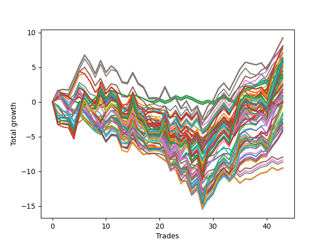

# Short HLT 105 
- Symbol: TSLA
- Date Range: 05/16/2022 - 05/17/2024
- Trading Period: 8:30-12:30
- Number of Trades: 43



| Id. | Name | Win Percent | Profit | Avg Profit / Trade | Avg Time / Trade | Std |      | Name | Win Percent | Profit | Avg Profit / Trade | Avg Time / Trade | Std |
| --- | ---- | ----------- | ------ | ------------------ | ---------------- | --- | ---- | ---- | ----------- | ------ | ------------------ | ---------------- | --- |
| | Sorted By <br> Profit | | | | | | | Sorted By <br> Win Percentage |||||
|0| TP-3 15m | 39.53 | 9.51 | 0.22 | 14:00 | 0.76 |     | TP-3 30m | 60.47 | -5.73 | -0.13 | 28:16 | 1.00 |
|1| TP-2.75 15m | 39.53 | 9.51 | 0.22 | 14:00 | 0.76 |     | TP-2 30m | 60.47 | -5.91 | -0.14 | 27:54 | 0.96 |
|2| TP-2.5 15m | 39.53 | 9.51 | 0.22 | 14:00 | 0.76 |     | TP-2.75 30m | 60.47 | -5.96 | -0.14 | 28:13 | 0.98 |
|3| TP-2.25 15m | 39.53 | 9.51 | 0.22 | 14:00 | 0.76 |     | TP-2.5 30m | 60.47 | -5.96 | -0.14 | 28:13 | 0.98 |
|4| TP-2 15m | 39.53 | 8.64 | 0.20 | 13:57 | 0.70 |     | TP-2.25 30m | 60.47 | -5.96 | -0.14 | 28:13 | 0.98 |
|5| TP-1.75 15m | 39.53 | 8.35 | 0.19 | 13:53 | 0.68 |     | TP-1.75 30m | 60.47 | -6.40 | -0.15 | 27:41 | 0.93 |
|6| TP-1.5 15m | 39.53 | 7.94 | 0.18 | 13:43 | 0.66 |     | TP-1.5 30m | 60.47 | -7.04 | -0.16 | 27:09 | 0.90 |
|7| TP-3 45m | 46.51 | 4.24 | 0.10 | 41:36 | 1.11 |     | TP-1.25 30m | 60.47 | -7.76 | -0.18 | 24:47 | 0.93 |
|8| TP-2.75 45m | 46.51 | 4.01 | 0.09 | 41:33 | 1.09 |     | TP-1 30m | 60.47 | -8.09 | -0.19 | 22:27 | 0.92 |
|9| TP-2.5 45m | 46.51 | 4.01 | 0.09 | 41:33 | 1.09 |     | TP-1.5 60m | 55.81 | -3.02 | -0.07 | 46:41 | 1.12 |
|10| TP-1.25 15m | 41.86 | 3.87 | 0.09 | 13:09 | 0.73 |     | TP-0.25 30m | 55.81 | -3.79 | -0.09 | 04:58 | 0.43 |
|11| TP-0.75 15m | 41.86 | 3.66 | 0.09 | 11:37 | 0.64 |     | TP-1 60m | 55.81 | -5.75 | -0.13 | 30:36 | 1.02 |
|12| TP-3 60m | 51.16 | 3.62 | 0.08 | 54:05 | 1.34 |     | TP-1.5 180m | 55.81 | -9.23 | -0.21 | 63:57 | 1.26 |
|13| TP-2.75 60m | 51.16 | 3.35 | 0.08 | 53:55 | 1.28 |     | TP-1.5 165m | 55.81 | -9.23 | -0.21 | 63:57 | 1.26 |
|14| TP-1 15m | 41.86 | 3.35 | 0.08 | 12:43 | 0.74 |     | TP-1.5 150m | 55.81 | -9.23 | -0.21 | 63:57 | 1.26 |
|15| TP-2 45m | 46.51 | 3.31 | 0.08 | 40:12 | 1.13 |     | TP-1.5 135m | 55.81 | -9.23 | -0.21 | 63:57 | 1.26 |
|16| TP-2.5 60m | 51.16 | 3.04 | 0.07 | 53:46 | 1.24 |     | TP-1.5 120m | 55.81 | -9.23 | -0.21 | 63:57 | 1.26 |
|17| TP-2.25 45m | 46.51 | 2.83 | 0.07 | 41:13 | 1.14 |     | TP-1.25 60m | 53.49 | -3.44 | -0.08 | 38:04 | 1.14 |
|18| TP-1.75 45m | 46.51 | 2.47 | 0.06 | 39:37 | 1.11 |     | TP-0.25 180m | 53.49 | -3.47 | -0.08 | 05:08 | 0.43 |
|19| TP-2.25 60m | 51.16 | 1.95 | 0.05 | 52:54 | 1.24 |     | TP-0.25 165m | 53.49 | -3.47 | -0.08 | 05:08 | 0.43 |
|20| TP-2.5 75m | 44.19 | 1.92 | 0.04 | 64:09 | 1.38 |     | TP-0.25 150m | 53.49 | -3.47 | -0.08 | 05:08 | 0.43 |
|21| TP-2.25 75m | 44.19 | 1.84 | 0.04 | 62:50 | 1.35 |     | TP-0.25 135m | 53.49 | -3.47 | -0.08 | 05:08 | 0.43 |
|22| TP-3 75m | 44.19 | 1.68 | 0.04 | 64:48 | 1.47 |     | TP-0.25 120m | 53.49 | -3.47 | -0.08 | 05:08 | 0.43 |
|23| TP-2.75 75m | 44.19 | 1.46 | 0.03 | 64:27 | 1.39 |     | TP-0.25 105m | 53.49 | -3.47 | -0.08 | 05:08 | 0.43 |
|24| TP-2 60m | 51.16 | 0.54 | 0.01 | 50:47 | 1.22 |     | TP-0.25 90m | 53.49 | -3.47 | -0.08 | 05:08 | 0.43 |
|25| TP-2.25 90m | 48.84 | 0.53 | 0.01 | 71:51 | 1.41 |     | TP-0.25 75m | 53.49 | -3.47 | -0.08 | 05:08 | 0.43 |
|26| TP-0.5 30m | 48.84 | 0.17 | 0.00 | 11:13 | 0.62 |     | TP-0.25 60m | 53.49 | -3.47 | -0.08 | 05:08 | 0.43 |
|27| TP-2 75m | 44.19 | 0.05 | 0.00 | 59:34 | 1.32 |     | TP-0.25 45m | 53.49 | -3.47 | -0.08 | 05:08 | 0.43 |
|28| TP-0.5 180m | 48.84 | -0.03 | -0.00 | 12:30 | 0.64 |     | TP-0.25 15m | 53.49 | -3.72 | -0.09 | 04:37 | 0.43 |
|29| TP-0.5 165m | 48.84 | -0.03 | -0.00 | 12:30 | 0.64 |     | TP-1 45m | 53.49 | -6.43 | -0.15 | 27:37 | 1.00 |
|30| TP-0.5 150m | 48.84 | -0.03 | -0.00 | 12:30 | 0.64 |     | TP-1.5 105m | 53.49 | -7.65 | -0.18 | 61:57 | 1.26 |
|31| TP-0.5 135m | 48.84 | -0.03 | -0.00 | 12:30 | 0.64 |     | TP-3 60m | 51.16 | 3.62 | 0.08 | 54:05 | 1.34 |
|32| TP-0.5 120m | 48.84 | -0.03 | -0.00 | 12:30 | 0.64 |     | TP-2.75 60m | 51.16 | 3.35 | 0.08 | 53:55 | 1.28 |
|33| TP-0.5 105m | 48.84 | -0.03 | -0.00 | 12:30 | 0.64 |     | TP-2.5 60m | 51.16 | 3.04 | 0.07 | 53:46 | 1.24 |
|34| TP-0.5 90m | 48.84 | -0.03 | -0.00 | 12:30 | 0.64 |     | TP-2.25 60m | 51.16 | 1.95 | 0.05 | 52:54 | 1.24 |
|35| TP-0.5 75m | 48.84 | -0.03 | -0.00 | 12:30 | 0.64 |     | TP-2 60m | 51.16 | 0.54 | 0.01 | 50:47 | 1.22 |
|36| TP-0.5 60m | 48.84 | -0.03 | -0.00 | 12:30 | 0.64 |     | TP-0.75 30m | 51.16 | -1.28 | -0.03 | 17:30 | 0.81 |
|37| TP-2.75 90m | 48.84 | -0.07 | -0.00 | 74:01 | 1.53 |     | TP-1.75 60m | 51.16 | -1.38 | -0.03 | 49:47 | 1.20 |
|38| TP-0.5 45m | 48.84 | -0.09 | -0.00 | 11:55 | 0.62 |     | TP-0.75 60m | 51.16 | -2.01 | -0.05 | 21:16 | 0.82 |
|39| TP-3 90m | 48.84 | -0.39 | -0.01 | 74:39 | 1.61 |     | TP-0.75 75m | 51.16 | -2.29 | -0.05 | 22:20 | 0.82 |
|40| TP-0.5 15m | 48.84 | -0.39 | -0.01 | 09:15 | 0.58 |     | TP-1.25 45m | 51.16 | -3.78 | -0.09 | 33:06 | 1.08 |
|41| TP-2 90m | 48.84 | -0.47 | -0.01 | 67:08 | 1.34 |     | TP-1.25 75m | 51.16 | -3.96 | -0.09 | 41:19 | 1.17 |
|42| TP-1.5 45m | 48.84 | -0.53 | -0.01 | 38:27 | 1.10 |     | TP-1 75m | 51.16 | -4.07 | -0.09 | 32:34 | 1.04 |
|43| TP-2.5 90m | 48.84 | -0.55 | -0.01 | 73:30 | 1.48 |     | TP-1.5 90m | 51.16 | -4.44 | -0.10 | 58:33 | 1.18 |
|44| TP-0.75 180m | 48.84 | -0.84 | -0.02 | 23:34 | 0.84 |     | TP-1.75 180m | 51.16 | -5.51 | -0.13 | 71:02 | 1.45 |
|45| TP-0.75 165m | 48.84 | -0.84 | -0.02 | 23:34 | 0.84 |     | TP-1.75 165m | 51.16 | -5.51 | -0.13 | 71:02 | 1.45 |
|46| TP-0.75 150m | 48.84 | -0.84 | -0.02 | 23:34 | 0.84 |     | TP-1.75 150m | 51.16 | -5.51 | -0.13 | 71:02 | 1.45 |
|47| TP-0.75 135m | 48.84 | -0.84 | -0.02 | 23:34 | 0.84 |     | TP-1.75 135m | 51.16 | -5.51 | -0.13 | 71:02 | 1.45 |
|48| TP-0.75 120m | 48.84 | -0.84 | -0.02 | 23:34 | 0.84 |     | TP-1.75 120m | 51.16 | -5.51 | -0.13 | 71:02 | 1.45 |
|49| TP-0.75 105m | 48.84 | -0.84 | -0.02 | 23:34 | 0.84 |     | TP-2.25 180m | 51.16 | -5.83 | -0.14 | 81:16 | 1.66 |
|50| TP-1.25 105m | 48.84 | -0.98 | -0.02 | 45:06 | 1.20 |     | TP-2.25 165m | 51.16 | -5.83 | -0.14 | 81:16 | 1.66 |
|51| TP-0.75 30m | 51.16 | -1.28 | -0.03 | 17:30 | 0.81 |     | TP-2.25 150m | 51.16 | -5.83 | -0.14 | 81:16 | 1.66 |
|52| TP-1.25 180m | 48.84 | -1.33 | -0.03 | 46:25 | 1.20 |     | TP-2.25 135m | 51.16 | -5.83 | -0.14 | 81:16 | 1.66 |
|53| TP-1.25 165m | 48.84 | -1.33 | -0.03 | 46:25 | 1.20 |     | TP-2.25 120m | 51.16 | -5.83 | -0.14 | 81:16 | 1.66 |
|54| TP-1.25 150m | 48.84 | -1.33 | -0.03 | 46:25 | 1.20 |     | TP-2 180m | 51.16 | -6.10 | -0.14 | 74:43 | 1.55 |
|55| TP-1.25 135m | 48.84 | -1.33 | -0.03 | 46:25 | 1.20 |     | TP-2 165m | 51.16 | -6.10 | -0.14 | 74:43 | 1.55 |
|56| TP-1.25 120m | 48.84 | -1.33 | -0.03 | 46:25 | 1.20 |     | TP-2 150m | 51.16 | -6.10 | -0.14 | 74:43 | 1.55 |
|57| TP-0.75 45m | 48.84 | -1.35 | -0.03 | 19:41 | 0.81 |     | TP-2 135m | 51.16 | -6.10 | -0.14 | 74:43 | 1.55 |
|58| TP-1.75 60m | 51.16 | -1.38 | -0.03 | 49:47 | 1.20 |     | TP-2 120m | 51.16 | -6.10 | -0.14 | 74:43 | 1.55 |
|59| TP-1.25 90m | 48.84 | -1.39 | -0.03 | 43:39 | 1.20 |     | TP-2.75 180m | 51.16 | -6.29 | -0.15 | 85:18 | 1.82 |
|60| TP-0.75 90m | 48.84 | -1.39 | -0.03 | 23:23 | 0.83 |     | TP-2.75 165m | 51.16 | -6.29 | -0.15 | 85:18 | 1.82 |
|61| TP-1.75 75m | 44.19 | -1.40 | -0.03 | 57:43 | 1.29 |     | TP-2.75 150m | 51.16 | -6.29 | -0.15 | 85:18 | 1.82 |
|62| TP-1 180m | 48.84 | -1.76 | -0.04 | 36:02 | 1.07 |     | TP-2.75 135m | 51.16 | -6.29 | -0.15 | 85:18 | 1.82 |
|63| TP-1 165m | 48.84 | -1.76 | -0.04 | 36:02 | 1.07 |     | TP-2.75 120m | 51.16 | -6.29 | -0.15 | 85:18 | 1.82 |
|64| TP-1 150m | 48.84 | -1.76 | -0.04 | 36:02 | 1.07 |     | TP-2.5 180m | 51.16 | -7.08 | -0.16 | 84:43 | 1.77 |
|65| TP-1 135m | 48.84 | -1.76 | -0.04 | 36:02 | 1.07 |     | TP-2.5 165m | 51.16 | -7.08 | -0.16 | 84:43 | 1.77 |
|66| TP-1 120m | 48.84 | -1.76 | -0.04 | 36:02 | 1.07 |     | TP-2.5 150m | 51.16 | -7.08 | -0.16 | 84:43 | 1.77 |
|67| TP-0.75 60m | 51.16 | -2.01 | -0.05 | 21:16 | 0.82 |     | TP-2.5 135m | 51.16 | -7.08 | -0.16 | 84:43 | 1.77 |
|68| TP-0.75 75m | 51.16 | -2.29 | -0.05 | 22:20 | 0.82 |     | TP-2.5 120m | 51.16 | -7.08 | -0.16 | 84:43 | 1.77 |
|69| TP-1 105m | 48.84 | -2.45 | -0.06 | 35:18 | 1.06 |     | TP-3 180m | 51.16 | -8.06 | -0.19 | 86:54 | 1.96 |
|70| TP-1.75 90m | 48.84 | -2.49 | -0.06 | 64:16 | 1.31 |     | TP-3 165m | 51.16 | -8.06 | -0.19 | 86:54 | 1.96 |
|71| TP-1 90m | 48.84 | -2.63 | -0.06 | 34:13 | 1.05 |     | TP-3 150m | 51.16 | -8.06 | -0.19 | 86:54 | 1.96 |
|72| TP-1.5 60m | 55.81 | -3.02 | -0.07 | 46:41 | 1.12 |     | TP-3 135m | 51.16 | -8.06 | -0.19 | 86:54 | 1.96 |
|73| TP-1.25 60m | 53.49 | -3.44 | -0.08 | 38:04 | 1.14 |     | TP-3 120m | 51.16 | -8.06 | -0.19 | 86:54 | 1.96 |
|74| TP-0.25 180m | 53.49 | -3.47 | -0.08 | 05:08 | 0.43 |     | TP-2.25 90m | 48.84 | 0.53 | 0.01 | 71:51 | 1.41 |
|75| TP-0.25 165m | 53.49 | -3.47 | -0.08 | 05:08 | 0.43 |     | TP-0.5 30m | 48.84 | 0.17 | 0.00 | 11:13 | 0.62 |
|76| TP-0.25 150m | 53.49 | -3.47 | -0.08 | 05:08 | 0.43 |     | TP-0.5 180m | 48.84 | -0.03 | -0.00 | 12:30 | 0.64 |
|77| TP-0.25 135m | 53.49 | -3.47 | -0.08 | 05:08 | 0.43 |     | TP-0.5 165m | 48.84 | -0.03 | -0.00 | 12:30 | 0.64 |
|78| TP-0.25 120m | 53.49 | -3.47 | -0.08 | 05:08 | 0.43 |     | TP-0.5 150m | 48.84 | -0.03 | -0.00 | 12:30 | 0.64 |
|79| TP-0.25 105m | 53.49 | -3.47 | -0.08 | 05:08 | 0.43 |     | TP-0.5 135m | 48.84 | -0.03 | -0.00 | 12:30 | 0.64 |
|80| TP-0.25 90m | 53.49 | -3.47 | -0.08 | 05:08 | 0.43 |     | TP-0.5 120m | 48.84 | -0.03 | -0.00 | 12:30 | 0.64 |
|81| TP-0.25 75m | 53.49 | -3.47 | -0.08 | 05:08 | 0.43 |     | TP-0.5 105m | 48.84 | -0.03 | -0.00 | 12:30 | 0.64 |
|82| TP-0.25 60m | 53.49 | -3.47 | -0.08 | 05:08 | 0.43 |     | TP-0.5 90m | 48.84 | -0.03 | -0.00 | 12:30 | 0.64 |
|83| TP-0.25 45m | 53.49 | -3.47 | -0.08 | 05:08 | 0.43 |     | TP-0.5 75m | 48.84 | -0.03 | -0.00 | 12:30 | 0.64 |
|84| TP-0.25 15m | 53.49 | -3.72 | -0.09 | 04:37 | 0.43 |     | TP-0.5 60m | 48.84 | -0.03 | -0.00 | 12:30 | 0.64 |
|85| TP-1.25 45m | 51.16 | -3.78 | -0.09 | 33:06 | 1.08 |     | TP-2.75 90m | 48.84 | -0.07 | -0.00 | 74:01 | 1.53 |
|86| TP-0.25 30m | 55.81 | -3.79 | -0.09 | 04:58 | 0.43 |     | TP-0.5 45m | 48.84 | -0.09 | -0.00 | 11:55 | 0.62 |
|87| TP-1.25 75m | 51.16 | -3.96 | -0.09 | 41:19 | 1.17 |     | TP-3 90m | 48.84 | -0.39 | -0.01 | 74:39 | 1.61 |
|88| TP-1 75m | 51.16 | -4.07 | -0.09 | 32:34 | 1.04 |     | TP-0.5 15m | 48.84 | -0.39 | -0.01 | 09:15 | 0.58 |
|89| TP-1.5 90m | 51.16 | -4.44 | -0.10 | 58:33 | 1.18 |     | TP-2 90m | 48.84 | -0.47 | -0.01 | 67:08 | 1.34 |
|90| TP-2.75 105m | 48.84 | -4.51 | -0.10 | 80:40 | 1.74 |     | TP-1.5 45m | 48.84 | -0.53 | -0.01 | 38:27 | 1.10 |
|91| TP-1.75 105m | 48.84 | -4.92 | -0.11 | 68:32 | 1.43 |     | TP-2.5 90m | 48.84 | -0.55 | -0.01 | 73:30 | 1.48 |
|92| TP-1.5 75m | 48.84 | -4.94 | -0.11 | 53:09 | 1.15 |     | TP-0.75 180m | 48.84 | -0.84 | -0.02 | 23:34 | 0.84 |
|93| TP-2.25 105m | 48.84 | -5.19 | -0.12 | 77:34 | 1.61 |     | TP-0.75 165m | 48.84 | -0.84 | -0.02 | 23:34 | 0.84 |
|94| TP-2.5 105m | 48.84 | -5.30 | -0.12 | 80:05 | 1.69 |     | TP-0.75 150m | 48.84 | -0.84 | -0.02 | 23:34 | 0.84 |
|95| TP-3 105m | 48.84 | -5.31 | -0.12 | 81:50 | 1.87 |     | TP-0.75 135m | 48.84 | -0.84 | -0.02 | 23:34 | 0.84 |
|96| TP-1.75 180m | 51.16 | -5.51 | -0.13 | 71:02 | 1.45 |     | TP-0.75 120m | 48.84 | -0.84 | -0.02 | 23:34 | 0.84 |
|97| TP-1.75 165m | 51.16 | -5.51 | -0.13 | 71:02 | 1.45 |     | TP-0.75 105m | 48.84 | -0.84 | -0.02 | 23:34 | 0.84 |
|98| TP-1.75 150m | 51.16 | -5.51 | -0.13 | 71:02 | 1.45 |     | TP-1.25 105m | 48.84 | -0.98 | -0.02 | 45:06 | 1.20 |
|99| TP-1.75 135m | 51.16 | -5.51 | -0.13 | 71:02 | 1.45 |     | TP-1.25 180m | 48.84 | -1.33 | -0.03 | 46:25 | 1.20 |
|100| TP-1.75 120m | 51.16 | -5.51 | -0.13 | 71:02 | 1.45 |     | TP-1.25 165m | 48.84 | -1.33 | -0.03 | 46:25 | 1.20 |
|101| TP-2 105m | 48.84 | -5.61 | -0.13 | 71:53 | 1.53 |     | TP-1.25 150m | 48.84 | -1.33 | -0.03 | 46:25 | 1.20 |
|102| TP-3 30m | 60.47 | -5.73 | -0.13 | 28:16 | 1.00 |     | TP-1.25 135m | 48.84 | -1.33 | -0.03 | 46:25 | 1.20 |
|103| TP-1 60m | 55.81 | -5.75 | -0.13 | 30:36 | 1.02 |     | TP-1.25 120m | 48.84 | -1.33 | -0.03 | 46:25 | 1.20 |
|104| TP-2.25 180m | 51.16 | -5.83 | -0.14 | 81:16 | 1.66 |     | TP-0.75 45m | 48.84 | -1.35 | -0.03 | 19:41 | 0.81 |
|105| TP-2.25 165m | 51.16 | -5.83 | -0.14 | 81:16 | 1.66 |     | TP-1.25 90m | 48.84 | -1.39 | -0.03 | 43:39 | 1.20 |
|106| TP-2.25 150m | 51.16 | -5.83 | -0.14 | 81:16 | 1.66 |     | TP-0.75 90m | 48.84 | -1.39 | -0.03 | 23:23 | 0.83 |
|107| TP-2.25 135m | 51.16 | -5.83 | -0.14 | 81:16 | 1.66 |     | TP-1 180m | 48.84 | -1.76 | -0.04 | 36:02 | 1.07 |
|108| TP-2.25 120m | 51.16 | -5.83 | -0.14 | 81:16 | 1.66 |     | TP-1 165m | 48.84 | -1.76 | -0.04 | 36:02 | 1.07 |
|109| TP-2 30m | 60.47 | -5.91 | -0.14 | 27:54 | 0.96 |     | TP-1 150m | 48.84 | -1.76 | -0.04 | 36:02 | 1.07 |
|110| TP-2.75 30m | 60.47 | -5.96 | -0.14 | 28:13 | 0.98 |     | TP-1 135m | 48.84 | -1.76 | -0.04 | 36:02 | 1.07 |
|111| TP-2.5 30m | 60.47 | -5.96 | -0.14 | 28:13 | 0.98 |     | TP-1 120m | 48.84 | -1.76 | -0.04 | 36:02 | 1.07 |
|112| TP-2.25 30m | 60.47 | -5.96 | -0.14 | 28:13 | 0.98 |     | TP-1 105m | 48.84 | -2.45 | -0.06 | 35:18 | 1.06 |
|113| TP-2 180m | 51.16 | -6.10 | -0.14 | 74:43 | 1.55 |     | TP-1.75 90m | 48.84 | -2.49 | -0.06 | 64:16 | 1.31 |
|114| TP-2 165m | 51.16 | -6.10 | -0.14 | 74:43 | 1.55 |     | TP-1 90m | 48.84 | -2.63 | -0.06 | 34:13 | 1.05 |
|115| TP-2 150m | 51.16 | -6.10 | -0.14 | 74:43 | 1.55 |     | TP-2.75 105m | 48.84 | -4.51 | -0.10 | 80:40 | 1.74 |
|116| TP-2 135m | 51.16 | -6.10 | -0.14 | 74:43 | 1.55 |     | TP-1.75 105m | 48.84 | -4.92 | -0.11 | 68:32 | 1.43 |
|117| TP-2 120m | 51.16 | -6.10 | -0.14 | 74:43 | 1.55 |     | TP-1.5 75m | 48.84 | -4.94 | -0.11 | 53:09 | 1.15 |
|118| TP-2.75 180m | 51.16 | -6.29 | -0.15 | 85:18 | 1.82 |     | TP-2.25 105m | 48.84 | -5.19 | -0.12 | 77:34 | 1.61 |
|119| TP-2.75 165m | 51.16 | -6.29 | -0.15 | 85:18 | 1.82 |     | TP-2.5 105m | 48.84 | -5.30 | -0.12 | 80:05 | 1.69 |
|120| TP-2.75 150m | 51.16 | -6.29 | -0.15 | 85:18 | 1.82 |     | TP-3 105m | 48.84 | -5.31 | -0.12 | 81:50 | 1.87 |
|121| TP-2.75 135m | 51.16 | -6.29 | -0.15 | 85:18 | 1.82 |     | TP-2 105m | 48.84 | -5.61 | -0.13 | 71:53 | 1.53 |
|122| TP-2.75 120m | 51.16 | -6.29 | -0.15 | 85:18 | 1.82 |     | TP-3 45m | 46.51 | 4.24 | 0.10 | 41:36 | 1.11 |
|123| TP-1.75 30m | 60.47 | -6.40 | -0.15 | 27:41 | 0.93 |     | TP-2.75 45m | 46.51 | 4.01 | 0.09 | 41:33 | 1.09 |
|124| TP-1 45m | 53.49 | -6.43 | -0.15 | 27:37 | 1.00 |     | TP-2.5 45m | 46.51 | 4.01 | 0.09 | 41:33 | 1.09 |
|125| TP-1.5 30m | 60.47 | -7.04 | -0.16 | 27:09 | 0.90 |     | TP-2 45m | 46.51 | 3.31 | 0.08 | 40:12 | 1.13 |
|126| TP-2.5 180m | 51.16 | -7.08 | -0.16 | 84:43 | 1.77 |     | TP-2.25 45m | 46.51 | 2.83 | 0.07 | 41:13 | 1.14 |
|127| TP-2.5 165m | 51.16 | -7.08 | -0.16 | 84:43 | 1.77 |     | TP-1.75 45m | 46.51 | 2.47 | 0.06 | 39:37 | 1.11 |
|128| TP-2.5 150m | 51.16 | -7.08 | -0.16 | 84:43 | 1.77 |     | TP-2.5 75m | 44.19 | 1.92 | 0.04 | 64:09 | 1.38 |
|129| TP-2.5 135m | 51.16 | -7.08 | -0.16 | 84:43 | 1.77 |     | TP-2.25 75m | 44.19 | 1.84 | 0.04 | 62:50 | 1.35 |
|130| TP-2.5 120m | 51.16 | -7.08 | -0.16 | 84:43 | 1.77 |     | TP-3 75m | 44.19 | 1.68 | 0.04 | 64:48 | 1.47 |
|131| TP-1.5 105m | 53.49 | -7.65 | -0.18 | 61:57 | 1.26 |     | TP-2.75 75m | 44.19 | 1.46 | 0.03 | 64:27 | 1.39 |
|132| TP-1.25 30m | 60.47 | -7.76 | -0.18 | 24:47 | 0.93 |     | TP-2 75m | 44.19 | 0.05 | 0.00 | 59:34 | 1.32 |
|133| TP-3 180m | 51.16 | -8.06 | -0.19 | 86:54 | 1.96 |     | TP-1.75 75m | 44.19 | -1.40 | -0.03 | 57:43 | 1.29 |
|134| TP-3 165m | 51.16 | -8.06 | -0.19 | 86:54 | 1.96 |     | TP-1.25 15m | 41.86 | 3.87 | 0.09 | 13:09 | 0.73 |
|135| TP-3 150m | 51.16 | -8.06 | -0.19 | 86:54 | 1.96 |     | TP-0.75 15m | 41.86 | 3.66 | 0.09 | 11:37 | 0.64 |
|136| TP-3 135m | 51.16 | -8.06 | -0.19 | 86:54 | 1.96 |     | TP-1 15m | 41.86 | 3.35 | 0.08 | 12:43 | 0.74 |
|137| TP-3 120m | 51.16 | -8.06 | -0.19 | 86:54 | 1.96 |     | TP-3 15m | 39.53 | 9.51 | 0.22 | 14:00 | 0.76 |
|138| TP-1 30m | 60.47 | -8.09 | -0.19 | 22:27 | 0.92 |     | TP-2.75 15m | 39.53 | 9.51 | 0.22 | 14:00 | 0.76 |
|139| TP-1.5 180m | 55.81 | -9.23 | -0.21 | 63:57 | 1.26 |     | TP-2.5 15m | 39.53 | 9.51 | 0.22 | 14:00 | 0.76 |
|140| TP-1.5 165m | 55.81 | -9.23 | -0.21 | 63:57 | 1.26 |     | TP-2.25 15m | 39.53 | 9.51 | 0.22 | 14:00 | 0.76 |
|141| TP-1.5 150m | 55.81 | -9.23 | -0.21 | 63:57 | 1.26 |     | TP-2 15m | 39.53 | 8.64 | 0.20 | 13:57 | 0.70 |
|142| TP-1.5 135m | 55.81 | -9.23 | -0.21 | 63:57 | 1.26 |     | TP-1.75 15m | 39.53 | 8.35 | 0.19 | 13:53 | 0.68 |
|143| TP-1.5 120m | 55.81 | -9.23 | -0.21 | 63:57 | 1.26 |     | TP-1.5 15m | 39.53 | 7.94 | 0.18 | 13:43 | 0.66 |

### Test TP-0.25 15m
* Take Profit of 0.25 Point
* 0.25 Stoploss
* Results:
```
Total Trades: 43
Percent Up: 46.51
Percent Down: 53.49
Total Points Moved Down: 3.72
Potential Profit: 1860.00
Total Points Ups: 6.64 Count Ups: 20
Total Points Downs: 10.36 Count Downs: 23
```

<details><summary>Trades</summary>

<code>In: 2022-06-21 08:35:00		Out: 2022-06-21 08:38:00		Total Position Time: 03:00		Total Move Down: 0.60		Total to Date: 0.60</code> <br />
<code>In: 2022-07-07 10:25:00		Out: 2022-07-07 10:30:00		Total Position Time: 05:00		Total Move Down: 0.62		Total to Date: 1.22</code> <br />
<code>In: 2022-07-19 11:30:00		Out: 2022-07-19 11:32:00		Total Position Time: 02:00		Total Move Down: -0.51		Total to Date: 0.71</code> <br />
<code>In: 2022-08-10 11:15:00		Out: 2022-08-10 11:22:00		Total Position Time: 07:00		Total Move Down: -0.54		Total to Date: 0.17</code> <br />
<code>In: 2022-09-15 10:40:00		Out: 2022-09-15 10:42:00		Total Position Time: 02:00		Total Move Down: -0.36		Total to Date: -0.19</code> <br />
<code>In: 2022-09-20 08:40:00		Out: 2022-09-20 08:42:00		Total Position Time: 02:00		Total Move Down: -0.24		Total to Date: -0.43</code> <br />
<code>In: 2022-09-27 12:35:00		Out: 2022-09-27 12:39:00		Total Position Time: 04:00		Total Move Down: 0.31		Total to Date: -0.12</code> <br />
<code>In: 2022-11-11 10:45:00		Out: 2022-11-11 10:47:00		Total Position Time: 02:00		Total Move Down: 0.72		Total to Date: 0.60</code> <br />
<code>In: 2022-11-28 09:05:00		Out: 2022-11-28 09:10:00		Total Position Time: 05:00		Total Move Down: 0.41		Total to Date: 1.01</code> <br />
<code>In: 2022-11-30 11:40:00		Out: 2022-11-30 11:43:00		Total Position Time: 03:00		Total Move Down: 0.32		Total to Date: 1.33</code> <br />
<code>In: 2023-01-06 12:25:00		Out: 2023-01-06 12:27:00		Total Position Time: 02:00		Total Move Down: 0.34		Total to Date: 1.67</code> <br />
<code>In: 2023-01-17 10:30:00		Out: 2023-01-17 10:33:00		Total Position Time: 03:00		Total Move Down: -0.30		Total to Date: 1.37</code> <br />
<code>In: 2023-01-23 08:35:00		Out: 2023-01-23 08:38:00		Total Position Time: 03:00		Total Move Down: -0.29		Total to Date: 1.08</code> <br />
<code>In: 2023-02-15 09:05:00		Out: 2023-02-15 09:14:00		Total Position Time: 09:00		Total Move Down: -0.27		Total to Date: 0.81</code> <br />
<code>In: 2023-02-28 11:30:00		Out: 2023-02-28 11:37:00		Total Position Time: 07:00		Total Move Down: 0.26		Total to Date: 1.07</code> <br />
<code>In: 2023-03-21 08:50:00		Out: 2023-03-21 08:52:00		Total Position Time: 02:00		Total Move Down: -0.27		Total to Date: 0.80</code> <br />
<code>In: 2023-04-10 11:45:00		Out: 2023-04-10 11:47:00		Total Position Time: 02:00		Total Move Down: -0.30		Total to Date: 0.50</code> <br />
<code>In: 2023-04-17 10:30:00		Out: 2023-04-17 10:38:00		Total Position Time: 08:00		Total Move Down: -0.39		Total to Date: 0.11</code> <br />
<code>In: 2023-05-05 11:20:00		Out: 2023-05-05 11:34:00		Total Position Time: 14:00		Total Move Down: -0.02		Total to Date: 0.09</code> <br />
<code>In: 2023-05-30 12:15:00		Out: 2023-05-30 12:17:00		Total Position Time: 02:00		Total Move Down: 0.34		Total to Date: 0.43</code> <br />
<code>In: 2023-06-13 09:50:00		Out: 2023-06-13 09:52:00		Total Position Time: 02:00		Total Move Down: -0.38		Total to Date: 0.05</code> <br />
<code>In: 2023-07-13 11:00:00		Out: 2023-07-13 11:02:00		Total Position Time: 02:00		Total Move Down: 0.29		Total to Date: 0.34</code> <br />
<code>In: 2023-07-24 11:20:00		Out: 2023-07-24 11:22:00		Total Position Time: 02:00		Total Move Down: 0.53		Total to Date: 0.87</code> <br />
<code>In: 2023-07-28 09:10:00		Out: 2023-07-28 09:12:00		Total Position Time: 02:00		Total Move Down: -0.35		Total to Date: 0.52</code> <br />
<code>In: 2023-07-31 09:50:00		Out: 2023-07-31 09:54:00		Total Position Time: 04:00		Total Move Down: 0.36		Total to Date: 0.88</code> <br />
<code>In: 2023-08-25 10:25:00		Out: 2023-08-25 10:28:00		Total Position Time: 03:00		Total Move Down: -0.27		Total to Date: 0.61</code> <br />
<code>In: 2023-09-11 12:15:00		Out: 2023-09-11 12:25:00		Total Position Time: 10:00		Total Move Down: -0.42		Total to Date: 0.19</code> <br />
<code>In: 2023-09-20 09:55:00		Out: 2023-09-20 09:59:00		Total Position Time: 04:00		Total Move Down: -0.28		Total to Date: -0.09</code> <br />
<code>In: 2023-10-02 08:45:00		Out: 2023-10-02 08:48:00		Total Position Time: 03:00		Total Move Down: 0.29		Total to Date: 0.20</code> <br />
<code>In: 2023-10-05 11:55:00		Out: 2023-10-05 11:58:00		Total Position Time: 03:00		Total Move Down: -0.27		Total to Date: -0.07</code> <br />
<code>In: 2023-10-24 11:00:00		Out: 2023-10-24 11:12:00		Total Position Time: 12:00		Total Move Down: 0.57		Total to Date: 0.50</code> <br />
<code>In: 2023-11-02 12:15:00		Out: 2023-11-02 12:20:00		Total Position Time: 05:00		Total Move Down: 0.41		Total to Date: 0.91</code> <br />
<code>In: 2023-11-28 11:20:00		Out: 2023-11-28 11:22:00		Total Position Time: 02:00		Total Move Down: -0.47		Total to Date: 0.44</code> <br />
<code>In: 2023-11-29 09:45:00		Out: 2023-11-29 09:48:00		Total Position Time: 03:00		Total Move Down: -0.32		Total to Date: 0.12</code> <br />
<code>In: 2023-12-14 10:00:00		Out: 2023-12-14 10:02:00		Total Position Time: 02:00		Total Move Down: 1.25		Total to Date: 1.37</code> <br />
<code>In: 2024-02-07 11:10:00		Out: 2024-02-07 11:13:00		Total Position Time: 03:00		Total Move Down: 0.47		Total to Date: 1.84</code> <br />
<code>In: 2024-02-22 10:55:00		Out: 2024-02-22 11:00:00		Total Position Time: 05:00		Total Move Down: 0.28		Total to Date: 2.12</code> <br />
<code>In: 2024-03-18 11:50:00		Out: 2024-03-18 11:57:00		Total Position Time: 07:00		Total Move Down: 0.40		Total to Date: 2.52</code> <br />
<code>In: 2024-03-27 09:55:00		Out: 2024-03-27 10:03:00		Total Position Time: 08:00		Total Move Down: 0.26		Total to Date: 2.78</code> <br />
<code>In: 2024-04-24 11:10:00		Out: 2024-04-24 11:18:00		Total Position Time: 08:00		Total Move Down: 0.27		Total to Date: 3.05</code> <br />
<code>In: 2024-04-29 09:40:00		Out: 2024-04-29 09:42:00		Total Position Time: 02:00		Total Move Down: 0.77		Total to Date: 3.82</code> <br />
<code>In: 2024-05-14 08:40:00		Out: 2024-05-14 08:50:00		Total Position Time: 10:00		Total Move Down: -0.39		Total to Date: 3.43</code> <br />
<code>In: 2024-05-17 09:45:00		Out: 2024-05-17 09:55:00		Total Position Time: 10:00		Total Move Down: 0.29		Total to Date: 3.72</code> <br />


</details>

### Test TP-0.5 15m
* Take Profit of 0.5 Point
* 0.5 Stoploss
* Results:
```
Total Trades: 43
Percent Up: 51.16
Percent Down: 48.84
Total Points Moved Down: 0.39
Potential Profit: 195.00
Total Points Ups: 11.01 Count Ups: 22
Total Points Downs: 11.40 Count Downs: 21
```

<details><summary>Trades</summary>

<code>In: 2022-06-21 08:35:00		Out: 2022-06-21 08:38:00		Total Position Time: 03:00		Total Move Down: 0.60		Total to Date: 0.60</code> <br />
<code>In: 2022-07-07 10:25:00		Out: 2022-07-07 10:30:00		Total Position Time: 05:00		Total Move Down: 0.62		Total to Date: 1.22</code> <br />
<code>In: 2022-07-19 11:30:00		Out: 2022-07-19 11:32:00		Total Position Time: 02:00		Total Move Down: -0.51		Total to Date: 0.71</code> <br />
<code>In: 2022-08-10 11:15:00		Out: 2022-08-10 11:22:00		Total Position Time: 07:00		Total Move Down: -0.54		Total to Date: 0.17</code> <br />
<code>In: 2022-09-15 10:40:00		Out: 2022-09-15 10:51:00		Total Position Time: 11:00		Total Move Down: 0.58		Total to Date: 0.75</code> <br />
<code>In: 2022-09-20 08:40:00		Out: 2022-09-20 08:53:00		Total Position Time: 13:00		Total Move Down: -0.77		Total to Date: -0.02</code> <br />
<code>In: 2022-09-27 12:35:00		Out: 2022-09-27 12:45:00		Total Position Time: 10:00		Total Move Down: -0.67		Total to Date: -0.69</code> <br />
<code>In: 2022-11-11 10:45:00		Out: 2022-11-11 10:47:00		Total Position Time: 02:00		Total Move Down: 0.72		Total to Date: 0.03</code> <br />
<code>In: 2022-11-28 09:05:00		Out: 2022-11-28 09:19:00		Total Position Time: 14:00		Total Move Down: -0.42		Total to Date: -0.39</code> <br />
<code>In: 2022-11-30 11:40:00		Out: 2022-11-30 11:44:00		Total Position Time: 04:00		Total Move Down: 0.58		Total to Date: 0.19</code> <br />
<code>In: 2023-01-06 12:25:00		Out: 2023-01-06 12:30:00		Total Position Time: 05:00		Total Move Down: 0.54		Total to Date: 0.73</code> <br />
<code>In: 2023-01-17 10:30:00		Out: 2023-01-17 10:42:00		Total Position Time: 12:00		Total Move Down: -0.54		Total to Date: 0.19</code> <br />
<code>In: 2023-01-23 08:35:00		Out: 2023-01-23 08:42:00		Total Position Time: 07:00		Total Move Down: -0.76		Total to Date: -0.57</code> <br />
<code>In: 2023-02-15 09:05:00		Out: 2023-02-15 09:19:00		Total Position Time: 14:00		Total Move Down: -0.57		Total to Date: -1.14</code> <br />
<code>In: 2023-02-28 11:30:00		Out: 2023-02-28 11:44:00		Total Position Time: 14:00		Total Move Down: 0.05		Total to Date: -1.09</code> <br />
<code>In: 2023-03-21 08:50:00		Out: 2023-03-21 08:56:00		Total Position Time: 06:00		Total Move Down: -0.65		Total to Date: -1.74</code> <br />
<code>In: 2023-04-10 11:45:00		Out: 2023-04-10 11:51:00		Total Position Time: 06:00		Total Move Down: -0.54		Total to Date: -2.28</code> <br />
<code>In: 2023-04-17 10:30:00		Out: 2023-04-17 10:44:00		Total Position Time: 14:00		Total Move Down: 0.21		Total to Date: -2.07</code> <br />
<code>In: 2023-05-05 11:20:00		Out: 2023-05-05 11:34:00		Total Position Time: 14:00		Total Move Down: -0.02		Total to Date: -2.09</code> <br />
<code>In: 2023-05-30 12:15:00		Out: 2023-05-30 12:24:00		Total Position Time: 09:00		Total Move Down: -0.60		Total to Date: -2.69</code> <br />
<code>In: 2023-06-13 09:50:00		Out: 2023-06-13 10:03:00		Total Position Time: 13:00		Total Move Down: -0.71		Total to Date: -3.40</code> <br />
<code>In: 2023-07-13 11:00:00		Out: 2023-07-13 11:12:00		Total Position Time: 12:00		Total Move Down: -0.50		Total to Date: -3.90</code> <br />
<code>In: 2023-07-24 11:20:00		Out: 2023-07-24 11:22:00		Total Position Time: 02:00		Total Move Down: 0.53		Total to Date: -3.37</code> <br />
<code>In: 2023-07-28 09:10:00		Out: 2023-07-28 09:13:00		Total Position Time: 03:00		Total Move Down: -0.54		Total to Date: -3.91</code> <br />
<code>In: 2023-07-31 09:50:00		Out: 2023-07-31 09:56:00		Total Position Time: 06:00		Total Move Down: 0.81		Total to Date: -3.10</code> <br />
<code>In: 2023-08-25 10:25:00		Out: 2023-08-25 10:39:00		Total Position Time: 14:00		Total Move Down: -0.11		Total to Date: -3.21</code> <br />
<code>In: 2023-09-11 12:15:00		Out: 2023-09-11 12:26:00		Total Position Time: 11:00		Total Move Down: -0.54		Total to Date: -3.75</code> <br />
<code>In: 2023-09-20 09:55:00		Out: 2023-09-20 10:00:00		Total Position Time: 05:00		Total Move Down: -0.63		Total to Date: -4.38</code> <br />
<code>In: 2023-10-02 08:45:00		Out: 2023-10-02 08:54:00		Total Position Time: 09:00		Total Move Down: 0.59		Total to Date: -3.79</code> <br />
<code>In: 2023-10-05 11:55:00		Out: 2023-10-05 12:09:00		Total Position Time: 14:00		Total Move Down: 0.25		Total to Date: -3.54</code> <br />
<code>In: 2023-10-24 11:00:00		Out: 2023-10-24 11:12:00		Total Position Time: 12:00		Total Move Down: 0.57		Total to Date: -2.97</code> <br />
<code>In: 2023-11-02 12:15:00		Out: 2023-11-02 12:27:00		Total Position Time: 12:00		Total Move Down: 0.69		Total to Date: -2.28</code> <br />
<code>In: 2023-11-28 11:20:00		Out: 2023-11-28 11:34:00		Total Position Time: 14:00		Total Move Down: -0.03		Total to Date: -2.31</code> <br />
<code>In: 2023-11-29 09:45:00		Out: 2023-11-29 09:53:00		Total Position Time: 08:00		Total Move Down: -0.86		Total to Date: -3.17</code> <br />
<code>In: 2023-12-14 10:00:00		Out: 2023-12-14 10:02:00		Total Position Time: 02:00		Total Move Down: 1.25		Total to Date: -1.92</code> <br />
<code>In: 2024-02-07 11:10:00		Out: 2024-02-07 11:14:00		Total Position Time: 04:00		Total Move Down: 0.61		Total to Date: -1.31</code> <br />
<code>In: 2024-02-22 10:55:00		Out: 2024-02-22 11:09:00		Total Position Time: 14:00		Total Move Down: -0.10		Total to Date: -1.41</code> <br />
<code>In: 2024-03-18 11:50:00		Out: 2024-03-18 12:03:00		Total Position Time: 13:00		Total Move Down: 0.50		Total to Date: -0.91</code> <br />
<code>In: 2024-03-27 09:55:00		Out: 2024-03-27 10:09:00		Total Position Time: 14:00		Total Move Down: 0.43		Total to Date: -0.48</code> <br />
<code>In: 2024-04-24 11:10:00		Out: 2024-04-24 11:24:00		Total Position Time: 14:00		Total Move Down: 0.16		Total to Date: -0.32</code> <br />
<code>In: 2024-04-29 09:40:00		Out: 2024-04-29 09:42:00		Total Position Time: 02:00		Total Move Down: 0.77		Total to Date: 0.45</code> <br />
<code>In: 2024-05-14 08:40:00		Out: 2024-05-14 08:54:00		Total Position Time: 14:00		Total Move Down: -0.40		Total to Date: 0.05</code> <br />
<code>In: 2024-05-17 09:45:00		Out: 2024-05-17 09:59:00		Total Position Time: 14:00		Total Move Down: 0.34		Total to Date: 0.39</code> <br />


</details>

### Test TP-0.75 15m
* Take Profit of 0.75 Point
* 0.75 Stoploss
* Results:
```
Total Trades: 43
Percent Up: 58.14
Percent Down: 41.86
Total Points Moved Down: -3.66
Potential Profit: -1830.00
Total Points Ups: 13.71 Count Ups: 25
Total Points Downs: 10.05 Count Downs: 18
```

<details><summary>Trades</summary>

<code>In: 2022-06-21 08:35:00		Out: 2022-06-21 08:49:00		Total Position Time: 14:00		Total Move Down: 0.40		Total to Date: 0.40</code> <br />
<code>In: 2022-07-07 10:25:00		Out: 2022-07-07 10:39:00		Total Position Time: 14:00		Total Move Down: -0.01		Total to Date: 0.39</code> <br />
<code>In: 2022-07-19 11:30:00		Out: 2022-07-19 11:43:00		Total Position Time: 13:00		Total Move Down: -1.15		Total to Date: -0.76</code> <br />
<code>In: 2022-08-10 11:15:00		Out: 2022-08-10 11:24:00		Total Position Time: 09:00		Total Move Down: -0.81		Total to Date: -1.57</code> <br />
<code>In: 2022-09-15 10:40:00		Out: 2022-09-15 10:54:00		Total Position Time: 14:00		Total Move Down: -0.12		Total to Date: -1.69</code> <br />
<code>In: 2022-09-20 08:40:00		Out: 2022-09-20 08:54:00		Total Position Time: 14:00		Total Move Down: -1.01		Total to Date: -2.70</code> <br />
<code>In: 2022-09-27 12:35:00		Out: 2022-09-27 12:49:00		Total Position Time: 14:00		Total Move Down: -0.80		Total to Date: -3.50</code> <br />
<code>In: 2022-11-11 10:45:00		Out: 2022-11-11 10:54:00		Total Position Time: 09:00		Total Move Down: -0.78		Total to Date: -4.28</code> <br />
<code>In: 2022-11-28 09:05:00		Out: 2022-11-28 09:19:00		Total Position Time: 14:00		Total Move Down: -0.42		Total to Date: -4.70</code> <br />
<code>In: 2022-11-30 11:40:00		Out: 2022-11-30 11:45:00		Total Position Time: 05:00		Total Move Down: 0.93		Total to Date: -3.77</code> <br />
<code>In: 2023-01-06 12:25:00		Out: 2023-01-06 12:39:00		Total Position Time: 14:00		Total Move Down: 0.37		Total to Date: -3.40</code> <br />
<code>In: 2023-01-17 10:30:00		Out: 2023-01-17 10:44:00		Total Position Time: 14:00		Total Move Down: -0.49		Total to Date: -3.89</code> <br />
<code>In: 2023-01-23 08:35:00		Out: 2023-01-23 08:42:00		Total Position Time: 07:00		Total Move Down: -0.76		Total to Date: -4.65</code> <br />
<code>In: 2023-02-15 09:05:00		Out: 2023-02-15 09:19:00		Total Position Time: 14:00		Total Move Down: -0.57		Total to Date: -5.22</code> <br />
<code>In: 2023-02-28 11:30:00		Out: 2023-02-28 11:44:00		Total Position Time: 14:00		Total Move Down: 0.05		Total to Date: -5.17</code> <br />
<code>In: 2023-03-21 08:50:00		Out: 2023-03-21 09:00:00		Total Position Time: 10:00		Total Move Down: -0.80		Total to Date: -5.97</code> <br />
<code>In: 2023-04-10 11:45:00		Out: 2023-04-10 11:54:00		Total Position Time: 09:00		Total Move Down: -0.79		Total to Date: -6.76</code> <br />
<code>In: 2023-04-17 10:30:00		Out: 2023-04-17 10:44:00		Total Position Time: 14:00		Total Move Down: 0.21		Total to Date: -6.55</code> <br />
<code>In: 2023-05-05 11:20:00		Out: 2023-05-05 11:34:00		Total Position Time: 14:00		Total Move Down: -0.02		Total to Date: -6.57</code> <br />
<code>In: 2023-05-30 12:15:00		Out: 2023-05-30 12:29:00		Total Position Time: 14:00		Total Move Down: -0.48		Total to Date: -7.05</code> <br />
<code>In: 2023-06-13 09:50:00		Out: 2023-06-13 10:04:00		Total Position Time: 14:00		Total Move Down: -0.53		Total to Date: -7.58</code> <br />
<code>In: 2023-07-13 11:00:00		Out: 2023-07-13 11:14:00		Total Position Time: 14:00		Total Move Down: -0.57		Total to Date: -8.15</code> <br />
<code>In: 2023-07-24 11:20:00		Out: 2023-07-24 11:31:00		Total Position Time: 11:00		Total Move Down: 0.78		Total to Date: -7.37</code> <br />
<code>In: 2023-07-28 09:10:00		Out: 2023-07-28 09:14:00		Total Position Time: 04:00		Total Move Down: -0.83		Total to Date: -8.20</code> <br />
<code>In: 2023-07-31 09:50:00		Out: 2023-07-31 09:56:00		Total Position Time: 06:00		Total Move Down: 0.81		Total to Date: -7.39</code> <br />
<code>In: 2023-08-25 10:25:00		Out: 2023-08-25 10:39:00		Total Position Time: 14:00		Total Move Down: -0.11		Total to Date: -7.50</code> <br />
<code>In: 2023-09-11 12:15:00		Out: 2023-09-11 12:29:00		Total Position Time: 14:00		Total Move Down: -0.30		Total to Date: -7.80</code> <br />
<code>In: 2023-09-20 09:55:00		Out: 2023-09-20 10:04:00		Total Position Time: 09:00		Total Move Down: -0.97		Total to Date: -8.77</code> <br />
<code>In: 2023-10-02 08:45:00		Out: 2023-10-02 08:55:00		Total Position Time: 10:00		Total Move Down: 0.84		Total to Date: -7.93</code> <br />
<code>In: 2023-10-05 11:55:00		Out: 2023-10-05 12:09:00		Total Position Time: 14:00		Total Move Down: 0.25		Total to Date: -7.68</code> <br />
<code>In: 2023-10-24 11:00:00		Out: 2023-10-24 11:14:00		Total Position Time: 14:00		Total Move Down: 0.52		Total to Date: -7.16</code> <br />
<code>In: 2023-11-02 12:15:00		Out: 2023-11-02 12:29:00		Total Position Time: 14:00		Total Move Down: 0.47		Total to Date: -6.69</code> <br />
<code>In: 2023-11-28 11:20:00		Out: 2023-11-28 11:34:00		Total Position Time: 14:00		Total Move Down: -0.03		Total to Date: -6.72</code> <br />
<code>In: 2023-11-29 09:45:00		Out: 2023-11-29 09:53:00		Total Position Time: 08:00		Total Move Down: -0.86		Total to Date: -7.58</code> <br />
<code>In: 2023-12-14 10:00:00		Out: 2023-12-14 10:02:00		Total Position Time: 02:00		Total Move Down: 1.25		Total to Date: -6.33</code> <br />
<code>In: 2024-02-07 11:10:00		Out: 2024-02-07 11:18:00		Total Position Time: 08:00		Total Move Down: 0.97		Total to Date: -5.36</code> <br />
<code>In: 2024-02-22 10:55:00		Out: 2024-02-22 11:09:00		Total Position Time: 14:00		Total Move Down: -0.10		Total to Date: -5.46</code> <br />
<code>In: 2024-03-18 11:50:00		Out: 2024-03-18 12:04:00		Total Position Time: 14:00		Total Move Down: 0.50		Total to Date: -4.96</code> <br />
<code>In: 2024-03-27 09:55:00		Out: 2024-03-27 10:09:00		Total Position Time: 14:00		Total Move Down: 0.43		Total to Date: -4.53</code> <br />
<code>In: 2024-04-24 11:10:00		Out: 2024-04-24 11:24:00		Total Position Time: 14:00		Total Move Down: 0.16		Total to Date: -4.37</code> <br />
<code>In: 2024-04-29 09:40:00		Out: 2024-04-29 09:42:00		Total Position Time: 02:00		Total Move Down: 0.77		Total to Date: -3.60</code> <br />
<code>In: 2024-05-14 08:40:00		Out: 2024-05-14 08:54:00		Total Position Time: 14:00		Total Move Down: -0.40		Total to Date: -4.00</code> <br />
<code>In: 2024-05-17 09:45:00		Out: 2024-05-17 09:59:00		Total Position Time: 14:00		Total Move Down: 0.34		Total to Date: -3.66</code> <br />


</details>

### Test TP-1 15m
* Take Profit of 1 Point
* 1 Stoploss
* Results:
```
Total Trades: 43
Percent Up: 58.14
Percent Down: 41.86
Total Points Moved Down: -3.35
Potential Profit: -1675.00
Total Points Ups: 14.67 Count Ups: 25
Total Points Downs: 11.32 Count Downs: 18
```

<details><summary>Trades</summary>

<code>In: 2022-06-21 08:35:00		Out: 2022-06-21 08:49:00		Total Position Time: 14:00		Total Move Down: 0.40		Total to Date: 0.40</code> <br />
<code>In: 2022-07-07 10:25:00		Out: 2022-07-07 10:39:00		Total Position Time: 14:00		Total Move Down: -0.01		Total to Date: 0.39</code> <br />
<code>In: 2022-07-19 11:30:00		Out: 2022-07-19 11:43:00		Total Position Time: 13:00		Total Move Down: -1.15		Total to Date: -0.76</code> <br />
<code>In: 2022-08-10 11:15:00		Out: 2022-08-10 11:29:00		Total Position Time: 14:00		Total Move Down: -0.34		Total to Date: -1.10</code> <br />
<code>In: 2022-09-15 10:40:00		Out: 2022-09-15 10:54:00		Total Position Time: 14:00		Total Move Down: -0.12		Total to Date: -1.22</code> <br />
<code>In: 2022-09-20 08:40:00		Out: 2022-09-20 08:54:00		Total Position Time: 14:00		Total Move Down: -1.01		Total to Date: -2.23</code> <br />
<code>In: 2022-09-27 12:35:00		Out: 2022-09-27 12:49:00		Total Position Time: 14:00		Total Move Down: -0.80		Total to Date: -3.03</code> <br />
<code>In: 2022-11-11 10:45:00		Out: 2022-11-11 10:57:00		Total Position Time: 12:00		Total Move Down: -1.01		Total to Date: -4.04</code> <br />
<code>In: 2022-11-28 09:05:00		Out: 2022-11-28 09:19:00		Total Position Time: 14:00		Total Move Down: -0.42		Total to Date: -4.46</code> <br />
<code>In: 2022-11-30 11:40:00		Out: 2022-11-30 11:47:00		Total Position Time: 07:00		Total Move Down: 1.39		Total to Date: -3.07</code> <br />
<code>In: 2023-01-06 12:25:00		Out: 2023-01-06 12:39:00		Total Position Time: 14:00		Total Move Down: 0.37		Total to Date: -2.70</code> <br />
<code>In: 2023-01-17 10:30:00		Out: 2023-01-17 10:44:00		Total Position Time: 14:00		Total Move Down: -0.49		Total to Date: -3.19</code> <br />
<code>In: 2023-01-23 08:35:00		Out: 2023-01-23 08:44:00		Total Position Time: 09:00		Total Move Down: -1.01		Total to Date: -4.20</code> <br />
<code>In: 2023-02-15 09:05:00		Out: 2023-02-15 09:19:00		Total Position Time: 14:00		Total Move Down: -0.57		Total to Date: -4.77</code> <br />
<code>In: 2023-02-28 11:30:00		Out: 2023-02-28 11:44:00		Total Position Time: 14:00		Total Move Down: 0.05		Total to Date: -4.72</code> <br />
<code>In: 2023-03-21 08:50:00		Out: 2023-03-21 09:04:00		Total Position Time: 14:00		Total Move Down: -0.92		Total to Date: -5.64</code> <br />
<code>In: 2023-04-10 11:45:00		Out: 2023-04-10 11:59:00		Total Position Time: 14:00		Total Move Down: -0.78		Total to Date: -6.42</code> <br />
<code>In: 2023-04-17 10:30:00		Out: 2023-04-17 10:44:00		Total Position Time: 14:00		Total Move Down: 0.21		Total to Date: -6.21</code> <br />
<code>In: 2023-05-05 11:20:00		Out: 2023-05-05 11:34:00		Total Position Time: 14:00		Total Move Down: -0.02		Total to Date: -6.23</code> <br />
<code>In: 2023-05-30 12:15:00		Out: 2023-05-30 12:29:00		Total Position Time: 14:00		Total Move Down: -0.48		Total to Date: -6.71</code> <br />
<code>In: 2023-06-13 09:50:00		Out: 2023-06-13 10:04:00		Total Position Time: 14:00		Total Move Down: -0.53		Total to Date: -7.24</code> <br />
<code>In: 2023-07-13 11:00:00		Out: 2023-07-13 11:14:00		Total Position Time: 14:00		Total Move Down: -0.57		Total to Date: -7.81</code> <br />
<code>In: 2023-07-24 11:20:00		Out: 2023-07-24 11:34:00		Total Position Time: 14:00		Total Move Down: 0.79		Total to Date: -7.02</code> <br />
<code>In: 2023-07-28 09:10:00		Out: 2023-07-28 09:15:00		Total Position Time: 05:00		Total Move Down: -1.26		Total to Date: -8.28</code> <br />
<code>In: 2023-07-31 09:50:00		Out: 2023-07-31 10:04:00		Total Position Time: 14:00		Total Move Down: 0.80		Total to Date: -7.48</code> <br />
<code>In: 2023-08-25 10:25:00		Out: 2023-08-25 10:39:00		Total Position Time: 14:00		Total Move Down: -0.11		Total to Date: -7.59</code> <br />
<code>In: 2023-09-11 12:15:00		Out: 2023-09-11 12:29:00		Total Position Time: 14:00		Total Move Down: -0.30		Total to Date: -7.89</code> <br />
<code>In: 2023-09-20 09:55:00		Out: 2023-09-20 10:05:00		Total Position Time: 10:00		Total Move Down: -1.77		Total to Date: -9.66</code> <br />
<code>In: 2023-10-02 08:45:00		Out: 2023-10-02 08:57:00		Total Position Time: 12:00		Total Move Down: 0.99		Total to Date: -8.67</code> <br />
<code>In: 2023-10-05 11:55:00		Out: 2023-10-05 12:09:00		Total Position Time: 14:00		Total Move Down: 0.25		Total to Date: -8.42</code> <br />
<code>In: 2023-10-24 11:00:00		Out: 2023-10-24 11:14:00		Total Position Time: 14:00		Total Move Down: 0.52		Total to Date: -7.90</code> <br />
<code>In: 2023-11-02 12:15:00		Out: 2023-11-02 12:29:00		Total Position Time: 14:00		Total Move Down: 0.47		Total to Date: -7.43</code> <br />
<code>In: 2023-11-28 11:20:00		Out: 2023-11-28 11:34:00		Total Position Time: 14:00		Total Move Down: -0.03		Total to Date: -7.46</code> <br />
<code>In: 2023-11-29 09:45:00		Out: 2023-11-29 09:59:00		Total Position Time: 14:00		Total Move Down: -0.47		Total to Date: -7.93</code> <br />
<code>In: 2023-12-14 10:00:00		Out: 2023-12-14 10:02:00		Total Position Time: 02:00		Total Move Down: 1.25		Total to Date: -6.68</code> <br />
<code>In: 2024-02-07 11:10:00		Out: 2024-02-07 11:20:00		Total Position Time: 10:00		Total Move Down: 1.29		Total to Date: -5.39</code> <br />
<code>In: 2024-02-22 10:55:00		Out: 2024-02-22 11:09:00		Total Position Time: 14:00		Total Move Down: -0.10		Total to Date: -5.49</code> <br />
<code>In: 2024-03-18 11:50:00		Out: 2024-03-18 12:04:00		Total Position Time: 14:00		Total Move Down: 0.50		Total to Date: -4.99</code> <br />
<code>In: 2024-03-27 09:55:00		Out: 2024-03-27 10:09:00		Total Position Time: 14:00		Total Move Down: 0.43		Total to Date: -4.56</code> <br />
<code>In: 2024-04-24 11:10:00		Out: 2024-04-24 11:24:00		Total Position Time: 14:00		Total Move Down: 0.16		Total to Date: -4.40</code> <br />
<code>In: 2024-04-29 09:40:00		Out: 2024-04-29 09:45:00		Total Position Time: 05:00		Total Move Down: 1.11		Total to Date: -3.29</code> <br />
<code>In: 2024-05-14 08:40:00		Out: 2024-05-14 08:54:00		Total Position Time: 14:00		Total Move Down: -0.40		Total to Date: -3.69</code> <br />
<code>In: 2024-05-17 09:45:00		Out: 2024-05-17 09:59:00		Total Position Time: 14:00		Total Move Down: 0.34		Total to Date: -3.35</code> <br />


</details>

### Test TP-1.25 15m
* Take Profit of 1.25 Point
* 1.25 Stoploss
* Results:
```
Total Trades: 43
Percent Up: 58.14
Percent Down: 41.86
Total Points Moved Down: -3.87
Potential Profit: -1935.00
Total Points Ups: 14.81 Count Ups: 25
Total Points Downs: 10.94 Count Downs: 18
```

<details><summary>Trades</summary>

<code>In: 2022-06-21 08:35:00		Out: 2022-06-21 08:49:00		Total Position Time: 14:00		Total Move Down: 0.40		Total to Date: 0.40</code> <br />
<code>In: 2022-07-07 10:25:00		Out: 2022-07-07 10:39:00		Total Position Time: 14:00		Total Move Down: -0.01		Total to Date: 0.39</code> <br />
<code>In: 2022-07-19 11:30:00		Out: 2022-07-19 11:44:00		Total Position Time: 14:00		Total Move Down: -1.22		Total to Date: -0.83</code> <br />
<code>In: 2022-08-10 11:15:00		Out: 2022-08-10 11:29:00		Total Position Time: 14:00		Total Move Down: -0.34		Total to Date: -1.17</code> <br />
<code>In: 2022-09-15 10:40:00		Out: 2022-09-15 10:54:00		Total Position Time: 14:00		Total Move Down: -0.12		Total to Date: -1.29</code> <br />
<code>In: 2022-09-20 08:40:00		Out: 2022-09-20 08:54:00		Total Position Time: 14:00		Total Move Down: -1.01		Total to Date: -2.30</code> <br />
<code>In: 2022-09-27 12:35:00		Out: 2022-09-27 12:49:00		Total Position Time: 14:00		Total Move Down: -0.80		Total to Date: -3.10</code> <br />
<code>In: 2022-11-11 10:45:00		Out: 2022-11-11 10:59:00		Total Position Time: 14:00		Total Move Down: -0.85		Total to Date: -3.95</code> <br />
<code>In: 2022-11-28 09:05:00		Out: 2022-11-28 09:19:00		Total Position Time: 14:00		Total Move Down: -0.42		Total to Date: -4.37</code> <br />
<code>In: 2022-11-30 11:40:00		Out: 2022-11-30 11:47:00		Total Position Time: 07:00		Total Move Down: 1.39		Total to Date: -2.98</code> <br />
<code>In: 2023-01-06 12:25:00		Out: 2023-01-06 12:39:00		Total Position Time: 14:00		Total Move Down: 0.37		Total to Date: -2.61</code> <br />
<code>In: 2023-01-17 10:30:00		Out: 2023-01-17 10:44:00		Total Position Time: 14:00		Total Move Down: -0.49		Total to Date: -3.10</code> <br />
<code>In: 2023-01-23 08:35:00		Out: 2023-01-23 08:49:00		Total Position Time: 14:00		Total Move Down: -1.24		Total to Date: -4.34</code> <br />
<code>In: 2023-02-15 09:05:00		Out: 2023-02-15 09:19:00		Total Position Time: 14:00		Total Move Down: -0.57		Total to Date: -4.91</code> <br />
<code>In: 2023-02-28 11:30:00		Out: 2023-02-28 11:44:00		Total Position Time: 14:00		Total Move Down: 0.05		Total to Date: -4.86</code> <br />
<code>In: 2023-03-21 08:50:00		Out: 2023-03-21 09:04:00		Total Position Time: 14:00		Total Move Down: -0.92		Total to Date: -5.78</code> <br />
<code>In: 2023-04-10 11:45:00		Out: 2023-04-10 11:59:00		Total Position Time: 14:00		Total Move Down: -0.78		Total to Date: -6.56</code> <br />
<code>In: 2023-04-17 10:30:00		Out: 2023-04-17 10:44:00		Total Position Time: 14:00		Total Move Down: 0.21		Total to Date: -6.35</code> <br />
<code>In: 2023-05-05 11:20:00		Out: 2023-05-05 11:34:00		Total Position Time: 14:00		Total Move Down: -0.02		Total to Date: -6.37</code> <br />
<code>In: 2023-05-30 12:15:00		Out: 2023-05-30 12:29:00		Total Position Time: 14:00		Total Move Down: -0.48		Total to Date: -6.85</code> <br />
<code>In: 2023-06-13 09:50:00		Out: 2023-06-13 10:04:00		Total Position Time: 14:00		Total Move Down: -0.53		Total to Date: -7.38</code> <br />
<code>In: 2023-07-13 11:00:00		Out: 2023-07-13 11:14:00		Total Position Time: 14:00		Total Move Down: -0.57		Total to Date: -7.95</code> <br />
<code>In: 2023-07-24 11:20:00		Out: 2023-07-24 11:34:00		Total Position Time: 14:00		Total Move Down: 0.79		Total to Date: -7.16</code> <br />
<code>In: 2023-07-28 09:10:00		Out: 2023-07-28 09:15:00		Total Position Time: 05:00		Total Move Down: -1.26		Total to Date: -8.42</code> <br />
<code>In: 2023-07-31 09:50:00		Out: 2023-07-31 10:04:00		Total Position Time: 14:00		Total Move Down: 0.80		Total to Date: -7.62</code> <br />
<code>In: 2023-08-25 10:25:00		Out: 2023-08-25 10:39:00		Total Position Time: 14:00		Total Move Down: -0.11		Total to Date: -7.73</code> <br />
<code>In: 2023-09-11 12:15:00		Out: 2023-09-11 12:29:00		Total Position Time: 14:00		Total Move Down: -0.30		Total to Date: -8.03</code> <br />
<code>In: 2023-09-20 09:55:00		Out: 2023-09-20 10:05:00		Total Position Time: 10:00		Total Move Down: -1.77		Total to Date: -9.80</code> <br />
<code>In: 2023-10-02 08:45:00		Out: 2023-10-02 08:59:00		Total Position Time: 14:00		Total Move Down: 1.07		Total to Date: -8.73</code> <br />
<code>In: 2023-10-05 11:55:00		Out: 2023-10-05 12:09:00		Total Position Time: 14:00		Total Move Down: 0.25		Total to Date: -8.48</code> <br />
<code>In: 2023-10-24 11:00:00		Out: 2023-10-24 11:14:00		Total Position Time: 14:00		Total Move Down: 0.52		Total to Date: -7.96</code> <br />
<code>In: 2023-11-02 12:15:00		Out: 2023-11-02 12:29:00		Total Position Time: 14:00		Total Move Down: 0.47		Total to Date: -7.49</code> <br />
<code>In: 2023-11-28 11:20:00		Out: 2023-11-28 11:34:00		Total Position Time: 14:00		Total Move Down: -0.03		Total to Date: -7.52</code> <br />
<code>In: 2023-11-29 09:45:00		Out: 2023-11-29 09:59:00		Total Position Time: 14:00		Total Move Down: -0.47		Total to Date: -7.99</code> <br />
<code>In: 2023-12-14 10:00:00		Out: 2023-12-14 10:02:00		Total Position Time: 02:00		Total Move Down: 1.25		Total to Date: -6.74</code> <br />
<code>In: 2024-02-07 11:10:00		Out: 2024-02-07 11:20:00		Total Position Time: 10:00		Total Move Down: 1.29		Total to Date: -5.45</code> <br />
<code>In: 2024-02-22 10:55:00		Out: 2024-02-22 11:09:00		Total Position Time: 14:00		Total Move Down: -0.10		Total to Date: -5.55</code> <br />
<code>In: 2024-03-18 11:50:00		Out: 2024-03-18 12:04:00		Total Position Time: 14:00		Total Move Down: 0.50		Total to Date: -5.05</code> <br />
<code>In: 2024-03-27 09:55:00		Out: 2024-03-27 10:09:00		Total Position Time: 14:00		Total Move Down: 0.43		Total to Date: -4.62</code> <br />
<code>In: 2024-04-24 11:10:00		Out: 2024-04-24 11:24:00		Total Position Time: 14:00		Total Move Down: 0.16		Total to Date: -4.46</code> <br />
<code>In: 2024-04-29 09:40:00		Out: 2024-04-29 09:54:00		Total Position Time: 14:00		Total Move Down: 0.65		Total to Date: -3.81</code> <br />
<code>In: 2024-05-14 08:40:00		Out: 2024-05-14 08:54:00		Total Position Time: 14:00		Total Move Down: -0.40		Total to Date: -4.21</code> <br />
<code>In: 2024-05-17 09:45:00		Out: 2024-05-17 09:59:00		Total Position Time: 14:00		Total Move Down: 0.34		Total to Date: -3.87</code> <br />


</details>

### Test TP-1.5 15m
* Take Profit of 1.5 Point
* 1.5 Stoploss
* Results:
```
Total Trades: 43
Percent Up: 60.47
Percent Down: 39.53
Total Points Moved Down: -7.94
Potential Profit: -3970.00
Total Points Ups: 15.92 Count Ups: 26
Total Points Downs: 7.98 Count Downs: 17
```

<details><summary>Trades</summary>

<code>In: 2022-06-21 08:35:00		Out: 2022-06-21 08:49:00		Total Position Time: 14:00		Total Move Down: 0.40		Total to Date: 0.40</code> <br />
<code>In: 2022-07-07 10:25:00		Out: 2022-07-07 10:39:00		Total Position Time: 14:00		Total Move Down: -0.01		Total to Date: 0.39</code> <br />
<code>In: 2022-07-19 11:30:00		Out: 2022-07-19 11:44:00		Total Position Time: 14:00		Total Move Down: -1.22		Total to Date: -0.83</code> <br />
<code>In: 2022-08-10 11:15:00		Out: 2022-08-10 11:29:00		Total Position Time: 14:00		Total Move Down: -0.34		Total to Date: -1.17</code> <br />
<code>In: 2022-09-15 10:40:00		Out: 2022-09-15 10:54:00		Total Position Time: 14:00		Total Move Down: -0.12		Total to Date: -1.29</code> <br />
<code>In: 2022-09-20 08:40:00		Out: 2022-09-20 08:54:00		Total Position Time: 14:00		Total Move Down: -1.01		Total to Date: -2.30</code> <br />
<code>In: 2022-09-27 12:35:00		Out: 2022-09-27 12:49:00		Total Position Time: 14:00		Total Move Down: -0.80		Total to Date: -3.10</code> <br />
<code>In: 2022-11-11 10:45:00		Out: 2022-11-11 10:59:00		Total Position Time: 14:00		Total Move Down: -0.85		Total to Date: -3.95</code> <br />
<code>In: 2022-11-28 09:05:00		Out: 2022-11-28 09:19:00		Total Position Time: 14:00		Total Move Down: -0.42		Total to Date: -4.37</code> <br />
<code>In: 2022-11-30 11:40:00		Out: 2022-11-30 11:54:00		Total Position Time: 14:00		Total Move Down: 0.36		Total to Date: -4.01</code> <br />
<code>In: 2023-01-06 12:25:00		Out: 2023-01-06 12:39:00		Total Position Time: 14:00		Total Move Down: 0.37		Total to Date: -3.64</code> <br />
<code>In: 2023-01-17 10:30:00		Out: 2023-01-17 10:44:00		Total Position Time: 14:00		Total Move Down: -0.49		Total to Date: -4.13</code> <br />
<code>In: 2023-01-23 08:35:00		Out: 2023-01-23 08:49:00		Total Position Time: 14:00		Total Move Down: -1.24		Total to Date: -5.37</code> <br />
<code>In: 2023-02-15 09:05:00		Out: 2023-02-15 09:19:00		Total Position Time: 14:00		Total Move Down: -0.57		Total to Date: -5.94</code> <br />
<code>In: 2023-02-28 11:30:00		Out: 2023-02-28 11:44:00		Total Position Time: 14:00		Total Move Down: 0.05		Total to Date: -5.89</code> <br />
<code>In: 2023-03-21 08:50:00		Out: 2023-03-21 09:04:00		Total Position Time: 14:00		Total Move Down: -0.92		Total to Date: -6.81</code> <br />
<code>In: 2023-04-10 11:45:00		Out: 2023-04-10 11:59:00		Total Position Time: 14:00		Total Move Down: -0.78		Total to Date: -7.59</code> <br />
<code>In: 2023-04-17 10:30:00		Out: 2023-04-17 10:44:00		Total Position Time: 14:00		Total Move Down: 0.21		Total to Date: -7.38</code> <br />
<code>In: 2023-05-05 11:20:00		Out: 2023-05-05 11:34:00		Total Position Time: 14:00		Total Move Down: -0.02		Total to Date: -7.40</code> <br />
<code>In: 2023-05-30 12:15:00		Out: 2023-05-30 12:29:00		Total Position Time: 14:00		Total Move Down: -0.48		Total to Date: -7.88</code> <br />
<code>In: 2023-06-13 09:50:00		Out: 2023-06-13 10:04:00		Total Position Time: 14:00		Total Move Down: -0.53		Total to Date: -8.41</code> <br />
<code>In: 2023-07-13 11:00:00		Out: 2023-07-13 11:14:00		Total Position Time: 14:00		Total Move Down: -0.57		Total to Date: -8.98</code> <br />
<code>In: 2023-07-24 11:20:00		Out: 2023-07-24 11:34:00		Total Position Time: 14:00		Total Move Down: 0.79		Total to Date: -8.19</code> <br />
<code>In: 2023-07-28 09:10:00		Out: 2023-07-28 09:16:00		Total Position Time: 06:00		Total Move Down: -1.51		Total to Date: -9.70</code> <br />
<code>In: 2023-07-31 09:50:00		Out: 2023-07-31 10:04:00		Total Position Time: 14:00		Total Move Down: 0.80		Total to Date: -8.90</code> <br />
<code>In: 2023-08-25 10:25:00		Out: 2023-08-25 10:39:00		Total Position Time: 14:00		Total Move Down: -0.11		Total to Date: -9.01</code> <br />
<code>In: 2023-09-11 12:15:00		Out: 2023-09-11 12:29:00		Total Position Time: 14:00		Total Move Down: -0.30		Total to Date: -9.31</code> <br />
<code>In: 2023-09-20 09:55:00		Out: 2023-09-20 10:05:00		Total Position Time: 10:00		Total Move Down: -1.77		Total to Date: -11.08</code> <br />
<code>In: 2023-10-02 08:45:00		Out: 2023-10-02 08:59:00		Total Position Time: 14:00		Total Move Down: 1.07		Total to Date: -10.01</code> <br />
<code>In: 2023-10-05 11:55:00		Out: 2023-10-05 12:09:00		Total Position Time: 14:00		Total Move Down: 0.25		Total to Date: -9.76</code> <br />
<code>In: 2023-10-24 11:00:00		Out: 2023-10-24 11:14:00		Total Position Time: 14:00		Total Move Down: 0.52		Total to Date: -9.24</code> <br />
<code>In: 2023-11-02 12:15:00		Out: 2023-11-02 12:29:00		Total Position Time: 14:00		Total Move Down: 0.47		Total to Date: -8.77</code> <br />
<code>In: 2023-11-28 11:20:00		Out: 2023-11-28 11:34:00		Total Position Time: 14:00		Total Move Down: -0.03		Total to Date: -8.80</code> <br />
<code>In: 2023-11-29 09:45:00		Out: 2023-11-29 09:59:00		Total Position Time: 14:00		Total Move Down: -0.47		Total to Date: -9.27</code> <br />
<code>In: 2023-12-14 10:00:00		Out: 2023-12-14 10:14:00		Total Position Time: 14:00		Total Move Down: -0.86		Total to Date: -10.13</code> <br />
<code>In: 2024-02-07 11:10:00		Out: 2024-02-07 11:24:00		Total Position Time: 14:00		Total Move Down: 0.61		Total to Date: -9.52</code> <br />
<code>In: 2024-02-22 10:55:00		Out: 2024-02-22 11:09:00		Total Position Time: 14:00		Total Move Down: -0.10		Total to Date: -9.62</code> <br />
<code>In: 2024-03-18 11:50:00		Out: 2024-03-18 12:04:00		Total Position Time: 14:00		Total Move Down: 0.50		Total to Date: -9.12</code> <br />
<code>In: 2024-03-27 09:55:00		Out: 2024-03-27 10:09:00		Total Position Time: 14:00		Total Move Down: 0.43		Total to Date: -8.69</code> <br />
<code>In: 2024-04-24 11:10:00		Out: 2024-04-24 11:24:00		Total Position Time: 14:00		Total Move Down: 0.16		Total to Date: -8.53</code> <br />
<code>In: 2024-04-29 09:40:00		Out: 2024-04-29 09:54:00		Total Position Time: 14:00		Total Move Down: 0.65		Total to Date: -7.88</code> <br />
<code>In: 2024-05-14 08:40:00		Out: 2024-05-14 08:54:00		Total Position Time: 14:00		Total Move Down: -0.40		Total to Date: -8.28</code> <br />
<code>In: 2024-05-17 09:45:00		Out: 2024-05-17 09:59:00		Total Position Time: 14:00		Total Move Down: 0.34		Total to Date: -7.94</code> <br />


</details>

### Test TP-1.75 15m
* Take Profit of 1.75 Point
* 1.75 Stoploss
* Results:
```
Total Trades: 43
Percent Up: 60.47
Percent Down: 39.53
Total Points Moved Down: -8.35
Potential Profit: -4175.00
Total Points Ups: 16.33 Count Ups: 26
Total Points Downs: 7.98 Count Downs: 17
```

<details><summary>Trades</summary>

<code>In: 2022-06-21 08:35:00		Out: 2022-06-21 08:49:00		Total Position Time: 14:00		Total Move Down: 0.40		Total to Date: 0.40</code> <br />
<code>In: 2022-07-07 10:25:00		Out: 2022-07-07 10:39:00		Total Position Time: 14:00		Total Move Down: -0.01		Total to Date: 0.39</code> <br />
<code>In: 2022-07-19 11:30:00		Out: 2022-07-19 11:44:00		Total Position Time: 14:00		Total Move Down: -1.22		Total to Date: -0.83</code> <br />
<code>In: 2022-08-10 11:15:00		Out: 2022-08-10 11:29:00		Total Position Time: 14:00		Total Move Down: -0.34		Total to Date: -1.17</code> <br />
<code>In: 2022-09-15 10:40:00		Out: 2022-09-15 10:54:00		Total Position Time: 14:00		Total Move Down: -0.12		Total to Date: -1.29</code> <br />
<code>In: 2022-09-20 08:40:00		Out: 2022-09-20 08:54:00		Total Position Time: 14:00		Total Move Down: -1.01		Total to Date: -2.30</code> <br />
<code>In: 2022-09-27 12:35:00		Out: 2022-09-27 12:49:00		Total Position Time: 14:00		Total Move Down: -0.80		Total to Date: -3.10</code> <br />
<code>In: 2022-11-11 10:45:00		Out: 2022-11-11 10:59:00		Total Position Time: 14:00		Total Move Down: -0.85		Total to Date: -3.95</code> <br />
<code>In: 2022-11-28 09:05:00		Out: 2022-11-28 09:19:00		Total Position Time: 14:00		Total Move Down: -0.42		Total to Date: -4.37</code> <br />
<code>In: 2022-11-30 11:40:00		Out: 2022-11-30 11:54:00		Total Position Time: 14:00		Total Move Down: 0.36		Total to Date: -4.01</code> <br />
<code>In: 2023-01-06 12:25:00		Out: 2023-01-06 12:39:00		Total Position Time: 14:00		Total Move Down: 0.37		Total to Date: -3.64</code> <br />
<code>In: 2023-01-17 10:30:00		Out: 2023-01-17 10:44:00		Total Position Time: 14:00		Total Move Down: -0.49		Total to Date: -4.13</code> <br />
<code>In: 2023-01-23 08:35:00		Out: 2023-01-23 08:49:00		Total Position Time: 14:00		Total Move Down: -1.24		Total to Date: -5.37</code> <br />
<code>In: 2023-02-15 09:05:00		Out: 2023-02-15 09:19:00		Total Position Time: 14:00		Total Move Down: -0.57		Total to Date: -5.94</code> <br />
<code>In: 2023-02-28 11:30:00		Out: 2023-02-28 11:44:00		Total Position Time: 14:00		Total Move Down: 0.05		Total to Date: -5.89</code> <br />
<code>In: 2023-03-21 08:50:00		Out: 2023-03-21 09:04:00		Total Position Time: 14:00		Total Move Down: -0.92		Total to Date: -6.81</code> <br />
<code>In: 2023-04-10 11:45:00		Out: 2023-04-10 11:59:00		Total Position Time: 14:00		Total Move Down: -0.78		Total to Date: -7.59</code> <br />
<code>In: 2023-04-17 10:30:00		Out: 2023-04-17 10:44:00		Total Position Time: 14:00		Total Move Down: 0.21		Total to Date: -7.38</code> <br />
<code>In: 2023-05-05 11:20:00		Out: 2023-05-05 11:34:00		Total Position Time: 14:00		Total Move Down: -0.02		Total to Date: -7.40</code> <br />
<code>In: 2023-05-30 12:15:00		Out: 2023-05-30 12:29:00		Total Position Time: 14:00		Total Move Down: -0.48		Total to Date: -7.88</code> <br />
<code>In: 2023-06-13 09:50:00		Out: 2023-06-13 10:04:00		Total Position Time: 14:00		Total Move Down: -0.53		Total to Date: -8.41</code> <br />
<code>In: 2023-07-13 11:00:00		Out: 2023-07-13 11:14:00		Total Position Time: 14:00		Total Move Down: -0.57		Total to Date: -8.98</code> <br />
<code>In: 2023-07-24 11:20:00		Out: 2023-07-24 11:34:00		Total Position Time: 14:00		Total Move Down: 0.79		Total to Date: -8.19</code> <br />
<code>In: 2023-07-28 09:10:00		Out: 2023-07-28 09:23:00		Total Position Time: 13:00		Total Move Down: -1.92		Total to Date: -10.11</code> <br />
<code>In: 2023-07-31 09:50:00		Out: 2023-07-31 10:04:00		Total Position Time: 14:00		Total Move Down: 0.80		Total to Date: -9.31</code> <br />
<code>In: 2023-08-25 10:25:00		Out: 2023-08-25 10:39:00		Total Position Time: 14:00		Total Move Down: -0.11		Total to Date: -9.42</code> <br />
<code>In: 2023-09-11 12:15:00		Out: 2023-09-11 12:29:00		Total Position Time: 14:00		Total Move Down: -0.30		Total to Date: -9.72</code> <br />
<code>In: 2023-09-20 09:55:00		Out: 2023-09-20 10:05:00		Total Position Time: 10:00		Total Move Down: -1.77		Total to Date: -11.49</code> <br />
<code>In: 2023-10-02 08:45:00		Out: 2023-10-02 08:59:00		Total Position Time: 14:00		Total Move Down: 1.07		Total to Date: -10.42</code> <br />
<code>In: 2023-10-05 11:55:00		Out: 2023-10-05 12:09:00		Total Position Time: 14:00		Total Move Down: 0.25		Total to Date: -10.17</code> <br />
<code>In: 2023-10-24 11:00:00		Out: 2023-10-24 11:14:00		Total Position Time: 14:00		Total Move Down: 0.52		Total to Date: -9.65</code> <br />
<code>In: 2023-11-02 12:15:00		Out: 2023-11-02 12:29:00		Total Position Time: 14:00		Total Move Down: 0.47		Total to Date: -9.18</code> <br />
<code>In: 2023-11-28 11:20:00		Out: 2023-11-28 11:34:00		Total Position Time: 14:00		Total Move Down: -0.03		Total to Date: -9.21</code> <br />
<code>In: 2023-11-29 09:45:00		Out: 2023-11-29 09:59:00		Total Position Time: 14:00		Total Move Down: -0.47		Total to Date: -9.68</code> <br />
<code>In: 2023-12-14 10:00:00		Out: 2023-12-14 10:14:00		Total Position Time: 14:00		Total Move Down: -0.86		Total to Date: -10.54</code> <br />
<code>In: 2024-02-07 11:10:00		Out: 2024-02-07 11:24:00		Total Position Time: 14:00		Total Move Down: 0.61		Total to Date: -9.93</code> <br />
<code>In: 2024-02-22 10:55:00		Out: 2024-02-22 11:09:00		Total Position Time: 14:00		Total Move Down: -0.10		Total to Date: -10.03</code> <br />
<code>In: 2024-03-18 11:50:00		Out: 2024-03-18 12:04:00		Total Position Time: 14:00		Total Move Down: 0.50		Total to Date: -9.53</code> <br />
<code>In: 2024-03-27 09:55:00		Out: 2024-03-27 10:09:00		Total Position Time: 14:00		Total Move Down: 0.43		Total to Date: -9.10</code> <br />
<code>In: 2024-04-24 11:10:00		Out: 2024-04-24 11:24:00		Total Position Time: 14:00		Total Move Down: 0.16		Total to Date: -8.94</code> <br />
<code>In: 2024-04-29 09:40:00		Out: 2024-04-29 09:54:00		Total Position Time: 14:00		Total Move Down: 0.65		Total to Date: -8.29</code> <br />
<code>In: 2024-05-14 08:40:00		Out: 2024-05-14 08:54:00		Total Position Time: 14:00		Total Move Down: -0.40		Total to Date: -8.69</code> <br />
<code>In: 2024-05-17 09:45:00		Out: 2024-05-17 09:59:00		Total Position Time: 14:00		Total Move Down: 0.34		Total to Date: -8.35</code> <br />


</details>

### Test TP-2 15m
* Take Profit of 2 Point
* 2 Stoploss
* Results:
```
Total Trades: 43
Percent Up: 60.47
Percent Down: 39.53
Total Points Moved Down: -8.64
Potential Profit: -4320.00
Total Points Ups: 16.62 Count Ups: 26
Total Points Downs: 7.98 Count Downs: 17
```

<details><summary>Trades</summary>

<code>In: 2022-06-21 08:35:00		Out: 2022-06-21 08:49:00		Total Position Time: 14:00		Total Move Down: 0.40		Total to Date: 0.40</code> <br />
<code>In: 2022-07-07 10:25:00		Out: 2022-07-07 10:39:00		Total Position Time: 14:00		Total Move Down: -0.01		Total to Date: 0.39</code> <br />
<code>In: 2022-07-19 11:30:00		Out: 2022-07-19 11:44:00		Total Position Time: 14:00		Total Move Down: -1.22		Total to Date: -0.83</code> <br />
<code>In: 2022-08-10 11:15:00		Out: 2022-08-10 11:29:00		Total Position Time: 14:00		Total Move Down: -0.34		Total to Date: -1.17</code> <br />
<code>In: 2022-09-15 10:40:00		Out: 2022-09-15 10:54:00		Total Position Time: 14:00		Total Move Down: -0.12		Total to Date: -1.29</code> <br />
<code>In: 2022-09-20 08:40:00		Out: 2022-09-20 08:54:00		Total Position Time: 14:00		Total Move Down: -1.01		Total to Date: -2.30</code> <br />
<code>In: 2022-09-27 12:35:00		Out: 2022-09-27 12:49:00		Total Position Time: 14:00		Total Move Down: -0.80		Total to Date: -3.10</code> <br />
<code>In: 2022-11-11 10:45:00		Out: 2022-11-11 10:59:00		Total Position Time: 14:00		Total Move Down: -0.85		Total to Date: -3.95</code> <br />
<code>In: 2022-11-28 09:05:00		Out: 2022-11-28 09:19:00		Total Position Time: 14:00		Total Move Down: -0.42		Total to Date: -4.37</code> <br />
<code>In: 2022-11-30 11:40:00		Out: 2022-11-30 11:54:00		Total Position Time: 14:00		Total Move Down: 0.36		Total to Date: -4.01</code> <br />
<code>In: 2023-01-06 12:25:00		Out: 2023-01-06 12:39:00		Total Position Time: 14:00		Total Move Down: 0.37		Total to Date: -3.64</code> <br />
<code>In: 2023-01-17 10:30:00		Out: 2023-01-17 10:44:00		Total Position Time: 14:00		Total Move Down: -0.49		Total to Date: -4.13</code> <br />
<code>In: 2023-01-23 08:35:00		Out: 2023-01-23 08:49:00		Total Position Time: 14:00		Total Move Down: -1.24		Total to Date: -5.37</code> <br />
<code>In: 2023-02-15 09:05:00		Out: 2023-02-15 09:19:00		Total Position Time: 14:00		Total Move Down: -0.57		Total to Date: -5.94</code> <br />
<code>In: 2023-02-28 11:30:00		Out: 2023-02-28 11:44:00		Total Position Time: 14:00		Total Move Down: 0.05		Total to Date: -5.89</code> <br />
<code>In: 2023-03-21 08:50:00		Out: 2023-03-21 09:04:00		Total Position Time: 14:00		Total Move Down: -0.92		Total to Date: -6.81</code> <br />
<code>In: 2023-04-10 11:45:00		Out: 2023-04-10 11:59:00		Total Position Time: 14:00		Total Move Down: -0.78		Total to Date: -7.59</code> <br />
<code>In: 2023-04-17 10:30:00		Out: 2023-04-17 10:44:00		Total Position Time: 14:00		Total Move Down: 0.21		Total to Date: -7.38</code> <br />
<code>In: 2023-05-05 11:20:00		Out: 2023-05-05 11:34:00		Total Position Time: 14:00		Total Move Down: -0.02		Total to Date: -7.40</code> <br />
<code>In: 2023-05-30 12:15:00		Out: 2023-05-30 12:29:00		Total Position Time: 14:00		Total Move Down: -0.48		Total to Date: -7.88</code> <br />
<code>In: 2023-06-13 09:50:00		Out: 2023-06-13 10:04:00		Total Position Time: 14:00		Total Move Down: -0.53		Total to Date: -8.41</code> <br />
<code>In: 2023-07-13 11:00:00		Out: 2023-07-13 11:14:00		Total Position Time: 14:00		Total Move Down: -0.57		Total to Date: -8.98</code> <br />
<code>In: 2023-07-24 11:20:00		Out: 2023-07-24 11:34:00		Total Position Time: 14:00		Total Move Down: 0.79		Total to Date: -8.19</code> <br />
<code>In: 2023-07-28 09:10:00		Out: 2023-07-28 09:24:00		Total Position Time: 14:00		Total Move Down: -1.93		Total to Date: -10.12</code> <br />
<code>In: 2023-07-31 09:50:00		Out: 2023-07-31 10:04:00		Total Position Time: 14:00		Total Move Down: 0.80		Total to Date: -9.32</code> <br />
<code>In: 2023-08-25 10:25:00		Out: 2023-08-25 10:39:00		Total Position Time: 14:00		Total Move Down: -0.11		Total to Date: -9.43</code> <br />
<code>In: 2023-09-11 12:15:00		Out: 2023-09-11 12:29:00		Total Position Time: 14:00		Total Move Down: -0.30		Total to Date: -9.73</code> <br />
<code>In: 2023-09-20 09:55:00		Out: 2023-09-20 10:07:00		Total Position Time: 12:00		Total Move Down: -2.05		Total to Date: -11.78</code> <br />
<code>In: 2023-10-02 08:45:00		Out: 2023-10-02 08:59:00		Total Position Time: 14:00		Total Move Down: 1.07		Total to Date: -10.71</code> <br />
<code>In: 2023-10-05 11:55:00		Out: 2023-10-05 12:09:00		Total Position Time: 14:00		Total Move Down: 0.25		Total to Date: -10.46</code> <br />
<code>In: 2023-10-24 11:00:00		Out: 2023-10-24 11:14:00		Total Position Time: 14:00		Total Move Down: 0.52		Total to Date: -9.94</code> <br />
<code>In: 2023-11-02 12:15:00		Out: 2023-11-02 12:29:00		Total Position Time: 14:00		Total Move Down: 0.47		Total to Date: -9.47</code> <br />
<code>In: 2023-11-28 11:20:00		Out: 2023-11-28 11:34:00		Total Position Time: 14:00		Total Move Down: -0.03		Total to Date: -9.50</code> <br />
<code>In: 2023-11-29 09:45:00		Out: 2023-11-29 09:59:00		Total Position Time: 14:00		Total Move Down: -0.47		Total to Date: -9.97</code> <br />
<code>In: 2023-12-14 10:00:00		Out: 2023-12-14 10:14:00		Total Position Time: 14:00		Total Move Down: -0.86		Total to Date: -10.83</code> <br />
<code>In: 2024-02-07 11:10:00		Out: 2024-02-07 11:24:00		Total Position Time: 14:00		Total Move Down: 0.61		Total to Date: -10.22</code> <br />
<code>In: 2024-02-22 10:55:00		Out: 2024-02-22 11:09:00		Total Position Time: 14:00		Total Move Down: -0.10		Total to Date: -10.32</code> <br />
<code>In: 2024-03-18 11:50:00		Out: 2024-03-18 12:04:00		Total Position Time: 14:00		Total Move Down: 0.50		Total to Date: -9.82</code> <br />
<code>In: 2024-03-27 09:55:00		Out: 2024-03-27 10:09:00		Total Position Time: 14:00		Total Move Down: 0.43		Total to Date: -9.39</code> <br />
<code>In: 2024-04-24 11:10:00		Out: 2024-04-24 11:24:00		Total Position Time: 14:00		Total Move Down: 0.16		Total to Date: -9.23</code> <br />
<code>In: 2024-04-29 09:40:00		Out: 2024-04-29 09:54:00		Total Position Time: 14:00		Total Move Down: 0.65		Total to Date: -8.58</code> <br />
<code>In: 2024-05-14 08:40:00		Out: 2024-05-14 08:54:00		Total Position Time: 14:00		Total Move Down: -0.40		Total to Date: -8.98</code> <br />
<code>In: 2024-05-17 09:45:00		Out: 2024-05-17 09:59:00		Total Position Time: 14:00		Total Move Down: 0.34		Total to Date: -8.64</code> <br />


</details>

### Test TP-2.25 15m
* Take Profit of 2.25 Point
* 2.25 Stoploss
* Results:
```
Total Trades: 43
Percent Up: 60.47
Percent Down: 39.53
Total Points Moved Down: -9.51
Potential Profit: -4755.00
Total Points Ups: 17.49 Count Ups: 26
Total Points Downs: 7.98 Count Downs: 17
```

<details><summary>Trades</summary>

<code>In: 2022-06-21 08:35:00		Out: 2022-06-21 08:49:00		Total Position Time: 14:00		Total Move Down: 0.40		Total to Date: 0.40</code> <br />
<code>In: 2022-07-07 10:25:00		Out: 2022-07-07 10:39:00		Total Position Time: 14:00		Total Move Down: -0.01		Total to Date: 0.39</code> <br />
<code>In: 2022-07-19 11:30:00		Out: 2022-07-19 11:44:00		Total Position Time: 14:00		Total Move Down: -1.22		Total to Date: -0.83</code> <br />
<code>In: 2022-08-10 11:15:00		Out: 2022-08-10 11:29:00		Total Position Time: 14:00		Total Move Down: -0.34		Total to Date: -1.17</code> <br />
<code>In: 2022-09-15 10:40:00		Out: 2022-09-15 10:54:00		Total Position Time: 14:00		Total Move Down: -0.12		Total to Date: -1.29</code> <br />
<code>In: 2022-09-20 08:40:00		Out: 2022-09-20 08:54:00		Total Position Time: 14:00		Total Move Down: -1.01		Total to Date: -2.30</code> <br />
<code>In: 2022-09-27 12:35:00		Out: 2022-09-27 12:49:00		Total Position Time: 14:00		Total Move Down: -0.80		Total to Date: -3.10</code> <br />
<code>In: 2022-11-11 10:45:00		Out: 2022-11-11 10:59:00		Total Position Time: 14:00		Total Move Down: -0.85		Total to Date: -3.95</code> <br />
<code>In: 2022-11-28 09:05:00		Out: 2022-11-28 09:19:00		Total Position Time: 14:00		Total Move Down: -0.42		Total to Date: -4.37</code> <br />
<code>In: 2022-11-30 11:40:00		Out: 2022-11-30 11:54:00		Total Position Time: 14:00		Total Move Down: 0.36		Total to Date: -4.01</code> <br />
<code>In: 2023-01-06 12:25:00		Out: 2023-01-06 12:39:00		Total Position Time: 14:00		Total Move Down: 0.37		Total to Date: -3.64</code> <br />
<code>In: 2023-01-17 10:30:00		Out: 2023-01-17 10:44:00		Total Position Time: 14:00		Total Move Down: -0.49		Total to Date: -4.13</code> <br />
<code>In: 2023-01-23 08:35:00		Out: 2023-01-23 08:49:00		Total Position Time: 14:00		Total Move Down: -1.24		Total to Date: -5.37</code> <br />
<code>In: 2023-02-15 09:05:00		Out: 2023-02-15 09:19:00		Total Position Time: 14:00		Total Move Down: -0.57		Total to Date: -5.94</code> <br />
<code>In: 2023-02-28 11:30:00		Out: 2023-02-28 11:44:00		Total Position Time: 14:00		Total Move Down: 0.05		Total to Date: -5.89</code> <br />
<code>In: 2023-03-21 08:50:00		Out: 2023-03-21 09:04:00		Total Position Time: 14:00		Total Move Down: -0.92		Total to Date: -6.81</code> <br />
<code>In: 2023-04-10 11:45:00		Out: 2023-04-10 11:59:00		Total Position Time: 14:00		Total Move Down: -0.78		Total to Date: -7.59</code> <br />
<code>In: 2023-04-17 10:30:00		Out: 2023-04-17 10:44:00		Total Position Time: 14:00		Total Move Down: 0.21		Total to Date: -7.38</code> <br />
<code>In: 2023-05-05 11:20:00		Out: 2023-05-05 11:34:00		Total Position Time: 14:00		Total Move Down: -0.02		Total to Date: -7.40</code> <br />
<code>In: 2023-05-30 12:15:00		Out: 2023-05-30 12:29:00		Total Position Time: 14:00		Total Move Down: -0.48		Total to Date: -7.88</code> <br />
<code>In: 2023-06-13 09:50:00		Out: 2023-06-13 10:04:00		Total Position Time: 14:00		Total Move Down: -0.53		Total to Date: -8.41</code> <br />
<code>In: 2023-07-13 11:00:00		Out: 2023-07-13 11:14:00		Total Position Time: 14:00		Total Move Down: -0.57		Total to Date: -8.98</code> <br />
<code>In: 2023-07-24 11:20:00		Out: 2023-07-24 11:34:00		Total Position Time: 14:00		Total Move Down: 0.79		Total to Date: -8.19</code> <br />
<code>In: 2023-07-28 09:10:00		Out: 2023-07-28 09:24:00		Total Position Time: 14:00		Total Move Down: -1.93		Total to Date: -10.12</code> <br />
<code>In: 2023-07-31 09:50:00		Out: 2023-07-31 10:04:00		Total Position Time: 14:00		Total Move Down: 0.80		Total to Date: -9.32</code> <br />
<code>In: 2023-08-25 10:25:00		Out: 2023-08-25 10:39:00		Total Position Time: 14:00		Total Move Down: -0.11		Total to Date: -9.43</code> <br />
<code>In: 2023-09-11 12:15:00		Out: 2023-09-11 12:29:00		Total Position Time: 14:00		Total Move Down: -0.30		Total to Date: -9.73</code> <br />
<code>In: 2023-09-20 09:55:00		Out: 2023-09-20 10:09:00		Total Position Time: 14:00		Total Move Down: -2.92		Total to Date: -12.65</code> <br />
<code>In: 2023-10-02 08:45:00		Out: 2023-10-02 08:59:00		Total Position Time: 14:00		Total Move Down: 1.07		Total to Date: -11.58</code> <br />
<code>In: 2023-10-05 11:55:00		Out: 2023-10-05 12:09:00		Total Position Time: 14:00		Total Move Down: 0.25		Total to Date: -11.33</code> <br />
<code>In: 2023-10-24 11:00:00		Out: 2023-10-24 11:14:00		Total Position Time: 14:00		Total Move Down: 0.52		Total to Date: -10.81</code> <br />
<code>In: 2023-11-02 12:15:00		Out: 2023-11-02 12:29:00		Total Position Time: 14:00		Total Move Down: 0.47		Total to Date: -10.34</code> <br />
<code>In: 2023-11-28 11:20:00		Out: 2023-11-28 11:34:00		Total Position Time: 14:00		Total Move Down: -0.03		Total to Date: -10.37</code> <br />
<code>In: 2023-11-29 09:45:00		Out: 2023-11-29 09:59:00		Total Position Time: 14:00		Total Move Down: -0.47		Total to Date: -10.84</code> <br />
<code>In: 2023-12-14 10:00:00		Out: 2023-12-14 10:14:00		Total Position Time: 14:00		Total Move Down: -0.86		Total to Date: -11.70</code> <br />
<code>In: 2024-02-07 11:10:00		Out: 2024-02-07 11:24:00		Total Position Time: 14:00		Total Move Down: 0.61		Total to Date: -11.09</code> <br />
<code>In: 2024-02-22 10:55:00		Out: 2024-02-22 11:09:00		Total Position Time: 14:00		Total Move Down: -0.10		Total to Date: -11.19</code> <br />
<code>In: 2024-03-18 11:50:00		Out: 2024-03-18 12:04:00		Total Position Time: 14:00		Total Move Down: 0.50		Total to Date: -10.69</code> <br />
<code>In: 2024-03-27 09:55:00		Out: 2024-03-27 10:09:00		Total Position Time: 14:00		Total Move Down: 0.43		Total to Date: -10.26</code> <br />
<code>In: 2024-04-24 11:10:00		Out: 2024-04-24 11:24:00		Total Position Time: 14:00		Total Move Down: 0.16		Total to Date: -10.10</code> <br />
<code>In: 2024-04-29 09:40:00		Out: 2024-04-29 09:54:00		Total Position Time: 14:00		Total Move Down: 0.65		Total to Date: -9.45</code> <br />
<code>In: 2024-05-14 08:40:00		Out: 2024-05-14 08:54:00		Total Position Time: 14:00		Total Move Down: -0.40		Total to Date: -9.85</code> <br />
<code>In: 2024-05-17 09:45:00		Out: 2024-05-17 09:59:00		Total Position Time: 14:00		Total Move Down: 0.34		Total to Date: -9.51</code> <br />


</details>

### Test TP-2.5 15m
* Take Profit of 2.5 Point
* 2.5 Stoploss
* Results:
```
Total Trades: 43
Percent Up: 60.47
Percent Down: 39.53
Total Points Moved Down: -9.51
Potential Profit: -4755.00
Total Points Ups: 17.49 Count Ups: 26
Total Points Downs: 7.98 Count Downs: 17
```

<details><summary>Trades</summary>

<code>In: 2022-06-21 08:35:00		Out: 2022-06-21 08:49:00		Total Position Time: 14:00		Total Move Down: 0.40		Total to Date: 0.40</code> <br />
<code>In: 2022-07-07 10:25:00		Out: 2022-07-07 10:39:00		Total Position Time: 14:00		Total Move Down: -0.01		Total to Date: 0.39</code> <br />
<code>In: 2022-07-19 11:30:00		Out: 2022-07-19 11:44:00		Total Position Time: 14:00		Total Move Down: -1.22		Total to Date: -0.83</code> <br />
<code>In: 2022-08-10 11:15:00		Out: 2022-08-10 11:29:00		Total Position Time: 14:00		Total Move Down: -0.34		Total to Date: -1.17</code> <br />
<code>In: 2022-09-15 10:40:00		Out: 2022-09-15 10:54:00		Total Position Time: 14:00		Total Move Down: -0.12		Total to Date: -1.29</code> <br />
<code>In: 2022-09-20 08:40:00		Out: 2022-09-20 08:54:00		Total Position Time: 14:00		Total Move Down: -1.01		Total to Date: -2.30</code> <br />
<code>In: 2022-09-27 12:35:00		Out: 2022-09-27 12:49:00		Total Position Time: 14:00		Total Move Down: -0.80		Total to Date: -3.10</code> <br />
<code>In: 2022-11-11 10:45:00		Out: 2022-11-11 10:59:00		Total Position Time: 14:00		Total Move Down: -0.85		Total to Date: -3.95</code> <br />
<code>In: 2022-11-28 09:05:00		Out: 2022-11-28 09:19:00		Total Position Time: 14:00		Total Move Down: -0.42		Total to Date: -4.37</code> <br />
<code>In: 2022-11-30 11:40:00		Out: 2022-11-30 11:54:00		Total Position Time: 14:00		Total Move Down: 0.36		Total to Date: -4.01</code> <br />
<code>In: 2023-01-06 12:25:00		Out: 2023-01-06 12:39:00		Total Position Time: 14:00		Total Move Down: 0.37		Total to Date: -3.64</code> <br />
<code>In: 2023-01-17 10:30:00		Out: 2023-01-17 10:44:00		Total Position Time: 14:00		Total Move Down: -0.49		Total to Date: -4.13</code> <br />
<code>In: 2023-01-23 08:35:00		Out: 2023-01-23 08:49:00		Total Position Time: 14:00		Total Move Down: -1.24		Total to Date: -5.37</code> <br />
<code>In: 2023-02-15 09:05:00		Out: 2023-02-15 09:19:00		Total Position Time: 14:00		Total Move Down: -0.57		Total to Date: -5.94</code> <br />
<code>In: 2023-02-28 11:30:00		Out: 2023-02-28 11:44:00		Total Position Time: 14:00		Total Move Down: 0.05		Total to Date: -5.89</code> <br />
<code>In: 2023-03-21 08:50:00		Out: 2023-03-21 09:04:00		Total Position Time: 14:00		Total Move Down: -0.92		Total to Date: -6.81</code> <br />
<code>In: 2023-04-10 11:45:00		Out: 2023-04-10 11:59:00		Total Position Time: 14:00		Total Move Down: -0.78		Total to Date: -7.59</code> <br />
<code>In: 2023-04-17 10:30:00		Out: 2023-04-17 10:44:00		Total Position Time: 14:00		Total Move Down: 0.21		Total to Date: -7.38</code> <br />
<code>In: 2023-05-05 11:20:00		Out: 2023-05-05 11:34:00		Total Position Time: 14:00		Total Move Down: -0.02		Total to Date: -7.40</code> <br />
<code>In: 2023-05-30 12:15:00		Out: 2023-05-30 12:29:00		Total Position Time: 14:00		Total Move Down: -0.48		Total to Date: -7.88</code> <br />
<code>In: 2023-06-13 09:50:00		Out: 2023-06-13 10:04:00		Total Position Time: 14:00		Total Move Down: -0.53		Total to Date: -8.41</code> <br />
<code>In: 2023-07-13 11:00:00		Out: 2023-07-13 11:14:00		Total Position Time: 14:00		Total Move Down: -0.57		Total to Date: -8.98</code> <br />
<code>In: 2023-07-24 11:20:00		Out: 2023-07-24 11:34:00		Total Position Time: 14:00		Total Move Down: 0.79		Total to Date: -8.19</code> <br />
<code>In: 2023-07-28 09:10:00		Out: 2023-07-28 09:24:00		Total Position Time: 14:00		Total Move Down: -1.93		Total to Date: -10.12</code> <br />
<code>In: 2023-07-31 09:50:00		Out: 2023-07-31 10:04:00		Total Position Time: 14:00		Total Move Down: 0.80		Total to Date: -9.32</code> <br />
<code>In: 2023-08-25 10:25:00		Out: 2023-08-25 10:39:00		Total Position Time: 14:00		Total Move Down: -0.11		Total to Date: -9.43</code> <br />
<code>In: 2023-09-11 12:15:00		Out: 2023-09-11 12:29:00		Total Position Time: 14:00		Total Move Down: -0.30		Total to Date: -9.73</code> <br />
<code>In: 2023-09-20 09:55:00		Out: 2023-09-20 10:09:00		Total Position Time: 14:00		Total Move Down: -2.92		Total to Date: -12.65</code> <br />
<code>In: 2023-10-02 08:45:00		Out: 2023-10-02 08:59:00		Total Position Time: 14:00		Total Move Down: 1.07		Total to Date: -11.58</code> <br />
<code>In: 2023-10-05 11:55:00		Out: 2023-10-05 12:09:00		Total Position Time: 14:00		Total Move Down: 0.25		Total to Date: -11.33</code> <br />
<code>In: 2023-10-24 11:00:00		Out: 2023-10-24 11:14:00		Total Position Time: 14:00		Total Move Down: 0.52		Total to Date: -10.81</code> <br />
<code>In: 2023-11-02 12:15:00		Out: 2023-11-02 12:29:00		Total Position Time: 14:00		Total Move Down: 0.47		Total to Date: -10.34</code> <br />
<code>In: 2023-11-28 11:20:00		Out: 2023-11-28 11:34:00		Total Position Time: 14:00		Total Move Down: -0.03		Total to Date: -10.37</code> <br />
<code>In: 2023-11-29 09:45:00		Out: 2023-11-29 09:59:00		Total Position Time: 14:00		Total Move Down: -0.47		Total to Date: -10.84</code> <br />
<code>In: 2023-12-14 10:00:00		Out: 2023-12-14 10:14:00		Total Position Time: 14:00		Total Move Down: -0.86		Total to Date: -11.70</code> <br />
<code>In: 2024-02-07 11:10:00		Out: 2024-02-07 11:24:00		Total Position Time: 14:00		Total Move Down: 0.61		Total to Date: -11.09</code> <br />
<code>In: 2024-02-22 10:55:00		Out: 2024-02-22 11:09:00		Total Position Time: 14:00		Total Move Down: -0.10		Total to Date: -11.19</code> <br />
<code>In: 2024-03-18 11:50:00		Out: 2024-03-18 12:04:00		Total Position Time: 14:00		Total Move Down: 0.50		Total to Date: -10.69</code> <br />
<code>In: 2024-03-27 09:55:00		Out: 2024-03-27 10:09:00		Total Position Time: 14:00		Total Move Down: 0.43		Total to Date: -10.26</code> <br />
<code>In: 2024-04-24 11:10:00		Out: 2024-04-24 11:24:00		Total Position Time: 14:00		Total Move Down: 0.16		Total to Date: -10.10</code> <br />
<code>In: 2024-04-29 09:40:00		Out: 2024-04-29 09:54:00		Total Position Time: 14:00		Total Move Down: 0.65		Total to Date: -9.45</code> <br />
<code>In: 2024-05-14 08:40:00		Out: 2024-05-14 08:54:00		Total Position Time: 14:00		Total Move Down: -0.40		Total to Date: -9.85</code> <br />
<code>In: 2024-05-17 09:45:00		Out: 2024-05-17 09:59:00		Total Position Time: 14:00		Total Move Down: 0.34		Total to Date: -9.51</code> <br />


</details>

### Test TP-2.75 15m
* Take Profit of 2.75 Point
* 2.75 Stoploss
* Results:
```
Total Trades: 43
Percent Up: 60.47
Percent Down: 39.53
Total Points Moved Down: -9.51
Potential Profit: -4755.00
Total Points Ups: 17.49 Count Ups: 26
Total Points Downs: 7.98 Count Downs: 17
```

<details><summary>Trades</summary>

<code>In: 2022-06-21 08:35:00		Out: 2022-06-21 08:49:00		Total Position Time: 14:00		Total Move Down: 0.40		Total to Date: 0.40</code> <br />
<code>In: 2022-07-07 10:25:00		Out: 2022-07-07 10:39:00		Total Position Time: 14:00		Total Move Down: -0.01		Total to Date: 0.39</code> <br />
<code>In: 2022-07-19 11:30:00		Out: 2022-07-19 11:44:00		Total Position Time: 14:00		Total Move Down: -1.22		Total to Date: -0.83</code> <br />
<code>In: 2022-08-10 11:15:00		Out: 2022-08-10 11:29:00		Total Position Time: 14:00		Total Move Down: -0.34		Total to Date: -1.17</code> <br />
<code>In: 2022-09-15 10:40:00		Out: 2022-09-15 10:54:00		Total Position Time: 14:00		Total Move Down: -0.12		Total to Date: -1.29</code> <br />
<code>In: 2022-09-20 08:40:00		Out: 2022-09-20 08:54:00		Total Position Time: 14:00		Total Move Down: -1.01		Total to Date: -2.30</code> <br />
<code>In: 2022-09-27 12:35:00		Out: 2022-09-27 12:49:00		Total Position Time: 14:00		Total Move Down: -0.80		Total to Date: -3.10</code> <br />
<code>In: 2022-11-11 10:45:00		Out: 2022-11-11 10:59:00		Total Position Time: 14:00		Total Move Down: -0.85		Total to Date: -3.95</code> <br />
<code>In: 2022-11-28 09:05:00		Out: 2022-11-28 09:19:00		Total Position Time: 14:00		Total Move Down: -0.42		Total to Date: -4.37</code> <br />
<code>In: 2022-11-30 11:40:00		Out: 2022-11-30 11:54:00		Total Position Time: 14:00		Total Move Down: 0.36		Total to Date: -4.01</code> <br />
<code>In: 2023-01-06 12:25:00		Out: 2023-01-06 12:39:00		Total Position Time: 14:00		Total Move Down: 0.37		Total to Date: -3.64</code> <br />
<code>In: 2023-01-17 10:30:00		Out: 2023-01-17 10:44:00		Total Position Time: 14:00		Total Move Down: -0.49		Total to Date: -4.13</code> <br />
<code>In: 2023-01-23 08:35:00		Out: 2023-01-23 08:49:00		Total Position Time: 14:00		Total Move Down: -1.24		Total to Date: -5.37</code> <br />
<code>In: 2023-02-15 09:05:00		Out: 2023-02-15 09:19:00		Total Position Time: 14:00		Total Move Down: -0.57		Total to Date: -5.94</code> <br />
<code>In: 2023-02-28 11:30:00		Out: 2023-02-28 11:44:00		Total Position Time: 14:00		Total Move Down: 0.05		Total to Date: -5.89</code> <br />
<code>In: 2023-03-21 08:50:00		Out: 2023-03-21 09:04:00		Total Position Time: 14:00		Total Move Down: -0.92		Total to Date: -6.81</code> <br />
<code>In: 2023-04-10 11:45:00		Out: 2023-04-10 11:59:00		Total Position Time: 14:00		Total Move Down: -0.78		Total to Date: -7.59</code> <br />
<code>In: 2023-04-17 10:30:00		Out: 2023-04-17 10:44:00		Total Position Time: 14:00		Total Move Down: 0.21		Total to Date: -7.38</code> <br />
<code>In: 2023-05-05 11:20:00		Out: 2023-05-05 11:34:00		Total Position Time: 14:00		Total Move Down: -0.02		Total to Date: -7.40</code> <br />
<code>In: 2023-05-30 12:15:00		Out: 2023-05-30 12:29:00		Total Position Time: 14:00		Total Move Down: -0.48		Total to Date: -7.88</code> <br />
<code>In: 2023-06-13 09:50:00		Out: 2023-06-13 10:04:00		Total Position Time: 14:00		Total Move Down: -0.53		Total to Date: -8.41</code> <br />
<code>In: 2023-07-13 11:00:00		Out: 2023-07-13 11:14:00		Total Position Time: 14:00		Total Move Down: -0.57		Total to Date: -8.98</code> <br />
<code>In: 2023-07-24 11:20:00		Out: 2023-07-24 11:34:00		Total Position Time: 14:00		Total Move Down: 0.79		Total to Date: -8.19</code> <br />
<code>In: 2023-07-28 09:10:00		Out: 2023-07-28 09:24:00		Total Position Time: 14:00		Total Move Down: -1.93		Total to Date: -10.12</code> <br />
<code>In: 2023-07-31 09:50:00		Out: 2023-07-31 10:04:00		Total Position Time: 14:00		Total Move Down: 0.80		Total to Date: -9.32</code> <br />
<code>In: 2023-08-25 10:25:00		Out: 2023-08-25 10:39:00		Total Position Time: 14:00		Total Move Down: -0.11		Total to Date: -9.43</code> <br />
<code>In: 2023-09-11 12:15:00		Out: 2023-09-11 12:29:00		Total Position Time: 14:00		Total Move Down: -0.30		Total to Date: -9.73</code> <br />
<code>In: 2023-09-20 09:55:00		Out: 2023-09-20 10:09:00		Total Position Time: 14:00		Total Move Down: -2.92		Total to Date: -12.65</code> <br />
<code>In: 2023-10-02 08:45:00		Out: 2023-10-02 08:59:00		Total Position Time: 14:00		Total Move Down: 1.07		Total to Date: -11.58</code> <br />
<code>In: 2023-10-05 11:55:00		Out: 2023-10-05 12:09:00		Total Position Time: 14:00		Total Move Down: 0.25		Total to Date: -11.33</code> <br />
<code>In: 2023-10-24 11:00:00		Out: 2023-10-24 11:14:00		Total Position Time: 14:00		Total Move Down: 0.52		Total to Date: -10.81</code> <br />
<code>In: 2023-11-02 12:15:00		Out: 2023-11-02 12:29:00		Total Position Time: 14:00		Total Move Down: 0.47		Total to Date: -10.34</code> <br />
<code>In: 2023-11-28 11:20:00		Out: 2023-11-28 11:34:00		Total Position Time: 14:00		Total Move Down: -0.03		Total to Date: -10.37</code> <br />
<code>In: 2023-11-29 09:45:00		Out: 2023-11-29 09:59:00		Total Position Time: 14:00		Total Move Down: -0.47		Total to Date: -10.84</code> <br />
<code>In: 2023-12-14 10:00:00		Out: 2023-12-14 10:14:00		Total Position Time: 14:00		Total Move Down: -0.86		Total to Date: -11.70</code> <br />
<code>In: 2024-02-07 11:10:00		Out: 2024-02-07 11:24:00		Total Position Time: 14:00		Total Move Down: 0.61		Total to Date: -11.09</code> <br />
<code>In: 2024-02-22 10:55:00		Out: 2024-02-22 11:09:00		Total Position Time: 14:00		Total Move Down: -0.10		Total to Date: -11.19</code> <br />
<code>In: 2024-03-18 11:50:00		Out: 2024-03-18 12:04:00		Total Position Time: 14:00		Total Move Down: 0.50		Total to Date: -10.69</code> <br />
<code>In: 2024-03-27 09:55:00		Out: 2024-03-27 10:09:00		Total Position Time: 14:00		Total Move Down: 0.43		Total to Date: -10.26</code> <br />
<code>In: 2024-04-24 11:10:00		Out: 2024-04-24 11:24:00		Total Position Time: 14:00		Total Move Down: 0.16		Total to Date: -10.10</code> <br />
<code>In: 2024-04-29 09:40:00		Out: 2024-04-29 09:54:00		Total Position Time: 14:00		Total Move Down: 0.65		Total to Date: -9.45</code> <br />
<code>In: 2024-05-14 08:40:00		Out: 2024-05-14 08:54:00		Total Position Time: 14:00		Total Move Down: -0.40		Total to Date: -9.85</code> <br />
<code>In: 2024-05-17 09:45:00		Out: 2024-05-17 09:59:00		Total Position Time: 14:00		Total Move Down: 0.34		Total to Date: -9.51</code> <br />


</details>

### Test TP-3 15m
* Take Profit of 3 Point
* 3 Stoploss
* Results:
```
Total Trades: 43
Percent Up: 60.47
Percent Down: 39.53
Total Points Moved Down: -9.51
Potential Profit: -4755.00
Total Points Ups: 17.49 Count Ups: 26
Total Points Downs: 7.98 Count Downs: 17
```

<details><summary>Trades</summary>

<code>In: 2022-06-21 08:35:00		Out: 2022-06-21 08:49:00		Total Position Time: 14:00		Total Move Down: 0.40		Total to Date: 0.40</code> <br />
<code>In: 2022-07-07 10:25:00		Out: 2022-07-07 10:39:00		Total Position Time: 14:00		Total Move Down: -0.01		Total to Date: 0.39</code> <br />
<code>In: 2022-07-19 11:30:00		Out: 2022-07-19 11:44:00		Total Position Time: 14:00		Total Move Down: -1.22		Total to Date: -0.83</code> <br />
<code>In: 2022-08-10 11:15:00		Out: 2022-08-10 11:29:00		Total Position Time: 14:00		Total Move Down: -0.34		Total to Date: -1.17</code> <br />
<code>In: 2022-09-15 10:40:00		Out: 2022-09-15 10:54:00		Total Position Time: 14:00		Total Move Down: -0.12		Total to Date: -1.29</code> <br />
<code>In: 2022-09-20 08:40:00		Out: 2022-09-20 08:54:00		Total Position Time: 14:00		Total Move Down: -1.01		Total to Date: -2.30</code> <br />
<code>In: 2022-09-27 12:35:00		Out: 2022-09-27 12:49:00		Total Position Time: 14:00		Total Move Down: -0.80		Total to Date: -3.10</code> <br />
<code>In: 2022-11-11 10:45:00		Out: 2022-11-11 10:59:00		Total Position Time: 14:00		Total Move Down: -0.85		Total to Date: -3.95</code> <br />
<code>In: 2022-11-28 09:05:00		Out: 2022-11-28 09:19:00		Total Position Time: 14:00		Total Move Down: -0.42		Total to Date: -4.37</code> <br />
<code>In: 2022-11-30 11:40:00		Out: 2022-11-30 11:54:00		Total Position Time: 14:00		Total Move Down: 0.36		Total to Date: -4.01</code> <br />
<code>In: 2023-01-06 12:25:00		Out: 2023-01-06 12:39:00		Total Position Time: 14:00		Total Move Down: 0.37		Total to Date: -3.64</code> <br />
<code>In: 2023-01-17 10:30:00		Out: 2023-01-17 10:44:00		Total Position Time: 14:00		Total Move Down: -0.49		Total to Date: -4.13</code> <br />
<code>In: 2023-01-23 08:35:00		Out: 2023-01-23 08:49:00		Total Position Time: 14:00		Total Move Down: -1.24		Total to Date: -5.37</code> <br />
<code>In: 2023-02-15 09:05:00		Out: 2023-02-15 09:19:00		Total Position Time: 14:00		Total Move Down: -0.57		Total to Date: -5.94</code> <br />
<code>In: 2023-02-28 11:30:00		Out: 2023-02-28 11:44:00		Total Position Time: 14:00		Total Move Down: 0.05		Total to Date: -5.89</code> <br />
<code>In: 2023-03-21 08:50:00		Out: 2023-03-21 09:04:00		Total Position Time: 14:00		Total Move Down: -0.92		Total to Date: -6.81</code> <br />
<code>In: 2023-04-10 11:45:00		Out: 2023-04-10 11:59:00		Total Position Time: 14:00		Total Move Down: -0.78		Total to Date: -7.59</code> <br />
<code>In: 2023-04-17 10:30:00		Out: 2023-04-17 10:44:00		Total Position Time: 14:00		Total Move Down: 0.21		Total to Date: -7.38</code> <br />
<code>In: 2023-05-05 11:20:00		Out: 2023-05-05 11:34:00		Total Position Time: 14:00		Total Move Down: -0.02		Total to Date: -7.40</code> <br />
<code>In: 2023-05-30 12:15:00		Out: 2023-05-30 12:29:00		Total Position Time: 14:00		Total Move Down: -0.48		Total to Date: -7.88</code> <br />
<code>In: 2023-06-13 09:50:00		Out: 2023-06-13 10:04:00		Total Position Time: 14:00		Total Move Down: -0.53		Total to Date: -8.41</code> <br />
<code>In: 2023-07-13 11:00:00		Out: 2023-07-13 11:14:00		Total Position Time: 14:00		Total Move Down: -0.57		Total to Date: -8.98</code> <br />
<code>In: 2023-07-24 11:20:00		Out: 2023-07-24 11:34:00		Total Position Time: 14:00		Total Move Down: 0.79		Total to Date: -8.19</code> <br />
<code>In: 2023-07-28 09:10:00		Out: 2023-07-28 09:24:00		Total Position Time: 14:00		Total Move Down: -1.93		Total to Date: -10.12</code> <br />
<code>In: 2023-07-31 09:50:00		Out: 2023-07-31 10:04:00		Total Position Time: 14:00		Total Move Down: 0.80		Total to Date: -9.32</code> <br />
<code>In: 2023-08-25 10:25:00		Out: 2023-08-25 10:39:00		Total Position Time: 14:00		Total Move Down: -0.11		Total to Date: -9.43</code> <br />
<code>In: 2023-09-11 12:15:00		Out: 2023-09-11 12:29:00		Total Position Time: 14:00		Total Move Down: -0.30		Total to Date: -9.73</code> <br />
<code>In: 2023-09-20 09:55:00		Out: 2023-09-20 10:09:00		Total Position Time: 14:00		Total Move Down: -2.92		Total to Date: -12.65</code> <br />
<code>In: 2023-10-02 08:45:00		Out: 2023-10-02 08:59:00		Total Position Time: 14:00		Total Move Down: 1.07		Total to Date: -11.58</code> <br />
<code>In: 2023-10-05 11:55:00		Out: 2023-10-05 12:09:00		Total Position Time: 14:00		Total Move Down: 0.25		Total to Date: -11.33</code> <br />
<code>In: 2023-10-24 11:00:00		Out: 2023-10-24 11:14:00		Total Position Time: 14:00		Total Move Down: 0.52		Total to Date: -10.81</code> <br />
<code>In: 2023-11-02 12:15:00		Out: 2023-11-02 12:29:00		Total Position Time: 14:00		Total Move Down: 0.47		Total to Date: -10.34</code> <br />
<code>In: 2023-11-28 11:20:00		Out: 2023-11-28 11:34:00		Total Position Time: 14:00		Total Move Down: -0.03		Total to Date: -10.37</code> <br />
<code>In: 2023-11-29 09:45:00		Out: 2023-11-29 09:59:00		Total Position Time: 14:00		Total Move Down: -0.47		Total to Date: -10.84</code> <br />
<code>In: 2023-12-14 10:00:00		Out: 2023-12-14 10:14:00		Total Position Time: 14:00		Total Move Down: -0.86		Total to Date: -11.70</code> <br />
<code>In: 2024-02-07 11:10:00		Out: 2024-02-07 11:24:00		Total Position Time: 14:00		Total Move Down: 0.61		Total to Date: -11.09</code> <br />
<code>In: 2024-02-22 10:55:00		Out: 2024-02-22 11:09:00		Total Position Time: 14:00		Total Move Down: -0.10		Total to Date: -11.19</code> <br />
<code>In: 2024-03-18 11:50:00		Out: 2024-03-18 12:04:00		Total Position Time: 14:00		Total Move Down: 0.50		Total to Date: -10.69</code> <br />
<code>In: 2024-03-27 09:55:00		Out: 2024-03-27 10:09:00		Total Position Time: 14:00		Total Move Down: 0.43		Total to Date: -10.26</code> <br />
<code>In: 2024-04-24 11:10:00		Out: 2024-04-24 11:24:00		Total Position Time: 14:00		Total Move Down: 0.16		Total to Date: -10.10</code> <br />
<code>In: 2024-04-29 09:40:00		Out: 2024-04-29 09:54:00		Total Position Time: 14:00		Total Move Down: 0.65		Total to Date: -9.45</code> <br />
<code>In: 2024-05-14 08:40:00		Out: 2024-05-14 08:54:00		Total Position Time: 14:00		Total Move Down: -0.40		Total to Date: -9.85</code> <br />
<code>In: 2024-05-17 09:45:00		Out: 2024-05-17 09:59:00		Total Position Time: 14:00		Total Move Down: 0.34		Total to Date: -9.51</code> <br />


</details>

### Test TP-0.25 30m
* Take Profit of 0.25 Point
* 0.25 Stoploss
* Results:
```
Total Trades: 43
Percent Up: 44.19
Percent Down: 55.81
Total Points Moved Down: 3.79
Potential Profit: 1895.00
Total Points Ups: 6.62 Count Ups: 19
Total Points Downs: 10.41 Count Downs: 24
```

<details><summary>Trades</summary>

<code>In: 2022-06-21 08:35:00		Out: 2022-06-21 08:38:00		Total Position Time: 03:00		Total Move Down: 0.60		Total to Date: 0.60</code> <br />
<code>In: 2022-07-07 10:25:00		Out: 2022-07-07 10:30:00		Total Position Time: 05:00		Total Move Down: 0.62		Total to Date: 1.22</code> <br />
<code>In: 2022-07-19 11:30:00		Out: 2022-07-19 11:32:00		Total Position Time: 02:00		Total Move Down: -0.51		Total to Date: 0.71</code> <br />
<code>In: 2022-08-10 11:15:00		Out: 2022-08-10 11:22:00		Total Position Time: 07:00		Total Move Down: -0.54		Total to Date: 0.17</code> <br />
<code>In: 2022-09-15 10:40:00		Out: 2022-09-15 10:42:00		Total Position Time: 02:00		Total Move Down: -0.36		Total to Date: -0.19</code> <br />
<code>In: 2022-09-20 08:40:00		Out: 2022-09-20 08:42:00		Total Position Time: 02:00		Total Move Down: -0.24		Total to Date: -0.43</code> <br />
<code>In: 2022-09-27 12:35:00		Out: 2022-09-27 12:39:00		Total Position Time: 04:00		Total Move Down: 0.31		Total to Date: -0.12</code> <br />
<code>In: 2022-11-11 10:45:00		Out: 2022-11-11 10:47:00		Total Position Time: 02:00		Total Move Down: 0.72		Total to Date: 0.60</code> <br />
<code>In: 2022-11-28 09:05:00		Out: 2022-11-28 09:10:00		Total Position Time: 05:00		Total Move Down: 0.41		Total to Date: 1.01</code> <br />
<code>In: 2022-11-30 11:40:00		Out: 2022-11-30 11:43:00		Total Position Time: 03:00		Total Move Down: 0.32		Total to Date: 1.33</code> <br />
<code>In: 2023-01-06 12:25:00		Out: 2023-01-06 12:27:00		Total Position Time: 02:00		Total Move Down: 0.34		Total to Date: 1.67</code> <br />
<code>In: 2023-01-17 10:30:00		Out: 2023-01-17 10:33:00		Total Position Time: 03:00		Total Move Down: -0.30		Total to Date: 1.37</code> <br />
<code>In: 2023-01-23 08:35:00		Out: 2023-01-23 08:38:00		Total Position Time: 03:00		Total Move Down: -0.29		Total to Date: 1.08</code> <br />
<code>In: 2023-02-15 09:05:00		Out: 2023-02-15 09:14:00		Total Position Time: 09:00		Total Move Down: -0.27		Total to Date: 0.81</code> <br />
<code>In: 2023-02-28 11:30:00		Out: 2023-02-28 11:37:00		Total Position Time: 07:00		Total Move Down: 0.26		Total to Date: 1.07</code> <br />
<code>In: 2023-03-21 08:50:00		Out: 2023-03-21 08:52:00		Total Position Time: 02:00		Total Move Down: -0.27		Total to Date: 0.80</code> <br />
<code>In: 2023-04-10 11:45:00		Out: 2023-04-10 11:47:00		Total Position Time: 02:00		Total Move Down: -0.30		Total to Date: 0.50</code> <br />
<code>In: 2023-04-17 10:30:00		Out: 2023-04-17 10:38:00		Total Position Time: 08:00		Total Move Down: -0.39		Total to Date: 0.11</code> <br />
<code>In: 2023-05-05 11:20:00		Out: 2023-05-05 11:49:00		Total Position Time: 29:00		Total Move Down: 0.05		Total to Date: 0.16</code> <br />
<code>In: 2023-05-30 12:15:00		Out: 2023-05-30 12:17:00		Total Position Time: 02:00		Total Move Down: 0.34		Total to Date: 0.50</code> <br />
<code>In: 2023-06-13 09:50:00		Out: 2023-06-13 09:52:00		Total Position Time: 02:00		Total Move Down: -0.38		Total to Date: 0.12</code> <br />
<code>In: 2023-07-13 11:00:00		Out: 2023-07-13 11:02:00		Total Position Time: 02:00		Total Move Down: 0.29		Total to Date: 0.41</code> <br />
<code>In: 2023-07-24 11:20:00		Out: 2023-07-24 11:22:00		Total Position Time: 02:00		Total Move Down: 0.53		Total to Date: 0.94</code> <br />
<code>In: 2023-07-28 09:10:00		Out: 2023-07-28 09:12:00		Total Position Time: 02:00		Total Move Down: -0.35		Total to Date: 0.59</code> <br />
<code>In: 2023-07-31 09:50:00		Out: 2023-07-31 09:54:00		Total Position Time: 04:00		Total Move Down: 0.36		Total to Date: 0.95</code> <br />
<code>In: 2023-08-25 10:25:00		Out: 2023-08-25 10:28:00		Total Position Time: 03:00		Total Move Down: -0.27		Total to Date: 0.68</code> <br />
<code>In: 2023-09-11 12:15:00		Out: 2023-09-11 12:25:00		Total Position Time: 10:00		Total Move Down: -0.42		Total to Date: 0.26</code> <br />
<code>In: 2023-09-20 09:55:00		Out: 2023-09-20 09:59:00		Total Position Time: 04:00		Total Move Down: -0.28		Total to Date: -0.02</code> <br />
<code>In: 2023-10-02 08:45:00		Out: 2023-10-02 08:48:00		Total Position Time: 03:00		Total Move Down: 0.29		Total to Date: 0.27</code> <br />
<code>In: 2023-10-05 11:55:00		Out: 2023-10-05 11:58:00		Total Position Time: 03:00		Total Move Down: -0.27		Total to Date: 0.00</code> <br />
<code>In: 2023-10-24 11:00:00		Out: 2023-10-24 11:12:00		Total Position Time: 12:00		Total Move Down: 0.57		Total to Date: 0.57</code> <br />
<code>In: 2023-11-02 12:15:00		Out: 2023-11-02 12:20:00		Total Position Time: 05:00		Total Move Down: 0.41		Total to Date: 0.98</code> <br />
<code>In: 2023-11-28 11:20:00		Out: 2023-11-28 11:22:00		Total Position Time: 02:00		Total Move Down: -0.47		Total to Date: 0.51</code> <br />
<code>In: 2023-11-29 09:45:00		Out: 2023-11-29 09:48:00		Total Position Time: 03:00		Total Move Down: -0.32		Total to Date: 0.19</code> <br />
<code>In: 2023-12-14 10:00:00		Out: 2023-12-14 10:02:00		Total Position Time: 02:00		Total Move Down: 1.25		Total to Date: 1.44</code> <br />
<code>In: 2024-02-07 11:10:00		Out: 2024-02-07 11:13:00		Total Position Time: 03:00		Total Move Down: 0.47		Total to Date: 1.91</code> <br />
<code>In: 2024-02-22 10:55:00		Out: 2024-02-22 11:00:00		Total Position Time: 05:00		Total Move Down: 0.28		Total to Date: 2.19</code> <br />
<code>In: 2024-03-18 11:50:00		Out: 2024-03-18 11:57:00		Total Position Time: 07:00		Total Move Down: 0.40		Total to Date: 2.59</code> <br />
<code>In: 2024-03-27 09:55:00		Out: 2024-03-27 10:03:00		Total Position Time: 08:00		Total Move Down: 0.26		Total to Date: 2.85</code> <br />
<code>In: 2024-04-24 11:10:00		Out: 2024-04-24 11:18:00		Total Position Time: 08:00		Total Move Down: 0.27		Total to Date: 3.12</code> <br />
<code>In: 2024-04-29 09:40:00		Out: 2024-04-29 09:42:00		Total Position Time: 02:00		Total Move Down: 0.77		Total to Date: 3.89</code> <br />
<code>In: 2024-05-14 08:40:00		Out: 2024-05-14 08:50:00		Total Position Time: 10:00		Total Move Down: -0.39		Total to Date: 3.50</code> <br />
<code>In: 2024-05-17 09:45:00		Out: 2024-05-17 09:55:00		Total Position Time: 10:00		Total Move Down: 0.29		Total to Date: 3.79</code> <br />


</details>

### Test TP-0.5 30m
* Take Profit of 0.5 Point
* 0.5 Stoploss
* Results:
```
Total Trades: 43
Percent Up: 51.16
Percent Down: 48.84
Total Points Moved Down: -0.17
Potential Profit: -85.00
Total Points Ups: 13.01 Count Ups: 22
Total Points Downs: 12.84 Count Downs: 21
```

<details><summary>Trades</summary>

<code>In: 2022-06-21 08:35:00		Out: 2022-06-21 08:38:00		Total Position Time: 03:00		Total Move Down: 0.60		Total to Date: 0.60</code> <br />
<code>In: 2022-07-07 10:25:00		Out: 2022-07-07 10:30:00		Total Position Time: 05:00		Total Move Down: 0.62		Total to Date: 1.22</code> <br />
<code>In: 2022-07-19 11:30:00		Out: 2022-07-19 11:32:00		Total Position Time: 02:00		Total Move Down: -0.51		Total to Date: 0.71</code> <br />
<code>In: 2022-08-10 11:15:00		Out: 2022-08-10 11:22:00		Total Position Time: 07:00		Total Move Down: -0.54		Total to Date: 0.17</code> <br />
<code>In: 2022-09-15 10:40:00		Out: 2022-09-15 10:51:00		Total Position Time: 11:00		Total Move Down: 0.58		Total to Date: 0.75</code> <br />
<code>In: 2022-09-20 08:40:00		Out: 2022-09-20 08:53:00		Total Position Time: 13:00		Total Move Down: -0.77		Total to Date: -0.02</code> <br />
<code>In: 2022-09-27 12:35:00		Out: 2022-09-27 12:45:00		Total Position Time: 10:00		Total Move Down: -0.67		Total to Date: -0.69</code> <br />
<code>In: 2022-11-11 10:45:00		Out: 2022-11-11 10:47:00		Total Position Time: 02:00		Total Move Down: 0.72		Total to Date: 0.03</code> <br />
<code>In: 2022-11-28 09:05:00		Out: 2022-11-28 09:32:00		Total Position Time: 27:00		Total Move Down: -0.49		Total to Date: -0.46</code> <br />
<code>In: 2022-11-30 11:40:00		Out: 2022-11-30 11:44:00		Total Position Time: 04:00		Total Move Down: 0.58		Total to Date: 0.12</code> <br />
<code>In: 2023-01-06 12:25:00		Out: 2023-01-06 12:30:00		Total Position Time: 05:00		Total Move Down: 0.54		Total to Date: 0.66</code> <br />
<code>In: 2023-01-17 10:30:00		Out: 2023-01-17 10:42:00		Total Position Time: 12:00		Total Move Down: -0.54		Total to Date: 0.12</code> <br />
<code>In: 2023-01-23 08:35:00		Out: 2023-01-23 08:42:00		Total Position Time: 07:00		Total Move Down: -0.76		Total to Date: -0.64</code> <br />
<code>In: 2023-02-15 09:05:00		Out: 2023-02-15 09:19:00		Total Position Time: 14:00		Total Move Down: -0.57		Total to Date: -1.21</code> <br />
<code>In: 2023-02-28 11:30:00		Out: 2023-02-28 11:51:00		Total Position Time: 21:00		Total Move Down: -0.56		Total to Date: -1.77</code> <br />
<code>In: 2023-03-21 08:50:00		Out: 2023-03-21 08:56:00		Total Position Time: 06:00		Total Move Down: -0.65		Total to Date: -2.42</code> <br />
<code>In: 2023-04-10 11:45:00		Out: 2023-04-10 11:51:00		Total Position Time: 06:00		Total Move Down: -0.54		Total to Date: -2.96</code> <br />
<code>In: 2023-04-17 10:30:00		Out: 2023-04-17 10:51:00		Total Position Time: 21:00		Total Move Down: 0.50		Total to Date: -2.46</code> <br />
<code>In: 2023-05-05 11:20:00		Out: 2023-05-05 11:49:00		Total Position Time: 29:00		Total Move Down: 0.05		Total to Date: -2.41</code> <br />
<code>In: 2023-05-30 12:15:00		Out: 2023-05-30 12:24:00		Total Position Time: 09:00		Total Move Down: -0.60		Total to Date: -3.01</code> <br />
<code>In: 2023-06-13 09:50:00		Out: 2023-06-13 10:03:00		Total Position Time: 13:00		Total Move Down: -0.71		Total to Date: -3.72</code> <br />
<code>In: 2023-07-13 11:00:00		Out: 2023-07-13 11:12:00		Total Position Time: 12:00		Total Move Down: -0.50		Total to Date: -4.22</code> <br />
<code>In: 2023-07-24 11:20:00		Out: 2023-07-24 11:22:00		Total Position Time: 02:00		Total Move Down: 0.53		Total to Date: -3.69</code> <br />
<code>In: 2023-07-28 09:10:00		Out: 2023-07-28 09:13:00		Total Position Time: 03:00		Total Move Down: -0.54		Total to Date: -4.23</code> <br />
<code>In: 2023-07-31 09:50:00		Out: 2023-07-31 09:56:00		Total Position Time: 06:00		Total Move Down: 0.81		Total to Date: -3.42</code> <br />
<code>In: 2023-08-25 10:25:00		Out: 2023-08-25 10:42:00		Total Position Time: 17:00		Total Move Down: -0.59		Total to Date: -4.01</code> <br />
<code>In: 2023-09-11 12:15:00		Out: 2023-09-11 12:26:00		Total Position Time: 11:00		Total Move Down: -0.54		Total to Date: -4.55</code> <br />
<code>In: 2023-09-20 09:55:00		Out: 2023-09-20 10:00:00		Total Position Time: 05:00		Total Move Down: -0.63		Total to Date: -5.18</code> <br />
<code>In: 2023-10-02 08:45:00		Out: 2023-10-02 08:54:00		Total Position Time: 09:00		Total Move Down: 0.59		Total to Date: -4.59</code> <br />
<code>In: 2023-10-05 11:55:00		Out: 2023-10-05 12:12:00		Total Position Time: 17:00		Total Move Down: 0.60		Total to Date: -3.99</code> <br />
<code>In: 2023-10-24 11:00:00		Out: 2023-10-24 11:12:00		Total Position Time: 12:00		Total Move Down: 0.57		Total to Date: -3.42</code> <br />
<code>In: 2023-11-02 12:15:00		Out: 2023-11-02 12:27:00		Total Position Time: 12:00		Total Move Down: 0.69		Total to Date: -2.73</code> <br />
<code>In: 2023-11-28 11:20:00		Out: 2023-11-28 11:41:00		Total Position Time: 21:00		Total Move Down: -0.60		Total to Date: -3.33</code> <br />
<code>In: 2023-11-29 09:45:00		Out: 2023-11-29 09:53:00		Total Position Time: 08:00		Total Move Down: -0.86		Total to Date: -4.19</code> <br />
<code>In: 2023-12-14 10:00:00		Out: 2023-12-14 10:02:00		Total Position Time: 02:00		Total Move Down: 1.25		Total to Date: -2.94</code> <br />
<code>In: 2024-02-07 11:10:00		Out: 2024-02-07 11:14:00		Total Position Time: 04:00		Total Move Down: 0.61		Total to Date: -2.33</code> <br />
<code>In: 2024-02-22 10:55:00		Out: 2024-02-22 11:24:00		Total Position Time: 29:00		Total Move Down: -0.30		Total to Date: -2.63</code> <br />
<code>In: 2024-03-18 11:50:00		Out: 2024-03-18 12:03:00		Total Position Time: 13:00		Total Move Down: 0.50		Total to Date: -2.13</code> <br />
<code>In: 2024-03-27 09:55:00		Out: 2024-03-27 10:10:00		Total Position Time: 15:00		Total Move Down: 0.55		Total to Date: -1.58</code> <br />
<code>In: 2024-04-24 11:10:00		Out: 2024-04-24 11:35:00		Total Position Time: 25:00		Total Move Down: 0.65		Total to Date: -0.93</code> <br />
<code>In: 2024-04-29 09:40:00		Out: 2024-04-29 09:42:00		Total Position Time: 02:00		Total Move Down: 0.77		Total to Date: -0.16</code> <br />
<code>In: 2024-05-14 08:40:00		Out: 2024-05-14 08:55:00		Total Position Time: 15:00		Total Move Down: -0.54		Total to Date: -0.70</code> <br />
<code>In: 2024-05-17 09:45:00		Out: 2024-05-17 10:01:00		Total Position Time: 16:00		Total Move Down: 0.53		Total to Date: -0.17</code> <br />


</details>

### Test TP-0.75 30m
* Take Profit of 0.75 Point
* 0.75 Stoploss
* Results:
```
Total Trades: 43
Percent Up: 48.84
Percent Down: 51.16
Total Points Moved Down: 1.28
Potential Profit: 640.00
Total Points Ups: 15.83 Count Ups: 21
Total Points Downs: 17.11 Count Downs: 22
```

<details><summary>Trades</summary>

<code>In: 2022-06-21 08:35:00		Out: 2022-06-21 08:53:00		Total Position Time: 18:00		Total Move Down: 1.03		Total to Date: 1.03</code> <br />
<code>In: 2022-07-07 10:25:00		Out: 2022-07-07 10:54:00		Total Position Time: 29:00		Total Move Down: -0.55		Total to Date: 0.48</code> <br />
<code>In: 2022-07-19 11:30:00		Out: 2022-07-19 11:43:00		Total Position Time: 13:00		Total Move Down: -1.15		Total to Date: -0.67</code> <br />
<code>In: 2022-08-10 11:15:00		Out: 2022-08-10 11:24:00		Total Position Time: 09:00		Total Move Down: -0.81		Total to Date: -1.48</code> <br />
<code>In: 2022-09-15 10:40:00		Out: 2022-09-15 11:02:00		Total Position Time: 22:00		Total Move Down: 1.23		Total to Date: -0.25</code> <br />
<code>In: 2022-09-20 08:40:00		Out: 2022-09-20 08:54:00		Total Position Time: 14:00		Total Move Down: -1.01		Total to Date: -1.26</code> <br />
<code>In: 2022-09-27 12:35:00		Out: 2022-09-27 12:49:00		Total Position Time: 14:00		Total Move Down: -0.80		Total to Date: -2.06</code> <br />
<code>In: 2022-11-11 10:45:00		Out: 2022-11-11 10:54:00		Total Position Time: 09:00		Total Move Down: -0.78		Total to Date: -2.84</code> <br />
<code>In: 2022-11-28 09:05:00		Out: 2022-11-28 09:33:00		Total Position Time: 28:00		Total Move Down: -0.84		Total to Date: -3.68</code> <br />
<code>In: 2022-11-30 11:40:00		Out: 2022-11-30 11:45:00		Total Position Time: 05:00		Total Move Down: 0.93		Total to Date: -2.75</code> <br />
<code>In: 2023-01-06 12:25:00		Out: 2023-01-06 12:48:00		Total Position Time: 23:00		Total Move Down: 0.76		Total to Date: -1.99</code> <br />
<code>In: 2023-01-17 10:30:00		Out: 2023-01-17 10:59:00		Total Position Time: 29:00		Total Move Down: -0.32		Total to Date: -2.31</code> <br />
<code>In: 2023-01-23 08:35:00		Out: 2023-01-23 08:42:00		Total Position Time: 07:00		Total Move Down: -0.76		Total to Date: -3.07</code> <br />
<code>In: 2023-02-15 09:05:00		Out: 2023-02-15 09:20:00		Total Position Time: 15:00		Total Move Down: -0.81		Total to Date: -3.88</code> <br />
<code>In: 2023-02-28 11:30:00		Out: 2023-02-28 11:59:00		Total Position Time: 29:00		Total Move Down: 0.18		Total to Date: -3.70</code> <br />
<code>In: 2023-03-21 08:50:00		Out: 2023-03-21 09:00:00		Total Position Time: 10:00		Total Move Down: -0.80		Total to Date: -4.50</code> <br />
<code>In: 2023-04-10 11:45:00		Out: 2023-04-10 11:54:00		Total Position Time: 09:00		Total Move Down: -0.79		Total to Date: -5.29</code> <br />
<code>In: 2023-04-17 10:30:00		Out: 2023-04-17 10:58:00		Total Position Time: 28:00		Total Move Down: 0.81		Total to Date: -4.48</code> <br />
<code>In: 2023-05-05 11:20:00		Out: 2023-05-05 11:49:00		Total Position Time: 29:00		Total Move Down: 0.05		Total to Date: -4.43</code> <br />
<code>In: 2023-05-30 12:15:00		Out: 2023-05-30 12:44:00		Total Position Time: 29:00		Total Move Down: -0.29		Total to Date: -4.72</code> <br />
<code>In: 2023-06-13 09:50:00		Out: 2023-06-13 10:06:00		Total Position Time: 16:00		Total Move Down: -0.77		Total to Date: -5.49</code> <br />
<code>In: 2023-07-13 11:00:00		Out: 2023-07-13 11:15:00		Total Position Time: 15:00		Total Move Down: -0.78		Total to Date: -6.27</code> <br />
<code>In: 2023-07-24 11:20:00		Out: 2023-07-24 11:31:00		Total Position Time: 11:00		Total Move Down: 0.78		Total to Date: -5.49</code> <br />
<code>In: 2023-07-28 09:10:00		Out: 2023-07-28 09:14:00		Total Position Time: 04:00		Total Move Down: -0.83		Total to Date: -6.32</code> <br />
<code>In: 2023-07-31 09:50:00		Out: 2023-07-31 09:56:00		Total Position Time: 06:00		Total Move Down: 0.81		Total to Date: -5.51</code> <br />
<code>In: 2023-08-25 10:25:00		Out: 2023-08-25 10:53:00		Total Position Time: 28:00		Total Move Down: -0.80		Total to Date: -6.31</code> <br />
<code>In: 2023-09-11 12:15:00		Out: 2023-09-11 12:41:00		Total Position Time: 26:00		Total Move Down: 0.89		Total to Date: -5.42</code> <br />
<code>In: 2023-09-20 09:55:00		Out: 2023-09-20 10:04:00		Total Position Time: 09:00		Total Move Down: -0.97		Total to Date: -6.39</code> <br />
<code>In: 2023-10-02 08:45:00		Out: 2023-10-02 08:55:00		Total Position Time: 10:00		Total Move Down: 0.84		Total to Date: -5.55</code> <br />
<code>In: 2023-10-05 11:55:00		Out: 2023-10-05 12:13:00		Total Position Time: 18:00		Total Move Down: 0.91		Total to Date: -4.64</code> <br />
<code>In: 2023-10-24 11:00:00		Out: 2023-10-24 11:18:00		Total Position Time: 18:00		Total Move Down: 0.81		Total to Date: -3.83</code> <br />
<code>In: 2023-11-02 12:15:00		Out: 2023-11-02 12:30:00		Total Position Time: 15:00		Total Move Down: 0.85		Total to Date: -2.98</code> <br />
<code>In: 2023-11-28 11:20:00		Out: 2023-11-28 11:44:00		Total Position Time: 24:00		Total Move Down: -0.81		Total to Date: -3.79</code> <br />
<code>In: 2023-11-29 09:45:00		Out: 2023-11-29 09:53:00		Total Position Time: 08:00		Total Move Down: -0.86		Total to Date: -4.65</code> <br />
<code>In: 2023-12-14 10:00:00		Out: 2023-12-14 10:02:00		Total Position Time: 02:00		Total Move Down: 1.25		Total to Date: -3.40</code> <br />
<code>In: 2024-02-07 11:10:00		Out: 2024-02-07 11:18:00		Total Position Time: 08:00		Total Move Down: 0.97		Total to Date: -2.43</code> <br />
<code>In: 2024-02-22 10:55:00		Out: 2024-02-22 11:24:00		Total Position Time: 29:00		Total Move Down: -0.30		Total to Date: -2.73</code> <br />
<code>In: 2024-03-18 11:50:00		Out: 2024-03-18 12:19:00		Total Position Time: 29:00		Total Move Down: 0.34		Total to Date: -2.39</code> <br />
<code>In: 2024-03-27 09:55:00		Out: 2024-03-27 10:24:00		Total Position Time: 29:00		Total Move Down: 0.81		Total to Date: -1.58</code> <br />
<code>In: 2024-04-24 11:10:00		Out: 2024-04-24 11:39:00		Total Position Time: 29:00		Total Move Down: 0.46		Total to Date: -1.12</code> <br />
<code>In: 2024-04-29 09:40:00		Out: 2024-04-29 09:42:00		Total Position Time: 02:00		Total Move Down: 0.77		Total to Date: -0.35</code> <br />
<code>In: 2024-05-14 08:40:00		Out: 2024-05-14 09:08:00		Total Position Time: 28:00		Total Move Down: 0.83		Total to Date: 0.48</code> <br />
<code>In: 2024-05-17 09:45:00		Out: 2024-05-17 10:05:00		Total Position Time: 20:00		Total Move Down: 0.80		Total to Date: 1.28</code> <br />


</details>

### Test TP-1 30m
* Take Profit of 1 Point
* 1 Stoploss
* Results:
```
Total Trades: 43
Percent Up: 39.53
Percent Down: 60.47
Total Points Moved Down: 8.09
Potential Profit: 4045.00
Total Points Ups: 14.08 Count Ups: 17
Total Points Downs: 22.17 Count Downs: 26
```

<details><summary>Trades</summary>

<code>In: 2022-06-21 08:35:00		Out: 2022-06-21 08:54:00		Total Position Time: 19:00		Total Move Down: 1.26		Total to Date: 1.26</code> <br />
<code>In: 2022-07-07 10:25:00		Out: 2022-07-07 10:54:00		Total Position Time: 29:00		Total Move Down: -0.55		Total to Date: 0.71</code> <br />
<code>In: 2022-07-19 11:30:00		Out: 2022-07-19 11:43:00		Total Position Time: 13:00		Total Move Down: -1.15		Total to Date: -0.44</code> <br />
<code>In: 2022-08-10 11:15:00		Out: 2022-08-10 11:44:00		Total Position Time: 29:00		Total Move Down: 0.63		Total to Date: 0.19</code> <br />
<code>In: 2022-09-15 10:40:00		Out: 2022-09-15 11:02:00		Total Position Time: 22:00		Total Move Down: 1.23		Total to Date: 1.42</code> <br />
<code>In: 2022-09-20 08:40:00		Out: 2022-09-20 08:55:00		Total Position Time: 15:00		Total Move Down: -0.98		Total to Date: 0.44</code> <br />
<code>In: 2022-09-27 12:35:00		Out: 2022-09-27 12:50:00		Total Position Time: 15:00		Total Move Down: -1.11		Total to Date: -0.67</code> <br />
<code>In: 2022-11-11 10:45:00		Out: 2022-11-11 10:57:00		Total Position Time: 12:00		Total Move Down: -1.01		Total to Date: -1.68</code> <br />
<code>In: 2022-11-28 09:05:00		Out: 2022-11-28 09:34:00		Total Position Time: 29:00		Total Move Down: -0.88		Total to Date: -2.56</code> <br />
<code>In: 2022-11-30 11:40:00		Out: 2022-11-30 11:47:00		Total Position Time: 07:00		Total Move Down: 1.39		Total to Date: -1.17</code> <br />
<code>In: 2023-01-06 12:25:00		Out: 2023-01-06 12:50:00		Total Position Time: 25:00		Total Move Down: 0.96		Total to Date: -0.21</code> <br />
<code>In: 2023-01-17 10:30:00		Out: 2023-01-17 10:59:00		Total Position Time: 29:00		Total Move Down: -0.32		Total to Date: -0.53</code> <br />
<code>In: 2023-01-23 08:35:00		Out: 2023-01-23 08:44:00		Total Position Time: 09:00		Total Move Down: -1.01		Total to Date: -1.54</code> <br />
<code>In: 2023-02-15 09:05:00		Out: 2023-02-15 09:34:00		Total Position Time: 29:00		Total Move Down: 0.27		Total to Date: -1.27</code> <br />
<code>In: 2023-02-28 11:30:00		Out: 2023-02-28 11:59:00		Total Position Time: 29:00		Total Move Down: 0.18		Total to Date: -1.09</code> <br />
<code>In: 2023-03-21 08:50:00		Out: 2023-03-21 09:19:00		Total Position Time: 29:00		Total Move Down: -0.53		Total to Date: -1.62</code> <br />
<code>In: 2023-04-10 11:45:00		Out: 2023-04-10 12:14:00		Total Position Time: 29:00		Total Move Down: -0.00		Total to Date: -1.62</code> <br />
<code>In: 2023-04-17 10:30:00		Out: 2023-04-17 10:59:00		Total Position Time: 29:00		Total Move Down: 0.68		Total to Date: -0.94</code> <br />
<code>In: 2023-05-05 11:20:00		Out: 2023-05-05 11:49:00		Total Position Time: 29:00		Total Move Down: 0.05		Total to Date: -0.89</code> <br />
<code>In: 2023-05-30 12:15:00		Out: 2023-05-30 12:44:00		Total Position Time: 29:00		Total Move Down: -0.29		Total to Date: -1.18</code> <br />
<code>In: 2023-06-13 09:50:00		Out: 2023-06-13 10:19:00		Total Position Time: 29:00		Total Move Down: 0.02		Total to Date: -1.16</code> <br />
<code>In: 2023-07-13 11:00:00		Out: 2023-07-13 11:25:00		Total Position Time: 25:00		Total Move Down: -1.03		Total to Date: -2.19</code> <br />
<code>In: 2023-07-24 11:20:00		Out: 2023-07-24 11:43:00		Total Position Time: 23:00		Total Move Down: 1.00		Total to Date: -1.19</code> <br />
<code>In: 2023-07-28 09:10:00		Out: 2023-07-28 09:15:00		Total Position Time: 05:00		Total Move Down: -1.26		Total to Date: -2.45</code> <br />
<code>In: 2023-07-31 09:50:00		Out: 2023-07-31 10:19:00		Total Position Time: 29:00		Total Move Down: 0.97		Total to Date: -1.48</code> <br />
<code>In: 2023-08-25 10:25:00		Out: 2023-08-25 10:54:00		Total Position Time: 29:00		Total Move Down: -0.83		Total to Date: -2.31</code> <br />
<code>In: 2023-09-11 12:15:00		Out: 2023-09-11 12:42:00		Total Position Time: 27:00		Total Move Down: 1.02		Total to Date: -1.29</code> <br />
<code>In: 2023-09-20 09:55:00		Out: 2023-09-20 10:05:00		Total Position Time: 10:00		Total Move Down: -1.77		Total to Date: -3.06</code> <br />
<code>In: 2023-10-02 08:45:00		Out: 2023-10-02 08:57:00		Total Position Time: 12:00		Total Move Down: 0.99		Total to Date: -2.07</code> <br />
<code>In: 2023-10-05 11:55:00		Out: 2023-10-05 12:22:00		Total Position Time: 27:00		Total Move Down: 1.07		Total to Date: -1.00</code> <br />
<code>In: 2023-10-24 11:00:00		Out: 2023-10-24 11:22:00		Total Position Time: 22:00		Total Move Down: 1.05		Total to Date: 0.05</code> <br />
<code>In: 2023-11-02 12:15:00		Out: 2023-11-02 12:44:00		Total Position Time: 29:00		Total Move Down: 1.01		Total to Date: 1.06</code> <br />
<code>In: 2023-11-28 11:20:00		Out: 2023-11-28 11:49:00		Total Position Time: 29:00		Total Move Down: -1.06		Total to Date: 0.00</code> <br />
<code>In: 2023-11-29 09:45:00		Out: 2023-11-29 10:12:00		Total Position Time: 27:00		Total Move Down: 1.19		Total to Date: 1.19</code> <br />
<code>In: 2023-12-14 10:00:00		Out: 2023-12-14 10:02:00		Total Position Time: 02:00		Total Move Down: 1.25		Total to Date: 2.44</code> <br />
<code>In: 2024-02-07 11:10:00		Out: 2024-02-07 11:20:00		Total Position Time: 10:00		Total Move Down: 1.29		Total to Date: 3.73</code> <br />
<code>In: 2024-02-22 10:55:00		Out: 2024-02-22 11:24:00		Total Position Time: 29:00		Total Move Down: -0.30		Total to Date: 3.43</code> <br />
<code>In: 2024-03-18 11:50:00		Out: 2024-03-18 12:19:00		Total Position Time: 29:00		Total Move Down: 0.34		Total to Date: 3.77</code> <br />
<code>In: 2024-03-27 09:55:00		Out: 2024-03-27 10:24:00		Total Position Time: 29:00		Total Move Down: 0.81		Total to Date: 4.58</code> <br />
<code>In: 2024-04-24 11:10:00		Out: 2024-04-24 11:39:00		Total Position Time: 29:00		Total Move Down: 0.46		Total to Date: 5.04</code> <br />
<code>In: 2024-04-29 09:40:00		Out: 2024-04-29 09:45:00		Total Position Time: 05:00		Total Move Down: 1.11		Total to Date: 6.15</code> <br />
<code>In: 2024-05-14 08:40:00		Out: 2024-05-14 09:09:00		Total Position Time: 29:00		Total Move Down: 0.87		Total to Date: 7.02</code> <br />
<code>In: 2024-05-17 09:45:00		Out: 2024-05-17 10:10:00		Total Position Time: 25:00		Total Move Down: 1.07		Total to Date: 8.09</code> <br />


</details>

### Test TP-1.25 30m
* Take Profit of 1.25 Point
* 1.25 Stoploss
* Results:
```
Total Trades: 43
Percent Up: 39.53
Percent Down: 60.47
Total Points Moved Down: 7.76
Potential Profit: 3880.00
Total Points Ups: 14.26 Count Ups: 17
Total Points Downs: 22.02 Count Downs: 26
```

<details><summary>Trades</summary>

<code>In: 2022-06-21 08:35:00		Out: 2022-06-21 08:54:00		Total Position Time: 19:00		Total Move Down: 1.26		Total to Date: 1.26</code> <br />
<code>In: 2022-07-07 10:25:00		Out: 2022-07-07 10:54:00		Total Position Time: 29:00		Total Move Down: -0.55		Total to Date: 0.71</code> <br />
<code>In: 2022-07-19 11:30:00		Out: 2022-07-19 11:59:00		Total Position Time: 29:00		Total Move Down: -0.76		Total to Date: -0.05</code> <br />
<code>In: 2022-08-10 11:15:00		Out: 2022-08-10 11:44:00		Total Position Time: 29:00		Total Move Down: 0.63		Total to Date: 0.58</code> <br />
<code>In: 2022-09-15 10:40:00		Out: 2022-09-15 11:02:00		Total Position Time: 22:00		Total Move Down: 1.23		Total to Date: 1.81</code> <br />
<code>In: 2022-09-20 08:40:00		Out: 2022-09-20 08:57:00		Total Position Time: 17:00		Total Move Down: -1.29		Total to Date: 0.52</code> <br />
<code>In: 2022-09-27 12:35:00		Out: 2022-09-27 12:50:00		Total Position Time: 15:00		Total Move Down: -1.11		Total to Date: -0.59</code> <br />
<code>In: 2022-11-11 10:45:00		Out: 2022-11-11 11:06:00		Total Position Time: 21:00		Total Move Down: -1.35		Total to Date: -1.94</code> <br />
<code>In: 2022-11-28 09:05:00		Out: 2022-11-28 09:34:00		Total Position Time: 29:00		Total Move Down: -0.88		Total to Date: -2.82</code> <br />
<code>In: 2022-11-30 11:40:00		Out: 2022-11-30 11:47:00		Total Position Time: 07:00		Total Move Down: 1.39		Total to Date: -1.43</code> <br />
<code>In: 2023-01-06 12:25:00		Out: 2023-01-06 12:50:00		Total Position Time: 25:00		Total Move Down: 0.96		Total to Date: -0.47</code> <br />
<code>In: 2023-01-17 10:30:00		Out: 2023-01-17 10:59:00		Total Position Time: 29:00		Total Move Down: -0.32		Total to Date: -0.79</code> <br />
<code>In: 2023-01-23 08:35:00		Out: 2023-01-23 08:51:00		Total Position Time: 16:00		Total Move Down: -1.27		Total to Date: -2.06</code> <br />
<code>In: 2023-02-15 09:05:00		Out: 2023-02-15 09:34:00		Total Position Time: 29:00		Total Move Down: 0.27		Total to Date: -1.79</code> <br />
<code>In: 2023-02-28 11:30:00		Out: 2023-02-28 11:59:00		Total Position Time: 29:00		Total Move Down: 0.18		Total to Date: -1.61</code> <br />
<code>In: 2023-03-21 08:50:00		Out: 2023-03-21 09:19:00		Total Position Time: 29:00		Total Move Down: -0.53		Total to Date: -2.14</code> <br />
<code>In: 2023-04-10 11:45:00		Out: 2023-04-10 12:14:00		Total Position Time: 29:00		Total Move Down: -0.00		Total to Date: -2.14</code> <br />
<code>In: 2023-04-17 10:30:00		Out: 2023-04-17 10:59:00		Total Position Time: 29:00		Total Move Down: 0.68		Total to Date: -1.46</code> <br />
<code>In: 2023-05-05 11:20:00		Out: 2023-05-05 11:49:00		Total Position Time: 29:00		Total Move Down: 0.05		Total to Date: -1.41</code> <br />
<code>In: 2023-05-30 12:15:00		Out: 2023-05-30 12:44:00		Total Position Time: 29:00		Total Move Down: -0.29		Total to Date: -1.70</code> <br />
<code>In: 2023-06-13 09:50:00		Out: 2023-06-13 10:19:00		Total Position Time: 29:00		Total Move Down: 0.02		Total to Date: -1.68</code> <br />
<code>In: 2023-07-13 11:00:00		Out: 2023-07-13 11:29:00		Total Position Time: 29:00		Total Move Down: -0.69		Total to Date: -2.37</code> <br />
<code>In: 2023-07-24 11:20:00		Out: 2023-07-24 11:49:00		Total Position Time: 29:00		Total Move Down: 0.78		Total to Date: -1.59</code> <br />
<code>In: 2023-07-28 09:10:00		Out: 2023-07-28 09:15:00		Total Position Time: 05:00		Total Move Down: -1.26		Total to Date: -2.85</code> <br />
<code>In: 2023-07-31 09:50:00		Out: 2023-07-31 10:19:00		Total Position Time: 29:00		Total Move Down: 0.97		Total to Date: -1.88</code> <br />
<code>In: 2023-08-25 10:25:00		Out: 2023-08-25 10:54:00		Total Position Time: 29:00		Total Move Down: -0.83		Total to Date: -2.71</code> <br />
<code>In: 2023-09-11 12:15:00		Out: 2023-09-11 12:44:00		Total Position Time: 29:00		Total Move Down: 1.06		Total to Date: -1.65</code> <br />
<code>In: 2023-09-20 09:55:00		Out: 2023-09-20 10:05:00		Total Position Time: 10:00		Total Move Down: -1.77		Total to Date: -3.42</code> <br />
<code>In: 2023-10-02 08:45:00		Out: 2023-10-02 09:14:00		Total Position Time: 29:00		Total Move Down: 0.54		Total to Date: -2.88</code> <br />
<code>In: 2023-10-05 11:55:00		Out: 2023-10-05 12:24:00		Total Position Time: 29:00		Total Move Down: 1.32		Total to Date: -1.56</code> <br />
<code>In: 2023-10-24 11:00:00		Out: 2023-10-24 11:29:00		Total Position Time: 29:00		Total Move Down: 1.04		Total to Date: -0.52</code> <br />
<code>In: 2023-11-02 12:15:00		Out: 2023-11-02 12:44:00		Total Position Time: 29:00		Total Move Down: 1.01		Total to Date: 0.49</code> <br />
<code>In: 2023-11-28 11:20:00		Out: 2023-11-28 11:49:00		Total Position Time: 29:00		Total Move Down: -1.06		Total to Date: -0.57</code> <br />
<code>In: 2023-11-29 09:45:00		Out: 2023-11-29 10:14:00		Total Position Time: 29:00		Total Move Down: 1.14		Total to Date: 0.57</code> <br />
<code>In: 2023-12-14 10:00:00		Out: 2023-12-14 10:02:00		Total Position Time: 02:00		Total Move Down: 1.25		Total to Date: 1.82</code> <br />
<code>In: 2024-02-07 11:10:00		Out: 2024-02-07 11:20:00		Total Position Time: 10:00		Total Move Down: 1.29		Total to Date: 3.11</code> <br />
<code>In: 2024-02-22 10:55:00		Out: 2024-02-22 11:24:00		Total Position Time: 29:00		Total Move Down: -0.30		Total to Date: 2.81</code> <br />
<code>In: 2024-03-18 11:50:00		Out: 2024-03-18 12:19:00		Total Position Time: 29:00		Total Move Down: 0.34		Total to Date: 3.15</code> <br />
<code>In: 2024-03-27 09:55:00		Out: 2024-03-27 10:24:00		Total Position Time: 29:00		Total Move Down: 0.81		Total to Date: 3.96</code> <br />
<code>In: 2024-04-24 11:10:00		Out: 2024-04-24 11:39:00		Total Position Time: 29:00		Total Move Down: 0.46		Total to Date: 4.42</code> <br />
<code>In: 2024-04-29 09:40:00		Out: 2024-04-29 10:07:00		Total Position Time: 27:00		Total Move Down: 1.55		Total to Date: 5.97</code> <br />
<code>In: 2024-05-14 08:40:00		Out: 2024-05-14 09:09:00		Total Position Time: 29:00		Total Move Down: 0.87		Total to Date: 6.84</code> <br />
<code>In: 2024-05-17 09:45:00		Out: 2024-05-17 10:14:00		Total Position Time: 29:00		Total Move Down: 0.92		Total to Date: 7.76</code> <br />


</details>

### Test TP-1.5 30m
* Take Profit of 1.5 Point
* 1.5 Stoploss
* Results:
```
Total Trades: 43
Percent Up: 39.53
Percent Down: 60.47
Total Points Moved Down: 7.04
Potential Profit: 3520.00
Total Points Ups: 13.03 Count Ups: 17
Total Points Downs: 20.07 Count Downs: 26
```

<details><summary>Trades</summary>

<code>In: 2022-06-21 08:35:00		Out: 2022-06-21 08:55:00		Total Position Time: 20:00		Total Move Down: 1.65		Total to Date: 1.65</code> <br />
<code>In: 2022-07-07 10:25:00		Out: 2022-07-07 10:54:00		Total Position Time: 29:00		Total Move Down: -0.55		Total to Date: 1.10</code> <br />
<code>In: 2022-07-19 11:30:00		Out: 2022-07-19 11:59:00		Total Position Time: 29:00		Total Move Down: -0.76		Total to Date: 0.34</code> <br />
<code>In: 2022-08-10 11:15:00		Out: 2022-08-10 11:44:00		Total Position Time: 29:00		Total Move Down: 0.63		Total to Date: 0.97</code> <br />
<code>In: 2022-09-15 10:40:00		Out: 2022-09-15 11:08:00		Total Position Time: 28:00		Total Move Down: 1.83		Total to Date: 2.80</code> <br />
<code>In: 2022-09-20 08:40:00		Out: 2022-09-20 09:09:00		Total Position Time: 29:00		Total Move Down: -0.52		Total to Date: 2.28</code> <br />
<code>In: 2022-09-27 12:35:00		Out: 2022-09-27 12:50:00		Total Position Time: 15:00		Total Move Down: -1.11		Total to Date: 1.17</code> <br />
<code>In: 2022-11-11 10:45:00		Out: 2022-11-11 11:14:00		Total Position Time: 29:00		Total Move Down: -0.29		Total to Date: 0.88</code> <br />
<code>In: 2022-11-28 09:05:00		Out: 2022-11-28 09:34:00		Total Position Time: 29:00		Total Move Down: -0.88		Total to Date: 0.00</code> <br />
<code>In: 2022-11-30 11:40:00		Out: 2022-11-30 12:09:00		Total Position Time: 29:00		Total Move Down: 0.02		Total to Date: 0.02</code> <br />
<code>In: 2023-01-06 12:25:00		Out: 2023-01-06 12:50:00		Total Position Time: 25:00		Total Move Down: 0.96		Total to Date: 0.98</code> <br />
<code>In: 2023-01-17 10:30:00		Out: 2023-01-17 10:59:00		Total Position Time: 29:00		Total Move Down: -0.32		Total to Date: 0.66</code> <br />
<code>In: 2023-01-23 08:35:00		Out: 2023-01-23 08:57:00		Total Position Time: 22:00		Total Move Down: -1.62		Total to Date: -0.96</code> <br />
<code>In: 2023-02-15 09:05:00		Out: 2023-02-15 09:34:00		Total Position Time: 29:00		Total Move Down: 0.27		Total to Date: -0.69</code> <br />
<code>In: 2023-02-28 11:30:00		Out: 2023-02-28 11:59:00		Total Position Time: 29:00		Total Move Down: 0.18		Total to Date: -0.51</code> <br />
<code>In: 2023-03-21 08:50:00		Out: 2023-03-21 09:19:00		Total Position Time: 29:00		Total Move Down: -0.53		Total to Date: -1.04</code> <br />
<code>In: 2023-04-10 11:45:00		Out: 2023-04-10 12:14:00		Total Position Time: 29:00		Total Move Down: -0.00		Total to Date: -1.04</code> <br />
<code>In: 2023-04-17 10:30:00		Out: 2023-04-17 10:59:00		Total Position Time: 29:00		Total Move Down: 0.68		Total to Date: -0.36</code> <br />
<code>In: 2023-05-05 11:20:00		Out: 2023-05-05 11:49:00		Total Position Time: 29:00		Total Move Down: 0.05		Total to Date: -0.31</code> <br />
<code>In: 2023-05-30 12:15:00		Out: 2023-05-30 12:44:00		Total Position Time: 29:00		Total Move Down: -0.29		Total to Date: -0.60</code> <br />
<code>In: 2023-06-13 09:50:00		Out: 2023-06-13 10:19:00		Total Position Time: 29:00		Total Move Down: 0.02		Total to Date: -0.58</code> <br />
<code>In: 2023-07-13 11:00:00		Out: 2023-07-13 11:29:00		Total Position Time: 29:00		Total Move Down: -0.69		Total to Date: -1.27</code> <br />
<code>In: 2023-07-24 11:20:00		Out: 2023-07-24 11:49:00		Total Position Time: 29:00		Total Move Down: 0.78		Total to Date: -0.49</code> <br />
<code>In: 2023-07-28 09:10:00		Out: 2023-07-28 09:16:00		Total Position Time: 06:00		Total Move Down: -1.51		Total to Date: -2.00</code> <br />
<code>In: 2023-07-31 09:50:00		Out: 2023-07-31 10:19:00		Total Position Time: 29:00		Total Move Down: 0.97		Total to Date: -1.03</code> <br />
<code>In: 2023-08-25 10:25:00		Out: 2023-08-25 10:54:00		Total Position Time: 29:00		Total Move Down: -0.83		Total to Date: -1.86</code> <br />
<code>In: 2023-09-11 12:15:00		Out: 2023-09-11 12:44:00		Total Position Time: 29:00		Total Move Down: 1.06		Total to Date: -0.80</code> <br />
<code>In: 2023-09-20 09:55:00		Out: 2023-09-20 10:05:00		Total Position Time: 10:00		Total Move Down: -1.77		Total to Date: -2.57</code> <br />
<code>In: 2023-10-02 08:45:00		Out: 2023-10-02 09:14:00		Total Position Time: 29:00		Total Move Down: 0.54		Total to Date: -2.03</code> <br />
<code>In: 2023-10-05 11:55:00		Out: 2023-10-05 12:24:00		Total Position Time: 29:00		Total Move Down: 1.32		Total to Date: -0.71</code> <br />
<code>In: 2023-10-24 11:00:00		Out: 2023-10-24 11:29:00		Total Position Time: 29:00		Total Move Down: 1.04		Total to Date: 0.33</code> <br />
<code>In: 2023-11-02 12:15:00		Out: 2023-11-02 12:44:00		Total Position Time: 29:00		Total Move Down: 1.01		Total to Date: 1.34</code> <br />
<code>In: 2023-11-28 11:20:00		Out: 2023-11-28 11:49:00		Total Position Time: 29:00		Total Move Down: -1.06		Total to Date: 0.28</code> <br />
<code>In: 2023-11-29 09:45:00		Out: 2023-11-29 10:14:00		Total Position Time: 29:00		Total Move Down: 1.14		Total to Date: 1.42</code> <br />
<code>In: 2023-12-14 10:00:00		Out: 2023-12-14 10:29:00		Total Position Time: 29:00		Total Move Down: 0.70		Total to Date: 2.12</code> <br />
<code>In: 2024-02-07 11:10:00		Out: 2024-02-07 11:39:00		Total Position Time: 29:00		Total Move Down: 0.27		Total to Date: 2.39</code> <br />
<code>In: 2024-02-22 10:55:00		Out: 2024-02-22 11:24:00		Total Position Time: 29:00		Total Move Down: -0.30		Total to Date: 2.09</code> <br />
<code>In: 2024-03-18 11:50:00		Out: 2024-03-18 12:19:00		Total Position Time: 29:00		Total Move Down: 0.34		Total to Date: 2.43</code> <br />
<code>In: 2024-03-27 09:55:00		Out: 2024-03-27 10:24:00		Total Position Time: 29:00		Total Move Down: 0.81		Total to Date: 3.24</code> <br />
<code>In: 2024-04-24 11:10:00		Out: 2024-04-24 11:39:00		Total Position Time: 29:00		Total Move Down: 0.46		Total to Date: 3.70</code> <br />
<code>In: 2024-04-29 09:40:00		Out: 2024-04-29 10:07:00		Total Position Time: 27:00		Total Move Down: 1.55		Total to Date: 5.25</code> <br />
<code>In: 2024-05-14 08:40:00		Out: 2024-05-14 09:09:00		Total Position Time: 29:00		Total Move Down: 0.87		Total to Date: 6.12</code> <br />
<code>In: 2024-05-17 09:45:00		Out: 2024-05-17 10:14:00		Total Position Time: 29:00		Total Move Down: 0.92		Total to Date: 7.04</code> <br />


</details>

### Test TP-1.75 30m
* Take Profit of 1.75 Point
* 1.75 Stoploss
* Results:
```
Total Trades: 43
Percent Up: 39.53
Percent Down: 60.47
Total Points Moved Down: 6.40
Potential Profit: 3200.00
Total Points Ups: 13.59 Count Ups: 17
Total Points Downs: 19.99 Count Downs: 26
```

<details><summary>Trades</summary>

<code>In: 2022-06-21 08:35:00		Out: 2022-06-21 09:04:00		Total Position Time: 29:00		Total Move Down: 0.86		Total to Date: 0.86</code> <br />
<code>In: 2022-07-07 10:25:00		Out: 2022-07-07 10:54:00		Total Position Time: 29:00		Total Move Down: -0.55		Total to Date: 0.31</code> <br />
<code>In: 2022-07-19 11:30:00		Out: 2022-07-19 11:59:00		Total Position Time: 29:00		Total Move Down: -0.76		Total to Date: -0.45</code> <br />
<code>In: 2022-08-10 11:15:00		Out: 2022-08-10 11:44:00		Total Position Time: 29:00		Total Move Down: 0.63		Total to Date: 0.18</code> <br />
<code>In: 2022-09-15 10:40:00		Out: 2022-09-15 11:08:00		Total Position Time: 28:00		Total Move Down: 1.83		Total to Date: 2.01</code> <br />
<code>In: 2022-09-20 08:40:00		Out: 2022-09-20 09:09:00		Total Position Time: 29:00		Total Move Down: -0.52		Total to Date: 1.49</code> <br />
<code>In: 2022-09-27 12:35:00		Out: 2022-09-27 12:50:00		Total Position Time: 15:00		Total Move Down: -1.11		Total to Date: 0.38</code> <br />
<code>In: 2022-11-11 10:45:00		Out: 2022-11-11 11:14:00		Total Position Time: 29:00		Total Move Down: -0.29		Total to Date: 0.09</code> <br />
<code>In: 2022-11-28 09:05:00		Out: 2022-11-28 09:34:00		Total Position Time: 29:00		Total Move Down: -0.88		Total to Date: -0.79</code> <br />
<code>In: 2022-11-30 11:40:00		Out: 2022-11-30 12:09:00		Total Position Time: 29:00		Total Move Down: 0.02		Total to Date: -0.77</code> <br />
<code>In: 2023-01-06 12:25:00		Out: 2023-01-06 12:50:00		Total Position Time: 25:00		Total Move Down: 0.96		Total to Date: 0.19</code> <br />
<code>In: 2023-01-17 10:30:00		Out: 2023-01-17 10:59:00		Total Position Time: 29:00		Total Move Down: -0.32		Total to Date: -0.13</code> <br />
<code>In: 2023-01-23 08:35:00		Out: 2023-01-23 09:02:00		Total Position Time: 27:00		Total Move Down: -1.77		Total to Date: -1.90</code> <br />
<code>In: 2023-02-15 09:05:00		Out: 2023-02-15 09:34:00		Total Position Time: 29:00		Total Move Down: 0.27		Total to Date: -1.63</code> <br />
<code>In: 2023-02-28 11:30:00		Out: 2023-02-28 11:59:00		Total Position Time: 29:00		Total Move Down: 0.18		Total to Date: -1.45</code> <br />
<code>In: 2023-03-21 08:50:00		Out: 2023-03-21 09:19:00		Total Position Time: 29:00		Total Move Down: -0.53		Total to Date: -1.98</code> <br />
<code>In: 2023-04-10 11:45:00		Out: 2023-04-10 12:14:00		Total Position Time: 29:00		Total Move Down: -0.00		Total to Date: -1.98</code> <br />
<code>In: 2023-04-17 10:30:00		Out: 2023-04-17 10:59:00		Total Position Time: 29:00		Total Move Down: 0.68		Total to Date: -1.30</code> <br />
<code>In: 2023-05-05 11:20:00		Out: 2023-05-05 11:49:00		Total Position Time: 29:00		Total Move Down: 0.05		Total to Date: -1.25</code> <br />
<code>In: 2023-05-30 12:15:00		Out: 2023-05-30 12:44:00		Total Position Time: 29:00		Total Move Down: -0.29		Total to Date: -1.54</code> <br />
<code>In: 2023-06-13 09:50:00		Out: 2023-06-13 10:19:00		Total Position Time: 29:00		Total Move Down: 0.02		Total to Date: -1.52</code> <br />
<code>In: 2023-07-13 11:00:00		Out: 2023-07-13 11:29:00		Total Position Time: 29:00		Total Move Down: -0.69		Total to Date: -2.21</code> <br />
<code>In: 2023-07-24 11:20:00		Out: 2023-07-24 11:49:00		Total Position Time: 29:00		Total Move Down: 0.78		Total to Date: -1.43</code> <br />
<code>In: 2023-07-28 09:10:00		Out: 2023-07-28 09:23:00		Total Position Time: 13:00		Total Move Down: -1.92		Total to Date: -3.35</code> <br />
<code>In: 2023-07-31 09:50:00		Out: 2023-07-31 10:19:00		Total Position Time: 29:00		Total Move Down: 0.97		Total to Date: -2.38</code> <br />
<code>In: 2023-08-25 10:25:00		Out: 2023-08-25 10:54:00		Total Position Time: 29:00		Total Move Down: -0.83		Total to Date: -3.21</code> <br />
<code>In: 2023-09-11 12:15:00		Out: 2023-09-11 12:44:00		Total Position Time: 29:00		Total Move Down: 1.06		Total to Date: -2.15</code> <br />
<code>In: 2023-09-20 09:55:00		Out: 2023-09-20 10:05:00		Total Position Time: 10:00		Total Move Down: -1.77		Total to Date: -3.92</code> <br />
<code>In: 2023-10-02 08:45:00		Out: 2023-10-02 09:14:00		Total Position Time: 29:00		Total Move Down: 0.54		Total to Date: -3.38</code> <br />
<code>In: 2023-10-05 11:55:00		Out: 2023-10-05 12:24:00		Total Position Time: 29:00		Total Move Down: 1.32		Total to Date: -2.06</code> <br />
<code>In: 2023-10-24 11:00:00		Out: 2023-10-24 11:29:00		Total Position Time: 29:00		Total Move Down: 1.04		Total to Date: -1.02</code> <br />
<code>In: 2023-11-02 12:15:00		Out: 2023-11-02 12:44:00		Total Position Time: 29:00		Total Move Down: 1.01		Total to Date: -0.01</code> <br />
<code>In: 2023-11-28 11:20:00		Out: 2023-11-28 11:49:00		Total Position Time: 29:00		Total Move Down: -1.06		Total to Date: -1.07</code> <br />
<code>In: 2023-11-29 09:45:00		Out: 2023-11-29 10:14:00		Total Position Time: 29:00		Total Move Down: 1.14		Total to Date: 0.07</code> <br />
<code>In: 2023-12-14 10:00:00		Out: 2023-12-14 10:29:00		Total Position Time: 29:00		Total Move Down: 0.70		Total to Date: 0.77</code> <br />
<code>In: 2024-02-07 11:10:00		Out: 2024-02-07 11:39:00		Total Position Time: 29:00		Total Move Down: 0.27		Total to Date: 1.04</code> <br />
<code>In: 2024-02-22 10:55:00		Out: 2024-02-22 11:24:00		Total Position Time: 29:00		Total Move Down: -0.30		Total to Date: 0.74</code> <br />
<code>In: 2024-03-18 11:50:00		Out: 2024-03-18 12:19:00		Total Position Time: 29:00		Total Move Down: 0.34		Total to Date: 1.08</code> <br />
<code>In: 2024-03-27 09:55:00		Out: 2024-03-27 10:24:00		Total Position Time: 29:00		Total Move Down: 0.81		Total to Date: 1.89</code> <br />
<code>In: 2024-04-24 11:10:00		Out: 2024-04-24 11:39:00		Total Position Time: 29:00		Total Move Down: 0.46		Total to Date: 2.35</code> <br />
<code>In: 2024-04-29 09:40:00		Out: 2024-04-29 10:09:00		Total Position Time: 29:00		Total Move Down: 2.26		Total to Date: 4.61</code> <br />
<code>In: 2024-05-14 08:40:00		Out: 2024-05-14 09:09:00		Total Position Time: 29:00		Total Move Down: 0.87		Total to Date: 5.48</code> <br />
<code>In: 2024-05-17 09:45:00		Out: 2024-05-17 10:14:00		Total Position Time: 29:00		Total Move Down: 0.92		Total to Date: 6.40</code> <br />


</details>

### Test TP-2 30m
* Take Profit of 2 Point
* 2 Stoploss
* Results:
```
Total Trades: 43
Percent Up: 39.53
Percent Down: 60.47
Total Points Moved Down: 5.91
Potential Profit: 2955.00
Total Points Ups: 14.14 Count Ups: 17
Total Points Downs: 20.05 Count Downs: 26
```

<details><summary>Trades</summary>

<code>In: 2022-06-21 08:35:00		Out: 2022-06-21 09:04:00		Total Position Time: 29:00		Total Move Down: 0.86		Total to Date: 0.86</code> <br />
<code>In: 2022-07-07 10:25:00		Out: 2022-07-07 10:54:00		Total Position Time: 29:00		Total Move Down: -0.55		Total to Date: 0.31</code> <br />
<code>In: 2022-07-19 11:30:00		Out: 2022-07-19 11:59:00		Total Position Time: 29:00		Total Move Down: -0.76		Total to Date: -0.45</code> <br />
<code>In: 2022-08-10 11:15:00		Out: 2022-08-10 11:44:00		Total Position Time: 29:00		Total Move Down: 0.63		Total to Date: 0.18</code> <br />
<code>In: 2022-09-15 10:40:00		Out: 2022-09-15 11:09:00		Total Position Time: 29:00		Total Move Down: 1.89		Total to Date: 2.07</code> <br />
<code>In: 2022-09-20 08:40:00		Out: 2022-09-20 09:09:00		Total Position Time: 29:00		Total Move Down: -0.52		Total to Date: 1.55</code> <br />
<code>In: 2022-09-27 12:35:00		Out: 2022-09-27 12:50:00		Total Position Time: 15:00		Total Move Down: -1.11		Total to Date: 0.44</code> <br />
<code>In: 2022-11-11 10:45:00		Out: 2022-11-11 11:14:00		Total Position Time: 29:00		Total Move Down: -0.29		Total to Date: 0.15</code> <br />
<code>In: 2022-11-28 09:05:00		Out: 2022-11-28 09:34:00		Total Position Time: 29:00		Total Move Down: -0.88		Total to Date: -0.73</code> <br />
<code>In: 2022-11-30 11:40:00		Out: 2022-11-30 12:09:00		Total Position Time: 29:00		Total Move Down: 0.02		Total to Date: -0.71</code> <br />
<code>In: 2023-01-06 12:25:00		Out: 2023-01-06 12:50:00		Total Position Time: 25:00		Total Move Down: 0.96		Total to Date: 0.25</code> <br />
<code>In: 2023-01-17 10:30:00		Out: 2023-01-17 10:59:00		Total Position Time: 29:00		Total Move Down: -0.32		Total to Date: -0.07</code> <br />
<code>In: 2023-01-23 08:35:00		Out: 2023-01-23 09:04:00		Total Position Time: 29:00		Total Move Down: -1.96		Total to Date: -2.03</code> <br />
<code>In: 2023-02-15 09:05:00		Out: 2023-02-15 09:34:00		Total Position Time: 29:00		Total Move Down: 0.27		Total to Date: -1.76</code> <br />
<code>In: 2023-02-28 11:30:00		Out: 2023-02-28 11:59:00		Total Position Time: 29:00		Total Move Down: 0.18		Total to Date: -1.58</code> <br />
<code>In: 2023-03-21 08:50:00		Out: 2023-03-21 09:19:00		Total Position Time: 29:00		Total Move Down: -0.53		Total to Date: -2.11</code> <br />
<code>In: 2023-04-10 11:45:00		Out: 2023-04-10 12:14:00		Total Position Time: 29:00		Total Move Down: -0.00		Total to Date: -2.11</code> <br />
<code>In: 2023-04-17 10:30:00		Out: 2023-04-17 10:59:00		Total Position Time: 29:00		Total Move Down: 0.68		Total to Date: -1.43</code> <br />
<code>In: 2023-05-05 11:20:00		Out: 2023-05-05 11:49:00		Total Position Time: 29:00		Total Move Down: 0.05		Total to Date: -1.38</code> <br />
<code>In: 2023-05-30 12:15:00		Out: 2023-05-30 12:44:00		Total Position Time: 29:00		Total Move Down: -0.29		Total to Date: -1.67</code> <br />
<code>In: 2023-06-13 09:50:00		Out: 2023-06-13 10:19:00		Total Position Time: 29:00		Total Move Down: 0.02		Total to Date: -1.65</code> <br />
<code>In: 2023-07-13 11:00:00		Out: 2023-07-13 11:29:00		Total Position Time: 29:00		Total Move Down: -0.69		Total to Date: -2.34</code> <br />
<code>In: 2023-07-24 11:20:00		Out: 2023-07-24 11:49:00		Total Position Time: 29:00		Total Move Down: 0.78		Total to Date: -1.56</code> <br />
<code>In: 2023-07-28 09:10:00		Out: 2023-07-28 09:27:00		Total Position Time: 17:00		Total Move Down: -2.00		Total to Date: -3.56</code> <br />
<code>In: 2023-07-31 09:50:00		Out: 2023-07-31 10:19:00		Total Position Time: 29:00		Total Move Down: 0.97		Total to Date: -2.59</code> <br />
<code>In: 2023-08-25 10:25:00		Out: 2023-08-25 10:54:00		Total Position Time: 29:00		Total Move Down: -0.83		Total to Date: -3.42</code> <br />
<code>In: 2023-09-11 12:15:00		Out: 2023-09-11 12:44:00		Total Position Time: 29:00		Total Move Down: 1.06		Total to Date: -2.36</code> <br />
<code>In: 2023-09-20 09:55:00		Out: 2023-09-20 10:07:00		Total Position Time: 12:00		Total Move Down: -2.05		Total to Date: -4.41</code> <br />
<code>In: 2023-10-02 08:45:00		Out: 2023-10-02 09:14:00		Total Position Time: 29:00		Total Move Down: 0.54		Total to Date: -3.87</code> <br />
<code>In: 2023-10-05 11:55:00		Out: 2023-10-05 12:24:00		Total Position Time: 29:00		Total Move Down: 1.32		Total to Date: -2.55</code> <br />
<code>In: 2023-10-24 11:00:00		Out: 2023-10-24 11:29:00		Total Position Time: 29:00		Total Move Down: 1.04		Total to Date: -1.51</code> <br />
<code>In: 2023-11-02 12:15:00		Out: 2023-11-02 12:44:00		Total Position Time: 29:00		Total Move Down: 1.01		Total to Date: -0.50</code> <br />
<code>In: 2023-11-28 11:20:00		Out: 2023-11-28 11:49:00		Total Position Time: 29:00		Total Move Down: -1.06		Total to Date: -1.56</code> <br />
<code>In: 2023-11-29 09:45:00		Out: 2023-11-29 10:14:00		Total Position Time: 29:00		Total Move Down: 1.14		Total to Date: -0.42</code> <br />
<code>In: 2023-12-14 10:00:00		Out: 2023-12-14 10:29:00		Total Position Time: 29:00		Total Move Down: 0.70		Total to Date: 0.28</code> <br />
<code>In: 2024-02-07 11:10:00		Out: 2024-02-07 11:39:00		Total Position Time: 29:00		Total Move Down: 0.27		Total to Date: 0.55</code> <br />
<code>In: 2024-02-22 10:55:00		Out: 2024-02-22 11:24:00		Total Position Time: 29:00		Total Move Down: -0.30		Total to Date: 0.25</code> <br />
<code>In: 2024-03-18 11:50:00		Out: 2024-03-18 12:19:00		Total Position Time: 29:00		Total Move Down: 0.34		Total to Date: 0.59</code> <br />
<code>In: 2024-03-27 09:55:00		Out: 2024-03-27 10:24:00		Total Position Time: 29:00		Total Move Down: 0.81		Total to Date: 1.40</code> <br />
<code>In: 2024-04-24 11:10:00		Out: 2024-04-24 11:39:00		Total Position Time: 29:00		Total Move Down: 0.46		Total to Date: 1.86</code> <br />
<code>In: 2024-04-29 09:40:00		Out: 2024-04-29 10:09:00		Total Position Time: 29:00		Total Move Down: 2.26		Total to Date: 4.12</code> <br />
<code>In: 2024-05-14 08:40:00		Out: 2024-05-14 09:09:00		Total Position Time: 29:00		Total Move Down: 0.87		Total to Date: 4.99</code> <br />
<code>In: 2024-05-17 09:45:00		Out: 2024-05-17 10:14:00		Total Position Time: 29:00		Total Move Down: 0.92		Total to Date: 5.91</code> <br />


</details>

### Test TP-2.25 30m
* Take Profit of 2.25 Point
* 2.25 Stoploss
* Results:
```
Total Trades: 43
Percent Up: 39.53
Percent Down: 60.47
Total Points Moved Down: 5.96
Potential Profit: 2980.00
Total Points Ups: 14.09 Count Ups: 17
Total Points Downs: 20.05 Count Downs: 26
```

<details><summary>Trades</summary>

<code>In: 2022-06-21 08:35:00		Out: 2022-06-21 09:04:00		Total Position Time: 29:00		Total Move Down: 0.86		Total to Date: 0.86</code> <br />
<code>In: 2022-07-07 10:25:00		Out: 2022-07-07 10:54:00		Total Position Time: 29:00		Total Move Down: -0.55		Total to Date: 0.31</code> <br />
<code>In: 2022-07-19 11:30:00		Out: 2022-07-19 11:59:00		Total Position Time: 29:00		Total Move Down: -0.76		Total to Date: -0.45</code> <br />
<code>In: 2022-08-10 11:15:00		Out: 2022-08-10 11:44:00		Total Position Time: 29:00		Total Move Down: 0.63		Total to Date: 0.18</code> <br />
<code>In: 2022-09-15 10:40:00		Out: 2022-09-15 11:09:00		Total Position Time: 29:00		Total Move Down: 1.89		Total to Date: 2.07</code> <br />
<code>In: 2022-09-20 08:40:00		Out: 2022-09-20 09:09:00		Total Position Time: 29:00		Total Move Down: -0.52		Total to Date: 1.55</code> <br />
<code>In: 2022-09-27 12:35:00		Out: 2022-09-27 12:50:00		Total Position Time: 15:00		Total Move Down: -1.11		Total to Date: 0.44</code> <br />
<code>In: 2022-11-11 10:45:00		Out: 2022-11-11 11:14:00		Total Position Time: 29:00		Total Move Down: -0.29		Total to Date: 0.15</code> <br />
<code>In: 2022-11-28 09:05:00		Out: 2022-11-28 09:34:00		Total Position Time: 29:00		Total Move Down: -0.88		Total to Date: -0.73</code> <br />
<code>In: 2022-11-30 11:40:00		Out: 2022-11-30 12:09:00		Total Position Time: 29:00		Total Move Down: 0.02		Total to Date: -0.71</code> <br />
<code>In: 2023-01-06 12:25:00		Out: 2023-01-06 12:50:00		Total Position Time: 25:00		Total Move Down: 0.96		Total to Date: 0.25</code> <br />
<code>In: 2023-01-17 10:30:00		Out: 2023-01-17 10:59:00		Total Position Time: 29:00		Total Move Down: -0.32		Total to Date: -0.07</code> <br />
<code>In: 2023-01-23 08:35:00		Out: 2023-01-23 09:04:00		Total Position Time: 29:00		Total Move Down: -1.96		Total to Date: -2.03</code> <br />
<code>In: 2023-02-15 09:05:00		Out: 2023-02-15 09:34:00		Total Position Time: 29:00		Total Move Down: 0.27		Total to Date: -1.76</code> <br />
<code>In: 2023-02-28 11:30:00		Out: 2023-02-28 11:59:00		Total Position Time: 29:00		Total Move Down: 0.18		Total to Date: -1.58</code> <br />
<code>In: 2023-03-21 08:50:00		Out: 2023-03-21 09:19:00		Total Position Time: 29:00		Total Move Down: -0.53		Total to Date: -2.11</code> <br />
<code>In: 2023-04-10 11:45:00		Out: 2023-04-10 12:14:00		Total Position Time: 29:00		Total Move Down: -0.00		Total to Date: -2.11</code> <br />
<code>In: 2023-04-17 10:30:00		Out: 2023-04-17 10:59:00		Total Position Time: 29:00		Total Move Down: 0.68		Total to Date: -1.43</code> <br />
<code>In: 2023-05-05 11:20:00		Out: 2023-05-05 11:49:00		Total Position Time: 29:00		Total Move Down: 0.05		Total to Date: -1.38</code> <br />
<code>In: 2023-05-30 12:15:00		Out: 2023-05-30 12:44:00		Total Position Time: 29:00		Total Move Down: -0.29		Total to Date: -1.67</code> <br />
<code>In: 2023-06-13 09:50:00		Out: 2023-06-13 10:19:00		Total Position Time: 29:00		Total Move Down: 0.02		Total to Date: -1.65</code> <br />
<code>In: 2023-07-13 11:00:00		Out: 2023-07-13 11:29:00		Total Position Time: 29:00		Total Move Down: -0.69		Total to Date: -2.34</code> <br />
<code>In: 2023-07-24 11:20:00		Out: 2023-07-24 11:49:00		Total Position Time: 29:00		Total Move Down: 0.78		Total to Date: -1.56</code> <br />
<code>In: 2023-07-28 09:10:00		Out: 2023-07-28 09:39:00		Total Position Time: 29:00		Total Move Down: -1.08		Total to Date: -2.64</code> <br />
<code>In: 2023-07-31 09:50:00		Out: 2023-07-31 10:19:00		Total Position Time: 29:00		Total Move Down: 0.97		Total to Date: -1.67</code> <br />
<code>In: 2023-08-25 10:25:00		Out: 2023-08-25 10:54:00		Total Position Time: 29:00		Total Move Down: -0.83		Total to Date: -2.50</code> <br />
<code>In: 2023-09-11 12:15:00		Out: 2023-09-11 12:44:00		Total Position Time: 29:00		Total Move Down: 1.06		Total to Date: -1.44</code> <br />
<code>In: 2023-09-20 09:55:00		Out: 2023-09-20 10:09:00		Total Position Time: 14:00		Total Move Down: -2.92		Total to Date: -4.36</code> <br />
<code>In: 2023-10-02 08:45:00		Out: 2023-10-02 09:14:00		Total Position Time: 29:00		Total Move Down: 0.54		Total to Date: -3.82</code> <br />
<code>In: 2023-10-05 11:55:00		Out: 2023-10-05 12:24:00		Total Position Time: 29:00		Total Move Down: 1.32		Total to Date: -2.50</code> <br />
<code>In: 2023-10-24 11:00:00		Out: 2023-10-24 11:29:00		Total Position Time: 29:00		Total Move Down: 1.04		Total to Date: -1.46</code> <br />
<code>In: 2023-11-02 12:15:00		Out: 2023-11-02 12:44:00		Total Position Time: 29:00		Total Move Down: 1.01		Total to Date: -0.45</code> <br />
<code>In: 2023-11-28 11:20:00		Out: 2023-11-28 11:49:00		Total Position Time: 29:00		Total Move Down: -1.06		Total to Date: -1.51</code> <br />
<code>In: 2023-11-29 09:45:00		Out: 2023-11-29 10:14:00		Total Position Time: 29:00		Total Move Down: 1.14		Total to Date: -0.37</code> <br />
<code>In: 2023-12-14 10:00:00		Out: 2023-12-14 10:29:00		Total Position Time: 29:00		Total Move Down: 0.70		Total to Date: 0.33</code> <br />
<code>In: 2024-02-07 11:10:00		Out: 2024-02-07 11:39:00		Total Position Time: 29:00		Total Move Down: 0.27		Total to Date: 0.60</code> <br />
<code>In: 2024-02-22 10:55:00		Out: 2024-02-22 11:24:00		Total Position Time: 29:00		Total Move Down: -0.30		Total to Date: 0.30</code> <br />
<code>In: 2024-03-18 11:50:00		Out: 2024-03-18 12:19:00		Total Position Time: 29:00		Total Move Down: 0.34		Total to Date: 0.64</code> <br />
<code>In: 2024-03-27 09:55:00		Out: 2024-03-27 10:24:00		Total Position Time: 29:00		Total Move Down: 0.81		Total to Date: 1.45</code> <br />
<code>In: 2024-04-24 11:10:00		Out: 2024-04-24 11:39:00		Total Position Time: 29:00		Total Move Down: 0.46		Total to Date: 1.91</code> <br />
<code>In: 2024-04-29 09:40:00		Out: 2024-04-29 10:09:00		Total Position Time: 29:00		Total Move Down: 2.26		Total to Date: 4.17</code> <br />
<code>In: 2024-05-14 08:40:00		Out: 2024-05-14 09:09:00		Total Position Time: 29:00		Total Move Down: 0.87		Total to Date: 5.04</code> <br />
<code>In: 2024-05-17 09:45:00		Out: 2024-05-17 10:14:00		Total Position Time: 29:00		Total Move Down: 0.92		Total to Date: 5.96</code> <br />


</details>

### Test TP-2.5 30m
* Take Profit of 2.5 Point
* 2.5 Stoploss
* Results:
```
Total Trades: 43
Percent Up: 39.53
Percent Down: 60.47
Total Points Moved Down: 5.96
Potential Profit: 2980.00
Total Points Ups: 14.09 Count Ups: 17
Total Points Downs: 20.05 Count Downs: 26
```

<details><summary>Trades</summary>

<code>In: 2022-06-21 08:35:00		Out: 2022-06-21 09:04:00		Total Position Time: 29:00		Total Move Down: 0.86		Total to Date: 0.86</code> <br />
<code>In: 2022-07-07 10:25:00		Out: 2022-07-07 10:54:00		Total Position Time: 29:00		Total Move Down: -0.55		Total to Date: 0.31</code> <br />
<code>In: 2022-07-19 11:30:00		Out: 2022-07-19 11:59:00		Total Position Time: 29:00		Total Move Down: -0.76		Total to Date: -0.45</code> <br />
<code>In: 2022-08-10 11:15:00		Out: 2022-08-10 11:44:00		Total Position Time: 29:00		Total Move Down: 0.63		Total to Date: 0.18</code> <br />
<code>In: 2022-09-15 10:40:00		Out: 2022-09-15 11:09:00		Total Position Time: 29:00		Total Move Down: 1.89		Total to Date: 2.07</code> <br />
<code>In: 2022-09-20 08:40:00		Out: 2022-09-20 09:09:00		Total Position Time: 29:00		Total Move Down: -0.52		Total to Date: 1.55</code> <br />
<code>In: 2022-09-27 12:35:00		Out: 2022-09-27 12:50:00		Total Position Time: 15:00		Total Move Down: -1.11		Total to Date: 0.44</code> <br />
<code>In: 2022-11-11 10:45:00		Out: 2022-11-11 11:14:00		Total Position Time: 29:00		Total Move Down: -0.29		Total to Date: 0.15</code> <br />
<code>In: 2022-11-28 09:05:00		Out: 2022-11-28 09:34:00		Total Position Time: 29:00		Total Move Down: -0.88		Total to Date: -0.73</code> <br />
<code>In: 2022-11-30 11:40:00		Out: 2022-11-30 12:09:00		Total Position Time: 29:00		Total Move Down: 0.02		Total to Date: -0.71</code> <br />
<code>In: 2023-01-06 12:25:00		Out: 2023-01-06 12:50:00		Total Position Time: 25:00		Total Move Down: 0.96		Total to Date: 0.25</code> <br />
<code>In: 2023-01-17 10:30:00		Out: 2023-01-17 10:59:00		Total Position Time: 29:00		Total Move Down: -0.32		Total to Date: -0.07</code> <br />
<code>In: 2023-01-23 08:35:00		Out: 2023-01-23 09:04:00		Total Position Time: 29:00		Total Move Down: -1.96		Total to Date: -2.03</code> <br />
<code>In: 2023-02-15 09:05:00		Out: 2023-02-15 09:34:00		Total Position Time: 29:00		Total Move Down: 0.27		Total to Date: -1.76</code> <br />
<code>In: 2023-02-28 11:30:00		Out: 2023-02-28 11:59:00		Total Position Time: 29:00		Total Move Down: 0.18		Total to Date: -1.58</code> <br />
<code>In: 2023-03-21 08:50:00		Out: 2023-03-21 09:19:00		Total Position Time: 29:00		Total Move Down: -0.53		Total to Date: -2.11</code> <br />
<code>In: 2023-04-10 11:45:00		Out: 2023-04-10 12:14:00		Total Position Time: 29:00		Total Move Down: -0.00		Total to Date: -2.11</code> <br />
<code>In: 2023-04-17 10:30:00		Out: 2023-04-17 10:59:00		Total Position Time: 29:00		Total Move Down: 0.68		Total to Date: -1.43</code> <br />
<code>In: 2023-05-05 11:20:00		Out: 2023-05-05 11:49:00		Total Position Time: 29:00		Total Move Down: 0.05		Total to Date: -1.38</code> <br />
<code>In: 2023-05-30 12:15:00		Out: 2023-05-30 12:44:00		Total Position Time: 29:00		Total Move Down: -0.29		Total to Date: -1.67</code> <br />
<code>In: 2023-06-13 09:50:00		Out: 2023-06-13 10:19:00		Total Position Time: 29:00		Total Move Down: 0.02		Total to Date: -1.65</code> <br />
<code>In: 2023-07-13 11:00:00		Out: 2023-07-13 11:29:00		Total Position Time: 29:00		Total Move Down: -0.69		Total to Date: -2.34</code> <br />
<code>In: 2023-07-24 11:20:00		Out: 2023-07-24 11:49:00		Total Position Time: 29:00		Total Move Down: 0.78		Total to Date: -1.56</code> <br />
<code>In: 2023-07-28 09:10:00		Out: 2023-07-28 09:39:00		Total Position Time: 29:00		Total Move Down: -1.08		Total to Date: -2.64</code> <br />
<code>In: 2023-07-31 09:50:00		Out: 2023-07-31 10:19:00		Total Position Time: 29:00		Total Move Down: 0.97		Total to Date: -1.67</code> <br />
<code>In: 2023-08-25 10:25:00		Out: 2023-08-25 10:54:00		Total Position Time: 29:00		Total Move Down: -0.83		Total to Date: -2.50</code> <br />
<code>In: 2023-09-11 12:15:00		Out: 2023-09-11 12:44:00		Total Position Time: 29:00		Total Move Down: 1.06		Total to Date: -1.44</code> <br />
<code>In: 2023-09-20 09:55:00		Out: 2023-09-20 10:09:00		Total Position Time: 14:00		Total Move Down: -2.92		Total to Date: -4.36</code> <br />
<code>In: 2023-10-02 08:45:00		Out: 2023-10-02 09:14:00		Total Position Time: 29:00		Total Move Down: 0.54		Total to Date: -3.82</code> <br />
<code>In: 2023-10-05 11:55:00		Out: 2023-10-05 12:24:00		Total Position Time: 29:00		Total Move Down: 1.32		Total to Date: -2.50</code> <br />
<code>In: 2023-10-24 11:00:00		Out: 2023-10-24 11:29:00		Total Position Time: 29:00		Total Move Down: 1.04		Total to Date: -1.46</code> <br />
<code>In: 2023-11-02 12:15:00		Out: 2023-11-02 12:44:00		Total Position Time: 29:00		Total Move Down: 1.01		Total to Date: -0.45</code> <br />
<code>In: 2023-11-28 11:20:00		Out: 2023-11-28 11:49:00		Total Position Time: 29:00		Total Move Down: -1.06		Total to Date: -1.51</code> <br />
<code>In: 2023-11-29 09:45:00		Out: 2023-11-29 10:14:00		Total Position Time: 29:00		Total Move Down: 1.14		Total to Date: -0.37</code> <br />
<code>In: 2023-12-14 10:00:00		Out: 2023-12-14 10:29:00		Total Position Time: 29:00		Total Move Down: 0.70		Total to Date: 0.33</code> <br />
<code>In: 2024-02-07 11:10:00		Out: 2024-02-07 11:39:00		Total Position Time: 29:00		Total Move Down: 0.27		Total to Date: 0.60</code> <br />
<code>In: 2024-02-22 10:55:00		Out: 2024-02-22 11:24:00		Total Position Time: 29:00		Total Move Down: -0.30		Total to Date: 0.30</code> <br />
<code>In: 2024-03-18 11:50:00		Out: 2024-03-18 12:19:00		Total Position Time: 29:00		Total Move Down: 0.34		Total to Date: 0.64</code> <br />
<code>In: 2024-03-27 09:55:00		Out: 2024-03-27 10:24:00		Total Position Time: 29:00		Total Move Down: 0.81		Total to Date: 1.45</code> <br />
<code>In: 2024-04-24 11:10:00		Out: 2024-04-24 11:39:00		Total Position Time: 29:00		Total Move Down: 0.46		Total to Date: 1.91</code> <br />
<code>In: 2024-04-29 09:40:00		Out: 2024-04-29 10:09:00		Total Position Time: 29:00		Total Move Down: 2.26		Total to Date: 4.17</code> <br />
<code>In: 2024-05-14 08:40:00		Out: 2024-05-14 09:09:00		Total Position Time: 29:00		Total Move Down: 0.87		Total to Date: 5.04</code> <br />
<code>In: 2024-05-17 09:45:00		Out: 2024-05-17 10:14:00		Total Position Time: 29:00		Total Move Down: 0.92		Total to Date: 5.96</code> <br />


</details>

### Test TP-2.75 30m
* Take Profit of 2.75 Point
* 2.75 Stoploss
* Results:
```
Total Trades: 43
Percent Up: 39.53
Percent Down: 60.47
Total Points Moved Down: 5.96
Potential Profit: 2980.00
Total Points Ups: 14.09 Count Ups: 17
Total Points Downs: 20.05 Count Downs: 26
```

<details><summary>Trades</summary>

<code>In: 2022-06-21 08:35:00		Out: 2022-06-21 09:04:00		Total Position Time: 29:00		Total Move Down: 0.86		Total to Date: 0.86</code> <br />
<code>In: 2022-07-07 10:25:00		Out: 2022-07-07 10:54:00		Total Position Time: 29:00		Total Move Down: -0.55		Total to Date: 0.31</code> <br />
<code>In: 2022-07-19 11:30:00		Out: 2022-07-19 11:59:00		Total Position Time: 29:00		Total Move Down: -0.76		Total to Date: -0.45</code> <br />
<code>In: 2022-08-10 11:15:00		Out: 2022-08-10 11:44:00		Total Position Time: 29:00		Total Move Down: 0.63		Total to Date: 0.18</code> <br />
<code>In: 2022-09-15 10:40:00		Out: 2022-09-15 11:09:00		Total Position Time: 29:00		Total Move Down: 1.89		Total to Date: 2.07</code> <br />
<code>In: 2022-09-20 08:40:00		Out: 2022-09-20 09:09:00		Total Position Time: 29:00		Total Move Down: -0.52		Total to Date: 1.55</code> <br />
<code>In: 2022-09-27 12:35:00		Out: 2022-09-27 12:50:00		Total Position Time: 15:00		Total Move Down: -1.11		Total to Date: 0.44</code> <br />
<code>In: 2022-11-11 10:45:00		Out: 2022-11-11 11:14:00		Total Position Time: 29:00		Total Move Down: -0.29		Total to Date: 0.15</code> <br />
<code>In: 2022-11-28 09:05:00		Out: 2022-11-28 09:34:00		Total Position Time: 29:00		Total Move Down: -0.88		Total to Date: -0.73</code> <br />
<code>In: 2022-11-30 11:40:00		Out: 2022-11-30 12:09:00		Total Position Time: 29:00		Total Move Down: 0.02		Total to Date: -0.71</code> <br />
<code>In: 2023-01-06 12:25:00		Out: 2023-01-06 12:50:00		Total Position Time: 25:00		Total Move Down: 0.96		Total to Date: 0.25</code> <br />
<code>In: 2023-01-17 10:30:00		Out: 2023-01-17 10:59:00		Total Position Time: 29:00		Total Move Down: -0.32		Total to Date: -0.07</code> <br />
<code>In: 2023-01-23 08:35:00		Out: 2023-01-23 09:04:00		Total Position Time: 29:00		Total Move Down: -1.96		Total to Date: -2.03</code> <br />
<code>In: 2023-02-15 09:05:00		Out: 2023-02-15 09:34:00		Total Position Time: 29:00		Total Move Down: 0.27		Total to Date: -1.76</code> <br />
<code>In: 2023-02-28 11:30:00		Out: 2023-02-28 11:59:00		Total Position Time: 29:00		Total Move Down: 0.18		Total to Date: -1.58</code> <br />
<code>In: 2023-03-21 08:50:00		Out: 2023-03-21 09:19:00		Total Position Time: 29:00		Total Move Down: -0.53		Total to Date: -2.11</code> <br />
<code>In: 2023-04-10 11:45:00		Out: 2023-04-10 12:14:00		Total Position Time: 29:00		Total Move Down: -0.00		Total to Date: -2.11</code> <br />
<code>In: 2023-04-17 10:30:00		Out: 2023-04-17 10:59:00		Total Position Time: 29:00		Total Move Down: 0.68		Total to Date: -1.43</code> <br />
<code>In: 2023-05-05 11:20:00		Out: 2023-05-05 11:49:00		Total Position Time: 29:00		Total Move Down: 0.05		Total to Date: -1.38</code> <br />
<code>In: 2023-05-30 12:15:00		Out: 2023-05-30 12:44:00		Total Position Time: 29:00		Total Move Down: -0.29		Total to Date: -1.67</code> <br />
<code>In: 2023-06-13 09:50:00		Out: 2023-06-13 10:19:00		Total Position Time: 29:00		Total Move Down: 0.02		Total to Date: -1.65</code> <br />
<code>In: 2023-07-13 11:00:00		Out: 2023-07-13 11:29:00		Total Position Time: 29:00		Total Move Down: -0.69		Total to Date: -2.34</code> <br />
<code>In: 2023-07-24 11:20:00		Out: 2023-07-24 11:49:00		Total Position Time: 29:00		Total Move Down: 0.78		Total to Date: -1.56</code> <br />
<code>In: 2023-07-28 09:10:00		Out: 2023-07-28 09:39:00		Total Position Time: 29:00		Total Move Down: -1.08		Total to Date: -2.64</code> <br />
<code>In: 2023-07-31 09:50:00		Out: 2023-07-31 10:19:00		Total Position Time: 29:00		Total Move Down: 0.97		Total to Date: -1.67</code> <br />
<code>In: 2023-08-25 10:25:00		Out: 2023-08-25 10:54:00		Total Position Time: 29:00		Total Move Down: -0.83		Total to Date: -2.50</code> <br />
<code>In: 2023-09-11 12:15:00		Out: 2023-09-11 12:44:00		Total Position Time: 29:00		Total Move Down: 1.06		Total to Date: -1.44</code> <br />
<code>In: 2023-09-20 09:55:00		Out: 2023-09-20 10:09:00		Total Position Time: 14:00		Total Move Down: -2.92		Total to Date: -4.36</code> <br />
<code>In: 2023-10-02 08:45:00		Out: 2023-10-02 09:14:00		Total Position Time: 29:00		Total Move Down: 0.54		Total to Date: -3.82</code> <br />
<code>In: 2023-10-05 11:55:00		Out: 2023-10-05 12:24:00		Total Position Time: 29:00		Total Move Down: 1.32		Total to Date: -2.50</code> <br />
<code>In: 2023-10-24 11:00:00		Out: 2023-10-24 11:29:00		Total Position Time: 29:00		Total Move Down: 1.04		Total to Date: -1.46</code> <br />
<code>In: 2023-11-02 12:15:00		Out: 2023-11-02 12:44:00		Total Position Time: 29:00		Total Move Down: 1.01		Total to Date: -0.45</code> <br />
<code>In: 2023-11-28 11:20:00		Out: 2023-11-28 11:49:00		Total Position Time: 29:00		Total Move Down: -1.06		Total to Date: -1.51</code> <br />
<code>In: 2023-11-29 09:45:00		Out: 2023-11-29 10:14:00		Total Position Time: 29:00		Total Move Down: 1.14		Total to Date: -0.37</code> <br />
<code>In: 2023-12-14 10:00:00		Out: 2023-12-14 10:29:00		Total Position Time: 29:00		Total Move Down: 0.70		Total to Date: 0.33</code> <br />
<code>In: 2024-02-07 11:10:00		Out: 2024-02-07 11:39:00		Total Position Time: 29:00		Total Move Down: 0.27		Total to Date: 0.60</code> <br />
<code>In: 2024-02-22 10:55:00		Out: 2024-02-22 11:24:00		Total Position Time: 29:00		Total Move Down: -0.30		Total to Date: 0.30</code> <br />
<code>In: 2024-03-18 11:50:00		Out: 2024-03-18 12:19:00		Total Position Time: 29:00		Total Move Down: 0.34		Total to Date: 0.64</code> <br />
<code>In: 2024-03-27 09:55:00		Out: 2024-03-27 10:24:00		Total Position Time: 29:00		Total Move Down: 0.81		Total to Date: 1.45</code> <br />
<code>In: 2024-04-24 11:10:00		Out: 2024-04-24 11:39:00		Total Position Time: 29:00		Total Move Down: 0.46		Total to Date: 1.91</code> <br />
<code>In: 2024-04-29 09:40:00		Out: 2024-04-29 10:09:00		Total Position Time: 29:00		Total Move Down: 2.26		Total to Date: 4.17</code> <br />
<code>In: 2024-05-14 08:40:00		Out: 2024-05-14 09:09:00		Total Position Time: 29:00		Total Move Down: 0.87		Total to Date: 5.04</code> <br />
<code>In: 2024-05-17 09:45:00		Out: 2024-05-17 10:14:00		Total Position Time: 29:00		Total Move Down: 0.92		Total to Date: 5.96</code> <br />


</details>

### Test TP-3 30m
* Take Profit of 3 Point
* 3 Stoploss
* Results:
```
Total Trades: 43
Percent Up: 39.53
Percent Down: 60.47
Total Points Moved Down: 5.73
Potential Profit: 2865.00
Total Points Ups: 14.32 Count Ups: 17
Total Points Downs: 20.05 Count Downs: 26
```

<details><summary>Trades</summary>

<code>In: 2022-06-21 08:35:00		Out: 2022-06-21 09:04:00		Total Position Time: 29:00		Total Move Down: 0.86		Total to Date: 0.86</code> <br />
<code>In: 2022-07-07 10:25:00		Out: 2022-07-07 10:54:00		Total Position Time: 29:00		Total Move Down: -0.55		Total to Date: 0.31</code> <br />
<code>In: 2022-07-19 11:30:00		Out: 2022-07-19 11:59:00		Total Position Time: 29:00		Total Move Down: -0.76		Total to Date: -0.45</code> <br />
<code>In: 2022-08-10 11:15:00		Out: 2022-08-10 11:44:00		Total Position Time: 29:00		Total Move Down: 0.63		Total to Date: 0.18</code> <br />
<code>In: 2022-09-15 10:40:00		Out: 2022-09-15 11:09:00		Total Position Time: 29:00		Total Move Down: 1.89		Total to Date: 2.07</code> <br />
<code>In: 2022-09-20 08:40:00		Out: 2022-09-20 09:09:00		Total Position Time: 29:00		Total Move Down: -0.52		Total to Date: 1.55</code> <br />
<code>In: 2022-09-27 12:35:00		Out: 2022-09-27 12:50:00		Total Position Time: 15:00		Total Move Down: -1.11		Total to Date: 0.44</code> <br />
<code>In: 2022-11-11 10:45:00		Out: 2022-11-11 11:14:00		Total Position Time: 29:00		Total Move Down: -0.29		Total to Date: 0.15</code> <br />
<code>In: 2022-11-28 09:05:00		Out: 2022-11-28 09:34:00		Total Position Time: 29:00		Total Move Down: -0.88		Total to Date: -0.73</code> <br />
<code>In: 2022-11-30 11:40:00		Out: 2022-11-30 12:09:00		Total Position Time: 29:00		Total Move Down: 0.02		Total to Date: -0.71</code> <br />
<code>In: 2023-01-06 12:25:00		Out: 2023-01-06 12:50:00		Total Position Time: 25:00		Total Move Down: 0.96		Total to Date: 0.25</code> <br />
<code>In: 2023-01-17 10:30:00		Out: 2023-01-17 10:59:00		Total Position Time: 29:00		Total Move Down: -0.32		Total to Date: -0.07</code> <br />
<code>In: 2023-01-23 08:35:00		Out: 2023-01-23 09:04:00		Total Position Time: 29:00		Total Move Down: -1.96		Total to Date: -2.03</code> <br />
<code>In: 2023-02-15 09:05:00		Out: 2023-02-15 09:34:00		Total Position Time: 29:00		Total Move Down: 0.27		Total to Date: -1.76</code> <br />
<code>In: 2023-02-28 11:30:00		Out: 2023-02-28 11:59:00		Total Position Time: 29:00		Total Move Down: 0.18		Total to Date: -1.58</code> <br />
<code>In: 2023-03-21 08:50:00		Out: 2023-03-21 09:19:00		Total Position Time: 29:00		Total Move Down: -0.53		Total to Date: -2.11</code> <br />
<code>In: 2023-04-10 11:45:00		Out: 2023-04-10 12:14:00		Total Position Time: 29:00		Total Move Down: -0.00		Total to Date: -2.11</code> <br />
<code>In: 2023-04-17 10:30:00		Out: 2023-04-17 10:59:00		Total Position Time: 29:00		Total Move Down: 0.68		Total to Date: -1.43</code> <br />
<code>In: 2023-05-05 11:20:00		Out: 2023-05-05 11:49:00		Total Position Time: 29:00		Total Move Down: 0.05		Total to Date: -1.38</code> <br />
<code>In: 2023-05-30 12:15:00		Out: 2023-05-30 12:44:00		Total Position Time: 29:00		Total Move Down: -0.29		Total to Date: -1.67</code> <br />
<code>In: 2023-06-13 09:50:00		Out: 2023-06-13 10:19:00		Total Position Time: 29:00		Total Move Down: 0.02		Total to Date: -1.65</code> <br />
<code>In: 2023-07-13 11:00:00		Out: 2023-07-13 11:29:00		Total Position Time: 29:00		Total Move Down: -0.69		Total to Date: -2.34</code> <br />
<code>In: 2023-07-24 11:20:00		Out: 2023-07-24 11:49:00		Total Position Time: 29:00		Total Move Down: 0.78		Total to Date: -1.56</code> <br />
<code>In: 2023-07-28 09:10:00		Out: 2023-07-28 09:39:00		Total Position Time: 29:00		Total Move Down: -1.08		Total to Date: -2.64</code> <br />
<code>In: 2023-07-31 09:50:00		Out: 2023-07-31 10:19:00		Total Position Time: 29:00		Total Move Down: 0.97		Total to Date: -1.67</code> <br />
<code>In: 2023-08-25 10:25:00		Out: 2023-08-25 10:54:00		Total Position Time: 29:00		Total Move Down: -0.83		Total to Date: -2.50</code> <br />
<code>In: 2023-09-11 12:15:00		Out: 2023-09-11 12:44:00		Total Position Time: 29:00		Total Move Down: 1.06		Total to Date: -1.44</code> <br />
<code>In: 2023-09-20 09:55:00		Out: 2023-09-20 10:11:00		Total Position Time: 16:00		Total Move Down: -3.15		Total to Date: -4.59</code> <br />
<code>In: 2023-10-02 08:45:00		Out: 2023-10-02 09:14:00		Total Position Time: 29:00		Total Move Down: 0.54		Total to Date: -4.05</code> <br />
<code>In: 2023-10-05 11:55:00		Out: 2023-10-05 12:24:00		Total Position Time: 29:00		Total Move Down: 1.32		Total to Date: -2.73</code> <br />
<code>In: 2023-10-24 11:00:00		Out: 2023-10-24 11:29:00		Total Position Time: 29:00		Total Move Down: 1.04		Total to Date: -1.69</code> <br />
<code>In: 2023-11-02 12:15:00		Out: 2023-11-02 12:44:00		Total Position Time: 29:00		Total Move Down: 1.01		Total to Date: -0.68</code> <br />
<code>In: 2023-11-28 11:20:00		Out: 2023-11-28 11:49:00		Total Position Time: 29:00		Total Move Down: -1.06		Total to Date: -1.74</code> <br />
<code>In: 2023-11-29 09:45:00		Out: 2023-11-29 10:14:00		Total Position Time: 29:00		Total Move Down: 1.14		Total to Date: -0.60</code> <br />
<code>In: 2023-12-14 10:00:00		Out: 2023-12-14 10:29:00		Total Position Time: 29:00		Total Move Down: 0.70		Total to Date: 0.10</code> <br />
<code>In: 2024-02-07 11:10:00		Out: 2024-02-07 11:39:00		Total Position Time: 29:00		Total Move Down: 0.27		Total to Date: 0.37</code> <br />
<code>In: 2024-02-22 10:55:00		Out: 2024-02-22 11:24:00		Total Position Time: 29:00		Total Move Down: -0.30		Total to Date: 0.07</code> <br />
<code>In: 2024-03-18 11:50:00		Out: 2024-03-18 12:19:00		Total Position Time: 29:00		Total Move Down: 0.34		Total to Date: 0.41</code> <br />
<code>In: 2024-03-27 09:55:00		Out: 2024-03-27 10:24:00		Total Position Time: 29:00		Total Move Down: 0.81		Total to Date: 1.22</code> <br />
<code>In: 2024-04-24 11:10:00		Out: 2024-04-24 11:39:00		Total Position Time: 29:00		Total Move Down: 0.46		Total to Date: 1.68</code> <br />
<code>In: 2024-04-29 09:40:00		Out: 2024-04-29 10:09:00		Total Position Time: 29:00		Total Move Down: 2.26		Total to Date: 3.94</code> <br />
<code>In: 2024-05-14 08:40:00		Out: 2024-05-14 09:09:00		Total Position Time: 29:00		Total Move Down: 0.87		Total to Date: 4.81</code> <br />
<code>In: 2024-05-17 09:45:00		Out: 2024-05-17 10:14:00		Total Position Time: 29:00		Total Move Down: 0.92		Total to Date: 5.73</code> <br />


</details>

### Test TP-0.25 45m
* Take Profit of 0.25 Point
* 0.25 Stoploss
* Results:
```
Total Trades: 43
Percent Up: 46.51
Percent Down: 53.49
Total Points Moved Down: 3.47
Potential Profit: 1735.00
Total Points Ups: 6.89 Count Ups: 20
Total Points Downs: 10.36 Count Downs: 23
```

<details><summary>Trades</summary>

<code>In: 2022-06-21 08:35:00		Out: 2022-06-21 08:38:00		Total Position Time: 03:00		Total Move Down: 0.60		Total to Date: 0.60</code> <br />
<code>In: 2022-07-07 10:25:00		Out: 2022-07-07 10:30:00		Total Position Time: 05:00		Total Move Down: 0.62		Total to Date: 1.22</code> <br />
<code>In: 2022-07-19 11:30:00		Out: 2022-07-19 11:32:00		Total Position Time: 02:00		Total Move Down: -0.51		Total to Date: 0.71</code> <br />
<code>In: 2022-08-10 11:15:00		Out: 2022-08-10 11:22:00		Total Position Time: 07:00		Total Move Down: -0.54		Total to Date: 0.17</code> <br />
<code>In: 2022-09-15 10:40:00		Out: 2022-09-15 10:42:00		Total Position Time: 02:00		Total Move Down: -0.36		Total to Date: -0.19</code> <br />
<code>In: 2022-09-20 08:40:00		Out: 2022-09-20 08:42:00		Total Position Time: 02:00		Total Move Down: -0.24		Total to Date: -0.43</code> <br />
<code>In: 2022-09-27 12:35:00		Out: 2022-09-27 12:39:00		Total Position Time: 04:00		Total Move Down: 0.31		Total to Date: -0.12</code> <br />
<code>In: 2022-11-11 10:45:00		Out: 2022-11-11 10:47:00		Total Position Time: 02:00		Total Move Down: 0.72		Total to Date: 0.60</code> <br />
<code>In: 2022-11-28 09:05:00		Out: 2022-11-28 09:10:00		Total Position Time: 05:00		Total Move Down: 0.41		Total to Date: 1.01</code> <br />
<code>In: 2022-11-30 11:40:00		Out: 2022-11-30 11:43:00		Total Position Time: 03:00		Total Move Down: 0.32		Total to Date: 1.33</code> <br />
<code>In: 2023-01-06 12:25:00		Out: 2023-01-06 12:27:00		Total Position Time: 02:00		Total Move Down: 0.34		Total to Date: 1.67</code> <br />
<code>In: 2023-01-17 10:30:00		Out: 2023-01-17 10:33:00		Total Position Time: 03:00		Total Move Down: -0.30		Total to Date: 1.37</code> <br />
<code>In: 2023-01-23 08:35:00		Out: 2023-01-23 08:38:00		Total Position Time: 03:00		Total Move Down: -0.29		Total to Date: 1.08</code> <br />
<code>In: 2023-02-15 09:05:00		Out: 2023-02-15 09:14:00		Total Position Time: 09:00		Total Move Down: -0.27		Total to Date: 0.81</code> <br />
<code>In: 2023-02-28 11:30:00		Out: 2023-02-28 11:37:00		Total Position Time: 07:00		Total Move Down: 0.26		Total to Date: 1.07</code> <br />
<code>In: 2023-03-21 08:50:00		Out: 2023-03-21 08:52:00		Total Position Time: 02:00		Total Move Down: -0.27		Total to Date: 0.80</code> <br />
<code>In: 2023-04-10 11:45:00		Out: 2023-04-10 11:47:00		Total Position Time: 02:00		Total Move Down: -0.30		Total to Date: 0.50</code> <br />
<code>In: 2023-04-17 10:30:00		Out: 2023-04-17 10:38:00		Total Position Time: 08:00		Total Move Down: -0.39		Total to Date: 0.11</code> <br />
<code>In: 2023-05-05 11:20:00		Out: 2023-05-05 11:56:00		Total Position Time: 36:00		Total Move Down: -0.27		Total to Date: -0.16</code> <br />
<code>In: 2023-05-30 12:15:00		Out: 2023-05-30 12:17:00		Total Position Time: 02:00		Total Move Down: 0.34		Total to Date: 0.18</code> <br />
<code>In: 2023-06-13 09:50:00		Out: 2023-06-13 09:52:00		Total Position Time: 02:00		Total Move Down: -0.38		Total to Date: -0.20</code> <br />
<code>In: 2023-07-13 11:00:00		Out: 2023-07-13 11:02:00		Total Position Time: 02:00		Total Move Down: 0.29		Total to Date: 0.09</code> <br />
<code>In: 2023-07-24 11:20:00		Out: 2023-07-24 11:22:00		Total Position Time: 02:00		Total Move Down: 0.53		Total to Date: 0.62</code> <br />
<code>In: 2023-07-28 09:10:00		Out: 2023-07-28 09:12:00		Total Position Time: 02:00		Total Move Down: -0.35		Total to Date: 0.27</code> <br />
<code>In: 2023-07-31 09:50:00		Out: 2023-07-31 09:54:00		Total Position Time: 04:00		Total Move Down: 0.36		Total to Date: 0.63</code> <br />
<code>In: 2023-08-25 10:25:00		Out: 2023-08-25 10:28:00		Total Position Time: 03:00		Total Move Down: -0.27		Total to Date: 0.36</code> <br />
<code>In: 2023-09-11 12:15:00		Out: 2023-09-11 12:25:00		Total Position Time: 10:00		Total Move Down: -0.42		Total to Date: -0.06</code> <br />
<code>In: 2023-09-20 09:55:00		Out: 2023-09-20 09:59:00		Total Position Time: 04:00		Total Move Down: -0.28		Total to Date: -0.34</code> <br />
<code>In: 2023-10-02 08:45:00		Out: 2023-10-02 08:48:00		Total Position Time: 03:00		Total Move Down: 0.29		Total to Date: -0.05</code> <br />
<code>In: 2023-10-05 11:55:00		Out: 2023-10-05 11:58:00		Total Position Time: 03:00		Total Move Down: -0.27		Total to Date: -0.32</code> <br />
<code>In: 2023-10-24 11:00:00		Out: 2023-10-24 11:12:00		Total Position Time: 12:00		Total Move Down: 0.57		Total to Date: 0.25</code> <br />
<code>In: 2023-11-02 12:15:00		Out: 2023-11-02 12:20:00		Total Position Time: 05:00		Total Move Down: 0.41		Total to Date: 0.66</code> <br />
<code>In: 2023-11-28 11:20:00		Out: 2023-11-28 11:22:00		Total Position Time: 02:00		Total Move Down: -0.47		Total to Date: 0.19</code> <br />
<code>In: 2023-11-29 09:45:00		Out: 2023-11-29 09:48:00		Total Position Time: 03:00		Total Move Down: -0.32		Total to Date: -0.13</code> <br />
<code>In: 2023-12-14 10:00:00		Out: 2023-12-14 10:02:00		Total Position Time: 02:00		Total Move Down: 1.25		Total to Date: 1.12</code> <br />
<code>In: 2024-02-07 11:10:00		Out: 2024-02-07 11:13:00		Total Position Time: 03:00		Total Move Down: 0.47		Total to Date: 1.59</code> <br />
<code>In: 2024-02-22 10:55:00		Out: 2024-02-22 11:00:00		Total Position Time: 05:00		Total Move Down: 0.28		Total to Date: 1.87</code> <br />
<code>In: 2024-03-18 11:50:00		Out: 2024-03-18 11:57:00		Total Position Time: 07:00		Total Move Down: 0.40		Total to Date: 2.27</code> <br />
<code>In: 2024-03-27 09:55:00		Out: 2024-03-27 10:03:00		Total Position Time: 08:00		Total Move Down: 0.26		Total to Date: 2.53</code> <br />
<code>In: 2024-04-24 11:10:00		Out: 2024-04-24 11:18:00		Total Position Time: 08:00		Total Move Down: 0.27		Total to Date: 2.80</code> <br />
<code>In: 2024-04-29 09:40:00		Out: 2024-04-29 09:42:00		Total Position Time: 02:00		Total Move Down: 0.77		Total to Date: 3.57</code> <br />
<code>In: 2024-05-14 08:40:00		Out: 2024-05-14 08:50:00		Total Position Time: 10:00		Total Move Down: -0.39		Total to Date: 3.18</code> <br />
<code>In: 2024-05-17 09:45:00		Out: 2024-05-17 09:55:00		Total Position Time: 10:00		Total Move Down: 0.29		Total to Date: 3.47</code> <br />


</details>

### Test TP-0.5 45m
* Take Profit of 0.5 Point
* 0.5 Stoploss
* Results:
```
Total Trades: 43
Percent Up: 51.16
Percent Down: 48.84
Total Points Moved Down: 0.09
Potential Profit: 45.00
Total Points Ups: 12.89 Count Ups: 22
Total Points Downs: 12.98 Count Downs: 21
```

<details><summary>Trades</summary>

<code>In: 2022-06-21 08:35:00		Out: 2022-06-21 08:38:00		Total Position Time: 03:00		Total Move Down: 0.60		Total to Date: 0.60</code> <br />
<code>In: 2022-07-07 10:25:00		Out: 2022-07-07 10:30:00		Total Position Time: 05:00		Total Move Down: 0.62		Total to Date: 1.22</code> <br />
<code>In: 2022-07-19 11:30:00		Out: 2022-07-19 11:32:00		Total Position Time: 02:00		Total Move Down: -0.51		Total to Date: 0.71</code> <br />
<code>In: 2022-08-10 11:15:00		Out: 2022-08-10 11:22:00		Total Position Time: 07:00		Total Move Down: -0.54		Total to Date: 0.17</code> <br />
<code>In: 2022-09-15 10:40:00		Out: 2022-09-15 10:51:00		Total Position Time: 11:00		Total Move Down: 0.58		Total to Date: 0.75</code> <br />
<code>In: 2022-09-20 08:40:00		Out: 2022-09-20 08:53:00		Total Position Time: 13:00		Total Move Down: -0.77		Total to Date: -0.02</code> <br />
<code>In: 2022-09-27 12:35:00		Out: 2022-09-27 12:45:00		Total Position Time: 10:00		Total Move Down: -0.67		Total to Date: -0.69</code> <br />
<code>In: 2022-11-11 10:45:00		Out: 2022-11-11 10:47:00		Total Position Time: 02:00		Total Move Down: 0.72		Total to Date: 0.03</code> <br />
<code>In: 2022-11-28 09:05:00		Out: 2022-11-28 09:32:00		Total Position Time: 27:00		Total Move Down: -0.49		Total to Date: -0.46</code> <br />
<code>In: 2022-11-30 11:40:00		Out: 2022-11-30 11:44:00		Total Position Time: 04:00		Total Move Down: 0.58		Total to Date: 0.12</code> <br />
<code>In: 2023-01-06 12:25:00		Out: 2023-01-06 12:30:00		Total Position Time: 05:00		Total Move Down: 0.54		Total to Date: 0.66</code> <br />
<code>In: 2023-01-17 10:30:00		Out: 2023-01-17 10:42:00		Total Position Time: 12:00		Total Move Down: -0.54		Total to Date: 0.12</code> <br />
<code>In: 2023-01-23 08:35:00		Out: 2023-01-23 08:42:00		Total Position Time: 07:00		Total Move Down: -0.76		Total to Date: -0.64</code> <br />
<code>In: 2023-02-15 09:05:00		Out: 2023-02-15 09:19:00		Total Position Time: 14:00		Total Move Down: -0.57		Total to Date: -1.21</code> <br />
<code>In: 2023-02-28 11:30:00		Out: 2023-02-28 11:51:00		Total Position Time: 21:00		Total Move Down: -0.56		Total to Date: -1.77</code> <br />
<code>In: 2023-03-21 08:50:00		Out: 2023-03-21 08:56:00		Total Position Time: 06:00		Total Move Down: -0.65		Total to Date: -2.42</code> <br />
<code>In: 2023-04-10 11:45:00		Out: 2023-04-10 11:51:00		Total Position Time: 06:00		Total Move Down: -0.54		Total to Date: -2.96</code> <br />
<code>In: 2023-04-17 10:30:00		Out: 2023-04-17 10:51:00		Total Position Time: 21:00		Total Move Down: 0.50		Total to Date: -2.46</code> <br />
<code>In: 2023-05-05 11:20:00		Out: 2023-05-05 12:04:00		Total Position Time: 44:00		Total Move Down: -0.18		Total to Date: -2.64</code> <br />
<code>In: 2023-05-30 12:15:00		Out: 2023-05-30 12:24:00		Total Position Time: 09:00		Total Move Down: -0.60		Total to Date: -3.24</code> <br />
<code>In: 2023-06-13 09:50:00		Out: 2023-06-13 10:03:00		Total Position Time: 13:00		Total Move Down: -0.71		Total to Date: -3.95</code> <br />
<code>In: 2023-07-13 11:00:00		Out: 2023-07-13 11:12:00		Total Position Time: 12:00		Total Move Down: -0.50		Total to Date: -4.45</code> <br />
<code>In: 2023-07-24 11:20:00		Out: 2023-07-24 11:22:00		Total Position Time: 02:00		Total Move Down: 0.53		Total to Date: -3.92</code> <br />
<code>In: 2023-07-28 09:10:00		Out: 2023-07-28 09:13:00		Total Position Time: 03:00		Total Move Down: -0.54		Total to Date: -4.46</code> <br />
<code>In: 2023-07-31 09:50:00		Out: 2023-07-31 09:56:00		Total Position Time: 06:00		Total Move Down: 0.81		Total to Date: -3.65</code> <br />
<code>In: 2023-08-25 10:25:00		Out: 2023-08-25 10:42:00		Total Position Time: 17:00		Total Move Down: -0.59		Total to Date: -4.24</code> <br />
<code>In: 2023-09-11 12:15:00		Out: 2023-09-11 12:26:00		Total Position Time: 11:00		Total Move Down: -0.54		Total to Date: -4.78</code> <br />
<code>In: 2023-09-20 09:55:00		Out: 2023-09-20 10:00:00		Total Position Time: 05:00		Total Move Down: -0.63		Total to Date: -5.41</code> <br />
<code>In: 2023-10-02 08:45:00		Out: 2023-10-02 08:54:00		Total Position Time: 09:00		Total Move Down: 0.59		Total to Date: -4.82</code> <br />
<code>In: 2023-10-05 11:55:00		Out: 2023-10-05 12:12:00		Total Position Time: 17:00		Total Move Down: 0.60		Total to Date: -4.22</code> <br />
<code>In: 2023-10-24 11:00:00		Out: 2023-10-24 11:12:00		Total Position Time: 12:00		Total Move Down: 0.57		Total to Date: -3.65</code> <br />
<code>In: 2023-11-02 12:15:00		Out: 2023-11-02 12:27:00		Total Position Time: 12:00		Total Move Down: 0.69		Total to Date: -2.96</code> <br />
<code>In: 2023-11-28 11:20:00		Out: 2023-11-28 11:41:00		Total Position Time: 21:00		Total Move Down: -0.60		Total to Date: -3.56</code> <br />
<code>In: 2023-11-29 09:45:00		Out: 2023-11-29 09:53:00		Total Position Time: 08:00		Total Move Down: -0.86		Total to Date: -4.42</code> <br />
<code>In: 2023-12-14 10:00:00		Out: 2023-12-14 10:02:00		Total Position Time: 02:00		Total Move Down: 1.25		Total to Date: -3.17</code> <br />
<code>In: 2024-02-07 11:10:00		Out: 2024-02-07 11:14:00		Total Position Time: 04:00		Total Move Down: 0.61		Total to Date: -2.56</code> <br />
<code>In: 2024-02-22 10:55:00		Out: 2024-02-22 11:39:00		Total Position Time: 44:00		Total Move Down: 0.19		Total to Date: -2.37</code> <br />
<code>In: 2024-03-18 11:50:00		Out: 2024-03-18 12:03:00		Total Position Time: 13:00		Total Move Down: 0.50		Total to Date: -1.87</code> <br />
<code>In: 2024-03-27 09:55:00		Out: 2024-03-27 10:10:00		Total Position Time: 15:00		Total Move Down: 0.55		Total to Date: -1.32</code> <br />
<code>In: 2024-04-24 11:10:00		Out: 2024-04-24 11:35:00		Total Position Time: 25:00		Total Move Down: 0.65		Total to Date: -0.67</code> <br />
<code>In: 2024-04-29 09:40:00		Out: 2024-04-29 09:42:00		Total Position Time: 02:00		Total Move Down: 0.77		Total to Date: 0.10</code> <br />
<code>In: 2024-05-14 08:40:00		Out: 2024-05-14 08:55:00		Total Position Time: 15:00		Total Move Down: -0.54		Total to Date: -0.44</code> <br />
<code>In: 2024-05-17 09:45:00		Out: 2024-05-17 10:01:00		Total Position Time: 16:00		Total Move Down: 0.53		Total to Date: 0.09</code> <br />


</details>

### Test TP-0.75 45m
* Take Profit of 0.75 Point
* 0.75 Stoploss
* Results:
```
Total Trades: 43
Percent Up: 51.16
Percent Down: 48.84
Total Points Moved Down: 1.35
Potential Profit: 675.00
Total Points Ups: 15.86 Count Ups: 22
Total Points Downs: 17.21 Count Downs: 21
```

<details><summary>Trades</summary>

<code>In: 2022-06-21 08:35:00		Out: 2022-06-21 08:53:00		Total Position Time: 18:00		Total Move Down: 1.03		Total to Date: 1.03</code> <br />
<code>In: 2022-07-07 10:25:00		Out: 2022-07-07 11:02:00		Total Position Time: 37:00		Total Move Down: -0.76		Total to Date: 0.27</code> <br />
<code>In: 2022-07-19 11:30:00		Out: 2022-07-19 11:43:00		Total Position Time: 13:00		Total Move Down: -1.15		Total to Date: -0.88</code> <br />
<code>In: 2022-08-10 11:15:00		Out: 2022-08-10 11:24:00		Total Position Time: 09:00		Total Move Down: -0.81		Total to Date: -1.69</code> <br />
<code>In: 2022-09-15 10:40:00		Out: 2022-09-15 11:02:00		Total Position Time: 22:00		Total Move Down: 1.23		Total to Date: -0.46</code> <br />
<code>In: 2022-09-20 08:40:00		Out: 2022-09-20 08:54:00		Total Position Time: 14:00		Total Move Down: -1.01		Total to Date: -1.47</code> <br />
<code>In: 2022-09-27 12:35:00		Out: 2022-09-27 12:49:00		Total Position Time: 14:00		Total Move Down: -0.80		Total to Date: -2.27</code> <br />
<code>In: 2022-11-11 10:45:00		Out: 2022-11-11 10:54:00		Total Position Time: 09:00		Total Move Down: -0.78		Total to Date: -3.05</code> <br />
<code>In: 2022-11-28 09:05:00		Out: 2022-11-28 09:33:00		Total Position Time: 28:00		Total Move Down: -0.84		Total to Date: -3.89</code> <br />
<code>In: 2022-11-30 11:40:00		Out: 2022-11-30 11:45:00		Total Position Time: 05:00		Total Move Down: 0.93		Total to Date: -2.96</code> <br />
<code>In: 2023-01-06 12:25:00		Out: 2023-01-06 12:48:00		Total Position Time: 23:00		Total Move Down: 0.76		Total to Date: -2.20</code> <br />
<code>In: 2023-01-17 10:30:00		Out: 2023-01-17 11:14:00		Total Position Time: 44:00		Total Move Down: -0.10		Total to Date: -2.30</code> <br />
<code>In: 2023-01-23 08:35:00		Out: 2023-01-23 08:42:00		Total Position Time: 07:00		Total Move Down: -0.76		Total to Date: -3.06</code> <br />
<code>In: 2023-02-15 09:05:00		Out: 2023-02-15 09:20:00		Total Position Time: 15:00		Total Move Down: -0.81		Total to Date: -3.87</code> <br />
<code>In: 2023-02-28 11:30:00		Out: 2023-02-28 12:04:00		Total Position Time: 34:00		Total Move Down: 0.84		Total to Date: -3.03</code> <br />
<code>In: 2023-03-21 08:50:00		Out: 2023-03-21 09:00:00		Total Position Time: 10:00		Total Move Down: -0.80		Total to Date: -3.83</code> <br />
<code>In: 2023-04-10 11:45:00		Out: 2023-04-10 11:54:00		Total Position Time: 09:00		Total Move Down: -0.79		Total to Date: -4.62</code> <br />
<code>In: 2023-04-17 10:30:00		Out: 2023-04-17 10:58:00		Total Position Time: 28:00		Total Move Down: 0.81		Total to Date: -3.81</code> <br />
<code>In: 2023-05-05 11:20:00		Out: 2023-05-05 12:04:00		Total Position Time: 44:00		Total Move Down: -0.18		Total to Date: -3.99</code> <br />
<code>In: 2023-05-30 12:15:00		Out: 2023-05-30 12:50:00		Total Position Time: 35:00		Total Move Down: -0.08		Total to Date: -4.07</code> <br />
<code>In: 2023-06-13 09:50:00		Out: 2023-06-13 10:06:00		Total Position Time: 16:00		Total Move Down: -0.77		Total to Date: -4.84</code> <br />
<code>In: 2023-07-13 11:00:00		Out: 2023-07-13 11:15:00		Total Position Time: 15:00		Total Move Down: -0.78		Total to Date: -5.62</code> <br />
<code>In: 2023-07-24 11:20:00		Out: 2023-07-24 11:31:00		Total Position Time: 11:00		Total Move Down: 0.78		Total to Date: -4.84</code> <br />
<code>In: 2023-07-28 09:10:00		Out: 2023-07-28 09:14:00		Total Position Time: 04:00		Total Move Down: -0.83		Total to Date: -5.67</code> <br />
<code>In: 2023-07-31 09:50:00		Out: 2023-07-31 09:56:00		Total Position Time: 06:00		Total Move Down: 0.81		Total to Date: -4.86</code> <br />
<code>In: 2023-08-25 10:25:00		Out: 2023-08-25 10:53:00		Total Position Time: 28:00		Total Move Down: -0.80		Total to Date: -5.66</code> <br />
<code>In: 2023-09-11 12:15:00		Out: 2023-09-11 12:41:00		Total Position Time: 26:00		Total Move Down: 0.89		Total to Date: -4.77</code> <br />
<code>In: 2023-09-20 09:55:00		Out: 2023-09-20 10:04:00		Total Position Time: 09:00		Total Move Down: -0.97		Total to Date: -5.74</code> <br />
<code>In: 2023-10-02 08:45:00		Out: 2023-10-02 08:55:00		Total Position Time: 10:00		Total Move Down: 0.84		Total to Date: -4.90</code> <br />
<code>In: 2023-10-05 11:55:00		Out: 2023-10-05 12:13:00		Total Position Time: 18:00		Total Move Down: 0.91		Total to Date: -3.99</code> <br />
<code>In: 2023-10-24 11:00:00		Out: 2023-10-24 11:18:00		Total Position Time: 18:00		Total Move Down: 0.81		Total to Date: -3.18</code> <br />
<code>In: 2023-11-02 12:15:00		Out: 2023-11-02 12:30:00		Total Position Time: 15:00		Total Move Down: 0.85		Total to Date: -2.33</code> <br />
<code>In: 2023-11-28 11:20:00		Out: 2023-11-28 11:44:00		Total Position Time: 24:00		Total Move Down: -0.81		Total to Date: -3.14</code> <br />
<code>In: 2023-11-29 09:45:00		Out: 2023-11-29 09:53:00		Total Position Time: 08:00		Total Move Down: -0.86		Total to Date: -4.00</code> <br />
<code>In: 2023-12-14 10:00:00		Out: 2023-12-14 10:02:00		Total Position Time: 02:00		Total Move Down: 1.25		Total to Date: -2.75</code> <br />
<code>In: 2024-02-07 11:10:00		Out: 2024-02-07 11:18:00		Total Position Time: 08:00		Total Move Down: 0.97		Total to Date: -1.78</code> <br />
<code>In: 2024-02-22 10:55:00		Out: 2024-02-22 11:39:00		Total Position Time: 44:00		Total Move Down: 0.19		Total to Date: -1.59</code> <br />
<code>In: 2024-03-18 11:50:00		Out: 2024-03-18 12:34:00		Total Position Time: 44:00		Total Move Down: -0.37		Total to Date: -1.96</code> <br />
<code>In: 2024-03-27 09:55:00		Out: 2024-03-27 10:24:00		Total Position Time: 29:00		Total Move Down: 0.81		Total to Date: -1.15</code> <br />
<code>In: 2024-04-24 11:10:00		Out: 2024-04-24 11:54:00		Total Position Time: 44:00		Total Move Down: 0.10		Total to Date: -1.05</code> <br />
<code>In: 2024-04-29 09:40:00		Out: 2024-04-29 09:42:00		Total Position Time: 02:00		Total Move Down: 0.77		Total to Date: -0.28</code> <br />
<code>In: 2024-05-14 08:40:00		Out: 2024-05-14 09:08:00		Total Position Time: 28:00		Total Move Down: 0.83		Total to Date: 0.55</code> <br />
<code>In: 2024-05-17 09:45:00		Out: 2024-05-17 10:05:00		Total Position Time: 20:00		Total Move Down: 0.80		Total to Date: 1.35</code> <br />


</details>

### Test TP-1 45m
* Take Profit of 1 Point
* 1 Stoploss
* Results:
```
Total Trades: 43
Percent Up: 46.51
Percent Down: 53.49
Total Points Moved Down: 6.43
Potential Profit: 3215.00
Total Points Ups: 16.80 Count Ups: 20
Total Points Downs: 23.23 Count Downs: 23
```

<details><summary>Trades</summary>

<code>In: 2022-06-21 08:35:00		Out: 2022-06-21 08:54:00		Total Position Time: 19:00		Total Move Down: 1.26		Total to Date: 1.26</code> <br />
<code>In: 2022-07-07 10:25:00		Out: 2022-07-07 11:09:00		Total Position Time: 44:00		Total Move Down: -1.00		Total to Date: 0.26</code> <br />
<code>In: 2022-07-19 11:30:00		Out: 2022-07-19 11:43:00		Total Position Time: 13:00		Total Move Down: -1.15		Total to Date: -0.89</code> <br />
<code>In: 2022-08-10 11:15:00		Out: 2022-08-10 11:58:00		Total Position Time: 43:00		Total Move Down: 1.10		Total to Date: 0.21</code> <br />
<code>In: 2022-09-15 10:40:00		Out: 2022-09-15 11:02:00		Total Position Time: 22:00		Total Move Down: 1.23		Total to Date: 1.44</code> <br />
<code>In: 2022-09-20 08:40:00		Out: 2022-09-20 08:55:00		Total Position Time: 15:00		Total Move Down: -0.98		Total to Date: 0.46</code> <br />
<code>In: 2022-09-27 12:35:00		Out: 2022-09-27 12:50:00		Total Position Time: 15:00		Total Move Down: -1.11		Total to Date: -0.65</code> <br />
<code>In: 2022-11-11 10:45:00		Out: 2022-11-11 10:57:00		Total Position Time: 12:00		Total Move Down: -1.01		Total to Date: -1.66</code> <br />
<code>In: 2022-11-28 09:05:00		Out: 2022-11-28 09:37:00		Total Position Time: 32:00		Total Move Down: -1.05		Total to Date: -2.71</code> <br />
<code>In: 2022-11-30 11:40:00		Out: 2022-11-30 11:47:00		Total Position Time: 07:00		Total Move Down: 1.39		Total to Date: -1.32</code> <br />
<code>In: 2023-01-06 12:25:00		Out: 2023-01-06 12:50:00		Total Position Time: 25:00		Total Move Down: 0.96		Total to Date: -0.36</code> <br />
<code>In: 2023-01-17 10:30:00		Out: 2023-01-17 11:14:00		Total Position Time: 44:00		Total Move Down: -0.10		Total to Date: -0.46</code> <br />
<code>In: 2023-01-23 08:35:00		Out: 2023-01-23 08:44:00		Total Position Time: 09:00		Total Move Down: -1.01		Total to Date: -1.47</code> <br />
<code>In: 2023-02-15 09:05:00		Out: 2023-02-15 09:49:00		Total Position Time: 44:00		Total Move Down: -0.25		Total to Date: -1.72</code> <br />
<code>In: 2023-02-28 11:30:00		Out: 2023-02-28 12:07:00		Total Position Time: 37:00		Total Move Down: 1.44		Total to Date: -0.28</code> <br />
<code>In: 2023-03-21 08:50:00		Out: 2023-03-21 09:34:00		Total Position Time: 44:00		Total Move Down: -1.00		Total to Date: -1.28</code> <br />
<code>In: 2023-04-10 11:45:00		Out: 2023-04-10 12:29:00		Total Position Time: 44:00		Total Move Down: -0.15		Total to Date: -1.43</code> <br />
<code>In: 2023-04-17 10:30:00		Out: 2023-04-17 11:14:00		Total Position Time: 44:00		Total Move Down: 0.61		Total to Date: -0.82</code> <br />
<code>In: 2023-05-05 11:20:00		Out: 2023-05-05 12:04:00		Total Position Time: 44:00		Total Move Down: -0.18		Total to Date: -1.00</code> <br />
<code>In: 2023-05-30 12:15:00		Out: 2023-05-30 12:50:00		Total Position Time: 35:00		Total Move Down: -0.08		Total to Date: -1.08</code> <br />
<code>In: 2023-06-13 09:50:00		Out: 2023-06-13 10:33:00		Total Position Time: 43:00		Total Move Down: -1.24		Total to Date: -2.32</code> <br />
<code>In: 2023-07-13 11:00:00		Out: 2023-07-13 11:25:00		Total Position Time: 25:00		Total Move Down: -1.03		Total to Date: -3.35</code> <br />
<code>In: 2023-07-24 11:20:00		Out: 2023-07-24 11:43:00		Total Position Time: 23:00		Total Move Down: 1.00		Total to Date: -2.35</code> <br />
<code>In: 2023-07-28 09:10:00		Out: 2023-07-28 09:15:00		Total Position Time: 05:00		Total Move Down: -1.26		Total to Date: -3.61</code> <br />
<code>In: 2023-07-31 09:50:00		Out: 2023-07-31 10:20:00		Total Position Time: 30:00		Total Move Down: 1.12		Total to Date: -2.49</code> <br />
<code>In: 2023-08-25 10:25:00		Out: 2023-08-25 10:58:00		Total Position Time: 33:00		Total Move Down: -1.00		Total to Date: -3.49</code> <br />
<code>In: 2023-09-11 12:15:00		Out: 2023-09-11 12:42:00		Total Position Time: 27:00		Total Move Down: 1.02		Total to Date: -2.47</code> <br />
<code>In: 2023-09-20 09:55:00		Out: 2023-09-20 10:05:00		Total Position Time: 10:00		Total Move Down: -1.77		Total to Date: -4.24</code> <br />
<code>In: 2023-10-02 08:45:00		Out: 2023-10-02 08:57:00		Total Position Time: 12:00		Total Move Down: 0.99		Total to Date: -3.25</code> <br />
<code>In: 2023-10-05 11:55:00		Out: 2023-10-05 12:22:00		Total Position Time: 27:00		Total Move Down: 1.07		Total to Date: -2.18</code> <br />
<code>In: 2023-10-24 11:00:00		Out: 2023-10-24 11:22:00		Total Position Time: 22:00		Total Move Down: 1.05		Total to Date: -1.13</code> <br />
<code>In: 2023-11-02 12:15:00		Out: 2023-11-02 12:44:00		Total Position Time: 29:00		Total Move Down: 1.01		Total to Date: -0.12</code> <br />
<code>In: 2023-11-28 11:20:00		Out: 2023-11-28 11:49:00		Total Position Time: 29:00		Total Move Down: -1.06		Total to Date: -1.18</code> <br />
<code>In: 2023-11-29 09:45:00		Out: 2023-11-29 10:12:00		Total Position Time: 27:00		Total Move Down: 1.19		Total to Date: 0.01</code> <br />
<code>In: 2023-12-14 10:00:00		Out: 2023-12-14 10:02:00		Total Position Time: 02:00		Total Move Down: 1.25		Total to Date: 1.26</code> <br />
<code>In: 2024-02-07 11:10:00		Out: 2024-02-07 11:20:00		Total Position Time: 10:00		Total Move Down: 1.29		Total to Date: 2.55</code> <br />
<code>In: 2024-02-22 10:55:00		Out: 2024-02-22 11:39:00		Total Position Time: 44:00		Total Move Down: 0.19		Total to Date: 2.74</code> <br />
<code>In: 2024-03-18 11:50:00		Out: 2024-03-18 12:34:00		Total Position Time: 44:00		Total Move Down: -0.37		Total to Date: 2.37</code> <br />
<code>In: 2024-03-27 09:55:00		Out: 2024-03-27 10:39:00		Total Position Time: 44:00		Total Move Down: 0.73		Total to Date: 3.10</code> <br />
<code>In: 2024-04-24 11:10:00		Out: 2024-04-24 11:54:00		Total Position Time: 44:00		Total Move Down: 0.10		Total to Date: 3.20</code> <br />
<code>In: 2024-04-29 09:40:00		Out: 2024-04-29 09:45:00		Total Position Time: 05:00		Total Move Down: 1.11		Total to Date: 4.31</code> <br />
<code>In: 2024-05-14 08:40:00		Out: 2024-05-14 09:16:00		Total Position Time: 36:00		Total Move Down: 1.05		Total to Date: 5.36</code> <br />
<code>In: 2024-05-17 09:45:00		Out: 2024-05-17 10:10:00		Total Position Time: 25:00		Total Move Down: 1.07		Total to Date: 6.43</code> <br />


</details>

### Test TP-1.25 45m
* Take Profit of 1.25 Point
* 1.25 Stoploss
* Results:
```
Total Trades: 43
Percent Up: 48.84
Percent Down: 51.16
Total Points Moved Down: 3.78
Potential Profit: 1890.00
Total Points Ups: 19.10 Count Ups: 21
Total Points Downs: 22.88 Count Downs: 22
```

<details><summary>Trades</summary>

<code>In: 2022-06-21 08:35:00		Out: 2022-06-21 08:54:00		Total Position Time: 19:00		Total Move Down: 1.26		Total to Date: 1.26</code> <br />
<code>In: 2022-07-07 10:25:00		Out: 2022-07-07 11:09:00		Total Position Time: 44:00		Total Move Down: -1.00		Total to Date: 0.26</code> <br />
<code>In: 2022-07-19 11:30:00		Out: 2022-07-19 12:14:00		Total Position Time: 44:00		Total Move Down: -1.13		Total to Date: -0.87</code> <br />
<code>In: 2022-08-10 11:15:00		Out: 2022-08-10 11:59:00		Total Position Time: 44:00		Total Move Down: 1.11		Total to Date: 0.24</code> <br />
<code>In: 2022-09-15 10:40:00		Out: 2022-09-15 11:02:00		Total Position Time: 22:00		Total Move Down: 1.23		Total to Date: 1.47</code> <br />
<code>In: 2022-09-20 08:40:00		Out: 2022-09-20 08:57:00		Total Position Time: 17:00		Total Move Down: -1.29		Total to Date: 0.18</code> <br />
<code>In: 2022-09-27 12:35:00		Out: 2022-09-27 12:50:00		Total Position Time: 15:00		Total Move Down: -1.11		Total to Date: -0.93</code> <br />
<code>In: 2022-11-11 10:45:00		Out: 2022-11-11 11:06:00		Total Position Time: 21:00		Total Move Down: -1.35		Total to Date: -2.28</code> <br />
<code>In: 2022-11-28 09:05:00		Out: 2022-11-28 09:38:00		Total Position Time: 33:00		Total Move Down: -1.26		Total to Date: -3.54</code> <br />
<code>In: 2022-11-30 11:40:00		Out: 2022-11-30 11:47:00		Total Position Time: 07:00		Total Move Down: 1.39		Total to Date: -2.15</code> <br />
<code>In: 2023-01-06 12:25:00		Out: 2023-01-06 12:50:00		Total Position Time: 25:00		Total Move Down: 0.96		Total to Date: -1.19</code> <br />
<code>In: 2023-01-17 10:30:00		Out: 2023-01-17 11:14:00		Total Position Time: 44:00		Total Move Down: -0.10		Total to Date: -1.29</code> <br />
<code>In: 2023-01-23 08:35:00		Out: 2023-01-23 08:51:00		Total Position Time: 16:00		Total Move Down: -1.27		Total to Date: -2.56</code> <br />
<code>In: 2023-02-15 09:05:00		Out: 2023-02-15 09:49:00		Total Position Time: 44:00		Total Move Down: -0.25		Total to Date: -2.81</code> <br />
<code>In: 2023-02-28 11:30:00		Out: 2023-02-28 12:07:00		Total Position Time: 37:00		Total Move Down: 1.44		Total to Date: -1.37</code> <br />
<code>In: 2023-03-21 08:50:00		Out: 2023-03-21 09:34:00		Total Position Time: 44:00		Total Move Down: -1.00		Total to Date: -2.37</code> <br />
<code>In: 2023-04-10 11:45:00		Out: 2023-04-10 12:29:00		Total Position Time: 44:00		Total Move Down: -0.15		Total to Date: -2.52</code> <br />
<code>In: 2023-04-17 10:30:00		Out: 2023-04-17 11:14:00		Total Position Time: 44:00		Total Move Down: 0.61		Total to Date: -1.91</code> <br />
<code>In: 2023-05-05 11:20:00		Out: 2023-05-05 12:04:00		Total Position Time: 44:00		Total Move Down: -0.18		Total to Date: -2.09</code> <br />
<code>In: 2023-05-30 12:15:00		Out: 2023-05-30 12:50:00		Total Position Time: 35:00		Total Move Down: -0.08		Total to Date: -2.17</code> <br />
<code>In: 2023-06-13 09:50:00		Out: 2023-06-13 10:34:00		Total Position Time: 44:00		Total Move Down: -1.09		Total to Date: -3.26</code> <br />
<code>In: 2023-07-13 11:00:00		Out: 2023-07-13 11:38:00		Total Position Time: 38:00		Total Move Down: -1.35		Total to Date: -4.61</code> <br />
<code>In: 2023-07-24 11:20:00		Out: 2023-07-24 12:04:00		Total Position Time: 44:00		Total Move Down: -0.37		Total to Date: -4.98</code> <br />
<code>In: 2023-07-28 09:10:00		Out: 2023-07-28 09:15:00		Total Position Time: 05:00		Total Move Down: -1.26		Total to Date: -6.24</code> <br />
<code>In: 2023-07-31 09:50:00		Out: 2023-07-31 10:30:00		Total Position Time: 40:00		Total Move Down: 1.43		Total to Date: -4.81</code> <br />
<code>In: 2023-08-25 10:25:00		Out: 2023-08-25 11:06:00		Total Position Time: 41:00		Total Move Down: -1.49		Total to Date: -6.30</code> <br />
<code>In: 2023-09-11 12:15:00		Out: 2023-09-11 12:50:00		Total Position Time: 35:00		Total Move Down: 0.77		Total to Date: -5.53</code> <br />
<code>In: 2023-09-20 09:55:00		Out: 2023-09-20 10:05:00		Total Position Time: 10:00		Total Move Down: -1.77		Total to Date: -7.30</code> <br />
<code>In: 2023-10-02 08:45:00		Out: 2023-10-02 09:29:00		Total Position Time: 44:00		Total Move Down: 0.47		Total to Date: -6.83</code> <br />
<code>In: 2023-10-05 11:55:00		Out: 2023-10-05 12:24:00		Total Position Time: 29:00		Total Move Down: 1.32		Total to Date: -5.51</code> <br />
<code>In: 2023-10-24 11:00:00		Out: 2023-10-24 11:44:00		Total Position Time: 44:00		Total Move Down: 1.04		Total to Date: -4.47</code> <br />
<code>In: 2023-11-02 12:15:00		Out: 2023-11-02 12:50:00		Total Position Time: 35:00		Total Move Down: 0.82		Total to Date: -3.65</code> <br />
<code>In: 2023-11-28 11:20:00		Out: 2023-11-28 12:04:00		Total Position Time: 44:00		Total Move Down: -1.23		Total to Date: -4.88</code> <br />
<code>In: 2023-11-29 09:45:00		Out: 2023-11-29 10:15:00		Total Position Time: 30:00		Total Move Down: 1.27		Total to Date: -3.61</code> <br />
<code>In: 2023-12-14 10:00:00		Out: 2023-12-14 10:02:00		Total Position Time: 02:00		Total Move Down: 1.25		Total to Date: -2.36</code> <br />
<code>In: 2024-02-07 11:10:00		Out: 2024-02-07 11:20:00		Total Position Time: 10:00		Total Move Down: 1.29		Total to Date: -1.07</code> <br />
<code>In: 2024-02-22 10:55:00		Out: 2024-02-22 11:39:00		Total Position Time: 44:00		Total Move Down: 0.19		Total to Date: -0.88</code> <br />
<code>In: 2024-03-18 11:50:00		Out: 2024-03-18 12:34:00		Total Position Time: 44:00		Total Move Down: -0.37		Total to Date: -1.25</code> <br />
<code>In: 2024-03-27 09:55:00		Out: 2024-03-27 10:39:00		Total Position Time: 44:00		Total Move Down: 0.73		Total to Date: -0.52</code> <br />
<code>In: 2024-04-24 11:10:00		Out: 2024-04-24 11:54:00		Total Position Time: 44:00		Total Move Down: 0.10		Total to Date: -0.42</code> <br />
<code>In: 2024-04-29 09:40:00		Out: 2024-04-29 10:07:00		Total Position Time: 27:00		Total Move Down: 1.55		Total to Date: 1.13</code> <br />
<code>In: 2024-05-14 08:40:00		Out: 2024-05-14 09:19:00		Total Position Time: 39:00		Total Move Down: 1.36		Total to Date: 2.49</code> <br />
<code>In: 2024-05-17 09:45:00		Out: 2024-05-17 10:29:00		Total Position Time: 44:00		Total Move Down: 1.29		Total to Date: 3.78</code> <br />


</details>

### Test TP-1.5 45m
* Take Profit of 1.5 Point
* 1.5 Stoploss
* Results:
```
Total Trades: 43
Percent Up: 51.16
Percent Down: 48.84
Total Points Moved Down: 0.53
Potential Profit: 265.00
Total Points Ups: 20.66 Count Ups: 22
Total Points Downs: 21.19 Count Downs: 21
```

<details><summary>Trades</summary>

<code>In: 2022-06-21 08:35:00		Out: 2022-06-21 08:55:00		Total Position Time: 20:00		Total Move Down: 1.65		Total to Date: 1.65</code> <br />
<code>In: 2022-07-07 10:25:00		Out: 2022-07-07 11:09:00		Total Position Time: 44:00		Total Move Down: -1.00		Total to Date: 0.65</code> <br />
<code>In: 2022-07-19 11:30:00		Out: 2022-07-19 12:14:00		Total Position Time: 44:00		Total Move Down: -1.13		Total to Date: -0.48</code> <br />
<code>In: 2022-08-10 11:15:00		Out: 2022-08-10 11:59:00		Total Position Time: 44:00		Total Move Down: 1.11		Total to Date: 0.63</code> <br />
<code>In: 2022-09-15 10:40:00		Out: 2022-09-15 11:08:00		Total Position Time: 28:00		Total Move Down: 1.83		Total to Date: 2.46</code> <br />
<code>In: 2022-09-20 08:40:00		Out: 2022-09-20 09:24:00		Total Position Time: 44:00		Total Move Down: -0.75		Total to Date: 1.71</code> <br />
<code>In: 2022-09-27 12:35:00		Out: 2022-09-27 12:50:00		Total Position Time: 15:00		Total Move Down: -1.11		Total to Date: 0.60</code> <br />
<code>In: 2022-11-11 10:45:00		Out: 2022-11-11 11:29:00		Total Position Time: 44:00		Total Move Down: -1.58		Total to Date: -0.98</code> <br />
<code>In: 2022-11-28 09:05:00		Out: 2022-11-28 09:49:00		Total Position Time: 44:00		Total Move Down: -0.78		Total to Date: -1.76</code> <br />
<code>In: 2022-11-30 11:40:00		Out: 2022-11-30 12:24:00		Total Position Time: 44:00		Total Move Down: -1.47		Total to Date: -3.23</code> <br />
<code>In: 2023-01-06 12:25:00		Out: 2023-01-06 12:50:00		Total Position Time: 25:00		Total Move Down: 0.96		Total to Date: -2.27</code> <br />
<code>In: 2023-01-17 10:30:00		Out: 2023-01-17 11:14:00		Total Position Time: 44:00		Total Move Down: -0.10		Total to Date: -2.37</code> <br />
<code>In: 2023-01-23 08:35:00		Out: 2023-01-23 08:57:00		Total Position Time: 22:00		Total Move Down: -1.62		Total to Date: -3.99</code> <br />
<code>In: 2023-02-15 09:05:00		Out: 2023-02-15 09:49:00		Total Position Time: 44:00		Total Move Down: -0.25		Total to Date: -4.24</code> <br />
<code>In: 2023-02-28 11:30:00		Out: 2023-02-28 12:14:00		Total Position Time: 44:00		Total Move Down: 1.50		Total to Date: -2.74</code> <br />
<code>In: 2023-03-21 08:50:00		Out: 2023-03-21 09:34:00		Total Position Time: 44:00		Total Move Down: -1.00		Total to Date: -3.74</code> <br />
<code>In: 2023-04-10 11:45:00		Out: 2023-04-10 12:29:00		Total Position Time: 44:00		Total Move Down: -0.15		Total to Date: -3.89</code> <br />
<code>In: 2023-04-17 10:30:00		Out: 2023-04-17 11:14:00		Total Position Time: 44:00		Total Move Down: 0.61		Total to Date: -3.28</code> <br />
<code>In: 2023-05-05 11:20:00		Out: 2023-05-05 12:04:00		Total Position Time: 44:00		Total Move Down: -0.18		Total to Date: -3.46</code> <br />
<code>In: 2023-05-30 12:15:00		Out: 2023-05-30 12:50:00		Total Position Time: 35:00		Total Move Down: -0.08		Total to Date: -3.54</code> <br />
<code>In: 2023-06-13 09:50:00		Out: 2023-06-13 10:34:00		Total Position Time: 44:00		Total Move Down: -1.09		Total to Date: -4.63</code> <br />
<code>In: 2023-07-13 11:00:00		Out: 2023-07-13 11:39:00		Total Position Time: 39:00		Total Move Down: -1.63		Total to Date: -6.26</code> <br />
<code>In: 2023-07-24 11:20:00		Out: 2023-07-24 12:04:00		Total Position Time: 44:00		Total Move Down: -0.37		Total to Date: -6.63</code> <br />
<code>In: 2023-07-28 09:10:00		Out: 2023-07-28 09:16:00		Total Position Time: 06:00		Total Move Down: -1.51		Total to Date: -8.14</code> <br />
<code>In: 2023-07-31 09:50:00		Out: 2023-07-31 10:34:00		Total Position Time: 44:00		Total Move Down: 0.89		Total to Date: -7.25</code> <br />
<code>In: 2023-08-25 10:25:00		Out: 2023-08-25 11:06:00		Total Position Time: 41:00		Total Move Down: -1.49		Total to Date: -8.74</code> <br />
<code>In: 2023-09-11 12:15:00		Out: 2023-09-11 12:50:00		Total Position Time: 35:00		Total Move Down: 0.77		Total to Date: -7.97</code> <br />
<code>In: 2023-09-20 09:55:00		Out: 2023-09-20 10:05:00		Total Position Time: 10:00		Total Move Down: -1.77		Total to Date: -9.74</code> <br />
<code>In: 2023-10-02 08:45:00		Out: 2023-10-02 09:29:00		Total Position Time: 44:00		Total Move Down: 0.47		Total to Date: -9.27</code> <br />
<code>In: 2023-10-05 11:55:00		Out: 2023-10-05 12:39:00		Total Position Time: 44:00		Total Move Down: 0.98		Total to Date: -8.29</code> <br />
<code>In: 2023-10-24 11:00:00		Out: 2023-10-24 11:44:00		Total Position Time: 44:00		Total Move Down: 1.04		Total to Date: -7.25</code> <br />
<code>In: 2023-11-02 12:15:00		Out: 2023-11-02 12:50:00		Total Position Time: 35:00		Total Move Down: 0.82		Total to Date: -6.43</code> <br />
<code>In: 2023-11-28 11:20:00		Out: 2023-11-28 12:04:00		Total Position Time: 44:00		Total Move Down: -1.23		Total to Date: -7.66</code> <br />
<code>In: 2023-11-29 09:45:00		Out: 2023-11-29 10:25:00		Total Position Time: 40:00		Total Move Down: 1.50		Total to Date: -6.16</code> <br />
<code>In: 2023-12-14 10:00:00		Out: 2023-12-14 10:44:00		Total Position Time: 44:00		Total Move Down: 1.55		Total to Date: -4.61</code> <br />
<code>In: 2024-02-07 11:10:00		Out: 2024-02-07 11:54:00		Total Position Time: 44:00		Total Move Down: 0.63		Total to Date: -3.98</code> <br />
<code>In: 2024-02-22 10:55:00		Out: 2024-02-22 11:39:00		Total Position Time: 44:00		Total Move Down: 0.19		Total to Date: -3.79</code> <br />
<code>In: 2024-03-18 11:50:00		Out: 2024-03-18 12:34:00		Total Position Time: 44:00		Total Move Down: -0.37		Total to Date: -4.16</code> <br />
<code>In: 2024-03-27 09:55:00		Out: 2024-03-27 10:39:00		Total Position Time: 44:00		Total Move Down: 0.73		Total to Date: -3.43</code> <br />
<code>In: 2024-04-24 11:10:00		Out: 2024-04-24 11:54:00		Total Position Time: 44:00		Total Move Down: 0.10		Total to Date: -3.33</code> <br />
<code>In: 2024-04-29 09:40:00		Out: 2024-04-29 10:07:00		Total Position Time: 27:00		Total Move Down: 1.55		Total to Date: -1.78</code> <br />
<code>In: 2024-05-14 08:40:00		Out: 2024-05-14 09:24:00		Total Position Time: 44:00		Total Move Down: 1.02		Total to Date: -0.76</code> <br />
<code>In: 2024-05-17 09:45:00		Out: 2024-05-17 10:29:00		Total Position Time: 44:00		Total Move Down: 1.29		Total to Date: 0.53</code> <br />


</details>

### Test TP-1.75 45m
* Take Profit of 1.75 Point
* 1.75 Stoploss
* Results:
```
Total Trades: 43
Percent Up: 53.49
Percent Down: 46.51
Total Points Moved Down: -2.47
Potential Profit: -1235.00
Total Points Ups: 22.05 Count Ups: 23
Total Points Downs: 19.58 Count Downs: 20
```

<details><summary>Trades</summary>

<code>In: 2022-06-21 08:35:00		Out: 2022-06-21 09:19:00		Total Position Time: 44:00		Total Move Down: -0.71		Total to Date: -0.71</code> <br />
<code>In: 2022-07-07 10:25:00		Out: 2022-07-07 11:09:00		Total Position Time: 44:00		Total Move Down: -1.00		Total to Date: -1.71</code> <br />
<code>In: 2022-07-19 11:30:00		Out: 2022-07-19 12:14:00		Total Position Time: 44:00		Total Move Down: -1.13		Total to Date: -2.84</code> <br />
<code>In: 2022-08-10 11:15:00		Out: 2022-08-10 11:59:00		Total Position Time: 44:00		Total Move Down: 1.11		Total to Date: -1.73</code> <br />
<code>In: 2022-09-15 10:40:00		Out: 2022-09-15 11:08:00		Total Position Time: 28:00		Total Move Down: 1.83		Total to Date: 0.10</code> <br />
<code>In: 2022-09-20 08:40:00		Out: 2022-09-20 09:24:00		Total Position Time: 44:00		Total Move Down: -0.75		Total to Date: -0.65</code> <br />
<code>In: 2022-09-27 12:35:00		Out: 2022-09-27 12:50:00		Total Position Time: 15:00		Total Move Down: -1.11		Total to Date: -1.76</code> <br />
<code>In: 2022-11-11 10:45:00		Out: 2022-11-11 11:29:00		Total Position Time: 44:00		Total Move Down: -1.58		Total to Date: -3.34</code> <br />
<code>In: 2022-11-28 09:05:00		Out: 2022-11-28 09:49:00		Total Position Time: 44:00		Total Move Down: -0.78		Total to Date: -4.12</code> <br />
<code>In: 2022-11-30 11:40:00		Out: 2022-11-30 12:24:00		Total Position Time: 44:00		Total Move Down: -1.47		Total to Date: -5.59</code> <br />
<code>In: 2023-01-06 12:25:00		Out: 2023-01-06 12:50:00		Total Position Time: 25:00		Total Move Down: 0.96		Total to Date: -4.63</code> <br />
<code>In: 2023-01-17 10:30:00		Out: 2023-01-17 11:14:00		Total Position Time: 44:00		Total Move Down: -0.10		Total to Date: -4.73</code> <br />
<code>In: 2023-01-23 08:35:00		Out: 2023-01-23 09:02:00		Total Position Time: 27:00		Total Move Down: -1.77		Total to Date: -6.50</code> <br />
<code>In: 2023-02-15 09:05:00		Out: 2023-02-15 09:49:00		Total Position Time: 44:00		Total Move Down: -0.25		Total to Date: -6.75</code> <br />
<code>In: 2023-02-28 11:30:00		Out: 2023-02-28 12:14:00		Total Position Time: 44:00		Total Move Down: 1.50		Total to Date: -5.25</code> <br />
<code>In: 2023-03-21 08:50:00		Out: 2023-03-21 09:34:00		Total Position Time: 44:00		Total Move Down: -1.00		Total to Date: -6.25</code> <br />
<code>In: 2023-04-10 11:45:00		Out: 2023-04-10 12:29:00		Total Position Time: 44:00		Total Move Down: -0.15		Total to Date: -6.40</code> <br />
<code>In: 2023-04-17 10:30:00		Out: 2023-04-17 11:14:00		Total Position Time: 44:00		Total Move Down: 0.61		Total to Date: -5.79</code> <br />
<code>In: 2023-05-05 11:20:00		Out: 2023-05-05 12:04:00		Total Position Time: 44:00		Total Move Down: -0.18		Total to Date: -5.97</code> <br />
<code>In: 2023-05-30 12:15:00		Out: 2023-05-30 12:50:00		Total Position Time: 35:00		Total Move Down: -0.08		Total to Date: -6.05</code> <br />
<code>In: 2023-06-13 09:50:00		Out: 2023-06-13 10:34:00		Total Position Time: 44:00		Total Move Down: -1.09		Total to Date: -7.14</code> <br />
<code>In: 2023-07-13 11:00:00		Out: 2023-07-13 11:44:00		Total Position Time: 44:00		Total Move Down: -1.83		Total to Date: -8.97</code> <br />
<code>In: 2023-07-24 11:20:00		Out: 2023-07-24 12:04:00		Total Position Time: 44:00		Total Move Down: -0.37		Total to Date: -9.34</code> <br />
<code>In: 2023-07-28 09:10:00		Out: 2023-07-28 09:23:00		Total Position Time: 13:00		Total Move Down: -1.92		Total to Date: -11.26</code> <br />
<code>In: 2023-07-31 09:50:00		Out: 2023-07-31 10:34:00		Total Position Time: 44:00		Total Move Down: 0.89		Total to Date: -10.37</code> <br />
<code>In: 2023-08-25 10:25:00		Out: 2023-08-25 11:09:00		Total Position Time: 44:00		Total Move Down: -1.41		Total to Date: -11.78</code> <br />
<code>In: 2023-09-11 12:15:00		Out: 2023-09-11 12:50:00		Total Position Time: 35:00		Total Move Down: 0.77		Total to Date: -11.01</code> <br />
<code>In: 2023-09-20 09:55:00		Out: 2023-09-20 10:05:00		Total Position Time: 10:00		Total Move Down: -1.77		Total to Date: -12.78</code> <br />
<code>In: 2023-10-02 08:45:00		Out: 2023-10-02 09:29:00		Total Position Time: 44:00		Total Move Down: 0.47		Total to Date: -12.31</code> <br />
<code>In: 2023-10-05 11:55:00		Out: 2023-10-05 12:39:00		Total Position Time: 44:00		Total Move Down: 0.98		Total to Date: -11.33</code> <br />
<code>In: 2023-10-24 11:00:00		Out: 2023-10-24 11:44:00		Total Position Time: 44:00		Total Move Down: 1.04		Total to Date: -10.29</code> <br />
<code>In: 2023-11-02 12:15:00		Out: 2023-11-02 12:50:00		Total Position Time: 35:00		Total Move Down: 0.82		Total to Date: -9.47</code> <br />
<code>In: 2023-11-28 11:20:00		Out: 2023-11-28 12:04:00		Total Position Time: 44:00		Total Move Down: -1.23		Total to Date: -10.70</code> <br />
<code>In: 2023-11-29 09:45:00		Out: 2023-11-29 10:29:00		Total Position Time: 44:00		Total Move Down: 0.83		Total to Date: -9.87</code> <br />
<code>In: 2023-12-14 10:00:00		Out: 2023-12-14 10:44:00		Total Position Time: 44:00		Total Move Down: 1.55		Total to Date: -8.32</code> <br />
<code>In: 2024-02-07 11:10:00		Out: 2024-02-07 11:54:00		Total Position Time: 44:00		Total Move Down: 0.63		Total to Date: -7.69</code> <br />
<code>In: 2024-02-22 10:55:00		Out: 2024-02-22 11:39:00		Total Position Time: 44:00		Total Move Down: 0.19		Total to Date: -7.50</code> <br />
<code>In: 2024-03-18 11:50:00		Out: 2024-03-18 12:34:00		Total Position Time: 44:00		Total Move Down: -0.37		Total to Date: -7.87</code> <br />
<code>In: 2024-03-27 09:55:00		Out: 2024-03-27 10:39:00		Total Position Time: 44:00		Total Move Down: 0.73		Total to Date: -7.14</code> <br />
<code>In: 2024-04-24 11:10:00		Out: 2024-04-24 11:54:00		Total Position Time: 44:00		Total Move Down: 0.10		Total to Date: -7.04</code> <br />
<code>In: 2024-04-29 09:40:00		Out: 2024-04-29 10:09:00		Total Position Time: 29:00		Total Move Down: 2.26		Total to Date: -4.78</code> <br />
<code>In: 2024-05-14 08:40:00		Out: 2024-05-14 09:24:00		Total Position Time: 44:00		Total Move Down: 1.02		Total to Date: -3.76</code> <br />
<code>In: 2024-05-17 09:45:00		Out: 2024-05-17 10:29:00		Total Position Time: 44:00		Total Move Down: 1.29		Total to Date: -2.47</code> <br />


</details>

### Test TP-2 45m
* Take Profit of 2 Point
* 2 Stoploss
* Results:
```
Total Trades: 43
Percent Up: 53.49
Percent Down: 46.51
Total Points Moved Down: -3.31
Potential Profit: -1655.00
Total Points Ups: 22.71 Count Ups: 23
Total Points Downs: 19.40 Count Downs: 20
```

<details><summary>Trades</summary>

<code>In: 2022-06-21 08:35:00		Out: 2022-06-21 09:19:00		Total Position Time: 44:00		Total Move Down: -0.71		Total to Date: -0.71</code> <br />
<code>In: 2022-07-07 10:25:00		Out: 2022-07-07 11:09:00		Total Position Time: 44:00		Total Move Down: -1.00		Total to Date: -1.71</code> <br />
<code>In: 2022-07-19 11:30:00		Out: 2022-07-19 12:14:00		Total Position Time: 44:00		Total Move Down: -1.13		Total to Date: -2.84</code> <br />
<code>In: 2022-08-10 11:15:00		Out: 2022-08-10 11:59:00		Total Position Time: 44:00		Total Move Down: 1.11		Total to Date: -1.73</code> <br />
<code>In: 2022-09-15 10:40:00		Out: 2022-09-15 11:24:00		Total Position Time: 44:00		Total Move Down: 1.65		Total to Date: -0.08</code> <br />
<code>In: 2022-09-20 08:40:00		Out: 2022-09-20 09:24:00		Total Position Time: 44:00		Total Move Down: -0.75		Total to Date: -0.83</code> <br />
<code>In: 2022-09-27 12:35:00		Out: 2022-09-27 12:50:00		Total Position Time: 15:00		Total Move Down: -1.11		Total to Date: -1.94</code> <br />
<code>In: 2022-11-11 10:45:00		Out: 2022-11-11 11:29:00		Total Position Time: 44:00		Total Move Down: -1.58		Total to Date: -3.52</code> <br />
<code>In: 2022-11-28 09:05:00		Out: 2022-11-28 09:49:00		Total Position Time: 44:00		Total Move Down: -0.78		Total to Date: -4.30</code> <br />
<code>In: 2022-11-30 11:40:00		Out: 2022-11-30 12:24:00		Total Position Time: 44:00		Total Move Down: -1.47		Total to Date: -5.77</code> <br />
<code>In: 2023-01-06 12:25:00		Out: 2023-01-06 12:50:00		Total Position Time: 25:00		Total Move Down: 0.96		Total to Date: -4.81</code> <br />
<code>In: 2023-01-17 10:30:00		Out: 2023-01-17 11:14:00		Total Position Time: 44:00		Total Move Down: -0.10		Total to Date: -4.91</code> <br />
<code>In: 2023-01-23 08:35:00		Out: 2023-01-23 09:05:00		Total Position Time: 30:00		Total Move Down: -2.07		Total to Date: -6.98</code> <br />
<code>In: 2023-02-15 09:05:00		Out: 2023-02-15 09:49:00		Total Position Time: 44:00		Total Move Down: -0.25		Total to Date: -7.23</code> <br />
<code>In: 2023-02-28 11:30:00		Out: 2023-02-28 12:14:00		Total Position Time: 44:00		Total Move Down: 1.50		Total to Date: -5.73</code> <br />
<code>In: 2023-03-21 08:50:00		Out: 2023-03-21 09:34:00		Total Position Time: 44:00		Total Move Down: -1.00		Total to Date: -6.73</code> <br />
<code>In: 2023-04-10 11:45:00		Out: 2023-04-10 12:29:00		Total Position Time: 44:00		Total Move Down: -0.15		Total to Date: -6.88</code> <br />
<code>In: 2023-04-17 10:30:00		Out: 2023-04-17 11:14:00		Total Position Time: 44:00		Total Move Down: 0.61		Total to Date: -6.27</code> <br />
<code>In: 2023-05-05 11:20:00		Out: 2023-05-05 12:04:00		Total Position Time: 44:00		Total Move Down: -0.18		Total to Date: -6.45</code> <br />
<code>In: 2023-05-30 12:15:00		Out: 2023-05-30 12:50:00		Total Position Time: 35:00		Total Move Down: -0.08		Total to Date: -6.53</code> <br />
<code>In: 2023-06-13 09:50:00		Out: 2023-06-13 10:34:00		Total Position Time: 44:00		Total Move Down: -1.09		Total to Date: -7.62</code> <br />
<code>In: 2023-07-13 11:00:00		Out: 2023-07-13 11:44:00		Total Position Time: 44:00		Total Move Down: -1.83		Total to Date: -9.45</code> <br />
<code>In: 2023-07-24 11:20:00		Out: 2023-07-24 12:04:00		Total Position Time: 44:00		Total Move Down: -0.37		Total to Date: -9.82</code> <br />
<code>In: 2023-07-28 09:10:00		Out: 2023-07-28 09:27:00		Total Position Time: 17:00		Total Move Down: -2.00		Total to Date: -11.82</code> <br />
<code>In: 2023-07-31 09:50:00		Out: 2023-07-31 10:34:00		Total Position Time: 44:00		Total Move Down: 0.89		Total to Date: -10.93</code> <br />
<code>In: 2023-08-25 10:25:00		Out: 2023-08-25 11:09:00		Total Position Time: 44:00		Total Move Down: -1.41		Total to Date: -12.34</code> <br />
<code>In: 2023-09-11 12:15:00		Out: 2023-09-11 12:50:00		Total Position Time: 35:00		Total Move Down: 0.77		Total to Date: -11.57</code> <br />
<code>In: 2023-09-20 09:55:00		Out: 2023-09-20 10:07:00		Total Position Time: 12:00		Total Move Down: -2.05		Total to Date: -13.62</code> <br />
<code>In: 2023-10-02 08:45:00		Out: 2023-10-02 09:29:00		Total Position Time: 44:00		Total Move Down: 0.47		Total to Date: -13.15</code> <br />
<code>In: 2023-10-05 11:55:00		Out: 2023-10-05 12:39:00		Total Position Time: 44:00		Total Move Down: 0.98		Total to Date: -12.17</code> <br />
<code>In: 2023-10-24 11:00:00		Out: 2023-10-24 11:44:00		Total Position Time: 44:00		Total Move Down: 1.04		Total to Date: -11.13</code> <br />
<code>In: 2023-11-02 12:15:00		Out: 2023-11-02 12:50:00		Total Position Time: 35:00		Total Move Down: 0.82		Total to Date: -10.31</code> <br />
<code>In: 2023-11-28 11:20:00		Out: 2023-11-28 12:04:00		Total Position Time: 44:00		Total Move Down: -1.23		Total to Date: -11.54</code> <br />
<code>In: 2023-11-29 09:45:00		Out: 2023-11-29 10:29:00		Total Position Time: 44:00		Total Move Down: 0.83		Total to Date: -10.71</code> <br />
<code>In: 2023-12-14 10:00:00		Out: 2023-12-14 10:44:00		Total Position Time: 44:00		Total Move Down: 1.55		Total to Date: -9.16</code> <br />
<code>In: 2024-02-07 11:10:00		Out: 2024-02-07 11:54:00		Total Position Time: 44:00		Total Move Down: 0.63		Total to Date: -8.53</code> <br />
<code>In: 2024-02-22 10:55:00		Out: 2024-02-22 11:39:00		Total Position Time: 44:00		Total Move Down: 0.19		Total to Date: -8.34</code> <br />
<code>In: 2024-03-18 11:50:00		Out: 2024-03-18 12:34:00		Total Position Time: 44:00		Total Move Down: -0.37		Total to Date: -8.71</code> <br />
<code>In: 2024-03-27 09:55:00		Out: 2024-03-27 10:39:00		Total Position Time: 44:00		Total Move Down: 0.73		Total to Date: -7.98</code> <br />
<code>In: 2024-04-24 11:10:00		Out: 2024-04-24 11:54:00		Total Position Time: 44:00		Total Move Down: 0.10		Total to Date: -7.88</code> <br />
<code>In: 2024-04-29 09:40:00		Out: 2024-04-29 10:09:00		Total Position Time: 29:00		Total Move Down: 2.26		Total to Date: -5.62</code> <br />
<code>In: 2024-05-14 08:40:00		Out: 2024-05-14 09:24:00		Total Position Time: 44:00		Total Move Down: 1.02		Total to Date: -4.60</code> <br />
<code>In: 2024-05-17 09:45:00		Out: 2024-05-17 10:29:00		Total Position Time: 44:00		Total Move Down: 1.29		Total to Date: -3.31</code> <br />


</details>

### Test TP-2.25 45m
* Take Profit of 2.25 Point
* 2.25 Stoploss
* Results:
```
Total Trades: 43
Percent Up: 53.49
Percent Down: 46.51
Total Points Moved Down: -2.83
Potential Profit: -1415.00
Total Points Ups: 22.29 Count Ups: 23
Total Points Downs: 19.46 Count Downs: 20
```

<details><summary>Trades</summary>

<code>In: 2022-06-21 08:35:00		Out: 2022-06-21 09:19:00		Total Position Time: 44:00		Total Move Down: -0.71		Total to Date: -0.71</code> <br />
<code>In: 2022-07-07 10:25:00		Out: 2022-07-07 11:09:00		Total Position Time: 44:00		Total Move Down: -1.00		Total to Date: -1.71</code> <br />
<code>In: 2022-07-19 11:30:00		Out: 2022-07-19 12:14:00		Total Position Time: 44:00		Total Move Down: -1.13		Total to Date: -2.84</code> <br />
<code>In: 2022-08-10 11:15:00		Out: 2022-08-10 11:59:00		Total Position Time: 44:00		Total Move Down: 1.11		Total to Date: -1.73</code> <br />
<code>In: 2022-09-15 10:40:00		Out: 2022-09-15 11:24:00		Total Position Time: 44:00		Total Move Down: 1.65		Total to Date: -0.08</code> <br />
<code>In: 2022-09-20 08:40:00		Out: 2022-09-20 09:24:00		Total Position Time: 44:00		Total Move Down: -0.75		Total to Date: -0.83</code> <br />
<code>In: 2022-09-27 12:35:00		Out: 2022-09-27 12:50:00		Total Position Time: 15:00		Total Move Down: -1.11		Total to Date: -1.94</code> <br />
<code>In: 2022-11-11 10:45:00		Out: 2022-11-11 11:29:00		Total Position Time: 44:00		Total Move Down: -1.58		Total to Date: -3.52</code> <br />
<code>In: 2022-11-28 09:05:00		Out: 2022-11-28 09:49:00		Total Position Time: 44:00		Total Move Down: -0.78		Total to Date: -4.30</code> <br />
<code>In: 2022-11-30 11:40:00		Out: 2022-11-30 12:24:00		Total Position Time: 44:00		Total Move Down: -1.47		Total to Date: -5.77</code> <br />
<code>In: 2023-01-06 12:25:00		Out: 2023-01-06 12:50:00		Total Position Time: 25:00		Total Move Down: 0.96		Total to Date: -4.81</code> <br />
<code>In: 2023-01-17 10:30:00		Out: 2023-01-17 11:14:00		Total Position Time: 44:00		Total Move Down: -0.10		Total to Date: -4.91</code> <br />
<code>In: 2023-01-23 08:35:00		Out: 2023-01-23 09:19:00		Total Position Time: 44:00		Total Move Down: -1.52		Total to Date: -6.43</code> <br />
<code>In: 2023-02-15 09:05:00		Out: 2023-02-15 09:49:00		Total Position Time: 44:00		Total Move Down: -0.25		Total to Date: -6.68</code> <br />
<code>In: 2023-02-28 11:30:00		Out: 2023-02-28 12:14:00		Total Position Time: 44:00		Total Move Down: 1.50		Total to Date: -5.18</code> <br />
<code>In: 2023-03-21 08:50:00		Out: 2023-03-21 09:34:00		Total Position Time: 44:00		Total Move Down: -1.00		Total to Date: -6.18</code> <br />
<code>In: 2023-04-10 11:45:00		Out: 2023-04-10 12:29:00		Total Position Time: 44:00		Total Move Down: -0.15		Total to Date: -6.33</code> <br />
<code>In: 2023-04-17 10:30:00		Out: 2023-04-17 11:14:00		Total Position Time: 44:00		Total Move Down: 0.61		Total to Date: -5.72</code> <br />
<code>In: 2023-05-05 11:20:00		Out: 2023-05-05 12:04:00		Total Position Time: 44:00		Total Move Down: -0.18		Total to Date: -5.90</code> <br />
<code>In: 2023-05-30 12:15:00		Out: 2023-05-30 12:50:00		Total Position Time: 35:00		Total Move Down: -0.08		Total to Date: -5.98</code> <br />
<code>In: 2023-06-13 09:50:00		Out: 2023-06-13 10:34:00		Total Position Time: 44:00		Total Move Down: -1.09		Total to Date: -7.07</code> <br />
<code>In: 2023-07-13 11:00:00		Out: 2023-07-13 11:44:00		Total Position Time: 44:00		Total Move Down: -1.83		Total to Date: -8.90</code> <br />
<code>In: 2023-07-24 11:20:00		Out: 2023-07-24 12:04:00		Total Position Time: 44:00		Total Move Down: -0.37		Total to Date: -9.27</code> <br />
<code>In: 2023-07-28 09:10:00		Out: 2023-07-28 09:54:00		Total Position Time: 44:00		Total Move Down: -1.26		Total to Date: -10.53</code> <br />
<code>In: 2023-07-31 09:50:00		Out: 2023-07-31 10:34:00		Total Position Time: 44:00		Total Move Down: 0.89		Total to Date: -9.64</code> <br />
<code>In: 2023-08-25 10:25:00		Out: 2023-08-25 11:09:00		Total Position Time: 44:00		Total Move Down: -1.41		Total to Date: -11.05</code> <br />
<code>In: 2023-09-11 12:15:00		Out: 2023-09-11 12:50:00		Total Position Time: 35:00		Total Move Down: 0.77		Total to Date: -10.28</code> <br />
<code>In: 2023-09-20 09:55:00		Out: 2023-09-20 10:09:00		Total Position Time: 14:00		Total Move Down: -2.92		Total to Date: -13.20</code> <br />
<code>In: 2023-10-02 08:45:00		Out: 2023-10-02 09:29:00		Total Position Time: 44:00		Total Move Down: 0.47		Total to Date: -12.73</code> <br />
<code>In: 2023-10-05 11:55:00		Out: 2023-10-05 12:39:00		Total Position Time: 44:00		Total Move Down: 0.98		Total to Date: -11.75</code> <br />
<code>In: 2023-10-24 11:00:00		Out: 2023-10-24 11:44:00		Total Position Time: 44:00		Total Move Down: 1.04		Total to Date: -10.71</code> <br />
<code>In: 2023-11-02 12:15:00		Out: 2023-11-02 12:50:00		Total Position Time: 35:00		Total Move Down: 0.82		Total to Date: -9.89</code> <br />
<code>In: 2023-11-28 11:20:00		Out: 2023-11-28 12:04:00		Total Position Time: 44:00		Total Move Down: -1.23		Total to Date: -11.12</code> <br />
<code>In: 2023-11-29 09:45:00		Out: 2023-11-29 10:29:00		Total Position Time: 44:00		Total Move Down: 0.83		Total to Date: -10.29</code> <br />
<code>In: 2023-12-14 10:00:00		Out: 2023-12-14 10:44:00		Total Position Time: 44:00		Total Move Down: 1.55		Total to Date: -8.74</code> <br />
<code>In: 2024-02-07 11:10:00		Out: 2024-02-07 11:54:00		Total Position Time: 44:00		Total Move Down: 0.63		Total to Date: -8.11</code> <br />
<code>In: 2024-02-22 10:55:00		Out: 2024-02-22 11:39:00		Total Position Time: 44:00		Total Move Down: 0.19		Total to Date: -7.92</code> <br />
<code>In: 2024-03-18 11:50:00		Out: 2024-03-18 12:34:00		Total Position Time: 44:00		Total Move Down: -0.37		Total to Date: -8.29</code> <br />
<code>In: 2024-03-27 09:55:00		Out: 2024-03-27 10:39:00		Total Position Time: 44:00		Total Move Down: 0.73		Total to Date: -7.56</code> <br />
<code>In: 2024-04-24 11:10:00		Out: 2024-04-24 11:54:00		Total Position Time: 44:00		Total Move Down: 0.10		Total to Date: -7.46</code> <br />
<code>In: 2024-04-29 09:40:00		Out: 2024-04-29 10:10:00		Total Position Time: 30:00		Total Move Down: 2.32		Total to Date: -5.14</code> <br />
<code>In: 2024-05-14 08:40:00		Out: 2024-05-14 09:24:00		Total Position Time: 44:00		Total Move Down: 1.02		Total to Date: -4.12</code> <br />
<code>In: 2024-05-17 09:45:00		Out: 2024-05-17 10:29:00		Total Position Time: 44:00		Total Move Down: 1.29		Total to Date: -2.83</code> <br />


</details>

### Test TP-2.5 45m
* Take Profit of 2.5 Point
* 2.5 Stoploss
* Results:
```
Total Trades: 43
Percent Up: 53.49
Percent Down: 46.51
Total Points Moved Down: -4.01
Potential Profit: -2005.00
Total Points Ups: 22.29 Count Ups: 23
Total Points Downs: 18.28 Count Downs: 20
```

<details><summary>Trades</summary>

<code>In: 2022-06-21 08:35:00		Out: 2022-06-21 09:19:00		Total Position Time: 44:00		Total Move Down: -0.71		Total to Date: -0.71</code> <br />
<code>In: 2022-07-07 10:25:00		Out: 2022-07-07 11:09:00		Total Position Time: 44:00		Total Move Down: -1.00		Total to Date: -1.71</code> <br />
<code>In: 2022-07-19 11:30:00		Out: 2022-07-19 12:14:00		Total Position Time: 44:00		Total Move Down: -1.13		Total to Date: -2.84</code> <br />
<code>In: 2022-08-10 11:15:00		Out: 2022-08-10 11:59:00		Total Position Time: 44:00		Total Move Down: 1.11		Total to Date: -1.73</code> <br />
<code>In: 2022-09-15 10:40:00		Out: 2022-09-15 11:24:00		Total Position Time: 44:00		Total Move Down: 1.65		Total to Date: -0.08</code> <br />
<code>In: 2022-09-20 08:40:00		Out: 2022-09-20 09:24:00		Total Position Time: 44:00		Total Move Down: -0.75		Total to Date: -0.83</code> <br />
<code>In: 2022-09-27 12:35:00		Out: 2022-09-27 12:50:00		Total Position Time: 15:00		Total Move Down: -1.11		Total to Date: -1.94</code> <br />
<code>In: 2022-11-11 10:45:00		Out: 2022-11-11 11:29:00		Total Position Time: 44:00		Total Move Down: -1.58		Total to Date: -3.52</code> <br />
<code>In: 2022-11-28 09:05:00		Out: 2022-11-28 09:49:00		Total Position Time: 44:00		Total Move Down: -0.78		Total to Date: -4.30</code> <br />
<code>In: 2022-11-30 11:40:00		Out: 2022-11-30 12:24:00		Total Position Time: 44:00		Total Move Down: -1.47		Total to Date: -5.77</code> <br />
<code>In: 2023-01-06 12:25:00		Out: 2023-01-06 12:50:00		Total Position Time: 25:00		Total Move Down: 0.96		Total to Date: -4.81</code> <br />
<code>In: 2023-01-17 10:30:00		Out: 2023-01-17 11:14:00		Total Position Time: 44:00		Total Move Down: -0.10		Total to Date: -4.91</code> <br />
<code>In: 2023-01-23 08:35:00		Out: 2023-01-23 09:19:00		Total Position Time: 44:00		Total Move Down: -1.52		Total to Date: -6.43</code> <br />
<code>In: 2023-02-15 09:05:00		Out: 2023-02-15 09:49:00		Total Position Time: 44:00		Total Move Down: -0.25		Total to Date: -6.68</code> <br />
<code>In: 2023-02-28 11:30:00		Out: 2023-02-28 12:14:00		Total Position Time: 44:00		Total Move Down: 1.50		Total to Date: -5.18</code> <br />
<code>In: 2023-03-21 08:50:00		Out: 2023-03-21 09:34:00		Total Position Time: 44:00		Total Move Down: -1.00		Total to Date: -6.18</code> <br />
<code>In: 2023-04-10 11:45:00		Out: 2023-04-10 12:29:00		Total Position Time: 44:00		Total Move Down: -0.15		Total to Date: -6.33</code> <br />
<code>In: 2023-04-17 10:30:00		Out: 2023-04-17 11:14:00		Total Position Time: 44:00		Total Move Down: 0.61		Total to Date: -5.72</code> <br />
<code>In: 2023-05-05 11:20:00		Out: 2023-05-05 12:04:00		Total Position Time: 44:00		Total Move Down: -0.18		Total to Date: -5.90</code> <br />
<code>In: 2023-05-30 12:15:00		Out: 2023-05-30 12:50:00		Total Position Time: 35:00		Total Move Down: -0.08		Total to Date: -5.98</code> <br />
<code>In: 2023-06-13 09:50:00		Out: 2023-06-13 10:34:00		Total Position Time: 44:00		Total Move Down: -1.09		Total to Date: -7.07</code> <br />
<code>In: 2023-07-13 11:00:00		Out: 2023-07-13 11:44:00		Total Position Time: 44:00		Total Move Down: -1.83		Total to Date: -8.90</code> <br />
<code>In: 2023-07-24 11:20:00		Out: 2023-07-24 12:04:00		Total Position Time: 44:00		Total Move Down: -0.37		Total to Date: -9.27</code> <br />
<code>In: 2023-07-28 09:10:00		Out: 2023-07-28 09:54:00		Total Position Time: 44:00		Total Move Down: -1.26		Total to Date: -10.53</code> <br />
<code>In: 2023-07-31 09:50:00		Out: 2023-07-31 10:34:00		Total Position Time: 44:00		Total Move Down: 0.89		Total to Date: -9.64</code> <br />
<code>In: 2023-08-25 10:25:00		Out: 2023-08-25 11:09:00		Total Position Time: 44:00		Total Move Down: -1.41		Total to Date: -11.05</code> <br />
<code>In: 2023-09-11 12:15:00		Out: 2023-09-11 12:50:00		Total Position Time: 35:00		Total Move Down: 0.77		Total to Date: -10.28</code> <br />
<code>In: 2023-09-20 09:55:00		Out: 2023-09-20 10:09:00		Total Position Time: 14:00		Total Move Down: -2.92		Total to Date: -13.20</code> <br />
<code>In: 2023-10-02 08:45:00		Out: 2023-10-02 09:29:00		Total Position Time: 44:00		Total Move Down: 0.47		Total to Date: -12.73</code> <br />
<code>In: 2023-10-05 11:55:00		Out: 2023-10-05 12:39:00		Total Position Time: 44:00		Total Move Down: 0.98		Total to Date: -11.75</code> <br />
<code>In: 2023-10-24 11:00:00		Out: 2023-10-24 11:44:00		Total Position Time: 44:00		Total Move Down: 1.04		Total to Date: -10.71</code> <br />
<code>In: 2023-11-02 12:15:00		Out: 2023-11-02 12:50:00		Total Position Time: 35:00		Total Move Down: 0.82		Total to Date: -9.89</code> <br />
<code>In: 2023-11-28 11:20:00		Out: 2023-11-28 12:04:00		Total Position Time: 44:00		Total Move Down: -1.23		Total to Date: -11.12</code> <br />
<code>In: 2023-11-29 09:45:00		Out: 2023-11-29 10:29:00		Total Position Time: 44:00		Total Move Down: 0.83		Total to Date: -10.29</code> <br />
<code>In: 2023-12-14 10:00:00		Out: 2023-12-14 10:44:00		Total Position Time: 44:00		Total Move Down: 1.55		Total to Date: -8.74</code> <br />
<code>In: 2024-02-07 11:10:00		Out: 2024-02-07 11:54:00		Total Position Time: 44:00		Total Move Down: 0.63		Total to Date: -8.11</code> <br />
<code>In: 2024-02-22 10:55:00		Out: 2024-02-22 11:39:00		Total Position Time: 44:00		Total Move Down: 0.19		Total to Date: -7.92</code> <br />
<code>In: 2024-03-18 11:50:00		Out: 2024-03-18 12:34:00		Total Position Time: 44:00		Total Move Down: -0.37		Total to Date: -8.29</code> <br />
<code>In: 2024-03-27 09:55:00		Out: 2024-03-27 10:39:00		Total Position Time: 44:00		Total Move Down: 0.73		Total to Date: -7.56</code> <br />
<code>In: 2024-04-24 11:10:00		Out: 2024-04-24 11:54:00		Total Position Time: 44:00		Total Move Down: 0.10		Total to Date: -7.46</code> <br />
<code>In: 2024-04-29 09:40:00		Out: 2024-04-29 10:24:00		Total Position Time: 44:00		Total Move Down: 1.14		Total to Date: -6.32</code> <br />
<code>In: 2024-05-14 08:40:00		Out: 2024-05-14 09:24:00		Total Position Time: 44:00		Total Move Down: 1.02		Total to Date: -5.30</code> <br />
<code>In: 2024-05-17 09:45:00		Out: 2024-05-17 10:29:00		Total Position Time: 44:00		Total Move Down: 1.29		Total to Date: -4.01</code> <br />


</details>

### Test TP-2.75 45m
* Take Profit of 2.75 Point
* 2.75 Stoploss
* Results:
```
Total Trades: 43
Percent Up: 53.49
Percent Down: 46.51
Total Points Moved Down: -4.01
Potential Profit: -2005.00
Total Points Ups: 22.29 Count Ups: 23
Total Points Downs: 18.28 Count Downs: 20
```

<details><summary>Trades</summary>

<code>In: 2022-06-21 08:35:00		Out: 2022-06-21 09:19:00		Total Position Time: 44:00		Total Move Down: -0.71		Total to Date: -0.71</code> <br />
<code>In: 2022-07-07 10:25:00		Out: 2022-07-07 11:09:00		Total Position Time: 44:00		Total Move Down: -1.00		Total to Date: -1.71</code> <br />
<code>In: 2022-07-19 11:30:00		Out: 2022-07-19 12:14:00		Total Position Time: 44:00		Total Move Down: -1.13		Total to Date: -2.84</code> <br />
<code>In: 2022-08-10 11:15:00		Out: 2022-08-10 11:59:00		Total Position Time: 44:00		Total Move Down: 1.11		Total to Date: -1.73</code> <br />
<code>In: 2022-09-15 10:40:00		Out: 2022-09-15 11:24:00		Total Position Time: 44:00		Total Move Down: 1.65		Total to Date: -0.08</code> <br />
<code>In: 2022-09-20 08:40:00		Out: 2022-09-20 09:24:00		Total Position Time: 44:00		Total Move Down: -0.75		Total to Date: -0.83</code> <br />
<code>In: 2022-09-27 12:35:00		Out: 2022-09-27 12:50:00		Total Position Time: 15:00		Total Move Down: -1.11		Total to Date: -1.94</code> <br />
<code>In: 2022-11-11 10:45:00		Out: 2022-11-11 11:29:00		Total Position Time: 44:00		Total Move Down: -1.58		Total to Date: -3.52</code> <br />
<code>In: 2022-11-28 09:05:00		Out: 2022-11-28 09:49:00		Total Position Time: 44:00		Total Move Down: -0.78		Total to Date: -4.30</code> <br />
<code>In: 2022-11-30 11:40:00		Out: 2022-11-30 12:24:00		Total Position Time: 44:00		Total Move Down: -1.47		Total to Date: -5.77</code> <br />
<code>In: 2023-01-06 12:25:00		Out: 2023-01-06 12:50:00		Total Position Time: 25:00		Total Move Down: 0.96		Total to Date: -4.81</code> <br />
<code>In: 2023-01-17 10:30:00		Out: 2023-01-17 11:14:00		Total Position Time: 44:00		Total Move Down: -0.10		Total to Date: -4.91</code> <br />
<code>In: 2023-01-23 08:35:00		Out: 2023-01-23 09:19:00		Total Position Time: 44:00		Total Move Down: -1.52		Total to Date: -6.43</code> <br />
<code>In: 2023-02-15 09:05:00		Out: 2023-02-15 09:49:00		Total Position Time: 44:00		Total Move Down: -0.25		Total to Date: -6.68</code> <br />
<code>In: 2023-02-28 11:30:00		Out: 2023-02-28 12:14:00		Total Position Time: 44:00		Total Move Down: 1.50		Total to Date: -5.18</code> <br />
<code>In: 2023-03-21 08:50:00		Out: 2023-03-21 09:34:00		Total Position Time: 44:00		Total Move Down: -1.00		Total to Date: -6.18</code> <br />
<code>In: 2023-04-10 11:45:00		Out: 2023-04-10 12:29:00		Total Position Time: 44:00		Total Move Down: -0.15		Total to Date: -6.33</code> <br />
<code>In: 2023-04-17 10:30:00		Out: 2023-04-17 11:14:00		Total Position Time: 44:00		Total Move Down: 0.61		Total to Date: -5.72</code> <br />
<code>In: 2023-05-05 11:20:00		Out: 2023-05-05 12:04:00		Total Position Time: 44:00		Total Move Down: -0.18		Total to Date: -5.90</code> <br />
<code>In: 2023-05-30 12:15:00		Out: 2023-05-30 12:50:00		Total Position Time: 35:00		Total Move Down: -0.08		Total to Date: -5.98</code> <br />
<code>In: 2023-06-13 09:50:00		Out: 2023-06-13 10:34:00		Total Position Time: 44:00		Total Move Down: -1.09		Total to Date: -7.07</code> <br />
<code>In: 2023-07-13 11:00:00		Out: 2023-07-13 11:44:00		Total Position Time: 44:00		Total Move Down: -1.83		Total to Date: -8.90</code> <br />
<code>In: 2023-07-24 11:20:00		Out: 2023-07-24 12:04:00		Total Position Time: 44:00		Total Move Down: -0.37		Total to Date: -9.27</code> <br />
<code>In: 2023-07-28 09:10:00		Out: 2023-07-28 09:54:00		Total Position Time: 44:00		Total Move Down: -1.26		Total to Date: -10.53</code> <br />
<code>In: 2023-07-31 09:50:00		Out: 2023-07-31 10:34:00		Total Position Time: 44:00		Total Move Down: 0.89		Total to Date: -9.64</code> <br />
<code>In: 2023-08-25 10:25:00		Out: 2023-08-25 11:09:00		Total Position Time: 44:00		Total Move Down: -1.41		Total to Date: -11.05</code> <br />
<code>In: 2023-09-11 12:15:00		Out: 2023-09-11 12:50:00		Total Position Time: 35:00		Total Move Down: 0.77		Total to Date: -10.28</code> <br />
<code>In: 2023-09-20 09:55:00		Out: 2023-09-20 10:09:00		Total Position Time: 14:00		Total Move Down: -2.92		Total to Date: -13.20</code> <br />
<code>In: 2023-10-02 08:45:00		Out: 2023-10-02 09:29:00		Total Position Time: 44:00		Total Move Down: 0.47		Total to Date: -12.73</code> <br />
<code>In: 2023-10-05 11:55:00		Out: 2023-10-05 12:39:00		Total Position Time: 44:00		Total Move Down: 0.98		Total to Date: -11.75</code> <br />
<code>In: 2023-10-24 11:00:00		Out: 2023-10-24 11:44:00		Total Position Time: 44:00		Total Move Down: 1.04		Total to Date: -10.71</code> <br />
<code>In: 2023-11-02 12:15:00		Out: 2023-11-02 12:50:00		Total Position Time: 35:00		Total Move Down: 0.82		Total to Date: -9.89</code> <br />
<code>In: 2023-11-28 11:20:00		Out: 2023-11-28 12:04:00		Total Position Time: 44:00		Total Move Down: -1.23		Total to Date: -11.12</code> <br />
<code>In: 2023-11-29 09:45:00		Out: 2023-11-29 10:29:00		Total Position Time: 44:00		Total Move Down: 0.83		Total to Date: -10.29</code> <br />
<code>In: 2023-12-14 10:00:00		Out: 2023-12-14 10:44:00		Total Position Time: 44:00		Total Move Down: 1.55		Total to Date: -8.74</code> <br />
<code>In: 2024-02-07 11:10:00		Out: 2024-02-07 11:54:00		Total Position Time: 44:00		Total Move Down: 0.63		Total to Date: -8.11</code> <br />
<code>In: 2024-02-22 10:55:00		Out: 2024-02-22 11:39:00		Total Position Time: 44:00		Total Move Down: 0.19		Total to Date: -7.92</code> <br />
<code>In: 2024-03-18 11:50:00		Out: 2024-03-18 12:34:00		Total Position Time: 44:00		Total Move Down: -0.37		Total to Date: -8.29</code> <br />
<code>In: 2024-03-27 09:55:00		Out: 2024-03-27 10:39:00		Total Position Time: 44:00		Total Move Down: 0.73		Total to Date: -7.56</code> <br />
<code>In: 2024-04-24 11:10:00		Out: 2024-04-24 11:54:00		Total Position Time: 44:00		Total Move Down: 0.10		Total to Date: -7.46</code> <br />
<code>In: 2024-04-29 09:40:00		Out: 2024-04-29 10:24:00		Total Position Time: 44:00		Total Move Down: 1.14		Total to Date: -6.32</code> <br />
<code>In: 2024-05-14 08:40:00		Out: 2024-05-14 09:24:00		Total Position Time: 44:00		Total Move Down: 1.02		Total to Date: -5.30</code> <br />
<code>In: 2024-05-17 09:45:00		Out: 2024-05-17 10:29:00		Total Position Time: 44:00		Total Move Down: 1.29		Total to Date: -4.01</code> <br />


</details>

### Test TP-3 45m
* Take Profit of 3 Point
* 3 Stoploss
* Results:
```
Total Trades: 43
Percent Up: 53.49
Percent Down: 46.51
Total Points Moved Down: -4.24
Potential Profit: -2120.00
Total Points Ups: 22.52 Count Ups: 23
Total Points Downs: 18.28 Count Downs: 20
```

<details><summary>Trades</summary>

<code>In: 2022-06-21 08:35:00		Out: 2022-06-21 09:19:00		Total Position Time: 44:00		Total Move Down: -0.71		Total to Date: -0.71</code> <br />
<code>In: 2022-07-07 10:25:00		Out: 2022-07-07 11:09:00		Total Position Time: 44:00		Total Move Down: -1.00		Total to Date: -1.71</code> <br />
<code>In: 2022-07-19 11:30:00		Out: 2022-07-19 12:14:00		Total Position Time: 44:00		Total Move Down: -1.13		Total to Date: -2.84</code> <br />
<code>In: 2022-08-10 11:15:00		Out: 2022-08-10 11:59:00		Total Position Time: 44:00		Total Move Down: 1.11		Total to Date: -1.73</code> <br />
<code>In: 2022-09-15 10:40:00		Out: 2022-09-15 11:24:00		Total Position Time: 44:00		Total Move Down: 1.65		Total to Date: -0.08</code> <br />
<code>In: 2022-09-20 08:40:00		Out: 2022-09-20 09:24:00		Total Position Time: 44:00		Total Move Down: -0.75		Total to Date: -0.83</code> <br />
<code>In: 2022-09-27 12:35:00		Out: 2022-09-27 12:50:00		Total Position Time: 15:00		Total Move Down: -1.11		Total to Date: -1.94</code> <br />
<code>In: 2022-11-11 10:45:00		Out: 2022-11-11 11:29:00		Total Position Time: 44:00		Total Move Down: -1.58		Total to Date: -3.52</code> <br />
<code>In: 2022-11-28 09:05:00		Out: 2022-11-28 09:49:00		Total Position Time: 44:00		Total Move Down: -0.78		Total to Date: -4.30</code> <br />
<code>In: 2022-11-30 11:40:00		Out: 2022-11-30 12:24:00		Total Position Time: 44:00		Total Move Down: -1.47		Total to Date: -5.77</code> <br />
<code>In: 2023-01-06 12:25:00		Out: 2023-01-06 12:50:00		Total Position Time: 25:00		Total Move Down: 0.96		Total to Date: -4.81</code> <br />
<code>In: 2023-01-17 10:30:00		Out: 2023-01-17 11:14:00		Total Position Time: 44:00		Total Move Down: -0.10		Total to Date: -4.91</code> <br />
<code>In: 2023-01-23 08:35:00		Out: 2023-01-23 09:19:00		Total Position Time: 44:00		Total Move Down: -1.52		Total to Date: -6.43</code> <br />
<code>In: 2023-02-15 09:05:00		Out: 2023-02-15 09:49:00		Total Position Time: 44:00		Total Move Down: -0.25		Total to Date: -6.68</code> <br />
<code>In: 2023-02-28 11:30:00		Out: 2023-02-28 12:14:00		Total Position Time: 44:00		Total Move Down: 1.50		Total to Date: -5.18</code> <br />
<code>In: 2023-03-21 08:50:00		Out: 2023-03-21 09:34:00		Total Position Time: 44:00		Total Move Down: -1.00		Total to Date: -6.18</code> <br />
<code>In: 2023-04-10 11:45:00		Out: 2023-04-10 12:29:00		Total Position Time: 44:00		Total Move Down: -0.15		Total to Date: -6.33</code> <br />
<code>In: 2023-04-17 10:30:00		Out: 2023-04-17 11:14:00		Total Position Time: 44:00		Total Move Down: 0.61		Total to Date: -5.72</code> <br />
<code>In: 2023-05-05 11:20:00		Out: 2023-05-05 12:04:00		Total Position Time: 44:00		Total Move Down: -0.18		Total to Date: -5.90</code> <br />
<code>In: 2023-05-30 12:15:00		Out: 2023-05-30 12:50:00		Total Position Time: 35:00		Total Move Down: -0.08		Total to Date: -5.98</code> <br />
<code>In: 2023-06-13 09:50:00		Out: 2023-06-13 10:34:00		Total Position Time: 44:00		Total Move Down: -1.09		Total to Date: -7.07</code> <br />
<code>In: 2023-07-13 11:00:00		Out: 2023-07-13 11:44:00		Total Position Time: 44:00		Total Move Down: -1.83		Total to Date: -8.90</code> <br />
<code>In: 2023-07-24 11:20:00		Out: 2023-07-24 12:04:00		Total Position Time: 44:00		Total Move Down: -0.37		Total to Date: -9.27</code> <br />
<code>In: 2023-07-28 09:10:00		Out: 2023-07-28 09:54:00		Total Position Time: 44:00		Total Move Down: -1.26		Total to Date: -10.53</code> <br />
<code>In: 2023-07-31 09:50:00		Out: 2023-07-31 10:34:00		Total Position Time: 44:00		Total Move Down: 0.89		Total to Date: -9.64</code> <br />
<code>In: 2023-08-25 10:25:00		Out: 2023-08-25 11:09:00		Total Position Time: 44:00		Total Move Down: -1.41		Total to Date: -11.05</code> <br />
<code>In: 2023-09-11 12:15:00		Out: 2023-09-11 12:50:00		Total Position Time: 35:00		Total Move Down: 0.77		Total to Date: -10.28</code> <br />
<code>In: 2023-09-20 09:55:00		Out: 2023-09-20 10:11:00		Total Position Time: 16:00		Total Move Down: -3.15		Total to Date: -13.43</code> <br />
<code>In: 2023-10-02 08:45:00		Out: 2023-10-02 09:29:00		Total Position Time: 44:00		Total Move Down: 0.47		Total to Date: -12.96</code> <br />
<code>In: 2023-10-05 11:55:00		Out: 2023-10-05 12:39:00		Total Position Time: 44:00		Total Move Down: 0.98		Total to Date: -11.98</code> <br />
<code>In: 2023-10-24 11:00:00		Out: 2023-10-24 11:44:00		Total Position Time: 44:00		Total Move Down: 1.04		Total to Date: -10.94</code> <br />
<code>In: 2023-11-02 12:15:00		Out: 2023-11-02 12:50:00		Total Position Time: 35:00		Total Move Down: 0.82		Total to Date: -10.12</code> <br />
<code>In: 2023-11-28 11:20:00		Out: 2023-11-28 12:04:00		Total Position Time: 44:00		Total Move Down: -1.23		Total to Date: -11.35</code> <br />
<code>In: 2023-11-29 09:45:00		Out: 2023-11-29 10:29:00		Total Position Time: 44:00		Total Move Down: 0.83		Total to Date: -10.52</code> <br />
<code>In: 2023-12-14 10:00:00		Out: 2023-12-14 10:44:00		Total Position Time: 44:00		Total Move Down: 1.55		Total to Date: -8.97</code> <br />
<code>In: 2024-02-07 11:10:00		Out: 2024-02-07 11:54:00		Total Position Time: 44:00		Total Move Down: 0.63		Total to Date: -8.34</code> <br />
<code>In: 2024-02-22 10:55:00		Out: 2024-02-22 11:39:00		Total Position Time: 44:00		Total Move Down: 0.19		Total to Date: -8.15</code> <br />
<code>In: 2024-03-18 11:50:00		Out: 2024-03-18 12:34:00		Total Position Time: 44:00		Total Move Down: -0.37		Total to Date: -8.52</code> <br />
<code>In: 2024-03-27 09:55:00		Out: 2024-03-27 10:39:00		Total Position Time: 44:00		Total Move Down: 0.73		Total to Date: -7.79</code> <br />
<code>In: 2024-04-24 11:10:00		Out: 2024-04-24 11:54:00		Total Position Time: 44:00		Total Move Down: 0.10		Total to Date: -7.69</code> <br />
<code>In: 2024-04-29 09:40:00		Out: 2024-04-29 10:24:00		Total Position Time: 44:00		Total Move Down: 1.14		Total to Date: -6.55</code> <br />
<code>In: 2024-05-14 08:40:00		Out: 2024-05-14 09:24:00		Total Position Time: 44:00		Total Move Down: 1.02		Total to Date: -5.53</code> <br />
<code>In: 2024-05-17 09:45:00		Out: 2024-05-17 10:29:00		Total Position Time: 44:00		Total Move Down: 1.29		Total to Date: -4.24</code> <br />


</details>

### Test TP-0.25 60m
* Take Profit of 0.25 Point
* 0.25 Stoploss
* Results:
```
Total Trades: 43
Percent Up: 46.51
Percent Down: 53.49
Total Points Moved Down: 3.47
Potential Profit: 1735.00
Total Points Ups: 6.89 Count Ups: 20
Total Points Downs: 10.36 Count Downs: 23
```

<details><summary>Trades</summary>

<code>In: 2022-06-21 08:35:00		Out: 2022-06-21 08:38:00		Total Position Time: 03:00		Total Move Down: 0.60		Total to Date: 0.60</code> <br />
<code>In: 2022-07-07 10:25:00		Out: 2022-07-07 10:30:00		Total Position Time: 05:00		Total Move Down: 0.62		Total to Date: 1.22</code> <br />
<code>In: 2022-07-19 11:30:00		Out: 2022-07-19 11:32:00		Total Position Time: 02:00		Total Move Down: -0.51		Total to Date: 0.71</code> <br />
<code>In: 2022-08-10 11:15:00		Out: 2022-08-10 11:22:00		Total Position Time: 07:00		Total Move Down: -0.54		Total to Date: 0.17</code> <br />
<code>In: 2022-09-15 10:40:00		Out: 2022-09-15 10:42:00		Total Position Time: 02:00		Total Move Down: -0.36		Total to Date: -0.19</code> <br />
<code>In: 2022-09-20 08:40:00		Out: 2022-09-20 08:42:00		Total Position Time: 02:00		Total Move Down: -0.24		Total to Date: -0.43</code> <br />
<code>In: 2022-09-27 12:35:00		Out: 2022-09-27 12:39:00		Total Position Time: 04:00		Total Move Down: 0.31		Total to Date: -0.12</code> <br />
<code>In: 2022-11-11 10:45:00		Out: 2022-11-11 10:47:00		Total Position Time: 02:00		Total Move Down: 0.72		Total to Date: 0.60</code> <br />
<code>In: 2022-11-28 09:05:00		Out: 2022-11-28 09:10:00		Total Position Time: 05:00		Total Move Down: 0.41		Total to Date: 1.01</code> <br />
<code>In: 2022-11-30 11:40:00		Out: 2022-11-30 11:43:00		Total Position Time: 03:00		Total Move Down: 0.32		Total to Date: 1.33</code> <br />
<code>In: 2023-01-06 12:25:00		Out: 2023-01-06 12:27:00		Total Position Time: 02:00		Total Move Down: 0.34		Total to Date: 1.67</code> <br />
<code>In: 2023-01-17 10:30:00		Out: 2023-01-17 10:33:00		Total Position Time: 03:00		Total Move Down: -0.30		Total to Date: 1.37</code> <br />
<code>In: 2023-01-23 08:35:00		Out: 2023-01-23 08:38:00		Total Position Time: 03:00		Total Move Down: -0.29		Total to Date: 1.08</code> <br />
<code>In: 2023-02-15 09:05:00		Out: 2023-02-15 09:14:00		Total Position Time: 09:00		Total Move Down: -0.27		Total to Date: 0.81</code> <br />
<code>In: 2023-02-28 11:30:00		Out: 2023-02-28 11:37:00		Total Position Time: 07:00		Total Move Down: 0.26		Total to Date: 1.07</code> <br />
<code>In: 2023-03-21 08:50:00		Out: 2023-03-21 08:52:00		Total Position Time: 02:00		Total Move Down: -0.27		Total to Date: 0.80</code> <br />
<code>In: 2023-04-10 11:45:00		Out: 2023-04-10 11:47:00		Total Position Time: 02:00		Total Move Down: -0.30		Total to Date: 0.50</code> <br />
<code>In: 2023-04-17 10:30:00		Out: 2023-04-17 10:38:00		Total Position Time: 08:00		Total Move Down: -0.39		Total to Date: 0.11</code> <br />
<code>In: 2023-05-05 11:20:00		Out: 2023-05-05 11:56:00		Total Position Time: 36:00		Total Move Down: -0.27		Total to Date: -0.16</code> <br />
<code>In: 2023-05-30 12:15:00		Out: 2023-05-30 12:17:00		Total Position Time: 02:00		Total Move Down: 0.34		Total to Date: 0.18</code> <br />
<code>In: 2023-06-13 09:50:00		Out: 2023-06-13 09:52:00		Total Position Time: 02:00		Total Move Down: -0.38		Total to Date: -0.20</code> <br />
<code>In: 2023-07-13 11:00:00		Out: 2023-07-13 11:02:00		Total Position Time: 02:00		Total Move Down: 0.29		Total to Date: 0.09</code> <br />
<code>In: 2023-07-24 11:20:00		Out: 2023-07-24 11:22:00		Total Position Time: 02:00		Total Move Down: 0.53		Total to Date: 0.62</code> <br />
<code>In: 2023-07-28 09:10:00		Out: 2023-07-28 09:12:00		Total Position Time: 02:00		Total Move Down: -0.35		Total to Date: 0.27</code> <br />
<code>In: 2023-07-31 09:50:00		Out: 2023-07-31 09:54:00		Total Position Time: 04:00		Total Move Down: 0.36		Total to Date: 0.63</code> <br />
<code>In: 2023-08-25 10:25:00		Out: 2023-08-25 10:28:00		Total Position Time: 03:00		Total Move Down: -0.27		Total to Date: 0.36</code> <br />
<code>In: 2023-09-11 12:15:00		Out: 2023-09-11 12:25:00		Total Position Time: 10:00		Total Move Down: -0.42		Total to Date: -0.06</code> <br />
<code>In: 2023-09-20 09:55:00		Out: 2023-09-20 09:59:00		Total Position Time: 04:00		Total Move Down: -0.28		Total to Date: -0.34</code> <br />
<code>In: 2023-10-02 08:45:00		Out: 2023-10-02 08:48:00		Total Position Time: 03:00		Total Move Down: 0.29		Total to Date: -0.05</code> <br />
<code>In: 2023-10-05 11:55:00		Out: 2023-10-05 11:58:00		Total Position Time: 03:00		Total Move Down: -0.27		Total to Date: -0.32</code> <br />
<code>In: 2023-10-24 11:00:00		Out: 2023-10-24 11:12:00		Total Position Time: 12:00		Total Move Down: 0.57		Total to Date: 0.25</code> <br />
<code>In: 2023-11-02 12:15:00		Out: 2023-11-02 12:20:00		Total Position Time: 05:00		Total Move Down: 0.41		Total to Date: 0.66</code> <br />
<code>In: 2023-11-28 11:20:00		Out: 2023-11-28 11:22:00		Total Position Time: 02:00		Total Move Down: -0.47		Total to Date: 0.19</code> <br />
<code>In: 2023-11-29 09:45:00		Out: 2023-11-29 09:48:00		Total Position Time: 03:00		Total Move Down: -0.32		Total to Date: -0.13</code> <br />
<code>In: 2023-12-14 10:00:00		Out: 2023-12-14 10:02:00		Total Position Time: 02:00		Total Move Down: 1.25		Total to Date: 1.12</code> <br />
<code>In: 2024-02-07 11:10:00		Out: 2024-02-07 11:13:00		Total Position Time: 03:00		Total Move Down: 0.47		Total to Date: 1.59</code> <br />
<code>In: 2024-02-22 10:55:00		Out: 2024-02-22 11:00:00		Total Position Time: 05:00		Total Move Down: 0.28		Total to Date: 1.87</code> <br />
<code>In: 2024-03-18 11:50:00		Out: 2024-03-18 11:57:00		Total Position Time: 07:00		Total Move Down: 0.40		Total to Date: 2.27</code> <br />
<code>In: 2024-03-27 09:55:00		Out: 2024-03-27 10:03:00		Total Position Time: 08:00		Total Move Down: 0.26		Total to Date: 2.53</code> <br />
<code>In: 2024-04-24 11:10:00		Out: 2024-04-24 11:18:00		Total Position Time: 08:00		Total Move Down: 0.27		Total to Date: 2.80</code> <br />
<code>In: 2024-04-29 09:40:00		Out: 2024-04-29 09:42:00		Total Position Time: 02:00		Total Move Down: 0.77		Total to Date: 3.57</code> <br />
<code>In: 2024-05-14 08:40:00		Out: 2024-05-14 08:50:00		Total Position Time: 10:00		Total Move Down: -0.39		Total to Date: 3.18</code> <br />
<code>In: 2024-05-17 09:45:00		Out: 2024-05-17 09:55:00		Total Position Time: 10:00		Total Move Down: 0.29		Total to Date: 3.47</code> <br />


</details>

### Test TP-0.5 60m
* Take Profit of 0.5 Point
* 0.5 Stoploss
* Results:
```
Total Trades: 43
Percent Up: 51.16
Percent Down: 48.84
Total Points Moved Down: 0.03
Potential Profit: 15.00
Total Points Ups: 13.37 Count Ups: 22
Total Points Downs: 13.40 Count Downs: 21
```

<details><summary>Trades</summary>

<code>In: 2022-06-21 08:35:00		Out: 2022-06-21 08:38:00		Total Position Time: 03:00		Total Move Down: 0.60		Total to Date: 0.60</code> <br />
<code>In: 2022-07-07 10:25:00		Out: 2022-07-07 10:30:00		Total Position Time: 05:00		Total Move Down: 0.62		Total to Date: 1.22</code> <br />
<code>In: 2022-07-19 11:30:00		Out: 2022-07-19 11:32:00		Total Position Time: 02:00		Total Move Down: -0.51		Total to Date: 0.71</code> <br />
<code>In: 2022-08-10 11:15:00		Out: 2022-08-10 11:22:00		Total Position Time: 07:00		Total Move Down: -0.54		Total to Date: 0.17</code> <br />
<code>In: 2022-09-15 10:40:00		Out: 2022-09-15 10:51:00		Total Position Time: 11:00		Total Move Down: 0.58		Total to Date: 0.75</code> <br />
<code>In: 2022-09-20 08:40:00		Out: 2022-09-20 08:53:00		Total Position Time: 13:00		Total Move Down: -0.77		Total to Date: -0.02</code> <br />
<code>In: 2022-09-27 12:35:00		Out: 2022-09-27 12:45:00		Total Position Time: 10:00		Total Move Down: -0.67		Total to Date: -0.69</code> <br />
<code>In: 2022-11-11 10:45:00		Out: 2022-11-11 10:47:00		Total Position Time: 02:00		Total Move Down: 0.72		Total to Date: 0.03</code> <br />
<code>In: 2022-11-28 09:05:00		Out: 2022-11-28 09:32:00		Total Position Time: 27:00		Total Move Down: -0.49		Total to Date: -0.46</code> <br />
<code>In: 2022-11-30 11:40:00		Out: 2022-11-30 11:44:00		Total Position Time: 04:00		Total Move Down: 0.58		Total to Date: 0.12</code> <br />
<code>In: 2023-01-06 12:25:00		Out: 2023-01-06 12:30:00		Total Position Time: 05:00		Total Move Down: 0.54		Total to Date: 0.66</code> <br />
<code>In: 2023-01-17 10:30:00		Out: 2023-01-17 10:42:00		Total Position Time: 12:00		Total Move Down: -0.54		Total to Date: 0.12</code> <br />
<code>In: 2023-01-23 08:35:00		Out: 2023-01-23 08:42:00		Total Position Time: 07:00		Total Move Down: -0.76		Total to Date: -0.64</code> <br />
<code>In: 2023-02-15 09:05:00		Out: 2023-02-15 09:19:00		Total Position Time: 14:00		Total Move Down: -0.57		Total to Date: -1.21</code> <br />
<code>In: 2023-02-28 11:30:00		Out: 2023-02-28 11:51:00		Total Position Time: 21:00		Total Move Down: -0.56		Total to Date: -1.77</code> <br />
<code>In: 2023-03-21 08:50:00		Out: 2023-03-21 08:56:00		Total Position Time: 06:00		Total Move Down: -0.65		Total to Date: -2.42</code> <br />
<code>In: 2023-04-10 11:45:00		Out: 2023-04-10 11:51:00		Total Position Time: 06:00		Total Move Down: -0.54		Total to Date: -2.96</code> <br />
<code>In: 2023-04-17 10:30:00		Out: 2023-04-17 10:51:00		Total Position Time: 21:00		Total Move Down: 0.50		Total to Date: -2.46</code> <br />
<code>In: 2023-05-05 11:20:00		Out: 2023-05-05 12:17:00		Total Position Time: 57:00		Total Move Down: -0.66		Total to Date: -3.12</code> <br />
<code>In: 2023-05-30 12:15:00		Out: 2023-05-30 12:24:00		Total Position Time: 09:00		Total Move Down: -0.60		Total to Date: -3.72</code> <br />
<code>In: 2023-06-13 09:50:00		Out: 2023-06-13 10:03:00		Total Position Time: 13:00		Total Move Down: -0.71		Total to Date: -4.43</code> <br />
<code>In: 2023-07-13 11:00:00		Out: 2023-07-13 11:12:00		Total Position Time: 12:00		Total Move Down: -0.50		Total to Date: -4.93</code> <br />
<code>In: 2023-07-24 11:20:00		Out: 2023-07-24 11:22:00		Total Position Time: 02:00		Total Move Down: 0.53		Total to Date: -4.40</code> <br />
<code>In: 2023-07-28 09:10:00		Out: 2023-07-28 09:13:00		Total Position Time: 03:00		Total Move Down: -0.54		Total to Date: -4.94</code> <br />
<code>In: 2023-07-31 09:50:00		Out: 2023-07-31 09:56:00		Total Position Time: 06:00		Total Move Down: 0.81		Total to Date: -4.13</code> <br />
<code>In: 2023-08-25 10:25:00		Out: 2023-08-25 10:42:00		Total Position Time: 17:00		Total Move Down: -0.59		Total to Date: -4.72</code> <br />
<code>In: 2023-09-11 12:15:00		Out: 2023-09-11 12:26:00		Total Position Time: 11:00		Total Move Down: -0.54		Total to Date: -5.26</code> <br />
<code>In: 2023-09-20 09:55:00		Out: 2023-09-20 10:00:00		Total Position Time: 05:00		Total Move Down: -0.63		Total to Date: -5.89</code> <br />
<code>In: 2023-10-02 08:45:00		Out: 2023-10-02 08:54:00		Total Position Time: 09:00		Total Move Down: 0.59		Total to Date: -5.30</code> <br />
<code>In: 2023-10-05 11:55:00		Out: 2023-10-05 12:12:00		Total Position Time: 17:00		Total Move Down: 0.60		Total to Date: -4.70</code> <br />
<code>In: 2023-10-24 11:00:00		Out: 2023-10-24 11:12:00		Total Position Time: 12:00		Total Move Down: 0.57		Total to Date: -4.13</code> <br />
<code>In: 2023-11-02 12:15:00		Out: 2023-11-02 12:27:00		Total Position Time: 12:00		Total Move Down: 0.69		Total to Date: -3.44</code> <br />
<code>In: 2023-11-28 11:20:00		Out: 2023-11-28 11:41:00		Total Position Time: 21:00		Total Move Down: -0.60		Total to Date: -4.04</code> <br />
<code>In: 2023-11-29 09:45:00		Out: 2023-11-29 09:53:00		Total Position Time: 08:00		Total Move Down: -0.86		Total to Date: -4.90</code> <br />
<code>In: 2023-12-14 10:00:00		Out: 2023-12-14 10:02:00		Total Position Time: 02:00		Total Move Down: 1.25		Total to Date: -3.65</code> <br />
<code>In: 2024-02-07 11:10:00		Out: 2024-02-07 11:14:00		Total Position Time: 04:00		Total Move Down: 0.61		Total to Date: -3.04</code> <br />
<code>In: 2024-02-22 10:55:00		Out: 2024-02-22 11:51:00		Total Position Time: 56:00		Total Move Down: 0.61		Total to Date: -2.43</code> <br />
<code>In: 2024-03-18 11:50:00		Out: 2024-03-18 12:03:00		Total Position Time: 13:00		Total Move Down: 0.50		Total to Date: -1.93</code> <br />
<code>In: 2024-03-27 09:55:00		Out: 2024-03-27 10:10:00		Total Position Time: 15:00		Total Move Down: 0.55		Total to Date: -1.38</code> <br />
<code>In: 2024-04-24 11:10:00		Out: 2024-04-24 11:35:00		Total Position Time: 25:00		Total Move Down: 0.65		Total to Date: -0.73</code> <br />
<code>In: 2024-04-29 09:40:00		Out: 2024-04-29 09:42:00		Total Position Time: 02:00		Total Move Down: 0.77		Total to Date: 0.04</code> <br />
<code>In: 2024-05-14 08:40:00		Out: 2024-05-14 08:55:00		Total Position Time: 15:00		Total Move Down: -0.54		Total to Date: -0.50</code> <br />
<code>In: 2024-05-17 09:45:00		Out: 2024-05-17 10:01:00		Total Position Time: 16:00		Total Move Down: 0.53		Total to Date: 0.03</code> <br />


</details>

### Test TP-0.75 60m
* Take Profit of 0.75 Point
* 0.75 Stoploss
* Results:
```
Total Trades: 43
Percent Up: 48.84
Percent Down: 51.16
Total Points Moved Down: 2.01
Potential Profit: 1005.00
Total Points Ups: 15.85 Count Ups: 21
Total Points Downs: 17.86 Count Downs: 22
```

<details><summary>Trades</summary>

<code>In: 2022-06-21 08:35:00		Out: 2022-06-21 08:53:00		Total Position Time: 18:00		Total Move Down: 1.03		Total to Date: 1.03</code> <br />
<code>In: 2022-07-07 10:25:00		Out: 2022-07-07 11:02:00		Total Position Time: 37:00		Total Move Down: -0.76		Total to Date: 0.27</code> <br />
<code>In: 2022-07-19 11:30:00		Out: 2022-07-19 11:43:00		Total Position Time: 13:00		Total Move Down: -1.15		Total to Date: -0.88</code> <br />
<code>In: 2022-08-10 11:15:00		Out: 2022-08-10 11:24:00		Total Position Time: 09:00		Total Move Down: -0.81		Total to Date: -1.69</code> <br />
<code>In: 2022-09-15 10:40:00		Out: 2022-09-15 11:02:00		Total Position Time: 22:00		Total Move Down: 1.23		Total to Date: -0.46</code> <br />
<code>In: 2022-09-20 08:40:00		Out: 2022-09-20 08:54:00		Total Position Time: 14:00		Total Move Down: -1.01		Total to Date: -1.47</code> <br />
<code>In: 2022-09-27 12:35:00		Out: 2022-09-27 12:49:00		Total Position Time: 14:00		Total Move Down: -0.80		Total to Date: -2.27</code> <br />
<code>In: 2022-11-11 10:45:00		Out: 2022-11-11 10:54:00		Total Position Time: 09:00		Total Move Down: -0.78		Total to Date: -3.05</code> <br />
<code>In: 2022-11-28 09:05:00		Out: 2022-11-28 09:33:00		Total Position Time: 28:00		Total Move Down: -0.84		Total to Date: -3.89</code> <br />
<code>In: 2022-11-30 11:40:00		Out: 2022-11-30 11:45:00		Total Position Time: 05:00		Total Move Down: 0.93		Total to Date: -2.96</code> <br />
<code>In: 2023-01-06 12:25:00		Out: 2023-01-06 12:48:00		Total Position Time: 23:00		Total Move Down: 0.76		Total to Date: -2.20</code> <br />
<code>In: 2023-01-17 10:30:00		Out: 2023-01-17 11:29:00		Total Position Time: 59:00		Total Move Down: 0.07		Total to Date: -2.13</code> <br />
<code>In: 2023-01-23 08:35:00		Out: 2023-01-23 08:42:00		Total Position Time: 07:00		Total Move Down: -0.76		Total to Date: -2.89</code> <br />
<code>In: 2023-02-15 09:05:00		Out: 2023-02-15 09:20:00		Total Position Time: 15:00		Total Move Down: -0.81		Total to Date: -3.70</code> <br />
<code>In: 2023-02-28 11:30:00		Out: 2023-02-28 12:04:00		Total Position Time: 34:00		Total Move Down: 0.84		Total to Date: -2.86</code> <br />
<code>In: 2023-03-21 08:50:00		Out: 2023-03-21 09:00:00		Total Position Time: 10:00		Total Move Down: -0.80		Total to Date: -3.66</code> <br />
<code>In: 2023-04-10 11:45:00		Out: 2023-04-10 11:54:00		Total Position Time: 09:00		Total Move Down: -0.79		Total to Date: -4.45</code> <br />
<code>In: 2023-04-17 10:30:00		Out: 2023-04-17 10:58:00		Total Position Time: 28:00		Total Move Down: 0.81		Total to Date: -3.64</code> <br />
<code>In: 2023-05-05 11:20:00		Out: 2023-05-05 12:19:00		Total Position Time: 59:00		Total Move Down: -0.46		Total to Date: -4.10</code> <br />
<code>In: 2023-05-30 12:15:00		Out: 2023-05-30 12:50:00		Total Position Time: 35:00		Total Move Down: -0.08		Total to Date: -4.18</code> <br />
<code>In: 2023-06-13 09:50:00		Out: 2023-06-13 10:06:00		Total Position Time: 16:00		Total Move Down: -0.77		Total to Date: -4.95</code> <br />
<code>In: 2023-07-13 11:00:00		Out: 2023-07-13 11:15:00		Total Position Time: 15:00		Total Move Down: -0.78		Total to Date: -5.73</code> <br />
<code>In: 2023-07-24 11:20:00		Out: 2023-07-24 11:31:00		Total Position Time: 11:00		Total Move Down: 0.78		Total to Date: -4.95</code> <br />
<code>In: 2023-07-28 09:10:00		Out: 2023-07-28 09:14:00		Total Position Time: 04:00		Total Move Down: -0.83		Total to Date: -5.78</code> <br />
<code>In: 2023-07-31 09:50:00		Out: 2023-07-31 09:56:00		Total Position Time: 06:00		Total Move Down: 0.81		Total to Date: -4.97</code> <br />
<code>In: 2023-08-25 10:25:00		Out: 2023-08-25 10:53:00		Total Position Time: 28:00		Total Move Down: -0.80		Total to Date: -5.77</code> <br />
<code>In: 2023-09-11 12:15:00		Out: 2023-09-11 12:41:00		Total Position Time: 26:00		Total Move Down: 0.89		Total to Date: -4.88</code> <br />
<code>In: 2023-09-20 09:55:00		Out: 2023-09-20 10:04:00		Total Position Time: 09:00		Total Move Down: -0.97		Total to Date: -5.85</code> <br />
<code>In: 2023-10-02 08:45:00		Out: 2023-10-02 08:55:00		Total Position Time: 10:00		Total Move Down: 0.84		Total to Date: -5.01</code> <br />
<code>In: 2023-10-05 11:55:00		Out: 2023-10-05 12:13:00		Total Position Time: 18:00		Total Move Down: 0.91		Total to Date: -4.10</code> <br />
<code>In: 2023-10-24 11:00:00		Out: 2023-10-24 11:18:00		Total Position Time: 18:00		Total Move Down: 0.81		Total to Date: -3.29</code> <br />
<code>In: 2023-11-02 12:15:00		Out: 2023-11-02 12:30:00		Total Position Time: 15:00		Total Move Down: 0.85		Total to Date: -2.44</code> <br />
<code>In: 2023-11-28 11:20:00		Out: 2023-11-28 11:44:00		Total Position Time: 24:00		Total Move Down: -0.81		Total to Date: -3.25</code> <br />
<code>In: 2023-11-29 09:45:00		Out: 2023-11-29 09:53:00		Total Position Time: 08:00		Total Move Down: -0.86		Total to Date: -4.11</code> <br />
<code>In: 2023-12-14 10:00:00		Out: 2023-12-14 10:02:00		Total Position Time: 02:00		Total Move Down: 1.25		Total to Date: -2.86</code> <br />
<code>In: 2024-02-07 11:10:00		Out: 2024-02-07 11:18:00		Total Position Time: 08:00		Total Move Down: 0.97		Total to Date: -1.89</code> <br />
<code>In: 2024-02-22 10:55:00		Out: 2024-02-22 11:54:00		Total Position Time: 59:00		Total Move Down: 0.06		Total to Date: -1.83</code> <br />
<code>In: 2024-03-18 11:50:00		Out: 2024-03-18 12:49:00		Total Position Time: 59:00		Total Move Down: -0.18		Total to Date: -2.01</code> <br />
<code>In: 2024-03-27 09:55:00		Out: 2024-03-27 10:24:00		Total Position Time: 29:00		Total Move Down: 0.81		Total to Date: -1.20</code> <br />
<code>In: 2024-04-24 11:10:00		Out: 2024-04-24 12:02:00		Total Position Time: 52:00		Total Move Down: 0.81		Total to Date: -0.39</code> <br />
<code>In: 2024-04-29 09:40:00		Out: 2024-04-29 09:42:00		Total Position Time: 02:00		Total Move Down: 0.77		Total to Date: 0.38</code> <br />
<code>In: 2024-05-14 08:40:00		Out: 2024-05-14 09:08:00		Total Position Time: 28:00		Total Move Down: 0.83		Total to Date: 1.21</code> <br />
<code>In: 2024-05-17 09:45:00		Out: 2024-05-17 10:05:00		Total Position Time: 20:00		Total Move Down: 0.80		Total to Date: 2.01</code> <br />


</details>

### Test TP-1 60m
* Take Profit of 1 Point
* 1 Stoploss
* Results:
```
Total Trades: 43
Percent Up: 44.19
Percent Down: 55.81
Total Points Moved Down: 5.75
Potential Profit: 2875.00
Total Points Ups: 17.65 Count Ups: 19
Total Points Downs: 23.40 Count Downs: 24
```

<details><summary>Trades</summary>

<code>In: 2022-06-21 08:35:00		Out: 2022-06-21 08:54:00		Total Position Time: 19:00		Total Move Down: 1.26		Total to Date: 1.26</code> <br />
<code>In: 2022-07-07 10:25:00		Out: 2022-07-07 11:15:00		Total Position Time: 50:00		Total Move Down: -1.22		Total to Date: 0.04</code> <br />
<code>In: 2022-07-19 11:30:00		Out: 2022-07-19 11:43:00		Total Position Time: 13:00		Total Move Down: -1.15		Total to Date: -1.11</code> <br />
<code>In: 2022-08-10 11:15:00		Out: 2022-08-10 11:58:00		Total Position Time: 43:00		Total Move Down: 1.10		Total to Date: -0.01</code> <br />
<code>In: 2022-09-15 10:40:00		Out: 2022-09-15 11:02:00		Total Position Time: 22:00		Total Move Down: 1.23		Total to Date: 1.22</code> <br />
<code>In: 2022-09-20 08:40:00		Out: 2022-09-20 08:55:00		Total Position Time: 15:00		Total Move Down: -0.98		Total to Date: 0.24</code> <br />
<code>In: 2022-09-27 12:35:00		Out: 2022-09-27 12:50:00		Total Position Time: 15:00		Total Move Down: -1.11		Total to Date: -0.87</code> <br />
<code>In: 2022-11-11 10:45:00		Out: 2022-11-11 10:57:00		Total Position Time: 12:00		Total Move Down: -1.01		Total to Date: -1.88</code> <br />
<code>In: 2022-11-28 09:05:00		Out: 2022-11-28 09:37:00		Total Position Time: 32:00		Total Move Down: -1.05		Total to Date: -2.93</code> <br />
<code>In: 2022-11-30 11:40:00		Out: 2022-11-30 11:47:00		Total Position Time: 07:00		Total Move Down: 1.39		Total to Date: -1.54</code> <br />
<code>In: 2023-01-06 12:25:00		Out: 2023-01-06 12:50:00		Total Position Time: 25:00		Total Move Down: 0.96		Total to Date: -0.58</code> <br />
<code>In: 2023-01-17 10:30:00		Out: 2023-01-17 11:29:00		Total Position Time: 59:00		Total Move Down: 0.07		Total to Date: -0.51</code> <br />
<code>In: 2023-01-23 08:35:00		Out: 2023-01-23 08:44:00		Total Position Time: 09:00		Total Move Down: -1.01		Total to Date: -1.52</code> <br />
<code>In: 2023-02-15 09:05:00		Out: 2023-02-15 10:04:00		Total Position Time: 59:00		Total Move Down: 0.60		Total to Date: -0.92</code> <br />
<code>In: 2023-02-28 11:30:00		Out: 2023-02-28 12:07:00		Total Position Time: 37:00		Total Move Down: 1.44		Total to Date: 0.52</code> <br />
<code>In: 2023-03-21 08:50:00		Out: 2023-03-21 09:34:00		Total Position Time: 44:00		Total Move Down: -1.00		Total to Date: -0.48</code> <br />
<code>In: 2023-04-10 11:45:00		Out: 2023-04-10 12:44:00		Total Position Time: 59:00		Total Move Down: -0.37		Total to Date: -0.85</code> <br />
<code>In: 2023-04-17 10:30:00		Out: 2023-04-17 11:29:00		Total Position Time: 59:00		Total Move Down: 0.07		Total to Date: -0.78</code> <br />
<code>In: 2023-05-05 11:20:00		Out: 2023-05-05 12:19:00		Total Position Time: 59:00		Total Move Down: -0.46		Total to Date: -1.24</code> <br />
<code>In: 2023-05-30 12:15:00		Out: 2023-05-30 12:50:00		Total Position Time: 35:00		Total Move Down: -0.08		Total to Date: -1.32</code> <br />
<code>In: 2023-06-13 09:50:00		Out: 2023-06-13 10:33:00		Total Position Time: 43:00		Total Move Down: -1.24		Total to Date: -2.56</code> <br />
<code>In: 2023-07-13 11:00:00		Out: 2023-07-13 11:25:00		Total Position Time: 25:00		Total Move Down: -1.03		Total to Date: -3.59</code> <br />
<code>In: 2023-07-24 11:20:00		Out: 2023-07-24 11:43:00		Total Position Time: 23:00		Total Move Down: 1.00		Total to Date: -2.59</code> <br />
<code>In: 2023-07-28 09:10:00		Out: 2023-07-28 09:15:00		Total Position Time: 05:00		Total Move Down: -1.26		Total to Date: -3.85</code> <br />
<code>In: 2023-07-31 09:50:00		Out: 2023-07-31 10:20:00		Total Position Time: 30:00		Total Move Down: 1.12		Total to Date: -2.73</code> <br />
<code>In: 2023-08-25 10:25:00		Out: 2023-08-25 10:58:00		Total Position Time: 33:00		Total Move Down: -1.00		Total to Date: -3.73</code> <br />
<code>In: 2023-09-11 12:15:00		Out: 2023-09-11 12:42:00		Total Position Time: 27:00		Total Move Down: 1.02		Total to Date: -2.71</code> <br />
<code>In: 2023-09-20 09:55:00		Out: 2023-09-20 10:05:00		Total Position Time: 10:00		Total Move Down: -1.77		Total to Date: -4.48</code> <br />
<code>In: 2023-10-02 08:45:00		Out: 2023-10-02 08:57:00		Total Position Time: 12:00		Total Move Down: 0.99		Total to Date: -3.49</code> <br />
<code>In: 2023-10-05 11:55:00		Out: 2023-10-05 12:22:00		Total Position Time: 27:00		Total Move Down: 1.07		Total to Date: -2.42</code> <br />
<code>In: 2023-10-24 11:00:00		Out: 2023-10-24 11:22:00		Total Position Time: 22:00		Total Move Down: 1.05		Total to Date: -1.37</code> <br />
<code>In: 2023-11-02 12:15:00		Out: 2023-11-02 12:44:00		Total Position Time: 29:00		Total Move Down: 1.01		Total to Date: -0.36</code> <br />
<code>In: 2023-11-28 11:20:00		Out: 2023-11-28 11:49:00		Total Position Time: 29:00		Total Move Down: -1.06		Total to Date: -1.42</code> <br />
<code>In: 2023-11-29 09:45:00		Out: 2023-11-29 10:12:00		Total Position Time: 27:00		Total Move Down: 1.19		Total to Date: -0.23</code> <br />
<code>In: 2023-12-14 10:00:00		Out: 2023-12-14 10:02:00		Total Position Time: 02:00		Total Move Down: 1.25		Total to Date: 1.02</code> <br />
<code>In: 2024-02-07 11:10:00		Out: 2024-02-07 11:20:00		Total Position Time: 10:00		Total Move Down: 1.29		Total to Date: 2.31</code> <br />
<code>In: 2024-02-22 10:55:00		Out: 2024-02-22 11:54:00		Total Position Time: 59:00		Total Move Down: 0.06		Total to Date: 2.37</code> <br />
<code>In: 2024-03-18 11:50:00		Out: 2024-03-18 12:49:00		Total Position Time: 59:00		Total Move Down: -0.18		Total to Date: 2.19</code> <br />
<code>In: 2024-03-27 09:55:00		Out: 2024-03-27 10:41:00		Total Position Time: 46:00		Total Move Down: 1.00		Total to Date: 3.19</code> <br />
<code>In: 2024-04-24 11:10:00		Out: 2024-04-24 12:09:00		Total Position Time: 59:00		Total Move Down: -0.67		Total to Date: 2.52</code> <br />
<code>In: 2024-04-29 09:40:00		Out: 2024-04-29 09:45:00		Total Position Time: 05:00		Total Move Down: 1.11		Total to Date: 3.63</code> <br />
<code>In: 2024-05-14 08:40:00		Out: 2024-05-14 09:16:00		Total Position Time: 36:00		Total Move Down: 1.05		Total to Date: 4.68</code> <br />
<code>In: 2024-05-17 09:45:00		Out: 2024-05-17 10:10:00		Total Position Time: 25:00		Total Move Down: 1.07		Total to Date: 5.75</code> <br />


</details>

### Test TP-1.25 60m
* Take Profit of 1.25 Point
* 1.25 Stoploss
* Results:
```
Total Trades: 43
Percent Up: 46.51
Percent Down: 53.49
Total Points Moved Down: 3.44
Potential Profit: 1720.00
Total Points Ups: 20.51 Count Ups: 20
Total Points Downs: 23.95 Count Downs: 23
```

<details><summary>Trades</summary>

<code>In: 2022-06-21 08:35:00		Out: 2022-06-21 08:54:00		Total Position Time: 19:00		Total Move Down: 1.26		Total to Date: 1.26</code> <br />
<code>In: 2022-07-07 10:25:00		Out: 2022-07-07 11:16:00		Total Position Time: 51:00		Total Move Down: -1.33		Total to Date: -0.07</code> <br />
<code>In: 2022-07-19 11:30:00		Out: 2022-07-19 12:17:00		Total Position Time: 47:00		Total Move Down: -1.37		Total to Date: -1.44</code> <br />
<code>In: 2022-08-10 11:15:00		Out: 2022-08-10 12:01:00		Total Position Time: 46:00		Total Move Down: 1.65		Total to Date: 0.21</code> <br />
<code>In: 2022-09-15 10:40:00		Out: 2022-09-15 11:02:00		Total Position Time: 22:00		Total Move Down: 1.23		Total to Date: 1.44</code> <br />
<code>In: 2022-09-20 08:40:00		Out: 2022-09-20 08:57:00		Total Position Time: 17:00		Total Move Down: -1.29		Total to Date: 0.15</code> <br />
<code>In: 2022-09-27 12:35:00		Out: 2022-09-27 12:50:00		Total Position Time: 15:00		Total Move Down: -1.11		Total to Date: -0.96</code> <br />
<code>In: 2022-11-11 10:45:00		Out: 2022-11-11 11:06:00		Total Position Time: 21:00		Total Move Down: -1.35		Total to Date: -2.31</code> <br />
<code>In: 2022-11-28 09:05:00		Out: 2022-11-28 09:38:00		Total Position Time: 33:00		Total Move Down: -1.26		Total to Date: -3.57</code> <br />
<code>In: 2022-11-30 11:40:00		Out: 2022-11-30 11:47:00		Total Position Time: 07:00		Total Move Down: 1.39		Total to Date: -2.18</code> <br />
<code>In: 2023-01-06 12:25:00		Out: 2023-01-06 12:50:00		Total Position Time: 25:00		Total Move Down: 0.96		Total to Date: -1.22</code> <br />
<code>In: 2023-01-17 10:30:00		Out: 2023-01-17 11:29:00		Total Position Time: 59:00		Total Move Down: 0.07		Total to Date: -1.15</code> <br />
<code>In: 2023-01-23 08:35:00		Out: 2023-01-23 08:51:00		Total Position Time: 16:00		Total Move Down: -1.27		Total to Date: -2.42</code> <br />
<code>In: 2023-02-15 09:05:00		Out: 2023-02-15 10:04:00		Total Position Time: 59:00		Total Move Down: 0.60		Total to Date: -1.82</code> <br />
<code>In: 2023-02-28 11:30:00		Out: 2023-02-28 12:07:00		Total Position Time: 37:00		Total Move Down: 1.44		Total to Date: -0.38</code> <br />
<code>In: 2023-03-21 08:50:00		Out: 2023-03-21 09:38:00		Total Position Time: 48:00		Total Move Down: -1.47		Total to Date: -1.85</code> <br />
<code>In: 2023-04-10 11:45:00		Out: 2023-04-10 12:44:00		Total Position Time: 59:00		Total Move Down: -0.37		Total to Date: -2.22</code> <br />
<code>In: 2023-04-17 10:30:00		Out: 2023-04-17 11:29:00		Total Position Time: 59:00		Total Move Down: 0.07		Total to Date: -2.15</code> <br />
<code>In: 2023-05-05 11:20:00		Out: 2023-05-05 12:19:00		Total Position Time: 59:00		Total Move Down: -0.46		Total to Date: -2.61</code> <br />
<code>In: 2023-05-30 12:15:00		Out: 2023-05-30 12:50:00		Total Position Time: 35:00		Total Move Down: -0.08		Total to Date: -2.69</code> <br />
<code>In: 2023-06-13 09:50:00		Out: 2023-06-13 10:44:00		Total Position Time: 54:00		Total Move Down: -1.26		Total to Date: -3.95</code> <br />
<code>In: 2023-07-13 11:00:00		Out: 2023-07-13 11:38:00		Total Position Time: 38:00		Total Move Down: -1.35		Total to Date: -5.30</code> <br />
<code>In: 2023-07-24 11:20:00		Out: 2023-07-24 12:19:00		Total Position Time: 59:00		Total Move Down: 0.48		Total to Date: -4.82</code> <br />
<code>In: 2023-07-28 09:10:00		Out: 2023-07-28 09:15:00		Total Position Time: 05:00		Total Move Down: -1.26		Total to Date: -6.08</code> <br />
<code>In: 2023-07-31 09:50:00		Out: 2023-07-31 10:30:00		Total Position Time: 40:00		Total Move Down: 1.43		Total to Date: -4.65</code> <br />
<code>In: 2023-08-25 10:25:00		Out: 2023-08-25 11:06:00		Total Position Time: 41:00		Total Move Down: -1.49		Total to Date: -6.14</code> <br />
<code>In: 2023-09-11 12:15:00		Out: 2023-09-11 12:50:00		Total Position Time: 35:00		Total Move Down: 0.77		Total to Date: -5.37</code> <br />
<code>In: 2023-09-20 09:55:00		Out: 2023-09-20 10:05:00		Total Position Time: 10:00		Total Move Down: -1.77		Total to Date: -7.14</code> <br />
<code>In: 2023-10-02 08:45:00		Out: 2023-10-02 09:44:00		Total Position Time: 59:00		Total Move Down: -0.46		Total to Date: -7.60</code> <br />
<code>In: 2023-10-05 11:55:00		Out: 2023-10-05 12:24:00		Total Position Time: 29:00		Total Move Down: 1.32		Total to Date: -6.28</code> <br />
<code>In: 2023-10-24 11:00:00		Out: 2023-10-24 11:51:00		Total Position Time: 51:00		Total Move Down: 1.35		Total to Date: -4.93</code> <br />
<code>In: 2023-11-02 12:15:00		Out: 2023-11-02 12:50:00		Total Position Time: 35:00		Total Move Down: 0.82		Total to Date: -4.11</code> <br />
<code>In: 2023-11-28 11:20:00		Out: 2023-11-28 12:19:00		Total Position Time: 59:00		Total Move Down: -0.71		Total to Date: -4.82</code> <br />
<code>In: 2023-11-29 09:45:00		Out: 2023-11-29 10:15:00		Total Position Time: 30:00		Total Move Down: 1.27		Total to Date: -3.55</code> <br />
<code>In: 2023-12-14 10:00:00		Out: 2023-12-14 10:02:00		Total Position Time: 02:00		Total Move Down: 1.25		Total to Date: -2.30</code> <br />
<code>In: 2024-02-07 11:10:00		Out: 2024-02-07 11:20:00		Total Position Time: 10:00		Total Move Down: 1.29		Total to Date: -1.01</code> <br />
<code>In: 2024-02-22 10:55:00		Out: 2024-02-22 11:54:00		Total Position Time: 59:00		Total Move Down: 0.06		Total to Date: -0.95</code> <br />
<code>In: 2024-03-18 11:50:00		Out: 2024-03-18 12:49:00		Total Position Time: 59:00		Total Move Down: -0.18		Total to Date: -1.13</code> <br />
<code>In: 2024-03-27 09:55:00		Out: 2024-03-27 10:54:00		Total Position Time: 59:00		Total Move Down: 1.04		Total to Date: -0.09</code> <br />
<code>In: 2024-04-24 11:10:00		Out: 2024-04-24 12:09:00		Total Position Time: 59:00		Total Move Down: -0.67		Total to Date: -0.76</code> <br />
<code>In: 2024-04-29 09:40:00		Out: 2024-04-29 10:07:00		Total Position Time: 27:00		Total Move Down: 1.55		Total to Date: 0.79</code> <br />
<code>In: 2024-05-14 08:40:00		Out: 2024-05-14 09:19:00		Total Position Time: 39:00		Total Move Down: 1.36		Total to Date: 2.15</code> <br />
<code>In: 2024-05-17 09:45:00		Out: 2024-05-17 10:29:00		Total Position Time: 44:00		Total Move Down: 1.29		Total to Date: 3.44</code> <br />


</details>

### Test TP-1.5 60m
* Take Profit of 1.5 Point
* 1.5 Stoploss
* Results:
```
Total Trades: 43
Percent Up: 44.19
Percent Down: 55.81
Total Points Moved Down: 3.02
Potential Profit: 1510.00
Total Points Ups: 19.36 Count Ups: 19
Total Points Downs: 22.38 Count Downs: 24
```

<details><summary>Trades</summary>

<code>In: 2022-06-21 08:35:00		Out: 2022-06-21 08:55:00		Total Position Time: 20:00		Total Move Down: 1.65		Total to Date: 1.65</code> <br />
<code>In: 2022-07-07 10:25:00		Out: 2022-07-07 11:24:00		Total Position Time: 59:00		Total Move Down: -0.78		Total to Date: 0.87</code> <br />
<code>In: 2022-07-19 11:30:00		Out: 2022-07-19 12:29:00		Total Position Time: 59:00		Total Move Down: -0.47		Total to Date: 0.40</code> <br />
<code>In: 2022-08-10 11:15:00		Out: 2022-08-10 12:01:00		Total Position Time: 46:00		Total Move Down: 1.65		Total to Date: 2.05</code> <br />
<code>In: 2022-09-15 10:40:00		Out: 2022-09-15 11:08:00		Total Position Time: 28:00		Total Move Down: 1.83		Total to Date: 3.88</code> <br />
<code>In: 2022-09-20 08:40:00		Out: 2022-09-20 09:39:00		Total Position Time: 59:00		Total Move Down: 0.19		Total to Date: 4.07</code> <br />
<code>In: 2022-09-27 12:35:00		Out: 2022-09-27 12:50:00		Total Position Time: 15:00		Total Move Down: -1.11		Total to Date: 2.96</code> <br />
<code>In: 2022-11-11 10:45:00		Out: 2022-11-11 11:29:00		Total Position Time: 44:00		Total Move Down: -1.58		Total to Date: 1.38</code> <br />
<code>In: 2022-11-28 09:05:00		Out: 2022-11-28 10:04:00		Total Position Time: 59:00		Total Move Down: 0.22		Total to Date: 1.60</code> <br />
<code>In: 2022-11-30 11:40:00		Out: 2022-11-30 12:35:00		Total Position Time: 55:00		Total Move Down: -1.72		Total to Date: -0.12</code> <br />
<code>In: 2023-01-06 12:25:00		Out: 2023-01-06 12:50:00		Total Position Time: 25:00		Total Move Down: 0.96		Total to Date: 0.84</code> <br />
<code>In: 2023-01-17 10:30:00		Out: 2023-01-17 11:29:00		Total Position Time: 59:00		Total Move Down: 0.07		Total to Date: 0.91</code> <br />
<code>In: 2023-01-23 08:35:00		Out: 2023-01-23 08:57:00		Total Position Time: 22:00		Total Move Down: -1.62		Total to Date: -0.71</code> <br />
<code>In: 2023-02-15 09:05:00		Out: 2023-02-15 10:04:00		Total Position Time: 59:00		Total Move Down: 0.60		Total to Date: -0.11</code> <br />
<code>In: 2023-02-28 11:30:00		Out: 2023-02-28 12:14:00		Total Position Time: 44:00		Total Move Down: 1.50		Total to Date: 1.39</code> <br />
<code>In: 2023-03-21 08:50:00		Out: 2023-03-21 09:41:00		Total Position Time: 51:00		Total Move Down: -1.53		Total to Date: -0.14</code> <br />
<code>In: 2023-04-10 11:45:00		Out: 2023-04-10 12:44:00		Total Position Time: 59:00		Total Move Down: -0.37		Total to Date: -0.51</code> <br />
<code>In: 2023-04-17 10:30:00		Out: 2023-04-17 11:29:00		Total Position Time: 59:00		Total Move Down: 0.07		Total to Date: -0.44</code> <br />
<code>In: 2023-05-05 11:20:00		Out: 2023-05-05 12:19:00		Total Position Time: 59:00		Total Move Down: -0.46		Total to Date: -0.90</code> <br />
<code>In: 2023-05-30 12:15:00		Out: 2023-05-30 12:50:00		Total Position Time: 35:00		Total Move Down: -0.08		Total to Date: -0.98</code> <br />
<code>In: 2023-06-13 09:50:00		Out: 2023-06-13 10:49:00		Total Position Time: 59:00		Total Move Down: -1.22		Total to Date: -2.20</code> <br />
<code>In: 2023-07-13 11:00:00		Out: 2023-07-13 11:39:00		Total Position Time: 39:00		Total Move Down: -1.63		Total to Date: -3.83</code> <br />
<code>In: 2023-07-24 11:20:00		Out: 2023-07-24 12:19:00		Total Position Time: 59:00		Total Move Down: 0.48		Total to Date: -3.35</code> <br />
<code>In: 2023-07-28 09:10:00		Out: 2023-07-28 09:16:00		Total Position Time: 06:00		Total Move Down: -1.51		Total to Date: -4.86</code> <br />
<code>In: 2023-07-31 09:50:00		Out: 2023-07-31 10:49:00		Total Position Time: 59:00		Total Move Down: 0.43		Total to Date: -4.43</code> <br />
<code>In: 2023-08-25 10:25:00		Out: 2023-08-25 11:06:00		Total Position Time: 41:00		Total Move Down: -1.49		Total to Date: -5.92</code> <br />
<code>In: 2023-09-11 12:15:00		Out: 2023-09-11 12:50:00		Total Position Time: 35:00		Total Move Down: 0.77		Total to Date: -5.15</code> <br />
<code>In: 2023-09-20 09:55:00		Out: 2023-09-20 10:05:00		Total Position Time: 10:00		Total Move Down: -1.77		Total to Date: -6.92</code> <br />
<code>In: 2023-10-02 08:45:00		Out: 2023-10-02 09:44:00		Total Position Time: 59:00		Total Move Down: -0.46		Total to Date: -7.38</code> <br />
<code>In: 2023-10-05 11:55:00		Out: 2023-10-05 12:50:00		Total Position Time: 55:00		Total Move Down: 0.85		Total to Date: -6.53</code> <br />
<code>In: 2023-10-24 11:00:00		Out: 2023-10-24 11:52:00		Total Position Time: 52:00		Total Move Down: 1.68		Total to Date: -4.85</code> <br />
<code>In: 2023-11-02 12:15:00		Out: 2023-11-02 12:50:00		Total Position Time: 35:00		Total Move Down: 0.82		Total to Date: -4.03</code> <br />
<code>In: 2023-11-28 11:20:00		Out: 2023-11-28 12:19:00		Total Position Time: 59:00		Total Move Down: -0.71		Total to Date: -4.74</code> <br />
<code>In: 2023-11-29 09:45:00		Out: 2023-11-29 10:25:00		Total Position Time: 40:00		Total Move Down: 1.50		Total to Date: -3.24</code> <br />
<code>In: 2023-12-14 10:00:00		Out: 2023-12-14 10:44:00		Total Position Time: 44:00		Total Move Down: 1.55		Total to Date: -1.69</code> <br />
<code>In: 2024-02-07 11:10:00		Out: 2024-02-07 12:09:00		Total Position Time: 59:00		Total Move Down: 0.81		Total to Date: -0.88</code> <br />
<code>In: 2024-02-22 10:55:00		Out: 2024-02-22 11:54:00		Total Position Time: 59:00		Total Move Down: 0.06		Total to Date: -0.82</code> <br />
<code>In: 2024-03-18 11:50:00		Out: 2024-03-18 12:49:00		Total Position Time: 59:00		Total Move Down: -0.18		Total to Date: -1.00</code> <br />
<code>In: 2024-03-27 09:55:00		Out: 2024-03-27 10:54:00		Total Position Time: 59:00		Total Move Down: 1.04		Total to Date: 0.04</code> <br />
<code>In: 2024-04-24 11:10:00		Out: 2024-04-24 12:09:00		Total Position Time: 59:00		Total Move Down: -0.67		Total to Date: -0.63</code> <br />
<code>In: 2024-04-29 09:40:00		Out: 2024-04-29 10:07:00		Total Position Time: 27:00		Total Move Down: 1.55		Total to Date: 0.92</code> <br />
<code>In: 2024-05-14 08:40:00		Out: 2024-05-14 09:39:00		Total Position Time: 59:00		Total Move Down: 1.00		Total to Date: 1.92</code> <br />
<code>In: 2024-05-17 09:45:00		Out: 2024-05-17 10:44:00		Total Position Time: 59:00		Total Move Down: 1.10		Total to Date: 3.02</code> <br />


</details>

### Test TP-1.75 60m
* Take Profit of 1.75 Point
* 1.75 Stoploss
* Results:
```
Total Trades: 43
Percent Up: 48.84
Percent Down: 51.16
Total Points Moved Down: 1.38
Potential Profit: 690.00
Total Points Ups: 20.44 Count Ups: 21
Total Points Downs: 21.82 Count Downs: 22
```

<details><summary>Trades</summary>

<code>In: 2022-06-21 08:35:00		Out: 2022-06-21 09:34:00		Total Position Time: 59:00		Total Move Down: -0.52		Total to Date: -0.52</code> <br />
<code>In: 2022-07-07 10:25:00		Out: 2022-07-07 11:24:00		Total Position Time: 59:00		Total Move Down: -0.78		Total to Date: -1.30</code> <br />
<code>In: 2022-07-19 11:30:00		Out: 2022-07-19 12:29:00		Total Position Time: 59:00		Total Move Down: -0.47		Total to Date: -1.77</code> <br />
<code>In: 2022-08-10 11:15:00		Out: 2022-08-10 12:14:00		Total Position Time: 59:00		Total Move Down: -0.00		Total to Date: -1.77</code> <br />
<code>In: 2022-09-15 10:40:00		Out: 2022-09-15 11:08:00		Total Position Time: 28:00		Total Move Down: 1.83		Total to Date: 0.06</code> <br />
<code>In: 2022-09-20 08:40:00		Out: 2022-09-20 09:39:00		Total Position Time: 59:00		Total Move Down: 0.19		Total to Date: 0.25</code> <br />
<code>In: 2022-09-27 12:35:00		Out: 2022-09-27 12:50:00		Total Position Time: 15:00		Total Move Down: -1.11		Total to Date: -0.86</code> <br />
<code>In: 2022-11-11 10:45:00		Out: 2022-11-11 11:44:00		Total Position Time: 59:00		Total Move Down: -1.40		Total to Date: -2.26</code> <br />
<code>In: 2022-11-28 09:05:00		Out: 2022-11-28 10:04:00		Total Position Time: 59:00		Total Move Down: 0.22		Total to Date: -2.04</code> <br />
<code>In: 2022-11-30 11:40:00		Out: 2022-11-30 12:39:00		Total Position Time: 59:00		Total Move Down: -0.87		Total to Date: -2.91</code> <br />
<code>In: 2023-01-06 12:25:00		Out: 2023-01-06 12:50:00		Total Position Time: 25:00		Total Move Down: 0.96		Total to Date: -1.95</code> <br />
<code>In: 2023-01-17 10:30:00		Out: 2023-01-17 11:29:00		Total Position Time: 59:00		Total Move Down: 0.07		Total to Date: -1.88</code> <br />
<code>In: 2023-01-23 08:35:00		Out: 2023-01-23 09:02:00		Total Position Time: 27:00		Total Move Down: -1.77		Total to Date: -3.65</code> <br />
<code>In: 2023-02-15 09:05:00		Out: 2023-02-15 10:04:00		Total Position Time: 59:00		Total Move Down: 0.60		Total to Date: -3.05</code> <br />
<code>In: 2023-02-28 11:30:00		Out: 2023-02-28 12:23:00		Total Position Time: 53:00		Total Move Down: 2.17		Total to Date: -0.88</code> <br />
<code>In: 2023-03-21 08:50:00		Out: 2023-03-21 09:49:00		Total Position Time: 59:00		Total Move Down: -2.09		Total to Date: -2.97</code> <br />
<code>In: 2023-04-10 11:45:00		Out: 2023-04-10 12:44:00		Total Position Time: 59:00		Total Move Down: -0.37		Total to Date: -3.34</code> <br />
<code>In: 2023-04-17 10:30:00		Out: 2023-04-17 11:29:00		Total Position Time: 59:00		Total Move Down: 0.07		Total to Date: -3.27</code> <br />
<code>In: 2023-05-05 11:20:00		Out: 2023-05-05 12:19:00		Total Position Time: 59:00		Total Move Down: -0.46		Total to Date: -3.73</code> <br />
<code>In: 2023-05-30 12:15:00		Out: 2023-05-30 12:50:00		Total Position Time: 35:00		Total Move Down: -0.08		Total to Date: -3.81</code> <br />
<code>In: 2023-06-13 09:50:00		Out: 2023-06-13 10:49:00		Total Position Time: 59:00		Total Move Down: -1.22		Total to Date: -5.03</code> <br />
<code>In: 2023-07-13 11:00:00		Out: 2023-07-13 11:44:00		Total Position Time: 44:00		Total Move Down: -1.83		Total to Date: -6.86</code> <br />
<code>In: 2023-07-24 11:20:00		Out: 2023-07-24 12:19:00		Total Position Time: 59:00		Total Move Down: 0.48		Total to Date: -6.38</code> <br />
<code>In: 2023-07-28 09:10:00		Out: 2023-07-28 09:23:00		Total Position Time: 13:00		Total Move Down: -1.92		Total to Date: -8.30</code> <br />
<code>In: 2023-07-31 09:50:00		Out: 2023-07-31 10:49:00		Total Position Time: 59:00		Total Move Down: 0.43		Total to Date: -7.87</code> <br />
<code>In: 2023-08-25 10:25:00		Out: 2023-08-25 11:14:00		Total Position Time: 49:00		Total Move Down: -1.76		Total to Date: -9.63</code> <br />
<code>In: 2023-09-11 12:15:00		Out: 2023-09-11 12:50:00		Total Position Time: 35:00		Total Move Down: 0.77		Total to Date: -8.86</code> <br />
<code>In: 2023-09-20 09:55:00		Out: 2023-09-20 10:05:00		Total Position Time: 10:00		Total Move Down: -1.77		Total to Date: -10.63</code> <br />
<code>In: 2023-10-02 08:45:00		Out: 2023-10-02 09:44:00		Total Position Time: 59:00		Total Move Down: -0.46		Total to Date: -11.09</code> <br />
<code>In: 2023-10-05 11:55:00		Out: 2023-10-05 12:50:00		Total Position Time: 55:00		Total Move Down: 0.85		Total to Date: -10.24</code> <br />
<code>In: 2023-10-24 11:00:00		Out: 2023-10-24 11:58:00		Total Position Time: 58:00		Total Move Down: 1.81		Total to Date: -8.43</code> <br />
<code>In: 2023-11-02 12:15:00		Out: 2023-11-02 12:50:00		Total Position Time: 35:00		Total Move Down: 0.82		Total to Date: -7.61</code> <br />
<code>In: 2023-11-28 11:20:00		Out: 2023-11-28 12:19:00		Total Position Time: 59:00		Total Move Down: -0.71		Total to Date: -8.32</code> <br />
<code>In: 2023-11-29 09:45:00		Out: 2023-11-29 10:34:00		Total Position Time: 49:00		Total Move Down: 2.01		Total to Date: -6.31</code> <br />
<code>In: 2023-12-14 10:00:00		Out: 2023-12-14 10:47:00		Total Position Time: 47:00		Total Move Down: 2.27		Total to Date: -4.04</code> <br />
<code>In: 2024-02-07 11:10:00		Out: 2024-02-07 12:09:00		Total Position Time: 59:00		Total Move Down: 0.81		Total to Date: -3.23</code> <br />
<code>In: 2024-02-22 10:55:00		Out: 2024-02-22 11:54:00		Total Position Time: 59:00		Total Move Down: 0.06		Total to Date: -3.17</code> <br />
<code>In: 2024-03-18 11:50:00		Out: 2024-03-18 12:49:00		Total Position Time: 59:00		Total Move Down: -0.18		Total to Date: -3.35</code> <br />
<code>In: 2024-03-27 09:55:00		Out: 2024-03-27 10:54:00		Total Position Time: 59:00		Total Move Down: 1.04		Total to Date: -2.31</code> <br />
<code>In: 2024-04-24 11:10:00		Out: 2024-04-24 12:09:00		Total Position Time: 59:00		Total Move Down: -0.67		Total to Date: -2.98</code> <br />
<code>In: 2024-04-29 09:40:00		Out: 2024-04-29 10:09:00		Total Position Time: 29:00		Total Move Down: 2.26		Total to Date: -0.72</code> <br />
<code>In: 2024-05-14 08:40:00		Out: 2024-05-14 09:39:00		Total Position Time: 59:00		Total Move Down: 1.00		Total to Date: 0.28</code> <br />
<code>In: 2024-05-17 09:45:00		Out: 2024-05-17 10:44:00		Total Position Time: 59:00		Total Move Down: 1.10		Total to Date: 1.38</code> <br />


</details>

### Test TP-2 60m
* Take Profit of 2 Point
* 2 Stoploss
* Results:
```
Total Trades: 43
Percent Up: 48.84
Percent Down: 51.16
Total Points Moved Down: -0.54
Potential Profit: -270.00
Total Points Ups: 21.57 Count Ups: 21
Total Points Downs: 21.03 Count Downs: 22
```

<details><summary>Trades</summary>

<code>In: 2022-06-21 08:35:00		Out: 2022-06-21 09:34:00		Total Position Time: 59:00		Total Move Down: -0.52		Total to Date: -0.52</code> <br />
<code>In: 2022-07-07 10:25:00		Out: 2022-07-07 11:24:00		Total Position Time: 59:00		Total Move Down: -0.78		Total to Date: -1.30</code> <br />
<code>In: 2022-07-19 11:30:00		Out: 2022-07-19 12:29:00		Total Position Time: 59:00		Total Move Down: -0.47		Total to Date: -1.77</code> <br />
<code>In: 2022-08-10 11:15:00		Out: 2022-08-10 12:14:00		Total Position Time: 59:00		Total Move Down: -0.00		Total to Date: -1.77</code> <br />
<code>In: 2022-09-15 10:40:00		Out: 2022-09-15 11:39:00		Total Position Time: 59:00		Total Move Down: 1.00		Total to Date: -0.77</code> <br />
<code>In: 2022-09-20 08:40:00		Out: 2022-09-20 09:39:00		Total Position Time: 59:00		Total Move Down: 0.19		Total to Date: -0.58</code> <br />
<code>In: 2022-09-27 12:35:00		Out: 2022-09-27 12:50:00		Total Position Time: 15:00		Total Move Down: -1.11		Total to Date: -1.69</code> <br />
<code>In: 2022-11-11 10:45:00		Out: 2022-11-11 11:44:00		Total Position Time: 59:00		Total Move Down: -1.40		Total to Date: -3.09</code> <br />
<code>In: 2022-11-28 09:05:00		Out: 2022-11-28 10:04:00		Total Position Time: 59:00		Total Move Down: 0.22		Total to Date: -2.87</code> <br />
<code>In: 2022-11-30 11:40:00		Out: 2022-11-30 12:39:00		Total Position Time: 59:00		Total Move Down: -0.87		Total to Date: -3.74</code> <br />
<code>In: 2023-01-06 12:25:00		Out: 2023-01-06 12:50:00		Total Position Time: 25:00		Total Move Down: 0.96		Total to Date: -2.78</code> <br />
<code>In: 2023-01-17 10:30:00		Out: 2023-01-17 11:29:00		Total Position Time: 59:00		Total Move Down: 0.07		Total to Date: -2.71</code> <br />
<code>In: 2023-01-23 08:35:00		Out: 2023-01-23 09:05:00		Total Position Time: 30:00		Total Move Down: -2.07		Total to Date: -4.78</code> <br />
<code>In: 2023-02-15 09:05:00		Out: 2023-02-15 10:04:00		Total Position Time: 59:00		Total Move Down: 0.60		Total to Date: -4.18</code> <br />
<code>In: 2023-02-28 11:30:00		Out: 2023-02-28 12:23:00		Total Position Time: 53:00		Total Move Down: 2.17		Total to Date: -2.01</code> <br />
<code>In: 2023-03-21 08:50:00		Out: 2023-03-21 09:49:00		Total Position Time: 59:00		Total Move Down: -2.09		Total to Date: -4.10</code> <br />
<code>In: 2023-04-10 11:45:00		Out: 2023-04-10 12:44:00		Total Position Time: 59:00		Total Move Down: -0.37		Total to Date: -4.47</code> <br />
<code>In: 2023-04-17 10:30:00		Out: 2023-04-17 11:29:00		Total Position Time: 59:00		Total Move Down: 0.07		Total to Date: -4.40</code> <br />
<code>In: 2023-05-05 11:20:00		Out: 2023-05-05 12:19:00		Total Position Time: 59:00		Total Move Down: -0.46		Total to Date: -4.86</code> <br />
<code>In: 2023-05-30 12:15:00		Out: 2023-05-30 12:50:00		Total Position Time: 35:00		Total Move Down: -0.08		Total to Date: -4.94</code> <br />
<code>In: 2023-06-13 09:50:00		Out: 2023-06-13 10:49:00		Total Position Time: 59:00		Total Move Down: -1.22		Total to Date: -6.16</code> <br />
<code>In: 2023-07-13 11:00:00		Out: 2023-07-13 11:45:00		Total Position Time: 45:00		Total Move Down: -2.06		Total to Date: -8.22</code> <br />
<code>In: 2023-07-24 11:20:00		Out: 2023-07-24 12:19:00		Total Position Time: 59:00		Total Move Down: 0.48		Total to Date: -7.74</code> <br />
<code>In: 2023-07-28 09:10:00		Out: 2023-07-28 09:27:00		Total Position Time: 17:00		Total Move Down: -2.00		Total to Date: -9.74</code> <br />
<code>In: 2023-07-31 09:50:00		Out: 2023-07-31 10:49:00		Total Position Time: 59:00		Total Move Down: 0.43		Total to Date: -9.31</code> <br />
<code>In: 2023-08-25 10:25:00		Out: 2023-08-25 11:15:00		Total Position Time: 50:00		Total Move Down: -2.00		Total to Date: -11.31</code> <br />
<code>In: 2023-09-11 12:15:00		Out: 2023-09-11 12:50:00		Total Position Time: 35:00		Total Move Down: 0.77		Total to Date: -10.54</code> <br />
<code>In: 2023-09-20 09:55:00		Out: 2023-09-20 10:07:00		Total Position Time: 12:00		Total Move Down: -2.05		Total to Date: -12.59</code> <br />
<code>In: 2023-10-02 08:45:00		Out: 2023-10-02 09:44:00		Total Position Time: 59:00		Total Move Down: -0.46		Total to Date: -13.05</code> <br />
<code>In: 2023-10-05 11:55:00		Out: 2023-10-05 12:50:00		Total Position Time: 55:00		Total Move Down: 0.85		Total to Date: -12.20</code> <br />
<code>In: 2023-10-24 11:00:00		Out: 2023-10-24 11:59:00		Total Position Time: 59:00		Total Move Down: 1.85		Total to Date: -10.35</code> <br />
<code>In: 2023-11-02 12:15:00		Out: 2023-11-02 12:50:00		Total Position Time: 35:00		Total Move Down: 0.82		Total to Date: -9.53</code> <br />
<code>In: 2023-11-28 11:20:00		Out: 2023-11-28 12:19:00		Total Position Time: 59:00		Total Move Down: -0.71		Total to Date: -10.24</code> <br />
<code>In: 2023-11-29 09:45:00		Out: 2023-11-29 10:34:00		Total Position Time: 49:00		Total Move Down: 2.01		Total to Date: -8.23</code> <br />
<code>In: 2023-12-14 10:00:00		Out: 2023-12-14 10:47:00		Total Position Time: 47:00		Total Move Down: 2.27		Total to Date: -5.96</code> <br />
<code>In: 2024-02-07 11:10:00		Out: 2024-02-07 12:09:00		Total Position Time: 59:00		Total Move Down: 0.81		Total to Date: -5.15</code> <br />
<code>In: 2024-02-22 10:55:00		Out: 2024-02-22 11:54:00		Total Position Time: 59:00		Total Move Down: 0.06		Total to Date: -5.09</code> <br />
<code>In: 2024-03-18 11:50:00		Out: 2024-03-18 12:49:00		Total Position Time: 59:00		Total Move Down: -0.18		Total to Date: -5.27</code> <br />
<code>In: 2024-03-27 09:55:00		Out: 2024-03-27 10:54:00		Total Position Time: 59:00		Total Move Down: 1.04		Total to Date: -4.23</code> <br />
<code>In: 2024-04-24 11:10:00		Out: 2024-04-24 12:09:00		Total Position Time: 59:00		Total Move Down: -0.67		Total to Date: -4.90</code> <br />
<code>In: 2024-04-29 09:40:00		Out: 2024-04-29 10:09:00		Total Position Time: 29:00		Total Move Down: 2.26		Total to Date: -2.64</code> <br />
<code>In: 2024-05-14 08:40:00		Out: 2024-05-14 09:39:00		Total Position Time: 59:00		Total Move Down: 1.00		Total to Date: -1.64</code> <br />
<code>In: 2024-05-17 09:45:00		Out: 2024-05-17 10:44:00		Total Position Time: 59:00		Total Move Down: 1.10		Total to Date: -0.54</code> <br />


</details>

### Test TP-2.25 60m
* Take Profit of 2.25 Point
* 2.25 Stoploss
* Results:
```
Total Trades: 43
Percent Up: 48.84
Percent Down: 51.16
Total Points Moved Down: -1.95
Potential Profit: -975.00
Total Points Ups: 22.15 Count Ups: 21
Total Points Downs: 20.20 Count Downs: 22
```

<details><summary>Trades</summary>

<code>In: 2022-06-21 08:35:00		Out: 2022-06-21 09:34:00		Total Position Time: 59:00		Total Move Down: -0.52		Total to Date: -0.52</code> <br />
<code>In: 2022-07-07 10:25:00		Out: 2022-07-07 11:24:00		Total Position Time: 59:00		Total Move Down: -0.78		Total to Date: -1.30</code> <br />
<code>In: 2022-07-19 11:30:00		Out: 2022-07-19 12:29:00		Total Position Time: 59:00		Total Move Down: -0.47		Total to Date: -1.77</code> <br />
<code>In: 2022-08-10 11:15:00		Out: 2022-08-10 12:14:00		Total Position Time: 59:00		Total Move Down: -0.00		Total to Date: -1.77</code> <br />
<code>In: 2022-09-15 10:40:00		Out: 2022-09-15 11:39:00		Total Position Time: 59:00		Total Move Down: 1.00		Total to Date: -0.77</code> <br />
<code>In: 2022-09-20 08:40:00		Out: 2022-09-20 09:39:00		Total Position Time: 59:00		Total Move Down: 0.19		Total to Date: -0.58</code> <br />
<code>In: 2022-09-27 12:35:00		Out: 2022-09-27 12:50:00		Total Position Time: 15:00		Total Move Down: -1.11		Total to Date: -1.69</code> <br />
<code>In: 2022-11-11 10:45:00		Out: 2022-11-11 11:44:00		Total Position Time: 59:00		Total Move Down: -1.40		Total to Date: -3.09</code> <br />
<code>In: 2022-11-28 09:05:00		Out: 2022-11-28 10:04:00		Total Position Time: 59:00		Total Move Down: 0.22		Total to Date: -2.87</code> <br />
<code>In: 2022-11-30 11:40:00		Out: 2022-11-30 12:39:00		Total Position Time: 59:00		Total Move Down: -0.87		Total to Date: -3.74</code> <br />
<code>In: 2023-01-06 12:25:00		Out: 2023-01-06 12:50:00		Total Position Time: 25:00		Total Move Down: 0.96		Total to Date: -2.78</code> <br />
<code>In: 2023-01-17 10:30:00		Out: 2023-01-17 11:29:00		Total Position Time: 59:00		Total Move Down: 0.07		Total to Date: -2.71</code> <br />
<code>In: 2023-01-23 08:35:00		Out: 2023-01-23 09:34:00		Total Position Time: 59:00		Total Move Down: -1.49		Total to Date: -4.20</code> <br />
<code>In: 2023-02-15 09:05:00		Out: 2023-02-15 10:04:00		Total Position Time: 59:00		Total Move Down: 0.60		Total to Date: -3.60</code> <br />
<code>In: 2023-02-28 11:30:00		Out: 2023-02-28 12:25:00		Total Position Time: 55:00		Total Move Down: 2.34		Total to Date: -1.26</code> <br />
<code>In: 2023-03-21 08:50:00		Out: 2023-03-21 09:49:00		Total Position Time: 59:00		Total Move Down: -2.09		Total to Date: -3.35</code> <br />
<code>In: 2023-04-10 11:45:00		Out: 2023-04-10 12:44:00		Total Position Time: 59:00		Total Move Down: -0.37		Total to Date: -3.72</code> <br />
<code>In: 2023-04-17 10:30:00		Out: 2023-04-17 11:29:00		Total Position Time: 59:00		Total Move Down: 0.07		Total to Date: -3.65</code> <br />
<code>In: 2023-05-05 11:20:00		Out: 2023-05-05 12:19:00		Total Position Time: 59:00		Total Move Down: -0.46		Total to Date: -4.11</code> <br />
<code>In: 2023-05-30 12:15:00		Out: 2023-05-30 12:50:00		Total Position Time: 35:00		Total Move Down: -0.08		Total to Date: -4.19</code> <br />
<code>In: 2023-06-13 09:50:00		Out: 2023-06-13 10:49:00		Total Position Time: 59:00		Total Move Down: -1.22		Total to Date: -5.41</code> <br />
<code>In: 2023-07-13 11:00:00		Out: 2023-07-13 11:46:00		Total Position Time: 46:00		Total Move Down: -2.56		Total to Date: -7.97</code> <br />
<code>In: 2023-07-24 11:20:00		Out: 2023-07-24 12:19:00		Total Position Time: 59:00		Total Move Down: 0.48		Total to Date: -7.49</code> <br />
<code>In: 2023-07-28 09:10:00		Out: 2023-07-28 10:09:00		Total Position Time: 59:00		Total Move Down: -1.35		Total to Date: -8.84</code> <br />
<code>In: 2023-07-31 09:50:00		Out: 2023-07-31 10:49:00		Total Position Time: 59:00		Total Move Down: 0.43		Total to Date: -8.41</code> <br />
<code>In: 2023-08-25 10:25:00		Out: 2023-08-25 11:19:00		Total Position Time: 54:00		Total Move Down: -2.44		Total to Date: -10.85</code> <br />
<code>In: 2023-09-11 12:15:00		Out: 2023-09-11 12:50:00		Total Position Time: 35:00		Total Move Down: 0.77		Total to Date: -10.08</code> <br />
<code>In: 2023-09-20 09:55:00		Out: 2023-09-20 10:09:00		Total Position Time: 14:00		Total Move Down: -2.92		Total to Date: -13.00</code> <br />
<code>In: 2023-10-02 08:45:00		Out: 2023-10-02 09:44:00		Total Position Time: 59:00		Total Move Down: -0.46		Total to Date: -13.46</code> <br />
<code>In: 2023-10-05 11:55:00		Out: 2023-10-05 12:50:00		Total Position Time: 55:00		Total Move Down: 0.85		Total to Date: -12.61</code> <br />
<code>In: 2023-10-24 11:00:00		Out: 2023-10-24 11:59:00		Total Position Time: 59:00		Total Move Down: 1.85		Total to Date: -10.76</code> <br />
<code>In: 2023-11-02 12:15:00		Out: 2023-11-02 12:50:00		Total Position Time: 35:00		Total Move Down: 0.82		Total to Date: -9.94</code> <br />
<code>In: 2023-11-28 11:20:00		Out: 2023-11-28 12:19:00		Total Position Time: 59:00		Total Move Down: -0.71		Total to Date: -10.65</code> <br />
<code>In: 2023-11-29 09:45:00		Out: 2023-11-29 10:44:00		Total Position Time: 59:00		Total Move Down: 0.95		Total to Date: -9.70</code> <br />
<code>In: 2023-12-14 10:00:00		Out: 2023-12-14 10:47:00		Total Position Time: 47:00		Total Move Down: 2.27		Total to Date: -7.43</code> <br />
<code>In: 2024-02-07 11:10:00		Out: 2024-02-07 12:09:00		Total Position Time: 59:00		Total Move Down: 0.81		Total to Date: -6.62</code> <br />
<code>In: 2024-02-22 10:55:00		Out: 2024-02-22 11:54:00		Total Position Time: 59:00		Total Move Down: 0.06		Total to Date: -6.56</code> <br />
<code>In: 2024-03-18 11:50:00		Out: 2024-03-18 12:49:00		Total Position Time: 59:00		Total Move Down: -0.18		Total to Date: -6.74</code> <br />
<code>In: 2024-03-27 09:55:00		Out: 2024-03-27 10:54:00		Total Position Time: 59:00		Total Move Down: 1.04		Total to Date: -5.70</code> <br />
<code>In: 2024-04-24 11:10:00		Out: 2024-04-24 12:09:00		Total Position Time: 59:00		Total Move Down: -0.67		Total to Date: -6.37</code> <br />
<code>In: 2024-04-29 09:40:00		Out: 2024-04-29 10:10:00		Total Position Time: 30:00		Total Move Down: 2.32		Total to Date: -4.05</code> <br />
<code>In: 2024-05-14 08:40:00		Out: 2024-05-14 09:39:00		Total Position Time: 59:00		Total Move Down: 1.00		Total to Date: -3.05</code> <br />
<code>In: 2024-05-17 09:45:00		Out: 2024-05-17 10:44:00		Total Position Time: 59:00		Total Move Down: 1.10		Total to Date: -1.95</code> <br />


</details>

### Test TP-2.5 60m
* Take Profit of 2.5 Point
* 2.5 Stoploss
* Results:
```
Total Trades: 43
Percent Up: 48.84
Percent Down: 51.16
Total Points Moved Down: -3.04
Potential Profit: -1520.00
Total Points Ups: 22.20 Count Ups: 21
Total Points Downs: 19.16 Count Downs: 22
```

<details><summary>Trades</summary>

<code>In: 2022-06-21 08:35:00		Out: 2022-06-21 09:34:00		Total Position Time: 59:00		Total Move Down: -0.52		Total to Date: -0.52</code> <br />
<code>In: 2022-07-07 10:25:00		Out: 2022-07-07 11:24:00		Total Position Time: 59:00		Total Move Down: -0.78		Total to Date: -1.30</code> <br />
<code>In: 2022-07-19 11:30:00		Out: 2022-07-19 12:29:00		Total Position Time: 59:00		Total Move Down: -0.47		Total to Date: -1.77</code> <br />
<code>In: 2022-08-10 11:15:00		Out: 2022-08-10 12:14:00		Total Position Time: 59:00		Total Move Down: -0.00		Total to Date: -1.77</code> <br />
<code>In: 2022-09-15 10:40:00		Out: 2022-09-15 11:39:00		Total Position Time: 59:00		Total Move Down: 1.00		Total to Date: -0.77</code> <br />
<code>In: 2022-09-20 08:40:00		Out: 2022-09-20 09:39:00		Total Position Time: 59:00		Total Move Down: 0.19		Total to Date: -0.58</code> <br />
<code>In: 2022-09-27 12:35:00		Out: 2022-09-27 12:50:00		Total Position Time: 15:00		Total Move Down: -1.11		Total to Date: -1.69</code> <br />
<code>In: 2022-11-11 10:45:00		Out: 2022-11-11 11:44:00		Total Position Time: 59:00		Total Move Down: -1.40		Total to Date: -3.09</code> <br />
<code>In: 2022-11-28 09:05:00		Out: 2022-11-28 10:04:00		Total Position Time: 59:00		Total Move Down: 0.22		Total to Date: -2.87</code> <br />
<code>In: 2022-11-30 11:40:00		Out: 2022-11-30 12:39:00		Total Position Time: 59:00		Total Move Down: -0.87		Total to Date: -3.74</code> <br />
<code>In: 2023-01-06 12:25:00		Out: 2023-01-06 12:50:00		Total Position Time: 25:00		Total Move Down: 0.96		Total to Date: -2.78</code> <br />
<code>In: 2023-01-17 10:30:00		Out: 2023-01-17 11:29:00		Total Position Time: 59:00		Total Move Down: 0.07		Total to Date: -2.71</code> <br />
<code>In: 2023-01-23 08:35:00		Out: 2023-01-23 09:34:00		Total Position Time: 59:00		Total Move Down: -1.49		Total to Date: -4.20</code> <br />
<code>In: 2023-02-15 09:05:00		Out: 2023-02-15 10:04:00		Total Position Time: 59:00		Total Move Down: 0.60		Total to Date: -3.60</code> <br />
<code>In: 2023-02-28 11:30:00		Out: 2023-02-28 12:27:00		Total Position Time: 57:00		Total Move Down: 2.75		Total to Date: -0.85</code> <br />
<code>In: 2023-03-21 08:50:00		Out: 2023-03-21 09:49:00		Total Position Time: 59:00		Total Move Down: -2.09		Total to Date: -2.94</code> <br />
<code>In: 2023-04-10 11:45:00		Out: 2023-04-10 12:44:00		Total Position Time: 59:00		Total Move Down: -0.37		Total to Date: -3.31</code> <br />
<code>In: 2023-04-17 10:30:00		Out: 2023-04-17 11:29:00		Total Position Time: 59:00		Total Move Down: 0.07		Total to Date: -3.24</code> <br />
<code>In: 2023-05-05 11:20:00		Out: 2023-05-05 12:19:00		Total Position Time: 59:00		Total Move Down: -0.46		Total to Date: -3.70</code> <br />
<code>In: 2023-05-30 12:15:00		Out: 2023-05-30 12:50:00		Total Position Time: 35:00		Total Move Down: -0.08		Total to Date: -3.78</code> <br />
<code>In: 2023-06-13 09:50:00		Out: 2023-06-13 10:49:00		Total Position Time: 59:00		Total Move Down: -1.22		Total to Date: -5.00</code> <br />
<code>In: 2023-07-13 11:00:00		Out: 2023-07-13 11:46:00		Total Position Time: 46:00		Total Move Down: -2.56		Total to Date: -7.56</code> <br />
<code>In: 2023-07-24 11:20:00		Out: 2023-07-24 12:19:00		Total Position Time: 59:00		Total Move Down: 0.48		Total to Date: -7.08</code> <br />
<code>In: 2023-07-28 09:10:00		Out: 2023-07-28 10:09:00		Total Position Time: 59:00		Total Move Down: -1.35		Total to Date: -8.43</code> <br />
<code>In: 2023-07-31 09:50:00		Out: 2023-07-31 10:49:00		Total Position Time: 59:00		Total Move Down: 0.43		Total to Date: -8.00</code> <br />
<code>In: 2023-08-25 10:25:00		Out: 2023-08-25 11:21:00		Total Position Time: 56:00		Total Move Down: -2.49		Total to Date: -10.49</code> <br />
<code>In: 2023-09-11 12:15:00		Out: 2023-09-11 12:50:00		Total Position Time: 35:00		Total Move Down: 0.77		Total to Date: -9.72</code> <br />
<code>In: 2023-09-20 09:55:00		Out: 2023-09-20 10:09:00		Total Position Time: 14:00		Total Move Down: -2.92		Total to Date: -12.64</code> <br />
<code>In: 2023-10-02 08:45:00		Out: 2023-10-02 09:44:00		Total Position Time: 59:00		Total Move Down: -0.46		Total to Date: -13.10</code> <br />
<code>In: 2023-10-05 11:55:00		Out: 2023-10-05 12:50:00		Total Position Time: 55:00		Total Move Down: 0.85		Total to Date: -12.25</code> <br />
<code>In: 2023-10-24 11:00:00		Out: 2023-10-24 11:59:00		Total Position Time: 59:00		Total Move Down: 1.85		Total to Date: -10.40</code> <br />
<code>In: 2023-11-02 12:15:00		Out: 2023-11-02 12:50:00		Total Position Time: 35:00		Total Move Down: 0.82		Total to Date: -9.58</code> <br />
<code>In: 2023-11-28 11:20:00		Out: 2023-11-28 12:19:00		Total Position Time: 59:00		Total Move Down: -0.71		Total to Date: -10.29</code> <br />
<code>In: 2023-11-29 09:45:00		Out: 2023-11-29 10:44:00		Total Position Time: 59:00		Total Move Down: 0.95		Total to Date: -9.34</code> <br />
<code>In: 2023-12-14 10:00:00		Out: 2023-12-14 10:51:00		Total Position Time: 51:00		Total Move Down: 2.82		Total to Date: -6.52</code> <br />
<code>In: 2024-02-07 11:10:00		Out: 2024-02-07 12:09:00		Total Position Time: 59:00		Total Move Down: 0.81		Total to Date: -5.71</code> <br />
<code>In: 2024-02-22 10:55:00		Out: 2024-02-22 11:54:00		Total Position Time: 59:00		Total Move Down: 0.06		Total to Date: -5.65</code> <br />
<code>In: 2024-03-18 11:50:00		Out: 2024-03-18 12:49:00		Total Position Time: 59:00		Total Move Down: -0.18		Total to Date: -5.83</code> <br />
<code>In: 2024-03-27 09:55:00		Out: 2024-03-27 10:54:00		Total Position Time: 59:00		Total Move Down: 1.04		Total to Date: -4.79</code> <br />
<code>In: 2024-04-24 11:10:00		Out: 2024-04-24 12:09:00		Total Position Time: 59:00		Total Move Down: -0.67		Total to Date: -5.46</code> <br />
<code>In: 2024-04-29 09:40:00		Out: 2024-04-29 10:39:00		Total Position Time: 59:00		Total Move Down: 0.32		Total to Date: -5.14</code> <br />
<code>In: 2024-05-14 08:40:00		Out: 2024-05-14 09:39:00		Total Position Time: 59:00		Total Move Down: 1.00		Total to Date: -4.14</code> <br />
<code>In: 2024-05-17 09:45:00		Out: 2024-05-17 10:44:00		Total Position Time: 59:00		Total Move Down: 1.10		Total to Date: -3.04</code> <br />


</details>

### Test TP-2.75 60m
* Take Profit of 2.75 Point
* 2.75 Stoploss
* Results:
```
Total Trades: 43
Percent Up: 48.84
Percent Down: 51.16
Total Points Moved Down: -3.35
Potential Profit: -1675.00
Total Points Ups: 22.79 Count Ups: 21
Total Points Downs: 19.44 Count Downs: 22
```

<details><summary>Trades</summary>

<code>In: 2022-06-21 08:35:00		Out: 2022-06-21 09:34:00		Total Position Time: 59:00		Total Move Down: -0.52		Total to Date: -0.52</code> <br />
<code>In: 2022-07-07 10:25:00		Out: 2022-07-07 11:24:00		Total Position Time: 59:00		Total Move Down: -0.78		Total to Date: -1.30</code> <br />
<code>In: 2022-07-19 11:30:00		Out: 2022-07-19 12:29:00		Total Position Time: 59:00		Total Move Down: -0.47		Total to Date: -1.77</code> <br />
<code>In: 2022-08-10 11:15:00		Out: 2022-08-10 12:14:00		Total Position Time: 59:00		Total Move Down: -0.00		Total to Date: -1.77</code> <br />
<code>In: 2022-09-15 10:40:00		Out: 2022-09-15 11:39:00		Total Position Time: 59:00		Total Move Down: 1.00		Total to Date: -0.77</code> <br />
<code>In: 2022-09-20 08:40:00		Out: 2022-09-20 09:39:00		Total Position Time: 59:00		Total Move Down: 0.19		Total to Date: -0.58</code> <br />
<code>In: 2022-09-27 12:35:00		Out: 2022-09-27 12:50:00		Total Position Time: 15:00		Total Move Down: -1.11		Total to Date: -1.69</code> <br />
<code>In: 2022-11-11 10:45:00		Out: 2022-11-11 11:44:00		Total Position Time: 59:00		Total Move Down: -1.40		Total to Date: -3.09</code> <br />
<code>In: 2022-11-28 09:05:00		Out: 2022-11-28 10:04:00		Total Position Time: 59:00		Total Move Down: 0.22		Total to Date: -2.87</code> <br />
<code>In: 2022-11-30 11:40:00		Out: 2022-11-30 12:39:00		Total Position Time: 59:00		Total Move Down: -0.87		Total to Date: -3.74</code> <br />
<code>In: 2023-01-06 12:25:00		Out: 2023-01-06 12:50:00		Total Position Time: 25:00		Total Move Down: 0.96		Total to Date: -2.78</code> <br />
<code>In: 2023-01-17 10:30:00		Out: 2023-01-17 11:29:00		Total Position Time: 59:00		Total Move Down: 0.07		Total to Date: -2.71</code> <br />
<code>In: 2023-01-23 08:35:00		Out: 2023-01-23 09:34:00		Total Position Time: 59:00		Total Move Down: -1.49		Total to Date: -4.20</code> <br />
<code>In: 2023-02-15 09:05:00		Out: 2023-02-15 10:04:00		Total Position Time: 59:00		Total Move Down: 0.60		Total to Date: -3.60</code> <br />
<code>In: 2023-02-28 11:30:00		Out: 2023-02-28 12:28:00		Total Position Time: 58:00		Total Move Down: 3.03		Total to Date: -0.57</code> <br />
<code>In: 2023-03-21 08:50:00		Out: 2023-03-21 09:49:00		Total Position Time: 59:00		Total Move Down: -2.09		Total to Date: -2.66</code> <br />
<code>In: 2023-04-10 11:45:00		Out: 2023-04-10 12:44:00		Total Position Time: 59:00		Total Move Down: -0.37		Total to Date: -3.03</code> <br />
<code>In: 2023-04-17 10:30:00		Out: 2023-04-17 11:29:00		Total Position Time: 59:00		Total Move Down: 0.07		Total to Date: -2.96</code> <br />
<code>In: 2023-05-05 11:20:00		Out: 2023-05-05 12:19:00		Total Position Time: 59:00		Total Move Down: -0.46		Total to Date: -3.42</code> <br />
<code>In: 2023-05-30 12:15:00		Out: 2023-05-30 12:50:00		Total Position Time: 35:00		Total Move Down: -0.08		Total to Date: -3.50</code> <br />
<code>In: 2023-06-13 09:50:00		Out: 2023-06-13 10:49:00		Total Position Time: 59:00		Total Move Down: -1.22		Total to Date: -4.72</code> <br />
<code>In: 2023-07-13 11:00:00		Out: 2023-07-13 11:49:00		Total Position Time: 49:00		Total Move Down: -2.76		Total to Date: -7.48</code> <br />
<code>In: 2023-07-24 11:20:00		Out: 2023-07-24 12:19:00		Total Position Time: 59:00		Total Move Down: 0.48		Total to Date: -7.00</code> <br />
<code>In: 2023-07-28 09:10:00		Out: 2023-07-28 10:09:00		Total Position Time: 59:00		Total Move Down: -1.35		Total to Date: -8.35</code> <br />
<code>In: 2023-07-31 09:50:00		Out: 2023-07-31 10:49:00		Total Position Time: 59:00		Total Move Down: 0.43		Total to Date: -7.92</code> <br />
<code>In: 2023-08-25 10:25:00		Out: 2023-08-25 11:24:00		Total Position Time: 59:00		Total Move Down: -2.88		Total to Date: -10.80</code> <br />
<code>In: 2023-09-11 12:15:00		Out: 2023-09-11 12:50:00		Total Position Time: 35:00		Total Move Down: 0.77		Total to Date: -10.03</code> <br />
<code>In: 2023-09-20 09:55:00		Out: 2023-09-20 10:09:00		Total Position Time: 14:00		Total Move Down: -2.92		Total to Date: -12.95</code> <br />
<code>In: 2023-10-02 08:45:00		Out: 2023-10-02 09:44:00		Total Position Time: 59:00		Total Move Down: -0.46		Total to Date: -13.41</code> <br />
<code>In: 2023-10-05 11:55:00		Out: 2023-10-05 12:50:00		Total Position Time: 55:00		Total Move Down: 0.85		Total to Date: -12.56</code> <br />
<code>In: 2023-10-24 11:00:00		Out: 2023-10-24 11:59:00		Total Position Time: 59:00		Total Move Down: 1.85		Total to Date: -10.71</code> <br />
<code>In: 2023-11-02 12:15:00		Out: 2023-11-02 12:50:00		Total Position Time: 35:00		Total Move Down: 0.82		Total to Date: -9.89</code> <br />
<code>In: 2023-11-28 11:20:00		Out: 2023-11-28 12:19:00		Total Position Time: 59:00		Total Move Down: -0.71		Total to Date: -10.60</code> <br />
<code>In: 2023-11-29 09:45:00		Out: 2023-11-29 10:44:00		Total Position Time: 59:00		Total Move Down: 0.95		Total to Date: -9.65</code> <br />
<code>In: 2023-12-14 10:00:00		Out: 2023-12-14 10:51:00		Total Position Time: 51:00		Total Move Down: 2.82		Total to Date: -6.83</code> <br />
<code>In: 2024-02-07 11:10:00		Out: 2024-02-07 12:09:00		Total Position Time: 59:00		Total Move Down: 0.81		Total to Date: -6.02</code> <br />
<code>In: 2024-02-22 10:55:00		Out: 2024-02-22 11:54:00		Total Position Time: 59:00		Total Move Down: 0.06		Total to Date: -5.96</code> <br />
<code>In: 2024-03-18 11:50:00		Out: 2024-03-18 12:49:00		Total Position Time: 59:00		Total Move Down: -0.18		Total to Date: -6.14</code> <br />
<code>In: 2024-03-27 09:55:00		Out: 2024-03-27 10:54:00		Total Position Time: 59:00		Total Move Down: 1.04		Total to Date: -5.10</code> <br />
<code>In: 2024-04-24 11:10:00		Out: 2024-04-24 12:09:00		Total Position Time: 59:00		Total Move Down: -0.67		Total to Date: -5.77</code> <br />
<code>In: 2024-04-29 09:40:00		Out: 2024-04-29 10:39:00		Total Position Time: 59:00		Total Move Down: 0.32		Total to Date: -5.45</code> <br />
<code>In: 2024-05-14 08:40:00		Out: 2024-05-14 09:39:00		Total Position Time: 59:00		Total Move Down: 1.00		Total to Date: -4.45</code> <br />
<code>In: 2024-05-17 09:45:00		Out: 2024-05-17 10:44:00		Total Position Time: 59:00		Total Move Down: 1.10		Total to Date: -3.35</code> <br />


</details>

### Test TP-3 60m
* Take Profit of 3 Point
* 3 Stoploss
* Results:
```
Total Trades: 43
Percent Up: 48.84
Percent Down: 51.16
Total Points Moved Down: -3.62
Potential Profit: -1810.00
Total Points Ups: 23.46 Count Ups: 21
Total Points Downs: 19.84 Count Downs: 22
```

<details><summary>Trades</summary>

<code>In: 2022-06-21 08:35:00		Out: 2022-06-21 09:34:00		Total Position Time: 59:00		Total Move Down: -0.52		Total to Date: -0.52</code> <br />
<code>In: 2022-07-07 10:25:00		Out: 2022-07-07 11:24:00		Total Position Time: 59:00		Total Move Down: -0.78		Total to Date: -1.30</code> <br />
<code>In: 2022-07-19 11:30:00		Out: 2022-07-19 12:29:00		Total Position Time: 59:00		Total Move Down: -0.47		Total to Date: -1.77</code> <br />
<code>In: 2022-08-10 11:15:00		Out: 2022-08-10 12:14:00		Total Position Time: 59:00		Total Move Down: -0.00		Total to Date: -1.77</code> <br />
<code>In: 2022-09-15 10:40:00		Out: 2022-09-15 11:39:00		Total Position Time: 59:00		Total Move Down: 1.00		Total to Date: -0.77</code> <br />
<code>In: 2022-09-20 08:40:00		Out: 2022-09-20 09:39:00		Total Position Time: 59:00		Total Move Down: 0.19		Total to Date: -0.58</code> <br />
<code>In: 2022-09-27 12:35:00		Out: 2022-09-27 12:50:00		Total Position Time: 15:00		Total Move Down: -1.11		Total to Date: -1.69</code> <br />
<code>In: 2022-11-11 10:45:00		Out: 2022-11-11 11:44:00		Total Position Time: 59:00		Total Move Down: -1.40		Total to Date: -3.09</code> <br />
<code>In: 2022-11-28 09:05:00		Out: 2022-11-28 10:04:00		Total Position Time: 59:00		Total Move Down: 0.22		Total to Date: -2.87</code> <br />
<code>In: 2022-11-30 11:40:00		Out: 2022-11-30 12:39:00		Total Position Time: 59:00		Total Move Down: -0.87		Total to Date: -3.74</code> <br />
<code>In: 2023-01-06 12:25:00		Out: 2023-01-06 12:50:00		Total Position Time: 25:00		Total Move Down: 0.96		Total to Date: -2.78</code> <br />
<code>In: 2023-01-17 10:30:00		Out: 2023-01-17 11:29:00		Total Position Time: 59:00		Total Move Down: 0.07		Total to Date: -2.71</code> <br />
<code>In: 2023-01-23 08:35:00		Out: 2023-01-23 09:34:00		Total Position Time: 59:00		Total Move Down: -1.49		Total to Date: -4.20</code> <br />
<code>In: 2023-02-15 09:05:00		Out: 2023-02-15 10:04:00		Total Position Time: 59:00		Total Move Down: 0.60		Total to Date: -3.60</code> <br />
<code>In: 2023-02-28 11:30:00		Out: 2023-02-28 12:29:00		Total Position Time: 59:00		Total Move Down: 2.92		Total to Date: -0.68</code> <br />
<code>In: 2023-03-21 08:50:00		Out: 2023-03-21 09:49:00		Total Position Time: 59:00		Total Move Down: -2.09		Total to Date: -2.77</code> <br />
<code>In: 2023-04-10 11:45:00		Out: 2023-04-10 12:44:00		Total Position Time: 59:00		Total Move Down: -0.37		Total to Date: -3.14</code> <br />
<code>In: 2023-04-17 10:30:00		Out: 2023-04-17 11:29:00		Total Position Time: 59:00		Total Move Down: 0.07		Total to Date: -3.07</code> <br />
<code>In: 2023-05-05 11:20:00		Out: 2023-05-05 12:19:00		Total Position Time: 59:00		Total Move Down: -0.46		Total to Date: -3.53</code> <br />
<code>In: 2023-05-30 12:15:00		Out: 2023-05-30 12:50:00		Total Position Time: 35:00		Total Move Down: -0.08		Total to Date: -3.61</code> <br />
<code>In: 2023-06-13 09:50:00		Out: 2023-06-13 10:49:00		Total Position Time: 59:00		Total Move Down: -1.22		Total to Date: -4.83</code> <br />
<code>In: 2023-07-13 11:00:00		Out: 2023-07-13 11:52:00		Total Position Time: 52:00		Total Move Down: -3.20		Total to Date: -8.03</code> <br />
<code>In: 2023-07-24 11:20:00		Out: 2023-07-24 12:19:00		Total Position Time: 59:00		Total Move Down: 0.48		Total to Date: -7.55</code> <br />
<code>In: 2023-07-28 09:10:00		Out: 2023-07-28 10:09:00		Total Position Time: 59:00		Total Move Down: -1.35		Total to Date: -8.90</code> <br />
<code>In: 2023-07-31 09:50:00		Out: 2023-07-31 10:49:00		Total Position Time: 59:00		Total Move Down: 0.43		Total to Date: -8.47</code> <br />
<code>In: 2023-08-25 10:25:00		Out: 2023-08-25 11:24:00		Total Position Time: 59:00		Total Move Down: -2.88		Total to Date: -11.35</code> <br />
<code>In: 2023-09-11 12:15:00		Out: 2023-09-11 12:50:00		Total Position Time: 35:00		Total Move Down: 0.77		Total to Date: -10.58</code> <br />
<code>In: 2023-09-20 09:55:00		Out: 2023-09-20 10:11:00		Total Position Time: 16:00		Total Move Down: -3.15		Total to Date: -13.73</code> <br />
<code>In: 2023-10-02 08:45:00		Out: 2023-10-02 09:44:00		Total Position Time: 59:00		Total Move Down: -0.46		Total to Date: -14.19</code> <br />
<code>In: 2023-10-05 11:55:00		Out: 2023-10-05 12:50:00		Total Position Time: 55:00		Total Move Down: 0.85		Total to Date: -13.34</code> <br />
<code>In: 2023-10-24 11:00:00		Out: 2023-10-24 11:59:00		Total Position Time: 59:00		Total Move Down: 1.85		Total to Date: -11.49</code> <br />
<code>In: 2023-11-02 12:15:00		Out: 2023-11-02 12:50:00		Total Position Time: 35:00		Total Move Down: 0.82		Total to Date: -10.67</code> <br />
<code>In: 2023-11-28 11:20:00		Out: 2023-11-28 12:19:00		Total Position Time: 59:00		Total Move Down: -0.71		Total to Date: -11.38</code> <br />
<code>In: 2023-11-29 09:45:00		Out: 2023-11-29 10:44:00		Total Position Time: 59:00		Total Move Down: 0.95		Total to Date: -10.43</code> <br />
<code>In: 2023-12-14 10:00:00		Out: 2023-12-14 10:52:00		Total Position Time: 52:00		Total Move Down: 3.33		Total to Date: -7.10</code> <br />
<code>In: 2024-02-07 11:10:00		Out: 2024-02-07 12:09:00		Total Position Time: 59:00		Total Move Down: 0.81		Total to Date: -6.29</code> <br />
<code>In: 2024-02-22 10:55:00		Out: 2024-02-22 11:54:00		Total Position Time: 59:00		Total Move Down: 0.06		Total to Date: -6.23</code> <br />
<code>In: 2024-03-18 11:50:00		Out: 2024-03-18 12:49:00		Total Position Time: 59:00		Total Move Down: -0.18		Total to Date: -6.41</code> <br />
<code>In: 2024-03-27 09:55:00		Out: 2024-03-27 10:54:00		Total Position Time: 59:00		Total Move Down: 1.04		Total to Date: -5.37</code> <br />
<code>In: 2024-04-24 11:10:00		Out: 2024-04-24 12:09:00		Total Position Time: 59:00		Total Move Down: -0.67		Total to Date: -6.04</code> <br />
<code>In: 2024-04-29 09:40:00		Out: 2024-04-29 10:39:00		Total Position Time: 59:00		Total Move Down: 0.32		Total to Date: -5.72</code> <br />
<code>In: 2024-05-14 08:40:00		Out: 2024-05-14 09:39:00		Total Position Time: 59:00		Total Move Down: 1.00		Total to Date: -4.72</code> <br />
<code>In: 2024-05-17 09:45:00		Out: 2024-05-17 10:44:00		Total Position Time: 59:00		Total Move Down: 1.10		Total to Date: -3.62</code> <br />


</details>

### Test TP-0.25 75m
* Take Profit of 0.25 Point
* 0.25 Stoploss
* Results:
```
Total Trades: 43
Percent Up: 46.51
Percent Down: 53.49
Total Points Moved Down: 3.47
Potential Profit: 1735.00
Total Points Ups: 6.89 Count Ups: 20
Total Points Downs: 10.36 Count Downs: 23
```

<details><summary>Trades</summary>

<code>In: 2022-06-21 08:35:00		Out: 2022-06-21 08:38:00		Total Position Time: 03:00		Total Move Down: 0.60		Total to Date: 0.60</code> <br />
<code>In: 2022-07-07 10:25:00		Out: 2022-07-07 10:30:00		Total Position Time: 05:00		Total Move Down: 0.62		Total to Date: 1.22</code> <br />
<code>In: 2022-07-19 11:30:00		Out: 2022-07-19 11:32:00		Total Position Time: 02:00		Total Move Down: -0.51		Total to Date: 0.71</code> <br />
<code>In: 2022-08-10 11:15:00		Out: 2022-08-10 11:22:00		Total Position Time: 07:00		Total Move Down: -0.54		Total to Date: 0.17</code> <br />
<code>In: 2022-09-15 10:40:00		Out: 2022-09-15 10:42:00		Total Position Time: 02:00		Total Move Down: -0.36		Total to Date: -0.19</code> <br />
<code>In: 2022-09-20 08:40:00		Out: 2022-09-20 08:42:00		Total Position Time: 02:00		Total Move Down: -0.24		Total to Date: -0.43</code> <br />
<code>In: 2022-09-27 12:35:00		Out: 2022-09-27 12:39:00		Total Position Time: 04:00		Total Move Down: 0.31		Total to Date: -0.12</code> <br />
<code>In: 2022-11-11 10:45:00		Out: 2022-11-11 10:47:00		Total Position Time: 02:00		Total Move Down: 0.72		Total to Date: 0.60</code> <br />
<code>In: 2022-11-28 09:05:00		Out: 2022-11-28 09:10:00		Total Position Time: 05:00		Total Move Down: 0.41		Total to Date: 1.01</code> <br />
<code>In: 2022-11-30 11:40:00		Out: 2022-11-30 11:43:00		Total Position Time: 03:00		Total Move Down: 0.32		Total to Date: 1.33</code> <br />
<code>In: 2023-01-06 12:25:00		Out: 2023-01-06 12:27:00		Total Position Time: 02:00		Total Move Down: 0.34		Total to Date: 1.67</code> <br />
<code>In: 2023-01-17 10:30:00		Out: 2023-01-17 10:33:00		Total Position Time: 03:00		Total Move Down: -0.30		Total to Date: 1.37</code> <br />
<code>In: 2023-01-23 08:35:00		Out: 2023-01-23 08:38:00		Total Position Time: 03:00		Total Move Down: -0.29		Total to Date: 1.08</code> <br />
<code>In: 2023-02-15 09:05:00		Out: 2023-02-15 09:14:00		Total Position Time: 09:00		Total Move Down: -0.27		Total to Date: 0.81</code> <br />
<code>In: 2023-02-28 11:30:00		Out: 2023-02-28 11:37:00		Total Position Time: 07:00		Total Move Down: 0.26		Total to Date: 1.07</code> <br />
<code>In: 2023-03-21 08:50:00		Out: 2023-03-21 08:52:00		Total Position Time: 02:00		Total Move Down: -0.27		Total to Date: 0.80</code> <br />
<code>In: 2023-04-10 11:45:00		Out: 2023-04-10 11:47:00		Total Position Time: 02:00		Total Move Down: -0.30		Total to Date: 0.50</code> <br />
<code>In: 2023-04-17 10:30:00		Out: 2023-04-17 10:38:00		Total Position Time: 08:00		Total Move Down: -0.39		Total to Date: 0.11</code> <br />
<code>In: 2023-05-05 11:20:00		Out: 2023-05-05 11:56:00		Total Position Time: 36:00		Total Move Down: -0.27		Total to Date: -0.16</code> <br />
<code>In: 2023-05-30 12:15:00		Out: 2023-05-30 12:17:00		Total Position Time: 02:00		Total Move Down: 0.34		Total to Date: 0.18</code> <br />
<code>In: 2023-06-13 09:50:00		Out: 2023-06-13 09:52:00		Total Position Time: 02:00		Total Move Down: -0.38		Total to Date: -0.20</code> <br />
<code>In: 2023-07-13 11:00:00		Out: 2023-07-13 11:02:00		Total Position Time: 02:00		Total Move Down: 0.29		Total to Date: 0.09</code> <br />
<code>In: 2023-07-24 11:20:00		Out: 2023-07-24 11:22:00		Total Position Time: 02:00		Total Move Down: 0.53		Total to Date: 0.62</code> <br />
<code>In: 2023-07-28 09:10:00		Out: 2023-07-28 09:12:00		Total Position Time: 02:00		Total Move Down: -0.35		Total to Date: 0.27</code> <br />
<code>In: 2023-07-31 09:50:00		Out: 2023-07-31 09:54:00		Total Position Time: 04:00		Total Move Down: 0.36		Total to Date: 0.63</code> <br />
<code>In: 2023-08-25 10:25:00		Out: 2023-08-25 10:28:00		Total Position Time: 03:00		Total Move Down: -0.27		Total to Date: 0.36</code> <br />
<code>In: 2023-09-11 12:15:00		Out: 2023-09-11 12:25:00		Total Position Time: 10:00		Total Move Down: -0.42		Total to Date: -0.06</code> <br />
<code>In: 2023-09-20 09:55:00		Out: 2023-09-20 09:59:00		Total Position Time: 04:00		Total Move Down: -0.28		Total to Date: -0.34</code> <br />
<code>In: 2023-10-02 08:45:00		Out: 2023-10-02 08:48:00		Total Position Time: 03:00		Total Move Down: 0.29		Total to Date: -0.05</code> <br />
<code>In: 2023-10-05 11:55:00		Out: 2023-10-05 11:58:00		Total Position Time: 03:00		Total Move Down: -0.27		Total to Date: -0.32</code> <br />
<code>In: 2023-10-24 11:00:00		Out: 2023-10-24 11:12:00		Total Position Time: 12:00		Total Move Down: 0.57		Total to Date: 0.25</code> <br />
<code>In: 2023-11-02 12:15:00		Out: 2023-11-02 12:20:00		Total Position Time: 05:00		Total Move Down: 0.41		Total to Date: 0.66</code> <br />
<code>In: 2023-11-28 11:20:00		Out: 2023-11-28 11:22:00		Total Position Time: 02:00		Total Move Down: -0.47		Total to Date: 0.19</code> <br />
<code>In: 2023-11-29 09:45:00		Out: 2023-11-29 09:48:00		Total Position Time: 03:00		Total Move Down: -0.32		Total to Date: -0.13</code> <br />
<code>In: 2023-12-14 10:00:00		Out: 2023-12-14 10:02:00		Total Position Time: 02:00		Total Move Down: 1.25		Total to Date: 1.12</code> <br />
<code>In: 2024-02-07 11:10:00		Out: 2024-02-07 11:13:00		Total Position Time: 03:00		Total Move Down: 0.47		Total to Date: 1.59</code> <br />
<code>In: 2024-02-22 10:55:00		Out: 2024-02-22 11:00:00		Total Position Time: 05:00		Total Move Down: 0.28		Total to Date: 1.87</code> <br />
<code>In: 2024-03-18 11:50:00		Out: 2024-03-18 11:57:00		Total Position Time: 07:00		Total Move Down: 0.40		Total to Date: 2.27</code> <br />
<code>In: 2024-03-27 09:55:00		Out: 2024-03-27 10:03:00		Total Position Time: 08:00		Total Move Down: 0.26		Total to Date: 2.53</code> <br />
<code>In: 2024-04-24 11:10:00		Out: 2024-04-24 11:18:00		Total Position Time: 08:00		Total Move Down: 0.27		Total to Date: 2.80</code> <br />
<code>In: 2024-04-29 09:40:00		Out: 2024-04-29 09:42:00		Total Position Time: 02:00		Total Move Down: 0.77		Total to Date: 3.57</code> <br />
<code>In: 2024-05-14 08:40:00		Out: 2024-05-14 08:50:00		Total Position Time: 10:00		Total Move Down: -0.39		Total to Date: 3.18</code> <br />
<code>In: 2024-05-17 09:45:00		Out: 2024-05-17 09:55:00		Total Position Time: 10:00		Total Move Down: 0.29		Total to Date: 3.47</code> <br />


</details>

### Test TP-0.5 75m
* Take Profit of 0.5 Point
* 0.5 Stoploss
* Results:
```
Total Trades: 43
Percent Up: 51.16
Percent Down: 48.84
Total Points Moved Down: 0.03
Potential Profit: 15.00
Total Points Ups: 13.37 Count Ups: 22
Total Points Downs: 13.40 Count Downs: 21
```

<details><summary>Trades</summary>

<code>In: 2022-06-21 08:35:00		Out: 2022-06-21 08:38:00		Total Position Time: 03:00		Total Move Down: 0.60		Total to Date: 0.60</code> <br />
<code>In: 2022-07-07 10:25:00		Out: 2022-07-07 10:30:00		Total Position Time: 05:00		Total Move Down: 0.62		Total to Date: 1.22</code> <br />
<code>In: 2022-07-19 11:30:00		Out: 2022-07-19 11:32:00		Total Position Time: 02:00		Total Move Down: -0.51		Total to Date: 0.71</code> <br />
<code>In: 2022-08-10 11:15:00		Out: 2022-08-10 11:22:00		Total Position Time: 07:00		Total Move Down: -0.54		Total to Date: 0.17</code> <br />
<code>In: 2022-09-15 10:40:00		Out: 2022-09-15 10:51:00		Total Position Time: 11:00		Total Move Down: 0.58		Total to Date: 0.75</code> <br />
<code>In: 2022-09-20 08:40:00		Out: 2022-09-20 08:53:00		Total Position Time: 13:00		Total Move Down: -0.77		Total to Date: -0.02</code> <br />
<code>In: 2022-09-27 12:35:00		Out: 2022-09-27 12:45:00		Total Position Time: 10:00		Total Move Down: -0.67		Total to Date: -0.69</code> <br />
<code>In: 2022-11-11 10:45:00		Out: 2022-11-11 10:47:00		Total Position Time: 02:00		Total Move Down: 0.72		Total to Date: 0.03</code> <br />
<code>In: 2022-11-28 09:05:00		Out: 2022-11-28 09:32:00		Total Position Time: 27:00		Total Move Down: -0.49		Total to Date: -0.46</code> <br />
<code>In: 2022-11-30 11:40:00		Out: 2022-11-30 11:44:00		Total Position Time: 04:00		Total Move Down: 0.58		Total to Date: 0.12</code> <br />
<code>In: 2023-01-06 12:25:00		Out: 2023-01-06 12:30:00		Total Position Time: 05:00		Total Move Down: 0.54		Total to Date: 0.66</code> <br />
<code>In: 2023-01-17 10:30:00		Out: 2023-01-17 10:42:00		Total Position Time: 12:00		Total Move Down: -0.54		Total to Date: 0.12</code> <br />
<code>In: 2023-01-23 08:35:00		Out: 2023-01-23 08:42:00		Total Position Time: 07:00		Total Move Down: -0.76		Total to Date: -0.64</code> <br />
<code>In: 2023-02-15 09:05:00		Out: 2023-02-15 09:19:00		Total Position Time: 14:00		Total Move Down: -0.57		Total to Date: -1.21</code> <br />
<code>In: 2023-02-28 11:30:00		Out: 2023-02-28 11:51:00		Total Position Time: 21:00		Total Move Down: -0.56		Total to Date: -1.77</code> <br />
<code>In: 2023-03-21 08:50:00		Out: 2023-03-21 08:56:00		Total Position Time: 06:00		Total Move Down: -0.65		Total to Date: -2.42</code> <br />
<code>In: 2023-04-10 11:45:00		Out: 2023-04-10 11:51:00		Total Position Time: 06:00		Total Move Down: -0.54		Total to Date: -2.96</code> <br />
<code>In: 2023-04-17 10:30:00		Out: 2023-04-17 10:51:00		Total Position Time: 21:00		Total Move Down: 0.50		Total to Date: -2.46</code> <br />
<code>In: 2023-05-05 11:20:00		Out: 2023-05-05 12:17:00		Total Position Time: 57:00		Total Move Down: -0.66		Total to Date: -3.12</code> <br />
<code>In: 2023-05-30 12:15:00		Out: 2023-05-30 12:24:00		Total Position Time: 09:00		Total Move Down: -0.60		Total to Date: -3.72</code> <br />
<code>In: 2023-06-13 09:50:00		Out: 2023-06-13 10:03:00		Total Position Time: 13:00		Total Move Down: -0.71		Total to Date: -4.43</code> <br />
<code>In: 2023-07-13 11:00:00		Out: 2023-07-13 11:12:00		Total Position Time: 12:00		Total Move Down: -0.50		Total to Date: -4.93</code> <br />
<code>In: 2023-07-24 11:20:00		Out: 2023-07-24 11:22:00		Total Position Time: 02:00		Total Move Down: 0.53		Total to Date: -4.40</code> <br />
<code>In: 2023-07-28 09:10:00		Out: 2023-07-28 09:13:00		Total Position Time: 03:00		Total Move Down: -0.54		Total to Date: -4.94</code> <br />
<code>In: 2023-07-31 09:50:00		Out: 2023-07-31 09:56:00		Total Position Time: 06:00		Total Move Down: 0.81		Total to Date: -4.13</code> <br />
<code>In: 2023-08-25 10:25:00		Out: 2023-08-25 10:42:00		Total Position Time: 17:00		Total Move Down: -0.59		Total to Date: -4.72</code> <br />
<code>In: 2023-09-11 12:15:00		Out: 2023-09-11 12:26:00		Total Position Time: 11:00		Total Move Down: -0.54		Total to Date: -5.26</code> <br />
<code>In: 2023-09-20 09:55:00		Out: 2023-09-20 10:00:00		Total Position Time: 05:00		Total Move Down: -0.63		Total to Date: -5.89</code> <br />
<code>In: 2023-10-02 08:45:00		Out: 2023-10-02 08:54:00		Total Position Time: 09:00		Total Move Down: 0.59		Total to Date: -5.30</code> <br />
<code>In: 2023-10-05 11:55:00		Out: 2023-10-05 12:12:00		Total Position Time: 17:00		Total Move Down: 0.60		Total to Date: -4.70</code> <br />
<code>In: 2023-10-24 11:00:00		Out: 2023-10-24 11:12:00		Total Position Time: 12:00		Total Move Down: 0.57		Total to Date: -4.13</code> <br />
<code>In: 2023-11-02 12:15:00		Out: 2023-11-02 12:27:00		Total Position Time: 12:00		Total Move Down: 0.69		Total to Date: -3.44</code> <br />
<code>In: 2023-11-28 11:20:00		Out: 2023-11-28 11:41:00		Total Position Time: 21:00		Total Move Down: -0.60		Total to Date: -4.04</code> <br />
<code>In: 2023-11-29 09:45:00		Out: 2023-11-29 09:53:00		Total Position Time: 08:00		Total Move Down: -0.86		Total to Date: -4.90</code> <br />
<code>In: 2023-12-14 10:00:00		Out: 2023-12-14 10:02:00		Total Position Time: 02:00		Total Move Down: 1.25		Total to Date: -3.65</code> <br />
<code>In: 2024-02-07 11:10:00		Out: 2024-02-07 11:14:00		Total Position Time: 04:00		Total Move Down: 0.61		Total to Date: -3.04</code> <br />
<code>In: 2024-02-22 10:55:00		Out: 2024-02-22 11:51:00		Total Position Time: 56:00		Total Move Down: 0.61		Total to Date: -2.43</code> <br />
<code>In: 2024-03-18 11:50:00		Out: 2024-03-18 12:03:00		Total Position Time: 13:00		Total Move Down: 0.50		Total to Date: -1.93</code> <br />
<code>In: 2024-03-27 09:55:00		Out: 2024-03-27 10:10:00		Total Position Time: 15:00		Total Move Down: 0.55		Total to Date: -1.38</code> <br />
<code>In: 2024-04-24 11:10:00		Out: 2024-04-24 11:35:00		Total Position Time: 25:00		Total Move Down: 0.65		Total to Date: -0.73</code> <br />
<code>In: 2024-04-29 09:40:00		Out: 2024-04-29 09:42:00		Total Position Time: 02:00		Total Move Down: 0.77		Total to Date: 0.04</code> <br />
<code>In: 2024-05-14 08:40:00		Out: 2024-05-14 08:55:00		Total Position Time: 15:00		Total Move Down: -0.54		Total to Date: -0.50</code> <br />
<code>In: 2024-05-17 09:45:00		Out: 2024-05-17 10:01:00		Total Position Time: 16:00		Total Move Down: 0.53		Total to Date: 0.03</code> <br />


</details>

### Test TP-0.75 75m
* Take Profit of 0.75 Point
* 0.75 Stoploss
* Results:
```
Total Trades: 43
Percent Up: 48.84
Percent Down: 51.16
Total Points Moved Down: 2.29
Potential Profit: 1145.00
Total Points Ups: 15.76 Count Ups: 21
Total Points Downs: 18.05 Count Downs: 22
```

<details><summary>Trades</summary>

<code>In: 2022-06-21 08:35:00		Out: 2022-06-21 08:53:00		Total Position Time: 18:00		Total Move Down: 1.03		Total to Date: 1.03</code> <br />
<code>In: 2022-07-07 10:25:00		Out: 2022-07-07 11:02:00		Total Position Time: 37:00		Total Move Down: -0.76		Total to Date: 0.27</code> <br />
<code>In: 2022-07-19 11:30:00		Out: 2022-07-19 11:43:00		Total Position Time: 13:00		Total Move Down: -1.15		Total to Date: -0.88</code> <br />
<code>In: 2022-08-10 11:15:00		Out: 2022-08-10 11:24:00		Total Position Time: 09:00		Total Move Down: -0.81		Total to Date: -1.69</code> <br />
<code>In: 2022-09-15 10:40:00		Out: 2022-09-15 11:02:00		Total Position Time: 22:00		Total Move Down: 1.23		Total to Date: -0.46</code> <br />
<code>In: 2022-09-20 08:40:00		Out: 2022-09-20 08:54:00		Total Position Time: 14:00		Total Move Down: -1.01		Total to Date: -1.47</code> <br />
<code>In: 2022-09-27 12:35:00		Out: 2022-09-27 12:49:00		Total Position Time: 14:00		Total Move Down: -0.80		Total to Date: -2.27</code> <br />
<code>In: 2022-11-11 10:45:00		Out: 2022-11-11 10:54:00		Total Position Time: 09:00		Total Move Down: -0.78		Total to Date: -3.05</code> <br />
<code>In: 2022-11-28 09:05:00		Out: 2022-11-28 09:33:00		Total Position Time: 28:00		Total Move Down: -0.84		Total to Date: -3.89</code> <br />
<code>In: 2022-11-30 11:40:00		Out: 2022-11-30 11:45:00		Total Position Time: 05:00		Total Move Down: 0.93		Total to Date: -2.96</code> <br />
<code>In: 2023-01-06 12:25:00		Out: 2023-01-06 12:48:00		Total Position Time: 23:00		Total Move Down: 0.76		Total to Date: -2.20</code> <br />
<code>In: 2023-01-17 10:30:00		Out: 2023-01-17 11:44:00		Total Position Time: 74:00		Total Move Down: -0.35		Total to Date: -2.55</code> <br />
<code>In: 2023-01-23 08:35:00		Out: 2023-01-23 08:42:00		Total Position Time: 07:00		Total Move Down: -0.76		Total to Date: -3.31</code> <br />
<code>In: 2023-02-15 09:05:00		Out: 2023-02-15 09:20:00		Total Position Time: 15:00		Total Move Down: -0.81		Total to Date: -4.12</code> <br />
<code>In: 2023-02-28 11:30:00		Out: 2023-02-28 12:04:00		Total Position Time: 34:00		Total Move Down: 0.84		Total to Date: -3.28</code> <br />
<code>In: 2023-03-21 08:50:00		Out: 2023-03-21 09:00:00		Total Position Time: 10:00		Total Move Down: -0.80		Total to Date: -4.08</code> <br />
<code>In: 2023-04-10 11:45:00		Out: 2023-04-10 11:54:00		Total Position Time: 09:00		Total Move Down: -0.79		Total to Date: -4.87</code> <br />
<code>In: 2023-04-17 10:30:00		Out: 2023-04-17 10:58:00		Total Position Time: 28:00		Total Move Down: 0.81		Total to Date: -4.06</code> <br />
<code>In: 2023-05-05 11:20:00		Out: 2023-05-05 12:34:00		Total Position Time: 74:00		Total Move Down: 0.14		Total to Date: -3.92</code> <br />
<code>In: 2023-05-30 12:15:00		Out: 2023-05-30 12:50:00		Total Position Time: 35:00		Total Move Down: -0.08		Total to Date: -4.00</code> <br />
<code>In: 2023-06-13 09:50:00		Out: 2023-06-13 10:06:00		Total Position Time: 16:00		Total Move Down: -0.77		Total to Date: -4.77</code> <br />
<code>In: 2023-07-13 11:00:00		Out: 2023-07-13 11:15:00		Total Position Time: 15:00		Total Move Down: -0.78		Total to Date: -5.55</code> <br />
<code>In: 2023-07-24 11:20:00		Out: 2023-07-24 11:31:00		Total Position Time: 11:00		Total Move Down: 0.78		Total to Date: -4.77</code> <br />
<code>In: 2023-07-28 09:10:00		Out: 2023-07-28 09:14:00		Total Position Time: 04:00		Total Move Down: -0.83		Total to Date: -5.60</code> <br />
<code>In: 2023-07-31 09:50:00		Out: 2023-07-31 09:56:00		Total Position Time: 06:00		Total Move Down: 0.81		Total to Date: -4.79</code> <br />
<code>In: 2023-08-25 10:25:00		Out: 2023-08-25 10:53:00		Total Position Time: 28:00		Total Move Down: -0.80		Total to Date: -5.59</code> <br />
<code>In: 2023-09-11 12:15:00		Out: 2023-09-11 12:41:00		Total Position Time: 26:00		Total Move Down: 0.89		Total to Date: -4.70</code> <br />
<code>In: 2023-09-20 09:55:00		Out: 2023-09-20 10:04:00		Total Position Time: 09:00		Total Move Down: -0.97		Total to Date: -5.67</code> <br />
<code>In: 2023-10-02 08:45:00		Out: 2023-10-02 08:55:00		Total Position Time: 10:00		Total Move Down: 0.84		Total to Date: -4.83</code> <br />
<code>In: 2023-10-05 11:55:00		Out: 2023-10-05 12:13:00		Total Position Time: 18:00		Total Move Down: 0.91		Total to Date: -3.92</code> <br />
<code>In: 2023-10-24 11:00:00		Out: 2023-10-24 11:18:00		Total Position Time: 18:00		Total Move Down: 0.81		Total to Date: -3.11</code> <br />
<code>In: 2023-11-02 12:15:00		Out: 2023-11-02 12:30:00		Total Position Time: 15:00		Total Move Down: 0.85		Total to Date: -2.26</code> <br />
<code>In: 2023-11-28 11:20:00		Out: 2023-11-28 11:44:00		Total Position Time: 24:00		Total Move Down: -0.81		Total to Date: -3.07</code> <br />
<code>In: 2023-11-29 09:45:00		Out: 2023-11-29 09:53:00		Total Position Time: 08:00		Total Move Down: -0.86		Total to Date: -3.93</code> <br />
<code>In: 2023-12-14 10:00:00		Out: 2023-12-14 10:02:00		Total Position Time: 02:00		Total Move Down: 1.25		Total to Date: -2.68</code> <br />
<code>In: 2024-02-07 11:10:00		Out: 2024-02-07 11:18:00		Total Position Time: 08:00		Total Move Down: 0.97		Total to Date: -1.71</code> <br />
<code>In: 2024-02-22 10:55:00		Out: 2024-02-22 12:09:00		Total Position Time: 74:00		Total Move Down: 0.18		Total to Date: -1.53</code> <br />
<code>In: 2024-03-18 11:50:00		Out: 2024-03-18 12:50:00		Total Position Time: 60:00		Total Move Down: -0.20		Total to Date: -1.73</code> <br />
<code>In: 2024-03-27 09:55:00		Out: 2024-03-27 10:24:00		Total Position Time: 29:00		Total Move Down: 0.81		Total to Date: -0.92</code> <br />
<code>In: 2024-04-24 11:10:00		Out: 2024-04-24 12:02:00		Total Position Time: 52:00		Total Move Down: 0.81		Total to Date: -0.11</code> <br />
<code>In: 2024-04-29 09:40:00		Out: 2024-04-29 09:42:00		Total Position Time: 02:00		Total Move Down: 0.77		Total to Date: 0.66</code> <br />
<code>In: 2024-05-14 08:40:00		Out: 2024-05-14 09:08:00		Total Position Time: 28:00		Total Move Down: 0.83		Total to Date: 1.49</code> <br />
<code>In: 2024-05-17 09:45:00		Out: 2024-05-17 10:05:00		Total Position Time: 20:00		Total Move Down: 0.80		Total to Date: 2.29</code> <br />


</details>

### Test TP-1 75m
* Take Profit of 1 Point
* 1 Stoploss
* Results:
```
Total Trades: 43
Percent Up: 48.84
Percent Down: 51.16
Total Points Moved Down: 4.07
Potential Profit: 2035.00
Total Points Ups: 18.85 Count Ups: 21
Total Points Downs: 22.92 Count Downs: 22
```

<details><summary>Trades</summary>

<code>In: 2022-06-21 08:35:00		Out: 2022-06-21 08:54:00		Total Position Time: 19:00		Total Move Down: 1.26		Total to Date: 1.26</code> <br />
<code>In: 2022-07-07 10:25:00		Out: 2022-07-07 11:15:00		Total Position Time: 50:00		Total Move Down: -1.22		Total to Date: 0.04</code> <br />
<code>In: 2022-07-19 11:30:00		Out: 2022-07-19 11:43:00		Total Position Time: 13:00		Total Move Down: -1.15		Total to Date: -1.11</code> <br />
<code>In: 2022-08-10 11:15:00		Out: 2022-08-10 11:58:00		Total Position Time: 43:00		Total Move Down: 1.10		Total to Date: -0.01</code> <br />
<code>In: 2022-09-15 10:40:00		Out: 2022-09-15 11:02:00		Total Position Time: 22:00		Total Move Down: 1.23		Total to Date: 1.22</code> <br />
<code>In: 2022-09-20 08:40:00		Out: 2022-09-20 08:55:00		Total Position Time: 15:00		Total Move Down: -0.98		Total to Date: 0.24</code> <br />
<code>In: 2022-09-27 12:35:00		Out: 2022-09-27 12:50:00		Total Position Time: 15:00		Total Move Down: -1.11		Total to Date: -0.87</code> <br />
<code>In: 2022-11-11 10:45:00		Out: 2022-11-11 10:57:00		Total Position Time: 12:00		Total Move Down: -1.01		Total to Date: -1.88</code> <br />
<code>In: 2022-11-28 09:05:00		Out: 2022-11-28 09:37:00		Total Position Time: 32:00		Total Move Down: -1.05		Total to Date: -2.93</code> <br />
<code>In: 2022-11-30 11:40:00		Out: 2022-11-30 11:47:00		Total Position Time: 07:00		Total Move Down: 1.39		Total to Date: -1.54</code> <br />
<code>In: 2023-01-06 12:25:00		Out: 2023-01-06 12:50:00		Total Position Time: 25:00		Total Move Down: 0.96		Total to Date: -0.58</code> <br />
<code>In: 2023-01-17 10:30:00		Out: 2023-01-17 11:44:00		Total Position Time: 74:00		Total Move Down: -0.35		Total to Date: -0.93</code> <br />
<code>In: 2023-01-23 08:35:00		Out: 2023-01-23 08:44:00		Total Position Time: 09:00		Total Move Down: -1.01		Total to Date: -1.94</code> <br />
<code>In: 2023-02-15 09:05:00		Out: 2023-02-15 10:19:00		Total Position Time: 74:00		Total Move Down: -0.03		Total to Date: -1.97</code> <br />
<code>In: 2023-02-28 11:30:00		Out: 2023-02-28 12:07:00		Total Position Time: 37:00		Total Move Down: 1.44		Total to Date: -0.53</code> <br />
<code>In: 2023-03-21 08:50:00		Out: 2023-03-21 09:34:00		Total Position Time: 44:00		Total Move Down: -1.00		Total to Date: -1.53</code> <br />
<code>In: 2023-04-10 11:45:00		Out: 2023-04-10 12:50:00		Total Position Time: 65:00		Total Move Down: -0.55		Total to Date: -2.08</code> <br />
<code>In: 2023-04-17 10:30:00		Out: 2023-04-17 11:44:00		Total Position Time: 74:00		Total Move Down: -0.56		Total to Date: -2.64</code> <br />
<code>In: 2023-05-05 11:20:00		Out: 2023-05-05 12:34:00		Total Position Time: 74:00		Total Move Down: 0.14		Total to Date: -2.50</code> <br />
<code>In: 2023-05-30 12:15:00		Out: 2023-05-30 12:50:00		Total Position Time: 35:00		Total Move Down: -0.08		Total to Date: -2.58</code> <br />
<code>In: 2023-06-13 09:50:00		Out: 2023-06-13 10:33:00		Total Position Time: 43:00		Total Move Down: -1.24		Total to Date: -3.82</code> <br />
<code>In: 2023-07-13 11:00:00		Out: 2023-07-13 11:25:00		Total Position Time: 25:00		Total Move Down: -1.03		Total to Date: -4.85</code> <br />
<code>In: 2023-07-24 11:20:00		Out: 2023-07-24 11:43:00		Total Position Time: 23:00		Total Move Down: 1.00		Total to Date: -3.85</code> <br />
<code>In: 2023-07-28 09:10:00		Out: 2023-07-28 09:15:00		Total Position Time: 05:00		Total Move Down: -1.26		Total to Date: -5.11</code> <br />
<code>In: 2023-07-31 09:50:00		Out: 2023-07-31 10:20:00		Total Position Time: 30:00		Total Move Down: 1.12		Total to Date: -3.99</code> <br />
<code>In: 2023-08-25 10:25:00		Out: 2023-08-25 10:58:00		Total Position Time: 33:00		Total Move Down: -1.00		Total to Date: -4.99</code> <br />
<code>In: 2023-09-11 12:15:00		Out: 2023-09-11 12:42:00		Total Position Time: 27:00		Total Move Down: 1.02		Total to Date: -3.97</code> <br />
<code>In: 2023-09-20 09:55:00		Out: 2023-09-20 10:05:00		Total Position Time: 10:00		Total Move Down: -1.77		Total to Date: -5.74</code> <br />
<code>In: 2023-10-02 08:45:00		Out: 2023-10-02 08:57:00		Total Position Time: 12:00		Total Move Down: 0.99		Total to Date: -4.75</code> <br />
<code>In: 2023-10-05 11:55:00		Out: 2023-10-05 12:22:00		Total Position Time: 27:00		Total Move Down: 1.07		Total to Date: -3.68</code> <br />
<code>In: 2023-10-24 11:00:00		Out: 2023-10-24 11:22:00		Total Position Time: 22:00		Total Move Down: 1.05		Total to Date: -2.63</code> <br />
<code>In: 2023-11-02 12:15:00		Out: 2023-11-02 12:44:00		Total Position Time: 29:00		Total Move Down: 1.01		Total to Date: -1.62</code> <br />
<code>In: 2023-11-28 11:20:00		Out: 2023-11-28 11:49:00		Total Position Time: 29:00		Total Move Down: -1.06		Total to Date: -2.68</code> <br />
<code>In: 2023-11-29 09:45:00		Out: 2023-11-29 10:12:00		Total Position Time: 27:00		Total Move Down: 1.19		Total to Date: -1.49</code> <br />
<code>In: 2023-12-14 10:00:00		Out: 2023-12-14 10:02:00		Total Position Time: 02:00		Total Move Down: 1.25		Total to Date: -0.24</code> <br />
<code>In: 2024-02-07 11:10:00		Out: 2024-02-07 11:20:00		Total Position Time: 10:00		Total Move Down: 1.29		Total to Date: 1.05</code> <br />
<code>In: 2024-02-22 10:55:00		Out: 2024-02-22 12:09:00		Total Position Time: 74:00		Total Move Down: 0.18		Total to Date: 1.23</code> <br />
<code>In: 2024-03-18 11:50:00		Out: 2024-03-18 12:50:00		Total Position Time: 60:00		Total Move Down: -0.20		Total to Date: 1.03</code> <br />
<code>In: 2024-03-27 09:55:00		Out: 2024-03-27 10:41:00		Total Position Time: 46:00		Total Move Down: 1.00		Total to Date: 2.03</code> <br />
<code>In: 2024-04-24 11:10:00		Out: 2024-04-24 12:12:00		Total Position Time: 62:00		Total Move Down: -1.19		Total to Date: 0.84</code> <br />
<code>In: 2024-04-29 09:40:00		Out: 2024-04-29 09:45:00		Total Position Time: 05:00		Total Move Down: 1.11		Total to Date: 1.95</code> <br />
<code>In: 2024-05-14 08:40:00		Out: 2024-05-14 09:16:00		Total Position Time: 36:00		Total Move Down: 1.05		Total to Date: 3.00</code> <br />
<code>In: 2024-05-17 09:45:00		Out: 2024-05-17 10:10:00		Total Position Time: 25:00		Total Move Down: 1.07		Total to Date: 4.07</code> <br />


</details>

### Test TP-1.25 75m
* Take Profit of 1.25 Point
* 1.25 Stoploss
* Results:
```
Total Trades: 43
Percent Up: 48.84
Percent Down: 51.16
Total Points Moved Down: 3.96
Potential Profit: 1980.00
Total Points Ups: 21.27 Count Ups: 21
Total Points Downs: 25.23 Count Downs: 22
```

<details><summary>Trades</summary>

<code>In: 2022-06-21 08:35:00		Out: 2022-06-21 08:54:00		Total Position Time: 19:00		Total Move Down: 1.26		Total to Date: 1.26</code> <br />
<code>In: 2022-07-07 10:25:00		Out: 2022-07-07 11:16:00		Total Position Time: 51:00		Total Move Down: -1.33		Total to Date: -0.07</code> <br />
<code>In: 2022-07-19 11:30:00		Out: 2022-07-19 12:17:00		Total Position Time: 47:00		Total Move Down: -1.37		Total to Date: -1.44</code> <br />
<code>In: 2022-08-10 11:15:00		Out: 2022-08-10 12:01:00		Total Position Time: 46:00		Total Move Down: 1.65		Total to Date: 0.21</code> <br />
<code>In: 2022-09-15 10:40:00		Out: 2022-09-15 11:02:00		Total Position Time: 22:00		Total Move Down: 1.23		Total to Date: 1.44</code> <br />
<code>In: 2022-09-20 08:40:00		Out: 2022-09-20 08:57:00		Total Position Time: 17:00		Total Move Down: -1.29		Total to Date: 0.15</code> <br />
<code>In: 2022-09-27 12:35:00		Out: 2022-09-27 12:50:00		Total Position Time: 15:00		Total Move Down: -1.11		Total to Date: -0.96</code> <br />
<code>In: 2022-11-11 10:45:00		Out: 2022-11-11 11:06:00		Total Position Time: 21:00		Total Move Down: -1.35		Total to Date: -2.31</code> <br />
<code>In: 2022-11-28 09:05:00		Out: 2022-11-28 09:38:00		Total Position Time: 33:00		Total Move Down: -1.26		Total to Date: -3.57</code> <br />
<code>In: 2022-11-30 11:40:00		Out: 2022-11-30 11:47:00		Total Position Time: 07:00		Total Move Down: 1.39		Total to Date: -2.18</code> <br />
<code>In: 2023-01-06 12:25:00		Out: 2023-01-06 12:50:00		Total Position Time: 25:00		Total Move Down: 0.96		Total to Date: -1.22</code> <br />
<code>In: 2023-01-17 10:30:00		Out: 2023-01-17 11:44:00		Total Position Time: 74:00		Total Move Down: -0.35		Total to Date: -1.57</code> <br />
<code>In: 2023-01-23 08:35:00		Out: 2023-01-23 08:51:00		Total Position Time: 16:00		Total Move Down: -1.27		Total to Date: -2.84</code> <br />
<code>In: 2023-02-15 09:05:00		Out: 2023-02-15 10:19:00		Total Position Time: 74:00		Total Move Down: -0.03		Total to Date: -2.87</code> <br />
<code>In: 2023-02-28 11:30:00		Out: 2023-02-28 12:07:00		Total Position Time: 37:00		Total Move Down: 1.44		Total to Date: -1.43</code> <br />
<code>In: 2023-03-21 08:50:00		Out: 2023-03-21 09:38:00		Total Position Time: 48:00		Total Move Down: -1.47		Total to Date: -2.90</code> <br />
<code>In: 2023-04-10 11:45:00		Out: 2023-04-10 12:50:00		Total Position Time: 65:00		Total Move Down: -0.55		Total to Date: -3.45</code> <br />
<code>In: 2023-04-17 10:30:00		Out: 2023-04-17 11:44:00		Total Position Time: 74:00		Total Move Down: -0.56		Total to Date: -4.01</code> <br />
<code>In: 2023-05-05 11:20:00		Out: 2023-05-05 12:34:00		Total Position Time: 74:00		Total Move Down: 0.14		Total to Date: -3.87</code> <br />
<code>In: 2023-05-30 12:15:00		Out: 2023-05-30 12:50:00		Total Position Time: 35:00		Total Move Down: -0.08		Total to Date: -3.95</code> <br />
<code>In: 2023-06-13 09:50:00		Out: 2023-06-13 10:44:00		Total Position Time: 54:00		Total Move Down: -1.26		Total to Date: -5.21</code> <br />
<code>In: 2023-07-13 11:00:00		Out: 2023-07-13 11:38:00		Total Position Time: 38:00		Total Move Down: -1.35		Total to Date: -6.56</code> <br />
<code>In: 2023-07-24 11:20:00		Out: 2023-07-24 12:29:00		Total Position Time: 69:00		Total Move Down: 1.34		Total to Date: -5.22</code> <br />
<code>In: 2023-07-28 09:10:00		Out: 2023-07-28 09:15:00		Total Position Time: 05:00		Total Move Down: -1.26		Total to Date: -6.48</code> <br />
<code>In: 2023-07-31 09:50:00		Out: 2023-07-31 10:30:00		Total Position Time: 40:00		Total Move Down: 1.43		Total to Date: -5.05</code> <br />
<code>In: 2023-08-25 10:25:00		Out: 2023-08-25 11:06:00		Total Position Time: 41:00		Total Move Down: -1.49		Total to Date: -6.54</code> <br />
<code>In: 2023-09-11 12:15:00		Out: 2023-09-11 12:50:00		Total Position Time: 35:00		Total Move Down: 0.77		Total to Date: -5.77</code> <br />
<code>In: 2023-09-20 09:55:00		Out: 2023-09-20 10:05:00		Total Position Time: 10:00		Total Move Down: -1.77		Total to Date: -7.54</code> <br />
<code>In: 2023-10-02 08:45:00		Out: 2023-10-02 09:58:00		Total Position Time: 73:00		Total Move Down: 1.34		Total to Date: -6.20</code> <br />
<code>In: 2023-10-05 11:55:00		Out: 2023-10-05 12:24:00		Total Position Time: 29:00		Total Move Down: 1.32		Total to Date: -4.88</code> <br />
<code>In: 2023-10-24 11:00:00		Out: 2023-10-24 11:51:00		Total Position Time: 51:00		Total Move Down: 1.35		Total to Date: -3.53</code> <br />
<code>In: 2023-11-02 12:15:00		Out: 2023-11-02 12:50:00		Total Position Time: 35:00		Total Move Down: 0.82		Total to Date: -2.71</code> <br />
<code>In: 2023-11-28 11:20:00		Out: 2023-11-28 12:34:00		Total Position Time: 74:00		Total Move Down: -0.65		Total to Date: -3.36</code> <br />
<code>In: 2023-11-29 09:45:00		Out: 2023-11-29 10:15:00		Total Position Time: 30:00		Total Move Down: 1.27		Total to Date: -2.09</code> <br />
<code>In: 2023-12-14 10:00:00		Out: 2023-12-14 10:02:00		Total Position Time: 02:00		Total Move Down: 1.25		Total to Date: -0.84</code> <br />
<code>In: 2024-02-07 11:10:00		Out: 2024-02-07 11:20:00		Total Position Time: 10:00		Total Move Down: 1.29		Total to Date: 0.45</code> <br />
<code>In: 2024-02-22 10:55:00		Out: 2024-02-22 12:09:00		Total Position Time: 74:00		Total Move Down: 0.18		Total to Date: 0.63</code> <br />
<code>In: 2024-03-18 11:50:00		Out: 2024-03-18 12:50:00		Total Position Time: 60:00		Total Move Down: -0.20		Total to Date: 0.43</code> <br />
<code>In: 2024-03-27 09:55:00		Out: 2024-03-27 11:09:00		Total Position Time: 74:00		Total Move Down: 0.60		Total to Date: 1.03</code> <br />
<code>In: 2024-04-24 11:10:00		Out: 2024-04-24 12:13:00		Total Position Time: 63:00		Total Move Down: -1.27		Total to Date: -0.24</code> <br />
<code>In: 2024-04-29 09:40:00		Out: 2024-04-29 10:07:00		Total Position Time: 27:00		Total Move Down: 1.55		Total to Date: 1.31</code> <br />
<code>In: 2024-05-14 08:40:00		Out: 2024-05-14 09:19:00		Total Position Time: 39:00		Total Move Down: 1.36		Total to Date: 2.67</code> <br />
<code>In: 2024-05-17 09:45:00		Out: 2024-05-17 10:29:00		Total Position Time: 44:00		Total Move Down: 1.29		Total to Date: 3.96</code> <br />


</details>

### Test TP-1.5 75m
* Take Profit of 1.5 Point
* 1.5 Stoploss
* Results:
```
Total Trades: 43
Percent Up: 51.16
Percent Down: 48.84
Total Points Moved Down: 4.94
Potential Profit: 2470.00
Total Points Ups: 18.90 Count Ups: 22
Total Points Downs: 23.84 Count Downs: 21
```

<details><summary>Trades</summary>

<code>In: 2022-06-21 08:35:00		Out: 2022-06-21 08:55:00		Total Position Time: 20:00		Total Move Down: 1.65		Total to Date: 1.65</code> <br />
<code>In: 2022-07-07 10:25:00		Out: 2022-07-07 11:39:00		Total Position Time: 74:00		Total Move Down: -0.57		Total to Date: 1.08</code> <br />
<code>In: 2022-07-19 11:30:00		Out: 2022-07-19 12:44:00		Total Position Time: 74:00		Total Move Down: -0.15		Total to Date: 0.93</code> <br />
<code>In: 2022-08-10 11:15:00		Out: 2022-08-10 12:01:00		Total Position Time: 46:00		Total Move Down: 1.65		Total to Date: 2.58</code> <br />
<code>In: 2022-09-15 10:40:00		Out: 2022-09-15 11:08:00		Total Position Time: 28:00		Total Move Down: 1.83		Total to Date: 4.41</code> <br />
<code>In: 2022-09-20 08:40:00		Out: 2022-09-20 09:54:00		Total Position Time: 74:00		Total Move Down: -0.31		Total to Date: 4.10</code> <br />
<code>In: 2022-09-27 12:35:00		Out: 2022-09-27 12:50:00		Total Position Time: 15:00		Total Move Down: -1.11		Total to Date: 2.99</code> <br />
<code>In: 2022-11-11 10:45:00		Out: 2022-11-11 11:29:00		Total Position Time: 44:00		Total Move Down: -1.58		Total to Date: 1.41</code> <br />
<code>In: 2022-11-28 09:05:00		Out: 2022-11-28 10:19:00		Total Position Time: 74:00		Total Move Down: 0.92		Total to Date: 2.33</code> <br />
<code>In: 2022-11-30 11:40:00		Out: 2022-11-30 12:35:00		Total Position Time: 55:00		Total Move Down: -1.72		Total to Date: 0.61</code> <br />
<code>In: 2023-01-06 12:25:00		Out: 2023-01-06 12:50:00		Total Position Time: 25:00		Total Move Down: 0.96		Total to Date: 1.57</code> <br />
<code>In: 2023-01-17 10:30:00		Out: 2023-01-17 11:44:00		Total Position Time: 74:00		Total Move Down: -0.35		Total to Date: 1.22</code> <br />
<code>In: 2023-01-23 08:35:00		Out: 2023-01-23 08:57:00		Total Position Time: 22:00		Total Move Down: -1.62		Total to Date: -0.40</code> <br />
<code>In: 2023-02-15 09:05:00		Out: 2023-02-15 10:19:00		Total Position Time: 74:00		Total Move Down: -0.03		Total to Date: -0.43</code> <br />
<code>In: 2023-02-28 11:30:00		Out: 2023-02-28 12:14:00		Total Position Time: 44:00		Total Move Down: 1.50		Total to Date: 1.07</code> <br />
<code>In: 2023-03-21 08:50:00		Out: 2023-03-21 09:41:00		Total Position Time: 51:00		Total Move Down: -1.53		Total to Date: -0.46</code> <br />
<code>In: 2023-04-10 11:45:00		Out: 2023-04-10 12:50:00		Total Position Time: 65:00		Total Move Down: -0.55		Total to Date: -1.01</code> <br />
<code>In: 2023-04-17 10:30:00		Out: 2023-04-17 11:44:00		Total Position Time: 74:00		Total Move Down: -0.56		Total to Date: -1.57</code> <br />
<code>In: 2023-05-05 11:20:00		Out: 2023-05-05 12:34:00		Total Position Time: 74:00		Total Move Down: 0.14		Total to Date: -1.43</code> <br />
<code>In: 2023-05-30 12:15:00		Out: 2023-05-30 12:50:00		Total Position Time: 35:00		Total Move Down: -0.08		Total to Date: -1.51</code> <br />
<code>In: 2023-06-13 09:50:00		Out: 2023-06-13 11:04:00		Total Position Time: 74:00		Total Move Down: -0.33		Total to Date: -1.84</code> <br />
<code>In: 2023-07-13 11:00:00		Out: 2023-07-13 11:39:00		Total Position Time: 39:00		Total Move Down: -1.63		Total to Date: -3.47</code> <br />
<code>In: 2023-07-24 11:20:00		Out: 2023-07-24 12:34:00		Total Position Time: 74:00		Total Move Down: 0.53		Total to Date: -2.94</code> <br />
<code>In: 2023-07-28 09:10:00		Out: 2023-07-28 09:16:00		Total Position Time: 06:00		Total Move Down: -1.51		Total to Date: -4.45</code> <br />
<code>In: 2023-07-31 09:50:00		Out: 2023-07-31 11:04:00		Total Position Time: 74:00		Total Move Down: -0.11		Total to Date: -4.56</code> <br />
<code>In: 2023-08-25 10:25:00		Out: 2023-08-25 11:06:00		Total Position Time: 41:00		Total Move Down: -1.49		Total to Date: -6.05</code> <br />
<code>In: 2023-09-11 12:15:00		Out: 2023-09-11 12:50:00		Total Position Time: 35:00		Total Move Down: 0.77		Total to Date: -5.28</code> <br />
<code>In: 2023-09-20 09:55:00		Out: 2023-09-20 10:05:00		Total Position Time: 10:00		Total Move Down: -1.77		Total to Date: -7.05</code> <br />
<code>In: 2023-10-02 08:45:00		Out: 2023-10-02 09:59:00		Total Position Time: 74:00		Total Move Down: 1.42		Total to Date: -5.63</code> <br />
<code>In: 2023-10-05 11:55:00		Out: 2023-10-05 12:50:00		Total Position Time: 55:00		Total Move Down: 0.85		Total to Date: -4.78</code> <br />
<code>In: 2023-10-24 11:00:00		Out: 2023-10-24 11:52:00		Total Position Time: 52:00		Total Move Down: 1.68		Total to Date: -3.10</code> <br />
<code>In: 2023-11-02 12:15:00		Out: 2023-11-02 12:50:00		Total Position Time: 35:00		Total Move Down: 0.82		Total to Date: -2.28</code> <br />
<code>In: 2023-11-28 11:20:00		Out: 2023-11-28 12:34:00		Total Position Time: 74:00		Total Move Down: -0.65		Total to Date: -2.93</code> <br />
<code>In: 2023-11-29 09:45:00		Out: 2023-11-29 10:25:00		Total Position Time: 40:00		Total Move Down: 1.50		Total to Date: -1.43</code> <br />
<code>In: 2023-12-14 10:00:00		Out: 2023-12-14 10:44:00		Total Position Time: 44:00		Total Move Down: 1.55		Total to Date: 0.12</code> <br />
<code>In: 2024-02-07 11:10:00		Out: 2024-02-07 12:24:00		Total Position Time: 74:00		Total Move Down: 0.70		Total to Date: 0.82</code> <br />
<code>In: 2024-02-22 10:55:00		Out: 2024-02-22 12:09:00		Total Position Time: 74:00		Total Move Down: 0.18		Total to Date: 1.00</code> <br />
<code>In: 2024-03-18 11:50:00		Out: 2024-03-18 12:50:00		Total Position Time: 60:00		Total Move Down: -0.20		Total to Date: 0.80</code> <br />
<code>In: 2024-03-27 09:55:00		Out: 2024-03-27 11:09:00		Total Position Time: 74:00		Total Move Down: 0.60		Total to Date: 1.40</code> <br />
<code>In: 2024-04-24 11:10:00		Out: 2024-04-24 12:24:00		Total Position Time: 74:00		Total Move Down: -1.05		Total to Date: 0.35</code> <br />
<code>In: 2024-04-29 09:40:00		Out: 2024-04-29 10:07:00		Total Position Time: 27:00		Total Move Down: 1.55		Total to Date: 1.90</code> <br />
<code>In: 2024-05-14 08:40:00		Out: 2024-05-14 09:50:00		Total Position Time: 70:00		Total Move Down: 1.54		Total to Date: 3.44</code> <br />
<code>In: 2024-05-17 09:45:00		Out: 2024-05-17 10:49:00		Total Position Time: 64:00		Total Move Down: 1.50		Total to Date: 4.94</code> <br />


</details>

### Test TP-1.75 75m
* Take Profit of 1.75 Point
* 1.75 Stoploss
* Results:
```
Total Trades: 43
Percent Up: 55.81
Percent Down: 44.19
Total Points Moved Down: 1.40
Potential Profit: 700.00
Total Points Ups: 22.55 Count Ups: 24
Total Points Downs: 23.95 Count Downs: 19
```

<details><summary>Trades</summary>

<code>In: 2022-06-21 08:35:00		Out: 2022-06-21 09:49:00		Total Position Time: 74:00		Total Move Down: -0.73		Total to Date: -0.73</code> <br />
<code>In: 2022-07-07 10:25:00		Out: 2022-07-07 11:39:00		Total Position Time: 74:00		Total Move Down: -0.57		Total to Date: -1.30</code> <br />
<code>In: 2022-07-19 11:30:00		Out: 2022-07-19 12:44:00		Total Position Time: 74:00		Total Move Down: -0.15		Total to Date: -1.45</code> <br />
<code>In: 2022-08-10 11:15:00		Out: 2022-08-10 12:29:00		Total Position Time: 74:00		Total Move Down: -1.40		Total to Date: -2.85</code> <br />
<code>In: 2022-09-15 10:40:00		Out: 2022-09-15 11:08:00		Total Position Time: 28:00		Total Move Down: 1.83		Total to Date: -1.02</code> <br />
<code>In: 2022-09-20 08:40:00		Out: 2022-09-20 09:54:00		Total Position Time: 74:00		Total Move Down: -0.31		Total to Date: -1.33</code> <br />
<code>In: 2022-09-27 12:35:00		Out: 2022-09-27 12:50:00		Total Position Time: 15:00		Total Move Down: -1.11		Total to Date: -2.44</code> <br />
<code>In: 2022-11-11 10:45:00		Out: 2022-11-11 11:59:00		Total Position Time: 74:00		Total Move Down: -1.53		Total to Date: -3.97</code> <br />
<code>In: 2022-11-28 09:05:00		Out: 2022-11-28 10:19:00		Total Position Time: 74:00		Total Move Down: 0.92		Total to Date: -3.05</code> <br />
<code>In: 2022-11-30 11:40:00		Out: 2022-11-30 12:50:00		Total Position Time: 70:00		Total Move Down: -1.70		Total to Date: -4.75</code> <br />
<code>In: 2023-01-06 12:25:00		Out: 2023-01-06 12:50:00		Total Position Time: 25:00		Total Move Down: 0.96		Total to Date: -3.79</code> <br />
<code>In: 2023-01-17 10:30:00		Out: 2023-01-17 11:44:00		Total Position Time: 74:00		Total Move Down: -0.35		Total to Date: -4.14</code> <br />
<code>In: 2023-01-23 08:35:00		Out: 2023-01-23 09:02:00		Total Position Time: 27:00		Total Move Down: -1.77		Total to Date: -5.91</code> <br />
<code>In: 2023-02-15 09:05:00		Out: 2023-02-15 10:19:00		Total Position Time: 74:00		Total Move Down: -0.03		Total to Date: -5.94</code> <br />
<code>In: 2023-02-28 11:30:00		Out: 2023-02-28 12:23:00		Total Position Time: 53:00		Total Move Down: 2.17		Total to Date: -3.77</code> <br />
<code>In: 2023-03-21 08:50:00		Out: 2023-03-21 09:49:00		Total Position Time: 59:00		Total Move Down: -2.09		Total to Date: -5.86</code> <br />
<code>In: 2023-04-10 11:45:00		Out: 2023-04-10 12:50:00		Total Position Time: 65:00		Total Move Down: -0.55		Total to Date: -6.41</code> <br />
<code>In: 2023-04-17 10:30:00		Out: 2023-04-17 11:44:00		Total Position Time: 74:00		Total Move Down: -0.56		Total to Date: -6.97</code> <br />
<code>In: 2023-05-05 11:20:00		Out: 2023-05-05 12:34:00		Total Position Time: 74:00		Total Move Down: 0.14		Total to Date: -6.83</code> <br />
<code>In: 2023-05-30 12:15:00		Out: 2023-05-30 12:50:00		Total Position Time: 35:00		Total Move Down: -0.08		Total to Date: -6.91</code> <br />
<code>In: 2023-06-13 09:50:00		Out: 2023-06-13 11:04:00		Total Position Time: 74:00		Total Move Down: -0.33		Total to Date: -7.24</code> <br />
<code>In: 2023-07-13 11:00:00		Out: 2023-07-13 11:44:00		Total Position Time: 44:00		Total Move Down: -1.83		Total to Date: -9.07</code> <br />
<code>In: 2023-07-24 11:20:00		Out: 2023-07-24 12:34:00		Total Position Time: 74:00		Total Move Down: 0.53		Total to Date: -8.54</code> <br />
<code>In: 2023-07-28 09:10:00		Out: 2023-07-28 09:23:00		Total Position Time: 13:00		Total Move Down: -1.92		Total to Date: -10.46</code> <br />
<code>In: 2023-07-31 09:50:00		Out: 2023-07-31 11:04:00		Total Position Time: 74:00		Total Move Down: -0.11		Total to Date: -10.57</code> <br />
<code>In: 2023-08-25 10:25:00		Out: 2023-08-25 11:14:00		Total Position Time: 49:00		Total Move Down: -1.76		Total to Date: -12.33</code> <br />
<code>In: 2023-09-11 12:15:00		Out: 2023-09-11 12:50:00		Total Position Time: 35:00		Total Move Down: 0.77		Total to Date: -11.56</code> <br />
<code>In: 2023-09-20 09:55:00		Out: 2023-09-20 10:05:00		Total Position Time: 10:00		Total Move Down: -1.77		Total to Date: -13.33</code> <br />
<code>In: 2023-10-02 08:45:00		Out: 2023-10-02 09:59:00		Total Position Time: 74:00		Total Move Down: 1.42		Total to Date: -11.91</code> <br />
<code>In: 2023-10-05 11:55:00		Out: 2023-10-05 12:50:00		Total Position Time: 55:00		Total Move Down: 0.85		Total to Date: -11.06</code> <br />
<code>In: 2023-10-24 11:00:00		Out: 2023-10-24 11:58:00		Total Position Time: 58:00		Total Move Down: 1.81		Total to Date: -9.25</code> <br />
<code>In: 2023-11-02 12:15:00		Out: 2023-11-02 12:50:00		Total Position Time: 35:00		Total Move Down: 0.82		Total to Date: -8.43</code> <br />
<code>In: 2023-11-28 11:20:00		Out: 2023-11-28 12:34:00		Total Position Time: 74:00		Total Move Down: -0.65		Total to Date: -9.08</code> <br />
<code>In: 2023-11-29 09:45:00		Out: 2023-11-29 10:34:00		Total Position Time: 49:00		Total Move Down: 2.01		Total to Date: -7.07</code> <br />
<code>In: 2023-12-14 10:00:00		Out: 2023-12-14 10:47:00		Total Position Time: 47:00		Total Move Down: 2.27		Total to Date: -4.80</code> <br />
<code>In: 2024-02-07 11:10:00		Out: 2024-02-07 12:24:00		Total Position Time: 74:00		Total Move Down: 0.70		Total to Date: -4.10</code> <br />
<code>In: 2024-02-22 10:55:00		Out: 2024-02-22 12:09:00		Total Position Time: 74:00		Total Move Down: 0.18		Total to Date: -3.92</code> <br />
<code>In: 2024-03-18 11:50:00		Out: 2024-03-18 12:50:00		Total Position Time: 60:00		Total Move Down: -0.20		Total to Date: -4.12</code> <br />
<code>In: 2024-03-27 09:55:00		Out: 2024-03-27 11:09:00		Total Position Time: 74:00		Total Move Down: 0.60		Total to Date: -3.52</code> <br />
<code>In: 2024-04-24 11:10:00		Out: 2024-04-24 12:24:00		Total Position Time: 74:00		Total Move Down: -1.05		Total to Date: -4.57</code> <br />
<code>In: 2024-04-29 09:40:00		Out: 2024-04-29 10:09:00		Total Position Time: 29:00		Total Move Down: 2.26		Total to Date: -2.31</code> <br />
<code>In: 2024-05-14 08:40:00		Out: 2024-05-14 09:52:00		Total Position Time: 72:00		Total Move Down: 1.82		Total to Date: -0.49</code> <br />
<code>In: 2024-05-17 09:45:00		Out: 2024-05-17 10:54:00		Total Position Time: 69:00		Total Move Down: 1.89		Total to Date: 1.40</code> <br />


</details>

### Test TP-2 75m
* Take Profit of 2 Point
* 2 Stoploss
* Results:
```
Total Trades: 43
Percent Up: 55.81
Percent Down: 44.19
Total Points Moved Down: -0.05
Potential Profit: -25.00
Total Points Ups: 23.68 Count Ups: 24
Total Points Downs: 23.63 Count Downs: 19
```

<details><summary>Trades</summary>

<code>In: 2022-06-21 08:35:00		Out: 2022-06-21 09:49:00		Total Position Time: 74:00		Total Move Down: -0.73		Total to Date: -0.73</code> <br />
<code>In: 2022-07-07 10:25:00		Out: 2022-07-07 11:39:00		Total Position Time: 74:00		Total Move Down: -0.57		Total to Date: -1.30</code> <br />
<code>In: 2022-07-19 11:30:00		Out: 2022-07-19 12:44:00		Total Position Time: 74:00		Total Move Down: -0.15		Total to Date: -1.45</code> <br />
<code>In: 2022-08-10 11:15:00		Out: 2022-08-10 12:29:00		Total Position Time: 74:00		Total Move Down: -1.40		Total to Date: -2.85</code> <br />
<code>In: 2022-09-15 10:40:00		Out: 2022-09-15 11:54:00		Total Position Time: 74:00		Total Move Down: 1.57		Total to Date: -1.28</code> <br />
<code>In: 2022-09-20 08:40:00		Out: 2022-09-20 09:54:00		Total Position Time: 74:00		Total Move Down: -0.31		Total to Date: -1.59</code> <br />
<code>In: 2022-09-27 12:35:00		Out: 2022-09-27 12:50:00		Total Position Time: 15:00		Total Move Down: -1.11		Total to Date: -2.70</code> <br />
<code>In: 2022-11-11 10:45:00		Out: 2022-11-11 11:59:00		Total Position Time: 74:00		Total Move Down: -1.53		Total to Date: -4.23</code> <br />
<code>In: 2022-11-28 09:05:00		Out: 2022-11-28 10:19:00		Total Position Time: 74:00		Total Move Down: 0.92		Total to Date: -3.31</code> <br />
<code>In: 2022-11-30 11:40:00		Out: 2022-11-30 12:50:00		Total Position Time: 70:00		Total Move Down: -1.70		Total to Date: -5.01</code> <br />
<code>In: 2023-01-06 12:25:00		Out: 2023-01-06 12:50:00		Total Position Time: 25:00		Total Move Down: 0.96		Total to Date: -4.05</code> <br />
<code>In: 2023-01-17 10:30:00		Out: 2023-01-17 11:44:00		Total Position Time: 74:00		Total Move Down: -0.35		Total to Date: -4.40</code> <br />
<code>In: 2023-01-23 08:35:00		Out: 2023-01-23 09:05:00		Total Position Time: 30:00		Total Move Down: -2.07		Total to Date: -6.47</code> <br />
<code>In: 2023-02-15 09:05:00		Out: 2023-02-15 10:19:00		Total Position Time: 74:00		Total Move Down: -0.03		Total to Date: -6.50</code> <br />
<code>In: 2023-02-28 11:30:00		Out: 2023-02-28 12:23:00		Total Position Time: 53:00		Total Move Down: 2.17		Total to Date: -4.33</code> <br />
<code>In: 2023-03-21 08:50:00		Out: 2023-03-21 09:49:00		Total Position Time: 59:00		Total Move Down: -2.09		Total to Date: -6.42</code> <br />
<code>In: 2023-04-10 11:45:00		Out: 2023-04-10 12:50:00		Total Position Time: 65:00		Total Move Down: -0.55		Total to Date: -6.97</code> <br />
<code>In: 2023-04-17 10:30:00		Out: 2023-04-17 11:44:00		Total Position Time: 74:00		Total Move Down: -0.56		Total to Date: -7.53</code> <br />
<code>In: 2023-05-05 11:20:00		Out: 2023-05-05 12:34:00		Total Position Time: 74:00		Total Move Down: 0.14		Total to Date: -7.39</code> <br />
<code>In: 2023-05-30 12:15:00		Out: 2023-05-30 12:50:00		Total Position Time: 35:00		Total Move Down: -0.08		Total to Date: -7.47</code> <br />
<code>In: 2023-06-13 09:50:00		Out: 2023-06-13 11:04:00		Total Position Time: 74:00		Total Move Down: -0.33		Total to Date: -7.80</code> <br />
<code>In: 2023-07-13 11:00:00		Out: 2023-07-13 11:45:00		Total Position Time: 45:00		Total Move Down: -2.06		Total to Date: -9.86</code> <br />
<code>In: 2023-07-24 11:20:00		Out: 2023-07-24 12:34:00		Total Position Time: 74:00		Total Move Down: 0.53		Total to Date: -9.33</code> <br />
<code>In: 2023-07-28 09:10:00		Out: 2023-07-28 09:27:00		Total Position Time: 17:00		Total Move Down: -2.00		Total to Date: -11.33</code> <br />
<code>In: 2023-07-31 09:50:00		Out: 2023-07-31 11:04:00		Total Position Time: 74:00		Total Move Down: -0.11		Total to Date: -11.44</code> <br />
<code>In: 2023-08-25 10:25:00		Out: 2023-08-25 11:15:00		Total Position Time: 50:00		Total Move Down: -2.00		Total to Date: -13.44</code> <br />
<code>In: 2023-09-11 12:15:00		Out: 2023-09-11 12:50:00		Total Position Time: 35:00		Total Move Down: 0.77		Total to Date: -12.67</code> <br />
<code>In: 2023-09-20 09:55:00		Out: 2023-09-20 10:07:00		Total Position Time: 12:00		Total Move Down: -2.05		Total to Date: -14.72</code> <br />
<code>In: 2023-10-02 08:45:00		Out: 2023-10-02 09:59:00		Total Position Time: 74:00		Total Move Down: 1.42		Total to Date: -13.30</code> <br />
<code>In: 2023-10-05 11:55:00		Out: 2023-10-05 12:50:00		Total Position Time: 55:00		Total Move Down: 0.85		Total to Date: -12.45</code> <br />
<code>In: 2023-10-24 11:00:00		Out: 2023-10-24 12:14:00		Total Position Time: 74:00		Total Move Down: 1.69		Total to Date: -10.76</code> <br />
<code>In: 2023-11-02 12:15:00		Out: 2023-11-02 12:50:00		Total Position Time: 35:00		Total Move Down: 0.82		Total to Date: -9.94</code> <br />
<code>In: 2023-11-28 11:20:00		Out: 2023-11-28 12:34:00		Total Position Time: 74:00		Total Move Down: -0.65		Total to Date: -10.59</code> <br />
<code>In: 2023-11-29 09:45:00		Out: 2023-11-29 10:34:00		Total Position Time: 49:00		Total Move Down: 2.01		Total to Date: -8.58</code> <br />
<code>In: 2023-12-14 10:00:00		Out: 2023-12-14 10:47:00		Total Position Time: 47:00		Total Move Down: 2.27		Total to Date: -6.31</code> <br />
<code>In: 2024-02-07 11:10:00		Out: 2024-02-07 12:24:00		Total Position Time: 74:00		Total Move Down: 0.70		Total to Date: -5.61</code> <br />
<code>In: 2024-02-22 10:55:00		Out: 2024-02-22 12:09:00		Total Position Time: 74:00		Total Move Down: 0.18		Total to Date: -5.43</code> <br />
<code>In: 2024-03-18 11:50:00		Out: 2024-03-18 12:50:00		Total Position Time: 60:00		Total Move Down: -0.20		Total to Date: -5.63</code> <br />
<code>In: 2024-03-27 09:55:00		Out: 2024-03-27 11:09:00		Total Position Time: 74:00		Total Move Down: 0.60		Total to Date: -5.03</code> <br />
<code>In: 2024-04-24 11:10:00		Out: 2024-04-24 12:24:00		Total Position Time: 74:00		Total Move Down: -1.05		Total to Date: -6.08</code> <br />
<code>In: 2024-04-29 09:40:00		Out: 2024-04-29 10:09:00		Total Position Time: 29:00		Total Move Down: 2.26		Total to Date: -3.82</code> <br />
<code>In: 2024-05-14 08:40:00		Out: 2024-05-14 09:54:00		Total Position Time: 74:00		Total Move Down: 1.88		Total to Date: -1.94</code> <br />
<code>In: 2024-05-17 09:45:00		Out: 2024-05-17 10:59:00		Total Position Time: 74:00		Total Move Down: 1.89		Total to Date: -0.05</code> <br />


</details>

### Test TP-2.25 75m
* Take Profit of 2.25 Point
* 2.25 Stoploss
* Results:
```
Total Trades: 43
Percent Up: 55.81
Percent Down: 44.19
Total Points Moved Down: -1.84
Potential Profit: -920.00
Total Points Ups: 24.55 Count Ups: 24
Total Points Downs: 22.71 Count Downs: 19
```

<details><summary>Trades</summary>

<code>In: 2022-06-21 08:35:00		Out: 2022-06-21 09:49:00		Total Position Time: 74:00		Total Move Down: -0.73		Total to Date: -0.73</code> <br />
<code>In: 2022-07-07 10:25:00		Out: 2022-07-07 11:39:00		Total Position Time: 74:00		Total Move Down: -0.57		Total to Date: -1.30</code> <br />
<code>In: 2022-07-19 11:30:00		Out: 2022-07-19 12:44:00		Total Position Time: 74:00		Total Move Down: -0.15		Total to Date: -1.45</code> <br />
<code>In: 2022-08-10 11:15:00		Out: 2022-08-10 12:29:00		Total Position Time: 74:00		Total Move Down: -1.40		Total to Date: -2.85</code> <br />
<code>In: 2022-09-15 10:40:00		Out: 2022-09-15 11:54:00		Total Position Time: 74:00		Total Move Down: 1.57		Total to Date: -1.28</code> <br />
<code>In: 2022-09-20 08:40:00		Out: 2022-09-20 09:54:00		Total Position Time: 74:00		Total Move Down: -0.31		Total to Date: -1.59</code> <br />
<code>In: 2022-09-27 12:35:00		Out: 2022-09-27 12:50:00		Total Position Time: 15:00		Total Move Down: -1.11		Total to Date: -2.70</code> <br />
<code>In: 2022-11-11 10:45:00		Out: 2022-11-11 11:59:00		Total Position Time: 74:00		Total Move Down: -1.53		Total to Date: -4.23</code> <br />
<code>In: 2022-11-28 09:05:00		Out: 2022-11-28 10:19:00		Total Position Time: 74:00		Total Move Down: 0.92		Total to Date: -3.31</code> <br />
<code>In: 2022-11-30 11:40:00		Out: 2022-11-30 12:50:00		Total Position Time: 70:00		Total Move Down: -1.70		Total to Date: -5.01</code> <br />
<code>In: 2023-01-06 12:25:00		Out: 2023-01-06 12:50:00		Total Position Time: 25:00		Total Move Down: 0.96		Total to Date: -4.05</code> <br />
<code>In: 2023-01-17 10:30:00		Out: 2023-01-17 11:44:00		Total Position Time: 74:00		Total Move Down: -0.35		Total to Date: -4.40</code> <br />
<code>In: 2023-01-23 08:35:00		Out: 2023-01-23 09:49:00		Total Position Time: 74:00		Total Move Down: -1.58		Total to Date: -5.98</code> <br />
<code>In: 2023-02-15 09:05:00		Out: 2023-02-15 10:19:00		Total Position Time: 74:00		Total Move Down: -0.03		Total to Date: -6.01</code> <br />
<code>In: 2023-02-28 11:30:00		Out: 2023-02-28 12:25:00		Total Position Time: 55:00		Total Move Down: 2.34		Total to Date: -3.67</code> <br />
<code>In: 2023-03-21 08:50:00		Out: 2023-03-21 09:53:00		Total Position Time: 63:00		Total Move Down: -2.39		Total to Date: -6.06</code> <br />
<code>In: 2023-04-10 11:45:00		Out: 2023-04-10 12:50:00		Total Position Time: 65:00		Total Move Down: -0.55		Total to Date: -6.61</code> <br />
<code>In: 2023-04-17 10:30:00		Out: 2023-04-17 11:44:00		Total Position Time: 74:00		Total Move Down: -0.56		Total to Date: -7.17</code> <br />
<code>In: 2023-05-05 11:20:00		Out: 2023-05-05 12:34:00		Total Position Time: 74:00		Total Move Down: 0.14		Total to Date: -7.03</code> <br />
<code>In: 2023-05-30 12:15:00		Out: 2023-05-30 12:50:00		Total Position Time: 35:00		Total Move Down: -0.08		Total to Date: -7.11</code> <br />
<code>In: 2023-06-13 09:50:00		Out: 2023-06-13 11:04:00		Total Position Time: 74:00		Total Move Down: -0.33		Total to Date: -7.44</code> <br />
<code>In: 2023-07-13 11:00:00		Out: 2023-07-13 11:46:00		Total Position Time: 46:00		Total Move Down: -2.56		Total to Date: -10.00</code> <br />
<code>In: 2023-07-24 11:20:00		Out: 2023-07-24 12:34:00		Total Position Time: 74:00		Total Move Down: 0.53		Total to Date: -9.47</code> <br />
<code>In: 2023-07-28 09:10:00		Out: 2023-07-28 10:24:00		Total Position Time: 74:00		Total Move Down: -1.25		Total to Date: -10.72</code> <br />
<code>In: 2023-07-31 09:50:00		Out: 2023-07-31 11:04:00		Total Position Time: 74:00		Total Move Down: -0.11		Total to Date: -10.83</code> <br />
<code>In: 2023-08-25 10:25:00		Out: 2023-08-25 11:19:00		Total Position Time: 54:00		Total Move Down: -2.44		Total to Date: -13.27</code> <br />
<code>In: 2023-09-11 12:15:00		Out: 2023-09-11 12:50:00		Total Position Time: 35:00		Total Move Down: 0.77		Total to Date: -12.50</code> <br />
<code>In: 2023-09-20 09:55:00		Out: 2023-09-20 10:09:00		Total Position Time: 14:00		Total Move Down: -2.92		Total to Date: -15.42</code> <br />
<code>In: 2023-10-02 08:45:00		Out: 2023-10-02 09:59:00		Total Position Time: 74:00		Total Move Down: 1.42		Total to Date: -14.00</code> <br />
<code>In: 2023-10-05 11:55:00		Out: 2023-10-05 12:50:00		Total Position Time: 55:00		Total Move Down: 0.85		Total to Date: -13.15</code> <br />
<code>In: 2023-10-24 11:00:00		Out: 2023-10-24 12:14:00		Total Position Time: 74:00		Total Move Down: 1.69		Total to Date: -11.46</code> <br />
<code>In: 2023-11-02 12:15:00		Out: 2023-11-02 12:50:00		Total Position Time: 35:00		Total Move Down: 0.82		Total to Date: -10.64</code> <br />
<code>In: 2023-11-28 11:20:00		Out: 2023-11-28 12:34:00		Total Position Time: 74:00		Total Move Down: -0.65		Total to Date: -11.29</code> <br />
<code>In: 2023-11-29 09:45:00		Out: 2023-11-29 10:59:00		Total Position Time: 74:00		Total Move Down: 0.86		Total to Date: -10.43</code> <br />
<code>In: 2023-12-14 10:00:00		Out: 2023-12-14 10:47:00		Total Position Time: 47:00		Total Move Down: 2.27		Total to Date: -8.16</code> <br />
<code>In: 2024-02-07 11:10:00		Out: 2024-02-07 12:24:00		Total Position Time: 74:00		Total Move Down: 0.70		Total to Date: -7.46</code> <br />
<code>In: 2024-02-22 10:55:00		Out: 2024-02-22 12:09:00		Total Position Time: 74:00		Total Move Down: 0.18		Total to Date: -7.28</code> <br />
<code>In: 2024-03-18 11:50:00		Out: 2024-03-18 12:50:00		Total Position Time: 60:00		Total Move Down: -0.20		Total to Date: -7.48</code> <br />
<code>In: 2024-03-27 09:55:00		Out: 2024-03-27 11:09:00		Total Position Time: 74:00		Total Move Down: 0.60		Total to Date: -6.88</code> <br />
<code>In: 2024-04-24 11:10:00		Out: 2024-04-24 12:24:00		Total Position Time: 74:00		Total Move Down: -1.05		Total to Date: -7.93</code> <br />
<code>In: 2024-04-29 09:40:00		Out: 2024-04-29 10:10:00		Total Position Time: 30:00		Total Move Down: 2.32		Total to Date: -5.61</code> <br />
<code>In: 2024-05-14 08:40:00		Out: 2024-05-14 09:54:00		Total Position Time: 74:00		Total Move Down: 1.88		Total to Date: -3.73</code> <br />
<code>In: 2024-05-17 09:45:00		Out: 2024-05-17 10:59:00		Total Position Time: 74:00		Total Move Down: 1.89		Total to Date: -1.84</code> <br />


</details>

### Test TP-2.5 75m
* Take Profit of 2.5 Point
* 2.5 Stoploss
* Results:
```
Total Trades: 43
Percent Up: 55.81
Percent Down: 44.19
Total Points Moved Down: -1.92
Potential Profit: -960.00
Total Points Ups: 24.77 Count Ups: 24
Total Points Downs: 22.85 Count Downs: 19
```

<details><summary>Trades</summary>

<code>In: 2022-06-21 08:35:00		Out: 2022-06-21 09:49:00		Total Position Time: 74:00		Total Move Down: -0.73		Total to Date: -0.73</code> <br />
<code>In: 2022-07-07 10:25:00		Out: 2022-07-07 11:39:00		Total Position Time: 74:00		Total Move Down: -0.57		Total to Date: -1.30</code> <br />
<code>In: 2022-07-19 11:30:00		Out: 2022-07-19 12:44:00		Total Position Time: 74:00		Total Move Down: -0.15		Total to Date: -1.45</code> <br />
<code>In: 2022-08-10 11:15:00		Out: 2022-08-10 12:29:00		Total Position Time: 74:00		Total Move Down: -1.40		Total to Date: -2.85</code> <br />
<code>In: 2022-09-15 10:40:00		Out: 2022-09-15 11:54:00		Total Position Time: 74:00		Total Move Down: 1.57		Total to Date: -1.28</code> <br />
<code>In: 2022-09-20 08:40:00		Out: 2022-09-20 09:54:00		Total Position Time: 74:00		Total Move Down: -0.31		Total to Date: -1.59</code> <br />
<code>In: 2022-09-27 12:35:00		Out: 2022-09-27 12:50:00		Total Position Time: 15:00		Total Move Down: -1.11		Total to Date: -2.70</code> <br />
<code>In: 2022-11-11 10:45:00		Out: 2022-11-11 11:59:00		Total Position Time: 74:00		Total Move Down: -1.53		Total to Date: -4.23</code> <br />
<code>In: 2022-11-28 09:05:00		Out: 2022-11-28 10:19:00		Total Position Time: 74:00		Total Move Down: 0.92		Total to Date: -3.31</code> <br />
<code>In: 2022-11-30 11:40:00		Out: 2022-11-30 12:50:00		Total Position Time: 70:00		Total Move Down: -1.70		Total to Date: -5.01</code> <br />
<code>In: 2023-01-06 12:25:00		Out: 2023-01-06 12:50:00		Total Position Time: 25:00		Total Move Down: 0.96		Total to Date: -4.05</code> <br />
<code>In: 2023-01-17 10:30:00		Out: 2023-01-17 11:44:00		Total Position Time: 74:00		Total Move Down: -0.35		Total to Date: -4.40</code> <br />
<code>In: 2023-01-23 08:35:00		Out: 2023-01-23 09:49:00		Total Position Time: 74:00		Total Move Down: -1.58		Total to Date: -5.98</code> <br />
<code>In: 2023-02-15 09:05:00		Out: 2023-02-15 10:19:00		Total Position Time: 74:00		Total Move Down: -0.03		Total to Date: -6.01</code> <br />
<code>In: 2023-02-28 11:30:00		Out: 2023-02-28 12:27:00		Total Position Time: 57:00		Total Move Down: 2.75		Total to Date: -3.26</code> <br />
<code>In: 2023-03-21 08:50:00		Out: 2023-03-21 09:58:00		Total Position Time: 68:00		Total Move Down: -2.56		Total to Date: -5.82</code> <br />
<code>In: 2023-04-10 11:45:00		Out: 2023-04-10 12:50:00		Total Position Time: 65:00		Total Move Down: -0.55		Total to Date: -6.37</code> <br />
<code>In: 2023-04-17 10:30:00		Out: 2023-04-17 11:44:00		Total Position Time: 74:00		Total Move Down: -0.56		Total to Date: -6.93</code> <br />
<code>In: 2023-05-05 11:20:00		Out: 2023-05-05 12:34:00		Total Position Time: 74:00		Total Move Down: 0.14		Total to Date: -6.79</code> <br />
<code>In: 2023-05-30 12:15:00		Out: 2023-05-30 12:50:00		Total Position Time: 35:00		Total Move Down: -0.08		Total to Date: -6.87</code> <br />
<code>In: 2023-06-13 09:50:00		Out: 2023-06-13 11:04:00		Total Position Time: 74:00		Total Move Down: -0.33		Total to Date: -7.20</code> <br />
<code>In: 2023-07-13 11:00:00		Out: 2023-07-13 11:46:00		Total Position Time: 46:00		Total Move Down: -2.56		Total to Date: -9.76</code> <br />
<code>In: 2023-07-24 11:20:00		Out: 2023-07-24 12:34:00		Total Position Time: 74:00		Total Move Down: 0.53		Total to Date: -9.23</code> <br />
<code>In: 2023-07-28 09:10:00		Out: 2023-07-28 10:24:00		Total Position Time: 74:00		Total Move Down: -1.25		Total to Date: -10.48</code> <br />
<code>In: 2023-07-31 09:50:00		Out: 2023-07-31 11:04:00		Total Position Time: 74:00		Total Move Down: -0.11		Total to Date: -10.59</code> <br />
<code>In: 2023-08-25 10:25:00		Out: 2023-08-25 11:21:00		Total Position Time: 56:00		Total Move Down: -2.49		Total to Date: -13.08</code> <br />
<code>In: 2023-09-11 12:15:00		Out: 2023-09-11 12:50:00		Total Position Time: 35:00		Total Move Down: 0.77		Total to Date: -12.31</code> <br />
<code>In: 2023-09-20 09:55:00		Out: 2023-09-20 10:09:00		Total Position Time: 14:00		Total Move Down: -2.92		Total to Date: -15.23</code> <br />
<code>In: 2023-10-02 08:45:00		Out: 2023-10-02 09:59:00		Total Position Time: 74:00		Total Move Down: 1.42		Total to Date: -13.81</code> <br />
<code>In: 2023-10-05 11:55:00		Out: 2023-10-05 12:50:00		Total Position Time: 55:00		Total Move Down: 0.85		Total to Date: -12.96</code> <br />
<code>In: 2023-10-24 11:00:00		Out: 2023-10-24 12:14:00		Total Position Time: 74:00		Total Move Down: 1.69		Total to Date: -11.27</code> <br />
<code>In: 2023-11-02 12:15:00		Out: 2023-11-02 12:50:00		Total Position Time: 35:00		Total Move Down: 0.82		Total to Date: -10.45</code> <br />
<code>In: 2023-11-28 11:20:00		Out: 2023-11-28 12:34:00		Total Position Time: 74:00		Total Move Down: -0.65		Total to Date: -11.10</code> <br />
<code>In: 2023-11-29 09:45:00		Out: 2023-11-29 10:59:00		Total Position Time: 74:00		Total Move Down: 0.86		Total to Date: -10.24</code> <br />
<code>In: 2023-12-14 10:00:00		Out: 2023-12-14 10:51:00		Total Position Time: 51:00		Total Move Down: 2.82		Total to Date: -7.42</code> <br />
<code>In: 2024-02-07 11:10:00		Out: 2024-02-07 12:24:00		Total Position Time: 74:00		Total Move Down: 0.70		Total to Date: -6.72</code> <br />
<code>In: 2024-02-22 10:55:00		Out: 2024-02-22 12:09:00		Total Position Time: 74:00		Total Move Down: 0.18		Total to Date: -6.54</code> <br />
<code>In: 2024-03-18 11:50:00		Out: 2024-03-18 12:50:00		Total Position Time: 60:00		Total Move Down: -0.20		Total to Date: -6.74</code> <br />
<code>In: 2024-03-27 09:55:00		Out: 2024-03-27 11:09:00		Total Position Time: 74:00		Total Move Down: 0.60		Total to Date: -6.14</code> <br />
<code>In: 2024-04-24 11:10:00		Out: 2024-04-24 12:24:00		Total Position Time: 74:00		Total Move Down: -1.05		Total to Date: -7.19</code> <br />
<code>In: 2024-04-29 09:40:00		Out: 2024-04-29 10:54:00		Total Position Time: 74:00		Total Move Down: 1.50		Total to Date: -5.69</code> <br />
<code>In: 2024-05-14 08:40:00		Out: 2024-05-14 09:54:00		Total Position Time: 74:00		Total Move Down: 1.88		Total to Date: -3.81</code> <br />
<code>In: 2024-05-17 09:45:00		Out: 2024-05-17 10:59:00		Total Position Time: 74:00		Total Move Down: 1.89		Total to Date: -1.92</code> <br />


</details>

### Test TP-2.75 75m
* Take Profit of 2.75 Point
* 2.75 Stoploss
* Results:
```
Total Trades: 43
Percent Up: 55.81
Percent Down: 44.19
Total Points Moved Down: -1.46
Potential Profit: -730.00
Total Points Ups: 24.59 Count Ups: 24
Total Points Downs: 23.13 Count Downs: 19
```

<details><summary>Trades</summary>

<code>In: 2022-06-21 08:35:00		Out: 2022-06-21 09:49:00		Total Position Time: 74:00		Total Move Down: -0.73		Total to Date: -0.73</code> <br />
<code>In: 2022-07-07 10:25:00		Out: 2022-07-07 11:39:00		Total Position Time: 74:00		Total Move Down: -0.57		Total to Date: -1.30</code> <br />
<code>In: 2022-07-19 11:30:00		Out: 2022-07-19 12:44:00		Total Position Time: 74:00		Total Move Down: -0.15		Total to Date: -1.45</code> <br />
<code>In: 2022-08-10 11:15:00		Out: 2022-08-10 12:29:00		Total Position Time: 74:00		Total Move Down: -1.40		Total to Date: -2.85</code> <br />
<code>In: 2022-09-15 10:40:00		Out: 2022-09-15 11:54:00		Total Position Time: 74:00		Total Move Down: 1.57		Total to Date: -1.28</code> <br />
<code>In: 2022-09-20 08:40:00		Out: 2022-09-20 09:54:00		Total Position Time: 74:00		Total Move Down: -0.31		Total to Date: -1.59</code> <br />
<code>In: 2022-09-27 12:35:00		Out: 2022-09-27 12:50:00		Total Position Time: 15:00		Total Move Down: -1.11		Total to Date: -2.70</code> <br />
<code>In: 2022-11-11 10:45:00		Out: 2022-11-11 11:59:00		Total Position Time: 74:00		Total Move Down: -1.53		Total to Date: -4.23</code> <br />
<code>In: 2022-11-28 09:05:00		Out: 2022-11-28 10:19:00		Total Position Time: 74:00		Total Move Down: 0.92		Total to Date: -3.31</code> <br />
<code>In: 2022-11-30 11:40:00		Out: 2022-11-30 12:50:00		Total Position Time: 70:00		Total Move Down: -1.70		Total to Date: -5.01</code> <br />
<code>In: 2023-01-06 12:25:00		Out: 2023-01-06 12:50:00		Total Position Time: 25:00		Total Move Down: 0.96		Total to Date: -4.05</code> <br />
<code>In: 2023-01-17 10:30:00		Out: 2023-01-17 11:44:00		Total Position Time: 74:00		Total Move Down: -0.35		Total to Date: -4.40</code> <br />
<code>In: 2023-01-23 08:35:00		Out: 2023-01-23 09:49:00		Total Position Time: 74:00		Total Move Down: -1.58		Total to Date: -5.98</code> <br />
<code>In: 2023-02-15 09:05:00		Out: 2023-02-15 10:19:00		Total Position Time: 74:00		Total Move Down: -0.03		Total to Date: -6.01</code> <br />
<code>In: 2023-02-28 11:30:00		Out: 2023-02-28 12:28:00		Total Position Time: 58:00		Total Move Down: 3.03		Total to Date: -2.98</code> <br />
<code>In: 2023-03-21 08:50:00		Out: 2023-03-21 10:04:00		Total Position Time: 74:00		Total Move Down: -1.79		Total to Date: -4.77</code> <br />
<code>In: 2023-04-10 11:45:00		Out: 2023-04-10 12:50:00		Total Position Time: 65:00		Total Move Down: -0.55		Total to Date: -5.32</code> <br />
<code>In: 2023-04-17 10:30:00		Out: 2023-04-17 11:44:00		Total Position Time: 74:00		Total Move Down: -0.56		Total to Date: -5.88</code> <br />
<code>In: 2023-05-05 11:20:00		Out: 2023-05-05 12:34:00		Total Position Time: 74:00		Total Move Down: 0.14		Total to Date: -5.74</code> <br />
<code>In: 2023-05-30 12:15:00		Out: 2023-05-30 12:50:00		Total Position Time: 35:00		Total Move Down: -0.08		Total to Date: -5.82</code> <br />
<code>In: 2023-06-13 09:50:00		Out: 2023-06-13 11:04:00		Total Position Time: 74:00		Total Move Down: -0.33		Total to Date: -6.15</code> <br />
<code>In: 2023-07-13 11:00:00		Out: 2023-07-13 11:49:00		Total Position Time: 49:00		Total Move Down: -2.76		Total to Date: -8.91</code> <br />
<code>In: 2023-07-24 11:20:00		Out: 2023-07-24 12:34:00		Total Position Time: 74:00		Total Move Down: 0.53		Total to Date: -8.38</code> <br />
<code>In: 2023-07-28 09:10:00		Out: 2023-07-28 10:24:00		Total Position Time: 74:00		Total Move Down: -1.25		Total to Date: -9.63</code> <br />
<code>In: 2023-07-31 09:50:00		Out: 2023-07-31 11:04:00		Total Position Time: 74:00		Total Move Down: -0.11		Total to Date: -9.74</code> <br />
<code>In: 2023-08-25 10:25:00		Out: 2023-08-25 11:24:00		Total Position Time: 59:00		Total Move Down: -2.88		Total to Date: -12.62</code> <br />
<code>In: 2023-09-11 12:15:00		Out: 2023-09-11 12:50:00		Total Position Time: 35:00		Total Move Down: 0.77		Total to Date: -11.85</code> <br />
<code>In: 2023-09-20 09:55:00		Out: 2023-09-20 10:09:00		Total Position Time: 14:00		Total Move Down: -2.92		Total to Date: -14.77</code> <br />
<code>In: 2023-10-02 08:45:00		Out: 2023-10-02 09:59:00		Total Position Time: 74:00		Total Move Down: 1.42		Total to Date: -13.35</code> <br />
<code>In: 2023-10-05 11:55:00		Out: 2023-10-05 12:50:00		Total Position Time: 55:00		Total Move Down: 0.85		Total to Date: -12.50</code> <br />
<code>In: 2023-10-24 11:00:00		Out: 2023-10-24 12:14:00		Total Position Time: 74:00		Total Move Down: 1.69		Total to Date: -10.81</code> <br />
<code>In: 2023-11-02 12:15:00		Out: 2023-11-02 12:50:00		Total Position Time: 35:00		Total Move Down: 0.82		Total to Date: -9.99</code> <br />
<code>In: 2023-11-28 11:20:00		Out: 2023-11-28 12:34:00		Total Position Time: 74:00		Total Move Down: -0.65		Total to Date: -10.64</code> <br />
<code>In: 2023-11-29 09:45:00		Out: 2023-11-29 10:59:00		Total Position Time: 74:00		Total Move Down: 0.86		Total to Date: -9.78</code> <br />
<code>In: 2023-12-14 10:00:00		Out: 2023-12-14 10:51:00		Total Position Time: 51:00		Total Move Down: 2.82		Total to Date: -6.96</code> <br />
<code>In: 2024-02-07 11:10:00		Out: 2024-02-07 12:24:00		Total Position Time: 74:00		Total Move Down: 0.70		Total to Date: -6.26</code> <br />
<code>In: 2024-02-22 10:55:00		Out: 2024-02-22 12:09:00		Total Position Time: 74:00		Total Move Down: 0.18		Total to Date: -6.08</code> <br />
<code>In: 2024-03-18 11:50:00		Out: 2024-03-18 12:50:00		Total Position Time: 60:00		Total Move Down: -0.20		Total to Date: -6.28</code> <br />
<code>In: 2024-03-27 09:55:00		Out: 2024-03-27 11:09:00		Total Position Time: 74:00		Total Move Down: 0.60		Total to Date: -5.68</code> <br />
<code>In: 2024-04-24 11:10:00		Out: 2024-04-24 12:24:00		Total Position Time: 74:00		Total Move Down: -1.05		Total to Date: -6.73</code> <br />
<code>In: 2024-04-29 09:40:00		Out: 2024-04-29 10:54:00		Total Position Time: 74:00		Total Move Down: 1.50		Total to Date: -5.23</code> <br />
<code>In: 2024-05-14 08:40:00		Out: 2024-05-14 09:54:00		Total Position Time: 74:00		Total Move Down: 1.88		Total to Date: -3.35</code> <br />
<code>In: 2024-05-17 09:45:00		Out: 2024-05-17 10:59:00		Total Position Time: 74:00		Total Move Down: 1.89		Total to Date: -1.46</code> <br />


</details>

### Test TP-3 75m
* Take Profit of 3 Point
* 3 Stoploss
* Results:
```
Total Trades: 43
Percent Up: 55.81
Percent Down: 44.19
Total Points Moved Down: -1.68
Potential Profit: -840.00
Total Points Ups: 25.49 Count Ups: 24
Total Points Downs: 23.81 Count Downs: 19
```

<details><summary>Trades</summary>

<code>In: 2022-06-21 08:35:00		Out: 2022-06-21 09:49:00		Total Position Time: 74:00		Total Move Down: -0.73		Total to Date: -0.73</code> <br />
<code>In: 2022-07-07 10:25:00		Out: 2022-07-07 11:39:00		Total Position Time: 74:00		Total Move Down: -0.57		Total to Date: -1.30</code> <br />
<code>In: 2022-07-19 11:30:00		Out: 2022-07-19 12:44:00		Total Position Time: 74:00		Total Move Down: -0.15		Total to Date: -1.45</code> <br />
<code>In: 2022-08-10 11:15:00		Out: 2022-08-10 12:29:00		Total Position Time: 74:00		Total Move Down: -1.40		Total to Date: -2.85</code> <br />
<code>In: 2022-09-15 10:40:00		Out: 2022-09-15 11:54:00		Total Position Time: 74:00		Total Move Down: 1.57		Total to Date: -1.28</code> <br />
<code>In: 2022-09-20 08:40:00		Out: 2022-09-20 09:54:00		Total Position Time: 74:00		Total Move Down: -0.31		Total to Date: -1.59</code> <br />
<code>In: 2022-09-27 12:35:00		Out: 2022-09-27 12:50:00		Total Position Time: 15:00		Total Move Down: -1.11		Total to Date: -2.70</code> <br />
<code>In: 2022-11-11 10:45:00		Out: 2022-11-11 11:59:00		Total Position Time: 74:00		Total Move Down: -1.53		Total to Date: -4.23</code> <br />
<code>In: 2022-11-28 09:05:00		Out: 2022-11-28 10:19:00		Total Position Time: 74:00		Total Move Down: 0.92		Total to Date: -3.31</code> <br />
<code>In: 2022-11-30 11:40:00		Out: 2022-11-30 12:50:00		Total Position Time: 70:00		Total Move Down: -1.70		Total to Date: -5.01</code> <br />
<code>In: 2023-01-06 12:25:00		Out: 2023-01-06 12:50:00		Total Position Time: 25:00		Total Move Down: 0.96		Total to Date: -4.05</code> <br />
<code>In: 2023-01-17 10:30:00		Out: 2023-01-17 11:44:00		Total Position Time: 74:00		Total Move Down: -0.35		Total to Date: -4.40</code> <br />
<code>In: 2023-01-23 08:35:00		Out: 2023-01-23 09:49:00		Total Position Time: 74:00		Total Move Down: -1.58		Total to Date: -5.98</code> <br />
<code>In: 2023-02-15 09:05:00		Out: 2023-02-15 10:19:00		Total Position Time: 74:00		Total Move Down: -0.03		Total to Date: -6.01</code> <br />
<code>In: 2023-02-28 11:30:00		Out: 2023-02-28 12:36:00		Total Position Time: 66:00		Total Move Down: 3.20		Total to Date: -2.81</code> <br />
<code>In: 2023-03-21 08:50:00		Out: 2023-03-21 10:04:00		Total Position Time: 74:00		Total Move Down: -1.79		Total to Date: -4.60</code> <br />
<code>In: 2023-04-10 11:45:00		Out: 2023-04-10 12:50:00		Total Position Time: 65:00		Total Move Down: -0.55		Total to Date: -5.15</code> <br />
<code>In: 2023-04-17 10:30:00		Out: 2023-04-17 11:44:00		Total Position Time: 74:00		Total Move Down: -0.56		Total to Date: -5.71</code> <br />
<code>In: 2023-05-05 11:20:00		Out: 2023-05-05 12:34:00		Total Position Time: 74:00		Total Move Down: 0.14		Total to Date: -5.57</code> <br />
<code>In: 2023-05-30 12:15:00		Out: 2023-05-30 12:50:00		Total Position Time: 35:00		Total Move Down: -0.08		Total to Date: -5.65</code> <br />
<code>In: 2023-06-13 09:50:00		Out: 2023-06-13 11:04:00		Total Position Time: 74:00		Total Move Down: -0.33		Total to Date: -5.98</code> <br />
<code>In: 2023-07-13 11:00:00		Out: 2023-07-13 11:52:00		Total Position Time: 52:00		Total Move Down: -3.20		Total to Date: -9.18</code> <br />
<code>In: 2023-07-24 11:20:00		Out: 2023-07-24 12:34:00		Total Position Time: 74:00		Total Move Down: 0.53		Total to Date: -8.65</code> <br />
<code>In: 2023-07-28 09:10:00		Out: 2023-07-28 10:24:00		Total Position Time: 74:00		Total Move Down: -1.25		Total to Date: -9.90</code> <br />
<code>In: 2023-07-31 09:50:00		Out: 2023-07-31 11:04:00		Total Position Time: 74:00		Total Move Down: -0.11		Total to Date: -10.01</code> <br />
<code>In: 2023-08-25 10:25:00		Out: 2023-08-25 11:25:00		Total Position Time: 60:00		Total Move Down: -3.11		Total to Date: -13.12</code> <br />
<code>In: 2023-09-11 12:15:00		Out: 2023-09-11 12:50:00		Total Position Time: 35:00		Total Move Down: 0.77		Total to Date: -12.35</code> <br />
<code>In: 2023-09-20 09:55:00		Out: 2023-09-20 10:11:00		Total Position Time: 16:00		Total Move Down: -3.15		Total to Date: -15.50</code> <br />
<code>In: 2023-10-02 08:45:00		Out: 2023-10-02 09:59:00		Total Position Time: 74:00		Total Move Down: 1.42		Total to Date: -14.08</code> <br />
<code>In: 2023-10-05 11:55:00		Out: 2023-10-05 12:50:00		Total Position Time: 55:00		Total Move Down: 0.85		Total to Date: -13.23</code> <br />
<code>In: 2023-10-24 11:00:00		Out: 2023-10-24 12:14:00		Total Position Time: 74:00		Total Move Down: 1.69		Total to Date: -11.54</code> <br />
<code>In: 2023-11-02 12:15:00		Out: 2023-11-02 12:50:00		Total Position Time: 35:00		Total Move Down: 0.82		Total to Date: -10.72</code> <br />
<code>In: 2023-11-28 11:20:00		Out: 2023-11-28 12:34:00		Total Position Time: 74:00		Total Move Down: -0.65		Total to Date: -11.37</code> <br />
<code>In: 2023-11-29 09:45:00		Out: 2023-11-29 10:59:00		Total Position Time: 74:00		Total Move Down: 0.86		Total to Date: -10.51</code> <br />
<code>In: 2023-12-14 10:00:00		Out: 2023-12-14 10:52:00		Total Position Time: 52:00		Total Move Down: 3.33		Total to Date: -7.18</code> <br />
<code>In: 2024-02-07 11:10:00		Out: 2024-02-07 12:24:00		Total Position Time: 74:00		Total Move Down: 0.70		Total to Date: -6.48</code> <br />
<code>In: 2024-02-22 10:55:00		Out: 2024-02-22 12:09:00		Total Position Time: 74:00		Total Move Down: 0.18		Total to Date: -6.30</code> <br />
<code>In: 2024-03-18 11:50:00		Out: 2024-03-18 12:50:00		Total Position Time: 60:00		Total Move Down: -0.20		Total to Date: -6.50</code> <br />
<code>In: 2024-03-27 09:55:00		Out: 2024-03-27 11:09:00		Total Position Time: 74:00		Total Move Down: 0.60		Total to Date: -5.90</code> <br />
<code>In: 2024-04-24 11:10:00		Out: 2024-04-24 12:24:00		Total Position Time: 74:00		Total Move Down: -1.05		Total to Date: -6.95</code> <br />
<code>In: 2024-04-29 09:40:00		Out: 2024-04-29 10:54:00		Total Position Time: 74:00		Total Move Down: 1.50		Total to Date: -5.45</code> <br />
<code>In: 2024-05-14 08:40:00		Out: 2024-05-14 09:54:00		Total Position Time: 74:00		Total Move Down: 1.88		Total to Date: -3.57</code> <br />
<code>In: 2024-05-17 09:45:00		Out: 2024-05-17 10:59:00		Total Position Time: 74:00		Total Move Down: 1.89		Total to Date: -1.68</code> <br />


</details>

### Test TP-0.25 90m
* Take Profit of 0.25 Point
* 0.25 Stoploss
* Results:
```
Total Trades: 43
Percent Up: 46.51
Percent Down: 53.49
Total Points Moved Down: 3.47
Potential Profit: 1735.00
Total Points Ups: 6.89 Count Ups: 20
Total Points Downs: 10.36 Count Downs: 23
```

<details><summary>Trades</summary>

<code>In: 2022-06-21 08:35:00		Out: 2022-06-21 08:38:00		Total Position Time: 03:00		Total Move Down: 0.60		Total to Date: 0.60</code> <br />
<code>In: 2022-07-07 10:25:00		Out: 2022-07-07 10:30:00		Total Position Time: 05:00		Total Move Down: 0.62		Total to Date: 1.22</code> <br />
<code>In: 2022-07-19 11:30:00		Out: 2022-07-19 11:32:00		Total Position Time: 02:00		Total Move Down: -0.51		Total to Date: 0.71</code> <br />
<code>In: 2022-08-10 11:15:00		Out: 2022-08-10 11:22:00		Total Position Time: 07:00		Total Move Down: -0.54		Total to Date: 0.17</code> <br />
<code>In: 2022-09-15 10:40:00		Out: 2022-09-15 10:42:00		Total Position Time: 02:00		Total Move Down: -0.36		Total to Date: -0.19</code> <br />
<code>In: 2022-09-20 08:40:00		Out: 2022-09-20 08:42:00		Total Position Time: 02:00		Total Move Down: -0.24		Total to Date: -0.43</code> <br />
<code>In: 2022-09-27 12:35:00		Out: 2022-09-27 12:39:00		Total Position Time: 04:00		Total Move Down: 0.31		Total to Date: -0.12</code> <br />
<code>In: 2022-11-11 10:45:00		Out: 2022-11-11 10:47:00		Total Position Time: 02:00		Total Move Down: 0.72		Total to Date: 0.60</code> <br />
<code>In: 2022-11-28 09:05:00		Out: 2022-11-28 09:10:00		Total Position Time: 05:00		Total Move Down: 0.41		Total to Date: 1.01</code> <br />
<code>In: 2022-11-30 11:40:00		Out: 2022-11-30 11:43:00		Total Position Time: 03:00		Total Move Down: 0.32		Total to Date: 1.33</code> <br />
<code>In: 2023-01-06 12:25:00		Out: 2023-01-06 12:27:00		Total Position Time: 02:00		Total Move Down: 0.34		Total to Date: 1.67</code> <br />
<code>In: 2023-01-17 10:30:00		Out: 2023-01-17 10:33:00		Total Position Time: 03:00		Total Move Down: -0.30		Total to Date: 1.37</code> <br />
<code>In: 2023-01-23 08:35:00		Out: 2023-01-23 08:38:00		Total Position Time: 03:00		Total Move Down: -0.29		Total to Date: 1.08</code> <br />
<code>In: 2023-02-15 09:05:00		Out: 2023-02-15 09:14:00		Total Position Time: 09:00		Total Move Down: -0.27		Total to Date: 0.81</code> <br />
<code>In: 2023-02-28 11:30:00		Out: 2023-02-28 11:37:00		Total Position Time: 07:00		Total Move Down: 0.26		Total to Date: 1.07</code> <br />
<code>In: 2023-03-21 08:50:00		Out: 2023-03-21 08:52:00		Total Position Time: 02:00		Total Move Down: -0.27		Total to Date: 0.80</code> <br />
<code>In: 2023-04-10 11:45:00		Out: 2023-04-10 11:47:00		Total Position Time: 02:00		Total Move Down: -0.30		Total to Date: 0.50</code> <br />
<code>In: 2023-04-17 10:30:00		Out: 2023-04-17 10:38:00		Total Position Time: 08:00		Total Move Down: -0.39		Total to Date: 0.11</code> <br />
<code>In: 2023-05-05 11:20:00		Out: 2023-05-05 11:56:00		Total Position Time: 36:00		Total Move Down: -0.27		Total to Date: -0.16</code> <br />
<code>In: 2023-05-30 12:15:00		Out: 2023-05-30 12:17:00		Total Position Time: 02:00		Total Move Down: 0.34		Total to Date: 0.18</code> <br />
<code>In: 2023-06-13 09:50:00		Out: 2023-06-13 09:52:00		Total Position Time: 02:00		Total Move Down: -0.38		Total to Date: -0.20</code> <br />
<code>In: 2023-07-13 11:00:00		Out: 2023-07-13 11:02:00		Total Position Time: 02:00		Total Move Down: 0.29		Total to Date: 0.09</code> <br />
<code>In: 2023-07-24 11:20:00		Out: 2023-07-24 11:22:00		Total Position Time: 02:00		Total Move Down: 0.53		Total to Date: 0.62</code> <br />
<code>In: 2023-07-28 09:10:00		Out: 2023-07-28 09:12:00		Total Position Time: 02:00		Total Move Down: -0.35		Total to Date: 0.27</code> <br />
<code>In: 2023-07-31 09:50:00		Out: 2023-07-31 09:54:00		Total Position Time: 04:00		Total Move Down: 0.36		Total to Date: 0.63</code> <br />
<code>In: 2023-08-25 10:25:00		Out: 2023-08-25 10:28:00		Total Position Time: 03:00		Total Move Down: -0.27		Total to Date: 0.36</code> <br />
<code>In: 2023-09-11 12:15:00		Out: 2023-09-11 12:25:00		Total Position Time: 10:00		Total Move Down: -0.42		Total to Date: -0.06</code> <br />
<code>In: 2023-09-20 09:55:00		Out: 2023-09-20 09:59:00		Total Position Time: 04:00		Total Move Down: -0.28		Total to Date: -0.34</code> <br />
<code>In: 2023-10-02 08:45:00		Out: 2023-10-02 08:48:00		Total Position Time: 03:00		Total Move Down: 0.29		Total to Date: -0.05</code> <br />
<code>In: 2023-10-05 11:55:00		Out: 2023-10-05 11:58:00		Total Position Time: 03:00		Total Move Down: -0.27		Total to Date: -0.32</code> <br />
<code>In: 2023-10-24 11:00:00		Out: 2023-10-24 11:12:00		Total Position Time: 12:00		Total Move Down: 0.57		Total to Date: 0.25</code> <br />
<code>In: 2023-11-02 12:15:00		Out: 2023-11-02 12:20:00		Total Position Time: 05:00		Total Move Down: 0.41		Total to Date: 0.66</code> <br />
<code>In: 2023-11-28 11:20:00		Out: 2023-11-28 11:22:00		Total Position Time: 02:00		Total Move Down: -0.47		Total to Date: 0.19</code> <br />
<code>In: 2023-11-29 09:45:00		Out: 2023-11-29 09:48:00		Total Position Time: 03:00		Total Move Down: -0.32		Total to Date: -0.13</code> <br />
<code>In: 2023-12-14 10:00:00		Out: 2023-12-14 10:02:00		Total Position Time: 02:00		Total Move Down: 1.25		Total to Date: 1.12</code> <br />
<code>In: 2024-02-07 11:10:00		Out: 2024-02-07 11:13:00		Total Position Time: 03:00		Total Move Down: 0.47		Total to Date: 1.59</code> <br />
<code>In: 2024-02-22 10:55:00		Out: 2024-02-22 11:00:00		Total Position Time: 05:00		Total Move Down: 0.28		Total to Date: 1.87</code> <br />
<code>In: 2024-03-18 11:50:00		Out: 2024-03-18 11:57:00		Total Position Time: 07:00		Total Move Down: 0.40		Total to Date: 2.27</code> <br />
<code>In: 2024-03-27 09:55:00		Out: 2024-03-27 10:03:00		Total Position Time: 08:00		Total Move Down: 0.26		Total to Date: 2.53</code> <br />
<code>In: 2024-04-24 11:10:00		Out: 2024-04-24 11:18:00		Total Position Time: 08:00		Total Move Down: 0.27		Total to Date: 2.80</code> <br />
<code>In: 2024-04-29 09:40:00		Out: 2024-04-29 09:42:00		Total Position Time: 02:00		Total Move Down: 0.77		Total to Date: 3.57</code> <br />
<code>In: 2024-05-14 08:40:00		Out: 2024-05-14 08:50:00		Total Position Time: 10:00		Total Move Down: -0.39		Total to Date: 3.18</code> <br />
<code>In: 2024-05-17 09:45:00		Out: 2024-05-17 09:55:00		Total Position Time: 10:00		Total Move Down: 0.29		Total to Date: 3.47</code> <br />


</details>

### Test TP-0.5 90m
* Take Profit of 0.5 Point
* 0.5 Stoploss
* Results:
```
Total Trades: 43
Percent Up: 51.16
Percent Down: 48.84
Total Points Moved Down: 0.03
Potential Profit: 15.00
Total Points Ups: 13.37 Count Ups: 22
Total Points Downs: 13.40 Count Downs: 21
```

<details><summary>Trades</summary>

<code>In: 2022-06-21 08:35:00		Out: 2022-06-21 08:38:00		Total Position Time: 03:00		Total Move Down: 0.60		Total to Date: 0.60</code> <br />
<code>In: 2022-07-07 10:25:00		Out: 2022-07-07 10:30:00		Total Position Time: 05:00		Total Move Down: 0.62		Total to Date: 1.22</code> <br />
<code>In: 2022-07-19 11:30:00		Out: 2022-07-19 11:32:00		Total Position Time: 02:00		Total Move Down: -0.51		Total to Date: 0.71</code> <br />
<code>In: 2022-08-10 11:15:00		Out: 2022-08-10 11:22:00		Total Position Time: 07:00		Total Move Down: -0.54		Total to Date: 0.17</code> <br />
<code>In: 2022-09-15 10:40:00		Out: 2022-09-15 10:51:00		Total Position Time: 11:00		Total Move Down: 0.58		Total to Date: 0.75</code> <br />
<code>In: 2022-09-20 08:40:00		Out: 2022-09-20 08:53:00		Total Position Time: 13:00		Total Move Down: -0.77		Total to Date: -0.02</code> <br />
<code>In: 2022-09-27 12:35:00		Out: 2022-09-27 12:45:00		Total Position Time: 10:00		Total Move Down: -0.67		Total to Date: -0.69</code> <br />
<code>In: 2022-11-11 10:45:00		Out: 2022-11-11 10:47:00		Total Position Time: 02:00		Total Move Down: 0.72		Total to Date: 0.03</code> <br />
<code>In: 2022-11-28 09:05:00		Out: 2022-11-28 09:32:00		Total Position Time: 27:00		Total Move Down: -0.49		Total to Date: -0.46</code> <br />
<code>In: 2022-11-30 11:40:00		Out: 2022-11-30 11:44:00		Total Position Time: 04:00		Total Move Down: 0.58		Total to Date: 0.12</code> <br />
<code>In: 2023-01-06 12:25:00		Out: 2023-01-06 12:30:00		Total Position Time: 05:00		Total Move Down: 0.54		Total to Date: 0.66</code> <br />
<code>In: 2023-01-17 10:30:00		Out: 2023-01-17 10:42:00		Total Position Time: 12:00		Total Move Down: -0.54		Total to Date: 0.12</code> <br />
<code>In: 2023-01-23 08:35:00		Out: 2023-01-23 08:42:00		Total Position Time: 07:00		Total Move Down: -0.76		Total to Date: -0.64</code> <br />
<code>In: 2023-02-15 09:05:00		Out: 2023-02-15 09:19:00		Total Position Time: 14:00		Total Move Down: -0.57		Total to Date: -1.21</code> <br />
<code>In: 2023-02-28 11:30:00		Out: 2023-02-28 11:51:00		Total Position Time: 21:00		Total Move Down: -0.56		Total to Date: -1.77</code> <br />
<code>In: 2023-03-21 08:50:00		Out: 2023-03-21 08:56:00		Total Position Time: 06:00		Total Move Down: -0.65		Total to Date: -2.42</code> <br />
<code>In: 2023-04-10 11:45:00		Out: 2023-04-10 11:51:00		Total Position Time: 06:00		Total Move Down: -0.54		Total to Date: -2.96</code> <br />
<code>In: 2023-04-17 10:30:00		Out: 2023-04-17 10:51:00		Total Position Time: 21:00		Total Move Down: 0.50		Total to Date: -2.46</code> <br />
<code>In: 2023-05-05 11:20:00		Out: 2023-05-05 12:17:00		Total Position Time: 57:00		Total Move Down: -0.66		Total to Date: -3.12</code> <br />
<code>In: 2023-05-30 12:15:00		Out: 2023-05-30 12:24:00		Total Position Time: 09:00		Total Move Down: -0.60		Total to Date: -3.72</code> <br />
<code>In: 2023-06-13 09:50:00		Out: 2023-06-13 10:03:00		Total Position Time: 13:00		Total Move Down: -0.71		Total to Date: -4.43</code> <br />
<code>In: 2023-07-13 11:00:00		Out: 2023-07-13 11:12:00		Total Position Time: 12:00		Total Move Down: -0.50		Total to Date: -4.93</code> <br />
<code>In: 2023-07-24 11:20:00		Out: 2023-07-24 11:22:00		Total Position Time: 02:00		Total Move Down: 0.53		Total to Date: -4.40</code> <br />
<code>In: 2023-07-28 09:10:00		Out: 2023-07-28 09:13:00		Total Position Time: 03:00		Total Move Down: -0.54		Total to Date: -4.94</code> <br />
<code>In: 2023-07-31 09:50:00		Out: 2023-07-31 09:56:00		Total Position Time: 06:00		Total Move Down: 0.81		Total to Date: -4.13</code> <br />
<code>In: 2023-08-25 10:25:00		Out: 2023-08-25 10:42:00		Total Position Time: 17:00		Total Move Down: -0.59		Total to Date: -4.72</code> <br />
<code>In: 2023-09-11 12:15:00		Out: 2023-09-11 12:26:00		Total Position Time: 11:00		Total Move Down: -0.54		Total to Date: -5.26</code> <br />
<code>In: 2023-09-20 09:55:00		Out: 2023-09-20 10:00:00		Total Position Time: 05:00		Total Move Down: -0.63		Total to Date: -5.89</code> <br />
<code>In: 2023-10-02 08:45:00		Out: 2023-10-02 08:54:00		Total Position Time: 09:00		Total Move Down: 0.59		Total to Date: -5.30</code> <br />
<code>In: 2023-10-05 11:55:00		Out: 2023-10-05 12:12:00		Total Position Time: 17:00		Total Move Down: 0.60		Total to Date: -4.70</code> <br />
<code>In: 2023-10-24 11:00:00		Out: 2023-10-24 11:12:00		Total Position Time: 12:00		Total Move Down: 0.57		Total to Date: -4.13</code> <br />
<code>In: 2023-11-02 12:15:00		Out: 2023-11-02 12:27:00		Total Position Time: 12:00		Total Move Down: 0.69		Total to Date: -3.44</code> <br />
<code>In: 2023-11-28 11:20:00		Out: 2023-11-28 11:41:00		Total Position Time: 21:00		Total Move Down: -0.60		Total to Date: -4.04</code> <br />
<code>In: 2023-11-29 09:45:00		Out: 2023-11-29 09:53:00		Total Position Time: 08:00		Total Move Down: -0.86		Total to Date: -4.90</code> <br />
<code>In: 2023-12-14 10:00:00		Out: 2023-12-14 10:02:00		Total Position Time: 02:00		Total Move Down: 1.25		Total to Date: -3.65</code> <br />
<code>In: 2024-02-07 11:10:00		Out: 2024-02-07 11:14:00		Total Position Time: 04:00		Total Move Down: 0.61		Total to Date: -3.04</code> <br />
<code>In: 2024-02-22 10:55:00		Out: 2024-02-22 11:51:00		Total Position Time: 56:00		Total Move Down: 0.61		Total to Date: -2.43</code> <br />
<code>In: 2024-03-18 11:50:00		Out: 2024-03-18 12:03:00		Total Position Time: 13:00		Total Move Down: 0.50		Total to Date: -1.93</code> <br />
<code>In: 2024-03-27 09:55:00		Out: 2024-03-27 10:10:00		Total Position Time: 15:00		Total Move Down: 0.55		Total to Date: -1.38</code> <br />
<code>In: 2024-04-24 11:10:00		Out: 2024-04-24 11:35:00		Total Position Time: 25:00		Total Move Down: 0.65		Total to Date: -0.73</code> <br />
<code>In: 2024-04-29 09:40:00		Out: 2024-04-29 09:42:00		Total Position Time: 02:00		Total Move Down: 0.77		Total to Date: 0.04</code> <br />
<code>In: 2024-05-14 08:40:00		Out: 2024-05-14 08:55:00		Total Position Time: 15:00		Total Move Down: -0.54		Total to Date: -0.50</code> <br />
<code>In: 2024-05-17 09:45:00		Out: 2024-05-17 10:01:00		Total Position Time: 16:00		Total Move Down: 0.53		Total to Date: 0.03</code> <br />


</details>

### Test TP-0.75 90m
* Take Profit of 0.75 Point
* 0.75 Stoploss
* Results:
```
Total Trades: 43
Percent Up: 51.16
Percent Down: 48.84
Total Points Moved Down: 1.39
Potential Profit: 695.00
Total Points Ups: 16.43 Count Ups: 22
Total Points Downs: 17.82 Count Downs: 21
```

<details><summary>Trades</summary>

<code>In: 2022-06-21 08:35:00		Out: 2022-06-21 08:53:00		Total Position Time: 18:00		Total Move Down: 1.03		Total to Date: 1.03</code> <br />
<code>In: 2022-07-07 10:25:00		Out: 2022-07-07 11:02:00		Total Position Time: 37:00		Total Move Down: -0.76		Total to Date: 0.27</code> <br />
<code>In: 2022-07-19 11:30:00		Out: 2022-07-19 11:43:00		Total Position Time: 13:00		Total Move Down: -1.15		Total to Date: -0.88</code> <br />
<code>In: 2022-08-10 11:15:00		Out: 2022-08-10 11:24:00		Total Position Time: 09:00		Total Move Down: -0.81		Total to Date: -1.69</code> <br />
<code>In: 2022-09-15 10:40:00		Out: 2022-09-15 11:02:00		Total Position Time: 22:00		Total Move Down: 1.23		Total to Date: -0.46</code> <br />
<code>In: 2022-09-20 08:40:00		Out: 2022-09-20 08:54:00		Total Position Time: 14:00		Total Move Down: -1.01		Total to Date: -1.47</code> <br />
<code>In: 2022-09-27 12:35:00		Out: 2022-09-27 12:49:00		Total Position Time: 14:00		Total Move Down: -0.80		Total to Date: -2.27</code> <br />
<code>In: 2022-11-11 10:45:00		Out: 2022-11-11 10:54:00		Total Position Time: 09:00		Total Move Down: -0.78		Total to Date: -3.05</code> <br />
<code>In: 2022-11-28 09:05:00		Out: 2022-11-28 09:33:00		Total Position Time: 28:00		Total Move Down: -0.84		Total to Date: -3.89</code> <br />
<code>In: 2022-11-30 11:40:00		Out: 2022-11-30 11:45:00		Total Position Time: 05:00		Total Move Down: 0.93		Total to Date: -2.96</code> <br />
<code>In: 2023-01-06 12:25:00		Out: 2023-01-06 12:48:00		Total Position Time: 23:00		Total Move Down: 0.76		Total to Date: -2.20</code> <br />
<code>In: 2023-01-17 10:30:00		Out: 2023-01-17 11:59:00		Total Position Time: 89:00		Total Move Down: -0.24		Total to Date: -2.44</code> <br />
<code>In: 2023-01-23 08:35:00		Out: 2023-01-23 08:42:00		Total Position Time: 07:00		Total Move Down: -0.76		Total to Date: -3.20</code> <br />
<code>In: 2023-02-15 09:05:00		Out: 2023-02-15 09:20:00		Total Position Time: 15:00		Total Move Down: -0.81		Total to Date: -4.01</code> <br />
<code>In: 2023-02-28 11:30:00		Out: 2023-02-28 12:04:00		Total Position Time: 34:00		Total Move Down: 0.84		Total to Date: -3.17</code> <br />
<code>In: 2023-03-21 08:50:00		Out: 2023-03-21 09:00:00		Total Position Time: 10:00		Total Move Down: -0.80		Total to Date: -3.97</code> <br />
<code>In: 2023-04-10 11:45:00		Out: 2023-04-10 11:54:00		Total Position Time: 09:00		Total Move Down: -0.79		Total to Date: -4.76</code> <br />
<code>In: 2023-04-17 10:30:00		Out: 2023-04-17 10:58:00		Total Position Time: 28:00		Total Move Down: 0.81		Total to Date: -3.95</code> <br />
<code>In: 2023-05-05 11:20:00		Out: 2023-05-05 12:49:00		Total Position Time: 89:00		Total Move Down: 0.09		Total to Date: -3.86</code> <br />
<code>In: 2023-05-30 12:15:00		Out: 2023-05-30 12:50:00		Total Position Time: 35:00		Total Move Down: -0.08		Total to Date: -3.94</code> <br />
<code>In: 2023-06-13 09:50:00		Out: 2023-06-13 10:06:00		Total Position Time: 16:00		Total Move Down: -0.77		Total to Date: -4.71</code> <br />
<code>In: 2023-07-13 11:00:00		Out: 2023-07-13 11:15:00		Total Position Time: 15:00		Total Move Down: -0.78		Total to Date: -5.49</code> <br />
<code>In: 2023-07-24 11:20:00		Out: 2023-07-24 11:31:00		Total Position Time: 11:00		Total Move Down: 0.78		Total to Date: -4.71</code> <br />
<code>In: 2023-07-28 09:10:00		Out: 2023-07-28 09:14:00		Total Position Time: 04:00		Total Move Down: -0.83		Total to Date: -5.54</code> <br />
<code>In: 2023-07-31 09:50:00		Out: 2023-07-31 09:56:00		Total Position Time: 06:00		Total Move Down: 0.81		Total to Date: -4.73</code> <br />
<code>In: 2023-08-25 10:25:00		Out: 2023-08-25 10:53:00		Total Position Time: 28:00		Total Move Down: -0.80		Total to Date: -5.53</code> <br />
<code>In: 2023-09-11 12:15:00		Out: 2023-09-11 12:41:00		Total Position Time: 26:00		Total Move Down: 0.89		Total to Date: -4.64</code> <br />
<code>In: 2023-09-20 09:55:00		Out: 2023-09-20 10:04:00		Total Position Time: 09:00		Total Move Down: -0.97		Total to Date: -5.61</code> <br />
<code>In: 2023-10-02 08:45:00		Out: 2023-10-02 08:55:00		Total Position Time: 10:00		Total Move Down: 0.84		Total to Date: -4.77</code> <br />
<code>In: 2023-10-05 11:55:00		Out: 2023-10-05 12:13:00		Total Position Time: 18:00		Total Move Down: 0.91		Total to Date: -3.86</code> <br />
<code>In: 2023-10-24 11:00:00		Out: 2023-10-24 11:18:00		Total Position Time: 18:00		Total Move Down: 0.81		Total to Date: -3.05</code> <br />
<code>In: 2023-11-02 12:15:00		Out: 2023-11-02 12:30:00		Total Position Time: 15:00		Total Move Down: 0.85		Total to Date: -2.20</code> <br />
<code>In: 2023-11-28 11:20:00		Out: 2023-11-28 11:44:00		Total Position Time: 24:00		Total Move Down: -0.81		Total to Date: -3.01</code> <br />
<code>In: 2023-11-29 09:45:00		Out: 2023-11-29 09:53:00		Total Position Time: 08:00		Total Move Down: -0.86		Total to Date: -3.87</code> <br />
<code>In: 2023-12-14 10:00:00		Out: 2023-12-14 10:02:00		Total Position Time: 02:00		Total Move Down: 1.25		Total to Date: -2.62</code> <br />
<code>In: 2024-02-07 11:10:00		Out: 2024-02-07 11:18:00		Total Position Time: 08:00		Total Move Down: 0.97		Total to Date: -1.65</code> <br />
<code>In: 2024-02-22 10:55:00		Out: 2024-02-22 12:24:00		Total Position Time: 89:00		Total Move Down: -0.78		Total to Date: -2.43</code> <br />
<code>In: 2024-03-18 11:50:00		Out: 2024-03-18 12:50:00		Total Position Time: 60:00		Total Move Down: -0.20		Total to Date: -2.63</code> <br />
<code>In: 2024-03-27 09:55:00		Out: 2024-03-27 10:24:00		Total Position Time: 29:00		Total Move Down: 0.81		Total to Date: -1.82</code> <br />
<code>In: 2024-04-24 11:10:00		Out: 2024-04-24 12:02:00		Total Position Time: 52:00		Total Move Down: 0.81		Total to Date: -1.01</code> <br />
<code>In: 2024-04-29 09:40:00		Out: 2024-04-29 09:42:00		Total Position Time: 02:00		Total Move Down: 0.77		Total to Date: -0.24</code> <br />
<code>In: 2024-05-14 08:40:00		Out: 2024-05-14 09:08:00		Total Position Time: 28:00		Total Move Down: 0.83		Total to Date: 0.59</code> <br />
<code>In: 2024-05-17 09:45:00		Out: 2024-05-17 10:05:00		Total Position Time: 20:00		Total Move Down: 0.80		Total to Date: 1.39</code> <br />


</details>

### Test TP-1 90m
* Take Profit of 1 Point
* 1 Stoploss
* Results:
```
Total Trades: 43
Percent Up: 51.16
Percent Down: 48.84
Total Points Moved Down: 2.63
Potential Profit: 1315.00
Total Points Ups: 20.06 Count Ups: 22
Total Points Downs: 22.69 Count Downs: 21
```

<details><summary>Trades</summary>

<code>In: 2022-06-21 08:35:00		Out: 2022-06-21 08:54:00		Total Position Time: 19:00		Total Move Down: 1.26		Total to Date: 1.26</code> <br />
<code>In: 2022-07-07 10:25:00		Out: 2022-07-07 11:15:00		Total Position Time: 50:00		Total Move Down: -1.22		Total to Date: 0.04</code> <br />
<code>In: 2022-07-19 11:30:00		Out: 2022-07-19 11:43:00		Total Position Time: 13:00		Total Move Down: -1.15		Total to Date: -1.11</code> <br />
<code>In: 2022-08-10 11:15:00		Out: 2022-08-10 11:58:00		Total Position Time: 43:00		Total Move Down: 1.10		Total to Date: -0.01</code> <br />
<code>In: 2022-09-15 10:40:00		Out: 2022-09-15 11:02:00		Total Position Time: 22:00		Total Move Down: 1.23		Total to Date: 1.22</code> <br />
<code>In: 2022-09-20 08:40:00		Out: 2022-09-20 08:55:00		Total Position Time: 15:00		Total Move Down: -0.98		Total to Date: 0.24</code> <br />
<code>In: 2022-09-27 12:35:00		Out: 2022-09-27 12:50:00		Total Position Time: 15:00		Total Move Down: -1.11		Total to Date: -0.87</code> <br />
<code>In: 2022-11-11 10:45:00		Out: 2022-11-11 10:57:00		Total Position Time: 12:00		Total Move Down: -1.01		Total to Date: -1.88</code> <br />
<code>In: 2022-11-28 09:05:00		Out: 2022-11-28 09:37:00		Total Position Time: 32:00		Total Move Down: -1.05		Total to Date: -2.93</code> <br />
<code>In: 2022-11-30 11:40:00		Out: 2022-11-30 11:47:00		Total Position Time: 07:00		Total Move Down: 1.39		Total to Date: -1.54</code> <br />
<code>In: 2023-01-06 12:25:00		Out: 2023-01-06 12:50:00		Total Position Time: 25:00		Total Move Down: 0.96		Total to Date: -0.58</code> <br />
<code>In: 2023-01-17 10:30:00		Out: 2023-01-17 11:59:00		Total Position Time: 89:00		Total Move Down: -0.24		Total to Date: -0.82</code> <br />
<code>In: 2023-01-23 08:35:00		Out: 2023-01-23 08:44:00		Total Position Time: 09:00		Total Move Down: -1.01		Total to Date: -1.83</code> <br />
<code>In: 2023-02-15 09:05:00		Out: 2023-02-15 10:34:00		Total Position Time: 89:00		Total Move Down: -0.10		Total to Date: -1.93</code> <br />
<code>In: 2023-02-28 11:30:00		Out: 2023-02-28 12:07:00		Total Position Time: 37:00		Total Move Down: 1.44		Total to Date: -0.49</code> <br />
<code>In: 2023-03-21 08:50:00		Out: 2023-03-21 09:34:00		Total Position Time: 44:00		Total Move Down: -1.00		Total to Date: -1.49</code> <br />
<code>In: 2023-04-10 11:45:00		Out: 2023-04-10 12:50:00		Total Position Time: 65:00		Total Move Down: -0.55		Total to Date: -2.04</code> <br />
<code>In: 2023-04-17 10:30:00		Out: 2023-04-17 11:55:00		Total Position Time: 85:00		Total Move Down: -1.03		Total to Date: -3.07</code> <br />
<code>In: 2023-05-05 11:20:00		Out: 2023-05-05 12:49:00		Total Position Time: 89:00		Total Move Down: 0.09		Total to Date: -2.98</code> <br />
<code>In: 2023-05-30 12:15:00		Out: 2023-05-30 12:50:00		Total Position Time: 35:00		Total Move Down: -0.08		Total to Date: -3.06</code> <br />
<code>In: 2023-06-13 09:50:00		Out: 2023-06-13 10:33:00		Total Position Time: 43:00		Total Move Down: -1.24		Total to Date: -4.30</code> <br />
<code>In: 2023-07-13 11:00:00		Out: 2023-07-13 11:25:00		Total Position Time: 25:00		Total Move Down: -1.03		Total to Date: -5.33</code> <br />
<code>In: 2023-07-24 11:20:00		Out: 2023-07-24 11:43:00		Total Position Time: 23:00		Total Move Down: 1.00		Total to Date: -4.33</code> <br />
<code>In: 2023-07-28 09:10:00		Out: 2023-07-28 09:15:00		Total Position Time: 05:00		Total Move Down: -1.26		Total to Date: -5.59</code> <br />
<code>In: 2023-07-31 09:50:00		Out: 2023-07-31 10:20:00		Total Position Time: 30:00		Total Move Down: 1.12		Total to Date: -4.47</code> <br />
<code>In: 2023-08-25 10:25:00		Out: 2023-08-25 10:58:00		Total Position Time: 33:00		Total Move Down: -1.00		Total to Date: -5.47</code> <br />
<code>In: 2023-09-11 12:15:00		Out: 2023-09-11 12:42:00		Total Position Time: 27:00		Total Move Down: 1.02		Total to Date: -4.45</code> <br />
<code>In: 2023-09-20 09:55:00		Out: 2023-09-20 10:05:00		Total Position Time: 10:00		Total Move Down: -1.77		Total to Date: -6.22</code> <br />
<code>In: 2023-10-02 08:45:00		Out: 2023-10-02 08:57:00		Total Position Time: 12:00		Total Move Down: 0.99		Total to Date: -5.23</code> <br />
<code>In: 2023-10-05 11:55:00		Out: 2023-10-05 12:22:00		Total Position Time: 27:00		Total Move Down: 1.07		Total to Date: -4.16</code> <br />
<code>In: 2023-10-24 11:00:00		Out: 2023-10-24 11:22:00		Total Position Time: 22:00		Total Move Down: 1.05		Total to Date: -3.11</code> <br />
<code>In: 2023-11-02 12:15:00		Out: 2023-11-02 12:44:00		Total Position Time: 29:00		Total Move Down: 1.01		Total to Date: -2.10</code> <br />
<code>In: 2023-11-28 11:20:00		Out: 2023-11-28 11:49:00		Total Position Time: 29:00		Total Move Down: -1.06		Total to Date: -3.16</code> <br />
<code>In: 2023-11-29 09:45:00		Out: 2023-11-29 10:12:00		Total Position Time: 27:00		Total Move Down: 1.19		Total to Date: -1.97</code> <br />
<code>In: 2023-12-14 10:00:00		Out: 2023-12-14 10:02:00		Total Position Time: 02:00		Total Move Down: 1.25		Total to Date: -0.72</code> <br />
<code>In: 2024-02-07 11:10:00		Out: 2024-02-07 11:20:00		Total Position Time: 10:00		Total Move Down: 1.29		Total to Date: 0.57</code> <br />
<code>In: 2024-02-22 10:55:00		Out: 2024-02-22 12:24:00		Total Position Time: 89:00		Total Move Down: -0.78		Total to Date: -0.21</code> <br />
<code>In: 2024-03-18 11:50:00		Out: 2024-03-18 12:50:00		Total Position Time: 60:00		Total Move Down: -0.20		Total to Date: -0.41</code> <br />
<code>In: 2024-03-27 09:55:00		Out: 2024-03-27 10:41:00		Total Position Time: 46:00		Total Move Down: 1.00		Total to Date: 0.59</code> <br />
<code>In: 2024-04-24 11:10:00		Out: 2024-04-24 12:12:00		Total Position Time: 62:00		Total Move Down: -1.19		Total to Date: -0.60</code> <br />
<code>In: 2024-04-29 09:40:00		Out: 2024-04-29 09:45:00		Total Position Time: 05:00		Total Move Down: 1.11		Total to Date: 0.51</code> <br />
<code>In: 2024-05-14 08:40:00		Out: 2024-05-14 09:16:00		Total Position Time: 36:00		Total Move Down: 1.05		Total to Date: 1.56</code> <br />
<code>In: 2024-05-17 09:45:00		Out: 2024-05-17 10:10:00		Total Position Time: 25:00		Total Move Down: 1.07		Total to Date: 2.63</code> <br />


</details>

### Test TP-1.25 90m
* Take Profit of 1.25 Point
* 1.25 Stoploss
* Results:
```
Total Trades: 43
Percent Up: 51.16
Percent Down: 48.84
Total Points Moved Down: 1.39
Potential Profit: 695.00
Total Points Ups: 23.26 Count Ups: 22
Total Points Downs: 24.65 Count Downs: 21
```

<details><summary>Trades</summary>

<code>In: 2022-06-21 08:35:00		Out: 2022-06-21 08:54:00		Total Position Time: 19:00		Total Move Down: 1.26		Total to Date: 1.26</code> <br />
<code>In: 2022-07-07 10:25:00		Out: 2022-07-07 11:16:00		Total Position Time: 51:00		Total Move Down: -1.33		Total to Date: -0.07</code> <br />
<code>In: 2022-07-19 11:30:00		Out: 2022-07-19 12:17:00		Total Position Time: 47:00		Total Move Down: -1.37		Total to Date: -1.44</code> <br />
<code>In: 2022-08-10 11:15:00		Out: 2022-08-10 12:01:00		Total Position Time: 46:00		Total Move Down: 1.65		Total to Date: 0.21</code> <br />
<code>In: 2022-09-15 10:40:00		Out: 2022-09-15 11:02:00		Total Position Time: 22:00		Total Move Down: 1.23		Total to Date: 1.44</code> <br />
<code>In: 2022-09-20 08:40:00		Out: 2022-09-20 08:57:00		Total Position Time: 17:00		Total Move Down: -1.29		Total to Date: 0.15</code> <br />
<code>In: 2022-09-27 12:35:00		Out: 2022-09-27 12:50:00		Total Position Time: 15:00		Total Move Down: -1.11		Total to Date: -0.96</code> <br />
<code>In: 2022-11-11 10:45:00		Out: 2022-11-11 11:06:00		Total Position Time: 21:00		Total Move Down: -1.35		Total to Date: -2.31</code> <br />
<code>In: 2022-11-28 09:05:00		Out: 2022-11-28 09:38:00		Total Position Time: 33:00		Total Move Down: -1.26		Total to Date: -3.57</code> <br />
<code>In: 2022-11-30 11:40:00		Out: 2022-11-30 11:47:00		Total Position Time: 07:00		Total Move Down: 1.39		Total to Date: -2.18</code> <br />
<code>In: 2023-01-06 12:25:00		Out: 2023-01-06 12:50:00		Total Position Time: 25:00		Total Move Down: 0.96		Total to Date: -1.22</code> <br />
<code>In: 2023-01-17 10:30:00		Out: 2023-01-17 11:59:00		Total Position Time: 89:00		Total Move Down: -0.24		Total to Date: -1.46</code> <br />
<code>In: 2023-01-23 08:35:00		Out: 2023-01-23 08:51:00		Total Position Time: 16:00		Total Move Down: -1.27		Total to Date: -2.73</code> <br />
<code>In: 2023-02-15 09:05:00		Out: 2023-02-15 10:34:00		Total Position Time: 89:00		Total Move Down: -0.10		Total to Date: -2.83</code> <br />
<code>In: 2023-02-28 11:30:00		Out: 2023-02-28 12:07:00		Total Position Time: 37:00		Total Move Down: 1.44		Total to Date: -1.39</code> <br />
<code>In: 2023-03-21 08:50:00		Out: 2023-03-21 09:38:00		Total Position Time: 48:00		Total Move Down: -1.47		Total to Date: -2.86</code> <br />
<code>In: 2023-04-10 11:45:00		Out: 2023-04-10 12:50:00		Total Position Time: 65:00		Total Move Down: -0.55		Total to Date: -3.41</code> <br />
<code>In: 2023-04-17 10:30:00		Out: 2023-04-17 11:59:00		Total Position Time: 89:00		Total Move Down: -1.17		Total to Date: -4.58</code> <br />
<code>In: 2023-05-05 11:20:00		Out: 2023-05-05 12:49:00		Total Position Time: 89:00		Total Move Down: 0.09		Total to Date: -4.49</code> <br />
<code>In: 2023-05-30 12:15:00		Out: 2023-05-30 12:50:00		Total Position Time: 35:00		Total Move Down: -0.08		Total to Date: -4.57</code> <br />
<code>In: 2023-06-13 09:50:00		Out: 2023-06-13 10:44:00		Total Position Time: 54:00		Total Move Down: -1.26		Total to Date: -5.83</code> <br />
<code>In: 2023-07-13 11:00:00		Out: 2023-07-13 11:38:00		Total Position Time: 38:00		Total Move Down: -1.35		Total to Date: -7.18</code> <br />
<code>In: 2023-07-24 11:20:00		Out: 2023-07-24 12:29:00		Total Position Time: 69:00		Total Move Down: 1.34		Total to Date: -5.84</code> <br />
<code>In: 2023-07-28 09:10:00		Out: 2023-07-28 09:15:00		Total Position Time: 05:00		Total Move Down: -1.26		Total to Date: -7.10</code> <br />
<code>In: 2023-07-31 09:50:00		Out: 2023-07-31 10:30:00		Total Position Time: 40:00		Total Move Down: 1.43		Total to Date: -5.67</code> <br />
<code>In: 2023-08-25 10:25:00		Out: 2023-08-25 11:06:00		Total Position Time: 41:00		Total Move Down: -1.49		Total to Date: -7.16</code> <br />
<code>In: 2023-09-11 12:15:00		Out: 2023-09-11 12:50:00		Total Position Time: 35:00		Total Move Down: 0.77		Total to Date: -6.39</code> <br />
<code>In: 2023-09-20 09:55:00		Out: 2023-09-20 10:05:00		Total Position Time: 10:00		Total Move Down: -1.77		Total to Date: -8.16</code> <br />
<code>In: 2023-10-02 08:45:00		Out: 2023-10-02 09:58:00		Total Position Time: 73:00		Total Move Down: 1.34		Total to Date: -6.82</code> <br />
<code>In: 2023-10-05 11:55:00		Out: 2023-10-05 12:24:00		Total Position Time: 29:00		Total Move Down: 1.32		Total to Date: -5.50</code> <br />
<code>In: 2023-10-24 11:00:00		Out: 2023-10-24 11:51:00		Total Position Time: 51:00		Total Move Down: 1.35		Total to Date: -4.15</code> <br />
<code>In: 2023-11-02 12:15:00		Out: 2023-11-02 12:50:00		Total Position Time: 35:00		Total Move Down: 0.82		Total to Date: -3.33</code> <br />
<code>In: 2023-11-28 11:20:00		Out: 2023-11-28 12:44:00		Total Position Time: 84:00		Total Move Down: -1.29		Total to Date: -4.62</code> <br />
<code>In: 2023-11-29 09:45:00		Out: 2023-11-29 10:15:00		Total Position Time: 30:00		Total Move Down: 1.27		Total to Date: -3.35</code> <br />
<code>In: 2023-12-14 10:00:00		Out: 2023-12-14 10:02:00		Total Position Time: 02:00		Total Move Down: 1.25		Total to Date: -2.10</code> <br />
<code>In: 2024-02-07 11:10:00		Out: 2024-02-07 11:20:00		Total Position Time: 10:00		Total Move Down: 1.29		Total to Date: -0.81</code> <br />
<code>In: 2024-02-22 10:55:00		Out: 2024-02-22 12:24:00		Total Position Time: 89:00		Total Move Down: -0.78		Total to Date: -1.59</code> <br />
<code>In: 2024-03-18 11:50:00		Out: 2024-03-18 12:50:00		Total Position Time: 60:00		Total Move Down: -0.20		Total to Date: -1.79</code> <br />
<code>In: 2024-03-27 09:55:00		Out: 2024-03-27 11:24:00		Total Position Time: 89:00		Total Move Down: 0.25		Total to Date: -1.54</code> <br />
<code>In: 2024-04-24 11:10:00		Out: 2024-04-24 12:13:00		Total Position Time: 63:00		Total Move Down: -1.27		Total to Date: -2.81</code> <br />
<code>In: 2024-04-29 09:40:00		Out: 2024-04-29 10:07:00		Total Position Time: 27:00		Total Move Down: 1.55		Total to Date: -1.26</code> <br />
<code>In: 2024-05-14 08:40:00		Out: 2024-05-14 09:19:00		Total Position Time: 39:00		Total Move Down: 1.36		Total to Date: 0.10</code> <br />
<code>In: 2024-05-17 09:45:00		Out: 2024-05-17 10:29:00		Total Position Time: 44:00		Total Move Down: 1.29		Total to Date: 1.39</code> <br />


</details>

### Test TP-1.5 90m
* Take Profit of 1.5 Point
* 1.5 Stoploss
* Results:
```
Total Trades: 43
Percent Up: 48.84
Percent Down: 51.16
Total Points Moved Down: 4.44
Potential Profit: 2220.00
Total Points Ups: 19.71 Count Ups: 21
Total Points Downs: 24.15 Count Downs: 22
```

<details><summary>Trades</summary>

<code>In: 2022-06-21 08:35:00		Out: 2022-06-21 08:55:00		Total Position Time: 20:00		Total Move Down: 1.65		Total to Date: 1.65</code> <br />
<code>In: 2022-07-07 10:25:00		Out: 2022-07-07 11:54:00		Total Position Time: 89:00		Total Move Down: -0.68		Total to Date: 0.97</code> <br />
<code>In: 2022-07-19 11:30:00		Out: 2022-07-19 12:50:00		Total Position Time: 80:00		Total Move Down: -0.12		Total to Date: 0.85</code> <br />
<code>In: 2022-08-10 11:15:00		Out: 2022-08-10 12:01:00		Total Position Time: 46:00		Total Move Down: 1.65		Total to Date: 2.50</code> <br />
<code>In: 2022-09-15 10:40:00		Out: 2022-09-15 11:08:00		Total Position Time: 28:00		Total Move Down: 1.83		Total to Date: 4.33</code> <br />
<code>In: 2022-09-20 08:40:00		Out: 2022-09-20 10:09:00		Total Position Time: 89:00		Total Move Down: 0.68		Total to Date: 5.01</code> <br />
<code>In: 2022-09-27 12:35:00		Out: 2022-09-27 12:50:00		Total Position Time: 15:00		Total Move Down: -1.11		Total to Date: 3.90</code> <br />
<code>In: 2022-11-11 10:45:00		Out: 2022-11-11 11:29:00		Total Position Time: 44:00		Total Move Down: -1.58		Total to Date: 2.32</code> <br />
<code>In: 2022-11-28 09:05:00		Out: 2022-11-28 10:34:00		Total Position Time: 89:00		Total Move Down: 1.08		Total to Date: 3.40</code> <br />
<code>In: 2022-11-30 11:40:00		Out: 2022-11-30 12:35:00		Total Position Time: 55:00		Total Move Down: -1.72		Total to Date: 1.68</code> <br />
<code>In: 2023-01-06 12:25:00		Out: 2023-01-06 12:50:00		Total Position Time: 25:00		Total Move Down: 0.96		Total to Date: 2.64</code> <br />
<code>In: 2023-01-17 10:30:00		Out: 2023-01-17 11:59:00		Total Position Time: 89:00		Total Move Down: -0.24		Total to Date: 2.40</code> <br />
<code>In: 2023-01-23 08:35:00		Out: 2023-01-23 08:57:00		Total Position Time: 22:00		Total Move Down: -1.62		Total to Date: 0.78</code> <br />
<code>In: 2023-02-15 09:05:00		Out: 2023-02-15 10:34:00		Total Position Time: 89:00		Total Move Down: -0.10		Total to Date: 0.68</code> <br />
<code>In: 2023-02-28 11:30:00		Out: 2023-02-28 12:14:00		Total Position Time: 44:00		Total Move Down: 1.50		Total to Date: 2.18</code> <br />
<code>In: 2023-03-21 08:50:00		Out: 2023-03-21 09:41:00		Total Position Time: 51:00		Total Move Down: -1.53		Total to Date: 0.65</code> <br />
<code>In: 2023-04-10 11:45:00		Out: 2023-04-10 12:50:00		Total Position Time: 65:00		Total Move Down: -0.55		Total to Date: 0.10</code> <br />
<code>In: 2023-04-17 10:30:00		Out: 2023-04-17 11:59:00		Total Position Time: 89:00		Total Move Down: -1.17		Total to Date: -1.07</code> <br />
<code>In: 2023-05-05 11:20:00		Out: 2023-05-05 12:49:00		Total Position Time: 89:00		Total Move Down: 0.09		Total to Date: -0.98</code> <br />
<code>In: 2023-05-30 12:15:00		Out: 2023-05-30 12:50:00		Total Position Time: 35:00		Total Move Down: -0.08		Total to Date: -1.06</code> <br />
<code>In: 2023-06-13 09:50:00		Out: 2023-06-13 11:19:00		Total Position Time: 89:00		Total Move Down: 0.45		Total to Date: -0.61</code> <br />
<code>In: 2023-07-13 11:00:00		Out: 2023-07-13 11:39:00		Total Position Time: 39:00		Total Move Down: -1.63		Total to Date: -2.24</code> <br />
<code>In: 2023-07-24 11:20:00		Out: 2023-07-24 12:49:00		Total Position Time: 89:00		Total Move Down: 0.18		Total to Date: -2.06</code> <br />
<code>In: 2023-07-28 09:10:00		Out: 2023-07-28 09:16:00		Total Position Time: 06:00		Total Move Down: -1.51		Total to Date: -3.57</code> <br />
<code>In: 2023-07-31 09:50:00		Out: 2023-07-31 11:19:00		Total Position Time: 89:00		Total Move Down: -0.01		Total to Date: -3.58</code> <br />
<code>In: 2023-08-25 10:25:00		Out: 2023-08-25 11:06:00		Total Position Time: 41:00		Total Move Down: -1.49		Total to Date: -5.07</code> <br />
<code>In: 2023-09-11 12:15:00		Out: 2023-09-11 12:50:00		Total Position Time: 35:00		Total Move Down: 0.77		Total to Date: -4.30</code> <br />
<code>In: 2023-09-20 09:55:00		Out: 2023-09-20 10:05:00		Total Position Time: 10:00		Total Move Down: -1.77		Total to Date: -6.07</code> <br />
<code>In: 2023-10-02 08:45:00		Out: 2023-10-02 10:00:00		Total Position Time: 75:00		Total Move Down: 1.71		Total to Date: -4.36</code> <br />
<code>In: 2023-10-05 11:55:00		Out: 2023-10-05 12:50:00		Total Position Time: 55:00		Total Move Down: 0.85		Total to Date: -3.51</code> <br />
<code>In: 2023-10-24 11:00:00		Out: 2023-10-24 11:52:00		Total Position Time: 52:00		Total Move Down: 1.68		Total to Date: -1.83</code> <br />
<code>In: 2023-11-02 12:15:00		Out: 2023-11-02 12:50:00		Total Position Time: 35:00		Total Move Down: 0.82		Total to Date: -1.01</code> <br />
<code>In: 2023-11-28 11:20:00		Out: 2023-11-28 12:49:00		Total Position Time: 89:00		Total Move Down: -0.91		Total to Date: -1.92</code> <br />
<code>In: 2023-11-29 09:45:00		Out: 2023-11-29 10:25:00		Total Position Time: 40:00		Total Move Down: 1.50		Total to Date: -0.42</code> <br />
<code>In: 2023-12-14 10:00:00		Out: 2023-12-14 10:44:00		Total Position Time: 44:00		Total Move Down: 1.55		Total to Date: 1.13</code> <br />
<code>In: 2024-02-07 11:10:00		Out: 2024-02-07 12:39:00		Total Position Time: 89:00		Total Move Down: 0.36		Total to Date: 1.49</code> <br />
<code>In: 2024-02-22 10:55:00		Out: 2024-02-22 12:24:00		Total Position Time: 89:00		Total Move Down: -0.78		Total to Date: 0.71</code> <br />
<code>In: 2024-03-18 11:50:00		Out: 2024-03-18 12:50:00		Total Position Time: 60:00		Total Move Down: -0.20		Total to Date: 0.51</code> <br />
<code>In: 2024-03-27 09:55:00		Out: 2024-03-27 11:24:00		Total Position Time: 89:00		Total Move Down: 0.25		Total to Date: 0.76</code> <br />
<code>In: 2024-04-24 11:10:00		Out: 2024-04-24 12:39:00		Total Position Time: 89:00		Total Move Down: -0.91		Total to Date: -0.15</code> <br />
<code>In: 2024-04-29 09:40:00		Out: 2024-04-29 10:07:00		Total Position Time: 27:00		Total Move Down: 1.55		Total to Date: 1.40</code> <br />
<code>In: 2024-05-14 08:40:00		Out: 2024-05-14 09:50:00		Total Position Time: 70:00		Total Move Down: 1.54		Total to Date: 2.94</code> <br />
<code>In: 2024-05-17 09:45:00		Out: 2024-05-17 10:49:00		Total Position Time: 64:00		Total Move Down: 1.50		Total to Date: 4.44</code> <br />


</details>

### Test TP-1.75 90m
* Take Profit of 1.75 Point
* 1.75 Stoploss
* Results:
```
Total Trades: 43
Percent Up: 51.16
Percent Down: 48.84
Total Points Moved Down: 2.49
Potential Profit: 1245.00
Total Points Ups: 22.27 Count Ups: 22
Total Points Downs: 24.76 Count Downs: 21
```

<details><summary>Trades</summary>

<code>In: 2022-06-21 08:35:00		Out: 2022-06-21 10:04:00		Total Position Time: 89:00		Total Move Down: -1.48		Total to Date: -1.48</code> <br />
<code>In: 2022-07-07 10:25:00		Out: 2022-07-07 11:54:00		Total Position Time: 89:00		Total Move Down: -0.68		Total to Date: -2.16</code> <br />
<code>In: 2022-07-19 11:30:00		Out: 2022-07-19 12:50:00		Total Position Time: 80:00		Total Move Down: -0.12		Total to Date: -2.28</code> <br />
<code>In: 2022-08-10 11:15:00		Out: 2022-08-10 12:44:00		Total Position Time: 89:00		Total Move Down: -1.09		Total to Date: -3.37</code> <br />
<code>In: 2022-09-15 10:40:00		Out: 2022-09-15 11:08:00		Total Position Time: 28:00		Total Move Down: 1.83		Total to Date: -1.54</code> <br />
<code>In: 2022-09-20 08:40:00		Out: 2022-09-20 10:09:00		Total Position Time: 89:00		Total Move Down: 0.68		Total to Date: -0.86</code> <br />
<code>In: 2022-09-27 12:35:00		Out: 2022-09-27 12:50:00		Total Position Time: 15:00		Total Move Down: -1.11		Total to Date: -1.97</code> <br />
<code>In: 2022-11-11 10:45:00		Out: 2022-11-11 12:14:00		Total Position Time: 89:00		Total Move Down: 0.34		Total to Date: -1.63</code> <br />
<code>In: 2022-11-28 09:05:00		Out: 2022-11-28 10:34:00		Total Position Time: 89:00		Total Move Down: 1.08		Total to Date: -0.55</code> <br />
<code>In: 2022-11-30 11:40:00		Out: 2022-11-30 12:50:00		Total Position Time: 70:00		Total Move Down: -1.70		Total to Date: -2.25</code> <br />
<code>In: 2023-01-06 12:25:00		Out: 2023-01-06 12:50:00		Total Position Time: 25:00		Total Move Down: 0.96		Total to Date: -1.29</code> <br />
<code>In: 2023-01-17 10:30:00		Out: 2023-01-17 11:59:00		Total Position Time: 89:00		Total Move Down: -0.24		Total to Date: -1.53</code> <br />
<code>In: 2023-01-23 08:35:00		Out: 2023-01-23 09:02:00		Total Position Time: 27:00		Total Move Down: -1.77		Total to Date: -3.30</code> <br />
<code>In: 2023-02-15 09:05:00		Out: 2023-02-15 10:34:00		Total Position Time: 89:00		Total Move Down: -0.10		Total to Date: -3.40</code> <br />
<code>In: 2023-02-28 11:30:00		Out: 2023-02-28 12:23:00		Total Position Time: 53:00		Total Move Down: 2.17		Total to Date: -1.23</code> <br />
<code>In: 2023-03-21 08:50:00		Out: 2023-03-21 09:49:00		Total Position Time: 59:00		Total Move Down: -2.09		Total to Date: -3.32</code> <br />
<code>In: 2023-04-10 11:45:00		Out: 2023-04-10 12:50:00		Total Position Time: 65:00		Total Move Down: -0.55		Total to Date: -3.87</code> <br />
<code>In: 2023-04-17 10:30:00		Out: 2023-04-17 11:59:00		Total Position Time: 89:00		Total Move Down: -1.17		Total to Date: -5.04</code> <br />
<code>In: 2023-05-05 11:20:00		Out: 2023-05-05 12:49:00		Total Position Time: 89:00		Total Move Down: 0.09		Total to Date: -4.95</code> <br />
<code>In: 2023-05-30 12:15:00		Out: 2023-05-30 12:50:00		Total Position Time: 35:00		Total Move Down: -0.08		Total to Date: -5.03</code> <br />
<code>In: 2023-06-13 09:50:00		Out: 2023-06-13 11:19:00		Total Position Time: 89:00		Total Move Down: 0.45		Total to Date: -4.58</code> <br />
<code>In: 2023-07-13 11:00:00		Out: 2023-07-13 11:44:00		Total Position Time: 44:00		Total Move Down: -1.83		Total to Date: -6.41</code> <br />
<code>In: 2023-07-24 11:20:00		Out: 2023-07-24 12:49:00		Total Position Time: 89:00		Total Move Down: 0.18		Total to Date: -6.23</code> <br />
<code>In: 2023-07-28 09:10:00		Out: 2023-07-28 09:23:00		Total Position Time: 13:00		Total Move Down: -1.92		Total to Date: -8.15</code> <br />
<code>In: 2023-07-31 09:50:00		Out: 2023-07-31 11:19:00		Total Position Time: 89:00		Total Move Down: -0.01		Total to Date: -8.16</code> <br />
<code>In: 2023-08-25 10:25:00		Out: 2023-08-25 11:14:00		Total Position Time: 49:00		Total Move Down: -1.76		Total to Date: -9.92</code> <br />
<code>In: 2023-09-11 12:15:00		Out: 2023-09-11 12:50:00		Total Position Time: 35:00		Total Move Down: 0.77		Total to Date: -9.15</code> <br />
<code>In: 2023-09-20 09:55:00		Out: 2023-09-20 10:05:00		Total Position Time: 10:00		Total Move Down: -1.77		Total to Date: -10.92</code> <br />
<code>In: 2023-10-02 08:45:00		Out: 2023-10-02 10:05:00		Total Position Time: 80:00		Total Move Down: 1.87		Total to Date: -9.05</code> <br />
<code>In: 2023-10-05 11:55:00		Out: 2023-10-05 12:50:00		Total Position Time: 55:00		Total Move Down: 0.85		Total to Date: -8.20</code> <br />
<code>In: 2023-10-24 11:00:00		Out: 2023-10-24 11:58:00		Total Position Time: 58:00		Total Move Down: 1.81		Total to Date: -6.39</code> <br />
<code>In: 2023-11-02 12:15:00		Out: 2023-11-02 12:50:00		Total Position Time: 35:00		Total Move Down: 0.82		Total to Date: -5.57</code> <br />
<code>In: 2023-11-28 11:20:00		Out: 2023-11-28 12:49:00		Total Position Time: 89:00		Total Move Down: -0.91		Total to Date: -6.48</code> <br />
<code>In: 2023-11-29 09:45:00		Out: 2023-11-29 10:34:00		Total Position Time: 49:00		Total Move Down: 2.01		Total to Date: -4.47</code> <br />
<code>In: 2023-12-14 10:00:00		Out: 2023-12-14 10:47:00		Total Position Time: 47:00		Total Move Down: 2.27		Total to Date: -2.20</code> <br />
<code>In: 2024-02-07 11:10:00		Out: 2024-02-07 12:39:00		Total Position Time: 89:00		Total Move Down: 0.36		Total to Date: -1.84</code> <br />
<code>In: 2024-02-22 10:55:00		Out: 2024-02-22 12:24:00		Total Position Time: 89:00		Total Move Down: -0.78		Total to Date: -2.62</code> <br />
<code>In: 2024-03-18 11:50:00		Out: 2024-03-18 12:50:00		Total Position Time: 60:00		Total Move Down: -0.20		Total to Date: -2.82</code> <br />
<code>In: 2024-03-27 09:55:00		Out: 2024-03-27 11:24:00		Total Position Time: 89:00		Total Move Down: 0.25		Total to Date: -2.57</code> <br />
<code>In: 2024-04-24 11:10:00		Out: 2024-04-24 12:39:00		Total Position Time: 89:00		Total Move Down: -0.91		Total to Date: -3.48</code> <br />
<code>In: 2024-04-29 09:40:00		Out: 2024-04-29 10:09:00		Total Position Time: 29:00		Total Move Down: 2.26		Total to Date: -1.22</code> <br />
<code>In: 2024-05-14 08:40:00		Out: 2024-05-14 09:52:00		Total Position Time: 72:00		Total Move Down: 1.82		Total to Date: 0.60</code> <br />
<code>In: 2024-05-17 09:45:00		Out: 2024-05-17 10:54:00		Total Position Time: 69:00		Total Move Down: 1.89		Total to Date: 2.49</code> <br />


</details>

### Test TP-2 90m
* Take Profit of 2 Point
* 2 Stoploss
* Results:
```
Total Trades: 43
Percent Up: 51.16
Percent Down: 48.84
Total Points Moved Down: 0.47
Potential Profit: 235.00
Total Points Ups: 23.40 Count Ups: 22
Total Points Downs: 23.87 Count Downs: 21
```

<details><summary>Trades</summary>

<code>In: 2022-06-21 08:35:00		Out: 2022-06-21 10:04:00		Total Position Time: 89:00		Total Move Down: -1.48		Total to Date: -1.48</code> <br />
<code>In: 2022-07-07 10:25:00		Out: 2022-07-07 11:54:00		Total Position Time: 89:00		Total Move Down: -0.68		Total to Date: -2.16</code> <br />
<code>In: 2022-07-19 11:30:00		Out: 2022-07-19 12:50:00		Total Position Time: 80:00		Total Move Down: -0.12		Total to Date: -2.28</code> <br />
<code>In: 2022-08-10 11:15:00		Out: 2022-08-10 12:44:00		Total Position Time: 89:00		Total Move Down: -1.09		Total to Date: -3.37</code> <br />
<code>In: 2022-09-15 10:40:00		Out: 2022-09-15 12:09:00		Total Position Time: 89:00		Total Move Down: 0.43		Total to Date: -2.94</code> <br />
<code>In: 2022-09-20 08:40:00		Out: 2022-09-20 10:09:00		Total Position Time: 89:00		Total Move Down: 0.68		Total to Date: -2.26</code> <br />
<code>In: 2022-09-27 12:35:00		Out: 2022-09-27 12:50:00		Total Position Time: 15:00		Total Move Down: -1.11		Total to Date: -3.37</code> <br />
<code>In: 2022-11-11 10:45:00		Out: 2022-11-11 12:14:00		Total Position Time: 89:00		Total Move Down: 0.34		Total to Date: -3.03</code> <br />
<code>In: 2022-11-28 09:05:00		Out: 2022-11-28 10:34:00		Total Position Time: 89:00		Total Move Down: 1.08		Total to Date: -1.95</code> <br />
<code>In: 2022-11-30 11:40:00		Out: 2022-11-30 12:50:00		Total Position Time: 70:00		Total Move Down: -1.70		Total to Date: -3.65</code> <br />
<code>In: 2023-01-06 12:25:00		Out: 2023-01-06 12:50:00		Total Position Time: 25:00		Total Move Down: 0.96		Total to Date: -2.69</code> <br />
<code>In: 2023-01-17 10:30:00		Out: 2023-01-17 11:59:00		Total Position Time: 89:00		Total Move Down: -0.24		Total to Date: -2.93</code> <br />
<code>In: 2023-01-23 08:35:00		Out: 2023-01-23 09:05:00		Total Position Time: 30:00		Total Move Down: -2.07		Total to Date: -5.00</code> <br />
<code>In: 2023-02-15 09:05:00		Out: 2023-02-15 10:34:00		Total Position Time: 89:00		Total Move Down: -0.10		Total to Date: -5.10</code> <br />
<code>In: 2023-02-28 11:30:00		Out: 2023-02-28 12:23:00		Total Position Time: 53:00		Total Move Down: 2.17		Total to Date: -2.93</code> <br />
<code>In: 2023-03-21 08:50:00		Out: 2023-03-21 09:49:00		Total Position Time: 59:00		Total Move Down: -2.09		Total to Date: -5.02</code> <br />
<code>In: 2023-04-10 11:45:00		Out: 2023-04-10 12:50:00		Total Position Time: 65:00		Total Move Down: -0.55		Total to Date: -5.57</code> <br />
<code>In: 2023-04-17 10:30:00		Out: 2023-04-17 11:59:00		Total Position Time: 89:00		Total Move Down: -1.17		Total to Date: -6.74</code> <br />
<code>In: 2023-05-05 11:20:00		Out: 2023-05-05 12:49:00		Total Position Time: 89:00		Total Move Down: 0.09		Total to Date: -6.65</code> <br />
<code>In: 2023-05-30 12:15:00		Out: 2023-05-30 12:50:00		Total Position Time: 35:00		Total Move Down: -0.08		Total to Date: -6.73</code> <br />
<code>In: 2023-06-13 09:50:00		Out: 2023-06-13 11:19:00		Total Position Time: 89:00		Total Move Down: 0.45		Total to Date: -6.28</code> <br />
<code>In: 2023-07-13 11:00:00		Out: 2023-07-13 11:45:00		Total Position Time: 45:00		Total Move Down: -2.06		Total to Date: -8.34</code> <br />
<code>In: 2023-07-24 11:20:00		Out: 2023-07-24 12:49:00		Total Position Time: 89:00		Total Move Down: 0.18		Total to Date: -8.16</code> <br />
<code>In: 2023-07-28 09:10:00		Out: 2023-07-28 09:27:00		Total Position Time: 17:00		Total Move Down: -2.00		Total to Date: -10.16</code> <br />
<code>In: 2023-07-31 09:50:00		Out: 2023-07-31 11:19:00		Total Position Time: 89:00		Total Move Down: -0.01		Total to Date: -10.17</code> <br />
<code>In: 2023-08-25 10:25:00		Out: 2023-08-25 11:15:00		Total Position Time: 50:00		Total Move Down: -2.00		Total to Date: -12.17</code> <br />
<code>In: 2023-09-11 12:15:00		Out: 2023-09-11 12:50:00		Total Position Time: 35:00		Total Move Down: 0.77		Total to Date: -11.40</code> <br />
<code>In: 2023-09-20 09:55:00		Out: 2023-09-20 10:07:00		Total Position Time: 12:00		Total Move Down: -2.05		Total to Date: -13.45</code> <br />
<code>In: 2023-10-02 08:45:00		Out: 2023-10-02 10:06:00		Total Position Time: 81:00		Total Move Down: 2.15		Total to Date: -11.30</code> <br />
<code>In: 2023-10-05 11:55:00		Out: 2023-10-05 12:50:00		Total Position Time: 55:00		Total Move Down: 0.85		Total to Date: -10.45</code> <br />
<code>In: 2023-10-24 11:00:00		Out: 2023-10-24 12:29:00		Total Position Time: 89:00		Total Move Down: 1.64		Total to Date: -8.81</code> <br />
<code>In: 2023-11-02 12:15:00		Out: 2023-11-02 12:50:00		Total Position Time: 35:00		Total Move Down: 0.82		Total to Date: -7.99</code> <br />
<code>In: 2023-11-28 11:20:00		Out: 2023-11-28 12:49:00		Total Position Time: 89:00		Total Move Down: -0.91		Total to Date: -8.90</code> <br />
<code>In: 2023-11-29 09:45:00		Out: 2023-11-29 10:34:00		Total Position Time: 49:00		Total Move Down: 2.01		Total to Date: -6.89</code> <br />
<code>In: 2023-12-14 10:00:00		Out: 2023-12-14 10:47:00		Total Position Time: 47:00		Total Move Down: 2.27		Total to Date: -4.62</code> <br />
<code>In: 2024-02-07 11:10:00		Out: 2024-02-07 12:39:00		Total Position Time: 89:00		Total Move Down: 0.36		Total to Date: -4.26</code> <br />
<code>In: 2024-02-22 10:55:00		Out: 2024-02-22 12:24:00		Total Position Time: 89:00		Total Move Down: -0.78		Total to Date: -5.04</code> <br />
<code>In: 2024-03-18 11:50:00		Out: 2024-03-18 12:50:00		Total Position Time: 60:00		Total Move Down: -0.20		Total to Date: -5.24</code> <br />
<code>In: 2024-03-27 09:55:00		Out: 2024-03-27 11:24:00		Total Position Time: 89:00		Total Move Down: 0.25		Total to Date: -4.99</code> <br />
<code>In: 2024-04-24 11:10:00		Out: 2024-04-24 12:39:00		Total Position Time: 89:00		Total Move Down: -0.91		Total to Date: -5.90</code> <br />
<code>In: 2024-04-29 09:40:00		Out: 2024-04-29 10:09:00		Total Position Time: 29:00		Total Move Down: 2.26		Total to Date: -3.64</code> <br />
<code>In: 2024-05-14 08:40:00		Out: 2024-05-14 10:04:00		Total Position Time: 84:00		Total Move Down: 2.04		Total to Date: -1.60</code> <br />
<code>In: 2024-05-17 09:45:00		Out: 2024-05-17 11:01:00		Total Position Time: 76:00		Total Move Down: 2.07		Total to Date: 0.47</code> <br />


</details>

### Test TP-2.25 90m
* Take Profit of 2.25 Point
* 2.25 Stoploss
* Results:
```
Total Trades: 43
Percent Up: 51.16
Percent Down: 48.84
Total Points Moved Down: -0.53
Potential Profit: -265.00
Total Points Ups: 24.43 Count Ups: 22
Total Points Downs: 23.90 Count Downs: 21
```

<details><summary>Trades</summary>

<code>In: 2022-06-21 08:35:00		Out: 2022-06-21 10:04:00		Total Position Time: 89:00		Total Move Down: -1.48		Total to Date: -1.48</code> <br />
<code>In: 2022-07-07 10:25:00		Out: 2022-07-07 11:54:00		Total Position Time: 89:00		Total Move Down: -0.68		Total to Date: -2.16</code> <br />
<code>In: 2022-07-19 11:30:00		Out: 2022-07-19 12:50:00		Total Position Time: 80:00		Total Move Down: -0.12		Total to Date: -2.28</code> <br />
<code>In: 2022-08-10 11:15:00		Out: 2022-08-10 12:44:00		Total Position Time: 89:00		Total Move Down: -1.09		Total to Date: -3.37</code> <br />
<code>In: 2022-09-15 10:40:00		Out: 2022-09-15 12:09:00		Total Position Time: 89:00		Total Move Down: 0.43		Total to Date: -2.94</code> <br />
<code>In: 2022-09-20 08:40:00		Out: 2022-09-20 10:09:00		Total Position Time: 89:00		Total Move Down: 0.68		Total to Date: -2.26</code> <br />
<code>In: 2022-09-27 12:35:00		Out: 2022-09-27 12:50:00		Total Position Time: 15:00		Total Move Down: -1.11		Total to Date: -3.37</code> <br />
<code>In: 2022-11-11 10:45:00		Out: 2022-11-11 12:14:00		Total Position Time: 89:00		Total Move Down: 0.34		Total to Date: -3.03</code> <br />
<code>In: 2022-11-28 09:05:00		Out: 2022-11-28 10:34:00		Total Position Time: 89:00		Total Move Down: 1.08		Total to Date: -1.95</code> <br />
<code>In: 2022-11-30 11:40:00		Out: 2022-11-30 12:50:00		Total Position Time: 70:00		Total Move Down: -1.70		Total to Date: -3.65</code> <br />
<code>In: 2023-01-06 12:25:00		Out: 2023-01-06 12:50:00		Total Position Time: 25:00		Total Move Down: 0.96		Total to Date: -2.69</code> <br />
<code>In: 2023-01-17 10:30:00		Out: 2023-01-17 11:59:00		Total Position Time: 89:00		Total Move Down: -0.24		Total to Date: -2.93</code> <br />
<code>In: 2023-01-23 08:35:00		Out: 2023-01-23 10:02:00		Total Position Time: 87:00		Total Move Down: -2.27		Total to Date: -5.20</code> <br />
<code>In: 2023-02-15 09:05:00		Out: 2023-02-15 10:34:00		Total Position Time: 89:00		Total Move Down: -0.10		Total to Date: -5.30</code> <br />
<code>In: 2023-02-28 11:30:00		Out: 2023-02-28 12:25:00		Total Position Time: 55:00		Total Move Down: 2.34		Total to Date: -2.96</code> <br />
<code>In: 2023-03-21 08:50:00		Out: 2023-03-21 09:53:00		Total Position Time: 63:00		Total Move Down: -2.39		Total to Date: -5.35</code> <br />
<code>In: 2023-04-10 11:45:00		Out: 2023-04-10 12:50:00		Total Position Time: 65:00		Total Move Down: -0.55		Total to Date: -5.90</code> <br />
<code>In: 2023-04-17 10:30:00		Out: 2023-04-17 11:59:00		Total Position Time: 89:00		Total Move Down: -1.17		Total to Date: -7.07</code> <br />
<code>In: 2023-05-05 11:20:00		Out: 2023-05-05 12:49:00		Total Position Time: 89:00		Total Move Down: 0.09		Total to Date: -6.98</code> <br />
<code>In: 2023-05-30 12:15:00		Out: 2023-05-30 12:50:00		Total Position Time: 35:00		Total Move Down: -0.08		Total to Date: -7.06</code> <br />
<code>In: 2023-06-13 09:50:00		Out: 2023-06-13 11:19:00		Total Position Time: 89:00		Total Move Down: 0.45		Total to Date: -6.61</code> <br />
<code>In: 2023-07-13 11:00:00		Out: 2023-07-13 11:46:00		Total Position Time: 46:00		Total Move Down: -2.56		Total to Date: -9.17</code> <br />
<code>In: 2023-07-24 11:20:00		Out: 2023-07-24 12:49:00		Total Position Time: 89:00		Total Move Down: 0.18		Total to Date: -8.99</code> <br />
<code>In: 2023-07-28 09:10:00		Out: 2023-07-28 10:39:00		Total Position Time: 89:00		Total Move Down: -0.72		Total to Date: -9.71</code> <br />
<code>In: 2023-07-31 09:50:00		Out: 2023-07-31 11:19:00		Total Position Time: 89:00		Total Move Down: -0.01		Total to Date: -9.72</code> <br />
<code>In: 2023-08-25 10:25:00		Out: 2023-08-25 11:19:00		Total Position Time: 54:00		Total Move Down: -2.44		Total to Date: -12.16</code> <br />
<code>In: 2023-09-11 12:15:00		Out: 2023-09-11 12:50:00		Total Position Time: 35:00		Total Move Down: 0.77		Total to Date: -11.39</code> <br />
<code>In: 2023-09-20 09:55:00		Out: 2023-09-20 10:09:00		Total Position Time: 14:00		Total Move Down: -2.92		Total to Date: -14.31</code> <br />
<code>In: 2023-10-02 08:45:00		Out: 2023-10-02 10:08:00		Total Position Time: 83:00		Total Move Down: 2.75		Total to Date: -11.56</code> <br />
<code>In: 2023-10-05 11:55:00		Out: 2023-10-05 12:50:00		Total Position Time: 55:00		Total Move Down: 0.85		Total to Date: -10.71</code> <br />
<code>In: 2023-10-24 11:00:00		Out: 2023-10-24 12:29:00		Total Position Time: 89:00		Total Move Down: 1.64		Total to Date: -9.07</code> <br />
<code>In: 2023-11-02 12:15:00		Out: 2023-11-02 12:50:00		Total Position Time: 35:00		Total Move Down: 0.82		Total to Date: -8.25</code> <br />
<code>In: 2023-11-28 11:20:00		Out: 2023-11-28 12:49:00		Total Position Time: 89:00		Total Move Down: -0.91		Total to Date: -9.16</code> <br />
<code>In: 2023-11-29 09:45:00		Out: 2023-11-29 11:14:00		Total Position Time: 89:00		Total Move Down: 1.22		Total to Date: -7.94</code> <br />
<code>In: 2023-12-14 10:00:00		Out: 2023-12-14 10:47:00		Total Position Time: 47:00		Total Move Down: 2.27		Total to Date: -5.67</code> <br />
<code>In: 2024-02-07 11:10:00		Out: 2024-02-07 12:39:00		Total Position Time: 89:00		Total Move Down: 0.36		Total to Date: -5.31</code> <br />
<code>In: 2024-02-22 10:55:00		Out: 2024-02-22 12:24:00		Total Position Time: 89:00		Total Move Down: -0.78		Total to Date: -6.09</code> <br />
<code>In: 2024-03-18 11:50:00		Out: 2024-03-18 12:50:00		Total Position Time: 60:00		Total Move Down: -0.20		Total to Date: -6.29</code> <br />
<code>In: 2024-03-27 09:55:00		Out: 2024-03-27 11:24:00		Total Position Time: 89:00		Total Move Down: 0.25		Total to Date: -6.04</code> <br />
<code>In: 2024-04-24 11:10:00		Out: 2024-04-24 12:39:00		Total Position Time: 89:00		Total Move Down: -0.91		Total to Date: -6.95</code> <br />
<code>In: 2024-04-29 09:40:00		Out: 2024-04-29 10:10:00		Total Position Time: 30:00		Total Move Down: 2.32		Total to Date: -4.63</code> <br />
<code>In: 2024-05-14 08:40:00		Out: 2024-05-14 10:09:00		Total Position Time: 89:00		Total Move Down: 1.86		Total to Date: -2.77</code> <br />
<code>In: 2024-05-17 09:45:00		Out: 2024-05-17 11:14:00		Total Position Time: 89:00		Total Move Down: 2.24		Total to Date: -0.53</code> <br />


</details>

### Test TP-2.5 90m
* Take Profit of 2.5 Point
* 2.5 Stoploss
* Results:
```
Total Trades: 43
Percent Up: 51.16
Percent Down: 48.84
Total Points Moved Down: 0.55
Potential Profit: 275.00
Total Points Ups: 24.75 Count Ups: 22
Total Points Downs: 25.30 Count Downs: 21
```

<details><summary>Trades</summary>

<code>In: 2022-06-21 08:35:00		Out: 2022-06-21 10:04:00		Total Position Time: 89:00		Total Move Down: -1.48		Total to Date: -1.48</code> <br />
<code>In: 2022-07-07 10:25:00		Out: 2022-07-07 11:54:00		Total Position Time: 89:00		Total Move Down: -0.68		Total to Date: -2.16</code> <br />
<code>In: 2022-07-19 11:30:00		Out: 2022-07-19 12:50:00		Total Position Time: 80:00		Total Move Down: -0.12		Total to Date: -2.28</code> <br />
<code>In: 2022-08-10 11:15:00		Out: 2022-08-10 12:44:00		Total Position Time: 89:00		Total Move Down: -1.09		Total to Date: -3.37</code> <br />
<code>In: 2022-09-15 10:40:00		Out: 2022-09-15 12:09:00		Total Position Time: 89:00		Total Move Down: 0.43		Total to Date: -2.94</code> <br />
<code>In: 2022-09-20 08:40:00		Out: 2022-09-20 10:09:00		Total Position Time: 89:00		Total Move Down: 0.68		Total to Date: -2.26</code> <br />
<code>In: 2022-09-27 12:35:00		Out: 2022-09-27 12:50:00		Total Position Time: 15:00		Total Move Down: -1.11		Total to Date: -3.37</code> <br />
<code>In: 2022-11-11 10:45:00		Out: 2022-11-11 12:14:00		Total Position Time: 89:00		Total Move Down: 0.34		Total to Date: -3.03</code> <br />
<code>In: 2022-11-28 09:05:00		Out: 2022-11-28 10:34:00		Total Position Time: 89:00		Total Move Down: 1.08		Total to Date: -1.95</code> <br />
<code>In: 2022-11-30 11:40:00		Out: 2022-11-30 12:50:00		Total Position Time: 70:00		Total Move Down: -1.70		Total to Date: -3.65</code> <br />
<code>In: 2023-01-06 12:25:00		Out: 2023-01-06 12:50:00		Total Position Time: 25:00		Total Move Down: 0.96		Total to Date: -2.69</code> <br />
<code>In: 2023-01-17 10:30:00		Out: 2023-01-17 11:59:00		Total Position Time: 89:00		Total Move Down: -0.24		Total to Date: -2.93</code> <br />
<code>In: 2023-01-23 08:35:00		Out: 2023-01-23 10:04:00		Total Position Time: 89:00		Total Move Down: -2.37		Total to Date: -5.30</code> <br />
<code>In: 2023-02-15 09:05:00		Out: 2023-02-15 10:34:00		Total Position Time: 89:00		Total Move Down: -0.10		Total to Date: -5.40</code> <br />
<code>In: 2023-02-28 11:30:00		Out: 2023-02-28 12:27:00		Total Position Time: 57:00		Total Move Down: 2.75		Total to Date: -2.65</code> <br />
<code>In: 2023-03-21 08:50:00		Out: 2023-03-21 09:58:00		Total Position Time: 68:00		Total Move Down: -2.56		Total to Date: -5.21</code> <br />
<code>In: 2023-04-10 11:45:00		Out: 2023-04-10 12:50:00		Total Position Time: 65:00		Total Move Down: -0.55		Total to Date: -5.76</code> <br />
<code>In: 2023-04-17 10:30:00		Out: 2023-04-17 11:59:00		Total Position Time: 89:00		Total Move Down: -1.17		Total to Date: -6.93</code> <br />
<code>In: 2023-05-05 11:20:00		Out: 2023-05-05 12:49:00		Total Position Time: 89:00		Total Move Down: 0.09		Total to Date: -6.84</code> <br />
<code>In: 2023-05-30 12:15:00		Out: 2023-05-30 12:50:00		Total Position Time: 35:00		Total Move Down: -0.08		Total to Date: -6.92</code> <br />
<code>In: 2023-06-13 09:50:00		Out: 2023-06-13 11:19:00		Total Position Time: 89:00		Total Move Down: 0.45		Total to Date: -6.47</code> <br />
<code>In: 2023-07-13 11:00:00		Out: 2023-07-13 11:46:00		Total Position Time: 46:00		Total Move Down: -2.56		Total to Date: -9.03</code> <br />
<code>In: 2023-07-24 11:20:00		Out: 2023-07-24 12:49:00		Total Position Time: 89:00		Total Move Down: 0.18		Total to Date: -8.85</code> <br />
<code>In: 2023-07-28 09:10:00		Out: 2023-07-28 10:39:00		Total Position Time: 89:00		Total Move Down: -0.72		Total to Date: -9.57</code> <br />
<code>In: 2023-07-31 09:50:00		Out: 2023-07-31 11:19:00		Total Position Time: 89:00		Total Move Down: -0.01		Total to Date: -9.58</code> <br />
<code>In: 2023-08-25 10:25:00		Out: 2023-08-25 11:21:00		Total Position Time: 56:00		Total Move Down: -2.49		Total to Date: -12.07</code> <br />
<code>In: 2023-09-11 12:15:00		Out: 2023-09-11 12:50:00		Total Position Time: 35:00		Total Move Down: 0.77		Total to Date: -11.30</code> <br />
<code>In: 2023-09-20 09:55:00		Out: 2023-09-20 10:09:00		Total Position Time: 14:00		Total Move Down: -2.92		Total to Date: -14.22</code> <br />
<code>In: 2023-10-02 08:45:00		Out: 2023-10-02 10:08:00		Total Position Time: 83:00		Total Move Down: 2.75		Total to Date: -11.47</code> <br />
<code>In: 2023-10-05 11:55:00		Out: 2023-10-05 12:50:00		Total Position Time: 55:00		Total Move Down: 0.85		Total to Date: -10.62</code> <br />
<code>In: 2023-10-24 11:00:00		Out: 2023-10-24 12:29:00		Total Position Time: 89:00		Total Move Down: 1.64		Total to Date: -8.98</code> <br />
<code>In: 2023-11-02 12:15:00		Out: 2023-11-02 12:50:00		Total Position Time: 35:00		Total Move Down: 0.82		Total to Date: -8.16</code> <br />
<code>In: 2023-11-28 11:20:00		Out: 2023-11-28 12:49:00		Total Position Time: 89:00		Total Move Down: -0.91		Total to Date: -9.07</code> <br />
<code>In: 2023-11-29 09:45:00		Out: 2023-11-29 11:14:00		Total Position Time: 89:00		Total Move Down: 1.22		Total to Date: -7.85</code> <br />
<code>In: 2023-12-14 10:00:00		Out: 2023-12-14 10:51:00		Total Position Time: 51:00		Total Move Down: 2.82		Total to Date: -5.03</code> <br />
<code>In: 2024-02-07 11:10:00		Out: 2024-02-07 12:39:00		Total Position Time: 89:00		Total Move Down: 0.36		Total to Date: -4.67</code> <br />
<code>In: 2024-02-22 10:55:00		Out: 2024-02-22 12:24:00		Total Position Time: 89:00		Total Move Down: -0.78		Total to Date: -5.45</code> <br />
<code>In: 2024-03-18 11:50:00		Out: 2024-03-18 12:50:00		Total Position Time: 60:00		Total Move Down: -0.20		Total to Date: -5.65</code> <br />
<code>In: 2024-03-27 09:55:00		Out: 2024-03-27 11:24:00		Total Position Time: 89:00		Total Move Down: 0.25		Total to Date: -5.40</code> <br />
<code>In: 2024-04-24 11:10:00		Out: 2024-04-24 12:39:00		Total Position Time: 89:00		Total Move Down: -0.91		Total to Date: -6.31</code> <br />
<code>In: 2024-04-29 09:40:00		Out: 2024-04-29 11:06:00		Total Position Time: 86:00		Total Move Down: 2.76		Total to Date: -3.55</code> <br />
<code>In: 2024-05-14 08:40:00		Out: 2024-05-14 10:09:00		Total Position Time: 89:00		Total Move Down: 1.86		Total to Date: -1.69</code> <br />
<code>In: 2024-05-17 09:45:00		Out: 2024-05-17 11:14:00		Total Position Time: 89:00		Total Move Down: 2.24		Total to Date: 0.55</code> <br />


</details>

### Test TP-2.75 90m
* Take Profit of 2.75 Point
* 2.75 Stoploss
* Results:
```
Total Trades: 43
Percent Up: 51.16
Percent Down: 48.84
Total Points Moved Down: 0.07
Potential Profit: 35.00
Total Points Ups: 25.53 Count Ups: 22
Total Points Downs: 25.60 Count Downs: 21
```

<details><summary>Trades</summary>

<code>In: 2022-06-21 08:35:00		Out: 2022-06-21 10:04:00		Total Position Time: 89:00		Total Move Down: -1.48		Total to Date: -1.48</code> <br />
<code>In: 2022-07-07 10:25:00		Out: 2022-07-07 11:54:00		Total Position Time: 89:00		Total Move Down: -0.68		Total to Date: -2.16</code> <br />
<code>In: 2022-07-19 11:30:00		Out: 2022-07-19 12:50:00		Total Position Time: 80:00		Total Move Down: -0.12		Total to Date: -2.28</code> <br />
<code>In: 2022-08-10 11:15:00		Out: 2022-08-10 12:44:00		Total Position Time: 89:00		Total Move Down: -1.09		Total to Date: -3.37</code> <br />
<code>In: 2022-09-15 10:40:00		Out: 2022-09-15 12:09:00		Total Position Time: 89:00		Total Move Down: 0.43		Total to Date: -2.94</code> <br />
<code>In: 2022-09-20 08:40:00		Out: 2022-09-20 10:09:00		Total Position Time: 89:00		Total Move Down: 0.68		Total to Date: -2.26</code> <br />
<code>In: 2022-09-27 12:35:00		Out: 2022-09-27 12:50:00		Total Position Time: 15:00		Total Move Down: -1.11		Total to Date: -3.37</code> <br />
<code>In: 2022-11-11 10:45:00		Out: 2022-11-11 12:14:00		Total Position Time: 89:00		Total Move Down: 0.34		Total to Date: -3.03</code> <br />
<code>In: 2022-11-28 09:05:00		Out: 2022-11-28 10:34:00		Total Position Time: 89:00		Total Move Down: 1.08		Total to Date: -1.95</code> <br />
<code>In: 2022-11-30 11:40:00		Out: 2022-11-30 12:50:00		Total Position Time: 70:00		Total Move Down: -1.70		Total to Date: -3.65</code> <br />
<code>In: 2023-01-06 12:25:00		Out: 2023-01-06 12:50:00		Total Position Time: 25:00		Total Move Down: 0.96		Total to Date: -2.69</code> <br />
<code>In: 2023-01-17 10:30:00		Out: 2023-01-17 11:59:00		Total Position Time: 89:00		Total Move Down: -0.24		Total to Date: -2.93</code> <br />
<code>In: 2023-01-23 08:35:00		Out: 2023-01-23 10:04:00		Total Position Time: 89:00		Total Move Down: -2.37		Total to Date: -5.30</code> <br />
<code>In: 2023-02-15 09:05:00		Out: 2023-02-15 10:34:00		Total Position Time: 89:00		Total Move Down: -0.10		Total to Date: -5.40</code> <br />
<code>In: 2023-02-28 11:30:00		Out: 2023-02-28 12:28:00		Total Position Time: 58:00		Total Move Down: 3.03		Total to Date: -2.37</code> <br />
<code>In: 2023-03-21 08:50:00		Out: 2023-03-21 10:11:00		Total Position Time: 81:00		Total Move Down: -2.75		Total to Date: -5.12</code> <br />
<code>In: 2023-04-10 11:45:00		Out: 2023-04-10 12:50:00		Total Position Time: 65:00		Total Move Down: -0.55		Total to Date: -5.67</code> <br />
<code>In: 2023-04-17 10:30:00		Out: 2023-04-17 11:59:00		Total Position Time: 89:00		Total Move Down: -1.17		Total to Date: -6.84</code> <br />
<code>In: 2023-05-05 11:20:00		Out: 2023-05-05 12:49:00		Total Position Time: 89:00		Total Move Down: 0.09		Total to Date: -6.75</code> <br />
<code>In: 2023-05-30 12:15:00		Out: 2023-05-30 12:50:00		Total Position Time: 35:00		Total Move Down: -0.08		Total to Date: -6.83</code> <br />
<code>In: 2023-06-13 09:50:00		Out: 2023-06-13 11:19:00		Total Position Time: 89:00		Total Move Down: 0.45		Total to Date: -6.38</code> <br />
<code>In: 2023-07-13 11:00:00		Out: 2023-07-13 11:49:00		Total Position Time: 49:00		Total Move Down: -2.76		Total to Date: -9.14</code> <br />
<code>In: 2023-07-24 11:20:00		Out: 2023-07-24 12:49:00		Total Position Time: 89:00		Total Move Down: 0.18		Total to Date: -8.96</code> <br />
<code>In: 2023-07-28 09:10:00		Out: 2023-07-28 10:39:00		Total Position Time: 89:00		Total Move Down: -0.72		Total to Date: -9.68</code> <br />
<code>In: 2023-07-31 09:50:00		Out: 2023-07-31 11:19:00		Total Position Time: 89:00		Total Move Down: -0.01		Total to Date: -9.69</code> <br />
<code>In: 2023-08-25 10:25:00		Out: 2023-08-25 11:24:00		Total Position Time: 59:00		Total Move Down: -2.88		Total to Date: -12.57</code> <br />
<code>In: 2023-09-11 12:15:00		Out: 2023-09-11 12:50:00		Total Position Time: 35:00		Total Move Down: 0.77		Total to Date: -11.80</code> <br />
<code>In: 2023-09-20 09:55:00		Out: 2023-09-20 10:09:00		Total Position Time: 14:00		Total Move Down: -2.92		Total to Date: -14.72</code> <br />
<code>In: 2023-10-02 08:45:00		Out: 2023-10-02 10:08:00		Total Position Time: 83:00		Total Move Down: 2.75		Total to Date: -11.97</code> <br />
<code>In: 2023-10-05 11:55:00		Out: 2023-10-05 12:50:00		Total Position Time: 55:00		Total Move Down: 0.85		Total to Date: -11.12</code> <br />
<code>In: 2023-10-24 11:00:00		Out: 2023-10-24 12:29:00		Total Position Time: 89:00		Total Move Down: 1.64		Total to Date: -9.48</code> <br />
<code>In: 2023-11-02 12:15:00		Out: 2023-11-02 12:50:00		Total Position Time: 35:00		Total Move Down: 0.82		Total to Date: -8.66</code> <br />
<code>In: 2023-11-28 11:20:00		Out: 2023-11-28 12:49:00		Total Position Time: 89:00		Total Move Down: -0.91		Total to Date: -9.57</code> <br />
<code>In: 2023-11-29 09:45:00		Out: 2023-11-29 11:14:00		Total Position Time: 89:00		Total Move Down: 1.22		Total to Date: -8.35</code> <br />
<code>In: 2023-12-14 10:00:00		Out: 2023-12-14 10:51:00		Total Position Time: 51:00		Total Move Down: 2.82		Total to Date: -5.53</code> <br />
<code>In: 2024-02-07 11:10:00		Out: 2024-02-07 12:39:00		Total Position Time: 89:00		Total Move Down: 0.36		Total to Date: -5.17</code> <br />
<code>In: 2024-02-22 10:55:00		Out: 2024-02-22 12:24:00		Total Position Time: 89:00		Total Move Down: -0.78		Total to Date: -5.95</code> <br />
<code>In: 2024-03-18 11:50:00		Out: 2024-03-18 12:50:00		Total Position Time: 60:00		Total Move Down: -0.20		Total to Date: -6.15</code> <br />
<code>In: 2024-03-27 09:55:00		Out: 2024-03-27 11:24:00		Total Position Time: 89:00		Total Move Down: 0.25		Total to Date: -5.90</code> <br />
<code>In: 2024-04-24 11:10:00		Out: 2024-04-24 12:39:00		Total Position Time: 89:00		Total Move Down: -0.91		Total to Date: -6.81</code> <br />
<code>In: 2024-04-29 09:40:00		Out: 2024-04-29 11:08:00		Total Position Time: 88:00		Total Move Down: 2.78		Total to Date: -4.03</code> <br />
<code>In: 2024-05-14 08:40:00		Out: 2024-05-14 10:09:00		Total Position Time: 89:00		Total Move Down: 1.86		Total to Date: -2.17</code> <br />
<code>In: 2024-05-17 09:45:00		Out: 2024-05-17 11:14:00		Total Position Time: 89:00		Total Move Down: 2.24		Total to Date: 0.07</code> <br />


</details>

### Test TP-3 90m
* Take Profit of 3 Point
* 3 Stoploss
* Results:
```
Total Trades: 43
Percent Up: 51.16
Percent Down: 48.84
Total Points Moved Down: 0.39
Potential Profit: 195.00
Total Points Ups: 26.32 Count Ups: 22
Total Points Downs: 26.71 Count Downs: 21
```

<details><summary>Trades</summary>

<code>In: 2022-06-21 08:35:00		Out: 2022-06-21 10:04:00		Total Position Time: 89:00		Total Move Down: -1.48		Total to Date: -1.48</code> <br />
<code>In: 2022-07-07 10:25:00		Out: 2022-07-07 11:54:00		Total Position Time: 89:00		Total Move Down: -0.68		Total to Date: -2.16</code> <br />
<code>In: 2022-07-19 11:30:00		Out: 2022-07-19 12:50:00		Total Position Time: 80:00		Total Move Down: -0.12		Total to Date: -2.28</code> <br />
<code>In: 2022-08-10 11:15:00		Out: 2022-08-10 12:44:00		Total Position Time: 89:00		Total Move Down: -1.09		Total to Date: -3.37</code> <br />
<code>In: 2022-09-15 10:40:00		Out: 2022-09-15 12:09:00		Total Position Time: 89:00		Total Move Down: 0.43		Total to Date: -2.94</code> <br />
<code>In: 2022-09-20 08:40:00		Out: 2022-09-20 10:09:00		Total Position Time: 89:00		Total Move Down: 0.68		Total to Date: -2.26</code> <br />
<code>In: 2022-09-27 12:35:00		Out: 2022-09-27 12:50:00		Total Position Time: 15:00		Total Move Down: -1.11		Total to Date: -3.37</code> <br />
<code>In: 2022-11-11 10:45:00		Out: 2022-11-11 12:14:00		Total Position Time: 89:00		Total Move Down: 0.34		Total to Date: -3.03</code> <br />
<code>In: 2022-11-28 09:05:00		Out: 2022-11-28 10:34:00		Total Position Time: 89:00		Total Move Down: 1.08		Total to Date: -1.95</code> <br />
<code>In: 2022-11-30 11:40:00		Out: 2022-11-30 12:50:00		Total Position Time: 70:00		Total Move Down: -1.70		Total to Date: -3.65</code> <br />
<code>In: 2023-01-06 12:25:00		Out: 2023-01-06 12:50:00		Total Position Time: 25:00		Total Move Down: 0.96		Total to Date: -2.69</code> <br />
<code>In: 2023-01-17 10:30:00		Out: 2023-01-17 11:59:00		Total Position Time: 89:00		Total Move Down: -0.24		Total to Date: -2.93</code> <br />
<code>In: 2023-01-23 08:35:00		Out: 2023-01-23 10:04:00		Total Position Time: 89:00		Total Move Down: -2.37		Total to Date: -5.30</code> <br />
<code>In: 2023-02-15 09:05:00		Out: 2023-02-15 10:34:00		Total Position Time: 89:00		Total Move Down: -0.10		Total to Date: -5.40</code> <br />
<code>In: 2023-02-28 11:30:00		Out: 2023-02-28 12:36:00		Total Position Time: 66:00		Total Move Down: 3.20		Total to Date: -2.20</code> <br />
<code>In: 2023-03-21 08:50:00		Out: 2023-03-21 10:19:00		Total Position Time: 89:00		Total Move Down: -2.64		Total to Date: -4.84</code> <br />
<code>In: 2023-04-10 11:45:00		Out: 2023-04-10 12:50:00		Total Position Time: 65:00		Total Move Down: -0.55		Total to Date: -5.39</code> <br />
<code>In: 2023-04-17 10:30:00		Out: 2023-04-17 11:59:00		Total Position Time: 89:00		Total Move Down: -1.17		Total to Date: -6.56</code> <br />
<code>In: 2023-05-05 11:20:00		Out: 2023-05-05 12:49:00		Total Position Time: 89:00		Total Move Down: 0.09		Total to Date: -6.47</code> <br />
<code>In: 2023-05-30 12:15:00		Out: 2023-05-30 12:50:00		Total Position Time: 35:00		Total Move Down: -0.08		Total to Date: -6.55</code> <br />
<code>In: 2023-06-13 09:50:00		Out: 2023-06-13 11:19:00		Total Position Time: 89:00		Total Move Down: 0.45		Total to Date: -6.10</code> <br />
<code>In: 2023-07-13 11:00:00		Out: 2023-07-13 11:52:00		Total Position Time: 52:00		Total Move Down: -3.20		Total to Date: -9.30</code> <br />
<code>In: 2023-07-24 11:20:00		Out: 2023-07-24 12:49:00		Total Position Time: 89:00		Total Move Down: 0.18		Total to Date: -9.12</code> <br />
<code>In: 2023-07-28 09:10:00		Out: 2023-07-28 10:39:00		Total Position Time: 89:00		Total Move Down: -0.72		Total to Date: -9.84</code> <br />
<code>In: 2023-07-31 09:50:00		Out: 2023-07-31 11:19:00		Total Position Time: 89:00		Total Move Down: -0.01		Total to Date: -9.85</code> <br />
<code>In: 2023-08-25 10:25:00		Out: 2023-08-25 11:25:00		Total Position Time: 60:00		Total Move Down: -3.11		Total to Date: -12.96</code> <br />
<code>In: 2023-09-11 12:15:00		Out: 2023-09-11 12:50:00		Total Position Time: 35:00		Total Move Down: 0.77		Total to Date: -12.19</code> <br />
<code>In: 2023-09-20 09:55:00		Out: 2023-09-20 10:11:00		Total Position Time: 16:00		Total Move Down: -3.15		Total to Date: -15.34</code> <br />
<code>In: 2023-10-02 08:45:00		Out: 2023-10-02 10:11:00		Total Position Time: 86:00		Total Move Down: 3.12		Total to Date: -12.22</code> <br />
<code>In: 2023-10-05 11:55:00		Out: 2023-10-05 12:50:00		Total Position Time: 55:00		Total Move Down: 0.85		Total to Date: -11.37</code> <br />
<code>In: 2023-10-24 11:00:00		Out: 2023-10-24 12:29:00		Total Position Time: 89:00		Total Move Down: 1.64		Total to Date: -9.73</code> <br />
<code>In: 2023-11-02 12:15:00		Out: 2023-11-02 12:50:00		Total Position Time: 35:00		Total Move Down: 0.82		Total to Date: -8.91</code> <br />
<code>In: 2023-11-28 11:20:00		Out: 2023-11-28 12:49:00		Total Position Time: 89:00		Total Move Down: -0.91		Total to Date: -9.82</code> <br />
<code>In: 2023-11-29 09:45:00		Out: 2023-11-29 11:14:00		Total Position Time: 89:00		Total Move Down: 1.22		Total to Date: -8.60</code> <br />
<code>In: 2023-12-14 10:00:00		Out: 2023-12-14 10:52:00		Total Position Time: 52:00		Total Move Down: 3.33		Total to Date: -5.27</code> <br />
<code>In: 2024-02-07 11:10:00		Out: 2024-02-07 12:39:00		Total Position Time: 89:00		Total Move Down: 0.36		Total to Date: -4.91</code> <br />
<code>In: 2024-02-22 10:55:00		Out: 2024-02-22 12:24:00		Total Position Time: 89:00		Total Move Down: -0.78		Total to Date: -5.69</code> <br />
<code>In: 2024-03-18 11:50:00		Out: 2024-03-18 12:50:00		Total Position Time: 60:00		Total Move Down: -0.20		Total to Date: -5.89</code> <br />
<code>In: 2024-03-27 09:55:00		Out: 2024-03-27 11:24:00		Total Position Time: 89:00		Total Move Down: 0.25		Total to Date: -5.64</code> <br />
<code>In: 2024-04-24 11:10:00		Out: 2024-04-24 12:39:00		Total Position Time: 89:00		Total Move Down: -0.91		Total to Date: -6.55</code> <br />
<code>In: 2024-04-29 09:40:00		Out: 2024-04-29 11:09:00		Total Position Time: 89:00		Total Move Down: 2.84		Total to Date: -3.71</code> <br />
<code>In: 2024-05-14 08:40:00		Out: 2024-05-14 10:09:00		Total Position Time: 89:00		Total Move Down: 1.86		Total to Date: -1.85</code> <br />
<code>In: 2024-05-17 09:45:00		Out: 2024-05-17 11:14:00		Total Position Time: 89:00		Total Move Down: 2.24		Total to Date: 0.39</code> <br />


</details>

### Test TP-0.25 105m
* Take Profit of 0.25 Point
* 0.25 Stoploss
* Results:
```
Total Trades: 43
Percent Up: 46.51
Percent Down: 53.49
Total Points Moved Down: 3.47
Potential Profit: 1735.00
Total Points Ups: 6.89 Count Ups: 20
Total Points Downs: 10.36 Count Downs: 23
```

<details><summary>Trades</summary>

<code>In: 2022-06-21 08:35:00		Out: 2022-06-21 08:38:00		Total Position Time: 03:00		Total Move Down: 0.60		Total to Date: 0.60</code> <br />
<code>In: 2022-07-07 10:25:00		Out: 2022-07-07 10:30:00		Total Position Time: 05:00		Total Move Down: 0.62		Total to Date: 1.22</code> <br />
<code>In: 2022-07-19 11:30:00		Out: 2022-07-19 11:32:00		Total Position Time: 02:00		Total Move Down: -0.51		Total to Date: 0.71</code> <br />
<code>In: 2022-08-10 11:15:00		Out: 2022-08-10 11:22:00		Total Position Time: 07:00		Total Move Down: -0.54		Total to Date: 0.17</code> <br />
<code>In: 2022-09-15 10:40:00		Out: 2022-09-15 10:42:00		Total Position Time: 02:00		Total Move Down: -0.36		Total to Date: -0.19</code> <br />
<code>In: 2022-09-20 08:40:00		Out: 2022-09-20 08:42:00		Total Position Time: 02:00		Total Move Down: -0.24		Total to Date: -0.43</code> <br />
<code>In: 2022-09-27 12:35:00		Out: 2022-09-27 12:39:00		Total Position Time: 04:00		Total Move Down: 0.31		Total to Date: -0.12</code> <br />
<code>In: 2022-11-11 10:45:00		Out: 2022-11-11 10:47:00		Total Position Time: 02:00		Total Move Down: 0.72		Total to Date: 0.60</code> <br />
<code>In: 2022-11-28 09:05:00		Out: 2022-11-28 09:10:00		Total Position Time: 05:00		Total Move Down: 0.41		Total to Date: 1.01</code> <br />
<code>In: 2022-11-30 11:40:00		Out: 2022-11-30 11:43:00		Total Position Time: 03:00		Total Move Down: 0.32		Total to Date: 1.33</code> <br />
<code>In: 2023-01-06 12:25:00		Out: 2023-01-06 12:27:00		Total Position Time: 02:00		Total Move Down: 0.34		Total to Date: 1.67</code> <br />
<code>In: 2023-01-17 10:30:00		Out: 2023-01-17 10:33:00		Total Position Time: 03:00		Total Move Down: -0.30		Total to Date: 1.37</code> <br />
<code>In: 2023-01-23 08:35:00		Out: 2023-01-23 08:38:00		Total Position Time: 03:00		Total Move Down: -0.29		Total to Date: 1.08</code> <br />
<code>In: 2023-02-15 09:05:00		Out: 2023-02-15 09:14:00		Total Position Time: 09:00		Total Move Down: -0.27		Total to Date: 0.81</code> <br />
<code>In: 2023-02-28 11:30:00		Out: 2023-02-28 11:37:00		Total Position Time: 07:00		Total Move Down: 0.26		Total to Date: 1.07</code> <br />
<code>In: 2023-03-21 08:50:00		Out: 2023-03-21 08:52:00		Total Position Time: 02:00		Total Move Down: -0.27		Total to Date: 0.80</code> <br />
<code>In: 2023-04-10 11:45:00		Out: 2023-04-10 11:47:00		Total Position Time: 02:00		Total Move Down: -0.30		Total to Date: 0.50</code> <br />
<code>In: 2023-04-17 10:30:00		Out: 2023-04-17 10:38:00		Total Position Time: 08:00		Total Move Down: -0.39		Total to Date: 0.11</code> <br />
<code>In: 2023-05-05 11:20:00		Out: 2023-05-05 11:56:00		Total Position Time: 36:00		Total Move Down: -0.27		Total to Date: -0.16</code> <br />
<code>In: 2023-05-30 12:15:00		Out: 2023-05-30 12:17:00		Total Position Time: 02:00		Total Move Down: 0.34		Total to Date: 0.18</code> <br />
<code>In: 2023-06-13 09:50:00		Out: 2023-06-13 09:52:00		Total Position Time: 02:00		Total Move Down: -0.38		Total to Date: -0.20</code> <br />
<code>In: 2023-07-13 11:00:00		Out: 2023-07-13 11:02:00		Total Position Time: 02:00		Total Move Down: 0.29		Total to Date: 0.09</code> <br />
<code>In: 2023-07-24 11:20:00		Out: 2023-07-24 11:22:00		Total Position Time: 02:00		Total Move Down: 0.53		Total to Date: 0.62</code> <br />
<code>In: 2023-07-28 09:10:00		Out: 2023-07-28 09:12:00		Total Position Time: 02:00		Total Move Down: -0.35		Total to Date: 0.27</code> <br />
<code>In: 2023-07-31 09:50:00		Out: 2023-07-31 09:54:00		Total Position Time: 04:00		Total Move Down: 0.36		Total to Date: 0.63</code> <br />
<code>In: 2023-08-25 10:25:00		Out: 2023-08-25 10:28:00		Total Position Time: 03:00		Total Move Down: -0.27		Total to Date: 0.36</code> <br />
<code>In: 2023-09-11 12:15:00		Out: 2023-09-11 12:25:00		Total Position Time: 10:00		Total Move Down: -0.42		Total to Date: -0.06</code> <br />
<code>In: 2023-09-20 09:55:00		Out: 2023-09-20 09:59:00		Total Position Time: 04:00		Total Move Down: -0.28		Total to Date: -0.34</code> <br />
<code>In: 2023-10-02 08:45:00		Out: 2023-10-02 08:48:00		Total Position Time: 03:00		Total Move Down: 0.29		Total to Date: -0.05</code> <br />
<code>In: 2023-10-05 11:55:00		Out: 2023-10-05 11:58:00		Total Position Time: 03:00		Total Move Down: -0.27		Total to Date: -0.32</code> <br />
<code>In: 2023-10-24 11:00:00		Out: 2023-10-24 11:12:00		Total Position Time: 12:00		Total Move Down: 0.57		Total to Date: 0.25</code> <br />
<code>In: 2023-11-02 12:15:00		Out: 2023-11-02 12:20:00		Total Position Time: 05:00		Total Move Down: 0.41		Total to Date: 0.66</code> <br />
<code>In: 2023-11-28 11:20:00		Out: 2023-11-28 11:22:00		Total Position Time: 02:00		Total Move Down: -0.47		Total to Date: 0.19</code> <br />
<code>In: 2023-11-29 09:45:00		Out: 2023-11-29 09:48:00		Total Position Time: 03:00		Total Move Down: -0.32		Total to Date: -0.13</code> <br />
<code>In: 2023-12-14 10:00:00		Out: 2023-12-14 10:02:00		Total Position Time: 02:00		Total Move Down: 1.25		Total to Date: 1.12</code> <br />
<code>In: 2024-02-07 11:10:00		Out: 2024-02-07 11:13:00		Total Position Time: 03:00		Total Move Down: 0.47		Total to Date: 1.59</code> <br />
<code>In: 2024-02-22 10:55:00		Out: 2024-02-22 11:00:00		Total Position Time: 05:00		Total Move Down: 0.28		Total to Date: 1.87</code> <br />
<code>In: 2024-03-18 11:50:00		Out: 2024-03-18 11:57:00		Total Position Time: 07:00		Total Move Down: 0.40		Total to Date: 2.27</code> <br />
<code>In: 2024-03-27 09:55:00		Out: 2024-03-27 10:03:00		Total Position Time: 08:00		Total Move Down: 0.26		Total to Date: 2.53</code> <br />
<code>In: 2024-04-24 11:10:00		Out: 2024-04-24 11:18:00		Total Position Time: 08:00		Total Move Down: 0.27		Total to Date: 2.80</code> <br />
<code>In: 2024-04-29 09:40:00		Out: 2024-04-29 09:42:00		Total Position Time: 02:00		Total Move Down: 0.77		Total to Date: 3.57</code> <br />
<code>In: 2024-05-14 08:40:00		Out: 2024-05-14 08:50:00		Total Position Time: 10:00		Total Move Down: -0.39		Total to Date: 3.18</code> <br />
<code>In: 2024-05-17 09:45:00		Out: 2024-05-17 09:55:00		Total Position Time: 10:00		Total Move Down: 0.29		Total to Date: 3.47</code> <br />


</details>

### Test TP-0.5 105m
* Take Profit of 0.5 Point
* 0.5 Stoploss
* Results:
```
Total Trades: 43
Percent Up: 51.16
Percent Down: 48.84
Total Points Moved Down: 0.03
Potential Profit: 15.00
Total Points Ups: 13.37 Count Ups: 22
Total Points Downs: 13.40 Count Downs: 21
```

<details><summary>Trades</summary>

<code>In: 2022-06-21 08:35:00		Out: 2022-06-21 08:38:00		Total Position Time: 03:00		Total Move Down: 0.60		Total to Date: 0.60</code> <br />
<code>In: 2022-07-07 10:25:00		Out: 2022-07-07 10:30:00		Total Position Time: 05:00		Total Move Down: 0.62		Total to Date: 1.22</code> <br />
<code>In: 2022-07-19 11:30:00		Out: 2022-07-19 11:32:00		Total Position Time: 02:00		Total Move Down: -0.51		Total to Date: 0.71</code> <br />
<code>In: 2022-08-10 11:15:00		Out: 2022-08-10 11:22:00		Total Position Time: 07:00		Total Move Down: -0.54		Total to Date: 0.17</code> <br />
<code>In: 2022-09-15 10:40:00		Out: 2022-09-15 10:51:00		Total Position Time: 11:00		Total Move Down: 0.58		Total to Date: 0.75</code> <br />
<code>In: 2022-09-20 08:40:00		Out: 2022-09-20 08:53:00		Total Position Time: 13:00		Total Move Down: -0.77		Total to Date: -0.02</code> <br />
<code>In: 2022-09-27 12:35:00		Out: 2022-09-27 12:45:00		Total Position Time: 10:00		Total Move Down: -0.67		Total to Date: -0.69</code> <br />
<code>In: 2022-11-11 10:45:00		Out: 2022-11-11 10:47:00		Total Position Time: 02:00		Total Move Down: 0.72		Total to Date: 0.03</code> <br />
<code>In: 2022-11-28 09:05:00		Out: 2022-11-28 09:32:00		Total Position Time: 27:00		Total Move Down: -0.49		Total to Date: -0.46</code> <br />
<code>In: 2022-11-30 11:40:00		Out: 2022-11-30 11:44:00		Total Position Time: 04:00		Total Move Down: 0.58		Total to Date: 0.12</code> <br />
<code>In: 2023-01-06 12:25:00		Out: 2023-01-06 12:30:00		Total Position Time: 05:00		Total Move Down: 0.54		Total to Date: 0.66</code> <br />
<code>In: 2023-01-17 10:30:00		Out: 2023-01-17 10:42:00		Total Position Time: 12:00		Total Move Down: -0.54		Total to Date: 0.12</code> <br />
<code>In: 2023-01-23 08:35:00		Out: 2023-01-23 08:42:00		Total Position Time: 07:00		Total Move Down: -0.76		Total to Date: -0.64</code> <br />
<code>In: 2023-02-15 09:05:00		Out: 2023-02-15 09:19:00		Total Position Time: 14:00		Total Move Down: -0.57		Total to Date: -1.21</code> <br />
<code>In: 2023-02-28 11:30:00		Out: 2023-02-28 11:51:00		Total Position Time: 21:00		Total Move Down: -0.56		Total to Date: -1.77</code> <br />
<code>In: 2023-03-21 08:50:00		Out: 2023-03-21 08:56:00		Total Position Time: 06:00		Total Move Down: -0.65		Total to Date: -2.42</code> <br />
<code>In: 2023-04-10 11:45:00		Out: 2023-04-10 11:51:00		Total Position Time: 06:00		Total Move Down: -0.54		Total to Date: -2.96</code> <br />
<code>In: 2023-04-17 10:30:00		Out: 2023-04-17 10:51:00		Total Position Time: 21:00		Total Move Down: 0.50		Total to Date: -2.46</code> <br />
<code>In: 2023-05-05 11:20:00		Out: 2023-05-05 12:17:00		Total Position Time: 57:00		Total Move Down: -0.66		Total to Date: -3.12</code> <br />
<code>In: 2023-05-30 12:15:00		Out: 2023-05-30 12:24:00		Total Position Time: 09:00		Total Move Down: -0.60		Total to Date: -3.72</code> <br />
<code>In: 2023-06-13 09:50:00		Out: 2023-06-13 10:03:00		Total Position Time: 13:00		Total Move Down: -0.71		Total to Date: -4.43</code> <br />
<code>In: 2023-07-13 11:00:00		Out: 2023-07-13 11:12:00		Total Position Time: 12:00		Total Move Down: -0.50		Total to Date: -4.93</code> <br />
<code>In: 2023-07-24 11:20:00		Out: 2023-07-24 11:22:00		Total Position Time: 02:00		Total Move Down: 0.53		Total to Date: -4.40</code> <br />
<code>In: 2023-07-28 09:10:00		Out: 2023-07-28 09:13:00		Total Position Time: 03:00		Total Move Down: -0.54		Total to Date: -4.94</code> <br />
<code>In: 2023-07-31 09:50:00		Out: 2023-07-31 09:56:00		Total Position Time: 06:00		Total Move Down: 0.81		Total to Date: -4.13</code> <br />
<code>In: 2023-08-25 10:25:00		Out: 2023-08-25 10:42:00		Total Position Time: 17:00		Total Move Down: -0.59		Total to Date: -4.72</code> <br />
<code>In: 2023-09-11 12:15:00		Out: 2023-09-11 12:26:00		Total Position Time: 11:00		Total Move Down: -0.54		Total to Date: -5.26</code> <br />
<code>In: 2023-09-20 09:55:00		Out: 2023-09-20 10:00:00		Total Position Time: 05:00		Total Move Down: -0.63		Total to Date: -5.89</code> <br />
<code>In: 2023-10-02 08:45:00		Out: 2023-10-02 08:54:00		Total Position Time: 09:00		Total Move Down: 0.59		Total to Date: -5.30</code> <br />
<code>In: 2023-10-05 11:55:00		Out: 2023-10-05 12:12:00		Total Position Time: 17:00		Total Move Down: 0.60		Total to Date: -4.70</code> <br />
<code>In: 2023-10-24 11:00:00		Out: 2023-10-24 11:12:00		Total Position Time: 12:00		Total Move Down: 0.57		Total to Date: -4.13</code> <br />
<code>In: 2023-11-02 12:15:00		Out: 2023-11-02 12:27:00		Total Position Time: 12:00		Total Move Down: 0.69		Total to Date: -3.44</code> <br />
<code>In: 2023-11-28 11:20:00		Out: 2023-11-28 11:41:00		Total Position Time: 21:00		Total Move Down: -0.60		Total to Date: -4.04</code> <br />
<code>In: 2023-11-29 09:45:00		Out: 2023-11-29 09:53:00		Total Position Time: 08:00		Total Move Down: -0.86		Total to Date: -4.90</code> <br />
<code>In: 2023-12-14 10:00:00		Out: 2023-12-14 10:02:00		Total Position Time: 02:00		Total Move Down: 1.25		Total to Date: -3.65</code> <br />
<code>In: 2024-02-07 11:10:00		Out: 2024-02-07 11:14:00		Total Position Time: 04:00		Total Move Down: 0.61		Total to Date: -3.04</code> <br />
<code>In: 2024-02-22 10:55:00		Out: 2024-02-22 11:51:00		Total Position Time: 56:00		Total Move Down: 0.61		Total to Date: -2.43</code> <br />
<code>In: 2024-03-18 11:50:00		Out: 2024-03-18 12:03:00		Total Position Time: 13:00		Total Move Down: 0.50		Total to Date: -1.93</code> <br />
<code>In: 2024-03-27 09:55:00		Out: 2024-03-27 10:10:00		Total Position Time: 15:00		Total Move Down: 0.55		Total to Date: -1.38</code> <br />
<code>In: 2024-04-24 11:10:00		Out: 2024-04-24 11:35:00		Total Position Time: 25:00		Total Move Down: 0.65		Total to Date: -0.73</code> <br />
<code>In: 2024-04-29 09:40:00		Out: 2024-04-29 09:42:00		Total Position Time: 02:00		Total Move Down: 0.77		Total to Date: 0.04</code> <br />
<code>In: 2024-05-14 08:40:00		Out: 2024-05-14 08:55:00		Total Position Time: 15:00		Total Move Down: -0.54		Total to Date: -0.50</code> <br />
<code>In: 2024-05-17 09:45:00		Out: 2024-05-17 10:01:00		Total Position Time: 16:00		Total Move Down: 0.53		Total to Date: 0.03</code> <br />


</details>

### Test TP-0.75 105m
* Take Profit of 0.75 Point
* 0.75 Stoploss
* Results:
```
Total Trades: 43
Percent Up: 51.16
Percent Down: 48.84
Total Points Moved Down: 0.84
Potential Profit: 420.00
Total Points Ups: 16.94 Count Ups: 22
Total Points Downs: 17.78 Count Downs: 21
```

<details><summary>Trades</summary>

<code>In: 2022-06-21 08:35:00		Out: 2022-06-21 08:53:00		Total Position Time: 18:00		Total Move Down: 1.03		Total to Date: 1.03</code> <br />
<code>In: 2022-07-07 10:25:00		Out: 2022-07-07 11:02:00		Total Position Time: 37:00		Total Move Down: -0.76		Total to Date: 0.27</code> <br />
<code>In: 2022-07-19 11:30:00		Out: 2022-07-19 11:43:00		Total Position Time: 13:00		Total Move Down: -1.15		Total to Date: -0.88</code> <br />
<code>In: 2022-08-10 11:15:00		Out: 2022-08-10 11:24:00		Total Position Time: 09:00		Total Move Down: -0.81		Total to Date: -1.69</code> <br />
<code>In: 2022-09-15 10:40:00		Out: 2022-09-15 11:02:00		Total Position Time: 22:00		Total Move Down: 1.23		Total to Date: -0.46</code> <br />
<code>In: 2022-09-20 08:40:00		Out: 2022-09-20 08:54:00		Total Position Time: 14:00		Total Move Down: -1.01		Total to Date: -1.47</code> <br />
<code>In: 2022-09-27 12:35:00		Out: 2022-09-27 12:49:00		Total Position Time: 14:00		Total Move Down: -0.80		Total to Date: -2.27</code> <br />
<code>In: 2022-11-11 10:45:00		Out: 2022-11-11 10:54:00		Total Position Time: 09:00		Total Move Down: -0.78		Total to Date: -3.05</code> <br />
<code>In: 2022-11-28 09:05:00		Out: 2022-11-28 09:33:00		Total Position Time: 28:00		Total Move Down: -0.84		Total to Date: -3.89</code> <br />
<code>In: 2022-11-30 11:40:00		Out: 2022-11-30 11:45:00		Total Position Time: 05:00		Total Move Down: 0.93		Total to Date: -2.96</code> <br />
<code>In: 2023-01-06 12:25:00		Out: 2023-01-06 12:48:00		Total Position Time: 23:00		Total Move Down: 0.76		Total to Date: -2.20</code> <br />
<code>In: 2023-01-17 10:30:00		Out: 2023-01-17 12:06:00		Total Position Time: 96:00		Total Move Down: -0.75		Total to Date: -2.95</code> <br />
<code>In: 2023-01-23 08:35:00		Out: 2023-01-23 08:42:00		Total Position Time: 07:00		Total Move Down: -0.76		Total to Date: -3.71</code> <br />
<code>In: 2023-02-15 09:05:00		Out: 2023-02-15 09:20:00		Total Position Time: 15:00		Total Move Down: -0.81		Total to Date: -4.52</code> <br />
<code>In: 2023-02-28 11:30:00		Out: 2023-02-28 12:04:00		Total Position Time: 34:00		Total Move Down: 0.84		Total to Date: -3.68</code> <br />
<code>In: 2023-03-21 08:50:00		Out: 2023-03-21 09:00:00		Total Position Time: 10:00		Total Move Down: -0.80		Total to Date: -4.48</code> <br />
<code>In: 2023-04-10 11:45:00		Out: 2023-04-10 11:54:00		Total Position Time: 09:00		Total Move Down: -0.79		Total to Date: -5.27</code> <br />
<code>In: 2023-04-17 10:30:00		Out: 2023-04-17 10:58:00		Total Position Time: 28:00		Total Move Down: 0.81		Total to Date: -4.46</code> <br />
<code>In: 2023-05-05 11:20:00		Out: 2023-05-05 12:50:00		Total Position Time: 90:00		Total Move Down: 0.05		Total to Date: -4.41</code> <br />
<code>In: 2023-05-30 12:15:00		Out: 2023-05-30 12:50:00		Total Position Time: 35:00		Total Move Down: -0.08		Total to Date: -4.49</code> <br />
<code>In: 2023-06-13 09:50:00		Out: 2023-06-13 10:06:00		Total Position Time: 16:00		Total Move Down: -0.77		Total to Date: -5.26</code> <br />
<code>In: 2023-07-13 11:00:00		Out: 2023-07-13 11:15:00		Total Position Time: 15:00		Total Move Down: -0.78		Total to Date: -6.04</code> <br />
<code>In: 2023-07-24 11:20:00		Out: 2023-07-24 11:31:00		Total Position Time: 11:00		Total Move Down: 0.78		Total to Date: -5.26</code> <br />
<code>In: 2023-07-28 09:10:00		Out: 2023-07-28 09:14:00		Total Position Time: 04:00		Total Move Down: -0.83		Total to Date: -6.09</code> <br />
<code>In: 2023-07-31 09:50:00		Out: 2023-07-31 09:56:00		Total Position Time: 06:00		Total Move Down: 0.81		Total to Date: -5.28</code> <br />
<code>In: 2023-08-25 10:25:00		Out: 2023-08-25 10:53:00		Total Position Time: 28:00		Total Move Down: -0.80		Total to Date: -6.08</code> <br />
<code>In: 2023-09-11 12:15:00		Out: 2023-09-11 12:41:00		Total Position Time: 26:00		Total Move Down: 0.89		Total to Date: -5.19</code> <br />
<code>In: 2023-09-20 09:55:00		Out: 2023-09-20 10:04:00		Total Position Time: 09:00		Total Move Down: -0.97		Total to Date: -6.16</code> <br />
<code>In: 2023-10-02 08:45:00		Out: 2023-10-02 08:55:00		Total Position Time: 10:00		Total Move Down: 0.84		Total to Date: -5.32</code> <br />
<code>In: 2023-10-05 11:55:00		Out: 2023-10-05 12:13:00		Total Position Time: 18:00		Total Move Down: 0.91		Total to Date: -4.41</code> <br />
<code>In: 2023-10-24 11:00:00		Out: 2023-10-24 11:18:00		Total Position Time: 18:00		Total Move Down: 0.81		Total to Date: -3.60</code> <br />
<code>In: 2023-11-02 12:15:00		Out: 2023-11-02 12:30:00		Total Position Time: 15:00		Total Move Down: 0.85		Total to Date: -2.75</code> <br />
<code>In: 2023-11-28 11:20:00		Out: 2023-11-28 11:44:00		Total Position Time: 24:00		Total Move Down: -0.81		Total to Date: -3.56</code> <br />
<code>In: 2023-11-29 09:45:00		Out: 2023-11-29 09:53:00		Total Position Time: 08:00		Total Move Down: -0.86		Total to Date: -4.42</code> <br />
<code>In: 2023-12-14 10:00:00		Out: 2023-12-14 10:02:00		Total Position Time: 02:00		Total Move Down: 1.25		Total to Date: -3.17</code> <br />
<code>In: 2024-02-07 11:10:00		Out: 2024-02-07 11:18:00		Total Position Time: 08:00		Total Move Down: 0.97		Total to Date: -2.20</code> <br />
<code>In: 2024-02-22 10:55:00		Out: 2024-02-22 12:24:00		Total Position Time: 89:00		Total Move Down: -0.78		Total to Date: -2.98</code> <br />
<code>In: 2024-03-18 11:50:00		Out: 2024-03-18 12:50:00		Total Position Time: 60:00		Total Move Down: -0.20		Total to Date: -3.18</code> <br />
<code>In: 2024-03-27 09:55:00		Out: 2024-03-27 10:24:00		Total Position Time: 29:00		Total Move Down: 0.81		Total to Date: -2.37</code> <br />
<code>In: 2024-04-24 11:10:00		Out: 2024-04-24 12:02:00		Total Position Time: 52:00		Total Move Down: 0.81		Total to Date: -1.56</code> <br />
<code>In: 2024-04-29 09:40:00		Out: 2024-04-29 09:42:00		Total Position Time: 02:00		Total Move Down: 0.77		Total to Date: -0.79</code> <br />
<code>In: 2024-05-14 08:40:00		Out: 2024-05-14 09:08:00		Total Position Time: 28:00		Total Move Down: 0.83		Total to Date: 0.04</code> <br />
<code>In: 2024-05-17 09:45:00		Out: 2024-05-17 10:05:00		Total Position Time: 20:00		Total Move Down: 0.80		Total to Date: 0.84</code> <br />


</details>

### Test TP-1 105m
* Take Profit of 1 Point
* 1 Stoploss
* Results:
```
Total Trades: 43
Percent Up: 51.16
Percent Down: 48.84
Total Points Moved Down: 2.45
Potential Profit: 1225.00
Total Points Ups: 20.20 Count Ups: 22
Total Points Downs: 22.65 Count Downs: 21
```

<details><summary>Trades</summary>

<code>In: 2022-06-21 08:35:00		Out: 2022-06-21 08:54:00		Total Position Time: 19:00		Total Move Down: 1.26		Total to Date: 1.26</code> <br />
<code>In: 2022-07-07 10:25:00		Out: 2022-07-07 11:15:00		Total Position Time: 50:00		Total Move Down: -1.22		Total to Date: 0.04</code> <br />
<code>In: 2022-07-19 11:30:00		Out: 2022-07-19 11:43:00		Total Position Time: 13:00		Total Move Down: -1.15		Total to Date: -1.11</code> <br />
<code>In: 2022-08-10 11:15:00		Out: 2022-08-10 11:58:00		Total Position Time: 43:00		Total Move Down: 1.10		Total to Date: -0.01</code> <br />
<code>In: 2022-09-15 10:40:00		Out: 2022-09-15 11:02:00		Total Position Time: 22:00		Total Move Down: 1.23		Total to Date: 1.22</code> <br />
<code>In: 2022-09-20 08:40:00		Out: 2022-09-20 08:55:00		Total Position Time: 15:00		Total Move Down: -0.98		Total to Date: 0.24</code> <br />
<code>In: 2022-09-27 12:35:00		Out: 2022-09-27 12:50:00		Total Position Time: 15:00		Total Move Down: -1.11		Total to Date: -0.87</code> <br />
<code>In: 2022-11-11 10:45:00		Out: 2022-11-11 10:57:00		Total Position Time: 12:00		Total Move Down: -1.01		Total to Date: -1.88</code> <br />
<code>In: 2022-11-28 09:05:00		Out: 2022-11-28 09:37:00		Total Position Time: 32:00		Total Move Down: -1.05		Total to Date: -2.93</code> <br />
<code>In: 2022-11-30 11:40:00		Out: 2022-11-30 11:47:00		Total Position Time: 07:00		Total Move Down: 1.39		Total to Date: -1.54</code> <br />
<code>In: 2023-01-06 12:25:00		Out: 2023-01-06 12:50:00		Total Position Time: 25:00		Total Move Down: 0.96		Total to Date: -0.58</code> <br />
<code>In: 2023-01-17 10:30:00		Out: 2023-01-17 12:14:00		Total Position Time: 104:00		Total Move Down: -0.28		Total to Date: -0.86</code> <br />
<code>In: 2023-01-23 08:35:00		Out: 2023-01-23 08:44:00		Total Position Time: 09:00		Total Move Down: -1.01		Total to Date: -1.87</code> <br />
<code>In: 2023-02-15 09:05:00		Out: 2023-02-15 10:49:00		Total Position Time: 104:00		Total Move Down: -0.18		Total to Date: -2.05</code> <br />
<code>In: 2023-02-28 11:30:00		Out: 2023-02-28 12:07:00		Total Position Time: 37:00		Total Move Down: 1.44		Total to Date: -0.61</code> <br />
<code>In: 2023-03-21 08:50:00		Out: 2023-03-21 09:34:00		Total Position Time: 44:00		Total Move Down: -1.00		Total to Date: -1.61</code> <br />
<code>In: 2023-04-10 11:45:00		Out: 2023-04-10 12:50:00		Total Position Time: 65:00		Total Move Down: -0.55		Total to Date: -2.16</code> <br />
<code>In: 2023-04-17 10:30:00		Out: 2023-04-17 11:55:00		Total Position Time: 85:00		Total Move Down: -1.03		Total to Date: -3.19</code> <br />
<code>In: 2023-05-05 11:20:00		Out: 2023-05-05 12:50:00		Total Position Time: 90:00		Total Move Down: 0.05		Total to Date: -3.14</code> <br />
<code>In: 2023-05-30 12:15:00		Out: 2023-05-30 12:50:00		Total Position Time: 35:00		Total Move Down: -0.08		Total to Date: -3.22</code> <br />
<code>In: 2023-06-13 09:50:00		Out: 2023-06-13 10:33:00		Total Position Time: 43:00		Total Move Down: -1.24		Total to Date: -4.46</code> <br />
<code>In: 2023-07-13 11:00:00		Out: 2023-07-13 11:25:00		Total Position Time: 25:00		Total Move Down: -1.03		Total to Date: -5.49</code> <br />
<code>In: 2023-07-24 11:20:00		Out: 2023-07-24 11:43:00		Total Position Time: 23:00		Total Move Down: 1.00		Total to Date: -4.49</code> <br />
<code>In: 2023-07-28 09:10:00		Out: 2023-07-28 09:15:00		Total Position Time: 05:00		Total Move Down: -1.26		Total to Date: -5.75</code> <br />
<code>In: 2023-07-31 09:50:00		Out: 2023-07-31 10:20:00		Total Position Time: 30:00		Total Move Down: 1.12		Total to Date: -4.63</code> <br />
<code>In: 2023-08-25 10:25:00		Out: 2023-08-25 10:58:00		Total Position Time: 33:00		Total Move Down: -1.00		Total to Date: -5.63</code> <br />
<code>In: 2023-09-11 12:15:00		Out: 2023-09-11 12:42:00		Total Position Time: 27:00		Total Move Down: 1.02		Total to Date: -4.61</code> <br />
<code>In: 2023-09-20 09:55:00		Out: 2023-09-20 10:05:00		Total Position Time: 10:00		Total Move Down: -1.77		Total to Date: -6.38</code> <br />
<code>In: 2023-10-02 08:45:00		Out: 2023-10-02 08:57:00		Total Position Time: 12:00		Total Move Down: 0.99		Total to Date: -5.39</code> <br />
<code>In: 2023-10-05 11:55:00		Out: 2023-10-05 12:22:00		Total Position Time: 27:00		Total Move Down: 1.07		Total to Date: -4.32</code> <br />
<code>In: 2023-10-24 11:00:00		Out: 2023-10-24 11:22:00		Total Position Time: 22:00		Total Move Down: 1.05		Total to Date: -3.27</code> <br />
<code>In: 2023-11-02 12:15:00		Out: 2023-11-02 12:44:00		Total Position Time: 29:00		Total Move Down: 1.01		Total to Date: -2.26</code> <br />
<code>In: 2023-11-28 11:20:00		Out: 2023-11-28 11:49:00		Total Position Time: 29:00		Total Move Down: -1.06		Total to Date: -3.32</code> <br />
<code>In: 2023-11-29 09:45:00		Out: 2023-11-29 10:12:00		Total Position Time: 27:00		Total Move Down: 1.19		Total to Date: -2.13</code> <br />
<code>In: 2023-12-14 10:00:00		Out: 2023-12-14 10:02:00		Total Position Time: 02:00		Total Move Down: 1.25		Total to Date: -0.88</code> <br />
<code>In: 2024-02-07 11:10:00		Out: 2024-02-07 11:20:00		Total Position Time: 10:00		Total Move Down: 1.29		Total to Date: 0.41</code> <br />
<code>In: 2024-02-22 10:55:00		Out: 2024-02-22 12:39:00		Total Position Time: 104:00		Total Move Down: -0.80		Total to Date: -0.39</code> <br />
<code>In: 2024-03-18 11:50:00		Out: 2024-03-18 12:50:00		Total Position Time: 60:00		Total Move Down: -0.20		Total to Date: -0.59</code> <br />
<code>In: 2024-03-27 09:55:00		Out: 2024-03-27 10:41:00		Total Position Time: 46:00		Total Move Down: 1.00		Total to Date: 0.41</code> <br />
<code>In: 2024-04-24 11:10:00		Out: 2024-04-24 12:12:00		Total Position Time: 62:00		Total Move Down: -1.19		Total to Date: -0.78</code> <br />
<code>In: 2024-04-29 09:40:00		Out: 2024-04-29 09:45:00		Total Position Time: 05:00		Total Move Down: 1.11		Total to Date: 0.33</code> <br />
<code>In: 2024-05-14 08:40:00		Out: 2024-05-14 09:16:00		Total Position Time: 36:00		Total Move Down: 1.05		Total to Date: 1.38</code> <br />
<code>In: 2024-05-17 09:45:00		Out: 2024-05-17 10:10:00		Total Position Time: 25:00		Total Move Down: 1.07		Total to Date: 2.45</code> <br />


</details>

### Test TP-1.25 105m
* Take Profit of 1.25 Point
* 1.25 Stoploss
* Results:
```
Total Trades: 43
Percent Up: 51.16
Percent Down: 48.84
Total Points Moved Down: 0.98
Potential Profit: 490.00
Total Points Ups: 23.55 Count Ups: 22
Total Points Downs: 24.53 Count Downs: 21
```

<details><summary>Trades</summary>

<code>In: 2022-06-21 08:35:00		Out: 2022-06-21 08:54:00		Total Position Time: 19:00		Total Move Down: 1.26		Total to Date: 1.26</code> <br />
<code>In: 2022-07-07 10:25:00		Out: 2022-07-07 11:16:00		Total Position Time: 51:00		Total Move Down: -1.33		Total to Date: -0.07</code> <br />
<code>In: 2022-07-19 11:30:00		Out: 2022-07-19 12:17:00		Total Position Time: 47:00		Total Move Down: -1.37		Total to Date: -1.44</code> <br />
<code>In: 2022-08-10 11:15:00		Out: 2022-08-10 12:01:00		Total Position Time: 46:00		Total Move Down: 1.65		Total to Date: 0.21</code> <br />
<code>In: 2022-09-15 10:40:00		Out: 2022-09-15 11:02:00		Total Position Time: 22:00		Total Move Down: 1.23		Total to Date: 1.44</code> <br />
<code>In: 2022-09-20 08:40:00		Out: 2022-09-20 08:57:00		Total Position Time: 17:00		Total Move Down: -1.29		Total to Date: 0.15</code> <br />
<code>In: 2022-09-27 12:35:00		Out: 2022-09-27 12:50:00		Total Position Time: 15:00		Total Move Down: -1.11		Total to Date: -0.96</code> <br />
<code>In: 2022-11-11 10:45:00		Out: 2022-11-11 11:06:00		Total Position Time: 21:00		Total Move Down: -1.35		Total to Date: -2.31</code> <br />
<code>In: 2022-11-28 09:05:00		Out: 2022-11-28 09:38:00		Total Position Time: 33:00		Total Move Down: -1.26		Total to Date: -3.57</code> <br />
<code>In: 2022-11-30 11:40:00		Out: 2022-11-30 11:47:00		Total Position Time: 07:00		Total Move Down: 1.39		Total to Date: -2.18</code> <br />
<code>In: 2023-01-06 12:25:00		Out: 2023-01-06 12:50:00		Total Position Time: 25:00		Total Move Down: 0.96		Total to Date: -1.22</code> <br />
<code>In: 2023-01-17 10:30:00		Out: 2023-01-17 12:14:00		Total Position Time: 104:00		Total Move Down: -0.28		Total to Date: -1.50</code> <br />
<code>In: 2023-01-23 08:35:00		Out: 2023-01-23 08:51:00		Total Position Time: 16:00		Total Move Down: -1.27		Total to Date: -2.77</code> <br />
<code>In: 2023-02-15 09:05:00		Out: 2023-02-15 10:49:00		Total Position Time: 104:00		Total Move Down: -0.18		Total to Date: -2.95</code> <br />
<code>In: 2023-02-28 11:30:00		Out: 2023-02-28 12:07:00		Total Position Time: 37:00		Total Move Down: 1.44		Total to Date: -1.51</code> <br />
<code>In: 2023-03-21 08:50:00		Out: 2023-03-21 09:38:00		Total Position Time: 48:00		Total Move Down: -1.47		Total to Date: -2.98</code> <br />
<code>In: 2023-04-10 11:45:00		Out: 2023-04-10 12:50:00		Total Position Time: 65:00		Total Move Down: -0.55		Total to Date: -3.53</code> <br />
<code>In: 2023-04-17 10:30:00		Out: 2023-04-17 12:01:00		Total Position Time: 91:00		Total Move Down: -1.32		Total to Date: -4.85</code> <br />
<code>In: 2023-05-05 11:20:00		Out: 2023-05-05 12:50:00		Total Position Time: 90:00		Total Move Down: 0.05		Total to Date: -4.80</code> <br />
<code>In: 2023-05-30 12:15:00		Out: 2023-05-30 12:50:00		Total Position Time: 35:00		Total Move Down: -0.08		Total to Date: -4.88</code> <br />
<code>In: 2023-06-13 09:50:00		Out: 2023-06-13 10:44:00		Total Position Time: 54:00		Total Move Down: -1.26		Total to Date: -6.14</code> <br />
<code>In: 2023-07-13 11:00:00		Out: 2023-07-13 11:38:00		Total Position Time: 38:00		Total Move Down: -1.35		Total to Date: -7.49</code> <br />
<code>In: 2023-07-24 11:20:00		Out: 2023-07-24 12:29:00		Total Position Time: 69:00		Total Move Down: 1.34		Total to Date: -6.15</code> <br />
<code>In: 2023-07-28 09:10:00		Out: 2023-07-28 09:15:00		Total Position Time: 05:00		Total Move Down: -1.26		Total to Date: -7.41</code> <br />
<code>In: 2023-07-31 09:50:00		Out: 2023-07-31 10:30:00		Total Position Time: 40:00		Total Move Down: 1.43		Total to Date: -5.98</code> <br />
<code>In: 2023-08-25 10:25:00		Out: 2023-08-25 11:06:00		Total Position Time: 41:00		Total Move Down: -1.49		Total to Date: -7.47</code> <br />
<code>In: 2023-09-11 12:15:00		Out: 2023-09-11 12:50:00		Total Position Time: 35:00		Total Move Down: 0.77		Total to Date: -6.70</code> <br />
<code>In: 2023-09-20 09:55:00		Out: 2023-09-20 10:05:00		Total Position Time: 10:00		Total Move Down: -1.77		Total to Date: -8.47</code> <br />
<code>In: 2023-10-02 08:45:00		Out: 2023-10-02 09:58:00		Total Position Time: 73:00		Total Move Down: 1.34		Total to Date: -7.13</code> <br />
<code>In: 2023-10-05 11:55:00		Out: 2023-10-05 12:24:00		Total Position Time: 29:00		Total Move Down: 1.32		Total to Date: -5.81</code> <br />
<code>In: 2023-10-24 11:00:00		Out: 2023-10-24 11:51:00		Total Position Time: 51:00		Total Move Down: 1.35		Total to Date: -4.46</code> <br />
<code>In: 2023-11-02 12:15:00		Out: 2023-11-02 12:50:00		Total Position Time: 35:00		Total Move Down: 0.82		Total to Date: -3.64</code> <br />
<code>In: 2023-11-28 11:20:00		Out: 2023-11-28 12:44:00		Total Position Time: 84:00		Total Move Down: -1.29		Total to Date: -4.93</code> <br />
<code>In: 2023-11-29 09:45:00		Out: 2023-11-29 10:15:00		Total Position Time: 30:00		Total Move Down: 1.27		Total to Date: -3.66</code> <br />
<code>In: 2023-12-14 10:00:00		Out: 2023-12-14 10:02:00		Total Position Time: 02:00		Total Move Down: 1.25		Total to Date: -2.41</code> <br />
<code>In: 2024-02-07 11:10:00		Out: 2024-02-07 11:20:00		Total Position Time: 10:00		Total Move Down: 1.29		Total to Date: -1.12</code> <br />
<code>In: 2024-02-22 10:55:00		Out: 2024-02-22 12:39:00		Total Position Time: 104:00		Total Move Down: -0.80		Total to Date: -1.92</code> <br />
<code>In: 2024-03-18 11:50:00		Out: 2024-03-18 12:50:00		Total Position Time: 60:00		Total Move Down: -0.20		Total to Date: -2.12</code> <br />
<code>In: 2024-03-27 09:55:00		Out: 2024-03-27 11:39:00		Total Position Time: 104:00		Total Move Down: 0.17		Total to Date: -1.95</code> <br />
<code>In: 2024-04-24 11:10:00		Out: 2024-04-24 12:13:00		Total Position Time: 63:00		Total Move Down: -1.27		Total to Date: -3.22</code> <br />
<code>In: 2024-04-29 09:40:00		Out: 2024-04-29 10:07:00		Total Position Time: 27:00		Total Move Down: 1.55		Total to Date: -1.67</code> <br />
<code>In: 2024-05-14 08:40:00		Out: 2024-05-14 09:19:00		Total Position Time: 39:00		Total Move Down: 1.36		Total to Date: -0.31</code> <br />
<code>In: 2024-05-17 09:45:00		Out: 2024-05-17 10:29:00		Total Position Time: 44:00		Total Move Down: 1.29		Total to Date: 0.98</code> <br />


</details>

### Test TP-1.5 105m
* Take Profit of 1.5 Point
* 1.5 Stoploss
* Results:
```
Total Trades: 43
Percent Up: 46.51
Percent Down: 53.49
Total Points Moved Down: 7.65
Potential Profit: 3825.00
Total Points Ups: 20.18 Count Ups: 20
Total Points Downs: 27.83 Count Downs: 23
```

<details><summary>Trades</summary>

<code>In: 2022-06-21 08:35:00		Out: 2022-06-21 08:55:00		Total Position Time: 20:00		Total Move Down: 1.65		Total to Date: 1.65</code> <br />
<code>In: 2022-07-07 10:25:00		Out: 2022-07-07 12:09:00		Total Position Time: 104:00		Total Move Down: -0.37		Total to Date: 1.28</code> <br />
<code>In: 2022-07-19 11:30:00		Out: 2022-07-19 12:50:00		Total Position Time: 80:00		Total Move Down: -0.12		Total to Date: 1.16</code> <br />
<code>In: 2022-08-10 11:15:00		Out: 2022-08-10 12:01:00		Total Position Time: 46:00		Total Move Down: 1.65		Total to Date: 2.81</code> <br />
<code>In: 2022-09-15 10:40:00		Out: 2022-09-15 11:08:00		Total Position Time: 28:00		Total Move Down: 1.83		Total to Date: 4.64</code> <br />
<code>In: 2022-09-20 08:40:00		Out: 2022-09-20 10:12:00		Total Position Time: 92:00		Total Move Down: 1.59		Total to Date: 6.23</code> <br />
<code>In: 2022-09-27 12:35:00		Out: 2022-09-27 12:50:00		Total Position Time: 15:00		Total Move Down: -1.11		Total to Date: 5.12</code> <br />
<code>In: 2022-11-11 10:45:00		Out: 2022-11-11 11:29:00		Total Position Time: 44:00		Total Move Down: -1.58		Total to Date: 3.54</code> <br />
<code>In: 2022-11-28 09:05:00		Out: 2022-11-28 10:44:00		Total Position Time: 99:00		Total Move Down: 1.89		Total to Date: 5.43</code> <br />
<code>In: 2022-11-30 11:40:00		Out: 2022-11-30 12:35:00		Total Position Time: 55:00		Total Move Down: -1.72		Total to Date: 3.71</code> <br />
<code>In: 2023-01-06 12:25:00		Out: 2023-01-06 12:50:00		Total Position Time: 25:00		Total Move Down: 0.96		Total to Date: 4.67</code> <br />
<code>In: 2023-01-17 10:30:00		Out: 2023-01-17 12:14:00		Total Position Time: 104:00		Total Move Down: -0.28		Total to Date: 4.39</code> <br />
<code>In: 2023-01-23 08:35:00		Out: 2023-01-23 08:57:00		Total Position Time: 22:00		Total Move Down: -1.62		Total to Date: 2.77</code> <br />
<code>In: 2023-02-15 09:05:00		Out: 2023-02-15 10:49:00		Total Position Time: 104:00		Total Move Down: -0.18		Total to Date: 2.59</code> <br />
<code>In: 2023-02-28 11:30:00		Out: 2023-02-28 12:14:00		Total Position Time: 44:00		Total Move Down: 1.50		Total to Date: 4.09</code> <br />
<code>In: 2023-03-21 08:50:00		Out: 2023-03-21 09:41:00		Total Position Time: 51:00		Total Move Down: -1.53		Total to Date: 2.56</code> <br />
<code>In: 2023-04-10 11:45:00		Out: 2023-04-10 12:50:00		Total Position Time: 65:00		Total Move Down: -0.55		Total to Date: 2.01</code> <br />
<code>In: 2023-04-17 10:30:00		Out: 2023-04-17 12:08:00		Total Position Time: 98:00		Total Move Down: -1.61		Total to Date: 0.40</code> <br />
<code>In: 2023-05-05 11:20:00		Out: 2023-05-05 12:50:00		Total Position Time: 90:00		Total Move Down: 0.05		Total to Date: 0.45</code> <br />
<code>In: 2023-05-30 12:15:00		Out: 2023-05-30 12:50:00		Total Position Time: 35:00		Total Move Down: -0.08		Total to Date: 0.37</code> <br />
<code>In: 2023-06-13 09:50:00		Out: 2023-06-13 11:28:00		Total Position Time: 98:00		Total Move Down: 1.67		Total to Date: 2.04</code> <br />
<code>In: 2023-07-13 11:00:00		Out: 2023-07-13 11:39:00		Total Position Time: 39:00		Total Move Down: -1.63		Total to Date: 0.41</code> <br />
<code>In: 2023-07-24 11:20:00		Out: 2023-07-24 12:50:00		Total Position Time: 90:00		Total Move Down: 0.09		Total to Date: 0.50</code> <br />
<code>In: 2023-07-28 09:10:00		Out: 2023-07-28 09:16:00		Total Position Time: 06:00		Total Move Down: -1.51		Total to Date: -1.01</code> <br />
<code>In: 2023-07-31 09:50:00		Out: 2023-07-31 11:34:00		Total Position Time: 104:00		Total Move Down: 0.31		Total to Date: -0.70</code> <br />
<code>In: 2023-08-25 10:25:00		Out: 2023-08-25 11:06:00		Total Position Time: 41:00		Total Move Down: -1.49		Total to Date: -2.19</code> <br />
<code>In: 2023-09-11 12:15:00		Out: 2023-09-11 12:50:00		Total Position Time: 35:00		Total Move Down: 0.77		Total to Date: -1.42</code> <br />
<code>In: 2023-09-20 09:55:00		Out: 2023-09-20 10:05:00		Total Position Time: 10:00		Total Move Down: -1.77		Total to Date: -3.19</code> <br />
<code>In: 2023-10-02 08:45:00		Out: 2023-10-02 10:00:00		Total Position Time: 75:00		Total Move Down: 1.71		Total to Date: -1.48</code> <br />
<code>In: 2023-10-05 11:55:00		Out: 2023-10-05 12:50:00		Total Position Time: 55:00		Total Move Down: 0.85		Total to Date: -0.63</code> <br />
<code>In: 2023-10-24 11:00:00		Out: 2023-10-24 11:52:00		Total Position Time: 52:00		Total Move Down: 1.68		Total to Date: 1.05</code> <br />
<code>In: 2023-11-02 12:15:00		Out: 2023-11-02 12:50:00		Total Position Time: 35:00		Total Move Down: 0.82		Total to Date: 1.87</code> <br />
<code>In: 2023-11-28 11:20:00		Out: 2023-11-28 12:50:00		Total Position Time: 90:00		Total Move Down: -1.04		Total to Date: 0.83</code> <br />
<code>In: 2023-11-29 09:45:00		Out: 2023-11-29 10:25:00		Total Position Time: 40:00		Total Move Down: 1.50		Total to Date: 2.33</code> <br />
<code>In: 2023-12-14 10:00:00		Out: 2023-12-14 10:44:00		Total Position Time: 44:00		Total Move Down: 1.55		Total to Date: 3.88</code> <br />
<code>In: 2024-02-07 11:10:00		Out: 2024-02-07 12:50:00		Total Position Time: 100:00		Total Move Down: 1.00		Total to Date: 4.88</code> <br />
<code>In: 2024-02-22 10:55:00		Out: 2024-02-22 12:39:00		Total Position Time: 104:00		Total Move Down: -0.80		Total to Date: 4.08</code> <br />
<code>In: 2024-03-18 11:50:00		Out: 2024-03-18 12:50:00		Total Position Time: 60:00		Total Move Down: -0.20		Total to Date: 3.88</code> <br />
<code>In: 2024-03-27 09:55:00		Out: 2024-03-27 11:39:00		Total Position Time: 104:00		Total Move Down: 0.17		Total to Date: 4.05</code> <br />
<code>In: 2024-04-24 11:10:00		Out: 2024-04-24 12:50:00		Total Position Time: 100:00		Total Move Down: -0.99		Total to Date: 3.06</code> <br />
<code>In: 2024-04-29 09:40:00		Out: 2024-04-29 10:07:00		Total Position Time: 27:00		Total Move Down: 1.55		Total to Date: 4.61</code> <br />
<code>In: 2024-05-14 08:40:00		Out: 2024-05-14 09:50:00		Total Position Time: 70:00		Total Move Down: 1.54		Total to Date: 6.15</code> <br />
<code>In: 2024-05-17 09:45:00		Out: 2024-05-17 10:49:00		Total Position Time: 64:00		Total Move Down: 1.50		Total to Date: 7.65</code> <br />


</details>

### Test TP-1.75 105m
* Take Profit of 1.75 Point
* 1.75 Stoploss
* Results:
```
Total Trades: 43
Percent Up: 51.16
Percent Down: 48.84
Total Points Moved Down: 4.92
Potential Profit: 2460.00
Total Points Ups: 23.86 Count Ups: 22
Total Points Downs: 28.78 Count Downs: 21
```

<details><summary>Trades</summary>

<code>In: 2022-06-21 08:35:00		Out: 2022-06-21 10:09:00		Total Position Time: 94:00		Total Move Down: -1.99		Total to Date: -1.99</code> <br />
<code>In: 2022-07-07 10:25:00		Out: 2022-07-07 12:09:00		Total Position Time: 104:00		Total Move Down: -0.37		Total to Date: -2.36</code> <br />
<code>In: 2022-07-19 11:30:00		Out: 2022-07-19 12:50:00		Total Position Time: 80:00		Total Move Down: -0.12		Total to Date: -2.48</code> <br />
<code>In: 2022-08-10 11:15:00		Out: 2022-08-10 12:50:00		Total Position Time: 95:00		Total Move Down: -1.61		Total to Date: -4.09</code> <br />
<code>In: 2022-09-15 10:40:00		Out: 2022-09-15 11:08:00		Total Position Time: 28:00		Total Move Down: 1.83		Total to Date: -2.26</code> <br />
<code>In: 2022-09-20 08:40:00		Out: 2022-09-20 10:16:00		Total Position Time: 96:00		Total Move Down: 2.00		Total to Date: -0.26</code> <br />
<code>In: 2022-09-27 12:35:00		Out: 2022-09-27 12:50:00		Total Position Time: 15:00		Total Move Down: -1.11		Total to Date: -1.37</code> <br />
<code>In: 2022-11-11 10:45:00		Out: 2022-11-11 12:29:00		Total Position Time: 104:00		Total Move Down: -0.05		Total to Date: -1.42</code> <br />
<code>In: 2022-11-28 09:05:00		Out: 2022-11-28 10:44:00		Total Position Time: 99:00		Total Move Down: 1.89		Total to Date: 0.47</code> <br />
<code>In: 2022-11-30 11:40:00		Out: 2022-11-30 12:50:00		Total Position Time: 70:00		Total Move Down: -1.70		Total to Date: -1.23</code> <br />
<code>In: 2023-01-06 12:25:00		Out: 2023-01-06 12:50:00		Total Position Time: 25:00		Total Move Down: 0.96		Total to Date: -0.27</code> <br />
<code>In: 2023-01-17 10:30:00		Out: 2023-01-17 12:14:00		Total Position Time: 104:00		Total Move Down: -0.28		Total to Date: -0.55</code> <br />
<code>In: 2023-01-23 08:35:00		Out: 2023-01-23 09:02:00		Total Position Time: 27:00		Total Move Down: -1.77		Total to Date: -2.32</code> <br />
<code>In: 2023-02-15 09:05:00		Out: 2023-02-15 10:49:00		Total Position Time: 104:00		Total Move Down: -0.18		Total to Date: -2.50</code> <br />
<code>In: 2023-02-28 11:30:00		Out: 2023-02-28 12:23:00		Total Position Time: 53:00		Total Move Down: 2.17		Total to Date: -0.33</code> <br />
<code>In: 2023-03-21 08:50:00		Out: 2023-03-21 09:49:00		Total Position Time: 59:00		Total Move Down: -2.09		Total to Date: -2.42</code> <br />
<code>In: 2023-04-10 11:45:00		Out: 2023-04-10 12:50:00		Total Position Time: 65:00		Total Move Down: -0.55		Total to Date: -2.97</code> <br />
<code>In: 2023-04-17 10:30:00		Out: 2023-04-17 12:14:00		Total Position Time: 104:00		Total Move Down: -1.65		Total to Date: -4.62</code> <br />
<code>In: 2023-05-05 11:20:00		Out: 2023-05-05 12:50:00		Total Position Time: 90:00		Total Move Down: 0.05		Total to Date: -4.57</code> <br />
<code>In: 2023-05-30 12:15:00		Out: 2023-05-30 12:50:00		Total Position Time: 35:00		Total Move Down: -0.08		Total to Date: -4.65</code> <br />
<code>In: 2023-06-13 09:50:00		Out: 2023-06-13 11:29:00		Total Position Time: 99:00		Total Move Down: 1.94		Total to Date: -2.71</code> <br />
<code>In: 2023-07-13 11:00:00		Out: 2023-07-13 11:44:00		Total Position Time: 44:00		Total Move Down: -1.83		Total to Date: -4.54</code> <br />
<code>In: 2023-07-24 11:20:00		Out: 2023-07-24 12:50:00		Total Position Time: 90:00		Total Move Down: 0.09		Total to Date: -4.45</code> <br />
<code>In: 2023-07-28 09:10:00		Out: 2023-07-28 09:23:00		Total Position Time: 13:00		Total Move Down: -1.92		Total to Date: -6.37</code> <br />
<code>In: 2023-07-31 09:50:00		Out: 2023-07-31 11:34:00		Total Position Time: 104:00		Total Move Down: 0.31		Total to Date: -6.06</code> <br />
<code>In: 2023-08-25 10:25:00		Out: 2023-08-25 11:14:00		Total Position Time: 49:00		Total Move Down: -1.76		Total to Date: -7.82</code> <br />
<code>In: 2023-09-11 12:15:00		Out: 2023-09-11 12:50:00		Total Position Time: 35:00		Total Move Down: 0.77		Total to Date: -7.05</code> <br />
<code>In: 2023-09-20 09:55:00		Out: 2023-09-20 10:05:00		Total Position Time: 10:00		Total Move Down: -1.77		Total to Date: -8.82</code> <br />
<code>In: 2023-10-02 08:45:00		Out: 2023-10-02 10:05:00		Total Position Time: 80:00		Total Move Down: 1.87		Total to Date: -6.95</code> <br />
<code>In: 2023-10-05 11:55:00		Out: 2023-10-05 12:50:00		Total Position Time: 55:00		Total Move Down: 0.85		Total to Date: -6.10</code> <br />
<code>In: 2023-10-24 11:00:00		Out: 2023-10-24 11:58:00		Total Position Time: 58:00		Total Move Down: 1.81		Total to Date: -4.29</code> <br />
<code>In: 2023-11-02 12:15:00		Out: 2023-11-02 12:50:00		Total Position Time: 35:00		Total Move Down: 0.82		Total to Date: -3.47</code> <br />
<code>In: 2023-11-28 11:20:00		Out: 2023-11-28 12:50:00		Total Position Time: 90:00		Total Move Down: -1.04		Total to Date: -4.51</code> <br />
<code>In: 2023-11-29 09:45:00		Out: 2023-11-29 10:34:00		Total Position Time: 49:00		Total Move Down: 2.01		Total to Date: -2.50</code> <br />
<code>In: 2023-12-14 10:00:00		Out: 2023-12-14 10:47:00		Total Position Time: 47:00		Total Move Down: 2.27		Total to Date: -0.23</code> <br />
<code>In: 2024-02-07 11:10:00		Out: 2024-02-07 12:50:00		Total Position Time: 100:00		Total Move Down: 1.00		Total to Date: 0.77</code> <br />
<code>In: 2024-02-22 10:55:00		Out: 2024-02-22 12:39:00		Total Position Time: 104:00		Total Move Down: -0.80		Total to Date: -0.03</code> <br />
<code>In: 2024-03-18 11:50:00		Out: 2024-03-18 12:50:00		Total Position Time: 60:00		Total Move Down: -0.20		Total to Date: -0.23</code> <br />
<code>In: 2024-03-27 09:55:00		Out: 2024-03-27 11:39:00		Total Position Time: 104:00		Total Move Down: 0.17		Total to Date: -0.06</code> <br />
<code>In: 2024-04-24 11:10:00		Out: 2024-04-24 12:50:00		Total Position Time: 100:00		Total Move Down: -0.99		Total to Date: -1.05</code> <br />
<code>In: 2024-04-29 09:40:00		Out: 2024-04-29 10:09:00		Total Position Time: 29:00		Total Move Down: 2.26		Total to Date: 1.21</code> <br />
<code>In: 2024-05-14 08:40:00		Out: 2024-05-14 09:52:00		Total Position Time: 72:00		Total Move Down: 1.82		Total to Date: 3.03</code> <br />
<code>In: 2024-05-17 09:45:00		Out: 2024-05-17 10:54:00		Total Position Time: 69:00		Total Move Down: 1.89		Total to Date: 4.92</code> <br />


</details>

### Test TP-2 105m
* Take Profit of 2 Point
* 2 Stoploss
* Results:
```
Total Trades: 43
Percent Up: 51.16
Percent Down: 48.84
Total Points Moved Down: 5.61
Potential Profit: 2805.00
Total Points Ups: 24.99 Count Ups: 22
Total Points Downs: 30.60 Count Downs: 21
```

<details><summary>Trades</summary>

<code>In: 2022-06-21 08:35:00		Out: 2022-06-21 10:09:00		Total Position Time: 94:00		Total Move Down: -1.99		Total to Date: -1.99</code> <br />
<code>In: 2022-07-07 10:25:00		Out: 2022-07-07 12:09:00		Total Position Time: 104:00		Total Move Down: -0.37		Total to Date: -2.36</code> <br />
<code>In: 2022-07-19 11:30:00		Out: 2022-07-19 12:50:00		Total Position Time: 80:00		Total Move Down: -0.12		Total to Date: -2.48</code> <br />
<code>In: 2022-08-10 11:15:00		Out: 2022-08-10 12:50:00		Total Position Time: 95:00		Total Move Down: -1.61		Total to Date: -4.09</code> <br />
<code>In: 2022-09-15 10:40:00		Out: 2022-09-15 12:12:00		Total Position Time: 92:00		Total Move Down: 2.76		Total to Date: -1.33</code> <br />
<code>In: 2022-09-20 08:40:00		Out: 2022-09-20 10:17:00		Total Position Time: 97:00		Total Move Down: 2.35		Total to Date: 1.02</code> <br />
<code>In: 2022-09-27 12:35:00		Out: 2022-09-27 12:50:00		Total Position Time: 15:00		Total Move Down: -1.11		Total to Date: -0.09</code> <br />
<code>In: 2022-11-11 10:45:00		Out: 2022-11-11 12:29:00		Total Position Time: 104:00		Total Move Down: -0.05		Total to Date: -0.14</code> <br />
<code>In: 2022-11-28 09:05:00		Out: 2022-11-28 10:45:00		Total Position Time: 100:00		Total Move Down: 2.18		Total to Date: 2.04</code> <br />
<code>In: 2022-11-30 11:40:00		Out: 2022-11-30 12:50:00		Total Position Time: 70:00		Total Move Down: -1.70		Total to Date: 0.34</code> <br />
<code>In: 2023-01-06 12:25:00		Out: 2023-01-06 12:50:00		Total Position Time: 25:00		Total Move Down: 0.96		Total to Date: 1.30</code> <br />
<code>In: 2023-01-17 10:30:00		Out: 2023-01-17 12:14:00		Total Position Time: 104:00		Total Move Down: -0.28		Total to Date: 1.02</code> <br />
<code>In: 2023-01-23 08:35:00		Out: 2023-01-23 09:05:00		Total Position Time: 30:00		Total Move Down: -2.07		Total to Date: -1.05</code> <br />
<code>In: 2023-02-15 09:05:00		Out: 2023-02-15 10:49:00		Total Position Time: 104:00		Total Move Down: -0.18		Total to Date: -1.23</code> <br />
<code>In: 2023-02-28 11:30:00		Out: 2023-02-28 12:23:00		Total Position Time: 53:00		Total Move Down: 2.17		Total to Date: 0.94</code> <br />
<code>In: 2023-03-21 08:50:00		Out: 2023-03-21 09:49:00		Total Position Time: 59:00		Total Move Down: -2.09		Total to Date: -1.15</code> <br />
<code>In: 2023-04-10 11:45:00		Out: 2023-04-10 12:50:00		Total Position Time: 65:00		Total Move Down: -0.55		Total to Date: -1.70</code> <br />
<code>In: 2023-04-17 10:30:00		Out: 2023-04-17 12:14:00		Total Position Time: 104:00		Total Move Down: -1.65		Total to Date: -3.35</code> <br />
<code>In: 2023-05-05 11:20:00		Out: 2023-05-05 12:50:00		Total Position Time: 90:00		Total Move Down: 0.05		Total to Date: -3.30</code> <br />
<code>In: 2023-05-30 12:15:00		Out: 2023-05-30 12:50:00		Total Position Time: 35:00		Total Move Down: -0.08		Total to Date: -3.38</code> <br />
<code>In: 2023-06-13 09:50:00		Out: 2023-06-13 11:30:00		Total Position Time: 100:00		Total Move Down: 2.09		Total to Date: -1.29</code> <br />
<code>In: 2023-07-13 11:00:00		Out: 2023-07-13 11:45:00		Total Position Time: 45:00		Total Move Down: -2.06		Total to Date: -3.35</code> <br />
<code>In: 2023-07-24 11:20:00		Out: 2023-07-24 12:50:00		Total Position Time: 90:00		Total Move Down: 0.09		Total to Date: -3.26</code> <br />
<code>In: 2023-07-28 09:10:00		Out: 2023-07-28 09:27:00		Total Position Time: 17:00		Total Move Down: -2.00		Total to Date: -5.26</code> <br />
<code>In: 2023-07-31 09:50:00		Out: 2023-07-31 11:34:00		Total Position Time: 104:00		Total Move Down: 0.31		Total to Date: -4.95</code> <br />
<code>In: 2023-08-25 10:25:00		Out: 2023-08-25 11:15:00		Total Position Time: 50:00		Total Move Down: -2.00		Total to Date: -6.95</code> <br />
<code>In: 2023-09-11 12:15:00		Out: 2023-09-11 12:50:00		Total Position Time: 35:00		Total Move Down: 0.77		Total to Date: -6.18</code> <br />
<code>In: 2023-09-20 09:55:00		Out: 2023-09-20 10:07:00		Total Position Time: 12:00		Total Move Down: -2.05		Total to Date: -8.23</code> <br />
<code>In: 2023-10-02 08:45:00		Out: 2023-10-02 10:06:00		Total Position Time: 81:00		Total Move Down: 2.15		Total to Date: -6.08</code> <br />
<code>In: 2023-10-05 11:55:00		Out: 2023-10-05 12:50:00		Total Position Time: 55:00		Total Move Down: 0.85		Total to Date: -5.23</code> <br />
<code>In: 2023-10-24 11:00:00		Out: 2023-10-24 12:44:00		Total Position Time: 104:00		Total Move Down: 1.23		Total to Date: -4.00</code> <br />
<code>In: 2023-11-02 12:15:00		Out: 2023-11-02 12:50:00		Total Position Time: 35:00		Total Move Down: 0.82		Total to Date: -3.18</code> <br />
<code>In: 2023-11-28 11:20:00		Out: 2023-11-28 12:50:00		Total Position Time: 90:00		Total Move Down: -1.04		Total to Date: -4.22</code> <br />
<code>In: 2023-11-29 09:45:00		Out: 2023-11-29 10:34:00		Total Position Time: 49:00		Total Move Down: 2.01		Total to Date: -2.21</code> <br />
<code>In: 2023-12-14 10:00:00		Out: 2023-12-14 10:47:00		Total Position Time: 47:00		Total Move Down: 2.27		Total to Date: 0.06</code> <br />
<code>In: 2024-02-07 11:10:00		Out: 2024-02-07 12:50:00		Total Position Time: 100:00		Total Move Down: 1.00		Total to Date: 1.06</code> <br />
<code>In: 2024-02-22 10:55:00		Out: 2024-02-22 12:39:00		Total Position Time: 104:00		Total Move Down: -0.80		Total to Date: 0.26</code> <br />
<code>In: 2024-03-18 11:50:00		Out: 2024-03-18 12:50:00		Total Position Time: 60:00		Total Move Down: -0.20		Total to Date: 0.06</code> <br />
<code>In: 2024-03-27 09:55:00		Out: 2024-03-27 11:39:00		Total Position Time: 104:00		Total Move Down: 0.17		Total to Date: 0.23</code> <br />
<code>In: 2024-04-24 11:10:00		Out: 2024-04-24 12:50:00		Total Position Time: 100:00		Total Move Down: -0.99		Total to Date: -0.76</code> <br />
<code>In: 2024-04-29 09:40:00		Out: 2024-04-29 10:09:00		Total Position Time: 29:00		Total Move Down: 2.26		Total to Date: 1.50</code> <br />
<code>In: 2024-05-14 08:40:00		Out: 2024-05-14 10:04:00		Total Position Time: 84:00		Total Move Down: 2.04		Total to Date: 3.54</code> <br />
<code>In: 2024-05-17 09:45:00		Out: 2024-05-17 11:01:00		Total Position Time: 76:00		Total Move Down: 2.07		Total to Date: 5.61</code> <br />


</details>

### Test TP-2.25 105m
* Take Profit of 2.25 Point
* 2.25 Stoploss
* Results:
```
Total Trades: 43
Percent Up: 51.16
Percent Down: 48.84
Total Points Moved Down: 5.19
Potential Profit: 2595.00
Total Points Ups: 25.78 Count Ups: 22
Total Points Downs: 30.97 Count Downs: 21
```

<details><summary>Trades</summary>

<code>In: 2022-06-21 08:35:00		Out: 2022-06-21 10:10:00		Total Position Time: 95:00		Total Move Down: -2.39		Total to Date: -2.39</code> <br />
<code>In: 2022-07-07 10:25:00		Out: 2022-07-07 12:09:00		Total Position Time: 104:00		Total Move Down: -0.37		Total to Date: -2.76</code> <br />
<code>In: 2022-07-19 11:30:00		Out: 2022-07-19 12:50:00		Total Position Time: 80:00		Total Move Down: -0.12		Total to Date: -2.88</code> <br />
<code>In: 2022-08-10 11:15:00		Out: 2022-08-10 12:50:00		Total Position Time: 95:00		Total Move Down: -1.61		Total to Date: -4.49</code> <br />
<code>In: 2022-09-15 10:40:00		Out: 2022-09-15 12:12:00		Total Position Time: 92:00		Total Move Down: 2.76		Total to Date: -1.73</code> <br />
<code>In: 2022-09-20 08:40:00		Out: 2022-09-20 10:17:00		Total Position Time: 97:00		Total Move Down: 2.35		Total to Date: 0.62</code> <br />
<code>In: 2022-09-27 12:35:00		Out: 2022-09-27 12:50:00		Total Position Time: 15:00		Total Move Down: -1.11		Total to Date: -0.49</code> <br />
<code>In: 2022-11-11 10:45:00		Out: 2022-11-11 12:29:00		Total Position Time: 104:00		Total Move Down: -0.05		Total to Date: -0.54</code> <br />
<code>In: 2022-11-28 09:05:00		Out: 2022-11-28 10:49:00		Total Position Time: 104:00		Total Move Down: 2.02		Total to Date: 1.48</code> <br />
<code>In: 2022-11-30 11:40:00		Out: 2022-11-30 12:50:00		Total Position Time: 70:00		Total Move Down: -1.70		Total to Date: -0.22</code> <br />
<code>In: 2023-01-06 12:25:00		Out: 2023-01-06 12:50:00		Total Position Time: 25:00		Total Move Down: 0.96		Total to Date: 0.74</code> <br />
<code>In: 2023-01-17 10:30:00		Out: 2023-01-17 12:14:00		Total Position Time: 104:00		Total Move Down: -0.28		Total to Date: 0.46</code> <br />
<code>In: 2023-01-23 08:35:00		Out: 2023-01-23 10:02:00		Total Position Time: 87:00		Total Move Down: -2.27		Total to Date: -1.81</code> <br />
<code>In: 2023-02-15 09:05:00		Out: 2023-02-15 10:49:00		Total Position Time: 104:00		Total Move Down: -0.18		Total to Date: -1.99</code> <br />
<code>In: 2023-02-28 11:30:00		Out: 2023-02-28 12:25:00		Total Position Time: 55:00		Total Move Down: 2.34		Total to Date: 0.35</code> <br />
<code>In: 2023-03-21 08:50:00		Out: 2023-03-21 09:53:00		Total Position Time: 63:00		Total Move Down: -2.39		Total to Date: -2.04</code> <br />
<code>In: 2023-04-10 11:45:00		Out: 2023-04-10 12:50:00		Total Position Time: 65:00		Total Move Down: -0.55		Total to Date: -2.59</code> <br />
<code>In: 2023-04-17 10:30:00		Out: 2023-04-17 12:14:00		Total Position Time: 104:00		Total Move Down: -1.65		Total to Date: -4.24</code> <br />
<code>In: 2023-05-05 11:20:00		Out: 2023-05-05 12:50:00		Total Position Time: 90:00		Total Move Down: 0.05		Total to Date: -4.19</code> <br />
<code>In: 2023-05-30 12:15:00		Out: 2023-05-30 12:50:00		Total Position Time: 35:00		Total Move Down: -0.08		Total to Date: -4.27</code> <br />
<code>In: 2023-06-13 09:50:00		Out: 2023-06-13 11:34:00		Total Position Time: 104:00		Total Move Down: 1.83		Total to Date: -2.44</code> <br />
<code>In: 2023-07-13 11:00:00		Out: 2023-07-13 11:46:00		Total Position Time: 46:00		Total Move Down: -2.56		Total to Date: -5.00</code> <br />
<code>In: 2023-07-24 11:20:00		Out: 2023-07-24 12:50:00		Total Position Time: 90:00		Total Move Down: 0.09		Total to Date: -4.91</code> <br />
<code>In: 2023-07-28 09:10:00		Out: 2023-07-28 10:54:00		Total Position Time: 104:00		Total Move Down: -0.08		Total to Date: -4.99</code> <br />
<code>In: 2023-07-31 09:50:00		Out: 2023-07-31 11:34:00		Total Position Time: 104:00		Total Move Down: 0.31		Total to Date: -4.68</code> <br />
<code>In: 2023-08-25 10:25:00		Out: 2023-08-25 11:19:00		Total Position Time: 54:00		Total Move Down: -2.44		Total to Date: -7.12</code> <br />
<code>In: 2023-09-11 12:15:00		Out: 2023-09-11 12:50:00		Total Position Time: 35:00		Total Move Down: 0.77		Total to Date: -6.35</code> <br />
<code>In: 2023-09-20 09:55:00		Out: 2023-09-20 10:09:00		Total Position Time: 14:00		Total Move Down: -2.92		Total to Date: -9.27</code> <br />
<code>In: 2023-10-02 08:45:00		Out: 2023-10-02 10:08:00		Total Position Time: 83:00		Total Move Down: 2.75		Total to Date: -6.52</code> <br />
<code>In: 2023-10-05 11:55:00		Out: 2023-10-05 12:50:00		Total Position Time: 55:00		Total Move Down: 0.85		Total to Date: -5.67</code> <br />
<code>In: 2023-10-24 11:00:00		Out: 2023-10-24 12:44:00		Total Position Time: 104:00		Total Move Down: 1.23		Total to Date: -4.44</code> <br />
<code>In: 2023-11-02 12:15:00		Out: 2023-11-02 12:50:00		Total Position Time: 35:00		Total Move Down: 0.82		Total to Date: -3.62</code> <br />
<code>In: 2023-11-28 11:20:00		Out: 2023-11-28 12:50:00		Total Position Time: 90:00		Total Move Down: -1.04		Total to Date: -4.66</code> <br />
<code>In: 2023-11-29 09:45:00		Out: 2023-11-29 11:29:00		Total Position Time: 104:00		Total Move Down: 1.54		Total to Date: -3.12</code> <br />
<code>In: 2023-12-14 10:00:00		Out: 2023-12-14 10:47:00		Total Position Time: 47:00		Total Move Down: 2.27		Total to Date: -0.85</code> <br />
<code>In: 2024-02-07 11:10:00		Out: 2024-02-07 12:50:00		Total Position Time: 100:00		Total Move Down: 1.00		Total to Date: 0.15</code> <br />
<code>In: 2024-02-22 10:55:00		Out: 2024-02-22 12:39:00		Total Position Time: 104:00		Total Move Down: -0.80		Total to Date: -0.65</code> <br />
<code>In: 2024-03-18 11:50:00		Out: 2024-03-18 12:50:00		Total Position Time: 60:00		Total Move Down: -0.20		Total to Date: -0.85</code> <br />
<code>In: 2024-03-27 09:55:00		Out: 2024-03-27 11:39:00		Total Position Time: 104:00		Total Move Down: 0.17		Total to Date: -0.68</code> <br />
<code>In: 2024-04-24 11:10:00		Out: 2024-04-24 12:50:00		Total Position Time: 100:00		Total Move Down: -0.99		Total to Date: -1.67</code> <br />
<code>In: 2024-04-29 09:40:00		Out: 2024-04-29 10:10:00		Total Position Time: 30:00		Total Move Down: 2.32		Total to Date: 0.65</code> <br />
<code>In: 2024-05-14 08:40:00		Out: 2024-05-14 10:12:00		Total Position Time: 92:00		Total Move Down: 2.30		Total to Date: 2.95</code> <br />
<code>In: 2024-05-17 09:45:00		Out: 2024-05-17 11:14:00		Total Position Time: 89:00		Total Move Down: 2.24		Total to Date: 5.19</code> <br />


</details>

### Test TP-2.5 105m
* Take Profit of 2.5 Point
* 2.5 Stoploss
* Results:
```
Total Trades: 43
Percent Up: 51.16
Percent Down: 48.84
Total Points Moved Down: 5.30
Potential Profit: 2650.00
Total Points Ups: 26.76 Count Ups: 22
Total Points Downs: 32.06 Count Downs: 21
```

<details><summary>Trades</summary>

<code>In: 2022-06-21 08:35:00		Out: 2022-06-21 10:11:00		Total Position Time: 96:00		Total Move Down: -2.84		Total to Date: -2.84</code> <br />
<code>In: 2022-07-07 10:25:00		Out: 2022-07-07 12:09:00		Total Position Time: 104:00		Total Move Down: -0.37		Total to Date: -3.21</code> <br />
<code>In: 2022-07-19 11:30:00		Out: 2022-07-19 12:50:00		Total Position Time: 80:00		Total Move Down: -0.12		Total to Date: -3.33</code> <br />
<code>In: 2022-08-10 11:15:00		Out: 2022-08-10 12:50:00		Total Position Time: 95:00		Total Move Down: -1.61		Total to Date: -4.94</code> <br />
<code>In: 2022-09-15 10:40:00		Out: 2022-09-15 12:12:00		Total Position Time: 92:00		Total Move Down: 2.76		Total to Date: -2.18</code> <br />
<code>In: 2022-09-20 08:40:00		Out: 2022-09-20 10:24:00		Total Position Time: 104:00		Total Move Down: 2.31		Total to Date: 0.13</code> <br />
<code>In: 2022-09-27 12:35:00		Out: 2022-09-27 12:50:00		Total Position Time: 15:00		Total Move Down: -1.11		Total to Date: -0.98</code> <br />
<code>In: 2022-11-11 10:45:00		Out: 2022-11-11 12:29:00		Total Position Time: 104:00		Total Move Down: -0.05		Total to Date: -1.03</code> <br />
<code>In: 2022-11-28 09:05:00		Out: 2022-11-28 10:49:00		Total Position Time: 104:00		Total Move Down: 2.02		Total to Date: 0.99</code> <br />
<code>In: 2022-11-30 11:40:00		Out: 2022-11-30 12:50:00		Total Position Time: 70:00		Total Move Down: -1.70		Total to Date: -0.71</code> <br />
<code>In: 2023-01-06 12:25:00		Out: 2023-01-06 12:50:00		Total Position Time: 25:00		Total Move Down: 0.96		Total to Date: 0.25</code> <br />
<code>In: 2023-01-17 10:30:00		Out: 2023-01-17 12:14:00		Total Position Time: 104:00		Total Move Down: -0.28		Total to Date: -0.03</code> <br />
<code>In: 2023-01-23 08:35:00		Out: 2023-01-23 10:06:00		Total Position Time: 91:00		Total Move Down: -2.58		Total to Date: -2.61</code> <br />
<code>In: 2023-02-15 09:05:00		Out: 2023-02-15 10:49:00		Total Position Time: 104:00		Total Move Down: -0.18		Total to Date: -2.79</code> <br />
<code>In: 2023-02-28 11:30:00		Out: 2023-02-28 12:27:00		Total Position Time: 57:00		Total Move Down: 2.75		Total to Date: -0.04</code> <br />
<code>In: 2023-03-21 08:50:00		Out: 2023-03-21 09:58:00		Total Position Time: 68:00		Total Move Down: -2.56		Total to Date: -2.60</code> <br />
<code>In: 2023-04-10 11:45:00		Out: 2023-04-10 12:50:00		Total Position Time: 65:00		Total Move Down: -0.55		Total to Date: -3.15</code> <br />
<code>In: 2023-04-17 10:30:00		Out: 2023-04-17 12:14:00		Total Position Time: 104:00		Total Move Down: -1.65		Total to Date: -4.80</code> <br />
<code>In: 2023-05-05 11:20:00		Out: 2023-05-05 12:50:00		Total Position Time: 90:00		Total Move Down: 0.05		Total to Date: -4.75</code> <br />
<code>In: 2023-05-30 12:15:00		Out: 2023-05-30 12:50:00		Total Position Time: 35:00		Total Move Down: -0.08		Total to Date: -4.83</code> <br />
<code>In: 2023-06-13 09:50:00		Out: 2023-06-13 11:34:00		Total Position Time: 104:00		Total Move Down: 1.83		Total to Date: -3.00</code> <br />
<code>In: 2023-07-13 11:00:00		Out: 2023-07-13 11:46:00		Total Position Time: 46:00		Total Move Down: -2.56		Total to Date: -5.56</code> <br />
<code>In: 2023-07-24 11:20:00		Out: 2023-07-24 12:50:00		Total Position Time: 90:00		Total Move Down: 0.09		Total to Date: -5.47</code> <br />
<code>In: 2023-07-28 09:10:00		Out: 2023-07-28 10:54:00		Total Position Time: 104:00		Total Move Down: -0.08		Total to Date: -5.55</code> <br />
<code>In: 2023-07-31 09:50:00		Out: 2023-07-31 11:34:00		Total Position Time: 104:00		Total Move Down: 0.31		Total to Date: -5.24</code> <br />
<code>In: 2023-08-25 10:25:00		Out: 2023-08-25 11:21:00		Total Position Time: 56:00		Total Move Down: -2.49		Total to Date: -7.73</code> <br />
<code>In: 2023-09-11 12:15:00		Out: 2023-09-11 12:50:00		Total Position Time: 35:00		Total Move Down: 0.77		Total to Date: -6.96</code> <br />
<code>In: 2023-09-20 09:55:00		Out: 2023-09-20 10:09:00		Total Position Time: 14:00		Total Move Down: -2.92		Total to Date: -9.88</code> <br />
<code>In: 2023-10-02 08:45:00		Out: 2023-10-02 10:08:00		Total Position Time: 83:00		Total Move Down: 2.75		Total to Date: -7.13</code> <br />
<code>In: 2023-10-05 11:55:00		Out: 2023-10-05 12:50:00		Total Position Time: 55:00		Total Move Down: 0.85		Total to Date: -6.28</code> <br />
<code>In: 2023-10-24 11:00:00		Out: 2023-10-24 12:44:00		Total Position Time: 104:00		Total Move Down: 1.23		Total to Date: -5.05</code> <br />
<code>In: 2023-11-02 12:15:00		Out: 2023-11-02 12:50:00		Total Position Time: 35:00		Total Move Down: 0.82		Total to Date: -4.23</code> <br />
<code>In: 2023-11-28 11:20:00		Out: 2023-11-28 12:50:00		Total Position Time: 90:00		Total Move Down: -1.04		Total to Date: -5.27</code> <br />
<code>In: 2023-11-29 09:45:00		Out: 2023-11-29 11:29:00		Total Position Time: 104:00		Total Move Down: 1.54		Total to Date: -3.73</code> <br />
<code>In: 2023-12-14 10:00:00		Out: 2023-12-14 10:51:00		Total Position Time: 51:00		Total Move Down: 2.82		Total to Date: -0.91</code> <br />
<code>In: 2024-02-07 11:10:00		Out: 2024-02-07 12:50:00		Total Position Time: 100:00		Total Move Down: 1.00		Total to Date: 0.09</code> <br />
<code>In: 2024-02-22 10:55:00		Out: 2024-02-22 12:39:00		Total Position Time: 104:00		Total Move Down: -0.80		Total to Date: -0.71</code> <br />
<code>In: 2024-03-18 11:50:00		Out: 2024-03-18 12:50:00		Total Position Time: 60:00		Total Move Down: -0.20		Total to Date: -0.91</code> <br />
<code>In: 2024-03-27 09:55:00		Out: 2024-03-27 11:39:00		Total Position Time: 104:00		Total Move Down: 0.17		Total to Date: -0.74</code> <br />
<code>In: 2024-04-24 11:10:00		Out: 2024-04-24 12:50:00		Total Position Time: 100:00		Total Move Down: -0.99		Total to Date: -1.73</code> <br />
<code>In: 2024-04-29 09:40:00		Out: 2024-04-29 11:06:00		Total Position Time: 86:00		Total Move Down: 2.76		Total to Date: 1.03</code> <br />
<code>In: 2024-05-14 08:40:00		Out: 2024-05-14 10:24:00		Total Position Time: 104:00		Total Move Down: 1.93		Total to Date: 2.96</code> <br />
<code>In: 2024-05-17 09:45:00		Out: 2024-05-17 11:29:00		Total Position Time: 104:00		Total Move Down: 2.34		Total to Date: 5.30</code> <br />


</details>

### Test TP-2.75 105m
* Take Profit of 2.75 Point
* 2.75 Stoploss
* Results:
```
Total Trades: 43
Percent Up: 51.16
Percent Down: 48.84
Total Points Moved Down: 4.51
Potential Profit: 2255.00
Total Points Ups: 27.85 Count Ups: 22
Total Points Downs: 32.36 Count Downs: 21
```

<details><summary>Trades</summary>

<code>In: 2022-06-21 08:35:00		Out: 2022-06-21 10:11:00		Total Position Time: 96:00		Total Move Down: -2.84		Total to Date: -2.84</code> <br />
<code>In: 2022-07-07 10:25:00		Out: 2022-07-07 12:09:00		Total Position Time: 104:00		Total Move Down: -0.37		Total to Date: -3.21</code> <br />
<code>In: 2022-07-19 11:30:00		Out: 2022-07-19 12:50:00		Total Position Time: 80:00		Total Move Down: -0.12		Total to Date: -3.33</code> <br />
<code>In: 2022-08-10 11:15:00		Out: 2022-08-10 12:50:00		Total Position Time: 95:00		Total Move Down: -1.61		Total to Date: -4.94</code> <br />
<code>In: 2022-09-15 10:40:00		Out: 2022-09-15 12:12:00		Total Position Time: 92:00		Total Move Down: 2.76		Total to Date: -2.18</code> <br />
<code>In: 2022-09-20 08:40:00		Out: 2022-09-20 10:24:00		Total Position Time: 104:00		Total Move Down: 2.31		Total to Date: 0.13</code> <br />
<code>In: 2022-09-27 12:35:00		Out: 2022-09-27 12:50:00		Total Position Time: 15:00		Total Move Down: -1.11		Total to Date: -0.98</code> <br />
<code>In: 2022-11-11 10:45:00		Out: 2022-11-11 12:29:00		Total Position Time: 104:00		Total Move Down: -0.05		Total to Date: -1.03</code> <br />
<code>In: 2022-11-28 09:05:00		Out: 2022-11-28 10:49:00		Total Position Time: 104:00		Total Move Down: 2.02		Total to Date: 0.99</code> <br />
<code>In: 2022-11-30 11:40:00		Out: 2022-11-30 12:50:00		Total Position Time: 70:00		Total Move Down: -1.70		Total to Date: -0.71</code> <br />
<code>In: 2023-01-06 12:25:00		Out: 2023-01-06 12:50:00		Total Position Time: 25:00		Total Move Down: 0.96		Total to Date: 0.25</code> <br />
<code>In: 2023-01-17 10:30:00		Out: 2023-01-17 12:14:00		Total Position Time: 104:00		Total Move Down: -0.28		Total to Date: -0.03</code> <br />
<code>In: 2023-01-23 08:35:00		Out: 2023-01-23 10:09:00		Total Position Time: 94:00		Total Move Down: -2.89		Total to Date: -2.92</code> <br />
<code>In: 2023-02-15 09:05:00		Out: 2023-02-15 10:49:00		Total Position Time: 104:00		Total Move Down: -0.18		Total to Date: -3.10</code> <br />
<code>In: 2023-02-28 11:30:00		Out: 2023-02-28 12:28:00		Total Position Time: 58:00		Total Move Down: 3.03		Total to Date: -0.07</code> <br />
<code>In: 2023-03-21 08:50:00		Out: 2023-03-21 10:11:00		Total Position Time: 81:00		Total Move Down: -2.75		Total to Date: -2.82</code> <br />
<code>In: 2023-04-10 11:45:00		Out: 2023-04-10 12:50:00		Total Position Time: 65:00		Total Move Down: -0.55		Total to Date: -3.37</code> <br />
<code>In: 2023-04-17 10:30:00		Out: 2023-04-17 12:14:00		Total Position Time: 104:00		Total Move Down: -1.65		Total to Date: -5.02</code> <br />
<code>In: 2023-05-05 11:20:00		Out: 2023-05-05 12:50:00		Total Position Time: 90:00		Total Move Down: 0.05		Total to Date: -4.97</code> <br />
<code>In: 2023-05-30 12:15:00		Out: 2023-05-30 12:50:00		Total Position Time: 35:00		Total Move Down: -0.08		Total to Date: -5.05</code> <br />
<code>In: 2023-06-13 09:50:00		Out: 2023-06-13 11:34:00		Total Position Time: 104:00		Total Move Down: 1.83		Total to Date: -3.22</code> <br />
<code>In: 2023-07-13 11:00:00		Out: 2023-07-13 11:49:00		Total Position Time: 49:00		Total Move Down: -2.76		Total to Date: -5.98</code> <br />
<code>In: 2023-07-24 11:20:00		Out: 2023-07-24 12:50:00		Total Position Time: 90:00		Total Move Down: 0.09		Total to Date: -5.89</code> <br />
<code>In: 2023-07-28 09:10:00		Out: 2023-07-28 10:54:00		Total Position Time: 104:00		Total Move Down: -0.08		Total to Date: -5.97</code> <br />
<code>In: 2023-07-31 09:50:00		Out: 2023-07-31 11:34:00		Total Position Time: 104:00		Total Move Down: 0.31		Total to Date: -5.66</code> <br />
<code>In: 2023-08-25 10:25:00		Out: 2023-08-25 11:24:00		Total Position Time: 59:00		Total Move Down: -2.88		Total to Date: -8.54</code> <br />
<code>In: 2023-09-11 12:15:00		Out: 2023-09-11 12:50:00		Total Position Time: 35:00		Total Move Down: 0.77		Total to Date: -7.77</code> <br />
<code>In: 2023-09-20 09:55:00		Out: 2023-09-20 10:09:00		Total Position Time: 14:00		Total Move Down: -2.92		Total to Date: -10.69</code> <br />
<code>In: 2023-10-02 08:45:00		Out: 2023-10-02 10:08:00		Total Position Time: 83:00		Total Move Down: 2.75		Total to Date: -7.94</code> <br />
<code>In: 2023-10-05 11:55:00		Out: 2023-10-05 12:50:00		Total Position Time: 55:00		Total Move Down: 0.85		Total to Date: -7.09</code> <br />
<code>In: 2023-10-24 11:00:00		Out: 2023-10-24 12:44:00		Total Position Time: 104:00		Total Move Down: 1.23		Total to Date: -5.86</code> <br />
<code>In: 2023-11-02 12:15:00		Out: 2023-11-02 12:50:00		Total Position Time: 35:00		Total Move Down: 0.82		Total to Date: -5.04</code> <br />
<code>In: 2023-11-28 11:20:00		Out: 2023-11-28 12:50:00		Total Position Time: 90:00		Total Move Down: -1.04		Total to Date: -6.08</code> <br />
<code>In: 2023-11-29 09:45:00		Out: 2023-11-29 11:29:00		Total Position Time: 104:00		Total Move Down: 1.54		Total to Date: -4.54</code> <br />
<code>In: 2023-12-14 10:00:00		Out: 2023-12-14 10:51:00		Total Position Time: 51:00		Total Move Down: 2.82		Total to Date: -1.72</code> <br />
<code>In: 2024-02-07 11:10:00		Out: 2024-02-07 12:50:00		Total Position Time: 100:00		Total Move Down: 1.00		Total to Date: -0.72</code> <br />
<code>In: 2024-02-22 10:55:00		Out: 2024-02-22 12:39:00		Total Position Time: 104:00		Total Move Down: -0.80		Total to Date: -1.52</code> <br />
<code>In: 2024-03-18 11:50:00		Out: 2024-03-18 12:50:00		Total Position Time: 60:00		Total Move Down: -0.20		Total to Date: -1.72</code> <br />
<code>In: 2024-03-27 09:55:00		Out: 2024-03-27 11:39:00		Total Position Time: 104:00		Total Move Down: 0.17		Total to Date: -1.55</code> <br />
<code>In: 2024-04-24 11:10:00		Out: 2024-04-24 12:50:00		Total Position Time: 100:00		Total Move Down: -0.99		Total to Date: -2.54</code> <br />
<code>In: 2024-04-29 09:40:00		Out: 2024-04-29 11:08:00		Total Position Time: 88:00		Total Move Down: 2.78		Total to Date: 0.24</code> <br />
<code>In: 2024-05-14 08:40:00		Out: 2024-05-14 10:24:00		Total Position Time: 104:00		Total Move Down: 1.93		Total to Date: 2.17</code> <br />
<code>In: 2024-05-17 09:45:00		Out: 2024-05-17 11:29:00		Total Position Time: 104:00		Total Move Down: 2.34		Total to Date: 4.51</code> <br />


</details>

### Test TP-3 105m
* Take Profit of 3 Point
* 3 Stoploss
* Results:
```
Total Trades: 43
Percent Up: 51.16
Percent Down: 48.84
Total Points Moved Down: 5.31
Potential Profit: 2655.00
Total Points Ups: 29.10 Count Ups: 22
Total Points Downs: 34.41 Count Downs: 21
```

<details><summary>Trades</summary>

<code>In: 2022-06-21 08:35:00		Out: 2022-06-21 10:14:00		Total Position Time: 99:00		Total Move Down: -3.24		Total to Date: -3.24</code> <br />
<code>In: 2022-07-07 10:25:00		Out: 2022-07-07 12:09:00		Total Position Time: 104:00		Total Move Down: -0.37		Total to Date: -3.61</code> <br />
<code>In: 2022-07-19 11:30:00		Out: 2022-07-19 12:50:00		Total Position Time: 80:00		Total Move Down: -0.12		Total to Date: -3.73</code> <br />
<code>In: 2022-08-10 11:15:00		Out: 2022-08-10 12:50:00		Total Position Time: 95:00		Total Move Down: -1.61		Total to Date: -5.34</code> <br />
<code>In: 2022-09-15 10:40:00		Out: 2022-09-15 12:13:00		Total Position Time: 93:00		Total Move Down: 3.31		Total to Date: -2.03</code> <br />
<code>In: 2022-09-20 08:40:00		Out: 2022-09-20 10:24:00		Total Position Time: 104:00		Total Move Down: 2.31		Total to Date: 0.28</code> <br />
<code>In: 2022-09-27 12:35:00		Out: 2022-09-27 12:50:00		Total Position Time: 15:00		Total Move Down: -1.11		Total to Date: -0.83</code> <br />
<code>In: 2022-11-11 10:45:00		Out: 2022-11-11 12:29:00		Total Position Time: 104:00		Total Move Down: -0.05		Total to Date: -0.88</code> <br />
<code>In: 2022-11-28 09:05:00		Out: 2022-11-28 10:49:00		Total Position Time: 104:00		Total Move Down: 2.02		Total to Date: 1.14</code> <br />
<code>In: 2022-11-30 11:40:00		Out: 2022-11-30 12:50:00		Total Position Time: 70:00		Total Move Down: -1.70		Total to Date: -0.56</code> <br />
<code>In: 2023-01-06 12:25:00		Out: 2023-01-06 12:50:00		Total Position Time: 25:00		Total Move Down: 0.96		Total to Date: 0.40</code> <br />
<code>In: 2023-01-17 10:30:00		Out: 2023-01-17 12:14:00		Total Position Time: 104:00		Total Move Down: -0.28		Total to Date: 0.12</code> <br />
<code>In: 2023-01-23 08:35:00		Out: 2023-01-23 10:10:00		Total Position Time: 95:00		Total Move Down: -3.08		Total to Date: -2.96</code> <br />
<code>In: 2023-02-15 09:05:00		Out: 2023-02-15 10:49:00		Total Position Time: 104:00		Total Move Down: -0.18		Total to Date: -3.14</code> <br />
<code>In: 2023-02-28 11:30:00		Out: 2023-02-28 12:36:00		Total Position Time: 66:00		Total Move Down: 3.20		Total to Date: 0.06</code> <br />
<code>In: 2023-03-21 08:50:00		Out: 2023-03-21 10:34:00		Total Position Time: 104:00		Total Move Down: -2.51		Total to Date: -2.45</code> <br />
<code>In: 2023-04-10 11:45:00		Out: 2023-04-10 12:50:00		Total Position Time: 65:00		Total Move Down: -0.55		Total to Date: -3.00</code> <br />
<code>In: 2023-04-17 10:30:00		Out: 2023-04-17 12:14:00		Total Position Time: 104:00		Total Move Down: -1.65		Total to Date: -4.65</code> <br />
<code>In: 2023-05-05 11:20:00		Out: 2023-05-05 12:50:00		Total Position Time: 90:00		Total Move Down: 0.05		Total to Date: -4.60</code> <br />
<code>In: 2023-05-30 12:15:00		Out: 2023-05-30 12:50:00		Total Position Time: 35:00		Total Move Down: -0.08		Total to Date: -4.68</code> <br />
<code>In: 2023-06-13 09:50:00		Out: 2023-06-13 11:34:00		Total Position Time: 104:00		Total Move Down: 1.83		Total to Date: -2.85</code> <br />
<code>In: 2023-07-13 11:00:00		Out: 2023-07-13 11:52:00		Total Position Time: 52:00		Total Move Down: -3.20		Total to Date: -6.05</code> <br />
<code>In: 2023-07-24 11:20:00		Out: 2023-07-24 12:50:00		Total Position Time: 90:00		Total Move Down: 0.09		Total to Date: -5.96</code> <br />
<code>In: 2023-07-28 09:10:00		Out: 2023-07-28 10:54:00		Total Position Time: 104:00		Total Move Down: -0.08		Total to Date: -6.04</code> <br />
<code>In: 2023-07-31 09:50:00		Out: 2023-07-31 11:34:00		Total Position Time: 104:00		Total Move Down: 0.31		Total to Date: -5.73</code> <br />
<code>In: 2023-08-25 10:25:00		Out: 2023-08-25 11:25:00		Total Position Time: 60:00		Total Move Down: -3.11		Total to Date: -8.84</code> <br />
<code>In: 2023-09-11 12:15:00		Out: 2023-09-11 12:50:00		Total Position Time: 35:00		Total Move Down: 0.77		Total to Date: -8.07</code> <br />
<code>In: 2023-09-20 09:55:00		Out: 2023-09-20 10:11:00		Total Position Time: 16:00		Total Move Down: -3.15		Total to Date: -11.22</code> <br />
<code>In: 2023-10-02 08:45:00		Out: 2023-10-02 10:11:00		Total Position Time: 86:00		Total Move Down: 3.12		Total to Date: -8.10</code> <br />
<code>In: 2023-10-05 11:55:00		Out: 2023-10-05 12:50:00		Total Position Time: 55:00		Total Move Down: 0.85		Total to Date: -7.25</code> <br />
<code>In: 2023-10-24 11:00:00		Out: 2023-10-24 12:44:00		Total Position Time: 104:00		Total Move Down: 1.23		Total to Date: -6.02</code> <br />
<code>In: 2023-11-02 12:15:00		Out: 2023-11-02 12:50:00		Total Position Time: 35:00		Total Move Down: 0.82		Total to Date: -5.20</code> <br />
<code>In: 2023-11-28 11:20:00		Out: 2023-11-28 12:50:00		Total Position Time: 90:00		Total Move Down: -1.04		Total to Date: -6.24</code> <br />
<code>In: 2023-11-29 09:45:00		Out: 2023-11-29 11:29:00		Total Position Time: 104:00		Total Move Down: 1.54		Total to Date: -4.70</code> <br />
<code>In: 2023-12-14 10:00:00		Out: 2023-12-14 10:52:00		Total Position Time: 52:00		Total Move Down: 3.33		Total to Date: -1.37</code> <br />
<code>In: 2024-02-07 11:10:00		Out: 2024-02-07 12:50:00		Total Position Time: 100:00		Total Move Down: 1.00		Total to Date: -0.37</code> <br />
<code>In: 2024-02-22 10:55:00		Out: 2024-02-22 12:39:00		Total Position Time: 104:00		Total Move Down: -0.80		Total to Date: -1.17</code> <br />
<code>In: 2024-03-18 11:50:00		Out: 2024-03-18 12:50:00		Total Position Time: 60:00		Total Move Down: -0.20		Total to Date: -1.37</code> <br />
<code>In: 2024-03-27 09:55:00		Out: 2024-03-27 11:39:00		Total Position Time: 104:00		Total Move Down: 0.17		Total to Date: -1.20</code> <br />
<code>In: 2024-04-24 11:10:00		Out: 2024-04-24 12:50:00		Total Position Time: 100:00		Total Move Down: -0.99		Total to Date: -2.19</code> <br />
<code>In: 2024-04-29 09:40:00		Out: 2024-04-29 11:12:00		Total Position Time: 92:00		Total Move Down: 3.23		Total to Date: 1.04</code> <br />
<code>In: 2024-05-14 08:40:00		Out: 2024-05-14 10:24:00		Total Position Time: 104:00		Total Move Down: 1.93		Total to Date: 2.97</code> <br />
<code>In: 2024-05-17 09:45:00		Out: 2024-05-17 11:29:00		Total Position Time: 104:00		Total Move Down: 2.34		Total to Date: 5.31</code> <br />


</details>

### Test TP-0.25 120m
* Take Profit of 0.25 Point
* 0.25 Stoploss
* Results:
```
Total Trades: 43
Percent Up: 46.51
Percent Down: 53.49
Total Points Moved Down: 3.47
Potential Profit: 1735.00
Total Points Ups: 6.89 Count Ups: 20
Total Points Downs: 10.36 Count Downs: 23
```

<details><summary>Trades</summary>

<code>In: 2022-06-21 08:35:00		Out: 2022-06-21 08:38:00		Total Position Time: 03:00		Total Move Down: 0.60		Total to Date: 0.60</code> <br />
<code>In: 2022-07-07 10:25:00		Out: 2022-07-07 10:30:00		Total Position Time: 05:00		Total Move Down: 0.62		Total to Date: 1.22</code> <br />
<code>In: 2022-07-19 11:30:00		Out: 2022-07-19 11:32:00		Total Position Time: 02:00		Total Move Down: -0.51		Total to Date: 0.71</code> <br />
<code>In: 2022-08-10 11:15:00		Out: 2022-08-10 11:22:00		Total Position Time: 07:00		Total Move Down: -0.54		Total to Date: 0.17</code> <br />
<code>In: 2022-09-15 10:40:00		Out: 2022-09-15 10:42:00		Total Position Time: 02:00		Total Move Down: -0.36		Total to Date: -0.19</code> <br />
<code>In: 2022-09-20 08:40:00		Out: 2022-09-20 08:42:00		Total Position Time: 02:00		Total Move Down: -0.24		Total to Date: -0.43</code> <br />
<code>In: 2022-09-27 12:35:00		Out: 2022-09-27 12:39:00		Total Position Time: 04:00		Total Move Down: 0.31		Total to Date: -0.12</code> <br />
<code>In: 2022-11-11 10:45:00		Out: 2022-11-11 10:47:00		Total Position Time: 02:00		Total Move Down: 0.72		Total to Date: 0.60</code> <br />
<code>In: 2022-11-28 09:05:00		Out: 2022-11-28 09:10:00		Total Position Time: 05:00		Total Move Down: 0.41		Total to Date: 1.01</code> <br />
<code>In: 2022-11-30 11:40:00		Out: 2022-11-30 11:43:00		Total Position Time: 03:00		Total Move Down: 0.32		Total to Date: 1.33</code> <br />
<code>In: 2023-01-06 12:25:00		Out: 2023-01-06 12:27:00		Total Position Time: 02:00		Total Move Down: 0.34		Total to Date: 1.67</code> <br />
<code>In: 2023-01-17 10:30:00		Out: 2023-01-17 10:33:00		Total Position Time: 03:00		Total Move Down: -0.30		Total to Date: 1.37</code> <br />
<code>In: 2023-01-23 08:35:00		Out: 2023-01-23 08:38:00		Total Position Time: 03:00		Total Move Down: -0.29		Total to Date: 1.08</code> <br />
<code>In: 2023-02-15 09:05:00		Out: 2023-02-15 09:14:00		Total Position Time: 09:00		Total Move Down: -0.27		Total to Date: 0.81</code> <br />
<code>In: 2023-02-28 11:30:00		Out: 2023-02-28 11:37:00		Total Position Time: 07:00		Total Move Down: 0.26		Total to Date: 1.07</code> <br />
<code>In: 2023-03-21 08:50:00		Out: 2023-03-21 08:52:00		Total Position Time: 02:00		Total Move Down: -0.27		Total to Date: 0.80</code> <br />
<code>In: 2023-04-10 11:45:00		Out: 2023-04-10 11:47:00		Total Position Time: 02:00		Total Move Down: -0.30		Total to Date: 0.50</code> <br />
<code>In: 2023-04-17 10:30:00		Out: 2023-04-17 10:38:00		Total Position Time: 08:00		Total Move Down: -0.39		Total to Date: 0.11</code> <br />
<code>In: 2023-05-05 11:20:00		Out: 2023-05-05 11:56:00		Total Position Time: 36:00		Total Move Down: -0.27		Total to Date: -0.16</code> <br />
<code>In: 2023-05-30 12:15:00		Out: 2023-05-30 12:17:00		Total Position Time: 02:00		Total Move Down: 0.34		Total to Date: 0.18</code> <br />
<code>In: 2023-06-13 09:50:00		Out: 2023-06-13 09:52:00		Total Position Time: 02:00		Total Move Down: -0.38		Total to Date: -0.20</code> <br />
<code>In: 2023-07-13 11:00:00		Out: 2023-07-13 11:02:00		Total Position Time: 02:00		Total Move Down: 0.29		Total to Date: 0.09</code> <br />
<code>In: 2023-07-24 11:20:00		Out: 2023-07-24 11:22:00		Total Position Time: 02:00		Total Move Down: 0.53		Total to Date: 0.62</code> <br />
<code>In: 2023-07-28 09:10:00		Out: 2023-07-28 09:12:00		Total Position Time: 02:00		Total Move Down: -0.35		Total to Date: 0.27</code> <br />
<code>In: 2023-07-31 09:50:00		Out: 2023-07-31 09:54:00		Total Position Time: 04:00		Total Move Down: 0.36		Total to Date: 0.63</code> <br />
<code>In: 2023-08-25 10:25:00		Out: 2023-08-25 10:28:00		Total Position Time: 03:00		Total Move Down: -0.27		Total to Date: 0.36</code> <br />
<code>In: 2023-09-11 12:15:00		Out: 2023-09-11 12:25:00		Total Position Time: 10:00		Total Move Down: -0.42		Total to Date: -0.06</code> <br />
<code>In: 2023-09-20 09:55:00		Out: 2023-09-20 09:59:00		Total Position Time: 04:00		Total Move Down: -0.28		Total to Date: -0.34</code> <br />
<code>In: 2023-10-02 08:45:00		Out: 2023-10-02 08:48:00		Total Position Time: 03:00		Total Move Down: 0.29		Total to Date: -0.05</code> <br />
<code>In: 2023-10-05 11:55:00		Out: 2023-10-05 11:58:00		Total Position Time: 03:00		Total Move Down: -0.27		Total to Date: -0.32</code> <br />
<code>In: 2023-10-24 11:00:00		Out: 2023-10-24 11:12:00		Total Position Time: 12:00		Total Move Down: 0.57		Total to Date: 0.25</code> <br />
<code>In: 2023-11-02 12:15:00		Out: 2023-11-02 12:20:00		Total Position Time: 05:00		Total Move Down: 0.41		Total to Date: 0.66</code> <br />
<code>In: 2023-11-28 11:20:00		Out: 2023-11-28 11:22:00		Total Position Time: 02:00		Total Move Down: -0.47		Total to Date: 0.19</code> <br />
<code>In: 2023-11-29 09:45:00		Out: 2023-11-29 09:48:00		Total Position Time: 03:00		Total Move Down: -0.32		Total to Date: -0.13</code> <br />
<code>In: 2023-12-14 10:00:00		Out: 2023-12-14 10:02:00		Total Position Time: 02:00		Total Move Down: 1.25		Total to Date: 1.12</code> <br />
<code>In: 2024-02-07 11:10:00		Out: 2024-02-07 11:13:00		Total Position Time: 03:00		Total Move Down: 0.47		Total to Date: 1.59</code> <br />
<code>In: 2024-02-22 10:55:00		Out: 2024-02-22 11:00:00		Total Position Time: 05:00		Total Move Down: 0.28		Total to Date: 1.87</code> <br />
<code>In: 2024-03-18 11:50:00		Out: 2024-03-18 11:57:00		Total Position Time: 07:00		Total Move Down: 0.40		Total to Date: 2.27</code> <br />
<code>In: 2024-03-27 09:55:00		Out: 2024-03-27 10:03:00		Total Position Time: 08:00		Total Move Down: 0.26		Total to Date: 2.53</code> <br />
<code>In: 2024-04-24 11:10:00		Out: 2024-04-24 11:18:00		Total Position Time: 08:00		Total Move Down: 0.27		Total to Date: 2.80</code> <br />
<code>In: 2024-04-29 09:40:00		Out: 2024-04-29 09:42:00		Total Position Time: 02:00		Total Move Down: 0.77		Total to Date: 3.57</code> <br />
<code>In: 2024-05-14 08:40:00		Out: 2024-05-14 08:50:00		Total Position Time: 10:00		Total Move Down: -0.39		Total to Date: 3.18</code> <br />
<code>In: 2024-05-17 09:45:00		Out: 2024-05-17 09:55:00		Total Position Time: 10:00		Total Move Down: 0.29		Total to Date: 3.47</code> <br />


</details>

### Test TP-0.5 120m
* Take Profit of 0.5 Point
* 0.5 Stoploss
* Results:
```
Total Trades: 43
Percent Up: 51.16
Percent Down: 48.84
Total Points Moved Down: 0.03
Potential Profit: 15.00
Total Points Ups: 13.37 Count Ups: 22
Total Points Downs: 13.40 Count Downs: 21
```

<details><summary>Trades</summary>

<code>In: 2022-06-21 08:35:00		Out: 2022-06-21 08:38:00		Total Position Time: 03:00		Total Move Down: 0.60		Total to Date: 0.60</code> <br />
<code>In: 2022-07-07 10:25:00		Out: 2022-07-07 10:30:00		Total Position Time: 05:00		Total Move Down: 0.62		Total to Date: 1.22</code> <br />
<code>In: 2022-07-19 11:30:00		Out: 2022-07-19 11:32:00		Total Position Time: 02:00		Total Move Down: -0.51		Total to Date: 0.71</code> <br />
<code>In: 2022-08-10 11:15:00		Out: 2022-08-10 11:22:00		Total Position Time: 07:00		Total Move Down: -0.54		Total to Date: 0.17</code> <br />
<code>In: 2022-09-15 10:40:00		Out: 2022-09-15 10:51:00		Total Position Time: 11:00		Total Move Down: 0.58		Total to Date: 0.75</code> <br />
<code>In: 2022-09-20 08:40:00		Out: 2022-09-20 08:53:00		Total Position Time: 13:00		Total Move Down: -0.77		Total to Date: -0.02</code> <br />
<code>In: 2022-09-27 12:35:00		Out: 2022-09-27 12:45:00		Total Position Time: 10:00		Total Move Down: -0.67		Total to Date: -0.69</code> <br />
<code>In: 2022-11-11 10:45:00		Out: 2022-11-11 10:47:00		Total Position Time: 02:00		Total Move Down: 0.72		Total to Date: 0.03</code> <br />
<code>In: 2022-11-28 09:05:00		Out: 2022-11-28 09:32:00		Total Position Time: 27:00		Total Move Down: -0.49		Total to Date: -0.46</code> <br />
<code>In: 2022-11-30 11:40:00		Out: 2022-11-30 11:44:00		Total Position Time: 04:00		Total Move Down: 0.58		Total to Date: 0.12</code> <br />
<code>In: 2023-01-06 12:25:00		Out: 2023-01-06 12:30:00		Total Position Time: 05:00		Total Move Down: 0.54		Total to Date: 0.66</code> <br />
<code>In: 2023-01-17 10:30:00		Out: 2023-01-17 10:42:00		Total Position Time: 12:00		Total Move Down: -0.54		Total to Date: 0.12</code> <br />
<code>In: 2023-01-23 08:35:00		Out: 2023-01-23 08:42:00		Total Position Time: 07:00		Total Move Down: -0.76		Total to Date: -0.64</code> <br />
<code>In: 2023-02-15 09:05:00		Out: 2023-02-15 09:19:00		Total Position Time: 14:00		Total Move Down: -0.57		Total to Date: -1.21</code> <br />
<code>In: 2023-02-28 11:30:00		Out: 2023-02-28 11:51:00		Total Position Time: 21:00		Total Move Down: -0.56		Total to Date: -1.77</code> <br />
<code>In: 2023-03-21 08:50:00		Out: 2023-03-21 08:56:00		Total Position Time: 06:00		Total Move Down: -0.65		Total to Date: -2.42</code> <br />
<code>In: 2023-04-10 11:45:00		Out: 2023-04-10 11:51:00		Total Position Time: 06:00		Total Move Down: -0.54		Total to Date: -2.96</code> <br />
<code>In: 2023-04-17 10:30:00		Out: 2023-04-17 10:51:00		Total Position Time: 21:00		Total Move Down: 0.50		Total to Date: -2.46</code> <br />
<code>In: 2023-05-05 11:20:00		Out: 2023-05-05 12:17:00		Total Position Time: 57:00		Total Move Down: -0.66		Total to Date: -3.12</code> <br />
<code>In: 2023-05-30 12:15:00		Out: 2023-05-30 12:24:00		Total Position Time: 09:00		Total Move Down: -0.60		Total to Date: -3.72</code> <br />
<code>In: 2023-06-13 09:50:00		Out: 2023-06-13 10:03:00		Total Position Time: 13:00		Total Move Down: -0.71		Total to Date: -4.43</code> <br />
<code>In: 2023-07-13 11:00:00		Out: 2023-07-13 11:12:00		Total Position Time: 12:00		Total Move Down: -0.50		Total to Date: -4.93</code> <br />
<code>In: 2023-07-24 11:20:00		Out: 2023-07-24 11:22:00		Total Position Time: 02:00		Total Move Down: 0.53		Total to Date: -4.40</code> <br />
<code>In: 2023-07-28 09:10:00		Out: 2023-07-28 09:13:00		Total Position Time: 03:00		Total Move Down: -0.54		Total to Date: -4.94</code> <br />
<code>In: 2023-07-31 09:50:00		Out: 2023-07-31 09:56:00		Total Position Time: 06:00		Total Move Down: 0.81		Total to Date: -4.13</code> <br />
<code>In: 2023-08-25 10:25:00		Out: 2023-08-25 10:42:00		Total Position Time: 17:00		Total Move Down: -0.59		Total to Date: -4.72</code> <br />
<code>In: 2023-09-11 12:15:00		Out: 2023-09-11 12:26:00		Total Position Time: 11:00		Total Move Down: -0.54		Total to Date: -5.26</code> <br />
<code>In: 2023-09-20 09:55:00		Out: 2023-09-20 10:00:00		Total Position Time: 05:00		Total Move Down: -0.63		Total to Date: -5.89</code> <br />
<code>In: 2023-10-02 08:45:00		Out: 2023-10-02 08:54:00		Total Position Time: 09:00		Total Move Down: 0.59		Total to Date: -5.30</code> <br />
<code>In: 2023-10-05 11:55:00		Out: 2023-10-05 12:12:00		Total Position Time: 17:00		Total Move Down: 0.60		Total to Date: -4.70</code> <br />
<code>In: 2023-10-24 11:00:00		Out: 2023-10-24 11:12:00		Total Position Time: 12:00		Total Move Down: 0.57		Total to Date: -4.13</code> <br />
<code>In: 2023-11-02 12:15:00		Out: 2023-11-02 12:27:00		Total Position Time: 12:00		Total Move Down: 0.69		Total to Date: -3.44</code> <br />
<code>In: 2023-11-28 11:20:00		Out: 2023-11-28 11:41:00		Total Position Time: 21:00		Total Move Down: -0.60		Total to Date: -4.04</code> <br />
<code>In: 2023-11-29 09:45:00		Out: 2023-11-29 09:53:00		Total Position Time: 08:00		Total Move Down: -0.86		Total to Date: -4.90</code> <br />
<code>In: 2023-12-14 10:00:00		Out: 2023-12-14 10:02:00		Total Position Time: 02:00		Total Move Down: 1.25		Total to Date: -3.65</code> <br />
<code>In: 2024-02-07 11:10:00		Out: 2024-02-07 11:14:00		Total Position Time: 04:00		Total Move Down: 0.61		Total to Date: -3.04</code> <br />
<code>In: 2024-02-22 10:55:00		Out: 2024-02-22 11:51:00		Total Position Time: 56:00		Total Move Down: 0.61		Total to Date: -2.43</code> <br />
<code>In: 2024-03-18 11:50:00		Out: 2024-03-18 12:03:00		Total Position Time: 13:00		Total Move Down: 0.50		Total to Date: -1.93</code> <br />
<code>In: 2024-03-27 09:55:00		Out: 2024-03-27 10:10:00		Total Position Time: 15:00		Total Move Down: 0.55		Total to Date: -1.38</code> <br />
<code>In: 2024-04-24 11:10:00		Out: 2024-04-24 11:35:00		Total Position Time: 25:00		Total Move Down: 0.65		Total to Date: -0.73</code> <br />
<code>In: 2024-04-29 09:40:00		Out: 2024-04-29 09:42:00		Total Position Time: 02:00		Total Move Down: 0.77		Total to Date: 0.04</code> <br />
<code>In: 2024-05-14 08:40:00		Out: 2024-05-14 08:55:00		Total Position Time: 15:00		Total Move Down: -0.54		Total to Date: -0.50</code> <br />
<code>In: 2024-05-17 09:45:00		Out: 2024-05-17 10:01:00		Total Position Time: 16:00		Total Move Down: 0.53		Total to Date: 0.03</code> <br />


</details>

### Test TP-0.75 120m
* Take Profit of 0.75 Point
* 0.75 Stoploss
* Results:
```
Total Trades: 43
Percent Up: 51.16
Percent Down: 48.84
Total Points Moved Down: 0.84
Potential Profit: 420.00
Total Points Ups: 16.94 Count Ups: 22
Total Points Downs: 17.78 Count Downs: 21
```

<details><summary>Trades</summary>

<code>In: 2022-06-21 08:35:00		Out: 2022-06-21 08:53:00		Total Position Time: 18:00		Total Move Down: 1.03		Total to Date: 1.03</code> <br />
<code>In: 2022-07-07 10:25:00		Out: 2022-07-07 11:02:00		Total Position Time: 37:00		Total Move Down: -0.76		Total to Date: 0.27</code> <br />
<code>In: 2022-07-19 11:30:00		Out: 2022-07-19 11:43:00		Total Position Time: 13:00		Total Move Down: -1.15		Total to Date: -0.88</code> <br />
<code>In: 2022-08-10 11:15:00		Out: 2022-08-10 11:24:00		Total Position Time: 09:00		Total Move Down: -0.81		Total to Date: -1.69</code> <br />
<code>In: 2022-09-15 10:40:00		Out: 2022-09-15 11:02:00		Total Position Time: 22:00		Total Move Down: 1.23		Total to Date: -0.46</code> <br />
<code>In: 2022-09-20 08:40:00		Out: 2022-09-20 08:54:00		Total Position Time: 14:00		Total Move Down: -1.01		Total to Date: -1.47</code> <br />
<code>In: 2022-09-27 12:35:00		Out: 2022-09-27 12:49:00		Total Position Time: 14:00		Total Move Down: -0.80		Total to Date: -2.27</code> <br />
<code>In: 2022-11-11 10:45:00		Out: 2022-11-11 10:54:00		Total Position Time: 09:00		Total Move Down: -0.78		Total to Date: -3.05</code> <br />
<code>In: 2022-11-28 09:05:00		Out: 2022-11-28 09:33:00		Total Position Time: 28:00		Total Move Down: -0.84		Total to Date: -3.89</code> <br />
<code>In: 2022-11-30 11:40:00		Out: 2022-11-30 11:45:00		Total Position Time: 05:00		Total Move Down: 0.93		Total to Date: -2.96</code> <br />
<code>In: 2023-01-06 12:25:00		Out: 2023-01-06 12:48:00		Total Position Time: 23:00		Total Move Down: 0.76		Total to Date: -2.20</code> <br />
<code>In: 2023-01-17 10:30:00		Out: 2023-01-17 12:06:00		Total Position Time: 96:00		Total Move Down: -0.75		Total to Date: -2.95</code> <br />
<code>In: 2023-01-23 08:35:00		Out: 2023-01-23 08:42:00		Total Position Time: 07:00		Total Move Down: -0.76		Total to Date: -3.71</code> <br />
<code>In: 2023-02-15 09:05:00		Out: 2023-02-15 09:20:00		Total Position Time: 15:00		Total Move Down: -0.81		Total to Date: -4.52</code> <br />
<code>In: 2023-02-28 11:30:00		Out: 2023-02-28 12:04:00		Total Position Time: 34:00		Total Move Down: 0.84		Total to Date: -3.68</code> <br />
<code>In: 2023-03-21 08:50:00		Out: 2023-03-21 09:00:00		Total Position Time: 10:00		Total Move Down: -0.80		Total to Date: -4.48</code> <br />
<code>In: 2023-04-10 11:45:00		Out: 2023-04-10 11:54:00		Total Position Time: 09:00		Total Move Down: -0.79		Total to Date: -5.27</code> <br />
<code>In: 2023-04-17 10:30:00		Out: 2023-04-17 10:58:00		Total Position Time: 28:00		Total Move Down: 0.81		Total to Date: -4.46</code> <br />
<code>In: 2023-05-05 11:20:00		Out: 2023-05-05 12:50:00		Total Position Time: 90:00		Total Move Down: 0.05		Total to Date: -4.41</code> <br />
<code>In: 2023-05-30 12:15:00		Out: 2023-05-30 12:50:00		Total Position Time: 35:00		Total Move Down: -0.08		Total to Date: -4.49</code> <br />
<code>In: 2023-06-13 09:50:00		Out: 2023-06-13 10:06:00		Total Position Time: 16:00		Total Move Down: -0.77		Total to Date: -5.26</code> <br />
<code>In: 2023-07-13 11:00:00		Out: 2023-07-13 11:15:00		Total Position Time: 15:00		Total Move Down: -0.78		Total to Date: -6.04</code> <br />
<code>In: 2023-07-24 11:20:00		Out: 2023-07-24 11:31:00		Total Position Time: 11:00		Total Move Down: 0.78		Total to Date: -5.26</code> <br />
<code>In: 2023-07-28 09:10:00		Out: 2023-07-28 09:14:00		Total Position Time: 04:00		Total Move Down: -0.83		Total to Date: -6.09</code> <br />
<code>In: 2023-07-31 09:50:00		Out: 2023-07-31 09:56:00		Total Position Time: 06:00		Total Move Down: 0.81		Total to Date: -5.28</code> <br />
<code>In: 2023-08-25 10:25:00		Out: 2023-08-25 10:53:00		Total Position Time: 28:00		Total Move Down: -0.80		Total to Date: -6.08</code> <br />
<code>In: 2023-09-11 12:15:00		Out: 2023-09-11 12:41:00		Total Position Time: 26:00		Total Move Down: 0.89		Total to Date: -5.19</code> <br />
<code>In: 2023-09-20 09:55:00		Out: 2023-09-20 10:04:00		Total Position Time: 09:00		Total Move Down: -0.97		Total to Date: -6.16</code> <br />
<code>In: 2023-10-02 08:45:00		Out: 2023-10-02 08:55:00		Total Position Time: 10:00		Total Move Down: 0.84		Total to Date: -5.32</code> <br />
<code>In: 2023-10-05 11:55:00		Out: 2023-10-05 12:13:00		Total Position Time: 18:00		Total Move Down: 0.91		Total to Date: -4.41</code> <br />
<code>In: 2023-10-24 11:00:00		Out: 2023-10-24 11:18:00		Total Position Time: 18:00		Total Move Down: 0.81		Total to Date: -3.60</code> <br />
<code>In: 2023-11-02 12:15:00		Out: 2023-11-02 12:30:00		Total Position Time: 15:00		Total Move Down: 0.85		Total to Date: -2.75</code> <br />
<code>In: 2023-11-28 11:20:00		Out: 2023-11-28 11:44:00		Total Position Time: 24:00		Total Move Down: -0.81		Total to Date: -3.56</code> <br />
<code>In: 2023-11-29 09:45:00		Out: 2023-11-29 09:53:00		Total Position Time: 08:00		Total Move Down: -0.86		Total to Date: -4.42</code> <br />
<code>In: 2023-12-14 10:00:00		Out: 2023-12-14 10:02:00		Total Position Time: 02:00		Total Move Down: 1.25		Total to Date: -3.17</code> <br />
<code>In: 2024-02-07 11:10:00		Out: 2024-02-07 11:18:00		Total Position Time: 08:00		Total Move Down: 0.97		Total to Date: -2.20</code> <br />
<code>In: 2024-02-22 10:55:00		Out: 2024-02-22 12:24:00		Total Position Time: 89:00		Total Move Down: -0.78		Total to Date: -2.98</code> <br />
<code>In: 2024-03-18 11:50:00		Out: 2024-03-18 12:50:00		Total Position Time: 60:00		Total Move Down: -0.20		Total to Date: -3.18</code> <br />
<code>In: 2024-03-27 09:55:00		Out: 2024-03-27 10:24:00		Total Position Time: 29:00		Total Move Down: 0.81		Total to Date: -2.37</code> <br />
<code>In: 2024-04-24 11:10:00		Out: 2024-04-24 12:02:00		Total Position Time: 52:00		Total Move Down: 0.81		Total to Date: -1.56</code> <br />
<code>In: 2024-04-29 09:40:00		Out: 2024-04-29 09:42:00		Total Position Time: 02:00		Total Move Down: 0.77		Total to Date: -0.79</code> <br />
<code>In: 2024-05-14 08:40:00		Out: 2024-05-14 09:08:00		Total Position Time: 28:00		Total Move Down: 0.83		Total to Date: 0.04</code> <br />
<code>In: 2024-05-17 09:45:00		Out: 2024-05-17 10:05:00		Total Position Time: 20:00		Total Move Down: 0.80		Total to Date: 0.84</code> <br />


</details>

### Test TP-1 120m
* Take Profit of 1 Point
* 1 Stoploss
* Results:
```
Total Trades: 43
Percent Up: 51.16
Percent Down: 48.84
Total Points Moved Down: 1.76
Potential Profit: 880.00
Total Points Ups: 20.89 Count Ups: 22
Total Points Downs: 22.65 Count Downs: 21
```

<details><summary>Trades</summary>

<code>In: 2022-06-21 08:35:00		Out: 2022-06-21 08:54:00		Total Position Time: 19:00		Total Move Down: 1.26		Total to Date: 1.26</code> <br />
<code>In: 2022-07-07 10:25:00		Out: 2022-07-07 11:15:00		Total Position Time: 50:00		Total Move Down: -1.22		Total to Date: 0.04</code> <br />
<code>In: 2022-07-19 11:30:00		Out: 2022-07-19 11:43:00		Total Position Time: 13:00		Total Move Down: -1.15		Total to Date: -1.11</code> <br />
<code>In: 2022-08-10 11:15:00		Out: 2022-08-10 11:58:00		Total Position Time: 43:00		Total Move Down: 1.10		Total to Date: -0.01</code> <br />
<code>In: 2022-09-15 10:40:00		Out: 2022-09-15 11:02:00		Total Position Time: 22:00		Total Move Down: 1.23		Total to Date: 1.22</code> <br />
<code>In: 2022-09-20 08:40:00		Out: 2022-09-20 08:55:00		Total Position Time: 15:00		Total Move Down: -0.98		Total to Date: 0.24</code> <br />
<code>In: 2022-09-27 12:35:00		Out: 2022-09-27 12:50:00		Total Position Time: 15:00		Total Move Down: -1.11		Total to Date: -0.87</code> <br />
<code>In: 2022-11-11 10:45:00		Out: 2022-11-11 10:57:00		Total Position Time: 12:00		Total Move Down: -1.01		Total to Date: -1.88</code> <br />
<code>In: 2022-11-28 09:05:00		Out: 2022-11-28 09:37:00		Total Position Time: 32:00		Total Move Down: -1.05		Total to Date: -2.93</code> <br />
<code>In: 2022-11-30 11:40:00		Out: 2022-11-30 11:47:00		Total Position Time: 07:00		Total Move Down: 1.39		Total to Date: -1.54</code> <br />
<code>In: 2023-01-06 12:25:00		Out: 2023-01-06 12:50:00		Total Position Time: 25:00		Total Move Down: 0.96		Total to Date: -0.58</code> <br />
<code>In: 2023-01-17 10:30:00		Out: 2023-01-17 12:29:00		Total Position Time: 119:00		Total Move Down: -0.69		Total to Date: -1.27</code> <br />
<code>In: 2023-01-23 08:35:00		Out: 2023-01-23 08:44:00		Total Position Time: 09:00		Total Move Down: -1.01		Total to Date: -2.28</code> <br />
<code>In: 2023-02-15 09:05:00		Out: 2023-02-15 11:04:00		Total Position Time: 119:00		Total Move Down: -0.14		Total to Date: -2.42</code> <br />
<code>In: 2023-02-28 11:30:00		Out: 2023-02-28 12:07:00		Total Position Time: 37:00		Total Move Down: 1.44		Total to Date: -0.98</code> <br />
<code>In: 2023-03-21 08:50:00		Out: 2023-03-21 09:34:00		Total Position Time: 44:00		Total Move Down: -1.00		Total to Date: -1.98</code> <br />
<code>In: 2023-04-10 11:45:00		Out: 2023-04-10 12:50:00		Total Position Time: 65:00		Total Move Down: -0.55		Total to Date: -2.53</code> <br />
<code>In: 2023-04-17 10:30:00		Out: 2023-04-17 11:55:00		Total Position Time: 85:00		Total Move Down: -1.03		Total to Date: -3.56</code> <br />
<code>In: 2023-05-05 11:20:00		Out: 2023-05-05 12:50:00		Total Position Time: 90:00		Total Move Down: 0.05		Total to Date: -3.51</code> <br />
<code>In: 2023-05-30 12:15:00		Out: 2023-05-30 12:50:00		Total Position Time: 35:00		Total Move Down: -0.08		Total to Date: -3.59</code> <br />
<code>In: 2023-06-13 09:50:00		Out: 2023-06-13 10:33:00		Total Position Time: 43:00		Total Move Down: -1.24		Total to Date: -4.83</code> <br />
<code>In: 2023-07-13 11:00:00		Out: 2023-07-13 11:25:00		Total Position Time: 25:00		Total Move Down: -1.03		Total to Date: -5.86</code> <br />
<code>In: 2023-07-24 11:20:00		Out: 2023-07-24 11:43:00		Total Position Time: 23:00		Total Move Down: 1.00		Total to Date: -4.86</code> <br />
<code>In: 2023-07-28 09:10:00		Out: 2023-07-28 09:15:00		Total Position Time: 05:00		Total Move Down: -1.26		Total to Date: -6.12</code> <br />
<code>In: 2023-07-31 09:50:00		Out: 2023-07-31 10:20:00		Total Position Time: 30:00		Total Move Down: 1.12		Total to Date: -5.00</code> <br />
<code>In: 2023-08-25 10:25:00		Out: 2023-08-25 10:58:00		Total Position Time: 33:00		Total Move Down: -1.00		Total to Date: -6.00</code> <br />
<code>In: 2023-09-11 12:15:00		Out: 2023-09-11 12:42:00		Total Position Time: 27:00		Total Move Down: 1.02		Total to Date: -4.98</code> <br />
<code>In: 2023-09-20 09:55:00		Out: 2023-09-20 10:05:00		Total Position Time: 10:00		Total Move Down: -1.77		Total to Date: -6.75</code> <br />
<code>In: 2023-10-02 08:45:00		Out: 2023-10-02 08:57:00		Total Position Time: 12:00		Total Move Down: 0.99		Total to Date: -5.76</code> <br />
<code>In: 2023-10-05 11:55:00		Out: 2023-10-05 12:22:00		Total Position Time: 27:00		Total Move Down: 1.07		Total to Date: -4.69</code> <br />
<code>In: 2023-10-24 11:00:00		Out: 2023-10-24 11:22:00		Total Position Time: 22:00		Total Move Down: 1.05		Total to Date: -3.64</code> <br />
<code>In: 2023-11-02 12:15:00		Out: 2023-11-02 12:44:00		Total Position Time: 29:00		Total Move Down: 1.01		Total to Date: -2.63</code> <br />
<code>In: 2023-11-28 11:20:00		Out: 2023-11-28 11:49:00		Total Position Time: 29:00		Total Move Down: -1.06		Total to Date: -3.69</code> <br />
<code>In: 2023-11-29 09:45:00		Out: 2023-11-29 10:12:00		Total Position Time: 27:00		Total Move Down: 1.19		Total to Date: -2.50</code> <br />
<code>In: 2023-12-14 10:00:00		Out: 2023-12-14 10:02:00		Total Position Time: 02:00		Total Move Down: 1.25		Total to Date: -1.25</code> <br />
<code>In: 2024-02-07 11:10:00		Out: 2024-02-07 11:20:00		Total Position Time: 10:00		Total Move Down: 1.29		Total to Date: 0.04</code> <br />
<code>In: 2024-02-22 10:55:00		Out: 2024-02-22 12:41:00		Total Position Time: 106:00		Total Move Down: -1.12		Total to Date: -1.08</code> <br />
<code>In: 2024-03-18 11:50:00		Out: 2024-03-18 12:50:00		Total Position Time: 60:00		Total Move Down: -0.20		Total to Date: -1.28</code> <br />
<code>In: 2024-03-27 09:55:00		Out: 2024-03-27 10:41:00		Total Position Time: 46:00		Total Move Down: 1.00		Total to Date: -0.28</code> <br />
<code>In: 2024-04-24 11:10:00		Out: 2024-04-24 12:12:00		Total Position Time: 62:00		Total Move Down: -1.19		Total to Date: -1.47</code> <br />
<code>In: 2024-04-29 09:40:00		Out: 2024-04-29 09:45:00		Total Position Time: 05:00		Total Move Down: 1.11		Total to Date: -0.36</code> <br />
<code>In: 2024-05-14 08:40:00		Out: 2024-05-14 09:16:00		Total Position Time: 36:00		Total Move Down: 1.05		Total to Date: 0.69</code> <br />
<code>In: 2024-05-17 09:45:00		Out: 2024-05-17 10:10:00		Total Position Time: 25:00		Total Move Down: 1.07		Total to Date: 1.76</code> <br />


</details>

### Test TP-1.25 120m
* Take Profit of 1.25 Point
* 1.25 Stoploss
* Results:
```
Total Trades: 43
Percent Up: 51.16
Percent Down: 48.84
Total Points Moved Down: 1.33
Potential Profit: 665.00
Total Points Ups: 23.31 Count Ups: 22
Total Points Downs: 24.64 Count Downs: 21
```

<details><summary>Trades</summary>

<code>In: 2022-06-21 08:35:00		Out: 2022-06-21 08:54:00		Total Position Time: 19:00		Total Move Down: 1.26		Total to Date: 1.26</code> <br />
<code>In: 2022-07-07 10:25:00		Out: 2022-07-07 11:16:00		Total Position Time: 51:00		Total Move Down: -1.33		Total to Date: -0.07</code> <br />
<code>In: 2022-07-19 11:30:00		Out: 2022-07-19 12:17:00		Total Position Time: 47:00		Total Move Down: -1.37		Total to Date: -1.44</code> <br />
<code>In: 2022-08-10 11:15:00		Out: 2022-08-10 12:01:00		Total Position Time: 46:00		Total Move Down: 1.65		Total to Date: 0.21</code> <br />
<code>In: 2022-09-15 10:40:00		Out: 2022-09-15 11:02:00		Total Position Time: 22:00		Total Move Down: 1.23		Total to Date: 1.44</code> <br />
<code>In: 2022-09-20 08:40:00		Out: 2022-09-20 08:57:00		Total Position Time: 17:00		Total Move Down: -1.29		Total to Date: 0.15</code> <br />
<code>In: 2022-09-27 12:35:00		Out: 2022-09-27 12:50:00		Total Position Time: 15:00		Total Move Down: -1.11		Total to Date: -0.96</code> <br />
<code>In: 2022-11-11 10:45:00		Out: 2022-11-11 11:06:00		Total Position Time: 21:00		Total Move Down: -1.35		Total to Date: -2.31</code> <br />
<code>In: 2022-11-28 09:05:00		Out: 2022-11-28 09:38:00		Total Position Time: 33:00		Total Move Down: -1.26		Total to Date: -3.57</code> <br />
<code>In: 2022-11-30 11:40:00		Out: 2022-11-30 11:47:00		Total Position Time: 07:00		Total Move Down: 1.39		Total to Date: -2.18</code> <br />
<code>In: 2023-01-06 12:25:00		Out: 2023-01-06 12:50:00		Total Position Time: 25:00		Total Move Down: 0.96		Total to Date: -1.22</code> <br />
<code>In: 2023-01-17 10:30:00		Out: 2023-01-17 12:29:00		Total Position Time: 119:00		Total Move Down: -0.69		Total to Date: -1.91</code> <br />
<code>In: 2023-01-23 08:35:00		Out: 2023-01-23 08:51:00		Total Position Time: 16:00		Total Move Down: -1.27		Total to Date: -3.18</code> <br />
<code>In: 2023-02-15 09:05:00		Out: 2023-02-15 11:04:00		Total Position Time: 119:00		Total Move Down: -0.14		Total to Date: -3.32</code> <br />
<code>In: 2023-02-28 11:30:00		Out: 2023-02-28 12:07:00		Total Position Time: 37:00		Total Move Down: 1.44		Total to Date: -1.88</code> <br />
<code>In: 2023-03-21 08:50:00		Out: 2023-03-21 09:38:00		Total Position Time: 48:00		Total Move Down: -1.47		Total to Date: -3.35</code> <br />
<code>In: 2023-04-10 11:45:00		Out: 2023-04-10 12:50:00		Total Position Time: 65:00		Total Move Down: -0.55		Total to Date: -3.90</code> <br />
<code>In: 2023-04-17 10:30:00		Out: 2023-04-17 12:01:00		Total Position Time: 91:00		Total Move Down: -1.32		Total to Date: -5.22</code> <br />
<code>In: 2023-05-05 11:20:00		Out: 2023-05-05 12:50:00		Total Position Time: 90:00		Total Move Down: 0.05		Total to Date: -5.17</code> <br />
<code>In: 2023-05-30 12:15:00		Out: 2023-05-30 12:50:00		Total Position Time: 35:00		Total Move Down: -0.08		Total to Date: -5.25</code> <br />
<code>In: 2023-06-13 09:50:00		Out: 2023-06-13 10:44:00		Total Position Time: 54:00		Total Move Down: -1.26		Total to Date: -6.51</code> <br />
<code>In: 2023-07-13 11:00:00		Out: 2023-07-13 11:38:00		Total Position Time: 38:00		Total Move Down: -1.35		Total to Date: -7.86</code> <br />
<code>In: 2023-07-24 11:20:00		Out: 2023-07-24 12:29:00		Total Position Time: 69:00		Total Move Down: 1.34		Total to Date: -6.52</code> <br />
<code>In: 2023-07-28 09:10:00		Out: 2023-07-28 09:15:00		Total Position Time: 05:00		Total Move Down: -1.26		Total to Date: -7.78</code> <br />
<code>In: 2023-07-31 09:50:00		Out: 2023-07-31 10:30:00		Total Position Time: 40:00		Total Move Down: 1.43		Total to Date: -6.35</code> <br />
<code>In: 2023-08-25 10:25:00		Out: 2023-08-25 11:06:00		Total Position Time: 41:00		Total Move Down: -1.49		Total to Date: -7.84</code> <br />
<code>In: 2023-09-11 12:15:00		Out: 2023-09-11 12:50:00		Total Position Time: 35:00		Total Move Down: 0.77		Total to Date: -7.07</code> <br />
<code>In: 2023-09-20 09:55:00		Out: 2023-09-20 10:05:00		Total Position Time: 10:00		Total Move Down: -1.77		Total to Date: -8.84</code> <br />
<code>In: 2023-10-02 08:45:00		Out: 2023-10-02 09:58:00		Total Position Time: 73:00		Total Move Down: 1.34		Total to Date: -7.50</code> <br />
<code>In: 2023-10-05 11:55:00		Out: 2023-10-05 12:24:00		Total Position Time: 29:00		Total Move Down: 1.32		Total to Date: -6.18</code> <br />
<code>In: 2023-10-24 11:00:00		Out: 2023-10-24 11:51:00		Total Position Time: 51:00		Total Move Down: 1.35		Total to Date: -4.83</code> <br />
<code>In: 2023-11-02 12:15:00		Out: 2023-11-02 12:50:00		Total Position Time: 35:00		Total Move Down: 0.82		Total to Date: -4.01</code> <br />
<code>In: 2023-11-28 11:20:00		Out: 2023-11-28 12:44:00		Total Position Time: 84:00		Total Move Down: -1.29		Total to Date: -5.30</code> <br />
<code>In: 2023-11-29 09:45:00		Out: 2023-11-29 10:15:00		Total Position Time: 30:00		Total Move Down: 1.27		Total to Date: -4.03</code> <br />
<code>In: 2023-12-14 10:00:00		Out: 2023-12-14 10:02:00		Total Position Time: 02:00		Total Move Down: 1.25		Total to Date: -2.78</code> <br />
<code>In: 2024-02-07 11:10:00		Out: 2024-02-07 11:20:00		Total Position Time: 10:00		Total Move Down: 1.29		Total to Date: -1.49</code> <br />
<code>In: 2024-02-22 10:55:00		Out: 2024-02-22 12:50:00		Total Position Time: 115:00		Total Move Down: -0.19		Total to Date: -1.68</code> <br />
<code>In: 2024-03-18 11:50:00		Out: 2024-03-18 12:50:00		Total Position Time: 60:00		Total Move Down: -0.20		Total to Date: -1.88</code> <br />
<code>In: 2024-03-27 09:55:00		Out: 2024-03-27 11:54:00		Total Position Time: 119:00		Total Move Down: 0.28		Total to Date: -1.60</code> <br />
<code>In: 2024-04-24 11:10:00		Out: 2024-04-24 12:13:00		Total Position Time: 63:00		Total Move Down: -1.27		Total to Date: -2.87</code> <br />
<code>In: 2024-04-29 09:40:00		Out: 2024-04-29 10:07:00		Total Position Time: 27:00		Total Move Down: 1.55		Total to Date: -1.32</code> <br />
<code>In: 2024-05-14 08:40:00		Out: 2024-05-14 09:19:00		Total Position Time: 39:00		Total Move Down: 1.36		Total to Date: 0.04</code> <br />
<code>In: 2024-05-17 09:45:00		Out: 2024-05-17 10:29:00		Total Position Time: 44:00		Total Move Down: 1.29		Total to Date: 1.33</code> <br />


</details>

### Test TP-1.5 120m
* Take Profit of 1.5 Point
* 1.5 Stoploss
* Results:
```
Total Trades: 43
Percent Up: 44.19
Percent Down: 55.81
Total Points Moved Down: 9.23
Potential Profit: 4615.00
Total Points Ups: 19.57 Count Ups: 19
Total Points Downs: 28.80 Count Downs: 24
```

<details><summary>Trades</summary>

<code>In: 2022-06-21 08:35:00		Out: 2022-06-21 08:55:00		Total Position Time: 20:00		Total Move Down: 1.65		Total to Date: 1.65</code> <br />
<code>In: 2022-07-07 10:25:00		Out: 2022-07-07 12:24:00		Total Position Time: 119:00		Total Move Down: 0.17		Total to Date: 1.82</code> <br />
<code>In: 2022-07-19 11:30:00		Out: 2022-07-19 12:50:00		Total Position Time: 80:00		Total Move Down: -0.12		Total to Date: 1.70</code> <br />
<code>In: 2022-08-10 11:15:00		Out: 2022-08-10 12:01:00		Total Position Time: 46:00		Total Move Down: 1.65		Total to Date: 3.35</code> <br />
<code>In: 2022-09-15 10:40:00		Out: 2022-09-15 11:08:00		Total Position Time: 28:00		Total Move Down: 1.83		Total to Date: 5.18</code> <br />
<code>In: 2022-09-20 08:40:00		Out: 2022-09-20 10:12:00		Total Position Time: 92:00		Total Move Down: 1.59		Total to Date: 6.77</code> <br />
<code>In: 2022-09-27 12:35:00		Out: 2022-09-27 12:50:00		Total Position Time: 15:00		Total Move Down: -1.11		Total to Date: 5.66</code> <br />
<code>In: 2022-11-11 10:45:00		Out: 2022-11-11 11:29:00		Total Position Time: 44:00		Total Move Down: -1.58		Total to Date: 4.08</code> <br />
<code>In: 2022-11-28 09:05:00		Out: 2022-11-28 10:44:00		Total Position Time: 99:00		Total Move Down: 1.89		Total to Date: 5.97</code> <br />
<code>In: 2022-11-30 11:40:00		Out: 2022-11-30 12:35:00		Total Position Time: 55:00		Total Move Down: -1.72		Total to Date: 4.25</code> <br />
<code>In: 2023-01-06 12:25:00		Out: 2023-01-06 12:50:00		Total Position Time: 25:00		Total Move Down: 0.96		Total to Date: 5.21</code> <br />
<code>In: 2023-01-17 10:30:00		Out: 2023-01-17 12:29:00		Total Position Time: 119:00		Total Move Down: -0.69		Total to Date: 4.52</code> <br />
<code>In: 2023-01-23 08:35:00		Out: 2023-01-23 08:57:00		Total Position Time: 22:00		Total Move Down: -1.62		Total to Date: 2.90</code> <br />
<code>In: 2023-02-15 09:05:00		Out: 2023-02-15 11:04:00		Total Position Time: 119:00		Total Move Down: -0.14		Total to Date: 2.76</code> <br />
<code>In: 2023-02-28 11:30:00		Out: 2023-02-28 12:14:00		Total Position Time: 44:00		Total Move Down: 1.50		Total to Date: 4.26</code> <br />
<code>In: 2023-03-21 08:50:00		Out: 2023-03-21 09:41:00		Total Position Time: 51:00		Total Move Down: -1.53		Total to Date: 2.73</code> <br />
<code>In: 2023-04-10 11:45:00		Out: 2023-04-10 12:50:00		Total Position Time: 65:00		Total Move Down: -0.55		Total to Date: 2.18</code> <br />
<code>In: 2023-04-17 10:30:00		Out: 2023-04-17 12:08:00		Total Position Time: 98:00		Total Move Down: -1.61		Total to Date: 0.57</code> <br />
<code>In: 2023-05-05 11:20:00		Out: 2023-05-05 12:50:00		Total Position Time: 90:00		Total Move Down: 0.05		Total to Date: 0.62</code> <br />
<code>In: 2023-05-30 12:15:00		Out: 2023-05-30 12:50:00		Total Position Time: 35:00		Total Move Down: -0.08		Total to Date: 0.54</code> <br />
<code>In: 2023-06-13 09:50:00		Out: 2023-06-13 11:28:00		Total Position Time: 98:00		Total Move Down: 1.67		Total to Date: 2.21</code> <br />
<code>In: 2023-07-13 11:00:00		Out: 2023-07-13 11:39:00		Total Position Time: 39:00		Total Move Down: -1.63		Total to Date: 0.58</code> <br />
<code>In: 2023-07-24 11:20:00		Out: 2023-07-24 12:50:00		Total Position Time: 90:00		Total Move Down: 0.09		Total to Date: 0.67</code> <br />
<code>In: 2023-07-28 09:10:00		Out: 2023-07-28 09:16:00		Total Position Time: 06:00		Total Move Down: -1.51		Total to Date: -0.84</code> <br />
<code>In: 2023-07-31 09:50:00		Out: 2023-07-31 11:49:00		Total Position Time: 119:00		Total Move Down: 1.00		Total to Date: 0.16</code> <br />
<code>In: 2023-08-25 10:25:00		Out: 2023-08-25 11:06:00		Total Position Time: 41:00		Total Move Down: -1.49		Total to Date: -1.33</code> <br />
<code>In: 2023-09-11 12:15:00		Out: 2023-09-11 12:50:00		Total Position Time: 35:00		Total Move Down: 0.77		Total to Date: -0.56</code> <br />
<code>In: 2023-09-20 09:55:00		Out: 2023-09-20 10:05:00		Total Position Time: 10:00		Total Move Down: -1.77		Total to Date: -2.33</code> <br />
<code>In: 2023-10-02 08:45:00		Out: 2023-10-02 10:00:00		Total Position Time: 75:00		Total Move Down: 1.71		Total to Date: -0.62</code> <br />
<code>In: 2023-10-05 11:55:00		Out: 2023-10-05 12:50:00		Total Position Time: 55:00		Total Move Down: 0.85		Total to Date: 0.23</code> <br />
<code>In: 2023-10-24 11:00:00		Out: 2023-10-24 11:52:00		Total Position Time: 52:00		Total Move Down: 1.68		Total to Date: 1.91</code> <br />
<code>In: 2023-11-02 12:15:00		Out: 2023-11-02 12:50:00		Total Position Time: 35:00		Total Move Down: 0.82		Total to Date: 2.73</code> <br />
<code>In: 2023-11-28 11:20:00		Out: 2023-11-28 12:50:00		Total Position Time: 90:00		Total Move Down: -1.04		Total to Date: 1.69</code> <br />
<code>In: 2023-11-29 09:45:00		Out: 2023-11-29 10:25:00		Total Position Time: 40:00		Total Move Down: 1.50		Total to Date: 3.19</code> <br />
<code>In: 2023-12-14 10:00:00		Out: 2023-12-14 10:44:00		Total Position Time: 44:00		Total Move Down: 1.55		Total to Date: 4.74</code> <br />
<code>In: 2024-02-07 11:10:00		Out: 2024-02-07 12:50:00		Total Position Time: 100:00		Total Move Down: 1.00		Total to Date: 5.74</code> <br />
<code>In: 2024-02-22 10:55:00		Out: 2024-02-22 12:50:00		Total Position Time: 115:00		Total Move Down: -0.19		Total to Date: 5.55</code> <br />
<code>In: 2024-03-18 11:50:00		Out: 2024-03-18 12:50:00		Total Position Time: 60:00		Total Move Down: -0.20		Total to Date: 5.35</code> <br />
<code>In: 2024-03-27 09:55:00		Out: 2024-03-27 11:54:00		Total Position Time: 119:00		Total Move Down: 0.28		Total to Date: 5.63</code> <br />
<code>In: 2024-04-24 11:10:00		Out: 2024-04-24 12:50:00		Total Position Time: 100:00		Total Move Down: -0.99		Total to Date: 4.64</code> <br />
<code>In: 2024-04-29 09:40:00		Out: 2024-04-29 10:07:00		Total Position Time: 27:00		Total Move Down: 1.55		Total to Date: 6.19</code> <br />
<code>In: 2024-05-14 08:40:00		Out: 2024-05-14 09:50:00		Total Position Time: 70:00		Total Move Down: 1.54		Total to Date: 7.73</code> <br />
<code>In: 2024-05-17 09:45:00		Out: 2024-05-17 10:49:00		Total Position Time: 64:00		Total Move Down: 1.50		Total to Date: 9.23</code> <br />


</details>

### Test TP-1.75 120m
* Take Profit of 1.75 Point
* 1.75 Stoploss
* Results:
```
Total Trades: 43
Percent Up: 48.84
Percent Down: 51.16
Total Points Moved Down: 5.51
Potential Profit: 2755.00
Total Points Ups: 24.24 Count Ups: 21
Total Points Downs: 29.75 Count Downs: 22
```

<details><summary>Trades</summary>

<code>In: 2022-06-21 08:35:00		Out: 2022-06-21 10:09:00		Total Position Time: 94:00		Total Move Down: -1.99		Total to Date: -1.99</code> <br />
<code>In: 2022-07-07 10:25:00		Out: 2022-07-07 12:24:00		Total Position Time: 119:00		Total Move Down: 0.17		Total to Date: -1.82</code> <br />
<code>In: 2022-07-19 11:30:00		Out: 2022-07-19 12:50:00		Total Position Time: 80:00		Total Move Down: -0.12		Total to Date: -1.94</code> <br />
<code>In: 2022-08-10 11:15:00		Out: 2022-08-10 12:50:00		Total Position Time: 95:00		Total Move Down: -1.61		Total to Date: -3.55</code> <br />
<code>In: 2022-09-15 10:40:00		Out: 2022-09-15 11:08:00		Total Position Time: 28:00		Total Move Down: 1.83		Total to Date: -1.72</code> <br />
<code>In: 2022-09-20 08:40:00		Out: 2022-09-20 10:16:00		Total Position Time: 96:00		Total Move Down: 2.00		Total to Date: 0.28</code> <br />
<code>In: 2022-09-27 12:35:00		Out: 2022-09-27 12:50:00		Total Position Time: 15:00		Total Move Down: -1.11		Total to Date: -0.83</code> <br />
<code>In: 2022-11-11 10:45:00		Out: 2022-11-11 12:44:00		Total Position Time: 119:00		Total Move Down: -0.80		Total to Date: -1.63</code> <br />
<code>In: 2022-11-28 09:05:00		Out: 2022-11-28 10:44:00		Total Position Time: 99:00		Total Move Down: 1.89		Total to Date: 0.26</code> <br />
<code>In: 2022-11-30 11:40:00		Out: 2022-11-30 12:50:00		Total Position Time: 70:00		Total Move Down: -1.70		Total to Date: -1.44</code> <br />
<code>In: 2023-01-06 12:25:00		Out: 2023-01-06 12:50:00		Total Position Time: 25:00		Total Move Down: 0.96		Total to Date: -0.48</code> <br />
<code>In: 2023-01-17 10:30:00		Out: 2023-01-17 12:29:00		Total Position Time: 119:00		Total Move Down: -0.69		Total to Date: -1.17</code> <br />
<code>In: 2023-01-23 08:35:00		Out: 2023-01-23 09:02:00		Total Position Time: 27:00		Total Move Down: -1.77		Total to Date: -2.94</code> <br />
<code>In: 2023-02-15 09:05:00		Out: 2023-02-15 11:04:00		Total Position Time: 119:00		Total Move Down: -0.14		Total to Date: -3.08</code> <br />
<code>In: 2023-02-28 11:30:00		Out: 2023-02-28 12:23:00		Total Position Time: 53:00		Total Move Down: 2.17		Total to Date: -0.91</code> <br />
<code>In: 2023-03-21 08:50:00		Out: 2023-03-21 09:49:00		Total Position Time: 59:00		Total Move Down: -2.09		Total to Date: -3.00</code> <br />
<code>In: 2023-04-10 11:45:00		Out: 2023-04-10 12:50:00		Total Position Time: 65:00		Total Move Down: -0.55		Total to Date: -3.55</code> <br />
<code>In: 2023-04-17 10:30:00		Out: 2023-04-17 12:21:00		Total Position Time: 111:00		Total Move Down: -1.89		Total to Date: -5.44</code> <br />
<code>In: 2023-05-05 11:20:00		Out: 2023-05-05 12:50:00		Total Position Time: 90:00		Total Move Down: 0.05		Total to Date: -5.39</code> <br />
<code>In: 2023-05-30 12:15:00		Out: 2023-05-30 12:50:00		Total Position Time: 35:00		Total Move Down: -0.08		Total to Date: -5.47</code> <br />
<code>In: 2023-06-13 09:50:00		Out: 2023-06-13 11:29:00		Total Position Time: 99:00		Total Move Down: 1.94		Total to Date: -3.53</code> <br />
<code>In: 2023-07-13 11:00:00		Out: 2023-07-13 11:44:00		Total Position Time: 44:00		Total Move Down: -1.83		Total to Date: -5.36</code> <br />
<code>In: 2023-07-24 11:20:00		Out: 2023-07-24 12:50:00		Total Position Time: 90:00		Total Move Down: 0.09		Total to Date: -5.27</code> <br />
<code>In: 2023-07-28 09:10:00		Out: 2023-07-28 09:23:00		Total Position Time: 13:00		Total Move Down: -1.92		Total to Date: -7.19</code> <br />
<code>In: 2023-07-31 09:50:00		Out: 2023-07-31 11:49:00		Total Position Time: 119:00		Total Move Down: 1.00		Total to Date: -6.19</code> <br />
<code>In: 2023-08-25 10:25:00		Out: 2023-08-25 11:14:00		Total Position Time: 49:00		Total Move Down: -1.76		Total to Date: -7.95</code> <br />
<code>In: 2023-09-11 12:15:00		Out: 2023-09-11 12:50:00		Total Position Time: 35:00		Total Move Down: 0.77		Total to Date: -7.18</code> <br />
<code>In: 2023-09-20 09:55:00		Out: 2023-09-20 10:05:00		Total Position Time: 10:00		Total Move Down: -1.77		Total to Date: -8.95</code> <br />
<code>In: 2023-10-02 08:45:00		Out: 2023-10-02 10:05:00		Total Position Time: 80:00		Total Move Down: 1.87		Total to Date: -7.08</code> <br />
<code>In: 2023-10-05 11:55:00		Out: 2023-10-05 12:50:00		Total Position Time: 55:00		Total Move Down: 0.85		Total to Date: -6.23</code> <br />
<code>In: 2023-10-24 11:00:00		Out: 2023-10-24 11:58:00		Total Position Time: 58:00		Total Move Down: 1.81		Total to Date: -4.42</code> <br />
<code>In: 2023-11-02 12:15:00		Out: 2023-11-02 12:50:00		Total Position Time: 35:00		Total Move Down: 0.82		Total to Date: -3.60</code> <br />
<code>In: 2023-11-28 11:20:00		Out: 2023-11-28 12:50:00		Total Position Time: 90:00		Total Move Down: -1.04		Total to Date: -4.64</code> <br />
<code>In: 2023-11-29 09:45:00		Out: 2023-11-29 10:34:00		Total Position Time: 49:00		Total Move Down: 2.01		Total to Date: -2.63</code> <br />
<code>In: 2023-12-14 10:00:00		Out: 2023-12-14 10:47:00		Total Position Time: 47:00		Total Move Down: 2.27		Total to Date: -0.36</code> <br />
<code>In: 2024-02-07 11:10:00		Out: 2024-02-07 12:50:00		Total Position Time: 100:00		Total Move Down: 1.00		Total to Date: 0.64</code> <br />
<code>In: 2024-02-22 10:55:00		Out: 2024-02-22 12:50:00		Total Position Time: 115:00		Total Move Down: -0.19		Total to Date: 0.45</code> <br />
<code>In: 2024-03-18 11:50:00		Out: 2024-03-18 12:50:00		Total Position Time: 60:00		Total Move Down: -0.20		Total to Date: 0.25</code> <br />
<code>In: 2024-03-27 09:55:00		Out: 2024-03-27 11:54:00		Total Position Time: 119:00		Total Move Down: 0.28		Total to Date: 0.53</code> <br />
<code>In: 2024-04-24 11:10:00		Out: 2024-04-24 12:50:00		Total Position Time: 100:00		Total Move Down: -0.99		Total to Date: -0.46</code> <br />
<code>In: 2024-04-29 09:40:00		Out: 2024-04-29 10:09:00		Total Position Time: 29:00		Total Move Down: 2.26		Total to Date: 1.80</code> <br />
<code>In: 2024-05-14 08:40:00		Out: 2024-05-14 09:52:00		Total Position Time: 72:00		Total Move Down: 1.82		Total to Date: 3.62</code> <br />
<code>In: 2024-05-17 09:45:00		Out: 2024-05-17 10:54:00		Total Position Time: 69:00		Total Move Down: 1.89		Total to Date: 5.51</code> <br />


</details>

### Test TP-2 120m
* Take Profit of 2 Point
* 2 Stoploss
* Results:
```
Total Trades: 43
Percent Up: 48.84
Percent Down: 51.16
Total Points Moved Down: 6.10
Potential Profit: 3050.00
Total Points Ups: 25.48 Count Ups: 21
Total Points Downs: 31.58 Count Downs: 22
```

<details><summary>Trades</summary>

<code>In: 2022-06-21 08:35:00		Out: 2022-06-21 10:09:00		Total Position Time: 94:00		Total Move Down: -1.99		Total to Date: -1.99</code> <br />
<code>In: 2022-07-07 10:25:00		Out: 2022-07-07 12:24:00		Total Position Time: 119:00		Total Move Down: 0.17		Total to Date: -1.82</code> <br />
<code>In: 2022-07-19 11:30:00		Out: 2022-07-19 12:50:00		Total Position Time: 80:00		Total Move Down: -0.12		Total to Date: -1.94</code> <br />
<code>In: 2022-08-10 11:15:00		Out: 2022-08-10 12:50:00		Total Position Time: 95:00		Total Move Down: -1.61		Total to Date: -3.55</code> <br />
<code>In: 2022-09-15 10:40:00		Out: 2022-09-15 12:12:00		Total Position Time: 92:00		Total Move Down: 2.76		Total to Date: -0.79</code> <br />
<code>In: 2022-09-20 08:40:00		Out: 2022-09-20 10:17:00		Total Position Time: 97:00		Total Move Down: 2.35		Total to Date: 1.56</code> <br />
<code>In: 2022-09-27 12:35:00		Out: 2022-09-27 12:50:00		Total Position Time: 15:00		Total Move Down: -1.11		Total to Date: 0.45</code> <br />
<code>In: 2022-11-11 10:45:00		Out: 2022-11-11 12:44:00		Total Position Time: 119:00		Total Move Down: -0.80		Total to Date: -0.35</code> <br />
<code>In: 2022-11-28 09:05:00		Out: 2022-11-28 10:45:00		Total Position Time: 100:00		Total Move Down: 2.18		Total to Date: 1.83</code> <br />
<code>In: 2022-11-30 11:40:00		Out: 2022-11-30 12:50:00		Total Position Time: 70:00		Total Move Down: -1.70		Total to Date: 0.13</code> <br />
<code>In: 2023-01-06 12:25:00		Out: 2023-01-06 12:50:00		Total Position Time: 25:00		Total Move Down: 0.96		Total to Date: 1.09</code> <br />
<code>In: 2023-01-17 10:30:00		Out: 2023-01-17 12:29:00		Total Position Time: 119:00		Total Move Down: -0.69		Total to Date: 0.40</code> <br />
<code>In: 2023-01-23 08:35:00		Out: 2023-01-23 09:05:00		Total Position Time: 30:00		Total Move Down: -2.07		Total to Date: -1.67</code> <br />
<code>In: 2023-02-15 09:05:00		Out: 2023-02-15 11:04:00		Total Position Time: 119:00		Total Move Down: -0.14		Total to Date: -1.81</code> <br />
<code>In: 2023-02-28 11:30:00		Out: 2023-02-28 12:23:00		Total Position Time: 53:00		Total Move Down: 2.17		Total to Date: 0.36</code> <br />
<code>In: 2023-03-21 08:50:00		Out: 2023-03-21 09:49:00		Total Position Time: 59:00		Total Move Down: -2.09		Total to Date: -1.73</code> <br />
<code>In: 2023-04-10 11:45:00		Out: 2023-04-10 12:50:00		Total Position Time: 65:00		Total Move Down: -0.55		Total to Date: -2.28</code> <br />
<code>In: 2023-04-17 10:30:00		Out: 2023-04-17 12:29:00		Total Position Time: 119:00		Total Move Down: -2.00		Total to Date: -4.28</code> <br />
<code>In: 2023-05-05 11:20:00		Out: 2023-05-05 12:50:00		Total Position Time: 90:00		Total Move Down: 0.05		Total to Date: -4.23</code> <br />
<code>In: 2023-05-30 12:15:00		Out: 2023-05-30 12:50:00		Total Position Time: 35:00		Total Move Down: -0.08		Total to Date: -4.31</code> <br />
<code>In: 2023-06-13 09:50:00		Out: 2023-06-13 11:30:00		Total Position Time: 100:00		Total Move Down: 2.09		Total to Date: -2.22</code> <br />
<code>In: 2023-07-13 11:00:00		Out: 2023-07-13 11:45:00		Total Position Time: 45:00		Total Move Down: -2.06		Total to Date: -4.28</code> <br />
<code>In: 2023-07-24 11:20:00		Out: 2023-07-24 12:50:00		Total Position Time: 90:00		Total Move Down: 0.09		Total to Date: -4.19</code> <br />
<code>In: 2023-07-28 09:10:00		Out: 2023-07-28 09:27:00		Total Position Time: 17:00		Total Move Down: -2.00		Total to Date: -6.19</code> <br />
<code>In: 2023-07-31 09:50:00		Out: 2023-07-31 11:49:00		Total Position Time: 119:00		Total Move Down: 1.00		Total to Date: -5.19</code> <br />
<code>In: 2023-08-25 10:25:00		Out: 2023-08-25 11:15:00		Total Position Time: 50:00		Total Move Down: -2.00		Total to Date: -7.19</code> <br />
<code>In: 2023-09-11 12:15:00		Out: 2023-09-11 12:50:00		Total Position Time: 35:00		Total Move Down: 0.77		Total to Date: -6.42</code> <br />
<code>In: 2023-09-20 09:55:00		Out: 2023-09-20 10:07:00		Total Position Time: 12:00		Total Move Down: -2.05		Total to Date: -8.47</code> <br />
<code>In: 2023-10-02 08:45:00		Out: 2023-10-02 10:06:00		Total Position Time: 81:00		Total Move Down: 2.15		Total to Date: -6.32</code> <br />
<code>In: 2023-10-05 11:55:00		Out: 2023-10-05 12:50:00		Total Position Time: 55:00		Total Move Down: 0.85		Total to Date: -5.47</code> <br />
<code>In: 2023-10-24 11:00:00		Out: 2023-10-24 12:50:00		Total Position Time: 110:00		Total Move Down: 1.24		Total to Date: -4.23</code> <br />
<code>In: 2023-11-02 12:15:00		Out: 2023-11-02 12:50:00		Total Position Time: 35:00		Total Move Down: 0.82		Total to Date: -3.41</code> <br />
<code>In: 2023-11-28 11:20:00		Out: 2023-11-28 12:50:00		Total Position Time: 90:00		Total Move Down: -1.04		Total to Date: -4.45</code> <br />
<code>In: 2023-11-29 09:45:00		Out: 2023-11-29 10:34:00		Total Position Time: 49:00		Total Move Down: 2.01		Total to Date: -2.44</code> <br />
<code>In: 2023-12-14 10:00:00		Out: 2023-12-14 10:47:00		Total Position Time: 47:00		Total Move Down: 2.27		Total to Date: -0.17</code> <br />
<code>In: 2024-02-07 11:10:00		Out: 2024-02-07 12:50:00		Total Position Time: 100:00		Total Move Down: 1.00		Total to Date: 0.83</code> <br />
<code>In: 2024-02-22 10:55:00		Out: 2024-02-22 12:50:00		Total Position Time: 115:00		Total Move Down: -0.19		Total to Date: 0.64</code> <br />
<code>In: 2024-03-18 11:50:00		Out: 2024-03-18 12:50:00		Total Position Time: 60:00		Total Move Down: -0.20		Total to Date: 0.44</code> <br />
<code>In: 2024-03-27 09:55:00		Out: 2024-03-27 11:54:00		Total Position Time: 119:00		Total Move Down: 0.28		Total to Date: 0.72</code> <br />
<code>In: 2024-04-24 11:10:00		Out: 2024-04-24 12:50:00		Total Position Time: 100:00		Total Move Down: -0.99		Total to Date: -0.27</code> <br />
<code>In: 2024-04-29 09:40:00		Out: 2024-04-29 10:09:00		Total Position Time: 29:00		Total Move Down: 2.26		Total to Date: 1.99</code> <br />
<code>In: 2024-05-14 08:40:00		Out: 2024-05-14 10:04:00		Total Position Time: 84:00		Total Move Down: 2.04		Total to Date: 4.03</code> <br />
<code>In: 2024-05-17 09:45:00		Out: 2024-05-17 11:01:00		Total Position Time: 76:00		Total Move Down: 2.07		Total to Date: 6.10</code> <br />


</details>

### Test TP-2.25 120m
* Take Profit of 2.25 Point
* 2.25 Stoploss
* Results:
```
Total Trades: 43
Percent Up: 48.84
Percent Down: 51.16
Total Points Moved Down: 5.83
Potential Profit: 2915.00
Total Points Ups: 26.80 Count Ups: 21
Total Points Downs: 32.63 Count Downs: 22
```

<details><summary>Trades</summary>

<code>In: 2022-06-21 08:35:00		Out: 2022-06-21 10:10:00		Total Position Time: 95:00		Total Move Down: -2.39		Total to Date: -2.39</code> <br />
<code>In: 2022-07-07 10:25:00		Out: 2022-07-07 12:24:00		Total Position Time: 119:00		Total Move Down: 0.17		Total to Date: -2.22</code> <br />
<code>In: 2022-07-19 11:30:00		Out: 2022-07-19 12:50:00		Total Position Time: 80:00		Total Move Down: -0.12		Total to Date: -2.34</code> <br />
<code>In: 2022-08-10 11:15:00		Out: 2022-08-10 12:50:00		Total Position Time: 95:00		Total Move Down: -1.61		Total to Date: -3.95</code> <br />
<code>In: 2022-09-15 10:40:00		Out: 2022-09-15 12:12:00		Total Position Time: 92:00		Total Move Down: 2.76		Total to Date: -1.19</code> <br />
<code>In: 2022-09-20 08:40:00		Out: 2022-09-20 10:17:00		Total Position Time: 97:00		Total Move Down: 2.35		Total to Date: 1.16</code> <br />
<code>In: 2022-09-27 12:35:00		Out: 2022-09-27 12:50:00		Total Position Time: 15:00		Total Move Down: -1.11		Total to Date: 0.05</code> <br />
<code>In: 2022-11-11 10:45:00		Out: 2022-11-11 12:44:00		Total Position Time: 119:00		Total Move Down: -0.80		Total to Date: -0.75</code> <br />
<code>In: 2022-11-28 09:05:00		Out: 2022-11-28 10:52:00		Total Position Time: 107:00		Total Move Down: 2.38		Total to Date: 1.63</code> <br />
<code>In: 2022-11-30 11:40:00		Out: 2022-11-30 12:50:00		Total Position Time: 70:00		Total Move Down: -1.70		Total to Date: -0.07</code> <br />
<code>In: 2023-01-06 12:25:00		Out: 2023-01-06 12:50:00		Total Position Time: 25:00		Total Move Down: 0.96		Total to Date: 0.89</code> <br />
<code>In: 2023-01-17 10:30:00		Out: 2023-01-17 12:29:00		Total Position Time: 119:00		Total Move Down: -0.69		Total to Date: 0.20</code> <br />
<code>In: 2023-01-23 08:35:00		Out: 2023-01-23 10:02:00		Total Position Time: 87:00		Total Move Down: -2.27		Total to Date: -2.07</code> <br />
<code>In: 2023-02-15 09:05:00		Out: 2023-02-15 11:04:00		Total Position Time: 119:00		Total Move Down: -0.14		Total to Date: -2.21</code> <br />
<code>In: 2023-02-28 11:30:00		Out: 2023-02-28 12:25:00		Total Position Time: 55:00		Total Move Down: 2.34		Total to Date: 0.13</code> <br />
<code>In: 2023-03-21 08:50:00		Out: 2023-03-21 09:53:00		Total Position Time: 63:00		Total Move Down: -2.39		Total to Date: -2.26</code> <br />
<code>In: 2023-04-10 11:45:00		Out: 2023-04-10 12:50:00		Total Position Time: 65:00		Total Move Down: -0.55		Total to Date: -2.81</code> <br />
<code>In: 2023-04-17 10:30:00		Out: 2023-04-17 12:29:00		Total Position Time: 119:00		Total Move Down: -2.00		Total to Date: -4.81</code> <br />
<code>In: 2023-05-05 11:20:00		Out: 2023-05-05 12:50:00		Total Position Time: 90:00		Total Move Down: 0.05		Total to Date: -4.76</code> <br />
<code>In: 2023-05-30 12:15:00		Out: 2023-05-30 12:50:00		Total Position Time: 35:00		Total Move Down: -0.08		Total to Date: -4.84</code> <br />
<code>In: 2023-06-13 09:50:00		Out: 2023-06-13 11:49:00		Total Position Time: 119:00		Total Move Down: 1.44		Total to Date: -3.40</code> <br />
<code>In: 2023-07-13 11:00:00		Out: 2023-07-13 11:46:00		Total Position Time: 46:00		Total Move Down: -2.56		Total to Date: -5.96</code> <br />
<code>In: 2023-07-24 11:20:00		Out: 2023-07-24 12:50:00		Total Position Time: 90:00		Total Move Down: 0.09		Total to Date: -5.87</code> <br />
<code>In: 2023-07-28 09:10:00		Out: 2023-07-28 11:09:00		Total Position Time: 119:00		Total Move Down: -0.61		Total to Date: -6.48</code> <br />
<code>In: 2023-07-31 09:50:00		Out: 2023-07-31 11:49:00		Total Position Time: 119:00		Total Move Down: 1.00		Total to Date: -5.48</code> <br />
<code>In: 2023-08-25 10:25:00		Out: 2023-08-25 11:19:00		Total Position Time: 54:00		Total Move Down: -2.44		Total to Date: -7.92</code> <br />
<code>In: 2023-09-11 12:15:00		Out: 2023-09-11 12:50:00		Total Position Time: 35:00		Total Move Down: 0.77		Total to Date: -7.15</code> <br />
<code>In: 2023-09-20 09:55:00		Out: 2023-09-20 10:09:00		Total Position Time: 14:00		Total Move Down: -2.92		Total to Date: -10.07</code> <br />
<code>In: 2023-10-02 08:45:00		Out: 2023-10-02 10:08:00		Total Position Time: 83:00		Total Move Down: 2.75		Total to Date: -7.32</code> <br />
<code>In: 2023-10-05 11:55:00		Out: 2023-10-05 12:50:00		Total Position Time: 55:00		Total Move Down: 0.85		Total to Date: -6.47</code> <br />
<code>In: 2023-10-24 11:00:00		Out: 2023-10-24 12:50:00		Total Position Time: 110:00		Total Move Down: 1.24		Total to Date: -5.23</code> <br />
<code>In: 2023-11-02 12:15:00		Out: 2023-11-02 12:50:00		Total Position Time: 35:00		Total Move Down: 0.82		Total to Date: -4.41</code> <br />
<code>In: 2023-11-28 11:20:00		Out: 2023-11-28 12:50:00		Total Position Time: 90:00		Total Move Down: -1.04		Total to Date: -5.45</code> <br />
<code>In: 2023-11-29 09:45:00		Out: 2023-11-29 11:33:00		Total Position Time: 108:00		Total Move Down: 2.25		Total to Date: -3.20</code> <br />
<code>In: 2023-12-14 10:00:00		Out: 2023-12-14 10:47:00		Total Position Time: 47:00		Total Move Down: 2.27		Total to Date: -0.93</code> <br />
<code>In: 2024-02-07 11:10:00		Out: 2024-02-07 12:50:00		Total Position Time: 100:00		Total Move Down: 1.00		Total to Date: 0.07</code> <br />
<code>In: 2024-02-22 10:55:00		Out: 2024-02-22 12:50:00		Total Position Time: 115:00		Total Move Down: -0.19		Total to Date: -0.12</code> <br />
<code>In: 2024-03-18 11:50:00		Out: 2024-03-18 12:50:00		Total Position Time: 60:00		Total Move Down: -0.20		Total to Date: -0.32</code> <br />
<code>In: 2024-03-27 09:55:00		Out: 2024-03-27 11:54:00		Total Position Time: 119:00		Total Move Down: 0.28		Total to Date: -0.04</code> <br />
<code>In: 2024-04-24 11:10:00		Out: 2024-04-24 12:50:00		Total Position Time: 100:00		Total Move Down: -0.99		Total to Date: -1.03</code> <br />
<code>In: 2024-04-29 09:40:00		Out: 2024-04-29 10:10:00		Total Position Time: 30:00		Total Move Down: 2.32		Total to Date: 1.29</code> <br />
<code>In: 2024-05-14 08:40:00		Out: 2024-05-14 10:12:00		Total Position Time: 92:00		Total Move Down: 2.30		Total to Date: 3.59</code> <br />
<code>In: 2024-05-17 09:45:00		Out: 2024-05-17 11:14:00		Total Position Time: 89:00		Total Move Down: 2.24		Total to Date: 5.83</code> <br />


</details>

### Test TP-2.5 120m
* Take Profit of 2.5 Point
* 2.5 Stoploss
* Results:
```
Total Trades: 43
Percent Up: 48.84
Percent Down: 51.16
Total Points Moved Down: 7.08
Potential Profit: 3540.00
Total Points Ups: 27.78 Count Ups: 21
Total Points Downs: 34.86 Count Downs: 22
```

<details><summary>Trades</summary>

<code>In: 2022-06-21 08:35:00		Out: 2022-06-21 10:11:00		Total Position Time: 96:00		Total Move Down: -2.84		Total to Date: -2.84</code> <br />
<code>In: 2022-07-07 10:25:00		Out: 2022-07-07 12:24:00		Total Position Time: 119:00		Total Move Down: 0.17		Total to Date: -2.67</code> <br />
<code>In: 2022-07-19 11:30:00		Out: 2022-07-19 12:50:00		Total Position Time: 80:00		Total Move Down: -0.12		Total to Date: -2.79</code> <br />
<code>In: 2022-08-10 11:15:00		Out: 2022-08-10 12:50:00		Total Position Time: 95:00		Total Move Down: -1.61		Total to Date: -4.40</code> <br />
<code>In: 2022-09-15 10:40:00		Out: 2022-09-15 12:12:00		Total Position Time: 92:00		Total Move Down: 2.76		Total to Date: -1.64</code> <br />
<code>In: 2022-09-20 08:40:00		Out: 2022-09-20 10:28:00		Total Position Time: 108:00		Total Move Down: 2.81		Total to Date: 1.17</code> <br />
<code>In: 2022-09-27 12:35:00		Out: 2022-09-27 12:50:00		Total Position Time: 15:00		Total Move Down: -1.11		Total to Date: 0.06</code> <br />
<code>In: 2022-11-11 10:45:00		Out: 2022-11-11 12:44:00		Total Position Time: 119:00		Total Move Down: -0.80		Total to Date: -0.74</code> <br />
<code>In: 2022-11-28 09:05:00		Out: 2022-11-28 10:54:00		Total Position Time: 109:00		Total Move Down: 2.82		Total to Date: 2.08</code> <br />
<code>In: 2022-11-30 11:40:00		Out: 2022-11-30 12:50:00		Total Position Time: 70:00		Total Move Down: -1.70		Total to Date: 0.38</code> <br />
<code>In: 2023-01-06 12:25:00		Out: 2023-01-06 12:50:00		Total Position Time: 25:00		Total Move Down: 0.96		Total to Date: 1.34</code> <br />
<code>In: 2023-01-17 10:30:00		Out: 2023-01-17 12:29:00		Total Position Time: 119:00		Total Move Down: -0.69		Total to Date: 0.65</code> <br />
<code>In: 2023-01-23 08:35:00		Out: 2023-01-23 10:06:00		Total Position Time: 91:00		Total Move Down: -2.58		Total to Date: -1.93</code> <br />
<code>In: 2023-02-15 09:05:00		Out: 2023-02-15 11:04:00		Total Position Time: 119:00		Total Move Down: -0.14		Total to Date: -2.07</code> <br />
<code>In: 2023-02-28 11:30:00		Out: 2023-02-28 12:27:00		Total Position Time: 57:00		Total Move Down: 2.75		Total to Date: 0.68</code> <br />
<code>In: 2023-03-21 08:50:00		Out: 2023-03-21 09:58:00		Total Position Time: 68:00		Total Move Down: -2.56		Total to Date: -1.88</code> <br />
<code>In: 2023-04-10 11:45:00		Out: 2023-04-10 12:50:00		Total Position Time: 65:00		Total Move Down: -0.55		Total to Date: -2.43</code> <br />
<code>In: 2023-04-17 10:30:00		Out: 2023-04-17 12:29:00		Total Position Time: 119:00		Total Move Down: -2.00		Total to Date: -4.43</code> <br />
<code>In: 2023-05-05 11:20:00		Out: 2023-05-05 12:50:00		Total Position Time: 90:00		Total Move Down: 0.05		Total to Date: -4.38</code> <br />
<code>In: 2023-05-30 12:15:00		Out: 2023-05-30 12:50:00		Total Position Time: 35:00		Total Move Down: -0.08		Total to Date: -4.46</code> <br />
<code>In: 2023-06-13 09:50:00		Out: 2023-06-13 11:49:00		Total Position Time: 119:00		Total Move Down: 1.44		Total to Date: -3.02</code> <br />
<code>In: 2023-07-13 11:00:00		Out: 2023-07-13 11:46:00		Total Position Time: 46:00		Total Move Down: -2.56		Total to Date: -5.58</code> <br />
<code>In: 2023-07-24 11:20:00		Out: 2023-07-24 12:50:00		Total Position Time: 90:00		Total Move Down: 0.09		Total to Date: -5.49</code> <br />
<code>In: 2023-07-28 09:10:00		Out: 2023-07-28 11:09:00		Total Position Time: 119:00		Total Move Down: -0.61		Total to Date: -6.10</code> <br />
<code>In: 2023-07-31 09:50:00		Out: 2023-07-31 11:49:00		Total Position Time: 119:00		Total Move Down: 1.00		Total to Date: -5.10</code> <br />
<code>In: 2023-08-25 10:25:00		Out: 2023-08-25 11:21:00		Total Position Time: 56:00		Total Move Down: -2.49		Total to Date: -7.59</code> <br />
<code>In: 2023-09-11 12:15:00		Out: 2023-09-11 12:50:00		Total Position Time: 35:00		Total Move Down: 0.77		Total to Date: -6.82</code> <br />
<code>In: 2023-09-20 09:55:00		Out: 2023-09-20 10:09:00		Total Position Time: 14:00		Total Move Down: -2.92		Total to Date: -9.74</code> <br />
<code>In: 2023-10-02 08:45:00		Out: 2023-10-02 10:08:00		Total Position Time: 83:00		Total Move Down: 2.75		Total to Date: -6.99</code> <br />
<code>In: 2023-10-05 11:55:00		Out: 2023-10-05 12:50:00		Total Position Time: 55:00		Total Move Down: 0.85		Total to Date: -6.14</code> <br />
<code>In: 2023-10-24 11:00:00		Out: 2023-10-24 12:50:00		Total Position Time: 110:00		Total Move Down: 1.24		Total to Date: -4.90</code> <br />
<code>In: 2023-11-02 12:15:00		Out: 2023-11-02 12:50:00		Total Position Time: 35:00		Total Move Down: 0.82		Total to Date: -4.08</code> <br />
<code>In: 2023-11-28 11:20:00		Out: 2023-11-28 12:50:00		Total Position Time: 90:00		Total Move Down: -1.04		Total to Date: -5.12</code> <br />
<code>In: 2023-11-29 09:45:00		Out: 2023-11-29 11:37:00		Total Position Time: 112:00		Total Move Down: 3.04		Total to Date: -2.08</code> <br />
<code>In: 2023-12-14 10:00:00		Out: 2023-12-14 10:51:00		Total Position Time: 51:00		Total Move Down: 2.82		Total to Date: 0.74</code> <br />
<code>In: 2024-02-07 11:10:00		Out: 2024-02-07 12:50:00		Total Position Time: 100:00		Total Move Down: 1.00		Total to Date: 1.74</code> <br />
<code>In: 2024-02-22 10:55:00		Out: 2024-02-22 12:50:00		Total Position Time: 115:00		Total Move Down: -0.19		Total to Date: 1.55</code> <br />
<code>In: 2024-03-18 11:50:00		Out: 2024-03-18 12:50:00		Total Position Time: 60:00		Total Move Down: -0.20		Total to Date: 1.35</code> <br />
<code>In: 2024-03-27 09:55:00		Out: 2024-03-27 11:54:00		Total Position Time: 119:00		Total Move Down: 0.28		Total to Date: 1.63</code> <br />
<code>In: 2024-04-24 11:10:00		Out: 2024-04-24 12:50:00		Total Position Time: 100:00		Total Move Down: -0.99		Total to Date: 0.64</code> <br />
<code>In: 2024-04-29 09:40:00		Out: 2024-04-29 11:06:00		Total Position Time: 86:00		Total Move Down: 2.76		Total to Date: 3.40</code> <br />
<code>In: 2024-05-14 08:40:00		Out: 2024-05-14 10:39:00		Total Position Time: 119:00		Total Move Down: 1.84		Total to Date: 5.24</code> <br />
<code>In: 2024-05-17 09:45:00		Out: 2024-05-17 11:44:00		Total Position Time: 119:00		Total Move Down: 1.84		Total to Date: 7.08</code> <br />


</details>

### Test TP-2.75 120m
* Take Profit of 2.75 Point
* 2.75 Stoploss
* Results:
```
Total Trades: 43
Percent Up: 48.84
Percent Down: 51.16
Total Points Moved Down: 6.29
Potential Profit: 3145.00
Total Points Ups: 28.87 Count Ups: 21
Total Points Downs: 35.16 Count Downs: 22
```

<details><summary>Trades</summary>

<code>In: 2022-06-21 08:35:00		Out: 2022-06-21 10:11:00		Total Position Time: 96:00		Total Move Down: -2.84		Total to Date: -2.84</code> <br />
<code>In: 2022-07-07 10:25:00		Out: 2022-07-07 12:24:00		Total Position Time: 119:00		Total Move Down: 0.17		Total to Date: -2.67</code> <br />
<code>In: 2022-07-19 11:30:00		Out: 2022-07-19 12:50:00		Total Position Time: 80:00		Total Move Down: -0.12		Total to Date: -2.79</code> <br />
<code>In: 2022-08-10 11:15:00		Out: 2022-08-10 12:50:00		Total Position Time: 95:00		Total Move Down: -1.61		Total to Date: -4.40</code> <br />
<code>In: 2022-09-15 10:40:00		Out: 2022-09-15 12:12:00		Total Position Time: 92:00		Total Move Down: 2.76		Total to Date: -1.64</code> <br />
<code>In: 2022-09-20 08:40:00		Out: 2022-09-20 10:28:00		Total Position Time: 108:00		Total Move Down: 2.81		Total to Date: 1.17</code> <br />
<code>In: 2022-09-27 12:35:00		Out: 2022-09-27 12:50:00		Total Position Time: 15:00		Total Move Down: -1.11		Total to Date: 0.06</code> <br />
<code>In: 2022-11-11 10:45:00		Out: 2022-11-11 12:44:00		Total Position Time: 119:00		Total Move Down: -0.80		Total to Date: -0.74</code> <br />
<code>In: 2022-11-28 09:05:00		Out: 2022-11-28 10:54:00		Total Position Time: 109:00		Total Move Down: 2.82		Total to Date: 2.08</code> <br />
<code>In: 2022-11-30 11:40:00		Out: 2022-11-30 12:50:00		Total Position Time: 70:00		Total Move Down: -1.70		Total to Date: 0.38</code> <br />
<code>In: 2023-01-06 12:25:00		Out: 2023-01-06 12:50:00		Total Position Time: 25:00		Total Move Down: 0.96		Total to Date: 1.34</code> <br />
<code>In: 2023-01-17 10:30:00		Out: 2023-01-17 12:29:00		Total Position Time: 119:00		Total Move Down: -0.69		Total to Date: 0.65</code> <br />
<code>In: 2023-01-23 08:35:00		Out: 2023-01-23 10:09:00		Total Position Time: 94:00		Total Move Down: -2.89		Total to Date: -2.24</code> <br />
<code>In: 2023-02-15 09:05:00		Out: 2023-02-15 11:04:00		Total Position Time: 119:00		Total Move Down: -0.14		Total to Date: -2.38</code> <br />
<code>In: 2023-02-28 11:30:00		Out: 2023-02-28 12:28:00		Total Position Time: 58:00		Total Move Down: 3.03		Total to Date: 0.65</code> <br />
<code>In: 2023-03-21 08:50:00		Out: 2023-03-21 10:11:00		Total Position Time: 81:00		Total Move Down: -2.75		Total to Date: -2.10</code> <br />
<code>In: 2023-04-10 11:45:00		Out: 2023-04-10 12:50:00		Total Position Time: 65:00		Total Move Down: -0.55		Total to Date: -2.65</code> <br />
<code>In: 2023-04-17 10:30:00		Out: 2023-04-17 12:29:00		Total Position Time: 119:00		Total Move Down: -2.00		Total to Date: -4.65</code> <br />
<code>In: 2023-05-05 11:20:00		Out: 2023-05-05 12:50:00		Total Position Time: 90:00		Total Move Down: 0.05		Total to Date: -4.60</code> <br />
<code>In: 2023-05-30 12:15:00		Out: 2023-05-30 12:50:00		Total Position Time: 35:00		Total Move Down: -0.08		Total to Date: -4.68</code> <br />
<code>In: 2023-06-13 09:50:00		Out: 2023-06-13 11:49:00		Total Position Time: 119:00		Total Move Down: 1.44		Total to Date: -3.24</code> <br />
<code>In: 2023-07-13 11:00:00		Out: 2023-07-13 11:49:00		Total Position Time: 49:00		Total Move Down: -2.76		Total to Date: -6.00</code> <br />
<code>In: 2023-07-24 11:20:00		Out: 2023-07-24 12:50:00		Total Position Time: 90:00		Total Move Down: 0.09		Total to Date: -5.91</code> <br />
<code>In: 2023-07-28 09:10:00		Out: 2023-07-28 11:09:00		Total Position Time: 119:00		Total Move Down: -0.61		Total to Date: -6.52</code> <br />
<code>In: 2023-07-31 09:50:00		Out: 2023-07-31 11:49:00		Total Position Time: 119:00		Total Move Down: 1.00		Total to Date: -5.52</code> <br />
<code>In: 2023-08-25 10:25:00		Out: 2023-08-25 11:24:00		Total Position Time: 59:00		Total Move Down: -2.88		Total to Date: -8.40</code> <br />
<code>In: 2023-09-11 12:15:00		Out: 2023-09-11 12:50:00		Total Position Time: 35:00		Total Move Down: 0.77		Total to Date: -7.63</code> <br />
<code>In: 2023-09-20 09:55:00		Out: 2023-09-20 10:09:00		Total Position Time: 14:00		Total Move Down: -2.92		Total to Date: -10.55</code> <br />
<code>In: 2023-10-02 08:45:00		Out: 2023-10-02 10:08:00		Total Position Time: 83:00		Total Move Down: 2.75		Total to Date: -7.80</code> <br />
<code>In: 2023-10-05 11:55:00		Out: 2023-10-05 12:50:00		Total Position Time: 55:00		Total Move Down: 0.85		Total to Date: -6.95</code> <br />
<code>In: 2023-10-24 11:00:00		Out: 2023-10-24 12:50:00		Total Position Time: 110:00		Total Move Down: 1.24		Total to Date: -5.71</code> <br />
<code>In: 2023-11-02 12:15:00		Out: 2023-11-02 12:50:00		Total Position Time: 35:00		Total Move Down: 0.82		Total to Date: -4.89</code> <br />
<code>In: 2023-11-28 11:20:00		Out: 2023-11-28 12:50:00		Total Position Time: 90:00		Total Move Down: -1.04		Total to Date: -5.93</code> <br />
<code>In: 2023-11-29 09:45:00		Out: 2023-11-29 11:37:00		Total Position Time: 112:00		Total Move Down: 3.04		Total to Date: -2.89</code> <br />
<code>In: 2023-12-14 10:00:00		Out: 2023-12-14 10:51:00		Total Position Time: 51:00		Total Move Down: 2.82		Total to Date: -0.07</code> <br />
<code>In: 2024-02-07 11:10:00		Out: 2024-02-07 12:50:00		Total Position Time: 100:00		Total Move Down: 1.00		Total to Date: 0.93</code> <br />
<code>In: 2024-02-22 10:55:00		Out: 2024-02-22 12:50:00		Total Position Time: 115:00		Total Move Down: -0.19		Total to Date: 0.74</code> <br />
<code>In: 2024-03-18 11:50:00		Out: 2024-03-18 12:50:00		Total Position Time: 60:00		Total Move Down: -0.20		Total to Date: 0.54</code> <br />
<code>In: 2024-03-27 09:55:00		Out: 2024-03-27 11:54:00		Total Position Time: 119:00		Total Move Down: 0.28		Total to Date: 0.82</code> <br />
<code>In: 2024-04-24 11:10:00		Out: 2024-04-24 12:50:00		Total Position Time: 100:00		Total Move Down: -0.99		Total to Date: -0.17</code> <br />
<code>In: 2024-04-29 09:40:00		Out: 2024-04-29 11:08:00		Total Position Time: 88:00		Total Move Down: 2.78		Total to Date: 2.61</code> <br />
<code>In: 2024-05-14 08:40:00		Out: 2024-05-14 10:39:00		Total Position Time: 119:00		Total Move Down: 1.84		Total to Date: 4.45</code> <br />
<code>In: 2024-05-17 09:45:00		Out: 2024-05-17 11:44:00		Total Position Time: 119:00		Total Move Down: 1.84		Total to Date: 6.29</code> <br />


</details>

### Test TP-3 120m
* Take Profit of 3 Point
* 3 Stoploss
* Results:
```
Total Trades: 43
Percent Up: 48.84
Percent Down: 51.16
Total Points Moved Down: 8.06
Potential Profit: 4030.00
Total Points Ups: 29.80 Count Ups: 21
Total Points Downs: 37.86 Count Downs: 22
```

<details><summary>Trades</summary>

<code>In: 2022-06-21 08:35:00		Out: 2022-06-21 10:14:00		Total Position Time: 99:00		Total Move Down: -3.24		Total to Date: -3.24</code> <br />
<code>In: 2022-07-07 10:25:00		Out: 2022-07-07 12:24:00		Total Position Time: 119:00		Total Move Down: 0.17		Total to Date: -3.07</code> <br />
<code>In: 2022-07-19 11:30:00		Out: 2022-07-19 12:50:00		Total Position Time: 80:00		Total Move Down: -0.12		Total to Date: -3.19</code> <br />
<code>In: 2022-08-10 11:15:00		Out: 2022-08-10 12:50:00		Total Position Time: 95:00		Total Move Down: -1.61		Total to Date: -4.80</code> <br />
<code>In: 2022-09-15 10:40:00		Out: 2022-09-15 12:13:00		Total Position Time: 93:00		Total Move Down: 3.31		Total to Date: -1.49</code> <br />
<code>In: 2022-09-20 08:40:00		Out: 2022-09-20 10:29:00		Total Position Time: 109:00		Total Move Down: 3.10		Total to Date: 1.61</code> <br />
<code>In: 2022-09-27 12:35:00		Out: 2022-09-27 12:50:00		Total Position Time: 15:00		Total Move Down: -1.11		Total to Date: 0.50</code> <br />
<code>In: 2022-11-11 10:45:00		Out: 2022-11-11 12:44:00		Total Position Time: 119:00		Total Move Down: -0.80		Total to Date: -0.30</code> <br />
<code>In: 2022-11-28 09:05:00		Out: 2022-11-28 10:57:00		Total Position Time: 112:00		Total Move Down: 3.18		Total to Date: 2.88</code> <br />
<code>In: 2022-11-30 11:40:00		Out: 2022-11-30 12:50:00		Total Position Time: 70:00		Total Move Down: -1.70		Total to Date: 1.18</code> <br />
<code>In: 2023-01-06 12:25:00		Out: 2023-01-06 12:50:00		Total Position Time: 25:00		Total Move Down: 0.96		Total to Date: 2.14</code> <br />
<code>In: 2023-01-17 10:30:00		Out: 2023-01-17 12:29:00		Total Position Time: 119:00		Total Move Down: -0.69		Total to Date: 1.45</code> <br />
<code>In: 2023-01-23 08:35:00		Out: 2023-01-23 10:10:00		Total Position Time: 95:00		Total Move Down: -3.08		Total to Date: -1.63</code> <br />
<code>In: 2023-02-15 09:05:00		Out: 2023-02-15 11:04:00		Total Position Time: 119:00		Total Move Down: -0.14		Total to Date: -1.77</code> <br />
<code>In: 2023-02-28 11:30:00		Out: 2023-02-28 12:36:00		Total Position Time: 66:00		Total Move Down: 3.20		Total to Date: 1.43</code> <br />
<code>In: 2023-03-21 08:50:00		Out: 2023-03-21 10:49:00		Total Position Time: 119:00		Total Move Down: -2.19		Total to Date: -0.76</code> <br />
<code>In: 2023-04-10 11:45:00		Out: 2023-04-10 12:50:00		Total Position Time: 65:00		Total Move Down: -0.55		Total to Date: -1.31</code> <br />
<code>In: 2023-04-17 10:30:00		Out: 2023-04-17 12:29:00		Total Position Time: 119:00		Total Move Down: -2.00		Total to Date: -3.31</code> <br />
<code>In: 2023-05-05 11:20:00		Out: 2023-05-05 12:50:00		Total Position Time: 90:00		Total Move Down: 0.05		Total to Date: -3.26</code> <br />
<code>In: 2023-05-30 12:15:00		Out: 2023-05-30 12:50:00		Total Position Time: 35:00		Total Move Down: -0.08		Total to Date: -3.34</code> <br />
<code>In: 2023-06-13 09:50:00		Out: 2023-06-13 11:49:00		Total Position Time: 119:00		Total Move Down: 1.44		Total to Date: -1.90</code> <br />
<code>In: 2023-07-13 11:00:00		Out: 2023-07-13 11:52:00		Total Position Time: 52:00		Total Move Down: -3.20		Total to Date: -5.10</code> <br />
<code>In: 2023-07-24 11:20:00		Out: 2023-07-24 12:50:00		Total Position Time: 90:00		Total Move Down: 0.09		Total to Date: -5.01</code> <br />
<code>In: 2023-07-28 09:10:00		Out: 2023-07-28 11:09:00		Total Position Time: 119:00		Total Move Down: -0.61		Total to Date: -5.62</code> <br />
<code>In: 2023-07-31 09:50:00		Out: 2023-07-31 11:49:00		Total Position Time: 119:00		Total Move Down: 1.00		Total to Date: -4.62</code> <br />
<code>In: 2023-08-25 10:25:00		Out: 2023-08-25 11:25:00		Total Position Time: 60:00		Total Move Down: -3.11		Total to Date: -7.73</code> <br />
<code>In: 2023-09-11 12:15:00		Out: 2023-09-11 12:50:00		Total Position Time: 35:00		Total Move Down: 0.77		Total to Date: -6.96</code> <br />
<code>In: 2023-09-20 09:55:00		Out: 2023-09-20 10:11:00		Total Position Time: 16:00		Total Move Down: -3.15		Total to Date: -10.11</code> <br />
<code>In: 2023-10-02 08:45:00		Out: 2023-10-02 10:11:00		Total Position Time: 86:00		Total Move Down: 3.12		Total to Date: -6.99</code> <br />
<code>In: 2023-10-05 11:55:00		Out: 2023-10-05 12:50:00		Total Position Time: 55:00		Total Move Down: 0.85		Total to Date: -6.14</code> <br />
<code>In: 2023-10-24 11:00:00		Out: 2023-10-24 12:50:00		Total Position Time: 110:00		Total Move Down: 1.24		Total to Date: -4.90</code> <br />
<code>In: 2023-11-02 12:15:00		Out: 2023-11-02 12:50:00		Total Position Time: 35:00		Total Move Down: 0.82		Total to Date: -4.08</code> <br />
<code>In: 2023-11-28 11:20:00		Out: 2023-11-28 12:50:00		Total Position Time: 90:00		Total Move Down: -1.04		Total to Date: -5.12</code> <br />
<code>In: 2023-11-29 09:45:00		Out: 2023-11-29 11:37:00		Total Position Time: 112:00		Total Move Down: 3.04		Total to Date: -2.08</code> <br />
<code>In: 2023-12-14 10:00:00		Out: 2023-12-14 10:52:00		Total Position Time: 52:00		Total Move Down: 3.33		Total to Date: 1.25</code> <br />
<code>In: 2024-02-07 11:10:00		Out: 2024-02-07 12:50:00		Total Position Time: 100:00		Total Move Down: 1.00		Total to Date: 2.25</code> <br />
<code>In: 2024-02-22 10:55:00		Out: 2024-02-22 12:50:00		Total Position Time: 115:00		Total Move Down: -0.19		Total to Date: 2.06</code> <br />
<code>In: 2024-03-18 11:50:00		Out: 2024-03-18 12:50:00		Total Position Time: 60:00		Total Move Down: -0.20		Total to Date: 1.86</code> <br />
<code>In: 2024-03-27 09:55:00		Out: 2024-03-27 11:54:00		Total Position Time: 119:00		Total Move Down: 0.28		Total to Date: 2.14</code> <br />
<code>In: 2024-04-24 11:10:00		Out: 2024-04-24 12:50:00		Total Position Time: 100:00		Total Move Down: -0.99		Total to Date: 1.15</code> <br />
<code>In: 2024-04-29 09:40:00		Out: 2024-04-29 11:12:00		Total Position Time: 92:00		Total Move Down: 3.23		Total to Date: 4.38</code> <br />
<code>In: 2024-05-14 08:40:00		Out: 2024-05-14 10:39:00		Total Position Time: 119:00		Total Move Down: 1.84		Total to Date: 6.22</code> <br />
<code>In: 2024-05-17 09:45:00		Out: 2024-05-17 11:44:00		Total Position Time: 119:00		Total Move Down: 1.84		Total to Date: 8.06</code> <br />


</details>

### Test TP-0.25 135m
* Take Profit of 0.25 Point
* 0.25 Stoploss
* Results:
```
Total Trades: 43
Percent Up: 46.51
Percent Down: 53.49
Total Points Moved Down: 3.47
Potential Profit: 1735.00
Total Points Ups: 6.89 Count Ups: 20
Total Points Downs: 10.36 Count Downs: 23
```

<details><summary>Trades</summary>

<code>In: 2022-06-21 08:35:00		Out: 2022-06-21 08:38:00		Total Position Time: 03:00		Total Move Down: 0.60		Total to Date: 0.60</code> <br />
<code>In: 2022-07-07 10:25:00		Out: 2022-07-07 10:30:00		Total Position Time: 05:00		Total Move Down: 0.62		Total to Date: 1.22</code> <br />
<code>In: 2022-07-19 11:30:00		Out: 2022-07-19 11:32:00		Total Position Time: 02:00		Total Move Down: -0.51		Total to Date: 0.71</code> <br />
<code>In: 2022-08-10 11:15:00		Out: 2022-08-10 11:22:00		Total Position Time: 07:00		Total Move Down: -0.54		Total to Date: 0.17</code> <br />
<code>In: 2022-09-15 10:40:00		Out: 2022-09-15 10:42:00		Total Position Time: 02:00		Total Move Down: -0.36		Total to Date: -0.19</code> <br />
<code>In: 2022-09-20 08:40:00		Out: 2022-09-20 08:42:00		Total Position Time: 02:00		Total Move Down: -0.24		Total to Date: -0.43</code> <br />
<code>In: 2022-09-27 12:35:00		Out: 2022-09-27 12:39:00		Total Position Time: 04:00		Total Move Down: 0.31		Total to Date: -0.12</code> <br />
<code>In: 2022-11-11 10:45:00		Out: 2022-11-11 10:47:00		Total Position Time: 02:00		Total Move Down: 0.72		Total to Date: 0.60</code> <br />
<code>In: 2022-11-28 09:05:00		Out: 2022-11-28 09:10:00		Total Position Time: 05:00		Total Move Down: 0.41		Total to Date: 1.01</code> <br />
<code>In: 2022-11-30 11:40:00		Out: 2022-11-30 11:43:00		Total Position Time: 03:00		Total Move Down: 0.32		Total to Date: 1.33</code> <br />
<code>In: 2023-01-06 12:25:00		Out: 2023-01-06 12:27:00		Total Position Time: 02:00		Total Move Down: 0.34		Total to Date: 1.67</code> <br />
<code>In: 2023-01-17 10:30:00		Out: 2023-01-17 10:33:00		Total Position Time: 03:00		Total Move Down: -0.30		Total to Date: 1.37</code> <br />
<code>In: 2023-01-23 08:35:00		Out: 2023-01-23 08:38:00		Total Position Time: 03:00		Total Move Down: -0.29		Total to Date: 1.08</code> <br />
<code>In: 2023-02-15 09:05:00		Out: 2023-02-15 09:14:00		Total Position Time: 09:00		Total Move Down: -0.27		Total to Date: 0.81</code> <br />
<code>In: 2023-02-28 11:30:00		Out: 2023-02-28 11:37:00		Total Position Time: 07:00		Total Move Down: 0.26		Total to Date: 1.07</code> <br />
<code>In: 2023-03-21 08:50:00		Out: 2023-03-21 08:52:00		Total Position Time: 02:00		Total Move Down: -0.27		Total to Date: 0.80</code> <br />
<code>In: 2023-04-10 11:45:00		Out: 2023-04-10 11:47:00		Total Position Time: 02:00		Total Move Down: -0.30		Total to Date: 0.50</code> <br />
<code>In: 2023-04-17 10:30:00		Out: 2023-04-17 10:38:00		Total Position Time: 08:00		Total Move Down: -0.39		Total to Date: 0.11</code> <br />
<code>In: 2023-05-05 11:20:00		Out: 2023-05-05 11:56:00		Total Position Time: 36:00		Total Move Down: -0.27		Total to Date: -0.16</code> <br />
<code>In: 2023-05-30 12:15:00		Out: 2023-05-30 12:17:00		Total Position Time: 02:00		Total Move Down: 0.34		Total to Date: 0.18</code> <br />
<code>In: 2023-06-13 09:50:00		Out: 2023-06-13 09:52:00		Total Position Time: 02:00		Total Move Down: -0.38		Total to Date: -0.20</code> <br />
<code>In: 2023-07-13 11:00:00		Out: 2023-07-13 11:02:00		Total Position Time: 02:00		Total Move Down: 0.29		Total to Date: 0.09</code> <br />
<code>In: 2023-07-24 11:20:00		Out: 2023-07-24 11:22:00		Total Position Time: 02:00		Total Move Down: 0.53		Total to Date: 0.62</code> <br />
<code>In: 2023-07-28 09:10:00		Out: 2023-07-28 09:12:00		Total Position Time: 02:00		Total Move Down: -0.35		Total to Date: 0.27</code> <br />
<code>In: 2023-07-31 09:50:00		Out: 2023-07-31 09:54:00		Total Position Time: 04:00		Total Move Down: 0.36		Total to Date: 0.63</code> <br />
<code>In: 2023-08-25 10:25:00		Out: 2023-08-25 10:28:00		Total Position Time: 03:00		Total Move Down: -0.27		Total to Date: 0.36</code> <br />
<code>In: 2023-09-11 12:15:00		Out: 2023-09-11 12:25:00		Total Position Time: 10:00		Total Move Down: -0.42		Total to Date: -0.06</code> <br />
<code>In: 2023-09-20 09:55:00		Out: 2023-09-20 09:59:00		Total Position Time: 04:00		Total Move Down: -0.28		Total to Date: -0.34</code> <br />
<code>In: 2023-10-02 08:45:00		Out: 2023-10-02 08:48:00		Total Position Time: 03:00		Total Move Down: 0.29		Total to Date: -0.05</code> <br />
<code>In: 2023-10-05 11:55:00		Out: 2023-10-05 11:58:00		Total Position Time: 03:00		Total Move Down: -0.27		Total to Date: -0.32</code> <br />
<code>In: 2023-10-24 11:00:00		Out: 2023-10-24 11:12:00		Total Position Time: 12:00		Total Move Down: 0.57		Total to Date: 0.25</code> <br />
<code>In: 2023-11-02 12:15:00		Out: 2023-11-02 12:20:00		Total Position Time: 05:00		Total Move Down: 0.41		Total to Date: 0.66</code> <br />
<code>In: 2023-11-28 11:20:00		Out: 2023-11-28 11:22:00		Total Position Time: 02:00		Total Move Down: -0.47		Total to Date: 0.19</code> <br />
<code>In: 2023-11-29 09:45:00		Out: 2023-11-29 09:48:00		Total Position Time: 03:00		Total Move Down: -0.32		Total to Date: -0.13</code> <br />
<code>In: 2023-12-14 10:00:00		Out: 2023-12-14 10:02:00		Total Position Time: 02:00		Total Move Down: 1.25		Total to Date: 1.12</code> <br />
<code>In: 2024-02-07 11:10:00		Out: 2024-02-07 11:13:00		Total Position Time: 03:00		Total Move Down: 0.47		Total to Date: 1.59</code> <br />
<code>In: 2024-02-22 10:55:00		Out: 2024-02-22 11:00:00		Total Position Time: 05:00		Total Move Down: 0.28		Total to Date: 1.87</code> <br />
<code>In: 2024-03-18 11:50:00		Out: 2024-03-18 11:57:00		Total Position Time: 07:00		Total Move Down: 0.40		Total to Date: 2.27</code> <br />
<code>In: 2024-03-27 09:55:00		Out: 2024-03-27 10:03:00		Total Position Time: 08:00		Total Move Down: 0.26		Total to Date: 2.53</code> <br />
<code>In: 2024-04-24 11:10:00		Out: 2024-04-24 11:18:00		Total Position Time: 08:00		Total Move Down: 0.27		Total to Date: 2.80</code> <br />
<code>In: 2024-04-29 09:40:00		Out: 2024-04-29 09:42:00		Total Position Time: 02:00		Total Move Down: 0.77		Total to Date: 3.57</code> <br />
<code>In: 2024-05-14 08:40:00		Out: 2024-05-14 08:50:00		Total Position Time: 10:00		Total Move Down: -0.39		Total to Date: 3.18</code> <br />
<code>In: 2024-05-17 09:45:00		Out: 2024-05-17 09:55:00		Total Position Time: 10:00		Total Move Down: 0.29		Total to Date: 3.47</code> <br />


</details>

### Test TP-0.5 135m
* Take Profit of 0.5 Point
* 0.5 Stoploss
* Results:
```
Total Trades: 43
Percent Up: 51.16
Percent Down: 48.84
Total Points Moved Down: 0.03
Potential Profit: 15.00
Total Points Ups: 13.37 Count Ups: 22
Total Points Downs: 13.40 Count Downs: 21
```

<details><summary>Trades</summary>

<code>In: 2022-06-21 08:35:00		Out: 2022-06-21 08:38:00		Total Position Time: 03:00		Total Move Down: 0.60		Total to Date: 0.60</code> <br />
<code>In: 2022-07-07 10:25:00		Out: 2022-07-07 10:30:00		Total Position Time: 05:00		Total Move Down: 0.62		Total to Date: 1.22</code> <br />
<code>In: 2022-07-19 11:30:00		Out: 2022-07-19 11:32:00		Total Position Time: 02:00		Total Move Down: -0.51		Total to Date: 0.71</code> <br />
<code>In: 2022-08-10 11:15:00		Out: 2022-08-10 11:22:00		Total Position Time: 07:00		Total Move Down: -0.54		Total to Date: 0.17</code> <br />
<code>In: 2022-09-15 10:40:00		Out: 2022-09-15 10:51:00		Total Position Time: 11:00		Total Move Down: 0.58		Total to Date: 0.75</code> <br />
<code>In: 2022-09-20 08:40:00		Out: 2022-09-20 08:53:00		Total Position Time: 13:00		Total Move Down: -0.77		Total to Date: -0.02</code> <br />
<code>In: 2022-09-27 12:35:00		Out: 2022-09-27 12:45:00		Total Position Time: 10:00		Total Move Down: -0.67		Total to Date: -0.69</code> <br />
<code>In: 2022-11-11 10:45:00		Out: 2022-11-11 10:47:00		Total Position Time: 02:00		Total Move Down: 0.72		Total to Date: 0.03</code> <br />
<code>In: 2022-11-28 09:05:00		Out: 2022-11-28 09:32:00		Total Position Time: 27:00		Total Move Down: -0.49		Total to Date: -0.46</code> <br />
<code>In: 2022-11-30 11:40:00		Out: 2022-11-30 11:44:00		Total Position Time: 04:00		Total Move Down: 0.58		Total to Date: 0.12</code> <br />
<code>In: 2023-01-06 12:25:00		Out: 2023-01-06 12:30:00		Total Position Time: 05:00		Total Move Down: 0.54		Total to Date: 0.66</code> <br />
<code>In: 2023-01-17 10:30:00		Out: 2023-01-17 10:42:00		Total Position Time: 12:00		Total Move Down: -0.54		Total to Date: 0.12</code> <br />
<code>In: 2023-01-23 08:35:00		Out: 2023-01-23 08:42:00		Total Position Time: 07:00		Total Move Down: -0.76		Total to Date: -0.64</code> <br />
<code>In: 2023-02-15 09:05:00		Out: 2023-02-15 09:19:00		Total Position Time: 14:00		Total Move Down: -0.57		Total to Date: -1.21</code> <br />
<code>In: 2023-02-28 11:30:00		Out: 2023-02-28 11:51:00		Total Position Time: 21:00		Total Move Down: -0.56		Total to Date: -1.77</code> <br />
<code>In: 2023-03-21 08:50:00		Out: 2023-03-21 08:56:00		Total Position Time: 06:00		Total Move Down: -0.65		Total to Date: -2.42</code> <br />
<code>In: 2023-04-10 11:45:00		Out: 2023-04-10 11:51:00		Total Position Time: 06:00		Total Move Down: -0.54		Total to Date: -2.96</code> <br />
<code>In: 2023-04-17 10:30:00		Out: 2023-04-17 10:51:00		Total Position Time: 21:00		Total Move Down: 0.50		Total to Date: -2.46</code> <br />
<code>In: 2023-05-05 11:20:00		Out: 2023-05-05 12:17:00		Total Position Time: 57:00		Total Move Down: -0.66		Total to Date: -3.12</code> <br />
<code>In: 2023-05-30 12:15:00		Out: 2023-05-30 12:24:00		Total Position Time: 09:00		Total Move Down: -0.60		Total to Date: -3.72</code> <br />
<code>In: 2023-06-13 09:50:00		Out: 2023-06-13 10:03:00		Total Position Time: 13:00		Total Move Down: -0.71		Total to Date: -4.43</code> <br />
<code>In: 2023-07-13 11:00:00		Out: 2023-07-13 11:12:00		Total Position Time: 12:00		Total Move Down: -0.50		Total to Date: -4.93</code> <br />
<code>In: 2023-07-24 11:20:00		Out: 2023-07-24 11:22:00		Total Position Time: 02:00		Total Move Down: 0.53		Total to Date: -4.40</code> <br />
<code>In: 2023-07-28 09:10:00		Out: 2023-07-28 09:13:00		Total Position Time: 03:00		Total Move Down: -0.54		Total to Date: -4.94</code> <br />
<code>In: 2023-07-31 09:50:00		Out: 2023-07-31 09:56:00		Total Position Time: 06:00		Total Move Down: 0.81		Total to Date: -4.13</code> <br />
<code>In: 2023-08-25 10:25:00		Out: 2023-08-25 10:42:00		Total Position Time: 17:00		Total Move Down: -0.59		Total to Date: -4.72</code> <br />
<code>In: 2023-09-11 12:15:00		Out: 2023-09-11 12:26:00		Total Position Time: 11:00		Total Move Down: -0.54		Total to Date: -5.26</code> <br />
<code>In: 2023-09-20 09:55:00		Out: 2023-09-20 10:00:00		Total Position Time: 05:00		Total Move Down: -0.63		Total to Date: -5.89</code> <br />
<code>In: 2023-10-02 08:45:00		Out: 2023-10-02 08:54:00		Total Position Time: 09:00		Total Move Down: 0.59		Total to Date: -5.30</code> <br />
<code>In: 2023-10-05 11:55:00		Out: 2023-10-05 12:12:00		Total Position Time: 17:00		Total Move Down: 0.60		Total to Date: -4.70</code> <br />
<code>In: 2023-10-24 11:00:00		Out: 2023-10-24 11:12:00		Total Position Time: 12:00		Total Move Down: 0.57		Total to Date: -4.13</code> <br />
<code>In: 2023-11-02 12:15:00		Out: 2023-11-02 12:27:00		Total Position Time: 12:00		Total Move Down: 0.69		Total to Date: -3.44</code> <br />
<code>In: 2023-11-28 11:20:00		Out: 2023-11-28 11:41:00		Total Position Time: 21:00		Total Move Down: -0.60		Total to Date: -4.04</code> <br />
<code>In: 2023-11-29 09:45:00		Out: 2023-11-29 09:53:00		Total Position Time: 08:00		Total Move Down: -0.86		Total to Date: -4.90</code> <br />
<code>In: 2023-12-14 10:00:00		Out: 2023-12-14 10:02:00		Total Position Time: 02:00		Total Move Down: 1.25		Total to Date: -3.65</code> <br />
<code>In: 2024-02-07 11:10:00		Out: 2024-02-07 11:14:00		Total Position Time: 04:00		Total Move Down: 0.61		Total to Date: -3.04</code> <br />
<code>In: 2024-02-22 10:55:00		Out: 2024-02-22 11:51:00		Total Position Time: 56:00		Total Move Down: 0.61		Total to Date: -2.43</code> <br />
<code>In: 2024-03-18 11:50:00		Out: 2024-03-18 12:03:00		Total Position Time: 13:00		Total Move Down: 0.50		Total to Date: -1.93</code> <br />
<code>In: 2024-03-27 09:55:00		Out: 2024-03-27 10:10:00		Total Position Time: 15:00		Total Move Down: 0.55		Total to Date: -1.38</code> <br />
<code>In: 2024-04-24 11:10:00		Out: 2024-04-24 11:35:00		Total Position Time: 25:00		Total Move Down: 0.65		Total to Date: -0.73</code> <br />
<code>In: 2024-04-29 09:40:00		Out: 2024-04-29 09:42:00		Total Position Time: 02:00		Total Move Down: 0.77		Total to Date: 0.04</code> <br />
<code>In: 2024-05-14 08:40:00		Out: 2024-05-14 08:55:00		Total Position Time: 15:00		Total Move Down: -0.54		Total to Date: -0.50</code> <br />
<code>In: 2024-05-17 09:45:00		Out: 2024-05-17 10:01:00		Total Position Time: 16:00		Total Move Down: 0.53		Total to Date: 0.03</code> <br />


</details>

### Test TP-0.75 135m
* Take Profit of 0.75 Point
* 0.75 Stoploss
* Results:
```
Total Trades: 43
Percent Up: 51.16
Percent Down: 48.84
Total Points Moved Down: 0.84
Potential Profit: 420.00
Total Points Ups: 16.94 Count Ups: 22
Total Points Downs: 17.78 Count Downs: 21
```

<details><summary>Trades</summary>

<code>In: 2022-06-21 08:35:00		Out: 2022-06-21 08:53:00		Total Position Time: 18:00		Total Move Down: 1.03		Total to Date: 1.03</code> <br />
<code>In: 2022-07-07 10:25:00		Out: 2022-07-07 11:02:00		Total Position Time: 37:00		Total Move Down: -0.76		Total to Date: 0.27</code> <br />
<code>In: 2022-07-19 11:30:00		Out: 2022-07-19 11:43:00		Total Position Time: 13:00		Total Move Down: -1.15		Total to Date: -0.88</code> <br />
<code>In: 2022-08-10 11:15:00		Out: 2022-08-10 11:24:00		Total Position Time: 09:00		Total Move Down: -0.81		Total to Date: -1.69</code> <br />
<code>In: 2022-09-15 10:40:00		Out: 2022-09-15 11:02:00		Total Position Time: 22:00		Total Move Down: 1.23		Total to Date: -0.46</code> <br />
<code>In: 2022-09-20 08:40:00		Out: 2022-09-20 08:54:00		Total Position Time: 14:00		Total Move Down: -1.01		Total to Date: -1.47</code> <br />
<code>In: 2022-09-27 12:35:00		Out: 2022-09-27 12:49:00		Total Position Time: 14:00		Total Move Down: -0.80		Total to Date: -2.27</code> <br />
<code>In: 2022-11-11 10:45:00		Out: 2022-11-11 10:54:00		Total Position Time: 09:00		Total Move Down: -0.78		Total to Date: -3.05</code> <br />
<code>In: 2022-11-28 09:05:00		Out: 2022-11-28 09:33:00		Total Position Time: 28:00		Total Move Down: -0.84		Total to Date: -3.89</code> <br />
<code>In: 2022-11-30 11:40:00		Out: 2022-11-30 11:45:00		Total Position Time: 05:00		Total Move Down: 0.93		Total to Date: -2.96</code> <br />
<code>In: 2023-01-06 12:25:00		Out: 2023-01-06 12:48:00		Total Position Time: 23:00		Total Move Down: 0.76		Total to Date: -2.20</code> <br />
<code>In: 2023-01-17 10:30:00		Out: 2023-01-17 12:06:00		Total Position Time: 96:00		Total Move Down: -0.75		Total to Date: -2.95</code> <br />
<code>In: 2023-01-23 08:35:00		Out: 2023-01-23 08:42:00		Total Position Time: 07:00		Total Move Down: -0.76		Total to Date: -3.71</code> <br />
<code>In: 2023-02-15 09:05:00		Out: 2023-02-15 09:20:00		Total Position Time: 15:00		Total Move Down: -0.81		Total to Date: -4.52</code> <br />
<code>In: 2023-02-28 11:30:00		Out: 2023-02-28 12:04:00		Total Position Time: 34:00		Total Move Down: 0.84		Total to Date: -3.68</code> <br />
<code>In: 2023-03-21 08:50:00		Out: 2023-03-21 09:00:00		Total Position Time: 10:00		Total Move Down: -0.80		Total to Date: -4.48</code> <br />
<code>In: 2023-04-10 11:45:00		Out: 2023-04-10 11:54:00		Total Position Time: 09:00		Total Move Down: -0.79		Total to Date: -5.27</code> <br />
<code>In: 2023-04-17 10:30:00		Out: 2023-04-17 10:58:00		Total Position Time: 28:00		Total Move Down: 0.81		Total to Date: -4.46</code> <br />
<code>In: 2023-05-05 11:20:00		Out: 2023-05-05 12:50:00		Total Position Time: 90:00		Total Move Down: 0.05		Total to Date: -4.41</code> <br />
<code>In: 2023-05-30 12:15:00		Out: 2023-05-30 12:50:00		Total Position Time: 35:00		Total Move Down: -0.08		Total to Date: -4.49</code> <br />
<code>In: 2023-06-13 09:50:00		Out: 2023-06-13 10:06:00		Total Position Time: 16:00		Total Move Down: -0.77		Total to Date: -5.26</code> <br />
<code>In: 2023-07-13 11:00:00		Out: 2023-07-13 11:15:00		Total Position Time: 15:00		Total Move Down: -0.78		Total to Date: -6.04</code> <br />
<code>In: 2023-07-24 11:20:00		Out: 2023-07-24 11:31:00		Total Position Time: 11:00		Total Move Down: 0.78		Total to Date: -5.26</code> <br />
<code>In: 2023-07-28 09:10:00		Out: 2023-07-28 09:14:00		Total Position Time: 04:00		Total Move Down: -0.83		Total to Date: -6.09</code> <br />
<code>In: 2023-07-31 09:50:00		Out: 2023-07-31 09:56:00		Total Position Time: 06:00		Total Move Down: 0.81		Total to Date: -5.28</code> <br />
<code>In: 2023-08-25 10:25:00		Out: 2023-08-25 10:53:00		Total Position Time: 28:00		Total Move Down: -0.80		Total to Date: -6.08</code> <br />
<code>In: 2023-09-11 12:15:00		Out: 2023-09-11 12:41:00		Total Position Time: 26:00		Total Move Down: 0.89		Total to Date: -5.19</code> <br />
<code>In: 2023-09-20 09:55:00		Out: 2023-09-20 10:04:00		Total Position Time: 09:00		Total Move Down: -0.97		Total to Date: -6.16</code> <br />
<code>In: 2023-10-02 08:45:00		Out: 2023-10-02 08:55:00		Total Position Time: 10:00		Total Move Down: 0.84		Total to Date: -5.32</code> <br />
<code>In: 2023-10-05 11:55:00		Out: 2023-10-05 12:13:00		Total Position Time: 18:00		Total Move Down: 0.91		Total to Date: -4.41</code> <br />
<code>In: 2023-10-24 11:00:00		Out: 2023-10-24 11:18:00		Total Position Time: 18:00		Total Move Down: 0.81		Total to Date: -3.60</code> <br />
<code>In: 2023-11-02 12:15:00		Out: 2023-11-02 12:30:00		Total Position Time: 15:00		Total Move Down: 0.85		Total to Date: -2.75</code> <br />
<code>In: 2023-11-28 11:20:00		Out: 2023-11-28 11:44:00		Total Position Time: 24:00		Total Move Down: -0.81		Total to Date: -3.56</code> <br />
<code>In: 2023-11-29 09:45:00		Out: 2023-11-29 09:53:00		Total Position Time: 08:00		Total Move Down: -0.86		Total to Date: -4.42</code> <br />
<code>In: 2023-12-14 10:00:00		Out: 2023-12-14 10:02:00		Total Position Time: 02:00		Total Move Down: 1.25		Total to Date: -3.17</code> <br />
<code>In: 2024-02-07 11:10:00		Out: 2024-02-07 11:18:00		Total Position Time: 08:00		Total Move Down: 0.97		Total to Date: -2.20</code> <br />
<code>In: 2024-02-22 10:55:00		Out: 2024-02-22 12:24:00		Total Position Time: 89:00		Total Move Down: -0.78		Total to Date: -2.98</code> <br />
<code>In: 2024-03-18 11:50:00		Out: 2024-03-18 12:50:00		Total Position Time: 60:00		Total Move Down: -0.20		Total to Date: -3.18</code> <br />
<code>In: 2024-03-27 09:55:00		Out: 2024-03-27 10:24:00		Total Position Time: 29:00		Total Move Down: 0.81		Total to Date: -2.37</code> <br />
<code>In: 2024-04-24 11:10:00		Out: 2024-04-24 12:02:00		Total Position Time: 52:00		Total Move Down: 0.81		Total to Date: -1.56</code> <br />
<code>In: 2024-04-29 09:40:00		Out: 2024-04-29 09:42:00		Total Position Time: 02:00		Total Move Down: 0.77		Total to Date: -0.79</code> <br />
<code>In: 2024-05-14 08:40:00		Out: 2024-05-14 09:08:00		Total Position Time: 28:00		Total Move Down: 0.83		Total to Date: 0.04</code> <br />
<code>In: 2024-05-17 09:45:00		Out: 2024-05-17 10:05:00		Total Position Time: 20:00		Total Move Down: 0.80		Total to Date: 0.84</code> <br />


</details>

### Test TP-1 135m
* Take Profit of 1 Point
* 1 Stoploss
* Results:
```
Total Trades: 43
Percent Up: 51.16
Percent Down: 48.84
Total Points Moved Down: 1.76
Potential Profit: 880.00
Total Points Ups: 20.89 Count Ups: 22
Total Points Downs: 22.65 Count Downs: 21
```

<details><summary>Trades</summary>

<code>In: 2022-06-21 08:35:00		Out: 2022-06-21 08:54:00		Total Position Time: 19:00		Total Move Down: 1.26		Total to Date: 1.26</code> <br />
<code>In: 2022-07-07 10:25:00		Out: 2022-07-07 11:15:00		Total Position Time: 50:00		Total Move Down: -1.22		Total to Date: 0.04</code> <br />
<code>In: 2022-07-19 11:30:00		Out: 2022-07-19 11:43:00		Total Position Time: 13:00		Total Move Down: -1.15		Total to Date: -1.11</code> <br />
<code>In: 2022-08-10 11:15:00		Out: 2022-08-10 11:58:00		Total Position Time: 43:00		Total Move Down: 1.10		Total to Date: -0.01</code> <br />
<code>In: 2022-09-15 10:40:00		Out: 2022-09-15 11:02:00		Total Position Time: 22:00		Total Move Down: 1.23		Total to Date: 1.22</code> <br />
<code>In: 2022-09-20 08:40:00		Out: 2022-09-20 08:55:00		Total Position Time: 15:00		Total Move Down: -0.98		Total to Date: 0.24</code> <br />
<code>In: 2022-09-27 12:35:00		Out: 2022-09-27 12:50:00		Total Position Time: 15:00		Total Move Down: -1.11		Total to Date: -0.87</code> <br />
<code>In: 2022-11-11 10:45:00		Out: 2022-11-11 10:57:00		Total Position Time: 12:00		Total Move Down: -1.01		Total to Date: -1.88</code> <br />
<code>In: 2022-11-28 09:05:00		Out: 2022-11-28 09:37:00		Total Position Time: 32:00		Total Move Down: -1.05		Total to Date: -2.93</code> <br />
<code>In: 2022-11-30 11:40:00		Out: 2022-11-30 11:47:00		Total Position Time: 07:00		Total Move Down: 1.39		Total to Date: -1.54</code> <br />
<code>In: 2023-01-06 12:25:00		Out: 2023-01-06 12:50:00		Total Position Time: 25:00		Total Move Down: 0.96		Total to Date: -0.58</code> <br />
<code>In: 2023-01-17 10:30:00		Out: 2023-01-17 12:29:00		Total Position Time: 119:00		Total Move Down: -0.69		Total to Date: -1.27</code> <br />
<code>In: 2023-01-23 08:35:00		Out: 2023-01-23 08:44:00		Total Position Time: 09:00		Total Move Down: -1.01		Total to Date: -2.28</code> <br />
<code>In: 2023-02-15 09:05:00		Out: 2023-02-15 11:04:00		Total Position Time: 119:00		Total Move Down: -0.14		Total to Date: -2.42</code> <br />
<code>In: 2023-02-28 11:30:00		Out: 2023-02-28 12:07:00		Total Position Time: 37:00		Total Move Down: 1.44		Total to Date: -0.98</code> <br />
<code>In: 2023-03-21 08:50:00		Out: 2023-03-21 09:34:00		Total Position Time: 44:00		Total Move Down: -1.00		Total to Date: -1.98</code> <br />
<code>In: 2023-04-10 11:45:00		Out: 2023-04-10 12:50:00		Total Position Time: 65:00		Total Move Down: -0.55		Total to Date: -2.53</code> <br />
<code>In: 2023-04-17 10:30:00		Out: 2023-04-17 11:55:00		Total Position Time: 85:00		Total Move Down: -1.03		Total to Date: -3.56</code> <br />
<code>In: 2023-05-05 11:20:00		Out: 2023-05-05 12:50:00		Total Position Time: 90:00		Total Move Down: 0.05		Total to Date: -3.51</code> <br />
<code>In: 2023-05-30 12:15:00		Out: 2023-05-30 12:50:00		Total Position Time: 35:00		Total Move Down: -0.08		Total to Date: -3.59</code> <br />
<code>In: 2023-06-13 09:50:00		Out: 2023-06-13 10:33:00		Total Position Time: 43:00		Total Move Down: -1.24		Total to Date: -4.83</code> <br />
<code>In: 2023-07-13 11:00:00		Out: 2023-07-13 11:25:00		Total Position Time: 25:00		Total Move Down: -1.03		Total to Date: -5.86</code> <br />
<code>In: 2023-07-24 11:20:00		Out: 2023-07-24 11:43:00		Total Position Time: 23:00		Total Move Down: 1.00		Total to Date: -4.86</code> <br />
<code>In: 2023-07-28 09:10:00		Out: 2023-07-28 09:15:00		Total Position Time: 05:00		Total Move Down: -1.26		Total to Date: -6.12</code> <br />
<code>In: 2023-07-31 09:50:00		Out: 2023-07-31 10:20:00		Total Position Time: 30:00		Total Move Down: 1.12		Total to Date: -5.00</code> <br />
<code>In: 2023-08-25 10:25:00		Out: 2023-08-25 10:58:00		Total Position Time: 33:00		Total Move Down: -1.00		Total to Date: -6.00</code> <br />
<code>In: 2023-09-11 12:15:00		Out: 2023-09-11 12:42:00		Total Position Time: 27:00		Total Move Down: 1.02		Total to Date: -4.98</code> <br />
<code>In: 2023-09-20 09:55:00		Out: 2023-09-20 10:05:00		Total Position Time: 10:00		Total Move Down: -1.77		Total to Date: -6.75</code> <br />
<code>In: 2023-10-02 08:45:00		Out: 2023-10-02 08:57:00		Total Position Time: 12:00		Total Move Down: 0.99		Total to Date: -5.76</code> <br />
<code>In: 2023-10-05 11:55:00		Out: 2023-10-05 12:22:00		Total Position Time: 27:00		Total Move Down: 1.07		Total to Date: -4.69</code> <br />
<code>In: 2023-10-24 11:00:00		Out: 2023-10-24 11:22:00		Total Position Time: 22:00		Total Move Down: 1.05		Total to Date: -3.64</code> <br />
<code>In: 2023-11-02 12:15:00		Out: 2023-11-02 12:44:00		Total Position Time: 29:00		Total Move Down: 1.01		Total to Date: -2.63</code> <br />
<code>In: 2023-11-28 11:20:00		Out: 2023-11-28 11:49:00		Total Position Time: 29:00		Total Move Down: -1.06		Total to Date: -3.69</code> <br />
<code>In: 2023-11-29 09:45:00		Out: 2023-11-29 10:12:00		Total Position Time: 27:00		Total Move Down: 1.19		Total to Date: -2.50</code> <br />
<code>In: 2023-12-14 10:00:00		Out: 2023-12-14 10:02:00		Total Position Time: 02:00		Total Move Down: 1.25		Total to Date: -1.25</code> <br />
<code>In: 2024-02-07 11:10:00		Out: 2024-02-07 11:20:00		Total Position Time: 10:00		Total Move Down: 1.29		Total to Date: 0.04</code> <br />
<code>In: 2024-02-22 10:55:00		Out: 2024-02-22 12:41:00		Total Position Time: 106:00		Total Move Down: -1.12		Total to Date: -1.08</code> <br />
<code>In: 2024-03-18 11:50:00		Out: 2024-03-18 12:50:00		Total Position Time: 60:00		Total Move Down: -0.20		Total to Date: -1.28</code> <br />
<code>In: 2024-03-27 09:55:00		Out: 2024-03-27 10:41:00		Total Position Time: 46:00		Total Move Down: 1.00		Total to Date: -0.28</code> <br />
<code>In: 2024-04-24 11:10:00		Out: 2024-04-24 12:12:00		Total Position Time: 62:00		Total Move Down: -1.19		Total to Date: -1.47</code> <br />
<code>In: 2024-04-29 09:40:00		Out: 2024-04-29 09:45:00		Total Position Time: 05:00		Total Move Down: 1.11		Total to Date: -0.36</code> <br />
<code>In: 2024-05-14 08:40:00		Out: 2024-05-14 09:16:00		Total Position Time: 36:00		Total Move Down: 1.05		Total to Date: 0.69</code> <br />
<code>In: 2024-05-17 09:45:00		Out: 2024-05-17 10:10:00		Total Position Time: 25:00		Total Move Down: 1.07		Total to Date: 1.76</code> <br />


</details>

### Test TP-1.25 135m
* Take Profit of 1.25 Point
* 1.25 Stoploss
* Results:
```
Total Trades: 43
Percent Up: 51.16
Percent Down: 48.84
Total Points Moved Down: 1.33
Potential Profit: 665.00
Total Points Ups: 23.31 Count Ups: 22
Total Points Downs: 24.64 Count Downs: 21
```

<details><summary>Trades</summary>

<code>In: 2022-06-21 08:35:00		Out: 2022-06-21 08:54:00		Total Position Time: 19:00		Total Move Down: 1.26		Total to Date: 1.26</code> <br />
<code>In: 2022-07-07 10:25:00		Out: 2022-07-07 11:16:00		Total Position Time: 51:00		Total Move Down: -1.33		Total to Date: -0.07</code> <br />
<code>In: 2022-07-19 11:30:00		Out: 2022-07-19 12:17:00		Total Position Time: 47:00		Total Move Down: -1.37		Total to Date: -1.44</code> <br />
<code>In: 2022-08-10 11:15:00		Out: 2022-08-10 12:01:00		Total Position Time: 46:00		Total Move Down: 1.65		Total to Date: 0.21</code> <br />
<code>In: 2022-09-15 10:40:00		Out: 2022-09-15 11:02:00		Total Position Time: 22:00		Total Move Down: 1.23		Total to Date: 1.44</code> <br />
<code>In: 2022-09-20 08:40:00		Out: 2022-09-20 08:57:00		Total Position Time: 17:00		Total Move Down: -1.29		Total to Date: 0.15</code> <br />
<code>In: 2022-09-27 12:35:00		Out: 2022-09-27 12:50:00		Total Position Time: 15:00		Total Move Down: -1.11		Total to Date: -0.96</code> <br />
<code>In: 2022-11-11 10:45:00		Out: 2022-11-11 11:06:00		Total Position Time: 21:00		Total Move Down: -1.35		Total to Date: -2.31</code> <br />
<code>In: 2022-11-28 09:05:00		Out: 2022-11-28 09:38:00		Total Position Time: 33:00		Total Move Down: -1.26		Total to Date: -3.57</code> <br />
<code>In: 2022-11-30 11:40:00		Out: 2022-11-30 11:47:00		Total Position Time: 07:00		Total Move Down: 1.39		Total to Date: -2.18</code> <br />
<code>In: 2023-01-06 12:25:00		Out: 2023-01-06 12:50:00		Total Position Time: 25:00		Total Move Down: 0.96		Total to Date: -1.22</code> <br />
<code>In: 2023-01-17 10:30:00		Out: 2023-01-17 12:29:00		Total Position Time: 119:00		Total Move Down: -0.69		Total to Date: -1.91</code> <br />
<code>In: 2023-01-23 08:35:00		Out: 2023-01-23 08:51:00		Total Position Time: 16:00		Total Move Down: -1.27		Total to Date: -3.18</code> <br />
<code>In: 2023-02-15 09:05:00		Out: 2023-02-15 11:04:00		Total Position Time: 119:00		Total Move Down: -0.14		Total to Date: -3.32</code> <br />
<code>In: 2023-02-28 11:30:00		Out: 2023-02-28 12:07:00		Total Position Time: 37:00		Total Move Down: 1.44		Total to Date: -1.88</code> <br />
<code>In: 2023-03-21 08:50:00		Out: 2023-03-21 09:38:00		Total Position Time: 48:00		Total Move Down: -1.47		Total to Date: -3.35</code> <br />
<code>In: 2023-04-10 11:45:00		Out: 2023-04-10 12:50:00		Total Position Time: 65:00		Total Move Down: -0.55		Total to Date: -3.90</code> <br />
<code>In: 2023-04-17 10:30:00		Out: 2023-04-17 12:01:00		Total Position Time: 91:00		Total Move Down: -1.32		Total to Date: -5.22</code> <br />
<code>In: 2023-05-05 11:20:00		Out: 2023-05-05 12:50:00		Total Position Time: 90:00		Total Move Down: 0.05		Total to Date: -5.17</code> <br />
<code>In: 2023-05-30 12:15:00		Out: 2023-05-30 12:50:00		Total Position Time: 35:00		Total Move Down: -0.08		Total to Date: -5.25</code> <br />
<code>In: 2023-06-13 09:50:00		Out: 2023-06-13 10:44:00		Total Position Time: 54:00		Total Move Down: -1.26		Total to Date: -6.51</code> <br />
<code>In: 2023-07-13 11:00:00		Out: 2023-07-13 11:38:00		Total Position Time: 38:00		Total Move Down: -1.35		Total to Date: -7.86</code> <br />
<code>In: 2023-07-24 11:20:00		Out: 2023-07-24 12:29:00		Total Position Time: 69:00		Total Move Down: 1.34		Total to Date: -6.52</code> <br />
<code>In: 2023-07-28 09:10:00		Out: 2023-07-28 09:15:00		Total Position Time: 05:00		Total Move Down: -1.26		Total to Date: -7.78</code> <br />
<code>In: 2023-07-31 09:50:00		Out: 2023-07-31 10:30:00		Total Position Time: 40:00		Total Move Down: 1.43		Total to Date: -6.35</code> <br />
<code>In: 2023-08-25 10:25:00		Out: 2023-08-25 11:06:00		Total Position Time: 41:00		Total Move Down: -1.49		Total to Date: -7.84</code> <br />
<code>In: 2023-09-11 12:15:00		Out: 2023-09-11 12:50:00		Total Position Time: 35:00		Total Move Down: 0.77		Total to Date: -7.07</code> <br />
<code>In: 2023-09-20 09:55:00		Out: 2023-09-20 10:05:00		Total Position Time: 10:00		Total Move Down: -1.77		Total to Date: -8.84</code> <br />
<code>In: 2023-10-02 08:45:00		Out: 2023-10-02 09:58:00		Total Position Time: 73:00		Total Move Down: 1.34		Total to Date: -7.50</code> <br />
<code>In: 2023-10-05 11:55:00		Out: 2023-10-05 12:24:00		Total Position Time: 29:00		Total Move Down: 1.32		Total to Date: -6.18</code> <br />
<code>In: 2023-10-24 11:00:00		Out: 2023-10-24 11:51:00		Total Position Time: 51:00		Total Move Down: 1.35		Total to Date: -4.83</code> <br />
<code>In: 2023-11-02 12:15:00		Out: 2023-11-02 12:50:00		Total Position Time: 35:00		Total Move Down: 0.82		Total to Date: -4.01</code> <br />
<code>In: 2023-11-28 11:20:00		Out: 2023-11-28 12:44:00		Total Position Time: 84:00		Total Move Down: -1.29		Total to Date: -5.30</code> <br />
<code>In: 2023-11-29 09:45:00		Out: 2023-11-29 10:15:00		Total Position Time: 30:00		Total Move Down: 1.27		Total to Date: -4.03</code> <br />
<code>In: 2023-12-14 10:00:00		Out: 2023-12-14 10:02:00		Total Position Time: 02:00		Total Move Down: 1.25		Total to Date: -2.78</code> <br />
<code>In: 2024-02-07 11:10:00		Out: 2024-02-07 11:20:00		Total Position Time: 10:00		Total Move Down: 1.29		Total to Date: -1.49</code> <br />
<code>In: 2024-02-22 10:55:00		Out: 2024-02-22 12:50:00		Total Position Time: 115:00		Total Move Down: -0.19		Total to Date: -1.68</code> <br />
<code>In: 2024-03-18 11:50:00		Out: 2024-03-18 12:50:00		Total Position Time: 60:00		Total Move Down: -0.20		Total to Date: -1.88</code> <br />
<code>In: 2024-03-27 09:55:00		Out: 2024-03-27 11:54:00		Total Position Time: 119:00		Total Move Down: 0.28		Total to Date: -1.60</code> <br />
<code>In: 2024-04-24 11:10:00		Out: 2024-04-24 12:13:00		Total Position Time: 63:00		Total Move Down: -1.27		Total to Date: -2.87</code> <br />
<code>In: 2024-04-29 09:40:00		Out: 2024-04-29 10:07:00		Total Position Time: 27:00		Total Move Down: 1.55		Total to Date: -1.32</code> <br />
<code>In: 2024-05-14 08:40:00		Out: 2024-05-14 09:19:00		Total Position Time: 39:00		Total Move Down: 1.36		Total to Date: 0.04</code> <br />
<code>In: 2024-05-17 09:45:00		Out: 2024-05-17 10:29:00		Total Position Time: 44:00		Total Move Down: 1.29		Total to Date: 1.33</code> <br />


</details>

### Test TP-1.5 135m
* Take Profit of 1.5 Point
* 1.5 Stoploss
* Results:
```
Total Trades: 43
Percent Up: 44.19
Percent Down: 55.81
Total Points Moved Down: 9.23
Potential Profit: 4615.00
Total Points Ups: 19.57 Count Ups: 19
Total Points Downs: 28.80 Count Downs: 24
```

<details><summary>Trades</summary>

<code>In: 2022-06-21 08:35:00		Out: 2022-06-21 08:55:00		Total Position Time: 20:00		Total Move Down: 1.65		Total to Date: 1.65</code> <br />
<code>In: 2022-07-07 10:25:00		Out: 2022-07-07 12:24:00		Total Position Time: 119:00		Total Move Down: 0.17		Total to Date: 1.82</code> <br />
<code>In: 2022-07-19 11:30:00		Out: 2022-07-19 12:50:00		Total Position Time: 80:00		Total Move Down: -0.12		Total to Date: 1.70</code> <br />
<code>In: 2022-08-10 11:15:00		Out: 2022-08-10 12:01:00		Total Position Time: 46:00		Total Move Down: 1.65		Total to Date: 3.35</code> <br />
<code>In: 2022-09-15 10:40:00		Out: 2022-09-15 11:08:00		Total Position Time: 28:00		Total Move Down: 1.83		Total to Date: 5.18</code> <br />
<code>In: 2022-09-20 08:40:00		Out: 2022-09-20 10:12:00		Total Position Time: 92:00		Total Move Down: 1.59		Total to Date: 6.77</code> <br />
<code>In: 2022-09-27 12:35:00		Out: 2022-09-27 12:50:00		Total Position Time: 15:00		Total Move Down: -1.11		Total to Date: 5.66</code> <br />
<code>In: 2022-11-11 10:45:00		Out: 2022-11-11 11:29:00		Total Position Time: 44:00		Total Move Down: -1.58		Total to Date: 4.08</code> <br />
<code>In: 2022-11-28 09:05:00		Out: 2022-11-28 10:44:00		Total Position Time: 99:00		Total Move Down: 1.89		Total to Date: 5.97</code> <br />
<code>In: 2022-11-30 11:40:00		Out: 2022-11-30 12:35:00		Total Position Time: 55:00		Total Move Down: -1.72		Total to Date: 4.25</code> <br />
<code>In: 2023-01-06 12:25:00		Out: 2023-01-06 12:50:00		Total Position Time: 25:00		Total Move Down: 0.96		Total to Date: 5.21</code> <br />
<code>In: 2023-01-17 10:30:00		Out: 2023-01-17 12:29:00		Total Position Time: 119:00		Total Move Down: -0.69		Total to Date: 4.52</code> <br />
<code>In: 2023-01-23 08:35:00		Out: 2023-01-23 08:57:00		Total Position Time: 22:00		Total Move Down: -1.62		Total to Date: 2.90</code> <br />
<code>In: 2023-02-15 09:05:00		Out: 2023-02-15 11:04:00		Total Position Time: 119:00		Total Move Down: -0.14		Total to Date: 2.76</code> <br />
<code>In: 2023-02-28 11:30:00		Out: 2023-02-28 12:14:00		Total Position Time: 44:00		Total Move Down: 1.50		Total to Date: 4.26</code> <br />
<code>In: 2023-03-21 08:50:00		Out: 2023-03-21 09:41:00		Total Position Time: 51:00		Total Move Down: -1.53		Total to Date: 2.73</code> <br />
<code>In: 2023-04-10 11:45:00		Out: 2023-04-10 12:50:00		Total Position Time: 65:00		Total Move Down: -0.55		Total to Date: 2.18</code> <br />
<code>In: 2023-04-17 10:30:00		Out: 2023-04-17 12:08:00		Total Position Time: 98:00		Total Move Down: -1.61		Total to Date: 0.57</code> <br />
<code>In: 2023-05-05 11:20:00		Out: 2023-05-05 12:50:00		Total Position Time: 90:00		Total Move Down: 0.05		Total to Date: 0.62</code> <br />
<code>In: 2023-05-30 12:15:00		Out: 2023-05-30 12:50:00		Total Position Time: 35:00		Total Move Down: -0.08		Total to Date: 0.54</code> <br />
<code>In: 2023-06-13 09:50:00		Out: 2023-06-13 11:28:00		Total Position Time: 98:00		Total Move Down: 1.67		Total to Date: 2.21</code> <br />
<code>In: 2023-07-13 11:00:00		Out: 2023-07-13 11:39:00		Total Position Time: 39:00		Total Move Down: -1.63		Total to Date: 0.58</code> <br />
<code>In: 2023-07-24 11:20:00		Out: 2023-07-24 12:50:00		Total Position Time: 90:00		Total Move Down: 0.09		Total to Date: 0.67</code> <br />
<code>In: 2023-07-28 09:10:00		Out: 2023-07-28 09:16:00		Total Position Time: 06:00		Total Move Down: -1.51		Total to Date: -0.84</code> <br />
<code>In: 2023-07-31 09:50:00		Out: 2023-07-31 11:49:00		Total Position Time: 119:00		Total Move Down: 1.00		Total to Date: 0.16</code> <br />
<code>In: 2023-08-25 10:25:00		Out: 2023-08-25 11:06:00		Total Position Time: 41:00		Total Move Down: -1.49		Total to Date: -1.33</code> <br />
<code>In: 2023-09-11 12:15:00		Out: 2023-09-11 12:50:00		Total Position Time: 35:00		Total Move Down: 0.77		Total to Date: -0.56</code> <br />
<code>In: 2023-09-20 09:55:00		Out: 2023-09-20 10:05:00		Total Position Time: 10:00		Total Move Down: -1.77		Total to Date: -2.33</code> <br />
<code>In: 2023-10-02 08:45:00		Out: 2023-10-02 10:00:00		Total Position Time: 75:00		Total Move Down: 1.71		Total to Date: -0.62</code> <br />
<code>In: 2023-10-05 11:55:00		Out: 2023-10-05 12:50:00		Total Position Time: 55:00		Total Move Down: 0.85		Total to Date: 0.23</code> <br />
<code>In: 2023-10-24 11:00:00		Out: 2023-10-24 11:52:00		Total Position Time: 52:00		Total Move Down: 1.68		Total to Date: 1.91</code> <br />
<code>In: 2023-11-02 12:15:00		Out: 2023-11-02 12:50:00		Total Position Time: 35:00		Total Move Down: 0.82		Total to Date: 2.73</code> <br />
<code>In: 2023-11-28 11:20:00		Out: 2023-11-28 12:50:00		Total Position Time: 90:00		Total Move Down: -1.04		Total to Date: 1.69</code> <br />
<code>In: 2023-11-29 09:45:00		Out: 2023-11-29 10:25:00		Total Position Time: 40:00		Total Move Down: 1.50		Total to Date: 3.19</code> <br />
<code>In: 2023-12-14 10:00:00		Out: 2023-12-14 10:44:00		Total Position Time: 44:00		Total Move Down: 1.55		Total to Date: 4.74</code> <br />
<code>In: 2024-02-07 11:10:00		Out: 2024-02-07 12:50:00		Total Position Time: 100:00		Total Move Down: 1.00		Total to Date: 5.74</code> <br />
<code>In: 2024-02-22 10:55:00		Out: 2024-02-22 12:50:00		Total Position Time: 115:00		Total Move Down: -0.19		Total to Date: 5.55</code> <br />
<code>In: 2024-03-18 11:50:00		Out: 2024-03-18 12:50:00		Total Position Time: 60:00		Total Move Down: -0.20		Total to Date: 5.35</code> <br />
<code>In: 2024-03-27 09:55:00		Out: 2024-03-27 11:54:00		Total Position Time: 119:00		Total Move Down: 0.28		Total to Date: 5.63</code> <br />
<code>In: 2024-04-24 11:10:00		Out: 2024-04-24 12:50:00		Total Position Time: 100:00		Total Move Down: -0.99		Total to Date: 4.64</code> <br />
<code>In: 2024-04-29 09:40:00		Out: 2024-04-29 10:07:00		Total Position Time: 27:00		Total Move Down: 1.55		Total to Date: 6.19</code> <br />
<code>In: 2024-05-14 08:40:00		Out: 2024-05-14 09:50:00		Total Position Time: 70:00		Total Move Down: 1.54		Total to Date: 7.73</code> <br />
<code>In: 2024-05-17 09:45:00		Out: 2024-05-17 10:49:00		Total Position Time: 64:00		Total Move Down: 1.50		Total to Date: 9.23</code> <br />


</details>

### Test TP-1.75 135m
* Take Profit of 1.75 Point
* 1.75 Stoploss
* Results:
```
Total Trades: 43
Percent Up: 48.84
Percent Down: 51.16
Total Points Moved Down: 5.51
Potential Profit: 2755.00
Total Points Ups: 24.24 Count Ups: 21
Total Points Downs: 29.75 Count Downs: 22
```

<details><summary>Trades</summary>

<code>In: 2022-06-21 08:35:00		Out: 2022-06-21 10:09:00		Total Position Time: 94:00		Total Move Down: -1.99		Total to Date: -1.99</code> <br />
<code>In: 2022-07-07 10:25:00		Out: 2022-07-07 12:24:00		Total Position Time: 119:00		Total Move Down: 0.17		Total to Date: -1.82</code> <br />
<code>In: 2022-07-19 11:30:00		Out: 2022-07-19 12:50:00		Total Position Time: 80:00		Total Move Down: -0.12		Total to Date: -1.94</code> <br />
<code>In: 2022-08-10 11:15:00		Out: 2022-08-10 12:50:00		Total Position Time: 95:00		Total Move Down: -1.61		Total to Date: -3.55</code> <br />
<code>In: 2022-09-15 10:40:00		Out: 2022-09-15 11:08:00		Total Position Time: 28:00		Total Move Down: 1.83		Total to Date: -1.72</code> <br />
<code>In: 2022-09-20 08:40:00		Out: 2022-09-20 10:16:00		Total Position Time: 96:00		Total Move Down: 2.00		Total to Date: 0.28</code> <br />
<code>In: 2022-09-27 12:35:00		Out: 2022-09-27 12:50:00		Total Position Time: 15:00		Total Move Down: -1.11		Total to Date: -0.83</code> <br />
<code>In: 2022-11-11 10:45:00		Out: 2022-11-11 12:44:00		Total Position Time: 119:00		Total Move Down: -0.80		Total to Date: -1.63</code> <br />
<code>In: 2022-11-28 09:05:00		Out: 2022-11-28 10:44:00		Total Position Time: 99:00		Total Move Down: 1.89		Total to Date: 0.26</code> <br />
<code>In: 2022-11-30 11:40:00		Out: 2022-11-30 12:50:00		Total Position Time: 70:00		Total Move Down: -1.70		Total to Date: -1.44</code> <br />
<code>In: 2023-01-06 12:25:00		Out: 2023-01-06 12:50:00		Total Position Time: 25:00		Total Move Down: 0.96		Total to Date: -0.48</code> <br />
<code>In: 2023-01-17 10:30:00		Out: 2023-01-17 12:29:00		Total Position Time: 119:00		Total Move Down: -0.69		Total to Date: -1.17</code> <br />
<code>In: 2023-01-23 08:35:00		Out: 2023-01-23 09:02:00		Total Position Time: 27:00		Total Move Down: -1.77		Total to Date: -2.94</code> <br />
<code>In: 2023-02-15 09:05:00		Out: 2023-02-15 11:04:00		Total Position Time: 119:00		Total Move Down: -0.14		Total to Date: -3.08</code> <br />
<code>In: 2023-02-28 11:30:00		Out: 2023-02-28 12:23:00		Total Position Time: 53:00		Total Move Down: 2.17		Total to Date: -0.91</code> <br />
<code>In: 2023-03-21 08:50:00		Out: 2023-03-21 09:49:00		Total Position Time: 59:00		Total Move Down: -2.09		Total to Date: -3.00</code> <br />
<code>In: 2023-04-10 11:45:00		Out: 2023-04-10 12:50:00		Total Position Time: 65:00		Total Move Down: -0.55		Total to Date: -3.55</code> <br />
<code>In: 2023-04-17 10:30:00		Out: 2023-04-17 12:21:00		Total Position Time: 111:00		Total Move Down: -1.89		Total to Date: -5.44</code> <br />
<code>In: 2023-05-05 11:20:00		Out: 2023-05-05 12:50:00		Total Position Time: 90:00		Total Move Down: 0.05		Total to Date: -5.39</code> <br />
<code>In: 2023-05-30 12:15:00		Out: 2023-05-30 12:50:00		Total Position Time: 35:00		Total Move Down: -0.08		Total to Date: -5.47</code> <br />
<code>In: 2023-06-13 09:50:00		Out: 2023-06-13 11:29:00		Total Position Time: 99:00		Total Move Down: 1.94		Total to Date: -3.53</code> <br />
<code>In: 2023-07-13 11:00:00		Out: 2023-07-13 11:44:00		Total Position Time: 44:00		Total Move Down: -1.83		Total to Date: -5.36</code> <br />
<code>In: 2023-07-24 11:20:00		Out: 2023-07-24 12:50:00		Total Position Time: 90:00		Total Move Down: 0.09		Total to Date: -5.27</code> <br />
<code>In: 2023-07-28 09:10:00		Out: 2023-07-28 09:23:00		Total Position Time: 13:00		Total Move Down: -1.92		Total to Date: -7.19</code> <br />
<code>In: 2023-07-31 09:50:00		Out: 2023-07-31 11:49:00		Total Position Time: 119:00		Total Move Down: 1.00		Total to Date: -6.19</code> <br />
<code>In: 2023-08-25 10:25:00		Out: 2023-08-25 11:14:00		Total Position Time: 49:00		Total Move Down: -1.76		Total to Date: -7.95</code> <br />
<code>In: 2023-09-11 12:15:00		Out: 2023-09-11 12:50:00		Total Position Time: 35:00		Total Move Down: 0.77		Total to Date: -7.18</code> <br />
<code>In: 2023-09-20 09:55:00		Out: 2023-09-20 10:05:00		Total Position Time: 10:00		Total Move Down: -1.77		Total to Date: -8.95</code> <br />
<code>In: 2023-10-02 08:45:00		Out: 2023-10-02 10:05:00		Total Position Time: 80:00		Total Move Down: 1.87		Total to Date: -7.08</code> <br />
<code>In: 2023-10-05 11:55:00		Out: 2023-10-05 12:50:00		Total Position Time: 55:00		Total Move Down: 0.85		Total to Date: -6.23</code> <br />
<code>In: 2023-10-24 11:00:00		Out: 2023-10-24 11:58:00		Total Position Time: 58:00		Total Move Down: 1.81		Total to Date: -4.42</code> <br />
<code>In: 2023-11-02 12:15:00		Out: 2023-11-02 12:50:00		Total Position Time: 35:00		Total Move Down: 0.82		Total to Date: -3.60</code> <br />
<code>In: 2023-11-28 11:20:00		Out: 2023-11-28 12:50:00		Total Position Time: 90:00		Total Move Down: -1.04		Total to Date: -4.64</code> <br />
<code>In: 2023-11-29 09:45:00		Out: 2023-11-29 10:34:00		Total Position Time: 49:00		Total Move Down: 2.01		Total to Date: -2.63</code> <br />
<code>In: 2023-12-14 10:00:00		Out: 2023-12-14 10:47:00		Total Position Time: 47:00		Total Move Down: 2.27		Total to Date: -0.36</code> <br />
<code>In: 2024-02-07 11:10:00		Out: 2024-02-07 12:50:00		Total Position Time: 100:00		Total Move Down: 1.00		Total to Date: 0.64</code> <br />
<code>In: 2024-02-22 10:55:00		Out: 2024-02-22 12:50:00		Total Position Time: 115:00		Total Move Down: -0.19		Total to Date: 0.45</code> <br />
<code>In: 2024-03-18 11:50:00		Out: 2024-03-18 12:50:00		Total Position Time: 60:00		Total Move Down: -0.20		Total to Date: 0.25</code> <br />
<code>In: 2024-03-27 09:55:00		Out: 2024-03-27 11:54:00		Total Position Time: 119:00		Total Move Down: 0.28		Total to Date: 0.53</code> <br />
<code>In: 2024-04-24 11:10:00		Out: 2024-04-24 12:50:00		Total Position Time: 100:00		Total Move Down: -0.99		Total to Date: -0.46</code> <br />
<code>In: 2024-04-29 09:40:00		Out: 2024-04-29 10:09:00		Total Position Time: 29:00		Total Move Down: 2.26		Total to Date: 1.80</code> <br />
<code>In: 2024-05-14 08:40:00		Out: 2024-05-14 09:52:00		Total Position Time: 72:00		Total Move Down: 1.82		Total to Date: 3.62</code> <br />
<code>In: 2024-05-17 09:45:00		Out: 2024-05-17 10:54:00		Total Position Time: 69:00		Total Move Down: 1.89		Total to Date: 5.51</code> <br />


</details>

### Test TP-2 135m
* Take Profit of 2 Point
* 2 Stoploss
* Results:
```
Total Trades: 43
Percent Up: 48.84
Percent Down: 51.16
Total Points Moved Down: 6.10
Potential Profit: 3050.00
Total Points Ups: 25.48 Count Ups: 21
Total Points Downs: 31.58 Count Downs: 22
```

<details><summary>Trades</summary>

<code>In: 2022-06-21 08:35:00		Out: 2022-06-21 10:09:00		Total Position Time: 94:00		Total Move Down: -1.99		Total to Date: -1.99</code> <br />
<code>In: 2022-07-07 10:25:00		Out: 2022-07-07 12:24:00		Total Position Time: 119:00		Total Move Down: 0.17		Total to Date: -1.82</code> <br />
<code>In: 2022-07-19 11:30:00		Out: 2022-07-19 12:50:00		Total Position Time: 80:00		Total Move Down: -0.12		Total to Date: -1.94</code> <br />
<code>In: 2022-08-10 11:15:00		Out: 2022-08-10 12:50:00		Total Position Time: 95:00		Total Move Down: -1.61		Total to Date: -3.55</code> <br />
<code>In: 2022-09-15 10:40:00		Out: 2022-09-15 12:12:00		Total Position Time: 92:00		Total Move Down: 2.76		Total to Date: -0.79</code> <br />
<code>In: 2022-09-20 08:40:00		Out: 2022-09-20 10:17:00		Total Position Time: 97:00		Total Move Down: 2.35		Total to Date: 1.56</code> <br />
<code>In: 2022-09-27 12:35:00		Out: 2022-09-27 12:50:00		Total Position Time: 15:00		Total Move Down: -1.11		Total to Date: 0.45</code> <br />
<code>In: 2022-11-11 10:45:00		Out: 2022-11-11 12:44:00		Total Position Time: 119:00		Total Move Down: -0.80		Total to Date: -0.35</code> <br />
<code>In: 2022-11-28 09:05:00		Out: 2022-11-28 10:45:00		Total Position Time: 100:00		Total Move Down: 2.18		Total to Date: 1.83</code> <br />
<code>In: 2022-11-30 11:40:00		Out: 2022-11-30 12:50:00		Total Position Time: 70:00		Total Move Down: -1.70		Total to Date: 0.13</code> <br />
<code>In: 2023-01-06 12:25:00		Out: 2023-01-06 12:50:00		Total Position Time: 25:00		Total Move Down: 0.96		Total to Date: 1.09</code> <br />
<code>In: 2023-01-17 10:30:00		Out: 2023-01-17 12:29:00		Total Position Time: 119:00		Total Move Down: -0.69		Total to Date: 0.40</code> <br />
<code>In: 2023-01-23 08:35:00		Out: 2023-01-23 09:05:00		Total Position Time: 30:00		Total Move Down: -2.07		Total to Date: -1.67</code> <br />
<code>In: 2023-02-15 09:05:00		Out: 2023-02-15 11:04:00		Total Position Time: 119:00		Total Move Down: -0.14		Total to Date: -1.81</code> <br />
<code>In: 2023-02-28 11:30:00		Out: 2023-02-28 12:23:00		Total Position Time: 53:00		Total Move Down: 2.17		Total to Date: 0.36</code> <br />
<code>In: 2023-03-21 08:50:00		Out: 2023-03-21 09:49:00		Total Position Time: 59:00		Total Move Down: -2.09		Total to Date: -1.73</code> <br />
<code>In: 2023-04-10 11:45:00		Out: 2023-04-10 12:50:00		Total Position Time: 65:00		Total Move Down: -0.55		Total to Date: -2.28</code> <br />
<code>In: 2023-04-17 10:30:00		Out: 2023-04-17 12:29:00		Total Position Time: 119:00		Total Move Down: -2.00		Total to Date: -4.28</code> <br />
<code>In: 2023-05-05 11:20:00		Out: 2023-05-05 12:50:00		Total Position Time: 90:00		Total Move Down: 0.05		Total to Date: -4.23</code> <br />
<code>In: 2023-05-30 12:15:00		Out: 2023-05-30 12:50:00		Total Position Time: 35:00		Total Move Down: -0.08		Total to Date: -4.31</code> <br />
<code>In: 2023-06-13 09:50:00		Out: 2023-06-13 11:30:00		Total Position Time: 100:00		Total Move Down: 2.09		Total to Date: -2.22</code> <br />
<code>In: 2023-07-13 11:00:00		Out: 2023-07-13 11:45:00		Total Position Time: 45:00		Total Move Down: -2.06		Total to Date: -4.28</code> <br />
<code>In: 2023-07-24 11:20:00		Out: 2023-07-24 12:50:00		Total Position Time: 90:00		Total Move Down: 0.09		Total to Date: -4.19</code> <br />
<code>In: 2023-07-28 09:10:00		Out: 2023-07-28 09:27:00		Total Position Time: 17:00		Total Move Down: -2.00		Total to Date: -6.19</code> <br />
<code>In: 2023-07-31 09:50:00		Out: 2023-07-31 11:49:00		Total Position Time: 119:00		Total Move Down: 1.00		Total to Date: -5.19</code> <br />
<code>In: 2023-08-25 10:25:00		Out: 2023-08-25 11:15:00		Total Position Time: 50:00		Total Move Down: -2.00		Total to Date: -7.19</code> <br />
<code>In: 2023-09-11 12:15:00		Out: 2023-09-11 12:50:00		Total Position Time: 35:00		Total Move Down: 0.77		Total to Date: -6.42</code> <br />
<code>In: 2023-09-20 09:55:00		Out: 2023-09-20 10:07:00		Total Position Time: 12:00		Total Move Down: -2.05		Total to Date: -8.47</code> <br />
<code>In: 2023-10-02 08:45:00		Out: 2023-10-02 10:06:00		Total Position Time: 81:00		Total Move Down: 2.15		Total to Date: -6.32</code> <br />
<code>In: 2023-10-05 11:55:00		Out: 2023-10-05 12:50:00		Total Position Time: 55:00		Total Move Down: 0.85		Total to Date: -5.47</code> <br />
<code>In: 2023-10-24 11:00:00		Out: 2023-10-24 12:50:00		Total Position Time: 110:00		Total Move Down: 1.24		Total to Date: -4.23</code> <br />
<code>In: 2023-11-02 12:15:00		Out: 2023-11-02 12:50:00		Total Position Time: 35:00		Total Move Down: 0.82		Total to Date: -3.41</code> <br />
<code>In: 2023-11-28 11:20:00		Out: 2023-11-28 12:50:00		Total Position Time: 90:00		Total Move Down: -1.04		Total to Date: -4.45</code> <br />
<code>In: 2023-11-29 09:45:00		Out: 2023-11-29 10:34:00		Total Position Time: 49:00		Total Move Down: 2.01		Total to Date: -2.44</code> <br />
<code>In: 2023-12-14 10:00:00		Out: 2023-12-14 10:47:00		Total Position Time: 47:00		Total Move Down: 2.27		Total to Date: -0.17</code> <br />
<code>In: 2024-02-07 11:10:00		Out: 2024-02-07 12:50:00		Total Position Time: 100:00		Total Move Down: 1.00		Total to Date: 0.83</code> <br />
<code>In: 2024-02-22 10:55:00		Out: 2024-02-22 12:50:00		Total Position Time: 115:00		Total Move Down: -0.19		Total to Date: 0.64</code> <br />
<code>In: 2024-03-18 11:50:00		Out: 2024-03-18 12:50:00		Total Position Time: 60:00		Total Move Down: -0.20		Total to Date: 0.44</code> <br />
<code>In: 2024-03-27 09:55:00		Out: 2024-03-27 11:54:00		Total Position Time: 119:00		Total Move Down: 0.28		Total to Date: 0.72</code> <br />
<code>In: 2024-04-24 11:10:00		Out: 2024-04-24 12:50:00		Total Position Time: 100:00		Total Move Down: -0.99		Total to Date: -0.27</code> <br />
<code>In: 2024-04-29 09:40:00		Out: 2024-04-29 10:09:00		Total Position Time: 29:00		Total Move Down: 2.26		Total to Date: 1.99</code> <br />
<code>In: 2024-05-14 08:40:00		Out: 2024-05-14 10:04:00		Total Position Time: 84:00		Total Move Down: 2.04		Total to Date: 4.03</code> <br />
<code>In: 2024-05-17 09:45:00		Out: 2024-05-17 11:01:00		Total Position Time: 76:00		Total Move Down: 2.07		Total to Date: 6.10</code> <br />


</details>

### Test TP-2.25 135m
* Take Profit of 2.25 Point
* 2.25 Stoploss
* Results:
```
Total Trades: 43
Percent Up: 48.84
Percent Down: 51.16
Total Points Moved Down: 5.83
Potential Profit: 2915.00
Total Points Ups: 26.80 Count Ups: 21
Total Points Downs: 32.63 Count Downs: 22
```

<details><summary>Trades</summary>

<code>In: 2022-06-21 08:35:00		Out: 2022-06-21 10:10:00		Total Position Time: 95:00		Total Move Down: -2.39		Total to Date: -2.39</code> <br />
<code>In: 2022-07-07 10:25:00		Out: 2022-07-07 12:24:00		Total Position Time: 119:00		Total Move Down: 0.17		Total to Date: -2.22</code> <br />
<code>In: 2022-07-19 11:30:00		Out: 2022-07-19 12:50:00		Total Position Time: 80:00		Total Move Down: -0.12		Total to Date: -2.34</code> <br />
<code>In: 2022-08-10 11:15:00		Out: 2022-08-10 12:50:00		Total Position Time: 95:00		Total Move Down: -1.61		Total to Date: -3.95</code> <br />
<code>In: 2022-09-15 10:40:00		Out: 2022-09-15 12:12:00		Total Position Time: 92:00		Total Move Down: 2.76		Total to Date: -1.19</code> <br />
<code>In: 2022-09-20 08:40:00		Out: 2022-09-20 10:17:00		Total Position Time: 97:00		Total Move Down: 2.35		Total to Date: 1.16</code> <br />
<code>In: 2022-09-27 12:35:00		Out: 2022-09-27 12:50:00		Total Position Time: 15:00		Total Move Down: -1.11		Total to Date: 0.05</code> <br />
<code>In: 2022-11-11 10:45:00		Out: 2022-11-11 12:44:00		Total Position Time: 119:00		Total Move Down: -0.80		Total to Date: -0.75</code> <br />
<code>In: 2022-11-28 09:05:00		Out: 2022-11-28 10:52:00		Total Position Time: 107:00		Total Move Down: 2.38		Total to Date: 1.63</code> <br />
<code>In: 2022-11-30 11:40:00		Out: 2022-11-30 12:50:00		Total Position Time: 70:00		Total Move Down: -1.70		Total to Date: -0.07</code> <br />
<code>In: 2023-01-06 12:25:00		Out: 2023-01-06 12:50:00		Total Position Time: 25:00		Total Move Down: 0.96		Total to Date: 0.89</code> <br />
<code>In: 2023-01-17 10:30:00		Out: 2023-01-17 12:29:00		Total Position Time: 119:00		Total Move Down: -0.69		Total to Date: 0.20</code> <br />
<code>In: 2023-01-23 08:35:00		Out: 2023-01-23 10:02:00		Total Position Time: 87:00		Total Move Down: -2.27		Total to Date: -2.07</code> <br />
<code>In: 2023-02-15 09:05:00		Out: 2023-02-15 11:04:00		Total Position Time: 119:00		Total Move Down: -0.14		Total to Date: -2.21</code> <br />
<code>In: 2023-02-28 11:30:00		Out: 2023-02-28 12:25:00		Total Position Time: 55:00		Total Move Down: 2.34		Total to Date: 0.13</code> <br />
<code>In: 2023-03-21 08:50:00		Out: 2023-03-21 09:53:00		Total Position Time: 63:00		Total Move Down: -2.39		Total to Date: -2.26</code> <br />
<code>In: 2023-04-10 11:45:00		Out: 2023-04-10 12:50:00		Total Position Time: 65:00		Total Move Down: -0.55		Total to Date: -2.81</code> <br />
<code>In: 2023-04-17 10:30:00		Out: 2023-04-17 12:29:00		Total Position Time: 119:00		Total Move Down: -2.00		Total to Date: -4.81</code> <br />
<code>In: 2023-05-05 11:20:00		Out: 2023-05-05 12:50:00		Total Position Time: 90:00		Total Move Down: 0.05		Total to Date: -4.76</code> <br />
<code>In: 2023-05-30 12:15:00		Out: 2023-05-30 12:50:00		Total Position Time: 35:00		Total Move Down: -0.08		Total to Date: -4.84</code> <br />
<code>In: 2023-06-13 09:50:00		Out: 2023-06-13 11:49:00		Total Position Time: 119:00		Total Move Down: 1.44		Total to Date: -3.40</code> <br />
<code>In: 2023-07-13 11:00:00		Out: 2023-07-13 11:46:00		Total Position Time: 46:00		Total Move Down: -2.56		Total to Date: -5.96</code> <br />
<code>In: 2023-07-24 11:20:00		Out: 2023-07-24 12:50:00		Total Position Time: 90:00		Total Move Down: 0.09		Total to Date: -5.87</code> <br />
<code>In: 2023-07-28 09:10:00		Out: 2023-07-28 11:09:00		Total Position Time: 119:00		Total Move Down: -0.61		Total to Date: -6.48</code> <br />
<code>In: 2023-07-31 09:50:00		Out: 2023-07-31 11:49:00		Total Position Time: 119:00		Total Move Down: 1.00		Total to Date: -5.48</code> <br />
<code>In: 2023-08-25 10:25:00		Out: 2023-08-25 11:19:00		Total Position Time: 54:00		Total Move Down: -2.44		Total to Date: -7.92</code> <br />
<code>In: 2023-09-11 12:15:00		Out: 2023-09-11 12:50:00		Total Position Time: 35:00		Total Move Down: 0.77		Total to Date: -7.15</code> <br />
<code>In: 2023-09-20 09:55:00		Out: 2023-09-20 10:09:00		Total Position Time: 14:00		Total Move Down: -2.92		Total to Date: -10.07</code> <br />
<code>In: 2023-10-02 08:45:00		Out: 2023-10-02 10:08:00		Total Position Time: 83:00		Total Move Down: 2.75		Total to Date: -7.32</code> <br />
<code>In: 2023-10-05 11:55:00		Out: 2023-10-05 12:50:00		Total Position Time: 55:00		Total Move Down: 0.85		Total to Date: -6.47</code> <br />
<code>In: 2023-10-24 11:00:00		Out: 2023-10-24 12:50:00		Total Position Time: 110:00		Total Move Down: 1.24		Total to Date: -5.23</code> <br />
<code>In: 2023-11-02 12:15:00		Out: 2023-11-02 12:50:00		Total Position Time: 35:00		Total Move Down: 0.82		Total to Date: -4.41</code> <br />
<code>In: 2023-11-28 11:20:00		Out: 2023-11-28 12:50:00		Total Position Time: 90:00		Total Move Down: -1.04		Total to Date: -5.45</code> <br />
<code>In: 2023-11-29 09:45:00		Out: 2023-11-29 11:33:00		Total Position Time: 108:00		Total Move Down: 2.25		Total to Date: -3.20</code> <br />
<code>In: 2023-12-14 10:00:00		Out: 2023-12-14 10:47:00		Total Position Time: 47:00		Total Move Down: 2.27		Total to Date: -0.93</code> <br />
<code>In: 2024-02-07 11:10:00		Out: 2024-02-07 12:50:00		Total Position Time: 100:00		Total Move Down: 1.00		Total to Date: 0.07</code> <br />
<code>In: 2024-02-22 10:55:00		Out: 2024-02-22 12:50:00		Total Position Time: 115:00		Total Move Down: -0.19		Total to Date: -0.12</code> <br />
<code>In: 2024-03-18 11:50:00		Out: 2024-03-18 12:50:00		Total Position Time: 60:00		Total Move Down: -0.20		Total to Date: -0.32</code> <br />
<code>In: 2024-03-27 09:55:00		Out: 2024-03-27 11:54:00		Total Position Time: 119:00		Total Move Down: 0.28		Total to Date: -0.04</code> <br />
<code>In: 2024-04-24 11:10:00		Out: 2024-04-24 12:50:00		Total Position Time: 100:00		Total Move Down: -0.99		Total to Date: -1.03</code> <br />
<code>In: 2024-04-29 09:40:00		Out: 2024-04-29 10:10:00		Total Position Time: 30:00		Total Move Down: 2.32		Total to Date: 1.29</code> <br />
<code>In: 2024-05-14 08:40:00		Out: 2024-05-14 10:12:00		Total Position Time: 92:00		Total Move Down: 2.30		Total to Date: 3.59</code> <br />
<code>In: 2024-05-17 09:45:00		Out: 2024-05-17 11:14:00		Total Position Time: 89:00		Total Move Down: 2.24		Total to Date: 5.83</code> <br />


</details>

### Test TP-2.5 135m
* Take Profit of 2.5 Point
* 2.5 Stoploss
* Results:
```
Total Trades: 43
Percent Up: 48.84
Percent Down: 51.16
Total Points Moved Down: 7.08
Potential Profit: 3540.00
Total Points Ups: 27.78 Count Ups: 21
Total Points Downs: 34.86 Count Downs: 22
```

<details><summary>Trades</summary>

<code>In: 2022-06-21 08:35:00		Out: 2022-06-21 10:11:00		Total Position Time: 96:00		Total Move Down: -2.84		Total to Date: -2.84</code> <br />
<code>In: 2022-07-07 10:25:00		Out: 2022-07-07 12:24:00		Total Position Time: 119:00		Total Move Down: 0.17		Total to Date: -2.67</code> <br />
<code>In: 2022-07-19 11:30:00		Out: 2022-07-19 12:50:00		Total Position Time: 80:00		Total Move Down: -0.12		Total to Date: -2.79</code> <br />
<code>In: 2022-08-10 11:15:00		Out: 2022-08-10 12:50:00		Total Position Time: 95:00		Total Move Down: -1.61		Total to Date: -4.40</code> <br />
<code>In: 2022-09-15 10:40:00		Out: 2022-09-15 12:12:00		Total Position Time: 92:00		Total Move Down: 2.76		Total to Date: -1.64</code> <br />
<code>In: 2022-09-20 08:40:00		Out: 2022-09-20 10:28:00		Total Position Time: 108:00		Total Move Down: 2.81		Total to Date: 1.17</code> <br />
<code>In: 2022-09-27 12:35:00		Out: 2022-09-27 12:50:00		Total Position Time: 15:00		Total Move Down: -1.11		Total to Date: 0.06</code> <br />
<code>In: 2022-11-11 10:45:00		Out: 2022-11-11 12:44:00		Total Position Time: 119:00		Total Move Down: -0.80		Total to Date: -0.74</code> <br />
<code>In: 2022-11-28 09:05:00		Out: 2022-11-28 10:54:00		Total Position Time: 109:00		Total Move Down: 2.82		Total to Date: 2.08</code> <br />
<code>In: 2022-11-30 11:40:00		Out: 2022-11-30 12:50:00		Total Position Time: 70:00		Total Move Down: -1.70		Total to Date: 0.38</code> <br />
<code>In: 2023-01-06 12:25:00		Out: 2023-01-06 12:50:00		Total Position Time: 25:00		Total Move Down: 0.96		Total to Date: 1.34</code> <br />
<code>In: 2023-01-17 10:30:00		Out: 2023-01-17 12:29:00		Total Position Time: 119:00		Total Move Down: -0.69		Total to Date: 0.65</code> <br />
<code>In: 2023-01-23 08:35:00		Out: 2023-01-23 10:06:00		Total Position Time: 91:00		Total Move Down: -2.58		Total to Date: -1.93</code> <br />
<code>In: 2023-02-15 09:05:00		Out: 2023-02-15 11:04:00		Total Position Time: 119:00		Total Move Down: -0.14		Total to Date: -2.07</code> <br />
<code>In: 2023-02-28 11:30:00		Out: 2023-02-28 12:27:00		Total Position Time: 57:00		Total Move Down: 2.75		Total to Date: 0.68</code> <br />
<code>In: 2023-03-21 08:50:00		Out: 2023-03-21 09:58:00		Total Position Time: 68:00		Total Move Down: -2.56		Total to Date: -1.88</code> <br />
<code>In: 2023-04-10 11:45:00		Out: 2023-04-10 12:50:00		Total Position Time: 65:00		Total Move Down: -0.55		Total to Date: -2.43</code> <br />
<code>In: 2023-04-17 10:30:00		Out: 2023-04-17 12:29:00		Total Position Time: 119:00		Total Move Down: -2.00		Total to Date: -4.43</code> <br />
<code>In: 2023-05-05 11:20:00		Out: 2023-05-05 12:50:00		Total Position Time: 90:00		Total Move Down: 0.05		Total to Date: -4.38</code> <br />
<code>In: 2023-05-30 12:15:00		Out: 2023-05-30 12:50:00		Total Position Time: 35:00		Total Move Down: -0.08		Total to Date: -4.46</code> <br />
<code>In: 2023-06-13 09:50:00		Out: 2023-06-13 11:49:00		Total Position Time: 119:00		Total Move Down: 1.44		Total to Date: -3.02</code> <br />
<code>In: 2023-07-13 11:00:00		Out: 2023-07-13 11:46:00		Total Position Time: 46:00		Total Move Down: -2.56		Total to Date: -5.58</code> <br />
<code>In: 2023-07-24 11:20:00		Out: 2023-07-24 12:50:00		Total Position Time: 90:00		Total Move Down: 0.09		Total to Date: -5.49</code> <br />
<code>In: 2023-07-28 09:10:00		Out: 2023-07-28 11:09:00		Total Position Time: 119:00		Total Move Down: -0.61		Total to Date: -6.10</code> <br />
<code>In: 2023-07-31 09:50:00		Out: 2023-07-31 11:49:00		Total Position Time: 119:00		Total Move Down: 1.00		Total to Date: -5.10</code> <br />
<code>In: 2023-08-25 10:25:00		Out: 2023-08-25 11:21:00		Total Position Time: 56:00		Total Move Down: -2.49		Total to Date: -7.59</code> <br />
<code>In: 2023-09-11 12:15:00		Out: 2023-09-11 12:50:00		Total Position Time: 35:00		Total Move Down: 0.77		Total to Date: -6.82</code> <br />
<code>In: 2023-09-20 09:55:00		Out: 2023-09-20 10:09:00		Total Position Time: 14:00		Total Move Down: -2.92		Total to Date: -9.74</code> <br />
<code>In: 2023-10-02 08:45:00		Out: 2023-10-02 10:08:00		Total Position Time: 83:00		Total Move Down: 2.75		Total to Date: -6.99</code> <br />
<code>In: 2023-10-05 11:55:00		Out: 2023-10-05 12:50:00		Total Position Time: 55:00		Total Move Down: 0.85		Total to Date: -6.14</code> <br />
<code>In: 2023-10-24 11:00:00		Out: 2023-10-24 12:50:00		Total Position Time: 110:00		Total Move Down: 1.24		Total to Date: -4.90</code> <br />
<code>In: 2023-11-02 12:15:00		Out: 2023-11-02 12:50:00		Total Position Time: 35:00		Total Move Down: 0.82		Total to Date: -4.08</code> <br />
<code>In: 2023-11-28 11:20:00		Out: 2023-11-28 12:50:00		Total Position Time: 90:00		Total Move Down: -1.04		Total to Date: -5.12</code> <br />
<code>In: 2023-11-29 09:45:00		Out: 2023-11-29 11:37:00		Total Position Time: 112:00		Total Move Down: 3.04		Total to Date: -2.08</code> <br />
<code>In: 2023-12-14 10:00:00		Out: 2023-12-14 10:51:00		Total Position Time: 51:00		Total Move Down: 2.82		Total to Date: 0.74</code> <br />
<code>In: 2024-02-07 11:10:00		Out: 2024-02-07 12:50:00		Total Position Time: 100:00		Total Move Down: 1.00		Total to Date: 1.74</code> <br />
<code>In: 2024-02-22 10:55:00		Out: 2024-02-22 12:50:00		Total Position Time: 115:00		Total Move Down: -0.19		Total to Date: 1.55</code> <br />
<code>In: 2024-03-18 11:50:00		Out: 2024-03-18 12:50:00		Total Position Time: 60:00		Total Move Down: -0.20		Total to Date: 1.35</code> <br />
<code>In: 2024-03-27 09:55:00		Out: 2024-03-27 11:54:00		Total Position Time: 119:00		Total Move Down: 0.28		Total to Date: 1.63</code> <br />
<code>In: 2024-04-24 11:10:00		Out: 2024-04-24 12:50:00		Total Position Time: 100:00		Total Move Down: -0.99		Total to Date: 0.64</code> <br />
<code>In: 2024-04-29 09:40:00		Out: 2024-04-29 11:06:00		Total Position Time: 86:00		Total Move Down: 2.76		Total to Date: 3.40</code> <br />
<code>In: 2024-05-14 08:40:00		Out: 2024-05-14 10:39:00		Total Position Time: 119:00		Total Move Down: 1.84		Total to Date: 5.24</code> <br />
<code>In: 2024-05-17 09:45:00		Out: 2024-05-17 11:44:00		Total Position Time: 119:00		Total Move Down: 1.84		Total to Date: 7.08</code> <br />


</details>

### Test TP-2.75 135m
* Take Profit of 2.75 Point
* 2.75 Stoploss
* Results:
```
Total Trades: 43
Percent Up: 48.84
Percent Down: 51.16
Total Points Moved Down: 6.29
Potential Profit: 3145.00
Total Points Ups: 28.87 Count Ups: 21
Total Points Downs: 35.16 Count Downs: 22
```

<details><summary>Trades</summary>

<code>In: 2022-06-21 08:35:00		Out: 2022-06-21 10:11:00		Total Position Time: 96:00		Total Move Down: -2.84		Total to Date: -2.84</code> <br />
<code>In: 2022-07-07 10:25:00		Out: 2022-07-07 12:24:00		Total Position Time: 119:00		Total Move Down: 0.17		Total to Date: -2.67</code> <br />
<code>In: 2022-07-19 11:30:00		Out: 2022-07-19 12:50:00		Total Position Time: 80:00		Total Move Down: -0.12		Total to Date: -2.79</code> <br />
<code>In: 2022-08-10 11:15:00		Out: 2022-08-10 12:50:00		Total Position Time: 95:00		Total Move Down: -1.61		Total to Date: -4.40</code> <br />
<code>In: 2022-09-15 10:40:00		Out: 2022-09-15 12:12:00		Total Position Time: 92:00		Total Move Down: 2.76		Total to Date: -1.64</code> <br />
<code>In: 2022-09-20 08:40:00		Out: 2022-09-20 10:28:00		Total Position Time: 108:00		Total Move Down: 2.81		Total to Date: 1.17</code> <br />
<code>In: 2022-09-27 12:35:00		Out: 2022-09-27 12:50:00		Total Position Time: 15:00		Total Move Down: -1.11		Total to Date: 0.06</code> <br />
<code>In: 2022-11-11 10:45:00		Out: 2022-11-11 12:44:00		Total Position Time: 119:00		Total Move Down: -0.80		Total to Date: -0.74</code> <br />
<code>In: 2022-11-28 09:05:00		Out: 2022-11-28 10:54:00		Total Position Time: 109:00		Total Move Down: 2.82		Total to Date: 2.08</code> <br />
<code>In: 2022-11-30 11:40:00		Out: 2022-11-30 12:50:00		Total Position Time: 70:00		Total Move Down: -1.70		Total to Date: 0.38</code> <br />
<code>In: 2023-01-06 12:25:00		Out: 2023-01-06 12:50:00		Total Position Time: 25:00		Total Move Down: 0.96		Total to Date: 1.34</code> <br />
<code>In: 2023-01-17 10:30:00		Out: 2023-01-17 12:29:00		Total Position Time: 119:00		Total Move Down: -0.69		Total to Date: 0.65</code> <br />
<code>In: 2023-01-23 08:35:00		Out: 2023-01-23 10:09:00		Total Position Time: 94:00		Total Move Down: -2.89		Total to Date: -2.24</code> <br />
<code>In: 2023-02-15 09:05:00		Out: 2023-02-15 11:04:00		Total Position Time: 119:00		Total Move Down: -0.14		Total to Date: -2.38</code> <br />
<code>In: 2023-02-28 11:30:00		Out: 2023-02-28 12:28:00		Total Position Time: 58:00		Total Move Down: 3.03		Total to Date: 0.65</code> <br />
<code>In: 2023-03-21 08:50:00		Out: 2023-03-21 10:11:00		Total Position Time: 81:00		Total Move Down: -2.75		Total to Date: -2.10</code> <br />
<code>In: 2023-04-10 11:45:00		Out: 2023-04-10 12:50:00		Total Position Time: 65:00		Total Move Down: -0.55		Total to Date: -2.65</code> <br />
<code>In: 2023-04-17 10:30:00		Out: 2023-04-17 12:29:00		Total Position Time: 119:00		Total Move Down: -2.00		Total to Date: -4.65</code> <br />
<code>In: 2023-05-05 11:20:00		Out: 2023-05-05 12:50:00		Total Position Time: 90:00		Total Move Down: 0.05		Total to Date: -4.60</code> <br />
<code>In: 2023-05-30 12:15:00		Out: 2023-05-30 12:50:00		Total Position Time: 35:00		Total Move Down: -0.08		Total to Date: -4.68</code> <br />
<code>In: 2023-06-13 09:50:00		Out: 2023-06-13 11:49:00		Total Position Time: 119:00		Total Move Down: 1.44		Total to Date: -3.24</code> <br />
<code>In: 2023-07-13 11:00:00		Out: 2023-07-13 11:49:00		Total Position Time: 49:00		Total Move Down: -2.76		Total to Date: -6.00</code> <br />
<code>In: 2023-07-24 11:20:00		Out: 2023-07-24 12:50:00		Total Position Time: 90:00		Total Move Down: 0.09		Total to Date: -5.91</code> <br />
<code>In: 2023-07-28 09:10:00		Out: 2023-07-28 11:09:00		Total Position Time: 119:00		Total Move Down: -0.61		Total to Date: -6.52</code> <br />
<code>In: 2023-07-31 09:50:00		Out: 2023-07-31 11:49:00		Total Position Time: 119:00		Total Move Down: 1.00		Total to Date: -5.52</code> <br />
<code>In: 2023-08-25 10:25:00		Out: 2023-08-25 11:24:00		Total Position Time: 59:00		Total Move Down: -2.88		Total to Date: -8.40</code> <br />
<code>In: 2023-09-11 12:15:00		Out: 2023-09-11 12:50:00		Total Position Time: 35:00		Total Move Down: 0.77		Total to Date: -7.63</code> <br />
<code>In: 2023-09-20 09:55:00		Out: 2023-09-20 10:09:00		Total Position Time: 14:00		Total Move Down: -2.92		Total to Date: -10.55</code> <br />
<code>In: 2023-10-02 08:45:00		Out: 2023-10-02 10:08:00		Total Position Time: 83:00		Total Move Down: 2.75		Total to Date: -7.80</code> <br />
<code>In: 2023-10-05 11:55:00		Out: 2023-10-05 12:50:00		Total Position Time: 55:00		Total Move Down: 0.85		Total to Date: -6.95</code> <br />
<code>In: 2023-10-24 11:00:00		Out: 2023-10-24 12:50:00		Total Position Time: 110:00		Total Move Down: 1.24		Total to Date: -5.71</code> <br />
<code>In: 2023-11-02 12:15:00		Out: 2023-11-02 12:50:00		Total Position Time: 35:00		Total Move Down: 0.82		Total to Date: -4.89</code> <br />
<code>In: 2023-11-28 11:20:00		Out: 2023-11-28 12:50:00		Total Position Time: 90:00		Total Move Down: -1.04		Total to Date: -5.93</code> <br />
<code>In: 2023-11-29 09:45:00		Out: 2023-11-29 11:37:00		Total Position Time: 112:00		Total Move Down: 3.04		Total to Date: -2.89</code> <br />
<code>In: 2023-12-14 10:00:00		Out: 2023-12-14 10:51:00		Total Position Time: 51:00		Total Move Down: 2.82		Total to Date: -0.07</code> <br />
<code>In: 2024-02-07 11:10:00		Out: 2024-02-07 12:50:00		Total Position Time: 100:00		Total Move Down: 1.00		Total to Date: 0.93</code> <br />
<code>In: 2024-02-22 10:55:00		Out: 2024-02-22 12:50:00		Total Position Time: 115:00		Total Move Down: -0.19		Total to Date: 0.74</code> <br />
<code>In: 2024-03-18 11:50:00		Out: 2024-03-18 12:50:00		Total Position Time: 60:00		Total Move Down: -0.20		Total to Date: 0.54</code> <br />
<code>In: 2024-03-27 09:55:00		Out: 2024-03-27 11:54:00		Total Position Time: 119:00		Total Move Down: 0.28		Total to Date: 0.82</code> <br />
<code>In: 2024-04-24 11:10:00		Out: 2024-04-24 12:50:00		Total Position Time: 100:00		Total Move Down: -0.99		Total to Date: -0.17</code> <br />
<code>In: 2024-04-29 09:40:00		Out: 2024-04-29 11:08:00		Total Position Time: 88:00		Total Move Down: 2.78		Total to Date: 2.61</code> <br />
<code>In: 2024-05-14 08:40:00		Out: 2024-05-14 10:39:00		Total Position Time: 119:00		Total Move Down: 1.84		Total to Date: 4.45</code> <br />
<code>In: 2024-05-17 09:45:00		Out: 2024-05-17 11:44:00		Total Position Time: 119:00		Total Move Down: 1.84		Total to Date: 6.29</code> <br />


</details>

### Test TP-3 135m
* Take Profit of 3 Point
* 3 Stoploss
* Results:
```
Total Trades: 43
Percent Up: 48.84
Percent Down: 51.16
Total Points Moved Down: 8.06
Potential Profit: 4030.00
Total Points Ups: 29.80 Count Ups: 21
Total Points Downs: 37.86 Count Downs: 22
```

<details><summary>Trades</summary>

<code>In: 2022-06-21 08:35:00		Out: 2022-06-21 10:14:00		Total Position Time: 99:00		Total Move Down: -3.24		Total to Date: -3.24</code> <br />
<code>In: 2022-07-07 10:25:00		Out: 2022-07-07 12:24:00		Total Position Time: 119:00		Total Move Down: 0.17		Total to Date: -3.07</code> <br />
<code>In: 2022-07-19 11:30:00		Out: 2022-07-19 12:50:00		Total Position Time: 80:00		Total Move Down: -0.12		Total to Date: -3.19</code> <br />
<code>In: 2022-08-10 11:15:00		Out: 2022-08-10 12:50:00		Total Position Time: 95:00		Total Move Down: -1.61		Total to Date: -4.80</code> <br />
<code>In: 2022-09-15 10:40:00		Out: 2022-09-15 12:13:00		Total Position Time: 93:00		Total Move Down: 3.31		Total to Date: -1.49</code> <br />
<code>In: 2022-09-20 08:40:00		Out: 2022-09-20 10:29:00		Total Position Time: 109:00		Total Move Down: 3.10		Total to Date: 1.61</code> <br />
<code>In: 2022-09-27 12:35:00		Out: 2022-09-27 12:50:00		Total Position Time: 15:00		Total Move Down: -1.11		Total to Date: 0.50</code> <br />
<code>In: 2022-11-11 10:45:00		Out: 2022-11-11 12:44:00		Total Position Time: 119:00		Total Move Down: -0.80		Total to Date: -0.30</code> <br />
<code>In: 2022-11-28 09:05:00		Out: 2022-11-28 10:57:00		Total Position Time: 112:00		Total Move Down: 3.18		Total to Date: 2.88</code> <br />
<code>In: 2022-11-30 11:40:00		Out: 2022-11-30 12:50:00		Total Position Time: 70:00		Total Move Down: -1.70		Total to Date: 1.18</code> <br />
<code>In: 2023-01-06 12:25:00		Out: 2023-01-06 12:50:00		Total Position Time: 25:00		Total Move Down: 0.96		Total to Date: 2.14</code> <br />
<code>In: 2023-01-17 10:30:00		Out: 2023-01-17 12:29:00		Total Position Time: 119:00		Total Move Down: -0.69		Total to Date: 1.45</code> <br />
<code>In: 2023-01-23 08:35:00		Out: 2023-01-23 10:10:00		Total Position Time: 95:00		Total Move Down: -3.08		Total to Date: -1.63</code> <br />
<code>In: 2023-02-15 09:05:00		Out: 2023-02-15 11:04:00		Total Position Time: 119:00		Total Move Down: -0.14		Total to Date: -1.77</code> <br />
<code>In: 2023-02-28 11:30:00		Out: 2023-02-28 12:36:00		Total Position Time: 66:00		Total Move Down: 3.20		Total to Date: 1.43</code> <br />
<code>In: 2023-03-21 08:50:00		Out: 2023-03-21 10:49:00		Total Position Time: 119:00		Total Move Down: -2.19		Total to Date: -0.76</code> <br />
<code>In: 2023-04-10 11:45:00		Out: 2023-04-10 12:50:00		Total Position Time: 65:00		Total Move Down: -0.55		Total to Date: -1.31</code> <br />
<code>In: 2023-04-17 10:30:00		Out: 2023-04-17 12:29:00		Total Position Time: 119:00		Total Move Down: -2.00		Total to Date: -3.31</code> <br />
<code>In: 2023-05-05 11:20:00		Out: 2023-05-05 12:50:00		Total Position Time: 90:00		Total Move Down: 0.05		Total to Date: -3.26</code> <br />
<code>In: 2023-05-30 12:15:00		Out: 2023-05-30 12:50:00		Total Position Time: 35:00		Total Move Down: -0.08		Total to Date: -3.34</code> <br />
<code>In: 2023-06-13 09:50:00		Out: 2023-06-13 11:49:00		Total Position Time: 119:00		Total Move Down: 1.44		Total to Date: -1.90</code> <br />
<code>In: 2023-07-13 11:00:00		Out: 2023-07-13 11:52:00		Total Position Time: 52:00		Total Move Down: -3.20		Total to Date: -5.10</code> <br />
<code>In: 2023-07-24 11:20:00		Out: 2023-07-24 12:50:00		Total Position Time: 90:00		Total Move Down: 0.09		Total to Date: -5.01</code> <br />
<code>In: 2023-07-28 09:10:00		Out: 2023-07-28 11:09:00		Total Position Time: 119:00		Total Move Down: -0.61		Total to Date: -5.62</code> <br />
<code>In: 2023-07-31 09:50:00		Out: 2023-07-31 11:49:00		Total Position Time: 119:00		Total Move Down: 1.00		Total to Date: -4.62</code> <br />
<code>In: 2023-08-25 10:25:00		Out: 2023-08-25 11:25:00		Total Position Time: 60:00		Total Move Down: -3.11		Total to Date: -7.73</code> <br />
<code>In: 2023-09-11 12:15:00		Out: 2023-09-11 12:50:00		Total Position Time: 35:00		Total Move Down: 0.77		Total to Date: -6.96</code> <br />
<code>In: 2023-09-20 09:55:00		Out: 2023-09-20 10:11:00		Total Position Time: 16:00		Total Move Down: -3.15		Total to Date: -10.11</code> <br />
<code>In: 2023-10-02 08:45:00		Out: 2023-10-02 10:11:00		Total Position Time: 86:00		Total Move Down: 3.12		Total to Date: -6.99</code> <br />
<code>In: 2023-10-05 11:55:00		Out: 2023-10-05 12:50:00		Total Position Time: 55:00		Total Move Down: 0.85		Total to Date: -6.14</code> <br />
<code>In: 2023-10-24 11:00:00		Out: 2023-10-24 12:50:00		Total Position Time: 110:00		Total Move Down: 1.24		Total to Date: -4.90</code> <br />
<code>In: 2023-11-02 12:15:00		Out: 2023-11-02 12:50:00		Total Position Time: 35:00		Total Move Down: 0.82		Total to Date: -4.08</code> <br />
<code>In: 2023-11-28 11:20:00		Out: 2023-11-28 12:50:00		Total Position Time: 90:00		Total Move Down: -1.04		Total to Date: -5.12</code> <br />
<code>In: 2023-11-29 09:45:00		Out: 2023-11-29 11:37:00		Total Position Time: 112:00		Total Move Down: 3.04		Total to Date: -2.08</code> <br />
<code>In: 2023-12-14 10:00:00		Out: 2023-12-14 10:52:00		Total Position Time: 52:00		Total Move Down: 3.33		Total to Date: 1.25</code> <br />
<code>In: 2024-02-07 11:10:00		Out: 2024-02-07 12:50:00		Total Position Time: 100:00		Total Move Down: 1.00		Total to Date: 2.25</code> <br />
<code>In: 2024-02-22 10:55:00		Out: 2024-02-22 12:50:00		Total Position Time: 115:00		Total Move Down: -0.19		Total to Date: 2.06</code> <br />
<code>In: 2024-03-18 11:50:00		Out: 2024-03-18 12:50:00		Total Position Time: 60:00		Total Move Down: -0.20		Total to Date: 1.86</code> <br />
<code>In: 2024-03-27 09:55:00		Out: 2024-03-27 11:54:00		Total Position Time: 119:00		Total Move Down: 0.28		Total to Date: 2.14</code> <br />
<code>In: 2024-04-24 11:10:00		Out: 2024-04-24 12:50:00		Total Position Time: 100:00		Total Move Down: -0.99		Total to Date: 1.15</code> <br />
<code>In: 2024-04-29 09:40:00		Out: 2024-04-29 11:12:00		Total Position Time: 92:00		Total Move Down: 3.23		Total to Date: 4.38</code> <br />
<code>In: 2024-05-14 08:40:00		Out: 2024-05-14 10:39:00		Total Position Time: 119:00		Total Move Down: 1.84		Total to Date: 6.22</code> <br />
<code>In: 2024-05-17 09:45:00		Out: 2024-05-17 11:44:00		Total Position Time: 119:00		Total Move Down: 1.84		Total to Date: 8.06</code> <br />


</details>

### Test TP-0.25 150m
* Take Profit of 0.25 Point
* 0.25 Stoploss
* Results:
```
Total Trades: 43
Percent Up: 46.51
Percent Down: 53.49
Total Points Moved Down: 3.47
Potential Profit: 1735.00
Total Points Ups: 6.89 Count Ups: 20
Total Points Downs: 10.36 Count Downs: 23
```

<details><summary>Trades</summary>

<code>In: 2022-06-21 08:35:00		Out: 2022-06-21 08:38:00		Total Position Time: 03:00		Total Move Down: 0.60		Total to Date: 0.60</code> <br />
<code>In: 2022-07-07 10:25:00		Out: 2022-07-07 10:30:00		Total Position Time: 05:00		Total Move Down: 0.62		Total to Date: 1.22</code> <br />
<code>In: 2022-07-19 11:30:00		Out: 2022-07-19 11:32:00		Total Position Time: 02:00		Total Move Down: -0.51		Total to Date: 0.71</code> <br />
<code>In: 2022-08-10 11:15:00		Out: 2022-08-10 11:22:00		Total Position Time: 07:00		Total Move Down: -0.54		Total to Date: 0.17</code> <br />
<code>In: 2022-09-15 10:40:00		Out: 2022-09-15 10:42:00		Total Position Time: 02:00		Total Move Down: -0.36		Total to Date: -0.19</code> <br />
<code>In: 2022-09-20 08:40:00		Out: 2022-09-20 08:42:00		Total Position Time: 02:00		Total Move Down: -0.24		Total to Date: -0.43</code> <br />
<code>In: 2022-09-27 12:35:00		Out: 2022-09-27 12:39:00		Total Position Time: 04:00		Total Move Down: 0.31		Total to Date: -0.12</code> <br />
<code>In: 2022-11-11 10:45:00		Out: 2022-11-11 10:47:00		Total Position Time: 02:00		Total Move Down: 0.72		Total to Date: 0.60</code> <br />
<code>In: 2022-11-28 09:05:00		Out: 2022-11-28 09:10:00		Total Position Time: 05:00		Total Move Down: 0.41		Total to Date: 1.01</code> <br />
<code>In: 2022-11-30 11:40:00		Out: 2022-11-30 11:43:00		Total Position Time: 03:00		Total Move Down: 0.32		Total to Date: 1.33</code> <br />
<code>In: 2023-01-06 12:25:00		Out: 2023-01-06 12:27:00		Total Position Time: 02:00		Total Move Down: 0.34		Total to Date: 1.67</code> <br />
<code>In: 2023-01-17 10:30:00		Out: 2023-01-17 10:33:00		Total Position Time: 03:00		Total Move Down: -0.30		Total to Date: 1.37</code> <br />
<code>In: 2023-01-23 08:35:00		Out: 2023-01-23 08:38:00		Total Position Time: 03:00		Total Move Down: -0.29		Total to Date: 1.08</code> <br />
<code>In: 2023-02-15 09:05:00		Out: 2023-02-15 09:14:00		Total Position Time: 09:00		Total Move Down: -0.27		Total to Date: 0.81</code> <br />
<code>In: 2023-02-28 11:30:00		Out: 2023-02-28 11:37:00		Total Position Time: 07:00		Total Move Down: 0.26		Total to Date: 1.07</code> <br />
<code>In: 2023-03-21 08:50:00		Out: 2023-03-21 08:52:00		Total Position Time: 02:00		Total Move Down: -0.27		Total to Date: 0.80</code> <br />
<code>In: 2023-04-10 11:45:00		Out: 2023-04-10 11:47:00		Total Position Time: 02:00		Total Move Down: -0.30		Total to Date: 0.50</code> <br />
<code>In: 2023-04-17 10:30:00		Out: 2023-04-17 10:38:00		Total Position Time: 08:00		Total Move Down: -0.39		Total to Date: 0.11</code> <br />
<code>In: 2023-05-05 11:20:00		Out: 2023-05-05 11:56:00		Total Position Time: 36:00		Total Move Down: -0.27		Total to Date: -0.16</code> <br />
<code>In: 2023-05-30 12:15:00		Out: 2023-05-30 12:17:00		Total Position Time: 02:00		Total Move Down: 0.34		Total to Date: 0.18</code> <br />
<code>In: 2023-06-13 09:50:00		Out: 2023-06-13 09:52:00		Total Position Time: 02:00		Total Move Down: -0.38		Total to Date: -0.20</code> <br />
<code>In: 2023-07-13 11:00:00		Out: 2023-07-13 11:02:00		Total Position Time: 02:00		Total Move Down: 0.29		Total to Date: 0.09</code> <br />
<code>In: 2023-07-24 11:20:00		Out: 2023-07-24 11:22:00		Total Position Time: 02:00		Total Move Down: 0.53		Total to Date: 0.62</code> <br />
<code>In: 2023-07-28 09:10:00		Out: 2023-07-28 09:12:00		Total Position Time: 02:00		Total Move Down: -0.35		Total to Date: 0.27</code> <br />
<code>In: 2023-07-31 09:50:00		Out: 2023-07-31 09:54:00		Total Position Time: 04:00		Total Move Down: 0.36		Total to Date: 0.63</code> <br />
<code>In: 2023-08-25 10:25:00		Out: 2023-08-25 10:28:00		Total Position Time: 03:00		Total Move Down: -0.27		Total to Date: 0.36</code> <br />
<code>In: 2023-09-11 12:15:00		Out: 2023-09-11 12:25:00		Total Position Time: 10:00		Total Move Down: -0.42		Total to Date: -0.06</code> <br />
<code>In: 2023-09-20 09:55:00		Out: 2023-09-20 09:59:00		Total Position Time: 04:00		Total Move Down: -0.28		Total to Date: -0.34</code> <br />
<code>In: 2023-10-02 08:45:00		Out: 2023-10-02 08:48:00		Total Position Time: 03:00		Total Move Down: 0.29		Total to Date: -0.05</code> <br />
<code>In: 2023-10-05 11:55:00		Out: 2023-10-05 11:58:00		Total Position Time: 03:00		Total Move Down: -0.27		Total to Date: -0.32</code> <br />
<code>In: 2023-10-24 11:00:00		Out: 2023-10-24 11:12:00		Total Position Time: 12:00		Total Move Down: 0.57		Total to Date: 0.25</code> <br />
<code>In: 2023-11-02 12:15:00		Out: 2023-11-02 12:20:00		Total Position Time: 05:00		Total Move Down: 0.41		Total to Date: 0.66</code> <br />
<code>In: 2023-11-28 11:20:00		Out: 2023-11-28 11:22:00		Total Position Time: 02:00		Total Move Down: -0.47		Total to Date: 0.19</code> <br />
<code>In: 2023-11-29 09:45:00		Out: 2023-11-29 09:48:00		Total Position Time: 03:00		Total Move Down: -0.32		Total to Date: -0.13</code> <br />
<code>In: 2023-12-14 10:00:00		Out: 2023-12-14 10:02:00		Total Position Time: 02:00		Total Move Down: 1.25		Total to Date: 1.12</code> <br />
<code>In: 2024-02-07 11:10:00		Out: 2024-02-07 11:13:00		Total Position Time: 03:00		Total Move Down: 0.47		Total to Date: 1.59</code> <br />
<code>In: 2024-02-22 10:55:00		Out: 2024-02-22 11:00:00		Total Position Time: 05:00		Total Move Down: 0.28		Total to Date: 1.87</code> <br />
<code>In: 2024-03-18 11:50:00		Out: 2024-03-18 11:57:00		Total Position Time: 07:00		Total Move Down: 0.40		Total to Date: 2.27</code> <br />
<code>In: 2024-03-27 09:55:00		Out: 2024-03-27 10:03:00		Total Position Time: 08:00		Total Move Down: 0.26		Total to Date: 2.53</code> <br />
<code>In: 2024-04-24 11:10:00		Out: 2024-04-24 11:18:00		Total Position Time: 08:00		Total Move Down: 0.27		Total to Date: 2.80</code> <br />
<code>In: 2024-04-29 09:40:00		Out: 2024-04-29 09:42:00		Total Position Time: 02:00		Total Move Down: 0.77		Total to Date: 3.57</code> <br />
<code>In: 2024-05-14 08:40:00		Out: 2024-05-14 08:50:00		Total Position Time: 10:00		Total Move Down: -0.39		Total to Date: 3.18</code> <br />
<code>In: 2024-05-17 09:45:00		Out: 2024-05-17 09:55:00		Total Position Time: 10:00		Total Move Down: 0.29		Total to Date: 3.47</code> <br />


</details>

### Test TP-0.5 150m
* Take Profit of 0.5 Point
* 0.5 Stoploss
* Results:
```
Total Trades: 43
Percent Up: 51.16
Percent Down: 48.84
Total Points Moved Down: 0.03
Potential Profit: 15.00
Total Points Ups: 13.37 Count Ups: 22
Total Points Downs: 13.40 Count Downs: 21
```

<details><summary>Trades</summary>

<code>In: 2022-06-21 08:35:00		Out: 2022-06-21 08:38:00		Total Position Time: 03:00		Total Move Down: 0.60		Total to Date: 0.60</code> <br />
<code>In: 2022-07-07 10:25:00		Out: 2022-07-07 10:30:00		Total Position Time: 05:00		Total Move Down: 0.62		Total to Date: 1.22</code> <br />
<code>In: 2022-07-19 11:30:00		Out: 2022-07-19 11:32:00		Total Position Time: 02:00		Total Move Down: -0.51		Total to Date: 0.71</code> <br />
<code>In: 2022-08-10 11:15:00		Out: 2022-08-10 11:22:00		Total Position Time: 07:00		Total Move Down: -0.54		Total to Date: 0.17</code> <br />
<code>In: 2022-09-15 10:40:00		Out: 2022-09-15 10:51:00		Total Position Time: 11:00		Total Move Down: 0.58		Total to Date: 0.75</code> <br />
<code>In: 2022-09-20 08:40:00		Out: 2022-09-20 08:53:00		Total Position Time: 13:00		Total Move Down: -0.77		Total to Date: -0.02</code> <br />
<code>In: 2022-09-27 12:35:00		Out: 2022-09-27 12:45:00		Total Position Time: 10:00		Total Move Down: -0.67		Total to Date: -0.69</code> <br />
<code>In: 2022-11-11 10:45:00		Out: 2022-11-11 10:47:00		Total Position Time: 02:00		Total Move Down: 0.72		Total to Date: 0.03</code> <br />
<code>In: 2022-11-28 09:05:00		Out: 2022-11-28 09:32:00		Total Position Time: 27:00		Total Move Down: -0.49		Total to Date: -0.46</code> <br />
<code>In: 2022-11-30 11:40:00		Out: 2022-11-30 11:44:00		Total Position Time: 04:00		Total Move Down: 0.58		Total to Date: 0.12</code> <br />
<code>In: 2023-01-06 12:25:00		Out: 2023-01-06 12:30:00		Total Position Time: 05:00		Total Move Down: 0.54		Total to Date: 0.66</code> <br />
<code>In: 2023-01-17 10:30:00		Out: 2023-01-17 10:42:00		Total Position Time: 12:00		Total Move Down: -0.54		Total to Date: 0.12</code> <br />
<code>In: 2023-01-23 08:35:00		Out: 2023-01-23 08:42:00		Total Position Time: 07:00		Total Move Down: -0.76		Total to Date: -0.64</code> <br />
<code>In: 2023-02-15 09:05:00		Out: 2023-02-15 09:19:00		Total Position Time: 14:00		Total Move Down: -0.57		Total to Date: -1.21</code> <br />
<code>In: 2023-02-28 11:30:00		Out: 2023-02-28 11:51:00		Total Position Time: 21:00		Total Move Down: -0.56		Total to Date: -1.77</code> <br />
<code>In: 2023-03-21 08:50:00		Out: 2023-03-21 08:56:00		Total Position Time: 06:00		Total Move Down: -0.65		Total to Date: -2.42</code> <br />
<code>In: 2023-04-10 11:45:00		Out: 2023-04-10 11:51:00		Total Position Time: 06:00		Total Move Down: -0.54		Total to Date: -2.96</code> <br />
<code>In: 2023-04-17 10:30:00		Out: 2023-04-17 10:51:00		Total Position Time: 21:00		Total Move Down: 0.50		Total to Date: -2.46</code> <br />
<code>In: 2023-05-05 11:20:00		Out: 2023-05-05 12:17:00		Total Position Time: 57:00		Total Move Down: -0.66		Total to Date: -3.12</code> <br />
<code>In: 2023-05-30 12:15:00		Out: 2023-05-30 12:24:00		Total Position Time: 09:00		Total Move Down: -0.60		Total to Date: -3.72</code> <br />
<code>In: 2023-06-13 09:50:00		Out: 2023-06-13 10:03:00		Total Position Time: 13:00		Total Move Down: -0.71		Total to Date: -4.43</code> <br />
<code>In: 2023-07-13 11:00:00		Out: 2023-07-13 11:12:00		Total Position Time: 12:00		Total Move Down: -0.50		Total to Date: -4.93</code> <br />
<code>In: 2023-07-24 11:20:00		Out: 2023-07-24 11:22:00		Total Position Time: 02:00		Total Move Down: 0.53		Total to Date: -4.40</code> <br />
<code>In: 2023-07-28 09:10:00		Out: 2023-07-28 09:13:00		Total Position Time: 03:00		Total Move Down: -0.54		Total to Date: -4.94</code> <br />
<code>In: 2023-07-31 09:50:00		Out: 2023-07-31 09:56:00		Total Position Time: 06:00		Total Move Down: 0.81		Total to Date: -4.13</code> <br />
<code>In: 2023-08-25 10:25:00		Out: 2023-08-25 10:42:00		Total Position Time: 17:00		Total Move Down: -0.59		Total to Date: -4.72</code> <br />
<code>In: 2023-09-11 12:15:00		Out: 2023-09-11 12:26:00		Total Position Time: 11:00		Total Move Down: -0.54		Total to Date: -5.26</code> <br />
<code>In: 2023-09-20 09:55:00		Out: 2023-09-20 10:00:00		Total Position Time: 05:00		Total Move Down: -0.63		Total to Date: -5.89</code> <br />
<code>In: 2023-10-02 08:45:00		Out: 2023-10-02 08:54:00		Total Position Time: 09:00		Total Move Down: 0.59		Total to Date: -5.30</code> <br />
<code>In: 2023-10-05 11:55:00		Out: 2023-10-05 12:12:00		Total Position Time: 17:00		Total Move Down: 0.60		Total to Date: -4.70</code> <br />
<code>In: 2023-10-24 11:00:00		Out: 2023-10-24 11:12:00		Total Position Time: 12:00		Total Move Down: 0.57		Total to Date: -4.13</code> <br />
<code>In: 2023-11-02 12:15:00		Out: 2023-11-02 12:27:00		Total Position Time: 12:00		Total Move Down: 0.69		Total to Date: -3.44</code> <br />
<code>In: 2023-11-28 11:20:00		Out: 2023-11-28 11:41:00		Total Position Time: 21:00		Total Move Down: -0.60		Total to Date: -4.04</code> <br />
<code>In: 2023-11-29 09:45:00		Out: 2023-11-29 09:53:00		Total Position Time: 08:00		Total Move Down: -0.86		Total to Date: -4.90</code> <br />
<code>In: 2023-12-14 10:00:00		Out: 2023-12-14 10:02:00		Total Position Time: 02:00		Total Move Down: 1.25		Total to Date: -3.65</code> <br />
<code>In: 2024-02-07 11:10:00		Out: 2024-02-07 11:14:00		Total Position Time: 04:00		Total Move Down: 0.61		Total to Date: -3.04</code> <br />
<code>In: 2024-02-22 10:55:00		Out: 2024-02-22 11:51:00		Total Position Time: 56:00		Total Move Down: 0.61		Total to Date: -2.43</code> <br />
<code>In: 2024-03-18 11:50:00		Out: 2024-03-18 12:03:00		Total Position Time: 13:00		Total Move Down: 0.50		Total to Date: -1.93</code> <br />
<code>In: 2024-03-27 09:55:00		Out: 2024-03-27 10:10:00		Total Position Time: 15:00		Total Move Down: 0.55		Total to Date: -1.38</code> <br />
<code>In: 2024-04-24 11:10:00		Out: 2024-04-24 11:35:00		Total Position Time: 25:00		Total Move Down: 0.65		Total to Date: -0.73</code> <br />
<code>In: 2024-04-29 09:40:00		Out: 2024-04-29 09:42:00		Total Position Time: 02:00		Total Move Down: 0.77		Total to Date: 0.04</code> <br />
<code>In: 2024-05-14 08:40:00		Out: 2024-05-14 08:55:00		Total Position Time: 15:00		Total Move Down: -0.54		Total to Date: -0.50</code> <br />
<code>In: 2024-05-17 09:45:00		Out: 2024-05-17 10:01:00		Total Position Time: 16:00		Total Move Down: 0.53		Total to Date: 0.03</code> <br />


</details>

### Test TP-0.75 150m
* Take Profit of 0.75 Point
* 0.75 Stoploss
* Results:
```
Total Trades: 43
Percent Up: 51.16
Percent Down: 48.84
Total Points Moved Down: 0.84
Potential Profit: 420.00
Total Points Ups: 16.94 Count Ups: 22
Total Points Downs: 17.78 Count Downs: 21
```

<details><summary>Trades</summary>

<code>In: 2022-06-21 08:35:00		Out: 2022-06-21 08:53:00		Total Position Time: 18:00		Total Move Down: 1.03		Total to Date: 1.03</code> <br />
<code>In: 2022-07-07 10:25:00		Out: 2022-07-07 11:02:00		Total Position Time: 37:00		Total Move Down: -0.76		Total to Date: 0.27</code> <br />
<code>In: 2022-07-19 11:30:00		Out: 2022-07-19 11:43:00		Total Position Time: 13:00		Total Move Down: -1.15		Total to Date: -0.88</code> <br />
<code>In: 2022-08-10 11:15:00		Out: 2022-08-10 11:24:00		Total Position Time: 09:00		Total Move Down: -0.81		Total to Date: -1.69</code> <br />
<code>In: 2022-09-15 10:40:00		Out: 2022-09-15 11:02:00		Total Position Time: 22:00		Total Move Down: 1.23		Total to Date: -0.46</code> <br />
<code>In: 2022-09-20 08:40:00		Out: 2022-09-20 08:54:00		Total Position Time: 14:00		Total Move Down: -1.01		Total to Date: -1.47</code> <br />
<code>In: 2022-09-27 12:35:00		Out: 2022-09-27 12:49:00		Total Position Time: 14:00		Total Move Down: -0.80		Total to Date: -2.27</code> <br />
<code>In: 2022-11-11 10:45:00		Out: 2022-11-11 10:54:00		Total Position Time: 09:00		Total Move Down: -0.78		Total to Date: -3.05</code> <br />
<code>In: 2022-11-28 09:05:00		Out: 2022-11-28 09:33:00		Total Position Time: 28:00		Total Move Down: -0.84		Total to Date: -3.89</code> <br />
<code>In: 2022-11-30 11:40:00		Out: 2022-11-30 11:45:00		Total Position Time: 05:00		Total Move Down: 0.93		Total to Date: -2.96</code> <br />
<code>In: 2023-01-06 12:25:00		Out: 2023-01-06 12:48:00		Total Position Time: 23:00		Total Move Down: 0.76		Total to Date: -2.20</code> <br />
<code>In: 2023-01-17 10:30:00		Out: 2023-01-17 12:06:00		Total Position Time: 96:00		Total Move Down: -0.75		Total to Date: -2.95</code> <br />
<code>In: 2023-01-23 08:35:00		Out: 2023-01-23 08:42:00		Total Position Time: 07:00		Total Move Down: -0.76		Total to Date: -3.71</code> <br />
<code>In: 2023-02-15 09:05:00		Out: 2023-02-15 09:20:00		Total Position Time: 15:00		Total Move Down: -0.81		Total to Date: -4.52</code> <br />
<code>In: 2023-02-28 11:30:00		Out: 2023-02-28 12:04:00		Total Position Time: 34:00		Total Move Down: 0.84		Total to Date: -3.68</code> <br />
<code>In: 2023-03-21 08:50:00		Out: 2023-03-21 09:00:00		Total Position Time: 10:00		Total Move Down: -0.80		Total to Date: -4.48</code> <br />
<code>In: 2023-04-10 11:45:00		Out: 2023-04-10 11:54:00		Total Position Time: 09:00		Total Move Down: -0.79		Total to Date: -5.27</code> <br />
<code>In: 2023-04-17 10:30:00		Out: 2023-04-17 10:58:00		Total Position Time: 28:00		Total Move Down: 0.81		Total to Date: -4.46</code> <br />
<code>In: 2023-05-05 11:20:00		Out: 2023-05-05 12:50:00		Total Position Time: 90:00		Total Move Down: 0.05		Total to Date: -4.41</code> <br />
<code>In: 2023-05-30 12:15:00		Out: 2023-05-30 12:50:00		Total Position Time: 35:00		Total Move Down: -0.08		Total to Date: -4.49</code> <br />
<code>In: 2023-06-13 09:50:00		Out: 2023-06-13 10:06:00		Total Position Time: 16:00		Total Move Down: -0.77		Total to Date: -5.26</code> <br />
<code>In: 2023-07-13 11:00:00		Out: 2023-07-13 11:15:00		Total Position Time: 15:00		Total Move Down: -0.78		Total to Date: -6.04</code> <br />
<code>In: 2023-07-24 11:20:00		Out: 2023-07-24 11:31:00		Total Position Time: 11:00		Total Move Down: 0.78		Total to Date: -5.26</code> <br />
<code>In: 2023-07-28 09:10:00		Out: 2023-07-28 09:14:00		Total Position Time: 04:00		Total Move Down: -0.83		Total to Date: -6.09</code> <br />
<code>In: 2023-07-31 09:50:00		Out: 2023-07-31 09:56:00		Total Position Time: 06:00		Total Move Down: 0.81		Total to Date: -5.28</code> <br />
<code>In: 2023-08-25 10:25:00		Out: 2023-08-25 10:53:00		Total Position Time: 28:00		Total Move Down: -0.80		Total to Date: -6.08</code> <br />
<code>In: 2023-09-11 12:15:00		Out: 2023-09-11 12:41:00		Total Position Time: 26:00		Total Move Down: 0.89		Total to Date: -5.19</code> <br />
<code>In: 2023-09-20 09:55:00		Out: 2023-09-20 10:04:00		Total Position Time: 09:00		Total Move Down: -0.97		Total to Date: -6.16</code> <br />
<code>In: 2023-10-02 08:45:00		Out: 2023-10-02 08:55:00		Total Position Time: 10:00		Total Move Down: 0.84		Total to Date: -5.32</code> <br />
<code>In: 2023-10-05 11:55:00		Out: 2023-10-05 12:13:00		Total Position Time: 18:00		Total Move Down: 0.91		Total to Date: -4.41</code> <br />
<code>In: 2023-10-24 11:00:00		Out: 2023-10-24 11:18:00		Total Position Time: 18:00		Total Move Down: 0.81		Total to Date: -3.60</code> <br />
<code>In: 2023-11-02 12:15:00		Out: 2023-11-02 12:30:00		Total Position Time: 15:00		Total Move Down: 0.85		Total to Date: -2.75</code> <br />
<code>In: 2023-11-28 11:20:00		Out: 2023-11-28 11:44:00		Total Position Time: 24:00		Total Move Down: -0.81		Total to Date: -3.56</code> <br />
<code>In: 2023-11-29 09:45:00		Out: 2023-11-29 09:53:00		Total Position Time: 08:00		Total Move Down: -0.86		Total to Date: -4.42</code> <br />
<code>In: 2023-12-14 10:00:00		Out: 2023-12-14 10:02:00		Total Position Time: 02:00		Total Move Down: 1.25		Total to Date: -3.17</code> <br />
<code>In: 2024-02-07 11:10:00		Out: 2024-02-07 11:18:00		Total Position Time: 08:00		Total Move Down: 0.97		Total to Date: -2.20</code> <br />
<code>In: 2024-02-22 10:55:00		Out: 2024-02-22 12:24:00		Total Position Time: 89:00		Total Move Down: -0.78		Total to Date: -2.98</code> <br />
<code>In: 2024-03-18 11:50:00		Out: 2024-03-18 12:50:00		Total Position Time: 60:00		Total Move Down: -0.20		Total to Date: -3.18</code> <br />
<code>In: 2024-03-27 09:55:00		Out: 2024-03-27 10:24:00		Total Position Time: 29:00		Total Move Down: 0.81		Total to Date: -2.37</code> <br />
<code>In: 2024-04-24 11:10:00		Out: 2024-04-24 12:02:00		Total Position Time: 52:00		Total Move Down: 0.81		Total to Date: -1.56</code> <br />
<code>In: 2024-04-29 09:40:00		Out: 2024-04-29 09:42:00		Total Position Time: 02:00		Total Move Down: 0.77		Total to Date: -0.79</code> <br />
<code>In: 2024-05-14 08:40:00		Out: 2024-05-14 09:08:00		Total Position Time: 28:00		Total Move Down: 0.83		Total to Date: 0.04</code> <br />
<code>In: 2024-05-17 09:45:00		Out: 2024-05-17 10:05:00		Total Position Time: 20:00		Total Move Down: 0.80		Total to Date: 0.84</code> <br />


</details>

### Test TP-1 150m
* Take Profit of 1 Point
* 1 Stoploss
* Results:
```
Total Trades: 43
Percent Up: 51.16
Percent Down: 48.84
Total Points Moved Down: 1.76
Potential Profit: 880.00
Total Points Ups: 20.89 Count Ups: 22
Total Points Downs: 22.65 Count Downs: 21
```

<details><summary>Trades</summary>

<code>In: 2022-06-21 08:35:00		Out: 2022-06-21 08:54:00		Total Position Time: 19:00		Total Move Down: 1.26		Total to Date: 1.26</code> <br />
<code>In: 2022-07-07 10:25:00		Out: 2022-07-07 11:15:00		Total Position Time: 50:00		Total Move Down: -1.22		Total to Date: 0.04</code> <br />
<code>In: 2022-07-19 11:30:00		Out: 2022-07-19 11:43:00		Total Position Time: 13:00		Total Move Down: -1.15		Total to Date: -1.11</code> <br />
<code>In: 2022-08-10 11:15:00		Out: 2022-08-10 11:58:00		Total Position Time: 43:00		Total Move Down: 1.10		Total to Date: -0.01</code> <br />
<code>In: 2022-09-15 10:40:00		Out: 2022-09-15 11:02:00		Total Position Time: 22:00		Total Move Down: 1.23		Total to Date: 1.22</code> <br />
<code>In: 2022-09-20 08:40:00		Out: 2022-09-20 08:55:00		Total Position Time: 15:00		Total Move Down: -0.98		Total to Date: 0.24</code> <br />
<code>In: 2022-09-27 12:35:00		Out: 2022-09-27 12:50:00		Total Position Time: 15:00		Total Move Down: -1.11		Total to Date: -0.87</code> <br />
<code>In: 2022-11-11 10:45:00		Out: 2022-11-11 10:57:00		Total Position Time: 12:00		Total Move Down: -1.01		Total to Date: -1.88</code> <br />
<code>In: 2022-11-28 09:05:00		Out: 2022-11-28 09:37:00		Total Position Time: 32:00		Total Move Down: -1.05		Total to Date: -2.93</code> <br />
<code>In: 2022-11-30 11:40:00		Out: 2022-11-30 11:47:00		Total Position Time: 07:00		Total Move Down: 1.39		Total to Date: -1.54</code> <br />
<code>In: 2023-01-06 12:25:00		Out: 2023-01-06 12:50:00		Total Position Time: 25:00		Total Move Down: 0.96		Total to Date: -0.58</code> <br />
<code>In: 2023-01-17 10:30:00		Out: 2023-01-17 12:29:00		Total Position Time: 119:00		Total Move Down: -0.69		Total to Date: -1.27</code> <br />
<code>In: 2023-01-23 08:35:00		Out: 2023-01-23 08:44:00		Total Position Time: 09:00		Total Move Down: -1.01		Total to Date: -2.28</code> <br />
<code>In: 2023-02-15 09:05:00		Out: 2023-02-15 11:04:00		Total Position Time: 119:00		Total Move Down: -0.14		Total to Date: -2.42</code> <br />
<code>In: 2023-02-28 11:30:00		Out: 2023-02-28 12:07:00		Total Position Time: 37:00		Total Move Down: 1.44		Total to Date: -0.98</code> <br />
<code>In: 2023-03-21 08:50:00		Out: 2023-03-21 09:34:00		Total Position Time: 44:00		Total Move Down: -1.00		Total to Date: -1.98</code> <br />
<code>In: 2023-04-10 11:45:00		Out: 2023-04-10 12:50:00		Total Position Time: 65:00		Total Move Down: -0.55		Total to Date: -2.53</code> <br />
<code>In: 2023-04-17 10:30:00		Out: 2023-04-17 11:55:00		Total Position Time: 85:00		Total Move Down: -1.03		Total to Date: -3.56</code> <br />
<code>In: 2023-05-05 11:20:00		Out: 2023-05-05 12:50:00		Total Position Time: 90:00		Total Move Down: 0.05		Total to Date: -3.51</code> <br />
<code>In: 2023-05-30 12:15:00		Out: 2023-05-30 12:50:00		Total Position Time: 35:00		Total Move Down: -0.08		Total to Date: -3.59</code> <br />
<code>In: 2023-06-13 09:50:00		Out: 2023-06-13 10:33:00		Total Position Time: 43:00		Total Move Down: -1.24		Total to Date: -4.83</code> <br />
<code>In: 2023-07-13 11:00:00		Out: 2023-07-13 11:25:00		Total Position Time: 25:00		Total Move Down: -1.03		Total to Date: -5.86</code> <br />
<code>In: 2023-07-24 11:20:00		Out: 2023-07-24 11:43:00		Total Position Time: 23:00		Total Move Down: 1.00		Total to Date: -4.86</code> <br />
<code>In: 2023-07-28 09:10:00		Out: 2023-07-28 09:15:00		Total Position Time: 05:00		Total Move Down: -1.26		Total to Date: -6.12</code> <br />
<code>In: 2023-07-31 09:50:00		Out: 2023-07-31 10:20:00		Total Position Time: 30:00		Total Move Down: 1.12		Total to Date: -5.00</code> <br />
<code>In: 2023-08-25 10:25:00		Out: 2023-08-25 10:58:00		Total Position Time: 33:00		Total Move Down: -1.00		Total to Date: -6.00</code> <br />
<code>In: 2023-09-11 12:15:00		Out: 2023-09-11 12:42:00		Total Position Time: 27:00		Total Move Down: 1.02		Total to Date: -4.98</code> <br />
<code>In: 2023-09-20 09:55:00		Out: 2023-09-20 10:05:00		Total Position Time: 10:00		Total Move Down: -1.77		Total to Date: -6.75</code> <br />
<code>In: 2023-10-02 08:45:00		Out: 2023-10-02 08:57:00		Total Position Time: 12:00		Total Move Down: 0.99		Total to Date: -5.76</code> <br />
<code>In: 2023-10-05 11:55:00		Out: 2023-10-05 12:22:00		Total Position Time: 27:00		Total Move Down: 1.07		Total to Date: -4.69</code> <br />
<code>In: 2023-10-24 11:00:00		Out: 2023-10-24 11:22:00		Total Position Time: 22:00		Total Move Down: 1.05		Total to Date: -3.64</code> <br />
<code>In: 2023-11-02 12:15:00		Out: 2023-11-02 12:44:00		Total Position Time: 29:00		Total Move Down: 1.01		Total to Date: -2.63</code> <br />
<code>In: 2023-11-28 11:20:00		Out: 2023-11-28 11:49:00		Total Position Time: 29:00		Total Move Down: -1.06		Total to Date: -3.69</code> <br />
<code>In: 2023-11-29 09:45:00		Out: 2023-11-29 10:12:00		Total Position Time: 27:00		Total Move Down: 1.19		Total to Date: -2.50</code> <br />
<code>In: 2023-12-14 10:00:00		Out: 2023-12-14 10:02:00		Total Position Time: 02:00		Total Move Down: 1.25		Total to Date: -1.25</code> <br />
<code>In: 2024-02-07 11:10:00		Out: 2024-02-07 11:20:00		Total Position Time: 10:00		Total Move Down: 1.29		Total to Date: 0.04</code> <br />
<code>In: 2024-02-22 10:55:00		Out: 2024-02-22 12:41:00		Total Position Time: 106:00		Total Move Down: -1.12		Total to Date: -1.08</code> <br />
<code>In: 2024-03-18 11:50:00		Out: 2024-03-18 12:50:00		Total Position Time: 60:00		Total Move Down: -0.20		Total to Date: -1.28</code> <br />
<code>In: 2024-03-27 09:55:00		Out: 2024-03-27 10:41:00		Total Position Time: 46:00		Total Move Down: 1.00		Total to Date: -0.28</code> <br />
<code>In: 2024-04-24 11:10:00		Out: 2024-04-24 12:12:00		Total Position Time: 62:00		Total Move Down: -1.19		Total to Date: -1.47</code> <br />
<code>In: 2024-04-29 09:40:00		Out: 2024-04-29 09:45:00		Total Position Time: 05:00		Total Move Down: 1.11		Total to Date: -0.36</code> <br />
<code>In: 2024-05-14 08:40:00		Out: 2024-05-14 09:16:00		Total Position Time: 36:00		Total Move Down: 1.05		Total to Date: 0.69</code> <br />
<code>In: 2024-05-17 09:45:00		Out: 2024-05-17 10:10:00		Total Position Time: 25:00		Total Move Down: 1.07		Total to Date: 1.76</code> <br />


</details>

### Test TP-1.25 150m
* Take Profit of 1.25 Point
* 1.25 Stoploss
* Results:
```
Total Trades: 43
Percent Up: 51.16
Percent Down: 48.84
Total Points Moved Down: 1.33
Potential Profit: 665.00
Total Points Ups: 23.31 Count Ups: 22
Total Points Downs: 24.64 Count Downs: 21
```

<details><summary>Trades</summary>

<code>In: 2022-06-21 08:35:00		Out: 2022-06-21 08:54:00		Total Position Time: 19:00		Total Move Down: 1.26		Total to Date: 1.26</code> <br />
<code>In: 2022-07-07 10:25:00		Out: 2022-07-07 11:16:00		Total Position Time: 51:00		Total Move Down: -1.33		Total to Date: -0.07</code> <br />
<code>In: 2022-07-19 11:30:00		Out: 2022-07-19 12:17:00		Total Position Time: 47:00		Total Move Down: -1.37		Total to Date: -1.44</code> <br />
<code>In: 2022-08-10 11:15:00		Out: 2022-08-10 12:01:00		Total Position Time: 46:00		Total Move Down: 1.65		Total to Date: 0.21</code> <br />
<code>In: 2022-09-15 10:40:00		Out: 2022-09-15 11:02:00		Total Position Time: 22:00		Total Move Down: 1.23		Total to Date: 1.44</code> <br />
<code>In: 2022-09-20 08:40:00		Out: 2022-09-20 08:57:00		Total Position Time: 17:00		Total Move Down: -1.29		Total to Date: 0.15</code> <br />
<code>In: 2022-09-27 12:35:00		Out: 2022-09-27 12:50:00		Total Position Time: 15:00		Total Move Down: -1.11		Total to Date: -0.96</code> <br />
<code>In: 2022-11-11 10:45:00		Out: 2022-11-11 11:06:00		Total Position Time: 21:00		Total Move Down: -1.35		Total to Date: -2.31</code> <br />
<code>In: 2022-11-28 09:05:00		Out: 2022-11-28 09:38:00		Total Position Time: 33:00		Total Move Down: -1.26		Total to Date: -3.57</code> <br />
<code>In: 2022-11-30 11:40:00		Out: 2022-11-30 11:47:00		Total Position Time: 07:00		Total Move Down: 1.39		Total to Date: -2.18</code> <br />
<code>In: 2023-01-06 12:25:00		Out: 2023-01-06 12:50:00		Total Position Time: 25:00		Total Move Down: 0.96		Total to Date: -1.22</code> <br />
<code>In: 2023-01-17 10:30:00		Out: 2023-01-17 12:29:00		Total Position Time: 119:00		Total Move Down: -0.69		Total to Date: -1.91</code> <br />
<code>In: 2023-01-23 08:35:00		Out: 2023-01-23 08:51:00		Total Position Time: 16:00		Total Move Down: -1.27		Total to Date: -3.18</code> <br />
<code>In: 2023-02-15 09:05:00		Out: 2023-02-15 11:04:00		Total Position Time: 119:00		Total Move Down: -0.14		Total to Date: -3.32</code> <br />
<code>In: 2023-02-28 11:30:00		Out: 2023-02-28 12:07:00		Total Position Time: 37:00		Total Move Down: 1.44		Total to Date: -1.88</code> <br />
<code>In: 2023-03-21 08:50:00		Out: 2023-03-21 09:38:00		Total Position Time: 48:00		Total Move Down: -1.47		Total to Date: -3.35</code> <br />
<code>In: 2023-04-10 11:45:00		Out: 2023-04-10 12:50:00		Total Position Time: 65:00		Total Move Down: -0.55		Total to Date: -3.90</code> <br />
<code>In: 2023-04-17 10:30:00		Out: 2023-04-17 12:01:00		Total Position Time: 91:00		Total Move Down: -1.32		Total to Date: -5.22</code> <br />
<code>In: 2023-05-05 11:20:00		Out: 2023-05-05 12:50:00		Total Position Time: 90:00		Total Move Down: 0.05		Total to Date: -5.17</code> <br />
<code>In: 2023-05-30 12:15:00		Out: 2023-05-30 12:50:00		Total Position Time: 35:00		Total Move Down: -0.08		Total to Date: -5.25</code> <br />
<code>In: 2023-06-13 09:50:00		Out: 2023-06-13 10:44:00		Total Position Time: 54:00		Total Move Down: -1.26		Total to Date: -6.51</code> <br />
<code>In: 2023-07-13 11:00:00		Out: 2023-07-13 11:38:00		Total Position Time: 38:00		Total Move Down: -1.35		Total to Date: -7.86</code> <br />
<code>In: 2023-07-24 11:20:00		Out: 2023-07-24 12:29:00		Total Position Time: 69:00		Total Move Down: 1.34		Total to Date: -6.52</code> <br />
<code>In: 2023-07-28 09:10:00		Out: 2023-07-28 09:15:00		Total Position Time: 05:00		Total Move Down: -1.26		Total to Date: -7.78</code> <br />
<code>In: 2023-07-31 09:50:00		Out: 2023-07-31 10:30:00		Total Position Time: 40:00		Total Move Down: 1.43		Total to Date: -6.35</code> <br />
<code>In: 2023-08-25 10:25:00		Out: 2023-08-25 11:06:00		Total Position Time: 41:00		Total Move Down: -1.49		Total to Date: -7.84</code> <br />
<code>In: 2023-09-11 12:15:00		Out: 2023-09-11 12:50:00		Total Position Time: 35:00		Total Move Down: 0.77		Total to Date: -7.07</code> <br />
<code>In: 2023-09-20 09:55:00		Out: 2023-09-20 10:05:00		Total Position Time: 10:00		Total Move Down: -1.77		Total to Date: -8.84</code> <br />
<code>In: 2023-10-02 08:45:00		Out: 2023-10-02 09:58:00		Total Position Time: 73:00		Total Move Down: 1.34		Total to Date: -7.50</code> <br />
<code>In: 2023-10-05 11:55:00		Out: 2023-10-05 12:24:00		Total Position Time: 29:00		Total Move Down: 1.32		Total to Date: -6.18</code> <br />
<code>In: 2023-10-24 11:00:00		Out: 2023-10-24 11:51:00		Total Position Time: 51:00		Total Move Down: 1.35		Total to Date: -4.83</code> <br />
<code>In: 2023-11-02 12:15:00		Out: 2023-11-02 12:50:00		Total Position Time: 35:00		Total Move Down: 0.82		Total to Date: -4.01</code> <br />
<code>In: 2023-11-28 11:20:00		Out: 2023-11-28 12:44:00		Total Position Time: 84:00		Total Move Down: -1.29		Total to Date: -5.30</code> <br />
<code>In: 2023-11-29 09:45:00		Out: 2023-11-29 10:15:00		Total Position Time: 30:00		Total Move Down: 1.27		Total to Date: -4.03</code> <br />
<code>In: 2023-12-14 10:00:00		Out: 2023-12-14 10:02:00		Total Position Time: 02:00		Total Move Down: 1.25		Total to Date: -2.78</code> <br />
<code>In: 2024-02-07 11:10:00		Out: 2024-02-07 11:20:00		Total Position Time: 10:00		Total Move Down: 1.29		Total to Date: -1.49</code> <br />
<code>In: 2024-02-22 10:55:00		Out: 2024-02-22 12:50:00		Total Position Time: 115:00		Total Move Down: -0.19		Total to Date: -1.68</code> <br />
<code>In: 2024-03-18 11:50:00		Out: 2024-03-18 12:50:00		Total Position Time: 60:00		Total Move Down: -0.20		Total to Date: -1.88</code> <br />
<code>In: 2024-03-27 09:55:00		Out: 2024-03-27 11:54:00		Total Position Time: 119:00		Total Move Down: 0.28		Total to Date: -1.60</code> <br />
<code>In: 2024-04-24 11:10:00		Out: 2024-04-24 12:13:00		Total Position Time: 63:00		Total Move Down: -1.27		Total to Date: -2.87</code> <br />
<code>In: 2024-04-29 09:40:00		Out: 2024-04-29 10:07:00		Total Position Time: 27:00		Total Move Down: 1.55		Total to Date: -1.32</code> <br />
<code>In: 2024-05-14 08:40:00		Out: 2024-05-14 09:19:00		Total Position Time: 39:00		Total Move Down: 1.36		Total to Date: 0.04</code> <br />
<code>In: 2024-05-17 09:45:00		Out: 2024-05-17 10:29:00		Total Position Time: 44:00		Total Move Down: 1.29		Total to Date: 1.33</code> <br />


</details>

### Test TP-1.5 150m
* Take Profit of 1.5 Point
* 1.5 Stoploss
* Results:
```
Total Trades: 43
Percent Up: 44.19
Percent Down: 55.81
Total Points Moved Down: 9.23
Potential Profit: 4615.00
Total Points Ups: 19.57 Count Ups: 19
Total Points Downs: 28.80 Count Downs: 24
```

<details><summary>Trades</summary>

<code>In: 2022-06-21 08:35:00		Out: 2022-06-21 08:55:00		Total Position Time: 20:00		Total Move Down: 1.65		Total to Date: 1.65</code> <br />
<code>In: 2022-07-07 10:25:00		Out: 2022-07-07 12:24:00		Total Position Time: 119:00		Total Move Down: 0.17		Total to Date: 1.82</code> <br />
<code>In: 2022-07-19 11:30:00		Out: 2022-07-19 12:50:00		Total Position Time: 80:00		Total Move Down: -0.12		Total to Date: 1.70</code> <br />
<code>In: 2022-08-10 11:15:00		Out: 2022-08-10 12:01:00		Total Position Time: 46:00		Total Move Down: 1.65		Total to Date: 3.35</code> <br />
<code>In: 2022-09-15 10:40:00		Out: 2022-09-15 11:08:00		Total Position Time: 28:00		Total Move Down: 1.83		Total to Date: 5.18</code> <br />
<code>In: 2022-09-20 08:40:00		Out: 2022-09-20 10:12:00		Total Position Time: 92:00		Total Move Down: 1.59		Total to Date: 6.77</code> <br />
<code>In: 2022-09-27 12:35:00		Out: 2022-09-27 12:50:00		Total Position Time: 15:00		Total Move Down: -1.11		Total to Date: 5.66</code> <br />
<code>In: 2022-11-11 10:45:00		Out: 2022-11-11 11:29:00		Total Position Time: 44:00		Total Move Down: -1.58		Total to Date: 4.08</code> <br />
<code>In: 2022-11-28 09:05:00		Out: 2022-11-28 10:44:00		Total Position Time: 99:00		Total Move Down: 1.89		Total to Date: 5.97</code> <br />
<code>In: 2022-11-30 11:40:00		Out: 2022-11-30 12:35:00		Total Position Time: 55:00		Total Move Down: -1.72		Total to Date: 4.25</code> <br />
<code>In: 2023-01-06 12:25:00		Out: 2023-01-06 12:50:00		Total Position Time: 25:00		Total Move Down: 0.96		Total to Date: 5.21</code> <br />
<code>In: 2023-01-17 10:30:00		Out: 2023-01-17 12:29:00		Total Position Time: 119:00		Total Move Down: -0.69		Total to Date: 4.52</code> <br />
<code>In: 2023-01-23 08:35:00		Out: 2023-01-23 08:57:00		Total Position Time: 22:00		Total Move Down: -1.62		Total to Date: 2.90</code> <br />
<code>In: 2023-02-15 09:05:00		Out: 2023-02-15 11:04:00		Total Position Time: 119:00		Total Move Down: -0.14		Total to Date: 2.76</code> <br />
<code>In: 2023-02-28 11:30:00		Out: 2023-02-28 12:14:00		Total Position Time: 44:00		Total Move Down: 1.50		Total to Date: 4.26</code> <br />
<code>In: 2023-03-21 08:50:00		Out: 2023-03-21 09:41:00		Total Position Time: 51:00		Total Move Down: -1.53		Total to Date: 2.73</code> <br />
<code>In: 2023-04-10 11:45:00		Out: 2023-04-10 12:50:00		Total Position Time: 65:00		Total Move Down: -0.55		Total to Date: 2.18</code> <br />
<code>In: 2023-04-17 10:30:00		Out: 2023-04-17 12:08:00		Total Position Time: 98:00		Total Move Down: -1.61		Total to Date: 0.57</code> <br />
<code>In: 2023-05-05 11:20:00		Out: 2023-05-05 12:50:00		Total Position Time: 90:00		Total Move Down: 0.05		Total to Date: 0.62</code> <br />
<code>In: 2023-05-30 12:15:00		Out: 2023-05-30 12:50:00		Total Position Time: 35:00		Total Move Down: -0.08		Total to Date: 0.54</code> <br />
<code>In: 2023-06-13 09:50:00		Out: 2023-06-13 11:28:00		Total Position Time: 98:00		Total Move Down: 1.67		Total to Date: 2.21</code> <br />
<code>In: 2023-07-13 11:00:00		Out: 2023-07-13 11:39:00		Total Position Time: 39:00		Total Move Down: -1.63		Total to Date: 0.58</code> <br />
<code>In: 2023-07-24 11:20:00		Out: 2023-07-24 12:50:00		Total Position Time: 90:00		Total Move Down: 0.09		Total to Date: 0.67</code> <br />
<code>In: 2023-07-28 09:10:00		Out: 2023-07-28 09:16:00		Total Position Time: 06:00		Total Move Down: -1.51		Total to Date: -0.84</code> <br />
<code>In: 2023-07-31 09:50:00		Out: 2023-07-31 11:49:00		Total Position Time: 119:00		Total Move Down: 1.00		Total to Date: 0.16</code> <br />
<code>In: 2023-08-25 10:25:00		Out: 2023-08-25 11:06:00		Total Position Time: 41:00		Total Move Down: -1.49		Total to Date: -1.33</code> <br />
<code>In: 2023-09-11 12:15:00		Out: 2023-09-11 12:50:00		Total Position Time: 35:00		Total Move Down: 0.77		Total to Date: -0.56</code> <br />
<code>In: 2023-09-20 09:55:00		Out: 2023-09-20 10:05:00		Total Position Time: 10:00		Total Move Down: -1.77		Total to Date: -2.33</code> <br />
<code>In: 2023-10-02 08:45:00		Out: 2023-10-02 10:00:00		Total Position Time: 75:00		Total Move Down: 1.71		Total to Date: -0.62</code> <br />
<code>In: 2023-10-05 11:55:00		Out: 2023-10-05 12:50:00		Total Position Time: 55:00		Total Move Down: 0.85		Total to Date: 0.23</code> <br />
<code>In: 2023-10-24 11:00:00		Out: 2023-10-24 11:52:00		Total Position Time: 52:00		Total Move Down: 1.68		Total to Date: 1.91</code> <br />
<code>In: 2023-11-02 12:15:00		Out: 2023-11-02 12:50:00		Total Position Time: 35:00		Total Move Down: 0.82		Total to Date: 2.73</code> <br />
<code>In: 2023-11-28 11:20:00		Out: 2023-11-28 12:50:00		Total Position Time: 90:00		Total Move Down: -1.04		Total to Date: 1.69</code> <br />
<code>In: 2023-11-29 09:45:00		Out: 2023-11-29 10:25:00		Total Position Time: 40:00		Total Move Down: 1.50		Total to Date: 3.19</code> <br />
<code>In: 2023-12-14 10:00:00		Out: 2023-12-14 10:44:00		Total Position Time: 44:00		Total Move Down: 1.55		Total to Date: 4.74</code> <br />
<code>In: 2024-02-07 11:10:00		Out: 2024-02-07 12:50:00		Total Position Time: 100:00		Total Move Down: 1.00		Total to Date: 5.74</code> <br />
<code>In: 2024-02-22 10:55:00		Out: 2024-02-22 12:50:00		Total Position Time: 115:00		Total Move Down: -0.19		Total to Date: 5.55</code> <br />
<code>In: 2024-03-18 11:50:00		Out: 2024-03-18 12:50:00		Total Position Time: 60:00		Total Move Down: -0.20		Total to Date: 5.35</code> <br />
<code>In: 2024-03-27 09:55:00		Out: 2024-03-27 11:54:00		Total Position Time: 119:00		Total Move Down: 0.28		Total to Date: 5.63</code> <br />
<code>In: 2024-04-24 11:10:00		Out: 2024-04-24 12:50:00		Total Position Time: 100:00		Total Move Down: -0.99		Total to Date: 4.64</code> <br />
<code>In: 2024-04-29 09:40:00		Out: 2024-04-29 10:07:00		Total Position Time: 27:00		Total Move Down: 1.55		Total to Date: 6.19</code> <br />
<code>In: 2024-05-14 08:40:00		Out: 2024-05-14 09:50:00		Total Position Time: 70:00		Total Move Down: 1.54		Total to Date: 7.73</code> <br />
<code>In: 2024-05-17 09:45:00		Out: 2024-05-17 10:49:00		Total Position Time: 64:00		Total Move Down: 1.50		Total to Date: 9.23</code> <br />


</details>

### Test TP-1.75 150m
* Take Profit of 1.75 Point
* 1.75 Stoploss
* Results:
```
Total Trades: 43
Percent Up: 48.84
Percent Down: 51.16
Total Points Moved Down: 5.51
Potential Profit: 2755.00
Total Points Ups: 24.24 Count Ups: 21
Total Points Downs: 29.75 Count Downs: 22
```

<details><summary>Trades</summary>

<code>In: 2022-06-21 08:35:00		Out: 2022-06-21 10:09:00		Total Position Time: 94:00		Total Move Down: -1.99		Total to Date: -1.99</code> <br />
<code>In: 2022-07-07 10:25:00		Out: 2022-07-07 12:24:00		Total Position Time: 119:00		Total Move Down: 0.17		Total to Date: -1.82</code> <br />
<code>In: 2022-07-19 11:30:00		Out: 2022-07-19 12:50:00		Total Position Time: 80:00		Total Move Down: -0.12		Total to Date: -1.94</code> <br />
<code>In: 2022-08-10 11:15:00		Out: 2022-08-10 12:50:00		Total Position Time: 95:00		Total Move Down: -1.61		Total to Date: -3.55</code> <br />
<code>In: 2022-09-15 10:40:00		Out: 2022-09-15 11:08:00		Total Position Time: 28:00		Total Move Down: 1.83		Total to Date: -1.72</code> <br />
<code>In: 2022-09-20 08:40:00		Out: 2022-09-20 10:16:00		Total Position Time: 96:00		Total Move Down: 2.00		Total to Date: 0.28</code> <br />
<code>In: 2022-09-27 12:35:00		Out: 2022-09-27 12:50:00		Total Position Time: 15:00		Total Move Down: -1.11		Total to Date: -0.83</code> <br />
<code>In: 2022-11-11 10:45:00		Out: 2022-11-11 12:44:00		Total Position Time: 119:00		Total Move Down: -0.80		Total to Date: -1.63</code> <br />
<code>In: 2022-11-28 09:05:00		Out: 2022-11-28 10:44:00		Total Position Time: 99:00		Total Move Down: 1.89		Total to Date: 0.26</code> <br />
<code>In: 2022-11-30 11:40:00		Out: 2022-11-30 12:50:00		Total Position Time: 70:00		Total Move Down: -1.70		Total to Date: -1.44</code> <br />
<code>In: 2023-01-06 12:25:00		Out: 2023-01-06 12:50:00		Total Position Time: 25:00		Total Move Down: 0.96		Total to Date: -0.48</code> <br />
<code>In: 2023-01-17 10:30:00		Out: 2023-01-17 12:29:00		Total Position Time: 119:00		Total Move Down: -0.69		Total to Date: -1.17</code> <br />
<code>In: 2023-01-23 08:35:00		Out: 2023-01-23 09:02:00		Total Position Time: 27:00		Total Move Down: -1.77		Total to Date: -2.94</code> <br />
<code>In: 2023-02-15 09:05:00		Out: 2023-02-15 11:04:00		Total Position Time: 119:00		Total Move Down: -0.14		Total to Date: -3.08</code> <br />
<code>In: 2023-02-28 11:30:00		Out: 2023-02-28 12:23:00		Total Position Time: 53:00		Total Move Down: 2.17		Total to Date: -0.91</code> <br />
<code>In: 2023-03-21 08:50:00		Out: 2023-03-21 09:49:00		Total Position Time: 59:00		Total Move Down: -2.09		Total to Date: -3.00</code> <br />
<code>In: 2023-04-10 11:45:00		Out: 2023-04-10 12:50:00		Total Position Time: 65:00		Total Move Down: -0.55		Total to Date: -3.55</code> <br />
<code>In: 2023-04-17 10:30:00		Out: 2023-04-17 12:21:00		Total Position Time: 111:00		Total Move Down: -1.89		Total to Date: -5.44</code> <br />
<code>In: 2023-05-05 11:20:00		Out: 2023-05-05 12:50:00		Total Position Time: 90:00		Total Move Down: 0.05		Total to Date: -5.39</code> <br />
<code>In: 2023-05-30 12:15:00		Out: 2023-05-30 12:50:00		Total Position Time: 35:00		Total Move Down: -0.08		Total to Date: -5.47</code> <br />
<code>In: 2023-06-13 09:50:00		Out: 2023-06-13 11:29:00		Total Position Time: 99:00		Total Move Down: 1.94		Total to Date: -3.53</code> <br />
<code>In: 2023-07-13 11:00:00		Out: 2023-07-13 11:44:00		Total Position Time: 44:00		Total Move Down: -1.83		Total to Date: -5.36</code> <br />
<code>In: 2023-07-24 11:20:00		Out: 2023-07-24 12:50:00		Total Position Time: 90:00		Total Move Down: 0.09		Total to Date: -5.27</code> <br />
<code>In: 2023-07-28 09:10:00		Out: 2023-07-28 09:23:00		Total Position Time: 13:00		Total Move Down: -1.92		Total to Date: -7.19</code> <br />
<code>In: 2023-07-31 09:50:00		Out: 2023-07-31 11:49:00		Total Position Time: 119:00		Total Move Down: 1.00		Total to Date: -6.19</code> <br />
<code>In: 2023-08-25 10:25:00		Out: 2023-08-25 11:14:00		Total Position Time: 49:00		Total Move Down: -1.76		Total to Date: -7.95</code> <br />
<code>In: 2023-09-11 12:15:00		Out: 2023-09-11 12:50:00		Total Position Time: 35:00		Total Move Down: 0.77		Total to Date: -7.18</code> <br />
<code>In: 2023-09-20 09:55:00		Out: 2023-09-20 10:05:00		Total Position Time: 10:00		Total Move Down: -1.77		Total to Date: -8.95</code> <br />
<code>In: 2023-10-02 08:45:00		Out: 2023-10-02 10:05:00		Total Position Time: 80:00		Total Move Down: 1.87		Total to Date: -7.08</code> <br />
<code>In: 2023-10-05 11:55:00		Out: 2023-10-05 12:50:00		Total Position Time: 55:00		Total Move Down: 0.85		Total to Date: -6.23</code> <br />
<code>In: 2023-10-24 11:00:00		Out: 2023-10-24 11:58:00		Total Position Time: 58:00		Total Move Down: 1.81		Total to Date: -4.42</code> <br />
<code>In: 2023-11-02 12:15:00		Out: 2023-11-02 12:50:00		Total Position Time: 35:00		Total Move Down: 0.82		Total to Date: -3.60</code> <br />
<code>In: 2023-11-28 11:20:00		Out: 2023-11-28 12:50:00		Total Position Time: 90:00		Total Move Down: -1.04		Total to Date: -4.64</code> <br />
<code>In: 2023-11-29 09:45:00		Out: 2023-11-29 10:34:00		Total Position Time: 49:00		Total Move Down: 2.01		Total to Date: -2.63</code> <br />
<code>In: 2023-12-14 10:00:00		Out: 2023-12-14 10:47:00		Total Position Time: 47:00		Total Move Down: 2.27		Total to Date: -0.36</code> <br />
<code>In: 2024-02-07 11:10:00		Out: 2024-02-07 12:50:00		Total Position Time: 100:00		Total Move Down: 1.00		Total to Date: 0.64</code> <br />
<code>In: 2024-02-22 10:55:00		Out: 2024-02-22 12:50:00		Total Position Time: 115:00		Total Move Down: -0.19		Total to Date: 0.45</code> <br />
<code>In: 2024-03-18 11:50:00		Out: 2024-03-18 12:50:00		Total Position Time: 60:00		Total Move Down: -0.20		Total to Date: 0.25</code> <br />
<code>In: 2024-03-27 09:55:00		Out: 2024-03-27 11:54:00		Total Position Time: 119:00		Total Move Down: 0.28		Total to Date: 0.53</code> <br />
<code>In: 2024-04-24 11:10:00		Out: 2024-04-24 12:50:00		Total Position Time: 100:00		Total Move Down: -0.99		Total to Date: -0.46</code> <br />
<code>In: 2024-04-29 09:40:00		Out: 2024-04-29 10:09:00		Total Position Time: 29:00		Total Move Down: 2.26		Total to Date: 1.80</code> <br />
<code>In: 2024-05-14 08:40:00		Out: 2024-05-14 09:52:00		Total Position Time: 72:00		Total Move Down: 1.82		Total to Date: 3.62</code> <br />
<code>In: 2024-05-17 09:45:00		Out: 2024-05-17 10:54:00		Total Position Time: 69:00		Total Move Down: 1.89		Total to Date: 5.51</code> <br />


</details>

### Test TP-2 150m
* Take Profit of 2 Point
* 2 Stoploss
* Results:
```
Total Trades: 43
Percent Up: 48.84
Percent Down: 51.16
Total Points Moved Down: 6.10
Potential Profit: 3050.00
Total Points Ups: 25.48 Count Ups: 21
Total Points Downs: 31.58 Count Downs: 22
```

<details><summary>Trades</summary>

<code>In: 2022-06-21 08:35:00		Out: 2022-06-21 10:09:00		Total Position Time: 94:00		Total Move Down: -1.99		Total to Date: -1.99</code> <br />
<code>In: 2022-07-07 10:25:00		Out: 2022-07-07 12:24:00		Total Position Time: 119:00		Total Move Down: 0.17		Total to Date: -1.82</code> <br />
<code>In: 2022-07-19 11:30:00		Out: 2022-07-19 12:50:00		Total Position Time: 80:00		Total Move Down: -0.12		Total to Date: -1.94</code> <br />
<code>In: 2022-08-10 11:15:00		Out: 2022-08-10 12:50:00		Total Position Time: 95:00		Total Move Down: -1.61		Total to Date: -3.55</code> <br />
<code>In: 2022-09-15 10:40:00		Out: 2022-09-15 12:12:00		Total Position Time: 92:00		Total Move Down: 2.76		Total to Date: -0.79</code> <br />
<code>In: 2022-09-20 08:40:00		Out: 2022-09-20 10:17:00		Total Position Time: 97:00		Total Move Down: 2.35		Total to Date: 1.56</code> <br />
<code>In: 2022-09-27 12:35:00		Out: 2022-09-27 12:50:00		Total Position Time: 15:00		Total Move Down: -1.11		Total to Date: 0.45</code> <br />
<code>In: 2022-11-11 10:45:00		Out: 2022-11-11 12:44:00		Total Position Time: 119:00		Total Move Down: -0.80		Total to Date: -0.35</code> <br />
<code>In: 2022-11-28 09:05:00		Out: 2022-11-28 10:45:00		Total Position Time: 100:00		Total Move Down: 2.18		Total to Date: 1.83</code> <br />
<code>In: 2022-11-30 11:40:00		Out: 2022-11-30 12:50:00		Total Position Time: 70:00		Total Move Down: -1.70		Total to Date: 0.13</code> <br />
<code>In: 2023-01-06 12:25:00		Out: 2023-01-06 12:50:00		Total Position Time: 25:00		Total Move Down: 0.96		Total to Date: 1.09</code> <br />
<code>In: 2023-01-17 10:30:00		Out: 2023-01-17 12:29:00		Total Position Time: 119:00		Total Move Down: -0.69		Total to Date: 0.40</code> <br />
<code>In: 2023-01-23 08:35:00		Out: 2023-01-23 09:05:00		Total Position Time: 30:00		Total Move Down: -2.07		Total to Date: -1.67</code> <br />
<code>In: 2023-02-15 09:05:00		Out: 2023-02-15 11:04:00		Total Position Time: 119:00		Total Move Down: -0.14		Total to Date: -1.81</code> <br />
<code>In: 2023-02-28 11:30:00		Out: 2023-02-28 12:23:00		Total Position Time: 53:00		Total Move Down: 2.17		Total to Date: 0.36</code> <br />
<code>In: 2023-03-21 08:50:00		Out: 2023-03-21 09:49:00		Total Position Time: 59:00		Total Move Down: -2.09		Total to Date: -1.73</code> <br />
<code>In: 2023-04-10 11:45:00		Out: 2023-04-10 12:50:00		Total Position Time: 65:00		Total Move Down: -0.55		Total to Date: -2.28</code> <br />
<code>In: 2023-04-17 10:30:00		Out: 2023-04-17 12:29:00		Total Position Time: 119:00		Total Move Down: -2.00		Total to Date: -4.28</code> <br />
<code>In: 2023-05-05 11:20:00		Out: 2023-05-05 12:50:00		Total Position Time: 90:00		Total Move Down: 0.05		Total to Date: -4.23</code> <br />
<code>In: 2023-05-30 12:15:00		Out: 2023-05-30 12:50:00		Total Position Time: 35:00		Total Move Down: -0.08		Total to Date: -4.31</code> <br />
<code>In: 2023-06-13 09:50:00		Out: 2023-06-13 11:30:00		Total Position Time: 100:00		Total Move Down: 2.09		Total to Date: -2.22</code> <br />
<code>In: 2023-07-13 11:00:00		Out: 2023-07-13 11:45:00		Total Position Time: 45:00		Total Move Down: -2.06		Total to Date: -4.28</code> <br />
<code>In: 2023-07-24 11:20:00		Out: 2023-07-24 12:50:00		Total Position Time: 90:00		Total Move Down: 0.09		Total to Date: -4.19</code> <br />
<code>In: 2023-07-28 09:10:00		Out: 2023-07-28 09:27:00		Total Position Time: 17:00		Total Move Down: -2.00		Total to Date: -6.19</code> <br />
<code>In: 2023-07-31 09:50:00		Out: 2023-07-31 11:49:00		Total Position Time: 119:00		Total Move Down: 1.00		Total to Date: -5.19</code> <br />
<code>In: 2023-08-25 10:25:00		Out: 2023-08-25 11:15:00		Total Position Time: 50:00		Total Move Down: -2.00		Total to Date: -7.19</code> <br />
<code>In: 2023-09-11 12:15:00		Out: 2023-09-11 12:50:00		Total Position Time: 35:00		Total Move Down: 0.77		Total to Date: -6.42</code> <br />
<code>In: 2023-09-20 09:55:00		Out: 2023-09-20 10:07:00		Total Position Time: 12:00		Total Move Down: -2.05		Total to Date: -8.47</code> <br />
<code>In: 2023-10-02 08:45:00		Out: 2023-10-02 10:06:00		Total Position Time: 81:00		Total Move Down: 2.15		Total to Date: -6.32</code> <br />
<code>In: 2023-10-05 11:55:00		Out: 2023-10-05 12:50:00		Total Position Time: 55:00		Total Move Down: 0.85		Total to Date: -5.47</code> <br />
<code>In: 2023-10-24 11:00:00		Out: 2023-10-24 12:50:00		Total Position Time: 110:00		Total Move Down: 1.24		Total to Date: -4.23</code> <br />
<code>In: 2023-11-02 12:15:00		Out: 2023-11-02 12:50:00		Total Position Time: 35:00		Total Move Down: 0.82		Total to Date: -3.41</code> <br />
<code>In: 2023-11-28 11:20:00		Out: 2023-11-28 12:50:00		Total Position Time: 90:00		Total Move Down: -1.04		Total to Date: -4.45</code> <br />
<code>In: 2023-11-29 09:45:00		Out: 2023-11-29 10:34:00		Total Position Time: 49:00		Total Move Down: 2.01		Total to Date: -2.44</code> <br />
<code>In: 2023-12-14 10:00:00		Out: 2023-12-14 10:47:00		Total Position Time: 47:00		Total Move Down: 2.27		Total to Date: -0.17</code> <br />
<code>In: 2024-02-07 11:10:00		Out: 2024-02-07 12:50:00		Total Position Time: 100:00		Total Move Down: 1.00		Total to Date: 0.83</code> <br />
<code>In: 2024-02-22 10:55:00		Out: 2024-02-22 12:50:00		Total Position Time: 115:00		Total Move Down: -0.19		Total to Date: 0.64</code> <br />
<code>In: 2024-03-18 11:50:00		Out: 2024-03-18 12:50:00		Total Position Time: 60:00		Total Move Down: -0.20		Total to Date: 0.44</code> <br />
<code>In: 2024-03-27 09:55:00		Out: 2024-03-27 11:54:00		Total Position Time: 119:00		Total Move Down: 0.28		Total to Date: 0.72</code> <br />
<code>In: 2024-04-24 11:10:00		Out: 2024-04-24 12:50:00		Total Position Time: 100:00		Total Move Down: -0.99		Total to Date: -0.27</code> <br />
<code>In: 2024-04-29 09:40:00		Out: 2024-04-29 10:09:00		Total Position Time: 29:00		Total Move Down: 2.26		Total to Date: 1.99</code> <br />
<code>In: 2024-05-14 08:40:00		Out: 2024-05-14 10:04:00		Total Position Time: 84:00		Total Move Down: 2.04		Total to Date: 4.03</code> <br />
<code>In: 2024-05-17 09:45:00		Out: 2024-05-17 11:01:00		Total Position Time: 76:00		Total Move Down: 2.07		Total to Date: 6.10</code> <br />


</details>

### Test TP-2.25 150m
* Take Profit of 2.25 Point
* 2.25 Stoploss
* Results:
```
Total Trades: 43
Percent Up: 48.84
Percent Down: 51.16
Total Points Moved Down: 5.83
Potential Profit: 2915.00
Total Points Ups: 26.80 Count Ups: 21
Total Points Downs: 32.63 Count Downs: 22
```

<details><summary>Trades</summary>

<code>In: 2022-06-21 08:35:00		Out: 2022-06-21 10:10:00		Total Position Time: 95:00		Total Move Down: -2.39		Total to Date: -2.39</code> <br />
<code>In: 2022-07-07 10:25:00		Out: 2022-07-07 12:24:00		Total Position Time: 119:00		Total Move Down: 0.17		Total to Date: -2.22</code> <br />
<code>In: 2022-07-19 11:30:00		Out: 2022-07-19 12:50:00		Total Position Time: 80:00		Total Move Down: -0.12		Total to Date: -2.34</code> <br />
<code>In: 2022-08-10 11:15:00		Out: 2022-08-10 12:50:00		Total Position Time: 95:00		Total Move Down: -1.61		Total to Date: -3.95</code> <br />
<code>In: 2022-09-15 10:40:00		Out: 2022-09-15 12:12:00		Total Position Time: 92:00		Total Move Down: 2.76		Total to Date: -1.19</code> <br />
<code>In: 2022-09-20 08:40:00		Out: 2022-09-20 10:17:00		Total Position Time: 97:00		Total Move Down: 2.35		Total to Date: 1.16</code> <br />
<code>In: 2022-09-27 12:35:00		Out: 2022-09-27 12:50:00		Total Position Time: 15:00		Total Move Down: -1.11		Total to Date: 0.05</code> <br />
<code>In: 2022-11-11 10:45:00		Out: 2022-11-11 12:44:00		Total Position Time: 119:00		Total Move Down: -0.80		Total to Date: -0.75</code> <br />
<code>In: 2022-11-28 09:05:00		Out: 2022-11-28 10:52:00		Total Position Time: 107:00		Total Move Down: 2.38		Total to Date: 1.63</code> <br />
<code>In: 2022-11-30 11:40:00		Out: 2022-11-30 12:50:00		Total Position Time: 70:00		Total Move Down: -1.70		Total to Date: -0.07</code> <br />
<code>In: 2023-01-06 12:25:00		Out: 2023-01-06 12:50:00		Total Position Time: 25:00		Total Move Down: 0.96		Total to Date: 0.89</code> <br />
<code>In: 2023-01-17 10:30:00		Out: 2023-01-17 12:29:00		Total Position Time: 119:00		Total Move Down: -0.69		Total to Date: 0.20</code> <br />
<code>In: 2023-01-23 08:35:00		Out: 2023-01-23 10:02:00		Total Position Time: 87:00		Total Move Down: -2.27		Total to Date: -2.07</code> <br />
<code>In: 2023-02-15 09:05:00		Out: 2023-02-15 11:04:00		Total Position Time: 119:00		Total Move Down: -0.14		Total to Date: -2.21</code> <br />
<code>In: 2023-02-28 11:30:00		Out: 2023-02-28 12:25:00		Total Position Time: 55:00		Total Move Down: 2.34		Total to Date: 0.13</code> <br />
<code>In: 2023-03-21 08:50:00		Out: 2023-03-21 09:53:00		Total Position Time: 63:00		Total Move Down: -2.39		Total to Date: -2.26</code> <br />
<code>In: 2023-04-10 11:45:00		Out: 2023-04-10 12:50:00		Total Position Time: 65:00		Total Move Down: -0.55		Total to Date: -2.81</code> <br />
<code>In: 2023-04-17 10:30:00		Out: 2023-04-17 12:29:00		Total Position Time: 119:00		Total Move Down: -2.00		Total to Date: -4.81</code> <br />
<code>In: 2023-05-05 11:20:00		Out: 2023-05-05 12:50:00		Total Position Time: 90:00		Total Move Down: 0.05		Total to Date: -4.76</code> <br />
<code>In: 2023-05-30 12:15:00		Out: 2023-05-30 12:50:00		Total Position Time: 35:00		Total Move Down: -0.08		Total to Date: -4.84</code> <br />
<code>In: 2023-06-13 09:50:00		Out: 2023-06-13 11:49:00		Total Position Time: 119:00		Total Move Down: 1.44		Total to Date: -3.40</code> <br />
<code>In: 2023-07-13 11:00:00		Out: 2023-07-13 11:46:00		Total Position Time: 46:00		Total Move Down: -2.56		Total to Date: -5.96</code> <br />
<code>In: 2023-07-24 11:20:00		Out: 2023-07-24 12:50:00		Total Position Time: 90:00		Total Move Down: 0.09		Total to Date: -5.87</code> <br />
<code>In: 2023-07-28 09:10:00		Out: 2023-07-28 11:09:00		Total Position Time: 119:00		Total Move Down: -0.61		Total to Date: -6.48</code> <br />
<code>In: 2023-07-31 09:50:00		Out: 2023-07-31 11:49:00		Total Position Time: 119:00		Total Move Down: 1.00		Total to Date: -5.48</code> <br />
<code>In: 2023-08-25 10:25:00		Out: 2023-08-25 11:19:00		Total Position Time: 54:00		Total Move Down: -2.44		Total to Date: -7.92</code> <br />
<code>In: 2023-09-11 12:15:00		Out: 2023-09-11 12:50:00		Total Position Time: 35:00		Total Move Down: 0.77		Total to Date: -7.15</code> <br />
<code>In: 2023-09-20 09:55:00		Out: 2023-09-20 10:09:00		Total Position Time: 14:00		Total Move Down: -2.92		Total to Date: -10.07</code> <br />
<code>In: 2023-10-02 08:45:00		Out: 2023-10-02 10:08:00		Total Position Time: 83:00		Total Move Down: 2.75		Total to Date: -7.32</code> <br />
<code>In: 2023-10-05 11:55:00		Out: 2023-10-05 12:50:00		Total Position Time: 55:00		Total Move Down: 0.85		Total to Date: -6.47</code> <br />
<code>In: 2023-10-24 11:00:00		Out: 2023-10-24 12:50:00		Total Position Time: 110:00		Total Move Down: 1.24		Total to Date: -5.23</code> <br />
<code>In: 2023-11-02 12:15:00		Out: 2023-11-02 12:50:00		Total Position Time: 35:00		Total Move Down: 0.82		Total to Date: -4.41</code> <br />
<code>In: 2023-11-28 11:20:00		Out: 2023-11-28 12:50:00		Total Position Time: 90:00		Total Move Down: -1.04		Total to Date: -5.45</code> <br />
<code>In: 2023-11-29 09:45:00		Out: 2023-11-29 11:33:00		Total Position Time: 108:00		Total Move Down: 2.25		Total to Date: -3.20</code> <br />
<code>In: 2023-12-14 10:00:00		Out: 2023-12-14 10:47:00		Total Position Time: 47:00		Total Move Down: 2.27		Total to Date: -0.93</code> <br />
<code>In: 2024-02-07 11:10:00		Out: 2024-02-07 12:50:00		Total Position Time: 100:00		Total Move Down: 1.00		Total to Date: 0.07</code> <br />
<code>In: 2024-02-22 10:55:00		Out: 2024-02-22 12:50:00		Total Position Time: 115:00		Total Move Down: -0.19		Total to Date: -0.12</code> <br />
<code>In: 2024-03-18 11:50:00		Out: 2024-03-18 12:50:00		Total Position Time: 60:00		Total Move Down: -0.20		Total to Date: -0.32</code> <br />
<code>In: 2024-03-27 09:55:00		Out: 2024-03-27 11:54:00		Total Position Time: 119:00		Total Move Down: 0.28		Total to Date: -0.04</code> <br />
<code>In: 2024-04-24 11:10:00		Out: 2024-04-24 12:50:00		Total Position Time: 100:00		Total Move Down: -0.99		Total to Date: -1.03</code> <br />
<code>In: 2024-04-29 09:40:00		Out: 2024-04-29 10:10:00		Total Position Time: 30:00		Total Move Down: 2.32		Total to Date: 1.29</code> <br />
<code>In: 2024-05-14 08:40:00		Out: 2024-05-14 10:12:00		Total Position Time: 92:00		Total Move Down: 2.30		Total to Date: 3.59</code> <br />
<code>In: 2024-05-17 09:45:00		Out: 2024-05-17 11:14:00		Total Position Time: 89:00		Total Move Down: 2.24		Total to Date: 5.83</code> <br />


</details>

### Test TP-2.5 150m
* Take Profit of 2.5 Point
* 2.5 Stoploss
* Results:
```
Total Trades: 43
Percent Up: 48.84
Percent Down: 51.16
Total Points Moved Down: 7.08
Potential Profit: 3540.00
Total Points Ups: 27.78 Count Ups: 21
Total Points Downs: 34.86 Count Downs: 22
```

<details><summary>Trades</summary>

<code>In: 2022-06-21 08:35:00		Out: 2022-06-21 10:11:00		Total Position Time: 96:00		Total Move Down: -2.84		Total to Date: -2.84</code> <br />
<code>In: 2022-07-07 10:25:00		Out: 2022-07-07 12:24:00		Total Position Time: 119:00		Total Move Down: 0.17		Total to Date: -2.67</code> <br />
<code>In: 2022-07-19 11:30:00		Out: 2022-07-19 12:50:00		Total Position Time: 80:00		Total Move Down: -0.12		Total to Date: -2.79</code> <br />
<code>In: 2022-08-10 11:15:00		Out: 2022-08-10 12:50:00		Total Position Time: 95:00		Total Move Down: -1.61		Total to Date: -4.40</code> <br />
<code>In: 2022-09-15 10:40:00		Out: 2022-09-15 12:12:00		Total Position Time: 92:00		Total Move Down: 2.76		Total to Date: -1.64</code> <br />
<code>In: 2022-09-20 08:40:00		Out: 2022-09-20 10:28:00		Total Position Time: 108:00		Total Move Down: 2.81		Total to Date: 1.17</code> <br />
<code>In: 2022-09-27 12:35:00		Out: 2022-09-27 12:50:00		Total Position Time: 15:00		Total Move Down: -1.11		Total to Date: 0.06</code> <br />
<code>In: 2022-11-11 10:45:00		Out: 2022-11-11 12:44:00		Total Position Time: 119:00		Total Move Down: -0.80		Total to Date: -0.74</code> <br />
<code>In: 2022-11-28 09:05:00		Out: 2022-11-28 10:54:00		Total Position Time: 109:00		Total Move Down: 2.82		Total to Date: 2.08</code> <br />
<code>In: 2022-11-30 11:40:00		Out: 2022-11-30 12:50:00		Total Position Time: 70:00		Total Move Down: -1.70		Total to Date: 0.38</code> <br />
<code>In: 2023-01-06 12:25:00		Out: 2023-01-06 12:50:00		Total Position Time: 25:00		Total Move Down: 0.96		Total to Date: 1.34</code> <br />
<code>In: 2023-01-17 10:30:00		Out: 2023-01-17 12:29:00		Total Position Time: 119:00		Total Move Down: -0.69		Total to Date: 0.65</code> <br />
<code>In: 2023-01-23 08:35:00		Out: 2023-01-23 10:06:00		Total Position Time: 91:00		Total Move Down: -2.58		Total to Date: -1.93</code> <br />
<code>In: 2023-02-15 09:05:00		Out: 2023-02-15 11:04:00		Total Position Time: 119:00		Total Move Down: -0.14		Total to Date: -2.07</code> <br />
<code>In: 2023-02-28 11:30:00		Out: 2023-02-28 12:27:00		Total Position Time: 57:00		Total Move Down: 2.75		Total to Date: 0.68</code> <br />
<code>In: 2023-03-21 08:50:00		Out: 2023-03-21 09:58:00		Total Position Time: 68:00		Total Move Down: -2.56		Total to Date: -1.88</code> <br />
<code>In: 2023-04-10 11:45:00		Out: 2023-04-10 12:50:00		Total Position Time: 65:00		Total Move Down: -0.55		Total to Date: -2.43</code> <br />
<code>In: 2023-04-17 10:30:00		Out: 2023-04-17 12:29:00		Total Position Time: 119:00		Total Move Down: -2.00		Total to Date: -4.43</code> <br />
<code>In: 2023-05-05 11:20:00		Out: 2023-05-05 12:50:00		Total Position Time: 90:00		Total Move Down: 0.05		Total to Date: -4.38</code> <br />
<code>In: 2023-05-30 12:15:00		Out: 2023-05-30 12:50:00		Total Position Time: 35:00		Total Move Down: -0.08		Total to Date: -4.46</code> <br />
<code>In: 2023-06-13 09:50:00		Out: 2023-06-13 11:49:00		Total Position Time: 119:00		Total Move Down: 1.44		Total to Date: -3.02</code> <br />
<code>In: 2023-07-13 11:00:00		Out: 2023-07-13 11:46:00		Total Position Time: 46:00		Total Move Down: -2.56		Total to Date: -5.58</code> <br />
<code>In: 2023-07-24 11:20:00		Out: 2023-07-24 12:50:00		Total Position Time: 90:00		Total Move Down: 0.09		Total to Date: -5.49</code> <br />
<code>In: 2023-07-28 09:10:00		Out: 2023-07-28 11:09:00		Total Position Time: 119:00		Total Move Down: -0.61		Total to Date: -6.10</code> <br />
<code>In: 2023-07-31 09:50:00		Out: 2023-07-31 11:49:00		Total Position Time: 119:00		Total Move Down: 1.00		Total to Date: -5.10</code> <br />
<code>In: 2023-08-25 10:25:00		Out: 2023-08-25 11:21:00		Total Position Time: 56:00		Total Move Down: -2.49		Total to Date: -7.59</code> <br />
<code>In: 2023-09-11 12:15:00		Out: 2023-09-11 12:50:00		Total Position Time: 35:00		Total Move Down: 0.77		Total to Date: -6.82</code> <br />
<code>In: 2023-09-20 09:55:00		Out: 2023-09-20 10:09:00		Total Position Time: 14:00		Total Move Down: -2.92		Total to Date: -9.74</code> <br />
<code>In: 2023-10-02 08:45:00		Out: 2023-10-02 10:08:00		Total Position Time: 83:00		Total Move Down: 2.75		Total to Date: -6.99</code> <br />
<code>In: 2023-10-05 11:55:00		Out: 2023-10-05 12:50:00		Total Position Time: 55:00		Total Move Down: 0.85		Total to Date: -6.14</code> <br />
<code>In: 2023-10-24 11:00:00		Out: 2023-10-24 12:50:00		Total Position Time: 110:00		Total Move Down: 1.24		Total to Date: -4.90</code> <br />
<code>In: 2023-11-02 12:15:00		Out: 2023-11-02 12:50:00		Total Position Time: 35:00		Total Move Down: 0.82		Total to Date: -4.08</code> <br />
<code>In: 2023-11-28 11:20:00		Out: 2023-11-28 12:50:00		Total Position Time: 90:00		Total Move Down: -1.04		Total to Date: -5.12</code> <br />
<code>In: 2023-11-29 09:45:00		Out: 2023-11-29 11:37:00		Total Position Time: 112:00		Total Move Down: 3.04		Total to Date: -2.08</code> <br />
<code>In: 2023-12-14 10:00:00		Out: 2023-12-14 10:51:00		Total Position Time: 51:00		Total Move Down: 2.82		Total to Date: 0.74</code> <br />
<code>In: 2024-02-07 11:10:00		Out: 2024-02-07 12:50:00		Total Position Time: 100:00		Total Move Down: 1.00		Total to Date: 1.74</code> <br />
<code>In: 2024-02-22 10:55:00		Out: 2024-02-22 12:50:00		Total Position Time: 115:00		Total Move Down: -0.19		Total to Date: 1.55</code> <br />
<code>In: 2024-03-18 11:50:00		Out: 2024-03-18 12:50:00		Total Position Time: 60:00		Total Move Down: -0.20		Total to Date: 1.35</code> <br />
<code>In: 2024-03-27 09:55:00		Out: 2024-03-27 11:54:00		Total Position Time: 119:00		Total Move Down: 0.28		Total to Date: 1.63</code> <br />
<code>In: 2024-04-24 11:10:00		Out: 2024-04-24 12:50:00		Total Position Time: 100:00		Total Move Down: -0.99		Total to Date: 0.64</code> <br />
<code>In: 2024-04-29 09:40:00		Out: 2024-04-29 11:06:00		Total Position Time: 86:00		Total Move Down: 2.76		Total to Date: 3.40</code> <br />
<code>In: 2024-05-14 08:40:00		Out: 2024-05-14 10:39:00		Total Position Time: 119:00		Total Move Down: 1.84		Total to Date: 5.24</code> <br />
<code>In: 2024-05-17 09:45:00		Out: 2024-05-17 11:44:00		Total Position Time: 119:00		Total Move Down: 1.84		Total to Date: 7.08</code> <br />


</details>

### Test TP-2.75 150m
* Take Profit of 2.75 Point
* 2.75 Stoploss
* Results:
```
Total Trades: 43
Percent Up: 48.84
Percent Down: 51.16
Total Points Moved Down: 6.29
Potential Profit: 3145.00
Total Points Ups: 28.87 Count Ups: 21
Total Points Downs: 35.16 Count Downs: 22
```

<details><summary>Trades</summary>

<code>In: 2022-06-21 08:35:00		Out: 2022-06-21 10:11:00		Total Position Time: 96:00		Total Move Down: -2.84		Total to Date: -2.84</code> <br />
<code>In: 2022-07-07 10:25:00		Out: 2022-07-07 12:24:00		Total Position Time: 119:00		Total Move Down: 0.17		Total to Date: -2.67</code> <br />
<code>In: 2022-07-19 11:30:00		Out: 2022-07-19 12:50:00		Total Position Time: 80:00		Total Move Down: -0.12		Total to Date: -2.79</code> <br />
<code>In: 2022-08-10 11:15:00		Out: 2022-08-10 12:50:00		Total Position Time: 95:00		Total Move Down: -1.61		Total to Date: -4.40</code> <br />
<code>In: 2022-09-15 10:40:00		Out: 2022-09-15 12:12:00		Total Position Time: 92:00		Total Move Down: 2.76		Total to Date: -1.64</code> <br />
<code>In: 2022-09-20 08:40:00		Out: 2022-09-20 10:28:00		Total Position Time: 108:00		Total Move Down: 2.81		Total to Date: 1.17</code> <br />
<code>In: 2022-09-27 12:35:00		Out: 2022-09-27 12:50:00		Total Position Time: 15:00		Total Move Down: -1.11		Total to Date: 0.06</code> <br />
<code>In: 2022-11-11 10:45:00		Out: 2022-11-11 12:44:00		Total Position Time: 119:00		Total Move Down: -0.80		Total to Date: -0.74</code> <br />
<code>In: 2022-11-28 09:05:00		Out: 2022-11-28 10:54:00		Total Position Time: 109:00		Total Move Down: 2.82		Total to Date: 2.08</code> <br />
<code>In: 2022-11-30 11:40:00		Out: 2022-11-30 12:50:00		Total Position Time: 70:00		Total Move Down: -1.70		Total to Date: 0.38</code> <br />
<code>In: 2023-01-06 12:25:00		Out: 2023-01-06 12:50:00		Total Position Time: 25:00		Total Move Down: 0.96		Total to Date: 1.34</code> <br />
<code>In: 2023-01-17 10:30:00		Out: 2023-01-17 12:29:00		Total Position Time: 119:00		Total Move Down: -0.69		Total to Date: 0.65</code> <br />
<code>In: 2023-01-23 08:35:00		Out: 2023-01-23 10:09:00		Total Position Time: 94:00		Total Move Down: -2.89		Total to Date: -2.24</code> <br />
<code>In: 2023-02-15 09:05:00		Out: 2023-02-15 11:04:00		Total Position Time: 119:00		Total Move Down: -0.14		Total to Date: -2.38</code> <br />
<code>In: 2023-02-28 11:30:00		Out: 2023-02-28 12:28:00		Total Position Time: 58:00		Total Move Down: 3.03		Total to Date: 0.65</code> <br />
<code>In: 2023-03-21 08:50:00		Out: 2023-03-21 10:11:00		Total Position Time: 81:00		Total Move Down: -2.75		Total to Date: -2.10</code> <br />
<code>In: 2023-04-10 11:45:00		Out: 2023-04-10 12:50:00		Total Position Time: 65:00		Total Move Down: -0.55		Total to Date: -2.65</code> <br />
<code>In: 2023-04-17 10:30:00		Out: 2023-04-17 12:29:00		Total Position Time: 119:00		Total Move Down: -2.00		Total to Date: -4.65</code> <br />
<code>In: 2023-05-05 11:20:00		Out: 2023-05-05 12:50:00		Total Position Time: 90:00		Total Move Down: 0.05		Total to Date: -4.60</code> <br />
<code>In: 2023-05-30 12:15:00		Out: 2023-05-30 12:50:00		Total Position Time: 35:00		Total Move Down: -0.08		Total to Date: -4.68</code> <br />
<code>In: 2023-06-13 09:50:00		Out: 2023-06-13 11:49:00		Total Position Time: 119:00		Total Move Down: 1.44		Total to Date: -3.24</code> <br />
<code>In: 2023-07-13 11:00:00		Out: 2023-07-13 11:49:00		Total Position Time: 49:00		Total Move Down: -2.76		Total to Date: -6.00</code> <br />
<code>In: 2023-07-24 11:20:00		Out: 2023-07-24 12:50:00		Total Position Time: 90:00		Total Move Down: 0.09		Total to Date: -5.91</code> <br />
<code>In: 2023-07-28 09:10:00		Out: 2023-07-28 11:09:00		Total Position Time: 119:00		Total Move Down: -0.61		Total to Date: -6.52</code> <br />
<code>In: 2023-07-31 09:50:00		Out: 2023-07-31 11:49:00		Total Position Time: 119:00		Total Move Down: 1.00		Total to Date: -5.52</code> <br />
<code>In: 2023-08-25 10:25:00		Out: 2023-08-25 11:24:00		Total Position Time: 59:00		Total Move Down: -2.88		Total to Date: -8.40</code> <br />
<code>In: 2023-09-11 12:15:00		Out: 2023-09-11 12:50:00		Total Position Time: 35:00		Total Move Down: 0.77		Total to Date: -7.63</code> <br />
<code>In: 2023-09-20 09:55:00		Out: 2023-09-20 10:09:00		Total Position Time: 14:00		Total Move Down: -2.92		Total to Date: -10.55</code> <br />
<code>In: 2023-10-02 08:45:00		Out: 2023-10-02 10:08:00		Total Position Time: 83:00		Total Move Down: 2.75		Total to Date: -7.80</code> <br />
<code>In: 2023-10-05 11:55:00		Out: 2023-10-05 12:50:00		Total Position Time: 55:00		Total Move Down: 0.85		Total to Date: -6.95</code> <br />
<code>In: 2023-10-24 11:00:00		Out: 2023-10-24 12:50:00		Total Position Time: 110:00		Total Move Down: 1.24		Total to Date: -5.71</code> <br />
<code>In: 2023-11-02 12:15:00		Out: 2023-11-02 12:50:00		Total Position Time: 35:00		Total Move Down: 0.82		Total to Date: -4.89</code> <br />
<code>In: 2023-11-28 11:20:00		Out: 2023-11-28 12:50:00		Total Position Time: 90:00		Total Move Down: -1.04		Total to Date: -5.93</code> <br />
<code>In: 2023-11-29 09:45:00		Out: 2023-11-29 11:37:00		Total Position Time: 112:00		Total Move Down: 3.04		Total to Date: -2.89</code> <br />
<code>In: 2023-12-14 10:00:00		Out: 2023-12-14 10:51:00		Total Position Time: 51:00		Total Move Down: 2.82		Total to Date: -0.07</code> <br />
<code>In: 2024-02-07 11:10:00		Out: 2024-02-07 12:50:00		Total Position Time: 100:00		Total Move Down: 1.00		Total to Date: 0.93</code> <br />
<code>In: 2024-02-22 10:55:00		Out: 2024-02-22 12:50:00		Total Position Time: 115:00		Total Move Down: -0.19		Total to Date: 0.74</code> <br />
<code>In: 2024-03-18 11:50:00		Out: 2024-03-18 12:50:00		Total Position Time: 60:00		Total Move Down: -0.20		Total to Date: 0.54</code> <br />
<code>In: 2024-03-27 09:55:00		Out: 2024-03-27 11:54:00		Total Position Time: 119:00		Total Move Down: 0.28		Total to Date: 0.82</code> <br />
<code>In: 2024-04-24 11:10:00		Out: 2024-04-24 12:50:00		Total Position Time: 100:00		Total Move Down: -0.99		Total to Date: -0.17</code> <br />
<code>In: 2024-04-29 09:40:00		Out: 2024-04-29 11:08:00		Total Position Time: 88:00		Total Move Down: 2.78		Total to Date: 2.61</code> <br />
<code>In: 2024-05-14 08:40:00		Out: 2024-05-14 10:39:00		Total Position Time: 119:00		Total Move Down: 1.84		Total to Date: 4.45</code> <br />
<code>In: 2024-05-17 09:45:00		Out: 2024-05-17 11:44:00		Total Position Time: 119:00		Total Move Down: 1.84		Total to Date: 6.29</code> <br />


</details>

### Test TP-3 150m
* Take Profit of 3 Point
* 3 Stoploss
* Results:
```
Total Trades: 43
Percent Up: 48.84
Percent Down: 51.16
Total Points Moved Down: 8.06
Potential Profit: 4030.00
Total Points Ups: 29.80 Count Ups: 21
Total Points Downs: 37.86 Count Downs: 22
```

<details><summary>Trades</summary>

<code>In: 2022-06-21 08:35:00		Out: 2022-06-21 10:14:00		Total Position Time: 99:00		Total Move Down: -3.24		Total to Date: -3.24</code> <br />
<code>In: 2022-07-07 10:25:00		Out: 2022-07-07 12:24:00		Total Position Time: 119:00		Total Move Down: 0.17		Total to Date: -3.07</code> <br />
<code>In: 2022-07-19 11:30:00		Out: 2022-07-19 12:50:00		Total Position Time: 80:00		Total Move Down: -0.12		Total to Date: -3.19</code> <br />
<code>In: 2022-08-10 11:15:00		Out: 2022-08-10 12:50:00		Total Position Time: 95:00		Total Move Down: -1.61		Total to Date: -4.80</code> <br />
<code>In: 2022-09-15 10:40:00		Out: 2022-09-15 12:13:00		Total Position Time: 93:00		Total Move Down: 3.31		Total to Date: -1.49</code> <br />
<code>In: 2022-09-20 08:40:00		Out: 2022-09-20 10:29:00		Total Position Time: 109:00		Total Move Down: 3.10		Total to Date: 1.61</code> <br />
<code>In: 2022-09-27 12:35:00		Out: 2022-09-27 12:50:00		Total Position Time: 15:00		Total Move Down: -1.11		Total to Date: 0.50</code> <br />
<code>In: 2022-11-11 10:45:00		Out: 2022-11-11 12:44:00		Total Position Time: 119:00		Total Move Down: -0.80		Total to Date: -0.30</code> <br />
<code>In: 2022-11-28 09:05:00		Out: 2022-11-28 10:57:00		Total Position Time: 112:00		Total Move Down: 3.18		Total to Date: 2.88</code> <br />
<code>In: 2022-11-30 11:40:00		Out: 2022-11-30 12:50:00		Total Position Time: 70:00		Total Move Down: -1.70		Total to Date: 1.18</code> <br />
<code>In: 2023-01-06 12:25:00		Out: 2023-01-06 12:50:00		Total Position Time: 25:00		Total Move Down: 0.96		Total to Date: 2.14</code> <br />
<code>In: 2023-01-17 10:30:00		Out: 2023-01-17 12:29:00		Total Position Time: 119:00		Total Move Down: -0.69		Total to Date: 1.45</code> <br />
<code>In: 2023-01-23 08:35:00		Out: 2023-01-23 10:10:00		Total Position Time: 95:00		Total Move Down: -3.08		Total to Date: -1.63</code> <br />
<code>In: 2023-02-15 09:05:00		Out: 2023-02-15 11:04:00		Total Position Time: 119:00		Total Move Down: -0.14		Total to Date: -1.77</code> <br />
<code>In: 2023-02-28 11:30:00		Out: 2023-02-28 12:36:00		Total Position Time: 66:00		Total Move Down: 3.20		Total to Date: 1.43</code> <br />
<code>In: 2023-03-21 08:50:00		Out: 2023-03-21 10:49:00		Total Position Time: 119:00		Total Move Down: -2.19		Total to Date: -0.76</code> <br />
<code>In: 2023-04-10 11:45:00		Out: 2023-04-10 12:50:00		Total Position Time: 65:00		Total Move Down: -0.55		Total to Date: -1.31</code> <br />
<code>In: 2023-04-17 10:30:00		Out: 2023-04-17 12:29:00		Total Position Time: 119:00		Total Move Down: -2.00		Total to Date: -3.31</code> <br />
<code>In: 2023-05-05 11:20:00		Out: 2023-05-05 12:50:00		Total Position Time: 90:00		Total Move Down: 0.05		Total to Date: -3.26</code> <br />
<code>In: 2023-05-30 12:15:00		Out: 2023-05-30 12:50:00		Total Position Time: 35:00		Total Move Down: -0.08		Total to Date: -3.34</code> <br />
<code>In: 2023-06-13 09:50:00		Out: 2023-06-13 11:49:00		Total Position Time: 119:00		Total Move Down: 1.44		Total to Date: -1.90</code> <br />
<code>In: 2023-07-13 11:00:00		Out: 2023-07-13 11:52:00		Total Position Time: 52:00		Total Move Down: -3.20		Total to Date: -5.10</code> <br />
<code>In: 2023-07-24 11:20:00		Out: 2023-07-24 12:50:00		Total Position Time: 90:00		Total Move Down: 0.09		Total to Date: -5.01</code> <br />
<code>In: 2023-07-28 09:10:00		Out: 2023-07-28 11:09:00		Total Position Time: 119:00		Total Move Down: -0.61		Total to Date: -5.62</code> <br />
<code>In: 2023-07-31 09:50:00		Out: 2023-07-31 11:49:00		Total Position Time: 119:00		Total Move Down: 1.00		Total to Date: -4.62</code> <br />
<code>In: 2023-08-25 10:25:00		Out: 2023-08-25 11:25:00		Total Position Time: 60:00		Total Move Down: -3.11		Total to Date: -7.73</code> <br />
<code>In: 2023-09-11 12:15:00		Out: 2023-09-11 12:50:00		Total Position Time: 35:00		Total Move Down: 0.77		Total to Date: -6.96</code> <br />
<code>In: 2023-09-20 09:55:00		Out: 2023-09-20 10:11:00		Total Position Time: 16:00		Total Move Down: -3.15		Total to Date: -10.11</code> <br />
<code>In: 2023-10-02 08:45:00		Out: 2023-10-02 10:11:00		Total Position Time: 86:00		Total Move Down: 3.12		Total to Date: -6.99</code> <br />
<code>In: 2023-10-05 11:55:00		Out: 2023-10-05 12:50:00		Total Position Time: 55:00		Total Move Down: 0.85		Total to Date: -6.14</code> <br />
<code>In: 2023-10-24 11:00:00		Out: 2023-10-24 12:50:00		Total Position Time: 110:00		Total Move Down: 1.24		Total to Date: -4.90</code> <br />
<code>In: 2023-11-02 12:15:00		Out: 2023-11-02 12:50:00		Total Position Time: 35:00		Total Move Down: 0.82		Total to Date: -4.08</code> <br />
<code>In: 2023-11-28 11:20:00		Out: 2023-11-28 12:50:00		Total Position Time: 90:00		Total Move Down: -1.04		Total to Date: -5.12</code> <br />
<code>In: 2023-11-29 09:45:00		Out: 2023-11-29 11:37:00		Total Position Time: 112:00		Total Move Down: 3.04		Total to Date: -2.08</code> <br />
<code>In: 2023-12-14 10:00:00		Out: 2023-12-14 10:52:00		Total Position Time: 52:00		Total Move Down: 3.33		Total to Date: 1.25</code> <br />
<code>In: 2024-02-07 11:10:00		Out: 2024-02-07 12:50:00		Total Position Time: 100:00		Total Move Down: 1.00		Total to Date: 2.25</code> <br />
<code>In: 2024-02-22 10:55:00		Out: 2024-02-22 12:50:00		Total Position Time: 115:00		Total Move Down: -0.19		Total to Date: 2.06</code> <br />
<code>In: 2024-03-18 11:50:00		Out: 2024-03-18 12:50:00		Total Position Time: 60:00		Total Move Down: -0.20		Total to Date: 1.86</code> <br />
<code>In: 2024-03-27 09:55:00		Out: 2024-03-27 11:54:00		Total Position Time: 119:00		Total Move Down: 0.28		Total to Date: 2.14</code> <br />
<code>In: 2024-04-24 11:10:00		Out: 2024-04-24 12:50:00		Total Position Time: 100:00		Total Move Down: -0.99		Total to Date: 1.15</code> <br />
<code>In: 2024-04-29 09:40:00		Out: 2024-04-29 11:12:00		Total Position Time: 92:00		Total Move Down: 3.23		Total to Date: 4.38</code> <br />
<code>In: 2024-05-14 08:40:00		Out: 2024-05-14 10:39:00		Total Position Time: 119:00		Total Move Down: 1.84		Total to Date: 6.22</code> <br />
<code>In: 2024-05-17 09:45:00		Out: 2024-05-17 11:44:00		Total Position Time: 119:00		Total Move Down: 1.84		Total to Date: 8.06</code> <br />


</details>

### Test TP-0.25 165m
* Take Profit of 0.25 Point
* 0.25 Stoploss
* Results:
```
Total Trades: 43
Percent Up: 46.51
Percent Down: 53.49
Total Points Moved Down: 3.47
Potential Profit: 1735.00
Total Points Ups: 6.89 Count Ups: 20
Total Points Downs: 10.36 Count Downs: 23
```

<details><summary>Trades</summary>

<code>In: 2022-06-21 08:35:00		Out: 2022-06-21 08:38:00		Total Position Time: 03:00		Total Move Down: 0.60		Total to Date: 0.60</code> <br />
<code>In: 2022-07-07 10:25:00		Out: 2022-07-07 10:30:00		Total Position Time: 05:00		Total Move Down: 0.62		Total to Date: 1.22</code> <br />
<code>In: 2022-07-19 11:30:00		Out: 2022-07-19 11:32:00		Total Position Time: 02:00		Total Move Down: -0.51		Total to Date: 0.71</code> <br />
<code>In: 2022-08-10 11:15:00		Out: 2022-08-10 11:22:00		Total Position Time: 07:00		Total Move Down: -0.54		Total to Date: 0.17</code> <br />
<code>In: 2022-09-15 10:40:00		Out: 2022-09-15 10:42:00		Total Position Time: 02:00		Total Move Down: -0.36		Total to Date: -0.19</code> <br />
<code>In: 2022-09-20 08:40:00		Out: 2022-09-20 08:42:00		Total Position Time: 02:00		Total Move Down: -0.24		Total to Date: -0.43</code> <br />
<code>In: 2022-09-27 12:35:00		Out: 2022-09-27 12:39:00		Total Position Time: 04:00		Total Move Down: 0.31		Total to Date: -0.12</code> <br />
<code>In: 2022-11-11 10:45:00		Out: 2022-11-11 10:47:00		Total Position Time: 02:00		Total Move Down: 0.72		Total to Date: 0.60</code> <br />
<code>In: 2022-11-28 09:05:00		Out: 2022-11-28 09:10:00		Total Position Time: 05:00		Total Move Down: 0.41		Total to Date: 1.01</code> <br />
<code>In: 2022-11-30 11:40:00		Out: 2022-11-30 11:43:00		Total Position Time: 03:00		Total Move Down: 0.32		Total to Date: 1.33</code> <br />
<code>In: 2023-01-06 12:25:00		Out: 2023-01-06 12:27:00		Total Position Time: 02:00		Total Move Down: 0.34		Total to Date: 1.67</code> <br />
<code>In: 2023-01-17 10:30:00		Out: 2023-01-17 10:33:00		Total Position Time: 03:00		Total Move Down: -0.30		Total to Date: 1.37</code> <br />
<code>In: 2023-01-23 08:35:00		Out: 2023-01-23 08:38:00		Total Position Time: 03:00		Total Move Down: -0.29		Total to Date: 1.08</code> <br />
<code>In: 2023-02-15 09:05:00		Out: 2023-02-15 09:14:00		Total Position Time: 09:00		Total Move Down: -0.27		Total to Date: 0.81</code> <br />
<code>In: 2023-02-28 11:30:00		Out: 2023-02-28 11:37:00		Total Position Time: 07:00		Total Move Down: 0.26		Total to Date: 1.07</code> <br />
<code>In: 2023-03-21 08:50:00		Out: 2023-03-21 08:52:00		Total Position Time: 02:00		Total Move Down: -0.27		Total to Date: 0.80</code> <br />
<code>In: 2023-04-10 11:45:00		Out: 2023-04-10 11:47:00		Total Position Time: 02:00		Total Move Down: -0.30		Total to Date: 0.50</code> <br />
<code>In: 2023-04-17 10:30:00		Out: 2023-04-17 10:38:00		Total Position Time: 08:00		Total Move Down: -0.39		Total to Date: 0.11</code> <br />
<code>In: 2023-05-05 11:20:00		Out: 2023-05-05 11:56:00		Total Position Time: 36:00		Total Move Down: -0.27		Total to Date: -0.16</code> <br />
<code>In: 2023-05-30 12:15:00		Out: 2023-05-30 12:17:00		Total Position Time: 02:00		Total Move Down: 0.34		Total to Date: 0.18</code> <br />
<code>In: 2023-06-13 09:50:00		Out: 2023-06-13 09:52:00		Total Position Time: 02:00		Total Move Down: -0.38		Total to Date: -0.20</code> <br />
<code>In: 2023-07-13 11:00:00		Out: 2023-07-13 11:02:00		Total Position Time: 02:00		Total Move Down: 0.29		Total to Date: 0.09</code> <br />
<code>In: 2023-07-24 11:20:00		Out: 2023-07-24 11:22:00		Total Position Time: 02:00		Total Move Down: 0.53		Total to Date: 0.62</code> <br />
<code>In: 2023-07-28 09:10:00		Out: 2023-07-28 09:12:00		Total Position Time: 02:00		Total Move Down: -0.35		Total to Date: 0.27</code> <br />
<code>In: 2023-07-31 09:50:00		Out: 2023-07-31 09:54:00		Total Position Time: 04:00		Total Move Down: 0.36		Total to Date: 0.63</code> <br />
<code>In: 2023-08-25 10:25:00		Out: 2023-08-25 10:28:00		Total Position Time: 03:00		Total Move Down: -0.27		Total to Date: 0.36</code> <br />
<code>In: 2023-09-11 12:15:00		Out: 2023-09-11 12:25:00		Total Position Time: 10:00		Total Move Down: -0.42		Total to Date: -0.06</code> <br />
<code>In: 2023-09-20 09:55:00		Out: 2023-09-20 09:59:00		Total Position Time: 04:00		Total Move Down: -0.28		Total to Date: -0.34</code> <br />
<code>In: 2023-10-02 08:45:00		Out: 2023-10-02 08:48:00		Total Position Time: 03:00		Total Move Down: 0.29		Total to Date: -0.05</code> <br />
<code>In: 2023-10-05 11:55:00		Out: 2023-10-05 11:58:00		Total Position Time: 03:00		Total Move Down: -0.27		Total to Date: -0.32</code> <br />
<code>In: 2023-10-24 11:00:00		Out: 2023-10-24 11:12:00		Total Position Time: 12:00		Total Move Down: 0.57		Total to Date: 0.25</code> <br />
<code>In: 2023-11-02 12:15:00		Out: 2023-11-02 12:20:00		Total Position Time: 05:00		Total Move Down: 0.41		Total to Date: 0.66</code> <br />
<code>In: 2023-11-28 11:20:00		Out: 2023-11-28 11:22:00		Total Position Time: 02:00		Total Move Down: -0.47		Total to Date: 0.19</code> <br />
<code>In: 2023-11-29 09:45:00		Out: 2023-11-29 09:48:00		Total Position Time: 03:00		Total Move Down: -0.32		Total to Date: -0.13</code> <br />
<code>In: 2023-12-14 10:00:00		Out: 2023-12-14 10:02:00		Total Position Time: 02:00		Total Move Down: 1.25		Total to Date: 1.12</code> <br />
<code>In: 2024-02-07 11:10:00		Out: 2024-02-07 11:13:00		Total Position Time: 03:00		Total Move Down: 0.47		Total to Date: 1.59</code> <br />
<code>In: 2024-02-22 10:55:00		Out: 2024-02-22 11:00:00		Total Position Time: 05:00		Total Move Down: 0.28		Total to Date: 1.87</code> <br />
<code>In: 2024-03-18 11:50:00		Out: 2024-03-18 11:57:00		Total Position Time: 07:00		Total Move Down: 0.40		Total to Date: 2.27</code> <br />
<code>In: 2024-03-27 09:55:00		Out: 2024-03-27 10:03:00		Total Position Time: 08:00		Total Move Down: 0.26		Total to Date: 2.53</code> <br />
<code>In: 2024-04-24 11:10:00		Out: 2024-04-24 11:18:00		Total Position Time: 08:00		Total Move Down: 0.27		Total to Date: 2.80</code> <br />
<code>In: 2024-04-29 09:40:00		Out: 2024-04-29 09:42:00		Total Position Time: 02:00		Total Move Down: 0.77		Total to Date: 3.57</code> <br />
<code>In: 2024-05-14 08:40:00		Out: 2024-05-14 08:50:00		Total Position Time: 10:00		Total Move Down: -0.39		Total to Date: 3.18</code> <br />
<code>In: 2024-05-17 09:45:00		Out: 2024-05-17 09:55:00		Total Position Time: 10:00		Total Move Down: 0.29		Total to Date: 3.47</code> <br />


</details>

### Test TP-0.5 165m
* Take Profit of 0.5 Point
* 0.5 Stoploss
* Results:
```
Total Trades: 43
Percent Up: 51.16
Percent Down: 48.84
Total Points Moved Down: 0.03
Potential Profit: 15.00
Total Points Ups: 13.37 Count Ups: 22
Total Points Downs: 13.40 Count Downs: 21
```

<details><summary>Trades</summary>

<code>In: 2022-06-21 08:35:00		Out: 2022-06-21 08:38:00		Total Position Time: 03:00		Total Move Down: 0.60		Total to Date: 0.60</code> <br />
<code>In: 2022-07-07 10:25:00		Out: 2022-07-07 10:30:00		Total Position Time: 05:00		Total Move Down: 0.62		Total to Date: 1.22</code> <br />
<code>In: 2022-07-19 11:30:00		Out: 2022-07-19 11:32:00		Total Position Time: 02:00		Total Move Down: -0.51		Total to Date: 0.71</code> <br />
<code>In: 2022-08-10 11:15:00		Out: 2022-08-10 11:22:00		Total Position Time: 07:00		Total Move Down: -0.54		Total to Date: 0.17</code> <br />
<code>In: 2022-09-15 10:40:00		Out: 2022-09-15 10:51:00		Total Position Time: 11:00		Total Move Down: 0.58		Total to Date: 0.75</code> <br />
<code>In: 2022-09-20 08:40:00		Out: 2022-09-20 08:53:00		Total Position Time: 13:00		Total Move Down: -0.77		Total to Date: -0.02</code> <br />
<code>In: 2022-09-27 12:35:00		Out: 2022-09-27 12:45:00		Total Position Time: 10:00		Total Move Down: -0.67		Total to Date: -0.69</code> <br />
<code>In: 2022-11-11 10:45:00		Out: 2022-11-11 10:47:00		Total Position Time: 02:00		Total Move Down: 0.72		Total to Date: 0.03</code> <br />
<code>In: 2022-11-28 09:05:00		Out: 2022-11-28 09:32:00		Total Position Time: 27:00		Total Move Down: -0.49		Total to Date: -0.46</code> <br />
<code>In: 2022-11-30 11:40:00		Out: 2022-11-30 11:44:00		Total Position Time: 04:00		Total Move Down: 0.58		Total to Date: 0.12</code> <br />
<code>In: 2023-01-06 12:25:00		Out: 2023-01-06 12:30:00		Total Position Time: 05:00		Total Move Down: 0.54		Total to Date: 0.66</code> <br />
<code>In: 2023-01-17 10:30:00		Out: 2023-01-17 10:42:00		Total Position Time: 12:00		Total Move Down: -0.54		Total to Date: 0.12</code> <br />
<code>In: 2023-01-23 08:35:00		Out: 2023-01-23 08:42:00		Total Position Time: 07:00		Total Move Down: -0.76		Total to Date: -0.64</code> <br />
<code>In: 2023-02-15 09:05:00		Out: 2023-02-15 09:19:00		Total Position Time: 14:00		Total Move Down: -0.57		Total to Date: -1.21</code> <br />
<code>In: 2023-02-28 11:30:00		Out: 2023-02-28 11:51:00		Total Position Time: 21:00		Total Move Down: -0.56		Total to Date: -1.77</code> <br />
<code>In: 2023-03-21 08:50:00		Out: 2023-03-21 08:56:00		Total Position Time: 06:00		Total Move Down: -0.65		Total to Date: -2.42</code> <br />
<code>In: 2023-04-10 11:45:00		Out: 2023-04-10 11:51:00		Total Position Time: 06:00		Total Move Down: -0.54		Total to Date: -2.96</code> <br />
<code>In: 2023-04-17 10:30:00		Out: 2023-04-17 10:51:00		Total Position Time: 21:00		Total Move Down: 0.50		Total to Date: -2.46</code> <br />
<code>In: 2023-05-05 11:20:00		Out: 2023-05-05 12:17:00		Total Position Time: 57:00		Total Move Down: -0.66		Total to Date: -3.12</code> <br />
<code>In: 2023-05-30 12:15:00		Out: 2023-05-30 12:24:00		Total Position Time: 09:00		Total Move Down: -0.60		Total to Date: -3.72</code> <br />
<code>In: 2023-06-13 09:50:00		Out: 2023-06-13 10:03:00		Total Position Time: 13:00		Total Move Down: -0.71		Total to Date: -4.43</code> <br />
<code>In: 2023-07-13 11:00:00		Out: 2023-07-13 11:12:00		Total Position Time: 12:00		Total Move Down: -0.50		Total to Date: -4.93</code> <br />
<code>In: 2023-07-24 11:20:00		Out: 2023-07-24 11:22:00		Total Position Time: 02:00		Total Move Down: 0.53		Total to Date: -4.40</code> <br />
<code>In: 2023-07-28 09:10:00		Out: 2023-07-28 09:13:00		Total Position Time: 03:00		Total Move Down: -0.54		Total to Date: -4.94</code> <br />
<code>In: 2023-07-31 09:50:00		Out: 2023-07-31 09:56:00		Total Position Time: 06:00		Total Move Down: 0.81		Total to Date: -4.13</code> <br />
<code>In: 2023-08-25 10:25:00		Out: 2023-08-25 10:42:00		Total Position Time: 17:00		Total Move Down: -0.59		Total to Date: -4.72</code> <br />
<code>In: 2023-09-11 12:15:00		Out: 2023-09-11 12:26:00		Total Position Time: 11:00		Total Move Down: -0.54		Total to Date: -5.26</code> <br />
<code>In: 2023-09-20 09:55:00		Out: 2023-09-20 10:00:00		Total Position Time: 05:00		Total Move Down: -0.63		Total to Date: -5.89</code> <br />
<code>In: 2023-10-02 08:45:00		Out: 2023-10-02 08:54:00		Total Position Time: 09:00		Total Move Down: 0.59		Total to Date: -5.30</code> <br />
<code>In: 2023-10-05 11:55:00		Out: 2023-10-05 12:12:00		Total Position Time: 17:00		Total Move Down: 0.60		Total to Date: -4.70</code> <br />
<code>In: 2023-10-24 11:00:00		Out: 2023-10-24 11:12:00		Total Position Time: 12:00		Total Move Down: 0.57		Total to Date: -4.13</code> <br />
<code>In: 2023-11-02 12:15:00		Out: 2023-11-02 12:27:00		Total Position Time: 12:00		Total Move Down: 0.69		Total to Date: -3.44</code> <br />
<code>In: 2023-11-28 11:20:00		Out: 2023-11-28 11:41:00		Total Position Time: 21:00		Total Move Down: -0.60		Total to Date: -4.04</code> <br />
<code>In: 2023-11-29 09:45:00		Out: 2023-11-29 09:53:00		Total Position Time: 08:00		Total Move Down: -0.86		Total to Date: -4.90</code> <br />
<code>In: 2023-12-14 10:00:00		Out: 2023-12-14 10:02:00		Total Position Time: 02:00		Total Move Down: 1.25		Total to Date: -3.65</code> <br />
<code>In: 2024-02-07 11:10:00		Out: 2024-02-07 11:14:00		Total Position Time: 04:00		Total Move Down: 0.61		Total to Date: -3.04</code> <br />
<code>In: 2024-02-22 10:55:00		Out: 2024-02-22 11:51:00		Total Position Time: 56:00		Total Move Down: 0.61		Total to Date: -2.43</code> <br />
<code>In: 2024-03-18 11:50:00		Out: 2024-03-18 12:03:00		Total Position Time: 13:00		Total Move Down: 0.50		Total to Date: -1.93</code> <br />
<code>In: 2024-03-27 09:55:00		Out: 2024-03-27 10:10:00		Total Position Time: 15:00		Total Move Down: 0.55		Total to Date: -1.38</code> <br />
<code>In: 2024-04-24 11:10:00		Out: 2024-04-24 11:35:00		Total Position Time: 25:00		Total Move Down: 0.65		Total to Date: -0.73</code> <br />
<code>In: 2024-04-29 09:40:00		Out: 2024-04-29 09:42:00		Total Position Time: 02:00		Total Move Down: 0.77		Total to Date: 0.04</code> <br />
<code>In: 2024-05-14 08:40:00		Out: 2024-05-14 08:55:00		Total Position Time: 15:00		Total Move Down: -0.54		Total to Date: -0.50</code> <br />
<code>In: 2024-05-17 09:45:00		Out: 2024-05-17 10:01:00		Total Position Time: 16:00		Total Move Down: 0.53		Total to Date: 0.03</code> <br />


</details>

### Test TP-0.75 165m
* Take Profit of 0.75 Point
* 0.75 Stoploss
* Results:
```
Total Trades: 43
Percent Up: 51.16
Percent Down: 48.84
Total Points Moved Down: 0.84
Potential Profit: 420.00
Total Points Ups: 16.94 Count Ups: 22
Total Points Downs: 17.78 Count Downs: 21
```

<details><summary>Trades</summary>

<code>In: 2022-06-21 08:35:00		Out: 2022-06-21 08:53:00		Total Position Time: 18:00		Total Move Down: 1.03		Total to Date: 1.03</code> <br />
<code>In: 2022-07-07 10:25:00		Out: 2022-07-07 11:02:00		Total Position Time: 37:00		Total Move Down: -0.76		Total to Date: 0.27</code> <br />
<code>In: 2022-07-19 11:30:00		Out: 2022-07-19 11:43:00		Total Position Time: 13:00		Total Move Down: -1.15		Total to Date: -0.88</code> <br />
<code>In: 2022-08-10 11:15:00		Out: 2022-08-10 11:24:00		Total Position Time: 09:00		Total Move Down: -0.81		Total to Date: -1.69</code> <br />
<code>In: 2022-09-15 10:40:00		Out: 2022-09-15 11:02:00		Total Position Time: 22:00		Total Move Down: 1.23		Total to Date: -0.46</code> <br />
<code>In: 2022-09-20 08:40:00		Out: 2022-09-20 08:54:00		Total Position Time: 14:00		Total Move Down: -1.01		Total to Date: -1.47</code> <br />
<code>In: 2022-09-27 12:35:00		Out: 2022-09-27 12:49:00		Total Position Time: 14:00		Total Move Down: -0.80		Total to Date: -2.27</code> <br />
<code>In: 2022-11-11 10:45:00		Out: 2022-11-11 10:54:00		Total Position Time: 09:00		Total Move Down: -0.78		Total to Date: -3.05</code> <br />
<code>In: 2022-11-28 09:05:00		Out: 2022-11-28 09:33:00		Total Position Time: 28:00		Total Move Down: -0.84		Total to Date: -3.89</code> <br />
<code>In: 2022-11-30 11:40:00		Out: 2022-11-30 11:45:00		Total Position Time: 05:00		Total Move Down: 0.93		Total to Date: -2.96</code> <br />
<code>In: 2023-01-06 12:25:00		Out: 2023-01-06 12:48:00		Total Position Time: 23:00		Total Move Down: 0.76		Total to Date: -2.20</code> <br />
<code>In: 2023-01-17 10:30:00		Out: 2023-01-17 12:06:00		Total Position Time: 96:00		Total Move Down: -0.75		Total to Date: -2.95</code> <br />
<code>In: 2023-01-23 08:35:00		Out: 2023-01-23 08:42:00		Total Position Time: 07:00		Total Move Down: -0.76		Total to Date: -3.71</code> <br />
<code>In: 2023-02-15 09:05:00		Out: 2023-02-15 09:20:00		Total Position Time: 15:00		Total Move Down: -0.81		Total to Date: -4.52</code> <br />
<code>In: 2023-02-28 11:30:00		Out: 2023-02-28 12:04:00		Total Position Time: 34:00		Total Move Down: 0.84		Total to Date: -3.68</code> <br />
<code>In: 2023-03-21 08:50:00		Out: 2023-03-21 09:00:00		Total Position Time: 10:00		Total Move Down: -0.80		Total to Date: -4.48</code> <br />
<code>In: 2023-04-10 11:45:00		Out: 2023-04-10 11:54:00		Total Position Time: 09:00		Total Move Down: -0.79		Total to Date: -5.27</code> <br />
<code>In: 2023-04-17 10:30:00		Out: 2023-04-17 10:58:00		Total Position Time: 28:00		Total Move Down: 0.81		Total to Date: -4.46</code> <br />
<code>In: 2023-05-05 11:20:00		Out: 2023-05-05 12:50:00		Total Position Time: 90:00		Total Move Down: 0.05		Total to Date: -4.41</code> <br />
<code>In: 2023-05-30 12:15:00		Out: 2023-05-30 12:50:00		Total Position Time: 35:00		Total Move Down: -0.08		Total to Date: -4.49</code> <br />
<code>In: 2023-06-13 09:50:00		Out: 2023-06-13 10:06:00		Total Position Time: 16:00		Total Move Down: -0.77		Total to Date: -5.26</code> <br />
<code>In: 2023-07-13 11:00:00		Out: 2023-07-13 11:15:00		Total Position Time: 15:00		Total Move Down: -0.78		Total to Date: -6.04</code> <br />
<code>In: 2023-07-24 11:20:00		Out: 2023-07-24 11:31:00		Total Position Time: 11:00		Total Move Down: 0.78		Total to Date: -5.26</code> <br />
<code>In: 2023-07-28 09:10:00		Out: 2023-07-28 09:14:00		Total Position Time: 04:00		Total Move Down: -0.83		Total to Date: -6.09</code> <br />
<code>In: 2023-07-31 09:50:00		Out: 2023-07-31 09:56:00		Total Position Time: 06:00		Total Move Down: 0.81		Total to Date: -5.28</code> <br />
<code>In: 2023-08-25 10:25:00		Out: 2023-08-25 10:53:00		Total Position Time: 28:00		Total Move Down: -0.80		Total to Date: -6.08</code> <br />
<code>In: 2023-09-11 12:15:00		Out: 2023-09-11 12:41:00		Total Position Time: 26:00		Total Move Down: 0.89		Total to Date: -5.19</code> <br />
<code>In: 2023-09-20 09:55:00		Out: 2023-09-20 10:04:00		Total Position Time: 09:00		Total Move Down: -0.97		Total to Date: -6.16</code> <br />
<code>In: 2023-10-02 08:45:00		Out: 2023-10-02 08:55:00		Total Position Time: 10:00		Total Move Down: 0.84		Total to Date: -5.32</code> <br />
<code>In: 2023-10-05 11:55:00		Out: 2023-10-05 12:13:00		Total Position Time: 18:00		Total Move Down: 0.91		Total to Date: -4.41</code> <br />
<code>In: 2023-10-24 11:00:00		Out: 2023-10-24 11:18:00		Total Position Time: 18:00		Total Move Down: 0.81		Total to Date: -3.60</code> <br />
<code>In: 2023-11-02 12:15:00		Out: 2023-11-02 12:30:00		Total Position Time: 15:00		Total Move Down: 0.85		Total to Date: -2.75</code> <br />
<code>In: 2023-11-28 11:20:00		Out: 2023-11-28 11:44:00		Total Position Time: 24:00		Total Move Down: -0.81		Total to Date: -3.56</code> <br />
<code>In: 2023-11-29 09:45:00		Out: 2023-11-29 09:53:00		Total Position Time: 08:00		Total Move Down: -0.86		Total to Date: -4.42</code> <br />
<code>In: 2023-12-14 10:00:00		Out: 2023-12-14 10:02:00		Total Position Time: 02:00		Total Move Down: 1.25		Total to Date: -3.17</code> <br />
<code>In: 2024-02-07 11:10:00		Out: 2024-02-07 11:18:00		Total Position Time: 08:00		Total Move Down: 0.97		Total to Date: -2.20</code> <br />
<code>In: 2024-02-22 10:55:00		Out: 2024-02-22 12:24:00		Total Position Time: 89:00		Total Move Down: -0.78		Total to Date: -2.98</code> <br />
<code>In: 2024-03-18 11:50:00		Out: 2024-03-18 12:50:00		Total Position Time: 60:00		Total Move Down: -0.20		Total to Date: -3.18</code> <br />
<code>In: 2024-03-27 09:55:00		Out: 2024-03-27 10:24:00		Total Position Time: 29:00		Total Move Down: 0.81		Total to Date: -2.37</code> <br />
<code>In: 2024-04-24 11:10:00		Out: 2024-04-24 12:02:00		Total Position Time: 52:00		Total Move Down: 0.81		Total to Date: -1.56</code> <br />
<code>In: 2024-04-29 09:40:00		Out: 2024-04-29 09:42:00		Total Position Time: 02:00		Total Move Down: 0.77		Total to Date: -0.79</code> <br />
<code>In: 2024-05-14 08:40:00		Out: 2024-05-14 09:08:00		Total Position Time: 28:00		Total Move Down: 0.83		Total to Date: 0.04</code> <br />
<code>In: 2024-05-17 09:45:00		Out: 2024-05-17 10:05:00		Total Position Time: 20:00		Total Move Down: 0.80		Total to Date: 0.84</code> <br />


</details>

### Test TP-1 165m
* Take Profit of 1 Point
* 1 Stoploss
* Results:
```
Total Trades: 43
Percent Up: 51.16
Percent Down: 48.84
Total Points Moved Down: 1.76
Potential Profit: 880.00
Total Points Ups: 20.89 Count Ups: 22
Total Points Downs: 22.65 Count Downs: 21
```

<details><summary>Trades</summary>

<code>In: 2022-06-21 08:35:00		Out: 2022-06-21 08:54:00		Total Position Time: 19:00		Total Move Down: 1.26		Total to Date: 1.26</code> <br />
<code>In: 2022-07-07 10:25:00		Out: 2022-07-07 11:15:00		Total Position Time: 50:00		Total Move Down: -1.22		Total to Date: 0.04</code> <br />
<code>In: 2022-07-19 11:30:00		Out: 2022-07-19 11:43:00		Total Position Time: 13:00		Total Move Down: -1.15		Total to Date: -1.11</code> <br />
<code>In: 2022-08-10 11:15:00		Out: 2022-08-10 11:58:00		Total Position Time: 43:00		Total Move Down: 1.10		Total to Date: -0.01</code> <br />
<code>In: 2022-09-15 10:40:00		Out: 2022-09-15 11:02:00		Total Position Time: 22:00		Total Move Down: 1.23		Total to Date: 1.22</code> <br />
<code>In: 2022-09-20 08:40:00		Out: 2022-09-20 08:55:00		Total Position Time: 15:00		Total Move Down: -0.98		Total to Date: 0.24</code> <br />
<code>In: 2022-09-27 12:35:00		Out: 2022-09-27 12:50:00		Total Position Time: 15:00		Total Move Down: -1.11		Total to Date: -0.87</code> <br />
<code>In: 2022-11-11 10:45:00		Out: 2022-11-11 10:57:00		Total Position Time: 12:00		Total Move Down: -1.01		Total to Date: -1.88</code> <br />
<code>In: 2022-11-28 09:05:00		Out: 2022-11-28 09:37:00		Total Position Time: 32:00		Total Move Down: -1.05		Total to Date: -2.93</code> <br />
<code>In: 2022-11-30 11:40:00		Out: 2022-11-30 11:47:00		Total Position Time: 07:00		Total Move Down: 1.39		Total to Date: -1.54</code> <br />
<code>In: 2023-01-06 12:25:00		Out: 2023-01-06 12:50:00		Total Position Time: 25:00		Total Move Down: 0.96		Total to Date: -0.58</code> <br />
<code>In: 2023-01-17 10:30:00		Out: 2023-01-17 12:29:00		Total Position Time: 119:00		Total Move Down: -0.69		Total to Date: -1.27</code> <br />
<code>In: 2023-01-23 08:35:00		Out: 2023-01-23 08:44:00		Total Position Time: 09:00		Total Move Down: -1.01		Total to Date: -2.28</code> <br />
<code>In: 2023-02-15 09:05:00		Out: 2023-02-15 11:04:00		Total Position Time: 119:00		Total Move Down: -0.14		Total to Date: -2.42</code> <br />
<code>In: 2023-02-28 11:30:00		Out: 2023-02-28 12:07:00		Total Position Time: 37:00		Total Move Down: 1.44		Total to Date: -0.98</code> <br />
<code>In: 2023-03-21 08:50:00		Out: 2023-03-21 09:34:00		Total Position Time: 44:00		Total Move Down: -1.00		Total to Date: -1.98</code> <br />
<code>In: 2023-04-10 11:45:00		Out: 2023-04-10 12:50:00		Total Position Time: 65:00		Total Move Down: -0.55		Total to Date: -2.53</code> <br />
<code>In: 2023-04-17 10:30:00		Out: 2023-04-17 11:55:00		Total Position Time: 85:00		Total Move Down: -1.03		Total to Date: -3.56</code> <br />
<code>In: 2023-05-05 11:20:00		Out: 2023-05-05 12:50:00		Total Position Time: 90:00		Total Move Down: 0.05		Total to Date: -3.51</code> <br />
<code>In: 2023-05-30 12:15:00		Out: 2023-05-30 12:50:00		Total Position Time: 35:00		Total Move Down: -0.08		Total to Date: -3.59</code> <br />
<code>In: 2023-06-13 09:50:00		Out: 2023-06-13 10:33:00		Total Position Time: 43:00		Total Move Down: -1.24		Total to Date: -4.83</code> <br />
<code>In: 2023-07-13 11:00:00		Out: 2023-07-13 11:25:00		Total Position Time: 25:00		Total Move Down: -1.03		Total to Date: -5.86</code> <br />
<code>In: 2023-07-24 11:20:00		Out: 2023-07-24 11:43:00		Total Position Time: 23:00		Total Move Down: 1.00		Total to Date: -4.86</code> <br />
<code>In: 2023-07-28 09:10:00		Out: 2023-07-28 09:15:00		Total Position Time: 05:00		Total Move Down: -1.26		Total to Date: -6.12</code> <br />
<code>In: 2023-07-31 09:50:00		Out: 2023-07-31 10:20:00		Total Position Time: 30:00		Total Move Down: 1.12		Total to Date: -5.00</code> <br />
<code>In: 2023-08-25 10:25:00		Out: 2023-08-25 10:58:00		Total Position Time: 33:00		Total Move Down: -1.00		Total to Date: -6.00</code> <br />
<code>In: 2023-09-11 12:15:00		Out: 2023-09-11 12:42:00		Total Position Time: 27:00		Total Move Down: 1.02		Total to Date: -4.98</code> <br />
<code>In: 2023-09-20 09:55:00		Out: 2023-09-20 10:05:00		Total Position Time: 10:00		Total Move Down: -1.77		Total to Date: -6.75</code> <br />
<code>In: 2023-10-02 08:45:00		Out: 2023-10-02 08:57:00		Total Position Time: 12:00		Total Move Down: 0.99		Total to Date: -5.76</code> <br />
<code>In: 2023-10-05 11:55:00		Out: 2023-10-05 12:22:00		Total Position Time: 27:00		Total Move Down: 1.07		Total to Date: -4.69</code> <br />
<code>In: 2023-10-24 11:00:00		Out: 2023-10-24 11:22:00		Total Position Time: 22:00		Total Move Down: 1.05		Total to Date: -3.64</code> <br />
<code>In: 2023-11-02 12:15:00		Out: 2023-11-02 12:44:00		Total Position Time: 29:00		Total Move Down: 1.01		Total to Date: -2.63</code> <br />
<code>In: 2023-11-28 11:20:00		Out: 2023-11-28 11:49:00		Total Position Time: 29:00		Total Move Down: -1.06		Total to Date: -3.69</code> <br />
<code>In: 2023-11-29 09:45:00		Out: 2023-11-29 10:12:00		Total Position Time: 27:00		Total Move Down: 1.19		Total to Date: -2.50</code> <br />
<code>In: 2023-12-14 10:00:00		Out: 2023-12-14 10:02:00		Total Position Time: 02:00		Total Move Down: 1.25		Total to Date: -1.25</code> <br />
<code>In: 2024-02-07 11:10:00		Out: 2024-02-07 11:20:00		Total Position Time: 10:00		Total Move Down: 1.29		Total to Date: 0.04</code> <br />
<code>In: 2024-02-22 10:55:00		Out: 2024-02-22 12:41:00		Total Position Time: 106:00		Total Move Down: -1.12		Total to Date: -1.08</code> <br />
<code>In: 2024-03-18 11:50:00		Out: 2024-03-18 12:50:00		Total Position Time: 60:00		Total Move Down: -0.20		Total to Date: -1.28</code> <br />
<code>In: 2024-03-27 09:55:00		Out: 2024-03-27 10:41:00		Total Position Time: 46:00		Total Move Down: 1.00		Total to Date: -0.28</code> <br />
<code>In: 2024-04-24 11:10:00		Out: 2024-04-24 12:12:00		Total Position Time: 62:00		Total Move Down: -1.19		Total to Date: -1.47</code> <br />
<code>In: 2024-04-29 09:40:00		Out: 2024-04-29 09:45:00		Total Position Time: 05:00		Total Move Down: 1.11		Total to Date: -0.36</code> <br />
<code>In: 2024-05-14 08:40:00		Out: 2024-05-14 09:16:00		Total Position Time: 36:00		Total Move Down: 1.05		Total to Date: 0.69</code> <br />
<code>In: 2024-05-17 09:45:00		Out: 2024-05-17 10:10:00		Total Position Time: 25:00		Total Move Down: 1.07		Total to Date: 1.76</code> <br />


</details>

### Test TP-1.25 165m
* Take Profit of 1.25 Point
* 1.25 Stoploss
* Results:
```
Total Trades: 43
Percent Up: 51.16
Percent Down: 48.84
Total Points Moved Down: 1.33
Potential Profit: 665.00
Total Points Ups: 23.31 Count Ups: 22
Total Points Downs: 24.64 Count Downs: 21
```

<details><summary>Trades</summary>

<code>In: 2022-06-21 08:35:00		Out: 2022-06-21 08:54:00		Total Position Time: 19:00		Total Move Down: 1.26		Total to Date: 1.26</code> <br />
<code>In: 2022-07-07 10:25:00		Out: 2022-07-07 11:16:00		Total Position Time: 51:00		Total Move Down: -1.33		Total to Date: -0.07</code> <br />
<code>In: 2022-07-19 11:30:00		Out: 2022-07-19 12:17:00		Total Position Time: 47:00		Total Move Down: -1.37		Total to Date: -1.44</code> <br />
<code>In: 2022-08-10 11:15:00		Out: 2022-08-10 12:01:00		Total Position Time: 46:00		Total Move Down: 1.65		Total to Date: 0.21</code> <br />
<code>In: 2022-09-15 10:40:00		Out: 2022-09-15 11:02:00		Total Position Time: 22:00		Total Move Down: 1.23		Total to Date: 1.44</code> <br />
<code>In: 2022-09-20 08:40:00		Out: 2022-09-20 08:57:00		Total Position Time: 17:00		Total Move Down: -1.29		Total to Date: 0.15</code> <br />
<code>In: 2022-09-27 12:35:00		Out: 2022-09-27 12:50:00		Total Position Time: 15:00		Total Move Down: -1.11		Total to Date: -0.96</code> <br />
<code>In: 2022-11-11 10:45:00		Out: 2022-11-11 11:06:00		Total Position Time: 21:00		Total Move Down: -1.35		Total to Date: -2.31</code> <br />
<code>In: 2022-11-28 09:05:00		Out: 2022-11-28 09:38:00		Total Position Time: 33:00		Total Move Down: -1.26		Total to Date: -3.57</code> <br />
<code>In: 2022-11-30 11:40:00		Out: 2022-11-30 11:47:00		Total Position Time: 07:00		Total Move Down: 1.39		Total to Date: -2.18</code> <br />
<code>In: 2023-01-06 12:25:00		Out: 2023-01-06 12:50:00		Total Position Time: 25:00		Total Move Down: 0.96		Total to Date: -1.22</code> <br />
<code>In: 2023-01-17 10:30:00		Out: 2023-01-17 12:29:00		Total Position Time: 119:00		Total Move Down: -0.69		Total to Date: -1.91</code> <br />
<code>In: 2023-01-23 08:35:00		Out: 2023-01-23 08:51:00		Total Position Time: 16:00		Total Move Down: -1.27		Total to Date: -3.18</code> <br />
<code>In: 2023-02-15 09:05:00		Out: 2023-02-15 11:04:00		Total Position Time: 119:00		Total Move Down: -0.14		Total to Date: -3.32</code> <br />
<code>In: 2023-02-28 11:30:00		Out: 2023-02-28 12:07:00		Total Position Time: 37:00		Total Move Down: 1.44		Total to Date: -1.88</code> <br />
<code>In: 2023-03-21 08:50:00		Out: 2023-03-21 09:38:00		Total Position Time: 48:00		Total Move Down: -1.47		Total to Date: -3.35</code> <br />
<code>In: 2023-04-10 11:45:00		Out: 2023-04-10 12:50:00		Total Position Time: 65:00		Total Move Down: -0.55		Total to Date: -3.90</code> <br />
<code>In: 2023-04-17 10:30:00		Out: 2023-04-17 12:01:00		Total Position Time: 91:00		Total Move Down: -1.32		Total to Date: -5.22</code> <br />
<code>In: 2023-05-05 11:20:00		Out: 2023-05-05 12:50:00		Total Position Time: 90:00		Total Move Down: 0.05		Total to Date: -5.17</code> <br />
<code>In: 2023-05-30 12:15:00		Out: 2023-05-30 12:50:00		Total Position Time: 35:00		Total Move Down: -0.08		Total to Date: -5.25</code> <br />
<code>In: 2023-06-13 09:50:00		Out: 2023-06-13 10:44:00		Total Position Time: 54:00		Total Move Down: -1.26		Total to Date: -6.51</code> <br />
<code>In: 2023-07-13 11:00:00		Out: 2023-07-13 11:38:00		Total Position Time: 38:00		Total Move Down: -1.35		Total to Date: -7.86</code> <br />
<code>In: 2023-07-24 11:20:00		Out: 2023-07-24 12:29:00		Total Position Time: 69:00		Total Move Down: 1.34		Total to Date: -6.52</code> <br />
<code>In: 2023-07-28 09:10:00		Out: 2023-07-28 09:15:00		Total Position Time: 05:00		Total Move Down: -1.26		Total to Date: -7.78</code> <br />
<code>In: 2023-07-31 09:50:00		Out: 2023-07-31 10:30:00		Total Position Time: 40:00		Total Move Down: 1.43		Total to Date: -6.35</code> <br />
<code>In: 2023-08-25 10:25:00		Out: 2023-08-25 11:06:00		Total Position Time: 41:00		Total Move Down: -1.49		Total to Date: -7.84</code> <br />
<code>In: 2023-09-11 12:15:00		Out: 2023-09-11 12:50:00		Total Position Time: 35:00		Total Move Down: 0.77		Total to Date: -7.07</code> <br />
<code>In: 2023-09-20 09:55:00		Out: 2023-09-20 10:05:00		Total Position Time: 10:00		Total Move Down: -1.77		Total to Date: -8.84</code> <br />
<code>In: 2023-10-02 08:45:00		Out: 2023-10-02 09:58:00		Total Position Time: 73:00		Total Move Down: 1.34		Total to Date: -7.50</code> <br />
<code>In: 2023-10-05 11:55:00		Out: 2023-10-05 12:24:00		Total Position Time: 29:00		Total Move Down: 1.32		Total to Date: -6.18</code> <br />
<code>In: 2023-10-24 11:00:00		Out: 2023-10-24 11:51:00		Total Position Time: 51:00		Total Move Down: 1.35		Total to Date: -4.83</code> <br />
<code>In: 2023-11-02 12:15:00		Out: 2023-11-02 12:50:00		Total Position Time: 35:00		Total Move Down: 0.82		Total to Date: -4.01</code> <br />
<code>In: 2023-11-28 11:20:00		Out: 2023-11-28 12:44:00		Total Position Time: 84:00		Total Move Down: -1.29		Total to Date: -5.30</code> <br />
<code>In: 2023-11-29 09:45:00		Out: 2023-11-29 10:15:00		Total Position Time: 30:00		Total Move Down: 1.27		Total to Date: -4.03</code> <br />
<code>In: 2023-12-14 10:00:00		Out: 2023-12-14 10:02:00		Total Position Time: 02:00		Total Move Down: 1.25		Total to Date: -2.78</code> <br />
<code>In: 2024-02-07 11:10:00		Out: 2024-02-07 11:20:00		Total Position Time: 10:00		Total Move Down: 1.29		Total to Date: -1.49</code> <br />
<code>In: 2024-02-22 10:55:00		Out: 2024-02-22 12:50:00		Total Position Time: 115:00		Total Move Down: -0.19		Total to Date: -1.68</code> <br />
<code>In: 2024-03-18 11:50:00		Out: 2024-03-18 12:50:00		Total Position Time: 60:00		Total Move Down: -0.20		Total to Date: -1.88</code> <br />
<code>In: 2024-03-27 09:55:00		Out: 2024-03-27 11:54:00		Total Position Time: 119:00		Total Move Down: 0.28		Total to Date: -1.60</code> <br />
<code>In: 2024-04-24 11:10:00		Out: 2024-04-24 12:13:00		Total Position Time: 63:00		Total Move Down: -1.27		Total to Date: -2.87</code> <br />
<code>In: 2024-04-29 09:40:00		Out: 2024-04-29 10:07:00		Total Position Time: 27:00		Total Move Down: 1.55		Total to Date: -1.32</code> <br />
<code>In: 2024-05-14 08:40:00		Out: 2024-05-14 09:19:00		Total Position Time: 39:00		Total Move Down: 1.36		Total to Date: 0.04</code> <br />
<code>In: 2024-05-17 09:45:00		Out: 2024-05-17 10:29:00		Total Position Time: 44:00		Total Move Down: 1.29		Total to Date: 1.33</code> <br />


</details>

### Test TP-1.5 165m
* Take Profit of 1.5 Point
* 1.5 Stoploss
* Results:
```
Total Trades: 43
Percent Up: 44.19
Percent Down: 55.81
Total Points Moved Down: 9.23
Potential Profit: 4615.00
Total Points Ups: 19.57 Count Ups: 19
Total Points Downs: 28.80 Count Downs: 24
```

<details><summary>Trades</summary>

<code>In: 2022-06-21 08:35:00		Out: 2022-06-21 08:55:00		Total Position Time: 20:00		Total Move Down: 1.65		Total to Date: 1.65</code> <br />
<code>In: 2022-07-07 10:25:00		Out: 2022-07-07 12:24:00		Total Position Time: 119:00		Total Move Down: 0.17		Total to Date: 1.82</code> <br />
<code>In: 2022-07-19 11:30:00		Out: 2022-07-19 12:50:00		Total Position Time: 80:00		Total Move Down: -0.12		Total to Date: 1.70</code> <br />
<code>In: 2022-08-10 11:15:00		Out: 2022-08-10 12:01:00		Total Position Time: 46:00		Total Move Down: 1.65		Total to Date: 3.35</code> <br />
<code>In: 2022-09-15 10:40:00		Out: 2022-09-15 11:08:00		Total Position Time: 28:00		Total Move Down: 1.83		Total to Date: 5.18</code> <br />
<code>In: 2022-09-20 08:40:00		Out: 2022-09-20 10:12:00		Total Position Time: 92:00		Total Move Down: 1.59		Total to Date: 6.77</code> <br />
<code>In: 2022-09-27 12:35:00		Out: 2022-09-27 12:50:00		Total Position Time: 15:00		Total Move Down: -1.11		Total to Date: 5.66</code> <br />
<code>In: 2022-11-11 10:45:00		Out: 2022-11-11 11:29:00		Total Position Time: 44:00		Total Move Down: -1.58		Total to Date: 4.08</code> <br />
<code>In: 2022-11-28 09:05:00		Out: 2022-11-28 10:44:00		Total Position Time: 99:00		Total Move Down: 1.89		Total to Date: 5.97</code> <br />
<code>In: 2022-11-30 11:40:00		Out: 2022-11-30 12:35:00		Total Position Time: 55:00		Total Move Down: -1.72		Total to Date: 4.25</code> <br />
<code>In: 2023-01-06 12:25:00		Out: 2023-01-06 12:50:00		Total Position Time: 25:00		Total Move Down: 0.96		Total to Date: 5.21</code> <br />
<code>In: 2023-01-17 10:30:00		Out: 2023-01-17 12:29:00		Total Position Time: 119:00		Total Move Down: -0.69		Total to Date: 4.52</code> <br />
<code>In: 2023-01-23 08:35:00		Out: 2023-01-23 08:57:00		Total Position Time: 22:00		Total Move Down: -1.62		Total to Date: 2.90</code> <br />
<code>In: 2023-02-15 09:05:00		Out: 2023-02-15 11:04:00		Total Position Time: 119:00		Total Move Down: -0.14		Total to Date: 2.76</code> <br />
<code>In: 2023-02-28 11:30:00		Out: 2023-02-28 12:14:00		Total Position Time: 44:00		Total Move Down: 1.50		Total to Date: 4.26</code> <br />
<code>In: 2023-03-21 08:50:00		Out: 2023-03-21 09:41:00		Total Position Time: 51:00		Total Move Down: -1.53		Total to Date: 2.73</code> <br />
<code>In: 2023-04-10 11:45:00		Out: 2023-04-10 12:50:00		Total Position Time: 65:00		Total Move Down: -0.55		Total to Date: 2.18</code> <br />
<code>In: 2023-04-17 10:30:00		Out: 2023-04-17 12:08:00		Total Position Time: 98:00		Total Move Down: -1.61		Total to Date: 0.57</code> <br />
<code>In: 2023-05-05 11:20:00		Out: 2023-05-05 12:50:00		Total Position Time: 90:00		Total Move Down: 0.05		Total to Date: 0.62</code> <br />
<code>In: 2023-05-30 12:15:00		Out: 2023-05-30 12:50:00		Total Position Time: 35:00		Total Move Down: -0.08		Total to Date: 0.54</code> <br />
<code>In: 2023-06-13 09:50:00		Out: 2023-06-13 11:28:00		Total Position Time: 98:00		Total Move Down: 1.67		Total to Date: 2.21</code> <br />
<code>In: 2023-07-13 11:00:00		Out: 2023-07-13 11:39:00		Total Position Time: 39:00		Total Move Down: -1.63		Total to Date: 0.58</code> <br />
<code>In: 2023-07-24 11:20:00		Out: 2023-07-24 12:50:00		Total Position Time: 90:00		Total Move Down: 0.09		Total to Date: 0.67</code> <br />
<code>In: 2023-07-28 09:10:00		Out: 2023-07-28 09:16:00		Total Position Time: 06:00		Total Move Down: -1.51		Total to Date: -0.84</code> <br />
<code>In: 2023-07-31 09:50:00		Out: 2023-07-31 11:49:00		Total Position Time: 119:00		Total Move Down: 1.00		Total to Date: 0.16</code> <br />
<code>In: 2023-08-25 10:25:00		Out: 2023-08-25 11:06:00		Total Position Time: 41:00		Total Move Down: -1.49		Total to Date: -1.33</code> <br />
<code>In: 2023-09-11 12:15:00		Out: 2023-09-11 12:50:00		Total Position Time: 35:00		Total Move Down: 0.77		Total to Date: -0.56</code> <br />
<code>In: 2023-09-20 09:55:00		Out: 2023-09-20 10:05:00		Total Position Time: 10:00		Total Move Down: -1.77		Total to Date: -2.33</code> <br />
<code>In: 2023-10-02 08:45:00		Out: 2023-10-02 10:00:00		Total Position Time: 75:00		Total Move Down: 1.71		Total to Date: -0.62</code> <br />
<code>In: 2023-10-05 11:55:00		Out: 2023-10-05 12:50:00		Total Position Time: 55:00		Total Move Down: 0.85		Total to Date: 0.23</code> <br />
<code>In: 2023-10-24 11:00:00		Out: 2023-10-24 11:52:00		Total Position Time: 52:00		Total Move Down: 1.68		Total to Date: 1.91</code> <br />
<code>In: 2023-11-02 12:15:00		Out: 2023-11-02 12:50:00		Total Position Time: 35:00		Total Move Down: 0.82		Total to Date: 2.73</code> <br />
<code>In: 2023-11-28 11:20:00		Out: 2023-11-28 12:50:00		Total Position Time: 90:00		Total Move Down: -1.04		Total to Date: 1.69</code> <br />
<code>In: 2023-11-29 09:45:00		Out: 2023-11-29 10:25:00		Total Position Time: 40:00		Total Move Down: 1.50		Total to Date: 3.19</code> <br />
<code>In: 2023-12-14 10:00:00		Out: 2023-12-14 10:44:00		Total Position Time: 44:00		Total Move Down: 1.55		Total to Date: 4.74</code> <br />
<code>In: 2024-02-07 11:10:00		Out: 2024-02-07 12:50:00		Total Position Time: 100:00		Total Move Down: 1.00		Total to Date: 5.74</code> <br />
<code>In: 2024-02-22 10:55:00		Out: 2024-02-22 12:50:00		Total Position Time: 115:00		Total Move Down: -0.19		Total to Date: 5.55</code> <br />
<code>In: 2024-03-18 11:50:00		Out: 2024-03-18 12:50:00		Total Position Time: 60:00		Total Move Down: -0.20		Total to Date: 5.35</code> <br />
<code>In: 2024-03-27 09:55:00		Out: 2024-03-27 11:54:00		Total Position Time: 119:00		Total Move Down: 0.28		Total to Date: 5.63</code> <br />
<code>In: 2024-04-24 11:10:00		Out: 2024-04-24 12:50:00		Total Position Time: 100:00		Total Move Down: -0.99		Total to Date: 4.64</code> <br />
<code>In: 2024-04-29 09:40:00		Out: 2024-04-29 10:07:00		Total Position Time: 27:00		Total Move Down: 1.55		Total to Date: 6.19</code> <br />
<code>In: 2024-05-14 08:40:00		Out: 2024-05-14 09:50:00		Total Position Time: 70:00		Total Move Down: 1.54		Total to Date: 7.73</code> <br />
<code>In: 2024-05-17 09:45:00		Out: 2024-05-17 10:49:00		Total Position Time: 64:00		Total Move Down: 1.50		Total to Date: 9.23</code> <br />


</details>

### Test TP-1.75 165m
* Take Profit of 1.75 Point
* 1.75 Stoploss
* Results:
```
Total Trades: 43
Percent Up: 48.84
Percent Down: 51.16
Total Points Moved Down: 5.51
Potential Profit: 2755.00
Total Points Ups: 24.24 Count Ups: 21
Total Points Downs: 29.75 Count Downs: 22
```

<details><summary>Trades</summary>

<code>In: 2022-06-21 08:35:00		Out: 2022-06-21 10:09:00		Total Position Time: 94:00		Total Move Down: -1.99		Total to Date: -1.99</code> <br />
<code>In: 2022-07-07 10:25:00		Out: 2022-07-07 12:24:00		Total Position Time: 119:00		Total Move Down: 0.17		Total to Date: -1.82</code> <br />
<code>In: 2022-07-19 11:30:00		Out: 2022-07-19 12:50:00		Total Position Time: 80:00		Total Move Down: -0.12		Total to Date: -1.94</code> <br />
<code>In: 2022-08-10 11:15:00		Out: 2022-08-10 12:50:00		Total Position Time: 95:00		Total Move Down: -1.61		Total to Date: -3.55</code> <br />
<code>In: 2022-09-15 10:40:00		Out: 2022-09-15 11:08:00		Total Position Time: 28:00		Total Move Down: 1.83		Total to Date: -1.72</code> <br />
<code>In: 2022-09-20 08:40:00		Out: 2022-09-20 10:16:00		Total Position Time: 96:00		Total Move Down: 2.00		Total to Date: 0.28</code> <br />
<code>In: 2022-09-27 12:35:00		Out: 2022-09-27 12:50:00		Total Position Time: 15:00		Total Move Down: -1.11		Total to Date: -0.83</code> <br />
<code>In: 2022-11-11 10:45:00		Out: 2022-11-11 12:44:00		Total Position Time: 119:00		Total Move Down: -0.80		Total to Date: -1.63</code> <br />
<code>In: 2022-11-28 09:05:00		Out: 2022-11-28 10:44:00		Total Position Time: 99:00		Total Move Down: 1.89		Total to Date: 0.26</code> <br />
<code>In: 2022-11-30 11:40:00		Out: 2022-11-30 12:50:00		Total Position Time: 70:00		Total Move Down: -1.70		Total to Date: -1.44</code> <br />
<code>In: 2023-01-06 12:25:00		Out: 2023-01-06 12:50:00		Total Position Time: 25:00		Total Move Down: 0.96		Total to Date: -0.48</code> <br />
<code>In: 2023-01-17 10:30:00		Out: 2023-01-17 12:29:00		Total Position Time: 119:00		Total Move Down: -0.69		Total to Date: -1.17</code> <br />
<code>In: 2023-01-23 08:35:00		Out: 2023-01-23 09:02:00		Total Position Time: 27:00		Total Move Down: -1.77		Total to Date: -2.94</code> <br />
<code>In: 2023-02-15 09:05:00		Out: 2023-02-15 11:04:00		Total Position Time: 119:00		Total Move Down: -0.14		Total to Date: -3.08</code> <br />
<code>In: 2023-02-28 11:30:00		Out: 2023-02-28 12:23:00		Total Position Time: 53:00		Total Move Down: 2.17		Total to Date: -0.91</code> <br />
<code>In: 2023-03-21 08:50:00		Out: 2023-03-21 09:49:00		Total Position Time: 59:00		Total Move Down: -2.09		Total to Date: -3.00</code> <br />
<code>In: 2023-04-10 11:45:00		Out: 2023-04-10 12:50:00		Total Position Time: 65:00		Total Move Down: -0.55		Total to Date: -3.55</code> <br />
<code>In: 2023-04-17 10:30:00		Out: 2023-04-17 12:21:00		Total Position Time: 111:00		Total Move Down: -1.89		Total to Date: -5.44</code> <br />
<code>In: 2023-05-05 11:20:00		Out: 2023-05-05 12:50:00		Total Position Time: 90:00		Total Move Down: 0.05		Total to Date: -5.39</code> <br />
<code>In: 2023-05-30 12:15:00		Out: 2023-05-30 12:50:00		Total Position Time: 35:00		Total Move Down: -0.08		Total to Date: -5.47</code> <br />
<code>In: 2023-06-13 09:50:00		Out: 2023-06-13 11:29:00		Total Position Time: 99:00		Total Move Down: 1.94		Total to Date: -3.53</code> <br />
<code>In: 2023-07-13 11:00:00		Out: 2023-07-13 11:44:00		Total Position Time: 44:00		Total Move Down: -1.83		Total to Date: -5.36</code> <br />
<code>In: 2023-07-24 11:20:00		Out: 2023-07-24 12:50:00		Total Position Time: 90:00		Total Move Down: 0.09		Total to Date: -5.27</code> <br />
<code>In: 2023-07-28 09:10:00		Out: 2023-07-28 09:23:00		Total Position Time: 13:00		Total Move Down: -1.92		Total to Date: -7.19</code> <br />
<code>In: 2023-07-31 09:50:00		Out: 2023-07-31 11:49:00		Total Position Time: 119:00		Total Move Down: 1.00		Total to Date: -6.19</code> <br />
<code>In: 2023-08-25 10:25:00		Out: 2023-08-25 11:14:00		Total Position Time: 49:00		Total Move Down: -1.76		Total to Date: -7.95</code> <br />
<code>In: 2023-09-11 12:15:00		Out: 2023-09-11 12:50:00		Total Position Time: 35:00		Total Move Down: 0.77		Total to Date: -7.18</code> <br />
<code>In: 2023-09-20 09:55:00		Out: 2023-09-20 10:05:00		Total Position Time: 10:00		Total Move Down: -1.77		Total to Date: -8.95</code> <br />
<code>In: 2023-10-02 08:45:00		Out: 2023-10-02 10:05:00		Total Position Time: 80:00		Total Move Down: 1.87		Total to Date: -7.08</code> <br />
<code>In: 2023-10-05 11:55:00		Out: 2023-10-05 12:50:00		Total Position Time: 55:00		Total Move Down: 0.85		Total to Date: -6.23</code> <br />
<code>In: 2023-10-24 11:00:00		Out: 2023-10-24 11:58:00		Total Position Time: 58:00		Total Move Down: 1.81		Total to Date: -4.42</code> <br />
<code>In: 2023-11-02 12:15:00		Out: 2023-11-02 12:50:00		Total Position Time: 35:00		Total Move Down: 0.82		Total to Date: -3.60</code> <br />
<code>In: 2023-11-28 11:20:00		Out: 2023-11-28 12:50:00		Total Position Time: 90:00		Total Move Down: -1.04		Total to Date: -4.64</code> <br />
<code>In: 2023-11-29 09:45:00		Out: 2023-11-29 10:34:00		Total Position Time: 49:00		Total Move Down: 2.01		Total to Date: -2.63</code> <br />
<code>In: 2023-12-14 10:00:00		Out: 2023-12-14 10:47:00		Total Position Time: 47:00		Total Move Down: 2.27		Total to Date: -0.36</code> <br />
<code>In: 2024-02-07 11:10:00		Out: 2024-02-07 12:50:00		Total Position Time: 100:00		Total Move Down: 1.00		Total to Date: 0.64</code> <br />
<code>In: 2024-02-22 10:55:00		Out: 2024-02-22 12:50:00		Total Position Time: 115:00		Total Move Down: -0.19		Total to Date: 0.45</code> <br />
<code>In: 2024-03-18 11:50:00		Out: 2024-03-18 12:50:00		Total Position Time: 60:00		Total Move Down: -0.20		Total to Date: 0.25</code> <br />
<code>In: 2024-03-27 09:55:00		Out: 2024-03-27 11:54:00		Total Position Time: 119:00		Total Move Down: 0.28		Total to Date: 0.53</code> <br />
<code>In: 2024-04-24 11:10:00		Out: 2024-04-24 12:50:00		Total Position Time: 100:00		Total Move Down: -0.99		Total to Date: -0.46</code> <br />
<code>In: 2024-04-29 09:40:00		Out: 2024-04-29 10:09:00		Total Position Time: 29:00		Total Move Down: 2.26		Total to Date: 1.80</code> <br />
<code>In: 2024-05-14 08:40:00		Out: 2024-05-14 09:52:00		Total Position Time: 72:00		Total Move Down: 1.82		Total to Date: 3.62</code> <br />
<code>In: 2024-05-17 09:45:00		Out: 2024-05-17 10:54:00		Total Position Time: 69:00		Total Move Down: 1.89		Total to Date: 5.51</code> <br />


</details>

### Test TP-2 165m
* Take Profit of 2 Point
* 2 Stoploss
* Results:
```
Total Trades: 43
Percent Up: 48.84
Percent Down: 51.16
Total Points Moved Down: 6.10
Potential Profit: 3050.00
Total Points Ups: 25.48 Count Ups: 21
Total Points Downs: 31.58 Count Downs: 22
```

<details><summary>Trades</summary>

<code>In: 2022-06-21 08:35:00		Out: 2022-06-21 10:09:00		Total Position Time: 94:00		Total Move Down: -1.99		Total to Date: -1.99</code> <br />
<code>In: 2022-07-07 10:25:00		Out: 2022-07-07 12:24:00		Total Position Time: 119:00		Total Move Down: 0.17		Total to Date: -1.82</code> <br />
<code>In: 2022-07-19 11:30:00		Out: 2022-07-19 12:50:00		Total Position Time: 80:00		Total Move Down: -0.12		Total to Date: -1.94</code> <br />
<code>In: 2022-08-10 11:15:00		Out: 2022-08-10 12:50:00		Total Position Time: 95:00		Total Move Down: -1.61		Total to Date: -3.55</code> <br />
<code>In: 2022-09-15 10:40:00		Out: 2022-09-15 12:12:00		Total Position Time: 92:00		Total Move Down: 2.76		Total to Date: -0.79</code> <br />
<code>In: 2022-09-20 08:40:00		Out: 2022-09-20 10:17:00		Total Position Time: 97:00		Total Move Down: 2.35		Total to Date: 1.56</code> <br />
<code>In: 2022-09-27 12:35:00		Out: 2022-09-27 12:50:00		Total Position Time: 15:00		Total Move Down: -1.11		Total to Date: 0.45</code> <br />
<code>In: 2022-11-11 10:45:00		Out: 2022-11-11 12:44:00		Total Position Time: 119:00		Total Move Down: -0.80		Total to Date: -0.35</code> <br />
<code>In: 2022-11-28 09:05:00		Out: 2022-11-28 10:45:00		Total Position Time: 100:00		Total Move Down: 2.18		Total to Date: 1.83</code> <br />
<code>In: 2022-11-30 11:40:00		Out: 2022-11-30 12:50:00		Total Position Time: 70:00		Total Move Down: -1.70		Total to Date: 0.13</code> <br />
<code>In: 2023-01-06 12:25:00		Out: 2023-01-06 12:50:00		Total Position Time: 25:00		Total Move Down: 0.96		Total to Date: 1.09</code> <br />
<code>In: 2023-01-17 10:30:00		Out: 2023-01-17 12:29:00		Total Position Time: 119:00		Total Move Down: -0.69		Total to Date: 0.40</code> <br />
<code>In: 2023-01-23 08:35:00		Out: 2023-01-23 09:05:00		Total Position Time: 30:00		Total Move Down: -2.07		Total to Date: -1.67</code> <br />
<code>In: 2023-02-15 09:05:00		Out: 2023-02-15 11:04:00		Total Position Time: 119:00		Total Move Down: -0.14		Total to Date: -1.81</code> <br />
<code>In: 2023-02-28 11:30:00		Out: 2023-02-28 12:23:00		Total Position Time: 53:00		Total Move Down: 2.17		Total to Date: 0.36</code> <br />
<code>In: 2023-03-21 08:50:00		Out: 2023-03-21 09:49:00		Total Position Time: 59:00		Total Move Down: -2.09		Total to Date: -1.73</code> <br />
<code>In: 2023-04-10 11:45:00		Out: 2023-04-10 12:50:00		Total Position Time: 65:00		Total Move Down: -0.55		Total to Date: -2.28</code> <br />
<code>In: 2023-04-17 10:30:00		Out: 2023-04-17 12:29:00		Total Position Time: 119:00		Total Move Down: -2.00		Total to Date: -4.28</code> <br />
<code>In: 2023-05-05 11:20:00		Out: 2023-05-05 12:50:00		Total Position Time: 90:00		Total Move Down: 0.05		Total to Date: -4.23</code> <br />
<code>In: 2023-05-30 12:15:00		Out: 2023-05-30 12:50:00		Total Position Time: 35:00		Total Move Down: -0.08		Total to Date: -4.31</code> <br />
<code>In: 2023-06-13 09:50:00		Out: 2023-06-13 11:30:00		Total Position Time: 100:00		Total Move Down: 2.09		Total to Date: -2.22</code> <br />
<code>In: 2023-07-13 11:00:00		Out: 2023-07-13 11:45:00		Total Position Time: 45:00		Total Move Down: -2.06		Total to Date: -4.28</code> <br />
<code>In: 2023-07-24 11:20:00		Out: 2023-07-24 12:50:00		Total Position Time: 90:00		Total Move Down: 0.09		Total to Date: -4.19</code> <br />
<code>In: 2023-07-28 09:10:00		Out: 2023-07-28 09:27:00		Total Position Time: 17:00		Total Move Down: -2.00		Total to Date: -6.19</code> <br />
<code>In: 2023-07-31 09:50:00		Out: 2023-07-31 11:49:00		Total Position Time: 119:00		Total Move Down: 1.00		Total to Date: -5.19</code> <br />
<code>In: 2023-08-25 10:25:00		Out: 2023-08-25 11:15:00		Total Position Time: 50:00		Total Move Down: -2.00		Total to Date: -7.19</code> <br />
<code>In: 2023-09-11 12:15:00		Out: 2023-09-11 12:50:00		Total Position Time: 35:00		Total Move Down: 0.77		Total to Date: -6.42</code> <br />
<code>In: 2023-09-20 09:55:00		Out: 2023-09-20 10:07:00		Total Position Time: 12:00		Total Move Down: -2.05		Total to Date: -8.47</code> <br />
<code>In: 2023-10-02 08:45:00		Out: 2023-10-02 10:06:00		Total Position Time: 81:00		Total Move Down: 2.15		Total to Date: -6.32</code> <br />
<code>In: 2023-10-05 11:55:00		Out: 2023-10-05 12:50:00		Total Position Time: 55:00		Total Move Down: 0.85		Total to Date: -5.47</code> <br />
<code>In: 2023-10-24 11:00:00		Out: 2023-10-24 12:50:00		Total Position Time: 110:00		Total Move Down: 1.24		Total to Date: -4.23</code> <br />
<code>In: 2023-11-02 12:15:00		Out: 2023-11-02 12:50:00		Total Position Time: 35:00		Total Move Down: 0.82		Total to Date: -3.41</code> <br />
<code>In: 2023-11-28 11:20:00		Out: 2023-11-28 12:50:00		Total Position Time: 90:00		Total Move Down: -1.04		Total to Date: -4.45</code> <br />
<code>In: 2023-11-29 09:45:00		Out: 2023-11-29 10:34:00		Total Position Time: 49:00		Total Move Down: 2.01		Total to Date: -2.44</code> <br />
<code>In: 2023-12-14 10:00:00		Out: 2023-12-14 10:47:00		Total Position Time: 47:00		Total Move Down: 2.27		Total to Date: -0.17</code> <br />
<code>In: 2024-02-07 11:10:00		Out: 2024-02-07 12:50:00		Total Position Time: 100:00		Total Move Down: 1.00		Total to Date: 0.83</code> <br />
<code>In: 2024-02-22 10:55:00		Out: 2024-02-22 12:50:00		Total Position Time: 115:00		Total Move Down: -0.19		Total to Date: 0.64</code> <br />
<code>In: 2024-03-18 11:50:00		Out: 2024-03-18 12:50:00		Total Position Time: 60:00		Total Move Down: -0.20		Total to Date: 0.44</code> <br />
<code>In: 2024-03-27 09:55:00		Out: 2024-03-27 11:54:00		Total Position Time: 119:00		Total Move Down: 0.28		Total to Date: 0.72</code> <br />
<code>In: 2024-04-24 11:10:00		Out: 2024-04-24 12:50:00		Total Position Time: 100:00		Total Move Down: -0.99		Total to Date: -0.27</code> <br />
<code>In: 2024-04-29 09:40:00		Out: 2024-04-29 10:09:00		Total Position Time: 29:00		Total Move Down: 2.26		Total to Date: 1.99</code> <br />
<code>In: 2024-05-14 08:40:00		Out: 2024-05-14 10:04:00		Total Position Time: 84:00		Total Move Down: 2.04		Total to Date: 4.03</code> <br />
<code>In: 2024-05-17 09:45:00		Out: 2024-05-17 11:01:00		Total Position Time: 76:00		Total Move Down: 2.07		Total to Date: 6.10</code> <br />


</details>

### Test TP-2.25 165m
* Take Profit of 2.25 Point
* 2.25 Stoploss
* Results:
```
Total Trades: 43
Percent Up: 48.84
Percent Down: 51.16
Total Points Moved Down: 5.83
Potential Profit: 2915.00
Total Points Ups: 26.80 Count Ups: 21
Total Points Downs: 32.63 Count Downs: 22
```

<details><summary>Trades</summary>

<code>In: 2022-06-21 08:35:00		Out: 2022-06-21 10:10:00		Total Position Time: 95:00		Total Move Down: -2.39		Total to Date: -2.39</code> <br />
<code>In: 2022-07-07 10:25:00		Out: 2022-07-07 12:24:00		Total Position Time: 119:00		Total Move Down: 0.17		Total to Date: -2.22</code> <br />
<code>In: 2022-07-19 11:30:00		Out: 2022-07-19 12:50:00		Total Position Time: 80:00		Total Move Down: -0.12		Total to Date: -2.34</code> <br />
<code>In: 2022-08-10 11:15:00		Out: 2022-08-10 12:50:00		Total Position Time: 95:00		Total Move Down: -1.61		Total to Date: -3.95</code> <br />
<code>In: 2022-09-15 10:40:00		Out: 2022-09-15 12:12:00		Total Position Time: 92:00		Total Move Down: 2.76		Total to Date: -1.19</code> <br />
<code>In: 2022-09-20 08:40:00		Out: 2022-09-20 10:17:00		Total Position Time: 97:00		Total Move Down: 2.35		Total to Date: 1.16</code> <br />
<code>In: 2022-09-27 12:35:00		Out: 2022-09-27 12:50:00		Total Position Time: 15:00		Total Move Down: -1.11		Total to Date: 0.05</code> <br />
<code>In: 2022-11-11 10:45:00		Out: 2022-11-11 12:44:00		Total Position Time: 119:00		Total Move Down: -0.80		Total to Date: -0.75</code> <br />
<code>In: 2022-11-28 09:05:00		Out: 2022-11-28 10:52:00		Total Position Time: 107:00		Total Move Down: 2.38		Total to Date: 1.63</code> <br />
<code>In: 2022-11-30 11:40:00		Out: 2022-11-30 12:50:00		Total Position Time: 70:00		Total Move Down: -1.70		Total to Date: -0.07</code> <br />
<code>In: 2023-01-06 12:25:00		Out: 2023-01-06 12:50:00		Total Position Time: 25:00		Total Move Down: 0.96		Total to Date: 0.89</code> <br />
<code>In: 2023-01-17 10:30:00		Out: 2023-01-17 12:29:00		Total Position Time: 119:00		Total Move Down: -0.69		Total to Date: 0.20</code> <br />
<code>In: 2023-01-23 08:35:00		Out: 2023-01-23 10:02:00		Total Position Time: 87:00		Total Move Down: -2.27		Total to Date: -2.07</code> <br />
<code>In: 2023-02-15 09:05:00		Out: 2023-02-15 11:04:00		Total Position Time: 119:00		Total Move Down: -0.14		Total to Date: -2.21</code> <br />
<code>In: 2023-02-28 11:30:00		Out: 2023-02-28 12:25:00		Total Position Time: 55:00		Total Move Down: 2.34		Total to Date: 0.13</code> <br />
<code>In: 2023-03-21 08:50:00		Out: 2023-03-21 09:53:00		Total Position Time: 63:00		Total Move Down: -2.39		Total to Date: -2.26</code> <br />
<code>In: 2023-04-10 11:45:00		Out: 2023-04-10 12:50:00		Total Position Time: 65:00		Total Move Down: -0.55		Total to Date: -2.81</code> <br />
<code>In: 2023-04-17 10:30:00		Out: 2023-04-17 12:29:00		Total Position Time: 119:00		Total Move Down: -2.00		Total to Date: -4.81</code> <br />
<code>In: 2023-05-05 11:20:00		Out: 2023-05-05 12:50:00		Total Position Time: 90:00		Total Move Down: 0.05		Total to Date: -4.76</code> <br />
<code>In: 2023-05-30 12:15:00		Out: 2023-05-30 12:50:00		Total Position Time: 35:00		Total Move Down: -0.08		Total to Date: -4.84</code> <br />
<code>In: 2023-06-13 09:50:00		Out: 2023-06-13 11:49:00		Total Position Time: 119:00		Total Move Down: 1.44		Total to Date: -3.40</code> <br />
<code>In: 2023-07-13 11:00:00		Out: 2023-07-13 11:46:00		Total Position Time: 46:00		Total Move Down: -2.56		Total to Date: -5.96</code> <br />
<code>In: 2023-07-24 11:20:00		Out: 2023-07-24 12:50:00		Total Position Time: 90:00		Total Move Down: 0.09		Total to Date: -5.87</code> <br />
<code>In: 2023-07-28 09:10:00		Out: 2023-07-28 11:09:00		Total Position Time: 119:00		Total Move Down: -0.61		Total to Date: -6.48</code> <br />
<code>In: 2023-07-31 09:50:00		Out: 2023-07-31 11:49:00		Total Position Time: 119:00		Total Move Down: 1.00		Total to Date: -5.48</code> <br />
<code>In: 2023-08-25 10:25:00		Out: 2023-08-25 11:19:00		Total Position Time: 54:00		Total Move Down: -2.44		Total to Date: -7.92</code> <br />
<code>In: 2023-09-11 12:15:00		Out: 2023-09-11 12:50:00		Total Position Time: 35:00		Total Move Down: 0.77		Total to Date: -7.15</code> <br />
<code>In: 2023-09-20 09:55:00		Out: 2023-09-20 10:09:00		Total Position Time: 14:00		Total Move Down: -2.92		Total to Date: -10.07</code> <br />
<code>In: 2023-10-02 08:45:00		Out: 2023-10-02 10:08:00		Total Position Time: 83:00		Total Move Down: 2.75		Total to Date: -7.32</code> <br />
<code>In: 2023-10-05 11:55:00		Out: 2023-10-05 12:50:00		Total Position Time: 55:00		Total Move Down: 0.85		Total to Date: -6.47</code> <br />
<code>In: 2023-10-24 11:00:00		Out: 2023-10-24 12:50:00		Total Position Time: 110:00		Total Move Down: 1.24		Total to Date: -5.23</code> <br />
<code>In: 2023-11-02 12:15:00		Out: 2023-11-02 12:50:00		Total Position Time: 35:00		Total Move Down: 0.82		Total to Date: -4.41</code> <br />
<code>In: 2023-11-28 11:20:00		Out: 2023-11-28 12:50:00		Total Position Time: 90:00		Total Move Down: -1.04		Total to Date: -5.45</code> <br />
<code>In: 2023-11-29 09:45:00		Out: 2023-11-29 11:33:00		Total Position Time: 108:00		Total Move Down: 2.25		Total to Date: -3.20</code> <br />
<code>In: 2023-12-14 10:00:00		Out: 2023-12-14 10:47:00		Total Position Time: 47:00		Total Move Down: 2.27		Total to Date: -0.93</code> <br />
<code>In: 2024-02-07 11:10:00		Out: 2024-02-07 12:50:00		Total Position Time: 100:00		Total Move Down: 1.00		Total to Date: 0.07</code> <br />
<code>In: 2024-02-22 10:55:00		Out: 2024-02-22 12:50:00		Total Position Time: 115:00		Total Move Down: -0.19		Total to Date: -0.12</code> <br />
<code>In: 2024-03-18 11:50:00		Out: 2024-03-18 12:50:00		Total Position Time: 60:00		Total Move Down: -0.20		Total to Date: -0.32</code> <br />
<code>In: 2024-03-27 09:55:00		Out: 2024-03-27 11:54:00		Total Position Time: 119:00		Total Move Down: 0.28		Total to Date: -0.04</code> <br />
<code>In: 2024-04-24 11:10:00		Out: 2024-04-24 12:50:00		Total Position Time: 100:00		Total Move Down: -0.99		Total to Date: -1.03</code> <br />
<code>In: 2024-04-29 09:40:00		Out: 2024-04-29 10:10:00		Total Position Time: 30:00		Total Move Down: 2.32		Total to Date: 1.29</code> <br />
<code>In: 2024-05-14 08:40:00		Out: 2024-05-14 10:12:00		Total Position Time: 92:00		Total Move Down: 2.30		Total to Date: 3.59</code> <br />
<code>In: 2024-05-17 09:45:00		Out: 2024-05-17 11:14:00		Total Position Time: 89:00		Total Move Down: 2.24		Total to Date: 5.83</code> <br />


</details>

### Test TP-2.5 165m
* Take Profit of 2.5 Point
* 2.5 Stoploss
* Results:
```
Total Trades: 43
Percent Up: 48.84
Percent Down: 51.16
Total Points Moved Down: 7.08
Potential Profit: 3540.00
Total Points Ups: 27.78 Count Ups: 21
Total Points Downs: 34.86 Count Downs: 22
```

<details><summary>Trades</summary>

<code>In: 2022-06-21 08:35:00		Out: 2022-06-21 10:11:00		Total Position Time: 96:00		Total Move Down: -2.84		Total to Date: -2.84</code> <br />
<code>In: 2022-07-07 10:25:00		Out: 2022-07-07 12:24:00		Total Position Time: 119:00		Total Move Down: 0.17		Total to Date: -2.67</code> <br />
<code>In: 2022-07-19 11:30:00		Out: 2022-07-19 12:50:00		Total Position Time: 80:00		Total Move Down: -0.12		Total to Date: -2.79</code> <br />
<code>In: 2022-08-10 11:15:00		Out: 2022-08-10 12:50:00		Total Position Time: 95:00		Total Move Down: -1.61		Total to Date: -4.40</code> <br />
<code>In: 2022-09-15 10:40:00		Out: 2022-09-15 12:12:00		Total Position Time: 92:00		Total Move Down: 2.76		Total to Date: -1.64</code> <br />
<code>In: 2022-09-20 08:40:00		Out: 2022-09-20 10:28:00		Total Position Time: 108:00		Total Move Down: 2.81		Total to Date: 1.17</code> <br />
<code>In: 2022-09-27 12:35:00		Out: 2022-09-27 12:50:00		Total Position Time: 15:00		Total Move Down: -1.11		Total to Date: 0.06</code> <br />
<code>In: 2022-11-11 10:45:00		Out: 2022-11-11 12:44:00		Total Position Time: 119:00		Total Move Down: -0.80		Total to Date: -0.74</code> <br />
<code>In: 2022-11-28 09:05:00		Out: 2022-11-28 10:54:00		Total Position Time: 109:00		Total Move Down: 2.82		Total to Date: 2.08</code> <br />
<code>In: 2022-11-30 11:40:00		Out: 2022-11-30 12:50:00		Total Position Time: 70:00		Total Move Down: -1.70		Total to Date: 0.38</code> <br />
<code>In: 2023-01-06 12:25:00		Out: 2023-01-06 12:50:00		Total Position Time: 25:00		Total Move Down: 0.96		Total to Date: 1.34</code> <br />
<code>In: 2023-01-17 10:30:00		Out: 2023-01-17 12:29:00		Total Position Time: 119:00		Total Move Down: -0.69		Total to Date: 0.65</code> <br />
<code>In: 2023-01-23 08:35:00		Out: 2023-01-23 10:06:00		Total Position Time: 91:00		Total Move Down: -2.58		Total to Date: -1.93</code> <br />
<code>In: 2023-02-15 09:05:00		Out: 2023-02-15 11:04:00		Total Position Time: 119:00		Total Move Down: -0.14		Total to Date: -2.07</code> <br />
<code>In: 2023-02-28 11:30:00		Out: 2023-02-28 12:27:00		Total Position Time: 57:00		Total Move Down: 2.75		Total to Date: 0.68</code> <br />
<code>In: 2023-03-21 08:50:00		Out: 2023-03-21 09:58:00		Total Position Time: 68:00		Total Move Down: -2.56		Total to Date: -1.88</code> <br />
<code>In: 2023-04-10 11:45:00		Out: 2023-04-10 12:50:00		Total Position Time: 65:00		Total Move Down: -0.55		Total to Date: -2.43</code> <br />
<code>In: 2023-04-17 10:30:00		Out: 2023-04-17 12:29:00		Total Position Time: 119:00		Total Move Down: -2.00		Total to Date: -4.43</code> <br />
<code>In: 2023-05-05 11:20:00		Out: 2023-05-05 12:50:00		Total Position Time: 90:00		Total Move Down: 0.05		Total to Date: -4.38</code> <br />
<code>In: 2023-05-30 12:15:00		Out: 2023-05-30 12:50:00		Total Position Time: 35:00		Total Move Down: -0.08		Total to Date: -4.46</code> <br />
<code>In: 2023-06-13 09:50:00		Out: 2023-06-13 11:49:00		Total Position Time: 119:00		Total Move Down: 1.44		Total to Date: -3.02</code> <br />
<code>In: 2023-07-13 11:00:00		Out: 2023-07-13 11:46:00		Total Position Time: 46:00		Total Move Down: -2.56		Total to Date: -5.58</code> <br />
<code>In: 2023-07-24 11:20:00		Out: 2023-07-24 12:50:00		Total Position Time: 90:00		Total Move Down: 0.09		Total to Date: -5.49</code> <br />
<code>In: 2023-07-28 09:10:00		Out: 2023-07-28 11:09:00		Total Position Time: 119:00		Total Move Down: -0.61		Total to Date: -6.10</code> <br />
<code>In: 2023-07-31 09:50:00		Out: 2023-07-31 11:49:00		Total Position Time: 119:00		Total Move Down: 1.00		Total to Date: -5.10</code> <br />
<code>In: 2023-08-25 10:25:00		Out: 2023-08-25 11:21:00		Total Position Time: 56:00		Total Move Down: -2.49		Total to Date: -7.59</code> <br />
<code>In: 2023-09-11 12:15:00		Out: 2023-09-11 12:50:00		Total Position Time: 35:00		Total Move Down: 0.77		Total to Date: -6.82</code> <br />
<code>In: 2023-09-20 09:55:00		Out: 2023-09-20 10:09:00		Total Position Time: 14:00		Total Move Down: -2.92		Total to Date: -9.74</code> <br />
<code>In: 2023-10-02 08:45:00		Out: 2023-10-02 10:08:00		Total Position Time: 83:00		Total Move Down: 2.75		Total to Date: -6.99</code> <br />
<code>In: 2023-10-05 11:55:00		Out: 2023-10-05 12:50:00		Total Position Time: 55:00		Total Move Down: 0.85		Total to Date: -6.14</code> <br />
<code>In: 2023-10-24 11:00:00		Out: 2023-10-24 12:50:00		Total Position Time: 110:00		Total Move Down: 1.24		Total to Date: -4.90</code> <br />
<code>In: 2023-11-02 12:15:00		Out: 2023-11-02 12:50:00		Total Position Time: 35:00		Total Move Down: 0.82		Total to Date: -4.08</code> <br />
<code>In: 2023-11-28 11:20:00		Out: 2023-11-28 12:50:00		Total Position Time: 90:00		Total Move Down: -1.04		Total to Date: -5.12</code> <br />
<code>In: 2023-11-29 09:45:00		Out: 2023-11-29 11:37:00		Total Position Time: 112:00		Total Move Down: 3.04		Total to Date: -2.08</code> <br />
<code>In: 2023-12-14 10:00:00		Out: 2023-12-14 10:51:00		Total Position Time: 51:00		Total Move Down: 2.82		Total to Date: 0.74</code> <br />
<code>In: 2024-02-07 11:10:00		Out: 2024-02-07 12:50:00		Total Position Time: 100:00		Total Move Down: 1.00		Total to Date: 1.74</code> <br />
<code>In: 2024-02-22 10:55:00		Out: 2024-02-22 12:50:00		Total Position Time: 115:00		Total Move Down: -0.19		Total to Date: 1.55</code> <br />
<code>In: 2024-03-18 11:50:00		Out: 2024-03-18 12:50:00		Total Position Time: 60:00		Total Move Down: -0.20		Total to Date: 1.35</code> <br />
<code>In: 2024-03-27 09:55:00		Out: 2024-03-27 11:54:00		Total Position Time: 119:00		Total Move Down: 0.28		Total to Date: 1.63</code> <br />
<code>In: 2024-04-24 11:10:00		Out: 2024-04-24 12:50:00		Total Position Time: 100:00		Total Move Down: -0.99		Total to Date: 0.64</code> <br />
<code>In: 2024-04-29 09:40:00		Out: 2024-04-29 11:06:00		Total Position Time: 86:00		Total Move Down: 2.76		Total to Date: 3.40</code> <br />
<code>In: 2024-05-14 08:40:00		Out: 2024-05-14 10:39:00		Total Position Time: 119:00		Total Move Down: 1.84		Total to Date: 5.24</code> <br />
<code>In: 2024-05-17 09:45:00		Out: 2024-05-17 11:44:00		Total Position Time: 119:00		Total Move Down: 1.84		Total to Date: 7.08</code> <br />


</details>

### Test TP-2.75 165m
* Take Profit of 2.75 Point
* 2.75 Stoploss
* Results:
```
Total Trades: 43
Percent Up: 48.84
Percent Down: 51.16
Total Points Moved Down: 6.29
Potential Profit: 3145.00
Total Points Ups: 28.87 Count Ups: 21
Total Points Downs: 35.16 Count Downs: 22
```

<details><summary>Trades</summary>

<code>In: 2022-06-21 08:35:00		Out: 2022-06-21 10:11:00		Total Position Time: 96:00		Total Move Down: -2.84		Total to Date: -2.84</code> <br />
<code>In: 2022-07-07 10:25:00		Out: 2022-07-07 12:24:00		Total Position Time: 119:00		Total Move Down: 0.17		Total to Date: -2.67</code> <br />
<code>In: 2022-07-19 11:30:00		Out: 2022-07-19 12:50:00		Total Position Time: 80:00		Total Move Down: -0.12		Total to Date: -2.79</code> <br />
<code>In: 2022-08-10 11:15:00		Out: 2022-08-10 12:50:00		Total Position Time: 95:00		Total Move Down: -1.61		Total to Date: -4.40</code> <br />
<code>In: 2022-09-15 10:40:00		Out: 2022-09-15 12:12:00		Total Position Time: 92:00		Total Move Down: 2.76		Total to Date: -1.64</code> <br />
<code>In: 2022-09-20 08:40:00		Out: 2022-09-20 10:28:00		Total Position Time: 108:00		Total Move Down: 2.81		Total to Date: 1.17</code> <br />
<code>In: 2022-09-27 12:35:00		Out: 2022-09-27 12:50:00		Total Position Time: 15:00		Total Move Down: -1.11		Total to Date: 0.06</code> <br />
<code>In: 2022-11-11 10:45:00		Out: 2022-11-11 12:44:00		Total Position Time: 119:00		Total Move Down: -0.80		Total to Date: -0.74</code> <br />
<code>In: 2022-11-28 09:05:00		Out: 2022-11-28 10:54:00		Total Position Time: 109:00		Total Move Down: 2.82		Total to Date: 2.08</code> <br />
<code>In: 2022-11-30 11:40:00		Out: 2022-11-30 12:50:00		Total Position Time: 70:00		Total Move Down: -1.70		Total to Date: 0.38</code> <br />
<code>In: 2023-01-06 12:25:00		Out: 2023-01-06 12:50:00		Total Position Time: 25:00		Total Move Down: 0.96		Total to Date: 1.34</code> <br />
<code>In: 2023-01-17 10:30:00		Out: 2023-01-17 12:29:00		Total Position Time: 119:00		Total Move Down: -0.69		Total to Date: 0.65</code> <br />
<code>In: 2023-01-23 08:35:00		Out: 2023-01-23 10:09:00		Total Position Time: 94:00		Total Move Down: -2.89		Total to Date: -2.24</code> <br />
<code>In: 2023-02-15 09:05:00		Out: 2023-02-15 11:04:00		Total Position Time: 119:00		Total Move Down: -0.14		Total to Date: -2.38</code> <br />
<code>In: 2023-02-28 11:30:00		Out: 2023-02-28 12:28:00		Total Position Time: 58:00		Total Move Down: 3.03		Total to Date: 0.65</code> <br />
<code>In: 2023-03-21 08:50:00		Out: 2023-03-21 10:11:00		Total Position Time: 81:00		Total Move Down: -2.75		Total to Date: -2.10</code> <br />
<code>In: 2023-04-10 11:45:00		Out: 2023-04-10 12:50:00		Total Position Time: 65:00		Total Move Down: -0.55		Total to Date: -2.65</code> <br />
<code>In: 2023-04-17 10:30:00		Out: 2023-04-17 12:29:00		Total Position Time: 119:00		Total Move Down: -2.00		Total to Date: -4.65</code> <br />
<code>In: 2023-05-05 11:20:00		Out: 2023-05-05 12:50:00		Total Position Time: 90:00		Total Move Down: 0.05		Total to Date: -4.60</code> <br />
<code>In: 2023-05-30 12:15:00		Out: 2023-05-30 12:50:00		Total Position Time: 35:00		Total Move Down: -0.08		Total to Date: -4.68</code> <br />
<code>In: 2023-06-13 09:50:00		Out: 2023-06-13 11:49:00		Total Position Time: 119:00		Total Move Down: 1.44		Total to Date: -3.24</code> <br />
<code>In: 2023-07-13 11:00:00		Out: 2023-07-13 11:49:00		Total Position Time: 49:00		Total Move Down: -2.76		Total to Date: -6.00</code> <br />
<code>In: 2023-07-24 11:20:00		Out: 2023-07-24 12:50:00		Total Position Time: 90:00		Total Move Down: 0.09		Total to Date: -5.91</code> <br />
<code>In: 2023-07-28 09:10:00		Out: 2023-07-28 11:09:00		Total Position Time: 119:00		Total Move Down: -0.61		Total to Date: -6.52</code> <br />
<code>In: 2023-07-31 09:50:00		Out: 2023-07-31 11:49:00		Total Position Time: 119:00		Total Move Down: 1.00		Total to Date: -5.52</code> <br />
<code>In: 2023-08-25 10:25:00		Out: 2023-08-25 11:24:00		Total Position Time: 59:00		Total Move Down: -2.88		Total to Date: -8.40</code> <br />
<code>In: 2023-09-11 12:15:00		Out: 2023-09-11 12:50:00		Total Position Time: 35:00		Total Move Down: 0.77		Total to Date: -7.63</code> <br />
<code>In: 2023-09-20 09:55:00		Out: 2023-09-20 10:09:00		Total Position Time: 14:00		Total Move Down: -2.92		Total to Date: -10.55</code> <br />
<code>In: 2023-10-02 08:45:00		Out: 2023-10-02 10:08:00		Total Position Time: 83:00		Total Move Down: 2.75		Total to Date: -7.80</code> <br />
<code>In: 2023-10-05 11:55:00		Out: 2023-10-05 12:50:00		Total Position Time: 55:00		Total Move Down: 0.85		Total to Date: -6.95</code> <br />
<code>In: 2023-10-24 11:00:00		Out: 2023-10-24 12:50:00		Total Position Time: 110:00		Total Move Down: 1.24		Total to Date: -5.71</code> <br />
<code>In: 2023-11-02 12:15:00		Out: 2023-11-02 12:50:00		Total Position Time: 35:00		Total Move Down: 0.82		Total to Date: -4.89</code> <br />
<code>In: 2023-11-28 11:20:00		Out: 2023-11-28 12:50:00		Total Position Time: 90:00		Total Move Down: -1.04		Total to Date: -5.93</code> <br />
<code>In: 2023-11-29 09:45:00		Out: 2023-11-29 11:37:00		Total Position Time: 112:00		Total Move Down: 3.04		Total to Date: -2.89</code> <br />
<code>In: 2023-12-14 10:00:00		Out: 2023-12-14 10:51:00		Total Position Time: 51:00		Total Move Down: 2.82		Total to Date: -0.07</code> <br />
<code>In: 2024-02-07 11:10:00		Out: 2024-02-07 12:50:00		Total Position Time: 100:00		Total Move Down: 1.00		Total to Date: 0.93</code> <br />
<code>In: 2024-02-22 10:55:00		Out: 2024-02-22 12:50:00		Total Position Time: 115:00		Total Move Down: -0.19		Total to Date: 0.74</code> <br />
<code>In: 2024-03-18 11:50:00		Out: 2024-03-18 12:50:00		Total Position Time: 60:00		Total Move Down: -0.20		Total to Date: 0.54</code> <br />
<code>In: 2024-03-27 09:55:00		Out: 2024-03-27 11:54:00		Total Position Time: 119:00		Total Move Down: 0.28		Total to Date: 0.82</code> <br />
<code>In: 2024-04-24 11:10:00		Out: 2024-04-24 12:50:00		Total Position Time: 100:00		Total Move Down: -0.99		Total to Date: -0.17</code> <br />
<code>In: 2024-04-29 09:40:00		Out: 2024-04-29 11:08:00		Total Position Time: 88:00		Total Move Down: 2.78		Total to Date: 2.61</code> <br />
<code>In: 2024-05-14 08:40:00		Out: 2024-05-14 10:39:00		Total Position Time: 119:00		Total Move Down: 1.84		Total to Date: 4.45</code> <br />
<code>In: 2024-05-17 09:45:00		Out: 2024-05-17 11:44:00		Total Position Time: 119:00		Total Move Down: 1.84		Total to Date: 6.29</code> <br />


</details>

### Test TP-3 165m
* Take Profit of 3 Point
* 3 Stoploss
* Results:
```
Total Trades: 43
Percent Up: 48.84
Percent Down: 51.16
Total Points Moved Down: 8.06
Potential Profit: 4030.00
Total Points Ups: 29.80 Count Ups: 21
Total Points Downs: 37.86 Count Downs: 22
```

<details><summary>Trades</summary>

<code>In: 2022-06-21 08:35:00		Out: 2022-06-21 10:14:00		Total Position Time: 99:00		Total Move Down: -3.24		Total to Date: -3.24</code> <br />
<code>In: 2022-07-07 10:25:00		Out: 2022-07-07 12:24:00		Total Position Time: 119:00		Total Move Down: 0.17		Total to Date: -3.07</code> <br />
<code>In: 2022-07-19 11:30:00		Out: 2022-07-19 12:50:00		Total Position Time: 80:00		Total Move Down: -0.12		Total to Date: -3.19</code> <br />
<code>In: 2022-08-10 11:15:00		Out: 2022-08-10 12:50:00		Total Position Time: 95:00		Total Move Down: -1.61		Total to Date: -4.80</code> <br />
<code>In: 2022-09-15 10:40:00		Out: 2022-09-15 12:13:00		Total Position Time: 93:00		Total Move Down: 3.31		Total to Date: -1.49</code> <br />
<code>In: 2022-09-20 08:40:00		Out: 2022-09-20 10:29:00		Total Position Time: 109:00		Total Move Down: 3.10		Total to Date: 1.61</code> <br />
<code>In: 2022-09-27 12:35:00		Out: 2022-09-27 12:50:00		Total Position Time: 15:00		Total Move Down: -1.11		Total to Date: 0.50</code> <br />
<code>In: 2022-11-11 10:45:00		Out: 2022-11-11 12:44:00		Total Position Time: 119:00		Total Move Down: -0.80		Total to Date: -0.30</code> <br />
<code>In: 2022-11-28 09:05:00		Out: 2022-11-28 10:57:00		Total Position Time: 112:00		Total Move Down: 3.18		Total to Date: 2.88</code> <br />
<code>In: 2022-11-30 11:40:00		Out: 2022-11-30 12:50:00		Total Position Time: 70:00		Total Move Down: -1.70		Total to Date: 1.18</code> <br />
<code>In: 2023-01-06 12:25:00		Out: 2023-01-06 12:50:00		Total Position Time: 25:00		Total Move Down: 0.96		Total to Date: 2.14</code> <br />
<code>In: 2023-01-17 10:30:00		Out: 2023-01-17 12:29:00		Total Position Time: 119:00		Total Move Down: -0.69		Total to Date: 1.45</code> <br />
<code>In: 2023-01-23 08:35:00		Out: 2023-01-23 10:10:00		Total Position Time: 95:00		Total Move Down: -3.08		Total to Date: -1.63</code> <br />
<code>In: 2023-02-15 09:05:00		Out: 2023-02-15 11:04:00		Total Position Time: 119:00		Total Move Down: -0.14		Total to Date: -1.77</code> <br />
<code>In: 2023-02-28 11:30:00		Out: 2023-02-28 12:36:00		Total Position Time: 66:00		Total Move Down: 3.20		Total to Date: 1.43</code> <br />
<code>In: 2023-03-21 08:50:00		Out: 2023-03-21 10:49:00		Total Position Time: 119:00		Total Move Down: -2.19		Total to Date: -0.76</code> <br />
<code>In: 2023-04-10 11:45:00		Out: 2023-04-10 12:50:00		Total Position Time: 65:00		Total Move Down: -0.55		Total to Date: -1.31</code> <br />
<code>In: 2023-04-17 10:30:00		Out: 2023-04-17 12:29:00		Total Position Time: 119:00		Total Move Down: -2.00		Total to Date: -3.31</code> <br />
<code>In: 2023-05-05 11:20:00		Out: 2023-05-05 12:50:00		Total Position Time: 90:00		Total Move Down: 0.05		Total to Date: -3.26</code> <br />
<code>In: 2023-05-30 12:15:00		Out: 2023-05-30 12:50:00		Total Position Time: 35:00		Total Move Down: -0.08		Total to Date: -3.34</code> <br />
<code>In: 2023-06-13 09:50:00		Out: 2023-06-13 11:49:00		Total Position Time: 119:00		Total Move Down: 1.44		Total to Date: -1.90</code> <br />
<code>In: 2023-07-13 11:00:00		Out: 2023-07-13 11:52:00		Total Position Time: 52:00		Total Move Down: -3.20		Total to Date: -5.10</code> <br />
<code>In: 2023-07-24 11:20:00		Out: 2023-07-24 12:50:00		Total Position Time: 90:00		Total Move Down: 0.09		Total to Date: -5.01</code> <br />
<code>In: 2023-07-28 09:10:00		Out: 2023-07-28 11:09:00		Total Position Time: 119:00		Total Move Down: -0.61		Total to Date: -5.62</code> <br />
<code>In: 2023-07-31 09:50:00		Out: 2023-07-31 11:49:00		Total Position Time: 119:00		Total Move Down: 1.00		Total to Date: -4.62</code> <br />
<code>In: 2023-08-25 10:25:00		Out: 2023-08-25 11:25:00		Total Position Time: 60:00		Total Move Down: -3.11		Total to Date: -7.73</code> <br />
<code>In: 2023-09-11 12:15:00		Out: 2023-09-11 12:50:00		Total Position Time: 35:00		Total Move Down: 0.77		Total to Date: -6.96</code> <br />
<code>In: 2023-09-20 09:55:00		Out: 2023-09-20 10:11:00		Total Position Time: 16:00		Total Move Down: -3.15		Total to Date: -10.11</code> <br />
<code>In: 2023-10-02 08:45:00		Out: 2023-10-02 10:11:00		Total Position Time: 86:00		Total Move Down: 3.12		Total to Date: -6.99</code> <br />
<code>In: 2023-10-05 11:55:00		Out: 2023-10-05 12:50:00		Total Position Time: 55:00		Total Move Down: 0.85		Total to Date: -6.14</code> <br />
<code>In: 2023-10-24 11:00:00		Out: 2023-10-24 12:50:00		Total Position Time: 110:00		Total Move Down: 1.24		Total to Date: -4.90</code> <br />
<code>In: 2023-11-02 12:15:00		Out: 2023-11-02 12:50:00		Total Position Time: 35:00		Total Move Down: 0.82		Total to Date: -4.08</code> <br />
<code>In: 2023-11-28 11:20:00		Out: 2023-11-28 12:50:00		Total Position Time: 90:00		Total Move Down: -1.04		Total to Date: -5.12</code> <br />
<code>In: 2023-11-29 09:45:00		Out: 2023-11-29 11:37:00		Total Position Time: 112:00		Total Move Down: 3.04		Total to Date: -2.08</code> <br />
<code>In: 2023-12-14 10:00:00		Out: 2023-12-14 10:52:00		Total Position Time: 52:00		Total Move Down: 3.33		Total to Date: 1.25</code> <br />
<code>In: 2024-02-07 11:10:00		Out: 2024-02-07 12:50:00		Total Position Time: 100:00		Total Move Down: 1.00		Total to Date: 2.25</code> <br />
<code>In: 2024-02-22 10:55:00		Out: 2024-02-22 12:50:00		Total Position Time: 115:00		Total Move Down: -0.19		Total to Date: 2.06</code> <br />
<code>In: 2024-03-18 11:50:00		Out: 2024-03-18 12:50:00		Total Position Time: 60:00		Total Move Down: -0.20		Total to Date: 1.86</code> <br />
<code>In: 2024-03-27 09:55:00		Out: 2024-03-27 11:54:00		Total Position Time: 119:00		Total Move Down: 0.28		Total to Date: 2.14</code> <br />
<code>In: 2024-04-24 11:10:00		Out: 2024-04-24 12:50:00		Total Position Time: 100:00		Total Move Down: -0.99		Total to Date: 1.15</code> <br />
<code>In: 2024-04-29 09:40:00		Out: 2024-04-29 11:12:00		Total Position Time: 92:00		Total Move Down: 3.23		Total to Date: 4.38</code> <br />
<code>In: 2024-05-14 08:40:00		Out: 2024-05-14 10:39:00		Total Position Time: 119:00		Total Move Down: 1.84		Total to Date: 6.22</code> <br />
<code>In: 2024-05-17 09:45:00		Out: 2024-05-17 11:44:00		Total Position Time: 119:00		Total Move Down: 1.84		Total to Date: 8.06</code> <br />


</details>

### Test TP-0.25 180m
* Take Profit of 0.25 Point
* 0.25 Stoploss
* Results:
```
Total Trades: 43
Percent Up: 46.51
Percent Down: 53.49
Total Points Moved Down: 3.47
Potential Profit: 1735.00
Total Points Ups: 6.89 Count Ups: 20
Total Points Downs: 10.36 Count Downs: 23
```

<details><summary>Trades</summary>

<code>In: 2022-06-21 08:35:00		Out: 2022-06-21 08:38:00		Total Position Time: 03:00		Total Move Down: 0.60		Total to Date: 0.60</code> <br />
<code>In: 2022-07-07 10:25:00		Out: 2022-07-07 10:30:00		Total Position Time: 05:00		Total Move Down: 0.62		Total to Date: 1.22</code> <br />
<code>In: 2022-07-19 11:30:00		Out: 2022-07-19 11:32:00		Total Position Time: 02:00		Total Move Down: -0.51		Total to Date: 0.71</code> <br />
<code>In: 2022-08-10 11:15:00		Out: 2022-08-10 11:22:00		Total Position Time: 07:00		Total Move Down: -0.54		Total to Date: 0.17</code> <br />
<code>In: 2022-09-15 10:40:00		Out: 2022-09-15 10:42:00		Total Position Time: 02:00		Total Move Down: -0.36		Total to Date: -0.19</code> <br />
<code>In: 2022-09-20 08:40:00		Out: 2022-09-20 08:42:00		Total Position Time: 02:00		Total Move Down: -0.24		Total to Date: -0.43</code> <br />
<code>In: 2022-09-27 12:35:00		Out: 2022-09-27 12:39:00		Total Position Time: 04:00		Total Move Down: 0.31		Total to Date: -0.12</code> <br />
<code>In: 2022-11-11 10:45:00		Out: 2022-11-11 10:47:00		Total Position Time: 02:00		Total Move Down: 0.72		Total to Date: 0.60</code> <br />
<code>In: 2022-11-28 09:05:00		Out: 2022-11-28 09:10:00		Total Position Time: 05:00		Total Move Down: 0.41		Total to Date: 1.01</code> <br />
<code>In: 2022-11-30 11:40:00		Out: 2022-11-30 11:43:00		Total Position Time: 03:00		Total Move Down: 0.32		Total to Date: 1.33</code> <br />
<code>In: 2023-01-06 12:25:00		Out: 2023-01-06 12:27:00		Total Position Time: 02:00		Total Move Down: 0.34		Total to Date: 1.67</code> <br />
<code>In: 2023-01-17 10:30:00		Out: 2023-01-17 10:33:00		Total Position Time: 03:00		Total Move Down: -0.30		Total to Date: 1.37</code> <br />
<code>In: 2023-01-23 08:35:00		Out: 2023-01-23 08:38:00		Total Position Time: 03:00		Total Move Down: -0.29		Total to Date: 1.08</code> <br />
<code>In: 2023-02-15 09:05:00		Out: 2023-02-15 09:14:00		Total Position Time: 09:00		Total Move Down: -0.27		Total to Date: 0.81</code> <br />
<code>In: 2023-02-28 11:30:00		Out: 2023-02-28 11:37:00		Total Position Time: 07:00		Total Move Down: 0.26		Total to Date: 1.07</code> <br />
<code>In: 2023-03-21 08:50:00		Out: 2023-03-21 08:52:00		Total Position Time: 02:00		Total Move Down: -0.27		Total to Date: 0.80</code> <br />
<code>In: 2023-04-10 11:45:00		Out: 2023-04-10 11:47:00		Total Position Time: 02:00		Total Move Down: -0.30		Total to Date: 0.50</code> <br />
<code>In: 2023-04-17 10:30:00		Out: 2023-04-17 10:38:00		Total Position Time: 08:00		Total Move Down: -0.39		Total to Date: 0.11</code> <br />
<code>In: 2023-05-05 11:20:00		Out: 2023-05-05 11:56:00		Total Position Time: 36:00		Total Move Down: -0.27		Total to Date: -0.16</code> <br />
<code>In: 2023-05-30 12:15:00		Out: 2023-05-30 12:17:00		Total Position Time: 02:00		Total Move Down: 0.34		Total to Date: 0.18</code> <br />
<code>In: 2023-06-13 09:50:00		Out: 2023-06-13 09:52:00		Total Position Time: 02:00		Total Move Down: -0.38		Total to Date: -0.20</code> <br />
<code>In: 2023-07-13 11:00:00		Out: 2023-07-13 11:02:00		Total Position Time: 02:00		Total Move Down: 0.29		Total to Date: 0.09</code> <br />
<code>In: 2023-07-24 11:20:00		Out: 2023-07-24 11:22:00		Total Position Time: 02:00		Total Move Down: 0.53		Total to Date: 0.62</code> <br />
<code>In: 2023-07-28 09:10:00		Out: 2023-07-28 09:12:00		Total Position Time: 02:00		Total Move Down: -0.35		Total to Date: 0.27</code> <br />
<code>In: 2023-07-31 09:50:00		Out: 2023-07-31 09:54:00		Total Position Time: 04:00		Total Move Down: 0.36		Total to Date: 0.63</code> <br />
<code>In: 2023-08-25 10:25:00		Out: 2023-08-25 10:28:00		Total Position Time: 03:00		Total Move Down: -0.27		Total to Date: 0.36</code> <br />
<code>In: 2023-09-11 12:15:00		Out: 2023-09-11 12:25:00		Total Position Time: 10:00		Total Move Down: -0.42		Total to Date: -0.06</code> <br />
<code>In: 2023-09-20 09:55:00		Out: 2023-09-20 09:59:00		Total Position Time: 04:00		Total Move Down: -0.28		Total to Date: -0.34</code> <br />
<code>In: 2023-10-02 08:45:00		Out: 2023-10-02 08:48:00		Total Position Time: 03:00		Total Move Down: 0.29		Total to Date: -0.05</code> <br />
<code>In: 2023-10-05 11:55:00		Out: 2023-10-05 11:58:00		Total Position Time: 03:00		Total Move Down: -0.27		Total to Date: -0.32</code> <br />
<code>In: 2023-10-24 11:00:00		Out: 2023-10-24 11:12:00		Total Position Time: 12:00		Total Move Down: 0.57		Total to Date: 0.25</code> <br />
<code>In: 2023-11-02 12:15:00		Out: 2023-11-02 12:20:00		Total Position Time: 05:00		Total Move Down: 0.41		Total to Date: 0.66</code> <br />
<code>In: 2023-11-28 11:20:00		Out: 2023-11-28 11:22:00		Total Position Time: 02:00		Total Move Down: -0.47		Total to Date: 0.19</code> <br />
<code>In: 2023-11-29 09:45:00		Out: 2023-11-29 09:48:00		Total Position Time: 03:00		Total Move Down: -0.32		Total to Date: -0.13</code> <br />
<code>In: 2023-12-14 10:00:00		Out: 2023-12-14 10:02:00		Total Position Time: 02:00		Total Move Down: 1.25		Total to Date: 1.12</code> <br />
<code>In: 2024-02-07 11:10:00		Out: 2024-02-07 11:13:00		Total Position Time: 03:00		Total Move Down: 0.47		Total to Date: 1.59</code> <br />
<code>In: 2024-02-22 10:55:00		Out: 2024-02-22 11:00:00		Total Position Time: 05:00		Total Move Down: 0.28		Total to Date: 1.87</code> <br />
<code>In: 2024-03-18 11:50:00		Out: 2024-03-18 11:57:00		Total Position Time: 07:00		Total Move Down: 0.40		Total to Date: 2.27</code> <br />
<code>In: 2024-03-27 09:55:00		Out: 2024-03-27 10:03:00		Total Position Time: 08:00		Total Move Down: 0.26		Total to Date: 2.53</code> <br />
<code>In: 2024-04-24 11:10:00		Out: 2024-04-24 11:18:00		Total Position Time: 08:00		Total Move Down: 0.27		Total to Date: 2.80</code> <br />
<code>In: 2024-04-29 09:40:00		Out: 2024-04-29 09:42:00		Total Position Time: 02:00		Total Move Down: 0.77		Total to Date: 3.57</code> <br />
<code>In: 2024-05-14 08:40:00		Out: 2024-05-14 08:50:00		Total Position Time: 10:00		Total Move Down: -0.39		Total to Date: 3.18</code> <br />
<code>In: 2024-05-17 09:45:00		Out: 2024-05-17 09:55:00		Total Position Time: 10:00		Total Move Down: 0.29		Total to Date: 3.47</code> <br />


</details>

### Test TP-0.5 180m
* Take Profit of 0.5 Point
* 0.5 Stoploss
* Results:
```
Total Trades: 43
Percent Up: 51.16
Percent Down: 48.84
Total Points Moved Down: 0.03
Potential Profit: 15.00
Total Points Ups: 13.37 Count Ups: 22
Total Points Downs: 13.40 Count Downs: 21
```

<details><summary>Trades</summary>

<code>In: 2022-06-21 08:35:00		Out: 2022-06-21 08:38:00		Total Position Time: 03:00		Total Move Down: 0.60		Total to Date: 0.60</code> <br />
<code>In: 2022-07-07 10:25:00		Out: 2022-07-07 10:30:00		Total Position Time: 05:00		Total Move Down: 0.62		Total to Date: 1.22</code> <br />
<code>In: 2022-07-19 11:30:00		Out: 2022-07-19 11:32:00		Total Position Time: 02:00		Total Move Down: -0.51		Total to Date: 0.71</code> <br />
<code>In: 2022-08-10 11:15:00		Out: 2022-08-10 11:22:00		Total Position Time: 07:00		Total Move Down: -0.54		Total to Date: 0.17</code> <br />
<code>In: 2022-09-15 10:40:00		Out: 2022-09-15 10:51:00		Total Position Time: 11:00		Total Move Down: 0.58		Total to Date: 0.75</code> <br />
<code>In: 2022-09-20 08:40:00		Out: 2022-09-20 08:53:00		Total Position Time: 13:00		Total Move Down: -0.77		Total to Date: -0.02</code> <br />
<code>In: 2022-09-27 12:35:00		Out: 2022-09-27 12:45:00		Total Position Time: 10:00		Total Move Down: -0.67		Total to Date: -0.69</code> <br />
<code>In: 2022-11-11 10:45:00		Out: 2022-11-11 10:47:00		Total Position Time: 02:00		Total Move Down: 0.72		Total to Date: 0.03</code> <br />
<code>In: 2022-11-28 09:05:00		Out: 2022-11-28 09:32:00		Total Position Time: 27:00		Total Move Down: -0.49		Total to Date: -0.46</code> <br />
<code>In: 2022-11-30 11:40:00		Out: 2022-11-30 11:44:00		Total Position Time: 04:00		Total Move Down: 0.58		Total to Date: 0.12</code> <br />
<code>In: 2023-01-06 12:25:00		Out: 2023-01-06 12:30:00		Total Position Time: 05:00		Total Move Down: 0.54		Total to Date: 0.66</code> <br />
<code>In: 2023-01-17 10:30:00		Out: 2023-01-17 10:42:00		Total Position Time: 12:00		Total Move Down: -0.54		Total to Date: 0.12</code> <br />
<code>In: 2023-01-23 08:35:00		Out: 2023-01-23 08:42:00		Total Position Time: 07:00		Total Move Down: -0.76		Total to Date: -0.64</code> <br />
<code>In: 2023-02-15 09:05:00		Out: 2023-02-15 09:19:00		Total Position Time: 14:00		Total Move Down: -0.57		Total to Date: -1.21</code> <br />
<code>In: 2023-02-28 11:30:00		Out: 2023-02-28 11:51:00		Total Position Time: 21:00		Total Move Down: -0.56		Total to Date: -1.77</code> <br />
<code>In: 2023-03-21 08:50:00		Out: 2023-03-21 08:56:00		Total Position Time: 06:00		Total Move Down: -0.65		Total to Date: -2.42</code> <br />
<code>In: 2023-04-10 11:45:00		Out: 2023-04-10 11:51:00		Total Position Time: 06:00		Total Move Down: -0.54		Total to Date: -2.96</code> <br />
<code>In: 2023-04-17 10:30:00		Out: 2023-04-17 10:51:00		Total Position Time: 21:00		Total Move Down: 0.50		Total to Date: -2.46</code> <br />
<code>In: 2023-05-05 11:20:00		Out: 2023-05-05 12:17:00		Total Position Time: 57:00		Total Move Down: -0.66		Total to Date: -3.12</code> <br />
<code>In: 2023-05-30 12:15:00		Out: 2023-05-30 12:24:00		Total Position Time: 09:00		Total Move Down: -0.60		Total to Date: -3.72</code> <br />
<code>In: 2023-06-13 09:50:00		Out: 2023-06-13 10:03:00		Total Position Time: 13:00		Total Move Down: -0.71		Total to Date: -4.43</code> <br />
<code>In: 2023-07-13 11:00:00		Out: 2023-07-13 11:12:00		Total Position Time: 12:00		Total Move Down: -0.50		Total to Date: -4.93</code> <br />
<code>In: 2023-07-24 11:20:00		Out: 2023-07-24 11:22:00		Total Position Time: 02:00		Total Move Down: 0.53		Total to Date: -4.40</code> <br />
<code>In: 2023-07-28 09:10:00		Out: 2023-07-28 09:13:00		Total Position Time: 03:00		Total Move Down: -0.54		Total to Date: -4.94</code> <br />
<code>In: 2023-07-31 09:50:00		Out: 2023-07-31 09:56:00		Total Position Time: 06:00		Total Move Down: 0.81		Total to Date: -4.13</code> <br />
<code>In: 2023-08-25 10:25:00		Out: 2023-08-25 10:42:00		Total Position Time: 17:00		Total Move Down: -0.59		Total to Date: -4.72</code> <br />
<code>In: 2023-09-11 12:15:00		Out: 2023-09-11 12:26:00		Total Position Time: 11:00		Total Move Down: -0.54		Total to Date: -5.26</code> <br />
<code>In: 2023-09-20 09:55:00		Out: 2023-09-20 10:00:00		Total Position Time: 05:00		Total Move Down: -0.63		Total to Date: -5.89</code> <br />
<code>In: 2023-10-02 08:45:00		Out: 2023-10-02 08:54:00		Total Position Time: 09:00		Total Move Down: 0.59		Total to Date: -5.30</code> <br />
<code>In: 2023-10-05 11:55:00		Out: 2023-10-05 12:12:00		Total Position Time: 17:00		Total Move Down: 0.60		Total to Date: -4.70</code> <br />
<code>In: 2023-10-24 11:00:00		Out: 2023-10-24 11:12:00		Total Position Time: 12:00		Total Move Down: 0.57		Total to Date: -4.13</code> <br />
<code>In: 2023-11-02 12:15:00		Out: 2023-11-02 12:27:00		Total Position Time: 12:00		Total Move Down: 0.69		Total to Date: -3.44</code> <br />
<code>In: 2023-11-28 11:20:00		Out: 2023-11-28 11:41:00		Total Position Time: 21:00		Total Move Down: -0.60		Total to Date: -4.04</code> <br />
<code>In: 2023-11-29 09:45:00		Out: 2023-11-29 09:53:00		Total Position Time: 08:00		Total Move Down: -0.86		Total to Date: -4.90</code> <br />
<code>In: 2023-12-14 10:00:00		Out: 2023-12-14 10:02:00		Total Position Time: 02:00		Total Move Down: 1.25		Total to Date: -3.65</code> <br />
<code>In: 2024-02-07 11:10:00		Out: 2024-02-07 11:14:00		Total Position Time: 04:00		Total Move Down: 0.61		Total to Date: -3.04</code> <br />
<code>In: 2024-02-22 10:55:00		Out: 2024-02-22 11:51:00		Total Position Time: 56:00		Total Move Down: 0.61		Total to Date: -2.43</code> <br />
<code>In: 2024-03-18 11:50:00		Out: 2024-03-18 12:03:00		Total Position Time: 13:00		Total Move Down: 0.50		Total to Date: -1.93</code> <br />
<code>In: 2024-03-27 09:55:00		Out: 2024-03-27 10:10:00		Total Position Time: 15:00		Total Move Down: 0.55		Total to Date: -1.38</code> <br />
<code>In: 2024-04-24 11:10:00		Out: 2024-04-24 11:35:00		Total Position Time: 25:00		Total Move Down: 0.65		Total to Date: -0.73</code> <br />
<code>In: 2024-04-29 09:40:00		Out: 2024-04-29 09:42:00		Total Position Time: 02:00		Total Move Down: 0.77		Total to Date: 0.04</code> <br />
<code>In: 2024-05-14 08:40:00		Out: 2024-05-14 08:55:00		Total Position Time: 15:00		Total Move Down: -0.54		Total to Date: -0.50</code> <br />
<code>In: 2024-05-17 09:45:00		Out: 2024-05-17 10:01:00		Total Position Time: 16:00		Total Move Down: 0.53		Total to Date: 0.03</code> <br />


</details>

### Test TP-0.75 180m
* Take Profit of 0.75 Point
* 0.75 Stoploss
* Results:
```
Total Trades: 43
Percent Up: 51.16
Percent Down: 48.84
Total Points Moved Down: 0.84
Potential Profit: 420.00
Total Points Ups: 16.94 Count Ups: 22
Total Points Downs: 17.78 Count Downs: 21
```

<details><summary>Trades</summary>

<code>In: 2022-06-21 08:35:00		Out: 2022-06-21 08:53:00		Total Position Time: 18:00		Total Move Down: 1.03		Total to Date: 1.03</code> <br />
<code>In: 2022-07-07 10:25:00		Out: 2022-07-07 11:02:00		Total Position Time: 37:00		Total Move Down: -0.76		Total to Date: 0.27</code> <br />
<code>In: 2022-07-19 11:30:00		Out: 2022-07-19 11:43:00		Total Position Time: 13:00		Total Move Down: -1.15		Total to Date: -0.88</code> <br />
<code>In: 2022-08-10 11:15:00		Out: 2022-08-10 11:24:00		Total Position Time: 09:00		Total Move Down: -0.81		Total to Date: -1.69</code> <br />
<code>In: 2022-09-15 10:40:00		Out: 2022-09-15 11:02:00		Total Position Time: 22:00		Total Move Down: 1.23		Total to Date: -0.46</code> <br />
<code>In: 2022-09-20 08:40:00		Out: 2022-09-20 08:54:00		Total Position Time: 14:00		Total Move Down: -1.01		Total to Date: -1.47</code> <br />
<code>In: 2022-09-27 12:35:00		Out: 2022-09-27 12:49:00		Total Position Time: 14:00		Total Move Down: -0.80		Total to Date: -2.27</code> <br />
<code>In: 2022-11-11 10:45:00		Out: 2022-11-11 10:54:00		Total Position Time: 09:00		Total Move Down: -0.78		Total to Date: -3.05</code> <br />
<code>In: 2022-11-28 09:05:00		Out: 2022-11-28 09:33:00		Total Position Time: 28:00		Total Move Down: -0.84		Total to Date: -3.89</code> <br />
<code>In: 2022-11-30 11:40:00		Out: 2022-11-30 11:45:00		Total Position Time: 05:00		Total Move Down: 0.93		Total to Date: -2.96</code> <br />
<code>In: 2023-01-06 12:25:00		Out: 2023-01-06 12:48:00		Total Position Time: 23:00		Total Move Down: 0.76		Total to Date: -2.20</code> <br />
<code>In: 2023-01-17 10:30:00		Out: 2023-01-17 12:06:00		Total Position Time: 96:00		Total Move Down: -0.75		Total to Date: -2.95</code> <br />
<code>In: 2023-01-23 08:35:00		Out: 2023-01-23 08:42:00		Total Position Time: 07:00		Total Move Down: -0.76		Total to Date: -3.71</code> <br />
<code>In: 2023-02-15 09:05:00		Out: 2023-02-15 09:20:00		Total Position Time: 15:00		Total Move Down: -0.81		Total to Date: -4.52</code> <br />
<code>In: 2023-02-28 11:30:00		Out: 2023-02-28 12:04:00		Total Position Time: 34:00		Total Move Down: 0.84		Total to Date: -3.68</code> <br />
<code>In: 2023-03-21 08:50:00		Out: 2023-03-21 09:00:00		Total Position Time: 10:00		Total Move Down: -0.80		Total to Date: -4.48</code> <br />
<code>In: 2023-04-10 11:45:00		Out: 2023-04-10 11:54:00		Total Position Time: 09:00		Total Move Down: -0.79		Total to Date: -5.27</code> <br />
<code>In: 2023-04-17 10:30:00		Out: 2023-04-17 10:58:00		Total Position Time: 28:00		Total Move Down: 0.81		Total to Date: -4.46</code> <br />
<code>In: 2023-05-05 11:20:00		Out: 2023-05-05 12:50:00		Total Position Time: 90:00		Total Move Down: 0.05		Total to Date: -4.41</code> <br />
<code>In: 2023-05-30 12:15:00		Out: 2023-05-30 12:50:00		Total Position Time: 35:00		Total Move Down: -0.08		Total to Date: -4.49</code> <br />
<code>In: 2023-06-13 09:50:00		Out: 2023-06-13 10:06:00		Total Position Time: 16:00		Total Move Down: -0.77		Total to Date: -5.26</code> <br />
<code>In: 2023-07-13 11:00:00		Out: 2023-07-13 11:15:00		Total Position Time: 15:00		Total Move Down: -0.78		Total to Date: -6.04</code> <br />
<code>In: 2023-07-24 11:20:00		Out: 2023-07-24 11:31:00		Total Position Time: 11:00		Total Move Down: 0.78		Total to Date: -5.26</code> <br />
<code>In: 2023-07-28 09:10:00		Out: 2023-07-28 09:14:00		Total Position Time: 04:00		Total Move Down: -0.83		Total to Date: -6.09</code> <br />
<code>In: 2023-07-31 09:50:00		Out: 2023-07-31 09:56:00		Total Position Time: 06:00		Total Move Down: 0.81		Total to Date: -5.28</code> <br />
<code>In: 2023-08-25 10:25:00		Out: 2023-08-25 10:53:00		Total Position Time: 28:00		Total Move Down: -0.80		Total to Date: -6.08</code> <br />
<code>In: 2023-09-11 12:15:00		Out: 2023-09-11 12:41:00		Total Position Time: 26:00		Total Move Down: 0.89		Total to Date: -5.19</code> <br />
<code>In: 2023-09-20 09:55:00		Out: 2023-09-20 10:04:00		Total Position Time: 09:00		Total Move Down: -0.97		Total to Date: -6.16</code> <br />
<code>In: 2023-10-02 08:45:00		Out: 2023-10-02 08:55:00		Total Position Time: 10:00		Total Move Down: 0.84		Total to Date: -5.32</code> <br />
<code>In: 2023-10-05 11:55:00		Out: 2023-10-05 12:13:00		Total Position Time: 18:00		Total Move Down: 0.91		Total to Date: -4.41</code> <br />
<code>In: 2023-10-24 11:00:00		Out: 2023-10-24 11:18:00		Total Position Time: 18:00		Total Move Down: 0.81		Total to Date: -3.60</code> <br />
<code>In: 2023-11-02 12:15:00		Out: 2023-11-02 12:30:00		Total Position Time: 15:00		Total Move Down: 0.85		Total to Date: -2.75</code> <br />
<code>In: 2023-11-28 11:20:00		Out: 2023-11-28 11:44:00		Total Position Time: 24:00		Total Move Down: -0.81		Total to Date: -3.56</code> <br />
<code>In: 2023-11-29 09:45:00		Out: 2023-11-29 09:53:00		Total Position Time: 08:00		Total Move Down: -0.86		Total to Date: -4.42</code> <br />
<code>In: 2023-12-14 10:00:00		Out: 2023-12-14 10:02:00		Total Position Time: 02:00		Total Move Down: 1.25		Total to Date: -3.17</code> <br />
<code>In: 2024-02-07 11:10:00		Out: 2024-02-07 11:18:00		Total Position Time: 08:00		Total Move Down: 0.97		Total to Date: -2.20</code> <br />
<code>In: 2024-02-22 10:55:00		Out: 2024-02-22 12:24:00		Total Position Time: 89:00		Total Move Down: -0.78		Total to Date: -2.98</code> <br />
<code>In: 2024-03-18 11:50:00		Out: 2024-03-18 12:50:00		Total Position Time: 60:00		Total Move Down: -0.20		Total to Date: -3.18</code> <br />
<code>In: 2024-03-27 09:55:00		Out: 2024-03-27 10:24:00		Total Position Time: 29:00		Total Move Down: 0.81		Total to Date: -2.37</code> <br />
<code>In: 2024-04-24 11:10:00		Out: 2024-04-24 12:02:00		Total Position Time: 52:00		Total Move Down: 0.81		Total to Date: -1.56</code> <br />
<code>In: 2024-04-29 09:40:00		Out: 2024-04-29 09:42:00		Total Position Time: 02:00		Total Move Down: 0.77		Total to Date: -0.79</code> <br />
<code>In: 2024-05-14 08:40:00		Out: 2024-05-14 09:08:00		Total Position Time: 28:00		Total Move Down: 0.83		Total to Date: 0.04</code> <br />
<code>In: 2024-05-17 09:45:00		Out: 2024-05-17 10:05:00		Total Position Time: 20:00		Total Move Down: 0.80		Total to Date: 0.84</code> <br />


</details>

### Test TP-1 180m
* Take Profit of 1 Point
* 1 Stoploss
* Results:
```
Total Trades: 43
Percent Up: 51.16
Percent Down: 48.84
Total Points Moved Down: 1.76
Potential Profit: 880.00
Total Points Ups: 20.89 Count Ups: 22
Total Points Downs: 22.65 Count Downs: 21
```

<details><summary>Trades</summary>

<code>In: 2022-06-21 08:35:00		Out: 2022-06-21 08:54:00		Total Position Time: 19:00		Total Move Down: 1.26		Total to Date: 1.26</code> <br />
<code>In: 2022-07-07 10:25:00		Out: 2022-07-07 11:15:00		Total Position Time: 50:00		Total Move Down: -1.22		Total to Date: 0.04</code> <br />
<code>In: 2022-07-19 11:30:00		Out: 2022-07-19 11:43:00		Total Position Time: 13:00		Total Move Down: -1.15		Total to Date: -1.11</code> <br />
<code>In: 2022-08-10 11:15:00		Out: 2022-08-10 11:58:00		Total Position Time: 43:00		Total Move Down: 1.10		Total to Date: -0.01</code> <br />
<code>In: 2022-09-15 10:40:00		Out: 2022-09-15 11:02:00		Total Position Time: 22:00		Total Move Down: 1.23		Total to Date: 1.22</code> <br />
<code>In: 2022-09-20 08:40:00		Out: 2022-09-20 08:55:00		Total Position Time: 15:00		Total Move Down: -0.98		Total to Date: 0.24</code> <br />
<code>In: 2022-09-27 12:35:00		Out: 2022-09-27 12:50:00		Total Position Time: 15:00		Total Move Down: -1.11		Total to Date: -0.87</code> <br />
<code>In: 2022-11-11 10:45:00		Out: 2022-11-11 10:57:00		Total Position Time: 12:00		Total Move Down: -1.01		Total to Date: -1.88</code> <br />
<code>In: 2022-11-28 09:05:00		Out: 2022-11-28 09:37:00		Total Position Time: 32:00		Total Move Down: -1.05		Total to Date: -2.93</code> <br />
<code>In: 2022-11-30 11:40:00		Out: 2022-11-30 11:47:00		Total Position Time: 07:00		Total Move Down: 1.39		Total to Date: -1.54</code> <br />
<code>In: 2023-01-06 12:25:00		Out: 2023-01-06 12:50:00		Total Position Time: 25:00		Total Move Down: 0.96		Total to Date: -0.58</code> <br />
<code>In: 2023-01-17 10:30:00		Out: 2023-01-17 12:29:00		Total Position Time: 119:00		Total Move Down: -0.69		Total to Date: -1.27</code> <br />
<code>In: 2023-01-23 08:35:00		Out: 2023-01-23 08:44:00		Total Position Time: 09:00		Total Move Down: -1.01		Total to Date: -2.28</code> <br />
<code>In: 2023-02-15 09:05:00		Out: 2023-02-15 11:04:00		Total Position Time: 119:00		Total Move Down: -0.14		Total to Date: -2.42</code> <br />
<code>In: 2023-02-28 11:30:00		Out: 2023-02-28 12:07:00		Total Position Time: 37:00		Total Move Down: 1.44		Total to Date: -0.98</code> <br />
<code>In: 2023-03-21 08:50:00		Out: 2023-03-21 09:34:00		Total Position Time: 44:00		Total Move Down: -1.00		Total to Date: -1.98</code> <br />
<code>In: 2023-04-10 11:45:00		Out: 2023-04-10 12:50:00		Total Position Time: 65:00		Total Move Down: -0.55		Total to Date: -2.53</code> <br />
<code>In: 2023-04-17 10:30:00		Out: 2023-04-17 11:55:00		Total Position Time: 85:00		Total Move Down: -1.03		Total to Date: -3.56</code> <br />
<code>In: 2023-05-05 11:20:00		Out: 2023-05-05 12:50:00		Total Position Time: 90:00		Total Move Down: 0.05		Total to Date: -3.51</code> <br />
<code>In: 2023-05-30 12:15:00		Out: 2023-05-30 12:50:00		Total Position Time: 35:00		Total Move Down: -0.08		Total to Date: -3.59</code> <br />
<code>In: 2023-06-13 09:50:00		Out: 2023-06-13 10:33:00		Total Position Time: 43:00		Total Move Down: -1.24		Total to Date: -4.83</code> <br />
<code>In: 2023-07-13 11:00:00		Out: 2023-07-13 11:25:00		Total Position Time: 25:00		Total Move Down: -1.03		Total to Date: -5.86</code> <br />
<code>In: 2023-07-24 11:20:00		Out: 2023-07-24 11:43:00		Total Position Time: 23:00		Total Move Down: 1.00		Total to Date: -4.86</code> <br />
<code>In: 2023-07-28 09:10:00		Out: 2023-07-28 09:15:00		Total Position Time: 05:00		Total Move Down: -1.26		Total to Date: -6.12</code> <br />
<code>In: 2023-07-31 09:50:00		Out: 2023-07-31 10:20:00		Total Position Time: 30:00		Total Move Down: 1.12		Total to Date: -5.00</code> <br />
<code>In: 2023-08-25 10:25:00		Out: 2023-08-25 10:58:00		Total Position Time: 33:00		Total Move Down: -1.00		Total to Date: -6.00</code> <br />
<code>In: 2023-09-11 12:15:00		Out: 2023-09-11 12:42:00		Total Position Time: 27:00		Total Move Down: 1.02		Total to Date: -4.98</code> <br />
<code>In: 2023-09-20 09:55:00		Out: 2023-09-20 10:05:00		Total Position Time: 10:00		Total Move Down: -1.77		Total to Date: -6.75</code> <br />
<code>In: 2023-10-02 08:45:00		Out: 2023-10-02 08:57:00		Total Position Time: 12:00		Total Move Down: 0.99		Total to Date: -5.76</code> <br />
<code>In: 2023-10-05 11:55:00		Out: 2023-10-05 12:22:00		Total Position Time: 27:00		Total Move Down: 1.07		Total to Date: -4.69</code> <br />
<code>In: 2023-10-24 11:00:00		Out: 2023-10-24 11:22:00		Total Position Time: 22:00		Total Move Down: 1.05		Total to Date: -3.64</code> <br />
<code>In: 2023-11-02 12:15:00		Out: 2023-11-02 12:44:00		Total Position Time: 29:00		Total Move Down: 1.01		Total to Date: -2.63</code> <br />
<code>In: 2023-11-28 11:20:00		Out: 2023-11-28 11:49:00		Total Position Time: 29:00		Total Move Down: -1.06		Total to Date: -3.69</code> <br />
<code>In: 2023-11-29 09:45:00		Out: 2023-11-29 10:12:00		Total Position Time: 27:00		Total Move Down: 1.19		Total to Date: -2.50</code> <br />
<code>In: 2023-12-14 10:00:00		Out: 2023-12-14 10:02:00		Total Position Time: 02:00		Total Move Down: 1.25		Total to Date: -1.25</code> <br />
<code>In: 2024-02-07 11:10:00		Out: 2024-02-07 11:20:00		Total Position Time: 10:00		Total Move Down: 1.29		Total to Date: 0.04</code> <br />
<code>In: 2024-02-22 10:55:00		Out: 2024-02-22 12:41:00		Total Position Time: 106:00		Total Move Down: -1.12		Total to Date: -1.08</code> <br />
<code>In: 2024-03-18 11:50:00		Out: 2024-03-18 12:50:00		Total Position Time: 60:00		Total Move Down: -0.20		Total to Date: -1.28</code> <br />
<code>In: 2024-03-27 09:55:00		Out: 2024-03-27 10:41:00		Total Position Time: 46:00		Total Move Down: 1.00		Total to Date: -0.28</code> <br />
<code>In: 2024-04-24 11:10:00		Out: 2024-04-24 12:12:00		Total Position Time: 62:00		Total Move Down: -1.19		Total to Date: -1.47</code> <br />
<code>In: 2024-04-29 09:40:00		Out: 2024-04-29 09:45:00		Total Position Time: 05:00		Total Move Down: 1.11		Total to Date: -0.36</code> <br />
<code>In: 2024-05-14 08:40:00		Out: 2024-05-14 09:16:00		Total Position Time: 36:00		Total Move Down: 1.05		Total to Date: 0.69</code> <br />
<code>In: 2024-05-17 09:45:00		Out: 2024-05-17 10:10:00		Total Position Time: 25:00		Total Move Down: 1.07		Total to Date: 1.76</code> <br />


</details>

### Test TP-1.25 180m
* Take Profit of 1.25 Point
* 1.25 Stoploss
* Results:
```
Total Trades: 43
Percent Up: 51.16
Percent Down: 48.84
Total Points Moved Down: 1.33
Potential Profit: 665.00
Total Points Ups: 23.31 Count Ups: 22
Total Points Downs: 24.64 Count Downs: 21
```

<details><summary>Trades</summary>

<code>In: 2022-06-21 08:35:00		Out: 2022-06-21 08:54:00		Total Position Time: 19:00		Total Move Down: 1.26		Total to Date: 1.26</code> <br />
<code>In: 2022-07-07 10:25:00		Out: 2022-07-07 11:16:00		Total Position Time: 51:00		Total Move Down: -1.33		Total to Date: -0.07</code> <br />
<code>In: 2022-07-19 11:30:00		Out: 2022-07-19 12:17:00		Total Position Time: 47:00		Total Move Down: -1.37		Total to Date: -1.44</code> <br />
<code>In: 2022-08-10 11:15:00		Out: 2022-08-10 12:01:00		Total Position Time: 46:00		Total Move Down: 1.65		Total to Date: 0.21</code> <br />
<code>In: 2022-09-15 10:40:00		Out: 2022-09-15 11:02:00		Total Position Time: 22:00		Total Move Down: 1.23		Total to Date: 1.44</code> <br />
<code>In: 2022-09-20 08:40:00		Out: 2022-09-20 08:57:00		Total Position Time: 17:00		Total Move Down: -1.29		Total to Date: 0.15</code> <br />
<code>In: 2022-09-27 12:35:00		Out: 2022-09-27 12:50:00		Total Position Time: 15:00		Total Move Down: -1.11		Total to Date: -0.96</code> <br />
<code>In: 2022-11-11 10:45:00		Out: 2022-11-11 11:06:00		Total Position Time: 21:00		Total Move Down: -1.35		Total to Date: -2.31</code> <br />
<code>In: 2022-11-28 09:05:00		Out: 2022-11-28 09:38:00		Total Position Time: 33:00		Total Move Down: -1.26		Total to Date: -3.57</code> <br />
<code>In: 2022-11-30 11:40:00		Out: 2022-11-30 11:47:00		Total Position Time: 07:00		Total Move Down: 1.39		Total to Date: -2.18</code> <br />
<code>In: 2023-01-06 12:25:00		Out: 2023-01-06 12:50:00		Total Position Time: 25:00		Total Move Down: 0.96		Total to Date: -1.22</code> <br />
<code>In: 2023-01-17 10:30:00		Out: 2023-01-17 12:29:00		Total Position Time: 119:00		Total Move Down: -0.69		Total to Date: -1.91</code> <br />
<code>In: 2023-01-23 08:35:00		Out: 2023-01-23 08:51:00		Total Position Time: 16:00		Total Move Down: -1.27		Total to Date: -3.18</code> <br />
<code>In: 2023-02-15 09:05:00		Out: 2023-02-15 11:04:00		Total Position Time: 119:00		Total Move Down: -0.14		Total to Date: -3.32</code> <br />
<code>In: 2023-02-28 11:30:00		Out: 2023-02-28 12:07:00		Total Position Time: 37:00		Total Move Down: 1.44		Total to Date: -1.88</code> <br />
<code>In: 2023-03-21 08:50:00		Out: 2023-03-21 09:38:00		Total Position Time: 48:00		Total Move Down: -1.47		Total to Date: -3.35</code> <br />
<code>In: 2023-04-10 11:45:00		Out: 2023-04-10 12:50:00		Total Position Time: 65:00		Total Move Down: -0.55		Total to Date: -3.90</code> <br />
<code>In: 2023-04-17 10:30:00		Out: 2023-04-17 12:01:00		Total Position Time: 91:00		Total Move Down: -1.32		Total to Date: -5.22</code> <br />
<code>In: 2023-05-05 11:20:00		Out: 2023-05-05 12:50:00		Total Position Time: 90:00		Total Move Down: 0.05		Total to Date: -5.17</code> <br />
<code>In: 2023-05-30 12:15:00		Out: 2023-05-30 12:50:00		Total Position Time: 35:00		Total Move Down: -0.08		Total to Date: -5.25</code> <br />
<code>In: 2023-06-13 09:50:00		Out: 2023-06-13 10:44:00		Total Position Time: 54:00		Total Move Down: -1.26		Total to Date: -6.51</code> <br />
<code>In: 2023-07-13 11:00:00		Out: 2023-07-13 11:38:00		Total Position Time: 38:00		Total Move Down: -1.35		Total to Date: -7.86</code> <br />
<code>In: 2023-07-24 11:20:00		Out: 2023-07-24 12:29:00		Total Position Time: 69:00		Total Move Down: 1.34		Total to Date: -6.52</code> <br />
<code>In: 2023-07-28 09:10:00		Out: 2023-07-28 09:15:00		Total Position Time: 05:00		Total Move Down: -1.26		Total to Date: -7.78</code> <br />
<code>In: 2023-07-31 09:50:00		Out: 2023-07-31 10:30:00		Total Position Time: 40:00		Total Move Down: 1.43		Total to Date: -6.35</code> <br />
<code>In: 2023-08-25 10:25:00		Out: 2023-08-25 11:06:00		Total Position Time: 41:00		Total Move Down: -1.49		Total to Date: -7.84</code> <br />
<code>In: 2023-09-11 12:15:00		Out: 2023-09-11 12:50:00		Total Position Time: 35:00		Total Move Down: 0.77		Total to Date: -7.07</code> <br />
<code>In: 2023-09-20 09:55:00		Out: 2023-09-20 10:05:00		Total Position Time: 10:00		Total Move Down: -1.77		Total to Date: -8.84</code> <br />
<code>In: 2023-10-02 08:45:00		Out: 2023-10-02 09:58:00		Total Position Time: 73:00		Total Move Down: 1.34		Total to Date: -7.50</code> <br />
<code>In: 2023-10-05 11:55:00		Out: 2023-10-05 12:24:00		Total Position Time: 29:00		Total Move Down: 1.32		Total to Date: -6.18</code> <br />
<code>In: 2023-10-24 11:00:00		Out: 2023-10-24 11:51:00		Total Position Time: 51:00		Total Move Down: 1.35		Total to Date: -4.83</code> <br />
<code>In: 2023-11-02 12:15:00		Out: 2023-11-02 12:50:00		Total Position Time: 35:00		Total Move Down: 0.82		Total to Date: -4.01</code> <br />
<code>In: 2023-11-28 11:20:00		Out: 2023-11-28 12:44:00		Total Position Time: 84:00		Total Move Down: -1.29		Total to Date: -5.30</code> <br />
<code>In: 2023-11-29 09:45:00		Out: 2023-11-29 10:15:00		Total Position Time: 30:00		Total Move Down: 1.27		Total to Date: -4.03</code> <br />
<code>In: 2023-12-14 10:00:00		Out: 2023-12-14 10:02:00		Total Position Time: 02:00		Total Move Down: 1.25		Total to Date: -2.78</code> <br />
<code>In: 2024-02-07 11:10:00		Out: 2024-02-07 11:20:00		Total Position Time: 10:00		Total Move Down: 1.29		Total to Date: -1.49</code> <br />
<code>In: 2024-02-22 10:55:00		Out: 2024-02-22 12:50:00		Total Position Time: 115:00		Total Move Down: -0.19		Total to Date: -1.68</code> <br />
<code>In: 2024-03-18 11:50:00		Out: 2024-03-18 12:50:00		Total Position Time: 60:00		Total Move Down: -0.20		Total to Date: -1.88</code> <br />
<code>In: 2024-03-27 09:55:00		Out: 2024-03-27 11:54:00		Total Position Time: 119:00		Total Move Down: 0.28		Total to Date: -1.60</code> <br />
<code>In: 2024-04-24 11:10:00		Out: 2024-04-24 12:13:00		Total Position Time: 63:00		Total Move Down: -1.27		Total to Date: -2.87</code> <br />
<code>In: 2024-04-29 09:40:00		Out: 2024-04-29 10:07:00		Total Position Time: 27:00		Total Move Down: 1.55		Total to Date: -1.32</code> <br />
<code>In: 2024-05-14 08:40:00		Out: 2024-05-14 09:19:00		Total Position Time: 39:00		Total Move Down: 1.36		Total to Date: 0.04</code> <br />
<code>In: 2024-05-17 09:45:00		Out: 2024-05-17 10:29:00		Total Position Time: 44:00		Total Move Down: 1.29		Total to Date: 1.33</code> <br />


</details>

### Test TP-1.5 180m
* Take Profit of 1.5 Point
* 1.5 Stoploss
* Results:
```
Total Trades: 43
Percent Up: 44.19
Percent Down: 55.81
Total Points Moved Down: 9.23
Potential Profit: 4615.00
Total Points Ups: 19.57 Count Ups: 19
Total Points Downs: 28.80 Count Downs: 24
```

<details><summary>Trades</summary>

<code>In: 2022-06-21 08:35:00		Out: 2022-06-21 08:55:00		Total Position Time: 20:00		Total Move Down: 1.65		Total to Date: 1.65</code> <br />
<code>In: 2022-07-07 10:25:00		Out: 2022-07-07 12:24:00		Total Position Time: 119:00		Total Move Down: 0.17		Total to Date: 1.82</code> <br />
<code>In: 2022-07-19 11:30:00		Out: 2022-07-19 12:50:00		Total Position Time: 80:00		Total Move Down: -0.12		Total to Date: 1.70</code> <br />
<code>In: 2022-08-10 11:15:00		Out: 2022-08-10 12:01:00		Total Position Time: 46:00		Total Move Down: 1.65		Total to Date: 3.35</code> <br />
<code>In: 2022-09-15 10:40:00		Out: 2022-09-15 11:08:00		Total Position Time: 28:00		Total Move Down: 1.83		Total to Date: 5.18</code> <br />
<code>In: 2022-09-20 08:40:00		Out: 2022-09-20 10:12:00		Total Position Time: 92:00		Total Move Down: 1.59		Total to Date: 6.77</code> <br />
<code>In: 2022-09-27 12:35:00		Out: 2022-09-27 12:50:00		Total Position Time: 15:00		Total Move Down: -1.11		Total to Date: 5.66</code> <br />
<code>In: 2022-11-11 10:45:00		Out: 2022-11-11 11:29:00		Total Position Time: 44:00		Total Move Down: -1.58		Total to Date: 4.08</code> <br />
<code>In: 2022-11-28 09:05:00		Out: 2022-11-28 10:44:00		Total Position Time: 99:00		Total Move Down: 1.89		Total to Date: 5.97</code> <br />
<code>In: 2022-11-30 11:40:00		Out: 2022-11-30 12:35:00		Total Position Time: 55:00		Total Move Down: -1.72		Total to Date: 4.25</code> <br />
<code>In: 2023-01-06 12:25:00		Out: 2023-01-06 12:50:00		Total Position Time: 25:00		Total Move Down: 0.96		Total to Date: 5.21</code> <br />
<code>In: 2023-01-17 10:30:00		Out: 2023-01-17 12:29:00		Total Position Time: 119:00		Total Move Down: -0.69		Total to Date: 4.52</code> <br />
<code>In: 2023-01-23 08:35:00		Out: 2023-01-23 08:57:00		Total Position Time: 22:00		Total Move Down: -1.62		Total to Date: 2.90</code> <br />
<code>In: 2023-02-15 09:05:00		Out: 2023-02-15 11:04:00		Total Position Time: 119:00		Total Move Down: -0.14		Total to Date: 2.76</code> <br />
<code>In: 2023-02-28 11:30:00		Out: 2023-02-28 12:14:00		Total Position Time: 44:00		Total Move Down: 1.50		Total to Date: 4.26</code> <br />
<code>In: 2023-03-21 08:50:00		Out: 2023-03-21 09:41:00		Total Position Time: 51:00		Total Move Down: -1.53		Total to Date: 2.73</code> <br />
<code>In: 2023-04-10 11:45:00		Out: 2023-04-10 12:50:00		Total Position Time: 65:00		Total Move Down: -0.55		Total to Date: 2.18</code> <br />
<code>In: 2023-04-17 10:30:00		Out: 2023-04-17 12:08:00		Total Position Time: 98:00		Total Move Down: -1.61		Total to Date: 0.57</code> <br />
<code>In: 2023-05-05 11:20:00		Out: 2023-05-05 12:50:00		Total Position Time: 90:00		Total Move Down: 0.05		Total to Date: 0.62</code> <br />
<code>In: 2023-05-30 12:15:00		Out: 2023-05-30 12:50:00		Total Position Time: 35:00		Total Move Down: -0.08		Total to Date: 0.54</code> <br />
<code>In: 2023-06-13 09:50:00		Out: 2023-06-13 11:28:00		Total Position Time: 98:00		Total Move Down: 1.67		Total to Date: 2.21</code> <br />
<code>In: 2023-07-13 11:00:00		Out: 2023-07-13 11:39:00		Total Position Time: 39:00		Total Move Down: -1.63		Total to Date: 0.58</code> <br />
<code>In: 2023-07-24 11:20:00		Out: 2023-07-24 12:50:00		Total Position Time: 90:00		Total Move Down: 0.09		Total to Date: 0.67</code> <br />
<code>In: 2023-07-28 09:10:00		Out: 2023-07-28 09:16:00		Total Position Time: 06:00		Total Move Down: -1.51		Total to Date: -0.84</code> <br />
<code>In: 2023-07-31 09:50:00		Out: 2023-07-31 11:49:00		Total Position Time: 119:00		Total Move Down: 1.00		Total to Date: 0.16</code> <br />
<code>In: 2023-08-25 10:25:00		Out: 2023-08-25 11:06:00		Total Position Time: 41:00		Total Move Down: -1.49		Total to Date: -1.33</code> <br />
<code>In: 2023-09-11 12:15:00		Out: 2023-09-11 12:50:00		Total Position Time: 35:00		Total Move Down: 0.77		Total to Date: -0.56</code> <br />
<code>In: 2023-09-20 09:55:00		Out: 2023-09-20 10:05:00		Total Position Time: 10:00		Total Move Down: -1.77		Total to Date: -2.33</code> <br />
<code>In: 2023-10-02 08:45:00		Out: 2023-10-02 10:00:00		Total Position Time: 75:00		Total Move Down: 1.71		Total to Date: -0.62</code> <br />
<code>In: 2023-10-05 11:55:00		Out: 2023-10-05 12:50:00		Total Position Time: 55:00		Total Move Down: 0.85		Total to Date: 0.23</code> <br />
<code>In: 2023-10-24 11:00:00		Out: 2023-10-24 11:52:00		Total Position Time: 52:00		Total Move Down: 1.68		Total to Date: 1.91</code> <br />
<code>In: 2023-11-02 12:15:00		Out: 2023-11-02 12:50:00		Total Position Time: 35:00		Total Move Down: 0.82		Total to Date: 2.73</code> <br />
<code>In: 2023-11-28 11:20:00		Out: 2023-11-28 12:50:00		Total Position Time: 90:00		Total Move Down: -1.04		Total to Date: 1.69</code> <br />
<code>In: 2023-11-29 09:45:00		Out: 2023-11-29 10:25:00		Total Position Time: 40:00		Total Move Down: 1.50		Total to Date: 3.19</code> <br />
<code>In: 2023-12-14 10:00:00		Out: 2023-12-14 10:44:00		Total Position Time: 44:00		Total Move Down: 1.55		Total to Date: 4.74</code> <br />
<code>In: 2024-02-07 11:10:00		Out: 2024-02-07 12:50:00		Total Position Time: 100:00		Total Move Down: 1.00		Total to Date: 5.74</code> <br />
<code>In: 2024-02-22 10:55:00		Out: 2024-02-22 12:50:00		Total Position Time: 115:00		Total Move Down: -0.19		Total to Date: 5.55</code> <br />
<code>In: 2024-03-18 11:50:00		Out: 2024-03-18 12:50:00		Total Position Time: 60:00		Total Move Down: -0.20		Total to Date: 5.35</code> <br />
<code>In: 2024-03-27 09:55:00		Out: 2024-03-27 11:54:00		Total Position Time: 119:00		Total Move Down: 0.28		Total to Date: 5.63</code> <br />
<code>In: 2024-04-24 11:10:00		Out: 2024-04-24 12:50:00		Total Position Time: 100:00		Total Move Down: -0.99		Total to Date: 4.64</code> <br />
<code>In: 2024-04-29 09:40:00		Out: 2024-04-29 10:07:00		Total Position Time: 27:00		Total Move Down: 1.55		Total to Date: 6.19</code> <br />
<code>In: 2024-05-14 08:40:00		Out: 2024-05-14 09:50:00		Total Position Time: 70:00		Total Move Down: 1.54		Total to Date: 7.73</code> <br />
<code>In: 2024-05-17 09:45:00		Out: 2024-05-17 10:49:00		Total Position Time: 64:00		Total Move Down: 1.50		Total to Date: 9.23</code> <br />


</details>

### Test TP-1.75 180m
* Take Profit of 1.75 Point
* 1.75 Stoploss
* Results:
```
Total Trades: 43
Percent Up: 48.84
Percent Down: 51.16
Total Points Moved Down: 5.51
Potential Profit: 2755.00
Total Points Ups: 24.24 Count Ups: 21
Total Points Downs: 29.75 Count Downs: 22
```

<details><summary>Trades</summary>

<code>In: 2022-06-21 08:35:00		Out: 2022-06-21 10:09:00		Total Position Time: 94:00		Total Move Down: -1.99		Total to Date: -1.99</code> <br />
<code>In: 2022-07-07 10:25:00		Out: 2022-07-07 12:24:00		Total Position Time: 119:00		Total Move Down: 0.17		Total to Date: -1.82</code> <br />
<code>In: 2022-07-19 11:30:00		Out: 2022-07-19 12:50:00		Total Position Time: 80:00		Total Move Down: -0.12		Total to Date: -1.94</code> <br />
<code>In: 2022-08-10 11:15:00		Out: 2022-08-10 12:50:00		Total Position Time: 95:00		Total Move Down: -1.61		Total to Date: -3.55</code> <br />
<code>In: 2022-09-15 10:40:00		Out: 2022-09-15 11:08:00		Total Position Time: 28:00		Total Move Down: 1.83		Total to Date: -1.72</code> <br />
<code>In: 2022-09-20 08:40:00		Out: 2022-09-20 10:16:00		Total Position Time: 96:00		Total Move Down: 2.00		Total to Date: 0.28</code> <br />
<code>In: 2022-09-27 12:35:00		Out: 2022-09-27 12:50:00		Total Position Time: 15:00		Total Move Down: -1.11		Total to Date: -0.83</code> <br />
<code>In: 2022-11-11 10:45:00		Out: 2022-11-11 12:44:00		Total Position Time: 119:00		Total Move Down: -0.80		Total to Date: -1.63</code> <br />
<code>In: 2022-11-28 09:05:00		Out: 2022-11-28 10:44:00		Total Position Time: 99:00		Total Move Down: 1.89		Total to Date: 0.26</code> <br />
<code>In: 2022-11-30 11:40:00		Out: 2022-11-30 12:50:00		Total Position Time: 70:00		Total Move Down: -1.70		Total to Date: -1.44</code> <br />
<code>In: 2023-01-06 12:25:00		Out: 2023-01-06 12:50:00		Total Position Time: 25:00		Total Move Down: 0.96		Total to Date: -0.48</code> <br />
<code>In: 2023-01-17 10:30:00		Out: 2023-01-17 12:29:00		Total Position Time: 119:00		Total Move Down: -0.69		Total to Date: -1.17</code> <br />
<code>In: 2023-01-23 08:35:00		Out: 2023-01-23 09:02:00		Total Position Time: 27:00		Total Move Down: -1.77		Total to Date: -2.94</code> <br />
<code>In: 2023-02-15 09:05:00		Out: 2023-02-15 11:04:00		Total Position Time: 119:00		Total Move Down: -0.14		Total to Date: -3.08</code> <br />
<code>In: 2023-02-28 11:30:00		Out: 2023-02-28 12:23:00		Total Position Time: 53:00		Total Move Down: 2.17		Total to Date: -0.91</code> <br />
<code>In: 2023-03-21 08:50:00		Out: 2023-03-21 09:49:00		Total Position Time: 59:00		Total Move Down: -2.09		Total to Date: -3.00</code> <br />
<code>In: 2023-04-10 11:45:00		Out: 2023-04-10 12:50:00		Total Position Time: 65:00		Total Move Down: -0.55		Total to Date: -3.55</code> <br />
<code>In: 2023-04-17 10:30:00		Out: 2023-04-17 12:21:00		Total Position Time: 111:00		Total Move Down: -1.89		Total to Date: -5.44</code> <br />
<code>In: 2023-05-05 11:20:00		Out: 2023-05-05 12:50:00		Total Position Time: 90:00		Total Move Down: 0.05		Total to Date: -5.39</code> <br />
<code>In: 2023-05-30 12:15:00		Out: 2023-05-30 12:50:00		Total Position Time: 35:00		Total Move Down: -0.08		Total to Date: -5.47</code> <br />
<code>In: 2023-06-13 09:50:00		Out: 2023-06-13 11:29:00		Total Position Time: 99:00		Total Move Down: 1.94		Total to Date: -3.53</code> <br />
<code>In: 2023-07-13 11:00:00		Out: 2023-07-13 11:44:00		Total Position Time: 44:00		Total Move Down: -1.83		Total to Date: -5.36</code> <br />
<code>In: 2023-07-24 11:20:00		Out: 2023-07-24 12:50:00		Total Position Time: 90:00		Total Move Down: 0.09		Total to Date: -5.27</code> <br />
<code>In: 2023-07-28 09:10:00		Out: 2023-07-28 09:23:00		Total Position Time: 13:00		Total Move Down: -1.92		Total to Date: -7.19</code> <br />
<code>In: 2023-07-31 09:50:00		Out: 2023-07-31 11:49:00		Total Position Time: 119:00		Total Move Down: 1.00		Total to Date: -6.19</code> <br />
<code>In: 2023-08-25 10:25:00		Out: 2023-08-25 11:14:00		Total Position Time: 49:00		Total Move Down: -1.76		Total to Date: -7.95</code> <br />
<code>In: 2023-09-11 12:15:00		Out: 2023-09-11 12:50:00		Total Position Time: 35:00		Total Move Down: 0.77		Total to Date: -7.18</code> <br />
<code>In: 2023-09-20 09:55:00		Out: 2023-09-20 10:05:00		Total Position Time: 10:00		Total Move Down: -1.77		Total to Date: -8.95</code> <br />
<code>In: 2023-10-02 08:45:00		Out: 2023-10-02 10:05:00		Total Position Time: 80:00		Total Move Down: 1.87		Total to Date: -7.08</code> <br />
<code>In: 2023-10-05 11:55:00		Out: 2023-10-05 12:50:00		Total Position Time: 55:00		Total Move Down: 0.85		Total to Date: -6.23</code> <br />
<code>In: 2023-10-24 11:00:00		Out: 2023-10-24 11:58:00		Total Position Time: 58:00		Total Move Down: 1.81		Total to Date: -4.42</code> <br />
<code>In: 2023-11-02 12:15:00		Out: 2023-11-02 12:50:00		Total Position Time: 35:00		Total Move Down: 0.82		Total to Date: -3.60</code> <br />
<code>In: 2023-11-28 11:20:00		Out: 2023-11-28 12:50:00		Total Position Time: 90:00		Total Move Down: -1.04		Total to Date: -4.64</code> <br />
<code>In: 2023-11-29 09:45:00		Out: 2023-11-29 10:34:00		Total Position Time: 49:00		Total Move Down: 2.01		Total to Date: -2.63</code> <br />
<code>In: 2023-12-14 10:00:00		Out: 2023-12-14 10:47:00		Total Position Time: 47:00		Total Move Down: 2.27		Total to Date: -0.36</code> <br />
<code>In: 2024-02-07 11:10:00		Out: 2024-02-07 12:50:00		Total Position Time: 100:00		Total Move Down: 1.00		Total to Date: 0.64</code> <br />
<code>In: 2024-02-22 10:55:00		Out: 2024-02-22 12:50:00		Total Position Time: 115:00		Total Move Down: -0.19		Total to Date: 0.45</code> <br />
<code>In: 2024-03-18 11:50:00		Out: 2024-03-18 12:50:00		Total Position Time: 60:00		Total Move Down: -0.20		Total to Date: 0.25</code> <br />
<code>In: 2024-03-27 09:55:00		Out: 2024-03-27 11:54:00		Total Position Time: 119:00		Total Move Down: 0.28		Total to Date: 0.53</code> <br />
<code>In: 2024-04-24 11:10:00		Out: 2024-04-24 12:50:00		Total Position Time: 100:00		Total Move Down: -0.99		Total to Date: -0.46</code> <br />
<code>In: 2024-04-29 09:40:00		Out: 2024-04-29 10:09:00		Total Position Time: 29:00		Total Move Down: 2.26		Total to Date: 1.80</code> <br />
<code>In: 2024-05-14 08:40:00		Out: 2024-05-14 09:52:00		Total Position Time: 72:00		Total Move Down: 1.82		Total to Date: 3.62</code> <br />
<code>In: 2024-05-17 09:45:00		Out: 2024-05-17 10:54:00		Total Position Time: 69:00		Total Move Down: 1.89		Total to Date: 5.51</code> <br />


</details>

### Test TP-2 180m
* Take Profit of 2 Point
* 2 Stoploss
* Results:
```
Total Trades: 43
Percent Up: 48.84
Percent Down: 51.16
Total Points Moved Down: 6.10
Potential Profit: 3050.00
Total Points Ups: 25.48 Count Ups: 21
Total Points Downs: 31.58 Count Downs: 22
```

<details><summary>Trades</summary>

<code>In: 2022-06-21 08:35:00		Out: 2022-06-21 10:09:00		Total Position Time: 94:00		Total Move Down: -1.99		Total to Date: -1.99</code> <br />
<code>In: 2022-07-07 10:25:00		Out: 2022-07-07 12:24:00		Total Position Time: 119:00		Total Move Down: 0.17		Total to Date: -1.82</code> <br />
<code>In: 2022-07-19 11:30:00		Out: 2022-07-19 12:50:00		Total Position Time: 80:00		Total Move Down: -0.12		Total to Date: -1.94</code> <br />
<code>In: 2022-08-10 11:15:00		Out: 2022-08-10 12:50:00		Total Position Time: 95:00		Total Move Down: -1.61		Total to Date: -3.55</code> <br />
<code>In: 2022-09-15 10:40:00		Out: 2022-09-15 12:12:00		Total Position Time: 92:00		Total Move Down: 2.76		Total to Date: -0.79</code> <br />
<code>In: 2022-09-20 08:40:00		Out: 2022-09-20 10:17:00		Total Position Time: 97:00		Total Move Down: 2.35		Total to Date: 1.56</code> <br />
<code>In: 2022-09-27 12:35:00		Out: 2022-09-27 12:50:00		Total Position Time: 15:00		Total Move Down: -1.11		Total to Date: 0.45</code> <br />
<code>In: 2022-11-11 10:45:00		Out: 2022-11-11 12:44:00		Total Position Time: 119:00		Total Move Down: -0.80		Total to Date: -0.35</code> <br />
<code>In: 2022-11-28 09:05:00		Out: 2022-11-28 10:45:00		Total Position Time: 100:00		Total Move Down: 2.18		Total to Date: 1.83</code> <br />
<code>In: 2022-11-30 11:40:00		Out: 2022-11-30 12:50:00		Total Position Time: 70:00		Total Move Down: -1.70		Total to Date: 0.13</code> <br />
<code>In: 2023-01-06 12:25:00		Out: 2023-01-06 12:50:00		Total Position Time: 25:00		Total Move Down: 0.96		Total to Date: 1.09</code> <br />
<code>In: 2023-01-17 10:30:00		Out: 2023-01-17 12:29:00		Total Position Time: 119:00		Total Move Down: -0.69		Total to Date: 0.40</code> <br />
<code>In: 2023-01-23 08:35:00		Out: 2023-01-23 09:05:00		Total Position Time: 30:00		Total Move Down: -2.07		Total to Date: -1.67</code> <br />
<code>In: 2023-02-15 09:05:00		Out: 2023-02-15 11:04:00		Total Position Time: 119:00		Total Move Down: -0.14		Total to Date: -1.81</code> <br />
<code>In: 2023-02-28 11:30:00		Out: 2023-02-28 12:23:00		Total Position Time: 53:00		Total Move Down: 2.17		Total to Date: 0.36</code> <br />
<code>In: 2023-03-21 08:50:00		Out: 2023-03-21 09:49:00		Total Position Time: 59:00		Total Move Down: -2.09		Total to Date: -1.73</code> <br />
<code>In: 2023-04-10 11:45:00		Out: 2023-04-10 12:50:00		Total Position Time: 65:00		Total Move Down: -0.55		Total to Date: -2.28</code> <br />
<code>In: 2023-04-17 10:30:00		Out: 2023-04-17 12:29:00		Total Position Time: 119:00		Total Move Down: -2.00		Total to Date: -4.28</code> <br />
<code>In: 2023-05-05 11:20:00		Out: 2023-05-05 12:50:00		Total Position Time: 90:00		Total Move Down: 0.05		Total to Date: -4.23</code> <br />
<code>In: 2023-05-30 12:15:00		Out: 2023-05-30 12:50:00		Total Position Time: 35:00		Total Move Down: -0.08		Total to Date: -4.31</code> <br />
<code>In: 2023-06-13 09:50:00		Out: 2023-06-13 11:30:00		Total Position Time: 100:00		Total Move Down: 2.09		Total to Date: -2.22</code> <br />
<code>In: 2023-07-13 11:00:00		Out: 2023-07-13 11:45:00		Total Position Time: 45:00		Total Move Down: -2.06		Total to Date: -4.28</code> <br />
<code>In: 2023-07-24 11:20:00		Out: 2023-07-24 12:50:00		Total Position Time: 90:00		Total Move Down: 0.09		Total to Date: -4.19</code> <br />
<code>In: 2023-07-28 09:10:00		Out: 2023-07-28 09:27:00		Total Position Time: 17:00		Total Move Down: -2.00		Total to Date: -6.19</code> <br />
<code>In: 2023-07-31 09:50:00		Out: 2023-07-31 11:49:00		Total Position Time: 119:00		Total Move Down: 1.00		Total to Date: -5.19</code> <br />
<code>In: 2023-08-25 10:25:00		Out: 2023-08-25 11:15:00		Total Position Time: 50:00		Total Move Down: -2.00		Total to Date: -7.19</code> <br />
<code>In: 2023-09-11 12:15:00		Out: 2023-09-11 12:50:00		Total Position Time: 35:00		Total Move Down: 0.77		Total to Date: -6.42</code> <br />
<code>In: 2023-09-20 09:55:00		Out: 2023-09-20 10:07:00		Total Position Time: 12:00		Total Move Down: -2.05		Total to Date: -8.47</code> <br />
<code>In: 2023-10-02 08:45:00		Out: 2023-10-02 10:06:00		Total Position Time: 81:00		Total Move Down: 2.15		Total to Date: -6.32</code> <br />
<code>In: 2023-10-05 11:55:00		Out: 2023-10-05 12:50:00		Total Position Time: 55:00		Total Move Down: 0.85		Total to Date: -5.47</code> <br />
<code>In: 2023-10-24 11:00:00		Out: 2023-10-24 12:50:00		Total Position Time: 110:00		Total Move Down: 1.24		Total to Date: -4.23</code> <br />
<code>In: 2023-11-02 12:15:00		Out: 2023-11-02 12:50:00		Total Position Time: 35:00		Total Move Down: 0.82		Total to Date: -3.41</code> <br />
<code>In: 2023-11-28 11:20:00		Out: 2023-11-28 12:50:00		Total Position Time: 90:00		Total Move Down: -1.04		Total to Date: -4.45</code> <br />
<code>In: 2023-11-29 09:45:00		Out: 2023-11-29 10:34:00		Total Position Time: 49:00		Total Move Down: 2.01		Total to Date: -2.44</code> <br />
<code>In: 2023-12-14 10:00:00		Out: 2023-12-14 10:47:00		Total Position Time: 47:00		Total Move Down: 2.27		Total to Date: -0.17</code> <br />
<code>In: 2024-02-07 11:10:00		Out: 2024-02-07 12:50:00		Total Position Time: 100:00		Total Move Down: 1.00		Total to Date: 0.83</code> <br />
<code>In: 2024-02-22 10:55:00		Out: 2024-02-22 12:50:00		Total Position Time: 115:00		Total Move Down: -0.19		Total to Date: 0.64</code> <br />
<code>In: 2024-03-18 11:50:00		Out: 2024-03-18 12:50:00		Total Position Time: 60:00		Total Move Down: -0.20		Total to Date: 0.44</code> <br />
<code>In: 2024-03-27 09:55:00		Out: 2024-03-27 11:54:00		Total Position Time: 119:00		Total Move Down: 0.28		Total to Date: 0.72</code> <br />
<code>In: 2024-04-24 11:10:00		Out: 2024-04-24 12:50:00		Total Position Time: 100:00		Total Move Down: -0.99		Total to Date: -0.27</code> <br />
<code>In: 2024-04-29 09:40:00		Out: 2024-04-29 10:09:00		Total Position Time: 29:00		Total Move Down: 2.26		Total to Date: 1.99</code> <br />
<code>In: 2024-05-14 08:40:00		Out: 2024-05-14 10:04:00		Total Position Time: 84:00		Total Move Down: 2.04		Total to Date: 4.03</code> <br />
<code>In: 2024-05-17 09:45:00		Out: 2024-05-17 11:01:00		Total Position Time: 76:00		Total Move Down: 2.07		Total to Date: 6.10</code> <br />


</details>

### Test TP-2.25 180m
* Take Profit of 2.25 Point
* 2.25 Stoploss
* Results:
```
Total Trades: 43
Percent Up: 48.84
Percent Down: 51.16
Total Points Moved Down: 5.83
Potential Profit: 2915.00
Total Points Ups: 26.80 Count Ups: 21
Total Points Downs: 32.63 Count Downs: 22
```

<details><summary>Trades</summary>

<code>In: 2022-06-21 08:35:00		Out: 2022-06-21 10:10:00		Total Position Time: 95:00		Total Move Down: -2.39		Total to Date: -2.39</code> <br />
<code>In: 2022-07-07 10:25:00		Out: 2022-07-07 12:24:00		Total Position Time: 119:00		Total Move Down: 0.17		Total to Date: -2.22</code> <br />
<code>In: 2022-07-19 11:30:00		Out: 2022-07-19 12:50:00		Total Position Time: 80:00		Total Move Down: -0.12		Total to Date: -2.34</code> <br />
<code>In: 2022-08-10 11:15:00		Out: 2022-08-10 12:50:00		Total Position Time: 95:00		Total Move Down: -1.61		Total to Date: -3.95</code> <br />
<code>In: 2022-09-15 10:40:00		Out: 2022-09-15 12:12:00		Total Position Time: 92:00		Total Move Down: 2.76		Total to Date: -1.19</code> <br />
<code>In: 2022-09-20 08:40:00		Out: 2022-09-20 10:17:00		Total Position Time: 97:00		Total Move Down: 2.35		Total to Date: 1.16</code> <br />
<code>In: 2022-09-27 12:35:00		Out: 2022-09-27 12:50:00		Total Position Time: 15:00		Total Move Down: -1.11		Total to Date: 0.05</code> <br />
<code>In: 2022-11-11 10:45:00		Out: 2022-11-11 12:44:00		Total Position Time: 119:00		Total Move Down: -0.80		Total to Date: -0.75</code> <br />
<code>In: 2022-11-28 09:05:00		Out: 2022-11-28 10:52:00		Total Position Time: 107:00		Total Move Down: 2.38		Total to Date: 1.63</code> <br />
<code>In: 2022-11-30 11:40:00		Out: 2022-11-30 12:50:00		Total Position Time: 70:00		Total Move Down: -1.70		Total to Date: -0.07</code> <br />
<code>In: 2023-01-06 12:25:00		Out: 2023-01-06 12:50:00		Total Position Time: 25:00		Total Move Down: 0.96		Total to Date: 0.89</code> <br />
<code>In: 2023-01-17 10:30:00		Out: 2023-01-17 12:29:00		Total Position Time: 119:00		Total Move Down: -0.69		Total to Date: 0.20</code> <br />
<code>In: 2023-01-23 08:35:00		Out: 2023-01-23 10:02:00		Total Position Time: 87:00		Total Move Down: -2.27		Total to Date: -2.07</code> <br />
<code>In: 2023-02-15 09:05:00		Out: 2023-02-15 11:04:00		Total Position Time: 119:00		Total Move Down: -0.14		Total to Date: -2.21</code> <br />
<code>In: 2023-02-28 11:30:00		Out: 2023-02-28 12:25:00		Total Position Time: 55:00		Total Move Down: 2.34		Total to Date: 0.13</code> <br />
<code>In: 2023-03-21 08:50:00		Out: 2023-03-21 09:53:00		Total Position Time: 63:00		Total Move Down: -2.39		Total to Date: -2.26</code> <br />
<code>In: 2023-04-10 11:45:00		Out: 2023-04-10 12:50:00		Total Position Time: 65:00		Total Move Down: -0.55		Total to Date: -2.81</code> <br />
<code>In: 2023-04-17 10:30:00		Out: 2023-04-17 12:29:00		Total Position Time: 119:00		Total Move Down: -2.00		Total to Date: -4.81</code> <br />
<code>In: 2023-05-05 11:20:00		Out: 2023-05-05 12:50:00		Total Position Time: 90:00		Total Move Down: 0.05		Total to Date: -4.76</code> <br />
<code>In: 2023-05-30 12:15:00		Out: 2023-05-30 12:50:00		Total Position Time: 35:00		Total Move Down: -0.08		Total to Date: -4.84</code> <br />
<code>In: 2023-06-13 09:50:00		Out: 2023-06-13 11:49:00		Total Position Time: 119:00		Total Move Down: 1.44		Total to Date: -3.40</code> <br />
<code>In: 2023-07-13 11:00:00		Out: 2023-07-13 11:46:00		Total Position Time: 46:00		Total Move Down: -2.56		Total to Date: -5.96</code> <br />
<code>In: 2023-07-24 11:20:00		Out: 2023-07-24 12:50:00		Total Position Time: 90:00		Total Move Down: 0.09		Total to Date: -5.87</code> <br />
<code>In: 2023-07-28 09:10:00		Out: 2023-07-28 11:09:00		Total Position Time: 119:00		Total Move Down: -0.61		Total to Date: -6.48</code> <br />
<code>In: 2023-07-31 09:50:00		Out: 2023-07-31 11:49:00		Total Position Time: 119:00		Total Move Down: 1.00		Total to Date: -5.48</code> <br />
<code>In: 2023-08-25 10:25:00		Out: 2023-08-25 11:19:00		Total Position Time: 54:00		Total Move Down: -2.44		Total to Date: -7.92</code> <br />
<code>In: 2023-09-11 12:15:00		Out: 2023-09-11 12:50:00		Total Position Time: 35:00		Total Move Down: 0.77		Total to Date: -7.15</code> <br />
<code>In: 2023-09-20 09:55:00		Out: 2023-09-20 10:09:00		Total Position Time: 14:00		Total Move Down: -2.92		Total to Date: -10.07</code> <br />
<code>In: 2023-10-02 08:45:00		Out: 2023-10-02 10:08:00		Total Position Time: 83:00		Total Move Down: 2.75		Total to Date: -7.32</code> <br />
<code>In: 2023-10-05 11:55:00		Out: 2023-10-05 12:50:00		Total Position Time: 55:00		Total Move Down: 0.85		Total to Date: -6.47</code> <br />
<code>In: 2023-10-24 11:00:00		Out: 2023-10-24 12:50:00		Total Position Time: 110:00		Total Move Down: 1.24		Total to Date: -5.23</code> <br />
<code>In: 2023-11-02 12:15:00		Out: 2023-11-02 12:50:00		Total Position Time: 35:00		Total Move Down: 0.82		Total to Date: -4.41</code> <br />
<code>In: 2023-11-28 11:20:00		Out: 2023-11-28 12:50:00		Total Position Time: 90:00		Total Move Down: -1.04		Total to Date: -5.45</code> <br />
<code>In: 2023-11-29 09:45:00		Out: 2023-11-29 11:33:00		Total Position Time: 108:00		Total Move Down: 2.25		Total to Date: -3.20</code> <br />
<code>In: 2023-12-14 10:00:00		Out: 2023-12-14 10:47:00		Total Position Time: 47:00		Total Move Down: 2.27		Total to Date: -0.93</code> <br />
<code>In: 2024-02-07 11:10:00		Out: 2024-02-07 12:50:00		Total Position Time: 100:00		Total Move Down: 1.00		Total to Date: 0.07</code> <br />
<code>In: 2024-02-22 10:55:00		Out: 2024-02-22 12:50:00		Total Position Time: 115:00		Total Move Down: -0.19		Total to Date: -0.12</code> <br />
<code>In: 2024-03-18 11:50:00		Out: 2024-03-18 12:50:00		Total Position Time: 60:00		Total Move Down: -0.20		Total to Date: -0.32</code> <br />
<code>In: 2024-03-27 09:55:00		Out: 2024-03-27 11:54:00		Total Position Time: 119:00		Total Move Down: 0.28		Total to Date: -0.04</code> <br />
<code>In: 2024-04-24 11:10:00		Out: 2024-04-24 12:50:00		Total Position Time: 100:00		Total Move Down: -0.99		Total to Date: -1.03</code> <br />
<code>In: 2024-04-29 09:40:00		Out: 2024-04-29 10:10:00		Total Position Time: 30:00		Total Move Down: 2.32		Total to Date: 1.29</code> <br />
<code>In: 2024-05-14 08:40:00		Out: 2024-05-14 10:12:00		Total Position Time: 92:00		Total Move Down: 2.30		Total to Date: 3.59</code> <br />
<code>In: 2024-05-17 09:45:00		Out: 2024-05-17 11:14:00		Total Position Time: 89:00		Total Move Down: 2.24		Total to Date: 5.83</code> <br />


</details>

### Test TP-2.5 180m
* Take Profit of 2.5 Point
* 2.5 Stoploss
* Results:
```
Total Trades: 43
Percent Up: 48.84
Percent Down: 51.16
Total Points Moved Down: 7.08
Potential Profit: 3540.00
Total Points Ups: 27.78 Count Ups: 21
Total Points Downs: 34.86 Count Downs: 22
```

<details><summary>Trades</summary>

<code>In: 2022-06-21 08:35:00		Out: 2022-06-21 10:11:00		Total Position Time: 96:00		Total Move Down: -2.84		Total to Date: -2.84</code> <br />
<code>In: 2022-07-07 10:25:00		Out: 2022-07-07 12:24:00		Total Position Time: 119:00		Total Move Down: 0.17		Total to Date: -2.67</code> <br />
<code>In: 2022-07-19 11:30:00		Out: 2022-07-19 12:50:00		Total Position Time: 80:00		Total Move Down: -0.12		Total to Date: -2.79</code> <br />
<code>In: 2022-08-10 11:15:00		Out: 2022-08-10 12:50:00		Total Position Time: 95:00		Total Move Down: -1.61		Total to Date: -4.40</code> <br />
<code>In: 2022-09-15 10:40:00		Out: 2022-09-15 12:12:00		Total Position Time: 92:00		Total Move Down: 2.76		Total to Date: -1.64</code> <br />
<code>In: 2022-09-20 08:40:00		Out: 2022-09-20 10:28:00		Total Position Time: 108:00		Total Move Down: 2.81		Total to Date: 1.17</code> <br />
<code>In: 2022-09-27 12:35:00		Out: 2022-09-27 12:50:00		Total Position Time: 15:00		Total Move Down: -1.11		Total to Date: 0.06</code> <br />
<code>In: 2022-11-11 10:45:00		Out: 2022-11-11 12:44:00		Total Position Time: 119:00		Total Move Down: -0.80		Total to Date: -0.74</code> <br />
<code>In: 2022-11-28 09:05:00		Out: 2022-11-28 10:54:00		Total Position Time: 109:00		Total Move Down: 2.82		Total to Date: 2.08</code> <br />
<code>In: 2022-11-30 11:40:00		Out: 2022-11-30 12:50:00		Total Position Time: 70:00		Total Move Down: -1.70		Total to Date: 0.38</code> <br />
<code>In: 2023-01-06 12:25:00		Out: 2023-01-06 12:50:00		Total Position Time: 25:00		Total Move Down: 0.96		Total to Date: 1.34</code> <br />
<code>In: 2023-01-17 10:30:00		Out: 2023-01-17 12:29:00		Total Position Time: 119:00		Total Move Down: -0.69		Total to Date: 0.65</code> <br />
<code>In: 2023-01-23 08:35:00		Out: 2023-01-23 10:06:00		Total Position Time: 91:00		Total Move Down: -2.58		Total to Date: -1.93</code> <br />
<code>In: 2023-02-15 09:05:00		Out: 2023-02-15 11:04:00		Total Position Time: 119:00		Total Move Down: -0.14		Total to Date: -2.07</code> <br />
<code>In: 2023-02-28 11:30:00		Out: 2023-02-28 12:27:00		Total Position Time: 57:00		Total Move Down: 2.75		Total to Date: 0.68</code> <br />
<code>In: 2023-03-21 08:50:00		Out: 2023-03-21 09:58:00		Total Position Time: 68:00		Total Move Down: -2.56		Total to Date: -1.88</code> <br />
<code>In: 2023-04-10 11:45:00		Out: 2023-04-10 12:50:00		Total Position Time: 65:00		Total Move Down: -0.55		Total to Date: -2.43</code> <br />
<code>In: 2023-04-17 10:30:00		Out: 2023-04-17 12:29:00		Total Position Time: 119:00		Total Move Down: -2.00		Total to Date: -4.43</code> <br />
<code>In: 2023-05-05 11:20:00		Out: 2023-05-05 12:50:00		Total Position Time: 90:00		Total Move Down: 0.05		Total to Date: -4.38</code> <br />
<code>In: 2023-05-30 12:15:00		Out: 2023-05-30 12:50:00		Total Position Time: 35:00		Total Move Down: -0.08		Total to Date: -4.46</code> <br />
<code>In: 2023-06-13 09:50:00		Out: 2023-06-13 11:49:00		Total Position Time: 119:00		Total Move Down: 1.44		Total to Date: -3.02</code> <br />
<code>In: 2023-07-13 11:00:00		Out: 2023-07-13 11:46:00		Total Position Time: 46:00		Total Move Down: -2.56		Total to Date: -5.58</code> <br />
<code>In: 2023-07-24 11:20:00		Out: 2023-07-24 12:50:00		Total Position Time: 90:00		Total Move Down: 0.09		Total to Date: -5.49</code> <br />
<code>In: 2023-07-28 09:10:00		Out: 2023-07-28 11:09:00		Total Position Time: 119:00		Total Move Down: -0.61		Total to Date: -6.10</code> <br />
<code>In: 2023-07-31 09:50:00		Out: 2023-07-31 11:49:00		Total Position Time: 119:00		Total Move Down: 1.00		Total to Date: -5.10</code> <br />
<code>In: 2023-08-25 10:25:00		Out: 2023-08-25 11:21:00		Total Position Time: 56:00		Total Move Down: -2.49		Total to Date: -7.59</code> <br />
<code>In: 2023-09-11 12:15:00		Out: 2023-09-11 12:50:00		Total Position Time: 35:00		Total Move Down: 0.77		Total to Date: -6.82</code> <br />
<code>In: 2023-09-20 09:55:00		Out: 2023-09-20 10:09:00		Total Position Time: 14:00		Total Move Down: -2.92		Total to Date: -9.74</code> <br />
<code>In: 2023-10-02 08:45:00		Out: 2023-10-02 10:08:00		Total Position Time: 83:00		Total Move Down: 2.75		Total to Date: -6.99</code> <br />
<code>In: 2023-10-05 11:55:00		Out: 2023-10-05 12:50:00		Total Position Time: 55:00		Total Move Down: 0.85		Total to Date: -6.14</code> <br />
<code>In: 2023-10-24 11:00:00		Out: 2023-10-24 12:50:00		Total Position Time: 110:00		Total Move Down: 1.24		Total to Date: -4.90</code> <br />
<code>In: 2023-11-02 12:15:00		Out: 2023-11-02 12:50:00		Total Position Time: 35:00		Total Move Down: 0.82		Total to Date: -4.08</code> <br />
<code>In: 2023-11-28 11:20:00		Out: 2023-11-28 12:50:00		Total Position Time: 90:00		Total Move Down: -1.04		Total to Date: -5.12</code> <br />
<code>In: 2023-11-29 09:45:00		Out: 2023-11-29 11:37:00		Total Position Time: 112:00		Total Move Down: 3.04		Total to Date: -2.08</code> <br />
<code>In: 2023-12-14 10:00:00		Out: 2023-12-14 10:51:00		Total Position Time: 51:00		Total Move Down: 2.82		Total to Date: 0.74</code> <br />
<code>In: 2024-02-07 11:10:00		Out: 2024-02-07 12:50:00		Total Position Time: 100:00		Total Move Down: 1.00		Total to Date: 1.74</code> <br />
<code>In: 2024-02-22 10:55:00		Out: 2024-02-22 12:50:00		Total Position Time: 115:00		Total Move Down: -0.19		Total to Date: 1.55</code> <br />
<code>In: 2024-03-18 11:50:00		Out: 2024-03-18 12:50:00		Total Position Time: 60:00		Total Move Down: -0.20		Total to Date: 1.35</code> <br />
<code>In: 2024-03-27 09:55:00		Out: 2024-03-27 11:54:00		Total Position Time: 119:00		Total Move Down: 0.28		Total to Date: 1.63</code> <br />
<code>In: 2024-04-24 11:10:00		Out: 2024-04-24 12:50:00		Total Position Time: 100:00		Total Move Down: -0.99		Total to Date: 0.64</code> <br />
<code>In: 2024-04-29 09:40:00		Out: 2024-04-29 11:06:00		Total Position Time: 86:00		Total Move Down: 2.76		Total to Date: 3.40</code> <br />
<code>In: 2024-05-14 08:40:00		Out: 2024-05-14 10:39:00		Total Position Time: 119:00		Total Move Down: 1.84		Total to Date: 5.24</code> <br />
<code>In: 2024-05-17 09:45:00		Out: 2024-05-17 11:44:00		Total Position Time: 119:00		Total Move Down: 1.84		Total to Date: 7.08</code> <br />


</details>

### Test TP-2.75 180m
* Take Profit of 2.75 Point
* 2.75 Stoploss
* Results:
```
Total Trades: 43
Percent Up: 48.84
Percent Down: 51.16
Total Points Moved Down: 6.29
Potential Profit: 3145.00
Total Points Ups: 28.87 Count Ups: 21
Total Points Downs: 35.16 Count Downs: 22
```

<details><summary>Trades</summary>

<code>In: 2022-06-21 08:35:00		Out: 2022-06-21 10:11:00		Total Position Time: 96:00		Total Move Down: -2.84		Total to Date: -2.84</code> <br />
<code>In: 2022-07-07 10:25:00		Out: 2022-07-07 12:24:00		Total Position Time: 119:00		Total Move Down: 0.17		Total to Date: -2.67</code> <br />
<code>In: 2022-07-19 11:30:00		Out: 2022-07-19 12:50:00		Total Position Time: 80:00		Total Move Down: -0.12		Total to Date: -2.79</code> <br />
<code>In: 2022-08-10 11:15:00		Out: 2022-08-10 12:50:00		Total Position Time: 95:00		Total Move Down: -1.61		Total to Date: -4.40</code> <br />
<code>In: 2022-09-15 10:40:00		Out: 2022-09-15 12:12:00		Total Position Time: 92:00		Total Move Down: 2.76		Total to Date: -1.64</code> <br />
<code>In: 2022-09-20 08:40:00		Out: 2022-09-20 10:28:00		Total Position Time: 108:00		Total Move Down: 2.81		Total to Date: 1.17</code> <br />
<code>In: 2022-09-27 12:35:00		Out: 2022-09-27 12:50:00		Total Position Time: 15:00		Total Move Down: -1.11		Total to Date: 0.06</code> <br />
<code>In: 2022-11-11 10:45:00		Out: 2022-11-11 12:44:00		Total Position Time: 119:00		Total Move Down: -0.80		Total to Date: -0.74</code> <br />
<code>In: 2022-11-28 09:05:00		Out: 2022-11-28 10:54:00		Total Position Time: 109:00		Total Move Down: 2.82		Total to Date: 2.08</code> <br />
<code>In: 2022-11-30 11:40:00		Out: 2022-11-30 12:50:00		Total Position Time: 70:00		Total Move Down: -1.70		Total to Date: 0.38</code> <br />
<code>In: 2023-01-06 12:25:00		Out: 2023-01-06 12:50:00		Total Position Time: 25:00		Total Move Down: 0.96		Total to Date: 1.34</code> <br />
<code>In: 2023-01-17 10:30:00		Out: 2023-01-17 12:29:00		Total Position Time: 119:00		Total Move Down: -0.69		Total to Date: 0.65</code> <br />
<code>In: 2023-01-23 08:35:00		Out: 2023-01-23 10:09:00		Total Position Time: 94:00		Total Move Down: -2.89		Total to Date: -2.24</code> <br />
<code>In: 2023-02-15 09:05:00		Out: 2023-02-15 11:04:00		Total Position Time: 119:00		Total Move Down: -0.14		Total to Date: -2.38</code> <br />
<code>In: 2023-02-28 11:30:00		Out: 2023-02-28 12:28:00		Total Position Time: 58:00		Total Move Down: 3.03		Total to Date: 0.65</code> <br />
<code>In: 2023-03-21 08:50:00		Out: 2023-03-21 10:11:00		Total Position Time: 81:00		Total Move Down: -2.75		Total to Date: -2.10</code> <br />
<code>In: 2023-04-10 11:45:00		Out: 2023-04-10 12:50:00		Total Position Time: 65:00		Total Move Down: -0.55		Total to Date: -2.65</code> <br />
<code>In: 2023-04-17 10:30:00		Out: 2023-04-17 12:29:00		Total Position Time: 119:00		Total Move Down: -2.00		Total to Date: -4.65</code> <br />
<code>In: 2023-05-05 11:20:00		Out: 2023-05-05 12:50:00		Total Position Time: 90:00		Total Move Down: 0.05		Total to Date: -4.60</code> <br />
<code>In: 2023-05-30 12:15:00		Out: 2023-05-30 12:50:00		Total Position Time: 35:00		Total Move Down: -0.08		Total to Date: -4.68</code> <br />
<code>In: 2023-06-13 09:50:00		Out: 2023-06-13 11:49:00		Total Position Time: 119:00		Total Move Down: 1.44		Total to Date: -3.24</code> <br />
<code>In: 2023-07-13 11:00:00		Out: 2023-07-13 11:49:00		Total Position Time: 49:00		Total Move Down: -2.76		Total to Date: -6.00</code> <br />
<code>In: 2023-07-24 11:20:00		Out: 2023-07-24 12:50:00		Total Position Time: 90:00		Total Move Down: 0.09		Total to Date: -5.91</code> <br />
<code>In: 2023-07-28 09:10:00		Out: 2023-07-28 11:09:00		Total Position Time: 119:00		Total Move Down: -0.61		Total to Date: -6.52</code> <br />
<code>In: 2023-07-31 09:50:00		Out: 2023-07-31 11:49:00		Total Position Time: 119:00		Total Move Down: 1.00		Total to Date: -5.52</code> <br />
<code>In: 2023-08-25 10:25:00		Out: 2023-08-25 11:24:00		Total Position Time: 59:00		Total Move Down: -2.88		Total to Date: -8.40</code> <br />
<code>In: 2023-09-11 12:15:00		Out: 2023-09-11 12:50:00		Total Position Time: 35:00		Total Move Down: 0.77		Total to Date: -7.63</code> <br />
<code>In: 2023-09-20 09:55:00		Out: 2023-09-20 10:09:00		Total Position Time: 14:00		Total Move Down: -2.92		Total to Date: -10.55</code> <br />
<code>In: 2023-10-02 08:45:00		Out: 2023-10-02 10:08:00		Total Position Time: 83:00		Total Move Down: 2.75		Total to Date: -7.80</code> <br />
<code>In: 2023-10-05 11:55:00		Out: 2023-10-05 12:50:00		Total Position Time: 55:00		Total Move Down: 0.85		Total to Date: -6.95</code> <br />
<code>In: 2023-10-24 11:00:00		Out: 2023-10-24 12:50:00		Total Position Time: 110:00		Total Move Down: 1.24		Total to Date: -5.71</code> <br />
<code>In: 2023-11-02 12:15:00		Out: 2023-11-02 12:50:00		Total Position Time: 35:00		Total Move Down: 0.82		Total to Date: -4.89</code> <br />
<code>In: 2023-11-28 11:20:00		Out: 2023-11-28 12:50:00		Total Position Time: 90:00		Total Move Down: -1.04		Total to Date: -5.93</code> <br />
<code>In: 2023-11-29 09:45:00		Out: 2023-11-29 11:37:00		Total Position Time: 112:00		Total Move Down: 3.04		Total to Date: -2.89</code> <br />
<code>In: 2023-12-14 10:00:00		Out: 2023-12-14 10:51:00		Total Position Time: 51:00		Total Move Down: 2.82		Total to Date: -0.07</code> <br />
<code>In: 2024-02-07 11:10:00		Out: 2024-02-07 12:50:00		Total Position Time: 100:00		Total Move Down: 1.00		Total to Date: 0.93</code> <br />
<code>In: 2024-02-22 10:55:00		Out: 2024-02-22 12:50:00		Total Position Time: 115:00		Total Move Down: -0.19		Total to Date: 0.74</code> <br />
<code>In: 2024-03-18 11:50:00		Out: 2024-03-18 12:50:00		Total Position Time: 60:00		Total Move Down: -0.20		Total to Date: 0.54</code> <br />
<code>In: 2024-03-27 09:55:00		Out: 2024-03-27 11:54:00		Total Position Time: 119:00		Total Move Down: 0.28		Total to Date: 0.82</code> <br />
<code>In: 2024-04-24 11:10:00		Out: 2024-04-24 12:50:00		Total Position Time: 100:00		Total Move Down: -0.99		Total to Date: -0.17</code> <br />
<code>In: 2024-04-29 09:40:00		Out: 2024-04-29 11:08:00		Total Position Time: 88:00		Total Move Down: 2.78		Total to Date: 2.61</code> <br />
<code>In: 2024-05-14 08:40:00		Out: 2024-05-14 10:39:00		Total Position Time: 119:00		Total Move Down: 1.84		Total to Date: 4.45</code> <br />
<code>In: 2024-05-17 09:45:00		Out: 2024-05-17 11:44:00		Total Position Time: 119:00		Total Move Down: 1.84		Total to Date: 6.29</code> <br />


</details>

### Test TP-3 180m
* Take Profit of 3 Point
* 3 Stoploss
* Results:
```
Total Trades: 43
Percent Up: 48.84
Percent Down: 51.16
Total Points Moved Down: 8.06
Potential Profit: 4030.00
Total Points Ups: 29.80 Count Ups: 21
Total Points Downs: 37.86 Count Downs: 22
```

<details><summary>Trades</summary>

<code>In: 2022-06-21 08:35:00		Out: 2022-06-21 10:14:00		Total Position Time: 99:00		Total Move Down: -3.24		Total to Date: -3.24</code> <br />
<code>In: 2022-07-07 10:25:00		Out: 2022-07-07 12:24:00		Total Position Time: 119:00		Total Move Down: 0.17		Total to Date: -3.07</code> <br />
<code>In: 2022-07-19 11:30:00		Out: 2022-07-19 12:50:00		Total Position Time: 80:00		Total Move Down: -0.12		Total to Date: -3.19</code> <br />
<code>In: 2022-08-10 11:15:00		Out: 2022-08-10 12:50:00		Total Position Time: 95:00		Total Move Down: -1.61		Total to Date: -4.80</code> <br />
<code>In: 2022-09-15 10:40:00		Out: 2022-09-15 12:13:00		Total Position Time: 93:00		Total Move Down: 3.31		Total to Date: -1.49</code> <br />
<code>In: 2022-09-20 08:40:00		Out: 2022-09-20 10:29:00		Total Position Time: 109:00		Total Move Down: 3.10		Total to Date: 1.61</code> <br />
<code>In: 2022-09-27 12:35:00		Out: 2022-09-27 12:50:00		Total Position Time: 15:00		Total Move Down: -1.11		Total to Date: 0.50</code> <br />
<code>In: 2022-11-11 10:45:00		Out: 2022-11-11 12:44:00		Total Position Time: 119:00		Total Move Down: -0.80		Total to Date: -0.30</code> <br />
<code>In: 2022-11-28 09:05:00		Out: 2022-11-28 10:57:00		Total Position Time: 112:00		Total Move Down: 3.18		Total to Date: 2.88</code> <br />
<code>In: 2022-11-30 11:40:00		Out: 2022-11-30 12:50:00		Total Position Time: 70:00		Total Move Down: -1.70		Total to Date: 1.18</code> <br />
<code>In: 2023-01-06 12:25:00		Out: 2023-01-06 12:50:00		Total Position Time: 25:00		Total Move Down: 0.96		Total to Date: 2.14</code> <br />
<code>In: 2023-01-17 10:30:00		Out: 2023-01-17 12:29:00		Total Position Time: 119:00		Total Move Down: -0.69		Total to Date: 1.45</code> <br />
<code>In: 2023-01-23 08:35:00		Out: 2023-01-23 10:10:00		Total Position Time: 95:00		Total Move Down: -3.08		Total to Date: -1.63</code> <br />
<code>In: 2023-02-15 09:05:00		Out: 2023-02-15 11:04:00		Total Position Time: 119:00		Total Move Down: -0.14		Total to Date: -1.77</code> <br />
<code>In: 2023-02-28 11:30:00		Out: 2023-02-28 12:36:00		Total Position Time: 66:00		Total Move Down: 3.20		Total to Date: 1.43</code> <br />
<code>In: 2023-03-21 08:50:00		Out: 2023-03-21 10:49:00		Total Position Time: 119:00		Total Move Down: -2.19		Total to Date: -0.76</code> <br />
<code>In: 2023-04-10 11:45:00		Out: 2023-04-10 12:50:00		Total Position Time: 65:00		Total Move Down: -0.55		Total to Date: -1.31</code> <br />
<code>In: 2023-04-17 10:30:00		Out: 2023-04-17 12:29:00		Total Position Time: 119:00		Total Move Down: -2.00		Total to Date: -3.31</code> <br />
<code>In: 2023-05-05 11:20:00		Out: 2023-05-05 12:50:00		Total Position Time: 90:00		Total Move Down: 0.05		Total to Date: -3.26</code> <br />
<code>In: 2023-05-30 12:15:00		Out: 2023-05-30 12:50:00		Total Position Time: 35:00		Total Move Down: -0.08		Total to Date: -3.34</code> <br />
<code>In: 2023-06-13 09:50:00		Out: 2023-06-13 11:49:00		Total Position Time: 119:00		Total Move Down: 1.44		Total to Date: -1.90</code> <br />
<code>In: 2023-07-13 11:00:00		Out: 2023-07-13 11:52:00		Total Position Time: 52:00		Total Move Down: -3.20		Total to Date: -5.10</code> <br />
<code>In: 2023-07-24 11:20:00		Out: 2023-07-24 12:50:00		Total Position Time: 90:00		Total Move Down: 0.09		Total to Date: -5.01</code> <br />
<code>In: 2023-07-28 09:10:00		Out: 2023-07-28 11:09:00		Total Position Time: 119:00		Total Move Down: -0.61		Total to Date: -5.62</code> <br />
<code>In: 2023-07-31 09:50:00		Out: 2023-07-31 11:49:00		Total Position Time: 119:00		Total Move Down: 1.00		Total to Date: -4.62</code> <br />
<code>In: 2023-08-25 10:25:00		Out: 2023-08-25 11:25:00		Total Position Time: 60:00		Total Move Down: -3.11		Total to Date: -7.73</code> <br />
<code>In: 2023-09-11 12:15:00		Out: 2023-09-11 12:50:00		Total Position Time: 35:00		Total Move Down: 0.77		Total to Date: -6.96</code> <br />
<code>In: 2023-09-20 09:55:00		Out: 2023-09-20 10:11:00		Total Position Time: 16:00		Total Move Down: -3.15		Total to Date: -10.11</code> <br />
<code>In: 2023-10-02 08:45:00		Out: 2023-10-02 10:11:00		Total Position Time: 86:00		Total Move Down: 3.12		Total to Date: -6.99</code> <br />
<code>In: 2023-10-05 11:55:00		Out: 2023-10-05 12:50:00		Total Position Time: 55:00		Total Move Down: 0.85		Total to Date: -6.14</code> <br />
<code>In: 2023-10-24 11:00:00		Out: 2023-10-24 12:50:00		Total Position Time: 110:00		Total Move Down: 1.24		Total to Date: -4.90</code> <br />
<code>In: 2023-11-02 12:15:00		Out: 2023-11-02 12:50:00		Total Position Time: 35:00		Total Move Down: 0.82		Total to Date: -4.08</code> <br />
<code>In: 2023-11-28 11:20:00		Out: 2023-11-28 12:50:00		Total Position Time: 90:00		Total Move Down: -1.04		Total to Date: -5.12</code> <br />
<code>In: 2023-11-29 09:45:00		Out: 2023-11-29 11:37:00		Total Position Time: 112:00		Total Move Down: 3.04		Total to Date: -2.08</code> <br />
<code>In: 2023-12-14 10:00:00		Out: 2023-12-14 10:52:00		Total Position Time: 52:00		Total Move Down: 3.33		Total to Date: 1.25</code> <br />
<code>In: 2024-02-07 11:10:00		Out: 2024-02-07 12:50:00		Total Position Time: 100:00		Total Move Down: 1.00		Total to Date: 2.25</code> <br />
<code>In: 2024-02-22 10:55:00		Out: 2024-02-22 12:50:00		Total Position Time: 115:00		Total Move Down: -0.19		Total to Date: 2.06</code> <br />
<code>In: 2024-03-18 11:50:00		Out: 2024-03-18 12:50:00		Total Position Time: 60:00		Total Move Down: -0.20		Total to Date: 1.86</code> <br />
<code>In: 2024-03-27 09:55:00		Out: 2024-03-27 11:54:00		Total Position Time: 119:00		Total Move Down: 0.28		Total to Date: 2.14</code> <br />
<code>In: 2024-04-24 11:10:00		Out: 2024-04-24 12:50:00		Total Position Time: 100:00		Total Move Down: -0.99		Total to Date: 1.15</code> <br />
<code>In: 2024-04-29 09:40:00		Out: 2024-04-29 11:12:00		Total Position Time: 92:00		Total Move Down: 3.23		Total to Date: 4.38</code> <br />
<code>In: 2024-05-14 08:40:00		Out: 2024-05-14 10:39:00		Total Position Time: 119:00		Total Move Down: 1.84		Total to Date: 6.22</code> <br />
<code>In: 2024-05-17 09:45:00		Out: 2024-05-17 11:44:00		Total Position Time: 119:00		Total Move Down: 1.84		Total to Date: 8.06</code> <br />


</details>