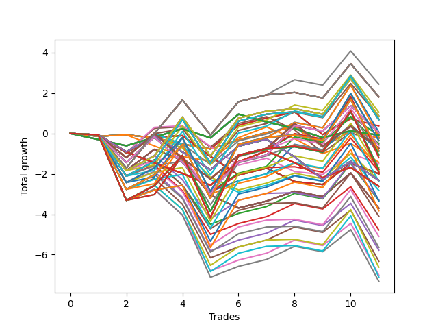

# Short HLT 106_1y 
- Symbol: TSLA
- Date Range: 05/15/2023 - 05/17/2024
- Trading Period: 8:30-12:30
- Number of Trades: 11



| Id. | Name | Win Percent | Profit | Avg Profit / Trade | Avg Time / Trade | Std |      | Name | Win Percent | Profit | Avg Profit / Trade | Avg Time / Trade | Std |
| --- | ---- | ----------- | ------ | ------------------ | ---------------- | --- | ---- | ---- | ----------- | ------ | ------------------ | ---------------- | --- |
| | Sorted By <br> Profit | | | | | | | Sorted By <br> Win Percentage |||||
|0| TP-1.5 105m | 54.55 | 2.44 | 0.22 | 51:05 | 1.34 |     | TP-1.5 105m | 54.55 | 2.44 | 0.22 | 51:05 | 1.34 |
|1| TP-1.5 180m | 54.55 | 1.81 | 0.16 | 52:27 | 1.33 |     | TP-1.5 180m | 54.55 | 1.81 | 0.16 | 52:27 | 1.33 |
|2| TP-1.5 165m | 54.55 | 1.81 | 0.16 | 52:27 | 1.33 |     | TP-1.5 165m | 54.55 | 1.81 | 0.16 | 52:27 | 1.33 |
|3| TP-1.5 150m | 54.55 | 1.81 | 0.16 | 52:27 | 1.33 |     | TP-1.5 150m | 54.55 | 1.81 | 0.16 | 52:27 | 1.33 |
|4| TP-1.5 135m | 54.55 | 1.81 | 0.16 | 52:27 | 1.33 |     | TP-1.5 135m | 54.55 | 1.81 | 0.16 | 52:27 | 1.33 |
|5| TP-1.5 120m | 54.55 | 1.81 | 0.16 | 52:27 | 1.33 |     | TP-1.5 120m | 54.55 | 1.81 | 0.16 | 52:27 | 1.33 |
|6| TP-1.75 105m | 54.55 | 1.05 | 0.10 | 58:27 | 1.39 |     | TP-1.75 105m | 54.55 | 1.05 | 0.10 | 58:27 | 1.39 |
|7| TP-1.75 180m | 54.55 | 0.86 | 0.08 | 61:10 | 1.39 |     | TP-1.75 180m | 54.55 | 0.86 | 0.08 | 61:10 | 1.39 |
|8| TP-1.75 165m | 54.55 | 0.86 | 0.08 | 61:10 | 1.39 |     | TP-1.75 165m | 54.55 | 0.86 | 0.08 | 61:10 | 1.39 |
|9| TP-1.75 150m | 54.55 | 0.86 | 0.08 | 61:10 | 1.39 |     | TP-1.75 150m | 54.55 | 0.86 | 0.08 | 61:10 | 1.39 |
|10| TP-1.75 135m | 54.55 | 0.86 | 0.08 | 61:10 | 1.39 |     | TP-1.75 135m | 54.55 | 0.86 | 0.08 | 61:10 | 1.39 |
|11| TP-1.75 120m | 54.55 | 0.86 | 0.08 | 61:10 | 1.39 |     | TP-1.75 120m | 54.55 | 0.86 | 0.08 | 61:10 | 1.39 |
|12| TP-1.5 90m | 54.55 | 0.83 | 0.08 | 48:27 | 1.26 |     | TP-1.5 90m | 54.55 | 0.83 | 0.08 | 48:27 | 1.26 |
|13| TP-2 105m | 54.55 | 0.72 | 0.07 | 63:32 | 1.55 |     | TP-2 105m | 54.55 | 0.72 | 0.07 | 63:32 | 1.55 |
|14| TP-2 180m | 54.55 | 0.68 | 0.06 | 66:21 | 1.56 |     | TP-2 180m | 54.55 | 0.68 | 0.06 | 66:21 | 1.56 |
|15| TP-2 165m | 54.55 | 0.68 | 0.06 | 66:21 | 1.56 |     | TP-2 165m | 54.55 | 0.68 | 0.06 | 66:21 | 1.56 |
|16| TP-2 150m | 54.55 | 0.68 | 0.06 | 66:21 | 1.56 |     | TP-2 150m | 54.55 | 0.68 | 0.06 | 66:21 | 1.56 |
|17| TP-2 135m | 54.55 | 0.68 | 0.06 | 66:21 | 1.56 |     | TP-2 135m | 54.55 | 0.68 | 0.06 | 66:21 | 1.56 |
|18| TP-2 120m | 54.55 | 0.68 | 0.06 | 66:21 | 1.56 |     | TP-2 120m | 54.55 | 0.68 | 0.06 | 66:21 | 1.56 |
|19| TP-1 15m | 45.45 | 0.37 | 0.03 | 12:49 | 0.58 |     | TP-2.25 105m | 54.55 | 0.07 | 0.01 | 65:27 | 1.72 |
|20| TP-2.25 105m | 54.55 | 0.07 | 0.01 | 65:27 | 1.72 |     | TP-2.5 105m | 54.55 | -0.15 | -0.01 | 65:49 | 1.83 |
|21| TP-1.25 180m | 45.45 | 0.04 | 0.00 | 38:54 | 1.17 |     | TP-2.25 180m | 54.55 | -0.35 | -0.03 | 69:54 | 1.70 |
|22| TP-1.25 165m | 45.45 | 0.04 | 0.00 | 38:54 | 1.17 |     | TP-2.25 165m | 54.55 | -0.35 | -0.03 | 69:54 | 1.70 |
|23| TP-1.25 150m | 45.45 | 0.04 | 0.00 | 38:54 | 1.17 |     | TP-2.25 150m | 54.55 | -0.35 | -0.03 | 69:54 | 1.70 |
|24| TP-1.25 135m | 45.45 | 0.04 | 0.00 | 38:54 | 1.17 |     | TP-2.25 135m | 54.55 | -0.35 | -0.03 | 69:54 | 1.70 |
|25| TP-1.25 120m | 45.45 | 0.04 | 0.00 | 38:54 | 1.17 |     | TP-2.25 120m | 54.55 | -0.35 | -0.03 | 69:54 | 1.70 |
|26| TP-1.25 105m | 45.45 | 0.04 | 0.00 | 38:54 | 1.17 |     | TP-1.75 90m | 54.55 | -0.61 | -0.06 | 54:21 | 1.27 |
|27| TP-1.25 90m | 45.45 | 0.04 | 0.00 | 38:54 | 1.17 |     | TP-2.5 180m | 54.55 | -0.87 | -0.08 | 71:16 | 1.78 |
|28| TP-0.25 180m | 36.36 | -0.09 | -0.01 | 02:38 | 0.50 |     | TP-2.5 165m | 54.55 | -0.87 | -0.08 | 71:16 | 1.78 |
|29| TP-0.25 165m | 36.36 | -0.09 | -0.01 | 02:38 | 0.50 |     | TP-2.5 150m | 54.55 | -0.87 | -0.08 | 71:16 | 1.78 |
|30| TP-0.25 150m | 36.36 | -0.09 | -0.01 | 02:38 | 0.50 |     | TP-2.5 135m | 54.55 | -0.87 | -0.08 | 71:16 | 1.78 |
|31| TP-0.25 135m | 36.36 | -0.09 | -0.01 | 02:38 | 0.50 |     | TP-2.5 120m | 54.55 | -0.87 | -0.08 | 71:16 | 1.78 |
|32| TP-0.25 120m | 36.36 | -0.09 | -0.01 | 02:38 | 0.50 |     | TP-2.75 105m | 54.55 | -1.05 | -0.10 | 68:05 | 1.97 |
|33| TP-0.25 105m | 36.36 | -0.09 | -0.01 | 02:38 | 0.50 |     | TP-2 90m | 54.55 | -1.08 | -0.10 | 59:21 | 1.41 |
|34| TP-0.25 90m | 36.36 | -0.09 | -0.01 | 02:38 | 0.50 |     | TP-3 105m | 54.55 | -1.20 | -0.11 | 68:49 | 2.08 |
|35| TP-0.25 75m | 36.36 | -0.09 | -0.01 | 02:38 | 0.50 |     | TP-2.75 180m | 54.55 | -1.77 | -0.16 | 73:32 | 1.92 |
|36| TP-0.25 60m | 36.36 | -0.09 | -0.01 | 02:38 | 0.50 |     | TP-2.75 165m | 54.55 | -1.77 | -0.16 | 73:32 | 1.92 |
|37| TP-0.25 45m | 36.36 | -0.09 | -0.01 | 02:38 | 0.50 |     | TP-2.75 150m | 54.55 | -1.77 | -0.16 | 73:32 | 1.92 |
|38| TP-0.25 30m | 36.36 | -0.09 | -0.01 | 02:38 | 0.50 |     | TP-2.75 135m | 54.55 | -1.77 | -0.16 | 73:32 | 1.92 |
|39| TP-0.25 15m | 36.36 | -0.09 | -0.01 | 02:38 | 0.50 |     | TP-2.75 120m | 54.55 | -1.77 | -0.16 | 73:32 | 1.92 |
|40| TP-0.75 15m | 45.45 | -0.10 | -0.01 | 11:43 | 0.66 |     | TP-2.25 90m | 54.55 | -1.82 | -0.17 | 60:00 | 1.58 |
|41| TP-2.5 105m | 54.55 | -0.15 | -0.01 | 65:49 | 1.83 |     | TP-3 180m | 54.55 | -1.92 | -0.17 | 74:16 | 2.03 |
|42| TP-3 15m | 45.45 | -0.23 | -0.02 | 14:00 | 0.46 |     | TP-3 165m | 54.55 | -1.92 | -0.17 | 74:16 | 2.03 |
|43| TP-2.75 15m | 45.45 | -0.23 | -0.02 | 14:00 | 0.46 |     | TP-3 150m | 54.55 | -1.92 | -0.17 | 74:16 | 2.03 |
|44| TP-2.5 15m | 45.45 | -0.23 | -0.02 | 14:00 | 0.46 |     | TP-3 135m | 54.55 | -1.92 | -0.17 | 74:16 | 2.03 |
|45| TP-2.25 15m | 45.45 | -0.23 | -0.02 | 14:00 | 0.46 |     | TP-3 120m | 54.55 | -1.92 | -0.17 | 74:16 | 2.03 |
|46| TP-2 15m | 45.45 | -0.23 | -0.02 | 14:00 | 0.46 |     | TP-2.5 90m | 54.55 | -2.37 | -0.22 | 60:10 | 1.65 |
|47| TP-1.75 15m | 45.45 | -0.23 | -0.02 | 14:00 | 0.46 |     | TP-2.75 90m | 54.55 | -3.34 | -0.30 | 62:05 | 1.79 |
|48| TP-1.5 15m | 45.45 | -0.23 | -0.02 | 14:00 | 0.46 |     | TP-3 90m | 54.55 | -3.83 | -0.35 | 62:27 | 1.85 |
|49| TP-1.25 15m | 45.45 | -0.23 | -0.02 | 14:00 | 0.46 |     | TP-1 15m | 45.45 | 0.37 | 0.03 | 12:49 | 0.58 |
|50| TP-2.25 180m | 54.55 | -0.35 | -0.03 | 69:54 | 1.70 |     | TP-1.25 180m | 45.45 | 0.04 | 0.00 | 38:54 | 1.17 |
|51| TP-2.25 165m | 54.55 | -0.35 | -0.03 | 69:54 | 1.70 |     | TP-1.25 165m | 45.45 | 0.04 | 0.00 | 38:54 | 1.17 |
|52| TP-2.25 150m | 54.55 | -0.35 | -0.03 | 69:54 | 1.70 |     | TP-1.25 150m | 45.45 | 0.04 | 0.00 | 38:54 | 1.17 |
|53| TP-2.25 135m | 54.55 | -0.35 | -0.03 | 69:54 | 1.70 |     | TP-1.25 135m | 45.45 | 0.04 | 0.00 | 38:54 | 1.17 |
|54| TP-2.25 120m | 54.55 | -0.35 | -0.03 | 69:54 | 1.70 |     | TP-1.25 120m | 45.45 | 0.04 | 0.00 | 38:54 | 1.17 |
|55| TP-1 30m | 45.45 | -0.48 | -0.04 | 22:10 | 0.84 |     | TP-1.25 105m | 45.45 | 0.04 | 0.00 | 38:54 | 1.17 |
|56| TP-1.25 75m | 45.45 | -0.52 | -0.05 | 38:38 | 1.11 |     | TP-1.25 90m | 45.45 | 0.04 | 0.00 | 38:54 | 1.17 |
|57| TP-1.75 90m | 54.55 | -0.61 | -0.06 | 54:21 | 1.27 |     | TP-0.75 15m | 45.45 | -0.10 | -0.01 | 11:43 | 0.66 |
|58| TP-1 180m | 45.45 | -0.74 | -0.07 | 26:43 | 1.03 |     | TP-3 15m | 45.45 | -0.23 | -0.02 | 14:00 | 0.46 |
|59| TP-1 165m | 45.45 | -0.74 | -0.07 | 26:43 | 1.03 |     | TP-2.75 15m | 45.45 | -0.23 | -0.02 | 14:00 | 0.46 |
|60| TP-1 150m | 45.45 | -0.74 | -0.07 | 26:43 | 1.03 |     | TP-2.5 15m | 45.45 | -0.23 | -0.02 | 14:00 | 0.46 |
|61| TP-1 135m | 45.45 | -0.74 | -0.07 | 26:43 | 1.03 |     | TP-2.25 15m | 45.45 | -0.23 | -0.02 | 14:00 | 0.46 |
|62| TP-1 120m | 45.45 | -0.74 | -0.07 | 26:43 | 1.03 |     | TP-2 15m | 45.45 | -0.23 | -0.02 | 14:00 | 0.46 |
|63| TP-1 105m | 45.45 | -0.74 | -0.07 | 26:43 | 1.03 |     | TP-1.75 15m | 45.45 | -0.23 | -0.02 | 14:00 | 0.46 |
|64| TP-1 90m | 45.45 | -0.74 | -0.07 | 26:43 | 1.03 |     | TP-1.5 15m | 45.45 | -0.23 | -0.02 | 14:00 | 0.46 |
|65| TP-1 75m | 45.45 | -0.74 | -0.07 | 26:43 | 1.03 |     | TP-1.25 15m | 45.45 | -0.23 | -0.02 | 14:00 | 0.46 |
|66| TP-1 60m | 45.45 | -0.74 | -0.07 | 26:43 | 1.03 |     | TP-1 30m | 45.45 | -0.48 | -0.04 | 22:10 | 0.84 |
|67| TP-1 45m | 45.45 | -0.77 | -0.07 | 26:16 | 0.91 |     | TP-1.25 75m | 45.45 | -0.52 | -0.05 | 38:38 | 1.11 |
|68| TP-2.5 180m | 54.55 | -0.87 | -0.08 | 71:16 | 1.78 |     | TP-1 180m | 45.45 | -0.74 | -0.07 | 26:43 | 1.03 |
|69| TP-2.5 165m | 54.55 | -0.87 | -0.08 | 71:16 | 1.78 |     | TP-1 165m | 45.45 | -0.74 | -0.07 | 26:43 | 1.03 |
|70| TP-2.5 150m | 54.55 | -0.87 | -0.08 | 71:16 | 1.78 |     | TP-1 150m | 45.45 | -0.74 | -0.07 | 26:43 | 1.03 |
|71| TP-2.5 135m | 54.55 | -0.87 | -0.08 | 71:16 | 1.78 |     | TP-1 135m | 45.45 | -0.74 | -0.07 | 26:43 | 1.03 |
|72| TP-2.5 120m | 54.55 | -0.87 | -0.08 | 71:16 | 1.78 |     | TP-1 120m | 45.45 | -0.74 | -0.07 | 26:43 | 1.03 |
|73| TP-1.25 60m | 45.45 | -0.89 | -0.08 | 37:16 | 1.09 |     | TP-1 105m | 45.45 | -0.74 | -0.07 | 26:43 | 1.03 |
|74| TP-2.75 105m | 54.55 | -1.05 | -0.10 | 68:05 | 1.97 |     | TP-1 90m | 45.45 | -0.74 | -0.07 | 26:43 | 1.03 |
|75| TP-2 90m | 54.55 | -1.08 | -0.10 | 59:21 | 1.41 |     | TP-1 75m | 45.45 | -0.74 | -0.07 | 26:43 | 1.03 |
|76| TP-3 105m | 54.55 | -1.20 | -0.11 | 68:49 | 2.08 |     | TP-1 60m | 45.45 | -0.74 | -0.07 | 26:43 | 1.03 |
|77| TP-0.5 15m | 36.36 | -1.43 | -0.13 | 08:49 | 0.61 |     | TP-1 45m | 45.45 | -0.77 | -0.07 | 26:16 | 0.91 |
|78| TP-1.25 30m | 36.36 | -1.51 | -0.14 | 26:32 | 0.74 |     | TP-1.25 60m | 45.45 | -0.89 | -0.08 | 37:16 | 1.09 |
|79| TP-1.5 60m | 45.45 | -1.70 | -0.15 | 41:16 | 1.22 |     | TP-1.5 60m | 45.45 | -1.70 | -0.15 | 41:16 | 1.22 |
|80| TP-2.75 180m | 54.55 | -1.77 | -0.16 | 73:32 | 1.92 |     | TP-1.5 75m | 45.45 | -1.87 | -0.17 | 45:21 | 1.22 |
|81| TP-2.75 165m | 54.55 | -1.77 | -0.16 | 73:32 | 1.92 |     | TP-1.75 75m | 45.45 | -3.29 | -0.30 | 49:38 | 1.18 |
|82| TP-2.75 150m | 54.55 | -1.77 | -0.16 | 73:32 | 1.92 |     | TP-1.75 60m | 45.45 | -3.33 | -0.30 | 44:10 | 1.17 |
|83| TP-2.75 135m | 54.55 | -1.77 | -0.16 | 73:32 | 1.92 |     | TP-2 75m | 45.45 | -4.10 | -0.37 | 52:54 | 1.28 |
|84| TP-2.75 120m | 54.55 | -1.77 | -0.16 | 73:32 | 1.92 |     | TP-2 60m | 45.45 | -4.78 | -0.43 | 46:05 | 1.18 |
|85| TP-2.25 90m | 54.55 | -1.82 | -0.17 | 60:00 | 1.58 |     | TP-2.25 75m | 45.45 | -5.10 | -0.46 | 53:10 | 1.41 |
|86| TP-1.5 75m | 45.45 | -1.87 | -0.17 | 45:21 | 1.22 |     | TP-2.5 75m | 45.45 | -5.65 | -0.51 | 53:21 | 1.47 |
|87| TP-3 180m | 54.55 | -1.92 | -0.17 | 74:16 | 2.03 |     | TP-2.25 60m | 45.45 | -5.78 | -0.53 | 46:21 | 1.31 |
|88| TP-3 165m | 54.55 | -1.92 | -0.17 | 74:16 | 2.03 |     | TP-2.5 60m | 45.45 | -6.33 | -0.58 | 46:32 | 1.39 |
|89| TP-3 150m | 54.55 | -1.92 | -0.17 | 74:16 | 2.03 |     | TP-2.75 75m | 45.45 | -6.62 | -0.60 | 55:16 | 1.61 |
|90| TP-3 135m | 54.55 | -1.92 | -0.17 | 74:16 | 2.03 |     | TP-2.75 60m | 45.45 | -7.01 | -0.64 | 47:32 | 1.49 |
|91| TP-3 120m | 54.55 | -1.92 | -0.17 | 74:16 | 2.03 |     | TP-3 75m | 45.45 | -7.11 | -0.65 | 55:38 | 1.67 |
|92| TP-3 30m | 36.36 | -2.00 | -0.18 | 26:54 | 0.67 |     | TP-3 60m | 45.45 | -7.32 | -0.67 | 47:49 | 1.53 |
|93| TP-2.75 30m | 36.36 | -2.00 | -0.18 | 26:54 | 0.67 |     | TP-0.25 180m | 36.36 | -0.09 | -0.01 | 02:38 | 0.50 |
|94| TP-2.5 30m | 36.36 | -2.00 | -0.18 | 26:54 | 0.67 |     | TP-0.25 165m | 36.36 | -0.09 | -0.01 | 02:38 | 0.50 |
|95| TP-2.25 30m | 36.36 | -2.00 | -0.18 | 26:54 | 0.67 |     | TP-0.25 150m | 36.36 | -0.09 | -0.01 | 02:38 | 0.50 |
|96| TP-2 30m | 36.36 | -2.00 | -0.18 | 26:54 | 0.67 |     | TP-0.25 135m | 36.36 | -0.09 | -0.01 | 02:38 | 0.50 |
|97| TP-1.75 30m | 36.36 | -2.00 | -0.18 | 26:54 | 0.67 |     | TP-0.25 120m | 36.36 | -0.09 | -0.01 | 02:38 | 0.50 |
|98| TP-1.5 30m | 36.36 | -2.00 | -0.18 | 26:54 | 0.67 |     | TP-0.25 105m | 36.36 | -0.09 | -0.01 | 02:38 | 0.50 |
|99| TP-0.75 180m | 36.36 | -2.32 | -0.21 | 15:27 | 0.82 |     | TP-0.25 90m | 36.36 | -0.09 | -0.01 | 02:38 | 0.50 |
|100| TP-0.75 165m | 36.36 | -2.32 | -0.21 | 15:27 | 0.82 |     | TP-0.25 75m | 36.36 | -0.09 | -0.01 | 02:38 | 0.50 |
|101| TP-0.75 150m | 36.36 | -2.32 | -0.21 | 15:27 | 0.82 |     | TP-0.25 60m | 36.36 | -0.09 | -0.01 | 02:38 | 0.50 |
|102| TP-0.75 135m | 36.36 | -2.32 | -0.21 | 15:27 | 0.82 |     | TP-0.25 45m | 36.36 | -0.09 | -0.01 | 02:38 | 0.50 |
|103| TP-0.75 120m | 36.36 | -2.32 | -0.21 | 15:27 | 0.82 |     | TP-0.25 30m | 36.36 | -0.09 | -0.01 | 02:38 | 0.50 |
|104| TP-0.75 105m | 36.36 | -2.32 | -0.21 | 15:27 | 0.82 |     | TP-0.25 15m | 36.36 | -0.09 | -0.01 | 02:38 | 0.50 |
|105| TP-0.75 90m | 36.36 | -2.32 | -0.21 | 15:27 | 0.82 |     | TP-0.5 15m | 36.36 | -1.43 | -0.13 | 08:49 | 0.61 |
|106| TP-0.75 75m | 36.36 | -2.32 | -0.21 | 15:27 | 0.82 |     | TP-1.25 30m | 36.36 | -1.51 | -0.14 | 26:32 | 0.74 |
|107| TP-0.75 60m | 36.36 | -2.32 | -0.21 | 15:27 | 0.82 |     | TP-3 30m | 36.36 | -2.00 | -0.18 | 26:54 | 0.67 |
|108| TP-1.25 45m | 36.36 | -2.32 | -0.21 | 34:27 | 0.93 |     | TP-2.75 30m | 36.36 | -2.00 | -0.18 | 26:54 | 0.67 |
|109| TP-0.75 45m | 36.36 | -2.32 | -0.21 | 15:27 | 0.82 |     | TP-2.5 30m | 36.36 | -2.00 | -0.18 | 26:54 | 0.67 |
|110| TP-0.75 30m | 36.36 | -2.32 | -0.21 | 15:27 | 0.82 |     | TP-2.25 30m | 36.36 | -2.00 | -0.18 | 26:54 | 0.67 |
|111| TP-2.5 90m | 54.55 | -2.37 | -0.22 | 60:10 | 1.65 |     | TP-2 30m | 36.36 | -2.00 | -0.18 | 26:54 | 0.67 |
|112| TP-0.5 180m | 27.27 | -2.62 | -0.24 | 10:21 | 0.65 |     | TP-1.75 30m | 36.36 | -2.00 | -0.18 | 26:54 | 0.67 |
|113| TP-0.5 165m | 27.27 | -2.62 | -0.24 | 10:21 | 0.65 |     | TP-1.5 30m | 36.36 | -2.00 | -0.18 | 26:54 | 0.67 |
|114| TP-0.5 150m | 27.27 | -2.62 | -0.24 | 10:21 | 0.65 |     | TP-0.75 180m | 36.36 | -2.32 | -0.21 | 15:27 | 0.82 |
|115| TP-0.5 135m | 27.27 | -2.62 | -0.24 | 10:21 | 0.65 |     | TP-0.75 165m | 36.36 | -2.32 | -0.21 | 15:27 | 0.82 |
|116| TP-0.5 120m | 27.27 | -2.62 | -0.24 | 10:21 | 0.65 |     | TP-0.75 150m | 36.36 | -2.32 | -0.21 | 15:27 | 0.82 |
|117| TP-0.5 105m | 27.27 | -2.62 | -0.24 | 10:21 | 0.65 |     | TP-0.75 135m | 36.36 | -2.32 | -0.21 | 15:27 | 0.82 |
|118| TP-0.5 90m | 27.27 | -2.62 | -0.24 | 10:21 | 0.65 |     | TP-0.75 120m | 36.36 | -2.32 | -0.21 | 15:27 | 0.82 |
|119| TP-0.5 75m | 27.27 | -2.62 | -0.24 | 10:21 | 0.65 |     | TP-0.75 105m | 36.36 | -2.32 | -0.21 | 15:27 | 0.82 |
|120| TP-0.5 60m | 27.27 | -2.62 | -0.24 | 10:21 | 0.65 |     | TP-0.75 90m | 36.36 | -2.32 | -0.21 | 15:27 | 0.82 |
|121| TP-0.5 45m | 27.27 | -2.62 | -0.24 | 10:21 | 0.65 |     | TP-0.75 75m | 36.36 | -2.32 | -0.21 | 15:27 | 0.82 |
|122| TP-0.5 30m | 27.27 | -2.62 | -0.24 | 10:21 | 0.65 |     | TP-0.75 60m | 36.36 | -2.32 | -0.21 | 15:27 | 0.82 |
|123| TP-1.5 45m | 36.36 | -2.82 | -0.26 | 37:00 | 1.09 |     | TP-1.25 45m | 36.36 | -2.32 | -0.21 | 34:27 | 0.93 |
|124| TP-1.75 75m | 45.45 | -3.29 | -0.30 | 49:38 | 1.18 |     | TP-0.75 45m | 36.36 | -2.32 | -0.21 | 15:27 | 0.82 |
|125| TP-1.75 60m | 45.45 | -3.33 | -0.30 | 44:10 | 1.17 |     | TP-0.75 30m | 36.36 | -2.32 | -0.21 | 15:27 | 0.82 |
|126| TP-2.75 90m | 54.55 | -3.34 | -0.30 | 62:05 | 1.79 |     | TP-1.5 45m | 36.36 | -2.82 | -0.26 | 37:00 | 1.09 |
|127| TP-3 45m | 36.36 | -3.70 | -0.34 | 37:54 | 1.02 |     | TP-3 45m | 36.36 | -3.70 | -0.34 | 37:54 | 1.02 |
|128| TP-2.75 45m | 36.36 | -3.70 | -0.34 | 37:54 | 1.02 |     | TP-2.75 45m | 36.36 | -3.70 | -0.34 | 37:54 | 1.02 |
|129| TP-2.5 45m | 36.36 | -3.70 | -0.34 | 37:54 | 1.02 |     | TP-2.5 45m | 36.36 | -3.70 | -0.34 | 37:54 | 1.02 |
|130| TP-2.25 45m | 36.36 | -3.70 | -0.34 | 37:54 | 1.02 |     | TP-2.25 45m | 36.36 | -3.70 | -0.34 | 37:54 | 1.02 |
|131| TP-2 45m | 36.36 | -3.70 | -0.34 | 37:54 | 1.02 |     | TP-2 45m | 36.36 | -3.70 | -0.34 | 37:54 | 1.02 |
|132| TP-1.75 45m | 36.36 | -3.70 | -0.34 | 37:54 | 1.02 |     | TP-1.75 45m | 36.36 | -3.70 | -0.34 | 37:54 | 1.02 |
|133| TP-3 90m | 54.55 | -3.83 | -0.35 | 62:27 | 1.85 |     | TP-0.5 180m | 27.27 | -2.62 | -0.24 | 10:21 | 0.65 |
|134| TP-2 75m | 45.45 | -4.10 | -0.37 | 52:54 | 1.28 |     | TP-0.5 165m | 27.27 | -2.62 | -0.24 | 10:21 | 0.65 |
|135| TP-2 60m | 45.45 | -4.78 | -0.43 | 46:05 | 1.18 |     | TP-0.5 150m | 27.27 | -2.62 | -0.24 | 10:21 | 0.65 |
|136| TP-2.25 75m | 45.45 | -5.10 | -0.46 | 53:10 | 1.41 |     | TP-0.5 135m | 27.27 | -2.62 | -0.24 | 10:21 | 0.65 |
|137| TP-2.5 75m | 45.45 | -5.65 | -0.51 | 53:21 | 1.47 |     | TP-0.5 120m | 27.27 | -2.62 | -0.24 | 10:21 | 0.65 |
|138| TP-2.25 60m | 45.45 | -5.78 | -0.53 | 46:21 | 1.31 |     | TP-0.5 105m | 27.27 | -2.62 | -0.24 | 10:21 | 0.65 |
|139| TP-2.5 60m | 45.45 | -6.33 | -0.58 | 46:32 | 1.39 |     | TP-0.5 90m | 27.27 | -2.62 | -0.24 | 10:21 | 0.65 |
|140| TP-2.75 75m | 45.45 | -6.62 | -0.60 | 55:16 | 1.61 |     | TP-0.5 75m | 27.27 | -2.62 | -0.24 | 10:21 | 0.65 |
|141| TP-2.75 60m | 45.45 | -7.01 | -0.64 | 47:32 | 1.49 |     | TP-0.5 60m | 27.27 | -2.62 | -0.24 | 10:21 | 0.65 |
|142| TP-3 75m | 45.45 | -7.11 | -0.65 | 55:38 | 1.67 |     | TP-0.5 45m | 27.27 | -2.62 | -0.24 | 10:21 | 0.65 |
|143| TP-3 60m | 45.45 | -7.32 | -0.67 | 47:49 | 1.53 |     | TP-0.5 30m | 27.27 | -2.62 | -0.24 | 10:21 | 0.65 |

### Test TP-0.25 15m
* Take Profit of 0.25 Point
* 0.25 Stoploss
* Results:
```
Total Trades: 11
Percent Up: 63.64
Percent Down: 36.36
Total Points Moved Down: -0.09
Potential Profit: -45.00
Total Points Ups: 2.44 Count Ups: 7
Total Points Downs: 2.35 Count Downs: 4
```

<details><summary>Trades</summary>

<code>In: 2023-05-22 12:30:00		Out: 2023-05-22 12:32:00		Total Position Time: 02:00		Total Move Down: -0.30		Total to Date: -0.30</code> <br />
<code>In: 2023-05-26 09:10:00		Out: 2023-05-26 09:12:00		Total Position Time: 02:00		Total Move Down: -0.31		Total to Date: -0.61</code> <br />
<code>In: 2023-05-26 10:25:00		Out: 2023-05-26 10:27:00		Total Position Time: 02:00		Total Move Down: 0.42		Total to Date: -0.19</code> <br />
<code>In: 2023-06-13 09:45:00		Out: 2023-06-13 09:47:00		Total Position Time: 02:00		Total Move Down: 0.42		Total to Date: 0.23</code> <br />
<code>In: 2023-07-13 10:55:00		Out: 2023-07-13 10:57:00		Total Position Time: 02:00		Total Move Down: -0.45		Total to Date: -0.22</code> <br />
<code>In: 2023-07-14 10:05:00		Out: 2023-07-14 10:07:00		Total Position Time: 02:00		Total Move Down: 1.17		Total to Date: 0.95</code> <br />
<code>In: 2023-08-29 12:35:00		Out: 2023-08-29 12:39:00		Total Position Time: 04:00		Total Move Down: -0.38		Total to Date: 0.57</code> <br />
<code>In: 2023-09-28 09:10:00		Out: 2023-09-28 09:14:00		Total Position Time: 04:00		Total Move Down: -0.33		Total to Date: 0.24</code> <br />
<code>In: 2023-10-09 12:20:00		Out: 2023-10-09 12:25:00		Total Position Time: 05:00		Total Move Down: -0.45		Total to Date: -0.21</code> <br />
<code>In: 2024-01-29 08:40:00		Out: 2024-01-29 08:42:00		Total Position Time: 02:00		Total Move Down: 0.34		Total to Date: 0.13</code> <br />
<code>In: 2024-02-15 09:30:00		Out: 2024-02-15 09:32:00		Total Position Time: 02:00		Total Move Down: -0.22		Total to Date: -0.09</code> <br />


</details>

### Test TP-0.5 15m
* Take Profit of 0.5 Point
* 0.5 Stoploss
* Results:
```
Total Trades: 11
Percent Up: 63.64
Percent Down: 36.36
Total Points Moved Down: -1.43
Potential Profit: -715.00
Total Points Ups: 3.71 Count Ups: 7
Total Points Downs: 2.28 Count Downs: 4
```

<details><summary>Trades</summary>

<code>In: 2023-05-22 12:30:00		Out: 2023-05-22 12:44:00		Total Position Time: 14:00		Total Move Down: -0.14		Total to Date: -0.14</code> <br />
<code>In: 2023-05-26 09:10:00		Out: 2023-05-26 09:24:00		Total Position Time: 14:00		Total Move Down: 0.07		Total to Date: -0.07</code> <br />
<code>In: 2023-05-26 10:25:00		Out: 2023-05-26 10:33:00		Total Position Time: 08:00		Total Move Down: -0.55		Total to Date: -0.62</code> <br />
<code>In: 2023-06-13 09:45:00		Out: 2023-06-13 09:51:00		Total Position Time: 06:00		Total Move Down: -0.52		Total to Date: -1.14</code> <br />
<code>In: 2023-07-13 10:55:00		Out: 2023-07-13 11:09:00		Total Position Time: 14:00		Total Move Down: -0.24		Total to Date: -1.38</code> <br />
<code>In: 2023-07-14 10:05:00		Out: 2023-07-14 10:07:00		Total Position Time: 02:00		Total Move Down: 1.17		Total to Date: -0.21</code> <br />
<code>In: 2023-08-29 12:35:00		Out: 2023-08-29 12:48:00		Total Position Time: 13:00		Total Move Down: 0.53		Total to Date: 0.32</code> <br />
<code>In: 2023-09-28 09:10:00		Out: 2023-09-28 09:18:00		Total Position Time: 08:00		Total Move Down: -0.58		Total to Date: -0.26</code> <br />
<code>In: 2023-10-09 12:20:00		Out: 2023-10-09 12:29:00		Total Position Time: 09:00		Total Move Down: -0.74		Total to Date: -1.00</code> <br />
<code>In: 2024-01-29 08:40:00		Out: 2024-01-29 08:44:00		Total Position Time: 04:00		Total Move Down: 0.51		Total to Date: -0.49</code> <br />
<code>In: 2024-02-15 09:30:00		Out: 2024-02-15 09:35:00		Total Position Time: 05:00		Total Move Down: -0.94		Total to Date: -1.43</code> <br />


</details>

### Test TP-0.75 15m
* Take Profit of 0.75 Point
* 0.75 Stoploss
* Results:
```
Total Trades: 11
Percent Up: 54.55
Percent Down: 45.45
Total Points Moved Down: -0.10
Potential Profit: -50.00
Total Points Ups: 2.90 Count Ups: 6
Total Points Downs: 2.80 Count Downs: 5
```

<details><summary>Trades</summary>

<code>In: 2023-05-22 12:30:00		Out: 2023-05-22 12:44:00		Total Position Time: 14:00		Total Move Down: -0.14		Total to Date: -0.14</code> <br />
<code>In: 2023-05-26 09:10:00		Out: 2023-05-26 09:24:00		Total Position Time: 14:00		Total Move Down: 0.07		Total to Date: -0.07</code> <br />
<code>In: 2023-05-26 10:25:00		Out: 2023-05-26 10:39:00		Total Position Time: 14:00		Total Move Down: -0.15		Total to Date: -0.22</code> <br />
<code>In: 2023-06-13 09:45:00		Out: 2023-06-13 09:59:00		Total Position Time: 14:00		Total Move Down: -0.31		Total to Date: -0.53</code> <br />
<code>In: 2023-07-13 10:55:00		Out: 2023-07-13 11:09:00		Total Position Time: 14:00		Total Move Down: -0.24		Total to Date: -0.77</code> <br />
<code>In: 2023-07-14 10:05:00		Out: 2023-07-14 10:07:00		Total Position Time: 02:00		Total Move Down: 1.17		Total to Date: 0.40</code> <br />
<code>In: 2023-08-29 12:35:00		Out: 2023-08-29 12:49:00		Total Position Time: 14:00		Total Move Down: 0.36		Total to Date: 0.76</code> <br />
<code>In: 2023-09-28 09:10:00		Out: 2023-09-28 09:24:00		Total Position Time: 14:00		Total Move Down: 0.30		Total to Date: 1.06</code> <br />
<code>In: 2023-10-09 12:20:00		Out: 2023-10-09 12:33:00		Total Position Time: 13:00		Total Move Down: -1.12		Total to Date: -0.06</code> <br />
<code>In: 2024-01-29 08:40:00		Out: 2024-01-29 08:51:00		Total Position Time: 11:00		Total Move Down: 0.90		Total to Date: 0.84</code> <br />
<code>In: 2024-02-15 09:30:00		Out: 2024-02-15 09:35:00		Total Position Time: 05:00		Total Move Down: -0.94		Total to Date: -0.10</code> <br />


</details>

### Test TP-1 15m
* Take Profit of 1 Point
* 1 Stoploss
* Results:
```
Total Trades: 11
Percent Up: 54.55
Percent Down: 45.45
Total Points Moved Down: 0.37
Potential Profit: 185.00
Total Points Ups: 2.31 Count Ups: 6
Total Points Downs: 2.68 Count Downs: 5
```

<details><summary>Trades</summary>

<code>In: 2023-05-22 12:30:00		Out: 2023-05-22 12:44:00		Total Position Time: 14:00		Total Move Down: -0.14		Total to Date: -0.14</code> <br />
<code>In: 2023-05-26 09:10:00		Out: 2023-05-26 09:24:00		Total Position Time: 14:00		Total Move Down: 0.07		Total to Date: -0.07</code> <br />
<code>In: 2023-05-26 10:25:00		Out: 2023-05-26 10:39:00		Total Position Time: 14:00		Total Move Down: -0.15		Total to Date: -0.22</code> <br />
<code>In: 2023-06-13 09:45:00		Out: 2023-06-13 09:59:00		Total Position Time: 14:00		Total Move Down: -0.31		Total to Date: -0.53</code> <br />
<code>In: 2023-07-13 10:55:00		Out: 2023-07-13 11:09:00		Total Position Time: 14:00		Total Move Down: -0.24		Total to Date: -0.77</code> <br />
<code>In: 2023-07-14 10:05:00		Out: 2023-07-14 10:07:00		Total Position Time: 02:00		Total Move Down: 1.17		Total to Date: 0.40</code> <br />
<code>In: 2023-08-29 12:35:00		Out: 2023-08-29 12:49:00		Total Position Time: 14:00		Total Move Down: 0.36		Total to Date: 0.76</code> <br />
<code>In: 2023-09-28 09:10:00		Out: 2023-09-28 09:24:00		Total Position Time: 14:00		Total Move Down: 0.30		Total to Date: 1.06</code> <br />
<code>In: 2023-10-09 12:20:00		Out: 2023-10-09 12:33:00		Total Position Time: 13:00		Total Move Down: -1.12		Total to Date: -0.06</code> <br />
<code>In: 2024-01-29 08:40:00		Out: 2024-01-29 08:54:00		Total Position Time: 14:00		Total Move Down: 0.78		Total to Date: 0.72</code> <br />
<code>In: 2024-02-15 09:30:00		Out: 2024-02-15 09:44:00		Total Position Time: 14:00		Total Move Down: -0.35		Total to Date: 0.37</code> <br />


</details>

### Test TP-1.25 15m
* Take Profit of 1.25 Point
* 1.25 Stoploss
* Results:
```
Total Trades: 11
Percent Up: 54.55
Percent Down: 45.45
Total Points Moved Down: -0.23
Potential Profit: -115.00
Total Points Ups: 2.19 Count Ups: 6
Total Points Downs: 1.96 Count Downs: 5
```

<details><summary>Trades</summary>

<code>In: 2023-05-22 12:30:00		Out: 2023-05-22 12:44:00		Total Position Time: 14:00		Total Move Down: -0.14		Total to Date: -0.14</code> <br />
<code>In: 2023-05-26 09:10:00		Out: 2023-05-26 09:24:00		Total Position Time: 14:00		Total Move Down: 0.07		Total to Date: -0.07</code> <br />
<code>In: 2023-05-26 10:25:00		Out: 2023-05-26 10:39:00		Total Position Time: 14:00		Total Move Down: -0.15		Total to Date: -0.22</code> <br />
<code>In: 2023-06-13 09:45:00		Out: 2023-06-13 09:59:00		Total Position Time: 14:00		Total Move Down: -0.31		Total to Date: -0.53</code> <br />
<code>In: 2023-07-13 10:55:00		Out: 2023-07-13 11:09:00		Total Position Time: 14:00		Total Move Down: -0.24		Total to Date: -0.77</code> <br />
<code>In: 2023-07-14 10:05:00		Out: 2023-07-14 10:19:00		Total Position Time: 14:00		Total Move Down: 0.45		Total to Date: -0.32</code> <br />
<code>In: 2023-08-29 12:35:00		Out: 2023-08-29 12:49:00		Total Position Time: 14:00		Total Move Down: 0.36		Total to Date: 0.04</code> <br />
<code>In: 2023-09-28 09:10:00		Out: 2023-09-28 09:24:00		Total Position Time: 14:00		Total Move Down: 0.30		Total to Date: 0.34</code> <br />
<code>In: 2023-10-09 12:20:00		Out: 2023-10-09 12:34:00		Total Position Time: 14:00		Total Move Down: -1.00		Total to Date: -0.66</code> <br />
<code>In: 2024-01-29 08:40:00		Out: 2024-01-29 08:54:00		Total Position Time: 14:00		Total Move Down: 0.78		Total to Date: 0.12</code> <br />
<code>In: 2024-02-15 09:30:00		Out: 2024-02-15 09:44:00		Total Position Time: 14:00		Total Move Down: -0.35		Total to Date: -0.23</code> <br />


</details>

### Test TP-1.5 15m
* Take Profit of 1.5 Point
* 1.5 Stoploss
* Results:
```
Total Trades: 11
Percent Up: 54.55
Percent Down: 45.45
Total Points Moved Down: -0.23
Potential Profit: -115.00
Total Points Ups: 2.19 Count Ups: 6
Total Points Downs: 1.96 Count Downs: 5
```

<details><summary>Trades</summary>

<code>In: 2023-05-22 12:30:00		Out: 2023-05-22 12:44:00		Total Position Time: 14:00		Total Move Down: -0.14		Total to Date: -0.14</code> <br />
<code>In: 2023-05-26 09:10:00		Out: 2023-05-26 09:24:00		Total Position Time: 14:00		Total Move Down: 0.07		Total to Date: -0.07</code> <br />
<code>In: 2023-05-26 10:25:00		Out: 2023-05-26 10:39:00		Total Position Time: 14:00		Total Move Down: -0.15		Total to Date: -0.22</code> <br />
<code>In: 2023-06-13 09:45:00		Out: 2023-06-13 09:59:00		Total Position Time: 14:00		Total Move Down: -0.31		Total to Date: -0.53</code> <br />
<code>In: 2023-07-13 10:55:00		Out: 2023-07-13 11:09:00		Total Position Time: 14:00		Total Move Down: -0.24		Total to Date: -0.77</code> <br />
<code>In: 2023-07-14 10:05:00		Out: 2023-07-14 10:19:00		Total Position Time: 14:00		Total Move Down: 0.45		Total to Date: -0.32</code> <br />
<code>In: 2023-08-29 12:35:00		Out: 2023-08-29 12:49:00		Total Position Time: 14:00		Total Move Down: 0.36		Total to Date: 0.04</code> <br />
<code>In: 2023-09-28 09:10:00		Out: 2023-09-28 09:24:00		Total Position Time: 14:00		Total Move Down: 0.30		Total to Date: 0.34</code> <br />
<code>In: 2023-10-09 12:20:00		Out: 2023-10-09 12:34:00		Total Position Time: 14:00		Total Move Down: -1.00		Total to Date: -0.66</code> <br />
<code>In: 2024-01-29 08:40:00		Out: 2024-01-29 08:54:00		Total Position Time: 14:00		Total Move Down: 0.78		Total to Date: 0.12</code> <br />
<code>In: 2024-02-15 09:30:00		Out: 2024-02-15 09:44:00		Total Position Time: 14:00		Total Move Down: -0.35		Total to Date: -0.23</code> <br />


</details>

### Test TP-1.75 15m
* Take Profit of 1.75 Point
* 1.75 Stoploss
* Results:
```
Total Trades: 11
Percent Up: 54.55
Percent Down: 45.45
Total Points Moved Down: -0.23
Potential Profit: -115.00
Total Points Ups: 2.19 Count Ups: 6
Total Points Downs: 1.96 Count Downs: 5
```

<details><summary>Trades</summary>

<code>In: 2023-05-22 12:30:00		Out: 2023-05-22 12:44:00		Total Position Time: 14:00		Total Move Down: -0.14		Total to Date: -0.14</code> <br />
<code>In: 2023-05-26 09:10:00		Out: 2023-05-26 09:24:00		Total Position Time: 14:00		Total Move Down: 0.07		Total to Date: -0.07</code> <br />
<code>In: 2023-05-26 10:25:00		Out: 2023-05-26 10:39:00		Total Position Time: 14:00		Total Move Down: -0.15		Total to Date: -0.22</code> <br />
<code>In: 2023-06-13 09:45:00		Out: 2023-06-13 09:59:00		Total Position Time: 14:00		Total Move Down: -0.31		Total to Date: -0.53</code> <br />
<code>In: 2023-07-13 10:55:00		Out: 2023-07-13 11:09:00		Total Position Time: 14:00		Total Move Down: -0.24		Total to Date: -0.77</code> <br />
<code>In: 2023-07-14 10:05:00		Out: 2023-07-14 10:19:00		Total Position Time: 14:00		Total Move Down: 0.45		Total to Date: -0.32</code> <br />
<code>In: 2023-08-29 12:35:00		Out: 2023-08-29 12:49:00		Total Position Time: 14:00		Total Move Down: 0.36		Total to Date: 0.04</code> <br />
<code>In: 2023-09-28 09:10:00		Out: 2023-09-28 09:24:00		Total Position Time: 14:00		Total Move Down: 0.30		Total to Date: 0.34</code> <br />
<code>In: 2023-10-09 12:20:00		Out: 2023-10-09 12:34:00		Total Position Time: 14:00		Total Move Down: -1.00		Total to Date: -0.66</code> <br />
<code>In: 2024-01-29 08:40:00		Out: 2024-01-29 08:54:00		Total Position Time: 14:00		Total Move Down: 0.78		Total to Date: 0.12</code> <br />
<code>In: 2024-02-15 09:30:00		Out: 2024-02-15 09:44:00		Total Position Time: 14:00		Total Move Down: -0.35		Total to Date: -0.23</code> <br />


</details>

### Test TP-2 15m
* Take Profit of 2 Point
* 2 Stoploss
* Results:
```
Total Trades: 11
Percent Up: 54.55
Percent Down: 45.45
Total Points Moved Down: -0.23
Potential Profit: -115.00
Total Points Ups: 2.19 Count Ups: 6
Total Points Downs: 1.96 Count Downs: 5
```

<details><summary>Trades</summary>

<code>In: 2023-05-22 12:30:00		Out: 2023-05-22 12:44:00		Total Position Time: 14:00		Total Move Down: -0.14		Total to Date: -0.14</code> <br />
<code>In: 2023-05-26 09:10:00		Out: 2023-05-26 09:24:00		Total Position Time: 14:00		Total Move Down: 0.07		Total to Date: -0.07</code> <br />
<code>In: 2023-05-26 10:25:00		Out: 2023-05-26 10:39:00		Total Position Time: 14:00		Total Move Down: -0.15		Total to Date: -0.22</code> <br />
<code>In: 2023-06-13 09:45:00		Out: 2023-06-13 09:59:00		Total Position Time: 14:00		Total Move Down: -0.31		Total to Date: -0.53</code> <br />
<code>In: 2023-07-13 10:55:00		Out: 2023-07-13 11:09:00		Total Position Time: 14:00		Total Move Down: -0.24		Total to Date: -0.77</code> <br />
<code>In: 2023-07-14 10:05:00		Out: 2023-07-14 10:19:00		Total Position Time: 14:00		Total Move Down: 0.45		Total to Date: -0.32</code> <br />
<code>In: 2023-08-29 12:35:00		Out: 2023-08-29 12:49:00		Total Position Time: 14:00		Total Move Down: 0.36		Total to Date: 0.04</code> <br />
<code>In: 2023-09-28 09:10:00		Out: 2023-09-28 09:24:00		Total Position Time: 14:00		Total Move Down: 0.30		Total to Date: 0.34</code> <br />
<code>In: 2023-10-09 12:20:00		Out: 2023-10-09 12:34:00		Total Position Time: 14:00		Total Move Down: -1.00		Total to Date: -0.66</code> <br />
<code>In: 2024-01-29 08:40:00		Out: 2024-01-29 08:54:00		Total Position Time: 14:00		Total Move Down: 0.78		Total to Date: 0.12</code> <br />
<code>In: 2024-02-15 09:30:00		Out: 2024-02-15 09:44:00		Total Position Time: 14:00		Total Move Down: -0.35		Total to Date: -0.23</code> <br />


</details>

### Test TP-2.25 15m
* Take Profit of 2.25 Point
* 2.25 Stoploss
* Results:
```
Total Trades: 11
Percent Up: 54.55
Percent Down: 45.45
Total Points Moved Down: -0.23
Potential Profit: -115.00
Total Points Ups: 2.19 Count Ups: 6
Total Points Downs: 1.96 Count Downs: 5
```

<details><summary>Trades</summary>

<code>In: 2023-05-22 12:30:00		Out: 2023-05-22 12:44:00		Total Position Time: 14:00		Total Move Down: -0.14		Total to Date: -0.14</code> <br />
<code>In: 2023-05-26 09:10:00		Out: 2023-05-26 09:24:00		Total Position Time: 14:00		Total Move Down: 0.07		Total to Date: -0.07</code> <br />
<code>In: 2023-05-26 10:25:00		Out: 2023-05-26 10:39:00		Total Position Time: 14:00		Total Move Down: -0.15		Total to Date: -0.22</code> <br />
<code>In: 2023-06-13 09:45:00		Out: 2023-06-13 09:59:00		Total Position Time: 14:00		Total Move Down: -0.31		Total to Date: -0.53</code> <br />
<code>In: 2023-07-13 10:55:00		Out: 2023-07-13 11:09:00		Total Position Time: 14:00		Total Move Down: -0.24		Total to Date: -0.77</code> <br />
<code>In: 2023-07-14 10:05:00		Out: 2023-07-14 10:19:00		Total Position Time: 14:00		Total Move Down: 0.45		Total to Date: -0.32</code> <br />
<code>In: 2023-08-29 12:35:00		Out: 2023-08-29 12:49:00		Total Position Time: 14:00		Total Move Down: 0.36		Total to Date: 0.04</code> <br />
<code>In: 2023-09-28 09:10:00		Out: 2023-09-28 09:24:00		Total Position Time: 14:00		Total Move Down: 0.30		Total to Date: 0.34</code> <br />
<code>In: 2023-10-09 12:20:00		Out: 2023-10-09 12:34:00		Total Position Time: 14:00		Total Move Down: -1.00		Total to Date: -0.66</code> <br />
<code>In: 2024-01-29 08:40:00		Out: 2024-01-29 08:54:00		Total Position Time: 14:00		Total Move Down: 0.78		Total to Date: 0.12</code> <br />
<code>In: 2024-02-15 09:30:00		Out: 2024-02-15 09:44:00		Total Position Time: 14:00		Total Move Down: -0.35		Total to Date: -0.23</code> <br />


</details>

### Test TP-2.5 15m
* Take Profit of 2.5 Point
* 2.5 Stoploss
* Results:
```
Total Trades: 11
Percent Up: 54.55
Percent Down: 45.45
Total Points Moved Down: -0.23
Potential Profit: -115.00
Total Points Ups: 2.19 Count Ups: 6
Total Points Downs: 1.96 Count Downs: 5
```

<details><summary>Trades</summary>

<code>In: 2023-05-22 12:30:00		Out: 2023-05-22 12:44:00		Total Position Time: 14:00		Total Move Down: -0.14		Total to Date: -0.14</code> <br />
<code>In: 2023-05-26 09:10:00		Out: 2023-05-26 09:24:00		Total Position Time: 14:00		Total Move Down: 0.07		Total to Date: -0.07</code> <br />
<code>In: 2023-05-26 10:25:00		Out: 2023-05-26 10:39:00		Total Position Time: 14:00		Total Move Down: -0.15		Total to Date: -0.22</code> <br />
<code>In: 2023-06-13 09:45:00		Out: 2023-06-13 09:59:00		Total Position Time: 14:00		Total Move Down: -0.31		Total to Date: -0.53</code> <br />
<code>In: 2023-07-13 10:55:00		Out: 2023-07-13 11:09:00		Total Position Time: 14:00		Total Move Down: -0.24		Total to Date: -0.77</code> <br />
<code>In: 2023-07-14 10:05:00		Out: 2023-07-14 10:19:00		Total Position Time: 14:00		Total Move Down: 0.45		Total to Date: -0.32</code> <br />
<code>In: 2023-08-29 12:35:00		Out: 2023-08-29 12:49:00		Total Position Time: 14:00		Total Move Down: 0.36		Total to Date: 0.04</code> <br />
<code>In: 2023-09-28 09:10:00		Out: 2023-09-28 09:24:00		Total Position Time: 14:00		Total Move Down: 0.30		Total to Date: 0.34</code> <br />
<code>In: 2023-10-09 12:20:00		Out: 2023-10-09 12:34:00		Total Position Time: 14:00		Total Move Down: -1.00		Total to Date: -0.66</code> <br />
<code>In: 2024-01-29 08:40:00		Out: 2024-01-29 08:54:00		Total Position Time: 14:00		Total Move Down: 0.78		Total to Date: 0.12</code> <br />
<code>In: 2024-02-15 09:30:00		Out: 2024-02-15 09:44:00		Total Position Time: 14:00		Total Move Down: -0.35		Total to Date: -0.23</code> <br />


</details>

### Test TP-2.75 15m
* Take Profit of 2.75 Point
* 2.75 Stoploss
* Results:
```
Total Trades: 11
Percent Up: 54.55
Percent Down: 45.45
Total Points Moved Down: -0.23
Potential Profit: -115.00
Total Points Ups: 2.19 Count Ups: 6
Total Points Downs: 1.96 Count Downs: 5
```

<details><summary>Trades</summary>

<code>In: 2023-05-22 12:30:00		Out: 2023-05-22 12:44:00		Total Position Time: 14:00		Total Move Down: -0.14		Total to Date: -0.14</code> <br />
<code>In: 2023-05-26 09:10:00		Out: 2023-05-26 09:24:00		Total Position Time: 14:00		Total Move Down: 0.07		Total to Date: -0.07</code> <br />
<code>In: 2023-05-26 10:25:00		Out: 2023-05-26 10:39:00		Total Position Time: 14:00		Total Move Down: -0.15		Total to Date: -0.22</code> <br />
<code>In: 2023-06-13 09:45:00		Out: 2023-06-13 09:59:00		Total Position Time: 14:00		Total Move Down: -0.31		Total to Date: -0.53</code> <br />
<code>In: 2023-07-13 10:55:00		Out: 2023-07-13 11:09:00		Total Position Time: 14:00		Total Move Down: -0.24		Total to Date: -0.77</code> <br />
<code>In: 2023-07-14 10:05:00		Out: 2023-07-14 10:19:00		Total Position Time: 14:00		Total Move Down: 0.45		Total to Date: -0.32</code> <br />
<code>In: 2023-08-29 12:35:00		Out: 2023-08-29 12:49:00		Total Position Time: 14:00		Total Move Down: 0.36		Total to Date: 0.04</code> <br />
<code>In: 2023-09-28 09:10:00		Out: 2023-09-28 09:24:00		Total Position Time: 14:00		Total Move Down: 0.30		Total to Date: 0.34</code> <br />
<code>In: 2023-10-09 12:20:00		Out: 2023-10-09 12:34:00		Total Position Time: 14:00		Total Move Down: -1.00		Total to Date: -0.66</code> <br />
<code>In: 2024-01-29 08:40:00		Out: 2024-01-29 08:54:00		Total Position Time: 14:00		Total Move Down: 0.78		Total to Date: 0.12</code> <br />
<code>In: 2024-02-15 09:30:00		Out: 2024-02-15 09:44:00		Total Position Time: 14:00		Total Move Down: -0.35		Total to Date: -0.23</code> <br />


</details>

### Test TP-3 15m
* Take Profit of 3 Point
* 3 Stoploss
* Results:
```
Total Trades: 11
Percent Up: 54.55
Percent Down: 45.45
Total Points Moved Down: -0.23
Potential Profit: -115.00
Total Points Ups: 2.19 Count Ups: 6
Total Points Downs: 1.96 Count Downs: 5
```

<details><summary>Trades</summary>

<code>In: 2023-05-22 12:30:00		Out: 2023-05-22 12:44:00		Total Position Time: 14:00		Total Move Down: -0.14		Total to Date: -0.14</code> <br />
<code>In: 2023-05-26 09:10:00		Out: 2023-05-26 09:24:00		Total Position Time: 14:00		Total Move Down: 0.07		Total to Date: -0.07</code> <br />
<code>In: 2023-05-26 10:25:00		Out: 2023-05-26 10:39:00		Total Position Time: 14:00		Total Move Down: -0.15		Total to Date: -0.22</code> <br />
<code>In: 2023-06-13 09:45:00		Out: 2023-06-13 09:59:00		Total Position Time: 14:00		Total Move Down: -0.31		Total to Date: -0.53</code> <br />
<code>In: 2023-07-13 10:55:00		Out: 2023-07-13 11:09:00		Total Position Time: 14:00		Total Move Down: -0.24		Total to Date: -0.77</code> <br />
<code>In: 2023-07-14 10:05:00		Out: 2023-07-14 10:19:00		Total Position Time: 14:00		Total Move Down: 0.45		Total to Date: -0.32</code> <br />
<code>In: 2023-08-29 12:35:00		Out: 2023-08-29 12:49:00		Total Position Time: 14:00		Total Move Down: 0.36		Total to Date: 0.04</code> <br />
<code>In: 2023-09-28 09:10:00		Out: 2023-09-28 09:24:00		Total Position Time: 14:00		Total Move Down: 0.30		Total to Date: 0.34</code> <br />
<code>In: 2023-10-09 12:20:00		Out: 2023-10-09 12:34:00		Total Position Time: 14:00		Total Move Down: -1.00		Total to Date: -0.66</code> <br />
<code>In: 2024-01-29 08:40:00		Out: 2024-01-29 08:54:00		Total Position Time: 14:00		Total Move Down: 0.78		Total to Date: 0.12</code> <br />
<code>In: 2024-02-15 09:30:00		Out: 2024-02-15 09:44:00		Total Position Time: 14:00		Total Move Down: -0.35		Total to Date: -0.23</code> <br />


</details>

### Test TP-0.25 30m
* Take Profit of 0.25 Point
* 0.25 Stoploss
* Results:
```
Total Trades: 11
Percent Up: 63.64
Percent Down: 36.36
Total Points Moved Down: -0.09
Potential Profit: -45.00
Total Points Ups: 2.44 Count Ups: 7
Total Points Downs: 2.35 Count Downs: 4
```

<details><summary>Trades</summary>

<code>In: 2023-05-22 12:30:00		Out: 2023-05-22 12:32:00		Total Position Time: 02:00		Total Move Down: -0.30		Total to Date: -0.30</code> <br />
<code>In: 2023-05-26 09:10:00		Out: 2023-05-26 09:12:00		Total Position Time: 02:00		Total Move Down: -0.31		Total to Date: -0.61</code> <br />
<code>In: 2023-05-26 10:25:00		Out: 2023-05-26 10:27:00		Total Position Time: 02:00		Total Move Down: 0.42		Total to Date: -0.19</code> <br />
<code>In: 2023-06-13 09:45:00		Out: 2023-06-13 09:47:00		Total Position Time: 02:00		Total Move Down: 0.42		Total to Date: 0.23</code> <br />
<code>In: 2023-07-13 10:55:00		Out: 2023-07-13 10:57:00		Total Position Time: 02:00		Total Move Down: -0.45		Total to Date: -0.22</code> <br />
<code>In: 2023-07-14 10:05:00		Out: 2023-07-14 10:07:00		Total Position Time: 02:00		Total Move Down: 1.17		Total to Date: 0.95</code> <br />
<code>In: 2023-08-29 12:35:00		Out: 2023-08-29 12:39:00		Total Position Time: 04:00		Total Move Down: -0.38		Total to Date: 0.57</code> <br />
<code>In: 2023-09-28 09:10:00		Out: 2023-09-28 09:14:00		Total Position Time: 04:00		Total Move Down: -0.33		Total to Date: 0.24</code> <br />
<code>In: 2023-10-09 12:20:00		Out: 2023-10-09 12:25:00		Total Position Time: 05:00		Total Move Down: -0.45		Total to Date: -0.21</code> <br />
<code>In: 2024-01-29 08:40:00		Out: 2024-01-29 08:42:00		Total Position Time: 02:00		Total Move Down: 0.34		Total to Date: 0.13</code> <br />
<code>In: 2024-02-15 09:30:00		Out: 2024-02-15 09:32:00		Total Position Time: 02:00		Total Move Down: -0.22		Total to Date: -0.09</code> <br />


</details>

### Test TP-0.5 30m
* Take Profit of 0.5 Point
* 0.5 Stoploss
* Results:
```
Total Trades: 11
Percent Up: 72.73
Percent Down: 27.27
Total Points Moved Down: -2.62
Potential Profit: -1310.00
Total Points Ups: 4.83 Count Ups: 8
Total Points Downs: 2.21 Count Downs: 3
```

<details><summary>Trades</summary>

<code>In: 2023-05-22 12:30:00		Out: 2023-05-22 12:50:00		Total Position Time: 20:00		Total Move Down: -0.07		Total to Date: -0.07</code> <br />
<code>In: 2023-05-26 09:10:00		Out: 2023-05-26 09:33:00		Total Position Time: 23:00		Total Move Down: -0.84		Total to Date: -0.91</code> <br />
<code>In: 2023-05-26 10:25:00		Out: 2023-05-26 10:33:00		Total Position Time: 08:00		Total Move Down: -0.55		Total to Date: -1.46</code> <br />
<code>In: 2023-06-13 09:45:00		Out: 2023-06-13 09:51:00		Total Position Time: 06:00		Total Move Down: -0.52		Total to Date: -1.98</code> <br />
<code>In: 2023-07-13 10:55:00		Out: 2023-07-13 11:11:00		Total Position Time: 16:00		Total Move Down: -0.59		Total to Date: -2.57</code> <br />
<code>In: 2023-07-14 10:05:00		Out: 2023-07-14 10:07:00		Total Position Time: 02:00		Total Move Down: 1.17		Total to Date: -1.40</code> <br />
<code>In: 2023-08-29 12:35:00		Out: 2023-08-29 12:48:00		Total Position Time: 13:00		Total Move Down: 0.53		Total to Date: -0.87</code> <br />
<code>In: 2023-09-28 09:10:00		Out: 2023-09-28 09:18:00		Total Position Time: 08:00		Total Move Down: -0.58		Total to Date: -1.45</code> <br />
<code>In: 2023-10-09 12:20:00		Out: 2023-10-09 12:29:00		Total Position Time: 09:00		Total Move Down: -0.74		Total to Date: -2.19</code> <br />
<code>In: 2024-01-29 08:40:00		Out: 2024-01-29 08:44:00		Total Position Time: 04:00		Total Move Down: 0.51		Total to Date: -1.68</code> <br />
<code>In: 2024-02-15 09:30:00		Out: 2024-02-15 09:35:00		Total Position Time: 05:00		Total Move Down: -0.94		Total to Date: -2.62</code> <br />


</details>

### Test TP-0.75 30m
* Take Profit of 0.75 Point
* 0.75 Stoploss
* Results:
```
Total Trades: 11
Percent Up: 63.64
Percent Down: 36.36
Total Points Moved Down: -2.32
Potential Profit: -1160.00
Total Points Ups: 5.50 Count Ups: 7
Total Points Downs: 3.18 Count Downs: 4
```

<details><summary>Trades</summary>

<code>In: 2023-05-22 12:30:00		Out: 2023-05-22 12:50:00		Total Position Time: 20:00		Total Move Down: -0.07		Total to Date: -0.07</code> <br />
<code>In: 2023-05-26 09:10:00		Out: 2023-05-26 09:33:00		Total Position Time: 23:00		Total Move Down: -0.84		Total to Date: -0.91</code> <br />
<code>In: 2023-05-26 10:25:00		Out: 2023-05-26 10:46:00		Total Position Time: 21:00		Total Move Down: 0.77		Total to Date: -0.14</code> <br />
<code>In: 2023-06-13 09:45:00		Out: 2023-06-13 10:06:00		Total Position Time: 21:00		Total Move Down: -0.78		Total to Date: -0.92</code> <br />
<code>In: 2023-07-13 10:55:00		Out: 2023-07-13 11:15:00		Total Position Time: 20:00		Total Move Down: -0.88		Total to Date: -1.80</code> <br />
<code>In: 2023-07-14 10:05:00		Out: 2023-07-14 10:07:00		Total Position Time: 02:00		Total Move Down: 1.17		Total to Date: -0.63</code> <br />
<code>In: 2023-08-29 12:35:00		Out: 2023-08-29 12:50:00		Total Position Time: 15:00		Total Move Down: 0.34		Total to Date: -0.29</code> <br />
<code>In: 2023-09-28 09:10:00		Out: 2023-09-28 09:29:00		Total Position Time: 19:00		Total Move Down: -0.87		Total to Date: -1.16</code> <br />
<code>In: 2023-10-09 12:20:00		Out: 2023-10-09 12:33:00		Total Position Time: 13:00		Total Move Down: -1.12		Total to Date: -2.28</code> <br />
<code>In: 2024-01-29 08:40:00		Out: 2024-01-29 08:51:00		Total Position Time: 11:00		Total Move Down: 0.90		Total to Date: -1.38</code> <br />
<code>In: 2024-02-15 09:30:00		Out: 2024-02-15 09:35:00		Total Position Time: 05:00		Total Move Down: -0.94		Total to Date: -2.32</code> <br />


</details>

### Test TP-1 30m
* Take Profit of 1 Point
* 1 Stoploss
* Results:
```
Total Trades: 11
Percent Up: 54.55
Percent Down: 45.45
Total Points Moved Down: -0.48
Potential Profit: -240.00
Total Points Ups: 4.27 Count Ups: 6
Total Points Downs: 3.79 Count Downs: 5
```

<details><summary>Trades</summary>

<code>In: 2023-05-22 12:30:00		Out: 2023-05-22 12:50:00		Total Position Time: 20:00		Total Move Down: -0.07		Total to Date: -0.07</code> <br />
<code>In: 2023-05-26 09:10:00		Out: 2023-05-26 09:39:00		Total Position Time: 29:00		Total Move Down: -0.89		Total to Date: -0.96</code> <br />
<code>In: 2023-05-26 10:25:00		Out: 2023-05-26 10:49:00		Total Position Time: 24:00		Total Move Down: 1.21		Total to Date: 0.25</code> <br />
<code>In: 2023-06-13 09:45:00		Out: 2023-06-13 10:14:00		Total Position Time: 29:00		Total Move Down: 0.08		Total to Date: 0.33</code> <br />
<code>In: 2023-07-13 10:55:00		Out: 2023-07-13 11:23:00		Total Position Time: 28:00		Total Move Down: -1.01		Total to Date: -0.68</code> <br />
<code>In: 2023-07-14 10:05:00		Out: 2023-07-14 10:07:00		Total Position Time: 02:00		Total Move Down: 1.17		Total to Date: 0.49</code> <br />
<code>In: 2023-08-29 12:35:00		Out: 2023-08-29 12:50:00		Total Position Time: 15:00		Total Move Down: 0.34		Total to Date: 0.83</code> <br />
<code>In: 2023-09-28 09:10:00		Out: 2023-09-28 09:39:00		Total Position Time: 29:00		Total Move Down: -0.66		Total to Date: 0.17</code> <br />
<code>In: 2023-10-09 12:20:00		Out: 2023-10-09 12:33:00		Total Position Time: 13:00		Total Move Down: -1.12		Total to Date: -0.95</code> <br />
<code>In: 2024-01-29 08:40:00		Out: 2024-01-29 09:06:00		Total Position Time: 26:00		Total Move Down: 0.99		Total to Date: 0.04</code> <br />
<code>In: 2024-02-15 09:30:00		Out: 2024-02-15 09:59:00		Total Position Time: 29:00		Total Move Down: -0.52		Total to Date: -0.48</code> <br />


</details>

### Test TP-1.25 30m
* Take Profit of 1.25 Point
* 1.25 Stoploss
* Results:
```
Total Trades: 11
Percent Up: 63.64
Percent Down: 36.36
Total Points Moved Down: -1.51
Potential Profit: -755.00
Total Points Ups: 4.24 Count Ups: 7
Total Points Downs: 2.73 Count Downs: 4
```

<details><summary>Trades</summary>

<code>In: 2023-05-22 12:30:00		Out: 2023-05-22 12:50:00		Total Position Time: 20:00		Total Move Down: -0.07		Total to Date: -0.07</code> <br />
<code>In: 2023-05-26 09:10:00		Out: 2023-05-26 09:39:00		Total Position Time: 29:00		Total Move Down: -0.89		Total to Date: -0.96</code> <br />
<code>In: 2023-05-26 10:25:00		Out: 2023-05-26 10:50:00		Total Position Time: 25:00		Total Move Down: 1.26		Total to Date: 0.30</code> <br />
<code>In: 2023-06-13 09:45:00		Out: 2023-06-13 10:14:00		Total Position Time: 29:00		Total Move Down: 0.08		Total to Date: 0.38</code> <br />
<code>In: 2023-07-13 10:55:00		Out: 2023-07-13 11:24:00		Total Position Time: 29:00		Total Move Down: -1.03		Total to Date: -0.65</code> <br />
<code>In: 2023-07-14 10:05:00		Out: 2023-07-14 10:34:00		Total Position Time: 29:00		Total Move Down: -0.92		Total to Date: -1.57</code> <br />
<code>In: 2023-08-29 12:35:00		Out: 2023-08-29 12:50:00		Total Position Time: 15:00		Total Move Down: 0.34		Total to Date: -1.23</code> <br />
<code>In: 2023-09-28 09:10:00		Out: 2023-09-28 09:39:00		Total Position Time: 29:00		Total Move Down: -0.66		Total to Date: -1.89</code> <br />
<code>In: 2023-10-09 12:20:00		Out: 2023-10-09 12:49:00		Total Position Time: 29:00		Total Move Down: -0.15		Total to Date: -2.04</code> <br />
<code>In: 2024-01-29 08:40:00		Out: 2024-01-29 09:09:00		Total Position Time: 29:00		Total Move Down: 1.05		Total to Date: -0.99</code> <br />
<code>In: 2024-02-15 09:30:00		Out: 2024-02-15 09:59:00		Total Position Time: 29:00		Total Move Down: -0.52		Total to Date: -1.51</code> <br />


</details>

### Test TP-1.5 30m
* Take Profit of 1.5 Point
* 1.5 Stoploss
* Results:
```
Total Trades: 11
Percent Up: 63.64
Percent Down: 36.36
Total Points Moved Down: -2.00
Potential Profit: -1000.00
Total Points Ups: 4.24 Count Ups: 7
Total Points Downs: 2.24 Count Downs: 4
```

<details><summary>Trades</summary>

<code>In: 2023-05-22 12:30:00		Out: 2023-05-22 12:50:00		Total Position Time: 20:00		Total Move Down: -0.07		Total to Date: -0.07</code> <br />
<code>In: 2023-05-26 09:10:00		Out: 2023-05-26 09:39:00		Total Position Time: 29:00		Total Move Down: -0.89		Total to Date: -0.96</code> <br />
<code>In: 2023-05-26 10:25:00		Out: 2023-05-26 10:54:00		Total Position Time: 29:00		Total Move Down: 0.77		Total to Date: -0.19</code> <br />
<code>In: 2023-06-13 09:45:00		Out: 2023-06-13 10:14:00		Total Position Time: 29:00		Total Move Down: 0.08		Total to Date: -0.11</code> <br />
<code>In: 2023-07-13 10:55:00		Out: 2023-07-13 11:24:00		Total Position Time: 29:00		Total Move Down: -1.03		Total to Date: -1.14</code> <br />
<code>In: 2023-07-14 10:05:00		Out: 2023-07-14 10:34:00		Total Position Time: 29:00		Total Move Down: -0.92		Total to Date: -2.06</code> <br />
<code>In: 2023-08-29 12:35:00		Out: 2023-08-29 12:50:00		Total Position Time: 15:00		Total Move Down: 0.34		Total to Date: -1.72</code> <br />
<code>In: 2023-09-28 09:10:00		Out: 2023-09-28 09:39:00		Total Position Time: 29:00		Total Move Down: -0.66		Total to Date: -2.38</code> <br />
<code>In: 2023-10-09 12:20:00		Out: 2023-10-09 12:49:00		Total Position Time: 29:00		Total Move Down: -0.15		Total to Date: -2.53</code> <br />
<code>In: 2024-01-29 08:40:00		Out: 2024-01-29 09:09:00		Total Position Time: 29:00		Total Move Down: 1.05		Total to Date: -1.48</code> <br />
<code>In: 2024-02-15 09:30:00		Out: 2024-02-15 09:59:00		Total Position Time: 29:00		Total Move Down: -0.52		Total to Date: -2.00</code> <br />


</details>

### Test TP-1.75 30m
* Take Profit of 1.75 Point
* 1.75 Stoploss
* Results:
```
Total Trades: 11
Percent Up: 63.64
Percent Down: 36.36
Total Points Moved Down: -2.00
Potential Profit: -1000.00
Total Points Ups: 4.24 Count Ups: 7
Total Points Downs: 2.24 Count Downs: 4
```

<details><summary>Trades</summary>

<code>In: 2023-05-22 12:30:00		Out: 2023-05-22 12:50:00		Total Position Time: 20:00		Total Move Down: -0.07		Total to Date: -0.07</code> <br />
<code>In: 2023-05-26 09:10:00		Out: 2023-05-26 09:39:00		Total Position Time: 29:00		Total Move Down: -0.89		Total to Date: -0.96</code> <br />
<code>In: 2023-05-26 10:25:00		Out: 2023-05-26 10:54:00		Total Position Time: 29:00		Total Move Down: 0.77		Total to Date: -0.19</code> <br />
<code>In: 2023-06-13 09:45:00		Out: 2023-06-13 10:14:00		Total Position Time: 29:00		Total Move Down: 0.08		Total to Date: -0.11</code> <br />
<code>In: 2023-07-13 10:55:00		Out: 2023-07-13 11:24:00		Total Position Time: 29:00		Total Move Down: -1.03		Total to Date: -1.14</code> <br />
<code>In: 2023-07-14 10:05:00		Out: 2023-07-14 10:34:00		Total Position Time: 29:00		Total Move Down: -0.92		Total to Date: -2.06</code> <br />
<code>In: 2023-08-29 12:35:00		Out: 2023-08-29 12:50:00		Total Position Time: 15:00		Total Move Down: 0.34		Total to Date: -1.72</code> <br />
<code>In: 2023-09-28 09:10:00		Out: 2023-09-28 09:39:00		Total Position Time: 29:00		Total Move Down: -0.66		Total to Date: -2.38</code> <br />
<code>In: 2023-10-09 12:20:00		Out: 2023-10-09 12:49:00		Total Position Time: 29:00		Total Move Down: -0.15		Total to Date: -2.53</code> <br />
<code>In: 2024-01-29 08:40:00		Out: 2024-01-29 09:09:00		Total Position Time: 29:00		Total Move Down: 1.05		Total to Date: -1.48</code> <br />
<code>In: 2024-02-15 09:30:00		Out: 2024-02-15 09:59:00		Total Position Time: 29:00		Total Move Down: -0.52		Total to Date: -2.00</code> <br />


</details>

### Test TP-2 30m
* Take Profit of 2 Point
* 2 Stoploss
* Results:
```
Total Trades: 11
Percent Up: 63.64
Percent Down: 36.36
Total Points Moved Down: -2.00
Potential Profit: -1000.00
Total Points Ups: 4.24 Count Ups: 7
Total Points Downs: 2.24 Count Downs: 4
```

<details><summary>Trades</summary>

<code>In: 2023-05-22 12:30:00		Out: 2023-05-22 12:50:00		Total Position Time: 20:00		Total Move Down: -0.07		Total to Date: -0.07</code> <br />
<code>In: 2023-05-26 09:10:00		Out: 2023-05-26 09:39:00		Total Position Time: 29:00		Total Move Down: -0.89		Total to Date: -0.96</code> <br />
<code>In: 2023-05-26 10:25:00		Out: 2023-05-26 10:54:00		Total Position Time: 29:00		Total Move Down: 0.77		Total to Date: -0.19</code> <br />
<code>In: 2023-06-13 09:45:00		Out: 2023-06-13 10:14:00		Total Position Time: 29:00		Total Move Down: 0.08		Total to Date: -0.11</code> <br />
<code>In: 2023-07-13 10:55:00		Out: 2023-07-13 11:24:00		Total Position Time: 29:00		Total Move Down: -1.03		Total to Date: -1.14</code> <br />
<code>In: 2023-07-14 10:05:00		Out: 2023-07-14 10:34:00		Total Position Time: 29:00		Total Move Down: -0.92		Total to Date: -2.06</code> <br />
<code>In: 2023-08-29 12:35:00		Out: 2023-08-29 12:50:00		Total Position Time: 15:00		Total Move Down: 0.34		Total to Date: -1.72</code> <br />
<code>In: 2023-09-28 09:10:00		Out: 2023-09-28 09:39:00		Total Position Time: 29:00		Total Move Down: -0.66		Total to Date: -2.38</code> <br />
<code>In: 2023-10-09 12:20:00		Out: 2023-10-09 12:49:00		Total Position Time: 29:00		Total Move Down: -0.15		Total to Date: -2.53</code> <br />
<code>In: 2024-01-29 08:40:00		Out: 2024-01-29 09:09:00		Total Position Time: 29:00		Total Move Down: 1.05		Total to Date: -1.48</code> <br />
<code>In: 2024-02-15 09:30:00		Out: 2024-02-15 09:59:00		Total Position Time: 29:00		Total Move Down: -0.52		Total to Date: -2.00</code> <br />


</details>

### Test TP-2.25 30m
* Take Profit of 2.25 Point
* 2.25 Stoploss
* Results:
```
Total Trades: 11
Percent Up: 63.64
Percent Down: 36.36
Total Points Moved Down: -2.00
Potential Profit: -1000.00
Total Points Ups: 4.24 Count Ups: 7
Total Points Downs: 2.24 Count Downs: 4
```

<details><summary>Trades</summary>

<code>In: 2023-05-22 12:30:00		Out: 2023-05-22 12:50:00		Total Position Time: 20:00		Total Move Down: -0.07		Total to Date: -0.07</code> <br />
<code>In: 2023-05-26 09:10:00		Out: 2023-05-26 09:39:00		Total Position Time: 29:00		Total Move Down: -0.89		Total to Date: -0.96</code> <br />
<code>In: 2023-05-26 10:25:00		Out: 2023-05-26 10:54:00		Total Position Time: 29:00		Total Move Down: 0.77		Total to Date: -0.19</code> <br />
<code>In: 2023-06-13 09:45:00		Out: 2023-06-13 10:14:00		Total Position Time: 29:00		Total Move Down: 0.08		Total to Date: -0.11</code> <br />
<code>In: 2023-07-13 10:55:00		Out: 2023-07-13 11:24:00		Total Position Time: 29:00		Total Move Down: -1.03		Total to Date: -1.14</code> <br />
<code>In: 2023-07-14 10:05:00		Out: 2023-07-14 10:34:00		Total Position Time: 29:00		Total Move Down: -0.92		Total to Date: -2.06</code> <br />
<code>In: 2023-08-29 12:35:00		Out: 2023-08-29 12:50:00		Total Position Time: 15:00		Total Move Down: 0.34		Total to Date: -1.72</code> <br />
<code>In: 2023-09-28 09:10:00		Out: 2023-09-28 09:39:00		Total Position Time: 29:00		Total Move Down: -0.66		Total to Date: -2.38</code> <br />
<code>In: 2023-10-09 12:20:00		Out: 2023-10-09 12:49:00		Total Position Time: 29:00		Total Move Down: -0.15		Total to Date: -2.53</code> <br />
<code>In: 2024-01-29 08:40:00		Out: 2024-01-29 09:09:00		Total Position Time: 29:00		Total Move Down: 1.05		Total to Date: -1.48</code> <br />
<code>In: 2024-02-15 09:30:00		Out: 2024-02-15 09:59:00		Total Position Time: 29:00		Total Move Down: -0.52		Total to Date: -2.00</code> <br />


</details>

### Test TP-2.5 30m
* Take Profit of 2.5 Point
* 2.5 Stoploss
* Results:
```
Total Trades: 11
Percent Up: 63.64
Percent Down: 36.36
Total Points Moved Down: -2.00
Potential Profit: -1000.00
Total Points Ups: 4.24 Count Ups: 7
Total Points Downs: 2.24 Count Downs: 4
```

<details><summary>Trades</summary>

<code>In: 2023-05-22 12:30:00		Out: 2023-05-22 12:50:00		Total Position Time: 20:00		Total Move Down: -0.07		Total to Date: -0.07</code> <br />
<code>In: 2023-05-26 09:10:00		Out: 2023-05-26 09:39:00		Total Position Time: 29:00		Total Move Down: -0.89		Total to Date: -0.96</code> <br />
<code>In: 2023-05-26 10:25:00		Out: 2023-05-26 10:54:00		Total Position Time: 29:00		Total Move Down: 0.77		Total to Date: -0.19</code> <br />
<code>In: 2023-06-13 09:45:00		Out: 2023-06-13 10:14:00		Total Position Time: 29:00		Total Move Down: 0.08		Total to Date: -0.11</code> <br />
<code>In: 2023-07-13 10:55:00		Out: 2023-07-13 11:24:00		Total Position Time: 29:00		Total Move Down: -1.03		Total to Date: -1.14</code> <br />
<code>In: 2023-07-14 10:05:00		Out: 2023-07-14 10:34:00		Total Position Time: 29:00		Total Move Down: -0.92		Total to Date: -2.06</code> <br />
<code>In: 2023-08-29 12:35:00		Out: 2023-08-29 12:50:00		Total Position Time: 15:00		Total Move Down: 0.34		Total to Date: -1.72</code> <br />
<code>In: 2023-09-28 09:10:00		Out: 2023-09-28 09:39:00		Total Position Time: 29:00		Total Move Down: -0.66		Total to Date: -2.38</code> <br />
<code>In: 2023-10-09 12:20:00		Out: 2023-10-09 12:49:00		Total Position Time: 29:00		Total Move Down: -0.15		Total to Date: -2.53</code> <br />
<code>In: 2024-01-29 08:40:00		Out: 2024-01-29 09:09:00		Total Position Time: 29:00		Total Move Down: 1.05		Total to Date: -1.48</code> <br />
<code>In: 2024-02-15 09:30:00		Out: 2024-02-15 09:59:00		Total Position Time: 29:00		Total Move Down: -0.52		Total to Date: -2.00</code> <br />


</details>

### Test TP-2.75 30m
* Take Profit of 2.75 Point
* 2.75 Stoploss
* Results:
```
Total Trades: 11
Percent Up: 63.64
Percent Down: 36.36
Total Points Moved Down: -2.00
Potential Profit: -1000.00
Total Points Ups: 4.24 Count Ups: 7
Total Points Downs: 2.24 Count Downs: 4
```

<details><summary>Trades</summary>

<code>In: 2023-05-22 12:30:00		Out: 2023-05-22 12:50:00		Total Position Time: 20:00		Total Move Down: -0.07		Total to Date: -0.07</code> <br />
<code>In: 2023-05-26 09:10:00		Out: 2023-05-26 09:39:00		Total Position Time: 29:00		Total Move Down: -0.89		Total to Date: -0.96</code> <br />
<code>In: 2023-05-26 10:25:00		Out: 2023-05-26 10:54:00		Total Position Time: 29:00		Total Move Down: 0.77		Total to Date: -0.19</code> <br />
<code>In: 2023-06-13 09:45:00		Out: 2023-06-13 10:14:00		Total Position Time: 29:00		Total Move Down: 0.08		Total to Date: -0.11</code> <br />
<code>In: 2023-07-13 10:55:00		Out: 2023-07-13 11:24:00		Total Position Time: 29:00		Total Move Down: -1.03		Total to Date: -1.14</code> <br />
<code>In: 2023-07-14 10:05:00		Out: 2023-07-14 10:34:00		Total Position Time: 29:00		Total Move Down: -0.92		Total to Date: -2.06</code> <br />
<code>In: 2023-08-29 12:35:00		Out: 2023-08-29 12:50:00		Total Position Time: 15:00		Total Move Down: 0.34		Total to Date: -1.72</code> <br />
<code>In: 2023-09-28 09:10:00		Out: 2023-09-28 09:39:00		Total Position Time: 29:00		Total Move Down: -0.66		Total to Date: -2.38</code> <br />
<code>In: 2023-10-09 12:20:00		Out: 2023-10-09 12:49:00		Total Position Time: 29:00		Total Move Down: -0.15		Total to Date: -2.53</code> <br />
<code>In: 2024-01-29 08:40:00		Out: 2024-01-29 09:09:00		Total Position Time: 29:00		Total Move Down: 1.05		Total to Date: -1.48</code> <br />
<code>In: 2024-02-15 09:30:00		Out: 2024-02-15 09:59:00		Total Position Time: 29:00		Total Move Down: -0.52		Total to Date: -2.00</code> <br />


</details>

### Test TP-3 30m
* Take Profit of 3 Point
* 3 Stoploss
* Results:
```
Total Trades: 11
Percent Up: 63.64
Percent Down: 36.36
Total Points Moved Down: -2.00
Potential Profit: -1000.00
Total Points Ups: 4.24 Count Ups: 7
Total Points Downs: 2.24 Count Downs: 4
```

<details><summary>Trades</summary>

<code>In: 2023-05-22 12:30:00		Out: 2023-05-22 12:50:00		Total Position Time: 20:00		Total Move Down: -0.07		Total to Date: -0.07</code> <br />
<code>In: 2023-05-26 09:10:00		Out: 2023-05-26 09:39:00		Total Position Time: 29:00		Total Move Down: -0.89		Total to Date: -0.96</code> <br />
<code>In: 2023-05-26 10:25:00		Out: 2023-05-26 10:54:00		Total Position Time: 29:00		Total Move Down: 0.77		Total to Date: -0.19</code> <br />
<code>In: 2023-06-13 09:45:00		Out: 2023-06-13 10:14:00		Total Position Time: 29:00		Total Move Down: 0.08		Total to Date: -0.11</code> <br />
<code>In: 2023-07-13 10:55:00		Out: 2023-07-13 11:24:00		Total Position Time: 29:00		Total Move Down: -1.03		Total to Date: -1.14</code> <br />
<code>In: 2023-07-14 10:05:00		Out: 2023-07-14 10:34:00		Total Position Time: 29:00		Total Move Down: -0.92		Total to Date: -2.06</code> <br />
<code>In: 2023-08-29 12:35:00		Out: 2023-08-29 12:50:00		Total Position Time: 15:00		Total Move Down: 0.34		Total to Date: -1.72</code> <br />
<code>In: 2023-09-28 09:10:00		Out: 2023-09-28 09:39:00		Total Position Time: 29:00		Total Move Down: -0.66		Total to Date: -2.38</code> <br />
<code>In: 2023-10-09 12:20:00		Out: 2023-10-09 12:49:00		Total Position Time: 29:00		Total Move Down: -0.15		Total to Date: -2.53</code> <br />
<code>In: 2024-01-29 08:40:00		Out: 2024-01-29 09:09:00		Total Position Time: 29:00		Total Move Down: 1.05		Total to Date: -1.48</code> <br />
<code>In: 2024-02-15 09:30:00		Out: 2024-02-15 09:59:00		Total Position Time: 29:00		Total Move Down: -0.52		Total to Date: -2.00</code> <br />


</details>

### Test TP-0.25 45m
* Take Profit of 0.25 Point
* 0.25 Stoploss
* Results:
```
Total Trades: 11
Percent Up: 63.64
Percent Down: 36.36
Total Points Moved Down: -0.09
Potential Profit: -45.00
Total Points Ups: 2.44 Count Ups: 7
Total Points Downs: 2.35 Count Downs: 4
```

<details><summary>Trades</summary>

<code>In: 2023-05-22 12:30:00		Out: 2023-05-22 12:32:00		Total Position Time: 02:00		Total Move Down: -0.30		Total to Date: -0.30</code> <br />
<code>In: 2023-05-26 09:10:00		Out: 2023-05-26 09:12:00		Total Position Time: 02:00		Total Move Down: -0.31		Total to Date: -0.61</code> <br />
<code>In: 2023-05-26 10:25:00		Out: 2023-05-26 10:27:00		Total Position Time: 02:00		Total Move Down: 0.42		Total to Date: -0.19</code> <br />
<code>In: 2023-06-13 09:45:00		Out: 2023-06-13 09:47:00		Total Position Time: 02:00		Total Move Down: 0.42		Total to Date: 0.23</code> <br />
<code>In: 2023-07-13 10:55:00		Out: 2023-07-13 10:57:00		Total Position Time: 02:00		Total Move Down: -0.45		Total to Date: -0.22</code> <br />
<code>In: 2023-07-14 10:05:00		Out: 2023-07-14 10:07:00		Total Position Time: 02:00		Total Move Down: 1.17		Total to Date: 0.95</code> <br />
<code>In: 2023-08-29 12:35:00		Out: 2023-08-29 12:39:00		Total Position Time: 04:00		Total Move Down: -0.38		Total to Date: 0.57</code> <br />
<code>In: 2023-09-28 09:10:00		Out: 2023-09-28 09:14:00		Total Position Time: 04:00		Total Move Down: -0.33		Total to Date: 0.24</code> <br />
<code>In: 2023-10-09 12:20:00		Out: 2023-10-09 12:25:00		Total Position Time: 05:00		Total Move Down: -0.45		Total to Date: -0.21</code> <br />
<code>In: 2024-01-29 08:40:00		Out: 2024-01-29 08:42:00		Total Position Time: 02:00		Total Move Down: 0.34		Total to Date: 0.13</code> <br />
<code>In: 2024-02-15 09:30:00		Out: 2024-02-15 09:32:00		Total Position Time: 02:00		Total Move Down: -0.22		Total to Date: -0.09</code> <br />


</details>

### Test TP-0.5 45m
* Take Profit of 0.5 Point
* 0.5 Stoploss
* Results:
```
Total Trades: 11
Percent Up: 72.73
Percent Down: 27.27
Total Points Moved Down: -2.62
Potential Profit: -1310.00
Total Points Ups: 4.83 Count Ups: 8
Total Points Downs: 2.21 Count Downs: 3
```

<details><summary>Trades</summary>

<code>In: 2023-05-22 12:30:00		Out: 2023-05-22 12:50:00		Total Position Time: 20:00		Total Move Down: -0.07		Total to Date: -0.07</code> <br />
<code>In: 2023-05-26 09:10:00		Out: 2023-05-26 09:33:00		Total Position Time: 23:00		Total Move Down: -0.84		Total to Date: -0.91</code> <br />
<code>In: 2023-05-26 10:25:00		Out: 2023-05-26 10:33:00		Total Position Time: 08:00		Total Move Down: -0.55		Total to Date: -1.46</code> <br />
<code>In: 2023-06-13 09:45:00		Out: 2023-06-13 09:51:00		Total Position Time: 06:00		Total Move Down: -0.52		Total to Date: -1.98</code> <br />
<code>In: 2023-07-13 10:55:00		Out: 2023-07-13 11:11:00		Total Position Time: 16:00		Total Move Down: -0.59		Total to Date: -2.57</code> <br />
<code>In: 2023-07-14 10:05:00		Out: 2023-07-14 10:07:00		Total Position Time: 02:00		Total Move Down: 1.17		Total to Date: -1.40</code> <br />
<code>In: 2023-08-29 12:35:00		Out: 2023-08-29 12:48:00		Total Position Time: 13:00		Total Move Down: 0.53		Total to Date: -0.87</code> <br />
<code>In: 2023-09-28 09:10:00		Out: 2023-09-28 09:18:00		Total Position Time: 08:00		Total Move Down: -0.58		Total to Date: -1.45</code> <br />
<code>In: 2023-10-09 12:20:00		Out: 2023-10-09 12:29:00		Total Position Time: 09:00		Total Move Down: -0.74		Total to Date: -2.19</code> <br />
<code>In: 2024-01-29 08:40:00		Out: 2024-01-29 08:44:00		Total Position Time: 04:00		Total Move Down: 0.51		Total to Date: -1.68</code> <br />
<code>In: 2024-02-15 09:30:00		Out: 2024-02-15 09:35:00		Total Position Time: 05:00		Total Move Down: -0.94		Total to Date: -2.62</code> <br />


</details>

### Test TP-0.75 45m
* Take Profit of 0.75 Point
* 0.75 Stoploss
* Results:
```
Total Trades: 11
Percent Up: 63.64
Percent Down: 36.36
Total Points Moved Down: -2.32
Potential Profit: -1160.00
Total Points Ups: 5.50 Count Ups: 7
Total Points Downs: 3.18 Count Downs: 4
```

<details><summary>Trades</summary>

<code>In: 2023-05-22 12:30:00		Out: 2023-05-22 12:50:00		Total Position Time: 20:00		Total Move Down: -0.07		Total to Date: -0.07</code> <br />
<code>In: 2023-05-26 09:10:00		Out: 2023-05-26 09:33:00		Total Position Time: 23:00		Total Move Down: -0.84		Total to Date: -0.91</code> <br />
<code>In: 2023-05-26 10:25:00		Out: 2023-05-26 10:46:00		Total Position Time: 21:00		Total Move Down: 0.77		Total to Date: -0.14</code> <br />
<code>In: 2023-06-13 09:45:00		Out: 2023-06-13 10:06:00		Total Position Time: 21:00		Total Move Down: -0.78		Total to Date: -0.92</code> <br />
<code>In: 2023-07-13 10:55:00		Out: 2023-07-13 11:15:00		Total Position Time: 20:00		Total Move Down: -0.88		Total to Date: -1.80</code> <br />
<code>In: 2023-07-14 10:05:00		Out: 2023-07-14 10:07:00		Total Position Time: 02:00		Total Move Down: 1.17		Total to Date: -0.63</code> <br />
<code>In: 2023-08-29 12:35:00		Out: 2023-08-29 12:50:00		Total Position Time: 15:00		Total Move Down: 0.34		Total to Date: -0.29</code> <br />
<code>In: 2023-09-28 09:10:00		Out: 2023-09-28 09:29:00		Total Position Time: 19:00		Total Move Down: -0.87		Total to Date: -1.16</code> <br />
<code>In: 2023-10-09 12:20:00		Out: 2023-10-09 12:33:00		Total Position Time: 13:00		Total Move Down: -1.12		Total to Date: -2.28</code> <br />
<code>In: 2024-01-29 08:40:00		Out: 2024-01-29 08:51:00		Total Position Time: 11:00		Total Move Down: 0.90		Total to Date: -1.38</code> <br />
<code>In: 2024-02-15 09:30:00		Out: 2024-02-15 09:35:00		Total Position Time: 05:00		Total Move Down: -0.94		Total to Date: -2.32</code> <br />


</details>

### Test TP-1 45m
* Take Profit of 1 Point
* 1 Stoploss
* Results:
```
Total Trades: 11
Percent Up: 54.55
Percent Down: 45.45
Total Points Moved Down: -0.77
Potential Profit: -385.00
Total Points Ups: 4.97 Count Ups: 6
Total Points Downs: 4.20 Count Downs: 5
```

<details><summary>Trades</summary>

<code>In: 2023-05-22 12:30:00		Out: 2023-05-22 12:50:00		Total Position Time: 20:00		Total Move Down: -0.07		Total to Date: -0.07</code> <br />
<code>In: 2023-05-26 09:10:00		Out: 2023-05-26 09:43:00		Total Position Time: 33:00		Total Move Down: -1.13		Total to Date: -1.20</code> <br />
<code>In: 2023-05-26 10:25:00		Out: 2023-05-26 10:49:00		Total Position Time: 24:00		Total Move Down: 1.21		Total to Date: 0.01</code> <br />
<code>In: 2023-06-13 09:45:00		Out: 2023-06-13 10:29:00		Total Position Time: 44:00		Total Move Down: -0.54		Total to Date: -0.53</code> <br />
<code>In: 2023-07-13 10:55:00		Out: 2023-07-13 11:23:00		Total Position Time: 28:00		Total Move Down: -1.01		Total to Date: -1.54</code> <br />
<code>In: 2023-07-14 10:05:00		Out: 2023-07-14 10:07:00		Total Position Time: 02:00		Total Move Down: 1.17		Total to Date: -0.37</code> <br />
<code>In: 2023-08-29 12:35:00		Out: 2023-08-29 12:50:00		Total Position Time: 15:00		Total Move Down: 0.34		Total to Date: -0.03</code> <br />
<code>In: 2023-09-28 09:10:00		Out: 2023-09-28 09:54:00		Total Position Time: 44:00		Total Move Down: 0.49		Total to Date: 0.46</code> <br />
<code>In: 2023-10-09 12:20:00		Out: 2023-10-09 12:33:00		Total Position Time: 13:00		Total Move Down: -1.12		Total to Date: -0.66</code> <br />
<code>In: 2024-01-29 08:40:00		Out: 2024-01-29 09:06:00		Total Position Time: 26:00		Total Move Down: 0.99		Total to Date: 0.33</code> <br />
<code>In: 2024-02-15 09:30:00		Out: 2024-02-15 10:10:00		Total Position Time: 40:00		Total Move Down: -1.10		Total to Date: -0.77</code> <br />


</details>

### Test TP-1.25 45m
* Take Profit of 1.25 Point
* 1.25 Stoploss
* Results:
```
Total Trades: 11
Percent Up: 63.64
Percent Down: 36.36
Total Points Moved Down: -2.32
Potential Profit: -1160.00
Total Points Ups: 5.66 Count Ups: 7
Total Points Downs: 3.34 Count Downs: 4
```

<details><summary>Trades</summary>

<code>In: 2023-05-22 12:30:00		Out: 2023-05-22 12:50:00		Total Position Time: 20:00		Total Move Down: -0.07		Total to Date: -0.07</code> <br />
<code>In: 2023-05-26 09:10:00		Out: 2023-05-26 09:47:00		Total Position Time: 37:00		Total Move Down: -1.37		Total to Date: -1.44</code> <br />
<code>In: 2023-05-26 10:25:00		Out: 2023-05-26 10:50:00		Total Position Time: 25:00		Total Move Down: 1.26		Total to Date: -0.18</code> <br />
<code>In: 2023-06-13 09:45:00		Out: 2023-06-13 10:29:00		Total Position Time: 44:00		Total Move Down: -0.54		Total to Date: -0.72</code> <br />
<code>In: 2023-07-13 10:55:00		Out: 2023-07-13 11:38:00		Total Position Time: 43:00		Total Move Down: -1.45		Total to Date: -2.17</code> <br />
<code>In: 2023-07-14 10:05:00		Out: 2023-07-14 10:49:00		Total Position Time: 44:00		Total Move Down: -0.63		Total to Date: -2.80</code> <br />
<code>In: 2023-08-29 12:35:00		Out: 2023-08-29 12:50:00		Total Position Time: 15:00		Total Move Down: 0.34		Total to Date: -2.46</code> <br />
<code>In: 2023-09-28 09:10:00		Out: 2023-09-28 09:54:00		Total Position Time: 44:00		Total Move Down: 0.49		Total to Date: -1.97</code> <br />
<code>In: 2023-10-09 12:20:00		Out: 2023-10-09 12:50:00		Total Position Time: 30:00		Total Move Down: -0.27		Total to Date: -2.24</code> <br />
<code>In: 2024-01-29 08:40:00		Out: 2024-01-29 09:15:00		Total Position Time: 35:00		Total Move Down: 1.25		Total to Date: -0.99</code> <br />
<code>In: 2024-02-15 09:30:00		Out: 2024-02-15 10:12:00		Total Position Time: 42:00		Total Move Down: -1.33		Total to Date: -2.32</code> <br />


</details>

### Test TP-1.5 45m
* Take Profit of 1.5 Point
* 1.5 Stoploss
* Results:
```
Total Trades: 11
Percent Up: 63.64
Percent Down: 36.36
Total Points Moved Down: -2.82
Potential Profit: -1410.00
Total Points Ups: 6.52 Count Ups: 7
Total Points Downs: 3.70 Count Downs: 4
```

<details><summary>Trades</summary>

<code>In: 2023-05-22 12:30:00		Out: 2023-05-22 12:50:00		Total Position Time: 20:00		Total Move Down: -0.07		Total to Date: -0.07</code> <br />
<code>In: 2023-05-26 09:10:00		Out: 2023-05-26 09:51:00		Total Position Time: 41:00		Total Move Down: -1.64		Total to Date: -1.71</code> <br />
<code>In: 2023-05-26 10:25:00		Out: 2023-05-26 11:03:00		Total Position Time: 38:00		Total Move Down: 1.70		Total to Date: -0.01</code> <br />
<code>In: 2023-06-13 09:45:00		Out: 2023-06-13 10:29:00		Total Position Time: 44:00		Total Move Down: -0.54		Total to Date: -0.55</code> <br />
<code>In: 2023-07-13 10:55:00		Out: 2023-07-13 11:39:00		Total Position Time: 44:00		Total Move Down: -1.73		Total to Date: -2.28</code> <br />
<code>In: 2023-07-14 10:05:00		Out: 2023-07-14 10:49:00		Total Position Time: 44:00		Total Move Down: -0.63		Total to Date: -2.91</code> <br />
<code>In: 2023-08-29 12:35:00		Out: 2023-08-29 12:50:00		Total Position Time: 15:00		Total Move Down: 0.34		Total to Date: -2.57</code> <br />
<code>In: 2023-09-28 09:10:00		Out: 2023-09-28 09:54:00		Total Position Time: 44:00		Total Move Down: 0.49		Total to Date: -2.08</code> <br />
<code>In: 2023-10-09 12:20:00		Out: 2023-10-09 12:50:00		Total Position Time: 30:00		Total Move Down: -0.27		Total to Date: -2.35</code> <br />
<code>In: 2024-01-29 08:40:00		Out: 2024-01-29 09:24:00		Total Position Time: 44:00		Total Move Down: 1.17		Total to Date: -1.18</code> <br />
<code>In: 2024-02-15 09:30:00		Out: 2024-02-15 10:13:00		Total Position Time: 43:00		Total Move Down: -1.64		Total to Date: -2.82</code> <br />


</details>

### Test TP-1.75 45m
* Take Profit of 1.75 Point
* 1.75 Stoploss
* Results:
```
Total Trades: 11
Percent Up: 63.64
Percent Down: 36.36
Total Points Moved Down: -3.70
Potential Profit: -1850.00
Total Points Ups: 6.75 Count Ups: 7
Total Points Downs: 3.05 Count Downs: 4
```

<details><summary>Trades</summary>

<code>In: 2023-05-22 12:30:00		Out: 2023-05-22 12:50:00		Total Position Time: 20:00		Total Move Down: -0.07		Total to Date: -0.07</code> <br />
<code>In: 2023-05-26 09:10:00		Out: 2023-05-26 09:54:00		Total Position Time: 44:00		Total Move Down: -1.77		Total to Date: -1.84</code> <br />
<code>In: 2023-05-26 10:25:00		Out: 2023-05-26 11:09:00		Total Position Time: 44:00		Total Move Down: 1.05		Total to Date: -0.79</code> <br />
<code>In: 2023-06-13 09:45:00		Out: 2023-06-13 10:29:00		Total Position Time: 44:00		Total Move Down: -0.54		Total to Date: -1.33</code> <br />
<code>In: 2023-07-13 10:55:00		Out: 2023-07-13 11:39:00		Total Position Time: 44:00		Total Move Down: -1.73		Total to Date: -3.06</code> <br />
<code>In: 2023-07-14 10:05:00		Out: 2023-07-14 10:49:00		Total Position Time: 44:00		Total Move Down: -0.63		Total to Date: -3.69</code> <br />
<code>In: 2023-08-29 12:35:00		Out: 2023-08-29 12:50:00		Total Position Time: 15:00		Total Move Down: 0.34		Total to Date: -3.35</code> <br />
<code>In: 2023-09-28 09:10:00		Out: 2023-09-28 09:54:00		Total Position Time: 44:00		Total Move Down: 0.49		Total to Date: -2.86</code> <br />
<code>In: 2023-10-09 12:20:00		Out: 2023-10-09 12:50:00		Total Position Time: 30:00		Total Move Down: -0.27		Total to Date: -3.13</code> <br />
<code>In: 2024-01-29 08:40:00		Out: 2024-01-29 09:24:00		Total Position Time: 44:00		Total Move Down: 1.17		Total to Date: -1.96</code> <br />
<code>In: 2024-02-15 09:30:00		Out: 2024-02-15 10:14:00		Total Position Time: 44:00		Total Move Down: -1.74		Total to Date: -3.70</code> <br />


</details>

### Test TP-2 45m
* Take Profit of 2 Point
* 2 Stoploss
* Results:
```
Total Trades: 11
Percent Up: 63.64
Percent Down: 36.36
Total Points Moved Down: -3.70
Potential Profit: -1850.00
Total Points Ups: 6.75 Count Ups: 7
Total Points Downs: 3.05 Count Downs: 4
```

<details><summary>Trades</summary>

<code>In: 2023-05-22 12:30:00		Out: 2023-05-22 12:50:00		Total Position Time: 20:00		Total Move Down: -0.07		Total to Date: -0.07</code> <br />
<code>In: 2023-05-26 09:10:00		Out: 2023-05-26 09:54:00		Total Position Time: 44:00		Total Move Down: -1.77		Total to Date: -1.84</code> <br />
<code>In: 2023-05-26 10:25:00		Out: 2023-05-26 11:09:00		Total Position Time: 44:00		Total Move Down: 1.05		Total to Date: -0.79</code> <br />
<code>In: 2023-06-13 09:45:00		Out: 2023-06-13 10:29:00		Total Position Time: 44:00		Total Move Down: -0.54		Total to Date: -1.33</code> <br />
<code>In: 2023-07-13 10:55:00		Out: 2023-07-13 11:39:00		Total Position Time: 44:00		Total Move Down: -1.73		Total to Date: -3.06</code> <br />
<code>In: 2023-07-14 10:05:00		Out: 2023-07-14 10:49:00		Total Position Time: 44:00		Total Move Down: -0.63		Total to Date: -3.69</code> <br />
<code>In: 2023-08-29 12:35:00		Out: 2023-08-29 12:50:00		Total Position Time: 15:00		Total Move Down: 0.34		Total to Date: -3.35</code> <br />
<code>In: 2023-09-28 09:10:00		Out: 2023-09-28 09:54:00		Total Position Time: 44:00		Total Move Down: 0.49		Total to Date: -2.86</code> <br />
<code>In: 2023-10-09 12:20:00		Out: 2023-10-09 12:50:00		Total Position Time: 30:00		Total Move Down: -0.27		Total to Date: -3.13</code> <br />
<code>In: 2024-01-29 08:40:00		Out: 2024-01-29 09:24:00		Total Position Time: 44:00		Total Move Down: 1.17		Total to Date: -1.96</code> <br />
<code>In: 2024-02-15 09:30:00		Out: 2024-02-15 10:14:00		Total Position Time: 44:00		Total Move Down: -1.74		Total to Date: -3.70</code> <br />


</details>

### Test TP-2.25 45m
* Take Profit of 2.25 Point
* 2.25 Stoploss
* Results:
```
Total Trades: 11
Percent Up: 63.64
Percent Down: 36.36
Total Points Moved Down: -3.70
Potential Profit: -1850.00
Total Points Ups: 6.75 Count Ups: 7
Total Points Downs: 3.05 Count Downs: 4
```

<details><summary>Trades</summary>

<code>In: 2023-05-22 12:30:00		Out: 2023-05-22 12:50:00		Total Position Time: 20:00		Total Move Down: -0.07		Total to Date: -0.07</code> <br />
<code>In: 2023-05-26 09:10:00		Out: 2023-05-26 09:54:00		Total Position Time: 44:00		Total Move Down: -1.77		Total to Date: -1.84</code> <br />
<code>In: 2023-05-26 10:25:00		Out: 2023-05-26 11:09:00		Total Position Time: 44:00		Total Move Down: 1.05		Total to Date: -0.79</code> <br />
<code>In: 2023-06-13 09:45:00		Out: 2023-06-13 10:29:00		Total Position Time: 44:00		Total Move Down: -0.54		Total to Date: -1.33</code> <br />
<code>In: 2023-07-13 10:55:00		Out: 2023-07-13 11:39:00		Total Position Time: 44:00		Total Move Down: -1.73		Total to Date: -3.06</code> <br />
<code>In: 2023-07-14 10:05:00		Out: 2023-07-14 10:49:00		Total Position Time: 44:00		Total Move Down: -0.63		Total to Date: -3.69</code> <br />
<code>In: 2023-08-29 12:35:00		Out: 2023-08-29 12:50:00		Total Position Time: 15:00		Total Move Down: 0.34		Total to Date: -3.35</code> <br />
<code>In: 2023-09-28 09:10:00		Out: 2023-09-28 09:54:00		Total Position Time: 44:00		Total Move Down: 0.49		Total to Date: -2.86</code> <br />
<code>In: 2023-10-09 12:20:00		Out: 2023-10-09 12:50:00		Total Position Time: 30:00		Total Move Down: -0.27		Total to Date: -3.13</code> <br />
<code>In: 2024-01-29 08:40:00		Out: 2024-01-29 09:24:00		Total Position Time: 44:00		Total Move Down: 1.17		Total to Date: -1.96</code> <br />
<code>In: 2024-02-15 09:30:00		Out: 2024-02-15 10:14:00		Total Position Time: 44:00		Total Move Down: -1.74		Total to Date: -3.70</code> <br />


</details>

### Test TP-2.5 45m
* Take Profit of 2.5 Point
* 2.5 Stoploss
* Results:
```
Total Trades: 11
Percent Up: 63.64
Percent Down: 36.36
Total Points Moved Down: -3.70
Potential Profit: -1850.00
Total Points Ups: 6.75 Count Ups: 7
Total Points Downs: 3.05 Count Downs: 4
```

<details><summary>Trades</summary>

<code>In: 2023-05-22 12:30:00		Out: 2023-05-22 12:50:00		Total Position Time: 20:00		Total Move Down: -0.07		Total to Date: -0.07</code> <br />
<code>In: 2023-05-26 09:10:00		Out: 2023-05-26 09:54:00		Total Position Time: 44:00		Total Move Down: -1.77		Total to Date: -1.84</code> <br />
<code>In: 2023-05-26 10:25:00		Out: 2023-05-26 11:09:00		Total Position Time: 44:00		Total Move Down: 1.05		Total to Date: -0.79</code> <br />
<code>In: 2023-06-13 09:45:00		Out: 2023-06-13 10:29:00		Total Position Time: 44:00		Total Move Down: -0.54		Total to Date: -1.33</code> <br />
<code>In: 2023-07-13 10:55:00		Out: 2023-07-13 11:39:00		Total Position Time: 44:00		Total Move Down: -1.73		Total to Date: -3.06</code> <br />
<code>In: 2023-07-14 10:05:00		Out: 2023-07-14 10:49:00		Total Position Time: 44:00		Total Move Down: -0.63		Total to Date: -3.69</code> <br />
<code>In: 2023-08-29 12:35:00		Out: 2023-08-29 12:50:00		Total Position Time: 15:00		Total Move Down: 0.34		Total to Date: -3.35</code> <br />
<code>In: 2023-09-28 09:10:00		Out: 2023-09-28 09:54:00		Total Position Time: 44:00		Total Move Down: 0.49		Total to Date: -2.86</code> <br />
<code>In: 2023-10-09 12:20:00		Out: 2023-10-09 12:50:00		Total Position Time: 30:00		Total Move Down: -0.27		Total to Date: -3.13</code> <br />
<code>In: 2024-01-29 08:40:00		Out: 2024-01-29 09:24:00		Total Position Time: 44:00		Total Move Down: 1.17		Total to Date: -1.96</code> <br />
<code>In: 2024-02-15 09:30:00		Out: 2024-02-15 10:14:00		Total Position Time: 44:00		Total Move Down: -1.74		Total to Date: -3.70</code> <br />


</details>

### Test TP-2.75 45m
* Take Profit of 2.75 Point
* 2.75 Stoploss
* Results:
```
Total Trades: 11
Percent Up: 63.64
Percent Down: 36.36
Total Points Moved Down: -3.70
Potential Profit: -1850.00
Total Points Ups: 6.75 Count Ups: 7
Total Points Downs: 3.05 Count Downs: 4
```

<details><summary>Trades</summary>

<code>In: 2023-05-22 12:30:00		Out: 2023-05-22 12:50:00		Total Position Time: 20:00		Total Move Down: -0.07		Total to Date: -0.07</code> <br />
<code>In: 2023-05-26 09:10:00		Out: 2023-05-26 09:54:00		Total Position Time: 44:00		Total Move Down: -1.77		Total to Date: -1.84</code> <br />
<code>In: 2023-05-26 10:25:00		Out: 2023-05-26 11:09:00		Total Position Time: 44:00		Total Move Down: 1.05		Total to Date: -0.79</code> <br />
<code>In: 2023-06-13 09:45:00		Out: 2023-06-13 10:29:00		Total Position Time: 44:00		Total Move Down: -0.54		Total to Date: -1.33</code> <br />
<code>In: 2023-07-13 10:55:00		Out: 2023-07-13 11:39:00		Total Position Time: 44:00		Total Move Down: -1.73		Total to Date: -3.06</code> <br />
<code>In: 2023-07-14 10:05:00		Out: 2023-07-14 10:49:00		Total Position Time: 44:00		Total Move Down: -0.63		Total to Date: -3.69</code> <br />
<code>In: 2023-08-29 12:35:00		Out: 2023-08-29 12:50:00		Total Position Time: 15:00		Total Move Down: 0.34		Total to Date: -3.35</code> <br />
<code>In: 2023-09-28 09:10:00		Out: 2023-09-28 09:54:00		Total Position Time: 44:00		Total Move Down: 0.49		Total to Date: -2.86</code> <br />
<code>In: 2023-10-09 12:20:00		Out: 2023-10-09 12:50:00		Total Position Time: 30:00		Total Move Down: -0.27		Total to Date: -3.13</code> <br />
<code>In: 2024-01-29 08:40:00		Out: 2024-01-29 09:24:00		Total Position Time: 44:00		Total Move Down: 1.17		Total to Date: -1.96</code> <br />
<code>In: 2024-02-15 09:30:00		Out: 2024-02-15 10:14:00		Total Position Time: 44:00		Total Move Down: -1.74		Total to Date: -3.70</code> <br />


</details>

### Test TP-3 45m
* Take Profit of 3 Point
* 3 Stoploss
* Results:
```
Total Trades: 11
Percent Up: 63.64
Percent Down: 36.36
Total Points Moved Down: -3.70
Potential Profit: -1850.00
Total Points Ups: 6.75 Count Ups: 7
Total Points Downs: 3.05 Count Downs: 4
```

<details><summary>Trades</summary>

<code>In: 2023-05-22 12:30:00		Out: 2023-05-22 12:50:00		Total Position Time: 20:00		Total Move Down: -0.07		Total to Date: -0.07</code> <br />
<code>In: 2023-05-26 09:10:00		Out: 2023-05-26 09:54:00		Total Position Time: 44:00		Total Move Down: -1.77		Total to Date: -1.84</code> <br />
<code>In: 2023-05-26 10:25:00		Out: 2023-05-26 11:09:00		Total Position Time: 44:00		Total Move Down: 1.05		Total to Date: -0.79</code> <br />
<code>In: 2023-06-13 09:45:00		Out: 2023-06-13 10:29:00		Total Position Time: 44:00		Total Move Down: -0.54		Total to Date: -1.33</code> <br />
<code>In: 2023-07-13 10:55:00		Out: 2023-07-13 11:39:00		Total Position Time: 44:00		Total Move Down: -1.73		Total to Date: -3.06</code> <br />
<code>In: 2023-07-14 10:05:00		Out: 2023-07-14 10:49:00		Total Position Time: 44:00		Total Move Down: -0.63		Total to Date: -3.69</code> <br />
<code>In: 2023-08-29 12:35:00		Out: 2023-08-29 12:50:00		Total Position Time: 15:00		Total Move Down: 0.34		Total to Date: -3.35</code> <br />
<code>In: 2023-09-28 09:10:00		Out: 2023-09-28 09:54:00		Total Position Time: 44:00		Total Move Down: 0.49		Total to Date: -2.86</code> <br />
<code>In: 2023-10-09 12:20:00		Out: 2023-10-09 12:50:00		Total Position Time: 30:00		Total Move Down: -0.27		Total to Date: -3.13</code> <br />
<code>In: 2024-01-29 08:40:00		Out: 2024-01-29 09:24:00		Total Position Time: 44:00		Total Move Down: 1.17		Total to Date: -1.96</code> <br />
<code>In: 2024-02-15 09:30:00		Out: 2024-02-15 10:14:00		Total Position Time: 44:00		Total Move Down: -1.74		Total to Date: -3.70</code> <br />


</details>

### Test TP-0.25 60m
* Take Profit of 0.25 Point
* 0.25 Stoploss
* Results:
```
Total Trades: 11
Percent Up: 63.64
Percent Down: 36.36
Total Points Moved Down: -0.09
Potential Profit: -45.00
Total Points Ups: 2.44 Count Ups: 7
Total Points Downs: 2.35 Count Downs: 4
```

<details><summary>Trades</summary>

<code>In: 2023-05-22 12:30:00		Out: 2023-05-22 12:32:00		Total Position Time: 02:00		Total Move Down: -0.30		Total to Date: -0.30</code> <br />
<code>In: 2023-05-26 09:10:00		Out: 2023-05-26 09:12:00		Total Position Time: 02:00		Total Move Down: -0.31		Total to Date: -0.61</code> <br />
<code>In: 2023-05-26 10:25:00		Out: 2023-05-26 10:27:00		Total Position Time: 02:00		Total Move Down: 0.42		Total to Date: -0.19</code> <br />
<code>In: 2023-06-13 09:45:00		Out: 2023-06-13 09:47:00		Total Position Time: 02:00		Total Move Down: 0.42		Total to Date: 0.23</code> <br />
<code>In: 2023-07-13 10:55:00		Out: 2023-07-13 10:57:00		Total Position Time: 02:00		Total Move Down: -0.45		Total to Date: -0.22</code> <br />
<code>In: 2023-07-14 10:05:00		Out: 2023-07-14 10:07:00		Total Position Time: 02:00		Total Move Down: 1.17		Total to Date: 0.95</code> <br />
<code>In: 2023-08-29 12:35:00		Out: 2023-08-29 12:39:00		Total Position Time: 04:00		Total Move Down: -0.38		Total to Date: 0.57</code> <br />
<code>In: 2023-09-28 09:10:00		Out: 2023-09-28 09:14:00		Total Position Time: 04:00		Total Move Down: -0.33		Total to Date: 0.24</code> <br />
<code>In: 2023-10-09 12:20:00		Out: 2023-10-09 12:25:00		Total Position Time: 05:00		Total Move Down: -0.45		Total to Date: -0.21</code> <br />
<code>In: 2024-01-29 08:40:00		Out: 2024-01-29 08:42:00		Total Position Time: 02:00		Total Move Down: 0.34		Total to Date: 0.13</code> <br />
<code>In: 2024-02-15 09:30:00		Out: 2024-02-15 09:32:00		Total Position Time: 02:00		Total Move Down: -0.22		Total to Date: -0.09</code> <br />


</details>

### Test TP-0.5 60m
* Take Profit of 0.5 Point
* 0.5 Stoploss
* Results:
```
Total Trades: 11
Percent Up: 72.73
Percent Down: 27.27
Total Points Moved Down: -2.62
Potential Profit: -1310.00
Total Points Ups: 4.83 Count Ups: 8
Total Points Downs: 2.21 Count Downs: 3
```

<details><summary>Trades</summary>

<code>In: 2023-05-22 12:30:00		Out: 2023-05-22 12:50:00		Total Position Time: 20:00		Total Move Down: -0.07		Total to Date: -0.07</code> <br />
<code>In: 2023-05-26 09:10:00		Out: 2023-05-26 09:33:00		Total Position Time: 23:00		Total Move Down: -0.84		Total to Date: -0.91</code> <br />
<code>In: 2023-05-26 10:25:00		Out: 2023-05-26 10:33:00		Total Position Time: 08:00		Total Move Down: -0.55		Total to Date: -1.46</code> <br />
<code>In: 2023-06-13 09:45:00		Out: 2023-06-13 09:51:00		Total Position Time: 06:00		Total Move Down: -0.52		Total to Date: -1.98</code> <br />
<code>In: 2023-07-13 10:55:00		Out: 2023-07-13 11:11:00		Total Position Time: 16:00		Total Move Down: -0.59		Total to Date: -2.57</code> <br />
<code>In: 2023-07-14 10:05:00		Out: 2023-07-14 10:07:00		Total Position Time: 02:00		Total Move Down: 1.17		Total to Date: -1.40</code> <br />
<code>In: 2023-08-29 12:35:00		Out: 2023-08-29 12:48:00		Total Position Time: 13:00		Total Move Down: 0.53		Total to Date: -0.87</code> <br />
<code>In: 2023-09-28 09:10:00		Out: 2023-09-28 09:18:00		Total Position Time: 08:00		Total Move Down: -0.58		Total to Date: -1.45</code> <br />
<code>In: 2023-10-09 12:20:00		Out: 2023-10-09 12:29:00		Total Position Time: 09:00		Total Move Down: -0.74		Total to Date: -2.19</code> <br />
<code>In: 2024-01-29 08:40:00		Out: 2024-01-29 08:44:00		Total Position Time: 04:00		Total Move Down: 0.51		Total to Date: -1.68</code> <br />
<code>In: 2024-02-15 09:30:00		Out: 2024-02-15 09:35:00		Total Position Time: 05:00		Total Move Down: -0.94		Total to Date: -2.62</code> <br />


</details>

### Test TP-0.75 60m
* Take Profit of 0.75 Point
* 0.75 Stoploss
* Results:
```
Total Trades: 11
Percent Up: 63.64
Percent Down: 36.36
Total Points Moved Down: -2.32
Potential Profit: -1160.00
Total Points Ups: 5.50 Count Ups: 7
Total Points Downs: 3.18 Count Downs: 4
```

<details><summary>Trades</summary>

<code>In: 2023-05-22 12:30:00		Out: 2023-05-22 12:50:00		Total Position Time: 20:00		Total Move Down: -0.07		Total to Date: -0.07</code> <br />
<code>In: 2023-05-26 09:10:00		Out: 2023-05-26 09:33:00		Total Position Time: 23:00		Total Move Down: -0.84		Total to Date: -0.91</code> <br />
<code>In: 2023-05-26 10:25:00		Out: 2023-05-26 10:46:00		Total Position Time: 21:00		Total Move Down: 0.77		Total to Date: -0.14</code> <br />
<code>In: 2023-06-13 09:45:00		Out: 2023-06-13 10:06:00		Total Position Time: 21:00		Total Move Down: -0.78		Total to Date: -0.92</code> <br />
<code>In: 2023-07-13 10:55:00		Out: 2023-07-13 11:15:00		Total Position Time: 20:00		Total Move Down: -0.88		Total to Date: -1.80</code> <br />
<code>In: 2023-07-14 10:05:00		Out: 2023-07-14 10:07:00		Total Position Time: 02:00		Total Move Down: 1.17		Total to Date: -0.63</code> <br />
<code>In: 2023-08-29 12:35:00		Out: 2023-08-29 12:50:00		Total Position Time: 15:00		Total Move Down: 0.34		Total to Date: -0.29</code> <br />
<code>In: 2023-09-28 09:10:00		Out: 2023-09-28 09:29:00		Total Position Time: 19:00		Total Move Down: -0.87		Total to Date: -1.16</code> <br />
<code>In: 2023-10-09 12:20:00		Out: 2023-10-09 12:33:00		Total Position Time: 13:00		Total Move Down: -1.12		Total to Date: -2.28</code> <br />
<code>In: 2024-01-29 08:40:00		Out: 2024-01-29 08:51:00		Total Position Time: 11:00		Total Move Down: 0.90		Total to Date: -1.38</code> <br />
<code>In: 2024-02-15 09:30:00		Out: 2024-02-15 09:35:00		Total Position Time: 05:00		Total Move Down: -0.94		Total to Date: -2.32</code> <br />


</details>

### Test TP-1 60m
* Take Profit of 1 Point
* 1 Stoploss
* Results:
```
Total Trades: 11
Percent Up: 54.55
Percent Down: 45.45
Total Points Moved Down: -0.74
Potential Profit: -370.00
Total Points Ups: 5.68 Count Ups: 6
Total Points Downs: 4.94 Count Downs: 5
```

<details><summary>Trades</summary>

<code>In: 2023-05-22 12:30:00		Out: 2023-05-22 12:50:00		Total Position Time: 20:00		Total Move Down: -0.07		Total to Date: -0.07</code> <br />
<code>In: 2023-05-26 09:10:00		Out: 2023-05-26 09:43:00		Total Position Time: 33:00		Total Move Down: -1.13		Total to Date: -1.20</code> <br />
<code>In: 2023-05-26 10:25:00		Out: 2023-05-26 10:49:00		Total Position Time: 24:00		Total Move Down: 1.21		Total to Date: 0.01</code> <br />
<code>In: 2023-06-13 09:45:00		Out: 2023-06-13 10:33:00		Total Position Time: 48:00		Total Move Down: -1.25		Total to Date: -1.24</code> <br />
<code>In: 2023-07-13 10:55:00		Out: 2023-07-13 11:23:00		Total Position Time: 28:00		Total Move Down: -1.01		Total to Date: -2.25</code> <br />
<code>In: 2023-07-14 10:05:00		Out: 2023-07-14 10:07:00		Total Position Time: 02:00		Total Move Down: 1.17		Total to Date: -1.08</code> <br />
<code>In: 2023-08-29 12:35:00		Out: 2023-08-29 12:50:00		Total Position Time: 15:00		Total Move Down: 0.34		Total to Date: -0.74</code> <br />
<code>In: 2023-09-28 09:10:00		Out: 2023-09-28 09:55:00		Total Position Time: 45:00		Total Move Down: 1.23		Total to Date: 0.49</code> <br />
<code>In: 2023-10-09 12:20:00		Out: 2023-10-09 12:33:00		Total Position Time: 13:00		Total Move Down: -1.12		Total to Date: -0.63</code> <br />
<code>In: 2024-01-29 08:40:00		Out: 2024-01-29 09:06:00		Total Position Time: 26:00		Total Move Down: 0.99		Total to Date: 0.36</code> <br />
<code>In: 2024-02-15 09:30:00		Out: 2024-02-15 10:10:00		Total Position Time: 40:00		Total Move Down: -1.10		Total to Date: -0.74</code> <br />


</details>

### Test TP-1.25 60m
* Take Profit of 1.25 Point
* 1.25 Stoploss
* Results:
```
Total Trades: 11
Percent Up: 54.55
Percent Down: 45.45
Total Points Moved Down: -0.89
Potential Profit: -445.00
Total Points Ups: 5.74 Count Ups: 6
Total Points Downs: 4.85 Count Downs: 5
```

<details><summary>Trades</summary>

<code>In: 2023-05-22 12:30:00		Out: 2023-05-22 12:50:00		Total Position Time: 20:00		Total Move Down: -0.07		Total to Date: -0.07</code> <br />
<code>In: 2023-05-26 09:10:00		Out: 2023-05-26 09:47:00		Total Position Time: 37:00		Total Move Down: -1.37		Total to Date: -1.44</code> <br />
<code>In: 2023-05-26 10:25:00		Out: 2023-05-26 10:50:00		Total Position Time: 25:00		Total Move Down: 1.26		Total to Date: -0.18</code> <br />
<code>In: 2023-06-13 09:45:00		Out: 2023-06-13 10:33:00		Total Position Time: 48:00		Total Move Down: -1.25		Total to Date: -1.43</code> <br />
<code>In: 2023-07-13 10:55:00		Out: 2023-07-13 11:38:00		Total Position Time: 43:00		Total Move Down: -1.45		Total to Date: -2.88</code> <br />
<code>In: 2023-07-14 10:05:00		Out: 2023-07-14 11:04:00		Total Position Time: 59:00		Total Move Down: 0.54		Total to Date: -2.34</code> <br />
<code>In: 2023-08-29 12:35:00		Out: 2023-08-29 12:50:00		Total Position Time: 15:00		Total Move Down: 0.34		Total to Date: -2.00</code> <br />
<code>In: 2023-09-28 09:10:00		Out: 2023-09-28 10:06:00		Total Position Time: 56:00		Total Move Down: 1.46		Total to Date: -0.54</code> <br />
<code>In: 2023-10-09 12:20:00		Out: 2023-10-09 12:50:00		Total Position Time: 30:00		Total Move Down: -0.27		Total to Date: -0.81</code> <br />
<code>In: 2024-01-29 08:40:00		Out: 2024-01-29 09:15:00		Total Position Time: 35:00		Total Move Down: 1.25		Total to Date: 0.44</code> <br />
<code>In: 2024-02-15 09:30:00		Out: 2024-02-15 10:12:00		Total Position Time: 42:00		Total Move Down: -1.33		Total to Date: -0.89</code> <br />


</details>

### Test TP-1.5 60m
* Take Profit of 1.5 Point
* 1.5 Stoploss
* Results:
```
Total Trades: 11
Percent Up: 54.55
Percent Down: 45.45
Total Points Moved Down: -1.70
Potential Profit: -850.00
Total Points Ups: 6.62 Count Ups: 6
Total Points Downs: 4.92 Count Downs: 5
```

<details><summary>Trades</summary>

<code>In: 2023-05-22 12:30:00		Out: 2023-05-22 12:50:00		Total Position Time: 20:00		Total Move Down: -0.07		Total to Date: -0.07</code> <br />
<code>In: 2023-05-26 09:10:00		Out: 2023-05-26 09:51:00		Total Position Time: 41:00		Total Move Down: -1.64		Total to Date: -1.71</code> <br />
<code>In: 2023-05-26 10:25:00		Out: 2023-05-26 11:03:00		Total Position Time: 38:00		Total Move Down: 1.70		Total to Date: -0.01</code> <br />
<code>In: 2023-06-13 09:45:00		Out: 2023-06-13 10:44:00		Total Position Time: 59:00		Total Move Down: -1.27		Total to Date: -1.28</code> <br />
<code>In: 2023-07-13 10:55:00		Out: 2023-07-13 11:39:00		Total Position Time: 44:00		Total Move Down: -1.73		Total to Date: -3.01</code> <br />
<code>In: 2023-07-14 10:05:00		Out: 2023-07-14 11:04:00		Total Position Time: 59:00		Total Move Down: 0.54		Total to Date: -2.47</code> <br />
<code>In: 2023-08-29 12:35:00		Out: 2023-08-29 12:50:00		Total Position Time: 15:00		Total Move Down: 0.34		Total to Date: -2.13</code> <br />
<code>In: 2023-09-28 09:10:00		Out: 2023-09-28 10:09:00		Total Position Time: 59:00		Total Move Down: 0.65		Total to Date: -1.48</code> <br />
<code>In: 2023-10-09 12:20:00		Out: 2023-10-09 12:50:00		Total Position Time: 30:00		Total Move Down: -0.27		Total to Date: -1.75</code> <br />
<code>In: 2024-01-29 08:40:00		Out: 2024-01-29 09:26:00		Total Position Time: 46:00		Total Move Down: 1.69		Total to Date: -0.06</code> <br />
<code>In: 2024-02-15 09:30:00		Out: 2024-02-15 10:13:00		Total Position Time: 43:00		Total Move Down: -1.64		Total to Date: -1.70</code> <br />


</details>

### Test TP-1.75 60m
* Take Profit of 1.75 Point
* 1.75 Stoploss
* Results:
```
Total Trades: 11
Percent Up: 54.55
Percent Down: 45.45
Total Points Moved Down: -3.33
Potential Profit: -1665.00
Total Points Ups: 7.15 Count Ups: 6
Total Points Downs: 3.82 Count Downs: 5
```

<details><summary>Trades</summary>

<code>In: 2023-05-22 12:30:00		Out: 2023-05-22 12:50:00		Total Position Time: 20:00		Total Move Down: -0.07		Total to Date: -0.07</code> <br />
<code>In: 2023-05-26 09:10:00		Out: 2023-05-26 09:54:00		Total Position Time: 44:00		Total Move Down: -1.77		Total to Date: -1.84</code> <br />
<code>In: 2023-05-26 10:25:00		Out: 2023-05-26 11:24:00		Total Position Time: 59:00		Total Move Down: 0.54		Total to Date: -1.30</code> <br />
<code>In: 2023-06-13 09:45:00		Out: 2023-06-13 10:44:00		Total Position Time: 59:00		Total Move Down: -1.27		Total to Date: -2.57</code> <br />
<code>In: 2023-07-13 10:55:00		Out: 2023-07-13 11:44:00		Total Position Time: 49:00		Total Move Down: -1.93		Total to Date: -4.50</code> <br />
<code>In: 2023-07-14 10:05:00		Out: 2023-07-14 11:04:00		Total Position Time: 59:00		Total Move Down: 0.54		Total to Date: -3.96</code> <br />
<code>In: 2023-08-29 12:35:00		Out: 2023-08-29 12:50:00		Total Position Time: 15:00		Total Move Down: 0.34		Total to Date: -3.62</code> <br />
<code>In: 2023-09-28 09:10:00		Out: 2023-09-28 10:09:00		Total Position Time: 59:00		Total Move Down: 0.65		Total to Date: -2.97</code> <br />
<code>In: 2023-10-09 12:20:00		Out: 2023-10-09 12:50:00		Total Position Time: 30:00		Total Move Down: -0.27		Total to Date: -3.24</code> <br />
<code>In: 2024-01-29 08:40:00		Out: 2024-01-29 09:27:00		Total Position Time: 47:00		Total Move Down: 1.75		Total to Date: -1.49</code> <br />
<code>In: 2024-02-15 09:30:00		Out: 2024-02-15 10:15:00		Total Position Time: 45:00		Total Move Down: -1.84		Total to Date: -3.33</code> <br />


</details>

### Test TP-2 60m
* Take Profit of 2 Point
* 2 Stoploss
* Results:
```
Total Trades: 11
Percent Up: 54.55
Percent Down: 45.45
Total Points Moved Down: -4.78
Potential Profit: -2390.00
Total Points Ups: 7.95 Count Ups: 6
Total Points Downs: 3.17 Count Downs: 5
```

<details><summary>Trades</summary>

<code>In: 2023-05-22 12:30:00		Out: 2023-05-22 12:50:00		Total Position Time: 20:00		Total Move Down: -0.07		Total to Date: -0.07</code> <br />
<code>In: 2023-05-26 09:10:00		Out: 2023-05-26 09:56:00		Total Position Time: 46:00		Total Move Down: -2.04		Total to Date: -2.11</code> <br />
<code>In: 2023-05-26 10:25:00		Out: 2023-05-26 11:24:00		Total Position Time: 59:00		Total Move Down: 0.54		Total to Date: -1.57</code> <br />
<code>In: 2023-06-13 09:45:00		Out: 2023-06-13 10:44:00		Total Position Time: 59:00		Total Move Down: -1.27		Total to Date: -2.84</code> <br />
<code>In: 2023-07-13 10:55:00		Out: 2023-07-13 11:45:00		Total Position Time: 50:00		Total Move Down: -2.16		Total to Date: -5.00</code> <br />
<code>In: 2023-07-14 10:05:00		Out: 2023-07-14 11:04:00		Total Position Time: 59:00		Total Move Down: 0.54		Total to Date: -4.46</code> <br />
<code>In: 2023-08-29 12:35:00		Out: 2023-08-29 12:50:00		Total Position Time: 15:00		Total Move Down: 0.34		Total to Date: -4.12</code> <br />
<code>In: 2023-09-28 09:10:00		Out: 2023-09-28 10:09:00		Total Position Time: 59:00		Total Move Down: 0.65		Total to Date: -3.47</code> <br />
<code>In: 2023-10-09 12:20:00		Out: 2023-10-09 12:50:00		Total Position Time: 30:00		Total Move Down: -0.27		Total to Date: -3.74</code> <br />
<code>In: 2024-01-29 08:40:00		Out: 2024-01-29 09:39:00		Total Position Time: 59:00		Total Move Down: 1.10		Total to Date: -2.64</code> <br />
<code>In: 2024-02-15 09:30:00		Out: 2024-02-15 10:21:00		Total Position Time: 51:00		Total Move Down: -2.14		Total to Date: -4.78</code> <br />


</details>

### Test TP-2.25 60m
* Take Profit of 2.25 Point
* 2.25 Stoploss
* Results:
```
Total Trades: 11
Percent Up: 54.55
Percent Down: 45.45
Total Points Moved Down: -5.78
Potential Profit: -2890.00
Total Points Ups: 8.95 Count Ups: 6
Total Points Downs: 3.17 Count Downs: 5
```

<details><summary>Trades</summary>

<code>In: 2023-05-22 12:30:00		Out: 2023-05-22 12:50:00		Total Position Time: 20:00		Total Move Down: -0.07		Total to Date: -0.07</code> <br />
<code>In: 2023-05-26 09:10:00		Out: 2023-05-26 09:57:00		Total Position Time: 47:00		Total Move Down: -2.36		Total to Date: -2.43</code> <br />
<code>In: 2023-05-26 10:25:00		Out: 2023-05-26 11:24:00		Total Position Time: 59:00		Total Move Down: 0.54		Total to Date: -1.89</code> <br />
<code>In: 2023-06-13 09:45:00		Out: 2023-06-13 10:44:00		Total Position Time: 59:00		Total Move Down: -1.27		Total to Date: -3.16</code> <br />
<code>In: 2023-07-13 10:55:00		Out: 2023-07-13 11:46:00		Total Position Time: 51:00		Total Move Down: -2.66		Total to Date: -5.82</code> <br />
<code>In: 2023-07-14 10:05:00		Out: 2023-07-14 11:04:00		Total Position Time: 59:00		Total Move Down: 0.54		Total to Date: -5.28</code> <br />
<code>In: 2023-08-29 12:35:00		Out: 2023-08-29 12:50:00		Total Position Time: 15:00		Total Move Down: 0.34		Total to Date: -4.94</code> <br />
<code>In: 2023-09-28 09:10:00		Out: 2023-09-28 10:09:00		Total Position Time: 59:00		Total Move Down: 0.65		Total to Date: -4.29</code> <br />
<code>In: 2023-10-09 12:20:00		Out: 2023-10-09 12:50:00		Total Position Time: 30:00		Total Move Down: -0.27		Total to Date: -4.56</code> <br />
<code>In: 2024-01-29 08:40:00		Out: 2024-01-29 09:39:00		Total Position Time: 59:00		Total Move Down: 1.10		Total to Date: -3.46</code> <br />
<code>In: 2024-02-15 09:30:00		Out: 2024-02-15 10:22:00		Total Position Time: 52:00		Total Move Down: -2.32		Total to Date: -5.78</code> <br />


</details>

### Test TP-2.5 60m
* Take Profit of 2.5 Point
* 2.5 Stoploss
* Results:
```
Total Trades: 11
Percent Up: 54.55
Percent Down: 45.45
Total Points Moved Down: -6.33
Potential Profit: -3165.00
Total Points Ups: 9.50 Count Ups: 6
Total Points Downs: 3.17 Count Downs: 5
```

<details><summary>Trades</summary>

<code>In: 2023-05-22 12:30:00		Out: 2023-05-22 12:50:00		Total Position Time: 20:00		Total Move Down: -0.07		Total to Date: -0.07</code> <br />
<code>In: 2023-05-26 09:10:00		Out: 2023-05-26 09:58:00		Total Position Time: 48:00		Total Move Down: -2.70		Total to Date: -2.77</code> <br />
<code>In: 2023-05-26 10:25:00		Out: 2023-05-26 11:24:00		Total Position Time: 59:00		Total Move Down: 0.54		Total to Date: -2.23</code> <br />
<code>In: 2023-06-13 09:45:00		Out: 2023-06-13 10:44:00		Total Position Time: 59:00		Total Move Down: -1.27		Total to Date: -3.50</code> <br />
<code>In: 2023-07-13 10:55:00		Out: 2023-07-13 11:46:00		Total Position Time: 51:00		Total Move Down: -2.66		Total to Date: -6.16</code> <br />
<code>In: 2023-07-14 10:05:00		Out: 2023-07-14 11:04:00		Total Position Time: 59:00		Total Move Down: 0.54		Total to Date: -5.62</code> <br />
<code>In: 2023-08-29 12:35:00		Out: 2023-08-29 12:50:00		Total Position Time: 15:00		Total Move Down: 0.34		Total to Date: -5.28</code> <br />
<code>In: 2023-09-28 09:10:00		Out: 2023-09-28 10:09:00		Total Position Time: 59:00		Total Move Down: 0.65		Total to Date: -4.63</code> <br />
<code>In: 2023-10-09 12:20:00		Out: 2023-10-09 12:50:00		Total Position Time: 30:00		Total Move Down: -0.27		Total to Date: -4.90</code> <br />
<code>In: 2024-01-29 08:40:00		Out: 2024-01-29 09:39:00		Total Position Time: 59:00		Total Move Down: 1.10		Total to Date: -3.80</code> <br />
<code>In: 2024-02-15 09:30:00		Out: 2024-02-15 10:23:00		Total Position Time: 53:00		Total Move Down: -2.53		Total to Date: -6.33</code> <br />


</details>

### Test TP-2.75 60m
* Take Profit of 2.75 Point
* 2.75 Stoploss
* Results:
```
Total Trades: 11
Percent Up: 54.55
Percent Down: 45.45
Total Points Moved Down: -7.01
Potential Profit: -3505.00
Total Points Ups: 10.18 Count Ups: 6
Total Points Downs: 3.17 Count Downs: 5
```

<details><summary>Trades</summary>

<code>In: 2023-05-22 12:30:00		Out: 2023-05-22 12:50:00		Total Position Time: 20:00		Total Move Down: -0.07		Total to Date: -0.07</code> <br />
<code>In: 2023-05-26 09:10:00		Out: 2023-05-26 10:01:00		Total Position Time: 51:00		Total Move Down: -3.24		Total to Date: -3.31</code> <br />
<code>In: 2023-05-26 10:25:00		Out: 2023-05-26 11:24:00		Total Position Time: 59:00		Total Move Down: 0.54		Total to Date: -2.77</code> <br />
<code>In: 2023-06-13 09:45:00		Out: 2023-06-13 10:44:00		Total Position Time: 59:00		Total Move Down: -1.27		Total to Date: -4.04</code> <br />
<code>In: 2023-07-13 10:55:00		Out: 2023-07-13 11:48:00		Total Position Time: 53:00		Total Move Down: -2.77		Total to Date: -6.81</code> <br />
<code>In: 2023-07-14 10:05:00		Out: 2023-07-14 11:04:00		Total Position Time: 59:00		Total Move Down: 0.54		Total to Date: -6.27</code> <br />
<code>In: 2023-08-29 12:35:00		Out: 2023-08-29 12:50:00		Total Position Time: 15:00		Total Move Down: 0.34		Total to Date: -5.93</code> <br />
<code>In: 2023-09-28 09:10:00		Out: 2023-09-28 10:09:00		Total Position Time: 59:00		Total Move Down: 0.65		Total to Date: -5.28</code> <br />
<code>In: 2023-10-09 12:20:00		Out: 2023-10-09 12:50:00		Total Position Time: 30:00		Total Move Down: -0.27		Total to Date: -5.55</code> <br />
<code>In: 2024-01-29 08:40:00		Out: 2024-01-29 09:39:00		Total Position Time: 59:00		Total Move Down: 1.10		Total to Date: -4.45</code> <br />
<code>In: 2024-02-15 09:30:00		Out: 2024-02-15 10:29:00		Total Position Time: 59:00		Total Move Down: -2.56		Total to Date: -7.01</code> <br />


</details>

### Test TP-3 60m
* Take Profit of 3 Point
* 3 Stoploss
* Results:
```
Total Trades: 11
Percent Up: 54.55
Percent Down: 45.45
Total Points Moved Down: -7.32
Potential Profit: -3660.00
Total Points Ups: 10.49 Count Ups: 6
Total Points Downs: 3.17 Count Downs: 5
```

<details><summary>Trades</summary>

<code>In: 2023-05-22 12:30:00		Out: 2023-05-22 12:50:00		Total Position Time: 20:00		Total Move Down: -0.07		Total to Date: -0.07</code> <br />
<code>In: 2023-05-26 09:10:00		Out: 2023-05-26 10:01:00		Total Position Time: 51:00		Total Move Down: -3.24		Total to Date: -3.31</code> <br />
<code>In: 2023-05-26 10:25:00		Out: 2023-05-26 11:24:00		Total Position Time: 59:00		Total Move Down: 0.54		Total to Date: -2.77</code> <br />
<code>In: 2023-06-13 09:45:00		Out: 2023-06-13 10:44:00		Total Position Time: 59:00		Total Move Down: -1.27		Total to Date: -4.04</code> <br />
<code>In: 2023-07-13 10:55:00		Out: 2023-07-13 11:51:00		Total Position Time: 56:00		Total Move Down: -3.08		Total to Date: -7.12</code> <br />
<code>In: 2023-07-14 10:05:00		Out: 2023-07-14 11:04:00		Total Position Time: 59:00		Total Move Down: 0.54		Total to Date: -6.58</code> <br />
<code>In: 2023-08-29 12:35:00		Out: 2023-08-29 12:50:00		Total Position Time: 15:00		Total Move Down: 0.34		Total to Date: -6.24</code> <br />
<code>In: 2023-09-28 09:10:00		Out: 2023-09-28 10:09:00		Total Position Time: 59:00		Total Move Down: 0.65		Total to Date: -5.59</code> <br />
<code>In: 2023-10-09 12:20:00		Out: 2023-10-09 12:50:00		Total Position Time: 30:00		Total Move Down: -0.27		Total to Date: -5.86</code> <br />
<code>In: 2024-01-29 08:40:00		Out: 2024-01-29 09:39:00		Total Position Time: 59:00		Total Move Down: 1.10		Total to Date: -4.76</code> <br />
<code>In: 2024-02-15 09:30:00		Out: 2024-02-15 10:29:00		Total Position Time: 59:00		Total Move Down: -2.56		Total to Date: -7.32</code> <br />


</details>

### Test TP-0.25 75m
* Take Profit of 0.25 Point
* 0.25 Stoploss
* Results:
```
Total Trades: 11
Percent Up: 63.64
Percent Down: 36.36
Total Points Moved Down: -0.09
Potential Profit: -45.00
Total Points Ups: 2.44 Count Ups: 7
Total Points Downs: 2.35 Count Downs: 4
```

<details><summary>Trades</summary>

<code>In: 2023-05-22 12:30:00		Out: 2023-05-22 12:32:00		Total Position Time: 02:00		Total Move Down: -0.30		Total to Date: -0.30</code> <br />
<code>In: 2023-05-26 09:10:00		Out: 2023-05-26 09:12:00		Total Position Time: 02:00		Total Move Down: -0.31		Total to Date: -0.61</code> <br />
<code>In: 2023-05-26 10:25:00		Out: 2023-05-26 10:27:00		Total Position Time: 02:00		Total Move Down: 0.42		Total to Date: -0.19</code> <br />
<code>In: 2023-06-13 09:45:00		Out: 2023-06-13 09:47:00		Total Position Time: 02:00		Total Move Down: 0.42		Total to Date: 0.23</code> <br />
<code>In: 2023-07-13 10:55:00		Out: 2023-07-13 10:57:00		Total Position Time: 02:00		Total Move Down: -0.45		Total to Date: -0.22</code> <br />
<code>In: 2023-07-14 10:05:00		Out: 2023-07-14 10:07:00		Total Position Time: 02:00		Total Move Down: 1.17		Total to Date: 0.95</code> <br />
<code>In: 2023-08-29 12:35:00		Out: 2023-08-29 12:39:00		Total Position Time: 04:00		Total Move Down: -0.38		Total to Date: 0.57</code> <br />
<code>In: 2023-09-28 09:10:00		Out: 2023-09-28 09:14:00		Total Position Time: 04:00		Total Move Down: -0.33		Total to Date: 0.24</code> <br />
<code>In: 2023-10-09 12:20:00		Out: 2023-10-09 12:25:00		Total Position Time: 05:00		Total Move Down: -0.45		Total to Date: -0.21</code> <br />
<code>In: 2024-01-29 08:40:00		Out: 2024-01-29 08:42:00		Total Position Time: 02:00		Total Move Down: 0.34		Total to Date: 0.13</code> <br />
<code>In: 2024-02-15 09:30:00		Out: 2024-02-15 09:32:00		Total Position Time: 02:00		Total Move Down: -0.22		Total to Date: -0.09</code> <br />


</details>

### Test TP-0.5 75m
* Take Profit of 0.5 Point
* 0.5 Stoploss
* Results:
```
Total Trades: 11
Percent Up: 72.73
Percent Down: 27.27
Total Points Moved Down: -2.62
Potential Profit: -1310.00
Total Points Ups: 4.83 Count Ups: 8
Total Points Downs: 2.21 Count Downs: 3
```

<details><summary>Trades</summary>

<code>In: 2023-05-22 12:30:00		Out: 2023-05-22 12:50:00		Total Position Time: 20:00		Total Move Down: -0.07		Total to Date: -0.07</code> <br />
<code>In: 2023-05-26 09:10:00		Out: 2023-05-26 09:33:00		Total Position Time: 23:00		Total Move Down: -0.84		Total to Date: -0.91</code> <br />
<code>In: 2023-05-26 10:25:00		Out: 2023-05-26 10:33:00		Total Position Time: 08:00		Total Move Down: -0.55		Total to Date: -1.46</code> <br />
<code>In: 2023-06-13 09:45:00		Out: 2023-06-13 09:51:00		Total Position Time: 06:00		Total Move Down: -0.52		Total to Date: -1.98</code> <br />
<code>In: 2023-07-13 10:55:00		Out: 2023-07-13 11:11:00		Total Position Time: 16:00		Total Move Down: -0.59		Total to Date: -2.57</code> <br />
<code>In: 2023-07-14 10:05:00		Out: 2023-07-14 10:07:00		Total Position Time: 02:00		Total Move Down: 1.17		Total to Date: -1.40</code> <br />
<code>In: 2023-08-29 12:35:00		Out: 2023-08-29 12:48:00		Total Position Time: 13:00		Total Move Down: 0.53		Total to Date: -0.87</code> <br />
<code>In: 2023-09-28 09:10:00		Out: 2023-09-28 09:18:00		Total Position Time: 08:00		Total Move Down: -0.58		Total to Date: -1.45</code> <br />
<code>In: 2023-10-09 12:20:00		Out: 2023-10-09 12:29:00		Total Position Time: 09:00		Total Move Down: -0.74		Total to Date: -2.19</code> <br />
<code>In: 2024-01-29 08:40:00		Out: 2024-01-29 08:44:00		Total Position Time: 04:00		Total Move Down: 0.51		Total to Date: -1.68</code> <br />
<code>In: 2024-02-15 09:30:00		Out: 2024-02-15 09:35:00		Total Position Time: 05:00		Total Move Down: -0.94		Total to Date: -2.62</code> <br />


</details>

### Test TP-0.75 75m
* Take Profit of 0.75 Point
* 0.75 Stoploss
* Results:
```
Total Trades: 11
Percent Up: 63.64
Percent Down: 36.36
Total Points Moved Down: -2.32
Potential Profit: -1160.00
Total Points Ups: 5.50 Count Ups: 7
Total Points Downs: 3.18 Count Downs: 4
```

<details><summary>Trades</summary>

<code>In: 2023-05-22 12:30:00		Out: 2023-05-22 12:50:00		Total Position Time: 20:00		Total Move Down: -0.07		Total to Date: -0.07</code> <br />
<code>In: 2023-05-26 09:10:00		Out: 2023-05-26 09:33:00		Total Position Time: 23:00		Total Move Down: -0.84		Total to Date: -0.91</code> <br />
<code>In: 2023-05-26 10:25:00		Out: 2023-05-26 10:46:00		Total Position Time: 21:00		Total Move Down: 0.77		Total to Date: -0.14</code> <br />
<code>In: 2023-06-13 09:45:00		Out: 2023-06-13 10:06:00		Total Position Time: 21:00		Total Move Down: -0.78		Total to Date: -0.92</code> <br />
<code>In: 2023-07-13 10:55:00		Out: 2023-07-13 11:15:00		Total Position Time: 20:00		Total Move Down: -0.88		Total to Date: -1.80</code> <br />
<code>In: 2023-07-14 10:05:00		Out: 2023-07-14 10:07:00		Total Position Time: 02:00		Total Move Down: 1.17		Total to Date: -0.63</code> <br />
<code>In: 2023-08-29 12:35:00		Out: 2023-08-29 12:50:00		Total Position Time: 15:00		Total Move Down: 0.34		Total to Date: -0.29</code> <br />
<code>In: 2023-09-28 09:10:00		Out: 2023-09-28 09:29:00		Total Position Time: 19:00		Total Move Down: -0.87		Total to Date: -1.16</code> <br />
<code>In: 2023-10-09 12:20:00		Out: 2023-10-09 12:33:00		Total Position Time: 13:00		Total Move Down: -1.12		Total to Date: -2.28</code> <br />
<code>In: 2024-01-29 08:40:00		Out: 2024-01-29 08:51:00		Total Position Time: 11:00		Total Move Down: 0.90		Total to Date: -1.38</code> <br />
<code>In: 2024-02-15 09:30:00		Out: 2024-02-15 09:35:00		Total Position Time: 05:00		Total Move Down: -0.94		Total to Date: -2.32</code> <br />


</details>

### Test TP-1 75m
* Take Profit of 1 Point
* 1 Stoploss
* Results:
```
Total Trades: 11
Percent Up: 54.55
Percent Down: 45.45
Total Points Moved Down: -0.74
Potential Profit: -370.00
Total Points Ups: 5.68 Count Ups: 6
Total Points Downs: 4.94 Count Downs: 5
```

<details><summary>Trades</summary>

<code>In: 2023-05-22 12:30:00		Out: 2023-05-22 12:50:00		Total Position Time: 20:00		Total Move Down: -0.07		Total to Date: -0.07</code> <br />
<code>In: 2023-05-26 09:10:00		Out: 2023-05-26 09:43:00		Total Position Time: 33:00		Total Move Down: -1.13		Total to Date: -1.20</code> <br />
<code>In: 2023-05-26 10:25:00		Out: 2023-05-26 10:49:00		Total Position Time: 24:00		Total Move Down: 1.21		Total to Date: 0.01</code> <br />
<code>In: 2023-06-13 09:45:00		Out: 2023-06-13 10:33:00		Total Position Time: 48:00		Total Move Down: -1.25		Total to Date: -1.24</code> <br />
<code>In: 2023-07-13 10:55:00		Out: 2023-07-13 11:23:00		Total Position Time: 28:00		Total Move Down: -1.01		Total to Date: -2.25</code> <br />
<code>In: 2023-07-14 10:05:00		Out: 2023-07-14 10:07:00		Total Position Time: 02:00		Total Move Down: 1.17		Total to Date: -1.08</code> <br />
<code>In: 2023-08-29 12:35:00		Out: 2023-08-29 12:50:00		Total Position Time: 15:00		Total Move Down: 0.34		Total to Date: -0.74</code> <br />
<code>In: 2023-09-28 09:10:00		Out: 2023-09-28 09:55:00		Total Position Time: 45:00		Total Move Down: 1.23		Total to Date: 0.49</code> <br />
<code>In: 2023-10-09 12:20:00		Out: 2023-10-09 12:33:00		Total Position Time: 13:00		Total Move Down: -1.12		Total to Date: -0.63</code> <br />
<code>In: 2024-01-29 08:40:00		Out: 2024-01-29 09:06:00		Total Position Time: 26:00		Total Move Down: 0.99		Total to Date: 0.36</code> <br />
<code>In: 2024-02-15 09:30:00		Out: 2024-02-15 10:10:00		Total Position Time: 40:00		Total Move Down: -1.10		Total to Date: -0.74</code> <br />


</details>

### Test TP-1.25 75m
* Take Profit of 1.25 Point
* 1.25 Stoploss
* Results:
```
Total Trades: 11
Percent Up: 54.55
Percent Down: 45.45
Total Points Moved Down: -0.52
Potential Profit: -260.00
Total Points Ups: 5.74 Count Ups: 6
Total Points Downs: 5.22 Count Downs: 5
```

<details><summary>Trades</summary>

<code>In: 2023-05-22 12:30:00		Out: 2023-05-22 12:50:00		Total Position Time: 20:00		Total Move Down: -0.07		Total to Date: -0.07</code> <br />
<code>In: 2023-05-26 09:10:00		Out: 2023-05-26 09:47:00		Total Position Time: 37:00		Total Move Down: -1.37		Total to Date: -1.44</code> <br />
<code>In: 2023-05-26 10:25:00		Out: 2023-05-26 10:50:00		Total Position Time: 25:00		Total Move Down: 1.26		Total to Date: -0.18</code> <br />
<code>In: 2023-06-13 09:45:00		Out: 2023-06-13 10:33:00		Total Position Time: 48:00		Total Move Down: -1.25		Total to Date: -1.43</code> <br />
<code>In: 2023-07-13 10:55:00		Out: 2023-07-13 11:38:00		Total Position Time: 43:00		Total Move Down: -1.45		Total to Date: -2.88</code> <br />
<code>In: 2023-07-14 10:05:00		Out: 2023-07-14 11:19:00		Total Position Time: 74:00		Total Move Down: 0.91		Total to Date: -1.97</code> <br />
<code>In: 2023-08-29 12:35:00		Out: 2023-08-29 12:50:00		Total Position Time: 15:00		Total Move Down: 0.34		Total to Date: -1.63</code> <br />
<code>In: 2023-09-28 09:10:00		Out: 2023-09-28 10:06:00		Total Position Time: 56:00		Total Move Down: 1.46		Total to Date: -0.17</code> <br />
<code>In: 2023-10-09 12:20:00		Out: 2023-10-09 12:50:00		Total Position Time: 30:00		Total Move Down: -0.27		Total to Date: -0.44</code> <br />
<code>In: 2024-01-29 08:40:00		Out: 2024-01-29 09:15:00		Total Position Time: 35:00		Total Move Down: 1.25		Total to Date: 0.81</code> <br />
<code>In: 2024-02-15 09:30:00		Out: 2024-02-15 10:12:00		Total Position Time: 42:00		Total Move Down: -1.33		Total to Date: -0.52</code> <br />


</details>

### Test TP-1.5 75m
* Take Profit of 1.5 Point
* 1.5 Stoploss
* Results:
```
Total Trades: 11
Percent Up: 54.55
Percent Down: 45.45
Total Points Moved Down: -1.87
Potential Profit: -935.00
Total Points Ups: 6.55 Count Ups: 6
Total Points Downs: 4.68 Count Downs: 5
```

<details><summary>Trades</summary>

<code>In: 2023-05-22 12:30:00		Out: 2023-05-22 12:50:00		Total Position Time: 20:00		Total Move Down: -0.07		Total to Date: -0.07</code> <br />
<code>In: 2023-05-26 09:10:00		Out: 2023-05-26 09:51:00		Total Position Time: 41:00		Total Move Down: -1.64		Total to Date: -1.71</code> <br />
<code>In: 2023-05-26 10:25:00		Out: 2023-05-26 11:03:00		Total Position Time: 38:00		Total Move Down: 1.70		Total to Date: -0.01</code> <br />
<code>In: 2023-06-13 09:45:00		Out: 2023-06-13 10:59:00		Total Position Time: 74:00		Total Move Down: -1.20		Total to Date: -1.21</code> <br />
<code>In: 2023-07-13 10:55:00		Out: 2023-07-13 11:39:00		Total Position Time: 44:00		Total Move Down: -1.73		Total to Date: -2.94</code> <br />
<code>In: 2023-07-14 10:05:00		Out: 2023-07-14 11:19:00		Total Position Time: 74:00		Total Move Down: 0.91		Total to Date: -2.03</code> <br />
<code>In: 2023-08-29 12:35:00		Out: 2023-08-29 12:50:00		Total Position Time: 15:00		Total Move Down: 0.34		Total to Date: -1.69</code> <br />
<code>In: 2023-09-28 09:10:00		Out: 2023-09-28 10:24:00		Total Position Time: 74:00		Total Move Down: 0.04		Total to Date: -1.65</code> <br />
<code>In: 2023-10-09 12:20:00		Out: 2023-10-09 12:50:00		Total Position Time: 30:00		Total Move Down: -0.27		Total to Date: -1.92</code> <br />
<code>In: 2024-01-29 08:40:00		Out: 2024-01-29 09:26:00		Total Position Time: 46:00		Total Move Down: 1.69		Total to Date: -0.23</code> <br />
<code>In: 2024-02-15 09:30:00		Out: 2024-02-15 10:13:00		Total Position Time: 43:00		Total Move Down: -1.64		Total to Date: -1.87</code> <br />


</details>

### Test TP-1.75 75m
* Take Profit of 1.75 Point
* 1.75 Stoploss
* Results:
```
Total Trades: 11
Percent Up: 54.55
Percent Down: 45.45
Total Points Moved Down: -3.29
Potential Profit: -1645.00
Total Points Ups: 7.08 Count Ups: 6
Total Points Downs: 3.79 Count Downs: 5
```

<details><summary>Trades</summary>

<code>In: 2023-05-22 12:30:00		Out: 2023-05-22 12:50:00		Total Position Time: 20:00		Total Move Down: -0.07		Total to Date: -0.07</code> <br />
<code>In: 2023-05-26 09:10:00		Out: 2023-05-26 09:54:00		Total Position Time: 44:00		Total Move Down: -1.77		Total to Date: -1.84</code> <br />
<code>In: 2023-05-26 10:25:00		Out: 2023-05-26 11:39:00		Total Position Time: 74:00		Total Move Down: 0.75		Total to Date: -1.09</code> <br />
<code>In: 2023-06-13 09:45:00		Out: 2023-06-13 10:59:00		Total Position Time: 74:00		Total Move Down: -1.20		Total to Date: -2.29</code> <br />
<code>In: 2023-07-13 10:55:00		Out: 2023-07-13 11:44:00		Total Position Time: 49:00		Total Move Down: -1.93		Total to Date: -4.22</code> <br />
<code>In: 2023-07-14 10:05:00		Out: 2023-07-14 11:19:00		Total Position Time: 74:00		Total Move Down: 0.91		Total to Date: -3.31</code> <br />
<code>In: 2023-08-29 12:35:00		Out: 2023-08-29 12:50:00		Total Position Time: 15:00		Total Move Down: 0.34		Total to Date: -2.97</code> <br />
<code>In: 2023-09-28 09:10:00		Out: 2023-09-28 10:24:00		Total Position Time: 74:00		Total Move Down: 0.04		Total to Date: -2.93</code> <br />
<code>In: 2023-10-09 12:20:00		Out: 2023-10-09 12:50:00		Total Position Time: 30:00		Total Move Down: -0.27		Total to Date: -3.20</code> <br />
<code>In: 2024-01-29 08:40:00		Out: 2024-01-29 09:27:00		Total Position Time: 47:00		Total Move Down: 1.75		Total to Date: -1.45</code> <br />
<code>In: 2024-02-15 09:30:00		Out: 2024-02-15 10:15:00		Total Position Time: 45:00		Total Move Down: -1.84		Total to Date: -3.29</code> <br />


</details>

### Test TP-2 75m
* Take Profit of 2 Point
* 2 Stoploss
* Results:
```
Total Trades: 11
Percent Up: 54.55
Percent Down: 45.45
Total Points Moved Down: -4.10
Potential Profit: -2050.00
Total Points Ups: 7.88 Count Ups: 6
Total Points Downs: 3.78 Count Downs: 5
```

<details><summary>Trades</summary>

<code>In: 2023-05-22 12:30:00		Out: 2023-05-22 12:50:00		Total Position Time: 20:00		Total Move Down: -0.07		Total to Date: -0.07</code> <br />
<code>In: 2023-05-26 09:10:00		Out: 2023-05-26 09:56:00		Total Position Time: 46:00		Total Move Down: -2.04		Total to Date: -2.11</code> <br />
<code>In: 2023-05-26 10:25:00		Out: 2023-05-26 11:39:00		Total Position Time: 74:00		Total Move Down: 0.75		Total to Date: -1.36</code> <br />
<code>In: 2023-06-13 09:45:00		Out: 2023-06-13 10:59:00		Total Position Time: 74:00		Total Move Down: -1.20		Total to Date: -2.56</code> <br />
<code>In: 2023-07-13 10:55:00		Out: 2023-07-13 11:45:00		Total Position Time: 50:00		Total Move Down: -2.16		Total to Date: -4.72</code> <br />
<code>In: 2023-07-14 10:05:00		Out: 2023-07-14 11:19:00		Total Position Time: 74:00		Total Move Down: 0.91		Total to Date: -3.81</code> <br />
<code>In: 2023-08-29 12:35:00		Out: 2023-08-29 12:50:00		Total Position Time: 15:00		Total Move Down: 0.34		Total to Date: -3.47</code> <br />
<code>In: 2023-09-28 09:10:00		Out: 2023-09-28 10:24:00		Total Position Time: 74:00		Total Move Down: 0.04		Total to Date: -3.43</code> <br />
<code>In: 2023-10-09 12:20:00		Out: 2023-10-09 12:50:00		Total Position Time: 30:00		Total Move Down: -0.27		Total to Date: -3.70</code> <br />
<code>In: 2024-01-29 08:40:00		Out: 2024-01-29 09:54:00		Total Position Time: 74:00		Total Move Down: 1.74		Total to Date: -1.96</code> <br />
<code>In: 2024-02-15 09:30:00		Out: 2024-02-15 10:21:00		Total Position Time: 51:00		Total Move Down: -2.14		Total to Date: -4.10</code> <br />


</details>

### Test TP-2.25 75m
* Take Profit of 2.25 Point
* 2.25 Stoploss
* Results:
```
Total Trades: 11
Percent Up: 54.55
Percent Down: 45.45
Total Points Moved Down: -5.10
Potential Profit: -2550.00
Total Points Ups: 8.88 Count Ups: 6
Total Points Downs: 3.78 Count Downs: 5
```

<details><summary>Trades</summary>

<code>In: 2023-05-22 12:30:00		Out: 2023-05-22 12:50:00		Total Position Time: 20:00		Total Move Down: -0.07		Total to Date: -0.07</code> <br />
<code>In: 2023-05-26 09:10:00		Out: 2023-05-26 09:57:00		Total Position Time: 47:00		Total Move Down: -2.36		Total to Date: -2.43</code> <br />
<code>In: 2023-05-26 10:25:00		Out: 2023-05-26 11:39:00		Total Position Time: 74:00		Total Move Down: 0.75		Total to Date: -1.68</code> <br />
<code>In: 2023-06-13 09:45:00		Out: 2023-06-13 10:59:00		Total Position Time: 74:00		Total Move Down: -1.20		Total to Date: -2.88</code> <br />
<code>In: 2023-07-13 10:55:00		Out: 2023-07-13 11:46:00		Total Position Time: 51:00		Total Move Down: -2.66		Total to Date: -5.54</code> <br />
<code>In: 2023-07-14 10:05:00		Out: 2023-07-14 11:19:00		Total Position Time: 74:00		Total Move Down: 0.91		Total to Date: -4.63</code> <br />
<code>In: 2023-08-29 12:35:00		Out: 2023-08-29 12:50:00		Total Position Time: 15:00		Total Move Down: 0.34		Total to Date: -4.29</code> <br />
<code>In: 2023-09-28 09:10:00		Out: 2023-09-28 10:24:00		Total Position Time: 74:00		Total Move Down: 0.04		Total to Date: -4.25</code> <br />
<code>In: 2023-10-09 12:20:00		Out: 2023-10-09 12:50:00		Total Position Time: 30:00		Total Move Down: -0.27		Total to Date: -4.52</code> <br />
<code>In: 2024-01-29 08:40:00		Out: 2024-01-29 09:54:00		Total Position Time: 74:00		Total Move Down: 1.74		Total to Date: -2.78</code> <br />
<code>In: 2024-02-15 09:30:00		Out: 2024-02-15 10:22:00		Total Position Time: 52:00		Total Move Down: -2.32		Total to Date: -5.10</code> <br />


</details>

### Test TP-2.5 75m
* Take Profit of 2.5 Point
* 2.5 Stoploss
* Results:
```
Total Trades: 11
Percent Up: 54.55
Percent Down: 45.45
Total Points Moved Down: -5.65
Potential Profit: -2825.00
Total Points Ups: 9.43 Count Ups: 6
Total Points Downs: 3.78 Count Downs: 5
```

<details><summary>Trades</summary>

<code>In: 2023-05-22 12:30:00		Out: 2023-05-22 12:50:00		Total Position Time: 20:00		Total Move Down: -0.07		Total to Date: -0.07</code> <br />
<code>In: 2023-05-26 09:10:00		Out: 2023-05-26 09:58:00		Total Position Time: 48:00		Total Move Down: -2.70		Total to Date: -2.77</code> <br />
<code>In: 2023-05-26 10:25:00		Out: 2023-05-26 11:39:00		Total Position Time: 74:00		Total Move Down: 0.75		Total to Date: -2.02</code> <br />
<code>In: 2023-06-13 09:45:00		Out: 2023-06-13 10:59:00		Total Position Time: 74:00		Total Move Down: -1.20		Total to Date: -3.22</code> <br />
<code>In: 2023-07-13 10:55:00		Out: 2023-07-13 11:46:00		Total Position Time: 51:00		Total Move Down: -2.66		Total to Date: -5.88</code> <br />
<code>In: 2023-07-14 10:05:00		Out: 2023-07-14 11:19:00		Total Position Time: 74:00		Total Move Down: 0.91		Total to Date: -4.97</code> <br />
<code>In: 2023-08-29 12:35:00		Out: 2023-08-29 12:50:00		Total Position Time: 15:00		Total Move Down: 0.34		Total to Date: -4.63</code> <br />
<code>In: 2023-09-28 09:10:00		Out: 2023-09-28 10:24:00		Total Position Time: 74:00		Total Move Down: 0.04		Total to Date: -4.59</code> <br />
<code>In: 2023-10-09 12:20:00		Out: 2023-10-09 12:50:00		Total Position Time: 30:00		Total Move Down: -0.27		Total to Date: -4.86</code> <br />
<code>In: 2024-01-29 08:40:00		Out: 2024-01-29 09:54:00		Total Position Time: 74:00		Total Move Down: 1.74		Total to Date: -3.12</code> <br />
<code>In: 2024-02-15 09:30:00		Out: 2024-02-15 10:23:00		Total Position Time: 53:00		Total Move Down: -2.53		Total to Date: -5.65</code> <br />


</details>

### Test TP-2.75 75m
* Take Profit of 2.75 Point
* 2.75 Stoploss
* Results:
```
Total Trades: 11
Percent Up: 54.55
Percent Down: 45.45
Total Points Moved Down: -6.62
Potential Profit: -3310.00
Total Points Ups: 10.40 Count Ups: 6
Total Points Downs: 3.78 Count Downs: 5
```

<details><summary>Trades</summary>

<code>In: 2023-05-22 12:30:00		Out: 2023-05-22 12:50:00		Total Position Time: 20:00		Total Move Down: -0.07		Total to Date: -0.07</code> <br />
<code>In: 2023-05-26 09:10:00		Out: 2023-05-26 10:01:00		Total Position Time: 51:00		Total Move Down: -3.24		Total to Date: -3.31</code> <br />
<code>In: 2023-05-26 10:25:00		Out: 2023-05-26 11:39:00		Total Position Time: 74:00		Total Move Down: 0.75		Total to Date: -2.56</code> <br />
<code>In: 2023-06-13 09:45:00		Out: 2023-06-13 10:59:00		Total Position Time: 74:00		Total Move Down: -1.20		Total to Date: -3.76</code> <br />
<code>In: 2023-07-13 10:55:00		Out: 2023-07-13 11:48:00		Total Position Time: 53:00		Total Move Down: -2.77		Total to Date: -6.53</code> <br />
<code>In: 2023-07-14 10:05:00		Out: 2023-07-14 11:19:00		Total Position Time: 74:00		Total Move Down: 0.91		Total to Date: -5.62</code> <br />
<code>In: 2023-08-29 12:35:00		Out: 2023-08-29 12:50:00		Total Position Time: 15:00		Total Move Down: 0.34		Total to Date: -5.28</code> <br />
<code>In: 2023-09-28 09:10:00		Out: 2023-09-28 10:24:00		Total Position Time: 74:00		Total Move Down: 0.04		Total to Date: -5.24</code> <br />
<code>In: 2023-10-09 12:20:00		Out: 2023-10-09 12:50:00		Total Position Time: 30:00		Total Move Down: -0.27		Total to Date: -5.51</code> <br />
<code>In: 2024-01-29 08:40:00		Out: 2024-01-29 09:54:00		Total Position Time: 74:00		Total Move Down: 1.74		Total to Date: -3.77</code> <br />
<code>In: 2024-02-15 09:30:00		Out: 2024-02-15 10:39:00		Total Position Time: 69:00		Total Move Down: -2.85		Total to Date: -6.62</code> <br />


</details>

### Test TP-3 75m
* Take Profit of 3 Point
* 3 Stoploss
* Results:
```
Total Trades: 11
Percent Up: 54.55
Percent Down: 45.45
Total Points Moved Down: -7.11
Potential Profit: -3555.00
Total Points Ups: 10.89 Count Ups: 6
Total Points Downs: 3.78 Count Downs: 5
```

<details><summary>Trades</summary>

<code>In: 2023-05-22 12:30:00		Out: 2023-05-22 12:50:00		Total Position Time: 20:00		Total Move Down: -0.07		Total to Date: -0.07</code> <br />
<code>In: 2023-05-26 09:10:00		Out: 2023-05-26 10:01:00		Total Position Time: 51:00		Total Move Down: -3.24		Total to Date: -3.31</code> <br />
<code>In: 2023-05-26 10:25:00		Out: 2023-05-26 11:39:00		Total Position Time: 74:00		Total Move Down: 0.75		Total to Date: -2.56</code> <br />
<code>In: 2023-06-13 09:45:00		Out: 2023-06-13 10:59:00		Total Position Time: 74:00		Total Move Down: -1.20		Total to Date: -3.76</code> <br />
<code>In: 2023-07-13 10:55:00		Out: 2023-07-13 11:51:00		Total Position Time: 56:00		Total Move Down: -3.08		Total to Date: -6.84</code> <br />
<code>In: 2023-07-14 10:05:00		Out: 2023-07-14 11:19:00		Total Position Time: 74:00		Total Move Down: 0.91		Total to Date: -5.93</code> <br />
<code>In: 2023-08-29 12:35:00		Out: 2023-08-29 12:50:00		Total Position Time: 15:00		Total Move Down: 0.34		Total to Date: -5.59</code> <br />
<code>In: 2023-09-28 09:10:00		Out: 2023-09-28 10:24:00		Total Position Time: 74:00		Total Move Down: 0.04		Total to Date: -5.55</code> <br />
<code>In: 2023-10-09 12:20:00		Out: 2023-10-09 12:50:00		Total Position Time: 30:00		Total Move Down: -0.27		Total to Date: -5.82</code> <br />
<code>In: 2024-01-29 08:40:00		Out: 2024-01-29 09:54:00		Total Position Time: 74:00		Total Move Down: 1.74		Total to Date: -4.08</code> <br />
<code>In: 2024-02-15 09:30:00		Out: 2024-02-15 10:40:00		Total Position Time: 70:00		Total Move Down: -3.03		Total to Date: -7.11</code> <br />


</details>

### Test TP-0.25 90m
* Take Profit of 0.25 Point
* 0.25 Stoploss
* Results:
```
Total Trades: 11
Percent Up: 63.64
Percent Down: 36.36
Total Points Moved Down: -0.09
Potential Profit: -45.00
Total Points Ups: 2.44 Count Ups: 7
Total Points Downs: 2.35 Count Downs: 4
```

<details><summary>Trades</summary>

<code>In: 2023-05-22 12:30:00		Out: 2023-05-22 12:32:00		Total Position Time: 02:00		Total Move Down: -0.30		Total to Date: -0.30</code> <br />
<code>In: 2023-05-26 09:10:00		Out: 2023-05-26 09:12:00		Total Position Time: 02:00		Total Move Down: -0.31		Total to Date: -0.61</code> <br />
<code>In: 2023-05-26 10:25:00		Out: 2023-05-26 10:27:00		Total Position Time: 02:00		Total Move Down: 0.42		Total to Date: -0.19</code> <br />
<code>In: 2023-06-13 09:45:00		Out: 2023-06-13 09:47:00		Total Position Time: 02:00		Total Move Down: 0.42		Total to Date: 0.23</code> <br />
<code>In: 2023-07-13 10:55:00		Out: 2023-07-13 10:57:00		Total Position Time: 02:00		Total Move Down: -0.45		Total to Date: -0.22</code> <br />
<code>In: 2023-07-14 10:05:00		Out: 2023-07-14 10:07:00		Total Position Time: 02:00		Total Move Down: 1.17		Total to Date: 0.95</code> <br />
<code>In: 2023-08-29 12:35:00		Out: 2023-08-29 12:39:00		Total Position Time: 04:00		Total Move Down: -0.38		Total to Date: 0.57</code> <br />
<code>In: 2023-09-28 09:10:00		Out: 2023-09-28 09:14:00		Total Position Time: 04:00		Total Move Down: -0.33		Total to Date: 0.24</code> <br />
<code>In: 2023-10-09 12:20:00		Out: 2023-10-09 12:25:00		Total Position Time: 05:00		Total Move Down: -0.45		Total to Date: -0.21</code> <br />
<code>In: 2024-01-29 08:40:00		Out: 2024-01-29 08:42:00		Total Position Time: 02:00		Total Move Down: 0.34		Total to Date: 0.13</code> <br />
<code>In: 2024-02-15 09:30:00		Out: 2024-02-15 09:32:00		Total Position Time: 02:00		Total Move Down: -0.22		Total to Date: -0.09</code> <br />


</details>

### Test TP-0.5 90m
* Take Profit of 0.5 Point
* 0.5 Stoploss
* Results:
```
Total Trades: 11
Percent Up: 72.73
Percent Down: 27.27
Total Points Moved Down: -2.62
Potential Profit: -1310.00
Total Points Ups: 4.83 Count Ups: 8
Total Points Downs: 2.21 Count Downs: 3
```

<details><summary>Trades</summary>

<code>In: 2023-05-22 12:30:00		Out: 2023-05-22 12:50:00		Total Position Time: 20:00		Total Move Down: -0.07		Total to Date: -0.07</code> <br />
<code>In: 2023-05-26 09:10:00		Out: 2023-05-26 09:33:00		Total Position Time: 23:00		Total Move Down: -0.84		Total to Date: -0.91</code> <br />
<code>In: 2023-05-26 10:25:00		Out: 2023-05-26 10:33:00		Total Position Time: 08:00		Total Move Down: -0.55		Total to Date: -1.46</code> <br />
<code>In: 2023-06-13 09:45:00		Out: 2023-06-13 09:51:00		Total Position Time: 06:00		Total Move Down: -0.52		Total to Date: -1.98</code> <br />
<code>In: 2023-07-13 10:55:00		Out: 2023-07-13 11:11:00		Total Position Time: 16:00		Total Move Down: -0.59		Total to Date: -2.57</code> <br />
<code>In: 2023-07-14 10:05:00		Out: 2023-07-14 10:07:00		Total Position Time: 02:00		Total Move Down: 1.17		Total to Date: -1.40</code> <br />
<code>In: 2023-08-29 12:35:00		Out: 2023-08-29 12:48:00		Total Position Time: 13:00		Total Move Down: 0.53		Total to Date: -0.87</code> <br />
<code>In: 2023-09-28 09:10:00		Out: 2023-09-28 09:18:00		Total Position Time: 08:00		Total Move Down: -0.58		Total to Date: -1.45</code> <br />
<code>In: 2023-10-09 12:20:00		Out: 2023-10-09 12:29:00		Total Position Time: 09:00		Total Move Down: -0.74		Total to Date: -2.19</code> <br />
<code>In: 2024-01-29 08:40:00		Out: 2024-01-29 08:44:00		Total Position Time: 04:00		Total Move Down: 0.51		Total to Date: -1.68</code> <br />
<code>In: 2024-02-15 09:30:00		Out: 2024-02-15 09:35:00		Total Position Time: 05:00		Total Move Down: -0.94		Total to Date: -2.62</code> <br />


</details>

### Test TP-0.75 90m
* Take Profit of 0.75 Point
* 0.75 Stoploss
* Results:
```
Total Trades: 11
Percent Up: 63.64
Percent Down: 36.36
Total Points Moved Down: -2.32
Potential Profit: -1160.00
Total Points Ups: 5.50 Count Ups: 7
Total Points Downs: 3.18 Count Downs: 4
```

<details><summary>Trades</summary>

<code>In: 2023-05-22 12:30:00		Out: 2023-05-22 12:50:00		Total Position Time: 20:00		Total Move Down: -0.07		Total to Date: -0.07</code> <br />
<code>In: 2023-05-26 09:10:00		Out: 2023-05-26 09:33:00		Total Position Time: 23:00		Total Move Down: -0.84		Total to Date: -0.91</code> <br />
<code>In: 2023-05-26 10:25:00		Out: 2023-05-26 10:46:00		Total Position Time: 21:00		Total Move Down: 0.77		Total to Date: -0.14</code> <br />
<code>In: 2023-06-13 09:45:00		Out: 2023-06-13 10:06:00		Total Position Time: 21:00		Total Move Down: -0.78		Total to Date: -0.92</code> <br />
<code>In: 2023-07-13 10:55:00		Out: 2023-07-13 11:15:00		Total Position Time: 20:00		Total Move Down: -0.88		Total to Date: -1.80</code> <br />
<code>In: 2023-07-14 10:05:00		Out: 2023-07-14 10:07:00		Total Position Time: 02:00		Total Move Down: 1.17		Total to Date: -0.63</code> <br />
<code>In: 2023-08-29 12:35:00		Out: 2023-08-29 12:50:00		Total Position Time: 15:00		Total Move Down: 0.34		Total to Date: -0.29</code> <br />
<code>In: 2023-09-28 09:10:00		Out: 2023-09-28 09:29:00		Total Position Time: 19:00		Total Move Down: -0.87		Total to Date: -1.16</code> <br />
<code>In: 2023-10-09 12:20:00		Out: 2023-10-09 12:33:00		Total Position Time: 13:00		Total Move Down: -1.12		Total to Date: -2.28</code> <br />
<code>In: 2024-01-29 08:40:00		Out: 2024-01-29 08:51:00		Total Position Time: 11:00		Total Move Down: 0.90		Total to Date: -1.38</code> <br />
<code>In: 2024-02-15 09:30:00		Out: 2024-02-15 09:35:00		Total Position Time: 05:00		Total Move Down: -0.94		Total to Date: -2.32</code> <br />


</details>

### Test TP-1 90m
* Take Profit of 1 Point
* 1 Stoploss
* Results:
```
Total Trades: 11
Percent Up: 54.55
Percent Down: 45.45
Total Points Moved Down: -0.74
Potential Profit: -370.00
Total Points Ups: 5.68 Count Ups: 6
Total Points Downs: 4.94 Count Downs: 5
```

<details><summary>Trades</summary>

<code>In: 2023-05-22 12:30:00		Out: 2023-05-22 12:50:00		Total Position Time: 20:00		Total Move Down: -0.07		Total to Date: -0.07</code> <br />
<code>In: 2023-05-26 09:10:00		Out: 2023-05-26 09:43:00		Total Position Time: 33:00		Total Move Down: -1.13		Total to Date: -1.20</code> <br />
<code>In: 2023-05-26 10:25:00		Out: 2023-05-26 10:49:00		Total Position Time: 24:00		Total Move Down: 1.21		Total to Date: 0.01</code> <br />
<code>In: 2023-06-13 09:45:00		Out: 2023-06-13 10:33:00		Total Position Time: 48:00		Total Move Down: -1.25		Total to Date: -1.24</code> <br />
<code>In: 2023-07-13 10:55:00		Out: 2023-07-13 11:23:00		Total Position Time: 28:00		Total Move Down: -1.01		Total to Date: -2.25</code> <br />
<code>In: 2023-07-14 10:05:00		Out: 2023-07-14 10:07:00		Total Position Time: 02:00		Total Move Down: 1.17		Total to Date: -1.08</code> <br />
<code>In: 2023-08-29 12:35:00		Out: 2023-08-29 12:50:00		Total Position Time: 15:00		Total Move Down: 0.34		Total to Date: -0.74</code> <br />
<code>In: 2023-09-28 09:10:00		Out: 2023-09-28 09:55:00		Total Position Time: 45:00		Total Move Down: 1.23		Total to Date: 0.49</code> <br />
<code>In: 2023-10-09 12:20:00		Out: 2023-10-09 12:33:00		Total Position Time: 13:00		Total Move Down: -1.12		Total to Date: -0.63</code> <br />
<code>In: 2024-01-29 08:40:00		Out: 2024-01-29 09:06:00		Total Position Time: 26:00		Total Move Down: 0.99		Total to Date: 0.36</code> <br />
<code>In: 2024-02-15 09:30:00		Out: 2024-02-15 10:10:00		Total Position Time: 40:00		Total Move Down: -1.10		Total to Date: -0.74</code> <br />


</details>

### Test TP-1.25 90m
* Take Profit of 1.25 Point
* 1.25 Stoploss
* Results:
```
Total Trades: 11
Percent Up: 54.55
Percent Down: 45.45
Total Points Moved Down: 0.04
Potential Profit: 20.00
Total Points Ups: 5.74 Count Ups: 6
Total Points Downs: 5.78 Count Downs: 5
```

<details><summary>Trades</summary>

<code>In: 2023-05-22 12:30:00		Out: 2023-05-22 12:50:00		Total Position Time: 20:00		Total Move Down: -0.07		Total to Date: -0.07</code> <br />
<code>In: 2023-05-26 09:10:00		Out: 2023-05-26 09:47:00		Total Position Time: 37:00		Total Move Down: -1.37		Total to Date: -1.44</code> <br />
<code>In: 2023-05-26 10:25:00		Out: 2023-05-26 10:50:00		Total Position Time: 25:00		Total Move Down: 1.26		Total to Date: -0.18</code> <br />
<code>In: 2023-06-13 09:45:00		Out: 2023-06-13 10:33:00		Total Position Time: 48:00		Total Move Down: -1.25		Total to Date: -1.43</code> <br />
<code>In: 2023-07-13 10:55:00		Out: 2023-07-13 11:38:00		Total Position Time: 43:00		Total Move Down: -1.45		Total to Date: -2.88</code> <br />
<code>In: 2023-07-14 10:05:00		Out: 2023-07-14 11:22:00		Total Position Time: 77:00		Total Move Down: 1.47		Total to Date: -1.41</code> <br />
<code>In: 2023-08-29 12:35:00		Out: 2023-08-29 12:50:00		Total Position Time: 15:00		Total Move Down: 0.34		Total to Date: -1.07</code> <br />
<code>In: 2023-09-28 09:10:00		Out: 2023-09-28 10:06:00		Total Position Time: 56:00		Total Move Down: 1.46		Total to Date: 0.39</code> <br />
<code>In: 2023-10-09 12:20:00		Out: 2023-10-09 12:50:00		Total Position Time: 30:00		Total Move Down: -0.27		Total to Date: 0.12</code> <br />
<code>In: 2024-01-29 08:40:00		Out: 2024-01-29 09:15:00		Total Position Time: 35:00		Total Move Down: 1.25		Total to Date: 1.37</code> <br />
<code>In: 2024-02-15 09:30:00		Out: 2024-02-15 10:12:00		Total Position Time: 42:00		Total Move Down: -1.33		Total to Date: 0.04</code> <br />


</details>

### Test TP-1.5 90m
* Take Profit of 1.5 Point
* 1.5 Stoploss
* Results:
```
Total Trades: 11
Percent Up: 45.45
Percent Down: 54.55
Total Points Moved Down: 0.83
Potential Profit: 415.00
Total Points Ups: 5.35 Count Ups: 5
Total Points Downs: 6.18 Count Downs: 6
```

<details><summary>Trades</summary>

<code>In: 2023-05-22 12:30:00		Out: 2023-05-22 12:50:00		Total Position Time: 20:00		Total Move Down: -0.07		Total to Date: -0.07</code> <br />
<code>In: 2023-05-26 09:10:00		Out: 2023-05-26 09:51:00		Total Position Time: 41:00		Total Move Down: -1.64		Total to Date: -1.71</code> <br />
<code>In: 2023-05-26 10:25:00		Out: 2023-05-26 11:03:00		Total Position Time: 38:00		Total Move Down: 1.70		Total to Date: -0.01</code> <br />
<code>In: 2023-06-13 09:45:00		Out: 2023-06-13 11:14:00		Total Position Time: 89:00		Total Move Down: 0.24		Total to Date: 0.23</code> <br />
<code>In: 2023-07-13 10:55:00		Out: 2023-07-13 11:39:00		Total Position Time: 44:00		Total Move Down: -1.73		Total to Date: -1.50</code> <br />
<code>In: 2023-07-14 10:05:00		Out: 2023-07-14 11:23:00		Total Position Time: 78:00		Total Move Down: 1.65		Total to Date: 0.15</code> <br />
<code>In: 2023-08-29 12:35:00		Out: 2023-08-29 12:50:00		Total Position Time: 15:00		Total Move Down: 0.34		Total to Date: 0.49</code> <br />
<code>In: 2023-09-28 09:10:00		Out: 2023-09-28 10:39:00		Total Position Time: 89:00		Total Move Down: 0.56		Total to Date: 1.05</code> <br />
<code>In: 2023-10-09 12:20:00		Out: 2023-10-09 12:50:00		Total Position Time: 30:00		Total Move Down: -0.27		Total to Date: 0.78</code> <br />
<code>In: 2024-01-29 08:40:00		Out: 2024-01-29 09:26:00		Total Position Time: 46:00		Total Move Down: 1.69		Total to Date: 2.47</code> <br />
<code>In: 2024-02-15 09:30:00		Out: 2024-02-15 10:13:00		Total Position Time: 43:00		Total Move Down: -1.64		Total to Date: 0.83</code> <br />


</details>

### Test TP-1.75 90m
* Take Profit of 1.75 Point
* 1.75 Stoploss
* Results:
```
Total Trades: 11
Percent Up: 45.45
Percent Down: 54.55
Total Points Moved Down: -0.61
Potential Profit: -305.00
Total Points Ups: 5.88 Count Ups: 5
Total Points Downs: 5.27 Count Downs: 6
```

<details><summary>Trades</summary>

<code>In: 2023-05-22 12:30:00		Out: 2023-05-22 12:50:00		Total Position Time: 20:00		Total Move Down: -0.07		Total to Date: -0.07</code> <br />
<code>In: 2023-05-26 09:10:00		Out: 2023-05-26 09:54:00		Total Position Time: 44:00		Total Move Down: -1.77		Total to Date: -1.84</code> <br />
<code>In: 2023-05-26 10:25:00		Out: 2023-05-26 11:54:00		Total Position Time: 89:00		Total Move Down: 0.50		Total to Date: -1.34</code> <br />
<code>In: 2023-06-13 09:45:00		Out: 2023-06-13 11:14:00		Total Position Time: 89:00		Total Move Down: 0.24		Total to Date: -1.10</code> <br />
<code>In: 2023-07-13 10:55:00		Out: 2023-07-13 11:44:00		Total Position Time: 49:00		Total Move Down: -1.93		Total to Date: -3.03</code> <br />
<code>In: 2023-07-14 10:05:00		Out: 2023-07-14 11:26:00		Total Position Time: 81:00		Total Move Down: 1.88		Total to Date: -1.15</code> <br />
<code>In: 2023-08-29 12:35:00		Out: 2023-08-29 12:50:00		Total Position Time: 15:00		Total Move Down: 0.34		Total to Date: -0.81</code> <br />
<code>In: 2023-09-28 09:10:00		Out: 2023-09-28 10:39:00		Total Position Time: 89:00		Total Move Down: 0.56		Total to Date: -0.25</code> <br />
<code>In: 2023-10-09 12:20:00		Out: 2023-10-09 12:50:00		Total Position Time: 30:00		Total Move Down: -0.27		Total to Date: -0.52</code> <br />
<code>In: 2024-01-29 08:40:00		Out: 2024-01-29 09:27:00		Total Position Time: 47:00		Total Move Down: 1.75		Total to Date: 1.23</code> <br />
<code>In: 2024-02-15 09:30:00		Out: 2024-02-15 10:15:00		Total Position Time: 45:00		Total Move Down: -1.84		Total to Date: -0.61</code> <br />


</details>

### Test TP-2 90m
* Take Profit of 2 Point
* 2 Stoploss
* Results:
```
Total Trades: 11
Percent Up: 45.45
Percent Down: 54.55
Total Points Moved Down: -1.08
Potential Profit: -540.00
Total Points Ups: 6.68 Count Ups: 5
Total Points Downs: 5.60 Count Downs: 6
```

<details><summary>Trades</summary>

<code>In: 2023-05-22 12:30:00		Out: 2023-05-22 12:50:00		Total Position Time: 20:00		Total Move Down: -0.07		Total to Date: -0.07</code> <br />
<code>In: 2023-05-26 09:10:00		Out: 2023-05-26 09:56:00		Total Position Time: 46:00		Total Move Down: -2.04		Total to Date: -2.11</code> <br />
<code>In: 2023-05-26 10:25:00		Out: 2023-05-26 11:54:00		Total Position Time: 89:00		Total Move Down: 0.50		Total to Date: -1.61</code> <br />
<code>In: 2023-06-13 09:45:00		Out: 2023-06-13 11:14:00		Total Position Time: 89:00		Total Move Down: 0.24		Total to Date: -1.37</code> <br />
<code>In: 2023-07-13 10:55:00		Out: 2023-07-13 11:45:00		Total Position Time: 50:00		Total Move Down: -2.16		Total to Date: -3.53</code> <br />
<code>In: 2023-07-14 10:05:00		Out: 2023-07-14 11:30:00		Total Position Time: 85:00		Total Move Down: 2.08		Total to Date: -1.45</code> <br />
<code>In: 2023-08-29 12:35:00		Out: 2023-08-29 12:50:00		Total Position Time: 15:00		Total Move Down: 0.34		Total to Date: -1.11</code> <br />
<code>In: 2023-09-28 09:10:00		Out: 2023-09-28 10:39:00		Total Position Time: 89:00		Total Move Down: 0.56		Total to Date: -0.55</code> <br />
<code>In: 2023-10-09 12:20:00		Out: 2023-10-09 12:50:00		Total Position Time: 30:00		Total Move Down: -0.27		Total to Date: -0.82</code> <br />
<code>In: 2024-01-29 08:40:00		Out: 2024-01-29 10:09:00		Total Position Time: 89:00		Total Move Down: 1.88		Total to Date: 1.06</code> <br />
<code>In: 2024-02-15 09:30:00		Out: 2024-02-15 10:21:00		Total Position Time: 51:00		Total Move Down: -2.14		Total to Date: -1.08</code> <br />


</details>

### Test TP-2.25 90m
* Take Profit of 2.25 Point
* 2.25 Stoploss
* Results:
```
Total Trades: 11
Percent Up: 45.45
Percent Down: 54.55
Total Points Moved Down: -1.82
Potential Profit: -910.00
Total Points Ups: 7.68 Count Ups: 5
Total Points Downs: 5.86 Count Downs: 6
```

<details><summary>Trades</summary>

<code>In: 2023-05-22 12:30:00		Out: 2023-05-22 12:50:00		Total Position Time: 20:00		Total Move Down: -0.07		Total to Date: -0.07</code> <br />
<code>In: 2023-05-26 09:10:00		Out: 2023-05-26 09:57:00		Total Position Time: 47:00		Total Move Down: -2.36		Total to Date: -2.43</code> <br />
<code>In: 2023-05-26 10:25:00		Out: 2023-05-26 11:54:00		Total Position Time: 89:00		Total Move Down: 0.50		Total to Date: -1.93</code> <br />
<code>In: 2023-06-13 09:45:00		Out: 2023-06-13 11:14:00		Total Position Time: 89:00		Total Move Down: 0.24		Total to Date: -1.69</code> <br />
<code>In: 2023-07-13 10:55:00		Out: 2023-07-13 11:46:00		Total Position Time: 51:00		Total Move Down: -2.66		Total to Date: -4.35</code> <br />
<code>In: 2023-07-14 10:05:00		Out: 2023-07-14 11:34:00		Total Position Time: 89:00		Total Move Down: 2.34		Total to Date: -2.01</code> <br />
<code>In: 2023-08-29 12:35:00		Out: 2023-08-29 12:50:00		Total Position Time: 15:00		Total Move Down: 0.34		Total to Date: -1.67</code> <br />
<code>In: 2023-09-28 09:10:00		Out: 2023-09-28 10:39:00		Total Position Time: 89:00		Total Move Down: 0.56		Total to Date: -1.11</code> <br />
<code>In: 2023-10-09 12:20:00		Out: 2023-10-09 12:50:00		Total Position Time: 30:00		Total Move Down: -0.27		Total to Date: -1.38</code> <br />
<code>In: 2024-01-29 08:40:00		Out: 2024-01-29 10:09:00		Total Position Time: 89:00		Total Move Down: 1.88		Total to Date: 0.50</code> <br />
<code>In: 2024-02-15 09:30:00		Out: 2024-02-15 10:22:00		Total Position Time: 52:00		Total Move Down: -2.32		Total to Date: -1.82</code> <br />


</details>

### Test TP-2.5 90m
* Take Profit of 2.5 Point
* 2.5 Stoploss
* Results:
```
Total Trades: 11
Percent Up: 45.45
Percent Down: 54.55
Total Points Moved Down: -2.37
Potential Profit: -1185.00
Total Points Ups: 8.23 Count Ups: 5
Total Points Downs: 5.86 Count Downs: 6
```

<details><summary>Trades</summary>

<code>In: 2023-05-22 12:30:00		Out: 2023-05-22 12:50:00		Total Position Time: 20:00		Total Move Down: -0.07		Total to Date: -0.07</code> <br />
<code>In: 2023-05-26 09:10:00		Out: 2023-05-26 09:58:00		Total Position Time: 48:00		Total Move Down: -2.70		Total to Date: -2.77</code> <br />
<code>In: 2023-05-26 10:25:00		Out: 2023-05-26 11:54:00		Total Position Time: 89:00		Total Move Down: 0.50		Total to Date: -2.27</code> <br />
<code>In: 2023-06-13 09:45:00		Out: 2023-06-13 11:14:00		Total Position Time: 89:00		Total Move Down: 0.24		Total to Date: -2.03</code> <br />
<code>In: 2023-07-13 10:55:00		Out: 2023-07-13 11:46:00		Total Position Time: 51:00		Total Move Down: -2.66		Total to Date: -4.69</code> <br />
<code>In: 2023-07-14 10:05:00		Out: 2023-07-14 11:34:00		Total Position Time: 89:00		Total Move Down: 2.34		Total to Date: -2.35</code> <br />
<code>In: 2023-08-29 12:35:00		Out: 2023-08-29 12:50:00		Total Position Time: 15:00		Total Move Down: 0.34		Total to Date: -2.01</code> <br />
<code>In: 2023-09-28 09:10:00		Out: 2023-09-28 10:39:00		Total Position Time: 89:00		Total Move Down: 0.56		Total to Date: -1.45</code> <br />
<code>In: 2023-10-09 12:20:00		Out: 2023-10-09 12:50:00		Total Position Time: 30:00		Total Move Down: -0.27		Total to Date: -1.72</code> <br />
<code>In: 2024-01-29 08:40:00		Out: 2024-01-29 10:09:00		Total Position Time: 89:00		Total Move Down: 1.88		Total to Date: 0.16</code> <br />
<code>In: 2024-02-15 09:30:00		Out: 2024-02-15 10:23:00		Total Position Time: 53:00		Total Move Down: -2.53		Total to Date: -2.37</code> <br />


</details>

### Test TP-2.75 90m
* Take Profit of 2.75 Point
* 2.75 Stoploss
* Results:
```
Total Trades: 11
Percent Up: 45.45
Percent Down: 54.55
Total Points Moved Down: -3.34
Potential Profit: -1670.00
Total Points Ups: 9.20 Count Ups: 5
Total Points Downs: 5.86 Count Downs: 6
```

<details><summary>Trades</summary>

<code>In: 2023-05-22 12:30:00		Out: 2023-05-22 12:50:00		Total Position Time: 20:00		Total Move Down: -0.07		Total to Date: -0.07</code> <br />
<code>In: 2023-05-26 09:10:00		Out: 2023-05-26 10:01:00		Total Position Time: 51:00		Total Move Down: -3.24		Total to Date: -3.31</code> <br />
<code>In: 2023-05-26 10:25:00		Out: 2023-05-26 11:54:00		Total Position Time: 89:00		Total Move Down: 0.50		Total to Date: -2.81</code> <br />
<code>In: 2023-06-13 09:45:00		Out: 2023-06-13 11:14:00		Total Position Time: 89:00		Total Move Down: 0.24		Total to Date: -2.57</code> <br />
<code>In: 2023-07-13 10:55:00		Out: 2023-07-13 11:48:00		Total Position Time: 53:00		Total Move Down: -2.77		Total to Date: -5.34</code> <br />
<code>In: 2023-07-14 10:05:00		Out: 2023-07-14 11:34:00		Total Position Time: 89:00		Total Move Down: 2.34		Total to Date: -3.00</code> <br />
<code>In: 2023-08-29 12:35:00		Out: 2023-08-29 12:50:00		Total Position Time: 15:00		Total Move Down: 0.34		Total to Date: -2.66</code> <br />
<code>In: 2023-09-28 09:10:00		Out: 2023-09-28 10:39:00		Total Position Time: 89:00		Total Move Down: 0.56		Total to Date: -2.10</code> <br />
<code>In: 2023-10-09 12:20:00		Out: 2023-10-09 12:50:00		Total Position Time: 30:00		Total Move Down: -0.27		Total to Date: -2.37</code> <br />
<code>In: 2024-01-29 08:40:00		Out: 2024-01-29 10:09:00		Total Position Time: 89:00		Total Move Down: 1.88		Total to Date: -0.49</code> <br />
<code>In: 2024-02-15 09:30:00		Out: 2024-02-15 10:39:00		Total Position Time: 69:00		Total Move Down: -2.85		Total to Date: -3.34</code> <br />


</details>

### Test TP-3 90m
* Take Profit of 3 Point
* 3 Stoploss
* Results:
```
Total Trades: 11
Percent Up: 45.45
Percent Down: 54.55
Total Points Moved Down: -3.83
Potential Profit: -1915.00
Total Points Ups: 9.69 Count Ups: 5
Total Points Downs: 5.86 Count Downs: 6
```

<details><summary>Trades</summary>

<code>In: 2023-05-22 12:30:00		Out: 2023-05-22 12:50:00		Total Position Time: 20:00		Total Move Down: -0.07		Total to Date: -0.07</code> <br />
<code>In: 2023-05-26 09:10:00		Out: 2023-05-26 10:01:00		Total Position Time: 51:00		Total Move Down: -3.24		Total to Date: -3.31</code> <br />
<code>In: 2023-05-26 10:25:00		Out: 2023-05-26 11:54:00		Total Position Time: 89:00		Total Move Down: 0.50		Total to Date: -2.81</code> <br />
<code>In: 2023-06-13 09:45:00		Out: 2023-06-13 11:14:00		Total Position Time: 89:00		Total Move Down: 0.24		Total to Date: -2.57</code> <br />
<code>In: 2023-07-13 10:55:00		Out: 2023-07-13 11:51:00		Total Position Time: 56:00		Total Move Down: -3.08		Total to Date: -5.65</code> <br />
<code>In: 2023-07-14 10:05:00		Out: 2023-07-14 11:34:00		Total Position Time: 89:00		Total Move Down: 2.34		Total to Date: -3.31</code> <br />
<code>In: 2023-08-29 12:35:00		Out: 2023-08-29 12:50:00		Total Position Time: 15:00		Total Move Down: 0.34		Total to Date: -2.97</code> <br />
<code>In: 2023-09-28 09:10:00		Out: 2023-09-28 10:39:00		Total Position Time: 89:00		Total Move Down: 0.56		Total to Date: -2.41</code> <br />
<code>In: 2023-10-09 12:20:00		Out: 2023-10-09 12:50:00		Total Position Time: 30:00		Total Move Down: -0.27		Total to Date: -2.68</code> <br />
<code>In: 2024-01-29 08:40:00		Out: 2024-01-29 10:09:00		Total Position Time: 89:00		Total Move Down: 1.88		Total to Date: -0.80</code> <br />
<code>In: 2024-02-15 09:30:00		Out: 2024-02-15 10:40:00		Total Position Time: 70:00		Total Move Down: -3.03		Total to Date: -3.83</code> <br />


</details>

### Test TP-0.25 105m
* Take Profit of 0.25 Point
* 0.25 Stoploss
* Results:
```
Total Trades: 11
Percent Up: 63.64
Percent Down: 36.36
Total Points Moved Down: -0.09
Potential Profit: -45.00
Total Points Ups: 2.44 Count Ups: 7
Total Points Downs: 2.35 Count Downs: 4
```

<details><summary>Trades</summary>

<code>In: 2023-05-22 12:30:00		Out: 2023-05-22 12:32:00		Total Position Time: 02:00		Total Move Down: -0.30		Total to Date: -0.30</code> <br />
<code>In: 2023-05-26 09:10:00		Out: 2023-05-26 09:12:00		Total Position Time: 02:00		Total Move Down: -0.31		Total to Date: -0.61</code> <br />
<code>In: 2023-05-26 10:25:00		Out: 2023-05-26 10:27:00		Total Position Time: 02:00		Total Move Down: 0.42		Total to Date: -0.19</code> <br />
<code>In: 2023-06-13 09:45:00		Out: 2023-06-13 09:47:00		Total Position Time: 02:00		Total Move Down: 0.42		Total to Date: 0.23</code> <br />
<code>In: 2023-07-13 10:55:00		Out: 2023-07-13 10:57:00		Total Position Time: 02:00		Total Move Down: -0.45		Total to Date: -0.22</code> <br />
<code>In: 2023-07-14 10:05:00		Out: 2023-07-14 10:07:00		Total Position Time: 02:00		Total Move Down: 1.17		Total to Date: 0.95</code> <br />
<code>In: 2023-08-29 12:35:00		Out: 2023-08-29 12:39:00		Total Position Time: 04:00		Total Move Down: -0.38		Total to Date: 0.57</code> <br />
<code>In: 2023-09-28 09:10:00		Out: 2023-09-28 09:14:00		Total Position Time: 04:00		Total Move Down: -0.33		Total to Date: 0.24</code> <br />
<code>In: 2023-10-09 12:20:00		Out: 2023-10-09 12:25:00		Total Position Time: 05:00		Total Move Down: -0.45		Total to Date: -0.21</code> <br />
<code>In: 2024-01-29 08:40:00		Out: 2024-01-29 08:42:00		Total Position Time: 02:00		Total Move Down: 0.34		Total to Date: 0.13</code> <br />
<code>In: 2024-02-15 09:30:00		Out: 2024-02-15 09:32:00		Total Position Time: 02:00		Total Move Down: -0.22		Total to Date: -0.09</code> <br />


</details>

### Test TP-0.5 105m
* Take Profit of 0.5 Point
* 0.5 Stoploss
* Results:
```
Total Trades: 11
Percent Up: 72.73
Percent Down: 27.27
Total Points Moved Down: -2.62
Potential Profit: -1310.00
Total Points Ups: 4.83 Count Ups: 8
Total Points Downs: 2.21 Count Downs: 3
```

<details><summary>Trades</summary>

<code>In: 2023-05-22 12:30:00		Out: 2023-05-22 12:50:00		Total Position Time: 20:00		Total Move Down: -0.07		Total to Date: -0.07</code> <br />
<code>In: 2023-05-26 09:10:00		Out: 2023-05-26 09:33:00		Total Position Time: 23:00		Total Move Down: -0.84		Total to Date: -0.91</code> <br />
<code>In: 2023-05-26 10:25:00		Out: 2023-05-26 10:33:00		Total Position Time: 08:00		Total Move Down: -0.55		Total to Date: -1.46</code> <br />
<code>In: 2023-06-13 09:45:00		Out: 2023-06-13 09:51:00		Total Position Time: 06:00		Total Move Down: -0.52		Total to Date: -1.98</code> <br />
<code>In: 2023-07-13 10:55:00		Out: 2023-07-13 11:11:00		Total Position Time: 16:00		Total Move Down: -0.59		Total to Date: -2.57</code> <br />
<code>In: 2023-07-14 10:05:00		Out: 2023-07-14 10:07:00		Total Position Time: 02:00		Total Move Down: 1.17		Total to Date: -1.40</code> <br />
<code>In: 2023-08-29 12:35:00		Out: 2023-08-29 12:48:00		Total Position Time: 13:00		Total Move Down: 0.53		Total to Date: -0.87</code> <br />
<code>In: 2023-09-28 09:10:00		Out: 2023-09-28 09:18:00		Total Position Time: 08:00		Total Move Down: -0.58		Total to Date: -1.45</code> <br />
<code>In: 2023-10-09 12:20:00		Out: 2023-10-09 12:29:00		Total Position Time: 09:00		Total Move Down: -0.74		Total to Date: -2.19</code> <br />
<code>In: 2024-01-29 08:40:00		Out: 2024-01-29 08:44:00		Total Position Time: 04:00		Total Move Down: 0.51		Total to Date: -1.68</code> <br />
<code>In: 2024-02-15 09:30:00		Out: 2024-02-15 09:35:00		Total Position Time: 05:00		Total Move Down: -0.94		Total to Date: -2.62</code> <br />


</details>

### Test TP-0.75 105m
* Take Profit of 0.75 Point
* 0.75 Stoploss
* Results:
```
Total Trades: 11
Percent Up: 63.64
Percent Down: 36.36
Total Points Moved Down: -2.32
Potential Profit: -1160.00
Total Points Ups: 5.50 Count Ups: 7
Total Points Downs: 3.18 Count Downs: 4
```

<details><summary>Trades</summary>

<code>In: 2023-05-22 12:30:00		Out: 2023-05-22 12:50:00		Total Position Time: 20:00		Total Move Down: -0.07		Total to Date: -0.07</code> <br />
<code>In: 2023-05-26 09:10:00		Out: 2023-05-26 09:33:00		Total Position Time: 23:00		Total Move Down: -0.84		Total to Date: -0.91</code> <br />
<code>In: 2023-05-26 10:25:00		Out: 2023-05-26 10:46:00		Total Position Time: 21:00		Total Move Down: 0.77		Total to Date: -0.14</code> <br />
<code>In: 2023-06-13 09:45:00		Out: 2023-06-13 10:06:00		Total Position Time: 21:00		Total Move Down: -0.78		Total to Date: -0.92</code> <br />
<code>In: 2023-07-13 10:55:00		Out: 2023-07-13 11:15:00		Total Position Time: 20:00		Total Move Down: -0.88		Total to Date: -1.80</code> <br />
<code>In: 2023-07-14 10:05:00		Out: 2023-07-14 10:07:00		Total Position Time: 02:00		Total Move Down: 1.17		Total to Date: -0.63</code> <br />
<code>In: 2023-08-29 12:35:00		Out: 2023-08-29 12:50:00		Total Position Time: 15:00		Total Move Down: 0.34		Total to Date: -0.29</code> <br />
<code>In: 2023-09-28 09:10:00		Out: 2023-09-28 09:29:00		Total Position Time: 19:00		Total Move Down: -0.87		Total to Date: -1.16</code> <br />
<code>In: 2023-10-09 12:20:00		Out: 2023-10-09 12:33:00		Total Position Time: 13:00		Total Move Down: -1.12		Total to Date: -2.28</code> <br />
<code>In: 2024-01-29 08:40:00		Out: 2024-01-29 08:51:00		Total Position Time: 11:00		Total Move Down: 0.90		Total to Date: -1.38</code> <br />
<code>In: 2024-02-15 09:30:00		Out: 2024-02-15 09:35:00		Total Position Time: 05:00		Total Move Down: -0.94		Total to Date: -2.32</code> <br />


</details>

### Test TP-1 105m
* Take Profit of 1 Point
* 1 Stoploss
* Results:
```
Total Trades: 11
Percent Up: 54.55
Percent Down: 45.45
Total Points Moved Down: -0.74
Potential Profit: -370.00
Total Points Ups: 5.68 Count Ups: 6
Total Points Downs: 4.94 Count Downs: 5
```

<details><summary>Trades</summary>

<code>In: 2023-05-22 12:30:00		Out: 2023-05-22 12:50:00		Total Position Time: 20:00		Total Move Down: -0.07		Total to Date: -0.07</code> <br />
<code>In: 2023-05-26 09:10:00		Out: 2023-05-26 09:43:00		Total Position Time: 33:00		Total Move Down: -1.13		Total to Date: -1.20</code> <br />
<code>In: 2023-05-26 10:25:00		Out: 2023-05-26 10:49:00		Total Position Time: 24:00		Total Move Down: 1.21		Total to Date: 0.01</code> <br />
<code>In: 2023-06-13 09:45:00		Out: 2023-06-13 10:33:00		Total Position Time: 48:00		Total Move Down: -1.25		Total to Date: -1.24</code> <br />
<code>In: 2023-07-13 10:55:00		Out: 2023-07-13 11:23:00		Total Position Time: 28:00		Total Move Down: -1.01		Total to Date: -2.25</code> <br />
<code>In: 2023-07-14 10:05:00		Out: 2023-07-14 10:07:00		Total Position Time: 02:00		Total Move Down: 1.17		Total to Date: -1.08</code> <br />
<code>In: 2023-08-29 12:35:00		Out: 2023-08-29 12:50:00		Total Position Time: 15:00		Total Move Down: 0.34		Total to Date: -0.74</code> <br />
<code>In: 2023-09-28 09:10:00		Out: 2023-09-28 09:55:00		Total Position Time: 45:00		Total Move Down: 1.23		Total to Date: 0.49</code> <br />
<code>In: 2023-10-09 12:20:00		Out: 2023-10-09 12:33:00		Total Position Time: 13:00		Total Move Down: -1.12		Total to Date: -0.63</code> <br />
<code>In: 2024-01-29 08:40:00		Out: 2024-01-29 09:06:00		Total Position Time: 26:00		Total Move Down: 0.99		Total to Date: 0.36</code> <br />
<code>In: 2024-02-15 09:30:00		Out: 2024-02-15 10:10:00		Total Position Time: 40:00		Total Move Down: -1.10		Total to Date: -0.74</code> <br />


</details>

### Test TP-1.25 105m
* Take Profit of 1.25 Point
* 1.25 Stoploss
* Results:
```
Total Trades: 11
Percent Up: 54.55
Percent Down: 45.45
Total Points Moved Down: 0.04
Potential Profit: 20.00
Total Points Ups: 5.74 Count Ups: 6
Total Points Downs: 5.78 Count Downs: 5
```

<details><summary>Trades</summary>

<code>In: 2023-05-22 12:30:00		Out: 2023-05-22 12:50:00		Total Position Time: 20:00		Total Move Down: -0.07		Total to Date: -0.07</code> <br />
<code>In: 2023-05-26 09:10:00		Out: 2023-05-26 09:47:00		Total Position Time: 37:00		Total Move Down: -1.37		Total to Date: -1.44</code> <br />
<code>In: 2023-05-26 10:25:00		Out: 2023-05-26 10:50:00		Total Position Time: 25:00		Total Move Down: 1.26		Total to Date: -0.18</code> <br />
<code>In: 2023-06-13 09:45:00		Out: 2023-06-13 10:33:00		Total Position Time: 48:00		Total Move Down: -1.25		Total to Date: -1.43</code> <br />
<code>In: 2023-07-13 10:55:00		Out: 2023-07-13 11:38:00		Total Position Time: 43:00		Total Move Down: -1.45		Total to Date: -2.88</code> <br />
<code>In: 2023-07-14 10:05:00		Out: 2023-07-14 11:22:00		Total Position Time: 77:00		Total Move Down: 1.47		Total to Date: -1.41</code> <br />
<code>In: 2023-08-29 12:35:00		Out: 2023-08-29 12:50:00		Total Position Time: 15:00		Total Move Down: 0.34		Total to Date: -1.07</code> <br />
<code>In: 2023-09-28 09:10:00		Out: 2023-09-28 10:06:00		Total Position Time: 56:00		Total Move Down: 1.46		Total to Date: 0.39</code> <br />
<code>In: 2023-10-09 12:20:00		Out: 2023-10-09 12:50:00		Total Position Time: 30:00		Total Move Down: -0.27		Total to Date: 0.12</code> <br />
<code>In: 2024-01-29 08:40:00		Out: 2024-01-29 09:15:00		Total Position Time: 35:00		Total Move Down: 1.25		Total to Date: 1.37</code> <br />
<code>In: 2024-02-15 09:30:00		Out: 2024-02-15 10:12:00		Total Position Time: 42:00		Total Move Down: -1.33		Total to Date: 0.04</code> <br />


</details>

### Test TP-1.5 105m
* Take Profit of 1.5 Point
* 1.5 Stoploss
* Results:
```
Total Trades: 11
Percent Up: 45.45
Percent Down: 54.55
Total Points Moved Down: 2.44
Potential Profit: 1220.00
Total Points Ups: 5.35 Count Ups: 5
Total Points Downs: 7.79 Count Downs: 6
```

<details><summary>Trades</summary>

<code>In: 2023-05-22 12:30:00		Out: 2023-05-22 12:50:00		Total Position Time: 20:00		Total Move Down: -0.07		Total to Date: -0.07</code> <br />
<code>In: 2023-05-26 09:10:00		Out: 2023-05-26 09:51:00		Total Position Time: 41:00		Total Move Down: -1.64		Total to Date: -1.71</code> <br />
<code>In: 2023-05-26 10:25:00		Out: 2023-05-26 11:03:00		Total Position Time: 38:00		Total Move Down: 1.70		Total to Date: -0.01</code> <br />
<code>In: 2023-06-13 09:45:00		Out: 2023-06-13 11:28:00		Total Position Time: 103:00		Total Move Down: 1.66		Total to Date: 1.65</code> <br />
<code>In: 2023-07-13 10:55:00		Out: 2023-07-13 11:39:00		Total Position Time: 44:00		Total Move Down: -1.73		Total to Date: -0.08</code> <br />
<code>In: 2023-07-14 10:05:00		Out: 2023-07-14 11:23:00		Total Position Time: 78:00		Total Move Down: 1.65		Total to Date: 1.57</code> <br />
<code>In: 2023-08-29 12:35:00		Out: 2023-08-29 12:50:00		Total Position Time: 15:00		Total Move Down: 0.34		Total to Date: 1.91</code> <br />
<code>In: 2023-09-28 09:10:00		Out: 2023-09-28 10:54:00		Total Position Time: 104:00		Total Move Down: 0.75		Total to Date: 2.66</code> <br />
<code>In: 2023-10-09 12:20:00		Out: 2023-10-09 12:50:00		Total Position Time: 30:00		Total Move Down: -0.27		Total to Date: 2.39</code> <br />
<code>In: 2024-01-29 08:40:00		Out: 2024-01-29 09:26:00		Total Position Time: 46:00		Total Move Down: 1.69		Total to Date: 4.08</code> <br />
<code>In: 2024-02-15 09:30:00		Out: 2024-02-15 10:13:00		Total Position Time: 43:00		Total Move Down: -1.64		Total to Date: 2.44</code> <br />


</details>

### Test TP-1.75 105m
* Take Profit of 1.75 Point
* 1.75 Stoploss
* Results:
```
Total Trades: 11
Percent Up: 45.45
Percent Down: 54.55
Total Points Moved Down: 1.05
Potential Profit: 525.00
Total Points Ups: 5.88 Count Ups: 5
Total Points Downs: 6.93 Count Downs: 6
```

<details><summary>Trades</summary>

<code>In: 2023-05-22 12:30:00		Out: 2023-05-22 12:50:00		Total Position Time: 20:00		Total Move Down: -0.07		Total to Date: -0.07</code> <br />
<code>In: 2023-05-26 09:10:00		Out: 2023-05-26 09:54:00		Total Position Time: 44:00		Total Move Down: -1.77		Total to Date: -1.84</code> <br />
<code>In: 2023-05-26 10:25:00		Out: 2023-05-26 12:09:00		Total Position Time: 104:00		Total Move Down: 0.28		Total to Date: -1.56</code> <br />
<code>In: 2023-06-13 09:45:00		Out: 2023-06-13 11:29:00		Total Position Time: 104:00		Total Move Down: 1.93		Total to Date: 0.37</code> <br />
<code>In: 2023-07-13 10:55:00		Out: 2023-07-13 11:44:00		Total Position Time: 49:00		Total Move Down: -1.93		Total to Date: -1.56</code> <br />
<code>In: 2023-07-14 10:05:00		Out: 2023-07-14 11:26:00		Total Position Time: 81:00		Total Move Down: 1.88		Total to Date: 0.32</code> <br />
<code>In: 2023-08-29 12:35:00		Out: 2023-08-29 12:50:00		Total Position Time: 15:00		Total Move Down: 0.34		Total to Date: 0.66</code> <br />
<code>In: 2023-09-28 09:10:00		Out: 2023-09-28 10:54:00		Total Position Time: 104:00		Total Move Down: 0.75		Total to Date: 1.41</code> <br />
<code>In: 2023-10-09 12:20:00		Out: 2023-10-09 12:50:00		Total Position Time: 30:00		Total Move Down: -0.27		Total to Date: 1.14</code> <br />
<code>In: 2024-01-29 08:40:00		Out: 2024-01-29 09:27:00		Total Position Time: 47:00		Total Move Down: 1.75		Total to Date: 2.89</code> <br />
<code>In: 2024-02-15 09:30:00		Out: 2024-02-15 10:15:00		Total Position Time: 45:00		Total Move Down: -1.84		Total to Date: 1.05</code> <br />


</details>

### Test TP-2 105m
* Take Profit of 2 Point
* 2 Stoploss
* Results:
```
Total Trades: 11
Percent Up: 45.45
Percent Down: 54.55
Total Points Moved Down: 0.72
Potential Profit: 360.00
Total Points Ups: 6.68 Count Ups: 5
Total Points Downs: 7.40 Count Downs: 6
```

<details><summary>Trades</summary>

<code>In: 2023-05-22 12:30:00		Out: 2023-05-22 12:50:00		Total Position Time: 20:00		Total Move Down: -0.07		Total to Date: -0.07</code> <br />
<code>In: 2023-05-26 09:10:00		Out: 2023-05-26 09:56:00		Total Position Time: 46:00		Total Move Down: -2.04		Total to Date: -2.11</code> <br />
<code>In: 2023-05-26 10:25:00		Out: 2023-05-26 12:09:00		Total Position Time: 104:00		Total Move Down: 0.28		Total to Date: -1.83</code> <br />
<code>In: 2023-06-13 09:45:00		Out: 2023-06-13 11:29:00		Total Position Time: 104:00		Total Move Down: 1.93		Total to Date: 0.10</code> <br />
<code>In: 2023-07-13 10:55:00		Out: 2023-07-13 11:45:00		Total Position Time: 50:00		Total Move Down: -2.16		Total to Date: -2.06</code> <br />
<code>In: 2023-07-14 10:05:00		Out: 2023-07-14 11:30:00		Total Position Time: 85:00		Total Move Down: 2.08		Total to Date: 0.02</code> <br />
<code>In: 2023-08-29 12:35:00		Out: 2023-08-29 12:50:00		Total Position Time: 15:00		Total Move Down: 0.34		Total to Date: 0.36</code> <br />
<code>In: 2023-09-28 09:10:00		Out: 2023-09-28 10:54:00		Total Position Time: 104:00		Total Move Down: 0.75		Total to Date: 1.11</code> <br />
<code>In: 2023-10-09 12:20:00		Out: 2023-10-09 12:50:00		Total Position Time: 30:00		Total Move Down: -0.27		Total to Date: 0.84</code> <br />
<code>In: 2024-01-29 08:40:00		Out: 2024-01-29 10:10:00		Total Position Time: 90:00		Total Move Down: 2.02		Total to Date: 2.86</code> <br />
<code>In: 2024-02-15 09:30:00		Out: 2024-02-15 10:21:00		Total Position Time: 51:00		Total Move Down: -2.14		Total to Date: 0.72</code> <br />


</details>

### Test TP-2.25 105m
* Take Profit of 2.25 Point
* 2.25 Stoploss
* Results:
```
Total Trades: 11
Percent Up: 45.45
Percent Down: 54.55
Total Points Moved Down: 0.07
Potential Profit: 35.00
Total Points Ups: 7.68 Count Ups: 5
Total Points Downs: 7.75 Count Downs: 6
```

<details><summary>Trades</summary>

<code>In: 2023-05-22 12:30:00		Out: 2023-05-22 12:50:00		Total Position Time: 20:00		Total Move Down: -0.07		Total to Date: -0.07</code> <br />
<code>In: 2023-05-26 09:10:00		Out: 2023-05-26 09:57:00		Total Position Time: 47:00		Total Move Down: -2.36		Total to Date: -2.43</code> <br />
<code>In: 2023-05-26 10:25:00		Out: 2023-05-26 12:09:00		Total Position Time: 104:00		Total Move Down: 0.28		Total to Date: -2.15</code> <br />
<code>In: 2023-06-13 09:45:00		Out: 2023-06-13 11:29:00		Total Position Time: 104:00		Total Move Down: 1.93		Total to Date: -0.22</code> <br />
<code>In: 2023-07-13 10:55:00		Out: 2023-07-13 11:46:00		Total Position Time: 51:00		Total Move Down: -2.66		Total to Date: -2.88</code> <br />
<code>In: 2023-07-14 10:05:00		Out: 2023-07-14 11:34:00		Total Position Time: 89:00		Total Move Down: 2.34		Total to Date: -0.54</code> <br />
<code>In: 2023-08-29 12:35:00		Out: 2023-08-29 12:50:00		Total Position Time: 15:00		Total Move Down: 0.34		Total to Date: -0.20</code> <br />
<code>In: 2023-09-28 09:10:00		Out: 2023-09-28 10:54:00		Total Position Time: 104:00		Total Move Down: 0.75		Total to Date: 0.55</code> <br />
<code>In: 2023-10-09 12:20:00		Out: 2023-10-09 12:50:00		Total Position Time: 30:00		Total Move Down: -0.27		Total to Date: 0.28</code> <br />
<code>In: 2024-01-29 08:40:00		Out: 2024-01-29 10:24:00		Total Position Time: 104:00		Total Move Down: 2.11		Total to Date: 2.39</code> <br />
<code>In: 2024-02-15 09:30:00		Out: 2024-02-15 10:22:00		Total Position Time: 52:00		Total Move Down: -2.32		Total to Date: 0.07</code> <br />


</details>

### Test TP-2.5 105m
* Take Profit of 2.5 Point
* 2.5 Stoploss
* Results:
```
Total Trades: 11
Percent Up: 45.45
Percent Down: 54.55
Total Points Moved Down: -0.15
Potential Profit: -75.00
Total Points Ups: 8.23 Count Ups: 5
Total Points Downs: 8.08 Count Downs: 6
```

<details><summary>Trades</summary>

<code>In: 2023-05-22 12:30:00		Out: 2023-05-22 12:50:00		Total Position Time: 20:00		Total Move Down: -0.07		Total to Date: -0.07</code> <br />
<code>In: 2023-05-26 09:10:00		Out: 2023-05-26 09:58:00		Total Position Time: 48:00		Total Move Down: -2.70		Total to Date: -2.77</code> <br />
<code>In: 2023-05-26 10:25:00		Out: 2023-05-26 12:09:00		Total Position Time: 104:00		Total Move Down: 0.28		Total to Date: -2.49</code> <br />
<code>In: 2023-06-13 09:45:00		Out: 2023-06-13 11:29:00		Total Position Time: 104:00		Total Move Down: 1.93		Total to Date: -0.56</code> <br />
<code>In: 2023-07-13 10:55:00		Out: 2023-07-13 11:46:00		Total Position Time: 51:00		Total Move Down: -2.66		Total to Date: -3.22</code> <br />
<code>In: 2023-07-14 10:05:00		Out: 2023-07-14 11:36:00		Total Position Time: 91:00		Total Move Down: 2.67		Total to Date: -0.55</code> <br />
<code>In: 2023-08-29 12:35:00		Out: 2023-08-29 12:50:00		Total Position Time: 15:00		Total Move Down: 0.34		Total to Date: -0.21</code> <br />
<code>In: 2023-09-28 09:10:00		Out: 2023-09-28 10:54:00		Total Position Time: 104:00		Total Move Down: 0.75		Total to Date: 0.54</code> <br />
<code>In: 2023-10-09 12:20:00		Out: 2023-10-09 12:50:00		Total Position Time: 30:00		Total Move Down: -0.27		Total to Date: 0.27</code> <br />
<code>In: 2024-01-29 08:40:00		Out: 2024-01-29 10:24:00		Total Position Time: 104:00		Total Move Down: 2.11		Total to Date: 2.38</code> <br />
<code>In: 2024-02-15 09:30:00		Out: 2024-02-15 10:23:00		Total Position Time: 53:00		Total Move Down: -2.53		Total to Date: -0.15</code> <br />


</details>

### Test TP-2.75 105m
* Take Profit of 2.75 Point
* 2.75 Stoploss
* Results:
```
Total Trades: 11
Percent Up: 45.45
Percent Down: 54.55
Total Points Moved Down: -1.05
Potential Profit: -525.00
Total Points Ups: 9.20 Count Ups: 5
Total Points Downs: 8.15 Count Downs: 6
```

<details><summary>Trades</summary>

<code>In: 2023-05-22 12:30:00		Out: 2023-05-22 12:50:00		Total Position Time: 20:00		Total Move Down: -0.07		Total to Date: -0.07</code> <br />
<code>In: 2023-05-26 09:10:00		Out: 2023-05-26 10:01:00		Total Position Time: 51:00		Total Move Down: -3.24		Total to Date: -3.31</code> <br />
<code>In: 2023-05-26 10:25:00		Out: 2023-05-26 12:09:00		Total Position Time: 104:00		Total Move Down: 0.28		Total to Date: -3.03</code> <br />
<code>In: 2023-06-13 09:45:00		Out: 2023-06-13 11:29:00		Total Position Time: 104:00		Total Move Down: 1.93		Total to Date: -1.10</code> <br />
<code>In: 2023-07-13 10:55:00		Out: 2023-07-13 11:48:00		Total Position Time: 53:00		Total Move Down: -2.77		Total to Date: -3.87</code> <br />
<code>In: 2023-07-14 10:05:00		Out: 2023-07-14 11:40:00		Total Position Time: 95:00		Total Move Down: 2.74		Total to Date: -1.13</code> <br />
<code>In: 2023-08-29 12:35:00		Out: 2023-08-29 12:50:00		Total Position Time: 15:00		Total Move Down: 0.34		Total to Date: -0.79</code> <br />
<code>In: 2023-09-28 09:10:00		Out: 2023-09-28 10:54:00		Total Position Time: 104:00		Total Move Down: 0.75		Total to Date: -0.04</code> <br />
<code>In: 2023-10-09 12:20:00		Out: 2023-10-09 12:50:00		Total Position Time: 30:00		Total Move Down: -0.27		Total to Date: -0.31</code> <br />
<code>In: 2024-01-29 08:40:00		Out: 2024-01-29 10:24:00		Total Position Time: 104:00		Total Move Down: 2.11		Total to Date: 1.80</code> <br />
<code>In: 2024-02-15 09:30:00		Out: 2024-02-15 10:39:00		Total Position Time: 69:00		Total Move Down: -2.85		Total to Date: -1.05</code> <br />


</details>

### Test TP-3 105m
* Take Profit of 3 Point
* 3 Stoploss
* Results:
```
Total Trades: 11
Percent Up: 45.45
Percent Down: 54.55
Total Points Moved Down: -1.20
Potential Profit: -600.00
Total Points Ups: 9.69 Count Ups: 5
Total Points Downs: 8.49 Count Downs: 6
```

<details><summary>Trades</summary>

<code>In: 2023-05-22 12:30:00		Out: 2023-05-22 12:50:00		Total Position Time: 20:00		Total Move Down: -0.07		Total to Date: -0.07</code> <br />
<code>In: 2023-05-26 09:10:00		Out: 2023-05-26 10:01:00		Total Position Time: 51:00		Total Move Down: -3.24		Total to Date: -3.31</code> <br />
<code>In: 2023-05-26 10:25:00		Out: 2023-05-26 12:09:00		Total Position Time: 104:00		Total Move Down: 0.28		Total to Date: -3.03</code> <br />
<code>In: 2023-06-13 09:45:00		Out: 2023-06-13 11:29:00		Total Position Time: 104:00		Total Move Down: 1.93		Total to Date: -1.10</code> <br />
<code>In: 2023-07-13 10:55:00		Out: 2023-07-13 11:51:00		Total Position Time: 56:00		Total Move Down: -3.08		Total to Date: -4.18</code> <br />
<code>In: 2023-07-14 10:05:00		Out: 2023-07-14 11:44:00		Total Position Time: 99:00		Total Move Down: 3.08		Total to Date: -1.10</code> <br />
<code>In: 2023-08-29 12:35:00		Out: 2023-08-29 12:50:00		Total Position Time: 15:00		Total Move Down: 0.34		Total to Date: -0.76</code> <br />
<code>In: 2023-09-28 09:10:00		Out: 2023-09-28 10:54:00		Total Position Time: 104:00		Total Move Down: 0.75		Total to Date: -0.01</code> <br />
<code>In: 2023-10-09 12:20:00		Out: 2023-10-09 12:50:00		Total Position Time: 30:00		Total Move Down: -0.27		Total to Date: -0.28</code> <br />
<code>In: 2024-01-29 08:40:00		Out: 2024-01-29 10:24:00		Total Position Time: 104:00		Total Move Down: 2.11		Total to Date: 1.83</code> <br />
<code>In: 2024-02-15 09:30:00		Out: 2024-02-15 10:40:00		Total Position Time: 70:00		Total Move Down: -3.03		Total to Date: -1.20</code> <br />


</details>

### Test TP-0.25 120m
* Take Profit of 0.25 Point
* 0.25 Stoploss
* Results:
```
Total Trades: 11
Percent Up: 63.64
Percent Down: 36.36
Total Points Moved Down: -0.09
Potential Profit: -45.00
Total Points Ups: 2.44 Count Ups: 7
Total Points Downs: 2.35 Count Downs: 4
```

<details><summary>Trades</summary>

<code>In: 2023-05-22 12:30:00		Out: 2023-05-22 12:32:00		Total Position Time: 02:00		Total Move Down: -0.30		Total to Date: -0.30</code> <br />
<code>In: 2023-05-26 09:10:00		Out: 2023-05-26 09:12:00		Total Position Time: 02:00		Total Move Down: -0.31		Total to Date: -0.61</code> <br />
<code>In: 2023-05-26 10:25:00		Out: 2023-05-26 10:27:00		Total Position Time: 02:00		Total Move Down: 0.42		Total to Date: -0.19</code> <br />
<code>In: 2023-06-13 09:45:00		Out: 2023-06-13 09:47:00		Total Position Time: 02:00		Total Move Down: 0.42		Total to Date: 0.23</code> <br />
<code>In: 2023-07-13 10:55:00		Out: 2023-07-13 10:57:00		Total Position Time: 02:00		Total Move Down: -0.45		Total to Date: -0.22</code> <br />
<code>In: 2023-07-14 10:05:00		Out: 2023-07-14 10:07:00		Total Position Time: 02:00		Total Move Down: 1.17		Total to Date: 0.95</code> <br />
<code>In: 2023-08-29 12:35:00		Out: 2023-08-29 12:39:00		Total Position Time: 04:00		Total Move Down: -0.38		Total to Date: 0.57</code> <br />
<code>In: 2023-09-28 09:10:00		Out: 2023-09-28 09:14:00		Total Position Time: 04:00		Total Move Down: -0.33		Total to Date: 0.24</code> <br />
<code>In: 2023-10-09 12:20:00		Out: 2023-10-09 12:25:00		Total Position Time: 05:00		Total Move Down: -0.45		Total to Date: -0.21</code> <br />
<code>In: 2024-01-29 08:40:00		Out: 2024-01-29 08:42:00		Total Position Time: 02:00		Total Move Down: 0.34		Total to Date: 0.13</code> <br />
<code>In: 2024-02-15 09:30:00		Out: 2024-02-15 09:32:00		Total Position Time: 02:00		Total Move Down: -0.22		Total to Date: -0.09</code> <br />


</details>

### Test TP-0.5 120m
* Take Profit of 0.5 Point
* 0.5 Stoploss
* Results:
```
Total Trades: 11
Percent Up: 72.73
Percent Down: 27.27
Total Points Moved Down: -2.62
Potential Profit: -1310.00
Total Points Ups: 4.83 Count Ups: 8
Total Points Downs: 2.21 Count Downs: 3
```

<details><summary>Trades</summary>

<code>In: 2023-05-22 12:30:00		Out: 2023-05-22 12:50:00		Total Position Time: 20:00		Total Move Down: -0.07		Total to Date: -0.07</code> <br />
<code>In: 2023-05-26 09:10:00		Out: 2023-05-26 09:33:00		Total Position Time: 23:00		Total Move Down: -0.84		Total to Date: -0.91</code> <br />
<code>In: 2023-05-26 10:25:00		Out: 2023-05-26 10:33:00		Total Position Time: 08:00		Total Move Down: -0.55		Total to Date: -1.46</code> <br />
<code>In: 2023-06-13 09:45:00		Out: 2023-06-13 09:51:00		Total Position Time: 06:00		Total Move Down: -0.52		Total to Date: -1.98</code> <br />
<code>In: 2023-07-13 10:55:00		Out: 2023-07-13 11:11:00		Total Position Time: 16:00		Total Move Down: -0.59		Total to Date: -2.57</code> <br />
<code>In: 2023-07-14 10:05:00		Out: 2023-07-14 10:07:00		Total Position Time: 02:00		Total Move Down: 1.17		Total to Date: -1.40</code> <br />
<code>In: 2023-08-29 12:35:00		Out: 2023-08-29 12:48:00		Total Position Time: 13:00		Total Move Down: 0.53		Total to Date: -0.87</code> <br />
<code>In: 2023-09-28 09:10:00		Out: 2023-09-28 09:18:00		Total Position Time: 08:00		Total Move Down: -0.58		Total to Date: -1.45</code> <br />
<code>In: 2023-10-09 12:20:00		Out: 2023-10-09 12:29:00		Total Position Time: 09:00		Total Move Down: -0.74		Total to Date: -2.19</code> <br />
<code>In: 2024-01-29 08:40:00		Out: 2024-01-29 08:44:00		Total Position Time: 04:00		Total Move Down: 0.51		Total to Date: -1.68</code> <br />
<code>In: 2024-02-15 09:30:00		Out: 2024-02-15 09:35:00		Total Position Time: 05:00		Total Move Down: -0.94		Total to Date: -2.62</code> <br />


</details>

### Test TP-0.75 120m
* Take Profit of 0.75 Point
* 0.75 Stoploss
* Results:
```
Total Trades: 11
Percent Up: 63.64
Percent Down: 36.36
Total Points Moved Down: -2.32
Potential Profit: -1160.00
Total Points Ups: 5.50 Count Ups: 7
Total Points Downs: 3.18 Count Downs: 4
```

<details><summary>Trades</summary>

<code>In: 2023-05-22 12:30:00		Out: 2023-05-22 12:50:00		Total Position Time: 20:00		Total Move Down: -0.07		Total to Date: -0.07</code> <br />
<code>In: 2023-05-26 09:10:00		Out: 2023-05-26 09:33:00		Total Position Time: 23:00		Total Move Down: -0.84		Total to Date: -0.91</code> <br />
<code>In: 2023-05-26 10:25:00		Out: 2023-05-26 10:46:00		Total Position Time: 21:00		Total Move Down: 0.77		Total to Date: -0.14</code> <br />
<code>In: 2023-06-13 09:45:00		Out: 2023-06-13 10:06:00		Total Position Time: 21:00		Total Move Down: -0.78		Total to Date: -0.92</code> <br />
<code>In: 2023-07-13 10:55:00		Out: 2023-07-13 11:15:00		Total Position Time: 20:00		Total Move Down: -0.88		Total to Date: -1.80</code> <br />
<code>In: 2023-07-14 10:05:00		Out: 2023-07-14 10:07:00		Total Position Time: 02:00		Total Move Down: 1.17		Total to Date: -0.63</code> <br />
<code>In: 2023-08-29 12:35:00		Out: 2023-08-29 12:50:00		Total Position Time: 15:00		Total Move Down: 0.34		Total to Date: -0.29</code> <br />
<code>In: 2023-09-28 09:10:00		Out: 2023-09-28 09:29:00		Total Position Time: 19:00		Total Move Down: -0.87		Total to Date: -1.16</code> <br />
<code>In: 2023-10-09 12:20:00		Out: 2023-10-09 12:33:00		Total Position Time: 13:00		Total Move Down: -1.12		Total to Date: -2.28</code> <br />
<code>In: 2024-01-29 08:40:00		Out: 2024-01-29 08:51:00		Total Position Time: 11:00		Total Move Down: 0.90		Total to Date: -1.38</code> <br />
<code>In: 2024-02-15 09:30:00		Out: 2024-02-15 09:35:00		Total Position Time: 05:00		Total Move Down: -0.94		Total to Date: -2.32</code> <br />


</details>

### Test TP-1 120m
* Take Profit of 1 Point
* 1 Stoploss
* Results:
```
Total Trades: 11
Percent Up: 54.55
Percent Down: 45.45
Total Points Moved Down: -0.74
Potential Profit: -370.00
Total Points Ups: 5.68 Count Ups: 6
Total Points Downs: 4.94 Count Downs: 5
```

<details><summary>Trades</summary>

<code>In: 2023-05-22 12:30:00		Out: 2023-05-22 12:50:00		Total Position Time: 20:00		Total Move Down: -0.07		Total to Date: -0.07</code> <br />
<code>In: 2023-05-26 09:10:00		Out: 2023-05-26 09:43:00		Total Position Time: 33:00		Total Move Down: -1.13		Total to Date: -1.20</code> <br />
<code>In: 2023-05-26 10:25:00		Out: 2023-05-26 10:49:00		Total Position Time: 24:00		Total Move Down: 1.21		Total to Date: 0.01</code> <br />
<code>In: 2023-06-13 09:45:00		Out: 2023-06-13 10:33:00		Total Position Time: 48:00		Total Move Down: -1.25		Total to Date: -1.24</code> <br />
<code>In: 2023-07-13 10:55:00		Out: 2023-07-13 11:23:00		Total Position Time: 28:00		Total Move Down: -1.01		Total to Date: -2.25</code> <br />
<code>In: 2023-07-14 10:05:00		Out: 2023-07-14 10:07:00		Total Position Time: 02:00		Total Move Down: 1.17		Total to Date: -1.08</code> <br />
<code>In: 2023-08-29 12:35:00		Out: 2023-08-29 12:50:00		Total Position Time: 15:00		Total Move Down: 0.34		Total to Date: -0.74</code> <br />
<code>In: 2023-09-28 09:10:00		Out: 2023-09-28 09:55:00		Total Position Time: 45:00		Total Move Down: 1.23		Total to Date: 0.49</code> <br />
<code>In: 2023-10-09 12:20:00		Out: 2023-10-09 12:33:00		Total Position Time: 13:00		Total Move Down: -1.12		Total to Date: -0.63</code> <br />
<code>In: 2024-01-29 08:40:00		Out: 2024-01-29 09:06:00		Total Position Time: 26:00		Total Move Down: 0.99		Total to Date: 0.36</code> <br />
<code>In: 2024-02-15 09:30:00		Out: 2024-02-15 10:10:00		Total Position Time: 40:00		Total Move Down: -1.10		Total to Date: -0.74</code> <br />


</details>

### Test TP-1.25 120m
* Take Profit of 1.25 Point
* 1.25 Stoploss
* Results:
```
Total Trades: 11
Percent Up: 54.55
Percent Down: 45.45
Total Points Moved Down: 0.04
Potential Profit: 20.00
Total Points Ups: 5.74 Count Ups: 6
Total Points Downs: 5.78 Count Downs: 5
```

<details><summary>Trades</summary>

<code>In: 2023-05-22 12:30:00		Out: 2023-05-22 12:50:00		Total Position Time: 20:00		Total Move Down: -0.07		Total to Date: -0.07</code> <br />
<code>In: 2023-05-26 09:10:00		Out: 2023-05-26 09:47:00		Total Position Time: 37:00		Total Move Down: -1.37		Total to Date: -1.44</code> <br />
<code>In: 2023-05-26 10:25:00		Out: 2023-05-26 10:50:00		Total Position Time: 25:00		Total Move Down: 1.26		Total to Date: -0.18</code> <br />
<code>In: 2023-06-13 09:45:00		Out: 2023-06-13 10:33:00		Total Position Time: 48:00		Total Move Down: -1.25		Total to Date: -1.43</code> <br />
<code>In: 2023-07-13 10:55:00		Out: 2023-07-13 11:38:00		Total Position Time: 43:00		Total Move Down: -1.45		Total to Date: -2.88</code> <br />
<code>In: 2023-07-14 10:05:00		Out: 2023-07-14 11:22:00		Total Position Time: 77:00		Total Move Down: 1.47		Total to Date: -1.41</code> <br />
<code>In: 2023-08-29 12:35:00		Out: 2023-08-29 12:50:00		Total Position Time: 15:00		Total Move Down: 0.34		Total to Date: -1.07</code> <br />
<code>In: 2023-09-28 09:10:00		Out: 2023-09-28 10:06:00		Total Position Time: 56:00		Total Move Down: 1.46		Total to Date: 0.39</code> <br />
<code>In: 2023-10-09 12:20:00		Out: 2023-10-09 12:50:00		Total Position Time: 30:00		Total Move Down: -0.27		Total to Date: 0.12</code> <br />
<code>In: 2024-01-29 08:40:00		Out: 2024-01-29 09:15:00		Total Position Time: 35:00		Total Move Down: 1.25		Total to Date: 1.37</code> <br />
<code>In: 2024-02-15 09:30:00		Out: 2024-02-15 10:12:00		Total Position Time: 42:00		Total Move Down: -1.33		Total to Date: 0.04</code> <br />


</details>

### Test TP-1.5 120m
* Take Profit of 1.5 Point
* 1.5 Stoploss
* Results:
```
Total Trades: 11
Percent Up: 45.45
Percent Down: 54.55
Total Points Moved Down: 1.81
Potential Profit: 905.00
Total Points Ups: 5.35 Count Ups: 5
Total Points Downs: 7.16 Count Downs: 6
```

<details><summary>Trades</summary>

<code>In: 2023-05-22 12:30:00		Out: 2023-05-22 12:50:00		Total Position Time: 20:00		Total Move Down: -0.07		Total to Date: -0.07</code> <br />
<code>In: 2023-05-26 09:10:00		Out: 2023-05-26 09:51:00		Total Position Time: 41:00		Total Move Down: -1.64		Total to Date: -1.71</code> <br />
<code>In: 2023-05-26 10:25:00		Out: 2023-05-26 11:03:00		Total Position Time: 38:00		Total Move Down: 1.70		Total to Date: -0.01</code> <br />
<code>In: 2023-06-13 09:45:00		Out: 2023-06-13 11:28:00		Total Position Time: 103:00		Total Move Down: 1.66		Total to Date: 1.65</code> <br />
<code>In: 2023-07-13 10:55:00		Out: 2023-07-13 11:39:00		Total Position Time: 44:00		Total Move Down: -1.73		Total to Date: -0.08</code> <br />
<code>In: 2023-07-14 10:05:00		Out: 2023-07-14 11:23:00		Total Position Time: 78:00		Total Move Down: 1.65		Total to Date: 1.57</code> <br />
<code>In: 2023-08-29 12:35:00		Out: 2023-08-29 12:50:00		Total Position Time: 15:00		Total Move Down: 0.34		Total to Date: 1.91</code> <br />
<code>In: 2023-09-28 09:10:00		Out: 2023-09-28 11:09:00		Total Position Time: 119:00		Total Move Down: 0.12		Total to Date: 2.03</code> <br />
<code>In: 2023-10-09 12:20:00		Out: 2023-10-09 12:50:00		Total Position Time: 30:00		Total Move Down: -0.27		Total to Date: 1.76</code> <br />
<code>In: 2024-01-29 08:40:00		Out: 2024-01-29 09:26:00		Total Position Time: 46:00		Total Move Down: 1.69		Total to Date: 3.45</code> <br />
<code>In: 2024-02-15 09:30:00		Out: 2024-02-15 10:13:00		Total Position Time: 43:00		Total Move Down: -1.64		Total to Date: 1.81</code> <br />


</details>

### Test TP-1.75 120m
* Take Profit of 1.75 Point
* 1.75 Stoploss
* Results:
```
Total Trades: 11
Percent Up: 45.45
Percent Down: 54.55
Total Points Moved Down: 0.86
Potential Profit: 430.00
Total Points Ups: 5.88 Count Ups: 5
Total Points Downs: 6.74 Count Downs: 6
```

<details><summary>Trades</summary>

<code>In: 2023-05-22 12:30:00		Out: 2023-05-22 12:50:00		Total Position Time: 20:00		Total Move Down: -0.07		Total to Date: -0.07</code> <br />
<code>In: 2023-05-26 09:10:00		Out: 2023-05-26 09:54:00		Total Position Time: 44:00		Total Move Down: -1.77		Total to Date: -1.84</code> <br />
<code>In: 2023-05-26 10:25:00		Out: 2023-05-26 12:24:00		Total Position Time: 119:00		Total Move Down: 0.72		Total to Date: -1.12</code> <br />
<code>In: 2023-06-13 09:45:00		Out: 2023-06-13 11:29:00		Total Position Time: 104:00		Total Move Down: 1.93		Total to Date: 0.81</code> <br />
<code>In: 2023-07-13 10:55:00		Out: 2023-07-13 11:44:00		Total Position Time: 49:00		Total Move Down: -1.93		Total to Date: -1.12</code> <br />
<code>In: 2023-07-14 10:05:00		Out: 2023-07-14 11:26:00		Total Position Time: 81:00		Total Move Down: 1.88		Total to Date: 0.76</code> <br />
<code>In: 2023-08-29 12:35:00		Out: 2023-08-29 12:50:00		Total Position Time: 15:00		Total Move Down: 0.34		Total to Date: 1.10</code> <br />
<code>In: 2023-09-28 09:10:00		Out: 2023-09-28 11:09:00		Total Position Time: 119:00		Total Move Down: 0.12		Total to Date: 1.22</code> <br />
<code>In: 2023-10-09 12:20:00		Out: 2023-10-09 12:50:00		Total Position Time: 30:00		Total Move Down: -0.27		Total to Date: 0.95</code> <br />
<code>In: 2024-01-29 08:40:00		Out: 2024-01-29 09:27:00		Total Position Time: 47:00		Total Move Down: 1.75		Total to Date: 2.70</code> <br />
<code>In: 2024-02-15 09:30:00		Out: 2024-02-15 10:15:00		Total Position Time: 45:00		Total Move Down: -1.84		Total to Date: 0.86</code> <br />


</details>

### Test TP-2 120m
* Take Profit of 2 Point
* 2 Stoploss
* Results:
```
Total Trades: 11
Percent Up: 45.45
Percent Down: 54.55
Total Points Moved Down: 0.68
Potential Profit: 340.00
Total Points Ups: 6.68 Count Ups: 5
Total Points Downs: 7.36 Count Downs: 6
```

<details><summary>Trades</summary>

<code>In: 2023-05-22 12:30:00		Out: 2023-05-22 12:50:00		Total Position Time: 20:00		Total Move Down: -0.07		Total to Date: -0.07</code> <br />
<code>In: 2023-05-26 09:10:00		Out: 2023-05-26 09:56:00		Total Position Time: 46:00		Total Move Down: -2.04		Total to Date: -2.11</code> <br />
<code>In: 2023-05-26 10:25:00		Out: 2023-05-26 12:24:00		Total Position Time: 119:00		Total Move Down: 0.72		Total to Date: -1.39</code> <br />
<code>In: 2023-06-13 09:45:00		Out: 2023-06-13 11:30:00		Total Position Time: 105:00		Total Move Down: 2.08		Total to Date: 0.69</code> <br />
<code>In: 2023-07-13 10:55:00		Out: 2023-07-13 11:45:00		Total Position Time: 50:00		Total Move Down: -2.16		Total to Date: -1.47</code> <br />
<code>In: 2023-07-14 10:05:00		Out: 2023-07-14 11:30:00		Total Position Time: 85:00		Total Move Down: 2.08		Total to Date: 0.61</code> <br />
<code>In: 2023-08-29 12:35:00		Out: 2023-08-29 12:50:00		Total Position Time: 15:00		Total Move Down: 0.34		Total to Date: 0.95</code> <br />
<code>In: 2023-09-28 09:10:00		Out: 2023-09-28 11:09:00		Total Position Time: 119:00		Total Move Down: 0.12		Total to Date: 1.07</code> <br />
<code>In: 2023-10-09 12:20:00		Out: 2023-10-09 12:50:00		Total Position Time: 30:00		Total Move Down: -0.27		Total to Date: 0.80</code> <br />
<code>In: 2024-01-29 08:40:00		Out: 2024-01-29 10:10:00		Total Position Time: 90:00		Total Move Down: 2.02		Total to Date: 2.82</code> <br />
<code>In: 2024-02-15 09:30:00		Out: 2024-02-15 10:21:00		Total Position Time: 51:00		Total Move Down: -2.14		Total to Date: 0.68</code> <br />


</details>

### Test TP-2.25 120m
* Take Profit of 2.25 Point
* 2.25 Stoploss
* Results:
```
Total Trades: 11
Percent Up: 45.45
Percent Down: 54.55
Total Points Moved Down: -0.35
Potential Profit: -175.00
Total Points Ups: 7.68 Count Ups: 5
Total Points Downs: 7.33 Count Downs: 6
```

<details><summary>Trades</summary>

<code>In: 2023-05-22 12:30:00		Out: 2023-05-22 12:50:00		Total Position Time: 20:00		Total Move Down: -0.07		Total to Date: -0.07</code> <br />
<code>In: 2023-05-26 09:10:00		Out: 2023-05-26 09:57:00		Total Position Time: 47:00		Total Move Down: -2.36		Total to Date: -2.43</code> <br />
<code>In: 2023-05-26 10:25:00		Out: 2023-05-26 12:24:00		Total Position Time: 119:00		Total Move Down: 0.72		Total to Date: -1.71</code> <br />
<code>In: 2023-06-13 09:45:00		Out: 2023-06-13 11:44:00		Total Position Time: 119:00		Total Move Down: 1.50		Total to Date: -0.21</code> <br />
<code>In: 2023-07-13 10:55:00		Out: 2023-07-13 11:46:00		Total Position Time: 51:00		Total Move Down: -2.66		Total to Date: -2.87</code> <br />
<code>In: 2023-07-14 10:05:00		Out: 2023-07-14 11:34:00		Total Position Time: 89:00		Total Move Down: 2.34		Total to Date: -0.53</code> <br />
<code>In: 2023-08-29 12:35:00		Out: 2023-08-29 12:50:00		Total Position Time: 15:00		Total Move Down: 0.34		Total to Date: -0.19</code> <br />
<code>In: 2023-09-28 09:10:00		Out: 2023-09-28 11:09:00		Total Position Time: 119:00		Total Move Down: 0.12		Total to Date: -0.07</code> <br />
<code>In: 2023-10-09 12:20:00		Out: 2023-10-09 12:50:00		Total Position Time: 30:00		Total Move Down: -0.27		Total to Date: -0.34</code> <br />
<code>In: 2024-01-29 08:40:00		Out: 2024-01-29 10:28:00		Total Position Time: 108:00		Total Move Down: 2.31		Total to Date: 1.97</code> <br />
<code>In: 2024-02-15 09:30:00		Out: 2024-02-15 10:22:00		Total Position Time: 52:00		Total Move Down: -2.32		Total to Date: -0.35</code> <br />


</details>

### Test TP-2.5 120m
* Take Profit of 2.5 Point
* 2.5 Stoploss
* Results:
```
Total Trades: 11
Percent Up: 45.45
Percent Down: 54.55
Total Points Moved Down: -0.87
Potential Profit: -435.00
Total Points Ups: 8.23 Count Ups: 5
Total Points Downs: 7.36 Count Downs: 6
```

<details><summary>Trades</summary>

<code>In: 2023-05-22 12:30:00		Out: 2023-05-22 12:50:00		Total Position Time: 20:00		Total Move Down: -0.07		Total to Date: -0.07</code> <br />
<code>In: 2023-05-26 09:10:00		Out: 2023-05-26 09:58:00		Total Position Time: 48:00		Total Move Down: -2.70		Total to Date: -2.77</code> <br />
<code>In: 2023-05-26 10:25:00		Out: 2023-05-26 12:24:00		Total Position Time: 119:00		Total Move Down: 0.72		Total to Date: -2.05</code> <br />
<code>In: 2023-06-13 09:45:00		Out: 2023-06-13 11:44:00		Total Position Time: 119:00		Total Move Down: 1.50		Total to Date: -0.55</code> <br />
<code>In: 2023-07-13 10:55:00		Out: 2023-07-13 11:46:00		Total Position Time: 51:00		Total Move Down: -2.66		Total to Date: -3.21</code> <br />
<code>In: 2023-07-14 10:05:00		Out: 2023-07-14 11:36:00		Total Position Time: 91:00		Total Move Down: 2.67		Total to Date: -0.54</code> <br />
<code>In: 2023-08-29 12:35:00		Out: 2023-08-29 12:50:00		Total Position Time: 15:00		Total Move Down: 0.34		Total to Date: -0.20</code> <br />
<code>In: 2023-09-28 09:10:00		Out: 2023-09-28 11:09:00		Total Position Time: 119:00		Total Move Down: 0.12		Total to Date: -0.08</code> <br />
<code>In: 2023-10-09 12:20:00		Out: 2023-10-09 12:50:00		Total Position Time: 30:00		Total Move Down: -0.27		Total to Date: -0.35</code> <br />
<code>In: 2024-01-29 08:40:00		Out: 2024-01-29 10:39:00		Total Position Time: 119:00		Total Move Down: 2.01		Total to Date: 1.66</code> <br />
<code>In: 2024-02-15 09:30:00		Out: 2024-02-15 10:23:00		Total Position Time: 53:00		Total Move Down: -2.53		Total to Date: -0.87</code> <br />


</details>

### Test TP-2.75 120m
* Take Profit of 2.75 Point
* 2.75 Stoploss
* Results:
```
Total Trades: 11
Percent Up: 45.45
Percent Down: 54.55
Total Points Moved Down: -1.77
Potential Profit: -885.00
Total Points Ups: 9.20 Count Ups: 5
Total Points Downs: 7.43 Count Downs: 6
```

<details><summary>Trades</summary>

<code>In: 2023-05-22 12:30:00		Out: 2023-05-22 12:50:00		Total Position Time: 20:00		Total Move Down: -0.07		Total to Date: -0.07</code> <br />
<code>In: 2023-05-26 09:10:00		Out: 2023-05-26 10:01:00		Total Position Time: 51:00		Total Move Down: -3.24		Total to Date: -3.31</code> <br />
<code>In: 2023-05-26 10:25:00		Out: 2023-05-26 12:24:00		Total Position Time: 119:00		Total Move Down: 0.72		Total to Date: -2.59</code> <br />
<code>In: 2023-06-13 09:45:00		Out: 2023-06-13 11:44:00		Total Position Time: 119:00		Total Move Down: 1.50		Total to Date: -1.09</code> <br />
<code>In: 2023-07-13 10:55:00		Out: 2023-07-13 11:48:00		Total Position Time: 53:00		Total Move Down: -2.77		Total to Date: -3.86</code> <br />
<code>In: 2023-07-14 10:05:00		Out: 2023-07-14 11:40:00		Total Position Time: 95:00		Total Move Down: 2.74		Total to Date: -1.12</code> <br />
<code>In: 2023-08-29 12:35:00		Out: 2023-08-29 12:50:00		Total Position Time: 15:00		Total Move Down: 0.34		Total to Date: -0.78</code> <br />
<code>In: 2023-09-28 09:10:00		Out: 2023-09-28 11:09:00		Total Position Time: 119:00		Total Move Down: 0.12		Total to Date: -0.66</code> <br />
<code>In: 2023-10-09 12:20:00		Out: 2023-10-09 12:50:00		Total Position Time: 30:00		Total Move Down: -0.27		Total to Date: -0.93</code> <br />
<code>In: 2024-01-29 08:40:00		Out: 2024-01-29 10:39:00		Total Position Time: 119:00		Total Move Down: 2.01		Total to Date: 1.08</code> <br />
<code>In: 2024-02-15 09:30:00		Out: 2024-02-15 10:39:00		Total Position Time: 69:00		Total Move Down: -2.85		Total to Date: -1.77</code> <br />


</details>

### Test TP-3 120m
* Take Profit of 3 Point
* 3 Stoploss
* Results:
```
Total Trades: 11
Percent Up: 45.45
Percent Down: 54.55
Total Points Moved Down: -1.92
Potential Profit: -960.00
Total Points Ups: 9.69 Count Ups: 5
Total Points Downs: 7.77 Count Downs: 6
```

<details><summary>Trades</summary>

<code>In: 2023-05-22 12:30:00		Out: 2023-05-22 12:50:00		Total Position Time: 20:00		Total Move Down: -0.07		Total to Date: -0.07</code> <br />
<code>In: 2023-05-26 09:10:00		Out: 2023-05-26 10:01:00		Total Position Time: 51:00		Total Move Down: -3.24		Total to Date: -3.31</code> <br />
<code>In: 2023-05-26 10:25:00		Out: 2023-05-26 12:24:00		Total Position Time: 119:00		Total Move Down: 0.72		Total to Date: -2.59</code> <br />
<code>In: 2023-06-13 09:45:00		Out: 2023-06-13 11:44:00		Total Position Time: 119:00		Total Move Down: 1.50		Total to Date: -1.09</code> <br />
<code>In: 2023-07-13 10:55:00		Out: 2023-07-13 11:51:00		Total Position Time: 56:00		Total Move Down: -3.08		Total to Date: -4.17</code> <br />
<code>In: 2023-07-14 10:05:00		Out: 2023-07-14 11:44:00		Total Position Time: 99:00		Total Move Down: 3.08		Total to Date: -1.09</code> <br />
<code>In: 2023-08-29 12:35:00		Out: 2023-08-29 12:50:00		Total Position Time: 15:00		Total Move Down: 0.34		Total to Date: -0.75</code> <br />
<code>In: 2023-09-28 09:10:00		Out: 2023-09-28 11:09:00		Total Position Time: 119:00		Total Move Down: 0.12		Total to Date: -0.63</code> <br />
<code>In: 2023-10-09 12:20:00		Out: 2023-10-09 12:50:00		Total Position Time: 30:00		Total Move Down: -0.27		Total to Date: -0.90</code> <br />
<code>In: 2024-01-29 08:40:00		Out: 2024-01-29 10:39:00		Total Position Time: 119:00		Total Move Down: 2.01		Total to Date: 1.11</code> <br />
<code>In: 2024-02-15 09:30:00		Out: 2024-02-15 10:40:00		Total Position Time: 70:00		Total Move Down: -3.03		Total to Date: -1.92</code> <br />


</details>

### Test TP-0.25 135m
* Take Profit of 0.25 Point
* 0.25 Stoploss
* Results:
```
Total Trades: 11
Percent Up: 63.64
Percent Down: 36.36
Total Points Moved Down: -0.09
Potential Profit: -45.00
Total Points Ups: 2.44 Count Ups: 7
Total Points Downs: 2.35 Count Downs: 4
```

<details><summary>Trades</summary>

<code>In: 2023-05-22 12:30:00		Out: 2023-05-22 12:32:00		Total Position Time: 02:00		Total Move Down: -0.30		Total to Date: -0.30</code> <br />
<code>In: 2023-05-26 09:10:00		Out: 2023-05-26 09:12:00		Total Position Time: 02:00		Total Move Down: -0.31		Total to Date: -0.61</code> <br />
<code>In: 2023-05-26 10:25:00		Out: 2023-05-26 10:27:00		Total Position Time: 02:00		Total Move Down: 0.42		Total to Date: -0.19</code> <br />
<code>In: 2023-06-13 09:45:00		Out: 2023-06-13 09:47:00		Total Position Time: 02:00		Total Move Down: 0.42		Total to Date: 0.23</code> <br />
<code>In: 2023-07-13 10:55:00		Out: 2023-07-13 10:57:00		Total Position Time: 02:00		Total Move Down: -0.45		Total to Date: -0.22</code> <br />
<code>In: 2023-07-14 10:05:00		Out: 2023-07-14 10:07:00		Total Position Time: 02:00		Total Move Down: 1.17		Total to Date: 0.95</code> <br />
<code>In: 2023-08-29 12:35:00		Out: 2023-08-29 12:39:00		Total Position Time: 04:00		Total Move Down: -0.38		Total to Date: 0.57</code> <br />
<code>In: 2023-09-28 09:10:00		Out: 2023-09-28 09:14:00		Total Position Time: 04:00		Total Move Down: -0.33		Total to Date: 0.24</code> <br />
<code>In: 2023-10-09 12:20:00		Out: 2023-10-09 12:25:00		Total Position Time: 05:00		Total Move Down: -0.45		Total to Date: -0.21</code> <br />
<code>In: 2024-01-29 08:40:00		Out: 2024-01-29 08:42:00		Total Position Time: 02:00		Total Move Down: 0.34		Total to Date: 0.13</code> <br />
<code>In: 2024-02-15 09:30:00		Out: 2024-02-15 09:32:00		Total Position Time: 02:00		Total Move Down: -0.22		Total to Date: -0.09</code> <br />


</details>

### Test TP-0.5 135m
* Take Profit of 0.5 Point
* 0.5 Stoploss
* Results:
```
Total Trades: 11
Percent Up: 72.73
Percent Down: 27.27
Total Points Moved Down: -2.62
Potential Profit: -1310.00
Total Points Ups: 4.83 Count Ups: 8
Total Points Downs: 2.21 Count Downs: 3
```

<details><summary>Trades</summary>

<code>In: 2023-05-22 12:30:00		Out: 2023-05-22 12:50:00		Total Position Time: 20:00		Total Move Down: -0.07		Total to Date: -0.07</code> <br />
<code>In: 2023-05-26 09:10:00		Out: 2023-05-26 09:33:00		Total Position Time: 23:00		Total Move Down: -0.84		Total to Date: -0.91</code> <br />
<code>In: 2023-05-26 10:25:00		Out: 2023-05-26 10:33:00		Total Position Time: 08:00		Total Move Down: -0.55		Total to Date: -1.46</code> <br />
<code>In: 2023-06-13 09:45:00		Out: 2023-06-13 09:51:00		Total Position Time: 06:00		Total Move Down: -0.52		Total to Date: -1.98</code> <br />
<code>In: 2023-07-13 10:55:00		Out: 2023-07-13 11:11:00		Total Position Time: 16:00		Total Move Down: -0.59		Total to Date: -2.57</code> <br />
<code>In: 2023-07-14 10:05:00		Out: 2023-07-14 10:07:00		Total Position Time: 02:00		Total Move Down: 1.17		Total to Date: -1.40</code> <br />
<code>In: 2023-08-29 12:35:00		Out: 2023-08-29 12:48:00		Total Position Time: 13:00		Total Move Down: 0.53		Total to Date: -0.87</code> <br />
<code>In: 2023-09-28 09:10:00		Out: 2023-09-28 09:18:00		Total Position Time: 08:00		Total Move Down: -0.58		Total to Date: -1.45</code> <br />
<code>In: 2023-10-09 12:20:00		Out: 2023-10-09 12:29:00		Total Position Time: 09:00		Total Move Down: -0.74		Total to Date: -2.19</code> <br />
<code>In: 2024-01-29 08:40:00		Out: 2024-01-29 08:44:00		Total Position Time: 04:00		Total Move Down: 0.51		Total to Date: -1.68</code> <br />
<code>In: 2024-02-15 09:30:00		Out: 2024-02-15 09:35:00		Total Position Time: 05:00		Total Move Down: -0.94		Total to Date: -2.62</code> <br />


</details>

### Test TP-0.75 135m
* Take Profit of 0.75 Point
* 0.75 Stoploss
* Results:
```
Total Trades: 11
Percent Up: 63.64
Percent Down: 36.36
Total Points Moved Down: -2.32
Potential Profit: -1160.00
Total Points Ups: 5.50 Count Ups: 7
Total Points Downs: 3.18 Count Downs: 4
```

<details><summary>Trades</summary>

<code>In: 2023-05-22 12:30:00		Out: 2023-05-22 12:50:00		Total Position Time: 20:00		Total Move Down: -0.07		Total to Date: -0.07</code> <br />
<code>In: 2023-05-26 09:10:00		Out: 2023-05-26 09:33:00		Total Position Time: 23:00		Total Move Down: -0.84		Total to Date: -0.91</code> <br />
<code>In: 2023-05-26 10:25:00		Out: 2023-05-26 10:46:00		Total Position Time: 21:00		Total Move Down: 0.77		Total to Date: -0.14</code> <br />
<code>In: 2023-06-13 09:45:00		Out: 2023-06-13 10:06:00		Total Position Time: 21:00		Total Move Down: -0.78		Total to Date: -0.92</code> <br />
<code>In: 2023-07-13 10:55:00		Out: 2023-07-13 11:15:00		Total Position Time: 20:00		Total Move Down: -0.88		Total to Date: -1.80</code> <br />
<code>In: 2023-07-14 10:05:00		Out: 2023-07-14 10:07:00		Total Position Time: 02:00		Total Move Down: 1.17		Total to Date: -0.63</code> <br />
<code>In: 2023-08-29 12:35:00		Out: 2023-08-29 12:50:00		Total Position Time: 15:00		Total Move Down: 0.34		Total to Date: -0.29</code> <br />
<code>In: 2023-09-28 09:10:00		Out: 2023-09-28 09:29:00		Total Position Time: 19:00		Total Move Down: -0.87		Total to Date: -1.16</code> <br />
<code>In: 2023-10-09 12:20:00		Out: 2023-10-09 12:33:00		Total Position Time: 13:00		Total Move Down: -1.12		Total to Date: -2.28</code> <br />
<code>In: 2024-01-29 08:40:00		Out: 2024-01-29 08:51:00		Total Position Time: 11:00		Total Move Down: 0.90		Total to Date: -1.38</code> <br />
<code>In: 2024-02-15 09:30:00		Out: 2024-02-15 09:35:00		Total Position Time: 05:00		Total Move Down: -0.94		Total to Date: -2.32</code> <br />


</details>

### Test TP-1 135m
* Take Profit of 1 Point
* 1 Stoploss
* Results:
```
Total Trades: 11
Percent Up: 54.55
Percent Down: 45.45
Total Points Moved Down: -0.74
Potential Profit: -370.00
Total Points Ups: 5.68 Count Ups: 6
Total Points Downs: 4.94 Count Downs: 5
```

<details><summary>Trades</summary>

<code>In: 2023-05-22 12:30:00		Out: 2023-05-22 12:50:00		Total Position Time: 20:00		Total Move Down: -0.07		Total to Date: -0.07</code> <br />
<code>In: 2023-05-26 09:10:00		Out: 2023-05-26 09:43:00		Total Position Time: 33:00		Total Move Down: -1.13		Total to Date: -1.20</code> <br />
<code>In: 2023-05-26 10:25:00		Out: 2023-05-26 10:49:00		Total Position Time: 24:00		Total Move Down: 1.21		Total to Date: 0.01</code> <br />
<code>In: 2023-06-13 09:45:00		Out: 2023-06-13 10:33:00		Total Position Time: 48:00		Total Move Down: -1.25		Total to Date: -1.24</code> <br />
<code>In: 2023-07-13 10:55:00		Out: 2023-07-13 11:23:00		Total Position Time: 28:00		Total Move Down: -1.01		Total to Date: -2.25</code> <br />
<code>In: 2023-07-14 10:05:00		Out: 2023-07-14 10:07:00		Total Position Time: 02:00		Total Move Down: 1.17		Total to Date: -1.08</code> <br />
<code>In: 2023-08-29 12:35:00		Out: 2023-08-29 12:50:00		Total Position Time: 15:00		Total Move Down: 0.34		Total to Date: -0.74</code> <br />
<code>In: 2023-09-28 09:10:00		Out: 2023-09-28 09:55:00		Total Position Time: 45:00		Total Move Down: 1.23		Total to Date: 0.49</code> <br />
<code>In: 2023-10-09 12:20:00		Out: 2023-10-09 12:33:00		Total Position Time: 13:00		Total Move Down: -1.12		Total to Date: -0.63</code> <br />
<code>In: 2024-01-29 08:40:00		Out: 2024-01-29 09:06:00		Total Position Time: 26:00		Total Move Down: 0.99		Total to Date: 0.36</code> <br />
<code>In: 2024-02-15 09:30:00		Out: 2024-02-15 10:10:00		Total Position Time: 40:00		Total Move Down: -1.10		Total to Date: -0.74</code> <br />


</details>

### Test TP-1.25 135m
* Take Profit of 1.25 Point
* 1.25 Stoploss
* Results:
```
Total Trades: 11
Percent Up: 54.55
Percent Down: 45.45
Total Points Moved Down: 0.04
Potential Profit: 20.00
Total Points Ups: 5.74 Count Ups: 6
Total Points Downs: 5.78 Count Downs: 5
```

<details><summary>Trades</summary>

<code>In: 2023-05-22 12:30:00		Out: 2023-05-22 12:50:00		Total Position Time: 20:00		Total Move Down: -0.07		Total to Date: -0.07</code> <br />
<code>In: 2023-05-26 09:10:00		Out: 2023-05-26 09:47:00		Total Position Time: 37:00		Total Move Down: -1.37		Total to Date: -1.44</code> <br />
<code>In: 2023-05-26 10:25:00		Out: 2023-05-26 10:50:00		Total Position Time: 25:00		Total Move Down: 1.26		Total to Date: -0.18</code> <br />
<code>In: 2023-06-13 09:45:00		Out: 2023-06-13 10:33:00		Total Position Time: 48:00		Total Move Down: -1.25		Total to Date: -1.43</code> <br />
<code>In: 2023-07-13 10:55:00		Out: 2023-07-13 11:38:00		Total Position Time: 43:00		Total Move Down: -1.45		Total to Date: -2.88</code> <br />
<code>In: 2023-07-14 10:05:00		Out: 2023-07-14 11:22:00		Total Position Time: 77:00		Total Move Down: 1.47		Total to Date: -1.41</code> <br />
<code>In: 2023-08-29 12:35:00		Out: 2023-08-29 12:50:00		Total Position Time: 15:00		Total Move Down: 0.34		Total to Date: -1.07</code> <br />
<code>In: 2023-09-28 09:10:00		Out: 2023-09-28 10:06:00		Total Position Time: 56:00		Total Move Down: 1.46		Total to Date: 0.39</code> <br />
<code>In: 2023-10-09 12:20:00		Out: 2023-10-09 12:50:00		Total Position Time: 30:00		Total Move Down: -0.27		Total to Date: 0.12</code> <br />
<code>In: 2024-01-29 08:40:00		Out: 2024-01-29 09:15:00		Total Position Time: 35:00		Total Move Down: 1.25		Total to Date: 1.37</code> <br />
<code>In: 2024-02-15 09:30:00		Out: 2024-02-15 10:12:00		Total Position Time: 42:00		Total Move Down: -1.33		Total to Date: 0.04</code> <br />


</details>

### Test TP-1.5 135m
* Take Profit of 1.5 Point
* 1.5 Stoploss
* Results:
```
Total Trades: 11
Percent Up: 45.45
Percent Down: 54.55
Total Points Moved Down: 1.81
Potential Profit: 905.00
Total Points Ups: 5.35 Count Ups: 5
Total Points Downs: 7.16 Count Downs: 6
```

<details><summary>Trades</summary>

<code>In: 2023-05-22 12:30:00		Out: 2023-05-22 12:50:00		Total Position Time: 20:00		Total Move Down: -0.07		Total to Date: -0.07</code> <br />
<code>In: 2023-05-26 09:10:00		Out: 2023-05-26 09:51:00		Total Position Time: 41:00		Total Move Down: -1.64		Total to Date: -1.71</code> <br />
<code>In: 2023-05-26 10:25:00		Out: 2023-05-26 11:03:00		Total Position Time: 38:00		Total Move Down: 1.70		Total to Date: -0.01</code> <br />
<code>In: 2023-06-13 09:45:00		Out: 2023-06-13 11:28:00		Total Position Time: 103:00		Total Move Down: 1.66		Total to Date: 1.65</code> <br />
<code>In: 2023-07-13 10:55:00		Out: 2023-07-13 11:39:00		Total Position Time: 44:00		Total Move Down: -1.73		Total to Date: -0.08</code> <br />
<code>In: 2023-07-14 10:05:00		Out: 2023-07-14 11:23:00		Total Position Time: 78:00		Total Move Down: 1.65		Total to Date: 1.57</code> <br />
<code>In: 2023-08-29 12:35:00		Out: 2023-08-29 12:50:00		Total Position Time: 15:00		Total Move Down: 0.34		Total to Date: 1.91</code> <br />
<code>In: 2023-09-28 09:10:00		Out: 2023-09-28 11:09:00		Total Position Time: 119:00		Total Move Down: 0.12		Total to Date: 2.03</code> <br />
<code>In: 2023-10-09 12:20:00		Out: 2023-10-09 12:50:00		Total Position Time: 30:00		Total Move Down: -0.27		Total to Date: 1.76</code> <br />
<code>In: 2024-01-29 08:40:00		Out: 2024-01-29 09:26:00		Total Position Time: 46:00		Total Move Down: 1.69		Total to Date: 3.45</code> <br />
<code>In: 2024-02-15 09:30:00		Out: 2024-02-15 10:13:00		Total Position Time: 43:00		Total Move Down: -1.64		Total to Date: 1.81</code> <br />


</details>

### Test TP-1.75 135m
* Take Profit of 1.75 Point
* 1.75 Stoploss
* Results:
```
Total Trades: 11
Percent Up: 45.45
Percent Down: 54.55
Total Points Moved Down: 0.86
Potential Profit: 430.00
Total Points Ups: 5.88 Count Ups: 5
Total Points Downs: 6.74 Count Downs: 6
```

<details><summary>Trades</summary>

<code>In: 2023-05-22 12:30:00		Out: 2023-05-22 12:50:00		Total Position Time: 20:00		Total Move Down: -0.07		Total to Date: -0.07</code> <br />
<code>In: 2023-05-26 09:10:00		Out: 2023-05-26 09:54:00		Total Position Time: 44:00		Total Move Down: -1.77		Total to Date: -1.84</code> <br />
<code>In: 2023-05-26 10:25:00		Out: 2023-05-26 12:24:00		Total Position Time: 119:00		Total Move Down: 0.72		Total to Date: -1.12</code> <br />
<code>In: 2023-06-13 09:45:00		Out: 2023-06-13 11:29:00		Total Position Time: 104:00		Total Move Down: 1.93		Total to Date: 0.81</code> <br />
<code>In: 2023-07-13 10:55:00		Out: 2023-07-13 11:44:00		Total Position Time: 49:00		Total Move Down: -1.93		Total to Date: -1.12</code> <br />
<code>In: 2023-07-14 10:05:00		Out: 2023-07-14 11:26:00		Total Position Time: 81:00		Total Move Down: 1.88		Total to Date: 0.76</code> <br />
<code>In: 2023-08-29 12:35:00		Out: 2023-08-29 12:50:00		Total Position Time: 15:00		Total Move Down: 0.34		Total to Date: 1.10</code> <br />
<code>In: 2023-09-28 09:10:00		Out: 2023-09-28 11:09:00		Total Position Time: 119:00		Total Move Down: 0.12		Total to Date: 1.22</code> <br />
<code>In: 2023-10-09 12:20:00		Out: 2023-10-09 12:50:00		Total Position Time: 30:00		Total Move Down: -0.27		Total to Date: 0.95</code> <br />
<code>In: 2024-01-29 08:40:00		Out: 2024-01-29 09:27:00		Total Position Time: 47:00		Total Move Down: 1.75		Total to Date: 2.70</code> <br />
<code>In: 2024-02-15 09:30:00		Out: 2024-02-15 10:15:00		Total Position Time: 45:00		Total Move Down: -1.84		Total to Date: 0.86</code> <br />


</details>

### Test TP-2 135m
* Take Profit of 2 Point
* 2 Stoploss
* Results:
```
Total Trades: 11
Percent Up: 45.45
Percent Down: 54.55
Total Points Moved Down: 0.68
Potential Profit: 340.00
Total Points Ups: 6.68 Count Ups: 5
Total Points Downs: 7.36 Count Downs: 6
```

<details><summary>Trades</summary>

<code>In: 2023-05-22 12:30:00		Out: 2023-05-22 12:50:00		Total Position Time: 20:00		Total Move Down: -0.07		Total to Date: -0.07</code> <br />
<code>In: 2023-05-26 09:10:00		Out: 2023-05-26 09:56:00		Total Position Time: 46:00		Total Move Down: -2.04		Total to Date: -2.11</code> <br />
<code>In: 2023-05-26 10:25:00		Out: 2023-05-26 12:24:00		Total Position Time: 119:00		Total Move Down: 0.72		Total to Date: -1.39</code> <br />
<code>In: 2023-06-13 09:45:00		Out: 2023-06-13 11:30:00		Total Position Time: 105:00		Total Move Down: 2.08		Total to Date: 0.69</code> <br />
<code>In: 2023-07-13 10:55:00		Out: 2023-07-13 11:45:00		Total Position Time: 50:00		Total Move Down: -2.16		Total to Date: -1.47</code> <br />
<code>In: 2023-07-14 10:05:00		Out: 2023-07-14 11:30:00		Total Position Time: 85:00		Total Move Down: 2.08		Total to Date: 0.61</code> <br />
<code>In: 2023-08-29 12:35:00		Out: 2023-08-29 12:50:00		Total Position Time: 15:00		Total Move Down: 0.34		Total to Date: 0.95</code> <br />
<code>In: 2023-09-28 09:10:00		Out: 2023-09-28 11:09:00		Total Position Time: 119:00		Total Move Down: 0.12		Total to Date: 1.07</code> <br />
<code>In: 2023-10-09 12:20:00		Out: 2023-10-09 12:50:00		Total Position Time: 30:00		Total Move Down: -0.27		Total to Date: 0.80</code> <br />
<code>In: 2024-01-29 08:40:00		Out: 2024-01-29 10:10:00		Total Position Time: 90:00		Total Move Down: 2.02		Total to Date: 2.82</code> <br />
<code>In: 2024-02-15 09:30:00		Out: 2024-02-15 10:21:00		Total Position Time: 51:00		Total Move Down: -2.14		Total to Date: 0.68</code> <br />


</details>

### Test TP-2.25 135m
* Take Profit of 2.25 Point
* 2.25 Stoploss
* Results:
```
Total Trades: 11
Percent Up: 45.45
Percent Down: 54.55
Total Points Moved Down: -0.35
Potential Profit: -175.00
Total Points Ups: 7.68 Count Ups: 5
Total Points Downs: 7.33 Count Downs: 6
```

<details><summary>Trades</summary>

<code>In: 2023-05-22 12:30:00		Out: 2023-05-22 12:50:00		Total Position Time: 20:00		Total Move Down: -0.07		Total to Date: -0.07</code> <br />
<code>In: 2023-05-26 09:10:00		Out: 2023-05-26 09:57:00		Total Position Time: 47:00		Total Move Down: -2.36		Total to Date: -2.43</code> <br />
<code>In: 2023-05-26 10:25:00		Out: 2023-05-26 12:24:00		Total Position Time: 119:00		Total Move Down: 0.72		Total to Date: -1.71</code> <br />
<code>In: 2023-06-13 09:45:00		Out: 2023-06-13 11:44:00		Total Position Time: 119:00		Total Move Down: 1.50		Total to Date: -0.21</code> <br />
<code>In: 2023-07-13 10:55:00		Out: 2023-07-13 11:46:00		Total Position Time: 51:00		Total Move Down: -2.66		Total to Date: -2.87</code> <br />
<code>In: 2023-07-14 10:05:00		Out: 2023-07-14 11:34:00		Total Position Time: 89:00		Total Move Down: 2.34		Total to Date: -0.53</code> <br />
<code>In: 2023-08-29 12:35:00		Out: 2023-08-29 12:50:00		Total Position Time: 15:00		Total Move Down: 0.34		Total to Date: -0.19</code> <br />
<code>In: 2023-09-28 09:10:00		Out: 2023-09-28 11:09:00		Total Position Time: 119:00		Total Move Down: 0.12		Total to Date: -0.07</code> <br />
<code>In: 2023-10-09 12:20:00		Out: 2023-10-09 12:50:00		Total Position Time: 30:00		Total Move Down: -0.27		Total to Date: -0.34</code> <br />
<code>In: 2024-01-29 08:40:00		Out: 2024-01-29 10:28:00		Total Position Time: 108:00		Total Move Down: 2.31		Total to Date: 1.97</code> <br />
<code>In: 2024-02-15 09:30:00		Out: 2024-02-15 10:22:00		Total Position Time: 52:00		Total Move Down: -2.32		Total to Date: -0.35</code> <br />


</details>

### Test TP-2.5 135m
* Take Profit of 2.5 Point
* 2.5 Stoploss
* Results:
```
Total Trades: 11
Percent Up: 45.45
Percent Down: 54.55
Total Points Moved Down: -0.87
Potential Profit: -435.00
Total Points Ups: 8.23 Count Ups: 5
Total Points Downs: 7.36 Count Downs: 6
```

<details><summary>Trades</summary>

<code>In: 2023-05-22 12:30:00		Out: 2023-05-22 12:50:00		Total Position Time: 20:00		Total Move Down: -0.07		Total to Date: -0.07</code> <br />
<code>In: 2023-05-26 09:10:00		Out: 2023-05-26 09:58:00		Total Position Time: 48:00		Total Move Down: -2.70		Total to Date: -2.77</code> <br />
<code>In: 2023-05-26 10:25:00		Out: 2023-05-26 12:24:00		Total Position Time: 119:00		Total Move Down: 0.72		Total to Date: -2.05</code> <br />
<code>In: 2023-06-13 09:45:00		Out: 2023-06-13 11:44:00		Total Position Time: 119:00		Total Move Down: 1.50		Total to Date: -0.55</code> <br />
<code>In: 2023-07-13 10:55:00		Out: 2023-07-13 11:46:00		Total Position Time: 51:00		Total Move Down: -2.66		Total to Date: -3.21</code> <br />
<code>In: 2023-07-14 10:05:00		Out: 2023-07-14 11:36:00		Total Position Time: 91:00		Total Move Down: 2.67		Total to Date: -0.54</code> <br />
<code>In: 2023-08-29 12:35:00		Out: 2023-08-29 12:50:00		Total Position Time: 15:00		Total Move Down: 0.34		Total to Date: -0.20</code> <br />
<code>In: 2023-09-28 09:10:00		Out: 2023-09-28 11:09:00		Total Position Time: 119:00		Total Move Down: 0.12		Total to Date: -0.08</code> <br />
<code>In: 2023-10-09 12:20:00		Out: 2023-10-09 12:50:00		Total Position Time: 30:00		Total Move Down: -0.27		Total to Date: -0.35</code> <br />
<code>In: 2024-01-29 08:40:00		Out: 2024-01-29 10:39:00		Total Position Time: 119:00		Total Move Down: 2.01		Total to Date: 1.66</code> <br />
<code>In: 2024-02-15 09:30:00		Out: 2024-02-15 10:23:00		Total Position Time: 53:00		Total Move Down: -2.53		Total to Date: -0.87</code> <br />


</details>

### Test TP-2.75 135m
* Take Profit of 2.75 Point
* 2.75 Stoploss
* Results:
```
Total Trades: 11
Percent Up: 45.45
Percent Down: 54.55
Total Points Moved Down: -1.77
Potential Profit: -885.00
Total Points Ups: 9.20 Count Ups: 5
Total Points Downs: 7.43 Count Downs: 6
```

<details><summary>Trades</summary>

<code>In: 2023-05-22 12:30:00		Out: 2023-05-22 12:50:00		Total Position Time: 20:00		Total Move Down: -0.07		Total to Date: -0.07</code> <br />
<code>In: 2023-05-26 09:10:00		Out: 2023-05-26 10:01:00		Total Position Time: 51:00		Total Move Down: -3.24		Total to Date: -3.31</code> <br />
<code>In: 2023-05-26 10:25:00		Out: 2023-05-26 12:24:00		Total Position Time: 119:00		Total Move Down: 0.72		Total to Date: -2.59</code> <br />
<code>In: 2023-06-13 09:45:00		Out: 2023-06-13 11:44:00		Total Position Time: 119:00		Total Move Down: 1.50		Total to Date: -1.09</code> <br />
<code>In: 2023-07-13 10:55:00		Out: 2023-07-13 11:48:00		Total Position Time: 53:00		Total Move Down: -2.77		Total to Date: -3.86</code> <br />
<code>In: 2023-07-14 10:05:00		Out: 2023-07-14 11:40:00		Total Position Time: 95:00		Total Move Down: 2.74		Total to Date: -1.12</code> <br />
<code>In: 2023-08-29 12:35:00		Out: 2023-08-29 12:50:00		Total Position Time: 15:00		Total Move Down: 0.34		Total to Date: -0.78</code> <br />
<code>In: 2023-09-28 09:10:00		Out: 2023-09-28 11:09:00		Total Position Time: 119:00		Total Move Down: 0.12		Total to Date: -0.66</code> <br />
<code>In: 2023-10-09 12:20:00		Out: 2023-10-09 12:50:00		Total Position Time: 30:00		Total Move Down: -0.27		Total to Date: -0.93</code> <br />
<code>In: 2024-01-29 08:40:00		Out: 2024-01-29 10:39:00		Total Position Time: 119:00		Total Move Down: 2.01		Total to Date: 1.08</code> <br />
<code>In: 2024-02-15 09:30:00		Out: 2024-02-15 10:39:00		Total Position Time: 69:00		Total Move Down: -2.85		Total to Date: -1.77</code> <br />


</details>

### Test TP-3 135m
* Take Profit of 3 Point
* 3 Stoploss
* Results:
```
Total Trades: 11
Percent Up: 45.45
Percent Down: 54.55
Total Points Moved Down: -1.92
Potential Profit: -960.00
Total Points Ups: 9.69 Count Ups: 5
Total Points Downs: 7.77 Count Downs: 6
```

<details><summary>Trades</summary>

<code>In: 2023-05-22 12:30:00		Out: 2023-05-22 12:50:00		Total Position Time: 20:00		Total Move Down: -0.07		Total to Date: -0.07</code> <br />
<code>In: 2023-05-26 09:10:00		Out: 2023-05-26 10:01:00		Total Position Time: 51:00		Total Move Down: -3.24		Total to Date: -3.31</code> <br />
<code>In: 2023-05-26 10:25:00		Out: 2023-05-26 12:24:00		Total Position Time: 119:00		Total Move Down: 0.72		Total to Date: -2.59</code> <br />
<code>In: 2023-06-13 09:45:00		Out: 2023-06-13 11:44:00		Total Position Time: 119:00		Total Move Down: 1.50		Total to Date: -1.09</code> <br />
<code>In: 2023-07-13 10:55:00		Out: 2023-07-13 11:51:00		Total Position Time: 56:00		Total Move Down: -3.08		Total to Date: -4.17</code> <br />
<code>In: 2023-07-14 10:05:00		Out: 2023-07-14 11:44:00		Total Position Time: 99:00		Total Move Down: 3.08		Total to Date: -1.09</code> <br />
<code>In: 2023-08-29 12:35:00		Out: 2023-08-29 12:50:00		Total Position Time: 15:00		Total Move Down: 0.34		Total to Date: -0.75</code> <br />
<code>In: 2023-09-28 09:10:00		Out: 2023-09-28 11:09:00		Total Position Time: 119:00		Total Move Down: 0.12		Total to Date: -0.63</code> <br />
<code>In: 2023-10-09 12:20:00		Out: 2023-10-09 12:50:00		Total Position Time: 30:00		Total Move Down: -0.27		Total to Date: -0.90</code> <br />
<code>In: 2024-01-29 08:40:00		Out: 2024-01-29 10:39:00		Total Position Time: 119:00		Total Move Down: 2.01		Total to Date: 1.11</code> <br />
<code>In: 2024-02-15 09:30:00		Out: 2024-02-15 10:40:00		Total Position Time: 70:00		Total Move Down: -3.03		Total to Date: -1.92</code> <br />


</details>

### Test TP-0.25 150m
* Take Profit of 0.25 Point
* 0.25 Stoploss
* Results:
```
Total Trades: 11
Percent Up: 63.64
Percent Down: 36.36
Total Points Moved Down: -0.09
Potential Profit: -45.00
Total Points Ups: 2.44 Count Ups: 7
Total Points Downs: 2.35 Count Downs: 4
```

<details><summary>Trades</summary>

<code>In: 2023-05-22 12:30:00		Out: 2023-05-22 12:32:00		Total Position Time: 02:00		Total Move Down: -0.30		Total to Date: -0.30</code> <br />
<code>In: 2023-05-26 09:10:00		Out: 2023-05-26 09:12:00		Total Position Time: 02:00		Total Move Down: -0.31		Total to Date: -0.61</code> <br />
<code>In: 2023-05-26 10:25:00		Out: 2023-05-26 10:27:00		Total Position Time: 02:00		Total Move Down: 0.42		Total to Date: -0.19</code> <br />
<code>In: 2023-06-13 09:45:00		Out: 2023-06-13 09:47:00		Total Position Time: 02:00		Total Move Down: 0.42		Total to Date: 0.23</code> <br />
<code>In: 2023-07-13 10:55:00		Out: 2023-07-13 10:57:00		Total Position Time: 02:00		Total Move Down: -0.45		Total to Date: -0.22</code> <br />
<code>In: 2023-07-14 10:05:00		Out: 2023-07-14 10:07:00		Total Position Time: 02:00		Total Move Down: 1.17		Total to Date: 0.95</code> <br />
<code>In: 2023-08-29 12:35:00		Out: 2023-08-29 12:39:00		Total Position Time: 04:00		Total Move Down: -0.38		Total to Date: 0.57</code> <br />
<code>In: 2023-09-28 09:10:00		Out: 2023-09-28 09:14:00		Total Position Time: 04:00		Total Move Down: -0.33		Total to Date: 0.24</code> <br />
<code>In: 2023-10-09 12:20:00		Out: 2023-10-09 12:25:00		Total Position Time: 05:00		Total Move Down: -0.45		Total to Date: -0.21</code> <br />
<code>In: 2024-01-29 08:40:00		Out: 2024-01-29 08:42:00		Total Position Time: 02:00		Total Move Down: 0.34		Total to Date: 0.13</code> <br />
<code>In: 2024-02-15 09:30:00		Out: 2024-02-15 09:32:00		Total Position Time: 02:00		Total Move Down: -0.22		Total to Date: -0.09</code> <br />


</details>

### Test TP-0.5 150m
* Take Profit of 0.5 Point
* 0.5 Stoploss
* Results:
```
Total Trades: 11
Percent Up: 72.73
Percent Down: 27.27
Total Points Moved Down: -2.62
Potential Profit: -1310.00
Total Points Ups: 4.83 Count Ups: 8
Total Points Downs: 2.21 Count Downs: 3
```

<details><summary>Trades</summary>

<code>In: 2023-05-22 12:30:00		Out: 2023-05-22 12:50:00		Total Position Time: 20:00		Total Move Down: -0.07		Total to Date: -0.07</code> <br />
<code>In: 2023-05-26 09:10:00		Out: 2023-05-26 09:33:00		Total Position Time: 23:00		Total Move Down: -0.84		Total to Date: -0.91</code> <br />
<code>In: 2023-05-26 10:25:00		Out: 2023-05-26 10:33:00		Total Position Time: 08:00		Total Move Down: -0.55		Total to Date: -1.46</code> <br />
<code>In: 2023-06-13 09:45:00		Out: 2023-06-13 09:51:00		Total Position Time: 06:00		Total Move Down: -0.52		Total to Date: -1.98</code> <br />
<code>In: 2023-07-13 10:55:00		Out: 2023-07-13 11:11:00		Total Position Time: 16:00		Total Move Down: -0.59		Total to Date: -2.57</code> <br />
<code>In: 2023-07-14 10:05:00		Out: 2023-07-14 10:07:00		Total Position Time: 02:00		Total Move Down: 1.17		Total to Date: -1.40</code> <br />
<code>In: 2023-08-29 12:35:00		Out: 2023-08-29 12:48:00		Total Position Time: 13:00		Total Move Down: 0.53		Total to Date: -0.87</code> <br />
<code>In: 2023-09-28 09:10:00		Out: 2023-09-28 09:18:00		Total Position Time: 08:00		Total Move Down: -0.58		Total to Date: -1.45</code> <br />
<code>In: 2023-10-09 12:20:00		Out: 2023-10-09 12:29:00		Total Position Time: 09:00		Total Move Down: -0.74		Total to Date: -2.19</code> <br />
<code>In: 2024-01-29 08:40:00		Out: 2024-01-29 08:44:00		Total Position Time: 04:00		Total Move Down: 0.51		Total to Date: -1.68</code> <br />
<code>In: 2024-02-15 09:30:00		Out: 2024-02-15 09:35:00		Total Position Time: 05:00		Total Move Down: -0.94		Total to Date: -2.62</code> <br />


</details>

### Test TP-0.75 150m
* Take Profit of 0.75 Point
* 0.75 Stoploss
* Results:
```
Total Trades: 11
Percent Up: 63.64
Percent Down: 36.36
Total Points Moved Down: -2.32
Potential Profit: -1160.00
Total Points Ups: 5.50 Count Ups: 7
Total Points Downs: 3.18 Count Downs: 4
```

<details><summary>Trades</summary>

<code>In: 2023-05-22 12:30:00		Out: 2023-05-22 12:50:00		Total Position Time: 20:00		Total Move Down: -0.07		Total to Date: -0.07</code> <br />
<code>In: 2023-05-26 09:10:00		Out: 2023-05-26 09:33:00		Total Position Time: 23:00		Total Move Down: -0.84		Total to Date: -0.91</code> <br />
<code>In: 2023-05-26 10:25:00		Out: 2023-05-26 10:46:00		Total Position Time: 21:00		Total Move Down: 0.77		Total to Date: -0.14</code> <br />
<code>In: 2023-06-13 09:45:00		Out: 2023-06-13 10:06:00		Total Position Time: 21:00		Total Move Down: -0.78		Total to Date: -0.92</code> <br />
<code>In: 2023-07-13 10:55:00		Out: 2023-07-13 11:15:00		Total Position Time: 20:00		Total Move Down: -0.88		Total to Date: -1.80</code> <br />
<code>In: 2023-07-14 10:05:00		Out: 2023-07-14 10:07:00		Total Position Time: 02:00		Total Move Down: 1.17		Total to Date: -0.63</code> <br />
<code>In: 2023-08-29 12:35:00		Out: 2023-08-29 12:50:00		Total Position Time: 15:00		Total Move Down: 0.34		Total to Date: -0.29</code> <br />
<code>In: 2023-09-28 09:10:00		Out: 2023-09-28 09:29:00		Total Position Time: 19:00		Total Move Down: -0.87		Total to Date: -1.16</code> <br />
<code>In: 2023-10-09 12:20:00		Out: 2023-10-09 12:33:00		Total Position Time: 13:00		Total Move Down: -1.12		Total to Date: -2.28</code> <br />
<code>In: 2024-01-29 08:40:00		Out: 2024-01-29 08:51:00		Total Position Time: 11:00		Total Move Down: 0.90		Total to Date: -1.38</code> <br />
<code>In: 2024-02-15 09:30:00		Out: 2024-02-15 09:35:00		Total Position Time: 05:00		Total Move Down: -0.94		Total to Date: -2.32</code> <br />


</details>

### Test TP-1 150m
* Take Profit of 1 Point
* 1 Stoploss
* Results:
```
Total Trades: 11
Percent Up: 54.55
Percent Down: 45.45
Total Points Moved Down: -0.74
Potential Profit: -370.00
Total Points Ups: 5.68 Count Ups: 6
Total Points Downs: 4.94 Count Downs: 5
```

<details><summary>Trades</summary>

<code>In: 2023-05-22 12:30:00		Out: 2023-05-22 12:50:00		Total Position Time: 20:00		Total Move Down: -0.07		Total to Date: -0.07</code> <br />
<code>In: 2023-05-26 09:10:00		Out: 2023-05-26 09:43:00		Total Position Time: 33:00		Total Move Down: -1.13		Total to Date: -1.20</code> <br />
<code>In: 2023-05-26 10:25:00		Out: 2023-05-26 10:49:00		Total Position Time: 24:00		Total Move Down: 1.21		Total to Date: 0.01</code> <br />
<code>In: 2023-06-13 09:45:00		Out: 2023-06-13 10:33:00		Total Position Time: 48:00		Total Move Down: -1.25		Total to Date: -1.24</code> <br />
<code>In: 2023-07-13 10:55:00		Out: 2023-07-13 11:23:00		Total Position Time: 28:00		Total Move Down: -1.01		Total to Date: -2.25</code> <br />
<code>In: 2023-07-14 10:05:00		Out: 2023-07-14 10:07:00		Total Position Time: 02:00		Total Move Down: 1.17		Total to Date: -1.08</code> <br />
<code>In: 2023-08-29 12:35:00		Out: 2023-08-29 12:50:00		Total Position Time: 15:00		Total Move Down: 0.34		Total to Date: -0.74</code> <br />
<code>In: 2023-09-28 09:10:00		Out: 2023-09-28 09:55:00		Total Position Time: 45:00		Total Move Down: 1.23		Total to Date: 0.49</code> <br />
<code>In: 2023-10-09 12:20:00		Out: 2023-10-09 12:33:00		Total Position Time: 13:00		Total Move Down: -1.12		Total to Date: -0.63</code> <br />
<code>In: 2024-01-29 08:40:00		Out: 2024-01-29 09:06:00		Total Position Time: 26:00		Total Move Down: 0.99		Total to Date: 0.36</code> <br />
<code>In: 2024-02-15 09:30:00		Out: 2024-02-15 10:10:00		Total Position Time: 40:00		Total Move Down: -1.10		Total to Date: -0.74</code> <br />


</details>

### Test TP-1.25 150m
* Take Profit of 1.25 Point
* 1.25 Stoploss
* Results:
```
Total Trades: 11
Percent Up: 54.55
Percent Down: 45.45
Total Points Moved Down: 0.04
Potential Profit: 20.00
Total Points Ups: 5.74 Count Ups: 6
Total Points Downs: 5.78 Count Downs: 5
```

<details><summary>Trades</summary>

<code>In: 2023-05-22 12:30:00		Out: 2023-05-22 12:50:00		Total Position Time: 20:00		Total Move Down: -0.07		Total to Date: -0.07</code> <br />
<code>In: 2023-05-26 09:10:00		Out: 2023-05-26 09:47:00		Total Position Time: 37:00		Total Move Down: -1.37		Total to Date: -1.44</code> <br />
<code>In: 2023-05-26 10:25:00		Out: 2023-05-26 10:50:00		Total Position Time: 25:00		Total Move Down: 1.26		Total to Date: -0.18</code> <br />
<code>In: 2023-06-13 09:45:00		Out: 2023-06-13 10:33:00		Total Position Time: 48:00		Total Move Down: -1.25		Total to Date: -1.43</code> <br />
<code>In: 2023-07-13 10:55:00		Out: 2023-07-13 11:38:00		Total Position Time: 43:00		Total Move Down: -1.45		Total to Date: -2.88</code> <br />
<code>In: 2023-07-14 10:05:00		Out: 2023-07-14 11:22:00		Total Position Time: 77:00		Total Move Down: 1.47		Total to Date: -1.41</code> <br />
<code>In: 2023-08-29 12:35:00		Out: 2023-08-29 12:50:00		Total Position Time: 15:00		Total Move Down: 0.34		Total to Date: -1.07</code> <br />
<code>In: 2023-09-28 09:10:00		Out: 2023-09-28 10:06:00		Total Position Time: 56:00		Total Move Down: 1.46		Total to Date: 0.39</code> <br />
<code>In: 2023-10-09 12:20:00		Out: 2023-10-09 12:50:00		Total Position Time: 30:00		Total Move Down: -0.27		Total to Date: 0.12</code> <br />
<code>In: 2024-01-29 08:40:00		Out: 2024-01-29 09:15:00		Total Position Time: 35:00		Total Move Down: 1.25		Total to Date: 1.37</code> <br />
<code>In: 2024-02-15 09:30:00		Out: 2024-02-15 10:12:00		Total Position Time: 42:00		Total Move Down: -1.33		Total to Date: 0.04</code> <br />


</details>

### Test TP-1.5 150m
* Take Profit of 1.5 Point
* 1.5 Stoploss
* Results:
```
Total Trades: 11
Percent Up: 45.45
Percent Down: 54.55
Total Points Moved Down: 1.81
Potential Profit: 905.00
Total Points Ups: 5.35 Count Ups: 5
Total Points Downs: 7.16 Count Downs: 6
```

<details><summary>Trades</summary>

<code>In: 2023-05-22 12:30:00		Out: 2023-05-22 12:50:00		Total Position Time: 20:00		Total Move Down: -0.07		Total to Date: -0.07</code> <br />
<code>In: 2023-05-26 09:10:00		Out: 2023-05-26 09:51:00		Total Position Time: 41:00		Total Move Down: -1.64		Total to Date: -1.71</code> <br />
<code>In: 2023-05-26 10:25:00		Out: 2023-05-26 11:03:00		Total Position Time: 38:00		Total Move Down: 1.70		Total to Date: -0.01</code> <br />
<code>In: 2023-06-13 09:45:00		Out: 2023-06-13 11:28:00		Total Position Time: 103:00		Total Move Down: 1.66		Total to Date: 1.65</code> <br />
<code>In: 2023-07-13 10:55:00		Out: 2023-07-13 11:39:00		Total Position Time: 44:00		Total Move Down: -1.73		Total to Date: -0.08</code> <br />
<code>In: 2023-07-14 10:05:00		Out: 2023-07-14 11:23:00		Total Position Time: 78:00		Total Move Down: 1.65		Total to Date: 1.57</code> <br />
<code>In: 2023-08-29 12:35:00		Out: 2023-08-29 12:50:00		Total Position Time: 15:00		Total Move Down: 0.34		Total to Date: 1.91</code> <br />
<code>In: 2023-09-28 09:10:00		Out: 2023-09-28 11:09:00		Total Position Time: 119:00		Total Move Down: 0.12		Total to Date: 2.03</code> <br />
<code>In: 2023-10-09 12:20:00		Out: 2023-10-09 12:50:00		Total Position Time: 30:00		Total Move Down: -0.27		Total to Date: 1.76</code> <br />
<code>In: 2024-01-29 08:40:00		Out: 2024-01-29 09:26:00		Total Position Time: 46:00		Total Move Down: 1.69		Total to Date: 3.45</code> <br />
<code>In: 2024-02-15 09:30:00		Out: 2024-02-15 10:13:00		Total Position Time: 43:00		Total Move Down: -1.64		Total to Date: 1.81</code> <br />


</details>

### Test TP-1.75 150m
* Take Profit of 1.75 Point
* 1.75 Stoploss
* Results:
```
Total Trades: 11
Percent Up: 45.45
Percent Down: 54.55
Total Points Moved Down: 0.86
Potential Profit: 430.00
Total Points Ups: 5.88 Count Ups: 5
Total Points Downs: 6.74 Count Downs: 6
```

<details><summary>Trades</summary>

<code>In: 2023-05-22 12:30:00		Out: 2023-05-22 12:50:00		Total Position Time: 20:00		Total Move Down: -0.07		Total to Date: -0.07</code> <br />
<code>In: 2023-05-26 09:10:00		Out: 2023-05-26 09:54:00		Total Position Time: 44:00		Total Move Down: -1.77		Total to Date: -1.84</code> <br />
<code>In: 2023-05-26 10:25:00		Out: 2023-05-26 12:24:00		Total Position Time: 119:00		Total Move Down: 0.72		Total to Date: -1.12</code> <br />
<code>In: 2023-06-13 09:45:00		Out: 2023-06-13 11:29:00		Total Position Time: 104:00		Total Move Down: 1.93		Total to Date: 0.81</code> <br />
<code>In: 2023-07-13 10:55:00		Out: 2023-07-13 11:44:00		Total Position Time: 49:00		Total Move Down: -1.93		Total to Date: -1.12</code> <br />
<code>In: 2023-07-14 10:05:00		Out: 2023-07-14 11:26:00		Total Position Time: 81:00		Total Move Down: 1.88		Total to Date: 0.76</code> <br />
<code>In: 2023-08-29 12:35:00		Out: 2023-08-29 12:50:00		Total Position Time: 15:00		Total Move Down: 0.34		Total to Date: 1.10</code> <br />
<code>In: 2023-09-28 09:10:00		Out: 2023-09-28 11:09:00		Total Position Time: 119:00		Total Move Down: 0.12		Total to Date: 1.22</code> <br />
<code>In: 2023-10-09 12:20:00		Out: 2023-10-09 12:50:00		Total Position Time: 30:00		Total Move Down: -0.27		Total to Date: 0.95</code> <br />
<code>In: 2024-01-29 08:40:00		Out: 2024-01-29 09:27:00		Total Position Time: 47:00		Total Move Down: 1.75		Total to Date: 2.70</code> <br />
<code>In: 2024-02-15 09:30:00		Out: 2024-02-15 10:15:00		Total Position Time: 45:00		Total Move Down: -1.84		Total to Date: 0.86</code> <br />


</details>

### Test TP-2 150m
* Take Profit of 2 Point
* 2 Stoploss
* Results:
```
Total Trades: 11
Percent Up: 45.45
Percent Down: 54.55
Total Points Moved Down: 0.68
Potential Profit: 340.00
Total Points Ups: 6.68 Count Ups: 5
Total Points Downs: 7.36 Count Downs: 6
```

<details><summary>Trades</summary>

<code>In: 2023-05-22 12:30:00		Out: 2023-05-22 12:50:00		Total Position Time: 20:00		Total Move Down: -0.07		Total to Date: -0.07</code> <br />
<code>In: 2023-05-26 09:10:00		Out: 2023-05-26 09:56:00		Total Position Time: 46:00		Total Move Down: -2.04		Total to Date: -2.11</code> <br />
<code>In: 2023-05-26 10:25:00		Out: 2023-05-26 12:24:00		Total Position Time: 119:00		Total Move Down: 0.72		Total to Date: -1.39</code> <br />
<code>In: 2023-06-13 09:45:00		Out: 2023-06-13 11:30:00		Total Position Time: 105:00		Total Move Down: 2.08		Total to Date: 0.69</code> <br />
<code>In: 2023-07-13 10:55:00		Out: 2023-07-13 11:45:00		Total Position Time: 50:00		Total Move Down: -2.16		Total to Date: -1.47</code> <br />
<code>In: 2023-07-14 10:05:00		Out: 2023-07-14 11:30:00		Total Position Time: 85:00		Total Move Down: 2.08		Total to Date: 0.61</code> <br />
<code>In: 2023-08-29 12:35:00		Out: 2023-08-29 12:50:00		Total Position Time: 15:00		Total Move Down: 0.34		Total to Date: 0.95</code> <br />
<code>In: 2023-09-28 09:10:00		Out: 2023-09-28 11:09:00		Total Position Time: 119:00		Total Move Down: 0.12		Total to Date: 1.07</code> <br />
<code>In: 2023-10-09 12:20:00		Out: 2023-10-09 12:50:00		Total Position Time: 30:00		Total Move Down: -0.27		Total to Date: 0.80</code> <br />
<code>In: 2024-01-29 08:40:00		Out: 2024-01-29 10:10:00		Total Position Time: 90:00		Total Move Down: 2.02		Total to Date: 2.82</code> <br />
<code>In: 2024-02-15 09:30:00		Out: 2024-02-15 10:21:00		Total Position Time: 51:00		Total Move Down: -2.14		Total to Date: 0.68</code> <br />


</details>

### Test TP-2.25 150m
* Take Profit of 2.25 Point
* 2.25 Stoploss
* Results:
```
Total Trades: 11
Percent Up: 45.45
Percent Down: 54.55
Total Points Moved Down: -0.35
Potential Profit: -175.00
Total Points Ups: 7.68 Count Ups: 5
Total Points Downs: 7.33 Count Downs: 6
```

<details><summary>Trades</summary>

<code>In: 2023-05-22 12:30:00		Out: 2023-05-22 12:50:00		Total Position Time: 20:00		Total Move Down: -0.07		Total to Date: -0.07</code> <br />
<code>In: 2023-05-26 09:10:00		Out: 2023-05-26 09:57:00		Total Position Time: 47:00		Total Move Down: -2.36		Total to Date: -2.43</code> <br />
<code>In: 2023-05-26 10:25:00		Out: 2023-05-26 12:24:00		Total Position Time: 119:00		Total Move Down: 0.72		Total to Date: -1.71</code> <br />
<code>In: 2023-06-13 09:45:00		Out: 2023-06-13 11:44:00		Total Position Time: 119:00		Total Move Down: 1.50		Total to Date: -0.21</code> <br />
<code>In: 2023-07-13 10:55:00		Out: 2023-07-13 11:46:00		Total Position Time: 51:00		Total Move Down: -2.66		Total to Date: -2.87</code> <br />
<code>In: 2023-07-14 10:05:00		Out: 2023-07-14 11:34:00		Total Position Time: 89:00		Total Move Down: 2.34		Total to Date: -0.53</code> <br />
<code>In: 2023-08-29 12:35:00		Out: 2023-08-29 12:50:00		Total Position Time: 15:00		Total Move Down: 0.34		Total to Date: -0.19</code> <br />
<code>In: 2023-09-28 09:10:00		Out: 2023-09-28 11:09:00		Total Position Time: 119:00		Total Move Down: 0.12		Total to Date: -0.07</code> <br />
<code>In: 2023-10-09 12:20:00		Out: 2023-10-09 12:50:00		Total Position Time: 30:00		Total Move Down: -0.27		Total to Date: -0.34</code> <br />
<code>In: 2024-01-29 08:40:00		Out: 2024-01-29 10:28:00		Total Position Time: 108:00		Total Move Down: 2.31		Total to Date: 1.97</code> <br />
<code>In: 2024-02-15 09:30:00		Out: 2024-02-15 10:22:00		Total Position Time: 52:00		Total Move Down: -2.32		Total to Date: -0.35</code> <br />


</details>

### Test TP-2.5 150m
* Take Profit of 2.5 Point
* 2.5 Stoploss
* Results:
```
Total Trades: 11
Percent Up: 45.45
Percent Down: 54.55
Total Points Moved Down: -0.87
Potential Profit: -435.00
Total Points Ups: 8.23 Count Ups: 5
Total Points Downs: 7.36 Count Downs: 6
```

<details><summary>Trades</summary>

<code>In: 2023-05-22 12:30:00		Out: 2023-05-22 12:50:00		Total Position Time: 20:00		Total Move Down: -0.07		Total to Date: -0.07</code> <br />
<code>In: 2023-05-26 09:10:00		Out: 2023-05-26 09:58:00		Total Position Time: 48:00		Total Move Down: -2.70		Total to Date: -2.77</code> <br />
<code>In: 2023-05-26 10:25:00		Out: 2023-05-26 12:24:00		Total Position Time: 119:00		Total Move Down: 0.72		Total to Date: -2.05</code> <br />
<code>In: 2023-06-13 09:45:00		Out: 2023-06-13 11:44:00		Total Position Time: 119:00		Total Move Down: 1.50		Total to Date: -0.55</code> <br />
<code>In: 2023-07-13 10:55:00		Out: 2023-07-13 11:46:00		Total Position Time: 51:00		Total Move Down: -2.66		Total to Date: -3.21</code> <br />
<code>In: 2023-07-14 10:05:00		Out: 2023-07-14 11:36:00		Total Position Time: 91:00		Total Move Down: 2.67		Total to Date: -0.54</code> <br />
<code>In: 2023-08-29 12:35:00		Out: 2023-08-29 12:50:00		Total Position Time: 15:00		Total Move Down: 0.34		Total to Date: -0.20</code> <br />
<code>In: 2023-09-28 09:10:00		Out: 2023-09-28 11:09:00		Total Position Time: 119:00		Total Move Down: 0.12		Total to Date: -0.08</code> <br />
<code>In: 2023-10-09 12:20:00		Out: 2023-10-09 12:50:00		Total Position Time: 30:00		Total Move Down: -0.27		Total to Date: -0.35</code> <br />
<code>In: 2024-01-29 08:40:00		Out: 2024-01-29 10:39:00		Total Position Time: 119:00		Total Move Down: 2.01		Total to Date: 1.66</code> <br />
<code>In: 2024-02-15 09:30:00		Out: 2024-02-15 10:23:00		Total Position Time: 53:00		Total Move Down: -2.53		Total to Date: -0.87</code> <br />


</details>

### Test TP-2.75 150m
* Take Profit of 2.75 Point
* 2.75 Stoploss
* Results:
```
Total Trades: 11
Percent Up: 45.45
Percent Down: 54.55
Total Points Moved Down: -1.77
Potential Profit: -885.00
Total Points Ups: 9.20 Count Ups: 5
Total Points Downs: 7.43 Count Downs: 6
```

<details><summary>Trades</summary>

<code>In: 2023-05-22 12:30:00		Out: 2023-05-22 12:50:00		Total Position Time: 20:00		Total Move Down: -0.07		Total to Date: -0.07</code> <br />
<code>In: 2023-05-26 09:10:00		Out: 2023-05-26 10:01:00		Total Position Time: 51:00		Total Move Down: -3.24		Total to Date: -3.31</code> <br />
<code>In: 2023-05-26 10:25:00		Out: 2023-05-26 12:24:00		Total Position Time: 119:00		Total Move Down: 0.72		Total to Date: -2.59</code> <br />
<code>In: 2023-06-13 09:45:00		Out: 2023-06-13 11:44:00		Total Position Time: 119:00		Total Move Down: 1.50		Total to Date: -1.09</code> <br />
<code>In: 2023-07-13 10:55:00		Out: 2023-07-13 11:48:00		Total Position Time: 53:00		Total Move Down: -2.77		Total to Date: -3.86</code> <br />
<code>In: 2023-07-14 10:05:00		Out: 2023-07-14 11:40:00		Total Position Time: 95:00		Total Move Down: 2.74		Total to Date: -1.12</code> <br />
<code>In: 2023-08-29 12:35:00		Out: 2023-08-29 12:50:00		Total Position Time: 15:00		Total Move Down: 0.34		Total to Date: -0.78</code> <br />
<code>In: 2023-09-28 09:10:00		Out: 2023-09-28 11:09:00		Total Position Time: 119:00		Total Move Down: 0.12		Total to Date: -0.66</code> <br />
<code>In: 2023-10-09 12:20:00		Out: 2023-10-09 12:50:00		Total Position Time: 30:00		Total Move Down: -0.27		Total to Date: -0.93</code> <br />
<code>In: 2024-01-29 08:40:00		Out: 2024-01-29 10:39:00		Total Position Time: 119:00		Total Move Down: 2.01		Total to Date: 1.08</code> <br />
<code>In: 2024-02-15 09:30:00		Out: 2024-02-15 10:39:00		Total Position Time: 69:00		Total Move Down: -2.85		Total to Date: -1.77</code> <br />


</details>

### Test TP-3 150m
* Take Profit of 3 Point
* 3 Stoploss
* Results:
```
Total Trades: 11
Percent Up: 45.45
Percent Down: 54.55
Total Points Moved Down: -1.92
Potential Profit: -960.00
Total Points Ups: 9.69 Count Ups: 5
Total Points Downs: 7.77 Count Downs: 6
```

<details><summary>Trades</summary>

<code>In: 2023-05-22 12:30:00		Out: 2023-05-22 12:50:00		Total Position Time: 20:00		Total Move Down: -0.07		Total to Date: -0.07</code> <br />
<code>In: 2023-05-26 09:10:00		Out: 2023-05-26 10:01:00		Total Position Time: 51:00		Total Move Down: -3.24		Total to Date: -3.31</code> <br />
<code>In: 2023-05-26 10:25:00		Out: 2023-05-26 12:24:00		Total Position Time: 119:00		Total Move Down: 0.72		Total to Date: -2.59</code> <br />
<code>In: 2023-06-13 09:45:00		Out: 2023-06-13 11:44:00		Total Position Time: 119:00		Total Move Down: 1.50		Total to Date: -1.09</code> <br />
<code>In: 2023-07-13 10:55:00		Out: 2023-07-13 11:51:00		Total Position Time: 56:00		Total Move Down: -3.08		Total to Date: -4.17</code> <br />
<code>In: 2023-07-14 10:05:00		Out: 2023-07-14 11:44:00		Total Position Time: 99:00		Total Move Down: 3.08		Total to Date: -1.09</code> <br />
<code>In: 2023-08-29 12:35:00		Out: 2023-08-29 12:50:00		Total Position Time: 15:00		Total Move Down: 0.34		Total to Date: -0.75</code> <br />
<code>In: 2023-09-28 09:10:00		Out: 2023-09-28 11:09:00		Total Position Time: 119:00		Total Move Down: 0.12		Total to Date: -0.63</code> <br />
<code>In: 2023-10-09 12:20:00		Out: 2023-10-09 12:50:00		Total Position Time: 30:00		Total Move Down: -0.27		Total to Date: -0.90</code> <br />
<code>In: 2024-01-29 08:40:00		Out: 2024-01-29 10:39:00		Total Position Time: 119:00		Total Move Down: 2.01		Total to Date: 1.11</code> <br />
<code>In: 2024-02-15 09:30:00		Out: 2024-02-15 10:40:00		Total Position Time: 70:00		Total Move Down: -3.03		Total to Date: -1.92</code> <br />


</details>

### Test TP-0.25 165m
* Take Profit of 0.25 Point
* 0.25 Stoploss
* Results:
```
Total Trades: 11
Percent Up: 63.64
Percent Down: 36.36
Total Points Moved Down: -0.09
Potential Profit: -45.00
Total Points Ups: 2.44 Count Ups: 7
Total Points Downs: 2.35 Count Downs: 4
```

<details><summary>Trades</summary>

<code>In: 2023-05-22 12:30:00		Out: 2023-05-22 12:32:00		Total Position Time: 02:00		Total Move Down: -0.30		Total to Date: -0.30</code> <br />
<code>In: 2023-05-26 09:10:00		Out: 2023-05-26 09:12:00		Total Position Time: 02:00		Total Move Down: -0.31		Total to Date: -0.61</code> <br />
<code>In: 2023-05-26 10:25:00		Out: 2023-05-26 10:27:00		Total Position Time: 02:00		Total Move Down: 0.42		Total to Date: -0.19</code> <br />
<code>In: 2023-06-13 09:45:00		Out: 2023-06-13 09:47:00		Total Position Time: 02:00		Total Move Down: 0.42		Total to Date: 0.23</code> <br />
<code>In: 2023-07-13 10:55:00		Out: 2023-07-13 10:57:00		Total Position Time: 02:00		Total Move Down: -0.45		Total to Date: -0.22</code> <br />
<code>In: 2023-07-14 10:05:00		Out: 2023-07-14 10:07:00		Total Position Time: 02:00		Total Move Down: 1.17		Total to Date: 0.95</code> <br />
<code>In: 2023-08-29 12:35:00		Out: 2023-08-29 12:39:00		Total Position Time: 04:00		Total Move Down: -0.38		Total to Date: 0.57</code> <br />
<code>In: 2023-09-28 09:10:00		Out: 2023-09-28 09:14:00		Total Position Time: 04:00		Total Move Down: -0.33		Total to Date: 0.24</code> <br />
<code>In: 2023-10-09 12:20:00		Out: 2023-10-09 12:25:00		Total Position Time: 05:00		Total Move Down: -0.45		Total to Date: -0.21</code> <br />
<code>In: 2024-01-29 08:40:00		Out: 2024-01-29 08:42:00		Total Position Time: 02:00		Total Move Down: 0.34		Total to Date: 0.13</code> <br />
<code>In: 2024-02-15 09:30:00		Out: 2024-02-15 09:32:00		Total Position Time: 02:00		Total Move Down: -0.22		Total to Date: -0.09</code> <br />


</details>

### Test TP-0.5 165m
* Take Profit of 0.5 Point
* 0.5 Stoploss
* Results:
```
Total Trades: 11
Percent Up: 72.73
Percent Down: 27.27
Total Points Moved Down: -2.62
Potential Profit: -1310.00
Total Points Ups: 4.83 Count Ups: 8
Total Points Downs: 2.21 Count Downs: 3
```

<details><summary>Trades</summary>

<code>In: 2023-05-22 12:30:00		Out: 2023-05-22 12:50:00		Total Position Time: 20:00		Total Move Down: -0.07		Total to Date: -0.07</code> <br />
<code>In: 2023-05-26 09:10:00		Out: 2023-05-26 09:33:00		Total Position Time: 23:00		Total Move Down: -0.84		Total to Date: -0.91</code> <br />
<code>In: 2023-05-26 10:25:00		Out: 2023-05-26 10:33:00		Total Position Time: 08:00		Total Move Down: -0.55		Total to Date: -1.46</code> <br />
<code>In: 2023-06-13 09:45:00		Out: 2023-06-13 09:51:00		Total Position Time: 06:00		Total Move Down: -0.52		Total to Date: -1.98</code> <br />
<code>In: 2023-07-13 10:55:00		Out: 2023-07-13 11:11:00		Total Position Time: 16:00		Total Move Down: -0.59		Total to Date: -2.57</code> <br />
<code>In: 2023-07-14 10:05:00		Out: 2023-07-14 10:07:00		Total Position Time: 02:00		Total Move Down: 1.17		Total to Date: -1.40</code> <br />
<code>In: 2023-08-29 12:35:00		Out: 2023-08-29 12:48:00		Total Position Time: 13:00		Total Move Down: 0.53		Total to Date: -0.87</code> <br />
<code>In: 2023-09-28 09:10:00		Out: 2023-09-28 09:18:00		Total Position Time: 08:00		Total Move Down: -0.58		Total to Date: -1.45</code> <br />
<code>In: 2023-10-09 12:20:00		Out: 2023-10-09 12:29:00		Total Position Time: 09:00		Total Move Down: -0.74		Total to Date: -2.19</code> <br />
<code>In: 2024-01-29 08:40:00		Out: 2024-01-29 08:44:00		Total Position Time: 04:00		Total Move Down: 0.51		Total to Date: -1.68</code> <br />
<code>In: 2024-02-15 09:30:00		Out: 2024-02-15 09:35:00		Total Position Time: 05:00		Total Move Down: -0.94		Total to Date: -2.62</code> <br />


</details>

### Test TP-0.75 165m
* Take Profit of 0.75 Point
* 0.75 Stoploss
* Results:
```
Total Trades: 11
Percent Up: 63.64
Percent Down: 36.36
Total Points Moved Down: -2.32
Potential Profit: -1160.00
Total Points Ups: 5.50 Count Ups: 7
Total Points Downs: 3.18 Count Downs: 4
```

<details><summary>Trades</summary>

<code>In: 2023-05-22 12:30:00		Out: 2023-05-22 12:50:00		Total Position Time: 20:00		Total Move Down: -0.07		Total to Date: -0.07</code> <br />
<code>In: 2023-05-26 09:10:00		Out: 2023-05-26 09:33:00		Total Position Time: 23:00		Total Move Down: -0.84		Total to Date: -0.91</code> <br />
<code>In: 2023-05-26 10:25:00		Out: 2023-05-26 10:46:00		Total Position Time: 21:00		Total Move Down: 0.77		Total to Date: -0.14</code> <br />
<code>In: 2023-06-13 09:45:00		Out: 2023-06-13 10:06:00		Total Position Time: 21:00		Total Move Down: -0.78		Total to Date: -0.92</code> <br />
<code>In: 2023-07-13 10:55:00		Out: 2023-07-13 11:15:00		Total Position Time: 20:00		Total Move Down: -0.88		Total to Date: -1.80</code> <br />
<code>In: 2023-07-14 10:05:00		Out: 2023-07-14 10:07:00		Total Position Time: 02:00		Total Move Down: 1.17		Total to Date: -0.63</code> <br />
<code>In: 2023-08-29 12:35:00		Out: 2023-08-29 12:50:00		Total Position Time: 15:00		Total Move Down: 0.34		Total to Date: -0.29</code> <br />
<code>In: 2023-09-28 09:10:00		Out: 2023-09-28 09:29:00		Total Position Time: 19:00		Total Move Down: -0.87		Total to Date: -1.16</code> <br />
<code>In: 2023-10-09 12:20:00		Out: 2023-10-09 12:33:00		Total Position Time: 13:00		Total Move Down: -1.12		Total to Date: -2.28</code> <br />
<code>In: 2024-01-29 08:40:00		Out: 2024-01-29 08:51:00		Total Position Time: 11:00		Total Move Down: 0.90		Total to Date: -1.38</code> <br />
<code>In: 2024-02-15 09:30:00		Out: 2024-02-15 09:35:00		Total Position Time: 05:00		Total Move Down: -0.94		Total to Date: -2.32</code> <br />


</details>

### Test TP-1 165m
* Take Profit of 1 Point
* 1 Stoploss
* Results:
```
Total Trades: 11
Percent Up: 54.55
Percent Down: 45.45
Total Points Moved Down: -0.74
Potential Profit: -370.00
Total Points Ups: 5.68 Count Ups: 6
Total Points Downs: 4.94 Count Downs: 5
```

<details><summary>Trades</summary>

<code>In: 2023-05-22 12:30:00		Out: 2023-05-22 12:50:00		Total Position Time: 20:00		Total Move Down: -0.07		Total to Date: -0.07</code> <br />
<code>In: 2023-05-26 09:10:00		Out: 2023-05-26 09:43:00		Total Position Time: 33:00		Total Move Down: -1.13		Total to Date: -1.20</code> <br />
<code>In: 2023-05-26 10:25:00		Out: 2023-05-26 10:49:00		Total Position Time: 24:00		Total Move Down: 1.21		Total to Date: 0.01</code> <br />
<code>In: 2023-06-13 09:45:00		Out: 2023-06-13 10:33:00		Total Position Time: 48:00		Total Move Down: -1.25		Total to Date: -1.24</code> <br />
<code>In: 2023-07-13 10:55:00		Out: 2023-07-13 11:23:00		Total Position Time: 28:00		Total Move Down: -1.01		Total to Date: -2.25</code> <br />
<code>In: 2023-07-14 10:05:00		Out: 2023-07-14 10:07:00		Total Position Time: 02:00		Total Move Down: 1.17		Total to Date: -1.08</code> <br />
<code>In: 2023-08-29 12:35:00		Out: 2023-08-29 12:50:00		Total Position Time: 15:00		Total Move Down: 0.34		Total to Date: -0.74</code> <br />
<code>In: 2023-09-28 09:10:00		Out: 2023-09-28 09:55:00		Total Position Time: 45:00		Total Move Down: 1.23		Total to Date: 0.49</code> <br />
<code>In: 2023-10-09 12:20:00		Out: 2023-10-09 12:33:00		Total Position Time: 13:00		Total Move Down: -1.12		Total to Date: -0.63</code> <br />
<code>In: 2024-01-29 08:40:00		Out: 2024-01-29 09:06:00		Total Position Time: 26:00		Total Move Down: 0.99		Total to Date: 0.36</code> <br />
<code>In: 2024-02-15 09:30:00		Out: 2024-02-15 10:10:00		Total Position Time: 40:00		Total Move Down: -1.10		Total to Date: -0.74</code> <br />


</details>

### Test TP-1.25 165m
* Take Profit of 1.25 Point
* 1.25 Stoploss
* Results:
```
Total Trades: 11
Percent Up: 54.55
Percent Down: 45.45
Total Points Moved Down: 0.04
Potential Profit: 20.00
Total Points Ups: 5.74 Count Ups: 6
Total Points Downs: 5.78 Count Downs: 5
```

<details><summary>Trades</summary>

<code>In: 2023-05-22 12:30:00		Out: 2023-05-22 12:50:00		Total Position Time: 20:00		Total Move Down: -0.07		Total to Date: -0.07</code> <br />
<code>In: 2023-05-26 09:10:00		Out: 2023-05-26 09:47:00		Total Position Time: 37:00		Total Move Down: -1.37		Total to Date: -1.44</code> <br />
<code>In: 2023-05-26 10:25:00		Out: 2023-05-26 10:50:00		Total Position Time: 25:00		Total Move Down: 1.26		Total to Date: -0.18</code> <br />
<code>In: 2023-06-13 09:45:00		Out: 2023-06-13 10:33:00		Total Position Time: 48:00		Total Move Down: -1.25		Total to Date: -1.43</code> <br />
<code>In: 2023-07-13 10:55:00		Out: 2023-07-13 11:38:00		Total Position Time: 43:00		Total Move Down: -1.45		Total to Date: -2.88</code> <br />
<code>In: 2023-07-14 10:05:00		Out: 2023-07-14 11:22:00		Total Position Time: 77:00		Total Move Down: 1.47		Total to Date: -1.41</code> <br />
<code>In: 2023-08-29 12:35:00		Out: 2023-08-29 12:50:00		Total Position Time: 15:00		Total Move Down: 0.34		Total to Date: -1.07</code> <br />
<code>In: 2023-09-28 09:10:00		Out: 2023-09-28 10:06:00		Total Position Time: 56:00		Total Move Down: 1.46		Total to Date: 0.39</code> <br />
<code>In: 2023-10-09 12:20:00		Out: 2023-10-09 12:50:00		Total Position Time: 30:00		Total Move Down: -0.27		Total to Date: 0.12</code> <br />
<code>In: 2024-01-29 08:40:00		Out: 2024-01-29 09:15:00		Total Position Time: 35:00		Total Move Down: 1.25		Total to Date: 1.37</code> <br />
<code>In: 2024-02-15 09:30:00		Out: 2024-02-15 10:12:00		Total Position Time: 42:00		Total Move Down: -1.33		Total to Date: 0.04</code> <br />


</details>

### Test TP-1.5 165m
* Take Profit of 1.5 Point
* 1.5 Stoploss
* Results:
```
Total Trades: 11
Percent Up: 45.45
Percent Down: 54.55
Total Points Moved Down: 1.81
Potential Profit: 905.00
Total Points Ups: 5.35 Count Ups: 5
Total Points Downs: 7.16 Count Downs: 6
```

<details><summary>Trades</summary>

<code>In: 2023-05-22 12:30:00		Out: 2023-05-22 12:50:00		Total Position Time: 20:00		Total Move Down: -0.07		Total to Date: -0.07</code> <br />
<code>In: 2023-05-26 09:10:00		Out: 2023-05-26 09:51:00		Total Position Time: 41:00		Total Move Down: -1.64		Total to Date: -1.71</code> <br />
<code>In: 2023-05-26 10:25:00		Out: 2023-05-26 11:03:00		Total Position Time: 38:00		Total Move Down: 1.70		Total to Date: -0.01</code> <br />
<code>In: 2023-06-13 09:45:00		Out: 2023-06-13 11:28:00		Total Position Time: 103:00		Total Move Down: 1.66		Total to Date: 1.65</code> <br />
<code>In: 2023-07-13 10:55:00		Out: 2023-07-13 11:39:00		Total Position Time: 44:00		Total Move Down: -1.73		Total to Date: -0.08</code> <br />
<code>In: 2023-07-14 10:05:00		Out: 2023-07-14 11:23:00		Total Position Time: 78:00		Total Move Down: 1.65		Total to Date: 1.57</code> <br />
<code>In: 2023-08-29 12:35:00		Out: 2023-08-29 12:50:00		Total Position Time: 15:00		Total Move Down: 0.34		Total to Date: 1.91</code> <br />
<code>In: 2023-09-28 09:10:00		Out: 2023-09-28 11:09:00		Total Position Time: 119:00		Total Move Down: 0.12		Total to Date: 2.03</code> <br />
<code>In: 2023-10-09 12:20:00		Out: 2023-10-09 12:50:00		Total Position Time: 30:00		Total Move Down: -0.27		Total to Date: 1.76</code> <br />
<code>In: 2024-01-29 08:40:00		Out: 2024-01-29 09:26:00		Total Position Time: 46:00		Total Move Down: 1.69		Total to Date: 3.45</code> <br />
<code>In: 2024-02-15 09:30:00		Out: 2024-02-15 10:13:00		Total Position Time: 43:00		Total Move Down: -1.64		Total to Date: 1.81</code> <br />


</details>

### Test TP-1.75 165m
* Take Profit of 1.75 Point
* 1.75 Stoploss
* Results:
```
Total Trades: 11
Percent Up: 45.45
Percent Down: 54.55
Total Points Moved Down: 0.86
Potential Profit: 430.00
Total Points Ups: 5.88 Count Ups: 5
Total Points Downs: 6.74 Count Downs: 6
```

<details><summary>Trades</summary>

<code>In: 2023-05-22 12:30:00		Out: 2023-05-22 12:50:00		Total Position Time: 20:00		Total Move Down: -0.07		Total to Date: -0.07</code> <br />
<code>In: 2023-05-26 09:10:00		Out: 2023-05-26 09:54:00		Total Position Time: 44:00		Total Move Down: -1.77		Total to Date: -1.84</code> <br />
<code>In: 2023-05-26 10:25:00		Out: 2023-05-26 12:24:00		Total Position Time: 119:00		Total Move Down: 0.72		Total to Date: -1.12</code> <br />
<code>In: 2023-06-13 09:45:00		Out: 2023-06-13 11:29:00		Total Position Time: 104:00		Total Move Down: 1.93		Total to Date: 0.81</code> <br />
<code>In: 2023-07-13 10:55:00		Out: 2023-07-13 11:44:00		Total Position Time: 49:00		Total Move Down: -1.93		Total to Date: -1.12</code> <br />
<code>In: 2023-07-14 10:05:00		Out: 2023-07-14 11:26:00		Total Position Time: 81:00		Total Move Down: 1.88		Total to Date: 0.76</code> <br />
<code>In: 2023-08-29 12:35:00		Out: 2023-08-29 12:50:00		Total Position Time: 15:00		Total Move Down: 0.34		Total to Date: 1.10</code> <br />
<code>In: 2023-09-28 09:10:00		Out: 2023-09-28 11:09:00		Total Position Time: 119:00		Total Move Down: 0.12		Total to Date: 1.22</code> <br />
<code>In: 2023-10-09 12:20:00		Out: 2023-10-09 12:50:00		Total Position Time: 30:00		Total Move Down: -0.27		Total to Date: 0.95</code> <br />
<code>In: 2024-01-29 08:40:00		Out: 2024-01-29 09:27:00		Total Position Time: 47:00		Total Move Down: 1.75		Total to Date: 2.70</code> <br />
<code>In: 2024-02-15 09:30:00		Out: 2024-02-15 10:15:00		Total Position Time: 45:00		Total Move Down: -1.84		Total to Date: 0.86</code> <br />


</details>

### Test TP-2 165m
* Take Profit of 2 Point
* 2 Stoploss
* Results:
```
Total Trades: 11
Percent Up: 45.45
Percent Down: 54.55
Total Points Moved Down: 0.68
Potential Profit: 340.00
Total Points Ups: 6.68 Count Ups: 5
Total Points Downs: 7.36 Count Downs: 6
```

<details><summary>Trades</summary>

<code>In: 2023-05-22 12:30:00		Out: 2023-05-22 12:50:00		Total Position Time: 20:00		Total Move Down: -0.07		Total to Date: -0.07</code> <br />
<code>In: 2023-05-26 09:10:00		Out: 2023-05-26 09:56:00		Total Position Time: 46:00		Total Move Down: -2.04		Total to Date: -2.11</code> <br />
<code>In: 2023-05-26 10:25:00		Out: 2023-05-26 12:24:00		Total Position Time: 119:00		Total Move Down: 0.72		Total to Date: -1.39</code> <br />
<code>In: 2023-06-13 09:45:00		Out: 2023-06-13 11:30:00		Total Position Time: 105:00		Total Move Down: 2.08		Total to Date: 0.69</code> <br />
<code>In: 2023-07-13 10:55:00		Out: 2023-07-13 11:45:00		Total Position Time: 50:00		Total Move Down: -2.16		Total to Date: -1.47</code> <br />
<code>In: 2023-07-14 10:05:00		Out: 2023-07-14 11:30:00		Total Position Time: 85:00		Total Move Down: 2.08		Total to Date: 0.61</code> <br />
<code>In: 2023-08-29 12:35:00		Out: 2023-08-29 12:50:00		Total Position Time: 15:00		Total Move Down: 0.34		Total to Date: 0.95</code> <br />
<code>In: 2023-09-28 09:10:00		Out: 2023-09-28 11:09:00		Total Position Time: 119:00		Total Move Down: 0.12		Total to Date: 1.07</code> <br />
<code>In: 2023-10-09 12:20:00		Out: 2023-10-09 12:50:00		Total Position Time: 30:00		Total Move Down: -0.27		Total to Date: 0.80</code> <br />
<code>In: 2024-01-29 08:40:00		Out: 2024-01-29 10:10:00		Total Position Time: 90:00		Total Move Down: 2.02		Total to Date: 2.82</code> <br />
<code>In: 2024-02-15 09:30:00		Out: 2024-02-15 10:21:00		Total Position Time: 51:00		Total Move Down: -2.14		Total to Date: 0.68</code> <br />


</details>

### Test TP-2.25 165m
* Take Profit of 2.25 Point
* 2.25 Stoploss
* Results:
```
Total Trades: 11
Percent Up: 45.45
Percent Down: 54.55
Total Points Moved Down: -0.35
Potential Profit: -175.00
Total Points Ups: 7.68 Count Ups: 5
Total Points Downs: 7.33 Count Downs: 6
```

<details><summary>Trades</summary>

<code>In: 2023-05-22 12:30:00		Out: 2023-05-22 12:50:00		Total Position Time: 20:00		Total Move Down: -0.07		Total to Date: -0.07</code> <br />
<code>In: 2023-05-26 09:10:00		Out: 2023-05-26 09:57:00		Total Position Time: 47:00		Total Move Down: -2.36		Total to Date: -2.43</code> <br />
<code>In: 2023-05-26 10:25:00		Out: 2023-05-26 12:24:00		Total Position Time: 119:00		Total Move Down: 0.72		Total to Date: -1.71</code> <br />
<code>In: 2023-06-13 09:45:00		Out: 2023-06-13 11:44:00		Total Position Time: 119:00		Total Move Down: 1.50		Total to Date: -0.21</code> <br />
<code>In: 2023-07-13 10:55:00		Out: 2023-07-13 11:46:00		Total Position Time: 51:00		Total Move Down: -2.66		Total to Date: -2.87</code> <br />
<code>In: 2023-07-14 10:05:00		Out: 2023-07-14 11:34:00		Total Position Time: 89:00		Total Move Down: 2.34		Total to Date: -0.53</code> <br />
<code>In: 2023-08-29 12:35:00		Out: 2023-08-29 12:50:00		Total Position Time: 15:00		Total Move Down: 0.34		Total to Date: -0.19</code> <br />
<code>In: 2023-09-28 09:10:00		Out: 2023-09-28 11:09:00		Total Position Time: 119:00		Total Move Down: 0.12		Total to Date: -0.07</code> <br />
<code>In: 2023-10-09 12:20:00		Out: 2023-10-09 12:50:00		Total Position Time: 30:00		Total Move Down: -0.27		Total to Date: -0.34</code> <br />
<code>In: 2024-01-29 08:40:00		Out: 2024-01-29 10:28:00		Total Position Time: 108:00		Total Move Down: 2.31		Total to Date: 1.97</code> <br />
<code>In: 2024-02-15 09:30:00		Out: 2024-02-15 10:22:00		Total Position Time: 52:00		Total Move Down: -2.32		Total to Date: -0.35</code> <br />


</details>

### Test TP-2.5 165m
* Take Profit of 2.5 Point
* 2.5 Stoploss
* Results:
```
Total Trades: 11
Percent Up: 45.45
Percent Down: 54.55
Total Points Moved Down: -0.87
Potential Profit: -435.00
Total Points Ups: 8.23 Count Ups: 5
Total Points Downs: 7.36 Count Downs: 6
```

<details><summary>Trades</summary>

<code>In: 2023-05-22 12:30:00		Out: 2023-05-22 12:50:00		Total Position Time: 20:00		Total Move Down: -0.07		Total to Date: -0.07</code> <br />
<code>In: 2023-05-26 09:10:00		Out: 2023-05-26 09:58:00		Total Position Time: 48:00		Total Move Down: -2.70		Total to Date: -2.77</code> <br />
<code>In: 2023-05-26 10:25:00		Out: 2023-05-26 12:24:00		Total Position Time: 119:00		Total Move Down: 0.72		Total to Date: -2.05</code> <br />
<code>In: 2023-06-13 09:45:00		Out: 2023-06-13 11:44:00		Total Position Time: 119:00		Total Move Down: 1.50		Total to Date: -0.55</code> <br />
<code>In: 2023-07-13 10:55:00		Out: 2023-07-13 11:46:00		Total Position Time: 51:00		Total Move Down: -2.66		Total to Date: -3.21</code> <br />
<code>In: 2023-07-14 10:05:00		Out: 2023-07-14 11:36:00		Total Position Time: 91:00		Total Move Down: 2.67		Total to Date: -0.54</code> <br />
<code>In: 2023-08-29 12:35:00		Out: 2023-08-29 12:50:00		Total Position Time: 15:00		Total Move Down: 0.34		Total to Date: -0.20</code> <br />
<code>In: 2023-09-28 09:10:00		Out: 2023-09-28 11:09:00		Total Position Time: 119:00		Total Move Down: 0.12		Total to Date: -0.08</code> <br />
<code>In: 2023-10-09 12:20:00		Out: 2023-10-09 12:50:00		Total Position Time: 30:00		Total Move Down: -0.27		Total to Date: -0.35</code> <br />
<code>In: 2024-01-29 08:40:00		Out: 2024-01-29 10:39:00		Total Position Time: 119:00		Total Move Down: 2.01		Total to Date: 1.66</code> <br />
<code>In: 2024-02-15 09:30:00		Out: 2024-02-15 10:23:00		Total Position Time: 53:00		Total Move Down: -2.53		Total to Date: -0.87</code> <br />


</details>

### Test TP-2.75 165m
* Take Profit of 2.75 Point
* 2.75 Stoploss
* Results:
```
Total Trades: 11
Percent Up: 45.45
Percent Down: 54.55
Total Points Moved Down: -1.77
Potential Profit: -885.00
Total Points Ups: 9.20 Count Ups: 5
Total Points Downs: 7.43 Count Downs: 6
```

<details><summary>Trades</summary>

<code>In: 2023-05-22 12:30:00		Out: 2023-05-22 12:50:00		Total Position Time: 20:00		Total Move Down: -0.07		Total to Date: -0.07</code> <br />
<code>In: 2023-05-26 09:10:00		Out: 2023-05-26 10:01:00		Total Position Time: 51:00		Total Move Down: -3.24		Total to Date: -3.31</code> <br />
<code>In: 2023-05-26 10:25:00		Out: 2023-05-26 12:24:00		Total Position Time: 119:00		Total Move Down: 0.72		Total to Date: -2.59</code> <br />
<code>In: 2023-06-13 09:45:00		Out: 2023-06-13 11:44:00		Total Position Time: 119:00		Total Move Down: 1.50		Total to Date: -1.09</code> <br />
<code>In: 2023-07-13 10:55:00		Out: 2023-07-13 11:48:00		Total Position Time: 53:00		Total Move Down: -2.77		Total to Date: -3.86</code> <br />
<code>In: 2023-07-14 10:05:00		Out: 2023-07-14 11:40:00		Total Position Time: 95:00		Total Move Down: 2.74		Total to Date: -1.12</code> <br />
<code>In: 2023-08-29 12:35:00		Out: 2023-08-29 12:50:00		Total Position Time: 15:00		Total Move Down: 0.34		Total to Date: -0.78</code> <br />
<code>In: 2023-09-28 09:10:00		Out: 2023-09-28 11:09:00		Total Position Time: 119:00		Total Move Down: 0.12		Total to Date: -0.66</code> <br />
<code>In: 2023-10-09 12:20:00		Out: 2023-10-09 12:50:00		Total Position Time: 30:00		Total Move Down: -0.27		Total to Date: -0.93</code> <br />
<code>In: 2024-01-29 08:40:00		Out: 2024-01-29 10:39:00		Total Position Time: 119:00		Total Move Down: 2.01		Total to Date: 1.08</code> <br />
<code>In: 2024-02-15 09:30:00		Out: 2024-02-15 10:39:00		Total Position Time: 69:00		Total Move Down: -2.85		Total to Date: -1.77</code> <br />


</details>

### Test TP-3 165m
* Take Profit of 3 Point
* 3 Stoploss
* Results:
```
Total Trades: 11
Percent Up: 45.45
Percent Down: 54.55
Total Points Moved Down: -1.92
Potential Profit: -960.00
Total Points Ups: 9.69 Count Ups: 5
Total Points Downs: 7.77 Count Downs: 6
```

<details><summary>Trades</summary>

<code>In: 2023-05-22 12:30:00		Out: 2023-05-22 12:50:00		Total Position Time: 20:00		Total Move Down: -0.07		Total to Date: -0.07</code> <br />
<code>In: 2023-05-26 09:10:00		Out: 2023-05-26 10:01:00		Total Position Time: 51:00		Total Move Down: -3.24		Total to Date: -3.31</code> <br />
<code>In: 2023-05-26 10:25:00		Out: 2023-05-26 12:24:00		Total Position Time: 119:00		Total Move Down: 0.72		Total to Date: -2.59</code> <br />
<code>In: 2023-06-13 09:45:00		Out: 2023-06-13 11:44:00		Total Position Time: 119:00		Total Move Down: 1.50		Total to Date: -1.09</code> <br />
<code>In: 2023-07-13 10:55:00		Out: 2023-07-13 11:51:00		Total Position Time: 56:00		Total Move Down: -3.08		Total to Date: -4.17</code> <br />
<code>In: 2023-07-14 10:05:00		Out: 2023-07-14 11:44:00		Total Position Time: 99:00		Total Move Down: 3.08		Total to Date: -1.09</code> <br />
<code>In: 2023-08-29 12:35:00		Out: 2023-08-29 12:50:00		Total Position Time: 15:00		Total Move Down: 0.34		Total to Date: -0.75</code> <br />
<code>In: 2023-09-28 09:10:00		Out: 2023-09-28 11:09:00		Total Position Time: 119:00		Total Move Down: 0.12		Total to Date: -0.63</code> <br />
<code>In: 2023-10-09 12:20:00		Out: 2023-10-09 12:50:00		Total Position Time: 30:00		Total Move Down: -0.27		Total to Date: -0.90</code> <br />
<code>In: 2024-01-29 08:40:00		Out: 2024-01-29 10:39:00		Total Position Time: 119:00		Total Move Down: 2.01		Total to Date: 1.11</code> <br />
<code>In: 2024-02-15 09:30:00		Out: 2024-02-15 10:40:00		Total Position Time: 70:00		Total Move Down: -3.03		Total to Date: -1.92</code> <br />


</details>

### Test TP-0.25 180m
* Take Profit of 0.25 Point
* 0.25 Stoploss
* Results:
```
Total Trades: 11
Percent Up: 63.64
Percent Down: 36.36
Total Points Moved Down: -0.09
Potential Profit: -45.00
Total Points Ups: 2.44 Count Ups: 7
Total Points Downs: 2.35 Count Downs: 4
```

<details><summary>Trades</summary>

<code>In: 2023-05-22 12:30:00		Out: 2023-05-22 12:32:00		Total Position Time: 02:00		Total Move Down: -0.30		Total to Date: -0.30</code> <br />
<code>In: 2023-05-26 09:10:00		Out: 2023-05-26 09:12:00		Total Position Time: 02:00		Total Move Down: -0.31		Total to Date: -0.61</code> <br />
<code>In: 2023-05-26 10:25:00		Out: 2023-05-26 10:27:00		Total Position Time: 02:00		Total Move Down: 0.42		Total to Date: -0.19</code> <br />
<code>In: 2023-06-13 09:45:00		Out: 2023-06-13 09:47:00		Total Position Time: 02:00		Total Move Down: 0.42		Total to Date: 0.23</code> <br />
<code>In: 2023-07-13 10:55:00		Out: 2023-07-13 10:57:00		Total Position Time: 02:00		Total Move Down: -0.45		Total to Date: -0.22</code> <br />
<code>In: 2023-07-14 10:05:00		Out: 2023-07-14 10:07:00		Total Position Time: 02:00		Total Move Down: 1.17		Total to Date: 0.95</code> <br />
<code>In: 2023-08-29 12:35:00		Out: 2023-08-29 12:39:00		Total Position Time: 04:00		Total Move Down: -0.38		Total to Date: 0.57</code> <br />
<code>In: 2023-09-28 09:10:00		Out: 2023-09-28 09:14:00		Total Position Time: 04:00		Total Move Down: -0.33		Total to Date: 0.24</code> <br />
<code>In: 2023-10-09 12:20:00		Out: 2023-10-09 12:25:00		Total Position Time: 05:00		Total Move Down: -0.45		Total to Date: -0.21</code> <br />
<code>In: 2024-01-29 08:40:00		Out: 2024-01-29 08:42:00		Total Position Time: 02:00		Total Move Down: 0.34		Total to Date: 0.13</code> <br />
<code>In: 2024-02-15 09:30:00		Out: 2024-02-15 09:32:00		Total Position Time: 02:00		Total Move Down: -0.22		Total to Date: -0.09</code> <br />


</details>

### Test TP-0.5 180m
* Take Profit of 0.5 Point
* 0.5 Stoploss
* Results:
```
Total Trades: 11
Percent Up: 72.73
Percent Down: 27.27
Total Points Moved Down: -2.62
Potential Profit: -1310.00
Total Points Ups: 4.83 Count Ups: 8
Total Points Downs: 2.21 Count Downs: 3
```

<details><summary>Trades</summary>

<code>In: 2023-05-22 12:30:00		Out: 2023-05-22 12:50:00		Total Position Time: 20:00		Total Move Down: -0.07		Total to Date: -0.07</code> <br />
<code>In: 2023-05-26 09:10:00		Out: 2023-05-26 09:33:00		Total Position Time: 23:00		Total Move Down: -0.84		Total to Date: -0.91</code> <br />
<code>In: 2023-05-26 10:25:00		Out: 2023-05-26 10:33:00		Total Position Time: 08:00		Total Move Down: -0.55		Total to Date: -1.46</code> <br />
<code>In: 2023-06-13 09:45:00		Out: 2023-06-13 09:51:00		Total Position Time: 06:00		Total Move Down: -0.52		Total to Date: -1.98</code> <br />
<code>In: 2023-07-13 10:55:00		Out: 2023-07-13 11:11:00		Total Position Time: 16:00		Total Move Down: -0.59		Total to Date: -2.57</code> <br />
<code>In: 2023-07-14 10:05:00		Out: 2023-07-14 10:07:00		Total Position Time: 02:00		Total Move Down: 1.17		Total to Date: -1.40</code> <br />
<code>In: 2023-08-29 12:35:00		Out: 2023-08-29 12:48:00		Total Position Time: 13:00		Total Move Down: 0.53		Total to Date: -0.87</code> <br />
<code>In: 2023-09-28 09:10:00		Out: 2023-09-28 09:18:00		Total Position Time: 08:00		Total Move Down: -0.58		Total to Date: -1.45</code> <br />
<code>In: 2023-10-09 12:20:00		Out: 2023-10-09 12:29:00		Total Position Time: 09:00		Total Move Down: -0.74		Total to Date: -2.19</code> <br />
<code>In: 2024-01-29 08:40:00		Out: 2024-01-29 08:44:00		Total Position Time: 04:00		Total Move Down: 0.51		Total to Date: -1.68</code> <br />
<code>In: 2024-02-15 09:30:00		Out: 2024-02-15 09:35:00		Total Position Time: 05:00		Total Move Down: -0.94		Total to Date: -2.62</code> <br />


</details>

### Test TP-0.75 180m
* Take Profit of 0.75 Point
* 0.75 Stoploss
* Results:
```
Total Trades: 11
Percent Up: 63.64
Percent Down: 36.36
Total Points Moved Down: -2.32
Potential Profit: -1160.00
Total Points Ups: 5.50 Count Ups: 7
Total Points Downs: 3.18 Count Downs: 4
```

<details><summary>Trades</summary>

<code>In: 2023-05-22 12:30:00		Out: 2023-05-22 12:50:00		Total Position Time: 20:00		Total Move Down: -0.07		Total to Date: -0.07</code> <br />
<code>In: 2023-05-26 09:10:00		Out: 2023-05-26 09:33:00		Total Position Time: 23:00		Total Move Down: -0.84		Total to Date: -0.91</code> <br />
<code>In: 2023-05-26 10:25:00		Out: 2023-05-26 10:46:00		Total Position Time: 21:00		Total Move Down: 0.77		Total to Date: -0.14</code> <br />
<code>In: 2023-06-13 09:45:00		Out: 2023-06-13 10:06:00		Total Position Time: 21:00		Total Move Down: -0.78		Total to Date: -0.92</code> <br />
<code>In: 2023-07-13 10:55:00		Out: 2023-07-13 11:15:00		Total Position Time: 20:00		Total Move Down: -0.88		Total to Date: -1.80</code> <br />
<code>In: 2023-07-14 10:05:00		Out: 2023-07-14 10:07:00		Total Position Time: 02:00		Total Move Down: 1.17		Total to Date: -0.63</code> <br />
<code>In: 2023-08-29 12:35:00		Out: 2023-08-29 12:50:00		Total Position Time: 15:00		Total Move Down: 0.34		Total to Date: -0.29</code> <br />
<code>In: 2023-09-28 09:10:00		Out: 2023-09-28 09:29:00		Total Position Time: 19:00		Total Move Down: -0.87		Total to Date: -1.16</code> <br />
<code>In: 2023-10-09 12:20:00		Out: 2023-10-09 12:33:00		Total Position Time: 13:00		Total Move Down: -1.12		Total to Date: -2.28</code> <br />
<code>In: 2024-01-29 08:40:00		Out: 2024-01-29 08:51:00		Total Position Time: 11:00		Total Move Down: 0.90		Total to Date: -1.38</code> <br />
<code>In: 2024-02-15 09:30:00		Out: 2024-02-15 09:35:00		Total Position Time: 05:00		Total Move Down: -0.94		Total to Date: -2.32</code> <br />


</details>

### Test TP-1 180m
* Take Profit of 1 Point
* 1 Stoploss
* Results:
```
Total Trades: 11
Percent Up: 54.55
Percent Down: 45.45
Total Points Moved Down: -0.74
Potential Profit: -370.00
Total Points Ups: 5.68 Count Ups: 6
Total Points Downs: 4.94 Count Downs: 5
```

<details><summary>Trades</summary>

<code>In: 2023-05-22 12:30:00		Out: 2023-05-22 12:50:00		Total Position Time: 20:00		Total Move Down: -0.07		Total to Date: -0.07</code> <br />
<code>In: 2023-05-26 09:10:00		Out: 2023-05-26 09:43:00		Total Position Time: 33:00		Total Move Down: -1.13		Total to Date: -1.20</code> <br />
<code>In: 2023-05-26 10:25:00		Out: 2023-05-26 10:49:00		Total Position Time: 24:00		Total Move Down: 1.21		Total to Date: 0.01</code> <br />
<code>In: 2023-06-13 09:45:00		Out: 2023-06-13 10:33:00		Total Position Time: 48:00		Total Move Down: -1.25		Total to Date: -1.24</code> <br />
<code>In: 2023-07-13 10:55:00		Out: 2023-07-13 11:23:00		Total Position Time: 28:00		Total Move Down: -1.01		Total to Date: -2.25</code> <br />
<code>In: 2023-07-14 10:05:00		Out: 2023-07-14 10:07:00		Total Position Time: 02:00		Total Move Down: 1.17		Total to Date: -1.08</code> <br />
<code>In: 2023-08-29 12:35:00		Out: 2023-08-29 12:50:00		Total Position Time: 15:00		Total Move Down: 0.34		Total to Date: -0.74</code> <br />
<code>In: 2023-09-28 09:10:00		Out: 2023-09-28 09:55:00		Total Position Time: 45:00		Total Move Down: 1.23		Total to Date: 0.49</code> <br />
<code>In: 2023-10-09 12:20:00		Out: 2023-10-09 12:33:00		Total Position Time: 13:00		Total Move Down: -1.12		Total to Date: -0.63</code> <br />
<code>In: 2024-01-29 08:40:00		Out: 2024-01-29 09:06:00		Total Position Time: 26:00		Total Move Down: 0.99		Total to Date: 0.36</code> <br />
<code>In: 2024-02-15 09:30:00		Out: 2024-02-15 10:10:00		Total Position Time: 40:00		Total Move Down: -1.10		Total to Date: -0.74</code> <br />


</details>

### Test TP-1.25 180m
* Take Profit of 1.25 Point
* 1.25 Stoploss
* Results:
```
Total Trades: 11
Percent Up: 54.55
Percent Down: 45.45
Total Points Moved Down: 0.04
Potential Profit: 20.00
Total Points Ups: 5.74 Count Ups: 6
Total Points Downs: 5.78 Count Downs: 5
```

<details><summary>Trades</summary>

<code>In: 2023-05-22 12:30:00		Out: 2023-05-22 12:50:00		Total Position Time: 20:00		Total Move Down: -0.07		Total to Date: -0.07</code> <br />
<code>In: 2023-05-26 09:10:00		Out: 2023-05-26 09:47:00		Total Position Time: 37:00		Total Move Down: -1.37		Total to Date: -1.44</code> <br />
<code>In: 2023-05-26 10:25:00		Out: 2023-05-26 10:50:00		Total Position Time: 25:00		Total Move Down: 1.26		Total to Date: -0.18</code> <br />
<code>In: 2023-06-13 09:45:00		Out: 2023-06-13 10:33:00		Total Position Time: 48:00		Total Move Down: -1.25		Total to Date: -1.43</code> <br />
<code>In: 2023-07-13 10:55:00		Out: 2023-07-13 11:38:00		Total Position Time: 43:00		Total Move Down: -1.45		Total to Date: -2.88</code> <br />
<code>In: 2023-07-14 10:05:00		Out: 2023-07-14 11:22:00		Total Position Time: 77:00		Total Move Down: 1.47		Total to Date: -1.41</code> <br />
<code>In: 2023-08-29 12:35:00		Out: 2023-08-29 12:50:00		Total Position Time: 15:00		Total Move Down: 0.34		Total to Date: -1.07</code> <br />
<code>In: 2023-09-28 09:10:00		Out: 2023-09-28 10:06:00		Total Position Time: 56:00		Total Move Down: 1.46		Total to Date: 0.39</code> <br />
<code>In: 2023-10-09 12:20:00		Out: 2023-10-09 12:50:00		Total Position Time: 30:00		Total Move Down: -0.27		Total to Date: 0.12</code> <br />
<code>In: 2024-01-29 08:40:00		Out: 2024-01-29 09:15:00		Total Position Time: 35:00		Total Move Down: 1.25		Total to Date: 1.37</code> <br />
<code>In: 2024-02-15 09:30:00		Out: 2024-02-15 10:12:00		Total Position Time: 42:00		Total Move Down: -1.33		Total to Date: 0.04</code> <br />


</details>

### Test TP-1.5 180m
* Take Profit of 1.5 Point
* 1.5 Stoploss
* Results:
```
Total Trades: 11
Percent Up: 45.45
Percent Down: 54.55
Total Points Moved Down: 1.81
Potential Profit: 905.00
Total Points Ups: 5.35 Count Ups: 5
Total Points Downs: 7.16 Count Downs: 6
```

<details><summary>Trades</summary>

<code>In: 2023-05-22 12:30:00		Out: 2023-05-22 12:50:00		Total Position Time: 20:00		Total Move Down: -0.07		Total to Date: -0.07</code> <br />
<code>In: 2023-05-26 09:10:00		Out: 2023-05-26 09:51:00		Total Position Time: 41:00		Total Move Down: -1.64		Total to Date: -1.71</code> <br />
<code>In: 2023-05-26 10:25:00		Out: 2023-05-26 11:03:00		Total Position Time: 38:00		Total Move Down: 1.70		Total to Date: -0.01</code> <br />
<code>In: 2023-06-13 09:45:00		Out: 2023-06-13 11:28:00		Total Position Time: 103:00		Total Move Down: 1.66		Total to Date: 1.65</code> <br />
<code>In: 2023-07-13 10:55:00		Out: 2023-07-13 11:39:00		Total Position Time: 44:00		Total Move Down: -1.73		Total to Date: -0.08</code> <br />
<code>In: 2023-07-14 10:05:00		Out: 2023-07-14 11:23:00		Total Position Time: 78:00		Total Move Down: 1.65		Total to Date: 1.57</code> <br />
<code>In: 2023-08-29 12:35:00		Out: 2023-08-29 12:50:00		Total Position Time: 15:00		Total Move Down: 0.34		Total to Date: 1.91</code> <br />
<code>In: 2023-09-28 09:10:00		Out: 2023-09-28 11:09:00		Total Position Time: 119:00		Total Move Down: 0.12		Total to Date: 2.03</code> <br />
<code>In: 2023-10-09 12:20:00		Out: 2023-10-09 12:50:00		Total Position Time: 30:00		Total Move Down: -0.27		Total to Date: 1.76</code> <br />
<code>In: 2024-01-29 08:40:00		Out: 2024-01-29 09:26:00		Total Position Time: 46:00		Total Move Down: 1.69		Total to Date: 3.45</code> <br />
<code>In: 2024-02-15 09:30:00		Out: 2024-02-15 10:13:00		Total Position Time: 43:00		Total Move Down: -1.64		Total to Date: 1.81</code> <br />


</details>

### Test TP-1.75 180m
* Take Profit of 1.75 Point
* 1.75 Stoploss
* Results:
```
Total Trades: 11
Percent Up: 45.45
Percent Down: 54.55
Total Points Moved Down: 0.86
Potential Profit: 430.00
Total Points Ups: 5.88 Count Ups: 5
Total Points Downs: 6.74 Count Downs: 6
```

<details><summary>Trades</summary>

<code>In: 2023-05-22 12:30:00		Out: 2023-05-22 12:50:00		Total Position Time: 20:00		Total Move Down: -0.07		Total to Date: -0.07</code> <br />
<code>In: 2023-05-26 09:10:00		Out: 2023-05-26 09:54:00		Total Position Time: 44:00		Total Move Down: -1.77		Total to Date: -1.84</code> <br />
<code>In: 2023-05-26 10:25:00		Out: 2023-05-26 12:24:00		Total Position Time: 119:00		Total Move Down: 0.72		Total to Date: -1.12</code> <br />
<code>In: 2023-06-13 09:45:00		Out: 2023-06-13 11:29:00		Total Position Time: 104:00		Total Move Down: 1.93		Total to Date: 0.81</code> <br />
<code>In: 2023-07-13 10:55:00		Out: 2023-07-13 11:44:00		Total Position Time: 49:00		Total Move Down: -1.93		Total to Date: -1.12</code> <br />
<code>In: 2023-07-14 10:05:00		Out: 2023-07-14 11:26:00		Total Position Time: 81:00		Total Move Down: 1.88		Total to Date: 0.76</code> <br />
<code>In: 2023-08-29 12:35:00		Out: 2023-08-29 12:50:00		Total Position Time: 15:00		Total Move Down: 0.34		Total to Date: 1.10</code> <br />
<code>In: 2023-09-28 09:10:00		Out: 2023-09-28 11:09:00		Total Position Time: 119:00		Total Move Down: 0.12		Total to Date: 1.22</code> <br />
<code>In: 2023-10-09 12:20:00		Out: 2023-10-09 12:50:00		Total Position Time: 30:00		Total Move Down: -0.27		Total to Date: 0.95</code> <br />
<code>In: 2024-01-29 08:40:00		Out: 2024-01-29 09:27:00		Total Position Time: 47:00		Total Move Down: 1.75		Total to Date: 2.70</code> <br />
<code>In: 2024-02-15 09:30:00		Out: 2024-02-15 10:15:00		Total Position Time: 45:00		Total Move Down: -1.84		Total to Date: 0.86</code> <br />


</details>

### Test TP-2 180m
* Take Profit of 2 Point
* 2 Stoploss
* Results:
```
Total Trades: 11
Percent Up: 45.45
Percent Down: 54.55
Total Points Moved Down: 0.68
Potential Profit: 340.00
Total Points Ups: 6.68 Count Ups: 5
Total Points Downs: 7.36 Count Downs: 6
```

<details><summary>Trades</summary>

<code>In: 2023-05-22 12:30:00		Out: 2023-05-22 12:50:00		Total Position Time: 20:00		Total Move Down: -0.07		Total to Date: -0.07</code> <br />
<code>In: 2023-05-26 09:10:00		Out: 2023-05-26 09:56:00		Total Position Time: 46:00		Total Move Down: -2.04		Total to Date: -2.11</code> <br />
<code>In: 2023-05-26 10:25:00		Out: 2023-05-26 12:24:00		Total Position Time: 119:00		Total Move Down: 0.72		Total to Date: -1.39</code> <br />
<code>In: 2023-06-13 09:45:00		Out: 2023-06-13 11:30:00		Total Position Time: 105:00		Total Move Down: 2.08		Total to Date: 0.69</code> <br />
<code>In: 2023-07-13 10:55:00		Out: 2023-07-13 11:45:00		Total Position Time: 50:00		Total Move Down: -2.16		Total to Date: -1.47</code> <br />
<code>In: 2023-07-14 10:05:00		Out: 2023-07-14 11:30:00		Total Position Time: 85:00		Total Move Down: 2.08		Total to Date: 0.61</code> <br />
<code>In: 2023-08-29 12:35:00		Out: 2023-08-29 12:50:00		Total Position Time: 15:00		Total Move Down: 0.34		Total to Date: 0.95</code> <br />
<code>In: 2023-09-28 09:10:00		Out: 2023-09-28 11:09:00		Total Position Time: 119:00		Total Move Down: 0.12		Total to Date: 1.07</code> <br />
<code>In: 2023-10-09 12:20:00		Out: 2023-10-09 12:50:00		Total Position Time: 30:00		Total Move Down: -0.27		Total to Date: 0.80</code> <br />
<code>In: 2024-01-29 08:40:00		Out: 2024-01-29 10:10:00		Total Position Time: 90:00		Total Move Down: 2.02		Total to Date: 2.82</code> <br />
<code>In: 2024-02-15 09:30:00		Out: 2024-02-15 10:21:00		Total Position Time: 51:00		Total Move Down: -2.14		Total to Date: 0.68</code> <br />


</details>

### Test TP-2.25 180m
* Take Profit of 2.25 Point
* 2.25 Stoploss
* Results:
```
Total Trades: 11
Percent Up: 45.45
Percent Down: 54.55
Total Points Moved Down: -0.35
Potential Profit: -175.00
Total Points Ups: 7.68 Count Ups: 5
Total Points Downs: 7.33 Count Downs: 6
```

<details><summary>Trades</summary>

<code>In: 2023-05-22 12:30:00		Out: 2023-05-22 12:50:00		Total Position Time: 20:00		Total Move Down: -0.07		Total to Date: -0.07</code> <br />
<code>In: 2023-05-26 09:10:00		Out: 2023-05-26 09:57:00		Total Position Time: 47:00		Total Move Down: -2.36		Total to Date: -2.43</code> <br />
<code>In: 2023-05-26 10:25:00		Out: 2023-05-26 12:24:00		Total Position Time: 119:00		Total Move Down: 0.72		Total to Date: -1.71</code> <br />
<code>In: 2023-06-13 09:45:00		Out: 2023-06-13 11:44:00		Total Position Time: 119:00		Total Move Down: 1.50		Total to Date: -0.21</code> <br />
<code>In: 2023-07-13 10:55:00		Out: 2023-07-13 11:46:00		Total Position Time: 51:00		Total Move Down: -2.66		Total to Date: -2.87</code> <br />
<code>In: 2023-07-14 10:05:00		Out: 2023-07-14 11:34:00		Total Position Time: 89:00		Total Move Down: 2.34		Total to Date: -0.53</code> <br />
<code>In: 2023-08-29 12:35:00		Out: 2023-08-29 12:50:00		Total Position Time: 15:00		Total Move Down: 0.34		Total to Date: -0.19</code> <br />
<code>In: 2023-09-28 09:10:00		Out: 2023-09-28 11:09:00		Total Position Time: 119:00		Total Move Down: 0.12		Total to Date: -0.07</code> <br />
<code>In: 2023-10-09 12:20:00		Out: 2023-10-09 12:50:00		Total Position Time: 30:00		Total Move Down: -0.27		Total to Date: -0.34</code> <br />
<code>In: 2024-01-29 08:40:00		Out: 2024-01-29 10:28:00		Total Position Time: 108:00		Total Move Down: 2.31		Total to Date: 1.97</code> <br />
<code>In: 2024-02-15 09:30:00		Out: 2024-02-15 10:22:00		Total Position Time: 52:00		Total Move Down: -2.32		Total to Date: -0.35</code> <br />


</details>

### Test TP-2.5 180m
* Take Profit of 2.5 Point
* 2.5 Stoploss
* Results:
```
Total Trades: 11
Percent Up: 45.45
Percent Down: 54.55
Total Points Moved Down: -0.87
Potential Profit: -435.00
Total Points Ups: 8.23 Count Ups: 5
Total Points Downs: 7.36 Count Downs: 6
```

<details><summary>Trades</summary>

<code>In: 2023-05-22 12:30:00		Out: 2023-05-22 12:50:00		Total Position Time: 20:00		Total Move Down: -0.07		Total to Date: -0.07</code> <br />
<code>In: 2023-05-26 09:10:00		Out: 2023-05-26 09:58:00		Total Position Time: 48:00		Total Move Down: -2.70		Total to Date: -2.77</code> <br />
<code>In: 2023-05-26 10:25:00		Out: 2023-05-26 12:24:00		Total Position Time: 119:00		Total Move Down: 0.72		Total to Date: -2.05</code> <br />
<code>In: 2023-06-13 09:45:00		Out: 2023-06-13 11:44:00		Total Position Time: 119:00		Total Move Down: 1.50		Total to Date: -0.55</code> <br />
<code>In: 2023-07-13 10:55:00		Out: 2023-07-13 11:46:00		Total Position Time: 51:00		Total Move Down: -2.66		Total to Date: -3.21</code> <br />
<code>In: 2023-07-14 10:05:00		Out: 2023-07-14 11:36:00		Total Position Time: 91:00		Total Move Down: 2.67		Total to Date: -0.54</code> <br />
<code>In: 2023-08-29 12:35:00		Out: 2023-08-29 12:50:00		Total Position Time: 15:00		Total Move Down: 0.34		Total to Date: -0.20</code> <br />
<code>In: 2023-09-28 09:10:00		Out: 2023-09-28 11:09:00		Total Position Time: 119:00		Total Move Down: 0.12		Total to Date: -0.08</code> <br />
<code>In: 2023-10-09 12:20:00		Out: 2023-10-09 12:50:00		Total Position Time: 30:00		Total Move Down: -0.27		Total to Date: -0.35</code> <br />
<code>In: 2024-01-29 08:40:00		Out: 2024-01-29 10:39:00		Total Position Time: 119:00		Total Move Down: 2.01		Total to Date: 1.66</code> <br />
<code>In: 2024-02-15 09:30:00		Out: 2024-02-15 10:23:00		Total Position Time: 53:00		Total Move Down: -2.53		Total to Date: -0.87</code> <br />


</details>

### Test TP-2.75 180m
* Take Profit of 2.75 Point
* 2.75 Stoploss
* Results:
```
Total Trades: 11
Percent Up: 45.45
Percent Down: 54.55
Total Points Moved Down: -1.77
Potential Profit: -885.00
Total Points Ups: 9.20 Count Ups: 5
Total Points Downs: 7.43 Count Downs: 6
```

<details><summary>Trades</summary>

<code>In: 2023-05-22 12:30:00		Out: 2023-05-22 12:50:00		Total Position Time: 20:00		Total Move Down: -0.07		Total to Date: -0.07</code> <br />
<code>In: 2023-05-26 09:10:00		Out: 2023-05-26 10:01:00		Total Position Time: 51:00		Total Move Down: -3.24		Total to Date: -3.31</code> <br />
<code>In: 2023-05-26 10:25:00		Out: 2023-05-26 12:24:00		Total Position Time: 119:00		Total Move Down: 0.72		Total to Date: -2.59</code> <br />
<code>In: 2023-06-13 09:45:00		Out: 2023-06-13 11:44:00		Total Position Time: 119:00		Total Move Down: 1.50		Total to Date: -1.09</code> <br />
<code>In: 2023-07-13 10:55:00		Out: 2023-07-13 11:48:00		Total Position Time: 53:00		Total Move Down: -2.77		Total to Date: -3.86</code> <br />
<code>In: 2023-07-14 10:05:00		Out: 2023-07-14 11:40:00		Total Position Time: 95:00		Total Move Down: 2.74		Total to Date: -1.12</code> <br />
<code>In: 2023-08-29 12:35:00		Out: 2023-08-29 12:50:00		Total Position Time: 15:00		Total Move Down: 0.34		Total to Date: -0.78</code> <br />
<code>In: 2023-09-28 09:10:00		Out: 2023-09-28 11:09:00		Total Position Time: 119:00		Total Move Down: 0.12		Total to Date: -0.66</code> <br />
<code>In: 2023-10-09 12:20:00		Out: 2023-10-09 12:50:00		Total Position Time: 30:00		Total Move Down: -0.27		Total to Date: -0.93</code> <br />
<code>In: 2024-01-29 08:40:00		Out: 2024-01-29 10:39:00		Total Position Time: 119:00		Total Move Down: 2.01		Total to Date: 1.08</code> <br />
<code>In: 2024-02-15 09:30:00		Out: 2024-02-15 10:39:00		Total Position Time: 69:00		Total Move Down: -2.85		Total to Date: -1.77</code> <br />


</details>

### Test TP-3 180m
* Take Profit of 3 Point
* 3 Stoploss
* Results:
```
Total Trades: 11
Percent Up: 45.45
Percent Down: 54.55
Total Points Moved Down: -1.92
Potential Profit: -960.00
Total Points Ups: 9.69 Count Ups: 5
Total Points Downs: 7.77 Count Downs: 6
```

<details><summary>Trades</summary>

<code>In: 2023-05-22 12:30:00		Out: 2023-05-22 12:50:00		Total Position Time: 20:00		Total Move Down: -0.07		Total to Date: -0.07</code> <br />
<code>In: 2023-05-26 09:10:00		Out: 2023-05-26 10:01:00		Total Position Time: 51:00		Total Move Down: -3.24		Total to Date: -3.31</code> <br />
<code>In: 2023-05-26 10:25:00		Out: 2023-05-26 12:24:00		Total Position Time: 119:00		Total Move Down: 0.72		Total to Date: -2.59</code> <br />
<code>In: 2023-06-13 09:45:00		Out: 2023-06-13 11:44:00		Total Position Time: 119:00		Total Move Down: 1.50		Total to Date: -1.09</code> <br />
<code>In: 2023-07-13 10:55:00		Out: 2023-07-13 11:51:00		Total Position Time: 56:00		Total Move Down: -3.08		Total to Date: -4.17</code> <br />
<code>In: 2023-07-14 10:05:00		Out: 2023-07-14 11:44:00		Total Position Time: 99:00		Total Move Down: 3.08		Total to Date: -1.09</code> <br />
<code>In: 2023-08-29 12:35:00		Out: 2023-08-29 12:50:00		Total Position Time: 15:00		Total Move Down: 0.34		Total to Date: -0.75</code> <br />
<code>In: 2023-09-28 09:10:00		Out: 2023-09-28 11:09:00		Total Position Time: 119:00		Total Move Down: 0.12		Total to Date: -0.63</code> <br />
<code>In: 2023-10-09 12:20:00		Out: 2023-10-09 12:50:00		Total Position Time: 30:00		Total Move Down: -0.27		Total to Date: -0.90</code> <br />
<code>In: 2024-01-29 08:40:00		Out: 2024-01-29 10:39:00		Total Position Time: 119:00		Total Move Down: 2.01		Total to Date: 1.11</code> <br />
<code>In: 2024-02-15 09:30:00		Out: 2024-02-15 10:40:00		Total Position Time: 70:00		Total Move Down: -3.03		Total to Date: -1.92</code> <br />


</details>