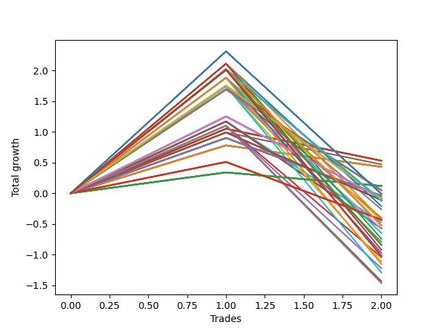

# Short HLT 106 
- Symbol: TSLA
- Date Range: 01/10/2024 - 05/17/2024
- Trading Period: 8:30-12:30
- Number of Trades: 2


### Test TP-0.25 15m
* Take Profit of 0.25 Point
* 0.25 Stoploss
* Results:
```
Total Trades: 2
Percent Up: 50.00
Percent Down: 50.00
Total Points Moved Down: 0.12
Potential Profit: 60.00
Total Points Ups: 0.22 Count Ups: 1
Total Points Downs: 0.34 Count Downs: 1
```

<details><summary>Trades</summary>

<code>In: 2024-01-29 08:40:00		Out: 2024-01-29 08:42:00		Total Position Time: 02:00		Total Move Down: 0.34		Total to Date: 0.34</code> <br />
<code>In: 2024-02-15 09:30:00		Out: 2024-02-15 09:32:00		Total Position Time: 02:00		Total Move Down: -0.22		Total to Date: 0.12</code> <br />


</details>

### Test TP-0.5 15m
* Take Profit of 0.5 Point
* 0.5 Stoploss
* Results:
```
Total Trades: 2
Percent Up: 50.00
Percent Down: 50.00
Total Points Moved Down: -0.43
Potential Profit: -215.00
Total Points Ups: 0.94 Count Ups: 1
Total Points Downs: 0.51 Count Downs: 1
```

<details><summary>Trades</summary>

<code>In: 2024-01-29 08:40:00		Out: 2024-01-29 08:44:00		Total Position Time: 04:00		Total Move Down: 0.51		Total to Date: 0.51</code> <br />
<code>In: 2024-02-15 09:30:00		Out: 2024-02-15 09:35:00		Total Position Time: 05:00		Total Move Down: -0.94		Total to Date: -0.43</code> <br />


</details>

### Test TP-0.75 15m
* Take Profit of 0.75 Point
* 0.75 Stoploss
* Results:
```
Total Trades: 2
Percent Up: 50.00
Percent Down: 50.00
Total Points Moved Down: -0.04
Potential Profit: -20.00
Total Points Ups: 0.94 Count Ups: 1
Total Points Downs: 0.90 Count Downs: 1
```

<details><summary>Trades</summary>

<code>In: 2024-01-29 08:40:00		Out: 2024-01-29 08:51:00		Total Position Time: 11:00		Total Move Down: 0.90		Total to Date: 0.90</code> <br />
<code>In: 2024-02-15 09:30:00		Out: 2024-02-15 09:35:00		Total Position Time: 05:00		Total Move Down: -0.94		Total to Date: -0.04</code> <br />


</details>

### Test TP-1 15m
* Take Profit of 1 Point
* 1 Stoploss
* Results:
```
Total Trades: 2
Percent Up: 50.00
Percent Down: 50.00
Total Points Moved Down: 0.43
Potential Profit: 215.00
Total Points Ups: 0.35 Count Ups: 1
Total Points Downs: 0.78 Count Downs: 1
```

<details><summary>Trades</summary>

<code>In: 2024-01-29 08:40:00		Out: 2024-01-29 08:54:00		Total Position Time: 14:00		Total Move Down: 0.78		Total to Date: 0.78</code> <br />
<code>In: 2024-02-15 09:30:00		Out: 2024-02-15 09:44:00		Total Position Time: 14:00		Total Move Down: -0.35		Total to Date: 0.43</code> <br />


</details>

### Test TP-1.25 15m
* Take Profit of 1.25 Point
* 1.25 Stoploss
* Results:
```
Total Trades: 2
Percent Up: 50.00
Percent Down: 50.00
Total Points Moved Down: 0.43
Potential Profit: 215.00
Total Points Ups: 0.35 Count Ups: 1
Total Points Downs: 0.78 Count Downs: 1
```

<details><summary>Trades</summary>

<code>In: 2024-01-29 08:40:00		Out: 2024-01-29 08:54:00		Total Position Time: 14:00		Total Move Down: 0.78		Total to Date: 0.78</code> <br />
<code>In: 2024-02-15 09:30:00		Out: 2024-02-15 09:44:00		Total Position Time: 14:00		Total Move Down: -0.35		Total to Date: 0.43</code> <br />


</details>

### Test TP-1.5 15m
* Take Profit of 1.5 Point
* 1.5 Stoploss
* Results:
```
Total Trades: 2
Percent Up: 50.00
Percent Down: 50.00
Total Points Moved Down: 0.43
Potential Profit: 215.00
Total Points Ups: 0.35 Count Ups: 1
Total Points Downs: 0.78 Count Downs: 1
```

<details><summary>Trades</summary>

<code>In: 2024-01-29 08:40:00		Out: 2024-01-29 08:54:00		Total Position Time: 14:00		Total Move Down: 0.78		Total to Date: 0.78</code> <br />
<code>In: 2024-02-15 09:30:00		Out: 2024-02-15 09:44:00		Total Position Time: 14:00		Total Move Down: -0.35		Total to Date: 0.43</code> <br />


</details>

### Test TP-1.75 15m
* Take Profit of 1.75 Point
* 1.75 Stoploss
* Results:
```
Total Trades: 2
Percent Up: 50.00
Percent Down: 50.00
Total Points Moved Down: 0.43
Potential Profit: 215.00
Total Points Ups: 0.35 Count Ups: 1
Total Points Downs: 0.78 Count Downs: 1
```

<details><summary>Trades</summary>

<code>In: 2024-01-29 08:40:00		Out: 2024-01-29 08:54:00		Total Position Time: 14:00		Total Move Down: 0.78		Total to Date: 0.78</code> <br />
<code>In: 2024-02-15 09:30:00		Out: 2024-02-15 09:44:00		Total Position Time: 14:00		Total Move Down: -0.35		Total to Date: 0.43</code> <br />


</details>

### Test TP-2 15m
* Take Profit of 2 Point
* 2 Stoploss
* Results:
```
Total Trades: 2
Percent Up: 50.00
Percent Down: 50.00
Total Points Moved Down: 0.43
Potential Profit: 215.00
Total Points Ups: 0.35 Count Ups: 1
Total Points Downs: 0.78 Count Downs: 1
```

<details><summary>Trades</summary>

<code>In: 2024-01-29 08:40:00		Out: 2024-01-29 08:54:00		Total Position Time: 14:00		Total Move Down: 0.78		Total to Date: 0.78</code> <br />
<code>In: 2024-02-15 09:30:00		Out: 2024-02-15 09:44:00		Total Position Time: 14:00		Total Move Down: -0.35		Total to Date: 0.43</code> <br />


</details>

### Test TP-2.25 15m
* Take Profit of 2.25 Point
* 2.25 Stoploss
* Results:
```
Total Trades: 2
Percent Up: 50.00
Percent Down: 50.00
Total Points Moved Down: 0.43
Potential Profit: 215.00
Total Points Ups: 0.35 Count Ups: 1
Total Points Downs: 0.78 Count Downs: 1
```

<details><summary>Trades</summary>

<code>In: 2024-01-29 08:40:00		Out: 2024-01-29 08:54:00		Total Position Time: 14:00		Total Move Down: 0.78		Total to Date: 0.78</code> <br />
<code>In: 2024-02-15 09:30:00		Out: 2024-02-15 09:44:00		Total Position Time: 14:00		Total Move Down: -0.35		Total to Date: 0.43</code> <br />


</details>

### Test TP-2.5 15m
* Take Profit of 2.5 Point
* 2.5 Stoploss
* Results:
```
Total Trades: 2
Percent Up: 50.00
Percent Down: 50.00
Total Points Moved Down: 0.43
Potential Profit: 215.00
Total Points Ups: 0.35 Count Ups: 1
Total Points Downs: 0.78 Count Downs: 1
```

<details><summary>Trades</summary>

<code>In: 2024-01-29 08:40:00		Out: 2024-01-29 08:54:00		Total Position Time: 14:00		Total Move Down: 0.78		Total to Date: 0.78</code> <br />
<code>In: 2024-02-15 09:30:00		Out: 2024-02-15 09:44:00		Total Position Time: 14:00		Total Move Down: -0.35		Total to Date: 0.43</code> <br />


</details>

### Test TP-2.75 15m
* Take Profit of 2.75 Point
* 2.75 Stoploss
* Results:
```
Total Trades: 2
Percent Up: 50.00
Percent Down: 50.00
Total Points Moved Down: 0.43
Potential Profit: 215.00
Total Points Ups: 0.35 Count Ups: 1
Total Points Downs: 0.78 Count Downs: 1
```

<details><summary>Trades</summary>

<code>In: 2024-01-29 08:40:00		Out: 2024-01-29 08:54:00		Total Position Time: 14:00		Total Move Down: 0.78		Total to Date: 0.78</code> <br />
<code>In: 2024-02-15 09:30:00		Out: 2024-02-15 09:44:00		Total Position Time: 14:00		Total Move Down: -0.35		Total to Date: 0.43</code> <br />


</details>

### Test TP-3 15m
* Take Profit of 3 Point
* 3 Stoploss
* Results:
```
Total Trades: 2
Percent Up: 50.00
Percent Down: 50.00
Total Points Moved Down: 0.43
Potential Profit: 215.00
Total Points Ups: 0.35 Count Ups: 1
Total Points Downs: 0.78 Count Downs: 1
```

<details><summary>Trades</summary>

<code>In: 2024-01-29 08:40:00		Out: 2024-01-29 08:54:00		Total Position Time: 14:00		Total Move Down: 0.78		Total to Date: 0.78</code> <br />
<code>In: 2024-02-15 09:30:00		Out: 2024-02-15 09:44:00		Total Position Time: 14:00		Total Move Down: -0.35		Total to Date: 0.43</code> <br />


</details>

### Test TP-0.25 30m
* Take Profit of 0.25 Point
* 0.25 Stoploss
* Results:
```
Total Trades: 2
Percent Up: 50.00
Percent Down: 50.00
Total Points Moved Down: 0.12
Potential Profit: 60.00
Total Points Ups: 0.22 Count Ups: 1
Total Points Downs: 0.34 Count Downs: 1
```

<details><summary>Trades</summary>

<code>In: 2024-01-29 08:40:00		Out: 2024-01-29 08:42:00		Total Position Time: 02:00		Total Move Down: 0.34		Total to Date: 0.34</code> <br />
<code>In: 2024-02-15 09:30:00		Out: 2024-02-15 09:32:00		Total Position Time: 02:00		Total Move Down: -0.22		Total to Date: 0.12</code> <br />


</details>

### Test TP-0.5 30m
* Take Profit of 0.5 Point
* 0.5 Stoploss
* Results:
```
Total Trades: 2
Percent Up: 50.00
Percent Down: 50.00
Total Points Moved Down: -0.43
Potential Profit: -215.00
Total Points Ups: 0.94 Count Ups: 1
Total Points Downs: 0.51 Count Downs: 1
```

<details><summary>Trades</summary>

<code>In: 2024-01-29 08:40:00		Out: 2024-01-29 08:44:00		Total Position Time: 04:00		Total Move Down: 0.51		Total to Date: 0.51</code> <br />
<code>In: 2024-02-15 09:30:00		Out: 2024-02-15 09:35:00		Total Position Time: 05:00		Total Move Down: -0.94		Total to Date: -0.43</code> <br />


</details>

### Test TP-0.75 30m
* Take Profit of 0.75 Point
* 0.75 Stoploss
* Results:
```
Total Trades: 2
Percent Up: 50.00
Percent Down: 50.00
Total Points Moved Down: -0.04
Potential Profit: -20.00
Total Points Ups: 0.94 Count Ups: 1
Total Points Downs: 0.90 Count Downs: 1
```

<details><summary>Trades</summary>

<code>In: 2024-01-29 08:40:00		Out: 2024-01-29 08:51:00		Total Position Time: 11:00		Total Move Down: 0.90		Total to Date: 0.90</code> <br />
<code>In: 2024-02-15 09:30:00		Out: 2024-02-15 09:35:00		Total Position Time: 05:00		Total Move Down: -0.94		Total to Date: -0.04</code> <br />


</details>

### Test TP-1 30m
* Take Profit of 1 Point
* 1 Stoploss
* Results:
```
Total Trades: 2
Percent Up: 50.00
Percent Down: 50.00
Total Points Moved Down: 0.47
Potential Profit: 235.00
Total Points Ups: 0.52 Count Ups: 1
Total Points Downs: 0.99 Count Downs: 1
```

<details><summary>Trades</summary>

<code>In: 2024-01-29 08:40:00		Out: 2024-01-29 09:06:00		Total Position Time: 26:00		Total Move Down: 0.99		Total to Date: 0.99</code> <br />
<code>In: 2024-02-15 09:30:00		Out: 2024-02-15 09:59:00		Total Position Time: 29:00		Total Move Down: -0.52		Total to Date: 0.47</code> <br />


</details>

### Test TP-1.25 30m
* Take Profit of 1.25 Point
* 1.25 Stoploss
* Results:
```
Total Trades: 2
Percent Up: 50.00
Percent Down: 50.00
Total Points Moved Down: 0.53
Potential Profit: 265.00
Total Points Ups: 0.52 Count Ups: 1
Total Points Downs: 1.05 Count Downs: 1
```

<details><summary>Trades</summary>

<code>In: 2024-01-29 08:40:00		Out: 2024-01-29 09:09:00		Total Position Time: 29:00		Total Move Down: 1.05		Total to Date: 1.05</code> <br />
<code>In: 2024-02-15 09:30:00		Out: 2024-02-15 09:59:00		Total Position Time: 29:00		Total Move Down: -0.52		Total to Date: 0.53</code> <br />


</details>

### Test TP-1.5 30m
* Take Profit of 1.5 Point
* 1.5 Stoploss
* Results:
```
Total Trades: 2
Percent Up: 50.00
Percent Down: 50.00
Total Points Moved Down: 0.53
Potential Profit: 265.00
Total Points Ups: 0.52 Count Ups: 1
Total Points Downs: 1.05 Count Downs: 1
```

<details><summary>Trades</summary>

<code>In: 2024-01-29 08:40:00		Out: 2024-01-29 09:09:00		Total Position Time: 29:00		Total Move Down: 1.05		Total to Date: 1.05</code> <br />
<code>In: 2024-02-15 09:30:00		Out: 2024-02-15 09:59:00		Total Position Time: 29:00		Total Move Down: -0.52		Total to Date: 0.53</code> <br />


</details>

### Test TP-1.75 30m
* Take Profit of 1.75 Point
* 1.75 Stoploss
* Results:
```
Total Trades: 2
Percent Up: 50.00
Percent Down: 50.00
Total Points Moved Down: 0.53
Potential Profit: 265.00
Total Points Ups: 0.52 Count Ups: 1
Total Points Downs: 1.05 Count Downs: 1
```

<details><summary>Trades</summary>

<code>In: 2024-01-29 08:40:00		Out: 2024-01-29 09:09:00		Total Position Time: 29:00		Total Move Down: 1.05		Total to Date: 1.05</code> <br />
<code>In: 2024-02-15 09:30:00		Out: 2024-02-15 09:59:00		Total Position Time: 29:00		Total Move Down: -0.52		Total to Date: 0.53</code> <br />


</details>

### Test TP-2 30m
* Take Profit of 2 Point
* 2 Stoploss
* Results:
```
Total Trades: 2
Percent Up: 50.00
Percent Down: 50.00
Total Points Moved Down: 0.53
Potential Profit: 265.00
Total Points Ups: 0.52 Count Ups: 1
Total Points Downs: 1.05 Count Downs: 1
```

<details><summary>Trades</summary>

<code>In: 2024-01-29 08:40:00		Out: 2024-01-29 09:09:00		Total Position Time: 29:00		Total Move Down: 1.05		Total to Date: 1.05</code> <br />
<code>In: 2024-02-15 09:30:00		Out: 2024-02-15 09:59:00		Total Position Time: 29:00		Total Move Down: -0.52		Total to Date: 0.53</code> <br />


</details>

### Test TP-2.25 30m
* Take Profit of 2.25 Point
* 2.25 Stoploss
* Results:
```
Total Trades: 2
Percent Up: 50.00
Percent Down: 50.00
Total Points Moved Down: 0.53
Potential Profit: 265.00
Total Points Ups: 0.52 Count Ups: 1
Total Points Downs: 1.05 Count Downs: 1
```

<details><summary>Trades</summary>

<code>In: 2024-01-29 08:40:00		Out: 2024-01-29 09:09:00		Total Position Time: 29:00		Total Move Down: 1.05		Total to Date: 1.05</code> <br />
<code>In: 2024-02-15 09:30:00		Out: 2024-02-15 09:59:00		Total Position Time: 29:00		Total Move Down: -0.52		Total to Date: 0.53</code> <br />


</details>

### Test TP-2.5 30m
* Take Profit of 2.5 Point
* 2.5 Stoploss
* Results:
```
Total Trades: 2
Percent Up: 50.00
Percent Down: 50.00
Total Points Moved Down: 0.53
Potential Profit: 265.00
Total Points Ups: 0.52 Count Ups: 1
Total Points Downs: 1.05 Count Downs: 1
```

<details><summary>Trades</summary>

<code>In: 2024-01-29 08:40:00		Out: 2024-01-29 09:09:00		Total Position Time: 29:00		Total Move Down: 1.05		Total to Date: 1.05</code> <br />
<code>In: 2024-02-15 09:30:00		Out: 2024-02-15 09:59:00		Total Position Time: 29:00		Total Move Down: -0.52		Total to Date: 0.53</code> <br />


</details>

### Test TP-2.75 30m
* Take Profit of 2.75 Point
* 2.75 Stoploss
* Results:
```
Total Trades: 2
Percent Up: 50.00
Percent Down: 50.00
Total Points Moved Down: 0.53
Potential Profit: 265.00
Total Points Ups: 0.52 Count Ups: 1
Total Points Downs: 1.05 Count Downs: 1
```

<details><summary>Trades</summary>

<code>In: 2024-01-29 08:40:00		Out: 2024-01-29 09:09:00		Total Position Time: 29:00		Total Move Down: 1.05		Total to Date: 1.05</code> <br />
<code>In: 2024-02-15 09:30:00		Out: 2024-02-15 09:59:00		Total Position Time: 29:00		Total Move Down: -0.52		Total to Date: 0.53</code> <br />


</details>

### Test TP-3 30m
* Take Profit of 3 Point
* 3 Stoploss
* Results:
```
Total Trades: 2
Percent Up: 50.00
Percent Down: 50.00
Total Points Moved Down: 0.53
Potential Profit: 265.00
Total Points Ups: 0.52 Count Ups: 1
Total Points Downs: 1.05 Count Downs: 1
```

<details><summary>Trades</summary>

<code>In: 2024-01-29 08:40:00		Out: 2024-01-29 09:09:00		Total Position Time: 29:00		Total Move Down: 1.05		Total to Date: 1.05</code> <br />
<code>In: 2024-02-15 09:30:00		Out: 2024-02-15 09:59:00		Total Position Time: 29:00		Total Move Down: -0.52		Total to Date: 0.53</code> <br />


</details>

### Test TP-0.25 45m
* Take Profit of 0.25 Point
* 0.25 Stoploss
* Results:
```
Total Trades: 2
Percent Up: 50.00
Percent Down: 50.00
Total Points Moved Down: 0.12
Potential Profit: 60.00
Total Points Ups: 0.22 Count Ups: 1
Total Points Downs: 0.34 Count Downs: 1
```

<details><summary>Trades</summary>

<code>In: 2024-01-29 08:40:00		Out: 2024-01-29 08:42:00		Total Position Time: 02:00		Total Move Down: 0.34		Total to Date: 0.34</code> <br />
<code>In: 2024-02-15 09:30:00		Out: 2024-02-15 09:32:00		Total Position Time: 02:00		Total Move Down: -0.22		Total to Date: 0.12</code> <br />


</details>

### Test TP-0.5 45m
* Take Profit of 0.5 Point
* 0.5 Stoploss
* Results:
```
Total Trades: 2
Percent Up: 50.00
Percent Down: 50.00
Total Points Moved Down: -0.43
Potential Profit: -215.00
Total Points Ups: 0.94 Count Ups: 1
Total Points Downs: 0.51 Count Downs: 1
```

<details><summary>Trades</summary>

<code>In: 2024-01-29 08:40:00		Out: 2024-01-29 08:44:00		Total Position Time: 04:00		Total Move Down: 0.51		Total to Date: 0.51</code> <br />
<code>In: 2024-02-15 09:30:00		Out: 2024-02-15 09:35:00		Total Position Time: 05:00		Total Move Down: -0.94		Total to Date: -0.43</code> <br />


</details>

### Test TP-0.75 45m
* Take Profit of 0.75 Point
* 0.75 Stoploss
* Results:
```
Total Trades: 2
Percent Up: 50.00
Percent Down: 50.00
Total Points Moved Down: -0.04
Potential Profit: -20.00
Total Points Ups: 0.94 Count Ups: 1
Total Points Downs: 0.90 Count Downs: 1
```

<details><summary>Trades</summary>

<code>In: 2024-01-29 08:40:00		Out: 2024-01-29 08:51:00		Total Position Time: 11:00		Total Move Down: 0.90		Total to Date: 0.90</code> <br />
<code>In: 2024-02-15 09:30:00		Out: 2024-02-15 09:35:00		Total Position Time: 05:00		Total Move Down: -0.94		Total to Date: -0.04</code> <br />


</details>

### Test TP-1 45m
* Take Profit of 1 Point
* 1 Stoploss
* Results:
```
Total Trades: 2
Percent Up: 50.00
Percent Down: 50.00
Total Points Moved Down: -0.11
Potential Profit: -55.00
Total Points Ups: 1.10 Count Ups: 1
Total Points Downs: 0.99 Count Downs: 1
```

<details><summary>Trades</summary>

<code>In: 2024-01-29 08:40:00		Out: 2024-01-29 09:06:00		Total Position Time: 26:00		Total Move Down: 0.99		Total to Date: 0.99</code> <br />
<code>In: 2024-02-15 09:30:00		Out: 2024-02-15 10:10:00		Total Position Time: 40:00		Total Move Down: -1.10		Total to Date: -0.11</code> <br />


</details>

### Test TP-1.25 45m
* Take Profit of 1.25 Point
* 1.25 Stoploss
* Results:
```
Total Trades: 2
Percent Up: 50.00
Percent Down: 50.00
Total Points Moved Down: -0.08
Potential Profit: -40.00
Total Points Ups: 1.33 Count Ups: 1
Total Points Downs: 1.25 Count Downs: 1
```

<details><summary>Trades</summary>

<code>In: 2024-01-29 08:40:00		Out: 2024-01-29 09:15:00		Total Position Time: 35:00		Total Move Down: 1.25		Total to Date: 1.25</code> <br />
<code>In: 2024-02-15 09:30:00		Out: 2024-02-15 10:12:00		Total Position Time: 42:00		Total Move Down: -1.33		Total to Date: -0.08</code> <br />


</details>

### Test TP-1.5 45m
* Take Profit of 1.5 Point
* 1.5 Stoploss
* Results:
```
Total Trades: 2
Percent Up: 50.00
Percent Down: 50.00
Total Points Moved Down: -0.47
Potential Profit: -235.00
Total Points Ups: 1.64 Count Ups: 1
Total Points Downs: 1.17 Count Downs: 1
```

<details><summary>Trades</summary>

<code>In: 2024-01-29 08:40:00		Out: 2024-01-29 09:24:00		Total Position Time: 44:00		Total Move Down: 1.17		Total to Date: 1.17</code> <br />
<code>In: 2024-02-15 09:30:00		Out: 2024-02-15 10:13:00		Total Position Time: 43:00		Total Move Down: -1.64		Total to Date: -0.47</code> <br />


</details>

### Test TP-1.75 45m
* Take Profit of 1.75 Point
* 1.75 Stoploss
* Results:
```
Total Trades: 2
Percent Up: 50.00
Percent Down: 50.00
Total Points Moved Down: -0.57
Potential Profit: -285.00
Total Points Ups: 1.74 Count Ups: 1
Total Points Downs: 1.17 Count Downs: 1
```

<details><summary>Trades</summary>

<code>In: 2024-01-29 08:40:00		Out: 2024-01-29 09:24:00		Total Position Time: 44:00		Total Move Down: 1.17		Total to Date: 1.17</code> <br />
<code>In: 2024-02-15 09:30:00		Out: 2024-02-15 10:14:00		Total Position Time: 44:00		Total Move Down: -1.74		Total to Date: -0.57</code> <br />


</details>

### Test TP-2 45m
* Take Profit of 2 Point
* 2 Stoploss
* Results:
```
Total Trades: 2
Percent Up: 50.00
Percent Down: 50.00
Total Points Moved Down: -0.57
Potential Profit: -285.00
Total Points Ups: 1.74 Count Ups: 1
Total Points Downs: 1.17 Count Downs: 1
```

<details><summary>Trades</summary>

<code>In: 2024-01-29 08:40:00		Out: 2024-01-29 09:24:00		Total Position Time: 44:00		Total Move Down: 1.17		Total to Date: 1.17</code> <br />
<code>In: 2024-02-15 09:30:00		Out: 2024-02-15 10:14:00		Total Position Time: 44:00		Total Move Down: -1.74		Total to Date: -0.57</code> <br />


</details>

### Test TP-2.25 45m
* Take Profit of 2.25 Point
* 2.25 Stoploss
* Results:
```
Total Trades: 2
Percent Up: 50.00
Percent Down: 50.00
Total Points Moved Down: -0.57
Potential Profit: -285.00
Total Points Ups: 1.74 Count Ups: 1
Total Points Downs: 1.17 Count Downs: 1
```

<details><summary>Trades</summary>

<code>In: 2024-01-29 08:40:00		Out: 2024-01-29 09:24:00		Total Position Time: 44:00		Total Move Down: 1.17		Total to Date: 1.17</code> <br />
<code>In: 2024-02-15 09:30:00		Out: 2024-02-15 10:14:00		Total Position Time: 44:00		Total Move Down: -1.74		Total to Date: -0.57</code> <br />


</details>

### Test TP-2.5 45m
* Take Profit of 2.5 Point
* 2.5 Stoploss
* Results:
```
Total Trades: 2
Percent Up: 50.00
Percent Down: 50.00
Total Points Moved Down: -0.57
Potential Profit: -285.00
Total Points Ups: 1.74 Count Ups: 1
Total Points Downs: 1.17 Count Downs: 1
```

<details><summary>Trades</summary>

<code>In: 2024-01-29 08:40:00		Out: 2024-01-29 09:24:00		Total Position Time: 44:00		Total Move Down: 1.17		Total to Date: 1.17</code> <br />
<code>In: 2024-02-15 09:30:00		Out: 2024-02-15 10:14:00		Total Position Time: 44:00		Total Move Down: -1.74		Total to Date: -0.57</code> <br />


</details>

### Test TP-2.75 45m
* Take Profit of 2.75 Point
* 2.75 Stoploss
* Results:
```
Total Trades: 2
Percent Up: 50.00
Percent Down: 50.00
Total Points Moved Down: -0.57
Potential Profit: -285.00
Total Points Ups: 1.74 Count Ups: 1
Total Points Downs: 1.17 Count Downs: 1
```

<details><summary>Trades</summary>

<code>In: 2024-01-29 08:40:00		Out: 2024-01-29 09:24:00		Total Position Time: 44:00		Total Move Down: 1.17		Total to Date: 1.17</code> <br />
<code>In: 2024-02-15 09:30:00		Out: 2024-02-15 10:14:00		Total Position Time: 44:00		Total Move Down: -1.74		Total to Date: -0.57</code> <br />


</details>

### Test TP-3 45m
* Take Profit of 3 Point
* 3 Stoploss
* Results:
```
Total Trades: 2
Percent Up: 50.00
Percent Down: 50.00
Total Points Moved Down: -0.57
Potential Profit: -285.00
Total Points Ups: 1.74 Count Ups: 1
Total Points Downs: 1.17 Count Downs: 1
```

<details><summary>Trades</summary>

<code>In: 2024-01-29 08:40:00		Out: 2024-01-29 09:24:00		Total Position Time: 44:00		Total Move Down: 1.17		Total to Date: 1.17</code> <br />
<code>In: 2024-02-15 09:30:00		Out: 2024-02-15 10:14:00		Total Position Time: 44:00		Total Move Down: -1.74		Total to Date: -0.57</code> <br />


</details>

### Test TP-0.25 60m
* Take Profit of 0.25 Point
* 0.25 Stoploss
* Results:
```
Total Trades: 2
Percent Up: 50.00
Percent Down: 50.00
Total Points Moved Down: 0.12
Potential Profit: 60.00
Total Points Ups: 0.22 Count Ups: 1
Total Points Downs: 0.34 Count Downs: 1
```

<details><summary>Trades</summary>

<code>In: 2024-01-29 08:40:00		Out: 2024-01-29 08:42:00		Total Position Time: 02:00		Total Move Down: 0.34		Total to Date: 0.34</code> <br />
<code>In: 2024-02-15 09:30:00		Out: 2024-02-15 09:32:00		Total Position Time: 02:00		Total Move Down: -0.22		Total to Date: 0.12</code> <br />


</details>

### Test TP-0.5 60m
* Take Profit of 0.5 Point
* 0.5 Stoploss
* Results:
```
Total Trades: 2
Percent Up: 50.00
Percent Down: 50.00
Total Points Moved Down: -0.43
Potential Profit: -215.00
Total Points Ups: 0.94 Count Ups: 1
Total Points Downs: 0.51 Count Downs: 1
```

<details><summary>Trades</summary>

<code>In: 2024-01-29 08:40:00		Out: 2024-01-29 08:44:00		Total Position Time: 04:00		Total Move Down: 0.51		Total to Date: 0.51</code> <br />
<code>In: 2024-02-15 09:30:00		Out: 2024-02-15 09:35:00		Total Position Time: 05:00		Total Move Down: -0.94		Total to Date: -0.43</code> <br />


</details>

### Test TP-0.75 60m
* Take Profit of 0.75 Point
* 0.75 Stoploss
* Results:
```
Total Trades: 2
Percent Up: 50.00
Percent Down: 50.00
Total Points Moved Down: -0.04
Potential Profit: -20.00
Total Points Ups: 0.94 Count Ups: 1
Total Points Downs: 0.90 Count Downs: 1
```

<details><summary>Trades</summary>

<code>In: 2024-01-29 08:40:00		Out: 2024-01-29 08:51:00		Total Position Time: 11:00		Total Move Down: 0.90		Total to Date: 0.90</code> <br />
<code>In: 2024-02-15 09:30:00		Out: 2024-02-15 09:35:00		Total Position Time: 05:00		Total Move Down: -0.94		Total to Date: -0.04</code> <br />


</details>

### Test TP-1 60m
* Take Profit of 1 Point
* 1 Stoploss
* Results:
```
Total Trades: 2
Percent Up: 50.00
Percent Down: 50.00
Total Points Moved Down: -0.11
Potential Profit: -55.00
Total Points Ups: 1.10 Count Ups: 1
Total Points Downs: 0.99 Count Downs: 1
```

<details><summary>Trades</summary>

<code>In: 2024-01-29 08:40:00		Out: 2024-01-29 09:06:00		Total Position Time: 26:00		Total Move Down: 0.99		Total to Date: 0.99</code> <br />
<code>In: 2024-02-15 09:30:00		Out: 2024-02-15 10:10:00		Total Position Time: 40:00		Total Move Down: -1.10		Total to Date: -0.11</code> <br />


</details>

### Test TP-1.25 60m
* Take Profit of 1.25 Point
* 1.25 Stoploss
* Results:
```
Total Trades: 2
Percent Up: 50.00
Percent Down: 50.00
Total Points Moved Down: -0.08
Potential Profit: -40.00
Total Points Ups: 1.33 Count Ups: 1
Total Points Downs: 1.25 Count Downs: 1
```

<details><summary>Trades</summary>

<code>In: 2024-01-29 08:40:00		Out: 2024-01-29 09:15:00		Total Position Time: 35:00		Total Move Down: 1.25		Total to Date: 1.25</code> <br />
<code>In: 2024-02-15 09:30:00		Out: 2024-02-15 10:12:00		Total Position Time: 42:00		Total Move Down: -1.33		Total to Date: -0.08</code> <br />


</details>

### Test TP-1.5 60m
* Take Profit of 1.5 Point
* 1.5 Stoploss
* Results:
```
Total Trades: 2
Percent Up: 50.00
Percent Down: 50.00
Total Points Moved Down: 0.05
Potential Profit: 25.00
Total Points Ups: 1.64 Count Ups: 1
Total Points Downs: 1.69 Count Downs: 1
```

<details><summary>Trades</summary>

<code>In: 2024-01-29 08:40:00		Out: 2024-01-29 09:26:00		Total Position Time: 46:00		Total Move Down: 1.69		Total to Date: 1.69</code> <br />
<code>In: 2024-02-15 09:30:00		Out: 2024-02-15 10:13:00		Total Position Time: 43:00		Total Move Down: -1.64		Total to Date: 0.05</code> <br />


</details>

### Test TP-1.75 60m
* Take Profit of 1.75 Point
* 1.75 Stoploss
* Results:
```
Total Trades: 2
Percent Up: 50.00
Percent Down: 50.00
Total Points Moved Down: -0.09
Potential Profit: -45.00
Total Points Ups: 1.84 Count Ups: 1
Total Points Downs: 1.75 Count Downs: 1
```

<details><summary>Trades</summary>

<code>In: 2024-01-29 08:40:00		Out: 2024-01-29 09:27:00		Total Position Time: 47:00		Total Move Down: 1.75		Total to Date: 1.75</code> <br />
<code>In: 2024-02-15 09:30:00		Out: 2024-02-15 10:15:00		Total Position Time: 45:00		Total Move Down: -1.84		Total to Date: -0.09</code> <br />


</details>

### Test TP-2 60m
* Take Profit of 2 Point
* 2 Stoploss
* Results:
```
Total Trades: 2
Percent Up: 50.00
Percent Down: 50.00
Total Points Moved Down: -1.04
Potential Profit: -520.00
Total Points Ups: 2.14 Count Ups: 1
Total Points Downs: 1.10 Count Downs: 1
```

<details><summary>Trades</summary>

<code>In: 2024-01-29 08:40:00		Out: 2024-01-29 09:39:00		Total Position Time: 59:00		Total Move Down: 1.10		Total to Date: 1.10</code> <br />
<code>In: 2024-02-15 09:30:00		Out: 2024-02-15 10:21:00		Total Position Time: 51:00		Total Move Down: -2.14		Total to Date: -1.04</code> <br />


</details>

### Test TP-2.25 60m
* Take Profit of 2.25 Point
* 2.25 Stoploss
* Results:
```
Total Trades: 2
Percent Up: 50.00
Percent Down: 50.00
Total Points Moved Down: -1.22
Potential Profit: -610.00
Total Points Ups: 2.32 Count Ups: 1
Total Points Downs: 1.10 Count Downs: 1
```

<details><summary>Trades</summary>

<code>In: 2024-01-29 08:40:00		Out: 2024-01-29 09:39:00		Total Position Time: 59:00		Total Move Down: 1.10		Total to Date: 1.10</code> <br />
<code>In: 2024-02-15 09:30:00		Out: 2024-02-15 10:22:00		Total Position Time: 52:00		Total Move Down: -2.32		Total to Date: -1.22</code> <br />


</details>

### Test TP-2.5 60m
* Take Profit of 2.5 Point
* 2.5 Stoploss
* Results:
```
Total Trades: 2
Percent Up: 50.00
Percent Down: 50.00
Total Points Moved Down: -1.43
Potential Profit: -715.00
Total Points Ups: 2.53 Count Ups: 1
Total Points Downs: 1.10 Count Downs: 1
```

<details><summary>Trades</summary>

<code>In: 2024-01-29 08:40:00		Out: 2024-01-29 09:39:00		Total Position Time: 59:00		Total Move Down: 1.10		Total to Date: 1.10</code> <br />
<code>In: 2024-02-15 09:30:00		Out: 2024-02-15 10:23:00		Total Position Time: 53:00		Total Move Down: -2.53		Total to Date: -1.43</code> <br />


</details>

### Test TP-2.75 60m
* Take Profit of 2.75 Point
* 2.75 Stoploss
* Results:
```
Total Trades: 2
Percent Up: 50.00
Percent Down: 50.00
Total Points Moved Down: -1.46
Potential Profit: -730.00
Total Points Ups: 2.56 Count Ups: 1
Total Points Downs: 1.10 Count Downs: 1
```

<details><summary>Trades</summary>

<code>In: 2024-01-29 08:40:00		Out: 2024-01-29 09:39:00		Total Position Time: 59:00		Total Move Down: 1.10		Total to Date: 1.10</code> <br />
<code>In: 2024-02-15 09:30:00		Out: 2024-02-15 10:29:00		Total Position Time: 59:00		Total Move Down: -2.56		Total to Date: -1.46</code> <br />


</details>

### Test TP-3 60m
* Take Profit of 3 Point
* 3 Stoploss
* Results:
```
Total Trades: 2
Percent Up: 50.00
Percent Down: 50.00
Total Points Moved Down: -1.46
Potential Profit: -730.00
Total Points Ups: 2.56 Count Ups: 1
Total Points Downs: 1.10 Count Downs: 1
```

<details><summary>Trades</summary>

<code>In: 2024-01-29 08:40:00		Out: 2024-01-29 09:39:00		Total Position Time: 59:00		Total Move Down: 1.10		Total to Date: 1.10</code> <br />
<code>In: 2024-02-15 09:30:00		Out: 2024-02-15 10:29:00		Total Position Time: 59:00		Total Move Down: -2.56		Total to Date: -1.46</code> <br />


</details>

### Test TP-0.25 75m
* Take Profit of 0.25 Point
* 0.25 Stoploss
* Results:
```
Total Trades: 2
Percent Up: 50.00
Percent Down: 50.00
Total Points Moved Down: 0.12
Potential Profit: 60.00
Total Points Ups: 0.22 Count Ups: 1
Total Points Downs: 0.34 Count Downs: 1
```

<details><summary>Trades</summary>

<code>In: 2024-01-29 08:40:00		Out: 2024-01-29 08:42:00		Total Position Time: 02:00		Total Move Down: 0.34		Total to Date: 0.34</code> <br />
<code>In: 2024-02-15 09:30:00		Out: 2024-02-15 09:32:00		Total Position Time: 02:00		Total Move Down: -0.22		Total to Date: 0.12</code> <br />


</details>

### Test TP-0.5 75m
* Take Profit of 0.5 Point
* 0.5 Stoploss
* Results:
```
Total Trades: 2
Percent Up: 50.00
Percent Down: 50.00
Total Points Moved Down: -0.43
Potential Profit: -215.00
Total Points Ups: 0.94 Count Ups: 1
Total Points Downs: 0.51 Count Downs: 1
```

<details><summary>Trades</summary>

<code>In: 2024-01-29 08:40:00		Out: 2024-01-29 08:44:00		Total Position Time: 04:00		Total Move Down: 0.51		Total to Date: 0.51</code> <br />
<code>In: 2024-02-15 09:30:00		Out: 2024-02-15 09:35:00		Total Position Time: 05:00		Total Move Down: -0.94		Total to Date: -0.43</code> <br />


</details>

### Test TP-0.75 75m
* Take Profit of 0.75 Point
* 0.75 Stoploss
* Results:
```
Total Trades: 2
Percent Up: 50.00
Percent Down: 50.00
Total Points Moved Down: -0.04
Potential Profit: -20.00
Total Points Ups: 0.94 Count Ups: 1
Total Points Downs: 0.90 Count Downs: 1
```

<details><summary>Trades</summary>

<code>In: 2024-01-29 08:40:00		Out: 2024-01-29 08:51:00		Total Position Time: 11:00		Total Move Down: 0.90		Total to Date: 0.90</code> <br />
<code>In: 2024-02-15 09:30:00		Out: 2024-02-15 09:35:00		Total Position Time: 05:00		Total Move Down: -0.94		Total to Date: -0.04</code> <br />


</details>

### Test TP-1 75m
* Take Profit of 1 Point
* 1 Stoploss
* Results:
```
Total Trades: 2
Percent Up: 50.00
Percent Down: 50.00
Total Points Moved Down: -0.11
Potential Profit: -55.00
Total Points Ups: 1.10 Count Ups: 1
Total Points Downs: 0.99 Count Downs: 1
```

<details><summary>Trades</summary>

<code>In: 2024-01-29 08:40:00		Out: 2024-01-29 09:06:00		Total Position Time: 26:00		Total Move Down: 0.99		Total to Date: 0.99</code> <br />
<code>In: 2024-02-15 09:30:00		Out: 2024-02-15 10:10:00		Total Position Time: 40:00		Total Move Down: -1.10		Total to Date: -0.11</code> <br />


</details>

### Test TP-1.25 75m
* Take Profit of 1.25 Point
* 1.25 Stoploss
* Results:
```
Total Trades: 2
Percent Up: 50.00
Percent Down: 50.00
Total Points Moved Down: -0.08
Potential Profit: -40.00
Total Points Ups: 1.33 Count Ups: 1
Total Points Downs: 1.25 Count Downs: 1
```

<details><summary>Trades</summary>

<code>In: 2024-01-29 08:40:00		Out: 2024-01-29 09:15:00		Total Position Time: 35:00		Total Move Down: 1.25		Total to Date: 1.25</code> <br />
<code>In: 2024-02-15 09:30:00		Out: 2024-02-15 10:12:00		Total Position Time: 42:00		Total Move Down: -1.33		Total to Date: -0.08</code> <br />


</details>

### Test TP-1.5 75m
* Take Profit of 1.5 Point
* 1.5 Stoploss
* Results:
```
Total Trades: 2
Percent Up: 50.00
Percent Down: 50.00
Total Points Moved Down: 0.05
Potential Profit: 25.00
Total Points Ups: 1.64 Count Ups: 1
Total Points Downs: 1.69 Count Downs: 1
```

<details><summary>Trades</summary>

<code>In: 2024-01-29 08:40:00		Out: 2024-01-29 09:26:00		Total Position Time: 46:00		Total Move Down: 1.69		Total to Date: 1.69</code> <br />
<code>In: 2024-02-15 09:30:00		Out: 2024-02-15 10:13:00		Total Position Time: 43:00		Total Move Down: -1.64		Total to Date: 0.05</code> <br />


</details>

### Test TP-1.75 75m
* Take Profit of 1.75 Point
* 1.75 Stoploss
* Results:
```
Total Trades: 2
Percent Up: 50.00
Percent Down: 50.00
Total Points Moved Down: -0.09
Potential Profit: -45.00
Total Points Ups: 1.84 Count Ups: 1
Total Points Downs: 1.75 Count Downs: 1
```

<details><summary>Trades</summary>

<code>In: 2024-01-29 08:40:00		Out: 2024-01-29 09:27:00		Total Position Time: 47:00		Total Move Down: 1.75		Total to Date: 1.75</code> <br />
<code>In: 2024-02-15 09:30:00		Out: 2024-02-15 10:15:00		Total Position Time: 45:00		Total Move Down: -1.84		Total to Date: -0.09</code> <br />


</details>

### Test TP-2 75m
* Take Profit of 2 Point
* 2 Stoploss
* Results:
```
Total Trades: 2
Percent Up: 50.00
Percent Down: 50.00
Total Points Moved Down: -0.40
Potential Profit: -200.00
Total Points Ups: 2.14 Count Ups: 1
Total Points Downs: 1.74 Count Downs: 1
```

<details><summary>Trades</summary>

<code>In: 2024-01-29 08:40:00		Out: 2024-01-29 09:54:00		Total Position Time: 74:00		Total Move Down: 1.74		Total to Date: 1.74</code> <br />
<code>In: 2024-02-15 09:30:00		Out: 2024-02-15 10:21:00		Total Position Time: 51:00		Total Move Down: -2.14		Total to Date: -0.40</code> <br />


</details>

### Test TP-2.25 75m
* Take Profit of 2.25 Point
* 2.25 Stoploss
* Results:
```
Total Trades: 2
Percent Up: 50.00
Percent Down: 50.00
Total Points Moved Down: -0.58
Potential Profit: -290.00
Total Points Ups: 2.32 Count Ups: 1
Total Points Downs: 1.74 Count Downs: 1
```

<details><summary>Trades</summary>

<code>In: 2024-01-29 08:40:00		Out: 2024-01-29 09:54:00		Total Position Time: 74:00		Total Move Down: 1.74		Total to Date: 1.74</code> <br />
<code>In: 2024-02-15 09:30:00		Out: 2024-02-15 10:22:00		Total Position Time: 52:00		Total Move Down: -2.32		Total to Date: -0.58</code> <br />


</details>

### Test TP-2.5 75m
* Take Profit of 2.5 Point
* 2.5 Stoploss
* Results:
```
Total Trades: 2
Percent Up: 50.00
Percent Down: 50.00
Total Points Moved Down: -0.79
Potential Profit: -395.00
Total Points Ups: 2.53 Count Ups: 1
Total Points Downs: 1.74 Count Downs: 1
```

<details><summary>Trades</summary>

<code>In: 2024-01-29 08:40:00		Out: 2024-01-29 09:54:00		Total Position Time: 74:00		Total Move Down: 1.74		Total to Date: 1.74</code> <br />
<code>In: 2024-02-15 09:30:00		Out: 2024-02-15 10:23:00		Total Position Time: 53:00		Total Move Down: -2.53		Total to Date: -0.79</code> <br />


</details>

### Test TP-2.75 75m
* Take Profit of 2.75 Point
* 2.75 Stoploss
* Results:
```
Total Trades: 2
Percent Up: 50.00
Percent Down: 50.00
Total Points Moved Down: -1.11
Potential Profit: -555.00
Total Points Ups: 2.85 Count Ups: 1
Total Points Downs: 1.74 Count Downs: 1
```

<details><summary>Trades</summary>

<code>In: 2024-01-29 08:40:00		Out: 2024-01-29 09:54:00		Total Position Time: 74:00		Total Move Down: 1.74		Total to Date: 1.74</code> <br />
<code>In: 2024-02-15 09:30:00		Out: 2024-02-15 10:39:00		Total Position Time: 69:00		Total Move Down: -2.85		Total to Date: -1.11</code> <br />


</details>

### Test TP-3 75m
* Take Profit of 3 Point
* 3 Stoploss
* Results:
```
Total Trades: 2
Percent Up: 50.00
Percent Down: 50.00
Total Points Moved Down: -1.29
Potential Profit: -645.00
Total Points Ups: 3.03 Count Ups: 1
Total Points Downs: 1.74 Count Downs: 1
```

<details><summary>Trades</summary>

<code>In: 2024-01-29 08:40:00		Out: 2024-01-29 09:54:00		Total Position Time: 74:00		Total Move Down: 1.74		Total to Date: 1.74</code> <br />
<code>In: 2024-02-15 09:30:00		Out: 2024-02-15 10:40:00		Total Position Time: 70:00		Total Move Down: -3.03		Total to Date: -1.29</code> <br />


</details>

### Test TP-0.25 90m
* Take Profit of 0.25 Point
* 0.25 Stoploss
* Results:
```
Total Trades: 2
Percent Up: 50.00
Percent Down: 50.00
Total Points Moved Down: 0.12
Potential Profit: 60.00
Total Points Ups: 0.22 Count Ups: 1
Total Points Downs: 0.34 Count Downs: 1
```

<details><summary>Trades</summary>

<code>In: 2024-01-29 08:40:00		Out: 2024-01-29 08:42:00		Total Position Time: 02:00		Total Move Down: 0.34		Total to Date: 0.34</code> <br />
<code>In: 2024-02-15 09:30:00		Out: 2024-02-15 09:32:00		Total Position Time: 02:00		Total Move Down: -0.22		Total to Date: 0.12</code> <br />


</details>

### Test TP-0.5 90m
* Take Profit of 0.5 Point
* 0.5 Stoploss
* Results:
```
Total Trades: 2
Percent Up: 50.00
Percent Down: 50.00
Total Points Moved Down: -0.43
Potential Profit: -215.00
Total Points Ups: 0.94 Count Ups: 1
Total Points Downs: 0.51 Count Downs: 1
```

<details><summary>Trades</summary>

<code>In: 2024-01-29 08:40:00		Out: 2024-01-29 08:44:00		Total Position Time: 04:00		Total Move Down: 0.51		Total to Date: 0.51</code> <br />
<code>In: 2024-02-15 09:30:00		Out: 2024-02-15 09:35:00		Total Position Time: 05:00		Total Move Down: -0.94		Total to Date: -0.43</code> <br />


</details>

### Test TP-0.75 90m
* Take Profit of 0.75 Point
* 0.75 Stoploss
* Results:
```
Total Trades: 2
Percent Up: 50.00
Percent Down: 50.00
Total Points Moved Down: -0.04
Potential Profit: -20.00
Total Points Ups: 0.94 Count Ups: 1
Total Points Downs: 0.90 Count Downs: 1
```

<details><summary>Trades</summary>

<code>In: 2024-01-29 08:40:00		Out: 2024-01-29 08:51:00		Total Position Time: 11:00		Total Move Down: 0.90		Total to Date: 0.90</code> <br />
<code>In: 2024-02-15 09:30:00		Out: 2024-02-15 09:35:00		Total Position Time: 05:00		Total Move Down: -0.94		Total to Date: -0.04</code> <br />


</details>

### Test TP-1 90m
* Take Profit of 1 Point
* 1 Stoploss
* Results:
```
Total Trades: 2
Percent Up: 50.00
Percent Down: 50.00
Total Points Moved Down: -0.11
Potential Profit: -55.00
Total Points Ups: 1.10 Count Ups: 1
Total Points Downs: 0.99 Count Downs: 1
```

<details><summary>Trades</summary>

<code>In: 2024-01-29 08:40:00		Out: 2024-01-29 09:06:00		Total Position Time: 26:00		Total Move Down: 0.99		Total to Date: 0.99</code> <br />
<code>In: 2024-02-15 09:30:00		Out: 2024-02-15 10:10:00		Total Position Time: 40:00		Total Move Down: -1.10		Total to Date: -0.11</code> <br />


</details>

### Test TP-1.25 90m
* Take Profit of 1.25 Point
* 1.25 Stoploss
* Results:
```
Total Trades: 2
Percent Up: 50.00
Percent Down: 50.00
Total Points Moved Down: -0.08
Potential Profit: -40.00
Total Points Ups: 1.33 Count Ups: 1
Total Points Downs: 1.25 Count Downs: 1
```

<details><summary>Trades</summary>

<code>In: 2024-01-29 08:40:00		Out: 2024-01-29 09:15:00		Total Position Time: 35:00		Total Move Down: 1.25		Total to Date: 1.25</code> <br />
<code>In: 2024-02-15 09:30:00		Out: 2024-02-15 10:12:00		Total Position Time: 42:00		Total Move Down: -1.33		Total to Date: -0.08</code> <br />


</details>

### Test TP-1.5 90m
* Take Profit of 1.5 Point
* 1.5 Stoploss
* Results:
```
Total Trades: 2
Percent Up: 50.00
Percent Down: 50.00
Total Points Moved Down: 0.05
Potential Profit: 25.00
Total Points Ups: 1.64 Count Ups: 1
Total Points Downs: 1.69 Count Downs: 1
```

<details><summary>Trades</summary>

<code>In: 2024-01-29 08:40:00		Out: 2024-01-29 09:26:00		Total Position Time: 46:00		Total Move Down: 1.69		Total to Date: 1.69</code> <br />
<code>In: 2024-02-15 09:30:00		Out: 2024-02-15 10:13:00		Total Position Time: 43:00		Total Move Down: -1.64		Total to Date: 0.05</code> <br />


</details>

### Test TP-1.75 90m
* Take Profit of 1.75 Point
* 1.75 Stoploss
* Results:
```
Total Trades: 2
Percent Up: 50.00
Percent Down: 50.00
Total Points Moved Down: -0.09
Potential Profit: -45.00
Total Points Ups: 1.84 Count Ups: 1
Total Points Downs: 1.75 Count Downs: 1
```

<details><summary>Trades</summary>

<code>In: 2024-01-29 08:40:00		Out: 2024-01-29 09:27:00		Total Position Time: 47:00		Total Move Down: 1.75		Total to Date: 1.75</code> <br />
<code>In: 2024-02-15 09:30:00		Out: 2024-02-15 10:15:00		Total Position Time: 45:00		Total Move Down: -1.84		Total to Date: -0.09</code> <br />


</details>

### Test TP-2 90m
* Take Profit of 2 Point
* 2 Stoploss
* Results:
```
Total Trades: 2
Percent Up: 50.00
Percent Down: 50.00
Total Points Moved Down: -0.26
Potential Profit: -130.00
Total Points Ups: 2.14 Count Ups: 1
Total Points Downs: 1.88 Count Downs: 1
```

<details><summary>Trades</summary>

<code>In: 2024-01-29 08:40:00		Out: 2024-01-29 10:09:00		Total Position Time: 89:00		Total Move Down: 1.88		Total to Date: 1.88</code> <br />
<code>In: 2024-02-15 09:30:00		Out: 2024-02-15 10:21:00		Total Position Time: 51:00		Total Move Down: -2.14		Total to Date: -0.26</code> <br />


</details>

### Test TP-2.25 90m
* Take Profit of 2.25 Point
* 2.25 Stoploss
* Results:
```
Total Trades: 2
Percent Up: 50.00
Percent Down: 50.00
Total Points Moved Down: -0.44
Potential Profit: -220.00
Total Points Ups: 2.32 Count Ups: 1
Total Points Downs: 1.88 Count Downs: 1
```

<details><summary>Trades</summary>

<code>In: 2024-01-29 08:40:00		Out: 2024-01-29 10:09:00		Total Position Time: 89:00		Total Move Down: 1.88		Total to Date: 1.88</code> <br />
<code>In: 2024-02-15 09:30:00		Out: 2024-02-15 10:22:00		Total Position Time: 52:00		Total Move Down: -2.32		Total to Date: -0.44</code> <br />


</details>

### Test TP-2.5 90m
* Take Profit of 2.5 Point
* 2.5 Stoploss
* Results:
```
Total Trades: 2
Percent Up: 50.00
Percent Down: 50.00
Total Points Moved Down: -0.65
Potential Profit: -325.00
Total Points Ups: 2.53 Count Ups: 1
Total Points Downs: 1.88 Count Downs: 1
```

<details><summary>Trades</summary>

<code>In: 2024-01-29 08:40:00		Out: 2024-01-29 10:09:00		Total Position Time: 89:00		Total Move Down: 1.88		Total to Date: 1.88</code> <br />
<code>In: 2024-02-15 09:30:00		Out: 2024-02-15 10:23:00		Total Position Time: 53:00		Total Move Down: -2.53		Total to Date: -0.65</code> <br />


</details>

### Test TP-2.75 90m
* Take Profit of 2.75 Point
* 2.75 Stoploss
* Results:
```
Total Trades: 2
Percent Up: 50.00
Percent Down: 50.00
Total Points Moved Down: -0.97
Potential Profit: -485.00
Total Points Ups: 2.85 Count Ups: 1
Total Points Downs: 1.88 Count Downs: 1
```

<details><summary>Trades</summary>

<code>In: 2024-01-29 08:40:00		Out: 2024-01-29 10:09:00		Total Position Time: 89:00		Total Move Down: 1.88		Total to Date: 1.88</code> <br />
<code>In: 2024-02-15 09:30:00		Out: 2024-02-15 10:39:00		Total Position Time: 69:00		Total Move Down: -2.85		Total to Date: -0.97</code> <br />


</details>

### Test TP-3 90m
* Take Profit of 3 Point
* 3 Stoploss
* Results:
```
Total Trades: 2
Percent Up: 50.00
Percent Down: 50.00
Total Points Moved Down: -1.15
Potential Profit: -575.00
Total Points Ups: 3.03 Count Ups: 1
Total Points Downs: 1.88 Count Downs: 1
```

<details><summary>Trades</summary>

<code>In: 2024-01-29 08:40:00		Out: 2024-01-29 10:09:00		Total Position Time: 89:00		Total Move Down: 1.88		Total to Date: 1.88</code> <br />
<code>In: 2024-02-15 09:30:00		Out: 2024-02-15 10:40:00		Total Position Time: 70:00		Total Move Down: -3.03		Total to Date: -1.15</code> <br />


</details>

### Test TP-0.25 105m
* Take Profit of 0.25 Point
* 0.25 Stoploss
* Results:
```
Total Trades: 2
Percent Up: 50.00
Percent Down: 50.00
Total Points Moved Down: 0.12
Potential Profit: 60.00
Total Points Ups: 0.22 Count Ups: 1
Total Points Downs: 0.34 Count Downs: 1
```

<details><summary>Trades</summary>

<code>In: 2024-01-29 08:40:00		Out: 2024-01-29 08:42:00		Total Position Time: 02:00		Total Move Down: 0.34		Total to Date: 0.34</code> <br />
<code>In: 2024-02-15 09:30:00		Out: 2024-02-15 09:32:00		Total Position Time: 02:00		Total Move Down: -0.22		Total to Date: 0.12</code> <br />


</details>

### Test TP-0.5 105m
* Take Profit of 0.5 Point
* 0.5 Stoploss
* Results:
```
Total Trades: 2
Percent Up: 50.00
Percent Down: 50.00
Total Points Moved Down: -0.43
Potential Profit: -215.00
Total Points Ups: 0.94 Count Ups: 1
Total Points Downs: 0.51 Count Downs: 1
```

<details><summary>Trades</summary>

<code>In: 2024-01-29 08:40:00		Out: 2024-01-29 08:44:00		Total Position Time: 04:00		Total Move Down: 0.51		Total to Date: 0.51</code> <br />
<code>In: 2024-02-15 09:30:00		Out: 2024-02-15 09:35:00		Total Position Time: 05:00		Total Move Down: -0.94		Total to Date: -0.43</code> <br />


</details>

### Test TP-0.75 105m
* Take Profit of 0.75 Point
* 0.75 Stoploss
* Results:
```
Total Trades: 2
Percent Up: 50.00
Percent Down: 50.00
Total Points Moved Down: -0.04
Potential Profit: -20.00
Total Points Ups: 0.94 Count Ups: 1
Total Points Downs: 0.90 Count Downs: 1
```

<details><summary>Trades</summary>

<code>In: 2024-01-29 08:40:00		Out: 2024-01-29 08:51:00		Total Position Time: 11:00		Total Move Down: 0.90		Total to Date: 0.90</code> <br />
<code>In: 2024-02-15 09:30:00		Out: 2024-02-15 09:35:00		Total Position Time: 05:00		Total Move Down: -0.94		Total to Date: -0.04</code> <br />


</details>

### Test TP-1 105m
* Take Profit of 1 Point
* 1 Stoploss
* Results:
```
Total Trades: 2
Percent Up: 50.00
Percent Down: 50.00
Total Points Moved Down: -0.11
Potential Profit: -55.00
Total Points Ups: 1.10 Count Ups: 1
Total Points Downs: 0.99 Count Downs: 1
```

<details><summary>Trades</summary>

<code>In: 2024-01-29 08:40:00		Out: 2024-01-29 09:06:00		Total Position Time: 26:00		Total Move Down: 0.99		Total to Date: 0.99</code> <br />
<code>In: 2024-02-15 09:30:00		Out: 2024-02-15 10:10:00		Total Position Time: 40:00		Total Move Down: -1.10		Total to Date: -0.11</code> <br />


</details>

### Test TP-1.25 105m
* Take Profit of 1.25 Point
* 1.25 Stoploss
* Results:
```
Total Trades: 2
Percent Up: 50.00
Percent Down: 50.00
Total Points Moved Down: -0.08
Potential Profit: -40.00
Total Points Ups: 1.33 Count Ups: 1
Total Points Downs: 1.25 Count Downs: 1
```

<details><summary>Trades</summary>

<code>In: 2024-01-29 08:40:00		Out: 2024-01-29 09:15:00		Total Position Time: 35:00		Total Move Down: 1.25		Total to Date: 1.25</code> <br />
<code>In: 2024-02-15 09:30:00		Out: 2024-02-15 10:12:00		Total Position Time: 42:00		Total Move Down: -1.33		Total to Date: -0.08</code> <br />


</details>

### Test TP-1.5 105m
* Take Profit of 1.5 Point
* 1.5 Stoploss
* Results:
```
Total Trades: 2
Percent Up: 50.00
Percent Down: 50.00
Total Points Moved Down: 0.05
Potential Profit: 25.00
Total Points Ups: 1.64 Count Ups: 1
Total Points Downs: 1.69 Count Downs: 1
```

<details><summary>Trades</summary>

<code>In: 2024-01-29 08:40:00		Out: 2024-01-29 09:26:00		Total Position Time: 46:00		Total Move Down: 1.69		Total to Date: 1.69</code> <br />
<code>In: 2024-02-15 09:30:00		Out: 2024-02-15 10:13:00		Total Position Time: 43:00		Total Move Down: -1.64		Total to Date: 0.05</code> <br />


</details>

### Test TP-1.75 105m
* Take Profit of 1.75 Point
* 1.75 Stoploss
* Results:
```
Total Trades: 2
Percent Up: 50.00
Percent Down: 50.00
Total Points Moved Down: -0.09
Potential Profit: -45.00
Total Points Ups: 1.84 Count Ups: 1
Total Points Downs: 1.75 Count Downs: 1
```

<details><summary>Trades</summary>

<code>In: 2024-01-29 08:40:00		Out: 2024-01-29 09:27:00		Total Position Time: 47:00		Total Move Down: 1.75		Total to Date: 1.75</code> <br />
<code>In: 2024-02-15 09:30:00		Out: 2024-02-15 10:15:00		Total Position Time: 45:00		Total Move Down: -1.84		Total to Date: -0.09</code> <br />


</details>

### Test TP-2 105m
* Take Profit of 2 Point
* 2 Stoploss
* Results:
```
Total Trades: 2
Percent Up: 50.00
Percent Down: 50.00
Total Points Moved Down: -0.12
Potential Profit: -60.00
Total Points Ups: 2.14 Count Ups: 1
Total Points Downs: 2.02 Count Downs: 1
```

<details><summary>Trades</summary>

<code>In: 2024-01-29 08:40:00		Out: 2024-01-29 10:10:00		Total Position Time: 90:00		Total Move Down: 2.02		Total to Date: 2.02</code> <br />
<code>In: 2024-02-15 09:30:00		Out: 2024-02-15 10:21:00		Total Position Time: 51:00		Total Move Down: -2.14		Total to Date: -0.12</code> <br />


</details>

### Test TP-2.25 105m
* Take Profit of 2.25 Point
* 2.25 Stoploss
* Results:
```
Total Trades: 2
Percent Up: 50.00
Percent Down: 50.00
Total Points Moved Down: -0.21
Potential Profit: -105.00
Total Points Ups: 2.32 Count Ups: 1
Total Points Downs: 2.11 Count Downs: 1
```

<details><summary>Trades</summary>

<code>In: 2024-01-29 08:40:00		Out: 2024-01-29 10:24:00		Total Position Time: 104:00		Total Move Down: 2.11		Total to Date: 2.11</code> <br />
<code>In: 2024-02-15 09:30:00		Out: 2024-02-15 10:22:00		Total Position Time: 52:00		Total Move Down: -2.32		Total to Date: -0.21</code> <br />


</details>

### Test TP-2.5 105m
* Take Profit of 2.5 Point
* 2.5 Stoploss
* Results:
```
Total Trades: 2
Percent Up: 50.00
Percent Down: 50.00
Total Points Moved Down: -0.42
Potential Profit: -210.00
Total Points Ups: 2.53 Count Ups: 1
Total Points Downs: 2.11 Count Downs: 1
```

<details><summary>Trades</summary>

<code>In: 2024-01-29 08:40:00		Out: 2024-01-29 10:24:00		Total Position Time: 104:00		Total Move Down: 2.11		Total to Date: 2.11</code> <br />
<code>In: 2024-02-15 09:30:00		Out: 2024-02-15 10:23:00		Total Position Time: 53:00		Total Move Down: -2.53		Total to Date: -0.42</code> <br />


</details>

### Test TP-2.75 105m
* Take Profit of 2.75 Point
* 2.75 Stoploss
* Results:
```
Total Trades: 2
Percent Up: 50.00
Percent Down: 50.00
Total Points Moved Down: -0.74
Potential Profit: -370.00
Total Points Ups: 2.85 Count Ups: 1
Total Points Downs: 2.11 Count Downs: 1
```

<details><summary>Trades</summary>

<code>In: 2024-01-29 08:40:00		Out: 2024-01-29 10:24:00		Total Position Time: 104:00		Total Move Down: 2.11		Total to Date: 2.11</code> <br />
<code>In: 2024-02-15 09:30:00		Out: 2024-02-15 10:39:00		Total Position Time: 69:00		Total Move Down: -2.85		Total to Date: -0.74</code> <br />


</details>

### Test TP-3 105m
* Take Profit of 3 Point
* 3 Stoploss
* Results:
```
Total Trades: 2
Percent Up: 50.00
Percent Down: 50.00
Total Points Moved Down: -0.92
Potential Profit: -460.00
Total Points Ups: 3.03 Count Ups: 1
Total Points Downs: 2.11 Count Downs: 1
```

<details><summary>Trades</summary>

<code>In: 2024-01-29 08:40:00		Out: 2024-01-29 10:24:00		Total Position Time: 104:00		Total Move Down: 2.11		Total to Date: 2.11</code> <br />
<code>In: 2024-02-15 09:30:00		Out: 2024-02-15 10:40:00		Total Position Time: 70:00		Total Move Down: -3.03		Total to Date: -0.92</code> <br />


</details>

### Test TP-0.25 120m
* Take Profit of 0.25 Point
* 0.25 Stoploss
* Results:
```
Total Trades: 2
Percent Up: 50.00
Percent Down: 50.00
Total Points Moved Down: 0.12
Potential Profit: 60.00
Total Points Ups: 0.22 Count Ups: 1
Total Points Downs: 0.34 Count Downs: 1
```

<details><summary>Trades</summary>

<code>In: 2024-01-29 08:40:00		Out: 2024-01-29 08:42:00		Total Position Time: 02:00		Total Move Down: 0.34		Total to Date: 0.34</code> <br />
<code>In: 2024-02-15 09:30:00		Out: 2024-02-15 09:32:00		Total Position Time: 02:00		Total Move Down: -0.22		Total to Date: 0.12</code> <br />


</details>

### Test TP-0.5 120m
* Take Profit of 0.5 Point
* 0.5 Stoploss
* Results:
```
Total Trades: 2
Percent Up: 50.00
Percent Down: 50.00
Total Points Moved Down: -0.43
Potential Profit: -215.00
Total Points Ups: 0.94 Count Ups: 1
Total Points Downs: 0.51 Count Downs: 1
```

<details><summary>Trades</summary>

<code>In: 2024-01-29 08:40:00		Out: 2024-01-29 08:44:00		Total Position Time: 04:00		Total Move Down: 0.51		Total to Date: 0.51</code> <br />
<code>In: 2024-02-15 09:30:00		Out: 2024-02-15 09:35:00		Total Position Time: 05:00		Total Move Down: -0.94		Total to Date: -0.43</code> <br />


</details>

### Test TP-0.75 120m
* Take Profit of 0.75 Point
* 0.75 Stoploss
* Results:
```
Total Trades: 2
Percent Up: 50.00
Percent Down: 50.00
Total Points Moved Down: -0.04
Potential Profit: -20.00
Total Points Ups: 0.94 Count Ups: 1
Total Points Downs: 0.90 Count Downs: 1
```

<details><summary>Trades</summary>

<code>In: 2024-01-29 08:40:00		Out: 2024-01-29 08:51:00		Total Position Time: 11:00		Total Move Down: 0.90		Total to Date: 0.90</code> <br />
<code>In: 2024-02-15 09:30:00		Out: 2024-02-15 09:35:00		Total Position Time: 05:00		Total Move Down: -0.94		Total to Date: -0.04</code> <br />


</details>

### Test TP-1 120m
* Take Profit of 1 Point
* 1 Stoploss
* Results:
```
Total Trades: 2
Percent Up: 50.00
Percent Down: 50.00
Total Points Moved Down: -0.11
Potential Profit: -55.00
Total Points Ups: 1.10 Count Ups: 1
Total Points Downs: 0.99 Count Downs: 1
```

<details><summary>Trades</summary>

<code>In: 2024-01-29 08:40:00		Out: 2024-01-29 09:06:00		Total Position Time: 26:00		Total Move Down: 0.99		Total to Date: 0.99</code> <br />
<code>In: 2024-02-15 09:30:00		Out: 2024-02-15 10:10:00		Total Position Time: 40:00		Total Move Down: -1.10		Total to Date: -0.11</code> <br />


</details>

### Test TP-1.25 120m
* Take Profit of 1.25 Point
* 1.25 Stoploss
* Results:
```
Total Trades: 2
Percent Up: 50.00
Percent Down: 50.00
Total Points Moved Down: -0.08
Potential Profit: -40.00
Total Points Ups: 1.33 Count Ups: 1
Total Points Downs: 1.25 Count Downs: 1
```

<details><summary>Trades</summary>

<code>In: 2024-01-29 08:40:00		Out: 2024-01-29 09:15:00		Total Position Time: 35:00		Total Move Down: 1.25		Total to Date: 1.25</code> <br />
<code>In: 2024-02-15 09:30:00		Out: 2024-02-15 10:12:00		Total Position Time: 42:00		Total Move Down: -1.33		Total to Date: -0.08</code> <br />


</details>

### Test TP-1.5 120m
* Take Profit of 1.5 Point
* 1.5 Stoploss
* Results:
```
Total Trades: 2
Percent Up: 50.00
Percent Down: 50.00
Total Points Moved Down: 0.05
Potential Profit: 25.00
Total Points Ups: 1.64 Count Ups: 1
Total Points Downs: 1.69 Count Downs: 1
```

<details><summary>Trades</summary>

<code>In: 2024-01-29 08:40:00		Out: 2024-01-29 09:26:00		Total Position Time: 46:00		Total Move Down: 1.69		Total to Date: 1.69</code> <br />
<code>In: 2024-02-15 09:30:00		Out: 2024-02-15 10:13:00		Total Position Time: 43:00		Total Move Down: -1.64		Total to Date: 0.05</code> <br />


</details>

### Test TP-1.75 120m
* Take Profit of 1.75 Point
* 1.75 Stoploss
* Results:
```
Total Trades: 2
Percent Up: 50.00
Percent Down: 50.00
Total Points Moved Down: -0.09
Potential Profit: -45.00
Total Points Ups: 1.84 Count Ups: 1
Total Points Downs: 1.75 Count Downs: 1
```

<details><summary>Trades</summary>

<code>In: 2024-01-29 08:40:00		Out: 2024-01-29 09:27:00		Total Position Time: 47:00		Total Move Down: 1.75		Total to Date: 1.75</code> <br />
<code>In: 2024-02-15 09:30:00		Out: 2024-02-15 10:15:00		Total Position Time: 45:00		Total Move Down: -1.84		Total to Date: -0.09</code> <br />


</details>

### Test TP-2 120m
* Take Profit of 2 Point
* 2 Stoploss
* Results:
```
Total Trades: 2
Percent Up: 50.00
Percent Down: 50.00
Total Points Moved Down: -0.12
Potential Profit: -60.00
Total Points Ups: 2.14 Count Ups: 1
Total Points Downs: 2.02 Count Downs: 1
```

<details><summary>Trades</summary>

<code>In: 2024-01-29 08:40:00		Out: 2024-01-29 10:10:00		Total Position Time: 90:00		Total Move Down: 2.02		Total to Date: 2.02</code> <br />
<code>In: 2024-02-15 09:30:00		Out: 2024-02-15 10:21:00		Total Position Time: 51:00		Total Move Down: -2.14		Total to Date: -0.12</code> <br />


</details>

### Test TP-2.25 120m
* Take Profit of 2.25 Point
* 2.25 Stoploss
* Results:
```
Total Trades: 2
Percent Up: 50.00
Percent Down: 50.00
Total Points Moved Down: -0.01
Potential Profit: -5.00
Total Points Ups: 2.32 Count Ups: 1
Total Points Downs: 2.31 Count Downs: 1
```

<details><summary>Trades</summary>

<code>In: 2024-01-29 08:40:00		Out: 2024-01-29 10:28:00		Total Position Time: 108:00		Total Move Down: 2.31		Total to Date: 2.31</code> <br />
<code>In: 2024-02-15 09:30:00		Out: 2024-02-15 10:22:00		Total Position Time: 52:00		Total Move Down: -2.32		Total to Date: -0.01</code> <br />


</details>

### Test TP-2.5 120m
* Take Profit of 2.5 Point
* 2.5 Stoploss
* Results:
```
Total Trades: 2
Percent Up: 50.00
Percent Down: 50.00
Total Points Moved Down: -0.52
Potential Profit: -260.00
Total Points Ups: 2.53 Count Ups: 1
Total Points Downs: 2.01 Count Downs: 1
```

<details><summary>Trades</summary>

<code>In: 2024-01-29 08:40:00		Out: 2024-01-29 10:39:00		Total Position Time: 119:00		Total Move Down: 2.01		Total to Date: 2.01</code> <br />
<code>In: 2024-02-15 09:30:00		Out: 2024-02-15 10:23:00		Total Position Time: 53:00		Total Move Down: -2.53		Total to Date: -0.52</code> <br />


</details>

### Test TP-2.75 120m
* Take Profit of 2.75 Point
* 2.75 Stoploss
* Results:
```
Total Trades: 2
Percent Up: 50.00
Percent Down: 50.00
Total Points Moved Down: -0.84
Potential Profit: -420.00
Total Points Ups: 2.85 Count Ups: 1
Total Points Downs: 2.01 Count Downs: 1
```

<details><summary>Trades</summary>

<code>In: 2024-01-29 08:40:00		Out: 2024-01-29 10:39:00		Total Position Time: 119:00		Total Move Down: 2.01		Total to Date: 2.01</code> <br />
<code>In: 2024-02-15 09:30:00		Out: 2024-02-15 10:39:00		Total Position Time: 69:00		Total Move Down: -2.85		Total to Date: -0.84</code> <br />


</details>

### Test TP-3 120m
* Take Profit of 3 Point
* 3 Stoploss
* Results:
```
Total Trades: 2
Percent Up: 50.00
Percent Down: 50.00
Total Points Moved Down: -1.02
Potential Profit: -510.00
Total Points Ups: 3.03 Count Ups: 1
Total Points Downs: 2.01 Count Downs: 1
```

<details><summary>Trades</summary>

<code>In: 2024-01-29 08:40:00		Out: 2024-01-29 10:39:00		Total Position Time: 119:00		Total Move Down: 2.01		Total to Date: 2.01</code> <br />
<code>In: 2024-02-15 09:30:00		Out: 2024-02-15 10:40:00		Total Position Time: 70:00		Total Move Down: -3.03		Total to Date: -1.02</code> <br />


</details>

### Test TP-0.25 135m
* Take Profit of 0.25 Point
* 0.25 Stoploss
* Results:
```
Total Trades: 2
Percent Up: 50.00
Percent Down: 50.00
Total Points Moved Down: 0.12
Potential Profit: 60.00
Total Points Ups: 0.22 Count Ups: 1
Total Points Downs: 0.34 Count Downs: 1
```

<details><summary>Trades</summary>

<code>In: 2024-01-29 08:40:00		Out: 2024-01-29 08:42:00		Total Position Time: 02:00		Total Move Down: 0.34		Total to Date: 0.34</code> <br />
<code>In: 2024-02-15 09:30:00		Out: 2024-02-15 09:32:00		Total Position Time: 02:00		Total Move Down: -0.22		Total to Date: 0.12</code> <br />


</details>

### Test TP-0.5 135m
* Take Profit of 0.5 Point
* 0.5 Stoploss
* Results:
```
Total Trades: 2
Percent Up: 50.00
Percent Down: 50.00
Total Points Moved Down: -0.43
Potential Profit: -215.00
Total Points Ups: 0.94 Count Ups: 1
Total Points Downs: 0.51 Count Downs: 1
```

<details><summary>Trades</summary>

<code>In: 2024-01-29 08:40:00		Out: 2024-01-29 08:44:00		Total Position Time: 04:00		Total Move Down: 0.51		Total to Date: 0.51</code> <br />
<code>In: 2024-02-15 09:30:00		Out: 2024-02-15 09:35:00		Total Position Time: 05:00		Total Move Down: -0.94		Total to Date: -0.43</code> <br />


</details>

### Test TP-0.75 135m
* Take Profit of 0.75 Point
* 0.75 Stoploss
* Results:
```
Total Trades: 2
Percent Up: 50.00
Percent Down: 50.00
Total Points Moved Down: -0.04
Potential Profit: -20.00
Total Points Ups: 0.94 Count Ups: 1
Total Points Downs: 0.90 Count Downs: 1
```

<details><summary>Trades</summary>

<code>In: 2024-01-29 08:40:00		Out: 2024-01-29 08:51:00		Total Position Time: 11:00		Total Move Down: 0.90		Total to Date: 0.90</code> <br />
<code>In: 2024-02-15 09:30:00		Out: 2024-02-15 09:35:00		Total Position Time: 05:00		Total Move Down: -0.94		Total to Date: -0.04</code> <br />


</details>

### Test TP-1 135m
* Take Profit of 1 Point
* 1 Stoploss
* Results:
```
Total Trades: 2
Percent Up: 50.00
Percent Down: 50.00
Total Points Moved Down: -0.11
Potential Profit: -55.00
Total Points Ups: 1.10 Count Ups: 1
Total Points Downs: 0.99 Count Downs: 1
```

<details><summary>Trades</summary>

<code>In: 2024-01-29 08:40:00		Out: 2024-01-29 09:06:00		Total Position Time: 26:00		Total Move Down: 0.99		Total to Date: 0.99</code> <br />
<code>In: 2024-02-15 09:30:00		Out: 2024-02-15 10:10:00		Total Position Time: 40:00		Total Move Down: -1.10		Total to Date: -0.11</code> <br />


</details>

### Test TP-1.25 135m
* Take Profit of 1.25 Point
* 1.25 Stoploss
* Results:
```
Total Trades: 2
Percent Up: 50.00
Percent Down: 50.00
Total Points Moved Down: -0.08
Potential Profit: -40.00
Total Points Ups: 1.33 Count Ups: 1
Total Points Downs: 1.25 Count Downs: 1
```

<details><summary>Trades</summary>

<code>In: 2024-01-29 08:40:00		Out: 2024-01-29 09:15:00		Total Position Time: 35:00		Total Move Down: 1.25		Total to Date: 1.25</code> <br />
<code>In: 2024-02-15 09:30:00		Out: 2024-02-15 10:12:00		Total Position Time: 42:00		Total Move Down: -1.33		Total to Date: -0.08</code> <br />


</details>

### Test TP-1.5 135m
* Take Profit of 1.5 Point
* 1.5 Stoploss
* Results:
```
Total Trades: 2
Percent Up: 50.00
Percent Down: 50.00
Total Points Moved Down: 0.05
Potential Profit: 25.00
Total Points Ups: 1.64 Count Ups: 1
Total Points Downs: 1.69 Count Downs: 1
```

<details><summary>Trades</summary>

<code>In: 2024-01-29 08:40:00		Out: 2024-01-29 09:26:00		Total Position Time: 46:00		Total Move Down: 1.69		Total to Date: 1.69</code> <br />
<code>In: 2024-02-15 09:30:00		Out: 2024-02-15 10:13:00		Total Position Time: 43:00		Total Move Down: -1.64		Total to Date: 0.05</code> <br />


</details>

### Test TP-1.75 135m
* Take Profit of 1.75 Point
* 1.75 Stoploss
* Results:
```
Total Trades: 2
Percent Up: 50.00
Percent Down: 50.00
Total Points Moved Down: -0.09
Potential Profit: -45.00
Total Points Ups: 1.84 Count Ups: 1
Total Points Downs: 1.75 Count Downs: 1
```

<details><summary>Trades</summary>

<code>In: 2024-01-29 08:40:00		Out: 2024-01-29 09:27:00		Total Position Time: 47:00		Total Move Down: 1.75		Total to Date: 1.75</code> <br />
<code>In: 2024-02-15 09:30:00		Out: 2024-02-15 10:15:00		Total Position Time: 45:00		Total Move Down: -1.84		Total to Date: -0.09</code> <br />


</details>

### Test TP-2 135m
* Take Profit of 2 Point
* 2 Stoploss
* Results:
```
Total Trades: 2
Percent Up: 50.00
Percent Down: 50.00
Total Points Moved Down: -0.12
Potential Profit: -60.00
Total Points Ups: 2.14 Count Ups: 1
Total Points Downs: 2.02 Count Downs: 1
```

<details><summary>Trades</summary>

<code>In: 2024-01-29 08:40:00		Out: 2024-01-29 10:10:00		Total Position Time: 90:00		Total Move Down: 2.02		Total to Date: 2.02</code> <br />
<code>In: 2024-02-15 09:30:00		Out: 2024-02-15 10:21:00		Total Position Time: 51:00		Total Move Down: -2.14		Total to Date: -0.12</code> <br />


</details>

### Test TP-2.25 135m
* Take Profit of 2.25 Point
* 2.25 Stoploss
* Results:
```
Total Trades: 2
Percent Up: 50.00
Percent Down: 50.00
Total Points Moved Down: -0.01
Potential Profit: -5.00
Total Points Ups: 2.32 Count Ups: 1
Total Points Downs: 2.31 Count Downs: 1
```

<details><summary>Trades</summary>

<code>In: 2024-01-29 08:40:00		Out: 2024-01-29 10:28:00		Total Position Time: 108:00		Total Move Down: 2.31		Total to Date: 2.31</code> <br />
<code>In: 2024-02-15 09:30:00		Out: 2024-02-15 10:22:00		Total Position Time: 52:00		Total Move Down: -2.32		Total to Date: -0.01</code> <br />


</details>

### Test TP-2.5 135m
* Take Profit of 2.5 Point
* 2.5 Stoploss
* Results:
```
Total Trades: 2
Percent Up: 50.00
Percent Down: 50.00
Total Points Moved Down: -0.52
Potential Profit: -260.00
Total Points Ups: 2.53 Count Ups: 1
Total Points Downs: 2.01 Count Downs: 1
```

<details><summary>Trades</summary>

<code>In: 2024-01-29 08:40:00		Out: 2024-01-29 10:39:00		Total Position Time: 119:00		Total Move Down: 2.01		Total to Date: 2.01</code> <br />
<code>In: 2024-02-15 09:30:00		Out: 2024-02-15 10:23:00		Total Position Time: 53:00		Total Move Down: -2.53		Total to Date: -0.52</code> <br />


</details>

### Test TP-2.75 135m
* Take Profit of 2.75 Point
* 2.75 Stoploss
* Results:
```
Total Trades: 2
Percent Up: 50.00
Percent Down: 50.00
Total Points Moved Down: -0.84
Potential Profit: -420.00
Total Points Ups: 2.85 Count Ups: 1
Total Points Downs: 2.01 Count Downs: 1
```

<details><summary>Trades</summary>

<code>In: 2024-01-29 08:40:00		Out: 2024-01-29 10:39:00		Total Position Time: 119:00		Total Move Down: 2.01		Total to Date: 2.01</code> <br />
<code>In: 2024-02-15 09:30:00		Out: 2024-02-15 10:39:00		Total Position Time: 69:00		Total Move Down: -2.85		Total to Date: -0.84</code> <br />


</details>

### Test TP-3 135m
* Take Profit of 3 Point
* 3 Stoploss
* Results:
```
Total Trades: 2
Percent Up: 50.00
Percent Down: 50.00
Total Points Moved Down: -1.02
Potential Profit: -510.00
Total Points Ups: 3.03 Count Ups: 1
Total Points Downs: 2.01 Count Downs: 1
```

<details><summary>Trades</summary>

<code>In: 2024-01-29 08:40:00		Out: 2024-01-29 10:39:00		Total Position Time: 119:00		Total Move Down: 2.01		Total to Date: 2.01</code> <br />
<code>In: 2024-02-15 09:30:00		Out: 2024-02-15 10:40:00		Total Position Time: 70:00		Total Move Down: -3.03		Total to Date: -1.02</code> <br />


</details>

### Test TP-0.25 150m
* Take Profit of 0.25 Point
* 0.25 Stoploss
* Results:
```
Total Trades: 2
Percent Up: 50.00
Percent Down: 50.00
Total Points Moved Down: 0.12
Potential Profit: 60.00
Total Points Ups: 0.22 Count Ups: 1
Total Points Downs: 0.34 Count Downs: 1
```

<details><summary>Trades</summary>

<code>In: 2024-01-29 08:40:00		Out: 2024-01-29 08:42:00		Total Position Time: 02:00		Total Move Down: 0.34		Total to Date: 0.34</code> <br />
<code>In: 2024-02-15 09:30:00		Out: 2024-02-15 09:32:00		Total Position Time: 02:00		Total Move Down: -0.22		Total to Date: 0.12</code> <br />


</details>

### Test TP-0.5 150m
* Take Profit of 0.5 Point
* 0.5 Stoploss
* Results:
```
Total Trades: 2
Percent Up: 50.00
Percent Down: 50.00
Total Points Moved Down: -0.43
Potential Profit: -215.00
Total Points Ups: 0.94 Count Ups: 1
Total Points Downs: 0.51 Count Downs: 1
```

<details><summary>Trades</summary>

<code>In: 2024-01-29 08:40:00		Out: 2024-01-29 08:44:00		Total Position Time: 04:00		Total Move Down: 0.51		Total to Date: 0.51</code> <br />
<code>In: 2024-02-15 09:30:00		Out: 2024-02-15 09:35:00		Total Position Time: 05:00		Total Move Down: -0.94		Total to Date: -0.43</code> <br />


</details>

### Test TP-0.75 150m
* Take Profit of 0.75 Point
* 0.75 Stoploss
* Results:
```
Total Trades: 2
Percent Up: 50.00
Percent Down: 50.00
Total Points Moved Down: -0.04
Potential Profit: -20.00
Total Points Ups: 0.94 Count Ups: 1
Total Points Downs: 0.90 Count Downs: 1
```

<details><summary>Trades</summary>

<code>In: 2024-01-29 08:40:00		Out: 2024-01-29 08:51:00		Total Position Time: 11:00		Total Move Down: 0.90		Total to Date: 0.90</code> <br />
<code>In: 2024-02-15 09:30:00		Out: 2024-02-15 09:35:00		Total Position Time: 05:00		Total Move Down: -0.94		Total to Date: -0.04</code> <br />


</details>

### Test TP-1 150m
* Take Profit of 1 Point
* 1 Stoploss
* Results:
```
Total Trades: 2
Percent Up: 50.00
Percent Down: 50.00
Total Points Moved Down: -0.11
Potential Profit: -55.00
Total Points Ups: 1.10 Count Ups: 1
Total Points Downs: 0.99 Count Downs: 1
```

<details><summary>Trades</summary>

<code>In: 2024-01-29 08:40:00		Out: 2024-01-29 09:06:00		Total Position Time: 26:00		Total Move Down: 0.99		Total to Date: 0.99</code> <br />
<code>In: 2024-02-15 09:30:00		Out: 2024-02-15 10:10:00		Total Position Time: 40:00		Total Move Down: -1.10		Total to Date: -0.11</code> <br />


</details>

### Test TP-1.25 150m
* Take Profit of 1.25 Point
* 1.25 Stoploss
* Results:
```
Total Trades: 2
Percent Up: 50.00
Percent Down: 50.00
Total Points Moved Down: -0.08
Potential Profit: -40.00
Total Points Ups: 1.33 Count Ups: 1
Total Points Downs: 1.25 Count Downs: 1
```

<details><summary>Trades</summary>

<code>In: 2024-01-29 08:40:00		Out: 2024-01-29 09:15:00		Total Position Time: 35:00		Total Move Down: 1.25		Total to Date: 1.25</code> <br />
<code>In: 2024-02-15 09:30:00		Out: 2024-02-15 10:12:00		Total Position Time: 42:00		Total Move Down: -1.33		Total to Date: -0.08</code> <br />


</details>

### Test TP-1.5 150m
* Take Profit of 1.5 Point
* 1.5 Stoploss
* Results:
```
Total Trades: 2
Percent Up: 50.00
Percent Down: 50.00
Total Points Moved Down: 0.05
Potential Profit: 25.00
Total Points Ups: 1.64 Count Ups: 1
Total Points Downs: 1.69 Count Downs: 1
```

<details><summary>Trades</summary>

<code>In: 2024-01-29 08:40:00		Out: 2024-01-29 09:26:00		Total Position Time: 46:00		Total Move Down: 1.69		Total to Date: 1.69</code> <br />
<code>In: 2024-02-15 09:30:00		Out: 2024-02-15 10:13:00		Total Position Time: 43:00		Total Move Down: -1.64		Total to Date: 0.05</code> <br />


</details>

### Test TP-1.75 150m
* Take Profit of 1.75 Point
* 1.75 Stoploss
* Results:
```
Total Trades: 2
Percent Up: 50.00
Percent Down: 50.00
Total Points Moved Down: -0.09
Potential Profit: -45.00
Total Points Ups: 1.84 Count Ups: 1
Total Points Downs: 1.75 Count Downs: 1
```

<details><summary>Trades</summary>

<code>In: 2024-01-29 08:40:00		Out: 2024-01-29 09:27:00		Total Position Time: 47:00		Total Move Down: 1.75		Total to Date: 1.75</code> <br />
<code>In: 2024-02-15 09:30:00		Out: 2024-02-15 10:15:00		Total Position Time: 45:00		Total Move Down: -1.84		Total to Date: -0.09</code> <br />


</details>

### Test TP-2 150m
* Take Profit of 2 Point
* 2 Stoploss
* Results:
```
Total Trades: 2
Percent Up: 50.00
Percent Down: 50.00
Total Points Moved Down: -0.12
Potential Profit: -60.00
Total Points Ups: 2.14 Count Ups: 1
Total Points Downs: 2.02 Count Downs: 1
```

<details><summary>Trades</summary>

<code>In: 2024-01-29 08:40:00		Out: 2024-01-29 10:10:00		Total Position Time: 90:00		Total Move Down: 2.02		Total to Date: 2.02</code> <br />
<code>In: 2024-02-15 09:30:00		Out: 2024-02-15 10:21:00		Total Position Time: 51:00		Total Move Down: -2.14		Total to Date: -0.12</code> <br />


</details>

### Test TP-2.25 150m
* Take Profit of 2.25 Point
* 2.25 Stoploss
* Results:
```
Total Trades: 2
Percent Up: 50.00
Percent Down: 50.00
Total Points Moved Down: -0.01
Potential Profit: -5.00
Total Points Ups: 2.32 Count Ups: 1
Total Points Downs: 2.31 Count Downs: 1
```

<details><summary>Trades</summary>

<code>In: 2024-01-29 08:40:00		Out: 2024-01-29 10:28:00		Total Position Time: 108:00		Total Move Down: 2.31		Total to Date: 2.31</code> <br />
<code>In: 2024-02-15 09:30:00		Out: 2024-02-15 10:22:00		Total Position Time: 52:00		Total Move Down: -2.32		Total to Date: -0.01</code> <br />


</details>

### Test TP-2.5 150m
* Take Profit of 2.5 Point
* 2.5 Stoploss
* Results:
```
Total Trades: 2
Percent Up: 50.00
Percent Down: 50.00
Total Points Moved Down: -0.52
Potential Profit: -260.00
Total Points Ups: 2.53 Count Ups: 1
Total Points Downs: 2.01 Count Downs: 1
```

<details><summary>Trades</summary>

<code>In: 2024-01-29 08:40:00		Out: 2024-01-29 10:39:00		Total Position Time: 119:00		Total Move Down: 2.01		Total to Date: 2.01</code> <br />
<code>In: 2024-02-15 09:30:00		Out: 2024-02-15 10:23:00		Total Position Time: 53:00		Total Move Down: -2.53		Total to Date: -0.52</code> <br />


</details>

### Test TP-2.75 150m
* Take Profit of 2.75 Point
* 2.75 Stoploss
* Results:
```
Total Trades: 2
Percent Up: 50.00
Percent Down: 50.00
Total Points Moved Down: -0.84
Potential Profit: -420.00
Total Points Ups: 2.85 Count Ups: 1
Total Points Downs: 2.01 Count Downs: 1
```

<details><summary>Trades</summary>

<code>In: 2024-01-29 08:40:00		Out: 2024-01-29 10:39:00		Total Position Time: 119:00		Total Move Down: 2.01		Total to Date: 2.01</code> <br />
<code>In: 2024-02-15 09:30:00		Out: 2024-02-15 10:39:00		Total Position Time: 69:00		Total Move Down: -2.85		Total to Date: -0.84</code> <br />


</details>

### Test TP-3 150m
* Take Profit of 3 Point
* 3 Stoploss
* Results:
```
Total Trades: 2
Percent Up: 50.00
Percent Down: 50.00
Total Points Moved Down: -1.02
Potential Profit: -510.00
Total Points Ups: 3.03 Count Ups: 1
Total Points Downs: 2.01 Count Downs: 1
```

<details><summary>Trades</summary>

<code>In: 2024-01-29 08:40:00		Out: 2024-01-29 10:39:00		Total Position Time: 119:00		Total Move Down: 2.01		Total to Date: 2.01</code> <br />
<code>In: 2024-02-15 09:30:00		Out: 2024-02-15 10:40:00		Total Position Time: 70:00		Total Move Down: -3.03		Total to Date: -1.02</code> <br />


</details>

### Test TP-0.25 165m
* Take Profit of 0.25 Point
* 0.25 Stoploss
* Results:
```
Total Trades: 2
Percent Up: 50.00
Percent Down: 50.00
Total Points Moved Down: 0.12
Potential Profit: 60.00
Total Points Ups: 0.22 Count Ups: 1
Total Points Downs: 0.34 Count Downs: 1
```

<details><summary>Trades</summary>

<code>In: 2024-01-29 08:40:00		Out: 2024-01-29 08:42:00		Total Position Time: 02:00		Total Move Down: 0.34		Total to Date: 0.34</code> <br />
<code>In: 2024-02-15 09:30:00		Out: 2024-02-15 09:32:00		Total Position Time: 02:00		Total Move Down: -0.22		Total to Date: 0.12</code> <br />


</details>

### Test TP-0.5 165m
* Take Profit of 0.5 Point
* 0.5 Stoploss
* Results:
```
Total Trades: 2
Percent Up: 50.00
Percent Down: 50.00
Total Points Moved Down: -0.43
Potential Profit: -215.00
Total Points Ups: 0.94 Count Ups: 1
Total Points Downs: 0.51 Count Downs: 1
```

<details><summary>Trades</summary>

<code>In: 2024-01-29 08:40:00		Out: 2024-01-29 08:44:00		Total Position Time: 04:00		Total Move Down: 0.51		Total to Date: 0.51</code> <br />
<code>In: 2024-02-15 09:30:00		Out: 2024-02-15 09:35:00		Total Position Time: 05:00		Total Move Down: -0.94		Total to Date: -0.43</code> <br />


</details>

### Test TP-0.75 165m
* Take Profit of 0.75 Point
* 0.75 Stoploss
* Results:
```
Total Trades: 2
Percent Up: 50.00
Percent Down: 50.00
Total Points Moved Down: -0.04
Potential Profit: -20.00
Total Points Ups: 0.94 Count Ups: 1
Total Points Downs: 0.90 Count Downs: 1
```

<details><summary>Trades</summary>

<code>In: 2024-01-29 08:40:00		Out: 2024-01-29 08:51:00		Total Position Time: 11:00		Total Move Down: 0.90		Total to Date: 0.90</code> <br />
<code>In: 2024-02-15 09:30:00		Out: 2024-02-15 09:35:00		Total Position Time: 05:00		Total Move Down: -0.94		Total to Date: -0.04</code> <br />


</details>

### Test TP-1 165m
* Take Profit of 1 Point
* 1 Stoploss
* Results:
```
Total Trades: 2
Percent Up: 50.00
Percent Down: 50.00
Total Points Moved Down: -0.11
Potential Profit: -55.00
Total Points Ups: 1.10 Count Ups: 1
Total Points Downs: 0.99 Count Downs: 1
```

<details><summary>Trades</summary>

<code>In: 2024-01-29 08:40:00		Out: 2024-01-29 09:06:00		Total Position Time: 26:00		Total Move Down: 0.99		Total to Date: 0.99</code> <br />
<code>In: 2024-02-15 09:30:00		Out: 2024-02-15 10:10:00		Total Position Time: 40:00		Total Move Down: -1.10		Total to Date: -0.11</code> <br />


</details>

### Test TP-1.25 165m
* Take Profit of 1.25 Point
* 1.25 Stoploss
* Results:
```
Total Trades: 2
Percent Up: 50.00
Percent Down: 50.00
Total Points Moved Down: -0.08
Potential Profit: -40.00
Total Points Ups: 1.33 Count Ups: 1
Total Points Downs: 1.25 Count Downs: 1
```

<details><summary>Trades</summary>

<code>In: 2024-01-29 08:40:00		Out: 2024-01-29 09:15:00		Total Position Time: 35:00		Total Move Down: 1.25		Total to Date: 1.25</code> <br />
<code>In: 2024-02-15 09:30:00		Out: 2024-02-15 10:12:00		Total Position Time: 42:00		Total Move Down: -1.33		Total to Date: -0.08</code> <br />


</details>

### Test TP-1.5 165m
* Take Profit of 1.5 Point
* 1.5 Stoploss
* Results:
```
Total Trades: 2
Percent Up: 50.00
Percent Down: 50.00
Total Points Moved Down: 0.05
Potential Profit: 25.00
Total Points Ups: 1.64 Count Ups: 1
Total Points Downs: 1.69 Count Downs: 1
```

<details><summary>Trades</summary>

<code>In: 2024-01-29 08:40:00		Out: 2024-01-29 09:26:00		Total Position Time: 46:00		Total Move Down: 1.69		Total to Date: 1.69</code> <br />
<code>In: 2024-02-15 09:30:00		Out: 2024-02-15 10:13:00		Total Position Time: 43:00		Total Move Down: -1.64		Total to Date: 0.05</code> <br />


</details>

### Test TP-1.75 165m
* Take Profit of 1.75 Point
* 1.75 Stoploss
* Results:
```
Total Trades: 2
Percent Up: 50.00
Percent Down: 50.00
Total Points Moved Down: -0.09
Potential Profit: -45.00
Total Points Ups: 1.84 Count Ups: 1
Total Points Downs: 1.75 Count Downs: 1
```

<details><summary>Trades</summary>

<code>In: 2024-01-29 08:40:00		Out: 2024-01-29 09:27:00		Total Position Time: 47:00		Total Move Down: 1.75		Total to Date: 1.75</code> <br />
<code>In: 2024-02-15 09:30:00		Out: 2024-02-15 10:15:00		Total Position Time: 45:00		Total Move Down: -1.84		Total to Date: -0.09</code> <br />


</details>

### Test TP-2 165m
* Take Profit of 2 Point
* 2 Stoploss
* Results:
```
Total Trades: 2
Percent Up: 50.00
Percent Down: 50.00
Total Points Moved Down: -0.12
Potential Profit: -60.00
Total Points Ups: 2.14 Count Ups: 1
Total Points Downs: 2.02 Count Downs: 1
```

<details><summary>Trades</summary>

<code>In: 2024-01-29 08:40:00		Out: 2024-01-29 10:10:00		Total Position Time: 90:00		Total Move Down: 2.02		Total to Date: 2.02</code> <br />
<code>In: 2024-02-15 09:30:00		Out: 2024-02-15 10:21:00		Total Position Time: 51:00		Total Move Down: -2.14		Total to Date: -0.12</code> <br />


</details>

### Test TP-2.25 165m
* Take Profit of 2.25 Point
* 2.25 Stoploss
* Results:
```
Total Trades: 2
Percent Up: 50.00
Percent Down: 50.00
Total Points Moved Down: -0.01
Potential Profit: -5.00
Total Points Ups: 2.32 Count Ups: 1
Total Points Downs: 2.31 Count Downs: 1
```

<details><summary>Trades</summary>

<code>In: 2024-01-29 08:40:00		Out: 2024-01-29 10:28:00		Total Position Time: 108:00		Total Move Down: 2.31		Total to Date: 2.31</code> <br />
<code>In: 2024-02-15 09:30:00		Out: 2024-02-15 10:22:00		Total Position Time: 52:00		Total Move Down: -2.32		Total to Date: -0.01</code> <br />


</details>

### Test TP-2.5 165m
* Take Profit of 2.5 Point
* 2.5 Stoploss
* Results:
```
Total Trades: 2
Percent Up: 50.00
Percent Down: 50.00
Total Points Moved Down: -0.52
Potential Profit: -260.00
Total Points Ups: 2.53 Count Ups: 1
Total Points Downs: 2.01 Count Downs: 1
```

<details><summary>Trades</summary>

<code>In: 2024-01-29 08:40:00		Out: 2024-01-29 10:39:00		Total Position Time: 119:00		Total Move Down: 2.01		Total to Date: 2.01</code> <br />
<code>In: 2024-02-15 09:30:00		Out: 2024-02-15 10:23:00		Total Position Time: 53:00		Total Move Down: -2.53		Total to Date: -0.52</code> <br />


</details>

### Test TP-2.75 165m
* Take Profit of 2.75 Point
* 2.75 Stoploss
* Results:
```
Total Trades: 2
Percent Up: 50.00
Percent Down: 50.00
Total Points Moved Down: -0.84
Potential Profit: -420.00
Total Points Ups: 2.85 Count Ups: 1
Total Points Downs: 2.01 Count Downs: 1
```

<details><summary>Trades</summary>

<code>In: 2024-01-29 08:40:00		Out: 2024-01-29 10:39:00		Total Position Time: 119:00		Total Move Down: 2.01		Total to Date: 2.01</code> <br />
<code>In: 2024-02-15 09:30:00		Out: 2024-02-15 10:39:00		Total Position Time: 69:00		Total Move Down: -2.85		Total to Date: -0.84</code> <br />


</details>

### Test TP-3 165m
* Take Profit of 3 Point
* 3 Stoploss
* Results:
```
Total Trades: 2
Percent Up: 50.00
Percent Down: 50.00
Total Points Moved Down: -1.02
Potential Profit: -510.00
Total Points Ups: 3.03 Count Ups: 1
Total Points Downs: 2.01 Count Downs: 1
```

<details><summary>Trades</summary>

<code>In: 2024-01-29 08:40:00		Out: 2024-01-29 10:39:00		Total Position Time: 119:00		Total Move Down: 2.01		Total to Date: 2.01</code> <br />
<code>In: 2024-02-15 09:30:00		Out: 2024-02-15 10:40:00		Total Position Time: 70:00		Total Move Down: -3.03		Total to Date: -1.02</code> <br />


</details>

### Test TP-0.25 180m
* Take Profit of 0.25 Point
* 0.25 Stoploss
* Results:
```
Total Trades: 2
Percent Up: 50.00
Percent Down: 50.00
Total Points Moved Down: 0.12
Potential Profit: 60.00
Total Points Ups: 0.22 Count Ups: 1
Total Points Downs: 0.34 Count Downs: 1
```

<details><summary>Trades</summary>

<code>In: 2024-01-29 08:40:00		Out: 2024-01-29 08:42:00		Total Position Time: 02:00		Total Move Down: 0.34		Total to Date: 0.34</code> <br />
<code>In: 2024-02-15 09:30:00		Out: 2024-02-15 09:32:00		Total Position Time: 02:00		Total Move Down: -0.22		Total to Date: 0.12</code> <br />


</details>

### Test TP-0.5 180m
* Take Profit of 0.5 Point
* 0.5 Stoploss
* Results:
```
Total Trades: 2
Percent Up: 50.00
Percent Down: 50.00
Total Points Moved Down: -0.43
Potential Profit: -215.00
Total Points Ups: 0.94 Count Ups: 1
Total Points Downs: 0.51 Count Downs: 1
```

<details><summary>Trades</summary>

<code>In: 2024-01-29 08:40:00		Out: 2024-01-29 08:44:00		Total Position Time: 04:00		Total Move Down: 0.51		Total to Date: 0.51</code> <br />
<code>In: 2024-02-15 09:30:00		Out: 2024-02-15 09:35:00		Total Position Time: 05:00		Total Move Down: -0.94		Total to Date: -0.43</code> <br />


</details>

### Test TP-0.75 180m
* Take Profit of 0.75 Point
* 0.75 Stoploss
* Results:
```
Total Trades: 2
Percent Up: 50.00
Percent Down: 50.00
Total Points Moved Down: -0.04
Potential Profit: -20.00
Total Points Ups: 0.94 Count Ups: 1
Total Points Downs: 0.90 Count Downs: 1
```

<details><summary>Trades</summary>

<code>In: 2024-01-29 08:40:00		Out: 2024-01-29 08:51:00		Total Position Time: 11:00		Total Move Down: 0.90		Total to Date: 0.90</code> <br />
<code>In: 2024-02-15 09:30:00		Out: 2024-02-15 09:35:00		Total Position Time: 05:00		Total Move Down: -0.94		Total to Date: -0.04</code> <br />


</details>

### Test TP-1 180m
* Take Profit of 1 Point
* 1 Stoploss
* Results:
```
Total Trades: 2
Percent Up: 50.00
Percent Down: 50.00
Total Points Moved Down: -0.11
Potential Profit: -55.00
Total Points Ups: 1.10 Count Ups: 1
Total Points Downs: 0.99 Count Downs: 1
```

<details><summary>Trades</summary>

<code>In: 2024-01-29 08:40:00		Out: 2024-01-29 09:06:00		Total Position Time: 26:00		Total Move Down: 0.99		Total to Date: 0.99</code> <br />
<code>In: 2024-02-15 09:30:00		Out: 2024-02-15 10:10:00		Total Position Time: 40:00		Total Move Down: -1.10		Total to Date: -0.11</code> <br />


</details>

### Test TP-1.25 180m
* Take Profit of 1.25 Point
* 1.25 Stoploss
* Results:
```
Total Trades: 2
Percent Up: 50.00
Percent Down: 50.00
Total Points Moved Down: -0.08
Potential Profit: -40.00
Total Points Ups: 1.33 Count Ups: 1
Total Points Downs: 1.25 Count Downs: 1
```

<details><summary>Trades</summary>

<code>In: 2024-01-29 08:40:00		Out: 2024-01-29 09:15:00		Total Position Time: 35:00		Total Move Down: 1.25		Total to Date: 1.25</code> <br />
<code>In: 2024-02-15 09:30:00		Out: 2024-02-15 10:12:00		Total Position Time: 42:00		Total Move Down: -1.33		Total to Date: -0.08</code> <br />


</details>

### Test TP-1.5 180m
* Take Profit of 1.5 Point
* 1.5 Stoploss
* Results:
```
Total Trades: 2
Percent Up: 50.00
Percent Down: 50.00
Total Points Moved Down: 0.05
Potential Profit: 25.00
Total Points Ups: 1.64 Count Ups: 1
Total Points Downs: 1.69 Count Downs: 1
```

<details><summary>Trades</summary>

<code>In: 2024-01-29 08:40:00		Out: 2024-01-29 09:26:00		Total Position Time: 46:00		Total Move Down: 1.69		Total to Date: 1.69</code> <br />
<code>In: 2024-02-15 09:30:00		Out: 2024-02-15 10:13:00		Total Position Time: 43:00		Total Move Down: -1.64		Total to Date: 0.05</code> <br />


</details>

### Test TP-1.75 180m
* Take Profit of 1.75 Point
* 1.75 Stoploss
* Results:
```
Total Trades: 2
Percent Up: 50.00
Percent Down: 50.00
Total Points Moved Down: -0.09
Potential Profit: -45.00
Total Points Ups: 1.84 Count Ups: 1
Total Points Downs: 1.75 Count Downs: 1
```

<details><summary>Trades</summary>

<code>In: 2024-01-29 08:40:00		Out: 2024-01-29 09:27:00		Total Position Time: 47:00		Total Move Down: 1.75		Total to Date: 1.75</code> <br />
<code>In: 2024-02-15 09:30:00		Out: 2024-02-15 10:15:00		Total Position Time: 45:00		Total Move Down: -1.84		Total to Date: -0.09</code> <br />


</details>

### Test TP-2 180m
* Take Profit of 2 Point
* 2 Stoploss
* Results:
```
Total Trades: 2
Percent Up: 50.00
Percent Down: 50.00
Total Points Moved Down: -0.12
Potential Profit: -60.00
Total Points Ups: 2.14 Count Ups: 1
Total Points Downs: 2.02 Count Downs: 1
```

<details><summary>Trades</summary>

<code>In: 2024-01-29 08:40:00		Out: 2024-01-29 10:10:00		Total Position Time: 90:00		Total Move Down: 2.02		Total to Date: 2.02</code> <br />
<code>In: 2024-02-15 09:30:00		Out: 2024-02-15 10:21:00		Total Position Time: 51:00		Total Move Down: -2.14		Total to Date: -0.12</code> <br />


</details>

### Test TP-2.25 180m
* Take Profit of 2.25 Point
* 2.25 Stoploss
* Results:
```
Total Trades: 2
Percent Up: 50.00
Percent Down: 50.00
Total Points Moved Down: -0.01
Potential Profit: -5.00
Total Points Ups: 2.32 Count Ups: 1
Total Points Downs: 2.31 Count Downs: 1
```

<details><summary>Trades</summary>

<code>In: 2024-01-29 08:40:00		Out: 2024-01-29 10:28:00		Total Position Time: 108:00		Total Move Down: 2.31		Total to Date: 2.31</code> <br />
<code>In: 2024-02-15 09:30:00		Out: 2024-02-15 10:22:00		Total Position Time: 52:00		Total Move Down: -2.32		Total to Date: -0.01</code> <br />


</details>

### Test TP-2.5 180m
* Take Profit of 2.5 Point
* 2.5 Stoploss
* Results:
```
Total Trades: 2
Percent Up: 50.00
Percent Down: 50.00
Total Points Moved Down: -0.52
Potential Profit: -260.00
Total Points Ups: 2.53 Count Ups: 1
Total Points Downs: 2.01 Count Downs: 1
```

<details><summary>Trades</summary>

<code>In: 2024-01-29 08:40:00		Out: 2024-01-29 10:39:00		Total Position Time: 119:00		Total Move Down: 2.01		Total to Date: 2.01</code> <br />
<code>In: 2024-02-15 09:30:00		Out: 2024-02-15 10:23:00		Total Position Time: 53:00		Total Move Down: -2.53		Total to Date: -0.52</code> <br />


</details>

### Test TP-2.75 180m
* Take Profit of 2.75 Point
* 2.75 Stoploss
* Results:
```
Total Trades: 2
Percent Up: 50.00
Percent Down: 50.00
Total Points Moved Down: -0.84
Potential Profit: -420.00
Total Points Ups: 2.85 Count Ups: 1
Total Points Downs: 2.01 Count Downs: 1
```

<details><summary>Trades</summary>

<code>In: 2024-01-29 08:40:00		Out: 2024-01-29 10:39:00		Total Position Time: 119:00		Total Move Down: 2.01		Total to Date: 2.01</code> <br />
<code>In: 2024-02-15 09:30:00		Out: 2024-02-15 10:39:00		Total Position Time: 69:00		Total Move Down: -2.85		Total to Date: -0.84</code> <br />


</details>

### Test TP-3 180m
* Take Profit of 3 Point
* 3 Stoploss
* Results:
```
Total Trades: 2
Percent Up: 50.00
Percent Down: 50.00
Total Points Moved Down: -1.02
Potential Profit: -510.00
Total Points Ups: 3.03 Count Ups: 1
Total Points Downs: 2.01 Count Downs: 1
```

<details><summary>Trades</summary>

<code>In: 2024-01-29 08:40:00		Out: 2024-01-29 10:39:00		Total Position Time: 119:00		Total Move Down: 2.01		Total to Date: 2.01</code> <br />
<code>In: 2024-02-15 09:30:00		Out: 2024-02-15 10:40:00		Total Position Time: 70:00		Total Move Down: -3.03		Total to Date: -1.02</code> <br />


</details>