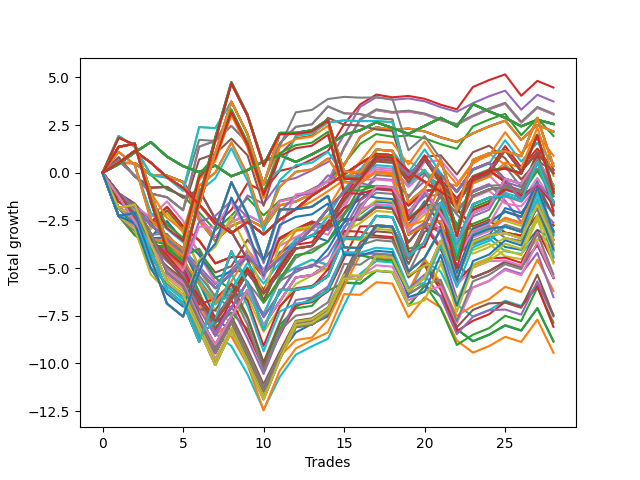

# Short HLT 106 
- Symbol: TSLA
- Date Range: 05/16/2022 - 05/17/2024
- Trading Period: 8:30-12:30
- Number of Trades: 28



| Id. | Name | Win Percent | Profit | Avg Profit / Trade | Avg Time / Trade | Std |      | Name | Win Percent | Profit | Avg Profit / Trade | Avg Time / Trade | Std |
| --- | ---- | ----------- | ------ | ------------------ | ---------------- | --- | ---- | ---- | ----------- | ------ | ------------------ | ---------------- | --- |
| | Sorted By <br> Profit | | | | | | | Sorted By <br> Win Percentage |||||
|0| TP-1 15m | 53.57 | 4.47 | 0.16 | 12:47 | 0.71 |     | TP-0.25 180m | 57.14 | 2.56 | 0.09 | 03:15 | 0.47 |
|1| TP-1.25 15m | 53.57 | 3.74 | 0.13 | 13:32 | 0.76 |     | TP-0.25 165m | 57.14 | 2.56 | 0.09 | 03:15 | 0.47 |
|2| TP-2 15m | 53.57 | 3.10 | 0.11 | 13:55 | 0.78 |     | TP-0.25 150m | 57.14 | 2.56 | 0.09 | 03:15 | 0.47 |
|3| TP-1.75 15m | 53.57 | 3.06 | 0.11 | 13:49 | 0.74 |     | TP-0.25 135m | 57.14 | 2.56 | 0.09 | 03:15 | 0.47 |
|4| TP-1.5 15m | 53.57 | 3.06 | 0.11 | 13:49 | 0.74 |     | TP-0.25 120m | 57.14 | 2.56 | 0.09 | 03:15 | 0.47 |
|5| TP-0.25 180m | 57.14 | 2.56 | 0.09 | 03:15 | 0.47 |     | TP-0.25 105m | 57.14 | 2.56 | 0.09 | 03:15 | 0.47 |
|6| TP-0.25 165m | 57.14 | 2.56 | 0.09 | 03:15 | 0.47 |     | TP-0.25 90m | 57.14 | 2.56 | 0.09 | 03:15 | 0.47 |
|7| TP-0.25 150m | 57.14 | 2.56 | 0.09 | 03:15 | 0.47 |     | TP-0.25 75m | 57.14 | 2.56 | 0.09 | 03:15 | 0.47 |
|8| TP-0.25 135m | 57.14 | 2.56 | 0.09 | 03:15 | 0.47 |     | TP-0.25 60m | 57.14 | 2.56 | 0.09 | 03:15 | 0.47 |
|9| TP-0.25 120m | 57.14 | 2.56 | 0.09 | 03:15 | 0.47 |     | TP-0.25 45m | 57.14 | 2.56 | 0.09 | 03:15 | 0.47 |
|10| TP-0.25 105m | 57.14 | 2.56 | 0.09 | 03:15 | 0.47 |     | TP-0.25 30m | 57.14 | 2.56 | 0.09 | 03:15 | 0.47 |
|11| TP-0.25 90m | 57.14 | 2.56 | 0.09 | 03:15 | 0.47 |     | TP-0.25 15m | 57.14 | 2.56 | 0.09 | 03:15 | 0.47 |
|12| TP-0.25 75m | 57.14 | 2.56 | 0.09 | 03:15 | 0.47 |     | TP-2.5 180m | 57.14 | 0.35 | 0.01 | 78:23 | 1.88 |
|13| TP-0.25 60m | 57.14 | 2.56 | 0.09 | 03:15 | 0.47 |     | TP-2.5 165m | 57.14 | 0.35 | 0.01 | 78:23 | 1.88 |
|14| TP-0.25 45m | 57.14 | 2.56 | 0.09 | 03:15 | 0.47 |     | TP-2.5 150m | 57.14 | 0.35 | 0.01 | 78:23 | 1.88 |
|15| TP-0.25 30m | 57.14 | 2.56 | 0.09 | 03:15 | 0.47 |     | TP-2.5 135m | 57.14 | 0.35 | 0.01 | 78:23 | 1.88 |
|16| TP-0.25 15m | 57.14 | 2.56 | 0.09 | 03:15 | 0.47 |     | TP-2.5 120m | 57.14 | 0.35 | 0.01 | 78:23 | 1.88 |
|17| TP-3 15m | 53.57 | 2.16 | 0.08 | 14:00 | 0.72 |     | TP-2.75 180m | 57.14 | -0.86 | -0.03 | 82:49 | 2.00 |
|18| TP-2.75 15m | 53.57 | 2.16 | 0.08 | 14:00 | 0.72 |     | TP-2.75 165m | 57.14 | -0.86 | -0.03 | 82:49 | 2.00 |
|19| TP-2.5 15m | 53.57 | 2.16 | 0.08 | 14:00 | 0.72 |     | TP-2.75 150m | 57.14 | -0.86 | -0.03 | 82:49 | 2.00 |
|20| TP-2.25 15m | 53.57 | 2.16 | 0.08 | 14:00 | 0.72 |     | TP-2.75 135m | 57.14 | -0.86 | -0.03 | 82:49 | 2.00 |
|21| TP-0.75 15m | 53.57 | 1.93 | 0.07 | 10:49 | 0.68 |     | TP-2.75 120m | 57.14 | -0.86 | -0.03 | 82:49 | 2.00 |
|22| TP-1 75m | 50.00 | 0.90 | 0.03 | 29:02 | 1.07 |     | TP-3 180m | 57.14 | -1.07 | -0.04 | 83:23 | 2.05 |
|23| TP-1 60m | 50.00 | 0.48 | 0.02 | 28:27 | 1.05 |     | TP-3 165m | 57.14 | -1.07 | -0.04 | 83:23 | 2.05 |
|24| TP-2.5 180m | 57.14 | 0.35 | 0.01 | 78:23 | 1.88 |     | TP-3 150m | 57.14 | -1.07 | -0.04 | 83:23 | 2.05 |
|25| TP-2.5 165m | 57.14 | 0.35 | 0.01 | 78:23 | 1.88 |     | TP-3 135m | 57.14 | -1.07 | -0.04 | 83:23 | 2.05 |
|26| TP-2.5 150m | 57.14 | 0.35 | 0.01 | 78:23 | 1.88 |     | TP-3 120m | 57.14 | -1.07 | -0.04 | 83:23 | 2.05 |
|27| TP-2.5 135m | 57.14 | 0.35 | 0.01 | 78:23 | 1.88 |     | TP-1 15m | 53.57 | 4.47 | 0.16 | 12:47 | 0.71 |
|28| TP-2.5 120m | 57.14 | 0.35 | 0.01 | 78:23 | 1.88 |     | TP-1.25 15m | 53.57 | 3.74 | 0.13 | 13:32 | 0.76 |
|29| TP-1 90m | 50.00 | 0.17 | 0.01 | 29:34 | 1.08 |     | TP-2 15m | 53.57 | 3.10 | 0.11 | 13:55 | 0.78 |
|30| TP-1 30m | 50.00 | 0.11 | 0.00 | 21:25 | 0.92 |     | TP-1.75 15m | 53.57 | 3.06 | 0.11 | 13:49 | 0.74 |
|31| TP-1 180m | 50.00 | -0.03 | -0.00 | 29:36 | 1.08 |     | TP-1.5 15m | 53.57 | 3.06 | 0.11 | 13:49 | 0.74 |
|32| TP-1 165m | 50.00 | -0.03 | -0.00 | 29:36 | 1.08 |     | TP-3 15m | 53.57 | 2.16 | 0.08 | 14:00 | 0.72 |
|33| TP-1 150m | 50.00 | -0.03 | -0.00 | 29:36 | 1.08 |     | TP-2.75 15m | 53.57 | 2.16 | 0.08 | 14:00 | 0.72 |
|34| TP-1 135m | 50.00 | -0.03 | -0.00 | 29:36 | 1.08 |     | TP-2.5 15m | 53.57 | 2.16 | 0.08 | 14:00 | 0.72 |
|35| TP-1 120m | 50.00 | -0.03 | -0.00 | 29:36 | 1.08 |     | TP-2.25 15m | 53.57 | 2.16 | 0.08 | 14:00 | 0.72 |
|36| TP-1 105m | 50.00 | -0.03 | -0.00 | 29:36 | 1.08 |     | TP-0.75 15m | 53.57 | 1.93 | 0.07 | 10:49 | 0.68 |
|37| TP-2.5 105m | 53.57 | -0.16 | -0.01 | 73:32 | 1.77 |     | TP-2.5 105m | 53.57 | -0.16 | -0.01 | 73:32 | 1.77 |
|38| TP-1.25 180m | 50.00 | -0.66 | -0.02 | 41:08 | 1.25 |     | TP-1.5 180m | 53.57 | -0.97 | -0.03 | 52:04 | 1.45 |
|39| TP-1.25 165m | 50.00 | -0.66 | -0.02 | 41:08 | 1.25 |     | TP-1.5 165m | 53.57 | -0.97 | -0.03 | 52:04 | 1.45 |
|40| TP-1.25 150m | 50.00 | -0.66 | -0.02 | 41:08 | 1.25 |     | TP-1.5 150m | 53.57 | -0.97 | -0.03 | 52:04 | 1.45 |
|41| TP-1.25 135m | 50.00 | -0.66 | -0.02 | 41:08 | 1.25 |     | TP-1.5 135m | 53.57 | -0.97 | -0.03 | 52:04 | 1.45 |
|42| TP-1.25 120m | 50.00 | -0.66 | -0.02 | 41:08 | 1.25 |     | TP-1.5 120m | 53.57 | -0.97 | -0.03 | 52:04 | 1.45 |
|43| TP-0.5 15m | 50.00 | -0.74 | -0.03 | 07:25 | 0.63 |     | TP-2 180m | 53.57 | -1.58 | -0.06 | 67:00 | 1.63 |
|44| TP-1.25 90m | 50.00 | -0.83 | -0.03 | 39:32 | 1.22 |     | TP-2 165m | 53.57 | -1.58 | -0.06 | 67:00 | 1.63 |
|45| TP-2.75 180m | 57.14 | -0.86 | -0.03 | 82:49 | 2.00 |     | TP-2 150m | 53.57 | -1.58 | -0.06 | 67:00 | 1.63 |
|46| TP-2.75 165m | 57.14 | -0.86 | -0.03 | 82:49 | 2.00 |     | TP-2 135m | 53.57 | -1.58 | -0.06 | 67:00 | 1.63 |
|47| TP-2.75 150m | 57.14 | -0.86 | -0.03 | 82:49 | 2.00 |     | TP-2 120m | 53.57 | -1.58 | -0.06 | 67:00 | 1.63 |
|48| TP-2.75 135m | 57.14 | -0.86 | -0.03 | 82:49 | 2.00 |     | TP-2.75 105m | 53.57 | -1.73 | -0.06 | 77:00 | 1.88 |
|49| TP-2.75 120m | 57.14 | -0.86 | -0.03 | 82:49 | 2.00 |     | TP-2.5 90m | 53.57 | -1.97 | -0.07 | 67:23 | 1.58 |
|50| TP-1 45m | 50.00 | -0.88 | -0.03 | 26:08 | 0.98 |     | TP-3 105m | 53.57 | -2.04 | -0.07 | 77:32 | 1.93 |
|51| TP-1.5 180m | 53.57 | -0.97 | -0.03 | 52:04 | 1.45 |     | TP-2.25 180m | 53.57 | -3.10 | -0.11 | 73:49 | 1.79 |
|52| TP-1.5 165m | 53.57 | -0.97 | -0.03 | 52:04 | 1.45 |     | TP-2.25 165m | 53.57 | -3.10 | -0.11 | 73:49 | 1.79 |
|53| TP-1.5 150m | 53.57 | -0.97 | -0.03 | 52:04 | 1.45 |     | TP-2.25 150m | 53.57 | -3.10 | -0.11 | 73:49 | 1.79 |
|54| TP-1.5 135m | 53.57 | -0.97 | -0.03 | 52:04 | 1.45 |     | TP-2.25 135m | 53.57 | -3.10 | -0.11 | 73:49 | 1.79 |
|55| TP-1.5 120m | 53.57 | -0.97 | -0.03 | 52:04 | 1.45 |     | TP-2.25 120m | 53.57 | -3.10 | -0.11 | 73:49 | 1.79 |
|56| TP-3 180m | 57.14 | -1.07 | -0.04 | 83:23 | 2.05 |     | TP-2.75 90m | 53.57 | -3.29 | -0.12 | 70:08 | 1.67 |
|57| TP-3 165m | 57.14 | -1.07 | -0.04 | 83:23 | 2.05 |     | TP-3 90m | 53.57 | -3.78 | -0.14 | 70:17 | 1.69 |
|58| TP-3 150m | 57.14 | -1.07 | -0.04 | 83:23 | 2.05 |     | TP-1 75m | 50.00 | 0.90 | 0.03 | 29:02 | 1.07 |
|59| TP-3 135m | 57.14 | -1.07 | -0.04 | 83:23 | 2.05 |     | TP-1 60m | 50.00 | 0.48 | 0.02 | 28:27 | 1.05 |
|60| TP-3 120m | 57.14 | -1.07 | -0.04 | 83:23 | 2.05 |     | TP-1 90m | 50.00 | 0.17 | 0.01 | 29:34 | 1.08 |
|61| TP-1.5 105m | 50.00 | -1.09 | -0.04 | 50:17 | 1.41 |     | TP-1 30m | 50.00 | 0.11 | 0.00 | 21:25 | 0.92 |
|62| TP-1.25 75m | 50.00 | -1.23 | -0.04 | 38:21 | 1.19 |     | TP-1 180m | 50.00 | -0.03 | -0.00 | 29:36 | 1.08 |
|63| TP-1.25 30m | 46.43 | -1.23 | -0.04 | 24:34 | 0.95 |     | TP-1 165m | 50.00 | -0.03 | -0.00 | 29:36 | 1.08 |
|64| TP-0.75 180m | 46.43 | -1.51 | -0.05 | 15:40 | 0.86 |     | TP-1 150m | 50.00 | -0.03 | -0.00 | 29:36 | 1.08 |
|65| TP-0.75 165m | 46.43 | -1.51 | -0.05 | 15:40 | 0.86 |     | TP-1 135m | 50.00 | -0.03 | -0.00 | 29:36 | 1.08 |
|66| TP-0.75 150m | 46.43 | -1.51 | -0.05 | 15:40 | 0.86 |     | TP-1 120m | 50.00 | -0.03 | -0.00 | 29:36 | 1.08 |
|67| TP-0.75 135m | 46.43 | -1.51 | -0.05 | 15:40 | 0.86 |     | TP-1 105m | 50.00 | -0.03 | -0.00 | 29:36 | 1.08 |
|68| TP-0.75 120m | 46.43 | -1.51 | -0.05 | 15:40 | 0.86 |     | TP-1.25 180m | 50.00 | -0.66 | -0.02 | 41:08 | 1.25 |
|69| TP-0.75 105m | 46.43 | -1.51 | -0.05 | 15:40 | 0.86 |     | TP-1.25 165m | 50.00 | -0.66 | -0.02 | 41:08 | 1.25 |
|70| TP-0.75 90m | 46.43 | -1.51 | -0.05 | 15:40 | 0.86 |     | TP-1.25 150m | 50.00 | -0.66 | -0.02 | 41:08 | 1.25 |
|71| TP-0.75 75m | 46.43 | -1.51 | -0.05 | 15:40 | 0.86 |     | TP-1.25 135m | 50.00 | -0.66 | -0.02 | 41:08 | 1.25 |
|72| TP-0.75 60m | 46.43 | -1.51 | -0.05 | 15:40 | 0.86 |     | TP-1.25 120m | 50.00 | -0.66 | -0.02 | 41:08 | 1.25 |
|73| TP-2 180m | 53.57 | -1.58 | -0.06 | 67:00 | 1.63 |     | TP-0.5 15m | 50.00 | -0.74 | -0.03 | 07:25 | 0.63 |
|74| TP-2 165m | 53.57 | -1.58 | -0.06 | 67:00 | 1.63 |     | TP-1.25 90m | 50.00 | -0.83 | -0.03 | 39:32 | 1.22 |
|75| TP-2 150m | 53.57 | -1.58 | -0.06 | 67:00 | 1.63 |     | TP-1 45m | 50.00 | -0.88 | -0.03 | 26:08 | 0.98 |
|76| TP-2 135m | 53.57 | -1.58 | -0.06 | 67:00 | 1.63 |     | TP-1.5 105m | 50.00 | -1.09 | -0.04 | 50:17 | 1.41 |
|77| TP-2 120m | 53.57 | -1.58 | -0.06 | 67:00 | 1.63 |     | TP-1.25 75m | 50.00 | -1.23 | -0.04 | 38:21 | 1.19 |
|78| TP-1.25 105m | 50.00 | -1.60 | -0.06 | 40:36 | 1.23 |     | TP-1.25 105m | 50.00 | -1.60 | -0.06 | 40:36 | 1.23 |
|79| TP-0.5 180m | 46.43 | -1.63 | -0.06 | 08:04 | 0.67 |     | TP-2.5 75m | 50.00 | -1.70 | -0.06 | 60:04 | 1.50 |
|80| TP-0.5 165m | 46.43 | -1.63 | -0.06 | 08:04 | 0.67 |     | TP-1.5 90m | 50.00 | -2.24 | -0.08 | 47:38 | 1.36 |
|81| TP-0.5 150m | 46.43 | -1.63 | -0.06 | 08:04 | 0.67 |     | TP-2 105m | 50.00 | -3.21 | -0.11 | 64:00 | 1.54 |
|82| TP-0.5 135m | 46.43 | -1.63 | -0.06 | 08:04 | 0.67 |     | TP-1.75 180m | 50.00 | -3.52 | -0.13 | 59:25 | 1.48 |
|83| TP-0.5 120m | 46.43 | -1.63 | -0.06 | 08:04 | 0.67 |     | TP-1.75 165m | 50.00 | -3.52 | -0.13 | 59:25 | 1.48 |
|84| TP-0.5 105m | 46.43 | -1.63 | -0.06 | 08:04 | 0.67 |     | TP-1.75 150m | 50.00 | -3.52 | -0.13 | 59:25 | 1.48 |
|85| TP-0.5 90m | 46.43 | -1.63 | -0.06 | 08:04 | 0.67 |     | TP-1.75 135m | 50.00 | -3.52 | -0.13 | 59:25 | 1.48 |
|86| TP-0.5 75m | 46.43 | -1.63 | -0.06 | 08:04 | 0.67 |     | TP-1.75 120m | 50.00 | -3.52 | -0.13 | 59:25 | 1.48 |
|87| TP-0.5 60m | 46.43 | -1.63 | -0.06 | 08:04 | 0.67 |     | TP-2.75 75m | 50.00 | -3.90 | -0.14 | 62:06 | 1.53 |
|88| TP-0.5 45m | 46.43 | -1.63 | -0.06 | 08:04 | 0.67 |     | TP-2.25 105m | 50.00 | -4.02 | -0.14 | 70:04 | 1.70 |
|89| TP-0.5 30m | 46.43 | -1.63 | -0.06 | 08:04 | 0.67 |     | TP-3 75m | 50.00 | -4.39 | -0.16 | 62:15 | 1.56 |
|90| TP-2.5 75m | 50.00 | -1.70 | -0.06 | 60:04 | 1.50 |     | TP-2.25 90m | 50.00 | -4.76 | -0.17 | 64:32 | 1.54 |
|91| TP-2.75 105m | 53.57 | -1.73 | -0.06 | 77:00 | 1.88 |     | TP-2 90m | 50.00 | -5.32 | -0.19 | 59:08 | 1.43 |
|92| TP-2.5 90m | 53.57 | -1.97 | -0.07 | 67:23 | 1.58 |     | TP-1.25 30m | 46.43 | -1.23 | -0.04 | 24:34 | 0.95 |
|93| TP-3 105m | 53.57 | -2.04 | -0.07 | 77:32 | 1.93 |     | TP-0.75 180m | 46.43 | -1.51 | -0.05 | 15:40 | 0.86 |
|94| TP-0.75 45m | 46.43 | -2.15 | -0.08 | 15:12 | 0.84 |     | TP-0.75 165m | 46.43 | -1.51 | -0.05 | 15:40 | 0.86 |
|95| TP-1.25 60m | 46.43 | -2.20 | -0.08 | 36:02 | 1.16 |     | TP-0.75 150m | 46.43 | -1.51 | -0.05 | 15:40 | 0.86 |
|96| TP-1.5 90m | 50.00 | -2.24 | -0.08 | 47:38 | 1.36 |     | TP-0.75 135m | 46.43 | -1.51 | -0.05 | 15:40 | 0.86 |
|97| TP-0.75 30m | 42.86 | -2.62 | -0.09 | 14:23 | 0.83 |     | TP-0.75 120m | 46.43 | -1.51 | -0.05 | 15:40 | 0.86 |
|98| TP-3 30m | 46.43 | -2.76 | -0.10 | 28:10 | 0.82 |     | TP-0.75 105m | 46.43 | -1.51 | -0.05 | 15:40 | 0.86 |
|99| TP-2.75 30m | 46.43 | -2.76 | -0.10 | 28:10 | 0.82 |     | TP-0.75 90m | 46.43 | -1.51 | -0.05 | 15:40 | 0.86 |
|100| TP-2.5 30m | 46.43 | -2.76 | -0.10 | 28:10 | 0.82 |     | TP-0.75 75m | 46.43 | -1.51 | -0.05 | 15:40 | 0.86 |
|101| TP-1.5 30m | 46.43 | -3.04 | -0.11 | 25:51 | 1.00 |     | TP-0.75 60m | 46.43 | -1.51 | -0.05 | 15:40 | 0.86 |
|102| TP-2.25 180m | 53.57 | -3.10 | -0.11 | 73:49 | 1.79 |     | TP-0.5 180m | 46.43 | -1.63 | -0.06 | 08:04 | 0.67 |
|103| TP-2.25 165m | 53.57 | -3.10 | -0.11 | 73:49 | 1.79 |     | TP-0.5 165m | 46.43 | -1.63 | -0.06 | 08:04 | 0.67 |
|104| TP-2.25 150m | 53.57 | -3.10 | -0.11 | 73:49 | 1.79 |     | TP-0.5 150m | 46.43 | -1.63 | -0.06 | 08:04 | 0.67 |
|105| TP-2.25 135m | 53.57 | -3.10 | -0.11 | 73:49 | 1.79 |     | TP-0.5 135m | 46.43 | -1.63 | -0.06 | 08:04 | 0.67 |
|106| TP-2.25 120m | 53.57 | -3.10 | -0.11 | 73:49 | 1.79 |     | TP-0.5 120m | 46.43 | -1.63 | -0.06 | 08:04 | 0.67 |
|107| TP-2 105m | 50.00 | -3.21 | -0.11 | 64:00 | 1.54 |     | TP-0.5 105m | 46.43 | -1.63 | -0.06 | 08:04 | 0.67 |
|108| TP-2.75 90m | 53.57 | -3.29 | -0.12 | 70:08 | 1.67 |     | TP-0.5 90m | 46.43 | -1.63 | -0.06 | 08:04 | 0.67 |
|109| TP-2.25 30m | 46.43 | -3.51 | -0.13 | 28:04 | 0.88 |     | TP-0.5 75m | 46.43 | -1.63 | -0.06 | 08:04 | 0.67 |
|110| TP-1.75 180m | 50.00 | -3.52 | -0.13 | 59:25 | 1.48 |     | TP-0.5 60m | 46.43 | -1.63 | -0.06 | 08:04 | 0.67 |
|111| TP-1.75 165m | 50.00 | -3.52 | -0.13 | 59:25 | 1.48 |     | TP-0.5 45m | 46.43 | -1.63 | -0.06 | 08:04 | 0.67 |
|112| TP-1.75 150m | 50.00 | -3.52 | -0.13 | 59:25 | 1.48 |     | TP-0.5 30m | 46.43 | -1.63 | -0.06 | 08:04 | 0.67 |
|113| TP-1.75 135m | 50.00 | -3.52 | -0.13 | 59:25 | 1.48 |     | TP-0.75 45m | 46.43 | -2.15 | -0.08 | 15:12 | 0.84 |
|114| TP-1.75 120m | 50.00 | -3.52 | -0.13 | 59:25 | 1.48 |     | TP-1.25 60m | 46.43 | -2.20 | -0.08 | 36:02 | 1.16 |
|115| TP-2 30m | 46.43 | -3.73 | -0.13 | 26:49 | 1.01 |     | TP-3 30m | 46.43 | -2.76 | -0.10 | 28:10 | 0.82 |
|116| TP-1.25 45m | 46.43 | -3.76 | -0.13 | 32:06 | 1.09 |     | TP-2.75 30m | 46.43 | -2.76 | -0.10 | 28:10 | 0.82 |
|117| TP-3 90m | 53.57 | -3.78 | -0.14 | 70:17 | 1.69 |     | TP-2.5 30m | 46.43 | -2.76 | -0.10 | 28:10 | 0.82 |
|118| TP-2.75 75m | 50.00 | -3.90 | -0.14 | 62:06 | 1.53 |     | TP-1.5 30m | 46.43 | -3.04 | -0.11 | 25:51 | 1.00 |
|119| TP-1.75 30m | 46.43 | -4.00 | -0.14 | 26:34 | 0.98 |     | TP-2.25 30m | 46.43 | -3.51 | -0.13 | 28:04 | 0.88 |
|120| TP-2.25 105m | 50.00 | -4.02 | -0.14 | 70:04 | 1.70 |     | TP-2 30m | 46.43 | -3.73 | -0.13 | 26:49 | 1.01 |
|121| TP-2.5 60m | 46.43 | -4.06 | -0.15 | 51:47 | 1.35 |     | TP-1.25 45m | 46.43 | -3.76 | -0.13 | 32:06 | 1.09 |
|122| TP-1.75 105m | 46.43 | -4.08 | -0.15 | 57:06 | 1.44 |     | TP-1.75 30m | 46.43 | -4.00 | -0.14 | 26:34 | 0.98 |
|123| TP-2.75 60m | 46.43 | -4.14 | -0.15 | 52:42 | 1.39 |     | TP-2.5 60m | 46.43 | -4.06 | -0.15 | 51:47 | 1.35 |
|124| TP-3 75m | 50.00 | -4.39 | -0.16 | 62:15 | 1.56 |     | TP-1.75 105m | 46.43 | -4.08 | -0.15 | 57:06 | 1.44 |
|125| TP-3 60m | 46.43 | -4.45 | -0.16 | 52:49 | 1.41 |     | TP-2.75 60m | 46.43 | -4.14 | -0.15 | 52:42 | 1.39 |
|126| TP-1.5 75m | 46.43 | -4.67 | -0.17 | 44:49 | 1.33 |     | TP-3 60m | 46.43 | -4.45 | -0.16 | 52:49 | 1.41 |
|127| TP-2.25 90m | 50.00 | -4.76 | -0.17 | 64:32 | 1.54 |     | TP-1.5 75m | 46.43 | -4.67 | -0.17 | 44:49 | 1.33 |
|128| TP-2 90m | 50.00 | -5.32 | -0.19 | 59:08 | 1.43 |     | TP-2.25 75m | 46.43 | -5.45 | -0.19 | 57:49 | 1.44 |
|129| TP-2.25 75m | 46.43 | -5.45 | -0.19 | 57:49 | 1.44 |     | TP-1.75 90m | 46.43 | -5.46 | -0.20 | 53:36 | 1.37 |
|130| TP-1.75 90m | 46.43 | -5.46 | -0.20 | 53:36 | 1.37 |     | TP-3 45m | 46.43 | -5.51 | -0.20 | 41:17 | 1.02 |
|131| TP-3 45m | 46.43 | -5.51 | -0.20 | 41:17 | 1.02 |     | TP-2.75 45m | 46.43 | -5.51 | -0.20 | 41:17 | 1.02 |
|132| TP-2.75 45m | 46.43 | -5.51 | -0.20 | 41:17 | 1.02 |     | TP-2.5 45m | 46.43 | -5.51 | -0.20 | 41:17 | 1.02 |
|133| TP-2.5 45m | 46.43 | -5.51 | -0.20 | 41:17 | 1.02 |     | TP-0.75 30m | 42.86 | -2.62 | -0.09 | 14:23 | 0.83 |
|134| TP-1.5 60m | 42.86 | -6.20 | -0.22 | 40:45 | 1.28 |     | TP-1.5 60m | 42.86 | -6.20 | -0.22 | 40:45 | 1.28 |
|135| TP-2.25 60m | 42.86 | -6.52 | -0.23 | 50:04 | 1.33 |     | TP-2.25 60m | 42.86 | -6.52 | -0.23 | 50:04 | 1.33 |
|136| TP-1.5 45m | 42.86 | -7.45 | -0.27 | 35:02 | 1.23 |     | TP-1.5 45m | 42.86 | -7.45 | -0.27 | 35:02 | 1.23 |
|137| TP-2 75m | 42.86 | -7.48 | -0.27 | 53:17 | 1.37 |     | TP-2 75m | 42.86 | -7.48 | -0.27 | 53:17 | 1.37 |
|138| TP-1.75 75m | 42.86 | -7.53 | -0.27 | 49:30 | 1.29 |     | TP-1.75 75m | 42.86 | -7.53 | -0.27 | 49:30 | 1.29 |
|139| TP-1.75 60m | 39.29 | -7.86 | -0.28 | 43:45 | 1.20 |     | TP-2 60m | 42.86 | -8.08 | -0.29 | 46:04 | 1.25 |
|140| TP-2 60m | 42.86 | -8.08 | -0.29 | 46:04 | 1.25 |     | TP-2.25 45m | 42.86 | -8.83 | -0.32 | 40:27 | 1.09 |
|141| TP-2.25 45m | 42.86 | -8.83 | -0.32 | 40:27 | 1.09 |     | TP-1.75 60m | 39.29 | -7.86 | -0.28 | 43:45 | 1.20 |
|142| TP-1.75 45m | 39.29 | -8.85 | -0.32 | 36:34 | 1.16 |     | TP-1.75 45m | 39.29 | -8.85 | -0.32 | 36:34 | 1.16 |
|143| TP-2 45m | 39.29 | -9.44 | -0.34 | 37:36 | 1.22 |     | TP-2 45m | 39.29 | -9.44 | -0.34 | 37:36 | 1.22 |

### Test TP-0.25 15m
* Take Profit of 0.25 Point
* 0.25 Stoploss
* Results:
```
Total Trades: 28
Percent Up: 42.86
Percent Down: 57.14
Total Points Moved Down: 2.56
Potential Profit: 1280.00
Total Points Ups: 4.93 Count Ups: 12
Total Points Downs: 7.49 Count Downs: 16
```

<details><summary>Trades</summary>

<code>In: 2022-06-02 09:00:00		Out: 2022-06-02 09:02:00		Total Position Time: 02:00		Total Move Down: 0.45		Total to Date: 0.45</code> <br />
<code>In: 2022-07-07 10:25:00		Out: 2022-07-07 10:30:00		Total Position Time: 05:00		Total Move Down: 0.62		Total to Date: 1.07</code> <br />
<code>In: 2022-07-21 09:45:00		Out: 2022-07-21 09:50:00		Total Position Time: 05:00		Total Move Down: 0.54		Total to Date: 1.61</code> <br />
<code>In: 2022-08-12 09:35:00		Out: 2022-08-12 09:38:00		Total Position Time: 03:00		Total Move Down: -0.76		Total to Date: 0.85</code> <br />
<code>In: 2022-08-12 12:05:00		Out: 2022-08-12 12:07:00		Total Position Time: 02:00		Total Move Down: -0.50		Total to Date: 0.35</code> <br />
<code>In: 2022-08-17 11:25:00		Out: 2022-08-17 11:27:00		Total Position Time: 02:00		Total Move Down: -0.31		Total to Date: 0.04</code> <br />
<code>In: 2022-09-14 09:00:00		Out: 2022-09-14 09:05:00		Total Position Time: 05:00		Total Move Down: 0.34		Total to Date: 0.38</code> <br />
<code>In: 2022-11-28 09:00:00		Out: 2022-11-28 09:02:00		Total Position Time: 02:00		Total Move Down: -0.56		Total to Date: -0.18</code> <br />
<code>In: 2022-11-30 11:40:00		Out: 2022-11-30 11:43:00		Total Position Time: 03:00		Total Move Down: 0.32		Total to Date: 0.14</code> <br />
<code>In: 2022-11-30 11:45:00		Out: 2022-11-30 11:47:00		Total Position Time: 02:00		Total Move Down: 0.46		Total to Date: 0.60</code> <br />
<code>In: 2022-12-19 10:35:00		Out: 2022-12-19 10:39:00		Total Position Time: 04:00		Total Move Down: 0.33		Total to Date: 0.93</code> <br />
<code>In: 2023-01-04 08:55:00		Out: 2023-01-04 08:58:00		Total Position Time: 03:00		Total Move Down: -0.36		Total to Date: 0.57</code> <br />
<code>In: 2023-01-12 11:55:00		Out: 2023-01-12 12:09:00		Total Position Time: 14:00		Total Move Down: 0.40		Total to Date: 0.97</code> <br />
<code>In: 2023-01-25 11:40:00		Out: 2023-01-25 11:44:00		Total Position Time: 04:00		Total Move Down: 0.44		Total to Date: 1.41</code> <br />
<code>In: 2023-01-27 09:50:00		Out: 2023-01-27 09:52:00		Total Position Time: 02:00		Total Move Down: 0.58		Total to Date: 1.99</code> <br />
<code>In: 2023-02-17 12:15:00		Out: 2023-02-17 12:17:00		Total Position Time: 02:00		Total Move Down: 0.24		Total to Date: 2.23</code> <br />
<code>In: 2023-03-03 10:20:00		Out: 2023-03-03 10:22:00		Total Position Time: 02:00		Total Move Down: 0.42		Total to Date: 2.65</code> <br />
<code>In: 2023-05-22 12:30:00		Out: 2023-05-22 12:32:00		Total Position Time: 02:00		Total Move Down: -0.30		Total to Date: 2.35</code> <br />
<code>In: 2023-05-26 09:10:00		Out: 2023-05-26 09:12:00		Total Position Time: 02:00		Total Move Down: -0.31		Total to Date: 2.04</code> <br />
<code>In: 2023-05-26 10:25:00		Out: 2023-05-26 10:27:00		Total Position Time: 02:00		Total Move Down: 0.42		Total to Date: 2.46</code> <br />
<code>In: 2023-06-13 09:45:00		Out: 2023-06-13 09:47:00		Total Position Time: 02:00		Total Move Down: 0.42		Total to Date: 2.88</code> <br />
<code>In: 2023-07-13 10:55:00		Out: 2023-07-13 10:57:00		Total Position Time: 02:00		Total Move Down: -0.45		Total to Date: 2.43</code> <br />
<code>In: 2023-07-14 10:05:00		Out: 2023-07-14 10:07:00		Total Position Time: 02:00		Total Move Down: 1.17		Total to Date: 3.60</code> <br />
<code>In: 2023-08-29 12:35:00		Out: 2023-08-29 12:39:00		Total Position Time: 04:00		Total Move Down: -0.38		Total to Date: 3.22</code> <br />
<code>In: 2023-09-28 09:10:00		Out: 2023-09-28 09:14:00		Total Position Time: 04:00		Total Move Down: -0.33		Total to Date: 2.89</code> <br />
<code>In: 2023-10-09 12:20:00		Out: 2023-10-09 12:25:00		Total Position Time: 05:00		Total Move Down: -0.45		Total to Date: 2.44</code> <br />
<code>In: 2024-01-29 08:40:00		Out: 2024-01-29 08:42:00		Total Position Time: 02:00		Total Move Down: 0.34		Total to Date: 2.78</code> <br />
<code>In: 2024-02-15 09:30:00		Out: 2024-02-15 09:32:00		Total Position Time: 02:00		Total Move Down: -0.22		Total to Date: 2.56</code> <br />


</details>

### Test TP-0.5 15m
* Take Profit of 0.5 Point
* 0.5 Stoploss
* Results:
```
Total Trades: 28
Percent Up: 50.00
Percent Down: 50.00
Total Points Moved Down: -0.74
Potential Profit: -370.00
Total Points Ups: 8.67 Count Ups: 14
Total Points Downs: 7.93 Count Downs: 14
```

<details><summary>Trades</summary>

<code>In: 2022-06-02 09:00:00		Out: 2022-06-02 09:03:00		Total Position Time: 03:00		Total Move Down: 0.53		Total to Date: 0.53</code> <br />
<code>In: 2022-07-07 10:25:00		Out: 2022-07-07 10:30:00		Total Position Time: 05:00		Total Move Down: 0.62		Total to Date: 1.15</code> <br />
<code>In: 2022-07-21 09:45:00		Out: 2022-07-21 09:59:00		Total Position Time: 14:00		Total Move Down: -0.62		Total to Date: 0.53</code> <br />
<code>In: 2022-08-12 09:35:00		Out: 2022-08-12 09:38:00		Total Position Time: 03:00		Total Move Down: -0.76		Total to Date: -0.23</code> <br />
<code>In: 2022-08-12 12:05:00		Out: 2022-08-12 12:08:00		Total Position Time: 03:00		Total Move Down: -0.56		Total to Date: -0.79</code> <br />
<code>In: 2022-08-17 11:25:00		Out: 2022-08-17 11:33:00		Total Position Time: 08:00		Total Move Down: -0.88		Total to Date: -1.67</code> <br />
<code>In: 2022-09-14 09:00:00		Out: 2022-09-14 09:13:00		Total Position Time: 13:00		Total Move Down: -0.93		Total to Date: -2.60</code> <br />
<code>In: 2022-11-28 09:00:00		Out: 2022-11-28 09:02:00		Total Position Time: 02:00		Total Move Down: -0.56		Total to Date: -3.16</code> <br />
<code>In: 2022-11-30 11:40:00		Out: 2022-11-30 11:44:00		Total Position Time: 04:00		Total Move Down: 0.58		Total to Date: -2.58</code> <br />
<code>In: 2022-11-30 11:45:00		Out: 2022-11-30 11:51:00		Total Position Time: 06:00		Total Move Down: -0.65		Total to Date: -3.23</code> <br />
<code>In: 2022-12-19 10:35:00		Out: 2022-12-19 10:44:00		Total Position Time: 09:00		Total Move Down: 0.77		Total to Date: -2.46</code> <br />
<code>In: 2023-01-04 08:55:00		Out: 2023-01-04 09:02:00		Total Position Time: 07:00		Total Move Down: 0.56		Total to Date: -1.90</code> <br />
<code>In: 2023-01-12 11:55:00		Out: 2023-01-12 12:09:00		Total Position Time: 14:00		Total Move Down: 0.40		Total to Date: -1.50</code> <br />
<code>In: 2023-01-25 11:40:00		Out: 2023-01-25 11:46:00		Total Position Time: 06:00		Total Move Down: 0.54		Total to Date: -0.96</code> <br />
<code>In: 2023-01-27 09:50:00		Out: 2023-01-27 09:52:00		Total Position Time: 02:00		Total Move Down: 0.58		Total to Date: -0.38</code> <br />
<code>In: 2023-02-17 12:15:00		Out: 2023-02-17 12:18:00		Total Position Time: 03:00		Total Move Down: 0.57		Total to Date: 0.19</code> <br />
<code>In: 2023-03-03 10:20:00		Out: 2023-03-03 10:29:00		Total Position Time: 09:00		Total Move Down: 0.50		Total to Date: 0.69</code> <br />
<code>In: 2023-05-22 12:30:00		Out: 2023-05-22 12:44:00		Total Position Time: 14:00		Total Move Down: -0.14		Total to Date: 0.55</code> <br />
<code>In: 2023-05-26 09:10:00		Out: 2023-05-26 09:24:00		Total Position Time: 14:00		Total Move Down: 0.07		Total to Date: 0.62</code> <br />
<code>In: 2023-05-26 10:25:00		Out: 2023-05-26 10:33:00		Total Position Time: 08:00		Total Move Down: -0.55		Total to Date: 0.07</code> <br />
<code>In: 2023-06-13 09:45:00		Out: 2023-06-13 09:51:00		Total Position Time: 06:00		Total Move Down: -0.52		Total to Date: -0.45</code> <br />
<code>In: 2023-07-13 10:55:00		Out: 2023-07-13 11:09:00		Total Position Time: 14:00		Total Move Down: -0.24		Total to Date: -0.69</code> <br />
<code>In: 2023-07-14 10:05:00		Out: 2023-07-14 10:07:00		Total Position Time: 02:00		Total Move Down: 1.17		Total to Date: 0.48</code> <br />
<code>In: 2023-08-29 12:35:00		Out: 2023-08-29 12:48:00		Total Position Time: 13:00		Total Move Down: 0.53		Total to Date: 1.01</code> <br />
<code>In: 2023-09-28 09:10:00		Out: 2023-09-28 09:18:00		Total Position Time: 08:00		Total Move Down: -0.58		Total to Date: 0.43</code> <br />
<code>In: 2023-10-09 12:20:00		Out: 2023-10-09 12:29:00		Total Position Time: 09:00		Total Move Down: -0.74		Total to Date: -0.31</code> <br />
<code>In: 2024-01-29 08:40:00		Out: 2024-01-29 08:44:00		Total Position Time: 04:00		Total Move Down: 0.51		Total to Date: 0.20</code> <br />
<code>In: 2024-02-15 09:30:00		Out: 2024-02-15 09:35:00		Total Position Time: 05:00		Total Move Down: -0.94		Total to Date: -0.74</code> <br />


</details>

### Test TP-0.75 15m
* Take Profit of 0.75 Point
* 0.75 Stoploss
* Results:
```
Total Trades: 28
Percent Up: 46.43
Percent Down: 53.57
Total Points Moved Down: 1.93
Potential Profit: 965.00
Total Points Ups: 7.34 Count Ups: 13
Total Points Downs: 9.27 Count Downs: 15
```

<details><summary>Trades</summary>

<code>In: 2022-06-02 09:00:00		Out: 2022-06-02 09:14:00		Total Position Time: 14:00		Total Move Down: 0.52		Total to Date: 0.52</code> <br />
<code>In: 2022-07-07 10:25:00		Out: 2022-07-07 10:39:00		Total Position Time: 14:00		Total Move Down: -0.01		Total to Date: 0.51</code> <br />
<code>In: 2022-07-21 09:45:00		Out: 2022-07-21 09:59:00		Total Position Time: 14:00		Total Move Down: -0.62		Total to Date: -0.11</code> <br />
<code>In: 2022-08-12 09:35:00		Out: 2022-08-12 09:38:00		Total Position Time: 03:00		Total Move Down: -0.76		Total to Date: -0.87</code> <br />
<code>In: 2022-08-12 12:05:00		Out: 2022-08-12 12:19:00		Total Position Time: 14:00		Total Move Down: -0.33		Total to Date: -1.20</code> <br />
<code>In: 2022-08-17 11:25:00		Out: 2022-08-17 11:33:00		Total Position Time: 08:00		Total Move Down: -0.88		Total to Date: -2.08</code> <br />
<code>In: 2022-09-14 09:00:00		Out: 2022-09-14 09:13:00		Total Position Time: 13:00		Total Move Down: -0.93		Total to Date: -3.01</code> <br />
<code>In: 2022-11-28 09:00:00		Out: 2022-11-28 09:04:00		Total Position Time: 04:00		Total Move Down: 0.76		Total to Date: -2.25</code> <br />
<code>In: 2022-11-30 11:40:00		Out: 2022-11-30 11:45:00		Total Position Time: 05:00		Total Move Down: 0.93		Total to Date: -1.32</code> <br />
<code>In: 2022-11-30 11:45:00		Out: 2022-11-30 11:53:00		Total Position Time: 08:00		Total Move Down: -0.91		Total to Date: -2.23</code> <br />
<code>In: 2022-12-19 10:35:00		Out: 2022-12-19 10:44:00		Total Position Time: 09:00		Total Move Down: 0.77		Total to Date: -1.46</code> <br />
<code>In: 2023-01-04 08:55:00		Out: 2023-01-04 09:09:00		Total Position Time: 14:00		Total Move Down: 0.20		Total to Date: -1.26</code> <br />
<code>In: 2023-01-12 11:55:00		Out: 2023-01-12 12:09:00		Total Position Time: 14:00		Total Move Down: 0.40		Total to Date: -0.86</code> <br />
<code>In: 2023-01-25 11:40:00		Out: 2023-01-25 11:54:00		Total Position Time: 14:00		Total Move Down: 0.44		Total to Date: -0.42</code> <br />
<code>In: 2023-01-27 09:50:00		Out: 2023-01-27 09:53:00		Total Position Time: 03:00		Total Move Down: 0.90		Total to Date: 0.48</code> <br />
<code>In: 2023-02-17 12:15:00		Out: 2023-02-17 12:24:00		Total Position Time: 09:00		Total Move Down: 1.04		Total to Date: 1.52</code> <br />
<code>In: 2023-03-03 10:20:00		Out: 2023-03-03 10:34:00		Total Position Time: 14:00		Total Move Down: 0.51		Total to Date: 2.03</code> <br />
<code>In: 2023-05-22 12:30:00		Out: 2023-05-22 12:44:00		Total Position Time: 14:00		Total Move Down: -0.14		Total to Date: 1.89</code> <br />
<code>In: 2023-05-26 09:10:00		Out: 2023-05-26 09:24:00		Total Position Time: 14:00		Total Move Down: 0.07		Total to Date: 1.96</code> <br />
<code>In: 2023-05-26 10:25:00		Out: 2023-05-26 10:39:00		Total Position Time: 14:00		Total Move Down: -0.15		Total to Date: 1.81</code> <br />
<code>In: 2023-06-13 09:45:00		Out: 2023-06-13 09:59:00		Total Position Time: 14:00		Total Move Down: -0.31		Total to Date: 1.50</code> <br />
<code>In: 2023-07-13 10:55:00		Out: 2023-07-13 11:09:00		Total Position Time: 14:00		Total Move Down: -0.24		Total to Date: 1.26</code> <br />
<code>In: 2023-07-14 10:05:00		Out: 2023-07-14 10:07:00		Total Position Time: 02:00		Total Move Down: 1.17		Total to Date: 2.43</code> <br />
<code>In: 2023-08-29 12:35:00		Out: 2023-08-29 12:49:00		Total Position Time: 14:00		Total Move Down: 0.36		Total to Date: 2.79</code> <br />
<code>In: 2023-09-28 09:10:00		Out: 2023-09-28 09:24:00		Total Position Time: 14:00		Total Move Down: 0.30		Total to Date: 3.09</code> <br />
<code>In: 2023-10-09 12:20:00		Out: 2023-10-09 12:33:00		Total Position Time: 13:00		Total Move Down: -1.12		Total to Date: 1.97</code> <br />
<code>In: 2024-01-29 08:40:00		Out: 2024-01-29 08:51:00		Total Position Time: 11:00		Total Move Down: 0.90		Total to Date: 2.87</code> <br />
<code>In: 2024-02-15 09:30:00		Out: 2024-02-15 09:35:00		Total Position Time: 05:00		Total Move Down: -0.94		Total to Date: 1.93</code> <br />


</details>

### Test TP-1 15m
* Take Profit of 1 Point
* 1 Stoploss
* Results:
```
Total Trades: 28
Percent Up: 46.43
Percent Down: 53.57
Total Points Moved Down: 4.47
Potential Profit: 2235.00
Total Points Ups: 6.00 Count Ups: 13
Total Points Downs: 10.47 Count Downs: 15
```

<details><summary>Trades</summary>

<code>In: 2022-06-02 09:00:00		Out: 2022-06-02 09:14:00		Total Position Time: 14:00		Total Move Down: 0.52		Total to Date: 0.52</code> <br />
<code>In: 2022-07-07 10:25:00		Out: 2022-07-07 10:39:00		Total Position Time: 14:00		Total Move Down: -0.01		Total to Date: 0.51</code> <br />
<code>In: 2022-07-21 09:45:00		Out: 2022-07-21 09:59:00		Total Position Time: 14:00		Total Move Down: -0.62		Total to Date: -0.11</code> <br />
<code>In: 2022-08-12 09:35:00		Out: 2022-08-12 09:49:00		Total Position Time: 14:00		Total Move Down: -0.04		Total to Date: -0.15</code> <br />
<code>In: 2022-08-12 12:05:00		Out: 2022-08-12 12:19:00		Total Position Time: 14:00		Total Move Down: -0.33		Total to Date: -0.48</code> <br />
<code>In: 2022-08-17 11:25:00		Out: 2022-08-17 11:36:00		Total Position Time: 11:00		Total Move Down: -1.18		Total to Date: -1.66</code> <br />
<code>In: 2022-09-14 09:00:00		Out: 2022-09-14 09:14:00		Total Position Time: 14:00		Total Move Down: -1.07		Total to Date: -2.73</code> <br />
<code>In: 2022-11-28 09:00:00		Out: 2022-11-28 09:14:00		Total Position Time: 14:00		Total Move Down: 0.79		Total to Date: -1.94</code> <br />
<code>In: 2022-11-30 11:40:00		Out: 2022-11-30 11:47:00		Total Position Time: 07:00		Total Move Down: 1.39		Total to Date: -0.55</code> <br />
<code>In: 2022-11-30 11:45:00		Out: 2022-11-30 11:59:00		Total Position Time: 14:00		Total Move Down: -0.44		Total to Date: -0.99</code> <br />
<code>In: 2022-12-19 10:35:00		Out: 2022-12-19 10:47:00		Total Position Time: 12:00		Total Move Down: 1.09		Total to Date: 0.10</code> <br />
<code>In: 2023-01-04 08:55:00		Out: 2023-01-04 09:09:00		Total Position Time: 14:00		Total Move Down: 0.20		Total to Date: 0.30</code> <br />
<code>In: 2023-01-12 11:55:00		Out: 2023-01-12 12:09:00		Total Position Time: 14:00		Total Move Down: 0.40		Total to Date: 0.70</code> <br />
<code>In: 2023-01-25 11:40:00		Out: 2023-01-25 11:54:00		Total Position Time: 14:00		Total Move Down: 0.44		Total to Date: 1.14</code> <br />
<code>In: 2023-01-27 09:50:00		Out: 2023-01-27 10:00:00		Total Position Time: 10:00		Total Move Down: 1.41		Total to Date: 2.55</code> <br />
<code>In: 2023-02-17 12:15:00		Out: 2023-02-17 12:24:00		Total Position Time: 09:00		Total Move Down: 1.04		Total to Date: 3.59</code> <br />
<code>In: 2023-03-03 10:20:00		Out: 2023-03-03 10:34:00		Total Position Time: 14:00		Total Move Down: 0.51		Total to Date: 4.10</code> <br />
<code>In: 2023-05-22 12:30:00		Out: 2023-05-22 12:44:00		Total Position Time: 14:00		Total Move Down: -0.14		Total to Date: 3.96</code> <br />
<code>In: 2023-05-26 09:10:00		Out: 2023-05-26 09:24:00		Total Position Time: 14:00		Total Move Down: 0.07		Total to Date: 4.03</code> <br />
<code>In: 2023-05-26 10:25:00		Out: 2023-05-26 10:39:00		Total Position Time: 14:00		Total Move Down: -0.15		Total to Date: 3.88</code> <br />
<code>In: 2023-06-13 09:45:00		Out: 2023-06-13 09:59:00		Total Position Time: 14:00		Total Move Down: -0.31		Total to Date: 3.57</code> <br />
<code>In: 2023-07-13 10:55:00		Out: 2023-07-13 11:09:00		Total Position Time: 14:00		Total Move Down: -0.24		Total to Date: 3.33</code> <br />
<code>In: 2023-07-14 10:05:00		Out: 2023-07-14 10:07:00		Total Position Time: 02:00		Total Move Down: 1.17		Total to Date: 4.50</code> <br />
<code>In: 2023-08-29 12:35:00		Out: 2023-08-29 12:49:00		Total Position Time: 14:00		Total Move Down: 0.36		Total to Date: 4.86</code> <br />
<code>In: 2023-09-28 09:10:00		Out: 2023-09-28 09:24:00		Total Position Time: 14:00		Total Move Down: 0.30		Total to Date: 5.16</code> <br />
<code>In: 2023-10-09 12:20:00		Out: 2023-10-09 12:33:00		Total Position Time: 13:00		Total Move Down: -1.12		Total to Date: 4.04</code> <br />
<code>In: 2024-01-29 08:40:00		Out: 2024-01-29 08:54:00		Total Position Time: 14:00		Total Move Down: 0.78		Total to Date: 4.82</code> <br />
<code>In: 2024-02-15 09:30:00		Out: 2024-02-15 09:44:00		Total Position Time: 14:00		Total Move Down: -0.35		Total to Date: 4.47</code> <br />


</details>

### Test TP-1.25 15m
* Take Profit of 1.25 Point
* 1.25 Stoploss
* Results:
```
Total Trades: 28
Percent Up: 46.43
Percent Down: 53.57
Total Points Moved Down: 3.74
Potential Profit: 1870.00
Total Points Ups: 6.52 Count Ups: 13
Total Points Downs: 10.26 Count Downs: 15
```

<details><summary>Trades</summary>

<code>In: 2022-06-02 09:00:00		Out: 2022-06-02 09:14:00		Total Position Time: 14:00		Total Move Down: 0.52		Total to Date: 0.52</code> <br />
<code>In: 2022-07-07 10:25:00		Out: 2022-07-07 10:39:00		Total Position Time: 14:00		Total Move Down: -0.01		Total to Date: 0.51</code> <br />
<code>In: 2022-07-21 09:45:00		Out: 2022-07-21 09:59:00		Total Position Time: 14:00		Total Move Down: -0.62		Total to Date: -0.11</code> <br />
<code>In: 2022-08-12 09:35:00		Out: 2022-08-12 09:49:00		Total Position Time: 14:00		Total Move Down: -0.04		Total to Date: -0.15</code> <br />
<code>In: 2022-08-12 12:05:00		Out: 2022-08-12 12:19:00		Total Position Time: 14:00		Total Move Down: -0.33		Total to Date: -0.48</code> <br />
<code>In: 2022-08-17 11:25:00		Out: 2022-08-17 11:37:00		Total Position Time: 12:00		Total Move Down: -1.82		Total to Date: -2.30</code> <br />
<code>In: 2022-09-14 09:00:00		Out: 2022-09-14 09:14:00		Total Position Time: 14:00		Total Move Down: -1.07		Total to Date: -3.37</code> <br />
<code>In: 2022-11-28 09:00:00		Out: 2022-11-28 09:14:00		Total Position Time: 14:00		Total Move Down: 0.79		Total to Date: -2.58</code> <br />
<code>In: 2022-11-30 11:40:00		Out: 2022-11-30 11:47:00		Total Position Time: 07:00		Total Move Down: 1.39		Total to Date: -1.19</code> <br />
<code>In: 2022-11-30 11:45:00		Out: 2022-11-30 11:59:00		Total Position Time: 14:00		Total Move Down: -0.44		Total to Date: -1.63</code> <br />
<code>In: 2022-12-19 10:35:00		Out: 2022-12-19 10:49:00		Total Position Time: 14:00		Total Move Down: 1.16		Total to Date: -0.47</code> <br />
<code>In: 2023-01-04 08:55:00		Out: 2023-01-04 09:09:00		Total Position Time: 14:00		Total Move Down: 0.20		Total to Date: -0.27</code> <br />
<code>In: 2023-01-12 11:55:00		Out: 2023-01-12 12:09:00		Total Position Time: 14:00		Total Move Down: 0.40		Total to Date: 0.13</code> <br />
<code>In: 2023-01-25 11:40:00		Out: 2023-01-25 11:54:00		Total Position Time: 14:00		Total Move Down: 0.44		Total to Date: 0.57</code> <br />
<code>In: 2023-01-27 09:50:00		Out: 2023-01-27 10:00:00		Total Position Time: 10:00		Total Move Down: 1.41		Total to Date: 1.98</code> <br />
<code>In: 2023-02-17 12:15:00		Out: 2023-02-17 12:29:00		Total Position Time: 14:00		Total Move Down: 1.48		Total to Date: 3.46</code> <br />
<code>In: 2023-03-03 10:20:00		Out: 2023-03-03 10:34:00		Total Position Time: 14:00		Total Move Down: 0.51		Total to Date: 3.97</code> <br />
<code>In: 2023-05-22 12:30:00		Out: 2023-05-22 12:44:00		Total Position Time: 14:00		Total Move Down: -0.14		Total to Date: 3.83</code> <br />
<code>In: 2023-05-26 09:10:00		Out: 2023-05-26 09:24:00		Total Position Time: 14:00		Total Move Down: 0.07		Total to Date: 3.90</code> <br />
<code>In: 2023-05-26 10:25:00		Out: 2023-05-26 10:39:00		Total Position Time: 14:00		Total Move Down: -0.15		Total to Date: 3.75</code> <br />
<code>In: 2023-06-13 09:45:00		Out: 2023-06-13 09:59:00		Total Position Time: 14:00		Total Move Down: -0.31		Total to Date: 3.44</code> <br />
<code>In: 2023-07-13 10:55:00		Out: 2023-07-13 11:09:00		Total Position Time: 14:00		Total Move Down: -0.24		Total to Date: 3.20</code> <br />
<code>In: 2023-07-14 10:05:00		Out: 2023-07-14 10:19:00		Total Position Time: 14:00		Total Move Down: 0.45		Total to Date: 3.65</code> <br />
<code>In: 2023-08-29 12:35:00		Out: 2023-08-29 12:49:00		Total Position Time: 14:00		Total Move Down: 0.36		Total to Date: 4.01</code> <br />
<code>In: 2023-09-28 09:10:00		Out: 2023-09-28 09:24:00		Total Position Time: 14:00		Total Move Down: 0.30		Total to Date: 4.31</code> <br />
<code>In: 2023-10-09 12:20:00		Out: 2023-10-09 12:34:00		Total Position Time: 14:00		Total Move Down: -1.00		Total to Date: 3.31</code> <br />
<code>In: 2024-01-29 08:40:00		Out: 2024-01-29 08:54:00		Total Position Time: 14:00		Total Move Down: 0.78		Total to Date: 4.09</code> <br />
<code>In: 2024-02-15 09:30:00		Out: 2024-02-15 09:44:00		Total Position Time: 14:00		Total Move Down: -0.35		Total to Date: 3.74</code> <br />


</details>

### Test TP-1.5 15m
* Take Profit of 1.5 Point
* 1.5 Stoploss
* Results:
```
Total Trades: 28
Percent Up: 46.43
Percent Down: 53.57
Total Points Moved Down: 3.06
Potential Profit: 1530.00
Total Points Ups: 6.52 Count Ups: 13
Total Points Downs: 9.58 Count Downs: 15
```

<details><summary>Trades</summary>

<code>In: 2022-06-02 09:00:00		Out: 2022-06-02 09:14:00		Total Position Time: 14:00		Total Move Down: 0.52		Total to Date: 0.52</code> <br />
<code>In: 2022-07-07 10:25:00		Out: 2022-07-07 10:39:00		Total Position Time: 14:00		Total Move Down: -0.01		Total to Date: 0.51</code> <br />
<code>In: 2022-07-21 09:45:00		Out: 2022-07-21 09:59:00		Total Position Time: 14:00		Total Move Down: -0.62		Total to Date: -0.11</code> <br />
<code>In: 2022-08-12 09:35:00		Out: 2022-08-12 09:49:00		Total Position Time: 14:00		Total Move Down: -0.04		Total to Date: -0.15</code> <br />
<code>In: 2022-08-12 12:05:00		Out: 2022-08-12 12:19:00		Total Position Time: 14:00		Total Move Down: -0.33		Total to Date: -0.48</code> <br />
<code>In: 2022-08-17 11:25:00		Out: 2022-08-17 11:37:00		Total Position Time: 12:00		Total Move Down: -1.82		Total to Date: -2.30</code> <br />
<code>In: 2022-09-14 09:00:00		Out: 2022-09-14 09:14:00		Total Position Time: 14:00		Total Move Down: -1.07		Total to Date: -3.37</code> <br />
<code>In: 2022-11-28 09:00:00		Out: 2022-11-28 09:14:00		Total Position Time: 14:00		Total Move Down: 0.79		Total to Date: -2.58</code> <br />
<code>In: 2022-11-30 11:40:00		Out: 2022-11-30 11:54:00		Total Position Time: 14:00		Total Move Down: 0.36		Total to Date: -2.22</code> <br />
<code>In: 2022-11-30 11:45:00		Out: 2022-11-30 11:59:00		Total Position Time: 14:00		Total Move Down: -0.44		Total to Date: -2.66</code> <br />
<code>In: 2022-12-19 10:35:00		Out: 2022-12-19 10:49:00		Total Position Time: 14:00		Total Move Down: 1.16		Total to Date: -1.50</code> <br />
<code>In: 2023-01-04 08:55:00		Out: 2023-01-04 09:09:00		Total Position Time: 14:00		Total Move Down: 0.20		Total to Date: -1.30</code> <br />
<code>In: 2023-01-12 11:55:00		Out: 2023-01-12 12:09:00		Total Position Time: 14:00		Total Move Down: 0.40		Total to Date: -0.90</code> <br />
<code>In: 2023-01-25 11:40:00		Out: 2023-01-25 11:54:00		Total Position Time: 14:00		Total Move Down: 0.44		Total to Date: -0.46</code> <br />
<code>In: 2023-01-27 09:50:00		Out: 2023-01-27 10:01:00		Total Position Time: 11:00		Total Move Down: 1.76		Total to Date: 1.30</code> <br />
<code>In: 2023-02-17 12:15:00		Out: 2023-02-17 12:29:00		Total Position Time: 14:00		Total Move Down: 1.48		Total to Date: 2.78</code> <br />
<code>In: 2023-03-03 10:20:00		Out: 2023-03-03 10:34:00		Total Position Time: 14:00		Total Move Down: 0.51		Total to Date: 3.29</code> <br />
<code>In: 2023-05-22 12:30:00		Out: 2023-05-22 12:44:00		Total Position Time: 14:00		Total Move Down: -0.14		Total to Date: 3.15</code> <br />
<code>In: 2023-05-26 09:10:00		Out: 2023-05-26 09:24:00		Total Position Time: 14:00		Total Move Down: 0.07		Total to Date: 3.22</code> <br />
<code>In: 2023-05-26 10:25:00		Out: 2023-05-26 10:39:00		Total Position Time: 14:00		Total Move Down: -0.15		Total to Date: 3.07</code> <br />
<code>In: 2023-06-13 09:45:00		Out: 2023-06-13 09:59:00		Total Position Time: 14:00		Total Move Down: -0.31		Total to Date: 2.76</code> <br />
<code>In: 2023-07-13 10:55:00		Out: 2023-07-13 11:09:00		Total Position Time: 14:00		Total Move Down: -0.24		Total to Date: 2.52</code> <br />
<code>In: 2023-07-14 10:05:00		Out: 2023-07-14 10:19:00		Total Position Time: 14:00		Total Move Down: 0.45		Total to Date: 2.97</code> <br />
<code>In: 2023-08-29 12:35:00		Out: 2023-08-29 12:49:00		Total Position Time: 14:00		Total Move Down: 0.36		Total to Date: 3.33</code> <br />
<code>In: 2023-09-28 09:10:00		Out: 2023-09-28 09:24:00		Total Position Time: 14:00		Total Move Down: 0.30		Total to Date: 3.63</code> <br />
<code>In: 2023-10-09 12:20:00		Out: 2023-10-09 12:34:00		Total Position Time: 14:00		Total Move Down: -1.00		Total to Date: 2.63</code> <br />
<code>In: 2024-01-29 08:40:00		Out: 2024-01-29 08:54:00		Total Position Time: 14:00		Total Move Down: 0.78		Total to Date: 3.41</code> <br />
<code>In: 2024-02-15 09:30:00		Out: 2024-02-15 09:44:00		Total Position Time: 14:00		Total Move Down: -0.35		Total to Date: 3.06</code> <br />


</details>

### Test TP-1.75 15m
* Take Profit of 1.75 Point
* 1.75 Stoploss
* Results:
```
Total Trades: 28
Percent Up: 46.43
Percent Down: 53.57
Total Points Moved Down: 3.06
Potential Profit: 1530.00
Total Points Ups: 6.52 Count Ups: 13
Total Points Downs: 9.58 Count Downs: 15
```

<details><summary>Trades</summary>

<code>In: 2022-06-02 09:00:00		Out: 2022-06-02 09:14:00		Total Position Time: 14:00		Total Move Down: 0.52		Total to Date: 0.52</code> <br />
<code>In: 2022-07-07 10:25:00		Out: 2022-07-07 10:39:00		Total Position Time: 14:00		Total Move Down: -0.01		Total to Date: 0.51</code> <br />
<code>In: 2022-07-21 09:45:00		Out: 2022-07-21 09:59:00		Total Position Time: 14:00		Total Move Down: -0.62		Total to Date: -0.11</code> <br />
<code>In: 2022-08-12 09:35:00		Out: 2022-08-12 09:49:00		Total Position Time: 14:00		Total Move Down: -0.04		Total to Date: -0.15</code> <br />
<code>In: 2022-08-12 12:05:00		Out: 2022-08-12 12:19:00		Total Position Time: 14:00		Total Move Down: -0.33		Total to Date: -0.48</code> <br />
<code>In: 2022-08-17 11:25:00		Out: 2022-08-17 11:37:00		Total Position Time: 12:00		Total Move Down: -1.82		Total to Date: -2.30</code> <br />
<code>In: 2022-09-14 09:00:00		Out: 2022-09-14 09:14:00		Total Position Time: 14:00		Total Move Down: -1.07		Total to Date: -3.37</code> <br />
<code>In: 2022-11-28 09:00:00		Out: 2022-11-28 09:14:00		Total Position Time: 14:00		Total Move Down: 0.79		Total to Date: -2.58</code> <br />
<code>In: 2022-11-30 11:40:00		Out: 2022-11-30 11:54:00		Total Position Time: 14:00		Total Move Down: 0.36		Total to Date: -2.22</code> <br />
<code>In: 2022-11-30 11:45:00		Out: 2022-11-30 11:59:00		Total Position Time: 14:00		Total Move Down: -0.44		Total to Date: -2.66</code> <br />
<code>In: 2022-12-19 10:35:00		Out: 2022-12-19 10:49:00		Total Position Time: 14:00		Total Move Down: 1.16		Total to Date: -1.50</code> <br />
<code>In: 2023-01-04 08:55:00		Out: 2023-01-04 09:09:00		Total Position Time: 14:00		Total Move Down: 0.20		Total to Date: -1.30</code> <br />
<code>In: 2023-01-12 11:55:00		Out: 2023-01-12 12:09:00		Total Position Time: 14:00		Total Move Down: 0.40		Total to Date: -0.90</code> <br />
<code>In: 2023-01-25 11:40:00		Out: 2023-01-25 11:54:00		Total Position Time: 14:00		Total Move Down: 0.44		Total to Date: -0.46</code> <br />
<code>In: 2023-01-27 09:50:00		Out: 2023-01-27 10:01:00		Total Position Time: 11:00		Total Move Down: 1.76		Total to Date: 1.30</code> <br />
<code>In: 2023-02-17 12:15:00		Out: 2023-02-17 12:29:00		Total Position Time: 14:00		Total Move Down: 1.48		Total to Date: 2.78</code> <br />
<code>In: 2023-03-03 10:20:00		Out: 2023-03-03 10:34:00		Total Position Time: 14:00		Total Move Down: 0.51		Total to Date: 3.29</code> <br />
<code>In: 2023-05-22 12:30:00		Out: 2023-05-22 12:44:00		Total Position Time: 14:00		Total Move Down: -0.14		Total to Date: 3.15</code> <br />
<code>In: 2023-05-26 09:10:00		Out: 2023-05-26 09:24:00		Total Position Time: 14:00		Total Move Down: 0.07		Total to Date: 3.22</code> <br />
<code>In: 2023-05-26 10:25:00		Out: 2023-05-26 10:39:00		Total Position Time: 14:00		Total Move Down: -0.15		Total to Date: 3.07</code> <br />
<code>In: 2023-06-13 09:45:00		Out: 2023-06-13 09:59:00		Total Position Time: 14:00		Total Move Down: -0.31		Total to Date: 2.76</code> <br />
<code>In: 2023-07-13 10:55:00		Out: 2023-07-13 11:09:00		Total Position Time: 14:00		Total Move Down: -0.24		Total to Date: 2.52</code> <br />
<code>In: 2023-07-14 10:05:00		Out: 2023-07-14 10:19:00		Total Position Time: 14:00		Total Move Down: 0.45		Total to Date: 2.97</code> <br />
<code>In: 2023-08-29 12:35:00		Out: 2023-08-29 12:49:00		Total Position Time: 14:00		Total Move Down: 0.36		Total to Date: 3.33</code> <br />
<code>In: 2023-09-28 09:10:00		Out: 2023-09-28 09:24:00		Total Position Time: 14:00		Total Move Down: 0.30		Total to Date: 3.63</code> <br />
<code>In: 2023-10-09 12:20:00		Out: 2023-10-09 12:34:00		Total Position Time: 14:00		Total Move Down: -1.00		Total to Date: 2.63</code> <br />
<code>In: 2024-01-29 08:40:00		Out: 2024-01-29 08:54:00		Total Position Time: 14:00		Total Move Down: 0.78		Total to Date: 3.41</code> <br />
<code>In: 2024-02-15 09:30:00		Out: 2024-02-15 09:44:00		Total Position Time: 14:00		Total Move Down: -0.35		Total to Date: 3.06</code> <br />


</details>

### Test TP-2 15m
* Take Profit of 2 Point
* 2 Stoploss
* Results:
```
Total Trades: 28
Percent Up: 46.43
Percent Down: 53.57
Total Points Moved Down: 3.10
Potential Profit: 1550.00
Total Points Ups: 6.73 Count Ups: 13
Total Points Downs: 9.83 Count Downs: 15
```

<details><summary>Trades</summary>

<code>In: 2022-06-02 09:00:00		Out: 2022-06-02 09:14:00		Total Position Time: 14:00		Total Move Down: 0.52		Total to Date: 0.52</code> <br />
<code>In: 2022-07-07 10:25:00		Out: 2022-07-07 10:39:00		Total Position Time: 14:00		Total Move Down: -0.01		Total to Date: 0.51</code> <br />
<code>In: 2022-07-21 09:45:00		Out: 2022-07-21 09:59:00		Total Position Time: 14:00		Total Move Down: -0.62		Total to Date: -0.11</code> <br />
<code>In: 2022-08-12 09:35:00		Out: 2022-08-12 09:49:00		Total Position Time: 14:00		Total Move Down: -0.04		Total to Date: -0.15</code> <br />
<code>In: 2022-08-12 12:05:00		Out: 2022-08-12 12:19:00		Total Position Time: 14:00		Total Move Down: -0.33		Total to Date: -0.48</code> <br />
<code>In: 2022-08-17 11:25:00		Out: 2022-08-17 11:39:00		Total Position Time: 14:00		Total Move Down: -2.03		Total to Date: -2.51</code> <br />
<code>In: 2022-09-14 09:00:00		Out: 2022-09-14 09:14:00		Total Position Time: 14:00		Total Move Down: -1.07		Total to Date: -3.58</code> <br />
<code>In: 2022-11-28 09:00:00		Out: 2022-11-28 09:14:00		Total Position Time: 14:00		Total Move Down: 0.79		Total to Date: -2.79</code> <br />
<code>In: 2022-11-30 11:40:00		Out: 2022-11-30 11:54:00		Total Position Time: 14:00		Total Move Down: 0.36		Total to Date: -2.43</code> <br />
<code>In: 2022-11-30 11:45:00		Out: 2022-11-30 11:59:00		Total Position Time: 14:00		Total Move Down: -0.44		Total to Date: -2.87</code> <br />
<code>In: 2022-12-19 10:35:00		Out: 2022-12-19 10:49:00		Total Position Time: 14:00		Total Move Down: 1.16		Total to Date: -1.71</code> <br />
<code>In: 2023-01-04 08:55:00		Out: 2023-01-04 09:09:00		Total Position Time: 14:00		Total Move Down: 0.20		Total to Date: -1.51</code> <br />
<code>In: 2023-01-12 11:55:00		Out: 2023-01-12 12:09:00		Total Position Time: 14:00		Total Move Down: 0.40		Total to Date: -1.11</code> <br />
<code>In: 2023-01-25 11:40:00		Out: 2023-01-25 11:54:00		Total Position Time: 14:00		Total Move Down: 0.44		Total to Date: -0.67</code> <br />
<code>In: 2023-01-27 09:50:00		Out: 2023-01-27 10:02:00		Total Position Time: 12:00		Total Move Down: 2.01		Total to Date: 1.34</code> <br />
<code>In: 2023-02-17 12:15:00		Out: 2023-02-17 12:29:00		Total Position Time: 14:00		Total Move Down: 1.48		Total to Date: 2.82</code> <br />
<code>In: 2023-03-03 10:20:00		Out: 2023-03-03 10:34:00		Total Position Time: 14:00		Total Move Down: 0.51		Total to Date: 3.33</code> <br />
<code>In: 2023-05-22 12:30:00		Out: 2023-05-22 12:44:00		Total Position Time: 14:00		Total Move Down: -0.14		Total to Date: 3.19</code> <br />
<code>In: 2023-05-26 09:10:00		Out: 2023-05-26 09:24:00		Total Position Time: 14:00		Total Move Down: 0.07		Total to Date: 3.26</code> <br />
<code>In: 2023-05-26 10:25:00		Out: 2023-05-26 10:39:00		Total Position Time: 14:00		Total Move Down: -0.15		Total to Date: 3.11</code> <br />
<code>In: 2023-06-13 09:45:00		Out: 2023-06-13 09:59:00		Total Position Time: 14:00		Total Move Down: -0.31		Total to Date: 2.80</code> <br />
<code>In: 2023-07-13 10:55:00		Out: 2023-07-13 11:09:00		Total Position Time: 14:00		Total Move Down: -0.24		Total to Date: 2.56</code> <br />
<code>In: 2023-07-14 10:05:00		Out: 2023-07-14 10:19:00		Total Position Time: 14:00		Total Move Down: 0.45		Total to Date: 3.01</code> <br />
<code>In: 2023-08-29 12:35:00		Out: 2023-08-29 12:49:00		Total Position Time: 14:00		Total Move Down: 0.36		Total to Date: 3.37</code> <br />
<code>In: 2023-09-28 09:10:00		Out: 2023-09-28 09:24:00		Total Position Time: 14:00		Total Move Down: 0.30		Total to Date: 3.67</code> <br />
<code>In: 2023-10-09 12:20:00		Out: 2023-10-09 12:34:00		Total Position Time: 14:00		Total Move Down: -1.00		Total to Date: 2.67</code> <br />
<code>In: 2024-01-29 08:40:00		Out: 2024-01-29 08:54:00		Total Position Time: 14:00		Total Move Down: 0.78		Total to Date: 3.45</code> <br />
<code>In: 2024-02-15 09:30:00		Out: 2024-02-15 09:44:00		Total Position Time: 14:00		Total Move Down: -0.35		Total to Date: 3.10</code> <br />


</details>

### Test TP-2.25 15m
* Take Profit of 2.25 Point
* 2.25 Stoploss
* Results:
```
Total Trades: 28
Percent Up: 46.43
Percent Down: 53.57
Total Points Moved Down: 2.16
Potential Profit: 1080.00
Total Points Ups: 6.73 Count Ups: 13
Total Points Downs: 8.89 Count Downs: 15
```

<details><summary>Trades</summary>

<code>In: 2022-06-02 09:00:00		Out: 2022-06-02 09:14:00		Total Position Time: 14:00		Total Move Down: 0.52		Total to Date: 0.52</code> <br />
<code>In: 2022-07-07 10:25:00		Out: 2022-07-07 10:39:00		Total Position Time: 14:00		Total Move Down: -0.01		Total to Date: 0.51</code> <br />
<code>In: 2022-07-21 09:45:00		Out: 2022-07-21 09:59:00		Total Position Time: 14:00		Total Move Down: -0.62		Total to Date: -0.11</code> <br />
<code>In: 2022-08-12 09:35:00		Out: 2022-08-12 09:49:00		Total Position Time: 14:00		Total Move Down: -0.04		Total to Date: -0.15</code> <br />
<code>In: 2022-08-12 12:05:00		Out: 2022-08-12 12:19:00		Total Position Time: 14:00		Total Move Down: -0.33		Total to Date: -0.48</code> <br />
<code>In: 2022-08-17 11:25:00		Out: 2022-08-17 11:39:00		Total Position Time: 14:00		Total Move Down: -2.03		Total to Date: -2.51</code> <br />
<code>In: 2022-09-14 09:00:00		Out: 2022-09-14 09:14:00		Total Position Time: 14:00		Total Move Down: -1.07		Total to Date: -3.58</code> <br />
<code>In: 2022-11-28 09:00:00		Out: 2022-11-28 09:14:00		Total Position Time: 14:00		Total Move Down: 0.79		Total to Date: -2.79</code> <br />
<code>In: 2022-11-30 11:40:00		Out: 2022-11-30 11:54:00		Total Position Time: 14:00		Total Move Down: 0.36		Total to Date: -2.43</code> <br />
<code>In: 2022-11-30 11:45:00		Out: 2022-11-30 11:59:00		Total Position Time: 14:00		Total Move Down: -0.44		Total to Date: -2.87</code> <br />
<code>In: 2022-12-19 10:35:00		Out: 2022-12-19 10:49:00		Total Position Time: 14:00		Total Move Down: 1.16		Total to Date: -1.71</code> <br />
<code>In: 2023-01-04 08:55:00		Out: 2023-01-04 09:09:00		Total Position Time: 14:00		Total Move Down: 0.20		Total to Date: -1.51</code> <br />
<code>In: 2023-01-12 11:55:00		Out: 2023-01-12 12:09:00		Total Position Time: 14:00		Total Move Down: 0.40		Total to Date: -1.11</code> <br />
<code>In: 2023-01-25 11:40:00		Out: 2023-01-25 11:54:00		Total Position Time: 14:00		Total Move Down: 0.44		Total to Date: -0.67</code> <br />
<code>In: 2023-01-27 09:50:00		Out: 2023-01-27 10:04:00		Total Position Time: 14:00		Total Move Down: 1.07		Total to Date: 0.40</code> <br />
<code>In: 2023-02-17 12:15:00		Out: 2023-02-17 12:29:00		Total Position Time: 14:00		Total Move Down: 1.48		Total to Date: 1.88</code> <br />
<code>In: 2023-03-03 10:20:00		Out: 2023-03-03 10:34:00		Total Position Time: 14:00		Total Move Down: 0.51		Total to Date: 2.39</code> <br />
<code>In: 2023-05-22 12:30:00		Out: 2023-05-22 12:44:00		Total Position Time: 14:00		Total Move Down: -0.14		Total to Date: 2.25</code> <br />
<code>In: 2023-05-26 09:10:00		Out: 2023-05-26 09:24:00		Total Position Time: 14:00		Total Move Down: 0.07		Total to Date: 2.32</code> <br />
<code>In: 2023-05-26 10:25:00		Out: 2023-05-26 10:39:00		Total Position Time: 14:00		Total Move Down: -0.15		Total to Date: 2.17</code> <br />
<code>In: 2023-06-13 09:45:00		Out: 2023-06-13 09:59:00		Total Position Time: 14:00		Total Move Down: -0.31		Total to Date: 1.86</code> <br />
<code>In: 2023-07-13 10:55:00		Out: 2023-07-13 11:09:00		Total Position Time: 14:00		Total Move Down: -0.24		Total to Date: 1.62</code> <br />
<code>In: 2023-07-14 10:05:00		Out: 2023-07-14 10:19:00		Total Position Time: 14:00		Total Move Down: 0.45		Total to Date: 2.07</code> <br />
<code>In: 2023-08-29 12:35:00		Out: 2023-08-29 12:49:00		Total Position Time: 14:00		Total Move Down: 0.36		Total to Date: 2.43</code> <br />
<code>In: 2023-09-28 09:10:00		Out: 2023-09-28 09:24:00		Total Position Time: 14:00		Total Move Down: 0.30		Total to Date: 2.73</code> <br />
<code>In: 2023-10-09 12:20:00		Out: 2023-10-09 12:34:00		Total Position Time: 14:00		Total Move Down: -1.00		Total to Date: 1.73</code> <br />
<code>In: 2024-01-29 08:40:00		Out: 2024-01-29 08:54:00		Total Position Time: 14:00		Total Move Down: 0.78		Total to Date: 2.51</code> <br />
<code>In: 2024-02-15 09:30:00		Out: 2024-02-15 09:44:00		Total Position Time: 14:00		Total Move Down: -0.35		Total to Date: 2.16</code> <br />


</details>

### Test TP-2.5 15m
* Take Profit of 2.5 Point
* 2.5 Stoploss
* Results:
```
Total Trades: 28
Percent Up: 46.43
Percent Down: 53.57
Total Points Moved Down: 2.16
Potential Profit: 1080.00
Total Points Ups: 6.73 Count Ups: 13
Total Points Downs: 8.89 Count Downs: 15
```

<details><summary>Trades</summary>

<code>In: 2022-06-02 09:00:00		Out: 2022-06-02 09:14:00		Total Position Time: 14:00		Total Move Down: 0.52		Total to Date: 0.52</code> <br />
<code>In: 2022-07-07 10:25:00		Out: 2022-07-07 10:39:00		Total Position Time: 14:00		Total Move Down: -0.01		Total to Date: 0.51</code> <br />
<code>In: 2022-07-21 09:45:00		Out: 2022-07-21 09:59:00		Total Position Time: 14:00		Total Move Down: -0.62		Total to Date: -0.11</code> <br />
<code>In: 2022-08-12 09:35:00		Out: 2022-08-12 09:49:00		Total Position Time: 14:00		Total Move Down: -0.04		Total to Date: -0.15</code> <br />
<code>In: 2022-08-12 12:05:00		Out: 2022-08-12 12:19:00		Total Position Time: 14:00		Total Move Down: -0.33		Total to Date: -0.48</code> <br />
<code>In: 2022-08-17 11:25:00		Out: 2022-08-17 11:39:00		Total Position Time: 14:00		Total Move Down: -2.03		Total to Date: -2.51</code> <br />
<code>In: 2022-09-14 09:00:00		Out: 2022-09-14 09:14:00		Total Position Time: 14:00		Total Move Down: -1.07		Total to Date: -3.58</code> <br />
<code>In: 2022-11-28 09:00:00		Out: 2022-11-28 09:14:00		Total Position Time: 14:00		Total Move Down: 0.79		Total to Date: -2.79</code> <br />
<code>In: 2022-11-30 11:40:00		Out: 2022-11-30 11:54:00		Total Position Time: 14:00		Total Move Down: 0.36		Total to Date: -2.43</code> <br />
<code>In: 2022-11-30 11:45:00		Out: 2022-11-30 11:59:00		Total Position Time: 14:00		Total Move Down: -0.44		Total to Date: -2.87</code> <br />
<code>In: 2022-12-19 10:35:00		Out: 2022-12-19 10:49:00		Total Position Time: 14:00		Total Move Down: 1.16		Total to Date: -1.71</code> <br />
<code>In: 2023-01-04 08:55:00		Out: 2023-01-04 09:09:00		Total Position Time: 14:00		Total Move Down: 0.20		Total to Date: -1.51</code> <br />
<code>In: 2023-01-12 11:55:00		Out: 2023-01-12 12:09:00		Total Position Time: 14:00		Total Move Down: 0.40		Total to Date: -1.11</code> <br />
<code>In: 2023-01-25 11:40:00		Out: 2023-01-25 11:54:00		Total Position Time: 14:00		Total Move Down: 0.44		Total to Date: -0.67</code> <br />
<code>In: 2023-01-27 09:50:00		Out: 2023-01-27 10:04:00		Total Position Time: 14:00		Total Move Down: 1.07		Total to Date: 0.40</code> <br />
<code>In: 2023-02-17 12:15:00		Out: 2023-02-17 12:29:00		Total Position Time: 14:00		Total Move Down: 1.48		Total to Date: 1.88</code> <br />
<code>In: 2023-03-03 10:20:00		Out: 2023-03-03 10:34:00		Total Position Time: 14:00		Total Move Down: 0.51		Total to Date: 2.39</code> <br />
<code>In: 2023-05-22 12:30:00		Out: 2023-05-22 12:44:00		Total Position Time: 14:00		Total Move Down: -0.14		Total to Date: 2.25</code> <br />
<code>In: 2023-05-26 09:10:00		Out: 2023-05-26 09:24:00		Total Position Time: 14:00		Total Move Down: 0.07		Total to Date: 2.32</code> <br />
<code>In: 2023-05-26 10:25:00		Out: 2023-05-26 10:39:00		Total Position Time: 14:00		Total Move Down: -0.15		Total to Date: 2.17</code> <br />
<code>In: 2023-06-13 09:45:00		Out: 2023-06-13 09:59:00		Total Position Time: 14:00		Total Move Down: -0.31		Total to Date: 1.86</code> <br />
<code>In: 2023-07-13 10:55:00		Out: 2023-07-13 11:09:00		Total Position Time: 14:00		Total Move Down: -0.24		Total to Date: 1.62</code> <br />
<code>In: 2023-07-14 10:05:00		Out: 2023-07-14 10:19:00		Total Position Time: 14:00		Total Move Down: 0.45		Total to Date: 2.07</code> <br />
<code>In: 2023-08-29 12:35:00		Out: 2023-08-29 12:49:00		Total Position Time: 14:00		Total Move Down: 0.36		Total to Date: 2.43</code> <br />
<code>In: 2023-09-28 09:10:00		Out: 2023-09-28 09:24:00		Total Position Time: 14:00		Total Move Down: 0.30		Total to Date: 2.73</code> <br />
<code>In: 2023-10-09 12:20:00		Out: 2023-10-09 12:34:00		Total Position Time: 14:00		Total Move Down: -1.00		Total to Date: 1.73</code> <br />
<code>In: 2024-01-29 08:40:00		Out: 2024-01-29 08:54:00		Total Position Time: 14:00		Total Move Down: 0.78		Total to Date: 2.51</code> <br />
<code>In: 2024-02-15 09:30:00		Out: 2024-02-15 09:44:00		Total Position Time: 14:00		Total Move Down: -0.35		Total to Date: 2.16</code> <br />


</details>

### Test TP-2.75 15m
* Take Profit of 2.75 Point
* 2.75 Stoploss
* Results:
```
Total Trades: 28
Percent Up: 46.43
Percent Down: 53.57
Total Points Moved Down: 2.16
Potential Profit: 1080.00
Total Points Ups: 6.73 Count Ups: 13
Total Points Downs: 8.89 Count Downs: 15
```

<details><summary>Trades</summary>

<code>In: 2022-06-02 09:00:00		Out: 2022-06-02 09:14:00		Total Position Time: 14:00		Total Move Down: 0.52		Total to Date: 0.52</code> <br />
<code>In: 2022-07-07 10:25:00		Out: 2022-07-07 10:39:00		Total Position Time: 14:00		Total Move Down: -0.01		Total to Date: 0.51</code> <br />
<code>In: 2022-07-21 09:45:00		Out: 2022-07-21 09:59:00		Total Position Time: 14:00		Total Move Down: -0.62		Total to Date: -0.11</code> <br />
<code>In: 2022-08-12 09:35:00		Out: 2022-08-12 09:49:00		Total Position Time: 14:00		Total Move Down: -0.04		Total to Date: -0.15</code> <br />
<code>In: 2022-08-12 12:05:00		Out: 2022-08-12 12:19:00		Total Position Time: 14:00		Total Move Down: -0.33		Total to Date: -0.48</code> <br />
<code>In: 2022-08-17 11:25:00		Out: 2022-08-17 11:39:00		Total Position Time: 14:00		Total Move Down: -2.03		Total to Date: -2.51</code> <br />
<code>In: 2022-09-14 09:00:00		Out: 2022-09-14 09:14:00		Total Position Time: 14:00		Total Move Down: -1.07		Total to Date: -3.58</code> <br />
<code>In: 2022-11-28 09:00:00		Out: 2022-11-28 09:14:00		Total Position Time: 14:00		Total Move Down: 0.79		Total to Date: -2.79</code> <br />
<code>In: 2022-11-30 11:40:00		Out: 2022-11-30 11:54:00		Total Position Time: 14:00		Total Move Down: 0.36		Total to Date: -2.43</code> <br />
<code>In: 2022-11-30 11:45:00		Out: 2022-11-30 11:59:00		Total Position Time: 14:00		Total Move Down: -0.44		Total to Date: -2.87</code> <br />
<code>In: 2022-12-19 10:35:00		Out: 2022-12-19 10:49:00		Total Position Time: 14:00		Total Move Down: 1.16		Total to Date: -1.71</code> <br />
<code>In: 2023-01-04 08:55:00		Out: 2023-01-04 09:09:00		Total Position Time: 14:00		Total Move Down: 0.20		Total to Date: -1.51</code> <br />
<code>In: 2023-01-12 11:55:00		Out: 2023-01-12 12:09:00		Total Position Time: 14:00		Total Move Down: 0.40		Total to Date: -1.11</code> <br />
<code>In: 2023-01-25 11:40:00		Out: 2023-01-25 11:54:00		Total Position Time: 14:00		Total Move Down: 0.44		Total to Date: -0.67</code> <br />
<code>In: 2023-01-27 09:50:00		Out: 2023-01-27 10:04:00		Total Position Time: 14:00		Total Move Down: 1.07		Total to Date: 0.40</code> <br />
<code>In: 2023-02-17 12:15:00		Out: 2023-02-17 12:29:00		Total Position Time: 14:00		Total Move Down: 1.48		Total to Date: 1.88</code> <br />
<code>In: 2023-03-03 10:20:00		Out: 2023-03-03 10:34:00		Total Position Time: 14:00		Total Move Down: 0.51		Total to Date: 2.39</code> <br />
<code>In: 2023-05-22 12:30:00		Out: 2023-05-22 12:44:00		Total Position Time: 14:00		Total Move Down: -0.14		Total to Date: 2.25</code> <br />
<code>In: 2023-05-26 09:10:00		Out: 2023-05-26 09:24:00		Total Position Time: 14:00		Total Move Down: 0.07		Total to Date: 2.32</code> <br />
<code>In: 2023-05-26 10:25:00		Out: 2023-05-26 10:39:00		Total Position Time: 14:00		Total Move Down: -0.15		Total to Date: 2.17</code> <br />
<code>In: 2023-06-13 09:45:00		Out: 2023-06-13 09:59:00		Total Position Time: 14:00		Total Move Down: -0.31		Total to Date: 1.86</code> <br />
<code>In: 2023-07-13 10:55:00		Out: 2023-07-13 11:09:00		Total Position Time: 14:00		Total Move Down: -0.24		Total to Date: 1.62</code> <br />
<code>In: 2023-07-14 10:05:00		Out: 2023-07-14 10:19:00		Total Position Time: 14:00		Total Move Down: 0.45		Total to Date: 2.07</code> <br />
<code>In: 2023-08-29 12:35:00		Out: 2023-08-29 12:49:00		Total Position Time: 14:00		Total Move Down: 0.36		Total to Date: 2.43</code> <br />
<code>In: 2023-09-28 09:10:00		Out: 2023-09-28 09:24:00		Total Position Time: 14:00		Total Move Down: 0.30		Total to Date: 2.73</code> <br />
<code>In: 2023-10-09 12:20:00		Out: 2023-10-09 12:34:00		Total Position Time: 14:00		Total Move Down: -1.00		Total to Date: 1.73</code> <br />
<code>In: 2024-01-29 08:40:00		Out: 2024-01-29 08:54:00		Total Position Time: 14:00		Total Move Down: 0.78		Total to Date: 2.51</code> <br />
<code>In: 2024-02-15 09:30:00		Out: 2024-02-15 09:44:00		Total Position Time: 14:00		Total Move Down: -0.35		Total to Date: 2.16</code> <br />


</details>

### Test TP-3 15m
* Take Profit of 3 Point
* 3 Stoploss
* Results:
```
Total Trades: 28
Percent Up: 46.43
Percent Down: 53.57
Total Points Moved Down: 2.16
Potential Profit: 1080.00
Total Points Ups: 6.73 Count Ups: 13
Total Points Downs: 8.89 Count Downs: 15
```

<details><summary>Trades</summary>

<code>In: 2022-06-02 09:00:00		Out: 2022-06-02 09:14:00		Total Position Time: 14:00		Total Move Down: 0.52		Total to Date: 0.52</code> <br />
<code>In: 2022-07-07 10:25:00		Out: 2022-07-07 10:39:00		Total Position Time: 14:00		Total Move Down: -0.01		Total to Date: 0.51</code> <br />
<code>In: 2022-07-21 09:45:00		Out: 2022-07-21 09:59:00		Total Position Time: 14:00		Total Move Down: -0.62		Total to Date: -0.11</code> <br />
<code>In: 2022-08-12 09:35:00		Out: 2022-08-12 09:49:00		Total Position Time: 14:00		Total Move Down: -0.04		Total to Date: -0.15</code> <br />
<code>In: 2022-08-12 12:05:00		Out: 2022-08-12 12:19:00		Total Position Time: 14:00		Total Move Down: -0.33		Total to Date: -0.48</code> <br />
<code>In: 2022-08-17 11:25:00		Out: 2022-08-17 11:39:00		Total Position Time: 14:00		Total Move Down: -2.03		Total to Date: -2.51</code> <br />
<code>In: 2022-09-14 09:00:00		Out: 2022-09-14 09:14:00		Total Position Time: 14:00		Total Move Down: -1.07		Total to Date: -3.58</code> <br />
<code>In: 2022-11-28 09:00:00		Out: 2022-11-28 09:14:00		Total Position Time: 14:00		Total Move Down: 0.79		Total to Date: -2.79</code> <br />
<code>In: 2022-11-30 11:40:00		Out: 2022-11-30 11:54:00		Total Position Time: 14:00		Total Move Down: 0.36		Total to Date: -2.43</code> <br />
<code>In: 2022-11-30 11:45:00		Out: 2022-11-30 11:59:00		Total Position Time: 14:00		Total Move Down: -0.44		Total to Date: -2.87</code> <br />
<code>In: 2022-12-19 10:35:00		Out: 2022-12-19 10:49:00		Total Position Time: 14:00		Total Move Down: 1.16		Total to Date: -1.71</code> <br />
<code>In: 2023-01-04 08:55:00		Out: 2023-01-04 09:09:00		Total Position Time: 14:00		Total Move Down: 0.20		Total to Date: -1.51</code> <br />
<code>In: 2023-01-12 11:55:00		Out: 2023-01-12 12:09:00		Total Position Time: 14:00		Total Move Down: 0.40		Total to Date: -1.11</code> <br />
<code>In: 2023-01-25 11:40:00		Out: 2023-01-25 11:54:00		Total Position Time: 14:00		Total Move Down: 0.44		Total to Date: -0.67</code> <br />
<code>In: 2023-01-27 09:50:00		Out: 2023-01-27 10:04:00		Total Position Time: 14:00		Total Move Down: 1.07		Total to Date: 0.40</code> <br />
<code>In: 2023-02-17 12:15:00		Out: 2023-02-17 12:29:00		Total Position Time: 14:00		Total Move Down: 1.48		Total to Date: 1.88</code> <br />
<code>In: 2023-03-03 10:20:00		Out: 2023-03-03 10:34:00		Total Position Time: 14:00		Total Move Down: 0.51		Total to Date: 2.39</code> <br />
<code>In: 2023-05-22 12:30:00		Out: 2023-05-22 12:44:00		Total Position Time: 14:00		Total Move Down: -0.14		Total to Date: 2.25</code> <br />
<code>In: 2023-05-26 09:10:00		Out: 2023-05-26 09:24:00		Total Position Time: 14:00		Total Move Down: 0.07		Total to Date: 2.32</code> <br />
<code>In: 2023-05-26 10:25:00		Out: 2023-05-26 10:39:00		Total Position Time: 14:00		Total Move Down: -0.15		Total to Date: 2.17</code> <br />
<code>In: 2023-06-13 09:45:00		Out: 2023-06-13 09:59:00		Total Position Time: 14:00		Total Move Down: -0.31		Total to Date: 1.86</code> <br />
<code>In: 2023-07-13 10:55:00		Out: 2023-07-13 11:09:00		Total Position Time: 14:00		Total Move Down: -0.24		Total to Date: 1.62</code> <br />
<code>In: 2023-07-14 10:05:00		Out: 2023-07-14 10:19:00		Total Position Time: 14:00		Total Move Down: 0.45		Total to Date: 2.07</code> <br />
<code>In: 2023-08-29 12:35:00		Out: 2023-08-29 12:49:00		Total Position Time: 14:00		Total Move Down: 0.36		Total to Date: 2.43</code> <br />
<code>In: 2023-09-28 09:10:00		Out: 2023-09-28 09:24:00		Total Position Time: 14:00		Total Move Down: 0.30		Total to Date: 2.73</code> <br />
<code>In: 2023-10-09 12:20:00		Out: 2023-10-09 12:34:00		Total Position Time: 14:00		Total Move Down: -1.00		Total to Date: 1.73</code> <br />
<code>In: 2024-01-29 08:40:00		Out: 2024-01-29 08:54:00		Total Position Time: 14:00		Total Move Down: 0.78		Total to Date: 2.51</code> <br />
<code>In: 2024-02-15 09:30:00		Out: 2024-02-15 09:44:00		Total Position Time: 14:00		Total Move Down: -0.35		Total to Date: 2.16</code> <br />


</details>

### Test TP-0.25 30m
* Take Profit of 0.25 Point
* 0.25 Stoploss
* Results:
```
Total Trades: 28
Percent Up: 42.86
Percent Down: 57.14
Total Points Moved Down: 2.56
Potential Profit: 1280.00
Total Points Ups: 4.93 Count Ups: 12
Total Points Downs: 7.49 Count Downs: 16
```

<details><summary>Trades</summary>

<code>In: 2022-06-02 09:00:00		Out: 2022-06-02 09:02:00		Total Position Time: 02:00		Total Move Down: 0.45		Total to Date: 0.45</code> <br />
<code>In: 2022-07-07 10:25:00		Out: 2022-07-07 10:30:00		Total Position Time: 05:00		Total Move Down: 0.62		Total to Date: 1.07</code> <br />
<code>In: 2022-07-21 09:45:00		Out: 2022-07-21 09:50:00		Total Position Time: 05:00		Total Move Down: 0.54		Total to Date: 1.61</code> <br />
<code>In: 2022-08-12 09:35:00		Out: 2022-08-12 09:38:00		Total Position Time: 03:00		Total Move Down: -0.76		Total to Date: 0.85</code> <br />
<code>In: 2022-08-12 12:05:00		Out: 2022-08-12 12:07:00		Total Position Time: 02:00		Total Move Down: -0.50		Total to Date: 0.35</code> <br />
<code>In: 2022-08-17 11:25:00		Out: 2022-08-17 11:27:00		Total Position Time: 02:00		Total Move Down: -0.31		Total to Date: 0.04</code> <br />
<code>In: 2022-09-14 09:00:00		Out: 2022-09-14 09:05:00		Total Position Time: 05:00		Total Move Down: 0.34		Total to Date: 0.38</code> <br />
<code>In: 2022-11-28 09:00:00		Out: 2022-11-28 09:02:00		Total Position Time: 02:00		Total Move Down: -0.56		Total to Date: -0.18</code> <br />
<code>In: 2022-11-30 11:40:00		Out: 2022-11-30 11:43:00		Total Position Time: 03:00		Total Move Down: 0.32		Total to Date: 0.14</code> <br />
<code>In: 2022-11-30 11:45:00		Out: 2022-11-30 11:47:00		Total Position Time: 02:00		Total Move Down: 0.46		Total to Date: 0.60</code> <br />
<code>In: 2022-12-19 10:35:00		Out: 2022-12-19 10:39:00		Total Position Time: 04:00		Total Move Down: 0.33		Total to Date: 0.93</code> <br />
<code>In: 2023-01-04 08:55:00		Out: 2023-01-04 08:58:00		Total Position Time: 03:00		Total Move Down: -0.36		Total to Date: 0.57</code> <br />
<code>In: 2023-01-12 11:55:00		Out: 2023-01-12 12:09:00		Total Position Time: 14:00		Total Move Down: 0.40		Total to Date: 0.97</code> <br />
<code>In: 2023-01-25 11:40:00		Out: 2023-01-25 11:44:00		Total Position Time: 04:00		Total Move Down: 0.44		Total to Date: 1.41</code> <br />
<code>In: 2023-01-27 09:50:00		Out: 2023-01-27 09:52:00		Total Position Time: 02:00		Total Move Down: 0.58		Total to Date: 1.99</code> <br />
<code>In: 2023-02-17 12:15:00		Out: 2023-02-17 12:17:00		Total Position Time: 02:00		Total Move Down: 0.24		Total to Date: 2.23</code> <br />
<code>In: 2023-03-03 10:20:00		Out: 2023-03-03 10:22:00		Total Position Time: 02:00		Total Move Down: 0.42		Total to Date: 2.65</code> <br />
<code>In: 2023-05-22 12:30:00		Out: 2023-05-22 12:32:00		Total Position Time: 02:00		Total Move Down: -0.30		Total to Date: 2.35</code> <br />
<code>In: 2023-05-26 09:10:00		Out: 2023-05-26 09:12:00		Total Position Time: 02:00		Total Move Down: -0.31		Total to Date: 2.04</code> <br />
<code>In: 2023-05-26 10:25:00		Out: 2023-05-26 10:27:00		Total Position Time: 02:00		Total Move Down: 0.42		Total to Date: 2.46</code> <br />
<code>In: 2023-06-13 09:45:00		Out: 2023-06-13 09:47:00		Total Position Time: 02:00		Total Move Down: 0.42		Total to Date: 2.88</code> <br />
<code>In: 2023-07-13 10:55:00		Out: 2023-07-13 10:57:00		Total Position Time: 02:00		Total Move Down: -0.45		Total to Date: 2.43</code> <br />
<code>In: 2023-07-14 10:05:00		Out: 2023-07-14 10:07:00		Total Position Time: 02:00		Total Move Down: 1.17		Total to Date: 3.60</code> <br />
<code>In: 2023-08-29 12:35:00		Out: 2023-08-29 12:39:00		Total Position Time: 04:00		Total Move Down: -0.38		Total to Date: 3.22</code> <br />
<code>In: 2023-09-28 09:10:00		Out: 2023-09-28 09:14:00		Total Position Time: 04:00		Total Move Down: -0.33		Total to Date: 2.89</code> <br />
<code>In: 2023-10-09 12:20:00		Out: 2023-10-09 12:25:00		Total Position Time: 05:00		Total Move Down: -0.45		Total to Date: 2.44</code> <br />
<code>In: 2024-01-29 08:40:00		Out: 2024-01-29 08:42:00		Total Position Time: 02:00		Total Move Down: 0.34		Total to Date: 2.78</code> <br />
<code>In: 2024-02-15 09:30:00		Out: 2024-02-15 09:32:00		Total Position Time: 02:00		Total Move Down: -0.22		Total to Date: 2.56</code> <br />


</details>

### Test TP-0.5 30m
* Take Profit of 0.5 Point
* 0.5 Stoploss
* Results:
```
Total Trades: 28
Percent Up: 53.57
Percent Down: 46.43
Total Points Moved Down: -1.63
Potential Profit: -815.00
Total Points Ups: 9.79 Count Ups: 15
Total Points Downs: 8.16 Count Downs: 13
```

<details><summary>Trades</summary>

<code>In: 2022-06-02 09:00:00		Out: 2022-06-02 09:03:00		Total Position Time: 03:00		Total Move Down: 0.53		Total to Date: 0.53</code> <br />
<code>In: 2022-07-07 10:25:00		Out: 2022-07-07 10:30:00		Total Position Time: 05:00		Total Move Down: 0.62		Total to Date: 1.15</code> <br />
<code>In: 2022-07-21 09:45:00		Out: 2022-07-21 09:59:00		Total Position Time: 14:00		Total Move Down: -0.62		Total to Date: 0.53</code> <br />
<code>In: 2022-08-12 09:35:00		Out: 2022-08-12 09:38:00		Total Position Time: 03:00		Total Move Down: -0.76		Total to Date: -0.23</code> <br />
<code>In: 2022-08-12 12:05:00		Out: 2022-08-12 12:08:00		Total Position Time: 03:00		Total Move Down: -0.56		Total to Date: -0.79</code> <br />
<code>In: 2022-08-17 11:25:00		Out: 2022-08-17 11:33:00		Total Position Time: 08:00		Total Move Down: -0.88		Total to Date: -1.67</code> <br />
<code>In: 2022-09-14 09:00:00		Out: 2022-09-14 09:13:00		Total Position Time: 13:00		Total Move Down: -0.93		Total to Date: -2.60</code> <br />
<code>In: 2022-11-28 09:00:00		Out: 2022-11-28 09:02:00		Total Position Time: 02:00		Total Move Down: -0.56		Total to Date: -3.16</code> <br />
<code>In: 2022-11-30 11:40:00		Out: 2022-11-30 11:44:00		Total Position Time: 04:00		Total Move Down: 0.58		Total to Date: -2.58</code> <br />
<code>In: 2022-11-30 11:45:00		Out: 2022-11-30 11:51:00		Total Position Time: 06:00		Total Move Down: -0.65		Total to Date: -3.23</code> <br />
<code>In: 2022-12-19 10:35:00		Out: 2022-12-19 10:44:00		Total Position Time: 09:00		Total Move Down: 0.77		Total to Date: -2.46</code> <br />
<code>In: 2023-01-04 08:55:00		Out: 2023-01-04 09:02:00		Total Position Time: 07:00		Total Move Down: 0.56		Total to Date: -1.90</code> <br />
<code>In: 2023-01-12 11:55:00		Out: 2023-01-12 12:10:00		Total Position Time: 15:00		Total Move Down: 0.70		Total to Date: -1.20</code> <br />
<code>In: 2023-01-25 11:40:00		Out: 2023-01-25 11:46:00		Total Position Time: 06:00		Total Move Down: 0.54		Total to Date: -0.66</code> <br />
<code>In: 2023-01-27 09:50:00		Out: 2023-01-27 09:52:00		Total Position Time: 02:00		Total Move Down: 0.58		Total to Date: -0.08</code> <br />
<code>In: 2023-02-17 12:15:00		Out: 2023-02-17 12:18:00		Total Position Time: 03:00		Total Move Down: 0.57		Total to Date: 0.49</code> <br />
<code>In: 2023-03-03 10:20:00		Out: 2023-03-03 10:29:00		Total Position Time: 09:00		Total Move Down: 0.50		Total to Date: 0.99</code> <br />
<code>In: 2023-05-22 12:30:00		Out: 2023-05-22 12:50:00		Total Position Time: 20:00		Total Move Down: -0.07		Total to Date: 0.92</code> <br />
<code>In: 2023-05-26 09:10:00		Out: 2023-05-26 09:33:00		Total Position Time: 23:00		Total Move Down: -0.84		Total to Date: 0.08</code> <br />
<code>In: 2023-05-26 10:25:00		Out: 2023-05-26 10:33:00		Total Position Time: 08:00		Total Move Down: -0.55		Total to Date: -0.47</code> <br />
<code>In: 2023-06-13 09:45:00		Out: 2023-06-13 09:51:00		Total Position Time: 06:00		Total Move Down: -0.52		Total to Date: -0.99</code> <br />
<code>In: 2023-07-13 10:55:00		Out: 2023-07-13 11:11:00		Total Position Time: 16:00		Total Move Down: -0.59		Total to Date: -1.58</code> <br />
<code>In: 2023-07-14 10:05:00		Out: 2023-07-14 10:07:00		Total Position Time: 02:00		Total Move Down: 1.17		Total to Date: -0.41</code> <br />
<code>In: 2023-08-29 12:35:00		Out: 2023-08-29 12:48:00		Total Position Time: 13:00		Total Move Down: 0.53		Total to Date: 0.12</code> <br />
<code>In: 2023-09-28 09:10:00		Out: 2023-09-28 09:18:00		Total Position Time: 08:00		Total Move Down: -0.58		Total to Date: -0.46</code> <br />
<code>In: 2023-10-09 12:20:00		Out: 2023-10-09 12:29:00		Total Position Time: 09:00		Total Move Down: -0.74		Total to Date: -1.20</code> <br />
<code>In: 2024-01-29 08:40:00		Out: 2024-01-29 08:44:00		Total Position Time: 04:00		Total Move Down: 0.51		Total to Date: -0.69</code> <br />
<code>In: 2024-02-15 09:30:00		Out: 2024-02-15 09:35:00		Total Position Time: 05:00		Total Move Down: -0.94		Total to Date: -1.63</code> <br />


</details>

### Test TP-0.75 30m
* Take Profit of 0.75 Point
* 0.75 Stoploss
* Results:
```
Total Trades: 28
Percent Up: 57.14
Percent Down: 42.86
Total Points Moved Down: -2.62
Potential Profit: -1310.00
Total Points Ups: 12.53 Count Ups: 16
Total Points Downs: 9.91 Count Downs: 12
```

<details><summary>Trades</summary>

<code>In: 2022-06-02 09:00:00		Out: 2022-06-02 09:21:00		Total Position Time: 21:00		Total Move Down: -1.07		Total to Date: -1.07</code> <br />
<code>In: 2022-07-07 10:25:00		Out: 2022-07-07 10:54:00		Total Position Time: 29:00		Total Move Down: -0.55		Total to Date: -1.62</code> <br />
<code>In: 2022-07-21 09:45:00		Out: 2022-07-21 10:04:00		Total Position Time: 19:00		Total Move Down: -0.90		Total to Date: -2.52</code> <br />
<code>In: 2022-08-12 09:35:00		Out: 2022-08-12 09:38:00		Total Position Time: 03:00		Total Move Down: -0.76		Total to Date: -3.28</code> <br />
<code>In: 2022-08-12 12:05:00		Out: 2022-08-12 12:28:00		Total Position Time: 23:00		Total Move Down: -0.75		Total to Date: -4.03</code> <br />
<code>In: 2022-08-17 11:25:00		Out: 2022-08-17 11:33:00		Total Position Time: 08:00		Total Move Down: -0.88		Total to Date: -4.91</code> <br />
<code>In: 2022-09-14 09:00:00		Out: 2022-09-14 09:13:00		Total Position Time: 13:00		Total Move Down: -0.93		Total to Date: -5.84</code> <br />
<code>In: 2022-11-28 09:00:00		Out: 2022-11-28 09:04:00		Total Position Time: 04:00		Total Move Down: 0.76		Total to Date: -5.08</code> <br />
<code>In: 2022-11-30 11:40:00		Out: 2022-11-30 11:45:00		Total Position Time: 05:00		Total Move Down: 0.93		Total to Date: -4.15</code> <br />
<code>In: 2022-11-30 11:45:00		Out: 2022-11-30 11:53:00		Total Position Time: 08:00		Total Move Down: -0.91		Total to Date: -5.06</code> <br />
<code>In: 2022-12-19 10:35:00		Out: 2022-12-19 10:44:00		Total Position Time: 09:00		Total Move Down: 0.77		Total to Date: -4.29</code> <br />
<code>In: 2023-01-04 08:55:00		Out: 2023-01-04 09:14:00		Total Position Time: 19:00		Total Move Down: 0.76		Total to Date: -3.53</code> <br />
<code>In: 2023-01-12 11:55:00		Out: 2023-01-12 12:11:00		Total Position Time: 16:00		Total Move Down: 0.80		Total to Date: -2.73</code> <br />
<code>In: 2023-01-25 11:40:00		Out: 2023-01-25 12:09:00		Total Position Time: 29:00		Total Move Down: -0.28		Total to Date: -3.01</code> <br />
<code>In: 2023-01-27 09:50:00		Out: 2023-01-27 09:53:00		Total Position Time: 03:00		Total Move Down: 0.90		Total to Date: -2.11</code> <br />
<code>In: 2023-02-17 12:15:00		Out: 2023-02-17 12:24:00		Total Position Time: 09:00		Total Move Down: 1.04		Total to Date: -1.07</code> <br />
<code>In: 2023-03-03 10:20:00		Out: 2023-03-03 10:35:00		Total Position Time: 15:00		Total Move Down: 0.77		Total to Date: -0.30</code> <br />
<code>In: 2023-05-22 12:30:00		Out: 2023-05-22 12:50:00		Total Position Time: 20:00		Total Move Down: -0.07		Total to Date: -0.37</code> <br />
<code>In: 2023-05-26 09:10:00		Out: 2023-05-26 09:33:00		Total Position Time: 23:00		Total Move Down: -0.84		Total to Date: -1.21</code> <br />
<code>In: 2023-05-26 10:25:00		Out: 2023-05-26 10:46:00		Total Position Time: 21:00		Total Move Down: 0.77		Total to Date: -0.44</code> <br />
<code>In: 2023-06-13 09:45:00		Out: 2023-06-13 10:06:00		Total Position Time: 21:00		Total Move Down: -0.78		Total to Date: -1.22</code> <br />
<code>In: 2023-07-13 10:55:00		Out: 2023-07-13 11:15:00		Total Position Time: 20:00		Total Move Down: -0.88		Total to Date: -2.10</code> <br />
<code>In: 2023-07-14 10:05:00		Out: 2023-07-14 10:07:00		Total Position Time: 02:00		Total Move Down: 1.17		Total to Date: -0.93</code> <br />
<code>In: 2023-08-29 12:35:00		Out: 2023-08-29 12:50:00		Total Position Time: 15:00		Total Move Down: 0.34		Total to Date: -0.59</code> <br />
<code>In: 2023-09-28 09:10:00		Out: 2023-09-28 09:29:00		Total Position Time: 19:00		Total Move Down: -0.87		Total to Date: -1.46</code> <br />
<code>In: 2023-10-09 12:20:00		Out: 2023-10-09 12:33:00		Total Position Time: 13:00		Total Move Down: -1.12		Total to Date: -2.58</code> <br />
<code>In: 2024-01-29 08:40:00		Out: 2024-01-29 08:51:00		Total Position Time: 11:00		Total Move Down: 0.90		Total to Date: -1.68</code> <br />
<code>In: 2024-02-15 09:30:00		Out: 2024-02-15 09:35:00		Total Position Time: 05:00		Total Move Down: -0.94		Total to Date: -2.62</code> <br />


</details>

### Test TP-1 30m
* Take Profit of 1 Point
* 1 Stoploss
* Results:
```
Total Trades: 28
Percent Up: 50.00
Percent Down: 50.00
Total Points Moved Down: 0.11
Potential Profit: 55.00
Total Points Ups: 11.68 Count Ups: 14
Total Points Downs: 11.79 Count Downs: 14
```

<details><summary>Trades</summary>

<code>In: 2022-06-02 09:00:00		Out: 2022-06-02 09:21:00		Total Position Time: 21:00		Total Move Down: -1.07		Total to Date: -1.07</code> <br />
<code>In: 2022-07-07 10:25:00		Out: 2022-07-07 10:54:00		Total Position Time: 29:00		Total Move Down: -0.55		Total to Date: -1.62</code> <br />
<code>In: 2022-07-21 09:45:00		Out: 2022-07-21 10:07:00		Total Position Time: 22:00		Total Move Down: -1.17		Total to Date: -2.79</code> <br />
<code>In: 2022-08-12 09:35:00		Out: 2022-08-12 10:04:00		Total Position Time: 29:00		Total Move Down: 0.82		Total to Date: -1.97</code> <br />
<code>In: 2022-08-12 12:05:00		Out: 2022-08-12 12:34:00		Total Position Time: 29:00		Total Move Down: -1.01		Total to Date: -2.98</code> <br />
<code>In: 2022-08-17 11:25:00		Out: 2022-08-17 11:36:00		Total Position Time: 11:00		Total Move Down: -1.18		Total to Date: -4.16</code> <br />
<code>In: 2022-09-14 09:00:00		Out: 2022-09-14 09:14:00		Total Position Time: 14:00		Total Move Down: -1.07		Total to Date: -5.23</code> <br />
<code>In: 2022-11-28 09:00:00		Out: 2022-11-28 09:29:00		Total Position Time: 29:00		Total Move Down: 0.33		Total to Date: -4.90</code> <br />
<code>In: 2022-11-30 11:40:00		Out: 2022-11-30 11:47:00		Total Position Time: 07:00		Total Move Down: 1.39		Total to Date: -3.51</code> <br />
<code>In: 2022-11-30 11:45:00		Out: 2022-11-30 12:10:00		Total Position Time: 25:00		Total Move Down: -1.08		Total to Date: -4.59</code> <br />
<code>In: 2022-12-19 10:35:00		Out: 2022-12-19 10:47:00		Total Position Time: 12:00		Total Move Down: 1.09		Total to Date: -3.50</code> <br />
<code>In: 2023-01-04 08:55:00		Out: 2023-01-04 09:24:00		Total Position Time: 29:00		Total Move Down: 0.46		Total to Date: -3.04</code> <br />
<code>In: 2023-01-12 11:55:00		Out: 2023-01-12 12:24:00		Total Position Time: 29:00		Total Move Down: 0.40		Total to Date: -2.64</code> <br />
<code>In: 2023-01-25 11:40:00		Out: 2023-01-25 12:09:00		Total Position Time: 29:00		Total Move Down: -0.28		Total to Date: -2.92</code> <br />
<code>In: 2023-01-27 09:50:00		Out: 2023-01-27 10:00:00		Total Position Time: 10:00		Total Move Down: 1.41		Total to Date: -1.51</code> <br />
<code>In: 2023-02-17 12:15:00		Out: 2023-02-17 12:24:00		Total Position Time: 09:00		Total Move Down: 1.04		Total to Date: -0.47</code> <br />
<code>In: 2023-03-03 10:20:00		Out: 2023-03-03 10:42:00		Total Position Time: 22:00		Total Move Down: 1.06		Total to Date: 0.59</code> <br />
<code>In: 2023-05-22 12:30:00		Out: 2023-05-22 12:50:00		Total Position Time: 20:00		Total Move Down: -0.07		Total to Date: 0.52</code> <br />
<code>In: 2023-05-26 09:10:00		Out: 2023-05-26 09:39:00		Total Position Time: 29:00		Total Move Down: -0.89		Total to Date: -0.37</code> <br />
<code>In: 2023-05-26 10:25:00		Out: 2023-05-26 10:49:00		Total Position Time: 24:00		Total Move Down: 1.21		Total to Date: 0.84</code> <br />
<code>In: 2023-06-13 09:45:00		Out: 2023-06-13 10:14:00		Total Position Time: 29:00		Total Move Down: 0.08		Total to Date: 0.92</code> <br />
<code>In: 2023-07-13 10:55:00		Out: 2023-07-13 11:23:00		Total Position Time: 28:00		Total Move Down: -1.01		Total to Date: -0.09</code> <br />
<code>In: 2023-07-14 10:05:00		Out: 2023-07-14 10:07:00		Total Position Time: 02:00		Total Move Down: 1.17		Total to Date: 1.08</code> <br />
<code>In: 2023-08-29 12:35:00		Out: 2023-08-29 12:50:00		Total Position Time: 15:00		Total Move Down: 0.34		Total to Date: 1.42</code> <br />
<code>In: 2023-09-28 09:10:00		Out: 2023-09-28 09:39:00		Total Position Time: 29:00		Total Move Down: -0.66		Total to Date: 0.76</code> <br />
<code>In: 2023-10-09 12:20:00		Out: 2023-10-09 12:33:00		Total Position Time: 13:00		Total Move Down: -1.12		Total to Date: -0.36</code> <br />
<code>In: 2024-01-29 08:40:00		Out: 2024-01-29 09:06:00		Total Position Time: 26:00		Total Move Down: 0.99		Total to Date: 0.63</code> <br />
<code>In: 2024-02-15 09:30:00		Out: 2024-02-15 09:59:00		Total Position Time: 29:00		Total Move Down: -0.52		Total to Date: 0.11</code> <br />


</details>

### Test TP-1.25 30m
* Take Profit of 1.25 Point
* 1.25 Stoploss
* Results:
```
Total Trades: 28
Percent Up: 53.57
Percent Down: 46.43
Total Points Moved Down: -1.23
Potential Profit: -615.00
Total Points Ups: 12.14 Count Ups: 15
Total Points Downs: 10.91 Count Downs: 13
```

<details><summary>Trades</summary>

<code>In: 2022-06-02 09:00:00		Out: 2022-06-02 09:23:00		Total Position Time: 23:00		Total Move Down: -1.23		Total to Date: -1.23</code> <br />
<code>In: 2022-07-07 10:25:00		Out: 2022-07-07 10:54:00		Total Position Time: 29:00		Total Move Down: -0.55		Total to Date: -1.78</code> <br />
<code>In: 2022-07-21 09:45:00		Out: 2022-07-21 10:14:00		Total Position Time: 29:00		Total Move Down: -0.54		Total to Date: -2.32</code> <br />
<code>In: 2022-08-12 09:35:00		Out: 2022-08-12 10:04:00		Total Position Time: 29:00		Total Move Down: 0.82		Total to Date: -1.50</code> <br />
<code>In: 2022-08-12 12:05:00		Out: 2022-08-12 12:34:00		Total Position Time: 29:00		Total Move Down: -1.01		Total to Date: -2.51</code> <br />
<code>In: 2022-08-17 11:25:00		Out: 2022-08-17 11:37:00		Total Position Time: 12:00		Total Move Down: -1.82		Total to Date: -4.33</code> <br />
<code>In: 2022-09-14 09:00:00		Out: 2022-09-14 09:24:00		Total Position Time: 24:00		Total Move Down: -1.41		Total to Date: -5.74</code> <br />
<code>In: 2022-11-28 09:00:00		Out: 2022-11-28 09:29:00		Total Position Time: 29:00		Total Move Down: 0.33		Total to Date: -5.41</code> <br />
<code>In: 2022-11-30 11:40:00		Out: 2022-11-30 11:47:00		Total Position Time: 07:00		Total Move Down: 1.39		Total to Date: -4.02</code> <br />
<code>In: 2022-11-30 11:45:00		Out: 2022-11-30 12:14:00		Total Position Time: 29:00		Total Move Down: -1.06		Total to Date: -5.08</code> <br />
<code>In: 2022-12-19 10:35:00		Out: 2022-12-19 10:51:00		Total Position Time: 16:00		Total Move Down: 1.25		Total to Date: -3.83</code> <br />
<code>In: 2023-01-04 08:55:00		Out: 2023-01-04 09:24:00		Total Position Time: 29:00		Total Move Down: 0.46		Total to Date: -3.37</code> <br />
<code>In: 2023-01-12 11:55:00		Out: 2023-01-12 12:24:00		Total Position Time: 29:00		Total Move Down: 0.40		Total to Date: -2.97</code> <br />
<code>In: 2023-01-25 11:40:00		Out: 2023-01-25 12:09:00		Total Position Time: 29:00		Total Move Down: -0.28		Total to Date: -3.25</code> <br />
<code>In: 2023-01-27 09:50:00		Out: 2023-01-27 10:00:00		Total Position Time: 10:00		Total Move Down: 1.41		Total to Date: -1.84</code> <br />
<code>In: 2023-02-17 12:15:00		Out: 2023-02-17 12:29:00		Total Position Time: 14:00		Total Move Down: 1.48		Total to Date: -0.36</code> <br />
<code>In: 2023-03-03 10:20:00		Out: 2023-03-03 10:49:00		Total Position Time: 29:00		Total Move Down: 0.64		Total to Date: 0.28</code> <br />
<code>In: 2023-05-22 12:30:00		Out: 2023-05-22 12:50:00		Total Position Time: 20:00		Total Move Down: -0.07		Total to Date: 0.21</code> <br />
<code>In: 2023-05-26 09:10:00		Out: 2023-05-26 09:39:00		Total Position Time: 29:00		Total Move Down: -0.89		Total to Date: -0.68</code> <br />
<code>In: 2023-05-26 10:25:00		Out: 2023-05-26 10:50:00		Total Position Time: 25:00		Total Move Down: 1.26		Total to Date: 0.58</code> <br />
<code>In: 2023-06-13 09:45:00		Out: 2023-06-13 10:14:00		Total Position Time: 29:00		Total Move Down: 0.08		Total to Date: 0.66</code> <br />
<code>In: 2023-07-13 10:55:00		Out: 2023-07-13 11:24:00		Total Position Time: 29:00		Total Move Down: -1.03		Total to Date: -0.37</code> <br />
<code>In: 2023-07-14 10:05:00		Out: 2023-07-14 10:34:00		Total Position Time: 29:00		Total Move Down: -0.92		Total to Date: -1.29</code> <br />
<code>In: 2023-08-29 12:35:00		Out: 2023-08-29 12:50:00		Total Position Time: 15:00		Total Move Down: 0.34		Total to Date: -0.95</code> <br />
<code>In: 2023-09-28 09:10:00		Out: 2023-09-28 09:39:00		Total Position Time: 29:00		Total Move Down: -0.66		Total to Date: -1.61</code> <br />
<code>In: 2023-10-09 12:20:00		Out: 2023-10-09 12:49:00		Total Position Time: 29:00		Total Move Down: -0.15		Total to Date: -1.76</code> <br />
<code>In: 2024-01-29 08:40:00		Out: 2024-01-29 09:09:00		Total Position Time: 29:00		Total Move Down: 1.05		Total to Date: -0.71</code> <br />
<code>In: 2024-02-15 09:30:00		Out: 2024-02-15 09:59:00		Total Position Time: 29:00		Total Move Down: -0.52		Total to Date: -1.23</code> <br />


</details>

### Test TP-1.5 30m
* Take Profit of 1.5 Point
* 1.5 Stoploss
* Results:
```
Total Trades: 28
Percent Up: 53.57
Percent Down: 46.43
Total Points Moved Down: -3.04
Potential Profit: -1520.00
Total Points Ups: 13.07 Count Ups: 15
Total Points Downs: 10.03 Count Downs: 13
```

<details><summary>Trades</summary>

<code>In: 2022-06-02 09:00:00		Out: 2022-06-02 09:24:00		Total Position Time: 24:00		Total Move Down: -1.84		Total to Date: -1.84</code> <br />
<code>In: 2022-07-07 10:25:00		Out: 2022-07-07 10:54:00		Total Position Time: 29:00		Total Move Down: -0.55		Total to Date: -2.39</code> <br />
<code>In: 2022-07-21 09:45:00		Out: 2022-07-21 10:14:00		Total Position Time: 29:00		Total Move Down: -0.54		Total to Date: -2.93</code> <br />
<code>In: 2022-08-12 09:35:00		Out: 2022-08-12 10:04:00		Total Position Time: 29:00		Total Move Down: 0.82		Total to Date: -2.11</code> <br />
<code>In: 2022-08-12 12:05:00		Out: 2022-08-12 12:34:00		Total Position Time: 29:00		Total Move Down: -1.01		Total to Date: -3.12</code> <br />
<code>In: 2022-08-17 11:25:00		Out: 2022-08-17 11:37:00		Total Position Time: 12:00		Total Move Down: -1.82		Total to Date: -4.94</code> <br />
<code>In: 2022-09-14 09:00:00		Out: 2022-09-14 09:26:00		Total Position Time: 26:00		Total Move Down: -1.73		Total to Date: -6.67</code> <br />
<code>In: 2022-11-28 09:00:00		Out: 2022-11-28 09:29:00		Total Position Time: 29:00		Total Move Down: 0.33		Total to Date: -6.34</code> <br />
<code>In: 2022-11-30 11:40:00		Out: 2022-11-30 12:09:00		Total Position Time: 29:00		Total Move Down: 0.02		Total to Date: -6.32</code> <br />
<code>In: 2022-11-30 11:45:00		Out: 2022-11-30 12:14:00		Total Position Time: 29:00		Total Move Down: -1.06		Total to Date: -7.38</code> <br />
<code>In: 2022-12-19 10:35:00		Out: 2022-12-19 10:56:00		Total Position Time: 21:00		Total Move Down: 1.71		Total to Date: -5.67</code> <br />
<code>In: 2023-01-04 08:55:00		Out: 2023-01-04 09:24:00		Total Position Time: 29:00		Total Move Down: 0.46		Total to Date: -5.21</code> <br />
<code>In: 2023-01-12 11:55:00		Out: 2023-01-12 12:24:00		Total Position Time: 29:00		Total Move Down: 0.40		Total to Date: -4.81</code> <br />
<code>In: 2023-01-25 11:40:00		Out: 2023-01-25 12:09:00		Total Position Time: 29:00		Total Move Down: -0.28		Total to Date: -5.09</code> <br />
<code>In: 2023-01-27 09:50:00		Out: 2023-01-27 10:01:00		Total Position Time: 11:00		Total Move Down: 1.76		Total to Date: -3.33</code> <br />
<code>In: 2023-02-17 12:15:00		Out: 2023-02-17 12:30:00		Total Position Time: 15:00		Total Move Down: 1.65		Total to Date: -1.68</code> <br />
<code>In: 2023-03-03 10:20:00		Out: 2023-03-03 10:49:00		Total Position Time: 29:00		Total Move Down: 0.64		Total to Date: -1.04</code> <br />
<code>In: 2023-05-22 12:30:00		Out: 2023-05-22 12:50:00		Total Position Time: 20:00		Total Move Down: -0.07		Total to Date: -1.11</code> <br />
<code>In: 2023-05-26 09:10:00		Out: 2023-05-26 09:39:00		Total Position Time: 29:00		Total Move Down: -0.89		Total to Date: -2.00</code> <br />
<code>In: 2023-05-26 10:25:00		Out: 2023-05-26 10:54:00		Total Position Time: 29:00		Total Move Down: 0.77		Total to Date: -1.23</code> <br />
<code>In: 2023-06-13 09:45:00		Out: 2023-06-13 10:14:00		Total Position Time: 29:00		Total Move Down: 0.08		Total to Date: -1.15</code> <br />
<code>In: 2023-07-13 10:55:00		Out: 2023-07-13 11:24:00		Total Position Time: 29:00		Total Move Down: -1.03		Total to Date: -2.18</code> <br />
<code>In: 2023-07-14 10:05:00		Out: 2023-07-14 10:34:00		Total Position Time: 29:00		Total Move Down: -0.92		Total to Date: -3.10</code> <br />
<code>In: 2023-08-29 12:35:00		Out: 2023-08-29 12:50:00		Total Position Time: 15:00		Total Move Down: 0.34		Total to Date: -2.76</code> <br />
<code>In: 2023-09-28 09:10:00		Out: 2023-09-28 09:39:00		Total Position Time: 29:00		Total Move Down: -0.66		Total to Date: -3.42</code> <br />
<code>In: 2023-10-09 12:20:00		Out: 2023-10-09 12:49:00		Total Position Time: 29:00		Total Move Down: -0.15		Total to Date: -3.57</code> <br />
<code>In: 2024-01-29 08:40:00		Out: 2024-01-29 09:09:00		Total Position Time: 29:00		Total Move Down: 1.05		Total to Date: -2.52</code> <br />
<code>In: 2024-02-15 09:30:00		Out: 2024-02-15 09:59:00		Total Position Time: 29:00		Total Move Down: -0.52		Total to Date: -3.04</code> <br />


</details>

### Test TP-1.75 30m
* Take Profit of 1.75 Point
* 1.75 Stoploss
* Results:
```
Total Trades: 28
Percent Up: 53.57
Percent Down: 46.43
Total Points Moved Down: -4.00
Potential Profit: -2000.00
Total Points Ups: 13.20 Count Ups: 15
Total Points Downs: 9.20 Count Downs: 13
```

<details><summary>Trades</summary>

<code>In: 2022-06-02 09:00:00		Out: 2022-06-02 09:24:00		Total Position Time: 24:00		Total Move Down: -1.84		Total to Date: -1.84</code> <br />
<code>In: 2022-07-07 10:25:00		Out: 2022-07-07 10:54:00		Total Position Time: 29:00		Total Move Down: -0.55		Total to Date: -2.39</code> <br />
<code>In: 2022-07-21 09:45:00		Out: 2022-07-21 10:14:00		Total Position Time: 29:00		Total Move Down: -0.54		Total to Date: -2.93</code> <br />
<code>In: 2022-08-12 09:35:00		Out: 2022-08-12 10:04:00		Total Position Time: 29:00		Total Move Down: 0.82		Total to Date: -2.11</code> <br />
<code>In: 2022-08-12 12:05:00		Out: 2022-08-12 12:34:00		Total Position Time: 29:00		Total Move Down: -1.01		Total to Date: -3.12</code> <br />
<code>In: 2022-08-17 11:25:00		Out: 2022-08-17 11:37:00		Total Position Time: 12:00		Total Move Down: -1.82		Total to Date: -4.94</code> <br />
<code>In: 2022-09-14 09:00:00		Out: 2022-09-14 09:27:00		Total Position Time: 27:00		Total Move Down: -1.86		Total to Date: -6.80</code> <br />
<code>In: 2022-11-28 09:00:00		Out: 2022-11-28 09:29:00		Total Position Time: 29:00		Total Move Down: 0.33		Total to Date: -6.47</code> <br />
<code>In: 2022-11-30 11:40:00		Out: 2022-11-30 12:09:00		Total Position Time: 29:00		Total Move Down: 0.02		Total to Date: -6.45</code> <br />
<code>In: 2022-11-30 11:45:00		Out: 2022-11-30 12:14:00		Total Position Time: 29:00		Total Move Down: -1.06		Total to Date: -7.51</code> <br />
<code>In: 2022-12-19 10:35:00		Out: 2022-12-19 11:01:00		Total Position Time: 26:00		Total Move Down: 2.08		Total to Date: -5.43</code> <br />
<code>In: 2023-01-04 08:55:00		Out: 2023-01-04 09:24:00		Total Position Time: 29:00		Total Move Down: 0.46		Total to Date: -4.97</code> <br />
<code>In: 2023-01-12 11:55:00		Out: 2023-01-12 12:24:00		Total Position Time: 29:00		Total Move Down: 0.40		Total to Date: -4.57</code> <br />
<code>In: 2023-01-25 11:40:00		Out: 2023-01-25 12:09:00		Total Position Time: 29:00		Total Move Down: -0.28		Total to Date: -4.85</code> <br />
<code>In: 2023-01-27 09:50:00		Out: 2023-01-27 10:01:00		Total Position Time: 11:00		Total Move Down: 1.76		Total to Date: -3.09</code> <br />
<code>In: 2023-02-17 12:15:00		Out: 2023-02-17 12:44:00		Total Position Time: 29:00		Total Move Down: 0.45		Total to Date: -2.64</code> <br />
<code>In: 2023-03-03 10:20:00		Out: 2023-03-03 10:49:00		Total Position Time: 29:00		Total Move Down: 0.64		Total to Date: -2.00</code> <br />
<code>In: 2023-05-22 12:30:00		Out: 2023-05-22 12:50:00		Total Position Time: 20:00		Total Move Down: -0.07		Total to Date: -2.07</code> <br />
<code>In: 2023-05-26 09:10:00		Out: 2023-05-26 09:39:00		Total Position Time: 29:00		Total Move Down: -0.89		Total to Date: -2.96</code> <br />
<code>In: 2023-05-26 10:25:00		Out: 2023-05-26 10:54:00		Total Position Time: 29:00		Total Move Down: 0.77		Total to Date: -2.19</code> <br />
<code>In: 2023-06-13 09:45:00		Out: 2023-06-13 10:14:00		Total Position Time: 29:00		Total Move Down: 0.08		Total to Date: -2.11</code> <br />
<code>In: 2023-07-13 10:55:00		Out: 2023-07-13 11:24:00		Total Position Time: 29:00		Total Move Down: -1.03		Total to Date: -3.14</code> <br />
<code>In: 2023-07-14 10:05:00		Out: 2023-07-14 10:34:00		Total Position Time: 29:00		Total Move Down: -0.92		Total to Date: -4.06</code> <br />
<code>In: 2023-08-29 12:35:00		Out: 2023-08-29 12:50:00		Total Position Time: 15:00		Total Move Down: 0.34		Total to Date: -3.72</code> <br />
<code>In: 2023-09-28 09:10:00		Out: 2023-09-28 09:39:00		Total Position Time: 29:00		Total Move Down: -0.66		Total to Date: -4.38</code> <br />
<code>In: 2023-10-09 12:20:00		Out: 2023-10-09 12:49:00		Total Position Time: 29:00		Total Move Down: -0.15		Total to Date: -4.53</code> <br />
<code>In: 2024-01-29 08:40:00		Out: 2024-01-29 09:09:00		Total Position Time: 29:00		Total Move Down: 1.05		Total to Date: -3.48</code> <br />
<code>In: 2024-02-15 09:30:00		Out: 2024-02-15 09:59:00		Total Position Time: 29:00		Total Move Down: -0.52		Total to Date: -4.00</code> <br />


</details>

### Test TP-2 30m
* Take Profit of 2 Point
* 2 Stoploss
* Results:
```
Total Trades: 28
Percent Up: 53.57
Percent Down: 46.43
Total Points Moved Down: -3.73
Potential Profit: -1865.00
Total Points Ups: 13.18 Count Ups: 15
Total Points Downs: 9.45 Count Downs: 13
```

<details><summary>Trades</summary>

<code>In: 2022-06-02 09:00:00		Out: 2022-06-02 09:26:00		Total Position Time: 26:00		Total Move Down: -2.27		Total to Date: -2.27</code> <br />
<code>In: 2022-07-07 10:25:00		Out: 2022-07-07 10:54:00		Total Position Time: 29:00		Total Move Down: -0.55		Total to Date: -2.82</code> <br />
<code>In: 2022-07-21 09:45:00		Out: 2022-07-21 10:14:00		Total Position Time: 29:00		Total Move Down: -0.54		Total to Date: -3.36</code> <br />
<code>In: 2022-08-12 09:35:00		Out: 2022-08-12 10:04:00		Total Position Time: 29:00		Total Move Down: 0.82		Total to Date: -2.54</code> <br />
<code>In: 2022-08-12 12:05:00		Out: 2022-08-12 12:34:00		Total Position Time: 29:00		Total Move Down: -1.01		Total to Date: -3.55</code> <br />
<code>In: 2022-08-17 11:25:00		Out: 2022-08-17 11:39:00		Total Position Time: 14:00		Total Move Down: -2.03		Total to Date: -5.58</code> <br />
<code>In: 2022-09-14 09:00:00		Out: 2022-09-14 09:29:00		Total Position Time: 29:00		Total Move Down: -1.20		Total to Date: -6.78</code> <br />
<code>In: 2022-11-28 09:00:00		Out: 2022-11-28 09:29:00		Total Position Time: 29:00		Total Move Down: 0.33		Total to Date: -6.45</code> <br />
<code>In: 2022-11-30 11:40:00		Out: 2022-11-30 12:09:00		Total Position Time: 29:00		Total Move Down: 0.02		Total to Date: -6.43</code> <br />
<code>In: 2022-11-30 11:45:00		Out: 2022-11-30 12:14:00		Total Position Time: 29:00		Total Move Down: -1.06		Total to Date: -7.49</code> <br />
<code>In: 2022-12-19 10:35:00		Out: 2022-12-19 11:01:00		Total Position Time: 26:00		Total Move Down: 2.08		Total to Date: -5.41</code> <br />
<code>In: 2023-01-04 08:55:00		Out: 2023-01-04 09:24:00		Total Position Time: 29:00		Total Move Down: 0.46		Total to Date: -4.95</code> <br />
<code>In: 2023-01-12 11:55:00		Out: 2023-01-12 12:24:00		Total Position Time: 29:00		Total Move Down: 0.40		Total to Date: -4.55</code> <br />
<code>In: 2023-01-25 11:40:00		Out: 2023-01-25 12:09:00		Total Position Time: 29:00		Total Move Down: -0.28		Total to Date: -4.83</code> <br />
<code>In: 2023-01-27 09:50:00		Out: 2023-01-27 10:02:00		Total Position Time: 12:00		Total Move Down: 2.01		Total to Date: -2.82</code> <br />
<code>In: 2023-02-17 12:15:00		Out: 2023-02-17 12:44:00		Total Position Time: 29:00		Total Move Down: 0.45		Total to Date: -2.37</code> <br />
<code>In: 2023-03-03 10:20:00		Out: 2023-03-03 10:49:00		Total Position Time: 29:00		Total Move Down: 0.64		Total to Date: -1.73</code> <br />
<code>In: 2023-05-22 12:30:00		Out: 2023-05-22 12:50:00		Total Position Time: 20:00		Total Move Down: -0.07		Total to Date: -1.80</code> <br />
<code>In: 2023-05-26 09:10:00		Out: 2023-05-26 09:39:00		Total Position Time: 29:00		Total Move Down: -0.89		Total to Date: -2.69</code> <br />
<code>In: 2023-05-26 10:25:00		Out: 2023-05-26 10:54:00		Total Position Time: 29:00		Total Move Down: 0.77		Total to Date: -1.92</code> <br />
<code>In: 2023-06-13 09:45:00		Out: 2023-06-13 10:14:00		Total Position Time: 29:00		Total Move Down: 0.08		Total to Date: -1.84</code> <br />
<code>In: 2023-07-13 10:55:00		Out: 2023-07-13 11:24:00		Total Position Time: 29:00		Total Move Down: -1.03		Total to Date: -2.87</code> <br />
<code>In: 2023-07-14 10:05:00		Out: 2023-07-14 10:34:00		Total Position Time: 29:00		Total Move Down: -0.92		Total to Date: -3.79</code> <br />
<code>In: 2023-08-29 12:35:00		Out: 2023-08-29 12:50:00		Total Position Time: 15:00		Total Move Down: 0.34		Total to Date: -3.45</code> <br />
<code>In: 2023-09-28 09:10:00		Out: 2023-09-28 09:39:00		Total Position Time: 29:00		Total Move Down: -0.66		Total to Date: -4.11</code> <br />
<code>In: 2023-10-09 12:20:00		Out: 2023-10-09 12:49:00		Total Position Time: 29:00		Total Move Down: -0.15		Total to Date: -4.26</code> <br />
<code>In: 2024-01-29 08:40:00		Out: 2024-01-29 09:09:00		Total Position Time: 29:00		Total Move Down: 1.05		Total to Date: -3.21</code> <br />
<code>In: 2024-02-15 09:30:00		Out: 2024-02-15 09:59:00		Total Position Time: 29:00		Total Move Down: -0.52		Total to Date: -3.73</code> <br />


</details>

### Test TP-2.25 30m
* Take Profit of 2.25 Point
* 2.25 Stoploss
* Results:
```
Total Trades: 28
Percent Up: 53.57
Percent Down: 46.43
Total Points Moved Down: -3.51
Potential Profit: -1755.00
Total Points Ups: 11.90 Count Ups: 15
Total Points Downs: 8.39 Count Downs: 13
```

<details><summary>Trades</summary>

<code>In: 2022-06-02 09:00:00		Out: 2022-06-02 09:26:00		Total Position Time: 26:00		Total Move Down: -2.27		Total to Date: -2.27</code> <br />
<code>In: 2022-07-07 10:25:00		Out: 2022-07-07 10:54:00		Total Position Time: 29:00		Total Move Down: -0.55		Total to Date: -2.82</code> <br />
<code>In: 2022-07-21 09:45:00		Out: 2022-07-21 10:14:00		Total Position Time: 29:00		Total Move Down: -0.54		Total to Date: -3.36</code> <br />
<code>In: 2022-08-12 09:35:00		Out: 2022-08-12 10:04:00		Total Position Time: 29:00		Total Move Down: 0.82		Total to Date: -2.54</code> <br />
<code>In: 2022-08-12 12:05:00		Out: 2022-08-12 12:34:00		Total Position Time: 29:00		Total Move Down: -1.01		Total to Date: -3.55</code> <br />
<code>In: 2022-08-17 11:25:00		Out: 2022-08-17 11:54:00		Total Position Time: 29:00		Total Move Down: -0.75		Total to Date: -4.30</code> <br />
<code>In: 2022-09-14 09:00:00		Out: 2022-09-14 09:29:00		Total Position Time: 29:00		Total Move Down: -1.20		Total to Date: -5.50</code> <br />
<code>In: 2022-11-28 09:00:00		Out: 2022-11-28 09:29:00		Total Position Time: 29:00		Total Move Down: 0.33		Total to Date: -5.17</code> <br />
<code>In: 2022-11-30 11:40:00		Out: 2022-11-30 12:09:00		Total Position Time: 29:00		Total Move Down: 0.02		Total to Date: -5.15</code> <br />
<code>In: 2022-11-30 11:45:00		Out: 2022-11-30 12:14:00		Total Position Time: 29:00		Total Move Down: -1.06		Total to Date: -6.21</code> <br />
<code>In: 2022-12-19 10:35:00		Out: 2022-12-19 11:04:00		Total Position Time: 29:00		Total Move Down: 2.04		Total to Date: -4.17</code> <br />
<code>In: 2023-01-04 08:55:00		Out: 2023-01-04 09:24:00		Total Position Time: 29:00		Total Move Down: 0.46		Total to Date: -3.71</code> <br />
<code>In: 2023-01-12 11:55:00		Out: 2023-01-12 12:24:00		Total Position Time: 29:00		Total Move Down: 0.40		Total to Date: -3.31</code> <br />
<code>In: 2023-01-25 11:40:00		Out: 2023-01-25 12:09:00		Total Position Time: 29:00		Total Move Down: -0.28		Total to Date: -3.59</code> <br />
<code>In: 2023-01-27 09:50:00		Out: 2023-01-27 10:19:00		Total Position Time: 29:00		Total Move Down: 0.99		Total to Date: -2.60</code> <br />
<code>In: 2023-02-17 12:15:00		Out: 2023-02-17 12:44:00		Total Position Time: 29:00		Total Move Down: 0.45		Total to Date: -2.15</code> <br />
<code>In: 2023-03-03 10:20:00		Out: 2023-03-03 10:49:00		Total Position Time: 29:00		Total Move Down: 0.64		Total to Date: -1.51</code> <br />
<code>In: 2023-05-22 12:30:00		Out: 2023-05-22 12:50:00		Total Position Time: 20:00		Total Move Down: -0.07		Total to Date: -1.58</code> <br />
<code>In: 2023-05-26 09:10:00		Out: 2023-05-26 09:39:00		Total Position Time: 29:00		Total Move Down: -0.89		Total to Date: -2.47</code> <br />
<code>In: 2023-05-26 10:25:00		Out: 2023-05-26 10:54:00		Total Position Time: 29:00		Total Move Down: 0.77		Total to Date: -1.70</code> <br />
<code>In: 2023-06-13 09:45:00		Out: 2023-06-13 10:14:00		Total Position Time: 29:00		Total Move Down: 0.08		Total to Date: -1.62</code> <br />
<code>In: 2023-07-13 10:55:00		Out: 2023-07-13 11:24:00		Total Position Time: 29:00		Total Move Down: -1.03		Total to Date: -2.65</code> <br />
<code>In: 2023-07-14 10:05:00		Out: 2023-07-14 10:34:00		Total Position Time: 29:00		Total Move Down: -0.92		Total to Date: -3.57</code> <br />
<code>In: 2023-08-29 12:35:00		Out: 2023-08-29 12:50:00		Total Position Time: 15:00		Total Move Down: 0.34		Total to Date: -3.23</code> <br />
<code>In: 2023-09-28 09:10:00		Out: 2023-09-28 09:39:00		Total Position Time: 29:00		Total Move Down: -0.66		Total to Date: -3.89</code> <br />
<code>In: 2023-10-09 12:20:00		Out: 2023-10-09 12:49:00		Total Position Time: 29:00		Total Move Down: -0.15		Total to Date: -4.04</code> <br />
<code>In: 2024-01-29 08:40:00		Out: 2024-01-29 09:09:00		Total Position Time: 29:00		Total Move Down: 1.05		Total to Date: -2.99</code> <br />
<code>In: 2024-02-15 09:30:00		Out: 2024-02-15 09:59:00		Total Position Time: 29:00		Total Move Down: -0.52		Total to Date: -3.51</code> <br />


</details>

### Test TP-2.5 30m
* Take Profit of 2.5 Point
* 2.5 Stoploss
* Results:
```
Total Trades: 28
Percent Up: 53.57
Percent Down: 46.43
Total Points Moved Down: -2.76
Potential Profit: -1380.00
Total Points Ups: 11.15 Count Ups: 15
Total Points Downs: 8.39 Count Downs: 13
```

<details><summary>Trades</summary>

<code>In: 2022-06-02 09:00:00		Out: 2022-06-02 09:29:00		Total Position Time: 29:00		Total Move Down: -1.52		Total to Date: -1.52</code> <br />
<code>In: 2022-07-07 10:25:00		Out: 2022-07-07 10:54:00		Total Position Time: 29:00		Total Move Down: -0.55		Total to Date: -2.07</code> <br />
<code>In: 2022-07-21 09:45:00		Out: 2022-07-21 10:14:00		Total Position Time: 29:00		Total Move Down: -0.54		Total to Date: -2.61</code> <br />
<code>In: 2022-08-12 09:35:00		Out: 2022-08-12 10:04:00		Total Position Time: 29:00		Total Move Down: 0.82		Total to Date: -1.79</code> <br />
<code>In: 2022-08-12 12:05:00		Out: 2022-08-12 12:34:00		Total Position Time: 29:00		Total Move Down: -1.01		Total to Date: -2.80</code> <br />
<code>In: 2022-08-17 11:25:00		Out: 2022-08-17 11:54:00		Total Position Time: 29:00		Total Move Down: -0.75		Total to Date: -3.55</code> <br />
<code>In: 2022-09-14 09:00:00		Out: 2022-09-14 09:29:00		Total Position Time: 29:00		Total Move Down: -1.20		Total to Date: -4.75</code> <br />
<code>In: 2022-11-28 09:00:00		Out: 2022-11-28 09:29:00		Total Position Time: 29:00		Total Move Down: 0.33		Total to Date: -4.42</code> <br />
<code>In: 2022-11-30 11:40:00		Out: 2022-11-30 12:09:00		Total Position Time: 29:00		Total Move Down: 0.02		Total to Date: -4.40</code> <br />
<code>In: 2022-11-30 11:45:00		Out: 2022-11-30 12:14:00		Total Position Time: 29:00		Total Move Down: -1.06		Total to Date: -5.46</code> <br />
<code>In: 2022-12-19 10:35:00		Out: 2022-12-19 11:04:00		Total Position Time: 29:00		Total Move Down: 2.04		Total to Date: -3.42</code> <br />
<code>In: 2023-01-04 08:55:00		Out: 2023-01-04 09:24:00		Total Position Time: 29:00		Total Move Down: 0.46		Total to Date: -2.96</code> <br />
<code>In: 2023-01-12 11:55:00		Out: 2023-01-12 12:24:00		Total Position Time: 29:00		Total Move Down: 0.40		Total to Date: -2.56</code> <br />
<code>In: 2023-01-25 11:40:00		Out: 2023-01-25 12:09:00		Total Position Time: 29:00		Total Move Down: -0.28		Total to Date: -2.84</code> <br />
<code>In: 2023-01-27 09:50:00		Out: 2023-01-27 10:19:00		Total Position Time: 29:00		Total Move Down: 0.99		Total to Date: -1.85</code> <br />
<code>In: 2023-02-17 12:15:00		Out: 2023-02-17 12:44:00		Total Position Time: 29:00		Total Move Down: 0.45		Total to Date: -1.40</code> <br />
<code>In: 2023-03-03 10:20:00		Out: 2023-03-03 10:49:00		Total Position Time: 29:00		Total Move Down: 0.64		Total to Date: -0.76</code> <br />
<code>In: 2023-05-22 12:30:00		Out: 2023-05-22 12:50:00		Total Position Time: 20:00		Total Move Down: -0.07		Total to Date: -0.83</code> <br />
<code>In: 2023-05-26 09:10:00		Out: 2023-05-26 09:39:00		Total Position Time: 29:00		Total Move Down: -0.89		Total to Date: -1.72</code> <br />
<code>In: 2023-05-26 10:25:00		Out: 2023-05-26 10:54:00		Total Position Time: 29:00		Total Move Down: 0.77		Total to Date: -0.95</code> <br />
<code>In: 2023-06-13 09:45:00		Out: 2023-06-13 10:14:00		Total Position Time: 29:00		Total Move Down: 0.08		Total to Date: -0.87</code> <br />
<code>In: 2023-07-13 10:55:00		Out: 2023-07-13 11:24:00		Total Position Time: 29:00		Total Move Down: -1.03		Total to Date: -1.90</code> <br />
<code>In: 2023-07-14 10:05:00		Out: 2023-07-14 10:34:00		Total Position Time: 29:00		Total Move Down: -0.92		Total to Date: -2.82</code> <br />
<code>In: 2023-08-29 12:35:00		Out: 2023-08-29 12:50:00		Total Position Time: 15:00		Total Move Down: 0.34		Total to Date: -2.48</code> <br />
<code>In: 2023-09-28 09:10:00		Out: 2023-09-28 09:39:00		Total Position Time: 29:00		Total Move Down: -0.66		Total to Date: -3.14</code> <br />
<code>In: 2023-10-09 12:20:00		Out: 2023-10-09 12:49:00		Total Position Time: 29:00		Total Move Down: -0.15		Total to Date: -3.29</code> <br />
<code>In: 2024-01-29 08:40:00		Out: 2024-01-29 09:09:00		Total Position Time: 29:00		Total Move Down: 1.05		Total to Date: -2.24</code> <br />
<code>In: 2024-02-15 09:30:00		Out: 2024-02-15 09:59:00		Total Position Time: 29:00		Total Move Down: -0.52		Total to Date: -2.76</code> <br />


</details>

### Test TP-2.75 30m
* Take Profit of 2.75 Point
* 2.75 Stoploss
* Results:
```
Total Trades: 28
Percent Up: 53.57
Percent Down: 46.43
Total Points Moved Down: -2.76
Potential Profit: -1380.00
Total Points Ups: 11.15 Count Ups: 15
Total Points Downs: 8.39 Count Downs: 13
```

<details><summary>Trades</summary>

<code>In: 2022-06-02 09:00:00		Out: 2022-06-02 09:29:00		Total Position Time: 29:00		Total Move Down: -1.52		Total to Date: -1.52</code> <br />
<code>In: 2022-07-07 10:25:00		Out: 2022-07-07 10:54:00		Total Position Time: 29:00		Total Move Down: -0.55		Total to Date: -2.07</code> <br />
<code>In: 2022-07-21 09:45:00		Out: 2022-07-21 10:14:00		Total Position Time: 29:00		Total Move Down: -0.54		Total to Date: -2.61</code> <br />
<code>In: 2022-08-12 09:35:00		Out: 2022-08-12 10:04:00		Total Position Time: 29:00		Total Move Down: 0.82		Total to Date: -1.79</code> <br />
<code>In: 2022-08-12 12:05:00		Out: 2022-08-12 12:34:00		Total Position Time: 29:00		Total Move Down: -1.01		Total to Date: -2.80</code> <br />
<code>In: 2022-08-17 11:25:00		Out: 2022-08-17 11:54:00		Total Position Time: 29:00		Total Move Down: -0.75		Total to Date: -3.55</code> <br />
<code>In: 2022-09-14 09:00:00		Out: 2022-09-14 09:29:00		Total Position Time: 29:00		Total Move Down: -1.20		Total to Date: -4.75</code> <br />
<code>In: 2022-11-28 09:00:00		Out: 2022-11-28 09:29:00		Total Position Time: 29:00		Total Move Down: 0.33		Total to Date: -4.42</code> <br />
<code>In: 2022-11-30 11:40:00		Out: 2022-11-30 12:09:00		Total Position Time: 29:00		Total Move Down: 0.02		Total to Date: -4.40</code> <br />
<code>In: 2022-11-30 11:45:00		Out: 2022-11-30 12:14:00		Total Position Time: 29:00		Total Move Down: -1.06		Total to Date: -5.46</code> <br />
<code>In: 2022-12-19 10:35:00		Out: 2022-12-19 11:04:00		Total Position Time: 29:00		Total Move Down: 2.04		Total to Date: -3.42</code> <br />
<code>In: 2023-01-04 08:55:00		Out: 2023-01-04 09:24:00		Total Position Time: 29:00		Total Move Down: 0.46		Total to Date: -2.96</code> <br />
<code>In: 2023-01-12 11:55:00		Out: 2023-01-12 12:24:00		Total Position Time: 29:00		Total Move Down: 0.40		Total to Date: -2.56</code> <br />
<code>In: 2023-01-25 11:40:00		Out: 2023-01-25 12:09:00		Total Position Time: 29:00		Total Move Down: -0.28		Total to Date: -2.84</code> <br />
<code>In: 2023-01-27 09:50:00		Out: 2023-01-27 10:19:00		Total Position Time: 29:00		Total Move Down: 0.99		Total to Date: -1.85</code> <br />
<code>In: 2023-02-17 12:15:00		Out: 2023-02-17 12:44:00		Total Position Time: 29:00		Total Move Down: 0.45		Total to Date: -1.40</code> <br />
<code>In: 2023-03-03 10:20:00		Out: 2023-03-03 10:49:00		Total Position Time: 29:00		Total Move Down: 0.64		Total to Date: -0.76</code> <br />
<code>In: 2023-05-22 12:30:00		Out: 2023-05-22 12:50:00		Total Position Time: 20:00		Total Move Down: -0.07		Total to Date: -0.83</code> <br />
<code>In: 2023-05-26 09:10:00		Out: 2023-05-26 09:39:00		Total Position Time: 29:00		Total Move Down: -0.89		Total to Date: -1.72</code> <br />
<code>In: 2023-05-26 10:25:00		Out: 2023-05-26 10:54:00		Total Position Time: 29:00		Total Move Down: 0.77		Total to Date: -0.95</code> <br />
<code>In: 2023-06-13 09:45:00		Out: 2023-06-13 10:14:00		Total Position Time: 29:00		Total Move Down: 0.08		Total to Date: -0.87</code> <br />
<code>In: 2023-07-13 10:55:00		Out: 2023-07-13 11:24:00		Total Position Time: 29:00		Total Move Down: -1.03		Total to Date: -1.90</code> <br />
<code>In: 2023-07-14 10:05:00		Out: 2023-07-14 10:34:00		Total Position Time: 29:00		Total Move Down: -0.92		Total to Date: -2.82</code> <br />
<code>In: 2023-08-29 12:35:00		Out: 2023-08-29 12:50:00		Total Position Time: 15:00		Total Move Down: 0.34		Total to Date: -2.48</code> <br />
<code>In: 2023-09-28 09:10:00		Out: 2023-09-28 09:39:00		Total Position Time: 29:00		Total Move Down: -0.66		Total to Date: -3.14</code> <br />
<code>In: 2023-10-09 12:20:00		Out: 2023-10-09 12:49:00		Total Position Time: 29:00		Total Move Down: -0.15		Total to Date: -3.29</code> <br />
<code>In: 2024-01-29 08:40:00		Out: 2024-01-29 09:09:00		Total Position Time: 29:00		Total Move Down: 1.05		Total to Date: -2.24</code> <br />
<code>In: 2024-02-15 09:30:00		Out: 2024-02-15 09:59:00		Total Position Time: 29:00		Total Move Down: -0.52		Total to Date: -2.76</code> <br />


</details>

### Test TP-3 30m
* Take Profit of 3 Point
* 3 Stoploss
* Results:
```
Total Trades: 28
Percent Up: 53.57
Percent Down: 46.43
Total Points Moved Down: -2.76
Potential Profit: -1380.00
Total Points Ups: 11.15 Count Ups: 15
Total Points Downs: 8.39 Count Downs: 13
```

<details><summary>Trades</summary>

<code>In: 2022-06-02 09:00:00		Out: 2022-06-02 09:29:00		Total Position Time: 29:00		Total Move Down: -1.52		Total to Date: -1.52</code> <br />
<code>In: 2022-07-07 10:25:00		Out: 2022-07-07 10:54:00		Total Position Time: 29:00		Total Move Down: -0.55		Total to Date: -2.07</code> <br />
<code>In: 2022-07-21 09:45:00		Out: 2022-07-21 10:14:00		Total Position Time: 29:00		Total Move Down: -0.54		Total to Date: -2.61</code> <br />
<code>In: 2022-08-12 09:35:00		Out: 2022-08-12 10:04:00		Total Position Time: 29:00		Total Move Down: 0.82		Total to Date: -1.79</code> <br />
<code>In: 2022-08-12 12:05:00		Out: 2022-08-12 12:34:00		Total Position Time: 29:00		Total Move Down: -1.01		Total to Date: -2.80</code> <br />
<code>In: 2022-08-17 11:25:00		Out: 2022-08-17 11:54:00		Total Position Time: 29:00		Total Move Down: -0.75		Total to Date: -3.55</code> <br />
<code>In: 2022-09-14 09:00:00		Out: 2022-09-14 09:29:00		Total Position Time: 29:00		Total Move Down: -1.20		Total to Date: -4.75</code> <br />
<code>In: 2022-11-28 09:00:00		Out: 2022-11-28 09:29:00		Total Position Time: 29:00		Total Move Down: 0.33		Total to Date: -4.42</code> <br />
<code>In: 2022-11-30 11:40:00		Out: 2022-11-30 12:09:00		Total Position Time: 29:00		Total Move Down: 0.02		Total to Date: -4.40</code> <br />
<code>In: 2022-11-30 11:45:00		Out: 2022-11-30 12:14:00		Total Position Time: 29:00		Total Move Down: -1.06		Total to Date: -5.46</code> <br />
<code>In: 2022-12-19 10:35:00		Out: 2022-12-19 11:04:00		Total Position Time: 29:00		Total Move Down: 2.04		Total to Date: -3.42</code> <br />
<code>In: 2023-01-04 08:55:00		Out: 2023-01-04 09:24:00		Total Position Time: 29:00		Total Move Down: 0.46		Total to Date: -2.96</code> <br />
<code>In: 2023-01-12 11:55:00		Out: 2023-01-12 12:24:00		Total Position Time: 29:00		Total Move Down: 0.40		Total to Date: -2.56</code> <br />
<code>In: 2023-01-25 11:40:00		Out: 2023-01-25 12:09:00		Total Position Time: 29:00		Total Move Down: -0.28		Total to Date: -2.84</code> <br />
<code>In: 2023-01-27 09:50:00		Out: 2023-01-27 10:19:00		Total Position Time: 29:00		Total Move Down: 0.99		Total to Date: -1.85</code> <br />
<code>In: 2023-02-17 12:15:00		Out: 2023-02-17 12:44:00		Total Position Time: 29:00		Total Move Down: 0.45		Total to Date: -1.40</code> <br />
<code>In: 2023-03-03 10:20:00		Out: 2023-03-03 10:49:00		Total Position Time: 29:00		Total Move Down: 0.64		Total to Date: -0.76</code> <br />
<code>In: 2023-05-22 12:30:00		Out: 2023-05-22 12:50:00		Total Position Time: 20:00		Total Move Down: -0.07		Total to Date: -0.83</code> <br />
<code>In: 2023-05-26 09:10:00		Out: 2023-05-26 09:39:00		Total Position Time: 29:00		Total Move Down: -0.89		Total to Date: -1.72</code> <br />
<code>In: 2023-05-26 10:25:00		Out: 2023-05-26 10:54:00		Total Position Time: 29:00		Total Move Down: 0.77		Total to Date: -0.95</code> <br />
<code>In: 2023-06-13 09:45:00		Out: 2023-06-13 10:14:00		Total Position Time: 29:00		Total Move Down: 0.08		Total to Date: -0.87</code> <br />
<code>In: 2023-07-13 10:55:00		Out: 2023-07-13 11:24:00		Total Position Time: 29:00		Total Move Down: -1.03		Total to Date: -1.90</code> <br />
<code>In: 2023-07-14 10:05:00		Out: 2023-07-14 10:34:00		Total Position Time: 29:00		Total Move Down: -0.92		Total to Date: -2.82</code> <br />
<code>In: 2023-08-29 12:35:00		Out: 2023-08-29 12:50:00		Total Position Time: 15:00		Total Move Down: 0.34		Total to Date: -2.48</code> <br />
<code>In: 2023-09-28 09:10:00		Out: 2023-09-28 09:39:00		Total Position Time: 29:00		Total Move Down: -0.66		Total to Date: -3.14</code> <br />
<code>In: 2023-10-09 12:20:00		Out: 2023-10-09 12:49:00		Total Position Time: 29:00		Total Move Down: -0.15		Total to Date: -3.29</code> <br />
<code>In: 2024-01-29 08:40:00		Out: 2024-01-29 09:09:00		Total Position Time: 29:00		Total Move Down: 1.05		Total to Date: -2.24</code> <br />
<code>In: 2024-02-15 09:30:00		Out: 2024-02-15 09:59:00		Total Position Time: 29:00		Total Move Down: -0.52		Total to Date: -2.76</code> <br />


</details>

### Test TP-0.25 45m
* Take Profit of 0.25 Point
* 0.25 Stoploss
* Results:
```
Total Trades: 28
Percent Up: 42.86
Percent Down: 57.14
Total Points Moved Down: 2.56
Potential Profit: 1280.00
Total Points Ups: 4.93 Count Ups: 12
Total Points Downs: 7.49 Count Downs: 16
```

<details><summary>Trades</summary>

<code>In: 2022-06-02 09:00:00		Out: 2022-06-02 09:02:00		Total Position Time: 02:00		Total Move Down: 0.45		Total to Date: 0.45</code> <br />
<code>In: 2022-07-07 10:25:00		Out: 2022-07-07 10:30:00		Total Position Time: 05:00		Total Move Down: 0.62		Total to Date: 1.07</code> <br />
<code>In: 2022-07-21 09:45:00		Out: 2022-07-21 09:50:00		Total Position Time: 05:00		Total Move Down: 0.54		Total to Date: 1.61</code> <br />
<code>In: 2022-08-12 09:35:00		Out: 2022-08-12 09:38:00		Total Position Time: 03:00		Total Move Down: -0.76		Total to Date: 0.85</code> <br />
<code>In: 2022-08-12 12:05:00		Out: 2022-08-12 12:07:00		Total Position Time: 02:00		Total Move Down: -0.50		Total to Date: 0.35</code> <br />
<code>In: 2022-08-17 11:25:00		Out: 2022-08-17 11:27:00		Total Position Time: 02:00		Total Move Down: -0.31		Total to Date: 0.04</code> <br />
<code>In: 2022-09-14 09:00:00		Out: 2022-09-14 09:05:00		Total Position Time: 05:00		Total Move Down: 0.34		Total to Date: 0.38</code> <br />
<code>In: 2022-11-28 09:00:00		Out: 2022-11-28 09:02:00		Total Position Time: 02:00		Total Move Down: -0.56		Total to Date: -0.18</code> <br />
<code>In: 2022-11-30 11:40:00		Out: 2022-11-30 11:43:00		Total Position Time: 03:00		Total Move Down: 0.32		Total to Date: 0.14</code> <br />
<code>In: 2022-11-30 11:45:00		Out: 2022-11-30 11:47:00		Total Position Time: 02:00		Total Move Down: 0.46		Total to Date: 0.60</code> <br />
<code>In: 2022-12-19 10:35:00		Out: 2022-12-19 10:39:00		Total Position Time: 04:00		Total Move Down: 0.33		Total to Date: 0.93</code> <br />
<code>In: 2023-01-04 08:55:00		Out: 2023-01-04 08:58:00		Total Position Time: 03:00		Total Move Down: -0.36		Total to Date: 0.57</code> <br />
<code>In: 2023-01-12 11:55:00		Out: 2023-01-12 12:09:00		Total Position Time: 14:00		Total Move Down: 0.40		Total to Date: 0.97</code> <br />
<code>In: 2023-01-25 11:40:00		Out: 2023-01-25 11:44:00		Total Position Time: 04:00		Total Move Down: 0.44		Total to Date: 1.41</code> <br />
<code>In: 2023-01-27 09:50:00		Out: 2023-01-27 09:52:00		Total Position Time: 02:00		Total Move Down: 0.58		Total to Date: 1.99</code> <br />
<code>In: 2023-02-17 12:15:00		Out: 2023-02-17 12:17:00		Total Position Time: 02:00		Total Move Down: 0.24		Total to Date: 2.23</code> <br />
<code>In: 2023-03-03 10:20:00		Out: 2023-03-03 10:22:00		Total Position Time: 02:00		Total Move Down: 0.42		Total to Date: 2.65</code> <br />
<code>In: 2023-05-22 12:30:00		Out: 2023-05-22 12:32:00		Total Position Time: 02:00		Total Move Down: -0.30		Total to Date: 2.35</code> <br />
<code>In: 2023-05-26 09:10:00		Out: 2023-05-26 09:12:00		Total Position Time: 02:00		Total Move Down: -0.31		Total to Date: 2.04</code> <br />
<code>In: 2023-05-26 10:25:00		Out: 2023-05-26 10:27:00		Total Position Time: 02:00		Total Move Down: 0.42		Total to Date: 2.46</code> <br />
<code>In: 2023-06-13 09:45:00		Out: 2023-06-13 09:47:00		Total Position Time: 02:00		Total Move Down: 0.42		Total to Date: 2.88</code> <br />
<code>In: 2023-07-13 10:55:00		Out: 2023-07-13 10:57:00		Total Position Time: 02:00		Total Move Down: -0.45		Total to Date: 2.43</code> <br />
<code>In: 2023-07-14 10:05:00		Out: 2023-07-14 10:07:00		Total Position Time: 02:00		Total Move Down: 1.17		Total to Date: 3.60</code> <br />
<code>In: 2023-08-29 12:35:00		Out: 2023-08-29 12:39:00		Total Position Time: 04:00		Total Move Down: -0.38		Total to Date: 3.22</code> <br />
<code>In: 2023-09-28 09:10:00		Out: 2023-09-28 09:14:00		Total Position Time: 04:00		Total Move Down: -0.33		Total to Date: 2.89</code> <br />
<code>In: 2023-10-09 12:20:00		Out: 2023-10-09 12:25:00		Total Position Time: 05:00		Total Move Down: -0.45		Total to Date: 2.44</code> <br />
<code>In: 2024-01-29 08:40:00		Out: 2024-01-29 08:42:00		Total Position Time: 02:00		Total Move Down: 0.34		Total to Date: 2.78</code> <br />
<code>In: 2024-02-15 09:30:00		Out: 2024-02-15 09:32:00		Total Position Time: 02:00		Total Move Down: -0.22		Total to Date: 2.56</code> <br />


</details>

### Test TP-0.5 45m
* Take Profit of 0.5 Point
* 0.5 Stoploss
* Results:
```
Total Trades: 28
Percent Up: 53.57
Percent Down: 46.43
Total Points Moved Down: -1.63
Potential Profit: -815.00
Total Points Ups: 9.79 Count Ups: 15
Total Points Downs: 8.16 Count Downs: 13
```

<details><summary>Trades</summary>

<code>In: 2022-06-02 09:00:00		Out: 2022-06-02 09:03:00		Total Position Time: 03:00		Total Move Down: 0.53		Total to Date: 0.53</code> <br />
<code>In: 2022-07-07 10:25:00		Out: 2022-07-07 10:30:00		Total Position Time: 05:00		Total Move Down: 0.62		Total to Date: 1.15</code> <br />
<code>In: 2022-07-21 09:45:00		Out: 2022-07-21 09:59:00		Total Position Time: 14:00		Total Move Down: -0.62		Total to Date: 0.53</code> <br />
<code>In: 2022-08-12 09:35:00		Out: 2022-08-12 09:38:00		Total Position Time: 03:00		Total Move Down: -0.76		Total to Date: -0.23</code> <br />
<code>In: 2022-08-12 12:05:00		Out: 2022-08-12 12:08:00		Total Position Time: 03:00		Total Move Down: -0.56		Total to Date: -0.79</code> <br />
<code>In: 2022-08-17 11:25:00		Out: 2022-08-17 11:33:00		Total Position Time: 08:00		Total Move Down: -0.88		Total to Date: -1.67</code> <br />
<code>In: 2022-09-14 09:00:00		Out: 2022-09-14 09:13:00		Total Position Time: 13:00		Total Move Down: -0.93		Total to Date: -2.60</code> <br />
<code>In: 2022-11-28 09:00:00		Out: 2022-11-28 09:02:00		Total Position Time: 02:00		Total Move Down: -0.56		Total to Date: -3.16</code> <br />
<code>In: 2022-11-30 11:40:00		Out: 2022-11-30 11:44:00		Total Position Time: 04:00		Total Move Down: 0.58		Total to Date: -2.58</code> <br />
<code>In: 2022-11-30 11:45:00		Out: 2022-11-30 11:51:00		Total Position Time: 06:00		Total Move Down: -0.65		Total to Date: -3.23</code> <br />
<code>In: 2022-12-19 10:35:00		Out: 2022-12-19 10:44:00		Total Position Time: 09:00		Total Move Down: 0.77		Total to Date: -2.46</code> <br />
<code>In: 2023-01-04 08:55:00		Out: 2023-01-04 09:02:00		Total Position Time: 07:00		Total Move Down: 0.56		Total to Date: -1.90</code> <br />
<code>In: 2023-01-12 11:55:00		Out: 2023-01-12 12:10:00		Total Position Time: 15:00		Total Move Down: 0.70		Total to Date: -1.20</code> <br />
<code>In: 2023-01-25 11:40:00		Out: 2023-01-25 11:46:00		Total Position Time: 06:00		Total Move Down: 0.54		Total to Date: -0.66</code> <br />
<code>In: 2023-01-27 09:50:00		Out: 2023-01-27 09:52:00		Total Position Time: 02:00		Total Move Down: 0.58		Total to Date: -0.08</code> <br />
<code>In: 2023-02-17 12:15:00		Out: 2023-02-17 12:18:00		Total Position Time: 03:00		Total Move Down: 0.57		Total to Date: 0.49</code> <br />
<code>In: 2023-03-03 10:20:00		Out: 2023-03-03 10:29:00		Total Position Time: 09:00		Total Move Down: 0.50		Total to Date: 0.99</code> <br />
<code>In: 2023-05-22 12:30:00		Out: 2023-05-22 12:50:00		Total Position Time: 20:00		Total Move Down: -0.07		Total to Date: 0.92</code> <br />
<code>In: 2023-05-26 09:10:00		Out: 2023-05-26 09:33:00		Total Position Time: 23:00		Total Move Down: -0.84		Total to Date: 0.08</code> <br />
<code>In: 2023-05-26 10:25:00		Out: 2023-05-26 10:33:00		Total Position Time: 08:00		Total Move Down: -0.55		Total to Date: -0.47</code> <br />
<code>In: 2023-06-13 09:45:00		Out: 2023-06-13 09:51:00		Total Position Time: 06:00		Total Move Down: -0.52		Total to Date: -0.99</code> <br />
<code>In: 2023-07-13 10:55:00		Out: 2023-07-13 11:11:00		Total Position Time: 16:00		Total Move Down: -0.59		Total to Date: -1.58</code> <br />
<code>In: 2023-07-14 10:05:00		Out: 2023-07-14 10:07:00		Total Position Time: 02:00		Total Move Down: 1.17		Total to Date: -0.41</code> <br />
<code>In: 2023-08-29 12:35:00		Out: 2023-08-29 12:48:00		Total Position Time: 13:00		Total Move Down: 0.53		Total to Date: 0.12</code> <br />
<code>In: 2023-09-28 09:10:00		Out: 2023-09-28 09:18:00		Total Position Time: 08:00		Total Move Down: -0.58		Total to Date: -0.46</code> <br />
<code>In: 2023-10-09 12:20:00		Out: 2023-10-09 12:29:00		Total Position Time: 09:00		Total Move Down: -0.74		Total to Date: -1.20</code> <br />
<code>In: 2024-01-29 08:40:00		Out: 2024-01-29 08:44:00		Total Position Time: 04:00		Total Move Down: 0.51		Total to Date: -0.69</code> <br />
<code>In: 2024-02-15 09:30:00		Out: 2024-02-15 09:35:00		Total Position Time: 05:00		Total Move Down: -0.94		Total to Date: -1.63</code> <br />


</details>

### Test TP-0.75 45m
* Take Profit of 0.75 Point
* 0.75 Stoploss
* Results:
```
Total Trades: 28
Percent Up: 53.57
Percent Down: 46.43
Total Points Moved Down: -2.15
Potential Profit: -1075.00
Total Points Ups: 12.46 Count Ups: 15
Total Points Downs: 10.31 Count Downs: 13
```

<details><summary>Trades</summary>

<code>In: 2022-06-02 09:00:00		Out: 2022-06-02 09:21:00		Total Position Time: 21:00		Total Move Down: -1.07		Total to Date: -1.07</code> <br />
<code>In: 2022-07-07 10:25:00		Out: 2022-07-07 11:02:00		Total Position Time: 37:00		Total Move Down: -0.76		Total to Date: -1.83</code> <br />
<code>In: 2022-07-21 09:45:00		Out: 2022-07-21 10:04:00		Total Position Time: 19:00		Total Move Down: -0.90		Total to Date: -2.73</code> <br />
<code>In: 2022-08-12 09:35:00		Out: 2022-08-12 09:38:00		Total Position Time: 03:00		Total Move Down: -0.76		Total to Date: -3.49</code> <br />
<code>In: 2022-08-12 12:05:00		Out: 2022-08-12 12:28:00		Total Position Time: 23:00		Total Move Down: -0.75		Total to Date: -4.24</code> <br />
<code>In: 2022-08-17 11:25:00		Out: 2022-08-17 11:33:00		Total Position Time: 08:00		Total Move Down: -0.88		Total to Date: -5.12</code> <br />
<code>In: 2022-09-14 09:00:00		Out: 2022-09-14 09:13:00		Total Position Time: 13:00		Total Move Down: -0.93		Total to Date: -6.05</code> <br />
<code>In: 2022-11-28 09:00:00		Out: 2022-11-28 09:04:00		Total Position Time: 04:00		Total Move Down: 0.76		Total to Date: -5.29</code> <br />
<code>In: 2022-11-30 11:40:00		Out: 2022-11-30 11:45:00		Total Position Time: 05:00		Total Move Down: 0.93		Total to Date: -4.36</code> <br />
<code>In: 2022-11-30 11:45:00		Out: 2022-11-30 11:53:00		Total Position Time: 08:00		Total Move Down: -0.91		Total to Date: -5.27</code> <br />
<code>In: 2022-12-19 10:35:00		Out: 2022-12-19 10:44:00		Total Position Time: 09:00		Total Move Down: 0.77		Total to Date: -4.50</code> <br />
<code>In: 2023-01-04 08:55:00		Out: 2023-01-04 09:14:00		Total Position Time: 19:00		Total Move Down: 0.76		Total to Date: -3.74</code> <br />
<code>In: 2023-01-12 11:55:00		Out: 2023-01-12 12:11:00		Total Position Time: 16:00		Total Move Down: 0.80		Total to Date: -2.94</code> <br />
<code>In: 2023-01-25 11:40:00		Out: 2023-01-25 12:24:00		Total Position Time: 44:00		Total Move Down: 0.40		Total to Date: -2.54</code> <br />
<code>In: 2023-01-27 09:50:00		Out: 2023-01-27 09:53:00		Total Position Time: 03:00		Total Move Down: 0.90		Total to Date: -1.64</code> <br />
<code>In: 2023-02-17 12:15:00		Out: 2023-02-17 12:24:00		Total Position Time: 09:00		Total Move Down: 1.04		Total to Date: -0.60</code> <br />
<code>In: 2023-03-03 10:20:00		Out: 2023-03-03 10:35:00		Total Position Time: 15:00		Total Move Down: 0.77		Total to Date: 0.17</code> <br />
<code>In: 2023-05-22 12:30:00		Out: 2023-05-22 12:50:00		Total Position Time: 20:00		Total Move Down: -0.07		Total to Date: 0.10</code> <br />
<code>In: 2023-05-26 09:10:00		Out: 2023-05-26 09:33:00		Total Position Time: 23:00		Total Move Down: -0.84		Total to Date: -0.74</code> <br />
<code>In: 2023-05-26 10:25:00		Out: 2023-05-26 10:46:00		Total Position Time: 21:00		Total Move Down: 0.77		Total to Date: 0.03</code> <br />
<code>In: 2023-06-13 09:45:00		Out: 2023-06-13 10:06:00		Total Position Time: 21:00		Total Move Down: -0.78		Total to Date: -0.75</code> <br />
<code>In: 2023-07-13 10:55:00		Out: 2023-07-13 11:15:00		Total Position Time: 20:00		Total Move Down: -0.88		Total to Date: -1.63</code> <br />
<code>In: 2023-07-14 10:05:00		Out: 2023-07-14 10:07:00		Total Position Time: 02:00		Total Move Down: 1.17		Total to Date: -0.46</code> <br />
<code>In: 2023-08-29 12:35:00		Out: 2023-08-29 12:50:00		Total Position Time: 15:00		Total Move Down: 0.34		Total to Date: -0.12</code> <br />
<code>In: 2023-09-28 09:10:00		Out: 2023-09-28 09:29:00		Total Position Time: 19:00		Total Move Down: -0.87		Total to Date: -0.99</code> <br />
<code>In: 2023-10-09 12:20:00		Out: 2023-10-09 12:33:00		Total Position Time: 13:00		Total Move Down: -1.12		Total to Date: -2.11</code> <br />
<code>In: 2024-01-29 08:40:00		Out: 2024-01-29 08:51:00		Total Position Time: 11:00		Total Move Down: 0.90		Total to Date: -1.21</code> <br />
<code>In: 2024-02-15 09:30:00		Out: 2024-02-15 09:35:00		Total Position Time: 05:00		Total Move Down: -0.94		Total to Date: -2.15</code> <br />


</details>

### Test TP-1 45m
* Take Profit of 1 Point
* 1 Stoploss
* Results:
```
Total Trades: 28
Percent Up: 50.00
Percent Down: 50.00
Total Points Moved Down: -0.88
Potential Profit: -440.00
Total Points Ups: 13.21 Count Ups: 14
Total Points Downs: 12.33 Count Downs: 14
```

<details><summary>Trades</summary>

<code>In: 2022-06-02 09:00:00		Out: 2022-06-02 09:21:00		Total Position Time: 21:00		Total Move Down: -1.07		Total to Date: -1.07</code> <br />
<code>In: 2022-07-07 10:25:00		Out: 2022-07-07 11:09:00		Total Position Time: 44:00		Total Move Down: -1.00		Total to Date: -2.07</code> <br />
<code>In: 2022-07-21 09:45:00		Out: 2022-07-21 10:07:00		Total Position Time: 22:00		Total Move Down: -1.17		Total to Date: -3.24</code> <br />
<code>In: 2022-08-12 09:35:00		Out: 2022-08-12 10:19:00		Total Position Time: 44:00		Total Move Down: 0.04		Total to Date: -3.20</code> <br />
<code>In: 2022-08-12 12:05:00		Out: 2022-08-12 12:34:00		Total Position Time: 29:00		Total Move Down: -1.01		Total to Date: -4.21</code> <br />
<code>In: 2022-08-17 11:25:00		Out: 2022-08-17 11:36:00		Total Position Time: 11:00		Total Move Down: -1.18		Total to Date: -5.39</code> <br />
<code>In: 2022-09-14 09:00:00		Out: 2022-09-14 09:14:00		Total Position Time: 14:00		Total Move Down: -1.07		Total to Date: -6.46</code> <br />
<code>In: 2022-11-28 09:00:00		Out: 2022-11-28 09:44:00		Total Position Time: 44:00		Total Move Down: -0.66		Total to Date: -7.12</code> <br />
<code>In: 2022-11-30 11:40:00		Out: 2022-11-30 11:47:00		Total Position Time: 07:00		Total Move Down: 1.39		Total to Date: -5.73</code> <br />
<code>In: 2022-11-30 11:45:00		Out: 2022-11-30 12:10:00		Total Position Time: 25:00		Total Move Down: -1.08		Total to Date: -6.81</code> <br />
<code>In: 2022-12-19 10:35:00		Out: 2022-12-19 10:47:00		Total Position Time: 12:00		Total Move Down: 1.09		Total to Date: -5.72</code> <br />
<code>In: 2023-01-04 08:55:00		Out: 2023-01-04 09:36:00		Total Position Time: 41:00		Total Move Down: 1.26		Total to Date: -4.46</code> <br />
<code>In: 2023-01-12 11:55:00		Out: 2023-01-12 12:39:00		Total Position Time: 44:00		Total Move Down: 0.44		Total to Date: -4.02</code> <br />
<code>In: 2023-01-25 11:40:00		Out: 2023-01-25 12:24:00		Total Position Time: 44:00		Total Move Down: 0.40		Total to Date: -3.62</code> <br />
<code>In: 2023-01-27 09:50:00		Out: 2023-01-27 10:00:00		Total Position Time: 10:00		Total Move Down: 1.41		Total to Date: -2.21</code> <br />
<code>In: 2023-02-17 12:15:00		Out: 2023-02-17 12:24:00		Total Position Time: 09:00		Total Move Down: 1.04		Total to Date: -1.17</code> <br />
<code>In: 2023-03-03 10:20:00		Out: 2023-03-03 10:42:00		Total Position Time: 22:00		Total Move Down: 1.06		Total to Date: -0.11</code> <br />
<code>In: 2023-05-22 12:30:00		Out: 2023-05-22 12:50:00		Total Position Time: 20:00		Total Move Down: -0.07		Total to Date: -0.18</code> <br />
<code>In: 2023-05-26 09:10:00		Out: 2023-05-26 09:43:00		Total Position Time: 33:00		Total Move Down: -1.13		Total to Date: -1.31</code> <br />
<code>In: 2023-05-26 10:25:00		Out: 2023-05-26 10:49:00		Total Position Time: 24:00		Total Move Down: 1.21		Total to Date: -0.10</code> <br />
<code>In: 2023-06-13 09:45:00		Out: 2023-06-13 10:29:00		Total Position Time: 44:00		Total Move Down: -0.54		Total to Date: -0.64</code> <br />
<code>In: 2023-07-13 10:55:00		Out: 2023-07-13 11:23:00		Total Position Time: 28:00		Total Move Down: -1.01		Total to Date: -1.65</code> <br />
<code>In: 2023-07-14 10:05:00		Out: 2023-07-14 10:07:00		Total Position Time: 02:00		Total Move Down: 1.17		Total to Date: -0.48</code> <br />
<code>In: 2023-08-29 12:35:00		Out: 2023-08-29 12:50:00		Total Position Time: 15:00		Total Move Down: 0.34		Total to Date: -0.14</code> <br />
<code>In: 2023-09-28 09:10:00		Out: 2023-09-28 09:54:00		Total Position Time: 44:00		Total Move Down: 0.49		Total to Date: 0.35</code> <br />
<code>In: 2023-10-09 12:20:00		Out: 2023-10-09 12:33:00		Total Position Time: 13:00		Total Move Down: -1.12		Total to Date: -0.77</code> <br />
<code>In: 2024-01-29 08:40:00		Out: 2024-01-29 09:06:00		Total Position Time: 26:00		Total Move Down: 0.99		Total to Date: 0.22</code> <br />
<code>In: 2024-02-15 09:30:00		Out: 2024-02-15 10:10:00		Total Position Time: 40:00		Total Move Down: -1.10		Total to Date: -0.88</code> <br />


</details>

### Test TP-1.25 45m
* Take Profit of 1.25 Point
* 1.25 Stoploss
* Results:
```
Total Trades: 28
Percent Up: 53.57
Percent Down: 46.43
Total Points Moved Down: -3.76
Potential Profit: -1880.00
Total Points Ups: 15.43 Count Ups: 15
Total Points Downs: 11.67 Count Downs: 13
```

<details><summary>Trades</summary>

<code>In: 2022-06-02 09:00:00		Out: 2022-06-02 09:23:00		Total Position Time: 23:00		Total Move Down: -1.23		Total to Date: -1.23</code> <br />
<code>In: 2022-07-07 10:25:00		Out: 2022-07-07 11:09:00		Total Position Time: 44:00		Total Move Down: -1.00		Total to Date: -2.23</code> <br />
<code>In: 2022-07-21 09:45:00		Out: 2022-07-21 10:18:00		Total Position Time: 33:00		Total Move Down: -1.23		Total to Date: -3.46</code> <br />
<code>In: 2022-08-12 09:35:00		Out: 2022-08-12 10:19:00		Total Position Time: 44:00		Total Move Down: 0.04		Total to Date: -3.42</code> <br />
<code>In: 2022-08-12 12:05:00		Out: 2022-08-12 12:49:00		Total Position Time: 44:00		Total Move Down: -0.56		Total to Date: -3.98</code> <br />
<code>In: 2022-08-17 11:25:00		Out: 2022-08-17 11:37:00		Total Position Time: 12:00		Total Move Down: -1.82		Total to Date: -5.80</code> <br />
<code>In: 2022-09-14 09:00:00		Out: 2022-09-14 09:24:00		Total Position Time: 24:00		Total Move Down: -1.41		Total to Date: -7.21</code> <br />
<code>In: 2022-11-28 09:00:00		Out: 2022-11-28 09:44:00		Total Position Time: 44:00		Total Move Down: -0.66		Total to Date: -7.87</code> <br />
<code>In: 2022-11-30 11:40:00		Out: 2022-11-30 11:47:00		Total Position Time: 07:00		Total Move Down: 1.39		Total to Date: -6.48</code> <br />
<code>In: 2022-11-30 11:45:00		Out: 2022-11-30 12:17:00		Total Position Time: 32:00		Total Move Down: -1.86		Total to Date: -8.34</code> <br />
<code>In: 2022-12-19 10:35:00		Out: 2022-12-19 10:51:00		Total Position Time: 16:00		Total Move Down: 1.25		Total to Date: -7.09</code> <br />
<code>In: 2023-01-04 08:55:00		Out: 2023-01-04 09:36:00		Total Position Time: 41:00		Total Move Down: 1.26		Total to Date: -5.83</code> <br />
<code>In: 2023-01-12 11:55:00		Out: 2023-01-12 12:39:00		Total Position Time: 44:00		Total Move Down: 0.44		Total to Date: -5.39</code> <br />
<code>In: 2023-01-25 11:40:00		Out: 2023-01-25 12:24:00		Total Position Time: 44:00		Total Move Down: 0.40		Total to Date: -4.99</code> <br />
<code>In: 2023-01-27 09:50:00		Out: 2023-01-27 10:00:00		Total Position Time: 10:00		Total Move Down: 1.41		Total to Date: -3.58</code> <br />
<code>In: 2023-02-17 12:15:00		Out: 2023-02-17 12:29:00		Total Position Time: 14:00		Total Move Down: 1.48		Total to Date: -2.10</code> <br />
<code>In: 2023-03-03 10:20:00		Out: 2023-03-03 11:04:00		Total Position Time: 44:00		Total Move Down: 0.66		Total to Date: -1.44</code> <br />
<code>In: 2023-05-22 12:30:00		Out: 2023-05-22 12:50:00		Total Position Time: 20:00		Total Move Down: -0.07		Total to Date: -1.51</code> <br />
<code>In: 2023-05-26 09:10:00		Out: 2023-05-26 09:47:00		Total Position Time: 37:00		Total Move Down: -1.37		Total to Date: -2.88</code> <br />
<code>In: 2023-05-26 10:25:00		Out: 2023-05-26 10:50:00		Total Position Time: 25:00		Total Move Down: 1.26		Total to Date: -1.62</code> <br />
<code>In: 2023-06-13 09:45:00		Out: 2023-06-13 10:29:00		Total Position Time: 44:00		Total Move Down: -0.54		Total to Date: -2.16</code> <br />
<code>In: 2023-07-13 10:55:00		Out: 2023-07-13 11:38:00		Total Position Time: 43:00		Total Move Down: -1.45		Total to Date: -3.61</code> <br />
<code>In: 2023-07-14 10:05:00		Out: 2023-07-14 10:49:00		Total Position Time: 44:00		Total Move Down: -0.63		Total to Date: -4.24</code> <br />
<code>In: 2023-08-29 12:35:00		Out: 2023-08-29 12:50:00		Total Position Time: 15:00		Total Move Down: 0.34		Total to Date: -3.90</code> <br />
<code>In: 2023-09-28 09:10:00		Out: 2023-09-28 09:54:00		Total Position Time: 44:00		Total Move Down: 0.49		Total to Date: -3.41</code> <br />
<code>In: 2023-10-09 12:20:00		Out: 2023-10-09 12:50:00		Total Position Time: 30:00		Total Move Down: -0.27		Total to Date: -3.68</code> <br />
<code>In: 2024-01-29 08:40:00		Out: 2024-01-29 09:15:00		Total Position Time: 35:00		Total Move Down: 1.25		Total to Date: -2.43</code> <br />
<code>In: 2024-02-15 09:30:00		Out: 2024-02-15 10:12:00		Total Position Time: 42:00		Total Move Down: -1.33		Total to Date: -3.76</code> <br />


</details>

### Test TP-1.5 45m
* Take Profit of 1.5 Point
* 1.5 Stoploss
* Results:
```
Total Trades: 28
Percent Up: 57.14
Percent Down: 42.86
Total Points Moved Down: -7.45
Potential Profit: -3725.00
Total Points Ups: 18.98 Count Ups: 16
Total Points Downs: 11.53 Count Downs: 12
```

<details><summary>Trades</summary>

<code>In: 2022-06-02 09:00:00		Out: 2022-06-02 09:24:00		Total Position Time: 24:00		Total Move Down: -1.84		Total to Date: -1.84</code> <br />
<code>In: 2022-07-07 10:25:00		Out: 2022-07-07 11:09:00		Total Position Time: 44:00		Total Move Down: -1.00		Total to Date: -2.84</code> <br />
<code>In: 2022-07-21 09:45:00		Out: 2022-07-21 10:22:00		Total Position Time: 37:00		Total Move Down: -1.52		Total to Date: -4.36</code> <br />
<code>In: 2022-08-12 09:35:00		Out: 2022-08-12 10:19:00		Total Position Time: 44:00		Total Move Down: 0.04		Total to Date: -4.32</code> <br />
<code>In: 2022-08-12 12:05:00		Out: 2022-08-12 12:49:00		Total Position Time: 44:00		Total Move Down: -0.56		Total to Date: -4.88</code> <br />
<code>In: 2022-08-17 11:25:00		Out: 2022-08-17 11:37:00		Total Position Time: 12:00		Total Move Down: -1.82		Total to Date: -6.70</code> <br />
<code>In: 2022-09-14 09:00:00		Out: 2022-09-14 09:26:00		Total Position Time: 26:00		Total Move Down: -1.73		Total to Date: -8.43</code> <br />
<code>In: 2022-11-28 09:00:00		Out: 2022-11-28 09:44:00		Total Position Time: 44:00		Total Move Down: -0.66		Total to Date: -9.09</code> <br />
<code>In: 2022-11-30 11:40:00		Out: 2022-11-30 12:24:00		Total Position Time: 44:00		Total Move Down: -1.47		Total to Date: -10.56</code> <br />
<code>In: 2022-11-30 11:45:00		Out: 2022-11-30 12:17:00		Total Position Time: 32:00		Total Move Down: -1.86		Total to Date: -12.42</code> <br />
<code>In: 2022-12-19 10:35:00		Out: 2022-12-19 10:56:00		Total Position Time: 21:00		Total Move Down: 1.71		Total to Date: -10.71</code> <br />
<code>In: 2023-01-04 08:55:00		Out: 2023-01-04 09:39:00		Total Position Time: 44:00		Total Move Down: 1.17		Total to Date: -9.54</code> <br />
<code>In: 2023-01-12 11:55:00		Out: 2023-01-12 12:39:00		Total Position Time: 44:00		Total Move Down: 0.44		Total to Date: -9.10</code> <br />
<code>In: 2023-01-25 11:40:00		Out: 2023-01-25 12:24:00		Total Position Time: 44:00		Total Move Down: 0.40		Total to Date: -8.70</code> <br />
<code>In: 2023-01-27 09:50:00		Out: 2023-01-27 10:01:00		Total Position Time: 11:00		Total Move Down: 1.76		Total to Date: -6.94</code> <br />
<code>In: 2023-02-17 12:15:00		Out: 2023-02-17 12:30:00		Total Position Time: 15:00		Total Move Down: 1.65		Total to Date: -5.29</code> <br />
<code>In: 2023-03-03 10:20:00		Out: 2023-03-03 11:04:00		Total Position Time: 44:00		Total Move Down: 0.66		Total to Date: -4.63</code> <br />
<code>In: 2023-05-22 12:30:00		Out: 2023-05-22 12:50:00		Total Position Time: 20:00		Total Move Down: -0.07		Total to Date: -4.70</code> <br />
<code>In: 2023-05-26 09:10:00		Out: 2023-05-26 09:51:00		Total Position Time: 41:00		Total Move Down: -1.64		Total to Date: -6.34</code> <br />
<code>In: 2023-05-26 10:25:00		Out: 2023-05-26 11:03:00		Total Position Time: 38:00		Total Move Down: 1.70		Total to Date: -4.64</code> <br />
<code>In: 2023-06-13 09:45:00		Out: 2023-06-13 10:29:00		Total Position Time: 44:00		Total Move Down: -0.54		Total to Date: -5.18</code> <br />
<code>In: 2023-07-13 10:55:00		Out: 2023-07-13 11:39:00		Total Position Time: 44:00		Total Move Down: -1.73		Total to Date: -6.91</code> <br />
<code>In: 2023-07-14 10:05:00		Out: 2023-07-14 10:49:00		Total Position Time: 44:00		Total Move Down: -0.63		Total to Date: -7.54</code> <br />
<code>In: 2023-08-29 12:35:00		Out: 2023-08-29 12:50:00		Total Position Time: 15:00		Total Move Down: 0.34		Total to Date: -7.20</code> <br />
<code>In: 2023-09-28 09:10:00		Out: 2023-09-28 09:54:00		Total Position Time: 44:00		Total Move Down: 0.49		Total to Date: -6.71</code> <br />
<code>In: 2023-10-09 12:20:00		Out: 2023-10-09 12:50:00		Total Position Time: 30:00		Total Move Down: -0.27		Total to Date: -6.98</code> <br />
<code>In: 2024-01-29 08:40:00		Out: 2024-01-29 09:24:00		Total Position Time: 44:00		Total Move Down: 1.17		Total to Date: -5.81</code> <br />
<code>In: 2024-02-15 09:30:00		Out: 2024-02-15 10:13:00		Total Position Time: 43:00		Total Move Down: -1.64		Total to Date: -7.45</code> <br />


</details>

### Test TP-1.75 45m
* Take Profit of 1.75 Point
* 1.75 Stoploss
* Results:
```
Total Trades: 28
Percent Up: 60.71
Percent Down: 39.29
Total Points Moved Down: -8.85
Potential Profit: -4425.00
Total Points Ups: 18.45 Count Ups: 17
Total Points Downs: 9.60 Count Downs: 11
```

<details><summary>Trades</summary>

<code>In: 2022-06-02 09:00:00		Out: 2022-06-02 09:24:00		Total Position Time: 24:00		Total Move Down: -1.84		Total to Date: -1.84</code> <br />
<code>In: 2022-07-07 10:25:00		Out: 2022-07-07 11:09:00		Total Position Time: 44:00		Total Move Down: -1.00		Total to Date: -2.84</code> <br />
<code>In: 2022-07-21 09:45:00		Out: 2022-07-21 10:29:00		Total Position Time: 44:00		Total Move Down: -0.59		Total to Date: -3.43</code> <br />
<code>In: 2022-08-12 09:35:00		Out: 2022-08-12 10:19:00		Total Position Time: 44:00		Total Move Down: 0.04		Total to Date: -3.39</code> <br />
<code>In: 2022-08-12 12:05:00		Out: 2022-08-12 12:49:00		Total Position Time: 44:00		Total Move Down: -0.56		Total to Date: -3.95</code> <br />
<code>In: 2022-08-17 11:25:00		Out: 2022-08-17 11:37:00		Total Position Time: 12:00		Total Move Down: -1.82		Total to Date: -5.77</code> <br />
<code>In: 2022-09-14 09:00:00		Out: 2022-09-14 09:27:00		Total Position Time: 27:00		Total Move Down: -1.86		Total to Date: -7.63</code> <br />
<code>In: 2022-11-28 09:00:00		Out: 2022-11-28 09:44:00		Total Position Time: 44:00		Total Move Down: -0.66		Total to Date: -8.29</code> <br />
<code>In: 2022-11-30 11:40:00		Out: 2022-11-30 12:24:00		Total Position Time: 44:00		Total Move Down: -1.47		Total to Date: -9.76</code> <br />
<code>In: 2022-11-30 11:45:00		Out: 2022-11-30 12:17:00		Total Position Time: 32:00		Total Move Down: -1.86		Total to Date: -11.62</code> <br />
<code>In: 2022-12-19 10:35:00		Out: 2022-12-19 11:01:00		Total Position Time: 26:00		Total Move Down: 2.08		Total to Date: -9.54</code> <br />
<code>In: 2023-01-04 08:55:00		Out: 2023-01-04 09:39:00		Total Position Time: 44:00		Total Move Down: 1.17		Total to Date: -8.37</code> <br />
<code>In: 2023-01-12 11:55:00		Out: 2023-01-12 12:39:00		Total Position Time: 44:00		Total Move Down: 0.44		Total to Date: -7.93</code> <br />
<code>In: 2023-01-25 11:40:00		Out: 2023-01-25 12:24:00		Total Position Time: 44:00		Total Move Down: 0.40		Total to Date: -7.53</code> <br />
<code>In: 2023-01-27 09:50:00		Out: 2023-01-27 10:01:00		Total Position Time: 11:00		Total Move Down: 1.76		Total to Date: -5.77</code> <br />
<code>In: 2023-02-17 12:15:00		Out: 2023-02-17 12:50:00		Total Position Time: 35:00		Total Move Down: -0.04		Total to Date: -5.81</code> <br />
<code>In: 2023-03-03 10:20:00		Out: 2023-03-03 11:04:00		Total Position Time: 44:00		Total Move Down: 0.66		Total to Date: -5.15</code> <br />
<code>In: 2023-05-22 12:30:00		Out: 2023-05-22 12:50:00		Total Position Time: 20:00		Total Move Down: -0.07		Total to Date: -5.22</code> <br />
<code>In: 2023-05-26 09:10:00		Out: 2023-05-26 09:54:00		Total Position Time: 44:00		Total Move Down: -1.77		Total to Date: -6.99</code> <br />
<code>In: 2023-05-26 10:25:00		Out: 2023-05-26 11:09:00		Total Position Time: 44:00		Total Move Down: 1.05		Total to Date: -5.94</code> <br />
<code>In: 2023-06-13 09:45:00		Out: 2023-06-13 10:29:00		Total Position Time: 44:00		Total Move Down: -0.54		Total to Date: -6.48</code> <br />
<code>In: 2023-07-13 10:55:00		Out: 2023-07-13 11:39:00		Total Position Time: 44:00		Total Move Down: -1.73		Total to Date: -8.21</code> <br />
<code>In: 2023-07-14 10:05:00		Out: 2023-07-14 10:49:00		Total Position Time: 44:00		Total Move Down: -0.63		Total to Date: -8.84</code> <br />
<code>In: 2023-08-29 12:35:00		Out: 2023-08-29 12:50:00		Total Position Time: 15:00		Total Move Down: 0.34		Total to Date: -8.50</code> <br />
<code>In: 2023-09-28 09:10:00		Out: 2023-09-28 09:54:00		Total Position Time: 44:00		Total Move Down: 0.49		Total to Date: -8.01</code> <br />
<code>In: 2023-10-09 12:20:00		Out: 2023-10-09 12:50:00		Total Position Time: 30:00		Total Move Down: -0.27		Total to Date: -8.28</code> <br />
<code>In: 2024-01-29 08:40:00		Out: 2024-01-29 09:24:00		Total Position Time: 44:00		Total Move Down: 1.17		Total to Date: -7.11</code> <br />
<code>In: 2024-02-15 09:30:00		Out: 2024-02-15 10:14:00		Total Position Time: 44:00		Total Move Down: -1.74		Total to Date: -8.85</code> <br />


</details>

### Test TP-2 45m
* Take Profit of 2 Point
* 2 Stoploss
* Results:
```
Total Trades: 28
Percent Up: 60.71
Percent Down: 39.29
Total Points Moved Down: -9.44
Potential Profit: -4720.00
Total Points Ups: 19.29 Count Ups: 17
Total Points Downs: 9.85 Count Downs: 11
```

<details><summary>Trades</summary>

<code>In: 2022-06-02 09:00:00		Out: 2022-06-02 09:26:00		Total Position Time: 26:00		Total Move Down: -2.27		Total to Date: -2.27</code> <br />
<code>In: 2022-07-07 10:25:00		Out: 2022-07-07 11:09:00		Total Position Time: 44:00		Total Move Down: -1.00		Total to Date: -3.27</code> <br />
<code>In: 2022-07-21 09:45:00		Out: 2022-07-21 10:29:00		Total Position Time: 44:00		Total Move Down: -0.59		Total to Date: -3.86</code> <br />
<code>In: 2022-08-12 09:35:00		Out: 2022-08-12 10:19:00		Total Position Time: 44:00		Total Move Down: 0.04		Total to Date: -3.82</code> <br />
<code>In: 2022-08-12 12:05:00		Out: 2022-08-12 12:49:00		Total Position Time: 44:00		Total Move Down: -0.56		Total to Date: -4.38</code> <br />
<code>In: 2022-08-17 11:25:00		Out: 2022-08-17 11:39:00		Total Position Time: 14:00		Total Move Down: -2.03		Total to Date: -6.41</code> <br />
<code>In: 2022-09-14 09:00:00		Out: 2022-09-14 09:44:00		Total Position Time: 44:00		Total Move Down: -1.52		Total to Date: -7.93</code> <br />
<code>In: 2022-11-28 09:00:00		Out: 2022-11-28 09:44:00		Total Position Time: 44:00		Total Move Down: -0.66		Total to Date: -8.59</code> <br />
<code>In: 2022-11-30 11:40:00		Out: 2022-11-30 12:24:00		Total Position Time: 44:00		Total Move Down: -1.47		Total to Date: -10.06</code> <br />
<code>In: 2022-11-30 11:45:00		Out: 2022-11-30 12:24:00		Total Position Time: 39:00		Total Move Down: -2.40		Total to Date: -12.46</code> <br />
<code>In: 2022-12-19 10:35:00		Out: 2022-12-19 11:01:00		Total Position Time: 26:00		Total Move Down: 2.08		Total to Date: -10.38</code> <br />
<code>In: 2023-01-04 08:55:00		Out: 2023-01-04 09:39:00		Total Position Time: 44:00		Total Move Down: 1.17		Total to Date: -9.21</code> <br />
<code>In: 2023-01-12 11:55:00		Out: 2023-01-12 12:39:00		Total Position Time: 44:00		Total Move Down: 0.44		Total to Date: -8.77</code> <br />
<code>In: 2023-01-25 11:40:00		Out: 2023-01-25 12:24:00		Total Position Time: 44:00		Total Move Down: 0.40		Total to Date: -8.37</code> <br />
<code>In: 2023-01-27 09:50:00		Out: 2023-01-27 10:02:00		Total Position Time: 12:00		Total Move Down: 2.01		Total to Date: -6.36</code> <br />
<code>In: 2023-02-17 12:15:00		Out: 2023-02-17 12:50:00		Total Position Time: 35:00		Total Move Down: -0.04		Total to Date: -6.40</code> <br />
<code>In: 2023-03-03 10:20:00		Out: 2023-03-03 11:04:00		Total Position Time: 44:00		Total Move Down: 0.66		Total to Date: -5.74</code> <br />
<code>In: 2023-05-22 12:30:00		Out: 2023-05-22 12:50:00		Total Position Time: 20:00		Total Move Down: -0.07		Total to Date: -5.81</code> <br />
<code>In: 2023-05-26 09:10:00		Out: 2023-05-26 09:54:00		Total Position Time: 44:00		Total Move Down: -1.77		Total to Date: -7.58</code> <br />
<code>In: 2023-05-26 10:25:00		Out: 2023-05-26 11:09:00		Total Position Time: 44:00		Total Move Down: 1.05		Total to Date: -6.53</code> <br />
<code>In: 2023-06-13 09:45:00		Out: 2023-06-13 10:29:00		Total Position Time: 44:00		Total Move Down: -0.54		Total to Date: -7.07</code> <br />
<code>In: 2023-07-13 10:55:00		Out: 2023-07-13 11:39:00		Total Position Time: 44:00		Total Move Down: -1.73		Total to Date: -8.80</code> <br />
<code>In: 2023-07-14 10:05:00		Out: 2023-07-14 10:49:00		Total Position Time: 44:00		Total Move Down: -0.63		Total to Date: -9.43</code> <br />
<code>In: 2023-08-29 12:35:00		Out: 2023-08-29 12:50:00		Total Position Time: 15:00		Total Move Down: 0.34		Total to Date: -9.09</code> <br />
<code>In: 2023-09-28 09:10:00		Out: 2023-09-28 09:54:00		Total Position Time: 44:00		Total Move Down: 0.49		Total to Date: -8.60</code> <br />
<code>In: 2023-10-09 12:20:00		Out: 2023-10-09 12:50:00		Total Position Time: 30:00		Total Move Down: -0.27		Total to Date: -8.87</code> <br />
<code>In: 2024-01-29 08:40:00		Out: 2024-01-29 09:24:00		Total Position Time: 44:00		Total Move Down: 1.17		Total to Date: -7.70</code> <br />
<code>In: 2024-02-15 09:30:00		Out: 2024-02-15 10:14:00		Total Position Time: 44:00		Total Move Down: -1.74		Total to Date: -9.44</code> <br />


</details>

### Test TP-2.25 45m
* Take Profit of 2.25 Point
* 2.25 Stoploss
* Results:
```
Total Trades: 28
Percent Up: 57.14
Percent Down: 42.86
Total Points Moved Down: -8.83
Potential Profit: -4415.00
Total Points Ups: 17.26 Count Ups: 16
Total Points Downs: 8.43 Count Downs: 12
```

<details><summary>Trades</summary>

<code>In: 2022-06-02 09:00:00		Out: 2022-06-02 09:26:00		Total Position Time: 26:00		Total Move Down: -2.27		Total to Date: -2.27</code> <br />
<code>In: 2022-07-07 10:25:00		Out: 2022-07-07 11:09:00		Total Position Time: 44:00		Total Move Down: -1.00		Total to Date: -3.27</code> <br />
<code>In: 2022-07-21 09:45:00		Out: 2022-07-21 10:29:00		Total Position Time: 44:00		Total Move Down: -0.59		Total to Date: -3.86</code> <br />
<code>In: 2022-08-12 09:35:00		Out: 2022-08-12 10:19:00		Total Position Time: 44:00		Total Move Down: 0.04		Total to Date: -3.82</code> <br />
<code>In: 2022-08-12 12:05:00		Out: 2022-08-12 12:49:00		Total Position Time: 44:00		Total Move Down: -0.56		Total to Date: -4.38</code> <br />
<code>In: 2022-08-17 11:25:00		Out: 2022-08-17 12:09:00		Total Position Time: 44:00		Total Move Down: 0.40		Total to Date: -3.98</code> <br />
<code>In: 2022-09-14 09:00:00		Out: 2022-09-14 09:44:00		Total Position Time: 44:00		Total Move Down: -1.52		Total to Date: -5.50</code> <br />
<code>In: 2022-11-28 09:00:00		Out: 2022-11-28 09:44:00		Total Position Time: 44:00		Total Move Down: -0.66		Total to Date: -6.16</code> <br />
<code>In: 2022-11-30 11:40:00		Out: 2022-11-30 12:24:00		Total Position Time: 44:00		Total Move Down: -1.47		Total to Date: -7.63</code> <br />
<code>In: 2022-11-30 11:45:00		Out: 2022-11-30 12:24:00		Total Position Time: 39:00		Total Move Down: -2.40		Total to Date: -10.03</code> <br />
<code>In: 2022-12-19 10:35:00		Out: 2022-12-19 11:19:00		Total Position Time: 44:00		Total Move Down: 1.83		Total to Date: -8.20</code> <br />
<code>In: 2023-01-04 08:55:00		Out: 2023-01-04 09:39:00		Total Position Time: 44:00		Total Move Down: 1.17		Total to Date: -7.03</code> <br />
<code>In: 2023-01-12 11:55:00		Out: 2023-01-12 12:39:00		Total Position Time: 44:00		Total Move Down: 0.44		Total to Date: -6.59</code> <br />
<code>In: 2023-01-25 11:40:00		Out: 2023-01-25 12:24:00		Total Position Time: 44:00		Total Move Down: 0.40		Total to Date: -6.19</code> <br />
<code>In: 2023-01-27 09:50:00		Out: 2023-01-27 10:34:00		Total Position Time: 44:00		Total Move Down: 0.44		Total to Date: -5.75</code> <br />
<code>In: 2023-02-17 12:15:00		Out: 2023-02-17 12:50:00		Total Position Time: 35:00		Total Move Down: -0.04		Total to Date: -5.79</code> <br />
<code>In: 2023-03-03 10:20:00		Out: 2023-03-03 11:04:00		Total Position Time: 44:00		Total Move Down: 0.66		Total to Date: -5.13</code> <br />
<code>In: 2023-05-22 12:30:00		Out: 2023-05-22 12:50:00		Total Position Time: 20:00		Total Move Down: -0.07		Total to Date: -5.20</code> <br />
<code>In: 2023-05-26 09:10:00		Out: 2023-05-26 09:54:00		Total Position Time: 44:00		Total Move Down: -1.77		Total to Date: -6.97</code> <br />
<code>In: 2023-05-26 10:25:00		Out: 2023-05-26 11:09:00		Total Position Time: 44:00		Total Move Down: 1.05		Total to Date: -5.92</code> <br />
<code>In: 2023-06-13 09:45:00		Out: 2023-06-13 10:29:00		Total Position Time: 44:00		Total Move Down: -0.54		Total to Date: -6.46</code> <br />
<code>In: 2023-07-13 10:55:00		Out: 2023-07-13 11:39:00		Total Position Time: 44:00		Total Move Down: -1.73		Total to Date: -8.19</code> <br />
<code>In: 2023-07-14 10:05:00		Out: 2023-07-14 10:49:00		Total Position Time: 44:00		Total Move Down: -0.63		Total to Date: -8.82</code> <br />
<code>In: 2023-08-29 12:35:00		Out: 2023-08-29 12:50:00		Total Position Time: 15:00		Total Move Down: 0.34		Total to Date: -8.48</code> <br />
<code>In: 2023-09-28 09:10:00		Out: 2023-09-28 09:54:00		Total Position Time: 44:00		Total Move Down: 0.49		Total to Date: -7.99</code> <br />
<code>In: 2023-10-09 12:20:00		Out: 2023-10-09 12:50:00		Total Position Time: 30:00		Total Move Down: -0.27		Total to Date: -8.26</code> <br />
<code>In: 2024-01-29 08:40:00		Out: 2024-01-29 09:24:00		Total Position Time: 44:00		Total Move Down: 1.17		Total to Date: -7.09</code> <br />
<code>In: 2024-02-15 09:30:00		Out: 2024-02-15 10:14:00		Total Position Time: 44:00		Total Move Down: -1.74		Total to Date: -8.83</code> <br />


</details>

### Test TP-2.5 45m
* Take Profit of 2.5 Point
* 2.5 Stoploss
* Results:
```
Total Trades: 28
Percent Up: 53.57
Percent Down: 46.43
Total Points Moved Down: -5.51
Potential Profit: -2755.00
Total Points Ups: 14.75 Count Ups: 15
Total Points Downs: 9.24 Count Downs: 13
```

<details><summary>Trades</summary>

<code>In: 2022-06-02 09:00:00		Out: 2022-06-02 09:44:00		Total Position Time: 44:00		Total Move Down: 0.81		Total to Date: 0.81</code> <br />
<code>In: 2022-07-07 10:25:00		Out: 2022-07-07 11:09:00		Total Position Time: 44:00		Total Move Down: -1.00		Total to Date: -0.19</code> <br />
<code>In: 2022-07-21 09:45:00		Out: 2022-07-21 10:29:00		Total Position Time: 44:00		Total Move Down: -0.59		Total to Date: -0.78</code> <br />
<code>In: 2022-08-12 09:35:00		Out: 2022-08-12 10:19:00		Total Position Time: 44:00		Total Move Down: 0.04		Total to Date: -0.74</code> <br />
<code>In: 2022-08-12 12:05:00		Out: 2022-08-12 12:49:00		Total Position Time: 44:00		Total Move Down: -0.56		Total to Date: -1.30</code> <br />
<code>In: 2022-08-17 11:25:00		Out: 2022-08-17 12:09:00		Total Position Time: 44:00		Total Move Down: 0.40		Total to Date: -0.90</code> <br />
<code>In: 2022-09-14 09:00:00		Out: 2022-09-14 09:44:00		Total Position Time: 44:00		Total Move Down: -1.52		Total to Date: -2.42</code> <br />
<code>In: 2022-11-28 09:00:00		Out: 2022-11-28 09:44:00		Total Position Time: 44:00		Total Move Down: -0.66		Total to Date: -3.08</code> <br />
<code>In: 2022-11-30 11:40:00		Out: 2022-11-30 12:24:00		Total Position Time: 44:00		Total Move Down: -1.47		Total to Date: -4.55</code> <br />
<code>In: 2022-11-30 11:45:00		Out: 2022-11-30 12:29:00		Total Position Time: 44:00		Total Move Down: -2.16		Total to Date: -6.71</code> <br />
<code>In: 2022-12-19 10:35:00		Out: 2022-12-19 11:19:00		Total Position Time: 44:00		Total Move Down: 1.83		Total to Date: -4.88</code> <br />
<code>In: 2023-01-04 08:55:00		Out: 2023-01-04 09:39:00		Total Position Time: 44:00		Total Move Down: 1.17		Total to Date: -3.71</code> <br />
<code>In: 2023-01-12 11:55:00		Out: 2023-01-12 12:39:00		Total Position Time: 44:00		Total Move Down: 0.44		Total to Date: -3.27</code> <br />
<code>In: 2023-01-25 11:40:00		Out: 2023-01-25 12:24:00		Total Position Time: 44:00		Total Move Down: 0.40		Total to Date: -2.87</code> <br />
<code>In: 2023-01-27 09:50:00		Out: 2023-01-27 10:34:00		Total Position Time: 44:00		Total Move Down: 0.44		Total to Date: -2.43</code> <br />
<code>In: 2023-02-17 12:15:00		Out: 2023-02-17 12:50:00		Total Position Time: 35:00		Total Move Down: -0.04		Total to Date: -2.47</code> <br />
<code>In: 2023-03-03 10:20:00		Out: 2023-03-03 11:04:00		Total Position Time: 44:00		Total Move Down: 0.66		Total to Date: -1.81</code> <br />
<code>In: 2023-05-22 12:30:00		Out: 2023-05-22 12:50:00		Total Position Time: 20:00		Total Move Down: -0.07		Total to Date: -1.88</code> <br />
<code>In: 2023-05-26 09:10:00		Out: 2023-05-26 09:54:00		Total Position Time: 44:00		Total Move Down: -1.77		Total to Date: -3.65</code> <br />
<code>In: 2023-05-26 10:25:00		Out: 2023-05-26 11:09:00		Total Position Time: 44:00		Total Move Down: 1.05		Total to Date: -2.60</code> <br />
<code>In: 2023-06-13 09:45:00		Out: 2023-06-13 10:29:00		Total Position Time: 44:00		Total Move Down: -0.54		Total to Date: -3.14</code> <br />
<code>In: 2023-07-13 10:55:00		Out: 2023-07-13 11:39:00		Total Position Time: 44:00		Total Move Down: -1.73		Total to Date: -4.87</code> <br />
<code>In: 2023-07-14 10:05:00		Out: 2023-07-14 10:49:00		Total Position Time: 44:00		Total Move Down: -0.63		Total to Date: -5.50</code> <br />
<code>In: 2023-08-29 12:35:00		Out: 2023-08-29 12:50:00		Total Position Time: 15:00		Total Move Down: 0.34		Total to Date: -5.16</code> <br />
<code>In: 2023-09-28 09:10:00		Out: 2023-09-28 09:54:00		Total Position Time: 44:00		Total Move Down: 0.49		Total to Date: -4.67</code> <br />
<code>In: 2023-10-09 12:20:00		Out: 2023-10-09 12:50:00		Total Position Time: 30:00		Total Move Down: -0.27		Total to Date: -4.94</code> <br />
<code>In: 2024-01-29 08:40:00		Out: 2024-01-29 09:24:00		Total Position Time: 44:00		Total Move Down: 1.17		Total to Date: -3.77</code> <br />
<code>In: 2024-02-15 09:30:00		Out: 2024-02-15 10:14:00		Total Position Time: 44:00		Total Move Down: -1.74		Total to Date: -5.51</code> <br />


</details>

### Test TP-2.75 45m
* Take Profit of 2.75 Point
* 2.75 Stoploss
* Results:
```
Total Trades: 28
Percent Up: 53.57
Percent Down: 46.43
Total Points Moved Down: -5.51
Potential Profit: -2755.00
Total Points Ups: 14.75 Count Ups: 15
Total Points Downs: 9.24 Count Downs: 13
```

<details><summary>Trades</summary>

<code>In: 2022-06-02 09:00:00		Out: 2022-06-02 09:44:00		Total Position Time: 44:00		Total Move Down: 0.81		Total to Date: 0.81</code> <br />
<code>In: 2022-07-07 10:25:00		Out: 2022-07-07 11:09:00		Total Position Time: 44:00		Total Move Down: -1.00		Total to Date: -0.19</code> <br />
<code>In: 2022-07-21 09:45:00		Out: 2022-07-21 10:29:00		Total Position Time: 44:00		Total Move Down: -0.59		Total to Date: -0.78</code> <br />
<code>In: 2022-08-12 09:35:00		Out: 2022-08-12 10:19:00		Total Position Time: 44:00		Total Move Down: 0.04		Total to Date: -0.74</code> <br />
<code>In: 2022-08-12 12:05:00		Out: 2022-08-12 12:49:00		Total Position Time: 44:00		Total Move Down: -0.56		Total to Date: -1.30</code> <br />
<code>In: 2022-08-17 11:25:00		Out: 2022-08-17 12:09:00		Total Position Time: 44:00		Total Move Down: 0.40		Total to Date: -0.90</code> <br />
<code>In: 2022-09-14 09:00:00		Out: 2022-09-14 09:44:00		Total Position Time: 44:00		Total Move Down: -1.52		Total to Date: -2.42</code> <br />
<code>In: 2022-11-28 09:00:00		Out: 2022-11-28 09:44:00		Total Position Time: 44:00		Total Move Down: -0.66		Total to Date: -3.08</code> <br />
<code>In: 2022-11-30 11:40:00		Out: 2022-11-30 12:24:00		Total Position Time: 44:00		Total Move Down: -1.47		Total to Date: -4.55</code> <br />
<code>In: 2022-11-30 11:45:00		Out: 2022-11-30 12:29:00		Total Position Time: 44:00		Total Move Down: -2.16		Total to Date: -6.71</code> <br />
<code>In: 2022-12-19 10:35:00		Out: 2022-12-19 11:19:00		Total Position Time: 44:00		Total Move Down: 1.83		Total to Date: -4.88</code> <br />
<code>In: 2023-01-04 08:55:00		Out: 2023-01-04 09:39:00		Total Position Time: 44:00		Total Move Down: 1.17		Total to Date: -3.71</code> <br />
<code>In: 2023-01-12 11:55:00		Out: 2023-01-12 12:39:00		Total Position Time: 44:00		Total Move Down: 0.44		Total to Date: -3.27</code> <br />
<code>In: 2023-01-25 11:40:00		Out: 2023-01-25 12:24:00		Total Position Time: 44:00		Total Move Down: 0.40		Total to Date: -2.87</code> <br />
<code>In: 2023-01-27 09:50:00		Out: 2023-01-27 10:34:00		Total Position Time: 44:00		Total Move Down: 0.44		Total to Date: -2.43</code> <br />
<code>In: 2023-02-17 12:15:00		Out: 2023-02-17 12:50:00		Total Position Time: 35:00		Total Move Down: -0.04		Total to Date: -2.47</code> <br />
<code>In: 2023-03-03 10:20:00		Out: 2023-03-03 11:04:00		Total Position Time: 44:00		Total Move Down: 0.66		Total to Date: -1.81</code> <br />
<code>In: 2023-05-22 12:30:00		Out: 2023-05-22 12:50:00		Total Position Time: 20:00		Total Move Down: -0.07		Total to Date: -1.88</code> <br />
<code>In: 2023-05-26 09:10:00		Out: 2023-05-26 09:54:00		Total Position Time: 44:00		Total Move Down: -1.77		Total to Date: -3.65</code> <br />
<code>In: 2023-05-26 10:25:00		Out: 2023-05-26 11:09:00		Total Position Time: 44:00		Total Move Down: 1.05		Total to Date: -2.60</code> <br />
<code>In: 2023-06-13 09:45:00		Out: 2023-06-13 10:29:00		Total Position Time: 44:00		Total Move Down: -0.54		Total to Date: -3.14</code> <br />
<code>In: 2023-07-13 10:55:00		Out: 2023-07-13 11:39:00		Total Position Time: 44:00		Total Move Down: -1.73		Total to Date: -4.87</code> <br />
<code>In: 2023-07-14 10:05:00		Out: 2023-07-14 10:49:00		Total Position Time: 44:00		Total Move Down: -0.63		Total to Date: -5.50</code> <br />
<code>In: 2023-08-29 12:35:00		Out: 2023-08-29 12:50:00		Total Position Time: 15:00		Total Move Down: 0.34		Total to Date: -5.16</code> <br />
<code>In: 2023-09-28 09:10:00		Out: 2023-09-28 09:54:00		Total Position Time: 44:00		Total Move Down: 0.49		Total to Date: -4.67</code> <br />
<code>In: 2023-10-09 12:20:00		Out: 2023-10-09 12:50:00		Total Position Time: 30:00		Total Move Down: -0.27		Total to Date: -4.94</code> <br />
<code>In: 2024-01-29 08:40:00		Out: 2024-01-29 09:24:00		Total Position Time: 44:00		Total Move Down: 1.17		Total to Date: -3.77</code> <br />
<code>In: 2024-02-15 09:30:00		Out: 2024-02-15 10:14:00		Total Position Time: 44:00		Total Move Down: -1.74		Total to Date: -5.51</code> <br />


</details>

### Test TP-3 45m
* Take Profit of 3 Point
* 3 Stoploss
* Results:
```
Total Trades: 28
Percent Up: 53.57
Percent Down: 46.43
Total Points Moved Down: -5.51
Potential Profit: -2755.00
Total Points Ups: 14.75 Count Ups: 15
Total Points Downs: 9.24 Count Downs: 13
```

<details><summary>Trades</summary>

<code>In: 2022-06-02 09:00:00		Out: 2022-06-02 09:44:00		Total Position Time: 44:00		Total Move Down: 0.81		Total to Date: 0.81</code> <br />
<code>In: 2022-07-07 10:25:00		Out: 2022-07-07 11:09:00		Total Position Time: 44:00		Total Move Down: -1.00		Total to Date: -0.19</code> <br />
<code>In: 2022-07-21 09:45:00		Out: 2022-07-21 10:29:00		Total Position Time: 44:00		Total Move Down: -0.59		Total to Date: -0.78</code> <br />
<code>In: 2022-08-12 09:35:00		Out: 2022-08-12 10:19:00		Total Position Time: 44:00		Total Move Down: 0.04		Total to Date: -0.74</code> <br />
<code>In: 2022-08-12 12:05:00		Out: 2022-08-12 12:49:00		Total Position Time: 44:00		Total Move Down: -0.56		Total to Date: -1.30</code> <br />
<code>In: 2022-08-17 11:25:00		Out: 2022-08-17 12:09:00		Total Position Time: 44:00		Total Move Down: 0.40		Total to Date: -0.90</code> <br />
<code>In: 2022-09-14 09:00:00		Out: 2022-09-14 09:44:00		Total Position Time: 44:00		Total Move Down: -1.52		Total to Date: -2.42</code> <br />
<code>In: 2022-11-28 09:00:00		Out: 2022-11-28 09:44:00		Total Position Time: 44:00		Total Move Down: -0.66		Total to Date: -3.08</code> <br />
<code>In: 2022-11-30 11:40:00		Out: 2022-11-30 12:24:00		Total Position Time: 44:00		Total Move Down: -1.47		Total to Date: -4.55</code> <br />
<code>In: 2022-11-30 11:45:00		Out: 2022-11-30 12:29:00		Total Position Time: 44:00		Total Move Down: -2.16		Total to Date: -6.71</code> <br />
<code>In: 2022-12-19 10:35:00		Out: 2022-12-19 11:19:00		Total Position Time: 44:00		Total Move Down: 1.83		Total to Date: -4.88</code> <br />
<code>In: 2023-01-04 08:55:00		Out: 2023-01-04 09:39:00		Total Position Time: 44:00		Total Move Down: 1.17		Total to Date: -3.71</code> <br />
<code>In: 2023-01-12 11:55:00		Out: 2023-01-12 12:39:00		Total Position Time: 44:00		Total Move Down: 0.44		Total to Date: -3.27</code> <br />
<code>In: 2023-01-25 11:40:00		Out: 2023-01-25 12:24:00		Total Position Time: 44:00		Total Move Down: 0.40		Total to Date: -2.87</code> <br />
<code>In: 2023-01-27 09:50:00		Out: 2023-01-27 10:34:00		Total Position Time: 44:00		Total Move Down: 0.44		Total to Date: -2.43</code> <br />
<code>In: 2023-02-17 12:15:00		Out: 2023-02-17 12:50:00		Total Position Time: 35:00		Total Move Down: -0.04		Total to Date: -2.47</code> <br />
<code>In: 2023-03-03 10:20:00		Out: 2023-03-03 11:04:00		Total Position Time: 44:00		Total Move Down: 0.66		Total to Date: -1.81</code> <br />
<code>In: 2023-05-22 12:30:00		Out: 2023-05-22 12:50:00		Total Position Time: 20:00		Total Move Down: -0.07		Total to Date: -1.88</code> <br />
<code>In: 2023-05-26 09:10:00		Out: 2023-05-26 09:54:00		Total Position Time: 44:00		Total Move Down: -1.77		Total to Date: -3.65</code> <br />
<code>In: 2023-05-26 10:25:00		Out: 2023-05-26 11:09:00		Total Position Time: 44:00		Total Move Down: 1.05		Total to Date: -2.60</code> <br />
<code>In: 2023-06-13 09:45:00		Out: 2023-06-13 10:29:00		Total Position Time: 44:00		Total Move Down: -0.54		Total to Date: -3.14</code> <br />
<code>In: 2023-07-13 10:55:00		Out: 2023-07-13 11:39:00		Total Position Time: 44:00		Total Move Down: -1.73		Total to Date: -4.87</code> <br />
<code>In: 2023-07-14 10:05:00		Out: 2023-07-14 10:49:00		Total Position Time: 44:00		Total Move Down: -0.63		Total to Date: -5.50</code> <br />
<code>In: 2023-08-29 12:35:00		Out: 2023-08-29 12:50:00		Total Position Time: 15:00		Total Move Down: 0.34		Total to Date: -5.16</code> <br />
<code>In: 2023-09-28 09:10:00		Out: 2023-09-28 09:54:00		Total Position Time: 44:00		Total Move Down: 0.49		Total to Date: -4.67</code> <br />
<code>In: 2023-10-09 12:20:00		Out: 2023-10-09 12:50:00		Total Position Time: 30:00		Total Move Down: -0.27		Total to Date: -4.94</code> <br />
<code>In: 2024-01-29 08:40:00		Out: 2024-01-29 09:24:00		Total Position Time: 44:00		Total Move Down: 1.17		Total to Date: -3.77</code> <br />
<code>In: 2024-02-15 09:30:00		Out: 2024-02-15 10:14:00		Total Position Time: 44:00		Total Move Down: -1.74		Total to Date: -5.51</code> <br />


</details>

### Test TP-0.25 60m
* Take Profit of 0.25 Point
* 0.25 Stoploss
* Results:
```
Total Trades: 28
Percent Up: 42.86
Percent Down: 57.14
Total Points Moved Down: 2.56
Potential Profit: 1280.00
Total Points Ups: 4.93 Count Ups: 12
Total Points Downs: 7.49 Count Downs: 16
```

<details><summary>Trades</summary>

<code>In: 2022-06-02 09:00:00		Out: 2022-06-02 09:02:00		Total Position Time: 02:00		Total Move Down: 0.45		Total to Date: 0.45</code> <br />
<code>In: 2022-07-07 10:25:00		Out: 2022-07-07 10:30:00		Total Position Time: 05:00		Total Move Down: 0.62		Total to Date: 1.07</code> <br />
<code>In: 2022-07-21 09:45:00		Out: 2022-07-21 09:50:00		Total Position Time: 05:00		Total Move Down: 0.54		Total to Date: 1.61</code> <br />
<code>In: 2022-08-12 09:35:00		Out: 2022-08-12 09:38:00		Total Position Time: 03:00		Total Move Down: -0.76		Total to Date: 0.85</code> <br />
<code>In: 2022-08-12 12:05:00		Out: 2022-08-12 12:07:00		Total Position Time: 02:00		Total Move Down: -0.50		Total to Date: 0.35</code> <br />
<code>In: 2022-08-17 11:25:00		Out: 2022-08-17 11:27:00		Total Position Time: 02:00		Total Move Down: -0.31		Total to Date: 0.04</code> <br />
<code>In: 2022-09-14 09:00:00		Out: 2022-09-14 09:05:00		Total Position Time: 05:00		Total Move Down: 0.34		Total to Date: 0.38</code> <br />
<code>In: 2022-11-28 09:00:00		Out: 2022-11-28 09:02:00		Total Position Time: 02:00		Total Move Down: -0.56		Total to Date: -0.18</code> <br />
<code>In: 2022-11-30 11:40:00		Out: 2022-11-30 11:43:00		Total Position Time: 03:00		Total Move Down: 0.32		Total to Date: 0.14</code> <br />
<code>In: 2022-11-30 11:45:00		Out: 2022-11-30 11:47:00		Total Position Time: 02:00		Total Move Down: 0.46		Total to Date: 0.60</code> <br />
<code>In: 2022-12-19 10:35:00		Out: 2022-12-19 10:39:00		Total Position Time: 04:00		Total Move Down: 0.33		Total to Date: 0.93</code> <br />
<code>In: 2023-01-04 08:55:00		Out: 2023-01-04 08:58:00		Total Position Time: 03:00		Total Move Down: -0.36		Total to Date: 0.57</code> <br />
<code>In: 2023-01-12 11:55:00		Out: 2023-01-12 12:09:00		Total Position Time: 14:00		Total Move Down: 0.40		Total to Date: 0.97</code> <br />
<code>In: 2023-01-25 11:40:00		Out: 2023-01-25 11:44:00		Total Position Time: 04:00		Total Move Down: 0.44		Total to Date: 1.41</code> <br />
<code>In: 2023-01-27 09:50:00		Out: 2023-01-27 09:52:00		Total Position Time: 02:00		Total Move Down: 0.58		Total to Date: 1.99</code> <br />
<code>In: 2023-02-17 12:15:00		Out: 2023-02-17 12:17:00		Total Position Time: 02:00		Total Move Down: 0.24		Total to Date: 2.23</code> <br />
<code>In: 2023-03-03 10:20:00		Out: 2023-03-03 10:22:00		Total Position Time: 02:00		Total Move Down: 0.42		Total to Date: 2.65</code> <br />
<code>In: 2023-05-22 12:30:00		Out: 2023-05-22 12:32:00		Total Position Time: 02:00		Total Move Down: -0.30		Total to Date: 2.35</code> <br />
<code>In: 2023-05-26 09:10:00		Out: 2023-05-26 09:12:00		Total Position Time: 02:00		Total Move Down: -0.31		Total to Date: 2.04</code> <br />
<code>In: 2023-05-26 10:25:00		Out: 2023-05-26 10:27:00		Total Position Time: 02:00		Total Move Down: 0.42		Total to Date: 2.46</code> <br />
<code>In: 2023-06-13 09:45:00		Out: 2023-06-13 09:47:00		Total Position Time: 02:00		Total Move Down: 0.42		Total to Date: 2.88</code> <br />
<code>In: 2023-07-13 10:55:00		Out: 2023-07-13 10:57:00		Total Position Time: 02:00		Total Move Down: -0.45		Total to Date: 2.43</code> <br />
<code>In: 2023-07-14 10:05:00		Out: 2023-07-14 10:07:00		Total Position Time: 02:00		Total Move Down: 1.17		Total to Date: 3.60</code> <br />
<code>In: 2023-08-29 12:35:00		Out: 2023-08-29 12:39:00		Total Position Time: 04:00		Total Move Down: -0.38		Total to Date: 3.22</code> <br />
<code>In: 2023-09-28 09:10:00		Out: 2023-09-28 09:14:00		Total Position Time: 04:00		Total Move Down: -0.33		Total to Date: 2.89</code> <br />
<code>In: 2023-10-09 12:20:00		Out: 2023-10-09 12:25:00		Total Position Time: 05:00		Total Move Down: -0.45		Total to Date: 2.44</code> <br />
<code>In: 2024-01-29 08:40:00		Out: 2024-01-29 08:42:00		Total Position Time: 02:00		Total Move Down: 0.34		Total to Date: 2.78</code> <br />
<code>In: 2024-02-15 09:30:00		Out: 2024-02-15 09:32:00		Total Position Time: 02:00		Total Move Down: -0.22		Total to Date: 2.56</code> <br />


</details>

### Test TP-0.5 60m
* Take Profit of 0.5 Point
* 0.5 Stoploss
* Results:
```
Total Trades: 28
Percent Up: 53.57
Percent Down: 46.43
Total Points Moved Down: -1.63
Potential Profit: -815.00
Total Points Ups: 9.79 Count Ups: 15
Total Points Downs: 8.16 Count Downs: 13
```

<details><summary>Trades</summary>

<code>In: 2022-06-02 09:00:00		Out: 2022-06-02 09:03:00		Total Position Time: 03:00		Total Move Down: 0.53		Total to Date: 0.53</code> <br />
<code>In: 2022-07-07 10:25:00		Out: 2022-07-07 10:30:00		Total Position Time: 05:00		Total Move Down: 0.62		Total to Date: 1.15</code> <br />
<code>In: 2022-07-21 09:45:00		Out: 2022-07-21 09:59:00		Total Position Time: 14:00		Total Move Down: -0.62		Total to Date: 0.53</code> <br />
<code>In: 2022-08-12 09:35:00		Out: 2022-08-12 09:38:00		Total Position Time: 03:00		Total Move Down: -0.76		Total to Date: -0.23</code> <br />
<code>In: 2022-08-12 12:05:00		Out: 2022-08-12 12:08:00		Total Position Time: 03:00		Total Move Down: -0.56		Total to Date: -0.79</code> <br />
<code>In: 2022-08-17 11:25:00		Out: 2022-08-17 11:33:00		Total Position Time: 08:00		Total Move Down: -0.88		Total to Date: -1.67</code> <br />
<code>In: 2022-09-14 09:00:00		Out: 2022-09-14 09:13:00		Total Position Time: 13:00		Total Move Down: -0.93		Total to Date: -2.60</code> <br />
<code>In: 2022-11-28 09:00:00		Out: 2022-11-28 09:02:00		Total Position Time: 02:00		Total Move Down: -0.56		Total to Date: -3.16</code> <br />
<code>In: 2022-11-30 11:40:00		Out: 2022-11-30 11:44:00		Total Position Time: 04:00		Total Move Down: 0.58		Total to Date: -2.58</code> <br />
<code>In: 2022-11-30 11:45:00		Out: 2022-11-30 11:51:00		Total Position Time: 06:00		Total Move Down: -0.65		Total to Date: -3.23</code> <br />
<code>In: 2022-12-19 10:35:00		Out: 2022-12-19 10:44:00		Total Position Time: 09:00		Total Move Down: 0.77		Total to Date: -2.46</code> <br />
<code>In: 2023-01-04 08:55:00		Out: 2023-01-04 09:02:00		Total Position Time: 07:00		Total Move Down: 0.56		Total to Date: -1.90</code> <br />
<code>In: 2023-01-12 11:55:00		Out: 2023-01-12 12:10:00		Total Position Time: 15:00		Total Move Down: 0.70		Total to Date: -1.20</code> <br />
<code>In: 2023-01-25 11:40:00		Out: 2023-01-25 11:46:00		Total Position Time: 06:00		Total Move Down: 0.54		Total to Date: -0.66</code> <br />
<code>In: 2023-01-27 09:50:00		Out: 2023-01-27 09:52:00		Total Position Time: 02:00		Total Move Down: 0.58		Total to Date: -0.08</code> <br />
<code>In: 2023-02-17 12:15:00		Out: 2023-02-17 12:18:00		Total Position Time: 03:00		Total Move Down: 0.57		Total to Date: 0.49</code> <br />
<code>In: 2023-03-03 10:20:00		Out: 2023-03-03 10:29:00		Total Position Time: 09:00		Total Move Down: 0.50		Total to Date: 0.99</code> <br />
<code>In: 2023-05-22 12:30:00		Out: 2023-05-22 12:50:00		Total Position Time: 20:00		Total Move Down: -0.07		Total to Date: 0.92</code> <br />
<code>In: 2023-05-26 09:10:00		Out: 2023-05-26 09:33:00		Total Position Time: 23:00		Total Move Down: -0.84		Total to Date: 0.08</code> <br />
<code>In: 2023-05-26 10:25:00		Out: 2023-05-26 10:33:00		Total Position Time: 08:00		Total Move Down: -0.55		Total to Date: -0.47</code> <br />
<code>In: 2023-06-13 09:45:00		Out: 2023-06-13 09:51:00		Total Position Time: 06:00		Total Move Down: -0.52		Total to Date: -0.99</code> <br />
<code>In: 2023-07-13 10:55:00		Out: 2023-07-13 11:11:00		Total Position Time: 16:00		Total Move Down: -0.59		Total to Date: -1.58</code> <br />
<code>In: 2023-07-14 10:05:00		Out: 2023-07-14 10:07:00		Total Position Time: 02:00		Total Move Down: 1.17		Total to Date: -0.41</code> <br />
<code>In: 2023-08-29 12:35:00		Out: 2023-08-29 12:48:00		Total Position Time: 13:00		Total Move Down: 0.53		Total to Date: 0.12</code> <br />
<code>In: 2023-09-28 09:10:00		Out: 2023-09-28 09:18:00		Total Position Time: 08:00		Total Move Down: -0.58		Total to Date: -0.46</code> <br />
<code>In: 2023-10-09 12:20:00		Out: 2023-10-09 12:29:00		Total Position Time: 09:00		Total Move Down: -0.74		Total to Date: -1.20</code> <br />
<code>In: 2024-01-29 08:40:00		Out: 2024-01-29 08:44:00		Total Position Time: 04:00		Total Move Down: 0.51		Total to Date: -0.69</code> <br />
<code>In: 2024-02-15 09:30:00		Out: 2024-02-15 09:35:00		Total Position Time: 05:00		Total Move Down: -0.94		Total to Date: -1.63</code> <br />


</details>

### Test TP-0.75 60m
* Take Profit of 0.75 Point
* 0.75 Stoploss
* Results:
```
Total Trades: 28
Percent Up: 53.57
Percent Down: 46.43
Total Points Moved Down: -1.51
Potential Profit: -755.00
Total Points Ups: 12.46 Count Ups: 15
Total Points Downs: 10.95 Count Downs: 13
```

<details><summary>Trades</summary>

<code>In: 2022-06-02 09:00:00		Out: 2022-06-02 09:21:00		Total Position Time: 21:00		Total Move Down: -1.07		Total to Date: -1.07</code> <br />
<code>In: 2022-07-07 10:25:00		Out: 2022-07-07 11:02:00		Total Position Time: 37:00		Total Move Down: -0.76		Total to Date: -1.83</code> <br />
<code>In: 2022-07-21 09:45:00		Out: 2022-07-21 10:04:00		Total Position Time: 19:00		Total Move Down: -0.90		Total to Date: -2.73</code> <br />
<code>In: 2022-08-12 09:35:00		Out: 2022-08-12 09:38:00		Total Position Time: 03:00		Total Move Down: -0.76		Total to Date: -3.49</code> <br />
<code>In: 2022-08-12 12:05:00		Out: 2022-08-12 12:28:00		Total Position Time: 23:00		Total Move Down: -0.75		Total to Date: -4.24</code> <br />
<code>In: 2022-08-17 11:25:00		Out: 2022-08-17 11:33:00		Total Position Time: 08:00		Total Move Down: -0.88		Total to Date: -5.12</code> <br />
<code>In: 2022-09-14 09:00:00		Out: 2022-09-14 09:13:00		Total Position Time: 13:00		Total Move Down: -0.93		Total to Date: -6.05</code> <br />
<code>In: 2022-11-28 09:00:00		Out: 2022-11-28 09:04:00		Total Position Time: 04:00		Total Move Down: 0.76		Total to Date: -5.29</code> <br />
<code>In: 2022-11-30 11:40:00		Out: 2022-11-30 11:45:00		Total Position Time: 05:00		Total Move Down: 0.93		Total to Date: -4.36</code> <br />
<code>In: 2022-11-30 11:45:00		Out: 2022-11-30 11:53:00		Total Position Time: 08:00		Total Move Down: -0.91		Total to Date: -5.27</code> <br />
<code>In: 2022-12-19 10:35:00		Out: 2022-12-19 10:44:00		Total Position Time: 09:00		Total Move Down: 0.77		Total to Date: -4.50</code> <br />
<code>In: 2023-01-04 08:55:00		Out: 2023-01-04 09:14:00		Total Position Time: 19:00		Total Move Down: 0.76		Total to Date: -3.74</code> <br />
<code>In: 2023-01-12 11:55:00		Out: 2023-01-12 12:11:00		Total Position Time: 16:00		Total Move Down: 0.80		Total to Date: -2.94</code> <br />
<code>In: 2023-01-25 11:40:00		Out: 2023-01-25 12:37:00		Total Position Time: 57:00		Total Move Down: 1.04		Total to Date: -1.90</code> <br />
<code>In: 2023-01-27 09:50:00		Out: 2023-01-27 09:53:00		Total Position Time: 03:00		Total Move Down: 0.90		Total to Date: -1.00</code> <br />
<code>In: 2023-02-17 12:15:00		Out: 2023-02-17 12:24:00		Total Position Time: 09:00		Total Move Down: 1.04		Total to Date: 0.04</code> <br />
<code>In: 2023-03-03 10:20:00		Out: 2023-03-03 10:35:00		Total Position Time: 15:00		Total Move Down: 0.77		Total to Date: 0.81</code> <br />
<code>In: 2023-05-22 12:30:00		Out: 2023-05-22 12:50:00		Total Position Time: 20:00		Total Move Down: -0.07		Total to Date: 0.74</code> <br />
<code>In: 2023-05-26 09:10:00		Out: 2023-05-26 09:33:00		Total Position Time: 23:00		Total Move Down: -0.84		Total to Date: -0.10</code> <br />
<code>In: 2023-05-26 10:25:00		Out: 2023-05-26 10:46:00		Total Position Time: 21:00		Total Move Down: 0.77		Total to Date: 0.67</code> <br />
<code>In: 2023-06-13 09:45:00		Out: 2023-06-13 10:06:00		Total Position Time: 21:00		Total Move Down: -0.78		Total to Date: -0.11</code> <br />
<code>In: 2023-07-13 10:55:00		Out: 2023-07-13 11:15:00		Total Position Time: 20:00		Total Move Down: -0.88		Total to Date: -0.99</code> <br />
<code>In: 2023-07-14 10:05:00		Out: 2023-07-14 10:07:00		Total Position Time: 02:00		Total Move Down: 1.17		Total to Date: 0.18</code> <br />
<code>In: 2023-08-29 12:35:00		Out: 2023-08-29 12:50:00		Total Position Time: 15:00		Total Move Down: 0.34		Total to Date: 0.52</code> <br />
<code>In: 2023-09-28 09:10:00		Out: 2023-09-28 09:29:00		Total Position Time: 19:00		Total Move Down: -0.87		Total to Date: -0.35</code> <br />
<code>In: 2023-10-09 12:20:00		Out: 2023-10-09 12:33:00		Total Position Time: 13:00		Total Move Down: -1.12		Total to Date: -1.47</code> <br />
<code>In: 2024-01-29 08:40:00		Out: 2024-01-29 08:51:00		Total Position Time: 11:00		Total Move Down: 0.90		Total to Date: -0.57</code> <br />
<code>In: 2024-02-15 09:30:00		Out: 2024-02-15 09:35:00		Total Position Time: 05:00		Total Move Down: -0.94		Total to Date: -1.51</code> <br />


</details>

### Test TP-1 60m
* Take Profit of 1 Point
* 1 Stoploss
* Results:
```
Total Trades: 28
Percent Up: 50.00
Percent Down: 50.00
Total Points Moved Down: 0.48
Potential Profit: 240.00
Total Points Ups: 13.67 Count Ups: 14
Total Points Downs: 14.15 Count Downs: 14
```

<details><summary>Trades</summary>

<code>In: 2022-06-02 09:00:00		Out: 2022-06-02 09:21:00		Total Position Time: 21:00		Total Move Down: -1.07		Total to Date: -1.07</code> <br />
<code>In: 2022-07-07 10:25:00		Out: 2022-07-07 11:15:00		Total Position Time: 50:00		Total Move Down: -1.22		Total to Date: -2.29</code> <br />
<code>In: 2022-07-21 09:45:00		Out: 2022-07-21 10:07:00		Total Position Time: 22:00		Total Move Down: -1.17		Total to Date: -3.46</code> <br />
<code>In: 2022-08-12 09:35:00		Out: 2022-08-12 10:34:00		Total Position Time: 59:00		Total Move Down: -0.19		Total to Date: -3.65</code> <br />
<code>In: 2022-08-12 12:05:00		Out: 2022-08-12 12:34:00		Total Position Time: 29:00		Total Move Down: -1.01		Total to Date: -4.66</code> <br />
<code>In: 2022-08-17 11:25:00		Out: 2022-08-17 11:36:00		Total Position Time: 11:00		Total Move Down: -1.18		Total to Date: -5.84</code> <br />
<code>In: 2022-09-14 09:00:00		Out: 2022-09-14 09:14:00		Total Position Time: 14:00		Total Move Down: -1.07		Total to Date: -6.91</code> <br />
<code>In: 2022-11-28 09:00:00		Out: 2022-11-28 09:59:00		Total Position Time: 59:00		Total Move Down: 0.79		Total to Date: -6.12</code> <br />
<code>In: 2022-11-30 11:40:00		Out: 2022-11-30 11:47:00		Total Position Time: 07:00		Total Move Down: 1.39		Total to Date: -4.73</code> <br />
<code>In: 2022-11-30 11:45:00		Out: 2022-11-30 12:10:00		Total Position Time: 25:00		Total Move Down: -1.08		Total to Date: -5.81</code> <br />
<code>In: 2022-12-19 10:35:00		Out: 2022-12-19 10:47:00		Total Position Time: 12:00		Total Move Down: 1.09		Total to Date: -4.72</code> <br />
<code>In: 2023-01-04 08:55:00		Out: 2023-01-04 09:36:00		Total Position Time: 41:00		Total Move Down: 1.26		Total to Date: -3.46</code> <br />
<code>In: 2023-01-12 11:55:00		Out: 2023-01-12 12:50:00		Total Position Time: 55:00		Total Move Down: 0.13		Total to Date: -3.33</code> <br />
<code>In: 2023-01-25 11:40:00		Out: 2023-01-25 12:37:00		Total Position Time: 57:00		Total Move Down: 1.04		Total to Date: -2.29</code> <br />
<code>In: 2023-01-27 09:50:00		Out: 2023-01-27 10:00:00		Total Position Time: 10:00		Total Move Down: 1.41		Total to Date: -0.88</code> <br />
<code>In: 2023-02-17 12:15:00		Out: 2023-02-17 12:24:00		Total Position Time: 09:00		Total Move Down: 1.04		Total to Date: 0.16</code> <br />
<code>In: 2023-03-03 10:20:00		Out: 2023-03-03 10:42:00		Total Position Time: 22:00		Total Move Down: 1.06		Total to Date: 1.22</code> <br />
<code>In: 2023-05-22 12:30:00		Out: 2023-05-22 12:50:00		Total Position Time: 20:00		Total Move Down: -0.07		Total to Date: 1.15</code> <br />
<code>In: 2023-05-26 09:10:00		Out: 2023-05-26 09:43:00		Total Position Time: 33:00		Total Move Down: -1.13		Total to Date: 0.02</code> <br />
<code>In: 2023-05-26 10:25:00		Out: 2023-05-26 10:49:00		Total Position Time: 24:00		Total Move Down: 1.21		Total to Date: 1.23</code> <br />
<code>In: 2023-06-13 09:45:00		Out: 2023-06-13 10:33:00		Total Position Time: 48:00		Total Move Down: -1.25		Total to Date: -0.02</code> <br />
<code>In: 2023-07-13 10:55:00		Out: 2023-07-13 11:23:00		Total Position Time: 28:00		Total Move Down: -1.01		Total to Date: -1.03</code> <br />
<code>In: 2023-07-14 10:05:00		Out: 2023-07-14 10:07:00		Total Position Time: 02:00		Total Move Down: 1.17		Total to Date: 0.14</code> <br />
<code>In: 2023-08-29 12:35:00		Out: 2023-08-29 12:50:00		Total Position Time: 15:00		Total Move Down: 0.34		Total to Date: 0.48</code> <br />
<code>In: 2023-09-28 09:10:00		Out: 2023-09-28 09:55:00		Total Position Time: 45:00		Total Move Down: 1.23		Total to Date: 1.71</code> <br />
<code>In: 2023-10-09 12:20:00		Out: 2023-10-09 12:33:00		Total Position Time: 13:00		Total Move Down: -1.12		Total to Date: 0.59</code> <br />
<code>In: 2024-01-29 08:40:00		Out: 2024-01-29 09:06:00		Total Position Time: 26:00		Total Move Down: 0.99		Total to Date: 1.58</code> <br />
<code>In: 2024-02-15 09:30:00		Out: 2024-02-15 10:10:00		Total Position Time: 40:00		Total Move Down: -1.10		Total to Date: 0.48</code> <br />


</details>

### Test TP-1.25 60m
* Take Profit of 1.25 Point
* 1.25 Stoploss
* Results:
```
Total Trades: 28
Percent Up: 53.57
Percent Down: 46.43
Total Points Moved Down: -2.20
Potential Profit: -1100.00
Total Points Ups: 15.70 Count Ups: 15
Total Points Downs: 13.50 Count Downs: 13
```

<details><summary>Trades</summary>

<code>In: 2022-06-02 09:00:00		Out: 2022-06-02 09:23:00		Total Position Time: 23:00		Total Move Down: -1.23		Total to Date: -1.23</code> <br />
<code>In: 2022-07-07 10:25:00		Out: 2022-07-07 11:16:00		Total Position Time: 51:00		Total Move Down: -1.33		Total to Date: -2.56</code> <br />
<code>In: 2022-07-21 09:45:00		Out: 2022-07-21 10:18:00		Total Position Time: 33:00		Total Move Down: -1.23		Total to Date: -3.79</code> <br />
<code>In: 2022-08-12 09:35:00		Out: 2022-08-12 10:34:00		Total Position Time: 59:00		Total Move Down: -0.19		Total to Date: -3.98</code> <br />
<code>In: 2022-08-12 12:05:00		Out: 2022-08-12 12:50:00		Total Position Time: 45:00		Total Move Down: -0.68		Total to Date: -4.66</code> <br />
<code>In: 2022-08-17 11:25:00		Out: 2022-08-17 11:37:00		Total Position Time: 12:00		Total Move Down: -1.82		Total to Date: -6.48</code> <br />
<code>In: 2022-09-14 09:00:00		Out: 2022-09-14 09:24:00		Total Position Time: 24:00		Total Move Down: -1.41		Total to Date: -7.89</code> <br />
<code>In: 2022-11-28 09:00:00		Out: 2022-11-28 09:59:00		Total Position Time: 59:00		Total Move Down: 0.79		Total to Date: -7.10</code> <br />
<code>In: 2022-11-30 11:40:00		Out: 2022-11-30 11:47:00		Total Position Time: 07:00		Total Move Down: 1.39		Total to Date: -5.71</code> <br />
<code>In: 2022-11-30 11:45:00		Out: 2022-11-30 12:17:00		Total Position Time: 32:00		Total Move Down: -1.86		Total to Date: -7.57</code> <br />
<code>In: 2022-12-19 10:35:00		Out: 2022-12-19 10:51:00		Total Position Time: 16:00		Total Move Down: 1.25		Total to Date: -6.32</code> <br />
<code>In: 2023-01-04 08:55:00		Out: 2023-01-04 09:36:00		Total Position Time: 41:00		Total Move Down: 1.26		Total to Date: -5.06</code> <br />
<code>In: 2023-01-12 11:55:00		Out: 2023-01-12 12:50:00		Total Position Time: 55:00		Total Move Down: 0.13		Total to Date: -4.93</code> <br />
<code>In: 2023-01-25 11:40:00		Out: 2023-01-25 12:39:00		Total Position Time: 59:00		Total Move Down: 0.94		Total to Date: -3.99</code> <br />
<code>In: 2023-01-27 09:50:00		Out: 2023-01-27 10:00:00		Total Position Time: 10:00		Total Move Down: 1.41		Total to Date: -2.58</code> <br />
<code>In: 2023-02-17 12:15:00		Out: 2023-02-17 12:29:00		Total Position Time: 14:00		Total Move Down: 1.48		Total to Date: -1.10</code> <br />
<code>In: 2023-03-03 10:20:00		Out: 2023-03-03 11:19:00		Total Position Time: 59:00		Total Move Down: -0.21		Total to Date: -1.31</code> <br />
<code>In: 2023-05-22 12:30:00		Out: 2023-05-22 12:50:00		Total Position Time: 20:00		Total Move Down: -0.07		Total to Date: -1.38</code> <br />
<code>In: 2023-05-26 09:10:00		Out: 2023-05-26 09:47:00		Total Position Time: 37:00		Total Move Down: -1.37		Total to Date: -2.75</code> <br />
<code>In: 2023-05-26 10:25:00		Out: 2023-05-26 10:50:00		Total Position Time: 25:00		Total Move Down: 1.26		Total to Date: -1.49</code> <br />
<code>In: 2023-06-13 09:45:00		Out: 2023-06-13 10:33:00		Total Position Time: 48:00		Total Move Down: -1.25		Total to Date: -2.74</code> <br />
<code>In: 2023-07-13 10:55:00		Out: 2023-07-13 11:38:00		Total Position Time: 43:00		Total Move Down: -1.45		Total to Date: -4.19</code> <br />
<code>In: 2023-07-14 10:05:00		Out: 2023-07-14 11:04:00		Total Position Time: 59:00		Total Move Down: 0.54		Total to Date: -3.65</code> <br />
<code>In: 2023-08-29 12:35:00		Out: 2023-08-29 12:50:00		Total Position Time: 15:00		Total Move Down: 0.34		Total to Date: -3.31</code> <br />
<code>In: 2023-09-28 09:10:00		Out: 2023-09-28 10:06:00		Total Position Time: 56:00		Total Move Down: 1.46		Total to Date: -1.85</code> <br />
<code>In: 2023-10-09 12:20:00		Out: 2023-10-09 12:50:00		Total Position Time: 30:00		Total Move Down: -0.27		Total to Date: -2.12</code> <br />
<code>In: 2024-01-29 08:40:00		Out: 2024-01-29 09:15:00		Total Position Time: 35:00		Total Move Down: 1.25		Total to Date: -0.87</code> <br />
<code>In: 2024-02-15 09:30:00		Out: 2024-02-15 10:12:00		Total Position Time: 42:00		Total Move Down: -1.33		Total to Date: -2.20</code> <br />


</details>

### Test TP-1.5 60m
* Take Profit of 1.5 Point
* 1.5 Stoploss
* Results:
```
Total Trades: 28
Percent Up: 57.14
Percent Down: 42.86
Total Points Moved Down: -6.20
Potential Profit: -3100.00
Total Points Ups: 18.97 Count Ups: 16
Total Points Downs: 12.77 Count Downs: 12
```

<details><summary>Trades</summary>

<code>In: 2022-06-02 09:00:00		Out: 2022-06-02 09:24:00		Total Position Time: 24:00		Total Move Down: -1.84		Total to Date: -1.84</code> <br />
<code>In: 2022-07-07 10:25:00		Out: 2022-07-07 11:24:00		Total Position Time: 59:00		Total Move Down: -0.78		Total to Date: -2.62</code> <br />
<code>In: 2022-07-21 09:45:00		Out: 2022-07-21 10:22:00		Total Position Time: 37:00		Total Move Down: -1.52		Total to Date: -4.14</code> <br />
<code>In: 2022-08-12 09:35:00		Out: 2022-08-12 10:34:00		Total Position Time: 59:00		Total Move Down: -0.19		Total to Date: -4.33</code> <br />
<code>In: 2022-08-12 12:05:00		Out: 2022-08-12 12:50:00		Total Position Time: 45:00		Total Move Down: -0.68		Total to Date: -5.01</code> <br />
<code>In: 2022-08-17 11:25:00		Out: 2022-08-17 11:37:00		Total Position Time: 12:00		Total Move Down: -1.82		Total to Date: -6.83</code> <br />
<code>In: 2022-09-14 09:00:00		Out: 2022-09-14 09:26:00		Total Position Time: 26:00		Total Move Down: -1.73		Total to Date: -8.56</code> <br />
<code>In: 2022-11-28 09:00:00		Out: 2022-11-28 09:59:00		Total Position Time: 59:00		Total Move Down: 0.79		Total to Date: -7.77</code> <br />
<code>In: 2022-11-30 11:40:00		Out: 2022-11-30 12:35:00		Total Position Time: 55:00		Total Move Down: -1.72		Total to Date: -9.49</code> <br />
<code>In: 2022-11-30 11:45:00		Out: 2022-11-30 12:17:00		Total Position Time: 32:00		Total Move Down: -1.86		Total to Date: -11.35</code> <br />
<code>In: 2022-12-19 10:35:00		Out: 2022-12-19 10:56:00		Total Position Time: 21:00		Total Move Down: 1.71		Total to Date: -9.64</code> <br />
<code>In: 2023-01-04 08:55:00		Out: 2023-01-04 09:54:00		Total Position Time: 59:00		Total Move Down: 0.87		Total to Date: -8.77</code> <br />
<code>In: 2023-01-12 11:55:00		Out: 2023-01-12 12:50:00		Total Position Time: 55:00		Total Move Down: 0.13		Total to Date: -8.64</code> <br />
<code>In: 2023-01-25 11:40:00		Out: 2023-01-25 12:39:00		Total Position Time: 59:00		Total Move Down: 0.94		Total to Date: -7.70</code> <br />
<code>In: 2023-01-27 09:50:00		Out: 2023-01-27 10:01:00		Total Position Time: 11:00		Total Move Down: 1.76		Total to Date: -5.94</code> <br />
<code>In: 2023-02-17 12:15:00		Out: 2023-02-17 12:30:00		Total Position Time: 15:00		Total Move Down: 1.65		Total to Date: -4.29</code> <br />
<code>In: 2023-03-03 10:20:00		Out: 2023-03-03 11:19:00		Total Position Time: 59:00		Total Move Down: -0.21		Total to Date: -4.50</code> <br />
<code>In: 2023-05-22 12:30:00		Out: 2023-05-22 12:50:00		Total Position Time: 20:00		Total Move Down: -0.07		Total to Date: -4.57</code> <br />
<code>In: 2023-05-26 09:10:00		Out: 2023-05-26 09:51:00		Total Position Time: 41:00		Total Move Down: -1.64		Total to Date: -6.21</code> <br />
<code>In: 2023-05-26 10:25:00		Out: 2023-05-26 11:03:00		Total Position Time: 38:00		Total Move Down: 1.70		Total to Date: -4.51</code> <br />
<code>In: 2023-06-13 09:45:00		Out: 2023-06-13 10:44:00		Total Position Time: 59:00		Total Move Down: -1.27		Total to Date: -5.78</code> <br />
<code>In: 2023-07-13 10:55:00		Out: 2023-07-13 11:39:00		Total Position Time: 44:00		Total Move Down: -1.73		Total to Date: -7.51</code> <br />
<code>In: 2023-07-14 10:05:00		Out: 2023-07-14 11:04:00		Total Position Time: 59:00		Total Move Down: 0.54		Total to Date: -6.97</code> <br />
<code>In: 2023-08-29 12:35:00		Out: 2023-08-29 12:50:00		Total Position Time: 15:00		Total Move Down: 0.34		Total to Date: -6.63</code> <br />
<code>In: 2023-09-28 09:10:00		Out: 2023-09-28 10:09:00		Total Position Time: 59:00		Total Move Down: 0.65		Total to Date: -5.98</code> <br />
<code>In: 2023-10-09 12:20:00		Out: 2023-10-09 12:50:00		Total Position Time: 30:00		Total Move Down: -0.27		Total to Date: -6.25</code> <br />
<code>In: 2024-01-29 08:40:00		Out: 2024-01-29 09:26:00		Total Position Time: 46:00		Total Move Down: 1.69		Total to Date: -4.56</code> <br />
<code>In: 2024-02-15 09:30:00		Out: 2024-02-15 10:13:00		Total Position Time: 43:00		Total Move Down: -1.64		Total to Date: -6.20</code> <br />


</details>

### Test TP-1.75 60m
* Take Profit of 1.75 Point
* 1.75 Stoploss
* Results:
```
Total Trades: 28
Percent Up: 60.71
Percent Down: 39.29
Total Points Moved Down: -7.86
Potential Profit: -3930.00
Total Points Ups: 18.25 Count Ups: 17
Total Points Downs: 10.39 Count Downs: 11
```

<details><summary>Trades</summary>

<code>In: 2022-06-02 09:00:00		Out: 2022-06-02 09:24:00		Total Position Time: 24:00		Total Move Down: -1.84		Total to Date: -1.84</code> <br />
<code>In: 2022-07-07 10:25:00		Out: 2022-07-07 11:24:00		Total Position Time: 59:00		Total Move Down: -0.78		Total to Date: -2.62</code> <br />
<code>In: 2022-07-21 09:45:00		Out: 2022-07-21 10:44:00		Total Position Time: 59:00		Total Move Down: -0.95		Total to Date: -3.57</code> <br />
<code>In: 2022-08-12 09:35:00		Out: 2022-08-12 10:34:00		Total Position Time: 59:00		Total Move Down: -0.19		Total to Date: -3.76</code> <br />
<code>In: 2022-08-12 12:05:00		Out: 2022-08-12 12:50:00		Total Position Time: 45:00		Total Move Down: -0.68		Total to Date: -4.44</code> <br />
<code>In: 2022-08-17 11:25:00		Out: 2022-08-17 11:37:00		Total Position Time: 12:00		Total Move Down: -1.82		Total to Date: -6.26</code> <br />
<code>In: 2022-09-14 09:00:00		Out: 2022-09-14 09:27:00		Total Position Time: 27:00		Total Move Down: -1.86		Total to Date: -8.12</code> <br />
<code>In: 2022-11-28 09:00:00		Out: 2022-11-28 09:59:00		Total Position Time: 59:00		Total Move Down: 0.79		Total to Date: -7.33</code> <br />
<code>In: 2022-11-30 11:40:00		Out: 2022-11-30 12:39:00		Total Position Time: 59:00		Total Move Down: -0.87		Total to Date: -8.20</code> <br />
<code>In: 2022-11-30 11:45:00		Out: 2022-11-30 12:17:00		Total Position Time: 32:00		Total Move Down: -1.86		Total to Date: -10.06</code> <br />
<code>In: 2022-12-19 10:35:00		Out: 2022-12-19 11:01:00		Total Position Time: 26:00		Total Move Down: 2.08		Total to Date: -7.98</code> <br />
<code>In: 2023-01-04 08:55:00		Out: 2023-01-04 09:54:00		Total Position Time: 59:00		Total Move Down: 0.87		Total to Date: -7.11</code> <br />
<code>In: 2023-01-12 11:55:00		Out: 2023-01-12 12:50:00		Total Position Time: 55:00		Total Move Down: 0.13		Total to Date: -6.98</code> <br />
<code>In: 2023-01-25 11:40:00		Out: 2023-01-25 12:39:00		Total Position Time: 59:00		Total Move Down: 0.94		Total to Date: -6.04</code> <br />
<code>In: 2023-01-27 09:50:00		Out: 2023-01-27 10:01:00		Total Position Time: 11:00		Total Move Down: 1.76		Total to Date: -4.28</code> <br />
<code>In: 2023-02-17 12:15:00		Out: 2023-02-17 12:50:00		Total Position Time: 35:00		Total Move Down: -0.04		Total to Date: -4.32</code> <br />
<code>In: 2023-03-03 10:20:00		Out: 2023-03-03 11:19:00		Total Position Time: 59:00		Total Move Down: -0.21		Total to Date: -4.53</code> <br />
<code>In: 2023-05-22 12:30:00		Out: 2023-05-22 12:50:00		Total Position Time: 20:00		Total Move Down: -0.07		Total to Date: -4.60</code> <br />
<code>In: 2023-05-26 09:10:00		Out: 2023-05-26 09:54:00		Total Position Time: 44:00		Total Move Down: -1.77		Total to Date: -6.37</code> <br />
<code>In: 2023-05-26 10:25:00		Out: 2023-05-26 11:24:00		Total Position Time: 59:00		Total Move Down: 0.54		Total to Date: -5.83</code> <br />
<code>In: 2023-06-13 09:45:00		Out: 2023-06-13 10:44:00		Total Position Time: 59:00		Total Move Down: -1.27		Total to Date: -7.10</code> <br />
<code>In: 2023-07-13 10:55:00		Out: 2023-07-13 11:44:00		Total Position Time: 49:00		Total Move Down: -1.93		Total to Date: -9.03</code> <br />
<code>In: 2023-07-14 10:05:00		Out: 2023-07-14 11:04:00		Total Position Time: 59:00		Total Move Down: 0.54		Total to Date: -8.49</code> <br />
<code>In: 2023-08-29 12:35:00		Out: 2023-08-29 12:50:00		Total Position Time: 15:00		Total Move Down: 0.34		Total to Date: -8.15</code> <br />
<code>In: 2023-09-28 09:10:00		Out: 2023-09-28 10:09:00		Total Position Time: 59:00		Total Move Down: 0.65		Total to Date: -7.50</code> <br />
<code>In: 2023-10-09 12:20:00		Out: 2023-10-09 12:50:00		Total Position Time: 30:00		Total Move Down: -0.27		Total to Date: -7.77</code> <br />
<code>In: 2024-01-29 08:40:00		Out: 2024-01-29 09:27:00		Total Position Time: 47:00		Total Move Down: 1.75		Total to Date: -6.02</code> <br />
<code>In: 2024-02-15 09:30:00		Out: 2024-02-15 10:15:00		Total Position Time: 45:00		Total Move Down: -1.84		Total to Date: -7.86</code> <br />


</details>

### Test TP-2 60m
* Take Profit of 2 Point
* 2 Stoploss
* Results:
```
Total Trades: 28
Percent Up: 57.14
Percent Down: 42.86
Total Points Moved Down: -8.08
Potential Profit: -4040.00
Total Points Ups: 18.37 Count Ups: 16
Total Points Downs: 10.29 Count Downs: 12
```

<details><summary>Trades</summary>

<code>In: 2022-06-02 09:00:00		Out: 2022-06-02 09:26:00		Total Position Time: 26:00		Total Move Down: -2.27		Total to Date: -2.27</code> <br />
<code>In: 2022-07-07 10:25:00		Out: 2022-07-07 11:24:00		Total Position Time: 59:00		Total Move Down: -0.78		Total to Date: -3.05</code> <br />
<code>In: 2022-07-21 09:45:00		Out: 2022-07-21 10:44:00		Total Position Time: 59:00		Total Move Down: -0.95		Total to Date: -4.00</code> <br />
<code>In: 2022-08-12 09:35:00		Out: 2022-08-12 10:34:00		Total Position Time: 59:00		Total Move Down: -0.19		Total to Date: -4.19</code> <br />
<code>In: 2022-08-12 12:05:00		Out: 2022-08-12 12:50:00		Total Position Time: 45:00		Total Move Down: -0.68		Total to Date: -4.87</code> <br />
<code>In: 2022-08-17 11:25:00		Out: 2022-08-17 11:39:00		Total Position Time: 14:00		Total Move Down: -2.03		Total to Date: -6.90</code> <br />
<code>In: 2022-09-14 09:00:00		Out: 2022-09-14 09:59:00		Total Position Time: 59:00		Total Move Down: 0.30		Total to Date: -6.60</code> <br />
<code>In: 2022-11-28 09:00:00		Out: 2022-11-28 09:59:00		Total Position Time: 59:00		Total Move Down: 0.79		Total to Date: -5.81</code> <br />
<code>In: 2022-11-30 11:40:00		Out: 2022-11-30 12:39:00		Total Position Time: 59:00		Total Move Down: -0.87		Total to Date: -6.68</code> <br />
<code>In: 2022-11-30 11:45:00		Out: 2022-11-30 12:24:00		Total Position Time: 39:00		Total Move Down: -2.40		Total to Date: -9.08</code> <br />
<code>In: 2022-12-19 10:35:00		Out: 2022-12-19 11:01:00		Total Position Time: 26:00		Total Move Down: 2.08		Total to Date: -7.00</code> <br />
<code>In: 2023-01-04 08:55:00		Out: 2023-01-04 09:54:00		Total Position Time: 59:00		Total Move Down: 0.87		Total to Date: -6.13</code> <br />
<code>In: 2023-01-12 11:55:00		Out: 2023-01-12 12:50:00		Total Position Time: 55:00		Total Move Down: 0.13		Total to Date: -6.00</code> <br />
<code>In: 2023-01-25 11:40:00		Out: 2023-01-25 12:39:00		Total Position Time: 59:00		Total Move Down: 0.94		Total to Date: -5.06</code> <br />
<code>In: 2023-01-27 09:50:00		Out: 2023-01-27 10:02:00		Total Position Time: 12:00		Total Move Down: 2.01		Total to Date: -3.05</code> <br />
<code>In: 2023-02-17 12:15:00		Out: 2023-02-17 12:50:00		Total Position Time: 35:00		Total Move Down: -0.04		Total to Date: -3.09</code> <br />
<code>In: 2023-03-03 10:20:00		Out: 2023-03-03 11:19:00		Total Position Time: 59:00		Total Move Down: -0.21		Total to Date: -3.30</code> <br />
<code>In: 2023-05-22 12:30:00		Out: 2023-05-22 12:50:00		Total Position Time: 20:00		Total Move Down: -0.07		Total to Date: -3.37</code> <br />
<code>In: 2023-05-26 09:10:00		Out: 2023-05-26 09:56:00		Total Position Time: 46:00		Total Move Down: -2.04		Total to Date: -5.41</code> <br />
<code>In: 2023-05-26 10:25:00		Out: 2023-05-26 11:24:00		Total Position Time: 59:00		Total Move Down: 0.54		Total to Date: -4.87</code> <br />
<code>In: 2023-06-13 09:45:00		Out: 2023-06-13 10:44:00		Total Position Time: 59:00		Total Move Down: -1.27		Total to Date: -6.14</code> <br />
<code>In: 2023-07-13 10:55:00		Out: 2023-07-13 11:45:00		Total Position Time: 50:00		Total Move Down: -2.16		Total to Date: -8.30</code> <br />
<code>In: 2023-07-14 10:05:00		Out: 2023-07-14 11:04:00		Total Position Time: 59:00		Total Move Down: 0.54		Total to Date: -7.76</code> <br />
<code>In: 2023-08-29 12:35:00		Out: 2023-08-29 12:50:00		Total Position Time: 15:00		Total Move Down: 0.34		Total to Date: -7.42</code> <br />
<code>In: 2023-09-28 09:10:00		Out: 2023-09-28 10:09:00		Total Position Time: 59:00		Total Move Down: 0.65		Total to Date: -6.77</code> <br />
<code>In: 2023-10-09 12:20:00		Out: 2023-10-09 12:50:00		Total Position Time: 30:00		Total Move Down: -0.27		Total to Date: -7.04</code> <br />
<code>In: 2024-01-29 08:40:00		Out: 2024-01-29 09:39:00		Total Position Time: 59:00		Total Move Down: 1.10		Total to Date: -5.94</code> <br />
<code>In: 2024-02-15 09:30:00		Out: 2024-02-15 10:21:00		Total Position Time: 51:00		Total Move Down: -2.14		Total to Date: -8.08</code> <br />


</details>

### Test TP-2.25 60m
* Take Profit of 2.25 Point
* 2.25 Stoploss
* Results:
```
Total Trades: 28
Percent Up: 57.14
Percent Down: 42.86
Total Points Moved Down: -6.52
Potential Profit: -3260.00
Total Points Ups: 17.70 Count Ups: 16
Total Points Downs: 11.18 Count Downs: 12
```

<details><summary>Trades</summary>

<code>In: 2022-06-02 09:00:00		Out: 2022-06-02 09:26:00		Total Position Time: 26:00		Total Move Down: -2.27		Total to Date: -2.27</code> <br />
<code>In: 2022-07-07 10:25:00		Out: 2022-07-07 11:24:00		Total Position Time: 59:00		Total Move Down: -0.78		Total to Date: -3.05</code> <br />
<code>In: 2022-07-21 09:45:00		Out: 2022-07-21 10:44:00		Total Position Time: 59:00		Total Move Down: -0.95		Total to Date: -4.00</code> <br />
<code>In: 2022-08-12 09:35:00		Out: 2022-08-12 10:34:00		Total Position Time: 59:00		Total Move Down: -0.19		Total to Date: -4.19</code> <br />
<code>In: 2022-08-12 12:05:00		Out: 2022-08-12 12:50:00		Total Position Time: 45:00		Total Move Down: -0.68		Total to Date: -4.87</code> <br />
<code>In: 2022-08-17 11:25:00		Out: 2022-08-17 12:12:00		Total Position Time: 47:00		Total Move Down: 2.31		Total to Date: -2.56</code> <br />
<code>In: 2022-09-14 09:00:00		Out: 2022-09-14 09:59:00		Total Position Time: 59:00		Total Move Down: 0.30		Total to Date: -2.26</code> <br />
<code>In: 2022-11-28 09:00:00		Out: 2022-11-28 09:59:00		Total Position Time: 59:00		Total Move Down: 0.79		Total to Date: -1.47</code> <br />
<code>In: 2022-11-30 11:40:00		Out: 2022-11-30 12:39:00		Total Position Time: 59:00		Total Move Down: -0.87		Total to Date: -2.34</code> <br />
<code>In: 2022-11-30 11:45:00		Out: 2022-11-30 12:24:00		Total Position Time: 39:00		Total Move Down: -2.40		Total to Date: -4.74</code> <br />
<code>In: 2022-12-19 10:35:00		Out: 2022-12-19 11:30:00		Total Position Time: 55:00		Total Move Down: 2.67		Total to Date: -2.07</code> <br />
<code>In: 2023-01-04 08:55:00		Out: 2023-01-04 09:54:00		Total Position Time: 59:00		Total Move Down: 0.87		Total to Date: -1.20</code> <br />
<code>In: 2023-01-12 11:55:00		Out: 2023-01-12 12:50:00		Total Position Time: 55:00		Total Move Down: 0.13		Total to Date: -1.07</code> <br />
<code>In: 2023-01-25 11:40:00		Out: 2023-01-25 12:39:00		Total Position Time: 59:00		Total Move Down: 0.94		Total to Date: -0.13</code> <br />
<code>In: 2023-01-27 09:50:00		Out: 2023-01-27 10:49:00		Total Position Time: 59:00		Total Move Down: -0.36		Total to Date: -0.49</code> <br />
<code>In: 2023-02-17 12:15:00		Out: 2023-02-17 12:50:00		Total Position Time: 35:00		Total Move Down: -0.04		Total to Date: -0.53</code> <br />
<code>In: 2023-03-03 10:20:00		Out: 2023-03-03 11:19:00		Total Position Time: 59:00		Total Move Down: -0.21		Total to Date: -0.74</code> <br />
<code>In: 2023-05-22 12:30:00		Out: 2023-05-22 12:50:00		Total Position Time: 20:00		Total Move Down: -0.07		Total to Date: -0.81</code> <br />
<code>In: 2023-05-26 09:10:00		Out: 2023-05-26 09:57:00		Total Position Time: 47:00		Total Move Down: -2.36		Total to Date: -3.17</code> <br />
<code>In: 2023-05-26 10:25:00		Out: 2023-05-26 11:24:00		Total Position Time: 59:00		Total Move Down: 0.54		Total to Date: -2.63</code> <br />
<code>In: 2023-06-13 09:45:00		Out: 2023-06-13 10:44:00		Total Position Time: 59:00		Total Move Down: -1.27		Total to Date: -3.90</code> <br />
<code>In: 2023-07-13 10:55:00		Out: 2023-07-13 11:46:00		Total Position Time: 51:00		Total Move Down: -2.66		Total to Date: -6.56</code> <br />
<code>In: 2023-07-14 10:05:00		Out: 2023-07-14 11:04:00		Total Position Time: 59:00		Total Move Down: 0.54		Total to Date: -6.02</code> <br />
<code>In: 2023-08-29 12:35:00		Out: 2023-08-29 12:50:00		Total Position Time: 15:00		Total Move Down: 0.34		Total to Date: -5.68</code> <br />
<code>In: 2023-09-28 09:10:00		Out: 2023-09-28 10:09:00		Total Position Time: 59:00		Total Move Down: 0.65		Total to Date: -5.03</code> <br />
<code>In: 2023-10-09 12:20:00		Out: 2023-10-09 12:50:00		Total Position Time: 30:00		Total Move Down: -0.27		Total to Date: -5.30</code> <br />
<code>In: 2024-01-29 08:40:00		Out: 2024-01-29 09:39:00		Total Position Time: 59:00		Total Move Down: 1.10		Total to Date: -4.20</code> <br />
<code>In: 2024-02-15 09:30:00		Out: 2024-02-15 10:22:00		Total Position Time: 52:00		Total Move Down: -2.32		Total to Date: -6.52</code> <br />


</details>

### Test TP-2.5 60m
* Take Profit of 2.5 Point
* 2.5 Stoploss
* Results:
```
Total Trades: 28
Percent Up: 53.57
Percent Down: 46.43
Total Points Moved Down: -4.06
Potential Profit: -2030.00
Total Points Ups: 16.23 Count Ups: 15
Total Points Downs: 12.17 Count Downs: 13
```

<details><summary>Trades</summary>

<code>In: 2022-06-02 09:00:00		Out: 2022-06-02 09:59:00		Total Position Time: 59:00		Total Move Down: 0.64		Total to Date: 0.64</code> <br />
<code>In: 2022-07-07 10:25:00		Out: 2022-07-07 11:24:00		Total Position Time: 59:00		Total Move Down: -0.78		Total to Date: -0.14</code> <br />
<code>In: 2022-07-21 09:45:00		Out: 2022-07-21 10:44:00		Total Position Time: 59:00		Total Move Down: -0.95		Total to Date: -1.09</code> <br />
<code>In: 2022-08-12 09:35:00		Out: 2022-08-12 10:34:00		Total Position Time: 59:00		Total Move Down: -0.19		Total to Date: -1.28</code> <br />
<code>In: 2022-08-12 12:05:00		Out: 2022-08-12 12:50:00		Total Position Time: 45:00		Total Move Down: -0.68		Total to Date: -1.96</code> <br />
<code>In: 2022-08-17 11:25:00		Out: 2022-08-17 12:14:00		Total Position Time: 49:00		Total Move Down: 2.66		Total to Date: 0.70</code> <br />
<code>In: 2022-09-14 09:00:00		Out: 2022-09-14 09:59:00		Total Position Time: 59:00		Total Move Down: 0.30		Total to Date: 1.00</code> <br />
<code>In: 2022-11-28 09:00:00		Out: 2022-11-28 09:59:00		Total Position Time: 59:00		Total Move Down: 0.79		Total to Date: 1.79</code> <br />
<code>In: 2022-11-30 11:40:00		Out: 2022-11-30 12:39:00		Total Position Time: 59:00		Total Move Down: -0.87		Total to Date: 0.92</code> <br />
<code>In: 2022-11-30 11:45:00		Out: 2022-11-30 12:35:00		Total Position Time: 50:00		Total Move Down: -2.65		Total to Date: -1.73</code> <br />
<code>In: 2022-12-19 10:35:00		Out: 2022-12-19 11:30:00		Total Position Time: 55:00		Total Move Down: 2.67		Total to Date: 0.94</code> <br />
<code>In: 2023-01-04 08:55:00		Out: 2023-01-04 09:54:00		Total Position Time: 59:00		Total Move Down: 0.87		Total to Date: 1.81</code> <br />
<code>In: 2023-01-12 11:55:00		Out: 2023-01-12 12:50:00		Total Position Time: 55:00		Total Move Down: 0.13		Total to Date: 1.94</code> <br />
<code>In: 2023-01-25 11:40:00		Out: 2023-01-25 12:39:00		Total Position Time: 59:00		Total Move Down: 0.94		Total to Date: 2.88</code> <br />
<code>In: 2023-01-27 09:50:00		Out: 2023-01-27 10:49:00		Total Position Time: 59:00		Total Move Down: -0.36		Total to Date: 2.52</code> <br />
<code>In: 2023-02-17 12:15:00		Out: 2023-02-17 12:50:00		Total Position Time: 35:00		Total Move Down: -0.04		Total to Date: 2.48</code> <br />
<code>In: 2023-03-03 10:20:00		Out: 2023-03-03 11:19:00		Total Position Time: 59:00		Total Move Down: -0.21		Total to Date: 2.27</code> <br />
<code>In: 2023-05-22 12:30:00		Out: 2023-05-22 12:50:00		Total Position Time: 20:00		Total Move Down: -0.07		Total to Date: 2.20</code> <br />
<code>In: 2023-05-26 09:10:00		Out: 2023-05-26 09:58:00		Total Position Time: 48:00		Total Move Down: -2.70		Total to Date: -0.50</code> <br />
<code>In: 2023-05-26 10:25:00		Out: 2023-05-26 11:24:00		Total Position Time: 59:00		Total Move Down: 0.54		Total to Date: 0.04</code> <br />
<code>In: 2023-06-13 09:45:00		Out: 2023-06-13 10:44:00		Total Position Time: 59:00		Total Move Down: -1.27		Total to Date: -1.23</code> <br />
<code>In: 2023-07-13 10:55:00		Out: 2023-07-13 11:46:00		Total Position Time: 51:00		Total Move Down: -2.66		Total to Date: -3.89</code> <br />
<code>In: 2023-07-14 10:05:00		Out: 2023-07-14 11:04:00		Total Position Time: 59:00		Total Move Down: 0.54		Total to Date: -3.35</code> <br />
<code>In: 2023-08-29 12:35:00		Out: 2023-08-29 12:50:00		Total Position Time: 15:00		Total Move Down: 0.34		Total to Date: -3.01</code> <br />
<code>In: 2023-09-28 09:10:00		Out: 2023-09-28 10:09:00		Total Position Time: 59:00		Total Move Down: 0.65		Total to Date: -2.36</code> <br />
<code>In: 2023-10-09 12:20:00		Out: 2023-10-09 12:50:00		Total Position Time: 30:00		Total Move Down: -0.27		Total to Date: -2.63</code> <br />
<code>In: 2024-01-29 08:40:00		Out: 2024-01-29 09:39:00		Total Position Time: 59:00		Total Move Down: 1.10		Total to Date: -1.53</code> <br />
<code>In: 2024-02-15 09:30:00		Out: 2024-02-15 10:23:00		Total Position Time: 53:00		Total Move Down: -2.53		Total to Date: -4.06</code> <br />


</details>

### Test TP-2.75 60m
* Take Profit of 2.75 Point
* 2.75 Stoploss
* Results:
```
Total Trades: 28
Percent Up: 53.57
Percent Down: 46.43
Total Points Moved Down: -4.14
Potential Profit: -2070.00
Total Points Ups: 16.43 Count Ups: 15
Total Points Downs: 12.29 Count Downs: 13
```

<details><summary>Trades</summary>

<code>In: 2022-06-02 09:00:00		Out: 2022-06-02 09:59:00		Total Position Time: 59:00		Total Move Down: 0.64		Total to Date: 0.64</code> <br />
<code>In: 2022-07-07 10:25:00		Out: 2022-07-07 11:24:00		Total Position Time: 59:00		Total Move Down: -0.78		Total to Date: -0.14</code> <br />
<code>In: 2022-07-21 09:45:00		Out: 2022-07-21 10:44:00		Total Position Time: 59:00		Total Move Down: -0.95		Total to Date: -1.09</code> <br />
<code>In: 2022-08-12 09:35:00		Out: 2022-08-12 10:34:00		Total Position Time: 59:00		Total Move Down: -0.19		Total to Date: -1.28</code> <br />
<code>In: 2022-08-12 12:05:00		Out: 2022-08-12 12:50:00		Total Position Time: 45:00		Total Move Down: -0.68		Total to Date: -1.96</code> <br />
<code>In: 2022-08-17 11:25:00		Out: 2022-08-17 12:16:00		Total Position Time: 51:00		Total Move Down: 3.33		Total to Date: 1.37</code> <br />
<code>In: 2022-09-14 09:00:00		Out: 2022-09-14 09:59:00		Total Position Time: 59:00		Total Move Down: 0.30		Total to Date: 1.67</code> <br />
<code>In: 2022-11-28 09:00:00		Out: 2022-11-28 09:59:00		Total Position Time: 59:00		Total Move Down: 0.79		Total to Date: 2.46</code> <br />
<code>In: 2022-11-30 11:40:00		Out: 2022-11-30 12:39:00		Total Position Time: 59:00		Total Move Down: -0.87		Total to Date: 1.59</code> <br />
<code>In: 2022-11-30 11:45:00		Out: 2022-11-30 12:44:00		Total Position Time: 59:00		Total Move Down: -2.17		Total to Date: -0.58</code> <br />
<code>In: 2022-12-19 10:35:00		Out: 2022-12-19 11:34:00		Total Position Time: 59:00		Total Move Down: 2.12		Total to Date: 1.54</code> <br />
<code>In: 2023-01-04 08:55:00		Out: 2023-01-04 09:54:00		Total Position Time: 59:00		Total Move Down: 0.87		Total to Date: 2.41</code> <br />
<code>In: 2023-01-12 11:55:00		Out: 2023-01-12 12:50:00		Total Position Time: 55:00		Total Move Down: 0.13		Total to Date: 2.54</code> <br />
<code>In: 2023-01-25 11:40:00		Out: 2023-01-25 12:39:00		Total Position Time: 59:00		Total Move Down: 0.94		Total to Date: 3.48</code> <br />
<code>In: 2023-01-27 09:50:00		Out: 2023-01-27 10:49:00		Total Position Time: 59:00		Total Move Down: -0.36		Total to Date: 3.12</code> <br />
<code>In: 2023-02-17 12:15:00		Out: 2023-02-17 12:50:00		Total Position Time: 35:00		Total Move Down: -0.04		Total to Date: 3.08</code> <br />
<code>In: 2023-03-03 10:20:00		Out: 2023-03-03 11:19:00		Total Position Time: 59:00		Total Move Down: -0.21		Total to Date: 2.87</code> <br />
<code>In: 2023-05-22 12:30:00		Out: 2023-05-22 12:50:00		Total Position Time: 20:00		Total Move Down: -0.07		Total to Date: 2.80</code> <br />
<code>In: 2023-05-26 09:10:00		Out: 2023-05-26 10:01:00		Total Position Time: 51:00		Total Move Down: -3.24		Total to Date: -0.44</code> <br />
<code>In: 2023-05-26 10:25:00		Out: 2023-05-26 11:24:00		Total Position Time: 59:00		Total Move Down: 0.54		Total to Date: 0.10</code> <br />
<code>In: 2023-06-13 09:45:00		Out: 2023-06-13 10:44:00		Total Position Time: 59:00		Total Move Down: -1.27		Total to Date: -1.17</code> <br />
<code>In: 2023-07-13 10:55:00		Out: 2023-07-13 11:48:00		Total Position Time: 53:00		Total Move Down: -2.77		Total to Date: -3.94</code> <br />
<code>In: 2023-07-14 10:05:00		Out: 2023-07-14 11:04:00		Total Position Time: 59:00		Total Move Down: 0.54		Total to Date: -3.40</code> <br />
<code>In: 2023-08-29 12:35:00		Out: 2023-08-29 12:50:00		Total Position Time: 15:00		Total Move Down: 0.34		Total to Date: -3.06</code> <br />
<code>In: 2023-09-28 09:10:00		Out: 2023-09-28 10:09:00		Total Position Time: 59:00		Total Move Down: 0.65		Total to Date: -2.41</code> <br />
<code>In: 2023-10-09 12:20:00		Out: 2023-10-09 12:50:00		Total Position Time: 30:00		Total Move Down: -0.27		Total to Date: -2.68</code> <br />
<code>In: 2024-01-29 08:40:00		Out: 2024-01-29 09:39:00		Total Position Time: 59:00		Total Move Down: 1.10		Total to Date: -1.58</code> <br />
<code>In: 2024-02-15 09:30:00		Out: 2024-02-15 10:29:00		Total Position Time: 59:00		Total Move Down: -2.56		Total to Date: -4.14</code> <br />


</details>

### Test TP-3 60m
* Take Profit of 3 Point
* 3 Stoploss
* Results:
```
Total Trades: 28
Percent Up: 53.57
Percent Down: 46.43
Total Points Moved Down: -4.45
Potential Profit: -2225.00
Total Points Ups: 16.74 Count Ups: 15
Total Points Downs: 12.29 Count Downs: 13
```

<details><summary>Trades</summary>

<code>In: 2022-06-02 09:00:00		Out: 2022-06-02 09:59:00		Total Position Time: 59:00		Total Move Down: 0.64		Total to Date: 0.64</code> <br />
<code>In: 2022-07-07 10:25:00		Out: 2022-07-07 11:24:00		Total Position Time: 59:00		Total Move Down: -0.78		Total to Date: -0.14</code> <br />
<code>In: 2022-07-21 09:45:00		Out: 2022-07-21 10:44:00		Total Position Time: 59:00		Total Move Down: -0.95		Total to Date: -1.09</code> <br />
<code>In: 2022-08-12 09:35:00		Out: 2022-08-12 10:34:00		Total Position Time: 59:00		Total Move Down: -0.19		Total to Date: -1.28</code> <br />
<code>In: 2022-08-12 12:05:00		Out: 2022-08-12 12:50:00		Total Position Time: 45:00		Total Move Down: -0.68		Total to Date: -1.96</code> <br />
<code>In: 2022-08-17 11:25:00		Out: 2022-08-17 12:16:00		Total Position Time: 51:00		Total Move Down: 3.33		Total to Date: 1.37</code> <br />
<code>In: 2022-09-14 09:00:00		Out: 2022-09-14 09:59:00		Total Position Time: 59:00		Total Move Down: 0.30		Total to Date: 1.67</code> <br />
<code>In: 2022-11-28 09:00:00		Out: 2022-11-28 09:59:00		Total Position Time: 59:00		Total Move Down: 0.79		Total to Date: 2.46</code> <br />
<code>In: 2022-11-30 11:40:00		Out: 2022-11-30 12:39:00		Total Position Time: 59:00		Total Move Down: -0.87		Total to Date: 1.59</code> <br />
<code>In: 2022-11-30 11:45:00		Out: 2022-11-30 12:44:00		Total Position Time: 59:00		Total Move Down: -2.17		Total to Date: -0.58</code> <br />
<code>In: 2022-12-19 10:35:00		Out: 2022-12-19 11:34:00		Total Position Time: 59:00		Total Move Down: 2.12		Total to Date: 1.54</code> <br />
<code>In: 2023-01-04 08:55:00		Out: 2023-01-04 09:54:00		Total Position Time: 59:00		Total Move Down: 0.87		Total to Date: 2.41</code> <br />
<code>In: 2023-01-12 11:55:00		Out: 2023-01-12 12:50:00		Total Position Time: 55:00		Total Move Down: 0.13		Total to Date: 2.54</code> <br />
<code>In: 2023-01-25 11:40:00		Out: 2023-01-25 12:39:00		Total Position Time: 59:00		Total Move Down: 0.94		Total to Date: 3.48</code> <br />
<code>In: 2023-01-27 09:50:00		Out: 2023-01-27 10:49:00		Total Position Time: 59:00		Total Move Down: -0.36		Total to Date: 3.12</code> <br />
<code>In: 2023-02-17 12:15:00		Out: 2023-02-17 12:50:00		Total Position Time: 35:00		Total Move Down: -0.04		Total to Date: 3.08</code> <br />
<code>In: 2023-03-03 10:20:00		Out: 2023-03-03 11:19:00		Total Position Time: 59:00		Total Move Down: -0.21		Total to Date: 2.87</code> <br />
<code>In: 2023-05-22 12:30:00		Out: 2023-05-22 12:50:00		Total Position Time: 20:00		Total Move Down: -0.07		Total to Date: 2.80</code> <br />
<code>In: 2023-05-26 09:10:00		Out: 2023-05-26 10:01:00		Total Position Time: 51:00		Total Move Down: -3.24		Total to Date: -0.44</code> <br />
<code>In: 2023-05-26 10:25:00		Out: 2023-05-26 11:24:00		Total Position Time: 59:00		Total Move Down: 0.54		Total to Date: 0.10</code> <br />
<code>In: 2023-06-13 09:45:00		Out: 2023-06-13 10:44:00		Total Position Time: 59:00		Total Move Down: -1.27		Total to Date: -1.17</code> <br />
<code>In: 2023-07-13 10:55:00		Out: 2023-07-13 11:51:00		Total Position Time: 56:00		Total Move Down: -3.08		Total to Date: -4.25</code> <br />
<code>In: 2023-07-14 10:05:00		Out: 2023-07-14 11:04:00		Total Position Time: 59:00		Total Move Down: 0.54		Total to Date: -3.71</code> <br />
<code>In: 2023-08-29 12:35:00		Out: 2023-08-29 12:50:00		Total Position Time: 15:00		Total Move Down: 0.34		Total to Date: -3.37</code> <br />
<code>In: 2023-09-28 09:10:00		Out: 2023-09-28 10:09:00		Total Position Time: 59:00		Total Move Down: 0.65		Total to Date: -2.72</code> <br />
<code>In: 2023-10-09 12:20:00		Out: 2023-10-09 12:50:00		Total Position Time: 30:00		Total Move Down: -0.27		Total to Date: -2.99</code> <br />
<code>In: 2024-01-29 08:40:00		Out: 2024-01-29 09:39:00		Total Position Time: 59:00		Total Move Down: 1.10		Total to Date: -1.89</code> <br />
<code>In: 2024-02-15 09:30:00		Out: 2024-02-15 10:29:00		Total Position Time: 59:00		Total Move Down: -2.56		Total to Date: -4.45</code> <br />


</details>

### Test TP-0.25 75m
* Take Profit of 0.25 Point
* 0.25 Stoploss
* Results:
```
Total Trades: 28
Percent Up: 42.86
Percent Down: 57.14
Total Points Moved Down: 2.56
Potential Profit: 1280.00
Total Points Ups: 4.93 Count Ups: 12
Total Points Downs: 7.49 Count Downs: 16
```

<details><summary>Trades</summary>

<code>In: 2022-06-02 09:00:00		Out: 2022-06-02 09:02:00		Total Position Time: 02:00		Total Move Down: 0.45		Total to Date: 0.45</code> <br />
<code>In: 2022-07-07 10:25:00		Out: 2022-07-07 10:30:00		Total Position Time: 05:00		Total Move Down: 0.62		Total to Date: 1.07</code> <br />
<code>In: 2022-07-21 09:45:00		Out: 2022-07-21 09:50:00		Total Position Time: 05:00		Total Move Down: 0.54		Total to Date: 1.61</code> <br />
<code>In: 2022-08-12 09:35:00		Out: 2022-08-12 09:38:00		Total Position Time: 03:00		Total Move Down: -0.76		Total to Date: 0.85</code> <br />
<code>In: 2022-08-12 12:05:00		Out: 2022-08-12 12:07:00		Total Position Time: 02:00		Total Move Down: -0.50		Total to Date: 0.35</code> <br />
<code>In: 2022-08-17 11:25:00		Out: 2022-08-17 11:27:00		Total Position Time: 02:00		Total Move Down: -0.31		Total to Date: 0.04</code> <br />
<code>In: 2022-09-14 09:00:00		Out: 2022-09-14 09:05:00		Total Position Time: 05:00		Total Move Down: 0.34		Total to Date: 0.38</code> <br />
<code>In: 2022-11-28 09:00:00		Out: 2022-11-28 09:02:00		Total Position Time: 02:00		Total Move Down: -0.56		Total to Date: -0.18</code> <br />
<code>In: 2022-11-30 11:40:00		Out: 2022-11-30 11:43:00		Total Position Time: 03:00		Total Move Down: 0.32		Total to Date: 0.14</code> <br />
<code>In: 2022-11-30 11:45:00		Out: 2022-11-30 11:47:00		Total Position Time: 02:00		Total Move Down: 0.46		Total to Date: 0.60</code> <br />
<code>In: 2022-12-19 10:35:00		Out: 2022-12-19 10:39:00		Total Position Time: 04:00		Total Move Down: 0.33		Total to Date: 0.93</code> <br />
<code>In: 2023-01-04 08:55:00		Out: 2023-01-04 08:58:00		Total Position Time: 03:00		Total Move Down: -0.36		Total to Date: 0.57</code> <br />
<code>In: 2023-01-12 11:55:00		Out: 2023-01-12 12:09:00		Total Position Time: 14:00		Total Move Down: 0.40		Total to Date: 0.97</code> <br />
<code>In: 2023-01-25 11:40:00		Out: 2023-01-25 11:44:00		Total Position Time: 04:00		Total Move Down: 0.44		Total to Date: 1.41</code> <br />
<code>In: 2023-01-27 09:50:00		Out: 2023-01-27 09:52:00		Total Position Time: 02:00		Total Move Down: 0.58		Total to Date: 1.99</code> <br />
<code>In: 2023-02-17 12:15:00		Out: 2023-02-17 12:17:00		Total Position Time: 02:00		Total Move Down: 0.24		Total to Date: 2.23</code> <br />
<code>In: 2023-03-03 10:20:00		Out: 2023-03-03 10:22:00		Total Position Time: 02:00		Total Move Down: 0.42		Total to Date: 2.65</code> <br />
<code>In: 2023-05-22 12:30:00		Out: 2023-05-22 12:32:00		Total Position Time: 02:00		Total Move Down: -0.30		Total to Date: 2.35</code> <br />
<code>In: 2023-05-26 09:10:00		Out: 2023-05-26 09:12:00		Total Position Time: 02:00		Total Move Down: -0.31		Total to Date: 2.04</code> <br />
<code>In: 2023-05-26 10:25:00		Out: 2023-05-26 10:27:00		Total Position Time: 02:00		Total Move Down: 0.42		Total to Date: 2.46</code> <br />
<code>In: 2023-06-13 09:45:00		Out: 2023-06-13 09:47:00		Total Position Time: 02:00		Total Move Down: 0.42		Total to Date: 2.88</code> <br />
<code>In: 2023-07-13 10:55:00		Out: 2023-07-13 10:57:00		Total Position Time: 02:00		Total Move Down: -0.45		Total to Date: 2.43</code> <br />
<code>In: 2023-07-14 10:05:00		Out: 2023-07-14 10:07:00		Total Position Time: 02:00		Total Move Down: 1.17		Total to Date: 3.60</code> <br />
<code>In: 2023-08-29 12:35:00		Out: 2023-08-29 12:39:00		Total Position Time: 04:00		Total Move Down: -0.38		Total to Date: 3.22</code> <br />
<code>In: 2023-09-28 09:10:00		Out: 2023-09-28 09:14:00		Total Position Time: 04:00		Total Move Down: -0.33		Total to Date: 2.89</code> <br />
<code>In: 2023-10-09 12:20:00		Out: 2023-10-09 12:25:00		Total Position Time: 05:00		Total Move Down: -0.45		Total to Date: 2.44</code> <br />
<code>In: 2024-01-29 08:40:00		Out: 2024-01-29 08:42:00		Total Position Time: 02:00		Total Move Down: 0.34		Total to Date: 2.78</code> <br />
<code>In: 2024-02-15 09:30:00		Out: 2024-02-15 09:32:00		Total Position Time: 02:00		Total Move Down: -0.22		Total to Date: 2.56</code> <br />


</details>

### Test TP-0.5 75m
* Take Profit of 0.5 Point
* 0.5 Stoploss
* Results:
```
Total Trades: 28
Percent Up: 53.57
Percent Down: 46.43
Total Points Moved Down: -1.63
Potential Profit: -815.00
Total Points Ups: 9.79 Count Ups: 15
Total Points Downs: 8.16 Count Downs: 13
```

<details><summary>Trades</summary>

<code>In: 2022-06-02 09:00:00		Out: 2022-06-02 09:03:00		Total Position Time: 03:00		Total Move Down: 0.53		Total to Date: 0.53</code> <br />
<code>In: 2022-07-07 10:25:00		Out: 2022-07-07 10:30:00		Total Position Time: 05:00		Total Move Down: 0.62		Total to Date: 1.15</code> <br />
<code>In: 2022-07-21 09:45:00		Out: 2022-07-21 09:59:00		Total Position Time: 14:00		Total Move Down: -0.62		Total to Date: 0.53</code> <br />
<code>In: 2022-08-12 09:35:00		Out: 2022-08-12 09:38:00		Total Position Time: 03:00		Total Move Down: -0.76		Total to Date: -0.23</code> <br />
<code>In: 2022-08-12 12:05:00		Out: 2022-08-12 12:08:00		Total Position Time: 03:00		Total Move Down: -0.56		Total to Date: -0.79</code> <br />
<code>In: 2022-08-17 11:25:00		Out: 2022-08-17 11:33:00		Total Position Time: 08:00		Total Move Down: -0.88		Total to Date: -1.67</code> <br />
<code>In: 2022-09-14 09:00:00		Out: 2022-09-14 09:13:00		Total Position Time: 13:00		Total Move Down: -0.93		Total to Date: -2.60</code> <br />
<code>In: 2022-11-28 09:00:00		Out: 2022-11-28 09:02:00		Total Position Time: 02:00		Total Move Down: -0.56		Total to Date: -3.16</code> <br />
<code>In: 2022-11-30 11:40:00		Out: 2022-11-30 11:44:00		Total Position Time: 04:00		Total Move Down: 0.58		Total to Date: -2.58</code> <br />
<code>In: 2022-11-30 11:45:00		Out: 2022-11-30 11:51:00		Total Position Time: 06:00		Total Move Down: -0.65		Total to Date: -3.23</code> <br />
<code>In: 2022-12-19 10:35:00		Out: 2022-12-19 10:44:00		Total Position Time: 09:00		Total Move Down: 0.77		Total to Date: -2.46</code> <br />
<code>In: 2023-01-04 08:55:00		Out: 2023-01-04 09:02:00		Total Position Time: 07:00		Total Move Down: 0.56		Total to Date: -1.90</code> <br />
<code>In: 2023-01-12 11:55:00		Out: 2023-01-12 12:10:00		Total Position Time: 15:00		Total Move Down: 0.70		Total to Date: -1.20</code> <br />
<code>In: 2023-01-25 11:40:00		Out: 2023-01-25 11:46:00		Total Position Time: 06:00		Total Move Down: 0.54		Total to Date: -0.66</code> <br />
<code>In: 2023-01-27 09:50:00		Out: 2023-01-27 09:52:00		Total Position Time: 02:00		Total Move Down: 0.58		Total to Date: -0.08</code> <br />
<code>In: 2023-02-17 12:15:00		Out: 2023-02-17 12:18:00		Total Position Time: 03:00		Total Move Down: 0.57		Total to Date: 0.49</code> <br />
<code>In: 2023-03-03 10:20:00		Out: 2023-03-03 10:29:00		Total Position Time: 09:00		Total Move Down: 0.50		Total to Date: 0.99</code> <br />
<code>In: 2023-05-22 12:30:00		Out: 2023-05-22 12:50:00		Total Position Time: 20:00		Total Move Down: -0.07		Total to Date: 0.92</code> <br />
<code>In: 2023-05-26 09:10:00		Out: 2023-05-26 09:33:00		Total Position Time: 23:00		Total Move Down: -0.84		Total to Date: 0.08</code> <br />
<code>In: 2023-05-26 10:25:00		Out: 2023-05-26 10:33:00		Total Position Time: 08:00		Total Move Down: -0.55		Total to Date: -0.47</code> <br />
<code>In: 2023-06-13 09:45:00		Out: 2023-06-13 09:51:00		Total Position Time: 06:00		Total Move Down: -0.52		Total to Date: -0.99</code> <br />
<code>In: 2023-07-13 10:55:00		Out: 2023-07-13 11:11:00		Total Position Time: 16:00		Total Move Down: -0.59		Total to Date: -1.58</code> <br />
<code>In: 2023-07-14 10:05:00		Out: 2023-07-14 10:07:00		Total Position Time: 02:00		Total Move Down: 1.17		Total to Date: -0.41</code> <br />
<code>In: 2023-08-29 12:35:00		Out: 2023-08-29 12:48:00		Total Position Time: 13:00		Total Move Down: 0.53		Total to Date: 0.12</code> <br />
<code>In: 2023-09-28 09:10:00		Out: 2023-09-28 09:18:00		Total Position Time: 08:00		Total Move Down: -0.58		Total to Date: -0.46</code> <br />
<code>In: 2023-10-09 12:20:00		Out: 2023-10-09 12:29:00		Total Position Time: 09:00		Total Move Down: -0.74		Total to Date: -1.20</code> <br />
<code>In: 2024-01-29 08:40:00		Out: 2024-01-29 08:44:00		Total Position Time: 04:00		Total Move Down: 0.51		Total to Date: -0.69</code> <br />
<code>In: 2024-02-15 09:30:00		Out: 2024-02-15 09:35:00		Total Position Time: 05:00		Total Move Down: -0.94		Total to Date: -1.63</code> <br />


</details>

### Test TP-0.75 75m
* Take Profit of 0.75 Point
* 0.75 Stoploss
* Results:
```
Total Trades: 28
Percent Up: 53.57
Percent Down: 46.43
Total Points Moved Down: -1.51
Potential Profit: -755.00
Total Points Ups: 12.46 Count Ups: 15
Total Points Downs: 10.95 Count Downs: 13
```

<details><summary>Trades</summary>

<code>In: 2022-06-02 09:00:00		Out: 2022-06-02 09:21:00		Total Position Time: 21:00		Total Move Down: -1.07		Total to Date: -1.07</code> <br />
<code>In: 2022-07-07 10:25:00		Out: 2022-07-07 11:02:00		Total Position Time: 37:00		Total Move Down: -0.76		Total to Date: -1.83</code> <br />
<code>In: 2022-07-21 09:45:00		Out: 2022-07-21 10:04:00		Total Position Time: 19:00		Total Move Down: -0.90		Total to Date: -2.73</code> <br />
<code>In: 2022-08-12 09:35:00		Out: 2022-08-12 09:38:00		Total Position Time: 03:00		Total Move Down: -0.76		Total to Date: -3.49</code> <br />
<code>In: 2022-08-12 12:05:00		Out: 2022-08-12 12:28:00		Total Position Time: 23:00		Total Move Down: -0.75		Total to Date: -4.24</code> <br />
<code>In: 2022-08-17 11:25:00		Out: 2022-08-17 11:33:00		Total Position Time: 08:00		Total Move Down: -0.88		Total to Date: -5.12</code> <br />
<code>In: 2022-09-14 09:00:00		Out: 2022-09-14 09:13:00		Total Position Time: 13:00		Total Move Down: -0.93		Total to Date: -6.05</code> <br />
<code>In: 2022-11-28 09:00:00		Out: 2022-11-28 09:04:00		Total Position Time: 04:00		Total Move Down: 0.76		Total to Date: -5.29</code> <br />
<code>In: 2022-11-30 11:40:00		Out: 2022-11-30 11:45:00		Total Position Time: 05:00		Total Move Down: 0.93		Total to Date: -4.36</code> <br />
<code>In: 2022-11-30 11:45:00		Out: 2022-11-30 11:53:00		Total Position Time: 08:00		Total Move Down: -0.91		Total to Date: -5.27</code> <br />
<code>In: 2022-12-19 10:35:00		Out: 2022-12-19 10:44:00		Total Position Time: 09:00		Total Move Down: 0.77		Total to Date: -4.50</code> <br />
<code>In: 2023-01-04 08:55:00		Out: 2023-01-04 09:14:00		Total Position Time: 19:00		Total Move Down: 0.76		Total to Date: -3.74</code> <br />
<code>In: 2023-01-12 11:55:00		Out: 2023-01-12 12:11:00		Total Position Time: 16:00		Total Move Down: 0.80		Total to Date: -2.94</code> <br />
<code>In: 2023-01-25 11:40:00		Out: 2023-01-25 12:37:00		Total Position Time: 57:00		Total Move Down: 1.04		Total to Date: -1.90</code> <br />
<code>In: 2023-01-27 09:50:00		Out: 2023-01-27 09:53:00		Total Position Time: 03:00		Total Move Down: 0.90		Total to Date: -1.00</code> <br />
<code>In: 2023-02-17 12:15:00		Out: 2023-02-17 12:24:00		Total Position Time: 09:00		Total Move Down: 1.04		Total to Date: 0.04</code> <br />
<code>In: 2023-03-03 10:20:00		Out: 2023-03-03 10:35:00		Total Position Time: 15:00		Total Move Down: 0.77		Total to Date: 0.81</code> <br />
<code>In: 2023-05-22 12:30:00		Out: 2023-05-22 12:50:00		Total Position Time: 20:00		Total Move Down: -0.07		Total to Date: 0.74</code> <br />
<code>In: 2023-05-26 09:10:00		Out: 2023-05-26 09:33:00		Total Position Time: 23:00		Total Move Down: -0.84		Total to Date: -0.10</code> <br />
<code>In: 2023-05-26 10:25:00		Out: 2023-05-26 10:46:00		Total Position Time: 21:00		Total Move Down: 0.77		Total to Date: 0.67</code> <br />
<code>In: 2023-06-13 09:45:00		Out: 2023-06-13 10:06:00		Total Position Time: 21:00		Total Move Down: -0.78		Total to Date: -0.11</code> <br />
<code>In: 2023-07-13 10:55:00		Out: 2023-07-13 11:15:00		Total Position Time: 20:00		Total Move Down: -0.88		Total to Date: -0.99</code> <br />
<code>In: 2023-07-14 10:05:00		Out: 2023-07-14 10:07:00		Total Position Time: 02:00		Total Move Down: 1.17		Total to Date: 0.18</code> <br />
<code>In: 2023-08-29 12:35:00		Out: 2023-08-29 12:50:00		Total Position Time: 15:00		Total Move Down: 0.34		Total to Date: 0.52</code> <br />
<code>In: 2023-09-28 09:10:00		Out: 2023-09-28 09:29:00		Total Position Time: 19:00		Total Move Down: -0.87		Total to Date: -0.35</code> <br />
<code>In: 2023-10-09 12:20:00		Out: 2023-10-09 12:33:00		Total Position Time: 13:00		Total Move Down: -1.12		Total to Date: -1.47</code> <br />
<code>In: 2024-01-29 08:40:00		Out: 2024-01-29 08:51:00		Total Position Time: 11:00		Total Move Down: 0.90		Total to Date: -0.57</code> <br />
<code>In: 2024-02-15 09:30:00		Out: 2024-02-15 09:35:00		Total Position Time: 05:00		Total Move Down: -0.94		Total to Date: -1.51</code> <br />


</details>

### Test TP-1 75m
* Take Profit of 1 Point
* 1 Stoploss
* Results:
```
Total Trades: 28
Percent Up: 50.00
Percent Down: 50.00
Total Points Moved Down: 0.90
Potential Profit: 450.00
Total Points Ups: 13.61 Count Ups: 14
Total Points Downs: 14.51 Count Downs: 14
```

<details><summary>Trades</summary>

<code>In: 2022-06-02 09:00:00		Out: 2022-06-02 09:21:00		Total Position Time: 21:00		Total Move Down: -1.07		Total to Date: -1.07</code> <br />
<code>In: 2022-07-07 10:25:00		Out: 2022-07-07 11:15:00		Total Position Time: 50:00		Total Move Down: -1.22		Total to Date: -2.29</code> <br />
<code>In: 2022-07-21 09:45:00		Out: 2022-07-21 10:07:00		Total Position Time: 22:00		Total Move Down: -1.17		Total to Date: -3.46</code> <br />
<code>In: 2022-08-12 09:35:00		Out: 2022-08-12 10:49:00		Total Position Time: 74:00		Total Move Down: -0.13		Total to Date: -3.59</code> <br />
<code>In: 2022-08-12 12:05:00		Out: 2022-08-12 12:34:00		Total Position Time: 29:00		Total Move Down: -1.01		Total to Date: -4.60</code> <br />
<code>In: 2022-08-17 11:25:00		Out: 2022-08-17 11:36:00		Total Position Time: 11:00		Total Move Down: -1.18		Total to Date: -5.78</code> <br />
<code>In: 2022-09-14 09:00:00		Out: 2022-09-14 09:14:00		Total Position Time: 14:00		Total Move Down: -1.07		Total to Date: -6.85</code> <br />
<code>In: 2022-11-28 09:00:00		Out: 2022-11-28 10:00:00		Total Position Time: 60:00		Total Move Down: 1.15		Total to Date: -5.70</code> <br />
<code>In: 2022-11-30 11:40:00		Out: 2022-11-30 11:47:00		Total Position Time: 07:00		Total Move Down: 1.39		Total to Date: -4.31</code> <br />
<code>In: 2022-11-30 11:45:00		Out: 2022-11-30 12:10:00		Total Position Time: 25:00		Total Move Down: -1.08		Total to Date: -5.39</code> <br />
<code>In: 2022-12-19 10:35:00		Out: 2022-12-19 10:47:00		Total Position Time: 12:00		Total Move Down: 1.09		Total to Date: -4.30</code> <br />
<code>In: 2023-01-04 08:55:00		Out: 2023-01-04 09:36:00		Total Position Time: 41:00		Total Move Down: 1.26		Total to Date: -3.04</code> <br />
<code>In: 2023-01-12 11:55:00		Out: 2023-01-12 12:50:00		Total Position Time: 55:00		Total Move Down: 0.13		Total to Date: -2.91</code> <br />
<code>In: 2023-01-25 11:40:00		Out: 2023-01-25 12:37:00		Total Position Time: 57:00		Total Move Down: 1.04		Total to Date: -1.87</code> <br />
<code>In: 2023-01-27 09:50:00		Out: 2023-01-27 10:00:00		Total Position Time: 10:00		Total Move Down: 1.41		Total to Date: -0.46</code> <br />
<code>In: 2023-02-17 12:15:00		Out: 2023-02-17 12:24:00		Total Position Time: 09:00		Total Move Down: 1.04		Total to Date: 0.58</code> <br />
<code>In: 2023-03-03 10:20:00		Out: 2023-03-03 10:42:00		Total Position Time: 22:00		Total Move Down: 1.06		Total to Date: 1.64</code> <br />
<code>In: 2023-05-22 12:30:00		Out: 2023-05-22 12:50:00		Total Position Time: 20:00		Total Move Down: -0.07		Total to Date: 1.57</code> <br />
<code>In: 2023-05-26 09:10:00		Out: 2023-05-26 09:43:00		Total Position Time: 33:00		Total Move Down: -1.13		Total to Date: 0.44</code> <br />
<code>In: 2023-05-26 10:25:00		Out: 2023-05-26 10:49:00		Total Position Time: 24:00		Total Move Down: 1.21		Total to Date: 1.65</code> <br />
<code>In: 2023-06-13 09:45:00		Out: 2023-06-13 10:33:00		Total Position Time: 48:00		Total Move Down: -1.25		Total to Date: 0.40</code> <br />
<code>In: 2023-07-13 10:55:00		Out: 2023-07-13 11:23:00		Total Position Time: 28:00		Total Move Down: -1.01		Total to Date: -0.61</code> <br />
<code>In: 2023-07-14 10:05:00		Out: 2023-07-14 10:07:00		Total Position Time: 02:00		Total Move Down: 1.17		Total to Date: 0.56</code> <br />
<code>In: 2023-08-29 12:35:00		Out: 2023-08-29 12:50:00		Total Position Time: 15:00		Total Move Down: 0.34		Total to Date: 0.90</code> <br />
<code>In: 2023-09-28 09:10:00		Out: 2023-09-28 09:55:00		Total Position Time: 45:00		Total Move Down: 1.23		Total to Date: 2.13</code> <br />
<code>In: 2023-10-09 12:20:00		Out: 2023-10-09 12:33:00		Total Position Time: 13:00		Total Move Down: -1.12		Total to Date: 1.01</code> <br />
<code>In: 2024-01-29 08:40:00		Out: 2024-01-29 09:06:00		Total Position Time: 26:00		Total Move Down: 0.99		Total to Date: 2.00</code> <br />
<code>In: 2024-02-15 09:30:00		Out: 2024-02-15 10:10:00		Total Position Time: 40:00		Total Move Down: -1.10		Total to Date: 0.90</code> <br />


</details>

### Test TP-1.25 75m
* Take Profit of 1.25 Point
* 1.25 Stoploss
* Results:
```
Total Trades: 28
Percent Up: 50.00
Percent Down: 50.00
Total Points Moved Down: -1.23
Potential Profit: -615.00
Total Points Ups: 15.43 Count Ups: 14
Total Points Downs: 14.20 Count Downs: 14
```

<details><summary>Trades</summary>

<code>In: 2022-06-02 09:00:00		Out: 2022-06-02 09:23:00		Total Position Time: 23:00		Total Move Down: -1.23		Total to Date: -1.23</code> <br />
<code>In: 2022-07-07 10:25:00		Out: 2022-07-07 11:16:00		Total Position Time: 51:00		Total Move Down: -1.33		Total to Date: -2.56</code> <br />
<code>In: 2022-07-21 09:45:00		Out: 2022-07-21 10:18:00		Total Position Time: 33:00		Total Move Down: -1.23		Total to Date: -3.79</code> <br />
<code>In: 2022-08-12 09:35:00		Out: 2022-08-12 10:49:00		Total Position Time: 74:00		Total Move Down: -0.13		Total to Date: -3.92</code> <br />
<code>In: 2022-08-12 12:05:00		Out: 2022-08-12 12:50:00		Total Position Time: 45:00		Total Move Down: -0.68		Total to Date: -4.60</code> <br />
<code>In: 2022-08-17 11:25:00		Out: 2022-08-17 11:37:00		Total Position Time: 12:00		Total Move Down: -1.82		Total to Date: -6.42</code> <br />
<code>In: 2022-09-14 09:00:00		Out: 2022-09-14 09:24:00		Total Position Time: 24:00		Total Move Down: -1.41		Total to Date: -7.83</code> <br />
<code>In: 2022-11-28 09:00:00		Out: 2022-11-28 10:08:00		Total Position Time: 68:00		Total Move Down: 1.48		Total to Date: -6.35</code> <br />
<code>In: 2022-11-30 11:40:00		Out: 2022-11-30 11:47:00		Total Position Time: 07:00		Total Move Down: 1.39		Total to Date: -4.96</code> <br />
<code>In: 2022-11-30 11:45:00		Out: 2022-11-30 12:17:00		Total Position Time: 32:00		Total Move Down: -1.86		Total to Date: -6.82</code> <br />
<code>In: 2022-12-19 10:35:00		Out: 2022-12-19 10:51:00		Total Position Time: 16:00		Total Move Down: 1.25		Total to Date: -5.57</code> <br />
<code>In: 2023-01-04 08:55:00		Out: 2023-01-04 09:36:00		Total Position Time: 41:00		Total Move Down: 1.26		Total to Date: -4.31</code> <br />
<code>In: 2023-01-12 11:55:00		Out: 2023-01-12 12:50:00		Total Position Time: 55:00		Total Move Down: 0.13		Total to Date: -4.18</code> <br />
<code>In: 2023-01-25 11:40:00		Out: 2023-01-25 12:50:00		Total Position Time: 70:00		Total Move Down: 0.57		Total to Date: -3.61</code> <br />
<code>In: 2023-01-27 09:50:00		Out: 2023-01-27 10:00:00		Total Position Time: 10:00		Total Move Down: 1.41		Total to Date: -2.20</code> <br />
<code>In: 2023-02-17 12:15:00		Out: 2023-02-17 12:29:00		Total Position Time: 14:00		Total Move Down: 1.48		Total to Date: -0.72</code> <br />
<code>In: 2023-03-03 10:20:00		Out: 2023-03-03 11:34:00		Total Position Time: 74:00		Total Move Down: 0.01		Total to Date: -0.71</code> <br />
<code>In: 2023-05-22 12:30:00		Out: 2023-05-22 12:50:00		Total Position Time: 20:00		Total Move Down: -0.07		Total to Date: -0.78</code> <br />
<code>In: 2023-05-26 09:10:00		Out: 2023-05-26 09:47:00		Total Position Time: 37:00		Total Move Down: -1.37		Total to Date: -2.15</code> <br />
<code>In: 2023-05-26 10:25:00		Out: 2023-05-26 10:50:00		Total Position Time: 25:00		Total Move Down: 1.26		Total to Date: -0.89</code> <br />
<code>In: 2023-06-13 09:45:00		Out: 2023-06-13 10:33:00		Total Position Time: 48:00		Total Move Down: -1.25		Total to Date: -2.14</code> <br />
<code>In: 2023-07-13 10:55:00		Out: 2023-07-13 11:38:00		Total Position Time: 43:00		Total Move Down: -1.45		Total to Date: -3.59</code> <br />
<code>In: 2023-07-14 10:05:00		Out: 2023-07-14 11:19:00		Total Position Time: 74:00		Total Move Down: 0.91		Total to Date: -2.68</code> <br />
<code>In: 2023-08-29 12:35:00		Out: 2023-08-29 12:50:00		Total Position Time: 15:00		Total Move Down: 0.34		Total to Date: -2.34</code> <br />
<code>In: 2023-09-28 09:10:00		Out: 2023-09-28 10:06:00		Total Position Time: 56:00		Total Move Down: 1.46		Total to Date: -0.88</code> <br />
<code>In: 2023-10-09 12:20:00		Out: 2023-10-09 12:50:00		Total Position Time: 30:00		Total Move Down: -0.27		Total to Date: -1.15</code> <br />
<code>In: 2024-01-29 08:40:00		Out: 2024-01-29 09:15:00		Total Position Time: 35:00		Total Move Down: 1.25		Total to Date: 0.10</code> <br />
<code>In: 2024-02-15 09:30:00		Out: 2024-02-15 10:12:00		Total Position Time: 42:00		Total Move Down: -1.33		Total to Date: -1.23</code> <br />


</details>

### Test TP-1.5 75m
* Take Profit of 1.5 Point
* 1.5 Stoploss
* Results:
```
Total Trades: 28
Percent Up: 53.57
Percent Down: 46.43
Total Points Moved Down: -4.67
Potential Profit: -2335.00
Total Points Ups: 18.42 Count Ups: 15
Total Points Downs: 13.75 Count Downs: 13
```

<details><summary>Trades</summary>

<code>In: 2022-06-02 09:00:00		Out: 2022-06-02 09:24:00		Total Position Time: 24:00		Total Move Down: -1.84		Total to Date: -1.84</code> <br />
<code>In: 2022-07-07 10:25:00		Out: 2022-07-07 11:39:00		Total Position Time: 74:00		Total Move Down: -0.57		Total to Date: -2.41</code> <br />
<code>In: 2022-07-21 09:45:00		Out: 2022-07-21 10:22:00		Total Position Time: 37:00		Total Move Down: -1.52		Total to Date: -3.93</code> <br />
<code>In: 2022-08-12 09:35:00		Out: 2022-08-12 10:49:00		Total Position Time: 74:00		Total Move Down: -0.13		Total to Date: -4.06</code> <br />
<code>In: 2022-08-12 12:05:00		Out: 2022-08-12 12:50:00		Total Position Time: 45:00		Total Move Down: -0.68		Total to Date: -4.74</code> <br />
<code>In: 2022-08-17 11:25:00		Out: 2022-08-17 11:37:00		Total Position Time: 12:00		Total Move Down: -1.82		Total to Date: -6.56</code> <br />
<code>In: 2022-09-14 09:00:00		Out: 2022-09-14 09:26:00		Total Position Time: 26:00		Total Move Down: -1.73		Total to Date: -8.29</code> <br />
<code>In: 2022-11-28 09:00:00		Out: 2022-11-28 10:09:00		Total Position Time: 69:00		Total Move Down: 1.62		Total to Date: -6.67</code> <br />
<code>In: 2022-11-30 11:40:00		Out: 2022-11-30 12:35:00		Total Position Time: 55:00		Total Move Down: -1.72		Total to Date: -8.39</code> <br />
<code>In: 2022-11-30 11:45:00		Out: 2022-11-30 12:17:00		Total Position Time: 32:00		Total Move Down: -1.86		Total to Date: -10.25</code> <br />
<code>In: 2022-12-19 10:35:00		Out: 2022-12-19 10:56:00		Total Position Time: 21:00		Total Move Down: 1.71		Total to Date: -8.54</code> <br />
<code>In: 2023-01-04 08:55:00		Out: 2023-01-04 09:57:00		Total Position Time: 62:00		Total Move Down: 1.62		Total to Date: -6.92</code> <br />
<code>In: 2023-01-12 11:55:00		Out: 2023-01-12 12:50:00		Total Position Time: 55:00		Total Move Down: 0.13		Total to Date: -6.79</code> <br />
<code>In: 2023-01-25 11:40:00		Out: 2023-01-25 12:50:00		Total Position Time: 70:00		Total Move Down: 0.57		Total to Date: -6.22</code> <br />
<code>In: 2023-01-27 09:50:00		Out: 2023-01-27 10:01:00		Total Position Time: 11:00		Total Move Down: 1.76		Total to Date: -4.46</code> <br />
<code>In: 2023-02-17 12:15:00		Out: 2023-02-17 12:30:00		Total Position Time: 15:00		Total Move Down: 1.65		Total to Date: -2.81</code> <br />
<code>In: 2023-03-03 10:20:00		Out: 2023-03-03 11:34:00		Total Position Time: 74:00		Total Move Down: 0.01		Total to Date: -2.80</code> <br />
<code>In: 2023-05-22 12:30:00		Out: 2023-05-22 12:50:00		Total Position Time: 20:00		Total Move Down: -0.07		Total to Date: -2.87</code> <br />
<code>In: 2023-05-26 09:10:00		Out: 2023-05-26 09:51:00		Total Position Time: 41:00		Total Move Down: -1.64		Total to Date: -4.51</code> <br />
<code>In: 2023-05-26 10:25:00		Out: 2023-05-26 11:03:00		Total Position Time: 38:00		Total Move Down: 1.70		Total to Date: -2.81</code> <br />
<code>In: 2023-06-13 09:45:00		Out: 2023-06-13 10:59:00		Total Position Time: 74:00		Total Move Down: -1.20		Total to Date: -4.01</code> <br />
<code>In: 2023-07-13 10:55:00		Out: 2023-07-13 11:39:00		Total Position Time: 44:00		Total Move Down: -1.73		Total to Date: -5.74</code> <br />
<code>In: 2023-07-14 10:05:00		Out: 2023-07-14 11:19:00		Total Position Time: 74:00		Total Move Down: 0.91		Total to Date: -4.83</code> <br />
<code>In: 2023-08-29 12:35:00		Out: 2023-08-29 12:50:00		Total Position Time: 15:00		Total Move Down: 0.34		Total to Date: -4.49</code> <br />
<code>In: 2023-09-28 09:10:00		Out: 2023-09-28 10:24:00		Total Position Time: 74:00		Total Move Down: 0.04		Total to Date: -4.45</code> <br />
<code>In: 2023-10-09 12:20:00		Out: 2023-10-09 12:50:00		Total Position Time: 30:00		Total Move Down: -0.27		Total to Date: -4.72</code> <br />
<code>In: 2024-01-29 08:40:00		Out: 2024-01-29 09:26:00		Total Position Time: 46:00		Total Move Down: 1.69		Total to Date: -3.03</code> <br />
<code>In: 2024-02-15 09:30:00		Out: 2024-02-15 10:13:00		Total Position Time: 43:00		Total Move Down: -1.64		Total to Date: -4.67</code> <br />


</details>

### Test TP-1.75 75m
* Take Profit of 1.75 Point
* 1.75 Stoploss
* Results:
```
Total Trades: 28
Percent Up: 57.14
Percent Down: 42.86
Total Points Moved Down: -7.53
Potential Profit: -3765.00
Total Points Ups: 19.06 Count Ups: 16
Total Points Downs: 11.53 Count Downs: 12
```

<details><summary>Trades</summary>

<code>In: 2022-06-02 09:00:00		Out: 2022-06-02 09:24:00		Total Position Time: 24:00		Total Move Down: -1.84		Total to Date: -1.84</code> <br />
<code>In: 2022-07-07 10:25:00		Out: 2022-07-07 11:39:00		Total Position Time: 74:00		Total Move Down: -0.57		Total to Date: -2.41</code> <br />
<code>In: 2022-07-21 09:45:00		Out: 2022-07-21 10:59:00		Total Position Time: 74:00		Total Move Down: -1.48		Total to Date: -3.89</code> <br />
<code>In: 2022-08-12 09:35:00		Out: 2022-08-12 10:49:00		Total Position Time: 74:00		Total Move Down: -0.13		Total to Date: -4.02</code> <br />
<code>In: 2022-08-12 12:05:00		Out: 2022-08-12 12:50:00		Total Position Time: 45:00		Total Move Down: -0.68		Total to Date: -4.70</code> <br />
<code>In: 2022-08-17 11:25:00		Out: 2022-08-17 11:37:00		Total Position Time: 12:00		Total Move Down: -1.82		Total to Date: -6.52</code> <br />
<code>In: 2022-09-14 09:00:00		Out: 2022-09-14 09:27:00		Total Position Time: 27:00		Total Move Down: -1.86		Total to Date: -8.38</code> <br />
<code>In: 2022-11-28 09:00:00		Out: 2022-11-28 10:14:00		Total Position Time: 74:00		Total Move Down: 1.39		Total to Date: -6.99</code> <br />
<code>In: 2022-11-30 11:40:00		Out: 2022-11-30 12:50:00		Total Position Time: 70:00		Total Move Down: -1.70		Total to Date: -8.69</code> <br />
<code>In: 2022-11-30 11:45:00		Out: 2022-11-30 12:17:00		Total Position Time: 32:00		Total Move Down: -1.86		Total to Date: -10.55</code> <br />
<code>In: 2022-12-19 10:35:00		Out: 2022-12-19 11:01:00		Total Position Time: 26:00		Total Move Down: 2.08		Total to Date: -8.47</code> <br />
<code>In: 2023-01-04 08:55:00		Out: 2023-01-04 09:58:00		Total Position Time: 63:00		Total Move Down: 1.80		Total to Date: -6.67</code> <br />
<code>In: 2023-01-12 11:55:00		Out: 2023-01-12 12:50:00		Total Position Time: 55:00		Total Move Down: 0.13		Total to Date: -6.54</code> <br />
<code>In: 2023-01-25 11:40:00		Out: 2023-01-25 12:50:00		Total Position Time: 70:00		Total Move Down: 0.57		Total to Date: -5.97</code> <br />
<code>In: 2023-01-27 09:50:00		Out: 2023-01-27 10:01:00		Total Position Time: 11:00		Total Move Down: 1.76		Total to Date: -4.21</code> <br />
<code>In: 2023-02-17 12:15:00		Out: 2023-02-17 12:50:00		Total Position Time: 35:00		Total Move Down: -0.04		Total to Date: -4.25</code> <br />
<code>In: 2023-03-03 10:20:00		Out: 2023-03-03 11:34:00		Total Position Time: 74:00		Total Move Down: 0.01		Total to Date: -4.24</code> <br />
<code>In: 2023-05-22 12:30:00		Out: 2023-05-22 12:50:00		Total Position Time: 20:00		Total Move Down: -0.07		Total to Date: -4.31</code> <br />
<code>In: 2023-05-26 09:10:00		Out: 2023-05-26 09:54:00		Total Position Time: 44:00		Total Move Down: -1.77		Total to Date: -6.08</code> <br />
<code>In: 2023-05-26 10:25:00		Out: 2023-05-26 11:39:00		Total Position Time: 74:00		Total Move Down: 0.75		Total to Date: -5.33</code> <br />
<code>In: 2023-06-13 09:45:00		Out: 2023-06-13 10:59:00		Total Position Time: 74:00		Total Move Down: -1.20		Total to Date: -6.53</code> <br />
<code>In: 2023-07-13 10:55:00		Out: 2023-07-13 11:44:00		Total Position Time: 49:00		Total Move Down: -1.93		Total to Date: -8.46</code> <br />
<code>In: 2023-07-14 10:05:00		Out: 2023-07-14 11:19:00		Total Position Time: 74:00		Total Move Down: 0.91		Total to Date: -7.55</code> <br />
<code>In: 2023-08-29 12:35:00		Out: 2023-08-29 12:50:00		Total Position Time: 15:00		Total Move Down: 0.34		Total to Date: -7.21</code> <br />
<code>In: 2023-09-28 09:10:00		Out: 2023-09-28 10:24:00		Total Position Time: 74:00		Total Move Down: 0.04		Total to Date: -7.17</code> <br />
<code>In: 2023-10-09 12:20:00		Out: 2023-10-09 12:50:00		Total Position Time: 30:00		Total Move Down: -0.27		Total to Date: -7.44</code> <br />
<code>In: 2024-01-29 08:40:00		Out: 2024-01-29 09:27:00		Total Position Time: 47:00		Total Move Down: 1.75		Total to Date: -5.69</code> <br />
<code>In: 2024-02-15 09:30:00		Out: 2024-02-15 10:15:00		Total Position Time: 45:00		Total Move Down: -1.84		Total to Date: -7.53</code> <br />


</details>

### Test TP-2 75m
* Take Profit of 2 Point
* 2 Stoploss
* Results:
```
Total Trades: 28
Percent Up: 57.14
Percent Down: 42.86
Total Points Moved Down: -7.48
Potential Profit: -3740.00
Total Points Ups: 19.24 Count Ups: 16
Total Points Downs: 11.76 Count Downs: 12
```

<details><summary>Trades</summary>

<code>In: 2022-06-02 09:00:00		Out: 2022-06-02 09:26:00		Total Position Time: 26:00		Total Move Down: -2.27		Total to Date: -2.27</code> <br />
<code>In: 2022-07-07 10:25:00		Out: 2022-07-07 11:39:00		Total Position Time: 74:00		Total Move Down: -0.57		Total to Date: -2.84</code> <br />
<code>In: 2022-07-21 09:45:00		Out: 2022-07-21 10:59:00		Total Position Time: 74:00		Total Move Down: -1.48		Total to Date: -4.32</code> <br />
<code>In: 2022-08-12 09:35:00		Out: 2022-08-12 10:49:00		Total Position Time: 74:00		Total Move Down: -0.13		Total to Date: -4.45</code> <br />
<code>In: 2022-08-12 12:05:00		Out: 2022-08-12 12:50:00		Total Position Time: 45:00		Total Move Down: -0.68		Total to Date: -5.13</code> <br />
<code>In: 2022-08-17 11:25:00		Out: 2022-08-17 11:39:00		Total Position Time: 14:00		Total Move Down: -2.03		Total to Date: -7.16</code> <br />
<code>In: 2022-09-14 09:00:00		Out: 2022-09-14 10:14:00		Total Position Time: 74:00		Total Move Down: -0.06		Total to Date: -7.22</code> <br />
<code>In: 2022-11-28 09:00:00		Out: 2022-11-28 10:14:00		Total Position Time: 74:00		Total Move Down: 1.39		Total to Date: -5.83</code> <br />
<code>In: 2022-11-30 11:40:00		Out: 2022-11-30 12:50:00		Total Position Time: 70:00		Total Move Down: -1.70		Total to Date: -7.53</code> <br />
<code>In: 2022-11-30 11:45:00		Out: 2022-11-30 12:24:00		Total Position Time: 39:00		Total Move Down: -2.40		Total to Date: -9.93</code> <br />
<code>In: 2022-12-19 10:35:00		Out: 2022-12-19 11:01:00		Total Position Time: 26:00		Total Move Down: 2.08		Total to Date: -7.85</code> <br />
<code>In: 2023-01-04 08:55:00		Out: 2023-01-04 10:09:00		Total Position Time: 74:00		Total Move Down: 1.79		Total to Date: -6.06</code> <br />
<code>In: 2023-01-12 11:55:00		Out: 2023-01-12 12:50:00		Total Position Time: 55:00		Total Move Down: 0.13		Total to Date: -5.93</code> <br />
<code>In: 2023-01-25 11:40:00		Out: 2023-01-25 12:50:00		Total Position Time: 70:00		Total Move Down: 0.57		Total to Date: -5.36</code> <br />
<code>In: 2023-01-27 09:50:00		Out: 2023-01-27 10:02:00		Total Position Time: 12:00		Total Move Down: 2.01		Total to Date: -3.35</code> <br />
<code>In: 2023-02-17 12:15:00		Out: 2023-02-17 12:50:00		Total Position Time: 35:00		Total Move Down: -0.04		Total to Date: -3.39</code> <br />
<code>In: 2023-03-03 10:20:00		Out: 2023-03-03 11:34:00		Total Position Time: 74:00		Total Move Down: 0.01		Total to Date: -3.38</code> <br />
<code>In: 2023-05-22 12:30:00		Out: 2023-05-22 12:50:00		Total Position Time: 20:00		Total Move Down: -0.07		Total to Date: -3.45</code> <br />
<code>In: 2023-05-26 09:10:00		Out: 2023-05-26 09:56:00		Total Position Time: 46:00		Total Move Down: -2.04		Total to Date: -5.49</code> <br />
<code>In: 2023-05-26 10:25:00		Out: 2023-05-26 11:39:00		Total Position Time: 74:00		Total Move Down: 0.75		Total to Date: -4.74</code> <br />
<code>In: 2023-06-13 09:45:00		Out: 2023-06-13 10:59:00		Total Position Time: 74:00		Total Move Down: -1.20		Total to Date: -5.94</code> <br />
<code>In: 2023-07-13 10:55:00		Out: 2023-07-13 11:45:00		Total Position Time: 50:00		Total Move Down: -2.16		Total to Date: -8.10</code> <br />
<code>In: 2023-07-14 10:05:00		Out: 2023-07-14 11:19:00		Total Position Time: 74:00		Total Move Down: 0.91		Total to Date: -7.19</code> <br />
<code>In: 2023-08-29 12:35:00		Out: 2023-08-29 12:50:00		Total Position Time: 15:00		Total Move Down: 0.34		Total to Date: -6.85</code> <br />
<code>In: 2023-09-28 09:10:00		Out: 2023-09-28 10:24:00		Total Position Time: 74:00		Total Move Down: 0.04		Total to Date: -6.81</code> <br />
<code>In: 2023-10-09 12:20:00		Out: 2023-10-09 12:50:00		Total Position Time: 30:00		Total Move Down: -0.27		Total to Date: -7.08</code> <br />
<code>In: 2024-01-29 08:40:00		Out: 2024-01-29 09:54:00		Total Position Time: 74:00		Total Move Down: 1.74		Total to Date: -5.34</code> <br />
<code>In: 2024-02-15 09:30:00		Out: 2024-02-15 10:21:00		Total Position Time: 51:00		Total Move Down: -2.14		Total to Date: -7.48</code> <br />


</details>

### Test TP-2.25 75m
* Take Profit of 2.25 Point
* 2.25 Stoploss
* Results:
```
Total Trades: 28
Percent Up: 53.57
Percent Down: 46.43
Total Points Moved Down: -5.45
Potential Profit: -2725.00
Total Points Ups: 18.21 Count Ups: 15
Total Points Downs: 12.76 Count Downs: 13
```

<details><summary>Trades</summary>

<code>In: 2022-06-02 09:00:00		Out: 2022-06-02 09:26:00		Total Position Time: 26:00		Total Move Down: -2.27		Total to Date: -2.27</code> <br />
<code>In: 2022-07-07 10:25:00		Out: 2022-07-07 11:39:00		Total Position Time: 74:00		Total Move Down: -0.57		Total to Date: -2.84</code> <br />
<code>In: 2022-07-21 09:45:00		Out: 2022-07-21 10:59:00		Total Position Time: 74:00		Total Move Down: -1.48		Total to Date: -4.32</code> <br />
<code>In: 2022-08-12 09:35:00		Out: 2022-08-12 10:49:00		Total Position Time: 74:00		Total Move Down: -0.13		Total to Date: -4.45</code> <br />
<code>In: 2022-08-12 12:05:00		Out: 2022-08-12 12:50:00		Total Position Time: 45:00		Total Move Down: -0.68		Total to Date: -5.13</code> <br />
<code>In: 2022-08-17 11:25:00		Out: 2022-08-17 12:12:00		Total Position Time: 47:00		Total Move Down: 2.31		Total to Date: -2.82</code> <br />
<code>In: 2022-09-14 09:00:00		Out: 2022-09-14 10:14:00		Total Position Time: 74:00		Total Move Down: -0.06		Total to Date: -2.88</code> <br />
<code>In: 2022-11-28 09:00:00		Out: 2022-11-28 10:14:00		Total Position Time: 74:00		Total Move Down: 1.39		Total to Date: -1.49</code> <br />
<code>In: 2022-11-30 11:40:00		Out: 2022-11-30 12:50:00		Total Position Time: 70:00		Total Move Down: -1.70		Total to Date: -3.19</code> <br />
<code>In: 2022-11-30 11:45:00		Out: 2022-11-30 12:24:00		Total Position Time: 39:00		Total Move Down: -2.40		Total to Date: -5.59</code> <br />
<code>In: 2022-12-19 10:35:00		Out: 2022-12-19 11:30:00		Total Position Time: 55:00		Total Move Down: 2.67		Total to Date: -2.92</code> <br />
<code>In: 2023-01-04 08:55:00		Out: 2023-01-04 10:09:00		Total Position Time: 74:00		Total Move Down: 1.79		Total to Date: -1.13</code> <br />
<code>In: 2023-01-12 11:55:00		Out: 2023-01-12 12:50:00		Total Position Time: 55:00		Total Move Down: 0.13		Total to Date: -1.00</code> <br />
<code>In: 2023-01-25 11:40:00		Out: 2023-01-25 12:50:00		Total Position Time: 70:00		Total Move Down: 0.57		Total to Date: -0.43</code> <br />
<code>In: 2023-01-27 09:50:00		Out: 2023-01-27 11:04:00		Total Position Time: 74:00		Total Move Down: 0.11		Total to Date: -0.32</code> <br />
<code>In: 2023-02-17 12:15:00		Out: 2023-02-17 12:50:00		Total Position Time: 35:00		Total Move Down: -0.04		Total to Date: -0.36</code> <br />
<code>In: 2023-03-03 10:20:00		Out: 2023-03-03 11:34:00		Total Position Time: 74:00		Total Move Down: 0.01		Total to Date: -0.35</code> <br />
<code>In: 2023-05-22 12:30:00		Out: 2023-05-22 12:50:00		Total Position Time: 20:00		Total Move Down: -0.07		Total to Date: -0.42</code> <br />
<code>In: 2023-05-26 09:10:00		Out: 2023-05-26 09:57:00		Total Position Time: 47:00		Total Move Down: -2.36		Total to Date: -2.78</code> <br />
<code>In: 2023-05-26 10:25:00		Out: 2023-05-26 11:39:00		Total Position Time: 74:00		Total Move Down: 0.75		Total to Date: -2.03</code> <br />
<code>In: 2023-06-13 09:45:00		Out: 2023-06-13 10:59:00		Total Position Time: 74:00		Total Move Down: -1.20		Total to Date: -3.23</code> <br />
<code>In: 2023-07-13 10:55:00		Out: 2023-07-13 11:46:00		Total Position Time: 51:00		Total Move Down: -2.66		Total to Date: -5.89</code> <br />
<code>In: 2023-07-14 10:05:00		Out: 2023-07-14 11:19:00		Total Position Time: 74:00		Total Move Down: 0.91		Total to Date: -4.98</code> <br />
<code>In: 2023-08-29 12:35:00		Out: 2023-08-29 12:50:00		Total Position Time: 15:00		Total Move Down: 0.34		Total to Date: -4.64</code> <br />
<code>In: 2023-09-28 09:10:00		Out: 2023-09-28 10:24:00		Total Position Time: 74:00		Total Move Down: 0.04		Total to Date: -4.60</code> <br />
<code>In: 2023-10-09 12:20:00		Out: 2023-10-09 12:50:00		Total Position Time: 30:00		Total Move Down: -0.27		Total to Date: -4.87</code> <br />
<code>In: 2024-01-29 08:40:00		Out: 2024-01-29 09:54:00		Total Position Time: 74:00		Total Move Down: 1.74		Total to Date: -3.13</code> <br />
<code>In: 2024-02-15 09:30:00		Out: 2024-02-15 10:22:00		Total Position Time: 52:00		Total Move Down: -2.32		Total to Date: -5.45</code> <br />


</details>

### Test TP-2.5 75m
* Take Profit of 2.5 Point
* 2.5 Stoploss
* Results:
```
Total Trades: 28
Percent Up: 50.00
Percent Down: 50.00
Total Points Moved Down: -1.70
Potential Profit: -850.00
Total Points Ups: 16.74 Count Ups: 14
Total Points Downs: 15.04 Count Downs: 14
```

<details><summary>Trades</summary>

<code>In: 2022-06-02 09:00:00		Out: 2022-06-02 10:14:00		Total Position Time: 74:00		Total Move Down: 1.93		Total to Date: 1.93</code> <br />
<code>In: 2022-07-07 10:25:00		Out: 2022-07-07 11:39:00		Total Position Time: 74:00		Total Move Down: -0.57		Total to Date: 1.36</code> <br />
<code>In: 2022-07-21 09:45:00		Out: 2022-07-21 10:59:00		Total Position Time: 74:00		Total Move Down: -1.48		Total to Date: -0.12</code> <br />
<code>In: 2022-08-12 09:35:00		Out: 2022-08-12 10:49:00		Total Position Time: 74:00		Total Move Down: -0.13		Total to Date: -0.25</code> <br />
<code>In: 2022-08-12 12:05:00		Out: 2022-08-12 12:50:00		Total Position Time: 45:00		Total Move Down: -0.68		Total to Date: -0.93</code> <br />
<code>In: 2022-08-17 11:25:00		Out: 2022-08-17 12:14:00		Total Position Time: 49:00		Total Move Down: 2.66		Total to Date: 1.73</code> <br />
<code>In: 2022-09-14 09:00:00		Out: 2022-09-14 10:14:00		Total Position Time: 74:00		Total Move Down: -0.06		Total to Date: 1.67</code> <br />
<code>In: 2022-11-28 09:00:00		Out: 2022-11-28 10:14:00		Total Position Time: 74:00		Total Move Down: 1.39		Total to Date: 3.06</code> <br />
<code>In: 2022-11-30 11:40:00		Out: 2022-11-30 12:50:00		Total Position Time: 70:00		Total Move Down: -1.70		Total to Date: 1.36</code> <br />
<code>In: 2022-11-30 11:45:00		Out: 2022-11-30 12:35:00		Total Position Time: 50:00		Total Move Down: -2.65		Total to Date: -1.29</code> <br />
<code>In: 2022-12-19 10:35:00		Out: 2022-12-19 11:30:00		Total Position Time: 55:00		Total Move Down: 2.67		Total to Date: 1.38</code> <br />
<code>In: 2023-01-04 08:55:00		Out: 2023-01-04 10:09:00		Total Position Time: 74:00		Total Move Down: 1.79		Total to Date: 3.17</code> <br />
<code>In: 2023-01-12 11:55:00		Out: 2023-01-12 12:50:00		Total Position Time: 55:00		Total Move Down: 0.13		Total to Date: 3.30</code> <br />
<code>In: 2023-01-25 11:40:00		Out: 2023-01-25 12:50:00		Total Position Time: 70:00		Total Move Down: 0.57		Total to Date: 3.87</code> <br />
<code>In: 2023-01-27 09:50:00		Out: 2023-01-27 11:04:00		Total Position Time: 74:00		Total Move Down: 0.11		Total to Date: 3.98</code> <br />
<code>In: 2023-02-17 12:15:00		Out: 2023-02-17 12:50:00		Total Position Time: 35:00		Total Move Down: -0.04		Total to Date: 3.94</code> <br />
<code>In: 2023-03-03 10:20:00		Out: 2023-03-03 11:34:00		Total Position Time: 74:00		Total Move Down: 0.01		Total to Date: 3.95</code> <br />
<code>In: 2023-05-22 12:30:00		Out: 2023-05-22 12:50:00		Total Position Time: 20:00		Total Move Down: -0.07		Total to Date: 3.88</code> <br />
<code>In: 2023-05-26 09:10:00		Out: 2023-05-26 09:58:00		Total Position Time: 48:00		Total Move Down: -2.70		Total to Date: 1.18</code> <br />
<code>In: 2023-05-26 10:25:00		Out: 2023-05-26 11:39:00		Total Position Time: 74:00		Total Move Down: 0.75		Total to Date: 1.93</code> <br />
<code>In: 2023-06-13 09:45:00		Out: 2023-06-13 10:59:00		Total Position Time: 74:00		Total Move Down: -1.20		Total to Date: 0.73</code> <br />
<code>In: 2023-07-13 10:55:00		Out: 2023-07-13 11:46:00		Total Position Time: 51:00		Total Move Down: -2.66		Total to Date: -1.93</code> <br />
<code>In: 2023-07-14 10:05:00		Out: 2023-07-14 11:19:00		Total Position Time: 74:00		Total Move Down: 0.91		Total to Date: -1.02</code> <br />
<code>In: 2023-08-29 12:35:00		Out: 2023-08-29 12:50:00		Total Position Time: 15:00		Total Move Down: 0.34		Total to Date: -0.68</code> <br />
<code>In: 2023-09-28 09:10:00		Out: 2023-09-28 10:24:00		Total Position Time: 74:00		Total Move Down: 0.04		Total to Date: -0.64</code> <br />
<code>In: 2023-10-09 12:20:00		Out: 2023-10-09 12:50:00		Total Position Time: 30:00		Total Move Down: -0.27		Total to Date: -0.91</code> <br />
<code>In: 2024-01-29 08:40:00		Out: 2024-01-29 09:54:00		Total Position Time: 74:00		Total Move Down: 1.74		Total to Date: 0.83</code> <br />
<code>In: 2024-02-15 09:30:00		Out: 2024-02-15 10:23:00		Total Position Time: 53:00		Total Move Down: -2.53		Total to Date: -1.70</code> <br />


</details>

### Test TP-2.75 75m
* Take Profit of 2.75 Point
* 2.75 Stoploss
* Results:
```
Total Trades: 28
Percent Up: 50.00
Percent Down: 50.00
Total Points Moved Down: -3.90
Potential Profit: -1950.00
Total Points Ups: 17.69 Count Ups: 14
Total Points Downs: 13.79 Count Downs: 14
```

<details><summary>Trades</summary>

<code>In: 2022-06-02 09:00:00		Out: 2022-06-02 10:14:00		Total Position Time: 74:00		Total Move Down: 1.93		Total to Date: 1.93</code> <br />
<code>In: 2022-07-07 10:25:00		Out: 2022-07-07 11:39:00		Total Position Time: 74:00		Total Move Down: -0.57		Total to Date: 1.36</code> <br />
<code>In: 2022-07-21 09:45:00		Out: 2022-07-21 10:59:00		Total Position Time: 74:00		Total Move Down: -1.48		Total to Date: -0.12</code> <br />
<code>In: 2022-08-12 09:35:00		Out: 2022-08-12 10:49:00		Total Position Time: 74:00		Total Move Down: -0.13		Total to Date: -0.25</code> <br />
<code>In: 2022-08-12 12:05:00		Out: 2022-08-12 12:50:00		Total Position Time: 45:00		Total Move Down: -0.68		Total to Date: -0.93</code> <br />
<code>In: 2022-08-17 11:25:00		Out: 2022-08-17 12:16:00		Total Position Time: 51:00		Total Move Down: 3.33		Total to Date: 2.40</code> <br />
<code>In: 2022-09-14 09:00:00		Out: 2022-09-14 10:14:00		Total Position Time: 74:00		Total Move Down: -0.06		Total to Date: 2.34</code> <br />
<code>In: 2022-11-28 09:00:00		Out: 2022-11-28 10:14:00		Total Position Time: 74:00		Total Move Down: 1.39		Total to Date: 3.73</code> <br />
<code>In: 2022-11-30 11:40:00		Out: 2022-11-30 12:50:00		Total Position Time: 70:00		Total Move Down: -1.70		Total to Date: 2.03</code> <br />
<code>In: 2022-11-30 11:45:00		Out: 2022-11-30 12:50:00		Total Position Time: 65:00		Total Move Down: -2.63		Total to Date: -0.60</code> <br />
<code>In: 2022-12-19 10:35:00		Out: 2022-12-19 11:49:00		Total Position Time: 74:00		Total Move Down: 0.75		Total to Date: 0.15</code> <br />
<code>In: 2023-01-04 08:55:00		Out: 2023-01-04 10:09:00		Total Position Time: 74:00		Total Move Down: 1.79		Total to Date: 1.94</code> <br />
<code>In: 2023-01-12 11:55:00		Out: 2023-01-12 12:50:00		Total Position Time: 55:00		Total Move Down: 0.13		Total to Date: 2.07</code> <br />
<code>In: 2023-01-25 11:40:00		Out: 2023-01-25 12:50:00		Total Position Time: 70:00		Total Move Down: 0.57		Total to Date: 2.64</code> <br />
<code>In: 2023-01-27 09:50:00		Out: 2023-01-27 11:04:00		Total Position Time: 74:00		Total Move Down: 0.11		Total to Date: 2.75</code> <br />
<code>In: 2023-02-17 12:15:00		Out: 2023-02-17 12:50:00		Total Position Time: 35:00		Total Move Down: -0.04		Total to Date: 2.71</code> <br />
<code>In: 2023-03-03 10:20:00		Out: 2023-03-03 11:34:00		Total Position Time: 74:00		Total Move Down: 0.01		Total to Date: 2.72</code> <br />
<code>In: 2023-05-22 12:30:00		Out: 2023-05-22 12:50:00		Total Position Time: 20:00		Total Move Down: -0.07		Total to Date: 2.65</code> <br />
<code>In: 2023-05-26 09:10:00		Out: 2023-05-26 10:01:00		Total Position Time: 51:00		Total Move Down: -3.24		Total to Date: -0.59</code> <br />
<code>In: 2023-05-26 10:25:00		Out: 2023-05-26 11:39:00		Total Position Time: 74:00		Total Move Down: 0.75		Total to Date: 0.16</code> <br />
<code>In: 2023-06-13 09:45:00		Out: 2023-06-13 10:59:00		Total Position Time: 74:00		Total Move Down: -1.20		Total to Date: -1.04</code> <br />
<code>In: 2023-07-13 10:55:00		Out: 2023-07-13 11:48:00		Total Position Time: 53:00		Total Move Down: -2.77		Total to Date: -3.81</code> <br />
<code>In: 2023-07-14 10:05:00		Out: 2023-07-14 11:19:00		Total Position Time: 74:00		Total Move Down: 0.91		Total to Date: -2.90</code> <br />
<code>In: 2023-08-29 12:35:00		Out: 2023-08-29 12:50:00		Total Position Time: 15:00		Total Move Down: 0.34		Total to Date: -2.56</code> <br />
<code>In: 2023-09-28 09:10:00		Out: 2023-09-28 10:24:00		Total Position Time: 74:00		Total Move Down: 0.04		Total to Date: -2.52</code> <br />
<code>In: 2023-10-09 12:20:00		Out: 2023-10-09 12:50:00		Total Position Time: 30:00		Total Move Down: -0.27		Total to Date: -2.79</code> <br />
<code>In: 2024-01-29 08:40:00		Out: 2024-01-29 09:54:00		Total Position Time: 74:00		Total Move Down: 1.74		Total to Date: -1.05</code> <br />
<code>In: 2024-02-15 09:30:00		Out: 2024-02-15 10:39:00		Total Position Time: 69:00		Total Move Down: -2.85		Total to Date: -3.90</code> <br />


</details>

### Test TP-3 75m
* Take Profit of 3 Point
* 3 Stoploss
* Results:
```
Total Trades: 28
Percent Up: 50.00
Percent Down: 50.00
Total Points Moved Down: -4.39
Potential Profit: -2195.00
Total Points Ups: 18.18 Count Ups: 14
Total Points Downs: 13.79 Count Downs: 14
```

<details><summary>Trades</summary>

<code>In: 2022-06-02 09:00:00		Out: 2022-06-02 10:14:00		Total Position Time: 74:00		Total Move Down: 1.93		Total to Date: 1.93</code> <br />
<code>In: 2022-07-07 10:25:00		Out: 2022-07-07 11:39:00		Total Position Time: 74:00		Total Move Down: -0.57		Total to Date: 1.36</code> <br />
<code>In: 2022-07-21 09:45:00		Out: 2022-07-21 10:59:00		Total Position Time: 74:00		Total Move Down: -1.48		Total to Date: -0.12</code> <br />
<code>In: 2022-08-12 09:35:00		Out: 2022-08-12 10:49:00		Total Position Time: 74:00		Total Move Down: -0.13		Total to Date: -0.25</code> <br />
<code>In: 2022-08-12 12:05:00		Out: 2022-08-12 12:50:00		Total Position Time: 45:00		Total Move Down: -0.68		Total to Date: -0.93</code> <br />
<code>In: 2022-08-17 11:25:00		Out: 2022-08-17 12:16:00		Total Position Time: 51:00		Total Move Down: 3.33		Total to Date: 2.40</code> <br />
<code>In: 2022-09-14 09:00:00		Out: 2022-09-14 10:14:00		Total Position Time: 74:00		Total Move Down: -0.06		Total to Date: 2.34</code> <br />
<code>In: 2022-11-28 09:00:00		Out: 2022-11-28 10:14:00		Total Position Time: 74:00		Total Move Down: 1.39		Total to Date: 3.73</code> <br />
<code>In: 2022-11-30 11:40:00		Out: 2022-11-30 12:50:00		Total Position Time: 70:00		Total Move Down: -1.70		Total to Date: 2.03</code> <br />
<code>In: 2022-11-30 11:45:00		Out: 2022-11-30 12:50:00		Total Position Time: 65:00		Total Move Down: -2.63		Total to Date: -0.60</code> <br />
<code>In: 2022-12-19 10:35:00		Out: 2022-12-19 11:49:00		Total Position Time: 74:00		Total Move Down: 0.75		Total to Date: 0.15</code> <br />
<code>In: 2023-01-04 08:55:00		Out: 2023-01-04 10:09:00		Total Position Time: 74:00		Total Move Down: 1.79		Total to Date: 1.94</code> <br />
<code>In: 2023-01-12 11:55:00		Out: 2023-01-12 12:50:00		Total Position Time: 55:00		Total Move Down: 0.13		Total to Date: 2.07</code> <br />
<code>In: 2023-01-25 11:40:00		Out: 2023-01-25 12:50:00		Total Position Time: 70:00		Total Move Down: 0.57		Total to Date: 2.64</code> <br />
<code>In: 2023-01-27 09:50:00		Out: 2023-01-27 11:04:00		Total Position Time: 74:00		Total Move Down: 0.11		Total to Date: 2.75</code> <br />
<code>In: 2023-02-17 12:15:00		Out: 2023-02-17 12:50:00		Total Position Time: 35:00		Total Move Down: -0.04		Total to Date: 2.71</code> <br />
<code>In: 2023-03-03 10:20:00		Out: 2023-03-03 11:34:00		Total Position Time: 74:00		Total Move Down: 0.01		Total to Date: 2.72</code> <br />
<code>In: 2023-05-22 12:30:00		Out: 2023-05-22 12:50:00		Total Position Time: 20:00		Total Move Down: -0.07		Total to Date: 2.65</code> <br />
<code>In: 2023-05-26 09:10:00		Out: 2023-05-26 10:01:00		Total Position Time: 51:00		Total Move Down: -3.24		Total to Date: -0.59</code> <br />
<code>In: 2023-05-26 10:25:00		Out: 2023-05-26 11:39:00		Total Position Time: 74:00		Total Move Down: 0.75		Total to Date: 0.16</code> <br />
<code>In: 2023-06-13 09:45:00		Out: 2023-06-13 10:59:00		Total Position Time: 74:00		Total Move Down: -1.20		Total to Date: -1.04</code> <br />
<code>In: 2023-07-13 10:55:00		Out: 2023-07-13 11:51:00		Total Position Time: 56:00		Total Move Down: -3.08		Total to Date: -4.12</code> <br />
<code>In: 2023-07-14 10:05:00		Out: 2023-07-14 11:19:00		Total Position Time: 74:00		Total Move Down: 0.91		Total to Date: -3.21</code> <br />
<code>In: 2023-08-29 12:35:00		Out: 2023-08-29 12:50:00		Total Position Time: 15:00		Total Move Down: 0.34		Total to Date: -2.87</code> <br />
<code>In: 2023-09-28 09:10:00		Out: 2023-09-28 10:24:00		Total Position Time: 74:00		Total Move Down: 0.04		Total to Date: -2.83</code> <br />
<code>In: 2023-10-09 12:20:00		Out: 2023-10-09 12:50:00		Total Position Time: 30:00		Total Move Down: -0.27		Total to Date: -3.10</code> <br />
<code>In: 2024-01-29 08:40:00		Out: 2024-01-29 09:54:00		Total Position Time: 74:00		Total Move Down: 1.74		Total to Date: -1.36</code> <br />
<code>In: 2024-02-15 09:30:00		Out: 2024-02-15 10:40:00		Total Position Time: 70:00		Total Move Down: -3.03		Total to Date: -4.39</code> <br />


</details>

### Test TP-0.25 90m
* Take Profit of 0.25 Point
* 0.25 Stoploss
* Results:
```
Total Trades: 28
Percent Up: 42.86
Percent Down: 57.14
Total Points Moved Down: 2.56
Potential Profit: 1280.00
Total Points Ups: 4.93 Count Ups: 12
Total Points Downs: 7.49 Count Downs: 16
```

<details><summary>Trades</summary>

<code>In: 2022-06-02 09:00:00		Out: 2022-06-02 09:02:00		Total Position Time: 02:00		Total Move Down: 0.45		Total to Date: 0.45</code> <br />
<code>In: 2022-07-07 10:25:00		Out: 2022-07-07 10:30:00		Total Position Time: 05:00		Total Move Down: 0.62		Total to Date: 1.07</code> <br />
<code>In: 2022-07-21 09:45:00		Out: 2022-07-21 09:50:00		Total Position Time: 05:00		Total Move Down: 0.54		Total to Date: 1.61</code> <br />
<code>In: 2022-08-12 09:35:00		Out: 2022-08-12 09:38:00		Total Position Time: 03:00		Total Move Down: -0.76		Total to Date: 0.85</code> <br />
<code>In: 2022-08-12 12:05:00		Out: 2022-08-12 12:07:00		Total Position Time: 02:00		Total Move Down: -0.50		Total to Date: 0.35</code> <br />
<code>In: 2022-08-17 11:25:00		Out: 2022-08-17 11:27:00		Total Position Time: 02:00		Total Move Down: -0.31		Total to Date: 0.04</code> <br />
<code>In: 2022-09-14 09:00:00		Out: 2022-09-14 09:05:00		Total Position Time: 05:00		Total Move Down: 0.34		Total to Date: 0.38</code> <br />
<code>In: 2022-11-28 09:00:00		Out: 2022-11-28 09:02:00		Total Position Time: 02:00		Total Move Down: -0.56		Total to Date: -0.18</code> <br />
<code>In: 2022-11-30 11:40:00		Out: 2022-11-30 11:43:00		Total Position Time: 03:00		Total Move Down: 0.32		Total to Date: 0.14</code> <br />
<code>In: 2022-11-30 11:45:00		Out: 2022-11-30 11:47:00		Total Position Time: 02:00		Total Move Down: 0.46		Total to Date: 0.60</code> <br />
<code>In: 2022-12-19 10:35:00		Out: 2022-12-19 10:39:00		Total Position Time: 04:00		Total Move Down: 0.33		Total to Date: 0.93</code> <br />
<code>In: 2023-01-04 08:55:00		Out: 2023-01-04 08:58:00		Total Position Time: 03:00		Total Move Down: -0.36		Total to Date: 0.57</code> <br />
<code>In: 2023-01-12 11:55:00		Out: 2023-01-12 12:09:00		Total Position Time: 14:00		Total Move Down: 0.40		Total to Date: 0.97</code> <br />
<code>In: 2023-01-25 11:40:00		Out: 2023-01-25 11:44:00		Total Position Time: 04:00		Total Move Down: 0.44		Total to Date: 1.41</code> <br />
<code>In: 2023-01-27 09:50:00		Out: 2023-01-27 09:52:00		Total Position Time: 02:00		Total Move Down: 0.58		Total to Date: 1.99</code> <br />
<code>In: 2023-02-17 12:15:00		Out: 2023-02-17 12:17:00		Total Position Time: 02:00		Total Move Down: 0.24		Total to Date: 2.23</code> <br />
<code>In: 2023-03-03 10:20:00		Out: 2023-03-03 10:22:00		Total Position Time: 02:00		Total Move Down: 0.42		Total to Date: 2.65</code> <br />
<code>In: 2023-05-22 12:30:00		Out: 2023-05-22 12:32:00		Total Position Time: 02:00		Total Move Down: -0.30		Total to Date: 2.35</code> <br />
<code>In: 2023-05-26 09:10:00		Out: 2023-05-26 09:12:00		Total Position Time: 02:00		Total Move Down: -0.31		Total to Date: 2.04</code> <br />
<code>In: 2023-05-26 10:25:00		Out: 2023-05-26 10:27:00		Total Position Time: 02:00		Total Move Down: 0.42		Total to Date: 2.46</code> <br />
<code>In: 2023-06-13 09:45:00		Out: 2023-06-13 09:47:00		Total Position Time: 02:00		Total Move Down: 0.42		Total to Date: 2.88</code> <br />
<code>In: 2023-07-13 10:55:00		Out: 2023-07-13 10:57:00		Total Position Time: 02:00		Total Move Down: -0.45		Total to Date: 2.43</code> <br />
<code>In: 2023-07-14 10:05:00		Out: 2023-07-14 10:07:00		Total Position Time: 02:00		Total Move Down: 1.17		Total to Date: 3.60</code> <br />
<code>In: 2023-08-29 12:35:00		Out: 2023-08-29 12:39:00		Total Position Time: 04:00		Total Move Down: -0.38		Total to Date: 3.22</code> <br />
<code>In: 2023-09-28 09:10:00		Out: 2023-09-28 09:14:00		Total Position Time: 04:00		Total Move Down: -0.33		Total to Date: 2.89</code> <br />
<code>In: 2023-10-09 12:20:00		Out: 2023-10-09 12:25:00		Total Position Time: 05:00		Total Move Down: -0.45		Total to Date: 2.44</code> <br />
<code>In: 2024-01-29 08:40:00		Out: 2024-01-29 08:42:00		Total Position Time: 02:00		Total Move Down: 0.34		Total to Date: 2.78</code> <br />
<code>In: 2024-02-15 09:30:00		Out: 2024-02-15 09:32:00		Total Position Time: 02:00		Total Move Down: -0.22		Total to Date: 2.56</code> <br />


</details>

### Test TP-0.5 90m
* Take Profit of 0.5 Point
* 0.5 Stoploss
* Results:
```
Total Trades: 28
Percent Up: 53.57
Percent Down: 46.43
Total Points Moved Down: -1.63
Potential Profit: -815.00
Total Points Ups: 9.79 Count Ups: 15
Total Points Downs: 8.16 Count Downs: 13
```

<details><summary>Trades</summary>

<code>In: 2022-06-02 09:00:00		Out: 2022-06-02 09:03:00		Total Position Time: 03:00		Total Move Down: 0.53		Total to Date: 0.53</code> <br />
<code>In: 2022-07-07 10:25:00		Out: 2022-07-07 10:30:00		Total Position Time: 05:00		Total Move Down: 0.62		Total to Date: 1.15</code> <br />
<code>In: 2022-07-21 09:45:00		Out: 2022-07-21 09:59:00		Total Position Time: 14:00		Total Move Down: -0.62		Total to Date: 0.53</code> <br />
<code>In: 2022-08-12 09:35:00		Out: 2022-08-12 09:38:00		Total Position Time: 03:00		Total Move Down: -0.76		Total to Date: -0.23</code> <br />
<code>In: 2022-08-12 12:05:00		Out: 2022-08-12 12:08:00		Total Position Time: 03:00		Total Move Down: -0.56		Total to Date: -0.79</code> <br />
<code>In: 2022-08-17 11:25:00		Out: 2022-08-17 11:33:00		Total Position Time: 08:00		Total Move Down: -0.88		Total to Date: -1.67</code> <br />
<code>In: 2022-09-14 09:00:00		Out: 2022-09-14 09:13:00		Total Position Time: 13:00		Total Move Down: -0.93		Total to Date: -2.60</code> <br />
<code>In: 2022-11-28 09:00:00		Out: 2022-11-28 09:02:00		Total Position Time: 02:00		Total Move Down: -0.56		Total to Date: -3.16</code> <br />
<code>In: 2022-11-30 11:40:00		Out: 2022-11-30 11:44:00		Total Position Time: 04:00		Total Move Down: 0.58		Total to Date: -2.58</code> <br />
<code>In: 2022-11-30 11:45:00		Out: 2022-11-30 11:51:00		Total Position Time: 06:00		Total Move Down: -0.65		Total to Date: -3.23</code> <br />
<code>In: 2022-12-19 10:35:00		Out: 2022-12-19 10:44:00		Total Position Time: 09:00		Total Move Down: 0.77		Total to Date: -2.46</code> <br />
<code>In: 2023-01-04 08:55:00		Out: 2023-01-04 09:02:00		Total Position Time: 07:00		Total Move Down: 0.56		Total to Date: -1.90</code> <br />
<code>In: 2023-01-12 11:55:00		Out: 2023-01-12 12:10:00		Total Position Time: 15:00		Total Move Down: 0.70		Total to Date: -1.20</code> <br />
<code>In: 2023-01-25 11:40:00		Out: 2023-01-25 11:46:00		Total Position Time: 06:00		Total Move Down: 0.54		Total to Date: -0.66</code> <br />
<code>In: 2023-01-27 09:50:00		Out: 2023-01-27 09:52:00		Total Position Time: 02:00		Total Move Down: 0.58		Total to Date: -0.08</code> <br />
<code>In: 2023-02-17 12:15:00		Out: 2023-02-17 12:18:00		Total Position Time: 03:00		Total Move Down: 0.57		Total to Date: 0.49</code> <br />
<code>In: 2023-03-03 10:20:00		Out: 2023-03-03 10:29:00		Total Position Time: 09:00		Total Move Down: 0.50		Total to Date: 0.99</code> <br />
<code>In: 2023-05-22 12:30:00		Out: 2023-05-22 12:50:00		Total Position Time: 20:00		Total Move Down: -0.07		Total to Date: 0.92</code> <br />
<code>In: 2023-05-26 09:10:00		Out: 2023-05-26 09:33:00		Total Position Time: 23:00		Total Move Down: -0.84		Total to Date: 0.08</code> <br />
<code>In: 2023-05-26 10:25:00		Out: 2023-05-26 10:33:00		Total Position Time: 08:00		Total Move Down: -0.55		Total to Date: -0.47</code> <br />
<code>In: 2023-06-13 09:45:00		Out: 2023-06-13 09:51:00		Total Position Time: 06:00		Total Move Down: -0.52		Total to Date: -0.99</code> <br />
<code>In: 2023-07-13 10:55:00		Out: 2023-07-13 11:11:00		Total Position Time: 16:00		Total Move Down: -0.59		Total to Date: -1.58</code> <br />
<code>In: 2023-07-14 10:05:00		Out: 2023-07-14 10:07:00		Total Position Time: 02:00		Total Move Down: 1.17		Total to Date: -0.41</code> <br />
<code>In: 2023-08-29 12:35:00		Out: 2023-08-29 12:48:00		Total Position Time: 13:00		Total Move Down: 0.53		Total to Date: 0.12</code> <br />
<code>In: 2023-09-28 09:10:00		Out: 2023-09-28 09:18:00		Total Position Time: 08:00		Total Move Down: -0.58		Total to Date: -0.46</code> <br />
<code>In: 2023-10-09 12:20:00		Out: 2023-10-09 12:29:00		Total Position Time: 09:00		Total Move Down: -0.74		Total to Date: -1.20</code> <br />
<code>In: 2024-01-29 08:40:00		Out: 2024-01-29 08:44:00		Total Position Time: 04:00		Total Move Down: 0.51		Total to Date: -0.69</code> <br />
<code>In: 2024-02-15 09:30:00		Out: 2024-02-15 09:35:00		Total Position Time: 05:00		Total Move Down: -0.94		Total to Date: -1.63</code> <br />


</details>

### Test TP-0.75 90m
* Take Profit of 0.75 Point
* 0.75 Stoploss
* Results:
```
Total Trades: 28
Percent Up: 53.57
Percent Down: 46.43
Total Points Moved Down: -1.51
Potential Profit: -755.00
Total Points Ups: 12.46 Count Ups: 15
Total Points Downs: 10.95 Count Downs: 13
```

<details><summary>Trades</summary>

<code>In: 2022-06-02 09:00:00		Out: 2022-06-02 09:21:00		Total Position Time: 21:00		Total Move Down: -1.07		Total to Date: -1.07</code> <br />
<code>In: 2022-07-07 10:25:00		Out: 2022-07-07 11:02:00		Total Position Time: 37:00		Total Move Down: -0.76		Total to Date: -1.83</code> <br />
<code>In: 2022-07-21 09:45:00		Out: 2022-07-21 10:04:00		Total Position Time: 19:00		Total Move Down: -0.90		Total to Date: -2.73</code> <br />
<code>In: 2022-08-12 09:35:00		Out: 2022-08-12 09:38:00		Total Position Time: 03:00		Total Move Down: -0.76		Total to Date: -3.49</code> <br />
<code>In: 2022-08-12 12:05:00		Out: 2022-08-12 12:28:00		Total Position Time: 23:00		Total Move Down: -0.75		Total to Date: -4.24</code> <br />
<code>In: 2022-08-17 11:25:00		Out: 2022-08-17 11:33:00		Total Position Time: 08:00		Total Move Down: -0.88		Total to Date: -5.12</code> <br />
<code>In: 2022-09-14 09:00:00		Out: 2022-09-14 09:13:00		Total Position Time: 13:00		Total Move Down: -0.93		Total to Date: -6.05</code> <br />
<code>In: 2022-11-28 09:00:00		Out: 2022-11-28 09:04:00		Total Position Time: 04:00		Total Move Down: 0.76		Total to Date: -5.29</code> <br />
<code>In: 2022-11-30 11:40:00		Out: 2022-11-30 11:45:00		Total Position Time: 05:00		Total Move Down: 0.93		Total to Date: -4.36</code> <br />
<code>In: 2022-11-30 11:45:00		Out: 2022-11-30 11:53:00		Total Position Time: 08:00		Total Move Down: -0.91		Total to Date: -5.27</code> <br />
<code>In: 2022-12-19 10:35:00		Out: 2022-12-19 10:44:00		Total Position Time: 09:00		Total Move Down: 0.77		Total to Date: -4.50</code> <br />
<code>In: 2023-01-04 08:55:00		Out: 2023-01-04 09:14:00		Total Position Time: 19:00		Total Move Down: 0.76		Total to Date: -3.74</code> <br />
<code>In: 2023-01-12 11:55:00		Out: 2023-01-12 12:11:00		Total Position Time: 16:00		Total Move Down: 0.80		Total to Date: -2.94</code> <br />
<code>In: 2023-01-25 11:40:00		Out: 2023-01-25 12:37:00		Total Position Time: 57:00		Total Move Down: 1.04		Total to Date: -1.90</code> <br />
<code>In: 2023-01-27 09:50:00		Out: 2023-01-27 09:53:00		Total Position Time: 03:00		Total Move Down: 0.90		Total to Date: -1.00</code> <br />
<code>In: 2023-02-17 12:15:00		Out: 2023-02-17 12:24:00		Total Position Time: 09:00		Total Move Down: 1.04		Total to Date: 0.04</code> <br />
<code>In: 2023-03-03 10:20:00		Out: 2023-03-03 10:35:00		Total Position Time: 15:00		Total Move Down: 0.77		Total to Date: 0.81</code> <br />
<code>In: 2023-05-22 12:30:00		Out: 2023-05-22 12:50:00		Total Position Time: 20:00		Total Move Down: -0.07		Total to Date: 0.74</code> <br />
<code>In: 2023-05-26 09:10:00		Out: 2023-05-26 09:33:00		Total Position Time: 23:00		Total Move Down: -0.84		Total to Date: -0.10</code> <br />
<code>In: 2023-05-26 10:25:00		Out: 2023-05-26 10:46:00		Total Position Time: 21:00		Total Move Down: 0.77		Total to Date: 0.67</code> <br />
<code>In: 2023-06-13 09:45:00		Out: 2023-06-13 10:06:00		Total Position Time: 21:00		Total Move Down: -0.78		Total to Date: -0.11</code> <br />
<code>In: 2023-07-13 10:55:00		Out: 2023-07-13 11:15:00		Total Position Time: 20:00		Total Move Down: -0.88		Total to Date: -0.99</code> <br />
<code>In: 2023-07-14 10:05:00		Out: 2023-07-14 10:07:00		Total Position Time: 02:00		Total Move Down: 1.17		Total to Date: 0.18</code> <br />
<code>In: 2023-08-29 12:35:00		Out: 2023-08-29 12:50:00		Total Position Time: 15:00		Total Move Down: 0.34		Total to Date: 0.52</code> <br />
<code>In: 2023-09-28 09:10:00		Out: 2023-09-28 09:29:00		Total Position Time: 19:00		Total Move Down: -0.87		Total to Date: -0.35</code> <br />
<code>In: 2023-10-09 12:20:00		Out: 2023-10-09 12:33:00		Total Position Time: 13:00		Total Move Down: -1.12		Total to Date: -1.47</code> <br />
<code>In: 2024-01-29 08:40:00		Out: 2024-01-29 08:51:00		Total Position Time: 11:00		Total Move Down: 0.90		Total to Date: -0.57</code> <br />
<code>In: 2024-02-15 09:30:00		Out: 2024-02-15 09:35:00		Total Position Time: 05:00		Total Move Down: -0.94		Total to Date: -1.51</code> <br />


</details>

### Test TP-1 90m
* Take Profit of 1 Point
* 1 Stoploss
* Results:
```
Total Trades: 28
Percent Up: 50.00
Percent Down: 50.00
Total Points Moved Down: 0.17
Potential Profit: 85.00
Total Points Ups: 14.34 Count Ups: 14
Total Points Downs: 14.51 Count Downs: 14
```

<details><summary>Trades</summary>

<code>In: 2022-06-02 09:00:00		Out: 2022-06-02 09:21:00		Total Position Time: 21:00		Total Move Down: -1.07		Total to Date: -1.07</code> <br />
<code>In: 2022-07-07 10:25:00		Out: 2022-07-07 11:15:00		Total Position Time: 50:00		Total Move Down: -1.22		Total to Date: -2.29</code> <br />
<code>In: 2022-07-21 09:45:00		Out: 2022-07-21 10:07:00		Total Position Time: 22:00		Total Move Down: -1.17		Total to Date: -3.46</code> <br />
<code>In: 2022-08-12 09:35:00		Out: 2022-08-12 11:04:00		Total Position Time: 89:00		Total Move Down: -0.86		Total to Date: -4.32</code> <br />
<code>In: 2022-08-12 12:05:00		Out: 2022-08-12 12:34:00		Total Position Time: 29:00		Total Move Down: -1.01		Total to Date: -5.33</code> <br />
<code>In: 2022-08-17 11:25:00		Out: 2022-08-17 11:36:00		Total Position Time: 11:00		Total Move Down: -1.18		Total to Date: -6.51</code> <br />
<code>In: 2022-09-14 09:00:00		Out: 2022-09-14 09:14:00		Total Position Time: 14:00		Total Move Down: -1.07		Total to Date: -7.58</code> <br />
<code>In: 2022-11-28 09:00:00		Out: 2022-11-28 10:00:00		Total Position Time: 60:00		Total Move Down: 1.15		Total to Date: -6.43</code> <br />
<code>In: 2022-11-30 11:40:00		Out: 2022-11-30 11:47:00		Total Position Time: 07:00		Total Move Down: 1.39		Total to Date: -5.04</code> <br />
<code>In: 2022-11-30 11:45:00		Out: 2022-11-30 12:10:00		Total Position Time: 25:00		Total Move Down: -1.08		Total to Date: -6.12</code> <br />
<code>In: 2022-12-19 10:35:00		Out: 2022-12-19 10:47:00		Total Position Time: 12:00		Total Move Down: 1.09		Total to Date: -5.03</code> <br />
<code>In: 2023-01-04 08:55:00		Out: 2023-01-04 09:36:00		Total Position Time: 41:00		Total Move Down: 1.26		Total to Date: -3.77</code> <br />
<code>In: 2023-01-12 11:55:00		Out: 2023-01-12 12:50:00		Total Position Time: 55:00		Total Move Down: 0.13		Total to Date: -3.64</code> <br />
<code>In: 2023-01-25 11:40:00		Out: 2023-01-25 12:37:00		Total Position Time: 57:00		Total Move Down: 1.04		Total to Date: -2.60</code> <br />
<code>In: 2023-01-27 09:50:00		Out: 2023-01-27 10:00:00		Total Position Time: 10:00		Total Move Down: 1.41		Total to Date: -1.19</code> <br />
<code>In: 2023-02-17 12:15:00		Out: 2023-02-17 12:24:00		Total Position Time: 09:00		Total Move Down: 1.04		Total to Date: -0.15</code> <br />
<code>In: 2023-03-03 10:20:00		Out: 2023-03-03 10:42:00		Total Position Time: 22:00		Total Move Down: 1.06		Total to Date: 0.91</code> <br />
<code>In: 2023-05-22 12:30:00		Out: 2023-05-22 12:50:00		Total Position Time: 20:00		Total Move Down: -0.07		Total to Date: 0.84</code> <br />
<code>In: 2023-05-26 09:10:00		Out: 2023-05-26 09:43:00		Total Position Time: 33:00		Total Move Down: -1.13		Total to Date: -0.29</code> <br />
<code>In: 2023-05-26 10:25:00		Out: 2023-05-26 10:49:00		Total Position Time: 24:00		Total Move Down: 1.21		Total to Date: 0.92</code> <br />
<code>In: 2023-06-13 09:45:00		Out: 2023-06-13 10:33:00		Total Position Time: 48:00		Total Move Down: -1.25		Total to Date: -0.33</code> <br />
<code>In: 2023-07-13 10:55:00		Out: 2023-07-13 11:23:00		Total Position Time: 28:00		Total Move Down: -1.01		Total to Date: -1.34</code> <br />
<code>In: 2023-07-14 10:05:00		Out: 2023-07-14 10:07:00		Total Position Time: 02:00		Total Move Down: 1.17		Total to Date: -0.17</code> <br />
<code>In: 2023-08-29 12:35:00		Out: 2023-08-29 12:50:00		Total Position Time: 15:00		Total Move Down: 0.34		Total to Date: 0.17</code> <br />
<code>In: 2023-09-28 09:10:00		Out: 2023-09-28 09:55:00		Total Position Time: 45:00		Total Move Down: 1.23		Total to Date: 1.40</code> <br />
<code>In: 2023-10-09 12:20:00		Out: 2023-10-09 12:33:00		Total Position Time: 13:00		Total Move Down: -1.12		Total to Date: 0.28</code> <br />
<code>In: 2024-01-29 08:40:00		Out: 2024-01-29 09:06:00		Total Position Time: 26:00		Total Move Down: 0.99		Total to Date: 1.27</code> <br />
<code>In: 2024-02-15 09:30:00		Out: 2024-02-15 10:10:00		Total Position Time: 40:00		Total Move Down: -1.10		Total to Date: 0.17</code> <br />


</details>

### Test TP-1.25 90m
* Take Profit of 1.25 Point
* 1.25 Stoploss
* Results:
```
Total Trades: 28
Percent Up: 50.00
Percent Down: 50.00
Total Points Moved Down: -0.83
Potential Profit: -415.00
Total Points Ups: 16.16 Count Ups: 14
Total Points Downs: 15.33 Count Downs: 14
```

<details><summary>Trades</summary>

<code>In: 2022-06-02 09:00:00		Out: 2022-06-02 09:23:00		Total Position Time: 23:00		Total Move Down: -1.23		Total to Date: -1.23</code> <br />
<code>In: 2022-07-07 10:25:00		Out: 2022-07-07 11:16:00		Total Position Time: 51:00		Total Move Down: -1.33		Total to Date: -2.56</code> <br />
<code>In: 2022-07-21 09:45:00		Out: 2022-07-21 10:18:00		Total Position Time: 33:00		Total Move Down: -1.23		Total to Date: -3.79</code> <br />
<code>In: 2022-08-12 09:35:00		Out: 2022-08-12 11:04:00		Total Position Time: 89:00		Total Move Down: -0.86		Total to Date: -4.65</code> <br />
<code>In: 2022-08-12 12:05:00		Out: 2022-08-12 12:50:00		Total Position Time: 45:00		Total Move Down: -0.68		Total to Date: -5.33</code> <br />
<code>In: 2022-08-17 11:25:00		Out: 2022-08-17 11:37:00		Total Position Time: 12:00		Total Move Down: -1.82		Total to Date: -7.15</code> <br />
<code>In: 2022-09-14 09:00:00		Out: 2022-09-14 09:24:00		Total Position Time: 24:00		Total Move Down: -1.41		Total to Date: -8.56</code> <br />
<code>In: 2022-11-28 09:00:00		Out: 2022-11-28 10:08:00		Total Position Time: 68:00		Total Move Down: 1.48		Total to Date: -7.08</code> <br />
<code>In: 2022-11-30 11:40:00		Out: 2022-11-30 11:47:00		Total Position Time: 07:00		Total Move Down: 1.39		Total to Date: -5.69</code> <br />
<code>In: 2022-11-30 11:45:00		Out: 2022-11-30 12:17:00		Total Position Time: 32:00		Total Move Down: -1.86		Total to Date: -7.55</code> <br />
<code>In: 2022-12-19 10:35:00		Out: 2022-12-19 10:51:00		Total Position Time: 16:00		Total Move Down: 1.25		Total to Date: -6.30</code> <br />
<code>In: 2023-01-04 08:55:00		Out: 2023-01-04 09:36:00		Total Position Time: 41:00		Total Move Down: 1.26		Total to Date: -5.04</code> <br />
<code>In: 2023-01-12 11:55:00		Out: 2023-01-12 12:50:00		Total Position Time: 55:00		Total Move Down: 0.13		Total to Date: -4.91</code> <br />
<code>In: 2023-01-25 11:40:00		Out: 2023-01-25 12:50:00		Total Position Time: 70:00		Total Move Down: 0.57		Total to Date: -4.34</code> <br />
<code>In: 2023-01-27 09:50:00		Out: 2023-01-27 10:00:00		Total Position Time: 10:00		Total Move Down: 1.41		Total to Date: -2.93</code> <br />
<code>In: 2023-02-17 12:15:00		Out: 2023-02-17 12:29:00		Total Position Time: 14:00		Total Move Down: 1.48		Total to Date: -1.45</code> <br />
<code>In: 2023-03-03 10:20:00		Out: 2023-03-03 11:49:00		Total Position Time: 89:00		Total Move Down: 0.58		Total to Date: -0.87</code> <br />
<code>In: 2023-05-22 12:30:00		Out: 2023-05-22 12:50:00		Total Position Time: 20:00		Total Move Down: -0.07		Total to Date: -0.94</code> <br />
<code>In: 2023-05-26 09:10:00		Out: 2023-05-26 09:47:00		Total Position Time: 37:00		Total Move Down: -1.37		Total to Date: -2.31</code> <br />
<code>In: 2023-05-26 10:25:00		Out: 2023-05-26 10:50:00		Total Position Time: 25:00		Total Move Down: 1.26		Total to Date: -1.05</code> <br />
<code>In: 2023-06-13 09:45:00		Out: 2023-06-13 10:33:00		Total Position Time: 48:00		Total Move Down: -1.25		Total to Date: -2.30</code> <br />
<code>In: 2023-07-13 10:55:00		Out: 2023-07-13 11:38:00		Total Position Time: 43:00		Total Move Down: -1.45		Total to Date: -3.75</code> <br />
<code>In: 2023-07-14 10:05:00		Out: 2023-07-14 11:22:00		Total Position Time: 77:00		Total Move Down: 1.47		Total to Date: -2.28</code> <br />
<code>In: 2023-08-29 12:35:00		Out: 2023-08-29 12:50:00		Total Position Time: 15:00		Total Move Down: 0.34		Total to Date: -1.94</code> <br />
<code>In: 2023-09-28 09:10:00		Out: 2023-09-28 10:06:00		Total Position Time: 56:00		Total Move Down: 1.46		Total to Date: -0.48</code> <br />
<code>In: 2023-10-09 12:20:00		Out: 2023-10-09 12:50:00		Total Position Time: 30:00		Total Move Down: -0.27		Total to Date: -0.75</code> <br />
<code>In: 2024-01-29 08:40:00		Out: 2024-01-29 09:15:00		Total Position Time: 35:00		Total Move Down: 1.25		Total to Date: 0.50</code> <br />
<code>In: 2024-02-15 09:30:00		Out: 2024-02-15 10:12:00		Total Position Time: 42:00		Total Move Down: -1.33		Total to Date: -0.83</code> <br />


</details>

### Test TP-1.5 90m
* Take Profit of 1.5 Point
* 1.5 Stoploss
* Results:
```
Total Trades: 28
Percent Up: 50.00
Percent Down: 50.00
Total Points Moved Down: -2.24
Potential Profit: -1120.00
Total Points Ups: 18.06 Count Ups: 14
Total Points Downs: 15.82 Count Downs: 14
```

<details><summary>Trades</summary>

<code>In: 2022-06-02 09:00:00		Out: 2022-06-02 09:24:00		Total Position Time: 24:00		Total Move Down: -1.84		Total to Date: -1.84</code> <br />
<code>In: 2022-07-07 10:25:00		Out: 2022-07-07 11:54:00		Total Position Time: 89:00		Total Move Down: -0.68		Total to Date: -2.52</code> <br />
<code>In: 2022-07-21 09:45:00		Out: 2022-07-21 10:22:00		Total Position Time: 37:00		Total Move Down: -1.52		Total to Date: -4.04</code> <br />
<code>In: 2022-08-12 09:35:00		Out: 2022-08-12 11:04:00		Total Position Time: 89:00		Total Move Down: -0.86		Total to Date: -4.90</code> <br />
<code>In: 2022-08-12 12:05:00		Out: 2022-08-12 12:50:00		Total Position Time: 45:00		Total Move Down: -0.68		Total to Date: -5.58</code> <br />
<code>In: 2022-08-17 11:25:00		Out: 2022-08-17 11:37:00		Total Position Time: 12:00		Total Move Down: -1.82		Total to Date: -7.40</code> <br />
<code>In: 2022-09-14 09:00:00		Out: 2022-09-14 09:26:00		Total Position Time: 26:00		Total Move Down: -1.73		Total to Date: -9.13</code> <br />
<code>In: 2022-11-28 09:00:00		Out: 2022-11-28 10:09:00		Total Position Time: 69:00		Total Move Down: 1.62		Total to Date: -7.51</code> <br />
<code>In: 2022-11-30 11:40:00		Out: 2022-11-30 12:35:00		Total Position Time: 55:00		Total Move Down: -1.72		Total to Date: -9.23</code> <br />
<code>In: 2022-11-30 11:45:00		Out: 2022-11-30 12:17:00		Total Position Time: 32:00		Total Move Down: -1.86		Total to Date: -11.09</code> <br />
<code>In: 2022-12-19 10:35:00		Out: 2022-12-19 10:56:00		Total Position Time: 21:00		Total Move Down: 1.71		Total to Date: -9.38</code> <br />
<code>In: 2023-01-04 08:55:00		Out: 2023-01-04 09:57:00		Total Position Time: 62:00		Total Move Down: 1.62		Total to Date: -7.76</code> <br />
<code>In: 2023-01-12 11:55:00		Out: 2023-01-12 12:50:00		Total Position Time: 55:00		Total Move Down: 0.13		Total to Date: -7.63</code> <br />
<code>In: 2023-01-25 11:40:00		Out: 2023-01-25 12:50:00		Total Position Time: 70:00		Total Move Down: 0.57		Total to Date: -7.06</code> <br />
<code>In: 2023-01-27 09:50:00		Out: 2023-01-27 10:01:00		Total Position Time: 11:00		Total Move Down: 1.76		Total to Date: -5.30</code> <br />
<code>In: 2023-02-17 12:15:00		Out: 2023-02-17 12:30:00		Total Position Time: 15:00		Total Move Down: 1.65		Total to Date: -3.65</code> <br />
<code>In: 2023-03-03 10:20:00		Out: 2023-03-03 11:49:00		Total Position Time: 89:00		Total Move Down: 0.58		Total to Date: -3.07</code> <br />
<code>In: 2023-05-22 12:30:00		Out: 2023-05-22 12:50:00		Total Position Time: 20:00		Total Move Down: -0.07		Total to Date: -3.14</code> <br />
<code>In: 2023-05-26 09:10:00		Out: 2023-05-26 09:51:00		Total Position Time: 41:00		Total Move Down: -1.64		Total to Date: -4.78</code> <br />
<code>In: 2023-05-26 10:25:00		Out: 2023-05-26 11:03:00		Total Position Time: 38:00		Total Move Down: 1.70		Total to Date: -3.08</code> <br />
<code>In: 2023-06-13 09:45:00		Out: 2023-06-13 11:14:00		Total Position Time: 89:00		Total Move Down: 0.24		Total to Date: -2.84</code> <br />
<code>In: 2023-07-13 10:55:00		Out: 2023-07-13 11:39:00		Total Position Time: 44:00		Total Move Down: -1.73		Total to Date: -4.57</code> <br />
<code>In: 2023-07-14 10:05:00		Out: 2023-07-14 11:23:00		Total Position Time: 78:00		Total Move Down: 1.65		Total to Date: -2.92</code> <br />
<code>In: 2023-08-29 12:35:00		Out: 2023-08-29 12:50:00		Total Position Time: 15:00		Total Move Down: 0.34		Total to Date: -2.58</code> <br />
<code>In: 2023-09-28 09:10:00		Out: 2023-09-28 10:39:00		Total Position Time: 89:00		Total Move Down: 0.56		Total to Date: -2.02</code> <br />
<code>In: 2023-10-09 12:20:00		Out: 2023-10-09 12:50:00		Total Position Time: 30:00		Total Move Down: -0.27		Total to Date: -2.29</code> <br />
<code>In: 2024-01-29 08:40:00		Out: 2024-01-29 09:26:00		Total Position Time: 46:00		Total Move Down: 1.69		Total to Date: -0.60</code> <br />
<code>In: 2024-02-15 09:30:00		Out: 2024-02-15 10:13:00		Total Position Time: 43:00		Total Move Down: -1.64		Total to Date: -2.24</code> <br />


</details>

### Test TP-1.75 90m
* Take Profit of 1.75 Point
* 1.75 Stoploss
* Results:
```
Total Trades: 28
Percent Up: 53.57
Percent Down: 46.43
Total Points Moved Down: -5.46
Potential Profit: -2730.00
Total Points Ups: 19.23 Count Ups: 15
Total Points Downs: 13.77 Count Downs: 13
```

<details><summary>Trades</summary>

<code>In: 2022-06-02 09:00:00		Out: 2022-06-02 09:24:00		Total Position Time: 24:00		Total Move Down: -1.84		Total to Date: -1.84</code> <br />
<code>In: 2022-07-07 10:25:00		Out: 2022-07-07 11:54:00		Total Position Time: 89:00		Total Move Down: -0.68		Total to Date: -2.52</code> <br />
<code>In: 2022-07-21 09:45:00		Out: 2022-07-21 11:02:00		Total Position Time: 77:00		Total Move Down: -2.01		Total to Date: -4.53</code> <br />
<code>In: 2022-08-12 09:35:00		Out: 2022-08-12 11:04:00		Total Position Time: 89:00		Total Move Down: -0.86		Total to Date: -5.39</code> <br />
<code>In: 2022-08-12 12:05:00		Out: 2022-08-12 12:50:00		Total Position Time: 45:00		Total Move Down: -0.68		Total to Date: -6.07</code> <br />
<code>In: 2022-08-17 11:25:00		Out: 2022-08-17 11:37:00		Total Position Time: 12:00		Total Move Down: -1.82		Total to Date: -7.89</code> <br />
<code>In: 2022-09-14 09:00:00		Out: 2022-09-14 09:27:00		Total Position Time: 27:00		Total Move Down: -1.86		Total to Date: -9.75</code> <br />
<code>In: 2022-11-28 09:00:00		Out: 2022-11-28 10:29:00		Total Position Time: 89:00		Total Move Down: 1.58		Total to Date: -8.17</code> <br />
<code>In: 2022-11-30 11:40:00		Out: 2022-11-30 12:50:00		Total Position Time: 70:00		Total Move Down: -1.70		Total to Date: -9.87</code> <br />
<code>In: 2022-11-30 11:45:00		Out: 2022-11-30 12:17:00		Total Position Time: 32:00		Total Move Down: -1.86		Total to Date: -11.73</code> <br />
<code>In: 2022-12-19 10:35:00		Out: 2022-12-19 11:01:00		Total Position Time: 26:00		Total Move Down: 2.08		Total to Date: -9.65</code> <br />
<code>In: 2023-01-04 08:55:00		Out: 2023-01-04 09:58:00		Total Position Time: 63:00		Total Move Down: 1.80		Total to Date: -7.85</code> <br />
<code>In: 2023-01-12 11:55:00		Out: 2023-01-12 12:50:00		Total Position Time: 55:00		Total Move Down: 0.13		Total to Date: -7.72</code> <br />
<code>In: 2023-01-25 11:40:00		Out: 2023-01-25 12:50:00		Total Position Time: 70:00		Total Move Down: 0.57		Total to Date: -7.15</code> <br />
<code>In: 2023-01-27 09:50:00		Out: 2023-01-27 10:01:00		Total Position Time: 11:00		Total Move Down: 1.76		Total to Date: -5.39</code> <br />
<code>In: 2023-02-17 12:15:00		Out: 2023-02-17 12:50:00		Total Position Time: 35:00		Total Move Down: -0.04		Total to Date: -5.43</code> <br />
<code>In: 2023-03-03 10:20:00		Out: 2023-03-03 11:49:00		Total Position Time: 89:00		Total Move Down: 0.58		Total to Date: -4.85</code> <br />
<code>In: 2023-05-22 12:30:00		Out: 2023-05-22 12:50:00		Total Position Time: 20:00		Total Move Down: -0.07		Total to Date: -4.92</code> <br />
<code>In: 2023-05-26 09:10:00		Out: 2023-05-26 09:54:00		Total Position Time: 44:00		Total Move Down: -1.77		Total to Date: -6.69</code> <br />
<code>In: 2023-05-26 10:25:00		Out: 2023-05-26 11:54:00		Total Position Time: 89:00		Total Move Down: 0.50		Total to Date: -6.19</code> <br />
<code>In: 2023-06-13 09:45:00		Out: 2023-06-13 11:14:00		Total Position Time: 89:00		Total Move Down: 0.24		Total to Date: -5.95</code> <br />
<code>In: 2023-07-13 10:55:00		Out: 2023-07-13 11:44:00		Total Position Time: 49:00		Total Move Down: -1.93		Total to Date: -7.88</code> <br />
<code>In: 2023-07-14 10:05:00		Out: 2023-07-14 11:26:00		Total Position Time: 81:00		Total Move Down: 1.88		Total to Date: -6.00</code> <br />
<code>In: 2023-08-29 12:35:00		Out: 2023-08-29 12:50:00		Total Position Time: 15:00		Total Move Down: 0.34		Total to Date: -5.66</code> <br />
<code>In: 2023-09-28 09:10:00		Out: 2023-09-28 10:39:00		Total Position Time: 89:00		Total Move Down: 0.56		Total to Date: -5.10</code> <br />
<code>In: 2023-10-09 12:20:00		Out: 2023-10-09 12:50:00		Total Position Time: 30:00		Total Move Down: -0.27		Total to Date: -5.37</code> <br />
<code>In: 2024-01-29 08:40:00		Out: 2024-01-29 09:27:00		Total Position Time: 47:00		Total Move Down: 1.75		Total to Date: -3.62</code> <br />
<code>In: 2024-02-15 09:30:00		Out: 2024-02-15 10:15:00		Total Position Time: 45:00		Total Move Down: -1.84		Total to Date: -5.46</code> <br />


</details>

### Test TP-2 90m
* Take Profit of 2 Point
* 2 Stoploss
* Results:
```
Total Trades: 28
Percent Up: 50.00
Percent Down: 50.00
Total Points Moved Down: -5.32
Potential Profit: -2660.00
Total Points Ups: 19.35 Count Ups: 14
Total Points Downs: 14.03 Count Downs: 14
```

<details><summary>Trades</summary>

<code>In: 2022-06-02 09:00:00		Out: 2022-06-02 09:26:00		Total Position Time: 26:00		Total Move Down: -2.27		Total to Date: -2.27</code> <br />
<code>In: 2022-07-07 10:25:00		Out: 2022-07-07 11:54:00		Total Position Time: 89:00		Total Move Down: -0.68		Total to Date: -2.95</code> <br />
<code>In: 2022-07-21 09:45:00		Out: 2022-07-21 11:02:00		Total Position Time: 77:00		Total Move Down: -2.01		Total to Date: -4.96</code> <br />
<code>In: 2022-08-12 09:35:00		Out: 2022-08-12 11:04:00		Total Position Time: 89:00		Total Move Down: -0.86		Total to Date: -5.82</code> <br />
<code>In: 2022-08-12 12:05:00		Out: 2022-08-12 12:50:00		Total Position Time: 45:00		Total Move Down: -0.68		Total to Date: -6.50</code> <br />
<code>In: 2022-08-17 11:25:00		Out: 2022-08-17 11:39:00		Total Position Time: 14:00		Total Move Down: -2.03		Total to Date: -8.53</code> <br />
<code>In: 2022-09-14 09:00:00		Out: 2022-09-14 10:29:00		Total Position Time: 89:00		Total Move Down: 0.69		Total to Date: -7.84</code> <br />
<code>In: 2022-11-28 09:00:00		Out: 2022-11-28 10:29:00		Total Position Time: 89:00		Total Move Down: 1.58		Total to Date: -6.26</code> <br />
<code>In: 2022-11-30 11:40:00		Out: 2022-11-30 12:50:00		Total Position Time: 70:00		Total Move Down: -1.70		Total to Date: -7.96</code> <br />
<code>In: 2022-11-30 11:45:00		Out: 2022-11-30 12:24:00		Total Position Time: 39:00		Total Move Down: -2.40		Total to Date: -10.36</code> <br />
<code>In: 2022-12-19 10:35:00		Out: 2022-12-19 11:01:00		Total Position Time: 26:00		Total Move Down: 2.08		Total to Date: -8.28</code> <br />
<code>In: 2023-01-04 08:55:00		Out: 2023-01-04 10:24:00		Total Position Time: 89:00		Total Move Down: 0.79		Total to Date: -7.49</code> <br />
<code>In: 2023-01-12 11:55:00		Out: 2023-01-12 12:50:00		Total Position Time: 55:00		Total Move Down: 0.13		Total to Date: -7.36</code> <br />
<code>In: 2023-01-25 11:40:00		Out: 2023-01-25 12:50:00		Total Position Time: 70:00		Total Move Down: 0.57		Total to Date: -6.79</code> <br />
<code>In: 2023-01-27 09:50:00		Out: 2023-01-27 10:02:00		Total Position Time: 12:00		Total Move Down: 2.01		Total to Date: -4.78</code> <br />
<code>In: 2023-02-17 12:15:00		Out: 2023-02-17 12:50:00		Total Position Time: 35:00		Total Move Down: -0.04		Total to Date: -4.82</code> <br />
<code>In: 2023-03-03 10:20:00		Out: 2023-03-03 11:49:00		Total Position Time: 89:00		Total Move Down: 0.58		Total to Date: -4.24</code> <br />
<code>In: 2023-05-22 12:30:00		Out: 2023-05-22 12:50:00		Total Position Time: 20:00		Total Move Down: -0.07		Total to Date: -4.31</code> <br />
<code>In: 2023-05-26 09:10:00		Out: 2023-05-26 09:56:00		Total Position Time: 46:00		Total Move Down: -2.04		Total to Date: -6.35</code> <br />
<code>In: 2023-05-26 10:25:00		Out: 2023-05-26 11:54:00		Total Position Time: 89:00		Total Move Down: 0.50		Total to Date: -5.85</code> <br />
<code>In: 2023-06-13 09:45:00		Out: 2023-06-13 11:14:00		Total Position Time: 89:00		Total Move Down: 0.24		Total to Date: -5.61</code> <br />
<code>In: 2023-07-13 10:55:00		Out: 2023-07-13 11:45:00		Total Position Time: 50:00		Total Move Down: -2.16		Total to Date: -7.77</code> <br />
<code>In: 2023-07-14 10:05:00		Out: 2023-07-14 11:30:00		Total Position Time: 85:00		Total Move Down: 2.08		Total to Date: -5.69</code> <br />
<code>In: 2023-08-29 12:35:00		Out: 2023-08-29 12:50:00		Total Position Time: 15:00		Total Move Down: 0.34		Total to Date: -5.35</code> <br />
<code>In: 2023-09-28 09:10:00		Out: 2023-09-28 10:39:00		Total Position Time: 89:00		Total Move Down: 0.56		Total to Date: -4.79</code> <br />
<code>In: 2023-10-09 12:20:00		Out: 2023-10-09 12:50:00		Total Position Time: 30:00		Total Move Down: -0.27		Total to Date: -5.06</code> <br />
<code>In: 2024-01-29 08:40:00		Out: 2024-01-29 10:09:00		Total Position Time: 89:00		Total Move Down: 1.88		Total to Date: -3.18</code> <br />
<code>In: 2024-02-15 09:30:00		Out: 2024-02-15 10:21:00		Total Position Time: 51:00		Total Move Down: -2.14		Total to Date: -5.32</code> <br />


</details>

### Test TP-2.25 90m
* Take Profit of 2.25 Point
* 2.25 Stoploss
* Results:
```
Total Trades: 28
Percent Up: 50.00
Percent Down: 50.00
Total Points Moved Down: -4.76
Potential Profit: -2380.00
Total Points Ups: 19.94 Count Ups: 14
Total Points Downs: 15.18 Count Downs: 14
```

<details><summary>Trades</summary>

<code>In: 2022-06-02 09:00:00		Out: 2022-06-02 09:26:00		Total Position Time: 26:00		Total Move Down: -2.27		Total to Date: -2.27</code> <br />
<code>In: 2022-07-07 10:25:00		Out: 2022-07-07 11:54:00		Total Position Time: 89:00		Total Move Down: -0.68		Total to Date: -2.95</code> <br />
<code>In: 2022-07-21 09:45:00		Out: 2022-07-21 11:07:00		Total Position Time: 82:00		Total Move Down: -2.39		Total to Date: -5.34</code> <br />
<code>In: 2022-08-12 09:35:00		Out: 2022-08-12 11:04:00		Total Position Time: 89:00		Total Move Down: -0.86		Total to Date: -6.20</code> <br />
<code>In: 2022-08-12 12:05:00		Out: 2022-08-12 12:50:00		Total Position Time: 45:00		Total Move Down: -0.68		Total to Date: -6.88</code> <br />
<code>In: 2022-08-17 11:25:00		Out: 2022-08-17 12:12:00		Total Position Time: 47:00		Total Move Down: 2.31		Total to Date: -4.57</code> <br />
<code>In: 2022-09-14 09:00:00		Out: 2022-09-14 10:29:00		Total Position Time: 89:00		Total Move Down: 0.69		Total to Date: -3.88</code> <br />
<code>In: 2022-11-28 09:00:00		Out: 2022-11-28 10:29:00		Total Position Time: 89:00		Total Move Down: 1.58		Total to Date: -2.30</code> <br />
<code>In: 2022-11-30 11:40:00		Out: 2022-11-30 12:50:00		Total Position Time: 70:00		Total Move Down: -1.70		Total to Date: -4.00</code> <br />
<code>In: 2022-11-30 11:45:00		Out: 2022-11-30 12:24:00		Total Position Time: 39:00		Total Move Down: -2.40		Total to Date: -6.40</code> <br />
<code>In: 2022-12-19 10:35:00		Out: 2022-12-19 11:30:00		Total Position Time: 55:00		Total Move Down: 2.67		Total to Date: -3.73</code> <br />
<code>In: 2023-01-04 08:55:00		Out: 2023-01-04 10:24:00		Total Position Time: 89:00		Total Move Down: 0.79		Total to Date: -2.94</code> <br />
<code>In: 2023-01-12 11:55:00		Out: 2023-01-12 12:50:00		Total Position Time: 55:00		Total Move Down: 0.13		Total to Date: -2.81</code> <br />
<code>In: 2023-01-25 11:40:00		Out: 2023-01-25 12:50:00		Total Position Time: 70:00		Total Move Down: 0.57		Total to Date: -2.24</code> <br />
<code>In: 2023-01-27 09:50:00		Out: 2023-01-27 11:19:00		Total Position Time: 89:00		Total Move Down: -1.24		Total to Date: -3.48</code> <br />
<code>In: 2023-02-17 12:15:00		Out: 2023-02-17 12:50:00		Total Position Time: 35:00		Total Move Down: -0.04		Total to Date: -3.52</code> <br />
<code>In: 2023-03-03 10:20:00		Out: 2023-03-03 11:49:00		Total Position Time: 89:00		Total Move Down: 0.58		Total to Date: -2.94</code> <br />
<code>In: 2023-05-22 12:30:00		Out: 2023-05-22 12:50:00		Total Position Time: 20:00		Total Move Down: -0.07		Total to Date: -3.01</code> <br />
<code>In: 2023-05-26 09:10:00		Out: 2023-05-26 09:57:00		Total Position Time: 47:00		Total Move Down: -2.36		Total to Date: -5.37</code> <br />
<code>In: 2023-05-26 10:25:00		Out: 2023-05-26 11:54:00		Total Position Time: 89:00		Total Move Down: 0.50		Total to Date: -4.87</code> <br />
<code>In: 2023-06-13 09:45:00		Out: 2023-06-13 11:14:00		Total Position Time: 89:00		Total Move Down: 0.24		Total to Date: -4.63</code> <br />
<code>In: 2023-07-13 10:55:00		Out: 2023-07-13 11:46:00		Total Position Time: 51:00		Total Move Down: -2.66		Total to Date: -7.29</code> <br />
<code>In: 2023-07-14 10:05:00		Out: 2023-07-14 11:34:00		Total Position Time: 89:00		Total Move Down: 2.34		Total to Date: -4.95</code> <br />
<code>In: 2023-08-29 12:35:00		Out: 2023-08-29 12:50:00		Total Position Time: 15:00		Total Move Down: 0.34		Total to Date: -4.61</code> <br />
<code>In: 2023-09-28 09:10:00		Out: 2023-09-28 10:39:00		Total Position Time: 89:00		Total Move Down: 0.56		Total to Date: -4.05</code> <br />
<code>In: 2023-10-09 12:20:00		Out: 2023-10-09 12:50:00		Total Position Time: 30:00		Total Move Down: -0.27		Total to Date: -4.32</code> <br />
<code>In: 2024-01-29 08:40:00		Out: 2024-01-29 10:09:00		Total Position Time: 89:00		Total Move Down: 1.88		Total to Date: -2.44</code> <br />
<code>In: 2024-02-15 09:30:00		Out: 2024-02-15 10:22:00		Total Position Time: 52:00		Total Move Down: -2.32		Total to Date: -4.76</code> <br />


</details>

### Test TP-2.5 90m
* Take Profit of 2.5 Point
* 2.5 Stoploss
* Results:
```
Total Trades: 28
Percent Up: 46.43
Percent Down: 53.57
Total Points Moved Down: -1.97
Potential Profit: -985.00
Total Points Ups: 18.60 Count Ups: 13
Total Points Downs: 16.63 Count Downs: 15
```

<details><summary>Trades</summary>

<code>In: 2022-06-02 09:00:00		Out: 2022-06-02 10:29:00		Total Position Time: 89:00		Total Move Down: 1.10		Total to Date: 1.10</code> <br />
<code>In: 2022-07-07 10:25:00		Out: 2022-07-07 11:54:00		Total Position Time: 89:00		Total Move Down: -0.68		Total to Date: 0.42</code> <br />
<code>In: 2022-07-21 09:45:00		Out: 2022-07-21 11:09:00		Total Position Time: 84:00		Total Move Down: -2.52		Total to Date: -2.10</code> <br />
<code>In: 2022-08-12 09:35:00		Out: 2022-08-12 11:04:00		Total Position Time: 89:00		Total Move Down: -0.86		Total to Date: -2.96</code> <br />
<code>In: 2022-08-12 12:05:00		Out: 2022-08-12 12:50:00		Total Position Time: 45:00		Total Move Down: -0.68		Total to Date: -3.64</code> <br />
<code>In: 2022-08-17 11:25:00		Out: 2022-08-17 12:14:00		Total Position Time: 49:00		Total Move Down: 2.66		Total to Date: -0.98</code> <br />
<code>In: 2022-09-14 09:00:00		Out: 2022-09-14 10:29:00		Total Position Time: 89:00		Total Move Down: 0.69		Total to Date: -0.29</code> <br />
<code>In: 2022-11-28 09:00:00		Out: 2022-11-28 10:29:00		Total Position Time: 89:00		Total Move Down: 1.58		Total to Date: 1.29</code> <br />
<code>In: 2022-11-30 11:40:00		Out: 2022-11-30 12:50:00		Total Position Time: 70:00		Total Move Down: -1.70		Total to Date: -0.41</code> <br />
<code>In: 2022-11-30 11:45:00		Out: 2022-11-30 12:35:00		Total Position Time: 50:00		Total Move Down: -2.65		Total to Date: -3.06</code> <br />
<code>In: 2022-12-19 10:35:00		Out: 2022-12-19 11:30:00		Total Position Time: 55:00		Total Move Down: 2.67		Total to Date: -0.39</code> <br />
<code>In: 2023-01-04 08:55:00		Out: 2023-01-04 10:24:00		Total Position Time: 89:00		Total Move Down: 0.79		Total to Date: 0.40</code> <br />
<code>In: 2023-01-12 11:55:00		Out: 2023-01-12 12:50:00		Total Position Time: 55:00		Total Move Down: 0.13		Total to Date: 0.53</code> <br />
<code>In: 2023-01-25 11:40:00		Out: 2023-01-25 12:50:00		Total Position Time: 70:00		Total Move Down: 0.57		Total to Date: 1.10</code> <br />
<code>In: 2023-01-27 09:50:00		Out: 2023-01-27 11:19:00		Total Position Time: 89:00		Total Move Down: -1.24		Total to Date: -0.14</code> <br />
<code>In: 2023-02-17 12:15:00		Out: 2023-02-17 12:50:00		Total Position Time: 35:00		Total Move Down: -0.04		Total to Date: -0.18</code> <br />
<code>In: 2023-03-03 10:20:00		Out: 2023-03-03 11:49:00		Total Position Time: 89:00		Total Move Down: 0.58		Total to Date: 0.40</code> <br />
<code>In: 2023-05-22 12:30:00		Out: 2023-05-22 12:50:00		Total Position Time: 20:00		Total Move Down: -0.07		Total to Date: 0.33</code> <br />
<code>In: 2023-05-26 09:10:00		Out: 2023-05-26 09:58:00		Total Position Time: 48:00		Total Move Down: -2.70		Total to Date: -2.37</code> <br />
<code>In: 2023-05-26 10:25:00		Out: 2023-05-26 11:54:00		Total Position Time: 89:00		Total Move Down: 0.50		Total to Date: -1.87</code> <br />
<code>In: 2023-06-13 09:45:00		Out: 2023-06-13 11:14:00		Total Position Time: 89:00		Total Move Down: 0.24		Total to Date: -1.63</code> <br />
<code>In: 2023-07-13 10:55:00		Out: 2023-07-13 11:46:00		Total Position Time: 51:00		Total Move Down: -2.66		Total to Date: -4.29</code> <br />
<code>In: 2023-07-14 10:05:00		Out: 2023-07-14 11:34:00		Total Position Time: 89:00		Total Move Down: 2.34		Total to Date: -1.95</code> <br />
<code>In: 2023-08-29 12:35:00		Out: 2023-08-29 12:50:00		Total Position Time: 15:00		Total Move Down: 0.34		Total to Date: -1.61</code> <br />
<code>In: 2023-09-28 09:10:00		Out: 2023-09-28 10:39:00		Total Position Time: 89:00		Total Move Down: 0.56		Total to Date: -1.05</code> <br />
<code>In: 2023-10-09 12:20:00		Out: 2023-10-09 12:50:00		Total Position Time: 30:00		Total Move Down: -0.27		Total to Date: -1.32</code> <br />
<code>In: 2024-01-29 08:40:00		Out: 2024-01-29 10:09:00		Total Position Time: 89:00		Total Move Down: 1.88		Total to Date: 0.56</code> <br />
<code>In: 2024-02-15 09:30:00		Out: 2024-02-15 10:23:00		Total Position Time: 53:00		Total Move Down: -2.53		Total to Date: -1.97</code> <br />


</details>

### Test TP-2.75 90m
* Take Profit of 2.75 Point
* 2.75 Stoploss
* Results:
```
Total Trades: 28
Percent Up: 46.43
Percent Down: 53.57
Total Points Moved Down: -3.29
Potential Profit: -1645.00
Total Points Ups: 19.92 Count Ups: 13
Total Points Downs: 16.63 Count Downs: 15
```

<details><summary>Trades</summary>

<code>In: 2022-06-02 09:00:00		Out: 2022-06-02 10:29:00		Total Position Time: 89:00		Total Move Down: 1.10		Total to Date: 1.10</code> <br />
<code>In: 2022-07-07 10:25:00		Out: 2022-07-07 11:54:00		Total Position Time: 89:00		Total Move Down: -0.68		Total to Date: 0.42</code> <br />
<code>In: 2022-07-21 09:45:00		Out: 2022-07-21 11:14:00		Total Position Time: 89:00		Total Move Down: -2.89		Total to Date: -2.47</code> <br />
<code>In: 2022-08-12 09:35:00		Out: 2022-08-12 11:04:00		Total Position Time: 89:00		Total Move Down: -0.86		Total to Date: -3.33</code> <br />
<code>In: 2022-08-12 12:05:00		Out: 2022-08-12 12:50:00		Total Position Time: 45:00		Total Move Down: -0.68		Total to Date: -4.01</code> <br />
<code>In: 2022-08-17 11:25:00		Out: 2022-08-17 12:16:00		Total Position Time: 51:00		Total Move Down: 3.33		Total to Date: -0.68</code> <br />
<code>In: 2022-09-14 09:00:00		Out: 2022-09-14 10:29:00		Total Position Time: 89:00		Total Move Down: 0.69		Total to Date: 0.01</code> <br />
<code>In: 2022-11-28 09:00:00		Out: 2022-11-28 10:29:00		Total Position Time: 89:00		Total Move Down: 1.58		Total to Date: 1.59</code> <br />
<code>In: 2022-11-30 11:40:00		Out: 2022-11-30 12:50:00		Total Position Time: 70:00		Total Move Down: -1.70		Total to Date: -0.11</code> <br />
<code>In: 2022-11-30 11:45:00		Out: 2022-11-30 12:50:00		Total Position Time: 65:00		Total Move Down: -2.63		Total to Date: -2.74</code> <br />
<code>In: 2022-12-19 10:35:00		Out: 2022-12-19 12:04:00		Total Position Time: 89:00		Total Move Down: 2.00		Total to Date: -0.74</code> <br />
<code>In: 2023-01-04 08:55:00		Out: 2023-01-04 10:24:00		Total Position Time: 89:00		Total Move Down: 0.79		Total to Date: 0.05</code> <br />
<code>In: 2023-01-12 11:55:00		Out: 2023-01-12 12:50:00		Total Position Time: 55:00		Total Move Down: 0.13		Total to Date: 0.18</code> <br />
<code>In: 2023-01-25 11:40:00		Out: 2023-01-25 12:50:00		Total Position Time: 70:00		Total Move Down: 0.57		Total to Date: 0.75</code> <br />
<code>In: 2023-01-27 09:50:00		Out: 2023-01-27 11:19:00		Total Position Time: 89:00		Total Move Down: -1.24		Total to Date: -0.49</code> <br />
<code>In: 2023-02-17 12:15:00		Out: 2023-02-17 12:50:00		Total Position Time: 35:00		Total Move Down: -0.04		Total to Date: -0.53</code> <br />
<code>In: 2023-03-03 10:20:00		Out: 2023-03-03 11:49:00		Total Position Time: 89:00		Total Move Down: 0.58		Total to Date: 0.05</code> <br />
<code>In: 2023-05-22 12:30:00		Out: 2023-05-22 12:50:00		Total Position Time: 20:00		Total Move Down: -0.07		Total to Date: -0.02</code> <br />
<code>In: 2023-05-26 09:10:00		Out: 2023-05-26 10:01:00		Total Position Time: 51:00		Total Move Down: -3.24		Total to Date: -3.26</code> <br />
<code>In: 2023-05-26 10:25:00		Out: 2023-05-26 11:54:00		Total Position Time: 89:00		Total Move Down: 0.50		Total to Date: -2.76</code> <br />
<code>In: 2023-06-13 09:45:00		Out: 2023-06-13 11:14:00		Total Position Time: 89:00		Total Move Down: 0.24		Total to Date: -2.52</code> <br />
<code>In: 2023-07-13 10:55:00		Out: 2023-07-13 11:48:00		Total Position Time: 53:00		Total Move Down: -2.77		Total to Date: -5.29</code> <br />
<code>In: 2023-07-14 10:05:00		Out: 2023-07-14 11:34:00		Total Position Time: 89:00		Total Move Down: 2.34		Total to Date: -2.95</code> <br />
<code>In: 2023-08-29 12:35:00		Out: 2023-08-29 12:50:00		Total Position Time: 15:00		Total Move Down: 0.34		Total to Date: -2.61</code> <br />
<code>In: 2023-09-28 09:10:00		Out: 2023-09-28 10:39:00		Total Position Time: 89:00		Total Move Down: 0.56		Total to Date: -2.05</code> <br />
<code>In: 2023-10-09 12:20:00		Out: 2023-10-09 12:50:00		Total Position Time: 30:00		Total Move Down: -0.27		Total to Date: -2.32</code> <br />
<code>In: 2024-01-29 08:40:00		Out: 2024-01-29 10:09:00		Total Position Time: 89:00		Total Move Down: 1.88		Total to Date: -0.44</code> <br />
<code>In: 2024-02-15 09:30:00		Out: 2024-02-15 10:39:00		Total Position Time: 69:00		Total Move Down: -2.85		Total to Date: -3.29</code> <br />


</details>

### Test TP-3 90m
* Take Profit of 3 Point
* 3 Stoploss
* Results:
```
Total Trades: 28
Percent Up: 46.43
Percent Down: 53.57
Total Points Moved Down: -3.78
Potential Profit: -1890.00
Total Points Ups: 20.41 Count Ups: 13
Total Points Downs: 16.63 Count Downs: 15
```

<details><summary>Trades</summary>

<code>In: 2022-06-02 09:00:00		Out: 2022-06-02 10:29:00		Total Position Time: 89:00		Total Move Down: 1.10		Total to Date: 1.10</code> <br />
<code>In: 2022-07-07 10:25:00		Out: 2022-07-07 11:54:00		Total Position Time: 89:00		Total Move Down: -0.68		Total to Date: 0.42</code> <br />
<code>In: 2022-07-21 09:45:00		Out: 2022-07-21 11:14:00		Total Position Time: 89:00		Total Move Down: -2.89		Total to Date: -2.47</code> <br />
<code>In: 2022-08-12 09:35:00		Out: 2022-08-12 11:04:00		Total Position Time: 89:00		Total Move Down: -0.86		Total to Date: -3.33</code> <br />
<code>In: 2022-08-12 12:05:00		Out: 2022-08-12 12:50:00		Total Position Time: 45:00		Total Move Down: -0.68		Total to Date: -4.01</code> <br />
<code>In: 2022-08-17 11:25:00		Out: 2022-08-17 12:16:00		Total Position Time: 51:00		Total Move Down: 3.33		Total to Date: -0.68</code> <br />
<code>In: 2022-09-14 09:00:00		Out: 2022-09-14 10:29:00		Total Position Time: 89:00		Total Move Down: 0.69		Total to Date: 0.01</code> <br />
<code>In: 2022-11-28 09:00:00		Out: 2022-11-28 10:29:00		Total Position Time: 89:00		Total Move Down: 1.58		Total to Date: 1.59</code> <br />
<code>In: 2022-11-30 11:40:00		Out: 2022-11-30 12:50:00		Total Position Time: 70:00		Total Move Down: -1.70		Total to Date: -0.11</code> <br />
<code>In: 2022-11-30 11:45:00		Out: 2022-11-30 12:50:00		Total Position Time: 65:00		Total Move Down: -2.63		Total to Date: -2.74</code> <br />
<code>In: 2022-12-19 10:35:00		Out: 2022-12-19 12:04:00		Total Position Time: 89:00		Total Move Down: 2.00		Total to Date: -0.74</code> <br />
<code>In: 2023-01-04 08:55:00		Out: 2023-01-04 10:24:00		Total Position Time: 89:00		Total Move Down: 0.79		Total to Date: 0.05</code> <br />
<code>In: 2023-01-12 11:55:00		Out: 2023-01-12 12:50:00		Total Position Time: 55:00		Total Move Down: 0.13		Total to Date: 0.18</code> <br />
<code>In: 2023-01-25 11:40:00		Out: 2023-01-25 12:50:00		Total Position Time: 70:00		Total Move Down: 0.57		Total to Date: 0.75</code> <br />
<code>In: 2023-01-27 09:50:00		Out: 2023-01-27 11:19:00		Total Position Time: 89:00		Total Move Down: -1.24		Total to Date: -0.49</code> <br />
<code>In: 2023-02-17 12:15:00		Out: 2023-02-17 12:50:00		Total Position Time: 35:00		Total Move Down: -0.04		Total to Date: -0.53</code> <br />
<code>In: 2023-03-03 10:20:00		Out: 2023-03-03 11:49:00		Total Position Time: 89:00		Total Move Down: 0.58		Total to Date: 0.05</code> <br />
<code>In: 2023-05-22 12:30:00		Out: 2023-05-22 12:50:00		Total Position Time: 20:00		Total Move Down: -0.07		Total to Date: -0.02</code> <br />
<code>In: 2023-05-26 09:10:00		Out: 2023-05-26 10:01:00		Total Position Time: 51:00		Total Move Down: -3.24		Total to Date: -3.26</code> <br />
<code>In: 2023-05-26 10:25:00		Out: 2023-05-26 11:54:00		Total Position Time: 89:00		Total Move Down: 0.50		Total to Date: -2.76</code> <br />
<code>In: 2023-06-13 09:45:00		Out: 2023-06-13 11:14:00		Total Position Time: 89:00		Total Move Down: 0.24		Total to Date: -2.52</code> <br />
<code>In: 2023-07-13 10:55:00		Out: 2023-07-13 11:51:00		Total Position Time: 56:00		Total Move Down: -3.08		Total to Date: -5.60</code> <br />
<code>In: 2023-07-14 10:05:00		Out: 2023-07-14 11:34:00		Total Position Time: 89:00		Total Move Down: 2.34		Total to Date: -3.26</code> <br />
<code>In: 2023-08-29 12:35:00		Out: 2023-08-29 12:50:00		Total Position Time: 15:00		Total Move Down: 0.34		Total to Date: -2.92</code> <br />
<code>In: 2023-09-28 09:10:00		Out: 2023-09-28 10:39:00		Total Position Time: 89:00		Total Move Down: 0.56		Total to Date: -2.36</code> <br />
<code>In: 2023-10-09 12:20:00		Out: 2023-10-09 12:50:00		Total Position Time: 30:00		Total Move Down: -0.27		Total to Date: -2.63</code> <br />
<code>In: 2024-01-29 08:40:00		Out: 2024-01-29 10:09:00		Total Position Time: 89:00		Total Move Down: 1.88		Total to Date: -0.75</code> <br />
<code>In: 2024-02-15 09:30:00		Out: 2024-02-15 10:40:00		Total Position Time: 70:00		Total Move Down: -3.03		Total to Date: -3.78</code> <br />


</details>

### Test TP-0.25 105m
* Take Profit of 0.25 Point
* 0.25 Stoploss
* Results:
```
Total Trades: 28
Percent Up: 42.86
Percent Down: 57.14
Total Points Moved Down: 2.56
Potential Profit: 1280.00
Total Points Ups: 4.93 Count Ups: 12
Total Points Downs: 7.49 Count Downs: 16
```

<details><summary>Trades</summary>

<code>In: 2022-06-02 09:00:00		Out: 2022-06-02 09:02:00		Total Position Time: 02:00		Total Move Down: 0.45		Total to Date: 0.45</code> <br />
<code>In: 2022-07-07 10:25:00		Out: 2022-07-07 10:30:00		Total Position Time: 05:00		Total Move Down: 0.62		Total to Date: 1.07</code> <br />
<code>In: 2022-07-21 09:45:00		Out: 2022-07-21 09:50:00		Total Position Time: 05:00		Total Move Down: 0.54		Total to Date: 1.61</code> <br />
<code>In: 2022-08-12 09:35:00		Out: 2022-08-12 09:38:00		Total Position Time: 03:00		Total Move Down: -0.76		Total to Date: 0.85</code> <br />
<code>In: 2022-08-12 12:05:00		Out: 2022-08-12 12:07:00		Total Position Time: 02:00		Total Move Down: -0.50		Total to Date: 0.35</code> <br />
<code>In: 2022-08-17 11:25:00		Out: 2022-08-17 11:27:00		Total Position Time: 02:00		Total Move Down: -0.31		Total to Date: 0.04</code> <br />
<code>In: 2022-09-14 09:00:00		Out: 2022-09-14 09:05:00		Total Position Time: 05:00		Total Move Down: 0.34		Total to Date: 0.38</code> <br />
<code>In: 2022-11-28 09:00:00		Out: 2022-11-28 09:02:00		Total Position Time: 02:00		Total Move Down: -0.56		Total to Date: -0.18</code> <br />
<code>In: 2022-11-30 11:40:00		Out: 2022-11-30 11:43:00		Total Position Time: 03:00		Total Move Down: 0.32		Total to Date: 0.14</code> <br />
<code>In: 2022-11-30 11:45:00		Out: 2022-11-30 11:47:00		Total Position Time: 02:00		Total Move Down: 0.46		Total to Date: 0.60</code> <br />
<code>In: 2022-12-19 10:35:00		Out: 2022-12-19 10:39:00		Total Position Time: 04:00		Total Move Down: 0.33		Total to Date: 0.93</code> <br />
<code>In: 2023-01-04 08:55:00		Out: 2023-01-04 08:58:00		Total Position Time: 03:00		Total Move Down: -0.36		Total to Date: 0.57</code> <br />
<code>In: 2023-01-12 11:55:00		Out: 2023-01-12 12:09:00		Total Position Time: 14:00		Total Move Down: 0.40		Total to Date: 0.97</code> <br />
<code>In: 2023-01-25 11:40:00		Out: 2023-01-25 11:44:00		Total Position Time: 04:00		Total Move Down: 0.44		Total to Date: 1.41</code> <br />
<code>In: 2023-01-27 09:50:00		Out: 2023-01-27 09:52:00		Total Position Time: 02:00		Total Move Down: 0.58		Total to Date: 1.99</code> <br />
<code>In: 2023-02-17 12:15:00		Out: 2023-02-17 12:17:00		Total Position Time: 02:00		Total Move Down: 0.24		Total to Date: 2.23</code> <br />
<code>In: 2023-03-03 10:20:00		Out: 2023-03-03 10:22:00		Total Position Time: 02:00		Total Move Down: 0.42		Total to Date: 2.65</code> <br />
<code>In: 2023-05-22 12:30:00		Out: 2023-05-22 12:32:00		Total Position Time: 02:00		Total Move Down: -0.30		Total to Date: 2.35</code> <br />
<code>In: 2023-05-26 09:10:00		Out: 2023-05-26 09:12:00		Total Position Time: 02:00		Total Move Down: -0.31		Total to Date: 2.04</code> <br />
<code>In: 2023-05-26 10:25:00		Out: 2023-05-26 10:27:00		Total Position Time: 02:00		Total Move Down: 0.42		Total to Date: 2.46</code> <br />
<code>In: 2023-06-13 09:45:00		Out: 2023-06-13 09:47:00		Total Position Time: 02:00		Total Move Down: 0.42		Total to Date: 2.88</code> <br />
<code>In: 2023-07-13 10:55:00		Out: 2023-07-13 10:57:00		Total Position Time: 02:00		Total Move Down: -0.45		Total to Date: 2.43</code> <br />
<code>In: 2023-07-14 10:05:00		Out: 2023-07-14 10:07:00		Total Position Time: 02:00		Total Move Down: 1.17		Total to Date: 3.60</code> <br />
<code>In: 2023-08-29 12:35:00		Out: 2023-08-29 12:39:00		Total Position Time: 04:00		Total Move Down: -0.38		Total to Date: 3.22</code> <br />
<code>In: 2023-09-28 09:10:00		Out: 2023-09-28 09:14:00		Total Position Time: 04:00		Total Move Down: -0.33		Total to Date: 2.89</code> <br />
<code>In: 2023-10-09 12:20:00		Out: 2023-10-09 12:25:00		Total Position Time: 05:00		Total Move Down: -0.45		Total to Date: 2.44</code> <br />
<code>In: 2024-01-29 08:40:00		Out: 2024-01-29 08:42:00		Total Position Time: 02:00		Total Move Down: 0.34		Total to Date: 2.78</code> <br />
<code>In: 2024-02-15 09:30:00		Out: 2024-02-15 09:32:00		Total Position Time: 02:00		Total Move Down: -0.22		Total to Date: 2.56</code> <br />


</details>

### Test TP-0.5 105m
* Take Profit of 0.5 Point
* 0.5 Stoploss
* Results:
```
Total Trades: 28
Percent Up: 53.57
Percent Down: 46.43
Total Points Moved Down: -1.63
Potential Profit: -815.00
Total Points Ups: 9.79 Count Ups: 15
Total Points Downs: 8.16 Count Downs: 13
```

<details><summary>Trades</summary>

<code>In: 2022-06-02 09:00:00		Out: 2022-06-02 09:03:00		Total Position Time: 03:00		Total Move Down: 0.53		Total to Date: 0.53</code> <br />
<code>In: 2022-07-07 10:25:00		Out: 2022-07-07 10:30:00		Total Position Time: 05:00		Total Move Down: 0.62		Total to Date: 1.15</code> <br />
<code>In: 2022-07-21 09:45:00		Out: 2022-07-21 09:59:00		Total Position Time: 14:00		Total Move Down: -0.62		Total to Date: 0.53</code> <br />
<code>In: 2022-08-12 09:35:00		Out: 2022-08-12 09:38:00		Total Position Time: 03:00		Total Move Down: -0.76		Total to Date: -0.23</code> <br />
<code>In: 2022-08-12 12:05:00		Out: 2022-08-12 12:08:00		Total Position Time: 03:00		Total Move Down: -0.56		Total to Date: -0.79</code> <br />
<code>In: 2022-08-17 11:25:00		Out: 2022-08-17 11:33:00		Total Position Time: 08:00		Total Move Down: -0.88		Total to Date: -1.67</code> <br />
<code>In: 2022-09-14 09:00:00		Out: 2022-09-14 09:13:00		Total Position Time: 13:00		Total Move Down: -0.93		Total to Date: -2.60</code> <br />
<code>In: 2022-11-28 09:00:00		Out: 2022-11-28 09:02:00		Total Position Time: 02:00		Total Move Down: -0.56		Total to Date: -3.16</code> <br />
<code>In: 2022-11-30 11:40:00		Out: 2022-11-30 11:44:00		Total Position Time: 04:00		Total Move Down: 0.58		Total to Date: -2.58</code> <br />
<code>In: 2022-11-30 11:45:00		Out: 2022-11-30 11:51:00		Total Position Time: 06:00		Total Move Down: -0.65		Total to Date: -3.23</code> <br />
<code>In: 2022-12-19 10:35:00		Out: 2022-12-19 10:44:00		Total Position Time: 09:00		Total Move Down: 0.77		Total to Date: -2.46</code> <br />
<code>In: 2023-01-04 08:55:00		Out: 2023-01-04 09:02:00		Total Position Time: 07:00		Total Move Down: 0.56		Total to Date: -1.90</code> <br />
<code>In: 2023-01-12 11:55:00		Out: 2023-01-12 12:10:00		Total Position Time: 15:00		Total Move Down: 0.70		Total to Date: -1.20</code> <br />
<code>In: 2023-01-25 11:40:00		Out: 2023-01-25 11:46:00		Total Position Time: 06:00		Total Move Down: 0.54		Total to Date: -0.66</code> <br />
<code>In: 2023-01-27 09:50:00		Out: 2023-01-27 09:52:00		Total Position Time: 02:00		Total Move Down: 0.58		Total to Date: -0.08</code> <br />
<code>In: 2023-02-17 12:15:00		Out: 2023-02-17 12:18:00		Total Position Time: 03:00		Total Move Down: 0.57		Total to Date: 0.49</code> <br />
<code>In: 2023-03-03 10:20:00		Out: 2023-03-03 10:29:00		Total Position Time: 09:00		Total Move Down: 0.50		Total to Date: 0.99</code> <br />
<code>In: 2023-05-22 12:30:00		Out: 2023-05-22 12:50:00		Total Position Time: 20:00		Total Move Down: -0.07		Total to Date: 0.92</code> <br />
<code>In: 2023-05-26 09:10:00		Out: 2023-05-26 09:33:00		Total Position Time: 23:00		Total Move Down: -0.84		Total to Date: 0.08</code> <br />
<code>In: 2023-05-26 10:25:00		Out: 2023-05-26 10:33:00		Total Position Time: 08:00		Total Move Down: -0.55		Total to Date: -0.47</code> <br />
<code>In: 2023-06-13 09:45:00		Out: 2023-06-13 09:51:00		Total Position Time: 06:00		Total Move Down: -0.52		Total to Date: -0.99</code> <br />
<code>In: 2023-07-13 10:55:00		Out: 2023-07-13 11:11:00		Total Position Time: 16:00		Total Move Down: -0.59		Total to Date: -1.58</code> <br />
<code>In: 2023-07-14 10:05:00		Out: 2023-07-14 10:07:00		Total Position Time: 02:00		Total Move Down: 1.17		Total to Date: -0.41</code> <br />
<code>In: 2023-08-29 12:35:00		Out: 2023-08-29 12:48:00		Total Position Time: 13:00		Total Move Down: 0.53		Total to Date: 0.12</code> <br />
<code>In: 2023-09-28 09:10:00		Out: 2023-09-28 09:18:00		Total Position Time: 08:00		Total Move Down: -0.58		Total to Date: -0.46</code> <br />
<code>In: 2023-10-09 12:20:00		Out: 2023-10-09 12:29:00		Total Position Time: 09:00		Total Move Down: -0.74		Total to Date: -1.20</code> <br />
<code>In: 2024-01-29 08:40:00		Out: 2024-01-29 08:44:00		Total Position Time: 04:00		Total Move Down: 0.51		Total to Date: -0.69</code> <br />
<code>In: 2024-02-15 09:30:00		Out: 2024-02-15 09:35:00		Total Position Time: 05:00		Total Move Down: -0.94		Total to Date: -1.63</code> <br />


</details>

### Test TP-0.75 105m
* Take Profit of 0.75 Point
* 0.75 Stoploss
* Results:
```
Total Trades: 28
Percent Up: 53.57
Percent Down: 46.43
Total Points Moved Down: -1.51
Potential Profit: -755.00
Total Points Ups: 12.46 Count Ups: 15
Total Points Downs: 10.95 Count Downs: 13
```

<details><summary>Trades</summary>

<code>In: 2022-06-02 09:00:00		Out: 2022-06-02 09:21:00		Total Position Time: 21:00		Total Move Down: -1.07		Total to Date: -1.07</code> <br />
<code>In: 2022-07-07 10:25:00		Out: 2022-07-07 11:02:00		Total Position Time: 37:00		Total Move Down: -0.76		Total to Date: -1.83</code> <br />
<code>In: 2022-07-21 09:45:00		Out: 2022-07-21 10:04:00		Total Position Time: 19:00		Total Move Down: -0.90		Total to Date: -2.73</code> <br />
<code>In: 2022-08-12 09:35:00		Out: 2022-08-12 09:38:00		Total Position Time: 03:00		Total Move Down: -0.76		Total to Date: -3.49</code> <br />
<code>In: 2022-08-12 12:05:00		Out: 2022-08-12 12:28:00		Total Position Time: 23:00		Total Move Down: -0.75		Total to Date: -4.24</code> <br />
<code>In: 2022-08-17 11:25:00		Out: 2022-08-17 11:33:00		Total Position Time: 08:00		Total Move Down: -0.88		Total to Date: -5.12</code> <br />
<code>In: 2022-09-14 09:00:00		Out: 2022-09-14 09:13:00		Total Position Time: 13:00		Total Move Down: -0.93		Total to Date: -6.05</code> <br />
<code>In: 2022-11-28 09:00:00		Out: 2022-11-28 09:04:00		Total Position Time: 04:00		Total Move Down: 0.76		Total to Date: -5.29</code> <br />
<code>In: 2022-11-30 11:40:00		Out: 2022-11-30 11:45:00		Total Position Time: 05:00		Total Move Down: 0.93		Total to Date: -4.36</code> <br />
<code>In: 2022-11-30 11:45:00		Out: 2022-11-30 11:53:00		Total Position Time: 08:00		Total Move Down: -0.91		Total to Date: -5.27</code> <br />
<code>In: 2022-12-19 10:35:00		Out: 2022-12-19 10:44:00		Total Position Time: 09:00		Total Move Down: 0.77		Total to Date: -4.50</code> <br />
<code>In: 2023-01-04 08:55:00		Out: 2023-01-04 09:14:00		Total Position Time: 19:00		Total Move Down: 0.76		Total to Date: -3.74</code> <br />
<code>In: 2023-01-12 11:55:00		Out: 2023-01-12 12:11:00		Total Position Time: 16:00		Total Move Down: 0.80		Total to Date: -2.94</code> <br />
<code>In: 2023-01-25 11:40:00		Out: 2023-01-25 12:37:00		Total Position Time: 57:00		Total Move Down: 1.04		Total to Date: -1.90</code> <br />
<code>In: 2023-01-27 09:50:00		Out: 2023-01-27 09:53:00		Total Position Time: 03:00		Total Move Down: 0.90		Total to Date: -1.00</code> <br />
<code>In: 2023-02-17 12:15:00		Out: 2023-02-17 12:24:00		Total Position Time: 09:00		Total Move Down: 1.04		Total to Date: 0.04</code> <br />
<code>In: 2023-03-03 10:20:00		Out: 2023-03-03 10:35:00		Total Position Time: 15:00		Total Move Down: 0.77		Total to Date: 0.81</code> <br />
<code>In: 2023-05-22 12:30:00		Out: 2023-05-22 12:50:00		Total Position Time: 20:00		Total Move Down: -0.07		Total to Date: 0.74</code> <br />
<code>In: 2023-05-26 09:10:00		Out: 2023-05-26 09:33:00		Total Position Time: 23:00		Total Move Down: -0.84		Total to Date: -0.10</code> <br />
<code>In: 2023-05-26 10:25:00		Out: 2023-05-26 10:46:00		Total Position Time: 21:00		Total Move Down: 0.77		Total to Date: 0.67</code> <br />
<code>In: 2023-06-13 09:45:00		Out: 2023-06-13 10:06:00		Total Position Time: 21:00		Total Move Down: -0.78		Total to Date: -0.11</code> <br />
<code>In: 2023-07-13 10:55:00		Out: 2023-07-13 11:15:00		Total Position Time: 20:00		Total Move Down: -0.88		Total to Date: -0.99</code> <br />
<code>In: 2023-07-14 10:05:00		Out: 2023-07-14 10:07:00		Total Position Time: 02:00		Total Move Down: 1.17		Total to Date: 0.18</code> <br />
<code>In: 2023-08-29 12:35:00		Out: 2023-08-29 12:50:00		Total Position Time: 15:00		Total Move Down: 0.34		Total to Date: 0.52</code> <br />
<code>In: 2023-09-28 09:10:00		Out: 2023-09-28 09:29:00		Total Position Time: 19:00		Total Move Down: -0.87		Total to Date: -0.35</code> <br />
<code>In: 2023-10-09 12:20:00		Out: 2023-10-09 12:33:00		Total Position Time: 13:00		Total Move Down: -1.12		Total to Date: -1.47</code> <br />
<code>In: 2024-01-29 08:40:00		Out: 2024-01-29 08:51:00		Total Position Time: 11:00		Total Move Down: 0.90		Total to Date: -0.57</code> <br />
<code>In: 2024-02-15 09:30:00		Out: 2024-02-15 09:35:00		Total Position Time: 05:00		Total Move Down: -0.94		Total to Date: -1.51</code> <br />


</details>

### Test TP-1 105m
* Take Profit of 1 Point
* 1 Stoploss
* Results:
```
Total Trades: 28
Percent Up: 50.00
Percent Down: 50.00
Total Points Moved Down: -0.03
Potential Profit: -15.00
Total Points Ups: 14.54 Count Ups: 14
Total Points Downs: 14.51 Count Downs: 14
```

<details><summary>Trades</summary>

<code>In: 2022-06-02 09:00:00		Out: 2022-06-02 09:21:00		Total Position Time: 21:00		Total Move Down: -1.07		Total to Date: -1.07</code> <br />
<code>In: 2022-07-07 10:25:00		Out: 2022-07-07 11:15:00		Total Position Time: 50:00		Total Move Down: -1.22		Total to Date: -2.29</code> <br />
<code>In: 2022-07-21 09:45:00		Out: 2022-07-21 10:07:00		Total Position Time: 22:00		Total Move Down: -1.17		Total to Date: -3.46</code> <br />
<code>In: 2022-08-12 09:35:00		Out: 2022-08-12 11:05:00		Total Position Time: 90:00		Total Move Down: -1.06		Total to Date: -4.52</code> <br />
<code>In: 2022-08-12 12:05:00		Out: 2022-08-12 12:34:00		Total Position Time: 29:00		Total Move Down: -1.01		Total to Date: -5.53</code> <br />
<code>In: 2022-08-17 11:25:00		Out: 2022-08-17 11:36:00		Total Position Time: 11:00		Total Move Down: -1.18		Total to Date: -6.71</code> <br />
<code>In: 2022-09-14 09:00:00		Out: 2022-09-14 09:14:00		Total Position Time: 14:00		Total Move Down: -1.07		Total to Date: -7.78</code> <br />
<code>In: 2022-11-28 09:00:00		Out: 2022-11-28 10:00:00		Total Position Time: 60:00		Total Move Down: 1.15		Total to Date: -6.63</code> <br />
<code>In: 2022-11-30 11:40:00		Out: 2022-11-30 11:47:00		Total Position Time: 07:00		Total Move Down: 1.39		Total to Date: -5.24</code> <br />
<code>In: 2022-11-30 11:45:00		Out: 2022-11-30 12:10:00		Total Position Time: 25:00		Total Move Down: -1.08		Total to Date: -6.32</code> <br />
<code>In: 2022-12-19 10:35:00		Out: 2022-12-19 10:47:00		Total Position Time: 12:00		Total Move Down: 1.09		Total to Date: -5.23</code> <br />
<code>In: 2023-01-04 08:55:00		Out: 2023-01-04 09:36:00		Total Position Time: 41:00		Total Move Down: 1.26		Total to Date: -3.97</code> <br />
<code>In: 2023-01-12 11:55:00		Out: 2023-01-12 12:50:00		Total Position Time: 55:00		Total Move Down: 0.13		Total to Date: -3.84</code> <br />
<code>In: 2023-01-25 11:40:00		Out: 2023-01-25 12:37:00		Total Position Time: 57:00		Total Move Down: 1.04		Total to Date: -2.80</code> <br />
<code>In: 2023-01-27 09:50:00		Out: 2023-01-27 10:00:00		Total Position Time: 10:00		Total Move Down: 1.41		Total to Date: -1.39</code> <br />
<code>In: 2023-02-17 12:15:00		Out: 2023-02-17 12:24:00		Total Position Time: 09:00		Total Move Down: 1.04		Total to Date: -0.35</code> <br />
<code>In: 2023-03-03 10:20:00		Out: 2023-03-03 10:42:00		Total Position Time: 22:00		Total Move Down: 1.06		Total to Date: 0.71</code> <br />
<code>In: 2023-05-22 12:30:00		Out: 2023-05-22 12:50:00		Total Position Time: 20:00		Total Move Down: -0.07		Total to Date: 0.64</code> <br />
<code>In: 2023-05-26 09:10:00		Out: 2023-05-26 09:43:00		Total Position Time: 33:00		Total Move Down: -1.13		Total to Date: -0.49</code> <br />
<code>In: 2023-05-26 10:25:00		Out: 2023-05-26 10:49:00		Total Position Time: 24:00		Total Move Down: 1.21		Total to Date: 0.72</code> <br />
<code>In: 2023-06-13 09:45:00		Out: 2023-06-13 10:33:00		Total Position Time: 48:00		Total Move Down: -1.25		Total to Date: -0.53</code> <br />
<code>In: 2023-07-13 10:55:00		Out: 2023-07-13 11:23:00		Total Position Time: 28:00		Total Move Down: -1.01		Total to Date: -1.54</code> <br />
<code>In: 2023-07-14 10:05:00		Out: 2023-07-14 10:07:00		Total Position Time: 02:00		Total Move Down: 1.17		Total to Date: -0.37</code> <br />
<code>In: 2023-08-29 12:35:00		Out: 2023-08-29 12:50:00		Total Position Time: 15:00		Total Move Down: 0.34		Total to Date: -0.03</code> <br />
<code>In: 2023-09-28 09:10:00		Out: 2023-09-28 09:55:00		Total Position Time: 45:00		Total Move Down: 1.23		Total to Date: 1.20</code> <br />
<code>In: 2023-10-09 12:20:00		Out: 2023-10-09 12:33:00		Total Position Time: 13:00		Total Move Down: -1.12		Total to Date: 0.08</code> <br />
<code>In: 2024-01-29 08:40:00		Out: 2024-01-29 09:06:00		Total Position Time: 26:00		Total Move Down: 0.99		Total to Date: 1.07</code> <br />
<code>In: 2024-02-15 09:30:00		Out: 2024-02-15 10:10:00		Total Position Time: 40:00		Total Move Down: -1.10		Total to Date: -0.03</code> <br />


</details>

### Test TP-1.25 105m
* Take Profit of 1.25 Point
* 1.25 Stoploss
* Results:
```
Total Trades: 28
Percent Up: 50.00
Percent Down: 50.00
Total Points Moved Down: -1.60
Potential Profit: -800.00
Total Points Ups: 16.61 Count Ups: 14
Total Points Downs: 15.01 Count Downs: 14
```

<details><summary>Trades</summary>

<code>In: 2022-06-02 09:00:00		Out: 2022-06-02 09:23:00		Total Position Time: 23:00		Total Move Down: -1.23		Total to Date: -1.23</code> <br />
<code>In: 2022-07-07 10:25:00		Out: 2022-07-07 11:16:00		Total Position Time: 51:00		Total Move Down: -1.33		Total to Date: -2.56</code> <br />
<code>In: 2022-07-21 09:45:00		Out: 2022-07-21 10:18:00		Total Position Time: 33:00		Total Move Down: -1.23		Total to Date: -3.79</code> <br />
<code>In: 2022-08-12 09:35:00		Out: 2022-08-12 11:19:00		Total Position Time: 104:00		Total Move Down: -1.31		Total to Date: -5.10</code> <br />
<code>In: 2022-08-12 12:05:00		Out: 2022-08-12 12:50:00		Total Position Time: 45:00		Total Move Down: -0.68		Total to Date: -5.78</code> <br />
<code>In: 2022-08-17 11:25:00		Out: 2022-08-17 11:37:00		Total Position Time: 12:00		Total Move Down: -1.82		Total to Date: -7.60</code> <br />
<code>In: 2022-09-14 09:00:00		Out: 2022-09-14 09:24:00		Total Position Time: 24:00		Total Move Down: -1.41		Total to Date: -9.01</code> <br />
<code>In: 2022-11-28 09:00:00		Out: 2022-11-28 10:08:00		Total Position Time: 68:00		Total Move Down: 1.48		Total to Date: -7.53</code> <br />
<code>In: 2022-11-30 11:40:00		Out: 2022-11-30 11:47:00		Total Position Time: 07:00		Total Move Down: 1.39		Total to Date: -6.14</code> <br />
<code>In: 2022-11-30 11:45:00		Out: 2022-11-30 12:17:00		Total Position Time: 32:00		Total Move Down: -1.86		Total to Date: -8.00</code> <br />
<code>In: 2022-12-19 10:35:00		Out: 2022-12-19 10:51:00		Total Position Time: 16:00		Total Move Down: 1.25		Total to Date: -6.75</code> <br />
<code>In: 2023-01-04 08:55:00		Out: 2023-01-04 09:36:00		Total Position Time: 41:00		Total Move Down: 1.26		Total to Date: -5.49</code> <br />
<code>In: 2023-01-12 11:55:00		Out: 2023-01-12 12:50:00		Total Position Time: 55:00		Total Move Down: 0.13		Total to Date: -5.36</code> <br />
<code>In: 2023-01-25 11:40:00		Out: 2023-01-25 12:50:00		Total Position Time: 70:00		Total Move Down: 0.57		Total to Date: -4.79</code> <br />
<code>In: 2023-01-27 09:50:00		Out: 2023-01-27 10:00:00		Total Position Time: 10:00		Total Move Down: 1.41		Total to Date: -3.38</code> <br />
<code>In: 2023-02-17 12:15:00		Out: 2023-02-17 12:29:00		Total Position Time: 14:00		Total Move Down: 1.48		Total to Date: -1.90</code> <br />
<code>In: 2023-03-03 10:20:00		Out: 2023-03-03 12:04:00		Total Position Time: 104:00		Total Move Down: 0.26		Total to Date: -1.64</code> <br />
<code>In: 2023-05-22 12:30:00		Out: 2023-05-22 12:50:00		Total Position Time: 20:00		Total Move Down: -0.07		Total to Date: -1.71</code> <br />
<code>In: 2023-05-26 09:10:00		Out: 2023-05-26 09:47:00		Total Position Time: 37:00		Total Move Down: -1.37		Total to Date: -3.08</code> <br />
<code>In: 2023-05-26 10:25:00		Out: 2023-05-26 10:50:00		Total Position Time: 25:00		Total Move Down: 1.26		Total to Date: -1.82</code> <br />
<code>In: 2023-06-13 09:45:00		Out: 2023-06-13 10:33:00		Total Position Time: 48:00		Total Move Down: -1.25		Total to Date: -3.07</code> <br />
<code>In: 2023-07-13 10:55:00		Out: 2023-07-13 11:38:00		Total Position Time: 43:00		Total Move Down: -1.45		Total to Date: -4.52</code> <br />
<code>In: 2023-07-14 10:05:00		Out: 2023-07-14 11:22:00		Total Position Time: 77:00		Total Move Down: 1.47		Total to Date: -3.05</code> <br />
<code>In: 2023-08-29 12:35:00		Out: 2023-08-29 12:50:00		Total Position Time: 15:00		Total Move Down: 0.34		Total to Date: -2.71</code> <br />
<code>In: 2023-09-28 09:10:00		Out: 2023-09-28 10:06:00		Total Position Time: 56:00		Total Move Down: 1.46		Total to Date: -1.25</code> <br />
<code>In: 2023-10-09 12:20:00		Out: 2023-10-09 12:50:00		Total Position Time: 30:00		Total Move Down: -0.27		Total to Date: -1.52</code> <br />
<code>In: 2024-01-29 08:40:00		Out: 2024-01-29 09:15:00		Total Position Time: 35:00		Total Move Down: 1.25		Total to Date: -0.27</code> <br />
<code>In: 2024-02-15 09:30:00		Out: 2024-02-15 10:12:00		Total Position Time: 42:00		Total Move Down: -1.33		Total to Date: -1.60</code> <br />


</details>

### Test TP-1.5 105m
* Take Profit of 1.5 Point
* 1.5 Stoploss
* Results:
```
Total Trades: 28
Percent Up: 50.00
Percent Down: 50.00
Total Points Moved Down: -1.09
Potential Profit: -545.00
Total Points Ups: 18.20 Count Ups: 14
Total Points Downs: 17.11 Count Downs: 14
```

<details><summary>Trades</summary>

<code>In: 2022-06-02 09:00:00		Out: 2022-06-02 09:24:00		Total Position Time: 24:00		Total Move Down: -1.84		Total to Date: -1.84</code> <br />
<code>In: 2022-07-07 10:25:00		Out: 2022-07-07 12:09:00		Total Position Time: 104:00		Total Move Down: -0.37		Total to Date: -2.21</code> <br />
<code>In: 2022-07-21 09:45:00		Out: 2022-07-21 10:22:00		Total Position Time: 37:00		Total Move Down: -1.52		Total to Date: -3.73</code> <br />
<code>In: 2022-08-12 09:35:00		Out: 2022-08-12 11:19:00		Total Position Time: 104:00		Total Move Down: -1.31		Total to Date: -5.04</code> <br />
<code>In: 2022-08-12 12:05:00		Out: 2022-08-12 12:50:00		Total Position Time: 45:00		Total Move Down: -0.68		Total to Date: -5.72</code> <br />
<code>In: 2022-08-17 11:25:00		Out: 2022-08-17 11:37:00		Total Position Time: 12:00		Total Move Down: -1.82		Total to Date: -7.54</code> <br />
<code>In: 2022-09-14 09:00:00		Out: 2022-09-14 09:26:00		Total Position Time: 26:00		Total Move Down: -1.73		Total to Date: -9.27</code> <br />
<code>In: 2022-11-28 09:00:00		Out: 2022-11-28 10:09:00		Total Position Time: 69:00		Total Move Down: 1.62		Total to Date: -7.65</code> <br />
<code>In: 2022-11-30 11:40:00		Out: 2022-11-30 12:35:00		Total Position Time: 55:00		Total Move Down: -1.72		Total to Date: -9.37</code> <br />
<code>In: 2022-11-30 11:45:00		Out: 2022-11-30 12:17:00		Total Position Time: 32:00		Total Move Down: -1.86		Total to Date: -11.23</code> <br />
<code>In: 2022-12-19 10:35:00		Out: 2022-12-19 10:56:00		Total Position Time: 21:00		Total Move Down: 1.71		Total to Date: -9.52</code> <br />
<code>In: 2023-01-04 08:55:00		Out: 2023-01-04 09:57:00		Total Position Time: 62:00		Total Move Down: 1.62		Total to Date: -7.90</code> <br />
<code>In: 2023-01-12 11:55:00		Out: 2023-01-12 12:50:00		Total Position Time: 55:00		Total Move Down: 0.13		Total to Date: -7.77</code> <br />
<code>In: 2023-01-25 11:40:00		Out: 2023-01-25 12:50:00		Total Position Time: 70:00		Total Move Down: 0.57		Total to Date: -7.20</code> <br />
<code>In: 2023-01-27 09:50:00		Out: 2023-01-27 10:01:00		Total Position Time: 11:00		Total Move Down: 1.76		Total to Date: -5.44</code> <br />
<code>In: 2023-02-17 12:15:00		Out: 2023-02-17 12:30:00		Total Position Time: 15:00		Total Move Down: 1.65		Total to Date: -3.79</code> <br />
<code>In: 2023-03-03 10:20:00		Out: 2023-03-03 12:04:00		Total Position Time: 104:00		Total Move Down: 0.26		Total to Date: -3.53</code> <br />
<code>In: 2023-05-22 12:30:00		Out: 2023-05-22 12:50:00		Total Position Time: 20:00		Total Move Down: -0.07		Total to Date: -3.60</code> <br />
<code>In: 2023-05-26 09:10:00		Out: 2023-05-26 09:51:00		Total Position Time: 41:00		Total Move Down: -1.64		Total to Date: -5.24</code> <br />
<code>In: 2023-05-26 10:25:00		Out: 2023-05-26 11:03:00		Total Position Time: 38:00		Total Move Down: 1.70		Total to Date: -3.54</code> <br />
<code>In: 2023-06-13 09:45:00		Out: 2023-06-13 11:28:00		Total Position Time: 103:00		Total Move Down: 1.66		Total to Date: -1.88</code> <br />
<code>In: 2023-07-13 10:55:00		Out: 2023-07-13 11:39:00		Total Position Time: 44:00		Total Move Down: -1.73		Total to Date: -3.61</code> <br />
<code>In: 2023-07-14 10:05:00		Out: 2023-07-14 11:23:00		Total Position Time: 78:00		Total Move Down: 1.65		Total to Date: -1.96</code> <br />
<code>In: 2023-08-29 12:35:00		Out: 2023-08-29 12:50:00		Total Position Time: 15:00		Total Move Down: 0.34		Total to Date: -1.62</code> <br />
<code>In: 2023-09-28 09:10:00		Out: 2023-09-28 10:54:00		Total Position Time: 104:00		Total Move Down: 0.75		Total to Date: -0.87</code> <br />
<code>In: 2023-10-09 12:20:00		Out: 2023-10-09 12:50:00		Total Position Time: 30:00		Total Move Down: -0.27		Total to Date: -1.14</code> <br />
<code>In: 2024-01-29 08:40:00		Out: 2024-01-29 09:26:00		Total Position Time: 46:00		Total Move Down: 1.69		Total to Date: 0.55</code> <br />
<code>In: 2024-02-15 09:30:00		Out: 2024-02-15 10:13:00		Total Position Time: 43:00		Total Move Down: -1.64		Total to Date: -1.09</code> <br />


</details>

### Test TP-1.75 105m
* Take Profit of 1.75 Point
* 1.75 Stoploss
* Results:
```
Total Trades: 28
Percent Up: 53.57
Percent Down: 46.43
Total Points Moved Down: -4.08
Potential Profit: -2040.00
Total Points Ups: 19.37 Count Ups: 15
Total Points Downs: 15.29 Count Downs: 13
```

<details><summary>Trades</summary>

<code>In: 2022-06-02 09:00:00		Out: 2022-06-02 09:24:00		Total Position Time: 24:00		Total Move Down: -1.84		Total to Date: -1.84</code> <br />
<code>In: 2022-07-07 10:25:00		Out: 2022-07-07 12:09:00		Total Position Time: 104:00		Total Move Down: -0.37		Total to Date: -2.21</code> <br />
<code>In: 2022-07-21 09:45:00		Out: 2022-07-21 11:02:00		Total Position Time: 77:00		Total Move Down: -2.01		Total to Date: -4.22</code> <br />
<code>In: 2022-08-12 09:35:00		Out: 2022-08-12 11:19:00		Total Position Time: 104:00		Total Move Down: -1.31		Total to Date: -5.53</code> <br />
<code>In: 2022-08-12 12:05:00		Out: 2022-08-12 12:50:00		Total Position Time: 45:00		Total Move Down: -0.68		Total to Date: -6.21</code> <br />
<code>In: 2022-08-17 11:25:00		Out: 2022-08-17 11:37:00		Total Position Time: 12:00		Total Move Down: -1.82		Total to Date: -8.03</code> <br />
<code>In: 2022-09-14 09:00:00		Out: 2022-09-14 09:27:00		Total Position Time: 27:00		Total Move Down: -1.86		Total to Date: -9.89</code> <br />
<code>In: 2022-11-28 09:00:00		Out: 2022-11-28 10:37:00		Total Position Time: 97:00		Total Move Down: 1.76		Total to Date: -8.13</code> <br />
<code>In: 2022-11-30 11:40:00		Out: 2022-11-30 12:50:00		Total Position Time: 70:00		Total Move Down: -1.70		Total to Date: -9.83</code> <br />
<code>In: 2022-11-30 11:45:00		Out: 2022-11-30 12:17:00		Total Position Time: 32:00		Total Move Down: -1.86		Total to Date: -11.69</code> <br />
<code>In: 2022-12-19 10:35:00		Out: 2022-12-19 11:01:00		Total Position Time: 26:00		Total Move Down: 2.08		Total to Date: -9.61</code> <br />
<code>In: 2023-01-04 08:55:00		Out: 2023-01-04 09:58:00		Total Position Time: 63:00		Total Move Down: 1.80		Total to Date: -7.81</code> <br />
<code>In: 2023-01-12 11:55:00		Out: 2023-01-12 12:50:00		Total Position Time: 55:00		Total Move Down: 0.13		Total to Date: -7.68</code> <br />
<code>In: 2023-01-25 11:40:00		Out: 2023-01-25 12:50:00		Total Position Time: 70:00		Total Move Down: 0.57		Total to Date: -7.11</code> <br />
<code>In: 2023-01-27 09:50:00		Out: 2023-01-27 10:01:00		Total Position Time: 11:00		Total Move Down: 1.76		Total to Date: -5.35</code> <br />
<code>In: 2023-02-17 12:15:00		Out: 2023-02-17 12:50:00		Total Position Time: 35:00		Total Move Down: -0.04		Total to Date: -5.39</code> <br />
<code>In: 2023-03-03 10:20:00		Out: 2023-03-03 12:04:00		Total Position Time: 104:00		Total Move Down: 0.26		Total to Date: -5.13</code> <br />
<code>In: 2023-05-22 12:30:00		Out: 2023-05-22 12:50:00		Total Position Time: 20:00		Total Move Down: -0.07		Total to Date: -5.20</code> <br />
<code>In: 2023-05-26 09:10:00		Out: 2023-05-26 09:54:00		Total Position Time: 44:00		Total Move Down: -1.77		Total to Date: -6.97</code> <br />
<code>In: 2023-05-26 10:25:00		Out: 2023-05-26 12:09:00		Total Position Time: 104:00		Total Move Down: 0.28		Total to Date: -6.69</code> <br />
<code>In: 2023-06-13 09:45:00		Out: 2023-06-13 11:29:00		Total Position Time: 104:00		Total Move Down: 1.93		Total to Date: -4.76</code> <br />
<code>In: 2023-07-13 10:55:00		Out: 2023-07-13 11:44:00		Total Position Time: 49:00		Total Move Down: -1.93		Total to Date: -6.69</code> <br />
<code>In: 2023-07-14 10:05:00		Out: 2023-07-14 11:26:00		Total Position Time: 81:00		Total Move Down: 1.88		Total to Date: -4.81</code> <br />
<code>In: 2023-08-29 12:35:00		Out: 2023-08-29 12:50:00		Total Position Time: 15:00		Total Move Down: 0.34		Total to Date: -4.47</code> <br />
<code>In: 2023-09-28 09:10:00		Out: 2023-09-28 10:54:00		Total Position Time: 104:00		Total Move Down: 0.75		Total to Date: -3.72</code> <br />
<code>In: 2023-10-09 12:20:00		Out: 2023-10-09 12:50:00		Total Position Time: 30:00		Total Move Down: -0.27		Total to Date: -3.99</code> <br />
<code>In: 2024-01-29 08:40:00		Out: 2024-01-29 09:27:00		Total Position Time: 47:00		Total Move Down: 1.75		Total to Date: -2.24</code> <br />
<code>In: 2024-02-15 09:30:00		Out: 2024-02-15 10:15:00		Total Position Time: 45:00		Total Move Down: -1.84		Total to Date: -4.08</code> <br />


</details>

### Test TP-2 105m
* Take Profit of 2 Point
* 2 Stoploss
* Results:
```
Total Trades: 28
Percent Up: 50.00
Percent Down: 50.00
Total Points Moved Down: -3.21
Potential Profit: -1605.00
Total Points Ups: 19.49 Count Ups: 14
Total Points Downs: 16.28 Count Downs: 14
```

<details><summary>Trades</summary>

<code>In: 2022-06-02 09:00:00		Out: 2022-06-02 09:26:00		Total Position Time: 26:00		Total Move Down: -2.27		Total to Date: -2.27</code> <br />
<code>In: 2022-07-07 10:25:00		Out: 2022-07-07 12:09:00		Total Position Time: 104:00		Total Move Down: -0.37		Total to Date: -2.64</code> <br />
<code>In: 2022-07-21 09:45:00		Out: 2022-07-21 11:02:00		Total Position Time: 77:00		Total Move Down: -2.01		Total to Date: -4.65</code> <br />
<code>In: 2022-08-12 09:35:00		Out: 2022-08-12 11:19:00		Total Position Time: 104:00		Total Move Down: -1.31		Total to Date: -5.96</code> <br />
<code>In: 2022-08-12 12:05:00		Out: 2022-08-12 12:50:00		Total Position Time: 45:00		Total Move Down: -0.68		Total to Date: -6.64</code> <br />
<code>In: 2022-08-17 11:25:00		Out: 2022-08-17 11:39:00		Total Position Time: 14:00		Total Move Down: -2.03		Total to Date: -8.67</code> <br />
<code>In: 2022-09-14 09:00:00		Out: 2022-09-14 10:44:00		Total Position Time: 104:00		Total Move Down: 0.99		Total to Date: -7.68</code> <br />
<code>In: 2022-11-28 09:00:00		Out: 2022-11-28 10:44:00		Total Position Time: 104:00		Total Move Down: 2.42		Total to Date: -5.26</code> <br />
<code>In: 2022-11-30 11:40:00		Out: 2022-11-30 12:50:00		Total Position Time: 70:00		Total Move Down: -1.70		Total to Date: -6.96</code> <br />
<code>In: 2022-11-30 11:45:00		Out: 2022-11-30 12:24:00		Total Position Time: 39:00		Total Move Down: -2.40		Total to Date: -9.36</code> <br />
<code>In: 2022-12-19 10:35:00		Out: 2022-12-19 11:01:00		Total Position Time: 26:00		Total Move Down: 2.08		Total to Date: -7.28</code> <br />
<code>In: 2023-01-04 08:55:00		Out: 2023-01-04 10:39:00		Total Position Time: 104:00		Total Move Down: 0.42		Total to Date: -6.86</code> <br />
<code>In: 2023-01-12 11:55:00		Out: 2023-01-12 12:50:00		Total Position Time: 55:00		Total Move Down: 0.13		Total to Date: -6.73</code> <br />
<code>In: 2023-01-25 11:40:00		Out: 2023-01-25 12:50:00		Total Position Time: 70:00		Total Move Down: 0.57		Total to Date: -6.16</code> <br />
<code>In: 2023-01-27 09:50:00		Out: 2023-01-27 10:02:00		Total Position Time: 12:00		Total Move Down: 2.01		Total to Date: -4.15</code> <br />
<code>In: 2023-02-17 12:15:00		Out: 2023-02-17 12:50:00		Total Position Time: 35:00		Total Move Down: -0.04		Total to Date: -4.19</code> <br />
<code>In: 2023-03-03 10:20:00		Out: 2023-03-03 12:04:00		Total Position Time: 104:00		Total Move Down: 0.26		Total to Date: -3.93</code> <br />
<code>In: 2023-05-22 12:30:00		Out: 2023-05-22 12:50:00		Total Position Time: 20:00		Total Move Down: -0.07		Total to Date: -4.00</code> <br />
<code>In: 2023-05-26 09:10:00		Out: 2023-05-26 09:56:00		Total Position Time: 46:00		Total Move Down: -2.04		Total to Date: -6.04</code> <br />
<code>In: 2023-05-26 10:25:00		Out: 2023-05-26 12:09:00		Total Position Time: 104:00		Total Move Down: 0.28		Total to Date: -5.76</code> <br />
<code>In: 2023-06-13 09:45:00		Out: 2023-06-13 11:29:00		Total Position Time: 104:00		Total Move Down: 1.93		Total to Date: -3.83</code> <br />
<code>In: 2023-07-13 10:55:00		Out: 2023-07-13 11:45:00		Total Position Time: 50:00		Total Move Down: -2.16		Total to Date: -5.99</code> <br />
<code>In: 2023-07-14 10:05:00		Out: 2023-07-14 11:30:00		Total Position Time: 85:00		Total Move Down: 2.08		Total to Date: -3.91</code> <br />
<code>In: 2023-08-29 12:35:00		Out: 2023-08-29 12:50:00		Total Position Time: 15:00		Total Move Down: 0.34		Total to Date: -3.57</code> <br />
<code>In: 2023-09-28 09:10:00		Out: 2023-09-28 10:54:00		Total Position Time: 104:00		Total Move Down: 0.75		Total to Date: -2.82</code> <br />
<code>In: 2023-10-09 12:20:00		Out: 2023-10-09 12:50:00		Total Position Time: 30:00		Total Move Down: -0.27		Total to Date: -3.09</code> <br />
<code>In: 2024-01-29 08:40:00		Out: 2024-01-29 10:10:00		Total Position Time: 90:00		Total Move Down: 2.02		Total to Date: -1.07</code> <br />
<code>In: 2024-02-15 09:30:00		Out: 2024-02-15 10:21:00		Total Position Time: 51:00		Total Move Down: -2.14		Total to Date: -3.21</code> <br />


</details>

### Test TP-2.25 105m
* Take Profit of 2.25 Point
* 2.25 Stoploss
* Results:
```
Total Trades: 28
Percent Up: 50.00
Percent Down: 50.00
Total Points Moved Down: -4.02
Potential Profit: -2010.00
Total Points Ups: 21.54 Count Ups: 14
Total Points Downs: 17.52 Count Downs: 14
```

<details><summary>Trades</summary>

<code>In: 2022-06-02 09:00:00		Out: 2022-06-02 09:26:00		Total Position Time: 26:00		Total Move Down: -2.27		Total to Date: -2.27</code> <br />
<code>In: 2022-07-07 10:25:00		Out: 2022-07-07 12:09:00		Total Position Time: 104:00		Total Move Down: -0.37		Total to Date: -2.64</code> <br />
<code>In: 2022-07-21 09:45:00		Out: 2022-07-21 11:07:00		Total Position Time: 82:00		Total Move Down: -2.39		Total to Date: -5.03</code> <br />
<code>In: 2022-08-12 09:35:00		Out: 2022-08-12 11:19:00		Total Position Time: 104:00		Total Move Down: -1.31		Total to Date: -6.34</code> <br />
<code>In: 2022-08-12 12:05:00		Out: 2022-08-12 12:50:00		Total Position Time: 45:00		Total Move Down: -0.68		Total to Date: -7.02</code> <br />
<code>In: 2022-08-17 11:25:00		Out: 2022-08-17 12:12:00		Total Position Time: 47:00		Total Move Down: 2.31		Total to Date: -4.71</code> <br />
<code>In: 2022-09-14 09:00:00		Out: 2022-09-14 10:44:00		Total Position Time: 104:00		Total Move Down: 0.99		Total to Date: -3.72</code> <br />
<code>In: 2022-11-28 09:00:00		Out: 2022-11-28 10:44:00		Total Position Time: 104:00		Total Move Down: 2.42		Total to Date: -1.30</code> <br />
<code>In: 2022-11-30 11:40:00		Out: 2022-11-30 12:50:00		Total Position Time: 70:00		Total Move Down: -1.70		Total to Date: -3.00</code> <br />
<code>In: 2022-11-30 11:45:00		Out: 2022-11-30 12:24:00		Total Position Time: 39:00		Total Move Down: -2.40		Total to Date: -5.40</code> <br />
<code>In: 2022-12-19 10:35:00		Out: 2022-12-19 11:30:00		Total Position Time: 55:00		Total Move Down: 2.67		Total to Date: -2.73</code> <br />
<code>In: 2023-01-04 08:55:00		Out: 2023-01-04 10:39:00		Total Position Time: 104:00		Total Move Down: 0.42		Total to Date: -2.31</code> <br />
<code>In: 2023-01-12 11:55:00		Out: 2023-01-12 12:50:00		Total Position Time: 55:00		Total Move Down: 0.13		Total to Date: -2.18</code> <br />
<code>In: 2023-01-25 11:40:00		Out: 2023-01-25 12:50:00		Total Position Time: 70:00		Total Move Down: 0.57		Total to Date: -1.61</code> <br />
<code>In: 2023-01-27 09:50:00		Out: 2023-01-27 11:24:00		Total Position Time: 94:00		Total Move Down: -2.70		Total to Date: -4.31</code> <br />
<code>In: 2023-02-17 12:15:00		Out: 2023-02-17 12:50:00		Total Position Time: 35:00		Total Move Down: -0.04		Total to Date: -4.35</code> <br />
<code>In: 2023-03-03 10:20:00		Out: 2023-03-03 12:04:00		Total Position Time: 104:00		Total Move Down: 0.26		Total to Date: -4.09</code> <br />
<code>In: 2023-05-22 12:30:00		Out: 2023-05-22 12:50:00		Total Position Time: 20:00		Total Move Down: -0.07		Total to Date: -4.16</code> <br />
<code>In: 2023-05-26 09:10:00		Out: 2023-05-26 09:57:00		Total Position Time: 47:00		Total Move Down: -2.36		Total to Date: -6.52</code> <br />
<code>In: 2023-05-26 10:25:00		Out: 2023-05-26 12:09:00		Total Position Time: 104:00		Total Move Down: 0.28		Total to Date: -6.24</code> <br />
<code>In: 2023-06-13 09:45:00		Out: 2023-06-13 11:29:00		Total Position Time: 104:00		Total Move Down: 1.93		Total to Date: -4.31</code> <br />
<code>In: 2023-07-13 10:55:00		Out: 2023-07-13 11:46:00		Total Position Time: 51:00		Total Move Down: -2.66		Total to Date: -6.97</code> <br />
<code>In: 2023-07-14 10:05:00		Out: 2023-07-14 11:34:00		Total Position Time: 89:00		Total Move Down: 2.34		Total to Date: -4.63</code> <br />
<code>In: 2023-08-29 12:35:00		Out: 2023-08-29 12:50:00		Total Position Time: 15:00		Total Move Down: 0.34		Total to Date: -4.29</code> <br />
<code>In: 2023-09-28 09:10:00		Out: 2023-09-28 10:54:00		Total Position Time: 104:00		Total Move Down: 0.75		Total to Date: -3.54</code> <br />
<code>In: 2023-10-09 12:20:00		Out: 2023-10-09 12:50:00		Total Position Time: 30:00		Total Move Down: -0.27		Total to Date: -3.81</code> <br />
<code>In: 2024-01-29 08:40:00		Out: 2024-01-29 10:24:00		Total Position Time: 104:00		Total Move Down: 2.11		Total to Date: -1.70</code> <br />
<code>In: 2024-02-15 09:30:00		Out: 2024-02-15 10:22:00		Total Position Time: 52:00		Total Move Down: -2.32		Total to Date: -4.02</code> <br />


</details>

### Test TP-2.5 105m
* Take Profit of 2.5 Point
* 2.5 Stoploss
* Results:
```
Total Trades: 28
Percent Up: 46.43
Percent Down: 53.57
Total Points Moved Down: -0.16
Potential Profit: -80.00
Total Points Ups: 20.20 Count Ups: 13
Total Points Downs: 20.04 Count Downs: 15
```

<details><summary>Trades</summary>

<code>In: 2022-06-02 09:00:00		Out: 2022-06-02 10:44:00		Total Position Time: 104:00		Total Move Down: 1.84		Total to Date: 1.84</code> <br />
<code>In: 2022-07-07 10:25:00		Out: 2022-07-07 12:09:00		Total Position Time: 104:00		Total Move Down: -0.37		Total to Date: 1.47</code> <br />
<code>In: 2022-07-21 09:45:00		Out: 2022-07-21 11:09:00		Total Position Time: 84:00		Total Move Down: -2.52		Total to Date: -1.05</code> <br />
<code>In: 2022-08-12 09:35:00		Out: 2022-08-12 11:19:00		Total Position Time: 104:00		Total Move Down: -1.31		Total to Date: -2.36</code> <br />
<code>In: 2022-08-12 12:05:00		Out: 2022-08-12 12:50:00		Total Position Time: 45:00		Total Move Down: -0.68		Total to Date: -3.04</code> <br />
<code>In: 2022-08-17 11:25:00		Out: 2022-08-17 12:14:00		Total Position Time: 49:00		Total Move Down: 2.66		Total to Date: -0.38</code> <br />
<code>In: 2022-09-14 09:00:00		Out: 2022-09-14 10:44:00		Total Position Time: 104:00		Total Move Down: 0.99		Total to Date: 0.61</code> <br />
<code>In: 2022-11-28 09:00:00		Out: 2022-11-28 10:44:00		Total Position Time: 104:00		Total Move Down: 2.42		Total to Date: 3.03</code> <br />
<code>In: 2022-11-30 11:40:00		Out: 2022-11-30 12:50:00		Total Position Time: 70:00		Total Move Down: -1.70		Total to Date: 1.33</code> <br />
<code>In: 2022-11-30 11:45:00		Out: 2022-11-30 12:35:00		Total Position Time: 50:00		Total Move Down: -2.65		Total to Date: -1.32</code> <br />
<code>In: 2022-12-19 10:35:00		Out: 2022-12-19 11:30:00		Total Position Time: 55:00		Total Move Down: 2.67		Total to Date: 1.35</code> <br />
<code>In: 2023-01-04 08:55:00		Out: 2023-01-04 10:39:00		Total Position Time: 104:00		Total Move Down: 0.42		Total to Date: 1.77</code> <br />
<code>In: 2023-01-12 11:55:00		Out: 2023-01-12 12:50:00		Total Position Time: 55:00		Total Move Down: 0.13		Total to Date: 1.90</code> <br />
<code>In: 2023-01-25 11:40:00		Out: 2023-01-25 12:50:00		Total Position Time: 70:00		Total Move Down: 0.57		Total to Date: 2.47</code> <br />
<code>In: 2023-01-27 09:50:00		Out: 2023-01-27 11:24:00		Total Position Time: 94:00		Total Move Down: -2.70		Total to Date: -0.23</code> <br />
<code>In: 2023-02-17 12:15:00		Out: 2023-02-17 12:50:00		Total Position Time: 35:00		Total Move Down: -0.04		Total to Date: -0.27</code> <br />
<code>In: 2023-03-03 10:20:00		Out: 2023-03-03 12:04:00		Total Position Time: 104:00		Total Move Down: 0.26		Total to Date: -0.01</code> <br />
<code>In: 2023-05-22 12:30:00		Out: 2023-05-22 12:50:00		Total Position Time: 20:00		Total Move Down: -0.07		Total to Date: -0.08</code> <br />
<code>In: 2023-05-26 09:10:00		Out: 2023-05-26 09:58:00		Total Position Time: 48:00		Total Move Down: -2.70		Total to Date: -2.78</code> <br />
<code>In: 2023-05-26 10:25:00		Out: 2023-05-26 12:09:00		Total Position Time: 104:00		Total Move Down: 0.28		Total to Date: -2.50</code> <br />
<code>In: 2023-06-13 09:45:00		Out: 2023-06-13 11:29:00		Total Position Time: 104:00		Total Move Down: 1.93		Total to Date: -0.57</code> <br />
<code>In: 2023-07-13 10:55:00		Out: 2023-07-13 11:46:00		Total Position Time: 51:00		Total Move Down: -2.66		Total to Date: -3.23</code> <br />
<code>In: 2023-07-14 10:05:00		Out: 2023-07-14 11:36:00		Total Position Time: 91:00		Total Move Down: 2.67		Total to Date: -0.56</code> <br />
<code>In: 2023-08-29 12:35:00		Out: 2023-08-29 12:50:00		Total Position Time: 15:00		Total Move Down: 0.34		Total to Date: -0.22</code> <br />
<code>In: 2023-09-28 09:10:00		Out: 2023-09-28 10:54:00		Total Position Time: 104:00		Total Move Down: 0.75		Total to Date: 0.53</code> <br />
<code>In: 2023-10-09 12:20:00		Out: 2023-10-09 12:50:00		Total Position Time: 30:00		Total Move Down: -0.27		Total to Date: 0.26</code> <br />
<code>In: 2024-01-29 08:40:00		Out: 2024-01-29 10:24:00		Total Position Time: 104:00		Total Move Down: 2.11		Total to Date: 2.37</code> <br />
<code>In: 2024-02-15 09:30:00		Out: 2024-02-15 10:23:00		Total Position Time: 53:00		Total Move Down: -2.53		Total to Date: -0.16</code> <br />


</details>

### Test TP-2.75 105m
* Take Profit of 2.75 Point
* 2.75 Stoploss
* Results:
```
Total Trades: 28
Percent Up: 46.43
Percent Down: 53.57
Total Points Moved Down: -1.73
Potential Profit: -865.00
Total Points Ups: 21.87 Count Ups: 13
Total Points Downs: 20.14 Count Downs: 15
```

<details><summary>Trades</summary>

<code>In: 2022-06-02 09:00:00		Out: 2022-06-02 10:44:00		Total Position Time: 104:00		Total Move Down: 1.84		Total to Date: 1.84</code> <br />
<code>In: 2022-07-07 10:25:00		Out: 2022-07-07 12:09:00		Total Position Time: 104:00		Total Move Down: -0.37		Total to Date: 1.47</code> <br />
<code>In: 2022-07-21 09:45:00		Out: 2022-07-21 11:14:00		Total Position Time: 89:00		Total Move Down: -2.89		Total to Date: -1.42</code> <br />
<code>In: 2022-08-12 09:35:00		Out: 2022-08-12 11:19:00		Total Position Time: 104:00		Total Move Down: -1.31		Total to Date: -2.73</code> <br />
<code>In: 2022-08-12 12:05:00		Out: 2022-08-12 12:50:00		Total Position Time: 45:00		Total Move Down: -0.68		Total to Date: -3.41</code> <br />
<code>In: 2022-08-17 11:25:00		Out: 2022-08-17 12:16:00		Total Position Time: 51:00		Total Move Down: 3.33		Total to Date: -0.08</code> <br />
<code>In: 2022-09-14 09:00:00		Out: 2022-09-14 10:44:00		Total Position Time: 104:00		Total Move Down: 0.99		Total to Date: 0.91</code> <br />
<code>In: 2022-11-28 09:00:00		Out: 2022-11-28 10:44:00		Total Position Time: 104:00		Total Move Down: 2.42		Total to Date: 3.33</code> <br />
<code>In: 2022-11-30 11:40:00		Out: 2022-11-30 12:50:00		Total Position Time: 70:00		Total Move Down: -1.70		Total to Date: 1.63</code> <br />
<code>In: 2022-11-30 11:45:00		Out: 2022-11-30 12:50:00		Total Position Time: 65:00		Total Move Down: -2.63		Total to Date: -1.00</code> <br />
<code>In: 2022-12-19 10:35:00		Out: 2022-12-19 12:19:00		Total Position Time: 104:00		Total Move Down: 2.03		Total to Date: 1.03</code> <br />
<code>In: 2023-01-04 08:55:00		Out: 2023-01-04 10:39:00		Total Position Time: 104:00		Total Move Down: 0.42		Total to Date: 1.45</code> <br />
<code>In: 2023-01-12 11:55:00		Out: 2023-01-12 12:50:00		Total Position Time: 55:00		Total Move Down: 0.13		Total to Date: 1.58</code> <br />
<code>In: 2023-01-25 11:40:00		Out: 2023-01-25 12:50:00		Total Position Time: 70:00		Total Move Down: 0.57		Total to Date: 2.15</code> <br />
<code>In: 2023-01-27 09:50:00		Out: 2023-01-27 11:25:00		Total Position Time: 95:00		Total Move Down: -3.05		Total to Date: -0.90</code> <br />
<code>In: 2023-02-17 12:15:00		Out: 2023-02-17 12:50:00		Total Position Time: 35:00		Total Move Down: -0.04		Total to Date: -0.94</code> <br />
<code>In: 2023-03-03 10:20:00		Out: 2023-03-03 12:04:00		Total Position Time: 104:00		Total Move Down: 0.26		Total to Date: -0.68</code> <br />
<code>In: 2023-05-22 12:30:00		Out: 2023-05-22 12:50:00		Total Position Time: 20:00		Total Move Down: -0.07		Total to Date: -0.75</code> <br />
<code>In: 2023-05-26 09:10:00		Out: 2023-05-26 10:01:00		Total Position Time: 51:00		Total Move Down: -3.24		Total to Date: -3.99</code> <br />
<code>In: 2023-05-26 10:25:00		Out: 2023-05-26 12:09:00		Total Position Time: 104:00		Total Move Down: 0.28		Total to Date: -3.71</code> <br />
<code>In: 2023-06-13 09:45:00		Out: 2023-06-13 11:29:00		Total Position Time: 104:00		Total Move Down: 1.93		Total to Date: -1.78</code> <br />
<code>In: 2023-07-13 10:55:00		Out: 2023-07-13 11:48:00		Total Position Time: 53:00		Total Move Down: -2.77		Total to Date: -4.55</code> <br />
<code>In: 2023-07-14 10:05:00		Out: 2023-07-14 11:40:00		Total Position Time: 95:00		Total Move Down: 2.74		Total to Date: -1.81</code> <br />
<code>In: 2023-08-29 12:35:00		Out: 2023-08-29 12:50:00		Total Position Time: 15:00		Total Move Down: 0.34		Total to Date: -1.47</code> <br />
<code>In: 2023-09-28 09:10:00		Out: 2023-09-28 10:54:00		Total Position Time: 104:00		Total Move Down: 0.75		Total to Date: -0.72</code> <br />
<code>In: 2023-10-09 12:20:00		Out: 2023-10-09 12:50:00		Total Position Time: 30:00		Total Move Down: -0.27		Total to Date: -0.99</code> <br />
<code>In: 2024-01-29 08:40:00		Out: 2024-01-29 10:24:00		Total Position Time: 104:00		Total Move Down: 2.11		Total to Date: 1.12</code> <br />
<code>In: 2024-02-15 09:30:00		Out: 2024-02-15 10:39:00		Total Position Time: 69:00		Total Move Down: -2.85		Total to Date: -1.73</code> <br />


</details>

### Test TP-3 105m
* Take Profit of 3 Point
* 3 Stoploss
* Results:
```
Total Trades: 28
Percent Up: 46.43
Percent Down: 53.57
Total Points Moved Down: -2.04
Potential Profit: -1020.00
Total Points Ups: 22.52 Count Ups: 13
Total Points Downs: 20.48 Count Downs: 15
```

<details><summary>Trades</summary>

<code>In: 2022-06-02 09:00:00		Out: 2022-06-02 10:44:00		Total Position Time: 104:00		Total Move Down: 1.84		Total to Date: 1.84</code> <br />
<code>In: 2022-07-07 10:25:00		Out: 2022-07-07 12:09:00		Total Position Time: 104:00		Total Move Down: -0.37		Total to Date: 1.47</code> <br />
<code>In: 2022-07-21 09:45:00		Out: 2022-07-21 11:21:00		Total Position Time: 96:00		Total Move Down: -3.05		Total to Date: -1.58</code> <br />
<code>In: 2022-08-12 09:35:00		Out: 2022-08-12 11:19:00		Total Position Time: 104:00		Total Move Down: -1.31		Total to Date: -2.89</code> <br />
<code>In: 2022-08-12 12:05:00		Out: 2022-08-12 12:50:00		Total Position Time: 45:00		Total Move Down: -0.68		Total to Date: -3.57</code> <br />
<code>In: 2022-08-17 11:25:00		Out: 2022-08-17 12:16:00		Total Position Time: 51:00		Total Move Down: 3.33		Total to Date: -0.24</code> <br />
<code>In: 2022-09-14 09:00:00		Out: 2022-09-14 10:44:00		Total Position Time: 104:00		Total Move Down: 0.99		Total to Date: 0.75</code> <br />
<code>In: 2022-11-28 09:00:00		Out: 2022-11-28 10:44:00		Total Position Time: 104:00		Total Move Down: 2.42		Total to Date: 3.17</code> <br />
<code>In: 2022-11-30 11:40:00		Out: 2022-11-30 12:50:00		Total Position Time: 70:00		Total Move Down: -1.70		Total to Date: 1.47</code> <br />
<code>In: 2022-11-30 11:45:00		Out: 2022-11-30 12:50:00		Total Position Time: 65:00		Total Move Down: -2.63		Total to Date: -1.16</code> <br />
<code>In: 2022-12-19 10:35:00		Out: 2022-12-19 12:19:00		Total Position Time: 104:00		Total Move Down: 2.03		Total to Date: 0.87</code> <br />
<code>In: 2023-01-04 08:55:00		Out: 2023-01-04 10:39:00		Total Position Time: 104:00		Total Move Down: 0.42		Total to Date: 1.29</code> <br />
<code>In: 2023-01-12 11:55:00		Out: 2023-01-12 12:50:00		Total Position Time: 55:00		Total Move Down: 0.13		Total to Date: 1.42</code> <br />
<code>In: 2023-01-25 11:40:00		Out: 2023-01-25 12:50:00		Total Position Time: 70:00		Total Move Down: 0.57		Total to Date: 1.99</code> <br />
<code>In: 2023-01-27 09:50:00		Out: 2023-01-27 11:25:00		Total Position Time: 95:00		Total Move Down: -3.05		Total to Date: -1.06</code> <br />
<code>In: 2023-02-17 12:15:00		Out: 2023-02-17 12:50:00		Total Position Time: 35:00		Total Move Down: -0.04		Total to Date: -1.10</code> <br />
<code>In: 2023-03-03 10:20:00		Out: 2023-03-03 12:04:00		Total Position Time: 104:00		Total Move Down: 0.26		Total to Date: -0.84</code> <br />
<code>In: 2023-05-22 12:30:00		Out: 2023-05-22 12:50:00		Total Position Time: 20:00		Total Move Down: -0.07		Total to Date: -0.91</code> <br />
<code>In: 2023-05-26 09:10:00		Out: 2023-05-26 10:01:00		Total Position Time: 51:00		Total Move Down: -3.24		Total to Date: -4.15</code> <br />
<code>In: 2023-05-26 10:25:00		Out: 2023-05-26 12:09:00		Total Position Time: 104:00		Total Move Down: 0.28		Total to Date: -3.87</code> <br />
<code>In: 2023-06-13 09:45:00		Out: 2023-06-13 11:29:00		Total Position Time: 104:00		Total Move Down: 1.93		Total to Date: -1.94</code> <br />
<code>In: 2023-07-13 10:55:00		Out: 2023-07-13 11:51:00		Total Position Time: 56:00		Total Move Down: -3.08		Total to Date: -5.02</code> <br />
<code>In: 2023-07-14 10:05:00		Out: 2023-07-14 11:44:00		Total Position Time: 99:00		Total Move Down: 3.08		Total to Date: -1.94</code> <br />
<code>In: 2023-08-29 12:35:00		Out: 2023-08-29 12:50:00		Total Position Time: 15:00		Total Move Down: 0.34		Total to Date: -1.60</code> <br />
<code>In: 2023-09-28 09:10:00		Out: 2023-09-28 10:54:00		Total Position Time: 104:00		Total Move Down: 0.75		Total to Date: -0.85</code> <br />
<code>In: 2023-10-09 12:20:00		Out: 2023-10-09 12:50:00		Total Position Time: 30:00		Total Move Down: -0.27		Total to Date: -1.12</code> <br />
<code>In: 2024-01-29 08:40:00		Out: 2024-01-29 10:24:00		Total Position Time: 104:00		Total Move Down: 2.11		Total to Date: 0.99</code> <br />
<code>In: 2024-02-15 09:30:00		Out: 2024-02-15 10:40:00		Total Position Time: 70:00		Total Move Down: -3.03		Total to Date: -2.04</code> <br />


</details>

### Test TP-0.25 120m
* Take Profit of 0.25 Point
* 0.25 Stoploss
* Results:
```
Total Trades: 28
Percent Up: 42.86
Percent Down: 57.14
Total Points Moved Down: 2.56
Potential Profit: 1280.00
Total Points Ups: 4.93 Count Ups: 12
Total Points Downs: 7.49 Count Downs: 16
```

<details><summary>Trades</summary>

<code>In: 2022-06-02 09:00:00		Out: 2022-06-02 09:02:00		Total Position Time: 02:00		Total Move Down: 0.45		Total to Date: 0.45</code> <br />
<code>In: 2022-07-07 10:25:00		Out: 2022-07-07 10:30:00		Total Position Time: 05:00		Total Move Down: 0.62		Total to Date: 1.07</code> <br />
<code>In: 2022-07-21 09:45:00		Out: 2022-07-21 09:50:00		Total Position Time: 05:00		Total Move Down: 0.54		Total to Date: 1.61</code> <br />
<code>In: 2022-08-12 09:35:00		Out: 2022-08-12 09:38:00		Total Position Time: 03:00		Total Move Down: -0.76		Total to Date: 0.85</code> <br />
<code>In: 2022-08-12 12:05:00		Out: 2022-08-12 12:07:00		Total Position Time: 02:00		Total Move Down: -0.50		Total to Date: 0.35</code> <br />
<code>In: 2022-08-17 11:25:00		Out: 2022-08-17 11:27:00		Total Position Time: 02:00		Total Move Down: -0.31		Total to Date: 0.04</code> <br />
<code>In: 2022-09-14 09:00:00		Out: 2022-09-14 09:05:00		Total Position Time: 05:00		Total Move Down: 0.34		Total to Date: 0.38</code> <br />
<code>In: 2022-11-28 09:00:00		Out: 2022-11-28 09:02:00		Total Position Time: 02:00		Total Move Down: -0.56		Total to Date: -0.18</code> <br />
<code>In: 2022-11-30 11:40:00		Out: 2022-11-30 11:43:00		Total Position Time: 03:00		Total Move Down: 0.32		Total to Date: 0.14</code> <br />
<code>In: 2022-11-30 11:45:00		Out: 2022-11-30 11:47:00		Total Position Time: 02:00		Total Move Down: 0.46		Total to Date: 0.60</code> <br />
<code>In: 2022-12-19 10:35:00		Out: 2022-12-19 10:39:00		Total Position Time: 04:00		Total Move Down: 0.33		Total to Date: 0.93</code> <br />
<code>In: 2023-01-04 08:55:00		Out: 2023-01-04 08:58:00		Total Position Time: 03:00		Total Move Down: -0.36		Total to Date: 0.57</code> <br />
<code>In: 2023-01-12 11:55:00		Out: 2023-01-12 12:09:00		Total Position Time: 14:00		Total Move Down: 0.40		Total to Date: 0.97</code> <br />
<code>In: 2023-01-25 11:40:00		Out: 2023-01-25 11:44:00		Total Position Time: 04:00		Total Move Down: 0.44		Total to Date: 1.41</code> <br />
<code>In: 2023-01-27 09:50:00		Out: 2023-01-27 09:52:00		Total Position Time: 02:00		Total Move Down: 0.58		Total to Date: 1.99</code> <br />
<code>In: 2023-02-17 12:15:00		Out: 2023-02-17 12:17:00		Total Position Time: 02:00		Total Move Down: 0.24		Total to Date: 2.23</code> <br />
<code>In: 2023-03-03 10:20:00		Out: 2023-03-03 10:22:00		Total Position Time: 02:00		Total Move Down: 0.42		Total to Date: 2.65</code> <br />
<code>In: 2023-05-22 12:30:00		Out: 2023-05-22 12:32:00		Total Position Time: 02:00		Total Move Down: -0.30		Total to Date: 2.35</code> <br />
<code>In: 2023-05-26 09:10:00		Out: 2023-05-26 09:12:00		Total Position Time: 02:00		Total Move Down: -0.31		Total to Date: 2.04</code> <br />
<code>In: 2023-05-26 10:25:00		Out: 2023-05-26 10:27:00		Total Position Time: 02:00		Total Move Down: 0.42		Total to Date: 2.46</code> <br />
<code>In: 2023-06-13 09:45:00		Out: 2023-06-13 09:47:00		Total Position Time: 02:00		Total Move Down: 0.42		Total to Date: 2.88</code> <br />
<code>In: 2023-07-13 10:55:00		Out: 2023-07-13 10:57:00		Total Position Time: 02:00		Total Move Down: -0.45		Total to Date: 2.43</code> <br />
<code>In: 2023-07-14 10:05:00		Out: 2023-07-14 10:07:00		Total Position Time: 02:00		Total Move Down: 1.17		Total to Date: 3.60</code> <br />
<code>In: 2023-08-29 12:35:00		Out: 2023-08-29 12:39:00		Total Position Time: 04:00		Total Move Down: -0.38		Total to Date: 3.22</code> <br />
<code>In: 2023-09-28 09:10:00		Out: 2023-09-28 09:14:00		Total Position Time: 04:00		Total Move Down: -0.33		Total to Date: 2.89</code> <br />
<code>In: 2023-10-09 12:20:00		Out: 2023-10-09 12:25:00		Total Position Time: 05:00		Total Move Down: -0.45		Total to Date: 2.44</code> <br />
<code>In: 2024-01-29 08:40:00		Out: 2024-01-29 08:42:00		Total Position Time: 02:00		Total Move Down: 0.34		Total to Date: 2.78</code> <br />
<code>In: 2024-02-15 09:30:00		Out: 2024-02-15 09:32:00		Total Position Time: 02:00		Total Move Down: -0.22		Total to Date: 2.56</code> <br />


</details>

### Test TP-0.5 120m
* Take Profit of 0.5 Point
* 0.5 Stoploss
* Results:
```
Total Trades: 28
Percent Up: 53.57
Percent Down: 46.43
Total Points Moved Down: -1.63
Potential Profit: -815.00
Total Points Ups: 9.79 Count Ups: 15
Total Points Downs: 8.16 Count Downs: 13
```

<details><summary>Trades</summary>

<code>In: 2022-06-02 09:00:00		Out: 2022-06-02 09:03:00		Total Position Time: 03:00		Total Move Down: 0.53		Total to Date: 0.53</code> <br />
<code>In: 2022-07-07 10:25:00		Out: 2022-07-07 10:30:00		Total Position Time: 05:00		Total Move Down: 0.62		Total to Date: 1.15</code> <br />
<code>In: 2022-07-21 09:45:00		Out: 2022-07-21 09:59:00		Total Position Time: 14:00		Total Move Down: -0.62		Total to Date: 0.53</code> <br />
<code>In: 2022-08-12 09:35:00		Out: 2022-08-12 09:38:00		Total Position Time: 03:00		Total Move Down: -0.76		Total to Date: -0.23</code> <br />
<code>In: 2022-08-12 12:05:00		Out: 2022-08-12 12:08:00		Total Position Time: 03:00		Total Move Down: -0.56		Total to Date: -0.79</code> <br />
<code>In: 2022-08-17 11:25:00		Out: 2022-08-17 11:33:00		Total Position Time: 08:00		Total Move Down: -0.88		Total to Date: -1.67</code> <br />
<code>In: 2022-09-14 09:00:00		Out: 2022-09-14 09:13:00		Total Position Time: 13:00		Total Move Down: -0.93		Total to Date: -2.60</code> <br />
<code>In: 2022-11-28 09:00:00		Out: 2022-11-28 09:02:00		Total Position Time: 02:00		Total Move Down: -0.56		Total to Date: -3.16</code> <br />
<code>In: 2022-11-30 11:40:00		Out: 2022-11-30 11:44:00		Total Position Time: 04:00		Total Move Down: 0.58		Total to Date: -2.58</code> <br />
<code>In: 2022-11-30 11:45:00		Out: 2022-11-30 11:51:00		Total Position Time: 06:00		Total Move Down: -0.65		Total to Date: -3.23</code> <br />
<code>In: 2022-12-19 10:35:00		Out: 2022-12-19 10:44:00		Total Position Time: 09:00		Total Move Down: 0.77		Total to Date: -2.46</code> <br />
<code>In: 2023-01-04 08:55:00		Out: 2023-01-04 09:02:00		Total Position Time: 07:00		Total Move Down: 0.56		Total to Date: -1.90</code> <br />
<code>In: 2023-01-12 11:55:00		Out: 2023-01-12 12:10:00		Total Position Time: 15:00		Total Move Down: 0.70		Total to Date: -1.20</code> <br />
<code>In: 2023-01-25 11:40:00		Out: 2023-01-25 11:46:00		Total Position Time: 06:00		Total Move Down: 0.54		Total to Date: -0.66</code> <br />
<code>In: 2023-01-27 09:50:00		Out: 2023-01-27 09:52:00		Total Position Time: 02:00		Total Move Down: 0.58		Total to Date: -0.08</code> <br />
<code>In: 2023-02-17 12:15:00		Out: 2023-02-17 12:18:00		Total Position Time: 03:00		Total Move Down: 0.57		Total to Date: 0.49</code> <br />
<code>In: 2023-03-03 10:20:00		Out: 2023-03-03 10:29:00		Total Position Time: 09:00		Total Move Down: 0.50		Total to Date: 0.99</code> <br />
<code>In: 2023-05-22 12:30:00		Out: 2023-05-22 12:50:00		Total Position Time: 20:00		Total Move Down: -0.07		Total to Date: 0.92</code> <br />
<code>In: 2023-05-26 09:10:00		Out: 2023-05-26 09:33:00		Total Position Time: 23:00		Total Move Down: -0.84		Total to Date: 0.08</code> <br />
<code>In: 2023-05-26 10:25:00		Out: 2023-05-26 10:33:00		Total Position Time: 08:00		Total Move Down: -0.55		Total to Date: -0.47</code> <br />
<code>In: 2023-06-13 09:45:00		Out: 2023-06-13 09:51:00		Total Position Time: 06:00		Total Move Down: -0.52		Total to Date: -0.99</code> <br />
<code>In: 2023-07-13 10:55:00		Out: 2023-07-13 11:11:00		Total Position Time: 16:00		Total Move Down: -0.59		Total to Date: -1.58</code> <br />
<code>In: 2023-07-14 10:05:00		Out: 2023-07-14 10:07:00		Total Position Time: 02:00		Total Move Down: 1.17		Total to Date: -0.41</code> <br />
<code>In: 2023-08-29 12:35:00		Out: 2023-08-29 12:48:00		Total Position Time: 13:00		Total Move Down: 0.53		Total to Date: 0.12</code> <br />
<code>In: 2023-09-28 09:10:00		Out: 2023-09-28 09:18:00		Total Position Time: 08:00		Total Move Down: -0.58		Total to Date: -0.46</code> <br />
<code>In: 2023-10-09 12:20:00		Out: 2023-10-09 12:29:00		Total Position Time: 09:00		Total Move Down: -0.74		Total to Date: -1.20</code> <br />
<code>In: 2024-01-29 08:40:00		Out: 2024-01-29 08:44:00		Total Position Time: 04:00		Total Move Down: 0.51		Total to Date: -0.69</code> <br />
<code>In: 2024-02-15 09:30:00		Out: 2024-02-15 09:35:00		Total Position Time: 05:00		Total Move Down: -0.94		Total to Date: -1.63</code> <br />


</details>

### Test TP-0.75 120m
* Take Profit of 0.75 Point
* 0.75 Stoploss
* Results:
```
Total Trades: 28
Percent Up: 53.57
Percent Down: 46.43
Total Points Moved Down: -1.51
Potential Profit: -755.00
Total Points Ups: 12.46 Count Ups: 15
Total Points Downs: 10.95 Count Downs: 13
```

<details><summary>Trades</summary>

<code>In: 2022-06-02 09:00:00		Out: 2022-06-02 09:21:00		Total Position Time: 21:00		Total Move Down: -1.07		Total to Date: -1.07</code> <br />
<code>In: 2022-07-07 10:25:00		Out: 2022-07-07 11:02:00		Total Position Time: 37:00		Total Move Down: -0.76		Total to Date: -1.83</code> <br />
<code>In: 2022-07-21 09:45:00		Out: 2022-07-21 10:04:00		Total Position Time: 19:00		Total Move Down: -0.90		Total to Date: -2.73</code> <br />
<code>In: 2022-08-12 09:35:00		Out: 2022-08-12 09:38:00		Total Position Time: 03:00		Total Move Down: -0.76		Total to Date: -3.49</code> <br />
<code>In: 2022-08-12 12:05:00		Out: 2022-08-12 12:28:00		Total Position Time: 23:00		Total Move Down: -0.75		Total to Date: -4.24</code> <br />
<code>In: 2022-08-17 11:25:00		Out: 2022-08-17 11:33:00		Total Position Time: 08:00		Total Move Down: -0.88		Total to Date: -5.12</code> <br />
<code>In: 2022-09-14 09:00:00		Out: 2022-09-14 09:13:00		Total Position Time: 13:00		Total Move Down: -0.93		Total to Date: -6.05</code> <br />
<code>In: 2022-11-28 09:00:00		Out: 2022-11-28 09:04:00		Total Position Time: 04:00		Total Move Down: 0.76		Total to Date: -5.29</code> <br />
<code>In: 2022-11-30 11:40:00		Out: 2022-11-30 11:45:00		Total Position Time: 05:00		Total Move Down: 0.93		Total to Date: -4.36</code> <br />
<code>In: 2022-11-30 11:45:00		Out: 2022-11-30 11:53:00		Total Position Time: 08:00		Total Move Down: -0.91		Total to Date: -5.27</code> <br />
<code>In: 2022-12-19 10:35:00		Out: 2022-12-19 10:44:00		Total Position Time: 09:00		Total Move Down: 0.77		Total to Date: -4.50</code> <br />
<code>In: 2023-01-04 08:55:00		Out: 2023-01-04 09:14:00		Total Position Time: 19:00		Total Move Down: 0.76		Total to Date: -3.74</code> <br />
<code>In: 2023-01-12 11:55:00		Out: 2023-01-12 12:11:00		Total Position Time: 16:00		Total Move Down: 0.80		Total to Date: -2.94</code> <br />
<code>In: 2023-01-25 11:40:00		Out: 2023-01-25 12:37:00		Total Position Time: 57:00		Total Move Down: 1.04		Total to Date: -1.90</code> <br />
<code>In: 2023-01-27 09:50:00		Out: 2023-01-27 09:53:00		Total Position Time: 03:00		Total Move Down: 0.90		Total to Date: -1.00</code> <br />
<code>In: 2023-02-17 12:15:00		Out: 2023-02-17 12:24:00		Total Position Time: 09:00		Total Move Down: 1.04		Total to Date: 0.04</code> <br />
<code>In: 2023-03-03 10:20:00		Out: 2023-03-03 10:35:00		Total Position Time: 15:00		Total Move Down: 0.77		Total to Date: 0.81</code> <br />
<code>In: 2023-05-22 12:30:00		Out: 2023-05-22 12:50:00		Total Position Time: 20:00		Total Move Down: -0.07		Total to Date: 0.74</code> <br />
<code>In: 2023-05-26 09:10:00		Out: 2023-05-26 09:33:00		Total Position Time: 23:00		Total Move Down: -0.84		Total to Date: -0.10</code> <br />
<code>In: 2023-05-26 10:25:00		Out: 2023-05-26 10:46:00		Total Position Time: 21:00		Total Move Down: 0.77		Total to Date: 0.67</code> <br />
<code>In: 2023-06-13 09:45:00		Out: 2023-06-13 10:06:00		Total Position Time: 21:00		Total Move Down: -0.78		Total to Date: -0.11</code> <br />
<code>In: 2023-07-13 10:55:00		Out: 2023-07-13 11:15:00		Total Position Time: 20:00		Total Move Down: -0.88		Total to Date: -0.99</code> <br />
<code>In: 2023-07-14 10:05:00		Out: 2023-07-14 10:07:00		Total Position Time: 02:00		Total Move Down: 1.17		Total to Date: 0.18</code> <br />
<code>In: 2023-08-29 12:35:00		Out: 2023-08-29 12:50:00		Total Position Time: 15:00		Total Move Down: 0.34		Total to Date: 0.52</code> <br />
<code>In: 2023-09-28 09:10:00		Out: 2023-09-28 09:29:00		Total Position Time: 19:00		Total Move Down: -0.87		Total to Date: -0.35</code> <br />
<code>In: 2023-10-09 12:20:00		Out: 2023-10-09 12:33:00		Total Position Time: 13:00		Total Move Down: -1.12		Total to Date: -1.47</code> <br />
<code>In: 2024-01-29 08:40:00		Out: 2024-01-29 08:51:00		Total Position Time: 11:00		Total Move Down: 0.90		Total to Date: -0.57</code> <br />
<code>In: 2024-02-15 09:30:00		Out: 2024-02-15 09:35:00		Total Position Time: 05:00		Total Move Down: -0.94		Total to Date: -1.51</code> <br />


</details>

### Test TP-1 120m
* Take Profit of 1 Point
* 1 Stoploss
* Results:
```
Total Trades: 28
Percent Up: 50.00
Percent Down: 50.00
Total Points Moved Down: -0.03
Potential Profit: -15.00
Total Points Ups: 14.54 Count Ups: 14
Total Points Downs: 14.51 Count Downs: 14
```

<details><summary>Trades</summary>

<code>In: 2022-06-02 09:00:00		Out: 2022-06-02 09:21:00		Total Position Time: 21:00		Total Move Down: -1.07		Total to Date: -1.07</code> <br />
<code>In: 2022-07-07 10:25:00		Out: 2022-07-07 11:15:00		Total Position Time: 50:00		Total Move Down: -1.22		Total to Date: -2.29</code> <br />
<code>In: 2022-07-21 09:45:00		Out: 2022-07-21 10:07:00		Total Position Time: 22:00		Total Move Down: -1.17		Total to Date: -3.46</code> <br />
<code>In: 2022-08-12 09:35:00		Out: 2022-08-12 11:05:00		Total Position Time: 90:00		Total Move Down: -1.06		Total to Date: -4.52</code> <br />
<code>In: 2022-08-12 12:05:00		Out: 2022-08-12 12:34:00		Total Position Time: 29:00		Total Move Down: -1.01		Total to Date: -5.53</code> <br />
<code>In: 2022-08-17 11:25:00		Out: 2022-08-17 11:36:00		Total Position Time: 11:00		Total Move Down: -1.18		Total to Date: -6.71</code> <br />
<code>In: 2022-09-14 09:00:00		Out: 2022-09-14 09:14:00		Total Position Time: 14:00		Total Move Down: -1.07		Total to Date: -7.78</code> <br />
<code>In: 2022-11-28 09:00:00		Out: 2022-11-28 10:00:00		Total Position Time: 60:00		Total Move Down: 1.15		Total to Date: -6.63</code> <br />
<code>In: 2022-11-30 11:40:00		Out: 2022-11-30 11:47:00		Total Position Time: 07:00		Total Move Down: 1.39		Total to Date: -5.24</code> <br />
<code>In: 2022-11-30 11:45:00		Out: 2022-11-30 12:10:00		Total Position Time: 25:00		Total Move Down: -1.08		Total to Date: -6.32</code> <br />
<code>In: 2022-12-19 10:35:00		Out: 2022-12-19 10:47:00		Total Position Time: 12:00		Total Move Down: 1.09		Total to Date: -5.23</code> <br />
<code>In: 2023-01-04 08:55:00		Out: 2023-01-04 09:36:00		Total Position Time: 41:00		Total Move Down: 1.26		Total to Date: -3.97</code> <br />
<code>In: 2023-01-12 11:55:00		Out: 2023-01-12 12:50:00		Total Position Time: 55:00		Total Move Down: 0.13		Total to Date: -3.84</code> <br />
<code>In: 2023-01-25 11:40:00		Out: 2023-01-25 12:37:00		Total Position Time: 57:00		Total Move Down: 1.04		Total to Date: -2.80</code> <br />
<code>In: 2023-01-27 09:50:00		Out: 2023-01-27 10:00:00		Total Position Time: 10:00		Total Move Down: 1.41		Total to Date: -1.39</code> <br />
<code>In: 2023-02-17 12:15:00		Out: 2023-02-17 12:24:00		Total Position Time: 09:00		Total Move Down: 1.04		Total to Date: -0.35</code> <br />
<code>In: 2023-03-03 10:20:00		Out: 2023-03-03 10:42:00		Total Position Time: 22:00		Total Move Down: 1.06		Total to Date: 0.71</code> <br />
<code>In: 2023-05-22 12:30:00		Out: 2023-05-22 12:50:00		Total Position Time: 20:00		Total Move Down: -0.07		Total to Date: 0.64</code> <br />
<code>In: 2023-05-26 09:10:00		Out: 2023-05-26 09:43:00		Total Position Time: 33:00		Total Move Down: -1.13		Total to Date: -0.49</code> <br />
<code>In: 2023-05-26 10:25:00		Out: 2023-05-26 10:49:00		Total Position Time: 24:00		Total Move Down: 1.21		Total to Date: 0.72</code> <br />
<code>In: 2023-06-13 09:45:00		Out: 2023-06-13 10:33:00		Total Position Time: 48:00		Total Move Down: -1.25		Total to Date: -0.53</code> <br />
<code>In: 2023-07-13 10:55:00		Out: 2023-07-13 11:23:00		Total Position Time: 28:00		Total Move Down: -1.01		Total to Date: -1.54</code> <br />
<code>In: 2023-07-14 10:05:00		Out: 2023-07-14 10:07:00		Total Position Time: 02:00		Total Move Down: 1.17		Total to Date: -0.37</code> <br />
<code>In: 2023-08-29 12:35:00		Out: 2023-08-29 12:50:00		Total Position Time: 15:00		Total Move Down: 0.34		Total to Date: -0.03</code> <br />
<code>In: 2023-09-28 09:10:00		Out: 2023-09-28 09:55:00		Total Position Time: 45:00		Total Move Down: 1.23		Total to Date: 1.20</code> <br />
<code>In: 2023-10-09 12:20:00		Out: 2023-10-09 12:33:00		Total Position Time: 13:00		Total Move Down: -1.12		Total to Date: 0.08</code> <br />
<code>In: 2024-01-29 08:40:00		Out: 2024-01-29 09:06:00		Total Position Time: 26:00		Total Move Down: 0.99		Total to Date: 1.07</code> <br />
<code>In: 2024-02-15 09:30:00		Out: 2024-02-15 10:10:00		Total Position Time: 40:00		Total Move Down: -1.10		Total to Date: -0.03</code> <br />


</details>

### Test TP-1.25 120m
* Take Profit of 1.25 Point
* 1.25 Stoploss
* Results:
```
Total Trades: 28
Percent Up: 50.00
Percent Down: 50.00
Total Points Moved Down: -0.66
Potential Profit: -330.00
Total Points Ups: 16.61 Count Ups: 14
Total Points Downs: 15.95 Count Downs: 14
```

<details><summary>Trades</summary>

<code>In: 2022-06-02 09:00:00		Out: 2022-06-02 09:23:00		Total Position Time: 23:00		Total Move Down: -1.23		Total to Date: -1.23</code> <br />
<code>In: 2022-07-07 10:25:00		Out: 2022-07-07 11:16:00		Total Position Time: 51:00		Total Move Down: -1.33		Total to Date: -2.56</code> <br />
<code>In: 2022-07-21 09:45:00		Out: 2022-07-21 10:18:00		Total Position Time: 33:00		Total Move Down: -1.23		Total to Date: -3.79</code> <br />
<code>In: 2022-08-12 09:35:00		Out: 2022-08-12 11:19:00		Total Position Time: 104:00		Total Move Down: -1.31		Total to Date: -5.10</code> <br />
<code>In: 2022-08-12 12:05:00		Out: 2022-08-12 12:50:00		Total Position Time: 45:00		Total Move Down: -0.68		Total to Date: -5.78</code> <br />
<code>In: 2022-08-17 11:25:00		Out: 2022-08-17 11:37:00		Total Position Time: 12:00		Total Move Down: -1.82		Total to Date: -7.60</code> <br />
<code>In: 2022-09-14 09:00:00		Out: 2022-09-14 09:24:00		Total Position Time: 24:00		Total Move Down: -1.41		Total to Date: -9.01</code> <br />
<code>In: 2022-11-28 09:00:00		Out: 2022-11-28 10:08:00		Total Position Time: 68:00		Total Move Down: 1.48		Total to Date: -7.53</code> <br />
<code>In: 2022-11-30 11:40:00		Out: 2022-11-30 11:47:00		Total Position Time: 07:00		Total Move Down: 1.39		Total to Date: -6.14</code> <br />
<code>In: 2022-11-30 11:45:00		Out: 2022-11-30 12:17:00		Total Position Time: 32:00		Total Move Down: -1.86		Total to Date: -8.00</code> <br />
<code>In: 2022-12-19 10:35:00		Out: 2022-12-19 10:51:00		Total Position Time: 16:00		Total Move Down: 1.25		Total to Date: -6.75</code> <br />
<code>In: 2023-01-04 08:55:00		Out: 2023-01-04 09:36:00		Total Position Time: 41:00		Total Move Down: 1.26		Total to Date: -5.49</code> <br />
<code>In: 2023-01-12 11:55:00		Out: 2023-01-12 12:50:00		Total Position Time: 55:00		Total Move Down: 0.13		Total to Date: -5.36</code> <br />
<code>In: 2023-01-25 11:40:00		Out: 2023-01-25 12:50:00		Total Position Time: 70:00		Total Move Down: 0.57		Total to Date: -4.79</code> <br />
<code>In: 2023-01-27 09:50:00		Out: 2023-01-27 10:00:00		Total Position Time: 10:00		Total Move Down: 1.41		Total to Date: -3.38</code> <br />
<code>In: 2023-02-17 12:15:00		Out: 2023-02-17 12:29:00		Total Position Time: 14:00		Total Move Down: 1.48		Total to Date: -1.90</code> <br />
<code>In: 2023-03-03 10:20:00		Out: 2023-03-03 12:19:00		Total Position Time: 119:00		Total Move Down: 1.20		Total to Date: -0.70</code> <br />
<code>In: 2023-05-22 12:30:00		Out: 2023-05-22 12:50:00		Total Position Time: 20:00		Total Move Down: -0.07		Total to Date: -0.77</code> <br />
<code>In: 2023-05-26 09:10:00		Out: 2023-05-26 09:47:00		Total Position Time: 37:00		Total Move Down: -1.37		Total to Date: -2.14</code> <br />
<code>In: 2023-05-26 10:25:00		Out: 2023-05-26 10:50:00		Total Position Time: 25:00		Total Move Down: 1.26		Total to Date: -0.88</code> <br />
<code>In: 2023-06-13 09:45:00		Out: 2023-06-13 10:33:00		Total Position Time: 48:00		Total Move Down: -1.25		Total to Date: -2.13</code> <br />
<code>In: 2023-07-13 10:55:00		Out: 2023-07-13 11:38:00		Total Position Time: 43:00		Total Move Down: -1.45		Total to Date: -3.58</code> <br />
<code>In: 2023-07-14 10:05:00		Out: 2023-07-14 11:22:00		Total Position Time: 77:00		Total Move Down: 1.47		Total to Date: -2.11</code> <br />
<code>In: 2023-08-29 12:35:00		Out: 2023-08-29 12:50:00		Total Position Time: 15:00		Total Move Down: 0.34		Total to Date: -1.77</code> <br />
<code>In: 2023-09-28 09:10:00		Out: 2023-09-28 10:06:00		Total Position Time: 56:00		Total Move Down: 1.46		Total to Date: -0.31</code> <br />
<code>In: 2023-10-09 12:20:00		Out: 2023-10-09 12:50:00		Total Position Time: 30:00		Total Move Down: -0.27		Total to Date: -0.58</code> <br />
<code>In: 2024-01-29 08:40:00		Out: 2024-01-29 09:15:00		Total Position Time: 35:00		Total Move Down: 1.25		Total to Date: 0.67</code> <br />
<code>In: 2024-02-15 09:30:00		Out: 2024-02-15 10:12:00		Total Position Time: 42:00		Total Move Down: -1.33		Total to Date: -0.66</code> <br />


</details>

### Test TP-1.5 120m
* Take Profit of 1.5 Point
* 1.5 Stoploss
* Results:
```
Total Trades: 28
Percent Up: 46.43
Percent Down: 53.57
Total Points Moved Down: -0.97
Potential Profit: -485.00
Total Points Ups: 18.56 Count Ups: 13
Total Points Downs: 17.59 Count Downs: 15
```

<details><summary>Trades</summary>

<code>In: 2022-06-02 09:00:00		Out: 2022-06-02 09:24:00		Total Position Time: 24:00		Total Move Down: -1.84		Total to Date: -1.84</code> <br />
<code>In: 2022-07-07 10:25:00		Out: 2022-07-07 12:24:00		Total Position Time: 119:00		Total Move Down: 0.17		Total to Date: -1.67</code> <br />
<code>In: 2022-07-21 09:45:00		Out: 2022-07-21 10:22:00		Total Position Time: 37:00		Total Move Down: -1.52		Total to Date: -3.19</code> <br />
<code>In: 2022-08-12 09:35:00		Out: 2022-08-12 11:24:00		Total Position Time: 109:00		Total Move Down: -2.04		Total to Date: -5.23</code> <br />
<code>In: 2022-08-12 12:05:00		Out: 2022-08-12 12:50:00		Total Position Time: 45:00		Total Move Down: -0.68		Total to Date: -5.91</code> <br />
<code>In: 2022-08-17 11:25:00		Out: 2022-08-17 11:37:00		Total Position Time: 12:00		Total Move Down: -1.82		Total to Date: -7.73</code> <br />
<code>In: 2022-09-14 09:00:00		Out: 2022-09-14 09:26:00		Total Position Time: 26:00		Total Move Down: -1.73		Total to Date: -9.46</code> <br />
<code>In: 2022-11-28 09:00:00		Out: 2022-11-28 10:09:00		Total Position Time: 69:00		Total Move Down: 1.62		Total to Date: -7.84</code> <br />
<code>In: 2022-11-30 11:40:00		Out: 2022-11-30 12:35:00		Total Position Time: 55:00		Total Move Down: -1.72		Total to Date: -9.56</code> <br />
<code>In: 2022-11-30 11:45:00		Out: 2022-11-30 12:17:00		Total Position Time: 32:00		Total Move Down: -1.86		Total to Date: -11.42</code> <br />
<code>In: 2022-12-19 10:35:00		Out: 2022-12-19 10:56:00		Total Position Time: 21:00		Total Move Down: 1.71		Total to Date: -9.71</code> <br />
<code>In: 2023-01-04 08:55:00		Out: 2023-01-04 09:57:00		Total Position Time: 62:00		Total Move Down: 1.62		Total to Date: -8.09</code> <br />
<code>In: 2023-01-12 11:55:00		Out: 2023-01-12 12:50:00		Total Position Time: 55:00		Total Move Down: 0.13		Total to Date: -7.96</code> <br />
<code>In: 2023-01-25 11:40:00		Out: 2023-01-25 12:50:00		Total Position Time: 70:00		Total Move Down: 0.57		Total to Date: -7.39</code> <br />
<code>In: 2023-01-27 09:50:00		Out: 2023-01-27 10:01:00		Total Position Time: 11:00		Total Move Down: 1.76		Total to Date: -5.63</code> <br />
<code>In: 2023-02-17 12:15:00		Out: 2023-02-17 12:30:00		Total Position Time: 15:00		Total Move Down: 1.65		Total to Date: -3.98</code> <br />
<code>In: 2023-03-03 10:20:00		Out: 2023-03-03 12:19:00		Total Position Time: 119:00		Total Move Down: 1.20		Total to Date: -2.78</code> <br />
<code>In: 2023-05-22 12:30:00		Out: 2023-05-22 12:50:00		Total Position Time: 20:00		Total Move Down: -0.07		Total to Date: -2.85</code> <br />
<code>In: 2023-05-26 09:10:00		Out: 2023-05-26 09:51:00		Total Position Time: 41:00		Total Move Down: -1.64		Total to Date: -4.49</code> <br />
<code>In: 2023-05-26 10:25:00		Out: 2023-05-26 11:03:00		Total Position Time: 38:00		Total Move Down: 1.70		Total to Date: -2.79</code> <br />
<code>In: 2023-06-13 09:45:00		Out: 2023-06-13 11:28:00		Total Position Time: 103:00		Total Move Down: 1.66		Total to Date: -1.13</code> <br />
<code>In: 2023-07-13 10:55:00		Out: 2023-07-13 11:39:00		Total Position Time: 44:00		Total Move Down: -1.73		Total to Date: -2.86</code> <br />
<code>In: 2023-07-14 10:05:00		Out: 2023-07-14 11:23:00		Total Position Time: 78:00		Total Move Down: 1.65		Total to Date: -1.21</code> <br />
<code>In: 2023-08-29 12:35:00		Out: 2023-08-29 12:50:00		Total Position Time: 15:00		Total Move Down: 0.34		Total to Date: -0.87</code> <br />
<code>In: 2023-09-28 09:10:00		Out: 2023-09-28 11:09:00		Total Position Time: 119:00		Total Move Down: 0.12		Total to Date: -0.75</code> <br />
<code>In: 2023-10-09 12:20:00		Out: 2023-10-09 12:50:00		Total Position Time: 30:00		Total Move Down: -0.27		Total to Date: -1.02</code> <br />
<code>In: 2024-01-29 08:40:00		Out: 2024-01-29 09:26:00		Total Position Time: 46:00		Total Move Down: 1.69		Total to Date: 0.67</code> <br />
<code>In: 2024-02-15 09:30:00		Out: 2024-02-15 10:13:00		Total Position Time: 43:00		Total Move Down: -1.64		Total to Date: -0.97</code> <br />


</details>

### Test TP-1.75 120m
* Take Profit of 1.75 Point
* 1.75 Stoploss
* Results:
```
Total Trades: 28
Percent Up: 50.00
Percent Down: 50.00
Total Points Moved Down: -3.52
Potential Profit: -1760.00
Total Points Ups: 19.73 Count Ups: 14
Total Points Downs: 16.21 Count Downs: 14
```

<details><summary>Trades</summary>

<code>In: 2022-06-02 09:00:00		Out: 2022-06-02 09:24:00		Total Position Time: 24:00		Total Move Down: -1.84		Total to Date: -1.84</code> <br />
<code>In: 2022-07-07 10:25:00		Out: 2022-07-07 12:24:00		Total Position Time: 119:00		Total Move Down: 0.17		Total to Date: -1.67</code> <br />
<code>In: 2022-07-21 09:45:00		Out: 2022-07-21 11:02:00		Total Position Time: 77:00		Total Move Down: -2.01		Total to Date: -3.68</code> <br />
<code>In: 2022-08-12 09:35:00		Out: 2022-08-12 11:24:00		Total Position Time: 109:00		Total Move Down: -2.04		Total to Date: -5.72</code> <br />
<code>In: 2022-08-12 12:05:00		Out: 2022-08-12 12:50:00		Total Position Time: 45:00		Total Move Down: -0.68		Total to Date: -6.40</code> <br />
<code>In: 2022-08-17 11:25:00		Out: 2022-08-17 11:37:00		Total Position Time: 12:00		Total Move Down: -1.82		Total to Date: -8.22</code> <br />
<code>In: 2022-09-14 09:00:00		Out: 2022-09-14 09:27:00		Total Position Time: 27:00		Total Move Down: -1.86		Total to Date: -10.08</code> <br />
<code>In: 2022-11-28 09:00:00		Out: 2022-11-28 10:37:00		Total Position Time: 97:00		Total Move Down: 1.76		Total to Date: -8.32</code> <br />
<code>In: 2022-11-30 11:40:00		Out: 2022-11-30 12:50:00		Total Position Time: 70:00		Total Move Down: -1.70		Total to Date: -10.02</code> <br />
<code>In: 2022-11-30 11:45:00		Out: 2022-11-30 12:17:00		Total Position Time: 32:00		Total Move Down: -1.86		Total to Date: -11.88</code> <br />
<code>In: 2022-12-19 10:35:00		Out: 2022-12-19 11:01:00		Total Position Time: 26:00		Total Move Down: 2.08		Total to Date: -9.80</code> <br />
<code>In: 2023-01-04 08:55:00		Out: 2023-01-04 09:58:00		Total Position Time: 63:00		Total Move Down: 1.80		Total to Date: -8.00</code> <br />
<code>In: 2023-01-12 11:55:00		Out: 2023-01-12 12:50:00		Total Position Time: 55:00		Total Move Down: 0.13		Total to Date: -7.87</code> <br />
<code>In: 2023-01-25 11:40:00		Out: 2023-01-25 12:50:00		Total Position Time: 70:00		Total Move Down: 0.57		Total to Date: -7.30</code> <br />
<code>In: 2023-01-27 09:50:00		Out: 2023-01-27 10:01:00		Total Position Time: 11:00		Total Move Down: 1.76		Total to Date: -5.54</code> <br />
<code>In: 2023-02-17 12:15:00		Out: 2023-02-17 12:50:00		Total Position Time: 35:00		Total Move Down: -0.04		Total to Date: -5.58</code> <br />
<code>In: 2023-03-03 10:20:00		Out: 2023-03-03 12:19:00		Total Position Time: 119:00		Total Move Down: 1.20		Total to Date: -4.38</code> <br />
<code>In: 2023-05-22 12:30:00		Out: 2023-05-22 12:50:00		Total Position Time: 20:00		Total Move Down: -0.07		Total to Date: -4.45</code> <br />
<code>In: 2023-05-26 09:10:00		Out: 2023-05-26 09:54:00		Total Position Time: 44:00		Total Move Down: -1.77		Total to Date: -6.22</code> <br />
<code>In: 2023-05-26 10:25:00		Out: 2023-05-26 12:24:00		Total Position Time: 119:00		Total Move Down: 0.72		Total to Date: -5.50</code> <br />
<code>In: 2023-06-13 09:45:00		Out: 2023-06-13 11:29:00		Total Position Time: 104:00		Total Move Down: 1.93		Total to Date: -3.57</code> <br />
<code>In: 2023-07-13 10:55:00		Out: 2023-07-13 11:44:00		Total Position Time: 49:00		Total Move Down: -1.93		Total to Date: -5.50</code> <br />
<code>In: 2023-07-14 10:05:00		Out: 2023-07-14 11:26:00		Total Position Time: 81:00		Total Move Down: 1.88		Total to Date: -3.62</code> <br />
<code>In: 2023-08-29 12:35:00		Out: 2023-08-29 12:50:00		Total Position Time: 15:00		Total Move Down: 0.34		Total to Date: -3.28</code> <br />
<code>In: 2023-09-28 09:10:00		Out: 2023-09-28 11:09:00		Total Position Time: 119:00		Total Move Down: 0.12		Total to Date: -3.16</code> <br />
<code>In: 2023-10-09 12:20:00		Out: 2023-10-09 12:50:00		Total Position Time: 30:00		Total Move Down: -0.27		Total to Date: -3.43</code> <br />
<code>In: 2024-01-29 08:40:00		Out: 2024-01-29 09:27:00		Total Position Time: 47:00		Total Move Down: 1.75		Total to Date: -1.68</code> <br />
<code>In: 2024-02-15 09:30:00		Out: 2024-02-15 10:15:00		Total Position Time: 45:00		Total Move Down: -1.84		Total to Date: -3.52</code> <br />


</details>

### Test TP-2 120m
* Take Profit of 2 Point
* 2 Stoploss
* Results:
```
Total Trades: 28
Percent Up: 46.43
Percent Down: 53.57
Total Points Moved Down: -1.58
Potential Profit: -790.00
Total Points Ups: 19.85 Count Ups: 13
Total Points Downs: 18.27 Count Downs: 15
```

<details><summary>Trades</summary>

<code>In: 2022-06-02 09:00:00		Out: 2022-06-02 09:26:00		Total Position Time: 26:00		Total Move Down: -2.27		Total to Date: -2.27</code> <br />
<code>In: 2022-07-07 10:25:00		Out: 2022-07-07 12:24:00		Total Position Time: 119:00		Total Move Down: 0.17		Total to Date: -2.10</code> <br />
<code>In: 2022-07-21 09:45:00		Out: 2022-07-21 11:02:00		Total Position Time: 77:00		Total Move Down: -2.01		Total to Date: -4.11</code> <br />
<code>In: 2022-08-12 09:35:00		Out: 2022-08-12 11:24:00		Total Position Time: 109:00		Total Move Down: -2.04		Total to Date: -6.15</code> <br />
<code>In: 2022-08-12 12:05:00		Out: 2022-08-12 12:50:00		Total Position Time: 45:00		Total Move Down: -0.68		Total to Date: -6.83</code> <br />
<code>In: 2022-08-17 11:25:00		Out: 2022-08-17 11:39:00		Total Position Time: 14:00		Total Move Down: -2.03		Total to Date: -8.86</code> <br />
<code>In: 2022-09-14 09:00:00		Out: 2022-09-14 10:47:00		Total Position Time: 107:00		Total Move Down: 2.32		Total to Date: -6.54</code> <br />
<code>In: 2022-11-28 09:00:00		Out: 2022-11-28 10:44:00		Total Position Time: 104:00		Total Move Down: 2.42		Total to Date: -4.12</code> <br />
<code>In: 2022-11-30 11:40:00		Out: 2022-11-30 12:50:00		Total Position Time: 70:00		Total Move Down: -1.70		Total to Date: -5.82</code> <br />
<code>In: 2022-11-30 11:45:00		Out: 2022-11-30 12:24:00		Total Position Time: 39:00		Total Move Down: -2.40		Total to Date: -8.22</code> <br />
<code>In: 2022-12-19 10:35:00		Out: 2022-12-19 11:01:00		Total Position Time: 26:00		Total Move Down: 2.08		Total to Date: -6.14</code> <br />
<code>In: 2023-01-04 08:55:00		Out: 2023-01-04 10:54:00		Total Position Time: 119:00		Total Move Down: 0.01		Total to Date: -6.13</code> <br />
<code>In: 2023-01-12 11:55:00		Out: 2023-01-12 12:50:00		Total Position Time: 55:00		Total Move Down: 0.13		Total to Date: -6.00</code> <br />
<code>In: 2023-01-25 11:40:00		Out: 2023-01-25 12:50:00		Total Position Time: 70:00		Total Move Down: 0.57		Total to Date: -5.43</code> <br />
<code>In: 2023-01-27 09:50:00		Out: 2023-01-27 10:02:00		Total Position Time: 12:00		Total Move Down: 2.01		Total to Date: -3.42</code> <br />
<code>In: 2023-02-17 12:15:00		Out: 2023-02-17 12:50:00		Total Position Time: 35:00		Total Move Down: -0.04		Total to Date: -3.46</code> <br />
<code>In: 2023-03-03 10:20:00		Out: 2023-03-03 12:19:00		Total Position Time: 119:00		Total Move Down: 1.20		Total to Date: -2.26</code> <br />
<code>In: 2023-05-22 12:30:00		Out: 2023-05-22 12:50:00		Total Position Time: 20:00		Total Move Down: -0.07		Total to Date: -2.33</code> <br />
<code>In: 2023-05-26 09:10:00		Out: 2023-05-26 09:56:00		Total Position Time: 46:00		Total Move Down: -2.04		Total to Date: -4.37</code> <br />
<code>In: 2023-05-26 10:25:00		Out: 2023-05-26 12:24:00		Total Position Time: 119:00		Total Move Down: 0.72		Total to Date: -3.65</code> <br />
<code>In: 2023-06-13 09:45:00		Out: 2023-06-13 11:30:00		Total Position Time: 105:00		Total Move Down: 2.08		Total to Date: -1.57</code> <br />
<code>In: 2023-07-13 10:55:00		Out: 2023-07-13 11:45:00		Total Position Time: 50:00		Total Move Down: -2.16		Total to Date: -3.73</code> <br />
<code>In: 2023-07-14 10:05:00		Out: 2023-07-14 11:30:00		Total Position Time: 85:00		Total Move Down: 2.08		Total to Date: -1.65</code> <br />
<code>In: 2023-08-29 12:35:00		Out: 2023-08-29 12:50:00		Total Position Time: 15:00		Total Move Down: 0.34		Total to Date: -1.31</code> <br />
<code>In: 2023-09-28 09:10:00		Out: 2023-09-28 11:09:00		Total Position Time: 119:00		Total Move Down: 0.12		Total to Date: -1.19</code> <br />
<code>In: 2023-10-09 12:20:00		Out: 2023-10-09 12:50:00		Total Position Time: 30:00		Total Move Down: -0.27		Total to Date: -1.46</code> <br />
<code>In: 2024-01-29 08:40:00		Out: 2024-01-29 10:10:00		Total Position Time: 90:00		Total Move Down: 2.02		Total to Date: 0.56</code> <br />
<code>In: 2024-02-15 09:30:00		Out: 2024-02-15 10:21:00		Total Position Time: 51:00		Total Move Down: -2.14		Total to Date: -1.58</code> <br />


</details>

### Test TP-2.25 120m
* Take Profit of 2.25 Point
* 2.25 Stoploss
* Results:
```
Total Trades: 28
Percent Up: 46.43
Percent Down: 53.57
Total Points Moved Down: -3.10
Potential Profit: -1550.00
Total Points Ups: 22.23 Count Ups: 13
Total Points Downs: 19.13 Count Downs: 15
```

<details><summary>Trades</summary>

<code>In: 2022-06-02 09:00:00		Out: 2022-06-02 09:26:00		Total Position Time: 26:00		Total Move Down: -2.27		Total to Date: -2.27</code> <br />
<code>In: 2022-07-07 10:25:00		Out: 2022-07-07 12:24:00		Total Position Time: 119:00		Total Move Down: 0.17		Total to Date: -2.10</code> <br />
<code>In: 2022-07-21 09:45:00		Out: 2022-07-21 11:07:00		Total Position Time: 82:00		Total Move Down: -2.39		Total to Date: -4.49</code> <br />
<code>In: 2022-08-12 09:35:00		Out: 2022-08-12 11:27:00		Total Position Time: 112:00		Total Move Down: -2.37		Total to Date: -6.86</code> <br />
<code>In: 2022-08-12 12:05:00		Out: 2022-08-12 12:50:00		Total Position Time: 45:00		Total Move Down: -0.68		Total to Date: -7.54</code> <br />
<code>In: 2022-08-17 11:25:00		Out: 2022-08-17 12:12:00		Total Position Time: 47:00		Total Move Down: 2.31		Total to Date: -5.23</code> <br />
<code>In: 2022-09-14 09:00:00		Out: 2022-09-14 10:47:00		Total Position Time: 107:00		Total Move Down: 2.32		Total to Date: -2.91</code> <br />
<code>In: 2022-11-28 09:00:00		Out: 2022-11-28 10:44:00		Total Position Time: 104:00		Total Move Down: 2.42		Total to Date: -0.49</code> <br />
<code>In: 2022-11-30 11:40:00		Out: 2022-11-30 12:50:00		Total Position Time: 70:00		Total Move Down: -1.70		Total to Date: -2.19</code> <br />
<code>In: 2022-11-30 11:45:00		Out: 2022-11-30 12:24:00		Total Position Time: 39:00		Total Move Down: -2.40		Total to Date: -4.59</code> <br />
<code>In: 2022-12-19 10:35:00		Out: 2022-12-19 11:30:00		Total Position Time: 55:00		Total Move Down: 2.67		Total to Date: -1.92</code> <br />
<code>In: 2023-01-04 08:55:00		Out: 2023-01-04 10:54:00		Total Position Time: 119:00		Total Move Down: 0.01		Total to Date: -1.91</code> <br />
<code>In: 2023-01-12 11:55:00		Out: 2023-01-12 12:50:00		Total Position Time: 55:00		Total Move Down: 0.13		Total to Date: -1.78</code> <br />
<code>In: 2023-01-25 11:40:00		Out: 2023-01-25 12:50:00		Total Position Time: 70:00		Total Move Down: 0.57		Total to Date: -1.21</code> <br />
<code>In: 2023-01-27 09:50:00		Out: 2023-01-27 11:24:00		Total Position Time: 94:00		Total Move Down: -2.70		Total to Date: -3.91</code> <br />
<code>In: 2023-02-17 12:15:00		Out: 2023-02-17 12:50:00		Total Position Time: 35:00		Total Move Down: -0.04		Total to Date: -3.95</code> <br />
<code>In: 2023-03-03 10:20:00		Out: 2023-03-03 12:19:00		Total Position Time: 119:00		Total Move Down: 1.20		Total to Date: -2.75</code> <br />
<code>In: 2023-05-22 12:30:00		Out: 2023-05-22 12:50:00		Total Position Time: 20:00		Total Move Down: -0.07		Total to Date: -2.82</code> <br />
<code>In: 2023-05-26 09:10:00		Out: 2023-05-26 09:57:00		Total Position Time: 47:00		Total Move Down: -2.36		Total to Date: -5.18</code> <br />
<code>In: 2023-05-26 10:25:00		Out: 2023-05-26 12:24:00		Total Position Time: 119:00		Total Move Down: 0.72		Total to Date: -4.46</code> <br />
<code>In: 2023-06-13 09:45:00		Out: 2023-06-13 11:44:00		Total Position Time: 119:00		Total Move Down: 1.50		Total to Date: -2.96</code> <br />
<code>In: 2023-07-13 10:55:00		Out: 2023-07-13 11:46:00		Total Position Time: 51:00		Total Move Down: -2.66		Total to Date: -5.62</code> <br />
<code>In: 2023-07-14 10:05:00		Out: 2023-07-14 11:34:00		Total Position Time: 89:00		Total Move Down: 2.34		Total to Date: -3.28</code> <br />
<code>In: 2023-08-29 12:35:00		Out: 2023-08-29 12:50:00		Total Position Time: 15:00		Total Move Down: 0.34		Total to Date: -2.94</code> <br />
<code>In: 2023-09-28 09:10:00		Out: 2023-09-28 11:09:00		Total Position Time: 119:00		Total Move Down: 0.12		Total to Date: -2.82</code> <br />
<code>In: 2023-10-09 12:20:00		Out: 2023-10-09 12:50:00		Total Position Time: 30:00		Total Move Down: -0.27		Total to Date: -3.09</code> <br />
<code>In: 2024-01-29 08:40:00		Out: 2024-01-29 10:28:00		Total Position Time: 108:00		Total Move Down: 2.31		Total to Date: -0.78</code> <br />
<code>In: 2024-02-15 09:30:00		Out: 2024-02-15 10:22:00		Total Position Time: 52:00		Total Move Down: -2.32		Total to Date: -3.10</code> <br />


</details>

### Test TP-2.5 120m
* Take Profit of 2.5 Point
* 2.5 Stoploss
* Results:
```
Total Trades: 28
Percent Up: 42.86
Percent Down: 57.14
Total Points Moved Down: 0.35
Potential Profit: 175.00
Total Points Ups: 21.20 Count Ups: 12
Total Points Downs: 21.55 Count Downs: 16
```

<details><summary>Trades</summary>

<code>In: 2022-06-02 09:00:00		Out: 2022-06-02 10:59:00		Total Position Time: 119:00		Total Move Down: 1.36		Total to Date: 1.36</code> <br />
<code>In: 2022-07-07 10:25:00		Out: 2022-07-07 12:24:00		Total Position Time: 119:00		Total Move Down: 0.17		Total to Date: 1.53</code> <br />
<code>In: 2022-07-21 09:45:00		Out: 2022-07-21 11:09:00		Total Position Time: 84:00		Total Move Down: -2.52		Total to Date: -0.99</code> <br />
<code>In: 2022-08-12 09:35:00		Out: 2022-08-12 11:30:00		Total Position Time: 115:00		Total Move Down: -2.68		Total to Date: -3.67</code> <br />
<code>In: 2022-08-12 12:05:00		Out: 2022-08-12 12:50:00		Total Position Time: 45:00		Total Move Down: -0.68		Total to Date: -4.35</code> <br />
<code>In: 2022-08-17 11:25:00		Out: 2022-08-17 12:14:00		Total Position Time: 49:00		Total Move Down: 2.66		Total to Date: -1.69</code> <br />
<code>In: 2022-09-14 09:00:00		Out: 2022-09-14 10:48:00		Total Position Time: 108:00		Total Move Down: 2.71		Total to Date: 1.02</code> <br />
<code>In: 2022-11-28 09:00:00		Out: 2022-11-28 10:45:00		Total Position Time: 105:00		Total Move Down: 2.71		Total to Date: 3.73</code> <br />
<code>In: 2022-11-30 11:40:00		Out: 2022-11-30 12:50:00		Total Position Time: 70:00		Total Move Down: -1.70		Total to Date: 2.03</code> <br />
<code>In: 2022-11-30 11:45:00		Out: 2022-11-30 12:35:00		Total Position Time: 50:00		Total Move Down: -2.65		Total to Date: -0.62</code> <br />
<code>In: 2022-12-19 10:35:00		Out: 2022-12-19 11:30:00		Total Position Time: 55:00		Total Move Down: 2.67		Total to Date: 2.05</code> <br />
<code>In: 2023-01-04 08:55:00		Out: 2023-01-04 10:54:00		Total Position Time: 119:00		Total Move Down: 0.01		Total to Date: 2.06</code> <br />
<code>In: 2023-01-12 11:55:00		Out: 2023-01-12 12:50:00		Total Position Time: 55:00		Total Move Down: 0.13		Total to Date: 2.19</code> <br />
<code>In: 2023-01-25 11:40:00		Out: 2023-01-25 12:50:00		Total Position Time: 70:00		Total Move Down: 0.57		Total to Date: 2.76</code> <br />
<code>In: 2023-01-27 09:50:00		Out: 2023-01-27 11:24:00		Total Position Time: 94:00		Total Move Down: -2.70		Total to Date: 0.06</code> <br />
<code>In: 2023-02-17 12:15:00		Out: 2023-02-17 12:50:00		Total Position Time: 35:00		Total Move Down: -0.04		Total to Date: 0.02</code> <br />
<code>In: 2023-03-03 10:20:00		Out: 2023-03-03 12:19:00		Total Position Time: 119:00		Total Move Down: 1.20		Total to Date: 1.22</code> <br />
<code>In: 2023-05-22 12:30:00		Out: 2023-05-22 12:50:00		Total Position Time: 20:00		Total Move Down: -0.07		Total to Date: 1.15</code> <br />
<code>In: 2023-05-26 09:10:00		Out: 2023-05-26 09:58:00		Total Position Time: 48:00		Total Move Down: -2.70		Total to Date: -1.55</code> <br />
<code>In: 2023-05-26 10:25:00		Out: 2023-05-26 12:24:00		Total Position Time: 119:00		Total Move Down: 0.72		Total to Date: -0.83</code> <br />
<code>In: 2023-06-13 09:45:00		Out: 2023-06-13 11:44:00		Total Position Time: 119:00		Total Move Down: 1.50		Total to Date: 0.67</code> <br />
<code>In: 2023-07-13 10:55:00		Out: 2023-07-13 11:46:00		Total Position Time: 51:00		Total Move Down: -2.66		Total to Date: -1.99</code> <br />
<code>In: 2023-07-14 10:05:00		Out: 2023-07-14 11:36:00		Total Position Time: 91:00		Total Move Down: 2.67		Total to Date: 0.68</code> <br />
<code>In: 2023-08-29 12:35:00		Out: 2023-08-29 12:50:00		Total Position Time: 15:00		Total Move Down: 0.34		Total to Date: 1.02</code> <br />
<code>In: 2023-09-28 09:10:00		Out: 2023-09-28 11:09:00		Total Position Time: 119:00		Total Move Down: 0.12		Total to Date: 1.14</code> <br />
<code>In: 2023-10-09 12:20:00		Out: 2023-10-09 12:50:00		Total Position Time: 30:00		Total Move Down: -0.27		Total to Date: 0.87</code> <br />
<code>In: 2024-01-29 08:40:00		Out: 2024-01-29 10:39:00		Total Position Time: 119:00		Total Move Down: 2.01		Total to Date: 2.88</code> <br />
<code>In: 2024-02-15 09:30:00		Out: 2024-02-15 10:23:00		Total Position Time: 53:00		Total Move Down: -2.53		Total to Date: 0.35</code> <br />


</details>

### Test TP-2.75 120m
* Take Profit of 2.75 Point
* 2.75 Stoploss
* Results:
```
Total Trades: 28
Percent Up: 42.86
Percent Down: 57.14
Total Points Moved Down: -0.86
Potential Profit: -430.00
Total Points Ups: 22.80 Count Ups: 12
Total Points Downs: 21.94 Count Downs: 16
```

<details><summary>Trades</summary>

<code>In: 2022-06-02 09:00:00		Out: 2022-06-02 10:59:00		Total Position Time: 119:00		Total Move Down: 1.36		Total to Date: 1.36</code> <br />
<code>In: 2022-07-07 10:25:00		Out: 2022-07-07 12:24:00		Total Position Time: 119:00		Total Move Down: 0.17		Total to Date: 1.53</code> <br />
<code>In: 2022-07-21 09:45:00		Out: 2022-07-21 11:14:00		Total Position Time: 89:00		Total Move Down: -2.89		Total to Date: -1.36</code> <br />
<code>In: 2022-08-12 09:35:00		Out: 2022-08-12 11:34:00		Total Position Time: 119:00		Total Move Down: -2.61		Total to Date: -3.97</code> <br />
<code>In: 2022-08-12 12:05:00		Out: 2022-08-12 12:50:00		Total Position Time: 45:00		Total Move Down: -0.68		Total to Date: -4.65</code> <br />
<code>In: 2022-08-17 11:25:00		Out: 2022-08-17 12:16:00		Total Position Time: 51:00		Total Move Down: 3.33		Total to Date: -1.32</code> <br />
<code>In: 2022-09-14 09:00:00		Out: 2022-09-14 10:49:00		Total Position Time: 109:00		Total Move Down: 3.16		Total to Date: 1.84</code> <br />
<code>In: 2022-11-28 09:00:00		Out: 2022-11-28 10:52:00		Total Position Time: 112:00		Total Move Down: 2.91		Total to Date: 4.75</code> <br />
<code>In: 2022-11-30 11:40:00		Out: 2022-11-30 12:50:00		Total Position Time: 70:00		Total Move Down: -1.70		Total to Date: 3.05</code> <br />
<code>In: 2022-11-30 11:45:00		Out: 2022-11-30 12:50:00		Total Position Time: 65:00		Total Move Down: -2.63		Total to Date: 0.42</code> <br />
<code>In: 2022-12-19 10:35:00		Out: 2022-12-19 12:34:00		Total Position Time: 119:00		Total Move Down: 1.67		Total to Date: 2.09</code> <br />
<code>In: 2023-01-04 08:55:00		Out: 2023-01-04 10:54:00		Total Position Time: 119:00		Total Move Down: 0.01		Total to Date: 2.10</code> <br />
<code>In: 2023-01-12 11:55:00		Out: 2023-01-12 12:50:00		Total Position Time: 55:00		Total Move Down: 0.13		Total to Date: 2.23</code> <br />
<code>In: 2023-01-25 11:40:00		Out: 2023-01-25 12:50:00		Total Position Time: 70:00		Total Move Down: 0.57		Total to Date: 2.80</code> <br />
<code>In: 2023-01-27 09:50:00		Out: 2023-01-27 11:25:00		Total Position Time: 95:00		Total Move Down: -3.05		Total to Date: -0.25</code> <br />
<code>In: 2023-02-17 12:15:00		Out: 2023-02-17 12:50:00		Total Position Time: 35:00		Total Move Down: -0.04		Total to Date: -0.29</code> <br />
<code>In: 2023-03-03 10:20:00		Out: 2023-03-03 12:19:00		Total Position Time: 119:00		Total Move Down: 1.20		Total to Date: 0.91</code> <br />
<code>In: 2023-05-22 12:30:00		Out: 2023-05-22 12:50:00		Total Position Time: 20:00		Total Move Down: -0.07		Total to Date: 0.84</code> <br />
<code>In: 2023-05-26 09:10:00		Out: 2023-05-26 10:01:00		Total Position Time: 51:00		Total Move Down: -3.24		Total to Date: -2.40</code> <br />
<code>In: 2023-05-26 10:25:00		Out: 2023-05-26 12:24:00		Total Position Time: 119:00		Total Move Down: 0.72		Total to Date: -1.68</code> <br />
<code>In: 2023-06-13 09:45:00		Out: 2023-06-13 11:44:00		Total Position Time: 119:00		Total Move Down: 1.50		Total to Date: -0.18</code> <br />
<code>In: 2023-07-13 10:55:00		Out: 2023-07-13 11:48:00		Total Position Time: 53:00		Total Move Down: -2.77		Total to Date: -2.95</code> <br />
<code>In: 2023-07-14 10:05:00		Out: 2023-07-14 11:40:00		Total Position Time: 95:00		Total Move Down: 2.74		Total to Date: -0.21</code> <br />
<code>In: 2023-08-29 12:35:00		Out: 2023-08-29 12:50:00		Total Position Time: 15:00		Total Move Down: 0.34		Total to Date: 0.13</code> <br />
<code>In: 2023-09-28 09:10:00		Out: 2023-09-28 11:09:00		Total Position Time: 119:00		Total Move Down: 0.12		Total to Date: 0.25</code> <br />
<code>In: 2023-10-09 12:20:00		Out: 2023-10-09 12:50:00		Total Position Time: 30:00		Total Move Down: -0.27		Total to Date: -0.02</code> <br />
<code>In: 2024-01-29 08:40:00		Out: 2024-01-29 10:39:00		Total Position Time: 119:00		Total Move Down: 2.01		Total to Date: 1.99</code> <br />
<code>In: 2024-02-15 09:30:00		Out: 2024-02-15 10:39:00		Total Position Time: 69:00		Total Move Down: -2.85		Total to Date: -0.86</code> <br />


</details>

### Test TP-3 120m
* Take Profit of 3 Point
* 3 Stoploss
* Results:
```
Total Trades: 28
Percent Up: 42.86
Percent Down: 57.14
Total Points Moved Down: -1.07
Potential Profit: -535.00
Total Points Ups: 23.45 Count Ups: 12
Total Points Downs: 22.38 Count Downs: 16
```

<details><summary>Trades</summary>

<code>In: 2022-06-02 09:00:00		Out: 2022-06-02 10:59:00		Total Position Time: 119:00		Total Move Down: 1.36		Total to Date: 1.36</code> <br />
<code>In: 2022-07-07 10:25:00		Out: 2022-07-07 12:24:00		Total Position Time: 119:00		Total Move Down: 0.17		Total to Date: 1.53</code> <br />
<code>In: 2022-07-21 09:45:00		Out: 2022-07-21 11:21:00		Total Position Time: 96:00		Total Move Down: -3.05		Total to Date: -1.52</code> <br />
<code>In: 2022-08-12 09:35:00		Out: 2022-08-12 11:34:00		Total Position Time: 119:00		Total Move Down: -2.61		Total to Date: -4.13</code> <br />
<code>In: 2022-08-12 12:05:00		Out: 2022-08-12 12:50:00		Total Position Time: 45:00		Total Move Down: -0.68		Total to Date: -4.81</code> <br />
<code>In: 2022-08-17 11:25:00		Out: 2022-08-17 12:16:00		Total Position Time: 51:00		Total Move Down: 3.33		Total to Date: -1.48</code> <br />
<code>In: 2022-09-14 09:00:00		Out: 2022-09-14 10:49:00		Total Position Time: 109:00		Total Move Down: 3.16		Total to Date: 1.68</code> <br />
<code>In: 2022-11-28 09:00:00		Out: 2022-11-28 10:53:00		Total Position Time: 113:00		Total Move Down: 3.01		Total to Date: 4.69</code> <br />
<code>In: 2022-11-30 11:40:00		Out: 2022-11-30 12:50:00		Total Position Time: 70:00		Total Move Down: -1.70		Total to Date: 2.99</code> <br />
<code>In: 2022-11-30 11:45:00		Out: 2022-11-30 12:50:00		Total Position Time: 65:00		Total Move Down: -2.63		Total to Date: 0.36</code> <br />
<code>In: 2022-12-19 10:35:00		Out: 2022-12-19 12:34:00		Total Position Time: 119:00		Total Move Down: 1.67		Total to Date: 2.03</code> <br />
<code>In: 2023-01-04 08:55:00		Out: 2023-01-04 10:54:00		Total Position Time: 119:00		Total Move Down: 0.01		Total to Date: 2.04</code> <br />
<code>In: 2023-01-12 11:55:00		Out: 2023-01-12 12:50:00		Total Position Time: 55:00		Total Move Down: 0.13		Total to Date: 2.17</code> <br />
<code>In: 2023-01-25 11:40:00		Out: 2023-01-25 12:50:00		Total Position Time: 70:00		Total Move Down: 0.57		Total to Date: 2.74</code> <br />
<code>In: 2023-01-27 09:50:00		Out: 2023-01-27 11:25:00		Total Position Time: 95:00		Total Move Down: -3.05		Total to Date: -0.31</code> <br />
<code>In: 2023-02-17 12:15:00		Out: 2023-02-17 12:50:00		Total Position Time: 35:00		Total Move Down: -0.04		Total to Date: -0.35</code> <br />
<code>In: 2023-03-03 10:20:00		Out: 2023-03-03 12:19:00		Total Position Time: 119:00		Total Move Down: 1.20		Total to Date: 0.85</code> <br />
<code>In: 2023-05-22 12:30:00		Out: 2023-05-22 12:50:00		Total Position Time: 20:00		Total Move Down: -0.07		Total to Date: 0.78</code> <br />
<code>In: 2023-05-26 09:10:00		Out: 2023-05-26 10:01:00		Total Position Time: 51:00		Total Move Down: -3.24		Total to Date: -2.46</code> <br />
<code>In: 2023-05-26 10:25:00		Out: 2023-05-26 12:24:00		Total Position Time: 119:00		Total Move Down: 0.72		Total to Date: -1.74</code> <br />
<code>In: 2023-06-13 09:45:00		Out: 2023-06-13 11:44:00		Total Position Time: 119:00		Total Move Down: 1.50		Total to Date: -0.24</code> <br />
<code>In: 2023-07-13 10:55:00		Out: 2023-07-13 11:51:00		Total Position Time: 56:00		Total Move Down: -3.08		Total to Date: -3.32</code> <br />
<code>In: 2023-07-14 10:05:00		Out: 2023-07-14 11:44:00		Total Position Time: 99:00		Total Move Down: 3.08		Total to Date: -0.24</code> <br />
<code>In: 2023-08-29 12:35:00		Out: 2023-08-29 12:50:00		Total Position Time: 15:00		Total Move Down: 0.34		Total to Date: 0.10</code> <br />
<code>In: 2023-09-28 09:10:00		Out: 2023-09-28 11:09:00		Total Position Time: 119:00		Total Move Down: 0.12		Total to Date: 0.22</code> <br />
<code>In: 2023-10-09 12:20:00		Out: 2023-10-09 12:50:00		Total Position Time: 30:00		Total Move Down: -0.27		Total to Date: -0.05</code> <br />
<code>In: 2024-01-29 08:40:00		Out: 2024-01-29 10:39:00		Total Position Time: 119:00		Total Move Down: 2.01		Total to Date: 1.96</code> <br />
<code>In: 2024-02-15 09:30:00		Out: 2024-02-15 10:40:00		Total Position Time: 70:00		Total Move Down: -3.03		Total to Date: -1.07</code> <br />


</details>

### Test TP-0.25 135m
* Take Profit of 0.25 Point
* 0.25 Stoploss
* Results:
```
Total Trades: 28
Percent Up: 42.86
Percent Down: 57.14
Total Points Moved Down: 2.56
Potential Profit: 1280.00
Total Points Ups: 4.93 Count Ups: 12
Total Points Downs: 7.49 Count Downs: 16
```

<details><summary>Trades</summary>

<code>In: 2022-06-02 09:00:00		Out: 2022-06-02 09:02:00		Total Position Time: 02:00		Total Move Down: 0.45		Total to Date: 0.45</code> <br />
<code>In: 2022-07-07 10:25:00		Out: 2022-07-07 10:30:00		Total Position Time: 05:00		Total Move Down: 0.62		Total to Date: 1.07</code> <br />
<code>In: 2022-07-21 09:45:00		Out: 2022-07-21 09:50:00		Total Position Time: 05:00		Total Move Down: 0.54		Total to Date: 1.61</code> <br />
<code>In: 2022-08-12 09:35:00		Out: 2022-08-12 09:38:00		Total Position Time: 03:00		Total Move Down: -0.76		Total to Date: 0.85</code> <br />
<code>In: 2022-08-12 12:05:00		Out: 2022-08-12 12:07:00		Total Position Time: 02:00		Total Move Down: -0.50		Total to Date: 0.35</code> <br />
<code>In: 2022-08-17 11:25:00		Out: 2022-08-17 11:27:00		Total Position Time: 02:00		Total Move Down: -0.31		Total to Date: 0.04</code> <br />
<code>In: 2022-09-14 09:00:00		Out: 2022-09-14 09:05:00		Total Position Time: 05:00		Total Move Down: 0.34		Total to Date: 0.38</code> <br />
<code>In: 2022-11-28 09:00:00		Out: 2022-11-28 09:02:00		Total Position Time: 02:00		Total Move Down: -0.56		Total to Date: -0.18</code> <br />
<code>In: 2022-11-30 11:40:00		Out: 2022-11-30 11:43:00		Total Position Time: 03:00		Total Move Down: 0.32		Total to Date: 0.14</code> <br />
<code>In: 2022-11-30 11:45:00		Out: 2022-11-30 11:47:00		Total Position Time: 02:00		Total Move Down: 0.46		Total to Date: 0.60</code> <br />
<code>In: 2022-12-19 10:35:00		Out: 2022-12-19 10:39:00		Total Position Time: 04:00		Total Move Down: 0.33		Total to Date: 0.93</code> <br />
<code>In: 2023-01-04 08:55:00		Out: 2023-01-04 08:58:00		Total Position Time: 03:00		Total Move Down: -0.36		Total to Date: 0.57</code> <br />
<code>In: 2023-01-12 11:55:00		Out: 2023-01-12 12:09:00		Total Position Time: 14:00		Total Move Down: 0.40		Total to Date: 0.97</code> <br />
<code>In: 2023-01-25 11:40:00		Out: 2023-01-25 11:44:00		Total Position Time: 04:00		Total Move Down: 0.44		Total to Date: 1.41</code> <br />
<code>In: 2023-01-27 09:50:00		Out: 2023-01-27 09:52:00		Total Position Time: 02:00		Total Move Down: 0.58		Total to Date: 1.99</code> <br />
<code>In: 2023-02-17 12:15:00		Out: 2023-02-17 12:17:00		Total Position Time: 02:00		Total Move Down: 0.24		Total to Date: 2.23</code> <br />
<code>In: 2023-03-03 10:20:00		Out: 2023-03-03 10:22:00		Total Position Time: 02:00		Total Move Down: 0.42		Total to Date: 2.65</code> <br />
<code>In: 2023-05-22 12:30:00		Out: 2023-05-22 12:32:00		Total Position Time: 02:00		Total Move Down: -0.30		Total to Date: 2.35</code> <br />
<code>In: 2023-05-26 09:10:00		Out: 2023-05-26 09:12:00		Total Position Time: 02:00		Total Move Down: -0.31		Total to Date: 2.04</code> <br />
<code>In: 2023-05-26 10:25:00		Out: 2023-05-26 10:27:00		Total Position Time: 02:00		Total Move Down: 0.42		Total to Date: 2.46</code> <br />
<code>In: 2023-06-13 09:45:00		Out: 2023-06-13 09:47:00		Total Position Time: 02:00		Total Move Down: 0.42		Total to Date: 2.88</code> <br />
<code>In: 2023-07-13 10:55:00		Out: 2023-07-13 10:57:00		Total Position Time: 02:00		Total Move Down: -0.45		Total to Date: 2.43</code> <br />
<code>In: 2023-07-14 10:05:00		Out: 2023-07-14 10:07:00		Total Position Time: 02:00		Total Move Down: 1.17		Total to Date: 3.60</code> <br />
<code>In: 2023-08-29 12:35:00		Out: 2023-08-29 12:39:00		Total Position Time: 04:00		Total Move Down: -0.38		Total to Date: 3.22</code> <br />
<code>In: 2023-09-28 09:10:00		Out: 2023-09-28 09:14:00		Total Position Time: 04:00		Total Move Down: -0.33		Total to Date: 2.89</code> <br />
<code>In: 2023-10-09 12:20:00		Out: 2023-10-09 12:25:00		Total Position Time: 05:00		Total Move Down: -0.45		Total to Date: 2.44</code> <br />
<code>In: 2024-01-29 08:40:00		Out: 2024-01-29 08:42:00		Total Position Time: 02:00		Total Move Down: 0.34		Total to Date: 2.78</code> <br />
<code>In: 2024-02-15 09:30:00		Out: 2024-02-15 09:32:00		Total Position Time: 02:00		Total Move Down: -0.22		Total to Date: 2.56</code> <br />


</details>

### Test TP-0.5 135m
* Take Profit of 0.5 Point
* 0.5 Stoploss
* Results:
```
Total Trades: 28
Percent Up: 53.57
Percent Down: 46.43
Total Points Moved Down: -1.63
Potential Profit: -815.00
Total Points Ups: 9.79 Count Ups: 15
Total Points Downs: 8.16 Count Downs: 13
```

<details><summary>Trades</summary>

<code>In: 2022-06-02 09:00:00		Out: 2022-06-02 09:03:00		Total Position Time: 03:00		Total Move Down: 0.53		Total to Date: 0.53</code> <br />
<code>In: 2022-07-07 10:25:00		Out: 2022-07-07 10:30:00		Total Position Time: 05:00		Total Move Down: 0.62		Total to Date: 1.15</code> <br />
<code>In: 2022-07-21 09:45:00		Out: 2022-07-21 09:59:00		Total Position Time: 14:00		Total Move Down: -0.62		Total to Date: 0.53</code> <br />
<code>In: 2022-08-12 09:35:00		Out: 2022-08-12 09:38:00		Total Position Time: 03:00		Total Move Down: -0.76		Total to Date: -0.23</code> <br />
<code>In: 2022-08-12 12:05:00		Out: 2022-08-12 12:08:00		Total Position Time: 03:00		Total Move Down: -0.56		Total to Date: -0.79</code> <br />
<code>In: 2022-08-17 11:25:00		Out: 2022-08-17 11:33:00		Total Position Time: 08:00		Total Move Down: -0.88		Total to Date: -1.67</code> <br />
<code>In: 2022-09-14 09:00:00		Out: 2022-09-14 09:13:00		Total Position Time: 13:00		Total Move Down: -0.93		Total to Date: -2.60</code> <br />
<code>In: 2022-11-28 09:00:00		Out: 2022-11-28 09:02:00		Total Position Time: 02:00		Total Move Down: -0.56		Total to Date: -3.16</code> <br />
<code>In: 2022-11-30 11:40:00		Out: 2022-11-30 11:44:00		Total Position Time: 04:00		Total Move Down: 0.58		Total to Date: -2.58</code> <br />
<code>In: 2022-11-30 11:45:00		Out: 2022-11-30 11:51:00		Total Position Time: 06:00		Total Move Down: -0.65		Total to Date: -3.23</code> <br />
<code>In: 2022-12-19 10:35:00		Out: 2022-12-19 10:44:00		Total Position Time: 09:00		Total Move Down: 0.77		Total to Date: -2.46</code> <br />
<code>In: 2023-01-04 08:55:00		Out: 2023-01-04 09:02:00		Total Position Time: 07:00		Total Move Down: 0.56		Total to Date: -1.90</code> <br />
<code>In: 2023-01-12 11:55:00		Out: 2023-01-12 12:10:00		Total Position Time: 15:00		Total Move Down: 0.70		Total to Date: -1.20</code> <br />
<code>In: 2023-01-25 11:40:00		Out: 2023-01-25 11:46:00		Total Position Time: 06:00		Total Move Down: 0.54		Total to Date: -0.66</code> <br />
<code>In: 2023-01-27 09:50:00		Out: 2023-01-27 09:52:00		Total Position Time: 02:00		Total Move Down: 0.58		Total to Date: -0.08</code> <br />
<code>In: 2023-02-17 12:15:00		Out: 2023-02-17 12:18:00		Total Position Time: 03:00		Total Move Down: 0.57		Total to Date: 0.49</code> <br />
<code>In: 2023-03-03 10:20:00		Out: 2023-03-03 10:29:00		Total Position Time: 09:00		Total Move Down: 0.50		Total to Date: 0.99</code> <br />
<code>In: 2023-05-22 12:30:00		Out: 2023-05-22 12:50:00		Total Position Time: 20:00		Total Move Down: -0.07		Total to Date: 0.92</code> <br />
<code>In: 2023-05-26 09:10:00		Out: 2023-05-26 09:33:00		Total Position Time: 23:00		Total Move Down: -0.84		Total to Date: 0.08</code> <br />
<code>In: 2023-05-26 10:25:00		Out: 2023-05-26 10:33:00		Total Position Time: 08:00		Total Move Down: -0.55		Total to Date: -0.47</code> <br />
<code>In: 2023-06-13 09:45:00		Out: 2023-06-13 09:51:00		Total Position Time: 06:00		Total Move Down: -0.52		Total to Date: -0.99</code> <br />
<code>In: 2023-07-13 10:55:00		Out: 2023-07-13 11:11:00		Total Position Time: 16:00		Total Move Down: -0.59		Total to Date: -1.58</code> <br />
<code>In: 2023-07-14 10:05:00		Out: 2023-07-14 10:07:00		Total Position Time: 02:00		Total Move Down: 1.17		Total to Date: -0.41</code> <br />
<code>In: 2023-08-29 12:35:00		Out: 2023-08-29 12:48:00		Total Position Time: 13:00		Total Move Down: 0.53		Total to Date: 0.12</code> <br />
<code>In: 2023-09-28 09:10:00		Out: 2023-09-28 09:18:00		Total Position Time: 08:00		Total Move Down: -0.58		Total to Date: -0.46</code> <br />
<code>In: 2023-10-09 12:20:00		Out: 2023-10-09 12:29:00		Total Position Time: 09:00		Total Move Down: -0.74		Total to Date: -1.20</code> <br />
<code>In: 2024-01-29 08:40:00		Out: 2024-01-29 08:44:00		Total Position Time: 04:00		Total Move Down: 0.51		Total to Date: -0.69</code> <br />
<code>In: 2024-02-15 09:30:00		Out: 2024-02-15 09:35:00		Total Position Time: 05:00		Total Move Down: -0.94		Total to Date: -1.63</code> <br />


</details>

### Test TP-0.75 135m
* Take Profit of 0.75 Point
* 0.75 Stoploss
* Results:
```
Total Trades: 28
Percent Up: 53.57
Percent Down: 46.43
Total Points Moved Down: -1.51
Potential Profit: -755.00
Total Points Ups: 12.46 Count Ups: 15
Total Points Downs: 10.95 Count Downs: 13
```

<details><summary>Trades</summary>

<code>In: 2022-06-02 09:00:00		Out: 2022-06-02 09:21:00		Total Position Time: 21:00		Total Move Down: -1.07		Total to Date: -1.07</code> <br />
<code>In: 2022-07-07 10:25:00		Out: 2022-07-07 11:02:00		Total Position Time: 37:00		Total Move Down: -0.76		Total to Date: -1.83</code> <br />
<code>In: 2022-07-21 09:45:00		Out: 2022-07-21 10:04:00		Total Position Time: 19:00		Total Move Down: -0.90		Total to Date: -2.73</code> <br />
<code>In: 2022-08-12 09:35:00		Out: 2022-08-12 09:38:00		Total Position Time: 03:00		Total Move Down: -0.76		Total to Date: -3.49</code> <br />
<code>In: 2022-08-12 12:05:00		Out: 2022-08-12 12:28:00		Total Position Time: 23:00		Total Move Down: -0.75		Total to Date: -4.24</code> <br />
<code>In: 2022-08-17 11:25:00		Out: 2022-08-17 11:33:00		Total Position Time: 08:00		Total Move Down: -0.88		Total to Date: -5.12</code> <br />
<code>In: 2022-09-14 09:00:00		Out: 2022-09-14 09:13:00		Total Position Time: 13:00		Total Move Down: -0.93		Total to Date: -6.05</code> <br />
<code>In: 2022-11-28 09:00:00		Out: 2022-11-28 09:04:00		Total Position Time: 04:00		Total Move Down: 0.76		Total to Date: -5.29</code> <br />
<code>In: 2022-11-30 11:40:00		Out: 2022-11-30 11:45:00		Total Position Time: 05:00		Total Move Down: 0.93		Total to Date: -4.36</code> <br />
<code>In: 2022-11-30 11:45:00		Out: 2022-11-30 11:53:00		Total Position Time: 08:00		Total Move Down: -0.91		Total to Date: -5.27</code> <br />
<code>In: 2022-12-19 10:35:00		Out: 2022-12-19 10:44:00		Total Position Time: 09:00		Total Move Down: 0.77		Total to Date: -4.50</code> <br />
<code>In: 2023-01-04 08:55:00		Out: 2023-01-04 09:14:00		Total Position Time: 19:00		Total Move Down: 0.76		Total to Date: -3.74</code> <br />
<code>In: 2023-01-12 11:55:00		Out: 2023-01-12 12:11:00		Total Position Time: 16:00		Total Move Down: 0.80		Total to Date: -2.94</code> <br />
<code>In: 2023-01-25 11:40:00		Out: 2023-01-25 12:37:00		Total Position Time: 57:00		Total Move Down: 1.04		Total to Date: -1.90</code> <br />
<code>In: 2023-01-27 09:50:00		Out: 2023-01-27 09:53:00		Total Position Time: 03:00		Total Move Down: 0.90		Total to Date: -1.00</code> <br />
<code>In: 2023-02-17 12:15:00		Out: 2023-02-17 12:24:00		Total Position Time: 09:00		Total Move Down: 1.04		Total to Date: 0.04</code> <br />
<code>In: 2023-03-03 10:20:00		Out: 2023-03-03 10:35:00		Total Position Time: 15:00		Total Move Down: 0.77		Total to Date: 0.81</code> <br />
<code>In: 2023-05-22 12:30:00		Out: 2023-05-22 12:50:00		Total Position Time: 20:00		Total Move Down: -0.07		Total to Date: 0.74</code> <br />
<code>In: 2023-05-26 09:10:00		Out: 2023-05-26 09:33:00		Total Position Time: 23:00		Total Move Down: -0.84		Total to Date: -0.10</code> <br />
<code>In: 2023-05-26 10:25:00		Out: 2023-05-26 10:46:00		Total Position Time: 21:00		Total Move Down: 0.77		Total to Date: 0.67</code> <br />
<code>In: 2023-06-13 09:45:00		Out: 2023-06-13 10:06:00		Total Position Time: 21:00		Total Move Down: -0.78		Total to Date: -0.11</code> <br />
<code>In: 2023-07-13 10:55:00		Out: 2023-07-13 11:15:00		Total Position Time: 20:00		Total Move Down: -0.88		Total to Date: -0.99</code> <br />
<code>In: 2023-07-14 10:05:00		Out: 2023-07-14 10:07:00		Total Position Time: 02:00		Total Move Down: 1.17		Total to Date: 0.18</code> <br />
<code>In: 2023-08-29 12:35:00		Out: 2023-08-29 12:50:00		Total Position Time: 15:00		Total Move Down: 0.34		Total to Date: 0.52</code> <br />
<code>In: 2023-09-28 09:10:00		Out: 2023-09-28 09:29:00		Total Position Time: 19:00		Total Move Down: -0.87		Total to Date: -0.35</code> <br />
<code>In: 2023-10-09 12:20:00		Out: 2023-10-09 12:33:00		Total Position Time: 13:00		Total Move Down: -1.12		Total to Date: -1.47</code> <br />
<code>In: 2024-01-29 08:40:00		Out: 2024-01-29 08:51:00		Total Position Time: 11:00		Total Move Down: 0.90		Total to Date: -0.57</code> <br />
<code>In: 2024-02-15 09:30:00		Out: 2024-02-15 09:35:00		Total Position Time: 05:00		Total Move Down: -0.94		Total to Date: -1.51</code> <br />


</details>

### Test TP-1 135m
* Take Profit of 1 Point
* 1 Stoploss
* Results:
```
Total Trades: 28
Percent Up: 50.00
Percent Down: 50.00
Total Points Moved Down: -0.03
Potential Profit: -15.00
Total Points Ups: 14.54 Count Ups: 14
Total Points Downs: 14.51 Count Downs: 14
```

<details><summary>Trades</summary>

<code>In: 2022-06-02 09:00:00		Out: 2022-06-02 09:21:00		Total Position Time: 21:00		Total Move Down: -1.07		Total to Date: -1.07</code> <br />
<code>In: 2022-07-07 10:25:00		Out: 2022-07-07 11:15:00		Total Position Time: 50:00		Total Move Down: -1.22		Total to Date: -2.29</code> <br />
<code>In: 2022-07-21 09:45:00		Out: 2022-07-21 10:07:00		Total Position Time: 22:00		Total Move Down: -1.17		Total to Date: -3.46</code> <br />
<code>In: 2022-08-12 09:35:00		Out: 2022-08-12 11:05:00		Total Position Time: 90:00		Total Move Down: -1.06		Total to Date: -4.52</code> <br />
<code>In: 2022-08-12 12:05:00		Out: 2022-08-12 12:34:00		Total Position Time: 29:00		Total Move Down: -1.01		Total to Date: -5.53</code> <br />
<code>In: 2022-08-17 11:25:00		Out: 2022-08-17 11:36:00		Total Position Time: 11:00		Total Move Down: -1.18		Total to Date: -6.71</code> <br />
<code>In: 2022-09-14 09:00:00		Out: 2022-09-14 09:14:00		Total Position Time: 14:00		Total Move Down: -1.07		Total to Date: -7.78</code> <br />
<code>In: 2022-11-28 09:00:00		Out: 2022-11-28 10:00:00		Total Position Time: 60:00		Total Move Down: 1.15		Total to Date: -6.63</code> <br />
<code>In: 2022-11-30 11:40:00		Out: 2022-11-30 11:47:00		Total Position Time: 07:00		Total Move Down: 1.39		Total to Date: -5.24</code> <br />
<code>In: 2022-11-30 11:45:00		Out: 2022-11-30 12:10:00		Total Position Time: 25:00		Total Move Down: -1.08		Total to Date: -6.32</code> <br />
<code>In: 2022-12-19 10:35:00		Out: 2022-12-19 10:47:00		Total Position Time: 12:00		Total Move Down: 1.09		Total to Date: -5.23</code> <br />
<code>In: 2023-01-04 08:55:00		Out: 2023-01-04 09:36:00		Total Position Time: 41:00		Total Move Down: 1.26		Total to Date: -3.97</code> <br />
<code>In: 2023-01-12 11:55:00		Out: 2023-01-12 12:50:00		Total Position Time: 55:00		Total Move Down: 0.13		Total to Date: -3.84</code> <br />
<code>In: 2023-01-25 11:40:00		Out: 2023-01-25 12:37:00		Total Position Time: 57:00		Total Move Down: 1.04		Total to Date: -2.80</code> <br />
<code>In: 2023-01-27 09:50:00		Out: 2023-01-27 10:00:00		Total Position Time: 10:00		Total Move Down: 1.41		Total to Date: -1.39</code> <br />
<code>In: 2023-02-17 12:15:00		Out: 2023-02-17 12:24:00		Total Position Time: 09:00		Total Move Down: 1.04		Total to Date: -0.35</code> <br />
<code>In: 2023-03-03 10:20:00		Out: 2023-03-03 10:42:00		Total Position Time: 22:00		Total Move Down: 1.06		Total to Date: 0.71</code> <br />
<code>In: 2023-05-22 12:30:00		Out: 2023-05-22 12:50:00		Total Position Time: 20:00		Total Move Down: -0.07		Total to Date: 0.64</code> <br />
<code>In: 2023-05-26 09:10:00		Out: 2023-05-26 09:43:00		Total Position Time: 33:00		Total Move Down: -1.13		Total to Date: -0.49</code> <br />
<code>In: 2023-05-26 10:25:00		Out: 2023-05-26 10:49:00		Total Position Time: 24:00		Total Move Down: 1.21		Total to Date: 0.72</code> <br />
<code>In: 2023-06-13 09:45:00		Out: 2023-06-13 10:33:00		Total Position Time: 48:00		Total Move Down: -1.25		Total to Date: -0.53</code> <br />
<code>In: 2023-07-13 10:55:00		Out: 2023-07-13 11:23:00		Total Position Time: 28:00		Total Move Down: -1.01		Total to Date: -1.54</code> <br />
<code>In: 2023-07-14 10:05:00		Out: 2023-07-14 10:07:00		Total Position Time: 02:00		Total Move Down: 1.17		Total to Date: -0.37</code> <br />
<code>In: 2023-08-29 12:35:00		Out: 2023-08-29 12:50:00		Total Position Time: 15:00		Total Move Down: 0.34		Total to Date: -0.03</code> <br />
<code>In: 2023-09-28 09:10:00		Out: 2023-09-28 09:55:00		Total Position Time: 45:00		Total Move Down: 1.23		Total to Date: 1.20</code> <br />
<code>In: 2023-10-09 12:20:00		Out: 2023-10-09 12:33:00		Total Position Time: 13:00		Total Move Down: -1.12		Total to Date: 0.08</code> <br />
<code>In: 2024-01-29 08:40:00		Out: 2024-01-29 09:06:00		Total Position Time: 26:00		Total Move Down: 0.99		Total to Date: 1.07</code> <br />
<code>In: 2024-02-15 09:30:00		Out: 2024-02-15 10:10:00		Total Position Time: 40:00		Total Move Down: -1.10		Total to Date: -0.03</code> <br />


</details>

### Test TP-1.25 135m
* Take Profit of 1.25 Point
* 1.25 Stoploss
* Results:
```
Total Trades: 28
Percent Up: 50.00
Percent Down: 50.00
Total Points Moved Down: -0.66
Potential Profit: -330.00
Total Points Ups: 16.61 Count Ups: 14
Total Points Downs: 15.95 Count Downs: 14
```

<details><summary>Trades</summary>

<code>In: 2022-06-02 09:00:00		Out: 2022-06-02 09:23:00		Total Position Time: 23:00		Total Move Down: -1.23		Total to Date: -1.23</code> <br />
<code>In: 2022-07-07 10:25:00		Out: 2022-07-07 11:16:00		Total Position Time: 51:00		Total Move Down: -1.33		Total to Date: -2.56</code> <br />
<code>In: 2022-07-21 09:45:00		Out: 2022-07-21 10:18:00		Total Position Time: 33:00		Total Move Down: -1.23		Total to Date: -3.79</code> <br />
<code>In: 2022-08-12 09:35:00		Out: 2022-08-12 11:19:00		Total Position Time: 104:00		Total Move Down: -1.31		Total to Date: -5.10</code> <br />
<code>In: 2022-08-12 12:05:00		Out: 2022-08-12 12:50:00		Total Position Time: 45:00		Total Move Down: -0.68		Total to Date: -5.78</code> <br />
<code>In: 2022-08-17 11:25:00		Out: 2022-08-17 11:37:00		Total Position Time: 12:00		Total Move Down: -1.82		Total to Date: -7.60</code> <br />
<code>In: 2022-09-14 09:00:00		Out: 2022-09-14 09:24:00		Total Position Time: 24:00		Total Move Down: -1.41		Total to Date: -9.01</code> <br />
<code>In: 2022-11-28 09:00:00		Out: 2022-11-28 10:08:00		Total Position Time: 68:00		Total Move Down: 1.48		Total to Date: -7.53</code> <br />
<code>In: 2022-11-30 11:40:00		Out: 2022-11-30 11:47:00		Total Position Time: 07:00		Total Move Down: 1.39		Total to Date: -6.14</code> <br />
<code>In: 2022-11-30 11:45:00		Out: 2022-11-30 12:17:00		Total Position Time: 32:00		Total Move Down: -1.86		Total to Date: -8.00</code> <br />
<code>In: 2022-12-19 10:35:00		Out: 2022-12-19 10:51:00		Total Position Time: 16:00		Total Move Down: 1.25		Total to Date: -6.75</code> <br />
<code>In: 2023-01-04 08:55:00		Out: 2023-01-04 09:36:00		Total Position Time: 41:00		Total Move Down: 1.26		Total to Date: -5.49</code> <br />
<code>In: 2023-01-12 11:55:00		Out: 2023-01-12 12:50:00		Total Position Time: 55:00		Total Move Down: 0.13		Total to Date: -5.36</code> <br />
<code>In: 2023-01-25 11:40:00		Out: 2023-01-25 12:50:00		Total Position Time: 70:00		Total Move Down: 0.57		Total to Date: -4.79</code> <br />
<code>In: 2023-01-27 09:50:00		Out: 2023-01-27 10:00:00		Total Position Time: 10:00		Total Move Down: 1.41		Total to Date: -3.38</code> <br />
<code>In: 2023-02-17 12:15:00		Out: 2023-02-17 12:29:00		Total Position Time: 14:00		Total Move Down: 1.48		Total to Date: -1.90</code> <br />
<code>In: 2023-03-03 10:20:00		Out: 2023-03-03 12:19:00		Total Position Time: 119:00		Total Move Down: 1.20		Total to Date: -0.70</code> <br />
<code>In: 2023-05-22 12:30:00		Out: 2023-05-22 12:50:00		Total Position Time: 20:00		Total Move Down: -0.07		Total to Date: -0.77</code> <br />
<code>In: 2023-05-26 09:10:00		Out: 2023-05-26 09:47:00		Total Position Time: 37:00		Total Move Down: -1.37		Total to Date: -2.14</code> <br />
<code>In: 2023-05-26 10:25:00		Out: 2023-05-26 10:50:00		Total Position Time: 25:00		Total Move Down: 1.26		Total to Date: -0.88</code> <br />
<code>In: 2023-06-13 09:45:00		Out: 2023-06-13 10:33:00		Total Position Time: 48:00		Total Move Down: -1.25		Total to Date: -2.13</code> <br />
<code>In: 2023-07-13 10:55:00		Out: 2023-07-13 11:38:00		Total Position Time: 43:00		Total Move Down: -1.45		Total to Date: -3.58</code> <br />
<code>In: 2023-07-14 10:05:00		Out: 2023-07-14 11:22:00		Total Position Time: 77:00		Total Move Down: 1.47		Total to Date: -2.11</code> <br />
<code>In: 2023-08-29 12:35:00		Out: 2023-08-29 12:50:00		Total Position Time: 15:00		Total Move Down: 0.34		Total to Date: -1.77</code> <br />
<code>In: 2023-09-28 09:10:00		Out: 2023-09-28 10:06:00		Total Position Time: 56:00		Total Move Down: 1.46		Total to Date: -0.31</code> <br />
<code>In: 2023-10-09 12:20:00		Out: 2023-10-09 12:50:00		Total Position Time: 30:00		Total Move Down: -0.27		Total to Date: -0.58</code> <br />
<code>In: 2024-01-29 08:40:00		Out: 2024-01-29 09:15:00		Total Position Time: 35:00		Total Move Down: 1.25		Total to Date: 0.67</code> <br />
<code>In: 2024-02-15 09:30:00		Out: 2024-02-15 10:12:00		Total Position Time: 42:00		Total Move Down: -1.33		Total to Date: -0.66</code> <br />


</details>

### Test TP-1.5 135m
* Take Profit of 1.5 Point
* 1.5 Stoploss
* Results:
```
Total Trades: 28
Percent Up: 46.43
Percent Down: 53.57
Total Points Moved Down: -0.97
Potential Profit: -485.00
Total Points Ups: 18.56 Count Ups: 13
Total Points Downs: 17.59 Count Downs: 15
```

<details><summary>Trades</summary>

<code>In: 2022-06-02 09:00:00		Out: 2022-06-02 09:24:00		Total Position Time: 24:00		Total Move Down: -1.84		Total to Date: -1.84</code> <br />
<code>In: 2022-07-07 10:25:00		Out: 2022-07-07 12:24:00		Total Position Time: 119:00		Total Move Down: 0.17		Total to Date: -1.67</code> <br />
<code>In: 2022-07-21 09:45:00		Out: 2022-07-21 10:22:00		Total Position Time: 37:00		Total Move Down: -1.52		Total to Date: -3.19</code> <br />
<code>In: 2022-08-12 09:35:00		Out: 2022-08-12 11:24:00		Total Position Time: 109:00		Total Move Down: -2.04		Total to Date: -5.23</code> <br />
<code>In: 2022-08-12 12:05:00		Out: 2022-08-12 12:50:00		Total Position Time: 45:00		Total Move Down: -0.68		Total to Date: -5.91</code> <br />
<code>In: 2022-08-17 11:25:00		Out: 2022-08-17 11:37:00		Total Position Time: 12:00		Total Move Down: -1.82		Total to Date: -7.73</code> <br />
<code>In: 2022-09-14 09:00:00		Out: 2022-09-14 09:26:00		Total Position Time: 26:00		Total Move Down: -1.73		Total to Date: -9.46</code> <br />
<code>In: 2022-11-28 09:00:00		Out: 2022-11-28 10:09:00		Total Position Time: 69:00		Total Move Down: 1.62		Total to Date: -7.84</code> <br />
<code>In: 2022-11-30 11:40:00		Out: 2022-11-30 12:35:00		Total Position Time: 55:00		Total Move Down: -1.72		Total to Date: -9.56</code> <br />
<code>In: 2022-11-30 11:45:00		Out: 2022-11-30 12:17:00		Total Position Time: 32:00		Total Move Down: -1.86		Total to Date: -11.42</code> <br />
<code>In: 2022-12-19 10:35:00		Out: 2022-12-19 10:56:00		Total Position Time: 21:00		Total Move Down: 1.71		Total to Date: -9.71</code> <br />
<code>In: 2023-01-04 08:55:00		Out: 2023-01-04 09:57:00		Total Position Time: 62:00		Total Move Down: 1.62		Total to Date: -8.09</code> <br />
<code>In: 2023-01-12 11:55:00		Out: 2023-01-12 12:50:00		Total Position Time: 55:00		Total Move Down: 0.13		Total to Date: -7.96</code> <br />
<code>In: 2023-01-25 11:40:00		Out: 2023-01-25 12:50:00		Total Position Time: 70:00		Total Move Down: 0.57		Total to Date: -7.39</code> <br />
<code>In: 2023-01-27 09:50:00		Out: 2023-01-27 10:01:00		Total Position Time: 11:00		Total Move Down: 1.76		Total to Date: -5.63</code> <br />
<code>In: 2023-02-17 12:15:00		Out: 2023-02-17 12:30:00		Total Position Time: 15:00		Total Move Down: 1.65		Total to Date: -3.98</code> <br />
<code>In: 2023-03-03 10:20:00		Out: 2023-03-03 12:19:00		Total Position Time: 119:00		Total Move Down: 1.20		Total to Date: -2.78</code> <br />
<code>In: 2023-05-22 12:30:00		Out: 2023-05-22 12:50:00		Total Position Time: 20:00		Total Move Down: -0.07		Total to Date: -2.85</code> <br />
<code>In: 2023-05-26 09:10:00		Out: 2023-05-26 09:51:00		Total Position Time: 41:00		Total Move Down: -1.64		Total to Date: -4.49</code> <br />
<code>In: 2023-05-26 10:25:00		Out: 2023-05-26 11:03:00		Total Position Time: 38:00		Total Move Down: 1.70		Total to Date: -2.79</code> <br />
<code>In: 2023-06-13 09:45:00		Out: 2023-06-13 11:28:00		Total Position Time: 103:00		Total Move Down: 1.66		Total to Date: -1.13</code> <br />
<code>In: 2023-07-13 10:55:00		Out: 2023-07-13 11:39:00		Total Position Time: 44:00		Total Move Down: -1.73		Total to Date: -2.86</code> <br />
<code>In: 2023-07-14 10:05:00		Out: 2023-07-14 11:23:00		Total Position Time: 78:00		Total Move Down: 1.65		Total to Date: -1.21</code> <br />
<code>In: 2023-08-29 12:35:00		Out: 2023-08-29 12:50:00		Total Position Time: 15:00		Total Move Down: 0.34		Total to Date: -0.87</code> <br />
<code>In: 2023-09-28 09:10:00		Out: 2023-09-28 11:09:00		Total Position Time: 119:00		Total Move Down: 0.12		Total to Date: -0.75</code> <br />
<code>In: 2023-10-09 12:20:00		Out: 2023-10-09 12:50:00		Total Position Time: 30:00		Total Move Down: -0.27		Total to Date: -1.02</code> <br />
<code>In: 2024-01-29 08:40:00		Out: 2024-01-29 09:26:00		Total Position Time: 46:00		Total Move Down: 1.69		Total to Date: 0.67</code> <br />
<code>In: 2024-02-15 09:30:00		Out: 2024-02-15 10:13:00		Total Position Time: 43:00		Total Move Down: -1.64		Total to Date: -0.97</code> <br />


</details>

### Test TP-1.75 135m
* Take Profit of 1.75 Point
* 1.75 Stoploss
* Results:
```
Total Trades: 28
Percent Up: 50.00
Percent Down: 50.00
Total Points Moved Down: -3.52
Potential Profit: -1760.00
Total Points Ups: 19.73 Count Ups: 14
Total Points Downs: 16.21 Count Downs: 14
```

<details><summary>Trades</summary>

<code>In: 2022-06-02 09:00:00		Out: 2022-06-02 09:24:00		Total Position Time: 24:00		Total Move Down: -1.84		Total to Date: -1.84</code> <br />
<code>In: 2022-07-07 10:25:00		Out: 2022-07-07 12:24:00		Total Position Time: 119:00		Total Move Down: 0.17		Total to Date: -1.67</code> <br />
<code>In: 2022-07-21 09:45:00		Out: 2022-07-21 11:02:00		Total Position Time: 77:00		Total Move Down: -2.01		Total to Date: -3.68</code> <br />
<code>In: 2022-08-12 09:35:00		Out: 2022-08-12 11:24:00		Total Position Time: 109:00		Total Move Down: -2.04		Total to Date: -5.72</code> <br />
<code>In: 2022-08-12 12:05:00		Out: 2022-08-12 12:50:00		Total Position Time: 45:00		Total Move Down: -0.68		Total to Date: -6.40</code> <br />
<code>In: 2022-08-17 11:25:00		Out: 2022-08-17 11:37:00		Total Position Time: 12:00		Total Move Down: -1.82		Total to Date: -8.22</code> <br />
<code>In: 2022-09-14 09:00:00		Out: 2022-09-14 09:27:00		Total Position Time: 27:00		Total Move Down: -1.86		Total to Date: -10.08</code> <br />
<code>In: 2022-11-28 09:00:00		Out: 2022-11-28 10:37:00		Total Position Time: 97:00		Total Move Down: 1.76		Total to Date: -8.32</code> <br />
<code>In: 2022-11-30 11:40:00		Out: 2022-11-30 12:50:00		Total Position Time: 70:00		Total Move Down: -1.70		Total to Date: -10.02</code> <br />
<code>In: 2022-11-30 11:45:00		Out: 2022-11-30 12:17:00		Total Position Time: 32:00		Total Move Down: -1.86		Total to Date: -11.88</code> <br />
<code>In: 2022-12-19 10:35:00		Out: 2022-12-19 11:01:00		Total Position Time: 26:00		Total Move Down: 2.08		Total to Date: -9.80</code> <br />
<code>In: 2023-01-04 08:55:00		Out: 2023-01-04 09:58:00		Total Position Time: 63:00		Total Move Down: 1.80		Total to Date: -8.00</code> <br />
<code>In: 2023-01-12 11:55:00		Out: 2023-01-12 12:50:00		Total Position Time: 55:00		Total Move Down: 0.13		Total to Date: -7.87</code> <br />
<code>In: 2023-01-25 11:40:00		Out: 2023-01-25 12:50:00		Total Position Time: 70:00		Total Move Down: 0.57		Total to Date: -7.30</code> <br />
<code>In: 2023-01-27 09:50:00		Out: 2023-01-27 10:01:00		Total Position Time: 11:00		Total Move Down: 1.76		Total to Date: -5.54</code> <br />
<code>In: 2023-02-17 12:15:00		Out: 2023-02-17 12:50:00		Total Position Time: 35:00		Total Move Down: -0.04		Total to Date: -5.58</code> <br />
<code>In: 2023-03-03 10:20:00		Out: 2023-03-03 12:19:00		Total Position Time: 119:00		Total Move Down: 1.20		Total to Date: -4.38</code> <br />
<code>In: 2023-05-22 12:30:00		Out: 2023-05-22 12:50:00		Total Position Time: 20:00		Total Move Down: -0.07		Total to Date: -4.45</code> <br />
<code>In: 2023-05-26 09:10:00		Out: 2023-05-26 09:54:00		Total Position Time: 44:00		Total Move Down: -1.77		Total to Date: -6.22</code> <br />
<code>In: 2023-05-26 10:25:00		Out: 2023-05-26 12:24:00		Total Position Time: 119:00		Total Move Down: 0.72		Total to Date: -5.50</code> <br />
<code>In: 2023-06-13 09:45:00		Out: 2023-06-13 11:29:00		Total Position Time: 104:00		Total Move Down: 1.93		Total to Date: -3.57</code> <br />
<code>In: 2023-07-13 10:55:00		Out: 2023-07-13 11:44:00		Total Position Time: 49:00		Total Move Down: -1.93		Total to Date: -5.50</code> <br />
<code>In: 2023-07-14 10:05:00		Out: 2023-07-14 11:26:00		Total Position Time: 81:00		Total Move Down: 1.88		Total to Date: -3.62</code> <br />
<code>In: 2023-08-29 12:35:00		Out: 2023-08-29 12:50:00		Total Position Time: 15:00		Total Move Down: 0.34		Total to Date: -3.28</code> <br />
<code>In: 2023-09-28 09:10:00		Out: 2023-09-28 11:09:00		Total Position Time: 119:00		Total Move Down: 0.12		Total to Date: -3.16</code> <br />
<code>In: 2023-10-09 12:20:00		Out: 2023-10-09 12:50:00		Total Position Time: 30:00		Total Move Down: -0.27		Total to Date: -3.43</code> <br />
<code>In: 2024-01-29 08:40:00		Out: 2024-01-29 09:27:00		Total Position Time: 47:00		Total Move Down: 1.75		Total to Date: -1.68</code> <br />
<code>In: 2024-02-15 09:30:00		Out: 2024-02-15 10:15:00		Total Position Time: 45:00		Total Move Down: -1.84		Total to Date: -3.52</code> <br />


</details>

### Test TP-2 135m
* Take Profit of 2 Point
* 2 Stoploss
* Results:
```
Total Trades: 28
Percent Up: 46.43
Percent Down: 53.57
Total Points Moved Down: -1.58
Potential Profit: -790.00
Total Points Ups: 19.85 Count Ups: 13
Total Points Downs: 18.27 Count Downs: 15
```

<details><summary>Trades</summary>

<code>In: 2022-06-02 09:00:00		Out: 2022-06-02 09:26:00		Total Position Time: 26:00		Total Move Down: -2.27		Total to Date: -2.27</code> <br />
<code>In: 2022-07-07 10:25:00		Out: 2022-07-07 12:24:00		Total Position Time: 119:00		Total Move Down: 0.17		Total to Date: -2.10</code> <br />
<code>In: 2022-07-21 09:45:00		Out: 2022-07-21 11:02:00		Total Position Time: 77:00		Total Move Down: -2.01		Total to Date: -4.11</code> <br />
<code>In: 2022-08-12 09:35:00		Out: 2022-08-12 11:24:00		Total Position Time: 109:00		Total Move Down: -2.04		Total to Date: -6.15</code> <br />
<code>In: 2022-08-12 12:05:00		Out: 2022-08-12 12:50:00		Total Position Time: 45:00		Total Move Down: -0.68		Total to Date: -6.83</code> <br />
<code>In: 2022-08-17 11:25:00		Out: 2022-08-17 11:39:00		Total Position Time: 14:00		Total Move Down: -2.03		Total to Date: -8.86</code> <br />
<code>In: 2022-09-14 09:00:00		Out: 2022-09-14 10:47:00		Total Position Time: 107:00		Total Move Down: 2.32		Total to Date: -6.54</code> <br />
<code>In: 2022-11-28 09:00:00		Out: 2022-11-28 10:44:00		Total Position Time: 104:00		Total Move Down: 2.42		Total to Date: -4.12</code> <br />
<code>In: 2022-11-30 11:40:00		Out: 2022-11-30 12:50:00		Total Position Time: 70:00		Total Move Down: -1.70		Total to Date: -5.82</code> <br />
<code>In: 2022-11-30 11:45:00		Out: 2022-11-30 12:24:00		Total Position Time: 39:00		Total Move Down: -2.40		Total to Date: -8.22</code> <br />
<code>In: 2022-12-19 10:35:00		Out: 2022-12-19 11:01:00		Total Position Time: 26:00		Total Move Down: 2.08		Total to Date: -6.14</code> <br />
<code>In: 2023-01-04 08:55:00		Out: 2023-01-04 10:54:00		Total Position Time: 119:00		Total Move Down: 0.01		Total to Date: -6.13</code> <br />
<code>In: 2023-01-12 11:55:00		Out: 2023-01-12 12:50:00		Total Position Time: 55:00		Total Move Down: 0.13		Total to Date: -6.00</code> <br />
<code>In: 2023-01-25 11:40:00		Out: 2023-01-25 12:50:00		Total Position Time: 70:00		Total Move Down: 0.57		Total to Date: -5.43</code> <br />
<code>In: 2023-01-27 09:50:00		Out: 2023-01-27 10:02:00		Total Position Time: 12:00		Total Move Down: 2.01		Total to Date: -3.42</code> <br />
<code>In: 2023-02-17 12:15:00		Out: 2023-02-17 12:50:00		Total Position Time: 35:00		Total Move Down: -0.04		Total to Date: -3.46</code> <br />
<code>In: 2023-03-03 10:20:00		Out: 2023-03-03 12:19:00		Total Position Time: 119:00		Total Move Down: 1.20		Total to Date: -2.26</code> <br />
<code>In: 2023-05-22 12:30:00		Out: 2023-05-22 12:50:00		Total Position Time: 20:00		Total Move Down: -0.07		Total to Date: -2.33</code> <br />
<code>In: 2023-05-26 09:10:00		Out: 2023-05-26 09:56:00		Total Position Time: 46:00		Total Move Down: -2.04		Total to Date: -4.37</code> <br />
<code>In: 2023-05-26 10:25:00		Out: 2023-05-26 12:24:00		Total Position Time: 119:00		Total Move Down: 0.72		Total to Date: -3.65</code> <br />
<code>In: 2023-06-13 09:45:00		Out: 2023-06-13 11:30:00		Total Position Time: 105:00		Total Move Down: 2.08		Total to Date: -1.57</code> <br />
<code>In: 2023-07-13 10:55:00		Out: 2023-07-13 11:45:00		Total Position Time: 50:00		Total Move Down: -2.16		Total to Date: -3.73</code> <br />
<code>In: 2023-07-14 10:05:00		Out: 2023-07-14 11:30:00		Total Position Time: 85:00		Total Move Down: 2.08		Total to Date: -1.65</code> <br />
<code>In: 2023-08-29 12:35:00		Out: 2023-08-29 12:50:00		Total Position Time: 15:00		Total Move Down: 0.34		Total to Date: -1.31</code> <br />
<code>In: 2023-09-28 09:10:00		Out: 2023-09-28 11:09:00		Total Position Time: 119:00		Total Move Down: 0.12		Total to Date: -1.19</code> <br />
<code>In: 2023-10-09 12:20:00		Out: 2023-10-09 12:50:00		Total Position Time: 30:00		Total Move Down: -0.27		Total to Date: -1.46</code> <br />
<code>In: 2024-01-29 08:40:00		Out: 2024-01-29 10:10:00		Total Position Time: 90:00		Total Move Down: 2.02		Total to Date: 0.56</code> <br />
<code>In: 2024-02-15 09:30:00		Out: 2024-02-15 10:21:00		Total Position Time: 51:00		Total Move Down: -2.14		Total to Date: -1.58</code> <br />


</details>

### Test TP-2.25 135m
* Take Profit of 2.25 Point
* 2.25 Stoploss
* Results:
```
Total Trades: 28
Percent Up: 46.43
Percent Down: 53.57
Total Points Moved Down: -3.10
Potential Profit: -1550.00
Total Points Ups: 22.23 Count Ups: 13
Total Points Downs: 19.13 Count Downs: 15
```

<details><summary>Trades</summary>

<code>In: 2022-06-02 09:00:00		Out: 2022-06-02 09:26:00		Total Position Time: 26:00		Total Move Down: -2.27		Total to Date: -2.27</code> <br />
<code>In: 2022-07-07 10:25:00		Out: 2022-07-07 12:24:00		Total Position Time: 119:00		Total Move Down: 0.17		Total to Date: -2.10</code> <br />
<code>In: 2022-07-21 09:45:00		Out: 2022-07-21 11:07:00		Total Position Time: 82:00		Total Move Down: -2.39		Total to Date: -4.49</code> <br />
<code>In: 2022-08-12 09:35:00		Out: 2022-08-12 11:27:00		Total Position Time: 112:00		Total Move Down: -2.37		Total to Date: -6.86</code> <br />
<code>In: 2022-08-12 12:05:00		Out: 2022-08-12 12:50:00		Total Position Time: 45:00		Total Move Down: -0.68		Total to Date: -7.54</code> <br />
<code>In: 2022-08-17 11:25:00		Out: 2022-08-17 12:12:00		Total Position Time: 47:00		Total Move Down: 2.31		Total to Date: -5.23</code> <br />
<code>In: 2022-09-14 09:00:00		Out: 2022-09-14 10:47:00		Total Position Time: 107:00		Total Move Down: 2.32		Total to Date: -2.91</code> <br />
<code>In: 2022-11-28 09:00:00		Out: 2022-11-28 10:44:00		Total Position Time: 104:00		Total Move Down: 2.42		Total to Date: -0.49</code> <br />
<code>In: 2022-11-30 11:40:00		Out: 2022-11-30 12:50:00		Total Position Time: 70:00		Total Move Down: -1.70		Total to Date: -2.19</code> <br />
<code>In: 2022-11-30 11:45:00		Out: 2022-11-30 12:24:00		Total Position Time: 39:00		Total Move Down: -2.40		Total to Date: -4.59</code> <br />
<code>In: 2022-12-19 10:35:00		Out: 2022-12-19 11:30:00		Total Position Time: 55:00		Total Move Down: 2.67		Total to Date: -1.92</code> <br />
<code>In: 2023-01-04 08:55:00		Out: 2023-01-04 10:54:00		Total Position Time: 119:00		Total Move Down: 0.01		Total to Date: -1.91</code> <br />
<code>In: 2023-01-12 11:55:00		Out: 2023-01-12 12:50:00		Total Position Time: 55:00		Total Move Down: 0.13		Total to Date: -1.78</code> <br />
<code>In: 2023-01-25 11:40:00		Out: 2023-01-25 12:50:00		Total Position Time: 70:00		Total Move Down: 0.57		Total to Date: -1.21</code> <br />
<code>In: 2023-01-27 09:50:00		Out: 2023-01-27 11:24:00		Total Position Time: 94:00		Total Move Down: -2.70		Total to Date: -3.91</code> <br />
<code>In: 2023-02-17 12:15:00		Out: 2023-02-17 12:50:00		Total Position Time: 35:00		Total Move Down: -0.04		Total to Date: -3.95</code> <br />
<code>In: 2023-03-03 10:20:00		Out: 2023-03-03 12:19:00		Total Position Time: 119:00		Total Move Down: 1.20		Total to Date: -2.75</code> <br />
<code>In: 2023-05-22 12:30:00		Out: 2023-05-22 12:50:00		Total Position Time: 20:00		Total Move Down: -0.07		Total to Date: -2.82</code> <br />
<code>In: 2023-05-26 09:10:00		Out: 2023-05-26 09:57:00		Total Position Time: 47:00		Total Move Down: -2.36		Total to Date: -5.18</code> <br />
<code>In: 2023-05-26 10:25:00		Out: 2023-05-26 12:24:00		Total Position Time: 119:00		Total Move Down: 0.72		Total to Date: -4.46</code> <br />
<code>In: 2023-06-13 09:45:00		Out: 2023-06-13 11:44:00		Total Position Time: 119:00		Total Move Down: 1.50		Total to Date: -2.96</code> <br />
<code>In: 2023-07-13 10:55:00		Out: 2023-07-13 11:46:00		Total Position Time: 51:00		Total Move Down: -2.66		Total to Date: -5.62</code> <br />
<code>In: 2023-07-14 10:05:00		Out: 2023-07-14 11:34:00		Total Position Time: 89:00		Total Move Down: 2.34		Total to Date: -3.28</code> <br />
<code>In: 2023-08-29 12:35:00		Out: 2023-08-29 12:50:00		Total Position Time: 15:00		Total Move Down: 0.34		Total to Date: -2.94</code> <br />
<code>In: 2023-09-28 09:10:00		Out: 2023-09-28 11:09:00		Total Position Time: 119:00		Total Move Down: 0.12		Total to Date: -2.82</code> <br />
<code>In: 2023-10-09 12:20:00		Out: 2023-10-09 12:50:00		Total Position Time: 30:00		Total Move Down: -0.27		Total to Date: -3.09</code> <br />
<code>In: 2024-01-29 08:40:00		Out: 2024-01-29 10:28:00		Total Position Time: 108:00		Total Move Down: 2.31		Total to Date: -0.78</code> <br />
<code>In: 2024-02-15 09:30:00		Out: 2024-02-15 10:22:00		Total Position Time: 52:00		Total Move Down: -2.32		Total to Date: -3.10</code> <br />


</details>

### Test TP-2.5 135m
* Take Profit of 2.5 Point
* 2.5 Stoploss
* Results:
```
Total Trades: 28
Percent Up: 42.86
Percent Down: 57.14
Total Points Moved Down: 0.35
Potential Profit: 175.00
Total Points Ups: 21.20 Count Ups: 12
Total Points Downs: 21.55 Count Downs: 16
```

<details><summary>Trades</summary>

<code>In: 2022-06-02 09:00:00		Out: 2022-06-02 10:59:00		Total Position Time: 119:00		Total Move Down: 1.36		Total to Date: 1.36</code> <br />
<code>In: 2022-07-07 10:25:00		Out: 2022-07-07 12:24:00		Total Position Time: 119:00		Total Move Down: 0.17		Total to Date: 1.53</code> <br />
<code>In: 2022-07-21 09:45:00		Out: 2022-07-21 11:09:00		Total Position Time: 84:00		Total Move Down: -2.52		Total to Date: -0.99</code> <br />
<code>In: 2022-08-12 09:35:00		Out: 2022-08-12 11:30:00		Total Position Time: 115:00		Total Move Down: -2.68		Total to Date: -3.67</code> <br />
<code>In: 2022-08-12 12:05:00		Out: 2022-08-12 12:50:00		Total Position Time: 45:00		Total Move Down: -0.68		Total to Date: -4.35</code> <br />
<code>In: 2022-08-17 11:25:00		Out: 2022-08-17 12:14:00		Total Position Time: 49:00		Total Move Down: 2.66		Total to Date: -1.69</code> <br />
<code>In: 2022-09-14 09:00:00		Out: 2022-09-14 10:48:00		Total Position Time: 108:00		Total Move Down: 2.71		Total to Date: 1.02</code> <br />
<code>In: 2022-11-28 09:00:00		Out: 2022-11-28 10:45:00		Total Position Time: 105:00		Total Move Down: 2.71		Total to Date: 3.73</code> <br />
<code>In: 2022-11-30 11:40:00		Out: 2022-11-30 12:50:00		Total Position Time: 70:00		Total Move Down: -1.70		Total to Date: 2.03</code> <br />
<code>In: 2022-11-30 11:45:00		Out: 2022-11-30 12:35:00		Total Position Time: 50:00		Total Move Down: -2.65		Total to Date: -0.62</code> <br />
<code>In: 2022-12-19 10:35:00		Out: 2022-12-19 11:30:00		Total Position Time: 55:00		Total Move Down: 2.67		Total to Date: 2.05</code> <br />
<code>In: 2023-01-04 08:55:00		Out: 2023-01-04 10:54:00		Total Position Time: 119:00		Total Move Down: 0.01		Total to Date: 2.06</code> <br />
<code>In: 2023-01-12 11:55:00		Out: 2023-01-12 12:50:00		Total Position Time: 55:00		Total Move Down: 0.13		Total to Date: 2.19</code> <br />
<code>In: 2023-01-25 11:40:00		Out: 2023-01-25 12:50:00		Total Position Time: 70:00		Total Move Down: 0.57		Total to Date: 2.76</code> <br />
<code>In: 2023-01-27 09:50:00		Out: 2023-01-27 11:24:00		Total Position Time: 94:00		Total Move Down: -2.70		Total to Date: 0.06</code> <br />
<code>In: 2023-02-17 12:15:00		Out: 2023-02-17 12:50:00		Total Position Time: 35:00		Total Move Down: -0.04		Total to Date: 0.02</code> <br />
<code>In: 2023-03-03 10:20:00		Out: 2023-03-03 12:19:00		Total Position Time: 119:00		Total Move Down: 1.20		Total to Date: 1.22</code> <br />
<code>In: 2023-05-22 12:30:00		Out: 2023-05-22 12:50:00		Total Position Time: 20:00		Total Move Down: -0.07		Total to Date: 1.15</code> <br />
<code>In: 2023-05-26 09:10:00		Out: 2023-05-26 09:58:00		Total Position Time: 48:00		Total Move Down: -2.70		Total to Date: -1.55</code> <br />
<code>In: 2023-05-26 10:25:00		Out: 2023-05-26 12:24:00		Total Position Time: 119:00		Total Move Down: 0.72		Total to Date: -0.83</code> <br />
<code>In: 2023-06-13 09:45:00		Out: 2023-06-13 11:44:00		Total Position Time: 119:00		Total Move Down: 1.50		Total to Date: 0.67</code> <br />
<code>In: 2023-07-13 10:55:00		Out: 2023-07-13 11:46:00		Total Position Time: 51:00		Total Move Down: -2.66		Total to Date: -1.99</code> <br />
<code>In: 2023-07-14 10:05:00		Out: 2023-07-14 11:36:00		Total Position Time: 91:00		Total Move Down: 2.67		Total to Date: 0.68</code> <br />
<code>In: 2023-08-29 12:35:00		Out: 2023-08-29 12:50:00		Total Position Time: 15:00		Total Move Down: 0.34		Total to Date: 1.02</code> <br />
<code>In: 2023-09-28 09:10:00		Out: 2023-09-28 11:09:00		Total Position Time: 119:00		Total Move Down: 0.12		Total to Date: 1.14</code> <br />
<code>In: 2023-10-09 12:20:00		Out: 2023-10-09 12:50:00		Total Position Time: 30:00		Total Move Down: -0.27		Total to Date: 0.87</code> <br />
<code>In: 2024-01-29 08:40:00		Out: 2024-01-29 10:39:00		Total Position Time: 119:00		Total Move Down: 2.01		Total to Date: 2.88</code> <br />
<code>In: 2024-02-15 09:30:00		Out: 2024-02-15 10:23:00		Total Position Time: 53:00		Total Move Down: -2.53		Total to Date: 0.35</code> <br />


</details>

### Test TP-2.75 135m
* Take Profit of 2.75 Point
* 2.75 Stoploss
* Results:
```
Total Trades: 28
Percent Up: 42.86
Percent Down: 57.14
Total Points Moved Down: -0.86
Potential Profit: -430.00
Total Points Ups: 22.80 Count Ups: 12
Total Points Downs: 21.94 Count Downs: 16
```

<details><summary>Trades</summary>

<code>In: 2022-06-02 09:00:00		Out: 2022-06-02 10:59:00		Total Position Time: 119:00		Total Move Down: 1.36		Total to Date: 1.36</code> <br />
<code>In: 2022-07-07 10:25:00		Out: 2022-07-07 12:24:00		Total Position Time: 119:00		Total Move Down: 0.17		Total to Date: 1.53</code> <br />
<code>In: 2022-07-21 09:45:00		Out: 2022-07-21 11:14:00		Total Position Time: 89:00		Total Move Down: -2.89		Total to Date: -1.36</code> <br />
<code>In: 2022-08-12 09:35:00		Out: 2022-08-12 11:34:00		Total Position Time: 119:00		Total Move Down: -2.61		Total to Date: -3.97</code> <br />
<code>In: 2022-08-12 12:05:00		Out: 2022-08-12 12:50:00		Total Position Time: 45:00		Total Move Down: -0.68		Total to Date: -4.65</code> <br />
<code>In: 2022-08-17 11:25:00		Out: 2022-08-17 12:16:00		Total Position Time: 51:00		Total Move Down: 3.33		Total to Date: -1.32</code> <br />
<code>In: 2022-09-14 09:00:00		Out: 2022-09-14 10:49:00		Total Position Time: 109:00		Total Move Down: 3.16		Total to Date: 1.84</code> <br />
<code>In: 2022-11-28 09:00:00		Out: 2022-11-28 10:52:00		Total Position Time: 112:00		Total Move Down: 2.91		Total to Date: 4.75</code> <br />
<code>In: 2022-11-30 11:40:00		Out: 2022-11-30 12:50:00		Total Position Time: 70:00		Total Move Down: -1.70		Total to Date: 3.05</code> <br />
<code>In: 2022-11-30 11:45:00		Out: 2022-11-30 12:50:00		Total Position Time: 65:00		Total Move Down: -2.63		Total to Date: 0.42</code> <br />
<code>In: 2022-12-19 10:35:00		Out: 2022-12-19 12:34:00		Total Position Time: 119:00		Total Move Down: 1.67		Total to Date: 2.09</code> <br />
<code>In: 2023-01-04 08:55:00		Out: 2023-01-04 10:54:00		Total Position Time: 119:00		Total Move Down: 0.01		Total to Date: 2.10</code> <br />
<code>In: 2023-01-12 11:55:00		Out: 2023-01-12 12:50:00		Total Position Time: 55:00		Total Move Down: 0.13		Total to Date: 2.23</code> <br />
<code>In: 2023-01-25 11:40:00		Out: 2023-01-25 12:50:00		Total Position Time: 70:00		Total Move Down: 0.57		Total to Date: 2.80</code> <br />
<code>In: 2023-01-27 09:50:00		Out: 2023-01-27 11:25:00		Total Position Time: 95:00		Total Move Down: -3.05		Total to Date: -0.25</code> <br />
<code>In: 2023-02-17 12:15:00		Out: 2023-02-17 12:50:00		Total Position Time: 35:00		Total Move Down: -0.04		Total to Date: -0.29</code> <br />
<code>In: 2023-03-03 10:20:00		Out: 2023-03-03 12:19:00		Total Position Time: 119:00		Total Move Down: 1.20		Total to Date: 0.91</code> <br />
<code>In: 2023-05-22 12:30:00		Out: 2023-05-22 12:50:00		Total Position Time: 20:00		Total Move Down: -0.07		Total to Date: 0.84</code> <br />
<code>In: 2023-05-26 09:10:00		Out: 2023-05-26 10:01:00		Total Position Time: 51:00		Total Move Down: -3.24		Total to Date: -2.40</code> <br />
<code>In: 2023-05-26 10:25:00		Out: 2023-05-26 12:24:00		Total Position Time: 119:00		Total Move Down: 0.72		Total to Date: -1.68</code> <br />
<code>In: 2023-06-13 09:45:00		Out: 2023-06-13 11:44:00		Total Position Time: 119:00		Total Move Down: 1.50		Total to Date: -0.18</code> <br />
<code>In: 2023-07-13 10:55:00		Out: 2023-07-13 11:48:00		Total Position Time: 53:00		Total Move Down: -2.77		Total to Date: -2.95</code> <br />
<code>In: 2023-07-14 10:05:00		Out: 2023-07-14 11:40:00		Total Position Time: 95:00		Total Move Down: 2.74		Total to Date: -0.21</code> <br />
<code>In: 2023-08-29 12:35:00		Out: 2023-08-29 12:50:00		Total Position Time: 15:00		Total Move Down: 0.34		Total to Date: 0.13</code> <br />
<code>In: 2023-09-28 09:10:00		Out: 2023-09-28 11:09:00		Total Position Time: 119:00		Total Move Down: 0.12		Total to Date: 0.25</code> <br />
<code>In: 2023-10-09 12:20:00		Out: 2023-10-09 12:50:00		Total Position Time: 30:00		Total Move Down: -0.27		Total to Date: -0.02</code> <br />
<code>In: 2024-01-29 08:40:00		Out: 2024-01-29 10:39:00		Total Position Time: 119:00		Total Move Down: 2.01		Total to Date: 1.99</code> <br />
<code>In: 2024-02-15 09:30:00		Out: 2024-02-15 10:39:00		Total Position Time: 69:00		Total Move Down: -2.85		Total to Date: -0.86</code> <br />


</details>

### Test TP-3 135m
* Take Profit of 3 Point
* 3 Stoploss
* Results:
```
Total Trades: 28
Percent Up: 42.86
Percent Down: 57.14
Total Points Moved Down: -1.07
Potential Profit: -535.00
Total Points Ups: 23.45 Count Ups: 12
Total Points Downs: 22.38 Count Downs: 16
```

<details><summary>Trades</summary>

<code>In: 2022-06-02 09:00:00		Out: 2022-06-02 10:59:00		Total Position Time: 119:00		Total Move Down: 1.36		Total to Date: 1.36</code> <br />
<code>In: 2022-07-07 10:25:00		Out: 2022-07-07 12:24:00		Total Position Time: 119:00		Total Move Down: 0.17		Total to Date: 1.53</code> <br />
<code>In: 2022-07-21 09:45:00		Out: 2022-07-21 11:21:00		Total Position Time: 96:00		Total Move Down: -3.05		Total to Date: -1.52</code> <br />
<code>In: 2022-08-12 09:35:00		Out: 2022-08-12 11:34:00		Total Position Time: 119:00		Total Move Down: -2.61		Total to Date: -4.13</code> <br />
<code>In: 2022-08-12 12:05:00		Out: 2022-08-12 12:50:00		Total Position Time: 45:00		Total Move Down: -0.68		Total to Date: -4.81</code> <br />
<code>In: 2022-08-17 11:25:00		Out: 2022-08-17 12:16:00		Total Position Time: 51:00		Total Move Down: 3.33		Total to Date: -1.48</code> <br />
<code>In: 2022-09-14 09:00:00		Out: 2022-09-14 10:49:00		Total Position Time: 109:00		Total Move Down: 3.16		Total to Date: 1.68</code> <br />
<code>In: 2022-11-28 09:00:00		Out: 2022-11-28 10:53:00		Total Position Time: 113:00		Total Move Down: 3.01		Total to Date: 4.69</code> <br />
<code>In: 2022-11-30 11:40:00		Out: 2022-11-30 12:50:00		Total Position Time: 70:00		Total Move Down: -1.70		Total to Date: 2.99</code> <br />
<code>In: 2022-11-30 11:45:00		Out: 2022-11-30 12:50:00		Total Position Time: 65:00		Total Move Down: -2.63		Total to Date: 0.36</code> <br />
<code>In: 2022-12-19 10:35:00		Out: 2022-12-19 12:34:00		Total Position Time: 119:00		Total Move Down: 1.67		Total to Date: 2.03</code> <br />
<code>In: 2023-01-04 08:55:00		Out: 2023-01-04 10:54:00		Total Position Time: 119:00		Total Move Down: 0.01		Total to Date: 2.04</code> <br />
<code>In: 2023-01-12 11:55:00		Out: 2023-01-12 12:50:00		Total Position Time: 55:00		Total Move Down: 0.13		Total to Date: 2.17</code> <br />
<code>In: 2023-01-25 11:40:00		Out: 2023-01-25 12:50:00		Total Position Time: 70:00		Total Move Down: 0.57		Total to Date: 2.74</code> <br />
<code>In: 2023-01-27 09:50:00		Out: 2023-01-27 11:25:00		Total Position Time: 95:00		Total Move Down: -3.05		Total to Date: -0.31</code> <br />
<code>In: 2023-02-17 12:15:00		Out: 2023-02-17 12:50:00		Total Position Time: 35:00		Total Move Down: -0.04		Total to Date: -0.35</code> <br />
<code>In: 2023-03-03 10:20:00		Out: 2023-03-03 12:19:00		Total Position Time: 119:00		Total Move Down: 1.20		Total to Date: 0.85</code> <br />
<code>In: 2023-05-22 12:30:00		Out: 2023-05-22 12:50:00		Total Position Time: 20:00		Total Move Down: -0.07		Total to Date: 0.78</code> <br />
<code>In: 2023-05-26 09:10:00		Out: 2023-05-26 10:01:00		Total Position Time: 51:00		Total Move Down: -3.24		Total to Date: -2.46</code> <br />
<code>In: 2023-05-26 10:25:00		Out: 2023-05-26 12:24:00		Total Position Time: 119:00		Total Move Down: 0.72		Total to Date: -1.74</code> <br />
<code>In: 2023-06-13 09:45:00		Out: 2023-06-13 11:44:00		Total Position Time: 119:00		Total Move Down: 1.50		Total to Date: -0.24</code> <br />
<code>In: 2023-07-13 10:55:00		Out: 2023-07-13 11:51:00		Total Position Time: 56:00		Total Move Down: -3.08		Total to Date: -3.32</code> <br />
<code>In: 2023-07-14 10:05:00		Out: 2023-07-14 11:44:00		Total Position Time: 99:00		Total Move Down: 3.08		Total to Date: -0.24</code> <br />
<code>In: 2023-08-29 12:35:00		Out: 2023-08-29 12:50:00		Total Position Time: 15:00		Total Move Down: 0.34		Total to Date: 0.10</code> <br />
<code>In: 2023-09-28 09:10:00		Out: 2023-09-28 11:09:00		Total Position Time: 119:00		Total Move Down: 0.12		Total to Date: 0.22</code> <br />
<code>In: 2023-10-09 12:20:00		Out: 2023-10-09 12:50:00		Total Position Time: 30:00		Total Move Down: -0.27		Total to Date: -0.05</code> <br />
<code>In: 2024-01-29 08:40:00		Out: 2024-01-29 10:39:00		Total Position Time: 119:00		Total Move Down: 2.01		Total to Date: 1.96</code> <br />
<code>In: 2024-02-15 09:30:00		Out: 2024-02-15 10:40:00		Total Position Time: 70:00		Total Move Down: -3.03		Total to Date: -1.07</code> <br />


</details>

### Test TP-0.25 150m
* Take Profit of 0.25 Point
* 0.25 Stoploss
* Results:
```
Total Trades: 28
Percent Up: 42.86
Percent Down: 57.14
Total Points Moved Down: 2.56
Potential Profit: 1280.00
Total Points Ups: 4.93 Count Ups: 12
Total Points Downs: 7.49 Count Downs: 16
```

<details><summary>Trades</summary>

<code>In: 2022-06-02 09:00:00		Out: 2022-06-02 09:02:00		Total Position Time: 02:00		Total Move Down: 0.45		Total to Date: 0.45</code> <br />
<code>In: 2022-07-07 10:25:00		Out: 2022-07-07 10:30:00		Total Position Time: 05:00		Total Move Down: 0.62		Total to Date: 1.07</code> <br />
<code>In: 2022-07-21 09:45:00		Out: 2022-07-21 09:50:00		Total Position Time: 05:00		Total Move Down: 0.54		Total to Date: 1.61</code> <br />
<code>In: 2022-08-12 09:35:00		Out: 2022-08-12 09:38:00		Total Position Time: 03:00		Total Move Down: -0.76		Total to Date: 0.85</code> <br />
<code>In: 2022-08-12 12:05:00		Out: 2022-08-12 12:07:00		Total Position Time: 02:00		Total Move Down: -0.50		Total to Date: 0.35</code> <br />
<code>In: 2022-08-17 11:25:00		Out: 2022-08-17 11:27:00		Total Position Time: 02:00		Total Move Down: -0.31		Total to Date: 0.04</code> <br />
<code>In: 2022-09-14 09:00:00		Out: 2022-09-14 09:05:00		Total Position Time: 05:00		Total Move Down: 0.34		Total to Date: 0.38</code> <br />
<code>In: 2022-11-28 09:00:00		Out: 2022-11-28 09:02:00		Total Position Time: 02:00		Total Move Down: -0.56		Total to Date: -0.18</code> <br />
<code>In: 2022-11-30 11:40:00		Out: 2022-11-30 11:43:00		Total Position Time: 03:00		Total Move Down: 0.32		Total to Date: 0.14</code> <br />
<code>In: 2022-11-30 11:45:00		Out: 2022-11-30 11:47:00		Total Position Time: 02:00		Total Move Down: 0.46		Total to Date: 0.60</code> <br />
<code>In: 2022-12-19 10:35:00		Out: 2022-12-19 10:39:00		Total Position Time: 04:00		Total Move Down: 0.33		Total to Date: 0.93</code> <br />
<code>In: 2023-01-04 08:55:00		Out: 2023-01-04 08:58:00		Total Position Time: 03:00		Total Move Down: -0.36		Total to Date: 0.57</code> <br />
<code>In: 2023-01-12 11:55:00		Out: 2023-01-12 12:09:00		Total Position Time: 14:00		Total Move Down: 0.40		Total to Date: 0.97</code> <br />
<code>In: 2023-01-25 11:40:00		Out: 2023-01-25 11:44:00		Total Position Time: 04:00		Total Move Down: 0.44		Total to Date: 1.41</code> <br />
<code>In: 2023-01-27 09:50:00		Out: 2023-01-27 09:52:00		Total Position Time: 02:00		Total Move Down: 0.58		Total to Date: 1.99</code> <br />
<code>In: 2023-02-17 12:15:00		Out: 2023-02-17 12:17:00		Total Position Time: 02:00		Total Move Down: 0.24		Total to Date: 2.23</code> <br />
<code>In: 2023-03-03 10:20:00		Out: 2023-03-03 10:22:00		Total Position Time: 02:00		Total Move Down: 0.42		Total to Date: 2.65</code> <br />
<code>In: 2023-05-22 12:30:00		Out: 2023-05-22 12:32:00		Total Position Time: 02:00		Total Move Down: -0.30		Total to Date: 2.35</code> <br />
<code>In: 2023-05-26 09:10:00		Out: 2023-05-26 09:12:00		Total Position Time: 02:00		Total Move Down: -0.31		Total to Date: 2.04</code> <br />
<code>In: 2023-05-26 10:25:00		Out: 2023-05-26 10:27:00		Total Position Time: 02:00		Total Move Down: 0.42		Total to Date: 2.46</code> <br />
<code>In: 2023-06-13 09:45:00		Out: 2023-06-13 09:47:00		Total Position Time: 02:00		Total Move Down: 0.42		Total to Date: 2.88</code> <br />
<code>In: 2023-07-13 10:55:00		Out: 2023-07-13 10:57:00		Total Position Time: 02:00		Total Move Down: -0.45		Total to Date: 2.43</code> <br />
<code>In: 2023-07-14 10:05:00		Out: 2023-07-14 10:07:00		Total Position Time: 02:00		Total Move Down: 1.17		Total to Date: 3.60</code> <br />
<code>In: 2023-08-29 12:35:00		Out: 2023-08-29 12:39:00		Total Position Time: 04:00		Total Move Down: -0.38		Total to Date: 3.22</code> <br />
<code>In: 2023-09-28 09:10:00		Out: 2023-09-28 09:14:00		Total Position Time: 04:00		Total Move Down: -0.33		Total to Date: 2.89</code> <br />
<code>In: 2023-10-09 12:20:00		Out: 2023-10-09 12:25:00		Total Position Time: 05:00		Total Move Down: -0.45		Total to Date: 2.44</code> <br />
<code>In: 2024-01-29 08:40:00		Out: 2024-01-29 08:42:00		Total Position Time: 02:00		Total Move Down: 0.34		Total to Date: 2.78</code> <br />
<code>In: 2024-02-15 09:30:00		Out: 2024-02-15 09:32:00		Total Position Time: 02:00		Total Move Down: -0.22		Total to Date: 2.56</code> <br />


</details>

### Test TP-0.5 150m
* Take Profit of 0.5 Point
* 0.5 Stoploss
* Results:
```
Total Trades: 28
Percent Up: 53.57
Percent Down: 46.43
Total Points Moved Down: -1.63
Potential Profit: -815.00
Total Points Ups: 9.79 Count Ups: 15
Total Points Downs: 8.16 Count Downs: 13
```

<details><summary>Trades</summary>

<code>In: 2022-06-02 09:00:00		Out: 2022-06-02 09:03:00		Total Position Time: 03:00		Total Move Down: 0.53		Total to Date: 0.53</code> <br />
<code>In: 2022-07-07 10:25:00		Out: 2022-07-07 10:30:00		Total Position Time: 05:00		Total Move Down: 0.62		Total to Date: 1.15</code> <br />
<code>In: 2022-07-21 09:45:00		Out: 2022-07-21 09:59:00		Total Position Time: 14:00		Total Move Down: -0.62		Total to Date: 0.53</code> <br />
<code>In: 2022-08-12 09:35:00		Out: 2022-08-12 09:38:00		Total Position Time: 03:00		Total Move Down: -0.76		Total to Date: -0.23</code> <br />
<code>In: 2022-08-12 12:05:00		Out: 2022-08-12 12:08:00		Total Position Time: 03:00		Total Move Down: -0.56		Total to Date: -0.79</code> <br />
<code>In: 2022-08-17 11:25:00		Out: 2022-08-17 11:33:00		Total Position Time: 08:00		Total Move Down: -0.88		Total to Date: -1.67</code> <br />
<code>In: 2022-09-14 09:00:00		Out: 2022-09-14 09:13:00		Total Position Time: 13:00		Total Move Down: -0.93		Total to Date: -2.60</code> <br />
<code>In: 2022-11-28 09:00:00		Out: 2022-11-28 09:02:00		Total Position Time: 02:00		Total Move Down: -0.56		Total to Date: -3.16</code> <br />
<code>In: 2022-11-30 11:40:00		Out: 2022-11-30 11:44:00		Total Position Time: 04:00		Total Move Down: 0.58		Total to Date: -2.58</code> <br />
<code>In: 2022-11-30 11:45:00		Out: 2022-11-30 11:51:00		Total Position Time: 06:00		Total Move Down: -0.65		Total to Date: -3.23</code> <br />
<code>In: 2022-12-19 10:35:00		Out: 2022-12-19 10:44:00		Total Position Time: 09:00		Total Move Down: 0.77		Total to Date: -2.46</code> <br />
<code>In: 2023-01-04 08:55:00		Out: 2023-01-04 09:02:00		Total Position Time: 07:00		Total Move Down: 0.56		Total to Date: -1.90</code> <br />
<code>In: 2023-01-12 11:55:00		Out: 2023-01-12 12:10:00		Total Position Time: 15:00		Total Move Down: 0.70		Total to Date: -1.20</code> <br />
<code>In: 2023-01-25 11:40:00		Out: 2023-01-25 11:46:00		Total Position Time: 06:00		Total Move Down: 0.54		Total to Date: -0.66</code> <br />
<code>In: 2023-01-27 09:50:00		Out: 2023-01-27 09:52:00		Total Position Time: 02:00		Total Move Down: 0.58		Total to Date: -0.08</code> <br />
<code>In: 2023-02-17 12:15:00		Out: 2023-02-17 12:18:00		Total Position Time: 03:00		Total Move Down: 0.57		Total to Date: 0.49</code> <br />
<code>In: 2023-03-03 10:20:00		Out: 2023-03-03 10:29:00		Total Position Time: 09:00		Total Move Down: 0.50		Total to Date: 0.99</code> <br />
<code>In: 2023-05-22 12:30:00		Out: 2023-05-22 12:50:00		Total Position Time: 20:00		Total Move Down: -0.07		Total to Date: 0.92</code> <br />
<code>In: 2023-05-26 09:10:00		Out: 2023-05-26 09:33:00		Total Position Time: 23:00		Total Move Down: -0.84		Total to Date: 0.08</code> <br />
<code>In: 2023-05-26 10:25:00		Out: 2023-05-26 10:33:00		Total Position Time: 08:00		Total Move Down: -0.55		Total to Date: -0.47</code> <br />
<code>In: 2023-06-13 09:45:00		Out: 2023-06-13 09:51:00		Total Position Time: 06:00		Total Move Down: -0.52		Total to Date: -0.99</code> <br />
<code>In: 2023-07-13 10:55:00		Out: 2023-07-13 11:11:00		Total Position Time: 16:00		Total Move Down: -0.59		Total to Date: -1.58</code> <br />
<code>In: 2023-07-14 10:05:00		Out: 2023-07-14 10:07:00		Total Position Time: 02:00		Total Move Down: 1.17		Total to Date: -0.41</code> <br />
<code>In: 2023-08-29 12:35:00		Out: 2023-08-29 12:48:00		Total Position Time: 13:00		Total Move Down: 0.53		Total to Date: 0.12</code> <br />
<code>In: 2023-09-28 09:10:00		Out: 2023-09-28 09:18:00		Total Position Time: 08:00		Total Move Down: -0.58		Total to Date: -0.46</code> <br />
<code>In: 2023-10-09 12:20:00		Out: 2023-10-09 12:29:00		Total Position Time: 09:00		Total Move Down: -0.74		Total to Date: -1.20</code> <br />
<code>In: 2024-01-29 08:40:00		Out: 2024-01-29 08:44:00		Total Position Time: 04:00		Total Move Down: 0.51		Total to Date: -0.69</code> <br />
<code>In: 2024-02-15 09:30:00		Out: 2024-02-15 09:35:00		Total Position Time: 05:00		Total Move Down: -0.94		Total to Date: -1.63</code> <br />


</details>

### Test TP-0.75 150m
* Take Profit of 0.75 Point
* 0.75 Stoploss
* Results:
```
Total Trades: 28
Percent Up: 53.57
Percent Down: 46.43
Total Points Moved Down: -1.51
Potential Profit: -755.00
Total Points Ups: 12.46 Count Ups: 15
Total Points Downs: 10.95 Count Downs: 13
```

<details><summary>Trades</summary>

<code>In: 2022-06-02 09:00:00		Out: 2022-06-02 09:21:00		Total Position Time: 21:00		Total Move Down: -1.07		Total to Date: -1.07</code> <br />
<code>In: 2022-07-07 10:25:00		Out: 2022-07-07 11:02:00		Total Position Time: 37:00		Total Move Down: -0.76		Total to Date: -1.83</code> <br />
<code>In: 2022-07-21 09:45:00		Out: 2022-07-21 10:04:00		Total Position Time: 19:00		Total Move Down: -0.90		Total to Date: -2.73</code> <br />
<code>In: 2022-08-12 09:35:00		Out: 2022-08-12 09:38:00		Total Position Time: 03:00		Total Move Down: -0.76		Total to Date: -3.49</code> <br />
<code>In: 2022-08-12 12:05:00		Out: 2022-08-12 12:28:00		Total Position Time: 23:00		Total Move Down: -0.75		Total to Date: -4.24</code> <br />
<code>In: 2022-08-17 11:25:00		Out: 2022-08-17 11:33:00		Total Position Time: 08:00		Total Move Down: -0.88		Total to Date: -5.12</code> <br />
<code>In: 2022-09-14 09:00:00		Out: 2022-09-14 09:13:00		Total Position Time: 13:00		Total Move Down: -0.93		Total to Date: -6.05</code> <br />
<code>In: 2022-11-28 09:00:00		Out: 2022-11-28 09:04:00		Total Position Time: 04:00		Total Move Down: 0.76		Total to Date: -5.29</code> <br />
<code>In: 2022-11-30 11:40:00		Out: 2022-11-30 11:45:00		Total Position Time: 05:00		Total Move Down: 0.93		Total to Date: -4.36</code> <br />
<code>In: 2022-11-30 11:45:00		Out: 2022-11-30 11:53:00		Total Position Time: 08:00		Total Move Down: -0.91		Total to Date: -5.27</code> <br />
<code>In: 2022-12-19 10:35:00		Out: 2022-12-19 10:44:00		Total Position Time: 09:00		Total Move Down: 0.77		Total to Date: -4.50</code> <br />
<code>In: 2023-01-04 08:55:00		Out: 2023-01-04 09:14:00		Total Position Time: 19:00		Total Move Down: 0.76		Total to Date: -3.74</code> <br />
<code>In: 2023-01-12 11:55:00		Out: 2023-01-12 12:11:00		Total Position Time: 16:00		Total Move Down: 0.80		Total to Date: -2.94</code> <br />
<code>In: 2023-01-25 11:40:00		Out: 2023-01-25 12:37:00		Total Position Time: 57:00		Total Move Down: 1.04		Total to Date: -1.90</code> <br />
<code>In: 2023-01-27 09:50:00		Out: 2023-01-27 09:53:00		Total Position Time: 03:00		Total Move Down: 0.90		Total to Date: -1.00</code> <br />
<code>In: 2023-02-17 12:15:00		Out: 2023-02-17 12:24:00		Total Position Time: 09:00		Total Move Down: 1.04		Total to Date: 0.04</code> <br />
<code>In: 2023-03-03 10:20:00		Out: 2023-03-03 10:35:00		Total Position Time: 15:00		Total Move Down: 0.77		Total to Date: 0.81</code> <br />
<code>In: 2023-05-22 12:30:00		Out: 2023-05-22 12:50:00		Total Position Time: 20:00		Total Move Down: -0.07		Total to Date: 0.74</code> <br />
<code>In: 2023-05-26 09:10:00		Out: 2023-05-26 09:33:00		Total Position Time: 23:00		Total Move Down: -0.84		Total to Date: -0.10</code> <br />
<code>In: 2023-05-26 10:25:00		Out: 2023-05-26 10:46:00		Total Position Time: 21:00		Total Move Down: 0.77		Total to Date: 0.67</code> <br />
<code>In: 2023-06-13 09:45:00		Out: 2023-06-13 10:06:00		Total Position Time: 21:00		Total Move Down: -0.78		Total to Date: -0.11</code> <br />
<code>In: 2023-07-13 10:55:00		Out: 2023-07-13 11:15:00		Total Position Time: 20:00		Total Move Down: -0.88		Total to Date: -0.99</code> <br />
<code>In: 2023-07-14 10:05:00		Out: 2023-07-14 10:07:00		Total Position Time: 02:00		Total Move Down: 1.17		Total to Date: 0.18</code> <br />
<code>In: 2023-08-29 12:35:00		Out: 2023-08-29 12:50:00		Total Position Time: 15:00		Total Move Down: 0.34		Total to Date: 0.52</code> <br />
<code>In: 2023-09-28 09:10:00		Out: 2023-09-28 09:29:00		Total Position Time: 19:00		Total Move Down: -0.87		Total to Date: -0.35</code> <br />
<code>In: 2023-10-09 12:20:00		Out: 2023-10-09 12:33:00		Total Position Time: 13:00		Total Move Down: -1.12		Total to Date: -1.47</code> <br />
<code>In: 2024-01-29 08:40:00		Out: 2024-01-29 08:51:00		Total Position Time: 11:00		Total Move Down: 0.90		Total to Date: -0.57</code> <br />
<code>In: 2024-02-15 09:30:00		Out: 2024-02-15 09:35:00		Total Position Time: 05:00		Total Move Down: -0.94		Total to Date: -1.51</code> <br />


</details>

### Test TP-1 150m
* Take Profit of 1 Point
* 1 Stoploss
* Results:
```
Total Trades: 28
Percent Up: 50.00
Percent Down: 50.00
Total Points Moved Down: -0.03
Potential Profit: -15.00
Total Points Ups: 14.54 Count Ups: 14
Total Points Downs: 14.51 Count Downs: 14
```

<details><summary>Trades</summary>

<code>In: 2022-06-02 09:00:00		Out: 2022-06-02 09:21:00		Total Position Time: 21:00		Total Move Down: -1.07		Total to Date: -1.07</code> <br />
<code>In: 2022-07-07 10:25:00		Out: 2022-07-07 11:15:00		Total Position Time: 50:00		Total Move Down: -1.22		Total to Date: -2.29</code> <br />
<code>In: 2022-07-21 09:45:00		Out: 2022-07-21 10:07:00		Total Position Time: 22:00		Total Move Down: -1.17		Total to Date: -3.46</code> <br />
<code>In: 2022-08-12 09:35:00		Out: 2022-08-12 11:05:00		Total Position Time: 90:00		Total Move Down: -1.06		Total to Date: -4.52</code> <br />
<code>In: 2022-08-12 12:05:00		Out: 2022-08-12 12:34:00		Total Position Time: 29:00		Total Move Down: -1.01		Total to Date: -5.53</code> <br />
<code>In: 2022-08-17 11:25:00		Out: 2022-08-17 11:36:00		Total Position Time: 11:00		Total Move Down: -1.18		Total to Date: -6.71</code> <br />
<code>In: 2022-09-14 09:00:00		Out: 2022-09-14 09:14:00		Total Position Time: 14:00		Total Move Down: -1.07		Total to Date: -7.78</code> <br />
<code>In: 2022-11-28 09:00:00		Out: 2022-11-28 10:00:00		Total Position Time: 60:00		Total Move Down: 1.15		Total to Date: -6.63</code> <br />
<code>In: 2022-11-30 11:40:00		Out: 2022-11-30 11:47:00		Total Position Time: 07:00		Total Move Down: 1.39		Total to Date: -5.24</code> <br />
<code>In: 2022-11-30 11:45:00		Out: 2022-11-30 12:10:00		Total Position Time: 25:00		Total Move Down: -1.08		Total to Date: -6.32</code> <br />
<code>In: 2022-12-19 10:35:00		Out: 2022-12-19 10:47:00		Total Position Time: 12:00		Total Move Down: 1.09		Total to Date: -5.23</code> <br />
<code>In: 2023-01-04 08:55:00		Out: 2023-01-04 09:36:00		Total Position Time: 41:00		Total Move Down: 1.26		Total to Date: -3.97</code> <br />
<code>In: 2023-01-12 11:55:00		Out: 2023-01-12 12:50:00		Total Position Time: 55:00		Total Move Down: 0.13		Total to Date: -3.84</code> <br />
<code>In: 2023-01-25 11:40:00		Out: 2023-01-25 12:37:00		Total Position Time: 57:00		Total Move Down: 1.04		Total to Date: -2.80</code> <br />
<code>In: 2023-01-27 09:50:00		Out: 2023-01-27 10:00:00		Total Position Time: 10:00		Total Move Down: 1.41		Total to Date: -1.39</code> <br />
<code>In: 2023-02-17 12:15:00		Out: 2023-02-17 12:24:00		Total Position Time: 09:00		Total Move Down: 1.04		Total to Date: -0.35</code> <br />
<code>In: 2023-03-03 10:20:00		Out: 2023-03-03 10:42:00		Total Position Time: 22:00		Total Move Down: 1.06		Total to Date: 0.71</code> <br />
<code>In: 2023-05-22 12:30:00		Out: 2023-05-22 12:50:00		Total Position Time: 20:00		Total Move Down: -0.07		Total to Date: 0.64</code> <br />
<code>In: 2023-05-26 09:10:00		Out: 2023-05-26 09:43:00		Total Position Time: 33:00		Total Move Down: -1.13		Total to Date: -0.49</code> <br />
<code>In: 2023-05-26 10:25:00		Out: 2023-05-26 10:49:00		Total Position Time: 24:00		Total Move Down: 1.21		Total to Date: 0.72</code> <br />
<code>In: 2023-06-13 09:45:00		Out: 2023-06-13 10:33:00		Total Position Time: 48:00		Total Move Down: -1.25		Total to Date: -0.53</code> <br />
<code>In: 2023-07-13 10:55:00		Out: 2023-07-13 11:23:00		Total Position Time: 28:00		Total Move Down: -1.01		Total to Date: -1.54</code> <br />
<code>In: 2023-07-14 10:05:00		Out: 2023-07-14 10:07:00		Total Position Time: 02:00		Total Move Down: 1.17		Total to Date: -0.37</code> <br />
<code>In: 2023-08-29 12:35:00		Out: 2023-08-29 12:50:00		Total Position Time: 15:00		Total Move Down: 0.34		Total to Date: -0.03</code> <br />
<code>In: 2023-09-28 09:10:00		Out: 2023-09-28 09:55:00		Total Position Time: 45:00		Total Move Down: 1.23		Total to Date: 1.20</code> <br />
<code>In: 2023-10-09 12:20:00		Out: 2023-10-09 12:33:00		Total Position Time: 13:00		Total Move Down: -1.12		Total to Date: 0.08</code> <br />
<code>In: 2024-01-29 08:40:00		Out: 2024-01-29 09:06:00		Total Position Time: 26:00		Total Move Down: 0.99		Total to Date: 1.07</code> <br />
<code>In: 2024-02-15 09:30:00		Out: 2024-02-15 10:10:00		Total Position Time: 40:00		Total Move Down: -1.10		Total to Date: -0.03</code> <br />


</details>

### Test TP-1.25 150m
* Take Profit of 1.25 Point
* 1.25 Stoploss
* Results:
```
Total Trades: 28
Percent Up: 50.00
Percent Down: 50.00
Total Points Moved Down: -0.66
Potential Profit: -330.00
Total Points Ups: 16.61 Count Ups: 14
Total Points Downs: 15.95 Count Downs: 14
```

<details><summary>Trades</summary>

<code>In: 2022-06-02 09:00:00		Out: 2022-06-02 09:23:00		Total Position Time: 23:00		Total Move Down: -1.23		Total to Date: -1.23</code> <br />
<code>In: 2022-07-07 10:25:00		Out: 2022-07-07 11:16:00		Total Position Time: 51:00		Total Move Down: -1.33		Total to Date: -2.56</code> <br />
<code>In: 2022-07-21 09:45:00		Out: 2022-07-21 10:18:00		Total Position Time: 33:00		Total Move Down: -1.23		Total to Date: -3.79</code> <br />
<code>In: 2022-08-12 09:35:00		Out: 2022-08-12 11:19:00		Total Position Time: 104:00		Total Move Down: -1.31		Total to Date: -5.10</code> <br />
<code>In: 2022-08-12 12:05:00		Out: 2022-08-12 12:50:00		Total Position Time: 45:00		Total Move Down: -0.68		Total to Date: -5.78</code> <br />
<code>In: 2022-08-17 11:25:00		Out: 2022-08-17 11:37:00		Total Position Time: 12:00		Total Move Down: -1.82		Total to Date: -7.60</code> <br />
<code>In: 2022-09-14 09:00:00		Out: 2022-09-14 09:24:00		Total Position Time: 24:00		Total Move Down: -1.41		Total to Date: -9.01</code> <br />
<code>In: 2022-11-28 09:00:00		Out: 2022-11-28 10:08:00		Total Position Time: 68:00		Total Move Down: 1.48		Total to Date: -7.53</code> <br />
<code>In: 2022-11-30 11:40:00		Out: 2022-11-30 11:47:00		Total Position Time: 07:00		Total Move Down: 1.39		Total to Date: -6.14</code> <br />
<code>In: 2022-11-30 11:45:00		Out: 2022-11-30 12:17:00		Total Position Time: 32:00		Total Move Down: -1.86		Total to Date: -8.00</code> <br />
<code>In: 2022-12-19 10:35:00		Out: 2022-12-19 10:51:00		Total Position Time: 16:00		Total Move Down: 1.25		Total to Date: -6.75</code> <br />
<code>In: 2023-01-04 08:55:00		Out: 2023-01-04 09:36:00		Total Position Time: 41:00		Total Move Down: 1.26		Total to Date: -5.49</code> <br />
<code>In: 2023-01-12 11:55:00		Out: 2023-01-12 12:50:00		Total Position Time: 55:00		Total Move Down: 0.13		Total to Date: -5.36</code> <br />
<code>In: 2023-01-25 11:40:00		Out: 2023-01-25 12:50:00		Total Position Time: 70:00		Total Move Down: 0.57		Total to Date: -4.79</code> <br />
<code>In: 2023-01-27 09:50:00		Out: 2023-01-27 10:00:00		Total Position Time: 10:00		Total Move Down: 1.41		Total to Date: -3.38</code> <br />
<code>In: 2023-02-17 12:15:00		Out: 2023-02-17 12:29:00		Total Position Time: 14:00		Total Move Down: 1.48		Total to Date: -1.90</code> <br />
<code>In: 2023-03-03 10:20:00		Out: 2023-03-03 12:19:00		Total Position Time: 119:00		Total Move Down: 1.20		Total to Date: -0.70</code> <br />
<code>In: 2023-05-22 12:30:00		Out: 2023-05-22 12:50:00		Total Position Time: 20:00		Total Move Down: -0.07		Total to Date: -0.77</code> <br />
<code>In: 2023-05-26 09:10:00		Out: 2023-05-26 09:47:00		Total Position Time: 37:00		Total Move Down: -1.37		Total to Date: -2.14</code> <br />
<code>In: 2023-05-26 10:25:00		Out: 2023-05-26 10:50:00		Total Position Time: 25:00		Total Move Down: 1.26		Total to Date: -0.88</code> <br />
<code>In: 2023-06-13 09:45:00		Out: 2023-06-13 10:33:00		Total Position Time: 48:00		Total Move Down: -1.25		Total to Date: -2.13</code> <br />
<code>In: 2023-07-13 10:55:00		Out: 2023-07-13 11:38:00		Total Position Time: 43:00		Total Move Down: -1.45		Total to Date: -3.58</code> <br />
<code>In: 2023-07-14 10:05:00		Out: 2023-07-14 11:22:00		Total Position Time: 77:00		Total Move Down: 1.47		Total to Date: -2.11</code> <br />
<code>In: 2023-08-29 12:35:00		Out: 2023-08-29 12:50:00		Total Position Time: 15:00		Total Move Down: 0.34		Total to Date: -1.77</code> <br />
<code>In: 2023-09-28 09:10:00		Out: 2023-09-28 10:06:00		Total Position Time: 56:00		Total Move Down: 1.46		Total to Date: -0.31</code> <br />
<code>In: 2023-10-09 12:20:00		Out: 2023-10-09 12:50:00		Total Position Time: 30:00		Total Move Down: -0.27		Total to Date: -0.58</code> <br />
<code>In: 2024-01-29 08:40:00		Out: 2024-01-29 09:15:00		Total Position Time: 35:00		Total Move Down: 1.25		Total to Date: 0.67</code> <br />
<code>In: 2024-02-15 09:30:00		Out: 2024-02-15 10:12:00		Total Position Time: 42:00		Total Move Down: -1.33		Total to Date: -0.66</code> <br />


</details>

### Test TP-1.5 150m
* Take Profit of 1.5 Point
* 1.5 Stoploss
* Results:
```
Total Trades: 28
Percent Up: 46.43
Percent Down: 53.57
Total Points Moved Down: -0.97
Potential Profit: -485.00
Total Points Ups: 18.56 Count Ups: 13
Total Points Downs: 17.59 Count Downs: 15
```

<details><summary>Trades</summary>

<code>In: 2022-06-02 09:00:00		Out: 2022-06-02 09:24:00		Total Position Time: 24:00		Total Move Down: -1.84		Total to Date: -1.84</code> <br />
<code>In: 2022-07-07 10:25:00		Out: 2022-07-07 12:24:00		Total Position Time: 119:00		Total Move Down: 0.17		Total to Date: -1.67</code> <br />
<code>In: 2022-07-21 09:45:00		Out: 2022-07-21 10:22:00		Total Position Time: 37:00		Total Move Down: -1.52		Total to Date: -3.19</code> <br />
<code>In: 2022-08-12 09:35:00		Out: 2022-08-12 11:24:00		Total Position Time: 109:00		Total Move Down: -2.04		Total to Date: -5.23</code> <br />
<code>In: 2022-08-12 12:05:00		Out: 2022-08-12 12:50:00		Total Position Time: 45:00		Total Move Down: -0.68		Total to Date: -5.91</code> <br />
<code>In: 2022-08-17 11:25:00		Out: 2022-08-17 11:37:00		Total Position Time: 12:00		Total Move Down: -1.82		Total to Date: -7.73</code> <br />
<code>In: 2022-09-14 09:00:00		Out: 2022-09-14 09:26:00		Total Position Time: 26:00		Total Move Down: -1.73		Total to Date: -9.46</code> <br />
<code>In: 2022-11-28 09:00:00		Out: 2022-11-28 10:09:00		Total Position Time: 69:00		Total Move Down: 1.62		Total to Date: -7.84</code> <br />
<code>In: 2022-11-30 11:40:00		Out: 2022-11-30 12:35:00		Total Position Time: 55:00		Total Move Down: -1.72		Total to Date: -9.56</code> <br />
<code>In: 2022-11-30 11:45:00		Out: 2022-11-30 12:17:00		Total Position Time: 32:00		Total Move Down: -1.86		Total to Date: -11.42</code> <br />
<code>In: 2022-12-19 10:35:00		Out: 2022-12-19 10:56:00		Total Position Time: 21:00		Total Move Down: 1.71		Total to Date: -9.71</code> <br />
<code>In: 2023-01-04 08:55:00		Out: 2023-01-04 09:57:00		Total Position Time: 62:00		Total Move Down: 1.62		Total to Date: -8.09</code> <br />
<code>In: 2023-01-12 11:55:00		Out: 2023-01-12 12:50:00		Total Position Time: 55:00		Total Move Down: 0.13		Total to Date: -7.96</code> <br />
<code>In: 2023-01-25 11:40:00		Out: 2023-01-25 12:50:00		Total Position Time: 70:00		Total Move Down: 0.57		Total to Date: -7.39</code> <br />
<code>In: 2023-01-27 09:50:00		Out: 2023-01-27 10:01:00		Total Position Time: 11:00		Total Move Down: 1.76		Total to Date: -5.63</code> <br />
<code>In: 2023-02-17 12:15:00		Out: 2023-02-17 12:30:00		Total Position Time: 15:00		Total Move Down: 1.65		Total to Date: -3.98</code> <br />
<code>In: 2023-03-03 10:20:00		Out: 2023-03-03 12:19:00		Total Position Time: 119:00		Total Move Down: 1.20		Total to Date: -2.78</code> <br />
<code>In: 2023-05-22 12:30:00		Out: 2023-05-22 12:50:00		Total Position Time: 20:00		Total Move Down: -0.07		Total to Date: -2.85</code> <br />
<code>In: 2023-05-26 09:10:00		Out: 2023-05-26 09:51:00		Total Position Time: 41:00		Total Move Down: -1.64		Total to Date: -4.49</code> <br />
<code>In: 2023-05-26 10:25:00		Out: 2023-05-26 11:03:00		Total Position Time: 38:00		Total Move Down: 1.70		Total to Date: -2.79</code> <br />
<code>In: 2023-06-13 09:45:00		Out: 2023-06-13 11:28:00		Total Position Time: 103:00		Total Move Down: 1.66		Total to Date: -1.13</code> <br />
<code>In: 2023-07-13 10:55:00		Out: 2023-07-13 11:39:00		Total Position Time: 44:00		Total Move Down: -1.73		Total to Date: -2.86</code> <br />
<code>In: 2023-07-14 10:05:00		Out: 2023-07-14 11:23:00		Total Position Time: 78:00		Total Move Down: 1.65		Total to Date: -1.21</code> <br />
<code>In: 2023-08-29 12:35:00		Out: 2023-08-29 12:50:00		Total Position Time: 15:00		Total Move Down: 0.34		Total to Date: -0.87</code> <br />
<code>In: 2023-09-28 09:10:00		Out: 2023-09-28 11:09:00		Total Position Time: 119:00		Total Move Down: 0.12		Total to Date: -0.75</code> <br />
<code>In: 2023-10-09 12:20:00		Out: 2023-10-09 12:50:00		Total Position Time: 30:00		Total Move Down: -0.27		Total to Date: -1.02</code> <br />
<code>In: 2024-01-29 08:40:00		Out: 2024-01-29 09:26:00		Total Position Time: 46:00		Total Move Down: 1.69		Total to Date: 0.67</code> <br />
<code>In: 2024-02-15 09:30:00		Out: 2024-02-15 10:13:00		Total Position Time: 43:00		Total Move Down: -1.64		Total to Date: -0.97</code> <br />


</details>

### Test TP-1.75 150m
* Take Profit of 1.75 Point
* 1.75 Stoploss
* Results:
```
Total Trades: 28
Percent Up: 50.00
Percent Down: 50.00
Total Points Moved Down: -3.52
Potential Profit: -1760.00
Total Points Ups: 19.73 Count Ups: 14
Total Points Downs: 16.21 Count Downs: 14
```

<details><summary>Trades</summary>

<code>In: 2022-06-02 09:00:00		Out: 2022-06-02 09:24:00		Total Position Time: 24:00		Total Move Down: -1.84		Total to Date: -1.84</code> <br />
<code>In: 2022-07-07 10:25:00		Out: 2022-07-07 12:24:00		Total Position Time: 119:00		Total Move Down: 0.17		Total to Date: -1.67</code> <br />
<code>In: 2022-07-21 09:45:00		Out: 2022-07-21 11:02:00		Total Position Time: 77:00		Total Move Down: -2.01		Total to Date: -3.68</code> <br />
<code>In: 2022-08-12 09:35:00		Out: 2022-08-12 11:24:00		Total Position Time: 109:00		Total Move Down: -2.04		Total to Date: -5.72</code> <br />
<code>In: 2022-08-12 12:05:00		Out: 2022-08-12 12:50:00		Total Position Time: 45:00		Total Move Down: -0.68		Total to Date: -6.40</code> <br />
<code>In: 2022-08-17 11:25:00		Out: 2022-08-17 11:37:00		Total Position Time: 12:00		Total Move Down: -1.82		Total to Date: -8.22</code> <br />
<code>In: 2022-09-14 09:00:00		Out: 2022-09-14 09:27:00		Total Position Time: 27:00		Total Move Down: -1.86		Total to Date: -10.08</code> <br />
<code>In: 2022-11-28 09:00:00		Out: 2022-11-28 10:37:00		Total Position Time: 97:00		Total Move Down: 1.76		Total to Date: -8.32</code> <br />
<code>In: 2022-11-30 11:40:00		Out: 2022-11-30 12:50:00		Total Position Time: 70:00		Total Move Down: -1.70		Total to Date: -10.02</code> <br />
<code>In: 2022-11-30 11:45:00		Out: 2022-11-30 12:17:00		Total Position Time: 32:00		Total Move Down: -1.86		Total to Date: -11.88</code> <br />
<code>In: 2022-12-19 10:35:00		Out: 2022-12-19 11:01:00		Total Position Time: 26:00		Total Move Down: 2.08		Total to Date: -9.80</code> <br />
<code>In: 2023-01-04 08:55:00		Out: 2023-01-04 09:58:00		Total Position Time: 63:00		Total Move Down: 1.80		Total to Date: -8.00</code> <br />
<code>In: 2023-01-12 11:55:00		Out: 2023-01-12 12:50:00		Total Position Time: 55:00		Total Move Down: 0.13		Total to Date: -7.87</code> <br />
<code>In: 2023-01-25 11:40:00		Out: 2023-01-25 12:50:00		Total Position Time: 70:00		Total Move Down: 0.57		Total to Date: -7.30</code> <br />
<code>In: 2023-01-27 09:50:00		Out: 2023-01-27 10:01:00		Total Position Time: 11:00		Total Move Down: 1.76		Total to Date: -5.54</code> <br />
<code>In: 2023-02-17 12:15:00		Out: 2023-02-17 12:50:00		Total Position Time: 35:00		Total Move Down: -0.04		Total to Date: -5.58</code> <br />
<code>In: 2023-03-03 10:20:00		Out: 2023-03-03 12:19:00		Total Position Time: 119:00		Total Move Down: 1.20		Total to Date: -4.38</code> <br />
<code>In: 2023-05-22 12:30:00		Out: 2023-05-22 12:50:00		Total Position Time: 20:00		Total Move Down: -0.07		Total to Date: -4.45</code> <br />
<code>In: 2023-05-26 09:10:00		Out: 2023-05-26 09:54:00		Total Position Time: 44:00		Total Move Down: -1.77		Total to Date: -6.22</code> <br />
<code>In: 2023-05-26 10:25:00		Out: 2023-05-26 12:24:00		Total Position Time: 119:00		Total Move Down: 0.72		Total to Date: -5.50</code> <br />
<code>In: 2023-06-13 09:45:00		Out: 2023-06-13 11:29:00		Total Position Time: 104:00		Total Move Down: 1.93		Total to Date: -3.57</code> <br />
<code>In: 2023-07-13 10:55:00		Out: 2023-07-13 11:44:00		Total Position Time: 49:00		Total Move Down: -1.93		Total to Date: -5.50</code> <br />
<code>In: 2023-07-14 10:05:00		Out: 2023-07-14 11:26:00		Total Position Time: 81:00		Total Move Down: 1.88		Total to Date: -3.62</code> <br />
<code>In: 2023-08-29 12:35:00		Out: 2023-08-29 12:50:00		Total Position Time: 15:00		Total Move Down: 0.34		Total to Date: -3.28</code> <br />
<code>In: 2023-09-28 09:10:00		Out: 2023-09-28 11:09:00		Total Position Time: 119:00		Total Move Down: 0.12		Total to Date: -3.16</code> <br />
<code>In: 2023-10-09 12:20:00		Out: 2023-10-09 12:50:00		Total Position Time: 30:00		Total Move Down: -0.27		Total to Date: -3.43</code> <br />
<code>In: 2024-01-29 08:40:00		Out: 2024-01-29 09:27:00		Total Position Time: 47:00		Total Move Down: 1.75		Total to Date: -1.68</code> <br />
<code>In: 2024-02-15 09:30:00		Out: 2024-02-15 10:15:00		Total Position Time: 45:00		Total Move Down: -1.84		Total to Date: -3.52</code> <br />


</details>

### Test TP-2 150m
* Take Profit of 2 Point
* 2 Stoploss
* Results:
```
Total Trades: 28
Percent Up: 46.43
Percent Down: 53.57
Total Points Moved Down: -1.58
Potential Profit: -790.00
Total Points Ups: 19.85 Count Ups: 13
Total Points Downs: 18.27 Count Downs: 15
```

<details><summary>Trades</summary>

<code>In: 2022-06-02 09:00:00		Out: 2022-06-02 09:26:00		Total Position Time: 26:00		Total Move Down: -2.27		Total to Date: -2.27</code> <br />
<code>In: 2022-07-07 10:25:00		Out: 2022-07-07 12:24:00		Total Position Time: 119:00		Total Move Down: 0.17		Total to Date: -2.10</code> <br />
<code>In: 2022-07-21 09:45:00		Out: 2022-07-21 11:02:00		Total Position Time: 77:00		Total Move Down: -2.01		Total to Date: -4.11</code> <br />
<code>In: 2022-08-12 09:35:00		Out: 2022-08-12 11:24:00		Total Position Time: 109:00		Total Move Down: -2.04		Total to Date: -6.15</code> <br />
<code>In: 2022-08-12 12:05:00		Out: 2022-08-12 12:50:00		Total Position Time: 45:00		Total Move Down: -0.68		Total to Date: -6.83</code> <br />
<code>In: 2022-08-17 11:25:00		Out: 2022-08-17 11:39:00		Total Position Time: 14:00		Total Move Down: -2.03		Total to Date: -8.86</code> <br />
<code>In: 2022-09-14 09:00:00		Out: 2022-09-14 10:47:00		Total Position Time: 107:00		Total Move Down: 2.32		Total to Date: -6.54</code> <br />
<code>In: 2022-11-28 09:00:00		Out: 2022-11-28 10:44:00		Total Position Time: 104:00		Total Move Down: 2.42		Total to Date: -4.12</code> <br />
<code>In: 2022-11-30 11:40:00		Out: 2022-11-30 12:50:00		Total Position Time: 70:00		Total Move Down: -1.70		Total to Date: -5.82</code> <br />
<code>In: 2022-11-30 11:45:00		Out: 2022-11-30 12:24:00		Total Position Time: 39:00		Total Move Down: -2.40		Total to Date: -8.22</code> <br />
<code>In: 2022-12-19 10:35:00		Out: 2022-12-19 11:01:00		Total Position Time: 26:00		Total Move Down: 2.08		Total to Date: -6.14</code> <br />
<code>In: 2023-01-04 08:55:00		Out: 2023-01-04 10:54:00		Total Position Time: 119:00		Total Move Down: 0.01		Total to Date: -6.13</code> <br />
<code>In: 2023-01-12 11:55:00		Out: 2023-01-12 12:50:00		Total Position Time: 55:00		Total Move Down: 0.13		Total to Date: -6.00</code> <br />
<code>In: 2023-01-25 11:40:00		Out: 2023-01-25 12:50:00		Total Position Time: 70:00		Total Move Down: 0.57		Total to Date: -5.43</code> <br />
<code>In: 2023-01-27 09:50:00		Out: 2023-01-27 10:02:00		Total Position Time: 12:00		Total Move Down: 2.01		Total to Date: -3.42</code> <br />
<code>In: 2023-02-17 12:15:00		Out: 2023-02-17 12:50:00		Total Position Time: 35:00		Total Move Down: -0.04		Total to Date: -3.46</code> <br />
<code>In: 2023-03-03 10:20:00		Out: 2023-03-03 12:19:00		Total Position Time: 119:00		Total Move Down: 1.20		Total to Date: -2.26</code> <br />
<code>In: 2023-05-22 12:30:00		Out: 2023-05-22 12:50:00		Total Position Time: 20:00		Total Move Down: -0.07		Total to Date: -2.33</code> <br />
<code>In: 2023-05-26 09:10:00		Out: 2023-05-26 09:56:00		Total Position Time: 46:00		Total Move Down: -2.04		Total to Date: -4.37</code> <br />
<code>In: 2023-05-26 10:25:00		Out: 2023-05-26 12:24:00		Total Position Time: 119:00		Total Move Down: 0.72		Total to Date: -3.65</code> <br />
<code>In: 2023-06-13 09:45:00		Out: 2023-06-13 11:30:00		Total Position Time: 105:00		Total Move Down: 2.08		Total to Date: -1.57</code> <br />
<code>In: 2023-07-13 10:55:00		Out: 2023-07-13 11:45:00		Total Position Time: 50:00		Total Move Down: -2.16		Total to Date: -3.73</code> <br />
<code>In: 2023-07-14 10:05:00		Out: 2023-07-14 11:30:00		Total Position Time: 85:00		Total Move Down: 2.08		Total to Date: -1.65</code> <br />
<code>In: 2023-08-29 12:35:00		Out: 2023-08-29 12:50:00		Total Position Time: 15:00		Total Move Down: 0.34		Total to Date: -1.31</code> <br />
<code>In: 2023-09-28 09:10:00		Out: 2023-09-28 11:09:00		Total Position Time: 119:00		Total Move Down: 0.12		Total to Date: -1.19</code> <br />
<code>In: 2023-10-09 12:20:00		Out: 2023-10-09 12:50:00		Total Position Time: 30:00		Total Move Down: -0.27		Total to Date: -1.46</code> <br />
<code>In: 2024-01-29 08:40:00		Out: 2024-01-29 10:10:00		Total Position Time: 90:00		Total Move Down: 2.02		Total to Date: 0.56</code> <br />
<code>In: 2024-02-15 09:30:00		Out: 2024-02-15 10:21:00		Total Position Time: 51:00		Total Move Down: -2.14		Total to Date: -1.58</code> <br />


</details>

### Test TP-2.25 150m
* Take Profit of 2.25 Point
* 2.25 Stoploss
* Results:
```
Total Trades: 28
Percent Up: 46.43
Percent Down: 53.57
Total Points Moved Down: -3.10
Potential Profit: -1550.00
Total Points Ups: 22.23 Count Ups: 13
Total Points Downs: 19.13 Count Downs: 15
```

<details><summary>Trades</summary>

<code>In: 2022-06-02 09:00:00		Out: 2022-06-02 09:26:00		Total Position Time: 26:00		Total Move Down: -2.27		Total to Date: -2.27</code> <br />
<code>In: 2022-07-07 10:25:00		Out: 2022-07-07 12:24:00		Total Position Time: 119:00		Total Move Down: 0.17		Total to Date: -2.10</code> <br />
<code>In: 2022-07-21 09:45:00		Out: 2022-07-21 11:07:00		Total Position Time: 82:00		Total Move Down: -2.39		Total to Date: -4.49</code> <br />
<code>In: 2022-08-12 09:35:00		Out: 2022-08-12 11:27:00		Total Position Time: 112:00		Total Move Down: -2.37		Total to Date: -6.86</code> <br />
<code>In: 2022-08-12 12:05:00		Out: 2022-08-12 12:50:00		Total Position Time: 45:00		Total Move Down: -0.68		Total to Date: -7.54</code> <br />
<code>In: 2022-08-17 11:25:00		Out: 2022-08-17 12:12:00		Total Position Time: 47:00		Total Move Down: 2.31		Total to Date: -5.23</code> <br />
<code>In: 2022-09-14 09:00:00		Out: 2022-09-14 10:47:00		Total Position Time: 107:00		Total Move Down: 2.32		Total to Date: -2.91</code> <br />
<code>In: 2022-11-28 09:00:00		Out: 2022-11-28 10:44:00		Total Position Time: 104:00		Total Move Down: 2.42		Total to Date: -0.49</code> <br />
<code>In: 2022-11-30 11:40:00		Out: 2022-11-30 12:50:00		Total Position Time: 70:00		Total Move Down: -1.70		Total to Date: -2.19</code> <br />
<code>In: 2022-11-30 11:45:00		Out: 2022-11-30 12:24:00		Total Position Time: 39:00		Total Move Down: -2.40		Total to Date: -4.59</code> <br />
<code>In: 2022-12-19 10:35:00		Out: 2022-12-19 11:30:00		Total Position Time: 55:00		Total Move Down: 2.67		Total to Date: -1.92</code> <br />
<code>In: 2023-01-04 08:55:00		Out: 2023-01-04 10:54:00		Total Position Time: 119:00		Total Move Down: 0.01		Total to Date: -1.91</code> <br />
<code>In: 2023-01-12 11:55:00		Out: 2023-01-12 12:50:00		Total Position Time: 55:00		Total Move Down: 0.13		Total to Date: -1.78</code> <br />
<code>In: 2023-01-25 11:40:00		Out: 2023-01-25 12:50:00		Total Position Time: 70:00		Total Move Down: 0.57		Total to Date: -1.21</code> <br />
<code>In: 2023-01-27 09:50:00		Out: 2023-01-27 11:24:00		Total Position Time: 94:00		Total Move Down: -2.70		Total to Date: -3.91</code> <br />
<code>In: 2023-02-17 12:15:00		Out: 2023-02-17 12:50:00		Total Position Time: 35:00		Total Move Down: -0.04		Total to Date: -3.95</code> <br />
<code>In: 2023-03-03 10:20:00		Out: 2023-03-03 12:19:00		Total Position Time: 119:00		Total Move Down: 1.20		Total to Date: -2.75</code> <br />
<code>In: 2023-05-22 12:30:00		Out: 2023-05-22 12:50:00		Total Position Time: 20:00		Total Move Down: -0.07		Total to Date: -2.82</code> <br />
<code>In: 2023-05-26 09:10:00		Out: 2023-05-26 09:57:00		Total Position Time: 47:00		Total Move Down: -2.36		Total to Date: -5.18</code> <br />
<code>In: 2023-05-26 10:25:00		Out: 2023-05-26 12:24:00		Total Position Time: 119:00		Total Move Down: 0.72		Total to Date: -4.46</code> <br />
<code>In: 2023-06-13 09:45:00		Out: 2023-06-13 11:44:00		Total Position Time: 119:00		Total Move Down: 1.50		Total to Date: -2.96</code> <br />
<code>In: 2023-07-13 10:55:00		Out: 2023-07-13 11:46:00		Total Position Time: 51:00		Total Move Down: -2.66		Total to Date: -5.62</code> <br />
<code>In: 2023-07-14 10:05:00		Out: 2023-07-14 11:34:00		Total Position Time: 89:00		Total Move Down: 2.34		Total to Date: -3.28</code> <br />
<code>In: 2023-08-29 12:35:00		Out: 2023-08-29 12:50:00		Total Position Time: 15:00		Total Move Down: 0.34		Total to Date: -2.94</code> <br />
<code>In: 2023-09-28 09:10:00		Out: 2023-09-28 11:09:00		Total Position Time: 119:00		Total Move Down: 0.12		Total to Date: -2.82</code> <br />
<code>In: 2023-10-09 12:20:00		Out: 2023-10-09 12:50:00		Total Position Time: 30:00		Total Move Down: -0.27		Total to Date: -3.09</code> <br />
<code>In: 2024-01-29 08:40:00		Out: 2024-01-29 10:28:00		Total Position Time: 108:00		Total Move Down: 2.31		Total to Date: -0.78</code> <br />
<code>In: 2024-02-15 09:30:00		Out: 2024-02-15 10:22:00		Total Position Time: 52:00		Total Move Down: -2.32		Total to Date: -3.10</code> <br />


</details>

### Test TP-2.5 150m
* Take Profit of 2.5 Point
* 2.5 Stoploss
* Results:
```
Total Trades: 28
Percent Up: 42.86
Percent Down: 57.14
Total Points Moved Down: 0.35
Potential Profit: 175.00
Total Points Ups: 21.20 Count Ups: 12
Total Points Downs: 21.55 Count Downs: 16
```

<details><summary>Trades</summary>

<code>In: 2022-06-02 09:00:00		Out: 2022-06-02 10:59:00		Total Position Time: 119:00		Total Move Down: 1.36		Total to Date: 1.36</code> <br />
<code>In: 2022-07-07 10:25:00		Out: 2022-07-07 12:24:00		Total Position Time: 119:00		Total Move Down: 0.17		Total to Date: 1.53</code> <br />
<code>In: 2022-07-21 09:45:00		Out: 2022-07-21 11:09:00		Total Position Time: 84:00		Total Move Down: -2.52		Total to Date: -0.99</code> <br />
<code>In: 2022-08-12 09:35:00		Out: 2022-08-12 11:30:00		Total Position Time: 115:00		Total Move Down: -2.68		Total to Date: -3.67</code> <br />
<code>In: 2022-08-12 12:05:00		Out: 2022-08-12 12:50:00		Total Position Time: 45:00		Total Move Down: -0.68		Total to Date: -4.35</code> <br />
<code>In: 2022-08-17 11:25:00		Out: 2022-08-17 12:14:00		Total Position Time: 49:00		Total Move Down: 2.66		Total to Date: -1.69</code> <br />
<code>In: 2022-09-14 09:00:00		Out: 2022-09-14 10:48:00		Total Position Time: 108:00		Total Move Down: 2.71		Total to Date: 1.02</code> <br />
<code>In: 2022-11-28 09:00:00		Out: 2022-11-28 10:45:00		Total Position Time: 105:00		Total Move Down: 2.71		Total to Date: 3.73</code> <br />
<code>In: 2022-11-30 11:40:00		Out: 2022-11-30 12:50:00		Total Position Time: 70:00		Total Move Down: -1.70		Total to Date: 2.03</code> <br />
<code>In: 2022-11-30 11:45:00		Out: 2022-11-30 12:35:00		Total Position Time: 50:00		Total Move Down: -2.65		Total to Date: -0.62</code> <br />
<code>In: 2022-12-19 10:35:00		Out: 2022-12-19 11:30:00		Total Position Time: 55:00		Total Move Down: 2.67		Total to Date: 2.05</code> <br />
<code>In: 2023-01-04 08:55:00		Out: 2023-01-04 10:54:00		Total Position Time: 119:00		Total Move Down: 0.01		Total to Date: 2.06</code> <br />
<code>In: 2023-01-12 11:55:00		Out: 2023-01-12 12:50:00		Total Position Time: 55:00		Total Move Down: 0.13		Total to Date: 2.19</code> <br />
<code>In: 2023-01-25 11:40:00		Out: 2023-01-25 12:50:00		Total Position Time: 70:00		Total Move Down: 0.57		Total to Date: 2.76</code> <br />
<code>In: 2023-01-27 09:50:00		Out: 2023-01-27 11:24:00		Total Position Time: 94:00		Total Move Down: -2.70		Total to Date: 0.06</code> <br />
<code>In: 2023-02-17 12:15:00		Out: 2023-02-17 12:50:00		Total Position Time: 35:00		Total Move Down: -0.04		Total to Date: 0.02</code> <br />
<code>In: 2023-03-03 10:20:00		Out: 2023-03-03 12:19:00		Total Position Time: 119:00		Total Move Down: 1.20		Total to Date: 1.22</code> <br />
<code>In: 2023-05-22 12:30:00		Out: 2023-05-22 12:50:00		Total Position Time: 20:00		Total Move Down: -0.07		Total to Date: 1.15</code> <br />
<code>In: 2023-05-26 09:10:00		Out: 2023-05-26 09:58:00		Total Position Time: 48:00		Total Move Down: -2.70		Total to Date: -1.55</code> <br />
<code>In: 2023-05-26 10:25:00		Out: 2023-05-26 12:24:00		Total Position Time: 119:00		Total Move Down: 0.72		Total to Date: -0.83</code> <br />
<code>In: 2023-06-13 09:45:00		Out: 2023-06-13 11:44:00		Total Position Time: 119:00		Total Move Down: 1.50		Total to Date: 0.67</code> <br />
<code>In: 2023-07-13 10:55:00		Out: 2023-07-13 11:46:00		Total Position Time: 51:00		Total Move Down: -2.66		Total to Date: -1.99</code> <br />
<code>In: 2023-07-14 10:05:00		Out: 2023-07-14 11:36:00		Total Position Time: 91:00		Total Move Down: 2.67		Total to Date: 0.68</code> <br />
<code>In: 2023-08-29 12:35:00		Out: 2023-08-29 12:50:00		Total Position Time: 15:00		Total Move Down: 0.34		Total to Date: 1.02</code> <br />
<code>In: 2023-09-28 09:10:00		Out: 2023-09-28 11:09:00		Total Position Time: 119:00		Total Move Down: 0.12		Total to Date: 1.14</code> <br />
<code>In: 2023-10-09 12:20:00		Out: 2023-10-09 12:50:00		Total Position Time: 30:00		Total Move Down: -0.27		Total to Date: 0.87</code> <br />
<code>In: 2024-01-29 08:40:00		Out: 2024-01-29 10:39:00		Total Position Time: 119:00		Total Move Down: 2.01		Total to Date: 2.88</code> <br />
<code>In: 2024-02-15 09:30:00		Out: 2024-02-15 10:23:00		Total Position Time: 53:00		Total Move Down: -2.53		Total to Date: 0.35</code> <br />


</details>

### Test TP-2.75 150m
* Take Profit of 2.75 Point
* 2.75 Stoploss
* Results:
```
Total Trades: 28
Percent Up: 42.86
Percent Down: 57.14
Total Points Moved Down: -0.86
Potential Profit: -430.00
Total Points Ups: 22.80 Count Ups: 12
Total Points Downs: 21.94 Count Downs: 16
```

<details><summary>Trades</summary>

<code>In: 2022-06-02 09:00:00		Out: 2022-06-02 10:59:00		Total Position Time: 119:00		Total Move Down: 1.36		Total to Date: 1.36</code> <br />
<code>In: 2022-07-07 10:25:00		Out: 2022-07-07 12:24:00		Total Position Time: 119:00		Total Move Down: 0.17		Total to Date: 1.53</code> <br />
<code>In: 2022-07-21 09:45:00		Out: 2022-07-21 11:14:00		Total Position Time: 89:00		Total Move Down: -2.89		Total to Date: -1.36</code> <br />
<code>In: 2022-08-12 09:35:00		Out: 2022-08-12 11:34:00		Total Position Time: 119:00		Total Move Down: -2.61		Total to Date: -3.97</code> <br />
<code>In: 2022-08-12 12:05:00		Out: 2022-08-12 12:50:00		Total Position Time: 45:00		Total Move Down: -0.68		Total to Date: -4.65</code> <br />
<code>In: 2022-08-17 11:25:00		Out: 2022-08-17 12:16:00		Total Position Time: 51:00		Total Move Down: 3.33		Total to Date: -1.32</code> <br />
<code>In: 2022-09-14 09:00:00		Out: 2022-09-14 10:49:00		Total Position Time: 109:00		Total Move Down: 3.16		Total to Date: 1.84</code> <br />
<code>In: 2022-11-28 09:00:00		Out: 2022-11-28 10:52:00		Total Position Time: 112:00		Total Move Down: 2.91		Total to Date: 4.75</code> <br />
<code>In: 2022-11-30 11:40:00		Out: 2022-11-30 12:50:00		Total Position Time: 70:00		Total Move Down: -1.70		Total to Date: 3.05</code> <br />
<code>In: 2022-11-30 11:45:00		Out: 2022-11-30 12:50:00		Total Position Time: 65:00		Total Move Down: -2.63		Total to Date: 0.42</code> <br />
<code>In: 2022-12-19 10:35:00		Out: 2022-12-19 12:34:00		Total Position Time: 119:00		Total Move Down: 1.67		Total to Date: 2.09</code> <br />
<code>In: 2023-01-04 08:55:00		Out: 2023-01-04 10:54:00		Total Position Time: 119:00		Total Move Down: 0.01		Total to Date: 2.10</code> <br />
<code>In: 2023-01-12 11:55:00		Out: 2023-01-12 12:50:00		Total Position Time: 55:00		Total Move Down: 0.13		Total to Date: 2.23</code> <br />
<code>In: 2023-01-25 11:40:00		Out: 2023-01-25 12:50:00		Total Position Time: 70:00		Total Move Down: 0.57		Total to Date: 2.80</code> <br />
<code>In: 2023-01-27 09:50:00		Out: 2023-01-27 11:25:00		Total Position Time: 95:00		Total Move Down: -3.05		Total to Date: -0.25</code> <br />
<code>In: 2023-02-17 12:15:00		Out: 2023-02-17 12:50:00		Total Position Time: 35:00		Total Move Down: -0.04		Total to Date: -0.29</code> <br />
<code>In: 2023-03-03 10:20:00		Out: 2023-03-03 12:19:00		Total Position Time: 119:00		Total Move Down: 1.20		Total to Date: 0.91</code> <br />
<code>In: 2023-05-22 12:30:00		Out: 2023-05-22 12:50:00		Total Position Time: 20:00		Total Move Down: -0.07		Total to Date: 0.84</code> <br />
<code>In: 2023-05-26 09:10:00		Out: 2023-05-26 10:01:00		Total Position Time: 51:00		Total Move Down: -3.24		Total to Date: -2.40</code> <br />
<code>In: 2023-05-26 10:25:00		Out: 2023-05-26 12:24:00		Total Position Time: 119:00		Total Move Down: 0.72		Total to Date: -1.68</code> <br />
<code>In: 2023-06-13 09:45:00		Out: 2023-06-13 11:44:00		Total Position Time: 119:00		Total Move Down: 1.50		Total to Date: -0.18</code> <br />
<code>In: 2023-07-13 10:55:00		Out: 2023-07-13 11:48:00		Total Position Time: 53:00		Total Move Down: -2.77		Total to Date: -2.95</code> <br />
<code>In: 2023-07-14 10:05:00		Out: 2023-07-14 11:40:00		Total Position Time: 95:00		Total Move Down: 2.74		Total to Date: -0.21</code> <br />
<code>In: 2023-08-29 12:35:00		Out: 2023-08-29 12:50:00		Total Position Time: 15:00		Total Move Down: 0.34		Total to Date: 0.13</code> <br />
<code>In: 2023-09-28 09:10:00		Out: 2023-09-28 11:09:00		Total Position Time: 119:00		Total Move Down: 0.12		Total to Date: 0.25</code> <br />
<code>In: 2023-10-09 12:20:00		Out: 2023-10-09 12:50:00		Total Position Time: 30:00		Total Move Down: -0.27		Total to Date: -0.02</code> <br />
<code>In: 2024-01-29 08:40:00		Out: 2024-01-29 10:39:00		Total Position Time: 119:00		Total Move Down: 2.01		Total to Date: 1.99</code> <br />
<code>In: 2024-02-15 09:30:00		Out: 2024-02-15 10:39:00		Total Position Time: 69:00		Total Move Down: -2.85		Total to Date: -0.86</code> <br />


</details>

### Test TP-3 150m
* Take Profit of 3 Point
* 3 Stoploss
* Results:
```
Total Trades: 28
Percent Up: 42.86
Percent Down: 57.14
Total Points Moved Down: -1.07
Potential Profit: -535.00
Total Points Ups: 23.45 Count Ups: 12
Total Points Downs: 22.38 Count Downs: 16
```

<details><summary>Trades</summary>

<code>In: 2022-06-02 09:00:00		Out: 2022-06-02 10:59:00		Total Position Time: 119:00		Total Move Down: 1.36		Total to Date: 1.36</code> <br />
<code>In: 2022-07-07 10:25:00		Out: 2022-07-07 12:24:00		Total Position Time: 119:00		Total Move Down: 0.17		Total to Date: 1.53</code> <br />
<code>In: 2022-07-21 09:45:00		Out: 2022-07-21 11:21:00		Total Position Time: 96:00		Total Move Down: -3.05		Total to Date: -1.52</code> <br />
<code>In: 2022-08-12 09:35:00		Out: 2022-08-12 11:34:00		Total Position Time: 119:00		Total Move Down: -2.61		Total to Date: -4.13</code> <br />
<code>In: 2022-08-12 12:05:00		Out: 2022-08-12 12:50:00		Total Position Time: 45:00		Total Move Down: -0.68		Total to Date: -4.81</code> <br />
<code>In: 2022-08-17 11:25:00		Out: 2022-08-17 12:16:00		Total Position Time: 51:00		Total Move Down: 3.33		Total to Date: -1.48</code> <br />
<code>In: 2022-09-14 09:00:00		Out: 2022-09-14 10:49:00		Total Position Time: 109:00		Total Move Down: 3.16		Total to Date: 1.68</code> <br />
<code>In: 2022-11-28 09:00:00		Out: 2022-11-28 10:53:00		Total Position Time: 113:00		Total Move Down: 3.01		Total to Date: 4.69</code> <br />
<code>In: 2022-11-30 11:40:00		Out: 2022-11-30 12:50:00		Total Position Time: 70:00		Total Move Down: -1.70		Total to Date: 2.99</code> <br />
<code>In: 2022-11-30 11:45:00		Out: 2022-11-30 12:50:00		Total Position Time: 65:00		Total Move Down: -2.63		Total to Date: 0.36</code> <br />
<code>In: 2022-12-19 10:35:00		Out: 2022-12-19 12:34:00		Total Position Time: 119:00		Total Move Down: 1.67		Total to Date: 2.03</code> <br />
<code>In: 2023-01-04 08:55:00		Out: 2023-01-04 10:54:00		Total Position Time: 119:00		Total Move Down: 0.01		Total to Date: 2.04</code> <br />
<code>In: 2023-01-12 11:55:00		Out: 2023-01-12 12:50:00		Total Position Time: 55:00		Total Move Down: 0.13		Total to Date: 2.17</code> <br />
<code>In: 2023-01-25 11:40:00		Out: 2023-01-25 12:50:00		Total Position Time: 70:00		Total Move Down: 0.57		Total to Date: 2.74</code> <br />
<code>In: 2023-01-27 09:50:00		Out: 2023-01-27 11:25:00		Total Position Time: 95:00		Total Move Down: -3.05		Total to Date: -0.31</code> <br />
<code>In: 2023-02-17 12:15:00		Out: 2023-02-17 12:50:00		Total Position Time: 35:00		Total Move Down: -0.04		Total to Date: -0.35</code> <br />
<code>In: 2023-03-03 10:20:00		Out: 2023-03-03 12:19:00		Total Position Time: 119:00		Total Move Down: 1.20		Total to Date: 0.85</code> <br />
<code>In: 2023-05-22 12:30:00		Out: 2023-05-22 12:50:00		Total Position Time: 20:00		Total Move Down: -0.07		Total to Date: 0.78</code> <br />
<code>In: 2023-05-26 09:10:00		Out: 2023-05-26 10:01:00		Total Position Time: 51:00		Total Move Down: -3.24		Total to Date: -2.46</code> <br />
<code>In: 2023-05-26 10:25:00		Out: 2023-05-26 12:24:00		Total Position Time: 119:00		Total Move Down: 0.72		Total to Date: -1.74</code> <br />
<code>In: 2023-06-13 09:45:00		Out: 2023-06-13 11:44:00		Total Position Time: 119:00		Total Move Down: 1.50		Total to Date: -0.24</code> <br />
<code>In: 2023-07-13 10:55:00		Out: 2023-07-13 11:51:00		Total Position Time: 56:00		Total Move Down: -3.08		Total to Date: -3.32</code> <br />
<code>In: 2023-07-14 10:05:00		Out: 2023-07-14 11:44:00		Total Position Time: 99:00		Total Move Down: 3.08		Total to Date: -0.24</code> <br />
<code>In: 2023-08-29 12:35:00		Out: 2023-08-29 12:50:00		Total Position Time: 15:00		Total Move Down: 0.34		Total to Date: 0.10</code> <br />
<code>In: 2023-09-28 09:10:00		Out: 2023-09-28 11:09:00		Total Position Time: 119:00		Total Move Down: 0.12		Total to Date: 0.22</code> <br />
<code>In: 2023-10-09 12:20:00		Out: 2023-10-09 12:50:00		Total Position Time: 30:00		Total Move Down: -0.27		Total to Date: -0.05</code> <br />
<code>In: 2024-01-29 08:40:00		Out: 2024-01-29 10:39:00		Total Position Time: 119:00		Total Move Down: 2.01		Total to Date: 1.96</code> <br />
<code>In: 2024-02-15 09:30:00		Out: 2024-02-15 10:40:00		Total Position Time: 70:00		Total Move Down: -3.03		Total to Date: -1.07</code> <br />


</details>

### Test TP-0.25 165m
* Take Profit of 0.25 Point
* 0.25 Stoploss
* Results:
```
Total Trades: 28
Percent Up: 42.86
Percent Down: 57.14
Total Points Moved Down: 2.56
Potential Profit: 1280.00
Total Points Ups: 4.93 Count Ups: 12
Total Points Downs: 7.49 Count Downs: 16
```

<details><summary>Trades</summary>

<code>In: 2022-06-02 09:00:00		Out: 2022-06-02 09:02:00		Total Position Time: 02:00		Total Move Down: 0.45		Total to Date: 0.45</code> <br />
<code>In: 2022-07-07 10:25:00		Out: 2022-07-07 10:30:00		Total Position Time: 05:00		Total Move Down: 0.62		Total to Date: 1.07</code> <br />
<code>In: 2022-07-21 09:45:00		Out: 2022-07-21 09:50:00		Total Position Time: 05:00		Total Move Down: 0.54		Total to Date: 1.61</code> <br />
<code>In: 2022-08-12 09:35:00		Out: 2022-08-12 09:38:00		Total Position Time: 03:00		Total Move Down: -0.76		Total to Date: 0.85</code> <br />
<code>In: 2022-08-12 12:05:00		Out: 2022-08-12 12:07:00		Total Position Time: 02:00		Total Move Down: -0.50		Total to Date: 0.35</code> <br />
<code>In: 2022-08-17 11:25:00		Out: 2022-08-17 11:27:00		Total Position Time: 02:00		Total Move Down: -0.31		Total to Date: 0.04</code> <br />
<code>In: 2022-09-14 09:00:00		Out: 2022-09-14 09:05:00		Total Position Time: 05:00		Total Move Down: 0.34		Total to Date: 0.38</code> <br />
<code>In: 2022-11-28 09:00:00		Out: 2022-11-28 09:02:00		Total Position Time: 02:00		Total Move Down: -0.56		Total to Date: -0.18</code> <br />
<code>In: 2022-11-30 11:40:00		Out: 2022-11-30 11:43:00		Total Position Time: 03:00		Total Move Down: 0.32		Total to Date: 0.14</code> <br />
<code>In: 2022-11-30 11:45:00		Out: 2022-11-30 11:47:00		Total Position Time: 02:00		Total Move Down: 0.46		Total to Date: 0.60</code> <br />
<code>In: 2022-12-19 10:35:00		Out: 2022-12-19 10:39:00		Total Position Time: 04:00		Total Move Down: 0.33		Total to Date: 0.93</code> <br />
<code>In: 2023-01-04 08:55:00		Out: 2023-01-04 08:58:00		Total Position Time: 03:00		Total Move Down: -0.36		Total to Date: 0.57</code> <br />
<code>In: 2023-01-12 11:55:00		Out: 2023-01-12 12:09:00		Total Position Time: 14:00		Total Move Down: 0.40		Total to Date: 0.97</code> <br />
<code>In: 2023-01-25 11:40:00		Out: 2023-01-25 11:44:00		Total Position Time: 04:00		Total Move Down: 0.44		Total to Date: 1.41</code> <br />
<code>In: 2023-01-27 09:50:00		Out: 2023-01-27 09:52:00		Total Position Time: 02:00		Total Move Down: 0.58		Total to Date: 1.99</code> <br />
<code>In: 2023-02-17 12:15:00		Out: 2023-02-17 12:17:00		Total Position Time: 02:00		Total Move Down: 0.24		Total to Date: 2.23</code> <br />
<code>In: 2023-03-03 10:20:00		Out: 2023-03-03 10:22:00		Total Position Time: 02:00		Total Move Down: 0.42		Total to Date: 2.65</code> <br />
<code>In: 2023-05-22 12:30:00		Out: 2023-05-22 12:32:00		Total Position Time: 02:00		Total Move Down: -0.30		Total to Date: 2.35</code> <br />
<code>In: 2023-05-26 09:10:00		Out: 2023-05-26 09:12:00		Total Position Time: 02:00		Total Move Down: -0.31		Total to Date: 2.04</code> <br />
<code>In: 2023-05-26 10:25:00		Out: 2023-05-26 10:27:00		Total Position Time: 02:00		Total Move Down: 0.42		Total to Date: 2.46</code> <br />
<code>In: 2023-06-13 09:45:00		Out: 2023-06-13 09:47:00		Total Position Time: 02:00		Total Move Down: 0.42		Total to Date: 2.88</code> <br />
<code>In: 2023-07-13 10:55:00		Out: 2023-07-13 10:57:00		Total Position Time: 02:00		Total Move Down: -0.45		Total to Date: 2.43</code> <br />
<code>In: 2023-07-14 10:05:00		Out: 2023-07-14 10:07:00		Total Position Time: 02:00		Total Move Down: 1.17		Total to Date: 3.60</code> <br />
<code>In: 2023-08-29 12:35:00		Out: 2023-08-29 12:39:00		Total Position Time: 04:00		Total Move Down: -0.38		Total to Date: 3.22</code> <br />
<code>In: 2023-09-28 09:10:00		Out: 2023-09-28 09:14:00		Total Position Time: 04:00		Total Move Down: -0.33		Total to Date: 2.89</code> <br />
<code>In: 2023-10-09 12:20:00		Out: 2023-10-09 12:25:00		Total Position Time: 05:00		Total Move Down: -0.45		Total to Date: 2.44</code> <br />
<code>In: 2024-01-29 08:40:00		Out: 2024-01-29 08:42:00		Total Position Time: 02:00		Total Move Down: 0.34		Total to Date: 2.78</code> <br />
<code>In: 2024-02-15 09:30:00		Out: 2024-02-15 09:32:00		Total Position Time: 02:00		Total Move Down: -0.22		Total to Date: 2.56</code> <br />


</details>

### Test TP-0.5 165m
* Take Profit of 0.5 Point
* 0.5 Stoploss
* Results:
```
Total Trades: 28
Percent Up: 53.57
Percent Down: 46.43
Total Points Moved Down: -1.63
Potential Profit: -815.00
Total Points Ups: 9.79 Count Ups: 15
Total Points Downs: 8.16 Count Downs: 13
```

<details><summary>Trades</summary>

<code>In: 2022-06-02 09:00:00		Out: 2022-06-02 09:03:00		Total Position Time: 03:00		Total Move Down: 0.53		Total to Date: 0.53</code> <br />
<code>In: 2022-07-07 10:25:00		Out: 2022-07-07 10:30:00		Total Position Time: 05:00		Total Move Down: 0.62		Total to Date: 1.15</code> <br />
<code>In: 2022-07-21 09:45:00		Out: 2022-07-21 09:59:00		Total Position Time: 14:00		Total Move Down: -0.62		Total to Date: 0.53</code> <br />
<code>In: 2022-08-12 09:35:00		Out: 2022-08-12 09:38:00		Total Position Time: 03:00		Total Move Down: -0.76		Total to Date: -0.23</code> <br />
<code>In: 2022-08-12 12:05:00		Out: 2022-08-12 12:08:00		Total Position Time: 03:00		Total Move Down: -0.56		Total to Date: -0.79</code> <br />
<code>In: 2022-08-17 11:25:00		Out: 2022-08-17 11:33:00		Total Position Time: 08:00		Total Move Down: -0.88		Total to Date: -1.67</code> <br />
<code>In: 2022-09-14 09:00:00		Out: 2022-09-14 09:13:00		Total Position Time: 13:00		Total Move Down: -0.93		Total to Date: -2.60</code> <br />
<code>In: 2022-11-28 09:00:00		Out: 2022-11-28 09:02:00		Total Position Time: 02:00		Total Move Down: -0.56		Total to Date: -3.16</code> <br />
<code>In: 2022-11-30 11:40:00		Out: 2022-11-30 11:44:00		Total Position Time: 04:00		Total Move Down: 0.58		Total to Date: -2.58</code> <br />
<code>In: 2022-11-30 11:45:00		Out: 2022-11-30 11:51:00		Total Position Time: 06:00		Total Move Down: -0.65		Total to Date: -3.23</code> <br />
<code>In: 2022-12-19 10:35:00		Out: 2022-12-19 10:44:00		Total Position Time: 09:00		Total Move Down: 0.77		Total to Date: -2.46</code> <br />
<code>In: 2023-01-04 08:55:00		Out: 2023-01-04 09:02:00		Total Position Time: 07:00		Total Move Down: 0.56		Total to Date: -1.90</code> <br />
<code>In: 2023-01-12 11:55:00		Out: 2023-01-12 12:10:00		Total Position Time: 15:00		Total Move Down: 0.70		Total to Date: -1.20</code> <br />
<code>In: 2023-01-25 11:40:00		Out: 2023-01-25 11:46:00		Total Position Time: 06:00		Total Move Down: 0.54		Total to Date: -0.66</code> <br />
<code>In: 2023-01-27 09:50:00		Out: 2023-01-27 09:52:00		Total Position Time: 02:00		Total Move Down: 0.58		Total to Date: -0.08</code> <br />
<code>In: 2023-02-17 12:15:00		Out: 2023-02-17 12:18:00		Total Position Time: 03:00		Total Move Down: 0.57		Total to Date: 0.49</code> <br />
<code>In: 2023-03-03 10:20:00		Out: 2023-03-03 10:29:00		Total Position Time: 09:00		Total Move Down: 0.50		Total to Date: 0.99</code> <br />
<code>In: 2023-05-22 12:30:00		Out: 2023-05-22 12:50:00		Total Position Time: 20:00		Total Move Down: -0.07		Total to Date: 0.92</code> <br />
<code>In: 2023-05-26 09:10:00		Out: 2023-05-26 09:33:00		Total Position Time: 23:00		Total Move Down: -0.84		Total to Date: 0.08</code> <br />
<code>In: 2023-05-26 10:25:00		Out: 2023-05-26 10:33:00		Total Position Time: 08:00		Total Move Down: -0.55		Total to Date: -0.47</code> <br />
<code>In: 2023-06-13 09:45:00		Out: 2023-06-13 09:51:00		Total Position Time: 06:00		Total Move Down: -0.52		Total to Date: -0.99</code> <br />
<code>In: 2023-07-13 10:55:00		Out: 2023-07-13 11:11:00		Total Position Time: 16:00		Total Move Down: -0.59		Total to Date: -1.58</code> <br />
<code>In: 2023-07-14 10:05:00		Out: 2023-07-14 10:07:00		Total Position Time: 02:00		Total Move Down: 1.17		Total to Date: -0.41</code> <br />
<code>In: 2023-08-29 12:35:00		Out: 2023-08-29 12:48:00		Total Position Time: 13:00		Total Move Down: 0.53		Total to Date: 0.12</code> <br />
<code>In: 2023-09-28 09:10:00		Out: 2023-09-28 09:18:00		Total Position Time: 08:00		Total Move Down: -0.58		Total to Date: -0.46</code> <br />
<code>In: 2023-10-09 12:20:00		Out: 2023-10-09 12:29:00		Total Position Time: 09:00		Total Move Down: -0.74		Total to Date: -1.20</code> <br />
<code>In: 2024-01-29 08:40:00		Out: 2024-01-29 08:44:00		Total Position Time: 04:00		Total Move Down: 0.51		Total to Date: -0.69</code> <br />
<code>In: 2024-02-15 09:30:00		Out: 2024-02-15 09:35:00		Total Position Time: 05:00		Total Move Down: -0.94		Total to Date: -1.63</code> <br />


</details>

### Test TP-0.75 165m
* Take Profit of 0.75 Point
* 0.75 Stoploss
* Results:
```
Total Trades: 28
Percent Up: 53.57
Percent Down: 46.43
Total Points Moved Down: -1.51
Potential Profit: -755.00
Total Points Ups: 12.46 Count Ups: 15
Total Points Downs: 10.95 Count Downs: 13
```

<details><summary>Trades</summary>

<code>In: 2022-06-02 09:00:00		Out: 2022-06-02 09:21:00		Total Position Time: 21:00		Total Move Down: -1.07		Total to Date: -1.07</code> <br />
<code>In: 2022-07-07 10:25:00		Out: 2022-07-07 11:02:00		Total Position Time: 37:00		Total Move Down: -0.76		Total to Date: -1.83</code> <br />
<code>In: 2022-07-21 09:45:00		Out: 2022-07-21 10:04:00		Total Position Time: 19:00		Total Move Down: -0.90		Total to Date: -2.73</code> <br />
<code>In: 2022-08-12 09:35:00		Out: 2022-08-12 09:38:00		Total Position Time: 03:00		Total Move Down: -0.76		Total to Date: -3.49</code> <br />
<code>In: 2022-08-12 12:05:00		Out: 2022-08-12 12:28:00		Total Position Time: 23:00		Total Move Down: -0.75		Total to Date: -4.24</code> <br />
<code>In: 2022-08-17 11:25:00		Out: 2022-08-17 11:33:00		Total Position Time: 08:00		Total Move Down: -0.88		Total to Date: -5.12</code> <br />
<code>In: 2022-09-14 09:00:00		Out: 2022-09-14 09:13:00		Total Position Time: 13:00		Total Move Down: -0.93		Total to Date: -6.05</code> <br />
<code>In: 2022-11-28 09:00:00		Out: 2022-11-28 09:04:00		Total Position Time: 04:00		Total Move Down: 0.76		Total to Date: -5.29</code> <br />
<code>In: 2022-11-30 11:40:00		Out: 2022-11-30 11:45:00		Total Position Time: 05:00		Total Move Down: 0.93		Total to Date: -4.36</code> <br />
<code>In: 2022-11-30 11:45:00		Out: 2022-11-30 11:53:00		Total Position Time: 08:00		Total Move Down: -0.91		Total to Date: -5.27</code> <br />
<code>In: 2022-12-19 10:35:00		Out: 2022-12-19 10:44:00		Total Position Time: 09:00		Total Move Down: 0.77		Total to Date: -4.50</code> <br />
<code>In: 2023-01-04 08:55:00		Out: 2023-01-04 09:14:00		Total Position Time: 19:00		Total Move Down: 0.76		Total to Date: -3.74</code> <br />
<code>In: 2023-01-12 11:55:00		Out: 2023-01-12 12:11:00		Total Position Time: 16:00		Total Move Down: 0.80		Total to Date: -2.94</code> <br />
<code>In: 2023-01-25 11:40:00		Out: 2023-01-25 12:37:00		Total Position Time: 57:00		Total Move Down: 1.04		Total to Date: -1.90</code> <br />
<code>In: 2023-01-27 09:50:00		Out: 2023-01-27 09:53:00		Total Position Time: 03:00		Total Move Down: 0.90		Total to Date: -1.00</code> <br />
<code>In: 2023-02-17 12:15:00		Out: 2023-02-17 12:24:00		Total Position Time: 09:00		Total Move Down: 1.04		Total to Date: 0.04</code> <br />
<code>In: 2023-03-03 10:20:00		Out: 2023-03-03 10:35:00		Total Position Time: 15:00		Total Move Down: 0.77		Total to Date: 0.81</code> <br />
<code>In: 2023-05-22 12:30:00		Out: 2023-05-22 12:50:00		Total Position Time: 20:00		Total Move Down: -0.07		Total to Date: 0.74</code> <br />
<code>In: 2023-05-26 09:10:00		Out: 2023-05-26 09:33:00		Total Position Time: 23:00		Total Move Down: -0.84		Total to Date: -0.10</code> <br />
<code>In: 2023-05-26 10:25:00		Out: 2023-05-26 10:46:00		Total Position Time: 21:00		Total Move Down: 0.77		Total to Date: 0.67</code> <br />
<code>In: 2023-06-13 09:45:00		Out: 2023-06-13 10:06:00		Total Position Time: 21:00		Total Move Down: -0.78		Total to Date: -0.11</code> <br />
<code>In: 2023-07-13 10:55:00		Out: 2023-07-13 11:15:00		Total Position Time: 20:00		Total Move Down: -0.88		Total to Date: -0.99</code> <br />
<code>In: 2023-07-14 10:05:00		Out: 2023-07-14 10:07:00		Total Position Time: 02:00		Total Move Down: 1.17		Total to Date: 0.18</code> <br />
<code>In: 2023-08-29 12:35:00		Out: 2023-08-29 12:50:00		Total Position Time: 15:00		Total Move Down: 0.34		Total to Date: 0.52</code> <br />
<code>In: 2023-09-28 09:10:00		Out: 2023-09-28 09:29:00		Total Position Time: 19:00		Total Move Down: -0.87		Total to Date: -0.35</code> <br />
<code>In: 2023-10-09 12:20:00		Out: 2023-10-09 12:33:00		Total Position Time: 13:00		Total Move Down: -1.12		Total to Date: -1.47</code> <br />
<code>In: 2024-01-29 08:40:00		Out: 2024-01-29 08:51:00		Total Position Time: 11:00		Total Move Down: 0.90		Total to Date: -0.57</code> <br />
<code>In: 2024-02-15 09:30:00		Out: 2024-02-15 09:35:00		Total Position Time: 05:00		Total Move Down: -0.94		Total to Date: -1.51</code> <br />


</details>

### Test TP-1 165m
* Take Profit of 1 Point
* 1 Stoploss
* Results:
```
Total Trades: 28
Percent Up: 50.00
Percent Down: 50.00
Total Points Moved Down: -0.03
Potential Profit: -15.00
Total Points Ups: 14.54 Count Ups: 14
Total Points Downs: 14.51 Count Downs: 14
```

<details><summary>Trades</summary>

<code>In: 2022-06-02 09:00:00		Out: 2022-06-02 09:21:00		Total Position Time: 21:00		Total Move Down: -1.07		Total to Date: -1.07</code> <br />
<code>In: 2022-07-07 10:25:00		Out: 2022-07-07 11:15:00		Total Position Time: 50:00		Total Move Down: -1.22		Total to Date: -2.29</code> <br />
<code>In: 2022-07-21 09:45:00		Out: 2022-07-21 10:07:00		Total Position Time: 22:00		Total Move Down: -1.17		Total to Date: -3.46</code> <br />
<code>In: 2022-08-12 09:35:00		Out: 2022-08-12 11:05:00		Total Position Time: 90:00		Total Move Down: -1.06		Total to Date: -4.52</code> <br />
<code>In: 2022-08-12 12:05:00		Out: 2022-08-12 12:34:00		Total Position Time: 29:00		Total Move Down: -1.01		Total to Date: -5.53</code> <br />
<code>In: 2022-08-17 11:25:00		Out: 2022-08-17 11:36:00		Total Position Time: 11:00		Total Move Down: -1.18		Total to Date: -6.71</code> <br />
<code>In: 2022-09-14 09:00:00		Out: 2022-09-14 09:14:00		Total Position Time: 14:00		Total Move Down: -1.07		Total to Date: -7.78</code> <br />
<code>In: 2022-11-28 09:00:00		Out: 2022-11-28 10:00:00		Total Position Time: 60:00		Total Move Down: 1.15		Total to Date: -6.63</code> <br />
<code>In: 2022-11-30 11:40:00		Out: 2022-11-30 11:47:00		Total Position Time: 07:00		Total Move Down: 1.39		Total to Date: -5.24</code> <br />
<code>In: 2022-11-30 11:45:00		Out: 2022-11-30 12:10:00		Total Position Time: 25:00		Total Move Down: -1.08		Total to Date: -6.32</code> <br />
<code>In: 2022-12-19 10:35:00		Out: 2022-12-19 10:47:00		Total Position Time: 12:00		Total Move Down: 1.09		Total to Date: -5.23</code> <br />
<code>In: 2023-01-04 08:55:00		Out: 2023-01-04 09:36:00		Total Position Time: 41:00		Total Move Down: 1.26		Total to Date: -3.97</code> <br />
<code>In: 2023-01-12 11:55:00		Out: 2023-01-12 12:50:00		Total Position Time: 55:00		Total Move Down: 0.13		Total to Date: -3.84</code> <br />
<code>In: 2023-01-25 11:40:00		Out: 2023-01-25 12:37:00		Total Position Time: 57:00		Total Move Down: 1.04		Total to Date: -2.80</code> <br />
<code>In: 2023-01-27 09:50:00		Out: 2023-01-27 10:00:00		Total Position Time: 10:00		Total Move Down: 1.41		Total to Date: -1.39</code> <br />
<code>In: 2023-02-17 12:15:00		Out: 2023-02-17 12:24:00		Total Position Time: 09:00		Total Move Down: 1.04		Total to Date: -0.35</code> <br />
<code>In: 2023-03-03 10:20:00		Out: 2023-03-03 10:42:00		Total Position Time: 22:00		Total Move Down: 1.06		Total to Date: 0.71</code> <br />
<code>In: 2023-05-22 12:30:00		Out: 2023-05-22 12:50:00		Total Position Time: 20:00		Total Move Down: -0.07		Total to Date: 0.64</code> <br />
<code>In: 2023-05-26 09:10:00		Out: 2023-05-26 09:43:00		Total Position Time: 33:00		Total Move Down: -1.13		Total to Date: -0.49</code> <br />
<code>In: 2023-05-26 10:25:00		Out: 2023-05-26 10:49:00		Total Position Time: 24:00		Total Move Down: 1.21		Total to Date: 0.72</code> <br />
<code>In: 2023-06-13 09:45:00		Out: 2023-06-13 10:33:00		Total Position Time: 48:00		Total Move Down: -1.25		Total to Date: -0.53</code> <br />
<code>In: 2023-07-13 10:55:00		Out: 2023-07-13 11:23:00		Total Position Time: 28:00		Total Move Down: -1.01		Total to Date: -1.54</code> <br />
<code>In: 2023-07-14 10:05:00		Out: 2023-07-14 10:07:00		Total Position Time: 02:00		Total Move Down: 1.17		Total to Date: -0.37</code> <br />
<code>In: 2023-08-29 12:35:00		Out: 2023-08-29 12:50:00		Total Position Time: 15:00		Total Move Down: 0.34		Total to Date: -0.03</code> <br />
<code>In: 2023-09-28 09:10:00		Out: 2023-09-28 09:55:00		Total Position Time: 45:00		Total Move Down: 1.23		Total to Date: 1.20</code> <br />
<code>In: 2023-10-09 12:20:00		Out: 2023-10-09 12:33:00		Total Position Time: 13:00		Total Move Down: -1.12		Total to Date: 0.08</code> <br />
<code>In: 2024-01-29 08:40:00		Out: 2024-01-29 09:06:00		Total Position Time: 26:00		Total Move Down: 0.99		Total to Date: 1.07</code> <br />
<code>In: 2024-02-15 09:30:00		Out: 2024-02-15 10:10:00		Total Position Time: 40:00		Total Move Down: -1.10		Total to Date: -0.03</code> <br />


</details>

### Test TP-1.25 165m
* Take Profit of 1.25 Point
* 1.25 Stoploss
* Results:
```
Total Trades: 28
Percent Up: 50.00
Percent Down: 50.00
Total Points Moved Down: -0.66
Potential Profit: -330.00
Total Points Ups: 16.61 Count Ups: 14
Total Points Downs: 15.95 Count Downs: 14
```

<details><summary>Trades</summary>

<code>In: 2022-06-02 09:00:00		Out: 2022-06-02 09:23:00		Total Position Time: 23:00		Total Move Down: -1.23		Total to Date: -1.23</code> <br />
<code>In: 2022-07-07 10:25:00		Out: 2022-07-07 11:16:00		Total Position Time: 51:00		Total Move Down: -1.33		Total to Date: -2.56</code> <br />
<code>In: 2022-07-21 09:45:00		Out: 2022-07-21 10:18:00		Total Position Time: 33:00		Total Move Down: -1.23		Total to Date: -3.79</code> <br />
<code>In: 2022-08-12 09:35:00		Out: 2022-08-12 11:19:00		Total Position Time: 104:00		Total Move Down: -1.31		Total to Date: -5.10</code> <br />
<code>In: 2022-08-12 12:05:00		Out: 2022-08-12 12:50:00		Total Position Time: 45:00		Total Move Down: -0.68		Total to Date: -5.78</code> <br />
<code>In: 2022-08-17 11:25:00		Out: 2022-08-17 11:37:00		Total Position Time: 12:00		Total Move Down: -1.82		Total to Date: -7.60</code> <br />
<code>In: 2022-09-14 09:00:00		Out: 2022-09-14 09:24:00		Total Position Time: 24:00		Total Move Down: -1.41		Total to Date: -9.01</code> <br />
<code>In: 2022-11-28 09:00:00		Out: 2022-11-28 10:08:00		Total Position Time: 68:00		Total Move Down: 1.48		Total to Date: -7.53</code> <br />
<code>In: 2022-11-30 11:40:00		Out: 2022-11-30 11:47:00		Total Position Time: 07:00		Total Move Down: 1.39		Total to Date: -6.14</code> <br />
<code>In: 2022-11-30 11:45:00		Out: 2022-11-30 12:17:00		Total Position Time: 32:00		Total Move Down: -1.86		Total to Date: -8.00</code> <br />
<code>In: 2022-12-19 10:35:00		Out: 2022-12-19 10:51:00		Total Position Time: 16:00		Total Move Down: 1.25		Total to Date: -6.75</code> <br />
<code>In: 2023-01-04 08:55:00		Out: 2023-01-04 09:36:00		Total Position Time: 41:00		Total Move Down: 1.26		Total to Date: -5.49</code> <br />
<code>In: 2023-01-12 11:55:00		Out: 2023-01-12 12:50:00		Total Position Time: 55:00		Total Move Down: 0.13		Total to Date: -5.36</code> <br />
<code>In: 2023-01-25 11:40:00		Out: 2023-01-25 12:50:00		Total Position Time: 70:00		Total Move Down: 0.57		Total to Date: -4.79</code> <br />
<code>In: 2023-01-27 09:50:00		Out: 2023-01-27 10:00:00		Total Position Time: 10:00		Total Move Down: 1.41		Total to Date: -3.38</code> <br />
<code>In: 2023-02-17 12:15:00		Out: 2023-02-17 12:29:00		Total Position Time: 14:00		Total Move Down: 1.48		Total to Date: -1.90</code> <br />
<code>In: 2023-03-03 10:20:00		Out: 2023-03-03 12:19:00		Total Position Time: 119:00		Total Move Down: 1.20		Total to Date: -0.70</code> <br />
<code>In: 2023-05-22 12:30:00		Out: 2023-05-22 12:50:00		Total Position Time: 20:00		Total Move Down: -0.07		Total to Date: -0.77</code> <br />
<code>In: 2023-05-26 09:10:00		Out: 2023-05-26 09:47:00		Total Position Time: 37:00		Total Move Down: -1.37		Total to Date: -2.14</code> <br />
<code>In: 2023-05-26 10:25:00		Out: 2023-05-26 10:50:00		Total Position Time: 25:00		Total Move Down: 1.26		Total to Date: -0.88</code> <br />
<code>In: 2023-06-13 09:45:00		Out: 2023-06-13 10:33:00		Total Position Time: 48:00		Total Move Down: -1.25		Total to Date: -2.13</code> <br />
<code>In: 2023-07-13 10:55:00		Out: 2023-07-13 11:38:00		Total Position Time: 43:00		Total Move Down: -1.45		Total to Date: -3.58</code> <br />
<code>In: 2023-07-14 10:05:00		Out: 2023-07-14 11:22:00		Total Position Time: 77:00		Total Move Down: 1.47		Total to Date: -2.11</code> <br />
<code>In: 2023-08-29 12:35:00		Out: 2023-08-29 12:50:00		Total Position Time: 15:00		Total Move Down: 0.34		Total to Date: -1.77</code> <br />
<code>In: 2023-09-28 09:10:00		Out: 2023-09-28 10:06:00		Total Position Time: 56:00		Total Move Down: 1.46		Total to Date: -0.31</code> <br />
<code>In: 2023-10-09 12:20:00		Out: 2023-10-09 12:50:00		Total Position Time: 30:00		Total Move Down: -0.27		Total to Date: -0.58</code> <br />
<code>In: 2024-01-29 08:40:00		Out: 2024-01-29 09:15:00		Total Position Time: 35:00		Total Move Down: 1.25		Total to Date: 0.67</code> <br />
<code>In: 2024-02-15 09:30:00		Out: 2024-02-15 10:12:00		Total Position Time: 42:00		Total Move Down: -1.33		Total to Date: -0.66</code> <br />


</details>

### Test TP-1.5 165m
* Take Profit of 1.5 Point
* 1.5 Stoploss
* Results:
```
Total Trades: 28
Percent Up: 46.43
Percent Down: 53.57
Total Points Moved Down: -0.97
Potential Profit: -485.00
Total Points Ups: 18.56 Count Ups: 13
Total Points Downs: 17.59 Count Downs: 15
```

<details><summary>Trades</summary>

<code>In: 2022-06-02 09:00:00		Out: 2022-06-02 09:24:00		Total Position Time: 24:00		Total Move Down: -1.84		Total to Date: -1.84</code> <br />
<code>In: 2022-07-07 10:25:00		Out: 2022-07-07 12:24:00		Total Position Time: 119:00		Total Move Down: 0.17		Total to Date: -1.67</code> <br />
<code>In: 2022-07-21 09:45:00		Out: 2022-07-21 10:22:00		Total Position Time: 37:00		Total Move Down: -1.52		Total to Date: -3.19</code> <br />
<code>In: 2022-08-12 09:35:00		Out: 2022-08-12 11:24:00		Total Position Time: 109:00		Total Move Down: -2.04		Total to Date: -5.23</code> <br />
<code>In: 2022-08-12 12:05:00		Out: 2022-08-12 12:50:00		Total Position Time: 45:00		Total Move Down: -0.68		Total to Date: -5.91</code> <br />
<code>In: 2022-08-17 11:25:00		Out: 2022-08-17 11:37:00		Total Position Time: 12:00		Total Move Down: -1.82		Total to Date: -7.73</code> <br />
<code>In: 2022-09-14 09:00:00		Out: 2022-09-14 09:26:00		Total Position Time: 26:00		Total Move Down: -1.73		Total to Date: -9.46</code> <br />
<code>In: 2022-11-28 09:00:00		Out: 2022-11-28 10:09:00		Total Position Time: 69:00		Total Move Down: 1.62		Total to Date: -7.84</code> <br />
<code>In: 2022-11-30 11:40:00		Out: 2022-11-30 12:35:00		Total Position Time: 55:00		Total Move Down: -1.72		Total to Date: -9.56</code> <br />
<code>In: 2022-11-30 11:45:00		Out: 2022-11-30 12:17:00		Total Position Time: 32:00		Total Move Down: -1.86		Total to Date: -11.42</code> <br />
<code>In: 2022-12-19 10:35:00		Out: 2022-12-19 10:56:00		Total Position Time: 21:00		Total Move Down: 1.71		Total to Date: -9.71</code> <br />
<code>In: 2023-01-04 08:55:00		Out: 2023-01-04 09:57:00		Total Position Time: 62:00		Total Move Down: 1.62		Total to Date: -8.09</code> <br />
<code>In: 2023-01-12 11:55:00		Out: 2023-01-12 12:50:00		Total Position Time: 55:00		Total Move Down: 0.13		Total to Date: -7.96</code> <br />
<code>In: 2023-01-25 11:40:00		Out: 2023-01-25 12:50:00		Total Position Time: 70:00		Total Move Down: 0.57		Total to Date: -7.39</code> <br />
<code>In: 2023-01-27 09:50:00		Out: 2023-01-27 10:01:00		Total Position Time: 11:00		Total Move Down: 1.76		Total to Date: -5.63</code> <br />
<code>In: 2023-02-17 12:15:00		Out: 2023-02-17 12:30:00		Total Position Time: 15:00		Total Move Down: 1.65		Total to Date: -3.98</code> <br />
<code>In: 2023-03-03 10:20:00		Out: 2023-03-03 12:19:00		Total Position Time: 119:00		Total Move Down: 1.20		Total to Date: -2.78</code> <br />
<code>In: 2023-05-22 12:30:00		Out: 2023-05-22 12:50:00		Total Position Time: 20:00		Total Move Down: -0.07		Total to Date: -2.85</code> <br />
<code>In: 2023-05-26 09:10:00		Out: 2023-05-26 09:51:00		Total Position Time: 41:00		Total Move Down: -1.64		Total to Date: -4.49</code> <br />
<code>In: 2023-05-26 10:25:00		Out: 2023-05-26 11:03:00		Total Position Time: 38:00		Total Move Down: 1.70		Total to Date: -2.79</code> <br />
<code>In: 2023-06-13 09:45:00		Out: 2023-06-13 11:28:00		Total Position Time: 103:00		Total Move Down: 1.66		Total to Date: -1.13</code> <br />
<code>In: 2023-07-13 10:55:00		Out: 2023-07-13 11:39:00		Total Position Time: 44:00		Total Move Down: -1.73		Total to Date: -2.86</code> <br />
<code>In: 2023-07-14 10:05:00		Out: 2023-07-14 11:23:00		Total Position Time: 78:00		Total Move Down: 1.65		Total to Date: -1.21</code> <br />
<code>In: 2023-08-29 12:35:00		Out: 2023-08-29 12:50:00		Total Position Time: 15:00		Total Move Down: 0.34		Total to Date: -0.87</code> <br />
<code>In: 2023-09-28 09:10:00		Out: 2023-09-28 11:09:00		Total Position Time: 119:00		Total Move Down: 0.12		Total to Date: -0.75</code> <br />
<code>In: 2023-10-09 12:20:00		Out: 2023-10-09 12:50:00		Total Position Time: 30:00		Total Move Down: -0.27		Total to Date: -1.02</code> <br />
<code>In: 2024-01-29 08:40:00		Out: 2024-01-29 09:26:00		Total Position Time: 46:00		Total Move Down: 1.69		Total to Date: 0.67</code> <br />
<code>In: 2024-02-15 09:30:00		Out: 2024-02-15 10:13:00		Total Position Time: 43:00		Total Move Down: -1.64		Total to Date: -0.97</code> <br />


</details>

### Test TP-1.75 165m
* Take Profit of 1.75 Point
* 1.75 Stoploss
* Results:
```
Total Trades: 28
Percent Up: 50.00
Percent Down: 50.00
Total Points Moved Down: -3.52
Potential Profit: -1760.00
Total Points Ups: 19.73 Count Ups: 14
Total Points Downs: 16.21 Count Downs: 14
```

<details><summary>Trades</summary>

<code>In: 2022-06-02 09:00:00		Out: 2022-06-02 09:24:00		Total Position Time: 24:00		Total Move Down: -1.84		Total to Date: -1.84</code> <br />
<code>In: 2022-07-07 10:25:00		Out: 2022-07-07 12:24:00		Total Position Time: 119:00		Total Move Down: 0.17		Total to Date: -1.67</code> <br />
<code>In: 2022-07-21 09:45:00		Out: 2022-07-21 11:02:00		Total Position Time: 77:00		Total Move Down: -2.01		Total to Date: -3.68</code> <br />
<code>In: 2022-08-12 09:35:00		Out: 2022-08-12 11:24:00		Total Position Time: 109:00		Total Move Down: -2.04		Total to Date: -5.72</code> <br />
<code>In: 2022-08-12 12:05:00		Out: 2022-08-12 12:50:00		Total Position Time: 45:00		Total Move Down: -0.68		Total to Date: -6.40</code> <br />
<code>In: 2022-08-17 11:25:00		Out: 2022-08-17 11:37:00		Total Position Time: 12:00		Total Move Down: -1.82		Total to Date: -8.22</code> <br />
<code>In: 2022-09-14 09:00:00		Out: 2022-09-14 09:27:00		Total Position Time: 27:00		Total Move Down: -1.86		Total to Date: -10.08</code> <br />
<code>In: 2022-11-28 09:00:00		Out: 2022-11-28 10:37:00		Total Position Time: 97:00		Total Move Down: 1.76		Total to Date: -8.32</code> <br />
<code>In: 2022-11-30 11:40:00		Out: 2022-11-30 12:50:00		Total Position Time: 70:00		Total Move Down: -1.70		Total to Date: -10.02</code> <br />
<code>In: 2022-11-30 11:45:00		Out: 2022-11-30 12:17:00		Total Position Time: 32:00		Total Move Down: -1.86		Total to Date: -11.88</code> <br />
<code>In: 2022-12-19 10:35:00		Out: 2022-12-19 11:01:00		Total Position Time: 26:00		Total Move Down: 2.08		Total to Date: -9.80</code> <br />
<code>In: 2023-01-04 08:55:00		Out: 2023-01-04 09:58:00		Total Position Time: 63:00		Total Move Down: 1.80		Total to Date: -8.00</code> <br />
<code>In: 2023-01-12 11:55:00		Out: 2023-01-12 12:50:00		Total Position Time: 55:00		Total Move Down: 0.13		Total to Date: -7.87</code> <br />
<code>In: 2023-01-25 11:40:00		Out: 2023-01-25 12:50:00		Total Position Time: 70:00		Total Move Down: 0.57		Total to Date: -7.30</code> <br />
<code>In: 2023-01-27 09:50:00		Out: 2023-01-27 10:01:00		Total Position Time: 11:00		Total Move Down: 1.76		Total to Date: -5.54</code> <br />
<code>In: 2023-02-17 12:15:00		Out: 2023-02-17 12:50:00		Total Position Time: 35:00		Total Move Down: -0.04		Total to Date: -5.58</code> <br />
<code>In: 2023-03-03 10:20:00		Out: 2023-03-03 12:19:00		Total Position Time: 119:00		Total Move Down: 1.20		Total to Date: -4.38</code> <br />
<code>In: 2023-05-22 12:30:00		Out: 2023-05-22 12:50:00		Total Position Time: 20:00		Total Move Down: -0.07		Total to Date: -4.45</code> <br />
<code>In: 2023-05-26 09:10:00		Out: 2023-05-26 09:54:00		Total Position Time: 44:00		Total Move Down: -1.77		Total to Date: -6.22</code> <br />
<code>In: 2023-05-26 10:25:00		Out: 2023-05-26 12:24:00		Total Position Time: 119:00		Total Move Down: 0.72		Total to Date: -5.50</code> <br />
<code>In: 2023-06-13 09:45:00		Out: 2023-06-13 11:29:00		Total Position Time: 104:00		Total Move Down: 1.93		Total to Date: -3.57</code> <br />
<code>In: 2023-07-13 10:55:00		Out: 2023-07-13 11:44:00		Total Position Time: 49:00		Total Move Down: -1.93		Total to Date: -5.50</code> <br />
<code>In: 2023-07-14 10:05:00		Out: 2023-07-14 11:26:00		Total Position Time: 81:00		Total Move Down: 1.88		Total to Date: -3.62</code> <br />
<code>In: 2023-08-29 12:35:00		Out: 2023-08-29 12:50:00		Total Position Time: 15:00		Total Move Down: 0.34		Total to Date: -3.28</code> <br />
<code>In: 2023-09-28 09:10:00		Out: 2023-09-28 11:09:00		Total Position Time: 119:00		Total Move Down: 0.12		Total to Date: -3.16</code> <br />
<code>In: 2023-10-09 12:20:00		Out: 2023-10-09 12:50:00		Total Position Time: 30:00		Total Move Down: -0.27		Total to Date: -3.43</code> <br />
<code>In: 2024-01-29 08:40:00		Out: 2024-01-29 09:27:00		Total Position Time: 47:00		Total Move Down: 1.75		Total to Date: -1.68</code> <br />
<code>In: 2024-02-15 09:30:00		Out: 2024-02-15 10:15:00		Total Position Time: 45:00		Total Move Down: -1.84		Total to Date: -3.52</code> <br />


</details>

### Test TP-2 165m
* Take Profit of 2 Point
* 2 Stoploss
* Results:
```
Total Trades: 28
Percent Up: 46.43
Percent Down: 53.57
Total Points Moved Down: -1.58
Potential Profit: -790.00
Total Points Ups: 19.85 Count Ups: 13
Total Points Downs: 18.27 Count Downs: 15
```

<details><summary>Trades</summary>

<code>In: 2022-06-02 09:00:00		Out: 2022-06-02 09:26:00		Total Position Time: 26:00		Total Move Down: -2.27		Total to Date: -2.27</code> <br />
<code>In: 2022-07-07 10:25:00		Out: 2022-07-07 12:24:00		Total Position Time: 119:00		Total Move Down: 0.17		Total to Date: -2.10</code> <br />
<code>In: 2022-07-21 09:45:00		Out: 2022-07-21 11:02:00		Total Position Time: 77:00		Total Move Down: -2.01		Total to Date: -4.11</code> <br />
<code>In: 2022-08-12 09:35:00		Out: 2022-08-12 11:24:00		Total Position Time: 109:00		Total Move Down: -2.04		Total to Date: -6.15</code> <br />
<code>In: 2022-08-12 12:05:00		Out: 2022-08-12 12:50:00		Total Position Time: 45:00		Total Move Down: -0.68		Total to Date: -6.83</code> <br />
<code>In: 2022-08-17 11:25:00		Out: 2022-08-17 11:39:00		Total Position Time: 14:00		Total Move Down: -2.03		Total to Date: -8.86</code> <br />
<code>In: 2022-09-14 09:00:00		Out: 2022-09-14 10:47:00		Total Position Time: 107:00		Total Move Down: 2.32		Total to Date: -6.54</code> <br />
<code>In: 2022-11-28 09:00:00		Out: 2022-11-28 10:44:00		Total Position Time: 104:00		Total Move Down: 2.42		Total to Date: -4.12</code> <br />
<code>In: 2022-11-30 11:40:00		Out: 2022-11-30 12:50:00		Total Position Time: 70:00		Total Move Down: -1.70		Total to Date: -5.82</code> <br />
<code>In: 2022-11-30 11:45:00		Out: 2022-11-30 12:24:00		Total Position Time: 39:00		Total Move Down: -2.40		Total to Date: -8.22</code> <br />
<code>In: 2022-12-19 10:35:00		Out: 2022-12-19 11:01:00		Total Position Time: 26:00		Total Move Down: 2.08		Total to Date: -6.14</code> <br />
<code>In: 2023-01-04 08:55:00		Out: 2023-01-04 10:54:00		Total Position Time: 119:00		Total Move Down: 0.01		Total to Date: -6.13</code> <br />
<code>In: 2023-01-12 11:55:00		Out: 2023-01-12 12:50:00		Total Position Time: 55:00		Total Move Down: 0.13		Total to Date: -6.00</code> <br />
<code>In: 2023-01-25 11:40:00		Out: 2023-01-25 12:50:00		Total Position Time: 70:00		Total Move Down: 0.57		Total to Date: -5.43</code> <br />
<code>In: 2023-01-27 09:50:00		Out: 2023-01-27 10:02:00		Total Position Time: 12:00		Total Move Down: 2.01		Total to Date: -3.42</code> <br />
<code>In: 2023-02-17 12:15:00		Out: 2023-02-17 12:50:00		Total Position Time: 35:00		Total Move Down: -0.04		Total to Date: -3.46</code> <br />
<code>In: 2023-03-03 10:20:00		Out: 2023-03-03 12:19:00		Total Position Time: 119:00		Total Move Down: 1.20		Total to Date: -2.26</code> <br />
<code>In: 2023-05-22 12:30:00		Out: 2023-05-22 12:50:00		Total Position Time: 20:00		Total Move Down: -0.07		Total to Date: -2.33</code> <br />
<code>In: 2023-05-26 09:10:00		Out: 2023-05-26 09:56:00		Total Position Time: 46:00		Total Move Down: -2.04		Total to Date: -4.37</code> <br />
<code>In: 2023-05-26 10:25:00		Out: 2023-05-26 12:24:00		Total Position Time: 119:00		Total Move Down: 0.72		Total to Date: -3.65</code> <br />
<code>In: 2023-06-13 09:45:00		Out: 2023-06-13 11:30:00		Total Position Time: 105:00		Total Move Down: 2.08		Total to Date: -1.57</code> <br />
<code>In: 2023-07-13 10:55:00		Out: 2023-07-13 11:45:00		Total Position Time: 50:00		Total Move Down: -2.16		Total to Date: -3.73</code> <br />
<code>In: 2023-07-14 10:05:00		Out: 2023-07-14 11:30:00		Total Position Time: 85:00		Total Move Down: 2.08		Total to Date: -1.65</code> <br />
<code>In: 2023-08-29 12:35:00		Out: 2023-08-29 12:50:00		Total Position Time: 15:00		Total Move Down: 0.34		Total to Date: -1.31</code> <br />
<code>In: 2023-09-28 09:10:00		Out: 2023-09-28 11:09:00		Total Position Time: 119:00		Total Move Down: 0.12		Total to Date: -1.19</code> <br />
<code>In: 2023-10-09 12:20:00		Out: 2023-10-09 12:50:00		Total Position Time: 30:00		Total Move Down: -0.27		Total to Date: -1.46</code> <br />
<code>In: 2024-01-29 08:40:00		Out: 2024-01-29 10:10:00		Total Position Time: 90:00		Total Move Down: 2.02		Total to Date: 0.56</code> <br />
<code>In: 2024-02-15 09:30:00		Out: 2024-02-15 10:21:00		Total Position Time: 51:00		Total Move Down: -2.14		Total to Date: -1.58</code> <br />


</details>

### Test TP-2.25 165m
* Take Profit of 2.25 Point
* 2.25 Stoploss
* Results:
```
Total Trades: 28
Percent Up: 46.43
Percent Down: 53.57
Total Points Moved Down: -3.10
Potential Profit: -1550.00
Total Points Ups: 22.23 Count Ups: 13
Total Points Downs: 19.13 Count Downs: 15
```

<details><summary>Trades</summary>

<code>In: 2022-06-02 09:00:00		Out: 2022-06-02 09:26:00		Total Position Time: 26:00		Total Move Down: -2.27		Total to Date: -2.27</code> <br />
<code>In: 2022-07-07 10:25:00		Out: 2022-07-07 12:24:00		Total Position Time: 119:00		Total Move Down: 0.17		Total to Date: -2.10</code> <br />
<code>In: 2022-07-21 09:45:00		Out: 2022-07-21 11:07:00		Total Position Time: 82:00		Total Move Down: -2.39		Total to Date: -4.49</code> <br />
<code>In: 2022-08-12 09:35:00		Out: 2022-08-12 11:27:00		Total Position Time: 112:00		Total Move Down: -2.37		Total to Date: -6.86</code> <br />
<code>In: 2022-08-12 12:05:00		Out: 2022-08-12 12:50:00		Total Position Time: 45:00		Total Move Down: -0.68		Total to Date: -7.54</code> <br />
<code>In: 2022-08-17 11:25:00		Out: 2022-08-17 12:12:00		Total Position Time: 47:00		Total Move Down: 2.31		Total to Date: -5.23</code> <br />
<code>In: 2022-09-14 09:00:00		Out: 2022-09-14 10:47:00		Total Position Time: 107:00		Total Move Down: 2.32		Total to Date: -2.91</code> <br />
<code>In: 2022-11-28 09:00:00		Out: 2022-11-28 10:44:00		Total Position Time: 104:00		Total Move Down: 2.42		Total to Date: -0.49</code> <br />
<code>In: 2022-11-30 11:40:00		Out: 2022-11-30 12:50:00		Total Position Time: 70:00		Total Move Down: -1.70		Total to Date: -2.19</code> <br />
<code>In: 2022-11-30 11:45:00		Out: 2022-11-30 12:24:00		Total Position Time: 39:00		Total Move Down: -2.40		Total to Date: -4.59</code> <br />
<code>In: 2022-12-19 10:35:00		Out: 2022-12-19 11:30:00		Total Position Time: 55:00		Total Move Down: 2.67		Total to Date: -1.92</code> <br />
<code>In: 2023-01-04 08:55:00		Out: 2023-01-04 10:54:00		Total Position Time: 119:00		Total Move Down: 0.01		Total to Date: -1.91</code> <br />
<code>In: 2023-01-12 11:55:00		Out: 2023-01-12 12:50:00		Total Position Time: 55:00		Total Move Down: 0.13		Total to Date: -1.78</code> <br />
<code>In: 2023-01-25 11:40:00		Out: 2023-01-25 12:50:00		Total Position Time: 70:00		Total Move Down: 0.57		Total to Date: -1.21</code> <br />
<code>In: 2023-01-27 09:50:00		Out: 2023-01-27 11:24:00		Total Position Time: 94:00		Total Move Down: -2.70		Total to Date: -3.91</code> <br />
<code>In: 2023-02-17 12:15:00		Out: 2023-02-17 12:50:00		Total Position Time: 35:00		Total Move Down: -0.04		Total to Date: -3.95</code> <br />
<code>In: 2023-03-03 10:20:00		Out: 2023-03-03 12:19:00		Total Position Time: 119:00		Total Move Down: 1.20		Total to Date: -2.75</code> <br />
<code>In: 2023-05-22 12:30:00		Out: 2023-05-22 12:50:00		Total Position Time: 20:00		Total Move Down: -0.07		Total to Date: -2.82</code> <br />
<code>In: 2023-05-26 09:10:00		Out: 2023-05-26 09:57:00		Total Position Time: 47:00		Total Move Down: -2.36		Total to Date: -5.18</code> <br />
<code>In: 2023-05-26 10:25:00		Out: 2023-05-26 12:24:00		Total Position Time: 119:00		Total Move Down: 0.72		Total to Date: -4.46</code> <br />
<code>In: 2023-06-13 09:45:00		Out: 2023-06-13 11:44:00		Total Position Time: 119:00		Total Move Down: 1.50		Total to Date: -2.96</code> <br />
<code>In: 2023-07-13 10:55:00		Out: 2023-07-13 11:46:00		Total Position Time: 51:00		Total Move Down: -2.66		Total to Date: -5.62</code> <br />
<code>In: 2023-07-14 10:05:00		Out: 2023-07-14 11:34:00		Total Position Time: 89:00		Total Move Down: 2.34		Total to Date: -3.28</code> <br />
<code>In: 2023-08-29 12:35:00		Out: 2023-08-29 12:50:00		Total Position Time: 15:00		Total Move Down: 0.34		Total to Date: -2.94</code> <br />
<code>In: 2023-09-28 09:10:00		Out: 2023-09-28 11:09:00		Total Position Time: 119:00		Total Move Down: 0.12		Total to Date: -2.82</code> <br />
<code>In: 2023-10-09 12:20:00		Out: 2023-10-09 12:50:00		Total Position Time: 30:00		Total Move Down: -0.27		Total to Date: -3.09</code> <br />
<code>In: 2024-01-29 08:40:00		Out: 2024-01-29 10:28:00		Total Position Time: 108:00		Total Move Down: 2.31		Total to Date: -0.78</code> <br />
<code>In: 2024-02-15 09:30:00		Out: 2024-02-15 10:22:00		Total Position Time: 52:00		Total Move Down: -2.32		Total to Date: -3.10</code> <br />


</details>

### Test TP-2.5 165m
* Take Profit of 2.5 Point
* 2.5 Stoploss
* Results:
```
Total Trades: 28
Percent Up: 42.86
Percent Down: 57.14
Total Points Moved Down: 0.35
Potential Profit: 175.00
Total Points Ups: 21.20 Count Ups: 12
Total Points Downs: 21.55 Count Downs: 16
```

<details><summary>Trades</summary>

<code>In: 2022-06-02 09:00:00		Out: 2022-06-02 10:59:00		Total Position Time: 119:00		Total Move Down: 1.36		Total to Date: 1.36</code> <br />
<code>In: 2022-07-07 10:25:00		Out: 2022-07-07 12:24:00		Total Position Time: 119:00		Total Move Down: 0.17		Total to Date: 1.53</code> <br />
<code>In: 2022-07-21 09:45:00		Out: 2022-07-21 11:09:00		Total Position Time: 84:00		Total Move Down: -2.52		Total to Date: -0.99</code> <br />
<code>In: 2022-08-12 09:35:00		Out: 2022-08-12 11:30:00		Total Position Time: 115:00		Total Move Down: -2.68		Total to Date: -3.67</code> <br />
<code>In: 2022-08-12 12:05:00		Out: 2022-08-12 12:50:00		Total Position Time: 45:00		Total Move Down: -0.68		Total to Date: -4.35</code> <br />
<code>In: 2022-08-17 11:25:00		Out: 2022-08-17 12:14:00		Total Position Time: 49:00		Total Move Down: 2.66		Total to Date: -1.69</code> <br />
<code>In: 2022-09-14 09:00:00		Out: 2022-09-14 10:48:00		Total Position Time: 108:00		Total Move Down: 2.71		Total to Date: 1.02</code> <br />
<code>In: 2022-11-28 09:00:00		Out: 2022-11-28 10:45:00		Total Position Time: 105:00		Total Move Down: 2.71		Total to Date: 3.73</code> <br />
<code>In: 2022-11-30 11:40:00		Out: 2022-11-30 12:50:00		Total Position Time: 70:00		Total Move Down: -1.70		Total to Date: 2.03</code> <br />
<code>In: 2022-11-30 11:45:00		Out: 2022-11-30 12:35:00		Total Position Time: 50:00		Total Move Down: -2.65		Total to Date: -0.62</code> <br />
<code>In: 2022-12-19 10:35:00		Out: 2022-12-19 11:30:00		Total Position Time: 55:00		Total Move Down: 2.67		Total to Date: 2.05</code> <br />
<code>In: 2023-01-04 08:55:00		Out: 2023-01-04 10:54:00		Total Position Time: 119:00		Total Move Down: 0.01		Total to Date: 2.06</code> <br />
<code>In: 2023-01-12 11:55:00		Out: 2023-01-12 12:50:00		Total Position Time: 55:00		Total Move Down: 0.13		Total to Date: 2.19</code> <br />
<code>In: 2023-01-25 11:40:00		Out: 2023-01-25 12:50:00		Total Position Time: 70:00		Total Move Down: 0.57		Total to Date: 2.76</code> <br />
<code>In: 2023-01-27 09:50:00		Out: 2023-01-27 11:24:00		Total Position Time: 94:00		Total Move Down: -2.70		Total to Date: 0.06</code> <br />
<code>In: 2023-02-17 12:15:00		Out: 2023-02-17 12:50:00		Total Position Time: 35:00		Total Move Down: -0.04		Total to Date: 0.02</code> <br />
<code>In: 2023-03-03 10:20:00		Out: 2023-03-03 12:19:00		Total Position Time: 119:00		Total Move Down: 1.20		Total to Date: 1.22</code> <br />
<code>In: 2023-05-22 12:30:00		Out: 2023-05-22 12:50:00		Total Position Time: 20:00		Total Move Down: -0.07		Total to Date: 1.15</code> <br />
<code>In: 2023-05-26 09:10:00		Out: 2023-05-26 09:58:00		Total Position Time: 48:00		Total Move Down: -2.70		Total to Date: -1.55</code> <br />
<code>In: 2023-05-26 10:25:00		Out: 2023-05-26 12:24:00		Total Position Time: 119:00		Total Move Down: 0.72		Total to Date: -0.83</code> <br />
<code>In: 2023-06-13 09:45:00		Out: 2023-06-13 11:44:00		Total Position Time: 119:00		Total Move Down: 1.50		Total to Date: 0.67</code> <br />
<code>In: 2023-07-13 10:55:00		Out: 2023-07-13 11:46:00		Total Position Time: 51:00		Total Move Down: -2.66		Total to Date: -1.99</code> <br />
<code>In: 2023-07-14 10:05:00		Out: 2023-07-14 11:36:00		Total Position Time: 91:00		Total Move Down: 2.67		Total to Date: 0.68</code> <br />
<code>In: 2023-08-29 12:35:00		Out: 2023-08-29 12:50:00		Total Position Time: 15:00		Total Move Down: 0.34		Total to Date: 1.02</code> <br />
<code>In: 2023-09-28 09:10:00		Out: 2023-09-28 11:09:00		Total Position Time: 119:00		Total Move Down: 0.12		Total to Date: 1.14</code> <br />
<code>In: 2023-10-09 12:20:00		Out: 2023-10-09 12:50:00		Total Position Time: 30:00		Total Move Down: -0.27		Total to Date: 0.87</code> <br />
<code>In: 2024-01-29 08:40:00		Out: 2024-01-29 10:39:00		Total Position Time: 119:00		Total Move Down: 2.01		Total to Date: 2.88</code> <br />
<code>In: 2024-02-15 09:30:00		Out: 2024-02-15 10:23:00		Total Position Time: 53:00		Total Move Down: -2.53		Total to Date: 0.35</code> <br />


</details>

### Test TP-2.75 165m
* Take Profit of 2.75 Point
* 2.75 Stoploss
* Results:
```
Total Trades: 28
Percent Up: 42.86
Percent Down: 57.14
Total Points Moved Down: -0.86
Potential Profit: -430.00
Total Points Ups: 22.80 Count Ups: 12
Total Points Downs: 21.94 Count Downs: 16
```

<details><summary>Trades</summary>

<code>In: 2022-06-02 09:00:00		Out: 2022-06-02 10:59:00		Total Position Time: 119:00		Total Move Down: 1.36		Total to Date: 1.36</code> <br />
<code>In: 2022-07-07 10:25:00		Out: 2022-07-07 12:24:00		Total Position Time: 119:00		Total Move Down: 0.17		Total to Date: 1.53</code> <br />
<code>In: 2022-07-21 09:45:00		Out: 2022-07-21 11:14:00		Total Position Time: 89:00		Total Move Down: -2.89		Total to Date: -1.36</code> <br />
<code>In: 2022-08-12 09:35:00		Out: 2022-08-12 11:34:00		Total Position Time: 119:00		Total Move Down: -2.61		Total to Date: -3.97</code> <br />
<code>In: 2022-08-12 12:05:00		Out: 2022-08-12 12:50:00		Total Position Time: 45:00		Total Move Down: -0.68		Total to Date: -4.65</code> <br />
<code>In: 2022-08-17 11:25:00		Out: 2022-08-17 12:16:00		Total Position Time: 51:00		Total Move Down: 3.33		Total to Date: -1.32</code> <br />
<code>In: 2022-09-14 09:00:00		Out: 2022-09-14 10:49:00		Total Position Time: 109:00		Total Move Down: 3.16		Total to Date: 1.84</code> <br />
<code>In: 2022-11-28 09:00:00		Out: 2022-11-28 10:52:00		Total Position Time: 112:00		Total Move Down: 2.91		Total to Date: 4.75</code> <br />
<code>In: 2022-11-30 11:40:00		Out: 2022-11-30 12:50:00		Total Position Time: 70:00		Total Move Down: -1.70		Total to Date: 3.05</code> <br />
<code>In: 2022-11-30 11:45:00		Out: 2022-11-30 12:50:00		Total Position Time: 65:00		Total Move Down: -2.63		Total to Date: 0.42</code> <br />
<code>In: 2022-12-19 10:35:00		Out: 2022-12-19 12:34:00		Total Position Time: 119:00		Total Move Down: 1.67		Total to Date: 2.09</code> <br />
<code>In: 2023-01-04 08:55:00		Out: 2023-01-04 10:54:00		Total Position Time: 119:00		Total Move Down: 0.01		Total to Date: 2.10</code> <br />
<code>In: 2023-01-12 11:55:00		Out: 2023-01-12 12:50:00		Total Position Time: 55:00		Total Move Down: 0.13		Total to Date: 2.23</code> <br />
<code>In: 2023-01-25 11:40:00		Out: 2023-01-25 12:50:00		Total Position Time: 70:00		Total Move Down: 0.57		Total to Date: 2.80</code> <br />
<code>In: 2023-01-27 09:50:00		Out: 2023-01-27 11:25:00		Total Position Time: 95:00		Total Move Down: -3.05		Total to Date: -0.25</code> <br />
<code>In: 2023-02-17 12:15:00		Out: 2023-02-17 12:50:00		Total Position Time: 35:00		Total Move Down: -0.04		Total to Date: -0.29</code> <br />
<code>In: 2023-03-03 10:20:00		Out: 2023-03-03 12:19:00		Total Position Time: 119:00		Total Move Down: 1.20		Total to Date: 0.91</code> <br />
<code>In: 2023-05-22 12:30:00		Out: 2023-05-22 12:50:00		Total Position Time: 20:00		Total Move Down: -0.07		Total to Date: 0.84</code> <br />
<code>In: 2023-05-26 09:10:00		Out: 2023-05-26 10:01:00		Total Position Time: 51:00		Total Move Down: -3.24		Total to Date: -2.40</code> <br />
<code>In: 2023-05-26 10:25:00		Out: 2023-05-26 12:24:00		Total Position Time: 119:00		Total Move Down: 0.72		Total to Date: -1.68</code> <br />
<code>In: 2023-06-13 09:45:00		Out: 2023-06-13 11:44:00		Total Position Time: 119:00		Total Move Down: 1.50		Total to Date: -0.18</code> <br />
<code>In: 2023-07-13 10:55:00		Out: 2023-07-13 11:48:00		Total Position Time: 53:00		Total Move Down: -2.77		Total to Date: -2.95</code> <br />
<code>In: 2023-07-14 10:05:00		Out: 2023-07-14 11:40:00		Total Position Time: 95:00		Total Move Down: 2.74		Total to Date: -0.21</code> <br />
<code>In: 2023-08-29 12:35:00		Out: 2023-08-29 12:50:00		Total Position Time: 15:00		Total Move Down: 0.34		Total to Date: 0.13</code> <br />
<code>In: 2023-09-28 09:10:00		Out: 2023-09-28 11:09:00		Total Position Time: 119:00		Total Move Down: 0.12		Total to Date: 0.25</code> <br />
<code>In: 2023-10-09 12:20:00		Out: 2023-10-09 12:50:00		Total Position Time: 30:00		Total Move Down: -0.27		Total to Date: -0.02</code> <br />
<code>In: 2024-01-29 08:40:00		Out: 2024-01-29 10:39:00		Total Position Time: 119:00		Total Move Down: 2.01		Total to Date: 1.99</code> <br />
<code>In: 2024-02-15 09:30:00		Out: 2024-02-15 10:39:00		Total Position Time: 69:00		Total Move Down: -2.85		Total to Date: -0.86</code> <br />


</details>

### Test TP-3 165m
* Take Profit of 3 Point
* 3 Stoploss
* Results:
```
Total Trades: 28
Percent Up: 42.86
Percent Down: 57.14
Total Points Moved Down: -1.07
Potential Profit: -535.00
Total Points Ups: 23.45 Count Ups: 12
Total Points Downs: 22.38 Count Downs: 16
```

<details><summary>Trades</summary>

<code>In: 2022-06-02 09:00:00		Out: 2022-06-02 10:59:00		Total Position Time: 119:00		Total Move Down: 1.36		Total to Date: 1.36</code> <br />
<code>In: 2022-07-07 10:25:00		Out: 2022-07-07 12:24:00		Total Position Time: 119:00		Total Move Down: 0.17		Total to Date: 1.53</code> <br />
<code>In: 2022-07-21 09:45:00		Out: 2022-07-21 11:21:00		Total Position Time: 96:00		Total Move Down: -3.05		Total to Date: -1.52</code> <br />
<code>In: 2022-08-12 09:35:00		Out: 2022-08-12 11:34:00		Total Position Time: 119:00		Total Move Down: -2.61		Total to Date: -4.13</code> <br />
<code>In: 2022-08-12 12:05:00		Out: 2022-08-12 12:50:00		Total Position Time: 45:00		Total Move Down: -0.68		Total to Date: -4.81</code> <br />
<code>In: 2022-08-17 11:25:00		Out: 2022-08-17 12:16:00		Total Position Time: 51:00		Total Move Down: 3.33		Total to Date: -1.48</code> <br />
<code>In: 2022-09-14 09:00:00		Out: 2022-09-14 10:49:00		Total Position Time: 109:00		Total Move Down: 3.16		Total to Date: 1.68</code> <br />
<code>In: 2022-11-28 09:00:00		Out: 2022-11-28 10:53:00		Total Position Time: 113:00		Total Move Down: 3.01		Total to Date: 4.69</code> <br />
<code>In: 2022-11-30 11:40:00		Out: 2022-11-30 12:50:00		Total Position Time: 70:00		Total Move Down: -1.70		Total to Date: 2.99</code> <br />
<code>In: 2022-11-30 11:45:00		Out: 2022-11-30 12:50:00		Total Position Time: 65:00		Total Move Down: -2.63		Total to Date: 0.36</code> <br />
<code>In: 2022-12-19 10:35:00		Out: 2022-12-19 12:34:00		Total Position Time: 119:00		Total Move Down: 1.67		Total to Date: 2.03</code> <br />
<code>In: 2023-01-04 08:55:00		Out: 2023-01-04 10:54:00		Total Position Time: 119:00		Total Move Down: 0.01		Total to Date: 2.04</code> <br />
<code>In: 2023-01-12 11:55:00		Out: 2023-01-12 12:50:00		Total Position Time: 55:00		Total Move Down: 0.13		Total to Date: 2.17</code> <br />
<code>In: 2023-01-25 11:40:00		Out: 2023-01-25 12:50:00		Total Position Time: 70:00		Total Move Down: 0.57		Total to Date: 2.74</code> <br />
<code>In: 2023-01-27 09:50:00		Out: 2023-01-27 11:25:00		Total Position Time: 95:00		Total Move Down: -3.05		Total to Date: -0.31</code> <br />
<code>In: 2023-02-17 12:15:00		Out: 2023-02-17 12:50:00		Total Position Time: 35:00		Total Move Down: -0.04		Total to Date: -0.35</code> <br />
<code>In: 2023-03-03 10:20:00		Out: 2023-03-03 12:19:00		Total Position Time: 119:00		Total Move Down: 1.20		Total to Date: 0.85</code> <br />
<code>In: 2023-05-22 12:30:00		Out: 2023-05-22 12:50:00		Total Position Time: 20:00		Total Move Down: -0.07		Total to Date: 0.78</code> <br />
<code>In: 2023-05-26 09:10:00		Out: 2023-05-26 10:01:00		Total Position Time: 51:00		Total Move Down: -3.24		Total to Date: -2.46</code> <br />
<code>In: 2023-05-26 10:25:00		Out: 2023-05-26 12:24:00		Total Position Time: 119:00		Total Move Down: 0.72		Total to Date: -1.74</code> <br />
<code>In: 2023-06-13 09:45:00		Out: 2023-06-13 11:44:00		Total Position Time: 119:00		Total Move Down: 1.50		Total to Date: -0.24</code> <br />
<code>In: 2023-07-13 10:55:00		Out: 2023-07-13 11:51:00		Total Position Time: 56:00		Total Move Down: -3.08		Total to Date: -3.32</code> <br />
<code>In: 2023-07-14 10:05:00		Out: 2023-07-14 11:44:00		Total Position Time: 99:00		Total Move Down: 3.08		Total to Date: -0.24</code> <br />
<code>In: 2023-08-29 12:35:00		Out: 2023-08-29 12:50:00		Total Position Time: 15:00		Total Move Down: 0.34		Total to Date: 0.10</code> <br />
<code>In: 2023-09-28 09:10:00		Out: 2023-09-28 11:09:00		Total Position Time: 119:00		Total Move Down: 0.12		Total to Date: 0.22</code> <br />
<code>In: 2023-10-09 12:20:00		Out: 2023-10-09 12:50:00		Total Position Time: 30:00		Total Move Down: -0.27		Total to Date: -0.05</code> <br />
<code>In: 2024-01-29 08:40:00		Out: 2024-01-29 10:39:00		Total Position Time: 119:00		Total Move Down: 2.01		Total to Date: 1.96</code> <br />
<code>In: 2024-02-15 09:30:00		Out: 2024-02-15 10:40:00		Total Position Time: 70:00		Total Move Down: -3.03		Total to Date: -1.07</code> <br />


</details>

### Test TP-0.25 180m
* Take Profit of 0.25 Point
* 0.25 Stoploss
* Results:
```
Total Trades: 28
Percent Up: 42.86
Percent Down: 57.14
Total Points Moved Down: 2.56
Potential Profit: 1280.00
Total Points Ups: 4.93 Count Ups: 12
Total Points Downs: 7.49 Count Downs: 16
```

<details><summary>Trades</summary>

<code>In: 2022-06-02 09:00:00		Out: 2022-06-02 09:02:00		Total Position Time: 02:00		Total Move Down: 0.45		Total to Date: 0.45</code> <br />
<code>In: 2022-07-07 10:25:00		Out: 2022-07-07 10:30:00		Total Position Time: 05:00		Total Move Down: 0.62		Total to Date: 1.07</code> <br />
<code>In: 2022-07-21 09:45:00		Out: 2022-07-21 09:50:00		Total Position Time: 05:00		Total Move Down: 0.54		Total to Date: 1.61</code> <br />
<code>In: 2022-08-12 09:35:00		Out: 2022-08-12 09:38:00		Total Position Time: 03:00		Total Move Down: -0.76		Total to Date: 0.85</code> <br />
<code>In: 2022-08-12 12:05:00		Out: 2022-08-12 12:07:00		Total Position Time: 02:00		Total Move Down: -0.50		Total to Date: 0.35</code> <br />
<code>In: 2022-08-17 11:25:00		Out: 2022-08-17 11:27:00		Total Position Time: 02:00		Total Move Down: -0.31		Total to Date: 0.04</code> <br />
<code>In: 2022-09-14 09:00:00		Out: 2022-09-14 09:05:00		Total Position Time: 05:00		Total Move Down: 0.34		Total to Date: 0.38</code> <br />
<code>In: 2022-11-28 09:00:00		Out: 2022-11-28 09:02:00		Total Position Time: 02:00		Total Move Down: -0.56		Total to Date: -0.18</code> <br />
<code>In: 2022-11-30 11:40:00		Out: 2022-11-30 11:43:00		Total Position Time: 03:00		Total Move Down: 0.32		Total to Date: 0.14</code> <br />
<code>In: 2022-11-30 11:45:00		Out: 2022-11-30 11:47:00		Total Position Time: 02:00		Total Move Down: 0.46		Total to Date: 0.60</code> <br />
<code>In: 2022-12-19 10:35:00		Out: 2022-12-19 10:39:00		Total Position Time: 04:00		Total Move Down: 0.33		Total to Date: 0.93</code> <br />
<code>In: 2023-01-04 08:55:00		Out: 2023-01-04 08:58:00		Total Position Time: 03:00		Total Move Down: -0.36		Total to Date: 0.57</code> <br />
<code>In: 2023-01-12 11:55:00		Out: 2023-01-12 12:09:00		Total Position Time: 14:00		Total Move Down: 0.40		Total to Date: 0.97</code> <br />
<code>In: 2023-01-25 11:40:00		Out: 2023-01-25 11:44:00		Total Position Time: 04:00		Total Move Down: 0.44		Total to Date: 1.41</code> <br />
<code>In: 2023-01-27 09:50:00		Out: 2023-01-27 09:52:00		Total Position Time: 02:00		Total Move Down: 0.58		Total to Date: 1.99</code> <br />
<code>In: 2023-02-17 12:15:00		Out: 2023-02-17 12:17:00		Total Position Time: 02:00		Total Move Down: 0.24		Total to Date: 2.23</code> <br />
<code>In: 2023-03-03 10:20:00		Out: 2023-03-03 10:22:00		Total Position Time: 02:00		Total Move Down: 0.42		Total to Date: 2.65</code> <br />
<code>In: 2023-05-22 12:30:00		Out: 2023-05-22 12:32:00		Total Position Time: 02:00		Total Move Down: -0.30		Total to Date: 2.35</code> <br />
<code>In: 2023-05-26 09:10:00		Out: 2023-05-26 09:12:00		Total Position Time: 02:00		Total Move Down: -0.31		Total to Date: 2.04</code> <br />
<code>In: 2023-05-26 10:25:00		Out: 2023-05-26 10:27:00		Total Position Time: 02:00		Total Move Down: 0.42		Total to Date: 2.46</code> <br />
<code>In: 2023-06-13 09:45:00		Out: 2023-06-13 09:47:00		Total Position Time: 02:00		Total Move Down: 0.42		Total to Date: 2.88</code> <br />
<code>In: 2023-07-13 10:55:00		Out: 2023-07-13 10:57:00		Total Position Time: 02:00		Total Move Down: -0.45		Total to Date: 2.43</code> <br />
<code>In: 2023-07-14 10:05:00		Out: 2023-07-14 10:07:00		Total Position Time: 02:00		Total Move Down: 1.17		Total to Date: 3.60</code> <br />
<code>In: 2023-08-29 12:35:00		Out: 2023-08-29 12:39:00		Total Position Time: 04:00		Total Move Down: -0.38		Total to Date: 3.22</code> <br />
<code>In: 2023-09-28 09:10:00		Out: 2023-09-28 09:14:00		Total Position Time: 04:00		Total Move Down: -0.33		Total to Date: 2.89</code> <br />
<code>In: 2023-10-09 12:20:00		Out: 2023-10-09 12:25:00		Total Position Time: 05:00		Total Move Down: -0.45		Total to Date: 2.44</code> <br />
<code>In: 2024-01-29 08:40:00		Out: 2024-01-29 08:42:00		Total Position Time: 02:00		Total Move Down: 0.34		Total to Date: 2.78</code> <br />
<code>In: 2024-02-15 09:30:00		Out: 2024-02-15 09:32:00		Total Position Time: 02:00		Total Move Down: -0.22		Total to Date: 2.56</code> <br />


</details>

### Test TP-0.5 180m
* Take Profit of 0.5 Point
* 0.5 Stoploss
* Results:
```
Total Trades: 28
Percent Up: 53.57
Percent Down: 46.43
Total Points Moved Down: -1.63
Potential Profit: -815.00
Total Points Ups: 9.79 Count Ups: 15
Total Points Downs: 8.16 Count Downs: 13
```

<details><summary>Trades</summary>

<code>In: 2022-06-02 09:00:00		Out: 2022-06-02 09:03:00		Total Position Time: 03:00		Total Move Down: 0.53		Total to Date: 0.53</code> <br />
<code>In: 2022-07-07 10:25:00		Out: 2022-07-07 10:30:00		Total Position Time: 05:00		Total Move Down: 0.62		Total to Date: 1.15</code> <br />
<code>In: 2022-07-21 09:45:00		Out: 2022-07-21 09:59:00		Total Position Time: 14:00		Total Move Down: -0.62		Total to Date: 0.53</code> <br />
<code>In: 2022-08-12 09:35:00		Out: 2022-08-12 09:38:00		Total Position Time: 03:00		Total Move Down: -0.76		Total to Date: -0.23</code> <br />
<code>In: 2022-08-12 12:05:00		Out: 2022-08-12 12:08:00		Total Position Time: 03:00		Total Move Down: -0.56		Total to Date: -0.79</code> <br />
<code>In: 2022-08-17 11:25:00		Out: 2022-08-17 11:33:00		Total Position Time: 08:00		Total Move Down: -0.88		Total to Date: -1.67</code> <br />
<code>In: 2022-09-14 09:00:00		Out: 2022-09-14 09:13:00		Total Position Time: 13:00		Total Move Down: -0.93		Total to Date: -2.60</code> <br />
<code>In: 2022-11-28 09:00:00		Out: 2022-11-28 09:02:00		Total Position Time: 02:00		Total Move Down: -0.56		Total to Date: -3.16</code> <br />
<code>In: 2022-11-30 11:40:00		Out: 2022-11-30 11:44:00		Total Position Time: 04:00		Total Move Down: 0.58		Total to Date: -2.58</code> <br />
<code>In: 2022-11-30 11:45:00		Out: 2022-11-30 11:51:00		Total Position Time: 06:00		Total Move Down: -0.65		Total to Date: -3.23</code> <br />
<code>In: 2022-12-19 10:35:00		Out: 2022-12-19 10:44:00		Total Position Time: 09:00		Total Move Down: 0.77		Total to Date: -2.46</code> <br />
<code>In: 2023-01-04 08:55:00		Out: 2023-01-04 09:02:00		Total Position Time: 07:00		Total Move Down: 0.56		Total to Date: -1.90</code> <br />
<code>In: 2023-01-12 11:55:00		Out: 2023-01-12 12:10:00		Total Position Time: 15:00		Total Move Down: 0.70		Total to Date: -1.20</code> <br />
<code>In: 2023-01-25 11:40:00		Out: 2023-01-25 11:46:00		Total Position Time: 06:00		Total Move Down: 0.54		Total to Date: -0.66</code> <br />
<code>In: 2023-01-27 09:50:00		Out: 2023-01-27 09:52:00		Total Position Time: 02:00		Total Move Down: 0.58		Total to Date: -0.08</code> <br />
<code>In: 2023-02-17 12:15:00		Out: 2023-02-17 12:18:00		Total Position Time: 03:00		Total Move Down: 0.57		Total to Date: 0.49</code> <br />
<code>In: 2023-03-03 10:20:00		Out: 2023-03-03 10:29:00		Total Position Time: 09:00		Total Move Down: 0.50		Total to Date: 0.99</code> <br />
<code>In: 2023-05-22 12:30:00		Out: 2023-05-22 12:50:00		Total Position Time: 20:00		Total Move Down: -0.07		Total to Date: 0.92</code> <br />
<code>In: 2023-05-26 09:10:00		Out: 2023-05-26 09:33:00		Total Position Time: 23:00		Total Move Down: -0.84		Total to Date: 0.08</code> <br />
<code>In: 2023-05-26 10:25:00		Out: 2023-05-26 10:33:00		Total Position Time: 08:00		Total Move Down: -0.55		Total to Date: -0.47</code> <br />
<code>In: 2023-06-13 09:45:00		Out: 2023-06-13 09:51:00		Total Position Time: 06:00		Total Move Down: -0.52		Total to Date: -0.99</code> <br />
<code>In: 2023-07-13 10:55:00		Out: 2023-07-13 11:11:00		Total Position Time: 16:00		Total Move Down: -0.59		Total to Date: -1.58</code> <br />
<code>In: 2023-07-14 10:05:00		Out: 2023-07-14 10:07:00		Total Position Time: 02:00		Total Move Down: 1.17		Total to Date: -0.41</code> <br />
<code>In: 2023-08-29 12:35:00		Out: 2023-08-29 12:48:00		Total Position Time: 13:00		Total Move Down: 0.53		Total to Date: 0.12</code> <br />
<code>In: 2023-09-28 09:10:00		Out: 2023-09-28 09:18:00		Total Position Time: 08:00		Total Move Down: -0.58		Total to Date: -0.46</code> <br />
<code>In: 2023-10-09 12:20:00		Out: 2023-10-09 12:29:00		Total Position Time: 09:00		Total Move Down: -0.74		Total to Date: -1.20</code> <br />
<code>In: 2024-01-29 08:40:00		Out: 2024-01-29 08:44:00		Total Position Time: 04:00		Total Move Down: 0.51		Total to Date: -0.69</code> <br />
<code>In: 2024-02-15 09:30:00		Out: 2024-02-15 09:35:00		Total Position Time: 05:00		Total Move Down: -0.94		Total to Date: -1.63</code> <br />


</details>

### Test TP-0.75 180m
* Take Profit of 0.75 Point
* 0.75 Stoploss
* Results:
```
Total Trades: 28
Percent Up: 53.57
Percent Down: 46.43
Total Points Moved Down: -1.51
Potential Profit: -755.00
Total Points Ups: 12.46 Count Ups: 15
Total Points Downs: 10.95 Count Downs: 13
```

<details><summary>Trades</summary>

<code>In: 2022-06-02 09:00:00		Out: 2022-06-02 09:21:00		Total Position Time: 21:00		Total Move Down: -1.07		Total to Date: -1.07</code> <br />
<code>In: 2022-07-07 10:25:00		Out: 2022-07-07 11:02:00		Total Position Time: 37:00		Total Move Down: -0.76		Total to Date: -1.83</code> <br />
<code>In: 2022-07-21 09:45:00		Out: 2022-07-21 10:04:00		Total Position Time: 19:00		Total Move Down: -0.90		Total to Date: -2.73</code> <br />
<code>In: 2022-08-12 09:35:00		Out: 2022-08-12 09:38:00		Total Position Time: 03:00		Total Move Down: -0.76		Total to Date: -3.49</code> <br />
<code>In: 2022-08-12 12:05:00		Out: 2022-08-12 12:28:00		Total Position Time: 23:00		Total Move Down: -0.75		Total to Date: -4.24</code> <br />
<code>In: 2022-08-17 11:25:00		Out: 2022-08-17 11:33:00		Total Position Time: 08:00		Total Move Down: -0.88		Total to Date: -5.12</code> <br />
<code>In: 2022-09-14 09:00:00		Out: 2022-09-14 09:13:00		Total Position Time: 13:00		Total Move Down: -0.93		Total to Date: -6.05</code> <br />
<code>In: 2022-11-28 09:00:00		Out: 2022-11-28 09:04:00		Total Position Time: 04:00		Total Move Down: 0.76		Total to Date: -5.29</code> <br />
<code>In: 2022-11-30 11:40:00		Out: 2022-11-30 11:45:00		Total Position Time: 05:00		Total Move Down: 0.93		Total to Date: -4.36</code> <br />
<code>In: 2022-11-30 11:45:00		Out: 2022-11-30 11:53:00		Total Position Time: 08:00		Total Move Down: -0.91		Total to Date: -5.27</code> <br />
<code>In: 2022-12-19 10:35:00		Out: 2022-12-19 10:44:00		Total Position Time: 09:00		Total Move Down: 0.77		Total to Date: -4.50</code> <br />
<code>In: 2023-01-04 08:55:00		Out: 2023-01-04 09:14:00		Total Position Time: 19:00		Total Move Down: 0.76		Total to Date: -3.74</code> <br />
<code>In: 2023-01-12 11:55:00		Out: 2023-01-12 12:11:00		Total Position Time: 16:00		Total Move Down: 0.80		Total to Date: -2.94</code> <br />
<code>In: 2023-01-25 11:40:00		Out: 2023-01-25 12:37:00		Total Position Time: 57:00		Total Move Down: 1.04		Total to Date: -1.90</code> <br />
<code>In: 2023-01-27 09:50:00		Out: 2023-01-27 09:53:00		Total Position Time: 03:00		Total Move Down: 0.90		Total to Date: -1.00</code> <br />
<code>In: 2023-02-17 12:15:00		Out: 2023-02-17 12:24:00		Total Position Time: 09:00		Total Move Down: 1.04		Total to Date: 0.04</code> <br />
<code>In: 2023-03-03 10:20:00		Out: 2023-03-03 10:35:00		Total Position Time: 15:00		Total Move Down: 0.77		Total to Date: 0.81</code> <br />
<code>In: 2023-05-22 12:30:00		Out: 2023-05-22 12:50:00		Total Position Time: 20:00		Total Move Down: -0.07		Total to Date: 0.74</code> <br />
<code>In: 2023-05-26 09:10:00		Out: 2023-05-26 09:33:00		Total Position Time: 23:00		Total Move Down: -0.84		Total to Date: -0.10</code> <br />
<code>In: 2023-05-26 10:25:00		Out: 2023-05-26 10:46:00		Total Position Time: 21:00		Total Move Down: 0.77		Total to Date: 0.67</code> <br />
<code>In: 2023-06-13 09:45:00		Out: 2023-06-13 10:06:00		Total Position Time: 21:00		Total Move Down: -0.78		Total to Date: -0.11</code> <br />
<code>In: 2023-07-13 10:55:00		Out: 2023-07-13 11:15:00		Total Position Time: 20:00		Total Move Down: -0.88		Total to Date: -0.99</code> <br />
<code>In: 2023-07-14 10:05:00		Out: 2023-07-14 10:07:00		Total Position Time: 02:00		Total Move Down: 1.17		Total to Date: 0.18</code> <br />
<code>In: 2023-08-29 12:35:00		Out: 2023-08-29 12:50:00		Total Position Time: 15:00		Total Move Down: 0.34		Total to Date: 0.52</code> <br />
<code>In: 2023-09-28 09:10:00		Out: 2023-09-28 09:29:00		Total Position Time: 19:00		Total Move Down: -0.87		Total to Date: -0.35</code> <br />
<code>In: 2023-10-09 12:20:00		Out: 2023-10-09 12:33:00		Total Position Time: 13:00		Total Move Down: -1.12		Total to Date: -1.47</code> <br />
<code>In: 2024-01-29 08:40:00		Out: 2024-01-29 08:51:00		Total Position Time: 11:00		Total Move Down: 0.90		Total to Date: -0.57</code> <br />
<code>In: 2024-02-15 09:30:00		Out: 2024-02-15 09:35:00		Total Position Time: 05:00		Total Move Down: -0.94		Total to Date: -1.51</code> <br />


</details>

### Test TP-1 180m
* Take Profit of 1 Point
* 1 Stoploss
* Results:
```
Total Trades: 28
Percent Up: 50.00
Percent Down: 50.00
Total Points Moved Down: -0.03
Potential Profit: -15.00
Total Points Ups: 14.54 Count Ups: 14
Total Points Downs: 14.51 Count Downs: 14
```

<details><summary>Trades</summary>

<code>In: 2022-06-02 09:00:00		Out: 2022-06-02 09:21:00		Total Position Time: 21:00		Total Move Down: -1.07		Total to Date: -1.07</code> <br />
<code>In: 2022-07-07 10:25:00		Out: 2022-07-07 11:15:00		Total Position Time: 50:00		Total Move Down: -1.22		Total to Date: -2.29</code> <br />
<code>In: 2022-07-21 09:45:00		Out: 2022-07-21 10:07:00		Total Position Time: 22:00		Total Move Down: -1.17		Total to Date: -3.46</code> <br />
<code>In: 2022-08-12 09:35:00		Out: 2022-08-12 11:05:00		Total Position Time: 90:00		Total Move Down: -1.06		Total to Date: -4.52</code> <br />
<code>In: 2022-08-12 12:05:00		Out: 2022-08-12 12:34:00		Total Position Time: 29:00		Total Move Down: -1.01		Total to Date: -5.53</code> <br />
<code>In: 2022-08-17 11:25:00		Out: 2022-08-17 11:36:00		Total Position Time: 11:00		Total Move Down: -1.18		Total to Date: -6.71</code> <br />
<code>In: 2022-09-14 09:00:00		Out: 2022-09-14 09:14:00		Total Position Time: 14:00		Total Move Down: -1.07		Total to Date: -7.78</code> <br />
<code>In: 2022-11-28 09:00:00		Out: 2022-11-28 10:00:00		Total Position Time: 60:00		Total Move Down: 1.15		Total to Date: -6.63</code> <br />
<code>In: 2022-11-30 11:40:00		Out: 2022-11-30 11:47:00		Total Position Time: 07:00		Total Move Down: 1.39		Total to Date: -5.24</code> <br />
<code>In: 2022-11-30 11:45:00		Out: 2022-11-30 12:10:00		Total Position Time: 25:00		Total Move Down: -1.08		Total to Date: -6.32</code> <br />
<code>In: 2022-12-19 10:35:00		Out: 2022-12-19 10:47:00		Total Position Time: 12:00		Total Move Down: 1.09		Total to Date: -5.23</code> <br />
<code>In: 2023-01-04 08:55:00		Out: 2023-01-04 09:36:00		Total Position Time: 41:00		Total Move Down: 1.26		Total to Date: -3.97</code> <br />
<code>In: 2023-01-12 11:55:00		Out: 2023-01-12 12:50:00		Total Position Time: 55:00		Total Move Down: 0.13		Total to Date: -3.84</code> <br />
<code>In: 2023-01-25 11:40:00		Out: 2023-01-25 12:37:00		Total Position Time: 57:00		Total Move Down: 1.04		Total to Date: -2.80</code> <br />
<code>In: 2023-01-27 09:50:00		Out: 2023-01-27 10:00:00		Total Position Time: 10:00		Total Move Down: 1.41		Total to Date: -1.39</code> <br />
<code>In: 2023-02-17 12:15:00		Out: 2023-02-17 12:24:00		Total Position Time: 09:00		Total Move Down: 1.04		Total to Date: -0.35</code> <br />
<code>In: 2023-03-03 10:20:00		Out: 2023-03-03 10:42:00		Total Position Time: 22:00		Total Move Down: 1.06		Total to Date: 0.71</code> <br />
<code>In: 2023-05-22 12:30:00		Out: 2023-05-22 12:50:00		Total Position Time: 20:00		Total Move Down: -0.07		Total to Date: 0.64</code> <br />
<code>In: 2023-05-26 09:10:00		Out: 2023-05-26 09:43:00		Total Position Time: 33:00		Total Move Down: -1.13		Total to Date: -0.49</code> <br />
<code>In: 2023-05-26 10:25:00		Out: 2023-05-26 10:49:00		Total Position Time: 24:00		Total Move Down: 1.21		Total to Date: 0.72</code> <br />
<code>In: 2023-06-13 09:45:00		Out: 2023-06-13 10:33:00		Total Position Time: 48:00		Total Move Down: -1.25		Total to Date: -0.53</code> <br />
<code>In: 2023-07-13 10:55:00		Out: 2023-07-13 11:23:00		Total Position Time: 28:00		Total Move Down: -1.01		Total to Date: -1.54</code> <br />
<code>In: 2023-07-14 10:05:00		Out: 2023-07-14 10:07:00		Total Position Time: 02:00		Total Move Down: 1.17		Total to Date: -0.37</code> <br />
<code>In: 2023-08-29 12:35:00		Out: 2023-08-29 12:50:00		Total Position Time: 15:00		Total Move Down: 0.34		Total to Date: -0.03</code> <br />
<code>In: 2023-09-28 09:10:00		Out: 2023-09-28 09:55:00		Total Position Time: 45:00		Total Move Down: 1.23		Total to Date: 1.20</code> <br />
<code>In: 2023-10-09 12:20:00		Out: 2023-10-09 12:33:00		Total Position Time: 13:00		Total Move Down: -1.12		Total to Date: 0.08</code> <br />
<code>In: 2024-01-29 08:40:00		Out: 2024-01-29 09:06:00		Total Position Time: 26:00		Total Move Down: 0.99		Total to Date: 1.07</code> <br />
<code>In: 2024-02-15 09:30:00		Out: 2024-02-15 10:10:00		Total Position Time: 40:00		Total Move Down: -1.10		Total to Date: -0.03</code> <br />


</details>

### Test TP-1.25 180m
* Take Profit of 1.25 Point
* 1.25 Stoploss
* Results:
```
Total Trades: 28
Percent Up: 50.00
Percent Down: 50.00
Total Points Moved Down: -0.66
Potential Profit: -330.00
Total Points Ups: 16.61 Count Ups: 14
Total Points Downs: 15.95 Count Downs: 14
```

<details><summary>Trades</summary>

<code>In: 2022-06-02 09:00:00		Out: 2022-06-02 09:23:00		Total Position Time: 23:00		Total Move Down: -1.23		Total to Date: -1.23</code> <br />
<code>In: 2022-07-07 10:25:00		Out: 2022-07-07 11:16:00		Total Position Time: 51:00		Total Move Down: -1.33		Total to Date: -2.56</code> <br />
<code>In: 2022-07-21 09:45:00		Out: 2022-07-21 10:18:00		Total Position Time: 33:00		Total Move Down: -1.23		Total to Date: -3.79</code> <br />
<code>In: 2022-08-12 09:35:00		Out: 2022-08-12 11:19:00		Total Position Time: 104:00		Total Move Down: -1.31		Total to Date: -5.10</code> <br />
<code>In: 2022-08-12 12:05:00		Out: 2022-08-12 12:50:00		Total Position Time: 45:00		Total Move Down: -0.68		Total to Date: -5.78</code> <br />
<code>In: 2022-08-17 11:25:00		Out: 2022-08-17 11:37:00		Total Position Time: 12:00		Total Move Down: -1.82		Total to Date: -7.60</code> <br />
<code>In: 2022-09-14 09:00:00		Out: 2022-09-14 09:24:00		Total Position Time: 24:00		Total Move Down: -1.41		Total to Date: -9.01</code> <br />
<code>In: 2022-11-28 09:00:00		Out: 2022-11-28 10:08:00		Total Position Time: 68:00		Total Move Down: 1.48		Total to Date: -7.53</code> <br />
<code>In: 2022-11-30 11:40:00		Out: 2022-11-30 11:47:00		Total Position Time: 07:00		Total Move Down: 1.39		Total to Date: -6.14</code> <br />
<code>In: 2022-11-30 11:45:00		Out: 2022-11-30 12:17:00		Total Position Time: 32:00		Total Move Down: -1.86		Total to Date: -8.00</code> <br />
<code>In: 2022-12-19 10:35:00		Out: 2022-12-19 10:51:00		Total Position Time: 16:00		Total Move Down: 1.25		Total to Date: -6.75</code> <br />
<code>In: 2023-01-04 08:55:00		Out: 2023-01-04 09:36:00		Total Position Time: 41:00		Total Move Down: 1.26		Total to Date: -5.49</code> <br />
<code>In: 2023-01-12 11:55:00		Out: 2023-01-12 12:50:00		Total Position Time: 55:00		Total Move Down: 0.13		Total to Date: -5.36</code> <br />
<code>In: 2023-01-25 11:40:00		Out: 2023-01-25 12:50:00		Total Position Time: 70:00		Total Move Down: 0.57		Total to Date: -4.79</code> <br />
<code>In: 2023-01-27 09:50:00		Out: 2023-01-27 10:00:00		Total Position Time: 10:00		Total Move Down: 1.41		Total to Date: -3.38</code> <br />
<code>In: 2023-02-17 12:15:00		Out: 2023-02-17 12:29:00		Total Position Time: 14:00		Total Move Down: 1.48		Total to Date: -1.90</code> <br />
<code>In: 2023-03-03 10:20:00		Out: 2023-03-03 12:19:00		Total Position Time: 119:00		Total Move Down: 1.20		Total to Date: -0.70</code> <br />
<code>In: 2023-05-22 12:30:00		Out: 2023-05-22 12:50:00		Total Position Time: 20:00		Total Move Down: -0.07		Total to Date: -0.77</code> <br />
<code>In: 2023-05-26 09:10:00		Out: 2023-05-26 09:47:00		Total Position Time: 37:00		Total Move Down: -1.37		Total to Date: -2.14</code> <br />
<code>In: 2023-05-26 10:25:00		Out: 2023-05-26 10:50:00		Total Position Time: 25:00		Total Move Down: 1.26		Total to Date: -0.88</code> <br />
<code>In: 2023-06-13 09:45:00		Out: 2023-06-13 10:33:00		Total Position Time: 48:00		Total Move Down: -1.25		Total to Date: -2.13</code> <br />
<code>In: 2023-07-13 10:55:00		Out: 2023-07-13 11:38:00		Total Position Time: 43:00		Total Move Down: -1.45		Total to Date: -3.58</code> <br />
<code>In: 2023-07-14 10:05:00		Out: 2023-07-14 11:22:00		Total Position Time: 77:00		Total Move Down: 1.47		Total to Date: -2.11</code> <br />
<code>In: 2023-08-29 12:35:00		Out: 2023-08-29 12:50:00		Total Position Time: 15:00		Total Move Down: 0.34		Total to Date: -1.77</code> <br />
<code>In: 2023-09-28 09:10:00		Out: 2023-09-28 10:06:00		Total Position Time: 56:00		Total Move Down: 1.46		Total to Date: -0.31</code> <br />
<code>In: 2023-10-09 12:20:00		Out: 2023-10-09 12:50:00		Total Position Time: 30:00		Total Move Down: -0.27		Total to Date: -0.58</code> <br />
<code>In: 2024-01-29 08:40:00		Out: 2024-01-29 09:15:00		Total Position Time: 35:00		Total Move Down: 1.25		Total to Date: 0.67</code> <br />
<code>In: 2024-02-15 09:30:00		Out: 2024-02-15 10:12:00		Total Position Time: 42:00		Total Move Down: -1.33		Total to Date: -0.66</code> <br />


</details>

### Test TP-1.5 180m
* Take Profit of 1.5 Point
* 1.5 Stoploss
* Results:
```
Total Trades: 28
Percent Up: 46.43
Percent Down: 53.57
Total Points Moved Down: -0.97
Potential Profit: -485.00
Total Points Ups: 18.56 Count Ups: 13
Total Points Downs: 17.59 Count Downs: 15
```

<details><summary>Trades</summary>

<code>In: 2022-06-02 09:00:00		Out: 2022-06-02 09:24:00		Total Position Time: 24:00		Total Move Down: -1.84		Total to Date: -1.84</code> <br />
<code>In: 2022-07-07 10:25:00		Out: 2022-07-07 12:24:00		Total Position Time: 119:00		Total Move Down: 0.17		Total to Date: -1.67</code> <br />
<code>In: 2022-07-21 09:45:00		Out: 2022-07-21 10:22:00		Total Position Time: 37:00		Total Move Down: -1.52		Total to Date: -3.19</code> <br />
<code>In: 2022-08-12 09:35:00		Out: 2022-08-12 11:24:00		Total Position Time: 109:00		Total Move Down: -2.04		Total to Date: -5.23</code> <br />
<code>In: 2022-08-12 12:05:00		Out: 2022-08-12 12:50:00		Total Position Time: 45:00		Total Move Down: -0.68		Total to Date: -5.91</code> <br />
<code>In: 2022-08-17 11:25:00		Out: 2022-08-17 11:37:00		Total Position Time: 12:00		Total Move Down: -1.82		Total to Date: -7.73</code> <br />
<code>In: 2022-09-14 09:00:00		Out: 2022-09-14 09:26:00		Total Position Time: 26:00		Total Move Down: -1.73		Total to Date: -9.46</code> <br />
<code>In: 2022-11-28 09:00:00		Out: 2022-11-28 10:09:00		Total Position Time: 69:00		Total Move Down: 1.62		Total to Date: -7.84</code> <br />
<code>In: 2022-11-30 11:40:00		Out: 2022-11-30 12:35:00		Total Position Time: 55:00		Total Move Down: -1.72		Total to Date: -9.56</code> <br />
<code>In: 2022-11-30 11:45:00		Out: 2022-11-30 12:17:00		Total Position Time: 32:00		Total Move Down: -1.86		Total to Date: -11.42</code> <br />
<code>In: 2022-12-19 10:35:00		Out: 2022-12-19 10:56:00		Total Position Time: 21:00		Total Move Down: 1.71		Total to Date: -9.71</code> <br />
<code>In: 2023-01-04 08:55:00		Out: 2023-01-04 09:57:00		Total Position Time: 62:00		Total Move Down: 1.62		Total to Date: -8.09</code> <br />
<code>In: 2023-01-12 11:55:00		Out: 2023-01-12 12:50:00		Total Position Time: 55:00		Total Move Down: 0.13		Total to Date: -7.96</code> <br />
<code>In: 2023-01-25 11:40:00		Out: 2023-01-25 12:50:00		Total Position Time: 70:00		Total Move Down: 0.57		Total to Date: -7.39</code> <br />
<code>In: 2023-01-27 09:50:00		Out: 2023-01-27 10:01:00		Total Position Time: 11:00		Total Move Down: 1.76		Total to Date: -5.63</code> <br />
<code>In: 2023-02-17 12:15:00		Out: 2023-02-17 12:30:00		Total Position Time: 15:00		Total Move Down: 1.65		Total to Date: -3.98</code> <br />
<code>In: 2023-03-03 10:20:00		Out: 2023-03-03 12:19:00		Total Position Time: 119:00		Total Move Down: 1.20		Total to Date: -2.78</code> <br />
<code>In: 2023-05-22 12:30:00		Out: 2023-05-22 12:50:00		Total Position Time: 20:00		Total Move Down: -0.07		Total to Date: -2.85</code> <br />
<code>In: 2023-05-26 09:10:00		Out: 2023-05-26 09:51:00		Total Position Time: 41:00		Total Move Down: -1.64		Total to Date: -4.49</code> <br />
<code>In: 2023-05-26 10:25:00		Out: 2023-05-26 11:03:00		Total Position Time: 38:00		Total Move Down: 1.70		Total to Date: -2.79</code> <br />
<code>In: 2023-06-13 09:45:00		Out: 2023-06-13 11:28:00		Total Position Time: 103:00		Total Move Down: 1.66		Total to Date: -1.13</code> <br />
<code>In: 2023-07-13 10:55:00		Out: 2023-07-13 11:39:00		Total Position Time: 44:00		Total Move Down: -1.73		Total to Date: -2.86</code> <br />
<code>In: 2023-07-14 10:05:00		Out: 2023-07-14 11:23:00		Total Position Time: 78:00		Total Move Down: 1.65		Total to Date: -1.21</code> <br />
<code>In: 2023-08-29 12:35:00		Out: 2023-08-29 12:50:00		Total Position Time: 15:00		Total Move Down: 0.34		Total to Date: -0.87</code> <br />
<code>In: 2023-09-28 09:10:00		Out: 2023-09-28 11:09:00		Total Position Time: 119:00		Total Move Down: 0.12		Total to Date: -0.75</code> <br />
<code>In: 2023-10-09 12:20:00		Out: 2023-10-09 12:50:00		Total Position Time: 30:00		Total Move Down: -0.27		Total to Date: -1.02</code> <br />
<code>In: 2024-01-29 08:40:00		Out: 2024-01-29 09:26:00		Total Position Time: 46:00		Total Move Down: 1.69		Total to Date: 0.67</code> <br />
<code>In: 2024-02-15 09:30:00		Out: 2024-02-15 10:13:00		Total Position Time: 43:00		Total Move Down: -1.64		Total to Date: -0.97</code> <br />


</details>

### Test TP-1.75 180m
* Take Profit of 1.75 Point
* 1.75 Stoploss
* Results:
```
Total Trades: 28
Percent Up: 50.00
Percent Down: 50.00
Total Points Moved Down: -3.52
Potential Profit: -1760.00
Total Points Ups: 19.73 Count Ups: 14
Total Points Downs: 16.21 Count Downs: 14
```

<details><summary>Trades</summary>

<code>In: 2022-06-02 09:00:00		Out: 2022-06-02 09:24:00		Total Position Time: 24:00		Total Move Down: -1.84		Total to Date: -1.84</code> <br />
<code>In: 2022-07-07 10:25:00		Out: 2022-07-07 12:24:00		Total Position Time: 119:00		Total Move Down: 0.17		Total to Date: -1.67</code> <br />
<code>In: 2022-07-21 09:45:00		Out: 2022-07-21 11:02:00		Total Position Time: 77:00		Total Move Down: -2.01		Total to Date: -3.68</code> <br />
<code>In: 2022-08-12 09:35:00		Out: 2022-08-12 11:24:00		Total Position Time: 109:00		Total Move Down: -2.04		Total to Date: -5.72</code> <br />
<code>In: 2022-08-12 12:05:00		Out: 2022-08-12 12:50:00		Total Position Time: 45:00		Total Move Down: -0.68		Total to Date: -6.40</code> <br />
<code>In: 2022-08-17 11:25:00		Out: 2022-08-17 11:37:00		Total Position Time: 12:00		Total Move Down: -1.82		Total to Date: -8.22</code> <br />
<code>In: 2022-09-14 09:00:00		Out: 2022-09-14 09:27:00		Total Position Time: 27:00		Total Move Down: -1.86		Total to Date: -10.08</code> <br />
<code>In: 2022-11-28 09:00:00		Out: 2022-11-28 10:37:00		Total Position Time: 97:00		Total Move Down: 1.76		Total to Date: -8.32</code> <br />
<code>In: 2022-11-30 11:40:00		Out: 2022-11-30 12:50:00		Total Position Time: 70:00		Total Move Down: -1.70		Total to Date: -10.02</code> <br />
<code>In: 2022-11-30 11:45:00		Out: 2022-11-30 12:17:00		Total Position Time: 32:00		Total Move Down: -1.86		Total to Date: -11.88</code> <br />
<code>In: 2022-12-19 10:35:00		Out: 2022-12-19 11:01:00		Total Position Time: 26:00		Total Move Down: 2.08		Total to Date: -9.80</code> <br />
<code>In: 2023-01-04 08:55:00		Out: 2023-01-04 09:58:00		Total Position Time: 63:00		Total Move Down: 1.80		Total to Date: -8.00</code> <br />
<code>In: 2023-01-12 11:55:00		Out: 2023-01-12 12:50:00		Total Position Time: 55:00		Total Move Down: 0.13		Total to Date: -7.87</code> <br />
<code>In: 2023-01-25 11:40:00		Out: 2023-01-25 12:50:00		Total Position Time: 70:00		Total Move Down: 0.57		Total to Date: -7.30</code> <br />
<code>In: 2023-01-27 09:50:00		Out: 2023-01-27 10:01:00		Total Position Time: 11:00		Total Move Down: 1.76		Total to Date: -5.54</code> <br />
<code>In: 2023-02-17 12:15:00		Out: 2023-02-17 12:50:00		Total Position Time: 35:00		Total Move Down: -0.04		Total to Date: -5.58</code> <br />
<code>In: 2023-03-03 10:20:00		Out: 2023-03-03 12:19:00		Total Position Time: 119:00		Total Move Down: 1.20		Total to Date: -4.38</code> <br />
<code>In: 2023-05-22 12:30:00		Out: 2023-05-22 12:50:00		Total Position Time: 20:00		Total Move Down: -0.07		Total to Date: -4.45</code> <br />
<code>In: 2023-05-26 09:10:00		Out: 2023-05-26 09:54:00		Total Position Time: 44:00		Total Move Down: -1.77		Total to Date: -6.22</code> <br />
<code>In: 2023-05-26 10:25:00		Out: 2023-05-26 12:24:00		Total Position Time: 119:00		Total Move Down: 0.72		Total to Date: -5.50</code> <br />
<code>In: 2023-06-13 09:45:00		Out: 2023-06-13 11:29:00		Total Position Time: 104:00		Total Move Down: 1.93		Total to Date: -3.57</code> <br />
<code>In: 2023-07-13 10:55:00		Out: 2023-07-13 11:44:00		Total Position Time: 49:00		Total Move Down: -1.93		Total to Date: -5.50</code> <br />
<code>In: 2023-07-14 10:05:00		Out: 2023-07-14 11:26:00		Total Position Time: 81:00		Total Move Down: 1.88		Total to Date: -3.62</code> <br />
<code>In: 2023-08-29 12:35:00		Out: 2023-08-29 12:50:00		Total Position Time: 15:00		Total Move Down: 0.34		Total to Date: -3.28</code> <br />
<code>In: 2023-09-28 09:10:00		Out: 2023-09-28 11:09:00		Total Position Time: 119:00		Total Move Down: 0.12		Total to Date: -3.16</code> <br />
<code>In: 2023-10-09 12:20:00		Out: 2023-10-09 12:50:00		Total Position Time: 30:00		Total Move Down: -0.27		Total to Date: -3.43</code> <br />
<code>In: 2024-01-29 08:40:00		Out: 2024-01-29 09:27:00		Total Position Time: 47:00		Total Move Down: 1.75		Total to Date: -1.68</code> <br />
<code>In: 2024-02-15 09:30:00		Out: 2024-02-15 10:15:00		Total Position Time: 45:00		Total Move Down: -1.84		Total to Date: -3.52</code> <br />


</details>

### Test TP-2 180m
* Take Profit of 2 Point
* 2 Stoploss
* Results:
```
Total Trades: 28
Percent Up: 46.43
Percent Down: 53.57
Total Points Moved Down: -1.58
Potential Profit: -790.00
Total Points Ups: 19.85 Count Ups: 13
Total Points Downs: 18.27 Count Downs: 15
```

<details><summary>Trades</summary>

<code>In: 2022-06-02 09:00:00		Out: 2022-06-02 09:26:00		Total Position Time: 26:00		Total Move Down: -2.27		Total to Date: -2.27</code> <br />
<code>In: 2022-07-07 10:25:00		Out: 2022-07-07 12:24:00		Total Position Time: 119:00		Total Move Down: 0.17		Total to Date: -2.10</code> <br />
<code>In: 2022-07-21 09:45:00		Out: 2022-07-21 11:02:00		Total Position Time: 77:00		Total Move Down: -2.01		Total to Date: -4.11</code> <br />
<code>In: 2022-08-12 09:35:00		Out: 2022-08-12 11:24:00		Total Position Time: 109:00		Total Move Down: -2.04		Total to Date: -6.15</code> <br />
<code>In: 2022-08-12 12:05:00		Out: 2022-08-12 12:50:00		Total Position Time: 45:00		Total Move Down: -0.68		Total to Date: -6.83</code> <br />
<code>In: 2022-08-17 11:25:00		Out: 2022-08-17 11:39:00		Total Position Time: 14:00		Total Move Down: -2.03		Total to Date: -8.86</code> <br />
<code>In: 2022-09-14 09:00:00		Out: 2022-09-14 10:47:00		Total Position Time: 107:00		Total Move Down: 2.32		Total to Date: -6.54</code> <br />
<code>In: 2022-11-28 09:00:00		Out: 2022-11-28 10:44:00		Total Position Time: 104:00		Total Move Down: 2.42		Total to Date: -4.12</code> <br />
<code>In: 2022-11-30 11:40:00		Out: 2022-11-30 12:50:00		Total Position Time: 70:00		Total Move Down: -1.70		Total to Date: -5.82</code> <br />
<code>In: 2022-11-30 11:45:00		Out: 2022-11-30 12:24:00		Total Position Time: 39:00		Total Move Down: -2.40		Total to Date: -8.22</code> <br />
<code>In: 2022-12-19 10:35:00		Out: 2022-12-19 11:01:00		Total Position Time: 26:00		Total Move Down: 2.08		Total to Date: -6.14</code> <br />
<code>In: 2023-01-04 08:55:00		Out: 2023-01-04 10:54:00		Total Position Time: 119:00		Total Move Down: 0.01		Total to Date: -6.13</code> <br />
<code>In: 2023-01-12 11:55:00		Out: 2023-01-12 12:50:00		Total Position Time: 55:00		Total Move Down: 0.13		Total to Date: -6.00</code> <br />
<code>In: 2023-01-25 11:40:00		Out: 2023-01-25 12:50:00		Total Position Time: 70:00		Total Move Down: 0.57		Total to Date: -5.43</code> <br />
<code>In: 2023-01-27 09:50:00		Out: 2023-01-27 10:02:00		Total Position Time: 12:00		Total Move Down: 2.01		Total to Date: -3.42</code> <br />
<code>In: 2023-02-17 12:15:00		Out: 2023-02-17 12:50:00		Total Position Time: 35:00		Total Move Down: -0.04		Total to Date: -3.46</code> <br />
<code>In: 2023-03-03 10:20:00		Out: 2023-03-03 12:19:00		Total Position Time: 119:00		Total Move Down: 1.20		Total to Date: -2.26</code> <br />
<code>In: 2023-05-22 12:30:00		Out: 2023-05-22 12:50:00		Total Position Time: 20:00		Total Move Down: -0.07		Total to Date: -2.33</code> <br />
<code>In: 2023-05-26 09:10:00		Out: 2023-05-26 09:56:00		Total Position Time: 46:00		Total Move Down: -2.04		Total to Date: -4.37</code> <br />
<code>In: 2023-05-26 10:25:00		Out: 2023-05-26 12:24:00		Total Position Time: 119:00		Total Move Down: 0.72		Total to Date: -3.65</code> <br />
<code>In: 2023-06-13 09:45:00		Out: 2023-06-13 11:30:00		Total Position Time: 105:00		Total Move Down: 2.08		Total to Date: -1.57</code> <br />
<code>In: 2023-07-13 10:55:00		Out: 2023-07-13 11:45:00		Total Position Time: 50:00		Total Move Down: -2.16		Total to Date: -3.73</code> <br />
<code>In: 2023-07-14 10:05:00		Out: 2023-07-14 11:30:00		Total Position Time: 85:00		Total Move Down: 2.08		Total to Date: -1.65</code> <br />
<code>In: 2023-08-29 12:35:00		Out: 2023-08-29 12:50:00		Total Position Time: 15:00		Total Move Down: 0.34		Total to Date: -1.31</code> <br />
<code>In: 2023-09-28 09:10:00		Out: 2023-09-28 11:09:00		Total Position Time: 119:00		Total Move Down: 0.12		Total to Date: -1.19</code> <br />
<code>In: 2023-10-09 12:20:00		Out: 2023-10-09 12:50:00		Total Position Time: 30:00		Total Move Down: -0.27		Total to Date: -1.46</code> <br />
<code>In: 2024-01-29 08:40:00		Out: 2024-01-29 10:10:00		Total Position Time: 90:00		Total Move Down: 2.02		Total to Date: 0.56</code> <br />
<code>In: 2024-02-15 09:30:00		Out: 2024-02-15 10:21:00		Total Position Time: 51:00		Total Move Down: -2.14		Total to Date: -1.58</code> <br />


</details>

### Test TP-2.25 180m
* Take Profit of 2.25 Point
* 2.25 Stoploss
* Results:
```
Total Trades: 28
Percent Up: 46.43
Percent Down: 53.57
Total Points Moved Down: -3.10
Potential Profit: -1550.00
Total Points Ups: 22.23 Count Ups: 13
Total Points Downs: 19.13 Count Downs: 15
```

<details><summary>Trades</summary>

<code>In: 2022-06-02 09:00:00		Out: 2022-06-02 09:26:00		Total Position Time: 26:00		Total Move Down: -2.27		Total to Date: -2.27</code> <br />
<code>In: 2022-07-07 10:25:00		Out: 2022-07-07 12:24:00		Total Position Time: 119:00		Total Move Down: 0.17		Total to Date: -2.10</code> <br />
<code>In: 2022-07-21 09:45:00		Out: 2022-07-21 11:07:00		Total Position Time: 82:00		Total Move Down: -2.39		Total to Date: -4.49</code> <br />
<code>In: 2022-08-12 09:35:00		Out: 2022-08-12 11:27:00		Total Position Time: 112:00		Total Move Down: -2.37		Total to Date: -6.86</code> <br />
<code>In: 2022-08-12 12:05:00		Out: 2022-08-12 12:50:00		Total Position Time: 45:00		Total Move Down: -0.68		Total to Date: -7.54</code> <br />
<code>In: 2022-08-17 11:25:00		Out: 2022-08-17 12:12:00		Total Position Time: 47:00		Total Move Down: 2.31		Total to Date: -5.23</code> <br />
<code>In: 2022-09-14 09:00:00		Out: 2022-09-14 10:47:00		Total Position Time: 107:00		Total Move Down: 2.32		Total to Date: -2.91</code> <br />
<code>In: 2022-11-28 09:00:00		Out: 2022-11-28 10:44:00		Total Position Time: 104:00		Total Move Down: 2.42		Total to Date: -0.49</code> <br />
<code>In: 2022-11-30 11:40:00		Out: 2022-11-30 12:50:00		Total Position Time: 70:00		Total Move Down: -1.70		Total to Date: -2.19</code> <br />
<code>In: 2022-11-30 11:45:00		Out: 2022-11-30 12:24:00		Total Position Time: 39:00		Total Move Down: -2.40		Total to Date: -4.59</code> <br />
<code>In: 2022-12-19 10:35:00		Out: 2022-12-19 11:30:00		Total Position Time: 55:00		Total Move Down: 2.67		Total to Date: -1.92</code> <br />
<code>In: 2023-01-04 08:55:00		Out: 2023-01-04 10:54:00		Total Position Time: 119:00		Total Move Down: 0.01		Total to Date: -1.91</code> <br />
<code>In: 2023-01-12 11:55:00		Out: 2023-01-12 12:50:00		Total Position Time: 55:00		Total Move Down: 0.13		Total to Date: -1.78</code> <br />
<code>In: 2023-01-25 11:40:00		Out: 2023-01-25 12:50:00		Total Position Time: 70:00		Total Move Down: 0.57		Total to Date: -1.21</code> <br />
<code>In: 2023-01-27 09:50:00		Out: 2023-01-27 11:24:00		Total Position Time: 94:00		Total Move Down: -2.70		Total to Date: -3.91</code> <br />
<code>In: 2023-02-17 12:15:00		Out: 2023-02-17 12:50:00		Total Position Time: 35:00		Total Move Down: -0.04		Total to Date: -3.95</code> <br />
<code>In: 2023-03-03 10:20:00		Out: 2023-03-03 12:19:00		Total Position Time: 119:00		Total Move Down: 1.20		Total to Date: -2.75</code> <br />
<code>In: 2023-05-22 12:30:00		Out: 2023-05-22 12:50:00		Total Position Time: 20:00		Total Move Down: -0.07		Total to Date: -2.82</code> <br />
<code>In: 2023-05-26 09:10:00		Out: 2023-05-26 09:57:00		Total Position Time: 47:00		Total Move Down: -2.36		Total to Date: -5.18</code> <br />
<code>In: 2023-05-26 10:25:00		Out: 2023-05-26 12:24:00		Total Position Time: 119:00		Total Move Down: 0.72		Total to Date: -4.46</code> <br />
<code>In: 2023-06-13 09:45:00		Out: 2023-06-13 11:44:00		Total Position Time: 119:00		Total Move Down: 1.50		Total to Date: -2.96</code> <br />
<code>In: 2023-07-13 10:55:00		Out: 2023-07-13 11:46:00		Total Position Time: 51:00		Total Move Down: -2.66		Total to Date: -5.62</code> <br />
<code>In: 2023-07-14 10:05:00		Out: 2023-07-14 11:34:00		Total Position Time: 89:00		Total Move Down: 2.34		Total to Date: -3.28</code> <br />
<code>In: 2023-08-29 12:35:00		Out: 2023-08-29 12:50:00		Total Position Time: 15:00		Total Move Down: 0.34		Total to Date: -2.94</code> <br />
<code>In: 2023-09-28 09:10:00		Out: 2023-09-28 11:09:00		Total Position Time: 119:00		Total Move Down: 0.12		Total to Date: -2.82</code> <br />
<code>In: 2023-10-09 12:20:00		Out: 2023-10-09 12:50:00		Total Position Time: 30:00		Total Move Down: -0.27		Total to Date: -3.09</code> <br />
<code>In: 2024-01-29 08:40:00		Out: 2024-01-29 10:28:00		Total Position Time: 108:00		Total Move Down: 2.31		Total to Date: -0.78</code> <br />
<code>In: 2024-02-15 09:30:00		Out: 2024-02-15 10:22:00		Total Position Time: 52:00		Total Move Down: -2.32		Total to Date: -3.10</code> <br />


</details>

### Test TP-2.5 180m
* Take Profit of 2.5 Point
* 2.5 Stoploss
* Results:
```
Total Trades: 28
Percent Up: 42.86
Percent Down: 57.14
Total Points Moved Down: 0.35
Potential Profit: 175.00
Total Points Ups: 21.20 Count Ups: 12
Total Points Downs: 21.55 Count Downs: 16
```

<details><summary>Trades</summary>

<code>In: 2022-06-02 09:00:00		Out: 2022-06-02 10:59:00		Total Position Time: 119:00		Total Move Down: 1.36		Total to Date: 1.36</code> <br />
<code>In: 2022-07-07 10:25:00		Out: 2022-07-07 12:24:00		Total Position Time: 119:00		Total Move Down: 0.17		Total to Date: 1.53</code> <br />
<code>In: 2022-07-21 09:45:00		Out: 2022-07-21 11:09:00		Total Position Time: 84:00		Total Move Down: -2.52		Total to Date: -0.99</code> <br />
<code>In: 2022-08-12 09:35:00		Out: 2022-08-12 11:30:00		Total Position Time: 115:00		Total Move Down: -2.68		Total to Date: -3.67</code> <br />
<code>In: 2022-08-12 12:05:00		Out: 2022-08-12 12:50:00		Total Position Time: 45:00		Total Move Down: -0.68		Total to Date: -4.35</code> <br />
<code>In: 2022-08-17 11:25:00		Out: 2022-08-17 12:14:00		Total Position Time: 49:00		Total Move Down: 2.66		Total to Date: -1.69</code> <br />
<code>In: 2022-09-14 09:00:00		Out: 2022-09-14 10:48:00		Total Position Time: 108:00		Total Move Down: 2.71		Total to Date: 1.02</code> <br />
<code>In: 2022-11-28 09:00:00		Out: 2022-11-28 10:45:00		Total Position Time: 105:00		Total Move Down: 2.71		Total to Date: 3.73</code> <br />
<code>In: 2022-11-30 11:40:00		Out: 2022-11-30 12:50:00		Total Position Time: 70:00		Total Move Down: -1.70		Total to Date: 2.03</code> <br />
<code>In: 2022-11-30 11:45:00		Out: 2022-11-30 12:35:00		Total Position Time: 50:00		Total Move Down: -2.65		Total to Date: -0.62</code> <br />
<code>In: 2022-12-19 10:35:00		Out: 2022-12-19 11:30:00		Total Position Time: 55:00		Total Move Down: 2.67		Total to Date: 2.05</code> <br />
<code>In: 2023-01-04 08:55:00		Out: 2023-01-04 10:54:00		Total Position Time: 119:00		Total Move Down: 0.01		Total to Date: 2.06</code> <br />
<code>In: 2023-01-12 11:55:00		Out: 2023-01-12 12:50:00		Total Position Time: 55:00		Total Move Down: 0.13		Total to Date: 2.19</code> <br />
<code>In: 2023-01-25 11:40:00		Out: 2023-01-25 12:50:00		Total Position Time: 70:00		Total Move Down: 0.57		Total to Date: 2.76</code> <br />
<code>In: 2023-01-27 09:50:00		Out: 2023-01-27 11:24:00		Total Position Time: 94:00		Total Move Down: -2.70		Total to Date: 0.06</code> <br />
<code>In: 2023-02-17 12:15:00		Out: 2023-02-17 12:50:00		Total Position Time: 35:00		Total Move Down: -0.04		Total to Date: 0.02</code> <br />
<code>In: 2023-03-03 10:20:00		Out: 2023-03-03 12:19:00		Total Position Time: 119:00		Total Move Down: 1.20		Total to Date: 1.22</code> <br />
<code>In: 2023-05-22 12:30:00		Out: 2023-05-22 12:50:00		Total Position Time: 20:00		Total Move Down: -0.07		Total to Date: 1.15</code> <br />
<code>In: 2023-05-26 09:10:00		Out: 2023-05-26 09:58:00		Total Position Time: 48:00		Total Move Down: -2.70		Total to Date: -1.55</code> <br />
<code>In: 2023-05-26 10:25:00		Out: 2023-05-26 12:24:00		Total Position Time: 119:00		Total Move Down: 0.72		Total to Date: -0.83</code> <br />
<code>In: 2023-06-13 09:45:00		Out: 2023-06-13 11:44:00		Total Position Time: 119:00		Total Move Down: 1.50		Total to Date: 0.67</code> <br />
<code>In: 2023-07-13 10:55:00		Out: 2023-07-13 11:46:00		Total Position Time: 51:00		Total Move Down: -2.66		Total to Date: -1.99</code> <br />
<code>In: 2023-07-14 10:05:00		Out: 2023-07-14 11:36:00		Total Position Time: 91:00		Total Move Down: 2.67		Total to Date: 0.68</code> <br />
<code>In: 2023-08-29 12:35:00		Out: 2023-08-29 12:50:00		Total Position Time: 15:00		Total Move Down: 0.34		Total to Date: 1.02</code> <br />
<code>In: 2023-09-28 09:10:00		Out: 2023-09-28 11:09:00		Total Position Time: 119:00		Total Move Down: 0.12		Total to Date: 1.14</code> <br />
<code>In: 2023-10-09 12:20:00		Out: 2023-10-09 12:50:00		Total Position Time: 30:00		Total Move Down: -0.27		Total to Date: 0.87</code> <br />
<code>In: 2024-01-29 08:40:00		Out: 2024-01-29 10:39:00		Total Position Time: 119:00		Total Move Down: 2.01		Total to Date: 2.88</code> <br />
<code>In: 2024-02-15 09:30:00		Out: 2024-02-15 10:23:00		Total Position Time: 53:00		Total Move Down: -2.53		Total to Date: 0.35</code> <br />


</details>

### Test TP-2.75 180m
* Take Profit of 2.75 Point
* 2.75 Stoploss
* Results:
```
Total Trades: 28
Percent Up: 42.86
Percent Down: 57.14
Total Points Moved Down: -0.86
Potential Profit: -430.00
Total Points Ups: 22.80 Count Ups: 12
Total Points Downs: 21.94 Count Downs: 16
```

<details><summary>Trades</summary>

<code>In: 2022-06-02 09:00:00		Out: 2022-06-02 10:59:00		Total Position Time: 119:00		Total Move Down: 1.36		Total to Date: 1.36</code> <br />
<code>In: 2022-07-07 10:25:00		Out: 2022-07-07 12:24:00		Total Position Time: 119:00		Total Move Down: 0.17		Total to Date: 1.53</code> <br />
<code>In: 2022-07-21 09:45:00		Out: 2022-07-21 11:14:00		Total Position Time: 89:00		Total Move Down: -2.89		Total to Date: -1.36</code> <br />
<code>In: 2022-08-12 09:35:00		Out: 2022-08-12 11:34:00		Total Position Time: 119:00		Total Move Down: -2.61		Total to Date: -3.97</code> <br />
<code>In: 2022-08-12 12:05:00		Out: 2022-08-12 12:50:00		Total Position Time: 45:00		Total Move Down: -0.68		Total to Date: -4.65</code> <br />
<code>In: 2022-08-17 11:25:00		Out: 2022-08-17 12:16:00		Total Position Time: 51:00		Total Move Down: 3.33		Total to Date: -1.32</code> <br />
<code>In: 2022-09-14 09:00:00		Out: 2022-09-14 10:49:00		Total Position Time: 109:00		Total Move Down: 3.16		Total to Date: 1.84</code> <br />
<code>In: 2022-11-28 09:00:00		Out: 2022-11-28 10:52:00		Total Position Time: 112:00		Total Move Down: 2.91		Total to Date: 4.75</code> <br />
<code>In: 2022-11-30 11:40:00		Out: 2022-11-30 12:50:00		Total Position Time: 70:00		Total Move Down: -1.70		Total to Date: 3.05</code> <br />
<code>In: 2022-11-30 11:45:00		Out: 2022-11-30 12:50:00		Total Position Time: 65:00		Total Move Down: -2.63		Total to Date: 0.42</code> <br />
<code>In: 2022-12-19 10:35:00		Out: 2022-12-19 12:34:00		Total Position Time: 119:00		Total Move Down: 1.67		Total to Date: 2.09</code> <br />
<code>In: 2023-01-04 08:55:00		Out: 2023-01-04 10:54:00		Total Position Time: 119:00		Total Move Down: 0.01		Total to Date: 2.10</code> <br />
<code>In: 2023-01-12 11:55:00		Out: 2023-01-12 12:50:00		Total Position Time: 55:00		Total Move Down: 0.13		Total to Date: 2.23</code> <br />
<code>In: 2023-01-25 11:40:00		Out: 2023-01-25 12:50:00		Total Position Time: 70:00		Total Move Down: 0.57		Total to Date: 2.80</code> <br />
<code>In: 2023-01-27 09:50:00		Out: 2023-01-27 11:25:00		Total Position Time: 95:00		Total Move Down: -3.05		Total to Date: -0.25</code> <br />
<code>In: 2023-02-17 12:15:00		Out: 2023-02-17 12:50:00		Total Position Time: 35:00		Total Move Down: -0.04		Total to Date: -0.29</code> <br />
<code>In: 2023-03-03 10:20:00		Out: 2023-03-03 12:19:00		Total Position Time: 119:00		Total Move Down: 1.20		Total to Date: 0.91</code> <br />
<code>In: 2023-05-22 12:30:00		Out: 2023-05-22 12:50:00		Total Position Time: 20:00		Total Move Down: -0.07		Total to Date: 0.84</code> <br />
<code>In: 2023-05-26 09:10:00		Out: 2023-05-26 10:01:00		Total Position Time: 51:00		Total Move Down: -3.24		Total to Date: -2.40</code> <br />
<code>In: 2023-05-26 10:25:00		Out: 2023-05-26 12:24:00		Total Position Time: 119:00		Total Move Down: 0.72		Total to Date: -1.68</code> <br />
<code>In: 2023-06-13 09:45:00		Out: 2023-06-13 11:44:00		Total Position Time: 119:00		Total Move Down: 1.50		Total to Date: -0.18</code> <br />
<code>In: 2023-07-13 10:55:00		Out: 2023-07-13 11:48:00		Total Position Time: 53:00		Total Move Down: -2.77		Total to Date: -2.95</code> <br />
<code>In: 2023-07-14 10:05:00		Out: 2023-07-14 11:40:00		Total Position Time: 95:00		Total Move Down: 2.74		Total to Date: -0.21</code> <br />
<code>In: 2023-08-29 12:35:00		Out: 2023-08-29 12:50:00		Total Position Time: 15:00		Total Move Down: 0.34		Total to Date: 0.13</code> <br />
<code>In: 2023-09-28 09:10:00		Out: 2023-09-28 11:09:00		Total Position Time: 119:00		Total Move Down: 0.12		Total to Date: 0.25</code> <br />
<code>In: 2023-10-09 12:20:00		Out: 2023-10-09 12:50:00		Total Position Time: 30:00		Total Move Down: -0.27		Total to Date: -0.02</code> <br />
<code>In: 2024-01-29 08:40:00		Out: 2024-01-29 10:39:00		Total Position Time: 119:00		Total Move Down: 2.01		Total to Date: 1.99</code> <br />
<code>In: 2024-02-15 09:30:00		Out: 2024-02-15 10:39:00		Total Position Time: 69:00		Total Move Down: -2.85		Total to Date: -0.86</code> <br />


</details>

### Test TP-3 180m
* Take Profit of 3 Point
* 3 Stoploss
* Results:
```
Total Trades: 28
Percent Up: 42.86
Percent Down: 57.14
Total Points Moved Down: -1.07
Potential Profit: -535.00
Total Points Ups: 23.45 Count Ups: 12
Total Points Downs: 22.38 Count Downs: 16
```

<details><summary>Trades</summary>

<code>In: 2022-06-02 09:00:00		Out: 2022-06-02 10:59:00		Total Position Time: 119:00		Total Move Down: 1.36		Total to Date: 1.36</code> <br />
<code>In: 2022-07-07 10:25:00		Out: 2022-07-07 12:24:00		Total Position Time: 119:00		Total Move Down: 0.17		Total to Date: 1.53</code> <br />
<code>In: 2022-07-21 09:45:00		Out: 2022-07-21 11:21:00		Total Position Time: 96:00		Total Move Down: -3.05		Total to Date: -1.52</code> <br />
<code>In: 2022-08-12 09:35:00		Out: 2022-08-12 11:34:00		Total Position Time: 119:00		Total Move Down: -2.61		Total to Date: -4.13</code> <br />
<code>In: 2022-08-12 12:05:00		Out: 2022-08-12 12:50:00		Total Position Time: 45:00		Total Move Down: -0.68		Total to Date: -4.81</code> <br />
<code>In: 2022-08-17 11:25:00		Out: 2022-08-17 12:16:00		Total Position Time: 51:00		Total Move Down: 3.33		Total to Date: -1.48</code> <br />
<code>In: 2022-09-14 09:00:00		Out: 2022-09-14 10:49:00		Total Position Time: 109:00		Total Move Down: 3.16		Total to Date: 1.68</code> <br />
<code>In: 2022-11-28 09:00:00		Out: 2022-11-28 10:53:00		Total Position Time: 113:00		Total Move Down: 3.01		Total to Date: 4.69</code> <br />
<code>In: 2022-11-30 11:40:00		Out: 2022-11-30 12:50:00		Total Position Time: 70:00		Total Move Down: -1.70		Total to Date: 2.99</code> <br />
<code>In: 2022-11-30 11:45:00		Out: 2022-11-30 12:50:00		Total Position Time: 65:00		Total Move Down: -2.63		Total to Date: 0.36</code> <br />
<code>In: 2022-12-19 10:35:00		Out: 2022-12-19 12:34:00		Total Position Time: 119:00		Total Move Down: 1.67		Total to Date: 2.03</code> <br />
<code>In: 2023-01-04 08:55:00		Out: 2023-01-04 10:54:00		Total Position Time: 119:00		Total Move Down: 0.01		Total to Date: 2.04</code> <br />
<code>In: 2023-01-12 11:55:00		Out: 2023-01-12 12:50:00		Total Position Time: 55:00		Total Move Down: 0.13		Total to Date: 2.17</code> <br />
<code>In: 2023-01-25 11:40:00		Out: 2023-01-25 12:50:00		Total Position Time: 70:00		Total Move Down: 0.57		Total to Date: 2.74</code> <br />
<code>In: 2023-01-27 09:50:00		Out: 2023-01-27 11:25:00		Total Position Time: 95:00		Total Move Down: -3.05		Total to Date: -0.31</code> <br />
<code>In: 2023-02-17 12:15:00		Out: 2023-02-17 12:50:00		Total Position Time: 35:00		Total Move Down: -0.04		Total to Date: -0.35</code> <br />
<code>In: 2023-03-03 10:20:00		Out: 2023-03-03 12:19:00		Total Position Time: 119:00		Total Move Down: 1.20		Total to Date: 0.85</code> <br />
<code>In: 2023-05-22 12:30:00		Out: 2023-05-22 12:50:00		Total Position Time: 20:00		Total Move Down: -0.07		Total to Date: 0.78</code> <br />
<code>In: 2023-05-26 09:10:00		Out: 2023-05-26 10:01:00		Total Position Time: 51:00		Total Move Down: -3.24		Total to Date: -2.46</code> <br />
<code>In: 2023-05-26 10:25:00		Out: 2023-05-26 12:24:00		Total Position Time: 119:00		Total Move Down: 0.72		Total to Date: -1.74</code> <br />
<code>In: 2023-06-13 09:45:00		Out: 2023-06-13 11:44:00		Total Position Time: 119:00		Total Move Down: 1.50		Total to Date: -0.24</code> <br />
<code>In: 2023-07-13 10:55:00		Out: 2023-07-13 11:51:00		Total Position Time: 56:00		Total Move Down: -3.08		Total to Date: -3.32</code> <br />
<code>In: 2023-07-14 10:05:00		Out: 2023-07-14 11:44:00		Total Position Time: 99:00		Total Move Down: 3.08		Total to Date: -0.24</code> <br />
<code>In: 2023-08-29 12:35:00		Out: 2023-08-29 12:50:00		Total Position Time: 15:00		Total Move Down: 0.34		Total to Date: 0.10</code> <br />
<code>In: 2023-09-28 09:10:00		Out: 2023-09-28 11:09:00		Total Position Time: 119:00		Total Move Down: 0.12		Total to Date: 0.22</code> <br />
<code>In: 2023-10-09 12:20:00		Out: 2023-10-09 12:50:00		Total Position Time: 30:00		Total Move Down: -0.27		Total to Date: -0.05</code> <br />
<code>In: 2024-01-29 08:40:00		Out: 2024-01-29 10:39:00		Total Position Time: 119:00		Total Move Down: 2.01		Total to Date: 1.96</code> <br />
<code>In: 2024-02-15 09:30:00		Out: 2024-02-15 10:40:00		Total Position Time: 70:00		Total Move Down: -3.03		Total to Date: -1.07</code> <br />


</details>