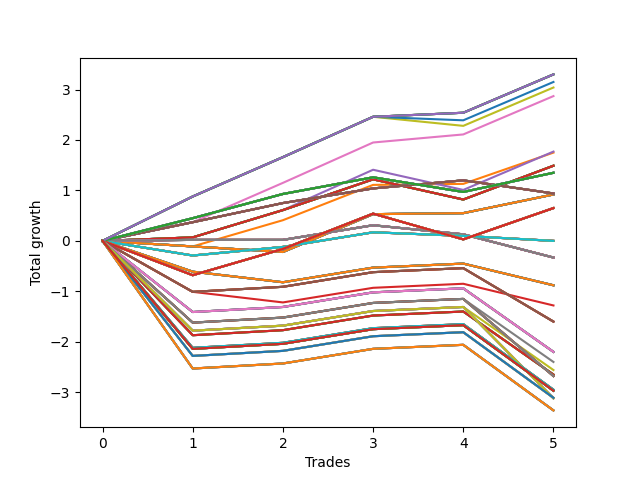

# Short HLT 107_1y 
- Symbol: TSLA
- Date Range: 05/15/2023 - 05/17/2024
- Trading Period: 8:30-12:30
- Number of Trades: 5



| Id. | Name | Win Percent | Profit | Avg Profit / Trade | Avg Time / Trade | Std |      | Name | Win Percent | Profit | Avg Profit / Trade | Avg Time / Trade | Std |
| --- | ---- | ----------- | ------ | ------------------ | ---------------- | --- | ---- | ---- | ----------- | ------ | ------------------ | ---------------- | --- |
| | Sorted By <br> Profit | | | | | | | Sorted By <br> Win Percentage |||||
|0| TP-0.75 180m | 100.00 | 3.30 | 0.66 | 41:24 | 0.29 |     | TP-0.75 180m | 100.00 | 3.30 | 0.66 | 41:24 | 0.29 |
|1| TP-0.75 165m | 100.00 | 3.30 | 0.66 | 41:24 | 0.29 |     | TP-0.75 165m | 100.00 | 3.30 | 0.66 | 41:24 | 0.29 |
|2| TP-0.75 150m | 100.00 | 3.30 | 0.66 | 41:24 | 0.29 |     | TP-0.75 150m | 100.00 | 3.30 | 0.66 | 41:24 | 0.29 |
|3| TP-0.75 135m | 100.00 | 3.30 | 0.66 | 41:24 | 0.29 |     | TP-0.75 135m | 100.00 | 3.30 | 0.66 | 41:24 | 0.29 |
|4| TP-0.75 120m | 100.00 | 3.30 | 0.66 | 41:24 | 0.29 |     | TP-0.75 120m | 100.00 | 3.30 | 0.66 | 41:24 | 0.29 |
|5| TP-0.75 105m | 100.00 | 3.30 | 0.66 | 41:24 | 0.29 |     | TP-0.75 105m | 100.00 | 3.30 | 0.66 | 41:24 | 0.29 |
|6| TP-0.75 90m | 100.00 | 3.30 | 0.66 | 41:24 | 0.29 |     | TP-0.75 90m | 100.00 | 3.30 | 0.66 | 41:24 | 0.29 |
|7| TP-0.75 75m | 80.00 | 3.15 | 0.63 | 40:12 | 0.35 |     | TP-0.75 45m | 100.00 | 2.87 | 0.57 | 33:00 | 0.26 |
|8| TP-0.75 60m | 80.00 | 3.04 | 0.61 | 37:12 | 0.40 |     | TP-0.75 75m | 80.00 | 3.15 | 0.63 | 40:12 | 0.35 |
|9| TP-0.75 45m | 100.00 | 2.87 | 0.57 | 33:00 | 0.26 |     | TP-0.75 60m | 80.00 | 3.04 | 0.61 | 37:12 | 0.40 |
|10| TP-0.75 30m | 80.00 | 1.77 | 0.35 | 25:36 | 0.46 |     | TP-0.75 30m | 80.00 | 1.77 | 0.35 | 25:36 | 0.46 |
|11| TP-0.5 15m | 80.00 | 1.75 | 0.35 | 10:36 | 0.33 |     | TP-0.5 15m | 80.00 | 1.75 | 0.35 | 10:36 | 0.33 |
|12| TP-3 30m | 80.00 | 1.49 | 0.30 | 29:00 | 0.41 |     | TP-3 30m | 80.00 | 1.49 | 0.30 | 29:00 | 0.41 |
|13| TP-2.75 30m | 80.00 | 1.49 | 0.30 | 29:00 | 0.41 |     | TP-2.75 30m | 80.00 | 1.49 | 0.30 | 29:00 | 0.41 |
|14| TP-2.5 30m | 80.00 | 1.49 | 0.30 | 29:00 | 0.41 |     | TP-2.5 30m | 80.00 | 1.49 | 0.30 | 29:00 | 0.41 |
|15| TP-2.25 30m | 80.00 | 1.49 | 0.30 | 29:00 | 0.41 |     | TP-2.25 30m | 80.00 | 1.49 | 0.30 | 29:00 | 0.41 |
|16| TP-2 30m | 80.00 | 1.49 | 0.30 | 29:00 | 0.41 |     | TP-2 30m | 80.00 | 1.49 | 0.30 | 29:00 | 0.41 |
|17| TP-1.75 30m | 80.00 | 1.49 | 0.30 | 29:00 | 0.41 |     | TP-1.75 30m | 80.00 | 1.49 | 0.30 | 29:00 | 0.41 |
|18| TP-1.5 30m | 80.00 | 1.49 | 0.30 | 29:00 | 0.41 |     | TP-1.5 30m | 80.00 | 1.49 | 0.30 | 29:00 | 0.41 |
|19| TP-1.25 30m | 80.00 | 1.49 | 0.30 | 29:00 | 0.41 |     | TP-1.25 30m | 80.00 | 1.49 | 0.30 | 29:00 | 0.41 |
|20| TP-1 30m | 80.00 | 1.49 | 0.30 | 29:00 | 0.41 |     | TP-1 30m | 80.00 | 1.49 | 0.30 | 29:00 | 0.41 |
|21| TP-0.25 180m | 80.00 | 1.35 | 0.27 | 05:12 | 0.28 |     | TP-0.25 180m | 80.00 | 1.35 | 0.27 | 05:12 | 0.28 |
|22| TP-0.25 165m | 80.00 | 1.35 | 0.27 | 05:12 | 0.28 |     | TP-0.25 165m | 80.00 | 1.35 | 0.27 | 05:12 | 0.28 |
|23| TP-0.25 150m | 80.00 | 1.35 | 0.27 | 05:12 | 0.28 |     | TP-0.25 150m | 80.00 | 1.35 | 0.27 | 05:12 | 0.28 |
|24| TP-0.25 135m | 80.00 | 1.35 | 0.27 | 05:12 | 0.28 |     | TP-0.25 135m | 80.00 | 1.35 | 0.27 | 05:12 | 0.28 |
|25| TP-0.25 120m | 80.00 | 1.35 | 0.27 | 05:12 | 0.28 |     | TP-0.25 120m | 80.00 | 1.35 | 0.27 | 05:12 | 0.28 |
|26| TP-0.25 105m | 80.00 | 1.35 | 0.27 | 05:12 | 0.28 |     | TP-0.25 105m | 80.00 | 1.35 | 0.27 | 05:12 | 0.28 |
|27| TP-0.25 90m | 80.00 | 1.35 | 0.27 | 05:12 | 0.28 |     | TP-0.25 90m | 80.00 | 1.35 | 0.27 | 05:12 | 0.28 |
|28| TP-0.25 75m | 80.00 | 1.35 | 0.27 | 05:12 | 0.28 |     | TP-0.25 75m | 80.00 | 1.35 | 0.27 | 05:12 | 0.28 |
|29| TP-0.25 60m | 80.00 | 1.35 | 0.27 | 05:12 | 0.28 |     | TP-0.25 60m | 80.00 | 1.35 | 0.27 | 05:12 | 0.28 |
|30| TP-0.25 45m | 80.00 | 1.35 | 0.27 | 05:12 | 0.28 |     | TP-0.25 45m | 80.00 | 1.35 | 0.27 | 05:12 | 0.28 |
|31| TP-0.25 30m | 80.00 | 1.35 | 0.27 | 05:12 | 0.28 |     | TP-0.25 30m | 80.00 | 1.35 | 0.27 | 05:12 | 0.28 |
|32| TP-0.25 15m | 80.00 | 1.35 | 0.27 | 05:12 | 0.28 |     | TP-0.25 15m | 80.00 | 1.35 | 0.27 | 05:12 | 0.28 |
|33| TP-3 45m | 80.00 | 0.94 | 0.19 | 42:12 | 0.24 |     | TP-3 45m | 80.00 | 0.94 | 0.19 | 42:12 | 0.24 |
|34| TP-2.75 45m | 80.00 | 0.94 | 0.19 | 42:12 | 0.24 |     | TP-2.75 45m | 80.00 | 0.94 | 0.19 | 42:12 | 0.24 |
|35| TP-2.5 45m | 80.00 | 0.94 | 0.19 | 42:12 | 0.24 |     | TP-2.5 45m | 80.00 | 0.94 | 0.19 | 42:12 | 0.24 |
|36| TP-2.25 45m | 80.00 | 0.94 | 0.19 | 42:12 | 0.24 |     | TP-2.25 45m | 80.00 | 0.94 | 0.19 | 42:12 | 0.24 |
|37| TP-2 45m | 80.00 | 0.94 | 0.19 | 42:12 | 0.24 |     | TP-2 45m | 80.00 | 0.94 | 0.19 | 42:12 | 0.24 |
|38| TP-1.75 45m | 80.00 | 0.94 | 0.19 | 42:12 | 0.24 |     | TP-1.75 45m | 80.00 | 0.94 | 0.19 | 42:12 | 0.24 |
|39| TP-1.5 45m | 80.00 | 0.94 | 0.19 | 42:12 | 0.24 |     | TP-1.5 45m | 80.00 | 0.94 | 0.19 | 42:12 | 0.24 |
|40| TP-1.25 45m | 80.00 | 0.94 | 0.19 | 42:12 | 0.24 |     | TP-1.25 45m | 80.00 | 0.94 | 0.19 | 42:12 | 0.24 |
|41| TP-1 45m | 80.00 | 0.94 | 0.19 | 42:12 | 0.24 |     | TP-1 45m | 80.00 | 0.94 | 0.19 | 42:12 | 0.24 |
|42| TP-3 15m | 60.00 | 0.92 | 0.18 | 14:00 | 0.33 |     | TP-3 15m | 60.00 | 0.92 | 0.18 | 14:00 | 0.33 |
|43| TP-2.75 15m | 60.00 | 0.92 | 0.18 | 14:00 | 0.33 |     | TP-2.75 15m | 60.00 | 0.92 | 0.18 | 14:00 | 0.33 |
|44| TP-2.5 15m | 60.00 | 0.92 | 0.18 | 14:00 | 0.33 |     | TP-2.5 15m | 60.00 | 0.92 | 0.18 | 14:00 | 0.33 |
|45| TP-2.25 15m | 60.00 | 0.92 | 0.18 | 14:00 | 0.33 |     | TP-2.25 15m | 60.00 | 0.92 | 0.18 | 14:00 | 0.33 |
|46| TP-2 15m | 60.00 | 0.92 | 0.18 | 14:00 | 0.33 |     | TP-2 15m | 60.00 | 0.92 | 0.18 | 14:00 | 0.33 |
|47| TP-1.75 15m | 60.00 | 0.92 | 0.18 | 14:00 | 0.33 |     | TP-1.75 15m | 60.00 | 0.92 | 0.18 | 14:00 | 0.33 |
|48| TP-1.5 15m | 60.00 | 0.92 | 0.18 | 14:00 | 0.33 |     | TP-1.5 15m | 60.00 | 0.92 | 0.18 | 14:00 | 0.33 |
|49| TP-1.25 15m | 60.00 | 0.92 | 0.18 | 14:00 | 0.33 |     | TP-1.25 15m | 60.00 | 0.92 | 0.18 | 14:00 | 0.33 |
|50| TP-1 15m | 60.00 | 0.92 | 0.18 | 14:00 | 0.33 |     | TP-1 15m | 60.00 | 0.92 | 0.18 | 14:00 | 0.33 |
|51| TP-0.75 15m | 60.00 | 0.92 | 0.18 | 14:00 | 0.33 |     | TP-0.75 15m | 60.00 | 0.92 | 0.18 | 14:00 | 0.33 |
|52| TP-0.5 180m | 60.00 | 0.65 | 0.13 | 12:48 | 0.60 |     | TP-0.5 180m | 60.00 | 0.65 | 0.13 | 12:48 | 0.60 |
|53| TP-0.5 165m | 60.00 | 0.65 | 0.13 | 12:48 | 0.60 |     | TP-0.5 165m | 60.00 | 0.65 | 0.13 | 12:48 | 0.60 |
|54| TP-0.5 150m | 60.00 | 0.65 | 0.13 | 12:48 | 0.60 |     | TP-0.5 150m | 60.00 | 0.65 | 0.13 | 12:48 | 0.60 |
|55| TP-0.5 135m | 60.00 | 0.65 | 0.13 | 12:48 | 0.60 |     | TP-0.5 135m | 60.00 | 0.65 | 0.13 | 12:48 | 0.60 |
|56| TP-0.5 120m | 60.00 | 0.65 | 0.13 | 12:48 | 0.60 |     | TP-0.5 120m | 60.00 | 0.65 | 0.13 | 12:48 | 0.60 |
|57| TP-0.5 105m | 60.00 | 0.65 | 0.13 | 12:48 | 0.60 |     | TP-0.5 105m | 60.00 | 0.65 | 0.13 | 12:48 | 0.60 |
|58| TP-0.5 90m | 60.00 | 0.65 | 0.13 | 12:48 | 0.60 |     | TP-0.5 90m | 60.00 | 0.65 | 0.13 | 12:48 | 0.60 |
|59| TP-0.5 75m | 60.00 | 0.65 | 0.13 | 12:48 | 0.60 |     | TP-0.5 75m | 60.00 | 0.65 | 0.13 | 12:48 | 0.60 |
|60| TP-0.5 60m | 60.00 | 0.65 | 0.13 | 12:48 | 0.60 |     | TP-0.5 60m | 60.00 | 0.65 | 0.13 | 12:48 | 0.60 |
|61| TP-0.5 45m | 60.00 | 0.65 | 0.13 | 12:48 | 0.60 |     | TP-0.5 45m | 60.00 | 0.65 | 0.13 | 12:48 | 0.60 |
|62| TP-0.5 30m | 60.00 | 0.65 | 0.13 | 12:48 | 0.60 |     | TP-0.5 30m | 60.00 | 0.65 | 0.13 | 12:48 | 0.60 |
|63| TP-3 75m | 40.00 | 0.00 | 0.00 | 66:12 | 0.21 |     | TP-1 180m | 60.00 | -1.60 | -0.32 | 79:24 | 0.59 |
|64| TP-2.75 75m | 40.00 | 0.00 | 0.00 | 66:12 | 0.21 |     | TP-1 165m | 60.00 | -1.60 | -0.32 | 79:24 | 0.59 |
|65| TP-2.5 75m | 40.00 | 0.00 | 0.00 | 66:12 | 0.21 |     | TP-1 150m | 60.00 | -1.60 | -0.32 | 79:24 | 0.59 |
|66| TP-2.25 75m | 40.00 | 0.00 | 0.00 | 66:12 | 0.21 |     | TP-1 135m | 60.00 | -1.60 | -0.32 | 79:24 | 0.59 |
|67| TP-2 75m | 40.00 | 0.00 | 0.00 | 66:12 | 0.21 |     | TP-1 120m | 60.00 | -1.60 | -0.32 | 79:24 | 0.59 |
|68| TP-1.75 75m | 40.00 | 0.00 | 0.00 | 66:12 | 0.21 |     | TP-1 105m | 60.00 | -1.60 | -0.32 | 79:24 | 0.59 |
|69| TP-1.5 75m | 40.00 | 0.00 | 0.00 | 66:12 | 0.21 |     | TP-1.25 180m | 60.00 | -2.20 | -0.44 | 81:00 | 0.74 |
|70| TP-1.25 75m | 40.00 | 0.00 | 0.00 | 66:12 | 0.21 |     | TP-1.25 165m | 60.00 | -2.20 | -0.44 | 81:00 | 0.74 |
|71| TP-1 75m | 40.00 | 0.00 | 0.00 | 66:12 | 0.21 |     | TP-1.25 150m | 60.00 | -2.20 | -0.44 | 81:00 | 0.74 |
|72| TP-3 60m | 40.00 | -0.33 | -0.07 | 54:12 | 0.25 |     | TP-1.25 135m | 60.00 | -2.20 | -0.44 | 81:00 | 0.74 |
|73| TP-2.75 60m | 40.00 | -0.33 | -0.07 | 54:12 | 0.25 |     | TP-1.25 120m | 60.00 | -2.20 | -0.44 | 81:00 | 0.74 |
|74| TP-2.5 60m | 40.00 | -0.33 | -0.07 | 54:12 | 0.25 |     | TP-1.25 105m | 60.00 | -2.20 | -0.44 | 81:00 | 0.74 |
|75| TP-2.25 60m | 40.00 | -0.33 | -0.07 | 54:12 | 0.25 |     | TP-1.5 105m | 60.00 | -2.40 | -0.48 | 82:24 | 0.79 |
|76| TP-2 60m | 40.00 | -0.33 | -0.07 | 54:12 | 0.25 |     | TP-1.75 105m | 60.00 | -2.56 | -0.51 | 82:36 | 0.84 |
|77| TP-1.75 60m | 40.00 | -0.33 | -0.07 | 54:12 | 0.25 |     | TP-3 105m | 60.00 | -2.65 | -0.53 | 83:36 | 0.87 |
|78| TP-1.5 60m | 40.00 | -0.33 | -0.07 | 54:12 | 0.25 |     | TP-2.75 105m | 60.00 | -2.65 | -0.53 | 83:36 | 0.87 |
|79| TP-1.25 60m | 40.00 | -0.33 | -0.07 | 54:12 | 0.25 |     | TP-2.5 105m | 60.00 | -2.65 | -0.53 | 83:36 | 0.87 |
|80| TP-1 60m | 40.00 | -0.33 | -0.07 | 54:12 | 0.25 |     | TP-2.25 105m | 60.00 | -2.65 | -0.53 | 83:36 | 0.87 |
|81| TP-3 90m | 40.00 | -0.88 | -0.18 | 76:24 | 0.33 |     | TP-2 105m | 60.00 | -2.65 | -0.53 | 83:36 | 0.87 |
|82| TP-2.75 90m | 40.00 | -0.88 | -0.18 | 76:24 | 0.33 |     | TP-1.5 180m | 60.00 | -2.68 | -0.54 | 83:12 | 0.85 |
|83| TP-2.5 90m | 40.00 | -0.88 | -0.18 | 76:24 | 0.33 |     | TP-1.5 165m | 60.00 | -2.68 | -0.54 | 83:12 | 0.85 |
|84| TP-2.25 90m | 40.00 | -0.88 | -0.18 | 76:24 | 0.33 |     | TP-1.5 150m | 60.00 | -2.68 | -0.54 | 83:12 | 0.85 |
|85| TP-2 90m | 40.00 | -0.88 | -0.18 | 76:24 | 0.33 |     | TP-1.5 135m | 60.00 | -2.68 | -0.54 | 83:12 | 0.85 |
|86| TP-1.75 90m | 40.00 | -0.88 | -0.18 | 76:24 | 0.33 |     | TP-1.5 120m | 60.00 | -2.68 | -0.54 | 83:12 | 0.85 |
|87| TP-1.5 90m | 40.00 | -0.88 | -0.18 | 76:24 | 0.33 |     | TP-2 180m | 60.00 | -2.95 | -0.59 | 87:00 | 0.95 |
|88| TP-1.25 90m | 40.00 | -0.88 | -0.18 | 76:24 | 0.33 |     | TP-2 165m | 60.00 | -2.95 | -0.59 | 87:00 | 0.95 |
|89| TP-1 90m | 40.00 | -1.28 | -0.26 | 75:36 | 0.45 |     | TP-2 150m | 60.00 | -2.95 | -0.59 | 87:00 | 0.95 |
|90| TP-1 180m | 60.00 | -1.60 | -0.32 | 79:24 | 0.59 |     | TP-2 135m | 60.00 | -2.95 | -0.59 | 87:00 | 0.95 |
|91| TP-1 165m | 60.00 | -1.60 | -0.32 | 79:24 | 0.59 |     | TP-2 120m | 60.00 | -2.95 | -0.59 | 87:00 | 0.95 |
|92| TP-1 150m | 60.00 | -1.60 | -0.32 | 79:24 | 0.59 |     | TP-3 180m | 60.00 | -2.97 | -0.59 | 89:36 | 0.96 |
|93| TP-1 135m | 60.00 | -1.60 | -0.32 | 79:24 | 0.59 |     | TP-2.75 180m | 60.00 | -2.97 | -0.59 | 89:36 | 0.96 |
|94| TP-1 120m | 60.00 | -1.60 | -0.32 | 79:24 | 0.59 |     | TP-3 165m | 60.00 | -2.97 | -0.59 | 89:36 | 0.96 |
|95| TP-1 105m | 60.00 | -1.60 | -0.32 | 79:24 | 0.59 |     | TP-2.75 165m | 60.00 | -2.97 | -0.59 | 89:36 | 0.96 |
|96| TP-1.25 180m | 60.00 | -2.20 | -0.44 | 81:00 | 0.74 |     | TP-3 150m | 60.00 | -2.97 | -0.59 | 89:36 | 0.96 |
|97| TP-1.25 165m | 60.00 | -2.20 | -0.44 | 81:00 | 0.74 |     | TP-2.75 150m | 60.00 | -2.97 | -0.59 | 89:36 | 0.96 |
|98| TP-1.25 150m | 60.00 | -2.20 | -0.44 | 81:00 | 0.74 |     | TP-3 135m | 60.00 | -2.97 | -0.59 | 89:36 | 0.96 |
|99| TP-1.25 135m | 60.00 | -2.20 | -0.44 | 81:00 | 0.74 |     | TP-2.75 135m | 60.00 | -2.97 | -0.59 | 89:36 | 0.96 |
|100| TP-1.25 120m | 60.00 | -2.20 | -0.44 | 81:00 | 0.74 |     | TP-3 120m | 60.00 | -2.97 | -0.59 | 89:36 | 0.96 |
|101| TP-1.25 105m | 60.00 | -2.20 | -0.44 | 81:00 | 0.74 |     | TP-2.75 120m | 60.00 | -2.97 | -0.59 | 89:36 | 0.96 |
|102| TP-1.5 105m | 60.00 | -2.40 | -0.48 | 82:24 | 0.79 |     | TP-2.25 180m | 60.00 | -3.11 | -0.62 | 88:24 | 1.01 |
|103| TP-1.75 105m | 60.00 | -2.56 | -0.51 | 82:36 | 0.84 |     | TP-2.25 165m | 60.00 | -3.11 | -0.62 | 88:24 | 1.01 |
|104| TP-3 105m | 60.00 | -2.65 | -0.53 | 83:36 | 0.87 |     | TP-2.25 150m | 60.00 | -3.11 | -0.62 | 88:24 | 1.01 |
|105| TP-2.75 105m | 60.00 | -2.65 | -0.53 | 83:36 | 0.87 |     | TP-2.25 135m | 60.00 | -3.11 | -0.62 | 88:24 | 1.01 |
|106| TP-2.5 105m | 60.00 | -2.65 | -0.53 | 83:36 | 0.87 |     | TP-2.25 120m | 60.00 | -3.11 | -0.62 | 88:24 | 1.01 |
|107| TP-2.25 105m | 60.00 | -2.65 | -0.53 | 83:36 | 0.87 |     | TP-1.75 180m | 60.00 | -3.12 | -0.62 | 84:12 | 0.96 |
|108| TP-2 105m | 60.00 | -2.65 | -0.53 | 83:36 | 0.87 |     | TP-1.75 165m | 60.00 | -3.12 | -0.62 | 84:12 | 0.96 |
|109| TP-1.5 180m | 60.00 | -2.68 | -0.54 | 83:12 | 0.85 |     | TP-1.75 150m | 60.00 | -3.12 | -0.62 | 84:12 | 0.96 |
|110| TP-1.5 165m | 60.00 | -2.68 | -0.54 | 83:12 | 0.85 |     | TP-1.75 135m | 60.00 | -3.12 | -0.62 | 84:12 | 0.96 |
|111| TP-1.5 150m | 60.00 | -2.68 | -0.54 | 83:12 | 0.85 |     | TP-1.75 120m | 60.00 | -3.12 | -0.62 | 84:12 | 0.96 |
|112| TP-1.5 135m | 60.00 | -2.68 | -0.54 | 83:12 | 0.85 |     | TP-2.5 180m | 60.00 | -3.36 | -0.67 | 88:36 | 1.09 |
|113| TP-1.5 120m | 60.00 | -2.68 | -0.54 | 83:12 | 0.85 |     | TP-2.5 165m | 60.00 | -3.36 | -0.67 | 88:36 | 1.09 |
|114| TP-2 180m | 60.00 | -2.95 | -0.59 | 87:00 | 0.95 |     | TP-2.5 150m | 60.00 | -3.36 | -0.67 | 88:36 | 1.09 |
|115| TP-2 165m | 60.00 | -2.95 | -0.59 | 87:00 | 0.95 |     | TP-2.5 135m | 60.00 | -3.36 | -0.67 | 88:36 | 1.09 |
|116| TP-2 150m | 60.00 | -2.95 | -0.59 | 87:00 | 0.95 |     | TP-2.5 120m | 60.00 | -3.36 | -0.67 | 88:36 | 1.09 |
|117| TP-2 135m | 60.00 | -2.95 | -0.59 | 87:00 | 0.95 |     | TP-3 75m | 40.00 | 0.00 | 0.00 | 66:12 | 0.21 |
|118| TP-2 120m | 60.00 | -2.95 | -0.59 | 87:00 | 0.95 |     | TP-2.75 75m | 40.00 | 0.00 | 0.00 | 66:12 | 0.21 |
|119| TP-3 180m | 60.00 | -2.97 | -0.59 | 89:36 | 0.96 |     | TP-2.5 75m | 40.00 | 0.00 | 0.00 | 66:12 | 0.21 |
|120| TP-2.75 180m | 60.00 | -2.97 | -0.59 | 89:36 | 0.96 |     | TP-2.25 75m | 40.00 | 0.00 | 0.00 | 66:12 | 0.21 |
|121| TP-3 165m | 60.00 | -2.97 | -0.59 | 89:36 | 0.96 |     | TP-2 75m | 40.00 | 0.00 | 0.00 | 66:12 | 0.21 |
|122| TP-2.75 165m | 60.00 | -2.97 | -0.59 | 89:36 | 0.96 |     | TP-1.75 75m | 40.00 | 0.00 | 0.00 | 66:12 | 0.21 |
|123| TP-3 150m | 60.00 | -2.97 | -0.59 | 89:36 | 0.96 |     | TP-1.5 75m | 40.00 | 0.00 | 0.00 | 66:12 | 0.21 |
|124| TP-2.75 150m | 60.00 | -2.97 | -0.59 | 89:36 | 0.96 |     | TP-1.25 75m | 40.00 | 0.00 | 0.00 | 66:12 | 0.21 |
|125| TP-3 135m | 60.00 | -2.97 | -0.59 | 89:36 | 0.96 |     | TP-1 75m | 40.00 | 0.00 | 0.00 | 66:12 | 0.21 |
|126| TP-2.75 135m | 60.00 | -2.97 | -0.59 | 89:36 | 0.96 |     | TP-3 60m | 40.00 | -0.33 | -0.07 | 54:12 | 0.25 |
|127| TP-3 120m | 60.00 | -2.97 | -0.59 | 89:36 | 0.96 |     | TP-2.75 60m | 40.00 | -0.33 | -0.07 | 54:12 | 0.25 |
|128| TP-2.75 120m | 60.00 | -2.97 | -0.59 | 89:36 | 0.96 |     | TP-2.5 60m | 40.00 | -0.33 | -0.07 | 54:12 | 0.25 |
|129| TP-2.25 180m | 60.00 | -3.11 | -0.62 | 88:24 | 1.01 |     | TP-2.25 60m | 40.00 | -0.33 | -0.07 | 54:12 | 0.25 |
|130| TP-2.25 165m | 60.00 | -3.11 | -0.62 | 88:24 | 1.01 |     | TP-2 60m | 40.00 | -0.33 | -0.07 | 54:12 | 0.25 |
|131| TP-2.25 150m | 60.00 | -3.11 | -0.62 | 88:24 | 1.01 |     | TP-1.75 60m | 40.00 | -0.33 | -0.07 | 54:12 | 0.25 |
|132| TP-2.25 135m | 60.00 | -3.11 | -0.62 | 88:24 | 1.01 |     | TP-1.5 60m | 40.00 | -0.33 | -0.07 | 54:12 | 0.25 |
|133| TP-2.25 120m | 60.00 | -3.11 | -0.62 | 88:24 | 1.01 |     | TP-1.25 60m | 40.00 | -0.33 | -0.07 | 54:12 | 0.25 |
|134| TP-1.75 180m | 60.00 | -3.12 | -0.62 | 84:12 | 0.96 |     | TP-1 60m | 40.00 | -0.33 | -0.07 | 54:12 | 0.25 |
|135| TP-1.75 165m | 60.00 | -3.12 | -0.62 | 84:12 | 0.96 |     | TP-3 90m | 40.00 | -0.88 | -0.18 | 76:24 | 0.33 |
|136| TP-1.75 150m | 60.00 | -3.12 | -0.62 | 84:12 | 0.96 |     | TP-2.75 90m | 40.00 | -0.88 | -0.18 | 76:24 | 0.33 |
|137| TP-1.75 135m | 60.00 | -3.12 | -0.62 | 84:12 | 0.96 |     | TP-2.5 90m | 40.00 | -0.88 | -0.18 | 76:24 | 0.33 |
|138| TP-1.75 120m | 60.00 | -3.12 | -0.62 | 84:12 | 0.96 |     | TP-2.25 90m | 40.00 | -0.88 | -0.18 | 76:24 | 0.33 |
|139| TP-2.5 180m | 60.00 | -3.36 | -0.67 | 88:36 | 1.09 |     | TP-2 90m | 40.00 | -0.88 | -0.18 | 76:24 | 0.33 |
|140| TP-2.5 165m | 60.00 | -3.36 | -0.67 | 88:36 | 1.09 |     | TP-1.75 90m | 40.00 | -0.88 | -0.18 | 76:24 | 0.33 |
|141| TP-2.5 150m | 60.00 | -3.36 | -0.67 | 88:36 | 1.09 |     | TP-1.5 90m | 40.00 | -0.88 | -0.18 | 76:24 | 0.33 |
|142| TP-2.5 135m | 60.00 | -3.36 | -0.67 | 88:36 | 1.09 |     | TP-1.25 90m | 40.00 | -0.88 | -0.18 | 76:24 | 0.33 |
|143| TP-2.5 120m | 60.00 | -3.36 | -0.67 | 88:36 | 1.09 |     | TP-1 90m | 40.00 | -1.28 | -0.26 | 75:36 | 0.45 |

### Test TP-0.25 15m
* Take Profit of 0.25 Point
* 0.25 Stoploss
* Results:
```
Total Trades: 5
Percent Up: 20.00
Percent Down: 80.00
Total Points Moved Down: 1.35
Potential Profit: 675.00
Total Points Ups: 0.29 Count Ups: 1
Total Points Downs: 1.64 Count Downs: 4
```

<details><summary>Trades</summary>

<code>In: 2023-08-23 09:10:00		Out: 2023-08-23 09:12:00		Total Position Time: 02:00		Total Move Down: 0.45		Total to Date: 0.45</code> <br />
<code>In: 2023-08-23 11:15:00		Out: 2023-08-23 11:19:00		Total Position Time: 04:00		Total Move Down: 0.48		Total to Date: 0.93</code> <br />
<code>In: 2023-09-14 12:15:00		Out: 2023-09-14 12:25:00		Total Position Time: 10:00		Total Move Down: 0.33		Total to Date: 1.26</code> <br />
<code>In: 2023-10-16 11:30:00		Out: 2023-10-16 11:35:00		Total Position Time: 05:00		Total Move Down: -0.29		Total to Date: 0.97</code> <br />
<code>In: 2024-02-15 10:50:00		Out: 2024-02-15 10:55:00		Total Position Time: 05:00		Total Move Down: 0.38		Total to Date: 1.35</code> <br />


</details>

### Test TP-0.5 15m
* Take Profit of 0.5 Point
* 0.5 Stoploss
* Results:
```
Total Trades: 5
Percent Up: 20.00
Percent Down: 80.00
Total Points Moved Down: 1.75
Potential Profit: 875.00
Total Points Ups: 0.11 Count Ups: 1
Total Points Downs: 1.86 Count Downs: 4
```

<details><summary>Trades</summary>

<code>In: 2023-08-23 09:10:00		Out: 2023-08-23 09:24:00		Total Position Time: 14:00		Total Move Down: -0.11		Total to Date: -0.11</code> <br />
<code>In: 2023-08-23 11:15:00		Out: 2023-08-23 11:21:00		Total Position Time: 06:00		Total Move Down: 0.52		Total to Date: 0.41</code> <br />
<code>In: 2023-09-14 12:15:00		Out: 2023-09-14 12:28:00		Total Position Time: 13:00		Total Move Down: 0.70		Total to Date: 1.11</code> <br />
<code>In: 2023-10-16 11:30:00		Out: 2023-10-16 11:44:00		Total Position Time: 14:00		Total Move Down: 0.02		Total to Date: 1.13</code> <br />
<code>In: 2024-02-15 10:50:00		Out: 2024-02-15 10:56:00		Total Position Time: 06:00		Total Move Down: 0.62		Total to Date: 1.75</code> <br />


</details>

### Test TP-0.75 15m
* Take Profit of 0.75 Point
* 0.75 Stoploss
* Results:
```
Total Trades: 5
Percent Up: 40.00
Percent Down: 60.00
Total Points Moved Down: 0.92
Potential Profit: 460.00
Total Points Ups: 0.22 Count Ups: 2
Total Points Downs: 1.14 Count Downs: 3
```

<details><summary>Trades</summary>

<code>In: 2023-08-23 09:10:00		Out: 2023-08-23 09:24:00		Total Position Time: 14:00		Total Move Down: -0.11		Total to Date: -0.11</code> <br />
<code>In: 2023-08-23 11:15:00		Out: 2023-08-23 11:29:00		Total Position Time: 14:00		Total Move Down: -0.11		Total to Date: -0.22</code> <br />
<code>In: 2023-09-14 12:15:00		Out: 2023-09-14 12:29:00		Total Position Time: 14:00		Total Move Down: 0.75		Total to Date: 0.53</code> <br />
<code>In: 2023-10-16 11:30:00		Out: 2023-10-16 11:44:00		Total Position Time: 14:00		Total Move Down: 0.02		Total to Date: 0.55</code> <br />
<code>In: 2024-02-15 10:50:00		Out: 2024-02-15 11:04:00		Total Position Time: 14:00		Total Move Down: 0.37		Total to Date: 0.92</code> <br />


</details>

### Test TP-1 15m
* Take Profit of 1 Point
* 1 Stoploss
* Results:
```
Total Trades: 5
Percent Up: 40.00
Percent Down: 60.00
Total Points Moved Down: 0.92
Potential Profit: 460.00
Total Points Ups: 0.22 Count Ups: 2
Total Points Downs: 1.14 Count Downs: 3
```

<details><summary>Trades</summary>

<code>In: 2023-08-23 09:10:00		Out: 2023-08-23 09:24:00		Total Position Time: 14:00		Total Move Down: -0.11		Total to Date: -0.11</code> <br />
<code>In: 2023-08-23 11:15:00		Out: 2023-08-23 11:29:00		Total Position Time: 14:00		Total Move Down: -0.11		Total to Date: -0.22</code> <br />
<code>In: 2023-09-14 12:15:00		Out: 2023-09-14 12:29:00		Total Position Time: 14:00		Total Move Down: 0.75		Total to Date: 0.53</code> <br />
<code>In: 2023-10-16 11:30:00		Out: 2023-10-16 11:44:00		Total Position Time: 14:00		Total Move Down: 0.02		Total to Date: 0.55</code> <br />
<code>In: 2024-02-15 10:50:00		Out: 2024-02-15 11:04:00		Total Position Time: 14:00		Total Move Down: 0.37		Total to Date: 0.92</code> <br />


</details>

### Test TP-1.25 15m
* Take Profit of 1.25 Point
* 1.25 Stoploss
* Results:
```
Total Trades: 5
Percent Up: 40.00
Percent Down: 60.00
Total Points Moved Down: 0.92
Potential Profit: 460.00
Total Points Ups: 0.22 Count Ups: 2
Total Points Downs: 1.14 Count Downs: 3
```

<details><summary>Trades</summary>

<code>In: 2023-08-23 09:10:00		Out: 2023-08-23 09:24:00		Total Position Time: 14:00		Total Move Down: -0.11		Total to Date: -0.11</code> <br />
<code>In: 2023-08-23 11:15:00		Out: 2023-08-23 11:29:00		Total Position Time: 14:00		Total Move Down: -0.11		Total to Date: -0.22</code> <br />
<code>In: 2023-09-14 12:15:00		Out: 2023-09-14 12:29:00		Total Position Time: 14:00		Total Move Down: 0.75		Total to Date: 0.53</code> <br />
<code>In: 2023-10-16 11:30:00		Out: 2023-10-16 11:44:00		Total Position Time: 14:00		Total Move Down: 0.02		Total to Date: 0.55</code> <br />
<code>In: 2024-02-15 10:50:00		Out: 2024-02-15 11:04:00		Total Position Time: 14:00		Total Move Down: 0.37		Total to Date: 0.92</code> <br />


</details>

### Test TP-1.5 15m
* Take Profit of 1.5 Point
* 1.5 Stoploss
* Results:
```
Total Trades: 5
Percent Up: 40.00
Percent Down: 60.00
Total Points Moved Down: 0.92
Potential Profit: 460.00
Total Points Ups: 0.22 Count Ups: 2
Total Points Downs: 1.14 Count Downs: 3
```

<details><summary>Trades</summary>

<code>In: 2023-08-23 09:10:00		Out: 2023-08-23 09:24:00		Total Position Time: 14:00		Total Move Down: -0.11		Total to Date: -0.11</code> <br />
<code>In: 2023-08-23 11:15:00		Out: 2023-08-23 11:29:00		Total Position Time: 14:00		Total Move Down: -0.11		Total to Date: -0.22</code> <br />
<code>In: 2023-09-14 12:15:00		Out: 2023-09-14 12:29:00		Total Position Time: 14:00		Total Move Down: 0.75		Total to Date: 0.53</code> <br />
<code>In: 2023-10-16 11:30:00		Out: 2023-10-16 11:44:00		Total Position Time: 14:00		Total Move Down: 0.02		Total to Date: 0.55</code> <br />
<code>In: 2024-02-15 10:50:00		Out: 2024-02-15 11:04:00		Total Position Time: 14:00		Total Move Down: 0.37		Total to Date: 0.92</code> <br />


</details>

### Test TP-1.75 15m
* Take Profit of 1.75 Point
* 1.75 Stoploss
* Results:
```
Total Trades: 5
Percent Up: 40.00
Percent Down: 60.00
Total Points Moved Down: 0.92
Potential Profit: 460.00
Total Points Ups: 0.22 Count Ups: 2
Total Points Downs: 1.14 Count Downs: 3
```

<details><summary>Trades</summary>

<code>In: 2023-08-23 09:10:00		Out: 2023-08-23 09:24:00		Total Position Time: 14:00		Total Move Down: -0.11		Total to Date: -0.11</code> <br />
<code>In: 2023-08-23 11:15:00		Out: 2023-08-23 11:29:00		Total Position Time: 14:00		Total Move Down: -0.11		Total to Date: -0.22</code> <br />
<code>In: 2023-09-14 12:15:00		Out: 2023-09-14 12:29:00		Total Position Time: 14:00		Total Move Down: 0.75		Total to Date: 0.53</code> <br />
<code>In: 2023-10-16 11:30:00		Out: 2023-10-16 11:44:00		Total Position Time: 14:00		Total Move Down: 0.02		Total to Date: 0.55</code> <br />
<code>In: 2024-02-15 10:50:00		Out: 2024-02-15 11:04:00		Total Position Time: 14:00		Total Move Down: 0.37		Total to Date: 0.92</code> <br />


</details>

### Test TP-2 15m
* Take Profit of 2 Point
* 2 Stoploss
* Results:
```
Total Trades: 5
Percent Up: 40.00
Percent Down: 60.00
Total Points Moved Down: 0.92
Potential Profit: 460.00
Total Points Ups: 0.22 Count Ups: 2
Total Points Downs: 1.14 Count Downs: 3
```

<details><summary>Trades</summary>

<code>In: 2023-08-23 09:10:00		Out: 2023-08-23 09:24:00		Total Position Time: 14:00		Total Move Down: -0.11		Total to Date: -0.11</code> <br />
<code>In: 2023-08-23 11:15:00		Out: 2023-08-23 11:29:00		Total Position Time: 14:00		Total Move Down: -0.11		Total to Date: -0.22</code> <br />
<code>In: 2023-09-14 12:15:00		Out: 2023-09-14 12:29:00		Total Position Time: 14:00		Total Move Down: 0.75		Total to Date: 0.53</code> <br />
<code>In: 2023-10-16 11:30:00		Out: 2023-10-16 11:44:00		Total Position Time: 14:00		Total Move Down: 0.02		Total to Date: 0.55</code> <br />
<code>In: 2024-02-15 10:50:00		Out: 2024-02-15 11:04:00		Total Position Time: 14:00		Total Move Down: 0.37		Total to Date: 0.92</code> <br />


</details>

### Test TP-2.25 15m
* Take Profit of 2.25 Point
* 2.25 Stoploss
* Results:
```
Total Trades: 5
Percent Up: 40.00
Percent Down: 60.00
Total Points Moved Down: 0.92
Potential Profit: 460.00
Total Points Ups: 0.22 Count Ups: 2
Total Points Downs: 1.14 Count Downs: 3
```

<details><summary>Trades</summary>

<code>In: 2023-08-23 09:10:00		Out: 2023-08-23 09:24:00		Total Position Time: 14:00		Total Move Down: -0.11		Total to Date: -0.11</code> <br />
<code>In: 2023-08-23 11:15:00		Out: 2023-08-23 11:29:00		Total Position Time: 14:00		Total Move Down: -0.11		Total to Date: -0.22</code> <br />
<code>In: 2023-09-14 12:15:00		Out: 2023-09-14 12:29:00		Total Position Time: 14:00		Total Move Down: 0.75		Total to Date: 0.53</code> <br />
<code>In: 2023-10-16 11:30:00		Out: 2023-10-16 11:44:00		Total Position Time: 14:00		Total Move Down: 0.02		Total to Date: 0.55</code> <br />
<code>In: 2024-02-15 10:50:00		Out: 2024-02-15 11:04:00		Total Position Time: 14:00		Total Move Down: 0.37		Total to Date: 0.92</code> <br />


</details>

### Test TP-2.5 15m
* Take Profit of 2.5 Point
* 2.5 Stoploss
* Results:
```
Total Trades: 5
Percent Up: 40.00
Percent Down: 60.00
Total Points Moved Down: 0.92
Potential Profit: 460.00
Total Points Ups: 0.22 Count Ups: 2
Total Points Downs: 1.14 Count Downs: 3
```

<details><summary>Trades</summary>

<code>In: 2023-08-23 09:10:00		Out: 2023-08-23 09:24:00		Total Position Time: 14:00		Total Move Down: -0.11		Total to Date: -0.11</code> <br />
<code>In: 2023-08-23 11:15:00		Out: 2023-08-23 11:29:00		Total Position Time: 14:00		Total Move Down: -0.11		Total to Date: -0.22</code> <br />
<code>In: 2023-09-14 12:15:00		Out: 2023-09-14 12:29:00		Total Position Time: 14:00		Total Move Down: 0.75		Total to Date: 0.53</code> <br />
<code>In: 2023-10-16 11:30:00		Out: 2023-10-16 11:44:00		Total Position Time: 14:00		Total Move Down: 0.02		Total to Date: 0.55</code> <br />
<code>In: 2024-02-15 10:50:00		Out: 2024-02-15 11:04:00		Total Position Time: 14:00		Total Move Down: 0.37		Total to Date: 0.92</code> <br />


</details>

### Test TP-2.75 15m
* Take Profit of 2.75 Point
* 2.75 Stoploss
* Results:
```
Total Trades: 5
Percent Up: 40.00
Percent Down: 60.00
Total Points Moved Down: 0.92
Potential Profit: 460.00
Total Points Ups: 0.22 Count Ups: 2
Total Points Downs: 1.14 Count Downs: 3
```

<details><summary>Trades</summary>

<code>In: 2023-08-23 09:10:00		Out: 2023-08-23 09:24:00		Total Position Time: 14:00		Total Move Down: -0.11		Total to Date: -0.11</code> <br />
<code>In: 2023-08-23 11:15:00		Out: 2023-08-23 11:29:00		Total Position Time: 14:00		Total Move Down: -0.11		Total to Date: -0.22</code> <br />
<code>In: 2023-09-14 12:15:00		Out: 2023-09-14 12:29:00		Total Position Time: 14:00		Total Move Down: 0.75		Total to Date: 0.53</code> <br />
<code>In: 2023-10-16 11:30:00		Out: 2023-10-16 11:44:00		Total Position Time: 14:00		Total Move Down: 0.02		Total to Date: 0.55</code> <br />
<code>In: 2024-02-15 10:50:00		Out: 2024-02-15 11:04:00		Total Position Time: 14:00		Total Move Down: 0.37		Total to Date: 0.92</code> <br />


</details>

### Test TP-3 15m
* Take Profit of 3 Point
* 3 Stoploss
* Results:
```
Total Trades: 5
Percent Up: 40.00
Percent Down: 60.00
Total Points Moved Down: 0.92
Potential Profit: 460.00
Total Points Ups: 0.22 Count Ups: 2
Total Points Downs: 1.14 Count Downs: 3
```

<details><summary>Trades</summary>

<code>In: 2023-08-23 09:10:00		Out: 2023-08-23 09:24:00		Total Position Time: 14:00		Total Move Down: -0.11		Total to Date: -0.11</code> <br />
<code>In: 2023-08-23 11:15:00		Out: 2023-08-23 11:29:00		Total Position Time: 14:00		Total Move Down: -0.11		Total to Date: -0.22</code> <br />
<code>In: 2023-09-14 12:15:00		Out: 2023-09-14 12:29:00		Total Position Time: 14:00		Total Move Down: 0.75		Total to Date: 0.53</code> <br />
<code>In: 2023-10-16 11:30:00		Out: 2023-10-16 11:44:00		Total Position Time: 14:00		Total Move Down: 0.02		Total to Date: 0.55</code> <br />
<code>In: 2024-02-15 10:50:00		Out: 2024-02-15 11:04:00		Total Position Time: 14:00		Total Move Down: 0.37		Total to Date: 0.92</code> <br />


</details>

### Test TP-0.25 30m
* Take Profit of 0.25 Point
* 0.25 Stoploss
* Results:
```
Total Trades: 5
Percent Up: 20.00
Percent Down: 80.00
Total Points Moved Down: 1.35
Potential Profit: 675.00
Total Points Ups: 0.29 Count Ups: 1
Total Points Downs: 1.64 Count Downs: 4
```

<details><summary>Trades</summary>

<code>In: 2023-08-23 09:10:00		Out: 2023-08-23 09:12:00		Total Position Time: 02:00		Total Move Down: 0.45		Total to Date: 0.45</code> <br />
<code>In: 2023-08-23 11:15:00		Out: 2023-08-23 11:19:00		Total Position Time: 04:00		Total Move Down: 0.48		Total to Date: 0.93</code> <br />
<code>In: 2023-09-14 12:15:00		Out: 2023-09-14 12:25:00		Total Position Time: 10:00		Total Move Down: 0.33		Total to Date: 1.26</code> <br />
<code>In: 2023-10-16 11:30:00		Out: 2023-10-16 11:35:00		Total Position Time: 05:00		Total Move Down: -0.29		Total to Date: 0.97</code> <br />
<code>In: 2024-02-15 10:50:00		Out: 2024-02-15 10:55:00		Total Position Time: 05:00		Total Move Down: 0.38		Total to Date: 1.35</code> <br />


</details>

### Test TP-0.5 30m
* Take Profit of 0.5 Point
* 0.5 Stoploss
* Results:
```
Total Trades: 5
Percent Up: 40.00
Percent Down: 60.00
Total Points Moved Down: 0.65
Potential Profit: 325.00
Total Points Ups: 1.19 Count Ups: 2
Total Points Downs: 1.84 Count Downs: 3
```

<details><summary>Trades</summary>

<code>In: 2023-08-23 09:10:00		Out: 2023-08-23 09:27:00		Total Position Time: 17:00		Total Move Down: -0.68		Total to Date: -0.68</code> <br />
<code>In: 2023-08-23 11:15:00		Out: 2023-08-23 11:21:00		Total Position Time: 06:00		Total Move Down: 0.52		Total to Date: -0.16</code> <br />
<code>In: 2023-09-14 12:15:00		Out: 2023-09-14 12:28:00		Total Position Time: 13:00		Total Move Down: 0.70		Total to Date: 0.54</code> <br />
<code>In: 2023-10-16 11:30:00		Out: 2023-10-16 11:52:00		Total Position Time: 22:00		Total Move Down: -0.51		Total to Date: 0.03</code> <br />
<code>In: 2024-02-15 10:50:00		Out: 2024-02-15 10:56:00		Total Position Time: 06:00		Total Move Down: 0.62		Total to Date: 0.65</code> <br />


</details>

### Test TP-0.75 30m
* Take Profit of 0.75 Point
* 0.75 Stoploss
* Results:
```
Total Trades: 5
Percent Up: 20.00
Percent Down: 80.00
Total Points Moved Down: 1.77
Potential Profit: 885.00
Total Points Ups: 0.40 Count Ups: 1
Total Points Downs: 2.17 Count Downs: 4
```

<details><summary>Trades</summary>

<code>In: 2023-08-23 09:10:00		Out: 2023-08-23 09:39:00		Total Position Time: 29:00		Total Move Down: 0.07		Total to Date: 0.07</code> <br />
<code>In: 2023-08-23 11:15:00		Out: 2023-08-23 11:44:00		Total Position Time: 29:00		Total Move Down: 0.54		Total to Date: 0.61</code> <br />
<code>In: 2023-09-14 12:15:00		Out: 2023-09-14 12:35:00		Total Position Time: 20:00		Total Move Down: 0.80		Total to Date: 1.41</code> <br />
<code>In: 2023-10-16 11:30:00		Out: 2023-10-16 11:59:00		Total Position Time: 29:00		Total Move Down: -0.40		Total to Date: 1.01</code> <br />
<code>In: 2024-02-15 10:50:00		Out: 2024-02-15 11:11:00		Total Position Time: 21:00		Total Move Down: 0.76		Total to Date: 1.77</code> <br />


</details>

### Test TP-1 30m
* Take Profit of 1 Point
* 1 Stoploss
* Results:
```
Total Trades: 5
Percent Up: 20.00
Percent Down: 80.00
Total Points Moved Down: 1.49
Potential Profit: 745.00
Total Points Ups: 0.40 Count Ups: 1
Total Points Downs: 1.89 Count Downs: 4
```

<details><summary>Trades</summary>

<code>In: 2023-08-23 09:10:00		Out: 2023-08-23 09:39:00		Total Position Time: 29:00		Total Move Down: 0.07		Total to Date: 0.07</code> <br />
<code>In: 2023-08-23 11:15:00		Out: 2023-08-23 11:44:00		Total Position Time: 29:00		Total Move Down: 0.54		Total to Date: 0.61</code> <br />
<code>In: 2023-09-14 12:15:00		Out: 2023-09-14 12:44:00		Total Position Time: 29:00		Total Move Down: 0.61		Total to Date: 1.22</code> <br />
<code>In: 2023-10-16 11:30:00		Out: 2023-10-16 11:59:00		Total Position Time: 29:00		Total Move Down: -0.40		Total to Date: 0.82</code> <br />
<code>In: 2024-02-15 10:50:00		Out: 2024-02-15 11:19:00		Total Position Time: 29:00		Total Move Down: 0.67		Total to Date: 1.49</code> <br />


</details>

### Test TP-1.25 30m
* Take Profit of 1.25 Point
* 1.25 Stoploss
* Results:
```
Total Trades: 5
Percent Up: 20.00
Percent Down: 80.00
Total Points Moved Down: 1.49
Potential Profit: 745.00
Total Points Ups: 0.40 Count Ups: 1
Total Points Downs: 1.89 Count Downs: 4
```

<details><summary>Trades</summary>

<code>In: 2023-08-23 09:10:00		Out: 2023-08-23 09:39:00		Total Position Time: 29:00		Total Move Down: 0.07		Total to Date: 0.07</code> <br />
<code>In: 2023-08-23 11:15:00		Out: 2023-08-23 11:44:00		Total Position Time: 29:00		Total Move Down: 0.54		Total to Date: 0.61</code> <br />
<code>In: 2023-09-14 12:15:00		Out: 2023-09-14 12:44:00		Total Position Time: 29:00		Total Move Down: 0.61		Total to Date: 1.22</code> <br />
<code>In: 2023-10-16 11:30:00		Out: 2023-10-16 11:59:00		Total Position Time: 29:00		Total Move Down: -0.40		Total to Date: 0.82</code> <br />
<code>In: 2024-02-15 10:50:00		Out: 2024-02-15 11:19:00		Total Position Time: 29:00		Total Move Down: 0.67		Total to Date: 1.49</code> <br />


</details>

### Test TP-1.5 30m
* Take Profit of 1.5 Point
* 1.5 Stoploss
* Results:
```
Total Trades: 5
Percent Up: 20.00
Percent Down: 80.00
Total Points Moved Down: 1.49
Potential Profit: 745.00
Total Points Ups: 0.40 Count Ups: 1
Total Points Downs: 1.89 Count Downs: 4
```

<details><summary>Trades</summary>

<code>In: 2023-08-23 09:10:00		Out: 2023-08-23 09:39:00		Total Position Time: 29:00		Total Move Down: 0.07		Total to Date: 0.07</code> <br />
<code>In: 2023-08-23 11:15:00		Out: 2023-08-23 11:44:00		Total Position Time: 29:00		Total Move Down: 0.54		Total to Date: 0.61</code> <br />
<code>In: 2023-09-14 12:15:00		Out: 2023-09-14 12:44:00		Total Position Time: 29:00		Total Move Down: 0.61		Total to Date: 1.22</code> <br />
<code>In: 2023-10-16 11:30:00		Out: 2023-10-16 11:59:00		Total Position Time: 29:00		Total Move Down: -0.40		Total to Date: 0.82</code> <br />
<code>In: 2024-02-15 10:50:00		Out: 2024-02-15 11:19:00		Total Position Time: 29:00		Total Move Down: 0.67		Total to Date: 1.49</code> <br />


</details>

### Test TP-1.75 30m
* Take Profit of 1.75 Point
* 1.75 Stoploss
* Results:
```
Total Trades: 5
Percent Up: 20.00
Percent Down: 80.00
Total Points Moved Down: 1.49
Potential Profit: 745.00
Total Points Ups: 0.40 Count Ups: 1
Total Points Downs: 1.89 Count Downs: 4
```

<details><summary>Trades</summary>

<code>In: 2023-08-23 09:10:00		Out: 2023-08-23 09:39:00		Total Position Time: 29:00		Total Move Down: 0.07		Total to Date: 0.07</code> <br />
<code>In: 2023-08-23 11:15:00		Out: 2023-08-23 11:44:00		Total Position Time: 29:00		Total Move Down: 0.54		Total to Date: 0.61</code> <br />
<code>In: 2023-09-14 12:15:00		Out: 2023-09-14 12:44:00		Total Position Time: 29:00		Total Move Down: 0.61		Total to Date: 1.22</code> <br />
<code>In: 2023-10-16 11:30:00		Out: 2023-10-16 11:59:00		Total Position Time: 29:00		Total Move Down: -0.40		Total to Date: 0.82</code> <br />
<code>In: 2024-02-15 10:50:00		Out: 2024-02-15 11:19:00		Total Position Time: 29:00		Total Move Down: 0.67		Total to Date: 1.49</code> <br />


</details>

### Test TP-2 30m
* Take Profit of 2 Point
* 2 Stoploss
* Results:
```
Total Trades: 5
Percent Up: 20.00
Percent Down: 80.00
Total Points Moved Down: 1.49
Potential Profit: 745.00
Total Points Ups: 0.40 Count Ups: 1
Total Points Downs: 1.89 Count Downs: 4
```

<details><summary>Trades</summary>

<code>In: 2023-08-23 09:10:00		Out: 2023-08-23 09:39:00		Total Position Time: 29:00		Total Move Down: 0.07		Total to Date: 0.07</code> <br />
<code>In: 2023-08-23 11:15:00		Out: 2023-08-23 11:44:00		Total Position Time: 29:00		Total Move Down: 0.54		Total to Date: 0.61</code> <br />
<code>In: 2023-09-14 12:15:00		Out: 2023-09-14 12:44:00		Total Position Time: 29:00		Total Move Down: 0.61		Total to Date: 1.22</code> <br />
<code>In: 2023-10-16 11:30:00		Out: 2023-10-16 11:59:00		Total Position Time: 29:00		Total Move Down: -0.40		Total to Date: 0.82</code> <br />
<code>In: 2024-02-15 10:50:00		Out: 2024-02-15 11:19:00		Total Position Time: 29:00		Total Move Down: 0.67		Total to Date: 1.49</code> <br />


</details>

### Test TP-2.25 30m
* Take Profit of 2.25 Point
* 2.25 Stoploss
* Results:
```
Total Trades: 5
Percent Up: 20.00
Percent Down: 80.00
Total Points Moved Down: 1.49
Potential Profit: 745.00
Total Points Ups: 0.40 Count Ups: 1
Total Points Downs: 1.89 Count Downs: 4
```

<details><summary>Trades</summary>

<code>In: 2023-08-23 09:10:00		Out: 2023-08-23 09:39:00		Total Position Time: 29:00		Total Move Down: 0.07		Total to Date: 0.07</code> <br />
<code>In: 2023-08-23 11:15:00		Out: 2023-08-23 11:44:00		Total Position Time: 29:00		Total Move Down: 0.54		Total to Date: 0.61</code> <br />
<code>In: 2023-09-14 12:15:00		Out: 2023-09-14 12:44:00		Total Position Time: 29:00		Total Move Down: 0.61		Total to Date: 1.22</code> <br />
<code>In: 2023-10-16 11:30:00		Out: 2023-10-16 11:59:00		Total Position Time: 29:00		Total Move Down: -0.40		Total to Date: 0.82</code> <br />
<code>In: 2024-02-15 10:50:00		Out: 2024-02-15 11:19:00		Total Position Time: 29:00		Total Move Down: 0.67		Total to Date: 1.49</code> <br />


</details>

### Test TP-2.5 30m
* Take Profit of 2.5 Point
* 2.5 Stoploss
* Results:
```
Total Trades: 5
Percent Up: 20.00
Percent Down: 80.00
Total Points Moved Down: 1.49
Potential Profit: 745.00
Total Points Ups: 0.40 Count Ups: 1
Total Points Downs: 1.89 Count Downs: 4
```

<details><summary>Trades</summary>

<code>In: 2023-08-23 09:10:00		Out: 2023-08-23 09:39:00		Total Position Time: 29:00		Total Move Down: 0.07		Total to Date: 0.07</code> <br />
<code>In: 2023-08-23 11:15:00		Out: 2023-08-23 11:44:00		Total Position Time: 29:00		Total Move Down: 0.54		Total to Date: 0.61</code> <br />
<code>In: 2023-09-14 12:15:00		Out: 2023-09-14 12:44:00		Total Position Time: 29:00		Total Move Down: 0.61		Total to Date: 1.22</code> <br />
<code>In: 2023-10-16 11:30:00		Out: 2023-10-16 11:59:00		Total Position Time: 29:00		Total Move Down: -0.40		Total to Date: 0.82</code> <br />
<code>In: 2024-02-15 10:50:00		Out: 2024-02-15 11:19:00		Total Position Time: 29:00		Total Move Down: 0.67		Total to Date: 1.49</code> <br />


</details>

### Test TP-2.75 30m
* Take Profit of 2.75 Point
* 2.75 Stoploss
* Results:
```
Total Trades: 5
Percent Up: 20.00
Percent Down: 80.00
Total Points Moved Down: 1.49
Potential Profit: 745.00
Total Points Ups: 0.40 Count Ups: 1
Total Points Downs: 1.89 Count Downs: 4
```

<details><summary>Trades</summary>

<code>In: 2023-08-23 09:10:00		Out: 2023-08-23 09:39:00		Total Position Time: 29:00		Total Move Down: 0.07		Total to Date: 0.07</code> <br />
<code>In: 2023-08-23 11:15:00		Out: 2023-08-23 11:44:00		Total Position Time: 29:00		Total Move Down: 0.54		Total to Date: 0.61</code> <br />
<code>In: 2023-09-14 12:15:00		Out: 2023-09-14 12:44:00		Total Position Time: 29:00		Total Move Down: 0.61		Total to Date: 1.22</code> <br />
<code>In: 2023-10-16 11:30:00		Out: 2023-10-16 11:59:00		Total Position Time: 29:00		Total Move Down: -0.40		Total to Date: 0.82</code> <br />
<code>In: 2024-02-15 10:50:00		Out: 2024-02-15 11:19:00		Total Position Time: 29:00		Total Move Down: 0.67		Total to Date: 1.49</code> <br />


</details>

### Test TP-3 30m
* Take Profit of 3 Point
* 3 Stoploss
* Results:
```
Total Trades: 5
Percent Up: 20.00
Percent Down: 80.00
Total Points Moved Down: 1.49
Potential Profit: 745.00
Total Points Ups: 0.40 Count Ups: 1
Total Points Downs: 1.89 Count Downs: 4
```

<details><summary>Trades</summary>

<code>In: 2023-08-23 09:10:00		Out: 2023-08-23 09:39:00		Total Position Time: 29:00		Total Move Down: 0.07		Total to Date: 0.07</code> <br />
<code>In: 2023-08-23 11:15:00		Out: 2023-08-23 11:44:00		Total Position Time: 29:00		Total Move Down: 0.54		Total to Date: 0.61</code> <br />
<code>In: 2023-09-14 12:15:00		Out: 2023-09-14 12:44:00		Total Position Time: 29:00		Total Move Down: 0.61		Total to Date: 1.22</code> <br />
<code>In: 2023-10-16 11:30:00		Out: 2023-10-16 11:59:00		Total Position Time: 29:00		Total Move Down: -0.40		Total to Date: 0.82</code> <br />
<code>In: 2024-02-15 10:50:00		Out: 2024-02-15 11:19:00		Total Position Time: 29:00		Total Move Down: 0.67		Total to Date: 1.49</code> <br />


</details>

### Test TP-0.25 45m
* Take Profit of 0.25 Point
* 0.25 Stoploss
* Results:
```
Total Trades: 5
Percent Up: 20.00
Percent Down: 80.00
Total Points Moved Down: 1.35
Potential Profit: 675.00
Total Points Ups: 0.29 Count Ups: 1
Total Points Downs: 1.64 Count Downs: 4
```

<details><summary>Trades</summary>

<code>In: 2023-08-23 09:10:00		Out: 2023-08-23 09:12:00		Total Position Time: 02:00		Total Move Down: 0.45		Total to Date: 0.45</code> <br />
<code>In: 2023-08-23 11:15:00		Out: 2023-08-23 11:19:00		Total Position Time: 04:00		Total Move Down: 0.48		Total to Date: 0.93</code> <br />
<code>In: 2023-09-14 12:15:00		Out: 2023-09-14 12:25:00		Total Position Time: 10:00		Total Move Down: 0.33		Total to Date: 1.26</code> <br />
<code>In: 2023-10-16 11:30:00		Out: 2023-10-16 11:35:00		Total Position Time: 05:00		Total Move Down: -0.29		Total to Date: 0.97</code> <br />
<code>In: 2024-02-15 10:50:00		Out: 2024-02-15 10:55:00		Total Position Time: 05:00		Total Move Down: 0.38		Total to Date: 1.35</code> <br />


</details>

### Test TP-0.5 45m
* Take Profit of 0.5 Point
* 0.5 Stoploss
* Results:
```
Total Trades: 5
Percent Up: 40.00
Percent Down: 60.00
Total Points Moved Down: 0.65
Potential Profit: 325.00
Total Points Ups: 1.19 Count Ups: 2
Total Points Downs: 1.84 Count Downs: 3
```

<details><summary>Trades</summary>

<code>In: 2023-08-23 09:10:00		Out: 2023-08-23 09:27:00		Total Position Time: 17:00		Total Move Down: -0.68		Total to Date: -0.68</code> <br />
<code>In: 2023-08-23 11:15:00		Out: 2023-08-23 11:21:00		Total Position Time: 06:00		Total Move Down: 0.52		Total to Date: -0.16</code> <br />
<code>In: 2023-09-14 12:15:00		Out: 2023-09-14 12:28:00		Total Position Time: 13:00		Total Move Down: 0.70		Total to Date: 0.54</code> <br />
<code>In: 2023-10-16 11:30:00		Out: 2023-10-16 11:52:00		Total Position Time: 22:00		Total Move Down: -0.51		Total to Date: 0.03</code> <br />
<code>In: 2024-02-15 10:50:00		Out: 2024-02-15 10:56:00		Total Position Time: 06:00		Total Move Down: 0.62		Total to Date: 0.65</code> <br />


</details>

### Test TP-0.75 45m
* Take Profit of 0.75 Point
* 0.75 Stoploss
* Results:
```
Total Trades: 5
Percent Up: 0.00
Percent Down: 100.00
Total Points Moved Down: 2.87
Potential Profit: 1435.00
Total Points Ups: 0.00 Count Ups: 0
Total Points Downs: 2.87 Count Downs: 5
```

<details><summary>Trades</summary>

<code>In: 2023-08-23 09:10:00		Out: 2023-08-23 09:54:00		Total Position Time: 44:00		Total Move Down: 0.37		Total to Date: 0.37</code> <br />
<code>In: 2023-08-23 11:15:00		Out: 2023-08-23 11:51:00		Total Position Time: 36:00		Total Move Down: 0.78		Total to Date: 1.15</code> <br />
<code>In: 2023-09-14 12:15:00		Out: 2023-09-14 12:35:00		Total Position Time: 20:00		Total Move Down: 0.80		Total to Date: 1.95</code> <br />
<code>In: 2023-10-16 11:30:00		Out: 2023-10-16 12:14:00		Total Position Time: 44:00		Total Move Down: 0.16		Total to Date: 2.11</code> <br />
<code>In: 2024-02-15 10:50:00		Out: 2024-02-15 11:11:00		Total Position Time: 21:00		Total Move Down: 0.76		Total to Date: 2.87</code> <br />


</details>

### Test TP-1 45m
* Take Profit of 1 Point
* 1 Stoploss
* Results:
```
Total Trades: 5
Percent Up: 20.00
Percent Down: 80.00
Total Points Moved Down: 0.94
Potential Profit: 470.00
Total Points Ups: 0.26 Count Ups: 1
Total Points Downs: 1.20 Count Downs: 4
```

<details><summary>Trades</summary>

<code>In: 2023-08-23 09:10:00		Out: 2023-08-23 09:54:00		Total Position Time: 44:00		Total Move Down: 0.37		Total to Date: 0.37</code> <br />
<code>In: 2023-08-23 11:15:00		Out: 2023-08-23 11:59:00		Total Position Time: 44:00		Total Move Down: 0.38		Total to Date: 0.75</code> <br />
<code>In: 2023-09-14 12:15:00		Out: 2023-09-14 12:50:00		Total Position Time: 35:00		Total Move Down: 0.29		Total to Date: 1.04</code> <br />
<code>In: 2023-10-16 11:30:00		Out: 2023-10-16 12:14:00		Total Position Time: 44:00		Total Move Down: 0.16		Total to Date: 1.20</code> <br />
<code>In: 2024-02-15 10:50:00		Out: 2024-02-15 11:34:00		Total Position Time: 44:00		Total Move Down: -0.26		Total to Date: 0.94</code> <br />


</details>

### Test TP-1.25 45m
* Take Profit of 1.25 Point
* 1.25 Stoploss
* Results:
```
Total Trades: 5
Percent Up: 20.00
Percent Down: 80.00
Total Points Moved Down: 0.94
Potential Profit: 470.00
Total Points Ups: 0.26 Count Ups: 1
Total Points Downs: 1.20 Count Downs: 4
```

<details><summary>Trades</summary>

<code>In: 2023-08-23 09:10:00		Out: 2023-08-23 09:54:00		Total Position Time: 44:00		Total Move Down: 0.37		Total to Date: 0.37</code> <br />
<code>In: 2023-08-23 11:15:00		Out: 2023-08-23 11:59:00		Total Position Time: 44:00		Total Move Down: 0.38		Total to Date: 0.75</code> <br />
<code>In: 2023-09-14 12:15:00		Out: 2023-09-14 12:50:00		Total Position Time: 35:00		Total Move Down: 0.29		Total to Date: 1.04</code> <br />
<code>In: 2023-10-16 11:30:00		Out: 2023-10-16 12:14:00		Total Position Time: 44:00		Total Move Down: 0.16		Total to Date: 1.20</code> <br />
<code>In: 2024-02-15 10:50:00		Out: 2024-02-15 11:34:00		Total Position Time: 44:00		Total Move Down: -0.26		Total to Date: 0.94</code> <br />


</details>

### Test TP-1.5 45m
* Take Profit of 1.5 Point
* 1.5 Stoploss
* Results:
```
Total Trades: 5
Percent Up: 20.00
Percent Down: 80.00
Total Points Moved Down: 0.94
Potential Profit: 470.00
Total Points Ups: 0.26 Count Ups: 1
Total Points Downs: 1.20 Count Downs: 4
```

<details><summary>Trades</summary>

<code>In: 2023-08-23 09:10:00		Out: 2023-08-23 09:54:00		Total Position Time: 44:00		Total Move Down: 0.37		Total to Date: 0.37</code> <br />
<code>In: 2023-08-23 11:15:00		Out: 2023-08-23 11:59:00		Total Position Time: 44:00		Total Move Down: 0.38		Total to Date: 0.75</code> <br />
<code>In: 2023-09-14 12:15:00		Out: 2023-09-14 12:50:00		Total Position Time: 35:00		Total Move Down: 0.29		Total to Date: 1.04</code> <br />
<code>In: 2023-10-16 11:30:00		Out: 2023-10-16 12:14:00		Total Position Time: 44:00		Total Move Down: 0.16		Total to Date: 1.20</code> <br />
<code>In: 2024-02-15 10:50:00		Out: 2024-02-15 11:34:00		Total Position Time: 44:00		Total Move Down: -0.26		Total to Date: 0.94</code> <br />


</details>

### Test TP-1.75 45m
* Take Profit of 1.75 Point
* 1.75 Stoploss
* Results:
```
Total Trades: 5
Percent Up: 20.00
Percent Down: 80.00
Total Points Moved Down: 0.94
Potential Profit: 470.00
Total Points Ups: 0.26 Count Ups: 1
Total Points Downs: 1.20 Count Downs: 4
```

<details><summary>Trades</summary>

<code>In: 2023-08-23 09:10:00		Out: 2023-08-23 09:54:00		Total Position Time: 44:00		Total Move Down: 0.37		Total to Date: 0.37</code> <br />
<code>In: 2023-08-23 11:15:00		Out: 2023-08-23 11:59:00		Total Position Time: 44:00		Total Move Down: 0.38		Total to Date: 0.75</code> <br />
<code>In: 2023-09-14 12:15:00		Out: 2023-09-14 12:50:00		Total Position Time: 35:00		Total Move Down: 0.29		Total to Date: 1.04</code> <br />
<code>In: 2023-10-16 11:30:00		Out: 2023-10-16 12:14:00		Total Position Time: 44:00		Total Move Down: 0.16		Total to Date: 1.20</code> <br />
<code>In: 2024-02-15 10:50:00		Out: 2024-02-15 11:34:00		Total Position Time: 44:00		Total Move Down: -0.26		Total to Date: 0.94</code> <br />


</details>

### Test TP-2 45m
* Take Profit of 2 Point
* 2 Stoploss
* Results:
```
Total Trades: 5
Percent Up: 20.00
Percent Down: 80.00
Total Points Moved Down: 0.94
Potential Profit: 470.00
Total Points Ups: 0.26 Count Ups: 1
Total Points Downs: 1.20 Count Downs: 4
```

<details><summary>Trades</summary>

<code>In: 2023-08-23 09:10:00		Out: 2023-08-23 09:54:00		Total Position Time: 44:00		Total Move Down: 0.37		Total to Date: 0.37</code> <br />
<code>In: 2023-08-23 11:15:00		Out: 2023-08-23 11:59:00		Total Position Time: 44:00		Total Move Down: 0.38		Total to Date: 0.75</code> <br />
<code>In: 2023-09-14 12:15:00		Out: 2023-09-14 12:50:00		Total Position Time: 35:00		Total Move Down: 0.29		Total to Date: 1.04</code> <br />
<code>In: 2023-10-16 11:30:00		Out: 2023-10-16 12:14:00		Total Position Time: 44:00		Total Move Down: 0.16		Total to Date: 1.20</code> <br />
<code>In: 2024-02-15 10:50:00		Out: 2024-02-15 11:34:00		Total Position Time: 44:00		Total Move Down: -0.26		Total to Date: 0.94</code> <br />


</details>

### Test TP-2.25 45m
* Take Profit of 2.25 Point
* 2.25 Stoploss
* Results:
```
Total Trades: 5
Percent Up: 20.00
Percent Down: 80.00
Total Points Moved Down: 0.94
Potential Profit: 470.00
Total Points Ups: 0.26 Count Ups: 1
Total Points Downs: 1.20 Count Downs: 4
```

<details><summary>Trades</summary>

<code>In: 2023-08-23 09:10:00		Out: 2023-08-23 09:54:00		Total Position Time: 44:00		Total Move Down: 0.37		Total to Date: 0.37</code> <br />
<code>In: 2023-08-23 11:15:00		Out: 2023-08-23 11:59:00		Total Position Time: 44:00		Total Move Down: 0.38		Total to Date: 0.75</code> <br />
<code>In: 2023-09-14 12:15:00		Out: 2023-09-14 12:50:00		Total Position Time: 35:00		Total Move Down: 0.29		Total to Date: 1.04</code> <br />
<code>In: 2023-10-16 11:30:00		Out: 2023-10-16 12:14:00		Total Position Time: 44:00		Total Move Down: 0.16		Total to Date: 1.20</code> <br />
<code>In: 2024-02-15 10:50:00		Out: 2024-02-15 11:34:00		Total Position Time: 44:00		Total Move Down: -0.26		Total to Date: 0.94</code> <br />


</details>

### Test TP-2.5 45m
* Take Profit of 2.5 Point
* 2.5 Stoploss
* Results:
```
Total Trades: 5
Percent Up: 20.00
Percent Down: 80.00
Total Points Moved Down: 0.94
Potential Profit: 470.00
Total Points Ups: 0.26 Count Ups: 1
Total Points Downs: 1.20 Count Downs: 4
```

<details><summary>Trades</summary>

<code>In: 2023-08-23 09:10:00		Out: 2023-08-23 09:54:00		Total Position Time: 44:00		Total Move Down: 0.37		Total to Date: 0.37</code> <br />
<code>In: 2023-08-23 11:15:00		Out: 2023-08-23 11:59:00		Total Position Time: 44:00		Total Move Down: 0.38		Total to Date: 0.75</code> <br />
<code>In: 2023-09-14 12:15:00		Out: 2023-09-14 12:50:00		Total Position Time: 35:00		Total Move Down: 0.29		Total to Date: 1.04</code> <br />
<code>In: 2023-10-16 11:30:00		Out: 2023-10-16 12:14:00		Total Position Time: 44:00		Total Move Down: 0.16		Total to Date: 1.20</code> <br />
<code>In: 2024-02-15 10:50:00		Out: 2024-02-15 11:34:00		Total Position Time: 44:00		Total Move Down: -0.26		Total to Date: 0.94</code> <br />


</details>

### Test TP-2.75 45m
* Take Profit of 2.75 Point
* 2.75 Stoploss
* Results:
```
Total Trades: 5
Percent Up: 20.00
Percent Down: 80.00
Total Points Moved Down: 0.94
Potential Profit: 470.00
Total Points Ups: 0.26 Count Ups: 1
Total Points Downs: 1.20 Count Downs: 4
```

<details><summary>Trades</summary>

<code>In: 2023-08-23 09:10:00		Out: 2023-08-23 09:54:00		Total Position Time: 44:00		Total Move Down: 0.37		Total to Date: 0.37</code> <br />
<code>In: 2023-08-23 11:15:00		Out: 2023-08-23 11:59:00		Total Position Time: 44:00		Total Move Down: 0.38		Total to Date: 0.75</code> <br />
<code>In: 2023-09-14 12:15:00		Out: 2023-09-14 12:50:00		Total Position Time: 35:00		Total Move Down: 0.29		Total to Date: 1.04</code> <br />
<code>In: 2023-10-16 11:30:00		Out: 2023-10-16 12:14:00		Total Position Time: 44:00		Total Move Down: 0.16		Total to Date: 1.20</code> <br />
<code>In: 2024-02-15 10:50:00		Out: 2024-02-15 11:34:00		Total Position Time: 44:00		Total Move Down: -0.26		Total to Date: 0.94</code> <br />


</details>

### Test TP-3 45m
* Take Profit of 3 Point
* 3 Stoploss
* Results:
```
Total Trades: 5
Percent Up: 20.00
Percent Down: 80.00
Total Points Moved Down: 0.94
Potential Profit: 470.00
Total Points Ups: 0.26 Count Ups: 1
Total Points Downs: 1.20 Count Downs: 4
```

<details><summary>Trades</summary>

<code>In: 2023-08-23 09:10:00		Out: 2023-08-23 09:54:00		Total Position Time: 44:00		Total Move Down: 0.37		Total to Date: 0.37</code> <br />
<code>In: 2023-08-23 11:15:00		Out: 2023-08-23 11:59:00		Total Position Time: 44:00		Total Move Down: 0.38		Total to Date: 0.75</code> <br />
<code>In: 2023-09-14 12:15:00		Out: 2023-09-14 12:50:00		Total Position Time: 35:00		Total Move Down: 0.29		Total to Date: 1.04</code> <br />
<code>In: 2023-10-16 11:30:00		Out: 2023-10-16 12:14:00		Total Position Time: 44:00		Total Move Down: 0.16		Total to Date: 1.20</code> <br />
<code>In: 2024-02-15 10:50:00		Out: 2024-02-15 11:34:00		Total Position Time: 44:00		Total Move Down: -0.26		Total to Date: 0.94</code> <br />


</details>

### Test TP-0.25 60m
* Take Profit of 0.25 Point
* 0.25 Stoploss
* Results:
```
Total Trades: 5
Percent Up: 20.00
Percent Down: 80.00
Total Points Moved Down: 1.35
Potential Profit: 675.00
Total Points Ups: 0.29 Count Ups: 1
Total Points Downs: 1.64 Count Downs: 4
```

<details><summary>Trades</summary>

<code>In: 2023-08-23 09:10:00		Out: 2023-08-23 09:12:00		Total Position Time: 02:00		Total Move Down: 0.45		Total to Date: 0.45</code> <br />
<code>In: 2023-08-23 11:15:00		Out: 2023-08-23 11:19:00		Total Position Time: 04:00		Total Move Down: 0.48		Total to Date: 0.93</code> <br />
<code>In: 2023-09-14 12:15:00		Out: 2023-09-14 12:25:00		Total Position Time: 10:00		Total Move Down: 0.33		Total to Date: 1.26</code> <br />
<code>In: 2023-10-16 11:30:00		Out: 2023-10-16 11:35:00		Total Position Time: 05:00		Total Move Down: -0.29		Total to Date: 0.97</code> <br />
<code>In: 2024-02-15 10:50:00		Out: 2024-02-15 10:55:00		Total Position Time: 05:00		Total Move Down: 0.38		Total to Date: 1.35</code> <br />


</details>

### Test TP-0.5 60m
* Take Profit of 0.5 Point
* 0.5 Stoploss
* Results:
```
Total Trades: 5
Percent Up: 40.00
Percent Down: 60.00
Total Points Moved Down: 0.65
Potential Profit: 325.00
Total Points Ups: 1.19 Count Ups: 2
Total Points Downs: 1.84 Count Downs: 3
```

<details><summary>Trades</summary>

<code>In: 2023-08-23 09:10:00		Out: 2023-08-23 09:27:00		Total Position Time: 17:00		Total Move Down: -0.68		Total to Date: -0.68</code> <br />
<code>In: 2023-08-23 11:15:00		Out: 2023-08-23 11:21:00		Total Position Time: 06:00		Total Move Down: 0.52		Total to Date: -0.16</code> <br />
<code>In: 2023-09-14 12:15:00		Out: 2023-09-14 12:28:00		Total Position Time: 13:00		Total Move Down: 0.70		Total to Date: 0.54</code> <br />
<code>In: 2023-10-16 11:30:00		Out: 2023-10-16 11:52:00		Total Position Time: 22:00		Total Move Down: -0.51		Total to Date: 0.03</code> <br />
<code>In: 2024-02-15 10:50:00		Out: 2024-02-15 10:56:00		Total Position Time: 06:00		Total Move Down: 0.62		Total to Date: 0.65</code> <br />


</details>

### Test TP-0.75 60m
* Take Profit of 0.75 Point
* 0.75 Stoploss
* Results:
```
Total Trades: 5
Percent Up: 20.00
Percent Down: 80.00
Total Points Moved Down: 3.04
Potential Profit: 1520.00
Total Points Ups: 0.18 Count Ups: 1
Total Points Downs: 3.22 Count Downs: 4
```

<details><summary>Trades</summary>

<code>In: 2023-08-23 09:10:00		Out: 2023-08-23 10:00:00		Total Position Time: 50:00		Total Move Down: 0.88		Total to Date: 0.88</code> <br />
<code>In: 2023-08-23 11:15:00		Out: 2023-08-23 11:51:00		Total Position Time: 36:00		Total Move Down: 0.78		Total to Date: 1.66</code> <br />
<code>In: 2023-09-14 12:15:00		Out: 2023-09-14 12:35:00		Total Position Time: 20:00		Total Move Down: 0.80		Total to Date: 2.46</code> <br />
<code>In: 2023-10-16 11:30:00		Out: 2023-10-16 12:29:00		Total Position Time: 59:00		Total Move Down: -0.18		Total to Date: 2.28</code> <br />
<code>In: 2024-02-15 10:50:00		Out: 2024-02-15 11:11:00		Total Position Time: 21:00		Total Move Down: 0.76		Total to Date: 3.04</code> <br />


</details>

### Test TP-1 60m
* Take Profit of 1 Point
* 1 Stoploss
* Results:
```
Total Trades: 5
Percent Up: 60.00
Percent Down: 40.00
Total Points Moved Down: -0.33
Potential Profit: -165.00
Total Points Ups: 0.64 Count Ups: 3
Total Points Downs: 0.31 Count Downs: 2
```

<details><summary>Trades</summary>

<code>In: 2023-08-23 09:10:00		Out: 2023-08-23 10:09:00		Total Position Time: 59:00		Total Move Down: 0.02		Total to Date: 0.02</code> <br />
<code>In: 2023-08-23 11:15:00		Out: 2023-08-23 12:14:00		Total Position Time: 59:00		Total Move Down: -0.00		Total to Date: 0.02</code> <br />
<code>In: 2023-09-14 12:15:00		Out: 2023-09-14 12:50:00		Total Position Time: 35:00		Total Move Down: 0.29		Total to Date: 0.31</code> <br />
<code>In: 2023-10-16 11:30:00		Out: 2023-10-16 12:29:00		Total Position Time: 59:00		Total Move Down: -0.18		Total to Date: 0.13</code> <br />
<code>In: 2024-02-15 10:50:00		Out: 2024-02-15 11:49:00		Total Position Time: 59:00		Total Move Down: -0.46		Total to Date: -0.33</code> <br />


</details>

### Test TP-1.25 60m
* Take Profit of 1.25 Point
* 1.25 Stoploss
* Results:
```
Total Trades: 5
Percent Up: 60.00
Percent Down: 40.00
Total Points Moved Down: -0.33
Potential Profit: -165.00
Total Points Ups: 0.64 Count Ups: 3
Total Points Downs: 0.31 Count Downs: 2
```

<details><summary>Trades</summary>

<code>In: 2023-08-23 09:10:00		Out: 2023-08-23 10:09:00		Total Position Time: 59:00		Total Move Down: 0.02		Total to Date: 0.02</code> <br />
<code>In: 2023-08-23 11:15:00		Out: 2023-08-23 12:14:00		Total Position Time: 59:00		Total Move Down: -0.00		Total to Date: 0.02</code> <br />
<code>In: 2023-09-14 12:15:00		Out: 2023-09-14 12:50:00		Total Position Time: 35:00		Total Move Down: 0.29		Total to Date: 0.31</code> <br />
<code>In: 2023-10-16 11:30:00		Out: 2023-10-16 12:29:00		Total Position Time: 59:00		Total Move Down: -0.18		Total to Date: 0.13</code> <br />
<code>In: 2024-02-15 10:50:00		Out: 2024-02-15 11:49:00		Total Position Time: 59:00		Total Move Down: -0.46		Total to Date: -0.33</code> <br />


</details>

### Test TP-1.5 60m
* Take Profit of 1.5 Point
* 1.5 Stoploss
* Results:
```
Total Trades: 5
Percent Up: 60.00
Percent Down: 40.00
Total Points Moved Down: -0.33
Potential Profit: -165.00
Total Points Ups: 0.64 Count Ups: 3
Total Points Downs: 0.31 Count Downs: 2
```

<details><summary>Trades</summary>

<code>In: 2023-08-23 09:10:00		Out: 2023-08-23 10:09:00		Total Position Time: 59:00		Total Move Down: 0.02		Total to Date: 0.02</code> <br />
<code>In: 2023-08-23 11:15:00		Out: 2023-08-23 12:14:00		Total Position Time: 59:00		Total Move Down: -0.00		Total to Date: 0.02</code> <br />
<code>In: 2023-09-14 12:15:00		Out: 2023-09-14 12:50:00		Total Position Time: 35:00		Total Move Down: 0.29		Total to Date: 0.31</code> <br />
<code>In: 2023-10-16 11:30:00		Out: 2023-10-16 12:29:00		Total Position Time: 59:00		Total Move Down: -0.18		Total to Date: 0.13</code> <br />
<code>In: 2024-02-15 10:50:00		Out: 2024-02-15 11:49:00		Total Position Time: 59:00		Total Move Down: -0.46		Total to Date: -0.33</code> <br />


</details>

### Test TP-1.75 60m
* Take Profit of 1.75 Point
* 1.75 Stoploss
* Results:
```
Total Trades: 5
Percent Up: 60.00
Percent Down: 40.00
Total Points Moved Down: -0.33
Potential Profit: -165.00
Total Points Ups: 0.64 Count Ups: 3
Total Points Downs: 0.31 Count Downs: 2
```

<details><summary>Trades</summary>

<code>In: 2023-08-23 09:10:00		Out: 2023-08-23 10:09:00		Total Position Time: 59:00		Total Move Down: 0.02		Total to Date: 0.02</code> <br />
<code>In: 2023-08-23 11:15:00		Out: 2023-08-23 12:14:00		Total Position Time: 59:00		Total Move Down: -0.00		Total to Date: 0.02</code> <br />
<code>In: 2023-09-14 12:15:00		Out: 2023-09-14 12:50:00		Total Position Time: 35:00		Total Move Down: 0.29		Total to Date: 0.31</code> <br />
<code>In: 2023-10-16 11:30:00		Out: 2023-10-16 12:29:00		Total Position Time: 59:00		Total Move Down: -0.18		Total to Date: 0.13</code> <br />
<code>In: 2024-02-15 10:50:00		Out: 2024-02-15 11:49:00		Total Position Time: 59:00		Total Move Down: -0.46		Total to Date: -0.33</code> <br />


</details>

### Test TP-2 60m
* Take Profit of 2 Point
* 2 Stoploss
* Results:
```
Total Trades: 5
Percent Up: 60.00
Percent Down: 40.00
Total Points Moved Down: -0.33
Potential Profit: -165.00
Total Points Ups: 0.64 Count Ups: 3
Total Points Downs: 0.31 Count Downs: 2
```

<details><summary>Trades</summary>

<code>In: 2023-08-23 09:10:00		Out: 2023-08-23 10:09:00		Total Position Time: 59:00		Total Move Down: 0.02		Total to Date: 0.02</code> <br />
<code>In: 2023-08-23 11:15:00		Out: 2023-08-23 12:14:00		Total Position Time: 59:00		Total Move Down: -0.00		Total to Date: 0.02</code> <br />
<code>In: 2023-09-14 12:15:00		Out: 2023-09-14 12:50:00		Total Position Time: 35:00		Total Move Down: 0.29		Total to Date: 0.31</code> <br />
<code>In: 2023-10-16 11:30:00		Out: 2023-10-16 12:29:00		Total Position Time: 59:00		Total Move Down: -0.18		Total to Date: 0.13</code> <br />
<code>In: 2024-02-15 10:50:00		Out: 2024-02-15 11:49:00		Total Position Time: 59:00		Total Move Down: -0.46		Total to Date: -0.33</code> <br />


</details>

### Test TP-2.25 60m
* Take Profit of 2.25 Point
* 2.25 Stoploss
* Results:
```
Total Trades: 5
Percent Up: 60.00
Percent Down: 40.00
Total Points Moved Down: -0.33
Potential Profit: -165.00
Total Points Ups: 0.64 Count Ups: 3
Total Points Downs: 0.31 Count Downs: 2
```

<details><summary>Trades</summary>

<code>In: 2023-08-23 09:10:00		Out: 2023-08-23 10:09:00		Total Position Time: 59:00		Total Move Down: 0.02		Total to Date: 0.02</code> <br />
<code>In: 2023-08-23 11:15:00		Out: 2023-08-23 12:14:00		Total Position Time: 59:00		Total Move Down: -0.00		Total to Date: 0.02</code> <br />
<code>In: 2023-09-14 12:15:00		Out: 2023-09-14 12:50:00		Total Position Time: 35:00		Total Move Down: 0.29		Total to Date: 0.31</code> <br />
<code>In: 2023-10-16 11:30:00		Out: 2023-10-16 12:29:00		Total Position Time: 59:00		Total Move Down: -0.18		Total to Date: 0.13</code> <br />
<code>In: 2024-02-15 10:50:00		Out: 2024-02-15 11:49:00		Total Position Time: 59:00		Total Move Down: -0.46		Total to Date: -0.33</code> <br />


</details>

### Test TP-2.5 60m
* Take Profit of 2.5 Point
* 2.5 Stoploss
* Results:
```
Total Trades: 5
Percent Up: 60.00
Percent Down: 40.00
Total Points Moved Down: -0.33
Potential Profit: -165.00
Total Points Ups: 0.64 Count Ups: 3
Total Points Downs: 0.31 Count Downs: 2
```

<details><summary>Trades</summary>

<code>In: 2023-08-23 09:10:00		Out: 2023-08-23 10:09:00		Total Position Time: 59:00		Total Move Down: 0.02		Total to Date: 0.02</code> <br />
<code>In: 2023-08-23 11:15:00		Out: 2023-08-23 12:14:00		Total Position Time: 59:00		Total Move Down: -0.00		Total to Date: 0.02</code> <br />
<code>In: 2023-09-14 12:15:00		Out: 2023-09-14 12:50:00		Total Position Time: 35:00		Total Move Down: 0.29		Total to Date: 0.31</code> <br />
<code>In: 2023-10-16 11:30:00		Out: 2023-10-16 12:29:00		Total Position Time: 59:00		Total Move Down: -0.18		Total to Date: 0.13</code> <br />
<code>In: 2024-02-15 10:50:00		Out: 2024-02-15 11:49:00		Total Position Time: 59:00		Total Move Down: -0.46		Total to Date: -0.33</code> <br />


</details>

### Test TP-2.75 60m
* Take Profit of 2.75 Point
* 2.75 Stoploss
* Results:
```
Total Trades: 5
Percent Up: 60.00
Percent Down: 40.00
Total Points Moved Down: -0.33
Potential Profit: -165.00
Total Points Ups: 0.64 Count Ups: 3
Total Points Downs: 0.31 Count Downs: 2
```

<details><summary>Trades</summary>

<code>In: 2023-08-23 09:10:00		Out: 2023-08-23 10:09:00		Total Position Time: 59:00		Total Move Down: 0.02		Total to Date: 0.02</code> <br />
<code>In: 2023-08-23 11:15:00		Out: 2023-08-23 12:14:00		Total Position Time: 59:00		Total Move Down: -0.00		Total to Date: 0.02</code> <br />
<code>In: 2023-09-14 12:15:00		Out: 2023-09-14 12:50:00		Total Position Time: 35:00		Total Move Down: 0.29		Total to Date: 0.31</code> <br />
<code>In: 2023-10-16 11:30:00		Out: 2023-10-16 12:29:00		Total Position Time: 59:00		Total Move Down: -0.18		Total to Date: 0.13</code> <br />
<code>In: 2024-02-15 10:50:00		Out: 2024-02-15 11:49:00		Total Position Time: 59:00		Total Move Down: -0.46		Total to Date: -0.33</code> <br />


</details>

### Test TP-3 60m
* Take Profit of 3 Point
* 3 Stoploss
* Results:
```
Total Trades: 5
Percent Up: 60.00
Percent Down: 40.00
Total Points Moved Down: -0.33
Potential Profit: -165.00
Total Points Ups: 0.64 Count Ups: 3
Total Points Downs: 0.31 Count Downs: 2
```

<details><summary>Trades</summary>

<code>In: 2023-08-23 09:10:00		Out: 2023-08-23 10:09:00		Total Position Time: 59:00		Total Move Down: 0.02		Total to Date: 0.02</code> <br />
<code>In: 2023-08-23 11:15:00		Out: 2023-08-23 12:14:00		Total Position Time: 59:00		Total Move Down: -0.00		Total to Date: 0.02</code> <br />
<code>In: 2023-09-14 12:15:00		Out: 2023-09-14 12:50:00		Total Position Time: 35:00		Total Move Down: 0.29		Total to Date: 0.31</code> <br />
<code>In: 2023-10-16 11:30:00		Out: 2023-10-16 12:29:00		Total Position Time: 59:00		Total Move Down: -0.18		Total to Date: 0.13</code> <br />
<code>In: 2024-02-15 10:50:00		Out: 2024-02-15 11:49:00		Total Position Time: 59:00		Total Move Down: -0.46		Total to Date: -0.33</code> <br />


</details>

### Test TP-0.25 75m
* Take Profit of 0.25 Point
* 0.25 Stoploss
* Results:
```
Total Trades: 5
Percent Up: 20.00
Percent Down: 80.00
Total Points Moved Down: 1.35
Potential Profit: 675.00
Total Points Ups: 0.29 Count Ups: 1
Total Points Downs: 1.64 Count Downs: 4
```

<details><summary>Trades</summary>

<code>In: 2023-08-23 09:10:00		Out: 2023-08-23 09:12:00		Total Position Time: 02:00		Total Move Down: 0.45		Total to Date: 0.45</code> <br />
<code>In: 2023-08-23 11:15:00		Out: 2023-08-23 11:19:00		Total Position Time: 04:00		Total Move Down: 0.48		Total to Date: 0.93</code> <br />
<code>In: 2023-09-14 12:15:00		Out: 2023-09-14 12:25:00		Total Position Time: 10:00		Total Move Down: 0.33		Total to Date: 1.26</code> <br />
<code>In: 2023-10-16 11:30:00		Out: 2023-10-16 11:35:00		Total Position Time: 05:00		Total Move Down: -0.29		Total to Date: 0.97</code> <br />
<code>In: 2024-02-15 10:50:00		Out: 2024-02-15 10:55:00		Total Position Time: 05:00		Total Move Down: 0.38		Total to Date: 1.35</code> <br />


</details>

### Test TP-0.5 75m
* Take Profit of 0.5 Point
* 0.5 Stoploss
* Results:
```
Total Trades: 5
Percent Up: 40.00
Percent Down: 60.00
Total Points Moved Down: 0.65
Potential Profit: 325.00
Total Points Ups: 1.19 Count Ups: 2
Total Points Downs: 1.84 Count Downs: 3
```

<details><summary>Trades</summary>

<code>In: 2023-08-23 09:10:00		Out: 2023-08-23 09:27:00		Total Position Time: 17:00		Total Move Down: -0.68		Total to Date: -0.68</code> <br />
<code>In: 2023-08-23 11:15:00		Out: 2023-08-23 11:21:00		Total Position Time: 06:00		Total Move Down: 0.52		Total to Date: -0.16</code> <br />
<code>In: 2023-09-14 12:15:00		Out: 2023-09-14 12:28:00		Total Position Time: 13:00		Total Move Down: 0.70		Total to Date: 0.54</code> <br />
<code>In: 2023-10-16 11:30:00		Out: 2023-10-16 11:52:00		Total Position Time: 22:00		Total Move Down: -0.51		Total to Date: 0.03</code> <br />
<code>In: 2024-02-15 10:50:00		Out: 2024-02-15 10:56:00		Total Position Time: 06:00		Total Move Down: 0.62		Total to Date: 0.65</code> <br />


</details>

### Test TP-0.75 75m
* Take Profit of 0.75 Point
* 0.75 Stoploss
* Results:
```
Total Trades: 5
Percent Up: 20.00
Percent Down: 80.00
Total Points Moved Down: 3.15
Potential Profit: 1575.00
Total Points Ups: 0.07 Count Ups: 1
Total Points Downs: 3.22 Count Downs: 4
```

<details><summary>Trades</summary>

<code>In: 2023-08-23 09:10:00		Out: 2023-08-23 10:00:00		Total Position Time: 50:00		Total Move Down: 0.88		Total to Date: 0.88</code> <br />
<code>In: 2023-08-23 11:15:00		Out: 2023-08-23 11:51:00		Total Position Time: 36:00		Total Move Down: 0.78		Total to Date: 1.66</code> <br />
<code>In: 2023-09-14 12:15:00		Out: 2023-09-14 12:35:00		Total Position Time: 20:00		Total Move Down: 0.80		Total to Date: 2.46</code> <br />
<code>In: 2023-10-16 11:30:00		Out: 2023-10-16 12:44:00		Total Position Time: 74:00		Total Move Down: -0.07		Total to Date: 2.39</code> <br />
<code>In: 2024-02-15 10:50:00		Out: 2024-02-15 11:11:00		Total Position Time: 21:00		Total Move Down: 0.76		Total to Date: 3.15</code> <br />


</details>

### Test TP-1 75m
* Take Profit of 1 Point
* 1 Stoploss
* Results:
```
Total Trades: 5
Percent Up: 60.00
Percent Down: 40.00
Total Points Moved Down: 0.00
Potential Profit: 0.00
Total Points Ups: 0.46 Count Ups: 3
Total Points Downs: 0.46 Count Downs: 2
```

<details><summary>Trades</summary>

<code>In: 2023-08-23 09:10:00		Out: 2023-08-23 10:24:00		Total Position Time: 74:00		Total Move Down: -0.29		Total to Date: -0.29</code> <br />
<code>In: 2023-08-23 11:15:00		Out: 2023-08-23 12:29:00		Total Position Time: 74:00		Total Move Down: 0.17		Total to Date: -0.12</code> <br />
<code>In: 2023-09-14 12:15:00		Out: 2023-09-14 12:50:00		Total Position Time: 35:00		Total Move Down: 0.29		Total to Date: 0.17</code> <br />
<code>In: 2023-10-16 11:30:00		Out: 2023-10-16 12:44:00		Total Position Time: 74:00		Total Move Down: -0.07		Total to Date: 0.10</code> <br />
<code>In: 2024-02-15 10:50:00		Out: 2024-02-15 12:04:00		Total Position Time: 74:00		Total Move Down: -0.10		Total to Date: 0.00</code> <br />


</details>

### Test TP-1.25 75m
* Take Profit of 1.25 Point
* 1.25 Stoploss
* Results:
```
Total Trades: 5
Percent Up: 60.00
Percent Down: 40.00
Total Points Moved Down: 0.00
Potential Profit: 0.00
Total Points Ups: 0.46 Count Ups: 3
Total Points Downs: 0.46 Count Downs: 2
```

<details><summary>Trades</summary>

<code>In: 2023-08-23 09:10:00		Out: 2023-08-23 10:24:00		Total Position Time: 74:00		Total Move Down: -0.29		Total to Date: -0.29</code> <br />
<code>In: 2023-08-23 11:15:00		Out: 2023-08-23 12:29:00		Total Position Time: 74:00		Total Move Down: 0.17		Total to Date: -0.12</code> <br />
<code>In: 2023-09-14 12:15:00		Out: 2023-09-14 12:50:00		Total Position Time: 35:00		Total Move Down: 0.29		Total to Date: 0.17</code> <br />
<code>In: 2023-10-16 11:30:00		Out: 2023-10-16 12:44:00		Total Position Time: 74:00		Total Move Down: -0.07		Total to Date: 0.10</code> <br />
<code>In: 2024-02-15 10:50:00		Out: 2024-02-15 12:04:00		Total Position Time: 74:00		Total Move Down: -0.10		Total to Date: 0.00</code> <br />


</details>

### Test TP-1.5 75m
* Take Profit of 1.5 Point
* 1.5 Stoploss
* Results:
```
Total Trades: 5
Percent Up: 60.00
Percent Down: 40.00
Total Points Moved Down: 0.00
Potential Profit: 0.00
Total Points Ups: 0.46 Count Ups: 3
Total Points Downs: 0.46 Count Downs: 2
```

<details><summary>Trades</summary>

<code>In: 2023-08-23 09:10:00		Out: 2023-08-23 10:24:00		Total Position Time: 74:00		Total Move Down: -0.29		Total to Date: -0.29</code> <br />
<code>In: 2023-08-23 11:15:00		Out: 2023-08-23 12:29:00		Total Position Time: 74:00		Total Move Down: 0.17		Total to Date: -0.12</code> <br />
<code>In: 2023-09-14 12:15:00		Out: 2023-09-14 12:50:00		Total Position Time: 35:00		Total Move Down: 0.29		Total to Date: 0.17</code> <br />
<code>In: 2023-10-16 11:30:00		Out: 2023-10-16 12:44:00		Total Position Time: 74:00		Total Move Down: -0.07		Total to Date: 0.10</code> <br />
<code>In: 2024-02-15 10:50:00		Out: 2024-02-15 12:04:00		Total Position Time: 74:00		Total Move Down: -0.10		Total to Date: 0.00</code> <br />


</details>

### Test TP-1.75 75m
* Take Profit of 1.75 Point
* 1.75 Stoploss
* Results:
```
Total Trades: 5
Percent Up: 60.00
Percent Down: 40.00
Total Points Moved Down: 0.00
Potential Profit: 0.00
Total Points Ups: 0.46 Count Ups: 3
Total Points Downs: 0.46 Count Downs: 2
```

<details><summary>Trades</summary>

<code>In: 2023-08-23 09:10:00		Out: 2023-08-23 10:24:00		Total Position Time: 74:00		Total Move Down: -0.29		Total to Date: -0.29</code> <br />
<code>In: 2023-08-23 11:15:00		Out: 2023-08-23 12:29:00		Total Position Time: 74:00		Total Move Down: 0.17		Total to Date: -0.12</code> <br />
<code>In: 2023-09-14 12:15:00		Out: 2023-09-14 12:50:00		Total Position Time: 35:00		Total Move Down: 0.29		Total to Date: 0.17</code> <br />
<code>In: 2023-10-16 11:30:00		Out: 2023-10-16 12:44:00		Total Position Time: 74:00		Total Move Down: -0.07		Total to Date: 0.10</code> <br />
<code>In: 2024-02-15 10:50:00		Out: 2024-02-15 12:04:00		Total Position Time: 74:00		Total Move Down: -0.10		Total to Date: 0.00</code> <br />


</details>

### Test TP-2 75m
* Take Profit of 2 Point
* 2 Stoploss
* Results:
```
Total Trades: 5
Percent Up: 60.00
Percent Down: 40.00
Total Points Moved Down: 0.00
Potential Profit: 0.00
Total Points Ups: 0.46 Count Ups: 3
Total Points Downs: 0.46 Count Downs: 2
```

<details><summary>Trades</summary>

<code>In: 2023-08-23 09:10:00		Out: 2023-08-23 10:24:00		Total Position Time: 74:00		Total Move Down: -0.29		Total to Date: -0.29</code> <br />
<code>In: 2023-08-23 11:15:00		Out: 2023-08-23 12:29:00		Total Position Time: 74:00		Total Move Down: 0.17		Total to Date: -0.12</code> <br />
<code>In: 2023-09-14 12:15:00		Out: 2023-09-14 12:50:00		Total Position Time: 35:00		Total Move Down: 0.29		Total to Date: 0.17</code> <br />
<code>In: 2023-10-16 11:30:00		Out: 2023-10-16 12:44:00		Total Position Time: 74:00		Total Move Down: -0.07		Total to Date: 0.10</code> <br />
<code>In: 2024-02-15 10:50:00		Out: 2024-02-15 12:04:00		Total Position Time: 74:00		Total Move Down: -0.10		Total to Date: 0.00</code> <br />


</details>

### Test TP-2.25 75m
* Take Profit of 2.25 Point
* 2.25 Stoploss
* Results:
```
Total Trades: 5
Percent Up: 60.00
Percent Down: 40.00
Total Points Moved Down: 0.00
Potential Profit: 0.00
Total Points Ups: 0.46 Count Ups: 3
Total Points Downs: 0.46 Count Downs: 2
```

<details><summary>Trades</summary>

<code>In: 2023-08-23 09:10:00		Out: 2023-08-23 10:24:00		Total Position Time: 74:00		Total Move Down: -0.29		Total to Date: -0.29</code> <br />
<code>In: 2023-08-23 11:15:00		Out: 2023-08-23 12:29:00		Total Position Time: 74:00		Total Move Down: 0.17		Total to Date: -0.12</code> <br />
<code>In: 2023-09-14 12:15:00		Out: 2023-09-14 12:50:00		Total Position Time: 35:00		Total Move Down: 0.29		Total to Date: 0.17</code> <br />
<code>In: 2023-10-16 11:30:00		Out: 2023-10-16 12:44:00		Total Position Time: 74:00		Total Move Down: -0.07		Total to Date: 0.10</code> <br />
<code>In: 2024-02-15 10:50:00		Out: 2024-02-15 12:04:00		Total Position Time: 74:00		Total Move Down: -0.10		Total to Date: 0.00</code> <br />


</details>

### Test TP-2.5 75m
* Take Profit of 2.5 Point
* 2.5 Stoploss
* Results:
```
Total Trades: 5
Percent Up: 60.00
Percent Down: 40.00
Total Points Moved Down: 0.00
Potential Profit: 0.00
Total Points Ups: 0.46 Count Ups: 3
Total Points Downs: 0.46 Count Downs: 2
```

<details><summary>Trades</summary>

<code>In: 2023-08-23 09:10:00		Out: 2023-08-23 10:24:00		Total Position Time: 74:00		Total Move Down: -0.29		Total to Date: -0.29</code> <br />
<code>In: 2023-08-23 11:15:00		Out: 2023-08-23 12:29:00		Total Position Time: 74:00		Total Move Down: 0.17		Total to Date: -0.12</code> <br />
<code>In: 2023-09-14 12:15:00		Out: 2023-09-14 12:50:00		Total Position Time: 35:00		Total Move Down: 0.29		Total to Date: 0.17</code> <br />
<code>In: 2023-10-16 11:30:00		Out: 2023-10-16 12:44:00		Total Position Time: 74:00		Total Move Down: -0.07		Total to Date: 0.10</code> <br />
<code>In: 2024-02-15 10:50:00		Out: 2024-02-15 12:04:00		Total Position Time: 74:00		Total Move Down: -0.10		Total to Date: 0.00</code> <br />


</details>

### Test TP-2.75 75m
* Take Profit of 2.75 Point
* 2.75 Stoploss
* Results:
```
Total Trades: 5
Percent Up: 60.00
Percent Down: 40.00
Total Points Moved Down: 0.00
Potential Profit: 0.00
Total Points Ups: 0.46 Count Ups: 3
Total Points Downs: 0.46 Count Downs: 2
```

<details><summary>Trades</summary>

<code>In: 2023-08-23 09:10:00		Out: 2023-08-23 10:24:00		Total Position Time: 74:00		Total Move Down: -0.29		Total to Date: -0.29</code> <br />
<code>In: 2023-08-23 11:15:00		Out: 2023-08-23 12:29:00		Total Position Time: 74:00		Total Move Down: 0.17		Total to Date: -0.12</code> <br />
<code>In: 2023-09-14 12:15:00		Out: 2023-09-14 12:50:00		Total Position Time: 35:00		Total Move Down: 0.29		Total to Date: 0.17</code> <br />
<code>In: 2023-10-16 11:30:00		Out: 2023-10-16 12:44:00		Total Position Time: 74:00		Total Move Down: -0.07		Total to Date: 0.10</code> <br />
<code>In: 2024-02-15 10:50:00		Out: 2024-02-15 12:04:00		Total Position Time: 74:00		Total Move Down: -0.10		Total to Date: 0.00</code> <br />


</details>

### Test TP-3 75m
* Take Profit of 3 Point
* 3 Stoploss
* Results:
```
Total Trades: 5
Percent Up: 60.00
Percent Down: 40.00
Total Points Moved Down: 0.00
Potential Profit: 0.00
Total Points Ups: 0.46 Count Ups: 3
Total Points Downs: 0.46 Count Downs: 2
```

<details><summary>Trades</summary>

<code>In: 2023-08-23 09:10:00		Out: 2023-08-23 10:24:00		Total Position Time: 74:00		Total Move Down: -0.29		Total to Date: -0.29</code> <br />
<code>In: 2023-08-23 11:15:00		Out: 2023-08-23 12:29:00		Total Position Time: 74:00		Total Move Down: 0.17		Total to Date: -0.12</code> <br />
<code>In: 2023-09-14 12:15:00		Out: 2023-09-14 12:50:00		Total Position Time: 35:00		Total Move Down: 0.29		Total to Date: 0.17</code> <br />
<code>In: 2023-10-16 11:30:00		Out: 2023-10-16 12:44:00		Total Position Time: 74:00		Total Move Down: -0.07		Total to Date: 0.10</code> <br />
<code>In: 2024-02-15 10:50:00		Out: 2024-02-15 12:04:00		Total Position Time: 74:00		Total Move Down: -0.10		Total to Date: 0.00</code> <br />


</details>

### Test TP-0.25 90m
* Take Profit of 0.25 Point
* 0.25 Stoploss
* Results:
```
Total Trades: 5
Percent Up: 20.00
Percent Down: 80.00
Total Points Moved Down: 1.35
Potential Profit: 675.00
Total Points Ups: 0.29 Count Ups: 1
Total Points Downs: 1.64 Count Downs: 4
```

<details><summary>Trades</summary>

<code>In: 2023-08-23 09:10:00		Out: 2023-08-23 09:12:00		Total Position Time: 02:00		Total Move Down: 0.45		Total to Date: 0.45</code> <br />
<code>In: 2023-08-23 11:15:00		Out: 2023-08-23 11:19:00		Total Position Time: 04:00		Total Move Down: 0.48		Total to Date: 0.93</code> <br />
<code>In: 2023-09-14 12:15:00		Out: 2023-09-14 12:25:00		Total Position Time: 10:00		Total Move Down: 0.33		Total to Date: 1.26</code> <br />
<code>In: 2023-10-16 11:30:00		Out: 2023-10-16 11:35:00		Total Position Time: 05:00		Total Move Down: -0.29		Total to Date: 0.97</code> <br />
<code>In: 2024-02-15 10:50:00		Out: 2024-02-15 10:55:00		Total Position Time: 05:00		Total Move Down: 0.38		Total to Date: 1.35</code> <br />


</details>

### Test TP-0.5 90m
* Take Profit of 0.5 Point
* 0.5 Stoploss
* Results:
```
Total Trades: 5
Percent Up: 40.00
Percent Down: 60.00
Total Points Moved Down: 0.65
Potential Profit: 325.00
Total Points Ups: 1.19 Count Ups: 2
Total Points Downs: 1.84 Count Downs: 3
```

<details><summary>Trades</summary>

<code>In: 2023-08-23 09:10:00		Out: 2023-08-23 09:27:00		Total Position Time: 17:00		Total Move Down: -0.68		Total to Date: -0.68</code> <br />
<code>In: 2023-08-23 11:15:00		Out: 2023-08-23 11:21:00		Total Position Time: 06:00		Total Move Down: 0.52		Total to Date: -0.16</code> <br />
<code>In: 2023-09-14 12:15:00		Out: 2023-09-14 12:28:00		Total Position Time: 13:00		Total Move Down: 0.70		Total to Date: 0.54</code> <br />
<code>In: 2023-10-16 11:30:00		Out: 2023-10-16 11:52:00		Total Position Time: 22:00		Total Move Down: -0.51		Total to Date: 0.03</code> <br />
<code>In: 2024-02-15 10:50:00		Out: 2024-02-15 10:56:00		Total Position Time: 06:00		Total Move Down: 0.62		Total to Date: 0.65</code> <br />


</details>

### Test TP-0.75 90m
* Take Profit of 0.75 Point
* 0.75 Stoploss
* Results:
```
Total Trades: 5
Percent Up: 0.00
Percent Down: 100.00
Total Points Moved Down: 3.30
Potential Profit: 1650.00
Total Points Ups: 0.00 Count Ups: 0
Total Points Downs: 3.30 Count Downs: 5
```

<details><summary>Trades</summary>

<code>In: 2023-08-23 09:10:00		Out: 2023-08-23 10:00:00		Total Position Time: 50:00		Total Move Down: 0.88		Total to Date: 0.88</code> <br />
<code>In: 2023-08-23 11:15:00		Out: 2023-08-23 11:51:00		Total Position Time: 36:00		Total Move Down: 0.78		Total to Date: 1.66</code> <br />
<code>In: 2023-09-14 12:15:00		Out: 2023-09-14 12:35:00		Total Position Time: 20:00		Total Move Down: 0.80		Total to Date: 2.46</code> <br />
<code>In: 2023-10-16 11:30:00		Out: 2023-10-16 12:50:00		Total Position Time: 80:00		Total Move Down: 0.08		Total to Date: 2.54</code> <br />
<code>In: 2024-02-15 10:50:00		Out: 2024-02-15 11:11:00		Total Position Time: 21:00		Total Move Down: 0.76		Total to Date: 3.30</code> <br />


</details>

### Test TP-1 90m
* Take Profit of 1 Point
* 1 Stoploss
* Results:
```
Total Trades: 5
Percent Up: 60.00
Percent Down: 40.00
Total Points Moved Down: -1.28
Potential Profit: -640.00
Total Points Ups: 1.65 Count Ups: 3
Total Points Downs: 0.37 Count Downs: 2
```

<details><summary>Trades</summary>

<code>In: 2023-08-23 09:10:00		Out: 2023-08-23 10:35:00		Total Position Time: 85:00		Total Move Down: -1.01		Total to Date: -1.01</code> <br />
<code>In: 2023-08-23 11:15:00		Out: 2023-08-23 12:44:00		Total Position Time: 89:00		Total Move Down: -0.21		Total to Date: -1.22</code> <br />
<code>In: 2023-09-14 12:15:00		Out: 2023-09-14 12:50:00		Total Position Time: 35:00		Total Move Down: 0.29		Total to Date: -0.93</code> <br />
<code>In: 2023-10-16 11:30:00		Out: 2023-10-16 12:50:00		Total Position Time: 80:00		Total Move Down: 0.08		Total to Date: -0.85</code> <br />
<code>In: 2024-02-15 10:50:00		Out: 2024-02-15 12:19:00		Total Position Time: 89:00		Total Move Down: -0.43		Total to Date: -1.28</code> <br />


</details>

### Test TP-1.25 90m
* Take Profit of 1.25 Point
* 1.25 Stoploss
* Results:
```
Total Trades: 5
Percent Up: 60.00
Percent Down: 40.00
Total Points Moved Down: -0.88
Potential Profit: -440.00
Total Points Ups: 1.25 Count Ups: 3
Total Points Downs: 0.37 Count Downs: 2
```

<details><summary>Trades</summary>

<code>In: 2023-08-23 09:10:00		Out: 2023-08-23 10:39:00		Total Position Time: 89:00		Total Move Down: -0.61		Total to Date: -0.61</code> <br />
<code>In: 2023-08-23 11:15:00		Out: 2023-08-23 12:44:00		Total Position Time: 89:00		Total Move Down: -0.21		Total to Date: -0.82</code> <br />
<code>In: 2023-09-14 12:15:00		Out: 2023-09-14 12:50:00		Total Position Time: 35:00		Total Move Down: 0.29		Total to Date: -0.53</code> <br />
<code>In: 2023-10-16 11:30:00		Out: 2023-10-16 12:50:00		Total Position Time: 80:00		Total Move Down: 0.08		Total to Date: -0.45</code> <br />
<code>In: 2024-02-15 10:50:00		Out: 2024-02-15 12:19:00		Total Position Time: 89:00		Total Move Down: -0.43		Total to Date: -0.88</code> <br />


</details>

### Test TP-1.5 90m
* Take Profit of 1.5 Point
* 1.5 Stoploss
* Results:
```
Total Trades: 5
Percent Up: 60.00
Percent Down: 40.00
Total Points Moved Down: -0.88
Potential Profit: -440.00
Total Points Ups: 1.25 Count Ups: 3
Total Points Downs: 0.37 Count Downs: 2
```

<details><summary>Trades</summary>

<code>In: 2023-08-23 09:10:00		Out: 2023-08-23 10:39:00		Total Position Time: 89:00		Total Move Down: -0.61		Total to Date: -0.61</code> <br />
<code>In: 2023-08-23 11:15:00		Out: 2023-08-23 12:44:00		Total Position Time: 89:00		Total Move Down: -0.21		Total to Date: -0.82</code> <br />
<code>In: 2023-09-14 12:15:00		Out: 2023-09-14 12:50:00		Total Position Time: 35:00		Total Move Down: 0.29		Total to Date: -0.53</code> <br />
<code>In: 2023-10-16 11:30:00		Out: 2023-10-16 12:50:00		Total Position Time: 80:00		Total Move Down: 0.08		Total to Date: -0.45</code> <br />
<code>In: 2024-02-15 10:50:00		Out: 2024-02-15 12:19:00		Total Position Time: 89:00		Total Move Down: -0.43		Total to Date: -0.88</code> <br />


</details>

### Test TP-1.75 90m
* Take Profit of 1.75 Point
* 1.75 Stoploss
* Results:
```
Total Trades: 5
Percent Up: 60.00
Percent Down: 40.00
Total Points Moved Down: -0.88
Potential Profit: -440.00
Total Points Ups: 1.25 Count Ups: 3
Total Points Downs: 0.37 Count Downs: 2
```

<details><summary>Trades</summary>

<code>In: 2023-08-23 09:10:00		Out: 2023-08-23 10:39:00		Total Position Time: 89:00		Total Move Down: -0.61		Total to Date: -0.61</code> <br />
<code>In: 2023-08-23 11:15:00		Out: 2023-08-23 12:44:00		Total Position Time: 89:00		Total Move Down: -0.21		Total to Date: -0.82</code> <br />
<code>In: 2023-09-14 12:15:00		Out: 2023-09-14 12:50:00		Total Position Time: 35:00		Total Move Down: 0.29		Total to Date: -0.53</code> <br />
<code>In: 2023-10-16 11:30:00		Out: 2023-10-16 12:50:00		Total Position Time: 80:00		Total Move Down: 0.08		Total to Date: -0.45</code> <br />
<code>In: 2024-02-15 10:50:00		Out: 2024-02-15 12:19:00		Total Position Time: 89:00		Total Move Down: -0.43		Total to Date: -0.88</code> <br />


</details>

### Test TP-2 90m
* Take Profit of 2 Point
* 2 Stoploss
* Results:
```
Total Trades: 5
Percent Up: 60.00
Percent Down: 40.00
Total Points Moved Down: -0.88
Potential Profit: -440.00
Total Points Ups: 1.25 Count Ups: 3
Total Points Downs: 0.37 Count Downs: 2
```

<details><summary>Trades</summary>

<code>In: 2023-08-23 09:10:00		Out: 2023-08-23 10:39:00		Total Position Time: 89:00		Total Move Down: -0.61		Total to Date: -0.61</code> <br />
<code>In: 2023-08-23 11:15:00		Out: 2023-08-23 12:44:00		Total Position Time: 89:00		Total Move Down: -0.21		Total to Date: -0.82</code> <br />
<code>In: 2023-09-14 12:15:00		Out: 2023-09-14 12:50:00		Total Position Time: 35:00		Total Move Down: 0.29		Total to Date: -0.53</code> <br />
<code>In: 2023-10-16 11:30:00		Out: 2023-10-16 12:50:00		Total Position Time: 80:00		Total Move Down: 0.08		Total to Date: -0.45</code> <br />
<code>In: 2024-02-15 10:50:00		Out: 2024-02-15 12:19:00		Total Position Time: 89:00		Total Move Down: -0.43		Total to Date: -0.88</code> <br />


</details>

### Test TP-2.25 90m
* Take Profit of 2.25 Point
* 2.25 Stoploss
* Results:
```
Total Trades: 5
Percent Up: 60.00
Percent Down: 40.00
Total Points Moved Down: -0.88
Potential Profit: -440.00
Total Points Ups: 1.25 Count Ups: 3
Total Points Downs: 0.37 Count Downs: 2
```

<details><summary>Trades</summary>

<code>In: 2023-08-23 09:10:00		Out: 2023-08-23 10:39:00		Total Position Time: 89:00		Total Move Down: -0.61		Total to Date: -0.61</code> <br />
<code>In: 2023-08-23 11:15:00		Out: 2023-08-23 12:44:00		Total Position Time: 89:00		Total Move Down: -0.21		Total to Date: -0.82</code> <br />
<code>In: 2023-09-14 12:15:00		Out: 2023-09-14 12:50:00		Total Position Time: 35:00		Total Move Down: 0.29		Total to Date: -0.53</code> <br />
<code>In: 2023-10-16 11:30:00		Out: 2023-10-16 12:50:00		Total Position Time: 80:00		Total Move Down: 0.08		Total to Date: -0.45</code> <br />
<code>In: 2024-02-15 10:50:00		Out: 2024-02-15 12:19:00		Total Position Time: 89:00		Total Move Down: -0.43		Total to Date: -0.88</code> <br />


</details>

### Test TP-2.5 90m
* Take Profit of 2.5 Point
* 2.5 Stoploss
* Results:
```
Total Trades: 5
Percent Up: 60.00
Percent Down: 40.00
Total Points Moved Down: -0.88
Potential Profit: -440.00
Total Points Ups: 1.25 Count Ups: 3
Total Points Downs: 0.37 Count Downs: 2
```

<details><summary>Trades</summary>

<code>In: 2023-08-23 09:10:00		Out: 2023-08-23 10:39:00		Total Position Time: 89:00		Total Move Down: -0.61		Total to Date: -0.61</code> <br />
<code>In: 2023-08-23 11:15:00		Out: 2023-08-23 12:44:00		Total Position Time: 89:00		Total Move Down: -0.21		Total to Date: -0.82</code> <br />
<code>In: 2023-09-14 12:15:00		Out: 2023-09-14 12:50:00		Total Position Time: 35:00		Total Move Down: 0.29		Total to Date: -0.53</code> <br />
<code>In: 2023-10-16 11:30:00		Out: 2023-10-16 12:50:00		Total Position Time: 80:00		Total Move Down: 0.08		Total to Date: -0.45</code> <br />
<code>In: 2024-02-15 10:50:00		Out: 2024-02-15 12:19:00		Total Position Time: 89:00		Total Move Down: -0.43		Total to Date: -0.88</code> <br />


</details>

### Test TP-2.75 90m
* Take Profit of 2.75 Point
* 2.75 Stoploss
* Results:
```
Total Trades: 5
Percent Up: 60.00
Percent Down: 40.00
Total Points Moved Down: -0.88
Potential Profit: -440.00
Total Points Ups: 1.25 Count Ups: 3
Total Points Downs: 0.37 Count Downs: 2
```

<details><summary>Trades</summary>

<code>In: 2023-08-23 09:10:00		Out: 2023-08-23 10:39:00		Total Position Time: 89:00		Total Move Down: -0.61		Total to Date: -0.61</code> <br />
<code>In: 2023-08-23 11:15:00		Out: 2023-08-23 12:44:00		Total Position Time: 89:00		Total Move Down: -0.21		Total to Date: -0.82</code> <br />
<code>In: 2023-09-14 12:15:00		Out: 2023-09-14 12:50:00		Total Position Time: 35:00		Total Move Down: 0.29		Total to Date: -0.53</code> <br />
<code>In: 2023-10-16 11:30:00		Out: 2023-10-16 12:50:00		Total Position Time: 80:00		Total Move Down: 0.08		Total to Date: -0.45</code> <br />
<code>In: 2024-02-15 10:50:00		Out: 2024-02-15 12:19:00		Total Position Time: 89:00		Total Move Down: -0.43		Total to Date: -0.88</code> <br />


</details>

### Test TP-3 90m
* Take Profit of 3 Point
* 3 Stoploss
* Results:
```
Total Trades: 5
Percent Up: 60.00
Percent Down: 40.00
Total Points Moved Down: -0.88
Potential Profit: -440.00
Total Points Ups: 1.25 Count Ups: 3
Total Points Downs: 0.37 Count Downs: 2
```

<details><summary>Trades</summary>

<code>In: 2023-08-23 09:10:00		Out: 2023-08-23 10:39:00		Total Position Time: 89:00		Total Move Down: -0.61		Total to Date: -0.61</code> <br />
<code>In: 2023-08-23 11:15:00		Out: 2023-08-23 12:44:00		Total Position Time: 89:00		Total Move Down: -0.21		Total to Date: -0.82</code> <br />
<code>In: 2023-09-14 12:15:00		Out: 2023-09-14 12:50:00		Total Position Time: 35:00		Total Move Down: 0.29		Total to Date: -0.53</code> <br />
<code>In: 2023-10-16 11:30:00		Out: 2023-10-16 12:50:00		Total Position Time: 80:00		Total Move Down: 0.08		Total to Date: -0.45</code> <br />
<code>In: 2024-02-15 10:50:00		Out: 2024-02-15 12:19:00		Total Position Time: 89:00		Total Move Down: -0.43		Total to Date: -0.88</code> <br />


</details>

### Test TP-0.25 105m
* Take Profit of 0.25 Point
* 0.25 Stoploss
* Results:
```
Total Trades: 5
Percent Up: 20.00
Percent Down: 80.00
Total Points Moved Down: 1.35
Potential Profit: 675.00
Total Points Ups: 0.29 Count Ups: 1
Total Points Downs: 1.64 Count Downs: 4
```

<details><summary>Trades</summary>

<code>In: 2023-08-23 09:10:00		Out: 2023-08-23 09:12:00		Total Position Time: 02:00		Total Move Down: 0.45		Total to Date: 0.45</code> <br />
<code>In: 2023-08-23 11:15:00		Out: 2023-08-23 11:19:00		Total Position Time: 04:00		Total Move Down: 0.48		Total to Date: 0.93</code> <br />
<code>In: 2023-09-14 12:15:00		Out: 2023-09-14 12:25:00		Total Position Time: 10:00		Total Move Down: 0.33		Total to Date: 1.26</code> <br />
<code>In: 2023-10-16 11:30:00		Out: 2023-10-16 11:35:00		Total Position Time: 05:00		Total Move Down: -0.29		Total to Date: 0.97</code> <br />
<code>In: 2024-02-15 10:50:00		Out: 2024-02-15 10:55:00		Total Position Time: 05:00		Total Move Down: 0.38		Total to Date: 1.35</code> <br />


</details>

### Test TP-0.5 105m
* Take Profit of 0.5 Point
* 0.5 Stoploss
* Results:
```
Total Trades: 5
Percent Up: 40.00
Percent Down: 60.00
Total Points Moved Down: 0.65
Potential Profit: 325.00
Total Points Ups: 1.19 Count Ups: 2
Total Points Downs: 1.84 Count Downs: 3
```

<details><summary>Trades</summary>

<code>In: 2023-08-23 09:10:00		Out: 2023-08-23 09:27:00		Total Position Time: 17:00		Total Move Down: -0.68		Total to Date: -0.68</code> <br />
<code>In: 2023-08-23 11:15:00		Out: 2023-08-23 11:21:00		Total Position Time: 06:00		Total Move Down: 0.52		Total to Date: -0.16</code> <br />
<code>In: 2023-09-14 12:15:00		Out: 2023-09-14 12:28:00		Total Position Time: 13:00		Total Move Down: 0.70		Total to Date: 0.54</code> <br />
<code>In: 2023-10-16 11:30:00		Out: 2023-10-16 11:52:00		Total Position Time: 22:00		Total Move Down: -0.51		Total to Date: 0.03</code> <br />
<code>In: 2024-02-15 10:50:00		Out: 2024-02-15 10:56:00		Total Position Time: 06:00		Total Move Down: 0.62		Total to Date: 0.65</code> <br />


</details>

### Test TP-0.75 105m
* Take Profit of 0.75 Point
* 0.75 Stoploss
* Results:
```
Total Trades: 5
Percent Up: 0.00
Percent Down: 100.00
Total Points Moved Down: 3.30
Potential Profit: 1650.00
Total Points Ups: 0.00 Count Ups: 0
Total Points Downs: 3.30 Count Downs: 5
```

<details><summary>Trades</summary>

<code>In: 2023-08-23 09:10:00		Out: 2023-08-23 10:00:00		Total Position Time: 50:00		Total Move Down: 0.88		Total to Date: 0.88</code> <br />
<code>In: 2023-08-23 11:15:00		Out: 2023-08-23 11:51:00		Total Position Time: 36:00		Total Move Down: 0.78		Total to Date: 1.66</code> <br />
<code>In: 2023-09-14 12:15:00		Out: 2023-09-14 12:35:00		Total Position Time: 20:00		Total Move Down: 0.80		Total to Date: 2.46</code> <br />
<code>In: 2023-10-16 11:30:00		Out: 2023-10-16 12:50:00		Total Position Time: 80:00		Total Move Down: 0.08		Total to Date: 2.54</code> <br />
<code>In: 2024-02-15 10:50:00		Out: 2024-02-15 11:11:00		Total Position Time: 21:00		Total Move Down: 0.76		Total to Date: 3.30</code> <br />


</details>

### Test TP-1 105m
* Take Profit of 1 Point
* 1 Stoploss
* Results:
```
Total Trades: 5
Percent Up: 40.00
Percent Down: 60.00
Total Points Moved Down: -1.60
Potential Profit: -800.00
Total Points Ups: 2.07 Count Ups: 2
Total Points Downs: 0.47 Count Downs: 3
```

<details><summary>Trades</summary>

<code>In: 2023-08-23 09:10:00		Out: 2023-08-23 10:35:00		Total Position Time: 85:00		Total Move Down: -1.01		Total to Date: -1.01</code> <br />
<code>In: 2023-08-23 11:15:00		Out: 2023-08-23 12:50:00		Total Position Time: 95:00		Total Move Down: 0.10		Total to Date: -0.91</code> <br />
<code>In: 2023-09-14 12:15:00		Out: 2023-09-14 12:50:00		Total Position Time: 35:00		Total Move Down: 0.29		Total to Date: -0.62</code> <br />
<code>In: 2023-10-16 11:30:00		Out: 2023-10-16 12:50:00		Total Position Time: 80:00		Total Move Down: 0.08		Total to Date: -0.54</code> <br />
<code>In: 2024-02-15 10:50:00		Out: 2024-02-15 12:32:00		Total Position Time: 102:00		Total Move Down: -1.06		Total to Date: -1.60</code> <br />


</details>

### Test TP-1.25 105m
* Take Profit of 1.25 Point
* 1.25 Stoploss
* Results:
```
Total Trades: 5
Percent Up: 40.00
Percent Down: 60.00
Total Points Moved Down: -2.20
Potential Profit: -1100.00
Total Points Ups: 2.67 Count Ups: 2
Total Points Downs: 0.47 Count Downs: 3
```

<details><summary>Trades</summary>

<code>In: 2023-08-23 09:10:00		Out: 2023-08-23 10:42:00		Total Position Time: 92:00		Total Move Down: -1.41		Total to Date: -1.41</code> <br />
<code>In: 2023-08-23 11:15:00		Out: 2023-08-23 12:50:00		Total Position Time: 95:00		Total Move Down: 0.10		Total to Date: -1.31</code> <br />
<code>In: 2023-09-14 12:15:00		Out: 2023-09-14 12:50:00		Total Position Time: 35:00		Total Move Down: 0.29		Total to Date: -1.02</code> <br />
<code>In: 2023-10-16 11:30:00		Out: 2023-10-16 12:50:00		Total Position Time: 80:00		Total Move Down: 0.08		Total to Date: -0.94</code> <br />
<code>In: 2024-02-15 10:50:00		Out: 2024-02-15 12:33:00		Total Position Time: 103:00		Total Move Down: -1.26		Total to Date: -2.20</code> <br />


</details>

### Test TP-1.5 105m
* Take Profit of 1.5 Point
* 1.5 Stoploss
* Results:
```
Total Trades: 5
Percent Up: 40.00
Percent Down: 60.00
Total Points Moved Down: -2.40
Potential Profit: -1200.00
Total Points Ups: 2.87 Count Ups: 2
Total Points Downs: 0.47 Count Downs: 3
```

<details><summary>Trades</summary>

<code>In: 2023-08-23 09:10:00		Out: 2023-08-23 10:48:00		Total Position Time: 98:00		Total Move Down: -1.62		Total to Date: -1.62</code> <br />
<code>In: 2023-08-23 11:15:00		Out: 2023-08-23 12:50:00		Total Position Time: 95:00		Total Move Down: 0.10		Total to Date: -1.52</code> <br />
<code>In: 2023-09-14 12:15:00		Out: 2023-09-14 12:50:00		Total Position Time: 35:00		Total Move Down: 0.29		Total to Date: -1.23</code> <br />
<code>In: 2023-10-16 11:30:00		Out: 2023-10-16 12:50:00		Total Position Time: 80:00		Total Move Down: 0.08		Total to Date: -1.15</code> <br />
<code>In: 2024-02-15 10:50:00		Out: 2024-02-15 12:34:00		Total Position Time: 104:00		Total Move Down: -1.25		Total to Date: -2.40</code> <br />


</details>

### Test TP-1.75 105m
* Take Profit of 1.75 Point
* 1.75 Stoploss
* Results:
```
Total Trades: 5
Percent Up: 40.00
Percent Down: 60.00
Total Points Moved Down: -2.56
Potential Profit: -1280.00
Total Points Ups: 3.03 Count Ups: 2
Total Points Downs: 0.47 Count Downs: 3
```

<details><summary>Trades</summary>

<code>In: 2023-08-23 09:10:00		Out: 2023-08-23 10:49:00		Total Position Time: 99:00		Total Move Down: -1.78		Total to Date: -1.78</code> <br />
<code>In: 2023-08-23 11:15:00		Out: 2023-08-23 12:50:00		Total Position Time: 95:00		Total Move Down: 0.10		Total to Date: -1.68</code> <br />
<code>In: 2023-09-14 12:15:00		Out: 2023-09-14 12:50:00		Total Position Time: 35:00		Total Move Down: 0.29		Total to Date: -1.39</code> <br />
<code>In: 2023-10-16 11:30:00		Out: 2023-10-16 12:50:00		Total Position Time: 80:00		Total Move Down: 0.08		Total to Date: -1.31</code> <br />
<code>In: 2024-02-15 10:50:00		Out: 2024-02-15 12:34:00		Total Position Time: 104:00		Total Move Down: -1.25		Total to Date: -2.56</code> <br />


</details>

### Test TP-2 105m
* Take Profit of 2 Point
* 2 Stoploss
* Results:
```
Total Trades: 5
Percent Up: 40.00
Percent Down: 60.00
Total Points Moved Down: -2.65
Potential Profit: -1325.00
Total Points Ups: 3.12 Count Ups: 2
Total Points Downs: 0.47 Count Downs: 3
```

<details><summary>Trades</summary>

<code>In: 2023-08-23 09:10:00		Out: 2023-08-23 10:54:00		Total Position Time: 104:00		Total Move Down: -1.87		Total to Date: -1.87</code> <br />
<code>In: 2023-08-23 11:15:00		Out: 2023-08-23 12:50:00		Total Position Time: 95:00		Total Move Down: 0.10		Total to Date: -1.77</code> <br />
<code>In: 2023-09-14 12:15:00		Out: 2023-09-14 12:50:00		Total Position Time: 35:00		Total Move Down: 0.29		Total to Date: -1.48</code> <br />
<code>In: 2023-10-16 11:30:00		Out: 2023-10-16 12:50:00		Total Position Time: 80:00		Total Move Down: 0.08		Total to Date: -1.40</code> <br />
<code>In: 2024-02-15 10:50:00		Out: 2024-02-15 12:34:00		Total Position Time: 104:00		Total Move Down: -1.25		Total to Date: -2.65</code> <br />


</details>

### Test TP-2.25 105m
* Take Profit of 2.25 Point
* 2.25 Stoploss
* Results:
```
Total Trades: 5
Percent Up: 40.00
Percent Down: 60.00
Total Points Moved Down: -2.65
Potential Profit: -1325.00
Total Points Ups: 3.12 Count Ups: 2
Total Points Downs: 0.47 Count Downs: 3
```

<details><summary>Trades</summary>

<code>In: 2023-08-23 09:10:00		Out: 2023-08-23 10:54:00		Total Position Time: 104:00		Total Move Down: -1.87		Total to Date: -1.87</code> <br />
<code>In: 2023-08-23 11:15:00		Out: 2023-08-23 12:50:00		Total Position Time: 95:00		Total Move Down: 0.10		Total to Date: -1.77</code> <br />
<code>In: 2023-09-14 12:15:00		Out: 2023-09-14 12:50:00		Total Position Time: 35:00		Total Move Down: 0.29		Total to Date: -1.48</code> <br />
<code>In: 2023-10-16 11:30:00		Out: 2023-10-16 12:50:00		Total Position Time: 80:00		Total Move Down: 0.08		Total to Date: -1.40</code> <br />
<code>In: 2024-02-15 10:50:00		Out: 2024-02-15 12:34:00		Total Position Time: 104:00		Total Move Down: -1.25		Total to Date: -2.65</code> <br />


</details>

### Test TP-2.5 105m
* Take Profit of 2.5 Point
* 2.5 Stoploss
* Results:
```
Total Trades: 5
Percent Up: 40.00
Percent Down: 60.00
Total Points Moved Down: -2.65
Potential Profit: -1325.00
Total Points Ups: 3.12 Count Ups: 2
Total Points Downs: 0.47 Count Downs: 3
```

<details><summary>Trades</summary>

<code>In: 2023-08-23 09:10:00		Out: 2023-08-23 10:54:00		Total Position Time: 104:00		Total Move Down: -1.87		Total to Date: -1.87</code> <br />
<code>In: 2023-08-23 11:15:00		Out: 2023-08-23 12:50:00		Total Position Time: 95:00		Total Move Down: 0.10		Total to Date: -1.77</code> <br />
<code>In: 2023-09-14 12:15:00		Out: 2023-09-14 12:50:00		Total Position Time: 35:00		Total Move Down: 0.29		Total to Date: -1.48</code> <br />
<code>In: 2023-10-16 11:30:00		Out: 2023-10-16 12:50:00		Total Position Time: 80:00		Total Move Down: 0.08		Total to Date: -1.40</code> <br />
<code>In: 2024-02-15 10:50:00		Out: 2024-02-15 12:34:00		Total Position Time: 104:00		Total Move Down: -1.25		Total to Date: -2.65</code> <br />


</details>

### Test TP-2.75 105m
* Take Profit of 2.75 Point
* 2.75 Stoploss
* Results:
```
Total Trades: 5
Percent Up: 40.00
Percent Down: 60.00
Total Points Moved Down: -2.65
Potential Profit: -1325.00
Total Points Ups: 3.12 Count Ups: 2
Total Points Downs: 0.47 Count Downs: 3
```

<details><summary>Trades</summary>

<code>In: 2023-08-23 09:10:00		Out: 2023-08-23 10:54:00		Total Position Time: 104:00		Total Move Down: -1.87		Total to Date: -1.87</code> <br />
<code>In: 2023-08-23 11:15:00		Out: 2023-08-23 12:50:00		Total Position Time: 95:00		Total Move Down: 0.10		Total to Date: -1.77</code> <br />
<code>In: 2023-09-14 12:15:00		Out: 2023-09-14 12:50:00		Total Position Time: 35:00		Total Move Down: 0.29		Total to Date: -1.48</code> <br />
<code>In: 2023-10-16 11:30:00		Out: 2023-10-16 12:50:00		Total Position Time: 80:00		Total Move Down: 0.08		Total to Date: -1.40</code> <br />
<code>In: 2024-02-15 10:50:00		Out: 2024-02-15 12:34:00		Total Position Time: 104:00		Total Move Down: -1.25		Total to Date: -2.65</code> <br />


</details>

### Test TP-3 105m
* Take Profit of 3 Point
* 3 Stoploss
* Results:
```
Total Trades: 5
Percent Up: 40.00
Percent Down: 60.00
Total Points Moved Down: -2.65
Potential Profit: -1325.00
Total Points Ups: 3.12 Count Ups: 2
Total Points Downs: 0.47 Count Downs: 3
```

<details><summary>Trades</summary>

<code>In: 2023-08-23 09:10:00		Out: 2023-08-23 10:54:00		Total Position Time: 104:00		Total Move Down: -1.87		Total to Date: -1.87</code> <br />
<code>In: 2023-08-23 11:15:00		Out: 2023-08-23 12:50:00		Total Position Time: 95:00		Total Move Down: 0.10		Total to Date: -1.77</code> <br />
<code>In: 2023-09-14 12:15:00		Out: 2023-09-14 12:50:00		Total Position Time: 35:00		Total Move Down: 0.29		Total to Date: -1.48</code> <br />
<code>In: 2023-10-16 11:30:00		Out: 2023-10-16 12:50:00		Total Position Time: 80:00		Total Move Down: 0.08		Total to Date: -1.40</code> <br />
<code>In: 2024-02-15 10:50:00		Out: 2024-02-15 12:34:00		Total Position Time: 104:00		Total Move Down: -1.25		Total to Date: -2.65</code> <br />


</details>

### Test TP-0.25 120m
* Take Profit of 0.25 Point
* 0.25 Stoploss
* Results:
```
Total Trades: 5
Percent Up: 20.00
Percent Down: 80.00
Total Points Moved Down: 1.35
Potential Profit: 675.00
Total Points Ups: 0.29 Count Ups: 1
Total Points Downs: 1.64 Count Downs: 4
```

<details><summary>Trades</summary>

<code>In: 2023-08-23 09:10:00		Out: 2023-08-23 09:12:00		Total Position Time: 02:00		Total Move Down: 0.45		Total to Date: 0.45</code> <br />
<code>In: 2023-08-23 11:15:00		Out: 2023-08-23 11:19:00		Total Position Time: 04:00		Total Move Down: 0.48		Total to Date: 0.93</code> <br />
<code>In: 2023-09-14 12:15:00		Out: 2023-09-14 12:25:00		Total Position Time: 10:00		Total Move Down: 0.33		Total to Date: 1.26</code> <br />
<code>In: 2023-10-16 11:30:00		Out: 2023-10-16 11:35:00		Total Position Time: 05:00		Total Move Down: -0.29		Total to Date: 0.97</code> <br />
<code>In: 2024-02-15 10:50:00		Out: 2024-02-15 10:55:00		Total Position Time: 05:00		Total Move Down: 0.38		Total to Date: 1.35</code> <br />


</details>

### Test TP-0.5 120m
* Take Profit of 0.5 Point
* 0.5 Stoploss
* Results:
```
Total Trades: 5
Percent Up: 40.00
Percent Down: 60.00
Total Points Moved Down: 0.65
Potential Profit: 325.00
Total Points Ups: 1.19 Count Ups: 2
Total Points Downs: 1.84 Count Downs: 3
```

<details><summary>Trades</summary>

<code>In: 2023-08-23 09:10:00		Out: 2023-08-23 09:27:00		Total Position Time: 17:00		Total Move Down: -0.68		Total to Date: -0.68</code> <br />
<code>In: 2023-08-23 11:15:00		Out: 2023-08-23 11:21:00		Total Position Time: 06:00		Total Move Down: 0.52		Total to Date: -0.16</code> <br />
<code>In: 2023-09-14 12:15:00		Out: 2023-09-14 12:28:00		Total Position Time: 13:00		Total Move Down: 0.70		Total to Date: 0.54</code> <br />
<code>In: 2023-10-16 11:30:00		Out: 2023-10-16 11:52:00		Total Position Time: 22:00		Total Move Down: -0.51		Total to Date: 0.03</code> <br />
<code>In: 2024-02-15 10:50:00		Out: 2024-02-15 10:56:00		Total Position Time: 06:00		Total Move Down: 0.62		Total to Date: 0.65</code> <br />


</details>

### Test TP-0.75 120m
* Take Profit of 0.75 Point
* 0.75 Stoploss
* Results:
```
Total Trades: 5
Percent Up: 0.00
Percent Down: 100.00
Total Points Moved Down: 3.30
Potential Profit: 1650.00
Total Points Ups: 0.00 Count Ups: 0
Total Points Downs: 3.30 Count Downs: 5
```

<details><summary>Trades</summary>

<code>In: 2023-08-23 09:10:00		Out: 2023-08-23 10:00:00		Total Position Time: 50:00		Total Move Down: 0.88		Total to Date: 0.88</code> <br />
<code>In: 2023-08-23 11:15:00		Out: 2023-08-23 11:51:00		Total Position Time: 36:00		Total Move Down: 0.78		Total to Date: 1.66</code> <br />
<code>In: 2023-09-14 12:15:00		Out: 2023-09-14 12:35:00		Total Position Time: 20:00		Total Move Down: 0.80		Total to Date: 2.46</code> <br />
<code>In: 2023-10-16 11:30:00		Out: 2023-10-16 12:50:00		Total Position Time: 80:00		Total Move Down: 0.08		Total to Date: 2.54</code> <br />
<code>In: 2024-02-15 10:50:00		Out: 2024-02-15 11:11:00		Total Position Time: 21:00		Total Move Down: 0.76		Total to Date: 3.30</code> <br />


</details>

### Test TP-1 120m
* Take Profit of 1 Point
* 1 Stoploss
* Results:
```
Total Trades: 5
Percent Up: 40.00
Percent Down: 60.00
Total Points Moved Down: -1.60
Potential Profit: -800.00
Total Points Ups: 2.07 Count Ups: 2
Total Points Downs: 0.47 Count Downs: 3
```

<details><summary>Trades</summary>

<code>In: 2023-08-23 09:10:00		Out: 2023-08-23 10:35:00		Total Position Time: 85:00		Total Move Down: -1.01		Total to Date: -1.01</code> <br />
<code>In: 2023-08-23 11:15:00		Out: 2023-08-23 12:50:00		Total Position Time: 95:00		Total Move Down: 0.10		Total to Date: -0.91</code> <br />
<code>In: 2023-09-14 12:15:00		Out: 2023-09-14 12:50:00		Total Position Time: 35:00		Total Move Down: 0.29		Total to Date: -0.62</code> <br />
<code>In: 2023-10-16 11:30:00		Out: 2023-10-16 12:50:00		Total Position Time: 80:00		Total Move Down: 0.08		Total to Date: -0.54</code> <br />
<code>In: 2024-02-15 10:50:00		Out: 2024-02-15 12:32:00		Total Position Time: 102:00		Total Move Down: -1.06		Total to Date: -1.60</code> <br />


</details>

### Test TP-1.25 120m
* Take Profit of 1.25 Point
* 1.25 Stoploss
* Results:
```
Total Trades: 5
Percent Up: 40.00
Percent Down: 60.00
Total Points Moved Down: -2.20
Potential Profit: -1100.00
Total Points Ups: 2.67 Count Ups: 2
Total Points Downs: 0.47 Count Downs: 3
```

<details><summary>Trades</summary>

<code>In: 2023-08-23 09:10:00		Out: 2023-08-23 10:42:00		Total Position Time: 92:00		Total Move Down: -1.41		Total to Date: -1.41</code> <br />
<code>In: 2023-08-23 11:15:00		Out: 2023-08-23 12:50:00		Total Position Time: 95:00		Total Move Down: 0.10		Total to Date: -1.31</code> <br />
<code>In: 2023-09-14 12:15:00		Out: 2023-09-14 12:50:00		Total Position Time: 35:00		Total Move Down: 0.29		Total to Date: -1.02</code> <br />
<code>In: 2023-10-16 11:30:00		Out: 2023-10-16 12:50:00		Total Position Time: 80:00		Total Move Down: 0.08		Total to Date: -0.94</code> <br />
<code>In: 2024-02-15 10:50:00		Out: 2024-02-15 12:33:00		Total Position Time: 103:00		Total Move Down: -1.26		Total to Date: -2.20</code> <br />


</details>

### Test TP-1.5 120m
* Take Profit of 1.5 Point
* 1.5 Stoploss
* Results:
```
Total Trades: 5
Percent Up: 40.00
Percent Down: 60.00
Total Points Moved Down: -2.68
Potential Profit: -1340.00
Total Points Ups: 3.15 Count Ups: 2
Total Points Downs: 0.47 Count Downs: 3
```

<details><summary>Trades</summary>

<code>In: 2023-08-23 09:10:00		Out: 2023-08-23 10:48:00		Total Position Time: 98:00		Total Move Down: -1.62		Total to Date: -1.62</code> <br />
<code>In: 2023-08-23 11:15:00		Out: 2023-08-23 12:50:00		Total Position Time: 95:00		Total Move Down: 0.10		Total to Date: -1.52</code> <br />
<code>In: 2023-09-14 12:15:00		Out: 2023-09-14 12:50:00		Total Position Time: 35:00		Total Move Down: 0.29		Total to Date: -1.23</code> <br />
<code>In: 2023-10-16 11:30:00		Out: 2023-10-16 12:50:00		Total Position Time: 80:00		Total Move Down: 0.08		Total to Date: -1.15</code> <br />
<code>In: 2024-02-15 10:50:00		Out: 2024-02-15 12:38:00		Total Position Time: 108:00		Total Move Down: -1.53		Total to Date: -2.68</code> <br />


</details>

### Test TP-1.75 120m
* Take Profit of 1.75 Point
* 1.75 Stoploss
* Results:
```
Total Trades: 5
Percent Up: 40.00
Percent Down: 60.00
Total Points Moved Down: -3.12
Potential Profit: -1560.00
Total Points Ups: 3.59 Count Ups: 2
Total Points Downs: 0.47 Count Downs: 3
```

<details><summary>Trades</summary>

<code>In: 2023-08-23 09:10:00		Out: 2023-08-23 10:49:00		Total Position Time: 99:00		Total Move Down: -1.78		Total to Date: -1.78</code> <br />
<code>In: 2023-08-23 11:15:00		Out: 2023-08-23 12:50:00		Total Position Time: 95:00		Total Move Down: 0.10		Total to Date: -1.68</code> <br />
<code>In: 2023-09-14 12:15:00		Out: 2023-09-14 12:50:00		Total Position Time: 35:00		Total Move Down: 0.29		Total to Date: -1.39</code> <br />
<code>In: 2023-10-16 11:30:00		Out: 2023-10-16 12:50:00		Total Position Time: 80:00		Total Move Down: 0.08		Total to Date: -1.31</code> <br />
<code>In: 2024-02-15 10:50:00		Out: 2024-02-15 12:42:00		Total Position Time: 112:00		Total Move Down: -1.81		Total to Date: -3.12</code> <br />


</details>

### Test TP-2 120m
* Take Profit of 2 Point
* 2 Stoploss
* Results:
```
Total Trades: 5
Percent Up: 40.00
Percent Down: 60.00
Total Points Moved Down: -2.95
Potential Profit: -1475.00
Total Points Ups: 3.42 Count Ups: 2
Total Points Downs: 0.47 Count Downs: 3
```

<details><summary>Trades</summary>

<code>In: 2023-08-23 09:10:00		Out: 2023-08-23 10:56:00		Total Position Time: 106:00		Total Move Down: -2.12		Total to Date: -2.12</code> <br />
<code>In: 2023-08-23 11:15:00		Out: 2023-08-23 12:50:00		Total Position Time: 95:00		Total Move Down: 0.10		Total to Date: -2.02</code> <br />
<code>In: 2023-09-14 12:15:00		Out: 2023-09-14 12:50:00		Total Position Time: 35:00		Total Move Down: 0.29		Total to Date: -1.73</code> <br />
<code>In: 2023-10-16 11:30:00		Out: 2023-10-16 12:50:00		Total Position Time: 80:00		Total Move Down: 0.08		Total to Date: -1.65</code> <br />
<code>In: 2024-02-15 10:50:00		Out: 2024-02-15 12:49:00		Total Position Time: 119:00		Total Move Down: -1.30		Total to Date: -2.95</code> <br />


</details>

### Test TP-2.25 120m
* Take Profit of 2.25 Point
* 2.25 Stoploss
* Results:
```
Total Trades: 5
Percent Up: 40.00
Percent Down: 60.00
Total Points Moved Down: -3.11
Potential Profit: -1555.00
Total Points Ups: 3.58 Count Ups: 2
Total Points Downs: 0.47 Count Downs: 3
```

<details><summary>Trades</summary>

<code>In: 2023-08-23 09:10:00		Out: 2023-08-23 11:03:00		Total Position Time: 113:00		Total Move Down: -2.28		Total to Date: -2.28</code> <br />
<code>In: 2023-08-23 11:15:00		Out: 2023-08-23 12:50:00		Total Position Time: 95:00		Total Move Down: 0.10		Total to Date: -2.18</code> <br />
<code>In: 2023-09-14 12:15:00		Out: 2023-09-14 12:50:00		Total Position Time: 35:00		Total Move Down: 0.29		Total to Date: -1.89</code> <br />
<code>In: 2023-10-16 11:30:00		Out: 2023-10-16 12:50:00		Total Position Time: 80:00		Total Move Down: 0.08		Total to Date: -1.81</code> <br />
<code>In: 2024-02-15 10:50:00		Out: 2024-02-15 12:49:00		Total Position Time: 119:00		Total Move Down: -1.30		Total to Date: -3.11</code> <br />


</details>

### Test TP-2.5 120m
* Take Profit of 2.5 Point
* 2.5 Stoploss
* Results:
```
Total Trades: 5
Percent Up: 40.00
Percent Down: 60.00
Total Points Moved Down: -3.36
Potential Profit: -1680.00
Total Points Ups: 3.83 Count Ups: 2
Total Points Downs: 0.47 Count Downs: 3
```

<details><summary>Trades</summary>

<code>In: 2023-08-23 09:10:00		Out: 2023-08-23 11:04:00		Total Position Time: 114:00		Total Move Down: -2.53		Total to Date: -2.53</code> <br />
<code>In: 2023-08-23 11:15:00		Out: 2023-08-23 12:50:00		Total Position Time: 95:00		Total Move Down: 0.10		Total to Date: -2.43</code> <br />
<code>In: 2023-09-14 12:15:00		Out: 2023-09-14 12:50:00		Total Position Time: 35:00		Total Move Down: 0.29		Total to Date: -2.14</code> <br />
<code>In: 2023-10-16 11:30:00		Out: 2023-10-16 12:50:00		Total Position Time: 80:00		Total Move Down: 0.08		Total to Date: -2.06</code> <br />
<code>In: 2024-02-15 10:50:00		Out: 2024-02-15 12:49:00		Total Position Time: 119:00		Total Move Down: -1.30		Total to Date: -3.36</code> <br />


</details>

### Test TP-2.75 120m
* Take Profit of 2.75 Point
* 2.75 Stoploss
* Results:
```
Total Trades: 5
Percent Up: 40.00
Percent Down: 60.00
Total Points Moved Down: -2.97
Potential Profit: -1485.00
Total Points Ups: 3.44 Count Ups: 2
Total Points Downs: 0.47 Count Downs: 3
```

<details><summary>Trades</summary>

<code>In: 2023-08-23 09:10:00		Out: 2023-08-23 11:09:00		Total Position Time: 119:00		Total Move Down: -2.14		Total to Date: -2.14</code> <br />
<code>In: 2023-08-23 11:15:00		Out: 2023-08-23 12:50:00		Total Position Time: 95:00		Total Move Down: 0.10		Total to Date: -2.04</code> <br />
<code>In: 2023-09-14 12:15:00		Out: 2023-09-14 12:50:00		Total Position Time: 35:00		Total Move Down: 0.29		Total to Date: -1.75</code> <br />
<code>In: 2023-10-16 11:30:00		Out: 2023-10-16 12:50:00		Total Position Time: 80:00		Total Move Down: 0.08		Total to Date: -1.67</code> <br />
<code>In: 2024-02-15 10:50:00		Out: 2024-02-15 12:49:00		Total Position Time: 119:00		Total Move Down: -1.30		Total to Date: -2.97</code> <br />


</details>

### Test TP-3 120m
* Take Profit of 3 Point
* 3 Stoploss
* Results:
```
Total Trades: 5
Percent Up: 40.00
Percent Down: 60.00
Total Points Moved Down: -2.97
Potential Profit: -1485.00
Total Points Ups: 3.44 Count Ups: 2
Total Points Downs: 0.47 Count Downs: 3
```

<details><summary>Trades</summary>

<code>In: 2023-08-23 09:10:00		Out: 2023-08-23 11:09:00		Total Position Time: 119:00		Total Move Down: -2.14		Total to Date: -2.14</code> <br />
<code>In: 2023-08-23 11:15:00		Out: 2023-08-23 12:50:00		Total Position Time: 95:00		Total Move Down: 0.10		Total to Date: -2.04</code> <br />
<code>In: 2023-09-14 12:15:00		Out: 2023-09-14 12:50:00		Total Position Time: 35:00		Total Move Down: 0.29		Total to Date: -1.75</code> <br />
<code>In: 2023-10-16 11:30:00		Out: 2023-10-16 12:50:00		Total Position Time: 80:00		Total Move Down: 0.08		Total to Date: -1.67</code> <br />
<code>In: 2024-02-15 10:50:00		Out: 2024-02-15 12:49:00		Total Position Time: 119:00		Total Move Down: -1.30		Total to Date: -2.97</code> <br />


</details>

### Test TP-0.25 135m
* Take Profit of 0.25 Point
* 0.25 Stoploss
* Results:
```
Total Trades: 5
Percent Up: 20.00
Percent Down: 80.00
Total Points Moved Down: 1.35
Potential Profit: 675.00
Total Points Ups: 0.29 Count Ups: 1
Total Points Downs: 1.64 Count Downs: 4
```

<details><summary>Trades</summary>

<code>In: 2023-08-23 09:10:00		Out: 2023-08-23 09:12:00		Total Position Time: 02:00		Total Move Down: 0.45		Total to Date: 0.45</code> <br />
<code>In: 2023-08-23 11:15:00		Out: 2023-08-23 11:19:00		Total Position Time: 04:00		Total Move Down: 0.48		Total to Date: 0.93</code> <br />
<code>In: 2023-09-14 12:15:00		Out: 2023-09-14 12:25:00		Total Position Time: 10:00		Total Move Down: 0.33		Total to Date: 1.26</code> <br />
<code>In: 2023-10-16 11:30:00		Out: 2023-10-16 11:35:00		Total Position Time: 05:00		Total Move Down: -0.29		Total to Date: 0.97</code> <br />
<code>In: 2024-02-15 10:50:00		Out: 2024-02-15 10:55:00		Total Position Time: 05:00		Total Move Down: 0.38		Total to Date: 1.35</code> <br />


</details>

### Test TP-0.5 135m
* Take Profit of 0.5 Point
* 0.5 Stoploss
* Results:
```
Total Trades: 5
Percent Up: 40.00
Percent Down: 60.00
Total Points Moved Down: 0.65
Potential Profit: 325.00
Total Points Ups: 1.19 Count Ups: 2
Total Points Downs: 1.84 Count Downs: 3
```

<details><summary>Trades</summary>

<code>In: 2023-08-23 09:10:00		Out: 2023-08-23 09:27:00		Total Position Time: 17:00		Total Move Down: -0.68		Total to Date: -0.68</code> <br />
<code>In: 2023-08-23 11:15:00		Out: 2023-08-23 11:21:00		Total Position Time: 06:00		Total Move Down: 0.52		Total to Date: -0.16</code> <br />
<code>In: 2023-09-14 12:15:00		Out: 2023-09-14 12:28:00		Total Position Time: 13:00		Total Move Down: 0.70		Total to Date: 0.54</code> <br />
<code>In: 2023-10-16 11:30:00		Out: 2023-10-16 11:52:00		Total Position Time: 22:00		Total Move Down: -0.51		Total to Date: 0.03</code> <br />
<code>In: 2024-02-15 10:50:00		Out: 2024-02-15 10:56:00		Total Position Time: 06:00		Total Move Down: 0.62		Total to Date: 0.65</code> <br />


</details>

### Test TP-0.75 135m
* Take Profit of 0.75 Point
* 0.75 Stoploss
* Results:
```
Total Trades: 5
Percent Up: 0.00
Percent Down: 100.00
Total Points Moved Down: 3.30
Potential Profit: 1650.00
Total Points Ups: 0.00 Count Ups: 0
Total Points Downs: 3.30 Count Downs: 5
```

<details><summary>Trades</summary>

<code>In: 2023-08-23 09:10:00		Out: 2023-08-23 10:00:00		Total Position Time: 50:00		Total Move Down: 0.88		Total to Date: 0.88</code> <br />
<code>In: 2023-08-23 11:15:00		Out: 2023-08-23 11:51:00		Total Position Time: 36:00		Total Move Down: 0.78		Total to Date: 1.66</code> <br />
<code>In: 2023-09-14 12:15:00		Out: 2023-09-14 12:35:00		Total Position Time: 20:00		Total Move Down: 0.80		Total to Date: 2.46</code> <br />
<code>In: 2023-10-16 11:30:00		Out: 2023-10-16 12:50:00		Total Position Time: 80:00		Total Move Down: 0.08		Total to Date: 2.54</code> <br />
<code>In: 2024-02-15 10:50:00		Out: 2024-02-15 11:11:00		Total Position Time: 21:00		Total Move Down: 0.76		Total to Date: 3.30</code> <br />


</details>

### Test TP-1 135m
* Take Profit of 1 Point
* 1 Stoploss
* Results:
```
Total Trades: 5
Percent Up: 40.00
Percent Down: 60.00
Total Points Moved Down: -1.60
Potential Profit: -800.00
Total Points Ups: 2.07 Count Ups: 2
Total Points Downs: 0.47 Count Downs: 3
```

<details><summary>Trades</summary>

<code>In: 2023-08-23 09:10:00		Out: 2023-08-23 10:35:00		Total Position Time: 85:00		Total Move Down: -1.01		Total to Date: -1.01</code> <br />
<code>In: 2023-08-23 11:15:00		Out: 2023-08-23 12:50:00		Total Position Time: 95:00		Total Move Down: 0.10		Total to Date: -0.91</code> <br />
<code>In: 2023-09-14 12:15:00		Out: 2023-09-14 12:50:00		Total Position Time: 35:00		Total Move Down: 0.29		Total to Date: -0.62</code> <br />
<code>In: 2023-10-16 11:30:00		Out: 2023-10-16 12:50:00		Total Position Time: 80:00		Total Move Down: 0.08		Total to Date: -0.54</code> <br />
<code>In: 2024-02-15 10:50:00		Out: 2024-02-15 12:32:00		Total Position Time: 102:00		Total Move Down: -1.06		Total to Date: -1.60</code> <br />


</details>

### Test TP-1.25 135m
* Take Profit of 1.25 Point
* 1.25 Stoploss
* Results:
```
Total Trades: 5
Percent Up: 40.00
Percent Down: 60.00
Total Points Moved Down: -2.20
Potential Profit: -1100.00
Total Points Ups: 2.67 Count Ups: 2
Total Points Downs: 0.47 Count Downs: 3
```

<details><summary>Trades</summary>

<code>In: 2023-08-23 09:10:00		Out: 2023-08-23 10:42:00		Total Position Time: 92:00		Total Move Down: -1.41		Total to Date: -1.41</code> <br />
<code>In: 2023-08-23 11:15:00		Out: 2023-08-23 12:50:00		Total Position Time: 95:00		Total Move Down: 0.10		Total to Date: -1.31</code> <br />
<code>In: 2023-09-14 12:15:00		Out: 2023-09-14 12:50:00		Total Position Time: 35:00		Total Move Down: 0.29		Total to Date: -1.02</code> <br />
<code>In: 2023-10-16 11:30:00		Out: 2023-10-16 12:50:00		Total Position Time: 80:00		Total Move Down: 0.08		Total to Date: -0.94</code> <br />
<code>In: 2024-02-15 10:50:00		Out: 2024-02-15 12:33:00		Total Position Time: 103:00		Total Move Down: -1.26		Total to Date: -2.20</code> <br />


</details>

### Test TP-1.5 135m
* Take Profit of 1.5 Point
* 1.5 Stoploss
* Results:
```
Total Trades: 5
Percent Up: 40.00
Percent Down: 60.00
Total Points Moved Down: -2.68
Potential Profit: -1340.00
Total Points Ups: 3.15 Count Ups: 2
Total Points Downs: 0.47 Count Downs: 3
```

<details><summary>Trades</summary>

<code>In: 2023-08-23 09:10:00		Out: 2023-08-23 10:48:00		Total Position Time: 98:00		Total Move Down: -1.62		Total to Date: -1.62</code> <br />
<code>In: 2023-08-23 11:15:00		Out: 2023-08-23 12:50:00		Total Position Time: 95:00		Total Move Down: 0.10		Total to Date: -1.52</code> <br />
<code>In: 2023-09-14 12:15:00		Out: 2023-09-14 12:50:00		Total Position Time: 35:00		Total Move Down: 0.29		Total to Date: -1.23</code> <br />
<code>In: 2023-10-16 11:30:00		Out: 2023-10-16 12:50:00		Total Position Time: 80:00		Total Move Down: 0.08		Total to Date: -1.15</code> <br />
<code>In: 2024-02-15 10:50:00		Out: 2024-02-15 12:38:00		Total Position Time: 108:00		Total Move Down: -1.53		Total to Date: -2.68</code> <br />


</details>

### Test TP-1.75 135m
* Take Profit of 1.75 Point
* 1.75 Stoploss
* Results:
```
Total Trades: 5
Percent Up: 40.00
Percent Down: 60.00
Total Points Moved Down: -3.12
Potential Profit: -1560.00
Total Points Ups: 3.59 Count Ups: 2
Total Points Downs: 0.47 Count Downs: 3
```

<details><summary>Trades</summary>

<code>In: 2023-08-23 09:10:00		Out: 2023-08-23 10:49:00		Total Position Time: 99:00		Total Move Down: -1.78		Total to Date: -1.78</code> <br />
<code>In: 2023-08-23 11:15:00		Out: 2023-08-23 12:50:00		Total Position Time: 95:00		Total Move Down: 0.10		Total to Date: -1.68</code> <br />
<code>In: 2023-09-14 12:15:00		Out: 2023-09-14 12:50:00		Total Position Time: 35:00		Total Move Down: 0.29		Total to Date: -1.39</code> <br />
<code>In: 2023-10-16 11:30:00		Out: 2023-10-16 12:50:00		Total Position Time: 80:00		Total Move Down: 0.08		Total to Date: -1.31</code> <br />
<code>In: 2024-02-15 10:50:00		Out: 2024-02-15 12:42:00		Total Position Time: 112:00		Total Move Down: -1.81		Total to Date: -3.12</code> <br />


</details>

### Test TP-2 135m
* Take Profit of 2 Point
* 2 Stoploss
* Results:
```
Total Trades: 5
Percent Up: 40.00
Percent Down: 60.00
Total Points Moved Down: -2.95
Potential Profit: -1475.00
Total Points Ups: 3.42 Count Ups: 2
Total Points Downs: 0.47 Count Downs: 3
```

<details><summary>Trades</summary>

<code>In: 2023-08-23 09:10:00		Out: 2023-08-23 10:56:00		Total Position Time: 106:00		Total Move Down: -2.12		Total to Date: -2.12</code> <br />
<code>In: 2023-08-23 11:15:00		Out: 2023-08-23 12:50:00		Total Position Time: 95:00		Total Move Down: 0.10		Total to Date: -2.02</code> <br />
<code>In: 2023-09-14 12:15:00		Out: 2023-09-14 12:50:00		Total Position Time: 35:00		Total Move Down: 0.29		Total to Date: -1.73</code> <br />
<code>In: 2023-10-16 11:30:00		Out: 2023-10-16 12:50:00		Total Position Time: 80:00		Total Move Down: 0.08		Total to Date: -1.65</code> <br />
<code>In: 2024-02-15 10:50:00		Out: 2024-02-15 12:49:00		Total Position Time: 119:00		Total Move Down: -1.30		Total to Date: -2.95</code> <br />


</details>

### Test TP-2.25 135m
* Take Profit of 2.25 Point
* 2.25 Stoploss
* Results:
```
Total Trades: 5
Percent Up: 40.00
Percent Down: 60.00
Total Points Moved Down: -3.11
Potential Profit: -1555.00
Total Points Ups: 3.58 Count Ups: 2
Total Points Downs: 0.47 Count Downs: 3
```

<details><summary>Trades</summary>

<code>In: 2023-08-23 09:10:00		Out: 2023-08-23 11:03:00		Total Position Time: 113:00		Total Move Down: -2.28		Total to Date: -2.28</code> <br />
<code>In: 2023-08-23 11:15:00		Out: 2023-08-23 12:50:00		Total Position Time: 95:00		Total Move Down: 0.10		Total to Date: -2.18</code> <br />
<code>In: 2023-09-14 12:15:00		Out: 2023-09-14 12:50:00		Total Position Time: 35:00		Total Move Down: 0.29		Total to Date: -1.89</code> <br />
<code>In: 2023-10-16 11:30:00		Out: 2023-10-16 12:50:00		Total Position Time: 80:00		Total Move Down: 0.08		Total to Date: -1.81</code> <br />
<code>In: 2024-02-15 10:50:00		Out: 2024-02-15 12:49:00		Total Position Time: 119:00		Total Move Down: -1.30		Total to Date: -3.11</code> <br />


</details>

### Test TP-2.5 135m
* Take Profit of 2.5 Point
* 2.5 Stoploss
* Results:
```
Total Trades: 5
Percent Up: 40.00
Percent Down: 60.00
Total Points Moved Down: -3.36
Potential Profit: -1680.00
Total Points Ups: 3.83 Count Ups: 2
Total Points Downs: 0.47 Count Downs: 3
```

<details><summary>Trades</summary>

<code>In: 2023-08-23 09:10:00		Out: 2023-08-23 11:04:00		Total Position Time: 114:00		Total Move Down: -2.53		Total to Date: -2.53</code> <br />
<code>In: 2023-08-23 11:15:00		Out: 2023-08-23 12:50:00		Total Position Time: 95:00		Total Move Down: 0.10		Total to Date: -2.43</code> <br />
<code>In: 2023-09-14 12:15:00		Out: 2023-09-14 12:50:00		Total Position Time: 35:00		Total Move Down: 0.29		Total to Date: -2.14</code> <br />
<code>In: 2023-10-16 11:30:00		Out: 2023-10-16 12:50:00		Total Position Time: 80:00		Total Move Down: 0.08		Total to Date: -2.06</code> <br />
<code>In: 2024-02-15 10:50:00		Out: 2024-02-15 12:49:00		Total Position Time: 119:00		Total Move Down: -1.30		Total to Date: -3.36</code> <br />


</details>

### Test TP-2.75 135m
* Take Profit of 2.75 Point
* 2.75 Stoploss
* Results:
```
Total Trades: 5
Percent Up: 40.00
Percent Down: 60.00
Total Points Moved Down: -2.97
Potential Profit: -1485.00
Total Points Ups: 3.44 Count Ups: 2
Total Points Downs: 0.47 Count Downs: 3
```

<details><summary>Trades</summary>

<code>In: 2023-08-23 09:10:00		Out: 2023-08-23 11:09:00		Total Position Time: 119:00		Total Move Down: -2.14		Total to Date: -2.14</code> <br />
<code>In: 2023-08-23 11:15:00		Out: 2023-08-23 12:50:00		Total Position Time: 95:00		Total Move Down: 0.10		Total to Date: -2.04</code> <br />
<code>In: 2023-09-14 12:15:00		Out: 2023-09-14 12:50:00		Total Position Time: 35:00		Total Move Down: 0.29		Total to Date: -1.75</code> <br />
<code>In: 2023-10-16 11:30:00		Out: 2023-10-16 12:50:00		Total Position Time: 80:00		Total Move Down: 0.08		Total to Date: -1.67</code> <br />
<code>In: 2024-02-15 10:50:00		Out: 2024-02-15 12:49:00		Total Position Time: 119:00		Total Move Down: -1.30		Total to Date: -2.97</code> <br />


</details>

### Test TP-3 135m
* Take Profit of 3 Point
* 3 Stoploss
* Results:
```
Total Trades: 5
Percent Up: 40.00
Percent Down: 60.00
Total Points Moved Down: -2.97
Potential Profit: -1485.00
Total Points Ups: 3.44 Count Ups: 2
Total Points Downs: 0.47 Count Downs: 3
```

<details><summary>Trades</summary>

<code>In: 2023-08-23 09:10:00		Out: 2023-08-23 11:09:00		Total Position Time: 119:00		Total Move Down: -2.14		Total to Date: -2.14</code> <br />
<code>In: 2023-08-23 11:15:00		Out: 2023-08-23 12:50:00		Total Position Time: 95:00		Total Move Down: 0.10		Total to Date: -2.04</code> <br />
<code>In: 2023-09-14 12:15:00		Out: 2023-09-14 12:50:00		Total Position Time: 35:00		Total Move Down: 0.29		Total to Date: -1.75</code> <br />
<code>In: 2023-10-16 11:30:00		Out: 2023-10-16 12:50:00		Total Position Time: 80:00		Total Move Down: 0.08		Total to Date: -1.67</code> <br />
<code>In: 2024-02-15 10:50:00		Out: 2024-02-15 12:49:00		Total Position Time: 119:00		Total Move Down: -1.30		Total to Date: -2.97</code> <br />


</details>

### Test TP-0.25 150m
* Take Profit of 0.25 Point
* 0.25 Stoploss
* Results:
```
Total Trades: 5
Percent Up: 20.00
Percent Down: 80.00
Total Points Moved Down: 1.35
Potential Profit: 675.00
Total Points Ups: 0.29 Count Ups: 1
Total Points Downs: 1.64 Count Downs: 4
```

<details><summary>Trades</summary>

<code>In: 2023-08-23 09:10:00		Out: 2023-08-23 09:12:00		Total Position Time: 02:00		Total Move Down: 0.45		Total to Date: 0.45</code> <br />
<code>In: 2023-08-23 11:15:00		Out: 2023-08-23 11:19:00		Total Position Time: 04:00		Total Move Down: 0.48		Total to Date: 0.93</code> <br />
<code>In: 2023-09-14 12:15:00		Out: 2023-09-14 12:25:00		Total Position Time: 10:00		Total Move Down: 0.33		Total to Date: 1.26</code> <br />
<code>In: 2023-10-16 11:30:00		Out: 2023-10-16 11:35:00		Total Position Time: 05:00		Total Move Down: -0.29		Total to Date: 0.97</code> <br />
<code>In: 2024-02-15 10:50:00		Out: 2024-02-15 10:55:00		Total Position Time: 05:00		Total Move Down: 0.38		Total to Date: 1.35</code> <br />


</details>

### Test TP-0.5 150m
* Take Profit of 0.5 Point
* 0.5 Stoploss
* Results:
```
Total Trades: 5
Percent Up: 40.00
Percent Down: 60.00
Total Points Moved Down: 0.65
Potential Profit: 325.00
Total Points Ups: 1.19 Count Ups: 2
Total Points Downs: 1.84 Count Downs: 3
```

<details><summary>Trades</summary>

<code>In: 2023-08-23 09:10:00		Out: 2023-08-23 09:27:00		Total Position Time: 17:00		Total Move Down: -0.68		Total to Date: -0.68</code> <br />
<code>In: 2023-08-23 11:15:00		Out: 2023-08-23 11:21:00		Total Position Time: 06:00		Total Move Down: 0.52		Total to Date: -0.16</code> <br />
<code>In: 2023-09-14 12:15:00		Out: 2023-09-14 12:28:00		Total Position Time: 13:00		Total Move Down: 0.70		Total to Date: 0.54</code> <br />
<code>In: 2023-10-16 11:30:00		Out: 2023-10-16 11:52:00		Total Position Time: 22:00		Total Move Down: -0.51		Total to Date: 0.03</code> <br />
<code>In: 2024-02-15 10:50:00		Out: 2024-02-15 10:56:00		Total Position Time: 06:00		Total Move Down: 0.62		Total to Date: 0.65</code> <br />


</details>

### Test TP-0.75 150m
* Take Profit of 0.75 Point
* 0.75 Stoploss
* Results:
```
Total Trades: 5
Percent Up: 0.00
Percent Down: 100.00
Total Points Moved Down: 3.30
Potential Profit: 1650.00
Total Points Ups: 0.00 Count Ups: 0
Total Points Downs: 3.30 Count Downs: 5
```

<details><summary>Trades</summary>

<code>In: 2023-08-23 09:10:00		Out: 2023-08-23 10:00:00		Total Position Time: 50:00		Total Move Down: 0.88		Total to Date: 0.88</code> <br />
<code>In: 2023-08-23 11:15:00		Out: 2023-08-23 11:51:00		Total Position Time: 36:00		Total Move Down: 0.78		Total to Date: 1.66</code> <br />
<code>In: 2023-09-14 12:15:00		Out: 2023-09-14 12:35:00		Total Position Time: 20:00		Total Move Down: 0.80		Total to Date: 2.46</code> <br />
<code>In: 2023-10-16 11:30:00		Out: 2023-10-16 12:50:00		Total Position Time: 80:00		Total Move Down: 0.08		Total to Date: 2.54</code> <br />
<code>In: 2024-02-15 10:50:00		Out: 2024-02-15 11:11:00		Total Position Time: 21:00		Total Move Down: 0.76		Total to Date: 3.30</code> <br />


</details>

### Test TP-1 150m
* Take Profit of 1 Point
* 1 Stoploss
* Results:
```
Total Trades: 5
Percent Up: 40.00
Percent Down: 60.00
Total Points Moved Down: -1.60
Potential Profit: -800.00
Total Points Ups: 2.07 Count Ups: 2
Total Points Downs: 0.47 Count Downs: 3
```

<details><summary>Trades</summary>

<code>In: 2023-08-23 09:10:00		Out: 2023-08-23 10:35:00		Total Position Time: 85:00		Total Move Down: -1.01		Total to Date: -1.01</code> <br />
<code>In: 2023-08-23 11:15:00		Out: 2023-08-23 12:50:00		Total Position Time: 95:00		Total Move Down: 0.10		Total to Date: -0.91</code> <br />
<code>In: 2023-09-14 12:15:00		Out: 2023-09-14 12:50:00		Total Position Time: 35:00		Total Move Down: 0.29		Total to Date: -0.62</code> <br />
<code>In: 2023-10-16 11:30:00		Out: 2023-10-16 12:50:00		Total Position Time: 80:00		Total Move Down: 0.08		Total to Date: -0.54</code> <br />
<code>In: 2024-02-15 10:50:00		Out: 2024-02-15 12:32:00		Total Position Time: 102:00		Total Move Down: -1.06		Total to Date: -1.60</code> <br />


</details>

### Test TP-1.25 150m
* Take Profit of 1.25 Point
* 1.25 Stoploss
* Results:
```
Total Trades: 5
Percent Up: 40.00
Percent Down: 60.00
Total Points Moved Down: -2.20
Potential Profit: -1100.00
Total Points Ups: 2.67 Count Ups: 2
Total Points Downs: 0.47 Count Downs: 3
```

<details><summary>Trades</summary>

<code>In: 2023-08-23 09:10:00		Out: 2023-08-23 10:42:00		Total Position Time: 92:00		Total Move Down: -1.41		Total to Date: -1.41</code> <br />
<code>In: 2023-08-23 11:15:00		Out: 2023-08-23 12:50:00		Total Position Time: 95:00		Total Move Down: 0.10		Total to Date: -1.31</code> <br />
<code>In: 2023-09-14 12:15:00		Out: 2023-09-14 12:50:00		Total Position Time: 35:00		Total Move Down: 0.29		Total to Date: -1.02</code> <br />
<code>In: 2023-10-16 11:30:00		Out: 2023-10-16 12:50:00		Total Position Time: 80:00		Total Move Down: 0.08		Total to Date: -0.94</code> <br />
<code>In: 2024-02-15 10:50:00		Out: 2024-02-15 12:33:00		Total Position Time: 103:00		Total Move Down: -1.26		Total to Date: -2.20</code> <br />


</details>

### Test TP-1.5 150m
* Take Profit of 1.5 Point
* 1.5 Stoploss
* Results:
```
Total Trades: 5
Percent Up: 40.00
Percent Down: 60.00
Total Points Moved Down: -2.68
Potential Profit: -1340.00
Total Points Ups: 3.15 Count Ups: 2
Total Points Downs: 0.47 Count Downs: 3
```

<details><summary>Trades</summary>

<code>In: 2023-08-23 09:10:00		Out: 2023-08-23 10:48:00		Total Position Time: 98:00		Total Move Down: -1.62		Total to Date: -1.62</code> <br />
<code>In: 2023-08-23 11:15:00		Out: 2023-08-23 12:50:00		Total Position Time: 95:00		Total Move Down: 0.10		Total to Date: -1.52</code> <br />
<code>In: 2023-09-14 12:15:00		Out: 2023-09-14 12:50:00		Total Position Time: 35:00		Total Move Down: 0.29		Total to Date: -1.23</code> <br />
<code>In: 2023-10-16 11:30:00		Out: 2023-10-16 12:50:00		Total Position Time: 80:00		Total Move Down: 0.08		Total to Date: -1.15</code> <br />
<code>In: 2024-02-15 10:50:00		Out: 2024-02-15 12:38:00		Total Position Time: 108:00		Total Move Down: -1.53		Total to Date: -2.68</code> <br />


</details>

### Test TP-1.75 150m
* Take Profit of 1.75 Point
* 1.75 Stoploss
* Results:
```
Total Trades: 5
Percent Up: 40.00
Percent Down: 60.00
Total Points Moved Down: -3.12
Potential Profit: -1560.00
Total Points Ups: 3.59 Count Ups: 2
Total Points Downs: 0.47 Count Downs: 3
```

<details><summary>Trades</summary>

<code>In: 2023-08-23 09:10:00		Out: 2023-08-23 10:49:00		Total Position Time: 99:00		Total Move Down: -1.78		Total to Date: -1.78</code> <br />
<code>In: 2023-08-23 11:15:00		Out: 2023-08-23 12:50:00		Total Position Time: 95:00		Total Move Down: 0.10		Total to Date: -1.68</code> <br />
<code>In: 2023-09-14 12:15:00		Out: 2023-09-14 12:50:00		Total Position Time: 35:00		Total Move Down: 0.29		Total to Date: -1.39</code> <br />
<code>In: 2023-10-16 11:30:00		Out: 2023-10-16 12:50:00		Total Position Time: 80:00		Total Move Down: 0.08		Total to Date: -1.31</code> <br />
<code>In: 2024-02-15 10:50:00		Out: 2024-02-15 12:42:00		Total Position Time: 112:00		Total Move Down: -1.81		Total to Date: -3.12</code> <br />


</details>

### Test TP-2 150m
* Take Profit of 2 Point
* 2 Stoploss
* Results:
```
Total Trades: 5
Percent Up: 40.00
Percent Down: 60.00
Total Points Moved Down: -2.95
Potential Profit: -1475.00
Total Points Ups: 3.42 Count Ups: 2
Total Points Downs: 0.47 Count Downs: 3
```

<details><summary>Trades</summary>

<code>In: 2023-08-23 09:10:00		Out: 2023-08-23 10:56:00		Total Position Time: 106:00		Total Move Down: -2.12		Total to Date: -2.12</code> <br />
<code>In: 2023-08-23 11:15:00		Out: 2023-08-23 12:50:00		Total Position Time: 95:00		Total Move Down: 0.10		Total to Date: -2.02</code> <br />
<code>In: 2023-09-14 12:15:00		Out: 2023-09-14 12:50:00		Total Position Time: 35:00		Total Move Down: 0.29		Total to Date: -1.73</code> <br />
<code>In: 2023-10-16 11:30:00		Out: 2023-10-16 12:50:00		Total Position Time: 80:00		Total Move Down: 0.08		Total to Date: -1.65</code> <br />
<code>In: 2024-02-15 10:50:00		Out: 2024-02-15 12:49:00		Total Position Time: 119:00		Total Move Down: -1.30		Total to Date: -2.95</code> <br />


</details>

### Test TP-2.25 150m
* Take Profit of 2.25 Point
* 2.25 Stoploss
* Results:
```
Total Trades: 5
Percent Up: 40.00
Percent Down: 60.00
Total Points Moved Down: -3.11
Potential Profit: -1555.00
Total Points Ups: 3.58 Count Ups: 2
Total Points Downs: 0.47 Count Downs: 3
```

<details><summary>Trades</summary>

<code>In: 2023-08-23 09:10:00		Out: 2023-08-23 11:03:00		Total Position Time: 113:00		Total Move Down: -2.28		Total to Date: -2.28</code> <br />
<code>In: 2023-08-23 11:15:00		Out: 2023-08-23 12:50:00		Total Position Time: 95:00		Total Move Down: 0.10		Total to Date: -2.18</code> <br />
<code>In: 2023-09-14 12:15:00		Out: 2023-09-14 12:50:00		Total Position Time: 35:00		Total Move Down: 0.29		Total to Date: -1.89</code> <br />
<code>In: 2023-10-16 11:30:00		Out: 2023-10-16 12:50:00		Total Position Time: 80:00		Total Move Down: 0.08		Total to Date: -1.81</code> <br />
<code>In: 2024-02-15 10:50:00		Out: 2024-02-15 12:49:00		Total Position Time: 119:00		Total Move Down: -1.30		Total to Date: -3.11</code> <br />


</details>

### Test TP-2.5 150m
* Take Profit of 2.5 Point
* 2.5 Stoploss
* Results:
```
Total Trades: 5
Percent Up: 40.00
Percent Down: 60.00
Total Points Moved Down: -3.36
Potential Profit: -1680.00
Total Points Ups: 3.83 Count Ups: 2
Total Points Downs: 0.47 Count Downs: 3
```

<details><summary>Trades</summary>

<code>In: 2023-08-23 09:10:00		Out: 2023-08-23 11:04:00		Total Position Time: 114:00		Total Move Down: -2.53		Total to Date: -2.53</code> <br />
<code>In: 2023-08-23 11:15:00		Out: 2023-08-23 12:50:00		Total Position Time: 95:00		Total Move Down: 0.10		Total to Date: -2.43</code> <br />
<code>In: 2023-09-14 12:15:00		Out: 2023-09-14 12:50:00		Total Position Time: 35:00		Total Move Down: 0.29		Total to Date: -2.14</code> <br />
<code>In: 2023-10-16 11:30:00		Out: 2023-10-16 12:50:00		Total Position Time: 80:00		Total Move Down: 0.08		Total to Date: -2.06</code> <br />
<code>In: 2024-02-15 10:50:00		Out: 2024-02-15 12:49:00		Total Position Time: 119:00		Total Move Down: -1.30		Total to Date: -3.36</code> <br />


</details>

### Test TP-2.75 150m
* Take Profit of 2.75 Point
* 2.75 Stoploss
* Results:
```
Total Trades: 5
Percent Up: 40.00
Percent Down: 60.00
Total Points Moved Down: -2.97
Potential Profit: -1485.00
Total Points Ups: 3.44 Count Ups: 2
Total Points Downs: 0.47 Count Downs: 3
```

<details><summary>Trades</summary>

<code>In: 2023-08-23 09:10:00		Out: 2023-08-23 11:09:00		Total Position Time: 119:00		Total Move Down: -2.14		Total to Date: -2.14</code> <br />
<code>In: 2023-08-23 11:15:00		Out: 2023-08-23 12:50:00		Total Position Time: 95:00		Total Move Down: 0.10		Total to Date: -2.04</code> <br />
<code>In: 2023-09-14 12:15:00		Out: 2023-09-14 12:50:00		Total Position Time: 35:00		Total Move Down: 0.29		Total to Date: -1.75</code> <br />
<code>In: 2023-10-16 11:30:00		Out: 2023-10-16 12:50:00		Total Position Time: 80:00		Total Move Down: 0.08		Total to Date: -1.67</code> <br />
<code>In: 2024-02-15 10:50:00		Out: 2024-02-15 12:49:00		Total Position Time: 119:00		Total Move Down: -1.30		Total to Date: -2.97</code> <br />


</details>

### Test TP-3 150m
* Take Profit of 3 Point
* 3 Stoploss
* Results:
```
Total Trades: 5
Percent Up: 40.00
Percent Down: 60.00
Total Points Moved Down: -2.97
Potential Profit: -1485.00
Total Points Ups: 3.44 Count Ups: 2
Total Points Downs: 0.47 Count Downs: 3
```

<details><summary>Trades</summary>

<code>In: 2023-08-23 09:10:00		Out: 2023-08-23 11:09:00		Total Position Time: 119:00		Total Move Down: -2.14		Total to Date: -2.14</code> <br />
<code>In: 2023-08-23 11:15:00		Out: 2023-08-23 12:50:00		Total Position Time: 95:00		Total Move Down: 0.10		Total to Date: -2.04</code> <br />
<code>In: 2023-09-14 12:15:00		Out: 2023-09-14 12:50:00		Total Position Time: 35:00		Total Move Down: 0.29		Total to Date: -1.75</code> <br />
<code>In: 2023-10-16 11:30:00		Out: 2023-10-16 12:50:00		Total Position Time: 80:00		Total Move Down: 0.08		Total to Date: -1.67</code> <br />
<code>In: 2024-02-15 10:50:00		Out: 2024-02-15 12:49:00		Total Position Time: 119:00		Total Move Down: -1.30		Total to Date: -2.97</code> <br />


</details>

### Test TP-0.25 165m
* Take Profit of 0.25 Point
* 0.25 Stoploss
* Results:
```
Total Trades: 5
Percent Up: 20.00
Percent Down: 80.00
Total Points Moved Down: 1.35
Potential Profit: 675.00
Total Points Ups: 0.29 Count Ups: 1
Total Points Downs: 1.64 Count Downs: 4
```

<details><summary>Trades</summary>

<code>In: 2023-08-23 09:10:00		Out: 2023-08-23 09:12:00		Total Position Time: 02:00		Total Move Down: 0.45		Total to Date: 0.45</code> <br />
<code>In: 2023-08-23 11:15:00		Out: 2023-08-23 11:19:00		Total Position Time: 04:00		Total Move Down: 0.48		Total to Date: 0.93</code> <br />
<code>In: 2023-09-14 12:15:00		Out: 2023-09-14 12:25:00		Total Position Time: 10:00		Total Move Down: 0.33		Total to Date: 1.26</code> <br />
<code>In: 2023-10-16 11:30:00		Out: 2023-10-16 11:35:00		Total Position Time: 05:00		Total Move Down: -0.29		Total to Date: 0.97</code> <br />
<code>In: 2024-02-15 10:50:00		Out: 2024-02-15 10:55:00		Total Position Time: 05:00		Total Move Down: 0.38		Total to Date: 1.35</code> <br />


</details>

### Test TP-0.5 165m
* Take Profit of 0.5 Point
* 0.5 Stoploss
* Results:
```
Total Trades: 5
Percent Up: 40.00
Percent Down: 60.00
Total Points Moved Down: 0.65
Potential Profit: 325.00
Total Points Ups: 1.19 Count Ups: 2
Total Points Downs: 1.84 Count Downs: 3
```

<details><summary>Trades</summary>

<code>In: 2023-08-23 09:10:00		Out: 2023-08-23 09:27:00		Total Position Time: 17:00		Total Move Down: -0.68		Total to Date: -0.68</code> <br />
<code>In: 2023-08-23 11:15:00		Out: 2023-08-23 11:21:00		Total Position Time: 06:00		Total Move Down: 0.52		Total to Date: -0.16</code> <br />
<code>In: 2023-09-14 12:15:00		Out: 2023-09-14 12:28:00		Total Position Time: 13:00		Total Move Down: 0.70		Total to Date: 0.54</code> <br />
<code>In: 2023-10-16 11:30:00		Out: 2023-10-16 11:52:00		Total Position Time: 22:00		Total Move Down: -0.51		Total to Date: 0.03</code> <br />
<code>In: 2024-02-15 10:50:00		Out: 2024-02-15 10:56:00		Total Position Time: 06:00		Total Move Down: 0.62		Total to Date: 0.65</code> <br />


</details>

### Test TP-0.75 165m
* Take Profit of 0.75 Point
* 0.75 Stoploss
* Results:
```
Total Trades: 5
Percent Up: 0.00
Percent Down: 100.00
Total Points Moved Down: 3.30
Potential Profit: 1650.00
Total Points Ups: 0.00 Count Ups: 0
Total Points Downs: 3.30 Count Downs: 5
```

<details><summary>Trades</summary>

<code>In: 2023-08-23 09:10:00		Out: 2023-08-23 10:00:00		Total Position Time: 50:00		Total Move Down: 0.88		Total to Date: 0.88</code> <br />
<code>In: 2023-08-23 11:15:00		Out: 2023-08-23 11:51:00		Total Position Time: 36:00		Total Move Down: 0.78		Total to Date: 1.66</code> <br />
<code>In: 2023-09-14 12:15:00		Out: 2023-09-14 12:35:00		Total Position Time: 20:00		Total Move Down: 0.80		Total to Date: 2.46</code> <br />
<code>In: 2023-10-16 11:30:00		Out: 2023-10-16 12:50:00		Total Position Time: 80:00		Total Move Down: 0.08		Total to Date: 2.54</code> <br />
<code>In: 2024-02-15 10:50:00		Out: 2024-02-15 11:11:00		Total Position Time: 21:00		Total Move Down: 0.76		Total to Date: 3.30</code> <br />


</details>

### Test TP-1 165m
* Take Profit of 1 Point
* 1 Stoploss
* Results:
```
Total Trades: 5
Percent Up: 40.00
Percent Down: 60.00
Total Points Moved Down: -1.60
Potential Profit: -800.00
Total Points Ups: 2.07 Count Ups: 2
Total Points Downs: 0.47 Count Downs: 3
```

<details><summary>Trades</summary>

<code>In: 2023-08-23 09:10:00		Out: 2023-08-23 10:35:00		Total Position Time: 85:00		Total Move Down: -1.01		Total to Date: -1.01</code> <br />
<code>In: 2023-08-23 11:15:00		Out: 2023-08-23 12:50:00		Total Position Time: 95:00		Total Move Down: 0.10		Total to Date: -0.91</code> <br />
<code>In: 2023-09-14 12:15:00		Out: 2023-09-14 12:50:00		Total Position Time: 35:00		Total Move Down: 0.29		Total to Date: -0.62</code> <br />
<code>In: 2023-10-16 11:30:00		Out: 2023-10-16 12:50:00		Total Position Time: 80:00		Total Move Down: 0.08		Total to Date: -0.54</code> <br />
<code>In: 2024-02-15 10:50:00		Out: 2024-02-15 12:32:00		Total Position Time: 102:00		Total Move Down: -1.06		Total to Date: -1.60</code> <br />


</details>

### Test TP-1.25 165m
* Take Profit of 1.25 Point
* 1.25 Stoploss
* Results:
```
Total Trades: 5
Percent Up: 40.00
Percent Down: 60.00
Total Points Moved Down: -2.20
Potential Profit: -1100.00
Total Points Ups: 2.67 Count Ups: 2
Total Points Downs: 0.47 Count Downs: 3
```

<details><summary>Trades</summary>

<code>In: 2023-08-23 09:10:00		Out: 2023-08-23 10:42:00		Total Position Time: 92:00		Total Move Down: -1.41		Total to Date: -1.41</code> <br />
<code>In: 2023-08-23 11:15:00		Out: 2023-08-23 12:50:00		Total Position Time: 95:00		Total Move Down: 0.10		Total to Date: -1.31</code> <br />
<code>In: 2023-09-14 12:15:00		Out: 2023-09-14 12:50:00		Total Position Time: 35:00		Total Move Down: 0.29		Total to Date: -1.02</code> <br />
<code>In: 2023-10-16 11:30:00		Out: 2023-10-16 12:50:00		Total Position Time: 80:00		Total Move Down: 0.08		Total to Date: -0.94</code> <br />
<code>In: 2024-02-15 10:50:00		Out: 2024-02-15 12:33:00		Total Position Time: 103:00		Total Move Down: -1.26		Total to Date: -2.20</code> <br />


</details>

### Test TP-1.5 165m
* Take Profit of 1.5 Point
* 1.5 Stoploss
* Results:
```
Total Trades: 5
Percent Up: 40.00
Percent Down: 60.00
Total Points Moved Down: -2.68
Potential Profit: -1340.00
Total Points Ups: 3.15 Count Ups: 2
Total Points Downs: 0.47 Count Downs: 3
```

<details><summary>Trades</summary>

<code>In: 2023-08-23 09:10:00		Out: 2023-08-23 10:48:00		Total Position Time: 98:00		Total Move Down: -1.62		Total to Date: -1.62</code> <br />
<code>In: 2023-08-23 11:15:00		Out: 2023-08-23 12:50:00		Total Position Time: 95:00		Total Move Down: 0.10		Total to Date: -1.52</code> <br />
<code>In: 2023-09-14 12:15:00		Out: 2023-09-14 12:50:00		Total Position Time: 35:00		Total Move Down: 0.29		Total to Date: -1.23</code> <br />
<code>In: 2023-10-16 11:30:00		Out: 2023-10-16 12:50:00		Total Position Time: 80:00		Total Move Down: 0.08		Total to Date: -1.15</code> <br />
<code>In: 2024-02-15 10:50:00		Out: 2024-02-15 12:38:00		Total Position Time: 108:00		Total Move Down: -1.53		Total to Date: -2.68</code> <br />


</details>

### Test TP-1.75 165m
* Take Profit of 1.75 Point
* 1.75 Stoploss
* Results:
```
Total Trades: 5
Percent Up: 40.00
Percent Down: 60.00
Total Points Moved Down: -3.12
Potential Profit: -1560.00
Total Points Ups: 3.59 Count Ups: 2
Total Points Downs: 0.47 Count Downs: 3
```

<details><summary>Trades</summary>

<code>In: 2023-08-23 09:10:00		Out: 2023-08-23 10:49:00		Total Position Time: 99:00		Total Move Down: -1.78		Total to Date: -1.78</code> <br />
<code>In: 2023-08-23 11:15:00		Out: 2023-08-23 12:50:00		Total Position Time: 95:00		Total Move Down: 0.10		Total to Date: -1.68</code> <br />
<code>In: 2023-09-14 12:15:00		Out: 2023-09-14 12:50:00		Total Position Time: 35:00		Total Move Down: 0.29		Total to Date: -1.39</code> <br />
<code>In: 2023-10-16 11:30:00		Out: 2023-10-16 12:50:00		Total Position Time: 80:00		Total Move Down: 0.08		Total to Date: -1.31</code> <br />
<code>In: 2024-02-15 10:50:00		Out: 2024-02-15 12:42:00		Total Position Time: 112:00		Total Move Down: -1.81		Total to Date: -3.12</code> <br />


</details>

### Test TP-2 165m
* Take Profit of 2 Point
* 2 Stoploss
* Results:
```
Total Trades: 5
Percent Up: 40.00
Percent Down: 60.00
Total Points Moved Down: -2.95
Potential Profit: -1475.00
Total Points Ups: 3.42 Count Ups: 2
Total Points Downs: 0.47 Count Downs: 3
```

<details><summary>Trades</summary>

<code>In: 2023-08-23 09:10:00		Out: 2023-08-23 10:56:00		Total Position Time: 106:00		Total Move Down: -2.12		Total to Date: -2.12</code> <br />
<code>In: 2023-08-23 11:15:00		Out: 2023-08-23 12:50:00		Total Position Time: 95:00		Total Move Down: 0.10		Total to Date: -2.02</code> <br />
<code>In: 2023-09-14 12:15:00		Out: 2023-09-14 12:50:00		Total Position Time: 35:00		Total Move Down: 0.29		Total to Date: -1.73</code> <br />
<code>In: 2023-10-16 11:30:00		Out: 2023-10-16 12:50:00		Total Position Time: 80:00		Total Move Down: 0.08		Total to Date: -1.65</code> <br />
<code>In: 2024-02-15 10:50:00		Out: 2024-02-15 12:49:00		Total Position Time: 119:00		Total Move Down: -1.30		Total to Date: -2.95</code> <br />


</details>

### Test TP-2.25 165m
* Take Profit of 2.25 Point
* 2.25 Stoploss
* Results:
```
Total Trades: 5
Percent Up: 40.00
Percent Down: 60.00
Total Points Moved Down: -3.11
Potential Profit: -1555.00
Total Points Ups: 3.58 Count Ups: 2
Total Points Downs: 0.47 Count Downs: 3
```

<details><summary>Trades</summary>

<code>In: 2023-08-23 09:10:00		Out: 2023-08-23 11:03:00		Total Position Time: 113:00		Total Move Down: -2.28		Total to Date: -2.28</code> <br />
<code>In: 2023-08-23 11:15:00		Out: 2023-08-23 12:50:00		Total Position Time: 95:00		Total Move Down: 0.10		Total to Date: -2.18</code> <br />
<code>In: 2023-09-14 12:15:00		Out: 2023-09-14 12:50:00		Total Position Time: 35:00		Total Move Down: 0.29		Total to Date: -1.89</code> <br />
<code>In: 2023-10-16 11:30:00		Out: 2023-10-16 12:50:00		Total Position Time: 80:00		Total Move Down: 0.08		Total to Date: -1.81</code> <br />
<code>In: 2024-02-15 10:50:00		Out: 2024-02-15 12:49:00		Total Position Time: 119:00		Total Move Down: -1.30		Total to Date: -3.11</code> <br />


</details>

### Test TP-2.5 165m
* Take Profit of 2.5 Point
* 2.5 Stoploss
* Results:
```
Total Trades: 5
Percent Up: 40.00
Percent Down: 60.00
Total Points Moved Down: -3.36
Potential Profit: -1680.00
Total Points Ups: 3.83 Count Ups: 2
Total Points Downs: 0.47 Count Downs: 3
```

<details><summary>Trades</summary>

<code>In: 2023-08-23 09:10:00		Out: 2023-08-23 11:04:00		Total Position Time: 114:00		Total Move Down: -2.53		Total to Date: -2.53</code> <br />
<code>In: 2023-08-23 11:15:00		Out: 2023-08-23 12:50:00		Total Position Time: 95:00		Total Move Down: 0.10		Total to Date: -2.43</code> <br />
<code>In: 2023-09-14 12:15:00		Out: 2023-09-14 12:50:00		Total Position Time: 35:00		Total Move Down: 0.29		Total to Date: -2.14</code> <br />
<code>In: 2023-10-16 11:30:00		Out: 2023-10-16 12:50:00		Total Position Time: 80:00		Total Move Down: 0.08		Total to Date: -2.06</code> <br />
<code>In: 2024-02-15 10:50:00		Out: 2024-02-15 12:49:00		Total Position Time: 119:00		Total Move Down: -1.30		Total to Date: -3.36</code> <br />


</details>

### Test TP-2.75 165m
* Take Profit of 2.75 Point
* 2.75 Stoploss
* Results:
```
Total Trades: 5
Percent Up: 40.00
Percent Down: 60.00
Total Points Moved Down: -2.97
Potential Profit: -1485.00
Total Points Ups: 3.44 Count Ups: 2
Total Points Downs: 0.47 Count Downs: 3
```

<details><summary>Trades</summary>

<code>In: 2023-08-23 09:10:00		Out: 2023-08-23 11:09:00		Total Position Time: 119:00		Total Move Down: -2.14		Total to Date: -2.14</code> <br />
<code>In: 2023-08-23 11:15:00		Out: 2023-08-23 12:50:00		Total Position Time: 95:00		Total Move Down: 0.10		Total to Date: -2.04</code> <br />
<code>In: 2023-09-14 12:15:00		Out: 2023-09-14 12:50:00		Total Position Time: 35:00		Total Move Down: 0.29		Total to Date: -1.75</code> <br />
<code>In: 2023-10-16 11:30:00		Out: 2023-10-16 12:50:00		Total Position Time: 80:00		Total Move Down: 0.08		Total to Date: -1.67</code> <br />
<code>In: 2024-02-15 10:50:00		Out: 2024-02-15 12:49:00		Total Position Time: 119:00		Total Move Down: -1.30		Total to Date: -2.97</code> <br />


</details>

### Test TP-3 165m
* Take Profit of 3 Point
* 3 Stoploss
* Results:
```
Total Trades: 5
Percent Up: 40.00
Percent Down: 60.00
Total Points Moved Down: -2.97
Potential Profit: -1485.00
Total Points Ups: 3.44 Count Ups: 2
Total Points Downs: 0.47 Count Downs: 3
```

<details><summary>Trades</summary>

<code>In: 2023-08-23 09:10:00		Out: 2023-08-23 11:09:00		Total Position Time: 119:00		Total Move Down: -2.14		Total to Date: -2.14</code> <br />
<code>In: 2023-08-23 11:15:00		Out: 2023-08-23 12:50:00		Total Position Time: 95:00		Total Move Down: 0.10		Total to Date: -2.04</code> <br />
<code>In: 2023-09-14 12:15:00		Out: 2023-09-14 12:50:00		Total Position Time: 35:00		Total Move Down: 0.29		Total to Date: -1.75</code> <br />
<code>In: 2023-10-16 11:30:00		Out: 2023-10-16 12:50:00		Total Position Time: 80:00		Total Move Down: 0.08		Total to Date: -1.67</code> <br />
<code>In: 2024-02-15 10:50:00		Out: 2024-02-15 12:49:00		Total Position Time: 119:00		Total Move Down: -1.30		Total to Date: -2.97</code> <br />


</details>

### Test TP-0.25 180m
* Take Profit of 0.25 Point
* 0.25 Stoploss
* Results:
```
Total Trades: 5
Percent Up: 20.00
Percent Down: 80.00
Total Points Moved Down: 1.35
Potential Profit: 675.00
Total Points Ups: 0.29 Count Ups: 1
Total Points Downs: 1.64 Count Downs: 4
```

<details><summary>Trades</summary>

<code>In: 2023-08-23 09:10:00		Out: 2023-08-23 09:12:00		Total Position Time: 02:00		Total Move Down: 0.45		Total to Date: 0.45</code> <br />
<code>In: 2023-08-23 11:15:00		Out: 2023-08-23 11:19:00		Total Position Time: 04:00		Total Move Down: 0.48		Total to Date: 0.93</code> <br />
<code>In: 2023-09-14 12:15:00		Out: 2023-09-14 12:25:00		Total Position Time: 10:00		Total Move Down: 0.33		Total to Date: 1.26</code> <br />
<code>In: 2023-10-16 11:30:00		Out: 2023-10-16 11:35:00		Total Position Time: 05:00		Total Move Down: -0.29		Total to Date: 0.97</code> <br />
<code>In: 2024-02-15 10:50:00		Out: 2024-02-15 10:55:00		Total Position Time: 05:00		Total Move Down: 0.38		Total to Date: 1.35</code> <br />


</details>

### Test TP-0.5 180m
* Take Profit of 0.5 Point
* 0.5 Stoploss
* Results:
```
Total Trades: 5
Percent Up: 40.00
Percent Down: 60.00
Total Points Moved Down: 0.65
Potential Profit: 325.00
Total Points Ups: 1.19 Count Ups: 2
Total Points Downs: 1.84 Count Downs: 3
```

<details><summary>Trades</summary>

<code>In: 2023-08-23 09:10:00		Out: 2023-08-23 09:27:00		Total Position Time: 17:00		Total Move Down: -0.68		Total to Date: -0.68</code> <br />
<code>In: 2023-08-23 11:15:00		Out: 2023-08-23 11:21:00		Total Position Time: 06:00		Total Move Down: 0.52		Total to Date: -0.16</code> <br />
<code>In: 2023-09-14 12:15:00		Out: 2023-09-14 12:28:00		Total Position Time: 13:00		Total Move Down: 0.70		Total to Date: 0.54</code> <br />
<code>In: 2023-10-16 11:30:00		Out: 2023-10-16 11:52:00		Total Position Time: 22:00		Total Move Down: -0.51		Total to Date: 0.03</code> <br />
<code>In: 2024-02-15 10:50:00		Out: 2024-02-15 10:56:00		Total Position Time: 06:00		Total Move Down: 0.62		Total to Date: 0.65</code> <br />


</details>

### Test TP-0.75 180m
* Take Profit of 0.75 Point
* 0.75 Stoploss
* Results:
```
Total Trades: 5
Percent Up: 0.00
Percent Down: 100.00
Total Points Moved Down: 3.30
Potential Profit: 1650.00
Total Points Ups: 0.00 Count Ups: 0
Total Points Downs: 3.30 Count Downs: 5
```

<details><summary>Trades</summary>

<code>In: 2023-08-23 09:10:00		Out: 2023-08-23 10:00:00		Total Position Time: 50:00		Total Move Down: 0.88		Total to Date: 0.88</code> <br />
<code>In: 2023-08-23 11:15:00		Out: 2023-08-23 11:51:00		Total Position Time: 36:00		Total Move Down: 0.78		Total to Date: 1.66</code> <br />
<code>In: 2023-09-14 12:15:00		Out: 2023-09-14 12:35:00		Total Position Time: 20:00		Total Move Down: 0.80		Total to Date: 2.46</code> <br />
<code>In: 2023-10-16 11:30:00		Out: 2023-10-16 12:50:00		Total Position Time: 80:00		Total Move Down: 0.08		Total to Date: 2.54</code> <br />
<code>In: 2024-02-15 10:50:00		Out: 2024-02-15 11:11:00		Total Position Time: 21:00		Total Move Down: 0.76		Total to Date: 3.30</code> <br />


</details>

### Test TP-1 180m
* Take Profit of 1 Point
* 1 Stoploss
* Results:
```
Total Trades: 5
Percent Up: 40.00
Percent Down: 60.00
Total Points Moved Down: -1.60
Potential Profit: -800.00
Total Points Ups: 2.07 Count Ups: 2
Total Points Downs: 0.47 Count Downs: 3
```

<details><summary>Trades</summary>

<code>In: 2023-08-23 09:10:00		Out: 2023-08-23 10:35:00		Total Position Time: 85:00		Total Move Down: -1.01		Total to Date: -1.01</code> <br />
<code>In: 2023-08-23 11:15:00		Out: 2023-08-23 12:50:00		Total Position Time: 95:00		Total Move Down: 0.10		Total to Date: -0.91</code> <br />
<code>In: 2023-09-14 12:15:00		Out: 2023-09-14 12:50:00		Total Position Time: 35:00		Total Move Down: 0.29		Total to Date: -0.62</code> <br />
<code>In: 2023-10-16 11:30:00		Out: 2023-10-16 12:50:00		Total Position Time: 80:00		Total Move Down: 0.08		Total to Date: -0.54</code> <br />
<code>In: 2024-02-15 10:50:00		Out: 2024-02-15 12:32:00		Total Position Time: 102:00		Total Move Down: -1.06		Total to Date: -1.60</code> <br />


</details>

### Test TP-1.25 180m
* Take Profit of 1.25 Point
* 1.25 Stoploss
* Results:
```
Total Trades: 5
Percent Up: 40.00
Percent Down: 60.00
Total Points Moved Down: -2.20
Potential Profit: -1100.00
Total Points Ups: 2.67 Count Ups: 2
Total Points Downs: 0.47 Count Downs: 3
```

<details><summary>Trades</summary>

<code>In: 2023-08-23 09:10:00		Out: 2023-08-23 10:42:00		Total Position Time: 92:00		Total Move Down: -1.41		Total to Date: -1.41</code> <br />
<code>In: 2023-08-23 11:15:00		Out: 2023-08-23 12:50:00		Total Position Time: 95:00		Total Move Down: 0.10		Total to Date: -1.31</code> <br />
<code>In: 2023-09-14 12:15:00		Out: 2023-09-14 12:50:00		Total Position Time: 35:00		Total Move Down: 0.29		Total to Date: -1.02</code> <br />
<code>In: 2023-10-16 11:30:00		Out: 2023-10-16 12:50:00		Total Position Time: 80:00		Total Move Down: 0.08		Total to Date: -0.94</code> <br />
<code>In: 2024-02-15 10:50:00		Out: 2024-02-15 12:33:00		Total Position Time: 103:00		Total Move Down: -1.26		Total to Date: -2.20</code> <br />


</details>

### Test TP-1.5 180m
* Take Profit of 1.5 Point
* 1.5 Stoploss
* Results:
```
Total Trades: 5
Percent Up: 40.00
Percent Down: 60.00
Total Points Moved Down: -2.68
Potential Profit: -1340.00
Total Points Ups: 3.15 Count Ups: 2
Total Points Downs: 0.47 Count Downs: 3
```

<details><summary>Trades</summary>

<code>In: 2023-08-23 09:10:00		Out: 2023-08-23 10:48:00		Total Position Time: 98:00		Total Move Down: -1.62		Total to Date: -1.62</code> <br />
<code>In: 2023-08-23 11:15:00		Out: 2023-08-23 12:50:00		Total Position Time: 95:00		Total Move Down: 0.10		Total to Date: -1.52</code> <br />
<code>In: 2023-09-14 12:15:00		Out: 2023-09-14 12:50:00		Total Position Time: 35:00		Total Move Down: 0.29		Total to Date: -1.23</code> <br />
<code>In: 2023-10-16 11:30:00		Out: 2023-10-16 12:50:00		Total Position Time: 80:00		Total Move Down: 0.08		Total to Date: -1.15</code> <br />
<code>In: 2024-02-15 10:50:00		Out: 2024-02-15 12:38:00		Total Position Time: 108:00		Total Move Down: -1.53		Total to Date: -2.68</code> <br />


</details>

### Test TP-1.75 180m
* Take Profit of 1.75 Point
* 1.75 Stoploss
* Results:
```
Total Trades: 5
Percent Up: 40.00
Percent Down: 60.00
Total Points Moved Down: -3.12
Potential Profit: -1560.00
Total Points Ups: 3.59 Count Ups: 2
Total Points Downs: 0.47 Count Downs: 3
```

<details><summary>Trades</summary>

<code>In: 2023-08-23 09:10:00		Out: 2023-08-23 10:49:00		Total Position Time: 99:00		Total Move Down: -1.78		Total to Date: -1.78</code> <br />
<code>In: 2023-08-23 11:15:00		Out: 2023-08-23 12:50:00		Total Position Time: 95:00		Total Move Down: 0.10		Total to Date: -1.68</code> <br />
<code>In: 2023-09-14 12:15:00		Out: 2023-09-14 12:50:00		Total Position Time: 35:00		Total Move Down: 0.29		Total to Date: -1.39</code> <br />
<code>In: 2023-10-16 11:30:00		Out: 2023-10-16 12:50:00		Total Position Time: 80:00		Total Move Down: 0.08		Total to Date: -1.31</code> <br />
<code>In: 2024-02-15 10:50:00		Out: 2024-02-15 12:42:00		Total Position Time: 112:00		Total Move Down: -1.81		Total to Date: -3.12</code> <br />


</details>

### Test TP-2 180m
* Take Profit of 2 Point
* 2 Stoploss
* Results:
```
Total Trades: 5
Percent Up: 40.00
Percent Down: 60.00
Total Points Moved Down: -2.95
Potential Profit: -1475.00
Total Points Ups: 3.42 Count Ups: 2
Total Points Downs: 0.47 Count Downs: 3
```

<details><summary>Trades</summary>

<code>In: 2023-08-23 09:10:00		Out: 2023-08-23 10:56:00		Total Position Time: 106:00		Total Move Down: -2.12		Total to Date: -2.12</code> <br />
<code>In: 2023-08-23 11:15:00		Out: 2023-08-23 12:50:00		Total Position Time: 95:00		Total Move Down: 0.10		Total to Date: -2.02</code> <br />
<code>In: 2023-09-14 12:15:00		Out: 2023-09-14 12:50:00		Total Position Time: 35:00		Total Move Down: 0.29		Total to Date: -1.73</code> <br />
<code>In: 2023-10-16 11:30:00		Out: 2023-10-16 12:50:00		Total Position Time: 80:00		Total Move Down: 0.08		Total to Date: -1.65</code> <br />
<code>In: 2024-02-15 10:50:00		Out: 2024-02-15 12:49:00		Total Position Time: 119:00		Total Move Down: -1.30		Total to Date: -2.95</code> <br />


</details>

### Test TP-2.25 180m
* Take Profit of 2.25 Point
* 2.25 Stoploss
* Results:
```
Total Trades: 5
Percent Up: 40.00
Percent Down: 60.00
Total Points Moved Down: -3.11
Potential Profit: -1555.00
Total Points Ups: 3.58 Count Ups: 2
Total Points Downs: 0.47 Count Downs: 3
```

<details><summary>Trades</summary>

<code>In: 2023-08-23 09:10:00		Out: 2023-08-23 11:03:00		Total Position Time: 113:00		Total Move Down: -2.28		Total to Date: -2.28</code> <br />
<code>In: 2023-08-23 11:15:00		Out: 2023-08-23 12:50:00		Total Position Time: 95:00		Total Move Down: 0.10		Total to Date: -2.18</code> <br />
<code>In: 2023-09-14 12:15:00		Out: 2023-09-14 12:50:00		Total Position Time: 35:00		Total Move Down: 0.29		Total to Date: -1.89</code> <br />
<code>In: 2023-10-16 11:30:00		Out: 2023-10-16 12:50:00		Total Position Time: 80:00		Total Move Down: 0.08		Total to Date: -1.81</code> <br />
<code>In: 2024-02-15 10:50:00		Out: 2024-02-15 12:49:00		Total Position Time: 119:00		Total Move Down: -1.30		Total to Date: -3.11</code> <br />


</details>

### Test TP-2.5 180m
* Take Profit of 2.5 Point
* 2.5 Stoploss
* Results:
```
Total Trades: 5
Percent Up: 40.00
Percent Down: 60.00
Total Points Moved Down: -3.36
Potential Profit: -1680.00
Total Points Ups: 3.83 Count Ups: 2
Total Points Downs: 0.47 Count Downs: 3
```

<details><summary>Trades</summary>

<code>In: 2023-08-23 09:10:00		Out: 2023-08-23 11:04:00		Total Position Time: 114:00		Total Move Down: -2.53		Total to Date: -2.53</code> <br />
<code>In: 2023-08-23 11:15:00		Out: 2023-08-23 12:50:00		Total Position Time: 95:00		Total Move Down: 0.10		Total to Date: -2.43</code> <br />
<code>In: 2023-09-14 12:15:00		Out: 2023-09-14 12:50:00		Total Position Time: 35:00		Total Move Down: 0.29		Total to Date: -2.14</code> <br />
<code>In: 2023-10-16 11:30:00		Out: 2023-10-16 12:50:00		Total Position Time: 80:00		Total Move Down: 0.08		Total to Date: -2.06</code> <br />
<code>In: 2024-02-15 10:50:00		Out: 2024-02-15 12:49:00		Total Position Time: 119:00		Total Move Down: -1.30		Total to Date: -3.36</code> <br />


</details>

### Test TP-2.75 180m
* Take Profit of 2.75 Point
* 2.75 Stoploss
* Results:
```
Total Trades: 5
Percent Up: 40.00
Percent Down: 60.00
Total Points Moved Down: -2.97
Potential Profit: -1485.00
Total Points Ups: 3.44 Count Ups: 2
Total Points Downs: 0.47 Count Downs: 3
```

<details><summary>Trades</summary>

<code>In: 2023-08-23 09:10:00		Out: 2023-08-23 11:09:00		Total Position Time: 119:00		Total Move Down: -2.14		Total to Date: -2.14</code> <br />
<code>In: 2023-08-23 11:15:00		Out: 2023-08-23 12:50:00		Total Position Time: 95:00		Total Move Down: 0.10		Total to Date: -2.04</code> <br />
<code>In: 2023-09-14 12:15:00		Out: 2023-09-14 12:50:00		Total Position Time: 35:00		Total Move Down: 0.29		Total to Date: -1.75</code> <br />
<code>In: 2023-10-16 11:30:00		Out: 2023-10-16 12:50:00		Total Position Time: 80:00		Total Move Down: 0.08		Total to Date: -1.67</code> <br />
<code>In: 2024-02-15 10:50:00		Out: 2024-02-15 12:49:00		Total Position Time: 119:00		Total Move Down: -1.30		Total to Date: -2.97</code> <br />


</details>

### Test TP-3 180m
* Take Profit of 3 Point
* 3 Stoploss
* Results:
```
Total Trades: 5
Percent Up: 40.00
Percent Down: 60.00
Total Points Moved Down: -2.97
Potential Profit: -1485.00
Total Points Ups: 3.44 Count Ups: 2
Total Points Downs: 0.47 Count Downs: 3
```

<details><summary>Trades</summary>

<code>In: 2023-08-23 09:10:00		Out: 2023-08-23 11:09:00		Total Position Time: 119:00		Total Move Down: -2.14		Total to Date: -2.14</code> <br />
<code>In: 2023-08-23 11:15:00		Out: 2023-08-23 12:50:00		Total Position Time: 95:00		Total Move Down: 0.10		Total to Date: -2.04</code> <br />
<code>In: 2023-09-14 12:15:00		Out: 2023-09-14 12:50:00		Total Position Time: 35:00		Total Move Down: 0.29		Total to Date: -1.75</code> <br />
<code>In: 2023-10-16 11:30:00		Out: 2023-10-16 12:50:00		Total Position Time: 80:00		Total Move Down: 0.08		Total to Date: -1.67</code> <br />
<code>In: 2024-02-15 10:50:00		Out: 2024-02-15 12:49:00		Total Position Time: 119:00		Total Move Down: -1.30		Total to Date: -2.97</code> <br />


</details>