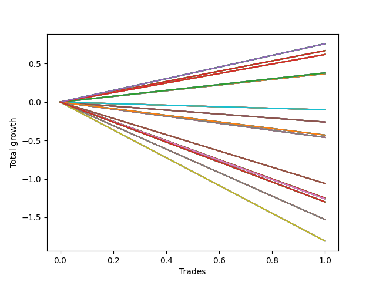

# Short HLT 107_90d 
- Symbol: TSLA
- Date Range: 01/10/2024 - 05/17/2024
- Trading Period: 8:30-12:30
- Number of Trades: 1


### Test TP-0.25 15m
* Take Profit of 0.25 Point
* 0.25 Stoploss
* Results:
```
Total Trades: 1
Percent Up: 0.00
Percent Down: 100.00
Total Points Moved Down: 0.38
Potential Profit: 190.00
Total Points Ups: 0.00 Count Ups: 0
Total Points Downs: 0.38 Count Downs: 1
```

<details><summary>Trades</summary>

<code>In: 2024-02-15 10:50:00		Out: 2024-02-15 10:55:00		Total Position Time: 05:00		Total Move Down: 0.38		Total to Date: 0.38</code> <br />


</details>

### Test TP-0.5 15m
* Take Profit of 0.5 Point
* 0.5 Stoploss
* Results:
```
Total Trades: 1
Percent Up: 0.00
Percent Down: 100.00
Total Points Moved Down: 0.62
Potential Profit: 310.00
Total Points Ups: 0.00 Count Ups: 0
Total Points Downs: 0.62 Count Downs: 1
```

<details><summary>Trades</summary>

<code>In: 2024-02-15 10:50:00		Out: 2024-02-15 10:56:00		Total Position Time: 06:00		Total Move Down: 0.62		Total to Date: 0.62</code> <br />


</details>

### Test TP-0.75 15m
* Take Profit of 0.75 Point
* 0.75 Stoploss
* Results:
```
Total Trades: 1
Percent Up: 0.00
Percent Down: 100.00
Total Points Moved Down: 0.37
Potential Profit: 185.00
Total Points Ups: 0.00 Count Ups: 0
Total Points Downs: 0.37 Count Downs: 1
```

<details><summary>Trades</summary>

<code>In: 2024-02-15 10:50:00		Out: 2024-02-15 11:04:00		Total Position Time: 14:00		Total Move Down: 0.37		Total to Date: 0.37</code> <br />


</details>

### Test TP-1 15m
* Take Profit of 1 Point
* 1 Stoploss
* Results:
```
Total Trades: 1
Percent Up: 0.00
Percent Down: 100.00
Total Points Moved Down: 0.37
Potential Profit: 185.00
Total Points Ups: 0.00 Count Ups: 0
Total Points Downs: 0.37 Count Downs: 1
```

<details><summary>Trades</summary>

<code>In: 2024-02-15 10:50:00		Out: 2024-02-15 11:04:00		Total Position Time: 14:00		Total Move Down: 0.37		Total to Date: 0.37</code> <br />


</details>

### Test TP-1.25 15m
* Take Profit of 1.25 Point
* 1.25 Stoploss
* Results:
```
Total Trades: 1
Percent Up: 0.00
Percent Down: 100.00
Total Points Moved Down: 0.37
Potential Profit: 185.00
Total Points Ups: 0.00 Count Ups: 0
Total Points Downs: 0.37 Count Downs: 1
```

<details><summary>Trades</summary>

<code>In: 2024-02-15 10:50:00		Out: 2024-02-15 11:04:00		Total Position Time: 14:00		Total Move Down: 0.37		Total to Date: 0.37</code> <br />


</details>

### Test TP-1.5 15m
* Take Profit of 1.5 Point
* 1.5 Stoploss
* Results:
```
Total Trades: 1
Percent Up: 0.00
Percent Down: 100.00
Total Points Moved Down: 0.37
Potential Profit: 185.00
Total Points Ups: 0.00 Count Ups: 0
Total Points Downs: 0.37 Count Downs: 1
```

<details><summary>Trades</summary>

<code>In: 2024-02-15 10:50:00		Out: 2024-02-15 11:04:00		Total Position Time: 14:00		Total Move Down: 0.37		Total to Date: 0.37</code> <br />


</details>

### Test TP-1.75 15m
* Take Profit of 1.75 Point
* 1.75 Stoploss
* Results:
```
Total Trades: 1
Percent Up: 0.00
Percent Down: 100.00
Total Points Moved Down: 0.37
Potential Profit: 185.00
Total Points Ups: 0.00 Count Ups: 0
Total Points Downs: 0.37 Count Downs: 1
```

<details><summary>Trades</summary>

<code>In: 2024-02-15 10:50:00		Out: 2024-02-15 11:04:00		Total Position Time: 14:00		Total Move Down: 0.37		Total to Date: 0.37</code> <br />


</details>

### Test TP-2 15m
* Take Profit of 2 Point
* 2 Stoploss
* Results:
```
Total Trades: 1
Percent Up: 0.00
Percent Down: 100.00
Total Points Moved Down: 0.37
Potential Profit: 185.00
Total Points Ups: 0.00 Count Ups: 0
Total Points Downs: 0.37 Count Downs: 1
```

<details><summary>Trades</summary>

<code>In: 2024-02-15 10:50:00		Out: 2024-02-15 11:04:00		Total Position Time: 14:00		Total Move Down: 0.37		Total to Date: 0.37</code> <br />


</details>

### Test TP-2.25 15m
* Take Profit of 2.25 Point
* 2.25 Stoploss
* Results:
```
Total Trades: 1
Percent Up: 0.00
Percent Down: 100.00
Total Points Moved Down: 0.37
Potential Profit: 185.00
Total Points Ups: 0.00 Count Ups: 0
Total Points Downs: 0.37 Count Downs: 1
```

<details><summary>Trades</summary>

<code>In: 2024-02-15 10:50:00		Out: 2024-02-15 11:04:00		Total Position Time: 14:00		Total Move Down: 0.37		Total to Date: 0.37</code> <br />


</details>

### Test TP-2.5 15m
* Take Profit of 2.5 Point
* 2.5 Stoploss
* Results:
```
Total Trades: 1
Percent Up: 0.00
Percent Down: 100.00
Total Points Moved Down: 0.37
Potential Profit: 185.00
Total Points Ups: 0.00 Count Ups: 0
Total Points Downs: 0.37 Count Downs: 1
```

<details><summary>Trades</summary>

<code>In: 2024-02-15 10:50:00		Out: 2024-02-15 11:04:00		Total Position Time: 14:00		Total Move Down: 0.37		Total to Date: 0.37</code> <br />


</details>

### Test TP-2.75 15m
* Take Profit of 2.75 Point
* 2.75 Stoploss
* Results:
```
Total Trades: 1
Percent Up: 0.00
Percent Down: 100.00
Total Points Moved Down: 0.37
Potential Profit: 185.00
Total Points Ups: 0.00 Count Ups: 0
Total Points Downs: 0.37 Count Downs: 1
```

<details><summary>Trades</summary>

<code>In: 2024-02-15 10:50:00		Out: 2024-02-15 11:04:00		Total Position Time: 14:00		Total Move Down: 0.37		Total to Date: 0.37</code> <br />


</details>

### Test TP-3 15m
* Take Profit of 3 Point
* 3 Stoploss
* Results:
```
Total Trades: 1
Percent Up: 0.00
Percent Down: 100.00
Total Points Moved Down: 0.37
Potential Profit: 185.00
Total Points Ups: 0.00 Count Ups: 0
Total Points Downs: 0.37 Count Downs: 1
```

<details><summary>Trades</summary>

<code>In: 2024-02-15 10:50:00		Out: 2024-02-15 11:04:00		Total Position Time: 14:00		Total Move Down: 0.37		Total to Date: 0.37</code> <br />


</details>

### Test TP-0.25 30m
* Take Profit of 0.25 Point
* 0.25 Stoploss
* Results:
```
Total Trades: 1
Percent Up: 0.00
Percent Down: 100.00
Total Points Moved Down: 0.38
Potential Profit: 190.00
Total Points Ups: 0.00 Count Ups: 0
Total Points Downs: 0.38 Count Downs: 1
```

<details><summary>Trades</summary>

<code>In: 2024-02-15 10:50:00		Out: 2024-02-15 10:55:00		Total Position Time: 05:00		Total Move Down: 0.38		Total to Date: 0.38</code> <br />


</details>

### Test TP-0.5 30m
* Take Profit of 0.5 Point
* 0.5 Stoploss
* Results:
```
Total Trades: 1
Percent Up: 0.00
Percent Down: 100.00
Total Points Moved Down: 0.62
Potential Profit: 310.00
Total Points Ups: 0.00 Count Ups: 0
Total Points Downs: 0.62 Count Downs: 1
```

<details><summary>Trades</summary>

<code>In: 2024-02-15 10:50:00		Out: 2024-02-15 10:56:00		Total Position Time: 06:00		Total Move Down: 0.62		Total to Date: 0.62</code> <br />


</details>

### Test TP-0.75 30m
* Take Profit of 0.75 Point
* 0.75 Stoploss
* Results:
```
Total Trades: 1
Percent Up: 0.00
Percent Down: 100.00
Total Points Moved Down: 0.76
Potential Profit: 380.00
Total Points Ups: 0.00 Count Ups: 0
Total Points Downs: 0.76 Count Downs: 1
```

<details><summary>Trades</summary>

<code>In: 2024-02-15 10:50:00		Out: 2024-02-15 11:11:00		Total Position Time: 21:00		Total Move Down: 0.76		Total to Date: 0.76</code> <br />


</details>

### Test TP-1 30m
* Take Profit of 1 Point
* 1 Stoploss
* Results:
```
Total Trades: 1
Percent Up: 0.00
Percent Down: 100.00
Total Points Moved Down: 0.67
Potential Profit: 335.00
Total Points Ups: 0.00 Count Ups: 0
Total Points Downs: 0.67 Count Downs: 1
```

<details><summary>Trades</summary>

<code>In: 2024-02-15 10:50:00		Out: 2024-02-15 11:19:00		Total Position Time: 29:00		Total Move Down: 0.67		Total to Date: 0.67</code> <br />


</details>

### Test TP-1.25 30m
* Take Profit of 1.25 Point
* 1.25 Stoploss
* Results:
```
Total Trades: 1
Percent Up: 0.00
Percent Down: 100.00
Total Points Moved Down: 0.67
Potential Profit: 335.00
Total Points Ups: 0.00 Count Ups: 0
Total Points Downs: 0.67 Count Downs: 1
```

<details><summary>Trades</summary>

<code>In: 2024-02-15 10:50:00		Out: 2024-02-15 11:19:00		Total Position Time: 29:00		Total Move Down: 0.67		Total to Date: 0.67</code> <br />


</details>

### Test TP-1.5 30m
* Take Profit of 1.5 Point
* 1.5 Stoploss
* Results:
```
Total Trades: 1
Percent Up: 0.00
Percent Down: 100.00
Total Points Moved Down: 0.67
Potential Profit: 335.00
Total Points Ups: 0.00 Count Ups: 0
Total Points Downs: 0.67 Count Downs: 1
```

<details><summary>Trades</summary>

<code>In: 2024-02-15 10:50:00		Out: 2024-02-15 11:19:00		Total Position Time: 29:00		Total Move Down: 0.67		Total to Date: 0.67</code> <br />


</details>

### Test TP-1.75 30m
* Take Profit of 1.75 Point
* 1.75 Stoploss
* Results:
```
Total Trades: 1
Percent Up: 0.00
Percent Down: 100.00
Total Points Moved Down: 0.67
Potential Profit: 335.00
Total Points Ups: 0.00 Count Ups: 0
Total Points Downs: 0.67 Count Downs: 1
```

<details><summary>Trades</summary>

<code>In: 2024-02-15 10:50:00		Out: 2024-02-15 11:19:00		Total Position Time: 29:00		Total Move Down: 0.67		Total to Date: 0.67</code> <br />


</details>

### Test TP-2 30m
* Take Profit of 2 Point
* 2 Stoploss
* Results:
```
Total Trades: 1
Percent Up: 0.00
Percent Down: 100.00
Total Points Moved Down: 0.67
Potential Profit: 335.00
Total Points Ups: 0.00 Count Ups: 0
Total Points Downs: 0.67 Count Downs: 1
```

<details><summary>Trades</summary>

<code>In: 2024-02-15 10:50:00		Out: 2024-02-15 11:19:00		Total Position Time: 29:00		Total Move Down: 0.67		Total to Date: 0.67</code> <br />


</details>

### Test TP-2.25 30m
* Take Profit of 2.25 Point
* 2.25 Stoploss
* Results:
```
Total Trades: 1
Percent Up: 0.00
Percent Down: 100.00
Total Points Moved Down: 0.67
Potential Profit: 335.00
Total Points Ups: 0.00 Count Ups: 0
Total Points Downs: 0.67 Count Downs: 1
```

<details><summary>Trades</summary>

<code>In: 2024-02-15 10:50:00		Out: 2024-02-15 11:19:00		Total Position Time: 29:00		Total Move Down: 0.67		Total to Date: 0.67</code> <br />


</details>

### Test TP-2.5 30m
* Take Profit of 2.5 Point
* 2.5 Stoploss
* Results:
```
Total Trades: 1
Percent Up: 0.00
Percent Down: 100.00
Total Points Moved Down: 0.67
Potential Profit: 335.00
Total Points Ups: 0.00 Count Ups: 0
Total Points Downs: 0.67 Count Downs: 1
```

<details><summary>Trades</summary>

<code>In: 2024-02-15 10:50:00		Out: 2024-02-15 11:19:00		Total Position Time: 29:00		Total Move Down: 0.67		Total to Date: 0.67</code> <br />


</details>

### Test TP-2.75 30m
* Take Profit of 2.75 Point
* 2.75 Stoploss
* Results:
```
Total Trades: 1
Percent Up: 0.00
Percent Down: 100.00
Total Points Moved Down: 0.67
Potential Profit: 335.00
Total Points Ups: 0.00 Count Ups: 0
Total Points Downs: 0.67 Count Downs: 1
```

<details><summary>Trades</summary>

<code>In: 2024-02-15 10:50:00		Out: 2024-02-15 11:19:00		Total Position Time: 29:00		Total Move Down: 0.67		Total to Date: 0.67</code> <br />


</details>

### Test TP-3 30m
* Take Profit of 3 Point
* 3 Stoploss
* Results:
```
Total Trades: 1
Percent Up: 0.00
Percent Down: 100.00
Total Points Moved Down: 0.67
Potential Profit: 335.00
Total Points Ups: 0.00 Count Ups: 0
Total Points Downs: 0.67 Count Downs: 1
```

<details><summary>Trades</summary>

<code>In: 2024-02-15 10:50:00		Out: 2024-02-15 11:19:00		Total Position Time: 29:00		Total Move Down: 0.67		Total to Date: 0.67</code> <br />


</details>

### Test TP-0.25 45m
* Take Profit of 0.25 Point
* 0.25 Stoploss
* Results:
```
Total Trades: 1
Percent Up: 0.00
Percent Down: 100.00
Total Points Moved Down: 0.38
Potential Profit: 190.00
Total Points Ups: 0.00 Count Ups: 0
Total Points Downs: 0.38 Count Downs: 1
```

<details><summary>Trades</summary>

<code>In: 2024-02-15 10:50:00		Out: 2024-02-15 10:55:00		Total Position Time: 05:00		Total Move Down: 0.38		Total to Date: 0.38</code> <br />


</details>

### Test TP-0.5 45m
* Take Profit of 0.5 Point
* 0.5 Stoploss
* Results:
```
Total Trades: 1
Percent Up: 0.00
Percent Down: 100.00
Total Points Moved Down: 0.62
Potential Profit: 310.00
Total Points Ups: 0.00 Count Ups: 0
Total Points Downs: 0.62 Count Downs: 1
```

<details><summary>Trades</summary>

<code>In: 2024-02-15 10:50:00		Out: 2024-02-15 10:56:00		Total Position Time: 06:00		Total Move Down: 0.62		Total to Date: 0.62</code> <br />


</details>

### Test TP-0.75 45m
* Take Profit of 0.75 Point
* 0.75 Stoploss
* Results:
```
Total Trades: 1
Percent Up: 0.00
Percent Down: 100.00
Total Points Moved Down: 0.76
Potential Profit: 380.00
Total Points Ups: 0.00 Count Ups: 0
Total Points Downs: 0.76 Count Downs: 1
```

<details><summary>Trades</summary>

<code>In: 2024-02-15 10:50:00		Out: 2024-02-15 11:11:00		Total Position Time: 21:00		Total Move Down: 0.76		Total to Date: 0.76</code> <br />


</details>

### Test TP-1 45m
* Take Profit of 1 Point
* 1 Stoploss
* Results:
```
Total Trades: 1
Percent Up: 100.00
Percent Down: 0.00
Total Points Moved Down: -0.26
Potential Profit: -130.00
Total Points Ups: 0.26 Count Ups: 1
Total Points Downs: 0.00 Count Downs: 0
```

<details><summary>Trades</summary>

<code>In: 2024-02-15 10:50:00		Out: 2024-02-15 11:34:00		Total Position Time: 44:00		Total Move Down: -0.26		Total to Date: -0.26</code> <br />


</details>

### Test TP-1.25 45m
* Take Profit of 1.25 Point
* 1.25 Stoploss
* Results:
```
Total Trades: 1
Percent Up: 100.00
Percent Down: 0.00
Total Points Moved Down: -0.26
Potential Profit: -130.00
Total Points Ups: 0.26 Count Ups: 1
Total Points Downs: 0.00 Count Downs: 0
```

<details><summary>Trades</summary>

<code>In: 2024-02-15 10:50:00		Out: 2024-02-15 11:34:00		Total Position Time: 44:00		Total Move Down: -0.26		Total to Date: -0.26</code> <br />


</details>

### Test TP-1.5 45m
* Take Profit of 1.5 Point
* 1.5 Stoploss
* Results:
```
Total Trades: 1
Percent Up: 100.00
Percent Down: 0.00
Total Points Moved Down: -0.26
Potential Profit: -130.00
Total Points Ups: 0.26 Count Ups: 1
Total Points Downs: 0.00 Count Downs: 0
```

<details><summary>Trades</summary>

<code>In: 2024-02-15 10:50:00		Out: 2024-02-15 11:34:00		Total Position Time: 44:00		Total Move Down: -0.26		Total to Date: -0.26</code> <br />


</details>

### Test TP-1.75 45m
* Take Profit of 1.75 Point
* 1.75 Stoploss
* Results:
```
Total Trades: 1
Percent Up: 100.00
Percent Down: 0.00
Total Points Moved Down: -0.26
Potential Profit: -130.00
Total Points Ups: 0.26 Count Ups: 1
Total Points Downs: 0.00 Count Downs: 0
```

<details><summary>Trades</summary>

<code>In: 2024-02-15 10:50:00		Out: 2024-02-15 11:34:00		Total Position Time: 44:00		Total Move Down: -0.26		Total to Date: -0.26</code> <br />


</details>

### Test TP-2 45m
* Take Profit of 2 Point
* 2 Stoploss
* Results:
```
Total Trades: 1
Percent Up: 100.00
Percent Down: 0.00
Total Points Moved Down: -0.26
Potential Profit: -130.00
Total Points Ups: 0.26 Count Ups: 1
Total Points Downs: 0.00 Count Downs: 0
```

<details><summary>Trades</summary>

<code>In: 2024-02-15 10:50:00		Out: 2024-02-15 11:34:00		Total Position Time: 44:00		Total Move Down: -0.26		Total to Date: -0.26</code> <br />


</details>

### Test TP-2.25 45m
* Take Profit of 2.25 Point
* 2.25 Stoploss
* Results:
```
Total Trades: 1
Percent Up: 100.00
Percent Down: 0.00
Total Points Moved Down: -0.26
Potential Profit: -130.00
Total Points Ups: 0.26 Count Ups: 1
Total Points Downs: 0.00 Count Downs: 0
```

<details><summary>Trades</summary>

<code>In: 2024-02-15 10:50:00		Out: 2024-02-15 11:34:00		Total Position Time: 44:00		Total Move Down: -0.26		Total to Date: -0.26</code> <br />


</details>

### Test TP-2.5 45m
* Take Profit of 2.5 Point
* 2.5 Stoploss
* Results:
```
Total Trades: 1
Percent Up: 100.00
Percent Down: 0.00
Total Points Moved Down: -0.26
Potential Profit: -130.00
Total Points Ups: 0.26 Count Ups: 1
Total Points Downs: 0.00 Count Downs: 0
```

<details><summary>Trades</summary>

<code>In: 2024-02-15 10:50:00		Out: 2024-02-15 11:34:00		Total Position Time: 44:00		Total Move Down: -0.26		Total to Date: -0.26</code> <br />


</details>

### Test TP-2.75 45m
* Take Profit of 2.75 Point
* 2.75 Stoploss
* Results:
```
Total Trades: 1
Percent Up: 100.00
Percent Down: 0.00
Total Points Moved Down: -0.26
Potential Profit: -130.00
Total Points Ups: 0.26 Count Ups: 1
Total Points Downs: 0.00 Count Downs: 0
```

<details><summary>Trades</summary>

<code>In: 2024-02-15 10:50:00		Out: 2024-02-15 11:34:00		Total Position Time: 44:00		Total Move Down: -0.26		Total to Date: -0.26</code> <br />


</details>

### Test TP-3 45m
* Take Profit of 3 Point
* 3 Stoploss
* Results:
```
Total Trades: 1
Percent Up: 100.00
Percent Down: 0.00
Total Points Moved Down: -0.26
Potential Profit: -130.00
Total Points Ups: 0.26 Count Ups: 1
Total Points Downs: 0.00 Count Downs: 0
```

<details><summary>Trades</summary>

<code>In: 2024-02-15 10:50:00		Out: 2024-02-15 11:34:00		Total Position Time: 44:00		Total Move Down: -0.26		Total to Date: -0.26</code> <br />


</details>

### Test TP-0.25 60m
* Take Profit of 0.25 Point
* 0.25 Stoploss
* Results:
```
Total Trades: 1
Percent Up: 0.00
Percent Down: 100.00
Total Points Moved Down: 0.38
Potential Profit: 190.00
Total Points Ups: 0.00 Count Ups: 0
Total Points Downs: 0.38 Count Downs: 1
```

<details><summary>Trades</summary>

<code>In: 2024-02-15 10:50:00		Out: 2024-02-15 10:55:00		Total Position Time: 05:00		Total Move Down: 0.38		Total to Date: 0.38</code> <br />


</details>

### Test TP-0.5 60m
* Take Profit of 0.5 Point
* 0.5 Stoploss
* Results:
```
Total Trades: 1
Percent Up: 0.00
Percent Down: 100.00
Total Points Moved Down: 0.62
Potential Profit: 310.00
Total Points Ups: 0.00 Count Ups: 0
Total Points Downs: 0.62 Count Downs: 1
```

<details><summary>Trades</summary>

<code>In: 2024-02-15 10:50:00		Out: 2024-02-15 10:56:00		Total Position Time: 06:00		Total Move Down: 0.62		Total to Date: 0.62</code> <br />


</details>

### Test TP-0.75 60m
* Take Profit of 0.75 Point
* 0.75 Stoploss
* Results:
```
Total Trades: 1
Percent Up: 0.00
Percent Down: 100.00
Total Points Moved Down: 0.76
Potential Profit: 380.00
Total Points Ups: 0.00 Count Ups: 0
Total Points Downs: 0.76 Count Downs: 1
```

<details><summary>Trades</summary>

<code>In: 2024-02-15 10:50:00		Out: 2024-02-15 11:11:00		Total Position Time: 21:00		Total Move Down: 0.76		Total to Date: 0.76</code> <br />


</details>

### Test TP-1 60m
* Take Profit of 1 Point
* 1 Stoploss
* Results:
```
Total Trades: 1
Percent Up: 100.00
Percent Down: 0.00
Total Points Moved Down: -0.46
Potential Profit: -230.00
Total Points Ups: 0.46 Count Ups: 1
Total Points Downs: 0.00 Count Downs: 0
```

<details><summary>Trades</summary>

<code>In: 2024-02-15 10:50:00		Out: 2024-02-15 11:49:00		Total Position Time: 59:00		Total Move Down: -0.46		Total to Date: -0.46</code> <br />


</details>

### Test TP-1.25 60m
* Take Profit of 1.25 Point
* 1.25 Stoploss
* Results:
```
Total Trades: 1
Percent Up: 100.00
Percent Down: 0.00
Total Points Moved Down: -0.46
Potential Profit: -230.00
Total Points Ups: 0.46 Count Ups: 1
Total Points Downs: 0.00 Count Downs: 0
```

<details><summary>Trades</summary>

<code>In: 2024-02-15 10:50:00		Out: 2024-02-15 11:49:00		Total Position Time: 59:00		Total Move Down: -0.46		Total to Date: -0.46</code> <br />


</details>

### Test TP-1.5 60m
* Take Profit of 1.5 Point
* 1.5 Stoploss
* Results:
```
Total Trades: 1
Percent Up: 100.00
Percent Down: 0.00
Total Points Moved Down: -0.46
Potential Profit: -230.00
Total Points Ups: 0.46 Count Ups: 1
Total Points Downs: 0.00 Count Downs: 0
```

<details><summary>Trades</summary>

<code>In: 2024-02-15 10:50:00		Out: 2024-02-15 11:49:00		Total Position Time: 59:00		Total Move Down: -0.46		Total to Date: -0.46</code> <br />


</details>

### Test TP-1.75 60m
* Take Profit of 1.75 Point
* 1.75 Stoploss
* Results:
```
Total Trades: 1
Percent Up: 100.00
Percent Down: 0.00
Total Points Moved Down: -0.46
Potential Profit: -230.00
Total Points Ups: 0.46 Count Ups: 1
Total Points Downs: 0.00 Count Downs: 0
```

<details><summary>Trades</summary>

<code>In: 2024-02-15 10:50:00		Out: 2024-02-15 11:49:00		Total Position Time: 59:00		Total Move Down: -0.46		Total to Date: -0.46</code> <br />


</details>

### Test TP-2 60m
* Take Profit of 2 Point
* 2 Stoploss
* Results:
```
Total Trades: 1
Percent Up: 100.00
Percent Down: 0.00
Total Points Moved Down: -0.46
Potential Profit: -230.00
Total Points Ups: 0.46 Count Ups: 1
Total Points Downs: 0.00 Count Downs: 0
```

<details><summary>Trades</summary>

<code>In: 2024-02-15 10:50:00		Out: 2024-02-15 11:49:00		Total Position Time: 59:00		Total Move Down: -0.46		Total to Date: -0.46</code> <br />


</details>

### Test TP-2.25 60m
* Take Profit of 2.25 Point
* 2.25 Stoploss
* Results:
```
Total Trades: 1
Percent Up: 100.00
Percent Down: 0.00
Total Points Moved Down: -0.46
Potential Profit: -230.00
Total Points Ups: 0.46 Count Ups: 1
Total Points Downs: 0.00 Count Downs: 0
```

<details><summary>Trades</summary>

<code>In: 2024-02-15 10:50:00		Out: 2024-02-15 11:49:00		Total Position Time: 59:00		Total Move Down: -0.46		Total to Date: -0.46</code> <br />


</details>

### Test TP-2.5 60m
* Take Profit of 2.5 Point
* 2.5 Stoploss
* Results:
```
Total Trades: 1
Percent Up: 100.00
Percent Down: 0.00
Total Points Moved Down: -0.46
Potential Profit: -230.00
Total Points Ups: 0.46 Count Ups: 1
Total Points Downs: 0.00 Count Downs: 0
```

<details><summary>Trades</summary>

<code>In: 2024-02-15 10:50:00		Out: 2024-02-15 11:49:00		Total Position Time: 59:00		Total Move Down: -0.46		Total to Date: -0.46</code> <br />


</details>

### Test TP-2.75 60m
* Take Profit of 2.75 Point
* 2.75 Stoploss
* Results:
```
Total Trades: 1
Percent Up: 100.00
Percent Down: 0.00
Total Points Moved Down: -0.46
Potential Profit: -230.00
Total Points Ups: 0.46 Count Ups: 1
Total Points Downs: 0.00 Count Downs: 0
```

<details><summary>Trades</summary>

<code>In: 2024-02-15 10:50:00		Out: 2024-02-15 11:49:00		Total Position Time: 59:00		Total Move Down: -0.46		Total to Date: -0.46</code> <br />


</details>

### Test TP-3 60m
* Take Profit of 3 Point
* 3 Stoploss
* Results:
```
Total Trades: 1
Percent Up: 100.00
Percent Down: 0.00
Total Points Moved Down: -0.46
Potential Profit: -230.00
Total Points Ups: 0.46 Count Ups: 1
Total Points Downs: 0.00 Count Downs: 0
```

<details><summary>Trades</summary>

<code>In: 2024-02-15 10:50:00		Out: 2024-02-15 11:49:00		Total Position Time: 59:00		Total Move Down: -0.46		Total to Date: -0.46</code> <br />


</details>

### Test TP-0.25 75m
* Take Profit of 0.25 Point
* 0.25 Stoploss
* Results:
```
Total Trades: 1
Percent Up: 0.00
Percent Down: 100.00
Total Points Moved Down: 0.38
Potential Profit: 190.00
Total Points Ups: 0.00 Count Ups: 0
Total Points Downs: 0.38 Count Downs: 1
```

<details><summary>Trades</summary>

<code>In: 2024-02-15 10:50:00		Out: 2024-02-15 10:55:00		Total Position Time: 05:00		Total Move Down: 0.38		Total to Date: 0.38</code> <br />


</details>

### Test TP-0.5 75m
* Take Profit of 0.5 Point
* 0.5 Stoploss
* Results:
```
Total Trades: 1
Percent Up: 0.00
Percent Down: 100.00
Total Points Moved Down: 0.62
Potential Profit: 310.00
Total Points Ups: 0.00 Count Ups: 0
Total Points Downs: 0.62 Count Downs: 1
```

<details><summary>Trades</summary>

<code>In: 2024-02-15 10:50:00		Out: 2024-02-15 10:56:00		Total Position Time: 06:00		Total Move Down: 0.62		Total to Date: 0.62</code> <br />


</details>

### Test TP-0.75 75m
* Take Profit of 0.75 Point
* 0.75 Stoploss
* Results:
```
Total Trades: 1
Percent Up: 0.00
Percent Down: 100.00
Total Points Moved Down: 0.76
Potential Profit: 380.00
Total Points Ups: 0.00 Count Ups: 0
Total Points Downs: 0.76 Count Downs: 1
```

<details><summary>Trades</summary>

<code>In: 2024-02-15 10:50:00		Out: 2024-02-15 11:11:00		Total Position Time: 21:00		Total Move Down: 0.76		Total to Date: 0.76</code> <br />


</details>

### Test TP-1 75m
* Take Profit of 1 Point
* 1 Stoploss
* Results:
```
Total Trades: 1
Percent Up: 100.00
Percent Down: 0.00
Total Points Moved Down: -0.10
Potential Profit: -50.00
Total Points Ups: 0.10 Count Ups: 1
Total Points Downs: 0.00 Count Downs: 0
```

<details><summary>Trades</summary>

<code>In: 2024-02-15 10:50:00		Out: 2024-02-15 12:04:00		Total Position Time: 74:00		Total Move Down: -0.10		Total to Date: -0.10</code> <br />


</details>

### Test TP-1.25 75m
* Take Profit of 1.25 Point
* 1.25 Stoploss
* Results:
```
Total Trades: 1
Percent Up: 100.00
Percent Down: 0.00
Total Points Moved Down: -0.10
Potential Profit: -50.00
Total Points Ups: 0.10 Count Ups: 1
Total Points Downs: 0.00 Count Downs: 0
```

<details><summary>Trades</summary>

<code>In: 2024-02-15 10:50:00		Out: 2024-02-15 12:04:00		Total Position Time: 74:00		Total Move Down: -0.10		Total to Date: -0.10</code> <br />


</details>

### Test TP-1.5 75m
* Take Profit of 1.5 Point
* 1.5 Stoploss
* Results:
```
Total Trades: 1
Percent Up: 100.00
Percent Down: 0.00
Total Points Moved Down: -0.10
Potential Profit: -50.00
Total Points Ups: 0.10 Count Ups: 1
Total Points Downs: 0.00 Count Downs: 0
```

<details><summary>Trades</summary>

<code>In: 2024-02-15 10:50:00		Out: 2024-02-15 12:04:00		Total Position Time: 74:00		Total Move Down: -0.10		Total to Date: -0.10</code> <br />


</details>

### Test TP-1.75 75m
* Take Profit of 1.75 Point
* 1.75 Stoploss
* Results:
```
Total Trades: 1
Percent Up: 100.00
Percent Down: 0.00
Total Points Moved Down: -0.10
Potential Profit: -50.00
Total Points Ups: 0.10 Count Ups: 1
Total Points Downs: 0.00 Count Downs: 0
```

<details><summary>Trades</summary>

<code>In: 2024-02-15 10:50:00		Out: 2024-02-15 12:04:00		Total Position Time: 74:00		Total Move Down: -0.10		Total to Date: -0.10</code> <br />


</details>

### Test TP-2 75m
* Take Profit of 2 Point
* 2 Stoploss
* Results:
```
Total Trades: 1
Percent Up: 100.00
Percent Down: 0.00
Total Points Moved Down: -0.10
Potential Profit: -50.00
Total Points Ups: 0.10 Count Ups: 1
Total Points Downs: 0.00 Count Downs: 0
```

<details><summary>Trades</summary>

<code>In: 2024-02-15 10:50:00		Out: 2024-02-15 12:04:00		Total Position Time: 74:00		Total Move Down: -0.10		Total to Date: -0.10</code> <br />


</details>

### Test TP-2.25 75m
* Take Profit of 2.25 Point
* 2.25 Stoploss
* Results:
```
Total Trades: 1
Percent Up: 100.00
Percent Down: 0.00
Total Points Moved Down: -0.10
Potential Profit: -50.00
Total Points Ups: 0.10 Count Ups: 1
Total Points Downs: 0.00 Count Downs: 0
```

<details><summary>Trades</summary>

<code>In: 2024-02-15 10:50:00		Out: 2024-02-15 12:04:00		Total Position Time: 74:00		Total Move Down: -0.10		Total to Date: -0.10</code> <br />


</details>

### Test TP-2.5 75m
* Take Profit of 2.5 Point
* 2.5 Stoploss
* Results:
```
Total Trades: 1
Percent Up: 100.00
Percent Down: 0.00
Total Points Moved Down: -0.10
Potential Profit: -50.00
Total Points Ups: 0.10 Count Ups: 1
Total Points Downs: 0.00 Count Downs: 0
```

<details><summary>Trades</summary>

<code>In: 2024-02-15 10:50:00		Out: 2024-02-15 12:04:00		Total Position Time: 74:00		Total Move Down: -0.10		Total to Date: -0.10</code> <br />


</details>

### Test TP-2.75 75m
* Take Profit of 2.75 Point
* 2.75 Stoploss
* Results:
```
Total Trades: 1
Percent Up: 100.00
Percent Down: 0.00
Total Points Moved Down: -0.10
Potential Profit: -50.00
Total Points Ups: 0.10 Count Ups: 1
Total Points Downs: 0.00 Count Downs: 0
```

<details><summary>Trades</summary>

<code>In: 2024-02-15 10:50:00		Out: 2024-02-15 12:04:00		Total Position Time: 74:00		Total Move Down: -0.10		Total to Date: -0.10</code> <br />


</details>

### Test TP-3 75m
* Take Profit of 3 Point
* 3 Stoploss
* Results:
```
Total Trades: 1
Percent Up: 100.00
Percent Down: 0.00
Total Points Moved Down: -0.10
Potential Profit: -50.00
Total Points Ups: 0.10 Count Ups: 1
Total Points Downs: 0.00 Count Downs: 0
```

<details><summary>Trades</summary>

<code>In: 2024-02-15 10:50:00		Out: 2024-02-15 12:04:00		Total Position Time: 74:00		Total Move Down: -0.10		Total to Date: -0.10</code> <br />


</details>

### Test TP-0.25 90m
* Take Profit of 0.25 Point
* 0.25 Stoploss
* Results:
```
Total Trades: 1
Percent Up: 0.00
Percent Down: 100.00
Total Points Moved Down: 0.38
Potential Profit: 190.00
Total Points Ups: 0.00 Count Ups: 0
Total Points Downs: 0.38 Count Downs: 1
```

<details><summary>Trades</summary>

<code>In: 2024-02-15 10:50:00		Out: 2024-02-15 10:55:00		Total Position Time: 05:00		Total Move Down: 0.38		Total to Date: 0.38</code> <br />


</details>

### Test TP-0.5 90m
* Take Profit of 0.5 Point
* 0.5 Stoploss
* Results:
```
Total Trades: 1
Percent Up: 0.00
Percent Down: 100.00
Total Points Moved Down: 0.62
Potential Profit: 310.00
Total Points Ups: 0.00 Count Ups: 0
Total Points Downs: 0.62 Count Downs: 1
```

<details><summary>Trades</summary>

<code>In: 2024-02-15 10:50:00		Out: 2024-02-15 10:56:00		Total Position Time: 06:00		Total Move Down: 0.62		Total to Date: 0.62</code> <br />


</details>

### Test TP-0.75 90m
* Take Profit of 0.75 Point
* 0.75 Stoploss
* Results:
```
Total Trades: 1
Percent Up: 0.00
Percent Down: 100.00
Total Points Moved Down: 0.76
Potential Profit: 380.00
Total Points Ups: 0.00 Count Ups: 0
Total Points Downs: 0.76 Count Downs: 1
```

<details><summary>Trades</summary>

<code>In: 2024-02-15 10:50:00		Out: 2024-02-15 11:11:00		Total Position Time: 21:00		Total Move Down: 0.76		Total to Date: 0.76</code> <br />


</details>

### Test TP-1 90m
* Take Profit of 1 Point
* 1 Stoploss
* Results:
```
Total Trades: 1
Percent Up: 100.00
Percent Down: 0.00
Total Points Moved Down: -0.43
Potential Profit: -215.00
Total Points Ups: 0.43 Count Ups: 1
Total Points Downs: 0.00 Count Downs: 0
```

<details><summary>Trades</summary>

<code>In: 2024-02-15 10:50:00		Out: 2024-02-15 12:19:00		Total Position Time: 89:00		Total Move Down: -0.43		Total to Date: -0.43</code> <br />


</details>

### Test TP-1.25 90m
* Take Profit of 1.25 Point
* 1.25 Stoploss
* Results:
```
Total Trades: 1
Percent Up: 100.00
Percent Down: 0.00
Total Points Moved Down: -0.43
Potential Profit: -215.00
Total Points Ups: 0.43 Count Ups: 1
Total Points Downs: 0.00 Count Downs: 0
```

<details><summary>Trades</summary>

<code>In: 2024-02-15 10:50:00		Out: 2024-02-15 12:19:00		Total Position Time: 89:00		Total Move Down: -0.43		Total to Date: -0.43</code> <br />


</details>

### Test TP-1.5 90m
* Take Profit of 1.5 Point
* 1.5 Stoploss
* Results:
```
Total Trades: 1
Percent Up: 100.00
Percent Down: 0.00
Total Points Moved Down: -0.43
Potential Profit: -215.00
Total Points Ups: 0.43 Count Ups: 1
Total Points Downs: 0.00 Count Downs: 0
```

<details><summary>Trades</summary>

<code>In: 2024-02-15 10:50:00		Out: 2024-02-15 12:19:00		Total Position Time: 89:00		Total Move Down: -0.43		Total to Date: -0.43</code> <br />


</details>

### Test TP-1.75 90m
* Take Profit of 1.75 Point
* 1.75 Stoploss
* Results:
```
Total Trades: 1
Percent Up: 100.00
Percent Down: 0.00
Total Points Moved Down: -0.43
Potential Profit: -215.00
Total Points Ups: 0.43 Count Ups: 1
Total Points Downs: 0.00 Count Downs: 0
```

<details><summary>Trades</summary>

<code>In: 2024-02-15 10:50:00		Out: 2024-02-15 12:19:00		Total Position Time: 89:00		Total Move Down: -0.43		Total to Date: -0.43</code> <br />


</details>

### Test TP-2 90m
* Take Profit of 2 Point
* 2 Stoploss
* Results:
```
Total Trades: 1
Percent Up: 100.00
Percent Down: 0.00
Total Points Moved Down: -0.43
Potential Profit: -215.00
Total Points Ups: 0.43 Count Ups: 1
Total Points Downs: 0.00 Count Downs: 0
```

<details><summary>Trades</summary>

<code>In: 2024-02-15 10:50:00		Out: 2024-02-15 12:19:00		Total Position Time: 89:00		Total Move Down: -0.43		Total to Date: -0.43</code> <br />


</details>

### Test TP-2.25 90m
* Take Profit of 2.25 Point
* 2.25 Stoploss
* Results:
```
Total Trades: 1
Percent Up: 100.00
Percent Down: 0.00
Total Points Moved Down: -0.43
Potential Profit: -215.00
Total Points Ups: 0.43 Count Ups: 1
Total Points Downs: 0.00 Count Downs: 0
```

<details><summary>Trades</summary>

<code>In: 2024-02-15 10:50:00		Out: 2024-02-15 12:19:00		Total Position Time: 89:00		Total Move Down: -0.43		Total to Date: -0.43</code> <br />


</details>

### Test TP-2.5 90m
* Take Profit of 2.5 Point
* 2.5 Stoploss
* Results:
```
Total Trades: 1
Percent Up: 100.00
Percent Down: 0.00
Total Points Moved Down: -0.43
Potential Profit: -215.00
Total Points Ups: 0.43 Count Ups: 1
Total Points Downs: 0.00 Count Downs: 0
```

<details><summary>Trades</summary>

<code>In: 2024-02-15 10:50:00		Out: 2024-02-15 12:19:00		Total Position Time: 89:00		Total Move Down: -0.43		Total to Date: -0.43</code> <br />


</details>

### Test TP-2.75 90m
* Take Profit of 2.75 Point
* 2.75 Stoploss
* Results:
```
Total Trades: 1
Percent Up: 100.00
Percent Down: 0.00
Total Points Moved Down: -0.43
Potential Profit: -215.00
Total Points Ups: 0.43 Count Ups: 1
Total Points Downs: 0.00 Count Downs: 0
```

<details><summary>Trades</summary>

<code>In: 2024-02-15 10:50:00		Out: 2024-02-15 12:19:00		Total Position Time: 89:00		Total Move Down: -0.43		Total to Date: -0.43</code> <br />


</details>

### Test TP-3 90m
* Take Profit of 3 Point
* 3 Stoploss
* Results:
```
Total Trades: 1
Percent Up: 100.00
Percent Down: 0.00
Total Points Moved Down: -0.43
Potential Profit: -215.00
Total Points Ups: 0.43 Count Ups: 1
Total Points Downs: 0.00 Count Downs: 0
```

<details><summary>Trades</summary>

<code>In: 2024-02-15 10:50:00		Out: 2024-02-15 12:19:00		Total Position Time: 89:00		Total Move Down: -0.43		Total to Date: -0.43</code> <br />


</details>

### Test TP-0.25 105m
* Take Profit of 0.25 Point
* 0.25 Stoploss
* Results:
```
Total Trades: 1
Percent Up: 0.00
Percent Down: 100.00
Total Points Moved Down: 0.38
Potential Profit: 190.00
Total Points Ups: 0.00 Count Ups: 0
Total Points Downs: 0.38 Count Downs: 1
```

<details><summary>Trades</summary>

<code>In: 2024-02-15 10:50:00		Out: 2024-02-15 10:55:00		Total Position Time: 05:00		Total Move Down: 0.38		Total to Date: 0.38</code> <br />


</details>

### Test TP-0.5 105m
* Take Profit of 0.5 Point
* 0.5 Stoploss
* Results:
```
Total Trades: 1
Percent Up: 0.00
Percent Down: 100.00
Total Points Moved Down: 0.62
Potential Profit: 310.00
Total Points Ups: 0.00 Count Ups: 0
Total Points Downs: 0.62 Count Downs: 1
```

<details><summary>Trades</summary>

<code>In: 2024-02-15 10:50:00		Out: 2024-02-15 10:56:00		Total Position Time: 06:00		Total Move Down: 0.62		Total to Date: 0.62</code> <br />


</details>

### Test TP-0.75 105m
* Take Profit of 0.75 Point
* 0.75 Stoploss
* Results:
```
Total Trades: 1
Percent Up: 0.00
Percent Down: 100.00
Total Points Moved Down: 0.76
Potential Profit: 380.00
Total Points Ups: 0.00 Count Ups: 0
Total Points Downs: 0.76 Count Downs: 1
```

<details><summary>Trades</summary>

<code>In: 2024-02-15 10:50:00		Out: 2024-02-15 11:11:00		Total Position Time: 21:00		Total Move Down: 0.76		Total to Date: 0.76</code> <br />


</details>

### Test TP-1 105m
* Take Profit of 1 Point
* 1 Stoploss
* Results:
```
Total Trades: 1
Percent Up: 100.00
Percent Down: 0.00
Total Points Moved Down: -1.06
Potential Profit: -530.00
Total Points Ups: 1.06 Count Ups: 1
Total Points Downs: 0.00 Count Downs: 0
```

<details><summary>Trades</summary>

<code>In: 2024-02-15 10:50:00		Out: 2024-02-15 12:32:00		Total Position Time: 102:00		Total Move Down: -1.06		Total to Date: -1.06</code> <br />


</details>

### Test TP-1.25 105m
* Take Profit of 1.25 Point
* 1.25 Stoploss
* Results:
```
Total Trades: 1
Percent Up: 100.00
Percent Down: 0.00
Total Points Moved Down: -1.26
Potential Profit: -630.00
Total Points Ups: 1.26 Count Ups: 1
Total Points Downs: 0.00 Count Downs: 0
```

<details><summary>Trades</summary>

<code>In: 2024-02-15 10:50:00		Out: 2024-02-15 12:33:00		Total Position Time: 103:00		Total Move Down: -1.26		Total to Date: -1.26</code> <br />


</details>

### Test TP-1.5 105m
* Take Profit of 1.5 Point
* 1.5 Stoploss
* Results:
```
Total Trades: 1
Percent Up: 100.00
Percent Down: 0.00
Total Points Moved Down: -1.25
Potential Profit: -625.00
Total Points Ups: 1.25 Count Ups: 1
Total Points Downs: 0.00 Count Downs: 0
```

<details><summary>Trades</summary>

<code>In: 2024-02-15 10:50:00		Out: 2024-02-15 12:34:00		Total Position Time: 104:00		Total Move Down: -1.25		Total to Date: -1.25</code> <br />


</details>

### Test TP-1.75 105m
* Take Profit of 1.75 Point
* 1.75 Stoploss
* Results:
```
Total Trades: 1
Percent Up: 100.00
Percent Down: 0.00
Total Points Moved Down: -1.25
Potential Profit: -625.00
Total Points Ups: 1.25 Count Ups: 1
Total Points Downs: 0.00 Count Downs: 0
```

<details><summary>Trades</summary>

<code>In: 2024-02-15 10:50:00		Out: 2024-02-15 12:34:00		Total Position Time: 104:00		Total Move Down: -1.25		Total to Date: -1.25</code> <br />


</details>

### Test TP-2 105m
* Take Profit of 2 Point
* 2 Stoploss
* Results:
```
Total Trades: 1
Percent Up: 100.00
Percent Down: 0.00
Total Points Moved Down: -1.25
Potential Profit: -625.00
Total Points Ups: 1.25 Count Ups: 1
Total Points Downs: 0.00 Count Downs: 0
```

<details><summary>Trades</summary>

<code>In: 2024-02-15 10:50:00		Out: 2024-02-15 12:34:00		Total Position Time: 104:00		Total Move Down: -1.25		Total to Date: -1.25</code> <br />


</details>

### Test TP-2.25 105m
* Take Profit of 2.25 Point
* 2.25 Stoploss
* Results:
```
Total Trades: 1
Percent Up: 100.00
Percent Down: 0.00
Total Points Moved Down: -1.25
Potential Profit: -625.00
Total Points Ups: 1.25 Count Ups: 1
Total Points Downs: 0.00 Count Downs: 0
```

<details><summary>Trades</summary>

<code>In: 2024-02-15 10:50:00		Out: 2024-02-15 12:34:00		Total Position Time: 104:00		Total Move Down: -1.25		Total to Date: -1.25</code> <br />


</details>

### Test TP-2.5 105m
* Take Profit of 2.5 Point
* 2.5 Stoploss
* Results:
```
Total Trades: 1
Percent Up: 100.00
Percent Down: 0.00
Total Points Moved Down: -1.25
Potential Profit: -625.00
Total Points Ups: 1.25 Count Ups: 1
Total Points Downs: 0.00 Count Downs: 0
```

<details><summary>Trades</summary>

<code>In: 2024-02-15 10:50:00		Out: 2024-02-15 12:34:00		Total Position Time: 104:00		Total Move Down: -1.25		Total to Date: -1.25</code> <br />


</details>

### Test TP-2.75 105m
* Take Profit of 2.75 Point
* 2.75 Stoploss
* Results:
```
Total Trades: 1
Percent Up: 100.00
Percent Down: 0.00
Total Points Moved Down: -1.25
Potential Profit: -625.00
Total Points Ups: 1.25 Count Ups: 1
Total Points Downs: 0.00 Count Downs: 0
```

<details><summary>Trades</summary>

<code>In: 2024-02-15 10:50:00		Out: 2024-02-15 12:34:00		Total Position Time: 104:00		Total Move Down: -1.25		Total to Date: -1.25</code> <br />


</details>

### Test TP-3 105m
* Take Profit of 3 Point
* 3 Stoploss
* Results:
```
Total Trades: 1
Percent Up: 100.00
Percent Down: 0.00
Total Points Moved Down: -1.25
Potential Profit: -625.00
Total Points Ups: 1.25 Count Ups: 1
Total Points Downs: 0.00 Count Downs: 0
```

<details><summary>Trades</summary>

<code>In: 2024-02-15 10:50:00		Out: 2024-02-15 12:34:00		Total Position Time: 104:00		Total Move Down: -1.25		Total to Date: -1.25</code> <br />


</details>

### Test TP-0.25 120m
* Take Profit of 0.25 Point
* 0.25 Stoploss
* Results:
```
Total Trades: 1
Percent Up: 0.00
Percent Down: 100.00
Total Points Moved Down: 0.38
Potential Profit: 190.00
Total Points Ups: 0.00 Count Ups: 0
Total Points Downs: 0.38 Count Downs: 1
```

<details><summary>Trades</summary>

<code>In: 2024-02-15 10:50:00		Out: 2024-02-15 10:55:00		Total Position Time: 05:00		Total Move Down: 0.38		Total to Date: 0.38</code> <br />


</details>

### Test TP-0.5 120m
* Take Profit of 0.5 Point
* 0.5 Stoploss
* Results:
```
Total Trades: 1
Percent Up: 0.00
Percent Down: 100.00
Total Points Moved Down: 0.62
Potential Profit: 310.00
Total Points Ups: 0.00 Count Ups: 0
Total Points Downs: 0.62 Count Downs: 1
```

<details><summary>Trades</summary>

<code>In: 2024-02-15 10:50:00		Out: 2024-02-15 10:56:00		Total Position Time: 06:00		Total Move Down: 0.62		Total to Date: 0.62</code> <br />


</details>

### Test TP-0.75 120m
* Take Profit of 0.75 Point
* 0.75 Stoploss
* Results:
```
Total Trades: 1
Percent Up: 0.00
Percent Down: 100.00
Total Points Moved Down: 0.76
Potential Profit: 380.00
Total Points Ups: 0.00 Count Ups: 0
Total Points Downs: 0.76 Count Downs: 1
```

<details><summary>Trades</summary>

<code>In: 2024-02-15 10:50:00		Out: 2024-02-15 11:11:00		Total Position Time: 21:00		Total Move Down: 0.76		Total to Date: 0.76</code> <br />


</details>

### Test TP-1 120m
* Take Profit of 1 Point
* 1 Stoploss
* Results:
```
Total Trades: 1
Percent Up: 100.00
Percent Down: 0.00
Total Points Moved Down: -1.06
Potential Profit: -530.00
Total Points Ups: 1.06 Count Ups: 1
Total Points Downs: 0.00 Count Downs: 0
```

<details><summary>Trades</summary>

<code>In: 2024-02-15 10:50:00		Out: 2024-02-15 12:32:00		Total Position Time: 102:00		Total Move Down: -1.06		Total to Date: -1.06</code> <br />


</details>

### Test TP-1.25 120m
* Take Profit of 1.25 Point
* 1.25 Stoploss
* Results:
```
Total Trades: 1
Percent Up: 100.00
Percent Down: 0.00
Total Points Moved Down: -1.26
Potential Profit: -630.00
Total Points Ups: 1.26 Count Ups: 1
Total Points Downs: 0.00 Count Downs: 0
```

<details><summary>Trades</summary>

<code>In: 2024-02-15 10:50:00		Out: 2024-02-15 12:33:00		Total Position Time: 103:00		Total Move Down: -1.26		Total to Date: -1.26</code> <br />


</details>

### Test TP-1.5 120m
* Take Profit of 1.5 Point
* 1.5 Stoploss
* Results:
```
Total Trades: 1
Percent Up: 100.00
Percent Down: 0.00
Total Points Moved Down: -1.53
Potential Profit: -765.00
Total Points Ups: 1.53 Count Ups: 1
Total Points Downs: 0.00 Count Downs: 0
```

<details><summary>Trades</summary>

<code>In: 2024-02-15 10:50:00		Out: 2024-02-15 12:38:00		Total Position Time: 108:00		Total Move Down: -1.53		Total to Date: -1.53</code> <br />


</details>

### Test TP-1.75 120m
* Take Profit of 1.75 Point
* 1.75 Stoploss
* Results:
```
Total Trades: 1
Percent Up: 100.00
Percent Down: 0.00
Total Points Moved Down: -1.81
Potential Profit: -905.00
Total Points Ups: 1.81 Count Ups: 1
Total Points Downs: 0.00 Count Downs: 0
```

<details><summary>Trades</summary>

<code>In: 2024-02-15 10:50:00		Out: 2024-02-15 12:42:00		Total Position Time: 112:00		Total Move Down: -1.81		Total to Date: -1.81</code> <br />


</details>

### Test TP-2 120m
* Take Profit of 2 Point
* 2 Stoploss
* Results:
```
Total Trades: 1
Percent Up: 100.00
Percent Down: 0.00
Total Points Moved Down: -1.30
Potential Profit: -650.00
Total Points Ups: 1.30 Count Ups: 1
Total Points Downs: 0.00 Count Downs: 0
```

<details><summary>Trades</summary>

<code>In: 2024-02-15 10:50:00		Out: 2024-02-15 12:49:00		Total Position Time: 119:00		Total Move Down: -1.30		Total to Date: -1.30</code> <br />


</details>

### Test TP-2.25 120m
* Take Profit of 2.25 Point
* 2.25 Stoploss
* Results:
```
Total Trades: 1
Percent Up: 100.00
Percent Down: 0.00
Total Points Moved Down: -1.30
Potential Profit: -650.00
Total Points Ups: 1.30 Count Ups: 1
Total Points Downs: 0.00 Count Downs: 0
```

<details><summary>Trades</summary>

<code>In: 2024-02-15 10:50:00		Out: 2024-02-15 12:49:00		Total Position Time: 119:00		Total Move Down: -1.30		Total to Date: -1.30</code> <br />


</details>

### Test TP-2.5 120m
* Take Profit of 2.5 Point
* 2.5 Stoploss
* Results:
```
Total Trades: 1
Percent Up: 100.00
Percent Down: 0.00
Total Points Moved Down: -1.30
Potential Profit: -650.00
Total Points Ups: 1.30 Count Ups: 1
Total Points Downs: 0.00 Count Downs: 0
```

<details><summary>Trades</summary>

<code>In: 2024-02-15 10:50:00		Out: 2024-02-15 12:49:00		Total Position Time: 119:00		Total Move Down: -1.30		Total to Date: -1.30</code> <br />


</details>

### Test TP-2.75 120m
* Take Profit of 2.75 Point
* 2.75 Stoploss
* Results:
```
Total Trades: 1
Percent Up: 100.00
Percent Down: 0.00
Total Points Moved Down: -1.30
Potential Profit: -650.00
Total Points Ups: 1.30 Count Ups: 1
Total Points Downs: 0.00 Count Downs: 0
```

<details><summary>Trades</summary>

<code>In: 2024-02-15 10:50:00		Out: 2024-02-15 12:49:00		Total Position Time: 119:00		Total Move Down: -1.30		Total to Date: -1.30</code> <br />


</details>

### Test TP-3 120m
* Take Profit of 3 Point
* 3 Stoploss
* Results:
```
Total Trades: 1
Percent Up: 100.00
Percent Down: 0.00
Total Points Moved Down: -1.30
Potential Profit: -650.00
Total Points Ups: 1.30 Count Ups: 1
Total Points Downs: 0.00 Count Downs: 0
```

<details><summary>Trades</summary>

<code>In: 2024-02-15 10:50:00		Out: 2024-02-15 12:49:00		Total Position Time: 119:00		Total Move Down: -1.30		Total to Date: -1.30</code> <br />


</details>

### Test TP-0.25 135m
* Take Profit of 0.25 Point
* 0.25 Stoploss
* Results:
```
Total Trades: 1
Percent Up: 0.00
Percent Down: 100.00
Total Points Moved Down: 0.38
Potential Profit: 190.00
Total Points Ups: 0.00 Count Ups: 0
Total Points Downs: 0.38 Count Downs: 1
```

<details><summary>Trades</summary>

<code>In: 2024-02-15 10:50:00		Out: 2024-02-15 10:55:00		Total Position Time: 05:00		Total Move Down: 0.38		Total to Date: 0.38</code> <br />


</details>

### Test TP-0.5 135m
* Take Profit of 0.5 Point
* 0.5 Stoploss
* Results:
```
Total Trades: 1
Percent Up: 0.00
Percent Down: 100.00
Total Points Moved Down: 0.62
Potential Profit: 310.00
Total Points Ups: 0.00 Count Ups: 0
Total Points Downs: 0.62 Count Downs: 1
```

<details><summary>Trades</summary>

<code>In: 2024-02-15 10:50:00		Out: 2024-02-15 10:56:00		Total Position Time: 06:00		Total Move Down: 0.62		Total to Date: 0.62</code> <br />


</details>

### Test TP-0.75 135m
* Take Profit of 0.75 Point
* 0.75 Stoploss
* Results:
```
Total Trades: 1
Percent Up: 0.00
Percent Down: 100.00
Total Points Moved Down: 0.76
Potential Profit: 380.00
Total Points Ups: 0.00 Count Ups: 0
Total Points Downs: 0.76 Count Downs: 1
```

<details><summary>Trades</summary>

<code>In: 2024-02-15 10:50:00		Out: 2024-02-15 11:11:00		Total Position Time: 21:00		Total Move Down: 0.76		Total to Date: 0.76</code> <br />


</details>

### Test TP-1 135m
* Take Profit of 1 Point
* 1 Stoploss
* Results:
```
Total Trades: 1
Percent Up: 100.00
Percent Down: 0.00
Total Points Moved Down: -1.06
Potential Profit: -530.00
Total Points Ups: 1.06 Count Ups: 1
Total Points Downs: 0.00 Count Downs: 0
```

<details><summary>Trades</summary>

<code>In: 2024-02-15 10:50:00		Out: 2024-02-15 12:32:00		Total Position Time: 102:00		Total Move Down: -1.06		Total to Date: -1.06</code> <br />


</details>

### Test TP-1.25 135m
* Take Profit of 1.25 Point
* 1.25 Stoploss
* Results:
```
Total Trades: 1
Percent Up: 100.00
Percent Down: 0.00
Total Points Moved Down: -1.26
Potential Profit: -630.00
Total Points Ups: 1.26 Count Ups: 1
Total Points Downs: 0.00 Count Downs: 0
```

<details><summary>Trades</summary>

<code>In: 2024-02-15 10:50:00		Out: 2024-02-15 12:33:00		Total Position Time: 103:00		Total Move Down: -1.26		Total to Date: -1.26</code> <br />


</details>

### Test TP-1.5 135m
* Take Profit of 1.5 Point
* 1.5 Stoploss
* Results:
```
Total Trades: 1
Percent Up: 100.00
Percent Down: 0.00
Total Points Moved Down: -1.53
Potential Profit: -765.00
Total Points Ups: 1.53 Count Ups: 1
Total Points Downs: 0.00 Count Downs: 0
```

<details><summary>Trades</summary>

<code>In: 2024-02-15 10:50:00		Out: 2024-02-15 12:38:00		Total Position Time: 108:00		Total Move Down: -1.53		Total to Date: -1.53</code> <br />


</details>

### Test TP-1.75 135m
* Take Profit of 1.75 Point
* 1.75 Stoploss
* Results:
```
Total Trades: 1
Percent Up: 100.00
Percent Down: 0.00
Total Points Moved Down: -1.81
Potential Profit: -905.00
Total Points Ups: 1.81 Count Ups: 1
Total Points Downs: 0.00 Count Downs: 0
```

<details><summary>Trades</summary>

<code>In: 2024-02-15 10:50:00		Out: 2024-02-15 12:42:00		Total Position Time: 112:00		Total Move Down: -1.81		Total to Date: -1.81</code> <br />


</details>

### Test TP-2 135m
* Take Profit of 2 Point
* 2 Stoploss
* Results:
```
Total Trades: 1
Percent Up: 100.00
Percent Down: 0.00
Total Points Moved Down: -1.30
Potential Profit: -650.00
Total Points Ups: 1.30 Count Ups: 1
Total Points Downs: 0.00 Count Downs: 0
```

<details><summary>Trades</summary>

<code>In: 2024-02-15 10:50:00		Out: 2024-02-15 12:49:00		Total Position Time: 119:00		Total Move Down: -1.30		Total to Date: -1.30</code> <br />


</details>

### Test TP-2.25 135m
* Take Profit of 2.25 Point
* 2.25 Stoploss
* Results:
```
Total Trades: 1
Percent Up: 100.00
Percent Down: 0.00
Total Points Moved Down: -1.30
Potential Profit: -650.00
Total Points Ups: 1.30 Count Ups: 1
Total Points Downs: 0.00 Count Downs: 0
```

<details><summary>Trades</summary>

<code>In: 2024-02-15 10:50:00		Out: 2024-02-15 12:49:00		Total Position Time: 119:00		Total Move Down: -1.30		Total to Date: -1.30</code> <br />


</details>

### Test TP-2.5 135m
* Take Profit of 2.5 Point
* 2.5 Stoploss
* Results:
```
Total Trades: 1
Percent Up: 100.00
Percent Down: 0.00
Total Points Moved Down: -1.30
Potential Profit: -650.00
Total Points Ups: 1.30 Count Ups: 1
Total Points Downs: 0.00 Count Downs: 0
```

<details><summary>Trades</summary>

<code>In: 2024-02-15 10:50:00		Out: 2024-02-15 12:49:00		Total Position Time: 119:00		Total Move Down: -1.30		Total to Date: -1.30</code> <br />


</details>

### Test TP-2.75 135m
* Take Profit of 2.75 Point
* 2.75 Stoploss
* Results:
```
Total Trades: 1
Percent Up: 100.00
Percent Down: 0.00
Total Points Moved Down: -1.30
Potential Profit: -650.00
Total Points Ups: 1.30 Count Ups: 1
Total Points Downs: 0.00 Count Downs: 0
```

<details><summary>Trades</summary>

<code>In: 2024-02-15 10:50:00		Out: 2024-02-15 12:49:00		Total Position Time: 119:00		Total Move Down: -1.30		Total to Date: -1.30</code> <br />


</details>

### Test TP-3 135m
* Take Profit of 3 Point
* 3 Stoploss
* Results:
```
Total Trades: 1
Percent Up: 100.00
Percent Down: 0.00
Total Points Moved Down: -1.30
Potential Profit: -650.00
Total Points Ups: 1.30 Count Ups: 1
Total Points Downs: 0.00 Count Downs: 0
```

<details><summary>Trades</summary>

<code>In: 2024-02-15 10:50:00		Out: 2024-02-15 12:49:00		Total Position Time: 119:00		Total Move Down: -1.30		Total to Date: -1.30</code> <br />


</details>

### Test TP-0.25 150m
* Take Profit of 0.25 Point
* 0.25 Stoploss
* Results:
```
Total Trades: 1
Percent Up: 0.00
Percent Down: 100.00
Total Points Moved Down: 0.38
Potential Profit: 190.00
Total Points Ups: 0.00 Count Ups: 0
Total Points Downs: 0.38 Count Downs: 1
```

<details><summary>Trades</summary>

<code>In: 2024-02-15 10:50:00		Out: 2024-02-15 10:55:00		Total Position Time: 05:00		Total Move Down: 0.38		Total to Date: 0.38</code> <br />


</details>

### Test TP-0.5 150m
* Take Profit of 0.5 Point
* 0.5 Stoploss
* Results:
```
Total Trades: 1
Percent Up: 0.00
Percent Down: 100.00
Total Points Moved Down: 0.62
Potential Profit: 310.00
Total Points Ups: 0.00 Count Ups: 0
Total Points Downs: 0.62 Count Downs: 1
```

<details><summary>Trades</summary>

<code>In: 2024-02-15 10:50:00		Out: 2024-02-15 10:56:00		Total Position Time: 06:00		Total Move Down: 0.62		Total to Date: 0.62</code> <br />


</details>

### Test TP-0.75 150m
* Take Profit of 0.75 Point
* 0.75 Stoploss
* Results:
```
Total Trades: 1
Percent Up: 0.00
Percent Down: 100.00
Total Points Moved Down: 0.76
Potential Profit: 380.00
Total Points Ups: 0.00 Count Ups: 0
Total Points Downs: 0.76 Count Downs: 1
```

<details><summary>Trades</summary>

<code>In: 2024-02-15 10:50:00		Out: 2024-02-15 11:11:00		Total Position Time: 21:00		Total Move Down: 0.76		Total to Date: 0.76</code> <br />


</details>

### Test TP-1 150m
* Take Profit of 1 Point
* 1 Stoploss
* Results:
```
Total Trades: 1
Percent Up: 100.00
Percent Down: 0.00
Total Points Moved Down: -1.06
Potential Profit: -530.00
Total Points Ups: 1.06 Count Ups: 1
Total Points Downs: 0.00 Count Downs: 0
```

<details><summary>Trades</summary>

<code>In: 2024-02-15 10:50:00		Out: 2024-02-15 12:32:00		Total Position Time: 102:00		Total Move Down: -1.06		Total to Date: -1.06</code> <br />


</details>

### Test TP-1.25 150m
* Take Profit of 1.25 Point
* 1.25 Stoploss
* Results:
```
Total Trades: 1
Percent Up: 100.00
Percent Down: 0.00
Total Points Moved Down: -1.26
Potential Profit: -630.00
Total Points Ups: 1.26 Count Ups: 1
Total Points Downs: 0.00 Count Downs: 0
```

<details><summary>Trades</summary>

<code>In: 2024-02-15 10:50:00		Out: 2024-02-15 12:33:00		Total Position Time: 103:00		Total Move Down: -1.26		Total to Date: -1.26</code> <br />


</details>

### Test TP-1.5 150m
* Take Profit of 1.5 Point
* 1.5 Stoploss
* Results:
```
Total Trades: 1
Percent Up: 100.00
Percent Down: 0.00
Total Points Moved Down: -1.53
Potential Profit: -765.00
Total Points Ups: 1.53 Count Ups: 1
Total Points Downs: 0.00 Count Downs: 0
```

<details><summary>Trades</summary>

<code>In: 2024-02-15 10:50:00		Out: 2024-02-15 12:38:00		Total Position Time: 108:00		Total Move Down: -1.53		Total to Date: -1.53</code> <br />


</details>

### Test TP-1.75 150m
* Take Profit of 1.75 Point
* 1.75 Stoploss
* Results:
```
Total Trades: 1
Percent Up: 100.00
Percent Down: 0.00
Total Points Moved Down: -1.81
Potential Profit: -905.00
Total Points Ups: 1.81 Count Ups: 1
Total Points Downs: 0.00 Count Downs: 0
```

<details><summary>Trades</summary>

<code>In: 2024-02-15 10:50:00		Out: 2024-02-15 12:42:00		Total Position Time: 112:00		Total Move Down: -1.81		Total to Date: -1.81</code> <br />


</details>

### Test TP-2 150m
* Take Profit of 2 Point
* 2 Stoploss
* Results:
```
Total Trades: 1
Percent Up: 100.00
Percent Down: 0.00
Total Points Moved Down: -1.30
Potential Profit: -650.00
Total Points Ups: 1.30 Count Ups: 1
Total Points Downs: 0.00 Count Downs: 0
```

<details><summary>Trades</summary>

<code>In: 2024-02-15 10:50:00		Out: 2024-02-15 12:49:00		Total Position Time: 119:00		Total Move Down: -1.30		Total to Date: -1.30</code> <br />


</details>

### Test TP-2.25 150m
* Take Profit of 2.25 Point
* 2.25 Stoploss
* Results:
```
Total Trades: 1
Percent Up: 100.00
Percent Down: 0.00
Total Points Moved Down: -1.30
Potential Profit: -650.00
Total Points Ups: 1.30 Count Ups: 1
Total Points Downs: 0.00 Count Downs: 0
```

<details><summary>Trades</summary>

<code>In: 2024-02-15 10:50:00		Out: 2024-02-15 12:49:00		Total Position Time: 119:00		Total Move Down: -1.30		Total to Date: -1.30</code> <br />


</details>

### Test TP-2.5 150m
* Take Profit of 2.5 Point
* 2.5 Stoploss
* Results:
```
Total Trades: 1
Percent Up: 100.00
Percent Down: 0.00
Total Points Moved Down: -1.30
Potential Profit: -650.00
Total Points Ups: 1.30 Count Ups: 1
Total Points Downs: 0.00 Count Downs: 0
```

<details><summary>Trades</summary>

<code>In: 2024-02-15 10:50:00		Out: 2024-02-15 12:49:00		Total Position Time: 119:00		Total Move Down: -1.30		Total to Date: -1.30</code> <br />


</details>

### Test TP-2.75 150m
* Take Profit of 2.75 Point
* 2.75 Stoploss
* Results:
```
Total Trades: 1
Percent Up: 100.00
Percent Down: 0.00
Total Points Moved Down: -1.30
Potential Profit: -650.00
Total Points Ups: 1.30 Count Ups: 1
Total Points Downs: 0.00 Count Downs: 0
```

<details><summary>Trades</summary>

<code>In: 2024-02-15 10:50:00		Out: 2024-02-15 12:49:00		Total Position Time: 119:00		Total Move Down: -1.30		Total to Date: -1.30</code> <br />


</details>

### Test TP-3 150m
* Take Profit of 3 Point
* 3 Stoploss
* Results:
```
Total Trades: 1
Percent Up: 100.00
Percent Down: 0.00
Total Points Moved Down: -1.30
Potential Profit: -650.00
Total Points Ups: 1.30 Count Ups: 1
Total Points Downs: 0.00 Count Downs: 0
```

<details><summary>Trades</summary>

<code>In: 2024-02-15 10:50:00		Out: 2024-02-15 12:49:00		Total Position Time: 119:00		Total Move Down: -1.30		Total to Date: -1.30</code> <br />


</details>

### Test TP-0.25 165m
* Take Profit of 0.25 Point
* 0.25 Stoploss
* Results:
```
Total Trades: 1
Percent Up: 0.00
Percent Down: 100.00
Total Points Moved Down: 0.38
Potential Profit: 190.00
Total Points Ups: 0.00 Count Ups: 0
Total Points Downs: 0.38 Count Downs: 1
```

<details><summary>Trades</summary>

<code>In: 2024-02-15 10:50:00		Out: 2024-02-15 10:55:00		Total Position Time: 05:00		Total Move Down: 0.38		Total to Date: 0.38</code> <br />


</details>

### Test TP-0.5 165m
* Take Profit of 0.5 Point
* 0.5 Stoploss
* Results:
```
Total Trades: 1
Percent Up: 0.00
Percent Down: 100.00
Total Points Moved Down: 0.62
Potential Profit: 310.00
Total Points Ups: 0.00 Count Ups: 0
Total Points Downs: 0.62 Count Downs: 1
```

<details><summary>Trades</summary>

<code>In: 2024-02-15 10:50:00		Out: 2024-02-15 10:56:00		Total Position Time: 06:00		Total Move Down: 0.62		Total to Date: 0.62</code> <br />


</details>

### Test TP-0.75 165m
* Take Profit of 0.75 Point
* 0.75 Stoploss
* Results:
```
Total Trades: 1
Percent Up: 0.00
Percent Down: 100.00
Total Points Moved Down: 0.76
Potential Profit: 380.00
Total Points Ups: 0.00 Count Ups: 0
Total Points Downs: 0.76 Count Downs: 1
```

<details><summary>Trades</summary>

<code>In: 2024-02-15 10:50:00		Out: 2024-02-15 11:11:00		Total Position Time: 21:00		Total Move Down: 0.76		Total to Date: 0.76</code> <br />


</details>

### Test TP-1 165m
* Take Profit of 1 Point
* 1 Stoploss
* Results:
```
Total Trades: 1
Percent Up: 100.00
Percent Down: 0.00
Total Points Moved Down: -1.06
Potential Profit: -530.00
Total Points Ups: 1.06 Count Ups: 1
Total Points Downs: 0.00 Count Downs: 0
```

<details><summary>Trades</summary>

<code>In: 2024-02-15 10:50:00		Out: 2024-02-15 12:32:00		Total Position Time: 102:00		Total Move Down: -1.06		Total to Date: -1.06</code> <br />


</details>

### Test TP-1.25 165m
* Take Profit of 1.25 Point
* 1.25 Stoploss
* Results:
```
Total Trades: 1
Percent Up: 100.00
Percent Down: 0.00
Total Points Moved Down: -1.26
Potential Profit: -630.00
Total Points Ups: 1.26 Count Ups: 1
Total Points Downs: 0.00 Count Downs: 0
```

<details><summary>Trades</summary>

<code>In: 2024-02-15 10:50:00		Out: 2024-02-15 12:33:00		Total Position Time: 103:00		Total Move Down: -1.26		Total to Date: -1.26</code> <br />


</details>

### Test TP-1.5 165m
* Take Profit of 1.5 Point
* 1.5 Stoploss
* Results:
```
Total Trades: 1
Percent Up: 100.00
Percent Down: 0.00
Total Points Moved Down: -1.53
Potential Profit: -765.00
Total Points Ups: 1.53 Count Ups: 1
Total Points Downs: 0.00 Count Downs: 0
```

<details><summary>Trades</summary>

<code>In: 2024-02-15 10:50:00		Out: 2024-02-15 12:38:00		Total Position Time: 108:00		Total Move Down: -1.53		Total to Date: -1.53</code> <br />


</details>

### Test TP-1.75 165m
* Take Profit of 1.75 Point
* 1.75 Stoploss
* Results:
```
Total Trades: 1
Percent Up: 100.00
Percent Down: 0.00
Total Points Moved Down: -1.81
Potential Profit: -905.00
Total Points Ups: 1.81 Count Ups: 1
Total Points Downs: 0.00 Count Downs: 0
```

<details><summary>Trades</summary>

<code>In: 2024-02-15 10:50:00		Out: 2024-02-15 12:42:00		Total Position Time: 112:00		Total Move Down: -1.81		Total to Date: -1.81</code> <br />


</details>

### Test TP-2 165m
* Take Profit of 2 Point
* 2 Stoploss
* Results:
```
Total Trades: 1
Percent Up: 100.00
Percent Down: 0.00
Total Points Moved Down: -1.30
Potential Profit: -650.00
Total Points Ups: 1.30 Count Ups: 1
Total Points Downs: 0.00 Count Downs: 0
```

<details><summary>Trades</summary>

<code>In: 2024-02-15 10:50:00		Out: 2024-02-15 12:49:00		Total Position Time: 119:00		Total Move Down: -1.30		Total to Date: -1.30</code> <br />


</details>

### Test TP-2.25 165m
* Take Profit of 2.25 Point
* 2.25 Stoploss
* Results:
```
Total Trades: 1
Percent Up: 100.00
Percent Down: 0.00
Total Points Moved Down: -1.30
Potential Profit: -650.00
Total Points Ups: 1.30 Count Ups: 1
Total Points Downs: 0.00 Count Downs: 0
```

<details><summary>Trades</summary>

<code>In: 2024-02-15 10:50:00		Out: 2024-02-15 12:49:00		Total Position Time: 119:00		Total Move Down: -1.30		Total to Date: -1.30</code> <br />


</details>

### Test TP-2.5 165m
* Take Profit of 2.5 Point
* 2.5 Stoploss
* Results:
```
Total Trades: 1
Percent Up: 100.00
Percent Down: 0.00
Total Points Moved Down: -1.30
Potential Profit: -650.00
Total Points Ups: 1.30 Count Ups: 1
Total Points Downs: 0.00 Count Downs: 0
```

<details><summary>Trades</summary>

<code>In: 2024-02-15 10:50:00		Out: 2024-02-15 12:49:00		Total Position Time: 119:00		Total Move Down: -1.30		Total to Date: -1.30</code> <br />


</details>

### Test TP-2.75 165m
* Take Profit of 2.75 Point
* 2.75 Stoploss
* Results:
```
Total Trades: 1
Percent Up: 100.00
Percent Down: 0.00
Total Points Moved Down: -1.30
Potential Profit: -650.00
Total Points Ups: 1.30 Count Ups: 1
Total Points Downs: 0.00 Count Downs: 0
```

<details><summary>Trades</summary>

<code>In: 2024-02-15 10:50:00		Out: 2024-02-15 12:49:00		Total Position Time: 119:00		Total Move Down: -1.30		Total to Date: -1.30</code> <br />


</details>

### Test TP-3 165m
* Take Profit of 3 Point
* 3 Stoploss
* Results:
```
Total Trades: 1
Percent Up: 100.00
Percent Down: 0.00
Total Points Moved Down: -1.30
Potential Profit: -650.00
Total Points Ups: 1.30 Count Ups: 1
Total Points Downs: 0.00 Count Downs: 0
```

<details><summary>Trades</summary>

<code>In: 2024-02-15 10:50:00		Out: 2024-02-15 12:49:00		Total Position Time: 119:00		Total Move Down: -1.30		Total to Date: -1.30</code> <br />


</details>

### Test TP-0.25 180m
* Take Profit of 0.25 Point
* 0.25 Stoploss
* Results:
```
Total Trades: 1
Percent Up: 0.00
Percent Down: 100.00
Total Points Moved Down: 0.38
Potential Profit: 190.00
Total Points Ups: 0.00 Count Ups: 0
Total Points Downs: 0.38 Count Downs: 1
```

<details><summary>Trades</summary>

<code>In: 2024-02-15 10:50:00		Out: 2024-02-15 10:55:00		Total Position Time: 05:00		Total Move Down: 0.38		Total to Date: 0.38</code> <br />


</details>

### Test TP-0.5 180m
* Take Profit of 0.5 Point
* 0.5 Stoploss
* Results:
```
Total Trades: 1
Percent Up: 0.00
Percent Down: 100.00
Total Points Moved Down: 0.62
Potential Profit: 310.00
Total Points Ups: 0.00 Count Ups: 0
Total Points Downs: 0.62 Count Downs: 1
```

<details><summary>Trades</summary>

<code>In: 2024-02-15 10:50:00		Out: 2024-02-15 10:56:00		Total Position Time: 06:00		Total Move Down: 0.62		Total to Date: 0.62</code> <br />


</details>

### Test TP-0.75 180m
* Take Profit of 0.75 Point
* 0.75 Stoploss
* Results:
```
Total Trades: 1
Percent Up: 0.00
Percent Down: 100.00
Total Points Moved Down: 0.76
Potential Profit: 380.00
Total Points Ups: 0.00 Count Ups: 0
Total Points Downs: 0.76 Count Downs: 1
```

<details><summary>Trades</summary>

<code>In: 2024-02-15 10:50:00		Out: 2024-02-15 11:11:00		Total Position Time: 21:00		Total Move Down: 0.76		Total to Date: 0.76</code> <br />


</details>

### Test TP-1 180m
* Take Profit of 1 Point
* 1 Stoploss
* Results:
```
Total Trades: 1
Percent Up: 100.00
Percent Down: 0.00
Total Points Moved Down: -1.06
Potential Profit: -530.00
Total Points Ups: 1.06 Count Ups: 1
Total Points Downs: 0.00 Count Downs: 0
```

<details><summary>Trades</summary>

<code>In: 2024-02-15 10:50:00		Out: 2024-02-15 12:32:00		Total Position Time: 102:00		Total Move Down: -1.06		Total to Date: -1.06</code> <br />


</details>

### Test TP-1.25 180m
* Take Profit of 1.25 Point
* 1.25 Stoploss
* Results:
```
Total Trades: 1
Percent Up: 100.00
Percent Down: 0.00
Total Points Moved Down: -1.26
Potential Profit: -630.00
Total Points Ups: 1.26 Count Ups: 1
Total Points Downs: 0.00 Count Downs: 0
```

<details><summary>Trades</summary>

<code>In: 2024-02-15 10:50:00		Out: 2024-02-15 12:33:00		Total Position Time: 103:00		Total Move Down: -1.26		Total to Date: -1.26</code> <br />


</details>

### Test TP-1.5 180m
* Take Profit of 1.5 Point
* 1.5 Stoploss
* Results:
```
Total Trades: 1
Percent Up: 100.00
Percent Down: 0.00
Total Points Moved Down: -1.53
Potential Profit: -765.00
Total Points Ups: 1.53 Count Ups: 1
Total Points Downs: 0.00 Count Downs: 0
```

<details><summary>Trades</summary>

<code>In: 2024-02-15 10:50:00		Out: 2024-02-15 12:38:00		Total Position Time: 108:00		Total Move Down: -1.53		Total to Date: -1.53</code> <br />


</details>

### Test TP-1.75 180m
* Take Profit of 1.75 Point
* 1.75 Stoploss
* Results:
```
Total Trades: 1
Percent Up: 100.00
Percent Down: 0.00
Total Points Moved Down: -1.81
Potential Profit: -905.00
Total Points Ups: 1.81 Count Ups: 1
Total Points Downs: 0.00 Count Downs: 0
```

<details><summary>Trades</summary>

<code>In: 2024-02-15 10:50:00		Out: 2024-02-15 12:42:00		Total Position Time: 112:00		Total Move Down: -1.81		Total to Date: -1.81</code> <br />


</details>

### Test TP-2 180m
* Take Profit of 2 Point
* 2 Stoploss
* Results:
```
Total Trades: 1
Percent Up: 100.00
Percent Down: 0.00
Total Points Moved Down: -1.30
Potential Profit: -650.00
Total Points Ups: 1.30 Count Ups: 1
Total Points Downs: 0.00 Count Downs: 0
```

<details><summary>Trades</summary>

<code>In: 2024-02-15 10:50:00		Out: 2024-02-15 12:49:00		Total Position Time: 119:00		Total Move Down: -1.30		Total to Date: -1.30</code> <br />


</details>

### Test TP-2.25 180m
* Take Profit of 2.25 Point
* 2.25 Stoploss
* Results:
```
Total Trades: 1
Percent Up: 100.00
Percent Down: 0.00
Total Points Moved Down: -1.30
Potential Profit: -650.00
Total Points Ups: 1.30 Count Ups: 1
Total Points Downs: 0.00 Count Downs: 0
```

<details><summary>Trades</summary>

<code>In: 2024-02-15 10:50:00		Out: 2024-02-15 12:49:00		Total Position Time: 119:00		Total Move Down: -1.30		Total to Date: -1.30</code> <br />


</details>

### Test TP-2.5 180m
* Take Profit of 2.5 Point
* 2.5 Stoploss
* Results:
```
Total Trades: 1
Percent Up: 100.00
Percent Down: 0.00
Total Points Moved Down: -1.30
Potential Profit: -650.00
Total Points Ups: 1.30 Count Ups: 1
Total Points Downs: 0.00 Count Downs: 0
```

<details><summary>Trades</summary>

<code>In: 2024-02-15 10:50:00		Out: 2024-02-15 12:49:00		Total Position Time: 119:00		Total Move Down: -1.30		Total to Date: -1.30</code> <br />


</details>

### Test TP-2.75 180m
* Take Profit of 2.75 Point
* 2.75 Stoploss
* Results:
```
Total Trades: 1
Percent Up: 100.00
Percent Down: 0.00
Total Points Moved Down: -1.30
Potential Profit: -650.00
Total Points Ups: 1.30 Count Ups: 1
Total Points Downs: 0.00 Count Downs: 0
```

<details><summary>Trades</summary>

<code>In: 2024-02-15 10:50:00		Out: 2024-02-15 12:49:00		Total Position Time: 119:00		Total Move Down: -1.30		Total to Date: -1.30</code> <br />


</details>

### Test TP-3 180m
* Take Profit of 3 Point
* 3 Stoploss
* Results:
```
Total Trades: 1
Percent Up: 100.00
Percent Down: 0.00
Total Points Moved Down: -1.30
Potential Profit: -650.00
Total Points Ups: 1.30 Count Ups: 1
Total Points Downs: 0.00 Count Downs: 0
```

<details><summary>Trades</summary>

<code>In: 2024-02-15 10:50:00		Out: 2024-02-15 12:49:00		Total Position Time: 119:00		Total Move Down: -1.30		Total to Date: -1.30</code> <br />


</details>