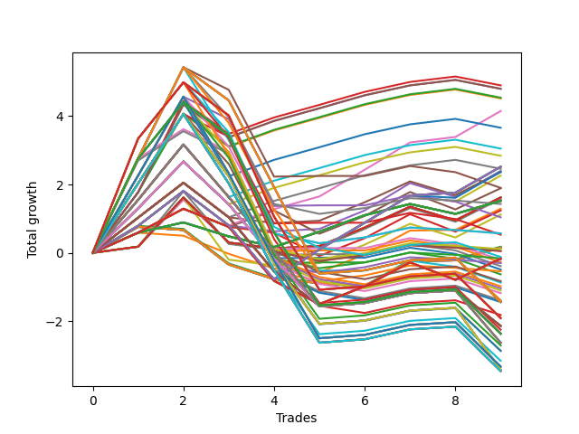

# Short HLT 107 
- Symbol: TSLA
- Date Range: 05/16/2022 - 05/17/2024
- Trading Period: 8:30-12:30
- Number of Trades: 9



| Id. | Name | Win Percent | Profit | Avg Profit / Trade | Avg Time / Trade | Std |      | Name | Win Percent | Profit | Avg Profit / Trade | Avg Time / Trade | Std |
| --- | ---- | ----------- | ------ | ------------------ | ---------------- | --- | ---- | ---- | ----------- | ------ | ------------------ | ---------------- | --- |
| | Sorted By <br> Profit | | | | | | | Sorted By <br> Win Percentage |||||
|0| TP-2.5 45m | 77.78 | 4.90 | 0.54 | 42:40 | 1.01 |     | TP-0.75 45m | 88.89 | 4.15 | 0.46 | 28:00 | 0.58 |
|1| TP-3 45m | 77.78 | 4.80 | 0.53 | 43:00 | 0.99 |     | TP-2.5 45m | 77.78 | 4.90 | 0.54 | 42:40 | 1.01 |
|2| TP-2.75 45m | 77.78 | 4.80 | 0.53 | 43:00 | 0.99 |     | TP-3 45m | 77.78 | 4.80 | 0.53 | 43:00 | 0.99 |
|3| TP-2.25 45m | 77.78 | 4.54 | 0.50 | 42:26 | 0.93 |     | TP-2.75 45m | 77.78 | 4.80 | 0.53 | 43:00 | 0.99 |
|4| TP-2 45m | 77.78 | 4.52 | 0.50 | 41:53 | 0.92 |     | TP-2.25 45m | 77.78 | 4.54 | 0.50 | 42:26 | 0.93 |
|5| TP-0.75 45m | 88.89 | 4.15 | 0.46 | 28:00 | 0.58 |     | TP-2 45m | 77.78 | 4.52 | 0.50 | 41:53 | 0.92 |
|6| TP-1.75 45m | 77.78 | 3.66 | 0.41 | 38:53 | 1.09 |     | TP-1.75 45m | 77.78 | 3.66 | 0.41 | 38:53 | 1.09 |
|7| TP-1.5 45m | 77.78 | 3.05 | 0.34 | 37:33 | 0.89 |     | TP-1.5 45m | 77.78 | 3.05 | 0.34 | 37:33 | 0.89 |
|8| TP-1.25 45m | 77.78 | 2.84 | 0.32 | 36:26 | 0.74 |     | TP-1.25 45m | 77.78 | 2.84 | 0.32 | 36:26 | 0.74 |
|9| TP-0.75 180m | 77.78 | 2.52 | 0.28 | 32:46 | 0.89 |     | TP-0.75 180m | 77.78 | 2.52 | 0.28 | 32:46 | 0.89 |
|10| TP-0.75 165m | 77.78 | 2.52 | 0.28 | 32:46 | 0.89 |     | TP-0.75 165m | 77.78 | 2.52 | 0.28 | 32:46 | 0.89 |
|11| TP-0.75 150m | 77.78 | 2.52 | 0.28 | 32:46 | 0.89 |     | TP-0.75 150m | 77.78 | 2.52 | 0.28 | 32:46 | 0.89 |
|12| TP-0.75 135m | 77.78 | 2.52 | 0.28 | 32:46 | 0.89 |     | TP-0.75 135m | 77.78 | 2.52 | 0.28 | 32:46 | 0.89 |
|13| TP-0.75 120m | 77.78 | 2.52 | 0.28 | 32:46 | 0.89 |     | TP-0.75 120m | 77.78 | 2.52 | 0.28 | 32:46 | 0.89 |
|14| TP-0.75 105m | 77.78 | 2.52 | 0.28 | 32:46 | 0.89 |     | TP-0.75 105m | 77.78 | 2.52 | 0.28 | 32:46 | 0.89 |
|15| TP-0.75 90m | 77.78 | 2.52 | 0.28 | 32:46 | 0.89 |     | TP-0.75 90m | 77.78 | 2.52 | 0.28 | 32:46 | 0.89 |
|16| TP-1 45m | 77.78 | 2.46 | 0.27 | 33:40 | 0.59 |     | TP-1 45m | 77.78 | 2.46 | 0.27 | 33:40 | 0.59 |
|17| TP-0.75 30m | 66.67 | 2.40 | 0.27 | 22:13 | 0.65 |     | TP-0.75 30m | 66.67 | 2.40 | 0.27 | 22:13 | 0.65 |
|18| TP-0.75 75m | 66.67 | 2.37 | 0.26 | 32:06 | 0.89 |     | TP-0.75 75m | 66.67 | 2.37 | 0.26 | 32:06 | 0.89 |
|19| TP-1 30m | 66.67 | 2.36 | 0.26 | 24:40 | 0.65 |     | TP-1 30m | 66.67 | 2.36 | 0.26 | 24:40 | 0.65 |
|20| TP-0.75 60m | 66.67 | 2.26 | 0.25 | 30:26 | 0.90 |     | TP-0.75 60m | 66.67 | 2.26 | 0.25 | 30:26 | 0.90 |
|21| TP-2.5 60m | 44.44 | 1.90 | 0.21 | 52:46 | 1.55 |     | TP-0.5 45m | 66.67 | 1.89 | 0.21 | 14:53 | 0.56 |
|22| TP-0.5 45m | 66.67 | 1.89 | 0.21 | 14:53 | 0.56 |     | TP-3 30m | 66.67 | 1.62 | 0.18 | 29:00 | 0.74 |
|23| TP-3 30m | 66.67 | 1.62 | 0.18 | 29:00 | 0.74 |     | TP-2.75 30m | 66.67 | 1.62 | 0.18 | 29:00 | 0.74 |
|24| TP-2.75 30m | 66.67 | 1.62 | 0.18 | 29:00 | 0.74 |     | TP-2.5 30m | 66.67 | 1.62 | 0.18 | 29:00 | 0.74 |
|25| TP-2.5 30m | 66.67 | 1.62 | 0.18 | 29:00 | 0.74 |     | TP-2.25 30m | 66.67 | 1.62 | 0.18 | 29:00 | 0.74 |
|26| TP-2.25 30m | 66.67 | 1.62 | 0.18 | 29:00 | 0.74 |     | TP-2 30m | 66.67 | 1.62 | 0.18 | 29:00 | 0.74 |
|27| TP-2 30m | 66.67 | 1.62 | 0.18 | 29:00 | 0.74 |     | TP-1.25 30m | 66.67 | 1.62 | 0.18 | 26:26 | 0.71 |
|28| TP-1.25 30m | 66.67 | 1.62 | 0.18 | 26:26 | 0.71 |     | TP-1.5 30m | 66.67 | 1.58 | 0.18 | 27:13 | 0.82 |
|29| TP-1.5 30m | 66.67 | 1.58 | 0.18 | 27:13 | 0.82 |     | TP-0.25 180m | 66.67 | 1.52 | 0.17 | 05:00 | 0.37 |
|30| TP-0.25 180m | 66.67 | 1.52 | 0.17 | 05:00 | 0.37 |     | TP-0.25 165m | 66.67 | 1.52 | 0.17 | 05:00 | 0.37 |
|31| TP-0.25 165m | 66.67 | 1.52 | 0.17 | 05:00 | 0.37 |     | TP-0.25 150m | 66.67 | 1.52 | 0.17 | 05:00 | 0.37 |
|32| TP-0.25 150m | 66.67 | 1.52 | 0.17 | 05:00 | 0.37 |     | TP-0.25 135m | 66.67 | 1.52 | 0.17 | 05:00 | 0.37 |
|33| TP-0.25 135m | 66.67 | 1.52 | 0.17 | 05:00 | 0.37 |     | TP-0.25 120m | 66.67 | 1.52 | 0.17 | 05:00 | 0.37 |
|34| TP-0.25 120m | 66.67 | 1.52 | 0.17 | 05:00 | 0.37 |     | TP-0.25 105m | 66.67 | 1.52 | 0.17 | 05:00 | 0.37 |
|35| TP-0.25 105m | 66.67 | 1.52 | 0.17 | 05:00 | 0.37 |     | TP-0.25 90m | 66.67 | 1.52 | 0.17 | 05:00 | 0.37 |
|36| TP-0.25 90m | 66.67 | 1.52 | 0.17 | 05:00 | 0.37 |     | TP-0.25 75m | 66.67 | 1.52 | 0.17 | 05:00 | 0.37 |
|37| TP-0.25 75m | 66.67 | 1.52 | 0.17 | 05:00 | 0.37 |     | TP-0.25 60m | 66.67 | 1.52 | 0.17 | 05:00 | 0.37 |
|38| TP-0.25 60m | 66.67 | 1.52 | 0.17 | 05:00 | 0.37 |     | TP-0.25 45m | 66.67 | 1.52 | 0.17 | 05:00 | 0.37 |
|39| TP-0.25 45m | 66.67 | 1.52 | 0.17 | 05:00 | 0.37 |     | TP-0.25 30m | 66.67 | 1.52 | 0.17 | 05:00 | 0.37 |
|40| TP-0.25 30m | 66.67 | 1.52 | 0.17 | 05:00 | 0.37 |     | TP-0.25 15m | 66.67 | 1.52 | 0.17 | 05:00 | 0.37 |
|41| TP-0.25 15m | 66.67 | 1.52 | 0.17 | 05:00 | 0.37 |     | TP-1.75 30m | 66.67 | 1.12 | 0.12 | 27:40 | 0.86 |
|42| TP-2.5 75m | 44.44 | 1.43 | 0.16 | 61:06 | 1.61 |     | TP-0.5 15m | 55.56 | 1.29 | 0.14 | 10:00 | 0.45 |
|43| TP-0.5 15m | 55.56 | 1.29 | 0.14 | 10:00 | 0.45 |     | TP-0.5 30m | 55.56 | 1.24 | 0.14 | 13:13 | 0.56 |
|44| TP-0.5 30m | 55.56 | 1.24 | 0.14 | 13:13 | 0.56 |     | TP-0.5 180m | 55.56 | -0.17 | -0.02 | 15:00 | 0.78 |
|45| TP-1.75 30m | 66.67 | 1.12 | 0.12 | 27:40 | 0.86 |     | TP-0.5 165m | 55.56 | -0.17 | -0.02 | 15:00 | 0.78 |
|46| TP-2.25 60m | 44.44 | 1.04 | 0.12 | 51:40 | 1.40 |     | TP-0.5 150m | 55.56 | -0.17 | -0.02 | 15:00 | 0.78 |
|47| TP-3 75m | 44.44 | 0.57 | 0.06 | 64:40 | 1.66 |     | TP-0.5 135m | 55.56 | -0.17 | -0.02 | 15:00 | 0.78 |
|48| TP-2.25 75m | 44.44 | 0.57 | 0.06 | 60:00 | 1.46 |     | TP-0.5 120m | 55.56 | -0.17 | -0.02 | 15:00 | 0.78 |
|49| TP-2 60m | 44.44 | 0.53 | 0.06 | 50:26 | 1.31 |     | TP-0.5 105m | 55.56 | -0.17 | -0.02 | 15:00 | 0.78 |
|50| TP-0.75 15m | 44.44 | 0.18 | 0.02 | 13:40 | 0.53 |     | TP-0.5 90m | 55.56 | -0.17 | -0.02 | 15:00 | 0.78 |
|51| TP-3 15m | 44.44 | 0.15 | 0.02 | 14:00 | 0.53 |     | TP-0.5 75m | 55.56 | -0.17 | -0.02 | 15:00 | 0.78 |
|52| TP-2.75 15m | 44.44 | 0.15 | 0.02 | 14:00 | 0.53 |     | TP-0.5 60m | 55.56 | -0.17 | -0.02 | 15:00 | 0.78 |
|53| TP-2.5 15m | 44.44 | 0.15 | 0.02 | 14:00 | 0.53 |     | TP-2.5 105m | 55.56 | -1.39 | -0.15 | 74:06 | 1.79 |
|54| TP-2.25 15m | 44.44 | 0.15 | 0.02 | 14:00 | 0.53 |     | TP-2.5 180m | 55.56 | -1.44 | -0.16 | 78:33 | 1.83 |
|55| TP-2 15m | 44.44 | 0.15 | 0.02 | 14:00 | 0.53 |     | TP-2.5 165m | 55.56 | -1.44 | -0.16 | 78:33 | 1.83 |
|56| TP-1.75 15m | 44.44 | 0.15 | 0.02 | 14:00 | 0.53 |     | TP-2.5 150m | 55.56 | -1.44 | -0.16 | 78:33 | 1.83 |
|57| TP-1.5 15m | 44.44 | 0.15 | 0.02 | 14:00 | 0.53 |     | TP-2.5 135m | 55.56 | -1.44 | -0.16 | 78:33 | 1.83 |
|58| TP-1.25 15m | 44.44 | 0.15 | 0.02 | 14:00 | 0.53 |     | TP-2.5 120m | 55.56 | -1.44 | -0.16 | 78:33 | 1.83 |
|59| TP-1 15m | 44.44 | 0.15 | 0.02 | 14:00 | 0.53 |     | TP-3 180m | 55.56 | -1.91 | -0.21 | 82:40 | 1.81 |
|60| TP-2.75 75m | 44.44 | 0.11 | 0.01 | 63:53 | 1.52 |     | TP-3 165m | 55.56 | -1.91 | -0.21 | 82:40 | 1.81 |
|61| TP-2 75m | 44.44 | 0.06 | 0.01 | 58:46 | 1.38 |     | TP-3 150m | 55.56 | -1.91 | -0.21 | 82:40 | 1.81 |
|62| TP-1.5 75m | 44.44 | 0.05 | 0.01 | 51:00 | 1.06 |     | TP-3 135m | 55.56 | -1.91 | -0.21 | 82:40 | 1.81 |
|63| TP-2.5 90m | 44.44 | -0.12 | -0.01 | 68:26 | 1.71 |     | TP-3 120m | 55.56 | -1.91 | -0.21 | 82:40 | 1.81 |
|64| TP-1.25 75m | 44.44 | -0.16 | -0.02 | 49:53 | 0.93 |     | TP-1 180m | 55.56 | -2.14 | -0.24 | 54:26 | 0.90 |
|65| TP-0.5 180m | 55.56 | -0.17 | -0.02 | 15:00 | 0.78 |     | TP-1 165m | 55.56 | -2.14 | -0.24 | 54:26 | 0.90 |
|66| TP-0.5 165m | 55.56 | -0.17 | -0.02 | 15:00 | 0.78 |     | TP-1 150m | 55.56 | -2.14 | -0.24 | 54:26 | 0.90 |
|67| TP-0.5 150m | 55.56 | -0.17 | -0.02 | 15:00 | 0.78 |     | TP-1 135m | 55.56 | -2.14 | -0.24 | 54:26 | 0.90 |
|68| TP-0.5 135m | 55.56 | -0.17 | -0.02 | 15:00 | 0.78 |     | TP-1 120m | 55.56 | -2.14 | -0.24 | 54:26 | 0.90 |
|69| TP-0.5 120m | 55.56 | -0.17 | -0.02 | 15:00 | 0.78 |     | TP-1 105m | 55.56 | -2.14 | -0.24 | 54:26 | 0.90 |
|70| TP-0.5 105m | 55.56 | -0.17 | -0.02 | 15:00 | 0.78 |     | TP-3 105m | 55.56 | -2.25 | -0.25 | 77:40 | 1.82 |
|71| TP-0.5 90m | 55.56 | -0.17 | -0.02 | 15:00 | 0.78 |     | TP-1.5 105m | 55.56 | -2.35 | -0.26 | 60:00 | 1.23 |
|72| TP-0.5 75m | 55.56 | -0.17 | -0.02 | 15:00 | 0.78 |     | TP-1.25 180m | 55.56 | -2.36 | -0.26 | 58:06 | 1.09 |
|73| TP-0.5 60m | 55.56 | -0.17 | -0.02 | 15:00 | 0.78 |     | TP-1.25 165m | 55.56 | -2.36 | -0.26 | 58:06 | 1.09 |
|74| TP-2.75 60m | 44.44 | -0.21 | -0.02 | 54:53 | 1.38 |     | TP-1.25 150m | 55.56 | -2.36 | -0.26 | 58:06 | 1.09 |
|75| TP-1.5 60m | 44.44 | -0.28 | -0.03 | 44:20 | 1.07 |     | TP-1.25 135m | 55.56 | -2.36 | -0.26 | 58:06 | 1.09 |
|76| TP-1.75 75m | 44.44 | -0.30 | -0.03 | 52:26 | 1.42 |     | TP-1.25 120m | 55.56 | -2.36 | -0.26 | 58:06 | 1.09 |
|77| TP-3 60m | 44.44 | -0.39 | -0.04 | 55:20 | 1.40 |     | TP-1.25 105m | 55.56 | -2.36 | -0.26 | 58:06 | 1.09 |
|78| TP-1.25 60m | 44.44 | -0.49 | -0.05 | 43:13 | 0.94 |     | TP-2.75 180m | 55.56 | -2.37 | -0.26 | 81:53 | 1.67 |
|79| TP-1 75m | 44.44 | -0.54 | -0.06 | 47:06 | 0.80 |     | TP-2.75 165m | 55.56 | -2.37 | -0.26 | 81:53 | 1.67 |
|80| TP-1.75 60m | 44.44 | -0.63 | -0.07 | 45:46 | 1.43 |     | TP-2.75 150m | 55.56 | -2.37 | -0.26 | 81:53 | 1.67 |
|81| TP-1.5 90m | 44.44 | -0.83 | -0.09 | 56:40 | 1.08 |     | TP-2.75 135m | 55.56 | -2.37 | -0.26 | 81:53 | 1.67 |
|82| TP-1 60m | 44.44 | -0.87 | -0.10 | 40:26 | 0.81 |     | TP-2.75 120m | 55.56 | -2.37 | -0.26 | 81:53 | 1.67 |
|83| TP-3 90m | 44.44 | -0.98 | -0.11 | 72:00 | 1.76 |     | TP-1.5 180m | 55.56 | -2.63 | -0.29 | 60:26 | 1.26 |
|84| TP-1.25 90m | 44.44 | -1.04 | -0.12 | 55:33 | 0.95 |     | TP-1.5 165m | 55.56 | -2.63 | -0.29 | 60:26 | 1.26 |
|85| TP-2.25 90m | 44.44 | -1.10 | -0.12 | 66:53 | 1.58 |     | TP-1.5 150m | 55.56 | -2.63 | -0.29 | 60:26 | 1.26 |
|86| TP-1.75 90m | 44.44 | -1.18 | -0.13 | 58:06 | 1.44 |     | TP-1.5 135m | 55.56 | -2.63 | -0.29 | 60:26 | 1.26 |
|87| TP-2.5 105m | 55.56 | -1.39 | -0.15 | 74:06 | 1.79 |     | TP-1.5 120m | 55.56 | -2.63 | -0.29 | 60:26 | 1.26 |
|88| TP-2 90m | 44.44 | -1.39 | -0.15 | 65:06 | 1.46 |     | TP-2.75 105m | 55.56 | -2.71 | -0.30 | 76:53 | 1.68 |
|89| TP-2.5 180m | 55.56 | -1.44 | -0.16 | 78:33 | 1.83 |     | TP-1.75 105m | 55.56 | -2.86 | -0.32 | 61:33 | 1.56 |
|90| TP-2.5 165m | 55.56 | -1.44 | -0.16 | 78:33 | 1.83 |     | TP-2.25 105m | 55.56 | -2.87 | -0.32 | 70:53 | 1.71 |
|91| TP-2.5 150m | 55.56 | -1.44 | -0.16 | 78:33 | 1.83 |     | TP-2 105m | 55.56 | -3.16 | -0.35 | 69:06 | 1.59 |
|92| TP-2.5 135m | 55.56 | -1.44 | -0.16 | 78:33 | 1.83 |     | TP-2.25 180m | 55.56 | -3.33 | -0.37 | 73:33 | 1.75 |
|93| TP-2.5 120m | 55.56 | -1.44 | -0.16 | 78:33 | 1.83 |     | TP-2.25 165m | 55.56 | -3.33 | -0.37 | 73:33 | 1.75 |
|94| TP-2.75 90m | 44.44 | -1.44 | -0.16 | 71:13 | 1.61 |     | TP-2.25 150m | 55.56 | -3.33 | -0.37 | 73:33 | 1.75 |
|95| TP-1 90m | 44.44 | -1.82 | -0.20 | 52:20 | 0.86 |     | TP-2.25 135m | 55.56 | -3.33 | -0.37 | 73:33 | 1.75 |
|96| TP-3 180m | 55.56 | -1.91 | -0.21 | 82:40 | 1.81 |     | TP-2.25 120m | 55.56 | -3.33 | -0.37 | 73:33 | 1.75 |
|97| TP-3 165m | 55.56 | -1.91 | -0.21 | 82:40 | 1.81 |     | TP-1.75 180m | 55.56 | -3.42 | -0.38 | 62:26 | 1.61 |
|98| TP-3 150m | 55.56 | -1.91 | -0.21 | 82:40 | 1.81 |     | TP-1.75 165m | 55.56 | -3.42 | -0.38 | 62:26 | 1.61 |
|99| TP-3 135m | 55.56 | -1.91 | -0.21 | 82:40 | 1.81 |     | TP-1.75 150m | 55.56 | -3.42 | -0.38 | 62:26 | 1.61 |
|100| TP-3 120m | 55.56 | -1.91 | -0.21 | 82:40 | 1.81 |     | TP-1.75 135m | 55.56 | -3.42 | -0.38 | 62:26 | 1.61 |
|101| TP-1 180m | 55.56 | -2.14 | -0.24 | 54:26 | 0.90 |     | TP-1.75 120m | 55.56 | -3.42 | -0.38 | 62:26 | 1.61 |
|102| TP-1 165m | 55.56 | -2.14 | -0.24 | 54:26 | 0.90 |     | TP-2 180m | 55.56 | -3.46 | -0.38 | 71:00 | 1.63 |
|103| TP-1 150m | 55.56 | -2.14 | -0.24 | 54:26 | 0.90 |     | TP-2 165m | 55.56 | -3.46 | -0.38 | 71:00 | 1.63 |
|104| TP-1 135m | 55.56 | -2.14 | -0.24 | 54:26 | 0.90 |     | TP-2 150m | 55.56 | -3.46 | -0.38 | 71:00 | 1.63 |
|105| TP-1 120m | 55.56 | -2.14 | -0.24 | 54:26 | 0.90 |     | TP-2 135m | 55.56 | -3.46 | -0.38 | 71:00 | 1.63 |
|106| TP-1 105m | 55.56 | -2.14 | -0.24 | 54:26 | 0.90 |     | TP-2 120m | 55.56 | -3.46 | -0.38 | 71:00 | 1.63 |
|107| TP-3 105m | 55.56 | -2.25 | -0.25 | 77:40 | 1.82 |     | TP-2.5 60m | 44.44 | 1.90 | 0.21 | 52:46 | 1.55 |
|108| TP-1.5 105m | 55.56 | -2.35 | -0.26 | 60:00 | 1.23 |     | TP-2.5 75m | 44.44 | 1.43 | 0.16 | 61:06 | 1.61 |
|109| TP-1.25 180m | 55.56 | -2.36 | -0.26 | 58:06 | 1.09 |     | TP-2.25 60m | 44.44 | 1.04 | 0.12 | 51:40 | 1.40 |
|110| TP-1.25 165m | 55.56 | -2.36 | -0.26 | 58:06 | 1.09 |     | TP-3 75m | 44.44 | 0.57 | 0.06 | 64:40 | 1.66 |
|111| TP-1.25 150m | 55.56 | -2.36 | -0.26 | 58:06 | 1.09 |     | TP-2.25 75m | 44.44 | 0.57 | 0.06 | 60:00 | 1.46 |
|112| TP-1.25 135m | 55.56 | -2.36 | -0.26 | 58:06 | 1.09 |     | TP-2 60m | 44.44 | 0.53 | 0.06 | 50:26 | 1.31 |
|113| TP-1.25 120m | 55.56 | -2.36 | -0.26 | 58:06 | 1.09 |     | TP-0.75 15m | 44.44 | 0.18 | 0.02 | 13:40 | 0.53 |
|114| TP-1.25 105m | 55.56 | -2.36 | -0.26 | 58:06 | 1.09 |     | TP-3 15m | 44.44 | 0.15 | 0.02 | 14:00 | 0.53 |
|115| TP-2.75 180m | 55.56 | -2.37 | -0.26 | 81:53 | 1.67 |     | TP-2.75 15m | 44.44 | 0.15 | 0.02 | 14:00 | 0.53 |
|116| TP-2.75 165m | 55.56 | -2.37 | -0.26 | 81:53 | 1.67 |     | TP-2.5 15m | 44.44 | 0.15 | 0.02 | 14:00 | 0.53 |
|117| TP-2.75 150m | 55.56 | -2.37 | -0.26 | 81:53 | 1.67 |     | TP-2.25 15m | 44.44 | 0.15 | 0.02 | 14:00 | 0.53 |
|118| TP-2.75 135m | 55.56 | -2.37 | -0.26 | 81:53 | 1.67 |     | TP-2 15m | 44.44 | 0.15 | 0.02 | 14:00 | 0.53 |
|119| TP-2.75 120m | 55.56 | -2.37 | -0.26 | 81:53 | 1.67 |     | TP-1.75 15m | 44.44 | 0.15 | 0.02 | 14:00 | 0.53 |
|120| TP-1.5 180m | 55.56 | -2.63 | -0.29 | 60:26 | 1.26 |     | TP-1.5 15m | 44.44 | 0.15 | 0.02 | 14:00 | 0.53 |
|121| TP-1.5 165m | 55.56 | -2.63 | -0.29 | 60:26 | 1.26 |     | TP-1.25 15m | 44.44 | 0.15 | 0.02 | 14:00 | 0.53 |
|122| TP-1.5 150m | 55.56 | -2.63 | -0.29 | 60:26 | 1.26 |     | TP-1 15m | 44.44 | 0.15 | 0.02 | 14:00 | 0.53 |
|123| TP-1.5 135m | 55.56 | -2.63 | -0.29 | 60:26 | 1.26 |     | TP-2.75 75m | 44.44 | 0.11 | 0.01 | 63:53 | 1.52 |
|124| TP-1.5 120m | 55.56 | -2.63 | -0.29 | 60:26 | 1.26 |     | TP-2 75m | 44.44 | 0.06 | 0.01 | 58:46 | 1.38 |
|125| TP-2.75 105m | 55.56 | -2.71 | -0.30 | 76:53 | 1.68 |     | TP-1.5 75m | 44.44 | 0.05 | 0.01 | 51:00 | 1.06 |
|126| TP-1.75 105m | 55.56 | -2.86 | -0.32 | 61:33 | 1.56 |     | TP-2.5 90m | 44.44 | -0.12 | -0.01 | 68:26 | 1.71 |
|127| TP-2.25 105m | 55.56 | -2.87 | -0.32 | 70:53 | 1.71 |     | TP-1.25 75m | 44.44 | -0.16 | -0.02 | 49:53 | 0.93 |
|128| TP-2 105m | 55.56 | -3.16 | -0.35 | 69:06 | 1.59 |     | TP-2.75 60m | 44.44 | -0.21 | -0.02 | 54:53 | 1.38 |
|129| TP-2.25 180m | 55.56 | -3.33 | -0.37 | 73:33 | 1.75 |     | TP-1.5 60m | 44.44 | -0.28 | -0.03 | 44:20 | 1.07 |
|130| TP-2.25 165m | 55.56 | -3.33 | -0.37 | 73:33 | 1.75 |     | TP-1.75 75m | 44.44 | -0.30 | -0.03 | 52:26 | 1.42 |
|131| TP-2.25 150m | 55.56 | -3.33 | -0.37 | 73:33 | 1.75 |     | TP-3 60m | 44.44 | -0.39 | -0.04 | 55:20 | 1.40 |
|132| TP-2.25 135m | 55.56 | -3.33 | -0.37 | 73:33 | 1.75 |     | TP-1.25 60m | 44.44 | -0.49 | -0.05 | 43:13 | 0.94 |
|133| TP-2.25 120m | 55.56 | -3.33 | -0.37 | 73:33 | 1.75 |     | TP-1 75m | 44.44 | -0.54 | -0.06 | 47:06 | 0.80 |
|134| TP-1.75 180m | 55.56 | -3.42 | -0.38 | 62:26 | 1.61 |     | TP-1.75 60m | 44.44 | -0.63 | -0.07 | 45:46 | 1.43 |
|135| TP-1.75 165m | 55.56 | -3.42 | -0.38 | 62:26 | 1.61 |     | TP-1.5 90m | 44.44 | -0.83 | -0.09 | 56:40 | 1.08 |
|136| TP-1.75 150m | 55.56 | -3.42 | -0.38 | 62:26 | 1.61 |     | TP-1 60m | 44.44 | -0.87 | -0.10 | 40:26 | 0.81 |
|137| TP-1.75 135m | 55.56 | -3.42 | -0.38 | 62:26 | 1.61 |     | TP-3 90m | 44.44 | -0.98 | -0.11 | 72:00 | 1.76 |
|138| TP-1.75 120m | 55.56 | -3.42 | -0.38 | 62:26 | 1.61 |     | TP-1.25 90m | 44.44 | -1.04 | -0.12 | 55:33 | 0.95 |
|139| TP-2 180m | 55.56 | -3.46 | -0.38 | 71:00 | 1.63 |     | TP-2.25 90m | 44.44 | -1.10 | -0.12 | 66:53 | 1.58 |
|140| TP-2 165m | 55.56 | -3.46 | -0.38 | 71:00 | 1.63 |     | TP-1.75 90m | 44.44 | -1.18 | -0.13 | 58:06 | 1.44 |
|141| TP-2 150m | 55.56 | -3.46 | -0.38 | 71:00 | 1.63 |     | TP-2 90m | 44.44 | -1.39 | -0.15 | 65:06 | 1.46 |
|142| TP-2 135m | 55.56 | -3.46 | -0.38 | 71:00 | 1.63 |     | TP-2.75 90m | 44.44 | -1.44 | -0.16 | 71:13 | 1.61 |
|143| TP-2 120m | 55.56 | -3.46 | -0.38 | 71:00 | 1.63 |     | TP-1 90m | 44.44 | -1.82 | -0.20 | 52:20 | 0.86 |

### Test TP-0.25 15m
* Take Profit of 0.25 Point
* 0.25 Stoploss
* Results:
```
Total Trades: 9
Percent Up: 33.33
Percent Down: 66.67
Total Points Moved Down: 1.52
Potential Profit: 760.00
Total Points Ups: 1.01 Count Ups: 3
Total Points Downs: 2.53 Count Downs: 6
```

<details><summary>Trades</summary>

<code>In: 2023-02-28 11:25:00		Out: 2023-02-28 11:30:00		Total Position Time: 05:00		Total Move Down: 0.59		Total to Date: 0.59</code> <br />
<code>In: 2023-03-13 11:45:00		Out: 2023-03-13 11:47:00		Total Position Time: 02:00		Total Move Down: 0.30		Total to Date: 0.89</code> <br />
<code>In: 2023-03-16 08:40:00		Out: 2023-03-16 08:43:00		Total Position Time: 03:00		Total Move Down: -0.41		Total to Date: 0.48</code> <br />
<code>In: 2023-05-11 12:00:00		Out: 2023-05-11 12:09:00		Total Position Time: 09:00		Total Move Down: -0.31		Total to Date: 0.17</code> <br />
<code>In: 2023-08-23 09:10:00		Out: 2023-08-23 09:12:00		Total Position Time: 02:00		Total Move Down: 0.45		Total to Date: 0.62</code> <br />
<code>In: 2023-08-23 11:15:00		Out: 2023-08-23 11:19:00		Total Position Time: 04:00		Total Move Down: 0.48		Total to Date: 1.10</code> <br />
<code>In: 2023-09-14 12:15:00		Out: 2023-09-14 12:25:00		Total Position Time: 10:00		Total Move Down: 0.33		Total to Date: 1.43</code> <br />
<code>In: 2023-10-16 11:30:00		Out: 2023-10-16 11:35:00		Total Position Time: 05:00		Total Move Down: -0.29		Total to Date: 1.14</code> <br />
<code>In: 2024-02-15 10:50:00		Out: 2024-02-15 10:55:00		Total Position Time: 05:00		Total Move Down: 0.38		Total to Date: 1.52</code> <br />


</details>

### Test TP-0.5 15m
* Take Profit of 0.5 Point
* 0.5 Stoploss
* Results:
```
Total Trades: 9
Percent Up: 44.44
Percent Down: 55.56
Total Points Moved Down: 1.29
Potential Profit: 645.00
Total Points Ups: 1.16 Count Ups: 4
Total Points Downs: 2.45 Count Downs: 5
```

<details><summary>Trades</summary>

<code>In: 2023-02-28 11:25:00		Out: 2023-02-28 11:30:00		Total Position Time: 05:00		Total Move Down: 0.59		Total to Date: 0.59</code> <br />
<code>In: 2023-03-13 11:45:00		Out: 2023-03-13 11:59:00		Total Position Time: 14:00		Total Move Down: -0.09		Total to Date: 0.50</code> <br />
<code>In: 2023-03-16 08:40:00		Out: 2023-03-16 08:44:00		Total Position Time: 04:00		Total Move Down: -0.53		Total to Date: -0.03</code> <br />
<code>In: 2023-05-11 12:00:00		Out: 2023-05-11 12:14:00		Total Position Time: 14:00		Total Move Down: -0.43		Total to Date: -0.46</code> <br />
<code>In: 2023-08-23 09:10:00		Out: 2023-08-23 09:24:00		Total Position Time: 14:00		Total Move Down: -0.11		Total to Date: -0.57</code> <br />
<code>In: 2023-08-23 11:15:00		Out: 2023-08-23 11:21:00		Total Position Time: 06:00		Total Move Down: 0.52		Total to Date: -0.05</code> <br />
<code>In: 2023-09-14 12:15:00		Out: 2023-09-14 12:28:00		Total Position Time: 13:00		Total Move Down: 0.70		Total to Date: 0.65</code> <br />
<code>In: 2023-10-16 11:30:00		Out: 2023-10-16 11:44:00		Total Position Time: 14:00		Total Move Down: 0.02		Total to Date: 0.67</code> <br />
<code>In: 2024-02-15 10:50:00		Out: 2024-02-15 10:56:00		Total Position Time: 06:00		Total Move Down: 0.62		Total to Date: 1.29</code> <br />


</details>

### Test TP-0.75 15m
* Take Profit of 0.75 Point
* 0.75 Stoploss
* Results:
```
Total Trades: 9
Percent Up: 55.56
Percent Down: 44.44
Total Points Moved Down: 0.18
Potential Profit: 90.00
Total Points Ups: 1.75 Count Ups: 5
Total Points Downs: 1.93 Count Downs: 4
```

<details><summary>Trades</summary>

<code>In: 2023-02-28 11:25:00		Out: 2023-02-28 11:36:00		Total Position Time: 11:00		Total Move Down: 0.79		Total to Date: 0.79</code> <br />
<code>In: 2023-03-13 11:45:00		Out: 2023-03-13 11:59:00		Total Position Time: 14:00		Total Move Down: -0.09		Total to Date: 0.70</code> <br />
<code>In: 2023-03-16 08:40:00		Out: 2023-03-16 08:54:00		Total Position Time: 14:00		Total Move Down: -1.01		Total to Date: -0.31</code> <br />
<code>In: 2023-05-11 12:00:00		Out: 2023-05-11 12:14:00		Total Position Time: 14:00		Total Move Down: -0.43		Total to Date: -0.74</code> <br />
<code>In: 2023-08-23 09:10:00		Out: 2023-08-23 09:24:00		Total Position Time: 14:00		Total Move Down: -0.11		Total to Date: -0.85</code> <br />
<code>In: 2023-08-23 11:15:00		Out: 2023-08-23 11:29:00		Total Position Time: 14:00		Total Move Down: -0.11		Total to Date: -0.96</code> <br />
<code>In: 2023-09-14 12:15:00		Out: 2023-09-14 12:29:00		Total Position Time: 14:00		Total Move Down: 0.75		Total to Date: -0.21</code> <br />
<code>In: 2023-10-16 11:30:00		Out: 2023-10-16 11:44:00		Total Position Time: 14:00		Total Move Down: 0.02		Total to Date: -0.19</code> <br />
<code>In: 2024-02-15 10:50:00		Out: 2024-02-15 11:04:00		Total Position Time: 14:00		Total Move Down: 0.37		Total to Date: 0.18</code> <br />


</details>

### Test TP-1 15m
* Take Profit of 1 Point
* 1 Stoploss
* Results:
```
Total Trades: 9
Percent Up: 55.56
Percent Down: 44.44
Total Points Moved Down: 0.15
Potential Profit: 75.00
Total Points Ups: 1.75 Count Ups: 5
Total Points Downs: 1.90 Count Downs: 4
```

<details><summary>Trades</summary>

<code>In: 2023-02-28 11:25:00		Out: 2023-02-28 11:39:00		Total Position Time: 14:00		Total Move Down: 0.76		Total to Date: 0.76</code> <br />
<code>In: 2023-03-13 11:45:00		Out: 2023-03-13 11:59:00		Total Position Time: 14:00		Total Move Down: -0.09		Total to Date: 0.67</code> <br />
<code>In: 2023-03-16 08:40:00		Out: 2023-03-16 08:54:00		Total Position Time: 14:00		Total Move Down: -1.01		Total to Date: -0.34</code> <br />
<code>In: 2023-05-11 12:00:00		Out: 2023-05-11 12:14:00		Total Position Time: 14:00		Total Move Down: -0.43		Total to Date: -0.77</code> <br />
<code>In: 2023-08-23 09:10:00		Out: 2023-08-23 09:24:00		Total Position Time: 14:00		Total Move Down: -0.11		Total to Date: -0.88</code> <br />
<code>In: 2023-08-23 11:15:00		Out: 2023-08-23 11:29:00		Total Position Time: 14:00		Total Move Down: -0.11		Total to Date: -0.99</code> <br />
<code>In: 2023-09-14 12:15:00		Out: 2023-09-14 12:29:00		Total Position Time: 14:00		Total Move Down: 0.75		Total to Date: -0.24</code> <br />
<code>In: 2023-10-16 11:30:00		Out: 2023-10-16 11:44:00		Total Position Time: 14:00		Total Move Down: 0.02		Total to Date: -0.22</code> <br />
<code>In: 2024-02-15 10:50:00		Out: 2024-02-15 11:04:00		Total Position Time: 14:00		Total Move Down: 0.37		Total to Date: 0.15</code> <br />


</details>

### Test TP-1.25 15m
* Take Profit of 1.25 Point
* 1.25 Stoploss
* Results:
```
Total Trades: 9
Percent Up: 55.56
Percent Down: 44.44
Total Points Moved Down: 0.15
Potential Profit: 75.00
Total Points Ups: 1.75 Count Ups: 5
Total Points Downs: 1.90 Count Downs: 4
```

<details><summary>Trades</summary>

<code>In: 2023-02-28 11:25:00		Out: 2023-02-28 11:39:00		Total Position Time: 14:00		Total Move Down: 0.76		Total to Date: 0.76</code> <br />
<code>In: 2023-03-13 11:45:00		Out: 2023-03-13 11:59:00		Total Position Time: 14:00		Total Move Down: -0.09		Total to Date: 0.67</code> <br />
<code>In: 2023-03-16 08:40:00		Out: 2023-03-16 08:54:00		Total Position Time: 14:00		Total Move Down: -1.01		Total to Date: -0.34</code> <br />
<code>In: 2023-05-11 12:00:00		Out: 2023-05-11 12:14:00		Total Position Time: 14:00		Total Move Down: -0.43		Total to Date: -0.77</code> <br />
<code>In: 2023-08-23 09:10:00		Out: 2023-08-23 09:24:00		Total Position Time: 14:00		Total Move Down: -0.11		Total to Date: -0.88</code> <br />
<code>In: 2023-08-23 11:15:00		Out: 2023-08-23 11:29:00		Total Position Time: 14:00		Total Move Down: -0.11		Total to Date: -0.99</code> <br />
<code>In: 2023-09-14 12:15:00		Out: 2023-09-14 12:29:00		Total Position Time: 14:00		Total Move Down: 0.75		Total to Date: -0.24</code> <br />
<code>In: 2023-10-16 11:30:00		Out: 2023-10-16 11:44:00		Total Position Time: 14:00		Total Move Down: 0.02		Total to Date: -0.22</code> <br />
<code>In: 2024-02-15 10:50:00		Out: 2024-02-15 11:04:00		Total Position Time: 14:00		Total Move Down: 0.37		Total to Date: 0.15</code> <br />


</details>

### Test TP-1.5 15m
* Take Profit of 1.5 Point
* 1.5 Stoploss
* Results:
```
Total Trades: 9
Percent Up: 55.56
Percent Down: 44.44
Total Points Moved Down: 0.15
Potential Profit: 75.00
Total Points Ups: 1.75 Count Ups: 5
Total Points Downs: 1.90 Count Downs: 4
```

<details><summary>Trades</summary>

<code>In: 2023-02-28 11:25:00		Out: 2023-02-28 11:39:00		Total Position Time: 14:00		Total Move Down: 0.76		Total to Date: 0.76</code> <br />
<code>In: 2023-03-13 11:45:00		Out: 2023-03-13 11:59:00		Total Position Time: 14:00		Total Move Down: -0.09		Total to Date: 0.67</code> <br />
<code>In: 2023-03-16 08:40:00		Out: 2023-03-16 08:54:00		Total Position Time: 14:00		Total Move Down: -1.01		Total to Date: -0.34</code> <br />
<code>In: 2023-05-11 12:00:00		Out: 2023-05-11 12:14:00		Total Position Time: 14:00		Total Move Down: -0.43		Total to Date: -0.77</code> <br />
<code>In: 2023-08-23 09:10:00		Out: 2023-08-23 09:24:00		Total Position Time: 14:00		Total Move Down: -0.11		Total to Date: -0.88</code> <br />
<code>In: 2023-08-23 11:15:00		Out: 2023-08-23 11:29:00		Total Position Time: 14:00		Total Move Down: -0.11		Total to Date: -0.99</code> <br />
<code>In: 2023-09-14 12:15:00		Out: 2023-09-14 12:29:00		Total Position Time: 14:00		Total Move Down: 0.75		Total to Date: -0.24</code> <br />
<code>In: 2023-10-16 11:30:00		Out: 2023-10-16 11:44:00		Total Position Time: 14:00		Total Move Down: 0.02		Total to Date: -0.22</code> <br />
<code>In: 2024-02-15 10:50:00		Out: 2024-02-15 11:04:00		Total Position Time: 14:00		Total Move Down: 0.37		Total to Date: 0.15</code> <br />


</details>

### Test TP-1.75 15m
* Take Profit of 1.75 Point
* 1.75 Stoploss
* Results:
```
Total Trades: 9
Percent Up: 55.56
Percent Down: 44.44
Total Points Moved Down: 0.15
Potential Profit: 75.00
Total Points Ups: 1.75 Count Ups: 5
Total Points Downs: 1.90 Count Downs: 4
```

<details><summary>Trades</summary>

<code>In: 2023-02-28 11:25:00		Out: 2023-02-28 11:39:00		Total Position Time: 14:00		Total Move Down: 0.76		Total to Date: 0.76</code> <br />
<code>In: 2023-03-13 11:45:00		Out: 2023-03-13 11:59:00		Total Position Time: 14:00		Total Move Down: -0.09		Total to Date: 0.67</code> <br />
<code>In: 2023-03-16 08:40:00		Out: 2023-03-16 08:54:00		Total Position Time: 14:00		Total Move Down: -1.01		Total to Date: -0.34</code> <br />
<code>In: 2023-05-11 12:00:00		Out: 2023-05-11 12:14:00		Total Position Time: 14:00		Total Move Down: -0.43		Total to Date: -0.77</code> <br />
<code>In: 2023-08-23 09:10:00		Out: 2023-08-23 09:24:00		Total Position Time: 14:00		Total Move Down: -0.11		Total to Date: -0.88</code> <br />
<code>In: 2023-08-23 11:15:00		Out: 2023-08-23 11:29:00		Total Position Time: 14:00		Total Move Down: -0.11		Total to Date: -0.99</code> <br />
<code>In: 2023-09-14 12:15:00		Out: 2023-09-14 12:29:00		Total Position Time: 14:00		Total Move Down: 0.75		Total to Date: -0.24</code> <br />
<code>In: 2023-10-16 11:30:00		Out: 2023-10-16 11:44:00		Total Position Time: 14:00		Total Move Down: 0.02		Total to Date: -0.22</code> <br />
<code>In: 2024-02-15 10:50:00		Out: 2024-02-15 11:04:00		Total Position Time: 14:00		Total Move Down: 0.37		Total to Date: 0.15</code> <br />


</details>

### Test TP-2 15m
* Take Profit of 2 Point
* 2 Stoploss
* Results:
```
Total Trades: 9
Percent Up: 55.56
Percent Down: 44.44
Total Points Moved Down: 0.15
Potential Profit: 75.00
Total Points Ups: 1.75 Count Ups: 5
Total Points Downs: 1.90 Count Downs: 4
```

<details><summary>Trades</summary>

<code>In: 2023-02-28 11:25:00		Out: 2023-02-28 11:39:00		Total Position Time: 14:00		Total Move Down: 0.76		Total to Date: 0.76</code> <br />
<code>In: 2023-03-13 11:45:00		Out: 2023-03-13 11:59:00		Total Position Time: 14:00		Total Move Down: -0.09		Total to Date: 0.67</code> <br />
<code>In: 2023-03-16 08:40:00		Out: 2023-03-16 08:54:00		Total Position Time: 14:00		Total Move Down: -1.01		Total to Date: -0.34</code> <br />
<code>In: 2023-05-11 12:00:00		Out: 2023-05-11 12:14:00		Total Position Time: 14:00		Total Move Down: -0.43		Total to Date: -0.77</code> <br />
<code>In: 2023-08-23 09:10:00		Out: 2023-08-23 09:24:00		Total Position Time: 14:00		Total Move Down: -0.11		Total to Date: -0.88</code> <br />
<code>In: 2023-08-23 11:15:00		Out: 2023-08-23 11:29:00		Total Position Time: 14:00		Total Move Down: -0.11		Total to Date: -0.99</code> <br />
<code>In: 2023-09-14 12:15:00		Out: 2023-09-14 12:29:00		Total Position Time: 14:00		Total Move Down: 0.75		Total to Date: -0.24</code> <br />
<code>In: 2023-10-16 11:30:00		Out: 2023-10-16 11:44:00		Total Position Time: 14:00		Total Move Down: 0.02		Total to Date: -0.22</code> <br />
<code>In: 2024-02-15 10:50:00		Out: 2024-02-15 11:04:00		Total Position Time: 14:00		Total Move Down: 0.37		Total to Date: 0.15</code> <br />


</details>

### Test TP-2.25 15m
* Take Profit of 2.25 Point
* 2.25 Stoploss
* Results:
```
Total Trades: 9
Percent Up: 55.56
Percent Down: 44.44
Total Points Moved Down: 0.15
Potential Profit: 75.00
Total Points Ups: 1.75 Count Ups: 5
Total Points Downs: 1.90 Count Downs: 4
```

<details><summary>Trades</summary>

<code>In: 2023-02-28 11:25:00		Out: 2023-02-28 11:39:00		Total Position Time: 14:00		Total Move Down: 0.76		Total to Date: 0.76</code> <br />
<code>In: 2023-03-13 11:45:00		Out: 2023-03-13 11:59:00		Total Position Time: 14:00		Total Move Down: -0.09		Total to Date: 0.67</code> <br />
<code>In: 2023-03-16 08:40:00		Out: 2023-03-16 08:54:00		Total Position Time: 14:00		Total Move Down: -1.01		Total to Date: -0.34</code> <br />
<code>In: 2023-05-11 12:00:00		Out: 2023-05-11 12:14:00		Total Position Time: 14:00		Total Move Down: -0.43		Total to Date: -0.77</code> <br />
<code>In: 2023-08-23 09:10:00		Out: 2023-08-23 09:24:00		Total Position Time: 14:00		Total Move Down: -0.11		Total to Date: -0.88</code> <br />
<code>In: 2023-08-23 11:15:00		Out: 2023-08-23 11:29:00		Total Position Time: 14:00		Total Move Down: -0.11		Total to Date: -0.99</code> <br />
<code>In: 2023-09-14 12:15:00		Out: 2023-09-14 12:29:00		Total Position Time: 14:00		Total Move Down: 0.75		Total to Date: -0.24</code> <br />
<code>In: 2023-10-16 11:30:00		Out: 2023-10-16 11:44:00		Total Position Time: 14:00		Total Move Down: 0.02		Total to Date: -0.22</code> <br />
<code>In: 2024-02-15 10:50:00		Out: 2024-02-15 11:04:00		Total Position Time: 14:00		Total Move Down: 0.37		Total to Date: 0.15</code> <br />


</details>

### Test TP-2.5 15m
* Take Profit of 2.5 Point
* 2.5 Stoploss
* Results:
```
Total Trades: 9
Percent Up: 55.56
Percent Down: 44.44
Total Points Moved Down: 0.15
Potential Profit: 75.00
Total Points Ups: 1.75 Count Ups: 5
Total Points Downs: 1.90 Count Downs: 4
```

<details><summary>Trades</summary>

<code>In: 2023-02-28 11:25:00		Out: 2023-02-28 11:39:00		Total Position Time: 14:00		Total Move Down: 0.76		Total to Date: 0.76</code> <br />
<code>In: 2023-03-13 11:45:00		Out: 2023-03-13 11:59:00		Total Position Time: 14:00		Total Move Down: -0.09		Total to Date: 0.67</code> <br />
<code>In: 2023-03-16 08:40:00		Out: 2023-03-16 08:54:00		Total Position Time: 14:00		Total Move Down: -1.01		Total to Date: -0.34</code> <br />
<code>In: 2023-05-11 12:00:00		Out: 2023-05-11 12:14:00		Total Position Time: 14:00		Total Move Down: -0.43		Total to Date: -0.77</code> <br />
<code>In: 2023-08-23 09:10:00		Out: 2023-08-23 09:24:00		Total Position Time: 14:00		Total Move Down: -0.11		Total to Date: -0.88</code> <br />
<code>In: 2023-08-23 11:15:00		Out: 2023-08-23 11:29:00		Total Position Time: 14:00		Total Move Down: -0.11		Total to Date: -0.99</code> <br />
<code>In: 2023-09-14 12:15:00		Out: 2023-09-14 12:29:00		Total Position Time: 14:00		Total Move Down: 0.75		Total to Date: -0.24</code> <br />
<code>In: 2023-10-16 11:30:00		Out: 2023-10-16 11:44:00		Total Position Time: 14:00		Total Move Down: 0.02		Total to Date: -0.22</code> <br />
<code>In: 2024-02-15 10:50:00		Out: 2024-02-15 11:04:00		Total Position Time: 14:00		Total Move Down: 0.37		Total to Date: 0.15</code> <br />


</details>

### Test TP-2.75 15m
* Take Profit of 2.75 Point
* 2.75 Stoploss
* Results:
```
Total Trades: 9
Percent Up: 55.56
Percent Down: 44.44
Total Points Moved Down: 0.15
Potential Profit: 75.00
Total Points Ups: 1.75 Count Ups: 5
Total Points Downs: 1.90 Count Downs: 4
```

<details><summary>Trades</summary>

<code>In: 2023-02-28 11:25:00		Out: 2023-02-28 11:39:00		Total Position Time: 14:00		Total Move Down: 0.76		Total to Date: 0.76</code> <br />
<code>In: 2023-03-13 11:45:00		Out: 2023-03-13 11:59:00		Total Position Time: 14:00		Total Move Down: -0.09		Total to Date: 0.67</code> <br />
<code>In: 2023-03-16 08:40:00		Out: 2023-03-16 08:54:00		Total Position Time: 14:00		Total Move Down: -1.01		Total to Date: -0.34</code> <br />
<code>In: 2023-05-11 12:00:00		Out: 2023-05-11 12:14:00		Total Position Time: 14:00		Total Move Down: -0.43		Total to Date: -0.77</code> <br />
<code>In: 2023-08-23 09:10:00		Out: 2023-08-23 09:24:00		Total Position Time: 14:00		Total Move Down: -0.11		Total to Date: -0.88</code> <br />
<code>In: 2023-08-23 11:15:00		Out: 2023-08-23 11:29:00		Total Position Time: 14:00		Total Move Down: -0.11		Total to Date: -0.99</code> <br />
<code>In: 2023-09-14 12:15:00		Out: 2023-09-14 12:29:00		Total Position Time: 14:00		Total Move Down: 0.75		Total to Date: -0.24</code> <br />
<code>In: 2023-10-16 11:30:00		Out: 2023-10-16 11:44:00		Total Position Time: 14:00		Total Move Down: 0.02		Total to Date: -0.22</code> <br />
<code>In: 2024-02-15 10:50:00		Out: 2024-02-15 11:04:00		Total Position Time: 14:00		Total Move Down: 0.37		Total to Date: 0.15</code> <br />


</details>

### Test TP-3 15m
* Take Profit of 3 Point
* 3 Stoploss
* Results:
```
Total Trades: 9
Percent Up: 55.56
Percent Down: 44.44
Total Points Moved Down: 0.15
Potential Profit: 75.00
Total Points Ups: 1.75 Count Ups: 5
Total Points Downs: 1.90 Count Downs: 4
```

<details><summary>Trades</summary>

<code>In: 2023-02-28 11:25:00		Out: 2023-02-28 11:39:00		Total Position Time: 14:00		Total Move Down: 0.76		Total to Date: 0.76</code> <br />
<code>In: 2023-03-13 11:45:00		Out: 2023-03-13 11:59:00		Total Position Time: 14:00		Total Move Down: -0.09		Total to Date: 0.67</code> <br />
<code>In: 2023-03-16 08:40:00		Out: 2023-03-16 08:54:00		Total Position Time: 14:00		Total Move Down: -1.01		Total to Date: -0.34</code> <br />
<code>In: 2023-05-11 12:00:00		Out: 2023-05-11 12:14:00		Total Position Time: 14:00		Total Move Down: -0.43		Total to Date: -0.77</code> <br />
<code>In: 2023-08-23 09:10:00		Out: 2023-08-23 09:24:00		Total Position Time: 14:00		Total Move Down: -0.11		Total to Date: -0.88</code> <br />
<code>In: 2023-08-23 11:15:00		Out: 2023-08-23 11:29:00		Total Position Time: 14:00		Total Move Down: -0.11		Total to Date: -0.99</code> <br />
<code>In: 2023-09-14 12:15:00		Out: 2023-09-14 12:29:00		Total Position Time: 14:00		Total Move Down: 0.75		Total to Date: -0.24</code> <br />
<code>In: 2023-10-16 11:30:00		Out: 2023-10-16 11:44:00		Total Position Time: 14:00		Total Move Down: 0.02		Total to Date: -0.22</code> <br />
<code>In: 2024-02-15 10:50:00		Out: 2024-02-15 11:04:00		Total Position Time: 14:00		Total Move Down: 0.37		Total to Date: 0.15</code> <br />


</details>

### Test TP-0.25 30m
* Take Profit of 0.25 Point
* 0.25 Stoploss
* Results:
```
Total Trades: 9
Percent Up: 33.33
Percent Down: 66.67
Total Points Moved Down: 1.52
Potential Profit: 760.00
Total Points Ups: 1.01 Count Ups: 3
Total Points Downs: 2.53 Count Downs: 6
```

<details><summary>Trades</summary>

<code>In: 2023-02-28 11:25:00		Out: 2023-02-28 11:30:00		Total Position Time: 05:00		Total Move Down: 0.59		Total to Date: 0.59</code> <br />
<code>In: 2023-03-13 11:45:00		Out: 2023-03-13 11:47:00		Total Position Time: 02:00		Total Move Down: 0.30		Total to Date: 0.89</code> <br />
<code>In: 2023-03-16 08:40:00		Out: 2023-03-16 08:43:00		Total Position Time: 03:00		Total Move Down: -0.41		Total to Date: 0.48</code> <br />
<code>In: 2023-05-11 12:00:00		Out: 2023-05-11 12:09:00		Total Position Time: 09:00		Total Move Down: -0.31		Total to Date: 0.17</code> <br />
<code>In: 2023-08-23 09:10:00		Out: 2023-08-23 09:12:00		Total Position Time: 02:00		Total Move Down: 0.45		Total to Date: 0.62</code> <br />
<code>In: 2023-08-23 11:15:00		Out: 2023-08-23 11:19:00		Total Position Time: 04:00		Total Move Down: 0.48		Total to Date: 1.10</code> <br />
<code>In: 2023-09-14 12:15:00		Out: 2023-09-14 12:25:00		Total Position Time: 10:00		Total Move Down: 0.33		Total to Date: 1.43</code> <br />
<code>In: 2023-10-16 11:30:00		Out: 2023-10-16 11:35:00		Total Position Time: 05:00		Total Move Down: -0.29		Total to Date: 1.14</code> <br />
<code>In: 2024-02-15 10:50:00		Out: 2024-02-15 10:55:00		Total Position Time: 05:00		Total Move Down: 0.38		Total to Date: 1.52</code> <br />


</details>

### Test TP-0.5 30m
* Take Profit of 0.5 Point
* 0.5 Stoploss
* Results:
```
Total Trades: 9
Percent Up: 44.44
Percent Down: 55.56
Total Points Moved Down: 1.24
Potential Profit: 620.00
Total Points Ups: 1.89 Count Ups: 4
Total Points Downs: 3.13 Count Downs: 5
```

<details><summary>Trades</summary>

<code>In: 2023-02-28 11:25:00		Out: 2023-02-28 11:30:00		Total Position Time: 05:00		Total Move Down: 0.59		Total to Date: 0.59</code> <br />
<code>In: 2023-03-13 11:45:00		Out: 2023-03-13 12:02:00		Total Position Time: 17:00		Total Move Down: 0.70		Total to Date: 1.29</code> <br />
<code>In: 2023-03-16 08:40:00		Out: 2023-03-16 08:44:00		Total Position Time: 04:00		Total Move Down: -0.53		Total to Date: 0.76</code> <br />
<code>In: 2023-05-11 12:00:00		Out: 2023-05-11 12:29:00		Total Position Time: 29:00		Total Move Down: -0.17		Total to Date: 0.59</code> <br />
<code>In: 2023-08-23 09:10:00		Out: 2023-08-23 09:27:00		Total Position Time: 17:00		Total Move Down: -0.68		Total to Date: -0.09</code> <br />
<code>In: 2023-08-23 11:15:00		Out: 2023-08-23 11:21:00		Total Position Time: 06:00		Total Move Down: 0.52		Total to Date: 0.43</code> <br />
<code>In: 2023-09-14 12:15:00		Out: 2023-09-14 12:28:00		Total Position Time: 13:00		Total Move Down: 0.70		Total to Date: 1.13</code> <br />
<code>In: 2023-10-16 11:30:00		Out: 2023-10-16 11:52:00		Total Position Time: 22:00		Total Move Down: -0.51		Total to Date: 0.62</code> <br />
<code>In: 2024-02-15 10:50:00		Out: 2024-02-15 10:56:00		Total Position Time: 06:00		Total Move Down: 0.62		Total to Date: 1.24</code> <br />


</details>

### Test TP-0.75 30m
* Take Profit of 0.75 Point
* 0.75 Stoploss
* Results:
```
Total Trades: 9
Percent Up: 33.33
Percent Down: 66.67
Total Points Moved Down: 2.40
Potential Profit: 1200.00
Total Points Ups: 1.58 Count Ups: 3
Total Points Downs: 3.98 Count Downs: 6
```

<details><summary>Trades</summary>

<code>In: 2023-02-28 11:25:00		Out: 2023-02-28 11:36:00		Total Position Time: 11:00		Total Move Down: 0.79		Total to Date: 0.79</code> <br />
<code>In: 2023-03-13 11:45:00		Out: 2023-03-13 12:03:00		Total Position Time: 18:00		Total Move Down: 1.02		Total to Date: 1.81</code> <br />
<code>In: 2023-03-16 08:40:00		Out: 2023-03-16 08:54:00		Total Position Time: 14:00		Total Move Down: -1.01		Total to Date: 0.80</code> <br />
<code>In: 2023-05-11 12:00:00		Out: 2023-05-11 12:29:00		Total Position Time: 29:00		Total Move Down: -0.17		Total to Date: 0.63</code> <br />
<code>In: 2023-08-23 09:10:00		Out: 2023-08-23 09:39:00		Total Position Time: 29:00		Total Move Down: 0.07		Total to Date: 0.70</code> <br />
<code>In: 2023-08-23 11:15:00		Out: 2023-08-23 11:44:00		Total Position Time: 29:00		Total Move Down: 0.54		Total to Date: 1.24</code> <br />
<code>In: 2023-09-14 12:15:00		Out: 2023-09-14 12:35:00		Total Position Time: 20:00		Total Move Down: 0.80		Total to Date: 2.04</code> <br />
<code>In: 2023-10-16 11:30:00		Out: 2023-10-16 11:59:00		Total Position Time: 29:00		Total Move Down: -0.40		Total to Date: 1.64</code> <br />
<code>In: 2024-02-15 10:50:00		Out: 2024-02-15 11:11:00		Total Position Time: 21:00		Total Move Down: 0.76		Total to Date: 2.40</code> <br />


</details>

### Test TP-1 30m
* Take Profit of 1 Point
* 1 Stoploss
* Results:
```
Total Trades: 9
Percent Up: 33.33
Percent Down: 66.67
Total Points Moved Down: 2.36
Potential Profit: 1180.00
Total Points Ups: 1.58 Count Ups: 3
Total Points Downs: 3.94 Count Downs: 6
```

<details><summary>Trades</summary>

<code>In: 2023-02-28 11:25:00		Out: 2023-02-28 11:41:00		Total Position Time: 16:00		Total Move Down: 1.03		Total to Date: 1.03</code> <br />
<code>In: 2023-03-13 11:45:00		Out: 2023-03-13 12:03:00		Total Position Time: 18:00		Total Move Down: 1.02		Total to Date: 2.05</code> <br />
<code>In: 2023-03-16 08:40:00		Out: 2023-03-16 08:54:00		Total Position Time: 14:00		Total Move Down: -1.01		Total to Date: 1.04</code> <br />
<code>In: 2023-05-11 12:00:00		Out: 2023-05-11 12:29:00		Total Position Time: 29:00		Total Move Down: -0.17		Total to Date: 0.87</code> <br />
<code>In: 2023-08-23 09:10:00		Out: 2023-08-23 09:39:00		Total Position Time: 29:00		Total Move Down: 0.07		Total to Date: 0.94</code> <br />
<code>In: 2023-08-23 11:15:00		Out: 2023-08-23 11:44:00		Total Position Time: 29:00		Total Move Down: 0.54		Total to Date: 1.48</code> <br />
<code>In: 2023-09-14 12:15:00		Out: 2023-09-14 12:44:00		Total Position Time: 29:00		Total Move Down: 0.61		Total to Date: 2.09</code> <br />
<code>In: 2023-10-16 11:30:00		Out: 2023-10-16 11:59:00		Total Position Time: 29:00		Total Move Down: -0.40		Total to Date: 1.69</code> <br />
<code>In: 2024-02-15 10:50:00		Out: 2024-02-15 11:19:00		Total Position Time: 29:00		Total Move Down: 0.67		Total to Date: 2.36</code> <br />


</details>

### Test TP-1.25 30m
* Take Profit of 1.25 Point
* 1.25 Stoploss
* Results:
```
Total Trades: 9
Percent Up: 33.33
Percent Down: 66.67
Total Points Moved Down: 1.62
Potential Profit: 810.00
Total Points Ups: 1.82 Count Ups: 3
Total Points Downs: 3.44 Count Downs: 6
```

<details><summary>Trades</summary>

<code>In: 2023-02-28 11:25:00		Out: 2023-02-28 11:54:00		Total Position Time: 29:00		Total Move Down: 0.18		Total to Date: 0.18</code> <br />
<code>In: 2023-03-13 11:45:00		Out: 2023-03-13 12:05:00		Total Position Time: 20:00		Total Move Down: 1.37		Total to Date: 1.55</code> <br />
<code>In: 2023-03-16 08:40:00		Out: 2023-03-16 08:55:00		Total Position Time: 15:00		Total Move Down: -1.25		Total to Date: 0.30</code> <br />
<code>In: 2023-05-11 12:00:00		Out: 2023-05-11 12:29:00		Total Position Time: 29:00		Total Move Down: -0.17		Total to Date: 0.13</code> <br />
<code>In: 2023-08-23 09:10:00		Out: 2023-08-23 09:39:00		Total Position Time: 29:00		Total Move Down: 0.07		Total to Date: 0.20</code> <br />
<code>In: 2023-08-23 11:15:00		Out: 2023-08-23 11:44:00		Total Position Time: 29:00		Total Move Down: 0.54		Total to Date: 0.74</code> <br />
<code>In: 2023-09-14 12:15:00		Out: 2023-09-14 12:44:00		Total Position Time: 29:00		Total Move Down: 0.61		Total to Date: 1.35</code> <br />
<code>In: 2023-10-16 11:30:00		Out: 2023-10-16 11:59:00		Total Position Time: 29:00		Total Move Down: -0.40		Total to Date: 0.95</code> <br />
<code>In: 2024-02-15 10:50:00		Out: 2024-02-15 11:19:00		Total Position Time: 29:00		Total Move Down: 0.67		Total to Date: 1.62</code> <br />


</details>

### Test TP-1.5 30m
* Take Profit of 1.5 Point
* 1.5 Stoploss
* Results:
```
Total Trades: 9
Percent Up: 33.33
Percent Down: 66.67
Total Points Moved Down: 1.58
Potential Profit: 790.00
Total Points Ups: 2.11 Count Ups: 3
Total Points Downs: 3.69 Count Downs: 6
```

<details><summary>Trades</summary>

<code>In: 2023-02-28 11:25:00		Out: 2023-02-28 11:54:00		Total Position Time: 29:00		Total Move Down: 0.18		Total to Date: 0.18</code> <br />
<code>In: 2023-03-13 11:45:00		Out: 2023-03-13 12:11:00		Total Position Time: 26:00		Total Move Down: 1.62		Total to Date: 1.80</code> <br />
<code>In: 2023-03-16 08:40:00		Out: 2023-03-16 08:56:00		Total Position Time: 16:00		Total Move Down: -1.54		Total to Date: 0.26</code> <br />
<code>In: 2023-05-11 12:00:00		Out: 2023-05-11 12:29:00		Total Position Time: 29:00		Total Move Down: -0.17		Total to Date: 0.09</code> <br />
<code>In: 2023-08-23 09:10:00		Out: 2023-08-23 09:39:00		Total Position Time: 29:00		Total Move Down: 0.07		Total to Date: 0.16</code> <br />
<code>In: 2023-08-23 11:15:00		Out: 2023-08-23 11:44:00		Total Position Time: 29:00		Total Move Down: 0.54		Total to Date: 0.70</code> <br />
<code>In: 2023-09-14 12:15:00		Out: 2023-09-14 12:44:00		Total Position Time: 29:00		Total Move Down: 0.61		Total to Date: 1.31</code> <br />
<code>In: 2023-10-16 11:30:00		Out: 2023-10-16 11:59:00		Total Position Time: 29:00		Total Move Down: -0.40		Total to Date: 0.91</code> <br />
<code>In: 2024-02-15 10:50:00		Out: 2024-02-15 11:19:00		Total Position Time: 29:00		Total Move Down: 0.67		Total to Date: 1.58</code> <br />


</details>

### Test TP-1.75 30m
* Take Profit of 1.75 Point
* 1.75 Stoploss
* Results:
```
Total Trades: 9
Percent Up: 33.33
Percent Down: 66.67
Total Points Moved Down: 1.12
Potential Profit: 560.00
Total Points Ups: 2.39 Count Ups: 3
Total Points Downs: 3.51 Count Downs: 6
```

<details><summary>Trades</summary>

<code>In: 2023-02-28 11:25:00		Out: 2023-02-28 11:54:00		Total Position Time: 29:00		Total Move Down: 0.18		Total to Date: 0.18</code> <br />
<code>In: 2023-03-13 11:45:00		Out: 2023-03-13 12:14:00		Total Position Time: 29:00		Total Move Down: 1.44		Total to Date: 1.62</code> <br />
<code>In: 2023-03-16 08:40:00		Out: 2023-03-16 08:57:00		Total Position Time: 17:00		Total Move Down: -1.82		Total to Date: -0.20</code> <br />
<code>In: 2023-05-11 12:00:00		Out: 2023-05-11 12:29:00		Total Position Time: 29:00		Total Move Down: -0.17		Total to Date: -0.37</code> <br />
<code>In: 2023-08-23 09:10:00		Out: 2023-08-23 09:39:00		Total Position Time: 29:00		Total Move Down: 0.07		Total to Date: -0.30</code> <br />
<code>In: 2023-08-23 11:15:00		Out: 2023-08-23 11:44:00		Total Position Time: 29:00		Total Move Down: 0.54		Total to Date: 0.24</code> <br />
<code>In: 2023-09-14 12:15:00		Out: 2023-09-14 12:44:00		Total Position Time: 29:00		Total Move Down: 0.61		Total to Date: 0.85</code> <br />
<code>In: 2023-10-16 11:30:00		Out: 2023-10-16 11:59:00		Total Position Time: 29:00		Total Move Down: -0.40		Total to Date: 0.45</code> <br />
<code>In: 2024-02-15 10:50:00		Out: 2024-02-15 11:19:00		Total Position Time: 29:00		Total Move Down: 0.67		Total to Date: 1.12</code> <br />


</details>

### Test TP-2 30m
* Take Profit of 2 Point
* 2 Stoploss
* Results:
```
Total Trades: 9
Percent Up: 33.33
Percent Down: 66.67
Total Points Moved Down: 1.62
Potential Profit: 810.00
Total Points Ups: 1.89 Count Ups: 3
Total Points Downs: 3.51 Count Downs: 6
```

<details><summary>Trades</summary>

<code>In: 2023-02-28 11:25:00		Out: 2023-02-28 11:54:00		Total Position Time: 29:00		Total Move Down: 0.18		Total to Date: 0.18</code> <br />
<code>In: 2023-03-13 11:45:00		Out: 2023-03-13 12:14:00		Total Position Time: 29:00		Total Move Down: 1.44		Total to Date: 1.62</code> <br />
<code>In: 2023-03-16 08:40:00		Out: 2023-03-16 09:09:00		Total Position Time: 29:00		Total Move Down: -1.32		Total to Date: 0.30</code> <br />
<code>In: 2023-05-11 12:00:00		Out: 2023-05-11 12:29:00		Total Position Time: 29:00		Total Move Down: -0.17		Total to Date: 0.13</code> <br />
<code>In: 2023-08-23 09:10:00		Out: 2023-08-23 09:39:00		Total Position Time: 29:00		Total Move Down: 0.07		Total to Date: 0.20</code> <br />
<code>In: 2023-08-23 11:15:00		Out: 2023-08-23 11:44:00		Total Position Time: 29:00		Total Move Down: 0.54		Total to Date: 0.74</code> <br />
<code>In: 2023-09-14 12:15:00		Out: 2023-09-14 12:44:00		Total Position Time: 29:00		Total Move Down: 0.61		Total to Date: 1.35</code> <br />
<code>In: 2023-10-16 11:30:00		Out: 2023-10-16 11:59:00		Total Position Time: 29:00		Total Move Down: -0.40		Total to Date: 0.95</code> <br />
<code>In: 2024-02-15 10:50:00		Out: 2024-02-15 11:19:00		Total Position Time: 29:00		Total Move Down: 0.67		Total to Date: 1.62</code> <br />


</details>

### Test TP-2.25 30m
* Take Profit of 2.25 Point
* 2.25 Stoploss
* Results:
```
Total Trades: 9
Percent Up: 33.33
Percent Down: 66.67
Total Points Moved Down: 1.62
Potential Profit: 810.00
Total Points Ups: 1.89 Count Ups: 3
Total Points Downs: 3.51 Count Downs: 6
```

<details><summary>Trades</summary>

<code>In: 2023-02-28 11:25:00		Out: 2023-02-28 11:54:00		Total Position Time: 29:00		Total Move Down: 0.18		Total to Date: 0.18</code> <br />
<code>In: 2023-03-13 11:45:00		Out: 2023-03-13 12:14:00		Total Position Time: 29:00		Total Move Down: 1.44		Total to Date: 1.62</code> <br />
<code>In: 2023-03-16 08:40:00		Out: 2023-03-16 09:09:00		Total Position Time: 29:00		Total Move Down: -1.32		Total to Date: 0.30</code> <br />
<code>In: 2023-05-11 12:00:00		Out: 2023-05-11 12:29:00		Total Position Time: 29:00		Total Move Down: -0.17		Total to Date: 0.13</code> <br />
<code>In: 2023-08-23 09:10:00		Out: 2023-08-23 09:39:00		Total Position Time: 29:00		Total Move Down: 0.07		Total to Date: 0.20</code> <br />
<code>In: 2023-08-23 11:15:00		Out: 2023-08-23 11:44:00		Total Position Time: 29:00		Total Move Down: 0.54		Total to Date: 0.74</code> <br />
<code>In: 2023-09-14 12:15:00		Out: 2023-09-14 12:44:00		Total Position Time: 29:00		Total Move Down: 0.61		Total to Date: 1.35</code> <br />
<code>In: 2023-10-16 11:30:00		Out: 2023-10-16 11:59:00		Total Position Time: 29:00		Total Move Down: -0.40		Total to Date: 0.95</code> <br />
<code>In: 2024-02-15 10:50:00		Out: 2024-02-15 11:19:00		Total Position Time: 29:00		Total Move Down: 0.67		Total to Date: 1.62</code> <br />


</details>

### Test TP-2.5 30m
* Take Profit of 2.5 Point
* 2.5 Stoploss
* Results:
```
Total Trades: 9
Percent Up: 33.33
Percent Down: 66.67
Total Points Moved Down: 1.62
Potential Profit: 810.00
Total Points Ups: 1.89 Count Ups: 3
Total Points Downs: 3.51 Count Downs: 6
```

<details><summary>Trades</summary>

<code>In: 2023-02-28 11:25:00		Out: 2023-02-28 11:54:00		Total Position Time: 29:00		Total Move Down: 0.18		Total to Date: 0.18</code> <br />
<code>In: 2023-03-13 11:45:00		Out: 2023-03-13 12:14:00		Total Position Time: 29:00		Total Move Down: 1.44		Total to Date: 1.62</code> <br />
<code>In: 2023-03-16 08:40:00		Out: 2023-03-16 09:09:00		Total Position Time: 29:00		Total Move Down: -1.32		Total to Date: 0.30</code> <br />
<code>In: 2023-05-11 12:00:00		Out: 2023-05-11 12:29:00		Total Position Time: 29:00		Total Move Down: -0.17		Total to Date: 0.13</code> <br />
<code>In: 2023-08-23 09:10:00		Out: 2023-08-23 09:39:00		Total Position Time: 29:00		Total Move Down: 0.07		Total to Date: 0.20</code> <br />
<code>In: 2023-08-23 11:15:00		Out: 2023-08-23 11:44:00		Total Position Time: 29:00		Total Move Down: 0.54		Total to Date: 0.74</code> <br />
<code>In: 2023-09-14 12:15:00		Out: 2023-09-14 12:44:00		Total Position Time: 29:00		Total Move Down: 0.61		Total to Date: 1.35</code> <br />
<code>In: 2023-10-16 11:30:00		Out: 2023-10-16 11:59:00		Total Position Time: 29:00		Total Move Down: -0.40		Total to Date: 0.95</code> <br />
<code>In: 2024-02-15 10:50:00		Out: 2024-02-15 11:19:00		Total Position Time: 29:00		Total Move Down: 0.67		Total to Date: 1.62</code> <br />


</details>

### Test TP-2.75 30m
* Take Profit of 2.75 Point
* 2.75 Stoploss
* Results:
```
Total Trades: 9
Percent Up: 33.33
Percent Down: 66.67
Total Points Moved Down: 1.62
Potential Profit: 810.00
Total Points Ups: 1.89 Count Ups: 3
Total Points Downs: 3.51 Count Downs: 6
```

<details><summary>Trades</summary>

<code>In: 2023-02-28 11:25:00		Out: 2023-02-28 11:54:00		Total Position Time: 29:00		Total Move Down: 0.18		Total to Date: 0.18</code> <br />
<code>In: 2023-03-13 11:45:00		Out: 2023-03-13 12:14:00		Total Position Time: 29:00		Total Move Down: 1.44		Total to Date: 1.62</code> <br />
<code>In: 2023-03-16 08:40:00		Out: 2023-03-16 09:09:00		Total Position Time: 29:00		Total Move Down: -1.32		Total to Date: 0.30</code> <br />
<code>In: 2023-05-11 12:00:00		Out: 2023-05-11 12:29:00		Total Position Time: 29:00		Total Move Down: -0.17		Total to Date: 0.13</code> <br />
<code>In: 2023-08-23 09:10:00		Out: 2023-08-23 09:39:00		Total Position Time: 29:00		Total Move Down: 0.07		Total to Date: 0.20</code> <br />
<code>In: 2023-08-23 11:15:00		Out: 2023-08-23 11:44:00		Total Position Time: 29:00		Total Move Down: 0.54		Total to Date: 0.74</code> <br />
<code>In: 2023-09-14 12:15:00		Out: 2023-09-14 12:44:00		Total Position Time: 29:00		Total Move Down: 0.61		Total to Date: 1.35</code> <br />
<code>In: 2023-10-16 11:30:00		Out: 2023-10-16 11:59:00		Total Position Time: 29:00		Total Move Down: -0.40		Total to Date: 0.95</code> <br />
<code>In: 2024-02-15 10:50:00		Out: 2024-02-15 11:19:00		Total Position Time: 29:00		Total Move Down: 0.67		Total to Date: 1.62</code> <br />


</details>

### Test TP-3 30m
* Take Profit of 3 Point
* 3 Stoploss
* Results:
```
Total Trades: 9
Percent Up: 33.33
Percent Down: 66.67
Total Points Moved Down: 1.62
Potential Profit: 810.00
Total Points Ups: 1.89 Count Ups: 3
Total Points Downs: 3.51 Count Downs: 6
```

<details><summary>Trades</summary>

<code>In: 2023-02-28 11:25:00		Out: 2023-02-28 11:54:00		Total Position Time: 29:00		Total Move Down: 0.18		Total to Date: 0.18</code> <br />
<code>In: 2023-03-13 11:45:00		Out: 2023-03-13 12:14:00		Total Position Time: 29:00		Total Move Down: 1.44		Total to Date: 1.62</code> <br />
<code>In: 2023-03-16 08:40:00		Out: 2023-03-16 09:09:00		Total Position Time: 29:00		Total Move Down: -1.32		Total to Date: 0.30</code> <br />
<code>In: 2023-05-11 12:00:00		Out: 2023-05-11 12:29:00		Total Position Time: 29:00		Total Move Down: -0.17		Total to Date: 0.13</code> <br />
<code>In: 2023-08-23 09:10:00		Out: 2023-08-23 09:39:00		Total Position Time: 29:00		Total Move Down: 0.07		Total to Date: 0.20</code> <br />
<code>In: 2023-08-23 11:15:00		Out: 2023-08-23 11:44:00		Total Position Time: 29:00		Total Move Down: 0.54		Total to Date: 0.74</code> <br />
<code>In: 2023-09-14 12:15:00		Out: 2023-09-14 12:44:00		Total Position Time: 29:00		Total Move Down: 0.61		Total to Date: 1.35</code> <br />
<code>In: 2023-10-16 11:30:00		Out: 2023-10-16 11:59:00		Total Position Time: 29:00		Total Move Down: -0.40		Total to Date: 0.95</code> <br />
<code>In: 2024-02-15 10:50:00		Out: 2024-02-15 11:19:00		Total Position Time: 29:00		Total Move Down: 0.67		Total to Date: 1.62</code> <br />


</details>

### Test TP-0.25 45m
* Take Profit of 0.25 Point
* 0.25 Stoploss
* Results:
```
Total Trades: 9
Percent Up: 33.33
Percent Down: 66.67
Total Points Moved Down: 1.52
Potential Profit: 760.00
Total Points Ups: 1.01 Count Ups: 3
Total Points Downs: 2.53 Count Downs: 6
```

<details><summary>Trades</summary>

<code>In: 2023-02-28 11:25:00		Out: 2023-02-28 11:30:00		Total Position Time: 05:00		Total Move Down: 0.59		Total to Date: 0.59</code> <br />
<code>In: 2023-03-13 11:45:00		Out: 2023-03-13 11:47:00		Total Position Time: 02:00		Total Move Down: 0.30		Total to Date: 0.89</code> <br />
<code>In: 2023-03-16 08:40:00		Out: 2023-03-16 08:43:00		Total Position Time: 03:00		Total Move Down: -0.41		Total to Date: 0.48</code> <br />
<code>In: 2023-05-11 12:00:00		Out: 2023-05-11 12:09:00		Total Position Time: 09:00		Total Move Down: -0.31		Total to Date: 0.17</code> <br />
<code>In: 2023-08-23 09:10:00		Out: 2023-08-23 09:12:00		Total Position Time: 02:00		Total Move Down: 0.45		Total to Date: 0.62</code> <br />
<code>In: 2023-08-23 11:15:00		Out: 2023-08-23 11:19:00		Total Position Time: 04:00		Total Move Down: 0.48		Total to Date: 1.10</code> <br />
<code>In: 2023-09-14 12:15:00		Out: 2023-09-14 12:25:00		Total Position Time: 10:00		Total Move Down: 0.33		Total to Date: 1.43</code> <br />
<code>In: 2023-10-16 11:30:00		Out: 2023-10-16 11:35:00		Total Position Time: 05:00		Total Move Down: -0.29		Total to Date: 1.14</code> <br />
<code>In: 2024-02-15 10:50:00		Out: 2024-02-15 10:55:00		Total Position Time: 05:00		Total Move Down: 0.38		Total to Date: 1.52</code> <br />


</details>

### Test TP-0.5 45m
* Take Profit of 0.5 Point
* 0.5 Stoploss
* Results:
```
Total Trades: 9
Percent Up: 33.33
Percent Down: 66.67
Total Points Moved Down: 1.89
Potential Profit: 945.00
Total Points Ups: 1.72 Count Ups: 3
Total Points Downs: 3.61 Count Downs: 6
```

<details><summary>Trades</summary>

<code>In: 2023-02-28 11:25:00		Out: 2023-02-28 11:30:00		Total Position Time: 05:00		Total Move Down: 0.59		Total to Date: 0.59</code> <br />
<code>In: 2023-03-13 11:45:00		Out: 2023-03-13 12:02:00		Total Position Time: 17:00		Total Move Down: 0.70		Total to Date: 1.29</code> <br />
<code>In: 2023-03-16 08:40:00		Out: 2023-03-16 08:44:00		Total Position Time: 04:00		Total Move Down: -0.53		Total to Date: 0.76</code> <br />
<code>In: 2023-05-11 12:00:00		Out: 2023-05-11 12:44:00		Total Position Time: 44:00		Total Move Down: 0.48		Total to Date: 1.24</code> <br />
<code>In: 2023-08-23 09:10:00		Out: 2023-08-23 09:27:00		Total Position Time: 17:00		Total Move Down: -0.68		Total to Date: 0.56</code> <br />
<code>In: 2023-08-23 11:15:00		Out: 2023-08-23 11:21:00		Total Position Time: 06:00		Total Move Down: 0.52		Total to Date: 1.08</code> <br />
<code>In: 2023-09-14 12:15:00		Out: 2023-09-14 12:28:00		Total Position Time: 13:00		Total Move Down: 0.70		Total to Date: 1.78</code> <br />
<code>In: 2023-10-16 11:30:00		Out: 2023-10-16 11:52:00		Total Position Time: 22:00		Total Move Down: -0.51		Total to Date: 1.27</code> <br />
<code>In: 2024-02-15 10:50:00		Out: 2024-02-15 10:56:00		Total Position Time: 06:00		Total Move Down: 0.62		Total to Date: 1.89</code> <br />


</details>

### Test TP-0.75 45m
* Take Profit of 0.75 Point
* 0.75 Stoploss
* Results:
```
Total Trades: 9
Percent Up: 11.11
Percent Down: 88.89
Total Points Moved Down: 4.15
Potential Profit: 2075.00
Total Points Ups: 1.01 Count Ups: 1
Total Points Downs: 5.16 Count Downs: 8
```

<details><summary>Trades</summary>

<code>In: 2023-02-28 11:25:00		Out: 2023-02-28 11:36:00		Total Position Time: 11:00		Total Move Down: 0.79		Total to Date: 0.79</code> <br />
<code>In: 2023-03-13 11:45:00		Out: 2023-03-13 12:03:00		Total Position Time: 18:00		Total Move Down: 1.02		Total to Date: 1.81</code> <br />
<code>In: 2023-03-16 08:40:00		Out: 2023-03-16 08:54:00		Total Position Time: 14:00		Total Move Down: -1.01		Total to Date: 0.80</code> <br />
<code>In: 2023-05-11 12:00:00		Out: 2023-05-11 12:44:00		Total Position Time: 44:00		Total Move Down: 0.48		Total to Date: 1.28</code> <br />
<code>In: 2023-08-23 09:10:00		Out: 2023-08-23 09:54:00		Total Position Time: 44:00		Total Move Down: 0.37		Total to Date: 1.65</code> <br />
<code>In: 2023-08-23 11:15:00		Out: 2023-08-23 11:51:00		Total Position Time: 36:00		Total Move Down: 0.78		Total to Date: 2.43</code> <br />
<code>In: 2023-09-14 12:15:00		Out: 2023-09-14 12:35:00		Total Position Time: 20:00		Total Move Down: 0.80		Total to Date: 3.23</code> <br />
<code>In: 2023-10-16 11:30:00		Out: 2023-10-16 12:14:00		Total Position Time: 44:00		Total Move Down: 0.16		Total to Date: 3.39</code> <br />
<code>In: 2024-02-15 10:50:00		Out: 2024-02-15 11:11:00		Total Position Time: 21:00		Total Move Down: 0.76		Total to Date: 4.15</code> <br />


</details>

### Test TP-1 45m
* Take Profit of 1 Point
* 1 Stoploss
* Results:
```
Total Trades: 9
Percent Up: 22.22
Percent Down: 77.78
Total Points Moved Down: 2.46
Potential Profit: 1230.00
Total Points Ups: 1.27 Count Ups: 2
Total Points Downs: 3.73 Count Downs: 7
```

<details><summary>Trades</summary>

<code>In: 2023-02-28 11:25:00		Out: 2023-02-28 11:41:00		Total Position Time: 16:00		Total Move Down: 1.03		Total to Date: 1.03</code> <br />
<code>In: 2023-03-13 11:45:00		Out: 2023-03-13 12:03:00		Total Position Time: 18:00		Total Move Down: 1.02		Total to Date: 2.05</code> <br />
<code>In: 2023-03-16 08:40:00		Out: 2023-03-16 08:54:00		Total Position Time: 14:00		Total Move Down: -1.01		Total to Date: 1.04</code> <br />
<code>In: 2023-05-11 12:00:00		Out: 2023-05-11 12:44:00		Total Position Time: 44:00		Total Move Down: 0.48		Total to Date: 1.52</code> <br />
<code>In: 2023-08-23 09:10:00		Out: 2023-08-23 09:54:00		Total Position Time: 44:00		Total Move Down: 0.37		Total to Date: 1.89</code> <br />
<code>In: 2023-08-23 11:15:00		Out: 2023-08-23 11:59:00		Total Position Time: 44:00		Total Move Down: 0.38		Total to Date: 2.27</code> <br />
<code>In: 2023-09-14 12:15:00		Out: 2023-09-14 12:50:00		Total Position Time: 35:00		Total Move Down: 0.29		Total to Date: 2.56</code> <br />
<code>In: 2023-10-16 11:30:00		Out: 2023-10-16 12:14:00		Total Position Time: 44:00		Total Move Down: 0.16		Total to Date: 2.72</code> <br />
<code>In: 2024-02-15 10:50:00		Out: 2024-02-15 11:34:00		Total Position Time: 44:00		Total Move Down: -0.26		Total to Date: 2.46</code> <br />


</details>

### Test TP-1.25 45m
* Take Profit of 1.25 Point
* 1.25 Stoploss
* Results:
```
Total Trades: 9
Percent Up: 22.22
Percent Down: 77.78
Total Points Moved Down: 2.84
Potential Profit: 1420.00
Total Points Ups: 1.51 Count Ups: 2
Total Points Downs: 4.35 Count Downs: 7
```

<details><summary>Trades</summary>

<code>In: 2023-02-28 11:25:00		Out: 2023-02-28 12:03:00		Total Position Time: 38:00		Total Move Down: 1.30		Total to Date: 1.30</code> <br />
<code>In: 2023-03-13 11:45:00		Out: 2023-03-13 12:05:00		Total Position Time: 20:00		Total Move Down: 1.37		Total to Date: 2.67</code> <br />
<code>In: 2023-03-16 08:40:00		Out: 2023-03-16 08:55:00		Total Position Time: 15:00		Total Move Down: -1.25		Total to Date: 1.42</code> <br />
<code>In: 2023-05-11 12:00:00		Out: 2023-05-11 12:44:00		Total Position Time: 44:00		Total Move Down: 0.48		Total to Date: 1.90</code> <br />
<code>In: 2023-08-23 09:10:00		Out: 2023-08-23 09:54:00		Total Position Time: 44:00		Total Move Down: 0.37		Total to Date: 2.27</code> <br />
<code>In: 2023-08-23 11:15:00		Out: 2023-08-23 11:59:00		Total Position Time: 44:00		Total Move Down: 0.38		Total to Date: 2.65</code> <br />
<code>In: 2023-09-14 12:15:00		Out: 2023-09-14 12:50:00		Total Position Time: 35:00		Total Move Down: 0.29		Total to Date: 2.94</code> <br />
<code>In: 2023-10-16 11:30:00		Out: 2023-10-16 12:14:00		Total Position Time: 44:00		Total Move Down: 0.16		Total to Date: 3.10</code> <br />
<code>In: 2024-02-15 10:50:00		Out: 2024-02-15 11:34:00		Total Position Time: 44:00		Total Move Down: -0.26		Total to Date: 2.84</code> <br />


</details>

### Test TP-1.5 45m
* Take Profit of 1.5 Point
* 1.5 Stoploss
* Results:
```
Total Trades: 9
Percent Up: 22.22
Percent Down: 77.78
Total Points Moved Down: 3.05
Potential Profit: 1525.00
Total Points Ups: 1.80 Count Ups: 2
Total Points Downs: 4.85 Count Downs: 7
```

<details><summary>Trades</summary>

<code>In: 2023-02-28 11:25:00		Out: 2023-02-28 12:06:00		Total Position Time: 41:00		Total Move Down: 1.55		Total to Date: 1.55</code> <br />
<code>In: 2023-03-13 11:45:00		Out: 2023-03-13 12:11:00		Total Position Time: 26:00		Total Move Down: 1.62		Total to Date: 3.17</code> <br />
<code>In: 2023-03-16 08:40:00		Out: 2023-03-16 08:56:00		Total Position Time: 16:00		Total Move Down: -1.54		Total to Date: 1.63</code> <br />
<code>In: 2023-05-11 12:00:00		Out: 2023-05-11 12:44:00		Total Position Time: 44:00		Total Move Down: 0.48		Total to Date: 2.11</code> <br />
<code>In: 2023-08-23 09:10:00		Out: 2023-08-23 09:54:00		Total Position Time: 44:00		Total Move Down: 0.37		Total to Date: 2.48</code> <br />
<code>In: 2023-08-23 11:15:00		Out: 2023-08-23 11:59:00		Total Position Time: 44:00		Total Move Down: 0.38		Total to Date: 2.86</code> <br />
<code>In: 2023-09-14 12:15:00		Out: 2023-09-14 12:50:00		Total Position Time: 35:00		Total Move Down: 0.29		Total to Date: 3.15</code> <br />
<code>In: 2023-10-16 11:30:00		Out: 2023-10-16 12:14:00		Total Position Time: 44:00		Total Move Down: 0.16		Total to Date: 3.31</code> <br />
<code>In: 2024-02-15 10:50:00		Out: 2024-02-15 11:34:00		Total Position Time: 44:00		Total Move Down: -0.26		Total to Date: 3.05</code> <br />


</details>

### Test TP-1.75 45m
* Take Profit of 1.75 Point
* 1.75 Stoploss
* Results:
```
Total Trades: 9
Percent Up: 22.22
Percent Down: 77.78
Total Points Moved Down: 3.66
Potential Profit: 1830.00
Total Points Ups: 2.08 Count Ups: 2
Total Points Downs: 5.74 Count Downs: 7
```

<details><summary>Trades</summary>

<code>In: 2023-02-28 11:25:00		Out: 2023-02-28 12:07:00		Total Position Time: 42:00		Total Move Down: 2.03		Total to Date: 2.03</code> <br />
<code>In: 2023-03-13 11:45:00		Out: 2023-03-13 12:21:00		Total Position Time: 36:00		Total Move Down: 2.03		Total to Date: 4.06</code> <br />
<code>In: 2023-03-16 08:40:00		Out: 2023-03-16 08:57:00		Total Position Time: 17:00		Total Move Down: -1.82		Total to Date: 2.24</code> <br />
<code>In: 2023-05-11 12:00:00		Out: 2023-05-11 12:44:00		Total Position Time: 44:00		Total Move Down: 0.48		Total to Date: 2.72</code> <br />
<code>In: 2023-08-23 09:10:00		Out: 2023-08-23 09:54:00		Total Position Time: 44:00		Total Move Down: 0.37		Total to Date: 3.09</code> <br />
<code>In: 2023-08-23 11:15:00		Out: 2023-08-23 11:59:00		Total Position Time: 44:00		Total Move Down: 0.38		Total to Date: 3.47</code> <br />
<code>In: 2023-09-14 12:15:00		Out: 2023-09-14 12:50:00		Total Position Time: 35:00		Total Move Down: 0.29		Total to Date: 3.76</code> <br />
<code>In: 2023-10-16 11:30:00		Out: 2023-10-16 12:14:00		Total Position Time: 44:00		Total Move Down: 0.16		Total to Date: 3.92</code> <br />
<code>In: 2024-02-15 10:50:00		Out: 2024-02-15 11:34:00		Total Position Time: 44:00		Total Move Down: -0.26		Total to Date: 3.66</code> <br />


</details>

### Test TP-2 45m
* Take Profit of 2 Point
* 2 Stoploss
* Results:
```
Total Trades: 9
Percent Up: 22.22
Percent Down: 77.78
Total Points Moved Down: 4.52
Potential Profit: 2260.00
Total Points Ups: 1.22 Count Ups: 2
Total Points Downs: 5.74 Count Downs: 7
```

<details><summary>Trades</summary>

<code>In: 2023-02-28 11:25:00		Out: 2023-02-28 12:07:00		Total Position Time: 42:00		Total Move Down: 2.03		Total to Date: 2.03</code> <br />
<code>In: 2023-03-13 11:45:00		Out: 2023-03-13 12:21:00		Total Position Time: 36:00		Total Move Down: 2.03		Total to Date: 4.06</code> <br />
<code>In: 2023-03-16 08:40:00		Out: 2023-03-16 09:24:00		Total Position Time: 44:00		Total Move Down: -0.96		Total to Date: 3.10</code> <br />
<code>In: 2023-05-11 12:00:00		Out: 2023-05-11 12:44:00		Total Position Time: 44:00		Total Move Down: 0.48		Total to Date: 3.58</code> <br />
<code>In: 2023-08-23 09:10:00		Out: 2023-08-23 09:54:00		Total Position Time: 44:00		Total Move Down: 0.37		Total to Date: 3.95</code> <br />
<code>In: 2023-08-23 11:15:00		Out: 2023-08-23 11:59:00		Total Position Time: 44:00		Total Move Down: 0.38		Total to Date: 4.33</code> <br />
<code>In: 2023-09-14 12:15:00		Out: 2023-09-14 12:50:00		Total Position Time: 35:00		Total Move Down: 0.29		Total to Date: 4.62</code> <br />
<code>In: 2023-10-16 11:30:00		Out: 2023-10-16 12:14:00		Total Position Time: 44:00		Total Move Down: 0.16		Total to Date: 4.78</code> <br />
<code>In: 2024-02-15 10:50:00		Out: 2024-02-15 11:34:00		Total Position Time: 44:00		Total Move Down: -0.26		Total to Date: 4.52</code> <br />


</details>

### Test TP-2.25 45m
* Take Profit of 2.25 Point
* 2.25 Stoploss
* Results:
```
Total Trades: 9
Percent Up: 22.22
Percent Down: 77.78
Total Points Moved Down: 4.54
Potential Profit: 2270.00
Total Points Ups: 1.22 Count Ups: 2
Total Points Downs: 5.76 Count Downs: 7
```

<details><summary>Trades</summary>

<code>In: 2023-02-28 11:25:00		Out: 2023-02-28 12:09:00		Total Position Time: 44:00		Total Move Down: 1.77		Total to Date: 1.77</code> <br />
<code>In: 2023-03-13 11:45:00		Out: 2023-03-13 12:24:00		Total Position Time: 39:00		Total Move Down: 2.31		Total to Date: 4.08</code> <br />
<code>In: 2023-03-16 08:40:00		Out: 2023-03-16 09:24:00		Total Position Time: 44:00		Total Move Down: -0.96		Total to Date: 3.12</code> <br />
<code>In: 2023-05-11 12:00:00		Out: 2023-05-11 12:44:00		Total Position Time: 44:00		Total Move Down: 0.48		Total to Date: 3.60</code> <br />
<code>In: 2023-08-23 09:10:00		Out: 2023-08-23 09:54:00		Total Position Time: 44:00		Total Move Down: 0.37		Total to Date: 3.97</code> <br />
<code>In: 2023-08-23 11:15:00		Out: 2023-08-23 11:59:00		Total Position Time: 44:00		Total Move Down: 0.38		Total to Date: 4.35</code> <br />
<code>In: 2023-09-14 12:15:00		Out: 2023-09-14 12:50:00		Total Position Time: 35:00		Total Move Down: 0.29		Total to Date: 4.64</code> <br />
<code>In: 2023-10-16 11:30:00		Out: 2023-10-16 12:14:00		Total Position Time: 44:00		Total Move Down: 0.16		Total to Date: 4.80</code> <br />
<code>In: 2024-02-15 10:50:00		Out: 2024-02-15 11:34:00		Total Position Time: 44:00		Total Move Down: -0.26		Total to Date: 4.54</code> <br />


</details>

### Test TP-2.5 45m
* Take Profit of 2.5 Point
* 2.5 Stoploss
* Results:
```
Total Trades: 9
Percent Up: 22.22
Percent Down: 77.78
Total Points Moved Down: 4.90
Potential Profit: 2450.00
Total Points Ups: 1.22 Count Ups: 2
Total Points Downs: 6.12 Count Downs: 7
```

<details><summary>Trades</summary>

<code>In: 2023-02-28 11:25:00		Out: 2023-02-28 12:09:00		Total Position Time: 44:00		Total Move Down: 1.77		Total to Date: 1.77</code> <br />
<code>In: 2023-03-13 11:45:00		Out: 2023-03-13 12:26:00		Total Position Time: 41:00		Total Move Down: 2.67		Total to Date: 4.44</code> <br />
<code>In: 2023-03-16 08:40:00		Out: 2023-03-16 09:24:00		Total Position Time: 44:00		Total Move Down: -0.96		Total to Date: 3.48</code> <br />
<code>In: 2023-05-11 12:00:00		Out: 2023-05-11 12:44:00		Total Position Time: 44:00		Total Move Down: 0.48		Total to Date: 3.96</code> <br />
<code>In: 2023-08-23 09:10:00		Out: 2023-08-23 09:54:00		Total Position Time: 44:00		Total Move Down: 0.37		Total to Date: 4.33</code> <br />
<code>In: 2023-08-23 11:15:00		Out: 2023-08-23 11:59:00		Total Position Time: 44:00		Total Move Down: 0.38		Total to Date: 4.71</code> <br />
<code>In: 2023-09-14 12:15:00		Out: 2023-09-14 12:50:00		Total Position Time: 35:00		Total Move Down: 0.29		Total to Date: 5.00</code> <br />
<code>In: 2023-10-16 11:30:00		Out: 2023-10-16 12:14:00		Total Position Time: 44:00		Total Move Down: 0.16		Total to Date: 5.16</code> <br />
<code>In: 2024-02-15 10:50:00		Out: 2024-02-15 11:34:00		Total Position Time: 44:00		Total Move Down: -0.26		Total to Date: 4.90</code> <br />


</details>

### Test TP-2.75 45m
* Take Profit of 2.75 Point
* 2.75 Stoploss
* Results:
```
Total Trades: 9
Percent Up: 22.22
Percent Down: 77.78
Total Points Moved Down: 4.80
Potential Profit: 2400.00
Total Points Ups: 1.22 Count Ups: 2
Total Points Downs: 6.02 Count Downs: 7
```

<details><summary>Trades</summary>

<code>In: 2023-02-28 11:25:00		Out: 2023-02-28 12:09:00		Total Position Time: 44:00		Total Move Down: 1.77		Total to Date: 1.77</code> <br />
<code>In: 2023-03-13 11:45:00		Out: 2023-03-13 12:29:00		Total Position Time: 44:00		Total Move Down: 2.57		Total to Date: 4.34</code> <br />
<code>In: 2023-03-16 08:40:00		Out: 2023-03-16 09:24:00		Total Position Time: 44:00		Total Move Down: -0.96		Total to Date: 3.38</code> <br />
<code>In: 2023-05-11 12:00:00		Out: 2023-05-11 12:44:00		Total Position Time: 44:00		Total Move Down: 0.48		Total to Date: 3.86</code> <br />
<code>In: 2023-08-23 09:10:00		Out: 2023-08-23 09:54:00		Total Position Time: 44:00		Total Move Down: 0.37		Total to Date: 4.23</code> <br />
<code>In: 2023-08-23 11:15:00		Out: 2023-08-23 11:59:00		Total Position Time: 44:00		Total Move Down: 0.38		Total to Date: 4.61</code> <br />
<code>In: 2023-09-14 12:15:00		Out: 2023-09-14 12:50:00		Total Position Time: 35:00		Total Move Down: 0.29		Total to Date: 4.90</code> <br />
<code>In: 2023-10-16 11:30:00		Out: 2023-10-16 12:14:00		Total Position Time: 44:00		Total Move Down: 0.16		Total to Date: 5.06</code> <br />
<code>In: 2024-02-15 10:50:00		Out: 2024-02-15 11:34:00		Total Position Time: 44:00		Total Move Down: -0.26		Total to Date: 4.80</code> <br />


</details>

### Test TP-3 45m
* Take Profit of 3 Point
* 3 Stoploss
* Results:
```
Total Trades: 9
Percent Up: 22.22
Percent Down: 77.78
Total Points Moved Down: 4.80
Potential Profit: 2400.00
Total Points Ups: 1.22 Count Ups: 2
Total Points Downs: 6.02 Count Downs: 7
```

<details><summary>Trades</summary>

<code>In: 2023-02-28 11:25:00		Out: 2023-02-28 12:09:00		Total Position Time: 44:00		Total Move Down: 1.77		Total to Date: 1.77</code> <br />
<code>In: 2023-03-13 11:45:00		Out: 2023-03-13 12:29:00		Total Position Time: 44:00		Total Move Down: 2.57		Total to Date: 4.34</code> <br />
<code>In: 2023-03-16 08:40:00		Out: 2023-03-16 09:24:00		Total Position Time: 44:00		Total Move Down: -0.96		Total to Date: 3.38</code> <br />
<code>In: 2023-05-11 12:00:00		Out: 2023-05-11 12:44:00		Total Position Time: 44:00		Total Move Down: 0.48		Total to Date: 3.86</code> <br />
<code>In: 2023-08-23 09:10:00		Out: 2023-08-23 09:54:00		Total Position Time: 44:00		Total Move Down: 0.37		Total to Date: 4.23</code> <br />
<code>In: 2023-08-23 11:15:00		Out: 2023-08-23 11:59:00		Total Position Time: 44:00		Total Move Down: 0.38		Total to Date: 4.61</code> <br />
<code>In: 2023-09-14 12:15:00		Out: 2023-09-14 12:50:00		Total Position Time: 35:00		Total Move Down: 0.29		Total to Date: 4.90</code> <br />
<code>In: 2023-10-16 11:30:00		Out: 2023-10-16 12:14:00		Total Position Time: 44:00		Total Move Down: 0.16		Total to Date: 5.06</code> <br />
<code>In: 2024-02-15 10:50:00		Out: 2024-02-15 11:34:00		Total Position Time: 44:00		Total Move Down: -0.26		Total to Date: 4.80</code> <br />


</details>

### Test TP-0.25 60m
* Take Profit of 0.25 Point
* 0.25 Stoploss
* Results:
```
Total Trades: 9
Percent Up: 33.33
Percent Down: 66.67
Total Points Moved Down: 1.52
Potential Profit: 760.00
Total Points Ups: 1.01 Count Ups: 3
Total Points Downs: 2.53 Count Downs: 6
```

<details><summary>Trades</summary>

<code>In: 2023-02-28 11:25:00		Out: 2023-02-28 11:30:00		Total Position Time: 05:00		Total Move Down: 0.59		Total to Date: 0.59</code> <br />
<code>In: 2023-03-13 11:45:00		Out: 2023-03-13 11:47:00		Total Position Time: 02:00		Total Move Down: 0.30		Total to Date: 0.89</code> <br />
<code>In: 2023-03-16 08:40:00		Out: 2023-03-16 08:43:00		Total Position Time: 03:00		Total Move Down: -0.41		Total to Date: 0.48</code> <br />
<code>In: 2023-05-11 12:00:00		Out: 2023-05-11 12:09:00		Total Position Time: 09:00		Total Move Down: -0.31		Total to Date: 0.17</code> <br />
<code>In: 2023-08-23 09:10:00		Out: 2023-08-23 09:12:00		Total Position Time: 02:00		Total Move Down: 0.45		Total to Date: 0.62</code> <br />
<code>In: 2023-08-23 11:15:00		Out: 2023-08-23 11:19:00		Total Position Time: 04:00		Total Move Down: 0.48		Total to Date: 1.10</code> <br />
<code>In: 2023-09-14 12:15:00		Out: 2023-09-14 12:25:00		Total Position Time: 10:00		Total Move Down: 0.33		Total to Date: 1.43</code> <br />
<code>In: 2023-10-16 11:30:00		Out: 2023-10-16 11:35:00		Total Position Time: 05:00		Total Move Down: -0.29		Total to Date: 1.14</code> <br />
<code>In: 2024-02-15 10:50:00		Out: 2024-02-15 10:55:00		Total Position Time: 05:00		Total Move Down: 0.38		Total to Date: 1.52</code> <br />


</details>

### Test TP-0.5 60m
* Take Profit of 0.5 Point
* 0.5 Stoploss
* Results:
```
Total Trades: 9
Percent Up: 44.44
Percent Down: 55.56
Total Points Moved Down: -0.17
Potential Profit: -85.00
Total Points Ups: 3.30 Count Ups: 4
Total Points Downs: 3.13 Count Downs: 5
```

<details><summary>Trades</summary>

<code>In: 2023-02-28 11:25:00		Out: 2023-02-28 11:30:00		Total Position Time: 05:00		Total Move Down: 0.59		Total to Date: 0.59</code> <br />
<code>In: 2023-03-13 11:45:00		Out: 2023-03-13 12:02:00		Total Position Time: 17:00		Total Move Down: 0.70		Total to Date: 1.29</code> <br />
<code>In: 2023-03-16 08:40:00		Out: 2023-03-16 08:44:00		Total Position Time: 04:00		Total Move Down: -0.53		Total to Date: 0.76</code> <br />
<code>In: 2023-05-11 12:00:00		Out: 2023-05-11 12:45:00		Total Position Time: 45:00		Total Move Down: -1.58		Total to Date: -0.82</code> <br />
<code>In: 2023-08-23 09:10:00		Out: 2023-08-23 09:27:00		Total Position Time: 17:00		Total Move Down: -0.68		Total to Date: -1.50</code> <br />
<code>In: 2023-08-23 11:15:00		Out: 2023-08-23 11:21:00		Total Position Time: 06:00		Total Move Down: 0.52		Total to Date: -0.98</code> <br />
<code>In: 2023-09-14 12:15:00		Out: 2023-09-14 12:28:00		Total Position Time: 13:00		Total Move Down: 0.70		Total to Date: -0.28</code> <br />
<code>In: 2023-10-16 11:30:00		Out: 2023-10-16 11:52:00		Total Position Time: 22:00		Total Move Down: -0.51		Total to Date: -0.79</code> <br />
<code>In: 2024-02-15 10:50:00		Out: 2024-02-15 10:56:00		Total Position Time: 06:00		Total Move Down: 0.62		Total to Date: -0.17</code> <br />


</details>

### Test TP-0.75 60m
* Take Profit of 0.75 Point
* 0.75 Stoploss
* Results:
```
Total Trades: 9
Percent Up: 33.33
Percent Down: 66.67
Total Points Moved Down: 2.26
Potential Profit: 1130.00
Total Points Ups: 2.77 Count Ups: 3
Total Points Downs: 5.03 Count Downs: 6
```

<details><summary>Trades</summary>

<code>In: 2023-02-28 11:25:00		Out: 2023-02-28 11:36:00		Total Position Time: 11:00		Total Move Down: 0.79		Total to Date: 0.79</code> <br />
<code>In: 2023-03-13 11:45:00		Out: 2023-03-13 12:03:00		Total Position Time: 18:00		Total Move Down: 1.02		Total to Date: 1.81</code> <br />
<code>In: 2023-03-16 08:40:00		Out: 2023-03-16 08:54:00		Total Position Time: 14:00		Total Move Down: -1.01		Total to Date: 0.80</code> <br />
<code>In: 2023-05-11 12:00:00		Out: 2023-05-11 12:45:00		Total Position Time: 45:00		Total Move Down: -1.58		Total to Date: -0.78</code> <br />
<code>In: 2023-08-23 09:10:00		Out: 2023-08-23 10:00:00		Total Position Time: 50:00		Total Move Down: 0.88		Total to Date: 0.10</code> <br />
<code>In: 2023-08-23 11:15:00		Out: 2023-08-23 11:51:00		Total Position Time: 36:00		Total Move Down: 0.78		Total to Date: 0.88</code> <br />
<code>In: 2023-09-14 12:15:00		Out: 2023-09-14 12:35:00		Total Position Time: 20:00		Total Move Down: 0.80		Total to Date: 1.68</code> <br />
<code>In: 2023-10-16 11:30:00		Out: 2023-10-16 12:29:00		Total Position Time: 59:00		Total Move Down: -0.18		Total to Date: 1.50</code> <br />
<code>In: 2024-02-15 10:50:00		Out: 2024-02-15 11:11:00		Total Position Time: 21:00		Total Move Down: 0.76		Total to Date: 2.26</code> <br />


</details>

### Test TP-1 60m
* Take Profit of 1 Point
* 1 Stoploss
* Results:
```
Total Trades: 9
Percent Up: 55.56
Percent Down: 44.44
Total Points Moved Down: -0.87
Potential Profit: -435.00
Total Points Ups: 3.23 Count Ups: 5
Total Points Downs: 2.36 Count Downs: 4
```

<details><summary>Trades</summary>

<code>In: 2023-02-28 11:25:00		Out: 2023-02-28 11:41:00		Total Position Time: 16:00		Total Move Down: 1.03		Total to Date: 1.03</code> <br />
<code>In: 2023-03-13 11:45:00		Out: 2023-03-13 12:03:00		Total Position Time: 18:00		Total Move Down: 1.02		Total to Date: 2.05</code> <br />
<code>In: 2023-03-16 08:40:00		Out: 2023-03-16 08:54:00		Total Position Time: 14:00		Total Move Down: -1.01		Total to Date: 1.04</code> <br />
<code>In: 2023-05-11 12:00:00		Out: 2023-05-11 12:45:00		Total Position Time: 45:00		Total Move Down: -1.58		Total to Date: -0.54</code> <br />
<code>In: 2023-08-23 09:10:00		Out: 2023-08-23 10:09:00		Total Position Time: 59:00		Total Move Down: 0.02		Total to Date: -0.52</code> <br />
<code>In: 2023-08-23 11:15:00		Out: 2023-08-23 12:14:00		Total Position Time: 59:00		Total Move Down: -0.00		Total to Date: -0.52</code> <br />
<code>In: 2023-09-14 12:15:00		Out: 2023-09-14 12:50:00		Total Position Time: 35:00		Total Move Down: 0.29		Total to Date: -0.23</code> <br />
<code>In: 2023-10-16 11:30:00		Out: 2023-10-16 12:29:00		Total Position Time: 59:00		Total Move Down: -0.18		Total to Date: -0.41</code> <br />
<code>In: 2024-02-15 10:50:00		Out: 2024-02-15 11:49:00		Total Position Time: 59:00		Total Move Down: -0.46		Total to Date: -0.87</code> <br />


</details>

### Test TP-1.25 60m
* Take Profit of 1.25 Point
* 1.25 Stoploss
* Results:
```
Total Trades: 9
Percent Up: 55.56
Percent Down: 44.44
Total Points Moved Down: -0.49
Potential Profit: -245.00
Total Points Ups: 3.47 Count Ups: 5
Total Points Downs: 2.98 Count Downs: 4
```

<details><summary>Trades</summary>

<code>In: 2023-02-28 11:25:00		Out: 2023-02-28 12:03:00		Total Position Time: 38:00		Total Move Down: 1.30		Total to Date: 1.30</code> <br />
<code>In: 2023-03-13 11:45:00		Out: 2023-03-13 12:05:00		Total Position Time: 20:00		Total Move Down: 1.37		Total to Date: 2.67</code> <br />
<code>In: 2023-03-16 08:40:00		Out: 2023-03-16 08:55:00		Total Position Time: 15:00		Total Move Down: -1.25		Total to Date: 1.42</code> <br />
<code>In: 2023-05-11 12:00:00		Out: 2023-05-11 12:45:00		Total Position Time: 45:00		Total Move Down: -1.58		Total to Date: -0.16</code> <br />
<code>In: 2023-08-23 09:10:00		Out: 2023-08-23 10:09:00		Total Position Time: 59:00		Total Move Down: 0.02		Total to Date: -0.14</code> <br />
<code>In: 2023-08-23 11:15:00		Out: 2023-08-23 12:14:00		Total Position Time: 59:00		Total Move Down: -0.00		Total to Date: -0.14</code> <br />
<code>In: 2023-09-14 12:15:00		Out: 2023-09-14 12:50:00		Total Position Time: 35:00		Total Move Down: 0.29		Total to Date: 0.15</code> <br />
<code>In: 2023-10-16 11:30:00		Out: 2023-10-16 12:29:00		Total Position Time: 59:00		Total Move Down: -0.18		Total to Date: -0.03</code> <br />
<code>In: 2024-02-15 10:50:00		Out: 2024-02-15 11:49:00		Total Position Time: 59:00		Total Move Down: -0.46		Total to Date: -0.49</code> <br />


</details>

### Test TP-1.5 60m
* Take Profit of 1.5 Point
* 1.5 Stoploss
* Results:
```
Total Trades: 9
Percent Up: 55.56
Percent Down: 44.44
Total Points Moved Down: -0.28
Potential Profit: -140.00
Total Points Ups: 3.76 Count Ups: 5
Total Points Downs: 3.48 Count Downs: 4
```

<details><summary>Trades</summary>

<code>In: 2023-02-28 11:25:00		Out: 2023-02-28 12:06:00		Total Position Time: 41:00		Total Move Down: 1.55		Total to Date: 1.55</code> <br />
<code>In: 2023-03-13 11:45:00		Out: 2023-03-13 12:11:00		Total Position Time: 26:00		Total Move Down: 1.62		Total to Date: 3.17</code> <br />
<code>In: 2023-03-16 08:40:00		Out: 2023-03-16 08:56:00		Total Position Time: 16:00		Total Move Down: -1.54		Total to Date: 1.63</code> <br />
<code>In: 2023-05-11 12:00:00		Out: 2023-05-11 12:45:00		Total Position Time: 45:00		Total Move Down: -1.58		Total to Date: 0.05</code> <br />
<code>In: 2023-08-23 09:10:00		Out: 2023-08-23 10:09:00		Total Position Time: 59:00		Total Move Down: 0.02		Total to Date: 0.07</code> <br />
<code>In: 2023-08-23 11:15:00		Out: 2023-08-23 12:14:00		Total Position Time: 59:00		Total Move Down: -0.00		Total to Date: 0.07</code> <br />
<code>In: 2023-09-14 12:15:00		Out: 2023-09-14 12:50:00		Total Position Time: 35:00		Total Move Down: 0.29		Total to Date: 0.36</code> <br />
<code>In: 2023-10-16 11:30:00		Out: 2023-10-16 12:29:00		Total Position Time: 59:00		Total Move Down: -0.18		Total to Date: 0.18</code> <br />
<code>In: 2024-02-15 10:50:00		Out: 2024-02-15 11:49:00		Total Position Time: 59:00		Total Move Down: -0.46		Total to Date: -0.28</code> <br />


</details>

### Test TP-1.75 60m
* Take Profit of 1.75 Point
* 1.75 Stoploss
* Results:
```
Total Trades: 9
Percent Up: 55.56
Percent Down: 44.44
Total Points Moved Down: -0.63
Potential Profit: -315.00
Total Points Ups: 5.00 Count Ups: 5
Total Points Downs: 4.37 Count Downs: 4
```

<details><summary>Trades</summary>

<code>In: 2023-02-28 11:25:00		Out: 2023-02-28 12:07:00		Total Position Time: 42:00		Total Move Down: 2.03		Total to Date: 2.03</code> <br />
<code>In: 2023-03-13 11:45:00		Out: 2023-03-13 12:21:00		Total Position Time: 36:00		Total Move Down: 2.03		Total to Date: 4.06</code> <br />
<code>In: 2023-03-16 08:40:00		Out: 2023-03-16 08:57:00		Total Position Time: 17:00		Total Move Down: -1.82		Total to Date: 2.24</code> <br />
<code>In: 2023-05-11 12:00:00		Out: 2023-05-11 12:46:00		Total Position Time: 46:00		Total Move Down: -2.54		Total to Date: -0.30</code> <br />
<code>In: 2023-08-23 09:10:00		Out: 2023-08-23 10:09:00		Total Position Time: 59:00		Total Move Down: 0.02		Total to Date: -0.28</code> <br />
<code>In: 2023-08-23 11:15:00		Out: 2023-08-23 12:14:00		Total Position Time: 59:00		Total Move Down: -0.00		Total to Date: -0.28</code> <br />
<code>In: 2023-09-14 12:15:00		Out: 2023-09-14 12:50:00		Total Position Time: 35:00		Total Move Down: 0.29		Total to Date: 0.01</code> <br />
<code>In: 2023-10-16 11:30:00		Out: 2023-10-16 12:29:00		Total Position Time: 59:00		Total Move Down: -0.18		Total to Date: -0.17</code> <br />
<code>In: 2024-02-15 10:50:00		Out: 2024-02-15 11:49:00		Total Position Time: 59:00		Total Move Down: -0.46		Total to Date: -0.63</code> <br />


</details>

### Test TP-2 60m
* Take Profit of 2 Point
* 2 Stoploss
* Results:
```
Total Trades: 9
Percent Up: 55.56
Percent Down: 44.44
Total Points Moved Down: 0.53
Potential Profit: 265.00
Total Points Ups: 3.84 Count Ups: 5
Total Points Downs: 4.37 Count Downs: 4
```

<details><summary>Trades</summary>

<code>In: 2023-02-28 11:25:00		Out: 2023-02-28 12:07:00		Total Position Time: 42:00		Total Move Down: 2.03		Total to Date: 2.03</code> <br />
<code>In: 2023-03-13 11:45:00		Out: 2023-03-13 12:21:00		Total Position Time: 36:00		Total Move Down: 2.03		Total to Date: 4.06</code> <br />
<code>In: 2023-03-16 08:40:00		Out: 2023-03-16 09:39:00		Total Position Time: 59:00		Total Move Down: -0.66		Total to Date: 3.40</code> <br />
<code>In: 2023-05-11 12:00:00		Out: 2023-05-11 12:46:00		Total Position Time: 46:00		Total Move Down: -2.54		Total to Date: 0.86</code> <br />
<code>In: 2023-08-23 09:10:00		Out: 2023-08-23 10:09:00		Total Position Time: 59:00		Total Move Down: 0.02		Total to Date: 0.88</code> <br />
<code>In: 2023-08-23 11:15:00		Out: 2023-08-23 12:14:00		Total Position Time: 59:00		Total Move Down: -0.00		Total to Date: 0.88</code> <br />
<code>In: 2023-09-14 12:15:00		Out: 2023-09-14 12:50:00		Total Position Time: 35:00		Total Move Down: 0.29		Total to Date: 1.17</code> <br />
<code>In: 2023-10-16 11:30:00		Out: 2023-10-16 12:29:00		Total Position Time: 59:00		Total Move Down: -0.18		Total to Date: 0.99</code> <br />
<code>In: 2024-02-15 10:50:00		Out: 2024-02-15 11:49:00		Total Position Time: 59:00		Total Move Down: -0.46		Total to Date: 0.53</code> <br />


</details>

### Test TP-2.25 60m
* Take Profit of 2.25 Point
* 2.25 Stoploss
* Results:
```
Total Trades: 9
Percent Up: 55.56
Percent Down: 44.44
Total Points Moved Down: 1.04
Potential Profit: 520.00
Total Points Ups: 3.84 Count Ups: 5
Total Points Downs: 4.88 Count Downs: 4
```

<details><summary>Trades</summary>

<code>In: 2023-02-28 11:25:00		Out: 2023-02-28 12:15:00		Total Position Time: 50:00		Total Move Down: 2.26		Total to Date: 2.26</code> <br />
<code>In: 2023-03-13 11:45:00		Out: 2023-03-13 12:24:00		Total Position Time: 39:00		Total Move Down: 2.31		Total to Date: 4.57</code> <br />
<code>In: 2023-03-16 08:40:00		Out: 2023-03-16 09:39:00		Total Position Time: 59:00		Total Move Down: -0.66		Total to Date: 3.91</code> <br />
<code>In: 2023-05-11 12:00:00		Out: 2023-05-11 12:46:00		Total Position Time: 46:00		Total Move Down: -2.54		Total to Date: 1.37</code> <br />
<code>In: 2023-08-23 09:10:00		Out: 2023-08-23 10:09:00		Total Position Time: 59:00		Total Move Down: 0.02		Total to Date: 1.39</code> <br />
<code>In: 2023-08-23 11:15:00		Out: 2023-08-23 12:14:00		Total Position Time: 59:00		Total Move Down: -0.00		Total to Date: 1.39</code> <br />
<code>In: 2023-09-14 12:15:00		Out: 2023-09-14 12:50:00		Total Position Time: 35:00		Total Move Down: 0.29		Total to Date: 1.68</code> <br />
<code>In: 2023-10-16 11:30:00		Out: 2023-10-16 12:29:00		Total Position Time: 59:00		Total Move Down: -0.18		Total to Date: 1.50</code> <br />
<code>In: 2024-02-15 10:50:00		Out: 2024-02-15 11:49:00		Total Position Time: 59:00		Total Move Down: -0.46		Total to Date: 1.04</code> <br />


</details>

### Test TP-2.5 60m
* Take Profit of 2.5 Point
* 2.5 Stoploss
* Results:
```
Total Trades: 9
Percent Up: 55.56
Percent Down: 44.44
Total Points Moved Down: 1.90
Potential Profit: 950.00
Total Points Ups: 3.84 Count Ups: 5
Total Points Downs: 5.74 Count Downs: 4
```

<details><summary>Trades</summary>

<code>In: 2023-02-28 11:25:00		Out: 2023-02-28 12:23:00		Total Position Time: 58:00		Total Move Down: 2.76		Total to Date: 2.76</code> <br />
<code>In: 2023-03-13 11:45:00		Out: 2023-03-13 12:26:00		Total Position Time: 41:00		Total Move Down: 2.67		Total to Date: 5.43</code> <br />
<code>In: 2023-03-16 08:40:00		Out: 2023-03-16 09:39:00		Total Position Time: 59:00		Total Move Down: -0.66		Total to Date: 4.77</code> <br />
<code>In: 2023-05-11 12:00:00		Out: 2023-05-11 12:46:00		Total Position Time: 46:00		Total Move Down: -2.54		Total to Date: 2.23</code> <br />
<code>In: 2023-08-23 09:10:00		Out: 2023-08-23 10:09:00		Total Position Time: 59:00		Total Move Down: 0.02		Total to Date: 2.25</code> <br />
<code>In: 2023-08-23 11:15:00		Out: 2023-08-23 12:14:00		Total Position Time: 59:00		Total Move Down: -0.00		Total to Date: 2.25</code> <br />
<code>In: 2023-09-14 12:15:00		Out: 2023-09-14 12:50:00		Total Position Time: 35:00		Total Move Down: 0.29		Total to Date: 2.54</code> <br />
<code>In: 2023-10-16 11:30:00		Out: 2023-10-16 12:29:00		Total Position Time: 59:00		Total Move Down: -0.18		Total to Date: 2.36</code> <br />
<code>In: 2024-02-15 10:50:00		Out: 2024-02-15 11:49:00		Total Position Time: 59:00		Total Move Down: -0.46		Total to Date: 1.90</code> <br />


</details>

### Test TP-2.75 60m
* Take Profit of 2.75 Point
* 2.75 Stoploss
* Results:
```
Total Trades: 9
Percent Up: 55.56
Percent Down: 44.44
Total Points Moved Down: -0.21
Potential Profit: -105.00
Total Points Ups: 4.14 Count Ups: 5
Total Points Downs: 3.93 Count Downs: 4
```

<details><summary>Trades</summary>

<code>In: 2023-02-28 11:25:00		Out: 2023-02-28 12:23:00		Total Position Time: 58:00		Total Move Down: 2.76		Total to Date: 2.76</code> <br />
<code>In: 2023-03-13 11:45:00		Out: 2023-03-13 12:44:00		Total Position Time: 59:00		Total Move Down: 0.86		Total to Date: 3.62</code> <br />
<code>In: 2023-03-16 08:40:00		Out: 2023-03-16 09:39:00		Total Position Time: 59:00		Total Move Down: -0.66		Total to Date: 2.96</code> <br />
<code>In: 2023-05-11 12:00:00		Out: 2023-05-11 12:47:00		Total Position Time: 47:00		Total Move Down: -2.84		Total to Date: 0.12</code> <br />
<code>In: 2023-08-23 09:10:00		Out: 2023-08-23 10:09:00		Total Position Time: 59:00		Total Move Down: 0.02		Total to Date: 0.14</code> <br />
<code>In: 2023-08-23 11:15:00		Out: 2023-08-23 12:14:00		Total Position Time: 59:00		Total Move Down: -0.00		Total to Date: 0.14</code> <br />
<code>In: 2023-09-14 12:15:00		Out: 2023-09-14 12:50:00		Total Position Time: 35:00		Total Move Down: 0.29		Total to Date: 0.43</code> <br />
<code>In: 2023-10-16 11:30:00		Out: 2023-10-16 12:29:00		Total Position Time: 59:00		Total Move Down: -0.18		Total to Date: 0.25</code> <br />
<code>In: 2024-02-15 10:50:00		Out: 2024-02-15 11:49:00		Total Position Time: 59:00		Total Move Down: -0.46		Total to Date: -0.21</code> <br />


</details>

### Test TP-3 60m
* Take Profit of 3 Point
* 3 Stoploss
* Results:
```
Total Trades: 9
Percent Up: 55.56
Percent Down: 44.44
Total Points Moved Down: -0.39
Potential Profit: -195.00
Total Points Ups: 4.26 Count Ups: 5
Total Points Downs: 3.87 Count Downs: 4
```

<details><summary>Trades</summary>

<code>In: 2023-02-28 11:25:00		Out: 2023-02-28 12:24:00		Total Position Time: 59:00		Total Move Down: 2.70		Total to Date: 2.70</code> <br />
<code>In: 2023-03-13 11:45:00		Out: 2023-03-13 12:44:00		Total Position Time: 59:00		Total Move Down: 0.86		Total to Date: 3.56</code> <br />
<code>In: 2023-03-16 08:40:00		Out: 2023-03-16 09:39:00		Total Position Time: 59:00		Total Move Down: -0.66		Total to Date: 2.90</code> <br />
<code>In: 2023-05-11 12:00:00		Out: 2023-05-11 12:50:00		Total Position Time: 50:00		Total Move Down: -2.96		Total to Date: -0.06</code> <br />
<code>In: 2023-08-23 09:10:00		Out: 2023-08-23 10:09:00		Total Position Time: 59:00		Total Move Down: 0.02		Total to Date: -0.04</code> <br />
<code>In: 2023-08-23 11:15:00		Out: 2023-08-23 12:14:00		Total Position Time: 59:00		Total Move Down: -0.00		Total to Date: -0.04</code> <br />
<code>In: 2023-09-14 12:15:00		Out: 2023-09-14 12:50:00		Total Position Time: 35:00		Total Move Down: 0.29		Total to Date: 0.25</code> <br />
<code>In: 2023-10-16 11:30:00		Out: 2023-10-16 12:29:00		Total Position Time: 59:00		Total Move Down: -0.18		Total to Date: 0.07</code> <br />
<code>In: 2024-02-15 10:50:00		Out: 2024-02-15 11:49:00		Total Position Time: 59:00		Total Move Down: -0.46		Total to Date: -0.39</code> <br />


</details>

### Test TP-0.25 75m
* Take Profit of 0.25 Point
* 0.25 Stoploss
* Results:
```
Total Trades: 9
Percent Up: 33.33
Percent Down: 66.67
Total Points Moved Down: 1.52
Potential Profit: 760.00
Total Points Ups: 1.01 Count Ups: 3
Total Points Downs: 2.53 Count Downs: 6
```

<details><summary>Trades</summary>

<code>In: 2023-02-28 11:25:00		Out: 2023-02-28 11:30:00		Total Position Time: 05:00		Total Move Down: 0.59		Total to Date: 0.59</code> <br />
<code>In: 2023-03-13 11:45:00		Out: 2023-03-13 11:47:00		Total Position Time: 02:00		Total Move Down: 0.30		Total to Date: 0.89</code> <br />
<code>In: 2023-03-16 08:40:00		Out: 2023-03-16 08:43:00		Total Position Time: 03:00		Total Move Down: -0.41		Total to Date: 0.48</code> <br />
<code>In: 2023-05-11 12:00:00		Out: 2023-05-11 12:09:00		Total Position Time: 09:00		Total Move Down: -0.31		Total to Date: 0.17</code> <br />
<code>In: 2023-08-23 09:10:00		Out: 2023-08-23 09:12:00		Total Position Time: 02:00		Total Move Down: 0.45		Total to Date: 0.62</code> <br />
<code>In: 2023-08-23 11:15:00		Out: 2023-08-23 11:19:00		Total Position Time: 04:00		Total Move Down: 0.48		Total to Date: 1.10</code> <br />
<code>In: 2023-09-14 12:15:00		Out: 2023-09-14 12:25:00		Total Position Time: 10:00		Total Move Down: 0.33		Total to Date: 1.43</code> <br />
<code>In: 2023-10-16 11:30:00		Out: 2023-10-16 11:35:00		Total Position Time: 05:00		Total Move Down: -0.29		Total to Date: 1.14</code> <br />
<code>In: 2024-02-15 10:50:00		Out: 2024-02-15 10:55:00		Total Position Time: 05:00		Total Move Down: 0.38		Total to Date: 1.52</code> <br />


</details>

### Test TP-0.5 75m
* Take Profit of 0.5 Point
* 0.5 Stoploss
* Results:
```
Total Trades: 9
Percent Up: 44.44
Percent Down: 55.56
Total Points Moved Down: -0.17
Potential Profit: -85.00
Total Points Ups: 3.30 Count Ups: 4
Total Points Downs: 3.13 Count Downs: 5
```

<details><summary>Trades</summary>

<code>In: 2023-02-28 11:25:00		Out: 2023-02-28 11:30:00		Total Position Time: 05:00		Total Move Down: 0.59		Total to Date: 0.59</code> <br />
<code>In: 2023-03-13 11:45:00		Out: 2023-03-13 12:02:00		Total Position Time: 17:00		Total Move Down: 0.70		Total to Date: 1.29</code> <br />
<code>In: 2023-03-16 08:40:00		Out: 2023-03-16 08:44:00		Total Position Time: 04:00		Total Move Down: -0.53		Total to Date: 0.76</code> <br />
<code>In: 2023-05-11 12:00:00		Out: 2023-05-11 12:45:00		Total Position Time: 45:00		Total Move Down: -1.58		Total to Date: -0.82</code> <br />
<code>In: 2023-08-23 09:10:00		Out: 2023-08-23 09:27:00		Total Position Time: 17:00		Total Move Down: -0.68		Total to Date: -1.50</code> <br />
<code>In: 2023-08-23 11:15:00		Out: 2023-08-23 11:21:00		Total Position Time: 06:00		Total Move Down: 0.52		Total to Date: -0.98</code> <br />
<code>In: 2023-09-14 12:15:00		Out: 2023-09-14 12:28:00		Total Position Time: 13:00		Total Move Down: 0.70		Total to Date: -0.28</code> <br />
<code>In: 2023-10-16 11:30:00		Out: 2023-10-16 11:52:00		Total Position Time: 22:00		Total Move Down: -0.51		Total to Date: -0.79</code> <br />
<code>In: 2024-02-15 10:50:00		Out: 2024-02-15 10:56:00		Total Position Time: 06:00		Total Move Down: 0.62		Total to Date: -0.17</code> <br />


</details>

### Test TP-0.75 75m
* Take Profit of 0.75 Point
* 0.75 Stoploss
* Results:
```
Total Trades: 9
Percent Up: 33.33
Percent Down: 66.67
Total Points Moved Down: 2.37
Potential Profit: 1185.00
Total Points Ups: 2.66 Count Ups: 3
Total Points Downs: 5.03 Count Downs: 6
```

<details><summary>Trades</summary>

<code>In: 2023-02-28 11:25:00		Out: 2023-02-28 11:36:00		Total Position Time: 11:00		Total Move Down: 0.79		Total to Date: 0.79</code> <br />
<code>In: 2023-03-13 11:45:00		Out: 2023-03-13 12:03:00		Total Position Time: 18:00		Total Move Down: 1.02		Total to Date: 1.81</code> <br />
<code>In: 2023-03-16 08:40:00		Out: 2023-03-16 08:54:00		Total Position Time: 14:00		Total Move Down: -1.01		Total to Date: 0.80</code> <br />
<code>In: 2023-05-11 12:00:00		Out: 2023-05-11 12:45:00		Total Position Time: 45:00		Total Move Down: -1.58		Total to Date: -0.78</code> <br />
<code>In: 2023-08-23 09:10:00		Out: 2023-08-23 10:00:00		Total Position Time: 50:00		Total Move Down: 0.88		Total to Date: 0.10</code> <br />
<code>In: 2023-08-23 11:15:00		Out: 2023-08-23 11:51:00		Total Position Time: 36:00		Total Move Down: 0.78		Total to Date: 0.88</code> <br />
<code>In: 2023-09-14 12:15:00		Out: 2023-09-14 12:35:00		Total Position Time: 20:00		Total Move Down: 0.80		Total to Date: 1.68</code> <br />
<code>In: 2023-10-16 11:30:00		Out: 2023-10-16 12:44:00		Total Position Time: 74:00		Total Move Down: -0.07		Total to Date: 1.61</code> <br />
<code>In: 2024-02-15 10:50:00		Out: 2024-02-15 11:11:00		Total Position Time: 21:00		Total Move Down: 0.76		Total to Date: 2.37</code> <br />


</details>

### Test TP-1 75m
* Take Profit of 1 Point
* 1 Stoploss
* Results:
```
Total Trades: 9
Percent Up: 55.56
Percent Down: 44.44
Total Points Moved Down: -0.54
Potential Profit: -270.00
Total Points Ups: 3.05 Count Ups: 5
Total Points Downs: 2.51 Count Downs: 4
```

<details><summary>Trades</summary>

<code>In: 2023-02-28 11:25:00		Out: 2023-02-28 11:41:00		Total Position Time: 16:00		Total Move Down: 1.03		Total to Date: 1.03</code> <br />
<code>In: 2023-03-13 11:45:00		Out: 2023-03-13 12:03:00		Total Position Time: 18:00		Total Move Down: 1.02		Total to Date: 2.05</code> <br />
<code>In: 2023-03-16 08:40:00		Out: 2023-03-16 08:54:00		Total Position Time: 14:00		Total Move Down: -1.01		Total to Date: 1.04</code> <br />
<code>In: 2023-05-11 12:00:00		Out: 2023-05-11 12:45:00		Total Position Time: 45:00		Total Move Down: -1.58		Total to Date: -0.54</code> <br />
<code>In: 2023-08-23 09:10:00		Out: 2023-08-23 10:24:00		Total Position Time: 74:00		Total Move Down: -0.29		Total to Date: -0.83</code> <br />
<code>In: 2023-08-23 11:15:00		Out: 2023-08-23 12:29:00		Total Position Time: 74:00		Total Move Down: 0.17		Total to Date: -0.66</code> <br />
<code>In: 2023-09-14 12:15:00		Out: 2023-09-14 12:50:00		Total Position Time: 35:00		Total Move Down: 0.29		Total to Date: -0.37</code> <br />
<code>In: 2023-10-16 11:30:00		Out: 2023-10-16 12:44:00		Total Position Time: 74:00		Total Move Down: -0.07		Total to Date: -0.44</code> <br />
<code>In: 2024-02-15 10:50:00		Out: 2024-02-15 12:04:00		Total Position Time: 74:00		Total Move Down: -0.10		Total to Date: -0.54</code> <br />


</details>

### Test TP-1.25 75m
* Take Profit of 1.25 Point
* 1.25 Stoploss
* Results:
```
Total Trades: 9
Percent Up: 55.56
Percent Down: 44.44
Total Points Moved Down: -0.16
Potential Profit: -80.00
Total Points Ups: 3.29 Count Ups: 5
Total Points Downs: 3.13 Count Downs: 4
```

<details><summary>Trades</summary>

<code>In: 2023-02-28 11:25:00		Out: 2023-02-28 12:03:00		Total Position Time: 38:00		Total Move Down: 1.30		Total to Date: 1.30</code> <br />
<code>In: 2023-03-13 11:45:00		Out: 2023-03-13 12:05:00		Total Position Time: 20:00		Total Move Down: 1.37		Total to Date: 2.67</code> <br />
<code>In: 2023-03-16 08:40:00		Out: 2023-03-16 08:55:00		Total Position Time: 15:00		Total Move Down: -1.25		Total to Date: 1.42</code> <br />
<code>In: 2023-05-11 12:00:00		Out: 2023-05-11 12:45:00		Total Position Time: 45:00		Total Move Down: -1.58		Total to Date: -0.16</code> <br />
<code>In: 2023-08-23 09:10:00		Out: 2023-08-23 10:24:00		Total Position Time: 74:00		Total Move Down: -0.29		Total to Date: -0.45</code> <br />
<code>In: 2023-08-23 11:15:00		Out: 2023-08-23 12:29:00		Total Position Time: 74:00		Total Move Down: 0.17		Total to Date: -0.28</code> <br />
<code>In: 2023-09-14 12:15:00		Out: 2023-09-14 12:50:00		Total Position Time: 35:00		Total Move Down: 0.29		Total to Date: 0.01</code> <br />
<code>In: 2023-10-16 11:30:00		Out: 2023-10-16 12:44:00		Total Position Time: 74:00		Total Move Down: -0.07		Total to Date: -0.06</code> <br />
<code>In: 2024-02-15 10:50:00		Out: 2024-02-15 12:04:00		Total Position Time: 74:00		Total Move Down: -0.10		Total to Date: -0.16</code> <br />


</details>

### Test TP-1.5 75m
* Take Profit of 1.5 Point
* 1.5 Stoploss
* Results:
```
Total Trades: 9
Percent Up: 55.56
Percent Down: 44.44
Total Points Moved Down: 0.05
Potential Profit: 25.00
Total Points Ups: 3.58 Count Ups: 5
Total Points Downs: 3.63 Count Downs: 4
```

<details><summary>Trades</summary>

<code>In: 2023-02-28 11:25:00		Out: 2023-02-28 12:06:00		Total Position Time: 41:00		Total Move Down: 1.55		Total to Date: 1.55</code> <br />
<code>In: 2023-03-13 11:45:00		Out: 2023-03-13 12:11:00		Total Position Time: 26:00		Total Move Down: 1.62		Total to Date: 3.17</code> <br />
<code>In: 2023-03-16 08:40:00		Out: 2023-03-16 08:56:00		Total Position Time: 16:00		Total Move Down: -1.54		Total to Date: 1.63</code> <br />
<code>In: 2023-05-11 12:00:00		Out: 2023-05-11 12:45:00		Total Position Time: 45:00		Total Move Down: -1.58		Total to Date: 0.05</code> <br />
<code>In: 2023-08-23 09:10:00		Out: 2023-08-23 10:24:00		Total Position Time: 74:00		Total Move Down: -0.29		Total to Date: -0.24</code> <br />
<code>In: 2023-08-23 11:15:00		Out: 2023-08-23 12:29:00		Total Position Time: 74:00		Total Move Down: 0.17		Total to Date: -0.07</code> <br />
<code>In: 2023-09-14 12:15:00		Out: 2023-09-14 12:50:00		Total Position Time: 35:00		Total Move Down: 0.29		Total to Date: 0.22</code> <br />
<code>In: 2023-10-16 11:30:00		Out: 2023-10-16 12:44:00		Total Position Time: 74:00		Total Move Down: -0.07		Total to Date: 0.15</code> <br />
<code>In: 2024-02-15 10:50:00		Out: 2024-02-15 12:04:00		Total Position Time: 74:00		Total Move Down: -0.10		Total to Date: 0.05</code> <br />


</details>

### Test TP-1.75 75m
* Take Profit of 1.75 Point
* 1.75 Stoploss
* Results:
```
Total Trades: 9
Percent Up: 55.56
Percent Down: 44.44
Total Points Moved Down: -0.30
Potential Profit: -150.00
Total Points Ups: 4.82 Count Ups: 5
Total Points Downs: 4.52 Count Downs: 4
```

<details><summary>Trades</summary>

<code>In: 2023-02-28 11:25:00		Out: 2023-02-28 12:07:00		Total Position Time: 42:00		Total Move Down: 2.03		Total to Date: 2.03</code> <br />
<code>In: 2023-03-13 11:45:00		Out: 2023-03-13 12:21:00		Total Position Time: 36:00		Total Move Down: 2.03		Total to Date: 4.06</code> <br />
<code>In: 2023-03-16 08:40:00		Out: 2023-03-16 08:57:00		Total Position Time: 17:00		Total Move Down: -1.82		Total to Date: 2.24</code> <br />
<code>In: 2023-05-11 12:00:00		Out: 2023-05-11 12:46:00		Total Position Time: 46:00		Total Move Down: -2.54		Total to Date: -0.30</code> <br />
<code>In: 2023-08-23 09:10:00		Out: 2023-08-23 10:24:00		Total Position Time: 74:00		Total Move Down: -0.29		Total to Date: -0.59</code> <br />
<code>In: 2023-08-23 11:15:00		Out: 2023-08-23 12:29:00		Total Position Time: 74:00		Total Move Down: 0.17		Total to Date: -0.42</code> <br />
<code>In: 2023-09-14 12:15:00		Out: 2023-09-14 12:50:00		Total Position Time: 35:00		Total Move Down: 0.29		Total to Date: -0.13</code> <br />
<code>In: 2023-10-16 11:30:00		Out: 2023-10-16 12:44:00		Total Position Time: 74:00		Total Move Down: -0.07		Total to Date: -0.20</code> <br />
<code>In: 2024-02-15 10:50:00		Out: 2024-02-15 12:04:00		Total Position Time: 74:00		Total Move Down: -0.10		Total to Date: -0.30</code> <br />


</details>

### Test TP-2 75m
* Take Profit of 2 Point
* 2 Stoploss
* Results:
```
Total Trades: 9
Percent Up: 55.56
Percent Down: 44.44
Total Points Moved Down: 0.06
Potential Profit: 30.00
Total Points Ups: 4.46 Count Ups: 5
Total Points Downs: 4.52 Count Downs: 4
```

<details><summary>Trades</summary>

<code>In: 2023-02-28 11:25:00		Out: 2023-02-28 12:07:00		Total Position Time: 42:00		Total Move Down: 2.03		Total to Date: 2.03</code> <br />
<code>In: 2023-03-13 11:45:00		Out: 2023-03-13 12:21:00		Total Position Time: 36:00		Total Move Down: 2.03		Total to Date: 4.06</code> <br />
<code>In: 2023-03-16 08:40:00		Out: 2023-03-16 09:54:00		Total Position Time: 74:00		Total Move Down: -1.46		Total to Date: 2.60</code> <br />
<code>In: 2023-05-11 12:00:00		Out: 2023-05-11 12:46:00		Total Position Time: 46:00		Total Move Down: -2.54		Total to Date: 0.06</code> <br />
<code>In: 2023-08-23 09:10:00		Out: 2023-08-23 10:24:00		Total Position Time: 74:00		Total Move Down: -0.29		Total to Date: -0.23</code> <br />
<code>In: 2023-08-23 11:15:00		Out: 2023-08-23 12:29:00		Total Position Time: 74:00		Total Move Down: 0.17		Total to Date: -0.06</code> <br />
<code>In: 2023-09-14 12:15:00		Out: 2023-09-14 12:50:00		Total Position Time: 35:00		Total Move Down: 0.29		Total to Date: 0.23</code> <br />
<code>In: 2023-10-16 11:30:00		Out: 2023-10-16 12:44:00		Total Position Time: 74:00		Total Move Down: -0.07		Total to Date: 0.16</code> <br />
<code>In: 2024-02-15 10:50:00		Out: 2024-02-15 12:04:00		Total Position Time: 74:00		Total Move Down: -0.10		Total to Date: 0.06</code> <br />


</details>

### Test TP-2.25 75m
* Take Profit of 2.25 Point
* 2.25 Stoploss
* Results:
```
Total Trades: 9
Percent Up: 55.56
Percent Down: 44.44
Total Points Moved Down: 0.57
Potential Profit: 285.00
Total Points Ups: 4.46 Count Ups: 5
Total Points Downs: 5.03 Count Downs: 4
```

<details><summary>Trades</summary>

<code>In: 2023-02-28 11:25:00		Out: 2023-02-28 12:15:00		Total Position Time: 50:00		Total Move Down: 2.26		Total to Date: 2.26</code> <br />
<code>In: 2023-03-13 11:45:00		Out: 2023-03-13 12:24:00		Total Position Time: 39:00		Total Move Down: 2.31		Total to Date: 4.57</code> <br />
<code>In: 2023-03-16 08:40:00		Out: 2023-03-16 09:54:00		Total Position Time: 74:00		Total Move Down: -1.46		Total to Date: 3.11</code> <br />
<code>In: 2023-05-11 12:00:00		Out: 2023-05-11 12:46:00		Total Position Time: 46:00		Total Move Down: -2.54		Total to Date: 0.57</code> <br />
<code>In: 2023-08-23 09:10:00		Out: 2023-08-23 10:24:00		Total Position Time: 74:00		Total Move Down: -0.29		Total to Date: 0.28</code> <br />
<code>In: 2023-08-23 11:15:00		Out: 2023-08-23 12:29:00		Total Position Time: 74:00		Total Move Down: 0.17		Total to Date: 0.45</code> <br />
<code>In: 2023-09-14 12:15:00		Out: 2023-09-14 12:50:00		Total Position Time: 35:00		Total Move Down: 0.29		Total to Date: 0.74</code> <br />
<code>In: 2023-10-16 11:30:00		Out: 2023-10-16 12:44:00		Total Position Time: 74:00		Total Move Down: -0.07		Total to Date: 0.67</code> <br />
<code>In: 2024-02-15 10:50:00		Out: 2024-02-15 12:04:00		Total Position Time: 74:00		Total Move Down: -0.10		Total to Date: 0.57</code> <br />


</details>

### Test TP-2.5 75m
* Take Profit of 2.5 Point
* 2.5 Stoploss
* Results:
```
Total Trades: 9
Percent Up: 55.56
Percent Down: 44.44
Total Points Moved Down: 1.43
Potential Profit: 715.00
Total Points Ups: 4.46 Count Ups: 5
Total Points Downs: 5.89 Count Downs: 4
```

<details><summary>Trades</summary>

<code>In: 2023-02-28 11:25:00		Out: 2023-02-28 12:23:00		Total Position Time: 58:00		Total Move Down: 2.76		Total to Date: 2.76</code> <br />
<code>In: 2023-03-13 11:45:00		Out: 2023-03-13 12:26:00		Total Position Time: 41:00		Total Move Down: 2.67		Total to Date: 5.43</code> <br />
<code>In: 2023-03-16 08:40:00		Out: 2023-03-16 09:54:00		Total Position Time: 74:00		Total Move Down: -1.46		Total to Date: 3.97</code> <br />
<code>In: 2023-05-11 12:00:00		Out: 2023-05-11 12:46:00		Total Position Time: 46:00		Total Move Down: -2.54		Total to Date: 1.43</code> <br />
<code>In: 2023-08-23 09:10:00		Out: 2023-08-23 10:24:00		Total Position Time: 74:00		Total Move Down: -0.29		Total to Date: 1.14</code> <br />
<code>In: 2023-08-23 11:15:00		Out: 2023-08-23 12:29:00		Total Position Time: 74:00		Total Move Down: 0.17		Total to Date: 1.31</code> <br />
<code>In: 2023-09-14 12:15:00		Out: 2023-09-14 12:50:00		Total Position Time: 35:00		Total Move Down: 0.29		Total to Date: 1.60</code> <br />
<code>In: 2023-10-16 11:30:00		Out: 2023-10-16 12:44:00		Total Position Time: 74:00		Total Move Down: -0.07		Total to Date: 1.53</code> <br />
<code>In: 2024-02-15 10:50:00		Out: 2024-02-15 12:04:00		Total Position Time: 74:00		Total Move Down: -0.10		Total to Date: 1.43</code> <br />


</details>

### Test TP-2.75 75m
* Take Profit of 2.75 Point
* 2.75 Stoploss
* Results:
```
Total Trades: 9
Percent Up: 55.56
Percent Down: 44.44
Total Points Moved Down: 0.11
Potential Profit: 55.00
Total Points Ups: 4.76 Count Ups: 5
Total Points Downs: 4.87 Count Downs: 4
```

<details><summary>Trades</summary>

<code>In: 2023-02-28 11:25:00		Out: 2023-02-28 12:23:00		Total Position Time: 58:00		Total Move Down: 2.76		Total to Date: 2.76</code> <br />
<code>In: 2023-03-13 11:45:00		Out: 2023-03-13 12:50:00		Total Position Time: 65:00		Total Move Down: 1.65		Total to Date: 4.41</code> <br />
<code>In: 2023-03-16 08:40:00		Out: 2023-03-16 09:54:00		Total Position Time: 74:00		Total Move Down: -1.46		Total to Date: 2.95</code> <br />
<code>In: 2023-05-11 12:00:00		Out: 2023-05-11 12:47:00		Total Position Time: 47:00		Total Move Down: -2.84		Total to Date: 0.11</code> <br />
<code>In: 2023-08-23 09:10:00		Out: 2023-08-23 10:24:00		Total Position Time: 74:00		Total Move Down: -0.29		Total to Date: -0.18</code> <br />
<code>In: 2023-08-23 11:15:00		Out: 2023-08-23 12:29:00		Total Position Time: 74:00		Total Move Down: 0.17		Total to Date: -0.01</code> <br />
<code>In: 2023-09-14 12:15:00		Out: 2023-09-14 12:50:00		Total Position Time: 35:00		Total Move Down: 0.29		Total to Date: 0.28</code> <br />
<code>In: 2023-10-16 11:30:00		Out: 2023-10-16 12:44:00		Total Position Time: 74:00		Total Move Down: -0.07		Total to Date: 0.21</code> <br />
<code>In: 2024-02-15 10:50:00		Out: 2024-02-15 12:04:00		Total Position Time: 74:00		Total Move Down: -0.10		Total to Date: 0.11</code> <br />


</details>

### Test TP-3 75m
* Take Profit of 3 Point
* 3 Stoploss
* Results:
```
Total Trades: 9
Percent Up: 55.56
Percent Down: 44.44
Total Points Moved Down: 0.57
Potential Profit: 285.00
Total Points Ups: 4.88 Count Ups: 5
Total Points Downs: 5.45 Count Downs: 4
```

<details><summary>Trades</summary>

<code>In: 2023-02-28 11:25:00		Out: 2023-02-28 12:27:00		Total Position Time: 62:00		Total Move Down: 3.34		Total to Date: 3.34</code> <br />
<code>In: 2023-03-13 11:45:00		Out: 2023-03-13 12:50:00		Total Position Time: 65:00		Total Move Down: 1.65		Total to Date: 4.99</code> <br />
<code>In: 2023-03-16 08:40:00		Out: 2023-03-16 09:54:00		Total Position Time: 74:00		Total Move Down: -1.46		Total to Date: 3.53</code> <br />
<code>In: 2023-05-11 12:00:00		Out: 2023-05-11 12:50:00		Total Position Time: 50:00		Total Move Down: -2.96		Total to Date: 0.57</code> <br />
<code>In: 2023-08-23 09:10:00		Out: 2023-08-23 10:24:00		Total Position Time: 74:00		Total Move Down: -0.29		Total to Date: 0.28</code> <br />
<code>In: 2023-08-23 11:15:00		Out: 2023-08-23 12:29:00		Total Position Time: 74:00		Total Move Down: 0.17		Total to Date: 0.45</code> <br />
<code>In: 2023-09-14 12:15:00		Out: 2023-09-14 12:50:00		Total Position Time: 35:00		Total Move Down: 0.29		Total to Date: 0.74</code> <br />
<code>In: 2023-10-16 11:30:00		Out: 2023-10-16 12:44:00		Total Position Time: 74:00		Total Move Down: -0.07		Total to Date: 0.67</code> <br />
<code>In: 2024-02-15 10:50:00		Out: 2024-02-15 12:04:00		Total Position Time: 74:00		Total Move Down: -0.10		Total to Date: 0.57</code> <br />


</details>

### Test TP-0.25 90m
* Take Profit of 0.25 Point
* 0.25 Stoploss
* Results:
```
Total Trades: 9
Percent Up: 33.33
Percent Down: 66.67
Total Points Moved Down: 1.52
Potential Profit: 760.00
Total Points Ups: 1.01 Count Ups: 3
Total Points Downs: 2.53 Count Downs: 6
```

<details><summary>Trades</summary>

<code>In: 2023-02-28 11:25:00		Out: 2023-02-28 11:30:00		Total Position Time: 05:00		Total Move Down: 0.59		Total to Date: 0.59</code> <br />
<code>In: 2023-03-13 11:45:00		Out: 2023-03-13 11:47:00		Total Position Time: 02:00		Total Move Down: 0.30		Total to Date: 0.89</code> <br />
<code>In: 2023-03-16 08:40:00		Out: 2023-03-16 08:43:00		Total Position Time: 03:00		Total Move Down: -0.41		Total to Date: 0.48</code> <br />
<code>In: 2023-05-11 12:00:00		Out: 2023-05-11 12:09:00		Total Position Time: 09:00		Total Move Down: -0.31		Total to Date: 0.17</code> <br />
<code>In: 2023-08-23 09:10:00		Out: 2023-08-23 09:12:00		Total Position Time: 02:00		Total Move Down: 0.45		Total to Date: 0.62</code> <br />
<code>In: 2023-08-23 11:15:00		Out: 2023-08-23 11:19:00		Total Position Time: 04:00		Total Move Down: 0.48		Total to Date: 1.10</code> <br />
<code>In: 2023-09-14 12:15:00		Out: 2023-09-14 12:25:00		Total Position Time: 10:00		Total Move Down: 0.33		Total to Date: 1.43</code> <br />
<code>In: 2023-10-16 11:30:00		Out: 2023-10-16 11:35:00		Total Position Time: 05:00		Total Move Down: -0.29		Total to Date: 1.14</code> <br />
<code>In: 2024-02-15 10:50:00		Out: 2024-02-15 10:55:00		Total Position Time: 05:00		Total Move Down: 0.38		Total to Date: 1.52</code> <br />


</details>

### Test TP-0.5 90m
* Take Profit of 0.5 Point
* 0.5 Stoploss
* Results:
```
Total Trades: 9
Percent Up: 44.44
Percent Down: 55.56
Total Points Moved Down: -0.17
Potential Profit: -85.00
Total Points Ups: 3.30 Count Ups: 4
Total Points Downs: 3.13 Count Downs: 5
```

<details><summary>Trades</summary>

<code>In: 2023-02-28 11:25:00		Out: 2023-02-28 11:30:00		Total Position Time: 05:00		Total Move Down: 0.59		Total to Date: 0.59</code> <br />
<code>In: 2023-03-13 11:45:00		Out: 2023-03-13 12:02:00		Total Position Time: 17:00		Total Move Down: 0.70		Total to Date: 1.29</code> <br />
<code>In: 2023-03-16 08:40:00		Out: 2023-03-16 08:44:00		Total Position Time: 04:00		Total Move Down: -0.53		Total to Date: 0.76</code> <br />
<code>In: 2023-05-11 12:00:00		Out: 2023-05-11 12:45:00		Total Position Time: 45:00		Total Move Down: -1.58		Total to Date: -0.82</code> <br />
<code>In: 2023-08-23 09:10:00		Out: 2023-08-23 09:27:00		Total Position Time: 17:00		Total Move Down: -0.68		Total to Date: -1.50</code> <br />
<code>In: 2023-08-23 11:15:00		Out: 2023-08-23 11:21:00		Total Position Time: 06:00		Total Move Down: 0.52		Total to Date: -0.98</code> <br />
<code>In: 2023-09-14 12:15:00		Out: 2023-09-14 12:28:00		Total Position Time: 13:00		Total Move Down: 0.70		Total to Date: -0.28</code> <br />
<code>In: 2023-10-16 11:30:00		Out: 2023-10-16 11:52:00		Total Position Time: 22:00		Total Move Down: -0.51		Total to Date: -0.79</code> <br />
<code>In: 2024-02-15 10:50:00		Out: 2024-02-15 10:56:00		Total Position Time: 06:00		Total Move Down: 0.62		Total to Date: -0.17</code> <br />


</details>

### Test TP-0.75 90m
* Take Profit of 0.75 Point
* 0.75 Stoploss
* Results:
```
Total Trades: 9
Percent Up: 22.22
Percent Down: 77.78
Total Points Moved Down: 2.52
Potential Profit: 1260.00
Total Points Ups: 2.59 Count Ups: 2
Total Points Downs: 5.11 Count Downs: 7
```

<details><summary>Trades</summary>

<code>In: 2023-02-28 11:25:00		Out: 2023-02-28 11:36:00		Total Position Time: 11:00		Total Move Down: 0.79		Total to Date: 0.79</code> <br />
<code>In: 2023-03-13 11:45:00		Out: 2023-03-13 12:03:00		Total Position Time: 18:00		Total Move Down: 1.02		Total to Date: 1.81</code> <br />
<code>In: 2023-03-16 08:40:00		Out: 2023-03-16 08:54:00		Total Position Time: 14:00		Total Move Down: -1.01		Total to Date: 0.80</code> <br />
<code>In: 2023-05-11 12:00:00		Out: 2023-05-11 12:45:00		Total Position Time: 45:00		Total Move Down: -1.58		Total to Date: -0.78</code> <br />
<code>In: 2023-08-23 09:10:00		Out: 2023-08-23 10:00:00		Total Position Time: 50:00		Total Move Down: 0.88		Total to Date: 0.10</code> <br />
<code>In: 2023-08-23 11:15:00		Out: 2023-08-23 11:51:00		Total Position Time: 36:00		Total Move Down: 0.78		Total to Date: 0.88</code> <br />
<code>In: 2023-09-14 12:15:00		Out: 2023-09-14 12:35:00		Total Position Time: 20:00		Total Move Down: 0.80		Total to Date: 1.68</code> <br />
<code>In: 2023-10-16 11:30:00		Out: 2023-10-16 12:50:00		Total Position Time: 80:00		Total Move Down: 0.08		Total to Date: 1.76</code> <br />
<code>In: 2024-02-15 10:50:00		Out: 2024-02-15 11:11:00		Total Position Time: 21:00		Total Move Down: 0.76		Total to Date: 2.52</code> <br />


</details>

### Test TP-1 90m
* Take Profit of 1 Point
* 1 Stoploss
* Results:
```
Total Trades: 9
Percent Up: 55.56
Percent Down: 44.44
Total Points Moved Down: -1.82
Potential Profit: -910.00
Total Points Ups: 4.24 Count Ups: 5
Total Points Downs: 2.42 Count Downs: 4
```

<details><summary>Trades</summary>

<code>In: 2023-02-28 11:25:00		Out: 2023-02-28 11:41:00		Total Position Time: 16:00		Total Move Down: 1.03		Total to Date: 1.03</code> <br />
<code>In: 2023-03-13 11:45:00		Out: 2023-03-13 12:03:00		Total Position Time: 18:00		Total Move Down: 1.02		Total to Date: 2.05</code> <br />
<code>In: 2023-03-16 08:40:00		Out: 2023-03-16 08:54:00		Total Position Time: 14:00		Total Move Down: -1.01		Total to Date: 1.04</code> <br />
<code>In: 2023-05-11 12:00:00		Out: 2023-05-11 12:45:00		Total Position Time: 45:00		Total Move Down: -1.58		Total to Date: -0.54</code> <br />
<code>In: 2023-08-23 09:10:00		Out: 2023-08-23 10:35:00		Total Position Time: 85:00		Total Move Down: -1.01		Total to Date: -1.55</code> <br />
<code>In: 2023-08-23 11:15:00		Out: 2023-08-23 12:44:00		Total Position Time: 89:00		Total Move Down: -0.21		Total to Date: -1.76</code> <br />
<code>In: 2023-09-14 12:15:00		Out: 2023-09-14 12:50:00		Total Position Time: 35:00		Total Move Down: 0.29		Total to Date: -1.47</code> <br />
<code>In: 2023-10-16 11:30:00		Out: 2023-10-16 12:50:00		Total Position Time: 80:00		Total Move Down: 0.08		Total to Date: -1.39</code> <br />
<code>In: 2024-02-15 10:50:00		Out: 2024-02-15 12:19:00		Total Position Time: 89:00		Total Move Down: -0.43		Total to Date: -1.82</code> <br />


</details>

### Test TP-1.25 90m
* Take Profit of 1.25 Point
* 1.25 Stoploss
* Results:
```
Total Trades: 9
Percent Up: 55.56
Percent Down: 44.44
Total Points Moved Down: -1.04
Potential Profit: -520.00
Total Points Ups: 4.08 Count Ups: 5
Total Points Downs: 3.04 Count Downs: 4
```

<details><summary>Trades</summary>

<code>In: 2023-02-28 11:25:00		Out: 2023-02-28 12:03:00		Total Position Time: 38:00		Total Move Down: 1.30		Total to Date: 1.30</code> <br />
<code>In: 2023-03-13 11:45:00		Out: 2023-03-13 12:05:00		Total Position Time: 20:00		Total Move Down: 1.37		Total to Date: 2.67</code> <br />
<code>In: 2023-03-16 08:40:00		Out: 2023-03-16 08:55:00		Total Position Time: 15:00		Total Move Down: -1.25		Total to Date: 1.42</code> <br />
<code>In: 2023-05-11 12:00:00		Out: 2023-05-11 12:45:00		Total Position Time: 45:00		Total Move Down: -1.58		Total to Date: -0.16</code> <br />
<code>In: 2023-08-23 09:10:00		Out: 2023-08-23 10:39:00		Total Position Time: 89:00		Total Move Down: -0.61		Total to Date: -0.77</code> <br />
<code>In: 2023-08-23 11:15:00		Out: 2023-08-23 12:44:00		Total Position Time: 89:00		Total Move Down: -0.21		Total to Date: -0.98</code> <br />
<code>In: 2023-09-14 12:15:00		Out: 2023-09-14 12:50:00		Total Position Time: 35:00		Total Move Down: 0.29		Total to Date: -0.69</code> <br />
<code>In: 2023-10-16 11:30:00		Out: 2023-10-16 12:50:00		Total Position Time: 80:00		Total Move Down: 0.08		Total to Date: -0.61</code> <br />
<code>In: 2024-02-15 10:50:00		Out: 2024-02-15 12:19:00		Total Position Time: 89:00		Total Move Down: -0.43		Total to Date: -1.04</code> <br />


</details>

### Test TP-1.5 90m
* Take Profit of 1.5 Point
* 1.5 Stoploss
* Results:
```
Total Trades: 9
Percent Up: 55.56
Percent Down: 44.44
Total Points Moved Down: -0.83
Potential Profit: -415.00
Total Points Ups: 4.37 Count Ups: 5
Total Points Downs: 3.54 Count Downs: 4
```

<details><summary>Trades</summary>

<code>In: 2023-02-28 11:25:00		Out: 2023-02-28 12:06:00		Total Position Time: 41:00		Total Move Down: 1.55		Total to Date: 1.55</code> <br />
<code>In: 2023-03-13 11:45:00		Out: 2023-03-13 12:11:00		Total Position Time: 26:00		Total Move Down: 1.62		Total to Date: 3.17</code> <br />
<code>In: 2023-03-16 08:40:00		Out: 2023-03-16 08:56:00		Total Position Time: 16:00		Total Move Down: -1.54		Total to Date: 1.63</code> <br />
<code>In: 2023-05-11 12:00:00		Out: 2023-05-11 12:45:00		Total Position Time: 45:00		Total Move Down: -1.58		Total to Date: 0.05</code> <br />
<code>In: 2023-08-23 09:10:00		Out: 2023-08-23 10:39:00		Total Position Time: 89:00		Total Move Down: -0.61		Total to Date: -0.56</code> <br />
<code>In: 2023-08-23 11:15:00		Out: 2023-08-23 12:44:00		Total Position Time: 89:00		Total Move Down: -0.21		Total to Date: -0.77</code> <br />
<code>In: 2023-09-14 12:15:00		Out: 2023-09-14 12:50:00		Total Position Time: 35:00		Total Move Down: 0.29		Total to Date: -0.48</code> <br />
<code>In: 2023-10-16 11:30:00		Out: 2023-10-16 12:50:00		Total Position Time: 80:00		Total Move Down: 0.08		Total to Date: -0.40</code> <br />
<code>In: 2024-02-15 10:50:00		Out: 2024-02-15 12:19:00		Total Position Time: 89:00		Total Move Down: -0.43		Total to Date: -0.83</code> <br />


</details>

### Test TP-1.75 90m
* Take Profit of 1.75 Point
* 1.75 Stoploss
* Results:
```
Total Trades: 9
Percent Up: 55.56
Percent Down: 44.44
Total Points Moved Down: -1.18
Potential Profit: -590.00
Total Points Ups: 5.61 Count Ups: 5
Total Points Downs: 4.43 Count Downs: 4
```

<details><summary>Trades</summary>

<code>In: 2023-02-28 11:25:00		Out: 2023-02-28 12:07:00		Total Position Time: 42:00		Total Move Down: 2.03		Total to Date: 2.03</code> <br />
<code>In: 2023-03-13 11:45:00		Out: 2023-03-13 12:21:00		Total Position Time: 36:00		Total Move Down: 2.03		Total to Date: 4.06</code> <br />
<code>In: 2023-03-16 08:40:00		Out: 2023-03-16 08:57:00		Total Position Time: 17:00		Total Move Down: -1.82		Total to Date: 2.24</code> <br />
<code>In: 2023-05-11 12:00:00		Out: 2023-05-11 12:46:00		Total Position Time: 46:00		Total Move Down: -2.54		Total to Date: -0.30</code> <br />
<code>In: 2023-08-23 09:10:00		Out: 2023-08-23 10:39:00		Total Position Time: 89:00		Total Move Down: -0.61		Total to Date: -0.91</code> <br />
<code>In: 2023-08-23 11:15:00		Out: 2023-08-23 12:44:00		Total Position Time: 89:00		Total Move Down: -0.21		Total to Date: -1.12</code> <br />
<code>In: 2023-09-14 12:15:00		Out: 2023-09-14 12:50:00		Total Position Time: 35:00		Total Move Down: 0.29		Total to Date: -0.83</code> <br />
<code>In: 2023-10-16 11:30:00		Out: 2023-10-16 12:50:00		Total Position Time: 80:00		Total Move Down: 0.08		Total to Date: -0.75</code> <br />
<code>In: 2024-02-15 10:50:00		Out: 2024-02-15 12:19:00		Total Position Time: 89:00		Total Move Down: -0.43		Total to Date: -1.18</code> <br />


</details>

### Test TP-2 90m
* Take Profit of 2 Point
* 2 Stoploss
* Results:
```
Total Trades: 9
Percent Up: 55.56
Percent Down: 44.44
Total Points Moved Down: -1.39
Potential Profit: -695.00
Total Points Ups: 5.82 Count Ups: 5
Total Points Downs: 4.43 Count Downs: 4
```

<details><summary>Trades</summary>

<code>In: 2023-02-28 11:25:00		Out: 2023-02-28 12:07:00		Total Position Time: 42:00		Total Move Down: 2.03		Total to Date: 2.03</code> <br />
<code>In: 2023-03-13 11:45:00		Out: 2023-03-13 12:21:00		Total Position Time: 36:00		Total Move Down: 2.03		Total to Date: 4.06</code> <br />
<code>In: 2023-03-16 08:40:00		Out: 2023-03-16 10:00:00		Total Position Time: 80:00		Total Move Down: -2.03		Total to Date: 2.03</code> <br />
<code>In: 2023-05-11 12:00:00		Out: 2023-05-11 12:46:00		Total Position Time: 46:00		Total Move Down: -2.54		Total to Date: -0.51</code> <br />
<code>In: 2023-08-23 09:10:00		Out: 2023-08-23 10:39:00		Total Position Time: 89:00		Total Move Down: -0.61		Total to Date: -1.12</code> <br />
<code>In: 2023-08-23 11:15:00		Out: 2023-08-23 12:44:00		Total Position Time: 89:00		Total Move Down: -0.21		Total to Date: -1.33</code> <br />
<code>In: 2023-09-14 12:15:00		Out: 2023-09-14 12:50:00		Total Position Time: 35:00		Total Move Down: 0.29		Total to Date: -1.04</code> <br />
<code>In: 2023-10-16 11:30:00		Out: 2023-10-16 12:50:00		Total Position Time: 80:00		Total Move Down: 0.08		Total to Date: -0.96</code> <br />
<code>In: 2024-02-15 10:50:00		Out: 2024-02-15 12:19:00		Total Position Time: 89:00		Total Move Down: -0.43		Total to Date: -1.39</code> <br />


</details>

### Test TP-2.25 90m
* Take Profit of 2.25 Point
* 2.25 Stoploss
* Results:
```
Total Trades: 9
Percent Up: 55.56
Percent Down: 44.44
Total Points Moved Down: -1.10
Potential Profit: -550.00
Total Points Ups: 6.04 Count Ups: 5
Total Points Downs: 4.94 Count Downs: 4
```

<details><summary>Trades</summary>

<code>In: 2023-02-28 11:25:00		Out: 2023-02-28 12:15:00		Total Position Time: 50:00		Total Move Down: 2.26		Total to Date: 2.26</code> <br />
<code>In: 2023-03-13 11:45:00		Out: 2023-03-13 12:24:00		Total Position Time: 39:00		Total Move Down: 2.31		Total to Date: 4.57</code> <br />
<code>In: 2023-03-16 08:40:00		Out: 2023-03-16 10:05:00		Total Position Time: 85:00		Total Move Down: -2.25		Total to Date: 2.32</code> <br />
<code>In: 2023-05-11 12:00:00		Out: 2023-05-11 12:46:00		Total Position Time: 46:00		Total Move Down: -2.54		Total to Date: -0.22</code> <br />
<code>In: 2023-08-23 09:10:00		Out: 2023-08-23 10:39:00		Total Position Time: 89:00		Total Move Down: -0.61		Total to Date: -0.83</code> <br />
<code>In: 2023-08-23 11:15:00		Out: 2023-08-23 12:44:00		Total Position Time: 89:00		Total Move Down: -0.21		Total to Date: -1.04</code> <br />
<code>In: 2023-09-14 12:15:00		Out: 2023-09-14 12:50:00		Total Position Time: 35:00		Total Move Down: 0.29		Total to Date: -0.75</code> <br />
<code>In: 2023-10-16 11:30:00		Out: 2023-10-16 12:50:00		Total Position Time: 80:00		Total Move Down: 0.08		Total to Date: -0.67</code> <br />
<code>In: 2024-02-15 10:50:00		Out: 2024-02-15 12:19:00		Total Position Time: 89:00		Total Move Down: -0.43		Total to Date: -1.10</code> <br />


</details>

### Test TP-2.5 90m
* Take Profit of 2.5 Point
* 2.5 Stoploss
* Results:
```
Total Trades: 9
Percent Up: 55.56
Percent Down: 44.44
Total Points Moved Down: -0.12
Potential Profit: -60.00
Total Points Ups: 5.92 Count Ups: 5
Total Points Downs: 5.80 Count Downs: 4
```

<details><summary>Trades</summary>

<code>In: 2023-02-28 11:25:00		Out: 2023-02-28 12:23:00		Total Position Time: 58:00		Total Move Down: 2.76		Total to Date: 2.76</code> <br />
<code>In: 2023-03-13 11:45:00		Out: 2023-03-13 12:26:00		Total Position Time: 41:00		Total Move Down: 2.67		Total to Date: 5.43</code> <br />
<code>In: 2023-03-16 08:40:00		Out: 2023-03-16 10:09:00		Total Position Time: 89:00		Total Move Down: -2.13		Total to Date: 3.30</code> <br />
<code>In: 2023-05-11 12:00:00		Out: 2023-05-11 12:46:00		Total Position Time: 46:00		Total Move Down: -2.54		Total to Date: 0.76</code> <br />
<code>In: 2023-08-23 09:10:00		Out: 2023-08-23 10:39:00		Total Position Time: 89:00		Total Move Down: -0.61		Total to Date: 0.15</code> <br />
<code>In: 2023-08-23 11:15:00		Out: 2023-08-23 12:44:00		Total Position Time: 89:00		Total Move Down: -0.21		Total to Date: -0.06</code> <br />
<code>In: 2023-09-14 12:15:00		Out: 2023-09-14 12:50:00		Total Position Time: 35:00		Total Move Down: 0.29		Total to Date: 0.23</code> <br />
<code>In: 2023-10-16 11:30:00		Out: 2023-10-16 12:50:00		Total Position Time: 80:00		Total Move Down: 0.08		Total to Date: 0.31</code> <br />
<code>In: 2024-02-15 10:50:00		Out: 2024-02-15 12:19:00		Total Position Time: 89:00		Total Move Down: -0.43		Total to Date: -0.12</code> <br />


</details>

### Test TP-2.75 90m
* Take Profit of 2.75 Point
* 2.75 Stoploss
* Results:
```
Total Trades: 9
Percent Up: 55.56
Percent Down: 44.44
Total Points Moved Down: -1.44
Potential Profit: -720.00
Total Points Ups: 6.22 Count Ups: 5
Total Points Downs: 4.78 Count Downs: 4
```

<details><summary>Trades</summary>

<code>In: 2023-02-28 11:25:00		Out: 2023-02-28 12:23:00		Total Position Time: 58:00		Total Move Down: 2.76		Total to Date: 2.76</code> <br />
<code>In: 2023-03-13 11:45:00		Out: 2023-03-13 12:50:00		Total Position Time: 65:00		Total Move Down: 1.65		Total to Date: 4.41</code> <br />
<code>In: 2023-03-16 08:40:00		Out: 2023-03-16 10:09:00		Total Position Time: 89:00		Total Move Down: -2.13		Total to Date: 2.28</code> <br />
<code>In: 2023-05-11 12:00:00		Out: 2023-05-11 12:47:00		Total Position Time: 47:00		Total Move Down: -2.84		Total to Date: -0.56</code> <br />
<code>In: 2023-08-23 09:10:00		Out: 2023-08-23 10:39:00		Total Position Time: 89:00		Total Move Down: -0.61		Total to Date: -1.17</code> <br />
<code>In: 2023-08-23 11:15:00		Out: 2023-08-23 12:44:00		Total Position Time: 89:00		Total Move Down: -0.21		Total to Date: -1.38</code> <br />
<code>In: 2023-09-14 12:15:00		Out: 2023-09-14 12:50:00		Total Position Time: 35:00		Total Move Down: 0.29		Total to Date: -1.09</code> <br />
<code>In: 2023-10-16 11:30:00		Out: 2023-10-16 12:50:00		Total Position Time: 80:00		Total Move Down: 0.08		Total to Date: -1.01</code> <br />
<code>In: 2024-02-15 10:50:00		Out: 2024-02-15 12:19:00		Total Position Time: 89:00		Total Move Down: -0.43		Total to Date: -1.44</code> <br />


</details>

### Test TP-3 90m
* Take Profit of 3 Point
* 3 Stoploss
* Results:
```
Total Trades: 9
Percent Up: 55.56
Percent Down: 44.44
Total Points Moved Down: -0.98
Potential Profit: -490.00
Total Points Ups: 6.34 Count Ups: 5
Total Points Downs: 5.36 Count Downs: 4
```

<details><summary>Trades</summary>

<code>In: 2023-02-28 11:25:00		Out: 2023-02-28 12:27:00		Total Position Time: 62:00		Total Move Down: 3.34		Total to Date: 3.34</code> <br />
<code>In: 2023-03-13 11:45:00		Out: 2023-03-13 12:50:00		Total Position Time: 65:00		Total Move Down: 1.65		Total to Date: 4.99</code> <br />
<code>In: 2023-03-16 08:40:00		Out: 2023-03-16 10:09:00		Total Position Time: 89:00		Total Move Down: -2.13		Total to Date: 2.86</code> <br />
<code>In: 2023-05-11 12:00:00		Out: 2023-05-11 12:50:00		Total Position Time: 50:00		Total Move Down: -2.96		Total to Date: -0.10</code> <br />
<code>In: 2023-08-23 09:10:00		Out: 2023-08-23 10:39:00		Total Position Time: 89:00		Total Move Down: -0.61		Total to Date: -0.71</code> <br />
<code>In: 2023-08-23 11:15:00		Out: 2023-08-23 12:44:00		Total Position Time: 89:00		Total Move Down: -0.21		Total to Date: -0.92</code> <br />
<code>In: 2023-09-14 12:15:00		Out: 2023-09-14 12:50:00		Total Position Time: 35:00		Total Move Down: 0.29		Total to Date: -0.63</code> <br />
<code>In: 2023-10-16 11:30:00		Out: 2023-10-16 12:50:00		Total Position Time: 80:00		Total Move Down: 0.08		Total to Date: -0.55</code> <br />
<code>In: 2024-02-15 10:50:00		Out: 2024-02-15 12:19:00		Total Position Time: 89:00		Total Move Down: -0.43		Total to Date: -0.98</code> <br />


</details>

### Test TP-0.25 105m
* Take Profit of 0.25 Point
* 0.25 Stoploss
* Results:
```
Total Trades: 9
Percent Up: 33.33
Percent Down: 66.67
Total Points Moved Down: 1.52
Potential Profit: 760.00
Total Points Ups: 1.01 Count Ups: 3
Total Points Downs: 2.53 Count Downs: 6
```

<details><summary>Trades</summary>

<code>In: 2023-02-28 11:25:00		Out: 2023-02-28 11:30:00		Total Position Time: 05:00		Total Move Down: 0.59		Total to Date: 0.59</code> <br />
<code>In: 2023-03-13 11:45:00		Out: 2023-03-13 11:47:00		Total Position Time: 02:00		Total Move Down: 0.30		Total to Date: 0.89</code> <br />
<code>In: 2023-03-16 08:40:00		Out: 2023-03-16 08:43:00		Total Position Time: 03:00		Total Move Down: -0.41		Total to Date: 0.48</code> <br />
<code>In: 2023-05-11 12:00:00		Out: 2023-05-11 12:09:00		Total Position Time: 09:00		Total Move Down: -0.31		Total to Date: 0.17</code> <br />
<code>In: 2023-08-23 09:10:00		Out: 2023-08-23 09:12:00		Total Position Time: 02:00		Total Move Down: 0.45		Total to Date: 0.62</code> <br />
<code>In: 2023-08-23 11:15:00		Out: 2023-08-23 11:19:00		Total Position Time: 04:00		Total Move Down: 0.48		Total to Date: 1.10</code> <br />
<code>In: 2023-09-14 12:15:00		Out: 2023-09-14 12:25:00		Total Position Time: 10:00		Total Move Down: 0.33		Total to Date: 1.43</code> <br />
<code>In: 2023-10-16 11:30:00		Out: 2023-10-16 11:35:00		Total Position Time: 05:00		Total Move Down: -0.29		Total to Date: 1.14</code> <br />
<code>In: 2024-02-15 10:50:00		Out: 2024-02-15 10:55:00		Total Position Time: 05:00		Total Move Down: 0.38		Total to Date: 1.52</code> <br />


</details>

### Test TP-0.5 105m
* Take Profit of 0.5 Point
* 0.5 Stoploss
* Results:
```
Total Trades: 9
Percent Up: 44.44
Percent Down: 55.56
Total Points Moved Down: -0.17
Potential Profit: -85.00
Total Points Ups: 3.30 Count Ups: 4
Total Points Downs: 3.13 Count Downs: 5
```

<details><summary>Trades</summary>

<code>In: 2023-02-28 11:25:00		Out: 2023-02-28 11:30:00		Total Position Time: 05:00		Total Move Down: 0.59		Total to Date: 0.59</code> <br />
<code>In: 2023-03-13 11:45:00		Out: 2023-03-13 12:02:00		Total Position Time: 17:00		Total Move Down: 0.70		Total to Date: 1.29</code> <br />
<code>In: 2023-03-16 08:40:00		Out: 2023-03-16 08:44:00		Total Position Time: 04:00		Total Move Down: -0.53		Total to Date: 0.76</code> <br />
<code>In: 2023-05-11 12:00:00		Out: 2023-05-11 12:45:00		Total Position Time: 45:00		Total Move Down: -1.58		Total to Date: -0.82</code> <br />
<code>In: 2023-08-23 09:10:00		Out: 2023-08-23 09:27:00		Total Position Time: 17:00		Total Move Down: -0.68		Total to Date: -1.50</code> <br />
<code>In: 2023-08-23 11:15:00		Out: 2023-08-23 11:21:00		Total Position Time: 06:00		Total Move Down: 0.52		Total to Date: -0.98</code> <br />
<code>In: 2023-09-14 12:15:00		Out: 2023-09-14 12:28:00		Total Position Time: 13:00		Total Move Down: 0.70		Total to Date: -0.28</code> <br />
<code>In: 2023-10-16 11:30:00		Out: 2023-10-16 11:52:00		Total Position Time: 22:00		Total Move Down: -0.51		Total to Date: -0.79</code> <br />
<code>In: 2024-02-15 10:50:00		Out: 2024-02-15 10:56:00		Total Position Time: 06:00		Total Move Down: 0.62		Total to Date: -0.17</code> <br />


</details>

### Test TP-0.75 105m
* Take Profit of 0.75 Point
* 0.75 Stoploss
* Results:
```
Total Trades: 9
Percent Up: 22.22
Percent Down: 77.78
Total Points Moved Down: 2.52
Potential Profit: 1260.00
Total Points Ups: 2.59 Count Ups: 2
Total Points Downs: 5.11 Count Downs: 7
```

<details><summary>Trades</summary>

<code>In: 2023-02-28 11:25:00		Out: 2023-02-28 11:36:00		Total Position Time: 11:00		Total Move Down: 0.79		Total to Date: 0.79</code> <br />
<code>In: 2023-03-13 11:45:00		Out: 2023-03-13 12:03:00		Total Position Time: 18:00		Total Move Down: 1.02		Total to Date: 1.81</code> <br />
<code>In: 2023-03-16 08:40:00		Out: 2023-03-16 08:54:00		Total Position Time: 14:00		Total Move Down: -1.01		Total to Date: 0.80</code> <br />
<code>In: 2023-05-11 12:00:00		Out: 2023-05-11 12:45:00		Total Position Time: 45:00		Total Move Down: -1.58		Total to Date: -0.78</code> <br />
<code>In: 2023-08-23 09:10:00		Out: 2023-08-23 10:00:00		Total Position Time: 50:00		Total Move Down: 0.88		Total to Date: 0.10</code> <br />
<code>In: 2023-08-23 11:15:00		Out: 2023-08-23 11:51:00		Total Position Time: 36:00		Total Move Down: 0.78		Total to Date: 0.88</code> <br />
<code>In: 2023-09-14 12:15:00		Out: 2023-09-14 12:35:00		Total Position Time: 20:00		Total Move Down: 0.80		Total to Date: 1.68</code> <br />
<code>In: 2023-10-16 11:30:00		Out: 2023-10-16 12:50:00		Total Position Time: 80:00		Total Move Down: 0.08		Total to Date: 1.76</code> <br />
<code>In: 2024-02-15 10:50:00		Out: 2024-02-15 11:11:00		Total Position Time: 21:00		Total Move Down: 0.76		Total to Date: 2.52</code> <br />


</details>

### Test TP-1 105m
* Take Profit of 1 Point
* 1 Stoploss
* Results:
```
Total Trades: 9
Percent Up: 44.44
Percent Down: 55.56
Total Points Moved Down: -2.14
Potential Profit: -1070.00
Total Points Ups: 4.66 Count Ups: 4
Total Points Downs: 2.52 Count Downs: 5
```

<details><summary>Trades</summary>

<code>In: 2023-02-28 11:25:00		Out: 2023-02-28 11:41:00		Total Position Time: 16:00		Total Move Down: 1.03		Total to Date: 1.03</code> <br />
<code>In: 2023-03-13 11:45:00		Out: 2023-03-13 12:03:00		Total Position Time: 18:00		Total Move Down: 1.02		Total to Date: 2.05</code> <br />
<code>In: 2023-03-16 08:40:00		Out: 2023-03-16 08:54:00		Total Position Time: 14:00		Total Move Down: -1.01		Total to Date: 1.04</code> <br />
<code>In: 2023-05-11 12:00:00		Out: 2023-05-11 12:45:00		Total Position Time: 45:00		Total Move Down: -1.58		Total to Date: -0.54</code> <br />
<code>In: 2023-08-23 09:10:00		Out: 2023-08-23 10:35:00		Total Position Time: 85:00		Total Move Down: -1.01		Total to Date: -1.55</code> <br />
<code>In: 2023-08-23 11:15:00		Out: 2023-08-23 12:50:00		Total Position Time: 95:00		Total Move Down: 0.10		Total to Date: -1.45</code> <br />
<code>In: 2023-09-14 12:15:00		Out: 2023-09-14 12:50:00		Total Position Time: 35:00		Total Move Down: 0.29		Total to Date: -1.16</code> <br />
<code>In: 2023-10-16 11:30:00		Out: 2023-10-16 12:50:00		Total Position Time: 80:00		Total Move Down: 0.08		Total to Date: -1.08</code> <br />
<code>In: 2024-02-15 10:50:00		Out: 2024-02-15 12:32:00		Total Position Time: 102:00		Total Move Down: -1.06		Total to Date: -2.14</code> <br />


</details>

### Test TP-1.25 105m
* Take Profit of 1.25 Point
* 1.25 Stoploss
* Results:
```
Total Trades: 9
Percent Up: 44.44
Percent Down: 55.56
Total Points Moved Down: -2.36
Potential Profit: -1180.00
Total Points Ups: 5.50 Count Ups: 4
Total Points Downs: 3.14 Count Downs: 5
```

<details><summary>Trades</summary>

<code>In: 2023-02-28 11:25:00		Out: 2023-02-28 12:03:00		Total Position Time: 38:00		Total Move Down: 1.30		Total to Date: 1.30</code> <br />
<code>In: 2023-03-13 11:45:00		Out: 2023-03-13 12:05:00		Total Position Time: 20:00		Total Move Down: 1.37		Total to Date: 2.67</code> <br />
<code>In: 2023-03-16 08:40:00		Out: 2023-03-16 08:55:00		Total Position Time: 15:00		Total Move Down: -1.25		Total to Date: 1.42</code> <br />
<code>In: 2023-05-11 12:00:00		Out: 2023-05-11 12:45:00		Total Position Time: 45:00		Total Move Down: -1.58		Total to Date: -0.16</code> <br />
<code>In: 2023-08-23 09:10:00		Out: 2023-08-23 10:42:00		Total Position Time: 92:00		Total Move Down: -1.41		Total to Date: -1.57</code> <br />
<code>In: 2023-08-23 11:15:00		Out: 2023-08-23 12:50:00		Total Position Time: 95:00		Total Move Down: 0.10		Total to Date: -1.47</code> <br />
<code>In: 2023-09-14 12:15:00		Out: 2023-09-14 12:50:00		Total Position Time: 35:00		Total Move Down: 0.29		Total to Date: -1.18</code> <br />
<code>In: 2023-10-16 11:30:00		Out: 2023-10-16 12:50:00		Total Position Time: 80:00		Total Move Down: 0.08		Total to Date: -1.10</code> <br />
<code>In: 2024-02-15 10:50:00		Out: 2024-02-15 12:33:00		Total Position Time: 103:00		Total Move Down: -1.26		Total to Date: -2.36</code> <br />


</details>

### Test TP-1.5 105m
* Take Profit of 1.5 Point
* 1.5 Stoploss
* Results:
```
Total Trades: 9
Percent Up: 44.44
Percent Down: 55.56
Total Points Moved Down: -2.35
Potential Profit: -1175.00
Total Points Ups: 5.99 Count Ups: 4
Total Points Downs: 3.64 Count Downs: 5
```

<details><summary>Trades</summary>

<code>In: 2023-02-28 11:25:00		Out: 2023-02-28 12:06:00		Total Position Time: 41:00		Total Move Down: 1.55		Total to Date: 1.55</code> <br />
<code>In: 2023-03-13 11:45:00		Out: 2023-03-13 12:11:00		Total Position Time: 26:00		Total Move Down: 1.62		Total to Date: 3.17</code> <br />
<code>In: 2023-03-16 08:40:00		Out: 2023-03-16 08:56:00		Total Position Time: 16:00		Total Move Down: -1.54		Total to Date: 1.63</code> <br />
<code>In: 2023-05-11 12:00:00		Out: 2023-05-11 12:45:00		Total Position Time: 45:00		Total Move Down: -1.58		Total to Date: 0.05</code> <br />
<code>In: 2023-08-23 09:10:00		Out: 2023-08-23 10:48:00		Total Position Time: 98:00		Total Move Down: -1.62		Total to Date: -1.57</code> <br />
<code>In: 2023-08-23 11:15:00		Out: 2023-08-23 12:50:00		Total Position Time: 95:00		Total Move Down: 0.10		Total to Date: -1.47</code> <br />
<code>In: 2023-09-14 12:15:00		Out: 2023-09-14 12:50:00		Total Position Time: 35:00		Total Move Down: 0.29		Total to Date: -1.18</code> <br />
<code>In: 2023-10-16 11:30:00		Out: 2023-10-16 12:50:00		Total Position Time: 80:00		Total Move Down: 0.08		Total to Date: -1.10</code> <br />
<code>In: 2024-02-15 10:50:00		Out: 2024-02-15 12:34:00		Total Position Time: 104:00		Total Move Down: -1.25		Total to Date: -2.35</code> <br />


</details>

### Test TP-1.75 105m
* Take Profit of 1.75 Point
* 1.75 Stoploss
* Results:
```
Total Trades: 9
Percent Up: 44.44
Percent Down: 55.56
Total Points Moved Down: -2.86
Potential Profit: -1430.00
Total Points Ups: 7.39 Count Ups: 4
Total Points Downs: 4.53 Count Downs: 5
```

<details><summary>Trades</summary>

<code>In: 2023-02-28 11:25:00		Out: 2023-02-28 12:07:00		Total Position Time: 42:00		Total Move Down: 2.03		Total to Date: 2.03</code> <br />
<code>In: 2023-03-13 11:45:00		Out: 2023-03-13 12:21:00		Total Position Time: 36:00		Total Move Down: 2.03		Total to Date: 4.06</code> <br />
<code>In: 2023-03-16 08:40:00		Out: 2023-03-16 08:57:00		Total Position Time: 17:00		Total Move Down: -1.82		Total to Date: 2.24</code> <br />
<code>In: 2023-05-11 12:00:00		Out: 2023-05-11 12:46:00		Total Position Time: 46:00		Total Move Down: -2.54		Total to Date: -0.30</code> <br />
<code>In: 2023-08-23 09:10:00		Out: 2023-08-23 10:49:00		Total Position Time: 99:00		Total Move Down: -1.78		Total to Date: -2.08</code> <br />
<code>In: 2023-08-23 11:15:00		Out: 2023-08-23 12:50:00		Total Position Time: 95:00		Total Move Down: 0.10		Total to Date: -1.98</code> <br />
<code>In: 2023-09-14 12:15:00		Out: 2023-09-14 12:50:00		Total Position Time: 35:00		Total Move Down: 0.29		Total to Date: -1.69</code> <br />
<code>In: 2023-10-16 11:30:00		Out: 2023-10-16 12:50:00		Total Position Time: 80:00		Total Move Down: 0.08		Total to Date: -1.61</code> <br />
<code>In: 2024-02-15 10:50:00		Out: 2024-02-15 12:34:00		Total Position Time: 104:00		Total Move Down: -1.25		Total to Date: -2.86</code> <br />


</details>

### Test TP-2 105m
* Take Profit of 2 Point
* 2 Stoploss
* Results:
```
Total Trades: 9
Percent Up: 44.44
Percent Down: 55.56
Total Points Moved Down: -3.16
Potential Profit: -1580.00
Total Points Ups: 7.69 Count Ups: 4
Total Points Downs: 4.53 Count Downs: 5
```

<details><summary>Trades</summary>

<code>In: 2023-02-28 11:25:00		Out: 2023-02-28 12:07:00		Total Position Time: 42:00		Total Move Down: 2.03		Total to Date: 2.03</code> <br />
<code>In: 2023-03-13 11:45:00		Out: 2023-03-13 12:21:00		Total Position Time: 36:00		Total Move Down: 2.03		Total to Date: 4.06</code> <br />
<code>In: 2023-03-16 08:40:00		Out: 2023-03-16 10:00:00		Total Position Time: 80:00		Total Move Down: -2.03		Total to Date: 2.03</code> <br />
<code>In: 2023-05-11 12:00:00		Out: 2023-05-11 12:46:00		Total Position Time: 46:00		Total Move Down: -2.54		Total to Date: -0.51</code> <br />
<code>In: 2023-08-23 09:10:00		Out: 2023-08-23 10:54:00		Total Position Time: 104:00		Total Move Down: -1.87		Total to Date: -2.38</code> <br />
<code>In: 2023-08-23 11:15:00		Out: 2023-08-23 12:50:00		Total Position Time: 95:00		Total Move Down: 0.10		Total to Date: -2.28</code> <br />
<code>In: 2023-09-14 12:15:00		Out: 2023-09-14 12:50:00		Total Position Time: 35:00		Total Move Down: 0.29		Total to Date: -1.99</code> <br />
<code>In: 2023-10-16 11:30:00		Out: 2023-10-16 12:50:00		Total Position Time: 80:00		Total Move Down: 0.08		Total to Date: -1.91</code> <br />
<code>In: 2024-02-15 10:50:00		Out: 2024-02-15 12:34:00		Total Position Time: 104:00		Total Move Down: -1.25		Total to Date: -3.16</code> <br />


</details>

### Test TP-2.25 105m
* Take Profit of 2.25 Point
* 2.25 Stoploss
* Results:
```
Total Trades: 9
Percent Up: 44.44
Percent Down: 55.56
Total Points Moved Down: -2.87
Potential Profit: -1435.00
Total Points Ups: 7.91 Count Ups: 4
Total Points Downs: 5.04 Count Downs: 5
```

<details><summary>Trades</summary>

<code>In: 2023-02-28 11:25:00		Out: 2023-02-28 12:15:00		Total Position Time: 50:00		Total Move Down: 2.26		Total to Date: 2.26</code> <br />
<code>In: 2023-03-13 11:45:00		Out: 2023-03-13 12:24:00		Total Position Time: 39:00		Total Move Down: 2.31		Total to Date: 4.57</code> <br />
<code>In: 2023-03-16 08:40:00		Out: 2023-03-16 10:05:00		Total Position Time: 85:00		Total Move Down: -2.25		Total to Date: 2.32</code> <br />
<code>In: 2023-05-11 12:00:00		Out: 2023-05-11 12:46:00		Total Position Time: 46:00		Total Move Down: -2.54		Total to Date: -0.22</code> <br />
<code>In: 2023-08-23 09:10:00		Out: 2023-08-23 10:54:00		Total Position Time: 104:00		Total Move Down: -1.87		Total to Date: -2.09</code> <br />
<code>In: 2023-08-23 11:15:00		Out: 2023-08-23 12:50:00		Total Position Time: 95:00		Total Move Down: 0.10		Total to Date: -1.99</code> <br />
<code>In: 2023-09-14 12:15:00		Out: 2023-09-14 12:50:00		Total Position Time: 35:00		Total Move Down: 0.29		Total to Date: -1.70</code> <br />
<code>In: 2023-10-16 11:30:00		Out: 2023-10-16 12:50:00		Total Position Time: 80:00		Total Move Down: 0.08		Total to Date: -1.62</code> <br />
<code>In: 2024-02-15 10:50:00		Out: 2024-02-15 12:34:00		Total Position Time: 104:00		Total Move Down: -1.25		Total to Date: -2.87</code> <br />


</details>

### Test TP-2.5 105m
* Take Profit of 2.5 Point
* 2.5 Stoploss
* Results:
```
Total Trades: 9
Percent Up: 44.44
Percent Down: 55.56
Total Points Moved Down: -1.39
Potential Profit: -695.00
Total Points Ups: 7.29 Count Ups: 4
Total Points Downs: 5.90 Count Downs: 5
```

<details><summary>Trades</summary>

<code>In: 2023-02-28 11:25:00		Out: 2023-02-28 12:23:00		Total Position Time: 58:00		Total Move Down: 2.76		Total to Date: 2.76</code> <br />
<code>In: 2023-03-13 11:45:00		Out: 2023-03-13 12:26:00		Total Position Time: 41:00		Total Move Down: 2.67		Total to Date: 5.43</code> <br />
<code>In: 2023-03-16 08:40:00		Out: 2023-03-16 10:24:00		Total Position Time: 104:00		Total Move Down: -1.63		Total to Date: 3.80</code> <br />
<code>In: 2023-05-11 12:00:00		Out: 2023-05-11 12:46:00		Total Position Time: 46:00		Total Move Down: -2.54		Total to Date: 1.26</code> <br />
<code>In: 2023-08-23 09:10:00		Out: 2023-08-23 10:54:00		Total Position Time: 104:00		Total Move Down: -1.87		Total to Date: -0.61</code> <br />
<code>In: 2023-08-23 11:15:00		Out: 2023-08-23 12:50:00		Total Position Time: 95:00		Total Move Down: 0.10		Total to Date: -0.51</code> <br />
<code>In: 2023-09-14 12:15:00		Out: 2023-09-14 12:50:00		Total Position Time: 35:00		Total Move Down: 0.29		Total to Date: -0.22</code> <br />
<code>In: 2023-10-16 11:30:00		Out: 2023-10-16 12:50:00		Total Position Time: 80:00		Total Move Down: 0.08		Total to Date: -0.14</code> <br />
<code>In: 2024-02-15 10:50:00		Out: 2024-02-15 12:34:00		Total Position Time: 104:00		Total Move Down: -1.25		Total to Date: -1.39</code> <br />


</details>

### Test TP-2.75 105m
* Take Profit of 2.75 Point
* 2.75 Stoploss
* Results:
```
Total Trades: 9
Percent Up: 44.44
Percent Down: 55.56
Total Points Moved Down: -2.71
Potential Profit: -1355.00
Total Points Ups: 7.59 Count Ups: 4
Total Points Downs: 4.88 Count Downs: 5
```

<details><summary>Trades</summary>

<code>In: 2023-02-28 11:25:00		Out: 2023-02-28 12:23:00		Total Position Time: 58:00		Total Move Down: 2.76		Total to Date: 2.76</code> <br />
<code>In: 2023-03-13 11:45:00		Out: 2023-03-13 12:50:00		Total Position Time: 65:00		Total Move Down: 1.65		Total to Date: 4.41</code> <br />
<code>In: 2023-03-16 08:40:00		Out: 2023-03-16 10:24:00		Total Position Time: 104:00		Total Move Down: -1.63		Total to Date: 2.78</code> <br />
<code>In: 2023-05-11 12:00:00		Out: 2023-05-11 12:47:00		Total Position Time: 47:00		Total Move Down: -2.84		Total to Date: -0.06</code> <br />
<code>In: 2023-08-23 09:10:00		Out: 2023-08-23 10:54:00		Total Position Time: 104:00		Total Move Down: -1.87		Total to Date: -1.93</code> <br />
<code>In: 2023-08-23 11:15:00		Out: 2023-08-23 12:50:00		Total Position Time: 95:00		Total Move Down: 0.10		Total to Date: -1.83</code> <br />
<code>In: 2023-09-14 12:15:00		Out: 2023-09-14 12:50:00		Total Position Time: 35:00		Total Move Down: 0.29		Total to Date: -1.54</code> <br />
<code>In: 2023-10-16 11:30:00		Out: 2023-10-16 12:50:00		Total Position Time: 80:00		Total Move Down: 0.08		Total to Date: -1.46</code> <br />
<code>In: 2024-02-15 10:50:00		Out: 2024-02-15 12:34:00		Total Position Time: 104:00		Total Move Down: -1.25		Total to Date: -2.71</code> <br />


</details>

### Test TP-3 105m
* Take Profit of 3 Point
* 3 Stoploss
* Results:
```
Total Trades: 9
Percent Up: 44.44
Percent Down: 55.56
Total Points Moved Down: -2.25
Potential Profit: -1125.00
Total Points Ups: 7.71 Count Ups: 4
Total Points Downs: 5.46 Count Downs: 5
```

<details><summary>Trades</summary>

<code>In: 2023-02-28 11:25:00		Out: 2023-02-28 12:27:00		Total Position Time: 62:00		Total Move Down: 3.34		Total to Date: 3.34</code> <br />
<code>In: 2023-03-13 11:45:00		Out: 2023-03-13 12:50:00		Total Position Time: 65:00		Total Move Down: 1.65		Total to Date: 4.99</code> <br />
<code>In: 2023-03-16 08:40:00		Out: 2023-03-16 10:24:00		Total Position Time: 104:00		Total Move Down: -1.63		Total to Date: 3.36</code> <br />
<code>In: 2023-05-11 12:00:00		Out: 2023-05-11 12:50:00		Total Position Time: 50:00		Total Move Down: -2.96		Total to Date: 0.40</code> <br />
<code>In: 2023-08-23 09:10:00		Out: 2023-08-23 10:54:00		Total Position Time: 104:00		Total Move Down: -1.87		Total to Date: -1.47</code> <br />
<code>In: 2023-08-23 11:15:00		Out: 2023-08-23 12:50:00		Total Position Time: 95:00		Total Move Down: 0.10		Total to Date: -1.37</code> <br />
<code>In: 2023-09-14 12:15:00		Out: 2023-09-14 12:50:00		Total Position Time: 35:00		Total Move Down: 0.29		Total to Date: -1.08</code> <br />
<code>In: 2023-10-16 11:30:00		Out: 2023-10-16 12:50:00		Total Position Time: 80:00		Total Move Down: 0.08		Total to Date: -1.00</code> <br />
<code>In: 2024-02-15 10:50:00		Out: 2024-02-15 12:34:00		Total Position Time: 104:00		Total Move Down: -1.25		Total to Date: -2.25</code> <br />


</details>

### Test TP-0.25 120m
* Take Profit of 0.25 Point
* 0.25 Stoploss
* Results:
```
Total Trades: 9
Percent Up: 33.33
Percent Down: 66.67
Total Points Moved Down: 1.52
Potential Profit: 760.00
Total Points Ups: 1.01 Count Ups: 3
Total Points Downs: 2.53 Count Downs: 6
```

<details><summary>Trades</summary>

<code>In: 2023-02-28 11:25:00		Out: 2023-02-28 11:30:00		Total Position Time: 05:00		Total Move Down: 0.59		Total to Date: 0.59</code> <br />
<code>In: 2023-03-13 11:45:00		Out: 2023-03-13 11:47:00		Total Position Time: 02:00		Total Move Down: 0.30		Total to Date: 0.89</code> <br />
<code>In: 2023-03-16 08:40:00		Out: 2023-03-16 08:43:00		Total Position Time: 03:00		Total Move Down: -0.41		Total to Date: 0.48</code> <br />
<code>In: 2023-05-11 12:00:00		Out: 2023-05-11 12:09:00		Total Position Time: 09:00		Total Move Down: -0.31		Total to Date: 0.17</code> <br />
<code>In: 2023-08-23 09:10:00		Out: 2023-08-23 09:12:00		Total Position Time: 02:00		Total Move Down: 0.45		Total to Date: 0.62</code> <br />
<code>In: 2023-08-23 11:15:00		Out: 2023-08-23 11:19:00		Total Position Time: 04:00		Total Move Down: 0.48		Total to Date: 1.10</code> <br />
<code>In: 2023-09-14 12:15:00		Out: 2023-09-14 12:25:00		Total Position Time: 10:00		Total Move Down: 0.33		Total to Date: 1.43</code> <br />
<code>In: 2023-10-16 11:30:00		Out: 2023-10-16 11:35:00		Total Position Time: 05:00		Total Move Down: -0.29		Total to Date: 1.14</code> <br />
<code>In: 2024-02-15 10:50:00		Out: 2024-02-15 10:55:00		Total Position Time: 05:00		Total Move Down: 0.38		Total to Date: 1.52</code> <br />


</details>

### Test TP-0.5 120m
* Take Profit of 0.5 Point
* 0.5 Stoploss
* Results:
```
Total Trades: 9
Percent Up: 44.44
Percent Down: 55.56
Total Points Moved Down: -0.17
Potential Profit: -85.00
Total Points Ups: 3.30 Count Ups: 4
Total Points Downs: 3.13 Count Downs: 5
```

<details><summary>Trades</summary>

<code>In: 2023-02-28 11:25:00		Out: 2023-02-28 11:30:00		Total Position Time: 05:00		Total Move Down: 0.59		Total to Date: 0.59</code> <br />
<code>In: 2023-03-13 11:45:00		Out: 2023-03-13 12:02:00		Total Position Time: 17:00		Total Move Down: 0.70		Total to Date: 1.29</code> <br />
<code>In: 2023-03-16 08:40:00		Out: 2023-03-16 08:44:00		Total Position Time: 04:00		Total Move Down: -0.53		Total to Date: 0.76</code> <br />
<code>In: 2023-05-11 12:00:00		Out: 2023-05-11 12:45:00		Total Position Time: 45:00		Total Move Down: -1.58		Total to Date: -0.82</code> <br />
<code>In: 2023-08-23 09:10:00		Out: 2023-08-23 09:27:00		Total Position Time: 17:00		Total Move Down: -0.68		Total to Date: -1.50</code> <br />
<code>In: 2023-08-23 11:15:00		Out: 2023-08-23 11:21:00		Total Position Time: 06:00		Total Move Down: 0.52		Total to Date: -0.98</code> <br />
<code>In: 2023-09-14 12:15:00		Out: 2023-09-14 12:28:00		Total Position Time: 13:00		Total Move Down: 0.70		Total to Date: -0.28</code> <br />
<code>In: 2023-10-16 11:30:00		Out: 2023-10-16 11:52:00		Total Position Time: 22:00		Total Move Down: -0.51		Total to Date: -0.79</code> <br />
<code>In: 2024-02-15 10:50:00		Out: 2024-02-15 10:56:00		Total Position Time: 06:00		Total Move Down: 0.62		Total to Date: -0.17</code> <br />


</details>

### Test TP-0.75 120m
* Take Profit of 0.75 Point
* 0.75 Stoploss
* Results:
```
Total Trades: 9
Percent Up: 22.22
Percent Down: 77.78
Total Points Moved Down: 2.52
Potential Profit: 1260.00
Total Points Ups: 2.59 Count Ups: 2
Total Points Downs: 5.11 Count Downs: 7
```

<details><summary>Trades</summary>

<code>In: 2023-02-28 11:25:00		Out: 2023-02-28 11:36:00		Total Position Time: 11:00		Total Move Down: 0.79		Total to Date: 0.79</code> <br />
<code>In: 2023-03-13 11:45:00		Out: 2023-03-13 12:03:00		Total Position Time: 18:00		Total Move Down: 1.02		Total to Date: 1.81</code> <br />
<code>In: 2023-03-16 08:40:00		Out: 2023-03-16 08:54:00		Total Position Time: 14:00		Total Move Down: -1.01		Total to Date: 0.80</code> <br />
<code>In: 2023-05-11 12:00:00		Out: 2023-05-11 12:45:00		Total Position Time: 45:00		Total Move Down: -1.58		Total to Date: -0.78</code> <br />
<code>In: 2023-08-23 09:10:00		Out: 2023-08-23 10:00:00		Total Position Time: 50:00		Total Move Down: 0.88		Total to Date: 0.10</code> <br />
<code>In: 2023-08-23 11:15:00		Out: 2023-08-23 11:51:00		Total Position Time: 36:00		Total Move Down: 0.78		Total to Date: 0.88</code> <br />
<code>In: 2023-09-14 12:15:00		Out: 2023-09-14 12:35:00		Total Position Time: 20:00		Total Move Down: 0.80		Total to Date: 1.68</code> <br />
<code>In: 2023-10-16 11:30:00		Out: 2023-10-16 12:50:00		Total Position Time: 80:00		Total Move Down: 0.08		Total to Date: 1.76</code> <br />
<code>In: 2024-02-15 10:50:00		Out: 2024-02-15 11:11:00		Total Position Time: 21:00		Total Move Down: 0.76		Total to Date: 2.52</code> <br />


</details>

### Test TP-1 120m
* Take Profit of 1 Point
* 1 Stoploss
* Results:
```
Total Trades: 9
Percent Up: 44.44
Percent Down: 55.56
Total Points Moved Down: -2.14
Potential Profit: -1070.00
Total Points Ups: 4.66 Count Ups: 4
Total Points Downs: 2.52 Count Downs: 5
```

<details><summary>Trades</summary>

<code>In: 2023-02-28 11:25:00		Out: 2023-02-28 11:41:00		Total Position Time: 16:00		Total Move Down: 1.03		Total to Date: 1.03</code> <br />
<code>In: 2023-03-13 11:45:00		Out: 2023-03-13 12:03:00		Total Position Time: 18:00		Total Move Down: 1.02		Total to Date: 2.05</code> <br />
<code>In: 2023-03-16 08:40:00		Out: 2023-03-16 08:54:00		Total Position Time: 14:00		Total Move Down: -1.01		Total to Date: 1.04</code> <br />
<code>In: 2023-05-11 12:00:00		Out: 2023-05-11 12:45:00		Total Position Time: 45:00		Total Move Down: -1.58		Total to Date: -0.54</code> <br />
<code>In: 2023-08-23 09:10:00		Out: 2023-08-23 10:35:00		Total Position Time: 85:00		Total Move Down: -1.01		Total to Date: -1.55</code> <br />
<code>In: 2023-08-23 11:15:00		Out: 2023-08-23 12:50:00		Total Position Time: 95:00		Total Move Down: 0.10		Total to Date: -1.45</code> <br />
<code>In: 2023-09-14 12:15:00		Out: 2023-09-14 12:50:00		Total Position Time: 35:00		Total Move Down: 0.29		Total to Date: -1.16</code> <br />
<code>In: 2023-10-16 11:30:00		Out: 2023-10-16 12:50:00		Total Position Time: 80:00		Total Move Down: 0.08		Total to Date: -1.08</code> <br />
<code>In: 2024-02-15 10:50:00		Out: 2024-02-15 12:32:00		Total Position Time: 102:00		Total Move Down: -1.06		Total to Date: -2.14</code> <br />


</details>

### Test TP-1.25 120m
* Take Profit of 1.25 Point
* 1.25 Stoploss
* Results:
```
Total Trades: 9
Percent Up: 44.44
Percent Down: 55.56
Total Points Moved Down: -2.36
Potential Profit: -1180.00
Total Points Ups: 5.50 Count Ups: 4
Total Points Downs: 3.14 Count Downs: 5
```

<details><summary>Trades</summary>

<code>In: 2023-02-28 11:25:00		Out: 2023-02-28 12:03:00		Total Position Time: 38:00		Total Move Down: 1.30		Total to Date: 1.30</code> <br />
<code>In: 2023-03-13 11:45:00		Out: 2023-03-13 12:05:00		Total Position Time: 20:00		Total Move Down: 1.37		Total to Date: 2.67</code> <br />
<code>In: 2023-03-16 08:40:00		Out: 2023-03-16 08:55:00		Total Position Time: 15:00		Total Move Down: -1.25		Total to Date: 1.42</code> <br />
<code>In: 2023-05-11 12:00:00		Out: 2023-05-11 12:45:00		Total Position Time: 45:00		Total Move Down: -1.58		Total to Date: -0.16</code> <br />
<code>In: 2023-08-23 09:10:00		Out: 2023-08-23 10:42:00		Total Position Time: 92:00		Total Move Down: -1.41		Total to Date: -1.57</code> <br />
<code>In: 2023-08-23 11:15:00		Out: 2023-08-23 12:50:00		Total Position Time: 95:00		Total Move Down: 0.10		Total to Date: -1.47</code> <br />
<code>In: 2023-09-14 12:15:00		Out: 2023-09-14 12:50:00		Total Position Time: 35:00		Total Move Down: 0.29		Total to Date: -1.18</code> <br />
<code>In: 2023-10-16 11:30:00		Out: 2023-10-16 12:50:00		Total Position Time: 80:00		Total Move Down: 0.08		Total to Date: -1.10</code> <br />
<code>In: 2024-02-15 10:50:00		Out: 2024-02-15 12:33:00		Total Position Time: 103:00		Total Move Down: -1.26		Total to Date: -2.36</code> <br />


</details>

### Test TP-1.5 120m
* Take Profit of 1.5 Point
* 1.5 Stoploss
* Results:
```
Total Trades: 9
Percent Up: 44.44
Percent Down: 55.56
Total Points Moved Down: -2.63
Potential Profit: -1315.00
Total Points Ups: 6.27 Count Ups: 4
Total Points Downs: 3.64 Count Downs: 5
```

<details><summary>Trades</summary>

<code>In: 2023-02-28 11:25:00		Out: 2023-02-28 12:06:00		Total Position Time: 41:00		Total Move Down: 1.55		Total to Date: 1.55</code> <br />
<code>In: 2023-03-13 11:45:00		Out: 2023-03-13 12:11:00		Total Position Time: 26:00		Total Move Down: 1.62		Total to Date: 3.17</code> <br />
<code>In: 2023-03-16 08:40:00		Out: 2023-03-16 08:56:00		Total Position Time: 16:00		Total Move Down: -1.54		Total to Date: 1.63</code> <br />
<code>In: 2023-05-11 12:00:00		Out: 2023-05-11 12:45:00		Total Position Time: 45:00		Total Move Down: -1.58		Total to Date: 0.05</code> <br />
<code>In: 2023-08-23 09:10:00		Out: 2023-08-23 10:48:00		Total Position Time: 98:00		Total Move Down: -1.62		Total to Date: -1.57</code> <br />
<code>In: 2023-08-23 11:15:00		Out: 2023-08-23 12:50:00		Total Position Time: 95:00		Total Move Down: 0.10		Total to Date: -1.47</code> <br />
<code>In: 2023-09-14 12:15:00		Out: 2023-09-14 12:50:00		Total Position Time: 35:00		Total Move Down: 0.29		Total to Date: -1.18</code> <br />
<code>In: 2023-10-16 11:30:00		Out: 2023-10-16 12:50:00		Total Position Time: 80:00		Total Move Down: 0.08		Total to Date: -1.10</code> <br />
<code>In: 2024-02-15 10:50:00		Out: 2024-02-15 12:38:00		Total Position Time: 108:00		Total Move Down: -1.53		Total to Date: -2.63</code> <br />


</details>

### Test TP-1.75 120m
* Take Profit of 1.75 Point
* 1.75 Stoploss
* Results:
```
Total Trades: 9
Percent Up: 44.44
Percent Down: 55.56
Total Points Moved Down: -3.42
Potential Profit: -1710.00
Total Points Ups: 7.95 Count Ups: 4
Total Points Downs: 4.53 Count Downs: 5
```

<details><summary>Trades</summary>

<code>In: 2023-02-28 11:25:00		Out: 2023-02-28 12:07:00		Total Position Time: 42:00		Total Move Down: 2.03		Total to Date: 2.03</code> <br />
<code>In: 2023-03-13 11:45:00		Out: 2023-03-13 12:21:00		Total Position Time: 36:00		Total Move Down: 2.03		Total to Date: 4.06</code> <br />
<code>In: 2023-03-16 08:40:00		Out: 2023-03-16 08:57:00		Total Position Time: 17:00		Total Move Down: -1.82		Total to Date: 2.24</code> <br />
<code>In: 2023-05-11 12:00:00		Out: 2023-05-11 12:46:00		Total Position Time: 46:00		Total Move Down: -2.54		Total to Date: -0.30</code> <br />
<code>In: 2023-08-23 09:10:00		Out: 2023-08-23 10:49:00		Total Position Time: 99:00		Total Move Down: -1.78		Total to Date: -2.08</code> <br />
<code>In: 2023-08-23 11:15:00		Out: 2023-08-23 12:50:00		Total Position Time: 95:00		Total Move Down: 0.10		Total to Date: -1.98</code> <br />
<code>In: 2023-09-14 12:15:00		Out: 2023-09-14 12:50:00		Total Position Time: 35:00		Total Move Down: 0.29		Total to Date: -1.69</code> <br />
<code>In: 2023-10-16 11:30:00		Out: 2023-10-16 12:50:00		Total Position Time: 80:00		Total Move Down: 0.08		Total to Date: -1.61</code> <br />
<code>In: 2024-02-15 10:50:00		Out: 2024-02-15 12:42:00		Total Position Time: 112:00		Total Move Down: -1.81		Total to Date: -3.42</code> <br />


</details>

### Test TP-2 120m
* Take Profit of 2 Point
* 2 Stoploss
* Results:
```
Total Trades: 9
Percent Up: 44.44
Percent Down: 55.56
Total Points Moved Down: -3.46
Potential Profit: -1730.00
Total Points Ups: 7.99 Count Ups: 4
Total Points Downs: 4.53 Count Downs: 5
```

<details><summary>Trades</summary>

<code>In: 2023-02-28 11:25:00		Out: 2023-02-28 12:07:00		Total Position Time: 42:00		Total Move Down: 2.03		Total to Date: 2.03</code> <br />
<code>In: 2023-03-13 11:45:00		Out: 2023-03-13 12:21:00		Total Position Time: 36:00		Total Move Down: 2.03		Total to Date: 4.06</code> <br />
<code>In: 2023-03-16 08:40:00		Out: 2023-03-16 10:00:00		Total Position Time: 80:00		Total Move Down: -2.03		Total to Date: 2.03</code> <br />
<code>In: 2023-05-11 12:00:00		Out: 2023-05-11 12:46:00		Total Position Time: 46:00		Total Move Down: -2.54		Total to Date: -0.51</code> <br />
<code>In: 2023-08-23 09:10:00		Out: 2023-08-23 10:56:00		Total Position Time: 106:00		Total Move Down: -2.12		Total to Date: -2.63</code> <br />
<code>In: 2023-08-23 11:15:00		Out: 2023-08-23 12:50:00		Total Position Time: 95:00		Total Move Down: 0.10		Total to Date: -2.53</code> <br />
<code>In: 2023-09-14 12:15:00		Out: 2023-09-14 12:50:00		Total Position Time: 35:00		Total Move Down: 0.29		Total to Date: -2.24</code> <br />
<code>In: 2023-10-16 11:30:00		Out: 2023-10-16 12:50:00		Total Position Time: 80:00		Total Move Down: 0.08		Total to Date: -2.16</code> <br />
<code>In: 2024-02-15 10:50:00		Out: 2024-02-15 12:49:00		Total Position Time: 119:00		Total Move Down: -1.30		Total to Date: -3.46</code> <br />


</details>

### Test TP-2.25 120m
* Take Profit of 2.25 Point
* 2.25 Stoploss
* Results:
```
Total Trades: 9
Percent Up: 44.44
Percent Down: 55.56
Total Points Moved Down: -3.33
Potential Profit: -1665.00
Total Points Ups: 8.37 Count Ups: 4
Total Points Downs: 5.04 Count Downs: 5
```

<details><summary>Trades</summary>

<code>In: 2023-02-28 11:25:00		Out: 2023-02-28 12:15:00		Total Position Time: 50:00		Total Move Down: 2.26		Total to Date: 2.26</code> <br />
<code>In: 2023-03-13 11:45:00		Out: 2023-03-13 12:24:00		Total Position Time: 39:00		Total Move Down: 2.31		Total to Date: 4.57</code> <br />
<code>In: 2023-03-16 08:40:00		Out: 2023-03-16 10:05:00		Total Position Time: 85:00		Total Move Down: -2.25		Total to Date: 2.32</code> <br />
<code>In: 2023-05-11 12:00:00		Out: 2023-05-11 12:46:00		Total Position Time: 46:00		Total Move Down: -2.54		Total to Date: -0.22</code> <br />
<code>In: 2023-08-23 09:10:00		Out: 2023-08-23 11:03:00		Total Position Time: 113:00		Total Move Down: -2.28		Total to Date: -2.50</code> <br />
<code>In: 2023-08-23 11:15:00		Out: 2023-08-23 12:50:00		Total Position Time: 95:00		Total Move Down: 0.10		Total to Date: -2.40</code> <br />
<code>In: 2023-09-14 12:15:00		Out: 2023-09-14 12:50:00		Total Position Time: 35:00		Total Move Down: 0.29		Total to Date: -2.11</code> <br />
<code>In: 2023-10-16 11:30:00		Out: 2023-10-16 12:50:00		Total Position Time: 80:00		Total Move Down: 0.08		Total to Date: -2.03</code> <br />
<code>In: 2024-02-15 10:50:00		Out: 2024-02-15 12:49:00		Total Position Time: 119:00		Total Move Down: -1.30		Total to Date: -3.33</code> <br />


</details>

### Test TP-2.5 120m
* Take Profit of 2.5 Point
* 2.5 Stoploss
* Results:
```
Total Trades: 9
Percent Up: 44.44
Percent Down: 55.56
Total Points Moved Down: -1.44
Potential Profit: -720.00
Total Points Ups: 7.34 Count Ups: 4
Total Points Downs: 5.90 Count Downs: 5
```

<details><summary>Trades</summary>

<code>In: 2023-02-28 11:25:00		Out: 2023-02-28 12:23:00		Total Position Time: 58:00		Total Move Down: 2.76		Total to Date: 2.76</code> <br />
<code>In: 2023-03-13 11:45:00		Out: 2023-03-13 12:26:00		Total Position Time: 41:00		Total Move Down: 2.67		Total to Date: 5.43</code> <br />
<code>In: 2023-03-16 08:40:00		Out: 2023-03-16 10:39:00		Total Position Time: 119:00		Total Move Down: -0.97		Total to Date: 4.46</code> <br />
<code>In: 2023-05-11 12:00:00		Out: 2023-05-11 12:46:00		Total Position Time: 46:00		Total Move Down: -2.54		Total to Date: 1.92</code> <br />
<code>In: 2023-08-23 09:10:00		Out: 2023-08-23 11:04:00		Total Position Time: 114:00		Total Move Down: -2.53		Total to Date: -0.61</code> <br />
<code>In: 2023-08-23 11:15:00		Out: 2023-08-23 12:50:00		Total Position Time: 95:00		Total Move Down: 0.10		Total to Date: -0.51</code> <br />
<code>In: 2023-09-14 12:15:00		Out: 2023-09-14 12:50:00		Total Position Time: 35:00		Total Move Down: 0.29		Total to Date: -0.22</code> <br />
<code>In: 2023-10-16 11:30:00		Out: 2023-10-16 12:50:00		Total Position Time: 80:00		Total Move Down: 0.08		Total to Date: -0.14</code> <br />
<code>In: 2024-02-15 10:50:00		Out: 2024-02-15 12:49:00		Total Position Time: 119:00		Total Move Down: -1.30		Total to Date: -1.44</code> <br />


</details>

### Test TP-2.75 120m
* Take Profit of 2.75 Point
* 2.75 Stoploss
* Results:
```
Total Trades: 9
Percent Up: 44.44
Percent Down: 55.56
Total Points Moved Down: -2.37
Potential Profit: -1185.00
Total Points Ups: 7.25 Count Ups: 4
Total Points Downs: 4.88 Count Downs: 5
```

<details><summary>Trades</summary>

<code>In: 2023-02-28 11:25:00		Out: 2023-02-28 12:23:00		Total Position Time: 58:00		Total Move Down: 2.76		Total to Date: 2.76</code> <br />
<code>In: 2023-03-13 11:45:00		Out: 2023-03-13 12:50:00		Total Position Time: 65:00		Total Move Down: 1.65		Total to Date: 4.41</code> <br />
<code>In: 2023-03-16 08:40:00		Out: 2023-03-16 10:39:00		Total Position Time: 119:00		Total Move Down: -0.97		Total to Date: 3.44</code> <br />
<code>In: 2023-05-11 12:00:00		Out: 2023-05-11 12:47:00		Total Position Time: 47:00		Total Move Down: -2.84		Total to Date: 0.60</code> <br />
<code>In: 2023-08-23 09:10:00		Out: 2023-08-23 11:09:00		Total Position Time: 119:00		Total Move Down: -2.14		Total to Date: -1.54</code> <br />
<code>In: 2023-08-23 11:15:00		Out: 2023-08-23 12:50:00		Total Position Time: 95:00		Total Move Down: 0.10		Total to Date: -1.44</code> <br />
<code>In: 2023-09-14 12:15:00		Out: 2023-09-14 12:50:00		Total Position Time: 35:00		Total Move Down: 0.29		Total to Date: -1.15</code> <br />
<code>In: 2023-10-16 11:30:00		Out: 2023-10-16 12:50:00		Total Position Time: 80:00		Total Move Down: 0.08		Total to Date: -1.07</code> <br />
<code>In: 2024-02-15 10:50:00		Out: 2024-02-15 12:49:00		Total Position Time: 119:00		Total Move Down: -1.30		Total to Date: -2.37</code> <br />


</details>

### Test TP-3 120m
* Take Profit of 3 Point
* 3 Stoploss
* Results:
```
Total Trades: 9
Percent Up: 44.44
Percent Down: 55.56
Total Points Moved Down: -1.91
Potential Profit: -955.00
Total Points Ups: 7.37 Count Ups: 4
Total Points Downs: 5.46 Count Downs: 5
```

<details><summary>Trades</summary>

<code>In: 2023-02-28 11:25:00		Out: 2023-02-28 12:27:00		Total Position Time: 62:00		Total Move Down: 3.34		Total to Date: 3.34</code> <br />
<code>In: 2023-03-13 11:45:00		Out: 2023-03-13 12:50:00		Total Position Time: 65:00		Total Move Down: 1.65		Total to Date: 4.99</code> <br />
<code>In: 2023-03-16 08:40:00		Out: 2023-03-16 10:39:00		Total Position Time: 119:00		Total Move Down: -0.97		Total to Date: 4.02</code> <br />
<code>In: 2023-05-11 12:00:00		Out: 2023-05-11 12:50:00		Total Position Time: 50:00		Total Move Down: -2.96		Total to Date: 1.06</code> <br />
<code>In: 2023-08-23 09:10:00		Out: 2023-08-23 11:09:00		Total Position Time: 119:00		Total Move Down: -2.14		Total to Date: -1.08</code> <br />
<code>In: 2023-08-23 11:15:00		Out: 2023-08-23 12:50:00		Total Position Time: 95:00		Total Move Down: 0.10		Total to Date: -0.98</code> <br />
<code>In: 2023-09-14 12:15:00		Out: 2023-09-14 12:50:00		Total Position Time: 35:00		Total Move Down: 0.29		Total to Date: -0.69</code> <br />
<code>In: 2023-10-16 11:30:00		Out: 2023-10-16 12:50:00		Total Position Time: 80:00		Total Move Down: 0.08		Total to Date: -0.61</code> <br />
<code>In: 2024-02-15 10:50:00		Out: 2024-02-15 12:49:00		Total Position Time: 119:00		Total Move Down: -1.30		Total to Date: -1.91</code> <br />


</details>

### Test TP-0.25 135m
* Take Profit of 0.25 Point
* 0.25 Stoploss
* Results:
```
Total Trades: 9
Percent Up: 33.33
Percent Down: 66.67
Total Points Moved Down: 1.52
Potential Profit: 760.00
Total Points Ups: 1.01 Count Ups: 3
Total Points Downs: 2.53 Count Downs: 6
```

<details><summary>Trades</summary>

<code>In: 2023-02-28 11:25:00		Out: 2023-02-28 11:30:00		Total Position Time: 05:00		Total Move Down: 0.59		Total to Date: 0.59</code> <br />
<code>In: 2023-03-13 11:45:00		Out: 2023-03-13 11:47:00		Total Position Time: 02:00		Total Move Down: 0.30		Total to Date: 0.89</code> <br />
<code>In: 2023-03-16 08:40:00		Out: 2023-03-16 08:43:00		Total Position Time: 03:00		Total Move Down: -0.41		Total to Date: 0.48</code> <br />
<code>In: 2023-05-11 12:00:00		Out: 2023-05-11 12:09:00		Total Position Time: 09:00		Total Move Down: -0.31		Total to Date: 0.17</code> <br />
<code>In: 2023-08-23 09:10:00		Out: 2023-08-23 09:12:00		Total Position Time: 02:00		Total Move Down: 0.45		Total to Date: 0.62</code> <br />
<code>In: 2023-08-23 11:15:00		Out: 2023-08-23 11:19:00		Total Position Time: 04:00		Total Move Down: 0.48		Total to Date: 1.10</code> <br />
<code>In: 2023-09-14 12:15:00		Out: 2023-09-14 12:25:00		Total Position Time: 10:00		Total Move Down: 0.33		Total to Date: 1.43</code> <br />
<code>In: 2023-10-16 11:30:00		Out: 2023-10-16 11:35:00		Total Position Time: 05:00		Total Move Down: -0.29		Total to Date: 1.14</code> <br />
<code>In: 2024-02-15 10:50:00		Out: 2024-02-15 10:55:00		Total Position Time: 05:00		Total Move Down: 0.38		Total to Date: 1.52</code> <br />


</details>

### Test TP-0.5 135m
* Take Profit of 0.5 Point
* 0.5 Stoploss
* Results:
```
Total Trades: 9
Percent Up: 44.44
Percent Down: 55.56
Total Points Moved Down: -0.17
Potential Profit: -85.00
Total Points Ups: 3.30 Count Ups: 4
Total Points Downs: 3.13 Count Downs: 5
```

<details><summary>Trades</summary>

<code>In: 2023-02-28 11:25:00		Out: 2023-02-28 11:30:00		Total Position Time: 05:00		Total Move Down: 0.59		Total to Date: 0.59</code> <br />
<code>In: 2023-03-13 11:45:00		Out: 2023-03-13 12:02:00		Total Position Time: 17:00		Total Move Down: 0.70		Total to Date: 1.29</code> <br />
<code>In: 2023-03-16 08:40:00		Out: 2023-03-16 08:44:00		Total Position Time: 04:00		Total Move Down: -0.53		Total to Date: 0.76</code> <br />
<code>In: 2023-05-11 12:00:00		Out: 2023-05-11 12:45:00		Total Position Time: 45:00		Total Move Down: -1.58		Total to Date: -0.82</code> <br />
<code>In: 2023-08-23 09:10:00		Out: 2023-08-23 09:27:00		Total Position Time: 17:00		Total Move Down: -0.68		Total to Date: -1.50</code> <br />
<code>In: 2023-08-23 11:15:00		Out: 2023-08-23 11:21:00		Total Position Time: 06:00		Total Move Down: 0.52		Total to Date: -0.98</code> <br />
<code>In: 2023-09-14 12:15:00		Out: 2023-09-14 12:28:00		Total Position Time: 13:00		Total Move Down: 0.70		Total to Date: -0.28</code> <br />
<code>In: 2023-10-16 11:30:00		Out: 2023-10-16 11:52:00		Total Position Time: 22:00		Total Move Down: -0.51		Total to Date: -0.79</code> <br />
<code>In: 2024-02-15 10:50:00		Out: 2024-02-15 10:56:00		Total Position Time: 06:00		Total Move Down: 0.62		Total to Date: -0.17</code> <br />


</details>

### Test TP-0.75 135m
* Take Profit of 0.75 Point
* 0.75 Stoploss
* Results:
```
Total Trades: 9
Percent Up: 22.22
Percent Down: 77.78
Total Points Moved Down: 2.52
Potential Profit: 1260.00
Total Points Ups: 2.59 Count Ups: 2
Total Points Downs: 5.11 Count Downs: 7
```

<details><summary>Trades</summary>

<code>In: 2023-02-28 11:25:00		Out: 2023-02-28 11:36:00		Total Position Time: 11:00		Total Move Down: 0.79		Total to Date: 0.79</code> <br />
<code>In: 2023-03-13 11:45:00		Out: 2023-03-13 12:03:00		Total Position Time: 18:00		Total Move Down: 1.02		Total to Date: 1.81</code> <br />
<code>In: 2023-03-16 08:40:00		Out: 2023-03-16 08:54:00		Total Position Time: 14:00		Total Move Down: -1.01		Total to Date: 0.80</code> <br />
<code>In: 2023-05-11 12:00:00		Out: 2023-05-11 12:45:00		Total Position Time: 45:00		Total Move Down: -1.58		Total to Date: -0.78</code> <br />
<code>In: 2023-08-23 09:10:00		Out: 2023-08-23 10:00:00		Total Position Time: 50:00		Total Move Down: 0.88		Total to Date: 0.10</code> <br />
<code>In: 2023-08-23 11:15:00		Out: 2023-08-23 11:51:00		Total Position Time: 36:00		Total Move Down: 0.78		Total to Date: 0.88</code> <br />
<code>In: 2023-09-14 12:15:00		Out: 2023-09-14 12:35:00		Total Position Time: 20:00		Total Move Down: 0.80		Total to Date: 1.68</code> <br />
<code>In: 2023-10-16 11:30:00		Out: 2023-10-16 12:50:00		Total Position Time: 80:00		Total Move Down: 0.08		Total to Date: 1.76</code> <br />
<code>In: 2024-02-15 10:50:00		Out: 2024-02-15 11:11:00		Total Position Time: 21:00		Total Move Down: 0.76		Total to Date: 2.52</code> <br />


</details>

### Test TP-1 135m
* Take Profit of 1 Point
* 1 Stoploss
* Results:
```
Total Trades: 9
Percent Up: 44.44
Percent Down: 55.56
Total Points Moved Down: -2.14
Potential Profit: -1070.00
Total Points Ups: 4.66 Count Ups: 4
Total Points Downs: 2.52 Count Downs: 5
```

<details><summary>Trades</summary>

<code>In: 2023-02-28 11:25:00		Out: 2023-02-28 11:41:00		Total Position Time: 16:00		Total Move Down: 1.03		Total to Date: 1.03</code> <br />
<code>In: 2023-03-13 11:45:00		Out: 2023-03-13 12:03:00		Total Position Time: 18:00		Total Move Down: 1.02		Total to Date: 2.05</code> <br />
<code>In: 2023-03-16 08:40:00		Out: 2023-03-16 08:54:00		Total Position Time: 14:00		Total Move Down: -1.01		Total to Date: 1.04</code> <br />
<code>In: 2023-05-11 12:00:00		Out: 2023-05-11 12:45:00		Total Position Time: 45:00		Total Move Down: -1.58		Total to Date: -0.54</code> <br />
<code>In: 2023-08-23 09:10:00		Out: 2023-08-23 10:35:00		Total Position Time: 85:00		Total Move Down: -1.01		Total to Date: -1.55</code> <br />
<code>In: 2023-08-23 11:15:00		Out: 2023-08-23 12:50:00		Total Position Time: 95:00		Total Move Down: 0.10		Total to Date: -1.45</code> <br />
<code>In: 2023-09-14 12:15:00		Out: 2023-09-14 12:50:00		Total Position Time: 35:00		Total Move Down: 0.29		Total to Date: -1.16</code> <br />
<code>In: 2023-10-16 11:30:00		Out: 2023-10-16 12:50:00		Total Position Time: 80:00		Total Move Down: 0.08		Total to Date: -1.08</code> <br />
<code>In: 2024-02-15 10:50:00		Out: 2024-02-15 12:32:00		Total Position Time: 102:00		Total Move Down: -1.06		Total to Date: -2.14</code> <br />


</details>

### Test TP-1.25 135m
* Take Profit of 1.25 Point
* 1.25 Stoploss
* Results:
```
Total Trades: 9
Percent Up: 44.44
Percent Down: 55.56
Total Points Moved Down: -2.36
Potential Profit: -1180.00
Total Points Ups: 5.50 Count Ups: 4
Total Points Downs: 3.14 Count Downs: 5
```

<details><summary>Trades</summary>

<code>In: 2023-02-28 11:25:00		Out: 2023-02-28 12:03:00		Total Position Time: 38:00		Total Move Down: 1.30		Total to Date: 1.30</code> <br />
<code>In: 2023-03-13 11:45:00		Out: 2023-03-13 12:05:00		Total Position Time: 20:00		Total Move Down: 1.37		Total to Date: 2.67</code> <br />
<code>In: 2023-03-16 08:40:00		Out: 2023-03-16 08:55:00		Total Position Time: 15:00		Total Move Down: -1.25		Total to Date: 1.42</code> <br />
<code>In: 2023-05-11 12:00:00		Out: 2023-05-11 12:45:00		Total Position Time: 45:00		Total Move Down: -1.58		Total to Date: -0.16</code> <br />
<code>In: 2023-08-23 09:10:00		Out: 2023-08-23 10:42:00		Total Position Time: 92:00		Total Move Down: -1.41		Total to Date: -1.57</code> <br />
<code>In: 2023-08-23 11:15:00		Out: 2023-08-23 12:50:00		Total Position Time: 95:00		Total Move Down: 0.10		Total to Date: -1.47</code> <br />
<code>In: 2023-09-14 12:15:00		Out: 2023-09-14 12:50:00		Total Position Time: 35:00		Total Move Down: 0.29		Total to Date: -1.18</code> <br />
<code>In: 2023-10-16 11:30:00		Out: 2023-10-16 12:50:00		Total Position Time: 80:00		Total Move Down: 0.08		Total to Date: -1.10</code> <br />
<code>In: 2024-02-15 10:50:00		Out: 2024-02-15 12:33:00		Total Position Time: 103:00		Total Move Down: -1.26		Total to Date: -2.36</code> <br />


</details>

### Test TP-1.5 135m
* Take Profit of 1.5 Point
* 1.5 Stoploss
* Results:
```
Total Trades: 9
Percent Up: 44.44
Percent Down: 55.56
Total Points Moved Down: -2.63
Potential Profit: -1315.00
Total Points Ups: 6.27 Count Ups: 4
Total Points Downs: 3.64 Count Downs: 5
```

<details><summary>Trades</summary>

<code>In: 2023-02-28 11:25:00		Out: 2023-02-28 12:06:00		Total Position Time: 41:00		Total Move Down: 1.55		Total to Date: 1.55</code> <br />
<code>In: 2023-03-13 11:45:00		Out: 2023-03-13 12:11:00		Total Position Time: 26:00		Total Move Down: 1.62		Total to Date: 3.17</code> <br />
<code>In: 2023-03-16 08:40:00		Out: 2023-03-16 08:56:00		Total Position Time: 16:00		Total Move Down: -1.54		Total to Date: 1.63</code> <br />
<code>In: 2023-05-11 12:00:00		Out: 2023-05-11 12:45:00		Total Position Time: 45:00		Total Move Down: -1.58		Total to Date: 0.05</code> <br />
<code>In: 2023-08-23 09:10:00		Out: 2023-08-23 10:48:00		Total Position Time: 98:00		Total Move Down: -1.62		Total to Date: -1.57</code> <br />
<code>In: 2023-08-23 11:15:00		Out: 2023-08-23 12:50:00		Total Position Time: 95:00		Total Move Down: 0.10		Total to Date: -1.47</code> <br />
<code>In: 2023-09-14 12:15:00		Out: 2023-09-14 12:50:00		Total Position Time: 35:00		Total Move Down: 0.29		Total to Date: -1.18</code> <br />
<code>In: 2023-10-16 11:30:00		Out: 2023-10-16 12:50:00		Total Position Time: 80:00		Total Move Down: 0.08		Total to Date: -1.10</code> <br />
<code>In: 2024-02-15 10:50:00		Out: 2024-02-15 12:38:00		Total Position Time: 108:00		Total Move Down: -1.53		Total to Date: -2.63</code> <br />


</details>

### Test TP-1.75 135m
* Take Profit of 1.75 Point
* 1.75 Stoploss
* Results:
```
Total Trades: 9
Percent Up: 44.44
Percent Down: 55.56
Total Points Moved Down: -3.42
Potential Profit: -1710.00
Total Points Ups: 7.95 Count Ups: 4
Total Points Downs: 4.53 Count Downs: 5
```

<details><summary>Trades</summary>

<code>In: 2023-02-28 11:25:00		Out: 2023-02-28 12:07:00		Total Position Time: 42:00		Total Move Down: 2.03		Total to Date: 2.03</code> <br />
<code>In: 2023-03-13 11:45:00		Out: 2023-03-13 12:21:00		Total Position Time: 36:00		Total Move Down: 2.03		Total to Date: 4.06</code> <br />
<code>In: 2023-03-16 08:40:00		Out: 2023-03-16 08:57:00		Total Position Time: 17:00		Total Move Down: -1.82		Total to Date: 2.24</code> <br />
<code>In: 2023-05-11 12:00:00		Out: 2023-05-11 12:46:00		Total Position Time: 46:00		Total Move Down: -2.54		Total to Date: -0.30</code> <br />
<code>In: 2023-08-23 09:10:00		Out: 2023-08-23 10:49:00		Total Position Time: 99:00		Total Move Down: -1.78		Total to Date: -2.08</code> <br />
<code>In: 2023-08-23 11:15:00		Out: 2023-08-23 12:50:00		Total Position Time: 95:00		Total Move Down: 0.10		Total to Date: -1.98</code> <br />
<code>In: 2023-09-14 12:15:00		Out: 2023-09-14 12:50:00		Total Position Time: 35:00		Total Move Down: 0.29		Total to Date: -1.69</code> <br />
<code>In: 2023-10-16 11:30:00		Out: 2023-10-16 12:50:00		Total Position Time: 80:00		Total Move Down: 0.08		Total to Date: -1.61</code> <br />
<code>In: 2024-02-15 10:50:00		Out: 2024-02-15 12:42:00		Total Position Time: 112:00		Total Move Down: -1.81		Total to Date: -3.42</code> <br />


</details>

### Test TP-2 135m
* Take Profit of 2 Point
* 2 Stoploss
* Results:
```
Total Trades: 9
Percent Up: 44.44
Percent Down: 55.56
Total Points Moved Down: -3.46
Potential Profit: -1730.00
Total Points Ups: 7.99 Count Ups: 4
Total Points Downs: 4.53 Count Downs: 5
```

<details><summary>Trades</summary>

<code>In: 2023-02-28 11:25:00		Out: 2023-02-28 12:07:00		Total Position Time: 42:00		Total Move Down: 2.03		Total to Date: 2.03</code> <br />
<code>In: 2023-03-13 11:45:00		Out: 2023-03-13 12:21:00		Total Position Time: 36:00		Total Move Down: 2.03		Total to Date: 4.06</code> <br />
<code>In: 2023-03-16 08:40:00		Out: 2023-03-16 10:00:00		Total Position Time: 80:00		Total Move Down: -2.03		Total to Date: 2.03</code> <br />
<code>In: 2023-05-11 12:00:00		Out: 2023-05-11 12:46:00		Total Position Time: 46:00		Total Move Down: -2.54		Total to Date: -0.51</code> <br />
<code>In: 2023-08-23 09:10:00		Out: 2023-08-23 10:56:00		Total Position Time: 106:00		Total Move Down: -2.12		Total to Date: -2.63</code> <br />
<code>In: 2023-08-23 11:15:00		Out: 2023-08-23 12:50:00		Total Position Time: 95:00		Total Move Down: 0.10		Total to Date: -2.53</code> <br />
<code>In: 2023-09-14 12:15:00		Out: 2023-09-14 12:50:00		Total Position Time: 35:00		Total Move Down: 0.29		Total to Date: -2.24</code> <br />
<code>In: 2023-10-16 11:30:00		Out: 2023-10-16 12:50:00		Total Position Time: 80:00		Total Move Down: 0.08		Total to Date: -2.16</code> <br />
<code>In: 2024-02-15 10:50:00		Out: 2024-02-15 12:49:00		Total Position Time: 119:00		Total Move Down: -1.30		Total to Date: -3.46</code> <br />


</details>

### Test TP-2.25 135m
* Take Profit of 2.25 Point
* 2.25 Stoploss
* Results:
```
Total Trades: 9
Percent Up: 44.44
Percent Down: 55.56
Total Points Moved Down: -3.33
Potential Profit: -1665.00
Total Points Ups: 8.37 Count Ups: 4
Total Points Downs: 5.04 Count Downs: 5
```

<details><summary>Trades</summary>

<code>In: 2023-02-28 11:25:00		Out: 2023-02-28 12:15:00		Total Position Time: 50:00		Total Move Down: 2.26		Total to Date: 2.26</code> <br />
<code>In: 2023-03-13 11:45:00		Out: 2023-03-13 12:24:00		Total Position Time: 39:00		Total Move Down: 2.31		Total to Date: 4.57</code> <br />
<code>In: 2023-03-16 08:40:00		Out: 2023-03-16 10:05:00		Total Position Time: 85:00		Total Move Down: -2.25		Total to Date: 2.32</code> <br />
<code>In: 2023-05-11 12:00:00		Out: 2023-05-11 12:46:00		Total Position Time: 46:00		Total Move Down: -2.54		Total to Date: -0.22</code> <br />
<code>In: 2023-08-23 09:10:00		Out: 2023-08-23 11:03:00		Total Position Time: 113:00		Total Move Down: -2.28		Total to Date: -2.50</code> <br />
<code>In: 2023-08-23 11:15:00		Out: 2023-08-23 12:50:00		Total Position Time: 95:00		Total Move Down: 0.10		Total to Date: -2.40</code> <br />
<code>In: 2023-09-14 12:15:00		Out: 2023-09-14 12:50:00		Total Position Time: 35:00		Total Move Down: 0.29		Total to Date: -2.11</code> <br />
<code>In: 2023-10-16 11:30:00		Out: 2023-10-16 12:50:00		Total Position Time: 80:00		Total Move Down: 0.08		Total to Date: -2.03</code> <br />
<code>In: 2024-02-15 10:50:00		Out: 2024-02-15 12:49:00		Total Position Time: 119:00		Total Move Down: -1.30		Total to Date: -3.33</code> <br />


</details>

### Test TP-2.5 135m
* Take Profit of 2.5 Point
* 2.5 Stoploss
* Results:
```
Total Trades: 9
Percent Up: 44.44
Percent Down: 55.56
Total Points Moved Down: -1.44
Potential Profit: -720.00
Total Points Ups: 7.34 Count Ups: 4
Total Points Downs: 5.90 Count Downs: 5
```

<details><summary>Trades</summary>

<code>In: 2023-02-28 11:25:00		Out: 2023-02-28 12:23:00		Total Position Time: 58:00		Total Move Down: 2.76		Total to Date: 2.76</code> <br />
<code>In: 2023-03-13 11:45:00		Out: 2023-03-13 12:26:00		Total Position Time: 41:00		Total Move Down: 2.67		Total to Date: 5.43</code> <br />
<code>In: 2023-03-16 08:40:00		Out: 2023-03-16 10:39:00		Total Position Time: 119:00		Total Move Down: -0.97		Total to Date: 4.46</code> <br />
<code>In: 2023-05-11 12:00:00		Out: 2023-05-11 12:46:00		Total Position Time: 46:00		Total Move Down: -2.54		Total to Date: 1.92</code> <br />
<code>In: 2023-08-23 09:10:00		Out: 2023-08-23 11:04:00		Total Position Time: 114:00		Total Move Down: -2.53		Total to Date: -0.61</code> <br />
<code>In: 2023-08-23 11:15:00		Out: 2023-08-23 12:50:00		Total Position Time: 95:00		Total Move Down: 0.10		Total to Date: -0.51</code> <br />
<code>In: 2023-09-14 12:15:00		Out: 2023-09-14 12:50:00		Total Position Time: 35:00		Total Move Down: 0.29		Total to Date: -0.22</code> <br />
<code>In: 2023-10-16 11:30:00		Out: 2023-10-16 12:50:00		Total Position Time: 80:00		Total Move Down: 0.08		Total to Date: -0.14</code> <br />
<code>In: 2024-02-15 10:50:00		Out: 2024-02-15 12:49:00		Total Position Time: 119:00		Total Move Down: -1.30		Total to Date: -1.44</code> <br />


</details>

### Test TP-2.75 135m
* Take Profit of 2.75 Point
* 2.75 Stoploss
* Results:
```
Total Trades: 9
Percent Up: 44.44
Percent Down: 55.56
Total Points Moved Down: -2.37
Potential Profit: -1185.00
Total Points Ups: 7.25 Count Ups: 4
Total Points Downs: 4.88 Count Downs: 5
```

<details><summary>Trades</summary>

<code>In: 2023-02-28 11:25:00		Out: 2023-02-28 12:23:00		Total Position Time: 58:00		Total Move Down: 2.76		Total to Date: 2.76</code> <br />
<code>In: 2023-03-13 11:45:00		Out: 2023-03-13 12:50:00		Total Position Time: 65:00		Total Move Down: 1.65		Total to Date: 4.41</code> <br />
<code>In: 2023-03-16 08:40:00		Out: 2023-03-16 10:39:00		Total Position Time: 119:00		Total Move Down: -0.97		Total to Date: 3.44</code> <br />
<code>In: 2023-05-11 12:00:00		Out: 2023-05-11 12:47:00		Total Position Time: 47:00		Total Move Down: -2.84		Total to Date: 0.60</code> <br />
<code>In: 2023-08-23 09:10:00		Out: 2023-08-23 11:09:00		Total Position Time: 119:00		Total Move Down: -2.14		Total to Date: -1.54</code> <br />
<code>In: 2023-08-23 11:15:00		Out: 2023-08-23 12:50:00		Total Position Time: 95:00		Total Move Down: 0.10		Total to Date: -1.44</code> <br />
<code>In: 2023-09-14 12:15:00		Out: 2023-09-14 12:50:00		Total Position Time: 35:00		Total Move Down: 0.29		Total to Date: -1.15</code> <br />
<code>In: 2023-10-16 11:30:00		Out: 2023-10-16 12:50:00		Total Position Time: 80:00		Total Move Down: 0.08		Total to Date: -1.07</code> <br />
<code>In: 2024-02-15 10:50:00		Out: 2024-02-15 12:49:00		Total Position Time: 119:00		Total Move Down: -1.30		Total to Date: -2.37</code> <br />


</details>

### Test TP-3 135m
* Take Profit of 3 Point
* 3 Stoploss
* Results:
```
Total Trades: 9
Percent Up: 44.44
Percent Down: 55.56
Total Points Moved Down: -1.91
Potential Profit: -955.00
Total Points Ups: 7.37 Count Ups: 4
Total Points Downs: 5.46 Count Downs: 5
```

<details><summary>Trades</summary>

<code>In: 2023-02-28 11:25:00		Out: 2023-02-28 12:27:00		Total Position Time: 62:00		Total Move Down: 3.34		Total to Date: 3.34</code> <br />
<code>In: 2023-03-13 11:45:00		Out: 2023-03-13 12:50:00		Total Position Time: 65:00		Total Move Down: 1.65		Total to Date: 4.99</code> <br />
<code>In: 2023-03-16 08:40:00		Out: 2023-03-16 10:39:00		Total Position Time: 119:00		Total Move Down: -0.97		Total to Date: 4.02</code> <br />
<code>In: 2023-05-11 12:00:00		Out: 2023-05-11 12:50:00		Total Position Time: 50:00		Total Move Down: -2.96		Total to Date: 1.06</code> <br />
<code>In: 2023-08-23 09:10:00		Out: 2023-08-23 11:09:00		Total Position Time: 119:00		Total Move Down: -2.14		Total to Date: -1.08</code> <br />
<code>In: 2023-08-23 11:15:00		Out: 2023-08-23 12:50:00		Total Position Time: 95:00		Total Move Down: 0.10		Total to Date: -0.98</code> <br />
<code>In: 2023-09-14 12:15:00		Out: 2023-09-14 12:50:00		Total Position Time: 35:00		Total Move Down: 0.29		Total to Date: -0.69</code> <br />
<code>In: 2023-10-16 11:30:00		Out: 2023-10-16 12:50:00		Total Position Time: 80:00		Total Move Down: 0.08		Total to Date: -0.61</code> <br />
<code>In: 2024-02-15 10:50:00		Out: 2024-02-15 12:49:00		Total Position Time: 119:00		Total Move Down: -1.30		Total to Date: -1.91</code> <br />


</details>

### Test TP-0.25 150m
* Take Profit of 0.25 Point
* 0.25 Stoploss
* Results:
```
Total Trades: 9
Percent Up: 33.33
Percent Down: 66.67
Total Points Moved Down: 1.52
Potential Profit: 760.00
Total Points Ups: 1.01 Count Ups: 3
Total Points Downs: 2.53 Count Downs: 6
```

<details><summary>Trades</summary>

<code>In: 2023-02-28 11:25:00		Out: 2023-02-28 11:30:00		Total Position Time: 05:00		Total Move Down: 0.59		Total to Date: 0.59</code> <br />
<code>In: 2023-03-13 11:45:00		Out: 2023-03-13 11:47:00		Total Position Time: 02:00		Total Move Down: 0.30		Total to Date: 0.89</code> <br />
<code>In: 2023-03-16 08:40:00		Out: 2023-03-16 08:43:00		Total Position Time: 03:00		Total Move Down: -0.41		Total to Date: 0.48</code> <br />
<code>In: 2023-05-11 12:00:00		Out: 2023-05-11 12:09:00		Total Position Time: 09:00		Total Move Down: -0.31		Total to Date: 0.17</code> <br />
<code>In: 2023-08-23 09:10:00		Out: 2023-08-23 09:12:00		Total Position Time: 02:00		Total Move Down: 0.45		Total to Date: 0.62</code> <br />
<code>In: 2023-08-23 11:15:00		Out: 2023-08-23 11:19:00		Total Position Time: 04:00		Total Move Down: 0.48		Total to Date: 1.10</code> <br />
<code>In: 2023-09-14 12:15:00		Out: 2023-09-14 12:25:00		Total Position Time: 10:00		Total Move Down: 0.33		Total to Date: 1.43</code> <br />
<code>In: 2023-10-16 11:30:00		Out: 2023-10-16 11:35:00		Total Position Time: 05:00		Total Move Down: -0.29		Total to Date: 1.14</code> <br />
<code>In: 2024-02-15 10:50:00		Out: 2024-02-15 10:55:00		Total Position Time: 05:00		Total Move Down: 0.38		Total to Date: 1.52</code> <br />


</details>

### Test TP-0.5 150m
* Take Profit of 0.5 Point
* 0.5 Stoploss
* Results:
```
Total Trades: 9
Percent Up: 44.44
Percent Down: 55.56
Total Points Moved Down: -0.17
Potential Profit: -85.00
Total Points Ups: 3.30 Count Ups: 4
Total Points Downs: 3.13 Count Downs: 5
```

<details><summary>Trades</summary>

<code>In: 2023-02-28 11:25:00		Out: 2023-02-28 11:30:00		Total Position Time: 05:00		Total Move Down: 0.59		Total to Date: 0.59</code> <br />
<code>In: 2023-03-13 11:45:00		Out: 2023-03-13 12:02:00		Total Position Time: 17:00		Total Move Down: 0.70		Total to Date: 1.29</code> <br />
<code>In: 2023-03-16 08:40:00		Out: 2023-03-16 08:44:00		Total Position Time: 04:00		Total Move Down: -0.53		Total to Date: 0.76</code> <br />
<code>In: 2023-05-11 12:00:00		Out: 2023-05-11 12:45:00		Total Position Time: 45:00		Total Move Down: -1.58		Total to Date: -0.82</code> <br />
<code>In: 2023-08-23 09:10:00		Out: 2023-08-23 09:27:00		Total Position Time: 17:00		Total Move Down: -0.68		Total to Date: -1.50</code> <br />
<code>In: 2023-08-23 11:15:00		Out: 2023-08-23 11:21:00		Total Position Time: 06:00		Total Move Down: 0.52		Total to Date: -0.98</code> <br />
<code>In: 2023-09-14 12:15:00		Out: 2023-09-14 12:28:00		Total Position Time: 13:00		Total Move Down: 0.70		Total to Date: -0.28</code> <br />
<code>In: 2023-10-16 11:30:00		Out: 2023-10-16 11:52:00		Total Position Time: 22:00		Total Move Down: -0.51		Total to Date: -0.79</code> <br />
<code>In: 2024-02-15 10:50:00		Out: 2024-02-15 10:56:00		Total Position Time: 06:00		Total Move Down: 0.62		Total to Date: -0.17</code> <br />


</details>

### Test TP-0.75 150m
* Take Profit of 0.75 Point
* 0.75 Stoploss
* Results:
```
Total Trades: 9
Percent Up: 22.22
Percent Down: 77.78
Total Points Moved Down: 2.52
Potential Profit: 1260.00
Total Points Ups: 2.59 Count Ups: 2
Total Points Downs: 5.11 Count Downs: 7
```

<details><summary>Trades</summary>

<code>In: 2023-02-28 11:25:00		Out: 2023-02-28 11:36:00		Total Position Time: 11:00		Total Move Down: 0.79		Total to Date: 0.79</code> <br />
<code>In: 2023-03-13 11:45:00		Out: 2023-03-13 12:03:00		Total Position Time: 18:00		Total Move Down: 1.02		Total to Date: 1.81</code> <br />
<code>In: 2023-03-16 08:40:00		Out: 2023-03-16 08:54:00		Total Position Time: 14:00		Total Move Down: -1.01		Total to Date: 0.80</code> <br />
<code>In: 2023-05-11 12:00:00		Out: 2023-05-11 12:45:00		Total Position Time: 45:00		Total Move Down: -1.58		Total to Date: -0.78</code> <br />
<code>In: 2023-08-23 09:10:00		Out: 2023-08-23 10:00:00		Total Position Time: 50:00		Total Move Down: 0.88		Total to Date: 0.10</code> <br />
<code>In: 2023-08-23 11:15:00		Out: 2023-08-23 11:51:00		Total Position Time: 36:00		Total Move Down: 0.78		Total to Date: 0.88</code> <br />
<code>In: 2023-09-14 12:15:00		Out: 2023-09-14 12:35:00		Total Position Time: 20:00		Total Move Down: 0.80		Total to Date: 1.68</code> <br />
<code>In: 2023-10-16 11:30:00		Out: 2023-10-16 12:50:00		Total Position Time: 80:00		Total Move Down: 0.08		Total to Date: 1.76</code> <br />
<code>In: 2024-02-15 10:50:00		Out: 2024-02-15 11:11:00		Total Position Time: 21:00		Total Move Down: 0.76		Total to Date: 2.52</code> <br />


</details>

### Test TP-1 150m
* Take Profit of 1 Point
* 1 Stoploss
* Results:
```
Total Trades: 9
Percent Up: 44.44
Percent Down: 55.56
Total Points Moved Down: -2.14
Potential Profit: -1070.00
Total Points Ups: 4.66 Count Ups: 4
Total Points Downs: 2.52 Count Downs: 5
```

<details><summary>Trades</summary>

<code>In: 2023-02-28 11:25:00		Out: 2023-02-28 11:41:00		Total Position Time: 16:00		Total Move Down: 1.03		Total to Date: 1.03</code> <br />
<code>In: 2023-03-13 11:45:00		Out: 2023-03-13 12:03:00		Total Position Time: 18:00		Total Move Down: 1.02		Total to Date: 2.05</code> <br />
<code>In: 2023-03-16 08:40:00		Out: 2023-03-16 08:54:00		Total Position Time: 14:00		Total Move Down: -1.01		Total to Date: 1.04</code> <br />
<code>In: 2023-05-11 12:00:00		Out: 2023-05-11 12:45:00		Total Position Time: 45:00		Total Move Down: -1.58		Total to Date: -0.54</code> <br />
<code>In: 2023-08-23 09:10:00		Out: 2023-08-23 10:35:00		Total Position Time: 85:00		Total Move Down: -1.01		Total to Date: -1.55</code> <br />
<code>In: 2023-08-23 11:15:00		Out: 2023-08-23 12:50:00		Total Position Time: 95:00		Total Move Down: 0.10		Total to Date: -1.45</code> <br />
<code>In: 2023-09-14 12:15:00		Out: 2023-09-14 12:50:00		Total Position Time: 35:00		Total Move Down: 0.29		Total to Date: -1.16</code> <br />
<code>In: 2023-10-16 11:30:00		Out: 2023-10-16 12:50:00		Total Position Time: 80:00		Total Move Down: 0.08		Total to Date: -1.08</code> <br />
<code>In: 2024-02-15 10:50:00		Out: 2024-02-15 12:32:00		Total Position Time: 102:00		Total Move Down: -1.06		Total to Date: -2.14</code> <br />


</details>

### Test TP-1.25 150m
* Take Profit of 1.25 Point
* 1.25 Stoploss
* Results:
```
Total Trades: 9
Percent Up: 44.44
Percent Down: 55.56
Total Points Moved Down: -2.36
Potential Profit: -1180.00
Total Points Ups: 5.50 Count Ups: 4
Total Points Downs: 3.14 Count Downs: 5
```

<details><summary>Trades</summary>

<code>In: 2023-02-28 11:25:00		Out: 2023-02-28 12:03:00		Total Position Time: 38:00		Total Move Down: 1.30		Total to Date: 1.30</code> <br />
<code>In: 2023-03-13 11:45:00		Out: 2023-03-13 12:05:00		Total Position Time: 20:00		Total Move Down: 1.37		Total to Date: 2.67</code> <br />
<code>In: 2023-03-16 08:40:00		Out: 2023-03-16 08:55:00		Total Position Time: 15:00		Total Move Down: -1.25		Total to Date: 1.42</code> <br />
<code>In: 2023-05-11 12:00:00		Out: 2023-05-11 12:45:00		Total Position Time: 45:00		Total Move Down: -1.58		Total to Date: -0.16</code> <br />
<code>In: 2023-08-23 09:10:00		Out: 2023-08-23 10:42:00		Total Position Time: 92:00		Total Move Down: -1.41		Total to Date: -1.57</code> <br />
<code>In: 2023-08-23 11:15:00		Out: 2023-08-23 12:50:00		Total Position Time: 95:00		Total Move Down: 0.10		Total to Date: -1.47</code> <br />
<code>In: 2023-09-14 12:15:00		Out: 2023-09-14 12:50:00		Total Position Time: 35:00		Total Move Down: 0.29		Total to Date: -1.18</code> <br />
<code>In: 2023-10-16 11:30:00		Out: 2023-10-16 12:50:00		Total Position Time: 80:00		Total Move Down: 0.08		Total to Date: -1.10</code> <br />
<code>In: 2024-02-15 10:50:00		Out: 2024-02-15 12:33:00		Total Position Time: 103:00		Total Move Down: -1.26		Total to Date: -2.36</code> <br />


</details>

### Test TP-1.5 150m
* Take Profit of 1.5 Point
* 1.5 Stoploss
* Results:
```
Total Trades: 9
Percent Up: 44.44
Percent Down: 55.56
Total Points Moved Down: -2.63
Potential Profit: -1315.00
Total Points Ups: 6.27 Count Ups: 4
Total Points Downs: 3.64 Count Downs: 5
```

<details><summary>Trades</summary>

<code>In: 2023-02-28 11:25:00		Out: 2023-02-28 12:06:00		Total Position Time: 41:00		Total Move Down: 1.55		Total to Date: 1.55</code> <br />
<code>In: 2023-03-13 11:45:00		Out: 2023-03-13 12:11:00		Total Position Time: 26:00		Total Move Down: 1.62		Total to Date: 3.17</code> <br />
<code>In: 2023-03-16 08:40:00		Out: 2023-03-16 08:56:00		Total Position Time: 16:00		Total Move Down: -1.54		Total to Date: 1.63</code> <br />
<code>In: 2023-05-11 12:00:00		Out: 2023-05-11 12:45:00		Total Position Time: 45:00		Total Move Down: -1.58		Total to Date: 0.05</code> <br />
<code>In: 2023-08-23 09:10:00		Out: 2023-08-23 10:48:00		Total Position Time: 98:00		Total Move Down: -1.62		Total to Date: -1.57</code> <br />
<code>In: 2023-08-23 11:15:00		Out: 2023-08-23 12:50:00		Total Position Time: 95:00		Total Move Down: 0.10		Total to Date: -1.47</code> <br />
<code>In: 2023-09-14 12:15:00		Out: 2023-09-14 12:50:00		Total Position Time: 35:00		Total Move Down: 0.29		Total to Date: -1.18</code> <br />
<code>In: 2023-10-16 11:30:00		Out: 2023-10-16 12:50:00		Total Position Time: 80:00		Total Move Down: 0.08		Total to Date: -1.10</code> <br />
<code>In: 2024-02-15 10:50:00		Out: 2024-02-15 12:38:00		Total Position Time: 108:00		Total Move Down: -1.53		Total to Date: -2.63</code> <br />


</details>

### Test TP-1.75 150m
* Take Profit of 1.75 Point
* 1.75 Stoploss
* Results:
```
Total Trades: 9
Percent Up: 44.44
Percent Down: 55.56
Total Points Moved Down: -3.42
Potential Profit: -1710.00
Total Points Ups: 7.95 Count Ups: 4
Total Points Downs: 4.53 Count Downs: 5
```

<details><summary>Trades</summary>

<code>In: 2023-02-28 11:25:00		Out: 2023-02-28 12:07:00		Total Position Time: 42:00		Total Move Down: 2.03		Total to Date: 2.03</code> <br />
<code>In: 2023-03-13 11:45:00		Out: 2023-03-13 12:21:00		Total Position Time: 36:00		Total Move Down: 2.03		Total to Date: 4.06</code> <br />
<code>In: 2023-03-16 08:40:00		Out: 2023-03-16 08:57:00		Total Position Time: 17:00		Total Move Down: -1.82		Total to Date: 2.24</code> <br />
<code>In: 2023-05-11 12:00:00		Out: 2023-05-11 12:46:00		Total Position Time: 46:00		Total Move Down: -2.54		Total to Date: -0.30</code> <br />
<code>In: 2023-08-23 09:10:00		Out: 2023-08-23 10:49:00		Total Position Time: 99:00		Total Move Down: -1.78		Total to Date: -2.08</code> <br />
<code>In: 2023-08-23 11:15:00		Out: 2023-08-23 12:50:00		Total Position Time: 95:00		Total Move Down: 0.10		Total to Date: -1.98</code> <br />
<code>In: 2023-09-14 12:15:00		Out: 2023-09-14 12:50:00		Total Position Time: 35:00		Total Move Down: 0.29		Total to Date: -1.69</code> <br />
<code>In: 2023-10-16 11:30:00		Out: 2023-10-16 12:50:00		Total Position Time: 80:00		Total Move Down: 0.08		Total to Date: -1.61</code> <br />
<code>In: 2024-02-15 10:50:00		Out: 2024-02-15 12:42:00		Total Position Time: 112:00		Total Move Down: -1.81		Total to Date: -3.42</code> <br />


</details>

### Test TP-2 150m
* Take Profit of 2 Point
* 2 Stoploss
* Results:
```
Total Trades: 9
Percent Up: 44.44
Percent Down: 55.56
Total Points Moved Down: -3.46
Potential Profit: -1730.00
Total Points Ups: 7.99 Count Ups: 4
Total Points Downs: 4.53 Count Downs: 5
```

<details><summary>Trades</summary>

<code>In: 2023-02-28 11:25:00		Out: 2023-02-28 12:07:00		Total Position Time: 42:00		Total Move Down: 2.03		Total to Date: 2.03</code> <br />
<code>In: 2023-03-13 11:45:00		Out: 2023-03-13 12:21:00		Total Position Time: 36:00		Total Move Down: 2.03		Total to Date: 4.06</code> <br />
<code>In: 2023-03-16 08:40:00		Out: 2023-03-16 10:00:00		Total Position Time: 80:00		Total Move Down: -2.03		Total to Date: 2.03</code> <br />
<code>In: 2023-05-11 12:00:00		Out: 2023-05-11 12:46:00		Total Position Time: 46:00		Total Move Down: -2.54		Total to Date: -0.51</code> <br />
<code>In: 2023-08-23 09:10:00		Out: 2023-08-23 10:56:00		Total Position Time: 106:00		Total Move Down: -2.12		Total to Date: -2.63</code> <br />
<code>In: 2023-08-23 11:15:00		Out: 2023-08-23 12:50:00		Total Position Time: 95:00		Total Move Down: 0.10		Total to Date: -2.53</code> <br />
<code>In: 2023-09-14 12:15:00		Out: 2023-09-14 12:50:00		Total Position Time: 35:00		Total Move Down: 0.29		Total to Date: -2.24</code> <br />
<code>In: 2023-10-16 11:30:00		Out: 2023-10-16 12:50:00		Total Position Time: 80:00		Total Move Down: 0.08		Total to Date: -2.16</code> <br />
<code>In: 2024-02-15 10:50:00		Out: 2024-02-15 12:49:00		Total Position Time: 119:00		Total Move Down: -1.30		Total to Date: -3.46</code> <br />


</details>

### Test TP-2.25 150m
* Take Profit of 2.25 Point
* 2.25 Stoploss
* Results:
```
Total Trades: 9
Percent Up: 44.44
Percent Down: 55.56
Total Points Moved Down: -3.33
Potential Profit: -1665.00
Total Points Ups: 8.37 Count Ups: 4
Total Points Downs: 5.04 Count Downs: 5
```

<details><summary>Trades</summary>

<code>In: 2023-02-28 11:25:00		Out: 2023-02-28 12:15:00		Total Position Time: 50:00		Total Move Down: 2.26		Total to Date: 2.26</code> <br />
<code>In: 2023-03-13 11:45:00		Out: 2023-03-13 12:24:00		Total Position Time: 39:00		Total Move Down: 2.31		Total to Date: 4.57</code> <br />
<code>In: 2023-03-16 08:40:00		Out: 2023-03-16 10:05:00		Total Position Time: 85:00		Total Move Down: -2.25		Total to Date: 2.32</code> <br />
<code>In: 2023-05-11 12:00:00		Out: 2023-05-11 12:46:00		Total Position Time: 46:00		Total Move Down: -2.54		Total to Date: -0.22</code> <br />
<code>In: 2023-08-23 09:10:00		Out: 2023-08-23 11:03:00		Total Position Time: 113:00		Total Move Down: -2.28		Total to Date: -2.50</code> <br />
<code>In: 2023-08-23 11:15:00		Out: 2023-08-23 12:50:00		Total Position Time: 95:00		Total Move Down: 0.10		Total to Date: -2.40</code> <br />
<code>In: 2023-09-14 12:15:00		Out: 2023-09-14 12:50:00		Total Position Time: 35:00		Total Move Down: 0.29		Total to Date: -2.11</code> <br />
<code>In: 2023-10-16 11:30:00		Out: 2023-10-16 12:50:00		Total Position Time: 80:00		Total Move Down: 0.08		Total to Date: -2.03</code> <br />
<code>In: 2024-02-15 10:50:00		Out: 2024-02-15 12:49:00		Total Position Time: 119:00		Total Move Down: -1.30		Total to Date: -3.33</code> <br />


</details>

### Test TP-2.5 150m
* Take Profit of 2.5 Point
* 2.5 Stoploss
* Results:
```
Total Trades: 9
Percent Up: 44.44
Percent Down: 55.56
Total Points Moved Down: -1.44
Potential Profit: -720.00
Total Points Ups: 7.34 Count Ups: 4
Total Points Downs: 5.90 Count Downs: 5
```

<details><summary>Trades</summary>

<code>In: 2023-02-28 11:25:00		Out: 2023-02-28 12:23:00		Total Position Time: 58:00		Total Move Down: 2.76		Total to Date: 2.76</code> <br />
<code>In: 2023-03-13 11:45:00		Out: 2023-03-13 12:26:00		Total Position Time: 41:00		Total Move Down: 2.67		Total to Date: 5.43</code> <br />
<code>In: 2023-03-16 08:40:00		Out: 2023-03-16 10:39:00		Total Position Time: 119:00		Total Move Down: -0.97		Total to Date: 4.46</code> <br />
<code>In: 2023-05-11 12:00:00		Out: 2023-05-11 12:46:00		Total Position Time: 46:00		Total Move Down: -2.54		Total to Date: 1.92</code> <br />
<code>In: 2023-08-23 09:10:00		Out: 2023-08-23 11:04:00		Total Position Time: 114:00		Total Move Down: -2.53		Total to Date: -0.61</code> <br />
<code>In: 2023-08-23 11:15:00		Out: 2023-08-23 12:50:00		Total Position Time: 95:00		Total Move Down: 0.10		Total to Date: -0.51</code> <br />
<code>In: 2023-09-14 12:15:00		Out: 2023-09-14 12:50:00		Total Position Time: 35:00		Total Move Down: 0.29		Total to Date: -0.22</code> <br />
<code>In: 2023-10-16 11:30:00		Out: 2023-10-16 12:50:00		Total Position Time: 80:00		Total Move Down: 0.08		Total to Date: -0.14</code> <br />
<code>In: 2024-02-15 10:50:00		Out: 2024-02-15 12:49:00		Total Position Time: 119:00		Total Move Down: -1.30		Total to Date: -1.44</code> <br />


</details>

### Test TP-2.75 150m
* Take Profit of 2.75 Point
* 2.75 Stoploss
* Results:
```
Total Trades: 9
Percent Up: 44.44
Percent Down: 55.56
Total Points Moved Down: -2.37
Potential Profit: -1185.00
Total Points Ups: 7.25 Count Ups: 4
Total Points Downs: 4.88 Count Downs: 5
```

<details><summary>Trades</summary>

<code>In: 2023-02-28 11:25:00		Out: 2023-02-28 12:23:00		Total Position Time: 58:00		Total Move Down: 2.76		Total to Date: 2.76</code> <br />
<code>In: 2023-03-13 11:45:00		Out: 2023-03-13 12:50:00		Total Position Time: 65:00		Total Move Down: 1.65		Total to Date: 4.41</code> <br />
<code>In: 2023-03-16 08:40:00		Out: 2023-03-16 10:39:00		Total Position Time: 119:00		Total Move Down: -0.97		Total to Date: 3.44</code> <br />
<code>In: 2023-05-11 12:00:00		Out: 2023-05-11 12:47:00		Total Position Time: 47:00		Total Move Down: -2.84		Total to Date: 0.60</code> <br />
<code>In: 2023-08-23 09:10:00		Out: 2023-08-23 11:09:00		Total Position Time: 119:00		Total Move Down: -2.14		Total to Date: -1.54</code> <br />
<code>In: 2023-08-23 11:15:00		Out: 2023-08-23 12:50:00		Total Position Time: 95:00		Total Move Down: 0.10		Total to Date: -1.44</code> <br />
<code>In: 2023-09-14 12:15:00		Out: 2023-09-14 12:50:00		Total Position Time: 35:00		Total Move Down: 0.29		Total to Date: -1.15</code> <br />
<code>In: 2023-10-16 11:30:00		Out: 2023-10-16 12:50:00		Total Position Time: 80:00		Total Move Down: 0.08		Total to Date: -1.07</code> <br />
<code>In: 2024-02-15 10:50:00		Out: 2024-02-15 12:49:00		Total Position Time: 119:00		Total Move Down: -1.30		Total to Date: -2.37</code> <br />


</details>

### Test TP-3 150m
* Take Profit of 3 Point
* 3 Stoploss
* Results:
```
Total Trades: 9
Percent Up: 44.44
Percent Down: 55.56
Total Points Moved Down: -1.91
Potential Profit: -955.00
Total Points Ups: 7.37 Count Ups: 4
Total Points Downs: 5.46 Count Downs: 5
```

<details><summary>Trades</summary>

<code>In: 2023-02-28 11:25:00		Out: 2023-02-28 12:27:00		Total Position Time: 62:00		Total Move Down: 3.34		Total to Date: 3.34</code> <br />
<code>In: 2023-03-13 11:45:00		Out: 2023-03-13 12:50:00		Total Position Time: 65:00		Total Move Down: 1.65		Total to Date: 4.99</code> <br />
<code>In: 2023-03-16 08:40:00		Out: 2023-03-16 10:39:00		Total Position Time: 119:00		Total Move Down: -0.97		Total to Date: 4.02</code> <br />
<code>In: 2023-05-11 12:00:00		Out: 2023-05-11 12:50:00		Total Position Time: 50:00		Total Move Down: -2.96		Total to Date: 1.06</code> <br />
<code>In: 2023-08-23 09:10:00		Out: 2023-08-23 11:09:00		Total Position Time: 119:00		Total Move Down: -2.14		Total to Date: -1.08</code> <br />
<code>In: 2023-08-23 11:15:00		Out: 2023-08-23 12:50:00		Total Position Time: 95:00		Total Move Down: 0.10		Total to Date: -0.98</code> <br />
<code>In: 2023-09-14 12:15:00		Out: 2023-09-14 12:50:00		Total Position Time: 35:00		Total Move Down: 0.29		Total to Date: -0.69</code> <br />
<code>In: 2023-10-16 11:30:00		Out: 2023-10-16 12:50:00		Total Position Time: 80:00		Total Move Down: 0.08		Total to Date: -0.61</code> <br />
<code>In: 2024-02-15 10:50:00		Out: 2024-02-15 12:49:00		Total Position Time: 119:00		Total Move Down: -1.30		Total to Date: -1.91</code> <br />


</details>

### Test TP-0.25 165m
* Take Profit of 0.25 Point
* 0.25 Stoploss
* Results:
```
Total Trades: 9
Percent Up: 33.33
Percent Down: 66.67
Total Points Moved Down: 1.52
Potential Profit: 760.00
Total Points Ups: 1.01 Count Ups: 3
Total Points Downs: 2.53 Count Downs: 6
```

<details><summary>Trades</summary>

<code>In: 2023-02-28 11:25:00		Out: 2023-02-28 11:30:00		Total Position Time: 05:00		Total Move Down: 0.59		Total to Date: 0.59</code> <br />
<code>In: 2023-03-13 11:45:00		Out: 2023-03-13 11:47:00		Total Position Time: 02:00		Total Move Down: 0.30		Total to Date: 0.89</code> <br />
<code>In: 2023-03-16 08:40:00		Out: 2023-03-16 08:43:00		Total Position Time: 03:00		Total Move Down: -0.41		Total to Date: 0.48</code> <br />
<code>In: 2023-05-11 12:00:00		Out: 2023-05-11 12:09:00		Total Position Time: 09:00		Total Move Down: -0.31		Total to Date: 0.17</code> <br />
<code>In: 2023-08-23 09:10:00		Out: 2023-08-23 09:12:00		Total Position Time: 02:00		Total Move Down: 0.45		Total to Date: 0.62</code> <br />
<code>In: 2023-08-23 11:15:00		Out: 2023-08-23 11:19:00		Total Position Time: 04:00		Total Move Down: 0.48		Total to Date: 1.10</code> <br />
<code>In: 2023-09-14 12:15:00		Out: 2023-09-14 12:25:00		Total Position Time: 10:00		Total Move Down: 0.33		Total to Date: 1.43</code> <br />
<code>In: 2023-10-16 11:30:00		Out: 2023-10-16 11:35:00		Total Position Time: 05:00		Total Move Down: -0.29		Total to Date: 1.14</code> <br />
<code>In: 2024-02-15 10:50:00		Out: 2024-02-15 10:55:00		Total Position Time: 05:00		Total Move Down: 0.38		Total to Date: 1.52</code> <br />


</details>

### Test TP-0.5 165m
* Take Profit of 0.5 Point
* 0.5 Stoploss
* Results:
```
Total Trades: 9
Percent Up: 44.44
Percent Down: 55.56
Total Points Moved Down: -0.17
Potential Profit: -85.00
Total Points Ups: 3.30 Count Ups: 4
Total Points Downs: 3.13 Count Downs: 5
```

<details><summary>Trades</summary>

<code>In: 2023-02-28 11:25:00		Out: 2023-02-28 11:30:00		Total Position Time: 05:00		Total Move Down: 0.59		Total to Date: 0.59</code> <br />
<code>In: 2023-03-13 11:45:00		Out: 2023-03-13 12:02:00		Total Position Time: 17:00		Total Move Down: 0.70		Total to Date: 1.29</code> <br />
<code>In: 2023-03-16 08:40:00		Out: 2023-03-16 08:44:00		Total Position Time: 04:00		Total Move Down: -0.53		Total to Date: 0.76</code> <br />
<code>In: 2023-05-11 12:00:00		Out: 2023-05-11 12:45:00		Total Position Time: 45:00		Total Move Down: -1.58		Total to Date: -0.82</code> <br />
<code>In: 2023-08-23 09:10:00		Out: 2023-08-23 09:27:00		Total Position Time: 17:00		Total Move Down: -0.68		Total to Date: -1.50</code> <br />
<code>In: 2023-08-23 11:15:00		Out: 2023-08-23 11:21:00		Total Position Time: 06:00		Total Move Down: 0.52		Total to Date: -0.98</code> <br />
<code>In: 2023-09-14 12:15:00		Out: 2023-09-14 12:28:00		Total Position Time: 13:00		Total Move Down: 0.70		Total to Date: -0.28</code> <br />
<code>In: 2023-10-16 11:30:00		Out: 2023-10-16 11:52:00		Total Position Time: 22:00		Total Move Down: -0.51		Total to Date: -0.79</code> <br />
<code>In: 2024-02-15 10:50:00		Out: 2024-02-15 10:56:00		Total Position Time: 06:00		Total Move Down: 0.62		Total to Date: -0.17</code> <br />


</details>

### Test TP-0.75 165m
* Take Profit of 0.75 Point
* 0.75 Stoploss
* Results:
```
Total Trades: 9
Percent Up: 22.22
Percent Down: 77.78
Total Points Moved Down: 2.52
Potential Profit: 1260.00
Total Points Ups: 2.59 Count Ups: 2
Total Points Downs: 5.11 Count Downs: 7
```

<details><summary>Trades</summary>

<code>In: 2023-02-28 11:25:00		Out: 2023-02-28 11:36:00		Total Position Time: 11:00		Total Move Down: 0.79		Total to Date: 0.79</code> <br />
<code>In: 2023-03-13 11:45:00		Out: 2023-03-13 12:03:00		Total Position Time: 18:00		Total Move Down: 1.02		Total to Date: 1.81</code> <br />
<code>In: 2023-03-16 08:40:00		Out: 2023-03-16 08:54:00		Total Position Time: 14:00		Total Move Down: -1.01		Total to Date: 0.80</code> <br />
<code>In: 2023-05-11 12:00:00		Out: 2023-05-11 12:45:00		Total Position Time: 45:00		Total Move Down: -1.58		Total to Date: -0.78</code> <br />
<code>In: 2023-08-23 09:10:00		Out: 2023-08-23 10:00:00		Total Position Time: 50:00		Total Move Down: 0.88		Total to Date: 0.10</code> <br />
<code>In: 2023-08-23 11:15:00		Out: 2023-08-23 11:51:00		Total Position Time: 36:00		Total Move Down: 0.78		Total to Date: 0.88</code> <br />
<code>In: 2023-09-14 12:15:00		Out: 2023-09-14 12:35:00		Total Position Time: 20:00		Total Move Down: 0.80		Total to Date: 1.68</code> <br />
<code>In: 2023-10-16 11:30:00		Out: 2023-10-16 12:50:00		Total Position Time: 80:00		Total Move Down: 0.08		Total to Date: 1.76</code> <br />
<code>In: 2024-02-15 10:50:00		Out: 2024-02-15 11:11:00		Total Position Time: 21:00		Total Move Down: 0.76		Total to Date: 2.52</code> <br />


</details>

### Test TP-1 165m
* Take Profit of 1 Point
* 1 Stoploss
* Results:
```
Total Trades: 9
Percent Up: 44.44
Percent Down: 55.56
Total Points Moved Down: -2.14
Potential Profit: -1070.00
Total Points Ups: 4.66 Count Ups: 4
Total Points Downs: 2.52 Count Downs: 5
```

<details><summary>Trades</summary>

<code>In: 2023-02-28 11:25:00		Out: 2023-02-28 11:41:00		Total Position Time: 16:00		Total Move Down: 1.03		Total to Date: 1.03</code> <br />
<code>In: 2023-03-13 11:45:00		Out: 2023-03-13 12:03:00		Total Position Time: 18:00		Total Move Down: 1.02		Total to Date: 2.05</code> <br />
<code>In: 2023-03-16 08:40:00		Out: 2023-03-16 08:54:00		Total Position Time: 14:00		Total Move Down: -1.01		Total to Date: 1.04</code> <br />
<code>In: 2023-05-11 12:00:00		Out: 2023-05-11 12:45:00		Total Position Time: 45:00		Total Move Down: -1.58		Total to Date: -0.54</code> <br />
<code>In: 2023-08-23 09:10:00		Out: 2023-08-23 10:35:00		Total Position Time: 85:00		Total Move Down: -1.01		Total to Date: -1.55</code> <br />
<code>In: 2023-08-23 11:15:00		Out: 2023-08-23 12:50:00		Total Position Time: 95:00		Total Move Down: 0.10		Total to Date: -1.45</code> <br />
<code>In: 2023-09-14 12:15:00		Out: 2023-09-14 12:50:00		Total Position Time: 35:00		Total Move Down: 0.29		Total to Date: -1.16</code> <br />
<code>In: 2023-10-16 11:30:00		Out: 2023-10-16 12:50:00		Total Position Time: 80:00		Total Move Down: 0.08		Total to Date: -1.08</code> <br />
<code>In: 2024-02-15 10:50:00		Out: 2024-02-15 12:32:00		Total Position Time: 102:00		Total Move Down: -1.06		Total to Date: -2.14</code> <br />


</details>

### Test TP-1.25 165m
* Take Profit of 1.25 Point
* 1.25 Stoploss
* Results:
```
Total Trades: 9
Percent Up: 44.44
Percent Down: 55.56
Total Points Moved Down: -2.36
Potential Profit: -1180.00
Total Points Ups: 5.50 Count Ups: 4
Total Points Downs: 3.14 Count Downs: 5
```

<details><summary>Trades</summary>

<code>In: 2023-02-28 11:25:00		Out: 2023-02-28 12:03:00		Total Position Time: 38:00		Total Move Down: 1.30		Total to Date: 1.30</code> <br />
<code>In: 2023-03-13 11:45:00		Out: 2023-03-13 12:05:00		Total Position Time: 20:00		Total Move Down: 1.37		Total to Date: 2.67</code> <br />
<code>In: 2023-03-16 08:40:00		Out: 2023-03-16 08:55:00		Total Position Time: 15:00		Total Move Down: -1.25		Total to Date: 1.42</code> <br />
<code>In: 2023-05-11 12:00:00		Out: 2023-05-11 12:45:00		Total Position Time: 45:00		Total Move Down: -1.58		Total to Date: -0.16</code> <br />
<code>In: 2023-08-23 09:10:00		Out: 2023-08-23 10:42:00		Total Position Time: 92:00		Total Move Down: -1.41		Total to Date: -1.57</code> <br />
<code>In: 2023-08-23 11:15:00		Out: 2023-08-23 12:50:00		Total Position Time: 95:00		Total Move Down: 0.10		Total to Date: -1.47</code> <br />
<code>In: 2023-09-14 12:15:00		Out: 2023-09-14 12:50:00		Total Position Time: 35:00		Total Move Down: 0.29		Total to Date: -1.18</code> <br />
<code>In: 2023-10-16 11:30:00		Out: 2023-10-16 12:50:00		Total Position Time: 80:00		Total Move Down: 0.08		Total to Date: -1.10</code> <br />
<code>In: 2024-02-15 10:50:00		Out: 2024-02-15 12:33:00		Total Position Time: 103:00		Total Move Down: -1.26		Total to Date: -2.36</code> <br />


</details>

### Test TP-1.5 165m
* Take Profit of 1.5 Point
* 1.5 Stoploss
* Results:
```
Total Trades: 9
Percent Up: 44.44
Percent Down: 55.56
Total Points Moved Down: -2.63
Potential Profit: -1315.00
Total Points Ups: 6.27 Count Ups: 4
Total Points Downs: 3.64 Count Downs: 5
```

<details><summary>Trades</summary>

<code>In: 2023-02-28 11:25:00		Out: 2023-02-28 12:06:00		Total Position Time: 41:00		Total Move Down: 1.55		Total to Date: 1.55</code> <br />
<code>In: 2023-03-13 11:45:00		Out: 2023-03-13 12:11:00		Total Position Time: 26:00		Total Move Down: 1.62		Total to Date: 3.17</code> <br />
<code>In: 2023-03-16 08:40:00		Out: 2023-03-16 08:56:00		Total Position Time: 16:00		Total Move Down: -1.54		Total to Date: 1.63</code> <br />
<code>In: 2023-05-11 12:00:00		Out: 2023-05-11 12:45:00		Total Position Time: 45:00		Total Move Down: -1.58		Total to Date: 0.05</code> <br />
<code>In: 2023-08-23 09:10:00		Out: 2023-08-23 10:48:00		Total Position Time: 98:00		Total Move Down: -1.62		Total to Date: -1.57</code> <br />
<code>In: 2023-08-23 11:15:00		Out: 2023-08-23 12:50:00		Total Position Time: 95:00		Total Move Down: 0.10		Total to Date: -1.47</code> <br />
<code>In: 2023-09-14 12:15:00		Out: 2023-09-14 12:50:00		Total Position Time: 35:00		Total Move Down: 0.29		Total to Date: -1.18</code> <br />
<code>In: 2023-10-16 11:30:00		Out: 2023-10-16 12:50:00		Total Position Time: 80:00		Total Move Down: 0.08		Total to Date: -1.10</code> <br />
<code>In: 2024-02-15 10:50:00		Out: 2024-02-15 12:38:00		Total Position Time: 108:00		Total Move Down: -1.53		Total to Date: -2.63</code> <br />


</details>

### Test TP-1.75 165m
* Take Profit of 1.75 Point
* 1.75 Stoploss
* Results:
```
Total Trades: 9
Percent Up: 44.44
Percent Down: 55.56
Total Points Moved Down: -3.42
Potential Profit: -1710.00
Total Points Ups: 7.95 Count Ups: 4
Total Points Downs: 4.53 Count Downs: 5
```

<details><summary>Trades</summary>

<code>In: 2023-02-28 11:25:00		Out: 2023-02-28 12:07:00		Total Position Time: 42:00		Total Move Down: 2.03		Total to Date: 2.03</code> <br />
<code>In: 2023-03-13 11:45:00		Out: 2023-03-13 12:21:00		Total Position Time: 36:00		Total Move Down: 2.03		Total to Date: 4.06</code> <br />
<code>In: 2023-03-16 08:40:00		Out: 2023-03-16 08:57:00		Total Position Time: 17:00		Total Move Down: -1.82		Total to Date: 2.24</code> <br />
<code>In: 2023-05-11 12:00:00		Out: 2023-05-11 12:46:00		Total Position Time: 46:00		Total Move Down: -2.54		Total to Date: -0.30</code> <br />
<code>In: 2023-08-23 09:10:00		Out: 2023-08-23 10:49:00		Total Position Time: 99:00		Total Move Down: -1.78		Total to Date: -2.08</code> <br />
<code>In: 2023-08-23 11:15:00		Out: 2023-08-23 12:50:00		Total Position Time: 95:00		Total Move Down: 0.10		Total to Date: -1.98</code> <br />
<code>In: 2023-09-14 12:15:00		Out: 2023-09-14 12:50:00		Total Position Time: 35:00		Total Move Down: 0.29		Total to Date: -1.69</code> <br />
<code>In: 2023-10-16 11:30:00		Out: 2023-10-16 12:50:00		Total Position Time: 80:00		Total Move Down: 0.08		Total to Date: -1.61</code> <br />
<code>In: 2024-02-15 10:50:00		Out: 2024-02-15 12:42:00		Total Position Time: 112:00		Total Move Down: -1.81		Total to Date: -3.42</code> <br />


</details>

### Test TP-2 165m
* Take Profit of 2 Point
* 2 Stoploss
* Results:
```
Total Trades: 9
Percent Up: 44.44
Percent Down: 55.56
Total Points Moved Down: -3.46
Potential Profit: -1730.00
Total Points Ups: 7.99 Count Ups: 4
Total Points Downs: 4.53 Count Downs: 5
```

<details><summary>Trades</summary>

<code>In: 2023-02-28 11:25:00		Out: 2023-02-28 12:07:00		Total Position Time: 42:00		Total Move Down: 2.03		Total to Date: 2.03</code> <br />
<code>In: 2023-03-13 11:45:00		Out: 2023-03-13 12:21:00		Total Position Time: 36:00		Total Move Down: 2.03		Total to Date: 4.06</code> <br />
<code>In: 2023-03-16 08:40:00		Out: 2023-03-16 10:00:00		Total Position Time: 80:00		Total Move Down: -2.03		Total to Date: 2.03</code> <br />
<code>In: 2023-05-11 12:00:00		Out: 2023-05-11 12:46:00		Total Position Time: 46:00		Total Move Down: -2.54		Total to Date: -0.51</code> <br />
<code>In: 2023-08-23 09:10:00		Out: 2023-08-23 10:56:00		Total Position Time: 106:00		Total Move Down: -2.12		Total to Date: -2.63</code> <br />
<code>In: 2023-08-23 11:15:00		Out: 2023-08-23 12:50:00		Total Position Time: 95:00		Total Move Down: 0.10		Total to Date: -2.53</code> <br />
<code>In: 2023-09-14 12:15:00		Out: 2023-09-14 12:50:00		Total Position Time: 35:00		Total Move Down: 0.29		Total to Date: -2.24</code> <br />
<code>In: 2023-10-16 11:30:00		Out: 2023-10-16 12:50:00		Total Position Time: 80:00		Total Move Down: 0.08		Total to Date: -2.16</code> <br />
<code>In: 2024-02-15 10:50:00		Out: 2024-02-15 12:49:00		Total Position Time: 119:00		Total Move Down: -1.30		Total to Date: -3.46</code> <br />


</details>

### Test TP-2.25 165m
* Take Profit of 2.25 Point
* 2.25 Stoploss
* Results:
```
Total Trades: 9
Percent Up: 44.44
Percent Down: 55.56
Total Points Moved Down: -3.33
Potential Profit: -1665.00
Total Points Ups: 8.37 Count Ups: 4
Total Points Downs: 5.04 Count Downs: 5
```

<details><summary>Trades</summary>

<code>In: 2023-02-28 11:25:00		Out: 2023-02-28 12:15:00		Total Position Time: 50:00		Total Move Down: 2.26		Total to Date: 2.26</code> <br />
<code>In: 2023-03-13 11:45:00		Out: 2023-03-13 12:24:00		Total Position Time: 39:00		Total Move Down: 2.31		Total to Date: 4.57</code> <br />
<code>In: 2023-03-16 08:40:00		Out: 2023-03-16 10:05:00		Total Position Time: 85:00		Total Move Down: -2.25		Total to Date: 2.32</code> <br />
<code>In: 2023-05-11 12:00:00		Out: 2023-05-11 12:46:00		Total Position Time: 46:00		Total Move Down: -2.54		Total to Date: -0.22</code> <br />
<code>In: 2023-08-23 09:10:00		Out: 2023-08-23 11:03:00		Total Position Time: 113:00		Total Move Down: -2.28		Total to Date: -2.50</code> <br />
<code>In: 2023-08-23 11:15:00		Out: 2023-08-23 12:50:00		Total Position Time: 95:00		Total Move Down: 0.10		Total to Date: -2.40</code> <br />
<code>In: 2023-09-14 12:15:00		Out: 2023-09-14 12:50:00		Total Position Time: 35:00		Total Move Down: 0.29		Total to Date: -2.11</code> <br />
<code>In: 2023-10-16 11:30:00		Out: 2023-10-16 12:50:00		Total Position Time: 80:00		Total Move Down: 0.08		Total to Date: -2.03</code> <br />
<code>In: 2024-02-15 10:50:00		Out: 2024-02-15 12:49:00		Total Position Time: 119:00		Total Move Down: -1.30		Total to Date: -3.33</code> <br />


</details>

### Test TP-2.5 165m
* Take Profit of 2.5 Point
* 2.5 Stoploss
* Results:
```
Total Trades: 9
Percent Up: 44.44
Percent Down: 55.56
Total Points Moved Down: -1.44
Potential Profit: -720.00
Total Points Ups: 7.34 Count Ups: 4
Total Points Downs: 5.90 Count Downs: 5
```

<details><summary>Trades</summary>

<code>In: 2023-02-28 11:25:00		Out: 2023-02-28 12:23:00		Total Position Time: 58:00		Total Move Down: 2.76		Total to Date: 2.76</code> <br />
<code>In: 2023-03-13 11:45:00		Out: 2023-03-13 12:26:00		Total Position Time: 41:00		Total Move Down: 2.67		Total to Date: 5.43</code> <br />
<code>In: 2023-03-16 08:40:00		Out: 2023-03-16 10:39:00		Total Position Time: 119:00		Total Move Down: -0.97		Total to Date: 4.46</code> <br />
<code>In: 2023-05-11 12:00:00		Out: 2023-05-11 12:46:00		Total Position Time: 46:00		Total Move Down: -2.54		Total to Date: 1.92</code> <br />
<code>In: 2023-08-23 09:10:00		Out: 2023-08-23 11:04:00		Total Position Time: 114:00		Total Move Down: -2.53		Total to Date: -0.61</code> <br />
<code>In: 2023-08-23 11:15:00		Out: 2023-08-23 12:50:00		Total Position Time: 95:00		Total Move Down: 0.10		Total to Date: -0.51</code> <br />
<code>In: 2023-09-14 12:15:00		Out: 2023-09-14 12:50:00		Total Position Time: 35:00		Total Move Down: 0.29		Total to Date: -0.22</code> <br />
<code>In: 2023-10-16 11:30:00		Out: 2023-10-16 12:50:00		Total Position Time: 80:00		Total Move Down: 0.08		Total to Date: -0.14</code> <br />
<code>In: 2024-02-15 10:50:00		Out: 2024-02-15 12:49:00		Total Position Time: 119:00		Total Move Down: -1.30		Total to Date: -1.44</code> <br />


</details>

### Test TP-2.75 165m
* Take Profit of 2.75 Point
* 2.75 Stoploss
* Results:
```
Total Trades: 9
Percent Up: 44.44
Percent Down: 55.56
Total Points Moved Down: -2.37
Potential Profit: -1185.00
Total Points Ups: 7.25 Count Ups: 4
Total Points Downs: 4.88 Count Downs: 5
```

<details><summary>Trades</summary>

<code>In: 2023-02-28 11:25:00		Out: 2023-02-28 12:23:00		Total Position Time: 58:00		Total Move Down: 2.76		Total to Date: 2.76</code> <br />
<code>In: 2023-03-13 11:45:00		Out: 2023-03-13 12:50:00		Total Position Time: 65:00		Total Move Down: 1.65		Total to Date: 4.41</code> <br />
<code>In: 2023-03-16 08:40:00		Out: 2023-03-16 10:39:00		Total Position Time: 119:00		Total Move Down: -0.97		Total to Date: 3.44</code> <br />
<code>In: 2023-05-11 12:00:00		Out: 2023-05-11 12:47:00		Total Position Time: 47:00		Total Move Down: -2.84		Total to Date: 0.60</code> <br />
<code>In: 2023-08-23 09:10:00		Out: 2023-08-23 11:09:00		Total Position Time: 119:00		Total Move Down: -2.14		Total to Date: -1.54</code> <br />
<code>In: 2023-08-23 11:15:00		Out: 2023-08-23 12:50:00		Total Position Time: 95:00		Total Move Down: 0.10		Total to Date: -1.44</code> <br />
<code>In: 2023-09-14 12:15:00		Out: 2023-09-14 12:50:00		Total Position Time: 35:00		Total Move Down: 0.29		Total to Date: -1.15</code> <br />
<code>In: 2023-10-16 11:30:00		Out: 2023-10-16 12:50:00		Total Position Time: 80:00		Total Move Down: 0.08		Total to Date: -1.07</code> <br />
<code>In: 2024-02-15 10:50:00		Out: 2024-02-15 12:49:00		Total Position Time: 119:00		Total Move Down: -1.30		Total to Date: -2.37</code> <br />


</details>

### Test TP-3 165m
* Take Profit of 3 Point
* 3 Stoploss
* Results:
```
Total Trades: 9
Percent Up: 44.44
Percent Down: 55.56
Total Points Moved Down: -1.91
Potential Profit: -955.00
Total Points Ups: 7.37 Count Ups: 4
Total Points Downs: 5.46 Count Downs: 5
```

<details><summary>Trades</summary>

<code>In: 2023-02-28 11:25:00		Out: 2023-02-28 12:27:00		Total Position Time: 62:00		Total Move Down: 3.34		Total to Date: 3.34</code> <br />
<code>In: 2023-03-13 11:45:00		Out: 2023-03-13 12:50:00		Total Position Time: 65:00		Total Move Down: 1.65		Total to Date: 4.99</code> <br />
<code>In: 2023-03-16 08:40:00		Out: 2023-03-16 10:39:00		Total Position Time: 119:00		Total Move Down: -0.97		Total to Date: 4.02</code> <br />
<code>In: 2023-05-11 12:00:00		Out: 2023-05-11 12:50:00		Total Position Time: 50:00		Total Move Down: -2.96		Total to Date: 1.06</code> <br />
<code>In: 2023-08-23 09:10:00		Out: 2023-08-23 11:09:00		Total Position Time: 119:00		Total Move Down: -2.14		Total to Date: -1.08</code> <br />
<code>In: 2023-08-23 11:15:00		Out: 2023-08-23 12:50:00		Total Position Time: 95:00		Total Move Down: 0.10		Total to Date: -0.98</code> <br />
<code>In: 2023-09-14 12:15:00		Out: 2023-09-14 12:50:00		Total Position Time: 35:00		Total Move Down: 0.29		Total to Date: -0.69</code> <br />
<code>In: 2023-10-16 11:30:00		Out: 2023-10-16 12:50:00		Total Position Time: 80:00		Total Move Down: 0.08		Total to Date: -0.61</code> <br />
<code>In: 2024-02-15 10:50:00		Out: 2024-02-15 12:49:00		Total Position Time: 119:00		Total Move Down: -1.30		Total to Date: -1.91</code> <br />


</details>

### Test TP-0.25 180m
* Take Profit of 0.25 Point
* 0.25 Stoploss
* Results:
```
Total Trades: 9
Percent Up: 33.33
Percent Down: 66.67
Total Points Moved Down: 1.52
Potential Profit: 760.00
Total Points Ups: 1.01 Count Ups: 3
Total Points Downs: 2.53 Count Downs: 6
```

<details><summary>Trades</summary>

<code>In: 2023-02-28 11:25:00		Out: 2023-02-28 11:30:00		Total Position Time: 05:00		Total Move Down: 0.59		Total to Date: 0.59</code> <br />
<code>In: 2023-03-13 11:45:00		Out: 2023-03-13 11:47:00		Total Position Time: 02:00		Total Move Down: 0.30		Total to Date: 0.89</code> <br />
<code>In: 2023-03-16 08:40:00		Out: 2023-03-16 08:43:00		Total Position Time: 03:00		Total Move Down: -0.41		Total to Date: 0.48</code> <br />
<code>In: 2023-05-11 12:00:00		Out: 2023-05-11 12:09:00		Total Position Time: 09:00		Total Move Down: -0.31		Total to Date: 0.17</code> <br />
<code>In: 2023-08-23 09:10:00		Out: 2023-08-23 09:12:00		Total Position Time: 02:00		Total Move Down: 0.45		Total to Date: 0.62</code> <br />
<code>In: 2023-08-23 11:15:00		Out: 2023-08-23 11:19:00		Total Position Time: 04:00		Total Move Down: 0.48		Total to Date: 1.10</code> <br />
<code>In: 2023-09-14 12:15:00		Out: 2023-09-14 12:25:00		Total Position Time: 10:00		Total Move Down: 0.33		Total to Date: 1.43</code> <br />
<code>In: 2023-10-16 11:30:00		Out: 2023-10-16 11:35:00		Total Position Time: 05:00		Total Move Down: -0.29		Total to Date: 1.14</code> <br />
<code>In: 2024-02-15 10:50:00		Out: 2024-02-15 10:55:00		Total Position Time: 05:00		Total Move Down: 0.38		Total to Date: 1.52</code> <br />


</details>

### Test TP-0.5 180m
* Take Profit of 0.5 Point
* 0.5 Stoploss
* Results:
```
Total Trades: 9
Percent Up: 44.44
Percent Down: 55.56
Total Points Moved Down: -0.17
Potential Profit: -85.00
Total Points Ups: 3.30 Count Ups: 4
Total Points Downs: 3.13 Count Downs: 5
```

<details><summary>Trades</summary>

<code>In: 2023-02-28 11:25:00		Out: 2023-02-28 11:30:00		Total Position Time: 05:00		Total Move Down: 0.59		Total to Date: 0.59</code> <br />
<code>In: 2023-03-13 11:45:00		Out: 2023-03-13 12:02:00		Total Position Time: 17:00		Total Move Down: 0.70		Total to Date: 1.29</code> <br />
<code>In: 2023-03-16 08:40:00		Out: 2023-03-16 08:44:00		Total Position Time: 04:00		Total Move Down: -0.53		Total to Date: 0.76</code> <br />
<code>In: 2023-05-11 12:00:00		Out: 2023-05-11 12:45:00		Total Position Time: 45:00		Total Move Down: -1.58		Total to Date: -0.82</code> <br />
<code>In: 2023-08-23 09:10:00		Out: 2023-08-23 09:27:00		Total Position Time: 17:00		Total Move Down: -0.68		Total to Date: -1.50</code> <br />
<code>In: 2023-08-23 11:15:00		Out: 2023-08-23 11:21:00		Total Position Time: 06:00		Total Move Down: 0.52		Total to Date: -0.98</code> <br />
<code>In: 2023-09-14 12:15:00		Out: 2023-09-14 12:28:00		Total Position Time: 13:00		Total Move Down: 0.70		Total to Date: -0.28</code> <br />
<code>In: 2023-10-16 11:30:00		Out: 2023-10-16 11:52:00		Total Position Time: 22:00		Total Move Down: -0.51		Total to Date: -0.79</code> <br />
<code>In: 2024-02-15 10:50:00		Out: 2024-02-15 10:56:00		Total Position Time: 06:00		Total Move Down: 0.62		Total to Date: -0.17</code> <br />


</details>

### Test TP-0.75 180m
* Take Profit of 0.75 Point
* 0.75 Stoploss
* Results:
```
Total Trades: 9
Percent Up: 22.22
Percent Down: 77.78
Total Points Moved Down: 2.52
Potential Profit: 1260.00
Total Points Ups: 2.59 Count Ups: 2
Total Points Downs: 5.11 Count Downs: 7
```

<details><summary>Trades</summary>

<code>In: 2023-02-28 11:25:00		Out: 2023-02-28 11:36:00		Total Position Time: 11:00		Total Move Down: 0.79		Total to Date: 0.79</code> <br />
<code>In: 2023-03-13 11:45:00		Out: 2023-03-13 12:03:00		Total Position Time: 18:00		Total Move Down: 1.02		Total to Date: 1.81</code> <br />
<code>In: 2023-03-16 08:40:00		Out: 2023-03-16 08:54:00		Total Position Time: 14:00		Total Move Down: -1.01		Total to Date: 0.80</code> <br />
<code>In: 2023-05-11 12:00:00		Out: 2023-05-11 12:45:00		Total Position Time: 45:00		Total Move Down: -1.58		Total to Date: -0.78</code> <br />
<code>In: 2023-08-23 09:10:00		Out: 2023-08-23 10:00:00		Total Position Time: 50:00		Total Move Down: 0.88		Total to Date: 0.10</code> <br />
<code>In: 2023-08-23 11:15:00		Out: 2023-08-23 11:51:00		Total Position Time: 36:00		Total Move Down: 0.78		Total to Date: 0.88</code> <br />
<code>In: 2023-09-14 12:15:00		Out: 2023-09-14 12:35:00		Total Position Time: 20:00		Total Move Down: 0.80		Total to Date: 1.68</code> <br />
<code>In: 2023-10-16 11:30:00		Out: 2023-10-16 12:50:00		Total Position Time: 80:00		Total Move Down: 0.08		Total to Date: 1.76</code> <br />
<code>In: 2024-02-15 10:50:00		Out: 2024-02-15 11:11:00		Total Position Time: 21:00		Total Move Down: 0.76		Total to Date: 2.52</code> <br />


</details>

### Test TP-1 180m
* Take Profit of 1 Point
* 1 Stoploss
* Results:
```
Total Trades: 9
Percent Up: 44.44
Percent Down: 55.56
Total Points Moved Down: -2.14
Potential Profit: -1070.00
Total Points Ups: 4.66 Count Ups: 4
Total Points Downs: 2.52 Count Downs: 5
```

<details><summary>Trades</summary>

<code>In: 2023-02-28 11:25:00		Out: 2023-02-28 11:41:00		Total Position Time: 16:00		Total Move Down: 1.03		Total to Date: 1.03</code> <br />
<code>In: 2023-03-13 11:45:00		Out: 2023-03-13 12:03:00		Total Position Time: 18:00		Total Move Down: 1.02		Total to Date: 2.05</code> <br />
<code>In: 2023-03-16 08:40:00		Out: 2023-03-16 08:54:00		Total Position Time: 14:00		Total Move Down: -1.01		Total to Date: 1.04</code> <br />
<code>In: 2023-05-11 12:00:00		Out: 2023-05-11 12:45:00		Total Position Time: 45:00		Total Move Down: -1.58		Total to Date: -0.54</code> <br />
<code>In: 2023-08-23 09:10:00		Out: 2023-08-23 10:35:00		Total Position Time: 85:00		Total Move Down: -1.01		Total to Date: -1.55</code> <br />
<code>In: 2023-08-23 11:15:00		Out: 2023-08-23 12:50:00		Total Position Time: 95:00		Total Move Down: 0.10		Total to Date: -1.45</code> <br />
<code>In: 2023-09-14 12:15:00		Out: 2023-09-14 12:50:00		Total Position Time: 35:00		Total Move Down: 0.29		Total to Date: -1.16</code> <br />
<code>In: 2023-10-16 11:30:00		Out: 2023-10-16 12:50:00		Total Position Time: 80:00		Total Move Down: 0.08		Total to Date: -1.08</code> <br />
<code>In: 2024-02-15 10:50:00		Out: 2024-02-15 12:32:00		Total Position Time: 102:00		Total Move Down: -1.06		Total to Date: -2.14</code> <br />


</details>

### Test TP-1.25 180m
* Take Profit of 1.25 Point
* 1.25 Stoploss
* Results:
```
Total Trades: 9
Percent Up: 44.44
Percent Down: 55.56
Total Points Moved Down: -2.36
Potential Profit: -1180.00
Total Points Ups: 5.50 Count Ups: 4
Total Points Downs: 3.14 Count Downs: 5
```

<details><summary>Trades</summary>

<code>In: 2023-02-28 11:25:00		Out: 2023-02-28 12:03:00		Total Position Time: 38:00		Total Move Down: 1.30		Total to Date: 1.30</code> <br />
<code>In: 2023-03-13 11:45:00		Out: 2023-03-13 12:05:00		Total Position Time: 20:00		Total Move Down: 1.37		Total to Date: 2.67</code> <br />
<code>In: 2023-03-16 08:40:00		Out: 2023-03-16 08:55:00		Total Position Time: 15:00		Total Move Down: -1.25		Total to Date: 1.42</code> <br />
<code>In: 2023-05-11 12:00:00		Out: 2023-05-11 12:45:00		Total Position Time: 45:00		Total Move Down: -1.58		Total to Date: -0.16</code> <br />
<code>In: 2023-08-23 09:10:00		Out: 2023-08-23 10:42:00		Total Position Time: 92:00		Total Move Down: -1.41		Total to Date: -1.57</code> <br />
<code>In: 2023-08-23 11:15:00		Out: 2023-08-23 12:50:00		Total Position Time: 95:00		Total Move Down: 0.10		Total to Date: -1.47</code> <br />
<code>In: 2023-09-14 12:15:00		Out: 2023-09-14 12:50:00		Total Position Time: 35:00		Total Move Down: 0.29		Total to Date: -1.18</code> <br />
<code>In: 2023-10-16 11:30:00		Out: 2023-10-16 12:50:00		Total Position Time: 80:00		Total Move Down: 0.08		Total to Date: -1.10</code> <br />
<code>In: 2024-02-15 10:50:00		Out: 2024-02-15 12:33:00		Total Position Time: 103:00		Total Move Down: -1.26		Total to Date: -2.36</code> <br />


</details>

### Test TP-1.5 180m
* Take Profit of 1.5 Point
* 1.5 Stoploss
* Results:
```
Total Trades: 9
Percent Up: 44.44
Percent Down: 55.56
Total Points Moved Down: -2.63
Potential Profit: -1315.00
Total Points Ups: 6.27 Count Ups: 4
Total Points Downs: 3.64 Count Downs: 5
```

<details><summary>Trades</summary>

<code>In: 2023-02-28 11:25:00		Out: 2023-02-28 12:06:00		Total Position Time: 41:00		Total Move Down: 1.55		Total to Date: 1.55</code> <br />
<code>In: 2023-03-13 11:45:00		Out: 2023-03-13 12:11:00		Total Position Time: 26:00		Total Move Down: 1.62		Total to Date: 3.17</code> <br />
<code>In: 2023-03-16 08:40:00		Out: 2023-03-16 08:56:00		Total Position Time: 16:00		Total Move Down: -1.54		Total to Date: 1.63</code> <br />
<code>In: 2023-05-11 12:00:00		Out: 2023-05-11 12:45:00		Total Position Time: 45:00		Total Move Down: -1.58		Total to Date: 0.05</code> <br />
<code>In: 2023-08-23 09:10:00		Out: 2023-08-23 10:48:00		Total Position Time: 98:00		Total Move Down: -1.62		Total to Date: -1.57</code> <br />
<code>In: 2023-08-23 11:15:00		Out: 2023-08-23 12:50:00		Total Position Time: 95:00		Total Move Down: 0.10		Total to Date: -1.47</code> <br />
<code>In: 2023-09-14 12:15:00		Out: 2023-09-14 12:50:00		Total Position Time: 35:00		Total Move Down: 0.29		Total to Date: -1.18</code> <br />
<code>In: 2023-10-16 11:30:00		Out: 2023-10-16 12:50:00		Total Position Time: 80:00		Total Move Down: 0.08		Total to Date: -1.10</code> <br />
<code>In: 2024-02-15 10:50:00		Out: 2024-02-15 12:38:00		Total Position Time: 108:00		Total Move Down: -1.53		Total to Date: -2.63</code> <br />


</details>

### Test TP-1.75 180m
* Take Profit of 1.75 Point
* 1.75 Stoploss
* Results:
```
Total Trades: 9
Percent Up: 44.44
Percent Down: 55.56
Total Points Moved Down: -3.42
Potential Profit: -1710.00
Total Points Ups: 7.95 Count Ups: 4
Total Points Downs: 4.53 Count Downs: 5
```

<details><summary>Trades</summary>

<code>In: 2023-02-28 11:25:00		Out: 2023-02-28 12:07:00		Total Position Time: 42:00		Total Move Down: 2.03		Total to Date: 2.03</code> <br />
<code>In: 2023-03-13 11:45:00		Out: 2023-03-13 12:21:00		Total Position Time: 36:00		Total Move Down: 2.03		Total to Date: 4.06</code> <br />
<code>In: 2023-03-16 08:40:00		Out: 2023-03-16 08:57:00		Total Position Time: 17:00		Total Move Down: -1.82		Total to Date: 2.24</code> <br />
<code>In: 2023-05-11 12:00:00		Out: 2023-05-11 12:46:00		Total Position Time: 46:00		Total Move Down: -2.54		Total to Date: -0.30</code> <br />
<code>In: 2023-08-23 09:10:00		Out: 2023-08-23 10:49:00		Total Position Time: 99:00		Total Move Down: -1.78		Total to Date: -2.08</code> <br />
<code>In: 2023-08-23 11:15:00		Out: 2023-08-23 12:50:00		Total Position Time: 95:00		Total Move Down: 0.10		Total to Date: -1.98</code> <br />
<code>In: 2023-09-14 12:15:00		Out: 2023-09-14 12:50:00		Total Position Time: 35:00		Total Move Down: 0.29		Total to Date: -1.69</code> <br />
<code>In: 2023-10-16 11:30:00		Out: 2023-10-16 12:50:00		Total Position Time: 80:00		Total Move Down: 0.08		Total to Date: -1.61</code> <br />
<code>In: 2024-02-15 10:50:00		Out: 2024-02-15 12:42:00		Total Position Time: 112:00		Total Move Down: -1.81		Total to Date: -3.42</code> <br />


</details>

### Test TP-2 180m
* Take Profit of 2 Point
* 2 Stoploss
* Results:
```
Total Trades: 9
Percent Up: 44.44
Percent Down: 55.56
Total Points Moved Down: -3.46
Potential Profit: -1730.00
Total Points Ups: 7.99 Count Ups: 4
Total Points Downs: 4.53 Count Downs: 5
```

<details><summary>Trades</summary>

<code>In: 2023-02-28 11:25:00		Out: 2023-02-28 12:07:00		Total Position Time: 42:00		Total Move Down: 2.03		Total to Date: 2.03</code> <br />
<code>In: 2023-03-13 11:45:00		Out: 2023-03-13 12:21:00		Total Position Time: 36:00		Total Move Down: 2.03		Total to Date: 4.06</code> <br />
<code>In: 2023-03-16 08:40:00		Out: 2023-03-16 10:00:00		Total Position Time: 80:00		Total Move Down: -2.03		Total to Date: 2.03</code> <br />
<code>In: 2023-05-11 12:00:00		Out: 2023-05-11 12:46:00		Total Position Time: 46:00		Total Move Down: -2.54		Total to Date: -0.51</code> <br />
<code>In: 2023-08-23 09:10:00		Out: 2023-08-23 10:56:00		Total Position Time: 106:00		Total Move Down: -2.12		Total to Date: -2.63</code> <br />
<code>In: 2023-08-23 11:15:00		Out: 2023-08-23 12:50:00		Total Position Time: 95:00		Total Move Down: 0.10		Total to Date: -2.53</code> <br />
<code>In: 2023-09-14 12:15:00		Out: 2023-09-14 12:50:00		Total Position Time: 35:00		Total Move Down: 0.29		Total to Date: -2.24</code> <br />
<code>In: 2023-10-16 11:30:00		Out: 2023-10-16 12:50:00		Total Position Time: 80:00		Total Move Down: 0.08		Total to Date: -2.16</code> <br />
<code>In: 2024-02-15 10:50:00		Out: 2024-02-15 12:49:00		Total Position Time: 119:00		Total Move Down: -1.30		Total to Date: -3.46</code> <br />


</details>

### Test TP-2.25 180m
* Take Profit of 2.25 Point
* 2.25 Stoploss
* Results:
```
Total Trades: 9
Percent Up: 44.44
Percent Down: 55.56
Total Points Moved Down: -3.33
Potential Profit: -1665.00
Total Points Ups: 8.37 Count Ups: 4
Total Points Downs: 5.04 Count Downs: 5
```

<details><summary>Trades</summary>

<code>In: 2023-02-28 11:25:00		Out: 2023-02-28 12:15:00		Total Position Time: 50:00		Total Move Down: 2.26		Total to Date: 2.26</code> <br />
<code>In: 2023-03-13 11:45:00		Out: 2023-03-13 12:24:00		Total Position Time: 39:00		Total Move Down: 2.31		Total to Date: 4.57</code> <br />
<code>In: 2023-03-16 08:40:00		Out: 2023-03-16 10:05:00		Total Position Time: 85:00		Total Move Down: -2.25		Total to Date: 2.32</code> <br />
<code>In: 2023-05-11 12:00:00		Out: 2023-05-11 12:46:00		Total Position Time: 46:00		Total Move Down: -2.54		Total to Date: -0.22</code> <br />
<code>In: 2023-08-23 09:10:00		Out: 2023-08-23 11:03:00		Total Position Time: 113:00		Total Move Down: -2.28		Total to Date: -2.50</code> <br />
<code>In: 2023-08-23 11:15:00		Out: 2023-08-23 12:50:00		Total Position Time: 95:00		Total Move Down: 0.10		Total to Date: -2.40</code> <br />
<code>In: 2023-09-14 12:15:00		Out: 2023-09-14 12:50:00		Total Position Time: 35:00		Total Move Down: 0.29		Total to Date: -2.11</code> <br />
<code>In: 2023-10-16 11:30:00		Out: 2023-10-16 12:50:00		Total Position Time: 80:00		Total Move Down: 0.08		Total to Date: -2.03</code> <br />
<code>In: 2024-02-15 10:50:00		Out: 2024-02-15 12:49:00		Total Position Time: 119:00		Total Move Down: -1.30		Total to Date: -3.33</code> <br />


</details>

### Test TP-2.5 180m
* Take Profit of 2.5 Point
* 2.5 Stoploss
* Results:
```
Total Trades: 9
Percent Up: 44.44
Percent Down: 55.56
Total Points Moved Down: -1.44
Potential Profit: -720.00
Total Points Ups: 7.34 Count Ups: 4
Total Points Downs: 5.90 Count Downs: 5
```

<details><summary>Trades</summary>

<code>In: 2023-02-28 11:25:00		Out: 2023-02-28 12:23:00		Total Position Time: 58:00		Total Move Down: 2.76		Total to Date: 2.76</code> <br />
<code>In: 2023-03-13 11:45:00		Out: 2023-03-13 12:26:00		Total Position Time: 41:00		Total Move Down: 2.67		Total to Date: 5.43</code> <br />
<code>In: 2023-03-16 08:40:00		Out: 2023-03-16 10:39:00		Total Position Time: 119:00		Total Move Down: -0.97		Total to Date: 4.46</code> <br />
<code>In: 2023-05-11 12:00:00		Out: 2023-05-11 12:46:00		Total Position Time: 46:00		Total Move Down: -2.54		Total to Date: 1.92</code> <br />
<code>In: 2023-08-23 09:10:00		Out: 2023-08-23 11:04:00		Total Position Time: 114:00		Total Move Down: -2.53		Total to Date: -0.61</code> <br />
<code>In: 2023-08-23 11:15:00		Out: 2023-08-23 12:50:00		Total Position Time: 95:00		Total Move Down: 0.10		Total to Date: -0.51</code> <br />
<code>In: 2023-09-14 12:15:00		Out: 2023-09-14 12:50:00		Total Position Time: 35:00		Total Move Down: 0.29		Total to Date: -0.22</code> <br />
<code>In: 2023-10-16 11:30:00		Out: 2023-10-16 12:50:00		Total Position Time: 80:00		Total Move Down: 0.08		Total to Date: -0.14</code> <br />
<code>In: 2024-02-15 10:50:00		Out: 2024-02-15 12:49:00		Total Position Time: 119:00		Total Move Down: -1.30		Total to Date: -1.44</code> <br />


</details>

### Test TP-2.75 180m
* Take Profit of 2.75 Point
* 2.75 Stoploss
* Results:
```
Total Trades: 9
Percent Up: 44.44
Percent Down: 55.56
Total Points Moved Down: -2.37
Potential Profit: -1185.00
Total Points Ups: 7.25 Count Ups: 4
Total Points Downs: 4.88 Count Downs: 5
```

<details><summary>Trades</summary>

<code>In: 2023-02-28 11:25:00		Out: 2023-02-28 12:23:00		Total Position Time: 58:00		Total Move Down: 2.76		Total to Date: 2.76</code> <br />
<code>In: 2023-03-13 11:45:00		Out: 2023-03-13 12:50:00		Total Position Time: 65:00		Total Move Down: 1.65		Total to Date: 4.41</code> <br />
<code>In: 2023-03-16 08:40:00		Out: 2023-03-16 10:39:00		Total Position Time: 119:00		Total Move Down: -0.97		Total to Date: 3.44</code> <br />
<code>In: 2023-05-11 12:00:00		Out: 2023-05-11 12:47:00		Total Position Time: 47:00		Total Move Down: -2.84		Total to Date: 0.60</code> <br />
<code>In: 2023-08-23 09:10:00		Out: 2023-08-23 11:09:00		Total Position Time: 119:00		Total Move Down: -2.14		Total to Date: -1.54</code> <br />
<code>In: 2023-08-23 11:15:00		Out: 2023-08-23 12:50:00		Total Position Time: 95:00		Total Move Down: 0.10		Total to Date: -1.44</code> <br />
<code>In: 2023-09-14 12:15:00		Out: 2023-09-14 12:50:00		Total Position Time: 35:00		Total Move Down: 0.29		Total to Date: -1.15</code> <br />
<code>In: 2023-10-16 11:30:00		Out: 2023-10-16 12:50:00		Total Position Time: 80:00		Total Move Down: 0.08		Total to Date: -1.07</code> <br />
<code>In: 2024-02-15 10:50:00		Out: 2024-02-15 12:49:00		Total Position Time: 119:00		Total Move Down: -1.30		Total to Date: -2.37</code> <br />


</details>

### Test TP-3 180m
* Take Profit of 3 Point
* 3 Stoploss
* Results:
```
Total Trades: 9
Percent Up: 44.44
Percent Down: 55.56
Total Points Moved Down: -1.91
Potential Profit: -955.00
Total Points Ups: 7.37 Count Ups: 4
Total Points Downs: 5.46 Count Downs: 5
```

<details><summary>Trades</summary>

<code>In: 2023-02-28 11:25:00		Out: 2023-02-28 12:27:00		Total Position Time: 62:00		Total Move Down: 3.34		Total to Date: 3.34</code> <br />
<code>In: 2023-03-13 11:45:00		Out: 2023-03-13 12:50:00		Total Position Time: 65:00		Total Move Down: 1.65		Total to Date: 4.99</code> <br />
<code>In: 2023-03-16 08:40:00		Out: 2023-03-16 10:39:00		Total Position Time: 119:00		Total Move Down: -0.97		Total to Date: 4.02</code> <br />
<code>In: 2023-05-11 12:00:00		Out: 2023-05-11 12:50:00		Total Position Time: 50:00		Total Move Down: -2.96		Total to Date: 1.06</code> <br />
<code>In: 2023-08-23 09:10:00		Out: 2023-08-23 11:09:00		Total Position Time: 119:00		Total Move Down: -2.14		Total to Date: -1.08</code> <br />
<code>In: 2023-08-23 11:15:00		Out: 2023-08-23 12:50:00		Total Position Time: 95:00		Total Move Down: 0.10		Total to Date: -0.98</code> <br />
<code>In: 2023-09-14 12:15:00		Out: 2023-09-14 12:50:00		Total Position Time: 35:00		Total Move Down: 0.29		Total to Date: -0.69</code> <br />
<code>In: 2023-10-16 11:30:00		Out: 2023-10-16 12:50:00		Total Position Time: 80:00		Total Move Down: 0.08		Total to Date: -0.61</code> <br />
<code>In: 2024-02-15 10:50:00		Out: 2024-02-15 12:49:00		Total Position Time: 119:00		Total Move Down: -1.30		Total to Date: -1.91</code> <br />


</details>