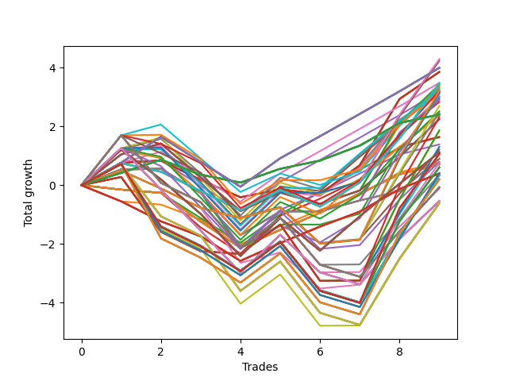

# Short HLT 108_1y 
- Symbol: TSLA
- Date Range: 05/15/2023 - 05/17/2024
- Trading Period: 8:30-12:30
- Number of Trades: 9



| Id. | Name | Win Percent | Profit | Avg Profit / Trade | Avg Time / Trade | Std |      | Name | Win Percent | Profit | Avg Profit / Trade | Avg Time / Trade | Std |
| --- | ---- | ----------- | ------ | ------------------ | ---------------- | --- | ---- | ---- | ----------- | ------ | ------------------ | ---------------- | --- |
| | Sorted By <br> Profit | | | | | | | Sorted By <br> Win Percentage |||||
|0| TP-2.25 75m | 55.56 | 4.30 | 0.48 | 68:06 | 1.05 |     | TP-0.75 180m | 77.78 | 4.00 | 0.44 | 16:26 | 0.70 |
|1| TP-2 75m | 55.56 | 4.24 | 0.47 | 68:00 | 1.04 |     | TP-0.75 165m | 77.78 | 4.00 | 0.44 | 16:26 | 0.70 |
|2| TP-0.75 180m | 77.78 | 4.00 | 0.44 | 16:26 | 0.70 |     | TP-0.75 150m | 77.78 | 4.00 | 0.44 | 16:26 | 0.70 |
|3| TP-0.75 165m | 77.78 | 4.00 | 0.44 | 16:26 | 0.70 |     | TP-0.75 135m | 77.78 | 4.00 | 0.44 | 16:26 | 0.70 |
|4| TP-0.75 150m | 77.78 | 4.00 | 0.44 | 16:26 | 0.70 |     | TP-0.75 120m | 77.78 | 4.00 | 0.44 | 16:26 | 0.70 |
|5| TP-0.75 135m | 77.78 | 4.00 | 0.44 | 16:26 | 0.70 |     | TP-0.75 105m | 77.78 | 4.00 | 0.44 | 16:26 | 0.70 |
|6| TP-0.75 120m | 77.78 | 4.00 | 0.44 | 16:26 | 0.70 |     | TP-0.75 90m | 77.78 | 4.00 | 0.44 | 16:26 | 0.70 |
|7| TP-0.75 105m | 77.78 | 4.00 | 0.44 | 16:26 | 0.70 |     | TP-0.75 75m | 77.78 | 4.00 | 0.44 | 16:26 | 0.70 |
|8| TP-0.75 90m | 77.78 | 4.00 | 0.44 | 16:26 | 0.70 |     | TP-0.75 60m | 77.78 | 4.00 | 0.44 | 16:26 | 0.70 |
|9| TP-0.75 75m | 77.78 | 4.00 | 0.44 | 16:26 | 0.70 |     | TP-0.75 45m | 77.78 | 3.49 | 0.39 | 15:46 | 0.68 |
|10| TP-0.75 60m | 77.78 | 4.00 | 0.44 | 16:26 | 0.70 |     | TP-0.75 30m | 77.78 | 3.19 | 0.35 | 14:06 | 0.69 |
|11| TP-3 30m | 66.67 | 3.86 | 0.43 | 29:00 | 0.87 |     | TP-0.25 180m | 77.78 | 2.41 | 0.27 | 03:53 | 0.38 |
|12| TP-2.75 30m | 66.67 | 3.86 | 0.43 | 29:00 | 0.87 |     | TP-0.25 165m | 77.78 | 2.41 | 0.27 | 03:53 | 0.38 |
|13| TP-2.5 30m | 66.67 | 3.86 | 0.43 | 29:00 | 0.87 |     | TP-0.25 150m | 77.78 | 2.41 | 0.27 | 03:53 | 0.38 |
|14| TP-2.25 30m | 66.67 | 3.86 | 0.43 | 29:00 | 0.87 |     | TP-0.25 135m | 77.78 | 2.41 | 0.27 | 03:53 | 0.38 |
|15| TP-2 30m | 66.67 | 3.86 | 0.43 | 29:00 | 0.87 |     | TP-0.25 120m | 77.78 | 2.41 | 0.27 | 03:53 | 0.38 |
|16| TP-1.75 30m | 66.67 | 3.86 | 0.43 | 29:00 | 0.87 |     | TP-0.25 105m | 77.78 | 2.41 | 0.27 | 03:53 | 0.38 |
|17| TP-0.75 45m | 77.78 | 3.49 | 0.39 | 15:46 | 0.68 |     | TP-0.25 90m | 77.78 | 2.41 | 0.27 | 03:53 | 0.38 |
|18| TP-3 75m | 55.56 | 3.48 | 0.39 | 73:00 | 0.91 |     | TP-0.25 75m | 77.78 | 2.41 | 0.27 | 03:53 | 0.38 |
|19| TP-2.75 75m | 55.56 | 3.48 | 0.39 | 73:00 | 0.91 |     | TP-0.25 60m | 77.78 | 2.41 | 0.27 | 03:53 | 0.38 |
|20| TP-2.5 75m | 55.56 | 3.48 | 0.39 | 73:00 | 0.91 |     | TP-0.25 45m | 77.78 | 2.41 | 0.27 | 03:53 | 0.38 |
|21| TP-2.25 45m | 66.67 | 3.43 | 0.38 | 42:26 | 1.07 |     | TP-0.25 30m | 77.78 | 2.41 | 0.27 | 03:53 | 0.38 |
|22| TP-2 45m | 66.67 | 3.37 | 0.37 | 42:20 | 1.06 |     | TP-0.25 15m | 77.78 | 2.41 | 0.27 | 03:53 | 0.38 |
|23| TP-1.75 45m | 66.67 | 3.37 | 0.37 | 42:20 | 1.06 |     | TP-3 30m | 66.67 | 3.86 | 0.43 | 29:00 | 0.87 |
|24| TP-1.5 45m | 66.67 | 3.31 | 0.37 | 41:26 | 1.02 |     | TP-2.75 30m | 66.67 | 3.86 | 0.43 | 29:00 | 0.87 |
|25| TP-1 60m | 66.67 | 3.26 | 0.36 | 26:20 | 1.01 |     | TP-2.5 30m | 66.67 | 3.86 | 0.43 | 29:00 | 0.87 |
|26| TP-1 45m | 66.67 | 3.22 | 0.36 | 23:00 | 1.02 |     | TP-2.25 30m | 66.67 | 3.86 | 0.43 | 29:00 | 0.87 |
|27| TP-3 90m | 55.56 | 3.22 | 0.36 | 86:20 | 1.28 |     | TP-2 30m | 66.67 | 3.86 | 0.43 | 29:00 | 0.87 |
|28| TP-1.5 75m | 55.56 | 3.22 | 0.36 | 60:46 | 1.09 |     | TP-1.75 30m | 66.67 | 3.86 | 0.43 | 29:00 | 0.87 |
|29| TP-0.75 30m | 77.78 | 3.19 | 0.35 | 14:06 | 0.69 |     | TP-2.25 45m | 66.67 | 3.43 | 0.38 | 42:26 | 1.07 |
|30| TP-1.5 60m | 66.67 | 3.19 | 0.35 | 52:53 | 1.01 |     | TP-2 45m | 66.67 | 3.37 | 0.37 | 42:20 | 1.06 |
|31| TP-2.75 90m | 55.56 | 3.16 | 0.35 | 86:13 | 1.27 |     | TP-1.75 45m | 66.67 | 3.37 | 0.37 | 42:20 | 1.06 |
|32| TP-1.5 30m | 66.67 | 3.15 | 0.35 | 28:46 | 0.71 |     | TP-1.5 45m | 66.67 | 3.31 | 0.37 | 41:26 | 1.02 |
|33| TP-1 30m | 66.67 | 3.15 | 0.35 | 19:40 | 1.01 |     | TP-1 60m | 66.67 | 3.26 | 0.36 | 26:20 | 1.01 |
|34| TP-2.5 90m | 55.56 | 3.14 | 0.35 | 86:00 | 1.26 |     | TP-1 45m | 66.67 | 3.22 | 0.36 | 23:00 | 1.02 |
|35| TP-1.25 30m | 66.67 | 3.08 | 0.34 | 23:26 | 1.08 |     | TP-1.5 60m | 66.67 | 3.19 | 0.35 | 52:53 | 1.01 |
|36| TP-1.75 75m | 55.56 | 3.02 | 0.34 | 65:40 | 1.24 |     | TP-1.5 30m | 66.67 | 3.15 | 0.35 | 28:46 | 0.71 |
|37| TP-1.25 45m | 66.67 | 3.00 | 0.33 | 30:06 | 1.10 |     | TP-1 30m | 66.67 | 3.15 | 0.35 | 19:40 | 1.01 |
|38| TP-1.25 60m | 66.67 | 2.95 | 0.33 | 35:06 | 1.08 |     | TP-1.25 30m | 66.67 | 3.08 | 0.34 | 23:26 | 1.08 |
|39| TP-2.25 60m | 66.67 | 2.90 | 0.32 | 55:46 | 1.03 |     | TP-1.25 45m | 66.67 | 3.00 | 0.33 | 30:06 | 1.10 |
|40| TP-2 60m | 66.67 | 2.84 | 0.32 | 55:40 | 1.01 |     | TP-1.25 60m | 66.67 | 2.95 | 0.33 | 35:06 | 1.08 |
|41| TP-2.25 90m | 55.56 | 2.70 | 0.30 | 79:46 | 1.18 |     | TP-2.25 60m | 66.67 | 2.90 | 0.32 | 55:46 | 1.03 |
|42| TP-1.25 75m | 55.56 | 2.52 | 0.28 | 40:06 | 1.14 |     | TP-2 60m | 66.67 | 2.84 | 0.32 | 55:40 | 1.01 |
|43| TP-2 90m | 55.56 | 2.47 | 0.27 | 78:13 | 1.13 |     | TP-1.75 60m | 66.67 | 2.39 | 0.27 | 55:33 | 1.11 |
|44| TP-0.25 180m | 77.78 | 2.41 | 0.27 | 03:53 | 0.38 |     | TP-3 45m | 66.67 | 2.25 | 0.25 | 44:00 | 0.88 |
|45| TP-0.25 165m | 77.78 | 2.41 | 0.27 | 03:53 | 0.38 |     | TP-2.75 45m | 66.67 | 2.25 | 0.25 | 44:00 | 0.88 |
|46| TP-0.25 150m | 77.78 | 2.41 | 0.27 | 03:53 | 0.38 |     | TP-2.5 45m | 66.67 | 2.25 | 0.25 | 44:00 | 0.88 |
|47| TP-0.25 135m | 77.78 | 2.41 | 0.27 | 03:53 | 0.38 |     | TP-3 60m | 66.67 | 0.90 | 0.10 | 59:00 | 0.75 |
|48| TP-0.25 120m | 77.78 | 2.41 | 0.27 | 03:53 | 0.38 |     | TP-2.75 60m | 66.67 | 0.90 | 0.10 | 59:00 | 0.75 |
|49| TP-0.25 105m | 77.78 | 2.41 | 0.27 | 03:53 | 0.38 |     | TP-2.5 60m | 66.67 | 0.90 | 0.10 | 59:00 | 0.75 |
|50| TP-0.25 90m | 77.78 | 2.41 | 0.27 | 03:53 | 0.38 |     | TP-2.25 75m | 55.56 | 4.30 | 0.48 | 68:06 | 1.05 |
|51| TP-0.25 75m | 77.78 | 2.41 | 0.27 | 03:53 | 0.38 |     | TP-2 75m | 55.56 | 4.24 | 0.47 | 68:00 | 1.04 |
|52| TP-0.25 60m | 77.78 | 2.41 | 0.27 | 03:53 | 0.38 |     | TP-3 75m | 55.56 | 3.48 | 0.39 | 73:00 | 0.91 |
|53| TP-0.25 45m | 77.78 | 2.41 | 0.27 | 03:53 | 0.38 |     | TP-2.75 75m | 55.56 | 3.48 | 0.39 | 73:00 | 0.91 |
|54| TP-0.25 30m | 77.78 | 2.41 | 0.27 | 03:53 | 0.38 |     | TP-2.5 75m | 55.56 | 3.48 | 0.39 | 73:00 | 0.91 |
|55| TP-0.25 15m | 77.78 | 2.41 | 0.27 | 03:53 | 0.38 |     | TP-3 90m | 55.56 | 3.22 | 0.36 | 86:20 | 1.28 |
|56| TP-1.75 60m | 66.67 | 2.39 | 0.27 | 55:33 | 1.11 |     | TP-1.5 75m | 55.56 | 3.22 | 0.36 | 60:46 | 1.09 |
|57| TP-1 75m | 55.56 | 2.38 | 0.26 | 29:40 | 1.06 |     | TP-2.75 90m | 55.56 | 3.16 | 0.35 | 86:13 | 1.27 |
|58| TP-3 105m | 55.56 | 2.32 | 0.26 | 97:53 | 1.63 |     | TP-2.5 90m | 55.56 | 3.14 | 0.35 | 86:00 | 1.26 |
|59| TP-3 45m | 66.67 | 2.25 | 0.25 | 44:00 | 0.88 |     | TP-1.75 75m | 55.56 | 3.02 | 0.34 | 65:40 | 1.24 |
|60| TP-2.75 45m | 66.67 | 2.25 | 0.25 | 44:00 | 0.88 |     | TP-2.25 90m | 55.56 | 2.70 | 0.30 | 79:46 | 1.18 |
|61| TP-2.5 45m | 66.67 | 2.25 | 0.25 | 44:00 | 0.88 |     | TP-1.25 75m | 55.56 | 2.52 | 0.28 | 40:06 | 1.14 |
|62| TP-2.75 105m | 55.56 | 1.87 | 0.21 | 97:26 | 1.55 |     | TP-2 90m | 55.56 | 2.47 | 0.27 | 78:13 | 1.13 |
|63| TP-2.5 105m | 55.56 | 1.85 | 0.21 | 97:13 | 1.54 |     | TP-1 75m | 55.56 | 2.38 | 0.26 | 29:40 | 1.06 |
|64| TP-1 15m | 55.56 | 1.65 | 0.18 | 12:13 | 0.80 |     | TP-3 105m | 55.56 | 2.32 | 0.26 | 97:53 | 1.63 |
|65| TP-0.75 15m | 55.56 | 1.63 | 0.18 | 11:00 | 0.66 |     | TP-2.75 105m | 55.56 | 1.87 | 0.21 | 97:26 | 1.55 |
|66| TP-1.25 15m | 55.56 | 1.39 | 0.15 | 13:33 | 0.71 |     | TP-2.5 105m | 55.56 | 1.85 | 0.21 | 97:13 | 1.54 |
|67| TP-2.25 105m | 55.56 | 1.31 | 0.15 | 89:20 | 1.45 |     | TP-1 15m | 55.56 | 1.65 | 0.18 | 12:13 | 0.80 |
|68| TP-1.5 90m | 55.56 | 1.21 | 0.13 | 67:26 | 1.16 |     | TP-0.75 15m | 55.56 | 1.63 | 0.18 | 11:00 | 0.66 |
|69| TP-1 180m | 55.56 | 1.12 | 0.12 | 32:13 | 1.17 |     | TP-1.25 15m | 55.56 | 1.39 | 0.15 | 13:33 | 0.71 |
|70| TP-1 165m | 55.56 | 1.12 | 0.12 | 32:13 | 1.17 |     | TP-2.25 105m | 55.56 | 1.31 | 0.15 | 89:20 | 1.45 |
|71| TP-1 150m | 55.56 | 1.12 | 0.12 | 32:13 | 1.17 |     | TP-1.5 90m | 55.56 | 1.21 | 0.13 | 67:26 | 1.16 |
|72| TP-1 135m | 55.56 | 1.12 | 0.12 | 32:13 | 1.17 |     | TP-1 180m | 55.56 | 1.12 | 0.12 | 32:13 | 1.17 |
|73| TP-1 120m | 55.56 | 1.12 | 0.12 | 32:13 | 1.17 |     | TP-1 165m | 55.56 | 1.12 | 0.12 | 32:13 | 1.17 |
|74| TP-1 105m | 55.56 | 1.12 | 0.12 | 32:13 | 1.17 |     | TP-1 150m | 55.56 | 1.12 | 0.12 | 32:13 | 1.17 |
|75| TP-1 90m | 55.56 | 1.12 | 0.12 | 32:13 | 1.17 |     | TP-1 135m | 55.56 | 1.12 | 0.12 | 32:13 | 1.17 |
|76| TP-2 105m | 55.56 | 1.08 | 0.12 | 87:46 | 1.41 |     | TP-1 120m | 55.56 | 1.12 | 0.12 | 32:13 | 1.17 |
|77| TP-3 180m | 44.44 | 1.06 | 0.12 | 106:53 | 1.63 |     | TP-1 105m | 55.56 | 1.12 | 0.12 | 32:13 | 1.17 |
|78| TP-3 165m | 44.44 | 1.06 | 0.12 | 106:53 | 1.63 |     | TP-1 90m | 55.56 | 1.12 | 0.12 | 32:13 | 1.17 |
|79| TP-3 150m | 44.44 | 1.06 | 0.12 | 106:53 | 1.63 |     | TP-2 105m | 55.56 | 1.08 | 0.12 | 87:46 | 1.41 |
|80| TP-3 135m | 44.44 | 1.06 | 0.12 | 106:53 | 1.63 |     | TP-1.25 90m | 55.56 | 0.80 | 0.09 | 45:00 | 1.21 |
|81| TP-3 120m | 44.44 | 1.06 | 0.12 | 106:53 | 1.63 |     | TP-0.5 15m | 55.56 | 0.78 | 0.09 | 07:20 | 0.56 |
|82| TP-3 60m | 66.67 | 0.90 | 0.10 | 59:00 | 0.75 |     | TP-1.75 90m | 55.56 | 0.76 | 0.08 | 74:00 | 1.29 |
|83| TP-2.75 60m | 66.67 | 0.90 | 0.10 | 59:00 | 0.75 |     | TP-3 15m | 55.56 | 0.71 | 0.08 | 14:00 | 0.62 |
|84| TP-2.5 60m | 66.67 | 0.90 | 0.10 | 59:00 | 0.75 |     | TP-2.75 15m | 55.56 | 0.71 | 0.08 | 14:00 | 0.62 |
|85| TP-1.25 90m | 55.56 | 0.80 | 0.09 | 45:00 | 1.21 |     | TP-2.5 15m | 55.56 | 0.71 | 0.08 | 14:00 | 0.62 |
|86| TP-0.5 15m | 55.56 | 0.78 | 0.09 | 07:20 | 0.56 |     | TP-2.25 15m | 55.56 | 0.71 | 0.08 | 14:00 | 0.62 |
|87| TP-1.75 90m | 55.56 | 0.76 | 0.08 | 74:00 | 1.29 |     | TP-2 15m | 55.56 | 0.71 | 0.08 | 14:00 | 0.62 |
|88| TP-3 15m | 55.56 | 0.71 | 0.08 | 14:00 | 0.62 |     | TP-1.75 15m | 55.56 | 0.71 | 0.08 | 14:00 | 0.62 |
|89| TP-2.75 15m | 55.56 | 0.71 | 0.08 | 14:00 | 0.62 |     | TP-1.5 15m | 55.56 | 0.71 | 0.08 | 14:00 | 0.62 |
|90| TP-2.5 15m | 55.56 | 0.71 | 0.08 | 14:00 | 0.62 |     | TP-0.5 180m | 55.56 | 0.40 | 0.04 | 07:53 | 0.63 |
|91| TP-2.25 15m | 55.56 | 0.71 | 0.08 | 14:00 | 0.62 |     | TP-0.5 165m | 55.56 | 0.40 | 0.04 | 07:53 | 0.63 |
|92| TP-2 15m | 55.56 | 0.71 | 0.08 | 14:00 | 0.62 |     | TP-0.5 150m | 55.56 | 0.40 | 0.04 | 07:53 | 0.63 |
|93| TP-1.75 15m | 55.56 | 0.71 | 0.08 | 14:00 | 0.62 |     | TP-0.5 135m | 55.56 | 0.40 | 0.04 | 07:53 | 0.63 |
|94| TP-1.5 15m | 55.56 | 0.71 | 0.08 | 14:00 | 0.62 |     | TP-0.5 120m | 55.56 | 0.40 | 0.04 | 07:53 | 0.63 |
|95| TP-2.75 180m | 44.44 | 0.61 | 0.07 | 106:26 | 1.54 |     | TP-0.5 105m | 55.56 | 0.40 | 0.04 | 07:53 | 0.63 |
|96| TP-2.75 165m | 44.44 | 0.61 | 0.07 | 106:26 | 1.54 |     | TP-0.5 90m | 55.56 | 0.40 | 0.04 | 07:53 | 0.63 |
|97| TP-2.75 150m | 44.44 | 0.61 | 0.07 | 106:26 | 1.54 |     | TP-0.5 75m | 55.56 | 0.40 | 0.04 | 07:53 | 0.63 |
|98| TP-2.75 135m | 44.44 | 0.61 | 0.07 | 106:26 | 1.54 |     | TP-0.5 60m | 55.56 | 0.40 | 0.04 | 07:53 | 0.63 |
|99| TP-2.75 120m | 44.44 | 0.61 | 0.07 | 106:26 | 1.54 |     | TP-0.5 45m | 55.56 | 0.40 | 0.04 | 07:53 | 0.63 |
|100| TP-2.25 180m | 44.44 | 0.41 | 0.05 | 96:00 | 1.54 |     | TP-0.5 30m | 55.56 | 0.40 | 0.04 | 07:53 | 0.63 |
|101| TP-2.25 165m | 44.44 | 0.41 | 0.05 | 96:00 | 1.54 |     | TP-1.5 105m | 55.56 | 0.35 | 0.04 | 72:40 | 1.35 |
|102| TP-2.25 150m | 44.44 | 0.41 | 0.05 | 96:00 | 1.54 |     | TP-1.25 105m | 55.56 | -0.12 | -0.01 | 47:00 | 1.29 |
|103| TP-2.25 135m | 44.44 | 0.41 | 0.05 | 96:00 | 1.54 |     | TP-1.75 105m | 55.56 | -0.63 | -0.07 | 81:06 | 1.49 |
|104| TP-2.25 120m | 44.44 | 0.41 | 0.05 | 96:00 | 1.54 |     | TP-3 180m | 44.44 | 1.06 | 0.12 | 106:53 | 1.63 |
|105| TP-0.5 180m | 55.56 | 0.40 | 0.04 | 07:53 | 0.63 |     | TP-3 165m | 44.44 | 1.06 | 0.12 | 106:53 | 1.63 |
|106| TP-0.5 165m | 55.56 | 0.40 | 0.04 | 07:53 | 0.63 |     | TP-3 150m | 44.44 | 1.06 | 0.12 | 106:53 | 1.63 |
|107| TP-0.5 150m | 55.56 | 0.40 | 0.04 | 07:53 | 0.63 |     | TP-3 135m | 44.44 | 1.06 | 0.12 | 106:53 | 1.63 |
|108| TP-0.5 135m | 55.56 | 0.40 | 0.04 | 07:53 | 0.63 |     | TP-3 120m | 44.44 | 1.06 | 0.12 | 106:53 | 1.63 |
|109| TP-0.5 120m | 55.56 | 0.40 | 0.04 | 07:53 | 0.63 |     | TP-2.75 180m | 44.44 | 0.61 | 0.07 | 106:26 | 1.54 |
|110| TP-0.5 105m | 55.56 | 0.40 | 0.04 | 07:53 | 0.63 |     | TP-2.75 165m | 44.44 | 0.61 | 0.07 | 106:26 | 1.54 |
|111| TP-0.5 90m | 55.56 | 0.40 | 0.04 | 07:53 | 0.63 |     | TP-2.75 150m | 44.44 | 0.61 | 0.07 | 106:26 | 1.54 |
|112| TP-0.5 75m | 55.56 | 0.40 | 0.04 | 07:53 | 0.63 |     | TP-2.75 135m | 44.44 | 0.61 | 0.07 | 106:26 | 1.54 |
|113| TP-0.5 60m | 55.56 | 0.40 | 0.04 | 07:53 | 0.63 |     | TP-2.75 120m | 44.44 | 0.61 | 0.07 | 106:26 | 1.54 |
|114| TP-0.5 45m | 55.56 | 0.40 | 0.04 | 07:53 | 0.63 |     | TP-2.25 180m | 44.44 | 0.41 | 0.05 | 96:00 | 1.54 |
|115| TP-0.5 30m | 55.56 | 0.40 | 0.04 | 07:53 | 0.63 |     | TP-2.25 165m | 44.44 | 0.41 | 0.05 | 96:00 | 1.54 |
|116| TP-1.5 105m | 55.56 | 0.35 | 0.04 | 72:40 | 1.35 |     | TP-2.25 150m | 44.44 | 0.41 | 0.05 | 96:00 | 1.54 |
|117| TP-2 180m | 44.44 | 0.34 | 0.04 | 93:40 | 1.47 |     | TP-2.25 135m | 44.44 | 0.41 | 0.05 | 96:00 | 1.54 |
|118| TP-2 165m | 44.44 | 0.34 | 0.04 | 93:40 | 1.47 |     | TP-2.25 120m | 44.44 | 0.41 | 0.05 | 96:00 | 1.54 |
|119| TP-2 150m | 44.44 | 0.34 | 0.04 | 93:40 | 1.47 |     | TP-2 180m | 44.44 | 0.34 | 0.04 | 93:40 | 1.47 |
|120| TP-2 135m | 44.44 | 0.34 | 0.04 | 93:40 | 1.47 |     | TP-2 165m | 44.44 | 0.34 | 0.04 | 93:40 | 1.47 |
|121| TP-2 120m | 44.44 | 0.34 | 0.04 | 93:40 | 1.47 |     | TP-2 150m | 44.44 | 0.34 | 0.04 | 93:40 | 1.47 |
|122| TP-2.5 180m | 44.44 | 0.20 | 0.02 | 105:40 | 1.60 |     | TP-2 135m | 44.44 | 0.34 | 0.04 | 93:40 | 1.47 |
|123| TP-2.5 165m | 44.44 | 0.20 | 0.02 | 105:40 | 1.60 |     | TP-2 120m | 44.44 | 0.34 | 0.04 | 93:40 | 1.47 |
|124| TP-2.5 150m | 44.44 | 0.20 | 0.02 | 105:40 | 1.60 |     | TP-2.5 180m | 44.44 | 0.20 | 0.02 | 105:40 | 1.60 |
|125| TP-2.5 135m | 44.44 | 0.20 | 0.02 | 105:40 | 1.60 |     | TP-2.5 165m | 44.44 | 0.20 | 0.02 | 105:40 | 1.60 |
|126| TP-2.5 120m | 44.44 | 0.20 | 0.02 | 105:40 | 1.60 |     | TP-2.5 150m | 44.44 | 0.20 | 0.02 | 105:40 | 1.60 |
|127| TP-1.5 180m | 44.44 | -0.07 | -0.01 | 74:20 | 1.36 |     | TP-2.5 135m | 44.44 | 0.20 | 0.02 | 105:40 | 1.60 |
|128| TP-1.5 165m | 44.44 | -0.07 | -0.01 | 74:20 | 1.36 |     | TP-2.5 120m | 44.44 | 0.20 | 0.02 | 105:40 | 1.60 |
|129| TP-1.5 150m | 44.44 | -0.07 | -0.01 | 74:20 | 1.36 |     | TP-1.5 180m | 44.44 | -0.07 | -0.01 | 74:20 | 1.36 |
|130| TP-1.5 135m | 44.44 | -0.07 | -0.01 | 74:20 | 1.36 |     | TP-1.5 165m | 44.44 | -0.07 | -0.01 | 74:20 | 1.36 |
|131| TP-1.5 120m | 44.44 | -0.07 | -0.01 | 74:20 | 1.36 |     | TP-1.5 150m | 44.44 | -0.07 | -0.01 | 74:20 | 1.36 |
|132| TP-1.25 105m | 55.56 | -0.12 | -0.01 | 47:00 | 1.29 |     | TP-1.5 135m | 44.44 | -0.07 | -0.01 | 74:20 | 1.36 |
|133| TP-1.25 180m | 44.44 | -0.54 | -0.06 | 48:40 | 1.29 |     | TP-1.5 120m | 44.44 | -0.07 | -0.01 | 74:20 | 1.36 |
|134| TP-1.25 165m | 44.44 | -0.54 | -0.06 | 48:40 | 1.29 |     | TP-1.25 180m | 44.44 | -0.54 | -0.06 | 48:40 | 1.29 |
|135| TP-1.25 150m | 44.44 | -0.54 | -0.06 | 48:40 | 1.29 |     | TP-1.25 165m | 44.44 | -0.54 | -0.06 | 48:40 | 1.29 |
|136| TP-1.25 135m | 44.44 | -0.54 | -0.06 | 48:40 | 1.29 |     | TP-1.25 150m | 44.44 | -0.54 | -0.06 | 48:40 | 1.29 |
|137| TP-1.25 120m | 44.44 | -0.54 | -0.06 | 48:40 | 1.29 |     | TP-1.25 135m | 44.44 | -0.54 | -0.06 | 48:40 | 1.29 |
|138| TP-1.75 180m | 44.44 | -0.61 | -0.07 | 84:26 | 1.51 |     | TP-1.25 120m | 44.44 | -0.54 | -0.06 | 48:40 | 1.29 |
|139| TP-1.75 165m | 44.44 | -0.61 | -0.07 | 84:26 | 1.51 |     | TP-1.75 180m | 44.44 | -0.61 | -0.07 | 84:26 | 1.51 |
|140| TP-1.75 150m | 44.44 | -0.61 | -0.07 | 84:26 | 1.51 |     | TP-1.75 165m | 44.44 | -0.61 | -0.07 | 84:26 | 1.51 |
|141| TP-1.75 135m | 44.44 | -0.61 | -0.07 | 84:26 | 1.51 |     | TP-1.75 150m | 44.44 | -0.61 | -0.07 | 84:26 | 1.51 |
|142| TP-1.75 120m | 44.44 | -0.61 | -0.07 | 84:26 | 1.51 |     | TP-1.75 135m | 44.44 | -0.61 | -0.07 | 84:26 | 1.51 |
|143| TP-1.75 105m | 55.56 | -0.63 | -0.07 | 81:06 | 1.49 |     | TP-1.75 120m | 44.44 | -0.61 | -0.07 | 84:26 | 1.51 |

### Test TP-0.25 15m
* Take Profit of 0.25 Point
* 0.25 Stoploss
* Results:
```
Total Trades: 9
Percent Up: 22.22
Percent Down: 77.78
Total Points Moved Down: 2.41
Potential Profit: 1205.00
Total Points Ups: 0.78 Count Ups: 2
Total Points Downs: 3.19 Count Downs: 7
```

<details><summary>Trades</summary>

<code>In: 2023-05-26 10:25:00		Out: 2023-05-26 10:27:00		Total Position Time: 02:00		Total Move Down: 0.42		Total to Date: 0.42</code> <br />
<code>In: 2023-08-23 09:10:00		Out: 2023-08-23 09:12:00		Total Position Time: 02:00		Total Move Down: 0.45		Total to Date: 0.87</code> <br />
<code>In: 2023-08-25 11:45:00		Out: 2023-08-25 11:47:00		Total Position Time: 02:00		Total Move Down: -0.51		Total to Date: 0.36</code> <br />
<code>In: 2023-10-04 09:15:00		Out: 2023-10-04 09:22:00		Total Position Time: 07:00		Total Move Down: -0.27		Total to Date: 0.09</code> <br />
<code>In: 2024-02-07 11:10:00		Out: 2024-02-07 11:13:00		Total Position Time: 03:00		Total Move Down: 0.47		Total to Date: 0.56</code> <br />
<code>In: 2024-02-14 11:00:00		Out: 2024-02-14 11:05:00		Total Position Time: 05:00		Total Move Down: 0.28		Total to Date: 0.84</code> <br />
<code>In: 2024-04-08 08:35:00		Out: 2024-04-08 08:37:00		Total Position Time: 02:00		Total Move Down: 0.51		Total to Date: 1.35</code> <br />
<code>In: 2024-04-29 09:40:00		Out: 2024-04-29 09:42:00		Total Position Time: 02:00		Total Move Down: 0.77		Total to Date: 2.12</code> <br />
<code>In: 2024-05-17 09:45:00		Out: 2024-05-17 09:55:00		Total Position Time: 10:00		Total Move Down: 0.29		Total to Date: 2.41</code> <br />


</details>

### Test TP-0.5 15m
* Take Profit of 0.5 Point
* 0.5 Stoploss
* Results:
```
Total Trades: 9
Percent Up: 44.44
Percent Down: 55.56
Total Points Moved Down: 0.78
Potential Profit: 390.00
Total Points Ups: 2.01 Count Ups: 4
Total Points Downs: 2.79 Count Downs: 5
```

<details><summary>Trades</summary>

<code>In: 2023-05-26 10:25:00		Out: 2023-05-26 10:33:00		Total Position Time: 08:00		Total Move Down: -0.55		Total to Date: -0.55</code> <br />
<code>In: 2023-08-23 09:10:00		Out: 2023-08-23 09:24:00		Total Position Time: 14:00		Total Move Down: -0.11		Total to Date: -0.66</code> <br />
<code>In: 2023-08-25 11:45:00		Out: 2023-08-25 11:47:00		Total Position Time: 02:00		Total Move Down: -0.51		Total to Date: -1.17</code> <br />
<code>In: 2023-10-04 09:15:00		Out: 2023-10-04 09:27:00		Total Position Time: 12:00		Total Move Down: -0.84		Total to Date: -2.01</code> <br />
<code>In: 2024-02-07 11:10:00		Out: 2024-02-07 11:14:00		Total Position Time: 04:00		Total Move Down: 0.61		Total to Date: -1.40</code> <br />
<code>In: 2024-02-14 11:00:00		Out: 2024-02-14 11:08:00		Total Position Time: 08:00		Total Move Down: 0.56		Total to Date: -0.84</code> <br />
<code>In: 2024-04-08 08:35:00		Out: 2024-04-08 08:37:00		Total Position Time: 02:00		Total Move Down: 0.51		Total to Date: -0.33</code> <br />
<code>In: 2024-04-29 09:40:00		Out: 2024-04-29 09:42:00		Total Position Time: 02:00		Total Move Down: 0.77		Total to Date: 0.44</code> <br />
<code>In: 2024-05-17 09:45:00		Out: 2024-05-17 09:59:00		Total Position Time: 14:00		Total Move Down: 0.34		Total to Date: 0.78</code> <br />


</details>

### Test TP-0.75 15m
* Take Profit of 0.75 Point
* 0.75 Stoploss
* Results:
```
Total Trades: 9
Percent Up: 44.44
Percent Down: 55.56
Total Points Moved Down: 1.63
Potential Profit: 815.00
Total Points Ups: 1.96 Count Ups: 4
Total Points Downs: 3.59 Count Downs: 5
```

<details><summary>Trades</summary>

<code>In: 2023-05-26 10:25:00		Out: 2023-05-26 10:39:00		Total Position Time: 14:00		Total Move Down: -0.15		Total to Date: -0.15</code> <br />
<code>In: 2023-08-23 09:10:00		Out: 2023-08-23 09:24:00		Total Position Time: 14:00		Total Move Down: -0.11		Total to Date: -0.26</code> <br />
<code>In: 2023-08-25 11:45:00		Out: 2023-08-25 11:55:00		Total Position Time: 10:00		Total Move Down: -0.86		Total to Date: -1.12</code> <br />
<code>In: 2023-10-04 09:15:00		Out: 2023-10-04 09:27:00		Total Position Time: 12:00		Total Move Down: -0.84		Total to Date: -1.96</code> <br />
<code>In: 2024-02-07 11:10:00		Out: 2024-02-07 11:18:00		Total Position Time: 08:00		Total Move Down: 0.97		Total to Date: -0.99</code> <br />
<code>In: 2024-02-14 11:00:00		Out: 2024-02-14 11:12:00		Total Position Time: 12:00		Total Move Down: 0.75		Total to Date: -0.24</code> <br />
<code>In: 2024-04-08 08:35:00		Out: 2024-04-08 08:48:00		Total Position Time: 13:00		Total Move Down: 0.76		Total to Date: 0.52</code> <br />
<code>In: 2024-04-29 09:40:00		Out: 2024-04-29 09:42:00		Total Position Time: 02:00		Total Move Down: 0.77		Total to Date: 1.29</code> <br />
<code>In: 2024-05-17 09:45:00		Out: 2024-05-17 09:59:00		Total Position Time: 14:00		Total Move Down: 0.34		Total to Date: 1.63</code> <br />


</details>

### Test TP-1 15m
* Take Profit of 1 Point
* 1 Stoploss
* Results:
```
Total Trades: 9
Percent Up: 44.44
Percent Down: 55.56
Total Points Moved Down: 1.65
Potential Profit: 825.00
Total Points Ups: 2.33 Count Ups: 4
Total Points Downs: 3.98 Count Downs: 5
```

<details><summary>Trades</summary>

<code>In: 2023-05-26 10:25:00		Out: 2023-05-26 10:39:00		Total Position Time: 14:00		Total Move Down: -0.15		Total to Date: -0.15</code> <br />
<code>In: 2023-08-23 09:10:00		Out: 2023-08-23 09:24:00		Total Position Time: 14:00		Total Move Down: -0.11		Total to Date: -0.26</code> <br />
<code>In: 2023-08-25 11:45:00		Out: 2023-08-25 11:56:00		Total Position Time: 11:00		Total Move Down: -1.18		Total to Date: -1.44</code> <br />
<code>In: 2023-10-04 09:15:00		Out: 2023-10-04 09:29:00		Total Position Time: 14:00		Total Move Down: -0.89		Total to Date: -2.33</code> <br />
<code>In: 2024-02-07 11:10:00		Out: 2024-02-07 11:20:00		Total Position Time: 10:00		Total Move Down: 1.29		Total to Date: -1.04</code> <br />
<code>In: 2024-02-14 11:00:00		Out: 2024-02-14 11:14:00		Total Position Time: 14:00		Total Move Down: 0.58		Total to Date: -0.46</code> <br />
<code>In: 2024-04-08 08:35:00		Out: 2024-04-08 08:49:00		Total Position Time: 14:00		Total Move Down: 0.66		Total to Date: 0.20</code> <br />
<code>In: 2024-04-29 09:40:00		Out: 2024-04-29 09:45:00		Total Position Time: 05:00		Total Move Down: 1.11		Total to Date: 1.31</code> <br />
<code>In: 2024-05-17 09:45:00		Out: 2024-05-17 09:59:00		Total Position Time: 14:00		Total Move Down: 0.34		Total to Date: 1.65</code> <br />


</details>

### Test TP-1.25 15m
* Take Profit of 1.25 Point
* 1.25 Stoploss
* Results:
```
Total Trades: 9
Percent Up: 44.44
Percent Down: 55.56
Total Points Moved Down: 1.39
Potential Profit: 695.00
Total Points Ups: 2.13 Count Ups: 4
Total Points Downs: 3.52 Count Downs: 5
```

<details><summary>Trades</summary>

<code>In: 2023-05-26 10:25:00		Out: 2023-05-26 10:39:00		Total Position Time: 14:00		Total Move Down: -0.15		Total to Date: -0.15</code> <br />
<code>In: 2023-08-23 09:10:00		Out: 2023-08-23 09:24:00		Total Position Time: 14:00		Total Move Down: -0.11		Total to Date: -0.26</code> <br />
<code>In: 2023-08-25 11:45:00		Out: 2023-08-25 11:59:00		Total Position Time: 14:00		Total Move Down: -0.98		Total to Date: -1.24</code> <br />
<code>In: 2023-10-04 09:15:00		Out: 2023-10-04 09:29:00		Total Position Time: 14:00		Total Move Down: -0.89		Total to Date: -2.13</code> <br />
<code>In: 2024-02-07 11:10:00		Out: 2024-02-07 11:20:00		Total Position Time: 10:00		Total Move Down: 1.29		Total to Date: -0.84</code> <br />
<code>In: 2024-02-14 11:00:00		Out: 2024-02-14 11:14:00		Total Position Time: 14:00		Total Move Down: 0.58		Total to Date: -0.26</code> <br />
<code>In: 2024-04-08 08:35:00		Out: 2024-04-08 08:49:00		Total Position Time: 14:00		Total Move Down: 0.66		Total to Date: 0.40</code> <br />
<code>In: 2024-04-29 09:40:00		Out: 2024-04-29 09:54:00		Total Position Time: 14:00		Total Move Down: 0.65		Total to Date: 1.05</code> <br />
<code>In: 2024-05-17 09:45:00		Out: 2024-05-17 09:59:00		Total Position Time: 14:00		Total Move Down: 0.34		Total to Date: 1.39</code> <br />


</details>

### Test TP-1.5 15m
* Take Profit of 1.5 Point
* 1.5 Stoploss
* Results:
```
Total Trades: 9
Percent Up: 44.44
Percent Down: 55.56
Total Points Moved Down: 0.71
Potential Profit: 355.00
Total Points Ups: 2.13 Count Ups: 4
Total Points Downs: 2.84 Count Downs: 5
```

<details><summary>Trades</summary>

<code>In: 2023-05-26 10:25:00		Out: 2023-05-26 10:39:00		Total Position Time: 14:00		Total Move Down: -0.15		Total to Date: -0.15</code> <br />
<code>In: 2023-08-23 09:10:00		Out: 2023-08-23 09:24:00		Total Position Time: 14:00		Total Move Down: -0.11		Total to Date: -0.26</code> <br />
<code>In: 2023-08-25 11:45:00		Out: 2023-08-25 11:59:00		Total Position Time: 14:00		Total Move Down: -0.98		Total to Date: -1.24</code> <br />
<code>In: 2023-10-04 09:15:00		Out: 2023-10-04 09:29:00		Total Position Time: 14:00		Total Move Down: -0.89		Total to Date: -2.13</code> <br />
<code>In: 2024-02-07 11:10:00		Out: 2024-02-07 11:24:00		Total Position Time: 14:00		Total Move Down: 0.61		Total to Date: -1.52</code> <br />
<code>In: 2024-02-14 11:00:00		Out: 2024-02-14 11:14:00		Total Position Time: 14:00		Total Move Down: 0.58		Total to Date: -0.94</code> <br />
<code>In: 2024-04-08 08:35:00		Out: 2024-04-08 08:49:00		Total Position Time: 14:00		Total Move Down: 0.66		Total to Date: -0.28</code> <br />
<code>In: 2024-04-29 09:40:00		Out: 2024-04-29 09:54:00		Total Position Time: 14:00		Total Move Down: 0.65		Total to Date: 0.37</code> <br />
<code>In: 2024-05-17 09:45:00		Out: 2024-05-17 09:59:00		Total Position Time: 14:00		Total Move Down: 0.34		Total to Date: 0.71</code> <br />


</details>

### Test TP-1.75 15m
* Take Profit of 1.75 Point
* 1.75 Stoploss
* Results:
```
Total Trades: 9
Percent Up: 44.44
Percent Down: 55.56
Total Points Moved Down: 0.71
Potential Profit: 355.00
Total Points Ups: 2.13 Count Ups: 4
Total Points Downs: 2.84 Count Downs: 5
```

<details><summary>Trades</summary>

<code>In: 2023-05-26 10:25:00		Out: 2023-05-26 10:39:00		Total Position Time: 14:00		Total Move Down: -0.15		Total to Date: -0.15</code> <br />
<code>In: 2023-08-23 09:10:00		Out: 2023-08-23 09:24:00		Total Position Time: 14:00		Total Move Down: -0.11		Total to Date: -0.26</code> <br />
<code>In: 2023-08-25 11:45:00		Out: 2023-08-25 11:59:00		Total Position Time: 14:00		Total Move Down: -0.98		Total to Date: -1.24</code> <br />
<code>In: 2023-10-04 09:15:00		Out: 2023-10-04 09:29:00		Total Position Time: 14:00		Total Move Down: -0.89		Total to Date: -2.13</code> <br />
<code>In: 2024-02-07 11:10:00		Out: 2024-02-07 11:24:00		Total Position Time: 14:00		Total Move Down: 0.61		Total to Date: -1.52</code> <br />
<code>In: 2024-02-14 11:00:00		Out: 2024-02-14 11:14:00		Total Position Time: 14:00		Total Move Down: 0.58		Total to Date: -0.94</code> <br />
<code>In: 2024-04-08 08:35:00		Out: 2024-04-08 08:49:00		Total Position Time: 14:00		Total Move Down: 0.66		Total to Date: -0.28</code> <br />
<code>In: 2024-04-29 09:40:00		Out: 2024-04-29 09:54:00		Total Position Time: 14:00		Total Move Down: 0.65		Total to Date: 0.37</code> <br />
<code>In: 2024-05-17 09:45:00		Out: 2024-05-17 09:59:00		Total Position Time: 14:00		Total Move Down: 0.34		Total to Date: 0.71</code> <br />


</details>

### Test TP-2 15m
* Take Profit of 2 Point
* 2 Stoploss
* Results:
```
Total Trades: 9
Percent Up: 44.44
Percent Down: 55.56
Total Points Moved Down: 0.71
Potential Profit: 355.00
Total Points Ups: 2.13 Count Ups: 4
Total Points Downs: 2.84 Count Downs: 5
```

<details><summary>Trades</summary>

<code>In: 2023-05-26 10:25:00		Out: 2023-05-26 10:39:00		Total Position Time: 14:00		Total Move Down: -0.15		Total to Date: -0.15</code> <br />
<code>In: 2023-08-23 09:10:00		Out: 2023-08-23 09:24:00		Total Position Time: 14:00		Total Move Down: -0.11		Total to Date: -0.26</code> <br />
<code>In: 2023-08-25 11:45:00		Out: 2023-08-25 11:59:00		Total Position Time: 14:00		Total Move Down: -0.98		Total to Date: -1.24</code> <br />
<code>In: 2023-10-04 09:15:00		Out: 2023-10-04 09:29:00		Total Position Time: 14:00		Total Move Down: -0.89		Total to Date: -2.13</code> <br />
<code>In: 2024-02-07 11:10:00		Out: 2024-02-07 11:24:00		Total Position Time: 14:00		Total Move Down: 0.61		Total to Date: -1.52</code> <br />
<code>In: 2024-02-14 11:00:00		Out: 2024-02-14 11:14:00		Total Position Time: 14:00		Total Move Down: 0.58		Total to Date: -0.94</code> <br />
<code>In: 2024-04-08 08:35:00		Out: 2024-04-08 08:49:00		Total Position Time: 14:00		Total Move Down: 0.66		Total to Date: -0.28</code> <br />
<code>In: 2024-04-29 09:40:00		Out: 2024-04-29 09:54:00		Total Position Time: 14:00		Total Move Down: 0.65		Total to Date: 0.37</code> <br />
<code>In: 2024-05-17 09:45:00		Out: 2024-05-17 09:59:00		Total Position Time: 14:00		Total Move Down: 0.34		Total to Date: 0.71</code> <br />


</details>

### Test TP-2.25 15m
* Take Profit of 2.25 Point
* 2.25 Stoploss
* Results:
```
Total Trades: 9
Percent Up: 44.44
Percent Down: 55.56
Total Points Moved Down: 0.71
Potential Profit: 355.00
Total Points Ups: 2.13 Count Ups: 4
Total Points Downs: 2.84 Count Downs: 5
```

<details><summary>Trades</summary>

<code>In: 2023-05-26 10:25:00		Out: 2023-05-26 10:39:00		Total Position Time: 14:00		Total Move Down: -0.15		Total to Date: -0.15</code> <br />
<code>In: 2023-08-23 09:10:00		Out: 2023-08-23 09:24:00		Total Position Time: 14:00		Total Move Down: -0.11		Total to Date: -0.26</code> <br />
<code>In: 2023-08-25 11:45:00		Out: 2023-08-25 11:59:00		Total Position Time: 14:00		Total Move Down: -0.98		Total to Date: -1.24</code> <br />
<code>In: 2023-10-04 09:15:00		Out: 2023-10-04 09:29:00		Total Position Time: 14:00		Total Move Down: -0.89		Total to Date: -2.13</code> <br />
<code>In: 2024-02-07 11:10:00		Out: 2024-02-07 11:24:00		Total Position Time: 14:00		Total Move Down: 0.61		Total to Date: -1.52</code> <br />
<code>In: 2024-02-14 11:00:00		Out: 2024-02-14 11:14:00		Total Position Time: 14:00		Total Move Down: 0.58		Total to Date: -0.94</code> <br />
<code>In: 2024-04-08 08:35:00		Out: 2024-04-08 08:49:00		Total Position Time: 14:00		Total Move Down: 0.66		Total to Date: -0.28</code> <br />
<code>In: 2024-04-29 09:40:00		Out: 2024-04-29 09:54:00		Total Position Time: 14:00		Total Move Down: 0.65		Total to Date: 0.37</code> <br />
<code>In: 2024-05-17 09:45:00		Out: 2024-05-17 09:59:00		Total Position Time: 14:00		Total Move Down: 0.34		Total to Date: 0.71</code> <br />


</details>

### Test TP-2.5 15m
* Take Profit of 2.5 Point
* 2.5 Stoploss
* Results:
```
Total Trades: 9
Percent Up: 44.44
Percent Down: 55.56
Total Points Moved Down: 0.71
Potential Profit: 355.00
Total Points Ups: 2.13 Count Ups: 4
Total Points Downs: 2.84 Count Downs: 5
```

<details><summary>Trades</summary>

<code>In: 2023-05-26 10:25:00		Out: 2023-05-26 10:39:00		Total Position Time: 14:00		Total Move Down: -0.15		Total to Date: -0.15</code> <br />
<code>In: 2023-08-23 09:10:00		Out: 2023-08-23 09:24:00		Total Position Time: 14:00		Total Move Down: -0.11		Total to Date: -0.26</code> <br />
<code>In: 2023-08-25 11:45:00		Out: 2023-08-25 11:59:00		Total Position Time: 14:00		Total Move Down: -0.98		Total to Date: -1.24</code> <br />
<code>In: 2023-10-04 09:15:00		Out: 2023-10-04 09:29:00		Total Position Time: 14:00		Total Move Down: -0.89		Total to Date: -2.13</code> <br />
<code>In: 2024-02-07 11:10:00		Out: 2024-02-07 11:24:00		Total Position Time: 14:00		Total Move Down: 0.61		Total to Date: -1.52</code> <br />
<code>In: 2024-02-14 11:00:00		Out: 2024-02-14 11:14:00		Total Position Time: 14:00		Total Move Down: 0.58		Total to Date: -0.94</code> <br />
<code>In: 2024-04-08 08:35:00		Out: 2024-04-08 08:49:00		Total Position Time: 14:00		Total Move Down: 0.66		Total to Date: -0.28</code> <br />
<code>In: 2024-04-29 09:40:00		Out: 2024-04-29 09:54:00		Total Position Time: 14:00		Total Move Down: 0.65		Total to Date: 0.37</code> <br />
<code>In: 2024-05-17 09:45:00		Out: 2024-05-17 09:59:00		Total Position Time: 14:00		Total Move Down: 0.34		Total to Date: 0.71</code> <br />


</details>

### Test TP-2.75 15m
* Take Profit of 2.75 Point
* 2.75 Stoploss
* Results:
```
Total Trades: 9
Percent Up: 44.44
Percent Down: 55.56
Total Points Moved Down: 0.71
Potential Profit: 355.00
Total Points Ups: 2.13 Count Ups: 4
Total Points Downs: 2.84 Count Downs: 5
```

<details><summary>Trades</summary>

<code>In: 2023-05-26 10:25:00		Out: 2023-05-26 10:39:00		Total Position Time: 14:00		Total Move Down: -0.15		Total to Date: -0.15</code> <br />
<code>In: 2023-08-23 09:10:00		Out: 2023-08-23 09:24:00		Total Position Time: 14:00		Total Move Down: -0.11		Total to Date: -0.26</code> <br />
<code>In: 2023-08-25 11:45:00		Out: 2023-08-25 11:59:00		Total Position Time: 14:00		Total Move Down: -0.98		Total to Date: -1.24</code> <br />
<code>In: 2023-10-04 09:15:00		Out: 2023-10-04 09:29:00		Total Position Time: 14:00		Total Move Down: -0.89		Total to Date: -2.13</code> <br />
<code>In: 2024-02-07 11:10:00		Out: 2024-02-07 11:24:00		Total Position Time: 14:00		Total Move Down: 0.61		Total to Date: -1.52</code> <br />
<code>In: 2024-02-14 11:00:00		Out: 2024-02-14 11:14:00		Total Position Time: 14:00		Total Move Down: 0.58		Total to Date: -0.94</code> <br />
<code>In: 2024-04-08 08:35:00		Out: 2024-04-08 08:49:00		Total Position Time: 14:00		Total Move Down: 0.66		Total to Date: -0.28</code> <br />
<code>In: 2024-04-29 09:40:00		Out: 2024-04-29 09:54:00		Total Position Time: 14:00		Total Move Down: 0.65		Total to Date: 0.37</code> <br />
<code>In: 2024-05-17 09:45:00		Out: 2024-05-17 09:59:00		Total Position Time: 14:00		Total Move Down: 0.34		Total to Date: 0.71</code> <br />


</details>

### Test TP-3 15m
* Take Profit of 3 Point
* 3 Stoploss
* Results:
```
Total Trades: 9
Percent Up: 44.44
Percent Down: 55.56
Total Points Moved Down: 0.71
Potential Profit: 355.00
Total Points Ups: 2.13 Count Ups: 4
Total Points Downs: 2.84 Count Downs: 5
```

<details><summary>Trades</summary>

<code>In: 2023-05-26 10:25:00		Out: 2023-05-26 10:39:00		Total Position Time: 14:00		Total Move Down: -0.15		Total to Date: -0.15</code> <br />
<code>In: 2023-08-23 09:10:00		Out: 2023-08-23 09:24:00		Total Position Time: 14:00		Total Move Down: -0.11		Total to Date: -0.26</code> <br />
<code>In: 2023-08-25 11:45:00		Out: 2023-08-25 11:59:00		Total Position Time: 14:00		Total Move Down: -0.98		Total to Date: -1.24</code> <br />
<code>In: 2023-10-04 09:15:00		Out: 2023-10-04 09:29:00		Total Position Time: 14:00		Total Move Down: -0.89		Total to Date: -2.13</code> <br />
<code>In: 2024-02-07 11:10:00		Out: 2024-02-07 11:24:00		Total Position Time: 14:00		Total Move Down: 0.61		Total to Date: -1.52</code> <br />
<code>In: 2024-02-14 11:00:00		Out: 2024-02-14 11:14:00		Total Position Time: 14:00		Total Move Down: 0.58		Total to Date: -0.94</code> <br />
<code>In: 2024-04-08 08:35:00		Out: 2024-04-08 08:49:00		Total Position Time: 14:00		Total Move Down: 0.66		Total to Date: -0.28</code> <br />
<code>In: 2024-04-29 09:40:00		Out: 2024-04-29 09:54:00		Total Position Time: 14:00		Total Move Down: 0.65		Total to Date: 0.37</code> <br />
<code>In: 2024-05-17 09:45:00		Out: 2024-05-17 09:59:00		Total Position Time: 14:00		Total Move Down: 0.34		Total to Date: 0.71</code> <br />


</details>

### Test TP-0.25 30m
* Take Profit of 0.25 Point
* 0.25 Stoploss
* Results:
```
Total Trades: 9
Percent Up: 22.22
Percent Down: 77.78
Total Points Moved Down: 2.41
Potential Profit: 1205.00
Total Points Ups: 0.78 Count Ups: 2
Total Points Downs: 3.19 Count Downs: 7
```

<details><summary>Trades</summary>

<code>In: 2023-05-26 10:25:00		Out: 2023-05-26 10:27:00		Total Position Time: 02:00		Total Move Down: 0.42		Total to Date: 0.42</code> <br />
<code>In: 2023-08-23 09:10:00		Out: 2023-08-23 09:12:00		Total Position Time: 02:00		Total Move Down: 0.45		Total to Date: 0.87</code> <br />
<code>In: 2023-08-25 11:45:00		Out: 2023-08-25 11:47:00		Total Position Time: 02:00		Total Move Down: -0.51		Total to Date: 0.36</code> <br />
<code>In: 2023-10-04 09:15:00		Out: 2023-10-04 09:22:00		Total Position Time: 07:00		Total Move Down: -0.27		Total to Date: 0.09</code> <br />
<code>In: 2024-02-07 11:10:00		Out: 2024-02-07 11:13:00		Total Position Time: 03:00		Total Move Down: 0.47		Total to Date: 0.56</code> <br />
<code>In: 2024-02-14 11:00:00		Out: 2024-02-14 11:05:00		Total Position Time: 05:00		Total Move Down: 0.28		Total to Date: 0.84</code> <br />
<code>In: 2024-04-08 08:35:00		Out: 2024-04-08 08:37:00		Total Position Time: 02:00		Total Move Down: 0.51		Total to Date: 1.35</code> <br />
<code>In: 2024-04-29 09:40:00		Out: 2024-04-29 09:42:00		Total Position Time: 02:00		Total Move Down: 0.77		Total to Date: 2.12</code> <br />
<code>In: 2024-05-17 09:45:00		Out: 2024-05-17 09:55:00		Total Position Time: 10:00		Total Move Down: 0.29		Total to Date: 2.41</code> <br />


</details>

### Test TP-0.5 30m
* Take Profit of 0.5 Point
* 0.5 Stoploss
* Results:
```
Total Trades: 9
Percent Up: 44.44
Percent Down: 55.56
Total Points Moved Down: 0.40
Potential Profit: 200.00
Total Points Ups: 2.58 Count Ups: 4
Total Points Downs: 2.98 Count Downs: 5
```

<details><summary>Trades</summary>

<code>In: 2023-05-26 10:25:00		Out: 2023-05-26 10:33:00		Total Position Time: 08:00		Total Move Down: -0.55		Total to Date: -0.55</code> <br />
<code>In: 2023-08-23 09:10:00		Out: 2023-08-23 09:27:00		Total Position Time: 17:00		Total Move Down: -0.68		Total to Date: -1.23</code> <br />
<code>In: 2023-08-25 11:45:00		Out: 2023-08-25 11:47:00		Total Position Time: 02:00		Total Move Down: -0.51		Total to Date: -1.74</code> <br />
<code>In: 2023-10-04 09:15:00		Out: 2023-10-04 09:27:00		Total Position Time: 12:00		Total Move Down: -0.84		Total to Date: -2.58</code> <br />
<code>In: 2024-02-07 11:10:00		Out: 2024-02-07 11:14:00		Total Position Time: 04:00		Total Move Down: 0.61		Total to Date: -1.97</code> <br />
<code>In: 2024-02-14 11:00:00		Out: 2024-02-14 11:08:00		Total Position Time: 08:00		Total Move Down: 0.56		Total to Date: -1.41</code> <br />
<code>In: 2024-04-08 08:35:00		Out: 2024-04-08 08:37:00		Total Position Time: 02:00		Total Move Down: 0.51		Total to Date: -0.90</code> <br />
<code>In: 2024-04-29 09:40:00		Out: 2024-04-29 09:42:00		Total Position Time: 02:00		Total Move Down: 0.77		Total to Date: -0.13</code> <br />
<code>In: 2024-05-17 09:45:00		Out: 2024-05-17 10:01:00		Total Position Time: 16:00		Total Move Down: 0.53		Total to Date: 0.40</code> <br />


</details>

### Test TP-0.75 30m
* Take Profit of 0.75 Point
* 0.75 Stoploss
* Results:
```
Total Trades: 9
Percent Up: 22.22
Percent Down: 77.78
Total Points Moved Down: 3.19
Potential Profit: 1595.00
Total Points Ups: 1.70 Count Ups: 2
Total Points Downs: 4.89 Count Downs: 7
```

<details><summary>Trades</summary>

<code>In: 2023-05-26 10:25:00		Out: 2023-05-26 10:46:00		Total Position Time: 21:00		Total Move Down: 0.77		Total to Date: 0.77</code> <br />
<code>In: 2023-08-23 09:10:00		Out: 2023-08-23 09:39:00		Total Position Time: 29:00		Total Move Down: 0.07		Total to Date: 0.84</code> <br />
<code>In: 2023-08-25 11:45:00		Out: 2023-08-25 11:55:00		Total Position Time: 10:00		Total Move Down: -0.86		Total to Date: -0.02</code> <br />
<code>In: 2023-10-04 09:15:00		Out: 2023-10-04 09:27:00		Total Position Time: 12:00		Total Move Down: -0.84		Total to Date: -0.86</code> <br />
<code>In: 2024-02-07 11:10:00		Out: 2024-02-07 11:18:00		Total Position Time: 08:00		Total Move Down: 0.97		Total to Date: 0.11</code> <br />
<code>In: 2024-02-14 11:00:00		Out: 2024-02-14 11:12:00		Total Position Time: 12:00		Total Move Down: 0.75		Total to Date: 0.86</code> <br />
<code>In: 2024-04-08 08:35:00		Out: 2024-04-08 08:48:00		Total Position Time: 13:00		Total Move Down: 0.76		Total to Date: 1.62</code> <br />
<code>In: 2024-04-29 09:40:00		Out: 2024-04-29 09:42:00		Total Position Time: 02:00		Total Move Down: 0.77		Total to Date: 2.39</code> <br />
<code>In: 2024-05-17 09:45:00		Out: 2024-05-17 10:05:00		Total Position Time: 20:00		Total Move Down: 0.80		Total to Date: 3.19</code> <br />


</details>

### Test TP-1 30m
* Take Profit of 1 Point
* 1 Stoploss
* Results:
```
Total Trades: 9
Percent Up: 33.33
Percent Down: 66.67
Total Points Moved Down: 3.15
Potential Profit: 1575.00
Total Points Ups: 2.77 Count Ups: 3
Total Points Downs: 5.92 Count Downs: 6
```

<details><summary>Trades</summary>

<code>In: 2023-05-26 10:25:00		Out: 2023-05-26 10:49:00		Total Position Time: 24:00		Total Move Down: 1.21		Total to Date: 1.21</code> <br />
<code>In: 2023-08-23 09:10:00		Out: 2023-08-23 09:39:00		Total Position Time: 29:00		Total Move Down: 0.07		Total to Date: 1.28</code> <br />
<code>In: 2023-08-25 11:45:00		Out: 2023-08-25 11:56:00		Total Position Time: 11:00		Total Move Down: -1.18		Total to Date: 0.10</code> <br />
<code>In: 2023-10-04 09:15:00		Out: 2023-10-04 09:32:00		Total Position Time: 17:00		Total Move Down: -1.43		Total to Date: -1.33</code> <br />
<code>In: 2024-02-07 11:10:00		Out: 2024-02-07 11:20:00		Total Position Time: 10:00		Total Move Down: 1.29		Total to Date: -0.04</code> <br />
<code>In: 2024-02-14 11:00:00		Out: 2024-02-14 11:29:00		Total Position Time: 29:00		Total Move Down: -0.16		Total to Date: -0.20</code> <br />
<code>In: 2024-04-08 08:35:00		Out: 2024-04-08 09:02:00		Total Position Time: 27:00		Total Move Down: 1.17		Total to Date: 0.97</code> <br />
<code>In: 2024-04-29 09:40:00		Out: 2024-04-29 09:45:00		Total Position Time: 05:00		Total Move Down: 1.11		Total to Date: 2.08</code> <br />
<code>In: 2024-05-17 09:45:00		Out: 2024-05-17 10:10:00		Total Position Time: 25:00		Total Move Down: 1.07		Total to Date: 3.15</code> <br />


</details>

### Test TP-1.25 30m
* Take Profit of 1.25 Point
* 1.25 Stoploss
* Results:
```
Total Trades: 9
Percent Up: 33.33
Percent Down: 66.67
Total Points Moved Down: 3.08
Potential Profit: 1540.00
Total Points Ups: 2.99 Count Ups: 3
Total Points Downs: 6.07 Count Downs: 6
```

<details><summary>Trades</summary>

<code>In: 2023-05-26 10:25:00		Out: 2023-05-26 10:50:00		Total Position Time: 25:00		Total Move Down: 1.26		Total to Date: 1.26</code> <br />
<code>In: 2023-08-23 09:10:00		Out: 2023-08-23 09:39:00		Total Position Time: 29:00		Total Move Down: 0.07		Total to Date: 1.33</code> <br />
<code>In: 2023-08-25 11:45:00		Out: 2023-08-25 12:01:00		Total Position Time: 16:00		Total Move Down: -1.40		Total to Date: -0.07</code> <br />
<code>In: 2023-10-04 09:15:00		Out: 2023-10-04 09:32:00		Total Position Time: 17:00		Total Move Down: -1.43		Total to Date: -1.50</code> <br />
<code>In: 2024-02-07 11:10:00		Out: 2024-02-07 11:20:00		Total Position Time: 10:00		Total Move Down: 1.29		Total to Date: -0.21</code> <br />
<code>In: 2024-02-14 11:00:00		Out: 2024-02-14 11:29:00		Total Position Time: 29:00		Total Move Down: -0.16		Total to Date: -0.37</code> <br />
<code>In: 2024-04-08 08:35:00		Out: 2024-04-08 09:04:00		Total Position Time: 29:00		Total Move Down: 0.98		Total to Date: 0.61</code> <br />
<code>In: 2024-04-29 09:40:00		Out: 2024-04-29 10:07:00		Total Position Time: 27:00		Total Move Down: 1.55		Total to Date: 2.16</code> <br />
<code>In: 2024-05-17 09:45:00		Out: 2024-05-17 10:14:00		Total Position Time: 29:00		Total Move Down: 0.92		Total to Date: 3.08</code> <br />


</details>

### Test TP-1.5 30m
* Take Profit of 1.5 Point
* 1.5 Stoploss
* Results:
```
Total Trades: 9
Percent Up: 33.33
Percent Down: 66.67
Total Points Moved Down: 3.15
Potential Profit: 1575.00
Total Points Ups: 1.41 Count Ups: 3
Total Points Downs: 4.56 Count Downs: 6
```

<details><summary>Trades</summary>

<code>In: 2023-05-26 10:25:00		Out: 2023-05-26 10:54:00		Total Position Time: 29:00		Total Move Down: 0.77		Total to Date: 0.77</code> <br />
<code>In: 2023-08-23 09:10:00		Out: 2023-08-23 09:39:00		Total Position Time: 29:00		Total Move Down: 0.07		Total to Date: 0.84</code> <br />
<code>In: 2023-08-25 11:45:00		Out: 2023-08-25 12:14:00		Total Position Time: 29:00		Total Move Down: -0.66		Total to Date: 0.18</code> <br />
<code>In: 2023-10-04 09:15:00		Out: 2023-10-04 09:44:00		Total Position Time: 29:00		Total Move Down: -0.59		Total to Date: -0.41</code> <br />
<code>In: 2024-02-07 11:10:00		Out: 2024-02-07 11:39:00		Total Position Time: 29:00		Total Move Down: 0.27		Total to Date: -0.14</code> <br />
<code>In: 2024-02-14 11:00:00		Out: 2024-02-14 11:29:00		Total Position Time: 29:00		Total Move Down: -0.16		Total to Date: -0.30</code> <br />
<code>In: 2024-04-08 08:35:00		Out: 2024-04-08 09:04:00		Total Position Time: 29:00		Total Move Down: 0.98		Total to Date: 0.68</code> <br />
<code>In: 2024-04-29 09:40:00		Out: 2024-04-29 10:07:00		Total Position Time: 27:00		Total Move Down: 1.55		Total to Date: 2.23</code> <br />
<code>In: 2024-05-17 09:45:00		Out: 2024-05-17 10:14:00		Total Position Time: 29:00		Total Move Down: 0.92		Total to Date: 3.15</code> <br />


</details>

### Test TP-1.75 30m
* Take Profit of 1.75 Point
* 1.75 Stoploss
* Results:
```
Total Trades: 9
Percent Up: 33.33
Percent Down: 66.67
Total Points Moved Down: 3.86
Potential Profit: 1930.00
Total Points Ups: 1.41 Count Ups: 3
Total Points Downs: 5.27 Count Downs: 6
```

<details><summary>Trades</summary>

<code>In: 2023-05-26 10:25:00		Out: 2023-05-26 10:54:00		Total Position Time: 29:00		Total Move Down: 0.77		Total to Date: 0.77</code> <br />
<code>In: 2023-08-23 09:10:00		Out: 2023-08-23 09:39:00		Total Position Time: 29:00		Total Move Down: 0.07		Total to Date: 0.84</code> <br />
<code>In: 2023-08-25 11:45:00		Out: 2023-08-25 12:14:00		Total Position Time: 29:00		Total Move Down: -0.66		Total to Date: 0.18</code> <br />
<code>In: 2023-10-04 09:15:00		Out: 2023-10-04 09:44:00		Total Position Time: 29:00		Total Move Down: -0.59		Total to Date: -0.41</code> <br />
<code>In: 2024-02-07 11:10:00		Out: 2024-02-07 11:39:00		Total Position Time: 29:00		Total Move Down: 0.27		Total to Date: -0.14</code> <br />
<code>In: 2024-02-14 11:00:00		Out: 2024-02-14 11:29:00		Total Position Time: 29:00		Total Move Down: -0.16		Total to Date: -0.30</code> <br />
<code>In: 2024-04-08 08:35:00		Out: 2024-04-08 09:04:00		Total Position Time: 29:00		Total Move Down: 0.98		Total to Date: 0.68</code> <br />
<code>In: 2024-04-29 09:40:00		Out: 2024-04-29 10:09:00		Total Position Time: 29:00		Total Move Down: 2.26		Total to Date: 2.94</code> <br />
<code>In: 2024-05-17 09:45:00		Out: 2024-05-17 10:14:00		Total Position Time: 29:00		Total Move Down: 0.92		Total to Date: 3.86</code> <br />


</details>

### Test TP-2 30m
* Take Profit of 2 Point
* 2 Stoploss
* Results:
```
Total Trades: 9
Percent Up: 33.33
Percent Down: 66.67
Total Points Moved Down: 3.86
Potential Profit: 1930.00
Total Points Ups: 1.41 Count Ups: 3
Total Points Downs: 5.27 Count Downs: 6
```

<details><summary>Trades</summary>

<code>In: 2023-05-26 10:25:00		Out: 2023-05-26 10:54:00		Total Position Time: 29:00		Total Move Down: 0.77		Total to Date: 0.77</code> <br />
<code>In: 2023-08-23 09:10:00		Out: 2023-08-23 09:39:00		Total Position Time: 29:00		Total Move Down: 0.07		Total to Date: 0.84</code> <br />
<code>In: 2023-08-25 11:45:00		Out: 2023-08-25 12:14:00		Total Position Time: 29:00		Total Move Down: -0.66		Total to Date: 0.18</code> <br />
<code>In: 2023-10-04 09:15:00		Out: 2023-10-04 09:44:00		Total Position Time: 29:00		Total Move Down: -0.59		Total to Date: -0.41</code> <br />
<code>In: 2024-02-07 11:10:00		Out: 2024-02-07 11:39:00		Total Position Time: 29:00		Total Move Down: 0.27		Total to Date: -0.14</code> <br />
<code>In: 2024-02-14 11:00:00		Out: 2024-02-14 11:29:00		Total Position Time: 29:00		Total Move Down: -0.16		Total to Date: -0.30</code> <br />
<code>In: 2024-04-08 08:35:00		Out: 2024-04-08 09:04:00		Total Position Time: 29:00		Total Move Down: 0.98		Total to Date: 0.68</code> <br />
<code>In: 2024-04-29 09:40:00		Out: 2024-04-29 10:09:00		Total Position Time: 29:00		Total Move Down: 2.26		Total to Date: 2.94</code> <br />
<code>In: 2024-05-17 09:45:00		Out: 2024-05-17 10:14:00		Total Position Time: 29:00		Total Move Down: 0.92		Total to Date: 3.86</code> <br />


</details>

### Test TP-2.25 30m
* Take Profit of 2.25 Point
* 2.25 Stoploss
* Results:
```
Total Trades: 9
Percent Up: 33.33
Percent Down: 66.67
Total Points Moved Down: 3.86
Potential Profit: 1930.00
Total Points Ups: 1.41 Count Ups: 3
Total Points Downs: 5.27 Count Downs: 6
```

<details><summary>Trades</summary>

<code>In: 2023-05-26 10:25:00		Out: 2023-05-26 10:54:00		Total Position Time: 29:00		Total Move Down: 0.77		Total to Date: 0.77</code> <br />
<code>In: 2023-08-23 09:10:00		Out: 2023-08-23 09:39:00		Total Position Time: 29:00		Total Move Down: 0.07		Total to Date: 0.84</code> <br />
<code>In: 2023-08-25 11:45:00		Out: 2023-08-25 12:14:00		Total Position Time: 29:00		Total Move Down: -0.66		Total to Date: 0.18</code> <br />
<code>In: 2023-10-04 09:15:00		Out: 2023-10-04 09:44:00		Total Position Time: 29:00		Total Move Down: -0.59		Total to Date: -0.41</code> <br />
<code>In: 2024-02-07 11:10:00		Out: 2024-02-07 11:39:00		Total Position Time: 29:00		Total Move Down: 0.27		Total to Date: -0.14</code> <br />
<code>In: 2024-02-14 11:00:00		Out: 2024-02-14 11:29:00		Total Position Time: 29:00		Total Move Down: -0.16		Total to Date: -0.30</code> <br />
<code>In: 2024-04-08 08:35:00		Out: 2024-04-08 09:04:00		Total Position Time: 29:00		Total Move Down: 0.98		Total to Date: 0.68</code> <br />
<code>In: 2024-04-29 09:40:00		Out: 2024-04-29 10:09:00		Total Position Time: 29:00		Total Move Down: 2.26		Total to Date: 2.94</code> <br />
<code>In: 2024-05-17 09:45:00		Out: 2024-05-17 10:14:00		Total Position Time: 29:00		Total Move Down: 0.92		Total to Date: 3.86</code> <br />


</details>

### Test TP-2.5 30m
* Take Profit of 2.5 Point
* 2.5 Stoploss
* Results:
```
Total Trades: 9
Percent Up: 33.33
Percent Down: 66.67
Total Points Moved Down: 3.86
Potential Profit: 1930.00
Total Points Ups: 1.41 Count Ups: 3
Total Points Downs: 5.27 Count Downs: 6
```

<details><summary>Trades</summary>

<code>In: 2023-05-26 10:25:00		Out: 2023-05-26 10:54:00		Total Position Time: 29:00		Total Move Down: 0.77		Total to Date: 0.77</code> <br />
<code>In: 2023-08-23 09:10:00		Out: 2023-08-23 09:39:00		Total Position Time: 29:00		Total Move Down: 0.07		Total to Date: 0.84</code> <br />
<code>In: 2023-08-25 11:45:00		Out: 2023-08-25 12:14:00		Total Position Time: 29:00		Total Move Down: -0.66		Total to Date: 0.18</code> <br />
<code>In: 2023-10-04 09:15:00		Out: 2023-10-04 09:44:00		Total Position Time: 29:00		Total Move Down: -0.59		Total to Date: -0.41</code> <br />
<code>In: 2024-02-07 11:10:00		Out: 2024-02-07 11:39:00		Total Position Time: 29:00		Total Move Down: 0.27		Total to Date: -0.14</code> <br />
<code>In: 2024-02-14 11:00:00		Out: 2024-02-14 11:29:00		Total Position Time: 29:00		Total Move Down: -0.16		Total to Date: -0.30</code> <br />
<code>In: 2024-04-08 08:35:00		Out: 2024-04-08 09:04:00		Total Position Time: 29:00		Total Move Down: 0.98		Total to Date: 0.68</code> <br />
<code>In: 2024-04-29 09:40:00		Out: 2024-04-29 10:09:00		Total Position Time: 29:00		Total Move Down: 2.26		Total to Date: 2.94</code> <br />
<code>In: 2024-05-17 09:45:00		Out: 2024-05-17 10:14:00		Total Position Time: 29:00		Total Move Down: 0.92		Total to Date: 3.86</code> <br />


</details>

### Test TP-2.75 30m
* Take Profit of 2.75 Point
* 2.75 Stoploss
* Results:
```
Total Trades: 9
Percent Up: 33.33
Percent Down: 66.67
Total Points Moved Down: 3.86
Potential Profit: 1930.00
Total Points Ups: 1.41 Count Ups: 3
Total Points Downs: 5.27 Count Downs: 6
```

<details><summary>Trades</summary>

<code>In: 2023-05-26 10:25:00		Out: 2023-05-26 10:54:00		Total Position Time: 29:00		Total Move Down: 0.77		Total to Date: 0.77</code> <br />
<code>In: 2023-08-23 09:10:00		Out: 2023-08-23 09:39:00		Total Position Time: 29:00		Total Move Down: 0.07		Total to Date: 0.84</code> <br />
<code>In: 2023-08-25 11:45:00		Out: 2023-08-25 12:14:00		Total Position Time: 29:00		Total Move Down: -0.66		Total to Date: 0.18</code> <br />
<code>In: 2023-10-04 09:15:00		Out: 2023-10-04 09:44:00		Total Position Time: 29:00		Total Move Down: -0.59		Total to Date: -0.41</code> <br />
<code>In: 2024-02-07 11:10:00		Out: 2024-02-07 11:39:00		Total Position Time: 29:00		Total Move Down: 0.27		Total to Date: -0.14</code> <br />
<code>In: 2024-02-14 11:00:00		Out: 2024-02-14 11:29:00		Total Position Time: 29:00		Total Move Down: -0.16		Total to Date: -0.30</code> <br />
<code>In: 2024-04-08 08:35:00		Out: 2024-04-08 09:04:00		Total Position Time: 29:00		Total Move Down: 0.98		Total to Date: 0.68</code> <br />
<code>In: 2024-04-29 09:40:00		Out: 2024-04-29 10:09:00		Total Position Time: 29:00		Total Move Down: 2.26		Total to Date: 2.94</code> <br />
<code>In: 2024-05-17 09:45:00		Out: 2024-05-17 10:14:00		Total Position Time: 29:00		Total Move Down: 0.92		Total to Date: 3.86</code> <br />


</details>

### Test TP-3 30m
* Take Profit of 3 Point
* 3 Stoploss
* Results:
```
Total Trades: 9
Percent Up: 33.33
Percent Down: 66.67
Total Points Moved Down: 3.86
Potential Profit: 1930.00
Total Points Ups: 1.41 Count Ups: 3
Total Points Downs: 5.27 Count Downs: 6
```

<details><summary>Trades</summary>

<code>In: 2023-05-26 10:25:00		Out: 2023-05-26 10:54:00		Total Position Time: 29:00		Total Move Down: 0.77		Total to Date: 0.77</code> <br />
<code>In: 2023-08-23 09:10:00		Out: 2023-08-23 09:39:00		Total Position Time: 29:00		Total Move Down: 0.07		Total to Date: 0.84</code> <br />
<code>In: 2023-08-25 11:45:00		Out: 2023-08-25 12:14:00		Total Position Time: 29:00		Total Move Down: -0.66		Total to Date: 0.18</code> <br />
<code>In: 2023-10-04 09:15:00		Out: 2023-10-04 09:44:00		Total Position Time: 29:00		Total Move Down: -0.59		Total to Date: -0.41</code> <br />
<code>In: 2024-02-07 11:10:00		Out: 2024-02-07 11:39:00		Total Position Time: 29:00		Total Move Down: 0.27		Total to Date: -0.14</code> <br />
<code>In: 2024-02-14 11:00:00		Out: 2024-02-14 11:29:00		Total Position Time: 29:00		Total Move Down: -0.16		Total to Date: -0.30</code> <br />
<code>In: 2024-04-08 08:35:00		Out: 2024-04-08 09:04:00		Total Position Time: 29:00		Total Move Down: 0.98		Total to Date: 0.68</code> <br />
<code>In: 2024-04-29 09:40:00		Out: 2024-04-29 10:09:00		Total Position Time: 29:00		Total Move Down: 2.26		Total to Date: 2.94</code> <br />
<code>In: 2024-05-17 09:45:00		Out: 2024-05-17 10:14:00		Total Position Time: 29:00		Total Move Down: 0.92		Total to Date: 3.86</code> <br />


</details>

### Test TP-0.25 45m
* Take Profit of 0.25 Point
* 0.25 Stoploss
* Results:
```
Total Trades: 9
Percent Up: 22.22
Percent Down: 77.78
Total Points Moved Down: 2.41
Potential Profit: 1205.00
Total Points Ups: 0.78 Count Ups: 2
Total Points Downs: 3.19 Count Downs: 7
```

<details><summary>Trades</summary>

<code>In: 2023-05-26 10:25:00		Out: 2023-05-26 10:27:00		Total Position Time: 02:00		Total Move Down: 0.42		Total to Date: 0.42</code> <br />
<code>In: 2023-08-23 09:10:00		Out: 2023-08-23 09:12:00		Total Position Time: 02:00		Total Move Down: 0.45		Total to Date: 0.87</code> <br />
<code>In: 2023-08-25 11:45:00		Out: 2023-08-25 11:47:00		Total Position Time: 02:00		Total Move Down: -0.51		Total to Date: 0.36</code> <br />
<code>In: 2023-10-04 09:15:00		Out: 2023-10-04 09:22:00		Total Position Time: 07:00		Total Move Down: -0.27		Total to Date: 0.09</code> <br />
<code>In: 2024-02-07 11:10:00		Out: 2024-02-07 11:13:00		Total Position Time: 03:00		Total Move Down: 0.47		Total to Date: 0.56</code> <br />
<code>In: 2024-02-14 11:00:00		Out: 2024-02-14 11:05:00		Total Position Time: 05:00		Total Move Down: 0.28		Total to Date: 0.84</code> <br />
<code>In: 2024-04-08 08:35:00		Out: 2024-04-08 08:37:00		Total Position Time: 02:00		Total Move Down: 0.51		Total to Date: 1.35</code> <br />
<code>In: 2024-04-29 09:40:00		Out: 2024-04-29 09:42:00		Total Position Time: 02:00		Total Move Down: 0.77		Total to Date: 2.12</code> <br />
<code>In: 2024-05-17 09:45:00		Out: 2024-05-17 09:55:00		Total Position Time: 10:00		Total Move Down: 0.29		Total to Date: 2.41</code> <br />


</details>

### Test TP-0.5 45m
* Take Profit of 0.5 Point
* 0.5 Stoploss
* Results:
```
Total Trades: 9
Percent Up: 44.44
Percent Down: 55.56
Total Points Moved Down: 0.40
Potential Profit: 200.00
Total Points Ups: 2.58 Count Ups: 4
Total Points Downs: 2.98 Count Downs: 5
```

<details><summary>Trades</summary>

<code>In: 2023-05-26 10:25:00		Out: 2023-05-26 10:33:00		Total Position Time: 08:00		Total Move Down: -0.55		Total to Date: -0.55</code> <br />
<code>In: 2023-08-23 09:10:00		Out: 2023-08-23 09:27:00		Total Position Time: 17:00		Total Move Down: -0.68		Total to Date: -1.23</code> <br />
<code>In: 2023-08-25 11:45:00		Out: 2023-08-25 11:47:00		Total Position Time: 02:00		Total Move Down: -0.51		Total to Date: -1.74</code> <br />
<code>In: 2023-10-04 09:15:00		Out: 2023-10-04 09:27:00		Total Position Time: 12:00		Total Move Down: -0.84		Total to Date: -2.58</code> <br />
<code>In: 2024-02-07 11:10:00		Out: 2024-02-07 11:14:00		Total Position Time: 04:00		Total Move Down: 0.61		Total to Date: -1.97</code> <br />
<code>In: 2024-02-14 11:00:00		Out: 2024-02-14 11:08:00		Total Position Time: 08:00		Total Move Down: 0.56		Total to Date: -1.41</code> <br />
<code>In: 2024-04-08 08:35:00		Out: 2024-04-08 08:37:00		Total Position Time: 02:00		Total Move Down: 0.51		Total to Date: -0.90</code> <br />
<code>In: 2024-04-29 09:40:00		Out: 2024-04-29 09:42:00		Total Position Time: 02:00		Total Move Down: 0.77		Total to Date: -0.13</code> <br />
<code>In: 2024-05-17 09:45:00		Out: 2024-05-17 10:01:00		Total Position Time: 16:00		Total Move Down: 0.53		Total to Date: 0.40</code> <br />


</details>

### Test TP-0.75 45m
* Take Profit of 0.75 Point
* 0.75 Stoploss
* Results:
```
Total Trades: 9
Percent Up: 22.22
Percent Down: 77.78
Total Points Moved Down: 3.49
Potential Profit: 1745.00
Total Points Ups: 1.70 Count Ups: 2
Total Points Downs: 5.19 Count Downs: 7
```

<details><summary>Trades</summary>

<code>In: 2023-05-26 10:25:00		Out: 2023-05-26 10:46:00		Total Position Time: 21:00		Total Move Down: 0.77		Total to Date: 0.77</code> <br />
<code>In: 2023-08-23 09:10:00		Out: 2023-08-23 09:54:00		Total Position Time: 44:00		Total Move Down: 0.37		Total to Date: 1.14</code> <br />
<code>In: 2023-08-25 11:45:00		Out: 2023-08-25 11:55:00		Total Position Time: 10:00		Total Move Down: -0.86		Total to Date: 0.28</code> <br />
<code>In: 2023-10-04 09:15:00		Out: 2023-10-04 09:27:00		Total Position Time: 12:00		Total Move Down: -0.84		Total to Date: -0.56</code> <br />
<code>In: 2024-02-07 11:10:00		Out: 2024-02-07 11:18:00		Total Position Time: 08:00		Total Move Down: 0.97		Total to Date: 0.41</code> <br />
<code>In: 2024-02-14 11:00:00		Out: 2024-02-14 11:12:00		Total Position Time: 12:00		Total Move Down: 0.75		Total to Date: 1.16</code> <br />
<code>In: 2024-04-08 08:35:00		Out: 2024-04-08 08:48:00		Total Position Time: 13:00		Total Move Down: 0.76		Total to Date: 1.92</code> <br />
<code>In: 2024-04-29 09:40:00		Out: 2024-04-29 09:42:00		Total Position Time: 02:00		Total Move Down: 0.77		Total to Date: 2.69</code> <br />
<code>In: 2024-05-17 09:45:00		Out: 2024-05-17 10:05:00		Total Position Time: 20:00		Total Move Down: 0.80		Total to Date: 3.49</code> <br />


</details>

### Test TP-1 45m
* Take Profit of 1 Point
* 1 Stoploss
* Results:
```
Total Trades: 9
Percent Up: 33.33
Percent Down: 66.67
Total Points Moved Down: 3.22
Potential Profit: 1610.00
Total Points Ups: 3.00 Count Ups: 3
Total Points Downs: 6.22 Count Downs: 6
```

<details><summary>Trades</summary>

<code>In: 2023-05-26 10:25:00		Out: 2023-05-26 10:49:00		Total Position Time: 24:00		Total Move Down: 1.21		Total to Date: 1.21</code> <br />
<code>In: 2023-08-23 09:10:00		Out: 2023-08-23 09:54:00		Total Position Time: 44:00		Total Move Down: 0.37		Total to Date: 1.58</code> <br />
<code>In: 2023-08-25 11:45:00		Out: 2023-08-25 11:56:00		Total Position Time: 11:00		Total Move Down: -1.18		Total to Date: 0.40</code> <br />
<code>In: 2023-10-04 09:15:00		Out: 2023-10-04 09:32:00		Total Position Time: 17:00		Total Move Down: -1.43		Total to Date: -1.03</code> <br />
<code>In: 2024-02-07 11:10:00		Out: 2024-02-07 11:20:00		Total Position Time: 10:00		Total Move Down: 1.29		Total to Date: 0.26</code> <br />
<code>In: 2024-02-14 11:00:00		Out: 2024-02-14 11:44:00		Total Position Time: 44:00		Total Move Down: -0.39		Total to Date: -0.13</code> <br />
<code>In: 2024-04-08 08:35:00		Out: 2024-04-08 09:02:00		Total Position Time: 27:00		Total Move Down: 1.17		Total to Date: 1.04</code> <br />
<code>In: 2024-04-29 09:40:00		Out: 2024-04-29 09:45:00		Total Position Time: 05:00		Total Move Down: 1.11		Total to Date: 2.15</code> <br />
<code>In: 2024-05-17 09:45:00		Out: 2024-05-17 10:10:00		Total Position Time: 25:00		Total Move Down: 1.07		Total to Date: 3.22</code> <br />


</details>

### Test TP-1.25 45m
* Take Profit of 1.25 Point
* 1.25 Stoploss
* Results:
```
Total Trades: 9
Percent Up: 33.33
Percent Down: 66.67
Total Points Moved Down: 3.00
Potential Profit: 1500.00
Total Points Ups: 3.22 Count Ups: 3
Total Points Downs: 6.22 Count Downs: 6
```

<details><summary>Trades</summary>

<code>In: 2023-05-26 10:25:00		Out: 2023-05-26 10:50:00		Total Position Time: 25:00		Total Move Down: 1.26		Total to Date: 1.26</code> <br />
<code>In: 2023-08-23 09:10:00		Out: 2023-08-23 09:54:00		Total Position Time: 44:00		Total Move Down: 0.37		Total to Date: 1.63</code> <br />
<code>In: 2023-08-25 11:45:00		Out: 2023-08-25 12:01:00		Total Position Time: 16:00		Total Move Down: -1.40		Total to Date: 0.23</code> <br />
<code>In: 2023-10-04 09:15:00		Out: 2023-10-04 09:32:00		Total Position Time: 17:00		Total Move Down: -1.43		Total to Date: -1.20</code> <br />
<code>In: 2024-02-07 11:10:00		Out: 2024-02-07 11:20:00		Total Position Time: 10:00		Total Move Down: 1.29		Total to Date: 0.09</code> <br />
<code>In: 2024-02-14 11:00:00		Out: 2024-02-14 11:44:00		Total Position Time: 44:00		Total Move Down: -0.39		Total to Date: -0.30</code> <br />
<code>In: 2024-04-08 08:35:00		Out: 2024-04-08 09:19:00		Total Position Time: 44:00		Total Move Down: 0.46		Total to Date: 0.16</code> <br />
<code>In: 2024-04-29 09:40:00		Out: 2024-04-29 10:07:00		Total Position Time: 27:00		Total Move Down: 1.55		Total to Date: 1.71</code> <br />
<code>In: 2024-05-17 09:45:00		Out: 2024-05-17 10:29:00		Total Position Time: 44:00		Total Move Down: 1.29		Total to Date: 3.00</code> <br />


</details>

### Test TP-1.5 45m
* Take Profit of 1.5 Point
* 1.5 Stoploss
* Results:
```
Total Trades: 9
Percent Up: 33.33
Percent Down: 66.67
Total Points Moved Down: 3.31
Potential Profit: 1655.00
Total Points Ups: 2.69 Count Ups: 3
Total Points Downs: 6.00 Count Downs: 6
```

<details><summary>Trades</summary>

<code>In: 2023-05-26 10:25:00		Out: 2023-05-26 11:03:00		Total Position Time: 38:00		Total Move Down: 1.70		Total to Date: 1.70</code> <br />
<code>In: 2023-08-23 09:10:00		Out: 2023-08-23 09:54:00		Total Position Time: 44:00		Total Move Down: 0.37		Total to Date: 2.07</code> <br />
<code>In: 2023-08-25 11:45:00		Out: 2023-08-25 12:29:00		Total Position Time: 44:00		Total Move Down: -1.16		Total to Date: 0.91</code> <br />
<code>In: 2023-10-04 09:15:00		Out: 2023-10-04 09:59:00		Total Position Time: 44:00		Total Move Down: -1.14		Total to Date: -0.23</code> <br />
<code>In: 2024-02-07 11:10:00		Out: 2024-02-07 11:54:00		Total Position Time: 44:00		Total Move Down: 0.63		Total to Date: 0.40</code> <br />
<code>In: 2024-02-14 11:00:00		Out: 2024-02-14 11:44:00		Total Position Time: 44:00		Total Move Down: -0.39		Total to Date: 0.01</code> <br />
<code>In: 2024-04-08 08:35:00		Out: 2024-04-08 09:19:00		Total Position Time: 44:00		Total Move Down: 0.46		Total to Date: 0.47</code> <br />
<code>In: 2024-04-29 09:40:00		Out: 2024-04-29 10:07:00		Total Position Time: 27:00		Total Move Down: 1.55		Total to Date: 2.02</code> <br />
<code>In: 2024-05-17 09:45:00		Out: 2024-05-17 10:29:00		Total Position Time: 44:00		Total Move Down: 1.29		Total to Date: 3.31</code> <br />


</details>

### Test TP-1.75 45m
* Take Profit of 1.75 Point
* 1.75 Stoploss
* Results:
```
Total Trades: 9
Percent Up: 33.33
Percent Down: 66.67
Total Points Moved Down: 3.37
Potential Profit: 1685.00
Total Points Ups: 2.69 Count Ups: 3
Total Points Downs: 6.06 Count Downs: 6
```

<details><summary>Trades</summary>

<code>In: 2023-05-26 10:25:00		Out: 2023-05-26 11:09:00		Total Position Time: 44:00		Total Move Down: 1.05		Total to Date: 1.05</code> <br />
<code>In: 2023-08-23 09:10:00		Out: 2023-08-23 09:54:00		Total Position Time: 44:00		Total Move Down: 0.37		Total to Date: 1.42</code> <br />
<code>In: 2023-08-25 11:45:00		Out: 2023-08-25 12:29:00		Total Position Time: 44:00		Total Move Down: -1.16		Total to Date: 0.26</code> <br />
<code>In: 2023-10-04 09:15:00		Out: 2023-10-04 09:59:00		Total Position Time: 44:00		Total Move Down: -1.14		Total to Date: -0.88</code> <br />
<code>In: 2024-02-07 11:10:00		Out: 2024-02-07 11:54:00		Total Position Time: 44:00		Total Move Down: 0.63		Total to Date: -0.25</code> <br />
<code>In: 2024-02-14 11:00:00		Out: 2024-02-14 11:44:00		Total Position Time: 44:00		Total Move Down: -0.39		Total to Date: -0.64</code> <br />
<code>In: 2024-04-08 08:35:00		Out: 2024-04-08 09:19:00		Total Position Time: 44:00		Total Move Down: 0.46		Total to Date: -0.18</code> <br />
<code>In: 2024-04-29 09:40:00		Out: 2024-04-29 10:09:00		Total Position Time: 29:00		Total Move Down: 2.26		Total to Date: 2.08</code> <br />
<code>In: 2024-05-17 09:45:00		Out: 2024-05-17 10:29:00		Total Position Time: 44:00		Total Move Down: 1.29		Total to Date: 3.37</code> <br />


</details>

### Test TP-2 45m
* Take Profit of 2 Point
* 2 Stoploss
* Results:
```
Total Trades: 9
Percent Up: 33.33
Percent Down: 66.67
Total Points Moved Down: 3.37
Potential Profit: 1685.00
Total Points Ups: 2.69 Count Ups: 3
Total Points Downs: 6.06 Count Downs: 6
```

<details><summary>Trades</summary>

<code>In: 2023-05-26 10:25:00		Out: 2023-05-26 11:09:00		Total Position Time: 44:00		Total Move Down: 1.05		Total to Date: 1.05</code> <br />
<code>In: 2023-08-23 09:10:00		Out: 2023-08-23 09:54:00		Total Position Time: 44:00		Total Move Down: 0.37		Total to Date: 1.42</code> <br />
<code>In: 2023-08-25 11:45:00		Out: 2023-08-25 12:29:00		Total Position Time: 44:00		Total Move Down: -1.16		Total to Date: 0.26</code> <br />
<code>In: 2023-10-04 09:15:00		Out: 2023-10-04 09:59:00		Total Position Time: 44:00		Total Move Down: -1.14		Total to Date: -0.88</code> <br />
<code>In: 2024-02-07 11:10:00		Out: 2024-02-07 11:54:00		Total Position Time: 44:00		Total Move Down: 0.63		Total to Date: -0.25</code> <br />
<code>In: 2024-02-14 11:00:00		Out: 2024-02-14 11:44:00		Total Position Time: 44:00		Total Move Down: -0.39		Total to Date: -0.64</code> <br />
<code>In: 2024-04-08 08:35:00		Out: 2024-04-08 09:19:00		Total Position Time: 44:00		Total Move Down: 0.46		Total to Date: -0.18</code> <br />
<code>In: 2024-04-29 09:40:00		Out: 2024-04-29 10:09:00		Total Position Time: 29:00		Total Move Down: 2.26		Total to Date: 2.08</code> <br />
<code>In: 2024-05-17 09:45:00		Out: 2024-05-17 10:29:00		Total Position Time: 44:00		Total Move Down: 1.29		Total to Date: 3.37</code> <br />


</details>

### Test TP-2.25 45m
* Take Profit of 2.25 Point
* 2.25 Stoploss
* Results:
```
Total Trades: 9
Percent Up: 33.33
Percent Down: 66.67
Total Points Moved Down: 3.43
Potential Profit: 1715.00
Total Points Ups: 2.69 Count Ups: 3
Total Points Downs: 6.12 Count Downs: 6
```

<details><summary>Trades</summary>

<code>In: 2023-05-26 10:25:00		Out: 2023-05-26 11:09:00		Total Position Time: 44:00		Total Move Down: 1.05		Total to Date: 1.05</code> <br />
<code>In: 2023-08-23 09:10:00		Out: 2023-08-23 09:54:00		Total Position Time: 44:00		Total Move Down: 0.37		Total to Date: 1.42</code> <br />
<code>In: 2023-08-25 11:45:00		Out: 2023-08-25 12:29:00		Total Position Time: 44:00		Total Move Down: -1.16		Total to Date: 0.26</code> <br />
<code>In: 2023-10-04 09:15:00		Out: 2023-10-04 09:59:00		Total Position Time: 44:00		Total Move Down: -1.14		Total to Date: -0.88</code> <br />
<code>In: 2024-02-07 11:10:00		Out: 2024-02-07 11:54:00		Total Position Time: 44:00		Total Move Down: 0.63		Total to Date: -0.25</code> <br />
<code>In: 2024-02-14 11:00:00		Out: 2024-02-14 11:44:00		Total Position Time: 44:00		Total Move Down: -0.39		Total to Date: -0.64</code> <br />
<code>In: 2024-04-08 08:35:00		Out: 2024-04-08 09:19:00		Total Position Time: 44:00		Total Move Down: 0.46		Total to Date: -0.18</code> <br />
<code>In: 2024-04-29 09:40:00		Out: 2024-04-29 10:10:00		Total Position Time: 30:00		Total Move Down: 2.32		Total to Date: 2.14</code> <br />
<code>In: 2024-05-17 09:45:00		Out: 2024-05-17 10:29:00		Total Position Time: 44:00		Total Move Down: 1.29		Total to Date: 3.43</code> <br />


</details>

### Test TP-2.5 45m
* Take Profit of 2.5 Point
* 2.5 Stoploss
* Results:
```
Total Trades: 9
Percent Up: 33.33
Percent Down: 66.67
Total Points Moved Down: 2.25
Potential Profit: 1125.00
Total Points Ups: 2.69 Count Ups: 3
Total Points Downs: 4.94 Count Downs: 6
```

<details><summary>Trades</summary>

<code>In: 2023-05-26 10:25:00		Out: 2023-05-26 11:09:00		Total Position Time: 44:00		Total Move Down: 1.05		Total to Date: 1.05</code> <br />
<code>In: 2023-08-23 09:10:00		Out: 2023-08-23 09:54:00		Total Position Time: 44:00		Total Move Down: 0.37		Total to Date: 1.42</code> <br />
<code>In: 2023-08-25 11:45:00		Out: 2023-08-25 12:29:00		Total Position Time: 44:00		Total Move Down: -1.16		Total to Date: 0.26</code> <br />
<code>In: 2023-10-04 09:15:00		Out: 2023-10-04 09:59:00		Total Position Time: 44:00		Total Move Down: -1.14		Total to Date: -0.88</code> <br />
<code>In: 2024-02-07 11:10:00		Out: 2024-02-07 11:54:00		Total Position Time: 44:00		Total Move Down: 0.63		Total to Date: -0.25</code> <br />
<code>In: 2024-02-14 11:00:00		Out: 2024-02-14 11:44:00		Total Position Time: 44:00		Total Move Down: -0.39		Total to Date: -0.64</code> <br />
<code>In: 2024-04-08 08:35:00		Out: 2024-04-08 09:19:00		Total Position Time: 44:00		Total Move Down: 0.46		Total to Date: -0.18</code> <br />
<code>In: 2024-04-29 09:40:00		Out: 2024-04-29 10:24:00		Total Position Time: 44:00		Total Move Down: 1.14		Total to Date: 0.96</code> <br />
<code>In: 2024-05-17 09:45:00		Out: 2024-05-17 10:29:00		Total Position Time: 44:00		Total Move Down: 1.29		Total to Date: 2.25</code> <br />


</details>

### Test TP-2.75 45m
* Take Profit of 2.75 Point
* 2.75 Stoploss
* Results:
```
Total Trades: 9
Percent Up: 33.33
Percent Down: 66.67
Total Points Moved Down: 2.25
Potential Profit: 1125.00
Total Points Ups: 2.69 Count Ups: 3
Total Points Downs: 4.94 Count Downs: 6
```

<details><summary>Trades</summary>

<code>In: 2023-05-26 10:25:00		Out: 2023-05-26 11:09:00		Total Position Time: 44:00		Total Move Down: 1.05		Total to Date: 1.05</code> <br />
<code>In: 2023-08-23 09:10:00		Out: 2023-08-23 09:54:00		Total Position Time: 44:00		Total Move Down: 0.37		Total to Date: 1.42</code> <br />
<code>In: 2023-08-25 11:45:00		Out: 2023-08-25 12:29:00		Total Position Time: 44:00		Total Move Down: -1.16		Total to Date: 0.26</code> <br />
<code>In: 2023-10-04 09:15:00		Out: 2023-10-04 09:59:00		Total Position Time: 44:00		Total Move Down: -1.14		Total to Date: -0.88</code> <br />
<code>In: 2024-02-07 11:10:00		Out: 2024-02-07 11:54:00		Total Position Time: 44:00		Total Move Down: 0.63		Total to Date: -0.25</code> <br />
<code>In: 2024-02-14 11:00:00		Out: 2024-02-14 11:44:00		Total Position Time: 44:00		Total Move Down: -0.39		Total to Date: -0.64</code> <br />
<code>In: 2024-04-08 08:35:00		Out: 2024-04-08 09:19:00		Total Position Time: 44:00		Total Move Down: 0.46		Total to Date: -0.18</code> <br />
<code>In: 2024-04-29 09:40:00		Out: 2024-04-29 10:24:00		Total Position Time: 44:00		Total Move Down: 1.14		Total to Date: 0.96</code> <br />
<code>In: 2024-05-17 09:45:00		Out: 2024-05-17 10:29:00		Total Position Time: 44:00		Total Move Down: 1.29		Total to Date: 2.25</code> <br />


</details>

### Test TP-3 45m
* Take Profit of 3 Point
* 3 Stoploss
* Results:
```
Total Trades: 9
Percent Up: 33.33
Percent Down: 66.67
Total Points Moved Down: 2.25
Potential Profit: 1125.00
Total Points Ups: 2.69 Count Ups: 3
Total Points Downs: 4.94 Count Downs: 6
```

<details><summary>Trades</summary>

<code>In: 2023-05-26 10:25:00		Out: 2023-05-26 11:09:00		Total Position Time: 44:00		Total Move Down: 1.05		Total to Date: 1.05</code> <br />
<code>In: 2023-08-23 09:10:00		Out: 2023-08-23 09:54:00		Total Position Time: 44:00		Total Move Down: 0.37		Total to Date: 1.42</code> <br />
<code>In: 2023-08-25 11:45:00		Out: 2023-08-25 12:29:00		Total Position Time: 44:00		Total Move Down: -1.16		Total to Date: 0.26</code> <br />
<code>In: 2023-10-04 09:15:00		Out: 2023-10-04 09:59:00		Total Position Time: 44:00		Total Move Down: -1.14		Total to Date: -0.88</code> <br />
<code>In: 2024-02-07 11:10:00		Out: 2024-02-07 11:54:00		Total Position Time: 44:00		Total Move Down: 0.63		Total to Date: -0.25</code> <br />
<code>In: 2024-02-14 11:00:00		Out: 2024-02-14 11:44:00		Total Position Time: 44:00		Total Move Down: -0.39		Total to Date: -0.64</code> <br />
<code>In: 2024-04-08 08:35:00		Out: 2024-04-08 09:19:00		Total Position Time: 44:00		Total Move Down: 0.46		Total to Date: -0.18</code> <br />
<code>In: 2024-04-29 09:40:00		Out: 2024-04-29 10:24:00		Total Position Time: 44:00		Total Move Down: 1.14		Total to Date: 0.96</code> <br />
<code>In: 2024-05-17 09:45:00		Out: 2024-05-17 10:29:00		Total Position Time: 44:00		Total Move Down: 1.29		Total to Date: 2.25</code> <br />


</details>

### Test TP-0.25 60m
* Take Profit of 0.25 Point
* 0.25 Stoploss
* Results:
```
Total Trades: 9
Percent Up: 22.22
Percent Down: 77.78
Total Points Moved Down: 2.41
Potential Profit: 1205.00
Total Points Ups: 0.78 Count Ups: 2
Total Points Downs: 3.19 Count Downs: 7
```

<details><summary>Trades</summary>

<code>In: 2023-05-26 10:25:00		Out: 2023-05-26 10:27:00		Total Position Time: 02:00		Total Move Down: 0.42		Total to Date: 0.42</code> <br />
<code>In: 2023-08-23 09:10:00		Out: 2023-08-23 09:12:00		Total Position Time: 02:00		Total Move Down: 0.45		Total to Date: 0.87</code> <br />
<code>In: 2023-08-25 11:45:00		Out: 2023-08-25 11:47:00		Total Position Time: 02:00		Total Move Down: -0.51		Total to Date: 0.36</code> <br />
<code>In: 2023-10-04 09:15:00		Out: 2023-10-04 09:22:00		Total Position Time: 07:00		Total Move Down: -0.27		Total to Date: 0.09</code> <br />
<code>In: 2024-02-07 11:10:00		Out: 2024-02-07 11:13:00		Total Position Time: 03:00		Total Move Down: 0.47		Total to Date: 0.56</code> <br />
<code>In: 2024-02-14 11:00:00		Out: 2024-02-14 11:05:00		Total Position Time: 05:00		Total Move Down: 0.28		Total to Date: 0.84</code> <br />
<code>In: 2024-04-08 08:35:00		Out: 2024-04-08 08:37:00		Total Position Time: 02:00		Total Move Down: 0.51		Total to Date: 1.35</code> <br />
<code>In: 2024-04-29 09:40:00		Out: 2024-04-29 09:42:00		Total Position Time: 02:00		Total Move Down: 0.77		Total to Date: 2.12</code> <br />
<code>In: 2024-05-17 09:45:00		Out: 2024-05-17 09:55:00		Total Position Time: 10:00		Total Move Down: 0.29		Total to Date: 2.41</code> <br />


</details>

### Test TP-0.5 60m
* Take Profit of 0.5 Point
* 0.5 Stoploss
* Results:
```
Total Trades: 9
Percent Up: 44.44
Percent Down: 55.56
Total Points Moved Down: 0.40
Potential Profit: 200.00
Total Points Ups: 2.58 Count Ups: 4
Total Points Downs: 2.98 Count Downs: 5
```

<details><summary>Trades</summary>

<code>In: 2023-05-26 10:25:00		Out: 2023-05-26 10:33:00		Total Position Time: 08:00		Total Move Down: -0.55		Total to Date: -0.55</code> <br />
<code>In: 2023-08-23 09:10:00		Out: 2023-08-23 09:27:00		Total Position Time: 17:00		Total Move Down: -0.68		Total to Date: -1.23</code> <br />
<code>In: 2023-08-25 11:45:00		Out: 2023-08-25 11:47:00		Total Position Time: 02:00		Total Move Down: -0.51		Total to Date: -1.74</code> <br />
<code>In: 2023-10-04 09:15:00		Out: 2023-10-04 09:27:00		Total Position Time: 12:00		Total Move Down: -0.84		Total to Date: -2.58</code> <br />
<code>In: 2024-02-07 11:10:00		Out: 2024-02-07 11:14:00		Total Position Time: 04:00		Total Move Down: 0.61		Total to Date: -1.97</code> <br />
<code>In: 2024-02-14 11:00:00		Out: 2024-02-14 11:08:00		Total Position Time: 08:00		Total Move Down: 0.56		Total to Date: -1.41</code> <br />
<code>In: 2024-04-08 08:35:00		Out: 2024-04-08 08:37:00		Total Position Time: 02:00		Total Move Down: 0.51		Total to Date: -0.90</code> <br />
<code>In: 2024-04-29 09:40:00		Out: 2024-04-29 09:42:00		Total Position Time: 02:00		Total Move Down: 0.77		Total to Date: -0.13</code> <br />
<code>In: 2024-05-17 09:45:00		Out: 2024-05-17 10:01:00		Total Position Time: 16:00		Total Move Down: 0.53		Total to Date: 0.40</code> <br />


</details>

### Test TP-0.75 60m
* Take Profit of 0.75 Point
* 0.75 Stoploss
* Results:
```
Total Trades: 9
Percent Up: 22.22
Percent Down: 77.78
Total Points Moved Down: 4.00
Potential Profit: 2000.00
Total Points Ups: 1.70 Count Ups: 2
Total Points Downs: 5.70 Count Downs: 7
```

<details><summary>Trades</summary>

<code>In: 2023-05-26 10:25:00		Out: 2023-05-26 10:46:00		Total Position Time: 21:00		Total Move Down: 0.77		Total to Date: 0.77</code> <br />
<code>In: 2023-08-23 09:10:00		Out: 2023-08-23 10:00:00		Total Position Time: 50:00		Total Move Down: 0.88		Total to Date: 1.65</code> <br />
<code>In: 2023-08-25 11:45:00		Out: 2023-08-25 11:55:00		Total Position Time: 10:00		Total Move Down: -0.86		Total to Date: 0.79</code> <br />
<code>In: 2023-10-04 09:15:00		Out: 2023-10-04 09:27:00		Total Position Time: 12:00		Total Move Down: -0.84		Total to Date: -0.05</code> <br />
<code>In: 2024-02-07 11:10:00		Out: 2024-02-07 11:18:00		Total Position Time: 08:00		Total Move Down: 0.97		Total to Date: 0.92</code> <br />
<code>In: 2024-02-14 11:00:00		Out: 2024-02-14 11:12:00		Total Position Time: 12:00		Total Move Down: 0.75		Total to Date: 1.67</code> <br />
<code>In: 2024-04-08 08:35:00		Out: 2024-04-08 08:48:00		Total Position Time: 13:00		Total Move Down: 0.76		Total to Date: 2.43</code> <br />
<code>In: 2024-04-29 09:40:00		Out: 2024-04-29 09:42:00		Total Position Time: 02:00		Total Move Down: 0.77		Total to Date: 3.20</code> <br />
<code>In: 2024-05-17 09:45:00		Out: 2024-05-17 10:05:00		Total Position Time: 20:00		Total Move Down: 0.80		Total to Date: 4.00</code> <br />


</details>

### Test TP-1 60m
* Take Profit of 1 Point
* 1 Stoploss
* Results:
```
Total Trades: 9
Percent Up: 33.33
Percent Down: 66.67
Total Points Moved Down: 3.26
Potential Profit: 1630.00
Total Points Ups: 2.61 Count Ups: 3
Total Points Downs: 5.87 Count Downs: 6
```

<details><summary>Trades</summary>

<code>In: 2023-05-26 10:25:00		Out: 2023-05-26 10:49:00		Total Position Time: 24:00		Total Move Down: 1.21		Total to Date: 1.21</code> <br />
<code>In: 2023-08-23 09:10:00		Out: 2023-08-23 10:09:00		Total Position Time: 59:00		Total Move Down: 0.02		Total to Date: 1.23</code> <br />
<code>In: 2023-08-25 11:45:00		Out: 2023-08-25 11:56:00		Total Position Time: 11:00		Total Move Down: -1.18		Total to Date: 0.05</code> <br />
<code>In: 2023-10-04 09:15:00		Out: 2023-10-04 09:32:00		Total Position Time: 17:00		Total Move Down: -1.43		Total to Date: -1.38</code> <br />
<code>In: 2024-02-07 11:10:00		Out: 2024-02-07 11:20:00		Total Position Time: 10:00		Total Move Down: 1.29		Total to Date: -0.09</code> <br />
<code>In: 2024-02-14 11:00:00		Out: 2024-02-14 11:59:00		Total Position Time: 59:00		Total Move Down: -0.00		Total to Date: -0.09</code> <br />
<code>In: 2024-04-08 08:35:00		Out: 2024-04-08 09:02:00		Total Position Time: 27:00		Total Move Down: 1.17		Total to Date: 1.08</code> <br />
<code>In: 2024-04-29 09:40:00		Out: 2024-04-29 09:45:00		Total Position Time: 05:00		Total Move Down: 1.11		Total to Date: 2.19</code> <br />
<code>In: 2024-05-17 09:45:00		Out: 2024-05-17 10:10:00		Total Position Time: 25:00		Total Move Down: 1.07		Total to Date: 3.26</code> <br />


</details>

### Test TP-1.25 60m
* Take Profit of 1.25 Point
* 1.25 Stoploss
* Results:
```
Total Trades: 9
Percent Up: 33.33
Percent Down: 66.67
Total Points Moved Down: 2.95
Potential Profit: 1475.00
Total Points Ups: 2.83 Count Ups: 3
Total Points Downs: 5.78 Count Downs: 6
```

<details><summary>Trades</summary>

<code>In: 2023-05-26 10:25:00		Out: 2023-05-26 10:50:00		Total Position Time: 25:00		Total Move Down: 1.26		Total to Date: 1.26</code> <br />
<code>In: 2023-08-23 09:10:00		Out: 2023-08-23 10:09:00		Total Position Time: 59:00		Total Move Down: 0.02		Total to Date: 1.28</code> <br />
<code>In: 2023-08-25 11:45:00		Out: 2023-08-25 12:01:00		Total Position Time: 16:00		Total Move Down: -1.40		Total to Date: -0.12</code> <br />
<code>In: 2023-10-04 09:15:00		Out: 2023-10-04 09:32:00		Total Position Time: 17:00		Total Move Down: -1.43		Total to Date: -1.55</code> <br />
<code>In: 2024-02-07 11:10:00		Out: 2024-02-07 11:20:00		Total Position Time: 10:00		Total Move Down: 1.29		Total to Date: -0.26</code> <br />
<code>In: 2024-02-14 11:00:00		Out: 2024-02-14 11:59:00		Total Position Time: 59:00		Total Move Down: -0.00		Total to Date: -0.26</code> <br />
<code>In: 2024-04-08 08:35:00		Out: 2024-04-08 09:34:00		Total Position Time: 59:00		Total Move Down: 0.37		Total to Date: 0.11</code> <br />
<code>In: 2024-04-29 09:40:00		Out: 2024-04-29 10:07:00		Total Position Time: 27:00		Total Move Down: 1.55		Total to Date: 1.66</code> <br />
<code>In: 2024-05-17 09:45:00		Out: 2024-05-17 10:29:00		Total Position Time: 44:00		Total Move Down: 1.29		Total to Date: 2.95</code> <br />


</details>

### Test TP-1.5 60m
* Take Profit of 1.5 Point
* 1.5 Stoploss
* Results:
```
Total Trades: 9
Percent Up: 33.33
Percent Down: 66.67
Total Points Moved Down: 3.19
Potential Profit: 1595.00
Total Points Ups: 2.36 Count Ups: 3
Total Points Downs: 5.55 Count Downs: 6
```

<details><summary>Trades</summary>

<code>In: 2023-05-26 10:25:00		Out: 2023-05-26 11:03:00		Total Position Time: 38:00		Total Move Down: 1.70		Total to Date: 1.70</code> <br />
<code>In: 2023-08-23 09:10:00		Out: 2023-08-23 10:09:00		Total Position Time: 59:00		Total Move Down: 0.02		Total to Date: 1.72</code> <br />
<code>In: 2023-08-25 11:45:00		Out: 2023-08-25 12:44:00		Total Position Time: 59:00		Total Move Down: -0.83		Total to Date: 0.89</code> <br />
<code>In: 2023-10-04 09:15:00		Out: 2023-10-04 10:12:00		Total Position Time: 57:00		Total Move Down: -1.53		Total to Date: -0.64</code> <br />
<code>In: 2024-02-07 11:10:00		Out: 2024-02-07 12:09:00		Total Position Time: 59:00		Total Move Down: 0.81		Total to Date: 0.17</code> <br />
<code>In: 2024-02-14 11:00:00		Out: 2024-02-14 11:59:00		Total Position Time: 59:00		Total Move Down: -0.00		Total to Date: 0.17</code> <br />
<code>In: 2024-04-08 08:35:00		Out: 2024-04-08 09:34:00		Total Position Time: 59:00		Total Move Down: 0.37		Total to Date: 0.54</code> <br />
<code>In: 2024-04-29 09:40:00		Out: 2024-04-29 10:07:00		Total Position Time: 27:00		Total Move Down: 1.55		Total to Date: 2.09</code> <br />
<code>In: 2024-05-17 09:45:00		Out: 2024-05-17 10:44:00		Total Position Time: 59:00		Total Move Down: 1.10		Total to Date: 3.19</code> <br />


</details>

### Test TP-1.75 60m
* Take Profit of 1.75 Point
* 1.75 Stoploss
* Results:
```
Total Trades: 9
Percent Up: 33.33
Percent Down: 66.67
Total Points Moved Down: 2.39
Potential Profit: 1195.00
Total Points Ups: 2.71 Count Ups: 3
Total Points Downs: 5.10 Count Downs: 6
```

<details><summary>Trades</summary>

<code>In: 2023-05-26 10:25:00		Out: 2023-05-26 11:24:00		Total Position Time: 59:00		Total Move Down: 0.54		Total to Date: 0.54</code> <br />
<code>In: 2023-08-23 09:10:00		Out: 2023-08-23 10:09:00		Total Position Time: 59:00		Total Move Down: 0.02		Total to Date: 0.56</code> <br />
<code>In: 2023-08-25 11:45:00		Out: 2023-08-25 12:44:00		Total Position Time: 59:00		Total Move Down: -0.83		Total to Date: -0.27</code> <br />
<code>In: 2023-10-04 09:15:00		Out: 2023-10-04 10:13:00		Total Position Time: 58:00		Total Move Down: -1.88		Total to Date: -2.15</code> <br />
<code>In: 2024-02-07 11:10:00		Out: 2024-02-07 12:09:00		Total Position Time: 59:00		Total Move Down: 0.81		Total to Date: -1.34</code> <br />
<code>In: 2024-02-14 11:00:00		Out: 2024-02-14 11:59:00		Total Position Time: 59:00		Total Move Down: -0.00		Total to Date: -1.34</code> <br />
<code>In: 2024-04-08 08:35:00		Out: 2024-04-08 09:34:00		Total Position Time: 59:00		Total Move Down: 0.37		Total to Date: -0.97</code> <br />
<code>In: 2024-04-29 09:40:00		Out: 2024-04-29 10:09:00		Total Position Time: 29:00		Total Move Down: 2.26		Total to Date: 1.29</code> <br />
<code>In: 2024-05-17 09:45:00		Out: 2024-05-17 10:44:00		Total Position Time: 59:00		Total Move Down: 1.10		Total to Date: 2.39</code> <br />


</details>

### Test TP-2 60m
* Take Profit of 2 Point
* 2 Stoploss
* Results:
```
Total Trades: 9
Percent Up: 33.33
Percent Down: 66.67
Total Points Moved Down: 2.84
Potential Profit: 1420.00
Total Points Ups: 2.26 Count Ups: 3
Total Points Downs: 5.10 Count Downs: 6
```

<details><summary>Trades</summary>

<code>In: 2023-05-26 10:25:00		Out: 2023-05-26 11:24:00		Total Position Time: 59:00		Total Move Down: 0.54		Total to Date: 0.54</code> <br />
<code>In: 2023-08-23 09:10:00		Out: 2023-08-23 10:09:00		Total Position Time: 59:00		Total Move Down: 0.02		Total to Date: 0.56</code> <br />
<code>In: 2023-08-25 11:45:00		Out: 2023-08-25 12:44:00		Total Position Time: 59:00		Total Move Down: -0.83		Total to Date: -0.27</code> <br />
<code>In: 2023-10-04 09:15:00		Out: 2023-10-04 10:14:00		Total Position Time: 59:00		Total Move Down: -1.43		Total to Date: -1.70</code> <br />
<code>In: 2024-02-07 11:10:00		Out: 2024-02-07 12:09:00		Total Position Time: 59:00		Total Move Down: 0.81		Total to Date: -0.89</code> <br />
<code>In: 2024-02-14 11:00:00		Out: 2024-02-14 11:59:00		Total Position Time: 59:00		Total Move Down: -0.00		Total to Date: -0.89</code> <br />
<code>In: 2024-04-08 08:35:00		Out: 2024-04-08 09:34:00		Total Position Time: 59:00		Total Move Down: 0.37		Total to Date: -0.52</code> <br />
<code>In: 2024-04-29 09:40:00		Out: 2024-04-29 10:09:00		Total Position Time: 29:00		Total Move Down: 2.26		Total to Date: 1.74</code> <br />
<code>In: 2024-05-17 09:45:00		Out: 2024-05-17 10:44:00		Total Position Time: 59:00		Total Move Down: 1.10		Total to Date: 2.84</code> <br />


</details>

### Test TP-2.25 60m
* Take Profit of 2.25 Point
* 2.25 Stoploss
* Results:
```
Total Trades: 9
Percent Up: 33.33
Percent Down: 66.67
Total Points Moved Down: 2.90
Potential Profit: 1450.00
Total Points Ups: 2.26 Count Ups: 3
Total Points Downs: 5.16 Count Downs: 6
```

<details><summary>Trades</summary>

<code>In: 2023-05-26 10:25:00		Out: 2023-05-26 11:24:00		Total Position Time: 59:00		Total Move Down: 0.54		Total to Date: 0.54</code> <br />
<code>In: 2023-08-23 09:10:00		Out: 2023-08-23 10:09:00		Total Position Time: 59:00		Total Move Down: 0.02		Total to Date: 0.56</code> <br />
<code>In: 2023-08-25 11:45:00		Out: 2023-08-25 12:44:00		Total Position Time: 59:00		Total Move Down: -0.83		Total to Date: -0.27</code> <br />
<code>In: 2023-10-04 09:15:00		Out: 2023-10-04 10:14:00		Total Position Time: 59:00		Total Move Down: -1.43		Total to Date: -1.70</code> <br />
<code>In: 2024-02-07 11:10:00		Out: 2024-02-07 12:09:00		Total Position Time: 59:00		Total Move Down: 0.81		Total to Date: -0.89</code> <br />
<code>In: 2024-02-14 11:00:00		Out: 2024-02-14 11:59:00		Total Position Time: 59:00		Total Move Down: -0.00		Total to Date: -0.89</code> <br />
<code>In: 2024-04-08 08:35:00		Out: 2024-04-08 09:34:00		Total Position Time: 59:00		Total Move Down: 0.37		Total to Date: -0.52</code> <br />
<code>In: 2024-04-29 09:40:00		Out: 2024-04-29 10:10:00		Total Position Time: 30:00		Total Move Down: 2.32		Total to Date: 1.80</code> <br />
<code>In: 2024-05-17 09:45:00		Out: 2024-05-17 10:44:00		Total Position Time: 59:00		Total Move Down: 1.10		Total to Date: 2.90</code> <br />


</details>

### Test TP-2.5 60m
* Take Profit of 2.5 Point
* 2.5 Stoploss
* Results:
```
Total Trades: 9
Percent Up: 33.33
Percent Down: 66.67
Total Points Moved Down: 0.90
Potential Profit: 450.00
Total Points Ups: 2.26 Count Ups: 3
Total Points Downs: 3.16 Count Downs: 6
```

<details><summary>Trades</summary>

<code>In: 2023-05-26 10:25:00		Out: 2023-05-26 11:24:00		Total Position Time: 59:00		Total Move Down: 0.54		Total to Date: 0.54</code> <br />
<code>In: 2023-08-23 09:10:00		Out: 2023-08-23 10:09:00		Total Position Time: 59:00		Total Move Down: 0.02		Total to Date: 0.56</code> <br />
<code>In: 2023-08-25 11:45:00		Out: 2023-08-25 12:44:00		Total Position Time: 59:00		Total Move Down: -0.83		Total to Date: -0.27</code> <br />
<code>In: 2023-10-04 09:15:00		Out: 2023-10-04 10:14:00		Total Position Time: 59:00		Total Move Down: -1.43		Total to Date: -1.70</code> <br />
<code>In: 2024-02-07 11:10:00		Out: 2024-02-07 12:09:00		Total Position Time: 59:00		Total Move Down: 0.81		Total to Date: -0.89</code> <br />
<code>In: 2024-02-14 11:00:00		Out: 2024-02-14 11:59:00		Total Position Time: 59:00		Total Move Down: -0.00		Total to Date: -0.89</code> <br />
<code>In: 2024-04-08 08:35:00		Out: 2024-04-08 09:34:00		Total Position Time: 59:00		Total Move Down: 0.37		Total to Date: -0.52</code> <br />
<code>In: 2024-04-29 09:40:00		Out: 2024-04-29 10:39:00		Total Position Time: 59:00		Total Move Down: 0.32		Total to Date: -0.20</code> <br />
<code>In: 2024-05-17 09:45:00		Out: 2024-05-17 10:44:00		Total Position Time: 59:00		Total Move Down: 1.10		Total to Date: 0.90</code> <br />


</details>

### Test TP-2.75 60m
* Take Profit of 2.75 Point
* 2.75 Stoploss
* Results:
```
Total Trades: 9
Percent Up: 33.33
Percent Down: 66.67
Total Points Moved Down: 0.90
Potential Profit: 450.00
Total Points Ups: 2.26 Count Ups: 3
Total Points Downs: 3.16 Count Downs: 6
```

<details><summary>Trades</summary>

<code>In: 2023-05-26 10:25:00		Out: 2023-05-26 11:24:00		Total Position Time: 59:00		Total Move Down: 0.54		Total to Date: 0.54</code> <br />
<code>In: 2023-08-23 09:10:00		Out: 2023-08-23 10:09:00		Total Position Time: 59:00		Total Move Down: 0.02		Total to Date: 0.56</code> <br />
<code>In: 2023-08-25 11:45:00		Out: 2023-08-25 12:44:00		Total Position Time: 59:00		Total Move Down: -0.83		Total to Date: -0.27</code> <br />
<code>In: 2023-10-04 09:15:00		Out: 2023-10-04 10:14:00		Total Position Time: 59:00		Total Move Down: -1.43		Total to Date: -1.70</code> <br />
<code>In: 2024-02-07 11:10:00		Out: 2024-02-07 12:09:00		Total Position Time: 59:00		Total Move Down: 0.81		Total to Date: -0.89</code> <br />
<code>In: 2024-02-14 11:00:00		Out: 2024-02-14 11:59:00		Total Position Time: 59:00		Total Move Down: -0.00		Total to Date: -0.89</code> <br />
<code>In: 2024-04-08 08:35:00		Out: 2024-04-08 09:34:00		Total Position Time: 59:00		Total Move Down: 0.37		Total to Date: -0.52</code> <br />
<code>In: 2024-04-29 09:40:00		Out: 2024-04-29 10:39:00		Total Position Time: 59:00		Total Move Down: 0.32		Total to Date: -0.20</code> <br />
<code>In: 2024-05-17 09:45:00		Out: 2024-05-17 10:44:00		Total Position Time: 59:00		Total Move Down: 1.10		Total to Date: 0.90</code> <br />


</details>

### Test TP-3 60m
* Take Profit of 3 Point
* 3 Stoploss
* Results:
```
Total Trades: 9
Percent Up: 33.33
Percent Down: 66.67
Total Points Moved Down: 0.90
Potential Profit: 450.00
Total Points Ups: 2.26 Count Ups: 3
Total Points Downs: 3.16 Count Downs: 6
```

<details><summary>Trades</summary>

<code>In: 2023-05-26 10:25:00		Out: 2023-05-26 11:24:00		Total Position Time: 59:00		Total Move Down: 0.54		Total to Date: 0.54</code> <br />
<code>In: 2023-08-23 09:10:00		Out: 2023-08-23 10:09:00		Total Position Time: 59:00		Total Move Down: 0.02		Total to Date: 0.56</code> <br />
<code>In: 2023-08-25 11:45:00		Out: 2023-08-25 12:44:00		Total Position Time: 59:00		Total Move Down: -0.83		Total to Date: -0.27</code> <br />
<code>In: 2023-10-04 09:15:00		Out: 2023-10-04 10:14:00		Total Position Time: 59:00		Total Move Down: -1.43		Total to Date: -1.70</code> <br />
<code>In: 2024-02-07 11:10:00		Out: 2024-02-07 12:09:00		Total Position Time: 59:00		Total Move Down: 0.81		Total to Date: -0.89</code> <br />
<code>In: 2024-02-14 11:00:00		Out: 2024-02-14 11:59:00		Total Position Time: 59:00		Total Move Down: -0.00		Total to Date: -0.89</code> <br />
<code>In: 2024-04-08 08:35:00		Out: 2024-04-08 09:34:00		Total Position Time: 59:00		Total Move Down: 0.37		Total to Date: -0.52</code> <br />
<code>In: 2024-04-29 09:40:00		Out: 2024-04-29 10:39:00		Total Position Time: 59:00		Total Move Down: 0.32		Total to Date: -0.20</code> <br />
<code>In: 2024-05-17 09:45:00		Out: 2024-05-17 10:44:00		Total Position Time: 59:00		Total Move Down: 1.10		Total to Date: 0.90</code> <br />


</details>

### Test TP-0.25 75m
* Take Profit of 0.25 Point
* 0.25 Stoploss
* Results:
```
Total Trades: 9
Percent Up: 22.22
Percent Down: 77.78
Total Points Moved Down: 2.41
Potential Profit: 1205.00
Total Points Ups: 0.78 Count Ups: 2
Total Points Downs: 3.19 Count Downs: 7
```

<details><summary>Trades</summary>

<code>In: 2023-05-26 10:25:00		Out: 2023-05-26 10:27:00		Total Position Time: 02:00		Total Move Down: 0.42		Total to Date: 0.42</code> <br />
<code>In: 2023-08-23 09:10:00		Out: 2023-08-23 09:12:00		Total Position Time: 02:00		Total Move Down: 0.45		Total to Date: 0.87</code> <br />
<code>In: 2023-08-25 11:45:00		Out: 2023-08-25 11:47:00		Total Position Time: 02:00		Total Move Down: -0.51		Total to Date: 0.36</code> <br />
<code>In: 2023-10-04 09:15:00		Out: 2023-10-04 09:22:00		Total Position Time: 07:00		Total Move Down: -0.27		Total to Date: 0.09</code> <br />
<code>In: 2024-02-07 11:10:00		Out: 2024-02-07 11:13:00		Total Position Time: 03:00		Total Move Down: 0.47		Total to Date: 0.56</code> <br />
<code>In: 2024-02-14 11:00:00		Out: 2024-02-14 11:05:00		Total Position Time: 05:00		Total Move Down: 0.28		Total to Date: 0.84</code> <br />
<code>In: 2024-04-08 08:35:00		Out: 2024-04-08 08:37:00		Total Position Time: 02:00		Total Move Down: 0.51		Total to Date: 1.35</code> <br />
<code>In: 2024-04-29 09:40:00		Out: 2024-04-29 09:42:00		Total Position Time: 02:00		Total Move Down: 0.77		Total to Date: 2.12</code> <br />
<code>In: 2024-05-17 09:45:00		Out: 2024-05-17 09:55:00		Total Position Time: 10:00		Total Move Down: 0.29		Total to Date: 2.41</code> <br />


</details>

### Test TP-0.5 75m
* Take Profit of 0.5 Point
* 0.5 Stoploss
* Results:
```
Total Trades: 9
Percent Up: 44.44
Percent Down: 55.56
Total Points Moved Down: 0.40
Potential Profit: 200.00
Total Points Ups: 2.58 Count Ups: 4
Total Points Downs: 2.98 Count Downs: 5
```

<details><summary>Trades</summary>

<code>In: 2023-05-26 10:25:00		Out: 2023-05-26 10:33:00		Total Position Time: 08:00		Total Move Down: -0.55		Total to Date: -0.55</code> <br />
<code>In: 2023-08-23 09:10:00		Out: 2023-08-23 09:27:00		Total Position Time: 17:00		Total Move Down: -0.68		Total to Date: -1.23</code> <br />
<code>In: 2023-08-25 11:45:00		Out: 2023-08-25 11:47:00		Total Position Time: 02:00		Total Move Down: -0.51		Total to Date: -1.74</code> <br />
<code>In: 2023-10-04 09:15:00		Out: 2023-10-04 09:27:00		Total Position Time: 12:00		Total Move Down: -0.84		Total to Date: -2.58</code> <br />
<code>In: 2024-02-07 11:10:00		Out: 2024-02-07 11:14:00		Total Position Time: 04:00		Total Move Down: 0.61		Total to Date: -1.97</code> <br />
<code>In: 2024-02-14 11:00:00		Out: 2024-02-14 11:08:00		Total Position Time: 08:00		Total Move Down: 0.56		Total to Date: -1.41</code> <br />
<code>In: 2024-04-08 08:35:00		Out: 2024-04-08 08:37:00		Total Position Time: 02:00		Total Move Down: 0.51		Total to Date: -0.90</code> <br />
<code>In: 2024-04-29 09:40:00		Out: 2024-04-29 09:42:00		Total Position Time: 02:00		Total Move Down: 0.77		Total to Date: -0.13</code> <br />
<code>In: 2024-05-17 09:45:00		Out: 2024-05-17 10:01:00		Total Position Time: 16:00		Total Move Down: 0.53		Total to Date: 0.40</code> <br />


</details>

### Test TP-0.75 75m
* Take Profit of 0.75 Point
* 0.75 Stoploss
* Results:
```
Total Trades: 9
Percent Up: 22.22
Percent Down: 77.78
Total Points Moved Down: 4.00
Potential Profit: 2000.00
Total Points Ups: 1.70 Count Ups: 2
Total Points Downs: 5.70 Count Downs: 7
```

<details><summary>Trades</summary>

<code>In: 2023-05-26 10:25:00		Out: 2023-05-26 10:46:00		Total Position Time: 21:00		Total Move Down: 0.77		Total to Date: 0.77</code> <br />
<code>In: 2023-08-23 09:10:00		Out: 2023-08-23 10:00:00		Total Position Time: 50:00		Total Move Down: 0.88		Total to Date: 1.65</code> <br />
<code>In: 2023-08-25 11:45:00		Out: 2023-08-25 11:55:00		Total Position Time: 10:00		Total Move Down: -0.86		Total to Date: 0.79</code> <br />
<code>In: 2023-10-04 09:15:00		Out: 2023-10-04 09:27:00		Total Position Time: 12:00		Total Move Down: -0.84		Total to Date: -0.05</code> <br />
<code>In: 2024-02-07 11:10:00		Out: 2024-02-07 11:18:00		Total Position Time: 08:00		Total Move Down: 0.97		Total to Date: 0.92</code> <br />
<code>In: 2024-02-14 11:00:00		Out: 2024-02-14 11:12:00		Total Position Time: 12:00		Total Move Down: 0.75		Total to Date: 1.67</code> <br />
<code>In: 2024-04-08 08:35:00		Out: 2024-04-08 08:48:00		Total Position Time: 13:00		Total Move Down: 0.76		Total to Date: 2.43</code> <br />
<code>In: 2024-04-29 09:40:00		Out: 2024-04-29 09:42:00		Total Position Time: 02:00		Total Move Down: 0.77		Total to Date: 3.20</code> <br />
<code>In: 2024-05-17 09:45:00		Out: 2024-05-17 10:05:00		Total Position Time: 20:00		Total Move Down: 0.80		Total to Date: 4.00</code> <br />


</details>

### Test TP-1 75m
* Take Profit of 1 Point
* 1 Stoploss
* Results:
```
Total Trades: 9
Percent Up: 44.44
Percent Down: 55.56
Total Points Moved Down: 2.38
Potential Profit: 1190.00
Total Points Ups: 3.47 Count Ups: 4
Total Points Downs: 5.85 Count Downs: 5
```

<details><summary>Trades</summary>

<code>In: 2023-05-26 10:25:00		Out: 2023-05-26 10:49:00		Total Position Time: 24:00		Total Move Down: 1.21		Total to Date: 1.21</code> <br />
<code>In: 2023-08-23 09:10:00		Out: 2023-08-23 10:24:00		Total Position Time: 74:00		Total Move Down: -0.29		Total to Date: 0.92</code> <br />
<code>In: 2023-08-25 11:45:00		Out: 2023-08-25 11:56:00		Total Position Time: 11:00		Total Move Down: -1.18		Total to Date: -0.26</code> <br />
<code>In: 2023-10-04 09:15:00		Out: 2023-10-04 09:32:00		Total Position Time: 17:00		Total Move Down: -1.43		Total to Date: -1.69</code> <br />
<code>In: 2024-02-07 11:10:00		Out: 2024-02-07 11:20:00		Total Position Time: 10:00		Total Move Down: 1.29		Total to Date: -0.40</code> <br />
<code>In: 2024-02-14 11:00:00		Out: 2024-02-14 12:14:00		Total Position Time: 74:00		Total Move Down: -0.57		Total to Date: -0.97</code> <br />
<code>In: 2024-04-08 08:35:00		Out: 2024-04-08 09:02:00		Total Position Time: 27:00		Total Move Down: 1.17		Total to Date: 0.20</code> <br />
<code>In: 2024-04-29 09:40:00		Out: 2024-04-29 09:45:00		Total Position Time: 05:00		Total Move Down: 1.11		Total to Date: 1.31</code> <br />
<code>In: 2024-05-17 09:45:00		Out: 2024-05-17 10:10:00		Total Position Time: 25:00		Total Move Down: 1.07		Total to Date: 2.38</code> <br />


</details>

### Test TP-1.25 75m
* Take Profit of 1.25 Point
* 1.25 Stoploss
* Results:
```
Total Trades: 9
Percent Up: 44.44
Percent Down: 55.56
Total Points Moved Down: 2.52
Potential Profit: 1260.00
Total Points Ups: 3.69 Count Ups: 4
Total Points Downs: 6.21 Count Downs: 5
```

<details><summary>Trades</summary>

<code>In: 2023-05-26 10:25:00		Out: 2023-05-26 10:50:00		Total Position Time: 25:00		Total Move Down: 1.26		Total to Date: 1.26</code> <br />
<code>In: 2023-08-23 09:10:00		Out: 2023-08-23 10:24:00		Total Position Time: 74:00		Total Move Down: -0.29		Total to Date: 0.97</code> <br />
<code>In: 2023-08-25 11:45:00		Out: 2023-08-25 12:01:00		Total Position Time: 16:00		Total Move Down: -1.40		Total to Date: -0.43</code> <br />
<code>In: 2023-10-04 09:15:00		Out: 2023-10-04 09:32:00		Total Position Time: 17:00		Total Move Down: -1.43		Total to Date: -1.86</code> <br />
<code>In: 2024-02-07 11:10:00		Out: 2024-02-07 11:20:00		Total Position Time: 10:00		Total Move Down: 1.29		Total to Date: -0.57</code> <br />
<code>In: 2024-02-14 11:00:00		Out: 2024-02-14 12:14:00		Total Position Time: 74:00		Total Move Down: -0.57		Total to Date: -1.14</code> <br />
<code>In: 2024-04-08 08:35:00		Out: 2024-04-08 09:49:00		Total Position Time: 74:00		Total Move Down: 0.82		Total to Date: -0.32</code> <br />
<code>In: 2024-04-29 09:40:00		Out: 2024-04-29 10:07:00		Total Position Time: 27:00		Total Move Down: 1.55		Total to Date: 1.23</code> <br />
<code>In: 2024-05-17 09:45:00		Out: 2024-05-17 10:29:00		Total Position Time: 44:00		Total Move Down: 1.29		Total to Date: 2.52</code> <br />


</details>

### Test TP-1.5 75m
* Take Profit of 1.5 Point
* 1.5 Stoploss
* Results:
```
Total Trades: 9
Percent Up: 44.44
Percent Down: 55.56
Total Points Moved Down: 3.22
Potential Profit: 1610.00
Total Points Ups: 3.05 Count Ups: 4
Total Points Downs: 6.27 Count Downs: 5
```

<details><summary>Trades</summary>

<code>In: 2023-05-26 10:25:00		Out: 2023-05-26 11:03:00		Total Position Time: 38:00		Total Move Down: 1.70		Total to Date: 1.70</code> <br />
<code>In: 2023-08-23 09:10:00		Out: 2023-08-23 10:24:00		Total Position Time: 74:00		Total Move Down: -0.29		Total to Date: 1.41</code> <br />
<code>In: 2023-08-25 11:45:00		Out: 2023-08-25 12:50:00		Total Position Time: 65:00		Total Move Down: -0.66		Total to Date: 0.75</code> <br />
<code>In: 2023-10-04 09:15:00		Out: 2023-10-04 10:12:00		Total Position Time: 57:00		Total Move Down: -1.53		Total to Date: -0.78</code> <br />
<code>In: 2024-02-07 11:10:00		Out: 2024-02-07 12:24:00		Total Position Time: 74:00		Total Move Down: 0.70		Total to Date: -0.08</code> <br />
<code>In: 2024-02-14 11:00:00		Out: 2024-02-14 12:14:00		Total Position Time: 74:00		Total Move Down: -0.57		Total to Date: -0.65</code> <br />
<code>In: 2024-04-08 08:35:00		Out: 2024-04-08 09:49:00		Total Position Time: 74:00		Total Move Down: 0.82		Total to Date: 0.17</code> <br />
<code>In: 2024-04-29 09:40:00		Out: 2024-04-29 10:07:00		Total Position Time: 27:00		Total Move Down: 1.55		Total to Date: 1.72</code> <br />
<code>In: 2024-05-17 09:45:00		Out: 2024-05-17 10:49:00		Total Position Time: 64:00		Total Move Down: 1.50		Total to Date: 3.22</code> <br />


</details>

### Test TP-1.75 75m
* Take Profit of 1.75 Point
* 1.75 Stoploss
* Results:
```
Total Trades: 9
Percent Up: 44.44
Percent Down: 55.56
Total Points Moved Down: 3.02
Potential Profit: 1510.00
Total Points Ups: 3.40 Count Ups: 4
Total Points Downs: 6.42 Count Downs: 5
```

<details><summary>Trades</summary>

<code>In: 2023-05-26 10:25:00		Out: 2023-05-26 11:39:00		Total Position Time: 74:00		Total Move Down: 0.75		Total to Date: 0.75</code> <br />
<code>In: 2023-08-23 09:10:00		Out: 2023-08-23 10:24:00		Total Position Time: 74:00		Total Move Down: -0.29		Total to Date: 0.46</code> <br />
<code>In: 2023-08-25 11:45:00		Out: 2023-08-25 12:50:00		Total Position Time: 65:00		Total Move Down: -0.66		Total to Date: -0.20</code> <br />
<code>In: 2023-10-04 09:15:00		Out: 2023-10-04 10:13:00		Total Position Time: 58:00		Total Move Down: -1.88		Total to Date: -2.08</code> <br />
<code>In: 2024-02-07 11:10:00		Out: 2024-02-07 12:24:00		Total Position Time: 74:00		Total Move Down: 0.70		Total to Date: -1.38</code> <br />
<code>In: 2024-02-14 11:00:00		Out: 2024-02-14 12:14:00		Total Position Time: 74:00		Total Move Down: -0.57		Total to Date: -1.95</code> <br />
<code>In: 2024-04-08 08:35:00		Out: 2024-04-08 09:49:00		Total Position Time: 74:00		Total Move Down: 0.82		Total to Date: -1.13</code> <br />
<code>In: 2024-04-29 09:40:00		Out: 2024-04-29 10:09:00		Total Position Time: 29:00		Total Move Down: 2.26		Total to Date: 1.13</code> <br />
<code>In: 2024-05-17 09:45:00		Out: 2024-05-17 10:54:00		Total Position Time: 69:00		Total Move Down: 1.89		Total to Date: 3.02</code> <br />


</details>

### Test TP-2 75m
* Take Profit of 2 Point
* 2 Stoploss
* Results:
```
Total Trades: 9
Percent Up: 44.44
Percent Down: 55.56
Total Points Moved Down: 4.24
Potential Profit: 2120.00
Total Points Ups: 2.18 Count Ups: 4
Total Points Downs: 6.42 Count Downs: 5
```

<details><summary>Trades</summary>

<code>In: 2023-05-26 10:25:00		Out: 2023-05-26 11:39:00		Total Position Time: 74:00		Total Move Down: 0.75		Total to Date: 0.75</code> <br />
<code>In: 2023-08-23 09:10:00		Out: 2023-08-23 10:24:00		Total Position Time: 74:00		Total Move Down: -0.29		Total to Date: 0.46</code> <br />
<code>In: 2023-08-25 11:45:00		Out: 2023-08-25 12:50:00		Total Position Time: 65:00		Total Move Down: -0.66		Total to Date: -0.20</code> <br />
<code>In: 2023-10-04 09:15:00		Out: 2023-10-04 10:29:00		Total Position Time: 74:00		Total Move Down: -0.66		Total to Date: -0.86</code> <br />
<code>In: 2024-02-07 11:10:00		Out: 2024-02-07 12:24:00		Total Position Time: 74:00		Total Move Down: 0.70		Total to Date: -0.16</code> <br />
<code>In: 2024-02-14 11:00:00		Out: 2024-02-14 12:14:00		Total Position Time: 74:00		Total Move Down: -0.57		Total to Date: -0.73</code> <br />
<code>In: 2024-04-08 08:35:00		Out: 2024-04-08 09:49:00		Total Position Time: 74:00		Total Move Down: 0.82		Total to Date: 0.09</code> <br />
<code>In: 2024-04-29 09:40:00		Out: 2024-04-29 10:09:00		Total Position Time: 29:00		Total Move Down: 2.26		Total to Date: 2.35</code> <br />
<code>In: 2024-05-17 09:45:00		Out: 2024-05-17 10:59:00		Total Position Time: 74:00		Total Move Down: 1.89		Total to Date: 4.24</code> <br />


</details>

### Test TP-2.25 75m
* Take Profit of 2.25 Point
* 2.25 Stoploss
* Results:
```
Total Trades: 9
Percent Up: 44.44
Percent Down: 55.56
Total Points Moved Down: 4.30
Potential Profit: 2150.00
Total Points Ups: 2.18 Count Ups: 4
Total Points Downs: 6.48 Count Downs: 5
```

<details><summary>Trades</summary>

<code>In: 2023-05-26 10:25:00		Out: 2023-05-26 11:39:00		Total Position Time: 74:00		Total Move Down: 0.75		Total to Date: 0.75</code> <br />
<code>In: 2023-08-23 09:10:00		Out: 2023-08-23 10:24:00		Total Position Time: 74:00		Total Move Down: -0.29		Total to Date: 0.46</code> <br />
<code>In: 2023-08-25 11:45:00		Out: 2023-08-25 12:50:00		Total Position Time: 65:00		Total Move Down: -0.66		Total to Date: -0.20</code> <br />
<code>In: 2023-10-04 09:15:00		Out: 2023-10-04 10:29:00		Total Position Time: 74:00		Total Move Down: -0.66		Total to Date: -0.86</code> <br />
<code>In: 2024-02-07 11:10:00		Out: 2024-02-07 12:24:00		Total Position Time: 74:00		Total Move Down: 0.70		Total to Date: -0.16</code> <br />
<code>In: 2024-02-14 11:00:00		Out: 2024-02-14 12:14:00		Total Position Time: 74:00		Total Move Down: -0.57		Total to Date: -0.73</code> <br />
<code>In: 2024-04-08 08:35:00		Out: 2024-04-08 09:49:00		Total Position Time: 74:00		Total Move Down: 0.82		Total to Date: 0.09</code> <br />
<code>In: 2024-04-29 09:40:00		Out: 2024-04-29 10:10:00		Total Position Time: 30:00		Total Move Down: 2.32		Total to Date: 2.41</code> <br />
<code>In: 2024-05-17 09:45:00		Out: 2024-05-17 10:59:00		Total Position Time: 74:00		Total Move Down: 1.89		Total to Date: 4.30</code> <br />


</details>

### Test TP-2.5 75m
* Take Profit of 2.5 Point
* 2.5 Stoploss
* Results:
```
Total Trades: 9
Percent Up: 44.44
Percent Down: 55.56
Total Points Moved Down: 3.48
Potential Profit: 1740.00
Total Points Ups: 2.18 Count Ups: 4
Total Points Downs: 5.66 Count Downs: 5
```

<details><summary>Trades</summary>

<code>In: 2023-05-26 10:25:00		Out: 2023-05-26 11:39:00		Total Position Time: 74:00		Total Move Down: 0.75		Total to Date: 0.75</code> <br />
<code>In: 2023-08-23 09:10:00		Out: 2023-08-23 10:24:00		Total Position Time: 74:00		Total Move Down: -0.29		Total to Date: 0.46</code> <br />
<code>In: 2023-08-25 11:45:00		Out: 2023-08-25 12:50:00		Total Position Time: 65:00		Total Move Down: -0.66		Total to Date: -0.20</code> <br />
<code>In: 2023-10-04 09:15:00		Out: 2023-10-04 10:29:00		Total Position Time: 74:00		Total Move Down: -0.66		Total to Date: -0.86</code> <br />
<code>In: 2024-02-07 11:10:00		Out: 2024-02-07 12:24:00		Total Position Time: 74:00		Total Move Down: 0.70		Total to Date: -0.16</code> <br />
<code>In: 2024-02-14 11:00:00		Out: 2024-02-14 12:14:00		Total Position Time: 74:00		Total Move Down: -0.57		Total to Date: -0.73</code> <br />
<code>In: 2024-04-08 08:35:00		Out: 2024-04-08 09:49:00		Total Position Time: 74:00		Total Move Down: 0.82		Total to Date: 0.09</code> <br />
<code>In: 2024-04-29 09:40:00		Out: 2024-04-29 10:54:00		Total Position Time: 74:00		Total Move Down: 1.50		Total to Date: 1.59</code> <br />
<code>In: 2024-05-17 09:45:00		Out: 2024-05-17 10:59:00		Total Position Time: 74:00		Total Move Down: 1.89		Total to Date: 3.48</code> <br />


</details>

### Test TP-2.75 75m
* Take Profit of 2.75 Point
* 2.75 Stoploss
* Results:
```
Total Trades: 9
Percent Up: 44.44
Percent Down: 55.56
Total Points Moved Down: 3.48
Potential Profit: 1740.00
Total Points Ups: 2.18 Count Ups: 4
Total Points Downs: 5.66 Count Downs: 5
```

<details><summary>Trades</summary>

<code>In: 2023-05-26 10:25:00		Out: 2023-05-26 11:39:00		Total Position Time: 74:00		Total Move Down: 0.75		Total to Date: 0.75</code> <br />
<code>In: 2023-08-23 09:10:00		Out: 2023-08-23 10:24:00		Total Position Time: 74:00		Total Move Down: -0.29		Total to Date: 0.46</code> <br />
<code>In: 2023-08-25 11:45:00		Out: 2023-08-25 12:50:00		Total Position Time: 65:00		Total Move Down: -0.66		Total to Date: -0.20</code> <br />
<code>In: 2023-10-04 09:15:00		Out: 2023-10-04 10:29:00		Total Position Time: 74:00		Total Move Down: -0.66		Total to Date: -0.86</code> <br />
<code>In: 2024-02-07 11:10:00		Out: 2024-02-07 12:24:00		Total Position Time: 74:00		Total Move Down: 0.70		Total to Date: -0.16</code> <br />
<code>In: 2024-02-14 11:00:00		Out: 2024-02-14 12:14:00		Total Position Time: 74:00		Total Move Down: -0.57		Total to Date: -0.73</code> <br />
<code>In: 2024-04-08 08:35:00		Out: 2024-04-08 09:49:00		Total Position Time: 74:00		Total Move Down: 0.82		Total to Date: 0.09</code> <br />
<code>In: 2024-04-29 09:40:00		Out: 2024-04-29 10:54:00		Total Position Time: 74:00		Total Move Down: 1.50		Total to Date: 1.59</code> <br />
<code>In: 2024-05-17 09:45:00		Out: 2024-05-17 10:59:00		Total Position Time: 74:00		Total Move Down: 1.89		Total to Date: 3.48</code> <br />


</details>

### Test TP-3 75m
* Take Profit of 3 Point
* 3 Stoploss
* Results:
```
Total Trades: 9
Percent Up: 44.44
Percent Down: 55.56
Total Points Moved Down: 3.48
Potential Profit: 1740.00
Total Points Ups: 2.18 Count Ups: 4
Total Points Downs: 5.66 Count Downs: 5
```

<details><summary>Trades</summary>

<code>In: 2023-05-26 10:25:00		Out: 2023-05-26 11:39:00		Total Position Time: 74:00		Total Move Down: 0.75		Total to Date: 0.75</code> <br />
<code>In: 2023-08-23 09:10:00		Out: 2023-08-23 10:24:00		Total Position Time: 74:00		Total Move Down: -0.29		Total to Date: 0.46</code> <br />
<code>In: 2023-08-25 11:45:00		Out: 2023-08-25 12:50:00		Total Position Time: 65:00		Total Move Down: -0.66		Total to Date: -0.20</code> <br />
<code>In: 2023-10-04 09:15:00		Out: 2023-10-04 10:29:00		Total Position Time: 74:00		Total Move Down: -0.66		Total to Date: -0.86</code> <br />
<code>In: 2024-02-07 11:10:00		Out: 2024-02-07 12:24:00		Total Position Time: 74:00		Total Move Down: 0.70		Total to Date: -0.16</code> <br />
<code>In: 2024-02-14 11:00:00		Out: 2024-02-14 12:14:00		Total Position Time: 74:00		Total Move Down: -0.57		Total to Date: -0.73</code> <br />
<code>In: 2024-04-08 08:35:00		Out: 2024-04-08 09:49:00		Total Position Time: 74:00		Total Move Down: 0.82		Total to Date: 0.09</code> <br />
<code>In: 2024-04-29 09:40:00		Out: 2024-04-29 10:54:00		Total Position Time: 74:00		Total Move Down: 1.50		Total to Date: 1.59</code> <br />
<code>In: 2024-05-17 09:45:00		Out: 2024-05-17 10:59:00		Total Position Time: 74:00		Total Move Down: 1.89		Total to Date: 3.48</code> <br />


</details>

### Test TP-0.25 90m
* Take Profit of 0.25 Point
* 0.25 Stoploss
* Results:
```
Total Trades: 9
Percent Up: 22.22
Percent Down: 77.78
Total Points Moved Down: 2.41
Potential Profit: 1205.00
Total Points Ups: 0.78 Count Ups: 2
Total Points Downs: 3.19 Count Downs: 7
```

<details><summary>Trades</summary>

<code>In: 2023-05-26 10:25:00		Out: 2023-05-26 10:27:00		Total Position Time: 02:00		Total Move Down: 0.42		Total to Date: 0.42</code> <br />
<code>In: 2023-08-23 09:10:00		Out: 2023-08-23 09:12:00		Total Position Time: 02:00		Total Move Down: 0.45		Total to Date: 0.87</code> <br />
<code>In: 2023-08-25 11:45:00		Out: 2023-08-25 11:47:00		Total Position Time: 02:00		Total Move Down: -0.51		Total to Date: 0.36</code> <br />
<code>In: 2023-10-04 09:15:00		Out: 2023-10-04 09:22:00		Total Position Time: 07:00		Total Move Down: -0.27		Total to Date: 0.09</code> <br />
<code>In: 2024-02-07 11:10:00		Out: 2024-02-07 11:13:00		Total Position Time: 03:00		Total Move Down: 0.47		Total to Date: 0.56</code> <br />
<code>In: 2024-02-14 11:00:00		Out: 2024-02-14 11:05:00		Total Position Time: 05:00		Total Move Down: 0.28		Total to Date: 0.84</code> <br />
<code>In: 2024-04-08 08:35:00		Out: 2024-04-08 08:37:00		Total Position Time: 02:00		Total Move Down: 0.51		Total to Date: 1.35</code> <br />
<code>In: 2024-04-29 09:40:00		Out: 2024-04-29 09:42:00		Total Position Time: 02:00		Total Move Down: 0.77		Total to Date: 2.12</code> <br />
<code>In: 2024-05-17 09:45:00		Out: 2024-05-17 09:55:00		Total Position Time: 10:00		Total Move Down: 0.29		Total to Date: 2.41</code> <br />


</details>

### Test TP-0.5 90m
* Take Profit of 0.5 Point
* 0.5 Stoploss
* Results:
```
Total Trades: 9
Percent Up: 44.44
Percent Down: 55.56
Total Points Moved Down: 0.40
Potential Profit: 200.00
Total Points Ups: 2.58 Count Ups: 4
Total Points Downs: 2.98 Count Downs: 5
```

<details><summary>Trades</summary>

<code>In: 2023-05-26 10:25:00		Out: 2023-05-26 10:33:00		Total Position Time: 08:00		Total Move Down: -0.55		Total to Date: -0.55</code> <br />
<code>In: 2023-08-23 09:10:00		Out: 2023-08-23 09:27:00		Total Position Time: 17:00		Total Move Down: -0.68		Total to Date: -1.23</code> <br />
<code>In: 2023-08-25 11:45:00		Out: 2023-08-25 11:47:00		Total Position Time: 02:00		Total Move Down: -0.51		Total to Date: -1.74</code> <br />
<code>In: 2023-10-04 09:15:00		Out: 2023-10-04 09:27:00		Total Position Time: 12:00		Total Move Down: -0.84		Total to Date: -2.58</code> <br />
<code>In: 2024-02-07 11:10:00		Out: 2024-02-07 11:14:00		Total Position Time: 04:00		Total Move Down: 0.61		Total to Date: -1.97</code> <br />
<code>In: 2024-02-14 11:00:00		Out: 2024-02-14 11:08:00		Total Position Time: 08:00		Total Move Down: 0.56		Total to Date: -1.41</code> <br />
<code>In: 2024-04-08 08:35:00		Out: 2024-04-08 08:37:00		Total Position Time: 02:00		Total Move Down: 0.51		Total to Date: -0.90</code> <br />
<code>In: 2024-04-29 09:40:00		Out: 2024-04-29 09:42:00		Total Position Time: 02:00		Total Move Down: 0.77		Total to Date: -0.13</code> <br />
<code>In: 2024-05-17 09:45:00		Out: 2024-05-17 10:01:00		Total Position Time: 16:00		Total Move Down: 0.53		Total to Date: 0.40</code> <br />


</details>

### Test TP-0.75 90m
* Take Profit of 0.75 Point
* 0.75 Stoploss
* Results:
```
Total Trades: 9
Percent Up: 22.22
Percent Down: 77.78
Total Points Moved Down: 4.00
Potential Profit: 2000.00
Total Points Ups: 1.70 Count Ups: 2
Total Points Downs: 5.70 Count Downs: 7
```

<details><summary>Trades</summary>

<code>In: 2023-05-26 10:25:00		Out: 2023-05-26 10:46:00		Total Position Time: 21:00		Total Move Down: 0.77		Total to Date: 0.77</code> <br />
<code>In: 2023-08-23 09:10:00		Out: 2023-08-23 10:00:00		Total Position Time: 50:00		Total Move Down: 0.88		Total to Date: 1.65</code> <br />
<code>In: 2023-08-25 11:45:00		Out: 2023-08-25 11:55:00		Total Position Time: 10:00		Total Move Down: -0.86		Total to Date: 0.79</code> <br />
<code>In: 2023-10-04 09:15:00		Out: 2023-10-04 09:27:00		Total Position Time: 12:00		Total Move Down: -0.84		Total to Date: -0.05</code> <br />
<code>In: 2024-02-07 11:10:00		Out: 2024-02-07 11:18:00		Total Position Time: 08:00		Total Move Down: 0.97		Total to Date: 0.92</code> <br />
<code>In: 2024-02-14 11:00:00		Out: 2024-02-14 11:12:00		Total Position Time: 12:00		Total Move Down: 0.75		Total to Date: 1.67</code> <br />
<code>In: 2024-04-08 08:35:00		Out: 2024-04-08 08:48:00		Total Position Time: 13:00		Total Move Down: 0.76		Total to Date: 2.43</code> <br />
<code>In: 2024-04-29 09:40:00		Out: 2024-04-29 09:42:00		Total Position Time: 02:00		Total Move Down: 0.77		Total to Date: 3.20</code> <br />
<code>In: 2024-05-17 09:45:00		Out: 2024-05-17 10:05:00		Total Position Time: 20:00		Total Move Down: 0.80		Total to Date: 4.00</code> <br />


</details>

### Test TP-1 90m
* Take Profit of 1 Point
* 1 Stoploss
* Results:
```
Total Trades: 9
Percent Up: 44.44
Percent Down: 55.56
Total Points Moved Down: 1.12
Potential Profit: 560.00
Total Points Ups: 4.73 Count Ups: 4
Total Points Downs: 5.85 Count Downs: 5
```

<details><summary>Trades</summary>

<code>In: 2023-05-26 10:25:00		Out: 2023-05-26 10:49:00		Total Position Time: 24:00		Total Move Down: 1.21		Total to Date: 1.21</code> <br />
<code>In: 2023-08-23 09:10:00		Out: 2023-08-23 10:35:00		Total Position Time: 85:00		Total Move Down: -1.01		Total to Date: 0.20</code> <br />
<code>In: 2023-08-25 11:45:00		Out: 2023-08-25 11:56:00		Total Position Time: 11:00		Total Move Down: -1.18		Total to Date: -0.98</code> <br />
<code>In: 2023-10-04 09:15:00		Out: 2023-10-04 09:32:00		Total Position Time: 17:00		Total Move Down: -1.43		Total to Date: -2.41</code> <br />
<code>In: 2024-02-07 11:10:00		Out: 2024-02-07 11:20:00		Total Position Time: 10:00		Total Move Down: 1.29		Total to Date: -1.12</code> <br />
<code>In: 2024-02-14 11:00:00		Out: 2024-02-14 12:26:00		Total Position Time: 86:00		Total Move Down: -1.11		Total to Date: -2.23</code> <br />
<code>In: 2024-04-08 08:35:00		Out: 2024-04-08 09:02:00		Total Position Time: 27:00		Total Move Down: 1.17		Total to Date: -1.06</code> <br />
<code>In: 2024-04-29 09:40:00		Out: 2024-04-29 09:45:00		Total Position Time: 05:00		Total Move Down: 1.11		Total to Date: 0.05</code> <br />
<code>In: 2024-05-17 09:45:00		Out: 2024-05-17 10:10:00		Total Position Time: 25:00		Total Move Down: 1.07		Total to Date: 1.12</code> <br />


</details>

### Test TP-1.25 90m
* Take Profit of 1.25 Point
* 1.25 Stoploss
* Results:
```
Total Trades: 9
Percent Up: 44.44
Percent Down: 55.56
Total Points Moved Down: 0.80
Potential Profit: 400.00
Total Points Ups: 4.72 Count Ups: 4
Total Points Downs: 5.52 Count Downs: 5
```

<details><summary>Trades</summary>

<code>In: 2023-05-26 10:25:00		Out: 2023-05-26 10:50:00		Total Position Time: 25:00		Total Move Down: 1.26		Total to Date: 1.26</code> <br />
<code>In: 2023-08-23 09:10:00		Out: 2023-08-23 10:39:00		Total Position Time: 89:00		Total Move Down: -0.61		Total to Date: 0.65</code> <br />
<code>In: 2023-08-25 11:45:00		Out: 2023-08-25 12:01:00		Total Position Time: 16:00		Total Move Down: -1.40		Total to Date: -0.75</code> <br />
<code>In: 2023-10-04 09:15:00		Out: 2023-10-04 09:32:00		Total Position Time: 17:00		Total Move Down: -1.43		Total to Date: -2.18</code> <br />
<code>In: 2024-02-07 11:10:00		Out: 2024-02-07 11:20:00		Total Position Time: 10:00		Total Move Down: 1.29		Total to Date: -0.89</code> <br />
<code>In: 2024-02-14 11:00:00		Out: 2024-02-14 12:28:00		Total Position Time: 88:00		Total Move Down: -1.28		Total to Date: -2.17</code> <br />
<code>In: 2024-04-08 08:35:00		Out: 2024-04-08 10:04:00		Total Position Time: 89:00		Total Move Down: 0.13		Total to Date: -2.04</code> <br />
<code>In: 2024-04-29 09:40:00		Out: 2024-04-29 10:07:00		Total Position Time: 27:00		Total Move Down: 1.55		Total to Date: -0.49</code> <br />
<code>In: 2024-05-17 09:45:00		Out: 2024-05-17 10:29:00		Total Position Time: 44:00		Total Move Down: 1.29		Total to Date: 0.80</code> <br />


</details>

### Test TP-1.5 90m
* Take Profit of 1.5 Point
* 1.5 Stoploss
* Results:
```
Total Trades: 9
Percent Up: 44.44
Percent Down: 55.56
Total Points Moved Down: 1.21
Potential Profit: 605.00
Total Points Ups: 4.03 Count Ups: 4
Total Points Downs: 5.24 Count Downs: 5
```

<details><summary>Trades</summary>

<code>In: 2023-05-26 10:25:00		Out: 2023-05-26 11:03:00		Total Position Time: 38:00		Total Move Down: 1.70		Total to Date: 1.70</code> <br />
<code>In: 2023-08-23 09:10:00		Out: 2023-08-23 10:39:00		Total Position Time: 89:00		Total Move Down: -0.61		Total to Date: 1.09</code> <br />
<code>In: 2023-08-25 11:45:00		Out: 2023-08-25 12:50:00		Total Position Time: 65:00		Total Move Down: -0.66		Total to Date: 0.43</code> <br />
<code>In: 2023-10-04 09:15:00		Out: 2023-10-04 10:12:00		Total Position Time: 57:00		Total Move Down: -1.53		Total to Date: -1.10</code> <br />
<code>In: 2024-02-07 11:10:00		Out: 2024-02-07 12:39:00		Total Position Time: 89:00		Total Move Down: 0.36		Total to Date: -0.74</code> <br />
<code>In: 2024-02-14 11:00:00		Out: 2024-02-14 12:29:00		Total Position Time: 89:00		Total Move Down: -1.23		Total to Date: -1.97</code> <br />
<code>In: 2024-04-08 08:35:00		Out: 2024-04-08 10:04:00		Total Position Time: 89:00		Total Move Down: 0.13		Total to Date: -1.84</code> <br />
<code>In: 2024-04-29 09:40:00		Out: 2024-04-29 10:07:00		Total Position Time: 27:00		Total Move Down: 1.55		Total to Date: -0.29</code> <br />
<code>In: 2024-05-17 09:45:00		Out: 2024-05-17 10:49:00		Total Position Time: 64:00		Total Move Down: 1.50		Total to Date: 1.21</code> <br />


</details>

### Test TP-1.75 90m
* Take Profit of 1.75 Point
* 1.75 Stoploss
* Results:
```
Total Trades: 9
Percent Up: 44.44
Percent Down: 55.56
Total Points Moved Down: 0.76
Potential Profit: 380.00
Total Points Ups: 4.38 Count Ups: 4
Total Points Downs: 5.14 Count Downs: 5
```

<details><summary>Trades</summary>

<code>In: 2023-05-26 10:25:00		Out: 2023-05-26 11:54:00		Total Position Time: 89:00		Total Move Down: 0.50		Total to Date: 0.50</code> <br />
<code>In: 2023-08-23 09:10:00		Out: 2023-08-23 10:39:00		Total Position Time: 89:00		Total Move Down: -0.61		Total to Date: -0.11</code> <br />
<code>In: 2023-08-25 11:45:00		Out: 2023-08-25 12:50:00		Total Position Time: 65:00		Total Move Down: -0.66		Total to Date: -0.77</code> <br />
<code>In: 2023-10-04 09:15:00		Out: 2023-10-04 10:13:00		Total Position Time: 58:00		Total Move Down: -1.88		Total to Date: -2.65</code> <br />
<code>In: 2024-02-07 11:10:00		Out: 2024-02-07 12:39:00		Total Position Time: 89:00		Total Move Down: 0.36		Total to Date: -2.29</code> <br />
<code>In: 2024-02-14 11:00:00		Out: 2024-02-14 12:29:00		Total Position Time: 89:00		Total Move Down: -1.23		Total to Date: -3.52</code> <br />
<code>In: 2024-04-08 08:35:00		Out: 2024-04-08 10:04:00		Total Position Time: 89:00		Total Move Down: 0.13		Total to Date: -3.39</code> <br />
<code>In: 2024-04-29 09:40:00		Out: 2024-04-29 10:09:00		Total Position Time: 29:00		Total Move Down: 2.26		Total to Date: -1.13</code> <br />
<code>In: 2024-05-17 09:45:00		Out: 2024-05-17 10:54:00		Total Position Time: 69:00		Total Move Down: 1.89		Total to Date: 0.76</code> <br />


</details>

### Test TP-2 90m
* Take Profit of 2 Point
* 2 Stoploss
* Results:
```
Total Trades: 9
Percent Up: 44.44
Percent Down: 55.56
Total Points Moved Down: 2.47
Potential Profit: 1235.00
Total Points Ups: 2.85 Count Ups: 4
Total Points Downs: 5.32 Count Downs: 5
```

<details><summary>Trades</summary>

<code>In: 2023-05-26 10:25:00		Out: 2023-05-26 11:54:00		Total Position Time: 89:00		Total Move Down: 0.50		Total to Date: 0.50</code> <br />
<code>In: 2023-08-23 09:10:00		Out: 2023-08-23 10:39:00		Total Position Time: 89:00		Total Move Down: -0.61		Total to Date: -0.11</code> <br />
<code>In: 2023-08-25 11:45:00		Out: 2023-08-25 12:50:00		Total Position Time: 65:00		Total Move Down: -0.66		Total to Date: -0.77</code> <br />
<code>In: 2023-10-04 09:15:00		Out: 2023-10-04 10:44:00		Total Position Time: 89:00		Total Move Down: -0.35		Total to Date: -1.12</code> <br />
<code>In: 2024-02-07 11:10:00		Out: 2024-02-07 12:39:00		Total Position Time: 89:00		Total Move Down: 0.36		Total to Date: -0.76</code> <br />
<code>In: 2024-02-14 11:00:00		Out: 2024-02-14 12:29:00		Total Position Time: 89:00		Total Move Down: -1.23		Total to Date: -1.99</code> <br />
<code>In: 2024-04-08 08:35:00		Out: 2024-04-08 10:04:00		Total Position Time: 89:00		Total Move Down: 0.13		Total to Date: -1.86</code> <br />
<code>In: 2024-04-29 09:40:00		Out: 2024-04-29 10:09:00		Total Position Time: 29:00		Total Move Down: 2.26		Total to Date: 0.40</code> <br />
<code>In: 2024-05-17 09:45:00		Out: 2024-05-17 11:01:00		Total Position Time: 76:00		Total Move Down: 2.07		Total to Date: 2.47</code> <br />


</details>

### Test TP-2.25 90m
* Take Profit of 2.25 Point
* 2.25 Stoploss
* Results:
```
Total Trades: 9
Percent Up: 44.44
Percent Down: 55.56
Total Points Moved Down: 2.70
Potential Profit: 1350.00
Total Points Ups: 2.85 Count Ups: 4
Total Points Downs: 5.55 Count Downs: 5
```

<details><summary>Trades</summary>

<code>In: 2023-05-26 10:25:00		Out: 2023-05-26 11:54:00		Total Position Time: 89:00		Total Move Down: 0.50		Total to Date: 0.50</code> <br />
<code>In: 2023-08-23 09:10:00		Out: 2023-08-23 10:39:00		Total Position Time: 89:00		Total Move Down: -0.61		Total to Date: -0.11</code> <br />
<code>In: 2023-08-25 11:45:00		Out: 2023-08-25 12:50:00		Total Position Time: 65:00		Total Move Down: -0.66		Total to Date: -0.77</code> <br />
<code>In: 2023-10-04 09:15:00		Out: 2023-10-04 10:44:00		Total Position Time: 89:00		Total Move Down: -0.35		Total to Date: -1.12</code> <br />
<code>In: 2024-02-07 11:10:00		Out: 2024-02-07 12:39:00		Total Position Time: 89:00		Total Move Down: 0.36		Total to Date: -0.76</code> <br />
<code>In: 2024-02-14 11:00:00		Out: 2024-02-14 12:29:00		Total Position Time: 89:00		Total Move Down: -1.23		Total to Date: -1.99</code> <br />
<code>In: 2024-04-08 08:35:00		Out: 2024-04-08 10:04:00		Total Position Time: 89:00		Total Move Down: 0.13		Total to Date: -1.86</code> <br />
<code>In: 2024-04-29 09:40:00		Out: 2024-04-29 10:10:00		Total Position Time: 30:00		Total Move Down: 2.32		Total to Date: 0.46</code> <br />
<code>In: 2024-05-17 09:45:00		Out: 2024-05-17 11:14:00		Total Position Time: 89:00		Total Move Down: 2.24		Total to Date: 2.70</code> <br />


</details>

### Test TP-2.5 90m
* Take Profit of 2.5 Point
* 2.5 Stoploss
* Results:
```
Total Trades: 9
Percent Up: 44.44
Percent Down: 55.56
Total Points Moved Down: 3.14
Potential Profit: 1570.00
Total Points Ups: 2.85 Count Ups: 4
Total Points Downs: 5.99 Count Downs: 5
```

<details><summary>Trades</summary>

<code>In: 2023-05-26 10:25:00		Out: 2023-05-26 11:54:00		Total Position Time: 89:00		Total Move Down: 0.50		Total to Date: 0.50</code> <br />
<code>In: 2023-08-23 09:10:00		Out: 2023-08-23 10:39:00		Total Position Time: 89:00		Total Move Down: -0.61		Total to Date: -0.11</code> <br />
<code>In: 2023-08-25 11:45:00		Out: 2023-08-25 12:50:00		Total Position Time: 65:00		Total Move Down: -0.66		Total to Date: -0.77</code> <br />
<code>In: 2023-10-04 09:15:00		Out: 2023-10-04 10:44:00		Total Position Time: 89:00		Total Move Down: -0.35		Total to Date: -1.12</code> <br />
<code>In: 2024-02-07 11:10:00		Out: 2024-02-07 12:39:00		Total Position Time: 89:00		Total Move Down: 0.36		Total to Date: -0.76</code> <br />
<code>In: 2024-02-14 11:00:00		Out: 2024-02-14 12:29:00		Total Position Time: 89:00		Total Move Down: -1.23		Total to Date: -1.99</code> <br />
<code>In: 2024-04-08 08:35:00		Out: 2024-04-08 10:04:00		Total Position Time: 89:00		Total Move Down: 0.13		Total to Date: -1.86</code> <br />
<code>In: 2024-04-29 09:40:00		Out: 2024-04-29 11:06:00		Total Position Time: 86:00		Total Move Down: 2.76		Total to Date: 0.90</code> <br />
<code>In: 2024-05-17 09:45:00		Out: 2024-05-17 11:14:00		Total Position Time: 89:00		Total Move Down: 2.24		Total to Date: 3.14</code> <br />


</details>

### Test TP-2.75 90m
* Take Profit of 2.75 Point
* 2.75 Stoploss
* Results:
```
Total Trades: 9
Percent Up: 44.44
Percent Down: 55.56
Total Points Moved Down: 3.16
Potential Profit: 1580.00
Total Points Ups: 2.85 Count Ups: 4
Total Points Downs: 6.01 Count Downs: 5
```

<details><summary>Trades</summary>

<code>In: 2023-05-26 10:25:00		Out: 2023-05-26 11:54:00		Total Position Time: 89:00		Total Move Down: 0.50		Total to Date: 0.50</code> <br />
<code>In: 2023-08-23 09:10:00		Out: 2023-08-23 10:39:00		Total Position Time: 89:00		Total Move Down: -0.61		Total to Date: -0.11</code> <br />
<code>In: 2023-08-25 11:45:00		Out: 2023-08-25 12:50:00		Total Position Time: 65:00		Total Move Down: -0.66		Total to Date: -0.77</code> <br />
<code>In: 2023-10-04 09:15:00		Out: 2023-10-04 10:44:00		Total Position Time: 89:00		Total Move Down: -0.35		Total to Date: -1.12</code> <br />
<code>In: 2024-02-07 11:10:00		Out: 2024-02-07 12:39:00		Total Position Time: 89:00		Total Move Down: 0.36		Total to Date: -0.76</code> <br />
<code>In: 2024-02-14 11:00:00		Out: 2024-02-14 12:29:00		Total Position Time: 89:00		Total Move Down: -1.23		Total to Date: -1.99</code> <br />
<code>In: 2024-04-08 08:35:00		Out: 2024-04-08 10:04:00		Total Position Time: 89:00		Total Move Down: 0.13		Total to Date: -1.86</code> <br />
<code>In: 2024-04-29 09:40:00		Out: 2024-04-29 11:08:00		Total Position Time: 88:00		Total Move Down: 2.78		Total to Date: 0.92</code> <br />
<code>In: 2024-05-17 09:45:00		Out: 2024-05-17 11:14:00		Total Position Time: 89:00		Total Move Down: 2.24		Total to Date: 3.16</code> <br />


</details>

### Test TP-3 90m
* Take Profit of 3 Point
* 3 Stoploss
* Results:
```
Total Trades: 9
Percent Up: 44.44
Percent Down: 55.56
Total Points Moved Down: 3.22
Potential Profit: 1610.00
Total Points Ups: 2.85 Count Ups: 4
Total Points Downs: 6.07 Count Downs: 5
```

<details><summary>Trades</summary>

<code>In: 2023-05-26 10:25:00		Out: 2023-05-26 11:54:00		Total Position Time: 89:00		Total Move Down: 0.50		Total to Date: 0.50</code> <br />
<code>In: 2023-08-23 09:10:00		Out: 2023-08-23 10:39:00		Total Position Time: 89:00		Total Move Down: -0.61		Total to Date: -0.11</code> <br />
<code>In: 2023-08-25 11:45:00		Out: 2023-08-25 12:50:00		Total Position Time: 65:00		Total Move Down: -0.66		Total to Date: -0.77</code> <br />
<code>In: 2023-10-04 09:15:00		Out: 2023-10-04 10:44:00		Total Position Time: 89:00		Total Move Down: -0.35		Total to Date: -1.12</code> <br />
<code>In: 2024-02-07 11:10:00		Out: 2024-02-07 12:39:00		Total Position Time: 89:00		Total Move Down: 0.36		Total to Date: -0.76</code> <br />
<code>In: 2024-02-14 11:00:00		Out: 2024-02-14 12:29:00		Total Position Time: 89:00		Total Move Down: -1.23		Total to Date: -1.99</code> <br />
<code>In: 2024-04-08 08:35:00		Out: 2024-04-08 10:04:00		Total Position Time: 89:00		Total Move Down: 0.13		Total to Date: -1.86</code> <br />
<code>In: 2024-04-29 09:40:00		Out: 2024-04-29 11:09:00		Total Position Time: 89:00		Total Move Down: 2.84		Total to Date: 0.98</code> <br />
<code>In: 2024-05-17 09:45:00		Out: 2024-05-17 11:14:00		Total Position Time: 89:00		Total Move Down: 2.24		Total to Date: 3.22</code> <br />


</details>

### Test TP-0.25 105m
* Take Profit of 0.25 Point
* 0.25 Stoploss
* Results:
```
Total Trades: 9
Percent Up: 22.22
Percent Down: 77.78
Total Points Moved Down: 2.41
Potential Profit: 1205.00
Total Points Ups: 0.78 Count Ups: 2
Total Points Downs: 3.19 Count Downs: 7
```

<details><summary>Trades</summary>

<code>In: 2023-05-26 10:25:00		Out: 2023-05-26 10:27:00		Total Position Time: 02:00		Total Move Down: 0.42		Total to Date: 0.42</code> <br />
<code>In: 2023-08-23 09:10:00		Out: 2023-08-23 09:12:00		Total Position Time: 02:00		Total Move Down: 0.45		Total to Date: 0.87</code> <br />
<code>In: 2023-08-25 11:45:00		Out: 2023-08-25 11:47:00		Total Position Time: 02:00		Total Move Down: -0.51		Total to Date: 0.36</code> <br />
<code>In: 2023-10-04 09:15:00		Out: 2023-10-04 09:22:00		Total Position Time: 07:00		Total Move Down: -0.27		Total to Date: 0.09</code> <br />
<code>In: 2024-02-07 11:10:00		Out: 2024-02-07 11:13:00		Total Position Time: 03:00		Total Move Down: 0.47		Total to Date: 0.56</code> <br />
<code>In: 2024-02-14 11:00:00		Out: 2024-02-14 11:05:00		Total Position Time: 05:00		Total Move Down: 0.28		Total to Date: 0.84</code> <br />
<code>In: 2024-04-08 08:35:00		Out: 2024-04-08 08:37:00		Total Position Time: 02:00		Total Move Down: 0.51		Total to Date: 1.35</code> <br />
<code>In: 2024-04-29 09:40:00		Out: 2024-04-29 09:42:00		Total Position Time: 02:00		Total Move Down: 0.77		Total to Date: 2.12</code> <br />
<code>In: 2024-05-17 09:45:00		Out: 2024-05-17 09:55:00		Total Position Time: 10:00		Total Move Down: 0.29		Total to Date: 2.41</code> <br />


</details>

### Test TP-0.5 105m
* Take Profit of 0.5 Point
* 0.5 Stoploss
* Results:
```
Total Trades: 9
Percent Up: 44.44
Percent Down: 55.56
Total Points Moved Down: 0.40
Potential Profit: 200.00
Total Points Ups: 2.58 Count Ups: 4
Total Points Downs: 2.98 Count Downs: 5
```

<details><summary>Trades</summary>

<code>In: 2023-05-26 10:25:00		Out: 2023-05-26 10:33:00		Total Position Time: 08:00		Total Move Down: -0.55		Total to Date: -0.55</code> <br />
<code>In: 2023-08-23 09:10:00		Out: 2023-08-23 09:27:00		Total Position Time: 17:00		Total Move Down: -0.68		Total to Date: -1.23</code> <br />
<code>In: 2023-08-25 11:45:00		Out: 2023-08-25 11:47:00		Total Position Time: 02:00		Total Move Down: -0.51		Total to Date: -1.74</code> <br />
<code>In: 2023-10-04 09:15:00		Out: 2023-10-04 09:27:00		Total Position Time: 12:00		Total Move Down: -0.84		Total to Date: -2.58</code> <br />
<code>In: 2024-02-07 11:10:00		Out: 2024-02-07 11:14:00		Total Position Time: 04:00		Total Move Down: 0.61		Total to Date: -1.97</code> <br />
<code>In: 2024-02-14 11:00:00		Out: 2024-02-14 11:08:00		Total Position Time: 08:00		Total Move Down: 0.56		Total to Date: -1.41</code> <br />
<code>In: 2024-04-08 08:35:00		Out: 2024-04-08 08:37:00		Total Position Time: 02:00		Total Move Down: 0.51		Total to Date: -0.90</code> <br />
<code>In: 2024-04-29 09:40:00		Out: 2024-04-29 09:42:00		Total Position Time: 02:00		Total Move Down: 0.77		Total to Date: -0.13</code> <br />
<code>In: 2024-05-17 09:45:00		Out: 2024-05-17 10:01:00		Total Position Time: 16:00		Total Move Down: 0.53		Total to Date: 0.40</code> <br />


</details>

### Test TP-0.75 105m
* Take Profit of 0.75 Point
* 0.75 Stoploss
* Results:
```
Total Trades: 9
Percent Up: 22.22
Percent Down: 77.78
Total Points Moved Down: 4.00
Potential Profit: 2000.00
Total Points Ups: 1.70 Count Ups: 2
Total Points Downs: 5.70 Count Downs: 7
```

<details><summary>Trades</summary>

<code>In: 2023-05-26 10:25:00		Out: 2023-05-26 10:46:00		Total Position Time: 21:00		Total Move Down: 0.77		Total to Date: 0.77</code> <br />
<code>In: 2023-08-23 09:10:00		Out: 2023-08-23 10:00:00		Total Position Time: 50:00		Total Move Down: 0.88		Total to Date: 1.65</code> <br />
<code>In: 2023-08-25 11:45:00		Out: 2023-08-25 11:55:00		Total Position Time: 10:00		Total Move Down: -0.86		Total to Date: 0.79</code> <br />
<code>In: 2023-10-04 09:15:00		Out: 2023-10-04 09:27:00		Total Position Time: 12:00		Total Move Down: -0.84		Total to Date: -0.05</code> <br />
<code>In: 2024-02-07 11:10:00		Out: 2024-02-07 11:18:00		Total Position Time: 08:00		Total Move Down: 0.97		Total to Date: 0.92</code> <br />
<code>In: 2024-02-14 11:00:00		Out: 2024-02-14 11:12:00		Total Position Time: 12:00		Total Move Down: 0.75		Total to Date: 1.67</code> <br />
<code>In: 2024-04-08 08:35:00		Out: 2024-04-08 08:48:00		Total Position Time: 13:00		Total Move Down: 0.76		Total to Date: 2.43</code> <br />
<code>In: 2024-04-29 09:40:00		Out: 2024-04-29 09:42:00		Total Position Time: 02:00		Total Move Down: 0.77		Total to Date: 3.20</code> <br />
<code>In: 2024-05-17 09:45:00		Out: 2024-05-17 10:05:00		Total Position Time: 20:00		Total Move Down: 0.80		Total to Date: 4.00</code> <br />


</details>

### Test TP-1 105m
* Take Profit of 1 Point
* 1 Stoploss
* Results:
```
Total Trades: 9
Percent Up: 44.44
Percent Down: 55.56
Total Points Moved Down: 1.12
Potential Profit: 560.00
Total Points Ups: 4.73 Count Ups: 4
Total Points Downs: 5.85 Count Downs: 5
```

<details><summary>Trades</summary>

<code>In: 2023-05-26 10:25:00		Out: 2023-05-26 10:49:00		Total Position Time: 24:00		Total Move Down: 1.21		Total to Date: 1.21</code> <br />
<code>In: 2023-08-23 09:10:00		Out: 2023-08-23 10:35:00		Total Position Time: 85:00		Total Move Down: -1.01		Total to Date: 0.20</code> <br />
<code>In: 2023-08-25 11:45:00		Out: 2023-08-25 11:56:00		Total Position Time: 11:00		Total Move Down: -1.18		Total to Date: -0.98</code> <br />
<code>In: 2023-10-04 09:15:00		Out: 2023-10-04 09:32:00		Total Position Time: 17:00		Total Move Down: -1.43		Total to Date: -2.41</code> <br />
<code>In: 2024-02-07 11:10:00		Out: 2024-02-07 11:20:00		Total Position Time: 10:00		Total Move Down: 1.29		Total to Date: -1.12</code> <br />
<code>In: 2024-02-14 11:00:00		Out: 2024-02-14 12:26:00		Total Position Time: 86:00		Total Move Down: -1.11		Total to Date: -2.23</code> <br />
<code>In: 2024-04-08 08:35:00		Out: 2024-04-08 09:02:00		Total Position Time: 27:00		Total Move Down: 1.17		Total to Date: -1.06</code> <br />
<code>In: 2024-04-29 09:40:00		Out: 2024-04-29 09:45:00		Total Position Time: 05:00		Total Move Down: 1.11		Total to Date: 0.05</code> <br />
<code>In: 2024-05-17 09:45:00		Out: 2024-05-17 10:10:00		Total Position Time: 25:00		Total Move Down: 1.07		Total to Date: 1.12</code> <br />


</details>

### Test TP-1.25 105m
* Take Profit of 1.25 Point
* 1.25 Stoploss
* Results:
```
Total Trades: 9
Percent Up: 44.44
Percent Down: 55.56
Total Points Moved Down: -0.12
Potential Profit: -60.00
Total Points Ups: 5.52 Count Ups: 4
Total Points Downs: 5.40 Count Downs: 5
```

<details><summary>Trades</summary>

<code>In: 2023-05-26 10:25:00		Out: 2023-05-26 10:50:00		Total Position Time: 25:00		Total Move Down: 1.26		Total to Date: 1.26</code> <br />
<code>In: 2023-08-23 09:10:00		Out: 2023-08-23 10:42:00		Total Position Time: 92:00		Total Move Down: -1.41		Total to Date: -0.15</code> <br />
<code>In: 2023-08-25 11:45:00		Out: 2023-08-25 12:01:00		Total Position Time: 16:00		Total Move Down: -1.40		Total to Date: -1.55</code> <br />
<code>In: 2023-10-04 09:15:00		Out: 2023-10-04 09:32:00		Total Position Time: 17:00		Total Move Down: -1.43		Total to Date: -2.98</code> <br />
<code>In: 2024-02-07 11:10:00		Out: 2024-02-07 11:20:00		Total Position Time: 10:00		Total Move Down: 1.29		Total to Date: -1.69</code> <br />
<code>In: 2024-02-14 11:00:00		Out: 2024-02-14 12:28:00		Total Position Time: 88:00		Total Move Down: -1.28		Total to Date: -2.97</code> <br />
<code>In: 2024-04-08 08:35:00		Out: 2024-04-08 10:19:00		Total Position Time: 104:00		Total Move Down: 0.01		Total to Date: -2.96</code> <br />
<code>In: 2024-04-29 09:40:00		Out: 2024-04-29 10:07:00		Total Position Time: 27:00		Total Move Down: 1.55		Total to Date: -1.41</code> <br />
<code>In: 2024-05-17 09:45:00		Out: 2024-05-17 10:29:00		Total Position Time: 44:00		Total Move Down: 1.29		Total to Date: -0.12</code> <br />


</details>

### Test TP-1.5 105m
* Take Profit of 1.5 Point
* 1.5 Stoploss
* Results:
```
Total Trades: 9
Percent Up: 44.44
Percent Down: 55.56
Total Points Moved Down: 0.35
Potential Profit: 175.00
Total Points Ups: 5.41 Count Ups: 4
Total Points Downs: 5.76 Count Downs: 5
```

<details><summary>Trades</summary>

<code>In: 2023-05-26 10:25:00		Out: 2023-05-26 11:03:00		Total Position Time: 38:00		Total Move Down: 1.70		Total to Date: 1.70</code> <br />
<code>In: 2023-08-23 09:10:00		Out: 2023-08-23 10:48:00		Total Position Time: 98:00		Total Move Down: -1.62		Total to Date: 0.08</code> <br />
<code>In: 2023-08-25 11:45:00		Out: 2023-08-25 12:50:00		Total Position Time: 65:00		Total Move Down: -0.66		Total to Date: -0.58</code> <br />
<code>In: 2023-10-04 09:15:00		Out: 2023-10-04 10:12:00		Total Position Time: 57:00		Total Move Down: -1.53		Total to Date: -2.11</code> <br />
<code>In: 2024-02-07 11:10:00		Out: 2024-02-07 12:50:00		Total Position Time: 100:00		Total Move Down: 1.00		Total to Date: -1.11</code> <br />
<code>In: 2024-02-14 11:00:00		Out: 2024-02-14 12:41:00		Total Position Time: 101:00		Total Move Down: -1.60		Total to Date: -2.71</code> <br />
<code>In: 2024-04-08 08:35:00		Out: 2024-04-08 10:19:00		Total Position Time: 104:00		Total Move Down: 0.01		Total to Date: -2.70</code> <br />
<code>In: 2024-04-29 09:40:00		Out: 2024-04-29 10:07:00		Total Position Time: 27:00		Total Move Down: 1.55		Total to Date: -1.15</code> <br />
<code>In: 2024-05-17 09:45:00		Out: 2024-05-17 10:49:00		Total Position Time: 64:00		Total Move Down: 1.50		Total to Date: 0.35</code> <br />


</details>

### Test TP-1.75 105m
* Take Profit of 1.75 Point
* 1.75 Stoploss
* Results:
```
Total Trades: 9
Percent Up: 44.44
Percent Down: 55.56
Total Points Moved Down: -0.63
Potential Profit: -315.00
Total Points Ups: 6.07 Count Ups: 4
Total Points Downs: 5.44 Count Downs: 5
```

<details><summary>Trades</summary>

<code>In: 2023-05-26 10:25:00		Out: 2023-05-26 12:09:00		Total Position Time: 104:00		Total Move Down: 0.28		Total to Date: 0.28</code> <br />
<code>In: 2023-08-23 09:10:00		Out: 2023-08-23 10:49:00		Total Position Time: 99:00		Total Move Down: -1.78		Total to Date: -1.50</code> <br />
<code>In: 2023-08-25 11:45:00		Out: 2023-08-25 12:50:00		Total Position Time: 65:00		Total Move Down: -0.66		Total to Date: -2.16</code> <br />
<code>In: 2023-10-04 09:15:00		Out: 2023-10-04 10:13:00		Total Position Time: 58:00		Total Move Down: -1.88		Total to Date: -4.04</code> <br />
<code>In: 2024-02-07 11:10:00		Out: 2024-02-07 12:50:00		Total Position Time: 100:00		Total Move Down: 1.00		Total to Date: -3.04</code> <br />
<code>In: 2024-02-14 11:00:00		Out: 2024-02-14 12:42:00		Total Position Time: 102:00		Total Move Down: -1.75		Total to Date: -4.79</code> <br />
<code>In: 2024-04-08 08:35:00		Out: 2024-04-08 10:19:00		Total Position Time: 104:00		Total Move Down: 0.01		Total to Date: -4.78</code> <br />
<code>In: 2024-04-29 09:40:00		Out: 2024-04-29 10:09:00		Total Position Time: 29:00		Total Move Down: 2.26		Total to Date: -2.52</code> <br />
<code>In: 2024-05-17 09:45:00		Out: 2024-05-17 10:54:00		Total Position Time: 69:00		Total Move Down: 1.89		Total to Date: -0.63</code> <br />


</details>

### Test TP-2 105m
* Take Profit of 2 Point
* 2 Stoploss
* Results:
```
Total Trades: 9
Percent Up: 44.44
Percent Down: 55.56
Total Points Moved Down: 1.08
Potential Profit: 540.00
Total Points Ups: 4.54 Count Ups: 4
Total Points Downs: 5.62 Count Downs: 5
```

<details><summary>Trades</summary>

<code>In: 2023-05-26 10:25:00		Out: 2023-05-26 12:09:00		Total Position Time: 104:00		Total Move Down: 0.28		Total to Date: 0.28</code> <br />
<code>In: 2023-08-23 09:10:00		Out: 2023-08-23 10:54:00		Total Position Time: 104:00		Total Move Down: -1.87		Total to Date: -1.59</code> <br />
<code>In: 2023-08-25 11:45:00		Out: 2023-08-25 12:50:00		Total Position Time: 65:00		Total Move Down: -0.66		Total to Date: -2.25</code> <br />
<code>In: 2023-10-04 09:15:00		Out: 2023-10-04 10:59:00		Total Position Time: 104:00		Total Move Down: -0.09		Total to Date: -2.34</code> <br />
<code>In: 2024-02-07 11:10:00		Out: 2024-02-07 12:50:00		Total Position Time: 100:00		Total Move Down: 1.00		Total to Date: -1.34</code> <br />
<code>In: 2024-02-14 11:00:00		Out: 2024-02-14 12:44:00		Total Position Time: 104:00		Total Move Down: -1.92		Total to Date: -3.26</code> <br />
<code>In: 2024-04-08 08:35:00		Out: 2024-04-08 10:19:00		Total Position Time: 104:00		Total Move Down: 0.01		Total to Date: -3.25</code> <br />
<code>In: 2024-04-29 09:40:00		Out: 2024-04-29 10:09:00		Total Position Time: 29:00		Total Move Down: 2.26		Total to Date: -0.99</code> <br />
<code>In: 2024-05-17 09:45:00		Out: 2024-05-17 11:01:00		Total Position Time: 76:00		Total Move Down: 2.07		Total to Date: 1.08</code> <br />


</details>

### Test TP-2.25 105m
* Take Profit of 2.25 Point
* 2.25 Stoploss
* Results:
```
Total Trades: 9
Percent Up: 44.44
Percent Down: 55.56
Total Points Moved Down: 1.31
Potential Profit: 655.00
Total Points Ups: 4.54 Count Ups: 4
Total Points Downs: 5.85 Count Downs: 5
```

<details><summary>Trades</summary>

<code>In: 2023-05-26 10:25:00		Out: 2023-05-26 12:09:00		Total Position Time: 104:00		Total Move Down: 0.28		Total to Date: 0.28</code> <br />
<code>In: 2023-08-23 09:10:00		Out: 2023-08-23 10:54:00		Total Position Time: 104:00		Total Move Down: -1.87		Total to Date: -1.59</code> <br />
<code>In: 2023-08-25 11:45:00		Out: 2023-08-25 12:50:00		Total Position Time: 65:00		Total Move Down: -0.66		Total to Date: -2.25</code> <br />
<code>In: 2023-10-04 09:15:00		Out: 2023-10-04 10:59:00		Total Position Time: 104:00		Total Move Down: -0.09		Total to Date: -2.34</code> <br />
<code>In: 2024-02-07 11:10:00		Out: 2024-02-07 12:50:00		Total Position Time: 100:00		Total Move Down: 1.00		Total to Date: -1.34</code> <br />
<code>In: 2024-02-14 11:00:00		Out: 2024-02-14 12:44:00		Total Position Time: 104:00		Total Move Down: -1.92		Total to Date: -3.26</code> <br />
<code>In: 2024-04-08 08:35:00		Out: 2024-04-08 10:19:00		Total Position Time: 104:00		Total Move Down: 0.01		Total to Date: -3.25</code> <br />
<code>In: 2024-04-29 09:40:00		Out: 2024-04-29 10:10:00		Total Position Time: 30:00		Total Move Down: 2.32		Total to Date: -0.93</code> <br />
<code>In: 2024-05-17 09:45:00		Out: 2024-05-17 11:14:00		Total Position Time: 89:00		Total Move Down: 2.24		Total to Date: 1.31</code> <br />


</details>

### Test TP-2.5 105m
* Take Profit of 2.5 Point
* 2.5 Stoploss
* Results:
```
Total Trades: 9
Percent Up: 44.44
Percent Down: 55.56
Total Points Moved Down: 1.85
Potential Profit: 925.00
Total Points Ups: 4.54 Count Ups: 4
Total Points Downs: 6.39 Count Downs: 5
```

<details><summary>Trades</summary>

<code>In: 2023-05-26 10:25:00		Out: 2023-05-26 12:09:00		Total Position Time: 104:00		Total Move Down: 0.28		Total to Date: 0.28</code> <br />
<code>In: 2023-08-23 09:10:00		Out: 2023-08-23 10:54:00		Total Position Time: 104:00		Total Move Down: -1.87		Total to Date: -1.59</code> <br />
<code>In: 2023-08-25 11:45:00		Out: 2023-08-25 12:50:00		Total Position Time: 65:00		Total Move Down: -0.66		Total to Date: -2.25</code> <br />
<code>In: 2023-10-04 09:15:00		Out: 2023-10-04 10:59:00		Total Position Time: 104:00		Total Move Down: -0.09		Total to Date: -2.34</code> <br />
<code>In: 2024-02-07 11:10:00		Out: 2024-02-07 12:50:00		Total Position Time: 100:00		Total Move Down: 1.00		Total to Date: -1.34</code> <br />
<code>In: 2024-02-14 11:00:00		Out: 2024-02-14 12:44:00		Total Position Time: 104:00		Total Move Down: -1.92		Total to Date: -3.26</code> <br />
<code>In: 2024-04-08 08:35:00		Out: 2024-04-08 10:19:00		Total Position Time: 104:00		Total Move Down: 0.01		Total to Date: -3.25</code> <br />
<code>In: 2024-04-29 09:40:00		Out: 2024-04-29 11:06:00		Total Position Time: 86:00		Total Move Down: 2.76		Total to Date: -0.49</code> <br />
<code>In: 2024-05-17 09:45:00		Out: 2024-05-17 11:29:00		Total Position Time: 104:00		Total Move Down: 2.34		Total to Date: 1.85</code> <br />


</details>

### Test TP-2.75 105m
* Take Profit of 2.75 Point
* 2.75 Stoploss
* Results:
```
Total Trades: 9
Percent Up: 44.44
Percent Down: 55.56
Total Points Moved Down: 1.87
Potential Profit: 935.00
Total Points Ups: 4.54 Count Ups: 4
Total Points Downs: 6.41 Count Downs: 5
```

<details><summary>Trades</summary>

<code>In: 2023-05-26 10:25:00		Out: 2023-05-26 12:09:00		Total Position Time: 104:00		Total Move Down: 0.28		Total to Date: 0.28</code> <br />
<code>In: 2023-08-23 09:10:00		Out: 2023-08-23 10:54:00		Total Position Time: 104:00		Total Move Down: -1.87		Total to Date: -1.59</code> <br />
<code>In: 2023-08-25 11:45:00		Out: 2023-08-25 12:50:00		Total Position Time: 65:00		Total Move Down: -0.66		Total to Date: -2.25</code> <br />
<code>In: 2023-10-04 09:15:00		Out: 2023-10-04 10:59:00		Total Position Time: 104:00		Total Move Down: -0.09		Total to Date: -2.34</code> <br />
<code>In: 2024-02-07 11:10:00		Out: 2024-02-07 12:50:00		Total Position Time: 100:00		Total Move Down: 1.00		Total to Date: -1.34</code> <br />
<code>In: 2024-02-14 11:00:00		Out: 2024-02-14 12:44:00		Total Position Time: 104:00		Total Move Down: -1.92		Total to Date: -3.26</code> <br />
<code>In: 2024-04-08 08:35:00		Out: 2024-04-08 10:19:00		Total Position Time: 104:00		Total Move Down: 0.01		Total to Date: -3.25</code> <br />
<code>In: 2024-04-29 09:40:00		Out: 2024-04-29 11:08:00		Total Position Time: 88:00		Total Move Down: 2.78		Total to Date: -0.47</code> <br />
<code>In: 2024-05-17 09:45:00		Out: 2024-05-17 11:29:00		Total Position Time: 104:00		Total Move Down: 2.34		Total to Date: 1.87</code> <br />


</details>

### Test TP-3 105m
* Take Profit of 3 Point
* 3 Stoploss
* Results:
```
Total Trades: 9
Percent Up: 44.44
Percent Down: 55.56
Total Points Moved Down: 2.32
Potential Profit: 1160.00
Total Points Ups: 4.54 Count Ups: 4
Total Points Downs: 6.86 Count Downs: 5
```

<details><summary>Trades</summary>

<code>In: 2023-05-26 10:25:00		Out: 2023-05-26 12:09:00		Total Position Time: 104:00		Total Move Down: 0.28		Total to Date: 0.28</code> <br />
<code>In: 2023-08-23 09:10:00		Out: 2023-08-23 10:54:00		Total Position Time: 104:00		Total Move Down: -1.87		Total to Date: -1.59</code> <br />
<code>In: 2023-08-25 11:45:00		Out: 2023-08-25 12:50:00		Total Position Time: 65:00		Total Move Down: -0.66		Total to Date: -2.25</code> <br />
<code>In: 2023-10-04 09:15:00		Out: 2023-10-04 10:59:00		Total Position Time: 104:00		Total Move Down: -0.09		Total to Date: -2.34</code> <br />
<code>In: 2024-02-07 11:10:00		Out: 2024-02-07 12:50:00		Total Position Time: 100:00		Total Move Down: 1.00		Total to Date: -1.34</code> <br />
<code>In: 2024-02-14 11:00:00		Out: 2024-02-14 12:44:00		Total Position Time: 104:00		Total Move Down: -1.92		Total to Date: -3.26</code> <br />
<code>In: 2024-04-08 08:35:00		Out: 2024-04-08 10:19:00		Total Position Time: 104:00		Total Move Down: 0.01		Total to Date: -3.25</code> <br />
<code>In: 2024-04-29 09:40:00		Out: 2024-04-29 11:12:00		Total Position Time: 92:00		Total Move Down: 3.23		Total to Date: -0.02</code> <br />
<code>In: 2024-05-17 09:45:00		Out: 2024-05-17 11:29:00		Total Position Time: 104:00		Total Move Down: 2.34		Total to Date: 2.32</code> <br />


</details>

### Test TP-0.25 120m
* Take Profit of 0.25 Point
* 0.25 Stoploss
* Results:
```
Total Trades: 9
Percent Up: 22.22
Percent Down: 77.78
Total Points Moved Down: 2.41
Potential Profit: 1205.00
Total Points Ups: 0.78 Count Ups: 2
Total Points Downs: 3.19 Count Downs: 7
```

<details><summary>Trades</summary>

<code>In: 2023-05-26 10:25:00		Out: 2023-05-26 10:27:00		Total Position Time: 02:00		Total Move Down: 0.42		Total to Date: 0.42</code> <br />
<code>In: 2023-08-23 09:10:00		Out: 2023-08-23 09:12:00		Total Position Time: 02:00		Total Move Down: 0.45		Total to Date: 0.87</code> <br />
<code>In: 2023-08-25 11:45:00		Out: 2023-08-25 11:47:00		Total Position Time: 02:00		Total Move Down: -0.51		Total to Date: 0.36</code> <br />
<code>In: 2023-10-04 09:15:00		Out: 2023-10-04 09:22:00		Total Position Time: 07:00		Total Move Down: -0.27		Total to Date: 0.09</code> <br />
<code>In: 2024-02-07 11:10:00		Out: 2024-02-07 11:13:00		Total Position Time: 03:00		Total Move Down: 0.47		Total to Date: 0.56</code> <br />
<code>In: 2024-02-14 11:00:00		Out: 2024-02-14 11:05:00		Total Position Time: 05:00		Total Move Down: 0.28		Total to Date: 0.84</code> <br />
<code>In: 2024-04-08 08:35:00		Out: 2024-04-08 08:37:00		Total Position Time: 02:00		Total Move Down: 0.51		Total to Date: 1.35</code> <br />
<code>In: 2024-04-29 09:40:00		Out: 2024-04-29 09:42:00		Total Position Time: 02:00		Total Move Down: 0.77		Total to Date: 2.12</code> <br />
<code>In: 2024-05-17 09:45:00		Out: 2024-05-17 09:55:00		Total Position Time: 10:00		Total Move Down: 0.29		Total to Date: 2.41</code> <br />


</details>

### Test TP-0.5 120m
* Take Profit of 0.5 Point
* 0.5 Stoploss
* Results:
```
Total Trades: 9
Percent Up: 44.44
Percent Down: 55.56
Total Points Moved Down: 0.40
Potential Profit: 200.00
Total Points Ups: 2.58 Count Ups: 4
Total Points Downs: 2.98 Count Downs: 5
```

<details><summary>Trades</summary>

<code>In: 2023-05-26 10:25:00		Out: 2023-05-26 10:33:00		Total Position Time: 08:00		Total Move Down: -0.55		Total to Date: -0.55</code> <br />
<code>In: 2023-08-23 09:10:00		Out: 2023-08-23 09:27:00		Total Position Time: 17:00		Total Move Down: -0.68		Total to Date: -1.23</code> <br />
<code>In: 2023-08-25 11:45:00		Out: 2023-08-25 11:47:00		Total Position Time: 02:00		Total Move Down: -0.51		Total to Date: -1.74</code> <br />
<code>In: 2023-10-04 09:15:00		Out: 2023-10-04 09:27:00		Total Position Time: 12:00		Total Move Down: -0.84		Total to Date: -2.58</code> <br />
<code>In: 2024-02-07 11:10:00		Out: 2024-02-07 11:14:00		Total Position Time: 04:00		Total Move Down: 0.61		Total to Date: -1.97</code> <br />
<code>In: 2024-02-14 11:00:00		Out: 2024-02-14 11:08:00		Total Position Time: 08:00		Total Move Down: 0.56		Total to Date: -1.41</code> <br />
<code>In: 2024-04-08 08:35:00		Out: 2024-04-08 08:37:00		Total Position Time: 02:00		Total Move Down: 0.51		Total to Date: -0.90</code> <br />
<code>In: 2024-04-29 09:40:00		Out: 2024-04-29 09:42:00		Total Position Time: 02:00		Total Move Down: 0.77		Total to Date: -0.13</code> <br />
<code>In: 2024-05-17 09:45:00		Out: 2024-05-17 10:01:00		Total Position Time: 16:00		Total Move Down: 0.53		Total to Date: 0.40</code> <br />


</details>

### Test TP-0.75 120m
* Take Profit of 0.75 Point
* 0.75 Stoploss
* Results:
```
Total Trades: 9
Percent Up: 22.22
Percent Down: 77.78
Total Points Moved Down: 4.00
Potential Profit: 2000.00
Total Points Ups: 1.70 Count Ups: 2
Total Points Downs: 5.70 Count Downs: 7
```

<details><summary>Trades</summary>

<code>In: 2023-05-26 10:25:00		Out: 2023-05-26 10:46:00		Total Position Time: 21:00		Total Move Down: 0.77		Total to Date: 0.77</code> <br />
<code>In: 2023-08-23 09:10:00		Out: 2023-08-23 10:00:00		Total Position Time: 50:00		Total Move Down: 0.88		Total to Date: 1.65</code> <br />
<code>In: 2023-08-25 11:45:00		Out: 2023-08-25 11:55:00		Total Position Time: 10:00		Total Move Down: -0.86		Total to Date: 0.79</code> <br />
<code>In: 2023-10-04 09:15:00		Out: 2023-10-04 09:27:00		Total Position Time: 12:00		Total Move Down: -0.84		Total to Date: -0.05</code> <br />
<code>In: 2024-02-07 11:10:00		Out: 2024-02-07 11:18:00		Total Position Time: 08:00		Total Move Down: 0.97		Total to Date: 0.92</code> <br />
<code>In: 2024-02-14 11:00:00		Out: 2024-02-14 11:12:00		Total Position Time: 12:00		Total Move Down: 0.75		Total to Date: 1.67</code> <br />
<code>In: 2024-04-08 08:35:00		Out: 2024-04-08 08:48:00		Total Position Time: 13:00		Total Move Down: 0.76		Total to Date: 2.43</code> <br />
<code>In: 2024-04-29 09:40:00		Out: 2024-04-29 09:42:00		Total Position Time: 02:00		Total Move Down: 0.77		Total to Date: 3.20</code> <br />
<code>In: 2024-05-17 09:45:00		Out: 2024-05-17 10:05:00		Total Position Time: 20:00		Total Move Down: 0.80		Total to Date: 4.00</code> <br />


</details>

### Test TP-1 120m
* Take Profit of 1 Point
* 1 Stoploss
* Results:
```
Total Trades: 9
Percent Up: 44.44
Percent Down: 55.56
Total Points Moved Down: 1.12
Potential Profit: 560.00
Total Points Ups: 4.73 Count Ups: 4
Total Points Downs: 5.85 Count Downs: 5
```

<details><summary>Trades</summary>

<code>In: 2023-05-26 10:25:00		Out: 2023-05-26 10:49:00		Total Position Time: 24:00		Total Move Down: 1.21		Total to Date: 1.21</code> <br />
<code>In: 2023-08-23 09:10:00		Out: 2023-08-23 10:35:00		Total Position Time: 85:00		Total Move Down: -1.01		Total to Date: 0.20</code> <br />
<code>In: 2023-08-25 11:45:00		Out: 2023-08-25 11:56:00		Total Position Time: 11:00		Total Move Down: -1.18		Total to Date: -0.98</code> <br />
<code>In: 2023-10-04 09:15:00		Out: 2023-10-04 09:32:00		Total Position Time: 17:00		Total Move Down: -1.43		Total to Date: -2.41</code> <br />
<code>In: 2024-02-07 11:10:00		Out: 2024-02-07 11:20:00		Total Position Time: 10:00		Total Move Down: 1.29		Total to Date: -1.12</code> <br />
<code>In: 2024-02-14 11:00:00		Out: 2024-02-14 12:26:00		Total Position Time: 86:00		Total Move Down: -1.11		Total to Date: -2.23</code> <br />
<code>In: 2024-04-08 08:35:00		Out: 2024-04-08 09:02:00		Total Position Time: 27:00		Total Move Down: 1.17		Total to Date: -1.06</code> <br />
<code>In: 2024-04-29 09:40:00		Out: 2024-04-29 09:45:00		Total Position Time: 05:00		Total Move Down: 1.11		Total to Date: 0.05</code> <br />
<code>In: 2024-05-17 09:45:00		Out: 2024-05-17 10:10:00		Total Position Time: 25:00		Total Move Down: 1.07		Total to Date: 1.12</code> <br />


</details>

### Test TP-1.25 120m
* Take Profit of 1.25 Point
* 1.25 Stoploss
* Results:
```
Total Trades: 9
Percent Up: 55.56
Percent Down: 44.44
Total Points Moved Down: -0.54
Potential Profit: -270.00
Total Points Ups: 5.93 Count Ups: 5
Total Points Downs: 5.39 Count Downs: 4
```

<details><summary>Trades</summary>

<code>In: 2023-05-26 10:25:00		Out: 2023-05-26 10:50:00		Total Position Time: 25:00		Total Move Down: 1.26		Total to Date: 1.26</code> <br />
<code>In: 2023-08-23 09:10:00		Out: 2023-08-23 10:42:00		Total Position Time: 92:00		Total Move Down: -1.41		Total to Date: -0.15</code> <br />
<code>In: 2023-08-25 11:45:00		Out: 2023-08-25 12:01:00		Total Position Time: 16:00		Total Move Down: -1.40		Total to Date: -1.55</code> <br />
<code>In: 2023-10-04 09:15:00		Out: 2023-10-04 09:32:00		Total Position Time: 17:00		Total Move Down: -1.43		Total to Date: -2.98</code> <br />
<code>In: 2024-02-07 11:10:00		Out: 2024-02-07 11:20:00		Total Position Time: 10:00		Total Move Down: 1.29		Total to Date: -1.69</code> <br />
<code>In: 2024-02-14 11:00:00		Out: 2024-02-14 12:28:00		Total Position Time: 88:00		Total Move Down: -1.28		Total to Date: -2.97</code> <br />
<code>In: 2024-04-08 08:35:00		Out: 2024-04-08 10:34:00		Total Position Time: 119:00		Total Move Down: -0.41		Total to Date: -3.38</code> <br />
<code>In: 2024-04-29 09:40:00		Out: 2024-04-29 10:07:00		Total Position Time: 27:00		Total Move Down: 1.55		Total to Date: -1.83</code> <br />
<code>In: 2024-05-17 09:45:00		Out: 2024-05-17 10:29:00		Total Position Time: 44:00		Total Move Down: 1.29		Total to Date: -0.54</code> <br />


</details>

### Test TP-1.5 120m
* Take Profit of 1.5 Point
* 1.5 Stoploss
* Results:
```
Total Trades: 9
Percent Up: 55.56
Percent Down: 44.44
Total Points Moved Down: -0.07
Potential Profit: -35.00
Total Points Ups: 5.82 Count Ups: 5
Total Points Downs: 5.75 Count Downs: 4
```

<details><summary>Trades</summary>

<code>In: 2023-05-26 10:25:00		Out: 2023-05-26 11:03:00		Total Position Time: 38:00		Total Move Down: 1.70		Total to Date: 1.70</code> <br />
<code>In: 2023-08-23 09:10:00		Out: 2023-08-23 10:48:00		Total Position Time: 98:00		Total Move Down: -1.62		Total to Date: 0.08</code> <br />
<code>In: 2023-08-25 11:45:00		Out: 2023-08-25 12:50:00		Total Position Time: 65:00		Total Move Down: -0.66		Total to Date: -0.58</code> <br />
<code>In: 2023-10-04 09:15:00		Out: 2023-10-04 10:12:00		Total Position Time: 57:00		Total Move Down: -1.53		Total to Date: -2.11</code> <br />
<code>In: 2024-02-07 11:10:00		Out: 2024-02-07 12:50:00		Total Position Time: 100:00		Total Move Down: 1.00		Total to Date: -1.11</code> <br />
<code>In: 2024-02-14 11:00:00		Out: 2024-02-14 12:41:00		Total Position Time: 101:00		Total Move Down: -1.60		Total to Date: -2.71</code> <br />
<code>In: 2024-04-08 08:35:00		Out: 2024-04-08 10:34:00		Total Position Time: 119:00		Total Move Down: -0.41		Total to Date: -3.12</code> <br />
<code>In: 2024-04-29 09:40:00		Out: 2024-04-29 10:07:00		Total Position Time: 27:00		Total Move Down: 1.55		Total to Date: -1.57</code> <br />
<code>In: 2024-05-17 09:45:00		Out: 2024-05-17 10:49:00		Total Position Time: 64:00		Total Move Down: 1.50		Total to Date: -0.07</code> <br />


</details>

### Test TP-1.75 120m
* Take Profit of 1.75 Point
* 1.75 Stoploss
* Results:
```
Total Trades: 9
Percent Up: 55.56
Percent Down: 44.44
Total Points Moved Down: -0.61
Potential Profit: -305.00
Total Points Ups: 6.48 Count Ups: 5
Total Points Downs: 5.87 Count Downs: 4
```

<details><summary>Trades</summary>

<code>In: 2023-05-26 10:25:00		Out: 2023-05-26 12:24:00		Total Position Time: 119:00		Total Move Down: 0.72		Total to Date: 0.72</code> <br />
<code>In: 2023-08-23 09:10:00		Out: 2023-08-23 10:49:00		Total Position Time: 99:00		Total Move Down: -1.78		Total to Date: -1.06</code> <br />
<code>In: 2023-08-25 11:45:00		Out: 2023-08-25 12:50:00		Total Position Time: 65:00		Total Move Down: -0.66		Total to Date: -1.72</code> <br />
<code>In: 2023-10-04 09:15:00		Out: 2023-10-04 10:13:00		Total Position Time: 58:00		Total Move Down: -1.88		Total to Date: -3.60</code> <br />
<code>In: 2024-02-07 11:10:00		Out: 2024-02-07 12:50:00		Total Position Time: 100:00		Total Move Down: 1.00		Total to Date: -2.60</code> <br />
<code>In: 2024-02-14 11:00:00		Out: 2024-02-14 12:42:00		Total Position Time: 102:00		Total Move Down: -1.75		Total to Date: -4.35</code> <br />
<code>In: 2024-04-08 08:35:00		Out: 2024-04-08 10:34:00		Total Position Time: 119:00		Total Move Down: -0.41		Total to Date: -4.76</code> <br />
<code>In: 2024-04-29 09:40:00		Out: 2024-04-29 10:09:00		Total Position Time: 29:00		Total Move Down: 2.26		Total to Date: -2.50</code> <br />
<code>In: 2024-05-17 09:45:00		Out: 2024-05-17 10:54:00		Total Position Time: 69:00		Total Move Down: 1.89		Total to Date: -0.61</code> <br />


</details>

### Test TP-2 120m
* Take Profit of 2 Point
* 2 Stoploss
* Results:
```
Total Trades: 9
Percent Up: 55.56
Percent Down: 44.44
Total Points Moved Down: 0.34
Potential Profit: 170.00
Total Points Ups: 5.71 Count Ups: 5
Total Points Downs: 6.05 Count Downs: 4
```

<details><summary>Trades</summary>

<code>In: 2023-05-26 10:25:00		Out: 2023-05-26 12:24:00		Total Position Time: 119:00		Total Move Down: 0.72		Total to Date: 0.72</code> <br />
<code>In: 2023-08-23 09:10:00		Out: 2023-08-23 10:56:00		Total Position Time: 106:00		Total Move Down: -2.12		Total to Date: -1.40</code> <br />
<code>In: 2023-08-25 11:45:00		Out: 2023-08-25 12:50:00		Total Position Time: 65:00		Total Move Down: -0.66		Total to Date: -2.06</code> <br />
<code>In: 2023-10-04 09:15:00		Out: 2023-10-04 11:14:00		Total Position Time: 119:00		Total Move Down: -0.85		Total to Date: -2.91</code> <br />
<code>In: 2024-02-07 11:10:00		Out: 2024-02-07 12:50:00		Total Position Time: 100:00		Total Move Down: 1.00		Total to Date: -1.91</code> <br />
<code>In: 2024-02-14 11:00:00		Out: 2024-02-14 12:50:00		Total Position Time: 110:00		Total Move Down: -1.67		Total to Date: -3.58</code> <br />
<code>In: 2024-04-08 08:35:00		Out: 2024-04-08 10:34:00		Total Position Time: 119:00		Total Move Down: -0.41		Total to Date: -3.99</code> <br />
<code>In: 2024-04-29 09:40:00		Out: 2024-04-29 10:09:00		Total Position Time: 29:00		Total Move Down: 2.26		Total to Date: -1.73</code> <br />
<code>In: 2024-05-17 09:45:00		Out: 2024-05-17 11:01:00		Total Position Time: 76:00		Total Move Down: 2.07		Total to Date: 0.34</code> <br />


</details>

### Test TP-2.25 120m
* Take Profit of 2.25 Point
* 2.25 Stoploss
* Results:
```
Total Trades: 9
Percent Up: 55.56
Percent Down: 44.44
Total Points Moved Down: 0.41
Potential Profit: 205.00
Total Points Ups: 5.87 Count Ups: 5
Total Points Downs: 6.28 Count Downs: 4
```

<details><summary>Trades</summary>

<code>In: 2023-05-26 10:25:00		Out: 2023-05-26 12:24:00		Total Position Time: 119:00		Total Move Down: 0.72		Total to Date: 0.72</code> <br />
<code>In: 2023-08-23 09:10:00		Out: 2023-08-23 11:03:00		Total Position Time: 113:00		Total Move Down: -2.28		Total to Date: -1.56</code> <br />
<code>In: 2023-08-25 11:45:00		Out: 2023-08-25 12:50:00		Total Position Time: 65:00		Total Move Down: -0.66		Total to Date: -2.22</code> <br />
<code>In: 2023-10-04 09:15:00		Out: 2023-10-04 11:14:00		Total Position Time: 119:00		Total Move Down: -0.85		Total to Date: -3.07</code> <br />
<code>In: 2024-02-07 11:10:00		Out: 2024-02-07 12:50:00		Total Position Time: 100:00		Total Move Down: 1.00		Total to Date: -2.07</code> <br />
<code>In: 2024-02-14 11:00:00		Out: 2024-02-14 12:50:00		Total Position Time: 110:00		Total Move Down: -1.67		Total to Date: -3.74</code> <br />
<code>In: 2024-04-08 08:35:00		Out: 2024-04-08 10:34:00		Total Position Time: 119:00		Total Move Down: -0.41		Total to Date: -4.15</code> <br />
<code>In: 2024-04-29 09:40:00		Out: 2024-04-29 10:10:00		Total Position Time: 30:00		Total Move Down: 2.32		Total to Date: -1.83</code> <br />
<code>In: 2024-05-17 09:45:00		Out: 2024-05-17 11:14:00		Total Position Time: 89:00		Total Move Down: 2.24		Total to Date: 0.41</code> <br />


</details>

### Test TP-2.5 120m
* Take Profit of 2.5 Point
* 2.5 Stoploss
* Results:
```
Total Trades: 9
Percent Up: 55.56
Percent Down: 44.44
Total Points Moved Down: 0.20
Potential Profit: 100.00
Total Points Ups: 6.12 Count Ups: 5
Total Points Downs: 6.32 Count Downs: 4
```

<details><summary>Trades</summary>

<code>In: 2023-05-26 10:25:00		Out: 2023-05-26 12:24:00		Total Position Time: 119:00		Total Move Down: 0.72		Total to Date: 0.72</code> <br />
<code>In: 2023-08-23 09:10:00		Out: 2023-08-23 11:04:00		Total Position Time: 114:00		Total Move Down: -2.53		Total to Date: -1.81</code> <br />
<code>In: 2023-08-25 11:45:00		Out: 2023-08-25 12:50:00		Total Position Time: 65:00		Total Move Down: -0.66		Total to Date: -2.47</code> <br />
<code>In: 2023-10-04 09:15:00		Out: 2023-10-04 11:14:00		Total Position Time: 119:00		Total Move Down: -0.85		Total to Date: -3.32</code> <br />
<code>In: 2024-02-07 11:10:00		Out: 2024-02-07 12:50:00		Total Position Time: 100:00		Total Move Down: 1.00		Total to Date: -2.32</code> <br />
<code>In: 2024-02-14 11:00:00		Out: 2024-02-14 12:50:00		Total Position Time: 110:00		Total Move Down: -1.67		Total to Date: -3.99</code> <br />
<code>In: 2024-04-08 08:35:00		Out: 2024-04-08 10:34:00		Total Position Time: 119:00		Total Move Down: -0.41		Total to Date: -4.40</code> <br />
<code>In: 2024-04-29 09:40:00		Out: 2024-04-29 11:06:00		Total Position Time: 86:00		Total Move Down: 2.76		Total to Date: -1.64</code> <br />
<code>In: 2024-05-17 09:45:00		Out: 2024-05-17 11:44:00		Total Position Time: 119:00		Total Move Down: 1.84		Total to Date: 0.20</code> <br />


</details>

### Test TP-2.75 120m
* Take Profit of 2.75 Point
* 2.75 Stoploss
* Results:
```
Total Trades: 9
Percent Up: 55.56
Percent Down: 44.44
Total Points Moved Down: 0.61
Potential Profit: 305.00
Total Points Ups: 5.73 Count Ups: 5
Total Points Downs: 6.34 Count Downs: 4
```

<details><summary>Trades</summary>

<code>In: 2023-05-26 10:25:00		Out: 2023-05-26 12:24:00		Total Position Time: 119:00		Total Move Down: 0.72		Total to Date: 0.72</code> <br />
<code>In: 2023-08-23 09:10:00		Out: 2023-08-23 11:09:00		Total Position Time: 119:00		Total Move Down: -2.14		Total to Date: -1.42</code> <br />
<code>In: 2023-08-25 11:45:00		Out: 2023-08-25 12:50:00		Total Position Time: 65:00		Total Move Down: -0.66		Total to Date: -2.08</code> <br />
<code>In: 2023-10-04 09:15:00		Out: 2023-10-04 11:14:00		Total Position Time: 119:00		Total Move Down: -0.85		Total to Date: -2.93</code> <br />
<code>In: 2024-02-07 11:10:00		Out: 2024-02-07 12:50:00		Total Position Time: 100:00		Total Move Down: 1.00		Total to Date: -1.93</code> <br />
<code>In: 2024-02-14 11:00:00		Out: 2024-02-14 12:50:00		Total Position Time: 110:00		Total Move Down: -1.67		Total to Date: -3.60</code> <br />
<code>In: 2024-04-08 08:35:00		Out: 2024-04-08 10:34:00		Total Position Time: 119:00		Total Move Down: -0.41		Total to Date: -4.01</code> <br />
<code>In: 2024-04-29 09:40:00		Out: 2024-04-29 11:08:00		Total Position Time: 88:00		Total Move Down: 2.78		Total to Date: -1.23</code> <br />
<code>In: 2024-05-17 09:45:00		Out: 2024-05-17 11:44:00		Total Position Time: 119:00		Total Move Down: 1.84		Total to Date: 0.61</code> <br />


</details>

### Test TP-3 120m
* Take Profit of 3 Point
* 3 Stoploss
* Results:
```
Total Trades: 9
Percent Up: 55.56
Percent Down: 44.44
Total Points Moved Down: 1.06
Potential Profit: 530.00
Total Points Ups: 5.73 Count Ups: 5
Total Points Downs: 6.79 Count Downs: 4
```

<details><summary>Trades</summary>

<code>In: 2023-05-26 10:25:00		Out: 2023-05-26 12:24:00		Total Position Time: 119:00		Total Move Down: 0.72		Total to Date: 0.72</code> <br />
<code>In: 2023-08-23 09:10:00		Out: 2023-08-23 11:09:00		Total Position Time: 119:00		Total Move Down: -2.14		Total to Date: -1.42</code> <br />
<code>In: 2023-08-25 11:45:00		Out: 2023-08-25 12:50:00		Total Position Time: 65:00		Total Move Down: -0.66		Total to Date: -2.08</code> <br />
<code>In: 2023-10-04 09:15:00		Out: 2023-10-04 11:14:00		Total Position Time: 119:00		Total Move Down: -0.85		Total to Date: -2.93</code> <br />
<code>In: 2024-02-07 11:10:00		Out: 2024-02-07 12:50:00		Total Position Time: 100:00		Total Move Down: 1.00		Total to Date: -1.93</code> <br />
<code>In: 2024-02-14 11:00:00		Out: 2024-02-14 12:50:00		Total Position Time: 110:00		Total Move Down: -1.67		Total to Date: -3.60</code> <br />
<code>In: 2024-04-08 08:35:00		Out: 2024-04-08 10:34:00		Total Position Time: 119:00		Total Move Down: -0.41		Total to Date: -4.01</code> <br />
<code>In: 2024-04-29 09:40:00		Out: 2024-04-29 11:12:00		Total Position Time: 92:00		Total Move Down: 3.23		Total to Date: -0.78</code> <br />
<code>In: 2024-05-17 09:45:00		Out: 2024-05-17 11:44:00		Total Position Time: 119:00		Total Move Down: 1.84		Total to Date: 1.06</code> <br />


</details>

### Test TP-0.25 135m
* Take Profit of 0.25 Point
* 0.25 Stoploss
* Results:
```
Total Trades: 9
Percent Up: 22.22
Percent Down: 77.78
Total Points Moved Down: 2.41
Potential Profit: 1205.00
Total Points Ups: 0.78 Count Ups: 2
Total Points Downs: 3.19 Count Downs: 7
```

<details><summary>Trades</summary>

<code>In: 2023-05-26 10:25:00		Out: 2023-05-26 10:27:00		Total Position Time: 02:00		Total Move Down: 0.42		Total to Date: 0.42</code> <br />
<code>In: 2023-08-23 09:10:00		Out: 2023-08-23 09:12:00		Total Position Time: 02:00		Total Move Down: 0.45		Total to Date: 0.87</code> <br />
<code>In: 2023-08-25 11:45:00		Out: 2023-08-25 11:47:00		Total Position Time: 02:00		Total Move Down: -0.51		Total to Date: 0.36</code> <br />
<code>In: 2023-10-04 09:15:00		Out: 2023-10-04 09:22:00		Total Position Time: 07:00		Total Move Down: -0.27		Total to Date: 0.09</code> <br />
<code>In: 2024-02-07 11:10:00		Out: 2024-02-07 11:13:00		Total Position Time: 03:00		Total Move Down: 0.47		Total to Date: 0.56</code> <br />
<code>In: 2024-02-14 11:00:00		Out: 2024-02-14 11:05:00		Total Position Time: 05:00		Total Move Down: 0.28		Total to Date: 0.84</code> <br />
<code>In: 2024-04-08 08:35:00		Out: 2024-04-08 08:37:00		Total Position Time: 02:00		Total Move Down: 0.51		Total to Date: 1.35</code> <br />
<code>In: 2024-04-29 09:40:00		Out: 2024-04-29 09:42:00		Total Position Time: 02:00		Total Move Down: 0.77		Total to Date: 2.12</code> <br />
<code>In: 2024-05-17 09:45:00		Out: 2024-05-17 09:55:00		Total Position Time: 10:00		Total Move Down: 0.29		Total to Date: 2.41</code> <br />


</details>

### Test TP-0.5 135m
* Take Profit of 0.5 Point
* 0.5 Stoploss
* Results:
```
Total Trades: 9
Percent Up: 44.44
Percent Down: 55.56
Total Points Moved Down: 0.40
Potential Profit: 200.00
Total Points Ups: 2.58 Count Ups: 4
Total Points Downs: 2.98 Count Downs: 5
```

<details><summary>Trades</summary>

<code>In: 2023-05-26 10:25:00		Out: 2023-05-26 10:33:00		Total Position Time: 08:00		Total Move Down: -0.55		Total to Date: -0.55</code> <br />
<code>In: 2023-08-23 09:10:00		Out: 2023-08-23 09:27:00		Total Position Time: 17:00		Total Move Down: -0.68		Total to Date: -1.23</code> <br />
<code>In: 2023-08-25 11:45:00		Out: 2023-08-25 11:47:00		Total Position Time: 02:00		Total Move Down: -0.51		Total to Date: -1.74</code> <br />
<code>In: 2023-10-04 09:15:00		Out: 2023-10-04 09:27:00		Total Position Time: 12:00		Total Move Down: -0.84		Total to Date: -2.58</code> <br />
<code>In: 2024-02-07 11:10:00		Out: 2024-02-07 11:14:00		Total Position Time: 04:00		Total Move Down: 0.61		Total to Date: -1.97</code> <br />
<code>In: 2024-02-14 11:00:00		Out: 2024-02-14 11:08:00		Total Position Time: 08:00		Total Move Down: 0.56		Total to Date: -1.41</code> <br />
<code>In: 2024-04-08 08:35:00		Out: 2024-04-08 08:37:00		Total Position Time: 02:00		Total Move Down: 0.51		Total to Date: -0.90</code> <br />
<code>In: 2024-04-29 09:40:00		Out: 2024-04-29 09:42:00		Total Position Time: 02:00		Total Move Down: 0.77		Total to Date: -0.13</code> <br />
<code>In: 2024-05-17 09:45:00		Out: 2024-05-17 10:01:00		Total Position Time: 16:00		Total Move Down: 0.53		Total to Date: 0.40</code> <br />


</details>

### Test TP-0.75 135m
* Take Profit of 0.75 Point
* 0.75 Stoploss
* Results:
```
Total Trades: 9
Percent Up: 22.22
Percent Down: 77.78
Total Points Moved Down: 4.00
Potential Profit: 2000.00
Total Points Ups: 1.70 Count Ups: 2
Total Points Downs: 5.70 Count Downs: 7
```

<details><summary>Trades</summary>

<code>In: 2023-05-26 10:25:00		Out: 2023-05-26 10:46:00		Total Position Time: 21:00		Total Move Down: 0.77		Total to Date: 0.77</code> <br />
<code>In: 2023-08-23 09:10:00		Out: 2023-08-23 10:00:00		Total Position Time: 50:00		Total Move Down: 0.88		Total to Date: 1.65</code> <br />
<code>In: 2023-08-25 11:45:00		Out: 2023-08-25 11:55:00		Total Position Time: 10:00		Total Move Down: -0.86		Total to Date: 0.79</code> <br />
<code>In: 2023-10-04 09:15:00		Out: 2023-10-04 09:27:00		Total Position Time: 12:00		Total Move Down: -0.84		Total to Date: -0.05</code> <br />
<code>In: 2024-02-07 11:10:00		Out: 2024-02-07 11:18:00		Total Position Time: 08:00		Total Move Down: 0.97		Total to Date: 0.92</code> <br />
<code>In: 2024-02-14 11:00:00		Out: 2024-02-14 11:12:00		Total Position Time: 12:00		Total Move Down: 0.75		Total to Date: 1.67</code> <br />
<code>In: 2024-04-08 08:35:00		Out: 2024-04-08 08:48:00		Total Position Time: 13:00		Total Move Down: 0.76		Total to Date: 2.43</code> <br />
<code>In: 2024-04-29 09:40:00		Out: 2024-04-29 09:42:00		Total Position Time: 02:00		Total Move Down: 0.77		Total to Date: 3.20</code> <br />
<code>In: 2024-05-17 09:45:00		Out: 2024-05-17 10:05:00		Total Position Time: 20:00		Total Move Down: 0.80		Total to Date: 4.00</code> <br />


</details>

### Test TP-1 135m
* Take Profit of 1 Point
* 1 Stoploss
* Results:
```
Total Trades: 9
Percent Up: 44.44
Percent Down: 55.56
Total Points Moved Down: 1.12
Potential Profit: 560.00
Total Points Ups: 4.73 Count Ups: 4
Total Points Downs: 5.85 Count Downs: 5
```

<details><summary>Trades</summary>

<code>In: 2023-05-26 10:25:00		Out: 2023-05-26 10:49:00		Total Position Time: 24:00		Total Move Down: 1.21		Total to Date: 1.21</code> <br />
<code>In: 2023-08-23 09:10:00		Out: 2023-08-23 10:35:00		Total Position Time: 85:00		Total Move Down: -1.01		Total to Date: 0.20</code> <br />
<code>In: 2023-08-25 11:45:00		Out: 2023-08-25 11:56:00		Total Position Time: 11:00		Total Move Down: -1.18		Total to Date: -0.98</code> <br />
<code>In: 2023-10-04 09:15:00		Out: 2023-10-04 09:32:00		Total Position Time: 17:00		Total Move Down: -1.43		Total to Date: -2.41</code> <br />
<code>In: 2024-02-07 11:10:00		Out: 2024-02-07 11:20:00		Total Position Time: 10:00		Total Move Down: 1.29		Total to Date: -1.12</code> <br />
<code>In: 2024-02-14 11:00:00		Out: 2024-02-14 12:26:00		Total Position Time: 86:00		Total Move Down: -1.11		Total to Date: -2.23</code> <br />
<code>In: 2024-04-08 08:35:00		Out: 2024-04-08 09:02:00		Total Position Time: 27:00		Total Move Down: 1.17		Total to Date: -1.06</code> <br />
<code>In: 2024-04-29 09:40:00		Out: 2024-04-29 09:45:00		Total Position Time: 05:00		Total Move Down: 1.11		Total to Date: 0.05</code> <br />
<code>In: 2024-05-17 09:45:00		Out: 2024-05-17 10:10:00		Total Position Time: 25:00		Total Move Down: 1.07		Total to Date: 1.12</code> <br />


</details>

### Test TP-1.25 135m
* Take Profit of 1.25 Point
* 1.25 Stoploss
* Results:
```
Total Trades: 9
Percent Up: 55.56
Percent Down: 44.44
Total Points Moved Down: -0.54
Potential Profit: -270.00
Total Points Ups: 5.93 Count Ups: 5
Total Points Downs: 5.39 Count Downs: 4
```

<details><summary>Trades</summary>

<code>In: 2023-05-26 10:25:00		Out: 2023-05-26 10:50:00		Total Position Time: 25:00		Total Move Down: 1.26		Total to Date: 1.26</code> <br />
<code>In: 2023-08-23 09:10:00		Out: 2023-08-23 10:42:00		Total Position Time: 92:00		Total Move Down: -1.41		Total to Date: -0.15</code> <br />
<code>In: 2023-08-25 11:45:00		Out: 2023-08-25 12:01:00		Total Position Time: 16:00		Total Move Down: -1.40		Total to Date: -1.55</code> <br />
<code>In: 2023-10-04 09:15:00		Out: 2023-10-04 09:32:00		Total Position Time: 17:00		Total Move Down: -1.43		Total to Date: -2.98</code> <br />
<code>In: 2024-02-07 11:10:00		Out: 2024-02-07 11:20:00		Total Position Time: 10:00		Total Move Down: 1.29		Total to Date: -1.69</code> <br />
<code>In: 2024-02-14 11:00:00		Out: 2024-02-14 12:28:00		Total Position Time: 88:00		Total Move Down: -1.28		Total to Date: -2.97</code> <br />
<code>In: 2024-04-08 08:35:00		Out: 2024-04-08 10:34:00		Total Position Time: 119:00		Total Move Down: -0.41		Total to Date: -3.38</code> <br />
<code>In: 2024-04-29 09:40:00		Out: 2024-04-29 10:07:00		Total Position Time: 27:00		Total Move Down: 1.55		Total to Date: -1.83</code> <br />
<code>In: 2024-05-17 09:45:00		Out: 2024-05-17 10:29:00		Total Position Time: 44:00		Total Move Down: 1.29		Total to Date: -0.54</code> <br />


</details>

### Test TP-1.5 135m
* Take Profit of 1.5 Point
* 1.5 Stoploss
* Results:
```
Total Trades: 9
Percent Up: 55.56
Percent Down: 44.44
Total Points Moved Down: -0.07
Potential Profit: -35.00
Total Points Ups: 5.82 Count Ups: 5
Total Points Downs: 5.75 Count Downs: 4
```

<details><summary>Trades</summary>

<code>In: 2023-05-26 10:25:00		Out: 2023-05-26 11:03:00		Total Position Time: 38:00		Total Move Down: 1.70		Total to Date: 1.70</code> <br />
<code>In: 2023-08-23 09:10:00		Out: 2023-08-23 10:48:00		Total Position Time: 98:00		Total Move Down: -1.62		Total to Date: 0.08</code> <br />
<code>In: 2023-08-25 11:45:00		Out: 2023-08-25 12:50:00		Total Position Time: 65:00		Total Move Down: -0.66		Total to Date: -0.58</code> <br />
<code>In: 2023-10-04 09:15:00		Out: 2023-10-04 10:12:00		Total Position Time: 57:00		Total Move Down: -1.53		Total to Date: -2.11</code> <br />
<code>In: 2024-02-07 11:10:00		Out: 2024-02-07 12:50:00		Total Position Time: 100:00		Total Move Down: 1.00		Total to Date: -1.11</code> <br />
<code>In: 2024-02-14 11:00:00		Out: 2024-02-14 12:41:00		Total Position Time: 101:00		Total Move Down: -1.60		Total to Date: -2.71</code> <br />
<code>In: 2024-04-08 08:35:00		Out: 2024-04-08 10:34:00		Total Position Time: 119:00		Total Move Down: -0.41		Total to Date: -3.12</code> <br />
<code>In: 2024-04-29 09:40:00		Out: 2024-04-29 10:07:00		Total Position Time: 27:00		Total Move Down: 1.55		Total to Date: -1.57</code> <br />
<code>In: 2024-05-17 09:45:00		Out: 2024-05-17 10:49:00		Total Position Time: 64:00		Total Move Down: 1.50		Total to Date: -0.07</code> <br />


</details>

### Test TP-1.75 135m
* Take Profit of 1.75 Point
* 1.75 Stoploss
* Results:
```
Total Trades: 9
Percent Up: 55.56
Percent Down: 44.44
Total Points Moved Down: -0.61
Potential Profit: -305.00
Total Points Ups: 6.48 Count Ups: 5
Total Points Downs: 5.87 Count Downs: 4
```

<details><summary>Trades</summary>

<code>In: 2023-05-26 10:25:00		Out: 2023-05-26 12:24:00		Total Position Time: 119:00		Total Move Down: 0.72		Total to Date: 0.72</code> <br />
<code>In: 2023-08-23 09:10:00		Out: 2023-08-23 10:49:00		Total Position Time: 99:00		Total Move Down: -1.78		Total to Date: -1.06</code> <br />
<code>In: 2023-08-25 11:45:00		Out: 2023-08-25 12:50:00		Total Position Time: 65:00		Total Move Down: -0.66		Total to Date: -1.72</code> <br />
<code>In: 2023-10-04 09:15:00		Out: 2023-10-04 10:13:00		Total Position Time: 58:00		Total Move Down: -1.88		Total to Date: -3.60</code> <br />
<code>In: 2024-02-07 11:10:00		Out: 2024-02-07 12:50:00		Total Position Time: 100:00		Total Move Down: 1.00		Total to Date: -2.60</code> <br />
<code>In: 2024-02-14 11:00:00		Out: 2024-02-14 12:42:00		Total Position Time: 102:00		Total Move Down: -1.75		Total to Date: -4.35</code> <br />
<code>In: 2024-04-08 08:35:00		Out: 2024-04-08 10:34:00		Total Position Time: 119:00		Total Move Down: -0.41		Total to Date: -4.76</code> <br />
<code>In: 2024-04-29 09:40:00		Out: 2024-04-29 10:09:00		Total Position Time: 29:00		Total Move Down: 2.26		Total to Date: -2.50</code> <br />
<code>In: 2024-05-17 09:45:00		Out: 2024-05-17 10:54:00		Total Position Time: 69:00		Total Move Down: 1.89		Total to Date: -0.61</code> <br />


</details>

### Test TP-2 135m
* Take Profit of 2 Point
* 2 Stoploss
* Results:
```
Total Trades: 9
Percent Up: 55.56
Percent Down: 44.44
Total Points Moved Down: 0.34
Potential Profit: 170.00
Total Points Ups: 5.71 Count Ups: 5
Total Points Downs: 6.05 Count Downs: 4
```

<details><summary>Trades</summary>

<code>In: 2023-05-26 10:25:00		Out: 2023-05-26 12:24:00		Total Position Time: 119:00		Total Move Down: 0.72		Total to Date: 0.72</code> <br />
<code>In: 2023-08-23 09:10:00		Out: 2023-08-23 10:56:00		Total Position Time: 106:00		Total Move Down: -2.12		Total to Date: -1.40</code> <br />
<code>In: 2023-08-25 11:45:00		Out: 2023-08-25 12:50:00		Total Position Time: 65:00		Total Move Down: -0.66		Total to Date: -2.06</code> <br />
<code>In: 2023-10-04 09:15:00		Out: 2023-10-04 11:14:00		Total Position Time: 119:00		Total Move Down: -0.85		Total to Date: -2.91</code> <br />
<code>In: 2024-02-07 11:10:00		Out: 2024-02-07 12:50:00		Total Position Time: 100:00		Total Move Down: 1.00		Total to Date: -1.91</code> <br />
<code>In: 2024-02-14 11:00:00		Out: 2024-02-14 12:50:00		Total Position Time: 110:00		Total Move Down: -1.67		Total to Date: -3.58</code> <br />
<code>In: 2024-04-08 08:35:00		Out: 2024-04-08 10:34:00		Total Position Time: 119:00		Total Move Down: -0.41		Total to Date: -3.99</code> <br />
<code>In: 2024-04-29 09:40:00		Out: 2024-04-29 10:09:00		Total Position Time: 29:00		Total Move Down: 2.26		Total to Date: -1.73</code> <br />
<code>In: 2024-05-17 09:45:00		Out: 2024-05-17 11:01:00		Total Position Time: 76:00		Total Move Down: 2.07		Total to Date: 0.34</code> <br />


</details>

### Test TP-2.25 135m
* Take Profit of 2.25 Point
* 2.25 Stoploss
* Results:
```
Total Trades: 9
Percent Up: 55.56
Percent Down: 44.44
Total Points Moved Down: 0.41
Potential Profit: 205.00
Total Points Ups: 5.87 Count Ups: 5
Total Points Downs: 6.28 Count Downs: 4
```

<details><summary>Trades</summary>

<code>In: 2023-05-26 10:25:00		Out: 2023-05-26 12:24:00		Total Position Time: 119:00		Total Move Down: 0.72		Total to Date: 0.72</code> <br />
<code>In: 2023-08-23 09:10:00		Out: 2023-08-23 11:03:00		Total Position Time: 113:00		Total Move Down: -2.28		Total to Date: -1.56</code> <br />
<code>In: 2023-08-25 11:45:00		Out: 2023-08-25 12:50:00		Total Position Time: 65:00		Total Move Down: -0.66		Total to Date: -2.22</code> <br />
<code>In: 2023-10-04 09:15:00		Out: 2023-10-04 11:14:00		Total Position Time: 119:00		Total Move Down: -0.85		Total to Date: -3.07</code> <br />
<code>In: 2024-02-07 11:10:00		Out: 2024-02-07 12:50:00		Total Position Time: 100:00		Total Move Down: 1.00		Total to Date: -2.07</code> <br />
<code>In: 2024-02-14 11:00:00		Out: 2024-02-14 12:50:00		Total Position Time: 110:00		Total Move Down: -1.67		Total to Date: -3.74</code> <br />
<code>In: 2024-04-08 08:35:00		Out: 2024-04-08 10:34:00		Total Position Time: 119:00		Total Move Down: -0.41		Total to Date: -4.15</code> <br />
<code>In: 2024-04-29 09:40:00		Out: 2024-04-29 10:10:00		Total Position Time: 30:00		Total Move Down: 2.32		Total to Date: -1.83</code> <br />
<code>In: 2024-05-17 09:45:00		Out: 2024-05-17 11:14:00		Total Position Time: 89:00		Total Move Down: 2.24		Total to Date: 0.41</code> <br />


</details>

### Test TP-2.5 135m
* Take Profit of 2.5 Point
* 2.5 Stoploss
* Results:
```
Total Trades: 9
Percent Up: 55.56
Percent Down: 44.44
Total Points Moved Down: 0.20
Potential Profit: 100.00
Total Points Ups: 6.12 Count Ups: 5
Total Points Downs: 6.32 Count Downs: 4
```

<details><summary>Trades</summary>

<code>In: 2023-05-26 10:25:00		Out: 2023-05-26 12:24:00		Total Position Time: 119:00		Total Move Down: 0.72		Total to Date: 0.72</code> <br />
<code>In: 2023-08-23 09:10:00		Out: 2023-08-23 11:04:00		Total Position Time: 114:00		Total Move Down: -2.53		Total to Date: -1.81</code> <br />
<code>In: 2023-08-25 11:45:00		Out: 2023-08-25 12:50:00		Total Position Time: 65:00		Total Move Down: -0.66		Total to Date: -2.47</code> <br />
<code>In: 2023-10-04 09:15:00		Out: 2023-10-04 11:14:00		Total Position Time: 119:00		Total Move Down: -0.85		Total to Date: -3.32</code> <br />
<code>In: 2024-02-07 11:10:00		Out: 2024-02-07 12:50:00		Total Position Time: 100:00		Total Move Down: 1.00		Total to Date: -2.32</code> <br />
<code>In: 2024-02-14 11:00:00		Out: 2024-02-14 12:50:00		Total Position Time: 110:00		Total Move Down: -1.67		Total to Date: -3.99</code> <br />
<code>In: 2024-04-08 08:35:00		Out: 2024-04-08 10:34:00		Total Position Time: 119:00		Total Move Down: -0.41		Total to Date: -4.40</code> <br />
<code>In: 2024-04-29 09:40:00		Out: 2024-04-29 11:06:00		Total Position Time: 86:00		Total Move Down: 2.76		Total to Date: -1.64</code> <br />
<code>In: 2024-05-17 09:45:00		Out: 2024-05-17 11:44:00		Total Position Time: 119:00		Total Move Down: 1.84		Total to Date: 0.20</code> <br />


</details>

### Test TP-2.75 135m
* Take Profit of 2.75 Point
* 2.75 Stoploss
* Results:
```
Total Trades: 9
Percent Up: 55.56
Percent Down: 44.44
Total Points Moved Down: 0.61
Potential Profit: 305.00
Total Points Ups: 5.73 Count Ups: 5
Total Points Downs: 6.34 Count Downs: 4
```

<details><summary>Trades</summary>

<code>In: 2023-05-26 10:25:00		Out: 2023-05-26 12:24:00		Total Position Time: 119:00		Total Move Down: 0.72		Total to Date: 0.72</code> <br />
<code>In: 2023-08-23 09:10:00		Out: 2023-08-23 11:09:00		Total Position Time: 119:00		Total Move Down: -2.14		Total to Date: -1.42</code> <br />
<code>In: 2023-08-25 11:45:00		Out: 2023-08-25 12:50:00		Total Position Time: 65:00		Total Move Down: -0.66		Total to Date: -2.08</code> <br />
<code>In: 2023-10-04 09:15:00		Out: 2023-10-04 11:14:00		Total Position Time: 119:00		Total Move Down: -0.85		Total to Date: -2.93</code> <br />
<code>In: 2024-02-07 11:10:00		Out: 2024-02-07 12:50:00		Total Position Time: 100:00		Total Move Down: 1.00		Total to Date: -1.93</code> <br />
<code>In: 2024-02-14 11:00:00		Out: 2024-02-14 12:50:00		Total Position Time: 110:00		Total Move Down: -1.67		Total to Date: -3.60</code> <br />
<code>In: 2024-04-08 08:35:00		Out: 2024-04-08 10:34:00		Total Position Time: 119:00		Total Move Down: -0.41		Total to Date: -4.01</code> <br />
<code>In: 2024-04-29 09:40:00		Out: 2024-04-29 11:08:00		Total Position Time: 88:00		Total Move Down: 2.78		Total to Date: -1.23</code> <br />
<code>In: 2024-05-17 09:45:00		Out: 2024-05-17 11:44:00		Total Position Time: 119:00		Total Move Down: 1.84		Total to Date: 0.61</code> <br />


</details>

### Test TP-3 135m
* Take Profit of 3 Point
* 3 Stoploss
* Results:
```
Total Trades: 9
Percent Up: 55.56
Percent Down: 44.44
Total Points Moved Down: 1.06
Potential Profit: 530.00
Total Points Ups: 5.73 Count Ups: 5
Total Points Downs: 6.79 Count Downs: 4
```

<details><summary>Trades</summary>

<code>In: 2023-05-26 10:25:00		Out: 2023-05-26 12:24:00		Total Position Time: 119:00		Total Move Down: 0.72		Total to Date: 0.72</code> <br />
<code>In: 2023-08-23 09:10:00		Out: 2023-08-23 11:09:00		Total Position Time: 119:00		Total Move Down: -2.14		Total to Date: -1.42</code> <br />
<code>In: 2023-08-25 11:45:00		Out: 2023-08-25 12:50:00		Total Position Time: 65:00		Total Move Down: -0.66		Total to Date: -2.08</code> <br />
<code>In: 2023-10-04 09:15:00		Out: 2023-10-04 11:14:00		Total Position Time: 119:00		Total Move Down: -0.85		Total to Date: -2.93</code> <br />
<code>In: 2024-02-07 11:10:00		Out: 2024-02-07 12:50:00		Total Position Time: 100:00		Total Move Down: 1.00		Total to Date: -1.93</code> <br />
<code>In: 2024-02-14 11:00:00		Out: 2024-02-14 12:50:00		Total Position Time: 110:00		Total Move Down: -1.67		Total to Date: -3.60</code> <br />
<code>In: 2024-04-08 08:35:00		Out: 2024-04-08 10:34:00		Total Position Time: 119:00		Total Move Down: -0.41		Total to Date: -4.01</code> <br />
<code>In: 2024-04-29 09:40:00		Out: 2024-04-29 11:12:00		Total Position Time: 92:00		Total Move Down: 3.23		Total to Date: -0.78</code> <br />
<code>In: 2024-05-17 09:45:00		Out: 2024-05-17 11:44:00		Total Position Time: 119:00		Total Move Down: 1.84		Total to Date: 1.06</code> <br />


</details>

### Test TP-0.25 150m
* Take Profit of 0.25 Point
* 0.25 Stoploss
* Results:
```
Total Trades: 9
Percent Up: 22.22
Percent Down: 77.78
Total Points Moved Down: 2.41
Potential Profit: 1205.00
Total Points Ups: 0.78 Count Ups: 2
Total Points Downs: 3.19 Count Downs: 7
```

<details><summary>Trades</summary>

<code>In: 2023-05-26 10:25:00		Out: 2023-05-26 10:27:00		Total Position Time: 02:00		Total Move Down: 0.42		Total to Date: 0.42</code> <br />
<code>In: 2023-08-23 09:10:00		Out: 2023-08-23 09:12:00		Total Position Time: 02:00		Total Move Down: 0.45		Total to Date: 0.87</code> <br />
<code>In: 2023-08-25 11:45:00		Out: 2023-08-25 11:47:00		Total Position Time: 02:00		Total Move Down: -0.51		Total to Date: 0.36</code> <br />
<code>In: 2023-10-04 09:15:00		Out: 2023-10-04 09:22:00		Total Position Time: 07:00		Total Move Down: -0.27		Total to Date: 0.09</code> <br />
<code>In: 2024-02-07 11:10:00		Out: 2024-02-07 11:13:00		Total Position Time: 03:00		Total Move Down: 0.47		Total to Date: 0.56</code> <br />
<code>In: 2024-02-14 11:00:00		Out: 2024-02-14 11:05:00		Total Position Time: 05:00		Total Move Down: 0.28		Total to Date: 0.84</code> <br />
<code>In: 2024-04-08 08:35:00		Out: 2024-04-08 08:37:00		Total Position Time: 02:00		Total Move Down: 0.51		Total to Date: 1.35</code> <br />
<code>In: 2024-04-29 09:40:00		Out: 2024-04-29 09:42:00		Total Position Time: 02:00		Total Move Down: 0.77		Total to Date: 2.12</code> <br />
<code>In: 2024-05-17 09:45:00		Out: 2024-05-17 09:55:00		Total Position Time: 10:00		Total Move Down: 0.29		Total to Date: 2.41</code> <br />


</details>

### Test TP-0.5 150m
* Take Profit of 0.5 Point
* 0.5 Stoploss
* Results:
```
Total Trades: 9
Percent Up: 44.44
Percent Down: 55.56
Total Points Moved Down: 0.40
Potential Profit: 200.00
Total Points Ups: 2.58 Count Ups: 4
Total Points Downs: 2.98 Count Downs: 5
```

<details><summary>Trades</summary>

<code>In: 2023-05-26 10:25:00		Out: 2023-05-26 10:33:00		Total Position Time: 08:00		Total Move Down: -0.55		Total to Date: -0.55</code> <br />
<code>In: 2023-08-23 09:10:00		Out: 2023-08-23 09:27:00		Total Position Time: 17:00		Total Move Down: -0.68		Total to Date: -1.23</code> <br />
<code>In: 2023-08-25 11:45:00		Out: 2023-08-25 11:47:00		Total Position Time: 02:00		Total Move Down: -0.51		Total to Date: -1.74</code> <br />
<code>In: 2023-10-04 09:15:00		Out: 2023-10-04 09:27:00		Total Position Time: 12:00		Total Move Down: -0.84		Total to Date: -2.58</code> <br />
<code>In: 2024-02-07 11:10:00		Out: 2024-02-07 11:14:00		Total Position Time: 04:00		Total Move Down: 0.61		Total to Date: -1.97</code> <br />
<code>In: 2024-02-14 11:00:00		Out: 2024-02-14 11:08:00		Total Position Time: 08:00		Total Move Down: 0.56		Total to Date: -1.41</code> <br />
<code>In: 2024-04-08 08:35:00		Out: 2024-04-08 08:37:00		Total Position Time: 02:00		Total Move Down: 0.51		Total to Date: -0.90</code> <br />
<code>In: 2024-04-29 09:40:00		Out: 2024-04-29 09:42:00		Total Position Time: 02:00		Total Move Down: 0.77		Total to Date: -0.13</code> <br />
<code>In: 2024-05-17 09:45:00		Out: 2024-05-17 10:01:00		Total Position Time: 16:00		Total Move Down: 0.53		Total to Date: 0.40</code> <br />


</details>

### Test TP-0.75 150m
* Take Profit of 0.75 Point
* 0.75 Stoploss
* Results:
```
Total Trades: 9
Percent Up: 22.22
Percent Down: 77.78
Total Points Moved Down: 4.00
Potential Profit: 2000.00
Total Points Ups: 1.70 Count Ups: 2
Total Points Downs: 5.70 Count Downs: 7
```

<details><summary>Trades</summary>

<code>In: 2023-05-26 10:25:00		Out: 2023-05-26 10:46:00		Total Position Time: 21:00		Total Move Down: 0.77		Total to Date: 0.77</code> <br />
<code>In: 2023-08-23 09:10:00		Out: 2023-08-23 10:00:00		Total Position Time: 50:00		Total Move Down: 0.88		Total to Date: 1.65</code> <br />
<code>In: 2023-08-25 11:45:00		Out: 2023-08-25 11:55:00		Total Position Time: 10:00		Total Move Down: -0.86		Total to Date: 0.79</code> <br />
<code>In: 2023-10-04 09:15:00		Out: 2023-10-04 09:27:00		Total Position Time: 12:00		Total Move Down: -0.84		Total to Date: -0.05</code> <br />
<code>In: 2024-02-07 11:10:00		Out: 2024-02-07 11:18:00		Total Position Time: 08:00		Total Move Down: 0.97		Total to Date: 0.92</code> <br />
<code>In: 2024-02-14 11:00:00		Out: 2024-02-14 11:12:00		Total Position Time: 12:00		Total Move Down: 0.75		Total to Date: 1.67</code> <br />
<code>In: 2024-04-08 08:35:00		Out: 2024-04-08 08:48:00		Total Position Time: 13:00		Total Move Down: 0.76		Total to Date: 2.43</code> <br />
<code>In: 2024-04-29 09:40:00		Out: 2024-04-29 09:42:00		Total Position Time: 02:00		Total Move Down: 0.77		Total to Date: 3.20</code> <br />
<code>In: 2024-05-17 09:45:00		Out: 2024-05-17 10:05:00		Total Position Time: 20:00		Total Move Down: 0.80		Total to Date: 4.00</code> <br />


</details>

### Test TP-1 150m
* Take Profit of 1 Point
* 1 Stoploss
* Results:
```
Total Trades: 9
Percent Up: 44.44
Percent Down: 55.56
Total Points Moved Down: 1.12
Potential Profit: 560.00
Total Points Ups: 4.73 Count Ups: 4
Total Points Downs: 5.85 Count Downs: 5
```

<details><summary>Trades</summary>

<code>In: 2023-05-26 10:25:00		Out: 2023-05-26 10:49:00		Total Position Time: 24:00		Total Move Down: 1.21		Total to Date: 1.21</code> <br />
<code>In: 2023-08-23 09:10:00		Out: 2023-08-23 10:35:00		Total Position Time: 85:00		Total Move Down: -1.01		Total to Date: 0.20</code> <br />
<code>In: 2023-08-25 11:45:00		Out: 2023-08-25 11:56:00		Total Position Time: 11:00		Total Move Down: -1.18		Total to Date: -0.98</code> <br />
<code>In: 2023-10-04 09:15:00		Out: 2023-10-04 09:32:00		Total Position Time: 17:00		Total Move Down: -1.43		Total to Date: -2.41</code> <br />
<code>In: 2024-02-07 11:10:00		Out: 2024-02-07 11:20:00		Total Position Time: 10:00		Total Move Down: 1.29		Total to Date: -1.12</code> <br />
<code>In: 2024-02-14 11:00:00		Out: 2024-02-14 12:26:00		Total Position Time: 86:00		Total Move Down: -1.11		Total to Date: -2.23</code> <br />
<code>In: 2024-04-08 08:35:00		Out: 2024-04-08 09:02:00		Total Position Time: 27:00		Total Move Down: 1.17		Total to Date: -1.06</code> <br />
<code>In: 2024-04-29 09:40:00		Out: 2024-04-29 09:45:00		Total Position Time: 05:00		Total Move Down: 1.11		Total to Date: 0.05</code> <br />
<code>In: 2024-05-17 09:45:00		Out: 2024-05-17 10:10:00		Total Position Time: 25:00		Total Move Down: 1.07		Total to Date: 1.12</code> <br />


</details>

### Test TP-1.25 150m
* Take Profit of 1.25 Point
* 1.25 Stoploss
* Results:
```
Total Trades: 9
Percent Up: 55.56
Percent Down: 44.44
Total Points Moved Down: -0.54
Potential Profit: -270.00
Total Points Ups: 5.93 Count Ups: 5
Total Points Downs: 5.39 Count Downs: 4
```

<details><summary>Trades</summary>

<code>In: 2023-05-26 10:25:00		Out: 2023-05-26 10:50:00		Total Position Time: 25:00		Total Move Down: 1.26		Total to Date: 1.26</code> <br />
<code>In: 2023-08-23 09:10:00		Out: 2023-08-23 10:42:00		Total Position Time: 92:00		Total Move Down: -1.41		Total to Date: -0.15</code> <br />
<code>In: 2023-08-25 11:45:00		Out: 2023-08-25 12:01:00		Total Position Time: 16:00		Total Move Down: -1.40		Total to Date: -1.55</code> <br />
<code>In: 2023-10-04 09:15:00		Out: 2023-10-04 09:32:00		Total Position Time: 17:00		Total Move Down: -1.43		Total to Date: -2.98</code> <br />
<code>In: 2024-02-07 11:10:00		Out: 2024-02-07 11:20:00		Total Position Time: 10:00		Total Move Down: 1.29		Total to Date: -1.69</code> <br />
<code>In: 2024-02-14 11:00:00		Out: 2024-02-14 12:28:00		Total Position Time: 88:00		Total Move Down: -1.28		Total to Date: -2.97</code> <br />
<code>In: 2024-04-08 08:35:00		Out: 2024-04-08 10:34:00		Total Position Time: 119:00		Total Move Down: -0.41		Total to Date: -3.38</code> <br />
<code>In: 2024-04-29 09:40:00		Out: 2024-04-29 10:07:00		Total Position Time: 27:00		Total Move Down: 1.55		Total to Date: -1.83</code> <br />
<code>In: 2024-05-17 09:45:00		Out: 2024-05-17 10:29:00		Total Position Time: 44:00		Total Move Down: 1.29		Total to Date: -0.54</code> <br />


</details>

### Test TP-1.5 150m
* Take Profit of 1.5 Point
* 1.5 Stoploss
* Results:
```
Total Trades: 9
Percent Up: 55.56
Percent Down: 44.44
Total Points Moved Down: -0.07
Potential Profit: -35.00
Total Points Ups: 5.82 Count Ups: 5
Total Points Downs: 5.75 Count Downs: 4
```

<details><summary>Trades</summary>

<code>In: 2023-05-26 10:25:00		Out: 2023-05-26 11:03:00		Total Position Time: 38:00		Total Move Down: 1.70		Total to Date: 1.70</code> <br />
<code>In: 2023-08-23 09:10:00		Out: 2023-08-23 10:48:00		Total Position Time: 98:00		Total Move Down: -1.62		Total to Date: 0.08</code> <br />
<code>In: 2023-08-25 11:45:00		Out: 2023-08-25 12:50:00		Total Position Time: 65:00		Total Move Down: -0.66		Total to Date: -0.58</code> <br />
<code>In: 2023-10-04 09:15:00		Out: 2023-10-04 10:12:00		Total Position Time: 57:00		Total Move Down: -1.53		Total to Date: -2.11</code> <br />
<code>In: 2024-02-07 11:10:00		Out: 2024-02-07 12:50:00		Total Position Time: 100:00		Total Move Down: 1.00		Total to Date: -1.11</code> <br />
<code>In: 2024-02-14 11:00:00		Out: 2024-02-14 12:41:00		Total Position Time: 101:00		Total Move Down: -1.60		Total to Date: -2.71</code> <br />
<code>In: 2024-04-08 08:35:00		Out: 2024-04-08 10:34:00		Total Position Time: 119:00		Total Move Down: -0.41		Total to Date: -3.12</code> <br />
<code>In: 2024-04-29 09:40:00		Out: 2024-04-29 10:07:00		Total Position Time: 27:00		Total Move Down: 1.55		Total to Date: -1.57</code> <br />
<code>In: 2024-05-17 09:45:00		Out: 2024-05-17 10:49:00		Total Position Time: 64:00		Total Move Down: 1.50		Total to Date: -0.07</code> <br />


</details>

### Test TP-1.75 150m
* Take Profit of 1.75 Point
* 1.75 Stoploss
* Results:
```
Total Trades: 9
Percent Up: 55.56
Percent Down: 44.44
Total Points Moved Down: -0.61
Potential Profit: -305.00
Total Points Ups: 6.48 Count Ups: 5
Total Points Downs: 5.87 Count Downs: 4
```

<details><summary>Trades</summary>

<code>In: 2023-05-26 10:25:00		Out: 2023-05-26 12:24:00		Total Position Time: 119:00		Total Move Down: 0.72		Total to Date: 0.72</code> <br />
<code>In: 2023-08-23 09:10:00		Out: 2023-08-23 10:49:00		Total Position Time: 99:00		Total Move Down: -1.78		Total to Date: -1.06</code> <br />
<code>In: 2023-08-25 11:45:00		Out: 2023-08-25 12:50:00		Total Position Time: 65:00		Total Move Down: -0.66		Total to Date: -1.72</code> <br />
<code>In: 2023-10-04 09:15:00		Out: 2023-10-04 10:13:00		Total Position Time: 58:00		Total Move Down: -1.88		Total to Date: -3.60</code> <br />
<code>In: 2024-02-07 11:10:00		Out: 2024-02-07 12:50:00		Total Position Time: 100:00		Total Move Down: 1.00		Total to Date: -2.60</code> <br />
<code>In: 2024-02-14 11:00:00		Out: 2024-02-14 12:42:00		Total Position Time: 102:00		Total Move Down: -1.75		Total to Date: -4.35</code> <br />
<code>In: 2024-04-08 08:35:00		Out: 2024-04-08 10:34:00		Total Position Time: 119:00		Total Move Down: -0.41		Total to Date: -4.76</code> <br />
<code>In: 2024-04-29 09:40:00		Out: 2024-04-29 10:09:00		Total Position Time: 29:00		Total Move Down: 2.26		Total to Date: -2.50</code> <br />
<code>In: 2024-05-17 09:45:00		Out: 2024-05-17 10:54:00		Total Position Time: 69:00		Total Move Down: 1.89		Total to Date: -0.61</code> <br />


</details>

### Test TP-2 150m
* Take Profit of 2 Point
* 2 Stoploss
* Results:
```
Total Trades: 9
Percent Up: 55.56
Percent Down: 44.44
Total Points Moved Down: 0.34
Potential Profit: 170.00
Total Points Ups: 5.71 Count Ups: 5
Total Points Downs: 6.05 Count Downs: 4
```

<details><summary>Trades</summary>

<code>In: 2023-05-26 10:25:00		Out: 2023-05-26 12:24:00		Total Position Time: 119:00		Total Move Down: 0.72		Total to Date: 0.72</code> <br />
<code>In: 2023-08-23 09:10:00		Out: 2023-08-23 10:56:00		Total Position Time: 106:00		Total Move Down: -2.12		Total to Date: -1.40</code> <br />
<code>In: 2023-08-25 11:45:00		Out: 2023-08-25 12:50:00		Total Position Time: 65:00		Total Move Down: -0.66		Total to Date: -2.06</code> <br />
<code>In: 2023-10-04 09:15:00		Out: 2023-10-04 11:14:00		Total Position Time: 119:00		Total Move Down: -0.85		Total to Date: -2.91</code> <br />
<code>In: 2024-02-07 11:10:00		Out: 2024-02-07 12:50:00		Total Position Time: 100:00		Total Move Down: 1.00		Total to Date: -1.91</code> <br />
<code>In: 2024-02-14 11:00:00		Out: 2024-02-14 12:50:00		Total Position Time: 110:00		Total Move Down: -1.67		Total to Date: -3.58</code> <br />
<code>In: 2024-04-08 08:35:00		Out: 2024-04-08 10:34:00		Total Position Time: 119:00		Total Move Down: -0.41		Total to Date: -3.99</code> <br />
<code>In: 2024-04-29 09:40:00		Out: 2024-04-29 10:09:00		Total Position Time: 29:00		Total Move Down: 2.26		Total to Date: -1.73</code> <br />
<code>In: 2024-05-17 09:45:00		Out: 2024-05-17 11:01:00		Total Position Time: 76:00		Total Move Down: 2.07		Total to Date: 0.34</code> <br />


</details>

### Test TP-2.25 150m
* Take Profit of 2.25 Point
* 2.25 Stoploss
* Results:
```
Total Trades: 9
Percent Up: 55.56
Percent Down: 44.44
Total Points Moved Down: 0.41
Potential Profit: 205.00
Total Points Ups: 5.87 Count Ups: 5
Total Points Downs: 6.28 Count Downs: 4
```

<details><summary>Trades</summary>

<code>In: 2023-05-26 10:25:00		Out: 2023-05-26 12:24:00		Total Position Time: 119:00		Total Move Down: 0.72		Total to Date: 0.72</code> <br />
<code>In: 2023-08-23 09:10:00		Out: 2023-08-23 11:03:00		Total Position Time: 113:00		Total Move Down: -2.28		Total to Date: -1.56</code> <br />
<code>In: 2023-08-25 11:45:00		Out: 2023-08-25 12:50:00		Total Position Time: 65:00		Total Move Down: -0.66		Total to Date: -2.22</code> <br />
<code>In: 2023-10-04 09:15:00		Out: 2023-10-04 11:14:00		Total Position Time: 119:00		Total Move Down: -0.85		Total to Date: -3.07</code> <br />
<code>In: 2024-02-07 11:10:00		Out: 2024-02-07 12:50:00		Total Position Time: 100:00		Total Move Down: 1.00		Total to Date: -2.07</code> <br />
<code>In: 2024-02-14 11:00:00		Out: 2024-02-14 12:50:00		Total Position Time: 110:00		Total Move Down: -1.67		Total to Date: -3.74</code> <br />
<code>In: 2024-04-08 08:35:00		Out: 2024-04-08 10:34:00		Total Position Time: 119:00		Total Move Down: -0.41		Total to Date: -4.15</code> <br />
<code>In: 2024-04-29 09:40:00		Out: 2024-04-29 10:10:00		Total Position Time: 30:00		Total Move Down: 2.32		Total to Date: -1.83</code> <br />
<code>In: 2024-05-17 09:45:00		Out: 2024-05-17 11:14:00		Total Position Time: 89:00		Total Move Down: 2.24		Total to Date: 0.41</code> <br />


</details>

### Test TP-2.5 150m
* Take Profit of 2.5 Point
* 2.5 Stoploss
* Results:
```
Total Trades: 9
Percent Up: 55.56
Percent Down: 44.44
Total Points Moved Down: 0.20
Potential Profit: 100.00
Total Points Ups: 6.12 Count Ups: 5
Total Points Downs: 6.32 Count Downs: 4
```

<details><summary>Trades</summary>

<code>In: 2023-05-26 10:25:00		Out: 2023-05-26 12:24:00		Total Position Time: 119:00		Total Move Down: 0.72		Total to Date: 0.72</code> <br />
<code>In: 2023-08-23 09:10:00		Out: 2023-08-23 11:04:00		Total Position Time: 114:00		Total Move Down: -2.53		Total to Date: -1.81</code> <br />
<code>In: 2023-08-25 11:45:00		Out: 2023-08-25 12:50:00		Total Position Time: 65:00		Total Move Down: -0.66		Total to Date: -2.47</code> <br />
<code>In: 2023-10-04 09:15:00		Out: 2023-10-04 11:14:00		Total Position Time: 119:00		Total Move Down: -0.85		Total to Date: -3.32</code> <br />
<code>In: 2024-02-07 11:10:00		Out: 2024-02-07 12:50:00		Total Position Time: 100:00		Total Move Down: 1.00		Total to Date: -2.32</code> <br />
<code>In: 2024-02-14 11:00:00		Out: 2024-02-14 12:50:00		Total Position Time: 110:00		Total Move Down: -1.67		Total to Date: -3.99</code> <br />
<code>In: 2024-04-08 08:35:00		Out: 2024-04-08 10:34:00		Total Position Time: 119:00		Total Move Down: -0.41		Total to Date: -4.40</code> <br />
<code>In: 2024-04-29 09:40:00		Out: 2024-04-29 11:06:00		Total Position Time: 86:00		Total Move Down: 2.76		Total to Date: -1.64</code> <br />
<code>In: 2024-05-17 09:45:00		Out: 2024-05-17 11:44:00		Total Position Time: 119:00		Total Move Down: 1.84		Total to Date: 0.20</code> <br />


</details>

### Test TP-2.75 150m
* Take Profit of 2.75 Point
* 2.75 Stoploss
* Results:
```
Total Trades: 9
Percent Up: 55.56
Percent Down: 44.44
Total Points Moved Down: 0.61
Potential Profit: 305.00
Total Points Ups: 5.73 Count Ups: 5
Total Points Downs: 6.34 Count Downs: 4
```

<details><summary>Trades</summary>

<code>In: 2023-05-26 10:25:00		Out: 2023-05-26 12:24:00		Total Position Time: 119:00		Total Move Down: 0.72		Total to Date: 0.72</code> <br />
<code>In: 2023-08-23 09:10:00		Out: 2023-08-23 11:09:00		Total Position Time: 119:00		Total Move Down: -2.14		Total to Date: -1.42</code> <br />
<code>In: 2023-08-25 11:45:00		Out: 2023-08-25 12:50:00		Total Position Time: 65:00		Total Move Down: -0.66		Total to Date: -2.08</code> <br />
<code>In: 2023-10-04 09:15:00		Out: 2023-10-04 11:14:00		Total Position Time: 119:00		Total Move Down: -0.85		Total to Date: -2.93</code> <br />
<code>In: 2024-02-07 11:10:00		Out: 2024-02-07 12:50:00		Total Position Time: 100:00		Total Move Down: 1.00		Total to Date: -1.93</code> <br />
<code>In: 2024-02-14 11:00:00		Out: 2024-02-14 12:50:00		Total Position Time: 110:00		Total Move Down: -1.67		Total to Date: -3.60</code> <br />
<code>In: 2024-04-08 08:35:00		Out: 2024-04-08 10:34:00		Total Position Time: 119:00		Total Move Down: -0.41		Total to Date: -4.01</code> <br />
<code>In: 2024-04-29 09:40:00		Out: 2024-04-29 11:08:00		Total Position Time: 88:00		Total Move Down: 2.78		Total to Date: -1.23</code> <br />
<code>In: 2024-05-17 09:45:00		Out: 2024-05-17 11:44:00		Total Position Time: 119:00		Total Move Down: 1.84		Total to Date: 0.61</code> <br />


</details>

### Test TP-3 150m
* Take Profit of 3 Point
* 3 Stoploss
* Results:
```
Total Trades: 9
Percent Up: 55.56
Percent Down: 44.44
Total Points Moved Down: 1.06
Potential Profit: 530.00
Total Points Ups: 5.73 Count Ups: 5
Total Points Downs: 6.79 Count Downs: 4
```

<details><summary>Trades</summary>

<code>In: 2023-05-26 10:25:00		Out: 2023-05-26 12:24:00		Total Position Time: 119:00		Total Move Down: 0.72		Total to Date: 0.72</code> <br />
<code>In: 2023-08-23 09:10:00		Out: 2023-08-23 11:09:00		Total Position Time: 119:00		Total Move Down: -2.14		Total to Date: -1.42</code> <br />
<code>In: 2023-08-25 11:45:00		Out: 2023-08-25 12:50:00		Total Position Time: 65:00		Total Move Down: -0.66		Total to Date: -2.08</code> <br />
<code>In: 2023-10-04 09:15:00		Out: 2023-10-04 11:14:00		Total Position Time: 119:00		Total Move Down: -0.85		Total to Date: -2.93</code> <br />
<code>In: 2024-02-07 11:10:00		Out: 2024-02-07 12:50:00		Total Position Time: 100:00		Total Move Down: 1.00		Total to Date: -1.93</code> <br />
<code>In: 2024-02-14 11:00:00		Out: 2024-02-14 12:50:00		Total Position Time: 110:00		Total Move Down: -1.67		Total to Date: -3.60</code> <br />
<code>In: 2024-04-08 08:35:00		Out: 2024-04-08 10:34:00		Total Position Time: 119:00		Total Move Down: -0.41		Total to Date: -4.01</code> <br />
<code>In: 2024-04-29 09:40:00		Out: 2024-04-29 11:12:00		Total Position Time: 92:00		Total Move Down: 3.23		Total to Date: -0.78</code> <br />
<code>In: 2024-05-17 09:45:00		Out: 2024-05-17 11:44:00		Total Position Time: 119:00		Total Move Down: 1.84		Total to Date: 1.06</code> <br />


</details>

### Test TP-0.25 165m
* Take Profit of 0.25 Point
* 0.25 Stoploss
* Results:
```
Total Trades: 9
Percent Up: 22.22
Percent Down: 77.78
Total Points Moved Down: 2.41
Potential Profit: 1205.00
Total Points Ups: 0.78 Count Ups: 2
Total Points Downs: 3.19 Count Downs: 7
```

<details><summary>Trades</summary>

<code>In: 2023-05-26 10:25:00		Out: 2023-05-26 10:27:00		Total Position Time: 02:00		Total Move Down: 0.42		Total to Date: 0.42</code> <br />
<code>In: 2023-08-23 09:10:00		Out: 2023-08-23 09:12:00		Total Position Time: 02:00		Total Move Down: 0.45		Total to Date: 0.87</code> <br />
<code>In: 2023-08-25 11:45:00		Out: 2023-08-25 11:47:00		Total Position Time: 02:00		Total Move Down: -0.51		Total to Date: 0.36</code> <br />
<code>In: 2023-10-04 09:15:00		Out: 2023-10-04 09:22:00		Total Position Time: 07:00		Total Move Down: -0.27		Total to Date: 0.09</code> <br />
<code>In: 2024-02-07 11:10:00		Out: 2024-02-07 11:13:00		Total Position Time: 03:00		Total Move Down: 0.47		Total to Date: 0.56</code> <br />
<code>In: 2024-02-14 11:00:00		Out: 2024-02-14 11:05:00		Total Position Time: 05:00		Total Move Down: 0.28		Total to Date: 0.84</code> <br />
<code>In: 2024-04-08 08:35:00		Out: 2024-04-08 08:37:00		Total Position Time: 02:00		Total Move Down: 0.51		Total to Date: 1.35</code> <br />
<code>In: 2024-04-29 09:40:00		Out: 2024-04-29 09:42:00		Total Position Time: 02:00		Total Move Down: 0.77		Total to Date: 2.12</code> <br />
<code>In: 2024-05-17 09:45:00		Out: 2024-05-17 09:55:00		Total Position Time: 10:00		Total Move Down: 0.29		Total to Date: 2.41</code> <br />


</details>

### Test TP-0.5 165m
* Take Profit of 0.5 Point
* 0.5 Stoploss
* Results:
```
Total Trades: 9
Percent Up: 44.44
Percent Down: 55.56
Total Points Moved Down: 0.40
Potential Profit: 200.00
Total Points Ups: 2.58 Count Ups: 4
Total Points Downs: 2.98 Count Downs: 5
```

<details><summary>Trades</summary>

<code>In: 2023-05-26 10:25:00		Out: 2023-05-26 10:33:00		Total Position Time: 08:00		Total Move Down: -0.55		Total to Date: -0.55</code> <br />
<code>In: 2023-08-23 09:10:00		Out: 2023-08-23 09:27:00		Total Position Time: 17:00		Total Move Down: -0.68		Total to Date: -1.23</code> <br />
<code>In: 2023-08-25 11:45:00		Out: 2023-08-25 11:47:00		Total Position Time: 02:00		Total Move Down: -0.51		Total to Date: -1.74</code> <br />
<code>In: 2023-10-04 09:15:00		Out: 2023-10-04 09:27:00		Total Position Time: 12:00		Total Move Down: -0.84		Total to Date: -2.58</code> <br />
<code>In: 2024-02-07 11:10:00		Out: 2024-02-07 11:14:00		Total Position Time: 04:00		Total Move Down: 0.61		Total to Date: -1.97</code> <br />
<code>In: 2024-02-14 11:00:00		Out: 2024-02-14 11:08:00		Total Position Time: 08:00		Total Move Down: 0.56		Total to Date: -1.41</code> <br />
<code>In: 2024-04-08 08:35:00		Out: 2024-04-08 08:37:00		Total Position Time: 02:00		Total Move Down: 0.51		Total to Date: -0.90</code> <br />
<code>In: 2024-04-29 09:40:00		Out: 2024-04-29 09:42:00		Total Position Time: 02:00		Total Move Down: 0.77		Total to Date: -0.13</code> <br />
<code>In: 2024-05-17 09:45:00		Out: 2024-05-17 10:01:00		Total Position Time: 16:00		Total Move Down: 0.53		Total to Date: 0.40</code> <br />


</details>

### Test TP-0.75 165m
* Take Profit of 0.75 Point
* 0.75 Stoploss
* Results:
```
Total Trades: 9
Percent Up: 22.22
Percent Down: 77.78
Total Points Moved Down: 4.00
Potential Profit: 2000.00
Total Points Ups: 1.70 Count Ups: 2
Total Points Downs: 5.70 Count Downs: 7
```

<details><summary>Trades</summary>

<code>In: 2023-05-26 10:25:00		Out: 2023-05-26 10:46:00		Total Position Time: 21:00		Total Move Down: 0.77		Total to Date: 0.77</code> <br />
<code>In: 2023-08-23 09:10:00		Out: 2023-08-23 10:00:00		Total Position Time: 50:00		Total Move Down: 0.88		Total to Date: 1.65</code> <br />
<code>In: 2023-08-25 11:45:00		Out: 2023-08-25 11:55:00		Total Position Time: 10:00		Total Move Down: -0.86		Total to Date: 0.79</code> <br />
<code>In: 2023-10-04 09:15:00		Out: 2023-10-04 09:27:00		Total Position Time: 12:00		Total Move Down: -0.84		Total to Date: -0.05</code> <br />
<code>In: 2024-02-07 11:10:00		Out: 2024-02-07 11:18:00		Total Position Time: 08:00		Total Move Down: 0.97		Total to Date: 0.92</code> <br />
<code>In: 2024-02-14 11:00:00		Out: 2024-02-14 11:12:00		Total Position Time: 12:00		Total Move Down: 0.75		Total to Date: 1.67</code> <br />
<code>In: 2024-04-08 08:35:00		Out: 2024-04-08 08:48:00		Total Position Time: 13:00		Total Move Down: 0.76		Total to Date: 2.43</code> <br />
<code>In: 2024-04-29 09:40:00		Out: 2024-04-29 09:42:00		Total Position Time: 02:00		Total Move Down: 0.77		Total to Date: 3.20</code> <br />
<code>In: 2024-05-17 09:45:00		Out: 2024-05-17 10:05:00		Total Position Time: 20:00		Total Move Down: 0.80		Total to Date: 4.00</code> <br />


</details>

### Test TP-1 165m
* Take Profit of 1 Point
* 1 Stoploss
* Results:
```
Total Trades: 9
Percent Up: 44.44
Percent Down: 55.56
Total Points Moved Down: 1.12
Potential Profit: 560.00
Total Points Ups: 4.73 Count Ups: 4
Total Points Downs: 5.85 Count Downs: 5
```

<details><summary>Trades</summary>

<code>In: 2023-05-26 10:25:00		Out: 2023-05-26 10:49:00		Total Position Time: 24:00		Total Move Down: 1.21		Total to Date: 1.21</code> <br />
<code>In: 2023-08-23 09:10:00		Out: 2023-08-23 10:35:00		Total Position Time: 85:00		Total Move Down: -1.01		Total to Date: 0.20</code> <br />
<code>In: 2023-08-25 11:45:00		Out: 2023-08-25 11:56:00		Total Position Time: 11:00		Total Move Down: -1.18		Total to Date: -0.98</code> <br />
<code>In: 2023-10-04 09:15:00		Out: 2023-10-04 09:32:00		Total Position Time: 17:00		Total Move Down: -1.43		Total to Date: -2.41</code> <br />
<code>In: 2024-02-07 11:10:00		Out: 2024-02-07 11:20:00		Total Position Time: 10:00		Total Move Down: 1.29		Total to Date: -1.12</code> <br />
<code>In: 2024-02-14 11:00:00		Out: 2024-02-14 12:26:00		Total Position Time: 86:00		Total Move Down: -1.11		Total to Date: -2.23</code> <br />
<code>In: 2024-04-08 08:35:00		Out: 2024-04-08 09:02:00		Total Position Time: 27:00		Total Move Down: 1.17		Total to Date: -1.06</code> <br />
<code>In: 2024-04-29 09:40:00		Out: 2024-04-29 09:45:00		Total Position Time: 05:00		Total Move Down: 1.11		Total to Date: 0.05</code> <br />
<code>In: 2024-05-17 09:45:00		Out: 2024-05-17 10:10:00		Total Position Time: 25:00		Total Move Down: 1.07		Total to Date: 1.12</code> <br />


</details>

### Test TP-1.25 165m
* Take Profit of 1.25 Point
* 1.25 Stoploss
* Results:
```
Total Trades: 9
Percent Up: 55.56
Percent Down: 44.44
Total Points Moved Down: -0.54
Potential Profit: -270.00
Total Points Ups: 5.93 Count Ups: 5
Total Points Downs: 5.39 Count Downs: 4
```

<details><summary>Trades</summary>

<code>In: 2023-05-26 10:25:00		Out: 2023-05-26 10:50:00		Total Position Time: 25:00		Total Move Down: 1.26		Total to Date: 1.26</code> <br />
<code>In: 2023-08-23 09:10:00		Out: 2023-08-23 10:42:00		Total Position Time: 92:00		Total Move Down: -1.41		Total to Date: -0.15</code> <br />
<code>In: 2023-08-25 11:45:00		Out: 2023-08-25 12:01:00		Total Position Time: 16:00		Total Move Down: -1.40		Total to Date: -1.55</code> <br />
<code>In: 2023-10-04 09:15:00		Out: 2023-10-04 09:32:00		Total Position Time: 17:00		Total Move Down: -1.43		Total to Date: -2.98</code> <br />
<code>In: 2024-02-07 11:10:00		Out: 2024-02-07 11:20:00		Total Position Time: 10:00		Total Move Down: 1.29		Total to Date: -1.69</code> <br />
<code>In: 2024-02-14 11:00:00		Out: 2024-02-14 12:28:00		Total Position Time: 88:00		Total Move Down: -1.28		Total to Date: -2.97</code> <br />
<code>In: 2024-04-08 08:35:00		Out: 2024-04-08 10:34:00		Total Position Time: 119:00		Total Move Down: -0.41		Total to Date: -3.38</code> <br />
<code>In: 2024-04-29 09:40:00		Out: 2024-04-29 10:07:00		Total Position Time: 27:00		Total Move Down: 1.55		Total to Date: -1.83</code> <br />
<code>In: 2024-05-17 09:45:00		Out: 2024-05-17 10:29:00		Total Position Time: 44:00		Total Move Down: 1.29		Total to Date: -0.54</code> <br />


</details>

### Test TP-1.5 165m
* Take Profit of 1.5 Point
* 1.5 Stoploss
* Results:
```
Total Trades: 9
Percent Up: 55.56
Percent Down: 44.44
Total Points Moved Down: -0.07
Potential Profit: -35.00
Total Points Ups: 5.82 Count Ups: 5
Total Points Downs: 5.75 Count Downs: 4
```

<details><summary>Trades</summary>

<code>In: 2023-05-26 10:25:00		Out: 2023-05-26 11:03:00		Total Position Time: 38:00		Total Move Down: 1.70		Total to Date: 1.70</code> <br />
<code>In: 2023-08-23 09:10:00		Out: 2023-08-23 10:48:00		Total Position Time: 98:00		Total Move Down: -1.62		Total to Date: 0.08</code> <br />
<code>In: 2023-08-25 11:45:00		Out: 2023-08-25 12:50:00		Total Position Time: 65:00		Total Move Down: -0.66		Total to Date: -0.58</code> <br />
<code>In: 2023-10-04 09:15:00		Out: 2023-10-04 10:12:00		Total Position Time: 57:00		Total Move Down: -1.53		Total to Date: -2.11</code> <br />
<code>In: 2024-02-07 11:10:00		Out: 2024-02-07 12:50:00		Total Position Time: 100:00		Total Move Down: 1.00		Total to Date: -1.11</code> <br />
<code>In: 2024-02-14 11:00:00		Out: 2024-02-14 12:41:00		Total Position Time: 101:00		Total Move Down: -1.60		Total to Date: -2.71</code> <br />
<code>In: 2024-04-08 08:35:00		Out: 2024-04-08 10:34:00		Total Position Time: 119:00		Total Move Down: -0.41		Total to Date: -3.12</code> <br />
<code>In: 2024-04-29 09:40:00		Out: 2024-04-29 10:07:00		Total Position Time: 27:00		Total Move Down: 1.55		Total to Date: -1.57</code> <br />
<code>In: 2024-05-17 09:45:00		Out: 2024-05-17 10:49:00		Total Position Time: 64:00		Total Move Down: 1.50		Total to Date: -0.07</code> <br />


</details>

### Test TP-1.75 165m
* Take Profit of 1.75 Point
* 1.75 Stoploss
* Results:
```
Total Trades: 9
Percent Up: 55.56
Percent Down: 44.44
Total Points Moved Down: -0.61
Potential Profit: -305.00
Total Points Ups: 6.48 Count Ups: 5
Total Points Downs: 5.87 Count Downs: 4
```

<details><summary>Trades</summary>

<code>In: 2023-05-26 10:25:00		Out: 2023-05-26 12:24:00		Total Position Time: 119:00		Total Move Down: 0.72		Total to Date: 0.72</code> <br />
<code>In: 2023-08-23 09:10:00		Out: 2023-08-23 10:49:00		Total Position Time: 99:00		Total Move Down: -1.78		Total to Date: -1.06</code> <br />
<code>In: 2023-08-25 11:45:00		Out: 2023-08-25 12:50:00		Total Position Time: 65:00		Total Move Down: -0.66		Total to Date: -1.72</code> <br />
<code>In: 2023-10-04 09:15:00		Out: 2023-10-04 10:13:00		Total Position Time: 58:00		Total Move Down: -1.88		Total to Date: -3.60</code> <br />
<code>In: 2024-02-07 11:10:00		Out: 2024-02-07 12:50:00		Total Position Time: 100:00		Total Move Down: 1.00		Total to Date: -2.60</code> <br />
<code>In: 2024-02-14 11:00:00		Out: 2024-02-14 12:42:00		Total Position Time: 102:00		Total Move Down: -1.75		Total to Date: -4.35</code> <br />
<code>In: 2024-04-08 08:35:00		Out: 2024-04-08 10:34:00		Total Position Time: 119:00		Total Move Down: -0.41		Total to Date: -4.76</code> <br />
<code>In: 2024-04-29 09:40:00		Out: 2024-04-29 10:09:00		Total Position Time: 29:00		Total Move Down: 2.26		Total to Date: -2.50</code> <br />
<code>In: 2024-05-17 09:45:00		Out: 2024-05-17 10:54:00		Total Position Time: 69:00		Total Move Down: 1.89		Total to Date: -0.61</code> <br />


</details>

### Test TP-2 165m
* Take Profit of 2 Point
* 2 Stoploss
* Results:
```
Total Trades: 9
Percent Up: 55.56
Percent Down: 44.44
Total Points Moved Down: 0.34
Potential Profit: 170.00
Total Points Ups: 5.71 Count Ups: 5
Total Points Downs: 6.05 Count Downs: 4
```

<details><summary>Trades</summary>

<code>In: 2023-05-26 10:25:00		Out: 2023-05-26 12:24:00		Total Position Time: 119:00		Total Move Down: 0.72		Total to Date: 0.72</code> <br />
<code>In: 2023-08-23 09:10:00		Out: 2023-08-23 10:56:00		Total Position Time: 106:00		Total Move Down: -2.12		Total to Date: -1.40</code> <br />
<code>In: 2023-08-25 11:45:00		Out: 2023-08-25 12:50:00		Total Position Time: 65:00		Total Move Down: -0.66		Total to Date: -2.06</code> <br />
<code>In: 2023-10-04 09:15:00		Out: 2023-10-04 11:14:00		Total Position Time: 119:00		Total Move Down: -0.85		Total to Date: -2.91</code> <br />
<code>In: 2024-02-07 11:10:00		Out: 2024-02-07 12:50:00		Total Position Time: 100:00		Total Move Down: 1.00		Total to Date: -1.91</code> <br />
<code>In: 2024-02-14 11:00:00		Out: 2024-02-14 12:50:00		Total Position Time: 110:00		Total Move Down: -1.67		Total to Date: -3.58</code> <br />
<code>In: 2024-04-08 08:35:00		Out: 2024-04-08 10:34:00		Total Position Time: 119:00		Total Move Down: -0.41		Total to Date: -3.99</code> <br />
<code>In: 2024-04-29 09:40:00		Out: 2024-04-29 10:09:00		Total Position Time: 29:00		Total Move Down: 2.26		Total to Date: -1.73</code> <br />
<code>In: 2024-05-17 09:45:00		Out: 2024-05-17 11:01:00		Total Position Time: 76:00		Total Move Down: 2.07		Total to Date: 0.34</code> <br />


</details>

### Test TP-2.25 165m
* Take Profit of 2.25 Point
* 2.25 Stoploss
* Results:
```
Total Trades: 9
Percent Up: 55.56
Percent Down: 44.44
Total Points Moved Down: 0.41
Potential Profit: 205.00
Total Points Ups: 5.87 Count Ups: 5
Total Points Downs: 6.28 Count Downs: 4
```

<details><summary>Trades</summary>

<code>In: 2023-05-26 10:25:00		Out: 2023-05-26 12:24:00		Total Position Time: 119:00		Total Move Down: 0.72		Total to Date: 0.72</code> <br />
<code>In: 2023-08-23 09:10:00		Out: 2023-08-23 11:03:00		Total Position Time: 113:00		Total Move Down: -2.28		Total to Date: -1.56</code> <br />
<code>In: 2023-08-25 11:45:00		Out: 2023-08-25 12:50:00		Total Position Time: 65:00		Total Move Down: -0.66		Total to Date: -2.22</code> <br />
<code>In: 2023-10-04 09:15:00		Out: 2023-10-04 11:14:00		Total Position Time: 119:00		Total Move Down: -0.85		Total to Date: -3.07</code> <br />
<code>In: 2024-02-07 11:10:00		Out: 2024-02-07 12:50:00		Total Position Time: 100:00		Total Move Down: 1.00		Total to Date: -2.07</code> <br />
<code>In: 2024-02-14 11:00:00		Out: 2024-02-14 12:50:00		Total Position Time: 110:00		Total Move Down: -1.67		Total to Date: -3.74</code> <br />
<code>In: 2024-04-08 08:35:00		Out: 2024-04-08 10:34:00		Total Position Time: 119:00		Total Move Down: -0.41		Total to Date: -4.15</code> <br />
<code>In: 2024-04-29 09:40:00		Out: 2024-04-29 10:10:00		Total Position Time: 30:00		Total Move Down: 2.32		Total to Date: -1.83</code> <br />
<code>In: 2024-05-17 09:45:00		Out: 2024-05-17 11:14:00		Total Position Time: 89:00		Total Move Down: 2.24		Total to Date: 0.41</code> <br />


</details>

### Test TP-2.5 165m
* Take Profit of 2.5 Point
* 2.5 Stoploss
* Results:
```
Total Trades: 9
Percent Up: 55.56
Percent Down: 44.44
Total Points Moved Down: 0.20
Potential Profit: 100.00
Total Points Ups: 6.12 Count Ups: 5
Total Points Downs: 6.32 Count Downs: 4
```

<details><summary>Trades</summary>

<code>In: 2023-05-26 10:25:00		Out: 2023-05-26 12:24:00		Total Position Time: 119:00		Total Move Down: 0.72		Total to Date: 0.72</code> <br />
<code>In: 2023-08-23 09:10:00		Out: 2023-08-23 11:04:00		Total Position Time: 114:00		Total Move Down: -2.53		Total to Date: -1.81</code> <br />
<code>In: 2023-08-25 11:45:00		Out: 2023-08-25 12:50:00		Total Position Time: 65:00		Total Move Down: -0.66		Total to Date: -2.47</code> <br />
<code>In: 2023-10-04 09:15:00		Out: 2023-10-04 11:14:00		Total Position Time: 119:00		Total Move Down: -0.85		Total to Date: -3.32</code> <br />
<code>In: 2024-02-07 11:10:00		Out: 2024-02-07 12:50:00		Total Position Time: 100:00		Total Move Down: 1.00		Total to Date: -2.32</code> <br />
<code>In: 2024-02-14 11:00:00		Out: 2024-02-14 12:50:00		Total Position Time: 110:00		Total Move Down: -1.67		Total to Date: -3.99</code> <br />
<code>In: 2024-04-08 08:35:00		Out: 2024-04-08 10:34:00		Total Position Time: 119:00		Total Move Down: -0.41		Total to Date: -4.40</code> <br />
<code>In: 2024-04-29 09:40:00		Out: 2024-04-29 11:06:00		Total Position Time: 86:00		Total Move Down: 2.76		Total to Date: -1.64</code> <br />
<code>In: 2024-05-17 09:45:00		Out: 2024-05-17 11:44:00		Total Position Time: 119:00		Total Move Down: 1.84		Total to Date: 0.20</code> <br />


</details>

### Test TP-2.75 165m
* Take Profit of 2.75 Point
* 2.75 Stoploss
* Results:
```
Total Trades: 9
Percent Up: 55.56
Percent Down: 44.44
Total Points Moved Down: 0.61
Potential Profit: 305.00
Total Points Ups: 5.73 Count Ups: 5
Total Points Downs: 6.34 Count Downs: 4
```

<details><summary>Trades</summary>

<code>In: 2023-05-26 10:25:00		Out: 2023-05-26 12:24:00		Total Position Time: 119:00		Total Move Down: 0.72		Total to Date: 0.72</code> <br />
<code>In: 2023-08-23 09:10:00		Out: 2023-08-23 11:09:00		Total Position Time: 119:00		Total Move Down: -2.14		Total to Date: -1.42</code> <br />
<code>In: 2023-08-25 11:45:00		Out: 2023-08-25 12:50:00		Total Position Time: 65:00		Total Move Down: -0.66		Total to Date: -2.08</code> <br />
<code>In: 2023-10-04 09:15:00		Out: 2023-10-04 11:14:00		Total Position Time: 119:00		Total Move Down: -0.85		Total to Date: -2.93</code> <br />
<code>In: 2024-02-07 11:10:00		Out: 2024-02-07 12:50:00		Total Position Time: 100:00		Total Move Down: 1.00		Total to Date: -1.93</code> <br />
<code>In: 2024-02-14 11:00:00		Out: 2024-02-14 12:50:00		Total Position Time: 110:00		Total Move Down: -1.67		Total to Date: -3.60</code> <br />
<code>In: 2024-04-08 08:35:00		Out: 2024-04-08 10:34:00		Total Position Time: 119:00		Total Move Down: -0.41		Total to Date: -4.01</code> <br />
<code>In: 2024-04-29 09:40:00		Out: 2024-04-29 11:08:00		Total Position Time: 88:00		Total Move Down: 2.78		Total to Date: -1.23</code> <br />
<code>In: 2024-05-17 09:45:00		Out: 2024-05-17 11:44:00		Total Position Time: 119:00		Total Move Down: 1.84		Total to Date: 0.61</code> <br />


</details>

### Test TP-3 165m
* Take Profit of 3 Point
* 3 Stoploss
* Results:
```
Total Trades: 9
Percent Up: 55.56
Percent Down: 44.44
Total Points Moved Down: 1.06
Potential Profit: 530.00
Total Points Ups: 5.73 Count Ups: 5
Total Points Downs: 6.79 Count Downs: 4
```

<details><summary>Trades</summary>

<code>In: 2023-05-26 10:25:00		Out: 2023-05-26 12:24:00		Total Position Time: 119:00		Total Move Down: 0.72		Total to Date: 0.72</code> <br />
<code>In: 2023-08-23 09:10:00		Out: 2023-08-23 11:09:00		Total Position Time: 119:00		Total Move Down: -2.14		Total to Date: -1.42</code> <br />
<code>In: 2023-08-25 11:45:00		Out: 2023-08-25 12:50:00		Total Position Time: 65:00		Total Move Down: -0.66		Total to Date: -2.08</code> <br />
<code>In: 2023-10-04 09:15:00		Out: 2023-10-04 11:14:00		Total Position Time: 119:00		Total Move Down: -0.85		Total to Date: -2.93</code> <br />
<code>In: 2024-02-07 11:10:00		Out: 2024-02-07 12:50:00		Total Position Time: 100:00		Total Move Down: 1.00		Total to Date: -1.93</code> <br />
<code>In: 2024-02-14 11:00:00		Out: 2024-02-14 12:50:00		Total Position Time: 110:00		Total Move Down: -1.67		Total to Date: -3.60</code> <br />
<code>In: 2024-04-08 08:35:00		Out: 2024-04-08 10:34:00		Total Position Time: 119:00		Total Move Down: -0.41		Total to Date: -4.01</code> <br />
<code>In: 2024-04-29 09:40:00		Out: 2024-04-29 11:12:00		Total Position Time: 92:00		Total Move Down: 3.23		Total to Date: -0.78</code> <br />
<code>In: 2024-05-17 09:45:00		Out: 2024-05-17 11:44:00		Total Position Time: 119:00		Total Move Down: 1.84		Total to Date: 1.06</code> <br />


</details>

### Test TP-0.25 180m
* Take Profit of 0.25 Point
* 0.25 Stoploss
* Results:
```
Total Trades: 9
Percent Up: 22.22
Percent Down: 77.78
Total Points Moved Down: 2.41
Potential Profit: 1205.00
Total Points Ups: 0.78 Count Ups: 2
Total Points Downs: 3.19 Count Downs: 7
```

<details><summary>Trades</summary>

<code>In: 2023-05-26 10:25:00		Out: 2023-05-26 10:27:00		Total Position Time: 02:00		Total Move Down: 0.42		Total to Date: 0.42</code> <br />
<code>In: 2023-08-23 09:10:00		Out: 2023-08-23 09:12:00		Total Position Time: 02:00		Total Move Down: 0.45		Total to Date: 0.87</code> <br />
<code>In: 2023-08-25 11:45:00		Out: 2023-08-25 11:47:00		Total Position Time: 02:00		Total Move Down: -0.51		Total to Date: 0.36</code> <br />
<code>In: 2023-10-04 09:15:00		Out: 2023-10-04 09:22:00		Total Position Time: 07:00		Total Move Down: -0.27		Total to Date: 0.09</code> <br />
<code>In: 2024-02-07 11:10:00		Out: 2024-02-07 11:13:00		Total Position Time: 03:00		Total Move Down: 0.47		Total to Date: 0.56</code> <br />
<code>In: 2024-02-14 11:00:00		Out: 2024-02-14 11:05:00		Total Position Time: 05:00		Total Move Down: 0.28		Total to Date: 0.84</code> <br />
<code>In: 2024-04-08 08:35:00		Out: 2024-04-08 08:37:00		Total Position Time: 02:00		Total Move Down: 0.51		Total to Date: 1.35</code> <br />
<code>In: 2024-04-29 09:40:00		Out: 2024-04-29 09:42:00		Total Position Time: 02:00		Total Move Down: 0.77		Total to Date: 2.12</code> <br />
<code>In: 2024-05-17 09:45:00		Out: 2024-05-17 09:55:00		Total Position Time: 10:00		Total Move Down: 0.29		Total to Date: 2.41</code> <br />


</details>

### Test TP-0.5 180m
* Take Profit of 0.5 Point
* 0.5 Stoploss
* Results:
```
Total Trades: 9
Percent Up: 44.44
Percent Down: 55.56
Total Points Moved Down: 0.40
Potential Profit: 200.00
Total Points Ups: 2.58 Count Ups: 4
Total Points Downs: 2.98 Count Downs: 5
```

<details><summary>Trades</summary>

<code>In: 2023-05-26 10:25:00		Out: 2023-05-26 10:33:00		Total Position Time: 08:00		Total Move Down: -0.55		Total to Date: -0.55</code> <br />
<code>In: 2023-08-23 09:10:00		Out: 2023-08-23 09:27:00		Total Position Time: 17:00		Total Move Down: -0.68		Total to Date: -1.23</code> <br />
<code>In: 2023-08-25 11:45:00		Out: 2023-08-25 11:47:00		Total Position Time: 02:00		Total Move Down: -0.51		Total to Date: -1.74</code> <br />
<code>In: 2023-10-04 09:15:00		Out: 2023-10-04 09:27:00		Total Position Time: 12:00		Total Move Down: -0.84		Total to Date: -2.58</code> <br />
<code>In: 2024-02-07 11:10:00		Out: 2024-02-07 11:14:00		Total Position Time: 04:00		Total Move Down: 0.61		Total to Date: -1.97</code> <br />
<code>In: 2024-02-14 11:00:00		Out: 2024-02-14 11:08:00		Total Position Time: 08:00		Total Move Down: 0.56		Total to Date: -1.41</code> <br />
<code>In: 2024-04-08 08:35:00		Out: 2024-04-08 08:37:00		Total Position Time: 02:00		Total Move Down: 0.51		Total to Date: -0.90</code> <br />
<code>In: 2024-04-29 09:40:00		Out: 2024-04-29 09:42:00		Total Position Time: 02:00		Total Move Down: 0.77		Total to Date: -0.13</code> <br />
<code>In: 2024-05-17 09:45:00		Out: 2024-05-17 10:01:00		Total Position Time: 16:00		Total Move Down: 0.53		Total to Date: 0.40</code> <br />


</details>

### Test TP-0.75 180m
* Take Profit of 0.75 Point
* 0.75 Stoploss
* Results:
```
Total Trades: 9
Percent Up: 22.22
Percent Down: 77.78
Total Points Moved Down: 4.00
Potential Profit: 2000.00
Total Points Ups: 1.70 Count Ups: 2
Total Points Downs: 5.70 Count Downs: 7
```

<details><summary>Trades</summary>

<code>In: 2023-05-26 10:25:00		Out: 2023-05-26 10:46:00		Total Position Time: 21:00		Total Move Down: 0.77		Total to Date: 0.77</code> <br />
<code>In: 2023-08-23 09:10:00		Out: 2023-08-23 10:00:00		Total Position Time: 50:00		Total Move Down: 0.88		Total to Date: 1.65</code> <br />
<code>In: 2023-08-25 11:45:00		Out: 2023-08-25 11:55:00		Total Position Time: 10:00		Total Move Down: -0.86		Total to Date: 0.79</code> <br />
<code>In: 2023-10-04 09:15:00		Out: 2023-10-04 09:27:00		Total Position Time: 12:00		Total Move Down: -0.84		Total to Date: -0.05</code> <br />
<code>In: 2024-02-07 11:10:00		Out: 2024-02-07 11:18:00		Total Position Time: 08:00		Total Move Down: 0.97		Total to Date: 0.92</code> <br />
<code>In: 2024-02-14 11:00:00		Out: 2024-02-14 11:12:00		Total Position Time: 12:00		Total Move Down: 0.75		Total to Date: 1.67</code> <br />
<code>In: 2024-04-08 08:35:00		Out: 2024-04-08 08:48:00		Total Position Time: 13:00		Total Move Down: 0.76		Total to Date: 2.43</code> <br />
<code>In: 2024-04-29 09:40:00		Out: 2024-04-29 09:42:00		Total Position Time: 02:00		Total Move Down: 0.77		Total to Date: 3.20</code> <br />
<code>In: 2024-05-17 09:45:00		Out: 2024-05-17 10:05:00		Total Position Time: 20:00		Total Move Down: 0.80		Total to Date: 4.00</code> <br />


</details>

### Test TP-1 180m
* Take Profit of 1 Point
* 1 Stoploss
* Results:
```
Total Trades: 9
Percent Up: 44.44
Percent Down: 55.56
Total Points Moved Down: 1.12
Potential Profit: 560.00
Total Points Ups: 4.73 Count Ups: 4
Total Points Downs: 5.85 Count Downs: 5
```

<details><summary>Trades</summary>

<code>In: 2023-05-26 10:25:00		Out: 2023-05-26 10:49:00		Total Position Time: 24:00		Total Move Down: 1.21		Total to Date: 1.21</code> <br />
<code>In: 2023-08-23 09:10:00		Out: 2023-08-23 10:35:00		Total Position Time: 85:00		Total Move Down: -1.01		Total to Date: 0.20</code> <br />
<code>In: 2023-08-25 11:45:00		Out: 2023-08-25 11:56:00		Total Position Time: 11:00		Total Move Down: -1.18		Total to Date: -0.98</code> <br />
<code>In: 2023-10-04 09:15:00		Out: 2023-10-04 09:32:00		Total Position Time: 17:00		Total Move Down: -1.43		Total to Date: -2.41</code> <br />
<code>In: 2024-02-07 11:10:00		Out: 2024-02-07 11:20:00		Total Position Time: 10:00		Total Move Down: 1.29		Total to Date: -1.12</code> <br />
<code>In: 2024-02-14 11:00:00		Out: 2024-02-14 12:26:00		Total Position Time: 86:00		Total Move Down: -1.11		Total to Date: -2.23</code> <br />
<code>In: 2024-04-08 08:35:00		Out: 2024-04-08 09:02:00		Total Position Time: 27:00		Total Move Down: 1.17		Total to Date: -1.06</code> <br />
<code>In: 2024-04-29 09:40:00		Out: 2024-04-29 09:45:00		Total Position Time: 05:00		Total Move Down: 1.11		Total to Date: 0.05</code> <br />
<code>In: 2024-05-17 09:45:00		Out: 2024-05-17 10:10:00		Total Position Time: 25:00		Total Move Down: 1.07		Total to Date: 1.12</code> <br />


</details>

### Test TP-1.25 180m
* Take Profit of 1.25 Point
* 1.25 Stoploss
* Results:
```
Total Trades: 9
Percent Up: 55.56
Percent Down: 44.44
Total Points Moved Down: -0.54
Potential Profit: -270.00
Total Points Ups: 5.93 Count Ups: 5
Total Points Downs: 5.39 Count Downs: 4
```

<details><summary>Trades</summary>

<code>In: 2023-05-26 10:25:00		Out: 2023-05-26 10:50:00		Total Position Time: 25:00		Total Move Down: 1.26		Total to Date: 1.26</code> <br />
<code>In: 2023-08-23 09:10:00		Out: 2023-08-23 10:42:00		Total Position Time: 92:00		Total Move Down: -1.41		Total to Date: -0.15</code> <br />
<code>In: 2023-08-25 11:45:00		Out: 2023-08-25 12:01:00		Total Position Time: 16:00		Total Move Down: -1.40		Total to Date: -1.55</code> <br />
<code>In: 2023-10-04 09:15:00		Out: 2023-10-04 09:32:00		Total Position Time: 17:00		Total Move Down: -1.43		Total to Date: -2.98</code> <br />
<code>In: 2024-02-07 11:10:00		Out: 2024-02-07 11:20:00		Total Position Time: 10:00		Total Move Down: 1.29		Total to Date: -1.69</code> <br />
<code>In: 2024-02-14 11:00:00		Out: 2024-02-14 12:28:00		Total Position Time: 88:00		Total Move Down: -1.28		Total to Date: -2.97</code> <br />
<code>In: 2024-04-08 08:35:00		Out: 2024-04-08 10:34:00		Total Position Time: 119:00		Total Move Down: -0.41		Total to Date: -3.38</code> <br />
<code>In: 2024-04-29 09:40:00		Out: 2024-04-29 10:07:00		Total Position Time: 27:00		Total Move Down: 1.55		Total to Date: -1.83</code> <br />
<code>In: 2024-05-17 09:45:00		Out: 2024-05-17 10:29:00		Total Position Time: 44:00		Total Move Down: 1.29		Total to Date: -0.54</code> <br />


</details>

### Test TP-1.5 180m
* Take Profit of 1.5 Point
* 1.5 Stoploss
* Results:
```
Total Trades: 9
Percent Up: 55.56
Percent Down: 44.44
Total Points Moved Down: -0.07
Potential Profit: -35.00
Total Points Ups: 5.82 Count Ups: 5
Total Points Downs: 5.75 Count Downs: 4
```

<details><summary>Trades</summary>

<code>In: 2023-05-26 10:25:00		Out: 2023-05-26 11:03:00		Total Position Time: 38:00		Total Move Down: 1.70		Total to Date: 1.70</code> <br />
<code>In: 2023-08-23 09:10:00		Out: 2023-08-23 10:48:00		Total Position Time: 98:00		Total Move Down: -1.62		Total to Date: 0.08</code> <br />
<code>In: 2023-08-25 11:45:00		Out: 2023-08-25 12:50:00		Total Position Time: 65:00		Total Move Down: -0.66		Total to Date: -0.58</code> <br />
<code>In: 2023-10-04 09:15:00		Out: 2023-10-04 10:12:00		Total Position Time: 57:00		Total Move Down: -1.53		Total to Date: -2.11</code> <br />
<code>In: 2024-02-07 11:10:00		Out: 2024-02-07 12:50:00		Total Position Time: 100:00		Total Move Down: 1.00		Total to Date: -1.11</code> <br />
<code>In: 2024-02-14 11:00:00		Out: 2024-02-14 12:41:00		Total Position Time: 101:00		Total Move Down: -1.60		Total to Date: -2.71</code> <br />
<code>In: 2024-04-08 08:35:00		Out: 2024-04-08 10:34:00		Total Position Time: 119:00		Total Move Down: -0.41		Total to Date: -3.12</code> <br />
<code>In: 2024-04-29 09:40:00		Out: 2024-04-29 10:07:00		Total Position Time: 27:00		Total Move Down: 1.55		Total to Date: -1.57</code> <br />
<code>In: 2024-05-17 09:45:00		Out: 2024-05-17 10:49:00		Total Position Time: 64:00		Total Move Down: 1.50		Total to Date: -0.07</code> <br />


</details>

### Test TP-1.75 180m
* Take Profit of 1.75 Point
* 1.75 Stoploss
* Results:
```
Total Trades: 9
Percent Up: 55.56
Percent Down: 44.44
Total Points Moved Down: -0.61
Potential Profit: -305.00
Total Points Ups: 6.48 Count Ups: 5
Total Points Downs: 5.87 Count Downs: 4
```

<details><summary>Trades</summary>

<code>In: 2023-05-26 10:25:00		Out: 2023-05-26 12:24:00		Total Position Time: 119:00		Total Move Down: 0.72		Total to Date: 0.72</code> <br />
<code>In: 2023-08-23 09:10:00		Out: 2023-08-23 10:49:00		Total Position Time: 99:00		Total Move Down: -1.78		Total to Date: -1.06</code> <br />
<code>In: 2023-08-25 11:45:00		Out: 2023-08-25 12:50:00		Total Position Time: 65:00		Total Move Down: -0.66		Total to Date: -1.72</code> <br />
<code>In: 2023-10-04 09:15:00		Out: 2023-10-04 10:13:00		Total Position Time: 58:00		Total Move Down: -1.88		Total to Date: -3.60</code> <br />
<code>In: 2024-02-07 11:10:00		Out: 2024-02-07 12:50:00		Total Position Time: 100:00		Total Move Down: 1.00		Total to Date: -2.60</code> <br />
<code>In: 2024-02-14 11:00:00		Out: 2024-02-14 12:42:00		Total Position Time: 102:00		Total Move Down: -1.75		Total to Date: -4.35</code> <br />
<code>In: 2024-04-08 08:35:00		Out: 2024-04-08 10:34:00		Total Position Time: 119:00		Total Move Down: -0.41		Total to Date: -4.76</code> <br />
<code>In: 2024-04-29 09:40:00		Out: 2024-04-29 10:09:00		Total Position Time: 29:00		Total Move Down: 2.26		Total to Date: -2.50</code> <br />
<code>In: 2024-05-17 09:45:00		Out: 2024-05-17 10:54:00		Total Position Time: 69:00		Total Move Down: 1.89		Total to Date: -0.61</code> <br />


</details>

### Test TP-2 180m
* Take Profit of 2 Point
* 2 Stoploss
* Results:
```
Total Trades: 9
Percent Up: 55.56
Percent Down: 44.44
Total Points Moved Down: 0.34
Potential Profit: 170.00
Total Points Ups: 5.71 Count Ups: 5
Total Points Downs: 6.05 Count Downs: 4
```

<details><summary>Trades</summary>

<code>In: 2023-05-26 10:25:00		Out: 2023-05-26 12:24:00		Total Position Time: 119:00		Total Move Down: 0.72		Total to Date: 0.72</code> <br />
<code>In: 2023-08-23 09:10:00		Out: 2023-08-23 10:56:00		Total Position Time: 106:00		Total Move Down: -2.12		Total to Date: -1.40</code> <br />
<code>In: 2023-08-25 11:45:00		Out: 2023-08-25 12:50:00		Total Position Time: 65:00		Total Move Down: -0.66		Total to Date: -2.06</code> <br />
<code>In: 2023-10-04 09:15:00		Out: 2023-10-04 11:14:00		Total Position Time: 119:00		Total Move Down: -0.85		Total to Date: -2.91</code> <br />
<code>In: 2024-02-07 11:10:00		Out: 2024-02-07 12:50:00		Total Position Time: 100:00		Total Move Down: 1.00		Total to Date: -1.91</code> <br />
<code>In: 2024-02-14 11:00:00		Out: 2024-02-14 12:50:00		Total Position Time: 110:00		Total Move Down: -1.67		Total to Date: -3.58</code> <br />
<code>In: 2024-04-08 08:35:00		Out: 2024-04-08 10:34:00		Total Position Time: 119:00		Total Move Down: -0.41		Total to Date: -3.99</code> <br />
<code>In: 2024-04-29 09:40:00		Out: 2024-04-29 10:09:00		Total Position Time: 29:00		Total Move Down: 2.26		Total to Date: -1.73</code> <br />
<code>In: 2024-05-17 09:45:00		Out: 2024-05-17 11:01:00		Total Position Time: 76:00		Total Move Down: 2.07		Total to Date: 0.34</code> <br />


</details>

### Test TP-2.25 180m
* Take Profit of 2.25 Point
* 2.25 Stoploss
* Results:
```
Total Trades: 9
Percent Up: 55.56
Percent Down: 44.44
Total Points Moved Down: 0.41
Potential Profit: 205.00
Total Points Ups: 5.87 Count Ups: 5
Total Points Downs: 6.28 Count Downs: 4
```

<details><summary>Trades</summary>

<code>In: 2023-05-26 10:25:00		Out: 2023-05-26 12:24:00		Total Position Time: 119:00		Total Move Down: 0.72		Total to Date: 0.72</code> <br />
<code>In: 2023-08-23 09:10:00		Out: 2023-08-23 11:03:00		Total Position Time: 113:00		Total Move Down: -2.28		Total to Date: -1.56</code> <br />
<code>In: 2023-08-25 11:45:00		Out: 2023-08-25 12:50:00		Total Position Time: 65:00		Total Move Down: -0.66		Total to Date: -2.22</code> <br />
<code>In: 2023-10-04 09:15:00		Out: 2023-10-04 11:14:00		Total Position Time: 119:00		Total Move Down: -0.85		Total to Date: -3.07</code> <br />
<code>In: 2024-02-07 11:10:00		Out: 2024-02-07 12:50:00		Total Position Time: 100:00		Total Move Down: 1.00		Total to Date: -2.07</code> <br />
<code>In: 2024-02-14 11:00:00		Out: 2024-02-14 12:50:00		Total Position Time: 110:00		Total Move Down: -1.67		Total to Date: -3.74</code> <br />
<code>In: 2024-04-08 08:35:00		Out: 2024-04-08 10:34:00		Total Position Time: 119:00		Total Move Down: -0.41		Total to Date: -4.15</code> <br />
<code>In: 2024-04-29 09:40:00		Out: 2024-04-29 10:10:00		Total Position Time: 30:00		Total Move Down: 2.32		Total to Date: -1.83</code> <br />
<code>In: 2024-05-17 09:45:00		Out: 2024-05-17 11:14:00		Total Position Time: 89:00		Total Move Down: 2.24		Total to Date: 0.41</code> <br />


</details>

### Test TP-2.5 180m
* Take Profit of 2.5 Point
* 2.5 Stoploss
* Results:
```
Total Trades: 9
Percent Up: 55.56
Percent Down: 44.44
Total Points Moved Down: 0.20
Potential Profit: 100.00
Total Points Ups: 6.12 Count Ups: 5
Total Points Downs: 6.32 Count Downs: 4
```

<details><summary>Trades</summary>

<code>In: 2023-05-26 10:25:00		Out: 2023-05-26 12:24:00		Total Position Time: 119:00		Total Move Down: 0.72		Total to Date: 0.72</code> <br />
<code>In: 2023-08-23 09:10:00		Out: 2023-08-23 11:04:00		Total Position Time: 114:00		Total Move Down: -2.53		Total to Date: -1.81</code> <br />
<code>In: 2023-08-25 11:45:00		Out: 2023-08-25 12:50:00		Total Position Time: 65:00		Total Move Down: -0.66		Total to Date: -2.47</code> <br />
<code>In: 2023-10-04 09:15:00		Out: 2023-10-04 11:14:00		Total Position Time: 119:00		Total Move Down: -0.85		Total to Date: -3.32</code> <br />
<code>In: 2024-02-07 11:10:00		Out: 2024-02-07 12:50:00		Total Position Time: 100:00		Total Move Down: 1.00		Total to Date: -2.32</code> <br />
<code>In: 2024-02-14 11:00:00		Out: 2024-02-14 12:50:00		Total Position Time: 110:00		Total Move Down: -1.67		Total to Date: -3.99</code> <br />
<code>In: 2024-04-08 08:35:00		Out: 2024-04-08 10:34:00		Total Position Time: 119:00		Total Move Down: -0.41		Total to Date: -4.40</code> <br />
<code>In: 2024-04-29 09:40:00		Out: 2024-04-29 11:06:00		Total Position Time: 86:00		Total Move Down: 2.76		Total to Date: -1.64</code> <br />
<code>In: 2024-05-17 09:45:00		Out: 2024-05-17 11:44:00		Total Position Time: 119:00		Total Move Down: 1.84		Total to Date: 0.20</code> <br />


</details>

### Test TP-2.75 180m
* Take Profit of 2.75 Point
* 2.75 Stoploss
* Results:
```
Total Trades: 9
Percent Up: 55.56
Percent Down: 44.44
Total Points Moved Down: 0.61
Potential Profit: 305.00
Total Points Ups: 5.73 Count Ups: 5
Total Points Downs: 6.34 Count Downs: 4
```

<details><summary>Trades</summary>

<code>In: 2023-05-26 10:25:00		Out: 2023-05-26 12:24:00		Total Position Time: 119:00		Total Move Down: 0.72		Total to Date: 0.72</code> <br />
<code>In: 2023-08-23 09:10:00		Out: 2023-08-23 11:09:00		Total Position Time: 119:00		Total Move Down: -2.14		Total to Date: -1.42</code> <br />
<code>In: 2023-08-25 11:45:00		Out: 2023-08-25 12:50:00		Total Position Time: 65:00		Total Move Down: -0.66		Total to Date: -2.08</code> <br />
<code>In: 2023-10-04 09:15:00		Out: 2023-10-04 11:14:00		Total Position Time: 119:00		Total Move Down: -0.85		Total to Date: -2.93</code> <br />
<code>In: 2024-02-07 11:10:00		Out: 2024-02-07 12:50:00		Total Position Time: 100:00		Total Move Down: 1.00		Total to Date: -1.93</code> <br />
<code>In: 2024-02-14 11:00:00		Out: 2024-02-14 12:50:00		Total Position Time: 110:00		Total Move Down: -1.67		Total to Date: -3.60</code> <br />
<code>In: 2024-04-08 08:35:00		Out: 2024-04-08 10:34:00		Total Position Time: 119:00		Total Move Down: -0.41		Total to Date: -4.01</code> <br />
<code>In: 2024-04-29 09:40:00		Out: 2024-04-29 11:08:00		Total Position Time: 88:00		Total Move Down: 2.78		Total to Date: -1.23</code> <br />
<code>In: 2024-05-17 09:45:00		Out: 2024-05-17 11:44:00		Total Position Time: 119:00		Total Move Down: 1.84		Total to Date: 0.61</code> <br />


</details>

### Test TP-3 180m
* Take Profit of 3 Point
* 3 Stoploss
* Results:
```
Total Trades: 9
Percent Up: 55.56
Percent Down: 44.44
Total Points Moved Down: 1.06
Potential Profit: 530.00
Total Points Ups: 5.73 Count Ups: 5
Total Points Downs: 6.79 Count Downs: 4
```

<details><summary>Trades</summary>

<code>In: 2023-05-26 10:25:00		Out: 2023-05-26 12:24:00		Total Position Time: 119:00		Total Move Down: 0.72		Total to Date: 0.72</code> <br />
<code>In: 2023-08-23 09:10:00		Out: 2023-08-23 11:09:00		Total Position Time: 119:00		Total Move Down: -2.14		Total to Date: -1.42</code> <br />
<code>In: 2023-08-25 11:45:00		Out: 2023-08-25 12:50:00		Total Position Time: 65:00		Total Move Down: -0.66		Total to Date: -2.08</code> <br />
<code>In: 2023-10-04 09:15:00		Out: 2023-10-04 11:14:00		Total Position Time: 119:00		Total Move Down: -0.85		Total to Date: -2.93</code> <br />
<code>In: 2024-02-07 11:10:00		Out: 2024-02-07 12:50:00		Total Position Time: 100:00		Total Move Down: 1.00		Total to Date: -1.93</code> <br />
<code>In: 2024-02-14 11:00:00		Out: 2024-02-14 12:50:00		Total Position Time: 110:00		Total Move Down: -1.67		Total to Date: -3.60</code> <br />
<code>In: 2024-04-08 08:35:00		Out: 2024-04-08 10:34:00		Total Position Time: 119:00		Total Move Down: -0.41		Total to Date: -4.01</code> <br />
<code>In: 2024-04-29 09:40:00		Out: 2024-04-29 11:12:00		Total Position Time: 92:00		Total Move Down: 3.23		Total to Date: -0.78</code> <br />
<code>In: 2024-05-17 09:45:00		Out: 2024-05-17 11:44:00		Total Position Time: 119:00		Total Move Down: 1.84		Total to Date: 1.06</code> <br />


</details>