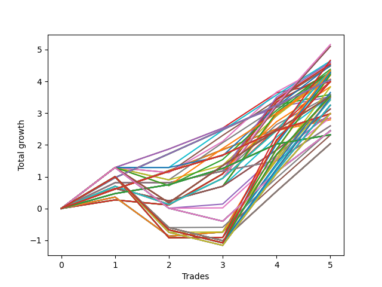

# Short HLT 108_90d 
- Symbol: TSLA
- Date Range: 01/10/2024 - 05/17/2024
- Trading Period: 8:30-12:30
- Number of Trades: 5



| Id. | Name | Win Percent | Profit | Avg Profit / Trade | Avg Time / Trade | Std |      | Name | Win Percent | Profit | Avg Profit / Trade | Avg Time / Trade | Std |
| --- | ---- | ----------- | ------ | ------------------ | ---------------- | --- | ---- | ---- | ----------- | ------ | ------------------ | ---------------- | --- |
| | Sorted By <br> Profit | | | | | | | Sorted By <br> Win Percentage |||||
|0| TP-2.25 75m | 80.00 | 5.16 | 1.03 | 65:12 | 1.01 |     | TP-0.75 180m | 100.00 | 4.05 | 0.81 | 11:00 | 0.08 |
|1| TP-2 75m | 80.00 | 5.10 | 1.02 | 65:00 | 1.00 |     | TP-0.75 165m | 100.00 | 4.05 | 0.81 | 11:00 | 0.08 |
|2| TP-1.75 75m | 80.00 | 5.10 | 1.02 | 64:00 | 1.00 |     | TP-0.75 150m | 100.00 | 4.05 | 0.81 | 11:00 | 0.08 |
|3| TP-3 105m | 80.00 | 4.66 | 0.93 | 100:48 | 1.80 |     | TP-0.75 135m | 100.00 | 4.05 | 0.81 | 11:00 | 0.08 |
|4| TP-1 60m | 80.00 | 4.64 | 0.93 | 25:12 | 0.47 |     | TP-0.75 120m | 100.00 | 4.05 | 0.81 | 11:00 | 0.08 |
|5| TP-2.25 60m | 80.00 | 4.60 | 0.92 | 53:12 | 0.79 |     | TP-0.75 105m | 100.00 | 4.05 | 0.81 | 11:00 | 0.08 |
|6| TP-1.25 30m | 80.00 | 4.58 | 0.92 | 24:48 | 0.58 |     | TP-0.75 90m | 100.00 | 4.05 | 0.81 | 11:00 | 0.08 |
|7| TP-2 60m | 80.00 | 4.54 | 0.91 | 53:00 | 0.77 |     | TP-0.75 75m | 100.00 | 4.05 | 0.81 | 11:00 | 0.08 |
|8| TP-1.75 60m | 80.00 | 4.54 | 0.91 | 53:00 | 0.77 |     | TP-0.75 60m | 100.00 | 4.05 | 0.81 | 11:00 | 0.08 |
|9| TP-1.25 60m | 80.00 | 4.50 | 0.90 | 39:48 | 0.60 |     | TP-0.75 45m | 100.00 | 4.05 | 0.81 | 11:00 | 0.08 |
|10| TP-1 30m | 80.00 | 4.48 | 0.90 | 19:12 | 0.53 |     | TP-0.75 30m | 100.00 | 4.05 | 0.81 | 11:00 | 0.08 |
|11| TP-1.25 75m | 80.00 | 4.38 | 0.88 | 45:48 | 0.76 |     | TP-1 15m | 100.00 | 3.98 | 0.80 | 11:24 | 0.35 |
|12| TP-3 90m | 80.00 | 4.34 | 0.87 | 89:00 | 1.48 |     | TP-0.75 15m | 100.00 | 3.59 | 0.72 | 09:48 | 0.21 |
|13| TP-3 75m | 80.00 | 4.34 | 0.87 | 74:00 | 0.84 |     | TP-1.25 15m | 100.00 | 3.52 | 0.70 | 13:12 | 0.31 |
|14| TP-2.75 75m | 80.00 | 4.34 | 0.87 | 74:00 | 0.84 |     | TP-0.5 180m | 100.00 | 2.98 | 0.60 | 06:24 | 0.09 |
|15| TP-2.5 75m | 80.00 | 4.34 | 0.87 | 74:00 | 0.84 |     | TP-0.5 165m | 100.00 | 2.98 | 0.60 | 06:24 | 0.09 |
|16| TP-2.25 45m | 80.00 | 4.31 | 0.86 | 41:12 | 0.90 |     | TP-0.5 150m | 100.00 | 2.98 | 0.60 | 06:24 | 0.09 |
|17| TP-2.75 90m | 80.00 | 4.28 | 0.86 | 88:48 | 1.47 |     | TP-0.5 135m | 100.00 | 2.98 | 0.60 | 06:24 | 0.09 |
|18| TP-3 30m | 80.00 | 4.27 | 0.85 | 29:00 | 0.82 |     | TP-0.5 120m | 100.00 | 2.98 | 0.60 | 06:24 | 0.09 |
|19| TP-2.75 30m | 80.00 | 4.27 | 0.85 | 29:00 | 0.82 |     | TP-0.5 105m | 100.00 | 2.98 | 0.60 | 06:24 | 0.09 |
|20| TP-2.5 30m | 80.00 | 4.27 | 0.85 | 29:00 | 0.82 |     | TP-0.5 90m | 100.00 | 2.98 | 0.60 | 06:24 | 0.09 |
|21| TP-2.25 30m | 80.00 | 4.27 | 0.85 | 29:00 | 0.82 |     | TP-0.5 75m | 100.00 | 2.98 | 0.60 | 06:24 | 0.09 |
|22| TP-2 30m | 80.00 | 4.27 | 0.85 | 29:00 | 0.82 |     | TP-0.5 60m | 100.00 | 2.98 | 0.60 | 06:24 | 0.09 |
|23| TP-1.75 30m | 80.00 | 4.27 | 0.85 | 29:00 | 0.82 |     | TP-0.5 45m | 100.00 | 2.98 | 0.60 | 06:24 | 0.09 |
|24| TP-2.5 90m | 80.00 | 4.26 | 0.85 | 88:24 | 1.46 |     | TP-0.5 30m | 100.00 | 2.98 | 0.60 | 06:24 | 0.09 |
|25| TP-2 45m | 80.00 | 4.25 | 0.85 | 41:00 | 0.89 |     | TP-3 15m | 100.00 | 2.84 | 0.57 | 14:00 | 0.12 |
|26| TP-1.75 45m | 80.00 | 4.25 | 0.85 | 41:00 | 0.89 |     | TP-2.75 15m | 100.00 | 2.84 | 0.57 | 14:00 | 0.12 |
|27| TP-1 45m | 80.00 | 4.25 | 0.85 | 22:12 | 0.62 |     | TP-2.5 15m | 100.00 | 2.84 | 0.57 | 14:00 | 0.12 |
|28| TP-2.75 105m | 80.00 | 4.21 | 0.84 | 100:00 | 1.69 |     | TP-2.25 15m | 100.00 | 2.84 | 0.57 | 14:00 | 0.12 |
|29| TP-1.25 45m | 80.00 | 4.20 | 0.84 | 33:48 | 0.72 |     | TP-2 15m | 100.00 | 2.84 | 0.57 | 14:00 | 0.12 |
|30| TP-2.5 105m | 80.00 | 4.19 | 0.84 | 99:36 | 1.69 |     | TP-1.75 15m | 100.00 | 2.84 | 0.57 | 14:00 | 0.12 |
|31| TP-1 75m | 80.00 | 4.07 | 0.81 | 28:12 | 0.70 |     | TP-1.5 15m | 100.00 | 2.84 | 0.57 | 14:00 | 0.12 |
|32| TP-0.75 180m | 100.00 | 4.05 | 0.81 | 11:00 | 0.08 |     | TP-0.5 15m | 100.00 | 2.79 | 0.56 | 06:00 | 0.14 |
|33| TP-0.75 165m | 100.00 | 4.05 | 0.81 | 11:00 | 0.08 |     | TP-0.25 180m | 100.00 | 2.32 | 0.46 | 04:24 | 0.18 |
|34| TP-0.75 150m | 100.00 | 4.05 | 0.81 | 11:00 | 0.08 |     | TP-0.25 165m | 100.00 | 2.32 | 0.46 | 04:24 | 0.18 |
|35| TP-0.75 135m | 100.00 | 4.05 | 0.81 | 11:00 | 0.08 |     | TP-0.25 150m | 100.00 | 2.32 | 0.46 | 04:24 | 0.18 |
|36| TP-0.75 120m | 100.00 | 4.05 | 0.81 | 11:00 | 0.08 |     | TP-0.25 135m | 100.00 | 2.32 | 0.46 | 04:24 | 0.18 |
|37| TP-0.75 105m | 100.00 | 4.05 | 0.81 | 11:00 | 0.08 |     | TP-0.25 120m | 100.00 | 2.32 | 0.46 | 04:24 | 0.18 |
|38| TP-0.75 90m | 100.00 | 4.05 | 0.81 | 11:00 | 0.08 |     | TP-0.25 105m | 100.00 | 2.32 | 0.46 | 04:24 | 0.18 |
|39| TP-0.75 75m | 100.00 | 4.05 | 0.81 | 11:00 | 0.08 |     | TP-0.25 90m | 100.00 | 2.32 | 0.46 | 04:24 | 0.18 |
|40| TP-0.75 60m | 100.00 | 4.05 | 0.81 | 11:00 | 0.08 |     | TP-0.25 75m | 100.00 | 2.32 | 0.46 | 04:24 | 0.18 |
|41| TP-0.75 45m | 100.00 | 4.05 | 0.81 | 11:00 | 0.08 |     | TP-0.25 60m | 100.00 | 2.32 | 0.46 | 04:24 | 0.18 |
|42| TP-0.75 30m | 100.00 | 4.05 | 0.81 | 11:00 | 0.08 |     | TP-0.25 45m | 100.00 | 2.32 | 0.46 | 04:24 | 0.18 |
|43| TP-1.5 75m | 80.00 | 4.00 | 0.80 | 62:36 | 0.77 |     | TP-0.25 30m | 100.00 | 2.32 | 0.46 | 04:24 | 0.18 |
|44| TP-3 180m | 60.00 | 3.99 | 0.80 | 108:00 | 1.71 |     | TP-0.25 15m | 100.00 | 2.32 | 0.46 | 04:24 | 0.18 |
|45| TP-3 165m | 60.00 | 3.99 | 0.80 | 108:00 | 1.71 |     | TP-2.25 75m | 80.00 | 5.16 | 1.03 | 65:12 | 1.01 |
|46| TP-3 150m | 60.00 | 3.99 | 0.80 | 108:00 | 1.71 |     | TP-2 75m | 80.00 | 5.10 | 1.02 | 65:00 | 1.00 |
|47| TP-3 135m | 60.00 | 3.99 | 0.80 | 108:00 | 1.71 |     | TP-1.75 75m | 80.00 | 5.10 | 1.02 | 64:00 | 1.00 |
|48| TP-3 120m | 60.00 | 3.99 | 0.80 | 108:00 | 1.71 |     | TP-3 105m | 80.00 | 4.66 | 0.93 | 100:48 | 1.80 |
|49| TP-1 15m | 100.00 | 3.98 | 0.80 | 11:24 | 0.35 |     | TP-1 60m | 80.00 | 4.64 | 0.93 | 25:12 | 0.47 |
|50| TP-1.5 60m | 80.00 | 3.83 | 0.77 | 52:36 | 0.54 |     | TP-2.25 60m | 80.00 | 4.60 | 0.92 | 53:12 | 0.79 |
|51| TP-2.25 90m | 80.00 | 3.82 | 0.76 | 77:12 | 1.35 |     | TP-1.25 30m | 80.00 | 4.58 | 0.92 | 24:48 | 0.58 |
|52| TP-2.25 105m | 80.00 | 3.65 | 0.73 | 85:24 | 1.58 |     | TP-2 60m | 80.00 | 4.54 | 0.91 | 53:00 | 0.77 |
|53| TP-0.75 15m | 100.00 | 3.59 | 0.72 | 09:48 | 0.21 |     | TP-1.75 60m | 80.00 | 4.54 | 0.91 | 53:00 | 0.77 |
|54| TP-2 90m | 80.00 | 3.59 | 0.72 | 74:24 | 1.30 |     | TP-1.25 60m | 80.00 | 4.50 | 0.90 | 39:48 | 0.60 |
|55| TP-1.5 30m | 80.00 | 3.56 | 0.71 | 28:36 | 0.60 |     | TP-1 30m | 80.00 | 4.48 | 0.90 | 19:12 | 0.53 |
|56| TP-1.5 45m | 80.00 | 3.54 | 0.71 | 40:36 | 0.68 |     | TP-1.25 75m | 80.00 | 4.38 | 0.88 | 45:48 | 0.76 |
|57| TP-2.75 180m | 60.00 | 3.54 | 0.71 | 107:12 | 1.59 |     | TP-3 90m | 80.00 | 4.34 | 0.87 | 89:00 | 1.48 |
|58| TP-2.75 165m | 60.00 | 3.54 | 0.71 | 107:12 | 1.59 |     | TP-3 75m | 80.00 | 4.34 | 0.87 | 74:00 | 0.84 |
|59| TP-2.75 150m | 60.00 | 3.54 | 0.71 | 107:12 | 1.59 |     | TP-2.75 75m | 80.00 | 4.34 | 0.87 | 74:00 | 0.84 |
|60| TP-2.75 135m | 60.00 | 3.54 | 0.71 | 107:12 | 1.59 |     | TP-2.5 75m | 80.00 | 4.34 | 0.87 | 74:00 | 0.84 |
|61| TP-2.75 120m | 60.00 | 3.54 | 0.71 | 107:12 | 1.59 |     | TP-2.25 45m | 80.00 | 4.31 | 0.86 | 41:12 | 0.90 |
|62| TP-1 180m | 80.00 | 3.53 | 0.71 | 30:36 | 0.91 |     | TP-2.75 90m | 80.00 | 4.28 | 0.86 | 88:48 | 1.47 |
|63| TP-1 165m | 80.00 | 3.53 | 0.71 | 30:36 | 0.91 |     | TP-3 30m | 80.00 | 4.27 | 0.85 | 29:00 | 0.82 |
|64| TP-1 150m | 80.00 | 3.53 | 0.71 | 30:36 | 0.91 |     | TP-2.75 30m | 80.00 | 4.27 | 0.85 | 29:00 | 0.82 |
|65| TP-1 135m | 80.00 | 3.53 | 0.71 | 30:36 | 0.91 |     | TP-2.5 30m | 80.00 | 4.27 | 0.85 | 29:00 | 0.82 |
|66| TP-1 120m | 80.00 | 3.53 | 0.71 | 30:36 | 0.91 |     | TP-2.25 30m | 80.00 | 4.27 | 0.85 | 29:00 | 0.82 |
|67| TP-1 105m | 80.00 | 3.53 | 0.71 | 30:36 | 0.91 |     | TP-2 30m | 80.00 | 4.27 | 0.85 | 29:00 | 0.82 |
|68| TP-1 90m | 80.00 | 3.53 | 0.71 | 30:36 | 0.91 |     | TP-1.75 30m | 80.00 | 4.27 | 0.85 | 29:00 | 0.82 |
|69| TP-1.25 15m | 100.00 | 3.52 | 0.70 | 13:12 | 0.31 |     | TP-2.5 90m | 80.00 | 4.26 | 0.85 | 88:24 | 1.46 |
|70| TP-2.5 180m | 60.00 | 3.52 | 0.70 | 106:48 | 1.58 |     | TP-2 45m | 80.00 | 4.25 | 0.85 | 41:00 | 0.89 |
|71| TP-2.5 165m | 60.00 | 3.52 | 0.70 | 106:48 | 1.58 |     | TP-1.75 45m | 80.00 | 4.25 | 0.85 | 41:00 | 0.89 |
|72| TP-2.5 150m | 60.00 | 3.52 | 0.70 | 106:48 | 1.58 |     | TP-1 45m | 80.00 | 4.25 | 0.85 | 22:12 | 0.62 |
|73| TP-2.5 135m | 60.00 | 3.52 | 0.70 | 106:48 | 1.58 |     | TP-2.75 105m | 80.00 | 4.21 | 0.84 | 100:00 | 1.69 |
|74| TP-2.5 120m | 60.00 | 3.52 | 0.70 | 106:48 | 1.58 |     | TP-1.25 45m | 80.00 | 4.20 | 0.84 | 33:48 | 0.72 |
|75| TP-2.25 180m | 60.00 | 3.48 | 0.70 | 89:36 | 1.54 |     | TP-2.5 105m | 80.00 | 4.19 | 0.84 | 99:36 | 1.69 |
|76| TP-2.25 165m | 60.00 | 3.48 | 0.70 | 89:36 | 1.54 |     | TP-1 75m | 80.00 | 4.07 | 0.81 | 28:12 | 0.70 |
|77| TP-2.25 150m | 60.00 | 3.48 | 0.70 | 89:36 | 1.54 |     | TP-1.5 75m | 80.00 | 4.00 | 0.80 | 62:36 | 0.77 |
|78| TP-2.25 135m | 60.00 | 3.48 | 0.70 | 89:36 | 1.54 |     | TP-1.5 60m | 80.00 | 3.83 | 0.77 | 52:36 | 0.54 |
|79| TP-2.25 120m | 60.00 | 3.48 | 0.70 | 89:36 | 1.54 |     | TP-2.25 90m | 80.00 | 3.82 | 0.76 | 77:12 | 1.35 |
|80| TP-2 105m | 80.00 | 3.42 | 0.68 | 82:36 | 1.53 |     | TP-2.25 105m | 80.00 | 3.65 | 0.73 | 85:24 | 1.58 |
|81| TP-1.75 105m | 80.00 | 3.41 | 0.68 | 80:48 | 1.44 |     | TP-2 90m | 80.00 | 3.59 | 0.72 | 74:24 | 1.30 |
|82| TP-1.75 90m | 80.00 | 3.41 | 0.68 | 73:00 | 1.27 |     | TP-1.5 30m | 80.00 | 3.56 | 0.71 | 28:36 | 0.60 |
|83| TP-2 180m | 60.00 | 3.25 | 0.65 | 86:48 | 1.50 |     | TP-1.5 45m | 80.00 | 3.54 | 0.71 | 40:36 | 0.68 |
|84| TP-2 165m | 60.00 | 3.25 | 0.65 | 86:48 | 1.50 |     | TP-1 180m | 80.00 | 3.53 | 0.71 | 30:36 | 0.91 |
|85| TP-2 150m | 60.00 | 3.25 | 0.65 | 86:48 | 1.50 |     | TP-1 165m | 80.00 | 3.53 | 0.71 | 30:36 | 0.91 |
|86| TP-2 135m | 60.00 | 3.25 | 0.65 | 86:48 | 1.50 |     | TP-1 150m | 80.00 | 3.53 | 0.71 | 30:36 | 0.91 |
|87| TP-2 120m | 60.00 | 3.25 | 0.65 | 86:48 | 1.50 |     | TP-1 135m | 80.00 | 3.53 | 0.71 | 30:36 | 0.91 |
|88| TP-3 45m | 80.00 | 3.13 | 0.63 | 44:00 | 0.59 |     | TP-1 120m | 80.00 | 3.53 | 0.71 | 30:36 | 0.91 |
|89| TP-2.75 45m | 80.00 | 3.13 | 0.63 | 44:00 | 0.59 |     | TP-1 105m | 80.00 | 3.53 | 0.71 | 30:36 | 0.91 |
|90| TP-2.5 45m | 80.00 | 3.13 | 0.63 | 44:00 | 0.59 |     | TP-1 90m | 80.00 | 3.53 | 0.71 | 30:36 | 0.91 |
|91| TP-1.75 180m | 60.00 | 2.99 | 0.60 | 83:48 | 1.49 |     | TP-2 105m | 80.00 | 3.42 | 0.68 | 82:36 | 1.53 |
|92| TP-1.75 165m | 60.00 | 2.99 | 0.60 | 83:48 | 1.49 |     | TP-1.75 105m | 80.00 | 3.41 | 0.68 | 80:48 | 1.44 |
|93| TP-1.75 150m | 60.00 | 2.99 | 0.60 | 83:48 | 1.49 |     | TP-1.75 90m | 80.00 | 3.41 | 0.68 | 73:00 | 1.27 |
|94| TP-1.75 135m | 60.00 | 2.99 | 0.60 | 83:48 | 1.49 |     | TP-3 45m | 80.00 | 3.13 | 0.63 | 44:00 | 0.59 |
|95| TP-1.75 120m | 60.00 | 2.99 | 0.60 | 83:48 | 1.49 |     | TP-2.75 45m | 80.00 | 3.13 | 0.63 | 44:00 | 0.59 |
|96| TP-0.5 180m | 100.00 | 2.98 | 0.60 | 06:24 | 0.09 |     | TP-2.5 45m | 80.00 | 3.13 | 0.63 | 44:00 | 0.59 |
|97| TP-0.5 165m | 100.00 | 2.98 | 0.60 | 06:24 | 0.09 |     | TP-1.25 90m | 80.00 | 2.98 | 0.60 | 51:36 | 1.06 |
|98| TP-0.5 150m | 100.00 | 2.98 | 0.60 | 06:24 | 0.09 |     | TP-1.25 105m | 80.00 | 2.86 | 0.57 | 54:36 | 1.07 |
|99| TP-0.5 135m | 100.00 | 2.98 | 0.60 | 06:24 | 0.09 |     | TP-3 60m | 80.00 | 2.60 | 0.52 | 59:00 | 0.39 |
|100| TP-0.5 120m | 100.00 | 2.98 | 0.60 | 06:24 | 0.09 |     | TP-2.75 60m | 80.00 | 2.60 | 0.52 | 59:00 | 0.39 |
|101| TP-0.5 105m | 100.00 | 2.98 | 0.60 | 06:24 | 0.09 |     | TP-2.5 60m | 80.00 | 2.60 | 0.52 | 59:00 | 0.39 |
|102| TP-0.5 90m | 100.00 | 2.98 | 0.60 | 06:24 | 0.09 |     | TP-1.5 105m | 80.00 | 2.46 | 0.49 | 79:12 | 1.18 |
|103| TP-0.5 75m | 100.00 | 2.98 | 0.60 | 06:24 | 0.09 |     | TP-1.5 90m | 80.00 | 2.31 | 0.46 | 71:36 | 1.02 |
|104| TP-0.5 60m | 100.00 | 2.98 | 0.60 | 06:24 | 0.09 |     | TP-3 180m | 60.00 | 3.99 | 0.80 | 108:00 | 1.71 |
|105| TP-0.5 45m | 100.00 | 2.98 | 0.60 | 06:24 | 0.09 |     | TP-3 165m | 60.00 | 3.99 | 0.80 | 108:00 | 1.71 |
|106| TP-0.5 30m | 100.00 | 2.98 | 0.60 | 06:24 | 0.09 |     | TP-3 150m | 60.00 | 3.99 | 0.80 | 108:00 | 1.71 |
|107| TP-1.25 90m | 80.00 | 2.98 | 0.60 | 51:36 | 1.06 |     | TP-3 135m | 60.00 | 3.99 | 0.80 | 108:00 | 1.71 |
|108| TP-1.25 105m | 80.00 | 2.86 | 0.57 | 54:36 | 1.07 |     | TP-3 120m | 60.00 | 3.99 | 0.80 | 108:00 | 1.71 |
|109| TP-3 15m | 100.00 | 2.84 | 0.57 | 14:00 | 0.12 |     | TP-2.75 180m | 60.00 | 3.54 | 0.71 | 107:12 | 1.59 |
|110| TP-2.75 15m | 100.00 | 2.84 | 0.57 | 14:00 | 0.12 |     | TP-2.75 165m | 60.00 | 3.54 | 0.71 | 107:12 | 1.59 |
|111| TP-2.5 15m | 100.00 | 2.84 | 0.57 | 14:00 | 0.12 |     | TP-2.75 150m | 60.00 | 3.54 | 0.71 | 107:12 | 1.59 |
|112| TP-2.25 15m | 100.00 | 2.84 | 0.57 | 14:00 | 0.12 |     | TP-2.75 135m | 60.00 | 3.54 | 0.71 | 107:12 | 1.59 |
|113| TP-2 15m | 100.00 | 2.84 | 0.57 | 14:00 | 0.12 |     | TP-2.75 120m | 60.00 | 3.54 | 0.71 | 107:12 | 1.59 |
|114| TP-1.75 15m | 100.00 | 2.84 | 0.57 | 14:00 | 0.12 |     | TP-2.5 180m | 60.00 | 3.52 | 0.70 | 106:48 | 1.58 |
|115| TP-1.5 15m | 100.00 | 2.84 | 0.57 | 14:00 | 0.12 |     | TP-2.5 165m | 60.00 | 3.52 | 0.70 | 106:48 | 1.58 |
|116| TP-0.5 15m | 100.00 | 2.79 | 0.56 | 06:00 | 0.14 |     | TP-2.5 150m | 60.00 | 3.52 | 0.70 | 106:48 | 1.58 |
|117| TP-3 60m | 80.00 | 2.60 | 0.52 | 59:00 | 0.39 |     | TP-2.5 135m | 60.00 | 3.52 | 0.70 | 106:48 | 1.58 |
|118| TP-2.75 60m | 80.00 | 2.60 | 0.52 | 59:00 | 0.39 |     | TP-2.5 120m | 60.00 | 3.52 | 0.70 | 106:48 | 1.58 |
|119| TP-2.5 60m | 80.00 | 2.60 | 0.52 | 59:00 | 0.39 |     | TP-2.25 180m | 60.00 | 3.48 | 0.70 | 89:36 | 1.54 |
|120| TP-1.5 105m | 80.00 | 2.46 | 0.49 | 79:12 | 1.18 |     | TP-2.25 165m | 60.00 | 3.48 | 0.70 | 89:36 | 1.54 |
|121| TP-1.25 180m | 60.00 | 2.44 | 0.49 | 57:36 | 1.13 |     | TP-2.25 150m | 60.00 | 3.48 | 0.70 | 89:36 | 1.54 |
|122| TP-1.25 165m | 60.00 | 2.44 | 0.49 | 57:36 | 1.13 |     | TP-2.25 135m | 60.00 | 3.48 | 0.70 | 89:36 | 1.54 |
|123| TP-1.25 150m | 60.00 | 2.44 | 0.49 | 57:36 | 1.13 |     | TP-2.25 120m | 60.00 | 3.48 | 0.70 | 89:36 | 1.54 |
|124| TP-1.25 135m | 60.00 | 2.44 | 0.49 | 57:36 | 1.13 |     | TP-2 180m | 60.00 | 3.25 | 0.65 | 86:48 | 1.50 |
|125| TP-1.25 120m | 60.00 | 2.44 | 0.49 | 57:36 | 1.13 |     | TP-2 165m | 60.00 | 3.25 | 0.65 | 86:48 | 1.50 |
|126| TP-0.25 180m | 100.00 | 2.32 | 0.46 | 04:24 | 0.18 |     | TP-2 150m | 60.00 | 3.25 | 0.65 | 86:48 | 1.50 |
|127| TP-0.25 165m | 100.00 | 2.32 | 0.46 | 04:24 | 0.18 |     | TP-2 135m | 60.00 | 3.25 | 0.65 | 86:48 | 1.50 |
|128| TP-0.25 150m | 100.00 | 2.32 | 0.46 | 04:24 | 0.18 |     | TP-2 120m | 60.00 | 3.25 | 0.65 | 86:48 | 1.50 |
|129| TP-0.25 135m | 100.00 | 2.32 | 0.46 | 04:24 | 0.18 |     | TP-1.75 180m | 60.00 | 2.99 | 0.60 | 83:48 | 1.49 |
|130| TP-0.25 120m | 100.00 | 2.32 | 0.46 | 04:24 | 0.18 |     | TP-1.75 165m | 60.00 | 2.99 | 0.60 | 83:48 | 1.49 |
|131| TP-0.25 105m | 100.00 | 2.32 | 0.46 | 04:24 | 0.18 |     | TP-1.75 150m | 60.00 | 2.99 | 0.60 | 83:48 | 1.49 |
|132| TP-0.25 90m | 100.00 | 2.32 | 0.46 | 04:24 | 0.18 |     | TP-1.75 135m | 60.00 | 2.99 | 0.60 | 83:48 | 1.49 |
|133| TP-0.25 75m | 100.00 | 2.32 | 0.46 | 04:24 | 0.18 |     | TP-1.75 120m | 60.00 | 2.99 | 0.60 | 83:48 | 1.49 |
|134| TP-0.25 60m | 100.00 | 2.32 | 0.46 | 04:24 | 0.18 |     | TP-1.25 180m | 60.00 | 2.44 | 0.49 | 57:36 | 1.13 |
|135| TP-0.25 45m | 100.00 | 2.32 | 0.46 | 04:24 | 0.18 |     | TP-1.25 165m | 60.00 | 2.44 | 0.49 | 57:36 | 1.13 |
|136| TP-0.25 30m | 100.00 | 2.32 | 0.46 | 04:24 | 0.18 |     | TP-1.25 150m | 60.00 | 2.44 | 0.49 | 57:36 | 1.13 |
|137| TP-0.25 15m | 100.00 | 2.32 | 0.46 | 04:24 | 0.18 |     | TP-1.25 135m | 60.00 | 2.44 | 0.49 | 57:36 | 1.13 |
|138| TP-1.5 90m | 80.00 | 2.31 | 0.46 | 71:36 | 1.02 |     | TP-1.25 120m | 60.00 | 2.44 | 0.49 | 57:36 | 1.13 |
|139| TP-1.5 180m | 60.00 | 2.04 | 0.41 | 82:12 | 1.23 |     | TP-1.5 180m | 60.00 | 2.04 | 0.41 | 82:12 | 1.23 |
|140| TP-1.5 165m | 60.00 | 2.04 | 0.41 | 82:12 | 1.23 |     | TP-1.5 165m | 60.00 | 2.04 | 0.41 | 82:12 | 1.23 |
|141| TP-1.5 150m | 60.00 | 2.04 | 0.41 | 82:12 | 1.23 |     | TP-1.5 150m | 60.00 | 2.04 | 0.41 | 82:12 | 1.23 |
|142| TP-1.5 135m | 60.00 | 2.04 | 0.41 | 82:12 | 1.23 |     | TP-1.5 135m | 60.00 | 2.04 | 0.41 | 82:12 | 1.23 |
|143| TP-1.5 120m | 60.00 | 2.04 | 0.41 | 82:12 | 1.23 |     | TP-1.5 120m | 60.00 | 2.04 | 0.41 | 82:12 | 1.23 |

### Test TP-0.25 15m
* Take Profit of 0.25 Point
* 0.25 Stoploss
* Results:
```
Total Trades: 5
Percent Up: 0.00
Percent Down: 100.00
Total Points Moved Down: 2.32
Potential Profit: 1160.00
Total Points Ups: 0.00 Count Ups: 0
Total Points Downs: 2.32 Count Downs: 5
```

<details><summary>Trades</summary>

<code>In: 2024-02-07 11:10:00		Out: 2024-02-07 11:13:00		Total Position Time: 03:00		Total Move Down: 0.47		Total to Date: 0.47</code> <br />
<code>In: 2024-02-14 11:00:00		Out: 2024-02-14 11:05:00		Total Position Time: 05:00		Total Move Down: 0.28		Total to Date: 0.75</code> <br />
<code>In: 2024-04-08 08:35:00		Out: 2024-04-08 08:37:00		Total Position Time: 02:00		Total Move Down: 0.51		Total to Date: 1.26</code> <br />
<code>In: 2024-04-29 09:40:00		Out: 2024-04-29 09:42:00		Total Position Time: 02:00		Total Move Down: 0.77		Total to Date: 2.03</code> <br />
<code>In: 2024-05-17 09:45:00		Out: 2024-05-17 09:55:00		Total Position Time: 10:00		Total Move Down: 0.29		Total to Date: 2.32</code> <br />


</details>

### Test TP-0.5 15m
* Take Profit of 0.5 Point
* 0.5 Stoploss
* Results:
```
Total Trades: 5
Percent Up: 0.00
Percent Down: 100.00
Total Points Moved Down: 2.79
Potential Profit: 1395.00
Total Points Ups: 0.00 Count Ups: 0
Total Points Downs: 2.79 Count Downs: 5
```

<details><summary>Trades</summary>

<code>In: 2024-02-07 11:10:00		Out: 2024-02-07 11:14:00		Total Position Time: 04:00		Total Move Down: 0.61		Total to Date: 0.61</code> <br />
<code>In: 2024-02-14 11:00:00		Out: 2024-02-14 11:08:00		Total Position Time: 08:00		Total Move Down: 0.56		Total to Date: 1.17</code> <br />
<code>In: 2024-04-08 08:35:00		Out: 2024-04-08 08:37:00		Total Position Time: 02:00		Total Move Down: 0.51		Total to Date: 1.68</code> <br />
<code>In: 2024-04-29 09:40:00		Out: 2024-04-29 09:42:00		Total Position Time: 02:00		Total Move Down: 0.77		Total to Date: 2.45</code> <br />
<code>In: 2024-05-17 09:45:00		Out: 2024-05-17 09:59:00		Total Position Time: 14:00		Total Move Down: 0.34		Total to Date: 2.79</code> <br />


</details>

### Test TP-0.75 15m
* Take Profit of 0.75 Point
* 0.75 Stoploss
* Results:
```
Total Trades: 5
Percent Up: 0.00
Percent Down: 100.00
Total Points Moved Down: 3.59
Potential Profit: 1795.00
Total Points Ups: 0.00 Count Ups: 0
Total Points Downs: 3.59 Count Downs: 5
```

<details><summary>Trades</summary>

<code>In: 2024-02-07 11:10:00		Out: 2024-02-07 11:18:00		Total Position Time: 08:00		Total Move Down: 0.97		Total to Date: 0.97</code> <br />
<code>In: 2024-02-14 11:00:00		Out: 2024-02-14 11:12:00		Total Position Time: 12:00		Total Move Down: 0.75		Total to Date: 1.72</code> <br />
<code>In: 2024-04-08 08:35:00		Out: 2024-04-08 08:48:00		Total Position Time: 13:00		Total Move Down: 0.76		Total to Date: 2.48</code> <br />
<code>In: 2024-04-29 09:40:00		Out: 2024-04-29 09:42:00		Total Position Time: 02:00		Total Move Down: 0.77		Total to Date: 3.25</code> <br />
<code>In: 2024-05-17 09:45:00		Out: 2024-05-17 09:59:00		Total Position Time: 14:00		Total Move Down: 0.34		Total to Date: 3.59</code> <br />


</details>

### Test TP-1 15m
* Take Profit of 1 Point
* 1 Stoploss
* Results:
```
Total Trades: 5
Percent Up: 0.00
Percent Down: 100.00
Total Points Moved Down: 3.98
Potential Profit: 1990.00
Total Points Ups: 0.00 Count Ups: 0
Total Points Downs: 3.98 Count Downs: 5
```

<details><summary>Trades</summary>

<code>In: 2024-02-07 11:10:00		Out: 2024-02-07 11:20:00		Total Position Time: 10:00		Total Move Down: 1.29		Total to Date: 1.29</code> <br />
<code>In: 2024-02-14 11:00:00		Out: 2024-02-14 11:14:00		Total Position Time: 14:00		Total Move Down: 0.58		Total to Date: 1.87</code> <br />
<code>In: 2024-04-08 08:35:00		Out: 2024-04-08 08:49:00		Total Position Time: 14:00		Total Move Down: 0.66		Total to Date: 2.53</code> <br />
<code>In: 2024-04-29 09:40:00		Out: 2024-04-29 09:45:00		Total Position Time: 05:00		Total Move Down: 1.11		Total to Date: 3.64</code> <br />
<code>In: 2024-05-17 09:45:00		Out: 2024-05-17 09:59:00		Total Position Time: 14:00		Total Move Down: 0.34		Total to Date: 3.98</code> <br />


</details>

### Test TP-1.25 15m
* Take Profit of 1.25 Point
* 1.25 Stoploss
* Results:
```
Total Trades: 5
Percent Up: 0.00
Percent Down: 100.00
Total Points Moved Down: 3.52
Potential Profit: 1760.00
Total Points Ups: 0.00 Count Ups: 0
Total Points Downs: 3.52 Count Downs: 5
```

<details><summary>Trades</summary>

<code>In: 2024-02-07 11:10:00		Out: 2024-02-07 11:20:00		Total Position Time: 10:00		Total Move Down: 1.29		Total to Date: 1.29</code> <br />
<code>In: 2024-02-14 11:00:00		Out: 2024-02-14 11:14:00		Total Position Time: 14:00		Total Move Down: 0.58		Total to Date: 1.87</code> <br />
<code>In: 2024-04-08 08:35:00		Out: 2024-04-08 08:49:00		Total Position Time: 14:00		Total Move Down: 0.66		Total to Date: 2.53</code> <br />
<code>In: 2024-04-29 09:40:00		Out: 2024-04-29 09:54:00		Total Position Time: 14:00		Total Move Down: 0.65		Total to Date: 3.18</code> <br />
<code>In: 2024-05-17 09:45:00		Out: 2024-05-17 09:59:00		Total Position Time: 14:00		Total Move Down: 0.34		Total to Date: 3.52</code> <br />


</details>

### Test TP-1.5 15m
* Take Profit of 1.5 Point
* 1.5 Stoploss
* Results:
```
Total Trades: 5
Percent Up: 0.00
Percent Down: 100.00
Total Points Moved Down: 2.84
Potential Profit: 1420.00
Total Points Ups: 0.00 Count Ups: 0
Total Points Downs: 2.84 Count Downs: 5
```

<details><summary>Trades</summary>

<code>In: 2024-02-07 11:10:00		Out: 2024-02-07 11:24:00		Total Position Time: 14:00		Total Move Down: 0.61		Total to Date: 0.61</code> <br />
<code>In: 2024-02-14 11:00:00		Out: 2024-02-14 11:14:00		Total Position Time: 14:00		Total Move Down: 0.58		Total to Date: 1.19</code> <br />
<code>In: 2024-04-08 08:35:00		Out: 2024-04-08 08:49:00		Total Position Time: 14:00		Total Move Down: 0.66		Total to Date: 1.85</code> <br />
<code>In: 2024-04-29 09:40:00		Out: 2024-04-29 09:54:00		Total Position Time: 14:00		Total Move Down: 0.65		Total to Date: 2.50</code> <br />
<code>In: 2024-05-17 09:45:00		Out: 2024-05-17 09:59:00		Total Position Time: 14:00		Total Move Down: 0.34		Total to Date: 2.84</code> <br />


</details>

### Test TP-1.75 15m
* Take Profit of 1.75 Point
* 1.75 Stoploss
* Results:
```
Total Trades: 5
Percent Up: 0.00
Percent Down: 100.00
Total Points Moved Down: 2.84
Potential Profit: 1420.00
Total Points Ups: 0.00 Count Ups: 0
Total Points Downs: 2.84 Count Downs: 5
```

<details><summary>Trades</summary>

<code>In: 2024-02-07 11:10:00		Out: 2024-02-07 11:24:00		Total Position Time: 14:00		Total Move Down: 0.61		Total to Date: 0.61</code> <br />
<code>In: 2024-02-14 11:00:00		Out: 2024-02-14 11:14:00		Total Position Time: 14:00		Total Move Down: 0.58		Total to Date: 1.19</code> <br />
<code>In: 2024-04-08 08:35:00		Out: 2024-04-08 08:49:00		Total Position Time: 14:00		Total Move Down: 0.66		Total to Date: 1.85</code> <br />
<code>In: 2024-04-29 09:40:00		Out: 2024-04-29 09:54:00		Total Position Time: 14:00		Total Move Down: 0.65		Total to Date: 2.50</code> <br />
<code>In: 2024-05-17 09:45:00		Out: 2024-05-17 09:59:00		Total Position Time: 14:00		Total Move Down: 0.34		Total to Date: 2.84</code> <br />


</details>

### Test TP-2 15m
* Take Profit of 2 Point
* 2 Stoploss
* Results:
```
Total Trades: 5
Percent Up: 0.00
Percent Down: 100.00
Total Points Moved Down: 2.84
Potential Profit: 1420.00
Total Points Ups: 0.00 Count Ups: 0
Total Points Downs: 2.84 Count Downs: 5
```

<details><summary>Trades</summary>

<code>In: 2024-02-07 11:10:00		Out: 2024-02-07 11:24:00		Total Position Time: 14:00		Total Move Down: 0.61		Total to Date: 0.61</code> <br />
<code>In: 2024-02-14 11:00:00		Out: 2024-02-14 11:14:00		Total Position Time: 14:00		Total Move Down: 0.58		Total to Date: 1.19</code> <br />
<code>In: 2024-04-08 08:35:00		Out: 2024-04-08 08:49:00		Total Position Time: 14:00		Total Move Down: 0.66		Total to Date: 1.85</code> <br />
<code>In: 2024-04-29 09:40:00		Out: 2024-04-29 09:54:00		Total Position Time: 14:00		Total Move Down: 0.65		Total to Date: 2.50</code> <br />
<code>In: 2024-05-17 09:45:00		Out: 2024-05-17 09:59:00		Total Position Time: 14:00		Total Move Down: 0.34		Total to Date: 2.84</code> <br />


</details>

### Test TP-2.25 15m
* Take Profit of 2.25 Point
* 2.25 Stoploss
* Results:
```
Total Trades: 5
Percent Up: 0.00
Percent Down: 100.00
Total Points Moved Down: 2.84
Potential Profit: 1420.00
Total Points Ups: 0.00 Count Ups: 0
Total Points Downs: 2.84 Count Downs: 5
```

<details><summary>Trades</summary>

<code>In: 2024-02-07 11:10:00		Out: 2024-02-07 11:24:00		Total Position Time: 14:00		Total Move Down: 0.61		Total to Date: 0.61</code> <br />
<code>In: 2024-02-14 11:00:00		Out: 2024-02-14 11:14:00		Total Position Time: 14:00		Total Move Down: 0.58		Total to Date: 1.19</code> <br />
<code>In: 2024-04-08 08:35:00		Out: 2024-04-08 08:49:00		Total Position Time: 14:00		Total Move Down: 0.66		Total to Date: 1.85</code> <br />
<code>In: 2024-04-29 09:40:00		Out: 2024-04-29 09:54:00		Total Position Time: 14:00		Total Move Down: 0.65		Total to Date: 2.50</code> <br />
<code>In: 2024-05-17 09:45:00		Out: 2024-05-17 09:59:00		Total Position Time: 14:00		Total Move Down: 0.34		Total to Date: 2.84</code> <br />


</details>

### Test TP-2.5 15m
* Take Profit of 2.5 Point
* 2.5 Stoploss
* Results:
```
Total Trades: 5
Percent Up: 0.00
Percent Down: 100.00
Total Points Moved Down: 2.84
Potential Profit: 1420.00
Total Points Ups: 0.00 Count Ups: 0
Total Points Downs: 2.84 Count Downs: 5
```

<details><summary>Trades</summary>

<code>In: 2024-02-07 11:10:00		Out: 2024-02-07 11:24:00		Total Position Time: 14:00		Total Move Down: 0.61		Total to Date: 0.61</code> <br />
<code>In: 2024-02-14 11:00:00		Out: 2024-02-14 11:14:00		Total Position Time: 14:00		Total Move Down: 0.58		Total to Date: 1.19</code> <br />
<code>In: 2024-04-08 08:35:00		Out: 2024-04-08 08:49:00		Total Position Time: 14:00		Total Move Down: 0.66		Total to Date: 1.85</code> <br />
<code>In: 2024-04-29 09:40:00		Out: 2024-04-29 09:54:00		Total Position Time: 14:00		Total Move Down: 0.65		Total to Date: 2.50</code> <br />
<code>In: 2024-05-17 09:45:00		Out: 2024-05-17 09:59:00		Total Position Time: 14:00		Total Move Down: 0.34		Total to Date: 2.84</code> <br />


</details>

### Test TP-2.75 15m
* Take Profit of 2.75 Point
* 2.75 Stoploss
* Results:
```
Total Trades: 5
Percent Up: 0.00
Percent Down: 100.00
Total Points Moved Down: 2.84
Potential Profit: 1420.00
Total Points Ups: 0.00 Count Ups: 0
Total Points Downs: 2.84 Count Downs: 5
```

<details><summary>Trades</summary>

<code>In: 2024-02-07 11:10:00		Out: 2024-02-07 11:24:00		Total Position Time: 14:00		Total Move Down: 0.61		Total to Date: 0.61</code> <br />
<code>In: 2024-02-14 11:00:00		Out: 2024-02-14 11:14:00		Total Position Time: 14:00		Total Move Down: 0.58		Total to Date: 1.19</code> <br />
<code>In: 2024-04-08 08:35:00		Out: 2024-04-08 08:49:00		Total Position Time: 14:00		Total Move Down: 0.66		Total to Date: 1.85</code> <br />
<code>In: 2024-04-29 09:40:00		Out: 2024-04-29 09:54:00		Total Position Time: 14:00		Total Move Down: 0.65		Total to Date: 2.50</code> <br />
<code>In: 2024-05-17 09:45:00		Out: 2024-05-17 09:59:00		Total Position Time: 14:00		Total Move Down: 0.34		Total to Date: 2.84</code> <br />


</details>

### Test TP-3 15m
* Take Profit of 3 Point
* 3 Stoploss
* Results:
```
Total Trades: 5
Percent Up: 0.00
Percent Down: 100.00
Total Points Moved Down: 2.84
Potential Profit: 1420.00
Total Points Ups: 0.00 Count Ups: 0
Total Points Downs: 2.84 Count Downs: 5
```

<details><summary>Trades</summary>

<code>In: 2024-02-07 11:10:00		Out: 2024-02-07 11:24:00		Total Position Time: 14:00		Total Move Down: 0.61		Total to Date: 0.61</code> <br />
<code>In: 2024-02-14 11:00:00		Out: 2024-02-14 11:14:00		Total Position Time: 14:00		Total Move Down: 0.58		Total to Date: 1.19</code> <br />
<code>In: 2024-04-08 08:35:00		Out: 2024-04-08 08:49:00		Total Position Time: 14:00		Total Move Down: 0.66		Total to Date: 1.85</code> <br />
<code>In: 2024-04-29 09:40:00		Out: 2024-04-29 09:54:00		Total Position Time: 14:00		Total Move Down: 0.65		Total to Date: 2.50</code> <br />
<code>In: 2024-05-17 09:45:00		Out: 2024-05-17 09:59:00		Total Position Time: 14:00		Total Move Down: 0.34		Total to Date: 2.84</code> <br />


</details>

### Test TP-0.25 30m
* Take Profit of 0.25 Point
* 0.25 Stoploss
* Results:
```
Total Trades: 5
Percent Up: 0.00
Percent Down: 100.00
Total Points Moved Down: 2.32
Potential Profit: 1160.00
Total Points Ups: 0.00 Count Ups: 0
Total Points Downs: 2.32 Count Downs: 5
```

<details><summary>Trades</summary>

<code>In: 2024-02-07 11:10:00		Out: 2024-02-07 11:13:00		Total Position Time: 03:00		Total Move Down: 0.47		Total to Date: 0.47</code> <br />
<code>In: 2024-02-14 11:00:00		Out: 2024-02-14 11:05:00		Total Position Time: 05:00		Total Move Down: 0.28		Total to Date: 0.75</code> <br />
<code>In: 2024-04-08 08:35:00		Out: 2024-04-08 08:37:00		Total Position Time: 02:00		Total Move Down: 0.51		Total to Date: 1.26</code> <br />
<code>In: 2024-04-29 09:40:00		Out: 2024-04-29 09:42:00		Total Position Time: 02:00		Total Move Down: 0.77		Total to Date: 2.03</code> <br />
<code>In: 2024-05-17 09:45:00		Out: 2024-05-17 09:55:00		Total Position Time: 10:00		Total Move Down: 0.29		Total to Date: 2.32</code> <br />


</details>

### Test TP-0.5 30m
* Take Profit of 0.5 Point
* 0.5 Stoploss
* Results:
```
Total Trades: 5
Percent Up: 0.00
Percent Down: 100.00
Total Points Moved Down: 2.98
Potential Profit: 1490.00
Total Points Ups: 0.00 Count Ups: 0
Total Points Downs: 2.98 Count Downs: 5
```

<details><summary>Trades</summary>

<code>In: 2024-02-07 11:10:00		Out: 2024-02-07 11:14:00		Total Position Time: 04:00		Total Move Down: 0.61		Total to Date: 0.61</code> <br />
<code>In: 2024-02-14 11:00:00		Out: 2024-02-14 11:08:00		Total Position Time: 08:00		Total Move Down: 0.56		Total to Date: 1.17</code> <br />
<code>In: 2024-04-08 08:35:00		Out: 2024-04-08 08:37:00		Total Position Time: 02:00		Total Move Down: 0.51		Total to Date: 1.68</code> <br />
<code>In: 2024-04-29 09:40:00		Out: 2024-04-29 09:42:00		Total Position Time: 02:00		Total Move Down: 0.77		Total to Date: 2.45</code> <br />
<code>In: 2024-05-17 09:45:00		Out: 2024-05-17 10:01:00		Total Position Time: 16:00		Total Move Down: 0.53		Total to Date: 2.98</code> <br />


</details>

### Test TP-0.75 30m
* Take Profit of 0.75 Point
* 0.75 Stoploss
* Results:
```
Total Trades: 5
Percent Up: 0.00
Percent Down: 100.00
Total Points Moved Down: 4.05
Potential Profit: 2025.00
Total Points Ups: 0.00 Count Ups: 0
Total Points Downs: 4.05 Count Downs: 5
```

<details><summary>Trades</summary>

<code>In: 2024-02-07 11:10:00		Out: 2024-02-07 11:18:00		Total Position Time: 08:00		Total Move Down: 0.97		Total to Date: 0.97</code> <br />
<code>In: 2024-02-14 11:00:00		Out: 2024-02-14 11:12:00		Total Position Time: 12:00		Total Move Down: 0.75		Total to Date: 1.72</code> <br />
<code>In: 2024-04-08 08:35:00		Out: 2024-04-08 08:48:00		Total Position Time: 13:00		Total Move Down: 0.76		Total to Date: 2.48</code> <br />
<code>In: 2024-04-29 09:40:00		Out: 2024-04-29 09:42:00		Total Position Time: 02:00		Total Move Down: 0.77		Total to Date: 3.25</code> <br />
<code>In: 2024-05-17 09:45:00		Out: 2024-05-17 10:05:00		Total Position Time: 20:00		Total Move Down: 0.80		Total to Date: 4.05</code> <br />


</details>

### Test TP-1 30m
* Take Profit of 1 Point
* 1 Stoploss
* Results:
```
Total Trades: 5
Percent Up: 20.00
Percent Down: 80.00
Total Points Moved Down: 4.48
Potential Profit: 2240.00
Total Points Ups: 0.16 Count Ups: 1
Total Points Downs: 4.64 Count Downs: 4
```

<details><summary>Trades</summary>

<code>In: 2024-02-07 11:10:00		Out: 2024-02-07 11:20:00		Total Position Time: 10:00		Total Move Down: 1.29		Total to Date: 1.29</code> <br />
<code>In: 2024-02-14 11:00:00		Out: 2024-02-14 11:29:00		Total Position Time: 29:00		Total Move Down: -0.16		Total to Date: 1.13</code> <br />
<code>In: 2024-04-08 08:35:00		Out: 2024-04-08 09:02:00		Total Position Time: 27:00		Total Move Down: 1.17		Total to Date: 2.30</code> <br />
<code>In: 2024-04-29 09:40:00		Out: 2024-04-29 09:45:00		Total Position Time: 05:00		Total Move Down: 1.11		Total to Date: 3.41</code> <br />
<code>In: 2024-05-17 09:45:00		Out: 2024-05-17 10:10:00		Total Position Time: 25:00		Total Move Down: 1.07		Total to Date: 4.48</code> <br />


</details>

### Test TP-1.25 30m
* Take Profit of 1.25 Point
* 1.25 Stoploss
* Results:
```
Total Trades: 5
Percent Up: 20.00
Percent Down: 80.00
Total Points Moved Down: 4.58
Potential Profit: 2290.00
Total Points Ups: 0.16 Count Ups: 1
Total Points Downs: 4.74 Count Downs: 4
```

<details><summary>Trades</summary>

<code>In: 2024-02-07 11:10:00		Out: 2024-02-07 11:20:00		Total Position Time: 10:00		Total Move Down: 1.29		Total to Date: 1.29</code> <br />
<code>In: 2024-02-14 11:00:00		Out: 2024-02-14 11:29:00		Total Position Time: 29:00		Total Move Down: -0.16		Total to Date: 1.13</code> <br />
<code>In: 2024-04-08 08:35:00		Out: 2024-04-08 09:04:00		Total Position Time: 29:00		Total Move Down: 0.98		Total to Date: 2.11</code> <br />
<code>In: 2024-04-29 09:40:00		Out: 2024-04-29 10:07:00		Total Position Time: 27:00		Total Move Down: 1.55		Total to Date: 3.66</code> <br />
<code>In: 2024-05-17 09:45:00		Out: 2024-05-17 10:14:00		Total Position Time: 29:00		Total Move Down: 0.92		Total to Date: 4.58</code> <br />


</details>

### Test TP-1.5 30m
* Take Profit of 1.5 Point
* 1.5 Stoploss
* Results:
```
Total Trades: 5
Percent Up: 20.00
Percent Down: 80.00
Total Points Moved Down: 3.56
Potential Profit: 1780.00
Total Points Ups: 0.16 Count Ups: 1
Total Points Downs: 3.72 Count Downs: 4
```

<details><summary>Trades</summary>

<code>In: 2024-02-07 11:10:00		Out: 2024-02-07 11:39:00		Total Position Time: 29:00		Total Move Down: 0.27		Total to Date: 0.27</code> <br />
<code>In: 2024-02-14 11:00:00		Out: 2024-02-14 11:29:00		Total Position Time: 29:00		Total Move Down: -0.16		Total to Date: 0.11</code> <br />
<code>In: 2024-04-08 08:35:00		Out: 2024-04-08 09:04:00		Total Position Time: 29:00		Total Move Down: 0.98		Total to Date: 1.09</code> <br />
<code>In: 2024-04-29 09:40:00		Out: 2024-04-29 10:07:00		Total Position Time: 27:00		Total Move Down: 1.55		Total to Date: 2.64</code> <br />
<code>In: 2024-05-17 09:45:00		Out: 2024-05-17 10:14:00		Total Position Time: 29:00		Total Move Down: 0.92		Total to Date: 3.56</code> <br />


</details>

### Test TP-1.75 30m
* Take Profit of 1.75 Point
* 1.75 Stoploss
* Results:
```
Total Trades: 5
Percent Up: 20.00
Percent Down: 80.00
Total Points Moved Down: 4.27
Potential Profit: 2135.00
Total Points Ups: 0.16 Count Ups: 1
Total Points Downs: 4.43 Count Downs: 4
```

<details><summary>Trades</summary>

<code>In: 2024-02-07 11:10:00		Out: 2024-02-07 11:39:00		Total Position Time: 29:00		Total Move Down: 0.27		Total to Date: 0.27</code> <br />
<code>In: 2024-02-14 11:00:00		Out: 2024-02-14 11:29:00		Total Position Time: 29:00		Total Move Down: -0.16		Total to Date: 0.11</code> <br />
<code>In: 2024-04-08 08:35:00		Out: 2024-04-08 09:04:00		Total Position Time: 29:00		Total Move Down: 0.98		Total to Date: 1.09</code> <br />
<code>In: 2024-04-29 09:40:00		Out: 2024-04-29 10:09:00		Total Position Time: 29:00		Total Move Down: 2.26		Total to Date: 3.35</code> <br />
<code>In: 2024-05-17 09:45:00		Out: 2024-05-17 10:14:00		Total Position Time: 29:00		Total Move Down: 0.92		Total to Date: 4.27</code> <br />


</details>

### Test TP-2 30m
* Take Profit of 2 Point
* 2 Stoploss
* Results:
```
Total Trades: 5
Percent Up: 20.00
Percent Down: 80.00
Total Points Moved Down: 4.27
Potential Profit: 2135.00
Total Points Ups: 0.16 Count Ups: 1
Total Points Downs: 4.43 Count Downs: 4
```

<details><summary>Trades</summary>

<code>In: 2024-02-07 11:10:00		Out: 2024-02-07 11:39:00		Total Position Time: 29:00		Total Move Down: 0.27		Total to Date: 0.27</code> <br />
<code>In: 2024-02-14 11:00:00		Out: 2024-02-14 11:29:00		Total Position Time: 29:00		Total Move Down: -0.16		Total to Date: 0.11</code> <br />
<code>In: 2024-04-08 08:35:00		Out: 2024-04-08 09:04:00		Total Position Time: 29:00		Total Move Down: 0.98		Total to Date: 1.09</code> <br />
<code>In: 2024-04-29 09:40:00		Out: 2024-04-29 10:09:00		Total Position Time: 29:00		Total Move Down: 2.26		Total to Date: 3.35</code> <br />
<code>In: 2024-05-17 09:45:00		Out: 2024-05-17 10:14:00		Total Position Time: 29:00		Total Move Down: 0.92		Total to Date: 4.27</code> <br />


</details>

### Test TP-2.25 30m
* Take Profit of 2.25 Point
* 2.25 Stoploss
* Results:
```
Total Trades: 5
Percent Up: 20.00
Percent Down: 80.00
Total Points Moved Down: 4.27
Potential Profit: 2135.00
Total Points Ups: 0.16 Count Ups: 1
Total Points Downs: 4.43 Count Downs: 4
```

<details><summary>Trades</summary>

<code>In: 2024-02-07 11:10:00		Out: 2024-02-07 11:39:00		Total Position Time: 29:00		Total Move Down: 0.27		Total to Date: 0.27</code> <br />
<code>In: 2024-02-14 11:00:00		Out: 2024-02-14 11:29:00		Total Position Time: 29:00		Total Move Down: -0.16		Total to Date: 0.11</code> <br />
<code>In: 2024-04-08 08:35:00		Out: 2024-04-08 09:04:00		Total Position Time: 29:00		Total Move Down: 0.98		Total to Date: 1.09</code> <br />
<code>In: 2024-04-29 09:40:00		Out: 2024-04-29 10:09:00		Total Position Time: 29:00		Total Move Down: 2.26		Total to Date: 3.35</code> <br />
<code>In: 2024-05-17 09:45:00		Out: 2024-05-17 10:14:00		Total Position Time: 29:00		Total Move Down: 0.92		Total to Date: 4.27</code> <br />


</details>

### Test TP-2.5 30m
* Take Profit of 2.5 Point
* 2.5 Stoploss
* Results:
```
Total Trades: 5
Percent Up: 20.00
Percent Down: 80.00
Total Points Moved Down: 4.27
Potential Profit: 2135.00
Total Points Ups: 0.16 Count Ups: 1
Total Points Downs: 4.43 Count Downs: 4
```

<details><summary>Trades</summary>

<code>In: 2024-02-07 11:10:00		Out: 2024-02-07 11:39:00		Total Position Time: 29:00		Total Move Down: 0.27		Total to Date: 0.27</code> <br />
<code>In: 2024-02-14 11:00:00		Out: 2024-02-14 11:29:00		Total Position Time: 29:00		Total Move Down: -0.16		Total to Date: 0.11</code> <br />
<code>In: 2024-04-08 08:35:00		Out: 2024-04-08 09:04:00		Total Position Time: 29:00		Total Move Down: 0.98		Total to Date: 1.09</code> <br />
<code>In: 2024-04-29 09:40:00		Out: 2024-04-29 10:09:00		Total Position Time: 29:00		Total Move Down: 2.26		Total to Date: 3.35</code> <br />
<code>In: 2024-05-17 09:45:00		Out: 2024-05-17 10:14:00		Total Position Time: 29:00		Total Move Down: 0.92		Total to Date: 4.27</code> <br />


</details>

### Test TP-2.75 30m
* Take Profit of 2.75 Point
* 2.75 Stoploss
* Results:
```
Total Trades: 5
Percent Up: 20.00
Percent Down: 80.00
Total Points Moved Down: 4.27
Potential Profit: 2135.00
Total Points Ups: 0.16 Count Ups: 1
Total Points Downs: 4.43 Count Downs: 4
```

<details><summary>Trades</summary>

<code>In: 2024-02-07 11:10:00		Out: 2024-02-07 11:39:00		Total Position Time: 29:00		Total Move Down: 0.27		Total to Date: 0.27</code> <br />
<code>In: 2024-02-14 11:00:00		Out: 2024-02-14 11:29:00		Total Position Time: 29:00		Total Move Down: -0.16		Total to Date: 0.11</code> <br />
<code>In: 2024-04-08 08:35:00		Out: 2024-04-08 09:04:00		Total Position Time: 29:00		Total Move Down: 0.98		Total to Date: 1.09</code> <br />
<code>In: 2024-04-29 09:40:00		Out: 2024-04-29 10:09:00		Total Position Time: 29:00		Total Move Down: 2.26		Total to Date: 3.35</code> <br />
<code>In: 2024-05-17 09:45:00		Out: 2024-05-17 10:14:00		Total Position Time: 29:00		Total Move Down: 0.92		Total to Date: 4.27</code> <br />


</details>

### Test TP-3 30m
* Take Profit of 3 Point
* 3 Stoploss
* Results:
```
Total Trades: 5
Percent Up: 20.00
Percent Down: 80.00
Total Points Moved Down: 4.27
Potential Profit: 2135.00
Total Points Ups: 0.16 Count Ups: 1
Total Points Downs: 4.43 Count Downs: 4
```

<details><summary>Trades</summary>

<code>In: 2024-02-07 11:10:00		Out: 2024-02-07 11:39:00		Total Position Time: 29:00		Total Move Down: 0.27		Total to Date: 0.27</code> <br />
<code>In: 2024-02-14 11:00:00		Out: 2024-02-14 11:29:00		Total Position Time: 29:00		Total Move Down: -0.16		Total to Date: 0.11</code> <br />
<code>In: 2024-04-08 08:35:00		Out: 2024-04-08 09:04:00		Total Position Time: 29:00		Total Move Down: 0.98		Total to Date: 1.09</code> <br />
<code>In: 2024-04-29 09:40:00		Out: 2024-04-29 10:09:00		Total Position Time: 29:00		Total Move Down: 2.26		Total to Date: 3.35</code> <br />
<code>In: 2024-05-17 09:45:00		Out: 2024-05-17 10:14:00		Total Position Time: 29:00		Total Move Down: 0.92		Total to Date: 4.27</code> <br />


</details>

### Test TP-0.25 45m
* Take Profit of 0.25 Point
* 0.25 Stoploss
* Results:
```
Total Trades: 5
Percent Up: 0.00
Percent Down: 100.00
Total Points Moved Down: 2.32
Potential Profit: 1160.00
Total Points Ups: 0.00 Count Ups: 0
Total Points Downs: 2.32 Count Downs: 5
```

<details><summary>Trades</summary>

<code>In: 2024-02-07 11:10:00		Out: 2024-02-07 11:13:00		Total Position Time: 03:00		Total Move Down: 0.47		Total to Date: 0.47</code> <br />
<code>In: 2024-02-14 11:00:00		Out: 2024-02-14 11:05:00		Total Position Time: 05:00		Total Move Down: 0.28		Total to Date: 0.75</code> <br />
<code>In: 2024-04-08 08:35:00		Out: 2024-04-08 08:37:00		Total Position Time: 02:00		Total Move Down: 0.51		Total to Date: 1.26</code> <br />
<code>In: 2024-04-29 09:40:00		Out: 2024-04-29 09:42:00		Total Position Time: 02:00		Total Move Down: 0.77		Total to Date: 2.03</code> <br />
<code>In: 2024-05-17 09:45:00		Out: 2024-05-17 09:55:00		Total Position Time: 10:00		Total Move Down: 0.29		Total to Date: 2.32</code> <br />


</details>

### Test TP-0.5 45m
* Take Profit of 0.5 Point
* 0.5 Stoploss
* Results:
```
Total Trades: 5
Percent Up: 0.00
Percent Down: 100.00
Total Points Moved Down: 2.98
Potential Profit: 1490.00
Total Points Ups: 0.00 Count Ups: 0
Total Points Downs: 2.98 Count Downs: 5
```

<details><summary>Trades</summary>

<code>In: 2024-02-07 11:10:00		Out: 2024-02-07 11:14:00		Total Position Time: 04:00		Total Move Down: 0.61		Total to Date: 0.61</code> <br />
<code>In: 2024-02-14 11:00:00		Out: 2024-02-14 11:08:00		Total Position Time: 08:00		Total Move Down: 0.56		Total to Date: 1.17</code> <br />
<code>In: 2024-04-08 08:35:00		Out: 2024-04-08 08:37:00		Total Position Time: 02:00		Total Move Down: 0.51		Total to Date: 1.68</code> <br />
<code>In: 2024-04-29 09:40:00		Out: 2024-04-29 09:42:00		Total Position Time: 02:00		Total Move Down: 0.77		Total to Date: 2.45</code> <br />
<code>In: 2024-05-17 09:45:00		Out: 2024-05-17 10:01:00		Total Position Time: 16:00		Total Move Down: 0.53		Total to Date: 2.98</code> <br />


</details>

### Test TP-0.75 45m
* Take Profit of 0.75 Point
* 0.75 Stoploss
* Results:
```
Total Trades: 5
Percent Up: 0.00
Percent Down: 100.00
Total Points Moved Down: 4.05
Potential Profit: 2025.00
Total Points Ups: 0.00 Count Ups: 0
Total Points Downs: 4.05 Count Downs: 5
```

<details><summary>Trades</summary>

<code>In: 2024-02-07 11:10:00		Out: 2024-02-07 11:18:00		Total Position Time: 08:00		Total Move Down: 0.97		Total to Date: 0.97</code> <br />
<code>In: 2024-02-14 11:00:00		Out: 2024-02-14 11:12:00		Total Position Time: 12:00		Total Move Down: 0.75		Total to Date: 1.72</code> <br />
<code>In: 2024-04-08 08:35:00		Out: 2024-04-08 08:48:00		Total Position Time: 13:00		Total Move Down: 0.76		Total to Date: 2.48</code> <br />
<code>In: 2024-04-29 09:40:00		Out: 2024-04-29 09:42:00		Total Position Time: 02:00		Total Move Down: 0.77		Total to Date: 3.25</code> <br />
<code>In: 2024-05-17 09:45:00		Out: 2024-05-17 10:05:00		Total Position Time: 20:00		Total Move Down: 0.80		Total to Date: 4.05</code> <br />


</details>

### Test TP-1 45m
* Take Profit of 1 Point
* 1 Stoploss
* Results:
```
Total Trades: 5
Percent Up: 20.00
Percent Down: 80.00
Total Points Moved Down: 4.25
Potential Profit: 2125.00
Total Points Ups: 0.39 Count Ups: 1
Total Points Downs: 4.64 Count Downs: 4
```

<details><summary>Trades</summary>

<code>In: 2024-02-07 11:10:00		Out: 2024-02-07 11:20:00		Total Position Time: 10:00		Total Move Down: 1.29		Total to Date: 1.29</code> <br />
<code>In: 2024-02-14 11:00:00		Out: 2024-02-14 11:44:00		Total Position Time: 44:00		Total Move Down: -0.39		Total to Date: 0.90</code> <br />
<code>In: 2024-04-08 08:35:00		Out: 2024-04-08 09:02:00		Total Position Time: 27:00		Total Move Down: 1.17		Total to Date: 2.07</code> <br />
<code>In: 2024-04-29 09:40:00		Out: 2024-04-29 09:45:00		Total Position Time: 05:00		Total Move Down: 1.11		Total to Date: 3.18</code> <br />
<code>In: 2024-05-17 09:45:00		Out: 2024-05-17 10:10:00		Total Position Time: 25:00		Total Move Down: 1.07		Total to Date: 4.25</code> <br />


</details>

### Test TP-1.25 45m
* Take Profit of 1.25 Point
* 1.25 Stoploss
* Results:
```
Total Trades: 5
Percent Up: 20.00
Percent Down: 80.00
Total Points Moved Down: 4.20
Potential Profit: 2100.00
Total Points Ups: 0.39 Count Ups: 1
Total Points Downs: 4.59 Count Downs: 4
```

<details><summary>Trades</summary>

<code>In: 2024-02-07 11:10:00		Out: 2024-02-07 11:20:00		Total Position Time: 10:00		Total Move Down: 1.29		Total to Date: 1.29</code> <br />
<code>In: 2024-02-14 11:00:00		Out: 2024-02-14 11:44:00		Total Position Time: 44:00		Total Move Down: -0.39		Total to Date: 0.90</code> <br />
<code>In: 2024-04-08 08:35:00		Out: 2024-04-08 09:19:00		Total Position Time: 44:00		Total Move Down: 0.46		Total to Date: 1.36</code> <br />
<code>In: 2024-04-29 09:40:00		Out: 2024-04-29 10:07:00		Total Position Time: 27:00		Total Move Down: 1.55		Total to Date: 2.91</code> <br />
<code>In: 2024-05-17 09:45:00		Out: 2024-05-17 10:29:00		Total Position Time: 44:00		Total Move Down: 1.29		Total to Date: 4.20</code> <br />


</details>

### Test TP-1.5 45m
* Take Profit of 1.5 Point
* 1.5 Stoploss
* Results:
```
Total Trades: 5
Percent Up: 20.00
Percent Down: 80.00
Total Points Moved Down: 3.54
Potential Profit: 1770.00
Total Points Ups: 0.39 Count Ups: 1
Total Points Downs: 3.93 Count Downs: 4
```

<details><summary>Trades</summary>

<code>In: 2024-02-07 11:10:00		Out: 2024-02-07 11:54:00		Total Position Time: 44:00		Total Move Down: 0.63		Total to Date: 0.63</code> <br />
<code>In: 2024-02-14 11:00:00		Out: 2024-02-14 11:44:00		Total Position Time: 44:00		Total Move Down: -0.39		Total to Date: 0.24</code> <br />
<code>In: 2024-04-08 08:35:00		Out: 2024-04-08 09:19:00		Total Position Time: 44:00		Total Move Down: 0.46		Total to Date: 0.70</code> <br />
<code>In: 2024-04-29 09:40:00		Out: 2024-04-29 10:07:00		Total Position Time: 27:00		Total Move Down: 1.55		Total to Date: 2.25</code> <br />
<code>In: 2024-05-17 09:45:00		Out: 2024-05-17 10:29:00		Total Position Time: 44:00		Total Move Down: 1.29		Total to Date: 3.54</code> <br />


</details>

### Test TP-1.75 45m
* Take Profit of 1.75 Point
* 1.75 Stoploss
* Results:
```
Total Trades: 5
Percent Up: 20.00
Percent Down: 80.00
Total Points Moved Down: 4.25
Potential Profit: 2125.00
Total Points Ups: 0.39 Count Ups: 1
Total Points Downs: 4.64 Count Downs: 4
```

<details><summary>Trades</summary>

<code>In: 2024-02-07 11:10:00		Out: 2024-02-07 11:54:00		Total Position Time: 44:00		Total Move Down: 0.63		Total to Date: 0.63</code> <br />
<code>In: 2024-02-14 11:00:00		Out: 2024-02-14 11:44:00		Total Position Time: 44:00		Total Move Down: -0.39		Total to Date: 0.24</code> <br />
<code>In: 2024-04-08 08:35:00		Out: 2024-04-08 09:19:00		Total Position Time: 44:00		Total Move Down: 0.46		Total to Date: 0.70</code> <br />
<code>In: 2024-04-29 09:40:00		Out: 2024-04-29 10:09:00		Total Position Time: 29:00		Total Move Down: 2.26		Total to Date: 2.96</code> <br />
<code>In: 2024-05-17 09:45:00		Out: 2024-05-17 10:29:00		Total Position Time: 44:00		Total Move Down: 1.29		Total to Date: 4.25</code> <br />


</details>

### Test TP-2 45m
* Take Profit of 2 Point
* 2 Stoploss
* Results:
```
Total Trades: 5
Percent Up: 20.00
Percent Down: 80.00
Total Points Moved Down: 4.25
Potential Profit: 2125.00
Total Points Ups: 0.39 Count Ups: 1
Total Points Downs: 4.64 Count Downs: 4
```

<details><summary>Trades</summary>

<code>In: 2024-02-07 11:10:00		Out: 2024-02-07 11:54:00		Total Position Time: 44:00		Total Move Down: 0.63		Total to Date: 0.63</code> <br />
<code>In: 2024-02-14 11:00:00		Out: 2024-02-14 11:44:00		Total Position Time: 44:00		Total Move Down: -0.39		Total to Date: 0.24</code> <br />
<code>In: 2024-04-08 08:35:00		Out: 2024-04-08 09:19:00		Total Position Time: 44:00		Total Move Down: 0.46		Total to Date: 0.70</code> <br />
<code>In: 2024-04-29 09:40:00		Out: 2024-04-29 10:09:00		Total Position Time: 29:00		Total Move Down: 2.26		Total to Date: 2.96</code> <br />
<code>In: 2024-05-17 09:45:00		Out: 2024-05-17 10:29:00		Total Position Time: 44:00		Total Move Down: 1.29		Total to Date: 4.25</code> <br />


</details>

### Test TP-2.25 45m
* Take Profit of 2.25 Point
* 2.25 Stoploss
* Results:
```
Total Trades: 5
Percent Up: 20.00
Percent Down: 80.00
Total Points Moved Down: 4.31
Potential Profit: 2155.00
Total Points Ups: 0.39 Count Ups: 1
Total Points Downs: 4.70 Count Downs: 4
```

<details><summary>Trades</summary>

<code>In: 2024-02-07 11:10:00		Out: 2024-02-07 11:54:00		Total Position Time: 44:00		Total Move Down: 0.63		Total to Date: 0.63</code> <br />
<code>In: 2024-02-14 11:00:00		Out: 2024-02-14 11:44:00		Total Position Time: 44:00		Total Move Down: -0.39		Total to Date: 0.24</code> <br />
<code>In: 2024-04-08 08:35:00		Out: 2024-04-08 09:19:00		Total Position Time: 44:00		Total Move Down: 0.46		Total to Date: 0.70</code> <br />
<code>In: 2024-04-29 09:40:00		Out: 2024-04-29 10:10:00		Total Position Time: 30:00		Total Move Down: 2.32		Total to Date: 3.02</code> <br />
<code>In: 2024-05-17 09:45:00		Out: 2024-05-17 10:29:00		Total Position Time: 44:00		Total Move Down: 1.29		Total to Date: 4.31</code> <br />


</details>

### Test TP-2.5 45m
* Take Profit of 2.5 Point
* 2.5 Stoploss
* Results:
```
Total Trades: 5
Percent Up: 20.00
Percent Down: 80.00
Total Points Moved Down: 3.13
Potential Profit: 1565.00
Total Points Ups: 0.39 Count Ups: 1
Total Points Downs: 3.52 Count Downs: 4
```

<details><summary>Trades</summary>

<code>In: 2024-02-07 11:10:00		Out: 2024-02-07 11:54:00		Total Position Time: 44:00		Total Move Down: 0.63		Total to Date: 0.63</code> <br />
<code>In: 2024-02-14 11:00:00		Out: 2024-02-14 11:44:00		Total Position Time: 44:00		Total Move Down: -0.39		Total to Date: 0.24</code> <br />
<code>In: 2024-04-08 08:35:00		Out: 2024-04-08 09:19:00		Total Position Time: 44:00		Total Move Down: 0.46		Total to Date: 0.70</code> <br />
<code>In: 2024-04-29 09:40:00		Out: 2024-04-29 10:24:00		Total Position Time: 44:00		Total Move Down: 1.14		Total to Date: 1.84</code> <br />
<code>In: 2024-05-17 09:45:00		Out: 2024-05-17 10:29:00		Total Position Time: 44:00		Total Move Down: 1.29		Total to Date: 3.13</code> <br />


</details>

### Test TP-2.75 45m
* Take Profit of 2.75 Point
* 2.75 Stoploss
* Results:
```
Total Trades: 5
Percent Up: 20.00
Percent Down: 80.00
Total Points Moved Down: 3.13
Potential Profit: 1565.00
Total Points Ups: 0.39 Count Ups: 1
Total Points Downs: 3.52 Count Downs: 4
```

<details><summary>Trades</summary>

<code>In: 2024-02-07 11:10:00		Out: 2024-02-07 11:54:00		Total Position Time: 44:00		Total Move Down: 0.63		Total to Date: 0.63</code> <br />
<code>In: 2024-02-14 11:00:00		Out: 2024-02-14 11:44:00		Total Position Time: 44:00		Total Move Down: -0.39		Total to Date: 0.24</code> <br />
<code>In: 2024-04-08 08:35:00		Out: 2024-04-08 09:19:00		Total Position Time: 44:00		Total Move Down: 0.46		Total to Date: 0.70</code> <br />
<code>In: 2024-04-29 09:40:00		Out: 2024-04-29 10:24:00		Total Position Time: 44:00		Total Move Down: 1.14		Total to Date: 1.84</code> <br />
<code>In: 2024-05-17 09:45:00		Out: 2024-05-17 10:29:00		Total Position Time: 44:00		Total Move Down: 1.29		Total to Date: 3.13</code> <br />


</details>

### Test TP-3 45m
* Take Profit of 3 Point
* 3 Stoploss
* Results:
```
Total Trades: 5
Percent Up: 20.00
Percent Down: 80.00
Total Points Moved Down: 3.13
Potential Profit: 1565.00
Total Points Ups: 0.39 Count Ups: 1
Total Points Downs: 3.52 Count Downs: 4
```

<details><summary>Trades</summary>

<code>In: 2024-02-07 11:10:00		Out: 2024-02-07 11:54:00		Total Position Time: 44:00		Total Move Down: 0.63		Total to Date: 0.63</code> <br />
<code>In: 2024-02-14 11:00:00		Out: 2024-02-14 11:44:00		Total Position Time: 44:00		Total Move Down: -0.39		Total to Date: 0.24</code> <br />
<code>In: 2024-04-08 08:35:00		Out: 2024-04-08 09:19:00		Total Position Time: 44:00		Total Move Down: 0.46		Total to Date: 0.70</code> <br />
<code>In: 2024-04-29 09:40:00		Out: 2024-04-29 10:24:00		Total Position Time: 44:00		Total Move Down: 1.14		Total to Date: 1.84</code> <br />
<code>In: 2024-05-17 09:45:00		Out: 2024-05-17 10:29:00		Total Position Time: 44:00		Total Move Down: 1.29		Total to Date: 3.13</code> <br />


</details>

### Test TP-0.25 60m
* Take Profit of 0.25 Point
* 0.25 Stoploss
* Results:
```
Total Trades: 5
Percent Up: 0.00
Percent Down: 100.00
Total Points Moved Down: 2.32
Potential Profit: 1160.00
Total Points Ups: 0.00 Count Ups: 0
Total Points Downs: 2.32 Count Downs: 5
```

<details><summary>Trades</summary>

<code>In: 2024-02-07 11:10:00		Out: 2024-02-07 11:13:00		Total Position Time: 03:00		Total Move Down: 0.47		Total to Date: 0.47</code> <br />
<code>In: 2024-02-14 11:00:00		Out: 2024-02-14 11:05:00		Total Position Time: 05:00		Total Move Down: 0.28		Total to Date: 0.75</code> <br />
<code>In: 2024-04-08 08:35:00		Out: 2024-04-08 08:37:00		Total Position Time: 02:00		Total Move Down: 0.51		Total to Date: 1.26</code> <br />
<code>In: 2024-04-29 09:40:00		Out: 2024-04-29 09:42:00		Total Position Time: 02:00		Total Move Down: 0.77		Total to Date: 2.03</code> <br />
<code>In: 2024-05-17 09:45:00		Out: 2024-05-17 09:55:00		Total Position Time: 10:00		Total Move Down: 0.29		Total to Date: 2.32</code> <br />


</details>

### Test TP-0.5 60m
* Take Profit of 0.5 Point
* 0.5 Stoploss
* Results:
```
Total Trades: 5
Percent Up: 0.00
Percent Down: 100.00
Total Points Moved Down: 2.98
Potential Profit: 1490.00
Total Points Ups: 0.00 Count Ups: 0
Total Points Downs: 2.98 Count Downs: 5
```

<details><summary>Trades</summary>

<code>In: 2024-02-07 11:10:00		Out: 2024-02-07 11:14:00		Total Position Time: 04:00		Total Move Down: 0.61		Total to Date: 0.61</code> <br />
<code>In: 2024-02-14 11:00:00		Out: 2024-02-14 11:08:00		Total Position Time: 08:00		Total Move Down: 0.56		Total to Date: 1.17</code> <br />
<code>In: 2024-04-08 08:35:00		Out: 2024-04-08 08:37:00		Total Position Time: 02:00		Total Move Down: 0.51		Total to Date: 1.68</code> <br />
<code>In: 2024-04-29 09:40:00		Out: 2024-04-29 09:42:00		Total Position Time: 02:00		Total Move Down: 0.77		Total to Date: 2.45</code> <br />
<code>In: 2024-05-17 09:45:00		Out: 2024-05-17 10:01:00		Total Position Time: 16:00		Total Move Down: 0.53		Total to Date: 2.98</code> <br />


</details>

### Test TP-0.75 60m
* Take Profit of 0.75 Point
* 0.75 Stoploss
* Results:
```
Total Trades: 5
Percent Up: 0.00
Percent Down: 100.00
Total Points Moved Down: 4.05
Potential Profit: 2025.00
Total Points Ups: 0.00 Count Ups: 0
Total Points Downs: 4.05 Count Downs: 5
```

<details><summary>Trades</summary>

<code>In: 2024-02-07 11:10:00		Out: 2024-02-07 11:18:00		Total Position Time: 08:00		Total Move Down: 0.97		Total to Date: 0.97</code> <br />
<code>In: 2024-02-14 11:00:00		Out: 2024-02-14 11:12:00		Total Position Time: 12:00		Total Move Down: 0.75		Total to Date: 1.72</code> <br />
<code>In: 2024-04-08 08:35:00		Out: 2024-04-08 08:48:00		Total Position Time: 13:00		Total Move Down: 0.76		Total to Date: 2.48</code> <br />
<code>In: 2024-04-29 09:40:00		Out: 2024-04-29 09:42:00		Total Position Time: 02:00		Total Move Down: 0.77		Total to Date: 3.25</code> <br />
<code>In: 2024-05-17 09:45:00		Out: 2024-05-17 10:05:00		Total Position Time: 20:00		Total Move Down: 0.80		Total to Date: 4.05</code> <br />


</details>

### Test TP-1 60m
* Take Profit of 1 Point
* 1 Stoploss
* Results:
```
Total Trades: 5
Percent Up: 20.00
Percent Down: 80.00
Total Points Moved Down: 4.64
Potential Profit: 2320.00
Total Points Ups: 0.00 Count Ups: 1
Total Points Downs: 4.64 Count Downs: 4
```

<details><summary>Trades</summary>

<code>In: 2024-02-07 11:10:00		Out: 2024-02-07 11:20:00		Total Position Time: 10:00		Total Move Down: 1.29		Total to Date: 1.29</code> <br />
<code>In: 2024-02-14 11:00:00		Out: 2024-02-14 11:59:00		Total Position Time: 59:00		Total Move Down: -0.00		Total to Date: 1.29</code> <br />
<code>In: 2024-04-08 08:35:00		Out: 2024-04-08 09:02:00		Total Position Time: 27:00		Total Move Down: 1.17		Total to Date: 2.46</code> <br />
<code>In: 2024-04-29 09:40:00		Out: 2024-04-29 09:45:00		Total Position Time: 05:00		Total Move Down: 1.11		Total to Date: 3.57</code> <br />
<code>In: 2024-05-17 09:45:00		Out: 2024-05-17 10:10:00		Total Position Time: 25:00		Total Move Down: 1.07		Total to Date: 4.64</code> <br />


</details>

### Test TP-1.25 60m
* Take Profit of 1.25 Point
* 1.25 Stoploss
* Results:
```
Total Trades: 5
Percent Up: 20.00
Percent Down: 80.00
Total Points Moved Down: 4.50
Potential Profit: 2250.00
Total Points Ups: 0.00 Count Ups: 1
Total Points Downs: 4.50 Count Downs: 4
```

<details><summary>Trades</summary>

<code>In: 2024-02-07 11:10:00		Out: 2024-02-07 11:20:00		Total Position Time: 10:00		Total Move Down: 1.29		Total to Date: 1.29</code> <br />
<code>In: 2024-02-14 11:00:00		Out: 2024-02-14 11:59:00		Total Position Time: 59:00		Total Move Down: -0.00		Total to Date: 1.29</code> <br />
<code>In: 2024-04-08 08:35:00		Out: 2024-04-08 09:34:00		Total Position Time: 59:00		Total Move Down: 0.37		Total to Date: 1.66</code> <br />
<code>In: 2024-04-29 09:40:00		Out: 2024-04-29 10:07:00		Total Position Time: 27:00		Total Move Down: 1.55		Total to Date: 3.21</code> <br />
<code>In: 2024-05-17 09:45:00		Out: 2024-05-17 10:29:00		Total Position Time: 44:00		Total Move Down: 1.29		Total to Date: 4.50</code> <br />


</details>

### Test TP-1.5 60m
* Take Profit of 1.5 Point
* 1.5 Stoploss
* Results:
```
Total Trades: 5
Percent Up: 20.00
Percent Down: 80.00
Total Points Moved Down: 3.83
Potential Profit: 1915.00
Total Points Ups: 0.00 Count Ups: 1
Total Points Downs: 3.83 Count Downs: 4
```

<details><summary>Trades</summary>

<code>In: 2024-02-07 11:10:00		Out: 2024-02-07 12:09:00		Total Position Time: 59:00		Total Move Down: 0.81		Total to Date: 0.81</code> <br />
<code>In: 2024-02-14 11:00:00		Out: 2024-02-14 11:59:00		Total Position Time: 59:00		Total Move Down: -0.00		Total to Date: 0.81</code> <br />
<code>In: 2024-04-08 08:35:00		Out: 2024-04-08 09:34:00		Total Position Time: 59:00		Total Move Down: 0.37		Total to Date: 1.18</code> <br />
<code>In: 2024-04-29 09:40:00		Out: 2024-04-29 10:07:00		Total Position Time: 27:00		Total Move Down: 1.55		Total to Date: 2.73</code> <br />
<code>In: 2024-05-17 09:45:00		Out: 2024-05-17 10:44:00		Total Position Time: 59:00		Total Move Down: 1.10		Total to Date: 3.83</code> <br />


</details>

### Test TP-1.75 60m
* Take Profit of 1.75 Point
* 1.75 Stoploss
* Results:
```
Total Trades: 5
Percent Up: 20.00
Percent Down: 80.00
Total Points Moved Down: 4.54
Potential Profit: 2270.00
Total Points Ups: 0.00 Count Ups: 1
Total Points Downs: 4.54 Count Downs: 4
```

<details><summary>Trades</summary>

<code>In: 2024-02-07 11:10:00		Out: 2024-02-07 12:09:00		Total Position Time: 59:00		Total Move Down: 0.81		Total to Date: 0.81</code> <br />
<code>In: 2024-02-14 11:00:00		Out: 2024-02-14 11:59:00		Total Position Time: 59:00		Total Move Down: -0.00		Total to Date: 0.81</code> <br />
<code>In: 2024-04-08 08:35:00		Out: 2024-04-08 09:34:00		Total Position Time: 59:00		Total Move Down: 0.37		Total to Date: 1.18</code> <br />
<code>In: 2024-04-29 09:40:00		Out: 2024-04-29 10:09:00		Total Position Time: 29:00		Total Move Down: 2.26		Total to Date: 3.44</code> <br />
<code>In: 2024-05-17 09:45:00		Out: 2024-05-17 10:44:00		Total Position Time: 59:00		Total Move Down: 1.10		Total to Date: 4.54</code> <br />


</details>

### Test TP-2 60m
* Take Profit of 2 Point
* 2 Stoploss
* Results:
```
Total Trades: 5
Percent Up: 20.00
Percent Down: 80.00
Total Points Moved Down: 4.54
Potential Profit: 2270.00
Total Points Ups: 0.00 Count Ups: 1
Total Points Downs: 4.54 Count Downs: 4
```

<details><summary>Trades</summary>

<code>In: 2024-02-07 11:10:00		Out: 2024-02-07 12:09:00		Total Position Time: 59:00		Total Move Down: 0.81		Total to Date: 0.81</code> <br />
<code>In: 2024-02-14 11:00:00		Out: 2024-02-14 11:59:00		Total Position Time: 59:00		Total Move Down: -0.00		Total to Date: 0.81</code> <br />
<code>In: 2024-04-08 08:35:00		Out: 2024-04-08 09:34:00		Total Position Time: 59:00		Total Move Down: 0.37		Total to Date: 1.18</code> <br />
<code>In: 2024-04-29 09:40:00		Out: 2024-04-29 10:09:00		Total Position Time: 29:00		Total Move Down: 2.26		Total to Date: 3.44</code> <br />
<code>In: 2024-05-17 09:45:00		Out: 2024-05-17 10:44:00		Total Position Time: 59:00		Total Move Down: 1.10		Total to Date: 4.54</code> <br />


</details>

### Test TP-2.25 60m
* Take Profit of 2.25 Point
* 2.25 Stoploss
* Results:
```
Total Trades: 5
Percent Up: 20.00
Percent Down: 80.00
Total Points Moved Down: 4.60
Potential Profit: 2300.00
Total Points Ups: 0.00 Count Ups: 1
Total Points Downs: 4.60 Count Downs: 4
```

<details><summary>Trades</summary>

<code>In: 2024-02-07 11:10:00		Out: 2024-02-07 12:09:00		Total Position Time: 59:00		Total Move Down: 0.81		Total to Date: 0.81</code> <br />
<code>In: 2024-02-14 11:00:00		Out: 2024-02-14 11:59:00		Total Position Time: 59:00		Total Move Down: -0.00		Total to Date: 0.81</code> <br />
<code>In: 2024-04-08 08:35:00		Out: 2024-04-08 09:34:00		Total Position Time: 59:00		Total Move Down: 0.37		Total to Date: 1.18</code> <br />
<code>In: 2024-04-29 09:40:00		Out: 2024-04-29 10:10:00		Total Position Time: 30:00		Total Move Down: 2.32		Total to Date: 3.50</code> <br />
<code>In: 2024-05-17 09:45:00		Out: 2024-05-17 10:44:00		Total Position Time: 59:00		Total Move Down: 1.10		Total to Date: 4.60</code> <br />


</details>

### Test TP-2.5 60m
* Take Profit of 2.5 Point
* 2.5 Stoploss
* Results:
```
Total Trades: 5
Percent Up: 20.00
Percent Down: 80.00
Total Points Moved Down: 2.60
Potential Profit: 1300.00
Total Points Ups: 0.00 Count Ups: 1
Total Points Downs: 2.60 Count Downs: 4
```

<details><summary>Trades</summary>

<code>In: 2024-02-07 11:10:00		Out: 2024-02-07 12:09:00		Total Position Time: 59:00		Total Move Down: 0.81		Total to Date: 0.81</code> <br />
<code>In: 2024-02-14 11:00:00		Out: 2024-02-14 11:59:00		Total Position Time: 59:00		Total Move Down: -0.00		Total to Date: 0.81</code> <br />
<code>In: 2024-04-08 08:35:00		Out: 2024-04-08 09:34:00		Total Position Time: 59:00		Total Move Down: 0.37		Total to Date: 1.18</code> <br />
<code>In: 2024-04-29 09:40:00		Out: 2024-04-29 10:39:00		Total Position Time: 59:00		Total Move Down: 0.32		Total to Date: 1.50</code> <br />
<code>In: 2024-05-17 09:45:00		Out: 2024-05-17 10:44:00		Total Position Time: 59:00		Total Move Down: 1.10		Total to Date: 2.60</code> <br />


</details>

### Test TP-2.75 60m
* Take Profit of 2.75 Point
* 2.75 Stoploss
* Results:
```
Total Trades: 5
Percent Up: 20.00
Percent Down: 80.00
Total Points Moved Down: 2.60
Potential Profit: 1300.00
Total Points Ups: 0.00 Count Ups: 1
Total Points Downs: 2.60 Count Downs: 4
```

<details><summary>Trades</summary>

<code>In: 2024-02-07 11:10:00		Out: 2024-02-07 12:09:00		Total Position Time: 59:00		Total Move Down: 0.81		Total to Date: 0.81</code> <br />
<code>In: 2024-02-14 11:00:00		Out: 2024-02-14 11:59:00		Total Position Time: 59:00		Total Move Down: -0.00		Total to Date: 0.81</code> <br />
<code>In: 2024-04-08 08:35:00		Out: 2024-04-08 09:34:00		Total Position Time: 59:00		Total Move Down: 0.37		Total to Date: 1.18</code> <br />
<code>In: 2024-04-29 09:40:00		Out: 2024-04-29 10:39:00		Total Position Time: 59:00		Total Move Down: 0.32		Total to Date: 1.50</code> <br />
<code>In: 2024-05-17 09:45:00		Out: 2024-05-17 10:44:00		Total Position Time: 59:00		Total Move Down: 1.10		Total to Date: 2.60</code> <br />


</details>

### Test TP-3 60m
* Take Profit of 3 Point
* 3 Stoploss
* Results:
```
Total Trades: 5
Percent Up: 20.00
Percent Down: 80.00
Total Points Moved Down: 2.60
Potential Profit: 1300.00
Total Points Ups: 0.00 Count Ups: 1
Total Points Downs: 2.60 Count Downs: 4
```

<details><summary>Trades</summary>

<code>In: 2024-02-07 11:10:00		Out: 2024-02-07 12:09:00		Total Position Time: 59:00		Total Move Down: 0.81		Total to Date: 0.81</code> <br />
<code>In: 2024-02-14 11:00:00		Out: 2024-02-14 11:59:00		Total Position Time: 59:00		Total Move Down: -0.00		Total to Date: 0.81</code> <br />
<code>In: 2024-04-08 08:35:00		Out: 2024-04-08 09:34:00		Total Position Time: 59:00		Total Move Down: 0.37		Total to Date: 1.18</code> <br />
<code>In: 2024-04-29 09:40:00		Out: 2024-04-29 10:39:00		Total Position Time: 59:00		Total Move Down: 0.32		Total to Date: 1.50</code> <br />
<code>In: 2024-05-17 09:45:00		Out: 2024-05-17 10:44:00		Total Position Time: 59:00		Total Move Down: 1.10		Total to Date: 2.60</code> <br />


</details>

### Test TP-0.25 75m
* Take Profit of 0.25 Point
* 0.25 Stoploss
* Results:
```
Total Trades: 5
Percent Up: 0.00
Percent Down: 100.00
Total Points Moved Down: 2.32
Potential Profit: 1160.00
Total Points Ups: 0.00 Count Ups: 0
Total Points Downs: 2.32 Count Downs: 5
```

<details><summary>Trades</summary>

<code>In: 2024-02-07 11:10:00		Out: 2024-02-07 11:13:00		Total Position Time: 03:00		Total Move Down: 0.47		Total to Date: 0.47</code> <br />
<code>In: 2024-02-14 11:00:00		Out: 2024-02-14 11:05:00		Total Position Time: 05:00		Total Move Down: 0.28		Total to Date: 0.75</code> <br />
<code>In: 2024-04-08 08:35:00		Out: 2024-04-08 08:37:00		Total Position Time: 02:00		Total Move Down: 0.51		Total to Date: 1.26</code> <br />
<code>In: 2024-04-29 09:40:00		Out: 2024-04-29 09:42:00		Total Position Time: 02:00		Total Move Down: 0.77		Total to Date: 2.03</code> <br />
<code>In: 2024-05-17 09:45:00		Out: 2024-05-17 09:55:00		Total Position Time: 10:00		Total Move Down: 0.29		Total to Date: 2.32</code> <br />


</details>

### Test TP-0.5 75m
* Take Profit of 0.5 Point
* 0.5 Stoploss
* Results:
```
Total Trades: 5
Percent Up: 0.00
Percent Down: 100.00
Total Points Moved Down: 2.98
Potential Profit: 1490.00
Total Points Ups: 0.00 Count Ups: 0
Total Points Downs: 2.98 Count Downs: 5
```

<details><summary>Trades</summary>

<code>In: 2024-02-07 11:10:00		Out: 2024-02-07 11:14:00		Total Position Time: 04:00		Total Move Down: 0.61		Total to Date: 0.61</code> <br />
<code>In: 2024-02-14 11:00:00		Out: 2024-02-14 11:08:00		Total Position Time: 08:00		Total Move Down: 0.56		Total to Date: 1.17</code> <br />
<code>In: 2024-04-08 08:35:00		Out: 2024-04-08 08:37:00		Total Position Time: 02:00		Total Move Down: 0.51		Total to Date: 1.68</code> <br />
<code>In: 2024-04-29 09:40:00		Out: 2024-04-29 09:42:00		Total Position Time: 02:00		Total Move Down: 0.77		Total to Date: 2.45</code> <br />
<code>In: 2024-05-17 09:45:00		Out: 2024-05-17 10:01:00		Total Position Time: 16:00		Total Move Down: 0.53		Total to Date: 2.98</code> <br />


</details>

### Test TP-0.75 75m
* Take Profit of 0.75 Point
* 0.75 Stoploss
* Results:
```
Total Trades: 5
Percent Up: 0.00
Percent Down: 100.00
Total Points Moved Down: 4.05
Potential Profit: 2025.00
Total Points Ups: 0.00 Count Ups: 0
Total Points Downs: 4.05 Count Downs: 5
```

<details><summary>Trades</summary>

<code>In: 2024-02-07 11:10:00		Out: 2024-02-07 11:18:00		Total Position Time: 08:00		Total Move Down: 0.97		Total to Date: 0.97</code> <br />
<code>In: 2024-02-14 11:00:00		Out: 2024-02-14 11:12:00		Total Position Time: 12:00		Total Move Down: 0.75		Total to Date: 1.72</code> <br />
<code>In: 2024-04-08 08:35:00		Out: 2024-04-08 08:48:00		Total Position Time: 13:00		Total Move Down: 0.76		Total to Date: 2.48</code> <br />
<code>In: 2024-04-29 09:40:00		Out: 2024-04-29 09:42:00		Total Position Time: 02:00		Total Move Down: 0.77		Total to Date: 3.25</code> <br />
<code>In: 2024-05-17 09:45:00		Out: 2024-05-17 10:05:00		Total Position Time: 20:00		Total Move Down: 0.80		Total to Date: 4.05</code> <br />


</details>

### Test TP-1 75m
* Take Profit of 1 Point
* 1 Stoploss
* Results:
```
Total Trades: 5
Percent Up: 20.00
Percent Down: 80.00
Total Points Moved Down: 4.07
Potential Profit: 2035.00
Total Points Ups: 0.57 Count Ups: 1
Total Points Downs: 4.64 Count Downs: 4
```

<details><summary>Trades</summary>

<code>In: 2024-02-07 11:10:00		Out: 2024-02-07 11:20:00		Total Position Time: 10:00		Total Move Down: 1.29		Total to Date: 1.29</code> <br />
<code>In: 2024-02-14 11:00:00		Out: 2024-02-14 12:14:00		Total Position Time: 74:00		Total Move Down: -0.57		Total to Date: 0.72</code> <br />
<code>In: 2024-04-08 08:35:00		Out: 2024-04-08 09:02:00		Total Position Time: 27:00		Total Move Down: 1.17		Total to Date: 1.89</code> <br />
<code>In: 2024-04-29 09:40:00		Out: 2024-04-29 09:45:00		Total Position Time: 05:00		Total Move Down: 1.11		Total to Date: 3.00</code> <br />
<code>In: 2024-05-17 09:45:00		Out: 2024-05-17 10:10:00		Total Position Time: 25:00		Total Move Down: 1.07		Total to Date: 4.07</code> <br />


</details>

### Test TP-1.25 75m
* Take Profit of 1.25 Point
* 1.25 Stoploss
* Results:
```
Total Trades: 5
Percent Up: 20.00
Percent Down: 80.00
Total Points Moved Down: 4.38
Potential Profit: 2190.00
Total Points Ups: 0.57 Count Ups: 1
Total Points Downs: 4.95 Count Downs: 4
```

<details><summary>Trades</summary>

<code>In: 2024-02-07 11:10:00		Out: 2024-02-07 11:20:00		Total Position Time: 10:00		Total Move Down: 1.29		Total to Date: 1.29</code> <br />
<code>In: 2024-02-14 11:00:00		Out: 2024-02-14 12:14:00		Total Position Time: 74:00		Total Move Down: -0.57		Total to Date: 0.72</code> <br />
<code>In: 2024-04-08 08:35:00		Out: 2024-04-08 09:49:00		Total Position Time: 74:00		Total Move Down: 0.82		Total to Date: 1.54</code> <br />
<code>In: 2024-04-29 09:40:00		Out: 2024-04-29 10:07:00		Total Position Time: 27:00		Total Move Down: 1.55		Total to Date: 3.09</code> <br />
<code>In: 2024-05-17 09:45:00		Out: 2024-05-17 10:29:00		Total Position Time: 44:00		Total Move Down: 1.29		Total to Date: 4.38</code> <br />


</details>

### Test TP-1.5 75m
* Take Profit of 1.5 Point
* 1.5 Stoploss
* Results:
```
Total Trades: 5
Percent Up: 20.00
Percent Down: 80.00
Total Points Moved Down: 4.00
Potential Profit: 2000.00
Total Points Ups: 0.57 Count Ups: 1
Total Points Downs: 4.57 Count Downs: 4
```

<details><summary>Trades</summary>

<code>In: 2024-02-07 11:10:00		Out: 2024-02-07 12:24:00		Total Position Time: 74:00		Total Move Down: 0.70		Total to Date: 0.70</code> <br />
<code>In: 2024-02-14 11:00:00		Out: 2024-02-14 12:14:00		Total Position Time: 74:00		Total Move Down: -0.57		Total to Date: 0.13</code> <br />
<code>In: 2024-04-08 08:35:00		Out: 2024-04-08 09:49:00		Total Position Time: 74:00		Total Move Down: 0.82		Total to Date: 0.95</code> <br />
<code>In: 2024-04-29 09:40:00		Out: 2024-04-29 10:07:00		Total Position Time: 27:00		Total Move Down: 1.55		Total to Date: 2.50</code> <br />
<code>In: 2024-05-17 09:45:00		Out: 2024-05-17 10:49:00		Total Position Time: 64:00		Total Move Down: 1.50		Total to Date: 4.00</code> <br />


</details>

### Test TP-1.75 75m
* Take Profit of 1.75 Point
* 1.75 Stoploss
* Results:
```
Total Trades: 5
Percent Up: 20.00
Percent Down: 80.00
Total Points Moved Down: 5.10
Potential Profit: 2550.00
Total Points Ups: 0.57 Count Ups: 1
Total Points Downs: 5.67 Count Downs: 4
```

<details><summary>Trades</summary>

<code>In: 2024-02-07 11:10:00		Out: 2024-02-07 12:24:00		Total Position Time: 74:00		Total Move Down: 0.70		Total to Date: 0.70</code> <br />
<code>In: 2024-02-14 11:00:00		Out: 2024-02-14 12:14:00		Total Position Time: 74:00		Total Move Down: -0.57		Total to Date: 0.13</code> <br />
<code>In: 2024-04-08 08:35:00		Out: 2024-04-08 09:49:00		Total Position Time: 74:00		Total Move Down: 0.82		Total to Date: 0.95</code> <br />
<code>In: 2024-04-29 09:40:00		Out: 2024-04-29 10:09:00		Total Position Time: 29:00		Total Move Down: 2.26		Total to Date: 3.21</code> <br />
<code>In: 2024-05-17 09:45:00		Out: 2024-05-17 10:54:00		Total Position Time: 69:00		Total Move Down: 1.89		Total to Date: 5.10</code> <br />


</details>

### Test TP-2 75m
* Take Profit of 2 Point
* 2 Stoploss
* Results:
```
Total Trades: 5
Percent Up: 20.00
Percent Down: 80.00
Total Points Moved Down: 5.10
Potential Profit: 2550.00
Total Points Ups: 0.57 Count Ups: 1
Total Points Downs: 5.67 Count Downs: 4
```

<details><summary>Trades</summary>

<code>In: 2024-02-07 11:10:00		Out: 2024-02-07 12:24:00		Total Position Time: 74:00		Total Move Down: 0.70		Total to Date: 0.70</code> <br />
<code>In: 2024-02-14 11:00:00		Out: 2024-02-14 12:14:00		Total Position Time: 74:00		Total Move Down: -0.57		Total to Date: 0.13</code> <br />
<code>In: 2024-04-08 08:35:00		Out: 2024-04-08 09:49:00		Total Position Time: 74:00		Total Move Down: 0.82		Total to Date: 0.95</code> <br />
<code>In: 2024-04-29 09:40:00		Out: 2024-04-29 10:09:00		Total Position Time: 29:00		Total Move Down: 2.26		Total to Date: 3.21</code> <br />
<code>In: 2024-05-17 09:45:00		Out: 2024-05-17 10:59:00		Total Position Time: 74:00		Total Move Down: 1.89		Total to Date: 5.10</code> <br />


</details>

### Test TP-2.25 75m
* Take Profit of 2.25 Point
* 2.25 Stoploss
* Results:
```
Total Trades: 5
Percent Up: 20.00
Percent Down: 80.00
Total Points Moved Down: 5.16
Potential Profit: 2580.00
Total Points Ups: 0.57 Count Ups: 1
Total Points Downs: 5.73 Count Downs: 4
```

<details><summary>Trades</summary>

<code>In: 2024-02-07 11:10:00		Out: 2024-02-07 12:24:00		Total Position Time: 74:00		Total Move Down: 0.70		Total to Date: 0.70</code> <br />
<code>In: 2024-02-14 11:00:00		Out: 2024-02-14 12:14:00		Total Position Time: 74:00		Total Move Down: -0.57		Total to Date: 0.13</code> <br />
<code>In: 2024-04-08 08:35:00		Out: 2024-04-08 09:49:00		Total Position Time: 74:00		Total Move Down: 0.82		Total to Date: 0.95</code> <br />
<code>In: 2024-04-29 09:40:00		Out: 2024-04-29 10:10:00		Total Position Time: 30:00		Total Move Down: 2.32		Total to Date: 3.27</code> <br />
<code>In: 2024-05-17 09:45:00		Out: 2024-05-17 10:59:00		Total Position Time: 74:00		Total Move Down: 1.89		Total to Date: 5.16</code> <br />


</details>

### Test TP-2.5 75m
* Take Profit of 2.5 Point
* 2.5 Stoploss
* Results:
```
Total Trades: 5
Percent Up: 20.00
Percent Down: 80.00
Total Points Moved Down: 4.34
Potential Profit: 2170.00
Total Points Ups: 0.57 Count Ups: 1
Total Points Downs: 4.91 Count Downs: 4
```

<details><summary>Trades</summary>

<code>In: 2024-02-07 11:10:00		Out: 2024-02-07 12:24:00		Total Position Time: 74:00		Total Move Down: 0.70		Total to Date: 0.70</code> <br />
<code>In: 2024-02-14 11:00:00		Out: 2024-02-14 12:14:00		Total Position Time: 74:00		Total Move Down: -0.57		Total to Date: 0.13</code> <br />
<code>In: 2024-04-08 08:35:00		Out: 2024-04-08 09:49:00		Total Position Time: 74:00		Total Move Down: 0.82		Total to Date: 0.95</code> <br />
<code>In: 2024-04-29 09:40:00		Out: 2024-04-29 10:54:00		Total Position Time: 74:00		Total Move Down: 1.50		Total to Date: 2.45</code> <br />
<code>In: 2024-05-17 09:45:00		Out: 2024-05-17 10:59:00		Total Position Time: 74:00		Total Move Down: 1.89		Total to Date: 4.34</code> <br />


</details>

### Test TP-2.75 75m
* Take Profit of 2.75 Point
* 2.75 Stoploss
* Results:
```
Total Trades: 5
Percent Up: 20.00
Percent Down: 80.00
Total Points Moved Down: 4.34
Potential Profit: 2170.00
Total Points Ups: 0.57 Count Ups: 1
Total Points Downs: 4.91 Count Downs: 4
```

<details><summary>Trades</summary>

<code>In: 2024-02-07 11:10:00		Out: 2024-02-07 12:24:00		Total Position Time: 74:00		Total Move Down: 0.70		Total to Date: 0.70</code> <br />
<code>In: 2024-02-14 11:00:00		Out: 2024-02-14 12:14:00		Total Position Time: 74:00		Total Move Down: -0.57		Total to Date: 0.13</code> <br />
<code>In: 2024-04-08 08:35:00		Out: 2024-04-08 09:49:00		Total Position Time: 74:00		Total Move Down: 0.82		Total to Date: 0.95</code> <br />
<code>In: 2024-04-29 09:40:00		Out: 2024-04-29 10:54:00		Total Position Time: 74:00		Total Move Down: 1.50		Total to Date: 2.45</code> <br />
<code>In: 2024-05-17 09:45:00		Out: 2024-05-17 10:59:00		Total Position Time: 74:00		Total Move Down: 1.89		Total to Date: 4.34</code> <br />


</details>

### Test TP-3 75m
* Take Profit of 3 Point
* 3 Stoploss
* Results:
```
Total Trades: 5
Percent Up: 20.00
Percent Down: 80.00
Total Points Moved Down: 4.34
Potential Profit: 2170.00
Total Points Ups: 0.57 Count Ups: 1
Total Points Downs: 4.91 Count Downs: 4
```

<details><summary>Trades</summary>

<code>In: 2024-02-07 11:10:00		Out: 2024-02-07 12:24:00		Total Position Time: 74:00		Total Move Down: 0.70		Total to Date: 0.70</code> <br />
<code>In: 2024-02-14 11:00:00		Out: 2024-02-14 12:14:00		Total Position Time: 74:00		Total Move Down: -0.57		Total to Date: 0.13</code> <br />
<code>In: 2024-04-08 08:35:00		Out: 2024-04-08 09:49:00		Total Position Time: 74:00		Total Move Down: 0.82		Total to Date: 0.95</code> <br />
<code>In: 2024-04-29 09:40:00		Out: 2024-04-29 10:54:00		Total Position Time: 74:00		Total Move Down: 1.50		Total to Date: 2.45</code> <br />
<code>In: 2024-05-17 09:45:00		Out: 2024-05-17 10:59:00		Total Position Time: 74:00		Total Move Down: 1.89		Total to Date: 4.34</code> <br />


</details>

### Test TP-0.25 90m
* Take Profit of 0.25 Point
* 0.25 Stoploss
* Results:
```
Total Trades: 5
Percent Up: 0.00
Percent Down: 100.00
Total Points Moved Down: 2.32
Potential Profit: 1160.00
Total Points Ups: 0.00 Count Ups: 0
Total Points Downs: 2.32 Count Downs: 5
```

<details><summary>Trades</summary>

<code>In: 2024-02-07 11:10:00		Out: 2024-02-07 11:13:00		Total Position Time: 03:00		Total Move Down: 0.47		Total to Date: 0.47</code> <br />
<code>In: 2024-02-14 11:00:00		Out: 2024-02-14 11:05:00		Total Position Time: 05:00		Total Move Down: 0.28		Total to Date: 0.75</code> <br />
<code>In: 2024-04-08 08:35:00		Out: 2024-04-08 08:37:00		Total Position Time: 02:00		Total Move Down: 0.51		Total to Date: 1.26</code> <br />
<code>In: 2024-04-29 09:40:00		Out: 2024-04-29 09:42:00		Total Position Time: 02:00		Total Move Down: 0.77		Total to Date: 2.03</code> <br />
<code>In: 2024-05-17 09:45:00		Out: 2024-05-17 09:55:00		Total Position Time: 10:00		Total Move Down: 0.29		Total to Date: 2.32</code> <br />


</details>

### Test TP-0.5 90m
* Take Profit of 0.5 Point
* 0.5 Stoploss
* Results:
```
Total Trades: 5
Percent Up: 0.00
Percent Down: 100.00
Total Points Moved Down: 2.98
Potential Profit: 1490.00
Total Points Ups: 0.00 Count Ups: 0
Total Points Downs: 2.98 Count Downs: 5
```

<details><summary>Trades</summary>

<code>In: 2024-02-07 11:10:00		Out: 2024-02-07 11:14:00		Total Position Time: 04:00		Total Move Down: 0.61		Total to Date: 0.61</code> <br />
<code>In: 2024-02-14 11:00:00		Out: 2024-02-14 11:08:00		Total Position Time: 08:00		Total Move Down: 0.56		Total to Date: 1.17</code> <br />
<code>In: 2024-04-08 08:35:00		Out: 2024-04-08 08:37:00		Total Position Time: 02:00		Total Move Down: 0.51		Total to Date: 1.68</code> <br />
<code>In: 2024-04-29 09:40:00		Out: 2024-04-29 09:42:00		Total Position Time: 02:00		Total Move Down: 0.77		Total to Date: 2.45</code> <br />
<code>In: 2024-05-17 09:45:00		Out: 2024-05-17 10:01:00		Total Position Time: 16:00		Total Move Down: 0.53		Total to Date: 2.98</code> <br />


</details>

### Test TP-0.75 90m
* Take Profit of 0.75 Point
* 0.75 Stoploss
* Results:
```
Total Trades: 5
Percent Up: 0.00
Percent Down: 100.00
Total Points Moved Down: 4.05
Potential Profit: 2025.00
Total Points Ups: 0.00 Count Ups: 0
Total Points Downs: 4.05 Count Downs: 5
```

<details><summary>Trades</summary>

<code>In: 2024-02-07 11:10:00		Out: 2024-02-07 11:18:00		Total Position Time: 08:00		Total Move Down: 0.97		Total to Date: 0.97</code> <br />
<code>In: 2024-02-14 11:00:00		Out: 2024-02-14 11:12:00		Total Position Time: 12:00		Total Move Down: 0.75		Total to Date: 1.72</code> <br />
<code>In: 2024-04-08 08:35:00		Out: 2024-04-08 08:48:00		Total Position Time: 13:00		Total Move Down: 0.76		Total to Date: 2.48</code> <br />
<code>In: 2024-04-29 09:40:00		Out: 2024-04-29 09:42:00		Total Position Time: 02:00		Total Move Down: 0.77		Total to Date: 3.25</code> <br />
<code>In: 2024-05-17 09:45:00		Out: 2024-05-17 10:05:00		Total Position Time: 20:00		Total Move Down: 0.80		Total to Date: 4.05</code> <br />


</details>

### Test TP-1 90m
* Take Profit of 1 Point
* 1 Stoploss
* Results:
```
Total Trades: 5
Percent Up: 20.00
Percent Down: 80.00
Total Points Moved Down: 3.53
Potential Profit: 1765.00
Total Points Ups: 1.11 Count Ups: 1
Total Points Downs: 4.64 Count Downs: 4
```

<details><summary>Trades</summary>

<code>In: 2024-02-07 11:10:00		Out: 2024-02-07 11:20:00		Total Position Time: 10:00		Total Move Down: 1.29		Total to Date: 1.29</code> <br />
<code>In: 2024-02-14 11:00:00		Out: 2024-02-14 12:26:00		Total Position Time: 86:00		Total Move Down: -1.11		Total to Date: 0.18</code> <br />
<code>In: 2024-04-08 08:35:00		Out: 2024-04-08 09:02:00		Total Position Time: 27:00		Total Move Down: 1.17		Total to Date: 1.35</code> <br />
<code>In: 2024-04-29 09:40:00		Out: 2024-04-29 09:45:00		Total Position Time: 05:00		Total Move Down: 1.11		Total to Date: 2.46</code> <br />
<code>In: 2024-05-17 09:45:00		Out: 2024-05-17 10:10:00		Total Position Time: 25:00		Total Move Down: 1.07		Total to Date: 3.53</code> <br />


</details>

### Test TP-1.25 90m
* Take Profit of 1.25 Point
* 1.25 Stoploss
* Results:
```
Total Trades: 5
Percent Up: 20.00
Percent Down: 80.00
Total Points Moved Down: 2.98
Potential Profit: 1490.00
Total Points Ups: 1.28 Count Ups: 1
Total Points Downs: 4.26 Count Downs: 4
```

<details><summary>Trades</summary>

<code>In: 2024-02-07 11:10:00		Out: 2024-02-07 11:20:00		Total Position Time: 10:00		Total Move Down: 1.29		Total to Date: 1.29</code> <br />
<code>In: 2024-02-14 11:00:00		Out: 2024-02-14 12:28:00		Total Position Time: 88:00		Total Move Down: -1.28		Total to Date: 0.01</code> <br />
<code>In: 2024-04-08 08:35:00		Out: 2024-04-08 10:04:00		Total Position Time: 89:00		Total Move Down: 0.13		Total to Date: 0.14</code> <br />
<code>In: 2024-04-29 09:40:00		Out: 2024-04-29 10:07:00		Total Position Time: 27:00		Total Move Down: 1.55		Total to Date: 1.69</code> <br />
<code>In: 2024-05-17 09:45:00		Out: 2024-05-17 10:29:00		Total Position Time: 44:00		Total Move Down: 1.29		Total to Date: 2.98</code> <br />


</details>

### Test TP-1.5 90m
* Take Profit of 1.5 Point
* 1.5 Stoploss
* Results:
```
Total Trades: 5
Percent Up: 20.00
Percent Down: 80.00
Total Points Moved Down: 2.31
Potential Profit: 1155.00
Total Points Ups: 1.23 Count Ups: 1
Total Points Downs: 3.54 Count Downs: 4
```

<details><summary>Trades</summary>

<code>In: 2024-02-07 11:10:00		Out: 2024-02-07 12:39:00		Total Position Time: 89:00		Total Move Down: 0.36		Total to Date: 0.36</code> <br />
<code>In: 2024-02-14 11:00:00		Out: 2024-02-14 12:29:00		Total Position Time: 89:00		Total Move Down: -1.23		Total to Date: -0.87</code> <br />
<code>In: 2024-04-08 08:35:00		Out: 2024-04-08 10:04:00		Total Position Time: 89:00		Total Move Down: 0.13		Total to Date: -0.74</code> <br />
<code>In: 2024-04-29 09:40:00		Out: 2024-04-29 10:07:00		Total Position Time: 27:00		Total Move Down: 1.55		Total to Date: 0.81</code> <br />
<code>In: 2024-05-17 09:45:00		Out: 2024-05-17 10:49:00		Total Position Time: 64:00		Total Move Down: 1.50		Total to Date: 2.31</code> <br />


</details>

### Test TP-1.75 90m
* Take Profit of 1.75 Point
* 1.75 Stoploss
* Results:
```
Total Trades: 5
Percent Up: 20.00
Percent Down: 80.00
Total Points Moved Down: 3.41
Potential Profit: 1705.00
Total Points Ups: 1.23 Count Ups: 1
Total Points Downs: 4.64 Count Downs: 4
```

<details><summary>Trades</summary>

<code>In: 2024-02-07 11:10:00		Out: 2024-02-07 12:39:00		Total Position Time: 89:00		Total Move Down: 0.36		Total to Date: 0.36</code> <br />
<code>In: 2024-02-14 11:00:00		Out: 2024-02-14 12:29:00		Total Position Time: 89:00		Total Move Down: -1.23		Total to Date: -0.87</code> <br />
<code>In: 2024-04-08 08:35:00		Out: 2024-04-08 10:04:00		Total Position Time: 89:00		Total Move Down: 0.13		Total to Date: -0.74</code> <br />
<code>In: 2024-04-29 09:40:00		Out: 2024-04-29 10:09:00		Total Position Time: 29:00		Total Move Down: 2.26		Total to Date: 1.52</code> <br />
<code>In: 2024-05-17 09:45:00		Out: 2024-05-17 10:54:00		Total Position Time: 69:00		Total Move Down: 1.89		Total to Date: 3.41</code> <br />


</details>

### Test TP-2 90m
* Take Profit of 2 Point
* 2 Stoploss
* Results:
```
Total Trades: 5
Percent Up: 20.00
Percent Down: 80.00
Total Points Moved Down: 3.59
Potential Profit: 1795.00
Total Points Ups: 1.23 Count Ups: 1
Total Points Downs: 4.82 Count Downs: 4
```

<details><summary>Trades</summary>

<code>In: 2024-02-07 11:10:00		Out: 2024-02-07 12:39:00		Total Position Time: 89:00		Total Move Down: 0.36		Total to Date: 0.36</code> <br />
<code>In: 2024-02-14 11:00:00		Out: 2024-02-14 12:29:00		Total Position Time: 89:00		Total Move Down: -1.23		Total to Date: -0.87</code> <br />
<code>In: 2024-04-08 08:35:00		Out: 2024-04-08 10:04:00		Total Position Time: 89:00		Total Move Down: 0.13		Total to Date: -0.74</code> <br />
<code>In: 2024-04-29 09:40:00		Out: 2024-04-29 10:09:00		Total Position Time: 29:00		Total Move Down: 2.26		Total to Date: 1.52</code> <br />
<code>In: 2024-05-17 09:45:00		Out: 2024-05-17 11:01:00		Total Position Time: 76:00		Total Move Down: 2.07		Total to Date: 3.59</code> <br />


</details>

### Test TP-2.25 90m
* Take Profit of 2.25 Point
* 2.25 Stoploss
* Results:
```
Total Trades: 5
Percent Up: 20.00
Percent Down: 80.00
Total Points Moved Down: 3.82
Potential Profit: 1910.00
Total Points Ups: 1.23 Count Ups: 1
Total Points Downs: 5.05 Count Downs: 4
```

<details><summary>Trades</summary>

<code>In: 2024-02-07 11:10:00		Out: 2024-02-07 12:39:00		Total Position Time: 89:00		Total Move Down: 0.36		Total to Date: 0.36</code> <br />
<code>In: 2024-02-14 11:00:00		Out: 2024-02-14 12:29:00		Total Position Time: 89:00		Total Move Down: -1.23		Total to Date: -0.87</code> <br />
<code>In: 2024-04-08 08:35:00		Out: 2024-04-08 10:04:00		Total Position Time: 89:00		Total Move Down: 0.13		Total to Date: -0.74</code> <br />
<code>In: 2024-04-29 09:40:00		Out: 2024-04-29 10:10:00		Total Position Time: 30:00		Total Move Down: 2.32		Total to Date: 1.58</code> <br />
<code>In: 2024-05-17 09:45:00		Out: 2024-05-17 11:14:00		Total Position Time: 89:00		Total Move Down: 2.24		Total to Date: 3.82</code> <br />


</details>

### Test TP-2.5 90m
* Take Profit of 2.5 Point
* 2.5 Stoploss
* Results:
```
Total Trades: 5
Percent Up: 20.00
Percent Down: 80.00
Total Points Moved Down: 4.26
Potential Profit: 2130.00
Total Points Ups: 1.23 Count Ups: 1
Total Points Downs: 5.49 Count Downs: 4
```

<details><summary>Trades</summary>

<code>In: 2024-02-07 11:10:00		Out: 2024-02-07 12:39:00		Total Position Time: 89:00		Total Move Down: 0.36		Total to Date: 0.36</code> <br />
<code>In: 2024-02-14 11:00:00		Out: 2024-02-14 12:29:00		Total Position Time: 89:00		Total Move Down: -1.23		Total to Date: -0.87</code> <br />
<code>In: 2024-04-08 08:35:00		Out: 2024-04-08 10:04:00		Total Position Time: 89:00		Total Move Down: 0.13		Total to Date: -0.74</code> <br />
<code>In: 2024-04-29 09:40:00		Out: 2024-04-29 11:06:00		Total Position Time: 86:00		Total Move Down: 2.76		Total to Date: 2.02</code> <br />
<code>In: 2024-05-17 09:45:00		Out: 2024-05-17 11:14:00		Total Position Time: 89:00		Total Move Down: 2.24		Total to Date: 4.26</code> <br />


</details>

### Test TP-2.75 90m
* Take Profit of 2.75 Point
* 2.75 Stoploss
* Results:
```
Total Trades: 5
Percent Up: 20.00
Percent Down: 80.00
Total Points Moved Down: 4.28
Potential Profit: 2140.00
Total Points Ups: 1.23 Count Ups: 1
Total Points Downs: 5.51 Count Downs: 4
```

<details><summary>Trades</summary>

<code>In: 2024-02-07 11:10:00		Out: 2024-02-07 12:39:00		Total Position Time: 89:00		Total Move Down: 0.36		Total to Date: 0.36</code> <br />
<code>In: 2024-02-14 11:00:00		Out: 2024-02-14 12:29:00		Total Position Time: 89:00		Total Move Down: -1.23		Total to Date: -0.87</code> <br />
<code>In: 2024-04-08 08:35:00		Out: 2024-04-08 10:04:00		Total Position Time: 89:00		Total Move Down: 0.13		Total to Date: -0.74</code> <br />
<code>In: 2024-04-29 09:40:00		Out: 2024-04-29 11:08:00		Total Position Time: 88:00		Total Move Down: 2.78		Total to Date: 2.04</code> <br />
<code>In: 2024-05-17 09:45:00		Out: 2024-05-17 11:14:00		Total Position Time: 89:00		Total Move Down: 2.24		Total to Date: 4.28</code> <br />


</details>

### Test TP-3 90m
* Take Profit of 3 Point
* 3 Stoploss
* Results:
```
Total Trades: 5
Percent Up: 20.00
Percent Down: 80.00
Total Points Moved Down: 4.34
Potential Profit: 2170.00
Total Points Ups: 1.23 Count Ups: 1
Total Points Downs: 5.57 Count Downs: 4
```

<details><summary>Trades</summary>

<code>In: 2024-02-07 11:10:00		Out: 2024-02-07 12:39:00		Total Position Time: 89:00		Total Move Down: 0.36		Total to Date: 0.36</code> <br />
<code>In: 2024-02-14 11:00:00		Out: 2024-02-14 12:29:00		Total Position Time: 89:00		Total Move Down: -1.23		Total to Date: -0.87</code> <br />
<code>In: 2024-04-08 08:35:00		Out: 2024-04-08 10:04:00		Total Position Time: 89:00		Total Move Down: 0.13		Total to Date: -0.74</code> <br />
<code>In: 2024-04-29 09:40:00		Out: 2024-04-29 11:09:00		Total Position Time: 89:00		Total Move Down: 2.84		Total to Date: 2.10</code> <br />
<code>In: 2024-05-17 09:45:00		Out: 2024-05-17 11:14:00		Total Position Time: 89:00		Total Move Down: 2.24		Total to Date: 4.34</code> <br />


</details>

### Test TP-0.25 105m
* Take Profit of 0.25 Point
* 0.25 Stoploss
* Results:
```
Total Trades: 5
Percent Up: 0.00
Percent Down: 100.00
Total Points Moved Down: 2.32
Potential Profit: 1160.00
Total Points Ups: 0.00 Count Ups: 0
Total Points Downs: 2.32 Count Downs: 5
```

<details><summary>Trades</summary>

<code>In: 2024-02-07 11:10:00		Out: 2024-02-07 11:13:00		Total Position Time: 03:00		Total Move Down: 0.47		Total to Date: 0.47</code> <br />
<code>In: 2024-02-14 11:00:00		Out: 2024-02-14 11:05:00		Total Position Time: 05:00		Total Move Down: 0.28		Total to Date: 0.75</code> <br />
<code>In: 2024-04-08 08:35:00		Out: 2024-04-08 08:37:00		Total Position Time: 02:00		Total Move Down: 0.51		Total to Date: 1.26</code> <br />
<code>In: 2024-04-29 09:40:00		Out: 2024-04-29 09:42:00		Total Position Time: 02:00		Total Move Down: 0.77		Total to Date: 2.03</code> <br />
<code>In: 2024-05-17 09:45:00		Out: 2024-05-17 09:55:00		Total Position Time: 10:00		Total Move Down: 0.29		Total to Date: 2.32</code> <br />


</details>

### Test TP-0.5 105m
* Take Profit of 0.5 Point
* 0.5 Stoploss
* Results:
```
Total Trades: 5
Percent Up: 0.00
Percent Down: 100.00
Total Points Moved Down: 2.98
Potential Profit: 1490.00
Total Points Ups: 0.00 Count Ups: 0
Total Points Downs: 2.98 Count Downs: 5
```

<details><summary>Trades</summary>

<code>In: 2024-02-07 11:10:00		Out: 2024-02-07 11:14:00		Total Position Time: 04:00		Total Move Down: 0.61		Total to Date: 0.61</code> <br />
<code>In: 2024-02-14 11:00:00		Out: 2024-02-14 11:08:00		Total Position Time: 08:00		Total Move Down: 0.56		Total to Date: 1.17</code> <br />
<code>In: 2024-04-08 08:35:00		Out: 2024-04-08 08:37:00		Total Position Time: 02:00		Total Move Down: 0.51		Total to Date: 1.68</code> <br />
<code>In: 2024-04-29 09:40:00		Out: 2024-04-29 09:42:00		Total Position Time: 02:00		Total Move Down: 0.77		Total to Date: 2.45</code> <br />
<code>In: 2024-05-17 09:45:00		Out: 2024-05-17 10:01:00		Total Position Time: 16:00		Total Move Down: 0.53		Total to Date: 2.98</code> <br />


</details>

### Test TP-0.75 105m
* Take Profit of 0.75 Point
* 0.75 Stoploss
* Results:
```
Total Trades: 5
Percent Up: 0.00
Percent Down: 100.00
Total Points Moved Down: 4.05
Potential Profit: 2025.00
Total Points Ups: 0.00 Count Ups: 0
Total Points Downs: 4.05 Count Downs: 5
```

<details><summary>Trades</summary>

<code>In: 2024-02-07 11:10:00		Out: 2024-02-07 11:18:00		Total Position Time: 08:00		Total Move Down: 0.97		Total to Date: 0.97</code> <br />
<code>In: 2024-02-14 11:00:00		Out: 2024-02-14 11:12:00		Total Position Time: 12:00		Total Move Down: 0.75		Total to Date: 1.72</code> <br />
<code>In: 2024-04-08 08:35:00		Out: 2024-04-08 08:48:00		Total Position Time: 13:00		Total Move Down: 0.76		Total to Date: 2.48</code> <br />
<code>In: 2024-04-29 09:40:00		Out: 2024-04-29 09:42:00		Total Position Time: 02:00		Total Move Down: 0.77		Total to Date: 3.25</code> <br />
<code>In: 2024-05-17 09:45:00		Out: 2024-05-17 10:05:00		Total Position Time: 20:00		Total Move Down: 0.80		Total to Date: 4.05</code> <br />


</details>

### Test TP-1 105m
* Take Profit of 1 Point
* 1 Stoploss
* Results:
```
Total Trades: 5
Percent Up: 20.00
Percent Down: 80.00
Total Points Moved Down: 3.53
Potential Profit: 1765.00
Total Points Ups: 1.11 Count Ups: 1
Total Points Downs: 4.64 Count Downs: 4
```

<details><summary>Trades</summary>

<code>In: 2024-02-07 11:10:00		Out: 2024-02-07 11:20:00		Total Position Time: 10:00		Total Move Down: 1.29		Total to Date: 1.29</code> <br />
<code>In: 2024-02-14 11:00:00		Out: 2024-02-14 12:26:00		Total Position Time: 86:00		Total Move Down: -1.11		Total to Date: 0.18</code> <br />
<code>In: 2024-04-08 08:35:00		Out: 2024-04-08 09:02:00		Total Position Time: 27:00		Total Move Down: 1.17		Total to Date: 1.35</code> <br />
<code>In: 2024-04-29 09:40:00		Out: 2024-04-29 09:45:00		Total Position Time: 05:00		Total Move Down: 1.11		Total to Date: 2.46</code> <br />
<code>In: 2024-05-17 09:45:00		Out: 2024-05-17 10:10:00		Total Position Time: 25:00		Total Move Down: 1.07		Total to Date: 3.53</code> <br />


</details>

### Test TP-1.25 105m
* Take Profit of 1.25 Point
* 1.25 Stoploss
* Results:
```
Total Trades: 5
Percent Up: 20.00
Percent Down: 80.00
Total Points Moved Down: 2.86
Potential Profit: 1430.00
Total Points Ups: 1.28 Count Ups: 1
Total Points Downs: 4.14 Count Downs: 4
```

<details><summary>Trades</summary>

<code>In: 2024-02-07 11:10:00		Out: 2024-02-07 11:20:00		Total Position Time: 10:00		Total Move Down: 1.29		Total to Date: 1.29</code> <br />
<code>In: 2024-02-14 11:00:00		Out: 2024-02-14 12:28:00		Total Position Time: 88:00		Total Move Down: -1.28		Total to Date: 0.01</code> <br />
<code>In: 2024-04-08 08:35:00		Out: 2024-04-08 10:19:00		Total Position Time: 104:00		Total Move Down: 0.01		Total to Date: 0.02</code> <br />
<code>In: 2024-04-29 09:40:00		Out: 2024-04-29 10:07:00		Total Position Time: 27:00		Total Move Down: 1.55		Total to Date: 1.57</code> <br />
<code>In: 2024-05-17 09:45:00		Out: 2024-05-17 10:29:00		Total Position Time: 44:00		Total Move Down: 1.29		Total to Date: 2.86</code> <br />


</details>

### Test TP-1.5 105m
* Take Profit of 1.5 Point
* 1.5 Stoploss
* Results:
```
Total Trades: 5
Percent Up: 20.00
Percent Down: 80.00
Total Points Moved Down: 2.46
Potential Profit: 1230.00
Total Points Ups: 1.60 Count Ups: 1
Total Points Downs: 4.06 Count Downs: 4
```

<details><summary>Trades</summary>

<code>In: 2024-02-07 11:10:00		Out: 2024-02-07 12:50:00		Total Position Time: 100:00		Total Move Down: 1.00		Total to Date: 1.00</code> <br />
<code>In: 2024-02-14 11:00:00		Out: 2024-02-14 12:41:00		Total Position Time: 101:00		Total Move Down: -1.60		Total to Date: -0.60</code> <br />
<code>In: 2024-04-08 08:35:00		Out: 2024-04-08 10:19:00		Total Position Time: 104:00		Total Move Down: 0.01		Total to Date: -0.59</code> <br />
<code>In: 2024-04-29 09:40:00		Out: 2024-04-29 10:07:00		Total Position Time: 27:00		Total Move Down: 1.55		Total to Date: 0.96</code> <br />
<code>In: 2024-05-17 09:45:00		Out: 2024-05-17 10:49:00		Total Position Time: 64:00		Total Move Down: 1.50		Total to Date: 2.46</code> <br />


</details>

### Test TP-1.75 105m
* Take Profit of 1.75 Point
* 1.75 Stoploss
* Results:
```
Total Trades: 5
Percent Up: 20.00
Percent Down: 80.00
Total Points Moved Down: 3.41
Potential Profit: 1705.00
Total Points Ups: 1.75 Count Ups: 1
Total Points Downs: 5.16 Count Downs: 4
```

<details><summary>Trades</summary>

<code>In: 2024-02-07 11:10:00		Out: 2024-02-07 12:50:00		Total Position Time: 100:00		Total Move Down: 1.00		Total to Date: 1.00</code> <br />
<code>In: 2024-02-14 11:00:00		Out: 2024-02-14 12:42:00		Total Position Time: 102:00		Total Move Down: -1.75		Total to Date: -0.75</code> <br />
<code>In: 2024-04-08 08:35:00		Out: 2024-04-08 10:19:00		Total Position Time: 104:00		Total Move Down: 0.01		Total to Date: -0.74</code> <br />
<code>In: 2024-04-29 09:40:00		Out: 2024-04-29 10:09:00		Total Position Time: 29:00		Total Move Down: 2.26		Total to Date: 1.52</code> <br />
<code>In: 2024-05-17 09:45:00		Out: 2024-05-17 10:54:00		Total Position Time: 69:00		Total Move Down: 1.89		Total to Date: 3.41</code> <br />


</details>

### Test TP-2 105m
* Take Profit of 2 Point
* 2 Stoploss
* Results:
```
Total Trades: 5
Percent Up: 20.00
Percent Down: 80.00
Total Points Moved Down: 3.42
Potential Profit: 1710.00
Total Points Ups: 1.92 Count Ups: 1
Total Points Downs: 5.34 Count Downs: 4
```

<details><summary>Trades</summary>

<code>In: 2024-02-07 11:10:00		Out: 2024-02-07 12:50:00		Total Position Time: 100:00		Total Move Down: 1.00		Total to Date: 1.00</code> <br />
<code>In: 2024-02-14 11:00:00		Out: 2024-02-14 12:44:00		Total Position Time: 104:00		Total Move Down: -1.92		Total to Date: -0.92</code> <br />
<code>In: 2024-04-08 08:35:00		Out: 2024-04-08 10:19:00		Total Position Time: 104:00		Total Move Down: 0.01		Total to Date: -0.91</code> <br />
<code>In: 2024-04-29 09:40:00		Out: 2024-04-29 10:09:00		Total Position Time: 29:00		Total Move Down: 2.26		Total to Date: 1.35</code> <br />
<code>In: 2024-05-17 09:45:00		Out: 2024-05-17 11:01:00		Total Position Time: 76:00		Total Move Down: 2.07		Total to Date: 3.42</code> <br />


</details>

### Test TP-2.25 105m
* Take Profit of 2.25 Point
* 2.25 Stoploss
* Results:
```
Total Trades: 5
Percent Up: 20.00
Percent Down: 80.00
Total Points Moved Down: 3.65
Potential Profit: 1825.00
Total Points Ups: 1.92 Count Ups: 1
Total Points Downs: 5.57 Count Downs: 4
```

<details><summary>Trades</summary>

<code>In: 2024-02-07 11:10:00		Out: 2024-02-07 12:50:00		Total Position Time: 100:00		Total Move Down: 1.00		Total to Date: 1.00</code> <br />
<code>In: 2024-02-14 11:00:00		Out: 2024-02-14 12:44:00		Total Position Time: 104:00		Total Move Down: -1.92		Total to Date: -0.92</code> <br />
<code>In: 2024-04-08 08:35:00		Out: 2024-04-08 10:19:00		Total Position Time: 104:00		Total Move Down: 0.01		Total to Date: -0.91</code> <br />
<code>In: 2024-04-29 09:40:00		Out: 2024-04-29 10:10:00		Total Position Time: 30:00		Total Move Down: 2.32		Total to Date: 1.41</code> <br />
<code>In: 2024-05-17 09:45:00		Out: 2024-05-17 11:14:00		Total Position Time: 89:00		Total Move Down: 2.24		Total to Date: 3.65</code> <br />


</details>

### Test TP-2.5 105m
* Take Profit of 2.5 Point
* 2.5 Stoploss
* Results:
```
Total Trades: 5
Percent Up: 20.00
Percent Down: 80.00
Total Points Moved Down: 4.19
Potential Profit: 2095.00
Total Points Ups: 1.92 Count Ups: 1
Total Points Downs: 6.11 Count Downs: 4
```

<details><summary>Trades</summary>

<code>In: 2024-02-07 11:10:00		Out: 2024-02-07 12:50:00		Total Position Time: 100:00		Total Move Down: 1.00		Total to Date: 1.00</code> <br />
<code>In: 2024-02-14 11:00:00		Out: 2024-02-14 12:44:00		Total Position Time: 104:00		Total Move Down: -1.92		Total to Date: -0.92</code> <br />
<code>In: 2024-04-08 08:35:00		Out: 2024-04-08 10:19:00		Total Position Time: 104:00		Total Move Down: 0.01		Total to Date: -0.91</code> <br />
<code>In: 2024-04-29 09:40:00		Out: 2024-04-29 11:06:00		Total Position Time: 86:00		Total Move Down: 2.76		Total to Date: 1.85</code> <br />
<code>In: 2024-05-17 09:45:00		Out: 2024-05-17 11:29:00		Total Position Time: 104:00		Total Move Down: 2.34		Total to Date: 4.19</code> <br />


</details>

### Test TP-2.75 105m
* Take Profit of 2.75 Point
* 2.75 Stoploss
* Results:
```
Total Trades: 5
Percent Up: 20.00
Percent Down: 80.00
Total Points Moved Down: 4.21
Potential Profit: 2105.00
Total Points Ups: 1.92 Count Ups: 1
Total Points Downs: 6.13 Count Downs: 4
```

<details><summary>Trades</summary>

<code>In: 2024-02-07 11:10:00		Out: 2024-02-07 12:50:00		Total Position Time: 100:00		Total Move Down: 1.00		Total to Date: 1.00</code> <br />
<code>In: 2024-02-14 11:00:00		Out: 2024-02-14 12:44:00		Total Position Time: 104:00		Total Move Down: -1.92		Total to Date: -0.92</code> <br />
<code>In: 2024-04-08 08:35:00		Out: 2024-04-08 10:19:00		Total Position Time: 104:00		Total Move Down: 0.01		Total to Date: -0.91</code> <br />
<code>In: 2024-04-29 09:40:00		Out: 2024-04-29 11:08:00		Total Position Time: 88:00		Total Move Down: 2.78		Total to Date: 1.87</code> <br />
<code>In: 2024-05-17 09:45:00		Out: 2024-05-17 11:29:00		Total Position Time: 104:00		Total Move Down: 2.34		Total to Date: 4.21</code> <br />


</details>

### Test TP-3 105m
* Take Profit of 3 Point
* 3 Stoploss
* Results:
```
Total Trades: 5
Percent Up: 20.00
Percent Down: 80.00
Total Points Moved Down: 4.66
Potential Profit: 2330.00
Total Points Ups: 1.92 Count Ups: 1
Total Points Downs: 6.58 Count Downs: 4
```

<details><summary>Trades</summary>

<code>In: 2024-02-07 11:10:00		Out: 2024-02-07 12:50:00		Total Position Time: 100:00		Total Move Down: 1.00		Total to Date: 1.00</code> <br />
<code>In: 2024-02-14 11:00:00		Out: 2024-02-14 12:44:00		Total Position Time: 104:00		Total Move Down: -1.92		Total to Date: -0.92</code> <br />
<code>In: 2024-04-08 08:35:00		Out: 2024-04-08 10:19:00		Total Position Time: 104:00		Total Move Down: 0.01		Total to Date: -0.91</code> <br />
<code>In: 2024-04-29 09:40:00		Out: 2024-04-29 11:12:00		Total Position Time: 92:00		Total Move Down: 3.23		Total to Date: 2.32</code> <br />
<code>In: 2024-05-17 09:45:00		Out: 2024-05-17 11:29:00		Total Position Time: 104:00		Total Move Down: 2.34		Total to Date: 4.66</code> <br />


</details>

### Test TP-0.25 120m
* Take Profit of 0.25 Point
* 0.25 Stoploss
* Results:
```
Total Trades: 5
Percent Up: 0.00
Percent Down: 100.00
Total Points Moved Down: 2.32
Potential Profit: 1160.00
Total Points Ups: 0.00 Count Ups: 0
Total Points Downs: 2.32 Count Downs: 5
```

<details><summary>Trades</summary>

<code>In: 2024-02-07 11:10:00		Out: 2024-02-07 11:13:00		Total Position Time: 03:00		Total Move Down: 0.47		Total to Date: 0.47</code> <br />
<code>In: 2024-02-14 11:00:00		Out: 2024-02-14 11:05:00		Total Position Time: 05:00		Total Move Down: 0.28		Total to Date: 0.75</code> <br />
<code>In: 2024-04-08 08:35:00		Out: 2024-04-08 08:37:00		Total Position Time: 02:00		Total Move Down: 0.51		Total to Date: 1.26</code> <br />
<code>In: 2024-04-29 09:40:00		Out: 2024-04-29 09:42:00		Total Position Time: 02:00		Total Move Down: 0.77		Total to Date: 2.03</code> <br />
<code>In: 2024-05-17 09:45:00		Out: 2024-05-17 09:55:00		Total Position Time: 10:00		Total Move Down: 0.29		Total to Date: 2.32</code> <br />


</details>

### Test TP-0.5 120m
* Take Profit of 0.5 Point
* 0.5 Stoploss
* Results:
```
Total Trades: 5
Percent Up: 0.00
Percent Down: 100.00
Total Points Moved Down: 2.98
Potential Profit: 1490.00
Total Points Ups: 0.00 Count Ups: 0
Total Points Downs: 2.98 Count Downs: 5
```

<details><summary>Trades</summary>

<code>In: 2024-02-07 11:10:00		Out: 2024-02-07 11:14:00		Total Position Time: 04:00		Total Move Down: 0.61		Total to Date: 0.61</code> <br />
<code>In: 2024-02-14 11:00:00		Out: 2024-02-14 11:08:00		Total Position Time: 08:00		Total Move Down: 0.56		Total to Date: 1.17</code> <br />
<code>In: 2024-04-08 08:35:00		Out: 2024-04-08 08:37:00		Total Position Time: 02:00		Total Move Down: 0.51		Total to Date: 1.68</code> <br />
<code>In: 2024-04-29 09:40:00		Out: 2024-04-29 09:42:00		Total Position Time: 02:00		Total Move Down: 0.77		Total to Date: 2.45</code> <br />
<code>In: 2024-05-17 09:45:00		Out: 2024-05-17 10:01:00		Total Position Time: 16:00		Total Move Down: 0.53		Total to Date: 2.98</code> <br />


</details>

### Test TP-0.75 120m
* Take Profit of 0.75 Point
* 0.75 Stoploss
* Results:
```
Total Trades: 5
Percent Up: 0.00
Percent Down: 100.00
Total Points Moved Down: 4.05
Potential Profit: 2025.00
Total Points Ups: 0.00 Count Ups: 0
Total Points Downs: 4.05 Count Downs: 5
```

<details><summary>Trades</summary>

<code>In: 2024-02-07 11:10:00		Out: 2024-02-07 11:18:00		Total Position Time: 08:00		Total Move Down: 0.97		Total to Date: 0.97</code> <br />
<code>In: 2024-02-14 11:00:00		Out: 2024-02-14 11:12:00		Total Position Time: 12:00		Total Move Down: 0.75		Total to Date: 1.72</code> <br />
<code>In: 2024-04-08 08:35:00		Out: 2024-04-08 08:48:00		Total Position Time: 13:00		Total Move Down: 0.76		Total to Date: 2.48</code> <br />
<code>In: 2024-04-29 09:40:00		Out: 2024-04-29 09:42:00		Total Position Time: 02:00		Total Move Down: 0.77		Total to Date: 3.25</code> <br />
<code>In: 2024-05-17 09:45:00		Out: 2024-05-17 10:05:00		Total Position Time: 20:00		Total Move Down: 0.80		Total to Date: 4.05</code> <br />


</details>

### Test TP-1 120m
* Take Profit of 1 Point
* 1 Stoploss
* Results:
```
Total Trades: 5
Percent Up: 20.00
Percent Down: 80.00
Total Points Moved Down: 3.53
Potential Profit: 1765.00
Total Points Ups: 1.11 Count Ups: 1
Total Points Downs: 4.64 Count Downs: 4
```

<details><summary>Trades</summary>

<code>In: 2024-02-07 11:10:00		Out: 2024-02-07 11:20:00		Total Position Time: 10:00		Total Move Down: 1.29		Total to Date: 1.29</code> <br />
<code>In: 2024-02-14 11:00:00		Out: 2024-02-14 12:26:00		Total Position Time: 86:00		Total Move Down: -1.11		Total to Date: 0.18</code> <br />
<code>In: 2024-04-08 08:35:00		Out: 2024-04-08 09:02:00		Total Position Time: 27:00		Total Move Down: 1.17		Total to Date: 1.35</code> <br />
<code>In: 2024-04-29 09:40:00		Out: 2024-04-29 09:45:00		Total Position Time: 05:00		Total Move Down: 1.11		Total to Date: 2.46</code> <br />
<code>In: 2024-05-17 09:45:00		Out: 2024-05-17 10:10:00		Total Position Time: 25:00		Total Move Down: 1.07		Total to Date: 3.53</code> <br />


</details>

### Test TP-1.25 120m
* Take Profit of 1.25 Point
* 1.25 Stoploss
* Results:
```
Total Trades: 5
Percent Up: 40.00
Percent Down: 60.00
Total Points Moved Down: 2.44
Potential Profit: 1220.00
Total Points Ups: 1.69 Count Ups: 2
Total Points Downs: 4.13 Count Downs: 3
```

<details><summary>Trades</summary>

<code>In: 2024-02-07 11:10:00		Out: 2024-02-07 11:20:00		Total Position Time: 10:00		Total Move Down: 1.29		Total to Date: 1.29</code> <br />
<code>In: 2024-02-14 11:00:00		Out: 2024-02-14 12:28:00		Total Position Time: 88:00		Total Move Down: -1.28		Total to Date: 0.01</code> <br />
<code>In: 2024-04-08 08:35:00		Out: 2024-04-08 10:34:00		Total Position Time: 119:00		Total Move Down: -0.41		Total to Date: -0.40</code> <br />
<code>In: 2024-04-29 09:40:00		Out: 2024-04-29 10:07:00		Total Position Time: 27:00		Total Move Down: 1.55		Total to Date: 1.15</code> <br />
<code>In: 2024-05-17 09:45:00		Out: 2024-05-17 10:29:00		Total Position Time: 44:00		Total Move Down: 1.29		Total to Date: 2.44</code> <br />


</details>

### Test TP-1.5 120m
* Take Profit of 1.5 Point
* 1.5 Stoploss
* Results:
```
Total Trades: 5
Percent Up: 40.00
Percent Down: 60.00
Total Points Moved Down: 2.04
Potential Profit: 1020.00
Total Points Ups: 2.01 Count Ups: 2
Total Points Downs: 4.05 Count Downs: 3
```

<details><summary>Trades</summary>

<code>In: 2024-02-07 11:10:00		Out: 2024-02-07 12:50:00		Total Position Time: 100:00		Total Move Down: 1.00		Total to Date: 1.00</code> <br />
<code>In: 2024-02-14 11:00:00		Out: 2024-02-14 12:41:00		Total Position Time: 101:00		Total Move Down: -1.60		Total to Date: -0.60</code> <br />
<code>In: 2024-04-08 08:35:00		Out: 2024-04-08 10:34:00		Total Position Time: 119:00		Total Move Down: -0.41		Total to Date: -1.01</code> <br />
<code>In: 2024-04-29 09:40:00		Out: 2024-04-29 10:07:00		Total Position Time: 27:00		Total Move Down: 1.55		Total to Date: 0.54</code> <br />
<code>In: 2024-05-17 09:45:00		Out: 2024-05-17 10:49:00		Total Position Time: 64:00		Total Move Down: 1.50		Total to Date: 2.04</code> <br />


</details>

### Test TP-1.75 120m
* Take Profit of 1.75 Point
* 1.75 Stoploss
* Results:
```
Total Trades: 5
Percent Up: 40.00
Percent Down: 60.00
Total Points Moved Down: 2.99
Potential Profit: 1495.00
Total Points Ups: 2.16 Count Ups: 2
Total Points Downs: 5.15 Count Downs: 3
```

<details><summary>Trades</summary>

<code>In: 2024-02-07 11:10:00		Out: 2024-02-07 12:50:00		Total Position Time: 100:00		Total Move Down: 1.00		Total to Date: 1.00</code> <br />
<code>In: 2024-02-14 11:00:00		Out: 2024-02-14 12:42:00		Total Position Time: 102:00		Total Move Down: -1.75		Total to Date: -0.75</code> <br />
<code>In: 2024-04-08 08:35:00		Out: 2024-04-08 10:34:00		Total Position Time: 119:00		Total Move Down: -0.41		Total to Date: -1.16</code> <br />
<code>In: 2024-04-29 09:40:00		Out: 2024-04-29 10:09:00		Total Position Time: 29:00		Total Move Down: 2.26		Total to Date: 1.10</code> <br />
<code>In: 2024-05-17 09:45:00		Out: 2024-05-17 10:54:00		Total Position Time: 69:00		Total Move Down: 1.89		Total to Date: 2.99</code> <br />


</details>

### Test TP-2 120m
* Take Profit of 2 Point
* 2 Stoploss
* Results:
```
Total Trades: 5
Percent Up: 40.00
Percent Down: 60.00
Total Points Moved Down: 3.25
Potential Profit: 1625.00
Total Points Ups: 2.08 Count Ups: 2
Total Points Downs: 5.33 Count Downs: 3
```

<details><summary>Trades</summary>

<code>In: 2024-02-07 11:10:00		Out: 2024-02-07 12:50:00		Total Position Time: 100:00		Total Move Down: 1.00		Total to Date: 1.00</code> <br />
<code>In: 2024-02-14 11:00:00		Out: 2024-02-14 12:50:00		Total Position Time: 110:00		Total Move Down: -1.67		Total to Date: -0.67</code> <br />
<code>In: 2024-04-08 08:35:00		Out: 2024-04-08 10:34:00		Total Position Time: 119:00		Total Move Down: -0.41		Total to Date: -1.08</code> <br />
<code>In: 2024-04-29 09:40:00		Out: 2024-04-29 10:09:00		Total Position Time: 29:00		Total Move Down: 2.26		Total to Date: 1.18</code> <br />
<code>In: 2024-05-17 09:45:00		Out: 2024-05-17 11:01:00		Total Position Time: 76:00		Total Move Down: 2.07		Total to Date: 3.25</code> <br />


</details>

### Test TP-2.25 120m
* Take Profit of 2.25 Point
* 2.25 Stoploss
* Results:
```
Total Trades: 5
Percent Up: 40.00
Percent Down: 60.00
Total Points Moved Down: 3.48
Potential Profit: 1740.00
Total Points Ups: 2.08 Count Ups: 2
Total Points Downs: 5.56 Count Downs: 3
```

<details><summary>Trades</summary>

<code>In: 2024-02-07 11:10:00		Out: 2024-02-07 12:50:00		Total Position Time: 100:00		Total Move Down: 1.00		Total to Date: 1.00</code> <br />
<code>In: 2024-02-14 11:00:00		Out: 2024-02-14 12:50:00		Total Position Time: 110:00		Total Move Down: -1.67		Total to Date: -0.67</code> <br />
<code>In: 2024-04-08 08:35:00		Out: 2024-04-08 10:34:00		Total Position Time: 119:00		Total Move Down: -0.41		Total to Date: -1.08</code> <br />
<code>In: 2024-04-29 09:40:00		Out: 2024-04-29 10:10:00		Total Position Time: 30:00		Total Move Down: 2.32		Total to Date: 1.24</code> <br />
<code>In: 2024-05-17 09:45:00		Out: 2024-05-17 11:14:00		Total Position Time: 89:00		Total Move Down: 2.24		Total to Date: 3.48</code> <br />


</details>

### Test TP-2.5 120m
* Take Profit of 2.5 Point
* 2.5 Stoploss
* Results:
```
Total Trades: 5
Percent Up: 40.00
Percent Down: 60.00
Total Points Moved Down: 3.52
Potential Profit: 1760.00
Total Points Ups: 2.08 Count Ups: 2
Total Points Downs: 5.60 Count Downs: 3
```

<details><summary>Trades</summary>

<code>In: 2024-02-07 11:10:00		Out: 2024-02-07 12:50:00		Total Position Time: 100:00		Total Move Down: 1.00		Total to Date: 1.00</code> <br />
<code>In: 2024-02-14 11:00:00		Out: 2024-02-14 12:50:00		Total Position Time: 110:00		Total Move Down: -1.67		Total to Date: -0.67</code> <br />
<code>In: 2024-04-08 08:35:00		Out: 2024-04-08 10:34:00		Total Position Time: 119:00		Total Move Down: -0.41		Total to Date: -1.08</code> <br />
<code>In: 2024-04-29 09:40:00		Out: 2024-04-29 11:06:00		Total Position Time: 86:00		Total Move Down: 2.76		Total to Date: 1.68</code> <br />
<code>In: 2024-05-17 09:45:00		Out: 2024-05-17 11:44:00		Total Position Time: 119:00		Total Move Down: 1.84		Total to Date: 3.52</code> <br />


</details>

### Test TP-2.75 120m
* Take Profit of 2.75 Point
* 2.75 Stoploss
* Results:
```
Total Trades: 5
Percent Up: 40.00
Percent Down: 60.00
Total Points Moved Down: 3.54
Potential Profit: 1770.00
Total Points Ups: 2.08 Count Ups: 2
Total Points Downs: 5.62 Count Downs: 3
```

<details><summary>Trades</summary>

<code>In: 2024-02-07 11:10:00		Out: 2024-02-07 12:50:00		Total Position Time: 100:00		Total Move Down: 1.00		Total to Date: 1.00</code> <br />
<code>In: 2024-02-14 11:00:00		Out: 2024-02-14 12:50:00		Total Position Time: 110:00		Total Move Down: -1.67		Total to Date: -0.67</code> <br />
<code>In: 2024-04-08 08:35:00		Out: 2024-04-08 10:34:00		Total Position Time: 119:00		Total Move Down: -0.41		Total to Date: -1.08</code> <br />
<code>In: 2024-04-29 09:40:00		Out: 2024-04-29 11:08:00		Total Position Time: 88:00		Total Move Down: 2.78		Total to Date: 1.70</code> <br />
<code>In: 2024-05-17 09:45:00		Out: 2024-05-17 11:44:00		Total Position Time: 119:00		Total Move Down: 1.84		Total to Date: 3.54</code> <br />


</details>

### Test TP-3 120m
* Take Profit of 3 Point
* 3 Stoploss
* Results:
```
Total Trades: 5
Percent Up: 40.00
Percent Down: 60.00
Total Points Moved Down: 3.99
Potential Profit: 1995.00
Total Points Ups: 2.08 Count Ups: 2
Total Points Downs: 6.07 Count Downs: 3
```

<details><summary>Trades</summary>

<code>In: 2024-02-07 11:10:00		Out: 2024-02-07 12:50:00		Total Position Time: 100:00		Total Move Down: 1.00		Total to Date: 1.00</code> <br />
<code>In: 2024-02-14 11:00:00		Out: 2024-02-14 12:50:00		Total Position Time: 110:00		Total Move Down: -1.67		Total to Date: -0.67</code> <br />
<code>In: 2024-04-08 08:35:00		Out: 2024-04-08 10:34:00		Total Position Time: 119:00		Total Move Down: -0.41		Total to Date: -1.08</code> <br />
<code>In: 2024-04-29 09:40:00		Out: 2024-04-29 11:12:00		Total Position Time: 92:00		Total Move Down: 3.23		Total to Date: 2.15</code> <br />
<code>In: 2024-05-17 09:45:00		Out: 2024-05-17 11:44:00		Total Position Time: 119:00		Total Move Down: 1.84		Total to Date: 3.99</code> <br />


</details>

### Test TP-0.25 135m
* Take Profit of 0.25 Point
* 0.25 Stoploss
* Results:
```
Total Trades: 5
Percent Up: 0.00
Percent Down: 100.00
Total Points Moved Down: 2.32
Potential Profit: 1160.00
Total Points Ups: 0.00 Count Ups: 0
Total Points Downs: 2.32 Count Downs: 5
```

<details><summary>Trades</summary>

<code>In: 2024-02-07 11:10:00		Out: 2024-02-07 11:13:00		Total Position Time: 03:00		Total Move Down: 0.47		Total to Date: 0.47</code> <br />
<code>In: 2024-02-14 11:00:00		Out: 2024-02-14 11:05:00		Total Position Time: 05:00		Total Move Down: 0.28		Total to Date: 0.75</code> <br />
<code>In: 2024-04-08 08:35:00		Out: 2024-04-08 08:37:00		Total Position Time: 02:00		Total Move Down: 0.51		Total to Date: 1.26</code> <br />
<code>In: 2024-04-29 09:40:00		Out: 2024-04-29 09:42:00		Total Position Time: 02:00		Total Move Down: 0.77		Total to Date: 2.03</code> <br />
<code>In: 2024-05-17 09:45:00		Out: 2024-05-17 09:55:00		Total Position Time: 10:00		Total Move Down: 0.29		Total to Date: 2.32</code> <br />


</details>

### Test TP-0.5 135m
* Take Profit of 0.5 Point
* 0.5 Stoploss
* Results:
```
Total Trades: 5
Percent Up: 0.00
Percent Down: 100.00
Total Points Moved Down: 2.98
Potential Profit: 1490.00
Total Points Ups: 0.00 Count Ups: 0
Total Points Downs: 2.98 Count Downs: 5
```

<details><summary>Trades</summary>

<code>In: 2024-02-07 11:10:00		Out: 2024-02-07 11:14:00		Total Position Time: 04:00		Total Move Down: 0.61		Total to Date: 0.61</code> <br />
<code>In: 2024-02-14 11:00:00		Out: 2024-02-14 11:08:00		Total Position Time: 08:00		Total Move Down: 0.56		Total to Date: 1.17</code> <br />
<code>In: 2024-04-08 08:35:00		Out: 2024-04-08 08:37:00		Total Position Time: 02:00		Total Move Down: 0.51		Total to Date: 1.68</code> <br />
<code>In: 2024-04-29 09:40:00		Out: 2024-04-29 09:42:00		Total Position Time: 02:00		Total Move Down: 0.77		Total to Date: 2.45</code> <br />
<code>In: 2024-05-17 09:45:00		Out: 2024-05-17 10:01:00		Total Position Time: 16:00		Total Move Down: 0.53		Total to Date: 2.98</code> <br />


</details>

### Test TP-0.75 135m
* Take Profit of 0.75 Point
* 0.75 Stoploss
* Results:
```
Total Trades: 5
Percent Up: 0.00
Percent Down: 100.00
Total Points Moved Down: 4.05
Potential Profit: 2025.00
Total Points Ups: 0.00 Count Ups: 0
Total Points Downs: 4.05 Count Downs: 5
```

<details><summary>Trades</summary>

<code>In: 2024-02-07 11:10:00		Out: 2024-02-07 11:18:00		Total Position Time: 08:00		Total Move Down: 0.97		Total to Date: 0.97</code> <br />
<code>In: 2024-02-14 11:00:00		Out: 2024-02-14 11:12:00		Total Position Time: 12:00		Total Move Down: 0.75		Total to Date: 1.72</code> <br />
<code>In: 2024-04-08 08:35:00		Out: 2024-04-08 08:48:00		Total Position Time: 13:00		Total Move Down: 0.76		Total to Date: 2.48</code> <br />
<code>In: 2024-04-29 09:40:00		Out: 2024-04-29 09:42:00		Total Position Time: 02:00		Total Move Down: 0.77		Total to Date: 3.25</code> <br />
<code>In: 2024-05-17 09:45:00		Out: 2024-05-17 10:05:00		Total Position Time: 20:00		Total Move Down: 0.80		Total to Date: 4.05</code> <br />


</details>

### Test TP-1 135m
* Take Profit of 1 Point
* 1 Stoploss
* Results:
```
Total Trades: 5
Percent Up: 20.00
Percent Down: 80.00
Total Points Moved Down: 3.53
Potential Profit: 1765.00
Total Points Ups: 1.11 Count Ups: 1
Total Points Downs: 4.64 Count Downs: 4
```

<details><summary>Trades</summary>

<code>In: 2024-02-07 11:10:00		Out: 2024-02-07 11:20:00		Total Position Time: 10:00		Total Move Down: 1.29		Total to Date: 1.29</code> <br />
<code>In: 2024-02-14 11:00:00		Out: 2024-02-14 12:26:00		Total Position Time: 86:00		Total Move Down: -1.11		Total to Date: 0.18</code> <br />
<code>In: 2024-04-08 08:35:00		Out: 2024-04-08 09:02:00		Total Position Time: 27:00		Total Move Down: 1.17		Total to Date: 1.35</code> <br />
<code>In: 2024-04-29 09:40:00		Out: 2024-04-29 09:45:00		Total Position Time: 05:00		Total Move Down: 1.11		Total to Date: 2.46</code> <br />
<code>In: 2024-05-17 09:45:00		Out: 2024-05-17 10:10:00		Total Position Time: 25:00		Total Move Down: 1.07		Total to Date: 3.53</code> <br />


</details>

### Test TP-1.25 135m
* Take Profit of 1.25 Point
* 1.25 Stoploss
* Results:
```
Total Trades: 5
Percent Up: 40.00
Percent Down: 60.00
Total Points Moved Down: 2.44
Potential Profit: 1220.00
Total Points Ups: 1.69 Count Ups: 2
Total Points Downs: 4.13 Count Downs: 3
```

<details><summary>Trades</summary>

<code>In: 2024-02-07 11:10:00		Out: 2024-02-07 11:20:00		Total Position Time: 10:00		Total Move Down: 1.29		Total to Date: 1.29</code> <br />
<code>In: 2024-02-14 11:00:00		Out: 2024-02-14 12:28:00		Total Position Time: 88:00		Total Move Down: -1.28		Total to Date: 0.01</code> <br />
<code>In: 2024-04-08 08:35:00		Out: 2024-04-08 10:34:00		Total Position Time: 119:00		Total Move Down: -0.41		Total to Date: -0.40</code> <br />
<code>In: 2024-04-29 09:40:00		Out: 2024-04-29 10:07:00		Total Position Time: 27:00		Total Move Down: 1.55		Total to Date: 1.15</code> <br />
<code>In: 2024-05-17 09:45:00		Out: 2024-05-17 10:29:00		Total Position Time: 44:00		Total Move Down: 1.29		Total to Date: 2.44</code> <br />


</details>

### Test TP-1.5 135m
* Take Profit of 1.5 Point
* 1.5 Stoploss
* Results:
```
Total Trades: 5
Percent Up: 40.00
Percent Down: 60.00
Total Points Moved Down: 2.04
Potential Profit: 1020.00
Total Points Ups: 2.01 Count Ups: 2
Total Points Downs: 4.05 Count Downs: 3
```

<details><summary>Trades</summary>

<code>In: 2024-02-07 11:10:00		Out: 2024-02-07 12:50:00		Total Position Time: 100:00		Total Move Down: 1.00		Total to Date: 1.00</code> <br />
<code>In: 2024-02-14 11:00:00		Out: 2024-02-14 12:41:00		Total Position Time: 101:00		Total Move Down: -1.60		Total to Date: -0.60</code> <br />
<code>In: 2024-04-08 08:35:00		Out: 2024-04-08 10:34:00		Total Position Time: 119:00		Total Move Down: -0.41		Total to Date: -1.01</code> <br />
<code>In: 2024-04-29 09:40:00		Out: 2024-04-29 10:07:00		Total Position Time: 27:00		Total Move Down: 1.55		Total to Date: 0.54</code> <br />
<code>In: 2024-05-17 09:45:00		Out: 2024-05-17 10:49:00		Total Position Time: 64:00		Total Move Down: 1.50		Total to Date: 2.04</code> <br />


</details>

### Test TP-1.75 135m
* Take Profit of 1.75 Point
* 1.75 Stoploss
* Results:
```
Total Trades: 5
Percent Up: 40.00
Percent Down: 60.00
Total Points Moved Down: 2.99
Potential Profit: 1495.00
Total Points Ups: 2.16 Count Ups: 2
Total Points Downs: 5.15 Count Downs: 3
```

<details><summary>Trades</summary>

<code>In: 2024-02-07 11:10:00		Out: 2024-02-07 12:50:00		Total Position Time: 100:00		Total Move Down: 1.00		Total to Date: 1.00</code> <br />
<code>In: 2024-02-14 11:00:00		Out: 2024-02-14 12:42:00		Total Position Time: 102:00		Total Move Down: -1.75		Total to Date: -0.75</code> <br />
<code>In: 2024-04-08 08:35:00		Out: 2024-04-08 10:34:00		Total Position Time: 119:00		Total Move Down: -0.41		Total to Date: -1.16</code> <br />
<code>In: 2024-04-29 09:40:00		Out: 2024-04-29 10:09:00		Total Position Time: 29:00		Total Move Down: 2.26		Total to Date: 1.10</code> <br />
<code>In: 2024-05-17 09:45:00		Out: 2024-05-17 10:54:00		Total Position Time: 69:00		Total Move Down: 1.89		Total to Date: 2.99</code> <br />


</details>

### Test TP-2 135m
* Take Profit of 2 Point
* 2 Stoploss
* Results:
```
Total Trades: 5
Percent Up: 40.00
Percent Down: 60.00
Total Points Moved Down: 3.25
Potential Profit: 1625.00
Total Points Ups: 2.08 Count Ups: 2
Total Points Downs: 5.33 Count Downs: 3
```

<details><summary>Trades</summary>

<code>In: 2024-02-07 11:10:00		Out: 2024-02-07 12:50:00		Total Position Time: 100:00		Total Move Down: 1.00		Total to Date: 1.00</code> <br />
<code>In: 2024-02-14 11:00:00		Out: 2024-02-14 12:50:00		Total Position Time: 110:00		Total Move Down: -1.67		Total to Date: -0.67</code> <br />
<code>In: 2024-04-08 08:35:00		Out: 2024-04-08 10:34:00		Total Position Time: 119:00		Total Move Down: -0.41		Total to Date: -1.08</code> <br />
<code>In: 2024-04-29 09:40:00		Out: 2024-04-29 10:09:00		Total Position Time: 29:00		Total Move Down: 2.26		Total to Date: 1.18</code> <br />
<code>In: 2024-05-17 09:45:00		Out: 2024-05-17 11:01:00		Total Position Time: 76:00		Total Move Down: 2.07		Total to Date: 3.25</code> <br />


</details>

### Test TP-2.25 135m
* Take Profit of 2.25 Point
* 2.25 Stoploss
* Results:
```
Total Trades: 5
Percent Up: 40.00
Percent Down: 60.00
Total Points Moved Down: 3.48
Potential Profit: 1740.00
Total Points Ups: 2.08 Count Ups: 2
Total Points Downs: 5.56 Count Downs: 3
```

<details><summary>Trades</summary>

<code>In: 2024-02-07 11:10:00		Out: 2024-02-07 12:50:00		Total Position Time: 100:00		Total Move Down: 1.00		Total to Date: 1.00</code> <br />
<code>In: 2024-02-14 11:00:00		Out: 2024-02-14 12:50:00		Total Position Time: 110:00		Total Move Down: -1.67		Total to Date: -0.67</code> <br />
<code>In: 2024-04-08 08:35:00		Out: 2024-04-08 10:34:00		Total Position Time: 119:00		Total Move Down: -0.41		Total to Date: -1.08</code> <br />
<code>In: 2024-04-29 09:40:00		Out: 2024-04-29 10:10:00		Total Position Time: 30:00		Total Move Down: 2.32		Total to Date: 1.24</code> <br />
<code>In: 2024-05-17 09:45:00		Out: 2024-05-17 11:14:00		Total Position Time: 89:00		Total Move Down: 2.24		Total to Date: 3.48</code> <br />


</details>

### Test TP-2.5 135m
* Take Profit of 2.5 Point
* 2.5 Stoploss
* Results:
```
Total Trades: 5
Percent Up: 40.00
Percent Down: 60.00
Total Points Moved Down: 3.52
Potential Profit: 1760.00
Total Points Ups: 2.08 Count Ups: 2
Total Points Downs: 5.60 Count Downs: 3
```

<details><summary>Trades</summary>

<code>In: 2024-02-07 11:10:00		Out: 2024-02-07 12:50:00		Total Position Time: 100:00		Total Move Down: 1.00		Total to Date: 1.00</code> <br />
<code>In: 2024-02-14 11:00:00		Out: 2024-02-14 12:50:00		Total Position Time: 110:00		Total Move Down: -1.67		Total to Date: -0.67</code> <br />
<code>In: 2024-04-08 08:35:00		Out: 2024-04-08 10:34:00		Total Position Time: 119:00		Total Move Down: -0.41		Total to Date: -1.08</code> <br />
<code>In: 2024-04-29 09:40:00		Out: 2024-04-29 11:06:00		Total Position Time: 86:00		Total Move Down: 2.76		Total to Date: 1.68</code> <br />
<code>In: 2024-05-17 09:45:00		Out: 2024-05-17 11:44:00		Total Position Time: 119:00		Total Move Down: 1.84		Total to Date: 3.52</code> <br />


</details>

### Test TP-2.75 135m
* Take Profit of 2.75 Point
* 2.75 Stoploss
* Results:
```
Total Trades: 5
Percent Up: 40.00
Percent Down: 60.00
Total Points Moved Down: 3.54
Potential Profit: 1770.00
Total Points Ups: 2.08 Count Ups: 2
Total Points Downs: 5.62 Count Downs: 3
```

<details><summary>Trades</summary>

<code>In: 2024-02-07 11:10:00		Out: 2024-02-07 12:50:00		Total Position Time: 100:00		Total Move Down: 1.00		Total to Date: 1.00</code> <br />
<code>In: 2024-02-14 11:00:00		Out: 2024-02-14 12:50:00		Total Position Time: 110:00		Total Move Down: -1.67		Total to Date: -0.67</code> <br />
<code>In: 2024-04-08 08:35:00		Out: 2024-04-08 10:34:00		Total Position Time: 119:00		Total Move Down: -0.41		Total to Date: -1.08</code> <br />
<code>In: 2024-04-29 09:40:00		Out: 2024-04-29 11:08:00		Total Position Time: 88:00		Total Move Down: 2.78		Total to Date: 1.70</code> <br />
<code>In: 2024-05-17 09:45:00		Out: 2024-05-17 11:44:00		Total Position Time: 119:00		Total Move Down: 1.84		Total to Date: 3.54</code> <br />


</details>

### Test TP-3 135m
* Take Profit of 3 Point
* 3 Stoploss
* Results:
```
Total Trades: 5
Percent Up: 40.00
Percent Down: 60.00
Total Points Moved Down: 3.99
Potential Profit: 1995.00
Total Points Ups: 2.08 Count Ups: 2
Total Points Downs: 6.07 Count Downs: 3
```

<details><summary>Trades</summary>

<code>In: 2024-02-07 11:10:00		Out: 2024-02-07 12:50:00		Total Position Time: 100:00		Total Move Down: 1.00		Total to Date: 1.00</code> <br />
<code>In: 2024-02-14 11:00:00		Out: 2024-02-14 12:50:00		Total Position Time: 110:00		Total Move Down: -1.67		Total to Date: -0.67</code> <br />
<code>In: 2024-04-08 08:35:00		Out: 2024-04-08 10:34:00		Total Position Time: 119:00		Total Move Down: -0.41		Total to Date: -1.08</code> <br />
<code>In: 2024-04-29 09:40:00		Out: 2024-04-29 11:12:00		Total Position Time: 92:00		Total Move Down: 3.23		Total to Date: 2.15</code> <br />
<code>In: 2024-05-17 09:45:00		Out: 2024-05-17 11:44:00		Total Position Time: 119:00		Total Move Down: 1.84		Total to Date: 3.99</code> <br />


</details>

### Test TP-0.25 150m
* Take Profit of 0.25 Point
* 0.25 Stoploss
* Results:
```
Total Trades: 5
Percent Up: 0.00
Percent Down: 100.00
Total Points Moved Down: 2.32
Potential Profit: 1160.00
Total Points Ups: 0.00 Count Ups: 0
Total Points Downs: 2.32 Count Downs: 5
```

<details><summary>Trades</summary>

<code>In: 2024-02-07 11:10:00		Out: 2024-02-07 11:13:00		Total Position Time: 03:00		Total Move Down: 0.47		Total to Date: 0.47</code> <br />
<code>In: 2024-02-14 11:00:00		Out: 2024-02-14 11:05:00		Total Position Time: 05:00		Total Move Down: 0.28		Total to Date: 0.75</code> <br />
<code>In: 2024-04-08 08:35:00		Out: 2024-04-08 08:37:00		Total Position Time: 02:00		Total Move Down: 0.51		Total to Date: 1.26</code> <br />
<code>In: 2024-04-29 09:40:00		Out: 2024-04-29 09:42:00		Total Position Time: 02:00		Total Move Down: 0.77		Total to Date: 2.03</code> <br />
<code>In: 2024-05-17 09:45:00		Out: 2024-05-17 09:55:00		Total Position Time: 10:00		Total Move Down: 0.29		Total to Date: 2.32</code> <br />


</details>

### Test TP-0.5 150m
* Take Profit of 0.5 Point
* 0.5 Stoploss
* Results:
```
Total Trades: 5
Percent Up: 0.00
Percent Down: 100.00
Total Points Moved Down: 2.98
Potential Profit: 1490.00
Total Points Ups: 0.00 Count Ups: 0
Total Points Downs: 2.98 Count Downs: 5
```

<details><summary>Trades</summary>

<code>In: 2024-02-07 11:10:00		Out: 2024-02-07 11:14:00		Total Position Time: 04:00		Total Move Down: 0.61		Total to Date: 0.61</code> <br />
<code>In: 2024-02-14 11:00:00		Out: 2024-02-14 11:08:00		Total Position Time: 08:00		Total Move Down: 0.56		Total to Date: 1.17</code> <br />
<code>In: 2024-04-08 08:35:00		Out: 2024-04-08 08:37:00		Total Position Time: 02:00		Total Move Down: 0.51		Total to Date: 1.68</code> <br />
<code>In: 2024-04-29 09:40:00		Out: 2024-04-29 09:42:00		Total Position Time: 02:00		Total Move Down: 0.77		Total to Date: 2.45</code> <br />
<code>In: 2024-05-17 09:45:00		Out: 2024-05-17 10:01:00		Total Position Time: 16:00		Total Move Down: 0.53		Total to Date: 2.98</code> <br />


</details>

### Test TP-0.75 150m
* Take Profit of 0.75 Point
* 0.75 Stoploss
* Results:
```
Total Trades: 5
Percent Up: 0.00
Percent Down: 100.00
Total Points Moved Down: 4.05
Potential Profit: 2025.00
Total Points Ups: 0.00 Count Ups: 0
Total Points Downs: 4.05 Count Downs: 5
```

<details><summary>Trades</summary>

<code>In: 2024-02-07 11:10:00		Out: 2024-02-07 11:18:00		Total Position Time: 08:00		Total Move Down: 0.97		Total to Date: 0.97</code> <br />
<code>In: 2024-02-14 11:00:00		Out: 2024-02-14 11:12:00		Total Position Time: 12:00		Total Move Down: 0.75		Total to Date: 1.72</code> <br />
<code>In: 2024-04-08 08:35:00		Out: 2024-04-08 08:48:00		Total Position Time: 13:00		Total Move Down: 0.76		Total to Date: 2.48</code> <br />
<code>In: 2024-04-29 09:40:00		Out: 2024-04-29 09:42:00		Total Position Time: 02:00		Total Move Down: 0.77		Total to Date: 3.25</code> <br />
<code>In: 2024-05-17 09:45:00		Out: 2024-05-17 10:05:00		Total Position Time: 20:00		Total Move Down: 0.80		Total to Date: 4.05</code> <br />


</details>

### Test TP-1 150m
* Take Profit of 1 Point
* 1 Stoploss
* Results:
```
Total Trades: 5
Percent Up: 20.00
Percent Down: 80.00
Total Points Moved Down: 3.53
Potential Profit: 1765.00
Total Points Ups: 1.11 Count Ups: 1
Total Points Downs: 4.64 Count Downs: 4
```

<details><summary>Trades</summary>

<code>In: 2024-02-07 11:10:00		Out: 2024-02-07 11:20:00		Total Position Time: 10:00		Total Move Down: 1.29		Total to Date: 1.29</code> <br />
<code>In: 2024-02-14 11:00:00		Out: 2024-02-14 12:26:00		Total Position Time: 86:00		Total Move Down: -1.11		Total to Date: 0.18</code> <br />
<code>In: 2024-04-08 08:35:00		Out: 2024-04-08 09:02:00		Total Position Time: 27:00		Total Move Down: 1.17		Total to Date: 1.35</code> <br />
<code>In: 2024-04-29 09:40:00		Out: 2024-04-29 09:45:00		Total Position Time: 05:00		Total Move Down: 1.11		Total to Date: 2.46</code> <br />
<code>In: 2024-05-17 09:45:00		Out: 2024-05-17 10:10:00		Total Position Time: 25:00		Total Move Down: 1.07		Total to Date: 3.53</code> <br />


</details>

### Test TP-1.25 150m
* Take Profit of 1.25 Point
* 1.25 Stoploss
* Results:
```
Total Trades: 5
Percent Up: 40.00
Percent Down: 60.00
Total Points Moved Down: 2.44
Potential Profit: 1220.00
Total Points Ups: 1.69 Count Ups: 2
Total Points Downs: 4.13 Count Downs: 3
```

<details><summary>Trades</summary>

<code>In: 2024-02-07 11:10:00		Out: 2024-02-07 11:20:00		Total Position Time: 10:00		Total Move Down: 1.29		Total to Date: 1.29</code> <br />
<code>In: 2024-02-14 11:00:00		Out: 2024-02-14 12:28:00		Total Position Time: 88:00		Total Move Down: -1.28		Total to Date: 0.01</code> <br />
<code>In: 2024-04-08 08:35:00		Out: 2024-04-08 10:34:00		Total Position Time: 119:00		Total Move Down: -0.41		Total to Date: -0.40</code> <br />
<code>In: 2024-04-29 09:40:00		Out: 2024-04-29 10:07:00		Total Position Time: 27:00		Total Move Down: 1.55		Total to Date: 1.15</code> <br />
<code>In: 2024-05-17 09:45:00		Out: 2024-05-17 10:29:00		Total Position Time: 44:00		Total Move Down: 1.29		Total to Date: 2.44</code> <br />


</details>

### Test TP-1.5 150m
* Take Profit of 1.5 Point
* 1.5 Stoploss
* Results:
```
Total Trades: 5
Percent Up: 40.00
Percent Down: 60.00
Total Points Moved Down: 2.04
Potential Profit: 1020.00
Total Points Ups: 2.01 Count Ups: 2
Total Points Downs: 4.05 Count Downs: 3
```

<details><summary>Trades</summary>

<code>In: 2024-02-07 11:10:00		Out: 2024-02-07 12:50:00		Total Position Time: 100:00		Total Move Down: 1.00		Total to Date: 1.00</code> <br />
<code>In: 2024-02-14 11:00:00		Out: 2024-02-14 12:41:00		Total Position Time: 101:00		Total Move Down: -1.60		Total to Date: -0.60</code> <br />
<code>In: 2024-04-08 08:35:00		Out: 2024-04-08 10:34:00		Total Position Time: 119:00		Total Move Down: -0.41		Total to Date: -1.01</code> <br />
<code>In: 2024-04-29 09:40:00		Out: 2024-04-29 10:07:00		Total Position Time: 27:00		Total Move Down: 1.55		Total to Date: 0.54</code> <br />
<code>In: 2024-05-17 09:45:00		Out: 2024-05-17 10:49:00		Total Position Time: 64:00		Total Move Down: 1.50		Total to Date: 2.04</code> <br />


</details>

### Test TP-1.75 150m
* Take Profit of 1.75 Point
* 1.75 Stoploss
* Results:
```
Total Trades: 5
Percent Up: 40.00
Percent Down: 60.00
Total Points Moved Down: 2.99
Potential Profit: 1495.00
Total Points Ups: 2.16 Count Ups: 2
Total Points Downs: 5.15 Count Downs: 3
```

<details><summary>Trades</summary>

<code>In: 2024-02-07 11:10:00		Out: 2024-02-07 12:50:00		Total Position Time: 100:00		Total Move Down: 1.00		Total to Date: 1.00</code> <br />
<code>In: 2024-02-14 11:00:00		Out: 2024-02-14 12:42:00		Total Position Time: 102:00		Total Move Down: -1.75		Total to Date: -0.75</code> <br />
<code>In: 2024-04-08 08:35:00		Out: 2024-04-08 10:34:00		Total Position Time: 119:00		Total Move Down: -0.41		Total to Date: -1.16</code> <br />
<code>In: 2024-04-29 09:40:00		Out: 2024-04-29 10:09:00		Total Position Time: 29:00		Total Move Down: 2.26		Total to Date: 1.10</code> <br />
<code>In: 2024-05-17 09:45:00		Out: 2024-05-17 10:54:00		Total Position Time: 69:00		Total Move Down: 1.89		Total to Date: 2.99</code> <br />


</details>

### Test TP-2 150m
* Take Profit of 2 Point
* 2 Stoploss
* Results:
```
Total Trades: 5
Percent Up: 40.00
Percent Down: 60.00
Total Points Moved Down: 3.25
Potential Profit: 1625.00
Total Points Ups: 2.08 Count Ups: 2
Total Points Downs: 5.33 Count Downs: 3
```

<details><summary>Trades</summary>

<code>In: 2024-02-07 11:10:00		Out: 2024-02-07 12:50:00		Total Position Time: 100:00		Total Move Down: 1.00		Total to Date: 1.00</code> <br />
<code>In: 2024-02-14 11:00:00		Out: 2024-02-14 12:50:00		Total Position Time: 110:00		Total Move Down: -1.67		Total to Date: -0.67</code> <br />
<code>In: 2024-04-08 08:35:00		Out: 2024-04-08 10:34:00		Total Position Time: 119:00		Total Move Down: -0.41		Total to Date: -1.08</code> <br />
<code>In: 2024-04-29 09:40:00		Out: 2024-04-29 10:09:00		Total Position Time: 29:00		Total Move Down: 2.26		Total to Date: 1.18</code> <br />
<code>In: 2024-05-17 09:45:00		Out: 2024-05-17 11:01:00		Total Position Time: 76:00		Total Move Down: 2.07		Total to Date: 3.25</code> <br />


</details>

### Test TP-2.25 150m
* Take Profit of 2.25 Point
* 2.25 Stoploss
* Results:
```
Total Trades: 5
Percent Up: 40.00
Percent Down: 60.00
Total Points Moved Down: 3.48
Potential Profit: 1740.00
Total Points Ups: 2.08 Count Ups: 2
Total Points Downs: 5.56 Count Downs: 3
```

<details><summary>Trades</summary>

<code>In: 2024-02-07 11:10:00		Out: 2024-02-07 12:50:00		Total Position Time: 100:00		Total Move Down: 1.00		Total to Date: 1.00</code> <br />
<code>In: 2024-02-14 11:00:00		Out: 2024-02-14 12:50:00		Total Position Time: 110:00		Total Move Down: -1.67		Total to Date: -0.67</code> <br />
<code>In: 2024-04-08 08:35:00		Out: 2024-04-08 10:34:00		Total Position Time: 119:00		Total Move Down: -0.41		Total to Date: -1.08</code> <br />
<code>In: 2024-04-29 09:40:00		Out: 2024-04-29 10:10:00		Total Position Time: 30:00		Total Move Down: 2.32		Total to Date: 1.24</code> <br />
<code>In: 2024-05-17 09:45:00		Out: 2024-05-17 11:14:00		Total Position Time: 89:00		Total Move Down: 2.24		Total to Date: 3.48</code> <br />


</details>

### Test TP-2.5 150m
* Take Profit of 2.5 Point
* 2.5 Stoploss
* Results:
```
Total Trades: 5
Percent Up: 40.00
Percent Down: 60.00
Total Points Moved Down: 3.52
Potential Profit: 1760.00
Total Points Ups: 2.08 Count Ups: 2
Total Points Downs: 5.60 Count Downs: 3
```

<details><summary>Trades</summary>

<code>In: 2024-02-07 11:10:00		Out: 2024-02-07 12:50:00		Total Position Time: 100:00		Total Move Down: 1.00		Total to Date: 1.00</code> <br />
<code>In: 2024-02-14 11:00:00		Out: 2024-02-14 12:50:00		Total Position Time: 110:00		Total Move Down: -1.67		Total to Date: -0.67</code> <br />
<code>In: 2024-04-08 08:35:00		Out: 2024-04-08 10:34:00		Total Position Time: 119:00		Total Move Down: -0.41		Total to Date: -1.08</code> <br />
<code>In: 2024-04-29 09:40:00		Out: 2024-04-29 11:06:00		Total Position Time: 86:00		Total Move Down: 2.76		Total to Date: 1.68</code> <br />
<code>In: 2024-05-17 09:45:00		Out: 2024-05-17 11:44:00		Total Position Time: 119:00		Total Move Down: 1.84		Total to Date: 3.52</code> <br />


</details>

### Test TP-2.75 150m
* Take Profit of 2.75 Point
* 2.75 Stoploss
* Results:
```
Total Trades: 5
Percent Up: 40.00
Percent Down: 60.00
Total Points Moved Down: 3.54
Potential Profit: 1770.00
Total Points Ups: 2.08 Count Ups: 2
Total Points Downs: 5.62 Count Downs: 3
```

<details><summary>Trades</summary>

<code>In: 2024-02-07 11:10:00		Out: 2024-02-07 12:50:00		Total Position Time: 100:00		Total Move Down: 1.00		Total to Date: 1.00</code> <br />
<code>In: 2024-02-14 11:00:00		Out: 2024-02-14 12:50:00		Total Position Time: 110:00		Total Move Down: -1.67		Total to Date: -0.67</code> <br />
<code>In: 2024-04-08 08:35:00		Out: 2024-04-08 10:34:00		Total Position Time: 119:00		Total Move Down: -0.41		Total to Date: -1.08</code> <br />
<code>In: 2024-04-29 09:40:00		Out: 2024-04-29 11:08:00		Total Position Time: 88:00		Total Move Down: 2.78		Total to Date: 1.70</code> <br />
<code>In: 2024-05-17 09:45:00		Out: 2024-05-17 11:44:00		Total Position Time: 119:00		Total Move Down: 1.84		Total to Date: 3.54</code> <br />


</details>

### Test TP-3 150m
* Take Profit of 3 Point
* 3 Stoploss
* Results:
```
Total Trades: 5
Percent Up: 40.00
Percent Down: 60.00
Total Points Moved Down: 3.99
Potential Profit: 1995.00
Total Points Ups: 2.08 Count Ups: 2
Total Points Downs: 6.07 Count Downs: 3
```

<details><summary>Trades</summary>

<code>In: 2024-02-07 11:10:00		Out: 2024-02-07 12:50:00		Total Position Time: 100:00		Total Move Down: 1.00		Total to Date: 1.00</code> <br />
<code>In: 2024-02-14 11:00:00		Out: 2024-02-14 12:50:00		Total Position Time: 110:00		Total Move Down: -1.67		Total to Date: -0.67</code> <br />
<code>In: 2024-04-08 08:35:00		Out: 2024-04-08 10:34:00		Total Position Time: 119:00		Total Move Down: -0.41		Total to Date: -1.08</code> <br />
<code>In: 2024-04-29 09:40:00		Out: 2024-04-29 11:12:00		Total Position Time: 92:00		Total Move Down: 3.23		Total to Date: 2.15</code> <br />
<code>In: 2024-05-17 09:45:00		Out: 2024-05-17 11:44:00		Total Position Time: 119:00		Total Move Down: 1.84		Total to Date: 3.99</code> <br />


</details>

### Test TP-0.25 165m
* Take Profit of 0.25 Point
* 0.25 Stoploss
* Results:
```
Total Trades: 5
Percent Up: 0.00
Percent Down: 100.00
Total Points Moved Down: 2.32
Potential Profit: 1160.00
Total Points Ups: 0.00 Count Ups: 0
Total Points Downs: 2.32 Count Downs: 5
```

<details><summary>Trades</summary>

<code>In: 2024-02-07 11:10:00		Out: 2024-02-07 11:13:00		Total Position Time: 03:00		Total Move Down: 0.47		Total to Date: 0.47</code> <br />
<code>In: 2024-02-14 11:00:00		Out: 2024-02-14 11:05:00		Total Position Time: 05:00		Total Move Down: 0.28		Total to Date: 0.75</code> <br />
<code>In: 2024-04-08 08:35:00		Out: 2024-04-08 08:37:00		Total Position Time: 02:00		Total Move Down: 0.51		Total to Date: 1.26</code> <br />
<code>In: 2024-04-29 09:40:00		Out: 2024-04-29 09:42:00		Total Position Time: 02:00		Total Move Down: 0.77		Total to Date: 2.03</code> <br />
<code>In: 2024-05-17 09:45:00		Out: 2024-05-17 09:55:00		Total Position Time: 10:00		Total Move Down: 0.29		Total to Date: 2.32</code> <br />


</details>

### Test TP-0.5 165m
* Take Profit of 0.5 Point
* 0.5 Stoploss
* Results:
```
Total Trades: 5
Percent Up: 0.00
Percent Down: 100.00
Total Points Moved Down: 2.98
Potential Profit: 1490.00
Total Points Ups: 0.00 Count Ups: 0
Total Points Downs: 2.98 Count Downs: 5
```

<details><summary>Trades</summary>

<code>In: 2024-02-07 11:10:00		Out: 2024-02-07 11:14:00		Total Position Time: 04:00		Total Move Down: 0.61		Total to Date: 0.61</code> <br />
<code>In: 2024-02-14 11:00:00		Out: 2024-02-14 11:08:00		Total Position Time: 08:00		Total Move Down: 0.56		Total to Date: 1.17</code> <br />
<code>In: 2024-04-08 08:35:00		Out: 2024-04-08 08:37:00		Total Position Time: 02:00		Total Move Down: 0.51		Total to Date: 1.68</code> <br />
<code>In: 2024-04-29 09:40:00		Out: 2024-04-29 09:42:00		Total Position Time: 02:00		Total Move Down: 0.77		Total to Date: 2.45</code> <br />
<code>In: 2024-05-17 09:45:00		Out: 2024-05-17 10:01:00		Total Position Time: 16:00		Total Move Down: 0.53		Total to Date: 2.98</code> <br />


</details>

### Test TP-0.75 165m
* Take Profit of 0.75 Point
* 0.75 Stoploss
* Results:
```
Total Trades: 5
Percent Up: 0.00
Percent Down: 100.00
Total Points Moved Down: 4.05
Potential Profit: 2025.00
Total Points Ups: 0.00 Count Ups: 0
Total Points Downs: 4.05 Count Downs: 5
```

<details><summary>Trades</summary>

<code>In: 2024-02-07 11:10:00		Out: 2024-02-07 11:18:00		Total Position Time: 08:00		Total Move Down: 0.97		Total to Date: 0.97</code> <br />
<code>In: 2024-02-14 11:00:00		Out: 2024-02-14 11:12:00		Total Position Time: 12:00		Total Move Down: 0.75		Total to Date: 1.72</code> <br />
<code>In: 2024-04-08 08:35:00		Out: 2024-04-08 08:48:00		Total Position Time: 13:00		Total Move Down: 0.76		Total to Date: 2.48</code> <br />
<code>In: 2024-04-29 09:40:00		Out: 2024-04-29 09:42:00		Total Position Time: 02:00		Total Move Down: 0.77		Total to Date: 3.25</code> <br />
<code>In: 2024-05-17 09:45:00		Out: 2024-05-17 10:05:00		Total Position Time: 20:00		Total Move Down: 0.80		Total to Date: 4.05</code> <br />


</details>

### Test TP-1 165m
* Take Profit of 1 Point
* 1 Stoploss
* Results:
```
Total Trades: 5
Percent Up: 20.00
Percent Down: 80.00
Total Points Moved Down: 3.53
Potential Profit: 1765.00
Total Points Ups: 1.11 Count Ups: 1
Total Points Downs: 4.64 Count Downs: 4
```

<details><summary>Trades</summary>

<code>In: 2024-02-07 11:10:00		Out: 2024-02-07 11:20:00		Total Position Time: 10:00		Total Move Down: 1.29		Total to Date: 1.29</code> <br />
<code>In: 2024-02-14 11:00:00		Out: 2024-02-14 12:26:00		Total Position Time: 86:00		Total Move Down: -1.11		Total to Date: 0.18</code> <br />
<code>In: 2024-04-08 08:35:00		Out: 2024-04-08 09:02:00		Total Position Time: 27:00		Total Move Down: 1.17		Total to Date: 1.35</code> <br />
<code>In: 2024-04-29 09:40:00		Out: 2024-04-29 09:45:00		Total Position Time: 05:00		Total Move Down: 1.11		Total to Date: 2.46</code> <br />
<code>In: 2024-05-17 09:45:00		Out: 2024-05-17 10:10:00		Total Position Time: 25:00		Total Move Down: 1.07		Total to Date: 3.53</code> <br />


</details>

### Test TP-1.25 165m
* Take Profit of 1.25 Point
* 1.25 Stoploss
* Results:
```
Total Trades: 5
Percent Up: 40.00
Percent Down: 60.00
Total Points Moved Down: 2.44
Potential Profit: 1220.00
Total Points Ups: 1.69 Count Ups: 2
Total Points Downs: 4.13 Count Downs: 3
```

<details><summary>Trades</summary>

<code>In: 2024-02-07 11:10:00		Out: 2024-02-07 11:20:00		Total Position Time: 10:00		Total Move Down: 1.29		Total to Date: 1.29</code> <br />
<code>In: 2024-02-14 11:00:00		Out: 2024-02-14 12:28:00		Total Position Time: 88:00		Total Move Down: -1.28		Total to Date: 0.01</code> <br />
<code>In: 2024-04-08 08:35:00		Out: 2024-04-08 10:34:00		Total Position Time: 119:00		Total Move Down: -0.41		Total to Date: -0.40</code> <br />
<code>In: 2024-04-29 09:40:00		Out: 2024-04-29 10:07:00		Total Position Time: 27:00		Total Move Down: 1.55		Total to Date: 1.15</code> <br />
<code>In: 2024-05-17 09:45:00		Out: 2024-05-17 10:29:00		Total Position Time: 44:00		Total Move Down: 1.29		Total to Date: 2.44</code> <br />


</details>

### Test TP-1.5 165m
* Take Profit of 1.5 Point
* 1.5 Stoploss
* Results:
```
Total Trades: 5
Percent Up: 40.00
Percent Down: 60.00
Total Points Moved Down: 2.04
Potential Profit: 1020.00
Total Points Ups: 2.01 Count Ups: 2
Total Points Downs: 4.05 Count Downs: 3
```

<details><summary>Trades</summary>

<code>In: 2024-02-07 11:10:00		Out: 2024-02-07 12:50:00		Total Position Time: 100:00		Total Move Down: 1.00		Total to Date: 1.00</code> <br />
<code>In: 2024-02-14 11:00:00		Out: 2024-02-14 12:41:00		Total Position Time: 101:00		Total Move Down: -1.60		Total to Date: -0.60</code> <br />
<code>In: 2024-04-08 08:35:00		Out: 2024-04-08 10:34:00		Total Position Time: 119:00		Total Move Down: -0.41		Total to Date: -1.01</code> <br />
<code>In: 2024-04-29 09:40:00		Out: 2024-04-29 10:07:00		Total Position Time: 27:00		Total Move Down: 1.55		Total to Date: 0.54</code> <br />
<code>In: 2024-05-17 09:45:00		Out: 2024-05-17 10:49:00		Total Position Time: 64:00		Total Move Down: 1.50		Total to Date: 2.04</code> <br />


</details>

### Test TP-1.75 165m
* Take Profit of 1.75 Point
* 1.75 Stoploss
* Results:
```
Total Trades: 5
Percent Up: 40.00
Percent Down: 60.00
Total Points Moved Down: 2.99
Potential Profit: 1495.00
Total Points Ups: 2.16 Count Ups: 2
Total Points Downs: 5.15 Count Downs: 3
```

<details><summary>Trades</summary>

<code>In: 2024-02-07 11:10:00		Out: 2024-02-07 12:50:00		Total Position Time: 100:00		Total Move Down: 1.00		Total to Date: 1.00</code> <br />
<code>In: 2024-02-14 11:00:00		Out: 2024-02-14 12:42:00		Total Position Time: 102:00		Total Move Down: -1.75		Total to Date: -0.75</code> <br />
<code>In: 2024-04-08 08:35:00		Out: 2024-04-08 10:34:00		Total Position Time: 119:00		Total Move Down: -0.41		Total to Date: -1.16</code> <br />
<code>In: 2024-04-29 09:40:00		Out: 2024-04-29 10:09:00		Total Position Time: 29:00		Total Move Down: 2.26		Total to Date: 1.10</code> <br />
<code>In: 2024-05-17 09:45:00		Out: 2024-05-17 10:54:00		Total Position Time: 69:00		Total Move Down: 1.89		Total to Date: 2.99</code> <br />


</details>

### Test TP-2 165m
* Take Profit of 2 Point
* 2 Stoploss
* Results:
```
Total Trades: 5
Percent Up: 40.00
Percent Down: 60.00
Total Points Moved Down: 3.25
Potential Profit: 1625.00
Total Points Ups: 2.08 Count Ups: 2
Total Points Downs: 5.33 Count Downs: 3
```

<details><summary>Trades</summary>

<code>In: 2024-02-07 11:10:00		Out: 2024-02-07 12:50:00		Total Position Time: 100:00		Total Move Down: 1.00		Total to Date: 1.00</code> <br />
<code>In: 2024-02-14 11:00:00		Out: 2024-02-14 12:50:00		Total Position Time: 110:00		Total Move Down: -1.67		Total to Date: -0.67</code> <br />
<code>In: 2024-04-08 08:35:00		Out: 2024-04-08 10:34:00		Total Position Time: 119:00		Total Move Down: -0.41		Total to Date: -1.08</code> <br />
<code>In: 2024-04-29 09:40:00		Out: 2024-04-29 10:09:00		Total Position Time: 29:00		Total Move Down: 2.26		Total to Date: 1.18</code> <br />
<code>In: 2024-05-17 09:45:00		Out: 2024-05-17 11:01:00		Total Position Time: 76:00		Total Move Down: 2.07		Total to Date: 3.25</code> <br />


</details>

### Test TP-2.25 165m
* Take Profit of 2.25 Point
* 2.25 Stoploss
* Results:
```
Total Trades: 5
Percent Up: 40.00
Percent Down: 60.00
Total Points Moved Down: 3.48
Potential Profit: 1740.00
Total Points Ups: 2.08 Count Ups: 2
Total Points Downs: 5.56 Count Downs: 3
```

<details><summary>Trades</summary>

<code>In: 2024-02-07 11:10:00		Out: 2024-02-07 12:50:00		Total Position Time: 100:00		Total Move Down: 1.00		Total to Date: 1.00</code> <br />
<code>In: 2024-02-14 11:00:00		Out: 2024-02-14 12:50:00		Total Position Time: 110:00		Total Move Down: -1.67		Total to Date: -0.67</code> <br />
<code>In: 2024-04-08 08:35:00		Out: 2024-04-08 10:34:00		Total Position Time: 119:00		Total Move Down: -0.41		Total to Date: -1.08</code> <br />
<code>In: 2024-04-29 09:40:00		Out: 2024-04-29 10:10:00		Total Position Time: 30:00		Total Move Down: 2.32		Total to Date: 1.24</code> <br />
<code>In: 2024-05-17 09:45:00		Out: 2024-05-17 11:14:00		Total Position Time: 89:00		Total Move Down: 2.24		Total to Date: 3.48</code> <br />


</details>

### Test TP-2.5 165m
* Take Profit of 2.5 Point
* 2.5 Stoploss
* Results:
```
Total Trades: 5
Percent Up: 40.00
Percent Down: 60.00
Total Points Moved Down: 3.52
Potential Profit: 1760.00
Total Points Ups: 2.08 Count Ups: 2
Total Points Downs: 5.60 Count Downs: 3
```

<details><summary>Trades</summary>

<code>In: 2024-02-07 11:10:00		Out: 2024-02-07 12:50:00		Total Position Time: 100:00		Total Move Down: 1.00		Total to Date: 1.00</code> <br />
<code>In: 2024-02-14 11:00:00		Out: 2024-02-14 12:50:00		Total Position Time: 110:00		Total Move Down: -1.67		Total to Date: -0.67</code> <br />
<code>In: 2024-04-08 08:35:00		Out: 2024-04-08 10:34:00		Total Position Time: 119:00		Total Move Down: -0.41		Total to Date: -1.08</code> <br />
<code>In: 2024-04-29 09:40:00		Out: 2024-04-29 11:06:00		Total Position Time: 86:00		Total Move Down: 2.76		Total to Date: 1.68</code> <br />
<code>In: 2024-05-17 09:45:00		Out: 2024-05-17 11:44:00		Total Position Time: 119:00		Total Move Down: 1.84		Total to Date: 3.52</code> <br />


</details>

### Test TP-2.75 165m
* Take Profit of 2.75 Point
* 2.75 Stoploss
* Results:
```
Total Trades: 5
Percent Up: 40.00
Percent Down: 60.00
Total Points Moved Down: 3.54
Potential Profit: 1770.00
Total Points Ups: 2.08 Count Ups: 2
Total Points Downs: 5.62 Count Downs: 3
```

<details><summary>Trades</summary>

<code>In: 2024-02-07 11:10:00		Out: 2024-02-07 12:50:00		Total Position Time: 100:00		Total Move Down: 1.00		Total to Date: 1.00</code> <br />
<code>In: 2024-02-14 11:00:00		Out: 2024-02-14 12:50:00		Total Position Time: 110:00		Total Move Down: -1.67		Total to Date: -0.67</code> <br />
<code>In: 2024-04-08 08:35:00		Out: 2024-04-08 10:34:00		Total Position Time: 119:00		Total Move Down: -0.41		Total to Date: -1.08</code> <br />
<code>In: 2024-04-29 09:40:00		Out: 2024-04-29 11:08:00		Total Position Time: 88:00		Total Move Down: 2.78		Total to Date: 1.70</code> <br />
<code>In: 2024-05-17 09:45:00		Out: 2024-05-17 11:44:00		Total Position Time: 119:00		Total Move Down: 1.84		Total to Date: 3.54</code> <br />


</details>

### Test TP-3 165m
* Take Profit of 3 Point
* 3 Stoploss
* Results:
```
Total Trades: 5
Percent Up: 40.00
Percent Down: 60.00
Total Points Moved Down: 3.99
Potential Profit: 1995.00
Total Points Ups: 2.08 Count Ups: 2
Total Points Downs: 6.07 Count Downs: 3
```

<details><summary>Trades</summary>

<code>In: 2024-02-07 11:10:00		Out: 2024-02-07 12:50:00		Total Position Time: 100:00		Total Move Down: 1.00		Total to Date: 1.00</code> <br />
<code>In: 2024-02-14 11:00:00		Out: 2024-02-14 12:50:00		Total Position Time: 110:00		Total Move Down: -1.67		Total to Date: -0.67</code> <br />
<code>In: 2024-04-08 08:35:00		Out: 2024-04-08 10:34:00		Total Position Time: 119:00		Total Move Down: -0.41		Total to Date: -1.08</code> <br />
<code>In: 2024-04-29 09:40:00		Out: 2024-04-29 11:12:00		Total Position Time: 92:00		Total Move Down: 3.23		Total to Date: 2.15</code> <br />
<code>In: 2024-05-17 09:45:00		Out: 2024-05-17 11:44:00		Total Position Time: 119:00		Total Move Down: 1.84		Total to Date: 3.99</code> <br />


</details>

### Test TP-0.25 180m
* Take Profit of 0.25 Point
* 0.25 Stoploss
* Results:
```
Total Trades: 5
Percent Up: 0.00
Percent Down: 100.00
Total Points Moved Down: 2.32
Potential Profit: 1160.00
Total Points Ups: 0.00 Count Ups: 0
Total Points Downs: 2.32 Count Downs: 5
```

<details><summary>Trades</summary>

<code>In: 2024-02-07 11:10:00		Out: 2024-02-07 11:13:00		Total Position Time: 03:00		Total Move Down: 0.47		Total to Date: 0.47</code> <br />
<code>In: 2024-02-14 11:00:00		Out: 2024-02-14 11:05:00		Total Position Time: 05:00		Total Move Down: 0.28		Total to Date: 0.75</code> <br />
<code>In: 2024-04-08 08:35:00		Out: 2024-04-08 08:37:00		Total Position Time: 02:00		Total Move Down: 0.51		Total to Date: 1.26</code> <br />
<code>In: 2024-04-29 09:40:00		Out: 2024-04-29 09:42:00		Total Position Time: 02:00		Total Move Down: 0.77		Total to Date: 2.03</code> <br />
<code>In: 2024-05-17 09:45:00		Out: 2024-05-17 09:55:00		Total Position Time: 10:00		Total Move Down: 0.29		Total to Date: 2.32</code> <br />


</details>

### Test TP-0.5 180m
* Take Profit of 0.5 Point
* 0.5 Stoploss
* Results:
```
Total Trades: 5
Percent Up: 0.00
Percent Down: 100.00
Total Points Moved Down: 2.98
Potential Profit: 1490.00
Total Points Ups: 0.00 Count Ups: 0
Total Points Downs: 2.98 Count Downs: 5
```

<details><summary>Trades</summary>

<code>In: 2024-02-07 11:10:00		Out: 2024-02-07 11:14:00		Total Position Time: 04:00		Total Move Down: 0.61		Total to Date: 0.61</code> <br />
<code>In: 2024-02-14 11:00:00		Out: 2024-02-14 11:08:00		Total Position Time: 08:00		Total Move Down: 0.56		Total to Date: 1.17</code> <br />
<code>In: 2024-04-08 08:35:00		Out: 2024-04-08 08:37:00		Total Position Time: 02:00		Total Move Down: 0.51		Total to Date: 1.68</code> <br />
<code>In: 2024-04-29 09:40:00		Out: 2024-04-29 09:42:00		Total Position Time: 02:00		Total Move Down: 0.77		Total to Date: 2.45</code> <br />
<code>In: 2024-05-17 09:45:00		Out: 2024-05-17 10:01:00		Total Position Time: 16:00		Total Move Down: 0.53		Total to Date: 2.98</code> <br />


</details>

### Test TP-0.75 180m
* Take Profit of 0.75 Point
* 0.75 Stoploss
* Results:
```
Total Trades: 5
Percent Up: 0.00
Percent Down: 100.00
Total Points Moved Down: 4.05
Potential Profit: 2025.00
Total Points Ups: 0.00 Count Ups: 0
Total Points Downs: 4.05 Count Downs: 5
```

<details><summary>Trades</summary>

<code>In: 2024-02-07 11:10:00		Out: 2024-02-07 11:18:00		Total Position Time: 08:00		Total Move Down: 0.97		Total to Date: 0.97</code> <br />
<code>In: 2024-02-14 11:00:00		Out: 2024-02-14 11:12:00		Total Position Time: 12:00		Total Move Down: 0.75		Total to Date: 1.72</code> <br />
<code>In: 2024-04-08 08:35:00		Out: 2024-04-08 08:48:00		Total Position Time: 13:00		Total Move Down: 0.76		Total to Date: 2.48</code> <br />
<code>In: 2024-04-29 09:40:00		Out: 2024-04-29 09:42:00		Total Position Time: 02:00		Total Move Down: 0.77		Total to Date: 3.25</code> <br />
<code>In: 2024-05-17 09:45:00		Out: 2024-05-17 10:05:00		Total Position Time: 20:00		Total Move Down: 0.80		Total to Date: 4.05</code> <br />


</details>

### Test TP-1 180m
* Take Profit of 1 Point
* 1 Stoploss
* Results:
```
Total Trades: 5
Percent Up: 20.00
Percent Down: 80.00
Total Points Moved Down: 3.53
Potential Profit: 1765.00
Total Points Ups: 1.11 Count Ups: 1
Total Points Downs: 4.64 Count Downs: 4
```

<details><summary>Trades</summary>

<code>In: 2024-02-07 11:10:00		Out: 2024-02-07 11:20:00		Total Position Time: 10:00		Total Move Down: 1.29		Total to Date: 1.29</code> <br />
<code>In: 2024-02-14 11:00:00		Out: 2024-02-14 12:26:00		Total Position Time: 86:00		Total Move Down: -1.11		Total to Date: 0.18</code> <br />
<code>In: 2024-04-08 08:35:00		Out: 2024-04-08 09:02:00		Total Position Time: 27:00		Total Move Down: 1.17		Total to Date: 1.35</code> <br />
<code>In: 2024-04-29 09:40:00		Out: 2024-04-29 09:45:00		Total Position Time: 05:00		Total Move Down: 1.11		Total to Date: 2.46</code> <br />
<code>In: 2024-05-17 09:45:00		Out: 2024-05-17 10:10:00		Total Position Time: 25:00		Total Move Down: 1.07		Total to Date: 3.53</code> <br />


</details>

### Test TP-1.25 180m
* Take Profit of 1.25 Point
* 1.25 Stoploss
* Results:
```
Total Trades: 5
Percent Up: 40.00
Percent Down: 60.00
Total Points Moved Down: 2.44
Potential Profit: 1220.00
Total Points Ups: 1.69 Count Ups: 2
Total Points Downs: 4.13 Count Downs: 3
```

<details><summary>Trades</summary>

<code>In: 2024-02-07 11:10:00		Out: 2024-02-07 11:20:00		Total Position Time: 10:00		Total Move Down: 1.29		Total to Date: 1.29</code> <br />
<code>In: 2024-02-14 11:00:00		Out: 2024-02-14 12:28:00		Total Position Time: 88:00		Total Move Down: -1.28		Total to Date: 0.01</code> <br />
<code>In: 2024-04-08 08:35:00		Out: 2024-04-08 10:34:00		Total Position Time: 119:00		Total Move Down: -0.41		Total to Date: -0.40</code> <br />
<code>In: 2024-04-29 09:40:00		Out: 2024-04-29 10:07:00		Total Position Time: 27:00		Total Move Down: 1.55		Total to Date: 1.15</code> <br />
<code>In: 2024-05-17 09:45:00		Out: 2024-05-17 10:29:00		Total Position Time: 44:00		Total Move Down: 1.29		Total to Date: 2.44</code> <br />


</details>

### Test TP-1.5 180m
* Take Profit of 1.5 Point
* 1.5 Stoploss
* Results:
```
Total Trades: 5
Percent Up: 40.00
Percent Down: 60.00
Total Points Moved Down: 2.04
Potential Profit: 1020.00
Total Points Ups: 2.01 Count Ups: 2
Total Points Downs: 4.05 Count Downs: 3
```

<details><summary>Trades</summary>

<code>In: 2024-02-07 11:10:00		Out: 2024-02-07 12:50:00		Total Position Time: 100:00		Total Move Down: 1.00		Total to Date: 1.00</code> <br />
<code>In: 2024-02-14 11:00:00		Out: 2024-02-14 12:41:00		Total Position Time: 101:00		Total Move Down: -1.60		Total to Date: -0.60</code> <br />
<code>In: 2024-04-08 08:35:00		Out: 2024-04-08 10:34:00		Total Position Time: 119:00		Total Move Down: -0.41		Total to Date: -1.01</code> <br />
<code>In: 2024-04-29 09:40:00		Out: 2024-04-29 10:07:00		Total Position Time: 27:00		Total Move Down: 1.55		Total to Date: 0.54</code> <br />
<code>In: 2024-05-17 09:45:00		Out: 2024-05-17 10:49:00		Total Position Time: 64:00		Total Move Down: 1.50		Total to Date: 2.04</code> <br />


</details>

### Test TP-1.75 180m
* Take Profit of 1.75 Point
* 1.75 Stoploss
* Results:
```
Total Trades: 5
Percent Up: 40.00
Percent Down: 60.00
Total Points Moved Down: 2.99
Potential Profit: 1495.00
Total Points Ups: 2.16 Count Ups: 2
Total Points Downs: 5.15 Count Downs: 3
```

<details><summary>Trades</summary>

<code>In: 2024-02-07 11:10:00		Out: 2024-02-07 12:50:00		Total Position Time: 100:00		Total Move Down: 1.00		Total to Date: 1.00</code> <br />
<code>In: 2024-02-14 11:00:00		Out: 2024-02-14 12:42:00		Total Position Time: 102:00		Total Move Down: -1.75		Total to Date: -0.75</code> <br />
<code>In: 2024-04-08 08:35:00		Out: 2024-04-08 10:34:00		Total Position Time: 119:00		Total Move Down: -0.41		Total to Date: -1.16</code> <br />
<code>In: 2024-04-29 09:40:00		Out: 2024-04-29 10:09:00		Total Position Time: 29:00		Total Move Down: 2.26		Total to Date: 1.10</code> <br />
<code>In: 2024-05-17 09:45:00		Out: 2024-05-17 10:54:00		Total Position Time: 69:00		Total Move Down: 1.89		Total to Date: 2.99</code> <br />


</details>

### Test TP-2 180m
* Take Profit of 2 Point
* 2 Stoploss
* Results:
```
Total Trades: 5
Percent Up: 40.00
Percent Down: 60.00
Total Points Moved Down: 3.25
Potential Profit: 1625.00
Total Points Ups: 2.08 Count Ups: 2
Total Points Downs: 5.33 Count Downs: 3
```

<details><summary>Trades</summary>

<code>In: 2024-02-07 11:10:00		Out: 2024-02-07 12:50:00		Total Position Time: 100:00		Total Move Down: 1.00		Total to Date: 1.00</code> <br />
<code>In: 2024-02-14 11:00:00		Out: 2024-02-14 12:50:00		Total Position Time: 110:00		Total Move Down: -1.67		Total to Date: -0.67</code> <br />
<code>In: 2024-04-08 08:35:00		Out: 2024-04-08 10:34:00		Total Position Time: 119:00		Total Move Down: -0.41		Total to Date: -1.08</code> <br />
<code>In: 2024-04-29 09:40:00		Out: 2024-04-29 10:09:00		Total Position Time: 29:00		Total Move Down: 2.26		Total to Date: 1.18</code> <br />
<code>In: 2024-05-17 09:45:00		Out: 2024-05-17 11:01:00		Total Position Time: 76:00		Total Move Down: 2.07		Total to Date: 3.25</code> <br />


</details>

### Test TP-2.25 180m
* Take Profit of 2.25 Point
* 2.25 Stoploss
* Results:
```
Total Trades: 5
Percent Up: 40.00
Percent Down: 60.00
Total Points Moved Down: 3.48
Potential Profit: 1740.00
Total Points Ups: 2.08 Count Ups: 2
Total Points Downs: 5.56 Count Downs: 3
```

<details><summary>Trades</summary>

<code>In: 2024-02-07 11:10:00		Out: 2024-02-07 12:50:00		Total Position Time: 100:00		Total Move Down: 1.00		Total to Date: 1.00</code> <br />
<code>In: 2024-02-14 11:00:00		Out: 2024-02-14 12:50:00		Total Position Time: 110:00		Total Move Down: -1.67		Total to Date: -0.67</code> <br />
<code>In: 2024-04-08 08:35:00		Out: 2024-04-08 10:34:00		Total Position Time: 119:00		Total Move Down: -0.41		Total to Date: -1.08</code> <br />
<code>In: 2024-04-29 09:40:00		Out: 2024-04-29 10:10:00		Total Position Time: 30:00		Total Move Down: 2.32		Total to Date: 1.24</code> <br />
<code>In: 2024-05-17 09:45:00		Out: 2024-05-17 11:14:00		Total Position Time: 89:00		Total Move Down: 2.24		Total to Date: 3.48</code> <br />


</details>

### Test TP-2.5 180m
* Take Profit of 2.5 Point
* 2.5 Stoploss
* Results:
```
Total Trades: 5
Percent Up: 40.00
Percent Down: 60.00
Total Points Moved Down: 3.52
Potential Profit: 1760.00
Total Points Ups: 2.08 Count Ups: 2
Total Points Downs: 5.60 Count Downs: 3
```

<details><summary>Trades</summary>

<code>In: 2024-02-07 11:10:00		Out: 2024-02-07 12:50:00		Total Position Time: 100:00		Total Move Down: 1.00		Total to Date: 1.00</code> <br />
<code>In: 2024-02-14 11:00:00		Out: 2024-02-14 12:50:00		Total Position Time: 110:00		Total Move Down: -1.67		Total to Date: -0.67</code> <br />
<code>In: 2024-04-08 08:35:00		Out: 2024-04-08 10:34:00		Total Position Time: 119:00		Total Move Down: -0.41		Total to Date: -1.08</code> <br />
<code>In: 2024-04-29 09:40:00		Out: 2024-04-29 11:06:00		Total Position Time: 86:00		Total Move Down: 2.76		Total to Date: 1.68</code> <br />
<code>In: 2024-05-17 09:45:00		Out: 2024-05-17 11:44:00		Total Position Time: 119:00		Total Move Down: 1.84		Total to Date: 3.52</code> <br />


</details>

### Test TP-2.75 180m
* Take Profit of 2.75 Point
* 2.75 Stoploss
* Results:
```
Total Trades: 5
Percent Up: 40.00
Percent Down: 60.00
Total Points Moved Down: 3.54
Potential Profit: 1770.00
Total Points Ups: 2.08 Count Ups: 2
Total Points Downs: 5.62 Count Downs: 3
```

<details><summary>Trades</summary>

<code>In: 2024-02-07 11:10:00		Out: 2024-02-07 12:50:00		Total Position Time: 100:00		Total Move Down: 1.00		Total to Date: 1.00</code> <br />
<code>In: 2024-02-14 11:00:00		Out: 2024-02-14 12:50:00		Total Position Time: 110:00		Total Move Down: -1.67		Total to Date: -0.67</code> <br />
<code>In: 2024-04-08 08:35:00		Out: 2024-04-08 10:34:00		Total Position Time: 119:00		Total Move Down: -0.41		Total to Date: -1.08</code> <br />
<code>In: 2024-04-29 09:40:00		Out: 2024-04-29 11:08:00		Total Position Time: 88:00		Total Move Down: 2.78		Total to Date: 1.70</code> <br />
<code>In: 2024-05-17 09:45:00		Out: 2024-05-17 11:44:00		Total Position Time: 119:00		Total Move Down: 1.84		Total to Date: 3.54</code> <br />


</details>

### Test TP-3 180m
* Take Profit of 3 Point
* 3 Stoploss
* Results:
```
Total Trades: 5
Percent Up: 40.00
Percent Down: 60.00
Total Points Moved Down: 3.99
Potential Profit: 1995.00
Total Points Ups: 2.08 Count Ups: 2
Total Points Downs: 6.07 Count Downs: 3
```

<details><summary>Trades</summary>

<code>In: 2024-02-07 11:10:00		Out: 2024-02-07 12:50:00		Total Position Time: 100:00		Total Move Down: 1.00		Total to Date: 1.00</code> <br />
<code>In: 2024-02-14 11:00:00		Out: 2024-02-14 12:50:00		Total Position Time: 110:00		Total Move Down: -1.67		Total to Date: -0.67</code> <br />
<code>In: 2024-04-08 08:35:00		Out: 2024-04-08 10:34:00		Total Position Time: 119:00		Total Move Down: -0.41		Total to Date: -1.08</code> <br />
<code>In: 2024-04-29 09:40:00		Out: 2024-04-29 11:12:00		Total Position Time: 92:00		Total Move Down: 3.23		Total to Date: 2.15</code> <br />
<code>In: 2024-05-17 09:45:00		Out: 2024-05-17 11:44:00		Total Position Time: 119:00		Total Move Down: 1.84		Total to Date: 3.99</code> <br />


</details>