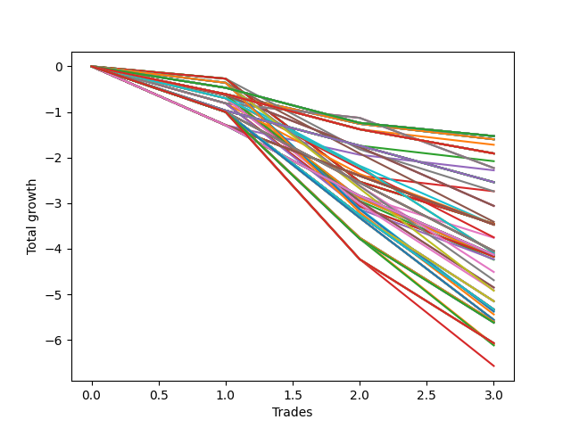

# Short HLT 108_STACK_2 
- Symbol: TSLA
- Date Range: 01/10/2024 - 05/17/2024
- Trading Period: 8:30-12:30
- Number of Trades: 3



| Id. | Name | Win Percent | Profit | Avg Profit / Trade | Avg Time / Trade | Std |      | Name | Win Percent | Profit | Avg Profit / Trade | Avg Time / Trade | Std |
| --- | ---- | ----------- | ------ | ------------------ | ---------------- | --- | ---- | ---- | ----------- | ------ | ------------------ | ---------------- | --- |
| | Sorted By <br> Profit | | | | | | | Sorted By <br> Win Percentage |||||
|0| TP-0.25 180m | 0.00 | -1.53 | -0.51 | 05:00 | 0.20 |     | TP-0.25 180m | 0.00 | -1.53 | -0.51 | 05:00 | 0.20 |
|1| TP-0.25 165m | 0.00 | -1.53 | -0.51 | 05:00 | 0.20 |     | TP-0.25 165m | 0.00 | -1.53 | -0.51 | 05:00 | 0.20 |
|2| TP-0.25 150m | 0.00 | -1.53 | -0.51 | 05:00 | 0.20 |     | TP-0.25 150m | 0.00 | -1.53 | -0.51 | 05:00 | 0.20 |
|3| TP-0.25 135m | 0.00 | -1.53 | -0.51 | 05:00 | 0.20 |     | TP-0.25 135m | 0.00 | -1.53 | -0.51 | 05:00 | 0.20 |
|4| TP-0.25 120m | 0.00 | -1.53 | -0.51 | 05:00 | 0.20 |     | TP-0.25 120m | 0.00 | -1.53 | -0.51 | 05:00 | 0.20 |
|5| TP-0.25 105m | 0.00 | -1.53 | -0.51 | 05:00 | 0.20 |     | TP-0.25 105m | 0.00 | -1.53 | -0.51 | 05:00 | 0.20 |
|6| TP-0.25 90m | 0.00 | -1.53 | -0.51 | 05:00 | 0.20 |     | TP-0.25 90m | 0.00 | -1.53 | -0.51 | 05:00 | 0.20 |
|7| TP-0.25 75m | 0.00 | -1.53 | -0.51 | 05:00 | 0.20 |     | TP-0.25 75m | 0.00 | -1.53 | -0.51 | 05:00 | 0.20 |
|8| TP-0.25 60m | 0.00 | -1.53 | -0.51 | 05:00 | 0.20 |     | TP-0.25 60m | 0.00 | -1.53 | -0.51 | 05:00 | 0.20 |
|9| TP-0.25 45m | 0.00 | -1.53 | -0.51 | 05:00 | 0.20 |     | TP-0.25 45m | 0.00 | -1.53 | -0.51 | 05:00 | 0.20 |
|10| TP-0.25 30m | 0.00 | -1.53 | -0.51 | 05:00 | 0.20 |     | TP-0.25 30m | 0.00 | -1.53 | -0.51 | 05:00 | 0.20 |
|11| TP-0.25 15m | 0.00 | -1.53 | -0.51 | 05:00 | 0.20 |     | TP-0.25 15m | 0.00 | -1.53 | -0.51 | 05:00 | 0.20 |
|12| TP-3 15m | 0.00 | -1.60 | -0.53 | 14:00 | 0.14 |     | TP-3 15m | 0.00 | -1.60 | -0.53 | 14:00 | 0.14 |
|13| TP-2.75 15m | 0.00 | -1.60 | -0.53 | 14:00 | 0.14 |     | TP-2.75 15m | 0.00 | -1.60 | -0.53 | 14:00 | 0.14 |
|14| TP-2.5 15m | 0.00 | -1.60 | -0.53 | 14:00 | 0.14 |     | TP-2.5 15m | 0.00 | -1.60 | -0.53 | 14:00 | 0.14 |
|15| TP-2.25 15m | 0.00 | -1.60 | -0.53 | 14:00 | 0.14 |     | TP-2.25 15m | 0.00 | -1.60 | -0.53 | 14:00 | 0.14 |
|16| TP-2 15m | 0.00 | -1.60 | -0.53 | 14:00 | 0.14 |     | TP-2 15m | 0.00 | -1.60 | -0.53 | 14:00 | 0.14 |
|17| TP-1.75 15m | 0.00 | -1.60 | -0.53 | 14:00 | 0.14 |     | TP-1.75 15m | 0.00 | -1.60 | -0.53 | 14:00 | 0.14 |
|18| TP-1.5 15m | 0.00 | -1.60 | -0.53 | 14:00 | 0.14 |     | TP-1.5 15m | 0.00 | -1.60 | -0.53 | 14:00 | 0.14 |
|19| TP-0.5 15m | 0.00 | -1.72 | -0.57 | 06:40 | 0.18 |     | TP-0.5 15m | 0.00 | -1.72 | -0.57 | 06:40 | 0.18 |
|20| TP-0.5 180m | 0.00 | -1.91 | -0.64 | 07:20 | 0.10 |     | TP-0.5 180m | 0.00 | -1.91 | -0.64 | 07:20 | 0.10 |
|21| TP-0.5 165m | 0.00 | -1.91 | -0.64 | 07:20 | 0.10 |     | TP-0.5 165m | 0.00 | -1.91 | -0.64 | 07:20 | 0.10 |
|22| TP-0.5 150m | 0.00 | -1.91 | -0.64 | 07:20 | 0.10 |     | TP-0.5 150m | 0.00 | -1.91 | -0.64 | 07:20 | 0.10 |
|23| TP-0.5 135m | 0.00 | -1.91 | -0.64 | 07:20 | 0.10 |     | TP-0.5 135m | 0.00 | -1.91 | -0.64 | 07:20 | 0.10 |
|24| TP-0.5 120m | 0.00 | -1.91 | -0.64 | 07:20 | 0.10 |     | TP-0.5 120m | 0.00 | -1.91 | -0.64 | 07:20 | 0.10 |
|25| TP-0.5 105m | 0.00 | -1.91 | -0.64 | 07:20 | 0.10 |     | TP-0.5 105m | 0.00 | -1.91 | -0.64 | 07:20 | 0.10 |
|26| TP-0.5 90m | 0.00 | -1.91 | -0.64 | 07:20 | 0.10 |     | TP-0.5 90m | 0.00 | -1.91 | -0.64 | 07:20 | 0.10 |
|27| TP-0.5 75m | 0.00 | -1.91 | -0.64 | 07:20 | 0.10 |     | TP-0.5 75m | 0.00 | -1.91 | -0.64 | 07:20 | 0.10 |
|28| TP-0.5 60m | 0.00 | -1.91 | -0.64 | 07:20 | 0.10 |     | TP-0.5 60m | 0.00 | -1.91 | -0.64 | 07:20 | 0.10 |
|29| TP-0.5 45m | 0.00 | -1.91 | -0.64 | 07:20 | 0.10 |     | TP-0.5 45m | 0.00 | -1.91 | -0.64 | 07:20 | 0.10 |
|30| TP-0.5 30m | 0.00 | -1.91 | -0.64 | 07:20 | 0.10 |     | TP-0.5 30m | 0.00 | -1.91 | -0.64 | 07:20 | 0.10 |
|31| TP-0.75 15m | 0.00 | -2.08 | -0.69 | 08:00 | 0.26 |     | TP-0.75 15m | 0.00 | -2.08 | -0.69 | 08:00 | 0.26 |
|32| TP-3 60m | 0.00 | -2.23 | -0.74 | 59:00 | 0.32 |     | TP-3 60m | 0.00 | -2.23 | -0.74 | 59:00 | 0.32 |
|33| TP-2.75 60m | 0.00 | -2.23 | -0.74 | 59:00 | 0.32 |     | TP-2.75 60m | 0.00 | -2.23 | -0.74 | 59:00 | 0.32 |
|34| TP-2.5 60m | 0.00 | -2.23 | -0.74 | 59:00 | 0.32 |     | TP-2.5 60m | 0.00 | -2.23 | -0.74 | 59:00 | 0.32 |
|35| TP-1.25 15m | 0.00 | -2.28 | -0.76 | 12:40 | 0.40 |     | TP-1.25 15m | 0.00 | -2.28 | -0.76 | 12:40 | 0.40 |
|36| TP-0.75 180m | 0.00 | -2.54 | -0.85 | 10:00 | 0.09 |     | TP-0.75 180m | 0.00 | -2.54 | -0.85 | 10:00 | 0.09 |
|37| TP-0.75 165m | 0.00 | -2.54 | -0.85 | 10:00 | 0.09 |     | TP-0.75 165m | 0.00 | -2.54 | -0.85 | 10:00 | 0.09 |
|38| TP-0.75 150m | 0.00 | -2.54 | -0.85 | 10:00 | 0.09 |     | TP-0.75 150m | 0.00 | -2.54 | -0.85 | 10:00 | 0.09 |
|39| TP-0.75 135m | 0.00 | -2.54 | -0.85 | 10:00 | 0.09 |     | TP-0.75 135m | 0.00 | -2.54 | -0.85 | 10:00 | 0.09 |
|40| TP-0.75 120m | 0.00 | -2.54 | -0.85 | 10:00 | 0.09 |     | TP-0.75 120m | 0.00 | -2.54 | -0.85 | 10:00 | 0.09 |
|41| TP-0.75 105m | 0.00 | -2.54 | -0.85 | 10:00 | 0.09 |     | TP-0.75 105m | 0.00 | -2.54 | -0.85 | 10:00 | 0.09 |
|42| TP-0.75 90m | 0.00 | -2.54 | -0.85 | 10:00 | 0.09 |     | TP-0.75 90m | 0.00 | -2.54 | -0.85 | 10:00 | 0.09 |
|43| TP-0.75 75m | 0.00 | -2.54 | -0.85 | 10:00 | 0.09 |     | TP-0.75 75m | 0.00 | -2.54 | -0.85 | 10:00 | 0.09 |
|44| TP-0.75 60m | 0.00 | -2.54 | -0.85 | 10:00 | 0.09 |     | TP-0.75 60m | 0.00 | -2.54 | -0.85 | 10:00 | 0.09 |
|45| TP-0.75 45m | 0.00 | -2.54 | -0.85 | 10:00 | 0.09 |     | TP-0.75 45m | 0.00 | -2.54 | -0.85 | 10:00 | 0.09 |
|46| TP-0.75 30m | 0.00 | -2.54 | -0.85 | 10:00 | 0.09 |     | TP-0.75 30m | 0.00 | -2.54 | -0.85 | 10:00 | 0.09 |
|47| TP-1.5 30m | 0.00 | -2.74 | -0.91 | 28:20 | 0.52 |     | TP-1.5 30m | 0.00 | -2.74 | -0.91 | 28:20 | 0.52 |
|48| TP-1 15m | 0.00 | -2.74 | -0.91 | 09:40 | 0.41 |     | TP-1 15m | 0.00 | -2.74 | -0.91 | 09:40 | 0.41 |
|49| TP-3 45m | 0.00 | -3.06 | -1.02 | 44:00 | 0.28 |     | TP-3 45m | 0.00 | -3.06 | -1.02 | 44:00 | 0.28 |
|50| TP-2.75 45m | 0.00 | -3.06 | -1.02 | 44:00 | 0.28 |     | TP-2.75 45m | 0.00 | -3.06 | -1.02 | 44:00 | 0.28 |
|51| TP-2.5 45m | 0.00 | -3.06 | -1.02 | 44:00 | 0.28 |     | TP-2.5 45m | 0.00 | -3.06 | -1.02 | 44:00 | 0.28 |
|52| TP-1.5 90m | 0.00 | -3.41 | -1.14 | 60:00 | 0.55 |     | TP-1.5 90m | 0.00 | -3.41 | -1.14 | 60:00 | 0.55 |
|53| TP-3 30m | 0.00 | -3.45 | -1.15 | 29:00 | 0.83 |     | TP-3 30m | 0.00 | -3.45 | -1.15 | 29:00 | 0.83 |
|54| TP-2.75 30m | 0.00 | -3.45 | -1.15 | 29:00 | 0.83 |     | TP-2.75 30m | 0.00 | -3.45 | -1.15 | 29:00 | 0.83 |
|55| TP-2.5 30m | 0.00 | -3.45 | -1.15 | 29:00 | 0.83 |     | TP-2.5 30m | 0.00 | -3.45 | -1.15 | 29:00 | 0.83 |
|56| TP-2.25 30m | 0.00 | -3.45 | -1.15 | 29:00 | 0.83 |     | TP-2.25 30m | 0.00 | -3.45 | -1.15 | 29:00 | 0.83 |
|57| TP-2 30m | 0.00 | -3.45 | -1.15 | 29:00 | 0.83 |     | TP-2 30m | 0.00 | -3.45 | -1.15 | 29:00 | 0.83 |
|58| TP-1.75 30m | 0.00 | -3.45 | -1.15 | 29:00 | 0.83 |     | TP-1.75 30m | 0.00 | -3.45 | -1.15 | 29:00 | 0.83 |
|59| TP-1.5 60m | 0.00 | -3.46 | -1.15 | 48:20 | 0.30 |     | TP-1.5 60m | 0.00 | -3.46 | -1.15 | 48:20 | 0.30 |
|60| TP-1 180m | 0.00 | -3.47 | -1.16 | 13:20 | 0.10 |     | TP-1 180m | 0.00 | -3.47 | -1.16 | 13:20 | 0.10 |
|61| TP-1 165m | 0.00 | -3.47 | -1.16 | 13:20 | 0.10 |     | TP-1 165m | 0.00 | -3.47 | -1.16 | 13:20 | 0.10 |
|62| TP-1 150m | 0.00 | -3.47 | -1.16 | 13:20 | 0.10 |     | TP-1 150m | 0.00 | -3.47 | -1.16 | 13:20 | 0.10 |
|63| TP-1 135m | 0.00 | -3.47 | -1.16 | 13:20 | 0.10 |     | TP-1 135m | 0.00 | -3.47 | -1.16 | 13:20 | 0.10 |
|64| TP-1 120m | 0.00 | -3.47 | -1.16 | 13:20 | 0.10 |     | TP-1 120m | 0.00 | -3.47 | -1.16 | 13:20 | 0.10 |
|65| TP-1 105m | 0.00 | -3.47 | -1.16 | 13:20 | 0.10 |     | TP-1 105m | 0.00 | -3.47 | -1.16 | 13:20 | 0.10 |
|66| TP-1 90m | 0.00 | -3.47 | -1.16 | 13:20 | 0.10 |     | TP-1 90m | 0.00 | -3.47 | -1.16 | 13:20 | 0.10 |
|67| TP-1 75m | 0.00 | -3.47 | -1.16 | 13:20 | 0.10 |     | TP-1 75m | 0.00 | -3.47 | -1.16 | 13:20 | 0.10 |
|68| TP-1 60m | 0.00 | -3.47 | -1.16 | 13:20 | 0.10 |     | TP-1 60m | 0.00 | -3.47 | -1.16 | 13:20 | 0.10 |
|69| TP-1.5 45m | 0.00 | -3.47 | -1.16 | 38:20 | 0.39 |     | TP-1.5 45m | 0.00 | -3.47 | -1.16 | 38:20 | 0.39 |
|70| TP-1 45m | 0.00 | -3.47 | -1.16 | 13:20 | 0.10 |     | TP-1 45m | 0.00 | -3.47 | -1.16 | 13:20 | 0.10 |
|71| TP-1 30m | 0.00 | -3.47 | -1.16 | 13:20 | 0.10 |     | TP-1 30m | 0.00 | -3.47 | -1.16 | 13:20 | 0.10 |
|72| TP-1.5 75m | 0.00 | -3.75 | -1.25 | 55:00 | 0.39 |     | TP-1.5 75m | 0.00 | -3.75 | -1.25 | 55:00 | 0.39 |
|73| TP-1.25 30m | 0.00 | -3.76 | -1.25 | 22:00 | 0.26 |     | TP-1.25 30m | 0.00 | -3.76 | -1.25 | 22:00 | 0.26 |
|74| TP-1.5 180m | 0.00 | -4.05 | -1.35 | 63:40 | 0.25 |     | TP-1.5 180m | 0.00 | -4.05 | -1.35 | 63:40 | 0.25 |
|75| TP-1.5 165m | 0.00 | -4.05 | -1.35 | 63:40 | 0.25 |     | TP-1.5 165m | 0.00 | -4.05 | -1.35 | 63:40 | 0.25 |
|76| TP-1.5 150m | 0.00 | -4.05 | -1.35 | 63:40 | 0.25 |     | TP-1.5 150m | 0.00 | -4.05 | -1.35 | 63:40 | 0.25 |
|77| TP-1.5 135m | 0.00 | -4.05 | -1.35 | 63:40 | 0.25 |     | TP-1.5 135m | 0.00 | -4.05 | -1.35 | 63:40 | 0.25 |
|78| TP-1.5 120m | 0.00 | -4.05 | -1.35 | 63:40 | 0.25 |     | TP-1.5 120m | 0.00 | -4.05 | -1.35 | 63:40 | 0.25 |
|79| TP-1.5 105m | 0.00 | -4.05 | -1.35 | 63:40 | 0.25 |     | TP-1.5 105m | 0.00 | -4.05 | -1.35 | 63:40 | 0.25 |
|80| TP-3 75m | 0.00 | -4.09 | -1.36 | 74:00 | 0.50 |     | TP-3 75m | 0.00 | -4.09 | -1.36 | 74:00 | 0.50 |
|81| TP-2.75 75m | 0.00 | -4.09 | -1.36 | 74:00 | 0.50 |     | TP-2.75 75m | 0.00 | -4.09 | -1.36 | 74:00 | 0.50 |
|82| TP-2.5 75m | 0.00 | -4.09 | -1.36 | 74:00 | 0.50 |     | TP-2.5 75m | 0.00 | -4.09 | -1.36 | 74:00 | 0.50 |
|83| TP-1.25 180m | 0.00 | -4.13 | -1.38 | 27:00 | 0.12 |     | TP-1.25 180m | 0.00 | -4.13 | -1.38 | 27:00 | 0.12 |
|84| TP-1.25 165m | 0.00 | -4.13 | -1.38 | 27:00 | 0.12 |     | TP-1.25 165m | 0.00 | -4.13 | -1.38 | 27:00 | 0.12 |
|85| TP-1.25 150m | 0.00 | -4.13 | -1.38 | 27:00 | 0.12 |     | TP-1.25 150m | 0.00 | -4.13 | -1.38 | 27:00 | 0.12 |
|86| TP-1.25 135m | 0.00 | -4.13 | -1.38 | 27:00 | 0.12 |     | TP-1.25 135m | 0.00 | -4.13 | -1.38 | 27:00 | 0.12 |
|87| TP-1.25 120m | 0.00 | -4.13 | -1.38 | 27:00 | 0.12 |     | TP-1.25 120m | 0.00 | -4.13 | -1.38 | 27:00 | 0.12 |
|88| TP-1.25 105m | 0.00 | -4.13 | -1.38 | 27:00 | 0.12 |     | TP-1.25 105m | 0.00 | -4.13 | -1.38 | 27:00 | 0.12 |
|89| TP-1.25 90m | 0.00 | -4.13 | -1.38 | 27:00 | 0.12 |     | TP-1.25 90m | 0.00 | -4.13 | -1.38 | 27:00 | 0.12 |
|90| TP-1.25 75m | 0.00 | -4.13 | -1.38 | 27:00 | 0.12 |     | TP-1.25 75m | 0.00 | -4.13 | -1.38 | 27:00 | 0.12 |
|91| TP-1.25 60m | 0.00 | -4.13 | -1.38 | 27:00 | 0.12 |     | TP-1.25 60m | 0.00 | -4.13 | -1.38 | 27:00 | 0.12 |
|92| TP-1.25 45m | 0.00 | -4.13 | -1.38 | 27:00 | 0.12 |     | TP-1.25 45m | 0.00 | -4.13 | -1.38 | 27:00 | 0.12 |
|93| TP-2 60m | 0.00 | -4.17 | -1.39 | 49:00 | 0.63 |     | TP-2 60m | 0.00 | -4.17 | -1.39 | 49:00 | 0.63 |
|94| TP-1.75 60m | 0.00 | -4.17 | -1.39 | 49:00 | 0.63 |     | TP-1.75 60m | 0.00 | -4.17 | -1.39 | 49:00 | 0.63 |
|95| TP-2 45m | 0.00 | -4.18 | -1.39 | 39:00 | 0.67 |     | TP-2 45m | 0.00 | -4.18 | -1.39 | 39:00 | 0.67 |
|96| TP-1.75 45m | 0.00 | -4.18 | -1.39 | 39:00 | 0.67 |     | TP-1.75 45m | 0.00 | -4.18 | -1.39 | 39:00 | 0.67 |
|97| TP-2.25 60m | 0.00 | -4.23 | -1.41 | 49:20 | 0.65 |     | TP-2.25 60m | 0.00 | -4.23 | -1.41 | 49:20 | 0.65 |
|98| TP-2.25 45m | 0.00 | -4.24 | -1.41 | 39:20 | 0.70 |     | TP-2.25 45m | 0.00 | -4.24 | -1.41 | 39:20 | 0.70 |
|99| TP-1.75 90m | 0.00 | -4.51 | -1.50 | 62:20 | 0.82 |     | TP-1.75 90m | 0.00 | -4.51 | -1.50 | 62:20 | 0.82 |
|100| TP-2 90m | 0.00 | -4.69 | -1.56 | 64:40 | 0.85 |     | TP-2 90m | 0.00 | -4.69 | -1.56 | 64:40 | 0.85 |
|101| TP-2 75m | 0.00 | -4.85 | -1.62 | 59:00 | 0.67 |     | TP-2 75m | 0.00 | -4.85 | -1.62 | 59:00 | 0.67 |
|102| TP-1.75 75m | 0.00 | -4.85 | -1.62 | 57:20 | 0.67 |     | TP-1.75 75m | 0.00 | -4.85 | -1.62 | 57:20 | 0.67 |
|103| TP-2.25 75m | 0.00 | -4.91 | -1.64 | 59:20 | 0.69 |     | TP-2.25 75m | 0.00 | -4.91 | -1.64 | 59:20 | 0.69 |
|104| TP-2.25 90m | 0.00 | -4.92 | -1.64 | 69:20 | 0.91 |     | TP-2.25 90m | 0.00 | -4.92 | -1.64 | 69:20 | 0.91 |
|105| TP-1.75 180m | 0.00 | -5.15 | -1.72 | 66:00 | 0.53 |     | TP-1.75 180m | 0.00 | -5.15 | -1.72 | 66:00 | 0.53 |
|106| TP-1.75 165m | 0.00 | -5.15 | -1.72 | 66:00 | 0.53 |     | TP-1.75 165m | 0.00 | -5.15 | -1.72 | 66:00 | 0.53 |
|107| TP-1.75 150m | 0.00 | -5.15 | -1.72 | 66:00 | 0.53 |     | TP-1.75 150m | 0.00 | -5.15 | -1.72 | 66:00 | 0.53 |
|108| TP-1.75 135m | 0.00 | -5.15 | -1.72 | 66:00 | 0.53 |     | TP-1.75 135m | 0.00 | -5.15 | -1.72 | 66:00 | 0.53 |
|109| TP-1.75 120m | 0.00 | -5.15 | -1.72 | 66:00 | 0.53 |     | TP-1.75 120m | 0.00 | -5.15 | -1.72 | 66:00 | 0.53 |
|110| TP-1.75 105m | 0.00 | -5.15 | -1.72 | 66:00 | 0.53 |     | TP-1.75 105m | 0.00 | -5.15 | -1.72 | 66:00 | 0.53 |
|111| TP-2 180m | 0.00 | -5.33 | -1.78 | 68:20 | 0.55 |     | TP-2 180m | 0.00 | -5.33 | -1.78 | 68:20 | 0.55 |
|112| TP-2 165m | 0.00 | -5.33 | -1.78 | 68:20 | 0.55 |     | TP-2 165m | 0.00 | -5.33 | -1.78 | 68:20 | 0.55 |
|113| TP-2 150m | 0.00 | -5.33 | -1.78 | 68:20 | 0.55 |     | TP-2 150m | 0.00 | -5.33 | -1.78 | 68:20 | 0.55 |
|114| TP-2 135m | 0.00 | -5.33 | -1.78 | 68:20 | 0.55 |     | TP-2 135m | 0.00 | -5.33 | -1.78 | 68:20 | 0.55 |
|115| TP-2 120m | 0.00 | -5.33 | -1.78 | 68:20 | 0.55 |     | TP-2 120m | 0.00 | -5.33 | -1.78 | 68:20 | 0.55 |
|116| TP-2 105m | 0.00 | -5.33 | -1.78 | 68:20 | 0.55 |     | TP-2 105m | 0.00 | -5.33 | -1.78 | 68:20 | 0.55 |
|117| TP-2.5 90m | 0.00 | -5.36 | -1.79 | 88:00 | 1.03 |     | TP-2.5 90m | 0.00 | -5.36 | -1.79 | 88:00 | 1.03 |
|118| TP-2.75 90m | 0.00 | -5.38 | -1.79 | 88:40 | 1.04 |     | TP-2.75 90m | 0.00 | -5.38 | -1.79 | 88:40 | 1.04 |
|119| TP-3 90m | 0.00 | -5.44 | -1.81 | 89:00 | 1.06 |     | TP-3 90m | 0.00 | -5.44 | -1.81 | 89:00 | 1.06 |
|120| TP-2.25 180m | 0.00 | -5.56 | -1.85 | 73:00 | 0.60 |     | TP-2.25 180m | 0.00 | -5.56 | -1.85 | 73:00 | 0.60 |
|121| TP-2.25 165m | 0.00 | -5.56 | -1.85 | 73:00 | 0.60 |     | TP-2.25 165m | 0.00 | -5.56 | -1.85 | 73:00 | 0.60 |
|122| TP-2.25 150m | 0.00 | -5.56 | -1.85 | 73:00 | 0.60 |     | TP-2.25 150m | 0.00 | -5.56 | -1.85 | 73:00 | 0.60 |
|123| TP-2.25 135m | 0.00 | -5.56 | -1.85 | 73:00 | 0.60 |     | TP-2.25 135m | 0.00 | -5.56 | -1.85 | 73:00 | 0.60 |
|124| TP-2.25 120m | 0.00 | -5.56 | -1.85 | 73:00 | 0.60 |     | TP-2.25 120m | 0.00 | -5.56 | -1.85 | 73:00 | 0.60 |
|125| TP-2.25 105m | 0.00 | -5.56 | -1.85 | 73:00 | 0.60 |     | TP-2.25 105m | 0.00 | -5.56 | -1.85 | 73:00 | 0.60 |
|126| TP-2.5 180m | 0.00 | -5.60 | -1.87 | 101:40 | 0.72 |     | TP-2.5 180m | 0.00 | -5.60 | -1.87 | 101:40 | 0.72 |
|127| TP-2.5 165m | 0.00 | -5.60 | -1.87 | 101:40 | 0.72 |     | TP-2.5 165m | 0.00 | -5.60 | -1.87 | 101:40 | 0.72 |
|128| TP-2.5 150m | 0.00 | -5.60 | -1.87 | 101:40 | 0.72 |     | TP-2.5 150m | 0.00 | -5.60 | -1.87 | 101:40 | 0.72 |
|129| TP-2.5 135m | 0.00 | -5.60 | -1.87 | 101:40 | 0.72 |     | TP-2.5 135m | 0.00 | -5.60 | -1.87 | 101:40 | 0.72 |
|130| TP-2.5 120m | 0.00 | -5.60 | -1.87 | 101:40 | 0.72 |     | TP-2.5 120m | 0.00 | -5.60 | -1.87 | 101:40 | 0.72 |
|131| TP-2.75 180m | 0.00 | -5.62 | -1.87 | 102:20 | 0.73 |     | TP-2.75 180m | 0.00 | -5.62 | -1.87 | 102:20 | 0.73 |
|132| TP-2.75 165m | 0.00 | -5.62 | -1.87 | 102:20 | 0.73 |     | TP-2.75 165m | 0.00 | -5.62 | -1.87 | 102:20 | 0.73 |
|133| TP-2.75 150m | 0.00 | -5.62 | -1.87 | 102:20 | 0.73 |     | TP-2.75 150m | 0.00 | -5.62 | -1.87 | 102:20 | 0.73 |
|134| TP-2.75 135m | 0.00 | -5.62 | -1.87 | 102:20 | 0.73 |     | TP-2.75 135m | 0.00 | -5.62 | -1.87 | 102:20 | 0.73 |
|135| TP-2.75 120m | 0.00 | -5.62 | -1.87 | 102:20 | 0.73 |     | TP-2.75 120m | 0.00 | -5.62 | -1.87 | 102:20 | 0.73 |
|136| TP-3 180m | 0.00 | -6.07 | -2.02 | 103:40 | 0.92 |     | TP-3 180m | 0.00 | -6.07 | -2.02 | 103:40 | 0.92 |
|137| TP-3 165m | 0.00 | -6.07 | -2.02 | 103:40 | 0.92 |     | TP-3 165m | 0.00 | -6.07 | -2.02 | 103:40 | 0.92 |
|138| TP-3 150m | 0.00 | -6.07 | -2.02 | 103:40 | 0.92 |     | TP-3 150m | 0.00 | -6.07 | -2.02 | 103:40 | 0.92 |
|139| TP-3 135m | 0.00 | -6.07 | -2.02 | 103:40 | 0.92 |     | TP-3 135m | 0.00 | -6.07 | -2.02 | 103:40 | 0.92 |
|140| TP-3 120m | 0.00 | -6.07 | -2.02 | 103:40 | 0.92 |     | TP-3 120m | 0.00 | -6.07 | -2.02 | 103:40 | 0.92 |
|141| TP-2.5 105m | 0.00 | -6.10 | -2.03 | 96:40 | 0.75 |     | TP-2.5 105m | 0.00 | -6.10 | -2.03 | 96:40 | 0.75 |
|142| TP-2.75 105m | 0.00 | -6.12 | -2.04 | 97:20 | 0.76 |     | TP-2.75 105m | 0.00 | -6.12 | -2.04 | 97:20 | 0.76 |
|143| TP-3 105m | 0.00 | -6.57 | -2.19 | 98:40 | 0.92 |     | TP-3 105m | 0.00 | -6.57 | -2.19 | 98:40 | 0.92 |

### Test TP-0.25 15m
* Take Profit of 0.25 Point
* 0.25 Stoploss
* Results:
```
Total Trades: 3
Percent Up: 0.00
Percent Down: 100.00
Total Points Moved Up: -1.53
Potential Profit: -765.00
Total Points Ups: 0.00 Count Ups: 0
Total Points Downs: -1.53 Count Downs: 3
```

<details><summary>Trades</summary>

<code>In: 2024-02-07 11:10:00		Out: 2024-02-07 11:13:00		Total Position Time: 03:00		Total Move Up: -0.47		Total to Date: -0.47</code> <br />
<code>In: 2024-04-29 09:40:00		Out: 2024-04-29 09:42:00		Total Position Time: 02:00		Total Move Up: -0.77		Total to Date: -1.24</code> <br />
<code>In: 2024-05-17 09:45:00		Out: 2024-05-17 09:55:00		Total Position Time: 10:00		Total Move Up: -0.29		Total to Date: -1.53</code> <br />


</details>

### Test TP-0.5 15m
* Take Profit of 0.5 Point
* 0.5 Stoploss
* Results:
```
Total Trades: 3
Percent Up: 0.00
Percent Down: 100.00
Total Points Moved Up: -1.72
Potential Profit: -860.00
Total Points Ups: 0.00 Count Ups: 0
Total Points Downs: -1.72 Count Downs: 3
```

<details><summary>Trades</summary>

<code>In: 2024-02-07 11:10:00		Out: 2024-02-07 11:14:00		Total Position Time: 04:00		Total Move Up: -0.61		Total to Date: -0.61</code> <br />
<code>In: 2024-04-29 09:40:00		Out: 2024-04-29 09:42:00		Total Position Time: 02:00		Total Move Up: -0.77		Total to Date: -1.38</code> <br />
<code>In: 2024-05-17 09:45:00		Out: 2024-05-17 09:59:00		Total Position Time: 14:00		Total Move Up: -0.34		Total to Date: -1.72</code> <br />


</details>

### Test TP-0.75 15m
* Take Profit of 0.75 Point
* 0.75 Stoploss
* Results:
```
Total Trades: 3
Percent Up: 0.00
Percent Down: 100.00
Total Points Moved Up: -2.08
Potential Profit: -1040.00
Total Points Ups: 0.00 Count Ups: 0
Total Points Downs: -2.08 Count Downs: 3
```

<details><summary>Trades</summary>

<code>In: 2024-02-07 11:10:00		Out: 2024-02-07 11:18:00		Total Position Time: 08:00		Total Move Up: -0.97		Total to Date: -0.97</code> <br />
<code>In: 2024-04-29 09:40:00		Out: 2024-04-29 09:42:00		Total Position Time: 02:00		Total Move Up: -0.77		Total to Date: -1.74</code> <br />
<code>In: 2024-05-17 09:45:00		Out: 2024-05-17 09:59:00		Total Position Time: 14:00		Total Move Up: -0.34		Total to Date: -2.08</code> <br />


</details>

### Test TP-1 15m
* Take Profit of 1 Point
* 1 Stoploss
* Results:
```
Total Trades: 3
Percent Up: 0.00
Percent Down: 100.00
Total Points Moved Up: -2.74
Potential Profit: -1370.00
Total Points Ups: 0.00 Count Ups: 0
Total Points Downs: -2.74 Count Downs: 3
```

<details><summary>Trades</summary>

<code>In: 2024-02-07 11:10:00		Out: 2024-02-07 11:20:00		Total Position Time: 10:00		Total Move Up: -1.29		Total to Date: -1.29</code> <br />
<code>In: 2024-04-29 09:40:00		Out: 2024-04-29 09:45:00		Total Position Time: 05:00		Total Move Up: -1.11		Total to Date: -2.40</code> <br />
<code>In: 2024-05-17 09:45:00		Out: 2024-05-17 09:59:00		Total Position Time: 14:00		Total Move Up: -0.34		Total to Date: -2.74</code> <br />


</details>

### Test TP-1.25 15m
* Take Profit of 1.25 Point
* 1.25 Stoploss
* Results:
```
Total Trades: 3
Percent Up: 0.00
Percent Down: 100.00
Total Points Moved Up: -2.28
Potential Profit: -1140.00
Total Points Ups: 0.00 Count Ups: 0
Total Points Downs: -2.28 Count Downs: 3
```

<details><summary>Trades</summary>

<code>In: 2024-02-07 11:10:00		Out: 2024-02-07 11:20:00		Total Position Time: 10:00		Total Move Up: -1.29		Total to Date: -1.29</code> <br />
<code>In: 2024-04-29 09:40:00		Out: 2024-04-29 09:54:00		Total Position Time: 14:00		Total Move Up: -0.65		Total to Date: -1.94</code> <br />
<code>In: 2024-05-17 09:45:00		Out: 2024-05-17 09:59:00		Total Position Time: 14:00		Total Move Up: -0.34		Total to Date: -2.28</code> <br />


</details>

### Test TP-1.5 15m
* Take Profit of 1.5 Point
* 1.5 Stoploss
* Results:
```
Total Trades: 3
Percent Up: 0.00
Percent Down: 100.00
Total Points Moved Up: -1.60
Potential Profit: -800.00
Total Points Ups: 0.00 Count Ups: 0
Total Points Downs: -1.60 Count Downs: 3
```

<details><summary>Trades</summary>

<code>In: 2024-02-07 11:10:00		Out: 2024-02-07 11:24:00		Total Position Time: 14:00		Total Move Up: -0.61		Total to Date: -0.61</code> <br />
<code>In: 2024-04-29 09:40:00		Out: 2024-04-29 09:54:00		Total Position Time: 14:00		Total Move Up: -0.65		Total to Date: -1.26</code> <br />
<code>In: 2024-05-17 09:45:00		Out: 2024-05-17 09:59:00		Total Position Time: 14:00		Total Move Up: -0.34		Total to Date: -1.60</code> <br />


</details>

### Test TP-1.75 15m
* Take Profit of 1.75 Point
* 1.75 Stoploss
* Results:
```
Total Trades: 3
Percent Up: 0.00
Percent Down: 100.00
Total Points Moved Up: -1.60
Potential Profit: -800.00
Total Points Ups: 0.00 Count Ups: 0
Total Points Downs: -1.60 Count Downs: 3
```

<details><summary>Trades</summary>

<code>In: 2024-02-07 11:10:00		Out: 2024-02-07 11:24:00		Total Position Time: 14:00		Total Move Up: -0.61		Total to Date: -0.61</code> <br />
<code>In: 2024-04-29 09:40:00		Out: 2024-04-29 09:54:00		Total Position Time: 14:00		Total Move Up: -0.65		Total to Date: -1.26</code> <br />
<code>In: 2024-05-17 09:45:00		Out: 2024-05-17 09:59:00		Total Position Time: 14:00		Total Move Up: -0.34		Total to Date: -1.60</code> <br />


</details>

### Test TP-2 15m
* Take Profit of 2 Point
* 2 Stoploss
* Results:
```
Total Trades: 3
Percent Up: 0.00
Percent Down: 100.00
Total Points Moved Up: -1.60
Potential Profit: -800.00
Total Points Ups: 0.00 Count Ups: 0
Total Points Downs: -1.60 Count Downs: 3
```

<details><summary>Trades</summary>

<code>In: 2024-02-07 11:10:00		Out: 2024-02-07 11:24:00		Total Position Time: 14:00		Total Move Up: -0.61		Total to Date: -0.61</code> <br />
<code>In: 2024-04-29 09:40:00		Out: 2024-04-29 09:54:00		Total Position Time: 14:00		Total Move Up: -0.65		Total to Date: -1.26</code> <br />
<code>In: 2024-05-17 09:45:00		Out: 2024-05-17 09:59:00		Total Position Time: 14:00		Total Move Up: -0.34		Total to Date: -1.60</code> <br />


</details>

### Test TP-2.25 15m
* Take Profit of 2.25 Point
* 2.25 Stoploss
* Results:
```
Total Trades: 3
Percent Up: 0.00
Percent Down: 100.00
Total Points Moved Up: -1.60
Potential Profit: -800.00
Total Points Ups: 0.00 Count Ups: 0
Total Points Downs: -1.60 Count Downs: 3
```

<details><summary>Trades</summary>

<code>In: 2024-02-07 11:10:00		Out: 2024-02-07 11:24:00		Total Position Time: 14:00		Total Move Up: -0.61		Total to Date: -0.61</code> <br />
<code>In: 2024-04-29 09:40:00		Out: 2024-04-29 09:54:00		Total Position Time: 14:00		Total Move Up: -0.65		Total to Date: -1.26</code> <br />
<code>In: 2024-05-17 09:45:00		Out: 2024-05-17 09:59:00		Total Position Time: 14:00		Total Move Up: -0.34		Total to Date: -1.60</code> <br />


</details>

### Test TP-2.5 15m
* Take Profit of 2.5 Point
* 2.5 Stoploss
* Results:
```
Total Trades: 3
Percent Up: 0.00
Percent Down: 100.00
Total Points Moved Up: -1.60
Potential Profit: -800.00
Total Points Ups: 0.00 Count Ups: 0
Total Points Downs: -1.60 Count Downs: 3
```

<details><summary>Trades</summary>

<code>In: 2024-02-07 11:10:00		Out: 2024-02-07 11:24:00		Total Position Time: 14:00		Total Move Up: -0.61		Total to Date: -0.61</code> <br />
<code>In: 2024-04-29 09:40:00		Out: 2024-04-29 09:54:00		Total Position Time: 14:00		Total Move Up: -0.65		Total to Date: -1.26</code> <br />
<code>In: 2024-05-17 09:45:00		Out: 2024-05-17 09:59:00		Total Position Time: 14:00		Total Move Up: -0.34		Total to Date: -1.60</code> <br />


</details>

### Test TP-2.75 15m
* Take Profit of 2.75 Point
* 2.75 Stoploss
* Results:
```
Total Trades: 3
Percent Up: 0.00
Percent Down: 100.00
Total Points Moved Up: -1.60
Potential Profit: -800.00
Total Points Ups: 0.00 Count Ups: 0
Total Points Downs: -1.60 Count Downs: 3
```

<details><summary>Trades</summary>

<code>In: 2024-02-07 11:10:00		Out: 2024-02-07 11:24:00		Total Position Time: 14:00		Total Move Up: -0.61		Total to Date: -0.61</code> <br />
<code>In: 2024-04-29 09:40:00		Out: 2024-04-29 09:54:00		Total Position Time: 14:00		Total Move Up: -0.65		Total to Date: -1.26</code> <br />
<code>In: 2024-05-17 09:45:00		Out: 2024-05-17 09:59:00		Total Position Time: 14:00		Total Move Up: -0.34		Total to Date: -1.60</code> <br />


</details>

### Test TP-3 15m
* Take Profit of 3 Point
* 3 Stoploss
* Results:
```
Total Trades: 3
Percent Up: 0.00
Percent Down: 100.00
Total Points Moved Up: -1.60
Potential Profit: -800.00
Total Points Ups: 0.00 Count Ups: 0
Total Points Downs: -1.60 Count Downs: 3
```

<details><summary>Trades</summary>

<code>In: 2024-02-07 11:10:00		Out: 2024-02-07 11:24:00		Total Position Time: 14:00		Total Move Up: -0.61		Total to Date: -0.61</code> <br />
<code>In: 2024-04-29 09:40:00		Out: 2024-04-29 09:54:00		Total Position Time: 14:00		Total Move Up: -0.65		Total to Date: -1.26</code> <br />
<code>In: 2024-05-17 09:45:00		Out: 2024-05-17 09:59:00		Total Position Time: 14:00		Total Move Up: -0.34		Total to Date: -1.60</code> <br />


</details>

### Test TP-0.25 30m
* Take Profit of 0.25 Point
* 0.25 Stoploss
* Results:
```
Total Trades: 3
Percent Up: 0.00
Percent Down: 100.00
Total Points Moved Up: -1.53
Potential Profit: -765.00
Total Points Ups: 0.00 Count Ups: 0
Total Points Downs: -1.53 Count Downs: 3
```

<details><summary>Trades</summary>

<code>In: 2024-02-07 11:10:00		Out: 2024-02-07 11:13:00		Total Position Time: 03:00		Total Move Up: -0.47		Total to Date: -0.47</code> <br />
<code>In: 2024-04-29 09:40:00		Out: 2024-04-29 09:42:00		Total Position Time: 02:00		Total Move Up: -0.77		Total to Date: -1.24</code> <br />
<code>In: 2024-05-17 09:45:00		Out: 2024-05-17 09:55:00		Total Position Time: 10:00		Total Move Up: -0.29		Total to Date: -1.53</code> <br />


</details>

### Test TP-0.5 30m
* Take Profit of 0.5 Point
* 0.5 Stoploss
* Results:
```
Total Trades: 3
Percent Up: 0.00
Percent Down: 100.00
Total Points Moved Up: -1.91
Potential Profit: -955.00
Total Points Ups: 0.00 Count Ups: 0
Total Points Downs: -1.91 Count Downs: 3
```

<details><summary>Trades</summary>

<code>In: 2024-02-07 11:10:00		Out: 2024-02-07 11:14:00		Total Position Time: 04:00		Total Move Up: -0.61		Total to Date: -0.61</code> <br />
<code>In: 2024-04-29 09:40:00		Out: 2024-04-29 09:42:00		Total Position Time: 02:00		Total Move Up: -0.77		Total to Date: -1.38</code> <br />
<code>In: 2024-05-17 09:45:00		Out: 2024-05-17 10:01:00		Total Position Time: 16:00		Total Move Up: -0.53		Total to Date: -1.91</code> <br />


</details>

### Test TP-0.75 30m
* Take Profit of 0.75 Point
* 0.75 Stoploss
* Results:
```
Total Trades: 3
Percent Up: 0.00
Percent Down: 100.00
Total Points Moved Up: -2.54
Potential Profit: -1270.00
Total Points Ups: 0.00 Count Ups: 0
Total Points Downs: -2.54 Count Downs: 3
```

<details><summary>Trades</summary>

<code>In: 2024-02-07 11:10:00		Out: 2024-02-07 11:18:00		Total Position Time: 08:00		Total Move Up: -0.97		Total to Date: -0.97</code> <br />
<code>In: 2024-04-29 09:40:00		Out: 2024-04-29 09:42:00		Total Position Time: 02:00		Total Move Up: -0.77		Total to Date: -1.74</code> <br />
<code>In: 2024-05-17 09:45:00		Out: 2024-05-17 10:05:00		Total Position Time: 20:00		Total Move Up: -0.80		Total to Date: -2.54</code> <br />


</details>

### Test TP-1 30m
* Take Profit of 1 Point
* 1 Stoploss
* Results:
```
Total Trades: 3
Percent Up: 0.00
Percent Down: 100.00
Total Points Moved Up: -3.47
Potential Profit: -1735.00
Total Points Ups: 0.00 Count Ups: 0
Total Points Downs: -3.47 Count Downs: 3
```

<details><summary>Trades</summary>

<code>In: 2024-02-07 11:10:00		Out: 2024-02-07 11:20:00		Total Position Time: 10:00		Total Move Up: -1.29		Total to Date: -1.29</code> <br />
<code>In: 2024-04-29 09:40:00		Out: 2024-04-29 09:45:00		Total Position Time: 05:00		Total Move Up: -1.11		Total to Date: -2.40</code> <br />
<code>In: 2024-05-17 09:45:00		Out: 2024-05-17 10:10:00		Total Position Time: 25:00		Total Move Up: -1.07		Total to Date: -3.47</code> <br />


</details>

### Test TP-1.25 30m
* Take Profit of 1.25 Point
* 1.25 Stoploss
* Results:
```
Total Trades: 3
Percent Up: 0.00
Percent Down: 100.00
Total Points Moved Up: -3.76
Potential Profit: -1880.00
Total Points Ups: 0.00 Count Ups: 0
Total Points Downs: -3.76 Count Downs: 3
```

<details><summary>Trades</summary>

<code>In: 2024-02-07 11:10:00		Out: 2024-02-07 11:20:00		Total Position Time: 10:00		Total Move Up: -1.29		Total to Date: -1.29</code> <br />
<code>In: 2024-04-29 09:40:00		Out: 2024-04-29 10:07:00		Total Position Time: 27:00		Total Move Up: -1.55		Total to Date: -2.84</code> <br />
<code>In: 2024-05-17 09:45:00		Out: 2024-05-17 10:14:00		Total Position Time: 29:00		Total Move Up: -0.92		Total to Date: -3.76</code> <br />


</details>

### Test TP-1.5 30m
* Take Profit of 1.5 Point
* 1.5 Stoploss
* Results:
```
Total Trades: 3
Percent Up: 0.00
Percent Down: 100.00
Total Points Moved Up: -2.74
Potential Profit: -1370.00
Total Points Ups: 0.00 Count Ups: 0
Total Points Downs: -2.74 Count Downs: 3
```

<details><summary>Trades</summary>

<code>In: 2024-02-07 11:10:00		Out: 2024-02-07 11:39:00		Total Position Time: 29:00		Total Move Up: -0.27		Total to Date: -0.27</code> <br />
<code>In: 2024-04-29 09:40:00		Out: 2024-04-29 10:07:00		Total Position Time: 27:00		Total Move Up: -1.55		Total to Date: -1.82</code> <br />
<code>In: 2024-05-17 09:45:00		Out: 2024-05-17 10:14:00		Total Position Time: 29:00		Total Move Up: -0.92		Total to Date: -2.74</code> <br />


</details>

### Test TP-1.75 30m
* Take Profit of 1.75 Point
* 1.75 Stoploss
* Results:
```
Total Trades: 3
Percent Up: 0.00
Percent Down: 100.00
Total Points Moved Up: -3.45
Potential Profit: -1725.00
Total Points Ups: 0.00 Count Ups: 0
Total Points Downs: -3.45 Count Downs: 3
```

<details><summary>Trades</summary>

<code>In: 2024-02-07 11:10:00		Out: 2024-02-07 11:39:00		Total Position Time: 29:00		Total Move Up: -0.27		Total to Date: -0.27</code> <br />
<code>In: 2024-04-29 09:40:00		Out: 2024-04-29 10:09:00		Total Position Time: 29:00		Total Move Up: -2.26		Total to Date: -2.53</code> <br />
<code>In: 2024-05-17 09:45:00		Out: 2024-05-17 10:14:00		Total Position Time: 29:00		Total Move Up: -0.92		Total to Date: -3.45</code> <br />


</details>

### Test TP-2 30m
* Take Profit of 2 Point
* 2 Stoploss
* Results:
```
Total Trades: 3
Percent Up: 0.00
Percent Down: 100.00
Total Points Moved Up: -3.45
Potential Profit: -1725.00
Total Points Ups: 0.00 Count Ups: 0
Total Points Downs: -3.45 Count Downs: 3
```

<details><summary>Trades</summary>

<code>In: 2024-02-07 11:10:00		Out: 2024-02-07 11:39:00		Total Position Time: 29:00		Total Move Up: -0.27		Total to Date: -0.27</code> <br />
<code>In: 2024-04-29 09:40:00		Out: 2024-04-29 10:09:00		Total Position Time: 29:00		Total Move Up: -2.26		Total to Date: -2.53</code> <br />
<code>In: 2024-05-17 09:45:00		Out: 2024-05-17 10:14:00		Total Position Time: 29:00		Total Move Up: -0.92		Total to Date: -3.45</code> <br />


</details>

### Test TP-2.25 30m
* Take Profit of 2.25 Point
* 2.25 Stoploss
* Results:
```
Total Trades: 3
Percent Up: 0.00
Percent Down: 100.00
Total Points Moved Up: -3.45
Potential Profit: -1725.00
Total Points Ups: 0.00 Count Ups: 0
Total Points Downs: -3.45 Count Downs: 3
```

<details><summary>Trades</summary>

<code>In: 2024-02-07 11:10:00		Out: 2024-02-07 11:39:00		Total Position Time: 29:00		Total Move Up: -0.27		Total to Date: -0.27</code> <br />
<code>In: 2024-04-29 09:40:00		Out: 2024-04-29 10:09:00		Total Position Time: 29:00		Total Move Up: -2.26		Total to Date: -2.53</code> <br />
<code>In: 2024-05-17 09:45:00		Out: 2024-05-17 10:14:00		Total Position Time: 29:00		Total Move Up: -0.92		Total to Date: -3.45</code> <br />


</details>

### Test TP-2.5 30m
* Take Profit of 2.5 Point
* 2.5 Stoploss
* Results:
```
Total Trades: 3
Percent Up: 0.00
Percent Down: 100.00
Total Points Moved Up: -3.45
Potential Profit: -1725.00
Total Points Ups: 0.00 Count Ups: 0
Total Points Downs: -3.45 Count Downs: 3
```

<details><summary>Trades</summary>

<code>In: 2024-02-07 11:10:00		Out: 2024-02-07 11:39:00		Total Position Time: 29:00		Total Move Up: -0.27		Total to Date: -0.27</code> <br />
<code>In: 2024-04-29 09:40:00		Out: 2024-04-29 10:09:00		Total Position Time: 29:00		Total Move Up: -2.26		Total to Date: -2.53</code> <br />
<code>In: 2024-05-17 09:45:00		Out: 2024-05-17 10:14:00		Total Position Time: 29:00		Total Move Up: -0.92		Total to Date: -3.45</code> <br />


</details>

### Test TP-2.75 30m
* Take Profit of 2.75 Point
* 2.75 Stoploss
* Results:
```
Total Trades: 3
Percent Up: 0.00
Percent Down: 100.00
Total Points Moved Up: -3.45
Potential Profit: -1725.00
Total Points Ups: 0.00 Count Ups: 0
Total Points Downs: -3.45 Count Downs: 3
```

<details><summary>Trades</summary>

<code>In: 2024-02-07 11:10:00		Out: 2024-02-07 11:39:00		Total Position Time: 29:00		Total Move Up: -0.27		Total to Date: -0.27</code> <br />
<code>In: 2024-04-29 09:40:00		Out: 2024-04-29 10:09:00		Total Position Time: 29:00		Total Move Up: -2.26		Total to Date: -2.53</code> <br />
<code>In: 2024-05-17 09:45:00		Out: 2024-05-17 10:14:00		Total Position Time: 29:00		Total Move Up: -0.92		Total to Date: -3.45</code> <br />


</details>

### Test TP-3 30m
* Take Profit of 3 Point
* 3 Stoploss
* Results:
```
Total Trades: 3
Percent Up: 0.00
Percent Down: 100.00
Total Points Moved Up: -3.45
Potential Profit: -1725.00
Total Points Ups: 0.00 Count Ups: 0
Total Points Downs: -3.45 Count Downs: 3
```

<details><summary>Trades</summary>

<code>In: 2024-02-07 11:10:00		Out: 2024-02-07 11:39:00		Total Position Time: 29:00		Total Move Up: -0.27		Total to Date: -0.27</code> <br />
<code>In: 2024-04-29 09:40:00		Out: 2024-04-29 10:09:00		Total Position Time: 29:00		Total Move Up: -2.26		Total to Date: -2.53</code> <br />
<code>In: 2024-05-17 09:45:00		Out: 2024-05-17 10:14:00		Total Position Time: 29:00		Total Move Up: -0.92		Total to Date: -3.45</code> <br />


</details>

### Test TP-0.25 45m
* Take Profit of 0.25 Point
* 0.25 Stoploss
* Results:
```
Total Trades: 3
Percent Up: 0.00
Percent Down: 100.00
Total Points Moved Up: -1.53
Potential Profit: -765.00
Total Points Ups: 0.00 Count Ups: 0
Total Points Downs: -1.53 Count Downs: 3
```

<details><summary>Trades</summary>

<code>In: 2024-02-07 11:10:00		Out: 2024-02-07 11:13:00		Total Position Time: 03:00		Total Move Up: -0.47		Total to Date: -0.47</code> <br />
<code>In: 2024-04-29 09:40:00		Out: 2024-04-29 09:42:00		Total Position Time: 02:00		Total Move Up: -0.77		Total to Date: -1.24</code> <br />
<code>In: 2024-05-17 09:45:00		Out: 2024-05-17 09:55:00		Total Position Time: 10:00		Total Move Up: -0.29		Total to Date: -1.53</code> <br />


</details>

### Test TP-0.5 45m
* Take Profit of 0.5 Point
* 0.5 Stoploss
* Results:
```
Total Trades: 3
Percent Up: 0.00
Percent Down: 100.00
Total Points Moved Up: -1.91
Potential Profit: -955.00
Total Points Ups: 0.00 Count Ups: 0
Total Points Downs: -1.91 Count Downs: 3
```

<details><summary>Trades</summary>

<code>In: 2024-02-07 11:10:00		Out: 2024-02-07 11:14:00		Total Position Time: 04:00		Total Move Up: -0.61		Total to Date: -0.61</code> <br />
<code>In: 2024-04-29 09:40:00		Out: 2024-04-29 09:42:00		Total Position Time: 02:00		Total Move Up: -0.77		Total to Date: -1.38</code> <br />
<code>In: 2024-05-17 09:45:00		Out: 2024-05-17 10:01:00		Total Position Time: 16:00		Total Move Up: -0.53		Total to Date: -1.91</code> <br />


</details>

### Test TP-0.75 45m
* Take Profit of 0.75 Point
* 0.75 Stoploss
* Results:
```
Total Trades: 3
Percent Up: 0.00
Percent Down: 100.00
Total Points Moved Up: -2.54
Potential Profit: -1270.00
Total Points Ups: 0.00 Count Ups: 0
Total Points Downs: -2.54 Count Downs: 3
```

<details><summary>Trades</summary>

<code>In: 2024-02-07 11:10:00		Out: 2024-02-07 11:18:00		Total Position Time: 08:00		Total Move Up: -0.97		Total to Date: -0.97</code> <br />
<code>In: 2024-04-29 09:40:00		Out: 2024-04-29 09:42:00		Total Position Time: 02:00		Total Move Up: -0.77		Total to Date: -1.74</code> <br />
<code>In: 2024-05-17 09:45:00		Out: 2024-05-17 10:05:00		Total Position Time: 20:00		Total Move Up: -0.80		Total to Date: -2.54</code> <br />


</details>

### Test TP-1 45m
* Take Profit of 1 Point
* 1 Stoploss
* Results:
```
Total Trades: 3
Percent Up: 0.00
Percent Down: 100.00
Total Points Moved Up: -3.47
Potential Profit: -1735.00
Total Points Ups: 0.00 Count Ups: 0
Total Points Downs: -3.47 Count Downs: 3
```

<details><summary>Trades</summary>

<code>In: 2024-02-07 11:10:00		Out: 2024-02-07 11:20:00		Total Position Time: 10:00		Total Move Up: -1.29		Total to Date: -1.29</code> <br />
<code>In: 2024-04-29 09:40:00		Out: 2024-04-29 09:45:00		Total Position Time: 05:00		Total Move Up: -1.11		Total to Date: -2.40</code> <br />
<code>In: 2024-05-17 09:45:00		Out: 2024-05-17 10:10:00		Total Position Time: 25:00		Total Move Up: -1.07		Total to Date: -3.47</code> <br />


</details>

### Test TP-1.25 45m
* Take Profit of 1.25 Point
* 1.25 Stoploss
* Results:
```
Total Trades: 3
Percent Up: 0.00
Percent Down: 100.00
Total Points Moved Up: -4.13
Potential Profit: -2065.00
Total Points Ups: 0.00 Count Ups: 0
Total Points Downs: -4.13 Count Downs: 3
```

<details><summary>Trades</summary>

<code>In: 2024-02-07 11:10:00		Out: 2024-02-07 11:20:00		Total Position Time: 10:00		Total Move Up: -1.29		Total to Date: -1.29</code> <br />
<code>In: 2024-04-29 09:40:00		Out: 2024-04-29 10:07:00		Total Position Time: 27:00		Total Move Up: -1.55		Total to Date: -2.84</code> <br />
<code>In: 2024-05-17 09:45:00		Out: 2024-05-17 10:29:00		Total Position Time: 44:00		Total Move Up: -1.29		Total to Date: -4.13</code> <br />


</details>

### Test TP-1.5 45m
* Take Profit of 1.5 Point
* 1.5 Stoploss
* Results:
```
Total Trades: 3
Percent Up: 0.00
Percent Down: 100.00
Total Points Moved Up: -3.47
Potential Profit: -1735.00
Total Points Ups: 0.00 Count Ups: 0
Total Points Downs: -3.47 Count Downs: 3
```

<details><summary>Trades</summary>

<code>In: 2024-02-07 11:10:00		Out: 2024-02-07 11:54:00		Total Position Time: 44:00		Total Move Up: -0.63		Total to Date: -0.63</code> <br />
<code>In: 2024-04-29 09:40:00		Out: 2024-04-29 10:07:00		Total Position Time: 27:00		Total Move Up: -1.55		Total to Date: -2.18</code> <br />
<code>In: 2024-05-17 09:45:00		Out: 2024-05-17 10:29:00		Total Position Time: 44:00		Total Move Up: -1.29		Total to Date: -3.47</code> <br />


</details>

### Test TP-1.75 45m
* Take Profit of 1.75 Point
* 1.75 Stoploss
* Results:
```
Total Trades: 3
Percent Up: 0.00
Percent Down: 100.00
Total Points Moved Up: -4.18
Potential Profit: -2090.00
Total Points Ups: 0.00 Count Ups: 0
Total Points Downs: -4.18 Count Downs: 3
```

<details><summary>Trades</summary>

<code>In: 2024-02-07 11:10:00		Out: 2024-02-07 11:54:00		Total Position Time: 44:00		Total Move Up: -0.63		Total to Date: -0.63</code> <br />
<code>In: 2024-04-29 09:40:00		Out: 2024-04-29 10:09:00		Total Position Time: 29:00		Total Move Up: -2.26		Total to Date: -2.89</code> <br />
<code>In: 2024-05-17 09:45:00		Out: 2024-05-17 10:29:00		Total Position Time: 44:00		Total Move Up: -1.29		Total to Date: -4.18</code> <br />


</details>

### Test TP-2 45m
* Take Profit of 2 Point
* 2 Stoploss
* Results:
```
Total Trades: 3
Percent Up: 0.00
Percent Down: 100.00
Total Points Moved Up: -4.18
Potential Profit: -2090.00
Total Points Ups: 0.00 Count Ups: 0
Total Points Downs: -4.18 Count Downs: 3
```

<details><summary>Trades</summary>

<code>In: 2024-02-07 11:10:00		Out: 2024-02-07 11:54:00		Total Position Time: 44:00		Total Move Up: -0.63		Total to Date: -0.63</code> <br />
<code>In: 2024-04-29 09:40:00		Out: 2024-04-29 10:09:00		Total Position Time: 29:00		Total Move Up: -2.26		Total to Date: -2.89</code> <br />
<code>In: 2024-05-17 09:45:00		Out: 2024-05-17 10:29:00		Total Position Time: 44:00		Total Move Up: -1.29		Total to Date: -4.18</code> <br />


</details>

### Test TP-2.25 45m
* Take Profit of 2.25 Point
* 2.25 Stoploss
* Results:
```
Total Trades: 3
Percent Up: 0.00
Percent Down: 100.00
Total Points Moved Up: -4.24
Potential Profit: -2120.00
Total Points Ups: 0.00 Count Ups: 0
Total Points Downs: -4.24 Count Downs: 3
```

<details><summary>Trades</summary>

<code>In: 2024-02-07 11:10:00		Out: 2024-02-07 11:54:00		Total Position Time: 44:00		Total Move Up: -0.63		Total to Date: -0.63</code> <br />
<code>In: 2024-04-29 09:40:00		Out: 2024-04-29 10:10:00		Total Position Time: 30:00		Total Move Up: -2.32		Total to Date: -2.95</code> <br />
<code>In: 2024-05-17 09:45:00		Out: 2024-05-17 10:29:00		Total Position Time: 44:00		Total Move Up: -1.29		Total to Date: -4.24</code> <br />


</details>

### Test TP-2.5 45m
* Take Profit of 2.5 Point
* 2.5 Stoploss
* Results:
```
Total Trades: 3
Percent Up: 0.00
Percent Down: 100.00
Total Points Moved Up: -3.06
Potential Profit: -1530.00
Total Points Ups: 0.00 Count Ups: 0
Total Points Downs: -3.06 Count Downs: 3
```

<details><summary>Trades</summary>

<code>In: 2024-02-07 11:10:00		Out: 2024-02-07 11:54:00		Total Position Time: 44:00		Total Move Up: -0.63		Total to Date: -0.63</code> <br />
<code>In: 2024-04-29 09:40:00		Out: 2024-04-29 10:24:00		Total Position Time: 44:00		Total Move Up: -1.14		Total to Date: -1.77</code> <br />
<code>In: 2024-05-17 09:45:00		Out: 2024-05-17 10:29:00		Total Position Time: 44:00		Total Move Up: -1.29		Total to Date: -3.06</code> <br />


</details>

### Test TP-2.75 45m
* Take Profit of 2.75 Point
* 2.75 Stoploss
* Results:
```
Total Trades: 3
Percent Up: 0.00
Percent Down: 100.00
Total Points Moved Up: -3.06
Potential Profit: -1530.00
Total Points Ups: 0.00 Count Ups: 0
Total Points Downs: -3.06 Count Downs: 3
```

<details><summary>Trades</summary>

<code>In: 2024-02-07 11:10:00		Out: 2024-02-07 11:54:00		Total Position Time: 44:00		Total Move Up: -0.63		Total to Date: -0.63</code> <br />
<code>In: 2024-04-29 09:40:00		Out: 2024-04-29 10:24:00		Total Position Time: 44:00		Total Move Up: -1.14		Total to Date: -1.77</code> <br />
<code>In: 2024-05-17 09:45:00		Out: 2024-05-17 10:29:00		Total Position Time: 44:00		Total Move Up: -1.29		Total to Date: -3.06</code> <br />


</details>

### Test TP-3 45m
* Take Profit of 3 Point
* 3 Stoploss
* Results:
```
Total Trades: 3
Percent Up: 0.00
Percent Down: 100.00
Total Points Moved Up: -3.06
Potential Profit: -1530.00
Total Points Ups: 0.00 Count Ups: 0
Total Points Downs: -3.06 Count Downs: 3
```

<details><summary>Trades</summary>

<code>In: 2024-02-07 11:10:00		Out: 2024-02-07 11:54:00		Total Position Time: 44:00		Total Move Up: -0.63		Total to Date: -0.63</code> <br />
<code>In: 2024-04-29 09:40:00		Out: 2024-04-29 10:24:00		Total Position Time: 44:00		Total Move Up: -1.14		Total to Date: -1.77</code> <br />
<code>In: 2024-05-17 09:45:00		Out: 2024-05-17 10:29:00		Total Position Time: 44:00		Total Move Up: -1.29		Total to Date: -3.06</code> <br />


</details>

### Test TP-0.25 60m
* Take Profit of 0.25 Point
* 0.25 Stoploss
* Results:
```
Total Trades: 3
Percent Up: 0.00
Percent Down: 100.00
Total Points Moved Up: -1.53
Potential Profit: -765.00
Total Points Ups: 0.00 Count Ups: 0
Total Points Downs: -1.53 Count Downs: 3
```

<details><summary>Trades</summary>

<code>In: 2024-02-07 11:10:00		Out: 2024-02-07 11:13:00		Total Position Time: 03:00		Total Move Up: -0.47		Total to Date: -0.47</code> <br />
<code>In: 2024-04-29 09:40:00		Out: 2024-04-29 09:42:00		Total Position Time: 02:00		Total Move Up: -0.77		Total to Date: -1.24</code> <br />
<code>In: 2024-05-17 09:45:00		Out: 2024-05-17 09:55:00		Total Position Time: 10:00		Total Move Up: -0.29		Total to Date: -1.53</code> <br />


</details>

### Test TP-0.5 60m
* Take Profit of 0.5 Point
* 0.5 Stoploss
* Results:
```
Total Trades: 3
Percent Up: 0.00
Percent Down: 100.00
Total Points Moved Up: -1.91
Potential Profit: -955.00
Total Points Ups: 0.00 Count Ups: 0
Total Points Downs: -1.91 Count Downs: 3
```

<details><summary>Trades</summary>

<code>In: 2024-02-07 11:10:00		Out: 2024-02-07 11:14:00		Total Position Time: 04:00		Total Move Up: -0.61		Total to Date: -0.61</code> <br />
<code>In: 2024-04-29 09:40:00		Out: 2024-04-29 09:42:00		Total Position Time: 02:00		Total Move Up: -0.77		Total to Date: -1.38</code> <br />
<code>In: 2024-05-17 09:45:00		Out: 2024-05-17 10:01:00		Total Position Time: 16:00		Total Move Up: -0.53		Total to Date: -1.91</code> <br />


</details>

### Test TP-0.75 60m
* Take Profit of 0.75 Point
* 0.75 Stoploss
* Results:
```
Total Trades: 3
Percent Up: 0.00
Percent Down: 100.00
Total Points Moved Up: -2.54
Potential Profit: -1270.00
Total Points Ups: 0.00 Count Ups: 0
Total Points Downs: -2.54 Count Downs: 3
```

<details><summary>Trades</summary>

<code>In: 2024-02-07 11:10:00		Out: 2024-02-07 11:18:00		Total Position Time: 08:00		Total Move Up: -0.97		Total to Date: -0.97</code> <br />
<code>In: 2024-04-29 09:40:00		Out: 2024-04-29 09:42:00		Total Position Time: 02:00		Total Move Up: -0.77		Total to Date: -1.74</code> <br />
<code>In: 2024-05-17 09:45:00		Out: 2024-05-17 10:05:00		Total Position Time: 20:00		Total Move Up: -0.80		Total to Date: -2.54</code> <br />


</details>

### Test TP-1 60m
* Take Profit of 1 Point
* 1 Stoploss
* Results:
```
Total Trades: 3
Percent Up: 0.00
Percent Down: 100.00
Total Points Moved Up: -3.47
Potential Profit: -1735.00
Total Points Ups: 0.00 Count Ups: 0
Total Points Downs: -3.47 Count Downs: 3
```

<details><summary>Trades</summary>

<code>In: 2024-02-07 11:10:00		Out: 2024-02-07 11:20:00		Total Position Time: 10:00		Total Move Up: -1.29		Total to Date: -1.29</code> <br />
<code>In: 2024-04-29 09:40:00		Out: 2024-04-29 09:45:00		Total Position Time: 05:00		Total Move Up: -1.11		Total to Date: -2.40</code> <br />
<code>In: 2024-05-17 09:45:00		Out: 2024-05-17 10:10:00		Total Position Time: 25:00		Total Move Up: -1.07		Total to Date: -3.47</code> <br />


</details>

### Test TP-1.25 60m
* Take Profit of 1.25 Point
* 1.25 Stoploss
* Results:
```
Total Trades: 3
Percent Up: 0.00
Percent Down: 100.00
Total Points Moved Up: -4.13
Potential Profit: -2065.00
Total Points Ups: 0.00 Count Ups: 0
Total Points Downs: -4.13 Count Downs: 3
```

<details><summary>Trades</summary>

<code>In: 2024-02-07 11:10:00		Out: 2024-02-07 11:20:00		Total Position Time: 10:00		Total Move Up: -1.29		Total to Date: -1.29</code> <br />
<code>In: 2024-04-29 09:40:00		Out: 2024-04-29 10:07:00		Total Position Time: 27:00		Total Move Up: -1.55		Total to Date: -2.84</code> <br />
<code>In: 2024-05-17 09:45:00		Out: 2024-05-17 10:29:00		Total Position Time: 44:00		Total Move Up: -1.29		Total to Date: -4.13</code> <br />


</details>

### Test TP-1.5 60m
* Take Profit of 1.5 Point
* 1.5 Stoploss
* Results:
```
Total Trades: 3
Percent Up: 0.00
Percent Down: 100.00
Total Points Moved Up: -3.46
Potential Profit: -1730.00
Total Points Ups: 0.00 Count Ups: 0
Total Points Downs: -3.46 Count Downs: 3
```

<details><summary>Trades</summary>

<code>In: 2024-02-07 11:10:00		Out: 2024-02-07 12:09:00		Total Position Time: 59:00		Total Move Up: -0.81		Total to Date: -0.81</code> <br />
<code>In: 2024-04-29 09:40:00		Out: 2024-04-29 10:07:00		Total Position Time: 27:00		Total Move Up: -1.55		Total to Date: -2.36</code> <br />
<code>In: 2024-05-17 09:45:00		Out: 2024-05-17 10:44:00		Total Position Time: 59:00		Total Move Up: -1.10		Total to Date: -3.46</code> <br />


</details>

### Test TP-1.75 60m
* Take Profit of 1.75 Point
* 1.75 Stoploss
* Results:
```
Total Trades: 3
Percent Up: 0.00
Percent Down: 100.00
Total Points Moved Up: -4.17
Potential Profit: -2085.00
Total Points Ups: 0.00 Count Ups: 0
Total Points Downs: -4.17 Count Downs: 3
```

<details><summary>Trades</summary>

<code>In: 2024-02-07 11:10:00		Out: 2024-02-07 12:09:00		Total Position Time: 59:00		Total Move Up: -0.81		Total to Date: -0.81</code> <br />
<code>In: 2024-04-29 09:40:00		Out: 2024-04-29 10:09:00		Total Position Time: 29:00		Total Move Up: -2.26		Total to Date: -3.07</code> <br />
<code>In: 2024-05-17 09:45:00		Out: 2024-05-17 10:44:00		Total Position Time: 59:00		Total Move Up: -1.10		Total to Date: -4.17</code> <br />


</details>

### Test TP-2 60m
* Take Profit of 2 Point
* 2 Stoploss
* Results:
```
Total Trades: 3
Percent Up: 0.00
Percent Down: 100.00
Total Points Moved Up: -4.17
Potential Profit: -2085.00
Total Points Ups: 0.00 Count Ups: 0
Total Points Downs: -4.17 Count Downs: 3
```

<details><summary>Trades</summary>

<code>In: 2024-02-07 11:10:00		Out: 2024-02-07 12:09:00		Total Position Time: 59:00		Total Move Up: -0.81		Total to Date: -0.81</code> <br />
<code>In: 2024-04-29 09:40:00		Out: 2024-04-29 10:09:00		Total Position Time: 29:00		Total Move Up: -2.26		Total to Date: -3.07</code> <br />
<code>In: 2024-05-17 09:45:00		Out: 2024-05-17 10:44:00		Total Position Time: 59:00		Total Move Up: -1.10		Total to Date: -4.17</code> <br />


</details>

### Test TP-2.25 60m
* Take Profit of 2.25 Point
* 2.25 Stoploss
* Results:
```
Total Trades: 3
Percent Up: 0.00
Percent Down: 100.00
Total Points Moved Up: -4.23
Potential Profit: -2115.00
Total Points Ups: 0.00 Count Ups: 0
Total Points Downs: -4.23 Count Downs: 3
```

<details><summary>Trades</summary>

<code>In: 2024-02-07 11:10:00		Out: 2024-02-07 12:09:00		Total Position Time: 59:00		Total Move Up: -0.81		Total to Date: -0.81</code> <br />
<code>In: 2024-04-29 09:40:00		Out: 2024-04-29 10:10:00		Total Position Time: 30:00		Total Move Up: -2.32		Total to Date: -3.13</code> <br />
<code>In: 2024-05-17 09:45:00		Out: 2024-05-17 10:44:00		Total Position Time: 59:00		Total Move Up: -1.10		Total to Date: -4.23</code> <br />


</details>

### Test TP-2.5 60m
* Take Profit of 2.5 Point
* 2.5 Stoploss
* Results:
```
Total Trades: 3
Percent Up: 0.00
Percent Down: 100.00
Total Points Moved Up: -2.23
Potential Profit: -1115.00
Total Points Ups: 0.00 Count Ups: 0
Total Points Downs: -2.23 Count Downs: 3
```

<details><summary>Trades</summary>

<code>In: 2024-02-07 11:10:00		Out: 2024-02-07 12:09:00		Total Position Time: 59:00		Total Move Up: -0.81		Total to Date: -0.81</code> <br />
<code>In: 2024-04-29 09:40:00		Out: 2024-04-29 10:39:00		Total Position Time: 59:00		Total Move Up: -0.32		Total to Date: -1.13</code> <br />
<code>In: 2024-05-17 09:45:00		Out: 2024-05-17 10:44:00		Total Position Time: 59:00		Total Move Up: -1.10		Total to Date: -2.23</code> <br />


</details>

### Test TP-2.75 60m
* Take Profit of 2.75 Point
* 2.75 Stoploss
* Results:
```
Total Trades: 3
Percent Up: 0.00
Percent Down: 100.00
Total Points Moved Up: -2.23
Potential Profit: -1115.00
Total Points Ups: 0.00 Count Ups: 0
Total Points Downs: -2.23 Count Downs: 3
```

<details><summary>Trades</summary>

<code>In: 2024-02-07 11:10:00		Out: 2024-02-07 12:09:00		Total Position Time: 59:00		Total Move Up: -0.81		Total to Date: -0.81</code> <br />
<code>In: 2024-04-29 09:40:00		Out: 2024-04-29 10:39:00		Total Position Time: 59:00		Total Move Up: -0.32		Total to Date: -1.13</code> <br />
<code>In: 2024-05-17 09:45:00		Out: 2024-05-17 10:44:00		Total Position Time: 59:00		Total Move Up: -1.10		Total to Date: -2.23</code> <br />


</details>

### Test TP-3 60m
* Take Profit of 3 Point
* 3 Stoploss
* Results:
```
Total Trades: 3
Percent Up: 0.00
Percent Down: 100.00
Total Points Moved Up: -2.23
Potential Profit: -1115.00
Total Points Ups: 0.00 Count Ups: 0
Total Points Downs: -2.23 Count Downs: 3
```

<details><summary>Trades</summary>

<code>In: 2024-02-07 11:10:00		Out: 2024-02-07 12:09:00		Total Position Time: 59:00		Total Move Up: -0.81		Total to Date: -0.81</code> <br />
<code>In: 2024-04-29 09:40:00		Out: 2024-04-29 10:39:00		Total Position Time: 59:00		Total Move Up: -0.32		Total to Date: -1.13</code> <br />
<code>In: 2024-05-17 09:45:00		Out: 2024-05-17 10:44:00		Total Position Time: 59:00		Total Move Up: -1.10		Total to Date: -2.23</code> <br />


</details>

### Test TP-0.25 75m
* Take Profit of 0.25 Point
* 0.25 Stoploss
* Results:
```
Total Trades: 3
Percent Up: 0.00
Percent Down: 100.00
Total Points Moved Up: -1.53
Potential Profit: -765.00
Total Points Ups: 0.00 Count Ups: 0
Total Points Downs: -1.53 Count Downs: 3
```

<details><summary>Trades</summary>

<code>In: 2024-02-07 11:10:00		Out: 2024-02-07 11:13:00		Total Position Time: 03:00		Total Move Up: -0.47		Total to Date: -0.47</code> <br />
<code>In: 2024-04-29 09:40:00		Out: 2024-04-29 09:42:00		Total Position Time: 02:00		Total Move Up: -0.77		Total to Date: -1.24</code> <br />
<code>In: 2024-05-17 09:45:00		Out: 2024-05-17 09:55:00		Total Position Time: 10:00		Total Move Up: -0.29		Total to Date: -1.53</code> <br />


</details>

### Test TP-0.5 75m
* Take Profit of 0.5 Point
* 0.5 Stoploss
* Results:
```
Total Trades: 3
Percent Up: 0.00
Percent Down: 100.00
Total Points Moved Up: -1.91
Potential Profit: -955.00
Total Points Ups: 0.00 Count Ups: 0
Total Points Downs: -1.91 Count Downs: 3
```

<details><summary>Trades</summary>

<code>In: 2024-02-07 11:10:00		Out: 2024-02-07 11:14:00		Total Position Time: 04:00		Total Move Up: -0.61		Total to Date: -0.61</code> <br />
<code>In: 2024-04-29 09:40:00		Out: 2024-04-29 09:42:00		Total Position Time: 02:00		Total Move Up: -0.77		Total to Date: -1.38</code> <br />
<code>In: 2024-05-17 09:45:00		Out: 2024-05-17 10:01:00		Total Position Time: 16:00		Total Move Up: -0.53		Total to Date: -1.91</code> <br />


</details>

### Test TP-0.75 75m
* Take Profit of 0.75 Point
* 0.75 Stoploss
* Results:
```
Total Trades: 3
Percent Up: 0.00
Percent Down: 100.00
Total Points Moved Up: -2.54
Potential Profit: -1270.00
Total Points Ups: 0.00 Count Ups: 0
Total Points Downs: -2.54 Count Downs: 3
```

<details><summary>Trades</summary>

<code>In: 2024-02-07 11:10:00		Out: 2024-02-07 11:18:00		Total Position Time: 08:00		Total Move Up: -0.97		Total to Date: -0.97</code> <br />
<code>In: 2024-04-29 09:40:00		Out: 2024-04-29 09:42:00		Total Position Time: 02:00		Total Move Up: -0.77		Total to Date: -1.74</code> <br />
<code>In: 2024-05-17 09:45:00		Out: 2024-05-17 10:05:00		Total Position Time: 20:00		Total Move Up: -0.80		Total to Date: -2.54</code> <br />


</details>

### Test TP-1 75m
* Take Profit of 1 Point
* 1 Stoploss
* Results:
```
Total Trades: 3
Percent Up: 0.00
Percent Down: 100.00
Total Points Moved Up: -3.47
Potential Profit: -1735.00
Total Points Ups: 0.00 Count Ups: 0
Total Points Downs: -3.47 Count Downs: 3
```

<details><summary>Trades</summary>

<code>In: 2024-02-07 11:10:00		Out: 2024-02-07 11:20:00		Total Position Time: 10:00		Total Move Up: -1.29		Total to Date: -1.29</code> <br />
<code>In: 2024-04-29 09:40:00		Out: 2024-04-29 09:45:00		Total Position Time: 05:00		Total Move Up: -1.11		Total to Date: -2.40</code> <br />
<code>In: 2024-05-17 09:45:00		Out: 2024-05-17 10:10:00		Total Position Time: 25:00		Total Move Up: -1.07		Total to Date: -3.47</code> <br />


</details>

### Test TP-1.25 75m
* Take Profit of 1.25 Point
* 1.25 Stoploss
* Results:
```
Total Trades: 3
Percent Up: 0.00
Percent Down: 100.00
Total Points Moved Up: -4.13
Potential Profit: -2065.00
Total Points Ups: 0.00 Count Ups: 0
Total Points Downs: -4.13 Count Downs: 3
```

<details><summary>Trades</summary>

<code>In: 2024-02-07 11:10:00		Out: 2024-02-07 11:20:00		Total Position Time: 10:00		Total Move Up: -1.29		Total to Date: -1.29</code> <br />
<code>In: 2024-04-29 09:40:00		Out: 2024-04-29 10:07:00		Total Position Time: 27:00		Total Move Up: -1.55		Total to Date: -2.84</code> <br />
<code>In: 2024-05-17 09:45:00		Out: 2024-05-17 10:29:00		Total Position Time: 44:00		Total Move Up: -1.29		Total to Date: -4.13</code> <br />


</details>

### Test TP-1.5 75m
* Take Profit of 1.5 Point
* 1.5 Stoploss
* Results:
```
Total Trades: 3
Percent Up: 0.00
Percent Down: 100.00
Total Points Moved Up: -3.75
Potential Profit: -1875.00
Total Points Ups: 0.00 Count Ups: 0
Total Points Downs: -3.75 Count Downs: 3
```

<details><summary>Trades</summary>

<code>In: 2024-02-07 11:10:00		Out: 2024-02-07 12:24:00		Total Position Time: 74:00		Total Move Up: -0.70		Total to Date: -0.70</code> <br />
<code>In: 2024-04-29 09:40:00		Out: 2024-04-29 10:07:00		Total Position Time: 27:00		Total Move Up: -1.55		Total to Date: -2.25</code> <br />
<code>In: 2024-05-17 09:45:00		Out: 2024-05-17 10:49:00		Total Position Time: 64:00		Total Move Up: -1.50		Total to Date: -3.75</code> <br />


</details>

### Test TP-1.75 75m
* Take Profit of 1.75 Point
* 1.75 Stoploss
* Results:
```
Total Trades: 3
Percent Up: 0.00
Percent Down: 100.00
Total Points Moved Up: -4.85
Potential Profit: -2425.00
Total Points Ups: 0.00 Count Ups: 0
Total Points Downs: -4.85 Count Downs: 3
```

<details><summary>Trades</summary>

<code>In: 2024-02-07 11:10:00		Out: 2024-02-07 12:24:00		Total Position Time: 74:00		Total Move Up: -0.70		Total to Date: -0.70</code> <br />
<code>In: 2024-04-29 09:40:00		Out: 2024-04-29 10:09:00		Total Position Time: 29:00		Total Move Up: -2.26		Total to Date: -2.96</code> <br />
<code>In: 2024-05-17 09:45:00		Out: 2024-05-17 10:54:00		Total Position Time: 69:00		Total Move Up: -1.89		Total to Date: -4.85</code> <br />


</details>

### Test TP-2 75m
* Take Profit of 2 Point
* 2 Stoploss
* Results:
```
Total Trades: 3
Percent Up: 0.00
Percent Down: 100.00
Total Points Moved Up: -4.85
Potential Profit: -2425.00
Total Points Ups: 0.00 Count Ups: 0
Total Points Downs: -4.85 Count Downs: 3
```

<details><summary>Trades</summary>

<code>In: 2024-02-07 11:10:00		Out: 2024-02-07 12:24:00		Total Position Time: 74:00		Total Move Up: -0.70		Total to Date: -0.70</code> <br />
<code>In: 2024-04-29 09:40:00		Out: 2024-04-29 10:09:00		Total Position Time: 29:00		Total Move Up: -2.26		Total to Date: -2.96</code> <br />
<code>In: 2024-05-17 09:45:00		Out: 2024-05-17 10:59:00		Total Position Time: 74:00		Total Move Up: -1.89		Total to Date: -4.85</code> <br />


</details>

### Test TP-2.25 75m
* Take Profit of 2.25 Point
* 2.25 Stoploss
* Results:
```
Total Trades: 3
Percent Up: 0.00
Percent Down: 100.00
Total Points Moved Up: -4.91
Potential Profit: -2455.00
Total Points Ups: 0.00 Count Ups: 0
Total Points Downs: -4.91 Count Downs: 3
```

<details><summary>Trades</summary>

<code>In: 2024-02-07 11:10:00		Out: 2024-02-07 12:24:00		Total Position Time: 74:00		Total Move Up: -0.70		Total to Date: -0.70</code> <br />
<code>In: 2024-04-29 09:40:00		Out: 2024-04-29 10:10:00		Total Position Time: 30:00		Total Move Up: -2.32		Total to Date: -3.02</code> <br />
<code>In: 2024-05-17 09:45:00		Out: 2024-05-17 10:59:00		Total Position Time: 74:00		Total Move Up: -1.89		Total to Date: -4.91</code> <br />


</details>

### Test TP-2.5 75m
* Take Profit of 2.5 Point
* 2.5 Stoploss
* Results:
```
Total Trades: 3
Percent Up: 0.00
Percent Down: 100.00
Total Points Moved Up: -4.09
Potential Profit: -2045.00
Total Points Ups: 0.00 Count Ups: 0
Total Points Downs: -4.09 Count Downs: 3
```

<details><summary>Trades</summary>

<code>In: 2024-02-07 11:10:00		Out: 2024-02-07 12:24:00		Total Position Time: 74:00		Total Move Up: -0.70		Total to Date: -0.70</code> <br />
<code>In: 2024-04-29 09:40:00		Out: 2024-04-29 10:54:00		Total Position Time: 74:00		Total Move Up: -1.50		Total to Date: -2.20</code> <br />
<code>In: 2024-05-17 09:45:00		Out: 2024-05-17 10:59:00		Total Position Time: 74:00		Total Move Up: -1.89		Total to Date: -4.09</code> <br />


</details>

### Test TP-2.75 75m
* Take Profit of 2.75 Point
* 2.75 Stoploss
* Results:
```
Total Trades: 3
Percent Up: 0.00
Percent Down: 100.00
Total Points Moved Up: -4.09
Potential Profit: -2045.00
Total Points Ups: 0.00 Count Ups: 0
Total Points Downs: -4.09 Count Downs: 3
```

<details><summary>Trades</summary>

<code>In: 2024-02-07 11:10:00		Out: 2024-02-07 12:24:00		Total Position Time: 74:00		Total Move Up: -0.70		Total to Date: -0.70</code> <br />
<code>In: 2024-04-29 09:40:00		Out: 2024-04-29 10:54:00		Total Position Time: 74:00		Total Move Up: -1.50		Total to Date: -2.20</code> <br />
<code>In: 2024-05-17 09:45:00		Out: 2024-05-17 10:59:00		Total Position Time: 74:00		Total Move Up: -1.89		Total to Date: -4.09</code> <br />


</details>

### Test TP-3 75m
* Take Profit of 3 Point
* 3 Stoploss
* Results:
```
Total Trades: 3
Percent Up: 0.00
Percent Down: 100.00
Total Points Moved Up: -4.09
Potential Profit: -2045.00
Total Points Ups: 0.00 Count Ups: 0
Total Points Downs: -4.09 Count Downs: 3
```

<details><summary>Trades</summary>

<code>In: 2024-02-07 11:10:00		Out: 2024-02-07 12:24:00		Total Position Time: 74:00		Total Move Up: -0.70		Total to Date: -0.70</code> <br />
<code>In: 2024-04-29 09:40:00		Out: 2024-04-29 10:54:00		Total Position Time: 74:00		Total Move Up: -1.50		Total to Date: -2.20</code> <br />
<code>In: 2024-05-17 09:45:00		Out: 2024-05-17 10:59:00		Total Position Time: 74:00		Total Move Up: -1.89		Total to Date: -4.09</code> <br />


</details>

### Test TP-0.25 90m
* Take Profit of 0.25 Point
* 0.25 Stoploss
* Results:
```
Total Trades: 3
Percent Up: 0.00
Percent Down: 100.00
Total Points Moved Up: -1.53
Potential Profit: -765.00
Total Points Ups: 0.00 Count Ups: 0
Total Points Downs: -1.53 Count Downs: 3
```

<details><summary>Trades</summary>

<code>In: 2024-02-07 11:10:00		Out: 2024-02-07 11:13:00		Total Position Time: 03:00		Total Move Up: -0.47		Total to Date: -0.47</code> <br />
<code>In: 2024-04-29 09:40:00		Out: 2024-04-29 09:42:00		Total Position Time: 02:00		Total Move Up: -0.77		Total to Date: -1.24</code> <br />
<code>In: 2024-05-17 09:45:00		Out: 2024-05-17 09:55:00		Total Position Time: 10:00		Total Move Up: -0.29		Total to Date: -1.53</code> <br />


</details>

### Test TP-0.5 90m
* Take Profit of 0.5 Point
* 0.5 Stoploss
* Results:
```
Total Trades: 3
Percent Up: 0.00
Percent Down: 100.00
Total Points Moved Up: -1.91
Potential Profit: -955.00
Total Points Ups: 0.00 Count Ups: 0
Total Points Downs: -1.91 Count Downs: 3
```

<details><summary>Trades</summary>

<code>In: 2024-02-07 11:10:00		Out: 2024-02-07 11:14:00		Total Position Time: 04:00		Total Move Up: -0.61		Total to Date: -0.61</code> <br />
<code>In: 2024-04-29 09:40:00		Out: 2024-04-29 09:42:00		Total Position Time: 02:00		Total Move Up: -0.77		Total to Date: -1.38</code> <br />
<code>In: 2024-05-17 09:45:00		Out: 2024-05-17 10:01:00		Total Position Time: 16:00		Total Move Up: -0.53		Total to Date: -1.91</code> <br />


</details>

### Test TP-0.75 90m
* Take Profit of 0.75 Point
* 0.75 Stoploss
* Results:
```
Total Trades: 3
Percent Up: 0.00
Percent Down: 100.00
Total Points Moved Up: -2.54
Potential Profit: -1270.00
Total Points Ups: 0.00 Count Ups: 0
Total Points Downs: -2.54 Count Downs: 3
```

<details><summary>Trades</summary>

<code>In: 2024-02-07 11:10:00		Out: 2024-02-07 11:18:00		Total Position Time: 08:00		Total Move Up: -0.97		Total to Date: -0.97</code> <br />
<code>In: 2024-04-29 09:40:00		Out: 2024-04-29 09:42:00		Total Position Time: 02:00		Total Move Up: -0.77		Total to Date: -1.74</code> <br />
<code>In: 2024-05-17 09:45:00		Out: 2024-05-17 10:05:00		Total Position Time: 20:00		Total Move Up: -0.80		Total to Date: -2.54</code> <br />


</details>

### Test TP-1 90m
* Take Profit of 1 Point
* 1 Stoploss
* Results:
```
Total Trades: 3
Percent Up: 0.00
Percent Down: 100.00
Total Points Moved Up: -3.47
Potential Profit: -1735.00
Total Points Ups: 0.00 Count Ups: 0
Total Points Downs: -3.47 Count Downs: 3
```

<details><summary>Trades</summary>

<code>In: 2024-02-07 11:10:00		Out: 2024-02-07 11:20:00		Total Position Time: 10:00		Total Move Up: -1.29		Total to Date: -1.29</code> <br />
<code>In: 2024-04-29 09:40:00		Out: 2024-04-29 09:45:00		Total Position Time: 05:00		Total Move Up: -1.11		Total to Date: -2.40</code> <br />
<code>In: 2024-05-17 09:45:00		Out: 2024-05-17 10:10:00		Total Position Time: 25:00		Total Move Up: -1.07		Total to Date: -3.47</code> <br />


</details>

### Test TP-1.25 90m
* Take Profit of 1.25 Point
* 1.25 Stoploss
* Results:
```
Total Trades: 3
Percent Up: 0.00
Percent Down: 100.00
Total Points Moved Up: -4.13
Potential Profit: -2065.00
Total Points Ups: 0.00 Count Ups: 0
Total Points Downs: -4.13 Count Downs: 3
```

<details><summary>Trades</summary>

<code>In: 2024-02-07 11:10:00		Out: 2024-02-07 11:20:00		Total Position Time: 10:00		Total Move Up: -1.29		Total to Date: -1.29</code> <br />
<code>In: 2024-04-29 09:40:00		Out: 2024-04-29 10:07:00		Total Position Time: 27:00		Total Move Up: -1.55		Total to Date: -2.84</code> <br />
<code>In: 2024-05-17 09:45:00		Out: 2024-05-17 10:29:00		Total Position Time: 44:00		Total Move Up: -1.29		Total to Date: -4.13</code> <br />


</details>

### Test TP-1.5 90m
* Take Profit of 1.5 Point
* 1.5 Stoploss
* Results:
```
Total Trades: 3
Percent Up: 0.00
Percent Down: 100.00
Total Points Moved Up: -3.41
Potential Profit: -1705.00
Total Points Ups: 0.00 Count Ups: 0
Total Points Downs: -3.41 Count Downs: 3
```

<details><summary>Trades</summary>

<code>In: 2024-02-07 11:10:00		Out: 2024-02-07 12:39:00		Total Position Time: 89:00		Total Move Up: -0.36		Total to Date: -0.36</code> <br />
<code>In: 2024-04-29 09:40:00		Out: 2024-04-29 10:07:00		Total Position Time: 27:00		Total Move Up: -1.55		Total to Date: -1.91</code> <br />
<code>In: 2024-05-17 09:45:00		Out: 2024-05-17 10:49:00		Total Position Time: 64:00		Total Move Up: -1.50		Total to Date: -3.41</code> <br />


</details>

### Test TP-1.75 90m
* Take Profit of 1.75 Point
* 1.75 Stoploss
* Results:
```
Total Trades: 3
Percent Up: 0.00
Percent Down: 100.00
Total Points Moved Up: -4.51
Potential Profit: -2255.00
Total Points Ups: 0.00 Count Ups: 0
Total Points Downs: -4.51 Count Downs: 3
```

<details><summary>Trades</summary>

<code>In: 2024-02-07 11:10:00		Out: 2024-02-07 12:39:00		Total Position Time: 89:00		Total Move Up: -0.36		Total to Date: -0.36</code> <br />
<code>In: 2024-04-29 09:40:00		Out: 2024-04-29 10:09:00		Total Position Time: 29:00		Total Move Up: -2.26		Total to Date: -2.62</code> <br />
<code>In: 2024-05-17 09:45:00		Out: 2024-05-17 10:54:00		Total Position Time: 69:00		Total Move Up: -1.89		Total to Date: -4.51</code> <br />


</details>

### Test TP-2 90m
* Take Profit of 2 Point
* 2 Stoploss
* Results:
```
Total Trades: 3
Percent Up: 0.00
Percent Down: 100.00
Total Points Moved Up: -4.69
Potential Profit: -2345.00
Total Points Ups: 0.00 Count Ups: 0
Total Points Downs: -4.69 Count Downs: 3
```

<details><summary>Trades</summary>

<code>In: 2024-02-07 11:10:00		Out: 2024-02-07 12:39:00		Total Position Time: 89:00		Total Move Up: -0.36		Total to Date: -0.36</code> <br />
<code>In: 2024-04-29 09:40:00		Out: 2024-04-29 10:09:00		Total Position Time: 29:00		Total Move Up: -2.26		Total to Date: -2.62</code> <br />
<code>In: 2024-05-17 09:45:00		Out: 2024-05-17 11:01:00		Total Position Time: 76:00		Total Move Up: -2.07		Total to Date: -4.69</code> <br />


</details>

### Test TP-2.25 90m
* Take Profit of 2.25 Point
* 2.25 Stoploss
* Results:
```
Total Trades: 3
Percent Up: 0.00
Percent Down: 100.00
Total Points Moved Up: -4.92
Potential Profit: -2460.00
Total Points Ups: 0.00 Count Ups: 0
Total Points Downs: -4.92 Count Downs: 3
```

<details><summary>Trades</summary>

<code>In: 2024-02-07 11:10:00		Out: 2024-02-07 12:39:00		Total Position Time: 89:00		Total Move Up: -0.36		Total to Date: -0.36</code> <br />
<code>In: 2024-04-29 09:40:00		Out: 2024-04-29 10:10:00		Total Position Time: 30:00		Total Move Up: -2.32		Total to Date: -2.68</code> <br />
<code>In: 2024-05-17 09:45:00		Out: 2024-05-17 11:14:00		Total Position Time: 89:00		Total Move Up: -2.24		Total to Date: -4.92</code> <br />


</details>

### Test TP-2.5 90m
* Take Profit of 2.5 Point
* 2.5 Stoploss
* Results:
```
Total Trades: 3
Percent Up: 0.00
Percent Down: 100.00
Total Points Moved Up: -5.36
Potential Profit: -2680.00
Total Points Ups: 0.00 Count Ups: 0
Total Points Downs: -5.36 Count Downs: 3
```

<details><summary>Trades</summary>

<code>In: 2024-02-07 11:10:00		Out: 2024-02-07 12:39:00		Total Position Time: 89:00		Total Move Up: -0.36		Total to Date: -0.36</code> <br />
<code>In: 2024-04-29 09:40:00		Out: 2024-04-29 11:06:00		Total Position Time: 86:00		Total Move Up: -2.76		Total to Date: -3.12</code> <br />
<code>In: 2024-05-17 09:45:00		Out: 2024-05-17 11:14:00		Total Position Time: 89:00		Total Move Up: -2.24		Total to Date: -5.36</code> <br />


</details>

### Test TP-2.75 90m
* Take Profit of 2.75 Point
* 2.75 Stoploss
* Results:
```
Total Trades: 3
Percent Up: 0.00
Percent Down: 100.00
Total Points Moved Up: -5.38
Potential Profit: -2690.00
Total Points Ups: 0.00 Count Ups: 0
Total Points Downs: -5.38 Count Downs: 3
```

<details><summary>Trades</summary>

<code>In: 2024-02-07 11:10:00		Out: 2024-02-07 12:39:00		Total Position Time: 89:00		Total Move Up: -0.36		Total to Date: -0.36</code> <br />
<code>In: 2024-04-29 09:40:00		Out: 2024-04-29 11:08:00		Total Position Time: 88:00		Total Move Up: -2.78		Total to Date: -3.14</code> <br />
<code>In: 2024-05-17 09:45:00		Out: 2024-05-17 11:14:00		Total Position Time: 89:00		Total Move Up: -2.24		Total to Date: -5.38</code> <br />


</details>

### Test TP-3 90m
* Take Profit of 3 Point
* 3 Stoploss
* Results:
```
Total Trades: 3
Percent Up: 0.00
Percent Down: 100.00
Total Points Moved Up: -5.44
Potential Profit: -2720.00
Total Points Ups: 0.00 Count Ups: 0
Total Points Downs: -5.44 Count Downs: 3
```

<details><summary>Trades</summary>

<code>In: 2024-02-07 11:10:00		Out: 2024-02-07 12:39:00		Total Position Time: 89:00		Total Move Up: -0.36		Total to Date: -0.36</code> <br />
<code>In: 2024-04-29 09:40:00		Out: 2024-04-29 11:09:00		Total Position Time: 89:00		Total Move Up: -2.84		Total to Date: -3.20</code> <br />
<code>In: 2024-05-17 09:45:00		Out: 2024-05-17 11:14:00		Total Position Time: 89:00		Total Move Up: -2.24		Total to Date: -5.44</code> <br />


</details>

### Test TP-0.25 105m
* Take Profit of 0.25 Point
* 0.25 Stoploss
* Results:
```
Total Trades: 3
Percent Up: 0.00
Percent Down: 100.00
Total Points Moved Up: -1.53
Potential Profit: -765.00
Total Points Ups: 0.00 Count Ups: 0
Total Points Downs: -1.53 Count Downs: 3
```

<details><summary>Trades</summary>

<code>In: 2024-02-07 11:10:00		Out: 2024-02-07 11:13:00		Total Position Time: 03:00		Total Move Up: -0.47		Total to Date: -0.47</code> <br />
<code>In: 2024-04-29 09:40:00		Out: 2024-04-29 09:42:00		Total Position Time: 02:00		Total Move Up: -0.77		Total to Date: -1.24</code> <br />
<code>In: 2024-05-17 09:45:00		Out: 2024-05-17 09:55:00		Total Position Time: 10:00		Total Move Up: -0.29		Total to Date: -1.53</code> <br />


</details>

### Test TP-0.5 105m
* Take Profit of 0.5 Point
* 0.5 Stoploss
* Results:
```
Total Trades: 3
Percent Up: 0.00
Percent Down: 100.00
Total Points Moved Up: -1.91
Potential Profit: -955.00
Total Points Ups: 0.00 Count Ups: 0
Total Points Downs: -1.91 Count Downs: 3
```

<details><summary>Trades</summary>

<code>In: 2024-02-07 11:10:00		Out: 2024-02-07 11:14:00		Total Position Time: 04:00		Total Move Up: -0.61		Total to Date: -0.61</code> <br />
<code>In: 2024-04-29 09:40:00		Out: 2024-04-29 09:42:00		Total Position Time: 02:00		Total Move Up: -0.77		Total to Date: -1.38</code> <br />
<code>In: 2024-05-17 09:45:00		Out: 2024-05-17 10:01:00		Total Position Time: 16:00		Total Move Up: -0.53		Total to Date: -1.91</code> <br />


</details>

### Test TP-0.75 105m
* Take Profit of 0.75 Point
* 0.75 Stoploss
* Results:
```
Total Trades: 3
Percent Up: 0.00
Percent Down: 100.00
Total Points Moved Up: -2.54
Potential Profit: -1270.00
Total Points Ups: 0.00 Count Ups: 0
Total Points Downs: -2.54 Count Downs: 3
```

<details><summary>Trades</summary>

<code>In: 2024-02-07 11:10:00		Out: 2024-02-07 11:18:00		Total Position Time: 08:00		Total Move Up: -0.97		Total to Date: -0.97</code> <br />
<code>In: 2024-04-29 09:40:00		Out: 2024-04-29 09:42:00		Total Position Time: 02:00		Total Move Up: -0.77		Total to Date: -1.74</code> <br />
<code>In: 2024-05-17 09:45:00		Out: 2024-05-17 10:05:00		Total Position Time: 20:00		Total Move Up: -0.80		Total to Date: -2.54</code> <br />


</details>

### Test TP-1 105m
* Take Profit of 1 Point
* 1 Stoploss
* Results:
```
Total Trades: 3
Percent Up: 0.00
Percent Down: 100.00
Total Points Moved Up: -3.47
Potential Profit: -1735.00
Total Points Ups: 0.00 Count Ups: 0
Total Points Downs: -3.47 Count Downs: 3
```

<details><summary>Trades</summary>

<code>In: 2024-02-07 11:10:00		Out: 2024-02-07 11:20:00		Total Position Time: 10:00		Total Move Up: -1.29		Total to Date: -1.29</code> <br />
<code>In: 2024-04-29 09:40:00		Out: 2024-04-29 09:45:00		Total Position Time: 05:00		Total Move Up: -1.11		Total to Date: -2.40</code> <br />
<code>In: 2024-05-17 09:45:00		Out: 2024-05-17 10:10:00		Total Position Time: 25:00		Total Move Up: -1.07		Total to Date: -3.47</code> <br />


</details>

### Test TP-1.25 105m
* Take Profit of 1.25 Point
* 1.25 Stoploss
* Results:
```
Total Trades: 3
Percent Up: 0.00
Percent Down: 100.00
Total Points Moved Up: -4.13
Potential Profit: -2065.00
Total Points Ups: 0.00 Count Ups: 0
Total Points Downs: -4.13 Count Downs: 3
```

<details><summary>Trades</summary>

<code>In: 2024-02-07 11:10:00		Out: 2024-02-07 11:20:00		Total Position Time: 10:00		Total Move Up: -1.29		Total to Date: -1.29</code> <br />
<code>In: 2024-04-29 09:40:00		Out: 2024-04-29 10:07:00		Total Position Time: 27:00		Total Move Up: -1.55		Total to Date: -2.84</code> <br />
<code>In: 2024-05-17 09:45:00		Out: 2024-05-17 10:29:00		Total Position Time: 44:00		Total Move Up: -1.29		Total to Date: -4.13</code> <br />


</details>

### Test TP-1.5 105m
* Take Profit of 1.5 Point
* 1.5 Stoploss
* Results:
```
Total Trades: 3
Percent Up: 0.00
Percent Down: 100.00
Total Points Moved Up: -4.05
Potential Profit: -2025.00
Total Points Ups: 0.00 Count Ups: 0
Total Points Downs: -4.05 Count Downs: 3
```

<details><summary>Trades</summary>

<code>In: 2024-02-07 11:10:00		Out: 2024-02-07 12:50:00		Total Position Time: 100:00		Total Move Up: -1.00		Total to Date: -1.00</code> <br />
<code>In: 2024-04-29 09:40:00		Out: 2024-04-29 10:07:00		Total Position Time: 27:00		Total Move Up: -1.55		Total to Date: -2.55</code> <br />
<code>In: 2024-05-17 09:45:00		Out: 2024-05-17 10:49:00		Total Position Time: 64:00		Total Move Up: -1.50		Total to Date: -4.05</code> <br />


</details>

### Test TP-1.75 105m
* Take Profit of 1.75 Point
* 1.75 Stoploss
* Results:
```
Total Trades: 3
Percent Up: 0.00
Percent Down: 100.00
Total Points Moved Up: -5.15
Potential Profit: -2575.00
Total Points Ups: 0.00 Count Ups: 0
Total Points Downs: -5.15 Count Downs: 3
```

<details><summary>Trades</summary>

<code>In: 2024-02-07 11:10:00		Out: 2024-02-07 12:50:00		Total Position Time: 100:00		Total Move Up: -1.00		Total to Date: -1.00</code> <br />
<code>In: 2024-04-29 09:40:00		Out: 2024-04-29 10:09:00		Total Position Time: 29:00		Total Move Up: -2.26		Total to Date: -3.26</code> <br />
<code>In: 2024-05-17 09:45:00		Out: 2024-05-17 10:54:00		Total Position Time: 69:00		Total Move Up: -1.89		Total to Date: -5.15</code> <br />


</details>

### Test TP-2 105m
* Take Profit of 2 Point
* 2 Stoploss
* Results:
```
Total Trades: 3
Percent Up: 0.00
Percent Down: 100.00
Total Points Moved Up: -5.33
Potential Profit: -2665.00
Total Points Ups: 0.00 Count Ups: 0
Total Points Downs: -5.33 Count Downs: 3
```

<details><summary>Trades</summary>

<code>In: 2024-02-07 11:10:00		Out: 2024-02-07 12:50:00		Total Position Time: 100:00		Total Move Up: -1.00		Total to Date: -1.00</code> <br />
<code>In: 2024-04-29 09:40:00		Out: 2024-04-29 10:09:00		Total Position Time: 29:00		Total Move Up: -2.26		Total to Date: -3.26</code> <br />
<code>In: 2024-05-17 09:45:00		Out: 2024-05-17 11:01:00		Total Position Time: 76:00		Total Move Up: -2.07		Total to Date: -5.33</code> <br />


</details>

### Test TP-2.25 105m
* Take Profit of 2.25 Point
* 2.25 Stoploss
* Results:
```
Total Trades: 3
Percent Up: 0.00
Percent Down: 100.00
Total Points Moved Up: -5.56
Potential Profit: -2780.00
Total Points Ups: 0.00 Count Ups: 0
Total Points Downs: -5.56 Count Downs: 3
```

<details><summary>Trades</summary>

<code>In: 2024-02-07 11:10:00		Out: 2024-02-07 12:50:00		Total Position Time: 100:00		Total Move Up: -1.00		Total to Date: -1.00</code> <br />
<code>In: 2024-04-29 09:40:00		Out: 2024-04-29 10:10:00		Total Position Time: 30:00		Total Move Up: -2.32		Total to Date: -3.32</code> <br />
<code>In: 2024-05-17 09:45:00		Out: 2024-05-17 11:14:00		Total Position Time: 89:00		Total Move Up: -2.24		Total to Date: -5.56</code> <br />


</details>

### Test TP-2.5 105m
* Take Profit of 2.5 Point
* 2.5 Stoploss
* Results:
```
Total Trades: 3
Percent Up: 0.00
Percent Down: 100.00
Total Points Moved Up: -6.10
Potential Profit: -3050.00
Total Points Ups: 0.00 Count Ups: 0
Total Points Downs: -6.10 Count Downs: 3
```

<details><summary>Trades</summary>

<code>In: 2024-02-07 11:10:00		Out: 2024-02-07 12:50:00		Total Position Time: 100:00		Total Move Up: -1.00		Total to Date: -1.00</code> <br />
<code>In: 2024-04-29 09:40:00		Out: 2024-04-29 11:06:00		Total Position Time: 86:00		Total Move Up: -2.76		Total to Date: -3.76</code> <br />
<code>In: 2024-05-17 09:45:00		Out: 2024-05-17 11:29:00		Total Position Time: 104:00		Total Move Up: -2.34		Total to Date: -6.10</code> <br />


</details>

### Test TP-2.75 105m
* Take Profit of 2.75 Point
* 2.75 Stoploss
* Results:
```
Total Trades: 3
Percent Up: 0.00
Percent Down: 100.00
Total Points Moved Up: -6.12
Potential Profit: -3060.00
Total Points Ups: 0.00 Count Ups: 0
Total Points Downs: -6.12 Count Downs: 3
```

<details><summary>Trades</summary>

<code>In: 2024-02-07 11:10:00		Out: 2024-02-07 12:50:00		Total Position Time: 100:00		Total Move Up: -1.00		Total to Date: -1.00</code> <br />
<code>In: 2024-04-29 09:40:00		Out: 2024-04-29 11:08:00		Total Position Time: 88:00		Total Move Up: -2.78		Total to Date: -3.78</code> <br />
<code>In: 2024-05-17 09:45:00		Out: 2024-05-17 11:29:00		Total Position Time: 104:00		Total Move Up: -2.34		Total to Date: -6.12</code> <br />


</details>

### Test TP-3 105m
* Take Profit of 3 Point
* 3 Stoploss
* Results:
```
Total Trades: 3
Percent Up: 0.00
Percent Down: 100.00
Total Points Moved Up: -6.57
Potential Profit: -3285.00
Total Points Ups: 0.00 Count Ups: 0
Total Points Downs: -6.57 Count Downs: 3
```

<details><summary>Trades</summary>

<code>In: 2024-02-07 11:10:00		Out: 2024-02-07 12:50:00		Total Position Time: 100:00		Total Move Up: -1.00		Total to Date: -1.00</code> <br />
<code>In: 2024-04-29 09:40:00		Out: 2024-04-29 11:12:00		Total Position Time: 92:00		Total Move Up: -3.23		Total to Date: -4.23</code> <br />
<code>In: 2024-05-17 09:45:00		Out: 2024-05-17 11:29:00		Total Position Time: 104:00		Total Move Up: -2.34		Total to Date: -6.57</code> <br />


</details>

### Test TP-0.25 120m
* Take Profit of 0.25 Point
* 0.25 Stoploss
* Results:
```
Total Trades: 3
Percent Up: 0.00
Percent Down: 100.00
Total Points Moved Up: -1.53
Potential Profit: -765.00
Total Points Ups: 0.00 Count Ups: 0
Total Points Downs: -1.53 Count Downs: 3
```

<details><summary>Trades</summary>

<code>In: 2024-02-07 11:10:00		Out: 2024-02-07 11:13:00		Total Position Time: 03:00		Total Move Up: -0.47		Total to Date: -0.47</code> <br />
<code>In: 2024-04-29 09:40:00		Out: 2024-04-29 09:42:00		Total Position Time: 02:00		Total Move Up: -0.77		Total to Date: -1.24</code> <br />
<code>In: 2024-05-17 09:45:00		Out: 2024-05-17 09:55:00		Total Position Time: 10:00		Total Move Up: -0.29		Total to Date: -1.53</code> <br />


</details>

### Test TP-0.5 120m
* Take Profit of 0.5 Point
* 0.5 Stoploss
* Results:
```
Total Trades: 3
Percent Up: 0.00
Percent Down: 100.00
Total Points Moved Up: -1.91
Potential Profit: -955.00
Total Points Ups: 0.00 Count Ups: 0
Total Points Downs: -1.91 Count Downs: 3
```

<details><summary>Trades</summary>

<code>In: 2024-02-07 11:10:00		Out: 2024-02-07 11:14:00		Total Position Time: 04:00		Total Move Up: -0.61		Total to Date: -0.61</code> <br />
<code>In: 2024-04-29 09:40:00		Out: 2024-04-29 09:42:00		Total Position Time: 02:00		Total Move Up: -0.77		Total to Date: -1.38</code> <br />
<code>In: 2024-05-17 09:45:00		Out: 2024-05-17 10:01:00		Total Position Time: 16:00		Total Move Up: -0.53		Total to Date: -1.91</code> <br />


</details>

### Test TP-0.75 120m
* Take Profit of 0.75 Point
* 0.75 Stoploss
* Results:
```
Total Trades: 3
Percent Up: 0.00
Percent Down: 100.00
Total Points Moved Up: -2.54
Potential Profit: -1270.00
Total Points Ups: 0.00 Count Ups: 0
Total Points Downs: -2.54 Count Downs: 3
```

<details><summary>Trades</summary>

<code>In: 2024-02-07 11:10:00		Out: 2024-02-07 11:18:00		Total Position Time: 08:00		Total Move Up: -0.97		Total to Date: -0.97</code> <br />
<code>In: 2024-04-29 09:40:00		Out: 2024-04-29 09:42:00		Total Position Time: 02:00		Total Move Up: -0.77		Total to Date: -1.74</code> <br />
<code>In: 2024-05-17 09:45:00		Out: 2024-05-17 10:05:00		Total Position Time: 20:00		Total Move Up: -0.80		Total to Date: -2.54</code> <br />


</details>

### Test TP-1 120m
* Take Profit of 1 Point
* 1 Stoploss
* Results:
```
Total Trades: 3
Percent Up: 0.00
Percent Down: 100.00
Total Points Moved Up: -3.47
Potential Profit: -1735.00
Total Points Ups: 0.00 Count Ups: 0
Total Points Downs: -3.47 Count Downs: 3
```

<details><summary>Trades</summary>

<code>In: 2024-02-07 11:10:00		Out: 2024-02-07 11:20:00		Total Position Time: 10:00		Total Move Up: -1.29		Total to Date: -1.29</code> <br />
<code>In: 2024-04-29 09:40:00		Out: 2024-04-29 09:45:00		Total Position Time: 05:00		Total Move Up: -1.11		Total to Date: -2.40</code> <br />
<code>In: 2024-05-17 09:45:00		Out: 2024-05-17 10:10:00		Total Position Time: 25:00		Total Move Up: -1.07		Total to Date: -3.47</code> <br />


</details>

### Test TP-1.25 120m
* Take Profit of 1.25 Point
* 1.25 Stoploss
* Results:
```
Total Trades: 3
Percent Up: 0.00
Percent Down: 100.00
Total Points Moved Up: -4.13
Potential Profit: -2065.00
Total Points Ups: 0.00 Count Ups: 0
Total Points Downs: -4.13 Count Downs: 3
```

<details><summary>Trades</summary>

<code>In: 2024-02-07 11:10:00		Out: 2024-02-07 11:20:00		Total Position Time: 10:00		Total Move Up: -1.29		Total to Date: -1.29</code> <br />
<code>In: 2024-04-29 09:40:00		Out: 2024-04-29 10:07:00		Total Position Time: 27:00		Total Move Up: -1.55		Total to Date: -2.84</code> <br />
<code>In: 2024-05-17 09:45:00		Out: 2024-05-17 10:29:00		Total Position Time: 44:00		Total Move Up: -1.29		Total to Date: -4.13</code> <br />


</details>

### Test TP-1.5 120m
* Take Profit of 1.5 Point
* 1.5 Stoploss
* Results:
```
Total Trades: 3
Percent Up: 0.00
Percent Down: 100.00
Total Points Moved Up: -4.05
Potential Profit: -2025.00
Total Points Ups: 0.00 Count Ups: 0
Total Points Downs: -4.05 Count Downs: 3
```

<details><summary>Trades</summary>

<code>In: 2024-02-07 11:10:00		Out: 2024-02-07 12:50:00		Total Position Time: 100:00		Total Move Up: -1.00		Total to Date: -1.00</code> <br />
<code>In: 2024-04-29 09:40:00		Out: 2024-04-29 10:07:00		Total Position Time: 27:00		Total Move Up: -1.55		Total to Date: -2.55</code> <br />
<code>In: 2024-05-17 09:45:00		Out: 2024-05-17 10:49:00		Total Position Time: 64:00		Total Move Up: -1.50		Total to Date: -4.05</code> <br />


</details>

### Test TP-1.75 120m
* Take Profit of 1.75 Point
* 1.75 Stoploss
* Results:
```
Total Trades: 3
Percent Up: 0.00
Percent Down: 100.00
Total Points Moved Up: -5.15
Potential Profit: -2575.00
Total Points Ups: 0.00 Count Ups: 0
Total Points Downs: -5.15 Count Downs: 3
```

<details><summary>Trades</summary>

<code>In: 2024-02-07 11:10:00		Out: 2024-02-07 12:50:00		Total Position Time: 100:00		Total Move Up: -1.00		Total to Date: -1.00</code> <br />
<code>In: 2024-04-29 09:40:00		Out: 2024-04-29 10:09:00		Total Position Time: 29:00		Total Move Up: -2.26		Total to Date: -3.26</code> <br />
<code>In: 2024-05-17 09:45:00		Out: 2024-05-17 10:54:00		Total Position Time: 69:00		Total Move Up: -1.89		Total to Date: -5.15</code> <br />


</details>

### Test TP-2 120m
* Take Profit of 2 Point
* 2 Stoploss
* Results:
```
Total Trades: 3
Percent Up: 0.00
Percent Down: 100.00
Total Points Moved Up: -5.33
Potential Profit: -2665.00
Total Points Ups: 0.00 Count Ups: 0
Total Points Downs: -5.33 Count Downs: 3
```

<details><summary>Trades</summary>

<code>In: 2024-02-07 11:10:00		Out: 2024-02-07 12:50:00		Total Position Time: 100:00		Total Move Up: -1.00		Total to Date: -1.00</code> <br />
<code>In: 2024-04-29 09:40:00		Out: 2024-04-29 10:09:00		Total Position Time: 29:00		Total Move Up: -2.26		Total to Date: -3.26</code> <br />
<code>In: 2024-05-17 09:45:00		Out: 2024-05-17 11:01:00		Total Position Time: 76:00		Total Move Up: -2.07		Total to Date: -5.33</code> <br />


</details>

### Test TP-2.25 120m
* Take Profit of 2.25 Point
* 2.25 Stoploss
* Results:
```
Total Trades: 3
Percent Up: 0.00
Percent Down: 100.00
Total Points Moved Up: -5.56
Potential Profit: -2780.00
Total Points Ups: 0.00 Count Ups: 0
Total Points Downs: -5.56 Count Downs: 3
```

<details><summary>Trades</summary>

<code>In: 2024-02-07 11:10:00		Out: 2024-02-07 12:50:00		Total Position Time: 100:00		Total Move Up: -1.00		Total to Date: -1.00</code> <br />
<code>In: 2024-04-29 09:40:00		Out: 2024-04-29 10:10:00		Total Position Time: 30:00		Total Move Up: -2.32		Total to Date: -3.32</code> <br />
<code>In: 2024-05-17 09:45:00		Out: 2024-05-17 11:14:00		Total Position Time: 89:00		Total Move Up: -2.24		Total to Date: -5.56</code> <br />


</details>

### Test TP-2.5 120m
* Take Profit of 2.5 Point
* 2.5 Stoploss
* Results:
```
Total Trades: 3
Percent Up: 0.00
Percent Down: 100.00
Total Points Moved Up: -5.60
Potential Profit: -2800.00
Total Points Ups: 0.00 Count Ups: 0
Total Points Downs: -5.60 Count Downs: 3
```

<details><summary>Trades</summary>

<code>In: 2024-02-07 11:10:00		Out: 2024-02-07 12:50:00		Total Position Time: 100:00		Total Move Up: -1.00		Total to Date: -1.00</code> <br />
<code>In: 2024-04-29 09:40:00		Out: 2024-04-29 11:06:00		Total Position Time: 86:00		Total Move Up: -2.76		Total to Date: -3.76</code> <br />
<code>In: 2024-05-17 09:45:00		Out: 2024-05-17 11:44:00		Total Position Time: 119:00		Total Move Up: -1.84		Total to Date: -5.60</code> <br />


</details>

### Test TP-2.75 120m
* Take Profit of 2.75 Point
* 2.75 Stoploss
* Results:
```
Total Trades: 3
Percent Up: 0.00
Percent Down: 100.00
Total Points Moved Up: -5.62
Potential Profit: -2810.00
Total Points Ups: 0.00 Count Ups: 0
Total Points Downs: -5.62 Count Downs: 3
```

<details><summary>Trades</summary>

<code>In: 2024-02-07 11:10:00		Out: 2024-02-07 12:50:00		Total Position Time: 100:00		Total Move Up: -1.00		Total to Date: -1.00</code> <br />
<code>In: 2024-04-29 09:40:00		Out: 2024-04-29 11:08:00		Total Position Time: 88:00		Total Move Up: -2.78		Total to Date: -3.78</code> <br />
<code>In: 2024-05-17 09:45:00		Out: 2024-05-17 11:44:00		Total Position Time: 119:00		Total Move Up: -1.84		Total to Date: -5.62</code> <br />


</details>

### Test TP-3 120m
* Take Profit of 3 Point
* 3 Stoploss
* Results:
```
Total Trades: 3
Percent Up: 0.00
Percent Down: 100.00
Total Points Moved Up: -6.07
Potential Profit: -3035.00
Total Points Ups: 0.00 Count Ups: 0
Total Points Downs: -6.07 Count Downs: 3
```

<details><summary>Trades</summary>

<code>In: 2024-02-07 11:10:00		Out: 2024-02-07 12:50:00		Total Position Time: 100:00		Total Move Up: -1.00		Total to Date: -1.00</code> <br />
<code>In: 2024-04-29 09:40:00		Out: 2024-04-29 11:12:00		Total Position Time: 92:00		Total Move Up: -3.23		Total to Date: -4.23</code> <br />
<code>In: 2024-05-17 09:45:00		Out: 2024-05-17 11:44:00		Total Position Time: 119:00		Total Move Up: -1.84		Total to Date: -6.07</code> <br />


</details>

### Test TP-0.25 135m
* Take Profit of 0.25 Point
* 0.25 Stoploss
* Results:
```
Total Trades: 3
Percent Up: 0.00
Percent Down: 100.00
Total Points Moved Up: -1.53
Potential Profit: -765.00
Total Points Ups: 0.00 Count Ups: 0
Total Points Downs: -1.53 Count Downs: 3
```

<details><summary>Trades</summary>

<code>In: 2024-02-07 11:10:00		Out: 2024-02-07 11:13:00		Total Position Time: 03:00		Total Move Up: -0.47		Total to Date: -0.47</code> <br />
<code>In: 2024-04-29 09:40:00		Out: 2024-04-29 09:42:00		Total Position Time: 02:00		Total Move Up: -0.77		Total to Date: -1.24</code> <br />
<code>In: 2024-05-17 09:45:00		Out: 2024-05-17 09:55:00		Total Position Time: 10:00		Total Move Up: -0.29		Total to Date: -1.53</code> <br />


</details>

### Test TP-0.5 135m
* Take Profit of 0.5 Point
* 0.5 Stoploss
* Results:
```
Total Trades: 3
Percent Up: 0.00
Percent Down: 100.00
Total Points Moved Up: -1.91
Potential Profit: -955.00
Total Points Ups: 0.00 Count Ups: 0
Total Points Downs: -1.91 Count Downs: 3
```

<details><summary>Trades</summary>

<code>In: 2024-02-07 11:10:00		Out: 2024-02-07 11:14:00		Total Position Time: 04:00		Total Move Up: -0.61		Total to Date: -0.61</code> <br />
<code>In: 2024-04-29 09:40:00		Out: 2024-04-29 09:42:00		Total Position Time: 02:00		Total Move Up: -0.77		Total to Date: -1.38</code> <br />
<code>In: 2024-05-17 09:45:00		Out: 2024-05-17 10:01:00		Total Position Time: 16:00		Total Move Up: -0.53		Total to Date: -1.91</code> <br />


</details>

### Test TP-0.75 135m
* Take Profit of 0.75 Point
* 0.75 Stoploss
* Results:
```
Total Trades: 3
Percent Up: 0.00
Percent Down: 100.00
Total Points Moved Up: -2.54
Potential Profit: -1270.00
Total Points Ups: 0.00 Count Ups: 0
Total Points Downs: -2.54 Count Downs: 3
```

<details><summary>Trades</summary>

<code>In: 2024-02-07 11:10:00		Out: 2024-02-07 11:18:00		Total Position Time: 08:00		Total Move Up: -0.97		Total to Date: -0.97</code> <br />
<code>In: 2024-04-29 09:40:00		Out: 2024-04-29 09:42:00		Total Position Time: 02:00		Total Move Up: -0.77		Total to Date: -1.74</code> <br />
<code>In: 2024-05-17 09:45:00		Out: 2024-05-17 10:05:00		Total Position Time: 20:00		Total Move Up: -0.80		Total to Date: -2.54</code> <br />


</details>

### Test TP-1 135m
* Take Profit of 1 Point
* 1 Stoploss
* Results:
```
Total Trades: 3
Percent Up: 0.00
Percent Down: 100.00
Total Points Moved Up: -3.47
Potential Profit: -1735.00
Total Points Ups: 0.00 Count Ups: 0
Total Points Downs: -3.47 Count Downs: 3
```

<details><summary>Trades</summary>

<code>In: 2024-02-07 11:10:00		Out: 2024-02-07 11:20:00		Total Position Time: 10:00		Total Move Up: -1.29		Total to Date: -1.29</code> <br />
<code>In: 2024-04-29 09:40:00		Out: 2024-04-29 09:45:00		Total Position Time: 05:00		Total Move Up: -1.11		Total to Date: -2.40</code> <br />
<code>In: 2024-05-17 09:45:00		Out: 2024-05-17 10:10:00		Total Position Time: 25:00		Total Move Up: -1.07		Total to Date: -3.47</code> <br />


</details>

### Test TP-1.25 135m
* Take Profit of 1.25 Point
* 1.25 Stoploss
* Results:
```
Total Trades: 3
Percent Up: 0.00
Percent Down: 100.00
Total Points Moved Up: -4.13
Potential Profit: -2065.00
Total Points Ups: 0.00 Count Ups: 0
Total Points Downs: -4.13 Count Downs: 3
```

<details><summary>Trades</summary>

<code>In: 2024-02-07 11:10:00		Out: 2024-02-07 11:20:00		Total Position Time: 10:00		Total Move Up: -1.29		Total to Date: -1.29</code> <br />
<code>In: 2024-04-29 09:40:00		Out: 2024-04-29 10:07:00		Total Position Time: 27:00		Total Move Up: -1.55		Total to Date: -2.84</code> <br />
<code>In: 2024-05-17 09:45:00		Out: 2024-05-17 10:29:00		Total Position Time: 44:00		Total Move Up: -1.29		Total to Date: -4.13</code> <br />


</details>

### Test TP-1.5 135m
* Take Profit of 1.5 Point
* 1.5 Stoploss
* Results:
```
Total Trades: 3
Percent Up: 0.00
Percent Down: 100.00
Total Points Moved Up: -4.05
Potential Profit: -2025.00
Total Points Ups: 0.00 Count Ups: 0
Total Points Downs: -4.05 Count Downs: 3
```

<details><summary>Trades</summary>

<code>In: 2024-02-07 11:10:00		Out: 2024-02-07 12:50:00		Total Position Time: 100:00		Total Move Up: -1.00		Total to Date: -1.00</code> <br />
<code>In: 2024-04-29 09:40:00		Out: 2024-04-29 10:07:00		Total Position Time: 27:00		Total Move Up: -1.55		Total to Date: -2.55</code> <br />
<code>In: 2024-05-17 09:45:00		Out: 2024-05-17 10:49:00		Total Position Time: 64:00		Total Move Up: -1.50		Total to Date: -4.05</code> <br />


</details>

### Test TP-1.75 135m
* Take Profit of 1.75 Point
* 1.75 Stoploss
* Results:
```
Total Trades: 3
Percent Up: 0.00
Percent Down: 100.00
Total Points Moved Up: -5.15
Potential Profit: -2575.00
Total Points Ups: 0.00 Count Ups: 0
Total Points Downs: -5.15 Count Downs: 3
```

<details><summary>Trades</summary>

<code>In: 2024-02-07 11:10:00		Out: 2024-02-07 12:50:00		Total Position Time: 100:00		Total Move Up: -1.00		Total to Date: -1.00</code> <br />
<code>In: 2024-04-29 09:40:00		Out: 2024-04-29 10:09:00		Total Position Time: 29:00		Total Move Up: -2.26		Total to Date: -3.26</code> <br />
<code>In: 2024-05-17 09:45:00		Out: 2024-05-17 10:54:00		Total Position Time: 69:00		Total Move Up: -1.89		Total to Date: -5.15</code> <br />


</details>

### Test TP-2 135m
* Take Profit of 2 Point
* 2 Stoploss
* Results:
```
Total Trades: 3
Percent Up: 0.00
Percent Down: 100.00
Total Points Moved Up: -5.33
Potential Profit: -2665.00
Total Points Ups: 0.00 Count Ups: 0
Total Points Downs: -5.33 Count Downs: 3
```

<details><summary>Trades</summary>

<code>In: 2024-02-07 11:10:00		Out: 2024-02-07 12:50:00		Total Position Time: 100:00		Total Move Up: -1.00		Total to Date: -1.00</code> <br />
<code>In: 2024-04-29 09:40:00		Out: 2024-04-29 10:09:00		Total Position Time: 29:00		Total Move Up: -2.26		Total to Date: -3.26</code> <br />
<code>In: 2024-05-17 09:45:00		Out: 2024-05-17 11:01:00		Total Position Time: 76:00		Total Move Up: -2.07		Total to Date: -5.33</code> <br />


</details>

### Test TP-2.25 135m
* Take Profit of 2.25 Point
* 2.25 Stoploss
* Results:
```
Total Trades: 3
Percent Up: 0.00
Percent Down: 100.00
Total Points Moved Up: -5.56
Potential Profit: -2780.00
Total Points Ups: 0.00 Count Ups: 0
Total Points Downs: -5.56 Count Downs: 3
```

<details><summary>Trades</summary>

<code>In: 2024-02-07 11:10:00		Out: 2024-02-07 12:50:00		Total Position Time: 100:00		Total Move Up: -1.00		Total to Date: -1.00</code> <br />
<code>In: 2024-04-29 09:40:00		Out: 2024-04-29 10:10:00		Total Position Time: 30:00		Total Move Up: -2.32		Total to Date: -3.32</code> <br />
<code>In: 2024-05-17 09:45:00		Out: 2024-05-17 11:14:00		Total Position Time: 89:00		Total Move Up: -2.24		Total to Date: -5.56</code> <br />


</details>

### Test TP-2.5 135m
* Take Profit of 2.5 Point
* 2.5 Stoploss
* Results:
```
Total Trades: 3
Percent Up: 0.00
Percent Down: 100.00
Total Points Moved Up: -5.60
Potential Profit: -2800.00
Total Points Ups: 0.00 Count Ups: 0
Total Points Downs: -5.60 Count Downs: 3
```

<details><summary>Trades</summary>

<code>In: 2024-02-07 11:10:00		Out: 2024-02-07 12:50:00		Total Position Time: 100:00		Total Move Up: -1.00		Total to Date: -1.00</code> <br />
<code>In: 2024-04-29 09:40:00		Out: 2024-04-29 11:06:00		Total Position Time: 86:00		Total Move Up: -2.76		Total to Date: -3.76</code> <br />
<code>In: 2024-05-17 09:45:00		Out: 2024-05-17 11:44:00		Total Position Time: 119:00		Total Move Up: -1.84		Total to Date: -5.60</code> <br />


</details>

### Test TP-2.75 135m
* Take Profit of 2.75 Point
* 2.75 Stoploss
* Results:
```
Total Trades: 3
Percent Up: 0.00
Percent Down: 100.00
Total Points Moved Up: -5.62
Potential Profit: -2810.00
Total Points Ups: 0.00 Count Ups: 0
Total Points Downs: -5.62 Count Downs: 3
```

<details><summary>Trades</summary>

<code>In: 2024-02-07 11:10:00		Out: 2024-02-07 12:50:00		Total Position Time: 100:00		Total Move Up: -1.00		Total to Date: -1.00</code> <br />
<code>In: 2024-04-29 09:40:00		Out: 2024-04-29 11:08:00		Total Position Time: 88:00		Total Move Up: -2.78		Total to Date: -3.78</code> <br />
<code>In: 2024-05-17 09:45:00		Out: 2024-05-17 11:44:00		Total Position Time: 119:00		Total Move Up: -1.84		Total to Date: -5.62</code> <br />


</details>

### Test TP-3 135m
* Take Profit of 3 Point
* 3 Stoploss
* Results:
```
Total Trades: 3
Percent Up: 0.00
Percent Down: 100.00
Total Points Moved Up: -6.07
Potential Profit: -3035.00
Total Points Ups: 0.00 Count Ups: 0
Total Points Downs: -6.07 Count Downs: 3
```

<details><summary>Trades</summary>

<code>In: 2024-02-07 11:10:00		Out: 2024-02-07 12:50:00		Total Position Time: 100:00		Total Move Up: -1.00		Total to Date: -1.00</code> <br />
<code>In: 2024-04-29 09:40:00		Out: 2024-04-29 11:12:00		Total Position Time: 92:00		Total Move Up: -3.23		Total to Date: -4.23</code> <br />
<code>In: 2024-05-17 09:45:00		Out: 2024-05-17 11:44:00		Total Position Time: 119:00		Total Move Up: -1.84		Total to Date: -6.07</code> <br />


</details>

### Test TP-0.25 150m
* Take Profit of 0.25 Point
* 0.25 Stoploss
* Results:
```
Total Trades: 3
Percent Up: 0.00
Percent Down: 100.00
Total Points Moved Up: -1.53
Potential Profit: -765.00
Total Points Ups: 0.00 Count Ups: 0
Total Points Downs: -1.53 Count Downs: 3
```

<details><summary>Trades</summary>

<code>In: 2024-02-07 11:10:00		Out: 2024-02-07 11:13:00		Total Position Time: 03:00		Total Move Up: -0.47		Total to Date: -0.47</code> <br />
<code>In: 2024-04-29 09:40:00		Out: 2024-04-29 09:42:00		Total Position Time: 02:00		Total Move Up: -0.77		Total to Date: -1.24</code> <br />
<code>In: 2024-05-17 09:45:00		Out: 2024-05-17 09:55:00		Total Position Time: 10:00		Total Move Up: -0.29		Total to Date: -1.53</code> <br />


</details>

### Test TP-0.5 150m
* Take Profit of 0.5 Point
* 0.5 Stoploss
* Results:
```
Total Trades: 3
Percent Up: 0.00
Percent Down: 100.00
Total Points Moved Up: -1.91
Potential Profit: -955.00
Total Points Ups: 0.00 Count Ups: 0
Total Points Downs: -1.91 Count Downs: 3
```

<details><summary>Trades</summary>

<code>In: 2024-02-07 11:10:00		Out: 2024-02-07 11:14:00		Total Position Time: 04:00		Total Move Up: -0.61		Total to Date: -0.61</code> <br />
<code>In: 2024-04-29 09:40:00		Out: 2024-04-29 09:42:00		Total Position Time: 02:00		Total Move Up: -0.77		Total to Date: -1.38</code> <br />
<code>In: 2024-05-17 09:45:00		Out: 2024-05-17 10:01:00		Total Position Time: 16:00		Total Move Up: -0.53		Total to Date: -1.91</code> <br />


</details>

### Test TP-0.75 150m
* Take Profit of 0.75 Point
* 0.75 Stoploss
* Results:
```
Total Trades: 3
Percent Up: 0.00
Percent Down: 100.00
Total Points Moved Up: -2.54
Potential Profit: -1270.00
Total Points Ups: 0.00 Count Ups: 0
Total Points Downs: -2.54 Count Downs: 3
```

<details><summary>Trades</summary>

<code>In: 2024-02-07 11:10:00		Out: 2024-02-07 11:18:00		Total Position Time: 08:00		Total Move Up: -0.97		Total to Date: -0.97</code> <br />
<code>In: 2024-04-29 09:40:00		Out: 2024-04-29 09:42:00		Total Position Time: 02:00		Total Move Up: -0.77		Total to Date: -1.74</code> <br />
<code>In: 2024-05-17 09:45:00		Out: 2024-05-17 10:05:00		Total Position Time: 20:00		Total Move Up: -0.80		Total to Date: -2.54</code> <br />


</details>

### Test TP-1 150m
* Take Profit of 1 Point
* 1 Stoploss
* Results:
```
Total Trades: 3
Percent Up: 0.00
Percent Down: 100.00
Total Points Moved Up: -3.47
Potential Profit: -1735.00
Total Points Ups: 0.00 Count Ups: 0
Total Points Downs: -3.47 Count Downs: 3
```

<details><summary>Trades</summary>

<code>In: 2024-02-07 11:10:00		Out: 2024-02-07 11:20:00		Total Position Time: 10:00		Total Move Up: -1.29		Total to Date: -1.29</code> <br />
<code>In: 2024-04-29 09:40:00		Out: 2024-04-29 09:45:00		Total Position Time: 05:00		Total Move Up: -1.11		Total to Date: -2.40</code> <br />
<code>In: 2024-05-17 09:45:00		Out: 2024-05-17 10:10:00		Total Position Time: 25:00		Total Move Up: -1.07		Total to Date: -3.47</code> <br />


</details>

### Test TP-1.25 150m
* Take Profit of 1.25 Point
* 1.25 Stoploss
* Results:
```
Total Trades: 3
Percent Up: 0.00
Percent Down: 100.00
Total Points Moved Up: -4.13
Potential Profit: -2065.00
Total Points Ups: 0.00 Count Ups: 0
Total Points Downs: -4.13 Count Downs: 3
```

<details><summary>Trades</summary>

<code>In: 2024-02-07 11:10:00		Out: 2024-02-07 11:20:00		Total Position Time: 10:00		Total Move Up: -1.29		Total to Date: -1.29</code> <br />
<code>In: 2024-04-29 09:40:00		Out: 2024-04-29 10:07:00		Total Position Time: 27:00		Total Move Up: -1.55		Total to Date: -2.84</code> <br />
<code>In: 2024-05-17 09:45:00		Out: 2024-05-17 10:29:00		Total Position Time: 44:00		Total Move Up: -1.29		Total to Date: -4.13</code> <br />


</details>

### Test TP-1.5 150m
* Take Profit of 1.5 Point
* 1.5 Stoploss
* Results:
```
Total Trades: 3
Percent Up: 0.00
Percent Down: 100.00
Total Points Moved Up: -4.05
Potential Profit: -2025.00
Total Points Ups: 0.00 Count Ups: 0
Total Points Downs: -4.05 Count Downs: 3
```

<details><summary>Trades</summary>

<code>In: 2024-02-07 11:10:00		Out: 2024-02-07 12:50:00		Total Position Time: 100:00		Total Move Up: -1.00		Total to Date: -1.00</code> <br />
<code>In: 2024-04-29 09:40:00		Out: 2024-04-29 10:07:00		Total Position Time: 27:00		Total Move Up: -1.55		Total to Date: -2.55</code> <br />
<code>In: 2024-05-17 09:45:00		Out: 2024-05-17 10:49:00		Total Position Time: 64:00		Total Move Up: -1.50		Total to Date: -4.05</code> <br />


</details>

### Test TP-1.75 150m
* Take Profit of 1.75 Point
* 1.75 Stoploss
* Results:
```
Total Trades: 3
Percent Up: 0.00
Percent Down: 100.00
Total Points Moved Up: -5.15
Potential Profit: -2575.00
Total Points Ups: 0.00 Count Ups: 0
Total Points Downs: -5.15 Count Downs: 3
```

<details><summary>Trades</summary>

<code>In: 2024-02-07 11:10:00		Out: 2024-02-07 12:50:00		Total Position Time: 100:00		Total Move Up: -1.00		Total to Date: -1.00</code> <br />
<code>In: 2024-04-29 09:40:00		Out: 2024-04-29 10:09:00		Total Position Time: 29:00		Total Move Up: -2.26		Total to Date: -3.26</code> <br />
<code>In: 2024-05-17 09:45:00		Out: 2024-05-17 10:54:00		Total Position Time: 69:00		Total Move Up: -1.89		Total to Date: -5.15</code> <br />


</details>

### Test TP-2 150m
* Take Profit of 2 Point
* 2 Stoploss
* Results:
```
Total Trades: 3
Percent Up: 0.00
Percent Down: 100.00
Total Points Moved Up: -5.33
Potential Profit: -2665.00
Total Points Ups: 0.00 Count Ups: 0
Total Points Downs: -5.33 Count Downs: 3
```

<details><summary>Trades</summary>

<code>In: 2024-02-07 11:10:00		Out: 2024-02-07 12:50:00		Total Position Time: 100:00		Total Move Up: -1.00		Total to Date: -1.00</code> <br />
<code>In: 2024-04-29 09:40:00		Out: 2024-04-29 10:09:00		Total Position Time: 29:00		Total Move Up: -2.26		Total to Date: -3.26</code> <br />
<code>In: 2024-05-17 09:45:00		Out: 2024-05-17 11:01:00		Total Position Time: 76:00		Total Move Up: -2.07		Total to Date: -5.33</code> <br />


</details>

### Test TP-2.25 150m
* Take Profit of 2.25 Point
* 2.25 Stoploss
* Results:
```
Total Trades: 3
Percent Up: 0.00
Percent Down: 100.00
Total Points Moved Up: -5.56
Potential Profit: -2780.00
Total Points Ups: 0.00 Count Ups: 0
Total Points Downs: -5.56 Count Downs: 3
```

<details><summary>Trades</summary>

<code>In: 2024-02-07 11:10:00		Out: 2024-02-07 12:50:00		Total Position Time: 100:00		Total Move Up: -1.00		Total to Date: -1.00</code> <br />
<code>In: 2024-04-29 09:40:00		Out: 2024-04-29 10:10:00		Total Position Time: 30:00		Total Move Up: -2.32		Total to Date: -3.32</code> <br />
<code>In: 2024-05-17 09:45:00		Out: 2024-05-17 11:14:00		Total Position Time: 89:00		Total Move Up: -2.24		Total to Date: -5.56</code> <br />


</details>

### Test TP-2.5 150m
* Take Profit of 2.5 Point
* 2.5 Stoploss
* Results:
```
Total Trades: 3
Percent Up: 0.00
Percent Down: 100.00
Total Points Moved Up: -5.60
Potential Profit: -2800.00
Total Points Ups: 0.00 Count Ups: 0
Total Points Downs: -5.60 Count Downs: 3
```

<details><summary>Trades</summary>

<code>In: 2024-02-07 11:10:00		Out: 2024-02-07 12:50:00		Total Position Time: 100:00		Total Move Up: -1.00		Total to Date: -1.00</code> <br />
<code>In: 2024-04-29 09:40:00		Out: 2024-04-29 11:06:00		Total Position Time: 86:00		Total Move Up: -2.76		Total to Date: -3.76</code> <br />
<code>In: 2024-05-17 09:45:00		Out: 2024-05-17 11:44:00		Total Position Time: 119:00		Total Move Up: -1.84		Total to Date: -5.60</code> <br />


</details>

### Test TP-2.75 150m
* Take Profit of 2.75 Point
* 2.75 Stoploss
* Results:
```
Total Trades: 3
Percent Up: 0.00
Percent Down: 100.00
Total Points Moved Up: -5.62
Potential Profit: -2810.00
Total Points Ups: 0.00 Count Ups: 0
Total Points Downs: -5.62 Count Downs: 3
```

<details><summary>Trades</summary>

<code>In: 2024-02-07 11:10:00		Out: 2024-02-07 12:50:00		Total Position Time: 100:00		Total Move Up: -1.00		Total to Date: -1.00</code> <br />
<code>In: 2024-04-29 09:40:00		Out: 2024-04-29 11:08:00		Total Position Time: 88:00		Total Move Up: -2.78		Total to Date: -3.78</code> <br />
<code>In: 2024-05-17 09:45:00		Out: 2024-05-17 11:44:00		Total Position Time: 119:00		Total Move Up: -1.84		Total to Date: -5.62</code> <br />


</details>

### Test TP-3 150m
* Take Profit of 3 Point
* 3 Stoploss
* Results:
```
Total Trades: 3
Percent Up: 0.00
Percent Down: 100.00
Total Points Moved Up: -6.07
Potential Profit: -3035.00
Total Points Ups: 0.00 Count Ups: 0
Total Points Downs: -6.07 Count Downs: 3
```

<details><summary>Trades</summary>

<code>In: 2024-02-07 11:10:00		Out: 2024-02-07 12:50:00		Total Position Time: 100:00		Total Move Up: -1.00		Total to Date: -1.00</code> <br />
<code>In: 2024-04-29 09:40:00		Out: 2024-04-29 11:12:00		Total Position Time: 92:00		Total Move Up: -3.23		Total to Date: -4.23</code> <br />
<code>In: 2024-05-17 09:45:00		Out: 2024-05-17 11:44:00		Total Position Time: 119:00		Total Move Up: -1.84		Total to Date: -6.07</code> <br />


</details>

### Test TP-0.25 165m
* Take Profit of 0.25 Point
* 0.25 Stoploss
* Results:
```
Total Trades: 3
Percent Up: 0.00
Percent Down: 100.00
Total Points Moved Up: -1.53
Potential Profit: -765.00
Total Points Ups: 0.00 Count Ups: 0
Total Points Downs: -1.53 Count Downs: 3
```

<details><summary>Trades</summary>

<code>In: 2024-02-07 11:10:00		Out: 2024-02-07 11:13:00		Total Position Time: 03:00		Total Move Up: -0.47		Total to Date: -0.47</code> <br />
<code>In: 2024-04-29 09:40:00		Out: 2024-04-29 09:42:00		Total Position Time: 02:00		Total Move Up: -0.77		Total to Date: -1.24</code> <br />
<code>In: 2024-05-17 09:45:00		Out: 2024-05-17 09:55:00		Total Position Time: 10:00		Total Move Up: -0.29		Total to Date: -1.53</code> <br />


</details>

### Test TP-0.5 165m
* Take Profit of 0.5 Point
* 0.5 Stoploss
* Results:
```
Total Trades: 3
Percent Up: 0.00
Percent Down: 100.00
Total Points Moved Up: -1.91
Potential Profit: -955.00
Total Points Ups: 0.00 Count Ups: 0
Total Points Downs: -1.91 Count Downs: 3
```

<details><summary>Trades</summary>

<code>In: 2024-02-07 11:10:00		Out: 2024-02-07 11:14:00		Total Position Time: 04:00		Total Move Up: -0.61		Total to Date: -0.61</code> <br />
<code>In: 2024-04-29 09:40:00		Out: 2024-04-29 09:42:00		Total Position Time: 02:00		Total Move Up: -0.77		Total to Date: -1.38</code> <br />
<code>In: 2024-05-17 09:45:00		Out: 2024-05-17 10:01:00		Total Position Time: 16:00		Total Move Up: -0.53		Total to Date: -1.91</code> <br />


</details>

### Test TP-0.75 165m
* Take Profit of 0.75 Point
* 0.75 Stoploss
* Results:
```
Total Trades: 3
Percent Up: 0.00
Percent Down: 100.00
Total Points Moved Up: -2.54
Potential Profit: -1270.00
Total Points Ups: 0.00 Count Ups: 0
Total Points Downs: -2.54 Count Downs: 3
```

<details><summary>Trades</summary>

<code>In: 2024-02-07 11:10:00		Out: 2024-02-07 11:18:00		Total Position Time: 08:00		Total Move Up: -0.97		Total to Date: -0.97</code> <br />
<code>In: 2024-04-29 09:40:00		Out: 2024-04-29 09:42:00		Total Position Time: 02:00		Total Move Up: -0.77		Total to Date: -1.74</code> <br />
<code>In: 2024-05-17 09:45:00		Out: 2024-05-17 10:05:00		Total Position Time: 20:00		Total Move Up: -0.80		Total to Date: -2.54</code> <br />


</details>

### Test TP-1 165m
* Take Profit of 1 Point
* 1 Stoploss
* Results:
```
Total Trades: 3
Percent Up: 0.00
Percent Down: 100.00
Total Points Moved Up: -3.47
Potential Profit: -1735.00
Total Points Ups: 0.00 Count Ups: 0
Total Points Downs: -3.47 Count Downs: 3
```

<details><summary>Trades</summary>

<code>In: 2024-02-07 11:10:00		Out: 2024-02-07 11:20:00		Total Position Time: 10:00		Total Move Up: -1.29		Total to Date: -1.29</code> <br />
<code>In: 2024-04-29 09:40:00		Out: 2024-04-29 09:45:00		Total Position Time: 05:00		Total Move Up: -1.11		Total to Date: -2.40</code> <br />
<code>In: 2024-05-17 09:45:00		Out: 2024-05-17 10:10:00		Total Position Time: 25:00		Total Move Up: -1.07		Total to Date: -3.47</code> <br />


</details>

### Test TP-1.25 165m
* Take Profit of 1.25 Point
* 1.25 Stoploss
* Results:
```
Total Trades: 3
Percent Up: 0.00
Percent Down: 100.00
Total Points Moved Up: -4.13
Potential Profit: -2065.00
Total Points Ups: 0.00 Count Ups: 0
Total Points Downs: -4.13 Count Downs: 3
```

<details><summary>Trades</summary>

<code>In: 2024-02-07 11:10:00		Out: 2024-02-07 11:20:00		Total Position Time: 10:00		Total Move Up: -1.29		Total to Date: -1.29</code> <br />
<code>In: 2024-04-29 09:40:00		Out: 2024-04-29 10:07:00		Total Position Time: 27:00		Total Move Up: -1.55		Total to Date: -2.84</code> <br />
<code>In: 2024-05-17 09:45:00		Out: 2024-05-17 10:29:00		Total Position Time: 44:00		Total Move Up: -1.29		Total to Date: -4.13</code> <br />


</details>

### Test TP-1.5 165m
* Take Profit of 1.5 Point
* 1.5 Stoploss
* Results:
```
Total Trades: 3
Percent Up: 0.00
Percent Down: 100.00
Total Points Moved Up: -4.05
Potential Profit: -2025.00
Total Points Ups: 0.00 Count Ups: 0
Total Points Downs: -4.05 Count Downs: 3
```

<details><summary>Trades</summary>

<code>In: 2024-02-07 11:10:00		Out: 2024-02-07 12:50:00		Total Position Time: 100:00		Total Move Up: -1.00		Total to Date: -1.00</code> <br />
<code>In: 2024-04-29 09:40:00		Out: 2024-04-29 10:07:00		Total Position Time: 27:00		Total Move Up: -1.55		Total to Date: -2.55</code> <br />
<code>In: 2024-05-17 09:45:00		Out: 2024-05-17 10:49:00		Total Position Time: 64:00		Total Move Up: -1.50		Total to Date: -4.05</code> <br />


</details>

### Test TP-1.75 165m
* Take Profit of 1.75 Point
* 1.75 Stoploss
* Results:
```
Total Trades: 3
Percent Up: 0.00
Percent Down: 100.00
Total Points Moved Up: -5.15
Potential Profit: -2575.00
Total Points Ups: 0.00 Count Ups: 0
Total Points Downs: -5.15 Count Downs: 3
```

<details><summary>Trades</summary>

<code>In: 2024-02-07 11:10:00		Out: 2024-02-07 12:50:00		Total Position Time: 100:00		Total Move Up: -1.00		Total to Date: -1.00</code> <br />
<code>In: 2024-04-29 09:40:00		Out: 2024-04-29 10:09:00		Total Position Time: 29:00		Total Move Up: -2.26		Total to Date: -3.26</code> <br />
<code>In: 2024-05-17 09:45:00		Out: 2024-05-17 10:54:00		Total Position Time: 69:00		Total Move Up: -1.89		Total to Date: -5.15</code> <br />


</details>

### Test TP-2 165m
* Take Profit of 2 Point
* 2 Stoploss
* Results:
```
Total Trades: 3
Percent Up: 0.00
Percent Down: 100.00
Total Points Moved Up: -5.33
Potential Profit: -2665.00
Total Points Ups: 0.00 Count Ups: 0
Total Points Downs: -5.33 Count Downs: 3
```

<details><summary>Trades</summary>

<code>In: 2024-02-07 11:10:00		Out: 2024-02-07 12:50:00		Total Position Time: 100:00		Total Move Up: -1.00		Total to Date: -1.00</code> <br />
<code>In: 2024-04-29 09:40:00		Out: 2024-04-29 10:09:00		Total Position Time: 29:00		Total Move Up: -2.26		Total to Date: -3.26</code> <br />
<code>In: 2024-05-17 09:45:00		Out: 2024-05-17 11:01:00		Total Position Time: 76:00		Total Move Up: -2.07		Total to Date: -5.33</code> <br />


</details>

### Test TP-2.25 165m
* Take Profit of 2.25 Point
* 2.25 Stoploss
* Results:
```
Total Trades: 3
Percent Up: 0.00
Percent Down: 100.00
Total Points Moved Up: -5.56
Potential Profit: -2780.00
Total Points Ups: 0.00 Count Ups: 0
Total Points Downs: -5.56 Count Downs: 3
```

<details><summary>Trades</summary>

<code>In: 2024-02-07 11:10:00		Out: 2024-02-07 12:50:00		Total Position Time: 100:00		Total Move Up: -1.00		Total to Date: -1.00</code> <br />
<code>In: 2024-04-29 09:40:00		Out: 2024-04-29 10:10:00		Total Position Time: 30:00		Total Move Up: -2.32		Total to Date: -3.32</code> <br />
<code>In: 2024-05-17 09:45:00		Out: 2024-05-17 11:14:00		Total Position Time: 89:00		Total Move Up: -2.24		Total to Date: -5.56</code> <br />


</details>

### Test TP-2.5 165m
* Take Profit of 2.5 Point
* 2.5 Stoploss
* Results:
```
Total Trades: 3
Percent Up: 0.00
Percent Down: 100.00
Total Points Moved Up: -5.60
Potential Profit: -2800.00
Total Points Ups: 0.00 Count Ups: 0
Total Points Downs: -5.60 Count Downs: 3
```

<details><summary>Trades</summary>

<code>In: 2024-02-07 11:10:00		Out: 2024-02-07 12:50:00		Total Position Time: 100:00		Total Move Up: -1.00		Total to Date: -1.00</code> <br />
<code>In: 2024-04-29 09:40:00		Out: 2024-04-29 11:06:00		Total Position Time: 86:00		Total Move Up: -2.76		Total to Date: -3.76</code> <br />
<code>In: 2024-05-17 09:45:00		Out: 2024-05-17 11:44:00		Total Position Time: 119:00		Total Move Up: -1.84		Total to Date: -5.60</code> <br />


</details>

### Test TP-2.75 165m
* Take Profit of 2.75 Point
* 2.75 Stoploss
* Results:
```
Total Trades: 3
Percent Up: 0.00
Percent Down: 100.00
Total Points Moved Up: -5.62
Potential Profit: -2810.00
Total Points Ups: 0.00 Count Ups: 0
Total Points Downs: -5.62 Count Downs: 3
```

<details><summary>Trades</summary>

<code>In: 2024-02-07 11:10:00		Out: 2024-02-07 12:50:00		Total Position Time: 100:00		Total Move Up: -1.00		Total to Date: -1.00</code> <br />
<code>In: 2024-04-29 09:40:00		Out: 2024-04-29 11:08:00		Total Position Time: 88:00		Total Move Up: -2.78		Total to Date: -3.78</code> <br />
<code>In: 2024-05-17 09:45:00		Out: 2024-05-17 11:44:00		Total Position Time: 119:00		Total Move Up: -1.84		Total to Date: -5.62</code> <br />


</details>

### Test TP-3 165m
* Take Profit of 3 Point
* 3 Stoploss
* Results:
```
Total Trades: 3
Percent Up: 0.00
Percent Down: 100.00
Total Points Moved Up: -6.07
Potential Profit: -3035.00
Total Points Ups: 0.00 Count Ups: 0
Total Points Downs: -6.07 Count Downs: 3
```

<details><summary>Trades</summary>

<code>In: 2024-02-07 11:10:00		Out: 2024-02-07 12:50:00		Total Position Time: 100:00		Total Move Up: -1.00		Total to Date: -1.00</code> <br />
<code>In: 2024-04-29 09:40:00		Out: 2024-04-29 11:12:00		Total Position Time: 92:00		Total Move Up: -3.23		Total to Date: -4.23</code> <br />
<code>In: 2024-05-17 09:45:00		Out: 2024-05-17 11:44:00		Total Position Time: 119:00		Total Move Up: -1.84		Total to Date: -6.07</code> <br />


</details>

### Test TP-0.25 180m
* Take Profit of 0.25 Point
* 0.25 Stoploss
* Results:
```
Total Trades: 3
Percent Up: 0.00
Percent Down: 100.00
Total Points Moved Up: -1.53
Potential Profit: -765.00
Total Points Ups: 0.00 Count Ups: 0
Total Points Downs: -1.53 Count Downs: 3
```

<details><summary>Trades</summary>

<code>In: 2024-02-07 11:10:00		Out: 2024-02-07 11:13:00		Total Position Time: 03:00		Total Move Up: -0.47		Total to Date: -0.47</code> <br />
<code>In: 2024-04-29 09:40:00		Out: 2024-04-29 09:42:00		Total Position Time: 02:00		Total Move Up: -0.77		Total to Date: -1.24</code> <br />
<code>In: 2024-05-17 09:45:00		Out: 2024-05-17 09:55:00		Total Position Time: 10:00		Total Move Up: -0.29		Total to Date: -1.53</code> <br />


</details>

### Test TP-0.5 180m
* Take Profit of 0.5 Point
* 0.5 Stoploss
* Results:
```
Total Trades: 3
Percent Up: 0.00
Percent Down: 100.00
Total Points Moved Up: -1.91
Potential Profit: -955.00
Total Points Ups: 0.00 Count Ups: 0
Total Points Downs: -1.91 Count Downs: 3
```

<details><summary>Trades</summary>

<code>In: 2024-02-07 11:10:00		Out: 2024-02-07 11:14:00		Total Position Time: 04:00		Total Move Up: -0.61		Total to Date: -0.61</code> <br />
<code>In: 2024-04-29 09:40:00		Out: 2024-04-29 09:42:00		Total Position Time: 02:00		Total Move Up: -0.77		Total to Date: -1.38</code> <br />
<code>In: 2024-05-17 09:45:00		Out: 2024-05-17 10:01:00		Total Position Time: 16:00		Total Move Up: -0.53		Total to Date: -1.91</code> <br />


</details>

### Test TP-0.75 180m
* Take Profit of 0.75 Point
* 0.75 Stoploss
* Results:
```
Total Trades: 3
Percent Up: 0.00
Percent Down: 100.00
Total Points Moved Up: -2.54
Potential Profit: -1270.00
Total Points Ups: 0.00 Count Ups: 0
Total Points Downs: -2.54 Count Downs: 3
```

<details><summary>Trades</summary>

<code>In: 2024-02-07 11:10:00		Out: 2024-02-07 11:18:00		Total Position Time: 08:00		Total Move Up: -0.97		Total to Date: -0.97</code> <br />
<code>In: 2024-04-29 09:40:00		Out: 2024-04-29 09:42:00		Total Position Time: 02:00		Total Move Up: -0.77		Total to Date: -1.74</code> <br />
<code>In: 2024-05-17 09:45:00		Out: 2024-05-17 10:05:00		Total Position Time: 20:00		Total Move Up: -0.80		Total to Date: -2.54</code> <br />


</details>

### Test TP-1 180m
* Take Profit of 1 Point
* 1 Stoploss
* Results:
```
Total Trades: 3
Percent Up: 0.00
Percent Down: 100.00
Total Points Moved Up: -3.47
Potential Profit: -1735.00
Total Points Ups: 0.00 Count Ups: 0
Total Points Downs: -3.47 Count Downs: 3
```

<details><summary>Trades</summary>

<code>In: 2024-02-07 11:10:00		Out: 2024-02-07 11:20:00		Total Position Time: 10:00		Total Move Up: -1.29		Total to Date: -1.29</code> <br />
<code>In: 2024-04-29 09:40:00		Out: 2024-04-29 09:45:00		Total Position Time: 05:00		Total Move Up: -1.11		Total to Date: -2.40</code> <br />
<code>In: 2024-05-17 09:45:00		Out: 2024-05-17 10:10:00		Total Position Time: 25:00		Total Move Up: -1.07		Total to Date: -3.47</code> <br />


</details>

### Test TP-1.25 180m
* Take Profit of 1.25 Point
* 1.25 Stoploss
* Results:
```
Total Trades: 3
Percent Up: 0.00
Percent Down: 100.00
Total Points Moved Up: -4.13
Potential Profit: -2065.00
Total Points Ups: 0.00 Count Ups: 0
Total Points Downs: -4.13 Count Downs: 3
```

<details><summary>Trades</summary>

<code>In: 2024-02-07 11:10:00		Out: 2024-02-07 11:20:00		Total Position Time: 10:00		Total Move Up: -1.29		Total to Date: -1.29</code> <br />
<code>In: 2024-04-29 09:40:00		Out: 2024-04-29 10:07:00		Total Position Time: 27:00		Total Move Up: -1.55		Total to Date: -2.84</code> <br />
<code>In: 2024-05-17 09:45:00		Out: 2024-05-17 10:29:00		Total Position Time: 44:00		Total Move Up: -1.29		Total to Date: -4.13</code> <br />


</details>

### Test TP-1.5 180m
* Take Profit of 1.5 Point
* 1.5 Stoploss
* Results:
```
Total Trades: 3
Percent Up: 0.00
Percent Down: 100.00
Total Points Moved Up: -4.05
Potential Profit: -2025.00
Total Points Ups: 0.00 Count Ups: 0
Total Points Downs: -4.05 Count Downs: 3
```

<details><summary>Trades</summary>

<code>In: 2024-02-07 11:10:00		Out: 2024-02-07 12:50:00		Total Position Time: 100:00		Total Move Up: -1.00		Total to Date: -1.00</code> <br />
<code>In: 2024-04-29 09:40:00		Out: 2024-04-29 10:07:00		Total Position Time: 27:00		Total Move Up: -1.55		Total to Date: -2.55</code> <br />
<code>In: 2024-05-17 09:45:00		Out: 2024-05-17 10:49:00		Total Position Time: 64:00		Total Move Up: -1.50		Total to Date: -4.05</code> <br />


</details>

### Test TP-1.75 180m
* Take Profit of 1.75 Point
* 1.75 Stoploss
* Results:
```
Total Trades: 3
Percent Up: 0.00
Percent Down: 100.00
Total Points Moved Up: -5.15
Potential Profit: -2575.00
Total Points Ups: 0.00 Count Ups: 0
Total Points Downs: -5.15 Count Downs: 3
```

<details><summary>Trades</summary>

<code>In: 2024-02-07 11:10:00		Out: 2024-02-07 12:50:00		Total Position Time: 100:00		Total Move Up: -1.00		Total to Date: -1.00</code> <br />
<code>In: 2024-04-29 09:40:00		Out: 2024-04-29 10:09:00		Total Position Time: 29:00		Total Move Up: -2.26		Total to Date: -3.26</code> <br />
<code>In: 2024-05-17 09:45:00		Out: 2024-05-17 10:54:00		Total Position Time: 69:00		Total Move Up: -1.89		Total to Date: -5.15</code> <br />


</details>

### Test TP-2 180m
* Take Profit of 2 Point
* 2 Stoploss
* Results:
```
Total Trades: 3
Percent Up: 0.00
Percent Down: 100.00
Total Points Moved Up: -5.33
Potential Profit: -2665.00
Total Points Ups: 0.00 Count Ups: 0
Total Points Downs: -5.33 Count Downs: 3
```

<details><summary>Trades</summary>

<code>In: 2024-02-07 11:10:00		Out: 2024-02-07 12:50:00		Total Position Time: 100:00		Total Move Up: -1.00		Total to Date: -1.00</code> <br />
<code>In: 2024-04-29 09:40:00		Out: 2024-04-29 10:09:00		Total Position Time: 29:00		Total Move Up: -2.26		Total to Date: -3.26</code> <br />
<code>In: 2024-05-17 09:45:00		Out: 2024-05-17 11:01:00		Total Position Time: 76:00		Total Move Up: -2.07		Total to Date: -5.33</code> <br />


</details>

### Test TP-2.25 180m
* Take Profit of 2.25 Point
* 2.25 Stoploss
* Results:
```
Total Trades: 3
Percent Up: 0.00
Percent Down: 100.00
Total Points Moved Up: -5.56
Potential Profit: -2780.00
Total Points Ups: 0.00 Count Ups: 0
Total Points Downs: -5.56 Count Downs: 3
```

<details><summary>Trades</summary>

<code>In: 2024-02-07 11:10:00		Out: 2024-02-07 12:50:00		Total Position Time: 100:00		Total Move Up: -1.00		Total to Date: -1.00</code> <br />
<code>In: 2024-04-29 09:40:00		Out: 2024-04-29 10:10:00		Total Position Time: 30:00		Total Move Up: -2.32		Total to Date: -3.32</code> <br />
<code>In: 2024-05-17 09:45:00		Out: 2024-05-17 11:14:00		Total Position Time: 89:00		Total Move Up: -2.24		Total to Date: -5.56</code> <br />


</details>

### Test TP-2.5 180m
* Take Profit of 2.5 Point
* 2.5 Stoploss
* Results:
```
Total Trades: 3
Percent Up: 0.00
Percent Down: 100.00
Total Points Moved Up: -5.60
Potential Profit: -2800.00
Total Points Ups: 0.00 Count Ups: 0
Total Points Downs: -5.60 Count Downs: 3
```

<details><summary>Trades</summary>

<code>In: 2024-02-07 11:10:00		Out: 2024-02-07 12:50:00		Total Position Time: 100:00		Total Move Up: -1.00		Total to Date: -1.00</code> <br />
<code>In: 2024-04-29 09:40:00		Out: 2024-04-29 11:06:00		Total Position Time: 86:00		Total Move Up: -2.76		Total to Date: -3.76</code> <br />
<code>In: 2024-05-17 09:45:00		Out: 2024-05-17 11:44:00		Total Position Time: 119:00		Total Move Up: -1.84		Total to Date: -5.60</code> <br />


</details>

### Test TP-2.75 180m
* Take Profit of 2.75 Point
* 2.75 Stoploss
* Results:
```
Total Trades: 3
Percent Up: 0.00
Percent Down: 100.00
Total Points Moved Up: -5.62
Potential Profit: -2810.00
Total Points Ups: 0.00 Count Ups: 0
Total Points Downs: -5.62 Count Downs: 3
```

<details><summary>Trades</summary>

<code>In: 2024-02-07 11:10:00		Out: 2024-02-07 12:50:00		Total Position Time: 100:00		Total Move Up: -1.00		Total to Date: -1.00</code> <br />
<code>In: 2024-04-29 09:40:00		Out: 2024-04-29 11:08:00		Total Position Time: 88:00		Total Move Up: -2.78		Total to Date: -3.78</code> <br />
<code>In: 2024-05-17 09:45:00		Out: 2024-05-17 11:44:00		Total Position Time: 119:00		Total Move Up: -1.84		Total to Date: -5.62</code> <br />


</details>

### Test TP-3 180m
* Take Profit of 3 Point
* 3 Stoploss
* Results:
```
Total Trades: 3
Percent Up: 0.00
Percent Down: 100.00
Total Points Moved Up: -6.07
Potential Profit: -3035.00
Total Points Ups: 0.00 Count Ups: 0
Total Points Downs: -6.07 Count Downs: 3
```

<details><summary>Trades</summary>

<code>In: 2024-02-07 11:10:00		Out: 2024-02-07 12:50:00		Total Position Time: 100:00		Total Move Up: -1.00		Total to Date: -1.00</code> <br />
<code>In: 2024-04-29 09:40:00		Out: 2024-04-29 11:12:00		Total Position Time: 92:00		Total Move Up: -3.23		Total to Date: -4.23</code> <br />
<code>In: 2024-05-17 09:45:00		Out: 2024-05-17 11:44:00		Total Position Time: 119:00		Total Move Up: -1.84		Total to Date: -6.07</code> <br />


</details>