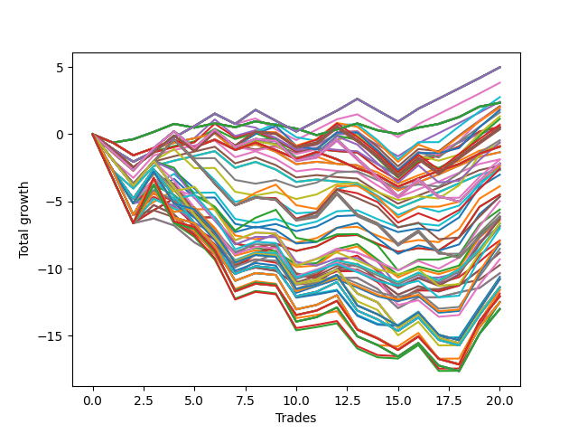

# Short HLT 108 
- Symbol: TSLA
- Date Range: 05/16/2022 - 05/17/2024
- Trading Period: 8:30-12:30
- Number of Trades: 20



| Id. | Name | Win Percent | Profit | Avg Profit / Trade | Avg Time / Trade | Std |      | Name | Win Percent | Profit | Avg Profit / Trade | Avg Time / Trade | Std |
| --- | ---- | ----------- | ------ | ------------------ | ---------------- | --- | ---- | ---- | ----------- | ------ | ------------------ | ---------------- | --- |
| | Sorted By <br> Profit | | | | | | | Sorted By <br> Win Percentage |||||
|0| TP-0.75 180m | 65.00 | 4.98 | 0.25 | 16:15 | 0.83 |     | TP-0.75 180m | 65.00 | 4.98 | 0.25 | 16:15 | 0.83 |
|1| TP-0.75 165m | 65.00 | 4.98 | 0.25 | 16:15 | 0.83 |     | TP-0.75 165m | 65.00 | 4.98 | 0.25 | 16:15 | 0.83 |
|2| TP-0.75 150m | 65.00 | 4.98 | 0.25 | 16:15 | 0.83 |     | TP-0.75 150m | 65.00 | 4.98 | 0.25 | 16:15 | 0.83 |
|3| TP-0.75 135m | 65.00 | 4.98 | 0.25 | 16:15 | 0.83 |     | TP-0.75 135m | 65.00 | 4.98 | 0.25 | 16:15 | 0.83 |
|4| TP-0.75 120m | 65.00 | 4.98 | 0.25 | 16:15 | 0.83 |     | TP-0.75 120m | 65.00 | 4.98 | 0.25 | 16:15 | 0.83 |
|5| TP-0.75 105m | 65.00 | 4.98 | 0.25 | 16:15 | 0.83 |     | TP-0.75 105m | 65.00 | 4.98 | 0.25 | 16:15 | 0.83 |
|6| TP-0.75 90m | 65.00 | 4.98 | 0.25 | 16:15 | 0.83 |     | TP-0.75 90m | 65.00 | 4.98 | 0.25 | 16:15 | 0.83 |
|7| TP-0.75 75m | 65.00 | 4.98 | 0.25 | 16:15 | 0.83 |     | TP-0.75 75m | 65.00 | 4.98 | 0.25 | 16:15 | 0.83 |
|8| TP-0.75 60m | 65.00 | 4.98 | 0.25 | 16:15 | 0.83 |     | TP-0.75 60m | 65.00 | 4.98 | 0.25 | 16:15 | 0.83 |
|9| TP-0.75 45m | 65.00 | 3.83 | 0.19 | 15:18 | 0.80 |     | TP-0.75 45m | 65.00 | 3.83 | 0.19 | 15:18 | 0.80 |
|10| TP-1 60m | 55.00 | 2.76 | 0.14 | 26:51 | 1.06 |     | TP-0.75 30m | 60.00 | 2.41 | 0.12 | 13:30 | 0.79 |
|11| TP-0.75 30m | 60.00 | 2.41 | 0.12 | 13:30 | 0.79 |     | TP-0.25 180m | 60.00 | 2.34 | 0.12 | 03:30 | 0.43 |
|12| TP-0.25 180m | 60.00 | 2.34 | 0.12 | 03:30 | 0.43 |     | TP-0.25 165m | 60.00 | 2.34 | 0.12 | 03:30 | 0.43 |
|13| TP-0.25 165m | 60.00 | 2.34 | 0.12 | 03:30 | 0.43 |     | TP-0.25 150m | 60.00 | 2.34 | 0.12 | 03:30 | 0.43 |
|14| TP-0.25 150m | 60.00 | 2.34 | 0.12 | 03:30 | 0.43 |     | TP-0.25 135m | 60.00 | 2.34 | 0.12 | 03:30 | 0.43 |
|15| TP-0.25 135m | 60.00 | 2.34 | 0.12 | 03:30 | 0.43 |     | TP-0.25 120m | 60.00 | 2.34 | 0.12 | 03:30 | 0.43 |
|16| TP-0.25 120m | 60.00 | 2.34 | 0.12 | 03:30 | 0.43 |     | TP-0.25 105m | 60.00 | 2.34 | 0.12 | 03:30 | 0.43 |
|17| TP-0.25 105m | 60.00 | 2.34 | 0.12 | 03:30 | 0.43 |     | TP-0.25 90m | 60.00 | 2.34 | 0.12 | 03:30 | 0.43 |
|18| TP-0.25 90m | 60.00 | 2.34 | 0.12 | 03:30 | 0.43 |     | TP-0.25 75m | 60.00 | 2.34 | 0.12 | 03:30 | 0.43 |
|19| TP-0.25 75m | 60.00 | 2.34 | 0.12 | 03:30 | 0.43 |     | TP-0.25 60m | 60.00 | 2.34 | 0.12 | 03:30 | 0.43 |
|20| TP-0.25 60m | 60.00 | 2.34 | 0.12 | 03:30 | 0.43 |     | TP-0.25 45m | 60.00 | 2.34 | 0.12 | 03:30 | 0.43 |
|21| TP-0.25 45m | 60.00 | 2.34 | 0.12 | 03:30 | 0.43 |     | TP-0.25 30m | 60.00 | 2.34 | 0.12 | 03:30 | 0.43 |
|22| TP-0.25 30m | 60.00 | 2.34 | 0.12 | 03:30 | 0.43 |     | TP-0.25 15m | 60.00 | 2.34 | 0.12 | 03:30 | 0.43 |
|23| TP-0.25 15m | 60.00 | 2.34 | 0.12 | 03:30 | 0.43 |     | TP-1 60m | 55.00 | 2.76 | 0.14 | 26:51 | 1.06 |
|24| TP-1 30m | 55.00 | 2.09 | 0.10 | 18:42 | 1.02 |     | TP-1 30m | 55.00 | 2.09 | 0.10 | 18:42 | 1.02 |
|25| TP-1 75m | 50.00 | 2.01 | 0.10 | 29:51 | 1.07 |     | TP-1.25 30m | 55.00 | 1.95 | 0.10 | 21:06 | 1.11 |
|26| TP-1.25 30m | 55.00 | 1.95 | 0.10 | 21:06 | 1.11 |     | TP-1.25 60m | 55.00 | 1.81 | 0.09 | 31:48 | 1.18 |
|27| TP-1.25 60m | 55.00 | 1.81 | 0.09 | 31:48 | 1.18 |     | TP-1 45m | 55.00 | 1.62 | 0.08 | 23:12 | 1.04 |
|28| TP-1 45m | 55.00 | 1.62 | 0.08 | 23:12 | 1.04 |     | TP-1.25 45m | 55.00 | 1.33 | 0.07 | 27:06 | 1.14 |
|29| TP-1.25 45m | 55.00 | 1.33 | 0.07 | 27:06 | 1.14 |     | TP-1 15m | 55.00 | 0.55 | 0.03 | 11:30 | 0.86 |
|30| TP-1.25 75m | 50.00 | 1.14 | 0.06 | 36:06 | 1.18 |     | TP-0.75 15m | 55.00 | 0.52 | 0.03 | 10:12 | 0.70 |
|31| TP-1 90m | 50.00 | 0.71 | 0.04 | 32:30 | 1.12 |     | TP-1.25 15m | 55.00 | 0.38 | 0.02 | 12:36 | 0.90 |
|32| TP-1 15m | 55.00 | 0.55 | 0.03 | 11:30 | 0.86 |     | TP-1.5 30m | 55.00 | -0.45 | -0.02 | 25:09 | 1.07 |
|33| TP-0.75 15m | 55.00 | 0.52 | 0.03 | 10:12 | 0.70 |     | TP-1.75 30m | 55.00 | -0.62 | -0.03 | 26:27 | 1.13 |
|34| TP-1 180m | 50.00 | 0.49 | 0.02 | 35:30 | 1.12 |     | TP-3 15m | 55.00 | -1.34 | -0.07 | 14:00 | 0.81 |
|35| TP-1 165m | 50.00 | 0.49 | 0.02 | 35:30 | 1.12 |     | TP-2.75 15m | 55.00 | -1.34 | -0.07 | 14:00 | 0.81 |
|36| TP-1 150m | 50.00 | 0.49 | 0.02 | 35:30 | 1.12 |     | TP-1.75 15m | 55.00 | -1.87 | -0.09 | 13:39 | 0.86 |
|37| TP-1 135m | 50.00 | 0.49 | 0.02 | 35:30 | 1.12 |     | TP-1.5 15m | 55.00 | -2.33 | -0.12 | 13:18 | 0.89 |
|38| TP-1 120m | 50.00 | 0.49 | 0.02 | 35:30 | 1.12 |     | TP-2 30m | 55.00 | -2.64 | -0.13 | 27:27 | 1.18 |
|39| TP-1.25 15m | 55.00 | 0.38 | 0.02 | 12:36 | 0.90 |     | TP-2.5 15m | 55.00 | -2.66 | -0.13 | 13:42 | 0.96 |
|40| TP-1 105m | 50.00 | 0.36 | 0.02 | 34:00 | 1.11 |     | TP-2.25 15m | 55.00 | -2.66 | -0.13 | 13:42 | 0.96 |
|41| TP-1.5 30m | 55.00 | -0.45 | -0.02 | 25:09 | 1.07 |     | TP-2 15m | 55.00 | -2.66 | -0.13 | 13:42 | 0.96 |
|42| TP-1.75 30m | 55.00 | -0.62 | -0.03 | 26:27 | 1.13 |     | TP-2.25 30m | 55.00 | -3.01 | -0.15 | 27:39 | 1.21 |
|43| TP-1.25 90m | 50.00 | -0.62 | -0.03 | 39:48 | 1.21 |     | TP-2.5 30m | 55.00 | -3.87 | -0.19 | 27:42 | 1.30 |
|44| TP-0.5 15m | 50.00 | -0.88 | -0.04 | 06:45 | 0.60 |     | TP-3 30m | 55.00 | -4.48 | -0.22 | 28:30 | 1.37 |
|45| TP-0.5 180m | 50.00 | -0.92 | -0.05 | 07:12 | 0.63 |     | TP-2.75 30m | 55.00 | -4.48 | -0.22 | 28:30 | 1.37 |
|46| TP-0.5 165m | 50.00 | -0.92 | -0.05 | 07:12 | 0.63 |     | TP-1 75m | 50.00 | 2.01 | 0.10 | 29:51 | 1.07 |
|47| TP-0.5 150m | 50.00 | -0.92 | -0.05 | 07:12 | 0.63 |     | TP-1.25 75m | 50.00 | 1.14 | 0.06 | 36:06 | 1.18 |
|48| TP-0.5 135m | 50.00 | -0.92 | -0.05 | 07:12 | 0.63 |     | TP-1 90m | 50.00 | 0.71 | 0.04 | 32:30 | 1.12 |
|49| TP-0.5 120m | 50.00 | -0.92 | -0.05 | 07:12 | 0.63 |     | TP-1 180m | 50.00 | 0.49 | 0.02 | 35:30 | 1.12 |
|50| TP-0.5 105m | 50.00 | -0.92 | -0.05 | 07:12 | 0.63 |     | TP-1 165m | 50.00 | 0.49 | 0.02 | 35:30 | 1.12 |
|51| TP-0.5 90m | 50.00 | -0.92 | -0.05 | 07:12 | 0.63 |     | TP-1 150m | 50.00 | 0.49 | 0.02 | 35:30 | 1.12 |
|52| TP-0.5 75m | 50.00 | -0.92 | -0.05 | 07:12 | 0.63 |     | TP-1 135m | 50.00 | 0.49 | 0.02 | 35:30 | 1.12 |
|53| TP-0.5 60m | 50.00 | -0.92 | -0.05 | 07:12 | 0.63 |     | TP-1 120m | 50.00 | 0.49 | 0.02 | 35:30 | 1.12 |
|54| TP-0.5 45m | 50.00 | -0.92 | -0.05 | 07:12 | 0.63 |     | TP-1 105m | 50.00 | 0.36 | 0.02 | 34:00 | 1.11 |
|55| TP-0.5 30m | 50.00 | -0.92 | -0.05 | 07:12 | 0.63 |     | TP-1.25 90m | 50.00 | -0.62 | -0.03 | 39:48 | 1.21 |
|56| TP-3 15m | 55.00 | -1.34 | -0.07 | 14:00 | 0.81 |     | TP-0.5 15m | 50.00 | -0.88 | -0.04 | 06:45 | 0.60 |
|57| TP-2.75 15m | 55.00 | -1.34 | -0.07 | 14:00 | 0.81 |     | TP-0.5 180m | 50.00 | -0.92 | -0.05 | 07:12 | 0.63 |
|58| TP-1.75 15m | 55.00 | -1.87 | -0.09 | 13:39 | 0.86 |     | TP-0.5 165m | 50.00 | -0.92 | -0.05 | 07:12 | 0.63 |
|59| TP-1.25 105m | 50.00 | -1.89 | -0.09 | 42:12 | 1.23 |     | TP-0.5 150m | 50.00 | -0.92 | -0.05 | 07:12 | 0.63 |
|60| TP-1.25 180m | 45.00 | -2.18 | -0.11 | 44:27 | 1.23 |     | TP-0.5 135m | 50.00 | -0.92 | -0.05 | 07:12 | 0.63 |
|61| TP-1.25 165m | 45.00 | -2.18 | -0.11 | 44:27 | 1.23 |     | TP-0.5 120m | 50.00 | -0.92 | -0.05 | 07:12 | 0.63 |
|62| TP-1.25 150m | 45.00 | -2.18 | -0.11 | 44:27 | 1.23 |     | TP-0.5 105m | 50.00 | -0.92 | -0.05 | 07:12 | 0.63 |
|63| TP-1.25 135m | 45.00 | -2.18 | -0.11 | 44:27 | 1.23 |     | TP-0.5 90m | 50.00 | -0.92 | -0.05 | 07:12 | 0.63 |
|64| TP-1.25 120m | 45.00 | -2.18 | -0.11 | 44:27 | 1.23 |     | TP-0.5 75m | 50.00 | -0.92 | -0.05 | 07:12 | 0.63 |
|65| TP-1.5 15m | 55.00 | -2.33 | -0.12 | 13:18 | 0.89 |     | TP-0.5 60m | 50.00 | -0.92 | -0.05 | 07:12 | 0.63 |
|66| TP-1.5 60m | 50.00 | -2.37 | -0.12 | 42:57 | 1.30 |     | TP-0.5 45m | 50.00 | -0.92 | -0.05 | 07:12 | 0.63 |
|67| TP-1.5 45m | 50.00 | -2.47 | -0.12 | 34:39 | 1.24 |     | TP-0.5 30m | 50.00 | -0.92 | -0.05 | 07:12 | 0.63 |
|68| TP-1.5 75m | 45.00 | -2.58 | -0.13 | 48:33 | 1.32 |     | TP-1.25 105m | 50.00 | -1.89 | -0.09 | 42:12 | 1.23 |
|69| TP-2 30m | 55.00 | -2.64 | -0.13 | 27:27 | 1.18 |     | TP-1.5 60m | 50.00 | -2.37 | -0.12 | 42:57 | 1.30 |
|70| TP-2.5 15m | 55.00 | -2.66 | -0.13 | 13:42 | 0.96 |     | TP-1.5 45m | 50.00 | -2.47 | -0.12 | 34:39 | 1.24 |
|71| TP-2.25 15m | 55.00 | -2.66 | -0.13 | 13:42 | 0.96 |     | TP-1.25 180m | 45.00 | -2.18 | -0.11 | 44:27 | 1.23 |
|72| TP-2 15m | 55.00 | -2.66 | -0.13 | 13:42 | 0.96 |     | TP-1.25 165m | 45.00 | -2.18 | -0.11 | 44:27 | 1.23 |
|73| TP-2.25 30m | 55.00 | -3.01 | -0.15 | 27:39 | 1.21 |     | TP-1.25 150m | 45.00 | -2.18 | -0.11 | 44:27 | 1.23 |
|74| TP-2.5 30m | 55.00 | -3.87 | -0.19 | 27:42 | 1.30 |     | TP-1.25 135m | 45.00 | -2.18 | -0.11 | 44:27 | 1.23 |
|75| TP-3 30m | 55.00 | -4.48 | -0.22 | 28:30 | 1.37 |     | TP-1.25 120m | 45.00 | -2.18 | -0.11 | 44:27 | 1.23 |
|76| TP-2.75 30m | 55.00 | -4.48 | -0.22 | 28:30 | 1.37 |     | TP-1.5 75m | 45.00 | -2.58 | -0.13 | 48:33 | 1.32 |
|77| TP-1.5 90m | 45.00 | -4.63 | -0.23 | 53:03 | 1.31 |     | TP-1.5 90m | 45.00 | -4.63 | -0.23 | 53:03 | 1.31 |
|78| TP-1.75 45m | 45.00 | -4.65 | -0.23 | 37:42 | 1.22 |     | TP-1.75 45m | 45.00 | -4.65 | -0.23 | 37:42 | 1.22 |
|79| TP-2.25 75m | 40.00 | -4.97 | -0.25 | 64:33 | 1.41 |     | TP-1.75 60m | 45.00 | -5.60 | -0.28 | 48:24 | 1.32 |
|80| TP-1.75 60m | 45.00 | -5.60 | -0.28 | 48:24 | 1.32 |     | TP-1.5 105m | 45.00 | -5.84 | -0.29 | 56:54 | 1.37 |
|81| TP-1.5 105m | 45.00 | -5.84 | -0.29 | 56:54 | 1.37 |     | TP-2.25 45m | 45.00 | -6.16 | -0.31 | 40:27 | 1.28 |
|82| TP-1.5 180m | 40.00 | -6.13 | -0.31 | 59:09 | 1.37 |     | TP-2 45m | 45.00 | -6.40 | -0.32 | 39:30 | 1.28 |
|83| TP-1.5 165m | 40.00 | -6.13 | -0.31 | 59:09 | 1.37 |     | TP-2.25 90m | 45.00 | -6.59 | -0.33 | 74:00 | 1.53 |
|84| TP-1.5 150m | 40.00 | -6.13 | -0.31 | 59:09 | 1.37 |     | TP-2.25 60m | 45.00 | -6.87 | -0.34 | 53:12 | 1.26 |
|85| TP-1.5 135m | 40.00 | -6.13 | -0.31 | 59:09 | 1.37 |     | TP-2.5 90m | 45.00 | -7.01 | -0.35 | 77:15 | 1.68 |
|86| TP-1.5 120m | 40.00 | -6.13 | -0.31 | 59:09 | 1.37 |     | TP-2 60m | 45.00 | -7.90 | -0.40 | 51:00 | 1.30 |
|87| TP-2.25 45m | 45.00 | -6.16 | -0.31 | 40:27 | 1.28 |     | TP-3 90m | 45.00 | -7.96 | -0.40 | 79:24 | 1.71 |
|88| TP-1.75 75m | 40.00 | -6.25 | -0.31 | 56:18 | 1.40 |     | TP-2.75 90m | 45.00 | -8.13 | -0.41 | 78:57 | 1.71 |
|89| TP-2 75m | 40.00 | -6.31 | -0.32 | 60:39 | 1.44 |     | TP-2.5 45m | 45.00 | -8.20 | -0.41 | 41:12 | 1.27 |
|90| TP-2 45m | 45.00 | -6.40 | -0.32 | 39:30 | 1.28 |     | TP-3 45m | 45.00 | -8.81 | -0.44 | 42:00 | 1.33 |
|91| TP-2.25 90m | 45.00 | -6.59 | -0.33 | 74:00 | 1.53 |     | TP-2.75 45m | 45.00 | -8.81 | -0.44 | 42:00 | 1.33 |
|92| TP-3 75m | 40.00 | -6.66 | -0.33 | 68:09 | 1.45 |     | TP-2.5 60m | 45.00 | -9.73 | -0.49 | 54:42 | 1.21 |
|93| TP-2.75 75m | 40.00 | -6.66 | -0.33 | 68:09 | 1.45 |     | TP-3 60m | 45.00 | -10.34 | -0.52 | 55:30 | 1.27 |
|94| TP-2.5 75m | 40.00 | -6.82 | -0.34 | 67:03 | 1.44 |     | TP-2.75 60m | 45.00 | -10.34 | -0.52 | 55:30 | 1.27 |
|95| TP-2.25 60m | 45.00 | -6.87 | -0.34 | 53:12 | 1.26 |     | TP-2.25 75m | 40.00 | -4.97 | -0.25 | 64:33 | 1.41 |
|96| TP-2.5 90m | 45.00 | -7.01 | -0.35 | 77:15 | 1.68 |     | TP-1.5 180m | 40.00 | -6.13 | -0.31 | 59:09 | 1.37 |
|97| TP-2 60m | 45.00 | -7.90 | -0.40 | 51:00 | 1.30 |     | TP-1.5 165m | 40.00 | -6.13 | -0.31 | 59:09 | 1.37 |
|98| TP-3 90m | 45.00 | -7.96 | -0.40 | 79:24 | 1.71 |     | TP-1.5 150m | 40.00 | -6.13 | -0.31 | 59:09 | 1.37 |
|99| TP-2.75 90m | 45.00 | -8.13 | -0.41 | 78:57 | 1.71 |     | TP-1.5 135m | 40.00 | -6.13 | -0.31 | 59:09 | 1.37 |
|100| TP-2.5 45m | 45.00 | -8.20 | -0.41 | 41:12 | 1.27 |     | TP-1.5 120m | 40.00 | -6.13 | -0.31 | 59:09 | 1.37 |
|101| TP-2 90m | 40.00 | -8.52 | -0.43 | 68:00 | 1.47 |     | TP-1.75 75m | 40.00 | -6.25 | -0.31 | 56:18 | 1.40 |
|102| TP-3 45m | 45.00 | -8.81 | -0.44 | 42:00 | 1.33 |     | TP-2 75m | 40.00 | -6.31 | -0.32 | 60:39 | 1.44 |
|103| TP-2.75 45m | 45.00 | -8.81 | -0.44 | 42:00 | 1.33 |     | TP-3 75m | 40.00 | -6.66 | -0.33 | 68:09 | 1.45 |
|104| TP-1.75 90m | 40.00 | -9.30 | -0.46 | 62:18 | 1.39 |     | TP-2.75 75m | 40.00 | -6.66 | -0.33 | 68:09 | 1.45 |
|105| TP-2.5 60m | 45.00 | -9.73 | -0.49 | 54:42 | 1.21 |     | TP-2.5 75m | 40.00 | -6.82 | -0.34 | 67:03 | 1.44 |
|106| TP-3 60m | 45.00 | -10.34 | -0.52 | 55:30 | 1.27 |     | TP-2 90m | 40.00 | -8.52 | -0.43 | 68:00 | 1.47 |
|107| TP-2.75 60m | 45.00 | -10.34 | -0.52 | 55:30 | 1.27 |     | TP-1.75 90m | 40.00 | -9.30 | -0.46 | 62:18 | 1.39 |
|108| TP-2.25 105m | 40.00 | -10.61 | -0.53 | 80:51 | 1.63 |     | TP-2.25 105m | 40.00 | -10.61 | -0.53 | 80:51 | 1.63 |
|109| TP-2 105m | 40.00 | -10.77 | -0.54 | 74:03 | 1.56 |     | TP-2 105m | 40.00 | -10.77 | -0.54 | 74:03 | 1.56 |
|110| TP-2.25 180m | 35.00 | -10.77 | -0.54 | 86:06 | 1.65 |     | TP-1.75 105m | 40.00 | -11.55 | -0.58 | 67:15 | 1.46 |
|111| TP-2.25 165m | 35.00 | -10.77 | -0.54 | 86:06 | 1.65 |     | TP-2.5 105m | 40.00 | -11.59 | -0.58 | 85:00 | 1.82 |
|112| TP-2.25 150m | 35.00 | -10.77 | -0.54 | 86:06 | 1.65 |     | TP-3 105m | 40.00 | -11.86 | -0.59 | 88:33 | 2.02 |
|113| TP-2.25 135m | 35.00 | -10.77 | -0.54 | 86:06 | 1.65 |     | TP-2.75 105m | 40.00 | -12.48 | -0.62 | 86:57 | 1.90 |
|114| TP-2.25 120m | 35.00 | -10.77 | -0.54 | 86:06 | 1.65 |     | TP-2.25 180m | 35.00 | -10.77 | -0.54 | 86:06 | 1.65 |
|115| TP-2 180m | 35.00 | -11.38 | -0.57 | 78:12 | 1.57 |     | TP-2.25 165m | 35.00 | -10.77 | -0.54 | 86:06 | 1.65 |
|116| TP-2 165m | 35.00 | -11.38 | -0.57 | 78:12 | 1.57 |     | TP-2.25 150m | 35.00 | -10.77 | -0.54 | 86:06 | 1.65 |
|117| TP-2 150m | 35.00 | -11.38 | -0.57 | 78:12 | 1.57 |     | TP-2.25 135m | 35.00 | -10.77 | -0.54 | 86:06 | 1.65 |
|118| TP-2 135m | 35.00 | -11.38 | -0.57 | 78:12 | 1.57 |     | TP-2.25 120m | 35.00 | -10.77 | -0.54 | 86:06 | 1.65 |
|119| TP-2 120m | 35.00 | -11.38 | -0.57 | 78:12 | 1.57 |     | TP-2 180m | 35.00 | -11.38 | -0.57 | 78:12 | 1.57 |
|120| TP-1.75 180m | 35.00 | -11.40 | -0.57 | 70:15 | 1.48 |     | TP-2 165m | 35.00 | -11.38 | -0.57 | 78:12 | 1.57 |
|121| TP-1.75 165m | 35.00 | -11.40 | -0.57 | 70:15 | 1.48 |     | TP-2 150m | 35.00 | -11.38 | -0.57 | 78:12 | 1.57 |
|122| TP-1.75 150m | 35.00 | -11.40 | -0.57 | 70:15 | 1.48 |     | TP-2 135m | 35.00 | -11.38 | -0.57 | 78:12 | 1.57 |
|123| TP-1.75 135m | 35.00 | -11.40 | -0.57 | 70:15 | 1.48 |     | TP-2 120m | 35.00 | -11.38 | -0.57 | 78:12 | 1.57 |
|124| TP-1.75 120m | 35.00 | -11.40 | -0.57 | 70:15 | 1.48 |     | TP-1.75 180m | 35.00 | -11.40 | -0.57 | 70:15 | 1.48 |
|125| TP-1.75 105m | 40.00 | -11.55 | -0.58 | 67:15 | 1.46 |     | TP-1.75 165m | 35.00 | -11.40 | -0.57 | 70:15 | 1.48 |
|126| TP-2.5 105m | 40.00 | -11.59 | -0.58 | 85:00 | 1.82 |     | TP-1.75 150m | 35.00 | -11.40 | -0.57 | 70:15 | 1.48 |
|127| TP-3 105m | 40.00 | -11.86 | -0.59 | 88:33 | 2.02 |     | TP-1.75 135m | 35.00 | -11.40 | -0.57 | 70:15 | 1.48 |
|128| TP-3 180m | 35.00 | -12.06 | -0.60 | 95:36 | 1.98 |     | TP-1.75 120m | 35.00 | -11.40 | -0.57 | 70:15 | 1.48 |
|129| TP-3 165m | 35.00 | -12.06 | -0.60 | 95:36 | 1.98 |     | TP-3 180m | 35.00 | -12.06 | -0.60 | 95:36 | 1.98 |
|130| TP-3 150m | 35.00 | -12.06 | -0.60 | 95:36 | 1.98 |     | TP-3 165m | 35.00 | -12.06 | -0.60 | 95:36 | 1.98 |
|131| TP-3 135m | 35.00 | -12.06 | -0.60 | 95:36 | 1.98 |     | TP-3 150m | 35.00 | -12.06 | -0.60 | 95:36 | 1.98 |
|132| TP-3 120m | 35.00 | -12.06 | -0.60 | 95:36 | 1.98 |     | TP-3 135m | 35.00 | -12.06 | -0.60 | 95:36 | 1.98 |
|133| TP-2.75 105m | 40.00 | -12.48 | -0.62 | 86:57 | 1.90 |     | TP-3 120m | 35.00 | -12.06 | -0.60 | 95:36 | 1.98 |
|134| TP-2.5 180m | 35.00 | -12.50 | -0.62 | 91:03 | 1.81 |     | TP-2.5 180m | 35.00 | -12.50 | -0.62 | 91:03 | 1.81 |
|135| TP-2.5 165m | 35.00 | -12.50 | -0.62 | 91:03 | 1.81 |     | TP-2.5 165m | 35.00 | -12.50 | -0.62 | 91:03 | 1.81 |
|136| TP-2.5 150m | 35.00 | -12.50 | -0.62 | 91:03 | 1.81 |     | TP-2.5 150m | 35.00 | -12.50 | -0.62 | 91:03 | 1.81 |
|137| TP-2.5 135m | 35.00 | -12.50 | -0.62 | 91:03 | 1.81 |     | TP-2.5 135m | 35.00 | -12.50 | -0.62 | 91:03 | 1.81 |
|138| TP-2.5 120m | 35.00 | -12.50 | -0.62 | 91:03 | 1.81 |     | TP-2.5 120m | 35.00 | -12.50 | -0.62 | 91:03 | 1.81 |
|139| TP-2.75 180m | 35.00 | -13.00 | -0.65 | 93:15 | 1.88 |     | TP-2.75 180m | 35.00 | -13.00 | -0.65 | 93:15 | 1.88 |
|140| TP-2.75 165m | 35.00 | -13.00 | -0.65 | 93:15 | 1.88 |     | TP-2.75 165m | 35.00 | -13.00 | -0.65 | 93:15 | 1.88 |
|141| TP-2.75 150m | 35.00 | -13.00 | -0.65 | 93:15 | 1.88 |     | TP-2.75 150m | 35.00 | -13.00 | -0.65 | 93:15 | 1.88 |
|142| TP-2.75 135m | 35.00 | -13.00 | -0.65 | 93:15 | 1.88 |     | TP-2.75 135m | 35.00 | -13.00 | -0.65 | 93:15 | 1.88 |
|143| TP-2.75 120m | 35.00 | -13.00 | -0.65 | 93:15 | 1.88 |     | TP-2.75 120m | 35.00 | -13.00 | -0.65 | 93:15 | 1.88 |

### Test TP-0.25 15m
* Take Profit of 0.25 Point
* 0.25 Stoploss
* Results:
```
Total Trades: 20
Percent Up: 40.00
Percent Down: 60.00
Total Points Moved Down: 2.34
Potential Profit: 1170.00
Total Points Ups: 3.01 Count Ups: 8
Total Points Downs: 5.35 Count Downs: 12
```

<details><summary>Trades</summary>

<code>In: 2022-05-26 08:35:00		Out: 2022-05-26 08:37:00		Total Position Time: 02:00		Total Move Down: -0.63		Total to Date: -0.63</code> <br />
<code>In: 2022-05-31 09:20:00		Out: 2022-05-31 09:22:00		Total Position Time: 02:00		Total Move Down: 0.26		Total to Date: -0.37</code> <br />
<code>In: 2022-06-14 10:35:00		Out: 2022-06-14 10:37:00		Total Position Time: 02:00		Total Move Down: 0.54		Total to Date: 0.17</code> <br />
<code>In: 2022-06-21 08:35:00		Out: 2022-06-21 08:38:00		Total Position Time: 03:00		Total Move Down: 0.60		Total to Date: 0.77</code> <br />
<code>In: 2022-10-17 09:05:00		Out: 2022-10-17 09:07:00		Total Position Time: 02:00		Total Move Down: -0.28		Total to Date: 0.49</code> <br />
<code>In: 2022-11-30 11:40:00		Out: 2022-11-30 11:43:00		Total Position Time: 03:00		Total Move Down: 0.32		Total to Date: 0.81</code> <br />
<code>In: 2023-01-23 08:35:00		Out: 2023-01-23 08:38:00		Total Position Time: 03:00		Total Move Down: -0.29		Total to Date: 0.52</code> <br />
<code>In: 2023-01-25 11:40:00		Out: 2023-01-25 11:44:00		Total Position Time: 04:00		Total Move Down: 0.44		Total to Date: 0.96</code> <br />
<code>In: 2023-02-15 09:05:00		Out: 2023-02-15 09:14:00		Total Position Time: 09:00		Total Move Down: -0.27		Total to Date: 0.69</code> <br />
<code>In: 2023-03-21 08:50:00		Out: 2023-03-21 08:52:00		Total Position Time: 02:00		Total Move Down: -0.27		Total to Date: 0.42</code> <br />
<code>In: 2023-04-28 10:10:00		Out: 2023-04-28 10:13:00		Total Position Time: 03:00		Total Move Down: -0.49		Total to Date: -0.07</code> <br />
<code>In: 2023-05-26 10:25:00		Out: 2023-05-26 10:27:00		Total Position Time: 02:00		Total Move Down: 0.42		Total to Date: 0.35</code> <br />
<code>In: 2023-08-23 09:10:00		Out: 2023-08-23 09:12:00		Total Position Time: 02:00		Total Move Down: 0.45		Total to Date: 0.80</code> <br />
<code>In: 2023-08-25 11:45:00		Out: 2023-08-25 11:47:00		Total Position Time: 02:00		Total Move Down: -0.51		Total to Date: 0.29</code> <br />
<code>In: 2023-10-04 09:15:00		Out: 2023-10-04 09:22:00		Total Position Time: 07:00		Total Move Down: -0.27		Total to Date: 0.02</code> <br />
<code>In: 2024-02-07 11:10:00		Out: 2024-02-07 11:13:00		Total Position Time: 03:00		Total Move Down: 0.47		Total to Date: 0.49</code> <br />
<code>In: 2024-02-14 11:00:00		Out: 2024-02-14 11:05:00		Total Position Time: 05:00		Total Move Down: 0.28		Total to Date: 0.77</code> <br />
<code>In: 2024-04-08 08:35:00		Out: 2024-04-08 08:37:00		Total Position Time: 02:00		Total Move Down: 0.51		Total to Date: 1.28</code> <br />
<code>In: 2024-04-29 09:40:00		Out: 2024-04-29 09:42:00		Total Position Time: 02:00		Total Move Down: 0.77		Total to Date: 2.05</code> <br />
<code>In: 2024-05-17 09:45:00		Out: 2024-05-17 09:55:00		Total Position Time: 10:00		Total Move Down: 0.29		Total to Date: 2.34</code> <br />


</details>

### Test TP-0.5 15m
* Take Profit of 0.5 Point
* 0.5 Stoploss
* Results:
```
Total Trades: 20
Percent Up: 50.00
Percent Down: 50.00
Total Points Moved Down: -0.88
Potential Profit: -440.00
Total Points Ups: 6.11 Count Ups: 10
Total Points Downs: 5.23 Count Downs: 10
```

<details><summary>Trades</summary>

<code>In: 2022-05-26 08:35:00		Out: 2022-05-26 08:37:00		Total Position Time: 02:00		Total Move Down: -0.63		Total to Date: -0.63</code> <br />
<code>In: 2022-05-31 09:20:00		Out: 2022-05-31 09:26:00		Total Position Time: 06:00		Total Move Down: -0.94		Total to Date: -1.57</code> <br />
<code>In: 2022-06-14 10:35:00		Out: 2022-06-14 10:37:00		Total Position Time: 02:00		Total Move Down: 0.54		Total to Date: -1.03</code> <br />
<code>In: 2022-06-21 08:35:00		Out: 2022-06-21 08:38:00		Total Position Time: 03:00		Total Move Down: 0.60		Total to Date: -0.43</code> <br />
<code>In: 2022-10-17 09:05:00		Out: 2022-10-17 09:10:00		Total Position Time: 05:00		Total Move Down: -0.55		Total to Date: -0.98</code> <br />
<code>In: 2022-11-30 11:40:00		Out: 2022-11-30 11:44:00		Total Position Time: 04:00		Total Move Down: 0.58		Total to Date: -0.40</code> <br />
<code>In: 2023-01-23 08:35:00		Out: 2023-01-23 08:42:00		Total Position Time: 07:00		Total Move Down: -0.76		Total to Date: -1.16</code> <br />
<code>In: 2023-01-25 11:40:00		Out: 2023-01-25 11:46:00		Total Position Time: 06:00		Total Move Down: 0.54		Total to Date: -0.62</code> <br />
<code>In: 2023-02-15 09:05:00		Out: 2023-02-15 09:19:00		Total Position Time: 14:00		Total Move Down: -0.57		Total to Date: -1.19</code> <br />
<code>In: 2023-03-21 08:50:00		Out: 2023-03-21 08:56:00		Total Position Time: 06:00		Total Move Down: -0.65		Total to Date: -1.84</code> <br />
<code>In: 2023-04-28 10:10:00		Out: 2023-04-28 10:24:00		Total Position Time: 14:00		Total Move Down: 0.18		Total to Date: -1.66</code> <br />
<code>In: 2023-05-26 10:25:00		Out: 2023-05-26 10:33:00		Total Position Time: 08:00		Total Move Down: -0.55		Total to Date: -2.21</code> <br />
<code>In: 2023-08-23 09:10:00		Out: 2023-08-23 09:24:00		Total Position Time: 14:00		Total Move Down: -0.11		Total to Date: -2.32</code> <br />
<code>In: 2023-08-25 11:45:00		Out: 2023-08-25 11:47:00		Total Position Time: 02:00		Total Move Down: -0.51		Total to Date: -2.83</code> <br />
<code>In: 2023-10-04 09:15:00		Out: 2023-10-04 09:27:00		Total Position Time: 12:00		Total Move Down: -0.84		Total to Date: -3.67</code> <br />
<code>In: 2024-02-07 11:10:00		Out: 2024-02-07 11:14:00		Total Position Time: 04:00		Total Move Down: 0.61		Total to Date: -3.06</code> <br />
<code>In: 2024-02-14 11:00:00		Out: 2024-02-14 11:08:00		Total Position Time: 08:00		Total Move Down: 0.56		Total to Date: -2.50</code> <br />
<code>In: 2024-04-08 08:35:00		Out: 2024-04-08 08:37:00		Total Position Time: 02:00		Total Move Down: 0.51		Total to Date: -1.99</code> <br />
<code>In: 2024-04-29 09:40:00		Out: 2024-04-29 09:42:00		Total Position Time: 02:00		Total Move Down: 0.77		Total to Date: -1.22</code> <br />
<code>In: 2024-05-17 09:45:00		Out: 2024-05-17 09:59:00		Total Position Time: 14:00		Total Move Down: 0.34		Total to Date: -0.88</code> <br />


</details>

### Test TP-0.75 15m
* Take Profit of 0.75 Point
* 0.75 Stoploss
* Results:
```
Total Trades: 20
Percent Up: 45.00
Percent Down: 55.00
Total Points Moved Down: 0.52
Potential Profit: 260.00
Total Points Ups: 6.14 Count Ups: 9
Total Points Downs: 6.66 Count Downs: 11
```

<details><summary>Trades</summary>

<code>In: 2022-05-26 08:35:00		Out: 2022-05-26 08:39:00		Total Position Time: 04:00		Total Move Down: -1.11		Total to Date: -1.11</code> <br />
<code>In: 2022-05-31 09:20:00		Out: 2022-05-31 09:26:00		Total Position Time: 06:00		Total Move Down: -0.94		Total to Date: -2.05</code> <br />
<code>In: 2022-06-14 10:35:00		Out: 2022-06-14 10:38:00		Total Position Time: 03:00		Total Move Down: 0.77		Total to Date: -1.28</code> <br />
<code>In: 2022-06-21 08:35:00		Out: 2022-06-21 08:49:00		Total Position Time: 14:00		Total Move Down: 0.40		Total to Date: -0.88</code> <br />
<code>In: 2022-10-17 09:05:00		Out: 2022-10-17 09:19:00		Total Position Time: 14:00		Total Move Down: 0.35		Total to Date: -0.53</code> <br />
<code>In: 2022-11-30 11:40:00		Out: 2022-11-30 11:45:00		Total Position Time: 05:00		Total Move Down: 0.93		Total to Date: 0.40</code> <br />
<code>In: 2023-01-23 08:35:00		Out: 2023-01-23 08:42:00		Total Position Time: 07:00		Total Move Down: -0.76		Total to Date: -0.36</code> <br />
<code>In: 2023-01-25 11:40:00		Out: 2023-01-25 11:54:00		Total Position Time: 14:00		Total Move Down: 0.44		Total to Date: 0.08</code> <br />
<code>In: 2023-02-15 09:05:00		Out: 2023-02-15 09:19:00		Total Position Time: 14:00		Total Move Down: -0.57		Total to Date: -0.49</code> <br />
<code>In: 2023-03-21 08:50:00		Out: 2023-03-21 09:00:00		Total Position Time: 10:00		Total Move Down: -0.80		Total to Date: -1.29</code> <br />
<code>In: 2023-04-28 10:10:00		Out: 2023-04-28 10:24:00		Total Position Time: 14:00		Total Move Down: 0.18		Total to Date: -1.11</code> <br />
<code>In: 2023-05-26 10:25:00		Out: 2023-05-26 10:39:00		Total Position Time: 14:00		Total Move Down: -0.15		Total to Date: -1.26</code> <br />
<code>In: 2023-08-23 09:10:00		Out: 2023-08-23 09:24:00		Total Position Time: 14:00		Total Move Down: -0.11		Total to Date: -1.37</code> <br />
<code>In: 2023-08-25 11:45:00		Out: 2023-08-25 11:55:00		Total Position Time: 10:00		Total Move Down: -0.86		Total to Date: -2.23</code> <br />
<code>In: 2023-10-04 09:15:00		Out: 2023-10-04 09:27:00		Total Position Time: 12:00		Total Move Down: -0.84		Total to Date: -3.07</code> <br />
<code>In: 2024-02-07 11:10:00		Out: 2024-02-07 11:18:00		Total Position Time: 08:00		Total Move Down: 0.97		Total to Date: -2.10</code> <br />
<code>In: 2024-02-14 11:00:00		Out: 2024-02-14 11:12:00		Total Position Time: 12:00		Total Move Down: 0.75		Total to Date: -1.35</code> <br />
<code>In: 2024-04-08 08:35:00		Out: 2024-04-08 08:48:00		Total Position Time: 13:00		Total Move Down: 0.76		Total to Date: -0.59</code> <br />
<code>In: 2024-04-29 09:40:00		Out: 2024-04-29 09:42:00		Total Position Time: 02:00		Total Move Down: 0.77		Total to Date: 0.18</code> <br />
<code>In: 2024-05-17 09:45:00		Out: 2024-05-17 09:59:00		Total Position Time: 14:00		Total Move Down: 0.34		Total to Date: 0.52</code> <br />


</details>

### Test TP-1 15m
* Take Profit of 1 Point
* 1 Stoploss
* Results:
```
Total Trades: 20
Percent Up: 45.00
Percent Down: 55.00
Total Points Moved Down: 0.55
Potential Profit: 275.00
Total Points Ups: 7.29 Count Ups: 9
Total Points Downs: 7.84 Count Downs: 11
```

<details><summary>Trades</summary>

<code>In: 2022-05-26 08:35:00		Out: 2022-05-26 08:39:00		Total Position Time: 04:00		Total Move Down: -1.11		Total to Date: -1.11</code> <br />
<code>In: 2022-05-31 09:20:00		Out: 2022-05-31 09:27:00		Total Position Time: 07:00		Total Move Down: -1.35		Total to Date: -2.46</code> <br />
<code>In: 2022-06-14 10:35:00		Out: 2022-06-14 10:44:00		Total Position Time: 09:00		Total Move Down: 1.10		Total to Date: -1.36</code> <br />
<code>In: 2022-06-21 08:35:00		Out: 2022-06-21 08:49:00		Total Position Time: 14:00		Total Move Down: 0.40		Total to Date: -0.96</code> <br />
<code>In: 2022-10-17 09:05:00		Out: 2022-10-17 09:19:00		Total Position Time: 14:00		Total Move Down: 0.35		Total to Date: -0.61</code> <br />
<code>In: 2022-11-30 11:40:00		Out: 2022-11-30 11:47:00		Total Position Time: 07:00		Total Move Down: 1.39		Total to Date: 0.78</code> <br />
<code>In: 2023-01-23 08:35:00		Out: 2023-01-23 08:44:00		Total Position Time: 09:00		Total Move Down: -1.01		Total to Date: -0.23</code> <br />
<code>In: 2023-01-25 11:40:00		Out: 2023-01-25 11:54:00		Total Position Time: 14:00		Total Move Down: 0.44		Total to Date: 0.21</code> <br />
<code>In: 2023-02-15 09:05:00		Out: 2023-02-15 09:19:00		Total Position Time: 14:00		Total Move Down: -0.57		Total to Date: -0.36</code> <br />
<code>In: 2023-03-21 08:50:00		Out: 2023-03-21 09:04:00		Total Position Time: 14:00		Total Move Down: -0.92		Total to Date: -1.28</code> <br />
<code>In: 2023-04-28 10:10:00		Out: 2023-04-28 10:24:00		Total Position Time: 14:00		Total Move Down: 0.18		Total to Date: -1.10</code> <br />
<code>In: 2023-05-26 10:25:00		Out: 2023-05-26 10:39:00		Total Position Time: 14:00		Total Move Down: -0.15		Total to Date: -1.25</code> <br />
<code>In: 2023-08-23 09:10:00		Out: 2023-08-23 09:24:00		Total Position Time: 14:00		Total Move Down: -0.11		Total to Date: -1.36</code> <br />
<code>In: 2023-08-25 11:45:00		Out: 2023-08-25 11:56:00		Total Position Time: 11:00		Total Move Down: -1.18		Total to Date: -2.54</code> <br />
<code>In: 2023-10-04 09:15:00		Out: 2023-10-04 09:29:00		Total Position Time: 14:00		Total Move Down: -0.89		Total to Date: -3.43</code> <br />
<code>In: 2024-02-07 11:10:00		Out: 2024-02-07 11:20:00		Total Position Time: 10:00		Total Move Down: 1.29		Total to Date: -2.14</code> <br />
<code>In: 2024-02-14 11:00:00		Out: 2024-02-14 11:14:00		Total Position Time: 14:00		Total Move Down: 0.58		Total to Date: -1.56</code> <br />
<code>In: 2024-04-08 08:35:00		Out: 2024-04-08 08:49:00		Total Position Time: 14:00		Total Move Down: 0.66		Total to Date: -0.90</code> <br />
<code>In: 2024-04-29 09:40:00		Out: 2024-04-29 09:45:00		Total Position Time: 05:00		Total Move Down: 1.11		Total to Date: 0.21</code> <br />
<code>In: 2024-05-17 09:45:00		Out: 2024-05-17 09:59:00		Total Position Time: 14:00		Total Move Down: 0.34		Total to Date: 0.55</code> <br />


</details>

### Test TP-1.25 15m
* Take Profit of 1.25 Point
* 1.25 Stoploss
* Results:
```
Total Trades: 20
Percent Up: 45.00
Percent Down: 55.00
Total Points Moved Down: 0.38
Potential Profit: 190.00
Total Points Ups: 7.53 Count Ups: 9
Total Points Downs: 7.91 Count Downs: 11
```

<details><summary>Trades</summary>

<code>In: 2022-05-26 08:35:00		Out: 2022-05-26 08:40:00		Total Position Time: 05:00		Total Move Down: -1.32		Total to Date: -1.32</code> <br />
<code>In: 2022-05-31 09:20:00		Out: 2022-05-31 09:27:00		Total Position Time: 07:00		Total Move Down: -1.35		Total to Date: -2.67</code> <br />
<code>In: 2022-06-14 10:35:00		Out: 2022-06-14 10:48:00		Total Position Time: 13:00		Total Move Down: 1.63		Total to Date: -1.04</code> <br />
<code>In: 2022-06-21 08:35:00		Out: 2022-06-21 08:49:00		Total Position Time: 14:00		Total Move Down: 0.40		Total to Date: -0.64</code> <br />
<code>In: 2022-10-17 09:05:00		Out: 2022-10-17 09:19:00		Total Position Time: 14:00		Total Move Down: 0.35		Total to Date: -0.29</code> <br />
<code>In: 2022-11-30 11:40:00		Out: 2022-11-30 11:47:00		Total Position Time: 07:00		Total Move Down: 1.39		Total to Date: 1.10</code> <br />
<code>In: 2023-01-23 08:35:00		Out: 2023-01-23 08:49:00		Total Position Time: 14:00		Total Move Down: -1.24		Total to Date: -0.14</code> <br />
<code>In: 2023-01-25 11:40:00		Out: 2023-01-25 11:54:00		Total Position Time: 14:00		Total Move Down: 0.44		Total to Date: 0.30</code> <br />
<code>In: 2023-02-15 09:05:00		Out: 2023-02-15 09:19:00		Total Position Time: 14:00		Total Move Down: -0.57		Total to Date: -0.27</code> <br />
<code>In: 2023-03-21 08:50:00		Out: 2023-03-21 09:04:00		Total Position Time: 14:00		Total Move Down: -0.92		Total to Date: -1.19</code> <br />
<code>In: 2023-04-28 10:10:00		Out: 2023-04-28 10:24:00		Total Position Time: 14:00		Total Move Down: 0.18		Total to Date: -1.01</code> <br />
<code>In: 2023-05-26 10:25:00		Out: 2023-05-26 10:39:00		Total Position Time: 14:00		Total Move Down: -0.15		Total to Date: -1.16</code> <br />
<code>In: 2023-08-23 09:10:00		Out: 2023-08-23 09:24:00		Total Position Time: 14:00		Total Move Down: -0.11		Total to Date: -1.27</code> <br />
<code>In: 2023-08-25 11:45:00		Out: 2023-08-25 11:59:00		Total Position Time: 14:00		Total Move Down: -0.98		Total to Date: -2.25</code> <br />
<code>In: 2023-10-04 09:15:00		Out: 2023-10-04 09:29:00		Total Position Time: 14:00		Total Move Down: -0.89		Total to Date: -3.14</code> <br />
<code>In: 2024-02-07 11:10:00		Out: 2024-02-07 11:20:00		Total Position Time: 10:00		Total Move Down: 1.29		Total to Date: -1.85</code> <br />
<code>In: 2024-02-14 11:00:00		Out: 2024-02-14 11:14:00		Total Position Time: 14:00		Total Move Down: 0.58		Total to Date: -1.27</code> <br />
<code>In: 2024-04-08 08:35:00		Out: 2024-04-08 08:49:00		Total Position Time: 14:00		Total Move Down: 0.66		Total to Date: -0.61</code> <br />
<code>In: 2024-04-29 09:40:00		Out: 2024-04-29 09:54:00		Total Position Time: 14:00		Total Move Down: 0.65		Total to Date: 0.04</code> <br />
<code>In: 2024-05-17 09:45:00		Out: 2024-05-17 09:59:00		Total Position Time: 14:00		Total Move Down: 0.34		Total to Date: 0.38</code> <br />


</details>

### Test TP-1.5 15m
* Take Profit of 1.5 Point
* 1.5 Stoploss
* Results:
```
Total Trades: 20
Percent Up: 45.00
Percent Down: 55.00
Total Points Moved Down: -2.33
Potential Profit: -1165.00
Total Points Ups: 8.53 Count Ups: 9
Total Points Downs: 6.20 Count Downs: 11
```

<details><summary>Trades</summary>

<code>In: 2022-05-26 08:35:00		Out: 2022-05-26 08:42:00		Total Position Time: 07:00		Total Move Down: -1.93		Total to Date: -1.93</code> <br />
<code>In: 2022-05-31 09:20:00		Out: 2022-05-31 09:28:00		Total Position Time: 08:00		Total Move Down: -1.74		Total to Date: -3.67</code> <br />
<code>In: 2022-06-14 10:35:00		Out: 2022-06-14 10:48:00		Total Position Time: 13:00		Total Move Down: 1.63		Total to Date: -2.04</code> <br />
<code>In: 2022-06-21 08:35:00		Out: 2022-06-21 08:49:00		Total Position Time: 14:00		Total Move Down: 0.40		Total to Date: -1.64</code> <br />
<code>In: 2022-10-17 09:05:00		Out: 2022-10-17 09:19:00		Total Position Time: 14:00		Total Move Down: 0.35		Total to Date: -1.29</code> <br />
<code>In: 2022-11-30 11:40:00		Out: 2022-11-30 11:54:00		Total Position Time: 14:00		Total Move Down: 0.36		Total to Date: -0.93</code> <br />
<code>In: 2023-01-23 08:35:00		Out: 2023-01-23 08:49:00		Total Position Time: 14:00		Total Move Down: -1.24		Total to Date: -2.17</code> <br />
<code>In: 2023-01-25 11:40:00		Out: 2023-01-25 11:54:00		Total Position Time: 14:00		Total Move Down: 0.44		Total to Date: -1.73</code> <br />
<code>In: 2023-02-15 09:05:00		Out: 2023-02-15 09:19:00		Total Position Time: 14:00		Total Move Down: -0.57		Total to Date: -2.30</code> <br />
<code>In: 2023-03-21 08:50:00		Out: 2023-03-21 09:04:00		Total Position Time: 14:00		Total Move Down: -0.92		Total to Date: -3.22</code> <br />
<code>In: 2023-04-28 10:10:00		Out: 2023-04-28 10:24:00		Total Position Time: 14:00		Total Move Down: 0.18		Total to Date: -3.04</code> <br />
<code>In: 2023-05-26 10:25:00		Out: 2023-05-26 10:39:00		Total Position Time: 14:00		Total Move Down: -0.15		Total to Date: -3.19</code> <br />
<code>In: 2023-08-23 09:10:00		Out: 2023-08-23 09:24:00		Total Position Time: 14:00		Total Move Down: -0.11		Total to Date: -3.30</code> <br />
<code>In: 2023-08-25 11:45:00		Out: 2023-08-25 11:59:00		Total Position Time: 14:00		Total Move Down: -0.98		Total to Date: -4.28</code> <br />
<code>In: 2023-10-04 09:15:00		Out: 2023-10-04 09:29:00		Total Position Time: 14:00		Total Move Down: -0.89		Total to Date: -5.17</code> <br />
<code>In: 2024-02-07 11:10:00		Out: 2024-02-07 11:24:00		Total Position Time: 14:00		Total Move Down: 0.61		Total to Date: -4.56</code> <br />
<code>In: 2024-02-14 11:00:00		Out: 2024-02-14 11:14:00		Total Position Time: 14:00		Total Move Down: 0.58		Total to Date: -3.98</code> <br />
<code>In: 2024-04-08 08:35:00		Out: 2024-04-08 08:49:00		Total Position Time: 14:00		Total Move Down: 0.66		Total to Date: -3.32</code> <br />
<code>In: 2024-04-29 09:40:00		Out: 2024-04-29 09:54:00		Total Position Time: 14:00		Total Move Down: 0.65		Total to Date: -2.67</code> <br />
<code>In: 2024-05-17 09:45:00		Out: 2024-05-17 09:59:00		Total Position Time: 14:00		Total Move Down: 0.34		Total to Date: -2.33</code> <br />


</details>

### Test TP-1.75 15m
* Take Profit of 1.75 Point
* 1.75 Stoploss
* Results:
```
Total Trades: 20
Percent Up: 45.00
Percent Down: 55.00
Total Points Moved Down: -1.87
Potential Profit: -935.00
Total Points Ups: 8.11 Count Ups: 9
Total Points Downs: 6.24 Count Downs: 11
```

<details><summary>Trades</summary>

<code>In: 2022-05-26 08:35:00		Out: 2022-05-26 08:42:00		Total Position Time: 07:00		Total Move Down: -1.93		Total to Date: -1.93</code> <br />
<code>In: 2022-05-31 09:20:00		Out: 2022-05-31 09:34:00		Total Position Time: 14:00		Total Move Down: -1.32		Total to Date: -3.25</code> <br />
<code>In: 2022-06-14 10:35:00		Out: 2022-06-14 10:49:00		Total Position Time: 14:00		Total Move Down: 1.67		Total to Date: -1.58</code> <br />
<code>In: 2022-06-21 08:35:00		Out: 2022-06-21 08:49:00		Total Position Time: 14:00		Total Move Down: 0.40		Total to Date: -1.18</code> <br />
<code>In: 2022-10-17 09:05:00		Out: 2022-10-17 09:19:00		Total Position Time: 14:00		Total Move Down: 0.35		Total to Date: -0.83</code> <br />
<code>In: 2022-11-30 11:40:00		Out: 2022-11-30 11:54:00		Total Position Time: 14:00		Total Move Down: 0.36		Total to Date: -0.47</code> <br />
<code>In: 2023-01-23 08:35:00		Out: 2023-01-23 08:49:00		Total Position Time: 14:00		Total Move Down: -1.24		Total to Date: -1.71</code> <br />
<code>In: 2023-01-25 11:40:00		Out: 2023-01-25 11:54:00		Total Position Time: 14:00		Total Move Down: 0.44		Total to Date: -1.27</code> <br />
<code>In: 2023-02-15 09:05:00		Out: 2023-02-15 09:19:00		Total Position Time: 14:00		Total Move Down: -0.57		Total to Date: -1.84</code> <br />
<code>In: 2023-03-21 08:50:00		Out: 2023-03-21 09:04:00		Total Position Time: 14:00		Total Move Down: -0.92		Total to Date: -2.76</code> <br />
<code>In: 2023-04-28 10:10:00		Out: 2023-04-28 10:24:00		Total Position Time: 14:00		Total Move Down: 0.18		Total to Date: -2.58</code> <br />
<code>In: 2023-05-26 10:25:00		Out: 2023-05-26 10:39:00		Total Position Time: 14:00		Total Move Down: -0.15		Total to Date: -2.73</code> <br />
<code>In: 2023-08-23 09:10:00		Out: 2023-08-23 09:24:00		Total Position Time: 14:00		Total Move Down: -0.11		Total to Date: -2.84</code> <br />
<code>In: 2023-08-25 11:45:00		Out: 2023-08-25 11:59:00		Total Position Time: 14:00		Total Move Down: -0.98		Total to Date: -3.82</code> <br />
<code>In: 2023-10-04 09:15:00		Out: 2023-10-04 09:29:00		Total Position Time: 14:00		Total Move Down: -0.89		Total to Date: -4.71</code> <br />
<code>In: 2024-02-07 11:10:00		Out: 2024-02-07 11:24:00		Total Position Time: 14:00		Total Move Down: 0.61		Total to Date: -4.10</code> <br />
<code>In: 2024-02-14 11:00:00		Out: 2024-02-14 11:14:00		Total Position Time: 14:00		Total Move Down: 0.58		Total to Date: -3.52</code> <br />
<code>In: 2024-04-08 08:35:00		Out: 2024-04-08 08:49:00		Total Position Time: 14:00		Total Move Down: 0.66		Total to Date: -2.86</code> <br />
<code>In: 2024-04-29 09:40:00		Out: 2024-04-29 09:54:00		Total Position Time: 14:00		Total Move Down: 0.65		Total to Date: -2.21</code> <br />
<code>In: 2024-05-17 09:45:00		Out: 2024-05-17 09:59:00		Total Position Time: 14:00		Total Move Down: 0.34		Total to Date: -1.87</code> <br />


</details>

### Test TP-2 15m
* Take Profit of 2 Point
* 2 Stoploss
* Results:
```
Total Trades: 20
Percent Up: 45.00
Percent Down: 55.00
Total Points Moved Down: -2.66
Potential Profit: -1330.00
Total Points Ups: 8.90 Count Ups: 9
Total Points Downs: 6.24 Count Downs: 11
```

<details><summary>Trades</summary>

<code>In: 2022-05-26 08:35:00		Out: 2022-05-26 08:43:00		Total Position Time: 08:00		Total Move Down: -2.72		Total to Date: -2.72</code> <br />
<code>In: 2022-05-31 09:20:00		Out: 2022-05-31 09:34:00		Total Position Time: 14:00		Total Move Down: -1.32		Total to Date: -4.04</code> <br />
<code>In: 2022-06-14 10:35:00		Out: 2022-06-14 10:49:00		Total Position Time: 14:00		Total Move Down: 1.67		Total to Date: -2.37</code> <br />
<code>In: 2022-06-21 08:35:00		Out: 2022-06-21 08:49:00		Total Position Time: 14:00		Total Move Down: 0.40		Total to Date: -1.97</code> <br />
<code>In: 2022-10-17 09:05:00		Out: 2022-10-17 09:19:00		Total Position Time: 14:00		Total Move Down: 0.35		Total to Date: -1.62</code> <br />
<code>In: 2022-11-30 11:40:00		Out: 2022-11-30 11:54:00		Total Position Time: 14:00		Total Move Down: 0.36		Total to Date: -1.26</code> <br />
<code>In: 2023-01-23 08:35:00		Out: 2023-01-23 08:49:00		Total Position Time: 14:00		Total Move Down: -1.24		Total to Date: -2.50</code> <br />
<code>In: 2023-01-25 11:40:00		Out: 2023-01-25 11:54:00		Total Position Time: 14:00		Total Move Down: 0.44		Total to Date: -2.06</code> <br />
<code>In: 2023-02-15 09:05:00		Out: 2023-02-15 09:19:00		Total Position Time: 14:00		Total Move Down: -0.57		Total to Date: -2.63</code> <br />
<code>In: 2023-03-21 08:50:00		Out: 2023-03-21 09:04:00		Total Position Time: 14:00		Total Move Down: -0.92		Total to Date: -3.55</code> <br />
<code>In: 2023-04-28 10:10:00		Out: 2023-04-28 10:24:00		Total Position Time: 14:00		Total Move Down: 0.18		Total to Date: -3.37</code> <br />
<code>In: 2023-05-26 10:25:00		Out: 2023-05-26 10:39:00		Total Position Time: 14:00		Total Move Down: -0.15		Total to Date: -3.52</code> <br />
<code>In: 2023-08-23 09:10:00		Out: 2023-08-23 09:24:00		Total Position Time: 14:00		Total Move Down: -0.11		Total to Date: -3.63</code> <br />
<code>In: 2023-08-25 11:45:00		Out: 2023-08-25 11:59:00		Total Position Time: 14:00		Total Move Down: -0.98		Total to Date: -4.61</code> <br />
<code>In: 2023-10-04 09:15:00		Out: 2023-10-04 09:29:00		Total Position Time: 14:00		Total Move Down: -0.89		Total to Date: -5.50</code> <br />
<code>In: 2024-02-07 11:10:00		Out: 2024-02-07 11:24:00		Total Position Time: 14:00		Total Move Down: 0.61		Total to Date: -4.89</code> <br />
<code>In: 2024-02-14 11:00:00		Out: 2024-02-14 11:14:00		Total Position Time: 14:00		Total Move Down: 0.58		Total to Date: -4.31</code> <br />
<code>In: 2024-04-08 08:35:00		Out: 2024-04-08 08:49:00		Total Position Time: 14:00		Total Move Down: 0.66		Total to Date: -3.65</code> <br />
<code>In: 2024-04-29 09:40:00		Out: 2024-04-29 09:54:00		Total Position Time: 14:00		Total Move Down: 0.65		Total to Date: -3.00</code> <br />
<code>In: 2024-05-17 09:45:00		Out: 2024-05-17 09:59:00		Total Position Time: 14:00		Total Move Down: 0.34		Total to Date: -2.66</code> <br />


</details>

### Test TP-2.25 15m
* Take Profit of 2.25 Point
* 2.25 Stoploss
* Results:
```
Total Trades: 20
Percent Up: 45.00
Percent Down: 55.00
Total Points Moved Down: -2.66
Potential Profit: -1330.00
Total Points Ups: 8.90 Count Ups: 9
Total Points Downs: 6.24 Count Downs: 11
```

<details><summary>Trades</summary>

<code>In: 2022-05-26 08:35:00		Out: 2022-05-26 08:43:00		Total Position Time: 08:00		Total Move Down: -2.72		Total to Date: -2.72</code> <br />
<code>In: 2022-05-31 09:20:00		Out: 2022-05-31 09:34:00		Total Position Time: 14:00		Total Move Down: -1.32		Total to Date: -4.04</code> <br />
<code>In: 2022-06-14 10:35:00		Out: 2022-06-14 10:49:00		Total Position Time: 14:00		Total Move Down: 1.67		Total to Date: -2.37</code> <br />
<code>In: 2022-06-21 08:35:00		Out: 2022-06-21 08:49:00		Total Position Time: 14:00		Total Move Down: 0.40		Total to Date: -1.97</code> <br />
<code>In: 2022-10-17 09:05:00		Out: 2022-10-17 09:19:00		Total Position Time: 14:00		Total Move Down: 0.35		Total to Date: -1.62</code> <br />
<code>In: 2022-11-30 11:40:00		Out: 2022-11-30 11:54:00		Total Position Time: 14:00		Total Move Down: 0.36		Total to Date: -1.26</code> <br />
<code>In: 2023-01-23 08:35:00		Out: 2023-01-23 08:49:00		Total Position Time: 14:00		Total Move Down: -1.24		Total to Date: -2.50</code> <br />
<code>In: 2023-01-25 11:40:00		Out: 2023-01-25 11:54:00		Total Position Time: 14:00		Total Move Down: 0.44		Total to Date: -2.06</code> <br />
<code>In: 2023-02-15 09:05:00		Out: 2023-02-15 09:19:00		Total Position Time: 14:00		Total Move Down: -0.57		Total to Date: -2.63</code> <br />
<code>In: 2023-03-21 08:50:00		Out: 2023-03-21 09:04:00		Total Position Time: 14:00		Total Move Down: -0.92		Total to Date: -3.55</code> <br />
<code>In: 2023-04-28 10:10:00		Out: 2023-04-28 10:24:00		Total Position Time: 14:00		Total Move Down: 0.18		Total to Date: -3.37</code> <br />
<code>In: 2023-05-26 10:25:00		Out: 2023-05-26 10:39:00		Total Position Time: 14:00		Total Move Down: -0.15		Total to Date: -3.52</code> <br />
<code>In: 2023-08-23 09:10:00		Out: 2023-08-23 09:24:00		Total Position Time: 14:00		Total Move Down: -0.11		Total to Date: -3.63</code> <br />
<code>In: 2023-08-25 11:45:00		Out: 2023-08-25 11:59:00		Total Position Time: 14:00		Total Move Down: -0.98		Total to Date: -4.61</code> <br />
<code>In: 2023-10-04 09:15:00		Out: 2023-10-04 09:29:00		Total Position Time: 14:00		Total Move Down: -0.89		Total to Date: -5.50</code> <br />
<code>In: 2024-02-07 11:10:00		Out: 2024-02-07 11:24:00		Total Position Time: 14:00		Total Move Down: 0.61		Total to Date: -4.89</code> <br />
<code>In: 2024-02-14 11:00:00		Out: 2024-02-14 11:14:00		Total Position Time: 14:00		Total Move Down: 0.58		Total to Date: -4.31</code> <br />
<code>In: 2024-04-08 08:35:00		Out: 2024-04-08 08:49:00		Total Position Time: 14:00		Total Move Down: 0.66		Total to Date: -3.65</code> <br />
<code>In: 2024-04-29 09:40:00		Out: 2024-04-29 09:54:00		Total Position Time: 14:00		Total Move Down: 0.65		Total to Date: -3.00</code> <br />
<code>In: 2024-05-17 09:45:00		Out: 2024-05-17 09:59:00		Total Position Time: 14:00		Total Move Down: 0.34		Total to Date: -2.66</code> <br />


</details>

### Test TP-2.5 15m
* Take Profit of 2.5 Point
* 2.5 Stoploss
* Results:
```
Total Trades: 20
Percent Up: 45.00
Percent Down: 55.00
Total Points Moved Down: -2.66
Potential Profit: -1330.00
Total Points Ups: 8.90 Count Ups: 9
Total Points Downs: 6.24 Count Downs: 11
```

<details><summary>Trades</summary>

<code>In: 2022-05-26 08:35:00		Out: 2022-05-26 08:43:00		Total Position Time: 08:00		Total Move Down: -2.72		Total to Date: -2.72</code> <br />
<code>In: 2022-05-31 09:20:00		Out: 2022-05-31 09:34:00		Total Position Time: 14:00		Total Move Down: -1.32		Total to Date: -4.04</code> <br />
<code>In: 2022-06-14 10:35:00		Out: 2022-06-14 10:49:00		Total Position Time: 14:00		Total Move Down: 1.67		Total to Date: -2.37</code> <br />
<code>In: 2022-06-21 08:35:00		Out: 2022-06-21 08:49:00		Total Position Time: 14:00		Total Move Down: 0.40		Total to Date: -1.97</code> <br />
<code>In: 2022-10-17 09:05:00		Out: 2022-10-17 09:19:00		Total Position Time: 14:00		Total Move Down: 0.35		Total to Date: -1.62</code> <br />
<code>In: 2022-11-30 11:40:00		Out: 2022-11-30 11:54:00		Total Position Time: 14:00		Total Move Down: 0.36		Total to Date: -1.26</code> <br />
<code>In: 2023-01-23 08:35:00		Out: 2023-01-23 08:49:00		Total Position Time: 14:00		Total Move Down: -1.24		Total to Date: -2.50</code> <br />
<code>In: 2023-01-25 11:40:00		Out: 2023-01-25 11:54:00		Total Position Time: 14:00		Total Move Down: 0.44		Total to Date: -2.06</code> <br />
<code>In: 2023-02-15 09:05:00		Out: 2023-02-15 09:19:00		Total Position Time: 14:00		Total Move Down: -0.57		Total to Date: -2.63</code> <br />
<code>In: 2023-03-21 08:50:00		Out: 2023-03-21 09:04:00		Total Position Time: 14:00		Total Move Down: -0.92		Total to Date: -3.55</code> <br />
<code>In: 2023-04-28 10:10:00		Out: 2023-04-28 10:24:00		Total Position Time: 14:00		Total Move Down: 0.18		Total to Date: -3.37</code> <br />
<code>In: 2023-05-26 10:25:00		Out: 2023-05-26 10:39:00		Total Position Time: 14:00		Total Move Down: -0.15		Total to Date: -3.52</code> <br />
<code>In: 2023-08-23 09:10:00		Out: 2023-08-23 09:24:00		Total Position Time: 14:00		Total Move Down: -0.11		Total to Date: -3.63</code> <br />
<code>In: 2023-08-25 11:45:00		Out: 2023-08-25 11:59:00		Total Position Time: 14:00		Total Move Down: -0.98		Total to Date: -4.61</code> <br />
<code>In: 2023-10-04 09:15:00		Out: 2023-10-04 09:29:00		Total Position Time: 14:00		Total Move Down: -0.89		Total to Date: -5.50</code> <br />
<code>In: 2024-02-07 11:10:00		Out: 2024-02-07 11:24:00		Total Position Time: 14:00		Total Move Down: 0.61		Total to Date: -4.89</code> <br />
<code>In: 2024-02-14 11:00:00		Out: 2024-02-14 11:14:00		Total Position Time: 14:00		Total Move Down: 0.58		Total to Date: -4.31</code> <br />
<code>In: 2024-04-08 08:35:00		Out: 2024-04-08 08:49:00		Total Position Time: 14:00		Total Move Down: 0.66		Total to Date: -3.65</code> <br />
<code>In: 2024-04-29 09:40:00		Out: 2024-04-29 09:54:00		Total Position Time: 14:00		Total Move Down: 0.65		Total to Date: -3.00</code> <br />
<code>In: 2024-05-17 09:45:00		Out: 2024-05-17 09:59:00		Total Position Time: 14:00		Total Move Down: 0.34		Total to Date: -2.66</code> <br />


</details>

### Test TP-2.75 15m
* Take Profit of 2.75 Point
* 2.75 Stoploss
* Results:
```
Total Trades: 20
Percent Up: 45.00
Percent Down: 55.00
Total Points Moved Down: -1.34
Potential Profit: -670.00
Total Points Ups: 7.58 Count Ups: 9
Total Points Downs: 6.24 Count Downs: 11
```

<details><summary>Trades</summary>

<code>In: 2022-05-26 08:35:00		Out: 2022-05-26 08:49:00		Total Position Time: 14:00		Total Move Down: -1.40		Total to Date: -1.40</code> <br />
<code>In: 2022-05-31 09:20:00		Out: 2022-05-31 09:34:00		Total Position Time: 14:00		Total Move Down: -1.32		Total to Date: -2.72</code> <br />
<code>In: 2022-06-14 10:35:00		Out: 2022-06-14 10:49:00		Total Position Time: 14:00		Total Move Down: 1.67		Total to Date: -1.05</code> <br />
<code>In: 2022-06-21 08:35:00		Out: 2022-06-21 08:49:00		Total Position Time: 14:00		Total Move Down: 0.40		Total to Date: -0.65</code> <br />
<code>In: 2022-10-17 09:05:00		Out: 2022-10-17 09:19:00		Total Position Time: 14:00		Total Move Down: 0.35		Total to Date: -0.30</code> <br />
<code>In: 2022-11-30 11:40:00		Out: 2022-11-30 11:54:00		Total Position Time: 14:00		Total Move Down: 0.36		Total to Date: 0.06</code> <br />
<code>In: 2023-01-23 08:35:00		Out: 2023-01-23 08:49:00		Total Position Time: 14:00		Total Move Down: -1.24		Total to Date: -1.18</code> <br />
<code>In: 2023-01-25 11:40:00		Out: 2023-01-25 11:54:00		Total Position Time: 14:00		Total Move Down: 0.44		Total to Date: -0.74</code> <br />
<code>In: 2023-02-15 09:05:00		Out: 2023-02-15 09:19:00		Total Position Time: 14:00		Total Move Down: -0.57		Total to Date: -1.31</code> <br />
<code>In: 2023-03-21 08:50:00		Out: 2023-03-21 09:04:00		Total Position Time: 14:00		Total Move Down: -0.92		Total to Date: -2.23</code> <br />
<code>In: 2023-04-28 10:10:00		Out: 2023-04-28 10:24:00		Total Position Time: 14:00		Total Move Down: 0.18		Total to Date: -2.05</code> <br />
<code>In: 2023-05-26 10:25:00		Out: 2023-05-26 10:39:00		Total Position Time: 14:00		Total Move Down: -0.15		Total to Date: -2.20</code> <br />
<code>In: 2023-08-23 09:10:00		Out: 2023-08-23 09:24:00		Total Position Time: 14:00		Total Move Down: -0.11		Total to Date: -2.31</code> <br />
<code>In: 2023-08-25 11:45:00		Out: 2023-08-25 11:59:00		Total Position Time: 14:00		Total Move Down: -0.98		Total to Date: -3.29</code> <br />
<code>In: 2023-10-04 09:15:00		Out: 2023-10-04 09:29:00		Total Position Time: 14:00		Total Move Down: -0.89		Total to Date: -4.18</code> <br />
<code>In: 2024-02-07 11:10:00		Out: 2024-02-07 11:24:00		Total Position Time: 14:00		Total Move Down: 0.61		Total to Date: -3.57</code> <br />
<code>In: 2024-02-14 11:00:00		Out: 2024-02-14 11:14:00		Total Position Time: 14:00		Total Move Down: 0.58		Total to Date: -2.99</code> <br />
<code>In: 2024-04-08 08:35:00		Out: 2024-04-08 08:49:00		Total Position Time: 14:00		Total Move Down: 0.66		Total to Date: -2.33</code> <br />
<code>In: 2024-04-29 09:40:00		Out: 2024-04-29 09:54:00		Total Position Time: 14:00		Total Move Down: 0.65		Total to Date: -1.68</code> <br />
<code>In: 2024-05-17 09:45:00		Out: 2024-05-17 09:59:00		Total Position Time: 14:00		Total Move Down: 0.34		Total to Date: -1.34</code> <br />


</details>

### Test TP-3 15m
* Take Profit of 3 Point
* 3 Stoploss
* Results:
```
Total Trades: 20
Percent Up: 45.00
Percent Down: 55.00
Total Points Moved Down: -1.34
Potential Profit: -670.00
Total Points Ups: 7.58 Count Ups: 9
Total Points Downs: 6.24 Count Downs: 11
```

<details><summary>Trades</summary>

<code>In: 2022-05-26 08:35:00		Out: 2022-05-26 08:49:00		Total Position Time: 14:00		Total Move Down: -1.40		Total to Date: -1.40</code> <br />
<code>In: 2022-05-31 09:20:00		Out: 2022-05-31 09:34:00		Total Position Time: 14:00		Total Move Down: -1.32		Total to Date: -2.72</code> <br />
<code>In: 2022-06-14 10:35:00		Out: 2022-06-14 10:49:00		Total Position Time: 14:00		Total Move Down: 1.67		Total to Date: -1.05</code> <br />
<code>In: 2022-06-21 08:35:00		Out: 2022-06-21 08:49:00		Total Position Time: 14:00		Total Move Down: 0.40		Total to Date: -0.65</code> <br />
<code>In: 2022-10-17 09:05:00		Out: 2022-10-17 09:19:00		Total Position Time: 14:00		Total Move Down: 0.35		Total to Date: -0.30</code> <br />
<code>In: 2022-11-30 11:40:00		Out: 2022-11-30 11:54:00		Total Position Time: 14:00		Total Move Down: 0.36		Total to Date: 0.06</code> <br />
<code>In: 2023-01-23 08:35:00		Out: 2023-01-23 08:49:00		Total Position Time: 14:00		Total Move Down: -1.24		Total to Date: -1.18</code> <br />
<code>In: 2023-01-25 11:40:00		Out: 2023-01-25 11:54:00		Total Position Time: 14:00		Total Move Down: 0.44		Total to Date: -0.74</code> <br />
<code>In: 2023-02-15 09:05:00		Out: 2023-02-15 09:19:00		Total Position Time: 14:00		Total Move Down: -0.57		Total to Date: -1.31</code> <br />
<code>In: 2023-03-21 08:50:00		Out: 2023-03-21 09:04:00		Total Position Time: 14:00		Total Move Down: -0.92		Total to Date: -2.23</code> <br />
<code>In: 2023-04-28 10:10:00		Out: 2023-04-28 10:24:00		Total Position Time: 14:00		Total Move Down: 0.18		Total to Date: -2.05</code> <br />
<code>In: 2023-05-26 10:25:00		Out: 2023-05-26 10:39:00		Total Position Time: 14:00		Total Move Down: -0.15		Total to Date: -2.20</code> <br />
<code>In: 2023-08-23 09:10:00		Out: 2023-08-23 09:24:00		Total Position Time: 14:00		Total Move Down: -0.11		Total to Date: -2.31</code> <br />
<code>In: 2023-08-25 11:45:00		Out: 2023-08-25 11:59:00		Total Position Time: 14:00		Total Move Down: -0.98		Total to Date: -3.29</code> <br />
<code>In: 2023-10-04 09:15:00		Out: 2023-10-04 09:29:00		Total Position Time: 14:00		Total Move Down: -0.89		Total to Date: -4.18</code> <br />
<code>In: 2024-02-07 11:10:00		Out: 2024-02-07 11:24:00		Total Position Time: 14:00		Total Move Down: 0.61		Total to Date: -3.57</code> <br />
<code>In: 2024-02-14 11:00:00		Out: 2024-02-14 11:14:00		Total Position Time: 14:00		Total Move Down: 0.58		Total to Date: -2.99</code> <br />
<code>In: 2024-04-08 08:35:00		Out: 2024-04-08 08:49:00		Total Position Time: 14:00		Total Move Down: 0.66		Total to Date: -2.33</code> <br />
<code>In: 2024-04-29 09:40:00		Out: 2024-04-29 09:54:00		Total Position Time: 14:00		Total Move Down: 0.65		Total to Date: -1.68</code> <br />
<code>In: 2024-05-17 09:45:00		Out: 2024-05-17 09:59:00		Total Position Time: 14:00		Total Move Down: 0.34		Total to Date: -1.34</code> <br />


</details>

### Test TP-0.25 30m
* Take Profit of 0.25 Point
* 0.25 Stoploss
* Results:
```
Total Trades: 20
Percent Up: 40.00
Percent Down: 60.00
Total Points Moved Down: 2.34
Potential Profit: 1170.00
Total Points Ups: 3.01 Count Ups: 8
Total Points Downs: 5.35 Count Downs: 12
```

<details><summary>Trades</summary>

<code>In: 2022-05-26 08:35:00		Out: 2022-05-26 08:37:00		Total Position Time: 02:00		Total Move Down: -0.63		Total to Date: -0.63</code> <br />
<code>In: 2022-05-31 09:20:00		Out: 2022-05-31 09:22:00		Total Position Time: 02:00		Total Move Down: 0.26		Total to Date: -0.37</code> <br />
<code>In: 2022-06-14 10:35:00		Out: 2022-06-14 10:37:00		Total Position Time: 02:00		Total Move Down: 0.54		Total to Date: 0.17</code> <br />
<code>In: 2022-06-21 08:35:00		Out: 2022-06-21 08:38:00		Total Position Time: 03:00		Total Move Down: 0.60		Total to Date: 0.77</code> <br />
<code>In: 2022-10-17 09:05:00		Out: 2022-10-17 09:07:00		Total Position Time: 02:00		Total Move Down: -0.28		Total to Date: 0.49</code> <br />
<code>In: 2022-11-30 11:40:00		Out: 2022-11-30 11:43:00		Total Position Time: 03:00		Total Move Down: 0.32		Total to Date: 0.81</code> <br />
<code>In: 2023-01-23 08:35:00		Out: 2023-01-23 08:38:00		Total Position Time: 03:00		Total Move Down: -0.29		Total to Date: 0.52</code> <br />
<code>In: 2023-01-25 11:40:00		Out: 2023-01-25 11:44:00		Total Position Time: 04:00		Total Move Down: 0.44		Total to Date: 0.96</code> <br />
<code>In: 2023-02-15 09:05:00		Out: 2023-02-15 09:14:00		Total Position Time: 09:00		Total Move Down: -0.27		Total to Date: 0.69</code> <br />
<code>In: 2023-03-21 08:50:00		Out: 2023-03-21 08:52:00		Total Position Time: 02:00		Total Move Down: -0.27		Total to Date: 0.42</code> <br />
<code>In: 2023-04-28 10:10:00		Out: 2023-04-28 10:13:00		Total Position Time: 03:00		Total Move Down: -0.49		Total to Date: -0.07</code> <br />
<code>In: 2023-05-26 10:25:00		Out: 2023-05-26 10:27:00		Total Position Time: 02:00		Total Move Down: 0.42		Total to Date: 0.35</code> <br />
<code>In: 2023-08-23 09:10:00		Out: 2023-08-23 09:12:00		Total Position Time: 02:00		Total Move Down: 0.45		Total to Date: 0.80</code> <br />
<code>In: 2023-08-25 11:45:00		Out: 2023-08-25 11:47:00		Total Position Time: 02:00		Total Move Down: -0.51		Total to Date: 0.29</code> <br />
<code>In: 2023-10-04 09:15:00		Out: 2023-10-04 09:22:00		Total Position Time: 07:00		Total Move Down: -0.27		Total to Date: 0.02</code> <br />
<code>In: 2024-02-07 11:10:00		Out: 2024-02-07 11:13:00		Total Position Time: 03:00		Total Move Down: 0.47		Total to Date: 0.49</code> <br />
<code>In: 2024-02-14 11:00:00		Out: 2024-02-14 11:05:00		Total Position Time: 05:00		Total Move Down: 0.28		Total to Date: 0.77</code> <br />
<code>In: 2024-04-08 08:35:00		Out: 2024-04-08 08:37:00		Total Position Time: 02:00		Total Move Down: 0.51		Total to Date: 1.28</code> <br />
<code>In: 2024-04-29 09:40:00		Out: 2024-04-29 09:42:00		Total Position Time: 02:00		Total Move Down: 0.77		Total to Date: 2.05</code> <br />
<code>In: 2024-05-17 09:45:00		Out: 2024-05-17 09:55:00		Total Position Time: 10:00		Total Move Down: 0.29		Total to Date: 2.34</code> <br />


</details>

### Test TP-0.5 30m
* Take Profit of 0.5 Point
* 0.5 Stoploss
* Results:
```
Total Trades: 20
Percent Up: 50.00
Percent Down: 50.00
Total Points Moved Down: -0.92
Potential Profit: -460.00
Total Points Ups: 6.68 Count Ups: 10
Total Points Downs: 5.76 Count Downs: 10
```

<details><summary>Trades</summary>

<code>In: 2022-05-26 08:35:00		Out: 2022-05-26 08:37:00		Total Position Time: 02:00		Total Move Down: -0.63		Total to Date: -0.63</code> <br />
<code>In: 2022-05-31 09:20:00		Out: 2022-05-31 09:26:00		Total Position Time: 06:00		Total Move Down: -0.94		Total to Date: -1.57</code> <br />
<code>In: 2022-06-14 10:35:00		Out: 2022-06-14 10:37:00		Total Position Time: 02:00		Total Move Down: 0.54		Total to Date: -1.03</code> <br />
<code>In: 2022-06-21 08:35:00		Out: 2022-06-21 08:38:00		Total Position Time: 03:00		Total Move Down: 0.60		Total to Date: -0.43</code> <br />
<code>In: 2022-10-17 09:05:00		Out: 2022-10-17 09:10:00		Total Position Time: 05:00		Total Move Down: -0.55		Total to Date: -0.98</code> <br />
<code>In: 2022-11-30 11:40:00		Out: 2022-11-30 11:44:00		Total Position Time: 04:00		Total Move Down: 0.58		Total to Date: -0.40</code> <br />
<code>In: 2023-01-23 08:35:00		Out: 2023-01-23 08:42:00		Total Position Time: 07:00		Total Move Down: -0.76		Total to Date: -1.16</code> <br />
<code>In: 2023-01-25 11:40:00		Out: 2023-01-25 11:46:00		Total Position Time: 06:00		Total Move Down: 0.54		Total to Date: -0.62</code> <br />
<code>In: 2023-02-15 09:05:00		Out: 2023-02-15 09:19:00		Total Position Time: 14:00		Total Move Down: -0.57		Total to Date: -1.19</code> <br />
<code>In: 2023-03-21 08:50:00		Out: 2023-03-21 08:56:00		Total Position Time: 06:00		Total Move Down: -0.65		Total to Date: -1.84</code> <br />
<code>In: 2023-04-28 10:10:00		Out: 2023-04-28 10:28:00		Total Position Time: 18:00		Total Move Down: 0.52		Total to Date: -1.32</code> <br />
<code>In: 2023-05-26 10:25:00		Out: 2023-05-26 10:33:00		Total Position Time: 08:00		Total Move Down: -0.55		Total to Date: -1.87</code> <br />
<code>In: 2023-08-23 09:10:00		Out: 2023-08-23 09:27:00		Total Position Time: 17:00		Total Move Down: -0.68		Total to Date: -2.55</code> <br />
<code>In: 2023-08-25 11:45:00		Out: 2023-08-25 11:47:00		Total Position Time: 02:00		Total Move Down: -0.51		Total to Date: -3.06</code> <br />
<code>In: 2023-10-04 09:15:00		Out: 2023-10-04 09:27:00		Total Position Time: 12:00		Total Move Down: -0.84		Total to Date: -3.90</code> <br />
<code>In: 2024-02-07 11:10:00		Out: 2024-02-07 11:14:00		Total Position Time: 04:00		Total Move Down: 0.61		Total to Date: -3.29</code> <br />
<code>In: 2024-02-14 11:00:00		Out: 2024-02-14 11:08:00		Total Position Time: 08:00		Total Move Down: 0.56		Total to Date: -2.73</code> <br />
<code>In: 2024-04-08 08:35:00		Out: 2024-04-08 08:37:00		Total Position Time: 02:00		Total Move Down: 0.51		Total to Date: -2.22</code> <br />
<code>In: 2024-04-29 09:40:00		Out: 2024-04-29 09:42:00		Total Position Time: 02:00		Total Move Down: 0.77		Total to Date: -1.45</code> <br />
<code>In: 2024-05-17 09:45:00		Out: 2024-05-17 10:01:00		Total Position Time: 16:00		Total Move Down: 0.53		Total to Date: -0.92</code> <br />


</details>

### Test TP-0.75 30m
* Take Profit of 0.75 Point
* 0.75 Stoploss
* Results:
```
Total Trades: 20
Percent Up: 40.00
Percent Down: 60.00
Total Points Moved Down: 2.41
Potential Profit: 1205.00
Total Points Ups: 6.40 Count Ups: 8
Total Points Downs: 8.81 Count Downs: 12
```

<details><summary>Trades</summary>

<code>In: 2022-05-26 08:35:00		Out: 2022-05-26 08:39:00		Total Position Time: 04:00		Total Move Down: -1.11		Total to Date: -1.11</code> <br />
<code>In: 2022-05-31 09:20:00		Out: 2022-05-31 09:26:00		Total Position Time: 06:00		Total Move Down: -0.94		Total to Date: -2.05</code> <br />
<code>In: 2022-06-14 10:35:00		Out: 2022-06-14 10:38:00		Total Position Time: 03:00		Total Move Down: 0.77		Total to Date: -1.28</code> <br />
<code>In: 2022-06-21 08:35:00		Out: 2022-06-21 08:53:00		Total Position Time: 18:00		Total Move Down: 1.03		Total to Date: -0.25</code> <br />
<code>In: 2022-10-17 09:05:00		Out: 2022-10-17 09:22:00		Total Position Time: 17:00		Total Move Down: 0.85		Total to Date: 0.60</code> <br />
<code>In: 2022-11-30 11:40:00		Out: 2022-11-30 11:45:00		Total Position Time: 05:00		Total Move Down: 0.93		Total to Date: 1.53</code> <br />
<code>In: 2023-01-23 08:35:00		Out: 2023-01-23 08:42:00		Total Position Time: 07:00		Total Move Down: -0.76		Total to Date: 0.77</code> <br />
<code>In: 2023-01-25 11:40:00		Out: 2023-01-25 12:09:00		Total Position Time: 29:00		Total Move Down: -0.28		Total to Date: 0.49</code> <br />
<code>In: 2023-02-15 09:05:00		Out: 2023-02-15 09:20:00		Total Position Time: 15:00		Total Move Down: -0.81		Total to Date: -0.32</code> <br />
<code>In: 2023-03-21 08:50:00		Out: 2023-03-21 09:00:00		Total Position Time: 10:00		Total Move Down: -0.80		Total to Date: -1.12</code> <br />
<code>In: 2023-04-28 10:10:00		Out: 2023-04-28 10:39:00		Total Position Time: 29:00		Total Move Down: 0.34		Total to Date: -0.78</code> <br />
<code>In: 2023-05-26 10:25:00		Out: 2023-05-26 10:46:00		Total Position Time: 21:00		Total Move Down: 0.77		Total to Date: -0.01</code> <br />
<code>In: 2023-08-23 09:10:00		Out: 2023-08-23 09:39:00		Total Position Time: 29:00		Total Move Down: 0.07		Total to Date: 0.06</code> <br />
<code>In: 2023-08-25 11:45:00		Out: 2023-08-25 11:55:00		Total Position Time: 10:00		Total Move Down: -0.86		Total to Date: -0.80</code> <br />
<code>In: 2023-10-04 09:15:00		Out: 2023-10-04 09:27:00		Total Position Time: 12:00		Total Move Down: -0.84		Total to Date: -1.64</code> <br />
<code>In: 2024-02-07 11:10:00		Out: 2024-02-07 11:18:00		Total Position Time: 08:00		Total Move Down: 0.97		Total to Date: -0.67</code> <br />
<code>In: 2024-02-14 11:00:00		Out: 2024-02-14 11:12:00		Total Position Time: 12:00		Total Move Down: 0.75		Total to Date: 0.08</code> <br />
<code>In: 2024-04-08 08:35:00		Out: 2024-04-08 08:48:00		Total Position Time: 13:00		Total Move Down: 0.76		Total to Date: 0.84</code> <br />
<code>In: 2024-04-29 09:40:00		Out: 2024-04-29 09:42:00		Total Position Time: 02:00		Total Move Down: 0.77		Total to Date: 1.61</code> <br />
<code>In: 2024-05-17 09:45:00		Out: 2024-05-17 10:05:00		Total Position Time: 20:00		Total Move Down: 0.80		Total to Date: 2.41</code> <br />


</details>

### Test TP-1 30m
* Take Profit of 1 Point
* 1 Stoploss
* Results:
```
Total Trades: 20
Percent Up: 45.00
Percent Down: 55.00
Total Points Moved Down: 2.09
Potential Profit: 1045.00
Total Points Ups: 8.19 Count Ups: 9
Total Points Downs: 10.28 Count Downs: 11
```

<details><summary>Trades</summary>

<code>In: 2022-05-26 08:35:00		Out: 2022-05-26 08:39:00		Total Position Time: 04:00		Total Move Down: -1.11		Total to Date: -1.11</code> <br />
<code>In: 2022-05-31 09:20:00		Out: 2022-05-31 09:27:00		Total Position Time: 07:00		Total Move Down: -1.35		Total to Date: -2.46</code> <br />
<code>In: 2022-06-14 10:35:00		Out: 2022-06-14 10:44:00		Total Position Time: 09:00		Total Move Down: 1.10		Total to Date: -1.36</code> <br />
<code>In: 2022-06-21 08:35:00		Out: 2022-06-21 08:54:00		Total Position Time: 19:00		Total Move Down: 1.26		Total to Date: -0.10</code> <br />
<code>In: 2022-10-17 09:05:00		Out: 2022-10-17 09:31:00		Total Position Time: 26:00		Total Move Down: -1.14		Total to Date: -1.24</code> <br />
<code>In: 2022-11-30 11:40:00		Out: 2022-11-30 11:47:00		Total Position Time: 07:00		Total Move Down: 1.39		Total to Date: 0.15</code> <br />
<code>In: 2023-01-23 08:35:00		Out: 2023-01-23 08:44:00		Total Position Time: 09:00		Total Move Down: -1.01		Total to Date: -0.86</code> <br />
<code>In: 2023-01-25 11:40:00		Out: 2023-01-25 12:09:00		Total Position Time: 29:00		Total Move Down: -0.28		Total to Date: -1.14</code> <br />
<code>In: 2023-02-15 09:05:00		Out: 2023-02-15 09:34:00		Total Position Time: 29:00		Total Move Down: 0.27		Total to Date: -0.87</code> <br />
<code>In: 2023-03-21 08:50:00		Out: 2023-03-21 09:19:00		Total Position Time: 29:00		Total Move Down: -0.53		Total to Date: -1.40</code> <br />
<code>In: 2023-04-28 10:10:00		Out: 2023-04-28 10:39:00		Total Position Time: 29:00		Total Move Down: 0.34		Total to Date: -1.06</code> <br />
<code>In: 2023-05-26 10:25:00		Out: 2023-05-26 10:49:00		Total Position Time: 24:00		Total Move Down: 1.21		Total to Date: 0.15</code> <br />
<code>In: 2023-08-23 09:10:00		Out: 2023-08-23 09:39:00		Total Position Time: 29:00		Total Move Down: 0.07		Total to Date: 0.22</code> <br />
<code>In: 2023-08-25 11:45:00		Out: 2023-08-25 11:56:00		Total Position Time: 11:00		Total Move Down: -1.18		Total to Date: -0.96</code> <br />
<code>In: 2023-10-04 09:15:00		Out: 2023-10-04 09:32:00		Total Position Time: 17:00		Total Move Down: -1.43		Total to Date: -2.39</code> <br />
<code>In: 2024-02-07 11:10:00		Out: 2024-02-07 11:20:00		Total Position Time: 10:00		Total Move Down: 1.29		Total to Date: -1.10</code> <br />
<code>In: 2024-02-14 11:00:00		Out: 2024-02-14 11:29:00		Total Position Time: 29:00		Total Move Down: -0.16		Total to Date: -1.26</code> <br />
<code>In: 2024-04-08 08:35:00		Out: 2024-04-08 09:02:00		Total Position Time: 27:00		Total Move Down: 1.17		Total to Date: -0.09</code> <br />
<code>In: 2024-04-29 09:40:00		Out: 2024-04-29 09:45:00		Total Position Time: 05:00		Total Move Down: 1.11		Total to Date: 1.02</code> <br />
<code>In: 2024-05-17 09:45:00		Out: 2024-05-17 10:10:00		Total Position Time: 25:00		Total Move Down: 1.07		Total to Date: 2.09</code> <br />


</details>

### Test TP-1.25 30m
* Take Profit of 1.25 Point
* 1.25 Stoploss
* Results:
```
Total Trades: 20
Percent Up: 45.00
Percent Down: 55.00
Total Points Moved Down: 1.95
Potential Profit: 975.00
Total Points Ups: 9.01 Count Ups: 9
Total Points Downs: 10.96 Count Downs: 11
```

<details><summary>Trades</summary>

<code>In: 2022-05-26 08:35:00		Out: 2022-05-26 08:40:00		Total Position Time: 05:00		Total Move Down: -1.32		Total to Date: -1.32</code> <br />
<code>In: 2022-05-31 09:20:00		Out: 2022-05-31 09:27:00		Total Position Time: 07:00		Total Move Down: -1.35		Total to Date: -2.67</code> <br />
<code>In: 2022-06-14 10:35:00		Out: 2022-06-14 10:48:00		Total Position Time: 13:00		Total Move Down: 1.63		Total to Date: -1.04</code> <br />
<code>In: 2022-06-21 08:35:00		Out: 2022-06-21 08:54:00		Total Position Time: 19:00		Total Move Down: 1.26		Total to Date: 0.22</code> <br />
<code>In: 2022-10-17 09:05:00		Out: 2022-10-17 09:33:00		Total Position Time: 28:00		Total Move Down: -1.27		Total to Date: -1.05</code> <br />
<code>In: 2022-11-30 11:40:00		Out: 2022-11-30 11:47:00		Total Position Time: 07:00		Total Move Down: 1.39		Total to Date: 0.34</code> <br />
<code>In: 2023-01-23 08:35:00		Out: 2023-01-23 08:51:00		Total Position Time: 16:00		Total Move Down: -1.27		Total to Date: -0.93</code> <br />
<code>In: 2023-01-25 11:40:00		Out: 2023-01-25 12:09:00		Total Position Time: 29:00		Total Move Down: -0.28		Total to Date: -1.21</code> <br />
<code>In: 2023-02-15 09:05:00		Out: 2023-02-15 09:34:00		Total Position Time: 29:00		Total Move Down: 0.27		Total to Date: -0.94</code> <br />
<code>In: 2023-03-21 08:50:00		Out: 2023-03-21 09:19:00		Total Position Time: 29:00		Total Move Down: -0.53		Total to Date: -1.47</code> <br />
<code>In: 2023-04-28 10:10:00		Out: 2023-04-28 10:39:00		Total Position Time: 29:00		Total Move Down: 0.34		Total to Date: -1.13</code> <br />
<code>In: 2023-05-26 10:25:00		Out: 2023-05-26 10:50:00		Total Position Time: 25:00		Total Move Down: 1.26		Total to Date: 0.13</code> <br />
<code>In: 2023-08-23 09:10:00		Out: 2023-08-23 09:39:00		Total Position Time: 29:00		Total Move Down: 0.07		Total to Date: 0.20</code> <br />
<code>In: 2023-08-25 11:45:00		Out: 2023-08-25 12:01:00		Total Position Time: 16:00		Total Move Down: -1.40		Total to Date: -1.20</code> <br />
<code>In: 2023-10-04 09:15:00		Out: 2023-10-04 09:32:00		Total Position Time: 17:00		Total Move Down: -1.43		Total to Date: -2.63</code> <br />
<code>In: 2024-02-07 11:10:00		Out: 2024-02-07 11:20:00		Total Position Time: 10:00		Total Move Down: 1.29		Total to Date: -1.34</code> <br />
<code>In: 2024-02-14 11:00:00		Out: 2024-02-14 11:29:00		Total Position Time: 29:00		Total Move Down: -0.16		Total to Date: -1.50</code> <br />
<code>In: 2024-04-08 08:35:00		Out: 2024-04-08 09:04:00		Total Position Time: 29:00		Total Move Down: 0.98		Total to Date: -0.52</code> <br />
<code>In: 2024-04-29 09:40:00		Out: 2024-04-29 10:07:00		Total Position Time: 27:00		Total Move Down: 1.55		Total to Date: 1.03</code> <br />
<code>In: 2024-05-17 09:45:00		Out: 2024-05-17 10:14:00		Total Position Time: 29:00		Total Move Down: 0.92		Total to Date: 1.95</code> <br />


</details>

### Test TP-1.5 30m
* Take Profit of 1.5 Point
* 1.5 Stoploss
* Results:
```
Total Trades: 20
Percent Up: 45.00
Percent Down: 55.00
Total Points Moved Down: -0.45
Potential Profit: -225.00
Total Points Ups: 8.92 Count Ups: 9
Total Points Downs: 8.47 Count Downs: 11
```

<details><summary>Trades</summary>

<code>In: 2022-05-26 08:35:00		Out: 2022-05-26 08:42:00		Total Position Time: 07:00		Total Move Down: -1.93		Total to Date: -1.93</code> <br />
<code>In: 2022-05-31 09:20:00		Out: 2022-05-31 09:28:00		Total Position Time: 08:00		Total Move Down: -1.74		Total to Date: -3.67</code> <br />
<code>In: 2022-06-14 10:35:00		Out: 2022-06-14 10:48:00		Total Position Time: 13:00		Total Move Down: 1.63		Total to Date: -2.04</code> <br />
<code>In: 2022-06-21 08:35:00		Out: 2022-06-21 08:55:00		Total Position Time: 20:00		Total Move Down: 1.65		Total to Date: -0.39</code> <br />
<code>In: 2022-10-17 09:05:00		Out: 2022-10-17 09:34:00		Total Position Time: 29:00		Total Move Down: -1.41		Total to Date: -1.80</code> <br />
<code>In: 2022-11-30 11:40:00		Out: 2022-11-30 12:09:00		Total Position Time: 29:00		Total Move Down: 0.02		Total to Date: -1.78</code> <br />
<code>In: 2023-01-23 08:35:00		Out: 2023-01-23 08:57:00		Total Position Time: 22:00		Total Move Down: -1.62		Total to Date: -3.40</code> <br />
<code>In: 2023-01-25 11:40:00		Out: 2023-01-25 12:09:00		Total Position Time: 29:00		Total Move Down: -0.28		Total to Date: -3.68</code> <br />
<code>In: 2023-02-15 09:05:00		Out: 2023-02-15 09:34:00		Total Position Time: 29:00		Total Move Down: 0.27		Total to Date: -3.41</code> <br />
<code>In: 2023-03-21 08:50:00		Out: 2023-03-21 09:19:00		Total Position Time: 29:00		Total Move Down: -0.53		Total to Date: -3.94</code> <br />
<code>In: 2023-04-28 10:10:00		Out: 2023-04-28 10:39:00		Total Position Time: 29:00		Total Move Down: 0.34		Total to Date: -3.60</code> <br />
<code>In: 2023-05-26 10:25:00		Out: 2023-05-26 10:54:00		Total Position Time: 29:00		Total Move Down: 0.77		Total to Date: -2.83</code> <br />
<code>In: 2023-08-23 09:10:00		Out: 2023-08-23 09:39:00		Total Position Time: 29:00		Total Move Down: 0.07		Total to Date: -2.76</code> <br />
<code>In: 2023-08-25 11:45:00		Out: 2023-08-25 12:14:00		Total Position Time: 29:00		Total Move Down: -0.66		Total to Date: -3.42</code> <br />
<code>In: 2023-10-04 09:15:00		Out: 2023-10-04 09:44:00		Total Position Time: 29:00		Total Move Down: -0.59		Total to Date: -4.01</code> <br />
<code>In: 2024-02-07 11:10:00		Out: 2024-02-07 11:39:00		Total Position Time: 29:00		Total Move Down: 0.27		Total to Date: -3.74</code> <br />
<code>In: 2024-02-14 11:00:00		Out: 2024-02-14 11:29:00		Total Position Time: 29:00		Total Move Down: -0.16		Total to Date: -3.90</code> <br />
<code>In: 2024-04-08 08:35:00		Out: 2024-04-08 09:04:00		Total Position Time: 29:00		Total Move Down: 0.98		Total to Date: -2.92</code> <br />
<code>In: 2024-04-29 09:40:00		Out: 2024-04-29 10:07:00		Total Position Time: 27:00		Total Move Down: 1.55		Total to Date: -1.37</code> <br />
<code>In: 2024-05-17 09:45:00		Out: 2024-05-17 10:14:00		Total Position Time: 29:00		Total Move Down: 0.92		Total to Date: -0.45</code> <br />


</details>

### Test TP-1.75 30m
* Take Profit of 1.75 Point
* 1.75 Stoploss
* Results:
```
Total Trades: 20
Percent Up: 45.00
Percent Down: 55.00
Total Points Moved Down: -0.62
Potential Profit: -310.00
Total Points Ups: 9.23 Count Ups: 9
Total Points Downs: 8.61 Count Downs: 11
```

<details><summary>Trades</summary>

<code>In: 2022-05-26 08:35:00		Out: 2022-05-26 08:42:00		Total Position Time: 07:00		Total Move Down: -1.93		Total to Date: -1.93</code> <br />
<code>In: 2022-05-31 09:20:00		Out: 2022-05-31 09:36:00		Total Position Time: 16:00		Total Move Down: -1.90		Total to Date: -3.83</code> <br />
<code>In: 2022-06-14 10:35:00		Out: 2022-06-14 10:50:00		Total Position Time: 15:00		Total Move Down: 1.85		Total to Date: -1.98</code> <br />
<code>In: 2022-06-21 08:35:00		Out: 2022-06-21 09:04:00		Total Position Time: 29:00		Total Move Down: 0.86		Total to Date: -1.12</code> <br />
<code>In: 2022-10-17 09:05:00		Out: 2022-10-17 09:34:00		Total Position Time: 29:00		Total Move Down: -1.41		Total to Date: -2.53</code> <br />
<code>In: 2022-11-30 11:40:00		Out: 2022-11-30 12:09:00		Total Position Time: 29:00		Total Move Down: 0.02		Total to Date: -2.51</code> <br />
<code>In: 2023-01-23 08:35:00		Out: 2023-01-23 09:02:00		Total Position Time: 27:00		Total Move Down: -1.77		Total to Date: -4.28</code> <br />
<code>In: 2023-01-25 11:40:00		Out: 2023-01-25 12:09:00		Total Position Time: 29:00		Total Move Down: -0.28		Total to Date: -4.56</code> <br />
<code>In: 2023-02-15 09:05:00		Out: 2023-02-15 09:34:00		Total Position Time: 29:00		Total Move Down: 0.27		Total to Date: -4.29</code> <br />
<code>In: 2023-03-21 08:50:00		Out: 2023-03-21 09:19:00		Total Position Time: 29:00		Total Move Down: -0.53		Total to Date: -4.82</code> <br />
<code>In: 2023-04-28 10:10:00		Out: 2023-04-28 10:39:00		Total Position Time: 29:00		Total Move Down: 0.34		Total to Date: -4.48</code> <br />
<code>In: 2023-05-26 10:25:00		Out: 2023-05-26 10:54:00		Total Position Time: 29:00		Total Move Down: 0.77		Total to Date: -3.71</code> <br />
<code>In: 2023-08-23 09:10:00		Out: 2023-08-23 09:39:00		Total Position Time: 29:00		Total Move Down: 0.07		Total to Date: -3.64</code> <br />
<code>In: 2023-08-25 11:45:00		Out: 2023-08-25 12:14:00		Total Position Time: 29:00		Total Move Down: -0.66		Total to Date: -4.30</code> <br />
<code>In: 2023-10-04 09:15:00		Out: 2023-10-04 09:44:00		Total Position Time: 29:00		Total Move Down: -0.59		Total to Date: -4.89</code> <br />
<code>In: 2024-02-07 11:10:00		Out: 2024-02-07 11:39:00		Total Position Time: 29:00		Total Move Down: 0.27		Total to Date: -4.62</code> <br />
<code>In: 2024-02-14 11:00:00		Out: 2024-02-14 11:29:00		Total Position Time: 29:00		Total Move Down: -0.16		Total to Date: -4.78</code> <br />
<code>In: 2024-04-08 08:35:00		Out: 2024-04-08 09:04:00		Total Position Time: 29:00		Total Move Down: 0.98		Total to Date: -3.80</code> <br />
<code>In: 2024-04-29 09:40:00		Out: 2024-04-29 10:09:00		Total Position Time: 29:00		Total Move Down: 2.26		Total to Date: -1.54</code> <br />
<code>In: 2024-05-17 09:45:00		Out: 2024-05-17 10:14:00		Total Position Time: 29:00		Total Move Down: 0.92		Total to Date: -0.62</code> <br />


</details>

### Test TP-2 30m
* Take Profit of 2 Point
* 2 Stoploss
* Results:
```
Total Trades: 20
Percent Up: 45.00
Percent Down: 55.00
Total Points Moved Down: -2.64
Potential Profit: -1320.00
Total Points Ups: 10.37 Count Ups: 9
Total Points Downs: 7.73 Count Downs: 11
```

<details><summary>Trades</summary>

<code>In: 2022-05-26 08:35:00		Out: 2022-05-26 08:43:00		Total Position Time: 08:00		Total Move Down: -2.72		Total to Date: -2.72</code> <br />
<code>In: 2022-05-31 09:20:00		Out: 2022-05-31 09:39:00		Total Position Time: 19:00		Total Move Down: -2.06		Total to Date: -4.78</code> <br />
<code>In: 2022-06-14 10:35:00		Out: 2022-06-14 11:04:00		Total Position Time: 29:00		Total Move Down: 0.97		Total to Date: -3.81</code> <br />
<code>In: 2022-06-21 08:35:00		Out: 2022-06-21 09:04:00		Total Position Time: 29:00		Total Move Down: 0.86		Total to Date: -2.95</code> <br />
<code>In: 2022-10-17 09:05:00		Out: 2022-10-17 09:34:00		Total Position Time: 29:00		Total Move Down: -1.41		Total to Date: -4.36</code> <br />
<code>In: 2022-11-30 11:40:00		Out: 2022-11-30 12:09:00		Total Position Time: 29:00		Total Move Down: 0.02		Total to Date: -4.34</code> <br />
<code>In: 2023-01-23 08:35:00		Out: 2023-01-23 09:04:00		Total Position Time: 29:00		Total Move Down: -1.96		Total to Date: -6.30</code> <br />
<code>In: 2023-01-25 11:40:00		Out: 2023-01-25 12:09:00		Total Position Time: 29:00		Total Move Down: -0.28		Total to Date: -6.58</code> <br />
<code>In: 2023-02-15 09:05:00		Out: 2023-02-15 09:34:00		Total Position Time: 29:00		Total Move Down: 0.27		Total to Date: -6.31</code> <br />
<code>In: 2023-03-21 08:50:00		Out: 2023-03-21 09:19:00		Total Position Time: 29:00		Total Move Down: -0.53		Total to Date: -6.84</code> <br />
<code>In: 2023-04-28 10:10:00		Out: 2023-04-28 10:39:00		Total Position Time: 29:00		Total Move Down: 0.34		Total to Date: -6.50</code> <br />
<code>In: 2023-05-26 10:25:00		Out: 2023-05-26 10:54:00		Total Position Time: 29:00		Total Move Down: 0.77		Total to Date: -5.73</code> <br />
<code>In: 2023-08-23 09:10:00		Out: 2023-08-23 09:39:00		Total Position Time: 29:00		Total Move Down: 0.07		Total to Date: -5.66</code> <br />
<code>In: 2023-08-25 11:45:00		Out: 2023-08-25 12:14:00		Total Position Time: 29:00		Total Move Down: -0.66		Total to Date: -6.32</code> <br />
<code>In: 2023-10-04 09:15:00		Out: 2023-10-04 09:44:00		Total Position Time: 29:00		Total Move Down: -0.59		Total to Date: -6.91</code> <br />
<code>In: 2024-02-07 11:10:00		Out: 2024-02-07 11:39:00		Total Position Time: 29:00		Total Move Down: 0.27		Total to Date: -6.64</code> <br />
<code>In: 2024-02-14 11:00:00		Out: 2024-02-14 11:29:00		Total Position Time: 29:00		Total Move Down: -0.16		Total to Date: -6.80</code> <br />
<code>In: 2024-04-08 08:35:00		Out: 2024-04-08 09:04:00		Total Position Time: 29:00		Total Move Down: 0.98		Total to Date: -5.82</code> <br />
<code>In: 2024-04-29 09:40:00		Out: 2024-04-29 10:09:00		Total Position Time: 29:00		Total Move Down: 2.26		Total to Date: -3.56</code> <br />
<code>In: 2024-05-17 09:45:00		Out: 2024-05-17 10:14:00		Total Position Time: 29:00		Total Move Down: 0.92		Total to Date: -2.64</code> <br />


</details>

### Test TP-2.25 30m
* Take Profit of 2.25 Point
* 2.25 Stoploss
* Results:
```
Total Trades: 20
Percent Up: 45.00
Percent Down: 55.00
Total Points Moved Down: -3.01
Potential Profit: -1505.00
Total Points Ups: 10.74 Count Ups: 9
Total Points Downs: 7.73 Count Downs: 11
```

<details><summary>Trades</summary>

<code>In: 2022-05-26 08:35:00		Out: 2022-05-26 08:43:00		Total Position Time: 08:00		Total Move Down: -2.72		Total to Date: -2.72</code> <br />
<code>In: 2022-05-31 09:20:00		Out: 2022-05-31 09:43:00		Total Position Time: 23:00		Total Move Down: -2.43		Total to Date: -5.15</code> <br />
<code>In: 2022-06-14 10:35:00		Out: 2022-06-14 11:04:00		Total Position Time: 29:00		Total Move Down: 0.97		Total to Date: -4.18</code> <br />
<code>In: 2022-06-21 08:35:00		Out: 2022-06-21 09:04:00		Total Position Time: 29:00		Total Move Down: 0.86		Total to Date: -3.32</code> <br />
<code>In: 2022-10-17 09:05:00		Out: 2022-10-17 09:34:00		Total Position Time: 29:00		Total Move Down: -1.41		Total to Date: -4.73</code> <br />
<code>In: 2022-11-30 11:40:00		Out: 2022-11-30 12:09:00		Total Position Time: 29:00		Total Move Down: 0.02		Total to Date: -4.71</code> <br />
<code>In: 2023-01-23 08:35:00		Out: 2023-01-23 09:04:00		Total Position Time: 29:00		Total Move Down: -1.96		Total to Date: -6.67</code> <br />
<code>In: 2023-01-25 11:40:00		Out: 2023-01-25 12:09:00		Total Position Time: 29:00		Total Move Down: -0.28		Total to Date: -6.95</code> <br />
<code>In: 2023-02-15 09:05:00		Out: 2023-02-15 09:34:00		Total Position Time: 29:00		Total Move Down: 0.27		Total to Date: -6.68</code> <br />
<code>In: 2023-03-21 08:50:00		Out: 2023-03-21 09:19:00		Total Position Time: 29:00		Total Move Down: -0.53		Total to Date: -7.21</code> <br />
<code>In: 2023-04-28 10:10:00		Out: 2023-04-28 10:39:00		Total Position Time: 29:00		Total Move Down: 0.34		Total to Date: -6.87</code> <br />
<code>In: 2023-05-26 10:25:00		Out: 2023-05-26 10:54:00		Total Position Time: 29:00		Total Move Down: 0.77		Total to Date: -6.10</code> <br />
<code>In: 2023-08-23 09:10:00		Out: 2023-08-23 09:39:00		Total Position Time: 29:00		Total Move Down: 0.07		Total to Date: -6.03</code> <br />
<code>In: 2023-08-25 11:45:00		Out: 2023-08-25 12:14:00		Total Position Time: 29:00		Total Move Down: -0.66		Total to Date: -6.69</code> <br />
<code>In: 2023-10-04 09:15:00		Out: 2023-10-04 09:44:00		Total Position Time: 29:00		Total Move Down: -0.59		Total to Date: -7.28</code> <br />
<code>In: 2024-02-07 11:10:00		Out: 2024-02-07 11:39:00		Total Position Time: 29:00		Total Move Down: 0.27		Total to Date: -7.01</code> <br />
<code>In: 2024-02-14 11:00:00		Out: 2024-02-14 11:29:00		Total Position Time: 29:00		Total Move Down: -0.16		Total to Date: -7.17</code> <br />
<code>In: 2024-04-08 08:35:00		Out: 2024-04-08 09:04:00		Total Position Time: 29:00		Total Move Down: 0.98		Total to Date: -6.19</code> <br />
<code>In: 2024-04-29 09:40:00		Out: 2024-04-29 10:09:00		Total Position Time: 29:00		Total Move Down: 2.26		Total to Date: -3.93</code> <br />
<code>In: 2024-05-17 09:45:00		Out: 2024-05-17 10:14:00		Total Position Time: 29:00		Total Move Down: 0.92		Total to Date: -3.01</code> <br />


</details>

### Test TP-2.5 30m
* Take Profit of 2.5 Point
* 2.5 Stoploss
* Results:
```
Total Trades: 20
Percent Up: 45.00
Percent Down: 55.00
Total Points Moved Down: -3.87
Potential Profit: -1935.00
Total Points Ups: 11.60 Count Ups: 9
Total Points Downs: 7.73 Count Downs: 11
```

<details><summary>Trades</summary>

<code>In: 2022-05-26 08:35:00		Out: 2022-05-26 08:43:00		Total Position Time: 08:00		Total Move Down: -2.72		Total to Date: -2.72</code> <br />
<code>In: 2022-05-31 09:20:00		Out: 2022-05-31 09:44:00		Total Position Time: 24:00		Total Move Down: -3.29		Total to Date: -6.01</code> <br />
<code>In: 2022-06-14 10:35:00		Out: 2022-06-14 11:04:00		Total Position Time: 29:00		Total Move Down: 0.97		Total to Date: -5.04</code> <br />
<code>In: 2022-06-21 08:35:00		Out: 2022-06-21 09:04:00		Total Position Time: 29:00		Total Move Down: 0.86		Total to Date: -4.18</code> <br />
<code>In: 2022-10-17 09:05:00		Out: 2022-10-17 09:34:00		Total Position Time: 29:00		Total Move Down: -1.41		Total to Date: -5.59</code> <br />
<code>In: 2022-11-30 11:40:00		Out: 2022-11-30 12:09:00		Total Position Time: 29:00		Total Move Down: 0.02		Total to Date: -5.57</code> <br />
<code>In: 2023-01-23 08:35:00		Out: 2023-01-23 09:04:00		Total Position Time: 29:00		Total Move Down: -1.96		Total to Date: -7.53</code> <br />
<code>In: 2023-01-25 11:40:00		Out: 2023-01-25 12:09:00		Total Position Time: 29:00		Total Move Down: -0.28		Total to Date: -7.81</code> <br />
<code>In: 2023-02-15 09:05:00		Out: 2023-02-15 09:34:00		Total Position Time: 29:00		Total Move Down: 0.27		Total to Date: -7.54</code> <br />
<code>In: 2023-03-21 08:50:00		Out: 2023-03-21 09:19:00		Total Position Time: 29:00		Total Move Down: -0.53		Total to Date: -8.07</code> <br />
<code>In: 2023-04-28 10:10:00		Out: 2023-04-28 10:39:00		Total Position Time: 29:00		Total Move Down: 0.34		Total to Date: -7.73</code> <br />
<code>In: 2023-05-26 10:25:00		Out: 2023-05-26 10:54:00		Total Position Time: 29:00		Total Move Down: 0.77		Total to Date: -6.96</code> <br />
<code>In: 2023-08-23 09:10:00		Out: 2023-08-23 09:39:00		Total Position Time: 29:00		Total Move Down: 0.07		Total to Date: -6.89</code> <br />
<code>In: 2023-08-25 11:45:00		Out: 2023-08-25 12:14:00		Total Position Time: 29:00		Total Move Down: -0.66		Total to Date: -7.55</code> <br />
<code>In: 2023-10-04 09:15:00		Out: 2023-10-04 09:44:00		Total Position Time: 29:00		Total Move Down: -0.59		Total to Date: -8.14</code> <br />
<code>In: 2024-02-07 11:10:00		Out: 2024-02-07 11:39:00		Total Position Time: 29:00		Total Move Down: 0.27		Total to Date: -7.87</code> <br />
<code>In: 2024-02-14 11:00:00		Out: 2024-02-14 11:29:00		Total Position Time: 29:00		Total Move Down: -0.16		Total to Date: -8.03</code> <br />
<code>In: 2024-04-08 08:35:00		Out: 2024-04-08 09:04:00		Total Position Time: 29:00		Total Move Down: 0.98		Total to Date: -7.05</code> <br />
<code>In: 2024-04-29 09:40:00		Out: 2024-04-29 10:09:00		Total Position Time: 29:00		Total Move Down: 2.26		Total to Date: -4.79</code> <br />
<code>In: 2024-05-17 09:45:00		Out: 2024-05-17 10:14:00		Total Position Time: 29:00		Total Move Down: 0.92		Total to Date: -3.87</code> <br />


</details>

### Test TP-2.75 30m
* Take Profit of 2.75 Point
* 2.75 Stoploss
* Results:
```
Total Trades: 20
Percent Up: 45.00
Percent Down: 55.00
Total Points Moved Down: -4.48
Potential Profit: -2240.00
Total Points Ups: 12.21 Count Ups: 9
Total Points Downs: 7.73 Count Downs: 11
```

<details><summary>Trades</summary>

<code>In: 2022-05-26 08:35:00		Out: 2022-05-26 08:59:00		Total Position Time: 24:00		Total Move Down: -3.33		Total to Date: -3.33</code> <br />
<code>In: 2022-05-31 09:20:00		Out: 2022-05-31 09:44:00		Total Position Time: 24:00		Total Move Down: -3.29		Total to Date: -6.62</code> <br />
<code>In: 2022-06-14 10:35:00		Out: 2022-06-14 11:04:00		Total Position Time: 29:00		Total Move Down: 0.97		Total to Date: -5.65</code> <br />
<code>In: 2022-06-21 08:35:00		Out: 2022-06-21 09:04:00		Total Position Time: 29:00		Total Move Down: 0.86		Total to Date: -4.79</code> <br />
<code>In: 2022-10-17 09:05:00		Out: 2022-10-17 09:34:00		Total Position Time: 29:00		Total Move Down: -1.41		Total to Date: -6.20</code> <br />
<code>In: 2022-11-30 11:40:00		Out: 2022-11-30 12:09:00		Total Position Time: 29:00		Total Move Down: 0.02		Total to Date: -6.18</code> <br />
<code>In: 2023-01-23 08:35:00		Out: 2023-01-23 09:04:00		Total Position Time: 29:00		Total Move Down: -1.96		Total to Date: -8.14</code> <br />
<code>In: 2023-01-25 11:40:00		Out: 2023-01-25 12:09:00		Total Position Time: 29:00		Total Move Down: -0.28		Total to Date: -8.42</code> <br />
<code>In: 2023-02-15 09:05:00		Out: 2023-02-15 09:34:00		Total Position Time: 29:00		Total Move Down: 0.27		Total to Date: -8.15</code> <br />
<code>In: 2023-03-21 08:50:00		Out: 2023-03-21 09:19:00		Total Position Time: 29:00		Total Move Down: -0.53		Total to Date: -8.68</code> <br />
<code>In: 2023-04-28 10:10:00		Out: 2023-04-28 10:39:00		Total Position Time: 29:00		Total Move Down: 0.34		Total to Date: -8.34</code> <br />
<code>In: 2023-05-26 10:25:00		Out: 2023-05-26 10:54:00		Total Position Time: 29:00		Total Move Down: 0.77		Total to Date: -7.57</code> <br />
<code>In: 2023-08-23 09:10:00		Out: 2023-08-23 09:39:00		Total Position Time: 29:00		Total Move Down: 0.07		Total to Date: -7.50</code> <br />
<code>In: 2023-08-25 11:45:00		Out: 2023-08-25 12:14:00		Total Position Time: 29:00		Total Move Down: -0.66		Total to Date: -8.16</code> <br />
<code>In: 2023-10-04 09:15:00		Out: 2023-10-04 09:44:00		Total Position Time: 29:00		Total Move Down: -0.59		Total to Date: -8.75</code> <br />
<code>In: 2024-02-07 11:10:00		Out: 2024-02-07 11:39:00		Total Position Time: 29:00		Total Move Down: 0.27		Total to Date: -8.48</code> <br />
<code>In: 2024-02-14 11:00:00		Out: 2024-02-14 11:29:00		Total Position Time: 29:00		Total Move Down: -0.16		Total to Date: -8.64</code> <br />
<code>In: 2024-04-08 08:35:00		Out: 2024-04-08 09:04:00		Total Position Time: 29:00		Total Move Down: 0.98		Total to Date: -7.66</code> <br />
<code>In: 2024-04-29 09:40:00		Out: 2024-04-29 10:09:00		Total Position Time: 29:00		Total Move Down: 2.26		Total to Date: -5.40</code> <br />
<code>In: 2024-05-17 09:45:00		Out: 2024-05-17 10:14:00		Total Position Time: 29:00		Total Move Down: 0.92		Total to Date: -4.48</code> <br />


</details>

### Test TP-3 30m
* Take Profit of 3 Point
* 3 Stoploss
* Results:
```
Total Trades: 20
Percent Up: 45.00
Percent Down: 55.00
Total Points Moved Down: -4.48
Potential Profit: -2240.00
Total Points Ups: 12.21 Count Ups: 9
Total Points Downs: 7.73 Count Downs: 11
```

<details><summary>Trades</summary>

<code>In: 2022-05-26 08:35:00		Out: 2022-05-26 08:59:00		Total Position Time: 24:00		Total Move Down: -3.33		Total to Date: -3.33</code> <br />
<code>In: 2022-05-31 09:20:00		Out: 2022-05-31 09:44:00		Total Position Time: 24:00		Total Move Down: -3.29		Total to Date: -6.62</code> <br />
<code>In: 2022-06-14 10:35:00		Out: 2022-06-14 11:04:00		Total Position Time: 29:00		Total Move Down: 0.97		Total to Date: -5.65</code> <br />
<code>In: 2022-06-21 08:35:00		Out: 2022-06-21 09:04:00		Total Position Time: 29:00		Total Move Down: 0.86		Total to Date: -4.79</code> <br />
<code>In: 2022-10-17 09:05:00		Out: 2022-10-17 09:34:00		Total Position Time: 29:00		Total Move Down: -1.41		Total to Date: -6.20</code> <br />
<code>In: 2022-11-30 11:40:00		Out: 2022-11-30 12:09:00		Total Position Time: 29:00		Total Move Down: 0.02		Total to Date: -6.18</code> <br />
<code>In: 2023-01-23 08:35:00		Out: 2023-01-23 09:04:00		Total Position Time: 29:00		Total Move Down: -1.96		Total to Date: -8.14</code> <br />
<code>In: 2023-01-25 11:40:00		Out: 2023-01-25 12:09:00		Total Position Time: 29:00		Total Move Down: -0.28		Total to Date: -8.42</code> <br />
<code>In: 2023-02-15 09:05:00		Out: 2023-02-15 09:34:00		Total Position Time: 29:00		Total Move Down: 0.27		Total to Date: -8.15</code> <br />
<code>In: 2023-03-21 08:50:00		Out: 2023-03-21 09:19:00		Total Position Time: 29:00		Total Move Down: -0.53		Total to Date: -8.68</code> <br />
<code>In: 2023-04-28 10:10:00		Out: 2023-04-28 10:39:00		Total Position Time: 29:00		Total Move Down: 0.34		Total to Date: -8.34</code> <br />
<code>In: 2023-05-26 10:25:00		Out: 2023-05-26 10:54:00		Total Position Time: 29:00		Total Move Down: 0.77		Total to Date: -7.57</code> <br />
<code>In: 2023-08-23 09:10:00		Out: 2023-08-23 09:39:00		Total Position Time: 29:00		Total Move Down: 0.07		Total to Date: -7.50</code> <br />
<code>In: 2023-08-25 11:45:00		Out: 2023-08-25 12:14:00		Total Position Time: 29:00		Total Move Down: -0.66		Total to Date: -8.16</code> <br />
<code>In: 2023-10-04 09:15:00		Out: 2023-10-04 09:44:00		Total Position Time: 29:00		Total Move Down: -0.59		Total to Date: -8.75</code> <br />
<code>In: 2024-02-07 11:10:00		Out: 2024-02-07 11:39:00		Total Position Time: 29:00		Total Move Down: 0.27		Total to Date: -8.48</code> <br />
<code>In: 2024-02-14 11:00:00		Out: 2024-02-14 11:29:00		Total Position Time: 29:00		Total Move Down: -0.16		Total to Date: -8.64</code> <br />
<code>In: 2024-04-08 08:35:00		Out: 2024-04-08 09:04:00		Total Position Time: 29:00		Total Move Down: 0.98		Total to Date: -7.66</code> <br />
<code>In: 2024-04-29 09:40:00		Out: 2024-04-29 10:09:00		Total Position Time: 29:00		Total Move Down: 2.26		Total to Date: -5.40</code> <br />
<code>In: 2024-05-17 09:45:00		Out: 2024-05-17 10:14:00		Total Position Time: 29:00		Total Move Down: 0.92		Total to Date: -4.48</code> <br />


</details>

### Test TP-0.25 45m
* Take Profit of 0.25 Point
* 0.25 Stoploss
* Results:
```
Total Trades: 20
Percent Up: 40.00
Percent Down: 60.00
Total Points Moved Down: 2.34
Potential Profit: 1170.00
Total Points Ups: 3.01 Count Ups: 8
Total Points Downs: 5.35 Count Downs: 12
```

<details><summary>Trades</summary>

<code>In: 2022-05-26 08:35:00		Out: 2022-05-26 08:37:00		Total Position Time: 02:00		Total Move Down: -0.63		Total to Date: -0.63</code> <br />
<code>In: 2022-05-31 09:20:00		Out: 2022-05-31 09:22:00		Total Position Time: 02:00		Total Move Down: 0.26		Total to Date: -0.37</code> <br />
<code>In: 2022-06-14 10:35:00		Out: 2022-06-14 10:37:00		Total Position Time: 02:00		Total Move Down: 0.54		Total to Date: 0.17</code> <br />
<code>In: 2022-06-21 08:35:00		Out: 2022-06-21 08:38:00		Total Position Time: 03:00		Total Move Down: 0.60		Total to Date: 0.77</code> <br />
<code>In: 2022-10-17 09:05:00		Out: 2022-10-17 09:07:00		Total Position Time: 02:00		Total Move Down: -0.28		Total to Date: 0.49</code> <br />
<code>In: 2022-11-30 11:40:00		Out: 2022-11-30 11:43:00		Total Position Time: 03:00		Total Move Down: 0.32		Total to Date: 0.81</code> <br />
<code>In: 2023-01-23 08:35:00		Out: 2023-01-23 08:38:00		Total Position Time: 03:00		Total Move Down: -0.29		Total to Date: 0.52</code> <br />
<code>In: 2023-01-25 11:40:00		Out: 2023-01-25 11:44:00		Total Position Time: 04:00		Total Move Down: 0.44		Total to Date: 0.96</code> <br />
<code>In: 2023-02-15 09:05:00		Out: 2023-02-15 09:14:00		Total Position Time: 09:00		Total Move Down: -0.27		Total to Date: 0.69</code> <br />
<code>In: 2023-03-21 08:50:00		Out: 2023-03-21 08:52:00		Total Position Time: 02:00		Total Move Down: -0.27		Total to Date: 0.42</code> <br />
<code>In: 2023-04-28 10:10:00		Out: 2023-04-28 10:13:00		Total Position Time: 03:00		Total Move Down: -0.49		Total to Date: -0.07</code> <br />
<code>In: 2023-05-26 10:25:00		Out: 2023-05-26 10:27:00		Total Position Time: 02:00		Total Move Down: 0.42		Total to Date: 0.35</code> <br />
<code>In: 2023-08-23 09:10:00		Out: 2023-08-23 09:12:00		Total Position Time: 02:00		Total Move Down: 0.45		Total to Date: 0.80</code> <br />
<code>In: 2023-08-25 11:45:00		Out: 2023-08-25 11:47:00		Total Position Time: 02:00		Total Move Down: -0.51		Total to Date: 0.29</code> <br />
<code>In: 2023-10-04 09:15:00		Out: 2023-10-04 09:22:00		Total Position Time: 07:00		Total Move Down: -0.27		Total to Date: 0.02</code> <br />
<code>In: 2024-02-07 11:10:00		Out: 2024-02-07 11:13:00		Total Position Time: 03:00		Total Move Down: 0.47		Total to Date: 0.49</code> <br />
<code>In: 2024-02-14 11:00:00		Out: 2024-02-14 11:05:00		Total Position Time: 05:00		Total Move Down: 0.28		Total to Date: 0.77</code> <br />
<code>In: 2024-04-08 08:35:00		Out: 2024-04-08 08:37:00		Total Position Time: 02:00		Total Move Down: 0.51		Total to Date: 1.28</code> <br />
<code>In: 2024-04-29 09:40:00		Out: 2024-04-29 09:42:00		Total Position Time: 02:00		Total Move Down: 0.77		Total to Date: 2.05</code> <br />
<code>In: 2024-05-17 09:45:00		Out: 2024-05-17 09:55:00		Total Position Time: 10:00		Total Move Down: 0.29		Total to Date: 2.34</code> <br />


</details>

### Test TP-0.5 45m
* Take Profit of 0.5 Point
* 0.5 Stoploss
* Results:
```
Total Trades: 20
Percent Up: 50.00
Percent Down: 50.00
Total Points Moved Down: -0.92
Potential Profit: -460.00
Total Points Ups: 6.68 Count Ups: 10
Total Points Downs: 5.76 Count Downs: 10
```

<details><summary>Trades</summary>

<code>In: 2022-05-26 08:35:00		Out: 2022-05-26 08:37:00		Total Position Time: 02:00		Total Move Down: -0.63		Total to Date: -0.63</code> <br />
<code>In: 2022-05-31 09:20:00		Out: 2022-05-31 09:26:00		Total Position Time: 06:00		Total Move Down: -0.94		Total to Date: -1.57</code> <br />
<code>In: 2022-06-14 10:35:00		Out: 2022-06-14 10:37:00		Total Position Time: 02:00		Total Move Down: 0.54		Total to Date: -1.03</code> <br />
<code>In: 2022-06-21 08:35:00		Out: 2022-06-21 08:38:00		Total Position Time: 03:00		Total Move Down: 0.60		Total to Date: -0.43</code> <br />
<code>In: 2022-10-17 09:05:00		Out: 2022-10-17 09:10:00		Total Position Time: 05:00		Total Move Down: -0.55		Total to Date: -0.98</code> <br />
<code>In: 2022-11-30 11:40:00		Out: 2022-11-30 11:44:00		Total Position Time: 04:00		Total Move Down: 0.58		Total to Date: -0.40</code> <br />
<code>In: 2023-01-23 08:35:00		Out: 2023-01-23 08:42:00		Total Position Time: 07:00		Total Move Down: -0.76		Total to Date: -1.16</code> <br />
<code>In: 2023-01-25 11:40:00		Out: 2023-01-25 11:46:00		Total Position Time: 06:00		Total Move Down: 0.54		Total to Date: -0.62</code> <br />
<code>In: 2023-02-15 09:05:00		Out: 2023-02-15 09:19:00		Total Position Time: 14:00		Total Move Down: -0.57		Total to Date: -1.19</code> <br />
<code>In: 2023-03-21 08:50:00		Out: 2023-03-21 08:56:00		Total Position Time: 06:00		Total Move Down: -0.65		Total to Date: -1.84</code> <br />
<code>In: 2023-04-28 10:10:00		Out: 2023-04-28 10:28:00		Total Position Time: 18:00		Total Move Down: 0.52		Total to Date: -1.32</code> <br />
<code>In: 2023-05-26 10:25:00		Out: 2023-05-26 10:33:00		Total Position Time: 08:00		Total Move Down: -0.55		Total to Date: -1.87</code> <br />
<code>In: 2023-08-23 09:10:00		Out: 2023-08-23 09:27:00		Total Position Time: 17:00		Total Move Down: -0.68		Total to Date: -2.55</code> <br />
<code>In: 2023-08-25 11:45:00		Out: 2023-08-25 11:47:00		Total Position Time: 02:00		Total Move Down: -0.51		Total to Date: -3.06</code> <br />
<code>In: 2023-10-04 09:15:00		Out: 2023-10-04 09:27:00		Total Position Time: 12:00		Total Move Down: -0.84		Total to Date: -3.90</code> <br />
<code>In: 2024-02-07 11:10:00		Out: 2024-02-07 11:14:00		Total Position Time: 04:00		Total Move Down: 0.61		Total to Date: -3.29</code> <br />
<code>In: 2024-02-14 11:00:00		Out: 2024-02-14 11:08:00		Total Position Time: 08:00		Total Move Down: 0.56		Total to Date: -2.73</code> <br />
<code>In: 2024-04-08 08:35:00		Out: 2024-04-08 08:37:00		Total Position Time: 02:00		Total Move Down: 0.51		Total to Date: -2.22</code> <br />
<code>In: 2024-04-29 09:40:00		Out: 2024-04-29 09:42:00		Total Position Time: 02:00		Total Move Down: 0.77		Total to Date: -1.45</code> <br />
<code>In: 2024-05-17 09:45:00		Out: 2024-05-17 10:01:00		Total Position Time: 16:00		Total Move Down: 0.53		Total to Date: -0.92</code> <br />


</details>

### Test TP-0.75 45m
* Take Profit of 0.75 Point
* 0.75 Stoploss
* Results:
```
Total Trades: 20
Percent Up: 35.00
Percent Down: 65.00
Total Points Moved Down: 3.83
Potential Profit: 1915.00
Total Points Ups: 6.12 Count Ups: 7
Total Points Downs: 9.95 Count Downs: 13
```

<details><summary>Trades</summary>

<code>In: 2022-05-26 08:35:00		Out: 2022-05-26 08:39:00		Total Position Time: 04:00		Total Move Down: -1.11		Total to Date: -1.11</code> <br />
<code>In: 2022-05-31 09:20:00		Out: 2022-05-31 09:26:00		Total Position Time: 06:00		Total Move Down: -0.94		Total to Date: -2.05</code> <br />
<code>In: 2022-06-14 10:35:00		Out: 2022-06-14 10:38:00		Total Position Time: 03:00		Total Move Down: 0.77		Total to Date: -1.28</code> <br />
<code>In: 2022-06-21 08:35:00		Out: 2022-06-21 08:53:00		Total Position Time: 18:00		Total Move Down: 1.03		Total to Date: -0.25</code> <br />
<code>In: 2022-10-17 09:05:00		Out: 2022-10-17 09:22:00		Total Position Time: 17:00		Total Move Down: 0.85		Total to Date: 0.60</code> <br />
<code>In: 2022-11-30 11:40:00		Out: 2022-11-30 11:45:00		Total Position Time: 05:00		Total Move Down: 0.93		Total to Date: 1.53</code> <br />
<code>In: 2023-01-23 08:35:00		Out: 2023-01-23 08:42:00		Total Position Time: 07:00		Total Move Down: -0.76		Total to Date: 0.77</code> <br />
<code>In: 2023-01-25 11:40:00		Out: 2023-01-25 12:24:00		Total Position Time: 44:00		Total Move Down: 0.40		Total to Date: 1.17</code> <br />
<code>In: 2023-02-15 09:05:00		Out: 2023-02-15 09:20:00		Total Position Time: 15:00		Total Move Down: -0.81		Total to Date: 0.36</code> <br />
<code>In: 2023-03-21 08:50:00		Out: 2023-03-21 09:00:00		Total Position Time: 10:00		Total Move Down: -0.80		Total to Date: -0.44</code> <br />
<code>In: 2023-04-28 10:10:00		Out: 2023-04-28 10:45:00		Total Position Time: 35:00		Total Move Down: 0.78		Total to Date: 0.34</code> <br />
<code>In: 2023-05-26 10:25:00		Out: 2023-05-26 10:46:00		Total Position Time: 21:00		Total Move Down: 0.77		Total to Date: 1.11</code> <br />
<code>In: 2023-08-23 09:10:00		Out: 2023-08-23 09:54:00		Total Position Time: 44:00		Total Move Down: 0.37		Total to Date: 1.48</code> <br />
<code>In: 2023-08-25 11:45:00		Out: 2023-08-25 11:55:00		Total Position Time: 10:00		Total Move Down: -0.86		Total to Date: 0.62</code> <br />
<code>In: 2023-10-04 09:15:00		Out: 2023-10-04 09:27:00		Total Position Time: 12:00		Total Move Down: -0.84		Total to Date: -0.22</code> <br />
<code>In: 2024-02-07 11:10:00		Out: 2024-02-07 11:18:00		Total Position Time: 08:00		Total Move Down: 0.97		Total to Date: 0.75</code> <br />
<code>In: 2024-02-14 11:00:00		Out: 2024-02-14 11:12:00		Total Position Time: 12:00		Total Move Down: 0.75		Total to Date: 1.50</code> <br />
<code>In: 2024-04-08 08:35:00		Out: 2024-04-08 08:48:00		Total Position Time: 13:00		Total Move Down: 0.76		Total to Date: 2.26</code> <br />
<code>In: 2024-04-29 09:40:00		Out: 2024-04-29 09:42:00		Total Position Time: 02:00		Total Move Down: 0.77		Total to Date: 3.03</code> <br />
<code>In: 2024-05-17 09:45:00		Out: 2024-05-17 10:05:00		Total Position Time: 20:00		Total Move Down: 0.80		Total to Date: 3.83</code> <br />


</details>

### Test TP-1 45m
* Take Profit of 1 Point
* 1 Stoploss
* Results:
```
Total Trades: 20
Percent Up: 45.00
Percent Down: 55.00
Total Points Moved Down: 1.62
Potential Profit: 810.00
Total Points Ups: 8.86 Count Ups: 9
Total Points Downs: 10.48 Count Downs: 11
```

<details><summary>Trades</summary>

<code>In: 2022-05-26 08:35:00		Out: 2022-05-26 08:39:00		Total Position Time: 04:00		Total Move Down: -1.11		Total to Date: -1.11</code> <br />
<code>In: 2022-05-31 09:20:00		Out: 2022-05-31 09:27:00		Total Position Time: 07:00		Total Move Down: -1.35		Total to Date: -2.46</code> <br />
<code>In: 2022-06-14 10:35:00		Out: 2022-06-14 10:44:00		Total Position Time: 09:00		Total Move Down: 1.10		Total to Date: -1.36</code> <br />
<code>In: 2022-06-21 08:35:00		Out: 2022-06-21 08:54:00		Total Position Time: 19:00		Total Move Down: 1.26		Total to Date: -0.10</code> <br />
<code>In: 2022-10-17 09:05:00		Out: 2022-10-17 09:31:00		Total Position Time: 26:00		Total Move Down: -1.14		Total to Date: -1.24</code> <br />
<code>In: 2022-11-30 11:40:00		Out: 2022-11-30 11:47:00		Total Position Time: 07:00		Total Move Down: 1.39		Total to Date: 0.15</code> <br />
<code>In: 2023-01-23 08:35:00		Out: 2023-01-23 08:44:00		Total Position Time: 09:00		Total Move Down: -1.01		Total to Date: -0.86</code> <br />
<code>In: 2023-01-25 11:40:00		Out: 2023-01-25 12:24:00		Total Position Time: 44:00		Total Move Down: 0.40		Total to Date: -0.46</code> <br />
<code>In: 2023-02-15 09:05:00		Out: 2023-02-15 09:49:00		Total Position Time: 44:00		Total Move Down: -0.25		Total to Date: -0.71</code> <br />
<code>In: 2023-03-21 08:50:00		Out: 2023-03-21 09:34:00		Total Position Time: 44:00		Total Move Down: -1.00		Total to Date: -1.71</code> <br />
<code>In: 2023-04-28 10:10:00		Out: 2023-04-28 10:54:00		Total Position Time: 44:00		Total Move Down: 0.11		Total to Date: -1.60</code> <br />
<code>In: 2023-05-26 10:25:00		Out: 2023-05-26 10:49:00		Total Position Time: 24:00		Total Move Down: 1.21		Total to Date: -0.39</code> <br />
<code>In: 2023-08-23 09:10:00		Out: 2023-08-23 09:54:00		Total Position Time: 44:00		Total Move Down: 0.37		Total to Date: -0.02</code> <br />
<code>In: 2023-08-25 11:45:00		Out: 2023-08-25 11:56:00		Total Position Time: 11:00		Total Move Down: -1.18		Total to Date: -1.20</code> <br />
<code>In: 2023-10-04 09:15:00		Out: 2023-10-04 09:32:00		Total Position Time: 17:00		Total Move Down: -1.43		Total to Date: -2.63</code> <br />
<code>In: 2024-02-07 11:10:00		Out: 2024-02-07 11:20:00		Total Position Time: 10:00		Total Move Down: 1.29		Total to Date: -1.34</code> <br />
<code>In: 2024-02-14 11:00:00		Out: 2024-02-14 11:44:00		Total Position Time: 44:00		Total Move Down: -0.39		Total to Date: -1.73</code> <br />
<code>In: 2024-04-08 08:35:00		Out: 2024-04-08 09:02:00		Total Position Time: 27:00		Total Move Down: 1.17		Total to Date: -0.56</code> <br />
<code>In: 2024-04-29 09:40:00		Out: 2024-04-29 09:45:00		Total Position Time: 05:00		Total Move Down: 1.11		Total to Date: 0.55</code> <br />
<code>In: 2024-05-17 09:45:00		Out: 2024-05-17 10:10:00		Total Position Time: 25:00		Total Move Down: 1.07		Total to Date: 1.62</code> <br />


</details>

### Test TP-1.25 45m
* Take Profit of 1.25 Point
* 1.25 Stoploss
* Results:
```
Total Trades: 20
Percent Up: 45.00
Percent Down: 55.00
Total Points Moved Down: 1.33
Potential Profit: 665.00
Total Points Ups: 9.68 Count Ups: 9
Total Points Downs: 11.01 Count Downs: 11
```

<details><summary>Trades</summary>

<code>In: 2022-05-26 08:35:00		Out: 2022-05-26 08:40:00		Total Position Time: 05:00		Total Move Down: -1.32		Total to Date: -1.32</code> <br />
<code>In: 2022-05-31 09:20:00		Out: 2022-05-31 09:27:00		Total Position Time: 07:00		Total Move Down: -1.35		Total to Date: -2.67</code> <br />
<code>In: 2022-06-14 10:35:00		Out: 2022-06-14 10:48:00		Total Position Time: 13:00		Total Move Down: 1.63		Total to Date: -1.04</code> <br />
<code>In: 2022-06-21 08:35:00		Out: 2022-06-21 08:54:00		Total Position Time: 19:00		Total Move Down: 1.26		Total to Date: 0.22</code> <br />
<code>In: 2022-10-17 09:05:00		Out: 2022-10-17 09:33:00		Total Position Time: 28:00		Total Move Down: -1.27		Total to Date: -1.05</code> <br />
<code>In: 2022-11-30 11:40:00		Out: 2022-11-30 11:47:00		Total Position Time: 07:00		Total Move Down: 1.39		Total to Date: 0.34</code> <br />
<code>In: 2023-01-23 08:35:00		Out: 2023-01-23 08:51:00		Total Position Time: 16:00		Total Move Down: -1.27		Total to Date: -0.93</code> <br />
<code>In: 2023-01-25 11:40:00		Out: 2023-01-25 12:24:00		Total Position Time: 44:00		Total Move Down: 0.40		Total to Date: -0.53</code> <br />
<code>In: 2023-02-15 09:05:00		Out: 2023-02-15 09:49:00		Total Position Time: 44:00		Total Move Down: -0.25		Total to Date: -0.78</code> <br />
<code>In: 2023-03-21 08:50:00		Out: 2023-03-21 09:34:00		Total Position Time: 44:00		Total Move Down: -1.00		Total to Date: -1.78</code> <br />
<code>In: 2023-04-28 10:10:00		Out: 2023-04-28 10:54:00		Total Position Time: 44:00		Total Move Down: 0.11		Total to Date: -1.67</code> <br />
<code>In: 2023-05-26 10:25:00		Out: 2023-05-26 10:50:00		Total Position Time: 25:00		Total Move Down: 1.26		Total to Date: -0.41</code> <br />
<code>In: 2023-08-23 09:10:00		Out: 2023-08-23 09:54:00		Total Position Time: 44:00		Total Move Down: 0.37		Total to Date: -0.04</code> <br />
<code>In: 2023-08-25 11:45:00		Out: 2023-08-25 12:01:00		Total Position Time: 16:00		Total Move Down: -1.40		Total to Date: -1.44</code> <br />
<code>In: 2023-10-04 09:15:00		Out: 2023-10-04 09:32:00		Total Position Time: 17:00		Total Move Down: -1.43		Total to Date: -2.87</code> <br />
<code>In: 2024-02-07 11:10:00		Out: 2024-02-07 11:20:00		Total Position Time: 10:00		Total Move Down: 1.29		Total to Date: -1.58</code> <br />
<code>In: 2024-02-14 11:00:00		Out: 2024-02-14 11:44:00		Total Position Time: 44:00		Total Move Down: -0.39		Total to Date: -1.97</code> <br />
<code>In: 2024-04-08 08:35:00		Out: 2024-04-08 09:19:00		Total Position Time: 44:00		Total Move Down: 0.46		Total to Date: -1.51</code> <br />
<code>In: 2024-04-29 09:40:00		Out: 2024-04-29 10:07:00		Total Position Time: 27:00		Total Move Down: 1.55		Total to Date: 0.04</code> <br />
<code>In: 2024-05-17 09:45:00		Out: 2024-05-17 10:29:00		Total Position Time: 44:00		Total Move Down: 1.29		Total to Date: 1.33</code> <br />


</details>

### Test TP-1.5 45m
* Take Profit of 1.5 Point
* 1.5 Stoploss
* Results:
```
Total Trades: 20
Percent Up: 50.00
Percent Down: 50.00
Total Points Moved Down: -2.47
Potential Profit: -1235.00
Total Points Ups: 12.26 Count Ups: 10
Total Points Downs: 9.79 Count Downs: 10
```

<details><summary>Trades</summary>

<code>In: 2022-05-26 08:35:00		Out: 2022-05-26 08:42:00		Total Position Time: 07:00		Total Move Down: -1.93		Total to Date: -1.93</code> <br />
<code>In: 2022-05-31 09:20:00		Out: 2022-05-31 09:28:00		Total Position Time: 08:00		Total Move Down: -1.74		Total to Date: -3.67</code> <br />
<code>In: 2022-06-14 10:35:00		Out: 2022-06-14 10:48:00		Total Position Time: 13:00		Total Move Down: 1.63		Total to Date: -2.04</code> <br />
<code>In: 2022-06-21 08:35:00		Out: 2022-06-21 08:55:00		Total Position Time: 20:00		Total Move Down: 1.65		Total to Date: -0.39</code> <br />
<code>In: 2022-10-17 09:05:00		Out: 2022-10-17 09:35:00		Total Position Time: 30:00		Total Move Down: -1.56		Total to Date: -1.95</code> <br />
<code>In: 2022-11-30 11:40:00		Out: 2022-11-30 12:24:00		Total Position Time: 44:00		Total Move Down: -1.47		Total to Date: -3.42</code> <br />
<code>In: 2023-01-23 08:35:00		Out: 2023-01-23 08:57:00		Total Position Time: 22:00		Total Move Down: -1.62		Total to Date: -5.04</code> <br />
<code>In: 2023-01-25 11:40:00		Out: 2023-01-25 12:24:00		Total Position Time: 44:00		Total Move Down: 0.40		Total to Date: -4.64</code> <br />
<code>In: 2023-02-15 09:05:00		Out: 2023-02-15 09:49:00		Total Position Time: 44:00		Total Move Down: -0.25		Total to Date: -4.89</code> <br />
<code>In: 2023-03-21 08:50:00		Out: 2023-03-21 09:34:00		Total Position Time: 44:00		Total Move Down: -1.00		Total to Date: -5.89</code> <br />
<code>In: 2023-04-28 10:10:00		Out: 2023-04-28 10:54:00		Total Position Time: 44:00		Total Move Down: 0.11		Total to Date: -5.78</code> <br />
<code>In: 2023-05-26 10:25:00		Out: 2023-05-26 11:03:00		Total Position Time: 38:00		Total Move Down: 1.70		Total to Date: -4.08</code> <br />
<code>In: 2023-08-23 09:10:00		Out: 2023-08-23 09:54:00		Total Position Time: 44:00		Total Move Down: 0.37		Total to Date: -3.71</code> <br />
<code>In: 2023-08-25 11:45:00		Out: 2023-08-25 12:29:00		Total Position Time: 44:00		Total Move Down: -1.16		Total to Date: -4.87</code> <br />
<code>In: 2023-10-04 09:15:00		Out: 2023-10-04 09:59:00		Total Position Time: 44:00		Total Move Down: -1.14		Total to Date: -6.01</code> <br />
<code>In: 2024-02-07 11:10:00		Out: 2024-02-07 11:54:00		Total Position Time: 44:00		Total Move Down: 0.63		Total to Date: -5.38</code> <br />
<code>In: 2024-02-14 11:00:00		Out: 2024-02-14 11:44:00		Total Position Time: 44:00		Total Move Down: -0.39		Total to Date: -5.77</code> <br />
<code>In: 2024-04-08 08:35:00		Out: 2024-04-08 09:19:00		Total Position Time: 44:00		Total Move Down: 0.46		Total to Date: -5.31</code> <br />
<code>In: 2024-04-29 09:40:00		Out: 2024-04-29 10:07:00		Total Position Time: 27:00		Total Move Down: 1.55		Total to Date: -3.76</code> <br />
<code>In: 2024-05-17 09:45:00		Out: 2024-05-17 10:29:00		Total Position Time: 44:00		Total Move Down: 1.29		Total to Date: -2.47</code> <br />


</details>

### Test TP-1.75 45m
* Take Profit of 1.75 Point
* 1.75 Stoploss
* Results:
```
Total Trades: 20
Percent Up: 55.00
Percent Down: 45.00
Total Points Moved Down: -4.65
Potential Profit: -2325.00
Total Points Ups: 13.07 Count Ups: 11
Total Points Downs: 8.42 Count Downs: 9
```

<details><summary>Trades</summary>

<code>In: 2022-05-26 08:35:00		Out: 2022-05-26 08:42:00		Total Position Time: 07:00		Total Move Down: -1.93		Total to Date: -1.93</code> <br />
<code>In: 2022-05-31 09:20:00		Out: 2022-05-31 09:36:00		Total Position Time: 16:00		Total Move Down: -1.90		Total to Date: -3.83</code> <br />
<code>In: 2022-06-14 10:35:00		Out: 2022-06-14 10:50:00		Total Position Time: 15:00		Total Move Down: 1.85		Total to Date: -1.98</code> <br />
<code>In: 2022-06-21 08:35:00		Out: 2022-06-21 09:19:00		Total Position Time: 44:00		Total Move Down: -0.71		Total to Date: -2.69</code> <br />
<code>In: 2022-10-17 09:05:00		Out: 2022-10-17 09:49:00		Total Position Time: 44:00		Total Move Down: -1.35		Total to Date: -4.04</code> <br />
<code>In: 2022-11-30 11:40:00		Out: 2022-11-30 12:24:00		Total Position Time: 44:00		Total Move Down: -1.47		Total to Date: -5.51</code> <br />
<code>In: 2023-01-23 08:35:00		Out: 2023-01-23 09:02:00		Total Position Time: 27:00		Total Move Down: -1.77		Total to Date: -7.28</code> <br />
<code>In: 2023-01-25 11:40:00		Out: 2023-01-25 12:24:00		Total Position Time: 44:00		Total Move Down: 0.40		Total to Date: -6.88</code> <br />
<code>In: 2023-02-15 09:05:00		Out: 2023-02-15 09:49:00		Total Position Time: 44:00		Total Move Down: -0.25		Total to Date: -7.13</code> <br />
<code>In: 2023-03-21 08:50:00		Out: 2023-03-21 09:34:00		Total Position Time: 44:00		Total Move Down: -1.00		Total to Date: -8.13</code> <br />
<code>In: 2023-04-28 10:10:00		Out: 2023-04-28 10:54:00		Total Position Time: 44:00		Total Move Down: 0.11		Total to Date: -8.02</code> <br />
<code>In: 2023-05-26 10:25:00		Out: 2023-05-26 11:09:00		Total Position Time: 44:00		Total Move Down: 1.05		Total to Date: -6.97</code> <br />
<code>In: 2023-08-23 09:10:00		Out: 2023-08-23 09:54:00		Total Position Time: 44:00		Total Move Down: 0.37		Total to Date: -6.60</code> <br />
<code>In: 2023-08-25 11:45:00		Out: 2023-08-25 12:29:00		Total Position Time: 44:00		Total Move Down: -1.16		Total to Date: -7.76</code> <br />
<code>In: 2023-10-04 09:15:00		Out: 2023-10-04 09:59:00		Total Position Time: 44:00		Total Move Down: -1.14		Total to Date: -8.90</code> <br />
<code>In: 2024-02-07 11:10:00		Out: 2024-02-07 11:54:00		Total Position Time: 44:00		Total Move Down: 0.63		Total to Date: -8.27</code> <br />
<code>In: 2024-02-14 11:00:00		Out: 2024-02-14 11:44:00		Total Position Time: 44:00		Total Move Down: -0.39		Total to Date: -8.66</code> <br />
<code>In: 2024-04-08 08:35:00		Out: 2024-04-08 09:19:00		Total Position Time: 44:00		Total Move Down: 0.46		Total to Date: -8.20</code> <br />
<code>In: 2024-04-29 09:40:00		Out: 2024-04-29 10:09:00		Total Position Time: 29:00		Total Move Down: 2.26		Total to Date: -5.94</code> <br />
<code>In: 2024-05-17 09:45:00		Out: 2024-05-17 10:29:00		Total Position Time: 44:00		Total Move Down: 1.29		Total to Date: -4.65</code> <br />


</details>

### Test TP-2 45m
* Take Profit of 2 Point
* 2 Stoploss
* Results:
```
Total Trades: 20
Percent Up: 55.00
Percent Down: 45.00
Total Points Moved Down: -6.40
Potential Profit: -3200.00
Total Points Ups: 14.32 Count Ups: 11
Total Points Downs: 7.92 Count Downs: 9
```

<details><summary>Trades</summary>

<code>In: 2022-05-26 08:35:00		Out: 2022-05-26 08:43:00		Total Position Time: 08:00		Total Move Down: -2.72		Total to Date: -2.72</code> <br />
<code>In: 2022-05-31 09:20:00		Out: 2022-05-31 09:39:00		Total Position Time: 19:00		Total Move Down: -2.06		Total to Date: -4.78</code> <br />
<code>In: 2022-06-14 10:35:00		Out: 2022-06-14 11:19:00		Total Position Time: 44:00		Total Move Down: 1.35		Total to Date: -3.43</code> <br />
<code>In: 2022-06-21 08:35:00		Out: 2022-06-21 09:19:00		Total Position Time: 44:00		Total Move Down: -0.71		Total to Date: -4.14</code> <br />
<code>In: 2022-10-17 09:05:00		Out: 2022-10-17 09:49:00		Total Position Time: 44:00		Total Move Down: -1.35		Total to Date: -5.49</code> <br />
<code>In: 2022-11-30 11:40:00		Out: 2022-11-30 12:24:00		Total Position Time: 44:00		Total Move Down: -1.47		Total to Date: -6.96</code> <br />
<code>In: 2023-01-23 08:35:00		Out: 2023-01-23 09:05:00		Total Position Time: 30:00		Total Move Down: -2.07		Total to Date: -9.03</code> <br />
<code>In: 2023-01-25 11:40:00		Out: 2023-01-25 12:24:00		Total Position Time: 44:00		Total Move Down: 0.40		Total to Date: -8.63</code> <br />
<code>In: 2023-02-15 09:05:00		Out: 2023-02-15 09:49:00		Total Position Time: 44:00		Total Move Down: -0.25		Total to Date: -8.88</code> <br />
<code>In: 2023-03-21 08:50:00		Out: 2023-03-21 09:34:00		Total Position Time: 44:00		Total Move Down: -1.00		Total to Date: -9.88</code> <br />
<code>In: 2023-04-28 10:10:00		Out: 2023-04-28 10:54:00		Total Position Time: 44:00		Total Move Down: 0.11		Total to Date: -9.77</code> <br />
<code>In: 2023-05-26 10:25:00		Out: 2023-05-26 11:09:00		Total Position Time: 44:00		Total Move Down: 1.05		Total to Date: -8.72</code> <br />
<code>In: 2023-08-23 09:10:00		Out: 2023-08-23 09:54:00		Total Position Time: 44:00		Total Move Down: 0.37		Total to Date: -8.35</code> <br />
<code>In: 2023-08-25 11:45:00		Out: 2023-08-25 12:29:00		Total Position Time: 44:00		Total Move Down: -1.16		Total to Date: -9.51</code> <br />
<code>In: 2023-10-04 09:15:00		Out: 2023-10-04 09:59:00		Total Position Time: 44:00		Total Move Down: -1.14		Total to Date: -10.65</code> <br />
<code>In: 2024-02-07 11:10:00		Out: 2024-02-07 11:54:00		Total Position Time: 44:00		Total Move Down: 0.63		Total to Date: -10.02</code> <br />
<code>In: 2024-02-14 11:00:00		Out: 2024-02-14 11:44:00		Total Position Time: 44:00		Total Move Down: -0.39		Total to Date: -10.41</code> <br />
<code>In: 2024-04-08 08:35:00		Out: 2024-04-08 09:19:00		Total Position Time: 44:00		Total Move Down: 0.46		Total to Date: -9.95</code> <br />
<code>In: 2024-04-29 09:40:00		Out: 2024-04-29 10:09:00		Total Position Time: 29:00		Total Move Down: 2.26		Total to Date: -7.69</code> <br />
<code>In: 2024-05-17 09:45:00		Out: 2024-05-17 10:29:00		Total Position Time: 44:00		Total Move Down: 1.29		Total to Date: -6.40</code> <br />


</details>

### Test TP-2.25 45m
* Take Profit of 2.25 Point
* 2.25 Stoploss
* Results:
```
Total Trades: 20
Percent Up: 55.00
Percent Down: 45.00
Total Points Moved Down: -6.16
Potential Profit: -3080.00
Total Points Ups: 14.14 Count Ups: 11
Total Points Downs: 7.98 Count Downs: 9
```

<details><summary>Trades</summary>

<code>In: 2022-05-26 08:35:00		Out: 2022-05-26 08:43:00		Total Position Time: 08:00		Total Move Down: -2.72		Total to Date: -2.72</code> <br />
<code>In: 2022-05-31 09:20:00		Out: 2022-05-31 09:43:00		Total Position Time: 23:00		Total Move Down: -2.43		Total to Date: -5.15</code> <br />
<code>In: 2022-06-14 10:35:00		Out: 2022-06-14 11:19:00		Total Position Time: 44:00		Total Move Down: 1.35		Total to Date: -3.80</code> <br />
<code>In: 2022-06-21 08:35:00		Out: 2022-06-21 09:19:00		Total Position Time: 44:00		Total Move Down: -0.71		Total to Date: -4.51</code> <br />
<code>In: 2022-10-17 09:05:00		Out: 2022-10-17 09:49:00		Total Position Time: 44:00		Total Move Down: -1.35		Total to Date: -5.86</code> <br />
<code>In: 2022-11-30 11:40:00		Out: 2022-11-30 12:24:00		Total Position Time: 44:00		Total Move Down: -1.47		Total to Date: -7.33</code> <br />
<code>In: 2023-01-23 08:35:00		Out: 2023-01-23 09:19:00		Total Position Time: 44:00		Total Move Down: -1.52		Total to Date: -8.85</code> <br />
<code>In: 2023-01-25 11:40:00		Out: 2023-01-25 12:24:00		Total Position Time: 44:00		Total Move Down: 0.40		Total to Date: -8.45</code> <br />
<code>In: 2023-02-15 09:05:00		Out: 2023-02-15 09:49:00		Total Position Time: 44:00		Total Move Down: -0.25		Total to Date: -8.70</code> <br />
<code>In: 2023-03-21 08:50:00		Out: 2023-03-21 09:34:00		Total Position Time: 44:00		Total Move Down: -1.00		Total to Date: -9.70</code> <br />
<code>In: 2023-04-28 10:10:00		Out: 2023-04-28 10:54:00		Total Position Time: 44:00		Total Move Down: 0.11		Total to Date: -9.59</code> <br />
<code>In: 2023-05-26 10:25:00		Out: 2023-05-26 11:09:00		Total Position Time: 44:00		Total Move Down: 1.05		Total to Date: -8.54</code> <br />
<code>In: 2023-08-23 09:10:00		Out: 2023-08-23 09:54:00		Total Position Time: 44:00		Total Move Down: 0.37		Total to Date: -8.17</code> <br />
<code>In: 2023-08-25 11:45:00		Out: 2023-08-25 12:29:00		Total Position Time: 44:00		Total Move Down: -1.16		Total to Date: -9.33</code> <br />
<code>In: 2023-10-04 09:15:00		Out: 2023-10-04 09:59:00		Total Position Time: 44:00		Total Move Down: -1.14		Total to Date: -10.47</code> <br />
<code>In: 2024-02-07 11:10:00		Out: 2024-02-07 11:54:00		Total Position Time: 44:00		Total Move Down: 0.63		Total to Date: -9.84</code> <br />
<code>In: 2024-02-14 11:00:00		Out: 2024-02-14 11:44:00		Total Position Time: 44:00		Total Move Down: -0.39		Total to Date: -10.23</code> <br />
<code>In: 2024-04-08 08:35:00		Out: 2024-04-08 09:19:00		Total Position Time: 44:00		Total Move Down: 0.46		Total to Date: -9.77</code> <br />
<code>In: 2024-04-29 09:40:00		Out: 2024-04-29 10:10:00		Total Position Time: 30:00		Total Move Down: 2.32		Total to Date: -7.45</code> <br />
<code>In: 2024-05-17 09:45:00		Out: 2024-05-17 10:29:00		Total Position Time: 44:00		Total Move Down: 1.29		Total to Date: -6.16</code> <br />


</details>

### Test TP-2.5 45m
* Take Profit of 2.5 Point
* 2.5 Stoploss
* Results:
```
Total Trades: 20
Percent Up: 55.00
Percent Down: 45.00
Total Points Moved Down: -8.20
Potential Profit: -4100.00
Total Points Ups: 15.00 Count Ups: 11
Total Points Downs: 6.80 Count Downs: 9
```

<details><summary>Trades</summary>

<code>In: 2022-05-26 08:35:00		Out: 2022-05-26 08:43:00		Total Position Time: 08:00		Total Move Down: -2.72		Total to Date: -2.72</code> <br />
<code>In: 2022-05-31 09:20:00		Out: 2022-05-31 09:44:00		Total Position Time: 24:00		Total Move Down: -3.29		Total to Date: -6.01</code> <br />
<code>In: 2022-06-14 10:35:00		Out: 2022-06-14 11:19:00		Total Position Time: 44:00		Total Move Down: 1.35		Total to Date: -4.66</code> <br />
<code>In: 2022-06-21 08:35:00		Out: 2022-06-21 09:19:00		Total Position Time: 44:00		Total Move Down: -0.71		Total to Date: -5.37</code> <br />
<code>In: 2022-10-17 09:05:00		Out: 2022-10-17 09:49:00		Total Position Time: 44:00		Total Move Down: -1.35		Total to Date: -6.72</code> <br />
<code>In: 2022-11-30 11:40:00		Out: 2022-11-30 12:24:00		Total Position Time: 44:00		Total Move Down: -1.47		Total to Date: -8.19</code> <br />
<code>In: 2023-01-23 08:35:00		Out: 2023-01-23 09:19:00		Total Position Time: 44:00		Total Move Down: -1.52		Total to Date: -9.71</code> <br />
<code>In: 2023-01-25 11:40:00		Out: 2023-01-25 12:24:00		Total Position Time: 44:00		Total Move Down: 0.40		Total to Date: -9.31</code> <br />
<code>In: 2023-02-15 09:05:00		Out: 2023-02-15 09:49:00		Total Position Time: 44:00		Total Move Down: -0.25		Total to Date: -9.56</code> <br />
<code>In: 2023-03-21 08:50:00		Out: 2023-03-21 09:34:00		Total Position Time: 44:00		Total Move Down: -1.00		Total to Date: -10.56</code> <br />
<code>In: 2023-04-28 10:10:00		Out: 2023-04-28 10:54:00		Total Position Time: 44:00		Total Move Down: 0.11		Total to Date: -10.45</code> <br />
<code>In: 2023-05-26 10:25:00		Out: 2023-05-26 11:09:00		Total Position Time: 44:00		Total Move Down: 1.05		Total to Date: -9.40</code> <br />
<code>In: 2023-08-23 09:10:00		Out: 2023-08-23 09:54:00		Total Position Time: 44:00		Total Move Down: 0.37		Total to Date: -9.03</code> <br />
<code>In: 2023-08-25 11:45:00		Out: 2023-08-25 12:29:00		Total Position Time: 44:00		Total Move Down: -1.16		Total to Date: -10.19</code> <br />
<code>In: 2023-10-04 09:15:00		Out: 2023-10-04 09:59:00		Total Position Time: 44:00		Total Move Down: -1.14		Total to Date: -11.33</code> <br />
<code>In: 2024-02-07 11:10:00		Out: 2024-02-07 11:54:00		Total Position Time: 44:00		Total Move Down: 0.63		Total to Date: -10.70</code> <br />
<code>In: 2024-02-14 11:00:00		Out: 2024-02-14 11:44:00		Total Position Time: 44:00		Total Move Down: -0.39		Total to Date: -11.09</code> <br />
<code>In: 2024-04-08 08:35:00		Out: 2024-04-08 09:19:00		Total Position Time: 44:00		Total Move Down: 0.46		Total to Date: -10.63</code> <br />
<code>In: 2024-04-29 09:40:00		Out: 2024-04-29 10:24:00		Total Position Time: 44:00		Total Move Down: 1.14		Total to Date: -9.49</code> <br />
<code>In: 2024-05-17 09:45:00		Out: 2024-05-17 10:29:00		Total Position Time: 44:00		Total Move Down: 1.29		Total to Date: -8.20</code> <br />


</details>

### Test TP-2.75 45m
* Take Profit of 2.75 Point
* 2.75 Stoploss
* Results:
```
Total Trades: 20
Percent Up: 55.00
Percent Down: 45.00
Total Points Moved Down: -8.81
Potential Profit: -4405.00
Total Points Ups: 15.61 Count Ups: 11
Total Points Downs: 6.80 Count Downs: 9
```

<details><summary>Trades</summary>

<code>In: 2022-05-26 08:35:00		Out: 2022-05-26 08:59:00		Total Position Time: 24:00		Total Move Down: -3.33		Total to Date: -3.33</code> <br />
<code>In: 2022-05-31 09:20:00		Out: 2022-05-31 09:44:00		Total Position Time: 24:00		Total Move Down: -3.29		Total to Date: -6.62</code> <br />
<code>In: 2022-06-14 10:35:00		Out: 2022-06-14 11:19:00		Total Position Time: 44:00		Total Move Down: 1.35		Total to Date: -5.27</code> <br />
<code>In: 2022-06-21 08:35:00		Out: 2022-06-21 09:19:00		Total Position Time: 44:00		Total Move Down: -0.71		Total to Date: -5.98</code> <br />
<code>In: 2022-10-17 09:05:00		Out: 2022-10-17 09:49:00		Total Position Time: 44:00		Total Move Down: -1.35		Total to Date: -7.33</code> <br />
<code>In: 2022-11-30 11:40:00		Out: 2022-11-30 12:24:00		Total Position Time: 44:00		Total Move Down: -1.47		Total to Date: -8.80</code> <br />
<code>In: 2023-01-23 08:35:00		Out: 2023-01-23 09:19:00		Total Position Time: 44:00		Total Move Down: -1.52		Total to Date: -10.32</code> <br />
<code>In: 2023-01-25 11:40:00		Out: 2023-01-25 12:24:00		Total Position Time: 44:00		Total Move Down: 0.40		Total to Date: -9.92</code> <br />
<code>In: 2023-02-15 09:05:00		Out: 2023-02-15 09:49:00		Total Position Time: 44:00		Total Move Down: -0.25		Total to Date: -10.17</code> <br />
<code>In: 2023-03-21 08:50:00		Out: 2023-03-21 09:34:00		Total Position Time: 44:00		Total Move Down: -1.00		Total to Date: -11.17</code> <br />
<code>In: 2023-04-28 10:10:00		Out: 2023-04-28 10:54:00		Total Position Time: 44:00		Total Move Down: 0.11		Total to Date: -11.06</code> <br />
<code>In: 2023-05-26 10:25:00		Out: 2023-05-26 11:09:00		Total Position Time: 44:00		Total Move Down: 1.05		Total to Date: -10.01</code> <br />
<code>In: 2023-08-23 09:10:00		Out: 2023-08-23 09:54:00		Total Position Time: 44:00		Total Move Down: 0.37		Total to Date: -9.64</code> <br />
<code>In: 2023-08-25 11:45:00		Out: 2023-08-25 12:29:00		Total Position Time: 44:00		Total Move Down: -1.16		Total to Date: -10.80</code> <br />
<code>In: 2023-10-04 09:15:00		Out: 2023-10-04 09:59:00		Total Position Time: 44:00		Total Move Down: -1.14		Total to Date: -11.94</code> <br />
<code>In: 2024-02-07 11:10:00		Out: 2024-02-07 11:54:00		Total Position Time: 44:00		Total Move Down: 0.63		Total to Date: -11.31</code> <br />
<code>In: 2024-02-14 11:00:00		Out: 2024-02-14 11:44:00		Total Position Time: 44:00		Total Move Down: -0.39		Total to Date: -11.70</code> <br />
<code>In: 2024-04-08 08:35:00		Out: 2024-04-08 09:19:00		Total Position Time: 44:00		Total Move Down: 0.46		Total to Date: -11.24</code> <br />
<code>In: 2024-04-29 09:40:00		Out: 2024-04-29 10:24:00		Total Position Time: 44:00		Total Move Down: 1.14		Total to Date: -10.10</code> <br />
<code>In: 2024-05-17 09:45:00		Out: 2024-05-17 10:29:00		Total Position Time: 44:00		Total Move Down: 1.29		Total to Date: -8.81</code> <br />


</details>

### Test TP-3 45m
* Take Profit of 3 Point
* 3 Stoploss
* Results:
```
Total Trades: 20
Percent Up: 55.00
Percent Down: 45.00
Total Points Moved Down: -8.81
Potential Profit: -4405.00
Total Points Ups: 15.61 Count Ups: 11
Total Points Downs: 6.80 Count Downs: 9
```

<details><summary>Trades</summary>

<code>In: 2022-05-26 08:35:00		Out: 2022-05-26 08:59:00		Total Position Time: 24:00		Total Move Down: -3.33		Total to Date: -3.33</code> <br />
<code>In: 2022-05-31 09:20:00		Out: 2022-05-31 09:44:00		Total Position Time: 24:00		Total Move Down: -3.29		Total to Date: -6.62</code> <br />
<code>In: 2022-06-14 10:35:00		Out: 2022-06-14 11:19:00		Total Position Time: 44:00		Total Move Down: 1.35		Total to Date: -5.27</code> <br />
<code>In: 2022-06-21 08:35:00		Out: 2022-06-21 09:19:00		Total Position Time: 44:00		Total Move Down: -0.71		Total to Date: -5.98</code> <br />
<code>In: 2022-10-17 09:05:00		Out: 2022-10-17 09:49:00		Total Position Time: 44:00		Total Move Down: -1.35		Total to Date: -7.33</code> <br />
<code>In: 2022-11-30 11:40:00		Out: 2022-11-30 12:24:00		Total Position Time: 44:00		Total Move Down: -1.47		Total to Date: -8.80</code> <br />
<code>In: 2023-01-23 08:35:00		Out: 2023-01-23 09:19:00		Total Position Time: 44:00		Total Move Down: -1.52		Total to Date: -10.32</code> <br />
<code>In: 2023-01-25 11:40:00		Out: 2023-01-25 12:24:00		Total Position Time: 44:00		Total Move Down: 0.40		Total to Date: -9.92</code> <br />
<code>In: 2023-02-15 09:05:00		Out: 2023-02-15 09:49:00		Total Position Time: 44:00		Total Move Down: -0.25		Total to Date: -10.17</code> <br />
<code>In: 2023-03-21 08:50:00		Out: 2023-03-21 09:34:00		Total Position Time: 44:00		Total Move Down: -1.00		Total to Date: -11.17</code> <br />
<code>In: 2023-04-28 10:10:00		Out: 2023-04-28 10:54:00		Total Position Time: 44:00		Total Move Down: 0.11		Total to Date: -11.06</code> <br />
<code>In: 2023-05-26 10:25:00		Out: 2023-05-26 11:09:00		Total Position Time: 44:00		Total Move Down: 1.05		Total to Date: -10.01</code> <br />
<code>In: 2023-08-23 09:10:00		Out: 2023-08-23 09:54:00		Total Position Time: 44:00		Total Move Down: 0.37		Total to Date: -9.64</code> <br />
<code>In: 2023-08-25 11:45:00		Out: 2023-08-25 12:29:00		Total Position Time: 44:00		Total Move Down: -1.16		Total to Date: -10.80</code> <br />
<code>In: 2023-10-04 09:15:00		Out: 2023-10-04 09:59:00		Total Position Time: 44:00		Total Move Down: -1.14		Total to Date: -11.94</code> <br />
<code>In: 2024-02-07 11:10:00		Out: 2024-02-07 11:54:00		Total Position Time: 44:00		Total Move Down: 0.63		Total to Date: -11.31</code> <br />
<code>In: 2024-02-14 11:00:00		Out: 2024-02-14 11:44:00		Total Position Time: 44:00		Total Move Down: -0.39		Total to Date: -11.70</code> <br />
<code>In: 2024-04-08 08:35:00		Out: 2024-04-08 09:19:00		Total Position Time: 44:00		Total Move Down: 0.46		Total to Date: -11.24</code> <br />
<code>In: 2024-04-29 09:40:00		Out: 2024-04-29 10:24:00		Total Position Time: 44:00		Total Move Down: 1.14		Total to Date: -10.10</code> <br />
<code>In: 2024-05-17 09:45:00		Out: 2024-05-17 10:29:00		Total Position Time: 44:00		Total Move Down: 1.29		Total to Date: -8.81</code> <br />


</details>

### Test TP-0.25 60m
* Take Profit of 0.25 Point
* 0.25 Stoploss
* Results:
```
Total Trades: 20
Percent Up: 40.00
Percent Down: 60.00
Total Points Moved Down: 2.34
Potential Profit: 1170.00
Total Points Ups: 3.01 Count Ups: 8
Total Points Downs: 5.35 Count Downs: 12
```

<details><summary>Trades</summary>

<code>In: 2022-05-26 08:35:00		Out: 2022-05-26 08:37:00		Total Position Time: 02:00		Total Move Down: -0.63		Total to Date: -0.63</code> <br />
<code>In: 2022-05-31 09:20:00		Out: 2022-05-31 09:22:00		Total Position Time: 02:00		Total Move Down: 0.26		Total to Date: -0.37</code> <br />
<code>In: 2022-06-14 10:35:00		Out: 2022-06-14 10:37:00		Total Position Time: 02:00		Total Move Down: 0.54		Total to Date: 0.17</code> <br />
<code>In: 2022-06-21 08:35:00		Out: 2022-06-21 08:38:00		Total Position Time: 03:00		Total Move Down: 0.60		Total to Date: 0.77</code> <br />
<code>In: 2022-10-17 09:05:00		Out: 2022-10-17 09:07:00		Total Position Time: 02:00		Total Move Down: -0.28		Total to Date: 0.49</code> <br />
<code>In: 2022-11-30 11:40:00		Out: 2022-11-30 11:43:00		Total Position Time: 03:00		Total Move Down: 0.32		Total to Date: 0.81</code> <br />
<code>In: 2023-01-23 08:35:00		Out: 2023-01-23 08:38:00		Total Position Time: 03:00		Total Move Down: -0.29		Total to Date: 0.52</code> <br />
<code>In: 2023-01-25 11:40:00		Out: 2023-01-25 11:44:00		Total Position Time: 04:00		Total Move Down: 0.44		Total to Date: 0.96</code> <br />
<code>In: 2023-02-15 09:05:00		Out: 2023-02-15 09:14:00		Total Position Time: 09:00		Total Move Down: -0.27		Total to Date: 0.69</code> <br />
<code>In: 2023-03-21 08:50:00		Out: 2023-03-21 08:52:00		Total Position Time: 02:00		Total Move Down: -0.27		Total to Date: 0.42</code> <br />
<code>In: 2023-04-28 10:10:00		Out: 2023-04-28 10:13:00		Total Position Time: 03:00		Total Move Down: -0.49		Total to Date: -0.07</code> <br />
<code>In: 2023-05-26 10:25:00		Out: 2023-05-26 10:27:00		Total Position Time: 02:00		Total Move Down: 0.42		Total to Date: 0.35</code> <br />
<code>In: 2023-08-23 09:10:00		Out: 2023-08-23 09:12:00		Total Position Time: 02:00		Total Move Down: 0.45		Total to Date: 0.80</code> <br />
<code>In: 2023-08-25 11:45:00		Out: 2023-08-25 11:47:00		Total Position Time: 02:00		Total Move Down: -0.51		Total to Date: 0.29</code> <br />
<code>In: 2023-10-04 09:15:00		Out: 2023-10-04 09:22:00		Total Position Time: 07:00		Total Move Down: -0.27		Total to Date: 0.02</code> <br />
<code>In: 2024-02-07 11:10:00		Out: 2024-02-07 11:13:00		Total Position Time: 03:00		Total Move Down: 0.47		Total to Date: 0.49</code> <br />
<code>In: 2024-02-14 11:00:00		Out: 2024-02-14 11:05:00		Total Position Time: 05:00		Total Move Down: 0.28		Total to Date: 0.77</code> <br />
<code>In: 2024-04-08 08:35:00		Out: 2024-04-08 08:37:00		Total Position Time: 02:00		Total Move Down: 0.51		Total to Date: 1.28</code> <br />
<code>In: 2024-04-29 09:40:00		Out: 2024-04-29 09:42:00		Total Position Time: 02:00		Total Move Down: 0.77		Total to Date: 2.05</code> <br />
<code>In: 2024-05-17 09:45:00		Out: 2024-05-17 09:55:00		Total Position Time: 10:00		Total Move Down: 0.29		Total to Date: 2.34</code> <br />


</details>

### Test TP-0.5 60m
* Take Profit of 0.5 Point
* 0.5 Stoploss
* Results:
```
Total Trades: 20
Percent Up: 50.00
Percent Down: 50.00
Total Points Moved Down: -0.92
Potential Profit: -460.00
Total Points Ups: 6.68 Count Ups: 10
Total Points Downs: 5.76 Count Downs: 10
```

<details><summary>Trades</summary>

<code>In: 2022-05-26 08:35:00		Out: 2022-05-26 08:37:00		Total Position Time: 02:00		Total Move Down: -0.63		Total to Date: -0.63</code> <br />
<code>In: 2022-05-31 09:20:00		Out: 2022-05-31 09:26:00		Total Position Time: 06:00		Total Move Down: -0.94		Total to Date: -1.57</code> <br />
<code>In: 2022-06-14 10:35:00		Out: 2022-06-14 10:37:00		Total Position Time: 02:00		Total Move Down: 0.54		Total to Date: -1.03</code> <br />
<code>In: 2022-06-21 08:35:00		Out: 2022-06-21 08:38:00		Total Position Time: 03:00		Total Move Down: 0.60		Total to Date: -0.43</code> <br />
<code>In: 2022-10-17 09:05:00		Out: 2022-10-17 09:10:00		Total Position Time: 05:00		Total Move Down: -0.55		Total to Date: -0.98</code> <br />
<code>In: 2022-11-30 11:40:00		Out: 2022-11-30 11:44:00		Total Position Time: 04:00		Total Move Down: 0.58		Total to Date: -0.40</code> <br />
<code>In: 2023-01-23 08:35:00		Out: 2023-01-23 08:42:00		Total Position Time: 07:00		Total Move Down: -0.76		Total to Date: -1.16</code> <br />
<code>In: 2023-01-25 11:40:00		Out: 2023-01-25 11:46:00		Total Position Time: 06:00		Total Move Down: 0.54		Total to Date: -0.62</code> <br />
<code>In: 2023-02-15 09:05:00		Out: 2023-02-15 09:19:00		Total Position Time: 14:00		Total Move Down: -0.57		Total to Date: -1.19</code> <br />
<code>In: 2023-03-21 08:50:00		Out: 2023-03-21 08:56:00		Total Position Time: 06:00		Total Move Down: -0.65		Total to Date: -1.84</code> <br />
<code>In: 2023-04-28 10:10:00		Out: 2023-04-28 10:28:00		Total Position Time: 18:00		Total Move Down: 0.52		Total to Date: -1.32</code> <br />
<code>In: 2023-05-26 10:25:00		Out: 2023-05-26 10:33:00		Total Position Time: 08:00		Total Move Down: -0.55		Total to Date: -1.87</code> <br />
<code>In: 2023-08-23 09:10:00		Out: 2023-08-23 09:27:00		Total Position Time: 17:00		Total Move Down: -0.68		Total to Date: -2.55</code> <br />
<code>In: 2023-08-25 11:45:00		Out: 2023-08-25 11:47:00		Total Position Time: 02:00		Total Move Down: -0.51		Total to Date: -3.06</code> <br />
<code>In: 2023-10-04 09:15:00		Out: 2023-10-04 09:27:00		Total Position Time: 12:00		Total Move Down: -0.84		Total to Date: -3.90</code> <br />
<code>In: 2024-02-07 11:10:00		Out: 2024-02-07 11:14:00		Total Position Time: 04:00		Total Move Down: 0.61		Total to Date: -3.29</code> <br />
<code>In: 2024-02-14 11:00:00		Out: 2024-02-14 11:08:00		Total Position Time: 08:00		Total Move Down: 0.56		Total to Date: -2.73</code> <br />
<code>In: 2024-04-08 08:35:00		Out: 2024-04-08 08:37:00		Total Position Time: 02:00		Total Move Down: 0.51		Total to Date: -2.22</code> <br />
<code>In: 2024-04-29 09:40:00		Out: 2024-04-29 09:42:00		Total Position Time: 02:00		Total Move Down: 0.77		Total to Date: -1.45</code> <br />
<code>In: 2024-05-17 09:45:00		Out: 2024-05-17 10:01:00		Total Position Time: 16:00		Total Move Down: 0.53		Total to Date: -0.92</code> <br />


</details>

### Test TP-0.75 60m
* Take Profit of 0.75 Point
* 0.75 Stoploss
* Results:
```
Total Trades: 20
Percent Up: 35.00
Percent Down: 65.00
Total Points Moved Down: 4.98
Potential Profit: 2490.00
Total Points Ups: 6.12 Count Ups: 7
Total Points Downs: 11.10 Count Downs: 13
```

<details><summary>Trades</summary>

<code>In: 2022-05-26 08:35:00		Out: 2022-05-26 08:39:00		Total Position Time: 04:00		Total Move Down: -1.11		Total to Date: -1.11</code> <br />
<code>In: 2022-05-31 09:20:00		Out: 2022-05-31 09:26:00		Total Position Time: 06:00		Total Move Down: -0.94		Total to Date: -2.05</code> <br />
<code>In: 2022-06-14 10:35:00		Out: 2022-06-14 10:38:00		Total Position Time: 03:00		Total Move Down: 0.77		Total to Date: -1.28</code> <br />
<code>In: 2022-06-21 08:35:00		Out: 2022-06-21 08:53:00		Total Position Time: 18:00		Total Move Down: 1.03		Total to Date: -0.25</code> <br />
<code>In: 2022-10-17 09:05:00		Out: 2022-10-17 09:22:00		Total Position Time: 17:00		Total Move Down: 0.85		Total to Date: 0.60</code> <br />
<code>In: 2022-11-30 11:40:00		Out: 2022-11-30 11:45:00		Total Position Time: 05:00		Total Move Down: 0.93		Total to Date: 1.53</code> <br />
<code>In: 2023-01-23 08:35:00		Out: 2023-01-23 08:42:00		Total Position Time: 07:00		Total Move Down: -0.76		Total to Date: 0.77</code> <br />
<code>In: 2023-01-25 11:40:00		Out: 2023-01-25 12:37:00		Total Position Time: 57:00		Total Move Down: 1.04		Total to Date: 1.81</code> <br />
<code>In: 2023-02-15 09:05:00		Out: 2023-02-15 09:20:00		Total Position Time: 15:00		Total Move Down: -0.81		Total to Date: 1.00</code> <br />
<code>In: 2023-03-21 08:50:00		Out: 2023-03-21 09:00:00		Total Position Time: 10:00		Total Move Down: -0.80		Total to Date: 0.20</code> <br />
<code>In: 2023-04-28 10:10:00		Out: 2023-04-28 10:45:00		Total Position Time: 35:00		Total Move Down: 0.78		Total to Date: 0.98</code> <br />
<code>In: 2023-05-26 10:25:00		Out: 2023-05-26 10:46:00		Total Position Time: 21:00		Total Move Down: 0.77		Total to Date: 1.75</code> <br />
<code>In: 2023-08-23 09:10:00		Out: 2023-08-23 10:00:00		Total Position Time: 50:00		Total Move Down: 0.88		Total to Date: 2.63</code> <br />
<code>In: 2023-08-25 11:45:00		Out: 2023-08-25 11:55:00		Total Position Time: 10:00		Total Move Down: -0.86		Total to Date: 1.77</code> <br />
<code>In: 2023-10-04 09:15:00		Out: 2023-10-04 09:27:00		Total Position Time: 12:00		Total Move Down: -0.84		Total to Date: 0.93</code> <br />
<code>In: 2024-02-07 11:10:00		Out: 2024-02-07 11:18:00		Total Position Time: 08:00		Total Move Down: 0.97		Total to Date: 1.90</code> <br />
<code>In: 2024-02-14 11:00:00		Out: 2024-02-14 11:12:00		Total Position Time: 12:00		Total Move Down: 0.75		Total to Date: 2.65</code> <br />
<code>In: 2024-04-08 08:35:00		Out: 2024-04-08 08:48:00		Total Position Time: 13:00		Total Move Down: 0.76		Total to Date: 3.41</code> <br />
<code>In: 2024-04-29 09:40:00		Out: 2024-04-29 09:42:00		Total Position Time: 02:00		Total Move Down: 0.77		Total to Date: 4.18</code> <br />
<code>In: 2024-05-17 09:45:00		Out: 2024-05-17 10:05:00		Total Position Time: 20:00		Total Move Down: 0.80		Total to Date: 4.98</code> <br />


</details>

### Test TP-1 60m
* Take Profit of 1 Point
* 1 Stoploss
* Results:
```
Total Trades: 20
Percent Up: 45.00
Percent Down: 55.00
Total Points Moved Down: 2.76
Potential Profit: 1380.00
Total Points Ups: 8.50 Count Ups: 9
Total Points Downs: 11.26 Count Downs: 11
```

<details><summary>Trades</summary>

<code>In: 2022-05-26 08:35:00		Out: 2022-05-26 08:39:00		Total Position Time: 04:00		Total Move Down: -1.11		Total to Date: -1.11</code> <br />
<code>In: 2022-05-31 09:20:00		Out: 2022-05-31 09:27:00		Total Position Time: 07:00		Total Move Down: -1.35		Total to Date: -2.46</code> <br />
<code>In: 2022-06-14 10:35:00		Out: 2022-06-14 10:44:00		Total Position Time: 09:00		Total Move Down: 1.10		Total to Date: -1.36</code> <br />
<code>In: 2022-06-21 08:35:00		Out: 2022-06-21 08:54:00		Total Position Time: 19:00		Total Move Down: 1.26		Total to Date: -0.10</code> <br />
<code>In: 2022-10-17 09:05:00		Out: 2022-10-17 09:31:00		Total Position Time: 26:00		Total Move Down: -1.14		Total to Date: -1.24</code> <br />
<code>In: 2022-11-30 11:40:00		Out: 2022-11-30 11:47:00		Total Position Time: 07:00		Total Move Down: 1.39		Total to Date: 0.15</code> <br />
<code>In: 2023-01-23 08:35:00		Out: 2023-01-23 08:44:00		Total Position Time: 09:00		Total Move Down: -1.01		Total to Date: -0.86</code> <br />
<code>In: 2023-01-25 11:40:00		Out: 2023-01-25 12:37:00		Total Position Time: 57:00		Total Move Down: 1.04		Total to Date: 0.18</code> <br />
<code>In: 2023-02-15 09:05:00		Out: 2023-02-15 10:04:00		Total Position Time: 59:00		Total Move Down: 0.60		Total to Date: 0.78</code> <br />
<code>In: 2023-03-21 08:50:00		Out: 2023-03-21 09:34:00		Total Position Time: 44:00		Total Move Down: -1.00		Total to Date: -0.22</code> <br />
<code>In: 2023-04-28 10:10:00		Out: 2023-04-28 11:09:00		Total Position Time: 59:00		Total Move Down: -0.28		Total to Date: -0.50</code> <br />
<code>In: 2023-05-26 10:25:00		Out: 2023-05-26 10:49:00		Total Position Time: 24:00		Total Move Down: 1.21		Total to Date: 0.71</code> <br />
<code>In: 2023-08-23 09:10:00		Out: 2023-08-23 10:09:00		Total Position Time: 59:00		Total Move Down: 0.02		Total to Date: 0.73</code> <br />
<code>In: 2023-08-25 11:45:00		Out: 2023-08-25 11:56:00		Total Position Time: 11:00		Total Move Down: -1.18		Total to Date: -0.45</code> <br />
<code>In: 2023-10-04 09:15:00		Out: 2023-10-04 09:32:00		Total Position Time: 17:00		Total Move Down: -1.43		Total to Date: -1.88</code> <br />
<code>In: 2024-02-07 11:10:00		Out: 2024-02-07 11:20:00		Total Position Time: 10:00		Total Move Down: 1.29		Total to Date: -0.59</code> <br />
<code>In: 2024-02-14 11:00:00		Out: 2024-02-14 11:59:00		Total Position Time: 59:00		Total Move Down: -0.00		Total to Date: -0.59</code> <br />
<code>In: 2024-04-08 08:35:00		Out: 2024-04-08 09:02:00		Total Position Time: 27:00		Total Move Down: 1.17		Total to Date: 0.58</code> <br />
<code>In: 2024-04-29 09:40:00		Out: 2024-04-29 09:45:00		Total Position Time: 05:00		Total Move Down: 1.11		Total to Date: 1.69</code> <br />
<code>In: 2024-05-17 09:45:00		Out: 2024-05-17 10:10:00		Total Position Time: 25:00		Total Move Down: 1.07		Total to Date: 2.76</code> <br />


</details>

### Test TP-1.25 60m
* Take Profit of 1.25 Point
* 1.25 Stoploss
* Results:
```
Total Trades: 20
Percent Up: 45.00
Percent Down: 55.00
Total Points Moved Down: 1.81
Potential Profit: 905.00
Total Points Ups: 9.79 Count Ups: 9
Total Points Downs: 11.60 Count Downs: 11
```

<details><summary>Trades</summary>

<code>In: 2022-05-26 08:35:00		Out: 2022-05-26 08:40:00		Total Position Time: 05:00		Total Move Down: -1.32		Total to Date: -1.32</code> <br />
<code>In: 2022-05-31 09:20:00		Out: 2022-05-31 09:27:00		Total Position Time: 07:00		Total Move Down: -1.35		Total to Date: -2.67</code> <br />
<code>In: 2022-06-14 10:35:00		Out: 2022-06-14 10:48:00		Total Position Time: 13:00		Total Move Down: 1.63		Total to Date: -1.04</code> <br />
<code>In: 2022-06-21 08:35:00		Out: 2022-06-21 08:54:00		Total Position Time: 19:00		Total Move Down: 1.26		Total to Date: 0.22</code> <br />
<code>In: 2022-10-17 09:05:00		Out: 2022-10-17 09:33:00		Total Position Time: 28:00		Total Move Down: -1.27		Total to Date: -1.05</code> <br />
<code>In: 2022-11-30 11:40:00		Out: 2022-11-30 11:47:00		Total Position Time: 07:00		Total Move Down: 1.39		Total to Date: 0.34</code> <br />
<code>In: 2023-01-23 08:35:00		Out: 2023-01-23 08:51:00		Total Position Time: 16:00		Total Move Down: -1.27		Total to Date: -0.93</code> <br />
<code>In: 2023-01-25 11:40:00		Out: 2023-01-25 12:39:00		Total Position Time: 59:00		Total Move Down: 0.94		Total to Date: 0.01</code> <br />
<code>In: 2023-02-15 09:05:00		Out: 2023-02-15 10:04:00		Total Position Time: 59:00		Total Move Down: 0.60		Total to Date: 0.61</code> <br />
<code>In: 2023-03-21 08:50:00		Out: 2023-03-21 09:38:00		Total Position Time: 48:00		Total Move Down: -1.47		Total to Date: -0.86</code> <br />
<code>In: 2023-04-28 10:10:00		Out: 2023-04-28 11:09:00		Total Position Time: 59:00		Total Move Down: -0.28		Total to Date: -1.14</code> <br />
<code>In: 2023-05-26 10:25:00		Out: 2023-05-26 10:50:00		Total Position Time: 25:00		Total Move Down: 1.26		Total to Date: 0.12</code> <br />
<code>In: 2023-08-23 09:10:00		Out: 2023-08-23 10:09:00		Total Position Time: 59:00		Total Move Down: 0.02		Total to Date: 0.14</code> <br />
<code>In: 2023-08-25 11:45:00		Out: 2023-08-25 12:01:00		Total Position Time: 16:00		Total Move Down: -1.40		Total to Date: -1.26</code> <br />
<code>In: 2023-10-04 09:15:00		Out: 2023-10-04 09:32:00		Total Position Time: 17:00		Total Move Down: -1.43		Total to Date: -2.69</code> <br />
<code>In: 2024-02-07 11:10:00		Out: 2024-02-07 11:20:00		Total Position Time: 10:00		Total Move Down: 1.29		Total to Date: -1.40</code> <br />
<code>In: 2024-02-14 11:00:00		Out: 2024-02-14 11:59:00		Total Position Time: 59:00		Total Move Down: -0.00		Total to Date: -1.40</code> <br />
<code>In: 2024-04-08 08:35:00		Out: 2024-04-08 09:34:00		Total Position Time: 59:00		Total Move Down: 0.37		Total to Date: -1.03</code> <br />
<code>In: 2024-04-29 09:40:00		Out: 2024-04-29 10:07:00		Total Position Time: 27:00		Total Move Down: 1.55		Total to Date: 0.52</code> <br />
<code>In: 2024-05-17 09:45:00		Out: 2024-05-17 10:29:00		Total Position Time: 44:00		Total Move Down: 1.29		Total to Date: 1.81</code> <br />


</details>

### Test TP-1.5 60m
* Take Profit of 1.5 Point
* 1.5 Stoploss
* Results:
```
Total Trades: 20
Percent Up: 50.00
Percent Down: 50.00
Total Points Moved Down: -2.37
Potential Profit: -1185.00
Total Points Ups: 12.74 Count Ups: 10
Total Points Downs: 10.37 Count Downs: 10
```

<details><summary>Trades</summary>

<code>In: 2022-05-26 08:35:00		Out: 2022-05-26 08:42:00		Total Position Time: 07:00		Total Move Down: -1.93		Total to Date: -1.93</code> <br />
<code>In: 2022-05-31 09:20:00		Out: 2022-05-31 09:28:00		Total Position Time: 08:00		Total Move Down: -1.74		Total to Date: -3.67</code> <br />
<code>In: 2022-06-14 10:35:00		Out: 2022-06-14 10:48:00		Total Position Time: 13:00		Total Move Down: 1.63		Total to Date: -2.04</code> <br />
<code>In: 2022-06-21 08:35:00		Out: 2022-06-21 08:55:00		Total Position Time: 20:00		Total Move Down: 1.65		Total to Date: -0.39</code> <br />
<code>In: 2022-10-17 09:05:00		Out: 2022-10-17 09:35:00		Total Position Time: 30:00		Total Move Down: -1.56		Total to Date: -1.95</code> <br />
<code>In: 2022-11-30 11:40:00		Out: 2022-11-30 12:35:00		Total Position Time: 55:00		Total Move Down: -1.72		Total to Date: -3.67</code> <br />
<code>In: 2023-01-23 08:35:00		Out: 2023-01-23 08:57:00		Total Position Time: 22:00		Total Move Down: -1.62		Total to Date: -5.29</code> <br />
<code>In: 2023-01-25 11:40:00		Out: 2023-01-25 12:39:00		Total Position Time: 59:00		Total Move Down: 0.94		Total to Date: -4.35</code> <br />
<code>In: 2023-02-15 09:05:00		Out: 2023-02-15 10:04:00		Total Position Time: 59:00		Total Move Down: 0.60		Total to Date: -3.75</code> <br />
<code>In: 2023-03-21 08:50:00		Out: 2023-03-21 09:41:00		Total Position Time: 51:00		Total Move Down: -1.53		Total to Date: -5.28</code> <br />
<code>In: 2023-04-28 10:10:00		Out: 2023-04-28 11:09:00		Total Position Time: 59:00		Total Move Down: -0.28		Total to Date: -5.56</code> <br />
<code>In: 2023-05-26 10:25:00		Out: 2023-05-26 11:03:00		Total Position Time: 38:00		Total Move Down: 1.70		Total to Date: -3.86</code> <br />
<code>In: 2023-08-23 09:10:00		Out: 2023-08-23 10:09:00		Total Position Time: 59:00		Total Move Down: 0.02		Total to Date: -3.84</code> <br />
<code>In: 2023-08-25 11:45:00		Out: 2023-08-25 12:44:00		Total Position Time: 59:00		Total Move Down: -0.83		Total to Date: -4.67</code> <br />
<code>In: 2023-10-04 09:15:00		Out: 2023-10-04 10:12:00		Total Position Time: 57:00		Total Move Down: -1.53		Total to Date: -6.20</code> <br />
<code>In: 2024-02-07 11:10:00		Out: 2024-02-07 12:09:00		Total Position Time: 59:00		Total Move Down: 0.81		Total to Date: -5.39</code> <br />
<code>In: 2024-02-14 11:00:00		Out: 2024-02-14 11:59:00		Total Position Time: 59:00		Total Move Down: -0.00		Total to Date: -5.39</code> <br />
<code>In: 2024-04-08 08:35:00		Out: 2024-04-08 09:34:00		Total Position Time: 59:00		Total Move Down: 0.37		Total to Date: -5.02</code> <br />
<code>In: 2024-04-29 09:40:00		Out: 2024-04-29 10:07:00		Total Position Time: 27:00		Total Move Down: 1.55		Total to Date: -3.47</code> <br />
<code>In: 2024-05-17 09:45:00		Out: 2024-05-17 10:44:00		Total Position Time: 59:00		Total Move Down: 1.10		Total to Date: -2.37</code> <br />


</details>

### Test TP-1.75 60m
* Take Profit of 1.75 Point
* 1.75 Stoploss
* Results:
```
Total Trades: 20
Percent Up: 55.00
Percent Down: 45.00
Total Points Moved Down: -5.60
Potential Profit: -2800.00
Total Points Ups: 14.09 Count Ups: 11
Total Points Downs: 8.49 Count Downs: 9
```

<details><summary>Trades</summary>

<code>In: 2022-05-26 08:35:00		Out: 2022-05-26 08:42:00		Total Position Time: 07:00		Total Move Down: -1.93		Total to Date: -1.93</code> <br />
<code>In: 2022-05-31 09:20:00		Out: 2022-05-31 09:36:00		Total Position Time: 16:00		Total Move Down: -1.90		Total to Date: -3.83</code> <br />
<code>In: 2022-06-14 10:35:00		Out: 2022-06-14 10:50:00		Total Position Time: 15:00		Total Move Down: 1.85		Total to Date: -1.98</code> <br />
<code>In: 2022-06-21 08:35:00		Out: 2022-06-21 09:34:00		Total Position Time: 59:00		Total Move Down: -0.52		Total to Date: -2.50</code> <br />
<code>In: 2022-10-17 09:05:00		Out: 2022-10-17 09:54:00		Total Position Time: 49:00		Total Move Down: -2.02		Total to Date: -4.52</code> <br />
<code>In: 2022-11-30 11:40:00		Out: 2022-11-30 12:39:00		Total Position Time: 59:00		Total Move Down: -0.87		Total to Date: -5.39</code> <br />
<code>In: 2023-01-23 08:35:00		Out: 2023-01-23 09:02:00		Total Position Time: 27:00		Total Move Down: -1.77		Total to Date: -7.16</code> <br />
<code>In: 2023-01-25 11:40:00		Out: 2023-01-25 12:39:00		Total Position Time: 59:00		Total Move Down: 0.94		Total to Date: -6.22</code> <br />
<code>In: 2023-02-15 09:05:00		Out: 2023-02-15 10:04:00		Total Position Time: 59:00		Total Move Down: 0.60		Total to Date: -5.62</code> <br />
<code>In: 2023-03-21 08:50:00		Out: 2023-03-21 09:49:00		Total Position Time: 59:00		Total Move Down: -2.09		Total to Date: -7.71</code> <br />
<code>In: 2023-04-28 10:10:00		Out: 2023-04-28 11:09:00		Total Position Time: 59:00		Total Move Down: -0.28		Total to Date: -7.99</code> <br />
<code>In: 2023-05-26 10:25:00		Out: 2023-05-26 11:24:00		Total Position Time: 59:00		Total Move Down: 0.54		Total to Date: -7.45</code> <br />
<code>In: 2023-08-23 09:10:00		Out: 2023-08-23 10:09:00		Total Position Time: 59:00		Total Move Down: 0.02		Total to Date: -7.43</code> <br />
<code>In: 2023-08-25 11:45:00		Out: 2023-08-25 12:44:00		Total Position Time: 59:00		Total Move Down: -0.83		Total to Date: -8.26</code> <br />
<code>In: 2023-10-04 09:15:00		Out: 2023-10-04 10:13:00		Total Position Time: 58:00		Total Move Down: -1.88		Total to Date: -10.14</code> <br />
<code>In: 2024-02-07 11:10:00		Out: 2024-02-07 12:09:00		Total Position Time: 59:00		Total Move Down: 0.81		Total to Date: -9.33</code> <br />
<code>In: 2024-02-14 11:00:00		Out: 2024-02-14 11:59:00		Total Position Time: 59:00		Total Move Down: -0.00		Total to Date: -9.33</code> <br />
<code>In: 2024-04-08 08:35:00		Out: 2024-04-08 09:34:00		Total Position Time: 59:00		Total Move Down: 0.37		Total to Date: -8.96</code> <br />
<code>In: 2024-04-29 09:40:00		Out: 2024-04-29 10:09:00		Total Position Time: 29:00		Total Move Down: 2.26		Total to Date: -6.70</code> <br />
<code>In: 2024-05-17 09:45:00		Out: 2024-05-17 10:44:00		Total Position Time: 59:00		Total Move Down: 1.10		Total to Date: -5.60</code> <br />


</details>

### Test TP-2 60m
* Take Profit of 2 Point
* 2 Stoploss
* Results:
```
Total Trades: 20
Percent Up: 55.00
Percent Down: 45.00
Total Points Moved Down: -7.90
Potential Profit: -3950.00
Total Points Ups: 14.89 Count Ups: 11
Total Points Downs: 6.99 Count Downs: 9
```

<details><summary>Trades</summary>

<code>In: 2022-05-26 08:35:00		Out: 2022-05-26 08:43:00		Total Position Time: 08:00		Total Move Down: -2.72		Total to Date: -2.72</code> <br />
<code>In: 2022-05-31 09:20:00		Out: 2022-05-31 09:39:00		Total Position Time: 19:00		Total Move Down: -2.06		Total to Date: -4.78</code> <br />
<code>In: 2022-06-14 10:35:00		Out: 2022-06-14 11:34:00		Total Position Time: 59:00		Total Move Down: 0.35		Total to Date: -4.43</code> <br />
<code>In: 2022-06-21 08:35:00		Out: 2022-06-21 09:34:00		Total Position Time: 59:00		Total Move Down: -0.52		Total to Date: -4.95</code> <br />
<code>In: 2022-10-17 09:05:00		Out: 2022-10-17 09:54:00		Total Position Time: 49:00		Total Move Down: -2.02		Total to Date: -6.97</code> <br />
<code>In: 2022-11-30 11:40:00		Out: 2022-11-30 12:39:00		Total Position Time: 59:00		Total Move Down: -0.87		Total to Date: -7.84</code> <br />
<code>In: 2023-01-23 08:35:00		Out: 2023-01-23 09:05:00		Total Position Time: 30:00		Total Move Down: -2.07		Total to Date: -9.91</code> <br />
<code>In: 2023-01-25 11:40:00		Out: 2023-01-25 12:39:00		Total Position Time: 59:00		Total Move Down: 0.94		Total to Date: -8.97</code> <br />
<code>In: 2023-02-15 09:05:00		Out: 2023-02-15 10:04:00		Total Position Time: 59:00		Total Move Down: 0.60		Total to Date: -8.37</code> <br />
<code>In: 2023-03-21 08:50:00		Out: 2023-03-21 09:49:00		Total Position Time: 59:00		Total Move Down: -2.09		Total to Date: -10.46</code> <br />
<code>In: 2023-04-28 10:10:00		Out: 2023-04-28 11:09:00		Total Position Time: 59:00		Total Move Down: -0.28		Total to Date: -10.74</code> <br />
<code>In: 2023-05-26 10:25:00		Out: 2023-05-26 11:24:00		Total Position Time: 59:00		Total Move Down: 0.54		Total to Date: -10.20</code> <br />
<code>In: 2023-08-23 09:10:00		Out: 2023-08-23 10:09:00		Total Position Time: 59:00		Total Move Down: 0.02		Total to Date: -10.18</code> <br />
<code>In: 2023-08-25 11:45:00		Out: 2023-08-25 12:44:00		Total Position Time: 59:00		Total Move Down: -0.83		Total to Date: -11.01</code> <br />
<code>In: 2023-10-04 09:15:00		Out: 2023-10-04 10:14:00		Total Position Time: 59:00		Total Move Down: -1.43		Total to Date: -12.44</code> <br />
<code>In: 2024-02-07 11:10:00		Out: 2024-02-07 12:09:00		Total Position Time: 59:00		Total Move Down: 0.81		Total to Date: -11.63</code> <br />
<code>In: 2024-02-14 11:00:00		Out: 2024-02-14 11:59:00		Total Position Time: 59:00		Total Move Down: -0.00		Total to Date: -11.63</code> <br />
<code>In: 2024-04-08 08:35:00		Out: 2024-04-08 09:34:00		Total Position Time: 59:00		Total Move Down: 0.37		Total to Date: -11.26</code> <br />
<code>In: 2024-04-29 09:40:00		Out: 2024-04-29 10:09:00		Total Position Time: 29:00		Total Move Down: 2.26		Total to Date: -9.00</code> <br />
<code>In: 2024-05-17 09:45:00		Out: 2024-05-17 10:44:00		Total Position Time: 59:00		Total Move Down: 1.10		Total to Date: -7.90</code> <br />


</details>

### Test TP-2.25 60m
* Take Profit of 2.25 Point
* 2.25 Stoploss
* Results:
```
Total Trades: 20
Percent Up: 55.00
Percent Down: 45.00
Total Points Moved Down: -6.87
Potential Profit: -3435.00
Total Points Ups: 13.92 Count Ups: 11
Total Points Downs: 7.05 Count Downs: 9
```

<details><summary>Trades</summary>

<code>In: 2022-05-26 08:35:00		Out: 2022-05-26 08:43:00		Total Position Time: 08:00		Total Move Down: -2.72		Total to Date: -2.72</code> <br />
<code>In: 2022-05-31 09:20:00		Out: 2022-05-31 09:43:00		Total Position Time: 23:00		Total Move Down: -2.43		Total to Date: -5.15</code> <br />
<code>In: 2022-06-14 10:35:00		Out: 2022-06-14 11:34:00		Total Position Time: 59:00		Total Move Down: 0.35		Total to Date: -4.80</code> <br />
<code>In: 2022-06-21 08:35:00		Out: 2022-06-21 09:34:00		Total Position Time: 59:00		Total Move Down: -0.52		Total to Date: -5.32</code> <br />
<code>In: 2022-10-17 09:05:00		Out: 2022-10-17 10:04:00		Total Position Time: 59:00		Total Move Down: -1.26		Total to Date: -6.58</code> <br />
<code>In: 2022-11-30 11:40:00		Out: 2022-11-30 12:39:00		Total Position Time: 59:00		Total Move Down: -0.87		Total to Date: -7.45</code> <br />
<code>In: 2023-01-23 08:35:00		Out: 2023-01-23 09:34:00		Total Position Time: 59:00		Total Move Down: -1.49		Total to Date: -8.94</code> <br />
<code>In: 2023-01-25 11:40:00		Out: 2023-01-25 12:39:00		Total Position Time: 59:00		Total Move Down: 0.94		Total to Date: -8.00</code> <br />
<code>In: 2023-02-15 09:05:00		Out: 2023-02-15 10:04:00		Total Position Time: 59:00		Total Move Down: 0.60		Total to Date: -7.40</code> <br />
<code>In: 2023-03-21 08:50:00		Out: 2023-03-21 09:49:00		Total Position Time: 59:00		Total Move Down: -2.09		Total to Date: -9.49</code> <br />
<code>In: 2023-04-28 10:10:00		Out: 2023-04-28 11:09:00		Total Position Time: 59:00		Total Move Down: -0.28		Total to Date: -9.77</code> <br />
<code>In: 2023-05-26 10:25:00		Out: 2023-05-26 11:24:00		Total Position Time: 59:00		Total Move Down: 0.54		Total to Date: -9.23</code> <br />
<code>In: 2023-08-23 09:10:00		Out: 2023-08-23 10:09:00		Total Position Time: 59:00		Total Move Down: 0.02		Total to Date: -9.21</code> <br />
<code>In: 2023-08-25 11:45:00		Out: 2023-08-25 12:44:00		Total Position Time: 59:00		Total Move Down: -0.83		Total to Date: -10.04</code> <br />
<code>In: 2023-10-04 09:15:00		Out: 2023-10-04 10:14:00		Total Position Time: 59:00		Total Move Down: -1.43		Total to Date: -11.47</code> <br />
<code>In: 2024-02-07 11:10:00		Out: 2024-02-07 12:09:00		Total Position Time: 59:00		Total Move Down: 0.81		Total to Date: -10.66</code> <br />
<code>In: 2024-02-14 11:00:00		Out: 2024-02-14 11:59:00		Total Position Time: 59:00		Total Move Down: -0.00		Total to Date: -10.66</code> <br />
<code>In: 2024-04-08 08:35:00		Out: 2024-04-08 09:34:00		Total Position Time: 59:00		Total Move Down: 0.37		Total to Date: -10.29</code> <br />
<code>In: 2024-04-29 09:40:00		Out: 2024-04-29 10:10:00		Total Position Time: 30:00		Total Move Down: 2.32		Total to Date: -7.97</code> <br />
<code>In: 2024-05-17 09:45:00		Out: 2024-05-17 10:44:00		Total Position Time: 59:00		Total Move Down: 1.10		Total to Date: -6.87</code> <br />


</details>

### Test TP-2.5 60m
* Take Profit of 2.5 Point
* 2.5 Stoploss
* Results:
```
Total Trades: 20
Percent Up: 55.00
Percent Down: 45.00
Total Points Moved Down: -9.73
Potential Profit: -4865.00
Total Points Ups: 14.78 Count Ups: 11
Total Points Downs: 5.05 Count Downs: 9
```

<details><summary>Trades</summary>

<code>In: 2022-05-26 08:35:00		Out: 2022-05-26 08:43:00		Total Position Time: 08:00		Total Move Down: -2.72		Total to Date: -2.72</code> <br />
<code>In: 2022-05-31 09:20:00		Out: 2022-05-31 09:44:00		Total Position Time: 24:00		Total Move Down: -3.29		Total to Date: -6.01</code> <br />
<code>In: 2022-06-14 10:35:00		Out: 2022-06-14 11:34:00		Total Position Time: 59:00		Total Move Down: 0.35		Total to Date: -5.66</code> <br />
<code>In: 2022-06-21 08:35:00		Out: 2022-06-21 09:34:00		Total Position Time: 59:00		Total Move Down: -0.52		Total to Date: -6.18</code> <br />
<code>In: 2022-10-17 09:05:00		Out: 2022-10-17 10:04:00		Total Position Time: 59:00		Total Move Down: -1.26		Total to Date: -7.44</code> <br />
<code>In: 2022-11-30 11:40:00		Out: 2022-11-30 12:39:00		Total Position Time: 59:00		Total Move Down: -0.87		Total to Date: -8.31</code> <br />
<code>In: 2023-01-23 08:35:00		Out: 2023-01-23 09:34:00		Total Position Time: 59:00		Total Move Down: -1.49		Total to Date: -9.80</code> <br />
<code>In: 2023-01-25 11:40:00		Out: 2023-01-25 12:39:00		Total Position Time: 59:00		Total Move Down: 0.94		Total to Date: -8.86</code> <br />
<code>In: 2023-02-15 09:05:00		Out: 2023-02-15 10:04:00		Total Position Time: 59:00		Total Move Down: 0.60		Total to Date: -8.26</code> <br />
<code>In: 2023-03-21 08:50:00		Out: 2023-03-21 09:49:00		Total Position Time: 59:00		Total Move Down: -2.09		Total to Date: -10.35</code> <br />
<code>In: 2023-04-28 10:10:00		Out: 2023-04-28 11:09:00		Total Position Time: 59:00		Total Move Down: -0.28		Total to Date: -10.63</code> <br />
<code>In: 2023-05-26 10:25:00		Out: 2023-05-26 11:24:00		Total Position Time: 59:00		Total Move Down: 0.54		Total to Date: -10.09</code> <br />
<code>In: 2023-08-23 09:10:00		Out: 2023-08-23 10:09:00		Total Position Time: 59:00		Total Move Down: 0.02		Total to Date: -10.07</code> <br />
<code>In: 2023-08-25 11:45:00		Out: 2023-08-25 12:44:00		Total Position Time: 59:00		Total Move Down: -0.83		Total to Date: -10.90</code> <br />
<code>In: 2023-10-04 09:15:00		Out: 2023-10-04 10:14:00		Total Position Time: 59:00		Total Move Down: -1.43		Total to Date: -12.33</code> <br />
<code>In: 2024-02-07 11:10:00		Out: 2024-02-07 12:09:00		Total Position Time: 59:00		Total Move Down: 0.81		Total to Date: -11.52</code> <br />
<code>In: 2024-02-14 11:00:00		Out: 2024-02-14 11:59:00		Total Position Time: 59:00		Total Move Down: -0.00		Total to Date: -11.52</code> <br />
<code>In: 2024-04-08 08:35:00		Out: 2024-04-08 09:34:00		Total Position Time: 59:00		Total Move Down: 0.37		Total to Date: -11.15</code> <br />
<code>In: 2024-04-29 09:40:00		Out: 2024-04-29 10:39:00		Total Position Time: 59:00		Total Move Down: 0.32		Total to Date: -10.83</code> <br />
<code>In: 2024-05-17 09:45:00		Out: 2024-05-17 10:44:00		Total Position Time: 59:00		Total Move Down: 1.10		Total to Date: -9.73</code> <br />


</details>

### Test TP-2.75 60m
* Take Profit of 2.75 Point
* 2.75 Stoploss
* Results:
```
Total Trades: 20
Percent Up: 55.00
Percent Down: 45.00
Total Points Moved Down: -10.34
Potential Profit: -5170.00
Total Points Ups: 15.39 Count Ups: 11
Total Points Downs: 5.05 Count Downs: 9
```

<details><summary>Trades</summary>

<code>In: 2022-05-26 08:35:00		Out: 2022-05-26 08:59:00		Total Position Time: 24:00		Total Move Down: -3.33		Total to Date: -3.33</code> <br />
<code>In: 2022-05-31 09:20:00		Out: 2022-05-31 09:44:00		Total Position Time: 24:00		Total Move Down: -3.29		Total to Date: -6.62</code> <br />
<code>In: 2022-06-14 10:35:00		Out: 2022-06-14 11:34:00		Total Position Time: 59:00		Total Move Down: 0.35		Total to Date: -6.27</code> <br />
<code>In: 2022-06-21 08:35:00		Out: 2022-06-21 09:34:00		Total Position Time: 59:00		Total Move Down: -0.52		Total to Date: -6.79</code> <br />
<code>In: 2022-10-17 09:05:00		Out: 2022-10-17 10:04:00		Total Position Time: 59:00		Total Move Down: -1.26		Total to Date: -8.05</code> <br />
<code>In: 2022-11-30 11:40:00		Out: 2022-11-30 12:39:00		Total Position Time: 59:00		Total Move Down: -0.87		Total to Date: -8.92</code> <br />
<code>In: 2023-01-23 08:35:00		Out: 2023-01-23 09:34:00		Total Position Time: 59:00		Total Move Down: -1.49		Total to Date: -10.41</code> <br />
<code>In: 2023-01-25 11:40:00		Out: 2023-01-25 12:39:00		Total Position Time: 59:00		Total Move Down: 0.94		Total to Date: -9.47</code> <br />
<code>In: 2023-02-15 09:05:00		Out: 2023-02-15 10:04:00		Total Position Time: 59:00		Total Move Down: 0.60		Total to Date: -8.87</code> <br />
<code>In: 2023-03-21 08:50:00		Out: 2023-03-21 09:49:00		Total Position Time: 59:00		Total Move Down: -2.09		Total to Date: -10.96</code> <br />
<code>In: 2023-04-28 10:10:00		Out: 2023-04-28 11:09:00		Total Position Time: 59:00		Total Move Down: -0.28		Total to Date: -11.24</code> <br />
<code>In: 2023-05-26 10:25:00		Out: 2023-05-26 11:24:00		Total Position Time: 59:00		Total Move Down: 0.54		Total to Date: -10.70</code> <br />
<code>In: 2023-08-23 09:10:00		Out: 2023-08-23 10:09:00		Total Position Time: 59:00		Total Move Down: 0.02		Total to Date: -10.68</code> <br />
<code>In: 2023-08-25 11:45:00		Out: 2023-08-25 12:44:00		Total Position Time: 59:00		Total Move Down: -0.83		Total to Date: -11.51</code> <br />
<code>In: 2023-10-04 09:15:00		Out: 2023-10-04 10:14:00		Total Position Time: 59:00		Total Move Down: -1.43		Total to Date: -12.94</code> <br />
<code>In: 2024-02-07 11:10:00		Out: 2024-02-07 12:09:00		Total Position Time: 59:00		Total Move Down: 0.81		Total to Date: -12.13</code> <br />
<code>In: 2024-02-14 11:00:00		Out: 2024-02-14 11:59:00		Total Position Time: 59:00		Total Move Down: -0.00		Total to Date: -12.13</code> <br />
<code>In: 2024-04-08 08:35:00		Out: 2024-04-08 09:34:00		Total Position Time: 59:00		Total Move Down: 0.37		Total to Date: -11.76</code> <br />
<code>In: 2024-04-29 09:40:00		Out: 2024-04-29 10:39:00		Total Position Time: 59:00		Total Move Down: 0.32		Total to Date: -11.44</code> <br />
<code>In: 2024-05-17 09:45:00		Out: 2024-05-17 10:44:00		Total Position Time: 59:00		Total Move Down: 1.10		Total to Date: -10.34</code> <br />


</details>

### Test TP-3 60m
* Take Profit of 3 Point
* 3 Stoploss
* Results:
```
Total Trades: 20
Percent Up: 55.00
Percent Down: 45.00
Total Points Moved Down: -10.34
Potential Profit: -5170.00
Total Points Ups: 15.39 Count Ups: 11
Total Points Downs: 5.05 Count Downs: 9
```

<details><summary>Trades</summary>

<code>In: 2022-05-26 08:35:00		Out: 2022-05-26 08:59:00		Total Position Time: 24:00		Total Move Down: -3.33		Total to Date: -3.33</code> <br />
<code>In: 2022-05-31 09:20:00		Out: 2022-05-31 09:44:00		Total Position Time: 24:00		Total Move Down: -3.29		Total to Date: -6.62</code> <br />
<code>In: 2022-06-14 10:35:00		Out: 2022-06-14 11:34:00		Total Position Time: 59:00		Total Move Down: 0.35		Total to Date: -6.27</code> <br />
<code>In: 2022-06-21 08:35:00		Out: 2022-06-21 09:34:00		Total Position Time: 59:00		Total Move Down: -0.52		Total to Date: -6.79</code> <br />
<code>In: 2022-10-17 09:05:00		Out: 2022-10-17 10:04:00		Total Position Time: 59:00		Total Move Down: -1.26		Total to Date: -8.05</code> <br />
<code>In: 2022-11-30 11:40:00		Out: 2022-11-30 12:39:00		Total Position Time: 59:00		Total Move Down: -0.87		Total to Date: -8.92</code> <br />
<code>In: 2023-01-23 08:35:00		Out: 2023-01-23 09:34:00		Total Position Time: 59:00		Total Move Down: -1.49		Total to Date: -10.41</code> <br />
<code>In: 2023-01-25 11:40:00		Out: 2023-01-25 12:39:00		Total Position Time: 59:00		Total Move Down: 0.94		Total to Date: -9.47</code> <br />
<code>In: 2023-02-15 09:05:00		Out: 2023-02-15 10:04:00		Total Position Time: 59:00		Total Move Down: 0.60		Total to Date: -8.87</code> <br />
<code>In: 2023-03-21 08:50:00		Out: 2023-03-21 09:49:00		Total Position Time: 59:00		Total Move Down: -2.09		Total to Date: -10.96</code> <br />
<code>In: 2023-04-28 10:10:00		Out: 2023-04-28 11:09:00		Total Position Time: 59:00		Total Move Down: -0.28		Total to Date: -11.24</code> <br />
<code>In: 2023-05-26 10:25:00		Out: 2023-05-26 11:24:00		Total Position Time: 59:00		Total Move Down: 0.54		Total to Date: -10.70</code> <br />
<code>In: 2023-08-23 09:10:00		Out: 2023-08-23 10:09:00		Total Position Time: 59:00		Total Move Down: 0.02		Total to Date: -10.68</code> <br />
<code>In: 2023-08-25 11:45:00		Out: 2023-08-25 12:44:00		Total Position Time: 59:00		Total Move Down: -0.83		Total to Date: -11.51</code> <br />
<code>In: 2023-10-04 09:15:00		Out: 2023-10-04 10:14:00		Total Position Time: 59:00		Total Move Down: -1.43		Total to Date: -12.94</code> <br />
<code>In: 2024-02-07 11:10:00		Out: 2024-02-07 12:09:00		Total Position Time: 59:00		Total Move Down: 0.81		Total to Date: -12.13</code> <br />
<code>In: 2024-02-14 11:00:00		Out: 2024-02-14 11:59:00		Total Position Time: 59:00		Total Move Down: -0.00		Total to Date: -12.13</code> <br />
<code>In: 2024-04-08 08:35:00		Out: 2024-04-08 09:34:00		Total Position Time: 59:00		Total Move Down: 0.37		Total to Date: -11.76</code> <br />
<code>In: 2024-04-29 09:40:00		Out: 2024-04-29 10:39:00		Total Position Time: 59:00		Total Move Down: 0.32		Total to Date: -11.44</code> <br />
<code>In: 2024-05-17 09:45:00		Out: 2024-05-17 10:44:00		Total Position Time: 59:00		Total Move Down: 1.10		Total to Date: -10.34</code> <br />


</details>

### Test TP-0.25 75m
* Take Profit of 0.25 Point
* 0.25 Stoploss
* Results:
```
Total Trades: 20
Percent Up: 40.00
Percent Down: 60.00
Total Points Moved Down: 2.34
Potential Profit: 1170.00
Total Points Ups: 3.01 Count Ups: 8
Total Points Downs: 5.35 Count Downs: 12
```

<details><summary>Trades</summary>

<code>In: 2022-05-26 08:35:00		Out: 2022-05-26 08:37:00		Total Position Time: 02:00		Total Move Down: -0.63		Total to Date: -0.63</code> <br />
<code>In: 2022-05-31 09:20:00		Out: 2022-05-31 09:22:00		Total Position Time: 02:00		Total Move Down: 0.26		Total to Date: -0.37</code> <br />
<code>In: 2022-06-14 10:35:00		Out: 2022-06-14 10:37:00		Total Position Time: 02:00		Total Move Down: 0.54		Total to Date: 0.17</code> <br />
<code>In: 2022-06-21 08:35:00		Out: 2022-06-21 08:38:00		Total Position Time: 03:00		Total Move Down: 0.60		Total to Date: 0.77</code> <br />
<code>In: 2022-10-17 09:05:00		Out: 2022-10-17 09:07:00		Total Position Time: 02:00		Total Move Down: -0.28		Total to Date: 0.49</code> <br />
<code>In: 2022-11-30 11:40:00		Out: 2022-11-30 11:43:00		Total Position Time: 03:00		Total Move Down: 0.32		Total to Date: 0.81</code> <br />
<code>In: 2023-01-23 08:35:00		Out: 2023-01-23 08:38:00		Total Position Time: 03:00		Total Move Down: -0.29		Total to Date: 0.52</code> <br />
<code>In: 2023-01-25 11:40:00		Out: 2023-01-25 11:44:00		Total Position Time: 04:00		Total Move Down: 0.44		Total to Date: 0.96</code> <br />
<code>In: 2023-02-15 09:05:00		Out: 2023-02-15 09:14:00		Total Position Time: 09:00		Total Move Down: -0.27		Total to Date: 0.69</code> <br />
<code>In: 2023-03-21 08:50:00		Out: 2023-03-21 08:52:00		Total Position Time: 02:00		Total Move Down: -0.27		Total to Date: 0.42</code> <br />
<code>In: 2023-04-28 10:10:00		Out: 2023-04-28 10:13:00		Total Position Time: 03:00		Total Move Down: -0.49		Total to Date: -0.07</code> <br />
<code>In: 2023-05-26 10:25:00		Out: 2023-05-26 10:27:00		Total Position Time: 02:00		Total Move Down: 0.42		Total to Date: 0.35</code> <br />
<code>In: 2023-08-23 09:10:00		Out: 2023-08-23 09:12:00		Total Position Time: 02:00		Total Move Down: 0.45		Total to Date: 0.80</code> <br />
<code>In: 2023-08-25 11:45:00		Out: 2023-08-25 11:47:00		Total Position Time: 02:00		Total Move Down: -0.51		Total to Date: 0.29</code> <br />
<code>In: 2023-10-04 09:15:00		Out: 2023-10-04 09:22:00		Total Position Time: 07:00		Total Move Down: -0.27		Total to Date: 0.02</code> <br />
<code>In: 2024-02-07 11:10:00		Out: 2024-02-07 11:13:00		Total Position Time: 03:00		Total Move Down: 0.47		Total to Date: 0.49</code> <br />
<code>In: 2024-02-14 11:00:00		Out: 2024-02-14 11:05:00		Total Position Time: 05:00		Total Move Down: 0.28		Total to Date: 0.77</code> <br />
<code>In: 2024-04-08 08:35:00		Out: 2024-04-08 08:37:00		Total Position Time: 02:00		Total Move Down: 0.51		Total to Date: 1.28</code> <br />
<code>In: 2024-04-29 09:40:00		Out: 2024-04-29 09:42:00		Total Position Time: 02:00		Total Move Down: 0.77		Total to Date: 2.05</code> <br />
<code>In: 2024-05-17 09:45:00		Out: 2024-05-17 09:55:00		Total Position Time: 10:00		Total Move Down: 0.29		Total to Date: 2.34</code> <br />


</details>

### Test TP-0.5 75m
* Take Profit of 0.5 Point
* 0.5 Stoploss
* Results:
```
Total Trades: 20
Percent Up: 50.00
Percent Down: 50.00
Total Points Moved Down: -0.92
Potential Profit: -460.00
Total Points Ups: 6.68 Count Ups: 10
Total Points Downs: 5.76 Count Downs: 10
```

<details><summary>Trades</summary>

<code>In: 2022-05-26 08:35:00		Out: 2022-05-26 08:37:00		Total Position Time: 02:00		Total Move Down: -0.63		Total to Date: -0.63</code> <br />
<code>In: 2022-05-31 09:20:00		Out: 2022-05-31 09:26:00		Total Position Time: 06:00		Total Move Down: -0.94		Total to Date: -1.57</code> <br />
<code>In: 2022-06-14 10:35:00		Out: 2022-06-14 10:37:00		Total Position Time: 02:00		Total Move Down: 0.54		Total to Date: -1.03</code> <br />
<code>In: 2022-06-21 08:35:00		Out: 2022-06-21 08:38:00		Total Position Time: 03:00		Total Move Down: 0.60		Total to Date: -0.43</code> <br />
<code>In: 2022-10-17 09:05:00		Out: 2022-10-17 09:10:00		Total Position Time: 05:00		Total Move Down: -0.55		Total to Date: -0.98</code> <br />
<code>In: 2022-11-30 11:40:00		Out: 2022-11-30 11:44:00		Total Position Time: 04:00		Total Move Down: 0.58		Total to Date: -0.40</code> <br />
<code>In: 2023-01-23 08:35:00		Out: 2023-01-23 08:42:00		Total Position Time: 07:00		Total Move Down: -0.76		Total to Date: -1.16</code> <br />
<code>In: 2023-01-25 11:40:00		Out: 2023-01-25 11:46:00		Total Position Time: 06:00		Total Move Down: 0.54		Total to Date: -0.62</code> <br />
<code>In: 2023-02-15 09:05:00		Out: 2023-02-15 09:19:00		Total Position Time: 14:00		Total Move Down: -0.57		Total to Date: -1.19</code> <br />
<code>In: 2023-03-21 08:50:00		Out: 2023-03-21 08:56:00		Total Position Time: 06:00		Total Move Down: -0.65		Total to Date: -1.84</code> <br />
<code>In: 2023-04-28 10:10:00		Out: 2023-04-28 10:28:00		Total Position Time: 18:00		Total Move Down: 0.52		Total to Date: -1.32</code> <br />
<code>In: 2023-05-26 10:25:00		Out: 2023-05-26 10:33:00		Total Position Time: 08:00		Total Move Down: -0.55		Total to Date: -1.87</code> <br />
<code>In: 2023-08-23 09:10:00		Out: 2023-08-23 09:27:00		Total Position Time: 17:00		Total Move Down: -0.68		Total to Date: -2.55</code> <br />
<code>In: 2023-08-25 11:45:00		Out: 2023-08-25 11:47:00		Total Position Time: 02:00		Total Move Down: -0.51		Total to Date: -3.06</code> <br />
<code>In: 2023-10-04 09:15:00		Out: 2023-10-04 09:27:00		Total Position Time: 12:00		Total Move Down: -0.84		Total to Date: -3.90</code> <br />
<code>In: 2024-02-07 11:10:00		Out: 2024-02-07 11:14:00		Total Position Time: 04:00		Total Move Down: 0.61		Total to Date: -3.29</code> <br />
<code>In: 2024-02-14 11:00:00		Out: 2024-02-14 11:08:00		Total Position Time: 08:00		Total Move Down: 0.56		Total to Date: -2.73</code> <br />
<code>In: 2024-04-08 08:35:00		Out: 2024-04-08 08:37:00		Total Position Time: 02:00		Total Move Down: 0.51		Total to Date: -2.22</code> <br />
<code>In: 2024-04-29 09:40:00		Out: 2024-04-29 09:42:00		Total Position Time: 02:00		Total Move Down: 0.77		Total to Date: -1.45</code> <br />
<code>In: 2024-05-17 09:45:00		Out: 2024-05-17 10:01:00		Total Position Time: 16:00		Total Move Down: 0.53		Total to Date: -0.92</code> <br />


</details>

### Test TP-0.75 75m
* Take Profit of 0.75 Point
* 0.75 Stoploss
* Results:
```
Total Trades: 20
Percent Up: 35.00
Percent Down: 65.00
Total Points Moved Down: 4.98
Potential Profit: 2490.00
Total Points Ups: 6.12 Count Ups: 7
Total Points Downs: 11.10 Count Downs: 13
```

<details><summary>Trades</summary>

<code>In: 2022-05-26 08:35:00		Out: 2022-05-26 08:39:00		Total Position Time: 04:00		Total Move Down: -1.11		Total to Date: -1.11</code> <br />
<code>In: 2022-05-31 09:20:00		Out: 2022-05-31 09:26:00		Total Position Time: 06:00		Total Move Down: -0.94		Total to Date: -2.05</code> <br />
<code>In: 2022-06-14 10:35:00		Out: 2022-06-14 10:38:00		Total Position Time: 03:00		Total Move Down: 0.77		Total to Date: -1.28</code> <br />
<code>In: 2022-06-21 08:35:00		Out: 2022-06-21 08:53:00		Total Position Time: 18:00		Total Move Down: 1.03		Total to Date: -0.25</code> <br />
<code>In: 2022-10-17 09:05:00		Out: 2022-10-17 09:22:00		Total Position Time: 17:00		Total Move Down: 0.85		Total to Date: 0.60</code> <br />
<code>In: 2022-11-30 11:40:00		Out: 2022-11-30 11:45:00		Total Position Time: 05:00		Total Move Down: 0.93		Total to Date: 1.53</code> <br />
<code>In: 2023-01-23 08:35:00		Out: 2023-01-23 08:42:00		Total Position Time: 07:00		Total Move Down: -0.76		Total to Date: 0.77</code> <br />
<code>In: 2023-01-25 11:40:00		Out: 2023-01-25 12:37:00		Total Position Time: 57:00		Total Move Down: 1.04		Total to Date: 1.81</code> <br />
<code>In: 2023-02-15 09:05:00		Out: 2023-02-15 09:20:00		Total Position Time: 15:00		Total Move Down: -0.81		Total to Date: 1.00</code> <br />
<code>In: 2023-03-21 08:50:00		Out: 2023-03-21 09:00:00		Total Position Time: 10:00		Total Move Down: -0.80		Total to Date: 0.20</code> <br />
<code>In: 2023-04-28 10:10:00		Out: 2023-04-28 10:45:00		Total Position Time: 35:00		Total Move Down: 0.78		Total to Date: 0.98</code> <br />
<code>In: 2023-05-26 10:25:00		Out: 2023-05-26 10:46:00		Total Position Time: 21:00		Total Move Down: 0.77		Total to Date: 1.75</code> <br />
<code>In: 2023-08-23 09:10:00		Out: 2023-08-23 10:00:00		Total Position Time: 50:00		Total Move Down: 0.88		Total to Date: 2.63</code> <br />
<code>In: 2023-08-25 11:45:00		Out: 2023-08-25 11:55:00		Total Position Time: 10:00		Total Move Down: -0.86		Total to Date: 1.77</code> <br />
<code>In: 2023-10-04 09:15:00		Out: 2023-10-04 09:27:00		Total Position Time: 12:00		Total Move Down: -0.84		Total to Date: 0.93</code> <br />
<code>In: 2024-02-07 11:10:00		Out: 2024-02-07 11:18:00		Total Position Time: 08:00		Total Move Down: 0.97		Total to Date: 1.90</code> <br />
<code>In: 2024-02-14 11:00:00		Out: 2024-02-14 11:12:00		Total Position Time: 12:00		Total Move Down: 0.75		Total to Date: 2.65</code> <br />
<code>In: 2024-04-08 08:35:00		Out: 2024-04-08 08:48:00		Total Position Time: 13:00		Total Move Down: 0.76		Total to Date: 3.41</code> <br />
<code>In: 2024-04-29 09:40:00		Out: 2024-04-29 09:42:00		Total Position Time: 02:00		Total Move Down: 0.77		Total to Date: 4.18</code> <br />
<code>In: 2024-05-17 09:45:00		Out: 2024-05-17 10:05:00		Total Position Time: 20:00		Total Move Down: 0.80		Total to Date: 4.98</code> <br />


</details>

### Test TP-1 75m
* Take Profit of 1 Point
* 1 Stoploss
* Results:
```
Total Trades: 20
Percent Up: 50.00
Percent Down: 50.00
Total Points Moved Down: 2.01
Potential Profit: 1005.00
Total Points Ups: 9.11 Count Ups: 10
Total Points Downs: 11.12 Count Downs: 10
```

<details><summary>Trades</summary>

<code>In: 2022-05-26 08:35:00		Out: 2022-05-26 08:39:00		Total Position Time: 04:00		Total Move Down: -1.11		Total to Date: -1.11</code> <br />
<code>In: 2022-05-31 09:20:00		Out: 2022-05-31 09:27:00		Total Position Time: 07:00		Total Move Down: -1.35		Total to Date: -2.46</code> <br />
<code>In: 2022-06-14 10:35:00		Out: 2022-06-14 10:44:00		Total Position Time: 09:00		Total Move Down: 1.10		Total to Date: -1.36</code> <br />
<code>In: 2022-06-21 08:35:00		Out: 2022-06-21 08:54:00		Total Position Time: 19:00		Total Move Down: 1.26		Total to Date: -0.10</code> <br />
<code>In: 2022-10-17 09:05:00		Out: 2022-10-17 09:31:00		Total Position Time: 26:00		Total Move Down: -1.14		Total to Date: -1.24</code> <br />
<code>In: 2022-11-30 11:40:00		Out: 2022-11-30 11:47:00		Total Position Time: 07:00		Total Move Down: 1.39		Total to Date: 0.15</code> <br />
<code>In: 2023-01-23 08:35:00		Out: 2023-01-23 08:44:00		Total Position Time: 09:00		Total Move Down: -1.01		Total to Date: -0.86</code> <br />
<code>In: 2023-01-25 11:40:00		Out: 2023-01-25 12:37:00		Total Position Time: 57:00		Total Move Down: 1.04		Total to Date: 0.18</code> <br />
<code>In: 2023-02-15 09:05:00		Out: 2023-02-15 10:19:00		Total Position Time: 74:00		Total Move Down: -0.03		Total to Date: 0.15</code> <br />
<code>In: 2023-03-21 08:50:00		Out: 2023-03-21 09:34:00		Total Position Time: 44:00		Total Move Down: -1.00		Total to Date: -0.85</code> <br />
<code>In: 2023-04-28 10:10:00		Out: 2023-04-28 11:24:00		Total Position Time: 74:00		Total Move Down: 0.48		Total to Date: -0.37</code> <br />
<code>In: 2023-05-26 10:25:00		Out: 2023-05-26 10:49:00		Total Position Time: 24:00		Total Move Down: 1.21		Total to Date: 0.84</code> <br />
<code>In: 2023-08-23 09:10:00		Out: 2023-08-23 10:24:00		Total Position Time: 74:00		Total Move Down: -0.29		Total to Date: 0.55</code> <br />
<code>In: 2023-08-25 11:45:00		Out: 2023-08-25 11:56:00		Total Position Time: 11:00		Total Move Down: -1.18		Total to Date: -0.63</code> <br />
<code>In: 2023-10-04 09:15:00		Out: 2023-10-04 09:32:00		Total Position Time: 17:00		Total Move Down: -1.43		Total to Date: -2.06</code> <br />
<code>In: 2024-02-07 11:10:00		Out: 2024-02-07 11:20:00		Total Position Time: 10:00		Total Move Down: 1.29		Total to Date: -0.77</code> <br />
<code>In: 2024-02-14 11:00:00		Out: 2024-02-14 12:14:00		Total Position Time: 74:00		Total Move Down: -0.57		Total to Date: -1.34</code> <br />
<code>In: 2024-04-08 08:35:00		Out: 2024-04-08 09:02:00		Total Position Time: 27:00		Total Move Down: 1.17		Total to Date: -0.17</code> <br />
<code>In: 2024-04-29 09:40:00		Out: 2024-04-29 09:45:00		Total Position Time: 05:00		Total Move Down: 1.11		Total to Date: 0.94</code> <br />
<code>In: 2024-05-17 09:45:00		Out: 2024-05-17 10:10:00		Total Position Time: 25:00		Total Move Down: 1.07		Total to Date: 2.01</code> <br />


</details>

### Test TP-1.25 75m
* Take Profit of 1.25 Point
* 1.25 Stoploss
* Results:
```
Total Trades: 20
Percent Up: 50.00
Percent Down: 50.00
Total Points Moved Down: 1.14
Potential Profit: 570.00
Total Points Ups: 10.40 Count Ups: 10
Total Points Downs: 11.54 Count Downs: 10
```

<details><summary>Trades</summary>

<code>In: 2022-05-26 08:35:00		Out: 2022-05-26 08:40:00		Total Position Time: 05:00		Total Move Down: -1.32		Total to Date: -1.32</code> <br />
<code>In: 2022-05-31 09:20:00		Out: 2022-05-31 09:27:00		Total Position Time: 07:00		Total Move Down: -1.35		Total to Date: -2.67</code> <br />
<code>In: 2022-06-14 10:35:00		Out: 2022-06-14 10:48:00		Total Position Time: 13:00		Total Move Down: 1.63		Total to Date: -1.04</code> <br />
<code>In: 2022-06-21 08:35:00		Out: 2022-06-21 08:54:00		Total Position Time: 19:00		Total Move Down: 1.26		Total to Date: 0.22</code> <br />
<code>In: 2022-10-17 09:05:00		Out: 2022-10-17 09:33:00		Total Position Time: 28:00		Total Move Down: -1.27		Total to Date: -1.05</code> <br />
<code>In: 2022-11-30 11:40:00		Out: 2022-11-30 11:47:00		Total Position Time: 07:00		Total Move Down: 1.39		Total to Date: 0.34</code> <br />
<code>In: 2023-01-23 08:35:00		Out: 2023-01-23 08:51:00		Total Position Time: 16:00		Total Move Down: -1.27		Total to Date: -0.93</code> <br />
<code>In: 2023-01-25 11:40:00		Out: 2023-01-25 12:50:00		Total Position Time: 70:00		Total Move Down: 0.57		Total to Date: -0.36</code> <br />
<code>In: 2023-02-15 09:05:00		Out: 2023-02-15 10:19:00		Total Position Time: 74:00		Total Move Down: -0.03		Total to Date: -0.39</code> <br />
<code>In: 2023-03-21 08:50:00		Out: 2023-03-21 09:38:00		Total Position Time: 48:00		Total Move Down: -1.47		Total to Date: -1.86</code> <br />
<code>In: 2023-04-28 10:10:00		Out: 2023-04-28 11:24:00		Total Position Time: 74:00		Total Move Down: 0.48		Total to Date: -1.38</code> <br />
<code>In: 2023-05-26 10:25:00		Out: 2023-05-26 10:50:00		Total Position Time: 25:00		Total Move Down: 1.26		Total to Date: -0.12</code> <br />
<code>In: 2023-08-23 09:10:00		Out: 2023-08-23 10:24:00		Total Position Time: 74:00		Total Move Down: -0.29		Total to Date: -0.41</code> <br />
<code>In: 2023-08-25 11:45:00		Out: 2023-08-25 12:01:00		Total Position Time: 16:00		Total Move Down: -1.40		Total to Date: -1.81</code> <br />
<code>In: 2023-10-04 09:15:00		Out: 2023-10-04 09:32:00		Total Position Time: 17:00		Total Move Down: -1.43		Total to Date: -3.24</code> <br />
<code>In: 2024-02-07 11:10:00		Out: 2024-02-07 11:20:00		Total Position Time: 10:00		Total Move Down: 1.29		Total to Date: -1.95</code> <br />
<code>In: 2024-02-14 11:00:00		Out: 2024-02-14 12:14:00		Total Position Time: 74:00		Total Move Down: -0.57		Total to Date: -2.52</code> <br />
<code>In: 2024-04-08 08:35:00		Out: 2024-04-08 09:49:00		Total Position Time: 74:00		Total Move Down: 0.82		Total to Date: -1.70</code> <br />
<code>In: 2024-04-29 09:40:00		Out: 2024-04-29 10:07:00		Total Position Time: 27:00		Total Move Down: 1.55		Total to Date: -0.15</code> <br />
<code>In: 2024-05-17 09:45:00		Out: 2024-05-17 10:29:00		Total Position Time: 44:00		Total Move Down: 1.29		Total to Date: 1.14</code> <br />


</details>

### Test TP-1.5 75m
* Take Profit of 1.5 Point
* 1.5 Stoploss
* Results:
```
Total Trades: 20
Percent Up: 55.00
Percent Down: 45.00
Total Points Moved Down: -2.58
Potential Profit: -1290.00
Total Points Ups: 13.18 Count Ups: 11
Total Points Downs: 10.60 Count Downs: 9
```

<details><summary>Trades</summary>

<code>In: 2022-05-26 08:35:00		Out: 2022-05-26 08:42:00		Total Position Time: 07:00		Total Move Down: -1.93		Total to Date: -1.93</code> <br />
<code>In: 2022-05-31 09:20:00		Out: 2022-05-31 09:28:00		Total Position Time: 08:00		Total Move Down: -1.74		Total to Date: -3.67</code> <br />
<code>In: 2022-06-14 10:35:00		Out: 2022-06-14 10:48:00		Total Position Time: 13:00		Total Move Down: 1.63		Total to Date: -2.04</code> <br />
<code>In: 2022-06-21 08:35:00		Out: 2022-06-21 08:55:00		Total Position Time: 20:00		Total Move Down: 1.65		Total to Date: -0.39</code> <br />
<code>In: 2022-10-17 09:05:00		Out: 2022-10-17 09:35:00		Total Position Time: 30:00		Total Move Down: -1.56		Total to Date: -1.95</code> <br />
<code>In: 2022-11-30 11:40:00		Out: 2022-11-30 12:35:00		Total Position Time: 55:00		Total Move Down: -1.72		Total to Date: -3.67</code> <br />
<code>In: 2023-01-23 08:35:00		Out: 2023-01-23 08:57:00		Total Position Time: 22:00		Total Move Down: -1.62		Total to Date: -5.29</code> <br />
<code>In: 2023-01-25 11:40:00		Out: 2023-01-25 12:50:00		Total Position Time: 70:00		Total Move Down: 0.57		Total to Date: -4.72</code> <br />
<code>In: 2023-02-15 09:05:00		Out: 2023-02-15 10:19:00		Total Position Time: 74:00		Total Move Down: -0.03		Total to Date: -4.75</code> <br />
<code>In: 2023-03-21 08:50:00		Out: 2023-03-21 09:41:00		Total Position Time: 51:00		Total Move Down: -1.53		Total to Date: -6.28</code> <br />
<code>In: 2023-04-28 10:10:00		Out: 2023-04-28 11:24:00		Total Position Time: 74:00		Total Move Down: 0.48		Total to Date: -5.80</code> <br />
<code>In: 2023-05-26 10:25:00		Out: 2023-05-26 11:03:00		Total Position Time: 38:00		Total Move Down: 1.70		Total to Date: -4.10</code> <br />
<code>In: 2023-08-23 09:10:00		Out: 2023-08-23 10:24:00		Total Position Time: 74:00		Total Move Down: -0.29		Total to Date: -4.39</code> <br />
<code>In: 2023-08-25 11:45:00		Out: 2023-08-25 12:50:00		Total Position Time: 65:00		Total Move Down: -0.66		Total to Date: -5.05</code> <br />
<code>In: 2023-10-04 09:15:00		Out: 2023-10-04 10:12:00		Total Position Time: 57:00		Total Move Down: -1.53		Total to Date: -6.58</code> <br />
<code>In: 2024-02-07 11:10:00		Out: 2024-02-07 12:24:00		Total Position Time: 74:00		Total Move Down: 0.70		Total to Date: -5.88</code> <br />
<code>In: 2024-02-14 11:00:00		Out: 2024-02-14 12:14:00		Total Position Time: 74:00		Total Move Down: -0.57		Total to Date: -6.45</code> <br />
<code>In: 2024-04-08 08:35:00		Out: 2024-04-08 09:49:00		Total Position Time: 74:00		Total Move Down: 0.82		Total to Date: -5.63</code> <br />
<code>In: 2024-04-29 09:40:00		Out: 2024-04-29 10:07:00		Total Position Time: 27:00		Total Move Down: 1.55		Total to Date: -4.08</code> <br />
<code>In: 2024-05-17 09:45:00		Out: 2024-05-17 10:49:00		Total Position Time: 64:00		Total Move Down: 1.50		Total to Date: -2.58</code> <br />


</details>

### Test TP-1.75 75m
* Take Profit of 1.75 Point
* 1.75 Stoploss
* Results:
```
Total Trades: 20
Percent Up: 60.00
Percent Down: 40.00
Total Points Moved Down: -6.25
Potential Profit: -3125.00
Total Points Ups: 15.57 Count Ups: 12
Total Points Downs: 9.32 Count Downs: 8
```

<details><summary>Trades</summary>

<code>In: 2022-05-26 08:35:00		Out: 2022-05-26 08:42:00		Total Position Time: 07:00		Total Move Down: -1.93		Total to Date: -1.93</code> <br />
<code>In: 2022-05-31 09:20:00		Out: 2022-05-31 09:36:00		Total Position Time: 16:00		Total Move Down: -1.90		Total to Date: -3.83</code> <br />
<code>In: 2022-06-14 10:35:00		Out: 2022-06-14 10:50:00		Total Position Time: 15:00		Total Move Down: 1.85		Total to Date: -1.98</code> <br />
<code>In: 2022-06-21 08:35:00		Out: 2022-06-21 09:49:00		Total Position Time: 74:00		Total Move Down: -0.73		Total to Date: -2.71</code> <br />
<code>In: 2022-10-17 09:05:00		Out: 2022-10-17 09:54:00		Total Position Time: 49:00		Total Move Down: -2.02		Total to Date: -4.73</code> <br />
<code>In: 2022-11-30 11:40:00		Out: 2022-11-30 12:50:00		Total Position Time: 70:00		Total Move Down: -1.70		Total to Date: -6.43</code> <br />
<code>In: 2023-01-23 08:35:00		Out: 2023-01-23 09:02:00		Total Position Time: 27:00		Total Move Down: -1.77		Total to Date: -8.20</code> <br />
<code>In: 2023-01-25 11:40:00		Out: 2023-01-25 12:50:00		Total Position Time: 70:00		Total Move Down: 0.57		Total to Date: -7.63</code> <br />
<code>In: 2023-02-15 09:05:00		Out: 2023-02-15 10:19:00		Total Position Time: 74:00		Total Move Down: -0.03		Total to Date: -7.66</code> <br />
<code>In: 2023-03-21 08:50:00		Out: 2023-03-21 09:49:00		Total Position Time: 59:00		Total Move Down: -2.09		Total to Date: -9.75</code> <br />
<code>In: 2023-04-28 10:10:00		Out: 2023-04-28 11:24:00		Total Position Time: 74:00		Total Move Down: 0.48		Total to Date: -9.27</code> <br />
<code>In: 2023-05-26 10:25:00		Out: 2023-05-26 11:39:00		Total Position Time: 74:00		Total Move Down: 0.75		Total to Date: -8.52</code> <br />
<code>In: 2023-08-23 09:10:00		Out: 2023-08-23 10:24:00		Total Position Time: 74:00		Total Move Down: -0.29		Total to Date: -8.81</code> <br />
<code>In: 2023-08-25 11:45:00		Out: 2023-08-25 12:50:00		Total Position Time: 65:00		Total Move Down: -0.66		Total to Date: -9.47</code> <br />
<code>In: 2023-10-04 09:15:00		Out: 2023-10-04 10:13:00		Total Position Time: 58:00		Total Move Down: -1.88		Total to Date: -11.35</code> <br />
<code>In: 2024-02-07 11:10:00		Out: 2024-02-07 12:24:00		Total Position Time: 74:00		Total Move Down: 0.70		Total to Date: -10.65</code> <br />
<code>In: 2024-02-14 11:00:00		Out: 2024-02-14 12:14:00		Total Position Time: 74:00		Total Move Down: -0.57		Total to Date: -11.22</code> <br />
<code>In: 2024-04-08 08:35:00		Out: 2024-04-08 09:49:00		Total Position Time: 74:00		Total Move Down: 0.82		Total to Date: -10.40</code> <br />
<code>In: 2024-04-29 09:40:00		Out: 2024-04-29 10:09:00		Total Position Time: 29:00		Total Move Down: 2.26		Total to Date: -8.14</code> <br />
<code>In: 2024-05-17 09:45:00		Out: 2024-05-17 10:54:00		Total Position Time: 69:00		Total Move Down: 1.89		Total to Date: -6.25</code> <br />


</details>

### Test TP-2 75m
* Take Profit of 2 Point
* 2 Stoploss
* Results:
```
Total Trades: 20
Percent Up: 60.00
Percent Down: 40.00
Total Points Moved Down: -6.31
Potential Profit: -3155.00
Total Points Ups: 15.60 Count Ups: 12
Total Points Downs: 9.29 Count Downs: 8
```

<details><summary>Trades</summary>

<code>In: 2022-05-26 08:35:00		Out: 2022-05-26 08:43:00		Total Position Time: 08:00		Total Move Down: -2.72		Total to Date: -2.72</code> <br />
<code>In: 2022-05-31 09:20:00		Out: 2022-05-31 09:39:00		Total Position Time: 19:00		Total Move Down: -2.06		Total to Date: -4.78</code> <br />
<code>In: 2022-06-14 10:35:00		Out: 2022-06-14 11:49:00		Total Position Time: 74:00		Total Move Down: 1.82		Total to Date: -2.96</code> <br />
<code>In: 2022-06-21 08:35:00		Out: 2022-06-21 09:49:00		Total Position Time: 74:00		Total Move Down: -0.73		Total to Date: -3.69</code> <br />
<code>In: 2022-10-17 09:05:00		Out: 2022-10-17 09:54:00		Total Position Time: 49:00		Total Move Down: -2.02		Total to Date: -5.71</code> <br />
<code>In: 2022-11-30 11:40:00		Out: 2022-11-30 12:50:00		Total Position Time: 70:00		Total Move Down: -1.70		Total to Date: -7.41</code> <br />
<code>In: 2023-01-23 08:35:00		Out: 2023-01-23 09:05:00		Total Position Time: 30:00		Total Move Down: -2.07		Total to Date: -9.48</code> <br />
<code>In: 2023-01-25 11:40:00		Out: 2023-01-25 12:50:00		Total Position Time: 70:00		Total Move Down: 0.57		Total to Date: -8.91</code> <br />
<code>In: 2023-02-15 09:05:00		Out: 2023-02-15 10:19:00		Total Position Time: 74:00		Total Move Down: -0.03		Total to Date: -8.94</code> <br />
<code>In: 2023-03-21 08:50:00		Out: 2023-03-21 09:49:00		Total Position Time: 59:00		Total Move Down: -2.09		Total to Date: -11.03</code> <br />
<code>In: 2023-04-28 10:10:00		Out: 2023-04-28 11:24:00		Total Position Time: 74:00		Total Move Down: 0.48		Total to Date: -10.55</code> <br />
<code>In: 2023-05-26 10:25:00		Out: 2023-05-26 11:39:00		Total Position Time: 74:00		Total Move Down: 0.75		Total to Date: -9.80</code> <br />
<code>In: 2023-08-23 09:10:00		Out: 2023-08-23 10:24:00		Total Position Time: 74:00		Total Move Down: -0.29		Total to Date: -10.09</code> <br />
<code>In: 2023-08-25 11:45:00		Out: 2023-08-25 12:50:00		Total Position Time: 65:00		Total Move Down: -0.66		Total to Date: -10.75</code> <br />
<code>In: 2023-10-04 09:15:00		Out: 2023-10-04 10:29:00		Total Position Time: 74:00		Total Move Down: -0.66		Total to Date: -11.41</code> <br />
<code>In: 2024-02-07 11:10:00		Out: 2024-02-07 12:24:00		Total Position Time: 74:00		Total Move Down: 0.70		Total to Date: -10.71</code> <br />
<code>In: 2024-02-14 11:00:00		Out: 2024-02-14 12:14:00		Total Position Time: 74:00		Total Move Down: -0.57		Total to Date: -11.28</code> <br />
<code>In: 2024-04-08 08:35:00		Out: 2024-04-08 09:49:00		Total Position Time: 74:00		Total Move Down: 0.82		Total to Date: -10.46</code> <br />
<code>In: 2024-04-29 09:40:00		Out: 2024-04-29 10:09:00		Total Position Time: 29:00		Total Move Down: 2.26		Total to Date: -8.20</code> <br />
<code>In: 2024-05-17 09:45:00		Out: 2024-05-17 10:59:00		Total Position Time: 74:00		Total Move Down: 1.89		Total to Date: -6.31</code> <br />


</details>

### Test TP-2.25 75m
* Take Profit of 2.25 Point
* 2.25 Stoploss
* Results:
```
Total Trades: 20
Percent Up: 60.00
Percent Down: 40.00
Total Points Moved Down: -4.97
Potential Profit: -2485.00
Total Points Ups: 14.32 Count Ups: 12
Total Points Downs: 9.35 Count Downs: 8
```

<details><summary>Trades</summary>

<code>In: 2022-05-26 08:35:00		Out: 2022-05-26 08:43:00		Total Position Time: 08:00		Total Move Down: -2.72		Total to Date: -2.72</code> <br />
<code>In: 2022-05-31 09:20:00		Out: 2022-05-31 09:43:00		Total Position Time: 23:00		Total Move Down: -2.43		Total to Date: -5.15</code> <br />
<code>In: 2022-06-14 10:35:00		Out: 2022-06-14 11:49:00		Total Position Time: 74:00		Total Move Down: 1.82		Total to Date: -3.33</code> <br />
<code>In: 2022-06-21 08:35:00		Out: 2022-06-21 09:49:00		Total Position Time: 74:00		Total Move Down: -0.73		Total to Date: -4.06</code> <br />
<code>In: 2022-10-17 09:05:00		Out: 2022-10-17 10:19:00		Total Position Time: 74:00		Total Move Down: -0.56		Total to Date: -4.62</code> <br />
<code>In: 2022-11-30 11:40:00		Out: 2022-11-30 12:50:00		Total Position Time: 70:00		Total Move Down: -1.70		Total to Date: -6.32</code> <br />
<code>In: 2023-01-23 08:35:00		Out: 2023-01-23 09:49:00		Total Position Time: 74:00		Total Move Down: -1.58		Total to Date: -7.90</code> <br />
<code>In: 2023-01-25 11:40:00		Out: 2023-01-25 12:50:00		Total Position Time: 70:00		Total Move Down: 0.57		Total to Date: -7.33</code> <br />
<code>In: 2023-02-15 09:05:00		Out: 2023-02-15 10:19:00		Total Position Time: 74:00		Total Move Down: -0.03		Total to Date: -7.36</code> <br />
<code>In: 2023-03-21 08:50:00		Out: 2023-03-21 09:53:00		Total Position Time: 63:00		Total Move Down: -2.39		Total to Date: -9.75</code> <br />
<code>In: 2023-04-28 10:10:00		Out: 2023-04-28 11:24:00		Total Position Time: 74:00		Total Move Down: 0.48		Total to Date: -9.27</code> <br />
<code>In: 2023-05-26 10:25:00		Out: 2023-05-26 11:39:00		Total Position Time: 74:00		Total Move Down: 0.75		Total to Date: -8.52</code> <br />
<code>In: 2023-08-23 09:10:00		Out: 2023-08-23 10:24:00		Total Position Time: 74:00		Total Move Down: -0.29		Total to Date: -8.81</code> <br />
<code>In: 2023-08-25 11:45:00		Out: 2023-08-25 12:50:00		Total Position Time: 65:00		Total Move Down: -0.66		Total to Date: -9.47</code> <br />
<code>In: 2023-10-04 09:15:00		Out: 2023-10-04 10:29:00		Total Position Time: 74:00		Total Move Down: -0.66		Total to Date: -10.13</code> <br />
<code>In: 2024-02-07 11:10:00		Out: 2024-02-07 12:24:00		Total Position Time: 74:00		Total Move Down: 0.70		Total to Date: -9.43</code> <br />
<code>In: 2024-02-14 11:00:00		Out: 2024-02-14 12:14:00		Total Position Time: 74:00		Total Move Down: -0.57		Total to Date: -10.00</code> <br />
<code>In: 2024-04-08 08:35:00		Out: 2024-04-08 09:49:00		Total Position Time: 74:00		Total Move Down: 0.82		Total to Date: -9.18</code> <br />
<code>In: 2024-04-29 09:40:00		Out: 2024-04-29 10:10:00		Total Position Time: 30:00		Total Move Down: 2.32		Total to Date: -6.86</code> <br />
<code>In: 2024-05-17 09:45:00		Out: 2024-05-17 10:59:00		Total Position Time: 74:00		Total Move Down: 1.89		Total to Date: -4.97</code> <br />


</details>

### Test TP-2.5 75m
* Take Profit of 2.5 Point
* 2.5 Stoploss
* Results:
```
Total Trades: 20
Percent Up: 60.00
Percent Down: 40.00
Total Points Moved Down: -6.82
Potential Profit: -3410.00
Total Points Ups: 15.35 Count Ups: 12
Total Points Downs: 8.53 Count Downs: 8
```

<details><summary>Trades</summary>

<code>In: 2022-05-26 08:35:00		Out: 2022-05-26 08:43:00		Total Position Time: 08:00		Total Move Down: -2.72		Total to Date: -2.72</code> <br />
<code>In: 2022-05-31 09:20:00		Out: 2022-05-31 09:44:00		Total Position Time: 24:00		Total Move Down: -3.29		Total to Date: -6.01</code> <br />
<code>In: 2022-06-14 10:35:00		Out: 2022-06-14 11:49:00		Total Position Time: 74:00		Total Move Down: 1.82		Total to Date: -4.19</code> <br />
<code>In: 2022-06-21 08:35:00		Out: 2022-06-21 09:49:00		Total Position Time: 74:00		Total Move Down: -0.73		Total to Date: -4.92</code> <br />
<code>In: 2022-10-17 09:05:00		Out: 2022-10-17 10:19:00		Total Position Time: 74:00		Total Move Down: -0.56		Total to Date: -5.48</code> <br />
<code>In: 2022-11-30 11:40:00		Out: 2022-11-30 12:50:00		Total Position Time: 70:00		Total Move Down: -1.70		Total to Date: -7.18</code> <br />
<code>In: 2023-01-23 08:35:00		Out: 2023-01-23 09:49:00		Total Position Time: 74:00		Total Move Down: -1.58		Total to Date: -8.76</code> <br />
<code>In: 2023-01-25 11:40:00		Out: 2023-01-25 12:50:00		Total Position Time: 70:00		Total Move Down: 0.57		Total to Date: -8.19</code> <br />
<code>In: 2023-02-15 09:05:00		Out: 2023-02-15 10:19:00		Total Position Time: 74:00		Total Move Down: -0.03		Total to Date: -8.22</code> <br />
<code>In: 2023-03-21 08:50:00		Out: 2023-03-21 09:58:00		Total Position Time: 68:00		Total Move Down: -2.56		Total to Date: -10.78</code> <br />
<code>In: 2023-04-28 10:10:00		Out: 2023-04-28 11:24:00		Total Position Time: 74:00		Total Move Down: 0.48		Total to Date: -10.30</code> <br />
<code>In: 2023-05-26 10:25:00		Out: 2023-05-26 11:39:00		Total Position Time: 74:00		Total Move Down: 0.75		Total to Date: -9.55</code> <br />
<code>In: 2023-08-23 09:10:00		Out: 2023-08-23 10:24:00		Total Position Time: 74:00		Total Move Down: -0.29		Total to Date: -9.84</code> <br />
<code>In: 2023-08-25 11:45:00		Out: 2023-08-25 12:50:00		Total Position Time: 65:00		Total Move Down: -0.66		Total to Date: -10.50</code> <br />
<code>In: 2023-10-04 09:15:00		Out: 2023-10-04 10:29:00		Total Position Time: 74:00		Total Move Down: -0.66		Total to Date: -11.16</code> <br />
<code>In: 2024-02-07 11:10:00		Out: 2024-02-07 12:24:00		Total Position Time: 74:00		Total Move Down: 0.70		Total to Date: -10.46</code> <br />
<code>In: 2024-02-14 11:00:00		Out: 2024-02-14 12:14:00		Total Position Time: 74:00		Total Move Down: -0.57		Total to Date: -11.03</code> <br />
<code>In: 2024-04-08 08:35:00		Out: 2024-04-08 09:49:00		Total Position Time: 74:00		Total Move Down: 0.82		Total to Date: -10.21</code> <br />
<code>In: 2024-04-29 09:40:00		Out: 2024-04-29 10:54:00		Total Position Time: 74:00		Total Move Down: 1.50		Total to Date: -8.71</code> <br />
<code>In: 2024-05-17 09:45:00		Out: 2024-05-17 10:59:00		Total Position Time: 74:00		Total Move Down: 1.89		Total to Date: -6.82</code> <br />


</details>

### Test TP-2.75 75m
* Take Profit of 2.75 Point
* 2.75 Stoploss
* Results:
```
Total Trades: 20
Percent Up: 60.00
Percent Down: 40.00
Total Points Moved Down: -6.66
Potential Profit: -3330.00
Total Points Ups: 15.19 Count Ups: 12
Total Points Downs: 8.53 Count Downs: 8
```

<details><summary>Trades</summary>

<code>In: 2022-05-26 08:35:00		Out: 2022-05-26 08:59:00		Total Position Time: 24:00		Total Move Down: -3.33		Total to Date: -3.33</code> <br />
<code>In: 2022-05-31 09:20:00		Out: 2022-05-31 09:44:00		Total Position Time: 24:00		Total Move Down: -3.29		Total to Date: -6.62</code> <br />
<code>In: 2022-06-14 10:35:00		Out: 2022-06-14 11:49:00		Total Position Time: 74:00		Total Move Down: 1.82		Total to Date: -4.80</code> <br />
<code>In: 2022-06-21 08:35:00		Out: 2022-06-21 09:49:00		Total Position Time: 74:00		Total Move Down: -0.73		Total to Date: -5.53</code> <br />
<code>In: 2022-10-17 09:05:00		Out: 2022-10-17 10:19:00		Total Position Time: 74:00		Total Move Down: -0.56		Total to Date: -6.09</code> <br />
<code>In: 2022-11-30 11:40:00		Out: 2022-11-30 12:50:00		Total Position Time: 70:00		Total Move Down: -1.70		Total to Date: -7.79</code> <br />
<code>In: 2023-01-23 08:35:00		Out: 2023-01-23 09:49:00		Total Position Time: 74:00		Total Move Down: -1.58		Total to Date: -9.37</code> <br />
<code>In: 2023-01-25 11:40:00		Out: 2023-01-25 12:50:00		Total Position Time: 70:00		Total Move Down: 0.57		Total to Date: -8.80</code> <br />
<code>In: 2023-02-15 09:05:00		Out: 2023-02-15 10:19:00		Total Position Time: 74:00		Total Move Down: -0.03		Total to Date: -8.83</code> <br />
<code>In: 2023-03-21 08:50:00		Out: 2023-03-21 10:04:00		Total Position Time: 74:00		Total Move Down: -1.79		Total to Date: -10.62</code> <br />
<code>In: 2023-04-28 10:10:00		Out: 2023-04-28 11:24:00		Total Position Time: 74:00		Total Move Down: 0.48		Total to Date: -10.14</code> <br />
<code>In: 2023-05-26 10:25:00		Out: 2023-05-26 11:39:00		Total Position Time: 74:00		Total Move Down: 0.75		Total to Date: -9.39</code> <br />
<code>In: 2023-08-23 09:10:00		Out: 2023-08-23 10:24:00		Total Position Time: 74:00		Total Move Down: -0.29		Total to Date: -9.68</code> <br />
<code>In: 2023-08-25 11:45:00		Out: 2023-08-25 12:50:00		Total Position Time: 65:00		Total Move Down: -0.66		Total to Date: -10.34</code> <br />
<code>In: 2023-10-04 09:15:00		Out: 2023-10-04 10:29:00		Total Position Time: 74:00		Total Move Down: -0.66		Total to Date: -11.00</code> <br />
<code>In: 2024-02-07 11:10:00		Out: 2024-02-07 12:24:00		Total Position Time: 74:00		Total Move Down: 0.70		Total to Date: -10.30</code> <br />
<code>In: 2024-02-14 11:00:00		Out: 2024-02-14 12:14:00		Total Position Time: 74:00		Total Move Down: -0.57		Total to Date: -10.87</code> <br />
<code>In: 2024-04-08 08:35:00		Out: 2024-04-08 09:49:00		Total Position Time: 74:00		Total Move Down: 0.82		Total to Date: -10.05</code> <br />
<code>In: 2024-04-29 09:40:00		Out: 2024-04-29 10:54:00		Total Position Time: 74:00		Total Move Down: 1.50		Total to Date: -8.55</code> <br />
<code>In: 2024-05-17 09:45:00		Out: 2024-05-17 10:59:00		Total Position Time: 74:00		Total Move Down: 1.89		Total to Date: -6.66</code> <br />


</details>

### Test TP-3 75m
* Take Profit of 3 Point
* 3 Stoploss
* Results:
```
Total Trades: 20
Percent Up: 60.00
Percent Down: 40.00
Total Points Moved Down: -6.66
Potential Profit: -3330.00
Total Points Ups: 15.19 Count Ups: 12
Total Points Downs: 8.53 Count Downs: 8
```

<details><summary>Trades</summary>

<code>In: 2022-05-26 08:35:00		Out: 2022-05-26 08:59:00		Total Position Time: 24:00		Total Move Down: -3.33		Total to Date: -3.33</code> <br />
<code>In: 2022-05-31 09:20:00		Out: 2022-05-31 09:44:00		Total Position Time: 24:00		Total Move Down: -3.29		Total to Date: -6.62</code> <br />
<code>In: 2022-06-14 10:35:00		Out: 2022-06-14 11:49:00		Total Position Time: 74:00		Total Move Down: 1.82		Total to Date: -4.80</code> <br />
<code>In: 2022-06-21 08:35:00		Out: 2022-06-21 09:49:00		Total Position Time: 74:00		Total Move Down: -0.73		Total to Date: -5.53</code> <br />
<code>In: 2022-10-17 09:05:00		Out: 2022-10-17 10:19:00		Total Position Time: 74:00		Total Move Down: -0.56		Total to Date: -6.09</code> <br />
<code>In: 2022-11-30 11:40:00		Out: 2022-11-30 12:50:00		Total Position Time: 70:00		Total Move Down: -1.70		Total to Date: -7.79</code> <br />
<code>In: 2023-01-23 08:35:00		Out: 2023-01-23 09:49:00		Total Position Time: 74:00		Total Move Down: -1.58		Total to Date: -9.37</code> <br />
<code>In: 2023-01-25 11:40:00		Out: 2023-01-25 12:50:00		Total Position Time: 70:00		Total Move Down: 0.57		Total to Date: -8.80</code> <br />
<code>In: 2023-02-15 09:05:00		Out: 2023-02-15 10:19:00		Total Position Time: 74:00		Total Move Down: -0.03		Total to Date: -8.83</code> <br />
<code>In: 2023-03-21 08:50:00		Out: 2023-03-21 10:04:00		Total Position Time: 74:00		Total Move Down: -1.79		Total to Date: -10.62</code> <br />
<code>In: 2023-04-28 10:10:00		Out: 2023-04-28 11:24:00		Total Position Time: 74:00		Total Move Down: 0.48		Total to Date: -10.14</code> <br />
<code>In: 2023-05-26 10:25:00		Out: 2023-05-26 11:39:00		Total Position Time: 74:00		Total Move Down: 0.75		Total to Date: -9.39</code> <br />
<code>In: 2023-08-23 09:10:00		Out: 2023-08-23 10:24:00		Total Position Time: 74:00		Total Move Down: -0.29		Total to Date: -9.68</code> <br />
<code>In: 2023-08-25 11:45:00		Out: 2023-08-25 12:50:00		Total Position Time: 65:00		Total Move Down: -0.66		Total to Date: -10.34</code> <br />
<code>In: 2023-10-04 09:15:00		Out: 2023-10-04 10:29:00		Total Position Time: 74:00		Total Move Down: -0.66		Total to Date: -11.00</code> <br />
<code>In: 2024-02-07 11:10:00		Out: 2024-02-07 12:24:00		Total Position Time: 74:00		Total Move Down: 0.70		Total to Date: -10.30</code> <br />
<code>In: 2024-02-14 11:00:00		Out: 2024-02-14 12:14:00		Total Position Time: 74:00		Total Move Down: -0.57		Total to Date: -10.87</code> <br />
<code>In: 2024-04-08 08:35:00		Out: 2024-04-08 09:49:00		Total Position Time: 74:00		Total Move Down: 0.82		Total to Date: -10.05</code> <br />
<code>In: 2024-04-29 09:40:00		Out: 2024-04-29 10:54:00		Total Position Time: 74:00		Total Move Down: 1.50		Total to Date: -8.55</code> <br />
<code>In: 2024-05-17 09:45:00		Out: 2024-05-17 10:59:00		Total Position Time: 74:00		Total Move Down: 1.89		Total to Date: -6.66</code> <br />


</details>

### Test TP-0.25 90m
* Take Profit of 0.25 Point
* 0.25 Stoploss
* Results:
```
Total Trades: 20
Percent Up: 40.00
Percent Down: 60.00
Total Points Moved Down: 2.34
Potential Profit: 1170.00
Total Points Ups: 3.01 Count Ups: 8
Total Points Downs: 5.35 Count Downs: 12
```

<details><summary>Trades</summary>

<code>In: 2022-05-26 08:35:00		Out: 2022-05-26 08:37:00		Total Position Time: 02:00		Total Move Down: -0.63		Total to Date: -0.63</code> <br />
<code>In: 2022-05-31 09:20:00		Out: 2022-05-31 09:22:00		Total Position Time: 02:00		Total Move Down: 0.26		Total to Date: -0.37</code> <br />
<code>In: 2022-06-14 10:35:00		Out: 2022-06-14 10:37:00		Total Position Time: 02:00		Total Move Down: 0.54		Total to Date: 0.17</code> <br />
<code>In: 2022-06-21 08:35:00		Out: 2022-06-21 08:38:00		Total Position Time: 03:00		Total Move Down: 0.60		Total to Date: 0.77</code> <br />
<code>In: 2022-10-17 09:05:00		Out: 2022-10-17 09:07:00		Total Position Time: 02:00		Total Move Down: -0.28		Total to Date: 0.49</code> <br />
<code>In: 2022-11-30 11:40:00		Out: 2022-11-30 11:43:00		Total Position Time: 03:00		Total Move Down: 0.32		Total to Date: 0.81</code> <br />
<code>In: 2023-01-23 08:35:00		Out: 2023-01-23 08:38:00		Total Position Time: 03:00		Total Move Down: -0.29		Total to Date: 0.52</code> <br />
<code>In: 2023-01-25 11:40:00		Out: 2023-01-25 11:44:00		Total Position Time: 04:00		Total Move Down: 0.44		Total to Date: 0.96</code> <br />
<code>In: 2023-02-15 09:05:00		Out: 2023-02-15 09:14:00		Total Position Time: 09:00		Total Move Down: -0.27		Total to Date: 0.69</code> <br />
<code>In: 2023-03-21 08:50:00		Out: 2023-03-21 08:52:00		Total Position Time: 02:00		Total Move Down: -0.27		Total to Date: 0.42</code> <br />
<code>In: 2023-04-28 10:10:00		Out: 2023-04-28 10:13:00		Total Position Time: 03:00		Total Move Down: -0.49		Total to Date: -0.07</code> <br />
<code>In: 2023-05-26 10:25:00		Out: 2023-05-26 10:27:00		Total Position Time: 02:00		Total Move Down: 0.42		Total to Date: 0.35</code> <br />
<code>In: 2023-08-23 09:10:00		Out: 2023-08-23 09:12:00		Total Position Time: 02:00		Total Move Down: 0.45		Total to Date: 0.80</code> <br />
<code>In: 2023-08-25 11:45:00		Out: 2023-08-25 11:47:00		Total Position Time: 02:00		Total Move Down: -0.51		Total to Date: 0.29</code> <br />
<code>In: 2023-10-04 09:15:00		Out: 2023-10-04 09:22:00		Total Position Time: 07:00		Total Move Down: -0.27		Total to Date: 0.02</code> <br />
<code>In: 2024-02-07 11:10:00		Out: 2024-02-07 11:13:00		Total Position Time: 03:00		Total Move Down: 0.47		Total to Date: 0.49</code> <br />
<code>In: 2024-02-14 11:00:00		Out: 2024-02-14 11:05:00		Total Position Time: 05:00		Total Move Down: 0.28		Total to Date: 0.77</code> <br />
<code>In: 2024-04-08 08:35:00		Out: 2024-04-08 08:37:00		Total Position Time: 02:00		Total Move Down: 0.51		Total to Date: 1.28</code> <br />
<code>In: 2024-04-29 09:40:00		Out: 2024-04-29 09:42:00		Total Position Time: 02:00		Total Move Down: 0.77		Total to Date: 2.05</code> <br />
<code>In: 2024-05-17 09:45:00		Out: 2024-05-17 09:55:00		Total Position Time: 10:00		Total Move Down: 0.29		Total to Date: 2.34</code> <br />


</details>

### Test TP-0.5 90m
* Take Profit of 0.5 Point
* 0.5 Stoploss
* Results:
```
Total Trades: 20
Percent Up: 50.00
Percent Down: 50.00
Total Points Moved Down: -0.92
Potential Profit: -460.00
Total Points Ups: 6.68 Count Ups: 10
Total Points Downs: 5.76 Count Downs: 10
```

<details><summary>Trades</summary>

<code>In: 2022-05-26 08:35:00		Out: 2022-05-26 08:37:00		Total Position Time: 02:00		Total Move Down: -0.63		Total to Date: -0.63</code> <br />
<code>In: 2022-05-31 09:20:00		Out: 2022-05-31 09:26:00		Total Position Time: 06:00		Total Move Down: -0.94		Total to Date: -1.57</code> <br />
<code>In: 2022-06-14 10:35:00		Out: 2022-06-14 10:37:00		Total Position Time: 02:00		Total Move Down: 0.54		Total to Date: -1.03</code> <br />
<code>In: 2022-06-21 08:35:00		Out: 2022-06-21 08:38:00		Total Position Time: 03:00		Total Move Down: 0.60		Total to Date: -0.43</code> <br />
<code>In: 2022-10-17 09:05:00		Out: 2022-10-17 09:10:00		Total Position Time: 05:00		Total Move Down: -0.55		Total to Date: -0.98</code> <br />
<code>In: 2022-11-30 11:40:00		Out: 2022-11-30 11:44:00		Total Position Time: 04:00		Total Move Down: 0.58		Total to Date: -0.40</code> <br />
<code>In: 2023-01-23 08:35:00		Out: 2023-01-23 08:42:00		Total Position Time: 07:00		Total Move Down: -0.76		Total to Date: -1.16</code> <br />
<code>In: 2023-01-25 11:40:00		Out: 2023-01-25 11:46:00		Total Position Time: 06:00		Total Move Down: 0.54		Total to Date: -0.62</code> <br />
<code>In: 2023-02-15 09:05:00		Out: 2023-02-15 09:19:00		Total Position Time: 14:00		Total Move Down: -0.57		Total to Date: -1.19</code> <br />
<code>In: 2023-03-21 08:50:00		Out: 2023-03-21 08:56:00		Total Position Time: 06:00		Total Move Down: -0.65		Total to Date: -1.84</code> <br />
<code>In: 2023-04-28 10:10:00		Out: 2023-04-28 10:28:00		Total Position Time: 18:00		Total Move Down: 0.52		Total to Date: -1.32</code> <br />
<code>In: 2023-05-26 10:25:00		Out: 2023-05-26 10:33:00		Total Position Time: 08:00		Total Move Down: -0.55		Total to Date: -1.87</code> <br />
<code>In: 2023-08-23 09:10:00		Out: 2023-08-23 09:27:00		Total Position Time: 17:00		Total Move Down: -0.68		Total to Date: -2.55</code> <br />
<code>In: 2023-08-25 11:45:00		Out: 2023-08-25 11:47:00		Total Position Time: 02:00		Total Move Down: -0.51		Total to Date: -3.06</code> <br />
<code>In: 2023-10-04 09:15:00		Out: 2023-10-04 09:27:00		Total Position Time: 12:00		Total Move Down: -0.84		Total to Date: -3.90</code> <br />
<code>In: 2024-02-07 11:10:00		Out: 2024-02-07 11:14:00		Total Position Time: 04:00		Total Move Down: 0.61		Total to Date: -3.29</code> <br />
<code>In: 2024-02-14 11:00:00		Out: 2024-02-14 11:08:00		Total Position Time: 08:00		Total Move Down: 0.56		Total to Date: -2.73</code> <br />
<code>In: 2024-04-08 08:35:00		Out: 2024-04-08 08:37:00		Total Position Time: 02:00		Total Move Down: 0.51		Total to Date: -2.22</code> <br />
<code>In: 2024-04-29 09:40:00		Out: 2024-04-29 09:42:00		Total Position Time: 02:00		Total Move Down: 0.77		Total to Date: -1.45</code> <br />
<code>In: 2024-05-17 09:45:00		Out: 2024-05-17 10:01:00		Total Position Time: 16:00		Total Move Down: 0.53		Total to Date: -0.92</code> <br />


</details>

### Test TP-0.75 90m
* Take Profit of 0.75 Point
* 0.75 Stoploss
* Results:
```
Total Trades: 20
Percent Up: 35.00
Percent Down: 65.00
Total Points Moved Down: 4.98
Potential Profit: 2490.00
Total Points Ups: 6.12 Count Ups: 7
Total Points Downs: 11.10 Count Downs: 13
```

<details><summary>Trades</summary>

<code>In: 2022-05-26 08:35:00		Out: 2022-05-26 08:39:00		Total Position Time: 04:00		Total Move Down: -1.11		Total to Date: -1.11</code> <br />
<code>In: 2022-05-31 09:20:00		Out: 2022-05-31 09:26:00		Total Position Time: 06:00		Total Move Down: -0.94		Total to Date: -2.05</code> <br />
<code>In: 2022-06-14 10:35:00		Out: 2022-06-14 10:38:00		Total Position Time: 03:00		Total Move Down: 0.77		Total to Date: -1.28</code> <br />
<code>In: 2022-06-21 08:35:00		Out: 2022-06-21 08:53:00		Total Position Time: 18:00		Total Move Down: 1.03		Total to Date: -0.25</code> <br />
<code>In: 2022-10-17 09:05:00		Out: 2022-10-17 09:22:00		Total Position Time: 17:00		Total Move Down: 0.85		Total to Date: 0.60</code> <br />
<code>In: 2022-11-30 11:40:00		Out: 2022-11-30 11:45:00		Total Position Time: 05:00		Total Move Down: 0.93		Total to Date: 1.53</code> <br />
<code>In: 2023-01-23 08:35:00		Out: 2023-01-23 08:42:00		Total Position Time: 07:00		Total Move Down: -0.76		Total to Date: 0.77</code> <br />
<code>In: 2023-01-25 11:40:00		Out: 2023-01-25 12:37:00		Total Position Time: 57:00		Total Move Down: 1.04		Total to Date: 1.81</code> <br />
<code>In: 2023-02-15 09:05:00		Out: 2023-02-15 09:20:00		Total Position Time: 15:00		Total Move Down: -0.81		Total to Date: 1.00</code> <br />
<code>In: 2023-03-21 08:50:00		Out: 2023-03-21 09:00:00		Total Position Time: 10:00		Total Move Down: -0.80		Total to Date: 0.20</code> <br />
<code>In: 2023-04-28 10:10:00		Out: 2023-04-28 10:45:00		Total Position Time: 35:00		Total Move Down: 0.78		Total to Date: 0.98</code> <br />
<code>In: 2023-05-26 10:25:00		Out: 2023-05-26 10:46:00		Total Position Time: 21:00		Total Move Down: 0.77		Total to Date: 1.75</code> <br />
<code>In: 2023-08-23 09:10:00		Out: 2023-08-23 10:00:00		Total Position Time: 50:00		Total Move Down: 0.88		Total to Date: 2.63</code> <br />
<code>In: 2023-08-25 11:45:00		Out: 2023-08-25 11:55:00		Total Position Time: 10:00		Total Move Down: -0.86		Total to Date: 1.77</code> <br />
<code>In: 2023-10-04 09:15:00		Out: 2023-10-04 09:27:00		Total Position Time: 12:00		Total Move Down: -0.84		Total to Date: 0.93</code> <br />
<code>In: 2024-02-07 11:10:00		Out: 2024-02-07 11:18:00		Total Position Time: 08:00		Total Move Down: 0.97		Total to Date: 1.90</code> <br />
<code>In: 2024-02-14 11:00:00		Out: 2024-02-14 11:12:00		Total Position Time: 12:00		Total Move Down: 0.75		Total to Date: 2.65</code> <br />
<code>In: 2024-04-08 08:35:00		Out: 2024-04-08 08:48:00		Total Position Time: 13:00		Total Move Down: 0.76		Total to Date: 3.41</code> <br />
<code>In: 2024-04-29 09:40:00		Out: 2024-04-29 09:42:00		Total Position Time: 02:00		Total Move Down: 0.77		Total to Date: 4.18</code> <br />
<code>In: 2024-05-17 09:45:00		Out: 2024-05-17 10:05:00		Total Position Time: 20:00		Total Move Down: 0.80		Total to Date: 4.98</code> <br />


</details>

### Test TP-1 90m
* Take Profit of 1 Point
* 1 Stoploss
* Results:
```
Total Trades: 20
Percent Up: 50.00
Percent Down: 50.00
Total Points Moved Down: 0.71
Potential Profit: 355.00
Total Points Ups: 10.44 Count Ups: 10
Total Points Downs: 11.15 Count Downs: 10
```

<details><summary>Trades</summary>

<code>In: 2022-05-26 08:35:00		Out: 2022-05-26 08:39:00		Total Position Time: 04:00		Total Move Down: -1.11		Total to Date: -1.11</code> <br />
<code>In: 2022-05-31 09:20:00		Out: 2022-05-31 09:27:00		Total Position Time: 07:00		Total Move Down: -1.35		Total to Date: -2.46</code> <br />
<code>In: 2022-06-14 10:35:00		Out: 2022-06-14 10:44:00		Total Position Time: 09:00		Total Move Down: 1.10		Total to Date: -1.36</code> <br />
<code>In: 2022-06-21 08:35:00		Out: 2022-06-21 08:54:00		Total Position Time: 19:00		Total Move Down: 1.26		Total to Date: -0.10</code> <br />
<code>In: 2022-10-17 09:05:00		Out: 2022-10-17 09:31:00		Total Position Time: 26:00		Total Move Down: -1.14		Total to Date: -1.24</code> <br />
<code>In: 2022-11-30 11:40:00		Out: 2022-11-30 11:47:00		Total Position Time: 07:00		Total Move Down: 1.39		Total to Date: 0.15</code> <br />
<code>In: 2023-01-23 08:35:00		Out: 2023-01-23 08:44:00		Total Position Time: 09:00		Total Move Down: -1.01		Total to Date: -0.86</code> <br />
<code>In: 2023-01-25 11:40:00		Out: 2023-01-25 12:37:00		Total Position Time: 57:00		Total Move Down: 1.04		Total to Date: 0.18</code> <br />
<code>In: 2023-02-15 09:05:00		Out: 2023-02-15 10:34:00		Total Position Time: 89:00		Total Move Down: -0.10		Total to Date: 0.08</code> <br />
<code>In: 2023-03-21 08:50:00		Out: 2023-03-21 09:34:00		Total Position Time: 44:00		Total Move Down: -1.00		Total to Date: -0.92</code> <br />
<code>In: 2023-04-28 10:10:00		Out: 2023-04-28 11:39:00		Total Position Time: 89:00		Total Move Down: 0.51		Total to Date: -0.41</code> <br />
<code>In: 2023-05-26 10:25:00		Out: 2023-05-26 10:49:00		Total Position Time: 24:00		Total Move Down: 1.21		Total to Date: 0.80</code> <br />
<code>In: 2023-08-23 09:10:00		Out: 2023-08-23 10:35:00		Total Position Time: 85:00		Total Move Down: -1.01		Total to Date: -0.21</code> <br />
<code>In: 2023-08-25 11:45:00		Out: 2023-08-25 11:56:00		Total Position Time: 11:00		Total Move Down: -1.18		Total to Date: -1.39</code> <br />
<code>In: 2023-10-04 09:15:00		Out: 2023-10-04 09:32:00		Total Position Time: 17:00		Total Move Down: -1.43		Total to Date: -2.82</code> <br />
<code>In: 2024-02-07 11:10:00		Out: 2024-02-07 11:20:00		Total Position Time: 10:00		Total Move Down: 1.29		Total to Date: -1.53</code> <br />
<code>In: 2024-02-14 11:00:00		Out: 2024-02-14 12:26:00		Total Position Time: 86:00		Total Move Down: -1.11		Total to Date: -2.64</code> <br />
<code>In: 2024-04-08 08:35:00		Out: 2024-04-08 09:02:00		Total Position Time: 27:00		Total Move Down: 1.17		Total to Date: -1.47</code> <br />
<code>In: 2024-04-29 09:40:00		Out: 2024-04-29 09:45:00		Total Position Time: 05:00		Total Move Down: 1.11		Total to Date: -0.36</code> <br />
<code>In: 2024-05-17 09:45:00		Out: 2024-05-17 10:10:00		Total Position Time: 25:00		Total Move Down: 1.07		Total to Date: 0.71</code> <br />


</details>

### Test TP-1.25 90m
* Take Profit of 1.25 Point
* 1.25 Stoploss
* Results:
```
Total Trades: 20
Percent Up: 50.00
Percent Down: 50.00
Total Points Moved Down: -0.62
Potential Profit: -310.00
Total Points Ups: 11.50 Count Ups: 10
Total Points Downs: 10.88 Count Downs: 10
```

<details><summary>Trades</summary>

<code>In: 2022-05-26 08:35:00		Out: 2022-05-26 08:40:00		Total Position Time: 05:00		Total Move Down: -1.32		Total to Date: -1.32</code> <br />
<code>In: 2022-05-31 09:20:00		Out: 2022-05-31 09:27:00		Total Position Time: 07:00		Total Move Down: -1.35		Total to Date: -2.67</code> <br />
<code>In: 2022-06-14 10:35:00		Out: 2022-06-14 10:48:00		Total Position Time: 13:00		Total Move Down: 1.63		Total to Date: -1.04</code> <br />
<code>In: 2022-06-21 08:35:00		Out: 2022-06-21 08:54:00		Total Position Time: 19:00		Total Move Down: 1.26		Total to Date: 0.22</code> <br />
<code>In: 2022-10-17 09:05:00		Out: 2022-10-17 09:33:00		Total Position Time: 28:00		Total Move Down: -1.27		Total to Date: -1.05</code> <br />
<code>In: 2022-11-30 11:40:00		Out: 2022-11-30 11:47:00		Total Position Time: 07:00		Total Move Down: 1.39		Total to Date: 0.34</code> <br />
<code>In: 2023-01-23 08:35:00		Out: 2023-01-23 08:51:00		Total Position Time: 16:00		Total Move Down: -1.27		Total to Date: -0.93</code> <br />
<code>In: 2023-01-25 11:40:00		Out: 2023-01-25 12:50:00		Total Position Time: 70:00		Total Move Down: 0.57		Total to Date: -0.36</code> <br />
<code>In: 2023-02-15 09:05:00		Out: 2023-02-15 10:34:00		Total Position Time: 89:00		Total Move Down: -0.10		Total to Date: -0.46</code> <br />
<code>In: 2023-03-21 08:50:00		Out: 2023-03-21 09:38:00		Total Position Time: 48:00		Total Move Down: -1.47		Total to Date: -1.93</code> <br />
<code>In: 2023-04-28 10:10:00		Out: 2023-04-28 11:39:00		Total Position Time: 89:00		Total Move Down: 0.51		Total to Date: -1.42</code> <br />
<code>In: 2023-05-26 10:25:00		Out: 2023-05-26 10:50:00		Total Position Time: 25:00		Total Move Down: 1.26		Total to Date: -0.16</code> <br />
<code>In: 2023-08-23 09:10:00		Out: 2023-08-23 10:39:00		Total Position Time: 89:00		Total Move Down: -0.61		Total to Date: -0.77</code> <br />
<code>In: 2023-08-25 11:45:00		Out: 2023-08-25 12:01:00		Total Position Time: 16:00		Total Move Down: -1.40		Total to Date: -2.17</code> <br />
<code>In: 2023-10-04 09:15:00		Out: 2023-10-04 09:32:00		Total Position Time: 17:00		Total Move Down: -1.43		Total to Date: -3.60</code> <br />
<code>In: 2024-02-07 11:10:00		Out: 2024-02-07 11:20:00		Total Position Time: 10:00		Total Move Down: 1.29		Total to Date: -2.31</code> <br />
<code>In: 2024-02-14 11:00:00		Out: 2024-02-14 12:28:00		Total Position Time: 88:00		Total Move Down: -1.28		Total to Date: -3.59</code> <br />
<code>In: 2024-04-08 08:35:00		Out: 2024-04-08 10:04:00		Total Position Time: 89:00		Total Move Down: 0.13		Total to Date: -3.46</code> <br />
<code>In: 2024-04-29 09:40:00		Out: 2024-04-29 10:07:00		Total Position Time: 27:00		Total Move Down: 1.55		Total to Date: -1.91</code> <br />
<code>In: 2024-05-17 09:45:00		Out: 2024-05-17 10:29:00		Total Position Time: 44:00		Total Move Down: 1.29		Total to Date: -0.62</code> <br />


</details>

### Test TP-1.5 90m
* Take Profit of 1.5 Point
* 1.5 Stoploss
* Results:
```
Total Trades: 20
Percent Up: 55.00
Percent Down: 45.00
Total Points Moved Down: -4.63
Potential Profit: -2315.00
Total Points Ups: 14.23 Count Ups: 11
Total Points Downs: 9.60 Count Downs: 9
```

<details><summary>Trades</summary>

<code>In: 2022-05-26 08:35:00		Out: 2022-05-26 08:42:00		Total Position Time: 07:00		Total Move Down: -1.93		Total to Date: -1.93</code> <br />
<code>In: 2022-05-31 09:20:00		Out: 2022-05-31 09:28:00		Total Position Time: 08:00		Total Move Down: -1.74		Total to Date: -3.67</code> <br />
<code>In: 2022-06-14 10:35:00		Out: 2022-06-14 10:48:00		Total Position Time: 13:00		Total Move Down: 1.63		Total to Date: -2.04</code> <br />
<code>In: 2022-06-21 08:35:00		Out: 2022-06-21 08:55:00		Total Position Time: 20:00		Total Move Down: 1.65		Total to Date: -0.39</code> <br />
<code>In: 2022-10-17 09:05:00		Out: 2022-10-17 09:35:00		Total Position Time: 30:00		Total Move Down: -1.56		Total to Date: -1.95</code> <br />
<code>In: 2022-11-30 11:40:00		Out: 2022-11-30 12:35:00		Total Position Time: 55:00		Total Move Down: -1.72		Total to Date: -3.67</code> <br />
<code>In: 2023-01-23 08:35:00		Out: 2023-01-23 08:57:00		Total Position Time: 22:00		Total Move Down: -1.62		Total to Date: -5.29</code> <br />
<code>In: 2023-01-25 11:40:00		Out: 2023-01-25 12:50:00		Total Position Time: 70:00		Total Move Down: 0.57		Total to Date: -4.72</code> <br />
<code>In: 2023-02-15 09:05:00		Out: 2023-02-15 10:34:00		Total Position Time: 89:00		Total Move Down: -0.10		Total to Date: -4.82</code> <br />
<code>In: 2023-03-21 08:50:00		Out: 2023-03-21 09:41:00		Total Position Time: 51:00		Total Move Down: -1.53		Total to Date: -6.35</code> <br />
<code>In: 2023-04-28 10:10:00		Out: 2023-04-28 11:39:00		Total Position Time: 89:00		Total Move Down: 0.51		Total to Date: -5.84</code> <br />
<code>In: 2023-05-26 10:25:00		Out: 2023-05-26 11:03:00		Total Position Time: 38:00		Total Move Down: 1.70		Total to Date: -4.14</code> <br />
<code>In: 2023-08-23 09:10:00		Out: 2023-08-23 10:39:00		Total Position Time: 89:00		Total Move Down: -0.61		Total to Date: -4.75</code> <br />
<code>In: 2023-08-25 11:45:00		Out: 2023-08-25 12:50:00		Total Position Time: 65:00		Total Move Down: -0.66		Total to Date: -5.41</code> <br />
<code>In: 2023-10-04 09:15:00		Out: 2023-10-04 10:12:00		Total Position Time: 57:00		Total Move Down: -1.53		Total to Date: -6.94</code> <br />
<code>In: 2024-02-07 11:10:00		Out: 2024-02-07 12:39:00		Total Position Time: 89:00		Total Move Down: 0.36		Total to Date: -6.58</code> <br />
<code>In: 2024-02-14 11:00:00		Out: 2024-02-14 12:29:00		Total Position Time: 89:00		Total Move Down: -1.23		Total to Date: -7.81</code> <br />
<code>In: 2024-04-08 08:35:00		Out: 2024-04-08 10:04:00		Total Position Time: 89:00		Total Move Down: 0.13		Total to Date: -7.68</code> <br />
<code>In: 2024-04-29 09:40:00		Out: 2024-04-29 10:07:00		Total Position Time: 27:00		Total Move Down: 1.55		Total to Date: -6.13</code> <br />
<code>In: 2024-05-17 09:45:00		Out: 2024-05-17 10:49:00		Total Position Time: 64:00		Total Move Down: 1.50		Total to Date: -4.63</code> <br />


</details>

### Test TP-1.75 90m
* Take Profit of 1.75 Point
* 1.75 Stoploss
* Results:
```
Total Trades: 20
Percent Up: 60.00
Percent Down: 40.00
Total Points Moved Down: -9.30
Potential Profit: -4650.00
Total Points Ups: 17.37 Count Ups: 12
Total Points Downs: 8.07 Count Downs: 8
```

<details><summary>Trades</summary>

<code>In: 2022-05-26 08:35:00		Out: 2022-05-26 08:42:00		Total Position Time: 07:00		Total Move Down: -1.93		Total to Date: -1.93</code> <br />
<code>In: 2022-05-31 09:20:00		Out: 2022-05-31 09:36:00		Total Position Time: 16:00		Total Move Down: -1.90		Total to Date: -3.83</code> <br />
<code>In: 2022-06-14 10:35:00		Out: 2022-06-14 10:50:00		Total Position Time: 15:00		Total Move Down: 1.85		Total to Date: -1.98</code> <br />
<code>In: 2022-06-21 08:35:00		Out: 2022-06-21 10:04:00		Total Position Time: 89:00		Total Move Down: -1.48		Total to Date: -3.46</code> <br />
<code>In: 2022-10-17 09:05:00		Out: 2022-10-17 09:54:00		Total Position Time: 49:00		Total Move Down: -2.02		Total to Date: -5.48</code> <br />
<code>In: 2022-11-30 11:40:00		Out: 2022-11-30 12:50:00		Total Position Time: 70:00		Total Move Down: -1.70		Total to Date: -7.18</code> <br />
<code>In: 2023-01-23 08:35:00		Out: 2023-01-23 09:02:00		Total Position Time: 27:00		Total Move Down: -1.77		Total to Date: -8.95</code> <br />
<code>In: 2023-01-25 11:40:00		Out: 2023-01-25 12:50:00		Total Position Time: 70:00		Total Move Down: 0.57		Total to Date: -8.38</code> <br />
<code>In: 2023-02-15 09:05:00		Out: 2023-02-15 10:34:00		Total Position Time: 89:00		Total Move Down: -0.10		Total to Date: -8.48</code> <br />
<code>In: 2023-03-21 08:50:00		Out: 2023-03-21 09:49:00		Total Position Time: 59:00		Total Move Down: -2.09		Total to Date: -10.57</code> <br />
<code>In: 2023-04-28 10:10:00		Out: 2023-04-28 11:39:00		Total Position Time: 89:00		Total Move Down: 0.51		Total to Date: -10.06</code> <br />
<code>In: 2023-05-26 10:25:00		Out: 2023-05-26 11:54:00		Total Position Time: 89:00		Total Move Down: 0.50		Total to Date: -9.56</code> <br />
<code>In: 2023-08-23 09:10:00		Out: 2023-08-23 10:39:00		Total Position Time: 89:00		Total Move Down: -0.61		Total to Date: -10.17</code> <br />
<code>In: 2023-08-25 11:45:00		Out: 2023-08-25 12:50:00		Total Position Time: 65:00		Total Move Down: -0.66		Total to Date: -10.83</code> <br />
<code>In: 2023-10-04 09:15:00		Out: 2023-10-04 10:13:00		Total Position Time: 58:00		Total Move Down: -1.88		Total to Date: -12.71</code> <br />
<code>In: 2024-02-07 11:10:00		Out: 2024-02-07 12:39:00		Total Position Time: 89:00		Total Move Down: 0.36		Total to Date: -12.35</code> <br />
<code>In: 2024-02-14 11:00:00		Out: 2024-02-14 12:29:00		Total Position Time: 89:00		Total Move Down: -1.23		Total to Date: -13.58</code> <br />
<code>In: 2024-04-08 08:35:00		Out: 2024-04-08 10:04:00		Total Position Time: 89:00		Total Move Down: 0.13		Total to Date: -13.45</code> <br />
<code>In: 2024-04-29 09:40:00		Out: 2024-04-29 10:09:00		Total Position Time: 29:00		Total Move Down: 2.26		Total to Date: -11.19</code> <br />
<code>In: 2024-05-17 09:45:00		Out: 2024-05-17 10:54:00		Total Position Time: 69:00		Total Move Down: 1.89		Total to Date: -9.30</code> <br />


</details>

### Test TP-2 90m
* Take Profit of 2 Point
* 2 Stoploss
* Results:
```
Total Trades: 20
Percent Up: 60.00
Percent Down: 40.00
Total Points Moved Down: -8.52
Potential Profit: -4260.00
Total Points Ups: 17.09 Count Ups: 12
Total Points Downs: 8.57 Count Downs: 8
```

<details><summary>Trades</summary>

<code>In: 2022-05-26 08:35:00		Out: 2022-05-26 08:43:00		Total Position Time: 08:00		Total Move Down: -2.72		Total to Date: -2.72</code> <br />
<code>In: 2022-05-31 09:20:00		Out: 2022-05-31 09:39:00		Total Position Time: 19:00		Total Move Down: -2.06		Total to Date: -4.78</code> <br />
<code>In: 2022-06-14 10:35:00		Out: 2022-06-14 11:59:00		Total Position Time: 84:00		Total Move Down: 2.17		Total to Date: -2.61</code> <br />
<code>In: 2022-06-21 08:35:00		Out: 2022-06-21 10:04:00		Total Position Time: 89:00		Total Move Down: -1.48		Total to Date: -4.09</code> <br />
<code>In: 2022-10-17 09:05:00		Out: 2022-10-17 09:54:00		Total Position Time: 49:00		Total Move Down: -2.02		Total to Date: -6.11</code> <br />
<code>In: 2022-11-30 11:40:00		Out: 2022-11-30 12:50:00		Total Position Time: 70:00		Total Move Down: -1.70		Total to Date: -7.81</code> <br />
<code>In: 2023-01-23 08:35:00		Out: 2023-01-23 09:05:00		Total Position Time: 30:00		Total Move Down: -2.07		Total to Date: -9.88</code> <br />
<code>In: 2023-01-25 11:40:00		Out: 2023-01-25 12:50:00		Total Position Time: 70:00		Total Move Down: 0.57		Total to Date: -9.31</code> <br />
<code>In: 2023-02-15 09:05:00		Out: 2023-02-15 10:34:00		Total Position Time: 89:00		Total Move Down: -0.10		Total to Date: -9.41</code> <br />
<code>In: 2023-03-21 08:50:00		Out: 2023-03-21 09:49:00		Total Position Time: 59:00		Total Move Down: -2.09		Total to Date: -11.50</code> <br />
<code>In: 2023-04-28 10:10:00		Out: 2023-04-28 11:39:00		Total Position Time: 89:00		Total Move Down: 0.51		Total to Date: -10.99</code> <br />
<code>In: 2023-05-26 10:25:00		Out: 2023-05-26 11:54:00		Total Position Time: 89:00		Total Move Down: 0.50		Total to Date: -10.49</code> <br />
<code>In: 2023-08-23 09:10:00		Out: 2023-08-23 10:39:00		Total Position Time: 89:00		Total Move Down: -0.61		Total to Date: -11.10</code> <br />
<code>In: 2023-08-25 11:45:00		Out: 2023-08-25 12:50:00		Total Position Time: 65:00		Total Move Down: -0.66		Total to Date: -11.76</code> <br />
<code>In: 2023-10-04 09:15:00		Out: 2023-10-04 10:44:00		Total Position Time: 89:00		Total Move Down: -0.35		Total to Date: -12.11</code> <br />
<code>In: 2024-02-07 11:10:00		Out: 2024-02-07 12:39:00		Total Position Time: 89:00		Total Move Down: 0.36		Total to Date: -11.75</code> <br />
<code>In: 2024-02-14 11:00:00		Out: 2024-02-14 12:29:00		Total Position Time: 89:00		Total Move Down: -1.23		Total to Date: -12.98</code> <br />
<code>In: 2024-04-08 08:35:00		Out: 2024-04-08 10:04:00		Total Position Time: 89:00		Total Move Down: 0.13		Total to Date: -12.85</code> <br />
<code>In: 2024-04-29 09:40:00		Out: 2024-04-29 10:09:00		Total Position Time: 29:00		Total Move Down: 2.26		Total to Date: -10.59</code> <br />
<code>In: 2024-05-17 09:45:00		Out: 2024-05-17 11:01:00		Total Position Time: 76:00		Total Move Down: 2.07		Total to Date: -8.52</code> <br />


</details>

### Test TP-2.25 90m
* Take Profit of 2.25 Point
* 2.25 Stoploss
* Results:
```
Total Trades: 20
Percent Up: 55.00
Percent Down: 45.00
Total Points Moved Down: -6.59
Potential Profit: -3295.00
Total Points Ups: 15.94 Count Ups: 11
Total Points Downs: 9.35 Count Downs: 9
```

<details><summary>Trades</summary>

<code>In: 2022-05-26 08:35:00		Out: 2022-05-26 08:43:00		Total Position Time: 08:00		Total Move Down: -2.72		Total to Date: -2.72</code> <br />
<code>In: 2022-05-31 09:20:00		Out: 2022-05-31 09:43:00		Total Position Time: 23:00		Total Move Down: -2.43		Total to Date: -5.15</code> <br />
<code>In: 2022-06-14 10:35:00		Out: 2022-06-14 12:00:00		Total Position Time: 85:00		Total Move Down: 2.38		Total to Date: -2.77</code> <br />
<code>In: 2022-06-21 08:35:00		Out: 2022-06-21 10:04:00		Total Position Time: 89:00		Total Move Down: -1.48		Total to Date: -4.25</code> <br />
<code>In: 2022-10-17 09:05:00		Out: 2022-10-17 10:34:00		Total Position Time: 89:00		Total Move Down: 0.34		Total to Date: -3.91</code> <br />
<code>In: 2022-11-30 11:40:00		Out: 2022-11-30 12:50:00		Total Position Time: 70:00		Total Move Down: -1.70		Total to Date: -5.61</code> <br />
<code>In: 2023-01-23 08:35:00		Out: 2023-01-23 10:02:00		Total Position Time: 87:00		Total Move Down: -2.27		Total to Date: -7.88</code> <br />
<code>In: 2023-01-25 11:40:00		Out: 2023-01-25 12:50:00		Total Position Time: 70:00		Total Move Down: 0.57		Total to Date: -7.31</code> <br />
<code>In: 2023-02-15 09:05:00		Out: 2023-02-15 10:34:00		Total Position Time: 89:00		Total Move Down: -0.10		Total to Date: -7.41</code> <br />
<code>In: 2023-03-21 08:50:00		Out: 2023-03-21 09:53:00		Total Position Time: 63:00		Total Move Down: -2.39		Total to Date: -9.80</code> <br />
<code>In: 2023-04-28 10:10:00		Out: 2023-04-28 11:39:00		Total Position Time: 89:00		Total Move Down: 0.51		Total to Date: -9.29</code> <br />
<code>In: 2023-05-26 10:25:00		Out: 2023-05-26 11:54:00		Total Position Time: 89:00		Total Move Down: 0.50		Total to Date: -8.79</code> <br />
<code>In: 2023-08-23 09:10:00		Out: 2023-08-23 10:39:00		Total Position Time: 89:00		Total Move Down: -0.61		Total to Date: -9.40</code> <br />
<code>In: 2023-08-25 11:45:00		Out: 2023-08-25 12:50:00		Total Position Time: 65:00		Total Move Down: -0.66		Total to Date: -10.06</code> <br />
<code>In: 2023-10-04 09:15:00		Out: 2023-10-04 10:44:00		Total Position Time: 89:00		Total Move Down: -0.35		Total to Date: -10.41</code> <br />
<code>In: 2024-02-07 11:10:00		Out: 2024-02-07 12:39:00		Total Position Time: 89:00		Total Move Down: 0.36		Total to Date: -10.05</code> <br />
<code>In: 2024-02-14 11:00:00		Out: 2024-02-14 12:29:00		Total Position Time: 89:00		Total Move Down: -1.23		Total to Date: -11.28</code> <br />
<code>In: 2024-04-08 08:35:00		Out: 2024-04-08 10:04:00		Total Position Time: 89:00		Total Move Down: 0.13		Total to Date: -11.15</code> <br />
<code>In: 2024-04-29 09:40:00		Out: 2024-04-29 10:10:00		Total Position Time: 30:00		Total Move Down: 2.32		Total to Date: -8.83</code> <br />
<code>In: 2024-05-17 09:45:00		Out: 2024-05-17 11:14:00		Total Position Time: 89:00		Total Move Down: 2.24		Total to Date: -6.59</code> <br />


</details>

### Test TP-2.5 90m
* Take Profit of 2.5 Point
* 2.5 Stoploss
* Results:
```
Total Trades: 20
Percent Up: 55.00
Percent Down: 45.00
Total Points Moved Down: -7.01
Potential Profit: -3505.00
Total Points Ups: 17.07 Count Ups: 11
Total Points Downs: 10.06 Count Downs: 9
```

<details><summary>Trades</summary>

<code>In: 2022-05-26 08:35:00		Out: 2022-05-26 08:43:00		Total Position Time: 08:00		Total Move Down: -2.72		Total to Date: -2.72</code> <br />
<code>In: 2022-05-31 09:20:00		Out: 2022-05-31 09:44:00		Total Position Time: 24:00		Total Move Down: -3.29		Total to Date: -6.01</code> <br />
<code>In: 2022-06-14 10:35:00		Out: 2022-06-14 12:01:00		Total Position Time: 86:00		Total Move Down: 2.65		Total to Date: -3.36</code> <br />
<code>In: 2022-06-21 08:35:00		Out: 2022-06-21 10:04:00		Total Position Time: 89:00		Total Move Down: -1.48		Total to Date: -4.84</code> <br />
<code>In: 2022-10-17 09:05:00		Out: 2022-10-17 10:34:00		Total Position Time: 89:00		Total Move Down: 0.34		Total to Date: -4.50</code> <br />
<code>In: 2022-11-30 11:40:00		Out: 2022-11-30 12:50:00		Total Position Time: 70:00		Total Move Down: -1.70		Total to Date: -6.20</code> <br />
<code>In: 2023-01-23 08:35:00		Out: 2023-01-23 10:04:00		Total Position Time: 89:00		Total Move Down: -2.37		Total to Date: -8.57</code> <br />
<code>In: 2023-01-25 11:40:00		Out: 2023-01-25 12:50:00		Total Position Time: 70:00		Total Move Down: 0.57		Total to Date: -8.00</code> <br />
<code>In: 2023-02-15 09:05:00		Out: 2023-02-15 10:34:00		Total Position Time: 89:00		Total Move Down: -0.10		Total to Date: -8.10</code> <br />
<code>In: 2023-03-21 08:50:00		Out: 2023-03-21 09:58:00		Total Position Time: 68:00		Total Move Down: -2.56		Total to Date: -10.66</code> <br />
<code>In: 2023-04-28 10:10:00		Out: 2023-04-28 11:39:00		Total Position Time: 89:00		Total Move Down: 0.51		Total to Date: -10.15</code> <br />
<code>In: 2023-05-26 10:25:00		Out: 2023-05-26 11:54:00		Total Position Time: 89:00		Total Move Down: 0.50		Total to Date: -9.65</code> <br />
<code>In: 2023-08-23 09:10:00		Out: 2023-08-23 10:39:00		Total Position Time: 89:00		Total Move Down: -0.61		Total to Date: -10.26</code> <br />
<code>In: 2023-08-25 11:45:00		Out: 2023-08-25 12:50:00		Total Position Time: 65:00		Total Move Down: -0.66		Total to Date: -10.92</code> <br />
<code>In: 2023-10-04 09:15:00		Out: 2023-10-04 10:44:00		Total Position Time: 89:00		Total Move Down: -0.35		Total to Date: -11.27</code> <br />
<code>In: 2024-02-07 11:10:00		Out: 2024-02-07 12:39:00		Total Position Time: 89:00		Total Move Down: 0.36		Total to Date: -10.91</code> <br />
<code>In: 2024-02-14 11:00:00		Out: 2024-02-14 12:29:00		Total Position Time: 89:00		Total Move Down: -1.23		Total to Date: -12.14</code> <br />
<code>In: 2024-04-08 08:35:00		Out: 2024-04-08 10:04:00		Total Position Time: 89:00		Total Move Down: 0.13		Total to Date: -12.01</code> <br />
<code>In: 2024-04-29 09:40:00		Out: 2024-04-29 11:06:00		Total Position Time: 86:00		Total Move Down: 2.76		Total to Date: -9.25</code> <br />
<code>In: 2024-05-17 09:45:00		Out: 2024-05-17 11:14:00		Total Position Time: 89:00		Total Move Down: 2.24		Total to Date: -7.01</code> <br />


</details>

### Test TP-2.75 90m
* Take Profit of 2.75 Point
* 2.75 Stoploss
* Results:
```
Total Trades: 20
Percent Up: 55.00
Percent Down: 45.00
Total Points Moved Down: -8.13
Potential Profit: -4065.00
Total Points Ups: 17.87 Count Ups: 11
Total Points Downs: 9.74 Count Downs: 9
```

<details><summary>Trades</summary>

<code>In: 2022-05-26 08:35:00		Out: 2022-05-26 08:59:00		Total Position Time: 24:00		Total Move Down: -3.33		Total to Date: -3.33</code> <br />
<code>In: 2022-05-31 09:20:00		Out: 2022-05-31 09:44:00		Total Position Time: 24:00		Total Move Down: -3.29		Total to Date: -6.62</code> <br />
<code>In: 2022-06-14 10:35:00		Out: 2022-06-14 12:04:00		Total Position Time: 89:00		Total Move Down: 2.31		Total to Date: -4.31</code> <br />
<code>In: 2022-06-21 08:35:00		Out: 2022-06-21 10:04:00		Total Position Time: 89:00		Total Move Down: -1.48		Total to Date: -5.79</code> <br />
<code>In: 2022-10-17 09:05:00		Out: 2022-10-17 10:34:00		Total Position Time: 89:00		Total Move Down: 0.34		Total to Date: -5.45</code> <br />
<code>In: 2022-11-30 11:40:00		Out: 2022-11-30 12:50:00		Total Position Time: 70:00		Total Move Down: -1.70		Total to Date: -7.15</code> <br />
<code>In: 2023-01-23 08:35:00		Out: 2023-01-23 10:04:00		Total Position Time: 89:00		Total Move Down: -2.37		Total to Date: -9.52</code> <br />
<code>In: 2023-01-25 11:40:00		Out: 2023-01-25 12:50:00		Total Position Time: 70:00		Total Move Down: 0.57		Total to Date: -8.95</code> <br />
<code>In: 2023-02-15 09:05:00		Out: 2023-02-15 10:34:00		Total Position Time: 89:00		Total Move Down: -0.10		Total to Date: -9.05</code> <br />
<code>In: 2023-03-21 08:50:00		Out: 2023-03-21 10:11:00		Total Position Time: 81:00		Total Move Down: -2.75		Total to Date: -11.80</code> <br />
<code>In: 2023-04-28 10:10:00		Out: 2023-04-28 11:39:00		Total Position Time: 89:00		Total Move Down: 0.51		Total to Date: -11.29</code> <br />
<code>In: 2023-05-26 10:25:00		Out: 2023-05-26 11:54:00		Total Position Time: 89:00		Total Move Down: 0.50		Total to Date: -10.79</code> <br />
<code>In: 2023-08-23 09:10:00		Out: 2023-08-23 10:39:00		Total Position Time: 89:00		Total Move Down: -0.61		Total to Date: -11.40</code> <br />
<code>In: 2023-08-25 11:45:00		Out: 2023-08-25 12:50:00		Total Position Time: 65:00		Total Move Down: -0.66		Total to Date: -12.06</code> <br />
<code>In: 2023-10-04 09:15:00		Out: 2023-10-04 10:44:00		Total Position Time: 89:00		Total Move Down: -0.35		Total to Date: -12.41</code> <br />
<code>In: 2024-02-07 11:10:00		Out: 2024-02-07 12:39:00		Total Position Time: 89:00		Total Move Down: 0.36		Total to Date: -12.05</code> <br />
<code>In: 2024-02-14 11:00:00		Out: 2024-02-14 12:29:00		Total Position Time: 89:00		Total Move Down: -1.23		Total to Date: -13.28</code> <br />
<code>In: 2024-04-08 08:35:00		Out: 2024-04-08 10:04:00		Total Position Time: 89:00		Total Move Down: 0.13		Total to Date: -13.15</code> <br />
<code>In: 2024-04-29 09:40:00		Out: 2024-04-29 11:08:00		Total Position Time: 88:00		Total Move Down: 2.78		Total to Date: -10.37</code> <br />
<code>In: 2024-05-17 09:45:00		Out: 2024-05-17 11:14:00		Total Position Time: 89:00		Total Move Down: 2.24		Total to Date: -8.13</code> <br />


</details>

### Test TP-3 90m
* Take Profit of 3 Point
* 3 Stoploss
* Results:
```
Total Trades: 20
Percent Up: 55.00
Percent Down: 45.00
Total Points Moved Down: -7.96
Potential Profit: -3980.00
Total Points Ups: 17.76 Count Ups: 11
Total Points Downs: 9.80 Count Downs: 9
```

<details><summary>Trades</summary>

<code>In: 2022-05-26 08:35:00		Out: 2022-05-26 08:59:00		Total Position Time: 24:00		Total Move Down: -3.33		Total to Date: -3.33</code> <br />
<code>In: 2022-05-31 09:20:00		Out: 2022-05-31 09:44:00		Total Position Time: 24:00		Total Move Down: -3.29		Total to Date: -6.62</code> <br />
<code>In: 2022-06-14 10:35:00		Out: 2022-06-14 12:04:00		Total Position Time: 89:00		Total Move Down: 2.31		Total to Date: -4.31</code> <br />
<code>In: 2022-06-21 08:35:00		Out: 2022-06-21 10:04:00		Total Position Time: 89:00		Total Move Down: -1.48		Total to Date: -5.79</code> <br />
<code>In: 2022-10-17 09:05:00		Out: 2022-10-17 10:34:00		Total Position Time: 89:00		Total Move Down: 0.34		Total to Date: -5.45</code> <br />
<code>In: 2022-11-30 11:40:00		Out: 2022-11-30 12:50:00		Total Position Time: 70:00		Total Move Down: -1.70		Total to Date: -7.15</code> <br />
<code>In: 2023-01-23 08:35:00		Out: 2023-01-23 10:04:00		Total Position Time: 89:00		Total Move Down: -2.37		Total to Date: -9.52</code> <br />
<code>In: 2023-01-25 11:40:00		Out: 2023-01-25 12:50:00		Total Position Time: 70:00		Total Move Down: 0.57		Total to Date: -8.95</code> <br />
<code>In: 2023-02-15 09:05:00		Out: 2023-02-15 10:34:00		Total Position Time: 89:00		Total Move Down: -0.10		Total to Date: -9.05</code> <br />
<code>In: 2023-03-21 08:50:00		Out: 2023-03-21 10:19:00		Total Position Time: 89:00		Total Move Down: -2.64		Total to Date: -11.69</code> <br />
<code>In: 2023-04-28 10:10:00		Out: 2023-04-28 11:39:00		Total Position Time: 89:00		Total Move Down: 0.51		Total to Date: -11.18</code> <br />
<code>In: 2023-05-26 10:25:00		Out: 2023-05-26 11:54:00		Total Position Time: 89:00		Total Move Down: 0.50		Total to Date: -10.68</code> <br />
<code>In: 2023-08-23 09:10:00		Out: 2023-08-23 10:39:00		Total Position Time: 89:00		Total Move Down: -0.61		Total to Date: -11.29</code> <br />
<code>In: 2023-08-25 11:45:00		Out: 2023-08-25 12:50:00		Total Position Time: 65:00		Total Move Down: -0.66		Total to Date: -11.95</code> <br />
<code>In: 2023-10-04 09:15:00		Out: 2023-10-04 10:44:00		Total Position Time: 89:00		Total Move Down: -0.35		Total to Date: -12.30</code> <br />
<code>In: 2024-02-07 11:10:00		Out: 2024-02-07 12:39:00		Total Position Time: 89:00		Total Move Down: 0.36		Total to Date: -11.94</code> <br />
<code>In: 2024-02-14 11:00:00		Out: 2024-02-14 12:29:00		Total Position Time: 89:00		Total Move Down: -1.23		Total to Date: -13.17</code> <br />
<code>In: 2024-04-08 08:35:00		Out: 2024-04-08 10:04:00		Total Position Time: 89:00		Total Move Down: 0.13		Total to Date: -13.04</code> <br />
<code>In: 2024-04-29 09:40:00		Out: 2024-04-29 11:09:00		Total Position Time: 89:00		Total Move Down: 2.84		Total to Date: -10.20</code> <br />
<code>In: 2024-05-17 09:45:00		Out: 2024-05-17 11:14:00		Total Position Time: 89:00		Total Move Down: 2.24		Total to Date: -7.96</code> <br />


</details>

### Test TP-0.25 105m
* Take Profit of 0.25 Point
* 0.25 Stoploss
* Results:
```
Total Trades: 20
Percent Up: 40.00
Percent Down: 60.00
Total Points Moved Down: 2.34
Potential Profit: 1170.00
Total Points Ups: 3.01 Count Ups: 8
Total Points Downs: 5.35 Count Downs: 12
```

<details><summary>Trades</summary>

<code>In: 2022-05-26 08:35:00		Out: 2022-05-26 08:37:00		Total Position Time: 02:00		Total Move Down: -0.63		Total to Date: -0.63</code> <br />
<code>In: 2022-05-31 09:20:00		Out: 2022-05-31 09:22:00		Total Position Time: 02:00		Total Move Down: 0.26		Total to Date: -0.37</code> <br />
<code>In: 2022-06-14 10:35:00		Out: 2022-06-14 10:37:00		Total Position Time: 02:00		Total Move Down: 0.54		Total to Date: 0.17</code> <br />
<code>In: 2022-06-21 08:35:00		Out: 2022-06-21 08:38:00		Total Position Time: 03:00		Total Move Down: 0.60		Total to Date: 0.77</code> <br />
<code>In: 2022-10-17 09:05:00		Out: 2022-10-17 09:07:00		Total Position Time: 02:00		Total Move Down: -0.28		Total to Date: 0.49</code> <br />
<code>In: 2022-11-30 11:40:00		Out: 2022-11-30 11:43:00		Total Position Time: 03:00		Total Move Down: 0.32		Total to Date: 0.81</code> <br />
<code>In: 2023-01-23 08:35:00		Out: 2023-01-23 08:38:00		Total Position Time: 03:00		Total Move Down: -0.29		Total to Date: 0.52</code> <br />
<code>In: 2023-01-25 11:40:00		Out: 2023-01-25 11:44:00		Total Position Time: 04:00		Total Move Down: 0.44		Total to Date: 0.96</code> <br />
<code>In: 2023-02-15 09:05:00		Out: 2023-02-15 09:14:00		Total Position Time: 09:00		Total Move Down: -0.27		Total to Date: 0.69</code> <br />
<code>In: 2023-03-21 08:50:00		Out: 2023-03-21 08:52:00		Total Position Time: 02:00		Total Move Down: -0.27		Total to Date: 0.42</code> <br />
<code>In: 2023-04-28 10:10:00		Out: 2023-04-28 10:13:00		Total Position Time: 03:00		Total Move Down: -0.49		Total to Date: -0.07</code> <br />
<code>In: 2023-05-26 10:25:00		Out: 2023-05-26 10:27:00		Total Position Time: 02:00		Total Move Down: 0.42		Total to Date: 0.35</code> <br />
<code>In: 2023-08-23 09:10:00		Out: 2023-08-23 09:12:00		Total Position Time: 02:00		Total Move Down: 0.45		Total to Date: 0.80</code> <br />
<code>In: 2023-08-25 11:45:00		Out: 2023-08-25 11:47:00		Total Position Time: 02:00		Total Move Down: -0.51		Total to Date: 0.29</code> <br />
<code>In: 2023-10-04 09:15:00		Out: 2023-10-04 09:22:00		Total Position Time: 07:00		Total Move Down: -0.27		Total to Date: 0.02</code> <br />
<code>In: 2024-02-07 11:10:00		Out: 2024-02-07 11:13:00		Total Position Time: 03:00		Total Move Down: 0.47		Total to Date: 0.49</code> <br />
<code>In: 2024-02-14 11:00:00		Out: 2024-02-14 11:05:00		Total Position Time: 05:00		Total Move Down: 0.28		Total to Date: 0.77</code> <br />
<code>In: 2024-04-08 08:35:00		Out: 2024-04-08 08:37:00		Total Position Time: 02:00		Total Move Down: 0.51		Total to Date: 1.28</code> <br />
<code>In: 2024-04-29 09:40:00		Out: 2024-04-29 09:42:00		Total Position Time: 02:00		Total Move Down: 0.77		Total to Date: 2.05</code> <br />
<code>In: 2024-05-17 09:45:00		Out: 2024-05-17 09:55:00		Total Position Time: 10:00		Total Move Down: 0.29		Total to Date: 2.34</code> <br />


</details>

### Test TP-0.5 105m
* Take Profit of 0.5 Point
* 0.5 Stoploss
* Results:
```
Total Trades: 20
Percent Up: 50.00
Percent Down: 50.00
Total Points Moved Down: -0.92
Potential Profit: -460.00
Total Points Ups: 6.68 Count Ups: 10
Total Points Downs: 5.76 Count Downs: 10
```

<details><summary>Trades</summary>

<code>In: 2022-05-26 08:35:00		Out: 2022-05-26 08:37:00		Total Position Time: 02:00		Total Move Down: -0.63		Total to Date: -0.63</code> <br />
<code>In: 2022-05-31 09:20:00		Out: 2022-05-31 09:26:00		Total Position Time: 06:00		Total Move Down: -0.94		Total to Date: -1.57</code> <br />
<code>In: 2022-06-14 10:35:00		Out: 2022-06-14 10:37:00		Total Position Time: 02:00		Total Move Down: 0.54		Total to Date: -1.03</code> <br />
<code>In: 2022-06-21 08:35:00		Out: 2022-06-21 08:38:00		Total Position Time: 03:00		Total Move Down: 0.60		Total to Date: -0.43</code> <br />
<code>In: 2022-10-17 09:05:00		Out: 2022-10-17 09:10:00		Total Position Time: 05:00		Total Move Down: -0.55		Total to Date: -0.98</code> <br />
<code>In: 2022-11-30 11:40:00		Out: 2022-11-30 11:44:00		Total Position Time: 04:00		Total Move Down: 0.58		Total to Date: -0.40</code> <br />
<code>In: 2023-01-23 08:35:00		Out: 2023-01-23 08:42:00		Total Position Time: 07:00		Total Move Down: -0.76		Total to Date: -1.16</code> <br />
<code>In: 2023-01-25 11:40:00		Out: 2023-01-25 11:46:00		Total Position Time: 06:00		Total Move Down: 0.54		Total to Date: -0.62</code> <br />
<code>In: 2023-02-15 09:05:00		Out: 2023-02-15 09:19:00		Total Position Time: 14:00		Total Move Down: -0.57		Total to Date: -1.19</code> <br />
<code>In: 2023-03-21 08:50:00		Out: 2023-03-21 08:56:00		Total Position Time: 06:00		Total Move Down: -0.65		Total to Date: -1.84</code> <br />
<code>In: 2023-04-28 10:10:00		Out: 2023-04-28 10:28:00		Total Position Time: 18:00		Total Move Down: 0.52		Total to Date: -1.32</code> <br />
<code>In: 2023-05-26 10:25:00		Out: 2023-05-26 10:33:00		Total Position Time: 08:00		Total Move Down: -0.55		Total to Date: -1.87</code> <br />
<code>In: 2023-08-23 09:10:00		Out: 2023-08-23 09:27:00		Total Position Time: 17:00		Total Move Down: -0.68		Total to Date: -2.55</code> <br />
<code>In: 2023-08-25 11:45:00		Out: 2023-08-25 11:47:00		Total Position Time: 02:00		Total Move Down: -0.51		Total to Date: -3.06</code> <br />
<code>In: 2023-10-04 09:15:00		Out: 2023-10-04 09:27:00		Total Position Time: 12:00		Total Move Down: -0.84		Total to Date: -3.90</code> <br />
<code>In: 2024-02-07 11:10:00		Out: 2024-02-07 11:14:00		Total Position Time: 04:00		Total Move Down: 0.61		Total to Date: -3.29</code> <br />
<code>In: 2024-02-14 11:00:00		Out: 2024-02-14 11:08:00		Total Position Time: 08:00		Total Move Down: 0.56		Total to Date: -2.73</code> <br />
<code>In: 2024-04-08 08:35:00		Out: 2024-04-08 08:37:00		Total Position Time: 02:00		Total Move Down: 0.51		Total to Date: -2.22</code> <br />
<code>In: 2024-04-29 09:40:00		Out: 2024-04-29 09:42:00		Total Position Time: 02:00		Total Move Down: 0.77		Total to Date: -1.45</code> <br />
<code>In: 2024-05-17 09:45:00		Out: 2024-05-17 10:01:00		Total Position Time: 16:00		Total Move Down: 0.53		Total to Date: -0.92</code> <br />


</details>

### Test TP-0.75 105m
* Take Profit of 0.75 Point
* 0.75 Stoploss
* Results:
```
Total Trades: 20
Percent Up: 35.00
Percent Down: 65.00
Total Points Moved Down: 4.98
Potential Profit: 2490.00
Total Points Ups: 6.12 Count Ups: 7
Total Points Downs: 11.10 Count Downs: 13
```

<details><summary>Trades</summary>

<code>In: 2022-05-26 08:35:00		Out: 2022-05-26 08:39:00		Total Position Time: 04:00		Total Move Down: -1.11		Total to Date: -1.11</code> <br />
<code>In: 2022-05-31 09:20:00		Out: 2022-05-31 09:26:00		Total Position Time: 06:00		Total Move Down: -0.94		Total to Date: -2.05</code> <br />
<code>In: 2022-06-14 10:35:00		Out: 2022-06-14 10:38:00		Total Position Time: 03:00		Total Move Down: 0.77		Total to Date: -1.28</code> <br />
<code>In: 2022-06-21 08:35:00		Out: 2022-06-21 08:53:00		Total Position Time: 18:00		Total Move Down: 1.03		Total to Date: -0.25</code> <br />
<code>In: 2022-10-17 09:05:00		Out: 2022-10-17 09:22:00		Total Position Time: 17:00		Total Move Down: 0.85		Total to Date: 0.60</code> <br />
<code>In: 2022-11-30 11:40:00		Out: 2022-11-30 11:45:00		Total Position Time: 05:00		Total Move Down: 0.93		Total to Date: 1.53</code> <br />
<code>In: 2023-01-23 08:35:00		Out: 2023-01-23 08:42:00		Total Position Time: 07:00		Total Move Down: -0.76		Total to Date: 0.77</code> <br />
<code>In: 2023-01-25 11:40:00		Out: 2023-01-25 12:37:00		Total Position Time: 57:00		Total Move Down: 1.04		Total to Date: 1.81</code> <br />
<code>In: 2023-02-15 09:05:00		Out: 2023-02-15 09:20:00		Total Position Time: 15:00		Total Move Down: -0.81		Total to Date: 1.00</code> <br />
<code>In: 2023-03-21 08:50:00		Out: 2023-03-21 09:00:00		Total Position Time: 10:00		Total Move Down: -0.80		Total to Date: 0.20</code> <br />
<code>In: 2023-04-28 10:10:00		Out: 2023-04-28 10:45:00		Total Position Time: 35:00		Total Move Down: 0.78		Total to Date: 0.98</code> <br />
<code>In: 2023-05-26 10:25:00		Out: 2023-05-26 10:46:00		Total Position Time: 21:00		Total Move Down: 0.77		Total to Date: 1.75</code> <br />
<code>In: 2023-08-23 09:10:00		Out: 2023-08-23 10:00:00		Total Position Time: 50:00		Total Move Down: 0.88		Total to Date: 2.63</code> <br />
<code>In: 2023-08-25 11:45:00		Out: 2023-08-25 11:55:00		Total Position Time: 10:00		Total Move Down: -0.86		Total to Date: 1.77</code> <br />
<code>In: 2023-10-04 09:15:00		Out: 2023-10-04 09:27:00		Total Position Time: 12:00		Total Move Down: -0.84		Total to Date: 0.93</code> <br />
<code>In: 2024-02-07 11:10:00		Out: 2024-02-07 11:18:00		Total Position Time: 08:00		Total Move Down: 0.97		Total to Date: 1.90</code> <br />
<code>In: 2024-02-14 11:00:00		Out: 2024-02-14 11:12:00		Total Position Time: 12:00		Total Move Down: 0.75		Total to Date: 2.65</code> <br />
<code>In: 2024-04-08 08:35:00		Out: 2024-04-08 08:48:00		Total Position Time: 13:00		Total Move Down: 0.76		Total to Date: 3.41</code> <br />
<code>In: 2024-04-29 09:40:00		Out: 2024-04-29 09:42:00		Total Position Time: 02:00		Total Move Down: 0.77		Total to Date: 4.18</code> <br />
<code>In: 2024-05-17 09:45:00		Out: 2024-05-17 10:05:00		Total Position Time: 20:00		Total Move Down: 0.80		Total to Date: 4.98</code> <br />


</details>

### Test TP-1 105m
* Take Profit of 1 Point
* 1 Stoploss
* Results:
```
Total Trades: 20
Percent Up: 50.00
Percent Down: 50.00
Total Points Moved Down: 0.36
Potential Profit: 180.00
Total Points Ups: 10.52 Count Ups: 10
Total Points Downs: 10.88 Count Downs: 10
```

<details><summary>Trades</summary>

<code>In: 2022-05-26 08:35:00		Out: 2022-05-26 08:39:00		Total Position Time: 04:00		Total Move Down: -1.11		Total to Date: -1.11</code> <br />
<code>In: 2022-05-31 09:20:00		Out: 2022-05-31 09:27:00		Total Position Time: 07:00		Total Move Down: -1.35		Total to Date: -2.46</code> <br />
<code>In: 2022-06-14 10:35:00		Out: 2022-06-14 10:44:00		Total Position Time: 09:00		Total Move Down: 1.10		Total to Date: -1.36</code> <br />
<code>In: 2022-06-21 08:35:00		Out: 2022-06-21 08:54:00		Total Position Time: 19:00		Total Move Down: 1.26		Total to Date: -0.10</code> <br />
<code>In: 2022-10-17 09:05:00		Out: 2022-10-17 09:31:00		Total Position Time: 26:00		Total Move Down: -1.14		Total to Date: -1.24</code> <br />
<code>In: 2022-11-30 11:40:00		Out: 2022-11-30 11:47:00		Total Position Time: 07:00		Total Move Down: 1.39		Total to Date: 0.15</code> <br />
<code>In: 2023-01-23 08:35:00		Out: 2023-01-23 08:44:00		Total Position Time: 09:00		Total Move Down: -1.01		Total to Date: -0.86</code> <br />
<code>In: 2023-01-25 11:40:00		Out: 2023-01-25 12:37:00		Total Position Time: 57:00		Total Move Down: 1.04		Total to Date: 0.18</code> <br />
<code>In: 2023-02-15 09:05:00		Out: 2023-02-15 10:49:00		Total Position Time: 104:00		Total Move Down: -0.18		Total to Date: 0.00</code> <br />
<code>In: 2023-03-21 08:50:00		Out: 2023-03-21 09:34:00		Total Position Time: 44:00		Total Move Down: -1.00		Total to Date: -1.00</code> <br />
<code>In: 2023-04-28 10:10:00		Out: 2023-04-28 11:54:00		Total Position Time: 104:00		Total Move Down: 0.24		Total to Date: -0.76</code> <br />
<code>In: 2023-05-26 10:25:00		Out: 2023-05-26 10:49:00		Total Position Time: 24:00		Total Move Down: 1.21		Total to Date: 0.45</code> <br />
<code>In: 2023-08-23 09:10:00		Out: 2023-08-23 10:35:00		Total Position Time: 85:00		Total Move Down: -1.01		Total to Date: -0.56</code> <br />
<code>In: 2023-08-25 11:45:00		Out: 2023-08-25 11:56:00		Total Position Time: 11:00		Total Move Down: -1.18		Total to Date: -1.74</code> <br />
<code>In: 2023-10-04 09:15:00		Out: 2023-10-04 09:32:00		Total Position Time: 17:00		Total Move Down: -1.43		Total to Date: -3.17</code> <br />
<code>In: 2024-02-07 11:10:00		Out: 2024-02-07 11:20:00		Total Position Time: 10:00		Total Move Down: 1.29		Total to Date: -1.88</code> <br />
<code>In: 2024-02-14 11:00:00		Out: 2024-02-14 12:26:00		Total Position Time: 86:00		Total Move Down: -1.11		Total to Date: -2.99</code> <br />
<code>In: 2024-04-08 08:35:00		Out: 2024-04-08 09:02:00		Total Position Time: 27:00		Total Move Down: 1.17		Total to Date: -1.82</code> <br />
<code>In: 2024-04-29 09:40:00		Out: 2024-04-29 09:45:00		Total Position Time: 05:00		Total Move Down: 1.11		Total to Date: -0.71</code> <br />
<code>In: 2024-05-17 09:45:00		Out: 2024-05-17 10:10:00		Total Position Time: 25:00		Total Move Down: 1.07		Total to Date: 0.36</code> <br />


</details>

### Test TP-1.25 105m
* Take Profit of 1.25 Point
* 1.25 Stoploss
* Results:
```
Total Trades: 20
Percent Up: 50.00
Percent Down: 50.00
Total Points Moved Down: -1.89
Potential Profit: -945.00
Total Points Ups: 12.38 Count Ups: 10
Total Points Downs: 10.49 Count Downs: 10
```

<details><summary>Trades</summary>

<code>In: 2022-05-26 08:35:00		Out: 2022-05-26 08:40:00		Total Position Time: 05:00		Total Move Down: -1.32		Total to Date: -1.32</code> <br />
<code>In: 2022-05-31 09:20:00		Out: 2022-05-31 09:27:00		Total Position Time: 07:00		Total Move Down: -1.35		Total to Date: -2.67</code> <br />
<code>In: 2022-06-14 10:35:00		Out: 2022-06-14 10:48:00		Total Position Time: 13:00		Total Move Down: 1.63		Total to Date: -1.04</code> <br />
<code>In: 2022-06-21 08:35:00		Out: 2022-06-21 08:54:00		Total Position Time: 19:00		Total Move Down: 1.26		Total to Date: 0.22</code> <br />
<code>In: 2022-10-17 09:05:00		Out: 2022-10-17 09:33:00		Total Position Time: 28:00		Total Move Down: -1.27		Total to Date: -1.05</code> <br />
<code>In: 2022-11-30 11:40:00		Out: 2022-11-30 11:47:00		Total Position Time: 07:00		Total Move Down: 1.39		Total to Date: 0.34</code> <br />
<code>In: 2023-01-23 08:35:00		Out: 2023-01-23 08:51:00		Total Position Time: 16:00		Total Move Down: -1.27		Total to Date: -0.93</code> <br />
<code>In: 2023-01-25 11:40:00		Out: 2023-01-25 12:50:00		Total Position Time: 70:00		Total Move Down: 0.57		Total to Date: -0.36</code> <br />
<code>In: 2023-02-15 09:05:00		Out: 2023-02-15 10:49:00		Total Position Time: 104:00		Total Move Down: -0.18		Total to Date: -0.54</code> <br />
<code>In: 2023-03-21 08:50:00		Out: 2023-03-21 09:38:00		Total Position Time: 48:00		Total Move Down: -1.47		Total to Date: -2.01</code> <br />
<code>In: 2023-04-28 10:10:00		Out: 2023-04-28 11:54:00		Total Position Time: 104:00		Total Move Down: 0.24		Total to Date: -1.77</code> <br />
<code>In: 2023-05-26 10:25:00		Out: 2023-05-26 10:50:00		Total Position Time: 25:00		Total Move Down: 1.26		Total to Date: -0.51</code> <br />
<code>In: 2023-08-23 09:10:00		Out: 2023-08-23 10:42:00		Total Position Time: 92:00		Total Move Down: -1.41		Total to Date: -1.92</code> <br />
<code>In: 2023-08-25 11:45:00		Out: 2023-08-25 12:01:00		Total Position Time: 16:00		Total Move Down: -1.40		Total to Date: -3.32</code> <br />
<code>In: 2023-10-04 09:15:00		Out: 2023-10-04 09:32:00		Total Position Time: 17:00		Total Move Down: -1.43		Total to Date: -4.75</code> <br />
<code>In: 2024-02-07 11:10:00		Out: 2024-02-07 11:20:00		Total Position Time: 10:00		Total Move Down: 1.29		Total to Date: -3.46</code> <br />
<code>In: 2024-02-14 11:00:00		Out: 2024-02-14 12:28:00		Total Position Time: 88:00		Total Move Down: -1.28		Total to Date: -4.74</code> <br />
<code>In: 2024-04-08 08:35:00		Out: 2024-04-08 10:19:00		Total Position Time: 104:00		Total Move Down: 0.01		Total to Date: -4.73</code> <br />
<code>In: 2024-04-29 09:40:00		Out: 2024-04-29 10:07:00		Total Position Time: 27:00		Total Move Down: 1.55		Total to Date: -3.18</code> <br />
<code>In: 2024-05-17 09:45:00		Out: 2024-05-17 10:29:00		Total Position Time: 44:00		Total Move Down: 1.29		Total to Date: -1.89</code> <br />


</details>

### Test TP-1.5 105m
* Take Profit of 1.5 Point
* 1.5 Stoploss
* Results:
```
Total Trades: 20
Percent Up: 55.00
Percent Down: 45.00
Total Points Moved Down: -5.84
Potential Profit: -2920.00
Total Points Ups: 15.69 Count Ups: 11
Total Points Downs: 9.85 Count Downs: 9
```

<details><summary>Trades</summary>

<code>In: 2022-05-26 08:35:00		Out: 2022-05-26 08:42:00		Total Position Time: 07:00		Total Move Down: -1.93		Total to Date: -1.93</code> <br />
<code>In: 2022-05-31 09:20:00		Out: 2022-05-31 09:28:00		Total Position Time: 08:00		Total Move Down: -1.74		Total to Date: -3.67</code> <br />
<code>In: 2022-06-14 10:35:00		Out: 2022-06-14 10:48:00		Total Position Time: 13:00		Total Move Down: 1.63		Total to Date: -2.04</code> <br />
<code>In: 2022-06-21 08:35:00		Out: 2022-06-21 08:55:00		Total Position Time: 20:00		Total Move Down: 1.65		Total to Date: -0.39</code> <br />
<code>In: 2022-10-17 09:05:00		Out: 2022-10-17 09:35:00		Total Position Time: 30:00		Total Move Down: -1.56		Total to Date: -1.95</code> <br />
<code>In: 2022-11-30 11:40:00		Out: 2022-11-30 12:35:00		Total Position Time: 55:00		Total Move Down: -1.72		Total to Date: -3.67</code> <br />
<code>In: 2023-01-23 08:35:00		Out: 2023-01-23 08:57:00		Total Position Time: 22:00		Total Move Down: -1.62		Total to Date: -5.29</code> <br />
<code>In: 2023-01-25 11:40:00		Out: 2023-01-25 12:50:00		Total Position Time: 70:00		Total Move Down: 0.57		Total to Date: -4.72</code> <br />
<code>In: 2023-02-15 09:05:00		Out: 2023-02-15 10:49:00		Total Position Time: 104:00		Total Move Down: -0.18		Total to Date: -4.90</code> <br />
<code>In: 2023-03-21 08:50:00		Out: 2023-03-21 09:41:00		Total Position Time: 51:00		Total Move Down: -1.53		Total to Date: -6.43</code> <br />
<code>In: 2023-04-28 10:10:00		Out: 2023-04-28 11:54:00		Total Position Time: 104:00		Total Move Down: 0.24		Total to Date: -6.19</code> <br />
<code>In: 2023-05-26 10:25:00		Out: 2023-05-26 11:03:00		Total Position Time: 38:00		Total Move Down: 1.70		Total to Date: -4.49</code> <br />
<code>In: 2023-08-23 09:10:00		Out: 2023-08-23 10:48:00		Total Position Time: 98:00		Total Move Down: -1.62		Total to Date: -6.11</code> <br />
<code>In: 2023-08-25 11:45:00		Out: 2023-08-25 12:50:00		Total Position Time: 65:00		Total Move Down: -0.66		Total to Date: -6.77</code> <br />
<code>In: 2023-10-04 09:15:00		Out: 2023-10-04 10:12:00		Total Position Time: 57:00		Total Move Down: -1.53		Total to Date: -8.30</code> <br />
<code>In: 2024-02-07 11:10:00		Out: 2024-02-07 12:50:00		Total Position Time: 100:00		Total Move Down: 1.00		Total to Date: -7.30</code> <br />
<code>In: 2024-02-14 11:00:00		Out: 2024-02-14 12:41:00		Total Position Time: 101:00		Total Move Down: -1.60		Total to Date: -8.90</code> <br />
<code>In: 2024-04-08 08:35:00		Out: 2024-04-08 10:19:00		Total Position Time: 104:00		Total Move Down: 0.01		Total to Date: -8.89</code> <br />
<code>In: 2024-04-29 09:40:00		Out: 2024-04-29 10:07:00		Total Position Time: 27:00		Total Move Down: 1.55		Total to Date: -7.34</code> <br />
<code>In: 2024-05-17 09:45:00		Out: 2024-05-17 10:49:00		Total Position Time: 64:00		Total Move Down: 1.50		Total to Date: -5.84</code> <br />


</details>

### Test TP-1.75 105m
* Take Profit of 1.75 Point
* 1.75 Stoploss
* Results:
```
Total Trades: 20
Percent Up: 60.00
Percent Down: 40.00
Total Points Moved Down: -11.55
Potential Profit: -5775.00
Total Points Ups: 19.65 Count Ups: 12
Total Points Downs: 8.10 Count Downs: 8
```

<details><summary>Trades</summary>

<code>In: 2022-05-26 08:35:00		Out: 2022-05-26 08:42:00		Total Position Time: 07:00		Total Move Down: -1.93		Total to Date: -1.93</code> <br />
<code>In: 2022-05-31 09:20:00		Out: 2022-05-31 09:36:00		Total Position Time: 16:00		Total Move Down: -1.90		Total to Date: -3.83</code> <br />
<code>In: 2022-06-14 10:35:00		Out: 2022-06-14 10:50:00		Total Position Time: 15:00		Total Move Down: 1.85		Total to Date: -1.98</code> <br />
<code>In: 2022-06-21 08:35:00		Out: 2022-06-21 10:09:00		Total Position Time: 94:00		Total Move Down: -1.99		Total to Date: -3.97</code> <br />
<code>In: 2022-10-17 09:05:00		Out: 2022-10-17 09:54:00		Total Position Time: 49:00		Total Move Down: -2.02		Total to Date: -5.99</code> <br />
<code>In: 2022-11-30 11:40:00		Out: 2022-11-30 12:50:00		Total Position Time: 70:00		Total Move Down: -1.70		Total to Date: -7.69</code> <br />
<code>In: 2023-01-23 08:35:00		Out: 2023-01-23 09:02:00		Total Position Time: 27:00		Total Move Down: -1.77		Total to Date: -9.46</code> <br />
<code>In: 2023-01-25 11:40:00		Out: 2023-01-25 12:50:00		Total Position Time: 70:00		Total Move Down: 0.57		Total to Date: -8.89</code> <br />
<code>In: 2023-02-15 09:05:00		Out: 2023-02-15 10:49:00		Total Position Time: 104:00		Total Move Down: -0.18		Total to Date: -9.07</code> <br />
<code>In: 2023-03-21 08:50:00		Out: 2023-03-21 09:49:00		Total Position Time: 59:00		Total Move Down: -2.09		Total to Date: -11.16</code> <br />
<code>In: 2023-04-28 10:10:00		Out: 2023-04-28 11:54:00		Total Position Time: 104:00		Total Move Down: 0.24		Total to Date: -10.92</code> <br />
<code>In: 2023-05-26 10:25:00		Out: 2023-05-26 12:09:00		Total Position Time: 104:00		Total Move Down: 0.28		Total to Date: -10.64</code> <br />
<code>In: 2023-08-23 09:10:00		Out: 2023-08-23 10:49:00		Total Position Time: 99:00		Total Move Down: -1.78		Total to Date: -12.42</code> <br />
<code>In: 2023-08-25 11:45:00		Out: 2023-08-25 12:50:00		Total Position Time: 65:00		Total Move Down: -0.66		Total to Date: -13.08</code> <br />
<code>In: 2023-10-04 09:15:00		Out: 2023-10-04 10:13:00		Total Position Time: 58:00		Total Move Down: -1.88		Total to Date: -14.96</code> <br />
<code>In: 2024-02-07 11:10:00		Out: 2024-02-07 12:50:00		Total Position Time: 100:00		Total Move Down: 1.00		Total to Date: -13.96</code> <br />
<code>In: 2024-02-14 11:00:00		Out: 2024-02-14 12:42:00		Total Position Time: 102:00		Total Move Down: -1.75		Total to Date: -15.71</code> <br />
<code>In: 2024-04-08 08:35:00		Out: 2024-04-08 10:19:00		Total Position Time: 104:00		Total Move Down: 0.01		Total to Date: -15.70</code> <br />
<code>In: 2024-04-29 09:40:00		Out: 2024-04-29 10:09:00		Total Position Time: 29:00		Total Move Down: 2.26		Total to Date: -13.44</code> <br />
<code>In: 2024-05-17 09:45:00		Out: 2024-05-17 10:54:00		Total Position Time: 69:00		Total Move Down: 1.89		Total to Date: -11.55</code> <br />


</details>

### Test TP-2 105m
* Take Profit of 2 Point
* 2 Stoploss
* Results:
```
Total Trades: 20
Percent Up: 60.00
Percent Down: 40.00
Total Points Moved Down: -10.77
Potential Profit: -5385.00
Total Points Ups: 19.37 Count Ups: 12
Total Points Downs: 8.60 Count Downs: 8
```

<details><summary>Trades</summary>

<code>In: 2022-05-26 08:35:00		Out: 2022-05-26 08:43:00		Total Position Time: 08:00		Total Move Down: -2.72		Total to Date: -2.72</code> <br />
<code>In: 2022-05-31 09:20:00		Out: 2022-05-31 09:39:00		Total Position Time: 19:00		Total Move Down: -2.06		Total to Date: -4.78</code> <br />
<code>In: 2022-06-14 10:35:00		Out: 2022-06-14 11:59:00		Total Position Time: 84:00		Total Move Down: 2.17		Total to Date: -2.61</code> <br />
<code>In: 2022-06-21 08:35:00		Out: 2022-06-21 10:09:00		Total Position Time: 94:00		Total Move Down: -1.99		Total to Date: -4.60</code> <br />
<code>In: 2022-10-17 09:05:00		Out: 2022-10-17 09:54:00		Total Position Time: 49:00		Total Move Down: -2.02		Total to Date: -6.62</code> <br />
<code>In: 2022-11-30 11:40:00		Out: 2022-11-30 12:50:00		Total Position Time: 70:00		Total Move Down: -1.70		Total to Date: -8.32</code> <br />
<code>In: 2023-01-23 08:35:00		Out: 2023-01-23 09:05:00		Total Position Time: 30:00		Total Move Down: -2.07		Total to Date: -10.39</code> <br />
<code>In: 2023-01-25 11:40:00		Out: 2023-01-25 12:50:00		Total Position Time: 70:00		Total Move Down: 0.57		Total to Date: -9.82</code> <br />
<code>In: 2023-02-15 09:05:00		Out: 2023-02-15 10:49:00		Total Position Time: 104:00		Total Move Down: -0.18		Total to Date: -10.00</code> <br />
<code>In: 2023-03-21 08:50:00		Out: 2023-03-21 09:49:00		Total Position Time: 59:00		Total Move Down: -2.09		Total to Date: -12.09</code> <br />
<code>In: 2023-04-28 10:10:00		Out: 2023-04-28 11:54:00		Total Position Time: 104:00		Total Move Down: 0.24		Total to Date: -11.85</code> <br />
<code>In: 2023-05-26 10:25:00		Out: 2023-05-26 12:09:00		Total Position Time: 104:00		Total Move Down: 0.28		Total to Date: -11.57</code> <br />
<code>In: 2023-08-23 09:10:00		Out: 2023-08-23 10:54:00		Total Position Time: 104:00		Total Move Down: -1.87		Total to Date: -13.44</code> <br />
<code>In: 2023-08-25 11:45:00		Out: 2023-08-25 12:50:00		Total Position Time: 65:00		Total Move Down: -0.66		Total to Date: -14.10</code> <br />
<code>In: 2023-10-04 09:15:00		Out: 2023-10-04 10:59:00		Total Position Time: 104:00		Total Move Down: -0.09		Total to Date: -14.19</code> <br />
<code>In: 2024-02-07 11:10:00		Out: 2024-02-07 12:50:00		Total Position Time: 100:00		Total Move Down: 1.00		Total to Date: -13.19</code> <br />
<code>In: 2024-02-14 11:00:00		Out: 2024-02-14 12:44:00		Total Position Time: 104:00		Total Move Down: -1.92		Total to Date: -15.11</code> <br />
<code>In: 2024-04-08 08:35:00		Out: 2024-04-08 10:19:00		Total Position Time: 104:00		Total Move Down: 0.01		Total to Date: -15.10</code> <br />
<code>In: 2024-04-29 09:40:00		Out: 2024-04-29 10:09:00		Total Position Time: 29:00		Total Move Down: 2.26		Total to Date: -12.84</code> <br />
<code>In: 2024-05-17 09:45:00		Out: 2024-05-17 11:01:00		Total Position Time: 76:00		Total Move Down: 2.07		Total to Date: -10.77</code> <br />


</details>

### Test TP-2.25 105m
* Take Profit of 2.25 Point
* 2.25 Stoploss
* Results:
```
Total Trades: 20
Percent Up: 60.00
Percent Down: 40.00
Total Points Moved Down: -10.61
Potential Profit: -5305.00
Total Points Ups: 19.65 Count Ups: 12
Total Points Downs: 9.04 Count Downs: 8
```

<details><summary>Trades</summary>

<code>In: 2022-05-26 08:35:00		Out: 2022-05-26 08:43:00		Total Position Time: 08:00		Total Move Down: -2.72		Total to Date: -2.72</code> <br />
<code>In: 2022-05-31 09:20:00		Out: 2022-05-31 09:43:00		Total Position Time: 23:00		Total Move Down: -2.43		Total to Date: -5.15</code> <br />
<code>In: 2022-06-14 10:35:00		Out: 2022-06-14 12:00:00		Total Position Time: 85:00		Total Move Down: 2.38		Total to Date: -2.77</code> <br />
<code>In: 2022-06-21 08:35:00		Out: 2022-06-21 10:10:00		Total Position Time: 95:00		Total Move Down: -2.39		Total to Date: -5.16</code> <br />
<code>In: 2022-10-17 09:05:00		Out: 2022-10-17 10:49:00		Total Position Time: 104:00		Total Move Down: -1.03		Total to Date: -6.19</code> <br />
<code>In: 2022-11-30 11:40:00		Out: 2022-11-30 12:50:00		Total Position Time: 70:00		Total Move Down: -1.70		Total to Date: -7.89</code> <br />
<code>In: 2023-01-23 08:35:00		Out: 2023-01-23 10:02:00		Total Position Time: 87:00		Total Move Down: -2.27		Total to Date: -10.16</code> <br />
<code>In: 2023-01-25 11:40:00		Out: 2023-01-25 12:50:00		Total Position Time: 70:00		Total Move Down: 0.57		Total to Date: -9.59</code> <br />
<code>In: 2023-02-15 09:05:00		Out: 2023-02-15 10:49:00		Total Position Time: 104:00		Total Move Down: -0.18		Total to Date: -9.77</code> <br />
<code>In: 2023-03-21 08:50:00		Out: 2023-03-21 09:53:00		Total Position Time: 63:00		Total Move Down: -2.39		Total to Date: -12.16</code> <br />
<code>In: 2023-04-28 10:10:00		Out: 2023-04-28 11:54:00		Total Position Time: 104:00		Total Move Down: 0.24		Total to Date: -11.92</code> <br />
<code>In: 2023-05-26 10:25:00		Out: 2023-05-26 12:09:00		Total Position Time: 104:00		Total Move Down: 0.28		Total to Date: -11.64</code> <br />
<code>In: 2023-08-23 09:10:00		Out: 2023-08-23 10:54:00		Total Position Time: 104:00		Total Move Down: -1.87		Total to Date: -13.51</code> <br />
<code>In: 2023-08-25 11:45:00		Out: 2023-08-25 12:50:00		Total Position Time: 65:00		Total Move Down: -0.66		Total to Date: -14.17</code> <br />
<code>In: 2023-10-04 09:15:00		Out: 2023-10-04 10:59:00		Total Position Time: 104:00		Total Move Down: -0.09		Total to Date: -14.26</code> <br />
<code>In: 2024-02-07 11:10:00		Out: 2024-02-07 12:50:00		Total Position Time: 100:00		Total Move Down: 1.00		Total to Date: -13.26</code> <br />
<code>In: 2024-02-14 11:00:00		Out: 2024-02-14 12:44:00		Total Position Time: 104:00		Total Move Down: -1.92		Total to Date: -15.18</code> <br />
<code>In: 2024-04-08 08:35:00		Out: 2024-04-08 10:19:00		Total Position Time: 104:00		Total Move Down: 0.01		Total to Date: -15.17</code> <br />
<code>In: 2024-04-29 09:40:00		Out: 2024-04-29 10:10:00		Total Position Time: 30:00		Total Move Down: 2.32		Total to Date: -12.85</code> <br />
<code>In: 2024-05-17 09:45:00		Out: 2024-05-17 11:14:00		Total Position Time: 89:00		Total Move Down: 2.24		Total to Date: -10.61</code> <br />


</details>

### Test TP-2.5 105m
* Take Profit of 2.5 Point
* 2.5 Stoploss
* Results:
```
Total Trades: 20
Percent Up: 60.00
Percent Down: 40.00
Total Points Moved Down: -11.59
Potential Profit: -5795.00
Total Points Ups: 21.44 Count Ups: 12
Total Points Downs: 9.85 Count Downs: 8
```

<details><summary>Trades</summary>

<code>In: 2022-05-26 08:35:00		Out: 2022-05-26 08:43:00		Total Position Time: 08:00		Total Move Down: -2.72		Total to Date: -2.72</code> <br />
<code>In: 2022-05-31 09:20:00		Out: 2022-05-31 09:44:00		Total Position Time: 24:00		Total Move Down: -3.29		Total to Date: -6.01</code> <br />
<code>In: 2022-06-14 10:35:00		Out: 2022-06-14 12:01:00		Total Position Time: 86:00		Total Move Down: 2.65		Total to Date: -3.36</code> <br />
<code>In: 2022-06-21 08:35:00		Out: 2022-06-21 10:11:00		Total Position Time: 96:00		Total Move Down: -2.84		Total to Date: -6.20</code> <br />
<code>In: 2022-10-17 09:05:00		Out: 2022-10-17 10:49:00		Total Position Time: 104:00		Total Move Down: -1.03		Total to Date: -7.23</code> <br />
<code>In: 2022-11-30 11:40:00		Out: 2022-11-30 12:50:00		Total Position Time: 70:00		Total Move Down: -1.70		Total to Date: -8.93</code> <br />
<code>In: 2023-01-23 08:35:00		Out: 2023-01-23 10:06:00		Total Position Time: 91:00		Total Move Down: -2.58		Total to Date: -11.51</code> <br />
<code>In: 2023-01-25 11:40:00		Out: 2023-01-25 12:50:00		Total Position Time: 70:00		Total Move Down: 0.57		Total to Date: -10.94</code> <br />
<code>In: 2023-02-15 09:05:00		Out: 2023-02-15 10:49:00		Total Position Time: 104:00		Total Move Down: -0.18		Total to Date: -11.12</code> <br />
<code>In: 2023-03-21 08:50:00		Out: 2023-03-21 09:58:00		Total Position Time: 68:00		Total Move Down: -2.56		Total to Date: -13.68</code> <br />
<code>In: 2023-04-28 10:10:00		Out: 2023-04-28 11:54:00		Total Position Time: 104:00		Total Move Down: 0.24		Total to Date: -13.44</code> <br />
<code>In: 2023-05-26 10:25:00		Out: 2023-05-26 12:09:00		Total Position Time: 104:00		Total Move Down: 0.28		Total to Date: -13.16</code> <br />
<code>In: 2023-08-23 09:10:00		Out: 2023-08-23 10:54:00		Total Position Time: 104:00		Total Move Down: -1.87		Total to Date: -15.03</code> <br />
<code>In: 2023-08-25 11:45:00		Out: 2023-08-25 12:50:00		Total Position Time: 65:00		Total Move Down: -0.66		Total to Date: -15.69</code> <br />
<code>In: 2023-10-04 09:15:00		Out: 2023-10-04 10:59:00		Total Position Time: 104:00		Total Move Down: -0.09		Total to Date: -15.78</code> <br />
<code>In: 2024-02-07 11:10:00		Out: 2024-02-07 12:50:00		Total Position Time: 100:00		Total Move Down: 1.00		Total to Date: -14.78</code> <br />
<code>In: 2024-02-14 11:00:00		Out: 2024-02-14 12:44:00		Total Position Time: 104:00		Total Move Down: -1.92		Total to Date: -16.70</code> <br />
<code>In: 2024-04-08 08:35:00		Out: 2024-04-08 10:19:00		Total Position Time: 104:00		Total Move Down: 0.01		Total to Date: -16.69</code> <br />
<code>In: 2024-04-29 09:40:00		Out: 2024-04-29 11:06:00		Total Position Time: 86:00		Total Move Down: 2.76		Total to Date: -13.93</code> <br />
<code>In: 2024-05-17 09:45:00		Out: 2024-05-17 11:29:00		Total Position Time: 104:00		Total Move Down: 2.34		Total to Date: -11.59</code> <br />


</details>

### Test TP-2.75 105m
* Take Profit of 2.75 Point
* 2.75 Stoploss
* Results:
```
Total Trades: 20
Percent Up: 60.00
Percent Down: 40.00
Total Points Moved Down: -12.48
Potential Profit: -6240.00
Total Points Ups: 22.55 Count Ups: 12
Total Points Downs: 10.07 Count Downs: 8
```

<details><summary>Trades</summary>

<code>In: 2022-05-26 08:35:00		Out: 2022-05-26 08:59:00		Total Position Time: 24:00		Total Move Down: -3.33		Total to Date: -3.33</code> <br />
<code>In: 2022-05-31 09:20:00		Out: 2022-05-31 09:44:00		Total Position Time: 24:00		Total Move Down: -3.29		Total to Date: -6.62</code> <br />
<code>In: 2022-06-14 10:35:00		Out: 2022-06-14 12:06:00		Total Position Time: 91:00		Total Move Down: 2.85		Total to Date: -3.77</code> <br />
<code>In: 2022-06-21 08:35:00		Out: 2022-06-21 10:11:00		Total Position Time: 96:00		Total Move Down: -2.84		Total to Date: -6.61</code> <br />
<code>In: 2022-10-17 09:05:00		Out: 2022-10-17 10:49:00		Total Position Time: 104:00		Total Move Down: -1.03		Total to Date: -7.64</code> <br />
<code>In: 2022-11-30 11:40:00		Out: 2022-11-30 12:50:00		Total Position Time: 70:00		Total Move Down: -1.70		Total to Date: -9.34</code> <br />
<code>In: 2023-01-23 08:35:00		Out: 2023-01-23 10:09:00		Total Position Time: 94:00		Total Move Down: -2.89		Total to Date: -12.23</code> <br />
<code>In: 2023-01-25 11:40:00		Out: 2023-01-25 12:50:00		Total Position Time: 70:00		Total Move Down: 0.57		Total to Date: -11.66</code> <br />
<code>In: 2023-02-15 09:05:00		Out: 2023-02-15 10:49:00		Total Position Time: 104:00		Total Move Down: -0.18		Total to Date: -11.84</code> <br />
<code>In: 2023-03-21 08:50:00		Out: 2023-03-21 10:11:00		Total Position Time: 81:00		Total Move Down: -2.75		Total to Date: -14.59</code> <br />
<code>In: 2023-04-28 10:10:00		Out: 2023-04-28 11:54:00		Total Position Time: 104:00		Total Move Down: 0.24		Total to Date: -14.35</code> <br />
<code>In: 2023-05-26 10:25:00		Out: 2023-05-26 12:09:00		Total Position Time: 104:00		Total Move Down: 0.28		Total to Date: -14.07</code> <br />
<code>In: 2023-08-23 09:10:00		Out: 2023-08-23 10:54:00		Total Position Time: 104:00		Total Move Down: -1.87		Total to Date: -15.94</code> <br />
<code>In: 2023-08-25 11:45:00		Out: 2023-08-25 12:50:00		Total Position Time: 65:00		Total Move Down: -0.66		Total to Date: -16.60</code> <br />
<code>In: 2023-10-04 09:15:00		Out: 2023-10-04 10:59:00		Total Position Time: 104:00		Total Move Down: -0.09		Total to Date: -16.69</code> <br />
<code>In: 2024-02-07 11:10:00		Out: 2024-02-07 12:50:00		Total Position Time: 100:00		Total Move Down: 1.00		Total to Date: -15.69</code> <br />
<code>In: 2024-02-14 11:00:00		Out: 2024-02-14 12:44:00		Total Position Time: 104:00		Total Move Down: -1.92		Total to Date: -17.61</code> <br />
<code>In: 2024-04-08 08:35:00		Out: 2024-04-08 10:19:00		Total Position Time: 104:00		Total Move Down: 0.01		Total to Date: -17.60</code> <br />
<code>In: 2024-04-29 09:40:00		Out: 2024-04-29 11:08:00		Total Position Time: 88:00		Total Move Down: 2.78		Total to Date: -14.82</code> <br />
<code>In: 2024-05-17 09:45:00		Out: 2024-05-17 11:29:00		Total Position Time: 104:00		Total Move Down: 2.34		Total to Date: -12.48</code> <br />


</details>

### Test TP-3 105m
* Take Profit of 3 Point
* 3 Stoploss
* Results:
```
Total Trades: 20
Percent Up: 60.00
Percent Down: 40.00
Total Points Moved Down: -11.86
Potential Profit: -5930.00
Total Points Ups: 22.90 Count Ups: 12
Total Points Downs: 11.04 Count Downs: 8
```

<details><summary>Trades</summary>

<code>In: 2022-05-26 08:35:00		Out: 2022-05-26 08:59:00		Total Position Time: 24:00		Total Move Down: -3.33		Total to Date: -3.33</code> <br />
<code>In: 2022-05-31 09:20:00		Out: 2022-05-31 09:44:00		Total Position Time: 24:00		Total Move Down: -3.29		Total to Date: -6.62</code> <br />
<code>In: 2022-06-14 10:35:00		Out: 2022-06-14 12:07:00		Total Position Time: 92:00		Total Move Down: 3.37		Total to Date: -3.25</code> <br />
<code>In: 2022-06-21 08:35:00		Out: 2022-06-21 10:14:00		Total Position Time: 99:00		Total Move Down: -3.24		Total to Date: -6.49</code> <br />
<code>In: 2022-10-17 09:05:00		Out: 2022-10-17 10:49:00		Total Position Time: 104:00		Total Move Down: -1.03		Total to Date: -7.52</code> <br />
<code>In: 2022-11-30 11:40:00		Out: 2022-11-30 12:50:00		Total Position Time: 70:00		Total Move Down: -1.70		Total to Date: -9.22</code> <br />
<code>In: 2023-01-23 08:35:00		Out: 2023-01-23 10:10:00		Total Position Time: 95:00		Total Move Down: -3.08		Total to Date: -12.30</code> <br />
<code>In: 2023-01-25 11:40:00		Out: 2023-01-25 12:50:00		Total Position Time: 70:00		Total Move Down: 0.57		Total to Date: -11.73</code> <br />
<code>In: 2023-02-15 09:05:00		Out: 2023-02-15 10:49:00		Total Position Time: 104:00		Total Move Down: -0.18		Total to Date: -11.91</code> <br />
<code>In: 2023-03-21 08:50:00		Out: 2023-03-21 10:34:00		Total Position Time: 104:00		Total Move Down: -2.51		Total to Date: -14.42</code> <br />
<code>In: 2023-04-28 10:10:00		Out: 2023-04-28 11:54:00		Total Position Time: 104:00		Total Move Down: 0.24		Total to Date: -14.18</code> <br />
<code>In: 2023-05-26 10:25:00		Out: 2023-05-26 12:09:00		Total Position Time: 104:00		Total Move Down: 0.28		Total to Date: -13.90</code> <br />
<code>In: 2023-08-23 09:10:00		Out: 2023-08-23 10:54:00		Total Position Time: 104:00		Total Move Down: -1.87		Total to Date: -15.77</code> <br />
<code>In: 2023-08-25 11:45:00		Out: 2023-08-25 12:50:00		Total Position Time: 65:00		Total Move Down: -0.66		Total to Date: -16.43</code> <br />
<code>In: 2023-10-04 09:15:00		Out: 2023-10-04 10:59:00		Total Position Time: 104:00		Total Move Down: -0.09		Total to Date: -16.52</code> <br />
<code>In: 2024-02-07 11:10:00		Out: 2024-02-07 12:50:00		Total Position Time: 100:00		Total Move Down: 1.00		Total to Date: -15.52</code> <br />
<code>In: 2024-02-14 11:00:00		Out: 2024-02-14 12:44:00		Total Position Time: 104:00		Total Move Down: -1.92		Total to Date: -17.44</code> <br />
<code>In: 2024-04-08 08:35:00		Out: 2024-04-08 10:19:00		Total Position Time: 104:00		Total Move Down: 0.01		Total to Date: -17.43</code> <br />
<code>In: 2024-04-29 09:40:00		Out: 2024-04-29 11:12:00		Total Position Time: 92:00		Total Move Down: 3.23		Total to Date: -14.20</code> <br />
<code>In: 2024-05-17 09:45:00		Out: 2024-05-17 11:29:00		Total Position Time: 104:00		Total Move Down: 2.34		Total to Date: -11.86</code> <br />


</details>

### Test TP-0.25 120m
* Take Profit of 0.25 Point
* 0.25 Stoploss
* Results:
```
Total Trades: 20
Percent Up: 40.00
Percent Down: 60.00
Total Points Moved Down: 2.34
Potential Profit: 1170.00
Total Points Ups: 3.01 Count Ups: 8
Total Points Downs: 5.35 Count Downs: 12
```

<details><summary>Trades</summary>

<code>In: 2022-05-26 08:35:00		Out: 2022-05-26 08:37:00		Total Position Time: 02:00		Total Move Down: -0.63		Total to Date: -0.63</code> <br />
<code>In: 2022-05-31 09:20:00		Out: 2022-05-31 09:22:00		Total Position Time: 02:00		Total Move Down: 0.26		Total to Date: -0.37</code> <br />
<code>In: 2022-06-14 10:35:00		Out: 2022-06-14 10:37:00		Total Position Time: 02:00		Total Move Down: 0.54		Total to Date: 0.17</code> <br />
<code>In: 2022-06-21 08:35:00		Out: 2022-06-21 08:38:00		Total Position Time: 03:00		Total Move Down: 0.60		Total to Date: 0.77</code> <br />
<code>In: 2022-10-17 09:05:00		Out: 2022-10-17 09:07:00		Total Position Time: 02:00		Total Move Down: -0.28		Total to Date: 0.49</code> <br />
<code>In: 2022-11-30 11:40:00		Out: 2022-11-30 11:43:00		Total Position Time: 03:00		Total Move Down: 0.32		Total to Date: 0.81</code> <br />
<code>In: 2023-01-23 08:35:00		Out: 2023-01-23 08:38:00		Total Position Time: 03:00		Total Move Down: -0.29		Total to Date: 0.52</code> <br />
<code>In: 2023-01-25 11:40:00		Out: 2023-01-25 11:44:00		Total Position Time: 04:00		Total Move Down: 0.44		Total to Date: 0.96</code> <br />
<code>In: 2023-02-15 09:05:00		Out: 2023-02-15 09:14:00		Total Position Time: 09:00		Total Move Down: -0.27		Total to Date: 0.69</code> <br />
<code>In: 2023-03-21 08:50:00		Out: 2023-03-21 08:52:00		Total Position Time: 02:00		Total Move Down: -0.27		Total to Date: 0.42</code> <br />
<code>In: 2023-04-28 10:10:00		Out: 2023-04-28 10:13:00		Total Position Time: 03:00		Total Move Down: -0.49		Total to Date: -0.07</code> <br />
<code>In: 2023-05-26 10:25:00		Out: 2023-05-26 10:27:00		Total Position Time: 02:00		Total Move Down: 0.42		Total to Date: 0.35</code> <br />
<code>In: 2023-08-23 09:10:00		Out: 2023-08-23 09:12:00		Total Position Time: 02:00		Total Move Down: 0.45		Total to Date: 0.80</code> <br />
<code>In: 2023-08-25 11:45:00		Out: 2023-08-25 11:47:00		Total Position Time: 02:00		Total Move Down: -0.51		Total to Date: 0.29</code> <br />
<code>In: 2023-10-04 09:15:00		Out: 2023-10-04 09:22:00		Total Position Time: 07:00		Total Move Down: -0.27		Total to Date: 0.02</code> <br />
<code>In: 2024-02-07 11:10:00		Out: 2024-02-07 11:13:00		Total Position Time: 03:00		Total Move Down: 0.47		Total to Date: 0.49</code> <br />
<code>In: 2024-02-14 11:00:00		Out: 2024-02-14 11:05:00		Total Position Time: 05:00		Total Move Down: 0.28		Total to Date: 0.77</code> <br />
<code>In: 2024-04-08 08:35:00		Out: 2024-04-08 08:37:00		Total Position Time: 02:00		Total Move Down: 0.51		Total to Date: 1.28</code> <br />
<code>In: 2024-04-29 09:40:00		Out: 2024-04-29 09:42:00		Total Position Time: 02:00		Total Move Down: 0.77		Total to Date: 2.05</code> <br />
<code>In: 2024-05-17 09:45:00		Out: 2024-05-17 09:55:00		Total Position Time: 10:00		Total Move Down: 0.29		Total to Date: 2.34</code> <br />


</details>

### Test TP-0.5 120m
* Take Profit of 0.5 Point
* 0.5 Stoploss
* Results:
```
Total Trades: 20
Percent Up: 50.00
Percent Down: 50.00
Total Points Moved Down: -0.92
Potential Profit: -460.00
Total Points Ups: 6.68 Count Ups: 10
Total Points Downs: 5.76 Count Downs: 10
```

<details><summary>Trades</summary>

<code>In: 2022-05-26 08:35:00		Out: 2022-05-26 08:37:00		Total Position Time: 02:00		Total Move Down: -0.63		Total to Date: -0.63</code> <br />
<code>In: 2022-05-31 09:20:00		Out: 2022-05-31 09:26:00		Total Position Time: 06:00		Total Move Down: -0.94		Total to Date: -1.57</code> <br />
<code>In: 2022-06-14 10:35:00		Out: 2022-06-14 10:37:00		Total Position Time: 02:00		Total Move Down: 0.54		Total to Date: -1.03</code> <br />
<code>In: 2022-06-21 08:35:00		Out: 2022-06-21 08:38:00		Total Position Time: 03:00		Total Move Down: 0.60		Total to Date: -0.43</code> <br />
<code>In: 2022-10-17 09:05:00		Out: 2022-10-17 09:10:00		Total Position Time: 05:00		Total Move Down: -0.55		Total to Date: -0.98</code> <br />
<code>In: 2022-11-30 11:40:00		Out: 2022-11-30 11:44:00		Total Position Time: 04:00		Total Move Down: 0.58		Total to Date: -0.40</code> <br />
<code>In: 2023-01-23 08:35:00		Out: 2023-01-23 08:42:00		Total Position Time: 07:00		Total Move Down: -0.76		Total to Date: -1.16</code> <br />
<code>In: 2023-01-25 11:40:00		Out: 2023-01-25 11:46:00		Total Position Time: 06:00		Total Move Down: 0.54		Total to Date: -0.62</code> <br />
<code>In: 2023-02-15 09:05:00		Out: 2023-02-15 09:19:00		Total Position Time: 14:00		Total Move Down: -0.57		Total to Date: -1.19</code> <br />
<code>In: 2023-03-21 08:50:00		Out: 2023-03-21 08:56:00		Total Position Time: 06:00		Total Move Down: -0.65		Total to Date: -1.84</code> <br />
<code>In: 2023-04-28 10:10:00		Out: 2023-04-28 10:28:00		Total Position Time: 18:00		Total Move Down: 0.52		Total to Date: -1.32</code> <br />
<code>In: 2023-05-26 10:25:00		Out: 2023-05-26 10:33:00		Total Position Time: 08:00		Total Move Down: -0.55		Total to Date: -1.87</code> <br />
<code>In: 2023-08-23 09:10:00		Out: 2023-08-23 09:27:00		Total Position Time: 17:00		Total Move Down: -0.68		Total to Date: -2.55</code> <br />
<code>In: 2023-08-25 11:45:00		Out: 2023-08-25 11:47:00		Total Position Time: 02:00		Total Move Down: -0.51		Total to Date: -3.06</code> <br />
<code>In: 2023-10-04 09:15:00		Out: 2023-10-04 09:27:00		Total Position Time: 12:00		Total Move Down: -0.84		Total to Date: -3.90</code> <br />
<code>In: 2024-02-07 11:10:00		Out: 2024-02-07 11:14:00		Total Position Time: 04:00		Total Move Down: 0.61		Total to Date: -3.29</code> <br />
<code>In: 2024-02-14 11:00:00		Out: 2024-02-14 11:08:00		Total Position Time: 08:00		Total Move Down: 0.56		Total to Date: -2.73</code> <br />
<code>In: 2024-04-08 08:35:00		Out: 2024-04-08 08:37:00		Total Position Time: 02:00		Total Move Down: 0.51		Total to Date: -2.22</code> <br />
<code>In: 2024-04-29 09:40:00		Out: 2024-04-29 09:42:00		Total Position Time: 02:00		Total Move Down: 0.77		Total to Date: -1.45</code> <br />
<code>In: 2024-05-17 09:45:00		Out: 2024-05-17 10:01:00		Total Position Time: 16:00		Total Move Down: 0.53		Total to Date: -0.92</code> <br />


</details>

### Test TP-0.75 120m
* Take Profit of 0.75 Point
* 0.75 Stoploss
* Results:
```
Total Trades: 20
Percent Up: 35.00
Percent Down: 65.00
Total Points Moved Down: 4.98
Potential Profit: 2490.00
Total Points Ups: 6.12 Count Ups: 7
Total Points Downs: 11.10 Count Downs: 13
```

<details><summary>Trades</summary>

<code>In: 2022-05-26 08:35:00		Out: 2022-05-26 08:39:00		Total Position Time: 04:00		Total Move Down: -1.11		Total to Date: -1.11</code> <br />
<code>In: 2022-05-31 09:20:00		Out: 2022-05-31 09:26:00		Total Position Time: 06:00		Total Move Down: -0.94		Total to Date: -2.05</code> <br />
<code>In: 2022-06-14 10:35:00		Out: 2022-06-14 10:38:00		Total Position Time: 03:00		Total Move Down: 0.77		Total to Date: -1.28</code> <br />
<code>In: 2022-06-21 08:35:00		Out: 2022-06-21 08:53:00		Total Position Time: 18:00		Total Move Down: 1.03		Total to Date: -0.25</code> <br />
<code>In: 2022-10-17 09:05:00		Out: 2022-10-17 09:22:00		Total Position Time: 17:00		Total Move Down: 0.85		Total to Date: 0.60</code> <br />
<code>In: 2022-11-30 11:40:00		Out: 2022-11-30 11:45:00		Total Position Time: 05:00		Total Move Down: 0.93		Total to Date: 1.53</code> <br />
<code>In: 2023-01-23 08:35:00		Out: 2023-01-23 08:42:00		Total Position Time: 07:00		Total Move Down: -0.76		Total to Date: 0.77</code> <br />
<code>In: 2023-01-25 11:40:00		Out: 2023-01-25 12:37:00		Total Position Time: 57:00		Total Move Down: 1.04		Total to Date: 1.81</code> <br />
<code>In: 2023-02-15 09:05:00		Out: 2023-02-15 09:20:00		Total Position Time: 15:00		Total Move Down: -0.81		Total to Date: 1.00</code> <br />
<code>In: 2023-03-21 08:50:00		Out: 2023-03-21 09:00:00		Total Position Time: 10:00		Total Move Down: -0.80		Total to Date: 0.20</code> <br />
<code>In: 2023-04-28 10:10:00		Out: 2023-04-28 10:45:00		Total Position Time: 35:00		Total Move Down: 0.78		Total to Date: 0.98</code> <br />
<code>In: 2023-05-26 10:25:00		Out: 2023-05-26 10:46:00		Total Position Time: 21:00		Total Move Down: 0.77		Total to Date: 1.75</code> <br />
<code>In: 2023-08-23 09:10:00		Out: 2023-08-23 10:00:00		Total Position Time: 50:00		Total Move Down: 0.88		Total to Date: 2.63</code> <br />
<code>In: 2023-08-25 11:45:00		Out: 2023-08-25 11:55:00		Total Position Time: 10:00		Total Move Down: -0.86		Total to Date: 1.77</code> <br />
<code>In: 2023-10-04 09:15:00		Out: 2023-10-04 09:27:00		Total Position Time: 12:00		Total Move Down: -0.84		Total to Date: 0.93</code> <br />
<code>In: 2024-02-07 11:10:00		Out: 2024-02-07 11:18:00		Total Position Time: 08:00		Total Move Down: 0.97		Total to Date: 1.90</code> <br />
<code>In: 2024-02-14 11:00:00		Out: 2024-02-14 11:12:00		Total Position Time: 12:00		Total Move Down: 0.75		Total to Date: 2.65</code> <br />
<code>In: 2024-04-08 08:35:00		Out: 2024-04-08 08:48:00		Total Position Time: 13:00		Total Move Down: 0.76		Total to Date: 3.41</code> <br />
<code>In: 2024-04-29 09:40:00		Out: 2024-04-29 09:42:00		Total Position Time: 02:00		Total Move Down: 0.77		Total to Date: 4.18</code> <br />
<code>In: 2024-05-17 09:45:00		Out: 2024-05-17 10:05:00		Total Position Time: 20:00		Total Move Down: 0.80		Total to Date: 4.98</code> <br />


</details>

### Test TP-1 120m
* Take Profit of 1 Point
* 1 Stoploss
* Results:
```
Total Trades: 20
Percent Up: 50.00
Percent Down: 50.00
Total Points Moved Down: 0.49
Potential Profit: 245.00
Total Points Ups: 10.48 Count Ups: 10
Total Points Downs: 10.97 Count Downs: 10
```

<details><summary>Trades</summary>

<code>In: 2022-05-26 08:35:00		Out: 2022-05-26 08:39:00		Total Position Time: 04:00		Total Move Down: -1.11		Total to Date: -1.11</code> <br />
<code>In: 2022-05-31 09:20:00		Out: 2022-05-31 09:27:00		Total Position Time: 07:00		Total Move Down: -1.35		Total to Date: -2.46</code> <br />
<code>In: 2022-06-14 10:35:00		Out: 2022-06-14 10:44:00		Total Position Time: 09:00		Total Move Down: 1.10		Total to Date: -1.36</code> <br />
<code>In: 2022-06-21 08:35:00		Out: 2022-06-21 08:54:00		Total Position Time: 19:00		Total Move Down: 1.26		Total to Date: -0.10</code> <br />
<code>In: 2022-10-17 09:05:00		Out: 2022-10-17 09:31:00		Total Position Time: 26:00		Total Move Down: -1.14		Total to Date: -1.24</code> <br />
<code>In: 2022-11-30 11:40:00		Out: 2022-11-30 11:47:00		Total Position Time: 07:00		Total Move Down: 1.39		Total to Date: 0.15</code> <br />
<code>In: 2023-01-23 08:35:00		Out: 2023-01-23 08:44:00		Total Position Time: 09:00		Total Move Down: -1.01		Total to Date: -0.86</code> <br />
<code>In: 2023-01-25 11:40:00		Out: 2023-01-25 12:37:00		Total Position Time: 57:00		Total Move Down: 1.04		Total to Date: 0.18</code> <br />
<code>In: 2023-02-15 09:05:00		Out: 2023-02-15 11:04:00		Total Position Time: 119:00		Total Move Down: -0.14		Total to Date: 0.04</code> <br />
<code>In: 2023-03-21 08:50:00		Out: 2023-03-21 09:34:00		Total Position Time: 44:00		Total Move Down: -1.00		Total to Date: -0.96</code> <br />
<code>In: 2023-04-28 10:10:00		Out: 2023-04-28 12:09:00		Total Position Time: 119:00		Total Move Down: 0.33		Total to Date: -0.63</code> <br />
<code>In: 2023-05-26 10:25:00		Out: 2023-05-26 10:49:00		Total Position Time: 24:00		Total Move Down: 1.21		Total to Date: 0.58</code> <br />
<code>In: 2023-08-23 09:10:00		Out: 2023-08-23 10:35:00		Total Position Time: 85:00		Total Move Down: -1.01		Total to Date: -0.43</code> <br />
<code>In: 2023-08-25 11:45:00		Out: 2023-08-25 11:56:00		Total Position Time: 11:00		Total Move Down: -1.18		Total to Date: -1.61</code> <br />
<code>In: 2023-10-04 09:15:00		Out: 2023-10-04 09:32:00		Total Position Time: 17:00		Total Move Down: -1.43		Total to Date: -3.04</code> <br />
<code>In: 2024-02-07 11:10:00		Out: 2024-02-07 11:20:00		Total Position Time: 10:00		Total Move Down: 1.29		Total to Date: -1.75</code> <br />
<code>In: 2024-02-14 11:00:00		Out: 2024-02-14 12:26:00		Total Position Time: 86:00		Total Move Down: -1.11		Total to Date: -2.86</code> <br />
<code>In: 2024-04-08 08:35:00		Out: 2024-04-08 09:02:00		Total Position Time: 27:00		Total Move Down: 1.17		Total to Date: -1.69</code> <br />
<code>In: 2024-04-29 09:40:00		Out: 2024-04-29 09:45:00		Total Position Time: 05:00		Total Move Down: 1.11		Total to Date: -0.58</code> <br />
<code>In: 2024-05-17 09:45:00		Out: 2024-05-17 10:10:00		Total Position Time: 25:00		Total Move Down: 1.07		Total to Date: 0.49</code> <br />


</details>

### Test TP-1.25 120m
* Take Profit of 1.25 Point
* 1.25 Stoploss
* Results:
```
Total Trades: 20
Percent Up: 55.00
Percent Down: 45.00
Total Points Moved Down: -2.18
Potential Profit: -1090.00
Total Points Ups: 12.75 Count Ups: 11
Total Points Downs: 10.57 Count Downs: 9
```

<details><summary>Trades</summary>

<code>In: 2022-05-26 08:35:00		Out: 2022-05-26 08:40:00		Total Position Time: 05:00		Total Move Down: -1.32		Total to Date: -1.32</code> <br />
<code>In: 2022-05-31 09:20:00		Out: 2022-05-31 09:27:00		Total Position Time: 07:00		Total Move Down: -1.35		Total to Date: -2.67</code> <br />
<code>In: 2022-06-14 10:35:00		Out: 2022-06-14 10:48:00		Total Position Time: 13:00		Total Move Down: 1.63		Total to Date: -1.04</code> <br />
<code>In: 2022-06-21 08:35:00		Out: 2022-06-21 08:54:00		Total Position Time: 19:00		Total Move Down: 1.26		Total to Date: 0.22</code> <br />
<code>In: 2022-10-17 09:05:00		Out: 2022-10-17 09:33:00		Total Position Time: 28:00		Total Move Down: -1.27		Total to Date: -1.05</code> <br />
<code>In: 2022-11-30 11:40:00		Out: 2022-11-30 11:47:00		Total Position Time: 07:00		Total Move Down: 1.39		Total to Date: 0.34</code> <br />
<code>In: 2023-01-23 08:35:00		Out: 2023-01-23 08:51:00		Total Position Time: 16:00		Total Move Down: -1.27		Total to Date: -0.93</code> <br />
<code>In: 2023-01-25 11:40:00		Out: 2023-01-25 12:50:00		Total Position Time: 70:00		Total Move Down: 0.57		Total to Date: -0.36</code> <br />
<code>In: 2023-02-15 09:05:00		Out: 2023-02-15 11:04:00		Total Position Time: 119:00		Total Move Down: -0.14		Total to Date: -0.50</code> <br />
<code>In: 2023-03-21 08:50:00		Out: 2023-03-21 09:38:00		Total Position Time: 48:00		Total Move Down: -1.47		Total to Date: -1.97</code> <br />
<code>In: 2023-04-28 10:10:00		Out: 2023-04-28 12:09:00		Total Position Time: 119:00		Total Move Down: 0.33		Total to Date: -1.64</code> <br />
<code>In: 2023-05-26 10:25:00		Out: 2023-05-26 10:50:00		Total Position Time: 25:00		Total Move Down: 1.26		Total to Date: -0.38</code> <br />
<code>In: 2023-08-23 09:10:00		Out: 2023-08-23 10:42:00		Total Position Time: 92:00		Total Move Down: -1.41		Total to Date: -1.79</code> <br />
<code>In: 2023-08-25 11:45:00		Out: 2023-08-25 12:01:00		Total Position Time: 16:00		Total Move Down: -1.40		Total to Date: -3.19</code> <br />
<code>In: 2023-10-04 09:15:00		Out: 2023-10-04 09:32:00		Total Position Time: 17:00		Total Move Down: -1.43		Total to Date: -4.62</code> <br />
<code>In: 2024-02-07 11:10:00		Out: 2024-02-07 11:20:00		Total Position Time: 10:00		Total Move Down: 1.29		Total to Date: -3.33</code> <br />
<code>In: 2024-02-14 11:00:00		Out: 2024-02-14 12:28:00		Total Position Time: 88:00		Total Move Down: -1.28		Total to Date: -4.61</code> <br />
<code>In: 2024-04-08 08:35:00		Out: 2024-04-08 10:34:00		Total Position Time: 119:00		Total Move Down: -0.41		Total to Date: -5.02</code> <br />
<code>In: 2024-04-29 09:40:00		Out: 2024-04-29 10:07:00		Total Position Time: 27:00		Total Move Down: 1.55		Total to Date: -3.47</code> <br />
<code>In: 2024-05-17 09:45:00		Out: 2024-05-17 10:29:00		Total Position Time: 44:00		Total Move Down: 1.29		Total to Date: -2.18</code> <br />


</details>

### Test TP-1.5 120m
* Take Profit of 1.5 Point
* 1.5 Stoploss
* Results:
```
Total Trades: 20
Percent Up: 60.00
Percent Down: 40.00
Total Points Moved Down: -6.13
Potential Profit: -3065.00
Total Points Ups: 16.06 Count Ups: 12
Total Points Downs: 9.93 Count Downs: 8
```

<details><summary>Trades</summary>

<code>In: 2022-05-26 08:35:00		Out: 2022-05-26 08:42:00		Total Position Time: 07:00		Total Move Down: -1.93		Total to Date: -1.93</code> <br />
<code>In: 2022-05-31 09:20:00		Out: 2022-05-31 09:28:00		Total Position Time: 08:00		Total Move Down: -1.74		Total to Date: -3.67</code> <br />
<code>In: 2022-06-14 10:35:00		Out: 2022-06-14 10:48:00		Total Position Time: 13:00		Total Move Down: 1.63		Total to Date: -2.04</code> <br />
<code>In: 2022-06-21 08:35:00		Out: 2022-06-21 08:55:00		Total Position Time: 20:00		Total Move Down: 1.65		Total to Date: -0.39</code> <br />
<code>In: 2022-10-17 09:05:00		Out: 2022-10-17 09:35:00		Total Position Time: 30:00		Total Move Down: -1.56		Total to Date: -1.95</code> <br />
<code>In: 2022-11-30 11:40:00		Out: 2022-11-30 12:35:00		Total Position Time: 55:00		Total Move Down: -1.72		Total to Date: -3.67</code> <br />
<code>In: 2023-01-23 08:35:00		Out: 2023-01-23 08:57:00		Total Position Time: 22:00		Total Move Down: -1.62		Total to Date: -5.29</code> <br />
<code>In: 2023-01-25 11:40:00		Out: 2023-01-25 12:50:00		Total Position Time: 70:00		Total Move Down: 0.57		Total to Date: -4.72</code> <br />
<code>In: 2023-02-15 09:05:00		Out: 2023-02-15 11:04:00		Total Position Time: 119:00		Total Move Down: -0.14		Total to Date: -4.86</code> <br />
<code>In: 2023-03-21 08:50:00		Out: 2023-03-21 09:41:00		Total Position Time: 51:00		Total Move Down: -1.53		Total to Date: -6.39</code> <br />
<code>In: 2023-04-28 10:10:00		Out: 2023-04-28 12:09:00		Total Position Time: 119:00		Total Move Down: 0.33		Total to Date: -6.06</code> <br />
<code>In: 2023-05-26 10:25:00		Out: 2023-05-26 11:03:00		Total Position Time: 38:00		Total Move Down: 1.70		Total to Date: -4.36</code> <br />
<code>In: 2023-08-23 09:10:00		Out: 2023-08-23 10:48:00		Total Position Time: 98:00		Total Move Down: -1.62		Total to Date: -5.98</code> <br />
<code>In: 2023-08-25 11:45:00		Out: 2023-08-25 12:50:00		Total Position Time: 65:00		Total Move Down: -0.66		Total to Date: -6.64</code> <br />
<code>In: 2023-10-04 09:15:00		Out: 2023-10-04 10:12:00		Total Position Time: 57:00		Total Move Down: -1.53		Total to Date: -8.17</code> <br />
<code>In: 2024-02-07 11:10:00		Out: 2024-02-07 12:50:00		Total Position Time: 100:00		Total Move Down: 1.00		Total to Date: -7.17</code> <br />
<code>In: 2024-02-14 11:00:00		Out: 2024-02-14 12:41:00		Total Position Time: 101:00		Total Move Down: -1.60		Total to Date: -8.77</code> <br />
<code>In: 2024-04-08 08:35:00		Out: 2024-04-08 10:34:00		Total Position Time: 119:00		Total Move Down: -0.41		Total to Date: -9.18</code> <br />
<code>In: 2024-04-29 09:40:00		Out: 2024-04-29 10:07:00		Total Position Time: 27:00		Total Move Down: 1.55		Total to Date: -7.63</code> <br />
<code>In: 2024-05-17 09:45:00		Out: 2024-05-17 10:49:00		Total Position Time: 64:00		Total Move Down: 1.50		Total to Date: -6.13</code> <br />


</details>

### Test TP-1.75 120m
* Take Profit of 1.75 Point
* 1.75 Stoploss
* Results:
```
Total Trades: 20
Percent Up: 65.00
Percent Down: 35.00
Total Points Moved Down: -11.40
Potential Profit: -5700.00
Total Points Ups: 20.02 Count Ups: 13
Total Points Downs: 8.62 Count Downs: 7
```

<details><summary>Trades</summary>

<code>In: 2022-05-26 08:35:00		Out: 2022-05-26 08:42:00		Total Position Time: 07:00		Total Move Down: -1.93		Total to Date: -1.93</code> <br />
<code>In: 2022-05-31 09:20:00		Out: 2022-05-31 09:36:00		Total Position Time: 16:00		Total Move Down: -1.90		Total to Date: -3.83</code> <br />
<code>In: 2022-06-14 10:35:00		Out: 2022-06-14 10:50:00		Total Position Time: 15:00		Total Move Down: 1.85		Total to Date: -1.98</code> <br />
<code>In: 2022-06-21 08:35:00		Out: 2022-06-21 10:09:00		Total Position Time: 94:00		Total Move Down: -1.99		Total to Date: -3.97</code> <br />
<code>In: 2022-10-17 09:05:00		Out: 2022-10-17 09:54:00		Total Position Time: 49:00		Total Move Down: -2.02		Total to Date: -5.99</code> <br />
<code>In: 2022-11-30 11:40:00		Out: 2022-11-30 12:50:00		Total Position Time: 70:00		Total Move Down: -1.70		Total to Date: -7.69</code> <br />
<code>In: 2023-01-23 08:35:00		Out: 2023-01-23 09:02:00		Total Position Time: 27:00		Total Move Down: -1.77		Total to Date: -9.46</code> <br />
<code>In: 2023-01-25 11:40:00		Out: 2023-01-25 12:50:00		Total Position Time: 70:00		Total Move Down: 0.57		Total to Date: -8.89</code> <br />
<code>In: 2023-02-15 09:05:00		Out: 2023-02-15 11:04:00		Total Position Time: 119:00		Total Move Down: -0.14		Total to Date: -9.03</code> <br />
<code>In: 2023-03-21 08:50:00		Out: 2023-03-21 09:49:00		Total Position Time: 59:00		Total Move Down: -2.09		Total to Date: -11.12</code> <br />
<code>In: 2023-04-28 10:10:00		Out: 2023-04-28 12:09:00		Total Position Time: 119:00		Total Move Down: 0.33		Total to Date: -10.79</code> <br />
<code>In: 2023-05-26 10:25:00		Out: 2023-05-26 12:24:00		Total Position Time: 119:00		Total Move Down: 0.72		Total to Date: -10.07</code> <br />
<code>In: 2023-08-23 09:10:00		Out: 2023-08-23 10:49:00		Total Position Time: 99:00		Total Move Down: -1.78		Total to Date: -11.85</code> <br />
<code>In: 2023-08-25 11:45:00		Out: 2023-08-25 12:50:00		Total Position Time: 65:00		Total Move Down: -0.66		Total to Date: -12.51</code> <br />
<code>In: 2023-10-04 09:15:00		Out: 2023-10-04 10:13:00		Total Position Time: 58:00		Total Move Down: -1.88		Total to Date: -14.39</code> <br />
<code>In: 2024-02-07 11:10:00		Out: 2024-02-07 12:50:00		Total Position Time: 100:00		Total Move Down: 1.00		Total to Date: -13.39</code> <br />
<code>In: 2024-02-14 11:00:00		Out: 2024-02-14 12:42:00		Total Position Time: 102:00		Total Move Down: -1.75		Total to Date: -15.14</code> <br />
<code>In: 2024-04-08 08:35:00		Out: 2024-04-08 10:34:00		Total Position Time: 119:00		Total Move Down: -0.41		Total to Date: -15.55</code> <br />
<code>In: 2024-04-29 09:40:00		Out: 2024-04-29 10:09:00		Total Position Time: 29:00		Total Move Down: 2.26		Total to Date: -13.29</code> <br />
<code>In: 2024-05-17 09:45:00		Out: 2024-05-17 10:54:00		Total Position Time: 69:00		Total Move Down: 1.89		Total to Date: -11.40</code> <br />


</details>

### Test TP-2 120m
* Take Profit of 2 Point
* 2 Stoploss
* Results:
```
Total Trades: 20
Percent Up: 65.00
Percent Down: 35.00
Total Points Moved Down: -11.38
Potential Profit: -5690.00
Total Points Ups: 20.50 Count Ups: 13
Total Points Downs: 9.12 Count Downs: 7
```

<details><summary>Trades</summary>

<code>In: 2022-05-26 08:35:00		Out: 2022-05-26 08:43:00		Total Position Time: 08:00		Total Move Down: -2.72		Total to Date: -2.72</code> <br />
<code>In: 2022-05-31 09:20:00		Out: 2022-05-31 09:39:00		Total Position Time: 19:00		Total Move Down: -2.06		Total to Date: -4.78</code> <br />
<code>In: 2022-06-14 10:35:00		Out: 2022-06-14 11:59:00		Total Position Time: 84:00		Total Move Down: 2.17		Total to Date: -2.61</code> <br />
<code>In: 2022-06-21 08:35:00		Out: 2022-06-21 10:09:00		Total Position Time: 94:00		Total Move Down: -1.99		Total to Date: -4.60</code> <br />
<code>In: 2022-10-17 09:05:00		Out: 2022-10-17 09:54:00		Total Position Time: 49:00		Total Move Down: -2.02		Total to Date: -6.62</code> <br />
<code>In: 2022-11-30 11:40:00		Out: 2022-11-30 12:50:00		Total Position Time: 70:00		Total Move Down: -1.70		Total to Date: -8.32</code> <br />
<code>In: 2023-01-23 08:35:00		Out: 2023-01-23 09:05:00		Total Position Time: 30:00		Total Move Down: -2.07		Total to Date: -10.39</code> <br />
<code>In: 2023-01-25 11:40:00		Out: 2023-01-25 12:50:00		Total Position Time: 70:00		Total Move Down: 0.57		Total to Date: -9.82</code> <br />
<code>In: 2023-02-15 09:05:00		Out: 2023-02-15 11:04:00		Total Position Time: 119:00		Total Move Down: -0.14		Total to Date: -9.96</code> <br />
<code>In: 2023-03-21 08:50:00		Out: 2023-03-21 09:49:00		Total Position Time: 59:00		Total Move Down: -2.09		Total to Date: -12.05</code> <br />
<code>In: 2023-04-28 10:10:00		Out: 2023-04-28 12:09:00		Total Position Time: 119:00		Total Move Down: 0.33		Total to Date: -11.72</code> <br />
<code>In: 2023-05-26 10:25:00		Out: 2023-05-26 12:24:00		Total Position Time: 119:00		Total Move Down: 0.72		Total to Date: -11.00</code> <br />
<code>In: 2023-08-23 09:10:00		Out: 2023-08-23 10:56:00		Total Position Time: 106:00		Total Move Down: -2.12		Total to Date: -13.12</code> <br />
<code>In: 2023-08-25 11:45:00		Out: 2023-08-25 12:50:00		Total Position Time: 65:00		Total Move Down: -0.66		Total to Date: -13.78</code> <br />
<code>In: 2023-10-04 09:15:00		Out: 2023-10-04 11:14:00		Total Position Time: 119:00		Total Move Down: -0.85		Total to Date: -14.63</code> <br />
<code>In: 2024-02-07 11:10:00		Out: 2024-02-07 12:50:00		Total Position Time: 100:00		Total Move Down: 1.00		Total to Date: -13.63</code> <br />
<code>In: 2024-02-14 11:00:00		Out: 2024-02-14 12:50:00		Total Position Time: 110:00		Total Move Down: -1.67		Total to Date: -15.30</code> <br />
<code>In: 2024-04-08 08:35:00		Out: 2024-04-08 10:34:00		Total Position Time: 119:00		Total Move Down: -0.41		Total to Date: -15.71</code> <br />
<code>In: 2024-04-29 09:40:00		Out: 2024-04-29 10:09:00		Total Position Time: 29:00		Total Move Down: 2.26		Total to Date: -13.45</code> <br />
<code>In: 2024-05-17 09:45:00		Out: 2024-05-17 11:01:00		Total Position Time: 76:00		Total Move Down: 2.07		Total to Date: -11.38</code> <br />


</details>

### Test TP-2.25 120m
* Take Profit of 2.25 Point
* 2.25 Stoploss
* Results:
```
Total Trades: 20
Percent Up: 65.00
Percent Down: 35.00
Total Points Moved Down: -10.77
Potential Profit: -5385.00
Total Points Ups: 20.33 Count Ups: 13
Total Points Downs: 9.56 Count Downs: 7
```

<details><summary>Trades</summary>

<code>In: 2022-05-26 08:35:00		Out: 2022-05-26 08:43:00		Total Position Time: 08:00		Total Move Down: -2.72		Total to Date: -2.72</code> <br />
<code>In: 2022-05-31 09:20:00		Out: 2022-05-31 09:43:00		Total Position Time: 23:00		Total Move Down: -2.43		Total to Date: -5.15</code> <br />
<code>In: 2022-06-14 10:35:00		Out: 2022-06-14 12:00:00		Total Position Time: 85:00		Total Move Down: 2.38		Total to Date: -2.77</code> <br />
<code>In: 2022-06-21 08:35:00		Out: 2022-06-21 10:10:00		Total Position Time: 95:00		Total Move Down: -2.39		Total to Date: -5.16</code> <br />
<code>In: 2022-10-17 09:05:00		Out: 2022-10-17 11:04:00		Total Position Time: 119:00		Total Move Down: -0.42		Total to Date: -5.58</code> <br />
<code>In: 2022-11-30 11:40:00		Out: 2022-11-30 12:50:00		Total Position Time: 70:00		Total Move Down: -1.70		Total to Date: -7.28</code> <br />
<code>In: 2023-01-23 08:35:00		Out: 2023-01-23 10:02:00		Total Position Time: 87:00		Total Move Down: -2.27		Total to Date: -9.55</code> <br />
<code>In: 2023-01-25 11:40:00		Out: 2023-01-25 12:50:00		Total Position Time: 70:00		Total Move Down: 0.57		Total to Date: -8.98</code> <br />
<code>In: 2023-02-15 09:05:00		Out: 2023-02-15 11:04:00		Total Position Time: 119:00		Total Move Down: -0.14		Total to Date: -9.12</code> <br />
<code>In: 2023-03-21 08:50:00		Out: 2023-03-21 09:53:00		Total Position Time: 63:00		Total Move Down: -2.39		Total to Date: -11.51</code> <br />
<code>In: 2023-04-28 10:10:00		Out: 2023-04-28 12:09:00		Total Position Time: 119:00		Total Move Down: 0.33		Total to Date: -11.18</code> <br />
<code>In: 2023-05-26 10:25:00		Out: 2023-05-26 12:24:00		Total Position Time: 119:00		Total Move Down: 0.72		Total to Date: -10.46</code> <br />
<code>In: 2023-08-23 09:10:00		Out: 2023-08-23 11:03:00		Total Position Time: 113:00		Total Move Down: -2.28		Total to Date: -12.74</code> <br />
<code>In: 2023-08-25 11:45:00		Out: 2023-08-25 12:50:00		Total Position Time: 65:00		Total Move Down: -0.66		Total to Date: -13.40</code> <br />
<code>In: 2023-10-04 09:15:00		Out: 2023-10-04 11:14:00		Total Position Time: 119:00		Total Move Down: -0.85		Total to Date: -14.25</code> <br />
<code>In: 2024-02-07 11:10:00		Out: 2024-02-07 12:50:00		Total Position Time: 100:00		Total Move Down: 1.00		Total to Date: -13.25</code> <br />
<code>In: 2024-02-14 11:00:00		Out: 2024-02-14 12:50:00		Total Position Time: 110:00		Total Move Down: -1.67		Total to Date: -14.92</code> <br />
<code>In: 2024-04-08 08:35:00		Out: 2024-04-08 10:34:00		Total Position Time: 119:00		Total Move Down: -0.41		Total to Date: -15.33</code> <br />
<code>In: 2024-04-29 09:40:00		Out: 2024-04-29 10:10:00		Total Position Time: 30:00		Total Move Down: 2.32		Total to Date: -13.01</code> <br />
<code>In: 2024-05-17 09:45:00		Out: 2024-05-17 11:14:00		Total Position Time: 89:00		Total Move Down: 2.24		Total to Date: -10.77</code> <br />


</details>

### Test TP-2.5 120m
* Take Profit of 2.5 Point
* 2.5 Stoploss
* Results:
```
Total Trades: 20
Percent Up: 65.00
Percent Down: 35.00
Total Points Moved Down: -12.50
Potential Profit: -6250.00
Total Points Ups: 22.37 Count Ups: 13
Total Points Downs: 9.87 Count Downs: 7
```

<details><summary>Trades</summary>

<code>In: 2022-05-26 08:35:00		Out: 2022-05-26 08:43:00		Total Position Time: 08:00		Total Move Down: -2.72		Total to Date: -2.72</code> <br />
<code>In: 2022-05-31 09:20:00		Out: 2022-05-31 09:44:00		Total Position Time: 24:00		Total Move Down: -3.29		Total to Date: -6.01</code> <br />
<code>In: 2022-06-14 10:35:00		Out: 2022-06-14 12:01:00		Total Position Time: 86:00		Total Move Down: 2.65		Total to Date: -3.36</code> <br />
<code>In: 2022-06-21 08:35:00		Out: 2022-06-21 10:11:00		Total Position Time: 96:00		Total Move Down: -2.84		Total to Date: -6.20</code> <br />
<code>In: 2022-10-17 09:05:00		Out: 2022-10-17 11:04:00		Total Position Time: 119:00		Total Move Down: -0.42		Total to Date: -6.62</code> <br />
<code>In: 2022-11-30 11:40:00		Out: 2022-11-30 12:50:00		Total Position Time: 70:00		Total Move Down: -1.70		Total to Date: -8.32</code> <br />
<code>In: 2023-01-23 08:35:00		Out: 2023-01-23 10:06:00		Total Position Time: 91:00		Total Move Down: -2.58		Total to Date: -10.90</code> <br />
<code>In: 2023-01-25 11:40:00		Out: 2023-01-25 12:50:00		Total Position Time: 70:00		Total Move Down: 0.57		Total to Date: -10.33</code> <br />
<code>In: 2023-02-15 09:05:00		Out: 2023-02-15 11:04:00		Total Position Time: 119:00		Total Move Down: -0.14		Total to Date: -10.47</code> <br />
<code>In: 2023-03-21 08:50:00		Out: 2023-03-21 09:58:00		Total Position Time: 68:00		Total Move Down: -2.56		Total to Date: -13.03</code> <br />
<code>In: 2023-04-28 10:10:00		Out: 2023-04-28 12:09:00		Total Position Time: 119:00		Total Move Down: 0.33		Total to Date: -12.70</code> <br />
<code>In: 2023-05-26 10:25:00		Out: 2023-05-26 12:24:00		Total Position Time: 119:00		Total Move Down: 0.72		Total to Date: -11.98</code> <br />
<code>In: 2023-08-23 09:10:00		Out: 2023-08-23 11:04:00		Total Position Time: 114:00		Total Move Down: -2.53		Total to Date: -14.51</code> <br />
<code>In: 2023-08-25 11:45:00		Out: 2023-08-25 12:50:00		Total Position Time: 65:00		Total Move Down: -0.66		Total to Date: -15.17</code> <br />
<code>In: 2023-10-04 09:15:00		Out: 2023-10-04 11:14:00		Total Position Time: 119:00		Total Move Down: -0.85		Total to Date: -16.02</code> <br />
<code>In: 2024-02-07 11:10:00		Out: 2024-02-07 12:50:00		Total Position Time: 100:00		Total Move Down: 1.00		Total to Date: -15.02</code> <br />
<code>In: 2024-02-14 11:00:00		Out: 2024-02-14 12:50:00		Total Position Time: 110:00		Total Move Down: -1.67		Total to Date: -16.69</code> <br />
<code>In: 2024-04-08 08:35:00		Out: 2024-04-08 10:34:00		Total Position Time: 119:00		Total Move Down: -0.41		Total to Date: -17.10</code> <br />
<code>In: 2024-04-29 09:40:00		Out: 2024-04-29 11:06:00		Total Position Time: 86:00		Total Move Down: 2.76		Total to Date: -14.34</code> <br />
<code>In: 2024-05-17 09:45:00		Out: 2024-05-17 11:44:00		Total Position Time: 119:00		Total Move Down: 1.84		Total to Date: -12.50</code> <br />


</details>

### Test TP-2.75 120m
* Take Profit of 2.75 Point
* 2.75 Stoploss
* Results:
```
Total Trades: 20
Percent Up: 65.00
Percent Down: 35.00
Total Points Moved Down: -13.00
Potential Profit: -6500.00
Total Points Ups: 23.09 Count Ups: 13
Total Points Downs: 10.09 Count Downs: 7
```

<details><summary>Trades</summary>

<code>In: 2022-05-26 08:35:00		Out: 2022-05-26 08:59:00		Total Position Time: 24:00		Total Move Down: -3.33		Total to Date: -3.33</code> <br />
<code>In: 2022-05-31 09:20:00		Out: 2022-05-31 09:44:00		Total Position Time: 24:00		Total Move Down: -3.29		Total to Date: -6.62</code> <br />
<code>In: 2022-06-14 10:35:00		Out: 2022-06-14 12:06:00		Total Position Time: 91:00		Total Move Down: 2.85		Total to Date: -3.77</code> <br />
<code>In: 2022-06-21 08:35:00		Out: 2022-06-21 10:11:00		Total Position Time: 96:00		Total Move Down: -2.84		Total to Date: -6.61</code> <br />
<code>In: 2022-10-17 09:05:00		Out: 2022-10-17 11:04:00		Total Position Time: 119:00		Total Move Down: -0.42		Total to Date: -7.03</code> <br />
<code>In: 2022-11-30 11:40:00		Out: 2022-11-30 12:50:00		Total Position Time: 70:00		Total Move Down: -1.70		Total to Date: -8.73</code> <br />
<code>In: 2023-01-23 08:35:00		Out: 2023-01-23 10:09:00		Total Position Time: 94:00		Total Move Down: -2.89		Total to Date: -11.62</code> <br />
<code>In: 2023-01-25 11:40:00		Out: 2023-01-25 12:50:00		Total Position Time: 70:00		Total Move Down: 0.57		Total to Date: -11.05</code> <br />
<code>In: 2023-02-15 09:05:00		Out: 2023-02-15 11:04:00		Total Position Time: 119:00		Total Move Down: -0.14		Total to Date: -11.19</code> <br />
<code>In: 2023-03-21 08:50:00		Out: 2023-03-21 10:11:00		Total Position Time: 81:00		Total Move Down: -2.75		Total to Date: -13.94</code> <br />
<code>In: 2023-04-28 10:10:00		Out: 2023-04-28 12:09:00		Total Position Time: 119:00		Total Move Down: 0.33		Total to Date: -13.61</code> <br />
<code>In: 2023-05-26 10:25:00		Out: 2023-05-26 12:24:00		Total Position Time: 119:00		Total Move Down: 0.72		Total to Date: -12.89</code> <br />
<code>In: 2023-08-23 09:10:00		Out: 2023-08-23 11:09:00		Total Position Time: 119:00		Total Move Down: -2.14		Total to Date: -15.03</code> <br />
<code>In: 2023-08-25 11:45:00		Out: 2023-08-25 12:50:00		Total Position Time: 65:00		Total Move Down: -0.66		Total to Date: -15.69</code> <br />
<code>In: 2023-10-04 09:15:00		Out: 2023-10-04 11:14:00		Total Position Time: 119:00		Total Move Down: -0.85		Total to Date: -16.54</code> <br />
<code>In: 2024-02-07 11:10:00		Out: 2024-02-07 12:50:00		Total Position Time: 100:00		Total Move Down: 1.00		Total to Date: -15.54</code> <br />
<code>In: 2024-02-14 11:00:00		Out: 2024-02-14 12:50:00		Total Position Time: 110:00		Total Move Down: -1.67		Total to Date: -17.21</code> <br />
<code>In: 2024-04-08 08:35:00		Out: 2024-04-08 10:34:00		Total Position Time: 119:00		Total Move Down: -0.41		Total to Date: -17.62</code> <br />
<code>In: 2024-04-29 09:40:00		Out: 2024-04-29 11:08:00		Total Position Time: 88:00		Total Move Down: 2.78		Total to Date: -14.84</code> <br />
<code>In: 2024-05-17 09:45:00		Out: 2024-05-17 11:44:00		Total Position Time: 119:00		Total Move Down: 1.84		Total to Date: -13.00</code> <br />


</details>

### Test TP-3 120m
* Take Profit of 3 Point
* 3 Stoploss
* Results:
```
Total Trades: 20
Percent Up: 65.00
Percent Down: 35.00
Total Points Moved Down: -12.06
Potential Profit: -6030.00
Total Points Ups: 23.12 Count Ups: 13
Total Points Downs: 11.06 Count Downs: 7
```

<details><summary>Trades</summary>

<code>In: 2022-05-26 08:35:00		Out: 2022-05-26 08:59:00		Total Position Time: 24:00		Total Move Down: -3.33		Total to Date: -3.33</code> <br />
<code>In: 2022-05-31 09:20:00		Out: 2022-05-31 09:44:00		Total Position Time: 24:00		Total Move Down: -3.29		Total to Date: -6.62</code> <br />
<code>In: 2022-06-14 10:35:00		Out: 2022-06-14 12:07:00		Total Position Time: 92:00		Total Move Down: 3.37		Total to Date: -3.25</code> <br />
<code>In: 2022-06-21 08:35:00		Out: 2022-06-21 10:14:00		Total Position Time: 99:00		Total Move Down: -3.24		Total to Date: -6.49</code> <br />
<code>In: 2022-10-17 09:05:00		Out: 2022-10-17 11:04:00		Total Position Time: 119:00		Total Move Down: -0.42		Total to Date: -6.91</code> <br />
<code>In: 2022-11-30 11:40:00		Out: 2022-11-30 12:50:00		Total Position Time: 70:00		Total Move Down: -1.70		Total to Date: -8.61</code> <br />
<code>In: 2023-01-23 08:35:00		Out: 2023-01-23 10:10:00		Total Position Time: 95:00		Total Move Down: -3.08		Total to Date: -11.69</code> <br />
<code>In: 2023-01-25 11:40:00		Out: 2023-01-25 12:50:00		Total Position Time: 70:00		Total Move Down: 0.57		Total to Date: -11.12</code> <br />
<code>In: 2023-02-15 09:05:00		Out: 2023-02-15 11:04:00		Total Position Time: 119:00		Total Move Down: -0.14		Total to Date: -11.26</code> <br />
<code>In: 2023-03-21 08:50:00		Out: 2023-03-21 10:49:00		Total Position Time: 119:00		Total Move Down: -2.19		Total to Date: -13.45</code> <br />
<code>In: 2023-04-28 10:10:00		Out: 2023-04-28 12:09:00		Total Position Time: 119:00		Total Move Down: 0.33		Total to Date: -13.12</code> <br />
<code>In: 2023-05-26 10:25:00		Out: 2023-05-26 12:24:00		Total Position Time: 119:00		Total Move Down: 0.72		Total to Date: -12.40</code> <br />
<code>In: 2023-08-23 09:10:00		Out: 2023-08-23 11:09:00		Total Position Time: 119:00		Total Move Down: -2.14		Total to Date: -14.54</code> <br />
<code>In: 2023-08-25 11:45:00		Out: 2023-08-25 12:50:00		Total Position Time: 65:00		Total Move Down: -0.66		Total to Date: -15.20</code> <br />
<code>In: 2023-10-04 09:15:00		Out: 2023-10-04 11:14:00		Total Position Time: 119:00		Total Move Down: -0.85		Total to Date: -16.05</code> <br />
<code>In: 2024-02-07 11:10:00		Out: 2024-02-07 12:50:00		Total Position Time: 100:00		Total Move Down: 1.00		Total to Date: -15.05</code> <br />
<code>In: 2024-02-14 11:00:00		Out: 2024-02-14 12:50:00		Total Position Time: 110:00		Total Move Down: -1.67		Total to Date: -16.72</code> <br />
<code>In: 2024-04-08 08:35:00		Out: 2024-04-08 10:34:00		Total Position Time: 119:00		Total Move Down: -0.41		Total to Date: -17.13</code> <br />
<code>In: 2024-04-29 09:40:00		Out: 2024-04-29 11:12:00		Total Position Time: 92:00		Total Move Down: 3.23		Total to Date: -13.90</code> <br />
<code>In: 2024-05-17 09:45:00		Out: 2024-05-17 11:44:00		Total Position Time: 119:00		Total Move Down: 1.84		Total to Date: -12.06</code> <br />


</details>

### Test TP-0.25 135m
* Take Profit of 0.25 Point
* 0.25 Stoploss
* Results:
```
Total Trades: 20
Percent Up: 40.00
Percent Down: 60.00
Total Points Moved Down: 2.34
Potential Profit: 1170.00
Total Points Ups: 3.01 Count Ups: 8
Total Points Downs: 5.35 Count Downs: 12
```

<details><summary>Trades</summary>

<code>In: 2022-05-26 08:35:00		Out: 2022-05-26 08:37:00		Total Position Time: 02:00		Total Move Down: -0.63		Total to Date: -0.63</code> <br />
<code>In: 2022-05-31 09:20:00		Out: 2022-05-31 09:22:00		Total Position Time: 02:00		Total Move Down: 0.26		Total to Date: -0.37</code> <br />
<code>In: 2022-06-14 10:35:00		Out: 2022-06-14 10:37:00		Total Position Time: 02:00		Total Move Down: 0.54		Total to Date: 0.17</code> <br />
<code>In: 2022-06-21 08:35:00		Out: 2022-06-21 08:38:00		Total Position Time: 03:00		Total Move Down: 0.60		Total to Date: 0.77</code> <br />
<code>In: 2022-10-17 09:05:00		Out: 2022-10-17 09:07:00		Total Position Time: 02:00		Total Move Down: -0.28		Total to Date: 0.49</code> <br />
<code>In: 2022-11-30 11:40:00		Out: 2022-11-30 11:43:00		Total Position Time: 03:00		Total Move Down: 0.32		Total to Date: 0.81</code> <br />
<code>In: 2023-01-23 08:35:00		Out: 2023-01-23 08:38:00		Total Position Time: 03:00		Total Move Down: -0.29		Total to Date: 0.52</code> <br />
<code>In: 2023-01-25 11:40:00		Out: 2023-01-25 11:44:00		Total Position Time: 04:00		Total Move Down: 0.44		Total to Date: 0.96</code> <br />
<code>In: 2023-02-15 09:05:00		Out: 2023-02-15 09:14:00		Total Position Time: 09:00		Total Move Down: -0.27		Total to Date: 0.69</code> <br />
<code>In: 2023-03-21 08:50:00		Out: 2023-03-21 08:52:00		Total Position Time: 02:00		Total Move Down: -0.27		Total to Date: 0.42</code> <br />
<code>In: 2023-04-28 10:10:00		Out: 2023-04-28 10:13:00		Total Position Time: 03:00		Total Move Down: -0.49		Total to Date: -0.07</code> <br />
<code>In: 2023-05-26 10:25:00		Out: 2023-05-26 10:27:00		Total Position Time: 02:00		Total Move Down: 0.42		Total to Date: 0.35</code> <br />
<code>In: 2023-08-23 09:10:00		Out: 2023-08-23 09:12:00		Total Position Time: 02:00		Total Move Down: 0.45		Total to Date: 0.80</code> <br />
<code>In: 2023-08-25 11:45:00		Out: 2023-08-25 11:47:00		Total Position Time: 02:00		Total Move Down: -0.51		Total to Date: 0.29</code> <br />
<code>In: 2023-10-04 09:15:00		Out: 2023-10-04 09:22:00		Total Position Time: 07:00		Total Move Down: -0.27		Total to Date: 0.02</code> <br />
<code>In: 2024-02-07 11:10:00		Out: 2024-02-07 11:13:00		Total Position Time: 03:00		Total Move Down: 0.47		Total to Date: 0.49</code> <br />
<code>In: 2024-02-14 11:00:00		Out: 2024-02-14 11:05:00		Total Position Time: 05:00		Total Move Down: 0.28		Total to Date: 0.77</code> <br />
<code>In: 2024-04-08 08:35:00		Out: 2024-04-08 08:37:00		Total Position Time: 02:00		Total Move Down: 0.51		Total to Date: 1.28</code> <br />
<code>In: 2024-04-29 09:40:00		Out: 2024-04-29 09:42:00		Total Position Time: 02:00		Total Move Down: 0.77		Total to Date: 2.05</code> <br />
<code>In: 2024-05-17 09:45:00		Out: 2024-05-17 09:55:00		Total Position Time: 10:00		Total Move Down: 0.29		Total to Date: 2.34</code> <br />


</details>

### Test TP-0.5 135m
* Take Profit of 0.5 Point
* 0.5 Stoploss
* Results:
```
Total Trades: 20
Percent Up: 50.00
Percent Down: 50.00
Total Points Moved Down: -0.92
Potential Profit: -460.00
Total Points Ups: 6.68 Count Ups: 10
Total Points Downs: 5.76 Count Downs: 10
```

<details><summary>Trades</summary>

<code>In: 2022-05-26 08:35:00		Out: 2022-05-26 08:37:00		Total Position Time: 02:00		Total Move Down: -0.63		Total to Date: -0.63</code> <br />
<code>In: 2022-05-31 09:20:00		Out: 2022-05-31 09:26:00		Total Position Time: 06:00		Total Move Down: -0.94		Total to Date: -1.57</code> <br />
<code>In: 2022-06-14 10:35:00		Out: 2022-06-14 10:37:00		Total Position Time: 02:00		Total Move Down: 0.54		Total to Date: -1.03</code> <br />
<code>In: 2022-06-21 08:35:00		Out: 2022-06-21 08:38:00		Total Position Time: 03:00		Total Move Down: 0.60		Total to Date: -0.43</code> <br />
<code>In: 2022-10-17 09:05:00		Out: 2022-10-17 09:10:00		Total Position Time: 05:00		Total Move Down: -0.55		Total to Date: -0.98</code> <br />
<code>In: 2022-11-30 11:40:00		Out: 2022-11-30 11:44:00		Total Position Time: 04:00		Total Move Down: 0.58		Total to Date: -0.40</code> <br />
<code>In: 2023-01-23 08:35:00		Out: 2023-01-23 08:42:00		Total Position Time: 07:00		Total Move Down: -0.76		Total to Date: -1.16</code> <br />
<code>In: 2023-01-25 11:40:00		Out: 2023-01-25 11:46:00		Total Position Time: 06:00		Total Move Down: 0.54		Total to Date: -0.62</code> <br />
<code>In: 2023-02-15 09:05:00		Out: 2023-02-15 09:19:00		Total Position Time: 14:00		Total Move Down: -0.57		Total to Date: -1.19</code> <br />
<code>In: 2023-03-21 08:50:00		Out: 2023-03-21 08:56:00		Total Position Time: 06:00		Total Move Down: -0.65		Total to Date: -1.84</code> <br />
<code>In: 2023-04-28 10:10:00		Out: 2023-04-28 10:28:00		Total Position Time: 18:00		Total Move Down: 0.52		Total to Date: -1.32</code> <br />
<code>In: 2023-05-26 10:25:00		Out: 2023-05-26 10:33:00		Total Position Time: 08:00		Total Move Down: -0.55		Total to Date: -1.87</code> <br />
<code>In: 2023-08-23 09:10:00		Out: 2023-08-23 09:27:00		Total Position Time: 17:00		Total Move Down: -0.68		Total to Date: -2.55</code> <br />
<code>In: 2023-08-25 11:45:00		Out: 2023-08-25 11:47:00		Total Position Time: 02:00		Total Move Down: -0.51		Total to Date: -3.06</code> <br />
<code>In: 2023-10-04 09:15:00		Out: 2023-10-04 09:27:00		Total Position Time: 12:00		Total Move Down: -0.84		Total to Date: -3.90</code> <br />
<code>In: 2024-02-07 11:10:00		Out: 2024-02-07 11:14:00		Total Position Time: 04:00		Total Move Down: 0.61		Total to Date: -3.29</code> <br />
<code>In: 2024-02-14 11:00:00		Out: 2024-02-14 11:08:00		Total Position Time: 08:00		Total Move Down: 0.56		Total to Date: -2.73</code> <br />
<code>In: 2024-04-08 08:35:00		Out: 2024-04-08 08:37:00		Total Position Time: 02:00		Total Move Down: 0.51		Total to Date: -2.22</code> <br />
<code>In: 2024-04-29 09:40:00		Out: 2024-04-29 09:42:00		Total Position Time: 02:00		Total Move Down: 0.77		Total to Date: -1.45</code> <br />
<code>In: 2024-05-17 09:45:00		Out: 2024-05-17 10:01:00		Total Position Time: 16:00		Total Move Down: 0.53		Total to Date: -0.92</code> <br />


</details>

### Test TP-0.75 135m
* Take Profit of 0.75 Point
* 0.75 Stoploss
* Results:
```
Total Trades: 20
Percent Up: 35.00
Percent Down: 65.00
Total Points Moved Down: 4.98
Potential Profit: 2490.00
Total Points Ups: 6.12 Count Ups: 7
Total Points Downs: 11.10 Count Downs: 13
```

<details><summary>Trades</summary>

<code>In: 2022-05-26 08:35:00		Out: 2022-05-26 08:39:00		Total Position Time: 04:00		Total Move Down: -1.11		Total to Date: -1.11</code> <br />
<code>In: 2022-05-31 09:20:00		Out: 2022-05-31 09:26:00		Total Position Time: 06:00		Total Move Down: -0.94		Total to Date: -2.05</code> <br />
<code>In: 2022-06-14 10:35:00		Out: 2022-06-14 10:38:00		Total Position Time: 03:00		Total Move Down: 0.77		Total to Date: -1.28</code> <br />
<code>In: 2022-06-21 08:35:00		Out: 2022-06-21 08:53:00		Total Position Time: 18:00		Total Move Down: 1.03		Total to Date: -0.25</code> <br />
<code>In: 2022-10-17 09:05:00		Out: 2022-10-17 09:22:00		Total Position Time: 17:00		Total Move Down: 0.85		Total to Date: 0.60</code> <br />
<code>In: 2022-11-30 11:40:00		Out: 2022-11-30 11:45:00		Total Position Time: 05:00		Total Move Down: 0.93		Total to Date: 1.53</code> <br />
<code>In: 2023-01-23 08:35:00		Out: 2023-01-23 08:42:00		Total Position Time: 07:00		Total Move Down: -0.76		Total to Date: 0.77</code> <br />
<code>In: 2023-01-25 11:40:00		Out: 2023-01-25 12:37:00		Total Position Time: 57:00		Total Move Down: 1.04		Total to Date: 1.81</code> <br />
<code>In: 2023-02-15 09:05:00		Out: 2023-02-15 09:20:00		Total Position Time: 15:00		Total Move Down: -0.81		Total to Date: 1.00</code> <br />
<code>In: 2023-03-21 08:50:00		Out: 2023-03-21 09:00:00		Total Position Time: 10:00		Total Move Down: -0.80		Total to Date: 0.20</code> <br />
<code>In: 2023-04-28 10:10:00		Out: 2023-04-28 10:45:00		Total Position Time: 35:00		Total Move Down: 0.78		Total to Date: 0.98</code> <br />
<code>In: 2023-05-26 10:25:00		Out: 2023-05-26 10:46:00		Total Position Time: 21:00		Total Move Down: 0.77		Total to Date: 1.75</code> <br />
<code>In: 2023-08-23 09:10:00		Out: 2023-08-23 10:00:00		Total Position Time: 50:00		Total Move Down: 0.88		Total to Date: 2.63</code> <br />
<code>In: 2023-08-25 11:45:00		Out: 2023-08-25 11:55:00		Total Position Time: 10:00		Total Move Down: -0.86		Total to Date: 1.77</code> <br />
<code>In: 2023-10-04 09:15:00		Out: 2023-10-04 09:27:00		Total Position Time: 12:00		Total Move Down: -0.84		Total to Date: 0.93</code> <br />
<code>In: 2024-02-07 11:10:00		Out: 2024-02-07 11:18:00		Total Position Time: 08:00		Total Move Down: 0.97		Total to Date: 1.90</code> <br />
<code>In: 2024-02-14 11:00:00		Out: 2024-02-14 11:12:00		Total Position Time: 12:00		Total Move Down: 0.75		Total to Date: 2.65</code> <br />
<code>In: 2024-04-08 08:35:00		Out: 2024-04-08 08:48:00		Total Position Time: 13:00		Total Move Down: 0.76		Total to Date: 3.41</code> <br />
<code>In: 2024-04-29 09:40:00		Out: 2024-04-29 09:42:00		Total Position Time: 02:00		Total Move Down: 0.77		Total to Date: 4.18</code> <br />
<code>In: 2024-05-17 09:45:00		Out: 2024-05-17 10:05:00		Total Position Time: 20:00		Total Move Down: 0.80		Total to Date: 4.98</code> <br />


</details>

### Test TP-1 135m
* Take Profit of 1 Point
* 1 Stoploss
* Results:
```
Total Trades: 20
Percent Up: 50.00
Percent Down: 50.00
Total Points Moved Down: 0.49
Potential Profit: 245.00
Total Points Ups: 10.48 Count Ups: 10
Total Points Downs: 10.97 Count Downs: 10
```

<details><summary>Trades</summary>

<code>In: 2022-05-26 08:35:00		Out: 2022-05-26 08:39:00		Total Position Time: 04:00		Total Move Down: -1.11		Total to Date: -1.11</code> <br />
<code>In: 2022-05-31 09:20:00		Out: 2022-05-31 09:27:00		Total Position Time: 07:00		Total Move Down: -1.35		Total to Date: -2.46</code> <br />
<code>In: 2022-06-14 10:35:00		Out: 2022-06-14 10:44:00		Total Position Time: 09:00		Total Move Down: 1.10		Total to Date: -1.36</code> <br />
<code>In: 2022-06-21 08:35:00		Out: 2022-06-21 08:54:00		Total Position Time: 19:00		Total Move Down: 1.26		Total to Date: -0.10</code> <br />
<code>In: 2022-10-17 09:05:00		Out: 2022-10-17 09:31:00		Total Position Time: 26:00		Total Move Down: -1.14		Total to Date: -1.24</code> <br />
<code>In: 2022-11-30 11:40:00		Out: 2022-11-30 11:47:00		Total Position Time: 07:00		Total Move Down: 1.39		Total to Date: 0.15</code> <br />
<code>In: 2023-01-23 08:35:00		Out: 2023-01-23 08:44:00		Total Position Time: 09:00		Total Move Down: -1.01		Total to Date: -0.86</code> <br />
<code>In: 2023-01-25 11:40:00		Out: 2023-01-25 12:37:00		Total Position Time: 57:00		Total Move Down: 1.04		Total to Date: 0.18</code> <br />
<code>In: 2023-02-15 09:05:00		Out: 2023-02-15 11:04:00		Total Position Time: 119:00		Total Move Down: -0.14		Total to Date: 0.04</code> <br />
<code>In: 2023-03-21 08:50:00		Out: 2023-03-21 09:34:00		Total Position Time: 44:00		Total Move Down: -1.00		Total to Date: -0.96</code> <br />
<code>In: 2023-04-28 10:10:00		Out: 2023-04-28 12:09:00		Total Position Time: 119:00		Total Move Down: 0.33		Total to Date: -0.63</code> <br />
<code>In: 2023-05-26 10:25:00		Out: 2023-05-26 10:49:00		Total Position Time: 24:00		Total Move Down: 1.21		Total to Date: 0.58</code> <br />
<code>In: 2023-08-23 09:10:00		Out: 2023-08-23 10:35:00		Total Position Time: 85:00		Total Move Down: -1.01		Total to Date: -0.43</code> <br />
<code>In: 2023-08-25 11:45:00		Out: 2023-08-25 11:56:00		Total Position Time: 11:00		Total Move Down: -1.18		Total to Date: -1.61</code> <br />
<code>In: 2023-10-04 09:15:00		Out: 2023-10-04 09:32:00		Total Position Time: 17:00		Total Move Down: -1.43		Total to Date: -3.04</code> <br />
<code>In: 2024-02-07 11:10:00		Out: 2024-02-07 11:20:00		Total Position Time: 10:00		Total Move Down: 1.29		Total to Date: -1.75</code> <br />
<code>In: 2024-02-14 11:00:00		Out: 2024-02-14 12:26:00		Total Position Time: 86:00		Total Move Down: -1.11		Total to Date: -2.86</code> <br />
<code>In: 2024-04-08 08:35:00		Out: 2024-04-08 09:02:00		Total Position Time: 27:00		Total Move Down: 1.17		Total to Date: -1.69</code> <br />
<code>In: 2024-04-29 09:40:00		Out: 2024-04-29 09:45:00		Total Position Time: 05:00		Total Move Down: 1.11		Total to Date: -0.58</code> <br />
<code>In: 2024-05-17 09:45:00		Out: 2024-05-17 10:10:00		Total Position Time: 25:00		Total Move Down: 1.07		Total to Date: 0.49</code> <br />


</details>

### Test TP-1.25 135m
* Take Profit of 1.25 Point
* 1.25 Stoploss
* Results:
```
Total Trades: 20
Percent Up: 55.00
Percent Down: 45.00
Total Points Moved Down: -2.18
Potential Profit: -1090.00
Total Points Ups: 12.75 Count Ups: 11
Total Points Downs: 10.57 Count Downs: 9
```

<details><summary>Trades</summary>

<code>In: 2022-05-26 08:35:00		Out: 2022-05-26 08:40:00		Total Position Time: 05:00		Total Move Down: -1.32		Total to Date: -1.32</code> <br />
<code>In: 2022-05-31 09:20:00		Out: 2022-05-31 09:27:00		Total Position Time: 07:00		Total Move Down: -1.35		Total to Date: -2.67</code> <br />
<code>In: 2022-06-14 10:35:00		Out: 2022-06-14 10:48:00		Total Position Time: 13:00		Total Move Down: 1.63		Total to Date: -1.04</code> <br />
<code>In: 2022-06-21 08:35:00		Out: 2022-06-21 08:54:00		Total Position Time: 19:00		Total Move Down: 1.26		Total to Date: 0.22</code> <br />
<code>In: 2022-10-17 09:05:00		Out: 2022-10-17 09:33:00		Total Position Time: 28:00		Total Move Down: -1.27		Total to Date: -1.05</code> <br />
<code>In: 2022-11-30 11:40:00		Out: 2022-11-30 11:47:00		Total Position Time: 07:00		Total Move Down: 1.39		Total to Date: 0.34</code> <br />
<code>In: 2023-01-23 08:35:00		Out: 2023-01-23 08:51:00		Total Position Time: 16:00		Total Move Down: -1.27		Total to Date: -0.93</code> <br />
<code>In: 2023-01-25 11:40:00		Out: 2023-01-25 12:50:00		Total Position Time: 70:00		Total Move Down: 0.57		Total to Date: -0.36</code> <br />
<code>In: 2023-02-15 09:05:00		Out: 2023-02-15 11:04:00		Total Position Time: 119:00		Total Move Down: -0.14		Total to Date: -0.50</code> <br />
<code>In: 2023-03-21 08:50:00		Out: 2023-03-21 09:38:00		Total Position Time: 48:00		Total Move Down: -1.47		Total to Date: -1.97</code> <br />
<code>In: 2023-04-28 10:10:00		Out: 2023-04-28 12:09:00		Total Position Time: 119:00		Total Move Down: 0.33		Total to Date: -1.64</code> <br />
<code>In: 2023-05-26 10:25:00		Out: 2023-05-26 10:50:00		Total Position Time: 25:00		Total Move Down: 1.26		Total to Date: -0.38</code> <br />
<code>In: 2023-08-23 09:10:00		Out: 2023-08-23 10:42:00		Total Position Time: 92:00		Total Move Down: -1.41		Total to Date: -1.79</code> <br />
<code>In: 2023-08-25 11:45:00		Out: 2023-08-25 12:01:00		Total Position Time: 16:00		Total Move Down: -1.40		Total to Date: -3.19</code> <br />
<code>In: 2023-10-04 09:15:00		Out: 2023-10-04 09:32:00		Total Position Time: 17:00		Total Move Down: -1.43		Total to Date: -4.62</code> <br />
<code>In: 2024-02-07 11:10:00		Out: 2024-02-07 11:20:00		Total Position Time: 10:00		Total Move Down: 1.29		Total to Date: -3.33</code> <br />
<code>In: 2024-02-14 11:00:00		Out: 2024-02-14 12:28:00		Total Position Time: 88:00		Total Move Down: -1.28		Total to Date: -4.61</code> <br />
<code>In: 2024-04-08 08:35:00		Out: 2024-04-08 10:34:00		Total Position Time: 119:00		Total Move Down: -0.41		Total to Date: -5.02</code> <br />
<code>In: 2024-04-29 09:40:00		Out: 2024-04-29 10:07:00		Total Position Time: 27:00		Total Move Down: 1.55		Total to Date: -3.47</code> <br />
<code>In: 2024-05-17 09:45:00		Out: 2024-05-17 10:29:00		Total Position Time: 44:00		Total Move Down: 1.29		Total to Date: -2.18</code> <br />


</details>

### Test TP-1.5 135m
* Take Profit of 1.5 Point
* 1.5 Stoploss
* Results:
```
Total Trades: 20
Percent Up: 60.00
Percent Down: 40.00
Total Points Moved Down: -6.13
Potential Profit: -3065.00
Total Points Ups: 16.06 Count Ups: 12
Total Points Downs: 9.93 Count Downs: 8
```

<details><summary>Trades</summary>

<code>In: 2022-05-26 08:35:00		Out: 2022-05-26 08:42:00		Total Position Time: 07:00		Total Move Down: -1.93		Total to Date: -1.93</code> <br />
<code>In: 2022-05-31 09:20:00		Out: 2022-05-31 09:28:00		Total Position Time: 08:00		Total Move Down: -1.74		Total to Date: -3.67</code> <br />
<code>In: 2022-06-14 10:35:00		Out: 2022-06-14 10:48:00		Total Position Time: 13:00		Total Move Down: 1.63		Total to Date: -2.04</code> <br />
<code>In: 2022-06-21 08:35:00		Out: 2022-06-21 08:55:00		Total Position Time: 20:00		Total Move Down: 1.65		Total to Date: -0.39</code> <br />
<code>In: 2022-10-17 09:05:00		Out: 2022-10-17 09:35:00		Total Position Time: 30:00		Total Move Down: -1.56		Total to Date: -1.95</code> <br />
<code>In: 2022-11-30 11:40:00		Out: 2022-11-30 12:35:00		Total Position Time: 55:00		Total Move Down: -1.72		Total to Date: -3.67</code> <br />
<code>In: 2023-01-23 08:35:00		Out: 2023-01-23 08:57:00		Total Position Time: 22:00		Total Move Down: -1.62		Total to Date: -5.29</code> <br />
<code>In: 2023-01-25 11:40:00		Out: 2023-01-25 12:50:00		Total Position Time: 70:00		Total Move Down: 0.57		Total to Date: -4.72</code> <br />
<code>In: 2023-02-15 09:05:00		Out: 2023-02-15 11:04:00		Total Position Time: 119:00		Total Move Down: -0.14		Total to Date: -4.86</code> <br />
<code>In: 2023-03-21 08:50:00		Out: 2023-03-21 09:41:00		Total Position Time: 51:00		Total Move Down: -1.53		Total to Date: -6.39</code> <br />
<code>In: 2023-04-28 10:10:00		Out: 2023-04-28 12:09:00		Total Position Time: 119:00		Total Move Down: 0.33		Total to Date: -6.06</code> <br />
<code>In: 2023-05-26 10:25:00		Out: 2023-05-26 11:03:00		Total Position Time: 38:00		Total Move Down: 1.70		Total to Date: -4.36</code> <br />
<code>In: 2023-08-23 09:10:00		Out: 2023-08-23 10:48:00		Total Position Time: 98:00		Total Move Down: -1.62		Total to Date: -5.98</code> <br />
<code>In: 2023-08-25 11:45:00		Out: 2023-08-25 12:50:00		Total Position Time: 65:00		Total Move Down: -0.66		Total to Date: -6.64</code> <br />
<code>In: 2023-10-04 09:15:00		Out: 2023-10-04 10:12:00		Total Position Time: 57:00		Total Move Down: -1.53		Total to Date: -8.17</code> <br />
<code>In: 2024-02-07 11:10:00		Out: 2024-02-07 12:50:00		Total Position Time: 100:00		Total Move Down: 1.00		Total to Date: -7.17</code> <br />
<code>In: 2024-02-14 11:00:00		Out: 2024-02-14 12:41:00		Total Position Time: 101:00		Total Move Down: -1.60		Total to Date: -8.77</code> <br />
<code>In: 2024-04-08 08:35:00		Out: 2024-04-08 10:34:00		Total Position Time: 119:00		Total Move Down: -0.41		Total to Date: -9.18</code> <br />
<code>In: 2024-04-29 09:40:00		Out: 2024-04-29 10:07:00		Total Position Time: 27:00		Total Move Down: 1.55		Total to Date: -7.63</code> <br />
<code>In: 2024-05-17 09:45:00		Out: 2024-05-17 10:49:00		Total Position Time: 64:00		Total Move Down: 1.50		Total to Date: -6.13</code> <br />


</details>

### Test TP-1.75 135m
* Take Profit of 1.75 Point
* 1.75 Stoploss
* Results:
```
Total Trades: 20
Percent Up: 65.00
Percent Down: 35.00
Total Points Moved Down: -11.40
Potential Profit: -5700.00
Total Points Ups: 20.02 Count Ups: 13
Total Points Downs: 8.62 Count Downs: 7
```

<details><summary>Trades</summary>

<code>In: 2022-05-26 08:35:00		Out: 2022-05-26 08:42:00		Total Position Time: 07:00		Total Move Down: -1.93		Total to Date: -1.93</code> <br />
<code>In: 2022-05-31 09:20:00		Out: 2022-05-31 09:36:00		Total Position Time: 16:00		Total Move Down: -1.90		Total to Date: -3.83</code> <br />
<code>In: 2022-06-14 10:35:00		Out: 2022-06-14 10:50:00		Total Position Time: 15:00		Total Move Down: 1.85		Total to Date: -1.98</code> <br />
<code>In: 2022-06-21 08:35:00		Out: 2022-06-21 10:09:00		Total Position Time: 94:00		Total Move Down: -1.99		Total to Date: -3.97</code> <br />
<code>In: 2022-10-17 09:05:00		Out: 2022-10-17 09:54:00		Total Position Time: 49:00		Total Move Down: -2.02		Total to Date: -5.99</code> <br />
<code>In: 2022-11-30 11:40:00		Out: 2022-11-30 12:50:00		Total Position Time: 70:00		Total Move Down: -1.70		Total to Date: -7.69</code> <br />
<code>In: 2023-01-23 08:35:00		Out: 2023-01-23 09:02:00		Total Position Time: 27:00		Total Move Down: -1.77		Total to Date: -9.46</code> <br />
<code>In: 2023-01-25 11:40:00		Out: 2023-01-25 12:50:00		Total Position Time: 70:00		Total Move Down: 0.57		Total to Date: -8.89</code> <br />
<code>In: 2023-02-15 09:05:00		Out: 2023-02-15 11:04:00		Total Position Time: 119:00		Total Move Down: -0.14		Total to Date: -9.03</code> <br />
<code>In: 2023-03-21 08:50:00		Out: 2023-03-21 09:49:00		Total Position Time: 59:00		Total Move Down: -2.09		Total to Date: -11.12</code> <br />
<code>In: 2023-04-28 10:10:00		Out: 2023-04-28 12:09:00		Total Position Time: 119:00		Total Move Down: 0.33		Total to Date: -10.79</code> <br />
<code>In: 2023-05-26 10:25:00		Out: 2023-05-26 12:24:00		Total Position Time: 119:00		Total Move Down: 0.72		Total to Date: -10.07</code> <br />
<code>In: 2023-08-23 09:10:00		Out: 2023-08-23 10:49:00		Total Position Time: 99:00		Total Move Down: -1.78		Total to Date: -11.85</code> <br />
<code>In: 2023-08-25 11:45:00		Out: 2023-08-25 12:50:00		Total Position Time: 65:00		Total Move Down: -0.66		Total to Date: -12.51</code> <br />
<code>In: 2023-10-04 09:15:00		Out: 2023-10-04 10:13:00		Total Position Time: 58:00		Total Move Down: -1.88		Total to Date: -14.39</code> <br />
<code>In: 2024-02-07 11:10:00		Out: 2024-02-07 12:50:00		Total Position Time: 100:00		Total Move Down: 1.00		Total to Date: -13.39</code> <br />
<code>In: 2024-02-14 11:00:00		Out: 2024-02-14 12:42:00		Total Position Time: 102:00		Total Move Down: -1.75		Total to Date: -15.14</code> <br />
<code>In: 2024-04-08 08:35:00		Out: 2024-04-08 10:34:00		Total Position Time: 119:00		Total Move Down: -0.41		Total to Date: -15.55</code> <br />
<code>In: 2024-04-29 09:40:00		Out: 2024-04-29 10:09:00		Total Position Time: 29:00		Total Move Down: 2.26		Total to Date: -13.29</code> <br />
<code>In: 2024-05-17 09:45:00		Out: 2024-05-17 10:54:00		Total Position Time: 69:00		Total Move Down: 1.89		Total to Date: -11.40</code> <br />


</details>

### Test TP-2 135m
* Take Profit of 2 Point
* 2 Stoploss
* Results:
```
Total Trades: 20
Percent Up: 65.00
Percent Down: 35.00
Total Points Moved Down: -11.38
Potential Profit: -5690.00
Total Points Ups: 20.50 Count Ups: 13
Total Points Downs: 9.12 Count Downs: 7
```

<details><summary>Trades</summary>

<code>In: 2022-05-26 08:35:00		Out: 2022-05-26 08:43:00		Total Position Time: 08:00		Total Move Down: -2.72		Total to Date: -2.72</code> <br />
<code>In: 2022-05-31 09:20:00		Out: 2022-05-31 09:39:00		Total Position Time: 19:00		Total Move Down: -2.06		Total to Date: -4.78</code> <br />
<code>In: 2022-06-14 10:35:00		Out: 2022-06-14 11:59:00		Total Position Time: 84:00		Total Move Down: 2.17		Total to Date: -2.61</code> <br />
<code>In: 2022-06-21 08:35:00		Out: 2022-06-21 10:09:00		Total Position Time: 94:00		Total Move Down: -1.99		Total to Date: -4.60</code> <br />
<code>In: 2022-10-17 09:05:00		Out: 2022-10-17 09:54:00		Total Position Time: 49:00		Total Move Down: -2.02		Total to Date: -6.62</code> <br />
<code>In: 2022-11-30 11:40:00		Out: 2022-11-30 12:50:00		Total Position Time: 70:00		Total Move Down: -1.70		Total to Date: -8.32</code> <br />
<code>In: 2023-01-23 08:35:00		Out: 2023-01-23 09:05:00		Total Position Time: 30:00		Total Move Down: -2.07		Total to Date: -10.39</code> <br />
<code>In: 2023-01-25 11:40:00		Out: 2023-01-25 12:50:00		Total Position Time: 70:00		Total Move Down: 0.57		Total to Date: -9.82</code> <br />
<code>In: 2023-02-15 09:05:00		Out: 2023-02-15 11:04:00		Total Position Time: 119:00		Total Move Down: -0.14		Total to Date: -9.96</code> <br />
<code>In: 2023-03-21 08:50:00		Out: 2023-03-21 09:49:00		Total Position Time: 59:00		Total Move Down: -2.09		Total to Date: -12.05</code> <br />
<code>In: 2023-04-28 10:10:00		Out: 2023-04-28 12:09:00		Total Position Time: 119:00		Total Move Down: 0.33		Total to Date: -11.72</code> <br />
<code>In: 2023-05-26 10:25:00		Out: 2023-05-26 12:24:00		Total Position Time: 119:00		Total Move Down: 0.72		Total to Date: -11.00</code> <br />
<code>In: 2023-08-23 09:10:00		Out: 2023-08-23 10:56:00		Total Position Time: 106:00		Total Move Down: -2.12		Total to Date: -13.12</code> <br />
<code>In: 2023-08-25 11:45:00		Out: 2023-08-25 12:50:00		Total Position Time: 65:00		Total Move Down: -0.66		Total to Date: -13.78</code> <br />
<code>In: 2023-10-04 09:15:00		Out: 2023-10-04 11:14:00		Total Position Time: 119:00		Total Move Down: -0.85		Total to Date: -14.63</code> <br />
<code>In: 2024-02-07 11:10:00		Out: 2024-02-07 12:50:00		Total Position Time: 100:00		Total Move Down: 1.00		Total to Date: -13.63</code> <br />
<code>In: 2024-02-14 11:00:00		Out: 2024-02-14 12:50:00		Total Position Time: 110:00		Total Move Down: -1.67		Total to Date: -15.30</code> <br />
<code>In: 2024-04-08 08:35:00		Out: 2024-04-08 10:34:00		Total Position Time: 119:00		Total Move Down: -0.41		Total to Date: -15.71</code> <br />
<code>In: 2024-04-29 09:40:00		Out: 2024-04-29 10:09:00		Total Position Time: 29:00		Total Move Down: 2.26		Total to Date: -13.45</code> <br />
<code>In: 2024-05-17 09:45:00		Out: 2024-05-17 11:01:00		Total Position Time: 76:00		Total Move Down: 2.07		Total to Date: -11.38</code> <br />


</details>

### Test TP-2.25 135m
* Take Profit of 2.25 Point
* 2.25 Stoploss
* Results:
```
Total Trades: 20
Percent Up: 65.00
Percent Down: 35.00
Total Points Moved Down: -10.77
Potential Profit: -5385.00
Total Points Ups: 20.33 Count Ups: 13
Total Points Downs: 9.56 Count Downs: 7
```

<details><summary>Trades</summary>

<code>In: 2022-05-26 08:35:00		Out: 2022-05-26 08:43:00		Total Position Time: 08:00		Total Move Down: -2.72		Total to Date: -2.72</code> <br />
<code>In: 2022-05-31 09:20:00		Out: 2022-05-31 09:43:00		Total Position Time: 23:00		Total Move Down: -2.43		Total to Date: -5.15</code> <br />
<code>In: 2022-06-14 10:35:00		Out: 2022-06-14 12:00:00		Total Position Time: 85:00		Total Move Down: 2.38		Total to Date: -2.77</code> <br />
<code>In: 2022-06-21 08:35:00		Out: 2022-06-21 10:10:00		Total Position Time: 95:00		Total Move Down: -2.39		Total to Date: -5.16</code> <br />
<code>In: 2022-10-17 09:05:00		Out: 2022-10-17 11:04:00		Total Position Time: 119:00		Total Move Down: -0.42		Total to Date: -5.58</code> <br />
<code>In: 2022-11-30 11:40:00		Out: 2022-11-30 12:50:00		Total Position Time: 70:00		Total Move Down: -1.70		Total to Date: -7.28</code> <br />
<code>In: 2023-01-23 08:35:00		Out: 2023-01-23 10:02:00		Total Position Time: 87:00		Total Move Down: -2.27		Total to Date: -9.55</code> <br />
<code>In: 2023-01-25 11:40:00		Out: 2023-01-25 12:50:00		Total Position Time: 70:00		Total Move Down: 0.57		Total to Date: -8.98</code> <br />
<code>In: 2023-02-15 09:05:00		Out: 2023-02-15 11:04:00		Total Position Time: 119:00		Total Move Down: -0.14		Total to Date: -9.12</code> <br />
<code>In: 2023-03-21 08:50:00		Out: 2023-03-21 09:53:00		Total Position Time: 63:00		Total Move Down: -2.39		Total to Date: -11.51</code> <br />
<code>In: 2023-04-28 10:10:00		Out: 2023-04-28 12:09:00		Total Position Time: 119:00		Total Move Down: 0.33		Total to Date: -11.18</code> <br />
<code>In: 2023-05-26 10:25:00		Out: 2023-05-26 12:24:00		Total Position Time: 119:00		Total Move Down: 0.72		Total to Date: -10.46</code> <br />
<code>In: 2023-08-23 09:10:00		Out: 2023-08-23 11:03:00		Total Position Time: 113:00		Total Move Down: -2.28		Total to Date: -12.74</code> <br />
<code>In: 2023-08-25 11:45:00		Out: 2023-08-25 12:50:00		Total Position Time: 65:00		Total Move Down: -0.66		Total to Date: -13.40</code> <br />
<code>In: 2023-10-04 09:15:00		Out: 2023-10-04 11:14:00		Total Position Time: 119:00		Total Move Down: -0.85		Total to Date: -14.25</code> <br />
<code>In: 2024-02-07 11:10:00		Out: 2024-02-07 12:50:00		Total Position Time: 100:00		Total Move Down: 1.00		Total to Date: -13.25</code> <br />
<code>In: 2024-02-14 11:00:00		Out: 2024-02-14 12:50:00		Total Position Time: 110:00		Total Move Down: -1.67		Total to Date: -14.92</code> <br />
<code>In: 2024-04-08 08:35:00		Out: 2024-04-08 10:34:00		Total Position Time: 119:00		Total Move Down: -0.41		Total to Date: -15.33</code> <br />
<code>In: 2024-04-29 09:40:00		Out: 2024-04-29 10:10:00		Total Position Time: 30:00		Total Move Down: 2.32		Total to Date: -13.01</code> <br />
<code>In: 2024-05-17 09:45:00		Out: 2024-05-17 11:14:00		Total Position Time: 89:00		Total Move Down: 2.24		Total to Date: -10.77</code> <br />


</details>

### Test TP-2.5 135m
* Take Profit of 2.5 Point
* 2.5 Stoploss
* Results:
```
Total Trades: 20
Percent Up: 65.00
Percent Down: 35.00
Total Points Moved Down: -12.50
Potential Profit: -6250.00
Total Points Ups: 22.37 Count Ups: 13
Total Points Downs: 9.87 Count Downs: 7
```

<details><summary>Trades</summary>

<code>In: 2022-05-26 08:35:00		Out: 2022-05-26 08:43:00		Total Position Time: 08:00		Total Move Down: -2.72		Total to Date: -2.72</code> <br />
<code>In: 2022-05-31 09:20:00		Out: 2022-05-31 09:44:00		Total Position Time: 24:00		Total Move Down: -3.29		Total to Date: -6.01</code> <br />
<code>In: 2022-06-14 10:35:00		Out: 2022-06-14 12:01:00		Total Position Time: 86:00		Total Move Down: 2.65		Total to Date: -3.36</code> <br />
<code>In: 2022-06-21 08:35:00		Out: 2022-06-21 10:11:00		Total Position Time: 96:00		Total Move Down: -2.84		Total to Date: -6.20</code> <br />
<code>In: 2022-10-17 09:05:00		Out: 2022-10-17 11:04:00		Total Position Time: 119:00		Total Move Down: -0.42		Total to Date: -6.62</code> <br />
<code>In: 2022-11-30 11:40:00		Out: 2022-11-30 12:50:00		Total Position Time: 70:00		Total Move Down: -1.70		Total to Date: -8.32</code> <br />
<code>In: 2023-01-23 08:35:00		Out: 2023-01-23 10:06:00		Total Position Time: 91:00		Total Move Down: -2.58		Total to Date: -10.90</code> <br />
<code>In: 2023-01-25 11:40:00		Out: 2023-01-25 12:50:00		Total Position Time: 70:00		Total Move Down: 0.57		Total to Date: -10.33</code> <br />
<code>In: 2023-02-15 09:05:00		Out: 2023-02-15 11:04:00		Total Position Time: 119:00		Total Move Down: -0.14		Total to Date: -10.47</code> <br />
<code>In: 2023-03-21 08:50:00		Out: 2023-03-21 09:58:00		Total Position Time: 68:00		Total Move Down: -2.56		Total to Date: -13.03</code> <br />
<code>In: 2023-04-28 10:10:00		Out: 2023-04-28 12:09:00		Total Position Time: 119:00		Total Move Down: 0.33		Total to Date: -12.70</code> <br />
<code>In: 2023-05-26 10:25:00		Out: 2023-05-26 12:24:00		Total Position Time: 119:00		Total Move Down: 0.72		Total to Date: -11.98</code> <br />
<code>In: 2023-08-23 09:10:00		Out: 2023-08-23 11:04:00		Total Position Time: 114:00		Total Move Down: -2.53		Total to Date: -14.51</code> <br />
<code>In: 2023-08-25 11:45:00		Out: 2023-08-25 12:50:00		Total Position Time: 65:00		Total Move Down: -0.66		Total to Date: -15.17</code> <br />
<code>In: 2023-10-04 09:15:00		Out: 2023-10-04 11:14:00		Total Position Time: 119:00		Total Move Down: -0.85		Total to Date: -16.02</code> <br />
<code>In: 2024-02-07 11:10:00		Out: 2024-02-07 12:50:00		Total Position Time: 100:00		Total Move Down: 1.00		Total to Date: -15.02</code> <br />
<code>In: 2024-02-14 11:00:00		Out: 2024-02-14 12:50:00		Total Position Time: 110:00		Total Move Down: -1.67		Total to Date: -16.69</code> <br />
<code>In: 2024-04-08 08:35:00		Out: 2024-04-08 10:34:00		Total Position Time: 119:00		Total Move Down: -0.41		Total to Date: -17.10</code> <br />
<code>In: 2024-04-29 09:40:00		Out: 2024-04-29 11:06:00		Total Position Time: 86:00		Total Move Down: 2.76		Total to Date: -14.34</code> <br />
<code>In: 2024-05-17 09:45:00		Out: 2024-05-17 11:44:00		Total Position Time: 119:00		Total Move Down: 1.84		Total to Date: -12.50</code> <br />


</details>

### Test TP-2.75 135m
* Take Profit of 2.75 Point
* 2.75 Stoploss
* Results:
```
Total Trades: 20
Percent Up: 65.00
Percent Down: 35.00
Total Points Moved Down: -13.00
Potential Profit: -6500.00
Total Points Ups: 23.09 Count Ups: 13
Total Points Downs: 10.09 Count Downs: 7
```

<details><summary>Trades</summary>

<code>In: 2022-05-26 08:35:00		Out: 2022-05-26 08:59:00		Total Position Time: 24:00		Total Move Down: -3.33		Total to Date: -3.33</code> <br />
<code>In: 2022-05-31 09:20:00		Out: 2022-05-31 09:44:00		Total Position Time: 24:00		Total Move Down: -3.29		Total to Date: -6.62</code> <br />
<code>In: 2022-06-14 10:35:00		Out: 2022-06-14 12:06:00		Total Position Time: 91:00		Total Move Down: 2.85		Total to Date: -3.77</code> <br />
<code>In: 2022-06-21 08:35:00		Out: 2022-06-21 10:11:00		Total Position Time: 96:00		Total Move Down: -2.84		Total to Date: -6.61</code> <br />
<code>In: 2022-10-17 09:05:00		Out: 2022-10-17 11:04:00		Total Position Time: 119:00		Total Move Down: -0.42		Total to Date: -7.03</code> <br />
<code>In: 2022-11-30 11:40:00		Out: 2022-11-30 12:50:00		Total Position Time: 70:00		Total Move Down: -1.70		Total to Date: -8.73</code> <br />
<code>In: 2023-01-23 08:35:00		Out: 2023-01-23 10:09:00		Total Position Time: 94:00		Total Move Down: -2.89		Total to Date: -11.62</code> <br />
<code>In: 2023-01-25 11:40:00		Out: 2023-01-25 12:50:00		Total Position Time: 70:00		Total Move Down: 0.57		Total to Date: -11.05</code> <br />
<code>In: 2023-02-15 09:05:00		Out: 2023-02-15 11:04:00		Total Position Time: 119:00		Total Move Down: -0.14		Total to Date: -11.19</code> <br />
<code>In: 2023-03-21 08:50:00		Out: 2023-03-21 10:11:00		Total Position Time: 81:00		Total Move Down: -2.75		Total to Date: -13.94</code> <br />
<code>In: 2023-04-28 10:10:00		Out: 2023-04-28 12:09:00		Total Position Time: 119:00		Total Move Down: 0.33		Total to Date: -13.61</code> <br />
<code>In: 2023-05-26 10:25:00		Out: 2023-05-26 12:24:00		Total Position Time: 119:00		Total Move Down: 0.72		Total to Date: -12.89</code> <br />
<code>In: 2023-08-23 09:10:00		Out: 2023-08-23 11:09:00		Total Position Time: 119:00		Total Move Down: -2.14		Total to Date: -15.03</code> <br />
<code>In: 2023-08-25 11:45:00		Out: 2023-08-25 12:50:00		Total Position Time: 65:00		Total Move Down: -0.66		Total to Date: -15.69</code> <br />
<code>In: 2023-10-04 09:15:00		Out: 2023-10-04 11:14:00		Total Position Time: 119:00		Total Move Down: -0.85		Total to Date: -16.54</code> <br />
<code>In: 2024-02-07 11:10:00		Out: 2024-02-07 12:50:00		Total Position Time: 100:00		Total Move Down: 1.00		Total to Date: -15.54</code> <br />
<code>In: 2024-02-14 11:00:00		Out: 2024-02-14 12:50:00		Total Position Time: 110:00		Total Move Down: -1.67		Total to Date: -17.21</code> <br />
<code>In: 2024-04-08 08:35:00		Out: 2024-04-08 10:34:00		Total Position Time: 119:00		Total Move Down: -0.41		Total to Date: -17.62</code> <br />
<code>In: 2024-04-29 09:40:00		Out: 2024-04-29 11:08:00		Total Position Time: 88:00		Total Move Down: 2.78		Total to Date: -14.84</code> <br />
<code>In: 2024-05-17 09:45:00		Out: 2024-05-17 11:44:00		Total Position Time: 119:00		Total Move Down: 1.84		Total to Date: -13.00</code> <br />


</details>

### Test TP-3 135m
* Take Profit of 3 Point
* 3 Stoploss
* Results:
```
Total Trades: 20
Percent Up: 65.00
Percent Down: 35.00
Total Points Moved Down: -12.06
Potential Profit: -6030.00
Total Points Ups: 23.12 Count Ups: 13
Total Points Downs: 11.06 Count Downs: 7
```

<details><summary>Trades</summary>

<code>In: 2022-05-26 08:35:00		Out: 2022-05-26 08:59:00		Total Position Time: 24:00		Total Move Down: -3.33		Total to Date: -3.33</code> <br />
<code>In: 2022-05-31 09:20:00		Out: 2022-05-31 09:44:00		Total Position Time: 24:00		Total Move Down: -3.29		Total to Date: -6.62</code> <br />
<code>In: 2022-06-14 10:35:00		Out: 2022-06-14 12:07:00		Total Position Time: 92:00		Total Move Down: 3.37		Total to Date: -3.25</code> <br />
<code>In: 2022-06-21 08:35:00		Out: 2022-06-21 10:14:00		Total Position Time: 99:00		Total Move Down: -3.24		Total to Date: -6.49</code> <br />
<code>In: 2022-10-17 09:05:00		Out: 2022-10-17 11:04:00		Total Position Time: 119:00		Total Move Down: -0.42		Total to Date: -6.91</code> <br />
<code>In: 2022-11-30 11:40:00		Out: 2022-11-30 12:50:00		Total Position Time: 70:00		Total Move Down: -1.70		Total to Date: -8.61</code> <br />
<code>In: 2023-01-23 08:35:00		Out: 2023-01-23 10:10:00		Total Position Time: 95:00		Total Move Down: -3.08		Total to Date: -11.69</code> <br />
<code>In: 2023-01-25 11:40:00		Out: 2023-01-25 12:50:00		Total Position Time: 70:00		Total Move Down: 0.57		Total to Date: -11.12</code> <br />
<code>In: 2023-02-15 09:05:00		Out: 2023-02-15 11:04:00		Total Position Time: 119:00		Total Move Down: -0.14		Total to Date: -11.26</code> <br />
<code>In: 2023-03-21 08:50:00		Out: 2023-03-21 10:49:00		Total Position Time: 119:00		Total Move Down: -2.19		Total to Date: -13.45</code> <br />
<code>In: 2023-04-28 10:10:00		Out: 2023-04-28 12:09:00		Total Position Time: 119:00		Total Move Down: 0.33		Total to Date: -13.12</code> <br />
<code>In: 2023-05-26 10:25:00		Out: 2023-05-26 12:24:00		Total Position Time: 119:00		Total Move Down: 0.72		Total to Date: -12.40</code> <br />
<code>In: 2023-08-23 09:10:00		Out: 2023-08-23 11:09:00		Total Position Time: 119:00		Total Move Down: -2.14		Total to Date: -14.54</code> <br />
<code>In: 2023-08-25 11:45:00		Out: 2023-08-25 12:50:00		Total Position Time: 65:00		Total Move Down: -0.66		Total to Date: -15.20</code> <br />
<code>In: 2023-10-04 09:15:00		Out: 2023-10-04 11:14:00		Total Position Time: 119:00		Total Move Down: -0.85		Total to Date: -16.05</code> <br />
<code>In: 2024-02-07 11:10:00		Out: 2024-02-07 12:50:00		Total Position Time: 100:00		Total Move Down: 1.00		Total to Date: -15.05</code> <br />
<code>In: 2024-02-14 11:00:00		Out: 2024-02-14 12:50:00		Total Position Time: 110:00		Total Move Down: -1.67		Total to Date: -16.72</code> <br />
<code>In: 2024-04-08 08:35:00		Out: 2024-04-08 10:34:00		Total Position Time: 119:00		Total Move Down: -0.41		Total to Date: -17.13</code> <br />
<code>In: 2024-04-29 09:40:00		Out: 2024-04-29 11:12:00		Total Position Time: 92:00		Total Move Down: 3.23		Total to Date: -13.90</code> <br />
<code>In: 2024-05-17 09:45:00		Out: 2024-05-17 11:44:00		Total Position Time: 119:00		Total Move Down: 1.84		Total to Date: -12.06</code> <br />


</details>

### Test TP-0.25 150m
* Take Profit of 0.25 Point
* 0.25 Stoploss
* Results:
```
Total Trades: 20
Percent Up: 40.00
Percent Down: 60.00
Total Points Moved Down: 2.34
Potential Profit: 1170.00
Total Points Ups: 3.01 Count Ups: 8
Total Points Downs: 5.35 Count Downs: 12
```

<details><summary>Trades</summary>

<code>In: 2022-05-26 08:35:00		Out: 2022-05-26 08:37:00		Total Position Time: 02:00		Total Move Down: -0.63		Total to Date: -0.63</code> <br />
<code>In: 2022-05-31 09:20:00		Out: 2022-05-31 09:22:00		Total Position Time: 02:00		Total Move Down: 0.26		Total to Date: -0.37</code> <br />
<code>In: 2022-06-14 10:35:00		Out: 2022-06-14 10:37:00		Total Position Time: 02:00		Total Move Down: 0.54		Total to Date: 0.17</code> <br />
<code>In: 2022-06-21 08:35:00		Out: 2022-06-21 08:38:00		Total Position Time: 03:00		Total Move Down: 0.60		Total to Date: 0.77</code> <br />
<code>In: 2022-10-17 09:05:00		Out: 2022-10-17 09:07:00		Total Position Time: 02:00		Total Move Down: -0.28		Total to Date: 0.49</code> <br />
<code>In: 2022-11-30 11:40:00		Out: 2022-11-30 11:43:00		Total Position Time: 03:00		Total Move Down: 0.32		Total to Date: 0.81</code> <br />
<code>In: 2023-01-23 08:35:00		Out: 2023-01-23 08:38:00		Total Position Time: 03:00		Total Move Down: -0.29		Total to Date: 0.52</code> <br />
<code>In: 2023-01-25 11:40:00		Out: 2023-01-25 11:44:00		Total Position Time: 04:00		Total Move Down: 0.44		Total to Date: 0.96</code> <br />
<code>In: 2023-02-15 09:05:00		Out: 2023-02-15 09:14:00		Total Position Time: 09:00		Total Move Down: -0.27		Total to Date: 0.69</code> <br />
<code>In: 2023-03-21 08:50:00		Out: 2023-03-21 08:52:00		Total Position Time: 02:00		Total Move Down: -0.27		Total to Date: 0.42</code> <br />
<code>In: 2023-04-28 10:10:00		Out: 2023-04-28 10:13:00		Total Position Time: 03:00		Total Move Down: -0.49		Total to Date: -0.07</code> <br />
<code>In: 2023-05-26 10:25:00		Out: 2023-05-26 10:27:00		Total Position Time: 02:00		Total Move Down: 0.42		Total to Date: 0.35</code> <br />
<code>In: 2023-08-23 09:10:00		Out: 2023-08-23 09:12:00		Total Position Time: 02:00		Total Move Down: 0.45		Total to Date: 0.80</code> <br />
<code>In: 2023-08-25 11:45:00		Out: 2023-08-25 11:47:00		Total Position Time: 02:00		Total Move Down: -0.51		Total to Date: 0.29</code> <br />
<code>In: 2023-10-04 09:15:00		Out: 2023-10-04 09:22:00		Total Position Time: 07:00		Total Move Down: -0.27		Total to Date: 0.02</code> <br />
<code>In: 2024-02-07 11:10:00		Out: 2024-02-07 11:13:00		Total Position Time: 03:00		Total Move Down: 0.47		Total to Date: 0.49</code> <br />
<code>In: 2024-02-14 11:00:00		Out: 2024-02-14 11:05:00		Total Position Time: 05:00		Total Move Down: 0.28		Total to Date: 0.77</code> <br />
<code>In: 2024-04-08 08:35:00		Out: 2024-04-08 08:37:00		Total Position Time: 02:00		Total Move Down: 0.51		Total to Date: 1.28</code> <br />
<code>In: 2024-04-29 09:40:00		Out: 2024-04-29 09:42:00		Total Position Time: 02:00		Total Move Down: 0.77		Total to Date: 2.05</code> <br />
<code>In: 2024-05-17 09:45:00		Out: 2024-05-17 09:55:00		Total Position Time: 10:00		Total Move Down: 0.29		Total to Date: 2.34</code> <br />


</details>

### Test TP-0.5 150m
* Take Profit of 0.5 Point
* 0.5 Stoploss
* Results:
```
Total Trades: 20
Percent Up: 50.00
Percent Down: 50.00
Total Points Moved Down: -0.92
Potential Profit: -460.00
Total Points Ups: 6.68 Count Ups: 10
Total Points Downs: 5.76 Count Downs: 10
```

<details><summary>Trades</summary>

<code>In: 2022-05-26 08:35:00		Out: 2022-05-26 08:37:00		Total Position Time: 02:00		Total Move Down: -0.63		Total to Date: -0.63</code> <br />
<code>In: 2022-05-31 09:20:00		Out: 2022-05-31 09:26:00		Total Position Time: 06:00		Total Move Down: -0.94		Total to Date: -1.57</code> <br />
<code>In: 2022-06-14 10:35:00		Out: 2022-06-14 10:37:00		Total Position Time: 02:00		Total Move Down: 0.54		Total to Date: -1.03</code> <br />
<code>In: 2022-06-21 08:35:00		Out: 2022-06-21 08:38:00		Total Position Time: 03:00		Total Move Down: 0.60		Total to Date: -0.43</code> <br />
<code>In: 2022-10-17 09:05:00		Out: 2022-10-17 09:10:00		Total Position Time: 05:00		Total Move Down: -0.55		Total to Date: -0.98</code> <br />
<code>In: 2022-11-30 11:40:00		Out: 2022-11-30 11:44:00		Total Position Time: 04:00		Total Move Down: 0.58		Total to Date: -0.40</code> <br />
<code>In: 2023-01-23 08:35:00		Out: 2023-01-23 08:42:00		Total Position Time: 07:00		Total Move Down: -0.76		Total to Date: -1.16</code> <br />
<code>In: 2023-01-25 11:40:00		Out: 2023-01-25 11:46:00		Total Position Time: 06:00		Total Move Down: 0.54		Total to Date: -0.62</code> <br />
<code>In: 2023-02-15 09:05:00		Out: 2023-02-15 09:19:00		Total Position Time: 14:00		Total Move Down: -0.57		Total to Date: -1.19</code> <br />
<code>In: 2023-03-21 08:50:00		Out: 2023-03-21 08:56:00		Total Position Time: 06:00		Total Move Down: -0.65		Total to Date: -1.84</code> <br />
<code>In: 2023-04-28 10:10:00		Out: 2023-04-28 10:28:00		Total Position Time: 18:00		Total Move Down: 0.52		Total to Date: -1.32</code> <br />
<code>In: 2023-05-26 10:25:00		Out: 2023-05-26 10:33:00		Total Position Time: 08:00		Total Move Down: -0.55		Total to Date: -1.87</code> <br />
<code>In: 2023-08-23 09:10:00		Out: 2023-08-23 09:27:00		Total Position Time: 17:00		Total Move Down: -0.68		Total to Date: -2.55</code> <br />
<code>In: 2023-08-25 11:45:00		Out: 2023-08-25 11:47:00		Total Position Time: 02:00		Total Move Down: -0.51		Total to Date: -3.06</code> <br />
<code>In: 2023-10-04 09:15:00		Out: 2023-10-04 09:27:00		Total Position Time: 12:00		Total Move Down: -0.84		Total to Date: -3.90</code> <br />
<code>In: 2024-02-07 11:10:00		Out: 2024-02-07 11:14:00		Total Position Time: 04:00		Total Move Down: 0.61		Total to Date: -3.29</code> <br />
<code>In: 2024-02-14 11:00:00		Out: 2024-02-14 11:08:00		Total Position Time: 08:00		Total Move Down: 0.56		Total to Date: -2.73</code> <br />
<code>In: 2024-04-08 08:35:00		Out: 2024-04-08 08:37:00		Total Position Time: 02:00		Total Move Down: 0.51		Total to Date: -2.22</code> <br />
<code>In: 2024-04-29 09:40:00		Out: 2024-04-29 09:42:00		Total Position Time: 02:00		Total Move Down: 0.77		Total to Date: -1.45</code> <br />
<code>In: 2024-05-17 09:45:00		Out: 2024-05-17 10:01:00		Total Position Time: 16:00		Total Move Down: 0.53		Total to Date: -0.92</code> <br />


</details>

### Test TP-0.75 150m
* Take Profit of 0.75 Point
* 0.75 Stoploss
* Results:
```
Total Trades: 20
Percent Up: 35.00
Percent Down: 65.00
Total Points Moved Down: 4.98
Potential Profit: 2490.00
Total Points Ups: 6.12 Count Ups: 7
Total Points Downs: 11.10 Count Downs: 13
```

<details><summary>Trades</summary>

<code>In: 2022-05-26 08:35:00		Out: 2022-05-26 08:39:00		Total Position Time: 04:00		Total Move Down: -1.11		Total to Date: -1.11</code> <br />
<code>In: 2022-05-31 09:20:00		Out: 2022-05-31 09:26:00		Total Position Time: 06:00		Total Move Down: -0.94		Total to Date: -2.05</code> <br />
<code>In: 2022-06-14 10:35:00		Out: 2022-06-14 10:38:00		Total Position Time: 03:00		Total Move Down: 0.77		Total to Date: -1.28</code> <br />
<code>In: 2022-06-21 08:35:00		Out: 2022-06-21 08:53:00		Total Position Time: 18:00		Total Move Down: 1.03		Total to Date: -0.25</code> <br />
<code>In: 2022-10-17 09:05:00		Out: 2022-10-17 09:22:00		Total Position Time: 17:00		Total Move Down: 0.85		Total to Date: 0.60</code> <br />
<code>In: 2022-11-30 11:40:00		Out: 2022-11-30 11:45:00		Total Position Time: 05:00		Total Move Down: 0.93		Total to Date: 1.53</code> <br />
<code>In: 2023-01-23 08:35:00		Out: 2023-01-23 08:42:00		Total Position Time: 07:00		Total Move Down: -0.76		Total to Date: 0.77</code> <br />
<code>In: 2023-01-25 11:40:00		Out: 2023-01-25 12:37:00		Total Position Time: 57:00		Total Move Down: 1.04		Total to Date: 1.81</code> <br />
<code>In: 2023-02-15 09:05:00		Out: 2023-02-15 09:20:00		Total Position Time: 15:00		Total Move Down: -0.81		Total to Date: 1.00</code> <br />
<code>In: 2023-03-21 08:50:00		Out: 2023-03-21 09:00:00		Total Position Time: 10:00		Total Move Down: -0.80		Total to Date: 0.20</code> <br />
<code>In: 2023-04-28 10:10:00		Out: 2023-04-28 10:45:00		Total Position Time: 35:00		Total Move Down: 0.78		Total to Date: 0.98</code> <br />
<code>In: 2023-05-26 10:25:00		Out: 2023-05-26 10:46:00		Total Position Time: 21:00		Total Move Down: 0.77		Total to Date: 1.75</code> <br />
<code>In: 2023-08-23 09:10:00		Out: 2023-08-23 10:00:00		Total Position Time: 50:00		Total Move Down: 0.88		Total to Date: 2.63</code> <br />
<code>In: 2023-08-25 11:45:00		Out: 2023-08-25 11:55:00		Total Position Time: 10:00		Total Move Down: -0.86		Total to Date: 1.77</code> <br />
<code>In: 2023-10-04 09:15:00		Out: 2023-10-04 09:27:00		Total Position Time: 12:00		Total Move Down: -0.84		Total to Date: 0.93</code> <br />
<code>In: 2024-02-07 11:10:00		Out: 2024-02-07 11:18:00		Total Position Time: 08:00		Total Move Down: 0.97		Total to Date: 1.90</code> <br />
<code>In: 2024-02-14 11:00:00		Out: 2024-02-14 11:12:00		Total Position Time: 12:00		Total Move Down: 0.75		Total to Date: 2.65</code> <br />
<code>In: 2024-04-08 08:35:00		Out: 2024-04-08 08:48:00		Total Position Time: 13:00		Total Move Down: 0.76		Total to Date: 3.41</code> <br />
<code>In: 2024-04-29 09:40:00		Out: 2024-04-29 09:42:00		Total Position Time: 02:00		Total Move Down: 0.77		Total to Date: 4.18</code> <br />
<code>In: 2024-05-17 09:45:00		Out: 2024-05-17 10:05:00		Total Position Time: 20:00		Total Move Down: 0.80		Total to Date: 4.98</code> <br />


</details>

### Test TP-1 150m
* Take Profit of 1 Point
* 1 Stoploss
* Results:
```
Total Trades: 20
Percent Up: 50.00
Percent Down: 50.00
Total Points Moved Down: 0.49
Potential Profit: 245.00
Total Points Ups: 10.48 Count Ups: 10
Total Points Downs: 10.97 Count Downs: 10
```

<details><summary>Trades</summary>

<code>In: 2022-05-26 08:35:00		Out: 2022-05-26 08:39:00		Total Position Time: 04:00		Total Move Down: -1.11		Total to Date: -1.11</code> <br />
<code>In: 2022-05-31 09:20:00		Out: 2022-05-31 09:27:00		Total Position Time: 07:00		Total Move Down: -1.35		Total to Date: -2.46</code> <br />
<code>In: 2022-06-14 10:35:00		Out: 2022-06-14 10:44:00		Total Position Time: 09:00		Total Move Down: 1.10		Total to Date: -1.36</code> <br />
<code>In: 2022-06-21 08:35:00		Out: 2022-06-21 08:54:00		Total Position Time: 19:00		Total Move Down: 1.26		Total to Date: -0.10</code> <br />
<code>In: 2022-10-17 09:05:00		Out: 2022-10-17 09:31:00		Total Position Time: 26:00		Total Move Down: -1.14		Total to Date: -1.24</code> <br />
<code>In: 2022-11-30 11:40:00		Out: 2022-11-30 11:47:00		Total Position Time: 07:00		Total Move Down: 1.39		Total to Date: 0.15</code> <br />
<code>In: 2023-01-23 08:35:00		Out: 2023-01-23 08:44:00		Total Position Time: 09:00		Total Move Down: -1.01		Total to Date: -0.86</code> <br />
<code>In: 2023-01-25 11:40:00		Out: 2023-01-25 12:37:00		Total Position Time: 57:00		Total Move Down: 1.04		Total to Date: 0.18</code> <br />
<code>In: 2023-02-15 09:05:00		Out: 2023-02-15 11:04:00		Total Position Time: 119:00		Total Move Down: -0.14		Total to Date: 0.04</code> <br />
<code>In: 2023-03-21 08:50:00		Out: 2023-03-21 09:34:00		Total Position Time: 44:00		Total Move Down: -1.00		Total to Date: -0.96</code> <br />
<code>In: 2023-04-28 10:10:00		Out: 2023-04-28 12:09:00		Total Position Time: 119:00		Total Move Down: 0.33		Total to Date: -0.63</code> <br />
<code>In: 2023-05-26 10:25:00		Out: 2023-05-26 10:49:00		Total Position Time: 24:00		Total Move Down: 1.21		Total to Date: 0.58</code> <br />
<code>In: 2023-08-23 09:10:00		Out: 2023-08-23 10:35:00		Total Position Time: 85:00		Total Move Down: -1.01		Total to Date: -0.43</code> <br />
<code>In: 2023-08-25 11:45:00		Out: 2023-08-25 11:56:00		Total Position Time: 11:00		Total Move Down: -1.18		Total to Date: -1.61</code> <br />
<code>In: 2023-10-04 09:15:00		Out: 2023-10-04 09:32:00		Total Position Time: 17:00		Total Move Down: -1.43		Total to Date: -3.04</code> <br />
<code>In: 2024-02-07 11:10:00		Out: 2024-02-07 11:20:00		Total Position Time: 10:00		Total Move Down: 1.29		Total to Date: -1.75</code> <br />
<code>In: 2024-02-14 11:00:00		Out: 2024-02-14 12:26:00		Total Position Time: 86:00		Total Move Down: -1.11		Total to Date: -2.86</code> <br />
<code>In: 2024-04-08 08:35:00		Out: 2024-04-08 09:02:00		Total Position Time: 27:00		Total Move Down: 1.17		Total to Date: -1.69</code> <br />
<code>In: 2024-04-29 09:40:00		Out: 2024-04-29 09:45:00		Total Position Time: 05:00		Total Move Down: 1.11		Total to Date: -0.58</code> <br />
<code>In: 2024-05-17 09:45:00		Out: 2024-05-17 10:10:00		Total Position Time: 25:00		Total Move Down: 1.07		Total to Date: 0.49</code> <br />


</details>

### Test TP-1.25 150m
* Take Profit of 1.25 Point
* 1.25 Stoploss
* Results:
```
Total Trades: 20
Percent Up: 55.00
Percent Down: 45.00
Total Points Moved Down: -2.18
Potential Profit: -1090.00
Total Points Ups: 12.75 Count Ups: 11
Total Points Downs: 10.57 Count Downs: 9
```

<details><summary>Trades</summary>

<code>In: 2022-05-26 08:35:00		Out: 2022-05-26 08:40:00		Total Position Time: 05:00		Total Move Down: -1.32		Total to Date: -1.32</code> <br />
<code>In: 2022-05-31 09:20:00		Out: 2022-05-31 09:27:00		Total Position Time: 07:00		Total Move Down: -1.35		Total to Date: -2.67</code> <br />
<code>In: 2022-06-14 10:35:00		Out: 2022-06-14 10:48:00		Total Position Time: 13:00		Total Move Down: 1.63		Total to Date: -1.04</code> <br />
<code>In: 2022-06-21 08:35:00		Out: 2022-06-21 08:54:00		Total Position Time: 19:00		Total Move Down: 1.26		Total to Date: 0.22</code> <br />
<code>In: 2022-10-17 09:05:00		Out: 2022-10-17 09:33:00		Total Position Time: 28:00		Total Move Down: -1.27		Total to Date: -1.05</code> <br />
<code>In: 2022-11-30 11:40:00		Out: 2022-11-30 11:47:00		Total Position Time: 07:00		Total Move Down: 1.39		Total to Date: 0.34</code> <br />
<code>In: 2023-01-23 08:35:00		Out: 2023-01-23 08:51:00		Total Position Time: 16:00		Total Move Down: -1.27		Total to Date: -0.93</code> <br />
<code>In: 2023-01-25 11:40:00		Out: 2023-01-25 12:50:00		Total Position Time: 70:00		Total Move Down: 0.57		Total to Date: -0.36</code> <br />
<code>In: 2023-02-15 09:05:00		Out: 2023-02-15 11:04:00		Total Position Time: 119:00		Total Move Down: -0.14		Total to Date: -0.50</code> <br />
<code>In: 2023-03-21 08:50:00		Out: 2023-03-21 09:38:00		Total Position Time: 48:00		Total Move Down: -1.47		Total to Date: -1.97</code> <br />
<code>In: 2023-04-28 10:10:00		Out: 2023-04-28 12:09:00		Total Position Time: 119:00		Total Move Down: 0.33		Total to Date: -1.64</code> <br />
<code>In: 2023-05-26 10:25:00		Out: 2023-05-26 10:50:00		Total Position Time: 25:00		Total Move Down: 1.26		Total to Date: -0.38</code> <br />
<code>In: 2023-08-23 09:10:00		Out: 2023-08-23 10:42:00		Total Position Time: 92:00		Total Move Down: -1.41		Total to Date: -1.79</code> <br />
<code>In: 2023-08-25 11:45:00		Out: 2023-08-25 12:01:00		Total Position Time: 16:00		Total Move Down: -1.40		Total to Date: -3.19</code> <br />
<code>In: 2023-10-04 09:15:00		Out: 2023-10-04 09:32:00		Total Position Time: 17:00		Total Move Down: -1.43		Total to Date: -4.62</code> <br />
<code>In: 2024-02-07 11:10:00		Out: 2024-02-07 11:20:00		Total Position Time: 10:00		Total Move Down: 1.29		Total to Date: -3.33</code> <br />
<code>In: 2024-02-14 11:00:00		Out: 2024-02-14 12:28:00		Total Position Time: 88:00		Total Move Down: -1.28		Total to Date: -4.61</code> <br />
<code>In: 2024-04-08 08:35:00		Out: 2024-04-08 10:34:00		Total Position Time: 119:00		Total Move Down: -0.41		Total to Date: -5.02</code> <br />
<code>In: 2024-04-29 09:40:00		Out: 2024-04-29 10:07:00		Total Position Time: 27:00		Total Move Down: 1.55		Total to Date: -3.47</code> <br />
<code>In: 2024-05-17 09:45:00		Out: 2024-05-17 10:29:00		Total Position Time: 44:00		Total Move Down: 1.29		Total to Date: -2.18</code> <br />


</details>

### Test TP-1.5 150m
* Take Profit of 1.5 Point
* 1.5 Stoploss
* Results:
```
Total Trades: 20
Percent Up: 60.00
Percent Down: 40.00
Total Points Moved Down: -6.13
Potential Profit: -3065.00
Total Points Ups: 16.06 Count Ups: 12
Total Points Downs: 9.93 Count Downs: 8
```

<details><summary>Trades</summary>

<code>In: 2022-05-26 08:35:00		Out: 2022-05-26 08:42:00		Total Position Time: 07:00		Total Move Down: -1.93		Total to Date: -1.93</code> <br />
<code>In: 2022-05-31 09:20:00		Out: 2022-05-31 09:28:00		Total Position Time: 08:00		Total Move Down: -1.74		Total to Date: -3.67</code> <br />
<code>In: 2022-06-14 10:35:00		Out: 2022-06-14 10:48:00		Total Position Time: 13:00		Total Move Down: 1.63		Total to Date: -2.04</code> <br />
<code>In: 2022-06-21 08:35:00		Out: 2022-06-21 08:55:00		Total Position Time: 20:00		Total Move Down: 1.65		Total to Date: -0.39</code> <br />
<code>In: 2022-10-17 09:05:00		Out: 2022-10-17 09:35:00		Total Position Time: 30:00		Total Move Down: -1.56		Total to Date: -1.95</code> <br />
<code>In: 2022-11-30 11:40:00		Out: 2022-11-30 12:35:00		Total Position Time: 55:00		Total Move Down: -1.72		Total to Date: -3.67</code> <br />
<code>In: 2023-01-23 08:35:00		Out: 2023-01-23 08:57:00		Total Position Time: 22:00		Total Move Down: -1.62		Total to Date: -5.29</code> <br />
<code>In: 2023-01-25 11:40:00		Out: 2023-01-25 12:50:00		Total Position Time: 70:00		Total Move Down: 0.57		Total to Date: -4.72</code> <br />
<code>In: 2023-02-15 09:05:00		Out: 2023-02-15 11:04:00		Total Position Time: 119:00		Total Move Down: -0.14		Total to Date: -4.86</code> <br />
<code>In: 2023-03-21 08:50:00		Out: 2023-03-21 09:41:00		Total Position Time: 51:00		Total Move Down: -1.53		Total to Date: -6.39</code> <br />
<code>In: 2023-04-28 10:10:00		Out: 2023-04-28 12:09:00		Total Position Time: 119:00		Total Move Down: 0.33		Total to Date: -6.06</code> <br />
<code>In: 2023-05-26 10:25:00		Out: 2023-05-26 11:03:00		Total Position Time: 38:00		Total Move Down: 1.70		Total to Date: -4.36</code> <br />
<code>In: 2023-08-23 09:10:00		Out: 2023-08-23 10:48:00		Total Position Time: 98:00		Total Move Down: -1.62		Total to Date: -5.98</code> <br />
<code>In: 2023-08-25 11:45:00		Out: 2023-08-25 12:50:00		Total Position Time: 65:00		Total Move Down: -0.66		Total to Date: -6.64</code> <br />
<code>In: 2023-10-04 09:15:00		Out: 2023-10-04 10:12:00		Total Position Time: 57:00		Total Move Down: -1.53		Total to Date: -8.17</code> <br />
<code>In: 2024-02-07 11:10:00		Out: 2024-02-07 12:50:00		Total Position Time: 100:00		Total Move Down: 1.00		Total to Date: -7.17</code> <br />
<code>In: 2024-02-14 11:00:00		Out: 2024-02-14 12:41:00		Total Position Time: 101:00		Total Move Down: -1.60		Total to Date: -8.77</code> <br />
<code>In: 2024-04-08 08:35:00		Out: 2024-04-08 10:34:00		Total Position Time: 119:00		Total Move Down: -0.41		Total to Date: -9.18</code> <br />
<code>In: 2024-04-29 09:40:00		Out: 2024-04-29 10:07:00		Total Position Time: 27:00		Total Move Down: 1.55		Total to Date: -7.63</code> <br />
<code>In: 2024-05-17 09:45:00		Out: 2024-05-17 10:49:00		Total Position Time: 64:00		Total Move Down: 1.50		Total to Date: -6.13</code> <br />


</details>

### Test TP-1.75 150m
* Take Profit of 1.75 Point
* 1.75 Stoploss
* Results:
```
Total Trades: 20
Percent Up: 65.00
Percent Down: 35.00
Total Points Moved Down: -11.40
Potential Profit: -5700.00
Total Points Ups: 20.02 Count Ups: 13
Total Points Downs: 8.62 Count Downs: 7
```

<details><summary>Trades</summary>

<code>In: 2022-05-26 08:35:00		Out: 2022-05-26 08:42:00		Total Position Time: 07:00		Total Move Down: -1.93		Total to Date: -1.93</code> <br />
<code>In: 2022-05-31 09:20:00		Out: 2022-05-31 09:36:00		Total Position Time: 16:00		Total Move Down: -1.90		Total to Date: -3.83</code> <br />
<code>In: 2022-06-14 10:35:00		Out: 2022-06-14 10:50:00		Total Position Time: 15:00		Total Move Down: 1.85		Total to Date: -1.98</code> <br />
<code>In: 2022-06-21 08:35:00		Out: 2022-06-21 10:09:00		Total Position Time: 94:00		Total Move Down: -1.99		Total to Date: -3.97</code> <br />
<code>In: 2022-10-17 09:05:00		Out: 2022-10-17 09:54:00		Total Position Time: 49:00		Total Move Down: -2.02		Total to Date: -5.99</code> <br />
<code>In: 2022-11-30 11:40:00		Out: 2022-11-30 12:50:00		Total Position Time: 70:00		Total Move Down: -1.70		Total to Date: -7.69</code> <br />
<code>In: 2023-01-23 08:35:00		Out: 2023-01-23 09:02:00		Total Position Time: 27:00		Total Move Down: -1.77		Total to Date: -9.46</code> <br />
<code>In: 2023-01-25 11:40:00		Out: 2023-01-25 12:50:00		Total Position Time: 70:00		Total Move Down: 0.57		Total to Date: -8.89</code> <br />
<code>In: 2023-02-15 09:05:00		Out: 2023-02-15 11:04:00		Total Position Time: 119:00		Total Move Down: -0.14		Total to Date: -9.03</code> <br />
<code>In: 2023-03-21 08:50:00		Out: 2023-03-21 09:49:00		Total Position Time: 59:00		Total Move Down: -2.09		Total to Date: -11.12</code> <br />
<code>In: 2023-04-28 10:10:00		Out: 2023-04-28 12:09:00		Total Position Time: 119:00		Total Move Down: 0.33		Total to Date: -10.79</code> <br />
<code>In: 2023-05-26 10:25:00		Out: 2023-05-26 12:24:00		Total Position Time: 119:00		Total Move Down: 0.72		Total to Date: -10.07</code> <br />
<code>In: 2023-08-23 09:10:00		Out: 2023-08-23 10:49:00		Total Position Time: 99:00		Total Move Down: -1.78		Total to Date: -11.85</code> <br />
<code>In: 2023-08-25 11:45:00		Out: 2023-08-25 12:50:00		Total Position Time: 65:00		Total Move Down: -0.66		Total to Date: -12.51</code> <br />
<code>In: 2023-10-04 09:15:00		Out: 2023-10-04 10:13:00		Total Position Time: 58:00		Total Move Down: -1.88		Total to Date: -14.39</code> <br />
<code>In: 2024-02-07 11:10:00		Out: 2024-02-07 12:50:00		Total Position Time: 100:00		Total Move Down: 1.00		Total to Date: -13.39</code> <br />
<code>In: 2024-02-14 11:00:00		Out: 2024-02-14 12:42:00		Total Position Time: 102:00		Total Move Down: -1.75		Total to Date: -15.14</code> <br />
<code>In: 2024-04-08 08:35:00		Out: 2024-04-08 10:34:00		Total Position Time: 119:00		Total Move Down: -0.41		Total to Date: -15.55</code> <br />
<code>In: 2024-04-29 09:40:00		Out: 2024-04-29 10:09:00		Total Position Time: 29:00		Total Move Down: 2.26		Total to Date: -13.29</code> <br />
<code>In: 2024-05-17 09:45:00		Out: 2024-05-17 10:54:00		Total Position Time: 69:00		Total Move Down: 1.89		Total to Date: -11.40</code> <br />


</details>

### Test TP-2 150m
* Take Profit of 2 Point
* 2 Stoploss
* Results:
```
Total Trades: 20
Percent Up: 65.00
Percent Down: 35.00
Total Points Moved Down: -11.38
Potential Profit: -5690.00
Total Points Ups: 20.50 Count Ups: 13
Total Points Downs: 9.12 Count Downs: 7
```

<details><summary>Trades</summary>

<code>In: 2022-05-26 08:35:00		Out: 2022-05-26 08:43:00		Total Position Time: 08:00		Total Move Down: -2.72		Total to Date: -2.72</code> <br />
<code>In: 2022-05-31 09:20:00		Out: 2022-05-31 09:39:00		Total Position Time: 19:00		Total Move Down: -2.06		Total to Date: -4.78</code> <br />
<code>In: 2022-06-14 10:35:00		Out: 2022-06-14 11:59:00		Total Position Time: 84:00		Total Move Down: 2.17		Total to Date: -2.61</code> <br />
<code>In: 2022-06-21 08:35:00		Out: 2022-06-21 10:09:00		Total Position Time: 94:00		Total Move Down: -1.99		Total to Date: -4.60</code> <br />
<code>In: 2022-10-17 09:05:00		Out: 2022-10-17 09:54:00		Total Position Time: 49:00		Total Move Down: -2.02		Total to Date: -6.62</code> <br />
<code>In: 2022-11-30 11:40:00		Out: 2022-11-30 12:50:00		Total Position Time: 70:00		Total Move Down: -1.70		Total to Date: -8.32</code> <br />
<code>In: 2023-01-23 08:35:00		Out: 2023-01-23 09:05:00		Total Position Time: 30:00		Total Move Down: -2.07		Total to Date: -10.39</code> <br />
<code>In: 2023-01-25 11:40:00		Out: 2023-01-25 12:50:00		Total Position Time: 70:00		Total Move Down: 0.57		Total to Date: -9.82</code> <br />
<code>In: 2023-02-15 09:05:00		Out: 2023-02-15 11:04:00		Total Position Time: 119:00		Total Move Down: -0.14		Total to Date: -9.96</code> <br />
<code>In: 2023-03-21 08:50:00		Out: 2023-03-21 09:49:00		Total Position Time: 59:00		Total Move Down: -2.09		Total to Date: -12.05</code> <br />
<code>In: 2023-04-28 10:10:00		Out: 2023-04-28 12:09:00		Total Position Time: 119:00		Total Move Down: 0.33		Total to Date: -11.72</code> <br />
<code>In: 2023-05-26 10:25:00		Out: 2023-05-26 12:24:00		Total Position Time: 119:00		Total Move Down: 0.72		Total to Date: -11.00</code> <br />
<code>In: 2023-08-23 09:10:00		Out: 2023-08-23 10:56:00		Total Position Time: 106:00		Total Move Down: -2.12		Total to Date: -13.12</code> <br />
<code>In: 2023-08-25 11:45:00		Out: 2023-08-25 12:50:00		Total Position Time: 65:00		Total Move Down: -0.66		Total to Date: -13.78</code> <br />
<code>In: 2023-10-04 09:15:00		Out: 2023-10-04 11:14:00		Total Position Time: 119:00		Total Move Down: -0.85		Total to Date: -14.63</code> <br />
<code>In: 2024-02-07 11:10:00		Out: 2024-02-07 12:50:00		Total Position Time: 100:00		Total Move Down: 1.00		Total to Date: -13.63</code> <br />
<code>In: 2024-02-14 11:00:00		Out: 2024-02-14 12:50:00		Total Position Time: 110:00		Total Move Down: -1.67		Total to Date: -15.30</code> <br />
<code>In: 2024-04-08 08:35:00		Out: 2024-04-08 10:34:00		Total Position Time: 119:00		Total Move Down: -0.41		Total to Date: -15.71</code> <br />
<code>In: 2024-04-29 09:40:00		Out: 2024-04-29 10:09:00		Total Position Time: 29:00		Total Move Down: 2.26		Total to Date: -13.45</code> <br />
<code>In: 2024-05-17 09:45:00		Out: 2024-05-17 11:01:00		Total Position Time: 76:00		Total Move Down: 2.07		Total to Date: -11.38</code> <br />


</details>

### Test TP-2.25 150m
* Take Profit of 2.25 Point
* 2.25 Stoploss
* Results:
```
Total Trades: 20
Percent Up: 65.00
Percent Down: 35.00
Total Points Moved Down: -10.77
Potential Profit: -5385.00
Total Points Ups: 20.33 Count Ups: 13
Total Points Downs: 9.56 Count Downs: 7
```

<details><summary>Trades</summary>

<code>In: 2022-05-26 08:35:00		Out: 2022-05-26 08:43:00		Total Position Time: 08:00		Total Move Down: -2.72		Total to Date: -2.72</code> <br />
<code>In: 2022-05-31 09:20:00		Out: 2022-05-31 09:43:00		Total Position Time: 23:00		Total Move Down: -2.43		Total to Date: -5.15</code> <br />
<code>In: 2022-06-14 10:35:00		Out: 2022-06-14 12:00:00		Total Position Time: 85:00		Total Move Down: 2.38		Total to Date: -2.77</code> <br />
<code>In: 2022-06-21 08:35:00		Out: 2022-06-21 10:10:00		Total Position Time: 95:00		Total Move Down: -2.39		Total to Date: -5.16</code> <br />
<code>In: 2022-10-17 09:05:00		Out: 2022-10-17 11:04:00		Total Position Time: 119:00		Total Move Down: -0.42		Total to Date: -5.58</code> <br />
<code>In: 2022-11-30 11:40:00		Out: 2022-11-30 12:50:00		Total Position Time: 70:00		Total Move Down: -1.70		Total to Date: -7.28</code> <br />
<code>In: 2023-01-23 08:35:00		Out: 2023-01-23 10:02:00		Total Position Time: 87:00		Total Move Down: -2.27		Total to Date: -9.55</code> <br />
<code>In: 2023-01-25 11:40:00		Out: 2023-01-25 12:50:00		Total Position Time: 70:00		Total Move Down: 0.57		Total to Date: -8.98</code> <br />
<code>In: 2023-02-15 09:05:00		Out: 2023-02-15 11:04:00		Total Position Time: 119:00		Total Move Down: -0.14		Total to Date: -9.12</code> <br />
<code>In: 2023-03-21 08:50:00		Out: 2023-03-21 09:53:00		Total Position Time: 63:00		Total Move Down: -2.39		Total to Date: -11.51</code> <br />
<code>In: 2023-04-28 10:10:00		Out: 2023-04-28 12:09:00		Total Position Time: 119:00		Total Move Down: 0.33		Total to Date: -11.18</code> <br />
<code>In: 2023-05-26 10:25:00		Out: 2023-05-26 12:24:00		Total Position Time: 119:00		Total Move Down: 0.72		Total to Date: -10.46</code> <br />
<code>In: 2023-08-23 09:10:00		Out: 2023-08-23 11:03:00		Total Position Time: 113:00		Total Move Down: -2.28		Total to Date: -12.74</code> <br />
<code>In: 2023-08-25 11:45:00		Out: 2023-08-25 12:50:00		Total Position Time: 65:00		Total Move Down: -0.66		Total to Date: -13.40</code> <br />
<code>In: 2023-10-04 09:15:00		Out: 2023-10-04 11:14:00		Total Position Time: 119:00		Total Move Down: -0.85		Total to Date: -14.25</code> <br />
<code>In: 2024-02-07 11:10:00		Out: 2024-02-07 12:50:00		Total Position Time: 100:00		Total Move Down: 1.00		Total to Date: -13.25</code> <br />
<code>In: 2024-02-14 11:00:00		Out: 2024-02-14 12:50:00		Total Position Time: 110:00		Total Move Down: -1.67		Total to Date: -14.92</code> <br />
<code>In: 2024-04-08 08:35:00		Out: 2024-04-08 10:34:00		Total Position Time: 119:00		Total Move Down: -0.41		Total to Date: -15.33</code> <br />
<code>In: 2024-04-29 09:40:00		Out: 2024-04-29 10:10:00		Total Position Time: 30:00		Total Move Down: 2.32		Total to Date: -13.01</code> <br />
<code>In: 2024-05-17 09:45:00		Out: 2024-05-17 11:14:00		Total Position Time: 89:00		Total Move Down: 2.24		Total to Date: -10.77</code> <br />


</details>

### Test TP-2.5 150m
* Take Profit of 2.5 Point
* 2.5 Stoploss
* Results:
```
Total Trades: 20
Percent Up: 65.00
Percent Down: 35.00
Total Points Moved Down: -12.50
Potential Profit: -6250.00
Total Points Ups: 22.37 Count Ups: 13
Total Points Downs: 9.87 Count Downs: 7
```

<details><summary>Trades</summary>

<code>In: 2022-05-26 08:35:00		Out: 2022-05-26 08:43:00		Total Position Time: 08:00		Total Move Down: -2.72		Total to Date: -2.72</code> <br />
<code>In: 2022-05-31 09:20:00		Out: 2022-05-31 09:44:00		Total Position Time: 24:00		Total Move Down: -3.29		Total to Date: -6.01</code> <br />
<code>In: 2022-06-14 10:35:00		Out: 2022-06-14 12:01:00		Total Position Time: 86:00		Total Move Down: 2.65		Total to Date: -3.36</code> <br />
<code>In: 2022-06-21 08:35:00		Out: 2022-06-21 10:11:00		Total Position Time: 96:00		Total Move Down: -2.84		Total to Date: -6.20</code> <br />
<code>In: 2022-10-17 09:05:00		Out: 2022-10-17 11:04:00		Total Position Time: 119:00		Total Move Down: -0.42		Total to Date: -6.62</code> <br />
<code>In: 2022-11-30 11:40:00		Out: 2022-11-30 12:50:00		Total Position Time: 70:00		Total Move Down: -1.70		Total to Date: -8.32</code> <br />
<code>In: 2023-01-23 08:35:00		Out: 2023-01-23 10:06:00		Total Position Time: 91:00		Total Move Down: -2.58		Total to Date: -10.90</code> <br />
<code>In: 2023-01-25 11:40:00		Out: 2023-01-25 12:50:00		Total Position Time: 70:00		Total Move Down: 0.57		Total to Date: -10.33</code> <br />
<code>In: 2023-02-15 09:05:00		Out: 2023-02-15 11:04:00		Total Position Time: 119:00		Total Move Down: -0.14		Total to Date: -10.47</code> <br />
<code>In: 2023-03-21 08:50:00		Out: 2023-03-21 09:58:00		Total Position Time: 68:00		Total Move Down: -2.56		Total to Date: -13.03</code> <br />
<code>In: 2023-04-28 10:10:00		Out: 2023-04-28 12:09:00		Total Position Time: 119:00		Total Move Down: 0.33		Total to Date: -12.70</code> <br />
<code>In: 2023-05-26 10:25:00		Out: 2023-05-26 12:24:00		Total Position Time: 119:00		Total Move Down: 0.72		Total to Date: -11.98</code> <br />
<code>In: 2023-08-23 09:10:00		Out: 2023-08-23 11:04:00		Total Position Time: 114:00		Total Move Down: -2.53		Total to Date: -14.51</code> <br />
<code>In: 2023-08-25 11:45:00		Out: 2023-08-25 12:50:00		Total Position Time: 65:00		Total Move Down: -0.66		Total to Date: -15.17</code> <br />
<code>In: 2023-10-04 09:15:00		Out: 2023-10-04 11:14:00		Total Position Time: 119:00		Total Move Down: -0.85		Total to Date: -16.02</code> <br />
<code>In: 2024-02-07 11:10:00		Out: 2024-02-07 12:50:00		Total Position Time: 100:00		Total Move Down: 1.00		Total to Date: -15.02</code> <br />
<code>In: 2024-02-14 11:00:00		Out: 2024-02-14 12:50:00		Total Position Time: 110:00		Total Move Down: -1.67		Total to Date: -16.69</code> <br />
<code>In: 2024-04-08 08:35:00		Out: 2024-04-08 10:34:00		Total Position Time: 119:00		Total Move Down: -0.41		Total to Date: -17.10</code> <br />
<code>In: 2024-04-29 09:40:00		Out: 2024-04-29 11:06:00		Total Position Time: 86:00		Total Move Down: 2.76		Total to Date: -14.34</code> <br />
<code>In: 2024-05-17 09:45:00		Out: 2024-05-17 11:44:00		Total Position Time: 119:00		Total Move Down: 1.84		Total to Date: -12.50</code> <br />


</details>

### Test TP-2.75 150m
* Take Profit of 2.75 Point
* 2.75 Stoploss
* Results:
```
Total Trades: 20
Percent Up: 65.00
Percent Down: 35.00
Total Points Moved Down: -13.00
Potential Profit: -6500.00
Total Points Ups: 23.09 Count Ups: 13
Total Points Downs: 10.09 Count Downs: 7
```

<details><summary>Trades</summary>

<code>In: 2022-05-26 08:35:00		Out: 2022-05-26 08:59:00		Total Position Time: 24:00		Total Move Down: -3.33		Total to Date: -3.33</code> <br />
<code>In: 2022-05-31 09:20:00		Out: 2022-05-31 09:44:00		Total Position Time: 24:00		Total Move Down: -3.29		Total to Date: -6.62</code> <br />
<code>In: 2022-06-14 10:35:00		Out: 2022-06-14 12:06:00		Total Position Time: 91:00		Total Move Down: 2.85		Total to Date: -3.77</code> <br />
<code>In: 2022-06-21 08:35:00		Out: 2022-06-21 10:11:00		Total Position Time: 96:00		Total Move Down: -2.84		Total to Date: -6.61</code> <br />
<code>In: 2022-10-17 09:05:00		Out: 2022-10-17 11:04:00		Total Position Time: 119:00		Total Move Down: -0.42		Total to Date: -7.03</code> <br />
<code>In: 2022-11-30 11:40:00		Out: 2022-11-30 12:50:00		Total Position Time: 70:00		Total Move Down: -1.70		Total to Date: -8.73</code> <br />
<code>In: 2023-01-23 08:35:00		Out: 2023-01-23 10:09:00		Total Position Time: 94:00		Total Move Down: -2.89		Total to Date: -11.62</code> <br />
<code>In: 2023-01-25 11:40:00		Out: 2023-01-25 12:50:00		Total Position Time: 70:00		Total Move Down: 0.57		Total to Date: -11.05</code> <br />
<code>In: 2023-02-15 09:05:00		Out: 2023-02-15 11:04:00		Total Position Time: 119:00		Total Move Down: -0.14		Total to Date: -11.19</code> <br />
<code>In: 2023-03-21 08:50:00		Out: 2023-03-21 10:11:00		Total Position Time: 81:00		Total Move Down: -2.75		Total to Date: -13.94</code> <br />
<code>In: 2023-04-28 10:10:00		Out: 2023-04-28 12:09:00		Total Position Time: 119:00		Total Move Down: 0.33		Total to Date: -13.61</code> <br />
<code>In: 2023-05-26 10:25:00		Out: 2023-05-26 12:24:00		Total Position Time: 119:00		Total Move Down: 0.72		Total to Date: -12.89</code> <br />
<code>In: 2023-08-23 09:10:00		Out: 2023-08-23 11:09:00		Total Position Time: 119:00		Total Move Down: -2.14		Total to Date: -15.03</code> <br />
<code>In: 2023-08-25 11:45:00		Out: 2023-08-25 12:50:00		Total Position Time: 65:00		Total Move Down: -0.66		Total to Date: -15.69</code> <br />
<code>In: 2023-10-04 09:15:00		Out: 2023-10-04 11:14:00		Total Position Time: 119:00		Total Move Down: -0.85		Total to Date: -16.54</code> <br />
<code>In: 2024-02-07 11:10:00		Out: 2024-02-07 12:50:00		Total Position Time: 100:00		Total Move Down: 1.00		Total to Date: -15.54</code> <br />
<code>In: 2024-02-14 11:00:00		Out: 2024-02-14 12:50:00		Total Position Time: 110:00		Total Move Down: -1.67		Total to Date: -17.21</code> <br />
<code>In: 2024-04-08 08:35:00		Out: 2024-04-08 10:34:00		Total Position Time: 119:00		Total Move Down: -0.41		Total to Date: -17.62</code> <br />
<code>In: 2024-04-29 09:40:00		Out: 2024-04-29 11:08:00		Total Position Time: 88:00		Total Move Down: 2.78		Total to Date: -14.84</code> <br />
<code>In: 2024-05-17 09:45:00		Out: 2024-05-17 11:44:00		Total Position Time: 119:00		Total Move Down: 1.84		Total to Date: -13.00</code> <br />


</details>

### Test TP-3 150m
* Take Profit of 3 Point
* 3 Stoploss
* Results:
```
Total Trades: 20
Percent Up: 65.00
Percent Down: 35.00
Total Points Moved Down: -12.06
Potential Profit: -6030.00
Total Points Ups: 23.12 Count Ups: 13
Total Points Downs: 11.06 Count Downs: 7
```

<details><summary>Trades</summary>

<code>In: 2022-05-26 08:35:00		Out: 2022-05-26 08:59:00		Total Position Time: 24:00		Total Move Down: -3.33		Total to Date: -3.33</code> <br />
<code>In: 2022-05-31 09:20:00		Out: 2022-05-31 09:44:00		Total Position Time: 24:00		Total Move Down: -3.29		Total to Date: -6.62</code> <br />
<code>In: 2022-06-14 10:35:00		Out: 2022-06-14 12:07:00		Total Position Time: 92:00		Total Move Down: 3.37		Total to Date: -3.25</code> <br />
<code>In: 2022-06-21 08:35:00		Out: 2022-06-21 10:14:00		Total Position Time: 99:00		Total Move Down: -3.24		Total to Date: -6.49</code> <br />
<code>In: 2022-10-17 09:05:00		Out: 2022-10-17 11:04:00		Total Position Time: 119:00		Total Move Down: -0.42		Total to Date: -6.91</code> <br />
<code>In: 2022-11-30 11:40:00		Out: 2022-11-30 12:50:00		Total Position Time: 70:00		Total Move Down: -1.70		Total to Date: -8.61</code> <br />
<code>In: 2023-01-23 08:35:00		Out: 2023-01-23 10:10:00		Total Position Time: 95:00		Total Move Down: -3.08		Total to Date: -11.69</code> <br />
<code>In: 2023-01-25 11:40:00		Out: 2023-01-25 12:50:00		Total Position Time: 70:00		Total Move Down: 0.57		Total to Date: -11.12</code> <br />
<code>In: 2023-02-15 09:05:00		Out: 2023-02-15 11:04:00		Total Position Time: 119:00		Total Move Down: -0.14		Total to Date: -11.26</code> <br />
<code>In: 2023-03-21 08:50:00		Out: 2023-03-21 10:49:00		Total Position Time: 119:00		Total Move Down: -2.19		Total to Date: -13.45</code> <br />
<code>In: 2023-04-28 10:10:00		Out: 2023-04-28 12:09:00		Total Position Time: 119:00		Total Move Down: 0.33		Total to Date: -13.12</code> <br />
<code>In: 2023-05-26 10:25:00		Out: 2023-05-26 12:24:00		Total Position Time: 119:00		Total Move Down: 0.72		Total to Date: -12.40</code> <br />
<code>In: 2023-08-23 09:10:00		Out: 2023-08-23 11:09:00		Total Position Time: 119:00		Total Move Down: -2.14		Total to Date: -14.54</code> <br />
<code>In: 2023-08-25 11:45:00		Out: 2023-08-25 12:50:00		Total Position Time: 65:00		Total Move Down: -0.66		Total to Date: -15.20</code> <br />
<code>In: 2023-10-04 09:15:00		Out: 2023-10-04 11:14:00		Total Position Time: 119:00		Total Move Down: -0.85		Total to Date: -16.05</code> <br />
<code>In: 2024-02-07 11:10:00		Out: 2024-02-07 12:50:00		Total Position Time: 100:00		Total Move Down: 1.00		Total to Date: -15.05</code> <br />
<code>In: 2024-02-14 11:00:00		Out: 2024-02-14 12:50:00		Total Position Time: 110:00		Total Move Down: -1.67		Total to Date: -16.72</code> <br />
<code>In: 2024-04-08 08:35:00		Out: 2024-04-08 10:34:00		Total Position Time: 119:00		Total Move Down: -0.41		Total to Date: -17.13</code> <br />
<code>In: 2024-04-29 09:40:00		Out: 2024-04-29 11:12:00		Total Position Time: 92:00		Total Move Down: 3.23		Total to Date: -13.90</code> <br />
<code>In: 2024-05-17 09:45:00		Out: 2024-05-17 11:44:00		Total Position Time: 119:00		Total Move Down: 1.84		Total to Date: -12.06</code> <br />


</details>

### Test TP-0.25 165m
* Take Profit of 0.25 Point
* 0.25 Stoploss
* Results:
```
Total Trades: 20
Percent Up: 40.00
Percent Down: 60.00
Total Points Moved Down: 2.34
Potential Profit: 1170.00
Total Points Ups: 3.01 Count Ups: 8
Total Points Downs: 5.35 Count Downs: 12
```

<details><summary>Trades</summary>

<code>In: 2022-05-26 08:35:00		Out: 2022-05-26 08:37:00		Total Position Time: 02:00		Total Move Down: -0.63		Total to Date: -0.63</code> <br />
<code>In: 2022-05-31 09:20:00		Out: 2022-05-31 09:22:00		Total Position Time: 02:00		Total Move Down: 0.26		Total to Date: -0.37</code> <br />
<code>In: 2022-06-14 10:35:00		Out: 2022-06-14 10:37:00		Total Position Time: 02:00		Total Move Down: 0.54		Total to Date: 0.17</code> <br />
<code>In: 2022-06-21 08:35:00		Out: 2022-06-21 08:38:00		Total Position Time: 03:00		Total Move Down: 0.60		Total to Date: 0.77</code> <br />
<code>In: 2022-10-17 09:05:00		Out: 2022-10-17 09:07:00		Total Position Time: 02:00		Total Move Down: -0.28		Total to Date: 0.49</code> <br />
<code>In: 2022-11-30 11:40:00		Out: 2022-11-30 11:43:00		Total Position Time: 03:00		Total Move Down: 0.32		Total to Date: 0.81</code> <br />
<code>In: 2023-01-23 08:35:00		Out: 2023-01-23 08:38:00		Total Position Time: 03:00		Total Move Down: -0.29		Total to Date: 0.52</code> <br />
<code>In: 2023-01-25 11:40:00		Out: 2023-01-25 11:44:00		Total Position Time: 04:00		Total Move Down: 0.44		Total to Date: 0.96</code> <br />
<code>In: 2023-02-15 09:05:00		Out: 2023-02-15 09:14:00		Total Position Time: 09:00		Total Move Down: -0.27		Total to Date: 0.69</code> <br />
<code>In: 2023-03-21 08:50:00		Out: 2023-03-21 08:52:00		Total Position Time: 02:00		Total Move Down: -0.27		Total to Date: 0.42</code> <br />
<code>In: 2023-04-28 10:10:00		Out: 2023-04-28 10:13:00		Total Position Time: 03:00		Total Move Down: -0.49		Total to Date: -0.07</code> <br />
<code>In: 2023-05-26 10:25:00		Out: 2023-05-26 10:27:00		Total Position Time: 02:00		Total Move Down: 0.42		Total to Date: 0.35</code> <br />
<code>In: 2023-08-23 09:10:00		Out: 2023-08-23 09:12:00		Total Position Time: 02:00		Total Move Down: 0.45		Total to Date: 0.80</code> <br />
<code>In: 2023-08-25 11:45:00		Out: 2023-08-25 11:47:00		Total Position Time: 02:00		Total Move Down: -0.51		Total to Date: 0.29</code> <br />
<code>In: 2023-10-04 09:15:00		Out: 2023-10-04 09:22:00		Total Position Time: 07:00		Total Move Down: -0.27		Total to Date: 0.02</code> <br />
<code>In: 2024-02-07 11:10:00		Out: 2024-02-07 11:13:00		Total Position Time: 03:00		Total Move Down: 0.47		Total to Date: 0.49</code> <br />
<code>In: 2024-02-14 11:00:00		Out: 2024-02-14 11:05:00		Total Position Time: 05:00		Total Move Down: 0.28		Total to Date: 0.77</code> <br />
<code>In: 2024-04-08 08:35:00		Out: 2024-04-08 08:37:00		Total Position Time: 02:00		Total Move Down: 0.51		Total to Date: 1.28</code> <br />
<code>In: 2024-04-29 09:40:00		Out: 2024-04-29 09:42:00		Total Position Time: 02:00		Total Move Down: 0.77		Total to Date: 2.05</code> <br />
<code>In: 2024-05-17 09:45:00		Out: 2024-05-17 09:55:00		Total Position Time: 10:00		Total Move Down: 0.29		Total to Date: 2.34</code> <br />


</details>

### Test TP-0.5 165m
* Take Profit of 0.5 Point
* 0.5 Stoploss
* Results:
```
Total Trades: 20
Percent Up: 50.00
Percent Down: 50.00
Total Points Moved Down: -0.92
Potential Profit: -460.00
Total Points Ups: 6.68 Count Ups: 10
Total Points Downs: 5.76 Count Downs: 10
```

<details><summary>Trades</summary>

<code>In: 2022-05-26 08:35:00		Out: 2022-05-26 08:37:00		Total Position Time: 02:00		Total Move Down: -0.63		Total to Date: -0.63</code> <br />
<code>In: 2022-05-31 09:20:00		Out: 2022-05-31 09:26:00		Total Position Time: 06:00		Total Move Down: -0.94		Total to Date: -1.57</code> <br />
<code>In: 2022-06-14 10:35:00		Out: 2022-06-14 10:37:00		Total Position Time: 02:00		Total Move Down: 0.54		Total to Date: -1.03</code> <br />
<code>In: 2022-06-21 08:35:00		Out: 2022-06-21 08:38:00		Total Position Time: 03:00		Total Move Down: 0.60		Total to Date: -0.43</code> <br />
<code>In: 2022-10-17 09:05:00		Out: 2022-10-17 09:10:00		Total Position Time: 05:00		Total Move Down: -0.55		Total to Date: -0.98</code> <br />
<code>In: 2022-11-30 11:40:00		Out: 2022-11-30 11:44:00		Total Position Time: 04:00		Total Move Down: 0.58		Total to Date: -0.40</code> <br />
<code>In: 2023-01-23 08:35:00		Out: 2023-01-23 08:42:00		Total Position Time: 07:00		Total Move Down: -0.76		Total to Date: -1.16</code> <br />
<code>In: 2023-01-25 11:40:00		Out: 2023-01-25 11:46:00		Total Position Time: 06:00		Total Move Down: 0.54		Total to Date: -0.62</code> <br />
<code>In: 2023-02-15 09:05:00		Out: 2023-02-15 09:19:00		Total Position Time: 14:00		Total Move Down: -0.57		Total to Date: -1.19</code> <br />
<code>In: 2023-03-21 08:50:00		Out: 2023-03-21 08:56:00		Total Position Time: 06:00		Total Move Down: -0.65		Total to Date: -1.84</code> <br />
<code>In: 2023-04-28 10:10:00		Out: 2023-04-28 10:28:00		Total Position Time: 18:00		Total Move Down: 0.52		Total to Date: -1.32</code> <br />
<code>In: 2023-05-26 10:25:00		Out: 2023-05-26 10:33:00		Total Position Time: 08:00		Total Move Down: -0.55		Total to Date: -1.87</code> <br />
<code>In: 2023-08-23 09:10:00		Out: 2023-08-23 09:27:00		Total Position Time: 17:00		Total Move Down: -0.68		Total to Date: -2.55</code> <br />
<code>In: 2023-08-25 11:45:00		Out: 2023-08-25 11:47:00		Total Position Time: 02:00		Total Move Down: -0.51		Total to Date: -3.06</code> <br />
<code>In: 2023-10-04 09:15:00		Out: 2023-10-04 09:27:00		Total Position Time: 12:00		Total Move Down: -0.84		Total to Date: -3.90</code> <br />
<code>In: 2024-02-07 11:10:00		Out: 2024-02-07 11:14:00		Total Position Time: 04:00		Total Move Down: 0.61		Total to Date: -3.29</code> <br />
<code>In: 2024-02-14 11:00:00		Out: 2024-02-14 11:08:00		Total Position Time: 08:00		Total Move Down: 0.56		Total to Date: -2.73</code> <br />
<code>In: 2024-04-08 08:35:00		Out: 2024-04-08 08:37:00		Total Position Time: 02:00		Total Move Down: 0.51		Total to Date: -2.22</code> <br />
<code>In: 2024-04-29 09:40:00		Out: 2024-04-29 09:42:00		Total Position Time: 02:00		Total Move Down: 0.77		Total to Date: -1.45</code> <br />
<code>In: 2024-05-17 09:45:00		Out: 2024-05-17 10:01:00		Total Position Time: 16:00		Total Move Down: 0.53		Total to Date: -0.92</code> <br />


</details>

### Test TP-0.75 165m
* Take Profit of 0.75 Point
* 0.75 Stoploss
* Results:
```
Total Trades: 20
Percent Up: 35.00
Percent Down: 65.00
Total Points Moved Down: 4.98
Potential Profit: 2490.00
Total Points Ups: 6.12 Count Ups: 7
Total Points Downs: 11.10 Count Downs: 13
```

<details><summary>Trades</summary>

<code>In: 2022-05-26 08:35:00		Out: 2022-05-26 08:39:00		Total Position Time: 04:00		Total Move Down: -1.11		Total to Date: -1.11</code> <br />
<code>In: 2022-05-31 09:20:00		Out: 2022-05-31 09:26:00		Total Position Time: 06:00		Total Move Down: -0.94		Total to Date: -2.05</code> <br />
<code>In: 2022-06-14 10:35:00		Out: 2022-06-14 10:38:00		Total Position Time: 03:00		Total Move Down: 0.77		Total to Date: -1.28</code> <br />
<code>In: 2022-06-21 08:35:00		Out: 2022-06-21 08:53:00		Total Position Time: 18:00		Total Move Down: 1.03		Total to Date: -0.25</code> <br />
<code>In: 2022-10-17 09:05:00		Out: 2022-10-17 09:22:00		Total Position Time: 17:00		Total Move Down: 0.85		Total to Date: 0.60</code> <br />
<code>In: 2022-11-30 11:40:00		Out: 2022-11-30 11:45:00		Total Position Time: 05:00		Total Move Down: 0.93		Total to Date: 1.53</code> <br />
<code>In: 2023-01-23 08:35:00		Out: 2023-01-23 08:42:00		Total Position Time: 07:00		Total Move Down: -0.76		Total to Date: 0.77</code> <br />
<code>In: 2023-01-25 11:40:00		Out: 2023-01-25 12:37:00		Total Position Time: 57:00		Total Move Down: 1.04		Total to Date: 1.81</code> <br />
<code>In: 2023-02-15 09:05:00		Out: 2023-02-15 09:20:00		Total Position Time: 15:00		Total Move Down: -0.81		Total to Date: 1.00</code> <br />
<code>In: 2023-03-21 08:50:00		Out: 2023-03-21 09:00:00		Total Position Time: 10:00		Total Move Down: -0.80		Total to Date: 0.20</code> <br />
<code>In: 2023-04-28 10:10:00		Out: 2023-04-28 10:45:00		Total Position Time: 35:00		Total Move Down: 0.78		Total to Date: 0.98</code> <br />
<code>In: 2023-05-26 10:25:00		Out: 2023-05-26 10:46:00		Total Position Time: 21:00		Total Move Down: 0.77		Total to Date: 1.75</code> <br />
<code>In: 2023-08-23 09:10:00		Out: 2023-08-23 10:00:00		Total Position Time: 50:00		Total Move Down: 0.88		Total to Date: 2.63</code> <br />
<code>In: 2023-08-25 11:45:00		Out: 2023-08-25 11:55:00		Total Position Time: 10:00		Total Move Down: -0.86		Total to Date: 1.77</code> <br />
<code>In: 2023-10-04 09:15:00		Out: 2023-10-04 09:27:00		Total Position Time: 12:00		Total Move Down: -0.84		Total to Date: 0.93</code> <br />
<code>In: 2024-02-07 11:10:00		Out: 2024-02-07 11:18:00		Total Position Time: 08:00		Total Move Down: 0.97		Total to Date: 1.90</code> <br />
<code>In: 2024-02-14 11:00:00		Out: 2024-02-14 11:12:00		Total Position Time: 12:00		Total Move Down: 0.75		Total to Date: 2.65</code> <br />
<code>In: 2024-04-08 08:35:00		Out: 2024-04-08 08:48:00		Total Position Time: 13:00		Total Move Down: 0.76		Total to Date: 3.41</code> <br />
<code>In: 2024-04-29 09:40:00		Out: 2024-04-29 09:42:00		Total Position Time: 02:00		Total Move Down: 0.77		Total to Date: 4.18</code> <br />
<code>In: 2024-05-17 09:45:00		Out: 2024-05-17 10:05:00		Total Position Time: 20:00		Total Move Down: 0.80		Total to Date: 4.98</code> <br />


</details>

### Test TP-1 165m
* Take Profit of 1 Point
* 1 Stoploss
* Results:
```
Total Trades: 20
Percent Up: 50.00
Percent Down: 50.00
Total Points Moved Down: 0.49
Potential Profit: 245.00
Total Points Ups: 10.48 Count Ups: 10
Total Points Downs: 10.97 Count Downs: 10
```

<details><summary>Trades</summary>

<code>In: 2022-05-26 08:35:00		Out: 2022-05-26 08:39:00		Total Position Time: 04:00		Total Move Down: -1.11		Total to Date: -1.11</code> <br />
<code>In: 2022-05-31 09:20:00		Out: 2022-05-31 09:27:00		Total Position Time: 07:00		Total Move Down: -1.35		Total to Date: -2.46</code> <br />
<code>In: 2022-06-14 10:35:00		Out: 2022-06-14 10:44:00		Total Position Time: 09:00		Total Move Down: 1.10		Total to Date: -1.36</code> <br />
<code>In: 2022-06-21 08:35:00		Out: 2022-06-21 08:54:00		Total Position Time: 19:00		Total Move Down: 1.26		Total to Date: -0.10</code> <br />
<code>In: 2022-10-17 09:05:00		Out: 2022-10-17 09:31:00		Total Position Time: 26:00		Total Move Down: -1.14		Total to Date: -1.24</code> <br />
<code>In: 2022-11-30 11:40:00		Out: 2022-11-30 11:47:00		Total Position Time: 07:00		Total Move Down: 1.39		Total to Date: 0.15</code> <br />
<code>In: 2023-01-23 08:35:00		Out: 2023-01-23 08:44:00		Total Position Time: 09:00		Total Move Down: -1.01		Total to Date: -0.86</code> <br />
<code>In: 2023-01-25 11:40:00		Out: 2023-01-25 12:37:00		Total Position Time: 57:00		Total Move Down: 1.04		Total to Date: 0.18</code> <br />
<code>In: 2023-02-15 09:05:00		Out: 2023-02-15 11:04:00		Total Position Time: 119:00		Total Move Down: -0.14		Total to Date: 0.04</code> <br />
<code>In: 2023-03-21 08:50:00		Out: 2023-03-21 09:34:00		Total Position Time: 44:00		Total Move Down: -1.00		Total to Date: -0.96</code> <br />
<code>In: 2023-04-28 10:10:00		Out: 2023-04-28 12:09:00		Total Position Time: 119:00		Total Move Down: 0.33		Total to Date: -0.63</code> <br />
<code>In: 2023-05-26 10:25:00		Out: 2023-05-26 10:49:00		Total Position Time: 24:00		Total Move Down: 1.21		Total to Date: 0.58</code> <br />
<code>In: 2023-08-23 09:10:00		Out: 2023-08-23 10:35:00		Total Position Time: 85:00		Total Move Down: -1.01		Total to Date: -0.43</code> <br />
<code>In: 2023-08-25 11:45:00		Out: 2023-08-25 11:56:00		Total Position Time: 11:00		Total Move Down: -1.18		Total to Date: -1.61</code> <br />
<code>In: 2023-10-04 09:15:00		Out: 2023-10-04 09:32:00		Total Position Time: 17:00		Total Move Down: -1.43		Total to Date: -3.04</code> <br />
<code>In: 2024-02-07 11:10:00		Out: 2024-02-07 11:20:00		Total Position Time: 10:00		Total Move Down: 1.29		Total to Date: -1.75</code> <br />
<code>In: 2024-02-14 11:00:00		Out: 2024-02-14 12:26:00		Total Position Time: 86:00		Total Move Down: -1.11		Total to Date: -2.86</code> <br />
<code>In: 2024-04-08 08:35:00		Out: 2024-04-08 09:02:00		Total Position Time: 27:00		Total Move Down: 1.17		Total to Date: -1.69</code> <br />
<code>In: 2024-04-29 09:40:00		Out: 2024-04-29 09:45:00		Total Position Time: 05:00		Total Move Down: 1.11		Total to Date: -0.58</code> <br />
<code>In: 2024-05-17 09:45:00		Out: 2024-05-17 10:10:00		Total Position Time: 25:00		Total Move Down: 1.07		Total to Date: 0.49</code> <br />


</details>

### Test TP-1.25 165m
* Take Profit of 1.25 Point
* 1.25 Stoploss
* Results:
```
Total Trades: 20
Percent Up: 55.00
Percent Down: 45.00
Total Points Moved Down: -2.18
Potential Profit: -1090.00
Total Points Ups: 12.75 Count Ups: 11
Total Points Downs: 10.57 Count Downs: 9
```

<details><summary>Trades</summary>

<code>In: 2022-05-26 08:35:00		Out: 2022-05-26 08:40:00		Total Position Time: 05:00		Total Move Down: -1.32		Total to Date: -1.32</code> <br />
<code>In: 2022-05-31 09:20:00		Out: 2022-05-31 09:27:00		Total Position Time: 07:00		Total Move Down: -1.35		Total to Date: -2.67</code> <br />
<code>In: 2022-06-14 10:35:00		Out: 2022-06-14 10:48:00		Total Position Time: 13:00		Total Move Down: 1.63		Total to Date: -1.04</code> <br />
<code>In: 2022-06-21 08:35:00		Out: 2022-06-21 08:54:00		Total Position Time: 19:00		Total Move Down: 1.26		Total to Date: 0.22</code> <br />
<code>In: 2022-10-17 09:05:00		Out: 2022-10-17 09:33:00		Total Position Time: 28:00		Total Move Down: -1.27		Total to Date: -1.05</code> <br />
<code>In: 2022-11-30 11:40:00		Out: 2022-11-30 11:47:00		Total Position Time: 07:00		Total Move Down: 1.39		Total to Date: 0.34</code> <br />
<code>In: 2023-01-23 08:35:00		Out: 2023-01-23 08:51:00		Total Position Time: 16:00		Total Move Down: -1.27		Total to Date: -0.93</code> <br />
<code>In: 2023-01-25 11:40:00		Out: 2023-01-25 12:50:00		Total Position Time: 70:00		Total Move Down: 0.57		Total to Date: -0.36</code> <br />
<code>In: 2023-02-15 09:05:00		Out: 2023-02-15 11:04:00		Total Position Time: 119:00		Total Move Down: -0.14		Total to Date: -0.50</code> <br />
<code>In: 2023-03-21 08:50:00		Out: 2023-03-21 09:38:00		Total Position Time: 48:00		Total Move Down: -1.47		Total to Date: -1.97</code> <br />
<code>In: 2023-04-28 10:10:00		Out: 2023-04-28 12:09:00		Total Position Time: 119:00		Total Move Down: 0.33		Total to Date: -1.64</code> <br />
<code>In: 2023-05-26 10:25:00		Out: 2023-05-26 10:50:00		Total Position Time: 25:00		Total Move Down: 1.26		Total to Date: -0.38</code> <br />
<code>In: 2023-08-23 09:10:00		Out: 2023-08-23 10:42:00		Total Position Time: 92:00		Total Move Down: -1.41		Total to Date: -1.79</code> <br />
<code>In: 2023-08-25 11:45:00		Out: 2023-08-25 12:01:00		Total Position Time: 16:00		Total Move Down: -1.40		Total to Date: -3.19</code> <br />
<code>In: 2023-10-04 09:15:00		Out: 2023-10-04 09:32:00		Total Position Time: 17:00		Total Move Down: -1.43		Total to Date: -4.62</code> <br />
<code>In: 2024-02-07 11:10:00		Out: 2024-02-07 11:20:00		Total Position Time: 10:00		Total Move Down: 1.29		Total to Date: -3.33</code> <br />
<code>In: 2024-02-14 11:00:00		Out: 2024-02-14 12:28:00		Total Position Time: 88:00		Total Move Down: -1.28		Total to Date: -4.61</code> <br />
<code>In: 2024-04-08 08:35:00		Out: 2024-04-08 10:34:00		Total Position Time: 119:00		Total Move Down: -0.41		Total to Date: -5.02</code> <br />
<code>In: 2024-04-29 09:40:00		Out: 2024-04-29 10:07:00		Total Position Time: 27:00		Total Move Down: 1.55		Total to Date: -3.47</code> <br />
<code>In: 2024-05-17 09:45:00		Out: 2024-05-17 10:29:00		Total Position Time: 44:00		Total Move Down: 1.29		Total to Date: -2.18</code> <br />


</details>

### Test TP-1.5 165m
* Take Profit of 1.5 Point
* 1.5 Stoploss
* Results:
```
Total Trades: 20
Percent Up: 60.00
Percent Down: 40.00
Total Points Moved Down: -6.13
Potential Profit: -3065.00
Total Points Ups: 16.06 Count Ups: 12
Total Points Downs: 9.93 Count Downs: 8
```

<details><summary>Trades</summary>

<code>In: 2022-05-26 08:35:00		Out: 2022-05-26 08:42:00		Total Position Time: 07:00		Total Move Down: -1.93		Total to Date: -1.93</code> <br />
<code>In: 2022-05-31 09:20:00		Out: 2022-05-31 09:28:00		Total Position Time: 08:00		Total Move Down: -1.74		Total to Date: -3.67</code> <br />
<code>In: 2022-06-14 10:35:00		Out: 2022-06-14 10:48:00		Total Position Time: 13:00		Total Move Down: 1.63		Total to Date: -2.04</code> <br />
<code>In: 2022-06-21 08:35:00		Out: 2022-06-21 08:55:00		Total Position Time: 20:00		Total Move Down: 1.65		Total to Date: -0.39</code> <br />
<code>In: 2022-10-17 09:05:00		Out: 2022-10-17 09:35:00		Total Position Time: 30:00		Total Move Down: -1.56		Total to Date: -1.95</code> <br />
<code>In: 2022-11-30 11:40:00		Out: 2022-11-30 12:35:00		Total Position Time: 55:00		Total Move Down: -1.72		Total to Date: -3.67</code> <br />
<code>In: 2023-01-23 08:35:00		Out: 2023-01-23 08:57:00		Total Position Time: 22:00		Total Move Down: -1.62		Total to Date: -5.29</code> <br />
<code>In: 2023-01-25 11:40:00		Out: 2023-01-25 12:50:00		Total Position Time: 70:00		Total Move Down: 0.57		Total to Date: -4.72</code> <br />
<code>In: 2023-02-15 09:05:00		Out: 2023-02-15 11:04:00		Total Position Time: 119:00		Total Move Down: -0.14		Total to Date: -4.86</code> <br />
<code>In: 2023-03-21 08:50:00		Out: 2023-03-21 09:41:00		Total Position Time: 51:00		Total Move Down: -1.53		Total to Date: -6.39</code> <br />
<code>In: 2023-04-28 10:10:00		Out: 2023-04-28 12:09:00		Total Position Time: 119:00		Total Move Down: 0.33		Total to Date: -6.06</code> <br />
<code>In: 2023-05-26 10:25:00		Out: 2023-05-26 11:03:00		Total Position Time: 38:00		Total Move Down: 1.70		Total to Date: -4.36</code> <br />
<code>In: 2023-08-23 09:10:00		Out: 2023-08-23 10:48:00		Total Position Time: 98:00		Total Move Down: -1.62		Total to Date: -5.98</code> <br />
<code>In: 2023-08-25 11:45:00		Out: 2023-08-25 12:50:00		Total Position Time: 65:00		Total Move Down: -0.66		Total to Date: -6.64</code> <br />
<code>In: 2023-10-04 09:15:00		Out: 2023-10-04 10:12:00		Total Position Time: 57:00		Total Move Down: -1.53		Total to Date: -8.17</code> <br />
<code>In: 2024-02-07 11:10:00		Out: 2024-02-07 12:50:00		Total Position Time: 100:00		Total Move Down: 1.00		Total to Date: -7.17</code> <br />
<code>In: 2024-02-14 11:00:00		Out: 2024-02-14 12:41:00		Total Position Time: 101:00		Total Move Down: -1.60		Total to Date: -8.77</code> <br />
<code>In: 2024-04-08 08:35:00		Out: 2024-04-08 10:34:00		Total Position Time: 119:00		Total Move Down: -0.41		Total to Date: -9.18</code> <br />
<code>In: 2024-04-29 09:40:00		Out: 2024-04-29 10:07:00		Total Position Time: 27:00		Total Move Down: 1.55		Total to Date: -7.63</code> <br />
<code>In: 2024-05-17 09:45:00		Out: 2024-05-17 10:49:00		Total Position Time: 64:00		Total Move Down: 1.50		Total to Date: -6.13</code> <br />


</details>

### Test TP-1.75 165m
* Take Profit of 1.75 Point
* 1.75 Stoploss
* Results:
```
Total Trades: 20
Percent Up: 65.00
Percent Down: 35.00
Total Points Moved Down: -11.40
Potential Profit: -5700.00
Total Points Ups: 20.02 Count Ups: 13
Total Points Downs: 8.62 Count Downs: 7
```

<details><summary>Trades</summary>

<code>In: 2022-05-26 08:35:00		Out: 2022-05-26 08:42:00		Total Position Time: 07:00		Total Move Down: -1.93		Total to Date: -1.93</code> <br />
<code>In: 2022-05-31 09:20:00		Out: 2022-05-31 09:36:00		Total Position Time: 16:00		Total Move Down: -1.90		Total to Date: -3.83</code> <br />
<code>In: 2022-06-14 10:35:00		Out: 2022-06-14 10:50:00		Total Position Time: 15:00		Total Move Down: 1.85		Total to Date: -1.98</code> <br />
<code>In: 2022-06-21 08:35:00		Out: 2022-06-21 10:09:00		Total Position Time: 94:00		Total Move Down: -1.99		Total to Date: -3.97</code> <br />
<code>In: 2022-10-17 09:05:00		Out: 2022-10-17 09:54:00		Total Position Time: 49:00		Total Move Down: -2.02		Total to Date: -5.99</code> <br />
<code>In: 2022-11-30 11:40:00		Out: 2022-11-30 12:50:00		Total Position Time: 70:00		Total Move Down: -1.70		Total to Date: -7.69</code> <br />
<code>In: 2023-01-23 08:35:00		Out: 2023-01-23 09:02:00		Total Position Time: 27:00		Total Move Down: -1.77		Total to Date: -9.46</code> <br />
<code>In: 2023-01-25 11:40:00		Out: 2023-01-25 12:50:00		Total Position Time: 70:00		Total Move Down: 0.57		Total to Date: -8.89</code> <br />
<code>In: 2023-02-15 09:05:00		Out: 2023-02-15 11:04:00		Total Position Time: 119:00		Total Move Down: -0.14		Total to Date: -9.03</code> <br />
<code>In: 2023-03-21 08:50:00		Out: 2023-03-21 09:49:00		Total Position Time: 59:00		Total Move Down: -2.09		Total to Date: -11.12</code> <br />
<code>In: 2023-04-28 10:10:00		Out: 2023-04-28 12:09:00		Total Position Time: 119:00		Total Move Down: 0.33		Total to Date: -10.79</code> <br />
<code>In: 2023-05-26 10:25:00		Out: 2023-05-26 12:24:00		Total Position Time: 119:00		Total Move Down: 0.72		Total to Date: -10.07</code> <br />
<code>In: 2023-08-23 09:10:00		Out: 2023-08-23 10:49:00		Total Position Time: 99:00		Total Move Down: -1.78		Total to Date: -11.85</code> <br />
<code>In: 2023-08-25 11:45:00		Out: 2023-08-25 12:50:00		Total Position Time: 65:00		Total Move Down: -0.66		Total to Date: -12.51</code> <br />
<code>In: 2023-10-04 09:15:00		Out: 2023-10-04 10:13:00		Total Position Time: 58:00		Total Move Down: -1.88		Total to Date: -14.39</code> <br />
<code>In: 2024-02-07 11:10:00		Out: 2024-02-07 12:50:00		Total Position Time: 100:00		Total Move Down: 1.00		Total to Date: -13.39</code> <br />
<code>In: 2024-02-14 11:00:00		Out: 2024-02-14 12:42:00		Total Position Time: 102:00		Total Move Down: -1.75		Total to Date: -15.14</code> <br />
<code>In: 2024-04-08 08:35:00		Out: 2024-04-08 10:34:00		Total Position Time: 119:00		Total Move Down: -0.41		Total to Date: -15.55</code> <br />
<code>In: 2024-04-29 09:40:00		Out: 2024-04-29 10:09:00		Total Position Time: 29:00		Total Move Down: 2.26		Total to Date: -13.29</code> <br />
<code>In: 2024-05-17 09:45:00		Out: 2024-05-17 10:54:00		Total Position Time: 69:00		Total Move Down: 1.89		Total to Date: -11.40</code> <br />


</details>

### Test TP-2 165m
* Take Profit of 2 Point
* 2 Stoploss
* Results:
```
Total Trades: 20
Percent Up: 65.00
Percent Down: 35.00
Total Points Moved Down: -11.38
Potential Profit: -5690.00
Total Points Ups: 20.50 Count Ups: 13
Total Points Downs: 9.12 Count Downs: 7
```

<details><summary>Trades</summary>

<code>In: 2022-05-26 08:35:00		Out: 2022-05-26 08:43:00		Total Position Time: 08:00		Total Move Down: -2.72		Total to Date: -2.72</code> <br />
<code>In: 2022-05-31 09:20:00		Out: 2022-05-31 09:39:00		Total Position Time: 19:00		Total Move Down: -2.06		Total to Date: -4.78</code> <br />
<code>In: 2022-06-14 10:35:00		Out: 2022-06-14 11:59:00		Total Position Time: 84:00		Total Move Down: 2.17		Total to Date: -2.61</code> <br />
<code>In: 2022-06-21 08:35:00		Out: 2022-06-21 10:09:00		Total Position Time: 94:00		Total Move Down: -1.99		Total to Date: -4.60</code> <br />
<code>In: 2022-10-17 09:05:00		Out: 2022-10-17 09:54:00		Total Position Time: 49:00		Total Move Down: -2.02		Total to Date: -6.62</code> <br />
<code>In: 2022-11-30 11:40:00		Out: 2022-11-30 12:50:00		Total Position Time: 70:00		Total Move Down: -1.70		Total to Date: -8.32</code> <br />
<code>In: 2023-01-23 08:35:00		Out: 2023-01-23 09:05:00		Total Position Time: 30:00		Total Move Down: -2.07		Total to Date: -10.39</code> <br />
<code>In: 2023-01-25 11:40:00		Out: 2023-01-25 12:50:00		Total Position Time: 70:00		Total Move Down: 0.57		Total to Date: -9.82</code> <br />
<code>In: 2023-02-15 09:05:00		Out: 2023-02-15 11:04:00		Total Position Time: 119:00		Total Move Down: -0.14		Total to Date: -9.96</code> <br />
<code>In: 2023-03-21 08:50:00		Out: 2023-03-21 09:49:00		Total Position Time: 59:00		Total Move Down: -2.09		Total to Date: -12.05</code> <br />
<code>In: 2023-04-28 10:10:00		Out: 2023-04-28 12:09:00		Total Position Time: 119:00		Total Move Down: 0.33		Total to Date: -11.72</code> <br />
<code>In: 2023-05-26 10:25:00		Out: 2023-05-26 12:24:00		Total Position Time: 119:00		Total Move Down: 0.72		Total to Date: -11.00</code> <br />
<code>In: 2023-08-23 09:10:00		Out: 2023-08-23 10:56:00		Total Position Time: 106:00		Total Move Down: -2.12		Total to Date: -13.12</code> <br />
<code>In: 2023-08-25 11:45:00		Out: 2023-08-25 12:50:00		Total Position Time: 65:00		Total Move Down: -0.66		Total to Date: -13.78</code> <br />
<code>In: 2023-10-04 09:15:00		Out: 2023-10-04 11:14:00		Total Position Time: 119:00		Total Move Down: -0.85		Total to Date: -14.63</code> <br />
<code>In: 2024-02-07 11:10:00		Out: 2024-02-07 12:50:00		Total Position Time: 100:00		Total Move Down: 1.00		Total to Date: -13.63</code> <br />
<code>In: 2024-02-14 11:00:00		Out: 2024-02-14 12:50:00		Total Position Time: 110:00		Total Move Down: -1.67		Total to Date: -15.30</code> <br />
<code>In: 2024-04-08 08:35:00		Out: 2024-04-08 10:34:00		Total Position Time: 119:00		Total Move Down: -0.41		Total to Date: -15.71</code> <br />
<code>In: 2024-04-29 09:40:00		Out: 2024-04-29 10:09:00		Total Position Time: 29:00		Total Move Down: 2.26		Total to Date: -13.45</code> <br />
<code>In: 2024-05-17 09:45:00		Out: 2024-05-17 11:01:00		Total Position Time: 76:00		Total Move Down: 2.07		Total to Date: -11.38</code> <br />


</details>

### Test TP-2.25 165m
* Take Profit of 2.25 Point
* 2.25 Stoploss
* Results:
```
Total Trades: 20
Percent Up: 65.00
Percent Down: 35.00
Total Points Moved Down: -10.77
Potential Profit: -5385.00
Total Points Ups: 20.33 Count Ups: 13
Total Points Downs: 9.56 Count Downs: 7
```

<details><summary>Trades</summary>

<code>In: 2022-05-26 08:35:00		Out: 2022-05-26 08:43:00		Total Position Time: 08:00		Total Move Down: -2.72		Total to Date: -2.72</code> <br />
<code>In: 2022-05-31 09:20:00		Out: 2022-05-31 09:43:00		Total Position Time: 23:00		Total Move Down: -2.43		Total to Date: -5.15</code> <br />
<code>In: 2022-06-14 10:35:00		Out: 2022-06-14 12:00:00		Total Position Time: 85:00		Total Move Down: 2.38		Total to Date: -2.77</code> <br />
<code>In: 2022-06-21 08:35:00		Out: 2022-06-21 10:10:00		Total Position Time: 95:00		Total Move Down: -2.39		Total to Date: -5.16</code> <br />
<code>In: 2022-10-17 09:05:00		Out: 2022-10-17 11:04:00		Total Position Time: 119:00		Total Move Down: -0.42		Total to Date: -5.58</code> <br />
<code>In: 2022-11-30 11:40:00		Out: 2022-11-30 12:50:00		Total Position Time: 70:00		Total Move Down: -1.70		Total to Date: -7.28</code> <br />
<code>In: 2023-01-23 08:35:00		Out: 2023-01-23 10:02:00		Total Position Time: 87:00		Total Move Down: -2.27		Total to Date: -9.55</code> <br />
<code>In: 2023-01-25 11:40:00		Out: 2023-01-25 12:50:00		Total Position Time: 70:00		Total Move Down: 0.57		Total to Date: -8.98</code> <br />
<code>In: 2023-02-15 09:05:00		Out: 2023-02-15 11:04:00		Total Position Time: 119:00		Total Move Down: -0.14		Total to Date: -9.12</code> <br />
<code>In: 2023-03-21 08:50:00		Out: 2023-03-21 09:53:00		Total Position Time: 63:00		Total Move Down: -2.39		Total to Date: -11.51</code> <br />
<code>In: 2023-04-28 10:10:00		Out: 2023-04-28 12:09:00		Total Position Time: 119:00		Total Move Down: 0.33		Total to Date: -11.18</code> <br />
<code>In: 2023-05-26 10:25:00		Out: 2023-05-26 12:24:00		Total Position Time: 119:00		Total Move Down: 0.72		Total to Date: -10.46</code> <br />
<code>In: 2023-08-23 09:10:00		Out: 2023-08-23 11:03:00		Total Position Time: 113:00		Total Move Down: -2.28		Total to Date: -12.74</code> <br />
<code>In: 2023-08-25 11:45:00		Out: 2023-08-25 12:50:00		Total Position Time: 65:00		Total Move Down: -0.66		Total to Date: -13.40</code> <br />
<code>In: 2023-10-04 09:15:00		Out: 2023-10-04 11:14:00		Total Position Time: 119:00		Total Move Down: -0.85		Total to Date: -14.25</code> <br />
<code>In: 2024-02-07 11:10:00		Out: 2024-02-07 12:50:00		Total Position Time: 100:00		Total Move Down: 1.00		Total to Date: -13.25</code> <br />
<code>In: 2024-02-14 11:00:00		Out: 2024-02-14 12:50:00		Total Position Time: 110:00		Total Move Down: -1.67		Total to Date: -14.92</code> <br />
<code>In: 2024-04-08 08:35:00		Out: 2024-04-08 10:34:00		Total Position Time: 119:00		Total Move Down: -0.41		Total to Date: -15.33</code> <br />
<code>In: 2024-04-29 09:40:00		Out: 2024-04-29 10:10:00		Total Position Time: 30:00		Total Move Down: 2.32		Total to Date: -13.01</code> <br />
<code>In: 2024-05-17 09:45:00		Out: 2024-05-17 11:14:00		Total Position Time: 89:00		Total Move Down: 2.24		Total to Date: -10.77</code> <br />


</details>

### Test TP-2.5 165m
* Take Profit of 2.5 Point
* 2.5 Stoploss
* Results:
```
Total Trades: 20
Percent Up: 65.00
Percent Down: 35.00
Total Points Moved Down: -12.50
Potential Profit: -6250.00
Total Points Ups: 22.37 Count Ups: 13
Total Points Downs: 9.87 Count Downs: 7
```

<details><summary>Trades</summary>

<code>In: 2022-05-26 08:35:00		Out: 2022-05-26 08:43:00		Total Position Time: 08:00		Total Move Down: -2.72		Total to Date: -2.72</code> <br />
<code>In: 2022-05-31 09:20:00		Out: 2022-05-31 09:44:00		Total Position Time: 24:00		Total Move Down: -3.29		Total to Date: -6.01</code> <br />
<code>In: 2022-06-14 10:35:00		Out: 2022-06-14 12:01:00		Total Position Time: 86:00		Total Move Down: 2.65		Total to Date: -3.36</code> <br />
<code>In: 2022-06-21 08:35:00		Out: 2022-06-21 10:11:00		Total Position Time: 96:00		Total Move Down: -2.84		Total to Date: -6.20</code> <br />
<code>In: 2022-10-17 09:05:00		Out: 2022-10-17 11:04:00		Total Position Time: 119:00		Total Move Down: -0.42		Total to Date: -6.62</code> <br />
<code>In: 2022-11-30 11:40:00		Out: 2022-11-30 12:50:00		Total Position Time: 70:00		Total Move Down: -1.70		Total to Date: -8.32</code> <br />
<code>In: 2023-01-23 08:35:00		Out: 2023-01-23 10:06:00		Total Position Time: 91:00		Total Move Down: -2.58		Total to Date: -10.90</code> <br />
<code>In: 2023-01-25 11:40:00		Out: 2023-01-25 12:50:00		Total Position Time: 70:00		Total Move Down: 0.57		Total to Date: -10.33</code> <br />
<code>In: 2023-02-15 09:05:00		Out: 2023-02-15 11:04:00		Total Position Time: 119:00		Total Move Down: -0.14		Total to Date: -10.47</code> <br />
<code>In: 2023-03-21 08:50:00		Out: 2023-03-21 09:58:00		Total Position Time: 68:00		Total Move Down: -2.56		Total to Date: -13.03</code> <br />
<code>In: 2023-04-28 10:10:00		Out: 2023-04-28 12:09:00		Total Position Time: 119:00		Total Move Down: 0.33		Total to Date: -12.70</code> <br />
<code>In: 2023-05-26 10:25:00		Out: 2023-05-26 12:24:00		Total Position Time: 119:00		Total Move Down: 0.72		Total to Date: -11.98</code> <br />
<code>In: 2023-08-23 09:10:00		Out: 2023-08-23 11:04:00		Total Position Time: 114:00		Total Move Down: -2.53		Total to Date: -14.51</code> <br />
<code>In: 2023-08-25 11:45:00		Out: 2023-08-25 12:50:00		Total Position Time: 65:00		Total Move Down: -0.66		Total to Date: -15.17</code> <br />
<code>In: 2023-10-04 09:15:00		Out: 2023-10-04 11:14:00		Total Position Time: 119:00		Total Move Down: -0.85		Total to Date: -16.02</code> <br />
<code>In: 2024-02-07 11:10:00		Out: 2024-02-07 12:50:00		Total Position Time: 100:00		Total Move Down: 1.00		Total to Date: -15.02</code> <br />
<code>In: 2024-02-14 11:00:00		Out: 2024-02-14 12:50:00		Total Position Time: 110:00		Total Move Down: -1.67		Total to Date: -16.69</code> <br />
<code>In: 2024-04-08 08:35:00		Out: 2024-04-08 10:34:00		Total Position Time: 119:00		Total Move Down: -0.41		Total to Date: -17.10</code> <br />
<code>In: 2024-04-29 09:40:00		Out: 2024-04-29 11:06:00		Total Position Time: 86:00		Total Move Down: 2.76		Total to Date: -14.34</code> <br />
<code>In: 2024-05-17 09:45:00		Out: 2024-05-17 11:44:00		Total Position Time: 119:00		Total Move Down: 1.84		Total to Date: -12.50</code> <br />


</details>

### Test TP-2.75 165m
* Take Profit of 2.75 Point
* 2.75 Stoploss
* Results:
```
Total Trades: 20
Percent Up: 65.00
Percent Down: 35.00
Total Points Moved Down: -13.00
Potential Profit: -6500.00
Total Points Ups: 23.09 Count Ups: 13
Total Points Downs: 10.09 Count Downs: 7
```

<details><summary>Trades</summary>

<code>In: 2022-05-26 08:35:00		Out: 2022-05-26 08:59:00		Total Position Time: 24:00		Total Move Down: -3.33		Total to Date: -3.33</code> <br />
<code>In: 2022-05-31 09:20:00		Out: 2022-05-31 09:44:00		Total Position Time: 24:00		Total Move Down: -3.29		Total to Date: -6.62</code> <br />
<code>In: 2022-06-14 10:35:00		Out: 2022-06-14 12:06:00		Total Position Time: 91:00		Total Move Down: 2.85		Total to Date: -3.77</code> <br />
<code>In: 2022-06-21 08:35:00		Out: 2022-06-21 10:11:00		Total Position Time: 96:00		Total Move Down: -2.84		Total to Date: -6.61</code> <br />
<code>In: 2022-10-17 09:05:00		Out: 2022-10-17 11:04:00		Total Position Time: 119:00		Total Move Down: -0.42		Total to Date: -7.03</code> <br />
<code>In: 2022-11-30 11:40:00		Out: 2022-11-30 12:50:00		Total Position Time: 70:00		Total Move Down: -1.70		Total to Date: -8.73</code> <br />
<code>In: 2023-01-23 08:35:00		Out: 2023-01-23 10:09:00		Total Position Time: 94:00		Total Move Down: -2.89		Total to Date: -11.62</code> <br />
<code>In: 2023-01-25 11:40:00		Out: 2023-01-25 12:50:00		Total Position Time: 70:00		Total Move Down: 0.57		Total to Date: -11.05</code> <br />
<code>In: 2023-02-15 09:05:00		Out: 2023-02-15 11:04:00		Total Position Time: 119:00		Total Move Down: -0.14		Total to Date: -11.19</code> <br />
<code>In: 2023-03-21 08:50:00		Out: 2023-03-21 10:11:00		Total Position Time: 81:00		Total Move Down: -2.75		Total to Date: -13.94</code> <br />
<code>In: 2023-04-28 10:10:00		Out: 2023-04-28 12:09:00		Total Position Time: 119:00		Total Move Down: 0.33		Total to Date: -13.61</code> <br />
<code>In: 2023-05-26 10:25:00		Out: 2023-05-26 12:24:00		Total Position Time: 119:00		Total Move Down: 0.72		Total to Date: -12.89</code> <br />
<code>In: 2023-08-23 09:10:00		Out: 2023-08-23 11:09:00		Total Position Time: 119:00		Total Move Down: -2.14		Total to Date: -15.03</code> <br />
<code>In: 2023-08-25 11:45:00		Out: 2023-08-25 12:50:00		Total Position Time: 65:00		Total Move Down: -0.66		Total to Date: -15.69</code> <br />
<code>In: 2023-10-04 09:15:00		Out: 2023-10-04 11:14:00		Total Position Time: 119:00		Total Move Down: -0.85		Total to Date: -16.54</code> <br />
<code>In: 2024-02-07 11:10:00		Out: 2024-02-07 12:50:00		Total Position Time: 100:00		Total Move Down: 1.00		Total to Date: -15.54</code> <br />
<code>In: 2024-02-14 11:00:00		Out: 2024-02-14 12:50:00		Total Position Time: 110:00		Total Move Down: -1.67		Total to Date: -17.21</code> <br />
<code>In: 2024-04-08 08:35:00		Out: 2024-04-08 10:34:00		Total Position Time: 119:00		Total Move Down: -0.41		Total to Date: -17.62</code> <br />
<code>In: 2024-04-29 09:40:00		Out: 2024-04-29 11:08:00		Total Position Time: 88:00		Total Move Down: 2.78		Total to Date: -14.84</code> <br />
<code>In: 2024-05-17 09:45:00		Out: 2024-05-17 11:44:00		Total Position Time: 119:00		Total Move Down: 1.84		Total to Date: -13.00</code> <br />


</details>

### Test TP-3 165m
* Take Profit of 3 Point
* 3 Stoploss
* Results:
```
Total Trades: 20
Percent Up: 65.00
Percent Down: 35.00
Total Points Moved Down: -12.06
Potential Profit: -6030.00
Total Points Ups: 23.12 Count Ups: 13
Total Points Downs: 11.06 Count Downs: 7
```

<details><summary>Trades</summary>

<code>In: 2022-05-26 08:35:00		Out: 2022-05-26 08:59:00		Total Position Time: 24:00		Total Move Down: -3.33		Total to Date: -3.33</code> <br />
<code>In: 2022-05-31 09:20:00		Out: 2022-05-31 09:44:00		Total Position Time: 24:00		Total Move Down: -3.29		Total to Date: -6.62</code> <br />
<code>In: 2022-06-14 10:35:00		Out: 2022-06-14 12:07:00		Total Position Time: 92:00		Total Move Down: 3.37		Total to Date: -3.25</code> <br />
<code>In: 2022-06-21 08:35:00		Out: 2022-06-21 10:14:00		Total Position Time: 99:00		Total Move Down: -3.24		Total to Date: -6.49</code> <br />
<code>In: 2022-10-17 09:05:00		Out: 2022-10-17 11:04:00		Total Position Time: 119:00		Total Move Down: -0.42		Total to Date: -6.91</code> <br />
<code>In: 2022-11-30 11:40:00		Out: 2022-11-30 12:50:00		Total Position Time: 70:00		Total Move Down: -1.70		Total to Date: -8.61</code> <br />
<code>In: 2023-01-23 08:35:00		Out: 2023-01-23 10:10:00		Total Position Time: 95:00		Total Move Down: -3.08		Total to Date: -11.69</code> <br />
<code>In: 2023-01-25 11:40:00		Out: 2023-01-25 12:50:00		Total Position Time: 70:00		Total Move Down: 0.57		Total to Date: -11.12</code> <br />
<code>In: 2023-02-15 09:05:00		Out: 2023-02-15 11:04:00		Total Position Time: 119:00		Total Move Down: -0.14		Total to Date: -11.26</code> <br />
<code>In: 2023-03-21 08:50:00		Out: 2023-03-21 10:49:00		Total Position Time: 119:00		Total Move Down: -2.19		Total to Date: -13.45</code> <br />
<code>In: 2023-04-28 10:10:00		Out: 2023-04-28 12:09:00		Total Position Time: 119:00		Total Move Down: 0.33		Total to Date: -13.12</code> <br />
<code>In: 2023-05-26 10:25:00		Out: 2023-05-26 12:24:00		Total Position Time: 119:00		Total Move Down: 0.72		Total to Date: -12.40</code> <br />
<code>In: 2023-08-23 09:10:00		Out: 2023-08-23 11:09:00		Total Position Time: 119:00		Total Move Down: -2.14		Total to Date: -14.54</code> <br />
<code>In: 2023-08-25 11:45:00		Out: 2023-08-25 12:50:00		Total Position Time: 65:00		Total Move Down: -0.66		Total to Date: -15.20</code> <br />
<code>In: 2023-10-04 09:15:00		Out: 2023-10-04 11:14:00		Total Position Time: 119:00		Total Move Down: -0.85		Total to Date: -16.05</code> <br />
<code>In: 2024-02-07 11:10:00		Out: 2024-02-07 12:50:00		Total Position Time: 100:00		Total Move Down: 1.00		Total to Date: -15.05</code> <br />
<code>In: 2024-02-14 11:00:00		Out: 2024-02-14 12:50:00		Total Position Time: 110:00		Total Move Down: -1.67		Total to Date: -16.72</code> <br />
<code>In: 2024-04-08 08:35:00		Out: 2024-04-08 10:34:00		Total Position Time: 119:00		Total Move Down: -0.41		Total to Date: -17.13</code> <br />
<code>In: 2024-04-29 09:40:00		Out: 2024-04-29 11:12:00		Total Position Time: 92:00		Total Move Down: 3.23		Total to Date: -13.90</code> <br />
<code>In: 2024-05-17 09:45:00		Out: 2024-05-17 11:44:00		Total Position Time: 119:00		Total Move Down: 1.84		Total to Date: -12.06</code> <br />


</details>

### Test TP-0.25 180m
* Take Profit of 0.25 Point
* 0.25 Stoploss
* Results:
```
Total Trades: 20
Percent Up: 40.00
Percent Down: 60.00
Total Points Moved Down: 2.34
Potential Profit: 1170.00
Total Points Ups: 3.01 Count Ups: 8
Total Points Downs: 5.35 Count Downs: 12
```

<details><summary>Trades</summary>

<code>In: 2022-05-26 08:35:00		Out: 2022-05-26 08:37:00		Total Position Time: 02:00		Total Move Down: -0.63		Total to Date: -0.63</code> <br />
<code>In: 2022-05-31 09:20:00		Out: 2022-05-31 09:22:00		Total Position Time: 02:00		Total Move Down: 0.26		Total to Date: -0.37</code> <br />
<code>In: 2022-06-14 10:35:00		Out: 2022-06-14 10:37:00		Total Position Time: 02:00		Total Move Down: 0.54		Total to Date: 0.17</code> <br />
<code>In: 2022-06-21 08:35:00		Out: 2022-06-21 08:38:00		Total Position Time: 03:00		Total Move Down: 0.60		Total to Date: 0.77</code> <br />
<code>In: 2022-10-17 09:05:00		Out: 2022-10-17 09:07:00		Total Position Time: 02:00		Total Move Down: -0.28		Total to Date: 0.49</code> <br />
<code>In: 2022-11-30 11:40:00		Out: 2022-11-30 11:43:00		Total Position Time: 03:00		Total Move Down: 0.32		Total to Date: 0.81</code> <br />
<code>In: 2023-01-23 08:35:00		Out: 2023-01-23 08:38:00		Total Position Time: 03:00		Total Move Down: -0.29		Total to Date: 0.52</code> <br />
<code>In: 2023-01-25 11:40:00		Out: 2023-01-25 11:44:00		Total Position Time: 04:00		Total Move Down: 0.44		Total to Date: 0.96</code> <br />
<code>In: 2023-02-15 09:05:00		Out: 2023-02-15 09:14:00		Total Position Time: 09:00		Total Move Down: -0.27		Total to Date: 0.69</code> <br />
<code>In: 2023-03-21 08:50:00		Out: 2023-03-21 08:52:00		Total Position Time: 02:00		Total Move Down: -0.27		Total to Date: 0.42</code> <br />
<code>In: 2023-04-28 10:10:00		Out: 2023-04-28 10:13:00		Total Position Time: 03:00		Total Move Down: -0.49		Total to Date: -0.07</code> <br />
<code>In: 2023-05-26 10:25:00		Out: 2023-05-26 10:27:00		Total Position Time: 02:00		Total Move Down: 0.42		Total to Date: 0.35</code> <br />
<code>In: 2023-08-23 09:10:00		Out: 2023-08-23 09:12:00		Total Position Time: 02:00		Total Move Down: 0.45		Total to Date: 0.80</code> <br />
<code>In: 2023-08-25 11:45:00		Out: 2023-08-25 11:47:00		Total Position Time: 02:00		Total Move Down: -0.51		Total to Date: 0.29</code> <br />
<code>In: 2023-10-04 09:15:00		Out: 2023-10-04 09:22:00		Total Position Time: 07:00		Total Move Down: -0.27		Total to Date: 0.02</code> <br />
<code>In: 2024-02-07 11:10:00		Out: 2024-02-07 11:13:00		Total Position Time: 03:00		Total Move Down: 0.47		Total to Date: 0.49</code> <br />
<code>In: 2024-02-14 11:00:00		Out: 2024-02-14 11:05:00		Total Position Time: 05:00		Total Move Down: 0.28		Total to Date: 0.77</code> <br />
<code>In: 2024-04-08 08:35:00		Out: 2024-04-08 08:37:00		Total Position Time: 02:00		Total Move Down: 0.51		Total to Date: 1.28</code> <br />
<code>In: 2024-04-29 09:40:00		Out: 2024-04-29 09:42:00		Total Position Time: 02:00		Total Move Down: 0.77		Total to Date: 2.05</code> <br />
<code>In: 2024-05-17 09:45:00		Out: 2024-05-17 09:55:00		Total Position Time: 10:00		Total Move Down: 0.29		Total to Date: 2.34</code> <br />


</details>

### Test TP-0.5 180m
* Take Profit of 0.5 Point
* 0.5 Stoploss
* Results:
```
Total Trades: 20
Percent Up: 50.00
Percent Down: 50.00
Total Points Moved Down: -0.92
Potential Profit: -460.00
Total Points Ups: 6.68 Count Ups: 10
Total Points Downs: 5.76 Count Downs: 10
```

<details><summary>Trades</summary>

<code>In: 2022-05-26 08:35:00		Out: 2022-05-26 08:37:00		Total Position Time: 02:00		Total Move Down: -0.63		Total to Date: -0.63</code> <br />
<code>In: 2022-05-31 09:20:00		Out: 2022-05-31 09:26:00		Total Position Time: 06:00		Total Move Down: -0.94		Total to Date: -1.57</code> <br />
<code>In: 2022-06-14 10:35:00		Out: 2022-06-14 10:37:00		Total Position Time: 02:00		Total Move Down: 0.54		Total to Date: -1.03</code> <br />
<code>In: 2022-06-21 08:35:00		Out: 2022-06-21 08:38:00		Total Position Time: 03:00		Total Move Down: 0.60		Total to Date: -0.43</code> <br />
<code>In: 2022-10-17 09:05:00		Out: 2022-10-17 09:10:00		Total Position Time: 05:00		Total Move Down: -0.55		Total to Date: -0.98</code> <br />
<code>In: 2022-11-30 11:40:00		Out: 2022-11-30 11:44:00		Total Position Time: 04:00		Total Move Down: 0.58		Total to Date: -0.40</code> <br />
<code>In: 2023-01-23 08:35:00		Out: 2023-01-23 08:42:00		Total Position Time: 07:00		Total Move Down: -0.76		Total to Date: -1.16</code> <br />
<code>In: 2023-01-25 11:40:00		Out: 2023-01-25 11:46:00		Total Position Time: 06:00		Total Move Down: 0.54		Total to Date: -0.62</code> <br />
<code>In: 2023-02-15 09:05:00		Out: 2023-02-15 09:19:00		Total Position Time: 14:00		Total Move Down: -0.57		Total to Date: -1.19</code> <br />
<code>In: 2023-03-21 08:50:00		Out: 2023-03-21 08:56:00		Total Position Time: 06:00		Total Move Down: -0.65		Total to Date: -1.84</code> <br />
<code>In: 2023-04-28 10:10:00		Out: 2023-04-28 10:28:00		Total Position Time: 18:00		Total Move Down: 0.52		Total to Date: -1.32</code> <br />
<code>In: 2023-05-26 10:25:00		Out: 2023-05-26 10:33:00		Total Position Time: 08:00		Total Move Down: -0.55		Total to Date: -1.87</code> <br />
<code>In: 2023-08-23 09:10:00		Out: 2023-08-23 09:27:00		Total Position Time: 17:00		Total Move Down: -0.68		Total to Date: -2.55</code> <br />
<code>In: 2023-08-25 11:45:00		Out: 2023-08-25 11:47:00		Total Position Time: 02:00		Total Move Down: -0.51		Total to Date: -3.06</code> <br />
<code>In: 2023-10-04 09:15:00		Out: 2023-10-04 09:27:00		Total Position Time: 12:00		Total Move Down: -0.84		Total to Date: -3.90</code> <br />
<code>In: 2024-02-07 11:10:00		Out: 2024-02-07 11:14:00		Total Position Time: 04:00		Total Move Down: 0.61		Total to Date: -3.29</code> <br />
<code>In: 2024-02-14 11:00:00		Out: 2024-02-14 11:08:00		Total Position Time: 08:00		Total Move Down: 0.56		Total to Date: -2.73</code> <br />
<code>In: 2024-04-08 08:35:00		Out: 2024-04-08 08:37:00		Total Position Time: 02:00		Total Move Down: 0.51		Total to Date: -2.22</code> <br />
<code>In: 2024-04-29 09:40:00		Out: 2024-04-29 09:42:00		Total Position Time: 02:00		Total Move Down: 0.77		Total to Date: -1.45</code> <br />
<code>In: 2024-05-17 09:45:00		Out: 2024-05-17 10:01:00		Total Position Time: 16:00		Total Move Down: 0.53		Total to Date: -0.92</code> <br />


</details>

### Test TP-0.75 180m
* Take Profit of 0.75 Point
* 0.75 Stoploss
* Results:
```
Total Trades: 20
Percent Up: 35.00
Percent Down: 65.00
Total Points Moved Down: 4.98
Potential Profit: 2490.00
Total Points Ups: 6.12 Count Ups: 7
Total Points Downs: 11.10 Count Downs: 13
```

<details><summary>Trades</summary>

<code>In: 2022-05-26 08:35:00		Out: 2022-05-26 08:39:00		Total Position Time: 04:00		Total Move Down: -1.11		Total to Date: -1.11</code> <br />
<code>In: 2022-05-31 09:20:00		Out: 2022-05-31 09:26:00		Total Position Time: 06:00		Total Move Down: -0.94		Total to Date: -2.05</code> <br />
<code>In: 2022-06-14 10:35:00		Out: 2022-06-14 10:38:00		Total Position Time: 03:00		Total Move Down: 0.77		Total to Date: -1.28</code> <br />
<code>In: 2022-06-21 08:35:00		Out: 2022-06-21 08:53:00		Total Position Time: 18:00		Total Move Down: 1.03		Total to Date: -0.25</code> <br />
<code>In: 2022-10-17 09:05:00		Out: 2022-10-17 09:22:00		Total Position Time: 17:00		Total Move Down: 0.85		Total to Date: 0.60</code> <br />
<code>In: 2022-11-30 11:40:00		Out: 2022-11-30 11:45:00		Total Position Time: 05:00		Total Move Down: 0.93		Total to Date: 1.53</code> <br />
<code>In: 2023-01-23 08:35:00		Out: 2023-01-23 08:42:00		Total Position Time: 07:00		Total Move Down: -0.76		Total to Date: 0.77</code> <br />
<code>In: 2023-01-25 11:40:00		Out: 2023-01-25 12:37:00		Total Position Time: 57:00		Total Move Down: 1.04		Total to Date: 1.81</code> <br />
<code>In: 2023-02-15 09:05:00		Out: 2023-02-15 09:20:00		Total Position Time: 15:00		Total Move Down: -0.81		Total to Date: 1.00</code> <br />
<code>In: 2023-03-21 08:50:00		Out: 2023-03-21 09:00:00		Total Position Time: 10:00		Total Move Down: -0.80		Total to Date: 0.20</code> <br />
<code>In: 2023-04-28 10:10:00		Out: 2023-04-28 10:45:00		Total Position Time: 35:00		Total Move Down: 0.78		Total to Date: 0.98</code> <br />
<code>In: 2023-05-26 10:25:00		Out: 2023-05-26 10:46:00		Total Position Time: 21:00		Total Move Down: 0.77		Total to Date: 1.75</code> <br />
<code>In: 2023-08-23 09:10:00		Out: 2023-08-23 10:00:00		Total Position Time: 50:00		Total Move Down: 0.88		Total to Date: 2.63</code> <br />
<code>In: 2023-08-25 11:45:00		Out: 2023-08-25 11:55:00		Total Position Time: 10:00		Total Move Down: -0.86		Total to Date: 1.77</code> <br />
<code>In: 2023-10-04 09:15:00		Out: 2023-10-04 09:27:00		Total Position Time: 12:00		Total Move Down: -0.84		Total to Date: 0.93</code> <br />
<code>In: 2024-02-07 11:10:00		Out: 2024-02-07 11:18:00		Total Position Time: 08:00		Total Move Down: 0.97		Total to Date: 1.90</code> <br />
<code>In: 2024-02-14 11:00:00		Out: 2024-02-14 11:12:00		Total Position Time: 12:00		Total Move Down: 0.75		Total to Date: 2.65</code> <br />
<code>In: 2024-04-08 08:35:00		Out: 2024-04-08 08:48:00		Total Position Time: 13:00		Total Move Down: 0.76		Total to Date: 3.41</code> <br />
<code>In: 2024-04-29 09:40:00		Out: 2024-04-29 09:42:00		Total Position Time: 02:00		Total Move Down: 0.77		Total to Date: 4.18</code> <br />
<code>In: 2024-05-17 09:45:00		Out: 2024-05-17 10:05:00		Total Position Time: 20:00		Total Move Down: 0.80		Total to Date: 4.98</code> <br />


</details>

### Test TP-1 180m
* Take Profit of 1 Point
* 1 Stoploss
* Results:
```
Total Trades: 20
Percent Up: 50.00
Percent Down: 50.00
Total Points Moved Down: 0.49
Potential Profit: 245.00
Total Points Ups: 10.48 Count Ups: 10
Total Points Downs: 10.97 Count Downs: 10
```

<details><summary>Trades</summary>

<code>In: 2022-05-26 08:35:00		Out: 2022-05-26 08:39:00		Total Position Time: 04:00		Total Move Down: -1.11		Total to Date: -1.11</code> <br />
<code>In: 2022-05-31 09:20:00		Out: 2022-05-31 09:27:00		Total Position Time: 07:00		Total Move Down: -1.35		Total to Date: -2.46</code> <br />
<code>In: 2022-06-14 10:35:00		Out: 2022-06-14 10:44:00		Total Position Time: 09:00		Total Move Down: 1.10		Total to Date: -1.36</code> <br />
<code>In: 2022-06-21 08:35:00		Out: 2022-06-21 08:54:00		Total Position Time: 19:00		Total Move Down: 1.26		Total to Date: -0.10</code> <br />
<code>In: 2022-10-17 09:05:00		Out: 2022-10-17 09:31:00		Total Position Time: 26:00		Total Move Down: -1.14		Total to Date: -1.24</code> <br />
<code>In: 2022-11-30 11:40:00		Out: 2022-11-30 11:47:00		Total Position Time: 07:00		Total Move Down: 1.39		Total to Date: 0.15</code> <br />
<code>In: 2023-01-23 08:35:00		Out: 2023-01-23 08:44:00		Total Position Time: 09:00		Total Move Down: -1.01		Total to Date: -0.86</code> <br />
<code>In: 2023-01-25 11:40:00		Out: 2023-01-25 12:37:00		Total Position Time: 57:00		Total Move Down: 1.04		Total to Date: 0.18</code> <br />
<code>In: 2023-02-15 09:05:00		Out: 2023-02-15 11:04:00		Total Position Time: 119:00		Total Move Down: -0.14		Total to Date: 0.04</code> <br />
<code>In: 2023-03-21 08:50:00		Out: 2023-03-21 09:34:00		Total Position Time: 44:00		Total Move Down: -1.00		Total to Date: -0.96</code> <br />
<code>In: 2023-04-28 10:10:00		Out: 2023-04-28 12:09:00		Total Position Time: 119:00		Total Move Down: 0.33		Total to Date: -0.63</code> <br />
<code>In: 2023-05-26 10:25:00		Out: 2023-05-26 10:49:00		Total Position Time: 24:00		Total Move Down: 1.21		Total to Date: 0.58</code> <br />
<code>In: 2023-08-23 09:10:00		Out: 2023-08-23 10:35:00		Total Position Time: 85:00		Total Move Down: -1.01		Total to Date: -0.43</code> <br />
<code>In: 2023-08-25 11:45:00		Out: 2023-08-25 11:56:00		Total Position Time: 11:00		Total Move Down: -1.18		Total to Date: -1.61</code> <br />
<code>In: 2023-10-04 09:15:00		Out: 2023-10-04 09:32:00		Total Position Time: 17:00		Total Move Down: -1.43		Total to Date: -3.04</code> <br />
<code>In: 2024-02-07 11:10:00		Out: 2024-02-07 11:20:00		Total Position Time: 10:00		Total Move Down: 1.29		Total to Date: -1.75</code> <br />
<code>In: 2024-02-14 11:00:00		Out: 2024-02-14 12:26:00		Total Position Time: 86:00		Total Move Down: -1.11		Total to Date: -2.86</code> <br />
<code>In: 2024-04-08 08:35:00		Out: 2024-04-08 09:02:00		Total Position Time: 27:00		Total Move Down: 1.17		Total to Date: -1.69</code> <br />
<code>In: 2024-04-29 09:40:00		Out: 2024-04-29 09:45:00		Total Position Time: 05:00		Total Move Down: 1.11		Total to Date: -0.58</code> <br />
<code>In: 2024-05-17 09:45:00		Out: 2024-05-17 10:10:00		Total Position Time: 25:00		Total Move Down: 1.07		Total to Date: 0.49</code> <br />


</details>

### Test TP-1.25 180m
* Take Profit of 1.25 Point
* 1.25 Stoploss
* Results:
```
Total Trades: 20
Percent Up: 55.00
Percent Down: 45.00
Total Points Moved Down: -2.18
Potential Profit: -1090.00
Total Points Ups: 12.75 Count Ups: 11
Total Points Downs: 10.57 Count Downs: 9
```

<details><summary>Trades</summary>

<code>In: 2022-05-26 08:35:00		Out: 2022-05-26 08:40:00		Total Position Time: 05:00		Total Move Down: -1.32		Total to Date: -1.32</code> <br />
<code>In: 2022-05-31 09:20:00		Out: 2022-05-31 09:27:00		Total Position Time: 07:00		Total Move Down: -1.35		Total to Date: -2.67</code> <br />
<code>In: 2022-06-14 10:35:00		Out: 2022-06-14 10:48:00		Total Position Time: 13:00		Total Move Down: 1.63		Total to Date: -1.04</code> <br />
<code>In: 2022-06-21 08:35:00		Out: 2022-06-21 08:54:00		Total Position Time: 19:00		Total Move Down: 1.26		Total to Date: 0.22</code> <br />
<code>In: 2022-10-17 09:05:00		Out: 2022-10-17 09:33:00		Total Position Time: 28:00		Total Move Down: -1.27		Total to Date: -1.05</code> <br />
<code>In: 2022-11-30 11:40:00		Out: 2022-11-30 11:47:00		Total Position Time: 07:00		Total Move Down: 1.39		Total to Date: 0.34</code> <br />
<code>In: 2023-01-23 08:35:00		Out: 2023-01-23 08:51:00		Total Position Time: 16:00		Total Move Down: -1.27		Total to Date: -0.93</code> <br />
<code>In: 2023-01-25 11:40:00		Out: 2023-01-25 12:50:00		Total Position Time: 70:00		Total Move Down: 0.57		Total to Date: -0.36</code> <br />
<code>In: 2023-02-15 09:05:00		Out: 2023-02-15 11:04:00		Total Position Time: 119:00		Total Move Down: -0.14		Total to Date: -0.50</code> <br />
<code>In: 2023-03-21 08:50:00		Out: 2023-03-21 09:38:00		Total Position Time: 48:00		Total Move Down: -1.47		Total to Date: -1.97</code> <br />
<code>In: 2023-04-28 10:10:00		Out: 2023-04-28 12:09:00		Total Position Time: 119:00		Total Move Down: 0.33		Total to Date: -1.64</code> <br />
<code>In: 2023-05-26 10:25:00		Out: 2023-05-26 10:50:00		Total Position Time: 25:00		Total Move Down: 1.26		Total to Date: -0.38</code> <br />
<code>In: 2023-08-23 09:10:00		Out: 2023-08-23 10:42:00		Total Position Time: 92:00		Total Move Down: -1.41		Total to Date: -1.79</code> <br />
<code>In: 2023-08-25 11:45:00		Out: 2023-08-25 12:01:00		Total Position Time: 16:00		Total Move Down: -1.40		Total to Date: -3.19</code> <br />
<code>In: 2023-10-04 09:15:00		Out: 2023-10-04 09:32:00		Total Position Time: 17:00		Total Move Down: -1.43		Total to Date: -4.62</code> <br />
<code>In: 2024-02-07 11:10:00		Out: 2024-02-07 11:20:00		Total Position Time: 10:00		Total Move Down: 1.29		Total to Date: -3.33</code> <br />
<code>In: 2024-02-14 11:00:00		Out: 2024-02-14 12:28:00		Total Position Time: 88:00		Total Move Down: -1.28		Total to Date: -4.61</code> <br />
<code>In: 2024-04-08 08:35:00		Out: 2024-04-08 10:34:00		Total Position Time: 119:00		Total Move Down: -0.41		Total to Date: -5.02</code> <br />
<code>In: 2024-04-29 09:40:00		Out: 2024-04-29 10:07:00		Total Position Time: 27:00		Total Move Down: 1.55		Total to Date: -3.47</code> <br />
<code>In: 2024-05-17 09:45:00		Out: 2024-05-17 10:29:00		Total Position Time: 44:00		Total Move Down: 1.29		Total to Date: -2.18</code> <br />


</details>

### Test TP-1.5 180m
* Take Profit of 1.5 Point
* 1.5 Stoploss
* Results:
```
Total Trades: 20
Percent Up: 60.00
Percent Down: 40.00
Total Points Moved Down: -6.13
Potential Profit: -3065.00
Total Points Ups: 16.06 Count Ups: 12
Total Points Downs: 9.93 Count Downs: 8
```

<details><summary>Trades</summary>

<code>In: 2022-05-26 08:35:00		Out: 2022-05-26 08:42:00		Total Position Time: 07:00		Total Move Down: -1.93		Total to Date: -1.93</code> <br />
<code>In: 2022-05-31 09:20:00		Out: 2022-05-31 09:28:00		Total Position Time: 08:00		Total Move Down: -1.74		Total to Date: -3.67</code> <br />
<code>In: 2022-06-14 10:35:00		Out: 2022-06-14 10:48:00		Total Position Time: 13:00		Total Move Down: 1.63		Total to Date: -2.04</code> <br />
<code>In: 2022-06-21 08:35:00		Out: 2022-06-21 08:55:00		Total Position Time: 20:00		Total Move Down: 1.65		Total to Date: -0.39</code> <br />
<code>In: 2022-10-17 09:05:00		Out: 2022-10-17 09:35:00		Total Position Time: 30:00		Total Move Down: -1.56		Total to Date: -1.95</code> <br />
<code>In: 2022-11-30 11:40:00		Out: 2022-11-30 12:35:00		Total Position Time: 55:00		Total Move Down: -1.72		Total to Date: -3.67</code> <br />
<code>In: 2023-01-23 08:35:00		Out: 2023-01-23 08:57:00		Total Position Time: 22:00		Total Move Down: -1.62		Total to Date: -5.29</code> <br />
<code>In: 2023-01-25 11:40:00		Out: 2023-01-25 12:50:00		Total Position Time: 70:00		Total Move Down: 0.57		Total to Date: -4.72</code> <br />
<code>In: 2023-02-15 09:05:00		Out: 2023-02-15 11:04:00		Total Position Time: 119:00		Total Move Down: -0.14		Total to Date: -4.86</code> <br />
<code>In: 2023-03-21 08:50:00		Out: 2023-03-21 09:41:00		Total Position Time: 51:00		Total Move Down: -1.53		Total to Date: -6.39</code> <br />
<code>In: 2023-04-28 10:10:00		Out: 2023-04-28 12:09:00		Total Position Time: 119:00		Total Move Down: 0.33		Total to Date: -6.06</code> <br />
<code>In: 2023-05-26 10:25:00		Out: 2023-05-26 11:03:00		Total Position Time: 38:00		Total Move Down: 1.70		Total to Date: -4.36</code> <br />
<code>In: 2023-08-23 09:10:00		Out: 2023-08-23 10:48:00		Total Position Time: 98:00		Total Move Down: -1.62		Total to Date: -5.98</code> <br />
<code>In: 2023-08-25 11:45:00		Out: 2023-08-25 12:50:00		Total Position Time: 65:00		Total Move Down: -0.66		Total to Date: -6.64</code> <br />
<code>In: 2023-10-04 09:15:00		Out: 2023-10-04 10:12:00		Total Position Time: 57:00		Total Move Down: -1.53		Total to Date: -8.17</code> <br />
<code>In: 2024-02-07 11:10:00		Out: 2024-02-07 12:50:00		Total Position Time: 100:00		Total Move Down: 1.00		Total to Date: -7.17</code> <br />
<code>In: 2024-02-14 11:00:00		Out: 2024-02-14 12:41:00		Total Position Time: 101:00		Total Move Down: -1.60		Total to Date: -8.77</code> <br />
<code>In: 2024-04-08 08:35:00		Out: 2024-04-08 10:34:00		Total Position Time: 119:00		Total Move Down: -0.41		Total to Date: -9.18</code> <br />
<code>In: 2024-04-29 09:40:00		Out: 2024-04-29 10:07:00		Total Position Time: 27:00		Total Move Down: 1.55		Total to Date: -7.63</code> <br />
<code>In: 2024-05-17 09:45:00		Out: 2024-05-17 10:49:00		Total Position Time: 64:00		Total Move Down: 1.50		Total to Date: -6.13</code> <br />


</details>

### Test TP-1.75 180m
* Take Profit of 1.75 Point
* 1.75 Stoploss
* Results:
```
Total Trades: 20
Percent Up: 65.00
Percent Down: 35.00
Total Points Moved Down: -11.40
Potential Profit: -5700.00
Total Points Ups: 20.02 Count Ups: 13
Total Points Downs: 8.62 Count Downs: 7
```

<details><summary>Trades</summary>

<code>In: 2022-05-26 08:35:00		Out: 2022-05-26 08:42:00		Total Position Time: 07:00		Total Move Down: -1.93		Total to Date: -1.93</code> <br />
<code>In: 2022-05-31 09:20:00		Out: 2022-05-31 09:36:00		Total Position Time: 16:00		Total Move Down: -1.90		Total to Date: -3.83</code> <br />
<code>In: 2022-06-14 10:35:00		Out: 2022-06-14 10:50:00		Total Position Time: 15:00		Total Move Down: 1.85		Total to Date: -1.98</code> <br />
<code>In: 2022-06-21 08:35:00		Out: 2022-06-21 10:09:00		Total Position Time: 94:00		Total Move Down: -1.99		Total to Date: -3.97</code> <br />
<code>In: 2022-10-17 09:05:00		Out: 2022-10-17 09:54:00		Total Position Time: 49:00		Total Move Down: -2.02		Total to Date: -5.99</code> <br />
<code>In: 2022-11-30 11:40:00		Out: 2022-11-30 12:50:00		Total Position Time: 70:00		Total Move Down: -1.70		Total to Date: -7.69</code> <br />
<code>In: 2023-01-23 08:35:00		Out: 2023-01-23 09:02:00		Total Position Time: 27:00		Total Move Down: -1.77		Total to Date: -9.46</code> <br />
<code>In: 2023-01-25 11:40:00		Out: 2023-01-25 12:50:00		Total Position Time: 70:00		Total Move Down: 0.57		Total to Date: -8.89</code> <br />
<code>In: 2023-02-15 09:05:00		Out: 2023-02-15 11:04:00		Total Position Time: 119:00		Total Move Down: -0.14		Total to Date: -9.03</code> <br />
<code>In: 2023-03-21 08:50:00		Out: 2023-03-21 09:49:00		Total Position Time: 59:00		Total Move Down: -2.09		Total to Date: -11.12</code> <br />
<code>In: 2023-04-28 10:10:00		Out: 2023-04-28 12:09:00		Total Position Time: 119:00		Total Move Down: 0.33		Total to Date: -10.79</code> <br />
<code>In: 2023-05-26 10:25:00		Out: 2023-05-26 12:24:00		Total Position Time: 119:00		Total Move Down: 0.72		Total to Date: -10.07</code> <br />
<code>In: 2023-08-23 09:10:00		Out: 2023-08-23 10:49:00		Total Position Time: 99:00		Total Move Down: -1.78		Total to Date: -11.85</code> <br />
<code>In: 2023-08-25 11:45:00		Out: 2023-08-25 12:50:00		Total Position Time: 65:00		Total Move Down: -0.66		Total to Date: -12.51</code> <br />
<code>In: 2023-10-04 09:15:00		Out: 2023-10-04 10:13:00		Total Position Time: 58:00		Total Move Down: -1.88		Total to Date: -14.39</code> <br />
<code>In: 2024-02-07 11:10:00		Out: 2024-02-07 12:50:00		Total Position Time: 100:00		Total Move Down: 1.00		Total to Date: -13.39</code> <br />
<code>In: 2024-02-14 11:00:00		Out: 2024-02-14 12:42:00		Total Position Time: 102:00		Total Move Down: -1.75		Total to Date: -15.14</code> <br />
<code>In: 2024-04-08 08:35:00		Out: 2024-04-08 10:34:00		Total Position Time: 119:00		Total Move Down: -0.41		Total to Date: -15.55</code> <br />
<code>In: 2024-04-29 09:40:00		Out: 2024-04-29 10:09:00		Total Position Time: 29:00		Total Move Down: 2.26		Total to Date: -13.29</code> <br />
<code>In: 2024-05-17 09:45:00		Out: 2024-05-17 10:54:00		Total Position Time: 69:00		Total Move Down: 1.89		Total to Date: -11.40</code> <br />


</details>

### Test TP-2 180m
* Take Profit of 2 Point
* 2 Stoploss
* Results:
```
Total Trades: 20
Percent Up: 65.00
Percent Down: 35.00
Total Points Moved Down: -11.38
Potential Profit: -5690.00
Total Points Ups: 20.50 Count Ups: 13
Total Points Downs: 9.12 Count Downs: 7
```

<details><summary>Trades</summary>

<code>In: 2022-05-26 08:35:00		Out: 2022-05-26 08:43:00		Total Position Time: 08:00		Total Move Down: -2.72		Total to Date: -2.72</code> <br />
<code>In: 2022-05-31 09:20:00		Out: 2022-05-31 09:39:00		Total Position Time: 19:00		Total Move Down: -2.06		Total to Date: -4.78</code> <br />
<code>In: 2022-06-14 10:35:00		Out: 2022-06-14 11:59:00		Total Position Time: 84:00		Total Move Down: 2.17		Total to Date: -2.61</code> <br />
<code>In: 2022-06-21 08:35:00		Out: 2022-06-21 10:09:00		Total Position Time: 94:00		Total Move Down: -1.99		Total to Date: -4.60</code> <br />
<code>In: 2022-10-17 09:05:00		Out: 2022-10-17 09:54:00		Total Position Time: 49:00		Total Move Down: -2.02		Total to Date: -6.62</code> <br />
<code>In: 2022-11-30 11:40:00		Out: 2022-11-30 12:50:00		Total Position Time: 70:00		Total Move Down: -1.70		Total to Date: -8.32</code> <br />
<code>In: 2023-01-23 08:35:00		Out: 2023-01-23 09:05:00		Total Position Time: 30:00		Total Move Down: -2.07		Total to Date: -10.39</code> <br />
<code>In: 2023-01-25 11:40:00		Out: 2023-01-25 12:50:00		Total Position Time: 70:00		Total Move Down: 0.57		Total to Date: -9.82</code> <br />
<code>In: 2023-02-15 09:05:00		Out: 2023-02-15 11:04:00		Total Position Time: 119:00		Total Move Down: -0.14		Total to Date: -9.96</code> <br />
<code>In: 2023-03-21 08:50:00		Out: 2023-03-21 09:49:00		Total Position Time: 59:00		Total Move Down: -2.09		Total to Date: -12.05</code> <br />
<code>In: 2023-04-28 10:10:00		Out: 2023-04-28 12:09:00		Total Position Time: 119:00		Total Move Down: 0.33		Total to Date: -11.72</code> <br />
<code>In: 2023-05-26 10:25:00		Out: 2023-05-26 12:24:00		Total Position Time: 119:00		Total Move Down: 0.72		Total to Date: -11.00</code> <br />
<code>In: 2023-08-23 09:10:00		Out: 2023-08-23 10:56:00		Total Position Time: 106:00		Total Move Down: -2.12		Total to Date: -13.12</code> <br />
<code>In: 2023-08-25 11:45:00		Out: 2023-08-25 12:50:00		Total Position Time: 65:00		Total Move Down: -0.66		Total to Date: -13.78</code> <br />
<code>In: 2023-10-04 09:15:00		Out: 2023-10-04 11:14:00		Total Position Time: 119:00		Total Move Down: -0.85		Total to Date: -14.63</code> <br />
<code>In: 2024-02-07 11:10:00		Out: 2024-02-07 12:50:00		Total Position Time: 100:00		Total Move Down: 1.00		Total to Date: -13.63</code> <br />
<code>In: 2024-02-14 11:00:00		Out: 2024-02-14 12:50:00		Total Position Time: 110:00		Total Move Down: -1.67		Total to Date: -15.30</code> <br />
<code>In: 2024-04-08 08:35:00		Out: 2024-04-08 10:34:00		Total Position Time: 119:00		Total Move Down: -0.41		Total to Date: -15.71</code> <br />
<code>In: 2024-04-29 09:40:00		Out: 2024-04-29 10:09:00		Total Position Time: 29:00		Total Move Down: 2.26		Total to Date: -13.45</code> <br />
<code>In: 2024-05-17 09:45:00		Out: 2024-05-17 11:01:00		Total Position Time: 76:00		Total Move Down: 2.07		Total to Date: -11.38</code> <br />


</details>

### Test TP-2.25 180m
* Take Profit of 2.25 Point
* 2.25 Stoploss
* Results:
```
Total Trades: 20
Percent Up: 65.00
Percent Down: 35.00
Total Points Moved Down: -10.77
Potential Profit: -5385.00
Total Points Ups: 20.33 Count Ups: 13
Total Points Downs: 9.56 Count Downs: 7
```

<details><summary>Trades</summary>

<code>In: 2022-05-26 08:35:00		Out: 2022-05-26 08:43:00		Total Position Time: 08:00		Total Move Down: -2.72		Total to Date: -2.72</code> <br />
<code>In: 2022-05-31 09:20:00		Out: 2022-05-31 09:43:00		Total Position Time: 23:00		Total Move Down: -2.43		Total to Date: -5.15</code> <br />
<code>In: 2022-06-14 10:35:00		Out: 2022-06-14 12:00:00		Total Position Time: 85:00		Total Move Down: 2.38		Total to Date: -2.77</code> <br />
<code>In: 2022-06-21 08:35:00		Out: 2022-06-21 10:10:00		Total Position Time: 95:00		Total Move Down: -2.39		Total to Date: -5.16</code> <br />
<code>In: 2022-10-17 09:05:00		Out: 2022-10-17 11:04:00		Total Position Time: 119:00		Total Move Down: -0.42		Total to Date: -5.58</code> <br />
<code>In: 2022-11-30 11:40:00		Out: 2022-11-30 12:50:00		Total Position Time: 70:00		Total Move Down: -1.70		Total to Date: -7.28</code> <br />
<code>In: 2023-01-23 08:35:00		Out: 2023-01-23 10:02:00		Total Position Time: 87:00		Total Move Down: -2.27		Total to Date: -9.55</code> <br />
<code>In: 2023-01-25 11:40:00		Out: 2023-01-25 12:50:00		Total Position Time: 70:00		Total Move Down: 0.57		Total to Date: -8.98</code> <br />
<code>In: 2023-02-15 09:05:00		Out: 2023-02-15 11:04:00		Total Position Time: 119:00		Total Move Down: -0.14		Total to Date: -9.12</code> <br />
<code>In: 2023-03-21 08:50:00		Out: 2023-03-21 09:53:00		Total Position Time: 63:00		Total Move Down: -2.39		Total to Date: -11.51</code> <br />
<code>In: 2023-04-28 10:10:00		Out: 2023-04-28 12:09:00		Total Position Time: 119:00		Total Move Down: 0.33		Total to Date: -11.18</code> <br />
<code>In: 2023-05-26 10:25:00		Out: 2023-05-26 12:24:00		Total Position Time: 119:00		Total Move Down: 0.72		Total to Date: -10.46</code> <br />
<code>In: 2023-08-23 09:10:00		Out: 2023-08-23 11:03:00		Total Position Time: 113:00		Total Move Down: -2.28		Total to Date: -12.74</code> <br />
<code>In: 2023-08-25 11:45:00		Out: 2023-08-25 12:50:00		Total Position Time: 65:00		Total Move Down: -0.66		Total to Date: -13.40</code> <br />
<code>In: 2023-10-04 09:15:00		Out: 2023-10-04 11:14:00		Total Position Time: 119:00		Total Move Down: -0.85		Total to Date: -14.25</code> <br />
<code>In: 2024-02-07 11:10:00		Out: 2024-02-07 12:50:00		Total Position Time: 100:00		Total Move Down: 1.00		Total to Date: -13.25</code> <br />
<code>In: 2024-02-14 11:00:00		Out: 2024-02-14 12:50:00		Total Position Time: 110:00		Total Move Down: -1.67		Total to Date: -14.92</code> <br />
<code>In: 2024-04-08 08:35:00		Out: 2024-04-08 10:34:00		Total Position Time: 119:00		Total Move Down: -0.41		Total to Date: -15.33</code> <br />
<code>In: 2024-04-29 09:40:00		Out: 2024-04-29 10:10:00		Total Position Time: 30:00		Total Move Down: 2.32		Total to Date: -13.01</code> <br />
<code>In: 2024-05-17 09:45:00		Out: 2024-05-17 11:14:00		Total Position Time: 89:00		Total Move Down: 2.24		Total to Date: -10.77</code> <br />


</details>

### Test TP-2.5 180m
* Take Profit of 2.5 Point
* 2.5 Stoploss
* Results:
```
Total Trades: 20
Percent Up: 65.00
Percent Down: 35.00
Total Points Moved Down: -12.50
Potential Profit: -6250.00
Total Points Ups: 22.37 Count Ups: 13
Total Points Downs: 9.87 Count Downs: 7
```

<details><summary>Trades</summary>

<code>In: 2022-05-26 08:35:00		Out: 2022-05-26 08:43:00		Total Position Time: 08:00		Total Move Down: -2.72		Total to Date: -2.72</code> <br />
<code>In: 2022-05-31 09:20:00		Out: 2022-05-31 09:44:00		Total Position Time: 24:00		Total Move Down: -3.29		Total to Date: -6.01</code> <br />
<code>In: 2022-06-14 10:35:00		Out: 2022-06-14 12:01:00		Total Position Time: 86:00		Total Move Down: 2.65		Total to Date: -3.36</code> <br />
<code>In: 2022-06-21 08:35:00		Out: 2022-06-21 10:11:00		Total Position Time: 96:00		Total Move Down: -2.84		Total to Date: -6.20</code> <br />
<code>In: 2022-10-17 09:05:00		Out: 2022-10-17 11:04:00		Total Position Time: 119:00		Total Move Down: -0.42		Total to Date: -6.62</code> <br />
<code>In: 2022-11-30 11:40:00		Out: 2022-11-30 12:50:00		Total Position Time: 70:00		Total Move Down: -1.70		Total to Date: -8.32</code> <br />
<code>In: 2023-01-23 08:35:00		Out: 2023-01-23 10:06:00		Total Position Time: 91:00		Total Move Down: -2.58		Total to Date: -10.90</code> <br />
<code>In: 2023-01-25 11:40:00		Out: 2023-01-25 12:50:00		Total Position Time: 70:00		Total Move Down: 0.57		Total to Date: -10.33</code> <br />
<code>In: 2023-02-15 09:05:00		Out: 2023-02-15 11:04:00		Total Position Time: 119:00		Total Move Down: -0.14		Total to Date: -10.47</code> <br />
<code>In: 2023-03-21 08:50:00		Out: 2023-03-21 09:58:00		Total Position Time: 68:00		Total Move Down: -2.56		Total to Date: -13.03</code> <br />
<code>In: 2023-04-28 10:10:00		Out: 2023-04-28 12:09:00		Total Position Time: 119:00		Total Move Down: 0.33		Total to Date: -12.70</code> <br />
<code>In: 2023-05-26 10:25:00		Out: 2023-05-26 12:24:00		Total Position Time: 119:00		Total Move Down: 0.72		Total to Date: -11.98</code> <br />
<code>In: 2023-08-23 09:10:00		Out: 2023-08-23 11:04:00		Total Position Time: 114:00		Total Move Down: -2.53		Total to Date: -14.51</code> <br />
<code>In: 2023-08-25 11:45:00		Out: 2023-08-25 12:50:00		Total Position Time: 65:00		Total Move Down: -0.66		Total to Date: -15.17</code> <br />
<code>In: 2023-10-04 09:15:00		Out: 2023-10-04 11:14:00		Total Position Time: 119:00		Total Move Down: -0.85		Total to Date: -16.02</code> <br />
<code>In: 2024-02-07 11:10:00		Out: 2024-02-07 12:50:00		Total Position Time: 100:00		Total Move Down: 1.00		Total to Date: -15.02</code> <br />
<code>In: 2024-02-14 11:00:00		Out: 2024-02-14 12:50:00		Total Position Time: 110:00		Total Move Down: -1.67		Total to Date: -16.69</code> <br />
<code>In: 2024-04-08 08:35:00		Out: 2024-04-08 10:34:00		Total Position Time: 119:00		Total Move Down: -0.41		Total to Date: -17.10</code> <br />
<code>In: 2024-04-29 09:40:00		Out: 2024-04-29 11:06:00		Total Position Time: 86:00		Total Move Down: 2.76		Total to Date: -14.34</code> <br />
<code>In: 2024-05-17 09:45:00		Out: 2024-05-17 11:44:00		Total Position Time: 119:00		Total Move Down: 1.84		Total to Date: -12.50</code> <br />


</details>

### Test TP-2.75 180m
* Take Profit of 2.75 Point
* 2.75 Stoploss
* Results:
```
Total Trades: 20
Percent Up: 65.00
Percent Down: 35.00
Total Points Moved Down: -13.00
Potential Profit: -6500.00
Total Points Ups: 23.09 Count Ups: 13
Total Points Downs: 10.09 Count Downs: 7
```

<details><summary>Trades</summary>

<code>In: 2022-05-26 08:35:00		Out: 2022-05-26 08:59:00		Total Position Time: 24:00		Total Move Down: -3.33		Total to Date: -3.33</code> <br />
<code>In: 2022-05-31 09:20:00		Out: 2022-05-31 09:44:00		Total Position Time: 24:00		Total Move Down: -3.29		Total to Date: -6.62</code> <br />
<code>In: 2022-06-14 10:35:00		Out: 2022-06-14 12:06:00		Total Position Time: 91:00		Total Move Down: 2.85		Total to Date: -3.77</code> <br />
<code>In: 2022-06-21 08:35:00		Out: 2022-06-21 10:11:00		Total Position Time: 96:00		Total Move Down: -2.84		Total to Date: -6.61</code> <br />
<code>In: 2022-10-17 09:05:00		Out: 2022-10-17 11:04:00		Total Position Time: 119:00		Total Move Down: -0.42		Total to Date: -7.03</code> <br />
<code>In: 2022-11-30 11:40:00		Out: 2022-11-30 12:50:00		Total Position Time: 70:00		Total Move Down: -1.70		Total to Date: -8.73</code> <br />
<code>In: 2023-01-23 08:35:00		Out: 2023-01-23 10:09:00		Total Position Time: 94:00		Total Move Down: -2.89		Total to Date: -11.62</code> <br />
<code>In: 2023-01-25 11:40:00		Out: 2023-01-25 12:50:00		Total Position Time: 70:00		Total Move Down: 0.57		Total to Date: -11.05</code> <br />
<code>In: 2023-02-15 09:05:00		Out: 2023-02-15 11:04:00		Total Position Time: 119:00		Total Move Down: -0.14		Total to Date: -11.19</code> <br />
<code>In: 2023-03-21 08:50:00		Out: 2023-03-21 10:11:00		Total Position Time: 81:00		Total Move Down: -2.75		Total to Date: -13.94</code> <br />
<code>In: 2023-04-28 10:10:00		Out: 2023-04-28 12:09:00		Total Position Time: 119:00		Total Move Down: 0.33		Total to Date: -13.61</code> <br />
<code>In: 2023-05-26 10:25:00		Out: 2023-05-26 12:24:00		Total Position Time: 119:00		Total Move Down: 0.72		Total to Date: -12.89</code> <br />
<code>In: 2023-08-23 09:10:00		Out: 2023-08-23 11:09:00		Total Position Time: 119:00		Total Move Down: -2.14		Total to Date: -15.03</code> <br />
<code>In: 2023-08-25 11:45:00		Out: 2023-08-25 12:50:00		Total Position Time: 65:00		Total Move Down: -0.66		Total to Date: -15.69</code> <br />
<code>In: 2023-10-04 09:15:00		Out: 2023-10-04 11:14:00		Total Position Time: 119:00		Total Move Down: -0.85		Total to Date: -16.54</code> <br />
<code>In: 2024-02-07 11:10:00		Out: 2024-02-07 12:50:00		Total Position Time: 100:00		Total Move Down: 1.00		Total to Date: -15.54</code> <br />
<code>In: 2024-02-14 11:00:00		Out: 2024-02-14 12:50:00		Total Position Time: 110:00		Total Move Down: -1.67		Total to Date: -17.21</code> <br />
<code>In: 2024-04-08 08:35:00		Out: 2024-04-08 10:34:00		Total Position Time: 119:00		Total Move Down: -0.41		Total to Date: -17.62</code> <br />
<code>In: 2024-04-29 09:40:00		Out: 2024-04-29 11:08:00		Total Position Time: 88:00		Total Move Down: 2.78		Total to Date: -14.84</code> <br />
<code>In: 2024-05-17 09:45:00		Out: 2024-05-17 11:44:00		Total Position Time: 119:00		Total Move Down: 1.84		Total to Date: -13.00</code> <br />


</details>

### Test TP-3 180m
* Take Profit of 3 Point
* 3 Stoploss
* Results:
```
Total Trades: 20
Percent Up: 65.00
Percent Down: 35.00
Total Points Moved Down: -12.06
Potential Profit: -6030.00
Total Points Ups: 23.12 Count Ups: 13
Total Points Downs: 11.06 Count Downs: 7
```

<details><summary>Trades</summary>

<code>In: 2022-05-26 08:35:00		Out: 2022-05-26 08:59:00		Total Position Time: 24:00		Total Move Down: -3.33		Total to Date: -3.33</code> <br />
<code>In: 2022-05-31 09:20:00		Out: 2022-05-31 09:44:00		Total Position Time: 24:00		Total Move Down: -3.29		Total to Date: -6.62</code> <br />
<code>In: 2022-06-14 10:35:00		Out: 2022-06-14 12:07:00		Total Position Time: 92:00		Total Move Down: 3.37		Total to Date: -3.25</code> <br />
<code>In: 2022-06-21 08:35:00		Out: 2022-06-21 10:14:00		Total Position Time: 99:00		Total Move Down: -3.24		Total to Date: -6.49</code> <br />
<code>In: 2022-10-17 09:05:00		Out: 2022-10-17 11:04:00		Total Position Time: 119:00		Total Move Down: -0.42		Total to Date: -6.91</code> <br />
<code>In: 2022-11-30 11:40:00		Out: 2022-11-30 12:50:00		Total Position Time: 70:00		Total Move Down: -1.70		Total to Date: -8.61</code> <br />
<code>In: 2023-01-23 08:35:00		Out: 2023-01-23 10:10:00		Total Position Time: 95:00		Total Move Down: -3.08		Total to Date: -11.69</code> <br />
<code>In: 2023-01-25 11:40:00		Out: 2023-01-25 12:50:00		Total Position Time: 70:00		Total Move Down: 0.57		Total to Date: -11.12</code> <br />
<code>In: 2023-02-15 09:05:00		Out: 2023-02-15 11:04:00		Total Position Time: 119:00		Total Move Down: -0.14		Total to Date: -11.26</code> <br />
<code>In: 2023-03-21 08:50:00		Out: 2023-03-21 10:49:00		Total Position Time: 119:00		Total Move Down: -2.19		Total to Date: -13.45</code> <br />
<code>In: 2023-04-28 10:10:00		Out: 2023-04-28 12:09:00		Total Position Time: 119:00		Total Move Down: 0.33		Total to Date: -13.12</code> <br />
<code>In: 2023-05-26 10:25:00		Out: 2023-05-26 12:24:00		Total Position Time: 119:00		Total Move Down: 0.72		Total to Date: -12.40</code> <br />
<code>In: 2023-08-23 09:10:00		Out: 2023-08-23 11:09:00		Total Position Time: 119:00		Total Move Down: -2.14		Total to Date: -14.54</code> <br />
<code>In: 2023-08-25 11:45:00		Out: 2023-08-25 12:50:00		Total Position Time: 65:00		Total Move Down: -0.66		Total to Date: -15.20</code> <br />
<code>In: 2023-10-04 09:15:00		Out: 2023-10-04 11:14:00		Total Position Time: 119:00		Total Move Down: -0.85		Total to Date: -16.05</code> <br />
<code>In: 2024-02-07 11:10:00		Out: 2024-02-07 12:50:00		Total Position Time: 100:00		Total Move Down: 1.00		Total to Date: -15.05</code> <br />
<code>In: 2024-02-14 11:00:00		Out: 2024-02-14 12:50:00		Total Position Time: 110:00		Total Move Down: -1.67		Total to Date: -16.72</code> <br />
<code>In: 2024-04-08 08:35:00		Out: 2024-04-08 10:34:00		Total Position Time: 119:00		Total Move Down: -0.41		Total to Date: -17.13</code> <br />
<code>In: 2024-04-29 09:40:00		Out: 2024-04-29 11:12:00		Total Position Time: 92:00		Total Move Down: 3.23		Total to Date: -13.90</code> <br />
<code>In: 2024-05-17 09:45:00		Out: 2024-05-17 11:44:00		Total Position Time: 119:00		Total Move Down: 1.84		Total to Date: -12.06</code> <br />


</details>