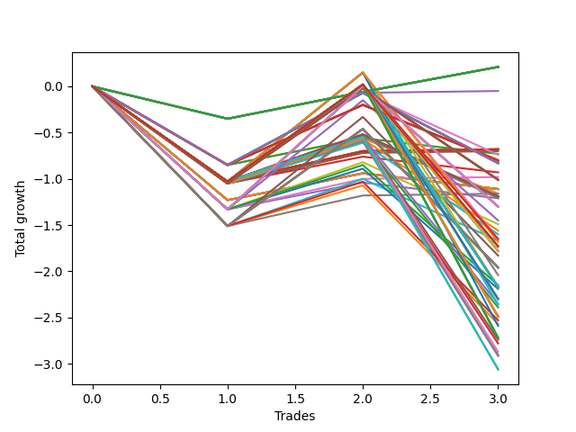

# Short HLT 109_1y 
- Symbol: TSLA
- Date Range: 05/15/2023 - 05/17/2024
- Trading Period: 8:30-12:30
- Number of Trades: 3



| Id. | Name | Win Percent | Profit | Avg Profit / Trade | Avg Time / Trade | Std |      | Name | Win Percent | Profit | Avg Profit / Trade | Avg Time / Trade | Std |
| --- | ---- | ----------- | ------ | ------------------ | ---------------- | --- | ---- | ---- | ----------- | ------ | ------------------ | ---------------- | --- |
| | Sorted By <br> Profit | | | | | | | Sorted By <br> Win Percentage |||||
|0| TP-0.25 180m | 66.67 | 0.21 | 0.07 | 07:00 | 0.30 |     | TP-0.25 180m | 66.67 | 0.21 | 0.07 | 07:00 | 0.30 |
|1| TP-0.25 165m | 66.67 | 0.21 | 0.07 | 07:00 | 0.30 |     | TP-0.25 165m | 66.67 | 0.21 | 0.07 | 07:00 | 0.30 |
|2| TP-0.25 150m | 66.67 | 0.21 | 0.07 | 07:00 | 0.30 |     | TP-0.25 150m | 66.67 | 0.21 | 0.07 | 07:00 | 0.30 |
|3| TP-0.25 135m | 66.67 | 0.21 | 0.07 | 07:00 | 0.30 |     | TP-0.25 135m | 66.67 | 0.21 | 0.07 | 07:00 | 0.30 |
|4| TP-0.25 120m | 66.67 | 0.21 | 0.07 | 07:00 | 0.30 |     | TP-0.25 120m | 66.67 | 0.21 | 0.07 | 07:00 | 0.30 |
|5| TP-0.25 105m | 66.67 | 0.21 | 0.07 | 07:00 | 0.30 |     | TP-0.25 105m | 66.67 | 0.21 | 0.07 | 07:00 | 0.30 |
|6| TP-0.25 90m | 66.67 | 0.21 | 0.07 | 07:00 | 0.30 |     | TP-0.25 90m | 66.67 | 0.21 | 0.07 | 07:00 | 0.30 |
|7| TP-0.25 75m | 66.67 | 0.21 | 0.07 | 07:00 | 0.30 |     | TP-0.25 75m | 66.67 | 0.21 | 0.07 | 07:00 | 0.30 |
|8| TP-0.25 60m | 66.67 | 0.21 | 0.07 | 07:00 | 0.30 |     | TP-0.25 60m | 66.67 | 0.21 | 0.07 | 07:00 | 0.30 |
|9| TP-0.25 45m | 66.67 | 0.21 | 0.07 | 07:00 | 0.30 |     | TP-0.25 45m | 66.67 | 0.21 | 0.07 | 07:00 | 0.30 |
|10| TP-0.25 30m | 66.67 | 0.21 | 0.07 | 07:00 | 0.30 |     | TP-0.25 30m | 66.67 | 0.21 | 0.07 | 07:00 | 0.30 |
|11| TP-0.25 15m | 66.67 | 0.21 | 0.07 | 07:00 | 0.30 |     | TP-0.25 15m | 66.67 | 0.21 | 0.07 | 07:00 | 0.30 |
|12| TP-0.75 30m | 66.67 | -0.05 | -0.02 | 17:40 | 0.67 |     | TP-0.75 30m | 66.67 | -0.05 | -0.02 | 17:40 | 0.67 |
|13| TP-3 30m | 66.67 | -0.68 | -0.23 | 26:00 | 0.58 |     | TP-3 30m | 66.67 | -0.68 | -0.23 | 26:00 | 0.58 |
|14| TP-2.75 30m | 66.67 | -0.68 | -0.23 | 26:00 | 0.58 |     | TP-2.75 30m | 66.67 | -0.68 | -0.23 | 26:00 | 0.58 |
|15| TP-2.5 30m | 66.67 | -0.68 | -0.23 | 26:00 | 0.58 |     | TP-2.5 30m | 66.67 | -0.68 | -0.23 | 26:00 | 0.58 |
|16| TP-2.25 30m | 66.67 | -0.68 | -0.23 | 26:00 | 0.58 |     | TP-2.25 30m | 66.67 | -0.68 | -0.23 | 26:00 | 0.58 |
|17| TP-2 30m | 66.67 | -0.68 | -0.23 | 26:00 | 0.58 |     | TP-2 30m | 66.67 | -0.68 | -0.23 | 26:00 | 0.58 |
|18| TP-1.75 30m | 66.67 | -0.68 | -0.23 | 26:00 | 0.58 |     | TP-1.75 30m | 66.67 | -0.68 | -0.23 | 26:00 | 0.58 |
|19| TP-1 30m | 66.67 | -0.70 | -0.23 | 22:00 | 0.59 |     | TP-1 30m | 66.67 | -0.70 | -0.23 | 22:00 | 0.59 |
|20| TP-0.75 15m | 33.33 | -0.73 | -0.24 | 11:20 | 0.47 |     | TP-1.25 30m | 66.67 | -0.98 | -0.33 | 23:00 | 0.72 |
|21| TP-0.75 45m | 33.33 | -0.74 | -0.25 | 22:40 | 0.73 |     | TP-1.5 30m | 66.67 | -1.16 | -0.39 | 25:00 | 0.80 |
|22| TP-0.5 180m | 33.33 | -0.80 | -0.27 | 10:40 | 0.66 |     | TP-0.75 15m | 33.33 | -0.73 | -0.24 | 11:20 | 0.47 |
|23| TP-0.5 165m | 33.33 | -0.80 | -0.27 | 10:40 | 0.66 |     | TP-0.75 45m | 33.33 | -0.74 | -0.25 | 22:40 | 0.73 |
|24| TP-0.5 150m | 33.33 | -0.80 | -0.27 | 10:40 | 0.66 |     | TP-0.5 180m | 33.33 | -0.80 | -0.27 | 10:40 | 0.66 |
|25| TP-0.5 135m | 33.33 | -0.80 | -0.27 | 10:40 | 0.66 |     | TP-0.5 165m | 33.33 | -0.80 | -0.27 | 10:40 | 0.66 |
|26| TP-0.5 120m | 33.33 | -0.80 | -0.27 | 10:40 | 0.66 |     | TP-0.5 150m | 33.33 | -0.80 | -0.27 | 10:40 | 0.66 |
|27| TP-0.5 105m | 33.33 | -0.80 | -0.27 | 10:40 | 0.66 |     | TP-0.5 135m | 33.33 | -0.80 | -0.27 | 10:40 | 0.66 |
|28| TP-0.5 90m | 33.33 | -0.80 | -0.27 | 10:40 | 0.66 |     | TP-0.5 120m | 33.33 | -0.80 | -0.27 | 10:40 | 0.66 |
|29| TP-0.5 75m | 33.33 | -0.80 | -0.27 | 10:40 | 0.66 |     | TP-0.5 105m | 33.33 | -0.80 | -0.27 | 10:40 | 0.66 |
|30| TP-0.5 60m | 33.33 | -0.80 | -0.27 | 10:40 | 0.66 |     | TP-0.5 90m | 33.33 | -0.80 | -0.27 | 10:40 | 0.66 |
|31| TP-0.5 45m | 33.33 | -0.80 | -0.27 | 10:40 | 0.66 |     | TP-0.5 75m | 33.33 | -0.80 | -0.27 | 10:40 | 0.66 |
|32| TP-0.5 30m | 33.33 | -0.80 | -0.27 | 10:40 | 0.66 |     | TP-0.5 60m | 33.33 | -0.80 | -0.27 | 10:40 | 0.66 |
|33| TP-0.75 180m | 33.33 | -0.83 | -0.28 | 23:00 | 0.75 |     | TP-0.5 45m | 33.33 | -0.80 | -0.27 | 10:40 | 0.66 |
|34| TP-0.75 165m | 33.33 | -0.83 | -0.28 | 23:00 | 0.75 |     | TP-0.5 30m | 33.33 | -0.80 | -0.27 | 10:40 | 0.66 |
|35| TP-0.75 150m | 33.33 | -0.83 | -0.28 | 23:00 | 0.75 |     | TP-0.75 180m | 33.33 | -0.83 | -0.28 | 23:00 | 0.75 |
|36| TP-0.75 135m | 33.33 | -0.83 | -0.28 | 23:00 | 0.75 |     | TP-0.75 165m | 33.33 | -0.83 | -0.28 | 23:00 | 0.75 |
|37| TP-0.75 120m | 33.33 | -0.83 | -0.28 | 23:00 | 0.75 |     | TP-0.75 150m | 33.33 | -0.83 | -0.28 | 23:00 | 0.75 |
|38| TP-0.75 105m | 33.33 | -0.83 | -0.28 | 23:00 | 0.75 |     | TP-0.75 135m | 33.33 | -0.83 | -0.28 | 23:00 | 0.75 |
|39| TP-0.75 90m | 33.33 | -0.83 | -0.28 | 23:00 | 0.75 |     | TP-0.75 120m | 33.33 | -0.83 | -0.28 | 23:00 | 0.75 |
|40| TP-0.75 75m | 33.33 | -0.83 | -0.28 | 23:00 | 0.75 |     | TP-0.75 105m | 33.33 | -0.83 | -0.28 | 23:00 | 0.75 |
|41| TP-0.75 60m | 33.33 | -0.83 | -0.28 | 23:00 | 0.75 |     | TP-0.75 90m | 33.33 | -0.83 | -0.28 | 23:00 | 0.75 |
|42| TP-1 15m | 33.33 | -0.93 | -0.31 | 12:00 | 0.56 |     | TP-0.75 75m | 33.33 | -0.83 | -0.28 | 23:00 | 0.75 |
|43| TP-1.25 30m | 66.67 | -0.98 | -0.33 | 23:00 | 0.72 |     | TP-0.75 60m | 33.33 | -0.83 | -0.28 | 23:00 | 0.75 |
|44| TP-1 180m | 33.33 | -1.01 | -0.34 | 46:00 | 0.97 |     | TP-1 15m | 33.33 | -0.93 | -0.31 | 12:00 | 0.56 |
|45| TP-1 165m | 33.33 | -1.01 | -0.34 | 46:00 | 0.97 |     | TP-1 180m | 33.33 | -1.01 | -0.34 | 46:00 | 0.97 |
|46| TP-1 150m | 33.33 | -1.01 | -0.34 | 46:00 | 0.97 |     | TP-1 165m | 33.33 | -1.01 | -0.34 | 46:00 | 0.97 |
|47| TP-1 135m | 33.33 | -1.01 | -0.34 | 46:00 | 0.97 |     | TP-1 150m | 33.33 | -1.01 | -0.34 | 46:00 | 0.97 |
|48| TP-1 120m | 33.33 | -1.01 | -0.34 | 46:00 | 0.97 |     | TP-1 135m | 33.33 | -1.01 | -0.34 | 46:00 | 0.97 |
|49| TP-1 105m | 33.33 | -1.01 | -0.34 | 46:00 | 0.97 |     | TP-1 120m | 33.33 | -1.01 | -0.34 | 46:00 | 0.97 |
|50| TP-1 90m | 33.33 | -1.01 | -0.34 | 46:00 | 0.97 |     | TP-1 105m | 33.33 | -1.01 | -0.34 | 46:00 | 0.97 |
|51| TP-3 15m | 33.33 | -1.11 | -0.37 | 14:00 | 0.64 |     | TP-1 90m | 33.33 | -1.01 | -0.34 | 46:00 | 0.97 |
|52| TP-2.75 15m | 33.33 | -1.11 | -0.37 | 14:00 | 0.64 |     | TP-3 15m | 33.33 | -1.11 | -0.37 | 14:00 | 0.64 |
|53| TP-2.5 15m | 33.33 | -1.11 | -0.37 | 14:00 | 0.64 |     | TP-2.75 15m | 33.33 | -1.11 | -0.37 | 14:00 | 0.64 |
|54| TP-2.25 15m | 33.33 | -1.11 | -0.37 | 14:00 | 0.64 |     | TP-2.5 15m | 33.33 | -1.11 | -0.37 | 14:00 | 0.64 |
|55| TP-2 15m | 33.33 | -1.11 | -0.37 | 14:00 | 0.64 |     | TP-2.25 15m | 33.33 | -1.11 | -0.37 | 14:00 | 0.64 |
|56| TP-1.75 15m | 33.33 | -1.11 | -0.37 | 14:00 | 0.64 |     | TP-2 15m | 33.33 | -1.11 | -0.37 | 14:00 | 0.64 |
|57| TP-1.5 15m | 33.33 | -1.11 | -0.37 | 14:00 | 0.64 |     | TP-1.75 15m | 33.33 | -1.11 | -0.37 | 14:00 | 0.64 |
|58| TP-1.5 30m | 66.67 | -1.16 | -0.39 | 25:00 | 0.80 |     | TP-1.5 15m | 33.33 | -1.11 | -0.37 | 14:00 | 0.64 |
|59| TP-0.5 15m | 33.33 | -1.16 | -0.39 | 10:00 | 0.49 |     | TP-0.5 15m | 33.33 | -1.16 | -0.39 | 10:00 | 0.49 |
|60| TP-3 45m | 33.33 | -1.19 | -0.40 | 36:00 | 0.66 |     | TP-3 45m | 33.33 | -1.19 | -0.40 | 36:00 | 0.66 |
|61| TP-2.75 45m | 33.33 | -1.19 | -0.40 | 36:00 | 0.66 |     | TP-2.75 45m | 33.33 | -1.19 | -0.40 | 36:00 | 0.66 |
|62| TP-2.5 45m | 33.33 | -1.19 | -0.40 | 36:00 | 0.66 |     | TP-2.5 45m | 33.33 | -1.19 | -0.40 | 36:00 | 0.66 |
|63| TP-2.25 45m | 33.33 | -1.19 | -0.40 | 36:00 | 0.66 |     | TP-2.25 45m | 33.33 | -1.19 | -0.40 | 36:00 | 0.66 |
|64| TP-2 45m | 33.33 | -1.19 | -0.40 | 36:00 | 0.66 |     | TP-2 45m | 33.33 | -1.19 | -0.40 | 36:00 | 0.66 |
|65| TP-1.75 45m | 33.33 | -1.19 | -0.40 | 36:00 | 0.66 |     | TP-1.75 45m | 33.33 | -1.19 | -0.40 | 36:00 | 0.66 |
|66| TP-1 45m | 33.33 | -1.21 | -0.40 | 32:00 | 0.66 |     | TP-1 45m | 33.33 | -1.21 | -0.40 | 32:00 | 0.66 |
|67| TP-1.25 15m | 33.33 | -1.21 | -0.40 | 13:00 | 0.68 |     | TP-1.25 15m | 33.33 | -1.21 | -0.40 | 13:00 | 0.68 |
|68| TP-1.25 180m | 33.33 | -1.30 | -0.43 | 50:00 | 1.25 |     | TP-1.25 180m | 33.33 | -1.30 | -0.43 | 50:00 | 1.25 |
|69| TP-1.25 165m | 33.33 | -1.30 | -0.43 | 50:00 | 1.25 |     | TP-1.25 165m | 33.33 | -1.30 | -0.43 | 50:00 | 1.25 |
|70| TP-1.25 150m | 33.33 | -1.30 | -0.43 | 50:00 | 1.25 |     | TP-1.25 150m | 33.33 | -1.30 | -0.43 | 50:00 | 1.25 |
|71| TP-1.25 135m | 33.33 | -1.30 | -0.43 | 50:00 | 1.25 |     | TP-1.25 135m | 33.33 | -1.30 | -0.43 | 50:00 | 1.25 |
|72| TP-1.25 120m | 33.33 | -1.30 | -0.43 | 50:00 | 1.25 |     | TP-1.25 120m | 33.33 | -1.30 | -0.43 | 50:00 | 1.25 |
|73| TP-1.25 105m | 33.33 | -1.30 | -0.43 | 50:00 | 1.25 |     | TP-1.25 105m | 33.33 | -1.30 | -0.43 | 50:00 | 1.25 |
|74| TP-1.25 90m | 33.33 | -1.45 | -0.48 | 49:20 | 1.18 |     | TP-1.25 90m | 33.33 | -1.45 | -0.48 | 49:20 | 1.18 |
|75| TP-1.25 45m | 33.33 | -1.49 | -0.50 | 33:00 | 0.76 |     | TP-1.25 45m | 33.33 | -1.49 | -0.50 | 33:00 | 0.76 |
|76| TP-1 75m | 33.33 | -1.56 | -0.52 | 43:00 | 0.71 |     | TP-1 75m | 33.33 | -1.56 | -0.52 | 43:00 | 0.71 |
|77| TP-1 60m | 33.33 | -1.60 | -0.53 | 38:00 | 0.69 |     | TP-1 60m | 33.33 | -1.60 | -0.53 | 38:00 | 0.69 |
|78| TP-3 105m | 33.33 | -1.65 | -0.55 | 74:40 | 1.16 |     | TP-3 105m | 33.33 | -1.65 | -0.55 | 74:40 | 1.16 |
|79| TP-1.75 90m | 33.33 | -1.65 | -0.55 | 55:00 | 1.26 |     | TP-1.75 90m | 33.33 | -1.65 | -0.55 | 55:00 | 1.26 |
|80| TP-1.5 45m | 33.33 | -1.67 | -0.56 | 35:00 | 0.83 |     | TP-1.5 45m | 33.33 | -1.67 | -0.56 | 35:00 | 0.83 |
|81| TP-3 90m | 33.33 | -1.68 | -0.56 | 66:00 | 1.27 |     | TP-3 90m | 33.33 | -1.68 | -0.56 | 66:00 | 1.27 |
|82| TP-3 180m | 33.33 | -1.73 | -0.58 | 79:40 | 1.19 |     | TP-3 180m | 33.33 | -1.73 | -0.58 | 79:40 | 1.19 |
|83| TP-3 165m | 33.33 | -1.73 | -0.58 | 79:40 | 1.19 |     | TP-3 165m | 33.33 | -1.73 | -0.58 | 79:40 | 1.19 |
|84| TP-3 150m | 33.33 | -1.73 | -0.58 | 79:40 | 1.19 |     | TP-3 150m | 33.33 | -1.73 | -0.58 | 79:40 | 1.19 |
|85| TP-3 135m | 33.33 | -1.73 | -0.58 | 79:40 | 1.19 |     | TP-3 135m | 33.33 | -1.73 | -0.58 | 79:40 | 1.19 |
|86| TP-3 120m | 33.33 | -1.73 | -0.58 | 79:40 | 1.19 |     | TP-3 120m | 33.33 | -1.73 | -0.58 | 79:40 | 1.19 |
|87| TP-1.75 180m | 33.33 | -1.78 | -0.59 | 58:40 | 1.20 |     | TP-1.75 180m | 33.33 | -1.78 | -0.59 | 58:40 | 1.20 |
|88| TP-1.75 165m | 33.33 | -1.78 | -0.59 | 58:40 | 1.20 |     | TP-1.75 165m | 33.33 | -1.78 | -0.59 | 58:40 | 1.20 |
|89| TP-1.75 150m | 33.33 | -1.78 | -0.59 | 58:40 | 1.20 |     | TP-1.75 150m | 33.33 | -1.78 | -0.59 | 58:40 | 1.20 |
|90| TP-1.75 135m | 33.33 | -1.78 | -0.59 | 58:40 | 1.20 |     | TP-1.75 135m | 33.33 | -1.78 | -0.59 | 58:40 | 1.20 |
|91| TP-1.75 120m | 33.33 | -1.78 | -0.59 | 58:40 | 1.20 |     | TP-1.75 120m | 33.33 | -1.78 | -0.59 | 58:40 | 1.20 |
|92| TP-1.75 105m | 33.33 | -1.78 | -0.59 | 58:40 | 1.20 |     | TP-1.75 105m | 33.33 | -1.78 | -0.59 | 58:40 | 1.20 |
|93| TP-1.5 90m | 33.33 | -1.83 | -0.61 | 52:00 | 1.27 |     | TP-1.5 90m | 33.33 | -1.83 | -0.61 | 52:00 | 1.27 |
|94| TP-1.5 180m | 33.33 | -1.96 | -0.65 | 55:40 | 1.20 |     | TP-1.5 180m | 33.33 | -1.96 | -0.65 | 55:40 | 1.20 |
|95| TP-1.5 165m | 33.33 | -1.96 | -0.65 | 55:40 | 1.20 |     | TP-1.5 165m | 33.33 | -1.96 | -0.65 | 55:40 | 1.20 |
|96| TP-1.5 150m | 33.33 | -1.96 | -0.65 | 55:40 | 1.20 |     | TP-1.5 150m | 33.33 | -1.96 | -0.65 | 55:40 | 1.20 |
|97| TP-1.5 135m | 33.33 | -1.96 | -0.65 | 55:40 | 1.20 |     | TP-1.5 135m | 33.33 | -1.96 | -0.65 | 55:40 | 1.20 |
|98| TP-1.5 120m | 33.33 | -1.96 | -0.65 | 55:40 | 1.20 |     | TP-1.5 120m | 33.33 | -1.96 | -0.65 | 55:40 | 1.20 |
|99| TP-1.5 105m | 33.33 | -1.96 | -0.65 | 55:40 | 1.20 |     | TP-1.5 105m | 33.33 | -1.96 | -0.65 | 55:40 | 1.20 |
|100| TP-2 90m | 33.33 | -2.04 | -0.68 | 55:40 | 1.40 |     | TP-2 90m | 33.33 | -2.04 | -0.68 | 55:40 | 1.40 |
|101| TP-1.25 75m | 33.33 | -2.15 | -0.72 | 44:20 | 0.85 |     | TP-1.25 75m | 33.33 | -2.15 | -0.72 | 44:20 | 0.85 |
|102| TP-2 180m | 33.33 | -2.17 | -0.72 | 59:20 | 1.34 |     | TP-2 180m | 33.33 | -2.17 | -0.72 | 59:20 | 1.34 |
|103| TP-2 165m | 33.33 | -2.17 | -0.72 | 59:20 | 1.34 |     | TP-2 165m | 33.33 | -2.17 | -0.72 | 59:20 | 1.34 |
|104| TP-2 150m | 33.33 | -2.17 | -0.72 | 59:20 | 1.34 |     | TP-2 150m | 33.33 | -2.17 | -0.72 | 59:20 | 1.34 |
|105| TP-2 135m | 33.33 | -2.17 | -0.72 | 59:20 | 1.34 |     | TP-2 135m | 33.33 | -2.17 | -0.72 | 59:20 | 1.34 |
|106| TP-2 120m | 33.33 | -2.17 | -0.72 | 59:20 | 1.34 |     | TP-2 120m | 33.33 | -2.17 | -0.72 | 59:20 | 1.34 |
|107| TP-2 105m | 33.33 | -2.17 | -0.72 | 59:20 | 1.34 |     | TP-2 105m | 33.33 | -2.17 | -0.72 | 59:20 | 1.34 |
|108| TP-2.25 90m | 33.33 | -2.17 | -0.72 | 56:00 | 1.45 |     | TP-2.25 90m | 33.33 | -2.17 | -0.72 | 56:00 | 1.45 |
|109| TP-1.25 60m | 33.33 | -2.19 | -0.73 | 39:20 | 0.83 |     | TP-1.25 60m | 33.33 | -2.19 | -0.73 | 39:20 | 0.83 |
|110| TP-2.25 180m | 33.33 | -2.30 | -0.77 | 59:40 | 1.39 |     | TP-2.25 180m | 33.33 | -2.30 | -0.77 | 59:40 | 1.39 |
|111| TP-2.25 165m | 33.33 | -2.30 | -0.77 | 59:40 | 1.39 |     | TP-2.25 165m | 33.33 | -2.30 | -0.77 | 59:40 | 1.39 |
|112| TP-2.25 150m | 33.33 | -2.30 | -0.77 | 59:40 | 1.39 |     | TP-2.25 150m | 33.33 | -2.30 | -0.77 | 59:40 | 1.39 |
|113| TP-2.25 135m | 33.33 | -2.30 | -0.77 | 59:40 | 1.39 |     | TP-2.25 135m | 33.33 | -2.30 | -0.77 | 59:40 | 1.39 |
|114| TP-2.25 120m | 33.33 | -2.30 | -0.77 | 59:40 | 1.39 |     | TP-2.25 120m | 33.33 | -2.30 | -0.77 | 59:40 | 1.39 |
|115| TP-2.25 105m | 33.33 | -2.30 | -0.77 | 59:40 | 1.39 |     | TP-2.25 105m | 33.33 | -2.30 | -0.77 | 59:40 | 1.39 |
|116| TP-1.75 75m | 33.33 | -2.35 | -0.78 | 50:00 | 0.95 |     | TP-1.75 75m | 33.33 | -2.35 | -0.78 | 50:00 | 0.95 |
|117| TP-2.5 90m | 33.33 | -2.36 | -0.79 | 61:00 | 1.52 |     | TP-2.5 90m | 33.33 | -2.36 | -0.79 | 61:00 | 1.52 |
|118| TP-1.75 60m | 33.33 | -2.39 | -0.80 | 45:00 | 0.93 |     | TP-1.75 60m | 33.33 | -2.39 | -0.80 | 45:00 | 0.93 |
|119| TP-2.5 180m | 33.33 | -2.49 | -0.83 | 64:40 | 1.46 |     | TP-2.5 180m | 33.33 | -2.49 | -0.83 | 64:40 | 1.46 |
|120| TP-2.5 165m | 33.33 | -2.49 | -0.83 | 64:40 | 1.46 |     | TP-2.5 165m | 33.33 | -2.49 | -0.83 | 64:40 | 1.46 |
|121| TP-2.5 150m | 33.33 | -2.49 | -0.83 | 64:40 | 1.46 |     | TP-2.5 150m | 33.33 | -2.49 | -0.83 | 64:40 | 1.46 |
|122| TP-2.5 135m | 33.33 | -2.49 | -0.83 | 64:40 | 1.46 |     | TP-2.5 135m | 33.33 | -2.49 | -0.83 | 64:40 | 1.46 |
|123| TP-2.5 120m | 33.33 | -2.49 | -0.83 | 64:40 | 1.46 |     | TP-2.5 120m | 33.33 | -2.49 | -0.83 | 64:40 | 1.46 |
|124| TP-2.5 105m | 33.33 | -2.49 | -0.83 | 64:40 | 1.46 |     | TP-2.5 105m | 33.33 | -2.49 | -0.83 | 64:40 | 1.46 |
|125| TP-1.5 75m | 33.33 | -2.53 | -0.84 | 47:00 | 0.94 |     | TP-1.5 75m | 33.33 | -2.53 | -0.84 | 47:00 | 0.94 |
|126| TP-1.5 60m | 33.33 | -2.57 | -0.86 | 42:00 | 0.92 |     | TP-1.5 60m | 33.33 | -2.57 | -0.86 | 42:00 | 0.92 |
|127| TP-2.75 90m | 33.33 | -2.59 | -0.86 | 61:40 | 1.60 |     | TP-2.75 90m | 33.33 | -2.59 | -0.86 | 61:40 | 1.60 |
|128| TP-2.75 180m | 33.33 | -2.72 | -0.91 | 65:20 | 1.55 |     | TP-2.75 180m | 33.33 | -2.72 | -0.91 | 65:20 | 1.55 |
|129| TP-2.75 165m | 33.33 | -2.72 | -0.91 | 65:20 | 1.55 |     | TP-2.75 165m | 33.33 | -2.72 | -0.91 | 65:20 | 1.55 |
|130| TP-2.75 150m | 33.33 | -2.72 | -0.91 | 65:20 | 1.55 |     | TP-2.75 150m | 33.33 | -2.72 | -0.91 | 65:20 | 1.55 |
|131| TP-2.75 135m | 33.33 | -2.72 | -0.91 | 65:20 | 1.55 |     | TP-2.75 135m | 33.33 | -2.72 | -0.91 | 65:20 | 1.55 |
|132| TP-2.75 120m | 33.33 | -2.72 | -0.91 | 65:20 | 1.55 |     | TP-2.75 120m | 33.33 | -2.72 | -0.91 | 65:20 | 1.55 |
|133| TP-2.75 105m | 33.33 | -2.72 | -0.91 | 65:20 | 1.55 |     | TP-2.75 105m | 33.33 | -2.72 | -0.91 | 65:20 | 1.55 |
|134| TP-2 75m | 33.33 | -2.74 | -0.91 | 50:40 | 1.09 |     | TP-2 75m | 33.33 | -2.74 | -0.91 | 50:40 | 1.09 |
|135| TP-2 60m | 33.33 | -2.78 | -0.93 | 45:40 | 1.08 |     | TP-2 60m | 33.33 | -2.78 | -0.93 | 45:40 | 1.08 |
|136| TP-2.25 75m | 33.33 | -2.87 | -0.96 | 51:00 | 1.14 |     | TP-2.25 75m | 33.33 | -2.87 | -0.96 | 51:00 | 1.14 |
|137| TP-3 60m | 33.33 | -2.91 | -0.97 | 46:00 | 1.13 |     | TP-3 60m | 33.33 | -2.91 | -0.97 | 46:00 | 1.13 |
|138| TP-2.75 60m | 33.33 | -2.91 | -0.97 | 46:00 | 1.13 |     | TP-2.75 60m | 33.33 | -2.91 | -0.97 | 46:00 | 1.13 |
|139| TP-2.5 60m | 33.33 | -2.91 | -0.97 | 46:00 | 1.13 |     | TP-2.5 60m | 33.33 | -2.91 | -0.97 | 46:00 | 1.13 |
|140| TP-2.25 60m | 33.33 | -2.91 | -0.97 | 46:00 | 1.13 |     | TP-2.25 60m | 33.33 | -2.91 | -0.97 | 46:00 | 1.13 |
|141| TP-3 75m | 33.33 | -3.06 | -1.02 | 56:00 | 1.22 |     | TP-3 75m | 33.33 | -3.06 | -1.02 | 56:00 | 1.22 |
|142| TP-2.75 75m | 33.33 | -3.06 | -1.02 | 56:00 | 1.22 |     | TP-2.75 75m | 33.33 | -3.06 | -1.02 | 56:00 | 1.22 |
|143| TP-2.5 75m | 33.33 | -3.06 | -1.02 | 56:00 | 1.22 |     | TP-2.5 75m | 33.33 | -3.06 | -1.02 | 56:00 | 1.22 |

### Test TP-0.25 15m
* Take Profit of 0.25 Point
* 0.25 Stoploss
* Results:
```
Total Trades: 3
Percent Up: 33.33
Percent Down: 66.67
Total Points Moved Down: 0.21
Potential Profit: 105.00
Total Points Ups: 0.35 Count Ups: 1
Total Points Downs: 0.56 Count Downs: 2
```

<details><summary>Trades</summary>

<code>In: 2023-10-04 12:30:00		Out: 2023-10-04 12:33:00		Total Position Time: 03:00		Total Move Down: -0.35		Total to Date: -0.35</code> <br />
<code>In: 2023-10-31 11:10:00		Out: 2023-10-31 11:24:00		Total Position Time: 14:00		Total Move Down: 0.29		Total to Date: -0.06</code> <br />
<code>In: 2024-02-15 09:25:00		Out: 2024-02-15 09:29:00		Total Position Time: 04:00		Total Move Down: 0.27		Total to Date: 0.21</code> <br />


</details>

### Test TP-0.5 15m
* Take Profit of 0.5 Point
* 0.5 Stoploss
* Results:
```
Total Trades: 3
Percent Up: 66.67
Percent Down: 33.33
Total Points Moved Down: -1.16
Potential Profit: -580.00
Total Points Ups: 1.45 Count Ups: 2
Total Points Downs: 0.29 Count Downs: 1
```

<details><summary>Trades</summary>

<code>In: 2023-10-04 12:30:00		Out: 2023-10-04 12:36:00		Total Position Time: 06:00		Total Move Down: -0.85		Total to Date: -0.85</code> <br />
<code>In: 2023-10-31 11:10:00		Out: 2023-10-31 11:24:00		Total Position Time: 14:00		Total Move Down: 0.29		Total to Date: -0.56</code> <br />
<code>In: 2024-02-15 09:25:00		Out: 2024-02-15 09:35:00		Total Position Time: 10:00		Total Move Down: -0.60		Total to Date: -1.16</code> <br />


</details>

### Test TP-0.75 15m
* Take Profit of 0.75 Point
* 0.75 Stoploss
* Results:
```
Total Trades: 3
Percent Up: 66.67
Percent Down: 33.33
Total Points Moved Down: -0.73
Potential Profit: -365.00
Total Points Ups: 1.02 Count Ups: 2
Total Points Downs: 0.29 Count Downs: 1
```

<details><summary>Trades</summary>

<code>In: 2023-10-04 12:30:00		Out: 2023-10-04 12:36:00		Total Position Time: 06:00		Total Move Down: -0.85		Total to Date: -0.85</code> <br />
<code>In: 2023-10-31 11:10:00		Out: 2023-10-31 11:24:00		Total Position Time: 14:00		Total Move Down: 0.29		Total to Date: -0.56</code> <br />
<code>In: 2024-02-15 09:25:00		Out: 2024-02-15 09:39:00		Total Position Time: 14:00		Total Move Down: -0.17		Total to Date: -0.73</code> <br />


</details>

### Test TP-1 15m
* Take Profit of 1 Point
* 1 Stoploss
* Results:
```
Total Trades: 3
Percent Up: 66.67
Percent Down: 33.33
Total Points Moved Down: -0.93
Potential Profit: -465.00
Total Points Ups: 1.22 Count Ups: 2
Total Points Downs: 0.29 Count Downs: 1
```

<details><summary>Trades</summary>

<code>In: 2023-10-04 12:30:00		Out: 2023-10-04 12:38:00		Total Position Time: 08:00		Total Move Down: -1.05		Total to Date: -1.05</code> <br />
<code>In: 2023-10-31 11:10:00		Out: 2023-10-31 11:24:00		Total Position Time: 14:00		Total Move Down: 0.29		Total to Date: -0.76</code> <br />
<code>In: 2024-02-15 09:25:00		Out: 2024-02-15 09:39:00		Total Position Time: 14:00		Total Move Down: -0.17		Total to Date: -0.93</code> <br />


</details>

### Test TP-1.25 15m
* Take Profit of 1.25 Point
* 1.25 Stoploss
* Results:
```
Total Trades: 3
Percent Up: 66.67
Percent Down: 33.33
Total Points Moved Down: -1.21
Potential Profit: -605.00
Total Points Ups: 1.50 Count Ups: 2
Total Points Downs: 0.29 Count Downs: 1
```

<details><summary>Trades</summary>

<code>In: 2023-10-04 12:30:00		Out: 2023-10-04 12:41:00		Total Position Time: 11:00		Total Move Down: -1.33		Total to Date: -1.33</code> <br />
<code>In: 2023-10-31 11:10:00		Out: 2023-10-31 11:24:00		Total Position Time: 14:00		Total Move Down: 0.29		Total to Date: -1.04</code> <br />
<code>In: 2024-02-15 09:25:00		Out: 2024-02-15 09:39:00		Total Position Time: 14:00		Total Move Down: -0.17		Total to Date: -1.21</code> <br />


</details>

### Test TP-1.5 15m
* Take Profit of 1.5 Point
* 1.5 Stoploss
* Results:
```
Total Trades: 3
Percent Up: 66.67
Percent Down: 33.33
Total Points Moved Down: -1.11
Potential Profit: -555.00
Total Points Ups: 1.40 Count Ups: 2
Total Points Downs: 0.29 Count Downs: 1
```

<details><summary>Trades</summary>

<code>In: 2023-10-04 12:30:00		Out: 2023-10-04 12:44:00		Total Position Time: 14:00		Total Move Down: -1.23		Total to Date: -1.23</code> <br />
<code>In: 2023-10-31 11:10:00		Out: 2023-10-31 11:24:00		Total Position Time: 14:00		Total Move Down: 0.29		Total to Date: -0.94</code> <br />
<code>In: 2024-02-15 09:25:00		Out: 2024-02-15 09:39:00		Total Position Time: 14:00		Total Move Down: -0.17		Total to Date: -1.11</code> <br />


</details>

### Test TP-1.75 15m
* Take Profit of 1.75 Point
* 1.75 Stoploss
* Results:
```
Total Trades: 3
Percent Up: 66.67
Percent Down: 33.33
Total Points Moved Down: -1.11
Potential Profit: -555.00
Total Points Ups: 1.40 Count Ups: 2
Total Points Downs: 0.29 Count Downs: 1
```

<details><summary>Trades</summary>

<code>In: 2023-10-04 12:30:00		Out: 2023-10-04 12:44:00		Total Position Time: 14:00		Total Move Down: -1.23		Total to Date: -1.23</code> <br />
<code>In: 2023-10-31 11:10:00		Out: 2023-10-31 11:24:00		Total Position Time: 14:00		Total Move Down: 0.29		Total to Date: -0.94</code> <br />
<code>In: 2024-02-15 09:25:00		Out: 2024-02-15 09:39:00		Total Position Time: 14:00		Total Move Down: -0.17		Total to Date: -1.11</code> <br />


</details>

### Test TP-2 15m
* Take Profit of 2 Point
* 2 Stoploss
* Results:
```
Total Trades: 3
Percent Up: 66.67
Percent Down: 33.33
Total Points Moved Down: -1.11
Potential Profit: -555.00
Total Points Ups: 1.40 Count Ups: 2
Total Points Downs: 0.29 Count Downs: 1
```

<details><summary>Trades</summary>

<code>In: 2023-10-04 12:30:00		Out: 2023-10-04 12:44:00		Total Position Time: 14:00		Total Move Down: -1.23		Total to Date: -1.23</code> <br />
<code>In: 2023-10-31 11:10:00		Out: 2023-10-31 11:24:00		Total Position Time: 14:00		Total Move Down: 0.29		Total to Date: -0.94</code> <br />
<code>In: 2024-02-15 09:25:00		Out: 2024-02-15 09:39:00		Total Position Time: 14:00		Total Move Down: -0.17		Total to Date: -1.11</code> <br />


</details>

### Test TP-2.25 15m
* Take Profit of 2.25 Point
* 2.25 Stoploss
* Results:
```
Total Trades: 3
Percent Up: 66.67
Percent Down: 33.33
Total Points Moved Down: -1.11
Potential Profit: -555.00
Total Points Ups: 1.40 Count Ups: 2
Total Points Downs: 0.29 Count Downs: 1
```

<details><summary>Trades</summary>

<code>In: 2023-10-04 12:30:00		Out: 2023-10-04 12:44:00		Total Position Time: 14:00		Total Move Down: -1.23		Total to Date: -1.23</code> <br />
<code>In: 2023-10-31 11:10:00		Out: 2023-10-31 11:24:00		Total Position Time: 14:00		Total Move Down: 0.29		Total to Date: -0.94</code> <br />
<code>In: 2024-02-15 09:25:00		Out: 2024-02-15 09:39:00		Total Position Time: 14:00		Total Move Down: -0.17		Total to Date: -1.11</code> <br />


</details>

### Test TP-2.5 15m
* Take Profit of 2.5 Point
* 2.5 Stoploss
* Results:
```
Total Trades: 3
Percent Up: 66.67
Percent Down: 33.33
Total Points Moved Down: -1.11
Potential Profit: -555.00
Total Points Ups: 1.40 Count Ups: 2
Total Points Downs: 0.29 Count Downs: 1
```

<details><summary>Trades</summary>

<code>In: 2023-10-04 12:30:00		Out: 2023-10-04 12:44:00		Total Position Time: 14:00		Total Move Down: -1.23		Total to Date: -1.23</code> <br />
<code>In: 2023-10-31 11:10:00		Out: 2023-10-31 11:24:00		Total Position Time: 14:00		Total Move Down: 0.29		Total to Date: -0.94</code> <br />
<code>In: 2024-02-15 09:25:00		Out: 2024-02-15 09:39:00		Total Position Time: 14:00		Total Move Down: -0.17		Total to Date: -1.11</code> <br />


</details>

### Test TP-2.75 15m
* Take Profit of 2.75 Point
* 2.75 Stoploss
* Results:
```
Total Trades: 3
Percent Up: 66.67
Percent Down: 33.33
Total Points Moved Down: -1.11
Potential Profit: -555.00
Total Points Ups: 1.40 Count Ups: 2
Total Points Downs: 0.29 Count Downs: 1
```

<details><summary>Trades</summary>

<code>In: 2023-10-04 12:30:00		Out: 2023-10-04 12:44:00		Total Position Time: 14:00		Total Move Down: -1.23		Total to Date: -1.23</code> <br />
<code>In: 2023-10-31 11:10:00		Out: 2023-10-31 11:24:00		Total Position Time: 14:00		Total Move Down: 0.29		Total to Date: -0.94</code> <br />
<code>In: 2024-02-15 09:25:00		Out: 2024-02-15 09:39:00		Total Position Time: 14:00		Total Move Down: -0.17		Total to Date: -1.11</code> <br />


</details>

### Test TP-3 15m
* Take Profit of 3 Point
* 3 Stoploss
* Results:
```
Total Trades: 3
Percent Up: 66.67
Percent Down: 33.33
Total Points Moved Down: -1.11
Potential Profit: -555.00
Total Points Ups: 1.40 Count Ups: 2
Total Points Downs: 0.29 Count Downs: 1
```

<details><summary>Trades</summary>

<code>In: 2023-10-04 12:30:00		Out: 2023-10-04 12:44:00		Total Position Time: 14:00		Total Move Down: -1.23		Total to Date: -1.23</code> <br />
<code>In: 2023-10-31 11:10:00		Out: 2023-10-31 11:24:00		Total Position Time: 14:00		Total Move Down: 0.29		Total to Date: -0.94</code> <br />
<code>In: 2024-02-15 09:25:00		Out: 2024-02-15 09:39:00		Total Position Time: 14:00		Total Move Down: -0.17		Total to Date: -1.11</code> <br />


</details>

### Test TP-0.25 30m
* Take Profit of 0.25 Point
* 0.25 Stoploss
* Results:
```
Total Trades: 3
Percent Up: 33.33
Percent Down: 66.67
Total Points Moved Down: 0.21
Potential Profit: 105.00
Total Points Ups: 0.35 Count Ups: 1
Total Points Downs: 0.56 Count Downs: 2
```

<details><summary>Trades</summary>

<code>In: 2023-10-04 12:30:00		Out: 2023-10-04 12:33:00		Total Position Time: 03:00		Total Move Down: -0.35		Total to Date: -0.35</code> <br />
<code>In: 2023-10-31 11:10:00		Out: 2023-10-31 11:24:00		Total Position Time: 14:00		Total Move Down: 0.29		Total to Date: -0.06</code> <br />
<code>In: 2024-02-15 09:25:00		Out: 2024-02-15 09:29:00		Total Position Time: 04:00		Total Move Down: 0.27		Total to Date: 0.21</code> <br />


</details>

### Test TP-0.5 30m
* Take Profit of 0.5 Point
* 0.5 Stoploss
* Results:
```
Total Trades: 3
Percent Up: 66.67
Percent Down: 33.33
Total Points Moved Down: -0.80
Potential Profit: -400.00
Total Points Ups: 1.45 Count Ups: 2
Total Points Downs: 0.65 Count Downs: 1
```

<details><summary>Trades</summary>

<code>In: 2023-10-04 12:30:00		Out: 2023-10-04 12:36:00		Total Position Time: 06:00		Total Move Down: -0.85		Total to Date: -0.85</code> <br />
<code>In: 2023-10-31 11:10:00		Out: 2023-10-31 11:26:00		Total Position Time: 16:00		Total Move Down: 0.65		Total to Date: -0.20</code> <br />
<code>In: 2024-02-15 09:25:00		Out: 2024-02-15 09:35:00		Total Position Time: 10:00		Total Move Down: -0.60		Total to Date: -0.80</code> <br />


</details>

### Test TP-0.75 30m
* Take Profit of 0.75 Point
* 0.75 Stoploss
* Results:
```
Total Trades: 3
Percent Up: 33.33
Percent Down: 66.67
Total Points Moved Down: -0.05
Potential Profit: -25.00
Total Points Ups: 0.85 Count Ups: 1
Total Points Downs: 0.80 Count Downs: 2
```

<details><summary>Trades</summary>

<code>In: 2023-10-04 12:30:00		Out: 2023-10-04 12:36:00		Total Position Time: 06:00		Total Move Down: -0.85		Total to Date: -0.85</code> <br />
<code>In: 2023-10-31 11:10:00		Out: 2023-10-31 11:28:00		Total Position Time: 18:00		Total Move Down: 0.78		Total to Date: -0.07</code> <br />
<code>In: 2024-02-15 09:25:00		Out: 2024-02-15 09:54:00		Total Position Time: 29:00		Total Move Down: 0.02		Total to Date: -0.05</code> <br />


</details>

### Test TP-1 30m
* Take Profit of 1 Point
* 1 Stoploss
* Results:
```
Total Trades: 3
Percent Up: 33.33
Percent Down: 66.67
Total Points Moved Down: -0.70
Potential Profit: -350.00
Total Points Ups: 1.05 Count Ups: 1
Total Points Downs: 0.35 Count Downs: 2
```

<details><summary>Trades</summary>

<code>In: 2023-10-04 12:30:00		Out: 2023-10-04 12:38:00		Total Position Time: 08:00		Total Move Down: -1.05		Total to Date: -1.05</code> <br />
<code>In: 2023-10-31 11:10:00		Out: 2023-10-31 11:39:00		Total Position Time: 29:00		Total Move Down: 0.33		Total to Date: -0.72</code> <br />
<code>In: 2024-02-15 09:25:00		Out: 2024-02-15 09:54:00		Total Position Time: 29:00		Total Move Down: 0.02		Total to Date: -0.70</code> <br />


</details>

### Test TP-1.25 30m
* Take Profit of 1.25 Point
* 1.25 Stoploss
* Results:
```
Total Trades: 3
Percent Up: 33.33
Percent Down: 66.67
Total Points Moved Down: -0.98
Potential Profit: -490.00
Total Points Ups: 1.33 Count Ups: 1
Total Points Downs: 0.35 Count Downs: 2
```

<details><summary>Trades</summary>

<code>In: 2023-10-04 12:30:00		Out: 2023-10-04 12:41:00		Total Position Time: 11:00		Total Move Down: -1.33		Total to Date: -1.33</code> <br />
<code>In: 2023-10-31 11:10:00		Out: 2023-10-31 11:39:00		Total Position Time: 29:00		Total Move Down: 0.33		Total to Date: -1.00</code> <br />
<code>In: 2024-02-15 09:25:00		Out: 2024-02-15 09:54:00		Total Position Time: 29:00		Total Move Down: 0.02		Total to Date: -0.98</code> <br />


</details>

### Test TP-1.5 30m
* Take Profit of 1.5 Point
* 1.5 Stoploss
* Results:
```
Total Trades: 3
Percent Up: 33.33
Percent Down: 66.67
Total Points Moved Down: -1.16
Potential Profit: -580.00
Total Points Ups: 1.51 Count Ups: 1
Total Points Downs: 0.35 Count Downs: 2
```

<details><summary>Trades</summary>

<code>In: 2023-10-04 12:30:00		Out: 2023-10-04 12:47:00		Total Position Time: 17:00		Total Move Down: -1.51		Total to Date: -1.51</code> <br />
<code>In: 2023-10-31 11:10:00		Out: 2023-10-31 11:39:00		Total Position Time: 29:00		Total Move Down: 0.33		Total to Date: -1.18</code> <br />
<code>In: 2024-02-15 09:25:00		Out: 2024-02-15 09:54:00		Total Position Time: 29:00		Total Move Down: 0.02		Total to Date: -1.16</code> <br />


</details>

### Test TP-1.75 30m
* Take Profit of 1.75 Point
* 1.75 Stoploss
* Results:
```
Total Trades: 3
Percent Up: 33.33
Percent Down: 66.67
Total Points Moved Down: -0.68
Potential Profit: -340.00
Total Points Ups: 1.03 Count Ups: 1
Total Points Downs: 0.35 Count Downs: 2
```

<details><summary>Trades</summary>

<code>In: 2023-10-04 12:30:00		Out: 2023-10-04 12:50:00		Total Position Time: 20:00		Total Move Down: -1.03		Total to Date: -1.03</code> <br />
<code>In: 2023-10-31 11:10:00		Out: 2023-10-31 11:39:00		Total Position Time: 29:00		Total Move Down: 0.33		Total to Date: -0.70</code> <br />
<code>In: 2024-02-15 09:25:00		Out: 2024-02-15 09:54:00		Total Position Time: 29:00		Total Move Down: 0.02		Total to Date: -0.68</code> <br />


</details>

### Test TP-2 30m
* Take Profit of 2 Point
* 2 Stoploss
* Results:
```
Total Trades: 3
Percent Up: 33.33
Percent Down: 66.67
Total Points Moved Down: -0.68
Potential Profit: -340.00
Total Points Ups: 1.03 Count Ups: 1
Total Points Downs: 0.35 Count Downs: 2
```

<details><summary>Trades</summary>

<code>In: 2023-10-04 12:30:00		Out: 2023-10-04 12:50:00		Total Position Time: 20:00		Total Move Down: -1.03		Total to Date: -1.03</code> <br />
<code>In: 2023-10-31 11:10:00		Out: 2023-10-31 11:39:00		Total Position Time: 29:00		Total Move Down: 0.33		Total to Date: -0.70</code> <br />
<code>In: 2024-02-15 09:25:00		Out: 2024-02-15 09:54:00		Total Position Time: 29:00		Total Move Down: 0.02		Total to Date: -0.68</code> <br />


</details>

### Test TP-2.25 30m
* Take Profit of 2.25 Point
* 2.25 Stoploss
* Results:
```
Total Trades: 3
Percent Up: 33.33
Percent Down: 66.67
Total Points Moved Down: -0.68
Potential Profit: -340.00
Total Points Ups: 1.03 Count Ups: 1
Total Points Downs: 0.35 Count Downs: 2
```

<details><summary>Trades</summary>

<code>In: 2023-10-04 12:30:00		Out: 2023-10-04 12:50:00		Total Position Time: 20:00		Total Move Down: -1.03		Total to Date: -1.03</code> <br />
<code>In: 2023-10-31 11:10:00		Out: 2023-10-31 11:39:00		Total Position Time: 29:00		Total Move Down: 0.33		Total to Date: -0.70</code> <br />
<code>In: 2024-02-15 09:25:00		Out: 2024-02-15 09:54:00		Total Position Time: 29:00		Total Move Down: 0.02		Total to Date: -0.68</code> <br />


</details>

### Test TP-2.5 30m
* Take Profit of 2.5 Point
* 2.5 Stoploss
* Results:
```
Total Trades: 3
Percent Up: 33.33
Percent Down: 66.67
Total Points Moved Down: -0.68
Potential Profit: -340.00
Total Points Ups: 1.03 Count Ups: 1
Total Points Downs: 0.35 Count Downs: 2
```

<details><summary>Trades</summary>

<code>In: 2023-10-04 12:30:00		Out: 2023-10-04 12:50:00		Total Position Time: 20:00		Total Move Down: -1.03		Total to Date: -1.03</code> <br />
<code>In: 2023-10-31 11:10:00		Out: 2023-10-31 11:39:00		Total Position Time: 29:00		Total Move Down: 0.33		Total to Date: -0.70</code> <br />
<code>In: 2024-02-15 09:25:00		Out: 2024-02-15 09:54:00		Total Position Time: 29:00		Total Move Down: 0.02		Total to Date: -0.68</code> <br />


</details>

### Test TP-2.75 30m
* Take Profit of 2.75 Point
* 2.75 Stoploss
* Results:
```
Total Trades: 3
Percent Up: 33.33
Percent Down: 66.67
Total Points Moved Down: -0.68
Potential Profit: -340.00
Total Points Ups: 1.03 Count Ups: 1
Total Points Downs: 0.35 Count Downs: 2
```

<details><summary>Trades</summary>

<code>In: 2023-10-04 12:30:00		Out: 2023-10-04 12:50:00		Total Position Time: 20:00		Total Move Down: -1.03		Total to Date: -1.03</code> <br />
<code>In: 2023-10-31 11:10:00		Out: 2023-10-31 11:39:00		Total Position Time: 29:00		Total Move Down: 0.33		Total to Date: -0.70</code> <br />
<code>In: 2024-02-15 09:25:00		Out: 2024-02-15 09:54:00		Total Position Time: 29:00		Total Move Down: 0.02		Total to Date: -0.68</code> <br />


</details>

### Test TP-3 30m
* Take Profit of 3 Point
* 3 Stoploss
* Results:
```
Total Trades: 3
Percent Up: 33.33
Percent Down: 66.67
Total Points Moved Down: -0.68
Potential Profit: -340.00
Total Points Ups: 1.03 Count Ups: 1
Total Points Downs: 0.35 Count Downs: 2
```

<details><summary>Trades</summary>

<code>In: 2023-10-04 12:30:00		Out: 2023-10-04 12:50:00		Total Position Time: 20:00		Total Move Down: -1.03		Total to Date: -1.03</code> <br />
<code>In: 2023-10-31 11:10:00		Out: 2023-10-31 11:39:00		Total Position Time: 29:00		Total Move Down: 0.33		Total to Date: -0.70</code> <br />
<code>In: 2024-02-15 09:25:00		Out: 2024-02-15 09:54:00		Total Position Time: 29:00		Total Move Down: 0.02		Total to Date: -0.68</code> <br />


</details>

### Test TP-0.25 45m
* Take Profit of 0.25 Point
* 0.25 Stoploss
* Results:
```
Total Trades: 3
Percent Up: 33.33
Percent Down: 66.67
Total Points Moved Down: 0.21
Potential Profit: 105.00
Total Points Ups: 0.35 Count Ups: 1
Total Points Downs: 0.56 Count Downs: 2
```

<details><summary>Trades</summary>

<code>In: 2023-10-04 12:30:00		Out: 2023-10-04 12:33:00		Total Position Time: 03:00		Total Move Down: -0.35		Total to Date: -0.35</code> <br />
<code>In: 2023-10-31 11:10:00		Out: 2023-10-31 11:24:00		Total Position Time: 14:00		Total Move Down: 0.29		Total to Date: -0.06</code> <br />
<code>In: 2024-02-15 09:25:00		Out: 2024-02-15 09:29:00		Total Position Time: 04:00		Total Move Down: 0.27		Total to Date: 0.21</code> <br />


</details>

### Test TP-0.5 45m
* Take Profit of 0.5 Point
* 0.5 Stoploss
* Results:
```
Total Trades: 3
Percent Up: 66.67
Percent Down: 33.33
Total Points Moved Down: -0.80
Potential Profit: -400.00
Total Points Ups: 1.45 Count Ups: 2
Total Points Downs: 0.65 Count Downs: 1
```

<details><summary>Trades</summary>

<code>In: 2023-10-04 12:30:00		Out: 2023-10-04 12:36:00		Total Position Time: 06:00		Total Move Down: -0.85		Total to Date: -0.85</code> <br />
<code>In: 2023-10-31 11:10:00		Out: 2023-10-31 11:26:00		Total Position Time: 16:00		Total Move Down: 0.65		Total to Date: -0.20</code> <br />
<code>In: 2024-02-15 09:25:00		Out: 2024-02-15 09:35:00		Total Position Time: 10:00		Total Move Down: -0.60		Total to Date: -0.80</code> <br />


</details>

### Test TP-0.75 45m
* Take Profit of 0.75 Point
* 0.75 Stoploss
* Results:
```
Total Trades: 3
Percent Up: 66.67
Percent Down: 33.33
Total Points Moved Down: -0.74
Potential Profit: -370.00
Total Points Ups: 1.52 Count Ups: 2
Total Points Downs: 0.78 Count Downs: 1
```

<details><summary>Trades</summary>

<code>In: 2023-10-04 12:30:00		Out: 2023-10-04 12:36:00		Total Position Time: 06:00		Total Move Down: -0.85		Total to Date: -0.85</code> <br />
<code>In: 2023-10-31 11:10:00		Out: 2023-10-31 11:28:00		Total Position Time: 18:00		Total Move Down: 0.78		Total to Date: -0.07</code> <br />
<code>In: 2024-02-15 09:25:00		Out: 2024-02-15 10:09:00		Total Position Time: 44:00		Total Move Down: -0.67		Total to Date: -0.74</code> <br />


</details>

### Test TP-1 45m
* Take Profit of 1 Point
* 1 Stoploss
* Results:
```
Total Trades: 3
Percent Up: 66.67
Percent Down: 33.33
Total Points Moved Down: -1.21
Potential Profit: -605.00
Total Points Ups: 1.72 Count Ups: 2
Total Points Downs: 0.51 Count Downs: 1
```

<details><summary>Trades</summary>

<code>In: 2023-10-04 12:30:00		Out: 2023-10-04 12:38:00		Total Position Time: 08:00		Total Move Down: -1.05		Total to Date: -1.05</code> <br />
<code>In: 2023-10-31 11:10:00		Out: 2023-10-31 11:54:00		Total Position Time: 44:00		Total Move Down: 0.51		Total to Date: -0.54</code> <br />
<code>In: 2024-02-15 09:25:00		Out: 2024-02-15 10:09:00		Total Position Time: 44:00		Total Move Down: -0.67		Total to Date: -1.21</code> <br />


</details>

### Test TP-1.25 45m
* Take Profit of 1.25 Point
* 1.25 Stoploss
* Results:
```
Total Trades: 3
Percent Up: 66.67
Percent Down: 33.33
Total Points Moved Down: -1.49
Potential Profit: -745.00
Total Points Ups: 2.00 Count Ups: 2
Total Points Downs: 0.51 Count Downs: 1
```

<details><summary>Trades</summary>

<code>In: 2023-10-04 12:30:00		Out: 2023-10-04 12:41:00		Total Position Time: 11:00		Total Move Down: -1.33		Total to Date: -1.33</code> <br />
<code>In: 2023-10-31 11:10:00		Out: 2023-10-31 11:54:00		Total Position Time: 44:00		Total Move Down: 0.51		Total to Date: -0.82</code> <br />
<code>In: 2024-02-15 09:25:00		Out: 2024-02-15 10:09:00		Total Position Time: 44:00		Total Move Down: -0.67		Total to Date: -1.49</code> <br />


</details>

### Test TP-1.5 45m
* Take Profit of 1.5 Point
* 1.5 Stoploss
* Results:
```
Total Trades: 3
Percent Up: 66.67
Percent Down: 33.33
Total Points Moved Down: -1.67
Potential Profit: -835.00
Total Points Ups: 2.18 Count Ups: 2
Total Points Downs: 0.51 Count Downs: 1
```

<details><summary>Trades</summary>

<code>In: 2023-10-04 12:30:00		Out: 2023-10-04 12:47:00		Total Position Time: 17:00		Total Move Down: -1.51		Total to Date: -1.51</code> <br />
<code>In: 2023-10-31 11:10:00		Out: 2023-10-31 11:54:00		Total Position Time: 44:00		Total Move Down: 0.51		Total to Date: -1.00</code> <br />
<code>In: 2024-02-15 09:25:00		Out: 2024-02-15 10:09:00		Total Position Time: 44:00		Total Move Down: -0.67		Total to Date: -1.67</code> <br />


</details>

### Test TP-1.75 45m
* Take Profit of 1.75 Point
* 1.75 Stoploss
* Results:
```
Total Trades: 3
Percent Up: 66.67
Percent Down: 33.33
Total Points Moved Down: -1.19
Potential Profit: -595.00
Total Points Ups: 1.70 Count Ups: 2
Total Points Downs: 0.51 Count Downs: 1
```

<details><summary>Trades</summary>

<code>In: 2023-10-04 12:30:00		Out: 2023-10-04 12:50:00		Total Position Time: 20:00		Total Move Down: -1.03		Total to Date: -1.03</code> <br />
<code>In: 2023-10-31 11:10:00		Out: 2023-10-31 11:54:00		Total Position Time: 44:00		Total Move Down: 0.51		Total to Date: -0.52</code> <br />
<code>In: 2024-02-15 09:25:00		Out: 2024-02-15 10:09:00		Total Position Time: 44:00		Total Move Down: -0.67		Total to Date: -1.19</code> <br />


</details>

### Test TP-2 45m
* Take Profit of 2 Point
* 2 Stoploss
* Results:
```
Total Trades: 3
Percent Up: 66.67
Percent Down: 33.33
Total Points Moved Down: -1.19
Potential Profit: -595.00
Total Points Ups: 1.70 Count Ups: 2
Total Points Downs: 0.51 Count Downs: 1
```

<details><summary>Trades</summary>

<code>In: 2023-10-04 12:30:00		Out: 2023-10-04 12:50:00		Total Position Time: 20:00		Total Move Down: -1.03		Total to Date: -1.03</code> <br />
<code>In: 2023-10-31 11:10:00		Out: 2023-10-31 11:54:00		Total Position Time: 44:00		Total Move Down: 0.51		Total to Date: -0.52</code> <br />
<code>In: 2024-02-15 09:25:00		Out: 2024-02-15 10:09:00		Total Position Time: 44:00		Total Move Down: -0.67		Total to Date: -1.19</code> <br />


</details>

### Test TP-2.25 45m
* Take Profit of 2.25 Point
* 2.25 Stoploss
* Results:
```
Total Trades: 3
Percent Up: 66.67
Percent Down: 33.33
Total Points Moved Down: -1.19
Potential Profit: -595.00
Total Points Ups: 1.70 Count Ups: 2
Total Points Downs: 0.51 Count Downs: 1
```

<details><summary>Trades</summary>

<code>In: 2023-10-04 12:30:00		Out: 2023-10-04 12:50:00		Total Position Time: 20:00		Total Move Down: -1.03		Total to Date: -1.03</code> <br />
<code>In: 2023-10-31 11:10:00		Out: 2023-10-31 11:54:00		Total Position Time: 44:00		Total Move Down: 0.51		Total to Date: -0.52</code> <br />
<code>In: 2024-02-15 09:25:00		Out: 2024-02-15 10:09:00		Total Position Time: 44:00		Total Move Down: -0.67		Total to Date: -1.19</code> <br />


</details>

### Test TP-2.5 45m
* Take Profit of 2.5 Point
* 2.5 Stoploss
* Results:
```
Total Trades: 3
Percent Up: 66.67
Percent Down: 33.33
Total Points Moved Down: -1.19
Potential Profit: -595.00
Total Points Ups: 1.70 Count Ups: 2
Total Points Downs: 0.51 Count Downs: 1
```

<details><summary>Trades</summary>

<code>In: 2023-10-04 12:30:00		Out: 2023-10-04 12:50:00		Total Position Time: 20:00		Total Move Down: -1.03		Total to Date: -1.03</code> <br />
<code>In: 2023-10-31 11:10:00		Out: 2023-10-31 11:54:00		Total Position Time: 44:00		Total Move Down: 0.51		Total to Date: -0.52</code> <br />
<code>In: 2024-02-15 09:25:00		Out: 2024-02-15 10:09:00		Total Position Time: 44:00		Total Move Down: -0.67		Total to Date: -1.19</code> <br />


</details>

### Test TP-2.75 45m
* Take Profit of 2.75 Point
* 2.75 Stoploss
* Results:
```
Total Trades: 3
Percent Up: 66.67
Percent Down: 33.33
Total Points Moved Down: -1.19
Potential Profit: -595.00
Total Points Ups: 1.70 Count Ups: 2
Total Points Downs: 0.51 Count Downs: 1
```

<details><summary>Trades</summary>

<code>In: 2023-10-04 12:30:00		Out: 2023-10-04 12:50:00		Total Position Time: 20:00		Total Move Down: -1.03		Total to Date: -1.03</code> <br />
<code>In: 2023-10-31 11:10:00		Out: 2023-10-31 11:54:00		Total Position Time: 44:00		Total Move Down: 0.51		Total to Date: -0.52</code> <br />
<code>In: 2024-02-15 09:25:00		Out: 2024-02-15 10:09:00		Total Position Time: 44:00		Total Move Down: -0.67		Total to Date: -1.19</code> <br />


</details>

### Test TP-3 45m
* Take Profit of 3 Point
* 3 Stoploss
* Results:
```
Total Trades: 3
Percent Up: 66.67
Percent Down: 33.33
Total Points Moved Down: -1.19
Potential Profit: -595.00
Total Points Ups: 1.70 Count Ups: 2
Total Points Downs: 0.51 Count Downs: 1
```

<details><summary>Trades</summary>

<code>In: 2023-10-04 12:30:00		Out: 2023-10-04 12:50:00		Total Position Time: 20:00		Total Move Down: -1.03		Total to Date: -1.03</code> <br />
<code>In: 2023-10-31 11:10:00		Out: 2023-10-31 11:54:00		Total Position Time: 44:00		Total Move Down: 0.51		Total to Date: -0.52</code> <br />
<code>In: 2024-02-15 09:25:00		Out: 2024-02-15 10:09:00		Total Position Time: 44:00		Total Move Down: -0.67		Total to Date: -1.19</code> <br />


</details>

### Test TP-0.25 60m
* Take Profit of 0.25 Point
* 0.25 Stoploss
* Results:
```
Total Trades: 3
Percent Up: 33.33
Percent Down: 66.67
Total Points Moved Down: 0.21
Potential Profit: 105.00
Total Points Ups: 0.35 Count Ups: 1
Total Points Downs: 0.56 Count Downs: 2
```

<details><summary>Trades</summary>

<code>In: 2023-10-04 12:30:00		Out: 2023-10-04 12:33:00		Total Position Time: 03:00		Total Move Down: -0.35		Total to Date: -0.35</code> <br />
<code>In: 2023-10-31 11:10:00		Out: 2023-10-31 11:24:00		Total Position Time: 14:00		Total Move Down: 0.29		Total to Date: -0.06</code> <br />
<code>In: 2024-02-15 09:25:00		Out: 2024-02-15 09:29:00		Total Position Time: 04:00		Total Move Down: 0.27		Total to Date: 0.21</code> <br />


</details>

### Test TP-0.5 60m
* Take Profit of 0.5 Point
* 0.5 Stoploss
* Results:
```
Total Trades: 3
Percent Up: 66.67
Percent Down: 33.33
Total Points Moved Down: -0.80
Potential Profit: -400.00
Total Points Ups: 1.45 Count Ups: 2
Total Points Downs: 0.65 Count Downs: 1
```

<details><summary>Trades</summary>

<code>In: 2023-10-04 12:30:00		Out: 2023-10-04 12:36:00		Total Position Time: 06:00		Total Move Down: -0.85		Total to Date: -0.85</code> <br />
<code>In: 2023-10-31 11:10:00		Out: 2023-10-31 11:26:00		Total Position Time: 16:00		Total Move Down: 0.65		Total to Date: -0.20</code> <br />
<code>In: 2024-02-15 09:25:00		Out: 2024-02-15 09:35:00		Total Position Time: 10:00		Total Move Down: -0.60		Total to Date: -0.80</code> <br />


</details>

### Test TP-0.75 60m
* Take Profit of 0.75 Point
* 0.75 Stoploss
* Results:
```
Total Trades: 3
Percent Up: 66.67
Percent Down: 33.33
Total Points Moved Down: -0.83
Potential Profit: -415.00
Total Points Ups: 1.61 Count Ups: 2
Total Points Downs: 0.78 Count Downs: 1
```

<details><summary>Trades</summary>

<code>In: 2023-10-04 12:30:00		Out: 2023-10-04 12:36:00		Total Position Time: 06:00		Total Move Down: -0.85		Total to Date: -0.85</code> <br />
<code>In: 2023-10-31 11:10:00		Out: 2023-10-31 11:28:00		Total Position Time: 18:00		Total Move Down: 0.78		Total to Date: -0.07</code> <br />
<code>In: 2024-02-15 09:25:00		Out: 2024-02-15 10:10:00		Total Position Time: 45:00		Total Move Down: -0.76		Total to Date: -0.83</code> <br />


</details>

### Test TP-1 60m
* Take Profit of 1 Point
* 1 Stoploss
* Results:
```
Total Trades: 3
Percent Up: 66.67
Percent Down: 33.33
Total Points Moved Down: -1.60
Potential Profit: -800.00
Total Points Ups: 2.04 Count Ups: 2
Total Points Downs: 0.44 Count Downs: 1
```

<details><summary>Trades</summary>

<code>In: 2023-10-04 12:30:00		Out: 2023-10-04 12:38:00		Total Position Time: 08:00		Total Move Down: -1.05		Total to Date: -1.05</code> <br />
<code>In: 2023-10-31 11:10:00		Out: 2023-10-31 12:09:00		Total Position Time: 59:00		Total Move Down: 0.44		Total to Date: -0.61</code> <br />
<code>In: 2024-02-15 09:25:00		Out: 2024-02-15 10:12:00		Total Position Time: 47:00		Total Move Down: -0.99		Total to Date: -1.60</code> <br />


</details>

### Test TP-1.25 60m
* Take Profit of 1.25 Point
* 1.25 Stoploss
* Results:
```
Total Trades: 3
Percent Up: 66.67
Percent Down: 33.33
Total Points Moved Down: -2.19
Potential Profit: -1095.00
Total Points Ups: 2.63 Count Ups: 2
Total Points Downs: 0.44 Count Downs: 1
```

<details><summary>Trades</summary>

<code>In: 2023-10-04 12:30:00		Out: 2023-10-04 12:41:00		Total Position Time: 11:00		Total Move Down: -1.33		Total to Date: -1.33</code> <br />
<code>In: 2023-10-31 11:10:00		Out: 2023-10-31 12:09:00		Total Position Time: 59:00		Total Move Down: 0.44		Total to Date: -0.89</code> <br />
<code>In: 2024-02-15 09:25:00		Out: 2024-02-15 10:13:00		Total Position Time: 48:00		Total Move Down: -1.30		Total to Date: -2.19</code> <br />


</details>

### Test TP-1.5 60m
* Take Profit of 1.5 Point
* 1.5 Stoploss
* Results:
```
Total Trades: 3
Percent Up: 66.67
Percent Down: 33.33
Total Points Moved Down: -2.57
Potential Profit: -1285.00
Total Points Ups: 3.01 Count Ups: 2
Total Points Downs: 0.44 Count Downs: 1
```

<details><summary>Trades</summary>

<code>In: 2023-10-04 12:30:00		Out: 2023-10-04 12:47:00		Total Position Time: 17:00		Total Move Down: -1.51		Total to Date: -1.51</code> <br />
<code>In: 2023-10-31 11:10:00		Out: 2023-10-31 12:09:00		Total Position Time: 59:00		Total Move Down: 0.44		Total to Date: -1.07</code> <br />
<code>In: 2024-02-15 09:25:00		Out: 2024-02-15 10:15:00		Total Position Time: 50:00		Total Move Down: -1.50		Total to Date: -2.57</code> <br />


</details>

### Test TP-1.75 60m
* Take Profit of 1.75 Point
* 1.75 Stoploss
* Results:
```
Total Trades: 3
Percent Up: 66.67
Percent Down: 33.33
Total Points Moved Down: -2.39
Potential Profit: -1195.00
Total Points Ups: 2.83 Count Ups: 2
Total Points Downs: 0.44 Count Downs: 1
```

<details><summary>Trades</summary>

<code>In: 2023-10-04 12:30:00		Out: 2023-10-04 12:50:00		Total Position Time: 20:00		Total Move Down: -1.03		Total to Date: -1.03</code> <br />
<code>In: 2023-10-31 11:10:00		Out: 2023-10-31 12:09:00		Total Position Time: 59:00		Total Move Down: 0.44		Total to Date: -0.59</code> <br />
<code>In: 2024-02-15 09:25:00		Out: 2024-02-15 10:21:00		Total Position Time: 56:00		Total Move Down: -1.80		Total to Date: -2.39</code> <br />


</details>

### Test TP-2 60m
* Take Profit of 2 Point
* 2 Stoploss
* Results:
```
Total Trades: 3
Percent Up: 66.67
Percent Down: 33.33
Total Points Moved Down: -2.78
Potential Profit: -1390.00
Total Points Ups: 3.22 Count Ups: 2
Total Points Downs: 0.44 Count Downs: 1
```

<details><summary>Trades</summary>

<code>In: 2023-10-04 12:30:00		Out: 2023-10-04 12:50:00		Total Position Time: 20:00		Total Move Down: -1.03		Total to Date: -1.03</code> <br />
<code>In: 2023-10-31 11:10:00		Out: 2023-10-31 12:09:00		Total Position Time: 59:00		Total Move Down: 0.44		Total to Date: -0.59</code> <br />
<code>In: 2024-02-15 09:25:00		Out: 2024-02-15 10:23:00		Total Position Time: 58:00		Total Move Down: -2.19		Total to Date: -2.78</code> <br />


</details>

### Test TP-2.25 60m
* Take Profit of 2.25 Point
* 2.25 Stoploss
* Results:
```
Total Trades: 3
Percent Up: 66.67
Percent Down: 33.33
Total Points Moved Down: -2.91
Potential Profit: -1455.00
Total Points Ups: 3.35 Count Ups: 2
Total Points Downs: 0.44 Count Downs: 1
```

<details><summary>Trades</summary>

<code>In: 2023-10-04 12:30:00		Out: 2023-10-04 12:50:00		Total Position Time: 20:00		Total Move Down: -1.03		Total to Date: -1.03</code> <br />
<code>In: 2023-10-31 11:10:00		Out: 2023-10-31 12:09:00		Total Position Time: 59:00		Total Move Down: 0.44		Total to Date: -0.59</code> <br />
<code>In: 2024-02-15 09:25:00		Out: 2024-02-15 10:24:00		Total Position Time: 59:00		Total Move Down: -2.32		Total to Date: -2.91</code> <br />


</details>

### Test TP-2.5 60m
* Take Profit of 2.5 Point
* 2.5 Stoploss
* Results:
```
Total Trades: 3
Percent Up: 66.67
Percent Down: 33.33
Total Points Moved Down: -2.91
Potential Profit: -1455.00
Total Points Ups: 3.35 Count Ups: 2
Total Points Downs: 0.44 Count Downs: 1
```

<details><summary>Trades</summary>

<code>In: 2023-10-04 12:30:00		Out: 2023-10-04 12:50:00		Total Position Time: 20:00		Total Move Down: -1.03		Total to Date: -1.03</code> <br />
<code>In: 2023-10-31 11:10:00		Out: 2023-10-31 12:09:00		Total Position Time: 59:00		Total Move Down: 0.44		Total to Date: -0.59</code> <br />
<code>In: 2024-02-15 09:25:00		Out: 2024-02-15 10:24:00		Total Position Time: 59:00		Total Move Down: -2.32		Total to Date: -2.91</code> <br />


</details>

### Test TP-2.75 60m
* Take Profit of 2.75 Point
* 2.75 Stoploss
* Results:
```
Total Trades: 3
Percent Up: 66.67
Percent Down: 33.33
Total Points Moved Down: -2.91
Potential Profit: -1455.00
Total Points Ups: 3.35 Count Ups: 2
Total Points Downs: 0.44 Count Downs: 1
```

<details><summary>Trades</summary>

<code>In: 2023-10-04 12:30:00		Out: 2023-10-04 12:50:00		Total Position Time: 20:00		Total Move Down: -1.03		Total to Date: -1.03</code> <br />
<code>In: 2023-10-31 11:10:00		Out: 2023-10-31 12:09:00		Total Position Time: 59:00		Total Move Down: 0.44		Total to Date: -0.59</code> <br />
<code>In: 2024-02-15 09:25:00		Out: 2024-02-15 10:24:00		Total Position Time: 59:00		Total Move Down: -2.32		Total to Date: -2.91</code> <br />


</details>

### Test TP-3 60m
* Take Profit of 3 Point
* 3 Stoploss
* Results:
```
Total Trades: 3
Percent Up: 66.67
Percent Down: 33.33
Total Points Moved Down: -2.91
Potential Profit: -1455.00
Total Points Ups: 3.35 Count Ups: 2
Total Points Downs: 0.44 Count Downs: 1
```

<details><summary>Trades</summary>

<code>In: 2023-10-04 12:30:00		Out: 2023-10-04 12:50:00		Total Position Time: 20:00		Total Move Down: -1.03		Total to Date: -1.03</code> <br />
<code>In: 2023-10-31 11:10:00		Out: 2023-10-31 12:09:00		Total Position Time: 59:00		Total Move Down: 0.44		Total to Date: -0.59</code> <br />
<code>In: 2024-02-15 09:25:00		Out: 2024-02-15 10:24:00		Total Position Time: 59:00		Total Move Down: -2.32		Total to Date: -2.91</code> <br />


</details>

### Test TP-0.25 75m
* Take Profit of 0.25 Point
* 0.25 Stoploss
* Results:
```
Total Trades: 3
Percent Up: 33.33
Percent Down: 66.67
Total Points Moved Down: 0.21
Potential Profit: 105.00
Total Points Ups: 0.35 Count Ups: 1
Total Points Downs: 0.56 Count Downs: 2
```

<details><summary>Trades</summary>

<code>In: 2023-10-04 12:30:00		Out: 2023-10-04 12:33:00		Total Position Time: 03:00		Total Move Down: -0.35		Total to Date: -0.35</code> <br />
<code>In: 2023-10-31 11:10:00		Out: 2023-10-31 11:24:00		Total Position Time: 14:00		Total Move Down: 0.29		Total to Date: -0.06</code> <br />
<code>In: 2024-02-15 09:25:00		Out: 2024-02-15 09:29:00		Total Position Time: 04:00		Total Move Down: 0.27		Total to Date: 0.21</code> <br />


</details>

### Test TP-0.5 75m
* Take Profit of 0.5 Point
* 0.5 Stoploss
* Results:
```
Total Trades: 3
Percent Up: 66.67
Percent Down: 33.33
Total Points Moved Down: -0.80
Potential Profit: -400.00
Total Points Ups: 1.45 Count Ups: 2
Total Points Downs: 0.65 Count Downs: 1
```

<details><summary>Trades</summary>

<code>In: 2023-10-04 12:30:00		Out: 2023-10-04 12:36:00		Total Position Time: 06:00		Total Move Down: -0.85		Total to Date: -0.85</code> <br />
<code>In: 2023-10-31 11:10:00		Out: 2023-10-31 11:26:00		Total Position Time: 16:00		Total Move Down: 0.65		Total to Date: -0.20</code> <br />
<code>In: 2024-02-15 09:25:00		Out: 2024-02-15 09:35:00		Total Position Time: 10:00		Total Move Down: -0.60		Total to Date: -0.80</code> <br />


</details>

### Test TP-0.75 75m
* Take Profit of 0.75 Point
* 0.75 Stoploss
* Results:
```
Total Trades: 3
Percent Up: 66.67
Percent Down: 33.33
Total Points Moved Down: -0.83
Potential Profit: -415.00
Total Points Ups: 1.61 Count Ups: 2
Total Points Downs: 0.78 Count Downs: 1
```

<details><summary>Trades</summary>

<code>In: 2023-10-04 12:30:00		Out: 2023-10-04 12:36:00		Total Position Time: 06:00		Total Move Down: -0.85		Total to Date: -0.85</code> <br />
<code>In: 2023-10-31 11:10:00		Out: 2023-10-31 11:28:00		Total Position Time: 18:00		Total Move Down: 0.78		Total to Date: -0.07</code> <br />
<code>In: 2024-02-15 09:25:00		Out: 2024-02-15 10:10:00		Total Position Time: 45:00		Total Move Down: -0.76		Total to Date: -0.83</code> <br />


</details>

### Test TP-1 75m
* Take Profit of 1 Point
* 1 Stoploss
* Results:
```
Total Trades: 3
Percent Up: 66.67
Percent Down: 33.33
Total Points Moved Down: -1.56
Potential Profit: -780.00
Total Points Ups: 2.04 Count Ups: 2
Total Points Downs: 0.48 Count Downs: 1
```

<details><summary>Trades</summary>

<code>In: 2023-10-04 12:30:00		Out: 2023-10-04 12:38:00		Total Position Time: 08:00		Total Move Down: -1.05		Total to Date: -1.05</code> <br />
<code>In: 2023-10-31 11:10:00		Out: 2023-10-31 12:24:00		Total Position Time: 74:00		Total Move Down: 0.48		Total to Date: -0.57</code> <br />
<code>In: 2024-02-15 09:25:00		Out: 2024-02-15 10:12:00		Total Position Time: 47:00		Total Move Down: -0.99		Total to Date: -1.56</code> <br />


</details>

### Test TP-1.25 75m
* Take Profit of 1.25 Point
* 1.25 Stoploss
* Results:
```
Total Trades: 3
Percent Up: 66.67
Percent Down: 33.33
Total Points Moved Down: -2.15
Potential Profit: -1075.00
Total Points Ups: 2.63 Count Ups: 2
Total Points Downs: 0.48 Count Downs: 1
```

<details><summary>Trades</summary>

<code>In: 2023-10-04 12:30:00		Out: 2023-10-04 12:41:00		Total Position Time: 11:00		Total Move Down: -1.33		Total to Date: -1.33</code> <br />
<code>In: 2023-10-31 11:10:00		Out: 2023-10-31 12:24:00		Total Position Time: 74:00		Total Move Down: 0.48		Total to Date: -0.85</code> <br />
<code>In: 2024-02-15 09:25:00		Out: 2024-02-15 10:13:00		Total Position Time: 48:00		Total Move Down: -1.30		Total to Date: -2.15</code> <br />


</details>

### Test TP-1.5 75m
* Take Profit of 1.5 Point
* 1.5 Stoploss
* Results:
```
Total Trades: 3
Percent Up: 66.67
Percent Down: 33.33
Total Points Moved Down: -2.53
Potential Profit: -1265.00
Total Points Ups: 3.01 Count Ups: 2
Total Points Downs: 0.48 Count Downs: 1
```

<details><summary>Trades</summary>

<code>In: 2023-10-04 12:30:00		Out: 2023-10-04 12:47:00		Total Position Time: 17:00		Total Move Down: -1.51		Total to Date: -1.51</code> <br />
<code>In: 2023-10-31 11:10:00		Out: 2023-10-31 12:24:00		Total Position Time: 74:00		Total Move Down: 0.48		Total to Date: -1.03</code> <br />
<code>In: 2024-02-15 09:25:00		Out: 2024-02-15 10:15:00		Total Position Time: 50:00		Total Move Down: -1.50		Total to Date: -2.53</code> <br />


</details>

### Test TP-1.75 75m
* Take Profit of 1.75 Point
* 1.75 Stoploss
* Results:
```
Total Trades: 3
Percent Up: 66.67
Percent Down: 33.33
Total Points Moved Down: -2.35
Potential Profit: -1175.00
Total Points Ups: 2.83 Count Ups: 2
Total Points Downs: 0.48 Count Downs: 1
```

<details><summary>Trades</summary>

<code>In: 2023-10-04 12:30:00		Out: 2023-10-04 12:50:00		Total Position Time: 20:00		Total Move Down: -1.03		Total to Date: -1.03</code> <br />
<code>In: 2023-10-31 11:10:00		Out: 2023-10-31 12:24:00		Total Position Time: 74:00		Total Move Down: 0.48		Total to Date: -0.55</code> <br />
<code>In: 2024-02-15 09:25:00		Out: 2024-02-15 10:21:00		Total Position Time: 56:00		Total Move Down: -1.80		Total to Date: -2.35</code> <br />


</details>

### Test TP-2 75m
* Take Profit of 2 Point
* 2 Stoploss
* Results:
```
Total Trades: 3
Percent Up: 66.67
Percent Down: 33.33
Total Points Moved Down: -2.74
Potential Profit: -1370.00
Total Points Ups: 3.22 Count Ups: 2
Total Points Downs: 0.48 Count Downs: 1
```

<details><summary>Trades</summary>

<code>In: 2023-10-04 12:30:00		Out: 2023-10-04 12:50:00		Total Position Time: 20:00		Total Move Down: -1.03		Total to Date: -1.03</code> <br />
<code>In: 2023-10-31 11:10:00		Out: 2023-10-31 12:24:00		Total Position Time: 74:00		Total Move Down: 0.48		Total to Date: -0.55</code> <br />
<code>In: 2024-02-15 09:25:00		Out: 2024-02-15 10:23:00		Total Position Time: 58:00		Total Move Down: -2.19		Total to Date: -2.74</code> <br />


</details>

### Test TP-2.25 75m
* Take Profit of 2.25 Point
* 2.25 Stoploss
* Results:
```
Total Trades: 3
Percent Up: 66.67
Percent Down: 33.33
Total Points Moved Down: -2.87
Potential Profit: -1435.00
Total Points Ups: 3.35 Count Ups: 2
Total Points Downs: 0.48 Count Downs: 1
```

<details><summary>Trades</summary>

<code>In: 2023-10-04 12:30:00		Out: 2023-10-04 12:50:00		Total Position Time: 20:00		Total Move Down: -1.03		Total to Date: -1.03</code> <br />
<code>In: 2023-10-31 11:10:00		Out: 2023-10-31 12:24:00		Total Position Time: 74:00		Total Move Down: 0.48		Total to Date: -0.55</code> <br />
<code>In: 2024-02-15 09:25:00		Out: 2024-02-15 10:24:00		Total Position Time: 59:00		Total Move Down: -2.32		Total to Date: -2.87</code> <br />


</details>

### Test TP-2.5 75m
* Take Profit of 2.5 Point
* 2.5 Stoploss
* Results:
```
Total Trades: 3
Percent Up: 66.67
Percent Down: 33.33
Total Points Moved Down: -3.06
Potential Profit: -1530.00
Total Points Ups: 3.54 Count Ups: 2
Total Points Downs: 0.48 Count Downs: 1
```

<details><summary>Trades</summary>

<code>In: 2023-10-04 12:30:00		Out: 2023-10-04 12:50:00		Total Position Time: 20:00		Total Move Down: -1.03		Total to Date: -1.03</code> <br />
<code>In: 2023-10-31 11:10:00		Out: 2023-10-31 12:24:00		Total Position Time: 74:00		Total Move Down: 0.48		Total to Date: -0.55</code> <br />
<code>In: 2024-02-15 09:25:00		Out: 2024-02-15 10:39:00		Total Position Time: 74:00		Total Move Down: -2.51		Total to Date: -3.06</code> <br />


</details>

### Test TP-2.75 75m
* Take Profit of 2.75 Point
* 2.75 Stoploss
* Results:
```
Total Trades: 3
Percent Up: 66.67
Percent Down: 33.33
Total Points Moved Down: -3.06
Potential Profit: -1530.00
Total Points Ups: 3.54 Count Ups: 2
Total Points Downs: 0.48 Count Downs: 1
```

<details><summary>Trades</summary>

<code>In: 2023-10-04 12:30:00		Out: 2023-10-04 12:50:00		Total Position Time: 20:00		Total Move Down: -1.03		Total to Date: -1.03</code> <br />
<code>In: 2023-10-31 11:10:00		Out: 2023-10-31 12:24:00		Total Position Time: 74:00		Total Move Down: 0.48		Total to Date: -0.55</code> <br />
<code>In: 2024-02-15 09:25:00		Out: 2024-02-15 10:39:00		Total Position Time: 74:00		Total Move Down: -2.51		Total to Date: -3.06</code> <br />


</details>

### Test TP-3 75m
* Take Profit of 3 Point
* 3 Stoploss
* Results:
```
Total Trades: 3
Percent Up: 66.67
Percent Down: 33.33
Total Points Moved Down: -3.06
Potential Profit: -1530.00
Total Points Ups: 3.54 Count Ups: 2
Total Points Downs: 0.48 Count Downs: 1
```

<details><summary>Trades</summary>

<code>In: 2023-10-04 12:30:00		Out: 2023-10-04 12:50:00		Total Position Time: 20:00		Total Move Down: -1.03		Total to Date: -1.03</code> <br />
<code>In: 2023-10-31 11:10:00		Out: 2023-10-31 12:24:00		Total Position Time: 74:00		Total Move Down: 0.48		Total to Date: -0.55</code> <br />
<code>In: 2024-02-15 09:25:00		Out: 2024-02-15 10:39:00		Total Position Time: 74:00		Total Move Down: -2.51		Total to Date: -3.06</code> <br />


</details>

### Test TP-0.25 90m
* Take Profit of 0.25 Point
* 0.25 Stoploss
* Results:
```
Total Trades: 3
Percent Up: 33.33
Percent Down: 66.67
Total Points Moved Down: 0.21
Potential Profit: 105.00
Total Points Ups: 0.35 Count Ups: 1
Total Points Downs: 0.56 Count Downs: 2
```

<details><summary>Trades</summary>

<code>In: 2023-10-04 12:30:00		Out: 2023-10-04 12:33:00		Total Position Time: 03:00		Total Move Down: -0.35		Total to Date: -0.35</code> <br />
<code>In: 2023-10-31 11:10:00		Out: 2023-10-31 11:24:00		Total Position Time: 14:00		Total Move Down: 0.29		Total to Date: -0.06</code> <br />
<code>In: 2024-02-15 09:25:00		Out: 2024-02-15 09:29:00		Total Position Time: 04:00		Total Move Down: 0.27		Total to Date: 0.21</code> <br />


</details>

### Test TP-0.5 90m
* Take Profit of 0.5 Point
* 0.5 Stoploss
* Results:
```
Total Trades: 3
Percent Up: 66.67
Percent Down: 33.33
Total Points Moved Down: -0.80
Potential Profit: -400.00
Total Points Ups: 1.45 Count Ups: 2
Total Points Downs: 0.65 Count Downs: 1
```

<details><summary>Trades</summary>

<code>In: 2023-10-04 12:30:00		Out: 2023-10-04 12:36:00		Total Position Time: 06:00		Total Move Down: -0.85		Total to Date: -0.85</code> <br />
<code>In: 2023-10-31 11:10:00		Out: 2023-10-31 11:26:00		Total Position Time: 16:00		Total Move Down: 0.65		Total to Date: -0.20</code> <br />
<code>In: 2024-02-15 09:25:00		Out: 2024-02-15 09:35:00		Total Position Time: 10:00		Total Move Down: -0.60		Total to Date: -0.80</code> <br />


</details>

### Test TP-0.75 90m
* Take Profit of 0.75 Point
* 0.75 Stoploss
* Results:
```
Total Trades: 3
Percent Up: 66.67
Percent Down: 33.33
Total Points Moved Down: -0.83
Potential Profit: -415.00
Total Points Ups: 1.61 Count Ups: 2
Total Points Downs: 0.78 Count Downs: 1
```

<details><summary>Trades</summary>

<code>In: 2023-10-04 12:30:00		Out: 2023-10-04 12:36:00		Total Position Time: 06:00		Total Move Down: -0.85		Total to Date: -0.85</code> <br />
<code>In: 2023-10-31 11:10:00		Out: 2023-10-31 11:28:00		Total Position Time: 18:00		Total Move Down: 0.78		Total to Date: -0.07</code> <br />
<code>In: 2024-02-15 09:25:00		Out: 2024-02-15 10:10:00		Total Position Time: 45:00		Total Move Down: -0.76		Total to Date: -0.83</code> <br />


</details>

### Test TP-1 90m
* Take Profit of 1 Point
* 1 Stoploss
* Results:
```
Total Trades: 3
Percent Up: 66.67
Percent Down: 33.33
Total Points Moved Down: -1.01
Potential Profit: -505.00
Total Points Ups: 2.04 Count Ups: 2
Total Points Downs: 1.03 Count Downs: 1
```

<details><summary>Trades</summary>

<code>In: 2023-10-04 12:30:00		Out: 2023-10-04 12:38:00		Total Position Time: 08:00		Total Move Down: -1.05		Total to Date: -1.05</code> <br />
<code>In: 2023-10-31 11:10:00		Out: 2023-10-31 12:33:00		Total Position Time: 83:00		Total Move Down: 1.03		Total to Date: -0.02</code> <br />
<code>In: 2024-02-15 09:25:00		Out: 2024-02-15 10:12:00		Total Position Time: 47:00		Total Move Down: -0.99		Total to Date: -1.01</code> <br />


</details>

### Test TP-1.25 90m
* Take Profit of 1.25 Point
* 1.25 Stoploss
* Results:
```
Total Trades: 3
Percent Up: 66.67
Percent Down: 33.33
Total Points Moved Down: -1.45
Potential Profit: -725.00
Total Points Ups: 2.63 Count Ups: 2
Total Points Downs: 1.18 Count Downs: 1
```

<details><summary>Trades</summary>

<code>In: 2023-10-04 12:30:00		Out: 2023-10-04 12:41:00		Total Position Time: 11:00		Total Move Down: -1.33		Total to Date: -1.33</code> <br />
<code>In: 2023-10-31 11:10:00		Out: 2023-10-31 12:39:00		Total Position Time: 89:00		Total Move Down: 1.18		Total to Date: -0.15</code> <br />
<code>In: 2024-02-15 09:25:00		Out: 2024-02-15 10:13:00		Total Position Time: 48:00		Total Move Down: -1.30		Total to Date: -1.45</code> <br />


</details>

### Test TP-1.5 90m
* Take Profit of 1.5 Point
* 1.5 Stoploss
* Results:
```
Total Trades: 3
Percent Up: 66.67
Percent Down: 33.33
Total Points Moved Down: -1.83
Potential Profit: -915.00
Total Points Ups: 3.01 Count Ups: 2
Total Points Downs: 1.18 Count Downs: 1
```

<details><summary>Trades</summary>

<code>In: 2023-10-04 12:30:00		Out: 2023-10-04 12:47:00		Total Position Time: 17:00		Total Move Down: -1.51		Total to Date: -1.51</code> <br />
<code>In: 2023-10-31 11:10:00		Out: 2023-10-31 12:39:00		Total Position Time: 89:00		Total Move Down: 1.18		Total to Date: -0.33</code> <br />
<code>In: 2024-02-15 09:25:00		Out: 2024-02-15 10:15:00		Total Position Time: 50:00		Total Move Down: -1.50		Total to Date: -1.83</code> <br />


</details>

### Test TP-1.75 90m
* Take Profit of 1.75 Point
* 1.75 Stoploss
* Results:
```
Total Trades: 3
Percent Up: 66.67
Percent Down: 33.33
Total Points Moved Down: -1.65
Potential Profit: -825.00
Total Points Ups: 2.83 Count Ups: 2
Total Points Downs: 1.18 Count Downs: 1
```

<details><summary>Trades</summary>

<code>In: 2023-10-04 12:30:00		Out: 2023-10-04 12:50:00		Total Position Time: 20:00		Total Move Down: -1.03		Total to Date: -1.03</code> <br />
<code>In: 2023-10-31 11:10:00		Out: 2023-10-31 12:39:00		Total Position Time: 89:00		Total Move Down: 1.18		Total to Date: 0.15</code> <br />
<code>In: 2024-02-15 09:25:00		Out: 2024-02-15 10:21:00		Total Position Time: 56:00		Total Move Down: -1.80		Total to Date: -1.65</code> <br />


</details>

### Test TP-2 90m
* Take Profit of 2 Point
* 2 Stoploss
* Results:
```
Total Trades: 3
Percent Up: 66.67
Percent Down: 33.33
Total Points Moved Down: -2.04
Potential Profit: -1020.00
Total Points Ups: 3.22 Count Ups: 2
Total Points Downs: 1.18 Count Downs: 1
```

<details><summary>Trades</summary>

<code>In: 2023-10-04 12:30:00		Out: 2023-10-04 12:50:00		Total Position Time: 20:00		Total Move Down: -1.03		Total to Date: -1.03</code> <br />
<code>In: 2023-10-31 11:10:00		Out: 2023-10-31 12:39:00		Total Position Time: 89:00		Total Move Down: 1.18		Total to Date: 0.15</code> <br />
<code>In: 2024-02-15 09:25:00		Out: 2024-02-15 10:23:00		Total Position Time: 58:00		Total Move Down: -2.19		Total to Date: -2.04</code> <br />


</details>

### Test TP-2.25 90m
* Take Profit of 2.25 Point
* 2.25 Stoploss
* Results:
```
Total Trades: 3
Percent Up: 66.67
Percent Down: 33.33
Total Points Moved Down: -2.17
Potential Profit: -1085.00
Total Points Ups: 3.35 Count Ups: 2
Total Points Downs: 1.18 Count Downs: 1
```

<details><summary>Trades</summary>

<code>In: 2023-10-04 12:30:00		Out: 2023-10-04 12:50:00		Total Position Time: 20:00		Total Move Down: -1.03		Total to Date: -1.03</code> <br />
<code>In: 2023-10-31 11:10:00		Out: 2023-10-31 12:39:00		Total Position Time: 89:00		Total Move Down: 1.18		Total to Date: 0.15</code> <br />
<code>In: 2024-02-15 09:25:00		Out: 2024-02-15 10:24:00		Total Position Time: 59:00		Total Move Down: -2.32		Total to Date: -2.17</code> <br />


</details>

### Test TP-2.5 90m
* Take Profit of 2.5 Point
* 2.5 Stoploss
* Results:
```
Total Trades: 3
Percent Up: 66.67
Percent Down: 33.33
Total Points Moved Down: -2.36
Potential Profit: -1180.00
Total Points Ups: 3.54 Count Ups: 2
Total Points Downs: 1.18 Count Downs: 1
```

<details><summary>Trades</summary>

<code>In: 2023-10-04 12:30:00		Out: 2023-10-04 12:50:00		Total Position Time: 20:00		Total Move Down: -1.03		Total to Date: -1.03</code> <br />
<code>In: 2023-10-31 11:10:00		Out: 2023-10-31 12:39:00		Total Position Time: 89:00		Total Move Down: 1.18		Total to Date: 0.15</code> <br />
<code>In: 2024-02-15 09:25:00		Out: 2024-02-15 10:39:00		Total Position Time: 74:00		Total Move Down: -2.51		Total to Date: -2.36</code> <br />


</details>

### Test TP-2.75 90m
* Take Profit of 2.75 Point
* 2.75 Stoploss
* Results:
```
Total Trades: 3
Percent Up: 66.67
Percent Down: 33.33
Total Points Moved Down: -2.59
Potential Profit: -1295.00
Total Points Ups: 3.77 Count Ups: 2
Total Points Downs: 1.18 Count Downs: 1
```

<details><summary>Trades</summary>

<code>In: 2023-10-04 12:30:00		Out: 2023-10-04 12:50:00		Total Position Time: 20:00		Total Move Down: -1.03		Total to Date: -1.03</code> <br />
<code>In: 2023-10-31 11:10:00		Out: 2023-10-31 12:39:00		Total Position Time: 89:00		Total Move Down: 1.18		Total to Date: 0.15</code> <br />
<code>In: 2024-02-15 09:25:00		Out: 2024-02-15 10:41:00		Total Position Time: 76:00		Total Move Down: -2.74		Total to Date: -2.59</code> <br />


</details>

### Test TP-3 90m
* Take Profit of 3 Point
* 3 Stoploss
* Results:
```
Total Trades: 3
Percent Up: 66.67
Percent Down: 33.33
Total Points Moved Down: -1.68
Potential Profit: -840.00
Total Points Ups: 2.86 Count Ups: 2
Total Points Downs: 1.18 Count Downs: 1
```

<details><summary>Trades</summary>

<code>In: 2023-10-04 12:30:00		Out: 2023-10-04 12:50:00		Total Position Time: 20:00		Total Move Down: -1.03		Total to Date: -1.03</code> <br />
<code>In: 2023-10-31 11:10:00		Out: 2023-10-31 12:39:00		Total Position Time: 89:00		Total Move Down: 1.18		Total to Date: 0.15</code> <br />
<code>In: 2024-02-15 09:25:00		Out: 2024-02-15 10:54:00		Total Position Time: 89:00		Total Move Down: -1.83		Total to Date: -1.68</code> <br />


</details>

### Test TP-0.25 105m
* Take Profit of 0.25 Point
* 0.25 Stoploss
* Results:
```
Total Trades: 3
Percent Up: 33.33
Percent Down: 66.67
Total Points Moved Down: 0.21
Potential Profit: 105.00
Total Points Ups: 0.35 Count Ups: 1
Total Points Downs: 0.56 Count Downs: 2
```

<details><summary>Trades</summary>

<code>In: 2023-10-04 12:30:00		Out: 2023-10-04 12:33:00		Total Position Time: 03:00		Total Move Down: -0.35		Total to Date: -0.35</code> <br />
<code>In: 2023-10-31 11:10:00		Out: 2023-10-31 11:24:00		Total Position Time: 14:00		Total Move Down: 0.29		Total to Date: -0.06</code> <br />
<code>In: 2024-02-15 09:25:00		Out: 2024-02-15 09:29:00		Total Position Time: 04:00		Total Move Down: 0.27		Total to Date: 0.21</code> <br />


</details>

### Test TP-0.5 105m
* Take Profit of 0.5 Point
* 0.5 Stoploss
* Results:
```
Total Trades: 3
Percent Up: 66.67
Percent Down: 33.33
Total Points Moved Down: -0.80
Potential Profit: -400.00
Total Points Ups: 1.45 Count Ups: 2
Total Points Downs: 0.65 Count Downs: 1
```

<details><summary>Trades</summary>

<code>In: 2023-10-04 12:30:00		Out: 2023-10-04 12:36:00		Total Position Time: 06:00		Total Move Down: -0.85		Total to Date: -0.85</code> <br />
<code>In: 2023-10-31 11:10:00		Out: 2023-10-31 11:26:00		Total Position Time: 16:00		Total Move Down: 0.65		Total to Date: -0.20</code> <br />
<code>In: 2024-02-15 09:25:00		Out: 2024-02-15 09:35:00		Total Position Time: 10:00		Total Move Down: -0.60		Total to Date: -0.80</code> <br />


</details>

### Test TP-0.75 105m
* Take Profit of 0.75 Point
* 0.75 Stoploss
* Results:
```
Total Trades: 3
Percent Up: 66.67
Percent Down: 33.33
Total Points Moved Down: -0.83
Potential Profit: -415.00
Total Points Ups: 1.61 Count Ups: 2
Total Points Downs: 0.78 Count Downs: 1
```

<details><summary>Trades</summary>

<code>In: 2023-10-04 12:30:00		Out: 2023-10-04 12:36:00		Total Position Time: 06:00		Total Move Down: -0.85		Total to Date: -0.85</code> <br />
<code>In: 2023-10-31 11:10:00		Out: 2023-10-31 11:28:00		Total Position Time: 18:00		Total Move Down: 0.78		Total to Date: -0.07</code> <br />
<code>In: 2024-02-15 09:25:00		Out: 2024-02-15 10:10:00		Total Position Time: 45:00		Total Move Down: -0.76		Total to Date: -0.83</code> <br />


</details>

### Test TP-1 105m
* Take Profit of 1 Point
* 1 Stoploss
* Results:
```
Total Trades: 3
Percent Up: 66.67
Percent Down: 33.33
Total Points Moved Down: -1.01
Potential Profit: -505.00
Total Points Ups: 2.04 Count Ups: 2
Total Points Downs: 1.03 Count Downs: 1
```

<details><summary>Trades</summary>

<code>In: 2023-10-04 12:30:00		Out: 2023-10-04 12:38:00		Total Position Time: 08:00		Total Move Down: -1.05		Total to Date: -1.05</code> <br />
<code>In: 2023-10-31 11:10:00		Out: 2023-10-31 12:33:00		Total Position Time: 83:00		Total Move Down: 1.03		Total to Date: -0.02</code> <br />
<code>In: 2024-02-15 09:25:00		Out: 2024-02-15 10:12:00		Total Position Time: 47:00		Total Move Down: -0.99		Total to Date: -1.01</code> <br />


</details>

### Test TP-1.25 105m
* Take Profit of 1.25 Point
* 1.25 Stoploss
* Results:
```
Total Trades: 3
Percent Up: 66.67
Percent Down: 33.33
Total Points Moved Down: -1.30
Potential Profit: -650.00
Total Points Ups: 2.63 Count Ups: 2
Total Points Downs: 1.33 Count Downs: 1
```

<details><summary>Trades</summary>

<code>In: 2023-10-04 12:30:00		Out: 2023-10-04 12:41:00		Total Position Time: 11:00		Total Move Down: -1.33		Total to Date: -1.33</code> <br />
<code>In: 2023-10-31 11:10:00		Out: 2023-10-31 12:41:00		Total Position Time: 91:00		Total Move Down: 1.33		Total to Date: -0.00</code> <br />
<code>In: 2024-02-15 09:25:00		Out: 2024-02-15 10:13:00		Total Position Time: 48:00		Total Move Down: -1.30		Total to Date: -1.30</code> <br />


</details>

### Test TP-1.5 105m
* Take Profit of 1.5 Point
* 1.5 Stoploss
* Results:
```
Total Trades: 3
Percent Up: 66.67
Percent Down: 33.33
Total Points Moved Down: -1.96
Potential Profit: -980.00
Total Points Ups: 3.01 Count Ups: 2
Total Points Downs: 1.05 Count Downs: 1
```

<details><summary>Trades</summary>

<code>In: 2023-10-04 12:30:00		Out: 2023-10-04 12:47:00		Total Position Time: 17:00		Total Move Down: -1.51		Total to Date: -1.51</code> <br />
<code>In: 2023-10-31 11:10:00		Out: 2023-10-31 12:50:00		Total Position Time: 100:00		Total Move Down: 1.05		Total to Date: -0.46</code> <br />
<code>In: 2024-02-15 09:25:00		Out: 2024-02-15 10:15:00		Total Position Time: 50:00		Total Move Down: -1.50		Total to Date: -1.96</code> <br />


</details>

### Test TP-1.75 105m
* Take Profit of 1.75 Point
* 1.75 Stoploss
* Results:
```
Total Trades: 3
Percent Up: 66.67
Percent Down: 33.33
Total Points Moved Down: -1.78
Potential Profit: -890.00
Total Points Ups: 2.83 Count Ups: 2
Total Points Downs: 1.05 Count Downs: 1
```

<details><summary>Trades</summary>

<code>In: 2023-10-04 12:30:00		Out: 2023-10-04 12:50:00		Total Position Time: 20:00		Total Move Down: -1.03		Total to Date: -1.03</code> <br />
<code>In: 2023-10-31 11:10:00		Out: 2023-10-31 12:50:00		Total Position Time: 100:00		Total Move Down: 1.05		Total to Date: 0.02</code> <br />
<code>In: 2024-02-15 09:25:00		Out: 2024-02-15 10:21:00		Total Position Time: 56:00		Total Move Down: -1.80		Total to Date: -1.78</code> <br />


</details>

### Test TP-2 105m
* Take Profit of 2 Point
* 2 Stoploss
* Results:
```
Total Trades: 3
Percent Up: 66.67
Percent Down: 33.33
Total Points Moved Down: -2.17
Potential Profit: -1085.00
Total Points Ups: 3.22 Count Ups: 2
Total Points Downs: 1.05 Count Downs: 1
```

<details><summary>Trades</summary>

<code>In: 2023-10-04 12:30:00		Out: 2023-10-04 12:50:00		Total Position Time: 20:00		Total Move Down: -1.03		Total to Date: -1.03</code> <br />
<code>In: 2023-10-31 11:10:00		Out: 2023-10-31 12:50:00		Total Position Time: 100:00		Total Move Down: 1.05		Total to Date: 0.02</code> <br />
<code>In: 2024-02-15 09:25:00		Out: 2024-02-15 10:23:00		Total Position Time: 58:00		Total Move Down: -2.19		Total to Date: -2.17</code> <br />


</details>

### Test TP-2.25 105m
* Take Profit of 2.25 Point
* 2.25 Stoploss
* Results:
```
Total Trades: 3
Percent Up: 66.67
Percent Down: 33.33
Total Points Moved Down: -2.30
Potential Profit: -1150.00
Total Points Ups: 3.35 Count Ups: 2
Total Points Downs: 1.05 Count Downs: 1
```

<details><summary>Trades</summary>

<code>In: 2023-10-04 12:30:00		Out: 2023-10-04 12:50:00		Total Position Time: 20:00		Total Move Down: -1.03		Total to Date: -1.03</code> <br />
<code>In: 2023-10-31 11:10:00		Out: 2023-10-31 12:50:00		Total Position Time: 100:00		Total Move Down: 1.05		Total to Date: 0.02</code> <br />
<code>In: 2024-02-15 09:25:00		Out: 2024-02-15 10:24:00		Total Position Time: 59:00		Total Move Down: -2.32		Total to Date: -2.30</code> <br />


</details>

### Test TP-2.5 105m
* Take Profit of 2.5 Point
* 2.5 Stoploss
* Results:
```
Total Trades: 3
Percent Up: 66.67
Percent Down: 33.33
Total Points Moved Down: -2.49
Potential Profit: -1245.00
Total Points Ups: 3.54 Count Ups: 2
Total Points Downs: 1.05 Count Downs: 1
```

<details><summary>Trades</summary>

<code>In: 2023-10-04 12:30:00		Out: 2023-10-04 12:50:00		Total Position Time: 20:00		Total Move Down: -1.03		Total to Date: -1.03</code> <br />
<code>In: 2023-10-31 11:10:00		Out: 2023-10-31 12:50:00		Total Position Time: 100:00		Total Move Down: 1.05		Total to Date: 0.02</code> <br />
<code>In: 2024-02-15 09:25:00		Out: 2024-02-15 10:39:00		Total Position Time: 74:00		Total Move Down: -2.51		Total to Date: -2.49</code> <br />


</details>

### Test TP-2.75 105m
* Take Profit of 2.75 Point
* 2.75 Stoploss
* Results:
```
Total Trades: 3
Percent Up: 66.67
Percent Down: 33.33
Total Points Moved Down: -2.72
Potential Profit: -1360.00
Total Points Ups: 3.77 Count Ups: 2
Total Points Downs: 1.05 Count Downs: 1
```

<details><summary>Trades</summary>

<code>In: 2023-10-04 12:30:00		Out: 2023-10-04 12:50:00		Total Position Time: 20:00		Total Move Down: -1.03		Total to Date: -1.03</code> <br />
<code>In: 2023-10-31 11:10:00		Out: 2023-10-31 12:50:00		Total Position Time: 100:00		Total Move Down: 1.05		Total to Date: 0.02</code> <br />
<code>In: 2024-02-15 09:25:00		Out: 2024-02-15 10:41:00		Total Position Time: 76:00		Total Move Down: -2.74		Total to Date: -2.72</code> <br />


</details>

### Test TP-3 105m
* Take Profit of 3 Point
* 3 Stoploss
* Results:
```
Total Trades: 3
Percent Up: 66.67
Percent Down: 33.33
Total Points Moved Down: -1.65
Potential Profit: -825.00
Total Points Ups: 2.70 Count Ups: 2
Total Points Downs: 1.05 Count Downs: 1
```

<details><summary>Trades</summary>

<code>In: 2023-10-04 12:30:00		Out: 2023-10-04 12:50:00		Total Position Time: 20:00		Total Move Down: -1.03		Total to Date: -1.03</code> <br />
<code>In: 2023-10-31 11:10:00		Out: 2023-10-31 12:50:00		Total Position Time: 100:00		Total Move Down: 1.05		Total to Date: 0.02</code> <br />
<code>In: 2024-02-15 09:25:00		Out: 2024-02-15 11:09:00		Total Position Time: 104:00		Total Move Down: -1.67		Total to Date: -1.65</code> <br />


</details>

### Test TP-0.25 120m
* Take Profit of 0.25 Point
* 0.25 Stoploss
* Results:
```
Total Trades: 3
Percent Up: 33.33
Percent Down: 66.67
Total Points Moved Down: 0.21
Potential Profit: 105.00
Total Points Ups: 0.35 Count Ups: 1
Total Points Downs: 0.56 Count Downs: 2
```

<details><summary>Trades</summary>

<code>In: 2023-10-04 12:30:00		Out: 2023-10-04 12:33:00		Total Position Time: 03:00		Total Move Down: -0.35		Total to Date: -0.35</code> <br />
<code>In: 2023-10-31 11:10:00		Out: 2023-10-31 11:24:00		Total Position Time: 14:00		Total Move Down: 0.29		Total to Date: -0.06</code> <br />
<code>In: 2024-02-15 09:25:00		Out: 2024-02-15 09:29:00		Total Position Time: 04:00		Total Move Down: 0.27		Total to Date: 0.21</code> <br />


</details>

### Test TP-0.5 120m
* Take Profit of 0.5 Point
* 0.5 Stoploss
* Results:
```
Total Trades: 3
Percent Up: 66.67
Percent Down: 33.33
Total Points Moved Down: -0.80
Potential Profit: -400.00
Total Points Ups: 1.45 Count Ups: 2
Total Points Downs: 0.65 Count Downs: 1
```

<details><summary>Trades</summary>

<code>In: 2023-10-04 12:30:00		Out: 2023-10-04 12:36:00		Total Position Time: 06:00		Total Move Down: -0.85		Total to Date: -0.85</code> <br />
<code>In: 2023-10-31 11:10:00		Out: 2023-10-31 11:26:00		Total Position Time: 16:00		Total Move Down: 0.65		Total to Date: -0.20</code> <br />
<code>In: 2024-02-15 09:25:00		Out: 2024-02-15 09:35:00		Total Position Time: 10:00		Total Move Down: -0.60		Total to Date: -0.80</code> <br />


</details>

### Test TP-0.75 120m
* Take Profit of 0.75 Point
* 0.75 Stoploss
* Results:
```
Total Trades: 3
Percent Up: 66.67
Percent Down: 33.33
Total Points Moved Down: -0.83
Potential Profit: -415.00
Total Points Ups: 1.61 Count Ups: 2
Total Points Downs: 0.78 Count Downs: 1
```

<details><summary>Trades</summary>

<code>In: 2023-10-04 12:30:00		Out: 2023-10-04 12:36:00		Total Position Time: 06:00		Total Move Down: -0.85		Total to Date: -0.85</code> <br />
<code>In: 2023-10-31 11:10:00		Out: 2023-10-31 11:28:00		Total Position Time: 18:00		Total Move Down: 0.78		Total to Date: -0.07</code> <br />
<code>In: 2024-02-15 09:25:00		Out: 2024-02-15 10:10:00		Total Position Time: 45:00		Total Move Down: -0.76		Total to Date: -0.83</code> <br />


</details>

### Test TP-1 120m
* Take Profit of 1 Point
* 1 Stoploss
* Results:
```
Total Trades: 3
Percent Up: 66.67
Percent Down: 33.33
Total Points Moved Down: -1.01
Potential Profit: -505.00
Total Points Ups: 2.04 Count Ups: 2
Total Points Downs: 1.03 Count Downs: 1
```

<details><summary>Trades</summary>

<code>In: 2023-10-04 12:30:00		Out: 2023-10-04 12:38:00		Total Position Time: 08:00		Total Move Down: -1.05		Total to Date: -1.05</code> <br />
<code>In: 2023-10-31 11:10:00		Out: 2023-10-31 12:33:00		Total Position Time: 83:00		Total Move Down: 1.03		Total to Date: -0.02</code> <br />
<code>In: 2024-02-15 09:25:00		Out: 2024-02-15 10:12:00		Total Position Time: 47:00		Total Move Down: -0.99		Total to Date: -1.01</code> <br />


</details>

### Test TP-1.25 120m
* Take Profit of 1.25 Point
* 1.25 Stoploss
* Results:
```
Total Trades: 3
Percent Up: 66.67
Percent Down: 33.33
Total Points Moved Down: -1.30
Potential Profit: -650.00
Total Points Ups: 2.63 Count Ups: 2
Total Points Downs: 1.33 Count Downs: 1
```

<details><summary>Trades</summary>

<code>In: 2023-10-04 12:30:00		Out: 2023-10-04 12:41:00		Total Position Time: 11:00		Total Move Down: -1.33		Total to Date: -1.33</code> <br />
<code>In: 2023-10-31 11:10:00		Out: 2023-10-31 12:41:00		Total Position Time: 91:00		Total Move Down: 1.33		Total to Date: -0.00</code> <br />
<code>In: 2024-02-15 09:25:00		Out: 2024-02-15 10:13:00		Total Position Time: 48:00		Total Move Down: -1.30		Total to Date: -1.30</code> <br />


</details>

### Test TP-1.5 120m
* Take Profit of 1.5 Point
* 1.5 Stoploss
* Results:
```
Total Trades: 3
Percent Up: 66.67
Percent Down: 33.33
Total Points Moved Down: -1.96
Potential Profit: -980.00
Total Points Ups: 3.01 Count Ups: 2
Total Points Downs: 1.05 Count Downs: 1
```

<details><summary>Trades</summary>

<code>In: 2023-10-04 12:30:00		Out: 2023-10-04 12:47:00		Total Position Time: 17:00		Total Move Down: -1.51		Total to Date: -1.51</code> <br />
<code>In: 2023-10-31 11:10:00		Out: 2023-10-31 12:50:00		Total Position Time: 100:00		Total Move Down: 1.05		Total to Date: -0.46</code> <br />
<code>In: 2024-02-15 09:25:00		Out: 2024-02-15 10:15:00		Total Position Time: 50:00		Total Move Down: -1.50		Total to Date: -1.96</code> <br />


</details>

### Test TP-1.75 120m
* Take Profit of 1.75 Point
* 1.75 Stoploss
* Results:
```
Total Trades: 3
Percent Up: 66.67
Percent Down: 33.33
Total Points Moved Down: -1.78
Potential Profit: -890.00
Total Points Ups: 2.83 Count Ups: 2
Total Points Downs: 1.05 Count Downs: 1
```

<details><summary>Trades</summary>

<code>In: 2023-10-04 12:30:00		Out: 2023-10-04 12:50:00		Total Position Time: 20:00		Total Move Down: -1.03		Total to Date: -1.03</code> <br />
<code>In: 2023-10-31 11:10:00		Out: 2023-10-31 12:50:00		Total Position Time: 100:00		Total Move Down: 1.05		Total to Date: 0.02</code> <br />
<code>In: 2024-02-15 09:25:00		Out: 2024-02-15 10:21:00		Total Position Time: 56:00		Total Move Down: -1.80		Total to Date: -1.78</code> <br />


</details>

### Test TP-2 120m
* Take Profit of 2 Point
* 2 Stoploss
* Results:
```
Total Trades: 3
Percent Up: 66.67
Percent Down: 33.33
Total Points Moved Down: -2.17
Potential Profit: -1085.00
Total Points Ups: 3.22 Count Ups: 2
Total Points Downs: 1.05 Count Downs: 1
```

<details><summary>Trades</summary>

<code>In: 2023-10-04 12:30:00		Out: 2023-10-04 12:50:00		Total Position Time: 20:00		Total Move Down: -1.03		Total to Date: -1.03</code> <br />
<code>In: 2023-10-31 11:10:00		Out: 2023-10-31 12:50:00		Total Position Time: 100:00		Total Move Down: 1.05		Total to Date: 0.02</code> <br />
<code>In: 2024-02-15 09:25:00		Out: 2024-02-15 10:23:00		Total Position Time: 58:00		Total Move Down: -2.19		Total to Date: -2.17</code> <br />


</details>

### Test TP-2.25 120m
* Take Profit of 2.25 Point
* 2.25 Stoploss
* Results:
```
Total Trades: 3
Percent Up: 66.67
Percent Down: 33.33
Total Points Moved Down: -2.30
Potential Profit: -1150.00
Total Points Ups: 3.35 Count Ups: 2
Total Points Downs: 1.05 Count Downs: 1
```

<details><summary>Trades</summary>

<code>In: 2023-10-04 12:30:00		Out: 2023-10-04 12:50:00		Total Position Time: 20:00		Total Move Down: -1.03		Total to Date: -1.03</code> <br />
<code>In: 2023-10-31 11:10:00		Out: 2023-10-31 12:50:00		Total Position Time: 100:00		Total Move Down: 1.05		Total to Date: 0.02</code> <br />
<code>In: 2024-02-15 09:25:00		Out: 2024-02-15 10:24:00		Total Position Time: 59:00		Total Move Down: -2.32		Total to Date: -2.30</code> <br />


</details>

### Test TP-2.5 120m
* Take Profit of 2.5 Point
* 2.5 Stoploss
* Results:
```
Total Trades: 3
Percent Up: 66.67
Percent Down: 33.33
Total Points Moved Down: -2.49
Potential Profit: -1245.00
Total Points Ups: 3.54 Count Ups: 2
Total Points Downs: 1.05 Count Downs: 1
```

<details><summary>Trades</summary>

<code>In: 2023-10-04 12:30:00		Out: 2023-10-04 12:50:00		Total Position Time: 20:00		Total Move Down: -1.03		Total to Date: -1.03</code> <br />
<code>In: 2023-10-31 11:10:00		Out: 2023-10-31 12:50:00		Total Position Time: 100:00		Total Move Down: 1.05		Total to Date: 0.02</code> <br />
<code>In: 2024-02-15 09:25:00		Out: 2024-02-15 10:39:00		Total Position Time: 74:00		Total Move Down: -2.51		Total to Date: -2.49</code> <br />


</details>

### Test TP-2.75 120m
* Take Profit of 2.75 Point
* 2.75 Stoploss
* Results:
```
Total Trades: 3
Percent Up: 66.67
Percent Down: 33.33
Total Points Moved Down: -2.72
Potential Profit: -1360.00
Total Points Ups: 3.77 Count Ups: 2
Total Points Downs: 1.05 Count Downs: 1
```

<details><summary>Trades</summary>

<code>In: 2023-10-04 12:30:00		Out: 2023-10-04 12:50:00		Total Position Time: 20:00		Total Move Down: -1.03		Total to Date: -1.03</code> <br />
<code>In: 2023-10-31 11:10:00		Out: 2023-10-31 12:50:00		Total Position Time: 100:00		Total Move Down: 1.05		Total to Date: 0.02</code> <br />
<code>In: 2024-02-15 09:25:00		Out: 2024-02-15 10:41:00		Total Position Time: 76:00		Total Move Down: -2.74		Total to Date: -2.72</code> <br />


</details>

### Test TP-3 120m
* Take Profit of 3 Point
* 3 Stoploss
* Results:
```
Total Trades: 3
Percent Up: 66.67
Percent Down: 33.33
Total Points Moved Down: -1.73
Potential Profit: -865.00
Total Points Ups: 2.78 Count Ups: 2
Total Points Downs: 1.05 Count Downs: 1
```

<details><summary>Trades</summary>

<code>In: 2023-10-04 12:30:00		Out: 2023-10-04 12:50:00		Total Position Time: 20:00		Total Move Down: -1.03		Total to Date: -1.03</code> <br />
<code>In: 2023-10-31 11:10:00		Out: 2023-10-31 12:50:00		Total Position Time: 100:00		Total Move Down: 1.05		Total to Date: 0.02</code> <br />
<code>In: 2024-02-15 09:25:00		Out: 2024-02-15 11:24:00		Total Position Time: 119:00		Total Move Down: -1.75		Total to Date: -1.73</code> <br />


</details>

### Test TP-0.25 135m
* Take Profit of 0.25 Point
* 0.25 Stoploss
* Results:
```
Total Trades: 3
Percent Up: 33.33
Percent Down: 66.67
Total Points Moved Down: 0.21
Potential Profit: 105.00
Total Points Ups: 0.35 Count Ups: 1
Total Points Downs: 0.56 Count Downs: 2
```

<details><summary>Trades</summary>

<code>In: 2023-10-04 12:30:00		Out: 2023-10-04 12:33:00		Total Position Time: 03:00		Total Move Down: -0.35		Total to Date: -0.35</code> <br />
<code>In: 2023-10-31 11:10:00		Out: 2023-10-31 11:24:00		Total Position Time: 14:00		Total Move Down: 0.29		Total to Date: -0.06</code> <br />
<code>In: 2024-02-15 09:25:00		Out: 2024-02-15 09:29:00		Total Position Time: 04:00		Total Move Down: 0.27		Total to Date: 0.21</code> <br />


</details>

### Test TP-0.5 135m
* Take Profit of 0.5 Point
* 0.5 Stoploss
* Results:
```
Total Trades: 3
Percent Up: 66.67
Percent Down: 33.33
Total Points Moved Down: -0.80
Potential Profit: -400.00
Total Points Ups: 1.45 Count Ups: 2
Total Points Downs: 0.65 Count Downs: 1
```

<details><summary>Trades</summary>

<code>In: 2023-10-04 12:30:00		Out: 2023-10-04 12:36:00		Total Position Time: 06:00		Total Move Down: -0.85		Total to Date: -0.85</code> <br />
<code>In: 2023-10-31 11:10:00		Out: 2023-10-31 11:26:00		Total Position Time: 16:00		Total Move Down: 0.65		Total to Date: -0.20</code> <br />
<code>In: 2024-02-15 09:25:00		Out: 2024-02-15 09:35:00		Total Position Time: 10:00		Total Move Down: -0.60		Total to Date: -0.80</code> <br />


</details>

### Test TP-0.75 135m
* Take Profit of 0.75 Point
* 0.75 Stoploss
* Results:
```
Total Trades: 3
Percent Up: 66.67
Percent Down: 33.33
Total Points Moved Down: -0.83
Potential Profit: -415.00
Total Points Ups: 1.61 Count Ups: 2
Total Points Downs: 0.78 Count Downs: 1
```

<details><summary>Trades</summary>

<code>In: 2023-10-04 12:30:00		Out: 2023-10-04 12:36:00		Total Position Time: 06:00		Total Move Down: -0.85		Total to Date: -0.85</code> <br />
<code>In: 2023-10-31 11:10:00		Out: 2023-10-31 11:28:00		Total Position Time: 18:00		Total Move Down: 0.78		Total to Date: -0.07</code> <br />
<code>In: 2024-02-15 09:25:00		Out: 2024-02-15 10:10:00		Total Position Time: 45:00		Total Move Down: -0.76		Total to Date: -0.83</code> <br />


</details>

### Test TP-1 135m
* Take Profit of 1 Point
* 1 Stoploss
* Results:
```
Total Trades: 3
Percent Up: 66.67
Percent Down: 33.33
Total Points Moved Down: -1.01
Potential Profit: -505.00
Total Points Ups: 2.04 Count Ups: 2
Total Points Downs: 1.03 Count Downs: 1
```

<details><summary>Trades</summary>

<code>In: 2023-10-04 12:30:00		Out: 2023-10-04 12:38:00		Total Position Time: 08:00		Total Move Down: -1.05		Total to Date: -1.05</code> <br />
<code>In: 2023-10-31 11:10:00		Out: 2023-10-31 12:33:00		Total Position Time: 83:00		Total Move Down: 1.03		Total to Date: -0.02</code> <br />
<code>In: 2024-02-15 09:25:00		Out: 2024-02-15 10:12:00		Total Position Time: 47:00		Total Move Down: -0.99		Total to Date: -1.01</code> <br />


</details>

### Test TP-1.25 135m
* Take Profit of 1.25 Point
* 1.25 Stoploss
* Results:
```
Total Trades: 3
Percent Up: 66.67
Percent Down: 33.33
Total Points Moved Down: -1.30
Potential Profit: -650.00
Total Points Ups: 2.63 Count Ups: 2
Total Points Downs: 1.33 Count Downs: 1
```

<details><summary>Trades</summary>

<code>In: 2023-10-04 12:30:00		Out: 2023-10-04 12:41:00		Total Position Time: 11:00		Total Move Down: -1.33		Total to Date: -1.33</code> <br />
<code>In: 2023-10-31 11:10:00		Out: 2023-10-31 12:41:00		Total Position Time: 91:00		Total Move Down: 1.33		Total to Date: -0.00</code> <br />
<code>In: 2024-02-15 09:25:00		Out: 2024-02-15 10:13:00		Total Position Time: 48:00		Total Move Down: -1.30		Total to Date: -1.30</code> <br />


</details>

### Test TP-1.5 135m
* Take Profit of 1.5 Point
* 1.5 Stoploss
* Results:
```
Total Trades: 3
Percent Up: 66.67
Percent Down: 33.33
Total Points Moved Down: -1.96
Potential Profit: -980.00
Total Points Ups: 3.01 Count Ups: 2
Total Points Downs: 1.05 Count Downs: 1
```

<details><summary>Trades</summary>

<code>In: 2023-10-04 12:30:00		Out: 2023-10-04 12:47:00		Total Position Time: 17:00		Total Move Down: -1.51		Total to Date: -1.51</code> <br />
<code>In: 2023-10-31 11:10:00		Out: 2023-10-31 12:50:00		Total Position Time: 100:00		Total Move Down: 1.05		Total to Date: -0.46</code> <br />
<code>In: 2024-02-15 09:25:00		Out: 2024-02-15 10:15:00		Total Position Time: 50:00		Total Move Down: -1.50		Total to Date: -1.96</code> <br />


</details>

### Test TP-1.75 135m
* Take Profit of 1.75 Point
* 1.75 Stoploss
* Results:
```
Total Trades: 3
Percent Up: 66.67
Percent Down: 33.33
Total Points Moved Down: -1.78
Potential Profit: -890.00
Total Points Ups: 2.83 Count Ups: 2
Total Points Downs: 1.05 Count Downs: 1
```

<details><summary>Trades</summary>

<code>In: 2023-10-04 12:30:00		Out: 2023-10-04 12:50:00		Total Position Time: 20:00		Total Move Down: -1.03		Total to Date: -1.03</code> <br />
<code>In: 2023-10-31 11:10:00		Out: 2023-10-31 12:50:00		Total Position Time: 100:00		Total Move Down: 1.05		Total to Date: 0.02</code> <br />
<code>In: 2024-02-15 09:25:00		Out: 2024-02-15 10:21:00		Total Position Time: 56:00		Total Move Down: -1.80		Total to Date: -1.78</code> <br />


</details>

### Test TP-2 135m
* Take Profit of 2 Point
* 2 Stoploss
* Results:
```
Total Trades: 3
Percent Up: 66.67
Percent Down: 33.33
Total Points Moved Down: -2.17
Potential Profit: -1085.00
Total Points Ups: 3.22 Count Ups: 2
Total Points Downs: 1.05 Count Downs: 1
```

<details><summary>Trades</summary>

<code>In: 2023-10-04 12:30:00		Out: 2023-10-04 12:50:00		Total Position Time: 20:00		Total Move Down: -1.03		Total to Date: -1.03</code> <br />
<code>In: 2023-10-31 11:10:00		Out: 2023-10-31 12:50:00		Total Position Time: 100:00		Total Move Down: 1.05		Total to Date: 0.02</code> <br />
<code>In: 2024-02-15 09:25:00		Out: 2024-02-15 10:23:00		Total Position Time: 58:00		Total Move Down: -2.19		Total to Date: -2.17</code> <br />


</details>

### Test TP-2.25 135m
* Take Profit of 2.25 Point
* 2.25 Stoploss
* Results:
```
Total Trades: 3
Percent Up: 66.67
Percent Down: 33.33
Total Points Moved Down: -2.30
Potential Profit: -1150.00
Total Points Ups: 3.35 Count Ups: 2
Total Points Downs: 1.05 Count Downs: 1
```

<details><summary>Trades</summary>

<code>In: 2023-10-04 12:30:00		Out: 2023-10-04 12:50:00		Total Position Time: 20:00		Total Move Down: -1.03		Total to Date: -1.03</code> <br />
<code>In: 2023-10-31 11:10:00		Out: 2023-10-31 12:50:00		Total Position Time: 100:00		Total Move Down: 1.05		Total to Date: 0.02</code> <br />
<code>In: 2024-02-15 09:25:00		Out: 2024-02-15 10:24:00		Total Position Time: 59:00		Total Move Down: -2.32		Total to Date: -2.30</code> <br />


</details>

### Test TP-2.5 135m
* Take Profit of 2.5 Point
* 2.5 Stoploss
* Results:
```
Total Trades: 3
Percent Up: 66.67
Percent Down: 33.33
Total Points Moved Down: -2.49
Potential Profit: -1245.00
Total Points Ups: 3.54 Count Ups: 2
Total Points Downs: 1.05 Count Downs: 1
```

<details><summary>Trades</summary>

<code>In: 2023-10-04 12:30:00		Out: 2023-10-04 12:50:00		Total Position Time: 20:00		Total Move Down: -1.03		Total to Date: -1.03</code> <br />
<code>In: 2023-10-31 11:10:00		Out: 2023-10-31 12:50:00		Total Position Time: 100:00		Total Move Down: 1.05		Total to Date: 0.02</code> <br />
<code>In: 2024-02-15 09:25:00		Out: 2024-02-15 10:39:00		Total Position Time: 74:00		Total Move Down: -2.51		Total to Date: -2.49</code> <br />


</details>

### Test TP-2.75 135m
* Take Profit of 2.75 Point
* 2.75 Stoploss
* Results:
```
Total Trades: 3
Percent Up: 66.67
Percent Down: 33.33
Total Points Moved Down: -2.72
Potential Profit: -1360.00
Total Points Ups: 3.77 Count Ups: 2
Total Points Downs: 1.05 Count Downs: 1
```

<details><summary>Trades</summary>

<code>In: 2023-10-04 12:30:00		Out: 2023-10-04 12:50:00		Total Position Time: 20:00		Total Move Down: -1.03		Total to Date: -1.03</code> <br />
<code>In: 2023-10-31 11:10:00		Out: 2023-10-31 12:50:00		Total Position Time: 100:00		Total Move Down: 1.05		Total to Date: 0.02</code> <br />
<code>In: 2024-02-15 09:25:00		Out: 2024-02-15 10:41:00		Total Position Time: 76:00		Total Move Down: -2.74		Total to Date: -2.72</code> <br />


</details>

### Test TP-3 135m
* Take Profit of 3 Point
* 3 Stoploss
* Results:
```
Total Trades: 3
Percent Up: 66.67
Percent Down: 33.33
Total Points Moved Down: -1.73
Potential Profit: -865.00
Total Points Ups: 2.78 Count Ups: 2
Total Points Downs: 1.05 Count Downs: 1
```

<details><summary>Trades</summary>

<code>In: 2023-10-04 12:30:00		Out: 2023-10-04 12:50:00		Total Position Time: 20:00		Total Move Down: -1.03		Total to Date: -1.03</code> <br />
<code>In: 2023-10-31 11:10:00		Out: 2023-10-31 12:50:00		Total Position Time: 100:00		Total Move Down: 1.05		Total to Date: 0.02</code> <br />
<code>In: 2024-02-15 09:25:00		Out: 2024-02-15 11:24:00		Total Position Time: 119:00		Total Move Down: -1.75		Total to Date: -1.73</code> <br />


</details>

### Test TP-0.25 150m
* Take Profit of 0.25 Point
* 0.25 Stoploss
* Results:
```
Total Trades: 3
Percent Up: 33.33
Percent Down: 66.67
Total Points Moved Down: 0.21
Potential Profit: 105.00
Total Points Ups: 0.35 Count Ups: 1
Total Points Downs: 0.56 Count Downs: 2
```

<details><summary>Trades</summary>

<code>In: 2023-10-04 12:30:00		Out: 2023-10-04 12:33:00		Total Position Time: 03:00		Total Move Down: -0.35		Total to Date: -0.35</code> <br />
<code>In: 2023-10-31 11:10:00		Out: 2023-10-31 11:24:00		Total Position Time: 14:00		Total Move Down: 0.29		Total to Date: -0.06</code> <br />
<code>In: 2024-02-15 09:25:00		Out: 2024-02-15 09:29:00		Total Position Time: 04:00		Total Move Down: 0.27		Total to Date: 0.21</code> <br />


</details>

### Test TP-0.5 150m
* Take Profit of 0.5 Point
* 0.5 Stoploss
* Results:
```
Total Trades: 3
Percent Up: 66.67
Percent Down: 33.33
Total Points Moved Down: -0.80
Potential Profit: -400.00
Total Points Ups: 1.45 Count Ups: 2
Total Points Downs: 0.65 Count Downs: 1
```

<details><summary>Trades</summary>

<code>In: 2023-10-04 12:30:00		Out: 2023-10-04 12:36:00		Total Position Time: 06:00		Total Move Down: -0.85		Total to Date: -0.85</code> <br />
<code>In: 2023-10-31 11:10:00		Out: 2023-10-31 11:26:00		Total Position Time: 16:00		Total Move Down: 0.65		Total to Date: -0.20</code> <br />
<code>In: 2024-02-15 09:25:00		Out: 2024-02-15 09:35:00		Total Position Time: 10:00		Total Move Down: -0.60		Total to Date: -0.80</code> <br />


</details>

### Test TP-0.75 150m
* Take Profit of 0.75 Point
* 0.75 Stoploss
* Results:
```
Total Trades: 3
Percent Up: 66.67
Percent Down: 33.33
Total Points Moved Down: -0.83
Potential Profit: -415.00
Total Points Ups: 1.61 Count Ups: 2
Total Points Downs: 0.78 Count Downs: 1
```

<details><summary>Trades</summary>

<code>In: 2023-10-04 12:30:00		Out: 2023-10-04 12:36:00		Total Position Time: 06:00		Total Move Down: -0.85		Total to Date: -0.85</code> <br />
<code>In: 2023-10-31 11:10:00		Out: 2023-10-31 11:28:00		Total Position Time: 18:00		Total Move Down: 0.78		Total to Date: -0.07</code> <br />
<code>In: 2024-02-15 09:25:00		Out: 2024-02-15 10:10:00		Total Position Time: 45:00		Total Move Down: -0.76		Total to Date: -0.83</code> <br />


</details>

### Test TP-1 150m
* Take Profit of 1 Point
* 1 Stoploss
* Results:
```
Total Trades: 3
Percent Up: 66.67
Percent Down: 33.33
Total Points Moved Down: -1.01
Potential Profit: -505.00
Total Points Ups: 2.04 Count Ups: 2
Total Points Downs: 1.03 Count Downs: 1
```

<details><summary>Trades</summary>

<code>In: 2023-10-04 12:30:00		Out: 2023-10-04 12:38:00		Total Position Time: 08:00		Total Move Down: -1.05		Total to Date: -1.05</code> <br />
<code>In: 2023-10-31 11:10:00		Out: 2023-10-31 12:33:00		Total Position Time: 83:00		Total Move Down: 1.03		Total to Date: -0.02</code> <br />
<code>In: 2024-02-15 09:25:00		Out: 2024-02-15 10:12:00		Total Position Time: 47:00		Total Move Down: -0.99		Total to Date: -1.01</code> <br />


</details>

### Test TP-1.25 150m
* Take Profit of 1.25 Point
* 1.25 Stoploss
* Results:
```
Total Trades: 3
Percent Up: 66.67
Percent Down: 33.33
Total Points Moved Down: -1.30
Potential Profit: -650.00
Total Points Ups: 2.63 Count Ups: 2
Total Points Downs: 1.33 Count Downs: 1
```

<details><summary>Trades</summary>

<code>In: 2023-10-04 12:30:00		Out: 2023-10-04 12:41:00		Total Position Time: 11:00		Total Move Down: -1.33		Total to Date: -1.33</code> <br />
<code>In: 2023-10-31 11:10:00		Out: 2023-10-31 12:41:00		Total Position Time: 91:00		Total Move Down: 1.33		Total to Date: -0.00</code> <br />
<code>In: 2024-02-15 09:25:00		Out: 2024-02-15 10:13:00		Total Position Time: 48:00		Total Move Down: -1.30		Total to Date: -1.30</code> <br />


</details>

### Test TP-1.5 150m
* Take Profit of 1.5 Point
* 1.5 Stoploss
* Results:
```
Total Trades: 3
Percent Up: 66.67
Percent Down: 33.33
Total Points Moved Down: -1.96
Potential Profit: -980.00
Total Points Ups: 3.01 Count Ups: 2
Total Points Downs: 1.05 Count Downs: 1
```

<details><summary>Trades</summary>

<code>In: 2023-10-04 12:30:00		Out: 2023-10-04 12:47:00		Total Position Time: 17:00		Total Move Down: -1.51		Total to Date: -1.51</code> <br />
<code>In: 2023-10-31 11:10:00		Out: 2023-10-31 12:50:00		Total Position Time: 100:00		Total Move Down: 1.05		Total to Date: -0.46</code> <br />
<code>In: 2024-02-15 09:25:00		Out: 2024-02-15 10:15:00		Total Position Time: 50:00		Total Move Down: -1.50		Total to Date: -1.96</code> <br />


</details>

### Test TP-1.75 150m
* Take Profit of 1.75 Point
* 1.75 Stoploss
* Results:
```
Total Trades: 3
Percent Up: 66.67
Percent Down: 33.33
Total Points Moved Down: -1.78
Potential Profit: -890.00
Total Points Ups: 2.83 Count Ups: 2
Total Points Downs: 1.05 Count Downs: 1
```

<details><summary>Trades</summary>

<code>In: 2023-10-04 12:30:00		Out: 2023-10-04 12:50:00		Total Position Time: 20:00		Total Move Down: -1.03		Total to Date: -1.03</code> <br />
<code>In: 2023-10-31 11:10:00		Out: 2023-10-31 12:50:00		Total Position Time: 100:00		Total Move Down: 1.05		Total to Date: 0.02</code> <br />
<code>In: 2024-02-15 09:25:00		Out: 2024-02-15 10:21:00		Total Position Time: 56:00		Total Move Down: -1.80		Total to Date: -1.78</code> <br />


</details>

### Test TP-2 150m
* Take Profit of 2 Point
* 2 Stoploss
* Results:
```
Total Trades: 3
Percent Up: 66.67
Percent Down: 33.33
Total Points Moved Down: -2.17
Potential Profit: -1085.00
Total Points Ups: 3.22 Count Ups: 2
Total Points Downs: 1.05 Count Downs: 1
```

<details><summary>Trades</summary>

<code>In: 2023-10-04 12:30:00		Out: 2023-10-04 12:50:00		Total Position Time: 20:00		Total Move Down: -1.03		Total to Date: -1.03</code> <br />
<code>In: 2023-10-31 11:10:00		Out: 2023-10-31 12:50:00		Total Position Time: 100:00		Total Move Down: 1.05		Total to Date: 0.02</code> <br />
<code>In: 2024-02-15 09:25:00		Out: 2024-02-15 10:23:00		Total Position Time: 58:00		Total Move Down: -2.19		Total to Date: -2.17</code> <br />


</details>

### Test TP-2.25 150m
* Take Profit of 2.25 Point
* 2.25 Stoploss
* Results:
```
Total Trades: 3
Percent Up: 66.67
Percent Down: 33.33
Total Points Moved Down: -2.30
Potential Profit: -1150.00
Total Points Ups: 3.35 Count Ups: 2
Total Points Downs: 1.05 Count Downs: 1
```

<details><summary>Trades</summary>

<code>In: 2023-10-04 12:30:00		Out: 2023-10-04 12:50:00		Total Position Time: 20:00		Total Move Down: -1.03		Total to Date: -1.03</code> <br />
<code>In: 2023-10-31 11:10:00		Out: 2023-10-31 12:50:00		Total Position Time: 100:00		Total Move Down: 1.05		Total to Date: 0.02</code> <br />
<code>In: 2024-02-15 09:25:00		Out: 2024-02-15 10:24:00		Total Position Time: 59:00		Total Move Down: -2.32		Total to Date: -2.30</code> <br />


</details>

### Test TP-2.5 150m
* Take Profit of 2.5 Point
* 2.5 Stoploss
* Results:
```
Total Trades: 3
Percent Up: 66.67
Percent Down: 33.33
Total Points Moved Down: -2.49
Potential Profit: -1245.00
Total Points Ups: 3.54 Count Ups: 2
Total Points Downs: 1.05 Count Downs: 1
```

<details><summary>Trades</summary>

<code>In: 2023-10-04 12:30:00		Out: 2023-10-04 12:50:00		Total Position Time: 20:00		Total Move Down: -1.03		Total to Date: -1.03</code> <br />
<code>In: 2023-10-31 11:10:00		Out: 2023-10-31 12:50:00		Total Position Time: 100:00		Total Move Down: 1.05		Total to Date: 0.02</code> <br />
<code>In: 2024-02-15 09:25:00		Out: 2024-02-15 10:39:00		Total Position Time: 74:00		Total Move Down: -2.51		Total to Date: -2.49</code> <br />


</details>

### Test TP-2.75 150m
* Take Profit of 2.75 Point
* 2.75 Stoploss
* Results:
```
Total Trades: 3
Percent Up: 66.67
Percent Down: 33.33
Total Points Moved Down: -2.72
Potential Profit: -1360.00
Total Points Ups: 3.77 Count Ups: 2
Total Points Downs: 1.05 Count Downs: 1
```

<details><summary>Trades</summary>

<code>In: 2023-10-04 12:30:00		Out: 2023-10-04 12:50:00		Total Position Time: 20:00		Total Move Down: -1.03		Total to Date: -1.03</code> <br />
<code>In: 2023-10-31 11:10:00		Out: 2023-10-31 12:50:00		Total Position Time: 100:00		Total Move Down: 1.05		Total to Date: 0.02</code> <br />
<code>In: 2024-02-15 09:25:00		Out: 2024-02-15 10:41:00		Total Position Time: 76:00		Total Move Down: -2.74		Total to Date: -2.72</code> <br />


</details>

### Test TP-3 150m
* Take Profit of 3 Point
* 3 Stoploss
* Results:
```
Total Trades: 3
Percent Up: 66.67
Percent Down: 33.33
Total Points Moved Down: -1.73
Potential Profit: -865.00
Total Points Ups: 2.78 Count Ups: 2
Total Points Downs: 1.05 Count Downs: 1
```

<details><summary>Trades</summary>

<code>In: 2023-10-04 12:30:00		Out: 2023-10-04 12:50:00		Total Position Time: 20:00		Total Move Down: -1.03		Total to Date: -1.03</code> <br />
<code>In: 2023-10-31 11:10:00		Out: 2023-10-31 12:50:00		Total Position Time: 100:00		Total Move Down: 1.05		Total to Date: 0.02</code> <br />
<code>In: 2024-02-15 09:25:00		Out: 2024-02-15 11:24:00		Total Position Time: 119:00		Total Move Down: -1.75		Total to Date: -1.73</code> <br />


</details>

### Test TP-0.25 165m
* Take Profit of 0.25 Point
* 0.25 Stoploss
* Results:
```
Total Trades: 3
Percent Up: 33.33
Percent Down: 66.67
Total Points Moved Down: 0.21
Potential Profit: 105.00
Total Points Ups: 0.35 Count Ups: 1
Total Points Downs: 0.56 Count Downs: 2
```

<details><summary>Trades</summary>

<code>In: 2023-10-04 12:30:00		Out: 2023-10-04 12:33:00		Total Position Time: 03:00		Total Move Down: -0.35		Total to Date: -0.35</code> <br />
<code>In: 2023-10-31 11:10:00		Out: 2023-10-31 11:24:00		Total Position Time: 14:00		Total Move Down: 0.29		Total to Date: -0.06</code> <br />
<code>In: 2024-02-15 09:25:00		Out: 2024-02-15 09:29:00		Total Position Time: 04:00		Total Move Down: 0.27		Total to Date: 0.21</code> <br />


</details>

### Test TP-0.5 165m
* Take Profit of 0.5 Point
* 0.5 Stoploss
* Results:
```
Total Trades: 3
Percent Up: 66.67
Percent Down: 33.33
Total Points Moved Down: -0.80
Potential Profit: -400.00
Total Points Ups: 1.45 Count Ups: 2
Total Points Downs: 0.65 Count Downs: 1
```

<details><summary>Trades</summary>

<code>In: 2023-10-04 12:30:00		Out: 2023-10-04 12:36:00		Total Position Time: 06:00		Total Move Down: -0.85		Total to Date: -0.85</code> <br />
<code>In: 2023-10-31 11:10:00		Out: 2023-10-31 11:26:00		Total Position Time: 16:00		Total Move Down: 0.65		Total to Date: -0.20</code> <br />
<code>In: 2024-02-15 09:25:00		Out: 2024-02-15 09:35:00		Total Position Time: 10:00		Total Move Down: -0.60		Total to Date: -0.80</code> <br />


</details>

### Test TP-0.75 165m
* Take Profit of 0.75 Point
* 0.75 Stoploss
* Results:
```
Total Trades: 3
Percent Up: 66.67
Percent Down: 33.33
Total Points Moved Down: -0.83
Potential Profit: -415.00
Total Points Ups: 1.61 Count Ups: 2
Total Points Downs: 0.78 Count Downs: 1
```

<details><summary>Trades</summary>

<code>In: 2023-10-04 12:30:00		Out: 2023-10-04 12:36:00		Total Position Time: 06:00		Total Move Down: -0.85		Total to Date: -0.85</code> <br />
<code>In: 2023-10-31 11:10:00		Out: 2023-10-31 11:28:00		Total Position Time: 18:00		Total Move Down: 0.78		Total to Date: -0.07</code> <br />
<code>In: 2024-02-15 09:25:00		Out: 2024-02-15 10:10:00		Total Position Time: 45:00		Total Move Down: -0.76		Total to Date: -0.83</code> <br />


</details>

### Test TP-1 165m
* Take Profit of 1 Point
* 1 Stoploss
* Results:
```
Total Trades: 3
Percent Up: 66.67
Percent Down: 33.33
Total Points Moved Down: -1.01
Potential Profit: -505.00
Total Points Ups: 2.04 Count Ups: 2
Total Points Downs: 1.03 Count Downs: 1
```

<details><summary>Trades</summary>

<code>In: 2023-10-04 12:30:00		Out: 2023-10-04 12:38:00		Total Position Time: 08:00		Total Move Down: -1.05		Total to Date: -1.05</code> <br />
<code>In: 2023-10-31 11:10:00		Out: 2023-10-31 12:33:00		Total Position Time: 83:00		Total Move Down: 1.03		Total to Date: -0.02</code> <br />
<code>In: 2024-02-15 09:25:00		Out: 2024-02-15 10:12:00		Total Position Time: 47:00		Total Move Down: -0.99		Total to Date: -1.01</code> <br />


</details>

### Test TP-1.25 165m
* Take Profit of 1.25 Point
* 1.25 Stoploss
* Results:
```
Total Trades: 3
Percent Up: 66.67
Percent Down: 33.33
Total Points Moved Down: -1.30
Potential Profit: -650.00
Total Points Ups: 2.63 Count Ups: 2
Total Points Downs: 1.33 Count Downs: 1
```

<details><summary>Trades</summary>

<code>In: 2023-10-04 12:30:00		Out: 2023-10-04 12:41:00		Total Position Time: 11:00		Total Move Down: -1.33		Total to Date: -1.33</code> <br />
<code>In: 2023-10-31 11:10:00		Out: 2023-10-31 12:41:00		Total Position Time: 91:00		Total Move Down: 1.33		Total to Date: -0.00</code> <br />
<code>In: 2024-02-15 09:25:00		Out: 2024-02-15 10:13:00		Total Position Time: 48:00		Total Move Down: -1.30		Total to Date: -1.30</code> <br />


</details>

### Test TP-1.5 165m
* Take Profit of 1.5 Point
* 1.5 Stoploss
* Results:
```
Total Trades: 3
Percent Up: 66.67
Percent Down: 33.33
Total Points Moved Down: -1.96
Potential Profit: -980.00
Total Points Ups: 3.01 Count Ups: 2
Total Points Downs: 1.05 Count Downs: 1
```

<details><summary>Trades</summary>

<code>In: 2023-10-04 12:30:00		Out: 2023-10-04 12:47:00		Total Position Time: 17:00		Total Move Down: -1.51		Total to Date: -1.51</code> <br />
<code>In: 2023-10-31 11:10:00		Out: 2023-10-31 12:50:00		Total Position Time: 100:00		Total Move Down: 1.05		Total to Date: -0.46</code> <br />
<code>In: 2024-02-15 09:25:00		Out: 2024-02-15 10:15:00		Total Position Time: 50:00		Total Move Down: -1.50		Total to Date: -1.96</code> <br />


</details>

### Test TP-1.75 165m
* Take Profit of 1.75 Point
* 1.75 Stoploss
* Results:
```
Total Trades: 3
Percent Up: 66.67
Percent Down: 33.33
Total Points Moved Down: -1.78
Potential Profit: -890.00
Total Points Ups: 2.83 Count Ups: 2
Total Points Downs: 1.05 Count Downs: 1
```

<details><summary>Trades</summary>

<code>In: 2023-10-04 12:30:00		Out: 2023-10-04 12:50:00		Total Position Time: 20:00		Total Move Down: -1.03		Total to Date: -1.03</code> <br />
<code>In: 2023-10-31 11:10:00		Out: 2023-10-31 12:50:00		Total Position Time: 100:00		Total Move Down: 1.05		Total to Date: 0.02</code> <br />
<code>In: 2024-02-15 09:25:00		Out: 2024-02-15 10:21:00		Total Position Time: 56:00		Total Move Down: -1.80		Total to Date: -1.78</code> <br />


</details>

### Test TP-2 165m
* Take Profit of 2 Point
* 2 Stoploss
* Results:
```
Total Trades: 3
Percent Up: 66.67
Percent Down: 33.33
Total Points Moved Down: -2.17
Potential Profit: -1085.00
Total Points Ups: 3.22 Count Ups: 2
Total Points Downs: 1.05 Count Downs: 1
```

<details><summary>Trades</summary>

<code>In: 2023-10-04 12:30:00		Out: 2023-10-04 12:50:00		Total Position Time: 20:00		Total Move Down: -1.03		Total to Date: -1.03</code> <br />
<code>In: 2023-10-31 11:10:00		Out: 2023-10-31 12:50:00		Total Position Time: 100:00		Total Move Down: 1.05		Total to Date: 0.02</code> <br />
<code>In: 2024-02-15 09:25:00		Out: 2024-02-15 10:23:00		Total Position Time: 58:00		Total Move Down: -2.19		Total to Date: -2.17</code> <br />


</details>

### Test TP-2.25 165m
* Take Profit of 2.25 Point
* 2.25 Stoploss
* Results:
```
Total Trades: 3
Percent Up: 66.67
Percent Down: 33.33
Total Points Moved Down: -2.30
Potential Profit: -1150.00
Total Points Ups: 3.35 Count Ups: 2
Total Points Downs: 1.05 Count Downs: 1
```

<details><summary>Trades</summary>

<code>In: 2023-10-04 12:30:00		Out: 2023-10-04 12:50:00		Total Position Time: 20:00		Total Move Down: -1.03		Total to Date: -1.03</code> <br />
<code>In: 2023-10-31 11:10:00		Out: 2023-10-31 12:50:00		Total Position Time: 100:00		Total Move Down: 1.05		Total to Date: 0.02</code> <br />
<code>In: 2024-02-15 09:25:00		Out: 2024-02-15 10:24:00		Total Position Time: 59:00		Total Move Down: -2.32		Total to Date: -2.30</code> <br />


</details>

### Test TP-2.5 165m
* Take Profit of 2.5 Point
* 2.5 Stoploss
* Results:
```
Total Trades: 3
Percent Up: 66.67
Percent Down: 33.33
Total Points Moved Down: -2.49
Potential Profit: -1245.00
Total Points Ups: 3.54 Count Ups: 2
Total Points Downs: 1.05 Count Downs: 1
```

<details><summary>Trades</summary>

<code>In: 2023-10-04 12:30:00		Out: 2023-10-04 12:50:00		Total Position Time: 20:00		Total Move Down: -1.03		Total to Date: -1.03</code> <br />
<code>In: 2023-10-31 11:10:00		Out: 2023-10-31 12:50:00		Total Position Time: 100:00		Total Move Down: 1.05		Total to Date: 0.02</code> <br />
<code>In: 2024-02-15 09:25:00		Out: 2024-02-15 10:39:00		Total Position Time: 74:00		Total Move Down: -2.51		Total to Date: -2.49</code> <br />


</details>

### Test TP-2.75 165m
* Take Profit of 2.75 Point
* 2.75 Stoploss
* Results:
```
Total Trades: 3
Percent Up: 66.67
Percent Down: 33.33
Total Points Moved Down: -2.72
Potential Profit: -1360.00
Total Points Ups: 3.77 Count Ups: 2
Total Points Downs: 1.05 Count Downs: 1
```

<details><summary>Trades</summary>

<code>In: 2023-10-04 12:30:00		Out: 2023-10-04 12:50:00		Total Position Time: 20:00		Total Move Down: -1.03		Total to Date: -1.03</code> <br />
<code>In: 2023-10-31 11:10:00		Out: 2023-10-31 12:50:00		Total Position Time: 100:00		Total Move Down: 1.05		Total to Date: 0.02</code> <br />
<code>In: 2024-02-15 09:25:00		Out: 2024-02-15 10:41:00		Total Position Time: 76:00		Total Move Down: -2.74		Total to Date: -2.72</code> <br />


</details>

### Test TP-3 165m
* Take Profit of 3 Point
* 3 Stoploss
* Results:
```
Total Trades: 3
Percent Up: 66.67
Percent Down: 33.33
Total Points Moved Down: -1.73
Potential Profit: -865.00
Total Points Ups: 2.78 Count Ups: 2
Total Points Downs: 1.05 Count Downs: 1
```

<details><summary>Trades</summary>

<code>In: 2023-10-04 12:30:00		Out: 2023-10-04 12:50:00		Total Position Time: 20:00		Total Move Down: -1.03		Total to Date: -1.03</code> <br />
<code>In: 2023-10-31 11:10:00		Out: 2023-10-31 12:50:00		Total Position Time: 100:00		Total Move Down: 1.05		Total to Date: 0.02</code> <br />
<code>In: 2024-02-15 09:25:00		Out: 2024-02-15 11:24:00		Total Position Time: 119:00		Total Move Down: -1.75		Total to Date: -1.73</code> <br />


</details>

### Test TP-0.25 180m
* Take Profit of 0.25 Point
* 0.25 Stoploss
* Results:
```
Total Trades: 3
Percent Up: 33.33
Percent Down: 66.67
Total Points Moved Down: 0.21
Potential Profit: 105.00
Total Points Ups: 0.35 Count Ups: 1
Total Points Downs: 0.56 Count Downs: 2
```

<details><summary>Trades</summary>

<code>In: 2023-10-04 12:30:00		Out: 2023-10-04 12:33:00		Total Position Time: 03:00		Total Move Down: -0.35		Total to Date: -0.35</code> <br />
<code>In: 2023-10-31 11:10:00		Out: 2023-10-31 11:24:00		Total Position Time: 14:00		Total Move Down: 0.29		Total to Date: -0.06</code> <br />
<code>In: 2024-02-15 09:25:00		Out: 2024-02-15 09:29:00		Total Position Time: 04:00		Total Move Down: 0.27		Total to Date: 0.21</code> <br />


</details>

### Test TP-0.5 180m
* Take Profit of 0.5 Point
* 0.5 Stoploss
* Results:
```
Total Trades: 3
Percent Up: 66.67
Percent Down: 33.33
Total Points Moved Down: -0.80
Potential Profit: -400.00
Total Points Ups: 1.45 Count Ups: 2
Total Points Downs: 0.65 Count Downs: 1
```

<details><summary>Trades</summary>

<code>In: 2023-10-04 12:30:00		Out: 2023-10-04 12:36:00		Total Position Time: 06:00		Total Move Down: -0.85		Total to Date: -0.85</code> <br />
<code>In: 2023-10-31 11:10:00		Out: 2023-10-31 11:26:00		Total Position Time: 16:00		Total Move Down: 0.65		Total to Date: -0.20</code> <br />
<code>In: 2024-02-15 09:25:00		Out: 2024-02-15 09:35:00		Total Position Time: 10:00		Total Move Down: -0.60		Total to Date: -0.80</code> <br />


</details>

### Test TP-0.75 180m
* Take Profit of 0.75 Point
* 0.75 Stoploss
* Results:
```
Total Trades: 3
Percent Up: 66.67
Percent Down: 33.33
Total Points Moved Down: -0.83
Potential Profit: -415.00
Total Points Ups: 1.61 Count Ups: 2
Total Points Downs: 0.78 Count Downs: 1
```

<details><summary>Trades</summary>

<code>In: 2023-10-04 12:30:00		Out: 2023-10-04 12:36:00		Total Position Time: 06:00		Total Move Down: -0.85		Total to Date: -0.85</code> <br />
<code>In: 2023-10-31 11:10:00		Out: 2023-10-31 11:28:00		Total Position Time: 18:00		Total Move Down: 0.78		Total to Date: -0.07</code> <br />
<code>In: 2024-02-15 09:25:00		Out: 2024-02-15 10:10:00		Total Position Time: 45:00		Total Move Down: -0.76		Total to Date: -0.83</code> <br />


</details>

### Test TP-1 180m
* Take Profit of 1 Point
* 1 Stoploss
* Results:
```
Total Trades: 3
Percent Up: 66.67
Percent Down: 33.33
Total Points Moved Down: -1.01
Potential Profit: -505.00
Total Points Ups: 2.04 Count Ups: 2
Total Points Downs: 1.03 Count Downs: 1
```

<details><summary>Trades</summary>

<code>In: 2023-10-04 12:30:00		Out: 2023-10-04 12:38:00		Total Position Time: 08:00		Total Move Down: -1.05		Total to Date: -1.05</code> <br />
<code>In: 2023-10-31 11:10:00		Out: 2023-10-31 12:33:00		Total Position Time: 83:00		Total Move Down: 1.03		Total to Date: -0.02</code> <br />
<code>In: 2024-02-15 09:25:00		Out: 2024-02-15 10:12:00		Total Position Time: 47:00		Total Move Down: -0.99		Total to Date: -1.01</code> <br />


</details>

### Test TP-1.25 180m
* Take Profit of 1.25 Point
* 1.25 Stoploss
* Results:
```
Total Trades: 3
Percent Up: 66.67
Percent Down: 33.33
Total Points Moved Down: -1.30
Potential Profit: -650.00
Total Points Ups: 2.63 Count Ups: 2
Total Points Downs: 1.33 Count Downs: 1
```

<details><summary>Trades</summary>

<code>In: 2023-10-04 12:30:00		Out: 2023-10-04 12:41:00		Total Position Time: 11:00		Total Move Down: -1.33		Total to Date: -1.33</code> <br />
<code>In: 2023-10-31 11:10:00		Out: 2023-10-31 12:41:00		Total Position Time: 91:00		Total Move Down: 1.33		Total to Date: -0.00</code> <br />
<code>In: 2024-02-15 09:25:00		Out: 2024-02-15 10:13:00		Total Position Time: 48:00		Total Move Down: -1.30		Total to Date: -1.30</code> <br />


</details>

### Test TP-1.5 180m
* Take Profit of 1.5 Point
* 1.5 Stoploss
* Results:
```
Total Trades: 3
Percent Up: 66.67
Percent Down: 33.33
Total Points Moved Down: -1.96
Potential Profit: -980.00
Total Points Ups: 3.01 Count Ups: 2
Total Points Downs: 1.05 Count Downs: 1
```

<details><summary>Trades</summary>

<code>In: 2023-10-04 12:30:00		Out: 2023-10-04 12:47:00		Total Position Time: 17:00		Total Move Down: -1.51		Total to Date: -1.51</code> <br />
<code>In: 2023-10-31 11:10:00		Out: 2023-10-31 12:50:00		Total Position Time: 100:00		Total Move Down: 1.05		Total to Date: -0.46</code> <br />
<code>In: 2024-02-15 09:25:00		Out: 2024-02-15 10:15:00		Total Position Time: 50:00		Total Move Down: -1.50		Total to Date: -1.96</code> <br />


</details>

### Test TP-1.75 180m
* Take Profit of 1.75 Point
* 1.75 Stoploss
* Results:
```
Total Trades: 3
Percent Up: 66.67
Percent Down: 33.33
Total Points Moved Down: -1.78
Potential Profit: -890.00
Total Points Ups: 2.83 Count Ups: 2
Total Points Downs: 1.05 Count Downs: 1
```

<details><summary>Trades</summary>

<code>In: 2023-10-04 12:30:00		Out: 2023-10-04 12:50:00		Total Position Time: 20:00		Total Move Down: -1.03		Total to Date: -1.03</code> <br />
<code>In: 2023-10-31 11:10:00		Out: 2023-10-31 12:50:00		Total Position Time: 100:00		Total Move Down: 1.05		Total to Date: 0.02</code> <br />
<code>In: 2024-02-15 09:25:00		Out: 2024-02-15 10:21:00		Total Position Time: 56:00		Total Move Down: -1.80		Total to Date: -1.78</code> <br />


</details>

### Test TP-2 180m
* Take Profit of 2 Point
* 2 Stoploss
* Results:
```
Total Trades: 3
Percent Up: 66.67
Percent Down: 33.33
Total Points Moved Down: -2.17
Potential Profit: -1085.00
Total Points Ups: 3.22 Count Ups: 2
Total Points Downs: 1.05 Count Downs: 1
```

<details><summary>Trades</summary>

<code>In: 2023-10-04 12:30:00		Out: 2023-10-04 12:50:00		Total Position Time: 20:00		Total Move Down: -1.03		Total to Date: -1.03</code> <br />
<code>In: 2023-10-31 11:10:00		Out: 2023-10-31 12:50:00		Total Position Time: 100:00		Total Move Down: 1.05		Total to Date: 0.02</code> <br />
<code>In: 2024-02-15 09:25:00		Out: 2024-02-15 10:23:00		Total Position Time: 58:00		Total Move Down: -2.19		Total to Date: -2.17</code> <br />


</details>

### Test TP-2.25 180m
* Take Profit of 2.25 Point
* 2.25 Stoploss
* Results:
```
Total Trades: 3
Percent Up: 66.67
Percent Down: 33.33
Total Points Moved Down: -2.30
Potential Profit: -1150.00
Total Points Ups: 3.35 Count Ups: 2
Total Points Downs: 1.05 Count Downs: 1
```

<details><summary>Trades</summary>

<code>In: 2023-10-04 12:30:00		Out: 2023-10-04 12:50:00		Total Position Time: 20:00		Total Move Down: -1.03		Total to Date: -1.03</code> <br />
<code>In: 2023-10-31 11:10:00		Out: 2023-10-31 12:50:00		Total Position Time: 100:00		Total Move Down: 1.05		Total to Date: 0.02</code> <br />
<code>In: 2024-02-15 09:25:00		Out: 2024-02-15 10:24:00		Total Position Time: 59:00		Total Move Down: -2.32		Total to Date: -2.30</code> <br />


</details>

### Test TP-2.5 180m
* Take Profit of 2.5 Point
* 2.5 Stoploss
* Results:
```
Total Trades: 3
Percent Up: 66.67
Percent Down: 33.33
Total Points Moved Down: -2.49
Potential Profit: -1245.00
Total Points Ups: 3.54 Count Ups: 2
Total Points Downs: 1.05 Count Downs: 1
```

<details><summary>Trades</summary>

<code>In: 2023-10-04 12:30:00		Out: 2023-10-04 12:50:00		Total Position Time: 20:00		Total Move Down: -1.03		Total to Date: -1.03</code> <br />
<code>In: 2023-10-31 11:10:00		Out: 2023-10-31 12:50:00		Total Position Time: 100:00		Total Move Down: 1.05		Total to Date: 0.02</code> <br />
<code>In: 2024-02-15 09:25:00		Out: 2024-02-15 10:39:00		Total Position Time: 74:00		Total Move Down: -2.51		Total to Date: -2.49</code> <br />


</details>

### Test TP-2.75 180m
* Take Profit of 2.75 Point
* 2.75 Stoploss
* Results:
```
Total Trades: 3
Percent Up: 66.67
Percent Down: 33.33
Total Points Moved Down: -2.72
Potential Profit: -1360.00
Total Points Ups: 3.77 Count Ups: 2
Total Points Downs: 1.05 Count Downs: 1
```

<details><summary>Trades</summary>

<code>In: 2023-10-04 12:30:00		Out: 2023-10-04 12:50:00		Total Position Time: 20:00		Total Move Down: -1.03		Total to Date: -1.03</code> <br />
<code>In: 2023-10-31 11:10:00		Out: 2023-10-31 12:50:00		Total Position Time: 100:00		Total Move Down: 1.05		Total to Date: 0.02</code> <br />
<code>In: 2024-02-15 09:25:00		Out: 2024-02-15 10:41:00		Total Position Time: 76:00		Total Move Down: -2.74		Total to Date: -2.72</code> <br />


</details>

### Test TP-3 180m
* Take Profit of 3 Point
* 3 Stoploss
* Results:
```
Total Trades: 3
Percent Up: 66.67
Percent Down: 33.33
Total Points Moved Down: -1.73
Potential Profit: -865.00
Total Points Ups: 2.78 Count Ups: 2
Total Points Downs: 1.05 Count Downs: 1
```

<details><summary>Trades</summary>

<code>In: 2023-10-04 12:30:00		Out: 2023-10-04 12:50:00		Total Position Time: 20:00		Total Move Down: -1.03		Total to Date: -1.03</code> <br />
<code>In: 2023-10-31 11:10:00		Out: 2023-10-31 12:50:00		Total Position Time: 100:00		Total Move Down: 1.05		Total to Date: 0.02</code> <br />
<code>In: 2024-02-15 09:25:00		Out: 2024-02-15 11:24:00		Total Position Time: 119:00		Total Move Down: -1.75		Total to Date: -1.73</code> <br />


</details>