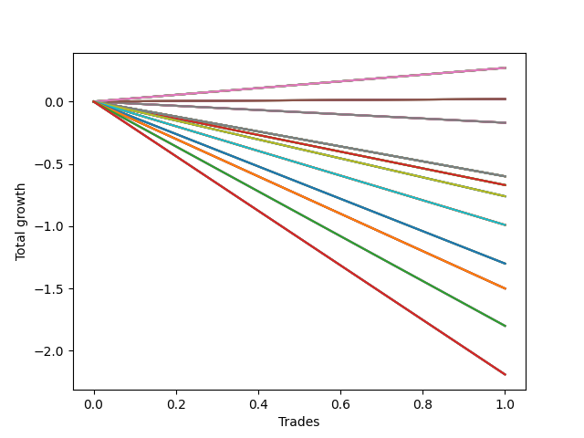

# Short HLT 109 
- Symbol: TSLA
- Date Range: 01/10/2024 - 05/17/2024
- Trading Period: 8:30-12:30
- Number of Trades: 1


### Test TP-0.25 15m
* Take Profit of 0.25 Point
* 0.25 Stoploss
* Results:
```
Total Trades: 1
Percent Up: 0.00
Percent Down: 100.00
Total Points Moved Down: 0.27
Potential Profit: 135.00
Total Points Ups: 0.00 Count Ups: 0
Total Points Downs: 0.27 Count Downs: 1
```

<details><summary>Trades</summary>

<code>In: 2024-02-15 09:25:00		Out: 2024-02-15 09:29:00		Total Position Time: 04:00		Total Move Down: 0.27		Total to Date: 0.27</code> <br />


</details>

### Test TP-0.5 15m
* Take Profit of 0.5 Point
* 0.5 Stoploss
* Results:
```
Total Trades: 1
Percent Up: 100.00
Percent Down: 0.00
Total Points Moved Down: -0.60
Potential Profit: -300.00
Total Points Ups: 0.60 Count Ups: 1
Total Points Downs: 0.00 Count Downs: 0
```

<details><summary>Trades</summary>

<code>In: 2024-02-15 09:25:00		Out: 2024-02-15 09:35:00		Total Position Time: 10:00		Total Move Down: -0.60		Total to Date: -0.60</code> <br />


</details>

### Test TP-0.75 15m
* Take Profit of 0.75 Point
* 0.75 Stoploss
* Results:
```
Total Trades: 1
Percent Up: 100.00
Percent Down: 0.00
Total Points Moved Down: -0.17
Potential Profit: -85.00
Total Points Ups: 0.17 Count Ups: 1
Total Points Downs: 0.00 Count Downs: 0
```

<details><summary>Trades</summary>

<code>In: 2024-02-15 09:25:00		Out: 2024-02-15 09:39:00		Total Position Time: 14:00		Total Move Down: -0.17		Total to Date: -0.17</code> <br />


</details>

### Test TP-1 15m
* Take Profit of 1 Point
* 1 Stoploss
* Results:
```
Total Trades: 1
Percent Up: 100.00
Percent Down: 0.00
Total Points Moved Down: -0.17
Potential Profit: -85.00
Total Points Ups: 0.17 Count Ups: 1
Total Points Downs: 0.00 Count Downs: 0
```

<details><summary>Trades</summary>

<code>In: 2024-02-15 09:25:00		Out: 2024-02-15 09:39:00		Total Position Time: 14:00		Total Move Down: -0.17		Total to Date: -0.17</code> <br />


</details>

### Test TP-1.25 15m
* Take Profit of 1.25 Point
* 1.25 Stoploss
* Results:
```
Total Trades: 1
Percent Up: 100.00
Percent Down: 0.00
Total Points Moved Down: -0.17
Potential Profit: -85.00
Total Points Ups: 0.17 Count Ups: 1
Total Points Downs: 0.00 Count Downs: 0
```

<details><summary>Trades</summary>

<code>In: 2024-02-15 09:25:00		Out: 2024-02-15 09:39:00		Total Position Time: 14:00		Total Move Down: -0.17		Total to Date: -0.17</code> <br />


</details>

### Test TP-1.5 15m
* Take Profit of 1.5 Point
* 1.5 Stoploss
* Results:
```
Total Trades: 1
Percent Up: 100.00
Percent Down: 0.00
Total Points Moved Down: -0.17
Potential Profit: -85.00
Total Points Ups: 0.17 Count Ups: 1
Total Points Downs: 0.00 Count Downs: 0
```

<details><summary>Trades</summary>

<code>In: 2024-02-15 09:25:00		Out: 2024-02-15 09:39:00		Total Position Time: 14:00		Total Move Down: -0.17		Total to Date: -0.17</code> <br />


</details>

### Test TP-1.75 15m
* Take Profit of 1.75 Point
* 1.75 Stoploss
* Results:
```
Total Trades: 1
Percent Up: 100.00
Percent Down: 0.00
Total Points Moved Down: -0.17
Potential Profit: -85.00
Total Points Ups: 0.17 Count Ups: 1
Total Points Downs: 0.00 Count Downs: 0
```

<details><summary>Trades</summary>

<code>In: 2024-02-15 09:25:00		Out: 2024-02-15 09:39:00		Total Position Time: 14:00		Total Move Down: -0.17		Total to Date: -0.17</code> <br />


</details>

### Test TP-2 15m
* Take Profit of 2 Point
* 2 Stoploss
* Results:
```
Total Trades: 1
Percent Up: 100.00
Percent Down: 0.00
Total Points Moved Down: -0.17
Potential Profit: -85.00
Total Points Ups: 0.17 Count Ups: 1
Total Points Downs: 0.00 Count Downs: 0
```

<details><summary>Trades</summary>

<code>In: 2024-02-15 09:25:00		Out: 2024-02-15 09:39:00		Total Position Time: 14:00		Total Move Down: -0.17		Total to Date: -0.17</code> <br />


</details>

### Test TP-2.25 15m
* Take Profit of 2.25 Point
* 2.25 Stoploss
* Results:
```
Total Trades: 1
Percent Up: 100.00
Percent Down: 0.00
Total Points Moved Down: -0.17
Potential Profit: -85.00
Total Points Ups: 0.17 Count Ups: 1
Total Points Downs: 0.00 Count Downs: 0
```

<details><summary>Trades</summary>

<code>In: 2024-02-15 09:25:00		Out: 2024-02-15 09:39:00		Total Position Time: 14:00		Total Move Down: -0.17		Total to Date: -0.17</code> <br />


</details>

### Test TP-2.5 15m
* Take Profit of 2.5 Point
* 2.5 Stoploss
* Results:
```
Total Trades: 1
Percent Up: 100.00
Percent Down: 0.00
Total Points Moved Down: -0.17
Potential Profit: -85.00
Total Points Ups: 0.17 Count Ups: 1
Total Points Downs: 0.00 Count Downs: 0
```

<details><summary>Trades</summary>

<code>In: 2024-02-15 09:25:00		Out: 2024-02-15 09:39:00		Total Position Time: 14:00		Total Move Down: -0.17		Total to Date: -0.17</code> <br />


</details>

### Test TP-2.75 15m
* Take Profit of 2.75 Point
* 2.75 Stoploss
* Results:
```
Total Trades: 1
Percent Up: 100.00
Percent Down: 0.00
Total Points Moved Down: -0.17
Potential Profit: -85.00
Total Points Ups: 0.17 Count Ups: 1
Total Points Downs: 0.00 Count Downs: 0
```

<details><summary>Trades</summary>

<code>In: 2024-02-15 09:25:00		Out: 2024-02-15 09:39:00		Total Position Time: 14:00		Total Move Down: -0.17		Total to Date: -0.17</code> <br />


</details>

### Test TP-3 15m
* Take Profit of 3 Point
* 3 Stoploss
* Results:
```
Total Trades: 1
Percent Up: 100.00
Percent Down: 0.00
Total Points Moved Down: -0.17
Potential Profit: -85.00
Total Points Ups: 0.17 Count Ups: 1
Total Points Downs: 0.00 Count Downs: 0
```

<details><summary>Trades</summary>

<code>In: 2024-02-15 09:25:00		Out: 2024-02-15 09:39:00		Total Position Time: 14:00		Total Move Down: -0.17		Total to Date: -0.17</code> <br />


</details>

### Test TP-0.25 30m
* Take Profit of 0.25 Point
* 0.25 Stoploss
* Results:
```
Total Trades: 1
Percent Up: 0.00
Percent Down: 100.00
Total Points Moved Down: 0.27
Potential Profit: 135.00
Total Points Ups: 0.00 Count Ups: 0
Total Points Downs: 0.27 Count Downs: 1
```

<details><summary>Trades</summary>

<code>In: 2024-02-15 09:25:00		Out: 2024-02-15 09:29:00		Total Position Time: 04:00		Total Move Down: 0.27		Total to Date: 0.27</code> <br />


</details>

### Test TP-0.5 30m
* Take Profit of 0.5 Point
* 0.5 Stoploss
* Results:
```
Total Trades: 1
Percent Up: 100.00
Percent Down: 0.00
Total Points Moved Down: -0.60
Potential Profit: -300.00
Total Points Ups: 0.60 Count Ups: 1
Total Points Downs: 0.00 Count Downs: 0
```

<details><summary>Trades</summary>

<code>In: 2024-02-15 09:25:00		Out: 2024-02-15 09:35:00		Total Position Time: 10:00		Total Move Down: -0.60		Total to Date: -0.60</code> <br />


</details>

### Test TP-0.75 30m
* Take Profit of 0.75 Point
* 0.75 Stoploss
* Results:
```
Total Trades: 1
Percent Up: 0.00
Percent Down: 100.00
Total Points Moved Down: 0.02
Potential Profit: 10.00
Total Points Ups: 0.00 Count Ups: 0
Total Points Downs: 0.02 Count Downs: 1
```

<details><summary>Trades</summary>

<code>In: 2024-02-15 09:25:00		Out: 2024-02-15 09:54:00		Total Position Time: 29:00		Total Move Down: 0.02		Total to Date: 0.02</code> <br />


</details>

### Test TP-1 30m
* Take Profit of 1 Point
* 1 Stoploss
* Results:
```
Total Trades: 1
Percent Up: 0.00
Percent Down: 100.00
Total Points Moved Down: 0.02
Potential Profit: 10.00
Total Points Ups: 0.00 Count Ups: 0
Total Points Downs: 0.02 Count Downs: 1
```

<details><summary>Trades</summary>

<code>In: 2024-02-15 09:25:00		Out: 2024-02-15 09:54:00		Total Position Time: 29:00		Total Move Down: 0.02		Total to Date: 0.02</code> <br />


</details>

### Test TP-1.25 30m
* Take Profit of 1.25 Point
* 1.25 Stoploss
* Results:
```
Total Trades: 1
Percent Up: 0.00
Percent Down: 100.00
Total Points Moved Down: 0.02
Potential Profit: 10.00
Total Points Ups: 0.00 Count Ups: 0
Total Points Downs: 0.02 Count Downs: 1
```

<details><summary>Trades</summary>

<code>In: 2024-02-15 09:25:00		Out: 2024-02-15 09:54:00		Total Position Time: 29:00		Total Move Down: 0.02		Total to Date: 0.02</code> <br />


</details>

### Test TP-1.5 30m
* Take Profit of 1.5 Point
* 1.5 Stoploss
* Results:
```
Total Trades: 1
Percent Up: 0.00
Percent Down: 100.00
Total Points Moved Down: 0.02
Potential Profit: 10.00
Total Points Ups: 0.00 Count Ups: 0
Total Points Downs: 0.02 Count Downs: 1
```

<details><summary>Trades</summary>

<code>In: 2024-02-15 09:25:00		Out: 2024-02-15 09:54:00		Total Position Time: 29:00		Total Move Down: 0.02		Total to Date: 0.02</code> <br />


</details>

### Test TP-1.75 30m
* Take Profit of 1.75 Point
* 1.75 Stoploss
* Results:
```
Total Trades: 1
Percent Up: 0.00
Percent Down: 100.00
Total Points Moved Down: 0.02
Potential Profit: 10.00
Total Points Ups: 0.00 Count Ups: 0
Total Points Downs: 0.02 Count Downs: 1
```

<details><summary>Trades</summary>

<code>In: 2024-02-15 09:25:00		Out: 2024-02-15 09:54:00		Total Position Time: 29:00		Total Move Down: 0.02		Total to Date: 0.02</code> <br />


</details>

### Test TP-2 30m
* Take Profit of 2 Point
* 2 Stoploss
* Results:
```
Total Trades: 1
Percent Up: 0.00
Percent Down: 100.00
Total Points Moved Down: 0.02
Potential Profit: 10.00
Total Points Ups: 0.00 Count Ups: 0
Total Points Downs: 0.02 Count Downs: 1
```

<details><summary>Trades</summary>

<code>In: 2024-02-15 09:25:00		Out: 2024-02-15 09:54:00		Total Position Time: 29:00		Total Move Down: 0.02		Total to Date: 0.02</code> <br />


</details>

### Test TP-2.25 30m
* Take Profit of 2.25 Point
* 2.25 Stoploss
* Results:
```
Total Trades: 1
Percent Up: 0.00
Percent Down: 100.00
Total Points Moved Down: 0.02
Potential Profit: 10.00
Total Points Ups: 0.00 Count Ups: 0
Total Points Downs: 0.02 Count Downs: 1
```

<details><summary>Trades</summary>

<code>In: 2024-02-15 09:25:00		Out: 2024-02-15 09:54:00		Total Position Time: 29:00		Total Move Down: 0.02		Total to Date: 0.02</code> <br />


</details>

### Test TP-2.5 30m
* Take Profit of 2.5 Point
* 2.5 Stoploss
* Results:
```
Total Trades: 1
Percent Up: 0.00
Percent Down: 100.00
Total Points Moved Down: 0.02
Potential Profit: 10.00
Total Points Ups: 0.00 Count Ups: 0
Total Points Downs: 0.02 Count Downs: 1
```

<details><summary>Trades</summary>

<code>In: 2024-02-15 09:25:00		Out: 2024-02-15 09:54:00		Total Position Time: 29:00		Total Move Down: 0.02		Total to Date: 0.02</code> <br />


</details>

### Test TP-2.75 30m
* Take Profit of 2.75 Point
* 2.75 Stoploss
* Results:
```
Total Trades: 1
Percent Up: 0.00
Percent Down: 100.00
Total Points Moved Down: 0.02
Potential Profit: 10.00
Total Points Ups: 0.00 Count Ups: 0
Total Points Downs: 0.02 Count Downs: 1
```

<details><summary>Trades</summary>

<code>In: 2024-02-15 09:25:00		Out: 2024-02-15 09:54:00		Total Position Time: 29:00		Total Move Down: 0.02		Total to Date: 0.02</code> <br />


</details>

### Test TP-3 30m
* Take Profit of 3 Point
* 3 Stoploss
* Results:
```
Total Trades: 1
Percent Up: 0.00
Percent Down: 100.00
Total Points Moved Down: 0.02
Potential Profit: 10.00
Total Points Ups: 0.00 Count Ups: 0
Total Points Downs: 0.02 Count Downs: 1
```

<details><summary>Trades</summary>

<code>In: 2024-02-15 09:25:00		Out: 2024-02-15 09:54:00		Total Position Time: 29:00		Total Move Down: 0.02		Total to Date: 0.02</code> <br />


</details>

### Test TP-0.25 45m
* Take Profit of 0.25 Point
* 0.25 Stoploss
* Results:
```
Total Trades: 1
Percent Up: 0.00
Percent Down: 100.00
Total Points Moved Down: 0.27
Potential Profit: 135.00
Total Points Ups: 0.00 Count Ups: 0
Total Points Downs: 0.27 Count Downs: 1
```

<details><summary>Trades</summary>

<code>In: 2024-02-15 09:25:00		Out: 2024-02-15 09:29:00		Total Position Time: 04:00		Total Move Down: 0.27		Total to Date: 0.27</code> <br />


</details>

### Test TP-0.5 45m
* Take Profit of 0.5 Point
* 0.5 Stoploss
* Results:
```
Total Trades: 1
Percent Up: 100.00
Percent Down: 0.00
Total Points Moved Down: -0.60
Potential Profit: -300.00
Total Points Ups: 0.60 Count Ups: 1
Total Points Downs: 0.00 Count Downs: 0
```

<details><summary>Trades</summary>

<code>In: 2024-02-15 09:25:00		Out: 2024-02-15 09:35:00		Total Position Time: 10:00		Total Move Down: -0.60		Total to Date: -0.60</code> <br />


</details>

### Test TP-0.75 45m
* Take Profit of 0.75 Point
* 0.75 Stoploss
* Results:
```
Total Trades: 1
Percent Up: 100.00
Percent Down: 0.00
Total Points Moved Down: -0.67
Potential Profit: -335.00
Total Points Ups: 0.67 Count Ups: 1
Total Points Downs: 0.00 Count Downs: 0
```

<details><summary>Trades</summary>

<code>In: 2024-02-15 09:25:00		Out: 2024-02-15 10:09:00		Total Position Time: 44:00		Total Move Down: -0.67		Total to Date: -0.67</code> <br />


</details>

### Test TP-1 45m
* Take Profit of 1 Point
* 1 Stoploss
* Results:
```
Total Trades: 1
Percent Up: 100.00
Percent Down: 0.00
Total Points Moved Down: -0.67
Potential Profit: -335.00
Total Points Ups: 0.67 Count Ups: 1
Total Points Downs: 0.00 Count Downs: 0
```

<details><summary>Trades</summary>

<code>In: 2024-02-15 09:25:00		Out: 2024-02-15 10:09:00		Total Position Time: 44:00		Total Move Down: -0.67		Total to Date: -0.67</code> <br />


</details>

### Test TP-1.25 45m
* Take Profit of 1.25 Point
* 1.25 Stoploss
* Results:
```
Total Trades: 1
Percent Up: 100.00
Percent Down: 0.00
Total Points Moved Down: -0.67
Potential Profit: -335.00
Total Points Ups: 0.67 Count Ups: 1
Total Points Downs: 0.00 Count Downs: 0
```

<details><summary>Trades</summary>

<code>In: 2024-02-15 09:25:00		Out: 2024-02-15 10:09:00		Total Position Time: 44:00		Total Move Down: -0.67		Total to Date: -0.67</code> <br />


</details>

### Test TP-1.5 45m
* Take Profit of 1.5 Point
* 1.5 Stoploss
* Results:
```
Total Trades: 1
Percent Up: 100.00
Percent Down: 0.00
Total Points Moved Down: -0.67
Potential Profit: -335.00
Total Points Ups: 0.67 Count Ups: 1
Total Points Downs: 0.00 Count Downs: 0
```

<details><summary>Trades</summary>

<code>In: 2024-02-15 09:25:00		Out: 2024-02-15 10:09:00		Total Position Time: 44:00		Total Move Down: -0.67		Total to Date: -0.67</code> <br />


</details>

### Test TP-1.75 45m
* Take Profit of 1.75 Point
* 1.75 Stoploss
* Results:
```
Total Trades: 1
Percent Up: 100.00
Percent Down: 0.00
Total Points Moved Down: -0.67
Potential Profit: -335.00
Total Points Ups: 0.67 Count Ups: 1
Total Points Downs: 0.00 Count Downs: 0
```

<details><summary>Trades</summary>

<code>In: 2024-02-15 09:25:00		Out: 2024-02-15 10:09:00		Total Position Time: 44:00		Total Move Down: -0.67		Total to Date: -0.67</code> <br />


</details>

### Test TP-2 45m
* Take Profit of 2 Point
* 2 Stoploss
* Results:
```
Total Trades: 1
Percent Up: 100.00
Percent Down: 0.00
Total Points Moved Down: -0.67
Potential Profit: -335.00
Total Points Ups: 0.67 Count Ups: 1
Total Points Downs: 0.00 Count Downs: 0
```

<details><summary>Trades</summary>

<code>In: 2024-02-15 09:25:00		Out: 2024-02-15 10:09:00		Total Position Time: 44:00		Total Move Down: -0.67		Total to Date: -0.67</code> <br />


</details>

### Test TP-2.25 45m
* Take Profit of 2.25 Point
* 2.25 Stoploss
* Results:
```
Total Trades: 1
Percent Up: 100.00
Percent Down: 0.00
Total Points Moved Down: -0.67
Potential Profit: -335.00
Total Points Ups: 0.67 Count Ups: 1
Total Points Downs: 0.00 Count Downs: 0
```

<details><summary>Trades</summary>

<code>In: 2024-02-15 09:25:00		Out: 2024-02-15 10:09:00		Total Position Time: 44:00		Total Move Down: -0.67		Total to Date: -0.67</code> <br />


</details>

### Test TP-2.5 45m
* Take Profit of 2.5 Point
* 2.5 Stoploss
* Results:
```
Total Trades: 1
Percent Up: 100.00
Percent Down: 0.00
Total Points Moved Down: -0.67
Potential Profit: -335.00
Total Points Ups: 0.67 Count Ups: 1
Total Points Downs: 0.00 Count Downs: 0
```

<details><summary>Trades</summary>

<code>In: 2024-02-15 09:25:00		Out: 2024-02-15 10:09:00		Total Position Time: 44:00		Total Move Down: -0.67		Total to Date: -0.67</code> <br />


</details>

### Test TP-2.75 45m
* Take Profit of 2.75 Point
* 2.75 Stoploss
* Results:
```
Total Trades: 1
Percent Up: 100.00
Percent Down: 0.00
Total Points Moved Down: -0.67
Potential Profit: -335.00
Total Points Ups: 0.67 Count Ups: 1
Total Points Downs: 0.00 Count Downs: 0
```

<details><summary>Trades</summary>

<code>In: 2024-02-15 09:25:00		Out: 2024-02-15 10:09:00		Total Position Time: 44:00		Total Move Down: -0.67		Total to Date: -0.67</code> <br />


</details>

### Test TP-3 45m
* Take Profit of 3 Point
* 3 Stoploss
* Results:
```
Total Trades: 1
Percent Up: 100.00
Percent Down: 0.00
Total Points Moved Down: -0.67
Potential Profit: -335.00
Total Points Ups: 0.67 Count Ups: 1
Total Points Downs: 0.00 Count Downs: 0
```

<details><summary>Trades</summary>

<code>In: 2024-02-15 09:25:00		Out: 2024-02-15 10:09:00		Total Position Time: 44:00		Total Move Down: -0.67		Total to Date: -0.67</code> <br />


</details>

### Test TP-0.25 60m
* Take Profit of 0.25 Point
* 0.25 Stoploss
* Results:
```
Total Trades: 1
Percent Up: 0.00
Percent Down: 100.00
Total Points Moved Down: 0.27
Potential Profit: 135.00
Total Points Ups: 0.00 Count Ups: 0
Total Points Downs: 0.27 Count Downs: 1
```

<details><summary>Trades</summary>

<code>In: 2024-02-15 09:25:00		Out: 2024-02-15 09:29:00		Total Position Time: 04:00		Total Move Down: 0.27		Total to Date: 0.27</code> <br />


</details>

### Test TP-0.5 60m
* Take Profit of 0.5 Point
* 0.5 Stoploss
* Results:
```
Total Trades: 1
Percent Up: 100.00
Percent Down: 0.00
Total Points Moved Down: -0.60
Potential Profit: -300.00
Total Points Ups: 0.60 Count Ups: 1
Total Points Downs: 0.00 Count Downs: 0
```

<details><summary>Trades</summary>

<code>In: 2024-02-15 09:25:00		Out: 2024-02-15 09:35:00		Total Position Time: 10:00		Total Move Down: -0.60		Total to Date: -0.60</code> <br />


</details>

### Test TP-0.75 60m
* Take Profit of 0.75 Point
* 0.75 Stoploss
* Results:
```
Total Trades: 1
Percent Up: 100.00
Percent Down: 0.00
Total Points Moved Down: -0.76
Potential Profit: -380.00
Total Points Ups: 0.76 Count Ups: 1
Total Points Downs: 0.00 Count Downs: 0
```

<details><summary>Trades</summary>

<code>In: 2024-02-15 09:25:00		Out: 2024-02-15 10:10:00		Total Position Time: 45:00		Total Move Down: -0.76		Total to Date: -0.76</code> <br />


</details>

### Test TP-1 60m
* Take Profit of 1 Point
* 1 Stoploss
* Results:
```
Total Trades: 1
Percent Up: 100.00
Percent Down: 0.00
Total Points Moved Down: -0.99
Potential Profit: -495.00
Total Points Ups: 0.99 Count Ups: 1
Total Points Downs: 0.00 Count Downs: 0
```

<details><summary>Trades</summary>

<code>In: 2024-02-15 09:25:00		Out: 2024-02-15 10:12:00		Total Position Time: 47:00		Total Move Down: -0.99		Total to Date: -0.99</code> <br />


</details>

### Test TP-1.25 60m
* Take Profit of 1.25 Point
* 1.25 Stoploss
* Results:
```
Total Trades: 1
Percent Up: 100.00
Percent Down: 0.00
Total Points Moved Down: -1.30
Potential Profit: -650.00
Total Points Ups: 1.30 Count Ups: 1
Total Points Downs: 0.00 Count Downs: 0
```

<details><summary>Trades</summary>

<code>In: 2024-02-15 09:25:00		Out: 2024-02-15 10:13:00		Total Position Time: 48:00		Total Move Down: -1.30		Total to Date: -1.30</code> <br />


</details>

### Test TP-1.5 60m
* Take Profit of 1.5 Point
* 1.5 Stoploss
* Results:
```
Total Trades: 1
Percent Up: 100.00
Percent Down: 0.00
Total Points Moved Down: -1.50
Potential Profit: -750.00
Total Points Ups: 1.50 Count Ups: 1
Total Points Downs: 0.00 Count Downs: 0
```

<details><summary>Trades</summary>

<code>In: 2024-02-15 09:25:00		Out: 2024-02-15 10:15:00		Total Position Time: 50:00		Total Move Down: -1.50		Total to Date: -1.50</code> <br />


</details>

### Test TP-1.75 60m
* Take Profit of 1.75 Point
* 1.75 Stoploss
* Results:
```
Total Trades: 1
Percent Up: 100.00
Percent Down: 0.00
Total Points Moved Down: -1.80
Potential Profit: -900.00
Total Points Ups: 1.80 Count Ups: 1
Total Points Downs: 0.00 Count Downs: 0
```

<details><summary>Trades</summary>

<code>In: 2024-02-15 09:25:00		Out: 2024-02-15 10:21:00		Total Position Time: 56:00		Total Move Down: -1.80		Total to Date: -1.80</code> <br />


</details>

### Test TP-2 60m
* Take Profit of 2 Point
* 2 Stoploss
* Results:
```
Total Trades: 1
Percent Up: 100.00
Percent Down: 0.00
Total Points Moved Down: -2.19
Potential Profit: -1095.00
Total Points Ups: 2.19 Count Ups: 1
Total Points Downs: 0.00 Count Downs: 0
```

<details><summary>Trades</summary>

<code>In: 2024-02-15 09:25:00		Out: 2024-02-15 10:23:00		Total Position Time: 58:00		Total Move Down: -2.19		Total to Date: -2.19</code> <br />


</details>

### Test TP-2.25 60m
* Take Profit of 2.25 Point
* 2.25 Stoploss
* Results:
```
Total Trades: 1
Percent Up: 100.00
Percent Down: 0.00
Total Points Moved Down: -2.32
Potential Profit: -1160.00
Total Points Ups: 2.32 Count Ups: 1
Total Points Downs: 0.00 Count Downs: 0
```

<details><summary>Trades</summary>

<code>In: 2024-02-15 09:25:00		Out: 2024-02-15 10:24:00		Total Position Time: 59:00		Total Move Down: -2.32		Total to Date: -2.32</code> <br />


</details>

### Test TP-2.5 60m
* Take Profit of 2.5 Point
* 2.5 Stoploss
* Results:
```
Total Trades: 1
Percent Up: 100.00
Percent Down: 0.00
Total Points Moved Down: -2.32
Potential Profit: -1160.00
Total Points Ups: 2.32 Count Ups: 1
Total Points Downs: 0.00 Count Downs: 0
```

<details><summary>Trades</summary>

<code>In: 2024-02-15 09:25:00		Out: 2024-02-15 10:24:00		Total Position Time: 59:00		Total Move Down: -2.32		Total to Date: -2.32</code> <br />


</details>

### Test TP-2.75 60m
* Take Profit of 2.75 Point
* 2.75 Stoploss
* Results:
```
Total Trades: 1
Percent Up: 100.00
Percent Down: 0.00
Total Points Moved Down: -2.32
Potential Profit: -1160.00
Total Points Ups: 2.32 Count Ups: 1
Total Points Downs: 0.00 Count Downs: 0
```

<details><summary>Trades</summary>

<code>In: 2024-02-15 09:25:00		Out: 2024-02-15 10:24:00		Total Position Time: 59:00		Total Move Down: -2.32		Total to Date: -2.32</code> <br />


</details>

### Test TP-3 60m
* Take Profit of 3 Point
* 3 Stoploss
* Results:
```
Total Trades: 1
Percent Up: 100.00
Percent Down: 0.00
Total Points Moved Down: -2.32
Potential Profit: -1160.00
Total Points Ups: 2.32 Count Ups: 1
Total Points Downs: 0.00 Count Downs: 0
```

<details><summary>Trades</summary>

<code>In: 2024-02-15 09:25:00		Out: 2024-02-15 10:24:00		Total Position Time: 59:00		Total Move Down: -2.32		Total to Date: -2.32</code> <br />


</details>

### Test TP-0.25 75m
* Take Profit of 0.25 Point
* 0.25 Stoploss
* Results:
```
Total Trades: 1
Percent Up: 0.00
Percent Down: 100.00
Total Points Moved Down: 0.27
Potential Profit: 135.00
Total Points Ups: 0.00 Count Ups: 0
Total Points Downs: 0.27 Count Downs: 1
```

<details><summary>Trades</summary>

<code>In: 2024-02-15 09:25:00		Out: 2024-02-15 09:29:00		Total Position Time: 04:00		Total Move Down: 0.27		Total to Date: 0.27</code> <br />


</details>

### Test TP-0.5 75m
* Take Profit of 0.5 Point
* 0.5 Stoploss
* Results:
```
Total Trades: 1
Percent Up: 100.00
Percent Down: 0.00
Total Points Moved Down: -0.60
Potential Profit: -300.00
Total Points Ups: 0.60 Count Ups: 1
Total Points Downs: 0.00 Count Downs: 0
```

<details><summary>Trades</summary>

<code>In: 2024-02-15 09:25:00		Out: 2024-02-15 09:35:00		Total Position Time: 10:00		Total Move Down: -0.60		Total to Date: -0.60</code> <br />


</details>

### Test TP-0.75 75m
* Take Profit of 0.75 Point
* 0.75 Stoploss
* Results:
```
Total Trades: 1
Percent Up: 100.00
Percent Down: 0.00
Total Points Moved Down: -0.76
Potential Profit: -380.00
Total Points Ups: 0.76 Count Ups: 1
Total Points Downs: 0.00 Count Downs: 0
```

<details><summary>Trades</summary>

<code>In: 2024-02-15 09:25:00		Out: 2024-02-15 10:10:00		Total Position Time: 45:00		Total Move Down: -0.76		Total to Date: -0.76</code> <br />


</details>

### Test TP-1 75m
* Take Profit of 1 Point
* 1 Stoploss
* Results:
```
Total Trades: 1
Percent Up: 100.00
Percent Down: 0.00
Total Points Moved Down: -0.99
Potential Profit: -495.00
Total Points Ups: 0.99 Count Ups: 1
Total Points Downs: 0.00 Count Downs: 0
```

<details><summary>Trades</summary>

<code>In: 2024-02-15 09:25:00		Out: 2024-02-15 10:12:00		Total Position Time: 47:00		Total Move Down: -0.99		Total to Date: -0.99</code> <br />


</details>

### Test TP-1.25 75m
* Take Profit of 1.25 Point
* 1.25 Stoploss
* Results:
```
Total Trades: 1
Percent Up: 100.00
Percent Down: 0.00
Total Points Moved Down: -1.30
Potential Profit: -650.00
Total Points Ups: 1.30 Count Ups: 1
Total Points Downs: 0.00 Count Downs: 0
```

<details><summary>Trades</summary>

<code>In: 2024-02-15 09:25:00		Out: 2024-02-15 10:13:00		Total Position Time: 48:00		Total Move Down: -1.30		Total to Date: -1.30</code> <br />


</details>

### Test TP-1.5 75m
* Take Profit of 1.5 Point
* 1.5 Stoploss
* Results:
```
Total Trades: 1
Percent Up: 100.00
Percent Down: 0.00
Total Points Moved Down: -1.50
Potential Profit: -750.00
Total Points Ups: 1.50 Count Ups: 1
Total Points Downs: 0.00 Count Downs: 0
```

<details><summary>Trades</summary>

<code>In: 2024-02-15 09:25:00		Out: 2024-02-15 10:15:00		Total Position Time: 50:00		Total Move Down: -1.50		Total to Date: -1.50</code> <br />


</details>

### Test TP-1.75 75m
* Take Profit of 1.75 Point
* 1.75 Stoploss
* Results:
```
Total Trades: 1
Percent Up: 100.00
Percent Down: 0.00
Total Points Moved Down: -1.80
Potential Profit: -900.00
Total Points Ups: 1.80 Count Ups: 1
Total Points Downs: 0.00 Count Downs: 0
```

<details><summary>Trades</summary>

<code>In: 2024-02-15 09:25:00		Out: 2024-02-15 10:21:00		Total Position Time: 56:00		Total Move Down: -1.80		Total to Date: -1.80</code> <br />


</details>

### Test TP-2 75m
* Take Profit of 2 Point
* 2 Stoploss
* Results:
```
Total Trades: 1
Percent Up: 100.00
Percent Down: 0.00
Total Points Moved Down: -2.19
Potential Profit: -1095.00
Total Points Ups: 2.19 Count Ups: 1
Total Points Downs: 0.00 Count Downs: 0
```

<details><summary>Trades</summary>

<code>In: 2024-02-15 09:25:00		Out: 2024-02-15 10:23:00		Total Position Time: 58:00		Total Move Down: -2.19		Total to Date: -2.19</code> <br />


</details>

### Test TP-2.25 75m
* Take Profit of 2.25 Point
* 2.25 Stoploss
* Results:
```
Total Trades: 1
Percent Up: 100.00
Percent Down: 0.00
Total Points Moved Down: -2.32
Potential Profit: -1160.00
Total Points Ups: 2.32 Count Ups: 1
Total Points Downs: 0.00 Count Downs: 0
```

<details><summary>Trades</summary>

<code>In: 2024-02-15 09:25:00		Out: 2024-02-15 10:24:00		Total Position Time: 59:00		Total Move Down: -2.32		Total to Date: -2.32</code> <br />


</details>

### Test TP-2.5 75m
* Take Profit of 2.5 Point
* 2.5 Stoploss
* Results:
```
Total Trades: 1
Percent Up: 100.00
Percent Down: 0.00
Total Points Moved Down: -2.51
Potential Profit: -1255.00
Total Points Ups: 2.51 Count Ups: 1
Total Points Downs: 0.00 Count Downs: 0
```

<details><summary>Trades</summary>

<code>In: 2024-02-15 09:25:00		Out: 2024-02-15 10:39:00		Total Position Time: 74:00		Total Move Down: -2.51		Total to Date: -2.51</code> <br />


</details>

### Test TP-2.75 75m
* Take Profit of 2.75 Point
* 2.75 Stoploss
* Results:
```
Total Trades: 1
Percent Up: 100.00
Percent Down: 0.00
Total Points Moved Down: -2.51
Potential Profit: -1255.00
Total Points Ups: 2.51 Count Ups: 1
Total Points Downs: 0.00 Count Downs: 0
```

<details><summary>Trades</summary>

<code>In: 2024-02-15 09:25:00		Out: 2024-02-15 10:39:00		Total Position Time: 74:00		Total Move Down: -2.51		Total to Date: -2.51</code> <br />


</details>

### Test TP-3 75m
* Take Profit of 3 Point
* 3 Stoploss
* Results:
```
Total Trades: 1
Percent Up: 100.00
Percent Down: 0.00
Total Points Moved Down: -2.51
Potential Profit: -1255.00
Total Points Ups: 2.51 Count Ups: 1
Total Points Downs: 0.00 Count Downs: 0
```

<details><summary>Trades</summary>

<code>In: 2024-02-15 09:25:00		Out: 2024-02-15 10:39:00		Total Position Time: 74:00		Total Move Down: -2.51		Total to Date: -2.51</code> <br />


</details>

### Test TP-0.25 90m
* Take Profit of 0.25 Point
* 0.25 Stoploss
* Results:
```
Total Trades: 1
Percent Up: 0.00
Percent Down: 100.00
Total Points Moved Down: 0.27
Potential Profit: 135.00
Total Points Ups: 0.00 Count Ups: 0
Total Points Downs: 0.27 Count Downs: 1
```

<details><summary>Trades</summary>

<code>In: 2024-02-15 09:25:00		Out: 2024-02-15 09:29:00		Total Position Time: 04:00		Total Move Down: 0.27		Total to Date: 0.27</code> <br />


</details>

### Test TP-0.5 90m
* Take Profit of 0.5 Point
* 0.5 Stoploss
* Results:
```
Total Trades: 1
Percent Up: 100.00
Percent Down: 0.00
Total Points Moved Down: -0.60
Potential Profit: -300.00
Total Points Ups: 0.60 Count Ups: 1
Total Points Downs: 0.00 Count Downs: 0
```

<details><summary>Trades</summary>

<code>In: 2024-02-15 09:25:00		Out: 2024-02-15 09:35:00		Total Position Time: 10:00		Total Move Down: -0.60		Total to Date: -0.60</code> <br />


</details>

### Test TP-0.75 90m
* Take Profit of 0.75 Point
* 0.75 Stoploss
* Results:
```
Total Trades: 1
Percent Up: 100.00
Percent Down: 0.00
Total Points Moved Down: -0.76
Potential Profit: -380.00
Total Points Ups: 0.76 Count Ups: 1
Total Points Downs: 0.00 Count Downs: 0
```

<details><summary>Trades</summary>

<code>In: 2024-02-15 09:25:00		Out: 2024-02-15 10:10:00		Total Position Time: 45:00		Total Move Down: -0.76		Total to Date: -0.76</code> <br />


</details>

### Test TP-1 90m
* Take Profit of 1 Point
* 1 Stoploss
* Results:
```
Total Trades: 1
Percent Up: 100.00
Percent Down: 0.00
Total Points Moved Down: -0.99
Potential Profit: -495.00
Total Points Ups: 0.99 Count Ups: 1
Total Points Downs: 0.00 Count Downs: 0
```

<details><summary>Trades</summary>

<code>In: 2024-02-15 09:25:00		Out: 2024-02-15 10:12:00		Total Position Time: 47:00		Total Move Down: -0.99		Total to Date: -0.99</code> <br />


</details>

### Test TP-1.25 90m
* Take Profit of 1.25 Point
* 1.25 Stoploss
* Results:
```
Total Trades: 1
Percent Up: 100.00
Percent Down: 0.00
Total Points Moved Down: -1.30
Potential Profit: -650.00
Total Points Ups: 1.30 Count Ups: 1
Total Points Downs: 0.00 Count Downs: 0
```

<details><summary>Trades</summary>

<code>In: 2024-02-15 09:25:00		Out: 2024-02-15 10:13:00		Total Position Time: 48:00		Total Move Down: -1.30		Total to Date: -1.30</code> <br />


</details>

### Test TP-1.5 90m
* Take Profit of 1.5 Point
* 1.5 Stoploss
* Results:
```
Total Trades: 1
Percent Up: 100.00
Percent Down: 0.00
Total Points Moved Down: -1.50
Potential Profit: -750.00
Total Points Ups: 1.50 Count Ups: 1
Total Points Downs: 0.00 Count Downs: 0
```

<details><summary>Trades</summary>

<code>In: 2024-02-15 09:25:00		Out: 2024-02-15 10:15:00		Total Position Time: 50:00		Total Move Down: -1.50		Total to Date: -1.50</code> <br />


</details>

### Test TP-1.75 90m
* Take Profit of 1.75 Point
* 1.75 Stoploss
* Results:
```
Total Trades: 1
Percent Up: 100.00
Percent Down: 0.00
Total Points Moved Down: -1.80
Potential Profit: -900.00
Total Points Ups: 1.80 Count Ups: 1
Total Points Downs: 0.00 Count Downs: 0
```

<details><summary>Trades</summary>

<code>In: 2024-02-15 09:25:00		Out: 2024-02-15 10:21:00		Total Position Time: 56:00		Total Move Down: -1.80		Total to Date: -1.80</code> <br />


</details>

### Test TP-2 90m
* Take Profit of 2 Point
* 2 Stoploss
* Results:
```
Total Trades: 1
Percent Up: 100.00
Percent Down: 0.00
Total Points Moved Down: -2.19
Potential Profit: -1095.00
Total Points Ups: 2.19 Count Ups: 1
Total Points Downs: 0.00 Count Downs: 0
```

<details><summary>Trades</summary>

<code>In: 2024-02-15 09:25:00		Out: 2024-02-15 10:23:00		Total Position Time: 58:00		Total Move Down: -2.19		Total to Date: -2.19</code> <br />


</details>

### Test TP-2.25 90m
* Take Profit of 2.25 Point
* 2.25 Stoploss
* Results:
```
Total Trades: 1
Percent Up: 100.00
Percent Down: 0.00
Total Points Moved Down: -2.32
Potential Profit: -1160.00
Total Points Ups: 2.32 Count Ups: 1
Total Points Downs: 0.00 Count Downs: 0
```

<details><summary>Trades</summary>

<code>In: 2024-02-15 09:25:00		Out: 2024-02-15 10:24:00		Total Position Time: 59:00		Total Move Down: -2.32		Total to Date: -2.32</code> <br />


</details>

### Test TP-2.5 90m
* Take Profit of 2.5 Point
* 2.5 Stoploss
* Results:
```
Total Trades: 1
Percent Up: 100.00
Percent Down: 0.00
Total Points Moved Down: -2.51
Potential Profit: -1255.00
Total Points Ups: 2.51 Count Ups: 1
Total Points Downs: 0.00 Count Downs: 0
```

<details><summary>Trades</summary>

<code>In: 2024-02-15 09:25:00		Out: 2024-02-15 10:39:00		Total Position Time: 74:00		Total Move Down: -2.51		Total to Date: -2.51</code> <br />


</details>

### Test TP-2.75 90m
* Take Profit of 2.75 Point
* 2.75 Stoploss
* Results:
```
Total Trades: 1
Percent Up: 100.00
Percent Down: 0.00
Total Points Moved Down: -2.74
Potential Profit: -1370.00
Total Points Ups: 2.74 Count Ups: 1
Total Points Downs: 0.00 Count Downs: 0
```

<details><summary>Trades</summary>

<code>In: 2024-02-15 09:25:00		Out: 2024-02-15 10:41:00		Total Position Time: 76:00		Total Move Down: -2.74		Total to Date: -2.74</code> <br />


</details>

### Test TP-3 90m
* Take Profit of 3 Point
* 3 Stoploss
* Results:
```
Total Trades: 1
Percent Up: 100.00
Percent Down: 0.00
Total Points Moved Down: -1.83
Potential Profit: -915.00
Total Points Ups: 1.83 Count Ups: 1
Total Points Downs: 0.00 Count Downs: 0
```

<details><summary>Trades</summary>

<code>In: 2024-02-15 09:25:00		Out: 2024-02-15 10:54:00		Total Position Time: 89:00		Total Move Down: -1.83		Total to Date: -1.83</code> <br />


</details>

### Test TP-0.25 105m
* Take Profit of 0.25 Point
* 0.25 Stoploss
* Results:
```
Total Trades: 1
Percent Up: 0.00
Percent Down: 100.00
Total Points Moved Down: 0.27
Potential Profit: 135.00
Total Points Ups: 0.00 Count Ups: 0
Total Points Downs: 0.27 Count Downs: 1
```

<details><summary>Trades</summary>

<code>In: 2024-02-15 09:25:00		Out: 2024-02-15 09:29:00		Total Position Time: 04:00		Total Move Down: 0.27		Total to Date: 0.27</code> <br />


</details>

### Test TP-0.5 105m
* Take Profit of 0.5 Point
* 0.5 Stoploss
* Results:
```
Total Trades: 1
Percent Up: 100.00
Percent Down: 0.00
Total Points Moved Down: -0.60
Potential Profit: -300.00
Total Points Ups: 0.60 Count Ups: 1
Total Points Downs: 0.00 Count Downs: 0
```

<details><summary>Trades</summary>

<code>In: 2024-02-15 09:25:00		Out: 2024-02-15 09:35:00		Total Position Time: 10:00		Total Move Down: -0.60		Total to Date: -0.60</code> <br />


</details>

### Test TP-0.75 105m
* Take Profit of 0.75 Point
* 0.75 Stoploss
* Results:
```
Total Trades: 1
Percent Up: 100.00
Percent Down: 0.00
Total Points Moved Down: -0.76
Potential Profit: -380.00
Total Points Ups: 0.76 Count Ups: 1
Total Points Downs: 0.00 Count Downs: 0
```

<details><summary>Trades</summary>

<code>In: 2024-02-15 09:25:00		Out: 2024-02-15 10:10:00		Total Position Time: 45:00		Total Move Down: -0.76		Total to Date: -0.76</code> <br />


</details>

### Test TP-1 105m
* Take Profit of 1 Point
* 1 Stoploss
* Results:
```
Total Trades: 1
Percent Up: 100.00
Percent Down: 0.00
Total Points Moved Down: -0.99
Potential Profit: -495.00
Total Points Ups: 0.99 Count Ups: 1
Total Points Downs: 0.00 Count Downs: 0
```

<details><summary>Trades</summary>

<code>In: 2024-02-15 09:25:00		Out: 2024-02-15 10:12:00		Total Position Time: 47:00		Total Move Down: -0.99		Total to Date: -0.99</code> <br />


</details>

### Test TP-1.25 105m
* Take Profit of 1.25 Point
* 1.25 Stoploss
* Results:
```
Total Trades: 1
Percent Up: 100.00
Percent Down: 0.00
Total Points Moved Down: -1.30
Potential Profit: -650.00
Total Points Ups: 1.30 Count Ups: 1
Total Points Downs: 0.00 Count Downs: 0
```

<details><summary>Trades</summary>

<code>In: 2024-02-15 09:25:00		Out: 2024-02-15 10:13:00		Total Position Time: 48:00		Total Move Down: -1.30		Total to Date: -1.30</code> <br />


</details>

### Test TP-1.5 105m
* Take Profit of 1.5 Point
* 1.5 Stoploss
* Results:
```
Total Trades: 1
Percent Up: 100.00
Percent Down: 0.00
Total Points Moved Down: -1.50
Potential Profit: -750.00
Total Points Ups: 1.50 Count Ups: 1
Total Points Downs: 0.00 Count Downs: 0
```

<details><summary>Trades</summary>

<code>In: 2024-02-15 09:25:00		Out: 2024-02-15 10:15:00		Total Position Time: 50:00		Total Move Down: -1.50		Total to Date: -1.50</code> <br />


</details>

### Test TP-1.75 105m
* Take Profit of 1.75 Point
* 1.75 Stoploss
* Results:
```
Total Trades: 1
Percent Up: 100.00
Percent Down: 0.00
Total Points Moved Down: -1.80
Potential Profit: -900.00
Total Points Ups: 1.80 Count Ups: 1
Total Points Downs: 0.00 Count Downs: 0
```

<details><summary>Trades</summary>

<code>In: 2024-02-15 09:25:00		Out: 2024-02-15 10:21:00		Total Position Time: 56:00		Total Move Down: -1.80		Total to Date: -1.80</code> <br />


</details>

### Test TP-2 105m
* Take Profit of 2 Point
* 2 Stoploss
* Results:
```
Total Trades: 1
Percent Up: 100.00
Percent Down: 0.00
Total Points Moved Down: -2.19
Potential Profit: -1095.00
Total Points Ups: 2.19 Count Ups: 1
Total Points Downs: 0.00 Count Downs: 0
```

<details><summary>Trades</summary>

<code>In: 2024-02-15 09:25:00		Out: 2024-02-15 10:23:00		Total Position Time: 58:00		Total Move Down: -2.19		Total to Date: -2.19</code> <br />


</details>

### Test TP-2.25 105m
* Take Profit of 2.25 Point
* 2.25 Stoploss
* Results:
```
Total Trades: 1
Percent Up: 100.00
Percent Down: 0.00
Total Points Moved Down: -2.32
Potential Profit: -1160.00
Total Points Ups: 2.32 Count Ups: 1
Total Points Downs: 0.00 Count Downs: 0
```

<details><summary>Trades</summary>

<code>In: 2024-02-15 09:25:00		Out: 2024-02-15 10:24:00		Total Position Time: 59:00		Total Move Down: -2.32		Total to Date: -2.32</code> <br />


</details>

### Test TP-2.5 105m
* Take Profit of 2.5 Point
* 2.5 Stoploss
* Results:
```
Total Trades: 1
Percent Up: 100.00
Percent Down: 0.00
Total Points Moved Down: -2.51
Potential Profit: -1255.00
Total Points Ups: 2.51 Count Ups: 1
Total Points Downs: 0.00 Count Downs: 0
```

<details><summary>Trades</summary>

<code>In: 2024-02-15 09:25:00		Out: 2024-02-15 10:39:00		Total Position Time: 74:00		Total Move Down: -2.51		Total to Date: -2.51</code> <br />


</details>

### Test TP-2.75 105m
* Take Profit of 2.75 Point
* 2.75 Stoploss
* Results:
```
Total Trades: 1
Percent Up: 100.00
Percent Down: 0.00
Total Points Moved Down: -2.74
Potential Profit: -1370.00
Total Points Ups: 2.74 Count Ups: 1
Total Points Downs: 0.00 Count Downs: 0
```

<details><summary>Trades</summary>

<code>In: 2024-02-15 09:25:00		Out: 2024-02-15 10:41:00		Total Position Time: 76:00		Total Move Down: -2.74		Total to Date: -2.74</code> <br />


</details>

### Test TP-3 105m
* Take Profit of 3 Point
* 3 Stoploss
* Results:
```
Total Trades: 1
Percent Up: 100.00
Percent Down: 0.00
Total Points Moved Down: -1.67
Potential Profit: -835.00
Total Points Ups: 1.67 Count Ups: 1
Total Points Downs: 0.00 Count Downs: 0
```

<details><summary>Trades</summary>

<code>In: 2024-02-15 09:25:00		Out: 2024-02-15 11:09:00		Total Position Time: 104:00		Total Move Down: -1.67		Total to Date: -1.67</code> <br />


</details>

### Test TP-0.25 120m
* Take Profit of 0.25 Point
* 0.25 Stoploss
* Results:
```
Total Trades: 1
Percent Up: 0.00
Percent Down: 100.00
Total Points Moved Down: 0.27
Potential Profit: 135.00
Total Points Ups: 0.00 Count Ups: 0
Total Points Downs: 0.27 Count Downs: 1
```

<details><summary>Trades</summary>

<code>In: 2024-02-15 09:25:00		Out: 2024-02-15 09:29:00		Total Position Time: 04:00		Total Move Down: 0.27		Total to Date: 0.27</code> <br />


</details>

### Test TP-0.5 120m
* Take Profit of 0.5 Point
* 0.5 Stoploss
* Results:
```
Total Trades: 1
Percent Up: 100.00
Percent Down: 0.00
Total Points Moved Down: -0.60
Potential Profit: -300.00
Total Points Ups: 0.60 Count Ups: 1
Total Points Downs: 0.00 Count Downs: 0
```

<details><summary>Trades</summary>

<code>In: 2024-02-15 09:25:00		Out: 2024-02-15 09:35:00		Total Position Time: 10:00		Total Move Down: -0.60		Total to Date: -0.60</code> <br />


</details>

### Test TP-0.75 120m
* Take Profit of 0.75 Point
* 0.75 Stoploss
* Results:
```
Total Trades: 1
Percent Up: 100.00
Percent Down: 0.00
Total Points Moved Down: -0.76
Potential Profit: -380.00
Total Points Ups: 0.76 Count Ups: 1
Total Points Downs: 0.00 Count Downs: 0
```

<details><summary>Trades</summary>

<code>In: 2024-02-15 09:25:00		Out: 2024-02-15 10:10:00		Total Position Time: 45:00		Total Move Down: -0.76		Total to Date: -0.76</code> <br />


</details>

### Test TP-1 120m
* Take Profit of 1 Point
* 1 Stoploss
* Results:
```
Total Trades: 1
Percent Up: 100.00
Percent Down: 0.00
Total Points Moved Down: -0.99
Potential Profit: -495.00
Total Points Ups: 0.99 Count Ups: 1
Total Points Downs: 0.00 Count Downs: 0
```

<details><summary>Trades</summary>

<code>In: 2024-02-15 09:25:00		Out: 2024-02-15 10:12:00		Total Position Time: 47:00		Total Move Down: -0.99		Total to Date: -0.99</code> <br />


</details>

### Test TP-1.25 120m
* Take Profit of 1.25 Point
* 1.25 Stoploss
* Results:
```
Total Trades: 1
Percent Up: 100.00
Percent Down: 0.00
Total Points Moved Down: -1.30
Potential Profit: -650.00
Total Points Ups: 1.30 Count Ups: 1
Total Points Downs: 0.00 Count Downs: 0
```

<details><summary>Trades</summary>

<code>In: 2024-02-15 09:25:00		Out: 2024-02-15 10:13:00		Total Position Time: 48:00		Total Move Down: -1.30		Total to Date: -1.30</code> <br />


</details>

### Test TP-1.5 120m
* Take Profit of 1.5 Point
* 1.5 Stoploss
* Results:
```
Total Trades: 1
Percent Up: 100.00
Percent Down: 0.00
Total Points Moved Down: -1.50
Potential Profit: -750.00
Total Points Ups: 1.50 Count Ups: 1
Total Points Downs: 0.00 Count Downs: 0
```

<details><summary>Trades</summary>

<code>In: 2024-02-15 09:25:00		Out: 2024-02-15 10:15:00		Total Position Time: 50:00		Total Move Down: -1.50		Total to Date: -1.50</code> <br />


</details>

### Test TP-1.75 120m
* Take Profit of 1.75 Point
* 1.75 Stoploss
* Results:
```
Total Trades: 1
Percent Up: 100.00
Percent Down: 0.00
Total Points Moved Down: -1.80
Potential Profit: -900.00
Total Points Ups: 1.80 Count Ups: 1
Total Points Downs: 0.00 Count Downs: 0
```

<details><summary>Trades</summary>

<code>In: 2024-02-15 09:25:00		Out: 2024-02-15 10:21:00		Total Position Time: 56:00		Total Move Down: -1.80		Total to Date: -1.80</code> <br />


</details>

### Test TP-2 120m
* Take Profit of 2 Point
* 2 Stoploss
* Results:
```
Total Trades: 1
Percent Up: 100.00
Percent Down: 0.00
Total Points Moved Down: -2.19
Potential Profit: -1095.00
Total Points Ups: 2.19 Count Ups: 1
Total Points Downs: 0.00 Count Downs: 0
```

<details><summary>Trades</summary>

<code>In: 2024-02-15 09:25:00		Out: 2024-02-15 10:23:00		Total Position Time: 58:00		Total Move Down: -2.19		Total to Date: -2.19</code> <br />


</details>

### Test TP-2.25 120m
* Take Profit of 2.25 Point
* 2.25 Stoploss
* Results:
```
Total Trades: 1
Percent Up: 100.00
Percent Down: 0.00
Total Points Moved Down: -2.32
Potential Profit: -1160.00
Total Points Ups: 2.32 Count Ups: 1
Total Points Downs: 0.00 Count Downs: 0
```

<details><summary>Trades</summary>

<code>In: 2024-02-15 09:25:00		Out: 2024-02-15 10:24:00		Total Position Time: 59:00		Total Move Down: -2.32		Total to Date: -2.32</code> <br />


</details>

### Test TP-2.5 120m
* Take Profit of 2.5 Point
* 2.5 Stoploss
* Results:
```
Total Trades: 1
Percent Up: 100.00
Percent Down: 0.00
Total Points Moved Down: -2.51
Potential Profit: -1255.00
Total Points Ups: 2.51 Count Ups: 1
Total Points Downs: 0.00 Count Downs: 0
```

<details><summary>Trades</summary>

<code>In: 2024-02-15 09:25:00		Out: 2024-02-15 10:39:00		Total Position Time: 74:00		Total Move Down: -2.51		Total to Date: -2.51</code> <br />


</details>

### Test TP-2.75 120m
* Take Profit of 2.75 Point
* 2.75 Stoploss
* Results:
```
Total Trades: 1
Percent Up: 100.00
Percent Down: 0.00
Total Points Moved Down: -2.74
Potential Profit: -1370.00
Total Points Ups: 2.74 Count Ups: 1
Total Points Downs: 0.00 Count Downs: 0
```

<details><summary>Trades</summary>

<code>In: 2024-02-15 09:25:00		Out: 2024-02-15 10:41:00		Total Position Time: 76:00		Total Move Down: -2.74		Total to Date: -2.74</code> <br />


</details>

### Test TP-3 120m
* Take Profit of 3 Point
* 3 Stoploss
* Results:
```
Total Trades: 1
Percent Up: 100.00
Percent Down: 0.00
Total Points Moved Down: -1.75
Potential Profit: -875.00
Total Points Ups: 1.75 Count Ups: 1
Total Points Downs: 0.00 Count Downs: 0
```

<details><summary>Trades</summary>

<code>In: 2024-02-15 09:25:00		Out: 2024-02-15 11:24:00		Total Position Time: 119:00		Total Move Down: -1.75		Total to Date: -1.75</code> <br />


</details>

### Test TP-0.25 135m
* Take Profit of 0.25 Point
* 0.25 Stoploss
* Results:
```
Total Trades: 1
Percent Up: 0.00
Percent Down: 100.00
Total Points Moved Down: 0.27
Potential Profit: 135.00
Total Points Ups: 0.00 Count Ups: 0
Total Points Downs: 0.27 Count Downs: 1
```

<details><summary>Trades</summary>

<code>In: 2024-02-15 09:25:00		Out: 2024-02-15 09:29:00		Total Position Time: 04:00		Total Move Down: 0.27		Total to Date: 0.27</code> <br />


</details>

### Test TP-0.5 135m
* Take Profit of 0.5 Point
* 0.5 Stoploss
* Results:
```
Total Trades: 1
Percent Up: 100.00
Percent Down: 0.00
Total Points Moved Down: -0.60
Potential Profit: -300.00
Total Points Ups: 0.60 Count Ups: 1
Total Points Downs: 0.00 Count Downs: 0
```

<details><summary>Trades</summary>

<code>In: 2024-02-15 09:25:00		Out: 2024-02-15 09:35:00		Total Position Time: 10:00		Total Move Down: -0.60		Total to Date: -0.60</code> <br />


</details>

### Test TP-0.75 135m
* Take Profit of 0.75 Point
* 0.75 Stoploss
* Results:
```
Total Trades: 1
Percent Up: 100.00
Percent Down: 0.00
Total Points Moved Down: -0.76
Potential Profit: -380.00
Total Points Ups: 0.76 Count Ups: 1
Total Points Downs: 0.00 Count Downs: 0
```

<details><summary>Trades</summary>

<code>In: 2024-02-15 09:25:00		Out: 2024-02-15 10:10:00		Total Position Time: 45:00		Total Move Down: -0.76		Total to Date: -0.76</code> <br />


</details>

### Test TP-1 135m
* Take Profit of 1 Point
* 1 Stoploss
* Results:
```
Total Trades: 1
Percent Up: 100.00
Percent Down: 0.00
Total Points Moved Down: -0.99
Potential Profit: -495.00
Total Points Ups: 0.99 Count Ups: 1
Total Points Downs: 0.00 Count Downs: 0
```

<details><summary>Trades</summary>

<code>In: 2024-02-15 09:25:00		Out: 2024-02-15 10:12:00		Total Position Time: 47:00		Total Move Down: -0.99		Total to Date: -0.99</code> <br />


</details>

### Test TP-1.25 135m
* Take Profit of 1.25 Point
* 1.25 Stoploss
* Results:
```
Total Trades: 1
Percent Up: 100.00
Percent Down: 0.00
Total Points Moved Down: -1.30
Potential Profit: -650.00
Total Points Ups: 1.30 Count Ups: 1
Total Points Downs: 0.00 Count Downs: 0
```

<details><summary>Trades</summary>

<code>In: 2024-02-15 09:25:00		Out: 2024-02-15 10:13:00		Total Position Time: 48:00		Total Move Down: -1.30		Total to Date: -1.30</code> <br />


</details>

### Test TP-1.5 135m
* Take Profit of 1.5 Point
* 1.5 Stoploss
* Results:
```
Total Trades: 1
Percent Up: 100.00
Percent Down: 0.00
Total Points Moved Down: -1.50
Potential Profit: -750.00
Total Points Ups: 1.50 Count Ups: 1
Total Points Downs: 0.00 Count Downs: 0
```

<details><summary>Trades</summary>

<code>In: 2024-02-15 09:25:00		Out: 2024-02-15 10:15:00		Total Position Time: 50:00		Total Move Down: -1.50		Total to Date: -1.50</code> <br />


</details>

### Test TP-1.75 135m
* Take Profit of 1.75 Point
* 1.75 Stoploss
* Results:
```
Total Trades: 1
Percent Up: 100.00
Percent Down: 0.00
Total Points Moved Down: -1.80
Potential Profit: -900.00
Total Points Ups: 1.80 Count Ups: 1
Total Points Downs: 0.00 Count Downs: 0
```

<details><summary>Trades</summary>

<code>In: 2024-02-15 09:25:00		Out: 2024-02-15 10:21:00		Total Position Time: 56:00		Total Move Down: -1.80		Total to Date: -1.80</code> <br />


</details>

### Test TP-2 135m
* Take Profit of 2 Point
* 2 Stoploss
* Results:
```
Total Trades: 1
Percent Up: 100.00
Percent Down: 0.00
Total Points Moved Down: -2.19
Potential Profit: -1095.00
Total Points Ups: 2.19 Count Ups: 1
Total Points Downs: 0.00 Count Downs: 0
```

<details><summary>Trades</summary>

<code>In: 2024-02-15 09:25:00		Out: 2024-02-15 10:23:00		Total Position Time: 58:00		Total Move Down: -2.19		Total to Date: -2.19</code> <br />


</details>

### Test TP-2.25 135m
* Take Profit of 2.25 Point
* 2.25 Stoploss
* Results:
```
Total Trades: 1
Percent Up: 100.00
Percent Down: 0.00
Total Points Moved Down: -2.32
Potential Profit: -1160.00
Total Points Ups: 2.32 Count Ups: 1
Total Points Downs: 0.00 Count Downs: 0
```

<details><summary>Trades</summary>

<code>In: 2024-02-15 09:25:00		Out: 2024-02-15 10:24:00		Total Position Time: 59:00		Total Move Down: -2.32		Total to Date: -2.32</code> <br />


</details>

### Test TP-2.5 135m
* Take Profit of 2.5 Point
* 2.5 Stoploss
* Results:
```
Total Trades: 1
Percent Up: 100.00
Percent Down: 0.00
Total Points Moved Down: -2.51
Potential Profit: -1255.00
Total Points Ups: 2.51 Count Ups: 1
Total Points Downs: 0.00 Count Downs: 0
```

<details><summary>Trades</summary>

<code>In: 2024-02-15 09:25:00		Out: 2024-02-15 10:39:00		Total Position Time: 74:00		Total Move Down: -2.51		Total to Date: -2.51</code> <br />


</details>

### Test TP-2.75 135m
* Take Profit of 2.75 Point
* 2.75 Stoploss
* Results:
```
Total Trades: 1
Percent Up: 100.00
Percent Down: 0.00
Total Points Moved Down: -2.74
Potential Profit: -1370.00
Total Points Ups: 2.74 Count Ups: 1
Total Points Downs: 0.00 Count Downs: 0
```

<details><summary>Trades</summary>

<code>In: 2024-02-15 09:25:00		Out: 2024-02-15 10:41:00		Total Position Time: 76:00		Total Move Down: -2.74		Total to Date: -2.74</code> <br />


</details>

### Test TP-3 135m
* Take Profit of 3 Point
* 3 Stoploss
* Results:
```
Total Trades: 1
Percent Up: 100.00
Percent Down: 0.00
Total Points Moved Down: -1.75
Potential Profit: -875.00
Total Points Ups: 1.75 Count Ups: 1
Total Points Downs: 0.00 Count Downs: 0
```

<details><summary>Trades</summary>

<code>In: 2024-02-15 09:25:00		Out: 2024-02-15 11:24:00		Total Position Time: 119:00		Total Move Down: -1.75		Total to Date: -1.75</code> <br />


</details>

### Test TP-0.25 150m
* Take Profit of 0.25 Point
* 0.25 Stoploss
* Results:
```
Total Trades: 1
Percent Up: 0.00
Percent Down: 100.00
Total Points Moved Down: 0.27
Potential Profit: 135.00
Total Points Ups: 0.00 Count Ups: 0
Total Points Downs: 0.27 Count Downs: 1
```

<details><summary>Trades</summary>

<code>In: 2024-02-15 09:25:00		Out: 2024-02-15 09:29:00		Total Position Time: 04:00		Total Move Down: 0.27		Total to Date: 0.27</code> <br />


</details>

### Test TP-0.5 150m
* Take Profit of 0.5 Point
* 0.5 Stoploss
* Results:
```
Total Trades: 1
Percent Up: 100.00
Percent Down: 0.00
Total Points Moved Down: -0.60
Potential Profit: -300.00
Total Points Ups: 0.60 Count Ups: 1
Total Points Downs: 0.00 Count Downs: 0
```

<details><summary>Trades</summary>

<code>In: 2024-02-15 09:25:00		Out: 2024-02-15 09:35:00		Total Position Time: 10:00		Total Move Down: -0.60		Total to Date: -0.60</code> <br />


</details>

### Test TP-0.75 150m
* Take Profit of 0.75 Point
* 0.75 Stoploss
* Results:
```
Total Trades: 1
Percent Up: 100.00
Percent Down: 0.00
Total Points Moved Down: -0.76
Potential Profit: -380.00
Total Points Ups: 0.76 Count Ups: 1
Total Points Downs: 0.00 Count Downs: 0
```

<details><summary>Trades</summary>

<code>In: 2024-02-15 09:25:00		Out: 2024-02-15 10:10:00		Total Position Time: 45:00		Total Move Down: -0.76		Total to Date: -0.76</code> <br />


</details>

### Test TP-1 150m
* Take Profit of 1 Point
* 1 Stoploss
* Results:
```
Total Trades: 1
Percent Up: 100.00
Percent Down: 0.00
Total Points Moved Down: -0.99
Potential Profit: -495.00
Total Points Ups: 0.99 Count Ups: 1
Total Points Downs: 0.00 Count Downs: 0
```

<details><summary>Trades</summary>

<code>In: 2024-02-15 09:25:00		Out: 2024-02-15 10:12:00		Total Position Time: 47:00		Total Move Down: -0.99		Total to Date: -0.99</code> <br />


</details>

### Test TP-1.25 150m
* Take Profit of 1.25 Point
* 1.25 Stoploss
* Results:
```
Total Trades: 1
Percent Up: 100.00
Percent Down: 0.00
Total Points Moved Down: -1.30
Potential Profit: -650.00
Total Points Ups: 1.30 Count Ups: 1
Total Points Downs: 0.00 Count Downs: 0
```

<details><summary>Trades</summary>

<code>In: 2024-02-15 09:25:00		Out: 2024-02-15 10:13:00		Total Position Time: 48:00		Total Move Down: -1.30		Total to Date: -1.30</code> <br />


</details>

### Test TP-1.5 150m
* Take Profit of 1.5 Point
* 1.5 Stoploss
* Results:
```
Total Trades: 1
Percent Up: 100.00
Percent Down: 0.00
Total Points Moved Down: -1.50
Potential Profit: -750.00
Total Points Ups: 1.50 Count Ups: 1
Total Points Downs: 0.00 Count Downs: 0
```

<details><summary>Trades</summary>

<code>In: 2024-02-15 09:25:00		Out: 2024-02-15 10:15:00		Total Position Time: 50:00		Total Move Down: -1.50		Total to Date: -1.50</code> <br />


</details>

### Test TP-1.75 150m
* Take Profit of 1.75 Point
* 1.75 Stoploss
* Results:
```
Total Trades: 1
Percent Up: 100.00
Percent Down: 0.00
Total Points Moved Down: -1.80
Potential Profit: -900.00
Total Points Ups: 1.80 Count Ups: 1
Total Points Downs: 0.00 Count Downs: 0
```

<details><summary>Trades</summary>

<code>In: 2024-02-15 09:25:00		Out: 2024-02-15 10:21:00		Total Position Time: 56:00		Total Move Down: -1.80		Total to Date: -1.80</code> <br />


</details>

### Test TP-2 150m
* Take Profit of 2 Point
* 2 Stoploss
* Results:
```
Total Trades: 1
Percent Up: 100.00
Percent Down: 0.00
Total Points Moved Down: -2.19
Potential Profit: -1095.00
Total Points Ups: 2.19 Count Ups: 1
Total Points Downs: 0.00 Count Downs: 0
```

<details><summary>Trades</summary>

<code>In: 2024-02-15 09:25:00		Out: 2024-02-15 10:23:00		Total Position Time: 58:00		Total Move Down: -2.19		Total to Date: -2.19</code> <br />


</details>

### Test TP-2.25 150m
* Take Profit of 2.25 Point
* 2.25 Stoploss
* Results:
```
Total Trades: 1
Percent Up: 100.00
Percent Down: 0.00
Total Points Moved Down: -2.32
Potential Profit: -1160.00
Total Points Ups: 2.32 Count Ups: 1
Total Points Downs: 0.00 Count Downs: 0
```

<details><summary>Trades</summary>

<code>In: 2024-02-15 09:25:00		Out: 2024-02-15 10:24:00		Total Position Time: 59:00		Total Move Down: -2.32		Total to Date: -2.32</code> <br />


</details>

### Test TP-2.5 150m
* Take Profit of 2.5 Point
* 2.5 Stoploss
* Results:
```
Total Trades: 1
Percent Up: 100.00
Percent Down: 0.00
Total Points Moved Down: -2.51
Potential Profit: -1255.00
Total Points Ups: 2.51 Count Ups: 1
Total Points Downs: 0.00 Count Downs: 0
```

<details><summary>Trades</summary>

<code>In: 2024-02-15 09:25:00		Out: 2024-02-15 10:39:00		Total Position Time: 74:00		Total Move Down: -2.51		Total to Date: -2.51</code> <br />


</details>

### Test TP-2.75 150m
* Take Profit of 2.75 Point
* 2.75 Stoploss
* Results:
```
Total Trades: 1
Percent Up: 100.00
Percent Down: 0.00
Total Points Moved Down: -2.74
Potential Profit: -1370.00
Total Points Ups: 2.74 Count Ups: 1
Total Points Downs: 0.00 Count Downs: 0
```

<details><summary>Trades</summary>

<code>In: 2024-02-15 09:25:00		Out: 2024-02-15 10:41:00		Total Position Time: 76:00		Total Move Down: -2.74		Total to Date: -2.74</code> <br />


</details>

### Test TP-3 150m
* Take Profit of 3 Point
* 3 Stoploss
* Results:
```
Total Trades: 1
Percent Up: 100.00
Percent Down: 0.00
Total Points Moved Down: -1.75
Potential Profit: -875.00
Total Points Ups: 1.75 Count Ups: 1
Total Points Downs: 0.00 Count Downs: 0
```

<details><summary>Trades</summary>

<code>In: 2024-02-15 09:25:00		Out: 2024-02-15 11:24:00		Total Position Time: 119:00		Total Move Down: -1.75		Total to Date: -1.75</code> <br />


</details>

### Test TP-0.25 165m
* Take Profit of 0.25 Point
* 0.25 Stoploss
* Results:
```
Total Trades: 1
Percent Up: 0.00
Percent Down: 100.00
Total Points Moved Down: 0.27
Potential Profit: 135.00
Total Points Ups: 0.00 Count Ups: 0
Total Points Downs: 0.27 Count Downs: 1
```

<details><summary>Trades</summary>

<code>In: 2024-02-15 09:25:00		Out: 2024-02-15 09:29:00		Total Position Time: 04:00		Total Move Down: 0.27		Total to Date: 0.27</code> <br />


</details>

### Test TP-0.5 165m
* Take Profit of 0.5 Point
* 0.5 Stoploss
* Results:
```
Total Trades: 1
Percent Up: 100.00
Percent Down: 0.00
Total Points Moved Down: -0.60
Potential Profit: -300.00
Total Points Ups: 0.60 Count Ups: 1
Total Points Downs: 0.00 Count Downs: 0
```

<details><summary>Trades</summary>

<code>In: 2024-02-15 09:25:00		Out: 2024-02-15 09:35:00		Total Position Time: 10:00		Total Move Down: -0.60		Total to Date: -0.60</code> <br />


</details>

### Test TP-0.75 165m
* Take Profit of 0.75 Point
* 0.75 Stoploss
* Results:
```
Total Trades: 1
Percent Up: 100.00
Percent Down: 0.00
Total Points Moved Down: -0.76
Potential Profit: -380.00
Total Points Ups: 0.76 Count Ups: 1
Total Points Downs: 0.00 Count Downs: 0
```

<details><summary>Trades</summary>

<code>In: 2024-02-15 09:25:00		Out: 2024-02-15 10:10:00		Total Position Time: 45:00		Total Move Down: -0.76		Total to Date: -0.76</code> <br />


</details>

### Test TP-1 165m
* Take Profit of 1 Point
* 1 Stoploss
* Results:
```
Total Trades: 1
Percent Up: 100.00
Percent Down: 0.00
Total Points Moved Down: -0.99
Potential Profit: -495.00
Total Points Ups: 0.99 Count Ups: 1
Total Points Downs: 0.00 Count Downs: 0
```

<details><summary>Trades</summary>

<code>In: 2024-02-15 09:25:00		Out: 2024-02-15 10:12:00		Total Position Time: 47:00		Total Move Down: -0.99		Total to Date: -0.99</code> <br />


</details>

### Test TP-1.25 165m
* Take Profit of 1.25 Point
* 1.25 Stoploss
* Results:
```
Total Trades: 1
Percent Up: 100.00
Percent Down: 0.00
Total Points Moved Down: -1.30
Potential Profit: -650.00
Total Points Ups: 1.30 Count Ups: 1
Total Points Downs: 0.00 Count Downs: 0
```

<details><summary>Trades</summary>

<code>In: 2024-02-15 09:25:00		Out: 2024-02-15 10:13:00		Total Position Time: 48:00		Total Move Down: -1.30		Total to Date: -1.30</code> <br />


</details>

### Test TP-1.5 165m
* Take Profit of 1.5 Point
* 1.5 Stoploss
* Results:
```
Total Trades: 1
Percent Up: 100.00
Percent Down: 0.00
Total Points Moved Down: -1.50
Potential Profit: -750.00
Total Points Ups: 1.50 Count Ups: 1
Total Points Downs: 0.00 Count Downs: 0
```

<details><summary>Trades</summary>

<code>In: 2024-02-15 09:25:00		Out: 2024-02-15 10:15:00		Total Position Time: 50:00		Total Move Down: -1.50		Total to Date: -1.50</code> <br />


</details>

### Test TP-1.75 165m
* Take Profit of 1.75 Point
* 1.75 Stoploss
* Results:
```
Total Trades: 1
Percent Up: 100.00
Percent Down: 0.00
Total Points Moved Down: -1.80
Potential Profit: -900.00
Total Points Ups: 1.80 Count Ups: 1
Total Points Downs: 0.00 Count Downs: 0
```

<details><summary>Trades</summary>

<code>In: 2024-02-15 09:25:00		Out: 2024-02-15 10:21:00		Total Position Time: 56:00		Total Move Down: -1.80		Total to Date: -1.80</code> <br />


</details>

### Test TP-2 165m
* Take Profit of 2 Point
* 2 Stoploss
* Results:
```
Total Trades: 1
Percent Up: 100.00
Percent Down: 0.00
Total Points Moved Down: -2.19
Potential Profit: -1095.00
Total Points Ups: 2.19 Count Ups: 1
Total Points Downs: 0.00 Count Downs: 0
```

<details><summary>Trades</summary>

<code>In: 2024-02-15 09:25:00		Out: 2024-02-15 10:23:00		Total Position Time: 58:00		Total Move Down: -2.19		Total to Date: -2.19</code> <br />


</details>

### Test TP-2.25 165m
* Take Profit of 2.25 Point
* 2.25 Stoploss
* Results:
```
Total Trades: 1
Percent Up: 100.00
Percent Down: 0.00
Total Points Moved Down: -2.32
Potential Profit: -1160.00
Total Points Ups: 2.32 Count Ups: 1
Total Points Downs: 0.00 Count Downs: 0
```

<details><summary>Trades</summary>

<code>In: 2024-02-15 09:25:00		Out: 2024-02-15 10:24:00		Total Position Time: 59:00		Total Move Down: -2.32		Total to Date: -2.32</code> <br />


</details>

### Test TP-2.5 165m
* Take Profit of 2.5 Point
* 2.5 Stoploss
* Results:
```
Total Trades: 1
Percent Up: 100.00
Percent Down: 0.00
Total Points Moved Down: -2.51
Potential Profit: -1255.00
Total Points Ups: 2.51 Count Ups: 1
Total Points Downs: 0.00 Count Downs: 0
```

<details><summary>Trades</summary>

<code>In: 2024-02-15 09:25:00		Out: 2024-02-15 10:39:00		Total Position Time: 74:00		Total Move Down: -2.51		Total to Date: -2.51</code> <br />


</details>

### Test TP-2.75 165m
* Take Profit of 2.75 Point
* 2.75 Stoploss
* Results:
```
Total Trades: 1
Percent Up: 100.00
Percent Down: 0.00
Total Points Moved Down: -2.74
Potential Profit: -1370.00
Total Points Ups: 2.74 Count Ups: 1
Total Points Downs: 0.00 Count Downs: 0
```

<details><summary>Trades</summary>

<code>In: 2024-02-15 09:25:00		Out: 2024-02-15 10:41:00		Total Position Time: 76:00		Total Move Down: -2.74		Total to Date: -2.74</code> <br />


</details>

### Test TP-3 165m
* Take Profit of 3 Point
* 3 Stoploss
* Results:
```
Total Trades: 1
Percent Up: 100.00
Percent Down: 0.00
Total Points Moved Down: -1.75
Potential Profit: -875.00
Total Points Ups: 1.75 Count Ups: 1
Total Points Downs: 0.00 Count Downs: 0
```

<details><summary>Trades</summary>

<code>In: 2024-02-15 09:25:00		Out: 2024-02-15 11:24:00		Total Position Time: 119:00		Total Move Down: -1.75		Total to Date: -1.75</code> <br />


</details>

### Test TP-0.25 180m
* Take Profit of 0.25 Point
* 0.25 Stoploss
* Results:
```
Total Trades: 1
Percent Up: 0.00
Percent Down: 100.00
Total Points Moved Down: 0.27
Potential Profit: 135.00
Total Points Ups: 0.00 Count Ups: 0
Total Points Downs: 0.27 Count Downs: 1
```

<details><summary>Trades</summary>

<code>In: 2024-02-15 09:25:00		Out: 2024-02-15 09:29:00		Total Position Time: 04:00		Total Move Down: 0.27		Total to Date: 0.27</code> <br />


</details>

### Test TP-0.5 180m
* Take Profit of 0.5 Point
* 0.5 Stoploss
* Results:
```
Total Trades: 1
Percent Up: 100.00
Percent Down: 0.00
Total Points Moved Down: -0.60
Potential Profit: -300.00
Total Points Ups: 0.60 Count Ups: 1
Total Points Downs: 0.00 Count Downs: 0
```

<details><summary>Trades</summary>

<code>In: 2024-02-15 09:25:00		Out: 2024-02-15 09:35:00		Total Position Time: 10:00		Total Move Down: -0.60		Total to Date: -0.60</code> <br />


</details>

### Test TP-0.75 180m
* Take Profit of 0.75 Point
* 0.75 Stoploss
* Results:
```
Total Trades: 1
Percent Up: 100.00
Percent Down: 0.00
Total Points Moved Down: -0.76
Potential Profit: -380.00
Total Points Ups: 0.76 Count Ups: 1
Total Points Downs: 0.00 Count Downs: 0
```

<details><summary>Trades</summary>

<code>In: 2024-02-15 09:25:00		Out: 2024-02-15 10:10:00		Total Position Time: 45:00		Total Move Down: -0.76		Total to Date: -0.76</code> <br />


</details>

### Test TP-1 180m
* Take Profit of 1 Point
* 1 Stoploss
* Results:
```
Total Trades: 1
Percent Up: 100.00
Percent Down: 0.00
Total Points Moved Down: -0.99
Potential Profit: -495.00
Total Points Ups: 0.99 Count Ups: 1
Total Points Downs: 0.00 Count Downs: 0
```

<details><summary>Trades</summary>

<code>In: 2024-02-15 09:25:00		Out: 2024-02-15 10:12:00		Total Position Time: 47:00		Total Move Down: -0.99		Total to Date: -0.99</code> <br />


</details>

### Test TP-1.25 180m
* Take Profit of 1.25 Point
* 1.25 Stoploss
* Results:
```
Total Trades: 1
Percent Up: 100.00
Percent Down: 0.00
Total Points Moved Down: -1.30
Potential Profit: -650.00
Total Points Ups: 1.30 Count Ups: 1
Total Points Downs: 0.00 Count Downs: 0
```

<details><summary>Trades</summary>

<code>In: 2024-02-15 09:25:00		Out: 2024-02-15 10:13:00		Total Position Time: 48:00		Total Move Down: -1.30		Total to Date: -1.30</code> <br />


</details>

### Test TP-1.5 180m
* Take Profit of 1.5 Point
* 1.5 Stoploss
* Results:
```
Total Trades: 1
Percent Up: 100.00
Percent Down: 0.00
Total Points Moved Down: -1.50
Potential Profit: -750.00
Total Points Ups: 1.50 Count Ups: 1
Total Points Downs: 0.00 Count Downs: 0
```

<details><summary>Trades</summary>

<code>In: 2024-02-15 09:25:00		Out: 2024-02-15 10:15:00		Total Position Time: 50:00		Total Move Down: -1.50		Total to Date: -1.50</code> <br />


</details>

### Test TP-1.75 180m
* Take Profit of 1.75 Point
* 1.75 Stoploss
* Results:
```
Total Trades: 1
Percent Up: 100.00
Percent Down: 0.00
Total Points Moved Down: -1.80
Potential Profit: -900.00
Total Points Ups: 1.80 Count Ups: 1
Total Points Downs: 0.00 Count Downs: 0
```

<details><summary>Trades</summary>

<code>In: 2024-02-15 09:25:00		Out: 2024-02-15 10:21:00		Total Position Time: 56:00		Total Move Down: -1.80		Total to Date: -1.80</code> <br />


</details>

### Test TP-2 180m
* Take Profit of 2 Point
* 2 Stoploss
* Results:
```
Total Trades: 1
Percent Up: 100.00
Percent Down: 0.00
Total Points Moved Down: -2.19
Potential Profit: -1095.00
Total Points Ups: 2.19 Count Ups: 1
Total Points Downs: 0.00 Count Downs: 0
```

<details><summary>Trades</summary>

<code>In: 2024-02-15 09:25:00		Out: 2024-02-15 10:23:00		Total Position Time: 58:00		Total Move Down: -2.19		Total to Date: -2.19</code> <br />


</details>

### Test TP-2.25 180m
* Take Profit of 2.25 Point
* 2.25 Stoploss
* Results:
```
Total Trades: 1
Percent Up: 100.00
Percent Down: 0.00
Total Points Moved Down: -2.32
Potential Profit: -1160.00
Total Points Ups: 2.32 Count Ups: 1
Total Points Downs: 0.00 Count Downs: 0
```

<details><summary>Trades</summary>

<code>In: 2024-02-15 09:25:00		Out: 2024-02-15 10:24:00		Total Position Time: 59:00		Total Move Down: -2.32		Total to Date: -2.32</code> <br />


</details>

### Test TP-2.5 180m
* Take Profit of 2.5 Point
* 2.5 Stoploss
* Results:
```
Total Trades: 1
Percent Up: 100.00
Percent Down: 0.00
Total Points Moved Down: -2.51
Potential Profit: -1255.00
Total Points Ups: 2.51 Count Ups: 1
Total Points Downs: 0.00 Count Downs: 0
```

<details><summary>Trades</summary>

<code>In: 2024-02-15 09:25:00		Out: 2024-02-15 10:39:00		Total Position Time: 74:00		Total Move Down: -2.51		Total to Date: -2.51</code> <br />


</details>

### Test TP-2.75 180m
* Take Profit of 2.75 Point
* 2.75 Stoploss
* Results:
```
Total Trades: 1
Percent Up: 100.00
Percent Down: 0.00
Total Points Moved Down: -2.74
Potential Profit: -1370.00
Total Points Ups: 2.74 Count Ups: 1
Total Points Downs: 0.00 Count Downs: 0
```

<details><summary>Trades</summary>

<code>In: 2024-02-15 09:25:00		Out: 2024-02-15 10:41:00		Total Position Time: 76:00		Total Move Down: -2.74		Total to Date: -2.74</code> <br />


</details>

### Test TP-3 180m
* Take Profit of 3 Point
* 3 Stoploss
* Results:
```
Total Trades: 1
Percent Up: 100.00
Percent Down: 0.00
Total Points Moved Down: -1.75
Potential Profit: -875.00
Total Points Ups: 1.75 Count Ups: 1
Total Points Downs: 0.00 Count Downs: 0
```

<details><summary>Trades</summary>

<code>In: 2024-02-15 09:25:00		Out: 2024-02-15 11:24:00		Total Position Time: 119:00		Total Move Down: -1.75		Total to Date: -1.75</code> <br />


</details>