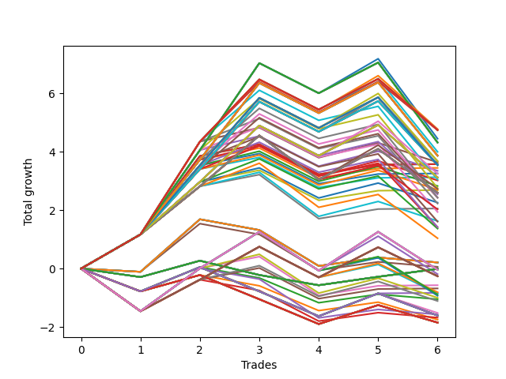

# Short HLT 109 
- Symbol: TSLA
- Date Range: 05/16/2022 - 05/17/2024
- Trading Period: 8:30-12:30
- Number of Trades: 6



| Id. | Name | Win Percent | Profit | Avg Profit / Trade | Avg Time / Trade | Std |      | Name | Win Percent | Profit | Avg Profit / Trade | Avg Time / Trade | Std |
| --- | ---- | ----------- | ------ | ------------------ | ---------------- | --- | ---- | ---- | ----------- | ------ | ------------------ | ---------------- | --- |
| | Sorted By <br> Profit | | | | | | | Sorted By <br> Win Percentage |||||
|0| TP-0.5 180m | 33.33 | 1.85 | 0.31 | 09:40 | 0.65 |     | TP-1.5 30m | 83.33 | -2.06 | -0.34 | 23:40 | 0.99 |
|1| TP-0.5 165m | 33.33 | 1.85 | 0.31 | 09:40 | 0.65 |     | TP-1.75 30m | 83.33 | -2.69 | -0.45 | 24:20 | 0.89 |
|2| TP-0.5 150m | 33.33 | 1.85 | 0.31 | 09:40 | 0.65 |     | TP-2 30m | 83.33 | -3.13 | -0.52 | 25:10 | 1.01 |
|3| TP-0.5 135m | 33.33 | 1.85 | 0.31 | 09:40 | 0.65 |     | TP-2.25 30m | 83.33 | -3.26 | -0.54 | 25:20 | 1.04 |
|4| TP-0.5 120m | 33.33 | 1.85 | 0.31 | 09:40 | 0.65 |     | TP-2.5 30m | 83.33 | -3.45 | -0.57 | 25:40 | 1.10 |
|5| TP-0.5 105m | 33.33 | 1.85 | 0.31 | 09:40 | 0.65 |     | TP-3 30m | 83.33 | -3.58 | -0.60 | 26:50 | 1.14 |
|6| TP-0.5 90m | 33.33 | 1.85 | 0.31 | 09:40 | 0.65 |     | TP-2.75 30m | 83.33 | -3.58 | -0.60 | 26:50 | 1.14 |
|7| TP-0.5 75m | 33.33 | 1.85 | 0.31 | 09:40 | 0.65 |     | TP-1 30m | 66.67 | 0.68 | 0.11 | 18:10 | 0.87 |
|8| TP-0.5 60m | 33.33 | 1.85 | 0.31 | 09:40 | 0.65 |     | TP-1.25 30m | 66.67 | 0.57 | 0.10 | 19:00 | 1.02 |
|9| TP-0.5 45m | 33.33 | 1.85 | 0.31 | 09:40 | 0.65 |     | TP-1.5 60m | 66.67 | -1.04 | -0.17 | 37:10 | 1.24 |
|10| TP-0.5 30m | 33.33 | 1.85 | 0.31 | 09:40 | 0.65 |     | TP-1.75 60m | 66.67 | -1.37 | -0.23 | 38:50 | 1.25 |
|11| TP-0.5 15m | 33.33 | 1.75 | 0.29 | 09:10 | 0.53 |     | TP-2.25 60m | 66.67 | -1.42 | -0.24 | 40:20 | 1.52 |
|12| TP-1 15m | 33.33 | 1.68 | 0.28 | 10:40 | 0.83 |     | TP-2 60m | 66.67 | -1.42 | -0.24 | 40:00 | 1.46 |
|13| TP-0.75 180m | 33.33 | 1.61 | 0.27 | 16:00 | 0.76 |     | TP-2.5 60m | 66.67 | -1.61 | -0.27 | 40:40 | 1.57 |
|14| TP-0.75 165m | 33.33 | 1.61 | 0.27 | 16:00 | 0.76 |     | TP-1.5 45m | 66.67 | -1.63 | -0.27 | 31:10 | 1.07 |
|15| TP-0.75 150m | 33.33 | 1.61 | 0.27 | 16:00 | 0.76 |     | TP-2.75 60m | 66.67 | -1.94 | -0.32 | 42:00 | 1.65 |
|16| TP-0.75 135m | 33.33 | 1.61 | 0.27 | 16:00 | 0.76 |     | TP-1.5 75m | 66.67 | -2.03 | -0.34 | 40:10 | 1.37 |
|17| TP-0.75 120m | 33.33 | 1.61 | 0.27 | 16:00 | 0.76 |     | TP-3 60m | 66.67 | -2.23 | -0.37 | 42:10 | 1.73 |
|18| TP-0.75 105m | 33.33 | 1.61 | 0.27 | 16:00 | 0.76 |     | TP-1.75 45m | 66.67 | -2.26 | -0.38 | 31:50 | 0.98 |
|19| TP-0.75 90m | 33.33 | 1.61 | 0.27 | 16:00 | 0.76 |     | TP-2.5 75m | 66.67 | -2.43 | -0.40 | 48:10 | 1.71 |
|20| TP-0.75 75m | 33.33 | 1.61 | 0.27 | 16:00 | 0.76 |     | TP-2.25 75m | 66.67 | -2.43 | -0.40 | 45:20 | 1.62 |
|21| TP-0.75 60m | 33.33 | 1.61 | 0.27 | 16:00 | 0.76 |     | TP-2 75m | 66.67 | -2.43 | -0.40 | 45:00 | 1.56 |
|22| TP-1.25 15m | 33.33 | 1.57 | 0.26 | 11:30 | 0.99 |     | TP-1.75 75m | 66.67 | -2.55 | -0.42 | 42:00 | 1.40 |
|23| TP-0.75 45m | 33.33 | 1.52 | 0.25 | 15:50 | 0.75 |     | TP-1.5 180m | 66.67 | -2.60 | -0.43 | 44:30 | 1.39 |
|24| TP-1 45m | 50.00 | 1.11 | 0.19 | 25:40 | 0.93 |     | TP-1.5 165m | 66.67 | -2.60 | -0.43 | 44:30 | 1.39 |
|25| TP-0.75 15m | 33.33 | 1.05 | 0.18 | 10:00 | 0.59 |     | TP-1.5 150m | 66.67 | -2.60 | -0.43 | 44:30 | 1.39 |
|26| TP-1.25 45m | 50.00 | 1.00 | 0.17 | 26:30 | 1.07 |     | TP-1.5 135m | 66.67 | -2.60 | -0.43 | 44:30 | 1.39 |
|27| TP-1.25 60m | 50.00 | 0.93 | 0.16 | 31:20 | 1.25 |     | TP-1.5 120m | 66.67 | -2.60 | -0.43 | 44:30 | 1.39 |
|28| TP-1.25 75m | 50.00 | 0.89 | 0.15 | 33:50 | 1.25 |     | TP-1.5 105m | 66.67 | -2.60 | -0.43 | 44:30 | 1.39 |
|29| TP-1 60m | 50.00 | 0.85 | 0.14 | 29:30 | 1.06 |     | TP-2 45m | 66.67 | -2.70 | -0.45 | 32:40 | 1.09 |
|30| TP-0.75 30m | 50.00 | 0.83 | 0.14 | 13:20 | 0.73 |     | TP-1.5 90m | 66.67 | -2.73 | -0.46 | 42:40 | 1.40 |
|31| TP-1 75m | 50.00 | 0.81 | 0.14 | 32:00 | 1.06 |     | TP-2.75 75m | 66.67 | -2.76 | -0.46 | 49:30 | 1.79 |
|32| TP-1 30m | 66.67 | 0.68 | 0.11 | 18:10 | 0.87 |     | TP-2.25 45m | 66.67 | -2.83 | -0.47 | 32:50 | 1.13 |
|33| TP-1.25 30m | 66.67 | 0.57 | 0.10 | 19:00 | 1.02 |     | TP-2.5 45m | 66.67 | -3.02 | -0.50 | 33:10 | 1.18 |
|34| TP-1 180m | 50.00 | 0.26 | 0.04 | 33:30 | 1.13 |     | TP-3 75m | 66.67 | -3.05 | -0.51 | 49:40 | 1.85 |
|35| TP-1 165m | 50.00 | 0.26 | 0.04 | 33:30 | 1.13 |     | TP-1.75 180m | 66.67 | -3.12 | -0.52 | 46:20 | 1.42 |
|36| TP-1 150m | 50.00 | 0.26 | 0.04 | 33:30 | 1.13 |     | TP-1.75 165m | 66.67 | -3.12 | -0.52 | 46:20 | 1.42 |
|37| TP-1 135m | 50.00 | 0.26 | 0.04 | 33:30 | 1.13 |     | TP-1.75 150m | 66.67 | -3.12 | -0.52 | 46:20 | 1.42 |
|38| TP-1 120m | 50.00 | 0.26 | 0.04 | 33:30 | 1.13 |     | TP-1.75 135m | 66.67 | -3.12 | -0.52 | 46:20 | 1.42 |
|39| TP-1 105m | 50.00 | 0.26 | 0.04 | 33:30 | 1.13 |     | TP-1.75 120m | 66.67 | -3.12 | -0.52 | 46:20 | 1.42 |
|40| TP-1 90m | 50.00 | 0.26 | 0.04 | 33:30 | 1.13 |     | TP-1.75 105m | 66.67 | -3.12 | -0.52 | 46:20 | 1.42 |
|41| TP-1.25 90m | 50.00 | 0.19 | 0.03 | 36:20 | 1.34 |     | TP-1.75 90m | 66.67 | -3.25 | -0.54 | 44:30 | 1.43 |
|42| TP-1.25 180m | 50.00 | 0.04 | 0.01 | 36:40 | 1.36 |     | TP-2.75 45m | 66.67 | -3.35 | -0.56 | 34:30 | 1.28 |
|43| TP-1.25 165m | 50.00 | 0.04 | 0.01 | 36:40 | 1.36 |     | TP-2.25 180m | 66.67 | -3.55 | -0.59 | 50:20 | 1.72 |
|44| TP-1.25 150m | 50.00 | 0.04 | 0.01 | 36:40 | 1.36 |     | TP-2 180m | 66.67 | -3.55 | -0.59 | 50:00 | 1.66 |
|45| TP-1.25 135m | 50.00 | 0.04 | 0.01 | 36:40 | 1.36 |     | TP-2.25 165m | 66.67 | -3.55 | -0.59 | 50:20 | 1.72 |
|46| TP-1.25 120m | 50.00 | 0.04 | 0.01 | 36:40 | 1.36 |     | TP-2 165m | 66.67 | -3.55 | -0.59 | 50:00 | 1.66 |
|47| TP-1.25 105m | 50.00 | 0.04 | 0.01 | 36:40 | 1.36 |     | TP-2.25 150m | 66.67 | -3.55 | -0.59 | 50:20 | 1.72 |
|48| TP-0.25 180m | 50.00 | 0.01 | 0.00 | 06:00 | 0.39 |     | TP-2 150m | 66.67 | -3.55 | -0.59 | 50:00 | 1.66 |
|49| TP-0.25 165m | 50.00 | 0.01 | 0.00 | 06:00 | 0.39 |     | TP-2.25 135m | 66.67 | -3.55 | -0.59 | 50:20 | 1.72 |
|50| TP-0.25 150m | 50.00 | 0.01 | 0.00 | 06:00 | 0.39 |     | TP-2 135m | 66.67 | -3.55 | -0.59 | 50:00 | 1.66 |
|51| TP-0.25 135m | 50.00 | 0.01 | 0.00 | 06:00 | 0.39 |     | TP-2.25 120m | 66.67 | -3.55 | -0.59 | 50:20 | 1.72 |
|52| TP-0.25 120m | 50.00 | 0.01 | 0.00 | 06:00 | 0.39 |     | TP-2 120m | 66.67 | -3.55 | -0.59 | 50:00 | 1.66 |
|53| TP-0.25 105m | 50.00 | 0.01 | 0.00 | 06:00 | 0.39 |     | TP-2.25 105m | 66.67 | -3.55 | -0.59 | 50:20 | 1.72 |
|54| TP-0.25 90m | 50.00 | 0.01 | 0.00 | 06:00 | 0.39 |     | TP-2 105m | 66.67 | -3.55 | -0.59 | 50:00 | 1.66 |
|55| TP-0.25 75m | 50.00 | 0.01 | 0.00 | 06:00 | 0.39 |     | TP-3 45m | 66.67 | -3.64 | -0.61 | 34:40 | 1.37 |
|56| TP-0.25 60m | 50.00 | 0.01 | 0.00 | 06:00 | 0.39 |     | TP-2.25 90m | 66.67 | -3.68 | -0.61 | 48:30 | 1.73 |
|57| TP-0.25 45m | 50.00 | 0.01 | 0.00 | 06:00 | 0.39 |     | TP-2 90m | 66.67 | -3.68 | -0.61 | 48:10 | 1.67 |
|58| TP-0.25 30m | 50.00 | 0.01 | 0.00 | 06:00 | 0.39 |     | TP-2.5 180m | 66.67 | -3.87 | -0.64 | 53:30 | 1.86 |
|59| TP-0.25 15m | 50.00 | 0.01 | 0.00 | 06:00 | 0.39 |     | TP-2.5 165m | 66.67 | -3.87 | -0.64 | 53:30 | 1.86 |
|60| TP-1.5 15m | 33.33 | -0.06 | -0.01 | 13:50 | 0.87 |     | TP-2.5 150m | 66.67 | -3.87 | -0.64 | 53:30 | 1.86 |
|61| TP-3 15m | 33.33 | -0.21 | -0.03 | 14:00 | 0.91 |     | TP-2.5 135m | 66.67 | -3.87 | -0.64 | 53:30 | 1.86 |
|62| TP-2.75 15m | 33.33 | -0.21 | -0.03 | 14:00 | 0.91 |     | TP-2.5 120m | 66.67 | -3.87 | -0.64 | 53:30 | 1.86 |
|63| TP-2.5 15m | 33.33 | -0.21 | -0.03 | 14:00 | 0.91 |     | TP-2.5 105m | 66.67 | -3.87 | -0.64 | 53:30 | 1.86 |
|64| TP-2.25 15m | 33.33 | -0.21 | -0.03 | 14:00 | 0.91 |     | TP-2.5 90m | 66.67 | -4.00 | -0.67 | 51:40 | 1.87 |
|65| TP-2 15m | 33.33 | -0.21 | -0.03 | 14:00 | 0.91 |     | TP-2.75 180m | 66.67 | -4.32 | -0.72 | 55:20 | 2.05 |
|66| TP-1.75 15m | 33.33 | -0.21 | -0.03 | 14:00 | 0.91 |     | TP-2.75 165m | 66.67 | -4.32 | -0.72 | 55:20 | 2.05 |
|67| TP-1.5 60m | 66.67 | -1.04 | -0.17 | 37:10 | 1.24 |     | TP-2.75 150m | 66.67 | -4.32 | -0.72 | 55:20 | 2.05 |
|68| TP-1.75 60m | 66.67 | -1.37 | -0.23 | 38:50 | 1.25 |     | TP-2.75 135m | 66.67 | -4.32 | -0.72 | 55:20 | 2.05 |
|69| TP-2.25 60m | 66.67 | -1.42 | -0.24 | 40:20 | 1.52 |     | TP-2.75 120m | 66.67 | -4.32 | -0.72 | 55:20 | 2.05 |
|70| TP-2 60m | 66.67 | -1.42 | -0.24 | 40:00 | 1.46 |     | TP-2.75 105m | 66.67 | -4.32 | -0.72 | 55:20 | 2.05 |
|71| TP-2.5 60m | 66.67 | -1.61 | -0.27 | 40:40 | 1.57 |     | TP-2.75 90m | 66.67 | -4.45 | -0.74 | 53:30 | 2.05 |
|72| TP-1.5 45m | 66.67 | -1.63 | -0.27 | 31:10 | 1.07 |     | TP-3 105m | 66.67 | -4.74 | -0.79 | 64:00 | 1.68 |
|73| TP-2.75 60m | 66.67 | -1.94 | -0.32 | 42:00 | 1.65 |     | TP-3 180m | 66.67 | -4.75 | -0.79 | 69:00 | 1.71 |
|74| TP-1.5 75m | 66.67 | -2.03 | -0.34 | 40:10 | 1.37 |     | TP-3 165m | 66.67 | -4.75 | -0.79 | 69:00 | 1.71 |
|75| TP-1.5 30m | 83.33 | -2.06 | -0.34 | 23:40 | 0.99 |     | TP-3 150m | 66.67 | -4.75 | -0.79 | 69:00 | 1.71 |
|76| TP-3 60m | 66.67 | -2.23 | -0.37 | 42:10 | 1.73 |     | TP-3 135m | 66.67 | -4.75 | -0.79 | 69:00 | 1.71 |
|77| TP-1.75 45m | 66.67 | -2.26 | -0.38 | 31:50 | 0.98 |     | TP-3 120m | 66.67 | -4.75 | -0.79 | 69:00 | 1.71 |
|78| TP-2.5 75m | 66.67 | -2.43 | -0.40 | 48:10 | 1.71 |     | TP-3 90m | 66.67 | -4.78 | -0.80 | 57:10 | 1.73 |
|79| TP-2.25 75m | 66.67 | -2.43 | -0.40 | 45:20 | 1.62 |     | TP-1 45m | 50.00 | 1.11 | 0.19 | 25:40 | 0.93 |
|80| TP-2 75m | 66.67 | -2.43 | -0.40 | 45:00 | 1.56 |     | TP-1.25 45m | 50.00 | 1.00 | 0.17 | 26:30 | 1.07 |
|81| TP-1.75 75m | 66.67 | -2.55 | -0.42 | 42:00 | 1.40 |     | TP-1.25 60m | 50.00 | 0.93 | 0.16 | 31:20 | 1.25 |
|82| TP-1.5 180m | 66.67 | -2.60 | -0.43 | 44:30 | 1.39 |     | TP-1.25 75m | 50.00 | 0.89 | 0.15 | 33:50 | 1.25 |
|83| TP-1.5 165m | 66.67 | -2.60 | -0.43 | 44:30 | 1.39 |     | TP-1 60m | 50.00 | 0.85 | 0.14 | 29:30 | 1.06 |
|84| TP-1.5 150m | 66.67 | -2.60 | -0.43 | 44:30 | 1.39 |     | TP-0.75 30m | 50.00 | 0.83 | 0.14 | 13:20 | 0.73 |
|85| TP-1.5 135m | 66.67 | -2.60 | -0.43 | 44:30 | 1.39 |     | TP-1 75m | 50.00 | 0.81 | 0.14 | 32:00 | 1.06 |
|86| TP-1.5 120m | 66.67 | -2.60 | -0.43 | 44:30 | 1.39 |     | TP-1 180m | 50.00 | 0.26 | 0.04 | 33:30 | 1.13 |
|87| TP-1.5 105m | 66.67 | -2.60 | -0.43 | 44:30 | 1.39 |     | TP-1 165m | 50.00 | 0.26 | 0.04 | 33:30 | 1.13 |
|88| TP-1.75 30m | 83.33 | -2.69 | -0.45 | 24:20 | 0.89 |     | TP-1 150m | 50.00 | 0.26 | 0.04 | 33:30 | 1.13 |
|89| TP-2 45m | 66.67 | -2.70 | -0.45 | 32:40 | 1.09 |     | TP-1 135m | 50.00 | 0.26 | 0.04 | 33:30 | 1.13 |
|90| TP-1.5 90m | 66.67 | -2.73 | -0.46 | 42:40 | 1.40 |     | TP-1 120m | 50.00 | 0.26 | 0.04 | 33:30 | 1.13 |
|91| TP-2.75 75m | 66.67 | -2.76 | -0.46 | 49:30 | 1.79 |     | TP-1 105m | 50.00 | 0.26 | 0.04 | 33:30 | 1.13 |
|92| TP-2.25 45m | 66.67 | -2.83 | -0.47 | 32:50 | 1.13 |     | TP-1 90m | 50.00 | 0.26 | 0.04 | 33:30 | 1.13 |
|93| TP-2.5 45m | 66.67 | -3.02 | -0.50 | 33:10 | 1.18 |     | TP-1.25 90m | 50.00 | 0.19 | 0.03 | 36:20 | 1.34 |
|94| TP-3 75m | 66.67 | -3.05 | -0.51 | 49:40 | 1.85 |     | TP-1.25 180m | 50.00 | 0.04 | 0.01 | 36:40 | 1.36 |
|95| TP-1.75 180m | 66.67 | -3.12 | -0.52 | 46:20 | 1.42 |     | TP-1.25 165m | 50.00 | 0.04 | 0.01 | 36:40 | 1.36 |
|96| TP-1.75 165m | 66.67 | -3.12 | -0.52 | 46:20 | 1.42 |     | TP-1.25 150m | 50.00 | 0.04 | 0.01 | 36:40 | 1.36 |
|97| TP-1.75 150m | 66.67 | -3.12 | -0.52 | 46:20 | 1.42 |     | TP-1.25 135m | 50.00 | 0.04 | 0.01 | 36:40 | 1.36 |
|98| TP-1.75 135m | 66.67 | -3.12 | -0.52 | 46:20 | 1.42 |     | TP-1.25 120m | 50.00 | 0.04 | 0.01 | 36:40 | 1.36 |
|99| TP-1.75 120m | 66.67 | -3.12 | -0.52 | 46:20 | 1.42 |     | TP-1.25 105m | 50.00 | 0.04 | 0.01 | 36:40 | 1.36 |
|100| TP-1.75 105m | 66.67 | -3.12 | -0.52 | 46:20 | 1.42 |     | TP-0.25 180m | 50.00 | 0.01 | 0.00 | 06:00 | 0.39 |
|101| TP-2 30m | 83.33 | -3.13 | -0.52 | 25:10 | 1.01 |     | TP-0.25 165m | 50.00 | 0.01 | 0.00 | 06:00 | 0.39 |
|102| TP-1.75 90m | 66.67 | -3.25 | -0.54 | 44:30 | 1.43 |     | TP-0.25 150m | 50.00 | 0.01 | 0.00 | 06:00 | 0.39 |
|103| TP-2.25 30m | 83.33 | -3.26 | -0.54 | 25:20 | 1.04 |     | TP-0.25 135m | 50.00 | 0.01 | 0.00 | 06:00 | 0.39 |
|104| TP-2.75 45m | 66.67 | -3.35 | -0.56 | 34:30 | 1.28 |     | TP-0.25 120m | 50.00 | 0.01 | 0.00 | 06:00 | 0.39 |
|105| TP-2.5 30m | 83.33 | -3.45 | -0.57 | 25:40 | 1.10 |     | TP-0.25 105m | 50.00 | 0.01 | 0.00 | 06:00 | 0.39 |
|106| TP-2.25 180m | 66.67 | -3.55 | -0.59 | 50:20 | 1.72 |     | TP-0.25 90m | 50.00 | 0.01 | 0.00 | 06:00 | 0.39 |
|107| TP-2 180m | 66.67 | -3.55 | -0.59 | 50:00 | 1.66 |     | TP-0.25 75m | 50.00 | 0.01 | 0.00 | 06:00 | 0.39 |
|108| TP-2.25 165m | 66.67 | -3.55 | -0.59 | 50:20 | 1.72 |     | TP-0.25 60m | 50.00 | 0.01 | 0.00 | 06:00 | 0.39 |
|109| TP-2 165m | 66.67 | -3.55 | -0.59 | 50:00 | 1.66 |     | TP-0.25 45m | 50.00 | 0.01 | 0.00 | 06:00 | 0.39 |
|110| TP-2.25 150m | 66.67 | -3.55 | -0.59 | 50:20 | 1.72 |     | TP-0.25 30m | 50.00 | 0.01 | 0.00 | 06:00 | 0.39 |
|111| TP-2 150m | 66.67 | -3.55 | -0.59 | 50:00 | 1.66 |     | TP-0.25 15m | 50.00 | 0.01 | 0.00 | 06:00 | 0.39 |
|112| TP-2.25 135m | 66.67 | -3.55 | -0.59 | 50:20 | 1.72 |     | TP-0.5 180m | 33.33 | 1.85 | 0.31 | 09:40 | 0.65 |
|113| TP-2 135m | 66.67 | -3.55 | -0.59 | 50:00 | 1.66 |     | TP-0.5 165m | 33.33 | 1.85 | 0.31 | 09:40 | 0.65 |
|114| TP-2.25 120m | 66.67 | -3.55 | -0.59 | 50:20 | 1.72 |     | TP-0.5 150m | 33.33 | 1.85 | 0.31 | 09:40 | 0.65 |
|115| TP-2 120m | 66.67 | -3.55 | -0.59 | 50:00 | 1.66 |     | TP-0.5 135m | 33.33 | 1.85 | 0.31 | 09:40 | 0.65 |
|116| TP-2.25 105m | 66.67 | -3.55 | -0.59 | 50:20 | 1.72 |     | TP-0.5 120m | 33.33 | 1.85 | 0.31 | 09:40 | 0.65 |
|117| TP-2 105m | 66.67 | -3.55 | -0.59 | 50:00 | 1.66 |     | TP-0.5 105m | 33.33 | 1.85 | 0.31 | 09:40 | 0.65 |
|118| TP-3 30m | 83.33 | -3.58 | -0.60 | 26:50 | 1.14 |     | TP-0.5 90m | 33.33 | 1.85 | 0.31 | 09:40 | 0.65 |
|119| TP-2.75 30m | 83.33 | -3.58 | -0.60 | 26:50 | 1.14 |     | TP-0.5 75m | 33.33 | 1.85 | 0.31 | 09:40 | 0.65 |
|120| TP-3 45m | 66.67 | -3.64 | -0.61 | 34:40 | 1.37 |     | TP-0.5 60m | 33.33 | 1.85 | 0.31 | 09:40 | 0.65 |
|121| TP-2.25 90m | 66.67 | -3.68 | -0.61 | 48:30 | 1.73 |     | TP-0.5 45m | 33.33 | 1.85 | 0.31 | 09:40 | 0.65 |
|122| TP-2 90m | 66.67 | -3.68 | -0.61 | 48:10 | 1.67 |     | TP-0.5 30m | 33.33 | 1.85 | 0.31 | 09:40 | 0.65 |
|123| TP-2.5 180m | 66.67 | -3.87 | -0.64 | 53:30 | 1.86 |     | TP-0.5 15m | 33.33 | 1.75 | 0.29 | 09:10 | 0.53 |
|124| TP-2.5 165m | 66.67 | -3.87 | -0.64 | 53:30 | 1.86 |     | TP-1 15m | 33.33 | 1.68 | 0.28 | 10:40 | 0.83 |
|125| TP-2.5 150m | 66.67 | -3.87 | -0.64 | 53:30 | 1.86 |     | TP-0.75 180m | 33.33 | 1.61 | 0.27 | 16:00 | 0.76 |
|126| TP-2.5 135m | 66.67 | -3.87 | -0.64 | 53:30 | 1.86 |     | TP-0.75 165m | 33.33 | 1.61 | 0.27 | 16:00 | 0.76 |
|127| TP-2.5 120m | 66.67 | -3.87 | -0.64 | 53:30 | 1.86 |     | TP-0.75 150m | 33.33 | 1.61 | 0.27 | 16:00 | 0.76 |
|128| TP-2.5 105m | 66.67 | -3.87 | -0.64 | 53:30 | 1.86 |     | TP-0.75 135m | 33.33 | 1.61 | 0.27 | 16:00 | 0.76 |
|129| TP-2.5 90m | 66.67 | -4.00 | -0.67 | 51:40 | 1.87 |     | TP-0.75 120m | 33.33 | 1.61 | 0.27 | 16:00 | 0.76 |
|130| TP-2.75 180m | 66.67 | -4.32 | -0.72 | 55:20 | 2.05 |     | TP-0.75 105m | 33.33 | 1.61 | 0.27 | 16:00 | 0.76 |
|131| TP-2.75 165m | 66.67 | -4.32 | -0.72 | 55:20 | 2.05 |     | TP-0.75 90m | 33.33 | 1.61 | 0.27 | 16:00 | 0.76 |
|132| TP-2.75 150m | 66.67 | -4.32 | -0.72 | 55:20 | 2.05 |     | TP-0.75 75m | 33.33 | 1.61 | 0.27 | 16:00 | 0.76 |
|133| TP-2.75 135m | 66.67 | -4.32 | -0.72 | 55:20 | 2.05 |     | TP-0.75 60m | 33.33 | 1.61 | 0.27 | 16:00 | 0.76 |
|134| TP-2.75 120m | 66.67 | -4.32 | -0.72 | 55:20 | 2.05 |     | TP-1.25 15m | 33.33 | 1.57 | 0.26 | 11:30 | 0.99 |
|135| TP-2.75 105m | 66.67 | -4.32 | -0.72 | 55:20 | 2.05 |     | TP-0.75 45m | 33.33 | 1.52 | 0.25 | 15:50 | 0.75 |
|136| TP-2.75 90m | 66.67 | -4.45 | -0.74 | 53:30 | 2.05 |     | TP-0.75 15m | 33.33 | 1.05 | 0.18 | 10:00 | 0.59 |
|137| TP-3 105m | 66.67 | -4.74 | -0.79 | 64:00 | 1.68 |     | TP-1.5 15m | 33.33 | -0.06 | -0.01 | 13:50 | 0.87 |
|138| TP-3 180m | 66.67 | -4.75 | -0.79 | 69:00 | 1.71 |     | TP-3 15m | 33.33 | -0.21 | -0.03 | 14:00 | 0.91 |
|139| TP-3 165m | 66.67 | -4.75 | -0.79 | 69:00 | 1.71 |     | TP-2.75 15m | 33.33 | -0.21 | -0.03 | 14:00 | 0.91 |
|140| TP-3 150m | 66.67 | -4.75 | -0.79 | 69:00 | 1.71 |     | TP-2.5 15m | 33.33 | -0.21 | -0.03 | 14:00 | 0.91 |
|141| TP-3 135m | 66.67 | -4.75 | -0.79 | 69:00 | 1.71 |     | TP-2.25 15m | 33.33 | -0.21 | -0.03 | 14:00 | 0.91 |
|142| TP-3 120m | 66.67 | -4.75 | -0.79 | 69:00 | 1.71 |     | TP-2 15m | 33.33 | -0.21 | -0.03 | 14:00 | 0.91 |
|143| TP-3 90m | 66.67 | -4.78 | -0.80 | 57:10 | 1.73 |     | TP-1.75 15m | 33.33 | -0.21 | -0.03 | 14:00 | 0.91 |

### Test TP-0.25 15m
* Take Profit of 0.25 Point
* 0.25 Stoploss
* Results:
```
Total Trades: 6
Percent Up: 50.00
Percent Down: 50.00
Total Points Moved Down: -0.01
Potential Profit: -5.00
Total Points Ups: 1.13 Count Ups: 3
Total Points Downs: 1.12 Count Downs: 3
```

<details><summary>Trades</summary>

<code>In: 2022-10-24 12:25:00		Out: 2022-10-24 12:27:00		Total Position Time: 02:00		Total Move Down: -0.29		Total to Date: -0.29</code> <br />
<code>In: 2022-12-19 10:25:00		Out: 2022-12-19 10:31:00		Total Position Time: 06:00		Total Move Down: 0.56		Total to Date: 0.27</code> <br />
<code>In: 2023-01-23 10:45:00		Out: 2023-01-23 10:52:00		Total Position Time: 07:00		Total Move Down: -0.49		Total to Date: -0.22</code> <br />
<code>In: 2023-10-04 12:30:00		Out: 2023-10-04 12:33:00		Total Position Time: 03:00		Total Move Down: -0.35		Total to Date: -0.57</code> <br />
<code>In: 2023-10-31 11:10:00		Out: 2023-10-31 11:24:00		Total Position Time: 14:00		Total Move Down: 0.29		Total to Date: -0.28</code> <br />
<code>In: 2024-02-15 09:25:00		Out: 2024-02-15 09:29:00		Total Position Time: 04:00		Total Move Down: 0.27		Total to Date: -0.01</code> <br />


</details>

### Test TP-0.5 15m
* Take Profit of 0.5 Point
* 0.5 Stoploss
* Results:
```
Total Trades: 6
Percent Up: 66.67
Percent Down: 33.33
Total Points Moved Down: -1.75
Potential Profit: -875.00
Total Points Ups: 2.60 Count Ups: 4
Total Points Downs: 0.85 Count Downs: 2
```

<details><summary>Trades</summary>

<code>In: 2022-10-24 12:25:00		Out: 2022-10-24 12:30:00		Total Position Time: 05:00		Total Move Down: -0.78		Total to Date: -0.78</code> <br />
<code>In: 2022-12-19 10:25:00		Out: 2022-12-19 10:31:00		Total Position Time: 06:00		Total Move Down: 0.56		Total to Date: -0.22</code> <br />
<code>In: 2023-01-23 10:45:00		Out: 2023-01-23 10:59:00		Total Position Time: 14:00		Total Move Down: -0.37		Total to Date: -0.59</code> <br />
<code>In: 2023-10-04 12:30:00		Out: 2023-10-04 12:36:00		Total Position Time: 06:00		Total Move Down: -0.85		Total to Date: -1.44</code> <br />
<code>In: 2023-10-31 11:10:00		Out: 2023-10-31 11:24:00		Total Position Time: 14:00		Total Move Down: 0.29		Total to Date: -1.15</code> <br />
<code>In: 2024-02-15 09:25:00		Out: 2024-02-15 09:35:00		Total Position Time: 10:00		Total Move Down: -0.60		Total to Date: -1.75</code> <br />


</details>

### Test TP-0.75 15m
* Take Profit of 0.75 Point
* 0.75 Stoploss
* Results:
```
Total Trades: 6
Percent Up: 66.67
Percent Down: 33.33
Total Points Moved Down: -1.05
Potential Profit: -525.00
Total Points Ups: 2.17 Count Ups: 4
Total Points Downs: 1.12 Count Downs: 2
```

<details><summary>Trades</summary>

<code>In: 2022-10-24 12:25:00		Out: 2022-10-24 12:30:00		Total Position Time: 05:00		Total Move Down: -0.78		Total to Date: -0.78</code> <br />
<code>In: 2022-12-19 10:25:00		Out: 2022-12-19 10:32:00		Total Position Time: 07:00		Total Move Down: 0.83		Total to Date: 0.05</code> <br />
<code>In: 2023-01-23 10:45:00		Out: 2023-01-23 10:59:00		Total Position Time: 14:00		Total Move Down: -0.37		Total to Date: -0.32</code> <br />
<code>In: 2023-10-04 12:30:00		Out: 2023-10-04 12:36:00		Total Position Time: 06:00		Total Move Down: -0.85		Total to Date: -1.17</code> <br />
<code>In: 2023-10-31 11:10:00		Out: 2023-10-31 11:24:00		Total Position Time: 14:00		Total Move Down: 0.29		Total to Date: -0.88</code> <br />
<code>In: 2024-02-15 09:25:00		Out: 2024-02-15 09:39:00		Total Position Time: 14:00		Total Move Down: -0.17		Total to Date: -1.05</code> <br />


</details>

### Test TP-1 15m
* Take Profit of 1 Point
* 1 Stoploss
* Results:
```
Total Trades: 6
Percent Up: 66.67
Percent Down: 33.33
Total Points Moved Down: -1.68
Potential Profit: -840.00
Total Points Ups: 3.05 Count Ups: 4
Total Points Downs: 1.37 Count Downs: 2
```

<details><summary>Trades</summary>

<code>In: 2022-10-24 12:25:00		Out: 2022-10-24 12:31:00		Total Position Time: 06:00		Total Move Down: -1.46		Total to Date: -1.46</code> <br />
<code>In: 2022-12-19 10:25:00		Out: 2022-12-19 10:33:00		Total Position Time: 08:00		Total Move Down: 1.08		Total to Date: -0.38</code> <br />
<code>In: 2023-01-23 10:45:00		Out: 2023-01-23 10:59:00		Total Position Time: 14:00		Total Move Down: -0.37		Total to Date: -0.75</code> <br />
<code>In: 2023-10-04 12:30:00		Out: 2023-10-04 12:38:00		Total Position Time: 08:00		Total Move Down: -1.05		Total to Date: -1.80</code> <br />
<code>In: 2023-10-31 11:10:00		Out: 2023-10-31 11:24:00		Total Position Time: 14:00		Total Move Down: 0.29		Total to Date: -1.51</code> <br />
<code>In: 2024-02-15 09:25:00		Out: 2024-02-15 09:39:00		Total Position Time: 14:00		Total Move Down: -0.17		Total to Date: -1.68</code> <br />


</details>

### Test TP-1.25 15m
* Take Profit of 1.25 Point
* 1.25 Stoploss
* Results:
```
Total Trades: 6
Percent Up: 66.67
Percent Down: 33.33
Total Points Moved Down: -1.57
Potential Profit: -785.00
Total Points Ups: 3.33 Count Ups: 4
Total Points Downs: 1.76 Count Downs: 2
```

<details><summary>Trades</summary>

<code>In: 2022-10-24 12:25:00		Out: 2022-10-24 12:31:00		Total Position Time: 06:00		Total Move Down: -1.46		Total to Date: -1.46</code> <br />
<code>In: 2022-12-19 10:25:00		Out: 2022-12-19 10:35:00		Total Position Time: 10:00		Total Move Down: 1.47		Total to Date: 0.01</code> <br />
<code>In: 2023-01-23 10:45:00		Out: 2023-01-23 10:59:00		Total Position Time: 14:00		Total Move Down: -0.37		Total to Date: -0.36</code> <br />
<code>In: 2023-10-04 12:30:00		Out: 2023-10-04 12:41:00		Total Position Time: 11:00		Total Move Down: -1.33		Total to Date: -1.69</code> <br />
<code>In: 2023-10-31 11:10:00		Out: 2023-10-31 11:24:00		Total Position Time: 14:00		Total Move Down: 0.29		Total to Date: -1.40</code> <br />
<code>In: 2024-02-15 09:25:00		Out: 2024-02-15 09:39:00		Total Position Time: 14:00		Total Move Down: -0.17		Total to Date: -1.57</code> <br />


</details>

### Test TP-1.5 15m
* Take Profit of 1.5 Point
* 1.5 Stoploss
* Results:
```
Total Trades: 6
Percent Up: 66.67
Percent Down: 33.33
Total Points Moved Down: 0.06
Potential Profit: 30.00
Total Points Ups: 1.88 Count Ups: 4
Total Points Downs: 1.94 Count Downs: 2
```

<details><summary>Trades</summary>

<code>In: 2022-10-24 12:25:00		Out: 2022-10-24 12:39:00		Total Position Time: 14:00		Total Move Down: -0.11		Total to Date: -0.11</code> <br />
<code>In: 2022-12-19 10:25:00		Out: 2022-12-19 10:38:00		Total Position Time: 13:00		Total Move Down: 1.65		Total to Date: 1.54</code> <br />
<code>In: 2023-01-23 10:45:00		Out: 2023-01-23 10:59:00		Total Position Time: 14:00		Total Move Down: -0.37		Total to Date: 1.17</code> <br />
<code>In: 2023-10-04 12:30:00		Out: 2023-10-04 12:44:00		Total Position Time: 14:00		Total Move Down: -1.23		Total to Date: -0.06</code> <br />
<code>In: 2023-10-31 11:10:00		Out: 2023-10-31 11:24:00		Total Position Time: 14:00		Total Move Down: 0.29		Total to Date: 0.23</code> <br />
<code>In: 2024-02-15 09:25:00		Out: 2024-02-15 09:39:00		Total Position Time: 14:00		Total Move Down: -0.17		Total to Date: 0.06</code> <br />


</details>

### Test TP-1.75 15m
* Take Profit of 1.75 Point
* 1.75 Stoploss
* Results:
```
Total Trades: 6
Percent Up: 66.67
Percent Down: 33.33
Total Points Moved Down: 0.21
Potential Profit: 105.00
Total Points Ups: 1.88 Count Ups: 4
Total Points Downs: 2.09 Count Downs: 2
```

<details><summary>Trades</summary>

<code>In: 2022-10-24 12:25:00		Out: 2022-10-24 12:39:00		Total Position Time: 14:00		Total Move Down: -0.11		Total to Date: -0.11</code> <br />
<code>In: 2022-12-19 10:25:00		Out: 2022-12-19 10:39:00		Total Position Time: 14:00		Total Move Down: 1.80		Total to Date: 1.69</code> <br />
<code>In: 2023-01-23 10:45:00		Out: 2023-01-23 10:59:00		Total Position Time: 14:00		Total Move Down: -0.37		Total to Date: 1.32</code> <br />
<code>In: 2023-10-04 12:30:00		Out: 2023-10-04 12:44:00		Total Position Time: 14:00		Total Move Down: -1.23		Total to Date: 0.09</code> <br />
<code>In: 2023-10-31 11:10:00		Out: 2023-10-31 11:24:00		Total Position Time: 14:00		Total Move Down: 0.29		Total to Date: 0.38</code> <br />
<code>In: 2024-02-15 09:25:00		Out: 2024-02-15 09:39:00		Total Position Time: 14:00		Total Move Down: -0.17		Total to Date: 0.21</code> <br />


</details>

### Test TP-2 15m
* Take Profit of 2 Point
* 2 Stoploss
* Results:
```
Total Trades: 6
Percent Up: 66.67
Percent Down: 33.33
Total Points Moved Down: 0.21
Potential Profit: 105.00
Total Points Ups: 1.88 Count Ups: 4
Total Points Downs: 2.09 Count Downs: 2
```

<details><summary>Trades</summary>

<code>In: 2022-10-24 12:25:00		Out: 2022-10-24 12:39:00		Total Position Time: 14:00		Total Move Down: -0.11		Total to Date: -0.11</code> <br />
<code>In: 2022-12-19 10:25:00		Out: 2022-12-19 10:39:00		Total Position Time: 14:00		Total Move Down: 1.80		Total to Date: 1.69</code> <br />
<code>In: 2023-01-23 10:45:00		Out: 2023-01-23 10:59:00		Total Position Time: 14:00		Total Move Down: -0.37		Total to Date: 1.32</code> <br />
<code>In: 2023-10-04 12:30:00		Out: 2023-10-04 12:44:00		Total Position Time: 14:00		Total Move Down: -1.23		Total to Date: 0.09</code> <br />
<code>In: 2023-10-31 11:10:00		Out: 2023-10-31 11:24:00		Total Position Time: 14:00		Total Move Down: 0.29		Total to Date: 0.38</code> <br />
<code>In: 2024-02-15 09:25:00		Out: 2024-02-15 09:39:00		Total Position Time: 14:00		Total Move Down: -0.17		Total to Date: 0.21</code> <br />


</details>

### Test TP-2.25 15m
* Take Profit of 2.25 Point
* 2.25 Stoploss
* Results:
```
Total Trades: 6
Percent Up: 66.67
Percent Down: 33.33
Total Points Moved Down: 0.21
Potential Profit: 105.00
Total Points Ups: 1.88 Count Ups: 4
Total Points Downs: 2.09 Count Downs: 2
```

<details><summary>Trades</summary>

<code>In: 2022-10-24 12:25:00		Out: 2022-10-24 12:39:00		Total Position Time: 14:00		Total Move Down: -0.11		Total to Date: -0.11</code> <br />
<code>In: 2022-12-19 10:25:00		Out: 2022-12-19 10:39:00		Total Position Time: 14:00		Total Move Down: 1.80		Total to Date: 1.69</code> <br />
<code>In: 2023-01-23 10:45:00		Out: 2023-01-23 10:59:00		Total Position Time: 14:00		Total Move Down: -0.37		Total to Date: 1.32</code> <br />
<code>In: 2023-10-04 12:30:00		Out: 2023-10-04 12:44:00		Total Position Time: 14:00		Total Move Down: -1.23		Total to Date: 0.09</code> <br />
<code>In: 2023-10-31 11:10:00		Out: 2023-10-31 11:24:00		Total Position Time: 14:00		Total Move Down: 0.29		Total to Date: 0.38</code> <br />
<code>In: 2024-02-15 09:25:00		Out: 2024-02-15 09:39:00		Total Position Time: 14:00		Total Move Down: -0.17		Total to Date: 0.21</code> <br />


</details>

### Test TP-2.5 15m
* Take Profit of 2.5 Point
* 2.5 Stoploss
* Results:
```
Total Trades: 6
Percent Up: 66.67
Percent Down: 33.33
Total Points Moved Down: 0.21
Potential Profit: 105.00
Total Points Ups: 1.88 Count Ups: 4
Total Points Downs: 2.09 Count Downs: 2
```

<details><summary>Trades</summary>

<code>In: 2022-10-24 12:25:00		Out: 2022-10-24 12:39:00		Total Position Time: 14:00		Total Move Down: -0.11		Total to Date: -0.11</code> <br />
<code>In: 2022-12-19 10:25:00		Out: 2022-12-19 10:39:00		Total Position Time: 14:00		Total Move Down: 1.80		Total to Date: 1.69</code> <br />
<code>In: 2023-01-23 10:45:00		Out: 2023-01-23 10:59:00		Total Position Time: 14:00		Total Move Down: -0.37		Total to Date: 1.32</code> <br />
<code>In: 2023-10-04 12:30:00		Out: 2023-10-04 12:44:00		Total Position Time: 14:00		Total Move Down: -1.23		Total to Date: 0.09</code> <br />
<code>In: 2023-10-31 11:10:00		Out: 2023-10-31 11:24:00		Total Position Time: 14:00		Total Move Down: 0.29		Total to Date: 0.38</code> <br />
<code>In: 2024-02-15 09:25:00		Out: 2024-02-15 09:39:00		Total Position Time: 14:00		Total Move Down: -0.17		Total to Date: 0.21</code> <br />


</details>

### Test TP-2.75 15m
* Take Profit of 2.75 Point
* 2.75 Stoploss
* Results:
```
Total Trades: 6
Percent Up: 66.67
Percent Down: 33.33
Total Points Moved Down: 0.21
Potential Profit: 105.00
Total Points Ups: 1.88 Count Ups: 4
Total Points Downs: 2.09 Count Downs: 2
```

<details><summary>Trades</summary>

<code>In: 2022-10-24 12:25:00		Out: 2022-10-24 12:39:00		Total Position Time: 14:00		Total Move Down: -0.11		Total to Date: -0.11</code> <br />
<code>In: 2022-12-19 10:25:00		Out: 2022-12-19 10:39:00		Total Position Time: 14:00		Total Move Down: 1.80		Total to Date: 1.69</code> <br />
<code>In: 2023-01-23 10:45:00		Out: 2023-01-23 10:59:00		Total Position Time: 14:00		Total Move Down: -0.37		Total to Date: 1.32</code> <br />
<code>In: 2023-10-04 12:30:00		Out: 2023-10-04 12:44:00		Total Position Time: 14:00		Total Move Down: -1.23		Total to Date: 0.09</code> <br />
<code>In: 2023-10-31 11:10:00		Out: 2023-10-31 11:24:00		Total Position Time: 14:00		Total Move Down: 0.29		Total to Date: 0.38</code> <br />
<code>In: 2024-02-15 09:25:00		Out: 2024-02-15 09:39:00		Total Position Time: 14:00		Total Move Down: -0.17		Total to Date: 0.21</code> <br />


</details>

### Test TP-3 15m
* Take Profit of 3 Point
* 3 Stoploss
* Results:
```
Total Trades: 6
Percent Up: 66.67
Percent Down: 33.33
Total Points Moved Down: 0.21
Potential Profit: 105.00
Total Points Ups: 1.88 Count Ups: 4
Total Points Downs: 2.09 Count Downs: 2
```

<details><summary>Trades</summary>

<code>In: 2022-10-24 12:25:00		Out: 2022-10-24 12:39:00		Total Position Time: 14:00		Total Move Down: -0.11		Total to Date: -0.11</code> <br />
<code>In: 2022-12-19 10:25:00		Out: 2022-12-19 10:39:00		Total Position Time: 14:00		Total Move Down: 1.80		Total to Date: 1.69</code> <br />
<code>In: 2023-01-23 10:45:00		Out: 2023-01-23 10:59:00		Total Position Time: 14:00		Total Move Down: -0.37		Total to Date: 1.32</code> <br />
<code>In: 2023-10-04 12:30:00		Out: 2023-10-04 12:44:00		Total Position Time: 14:00		Total Move Down: -1.23		Total to Date: 0.09</code> <br />
<code>In: 2023-10-31 11:10:00		Out: 2023-10-31 11:24:00		Total Position Time: 14:00		Total Move Down: 0.29		Total to Date: 0.38</code> <br />
<code>In: 2024-02-15 09:25:00		Out: 2024-02-15 09:39:00		Total Position Time: 14:00		Total Move Down: -0.17		Total to Date: 0.21</code> <br />


</details>

### Test TP-0.25 30m
* Take Profit of 0.25 Point
* 0.25 Stoploss
* Results:
```
Total Trades: 6
Percent Up: 50.00
Percent Down: 50.00
Total Points Moved Down: -0.01
Potential Profit: -5.00
Total Points Ups: 1.13 Count Ups: 3
Total Points Downs: 1.12 Count Downs: 3
```

<details><summary>Trades</summary>

<code>In: 2022-10-24 12:25:00		Out: 2022-10-24 12:27:00		Total Position Time: 02:00		Total Move Down: -0.29		Total to Date: -0.29</code> <br />
<code>In: 2022-12-19 10:25:00		Out: 2022-12-19 10:31:00		Total Position Time: 06:00		Total Move Down: 0.56		Total to Date: 0.27</code> <br />
<code>In: 2023-01-23 10:45:00		Out: 2023-01-23 10:52:00		Total Position Time: 07:00		Total Move Down: -0.49		Total to Date: -0.22</code> <br />
<code>In: 2023-10-04 12:30:00		Out: 2023-10-04 12:33:00		Total Position Time: 03:00		Total Move Down: -0.35		Total to Date: -0.57</code> <br />
<code>In: 2023-10-31 11:10:00		Out: 2023-10-31 11:24:00		Total Position Time: 14:00		Total Move Down: 0.29		Total to Date: -0.28</code> <br />
<code>In: 2024-02-15 09:25:00		Out: 2024-02-15 09:29:00		Total Position Time: 04:00		Total Move Down: 0.27		Total to Date: -0.01</code> <br />


</details>

### Test TP-0.5 30m
* Take Profit of 0.5 Point
* 0.5 Stoploss
* Results:
```
Total Trades: 6
Percent Up: 66.67
Percent Down: 33.33
Total Points Moved Down: -1.85
Potential Profit: -925.00
Total Points Ups: 3.06 Count Ups: 4
Total Points Downs: 1.21 Count Downs: 2
```

<details><summary>Trades</summary>

<code>In: 2022-10-24 12:25:00		Out: 2022-10-24 12:30:00		Total Position Time: 05:00		Total Move Down: -0.78		Total to Date: -0.78</code> <br />
<code>In: 2022-12-19 10:25:00		Out: 2022-12-19 10:31:00		Total Position Time: 06:00		Total Move Down: 0.56		Total to Date: -0.22</code> <br />
<code>In: 2023-01-23 10:45:00		Out: 2023-01-23 11:00:00		Total Position Time: 15:00		Total Move Down: -0.83		Total to Date: -1.05</code> <br />
<code>In: 2023-10-04 12:30:00		Out: 2023-10-04 12:36:00		Total Position Time: 06:00		Total Move Down: -0.85		Total to Date: -1.90</code> <br />
<code>In: 2023-10-31 11:10:00		Out: 2023-10-31 11:26:00		Total Position Time: 16:00		Total Move Down: 0.65		Total to Date: -1.25</code> <br />
<code>In: 2024-02-15 09:25:00		Out: 2024-02-15 09:35:00		Total Position Time: 10:00		Total Move Down: -0.60		Total to Date: -1.85</code> <br />


</details>

### Test TP-0.75 30m
* Take Profit of 0.75 Point
* 0.75 Stoploss
* Results:
```
Total Trades: 6
Percent Up: 50.00
Percent Down: 50.00
Total Points Moved Down: -0.83
Potential Profit: -415.00
Total Points Ups: 2.46 Count Ups: 3
Total Points Downs: 1.63 Count Downs: 3
```

<details><summary>Trades</summary>

<code>In: 2022-10-24 12:25:00		Out: 2022-10-24 12:30:00		Total Position Time: 05:00		Total Move Down: -0.78		Total to Date: -0.78</code> <br />
<code>In: 2022-12-19 10:25:00		Out: 2022-12-19 10:32:00		Total Position Time: 07:00		Total Move Down: 0.83		Total to Date: 0.05</code> <br />
<code>In: 2023-01-23 10:45:00		Out: 2023-01-23 11:00:00		Total Position Time: 15:00		Total Move Down: -0.83		Total to Date: -0.78</code> <br />
<code>In: 2023-10-04 12:30:00		Out: 2023-10-04 12:36:00		Total Position Time: 06:00		Total Move Down: -0.85		Total to Date: -1.63</code> <br />
<code>In: 2023-10-31 11:10:00		Out: 2023-10-31 11:28:00		Total Position Time: 18:00		Total Move Down: 0.78		Total to Date: -0.85</code> <br />
<code>In: 2024-02-15 09:25:00		Out: 2024-02-15 09:54:00		Total Position Time: 29:00		Total Move Down: 0.02		Total to Date: -0.83</code> <br />


</details>

### Test TP-1 30m
* Take Profit of 1 Point
* 1 Stoploss
* Results:
```
Total Trades: 6
Percent Up: 33.33
Percent Down: 66.67
Total Points Moved Down: -0.68
Potential Profit: -340.00
Total Points Ups: 2.51 Count Ups: 2
Total Points Downs: 1.83 Count Downs: 4
```

<details><summary>Trades</summary>

<code>In: 2022-10-24 12:25:00		Out: 2022-10-24 12:31:00		Total Position Time: 06:00		Total Move Down: -1.46		Total to Date: -1.46</code> <br />
<code>In: 2022-12-19 10:25:00		Out: 2022-12-19 10:33:00		Total Position Time: 08:00		Total Move Down: 1.08		Total to Date: -0.38</code> <br />
<code>In: 2023-01-23 10:45:00		Out: 2023-01-23 11:14:00		Total Position Time: 29:00		Total Move Down: 0.40		Total to Date: 0.02</code> <br />
<code>In: 2023-10-04 12:30:00		Out: 2023-10-04 12:38:00		Total Position Time: 08:00		Total Move Down: -1.05		Total to Date: -1.03</code> <br />
<code>In: 2023-10-31 11:10:00		Out: 2023-10-31 11:39:00		Total Position Time: 29:00		Total Move Down: 0.33		Total to Date: -0.70</code> <br />
<code>In: 2024-02-15 09:25:00		Out: 2024-02-15 09:54:00		Total Position Time: 29:00		Total Move Down: 0.02		Total to Date: -0.68</code> <br />


</details>

### Test TP-1.25 30m
* Take Profit of 1.25 Point
* 1.25 Stoploss
* Results:
```
Total Trades: 6
Percent Up: 33.33
Percent Down: 66.67
Total Points Moved Down: -0.57
Potential Profit: -285.00
Total Points Ups: 2.79 Count Ups: 2
Total Points Downs: 2.22 Count Downs: 4
```

<details><summary>Trades</summary>

<code>In: 2022-10-24 12:25:00		Out: 2022-10-24 12:31:00		Total Position Time: 06:00		Total Move Down: -1.46		Total to Date: -1.46</code> <br />
<code>In: 2022-12-19 10:25:00		Out: 2022-12-19 10:35:00		Total Position Time: 10:00		Total Move Down: 1.47		Total to Date: 0.01</code> <br />
<code>In: 2023-01-23 10:45:00		Out: 2023-01-23 11:14:00		Total Position Time: 29:00		Total Move Down: 0.40		Total to Date: 0.41</code> <br />
<code>In: 2023-10-04 12:30:00		Out: 2023-10-04 12:41:00		Total Position Time: 11:00		Total Move Down: -1.33		Total to Date: -0.92</code> <br />
<code>In: 2023-10-31 11:10:00		Out: 2023-10-31 11:39:00		Total Position Time: 29:00		Total Move Down: 0.33		Total to Date: -0.59</code> <br />
<code>In: 2024-02-15 09:25:00		Out: 2024-02-15 09:54:00		Total Position Time: 29:00		Total Move Down: 0.02		Total to Date: -0.57</code> <br />


</details>

### Test TP-1.5 30m
* Take Profit of 1.5 Point
* 1.5 Stoploss
* Results:
```
Total Trades: 6
Percent Up: 16.67
Percent Down: 83.33
Total Points Moved Down: 2.06
Potential Profit: 1030.00
Total Points Ups: 1.51 Count Ups: 1
Total Points Downs: 3.57 Count Downs: 5
```

<details><summary>Trades</summary>

<code>In: 2022-10-24 12:25:00		Out: 2022-10-24 12:50:00		Total Position Time: 25:00		Total Move Down: 1.17		Total to Date: 1.17</code> <br />
<code>In: 2022-12-19 10:25:00		Out: 2022-12-19 10:38:00		Total Position Time: 13:00		Total Move Down: 1.65		Total to Date: 2.82</code> <br />
<code>In: 2023-01-23 10:45:00		Out: 2023-01-23 11:14:00		Total Position Time: 29:00		Total Move Down: 0.40		Total to Date: 3.22</code> <br />
<code>In: 2023-10-04 12:30:00		Out: 2023-10-04 12:47:00		Total Position Time: 17:00		Total Move Down: -1.51		Total to Date: 1.71</code> <br />
<code>In: 2023-10-31 11:10:00		Out: 2023-10-31 11:39:00		Total Position Time: 29:00		Total Move Down: 0.33		Total to Date: 2.04</code> <br />
<code>In: 2024-02-15 09:25:00		Out: 2024-02-15 09:54:00		Total Position Time: 29:00		Total Move Down: 0.02		Total to Date: 2.06</code> <br />


</details>

### Test TP-1.75 30m
* Take Profit of 1.75 Point
* 1.75 Stoploss
* Results:
```
Total Trades: 6
Percent Up: 16.67
Percent Down: 83.33
Total Points Moved Down: 2.69
Potential Profit: 1345.00
Total Points Ups: 1.03 Count Ups: 1
Total Points Downs: 3.72 Count Downs: 5
```

<details><summary>Trades</summary>

<code>In: 2022-10-24 12:25:00		Out: 2022-10-24 12:50:00		Total Position Time: 25:00		Total Move Down: 1.17		Total to Date: 1.17</code> <br />
<code>In: 2022-12-19 10:25:00		Out: 2022-12-19 10:39:00		Total Position Time: 14:00		Total Move Down: 1.80		Total to Date: 2.97</code> <br />
<code>In: 2023-01-23 10:45:00		Out: 2023-01-23 11:14:00		Total Position Time: 29:00		Total Move Down: 0.40		Total to Date: 3.37</code> <br />
<code>In: 2023-10-04 12:30:00		Out: 2023-10-04 12:50:00		Total Position Time: 20:00		Total Move Down: -1.03		Total to Date: 2.34</code> <br />
<code>In: 2023-10-31 11:10:00		Out: 2023-10-31 11:39:00		Total Position Time: 29:00		Total Move Down: 0.33		Total to Date: 2.67</code> <br />
<code>In: 2024-02-15 09:25:00		Out: 2024-02-15 09:54:00		Total Position Time: 29:00		Total Move Down: 0.02		Total to Date: 2.69</code> <br />


</details>

### Test TP-2 30m
* Take Profit of 2 Point
* 2 Stoploss
* Results:
```
Total Trades: 6
Percent Up: 16.67
Percent Down: 83.33
Total Points Moved Down: 3.13
Potential Profit: 1565.00
Total Points Ups: 1.03 Count Ups: 1
Total Points Downs: 4.16 Count Downs: 5
```

<details><summary>Trades</summary>

<code>In: 2022-10-24 12:25:00		Out: 2022-10-24 12:50:00		Total Position Time: 25:00		Total Move Down: 1.17		Total to Date: 1.17</code> <br />
<code>In: 2022-12-19 10:25:00		Out: 2022-12-19 10:44:00		Total Position Time: 19:00		Total Move Down: 2.24		Total to Date: 3.41</code> <br />
<code>In: 2023-01-23 10:45:00		Out: 2023-01-23 11:14:00		Total Position Time: 29:00		Total Move Down: 0.40		Total to Date: 3.81</code> <br />
<code>In: 2023-10-04 12:30:00		Out: 2023-10-04 12:50:00		Total Position Time: 20:00		Total Move Down: -1.03		Total to Date: 2.78</code> <br />
<code>In: 2023-10-31 11:10:00		Out: 2023-10-31 11:39:00		Total Position Time: 29:00		Total Move Down: 0.33		Total to Date: 3.11</code> <br />
<code>In: 2024-02-15 09:25:00		Out: 2024-02-15 09:54:00		Total Position Time: 29:00		Total Move Down: 0.02		Total to Date: 3.13</code> <br />


</details>

### Test TP-2.25 30m
* Take Profit of 2.25 Point
* 2.25 Stoploss
* Results:
```
Total Trades: 6
Percent Up: 16.67
Percent Down: 83.33
Total Points Moved Down: 3.26
Potential Profit: 1630.00
Total Points Ups: 1.03 Count Ups: 1
Total Points Downs: 4.29 Count Downs: 5
```

<details><summary>Trades</summary>

<code>In: 2022-10-24 12:25:00		Out: 2022-10-24 12:50:00		Total Position Time: 25:00		Total Move Down: 1.17		Total to Date: 1.17</code> <br />
<code>In: 2022-12-19 10:25:00		Out: 2022-12-19 10:45:00		Total Position Time: 20:00		Total Move Down: 2.37		Total to Date: 3.54</code> <br />
<code>In: 2023-01-23 10:45:00		Out: 2023-01-23 11:14:00		Total Position Time: 29:00		Total Move Down: 0.40		Total to Date: 3.94</code> <br />
<code>In: 2023-10-04 12:30:00		Out: 2023-10-04 12:50:00		Total Position Time: 20:00		Total Move Down: -1.03		Total to Date: 2.91</code> <br />
<code>In: 2023-10-31 11:10:00		Out: 2023-10-31 11:39:00		Total Position Time: 29:00		Total Move Down: 0.33		Total to Date: 3.24</code> <br />
<code>In: 2024-02-15 09:25:00		Out: 2024-02-15 09:54:00		Total Position Time: 29:00		Total Move Down: 0.02		Total to Date: 3.26</code> <br />


</details>

### Test TP-2.5 30m
* Take Profit of 2.5 Point
* 2.5 Stoploss
* Results:
```
Total Trades: 6
Percent Up: 16.67
Percent Down: 83.33
Total Points Moved Down: 3.45
Potential Profit: 1725.00
Total Points Ups: 1.03 Count Ups: 1
Total Points Downs: 4.48 Count Downs: 5
```

<details><summary>Trades</summary>

<code>In: 2022-10-24 12:25:00		Out: 2022-10-24 12:50:00		Total Position Time: 25:00		Total Move Down: 1.17		Total to Date: 1.17</code> <br />
<code>In: 2022-12-19 10:25:00		Out: 2022-12-19 10:47:00		Total Position Time: 22:00		Total Move Down: 2.56		Total to Date: 3.73</code> <br />
<code>In: 2023-01-23 10:45:00		Out: 2023-01-23 11:14:00		Total Position Time: 29:00		Total Move Down: 0.40		Total to Date: 4.13</code> <br />
<code>In: 2023-10-04 12:30:00		Out: 2023-10-04 12:50:00		Total Position Time: 20:00		Total Move Down: -1.03		Total to Date: 3.10</code> <br />
<code>In: 2023-10-31 11:10:00		Out: 2023-10-31 11:39:00		Total Position Time: 29:00		Total Move Down: 0.33		Total to Date: 3.43</code> <br />
<code>In: 2024-02-15 09:25:00		Out: 2024-02-15 09:54:00		Total Position Time: 29:00		Total Move Down: 0.02		Total to Date: 3.45</code> <br />


</details>

### Test TP-2.75 30m
* Take Profit of 2.75 Point
* 2.75 Stoploss
* Results:
```
Total Trades: 6
Percent Up: 16.67
Percent Down: 83.33
Total Points Moved Down: 3.58
Potential Profit: 1790.00
Total Points Ups: 1.03 Count Ups: 1
Total Points Downs: 4.61 Count Downs: 5
```

<details><summary>Trades</summary>

<code>In: 2022-10-24 12:25:00		Out: 2022-10-24 12:50:00		Total Position Time: 25:00		Total Move Down: 1.17		Total to Date: 1.17</code> <br />
<code>In: 2022-12-19 10:25:00		Out: 2022-12-19 10:54:00		Total Position Time: 29:00		Total Move Down: 2.69		Total to Date: 3.86</code> <br />
<code>In: 2023-01-23 10:45:00		Out: 2023-01-23 11:14:00		Total Position Time: 29:00		Total Move Down: 0.40		Total to Date: 4.26</code> <br />
<code>In: 2023-10-04 12:30:00		Out: 2023-10-04 12:50:00		Total Position Time: 20:00		Total Move Down: -1.03		Total to Date: 3.23</code> <br />
<code>In: 2023-10-31 11:10:00		Out: 2023-10-31 11:39:00		Total Position Time: 29:00		Total Move Down: 0.33		Total to Date: 3.56</code> <br />
<code>In: 2024-02-15 09:25:00		Out: 2024-02-15 09:54:00		Total Position Time: 29:00		Total Move Down: 0.02		Total to Date: 3.58</code> <br />


</details>

### Test TP-3 30m
* Take Profit of 3 Point
* 3 Stoploss
* Results:
```
Total Trades: 6
Percent Up: 16.67
Percent Down: 83.33
Total Points Moved Down: 3.58
Potential Profit: 1790.00
Total Points Ups: 1.03 Count Ups: 1
Total Points Downs: 4.61 Count Downs: 5
```

<details><summary>Trades</summary>

<code>In: 2022-10-24 12:25:00		Out: 2022-10-24 12:50:00		Total Position Time: 25:00		Total Move Down: 1.17		Total to Date: 1.17</code> <br />
<code>In: 2022-12-19 10:25:00		Out: 2022-12-19 10:54:00		Total Position Time: 29:00		Total Move Down: 2.69		Total to Date: 3.86</code> <br />
<code>In: 2023-01-23 10:45:00		Out: 2023-01-23 11:14:00		Total Position Time: 29:00		Total Move Down: 0.40		Total to Date: 4.26</code> <br />
<code>In: 2023-10-04 12:30:00		Out: 2023-10-04 12:50:00		Total Position Time: 20:00		Total Move Down: -1.03		Total to Date: 3.23</code> <br />
<code>In: 2023-10-31 11:10:00		Out: 2023-10-31 11:39:00		Total Position Time: 29:00		Total Move Down: 0.33		Total to Date: 3.56</code> <br />
<code>In: 2024-02-15 09:25:00		Out: 2024-02-15 09:54:00		Total Position Time: 29:00		Total Move Down: 0.02		Total to Date: 3.58</code> <br />


</details>

### Test TP-0.25 45m
* Take Profit of 0.25 Point
* 0.25 Stoploss
* Results:
```
Total Trades: 6
Percent Up: 50.00
Percent Down: 50.00
Total Points Moved Down: -0.01
Potential Profit: -5.00
Total Points Ups: 1.13 Count Ups: 3
Total Points Downs: 1.12 Count Downs: 3
```

<details><summary>Trades</summary>

<code>In: 2022-10-24 12:25:00		Out: 2022-10-24 12:27:00		Total Position Time: 02:00		Total Move Down: -0.29		Total to Date: -0.29</code> <br />
<code>In: 2022-12-19 10:25:00		Out: 2022-12-19 10:31:00		Total Position Time: 06:00		Total Move Down: 0.56		Total to Date: 0.27</code> <br />
<code>In: 2023-01-23 10:45:00		Out: 2023-01-23 10:52:00		Total Position Time: 07:00		Total Move Down: -0.49		Total to Date: -0.22</code> <br />
<code>In: 2023-10-04 12:30:00		Out: 2023-10-04 12:33:00		Total Position Time: 03:00		Total Move Down: -0.35		Total to Date: -0.57</code> <br />
<code>In: 2023-10-31 11:10:00		Out: 2023-10-31 11:24:00		Total Position Time: 14:00		Total Move Down: 0.29		Total to Date: -0.28</code> <br />
<code>In: 2024-02-15 09:25:00		Out: 2024-02-15 09:29:00		Total Position Time: 04:00		Total Move Down: 0.27		Total to Date: -0.01</code> <br />


</details>

### Test TP-0.5 45m
* Take Profit of 0.5 Point
* 0.5 Stoploss
* Results:
```
Total Trades: 6
Percent Up: 66.67
Percent Down: 33.33
Total Points Moved Down: -1.85
Potential Profit: -925.00
Total Points Ups: 3.06 Count Ups: 4
Total Points Downs: 1.21 Count Downs: 2
```

<details><summary>Trades</summary>

<code>In: 2022-10-24 12:25:00		Out: 2022-10-24 12:30:00		Total Position Time: 05:00		Total Move Down: -0.78		Total to Date: -0.78</code> <br />
<code>In: 2022-12-19 10:25:00		Out: 2022-12-19 10:31:00		Total Position Time: 06:00		Total Move Down: 0.56		Total to Date: -0.22</code> <br />
<code>In: 2023-01-23 10:45:00		Out: 2023-01-23 11:00:00		Total Position Time: 15:00		Total Move Down: -0.83		Total to Date: -1.05</code> <br />
<code>In: 2023-10-04 12:30:00		Out: 2023-10-04 12:36:00		Total Position Time: 06:00		Total Move Down: -0.85		Total to Date: -1.90</code> <br />
<code>In: 2023-10-31 11:10:00		Out: 2023-10-31 11:26:00		Total Position Time: 16:00		Total Move Down: 0.65		Total to Date: -1.25</code> <br />
<code>In: 2024-02-15 09:25:00		Out: 2024-02-15 09:35:00		Total Position Time: 10:00		Total Move Down: -0.60		Total to Date: -1.85</code> <br />


</details>

### Test TP-0.75 45m
* Take Profit of 0.75 Point
* 0.75 Stoploss
* Results:
```
Total Trades: 6
Percent Up: 66.67
Percent Down: 33.33
Total Points Moved Down: -1.52
Potential Profit: -760.00
Total Points Ups: 3.13 Count Ups: 4
Total Points Downs: 1.61 Count Downs: 2
```

<details><summary>Trades</summary>

<code>In: 2022-10-24 12:25:00		Out: 2022-10-24 12:30:00		Total Position Time: 05:00		Total Move Down: -0.78		Total to Date: -0.78</code> <br />
<code>In: 2022-12-19 10:25:00		Out: 2022-12-19 10:32:00		Total Position Time: 07:00		Total Move Down: 0.83		Total to Date: 0.05</code> <br />
<code>In: 2023-01-23 10:45:00		Out: 2023-01-23 11:00:00		Total Position Time: 15:00		Total Move Down: -0.83		Total to Date: -0.78</code> <br />
<code>In: 2023-10-04 12:30:00		Out: 2023-10-04 12:36:00		Total Position Time: 06:00		Total Move Down: -0.85		Total to Date: -1.63</code> <br />
<code>In: 2023-10-31 11:10:00		Out: 2023-10-31 11:28:00		Total Position Time: 18:00		Total Move Down: 0.78		Total to Date: -0.85</code> <br />
<code>In: 2024-02-15 09:25:00		Out: 2024-02-15 10:09:00		Total Position Time: 44:00		Total Move Down: -0.67		Total to Date: -1.52</code> <br />


</details>

### Test TP-1 45m
* Take Profit of 1 Point
* 1 Stoploss
* Results:
```
Total Trades: 6
Percent Up: 50.00
Percent Down: 50.00
Total Points Moved Down: -1.11
Potential Profit: -555.00
Total Points Ups: 3.18 Count Ups: 3
Total Points Downs: 2.07 Count Downs: 3
```

<details><summary>Trades</summary>

<code>In: 2022-10-24 12:25:00		Out: 2022-10-24 12:31:00		Total Position Time: 06:00		Total Move Down: -1.46		Total to Date: -1.46</code> <br />
<code>In: 2022-12-19 10:25:00		Out: 2022-12-19 10:33:00		Total Position Time: 08:00		Total Move Down: 1.08		Total to Date: -0.38</code> <br />
<code>In: 2023-01-23 10:45:00		Out: 2023-01-23 11:29:00		Total Position Time: 44:00		Total Move Down: 0.48		Total to Date: 0.10</code> <br />
<code>In: 2023-10-04 12:30:00		Out: 2023-10-04 12:38:00		Total Position Time: 08:00		Total Move Down: -1.05		Total to Date: -0.95</code> <br />
<code>In: 2023-10-31 11:10:00		Out: 2023-10-31 11:54:00		Total Position Time: 44:00		Total Move Down: 0.51		Total to Date: -0.44</code> <br />
<code>In: 2024-02-15 09:25:00		Out: 2024-02-15 10:09:00		Total Position Time: 44:00		Total Move Down: -0.67		Total to Date: -1.11</code> <br />


</details>

### Test TP-1.25 45m
* Take Profit of 1.25 Point
* 1.25 Stoploss
* Results:
```
Total Trades: 6
Percent Up: 50.00
Percent Down: 50.00
Total Points Moved Down: -1.00
Potential Profit: -500.00
Total Points Ups: 3.46 Count Ups: 3
Total Points Downs: 2.46 Count Downs: 3
```

<details><summary>Trades</summary>

<code>In: 2022-10-24 12:25:00		Out: 2022-10-24 12:31:00		Total Position Time: 06:00		Total Move Down: -1.46		Total to Date: -1.46</code> <br />
<code>In: 2022-12-19 10:25:00		Out: 2022-12-19 10:35:00		Total Position Time: 10:00		Total Move Down: 1.47		Total to Date: 0.01</code> <br />
<code>In: 2023-01-23 10:45:00		Out: 2023-01-23 11:29:00		Total Position Time: 44:00		Total Move Down: 0.48		Total to Date: 0.49</code> <br />
<code>In: 2023-10-04 12:30:00		Out: 2023-10-04 12:41:00		Total Position Time: 11:00		Total Move Down: -1.33		Total to Date: -0.84</code> <br />
<code>In: 2023-10-31 11:10:00		Out: 2023-10-31 11:54:00		Total Position Time: 44:00		Total Move Down: 0.51		Total to Date: -0.33</code> <br />
<code>In: 2024-02-15 09:25:00		Out: 2024-02-15 10:09:00		Total Position Time: 44:00		Total Move Down: -0.67		Total to Date: -1.00</code> <br />


</details>

### Test TP-1.5 45m
* Take Profit of 1.5 Point
* 1.5 Stoploss
* Results:
```
Total Trades: 6
Percent Up: 33.33
Percent Down: 66.67
Total Points Moved Down: 1.63
Potential Profit: 815.00
Total Points Ups: 2.18 Count Ups: 2
Total Points Downs: 3.81 Count Downs: 4
```

<details><summary>Trades</summary>

<code>In: 2022-10-24 12:25:00		Out: 2022-10-24 12:50:00		Total Position Time: 25:00		Total Move Down: 1.17		Total to Date: 1.17</code> <br />
<code>In: 2022-12-19 10:25:00		Out: 2022-12-19 10:38:00		Total Position Time: 13:00		Total Move Down: 1.65		Total to Date: 2.82</code> <br />
<code>In: 2023-01-23 10:45:00		Out: 2023-01-23 11:29:00		Total Position Time: 44:00		Total Move Down: 0.48		Total to Date: 3.30</code> <br />
<code>In: 2023-10-04 12:30:00		Out: 2023-10-04 12:47:00		Total Position Time: 17:00		Total Move Down: -1.51		Total to Date: 1.79</code> <br />
<code>In: 2023-10-31 11:10:00		Out: 2023-10-31 11:54:00		Total Position Time: 44:00		Total Move Down: 0.51		Total to Date: 2.30</code> <br />
<code>In: 2024-02-15 09:25:00		Out: 2024-02-15 10:09:00		Total Position Time: 44:00		Total Move Down: -0.67		Total to Date: 1.63</code> <br />


</details>

### Test TP-1.75 45m
* Take Profit of 1.75 Point
* 1.75 Stoploss
* Results:
```
Total Trades: 6
Percent Up: 33.33
Percent Down: 66.67
Total Points Moved Down: 2.26
Potential Profit: 1130.00
Total Points Ups: 1.70 Count Ups: 2
Total Points Downs: 3.96 Count Downs: 4
```

<details><summary>Trades</summary>

<code>In: 2022-10-24 12:25:00		Out: 2022-10-24 12:50:00		Total Position Time: 25:00		Total Move Down: 1.17		Total to Date: 1.17</code> <br />
<code>In: 2022-12-19 10:25:00		Out: 2022-12-19 10:39:00		Total Position Time: 14:00		Total Move Down: 1.80		Total to Date: 2.97</code> <br />
<code>In: 2023-01-23 10:45:00		Out: 2023-01-23 11:29:00		Total Position Time: 44:00		Total Move Down: 0.48		Total to Date: 3.45</code> <br />
<code>In: 2023-10-04 12:30:00		Out: 2023-10-04 12:50:00		Total Position Time: 20:00		Total Move Down: -1.03		Total to Date: 2.42</code> <br />
<code>In: 2023-10-31 11:10:00		Out: 2023-10-31 11:54:00		Total Position Time: 44:00		Total Move Down: 0.51		Total to Date: 2.93</code> <br />
<code>In: 2024-02-15 09:25:00		Out: 2024-02-15 10:09:00		Total Position Time: 44:00		Total Move Down: -0.67		Total to Date: 2.26</code> <br />


</details>

### Test TP-2 45m
* Take Profit of 2 Point
* 2 Stoploss
* Results:
```
Total Trades: 6
Percent Up: 33.33
Percent Down: 66.67
Total Points Moved Down: 2.70
Potential Profit: 1350.00
Total Points Ups: 1.70 Count Ups: 2
Total Points Downs: 4.40 Count Downs: 4
```

<details><summary>Trades</summary>

<code>In: 2022-10-24 12:25:00		Out: 2022-10-24 12:50:00		Total Position Time: 25:00		Total Move Down: 1.17		Total to Date: 1.17</code> <br />
<code>In: 2022-12-19 10:25:00		Out: 2022-12-19 10:44:00		Total Position Time: 19:00		Total Move Down: 2.24		Total to Date: 3.41</code> <br />
<code>In: 2023-01-23 10:45:00		Out: 2023-01-23 11:29:00		Total Position Time: 44:00		Total Move Down: 0.48		Total to Date: 3.89</code> <br />
<code>In: 2023-10-04 12:30:00		Out: 2023-10-04 12:50:00		Total Position Time: 20:00		Total Move Down: -1.03		Total to Date: 2.86</code> <br />
<code>In: 2023-10-31 11:10:00		Out: 2023-10-31 11:54:00		Total Position Time: 44:00		Total Move Down: 0.51		Total to Date: 3.37</code> <br />
<code>In: 2024-02-15 09:25:00		Out: 2024-02-15 10:09:00		Total Position Time: 44:00		Total Move Down: -0.67		Total to Date: 2.70</code> <br />


</details>

### Test TP-2.25 45m
* Take Profit of 2.25 Point
* 2.25 Stoploss
* Results:
```
Total Trades: 6
Percent Up: 33.33
Percent Down: 66.67
Total Points Moved Down: 2.83
Potential Profit: 1415.00
Total Points Ups: 1.70 Count Ups: 2
Total Points Downs: 4.53 Count Downs: 4
```

<details><summary>Trades</summary>

<code>In: 2022-10-24 12:25:00		Out: 2022-10-24 12:50:00		Total Position Time: 25:00		Total Move Down: 1.17		Total to Date: 1.17</code> <br />
<code>In: 2022-12-19 10:25:00		Out: 2022-12-19 10:45:00		Total Position Time: 20:00		Total Move Down: 2.37		Total to Date: 3.54</code> <br />
<code>In: 2023-01-23 10:45:00		Out: 2023-01-23 11:29:00		Total Position Time: 44:00		Total Move Down: 0.48		Total to Date: 4.02</code> <br />
<code>In: 2023-10-04 12:30:00		Out: 2023-10-04 12:50:00		Total Position Time: 20:00		Total Move Down: -1.03		Total to Date: 2.99</code> <br />
<code>In: 2023-10-31 11:10:00		Out: 2023-10-31 11:54:00		Total Position Time: 44:00		Total Move Down: 0.51		Total to Date: 3.50</code> <br />
<code>In: 2024-02-15 09:25:00		Out: 2024-02-15 10:09:00		Total Position Time: 44:00		Total Move Down: -0.67		Total to Date: 2.83</code> <br />


</details>

### Test TP-2.5 45m
* Take Profit of 2.5 Point
* 2.5 Stoploss
* Results:
```
Total Trades: 6
Percent Up: 33.33
Percent Down: 66.67
Total Points Moved Down: 3.02
Potential Profit: 1510.00
Total Points Ups: 1.70 Count Ups: 2
Total Points Downs: 4.72 Count Downs: 4
```

<details><summary>Trades</summary>

<code>In: 2022-10-24 12:25:00		Out: 2022-10-24 12:50:00		Total Position Time: 25:00		Total Move Down: 1.17		Total to Date: 1.17</code> <br />
<code>In: 2022-12-19 10:25:00		Out: 2022-12-19 10:47:00		Total Position Time: 22:00		Total Move Down: 2.56		Total to Date: 3.73</code> <br />
<code>In: 2023-01-23 10:45:00		Out: 2023-01-23 11:29:00		Total Position Time: 44:00		Total Move Down: 0.48		Total to Date: 4.21</code> <br />
<code>In: 2023-10-04 12:30:00		Out: 2023-10-04 12:50:00		Total Position Time: 20:00		Total Move Down: -1.03		Total to Date: 3.18</code> <br />
<code>In: 2023-10-31 11:10:00		Out: 2023-10-31 11:54:00		Total Position Time: 44:00		Total Move Down: 0.51		Total to Date: 3.69</code> <br />
<code>In: 2024-02-15 09:25:00		Out: 2024-02-15 10:09:00		Total Position Time: 44:00		Total Move Down: -0.67		Total to Date: 3.02</code> <br />


</details>

### Test TP-2.75 45m
* Take Profit of 2.75 Point
* 2.75 Stoploss
* Results:
```
Total Trades: 6
Percent Up: 33.33
Percent Down: 66.67
Total Points Moved Down: 3.35
Potential Profit: 1675.00
Total Points Ups: 1.70 Count Ups: 2
Total Points Downs: 5.05 Count Downs: 4
```

<details><summary>Trades</summary>

<code>In: 2022-10-24 12:25:00		Out: 2022-10-24 12:50:00		Total Position Time: 25:00		Total Move Down: 1.17		Total to Date: 1.17</code> <br />
<code>In: 2022-12-19 10:25:00		Out: 2022-12-19 10:55:00		Total Position Time: 30:00		Total Move Down: 2.89		Total to Date: 4.06</code> <br />
<code>In: 2023-01-23 10:45:00		Out: 2023-01-23 11:29:00		Total Position Time: 44:00		Total Move Down: 0.48		Total to Date: 4.54</code> <br />
<code>In: 2023-10-04 12:30:00		Out: 2023-10-04 12:50:00		Total Position Time: 20:00		Total Move Down: -1.03		Total to Date: 3.51</code> <br />
<code>In: 2023-10-31 11:10:00		Out: 2023-10-31 11:54:00		Total Position Time: 44:00		Total Move Down: 0.51		Total to Date: 4.02</code> <br />
<code>In: 2024-02-15 09:25:00		Out: 2024-02-15 10:09:00		Total Position Time: 44:00		Total Move Down: -0.67		Total to Date: 3.35</code> <br />


</details>

### Test TP-3 45m
* Take Profit of 3 Point
* 3 Stoploss
* Results:
```
Total Trades: 6
Percent Up: 33.33
Percent Down: 66.67
Total Points Moved Down: 3.64
Potential Profit: 1820.00
Total Points Ups: 1.70 Count Ups: 2
Total Points Downs: 5.34 Count Downs: 4
```

<details><summary>Trades</summary>

<code>In: 2022-10-24 12:25:00		Out: 2022-10-24 12:50:00		Total Position Time: 25:00		Total Move Down: 1.17		Total to Date: 1.17</code> <br />
<code>In: 2022-12-19 10:25:00		Out: 2022-12-19 10:56:00		Total Position Time: 31:00		Total Move Down: 3.18		Total to Date: 4.35</code> <br />
<code>In: 2023-01-23 10:45:00		Out: 2023-01-23 11:29:00		Total Position Time: 44:00		Total Move Down: 0.48		Total to Date: 4.83</code> <br />
<code>In: 2023-10-04 12:30:00		Out: 2023-10-04 12:50:00		Total Position Time: 20:00		Total Move Down: -1.03		Total to Date: 3.80</code> <br />
<code>In: 2023-10-31 11:10:00		Out: 2023-10-31 11:54:00		Total Position Time: 44:00		Total Move Down: 0.51		Total to Date: 4.31</code> <br />
<code>In: 2024-02-15 09:25:00		Out: 2024-02-15 10:09:00		Total Position Time: 44:00		Total Move Down: -0.67		Total to Date: 3.64</code> <br />


</details>

### Test TP-0.25 60m
* Take Profit of 0.25 Point
* 0.25 Stoploss
* Results:
```
Total Trades: 6
Percent Up: 50.00
Percent Down: 50.00
Total Points Moved Down: -0.01
Potential Profit: -5.00
Total Points Ups: 1.13 Count Ups: 3
Total Points Downs: 1.12 Count Downs: 3
```

<details><summary>Trades</summary>

<code>In: 2022-10-24 12:25:00		Out: 2022-10-24 12:27:00		Total Position Time: 02:00		Total Move Down: -0.29		Total to Date: -0.29</code> <br />
<code>In: 2022-12-19 10:25:00		Out: 2022-12-19 10:31:00		Total Position Time: 06:00		Total Move Down: 0.56		Total to Date: 0.27</code> <br />
<code>In: 2023-01-23 10:45:00		Out: 2023-01-23 10:52:00		Total Position Time: 07:00		Total Move Down: -0.49		Total to Date: -0.22</code> <br />
<code>In: 2023-10-04 12:30:00		Out: 2023-10-04 12:33:00		Total Position Time: 03:00		Total Move Down: -0.35		Total to Date: -0.57</code> <br />
<code>In: 2023-10-31 11:10:00		Out: 2023-10-31 11:24:00		Total Position Time: 14:00		Total Move Down: 0.29		Total to Date: -0.28</code> <br />
<code>In: 2024-02-15 09:25:00		Out: 2024-02-15 09:29:00		Total Position Time: 04:00		Total Move Down: 0.27		Total to Date: -0.01</code> <br />


</details>

### Test TP-0.5 60m
* Take Profit of 0.5 Point
* 0.5 Stoploss
* Results:
```
Total Trades: 6
Percent Up: 66.67
Percent Down: 33.33
Total Points Moved Down: -1.85
Potential Profit: -925.00
Total Points Ups: 3.06 Count Ups: 4
Total Points Downs: 1.21 Count Downs: 2
```

<details><summary>Trades</summary>

<code>In: 2022-10-24 12:25:00		Out: 2022-10-24 12:30:00		Total Position Time: 05:00		Total Move Down: -0.78		Total to Date: -0.78</code> <br />
<code>In: 2022-12-19 10:25:00		Out: 2022-12-19 10:31:00		Total Position Time: 06:00		Total Move Down: 0.56		Total to Date: -0.22</code> <br />
<code>In: 2023-01-23 10:45:00		Out: 2023-01-23 11:00:00		Total Position Time: 15:00		Total Move Down: -0.83		Total to Date: -1.05</code> <br />
<code>In: 2023-10-04 12:30:00		Out: 2023-10-04 12:36:00		Total Position Time: 06:00		Total Move Down: -0.85		Total to Date: -1.90</code> <br />
<code>In: 2023-10-31 11:10:00		Out: 2023-10-31 11:26:00		Total Position Time: 16:00		Total Move Down: 0.65		Total to Date: -1.25</code> <br />
<code>In: 2024-02-15 09:25:00		Out: 2024-02-15 09:35:00		Total Position Time: 10:00		Total Move Down: -0.60		Total to Date: -1.85</code> <br />


</details>

### Test TP-0.75 60m
* Take Profit of 0.75 Point
* 0.75 Stoploss
* Results:
```
Total Trades: 6
Percent Up: 66.67
Percent Down: 33.33
Total Points Moved Down: -1.61
Potential Profit: -805.00
Total Points Ups: 3.22 Count Ups: 4
Total Points Downs: 1.61 Count Downs: 2
```

<details><summary>Trades</summary>

<code>In: 2022-10-24 12:25:00		Out: 2022-10-24 12:30:00		Total Position Time: 05:00		Total Move Down: -0.78		Total to Date: -0.78</code> <br />
<code>In: 2022-12-19 10:25:00		Out: 2022-12-19 10:32:00		Total Position Time: 07:00		Total Move Down: 0.83		Total to Date: 0.05</code> <br />
<code>In: 2023-01-23 10:45:00		Out: 2023-01-23 11:00:00		Total Position Time: 15:00		Total Move Down: -0.83		Total to Date: -0.78</code> <br />
<code>In: 2023-10-04 12:30:00		Out: 2023-10-04 12:36:00		Total Position Time: 06:00		Total Move Down: -0.85		Total to Date: -1.63</code> <br />
<code>In: 2023-10-31 11:10:00		Out: 2023-10-31 11:28:00		Total Position Time: 18:00		Total Move Down: 0.78		Total to Date: -0.85</code> <br />
<code>In: 2024-02-15 09:25:00		Out: 2024-02-15 10:10:00		Total Position Time: 45:00		Total Move Down: -0.76		Total to Date: -1.61</code> <br />


</details>

### Test TP-1 60m
* Take Profit of 1 Point
* 1 Stoploss
* Results:
```
Total Trades: 6
Percent Up: 50.00
Percent Down: 50.00
Total Points Moved Down: -0.85
Potential Profit: -425.00
Total Points Ups: 3.50 Count Ups: 3
Total Points Downs: 2.65 Count Downs: 3
```

<details><summary>Trades</summary>

<code>In: 2022-10-24 12:25:00		Out: 2022-10-24 12:31:00		Total Position Time: 06:00		Total Move Down: -1.46		Total to Date: -1.46</code> <br />
<code>In: 2022-12-19 10:25:00		Out: 2022-12-19 10:33:00		Total Position Time: 08:00		Total Move Down: 1.08		Total to Date: -0.38</code> <br />
<code>In: 2023-01-23 10:45:00		Out: 2023-01-23 11:34:00		Total Position Time: 49:00		Total Move Down: 1.13		Total to Date: 0.75</code> <br />
<code>In: 2023-10-04 12:30:00		Out: 2023-10-04 12:38:00		Total Position Time: 08:00		Total Move Down: -1.05		Total to Date: -0.30</code> <br />
<code>In: 2023-10-31 11:10:00		Out: 2023-10-31 12:09:00		Total Position Time: 59:00		Total Move Down: 0.44		Total to Date: 0.14</code> <br />
<code>In: 2024-02-15 09:25:00		Out: 2024-02-15 10:12:00		Total Position Time: 47:00		Total Move Down: -0.99		Total to Date: -0.85</code> <br />


</details>

### Test TP-1.25 60m
* Take Profit of 1.25 Point
* 1.25 Stoploss
* Results:
```
Total Trades: 6
Percent Up: 50.00
Percent Down: 50.00
Total Points Moved Down: -0.93
Potential Profit: -465.00
Total Points Ups: 4.09 Count Ups: 3
Total Points Downs: 3.16 Count Downs: 3
```

<details><summary>Trades</summary>

<code>In: 2022-10-24 12:25:00		Out: 2022-10-24 12:31:00		Total Position Time: 06:00		Total Move Down: -1.46		Total to Date: -1.46</code> <br />
<code>In: 2022-12-19 10:25:00		Out: 2022-12-19 10:35:00		Total Position Time: 10:00		Total Move Down: 1.47		Total to Date: 0.01</code> <br />
<code>In: 2023-01-23 10:45:00		Out: 2023-01-23 11:39:00		Total Position Time: 54:00		Total Move Down: 1.25		Total to Date: 1.26</code> <br />
<code>In: 2023-10-04 12:30:00		Out: 2023-10-04 12:41:00		Total Position Time: 11:00		Total Move Down: -1.33		Total to Date: -0.07</code> <br />
<code>In: 2023-10-31 11:10:00		Out: 2023-10-31 12:09:00		Total Position Time: 59:00		Total Move Down: 0.44		Total to Date: 0.37</code> <br />
<code>In: 2024-02-15 09:25:00		Out: 2024-02-15 10:13:00		Total Position Time: 48:00		Total Move Down: -1.30		Total to Date: -0.93</code> <br />


</details>

### Test TP-1.5 60m
* Take Profit of 1.5 Point
* 1.5 Stoploss
* Results:
```
Total Trades: 6
Percent Up: 33.33
Percent Down: 66.67
Total Points Moved Down: 1.04
Potential Profit: 520.00
Total Points Ups: 3.01 Count Ups: 2
Total Points Downs: 4.05 Count Downs: 4
```

<details><summary>Trades</summary>

<code>In: 2022-10-24 12:25:00		Out: 2022-10-24 12:50:00		Total Position Time: 25:00		Total Move Down: 1.17		Total to Date: 1.17</code> <br />
<code>In: 2022-12-19 10:25:00		Out: 2022-12-19 10:38:00		Total Position Time: 13:00		Total Move Down: 1.65		Total to Date: 2.82</code> <br />
<code>In: 2023-01-23 10:45:00		Out: 2023-01-23 11:44:00		Total Position Time: 59:00		Total Move Down: 0.79		Total to Date: 3.61</code> <br />
<code>In: 2023-10-04 12:30:00		Out: 2023-10-04 12:47:00		Total Position Time: 17:00		Total Move Down: -1.51		Total to Date: 2.10</code> <br />
<code>In: 2023-10-31 11:10:00		Out: 2023-10-31 12:09:00		Total Position Time: 59:00		Total Move Down: 0.44		Total to Date: 2.54</code> <br />
<code>In: 2024-02-15 09:25:00		Out: 2024-02-15 10:15:00		Total Position Time: 50:00		Total Move Down: -1.50		Total to Date: 1.04</code> <br />


</details>

### Test TP-1.75 60m
* Take Profit of 1.75 Point
* 1.75 Stoploss
* Results:
```
Total Trades: 6
Percent Up: 33.33
Percent Down: 66.67
Total Points Moved Down: 1.37
Potential Profit: 685.00
Total Points Ups: 2.83 Count Ups: 2
Total Points Downs: 4.20 Count Downs: 4
```

<details><summary>Trades</summary>

<code>In: 2022-10-24 12:25:00		Out: 2022-10-24 12:50:00		Total Position Time: 25:00		Total Move Down: 1.17		Total to Date: 1.17</code> <br />
<code>In: 2022-12-19 10:25:00		Out: 2022-12-19 10:39:00		Total Position Time: 14:00		Total Move Down: 1.80		Total to Date: 2.97</code> <br />
<code>In: 2023-01-23 10:45:00		Out: 2023-01-23 11:44:00		Total Position Time: 59:00		Total Move Down: 0.79		Total to Date: 3.76</code> <br />
<code>In: 2023-10-04 12:30:00		Out: 2023-10-04 12:50:00		Total Position Time: 20:00		Total Move Down: -1.03		Total to Date: 2.73</code> <br />
<code>In: 2023-10-31 11:10:00		Out: 2023-10-31 12:09:00		Total Position Time: 59:00		Total Move Down: 0.44		Total to Date: 3.17</code> <br />
<code>In: 2024-02-15 09:25:00		Out: 2024-02-15 10:21:00		Total Position Time: 56:00		Total Move Down: -1.80		Total to Date: 1.37</code> <br />


</details>

### Test TP-2 60m
* Take Profit of 2 Point
* 2 Stoploss
* Results:
```
Total Trades: 6
Percent Up: 33.33
Percent Down: 66.67
Total Points Moved Down: 1.42
Potential Profit: 710.00
Total Points Ups: 3.22 Count Ups: 2
Total Points Downs: 4.64 Count Downs: 4
```

<details><summary>Trades</summary>

<code>In: 2022-10-24 12:25:00		Out: 2022-10-24 12:50:00		Total Position Time: 25:00		Total Move Down: 1.17		Total to Date: 1.17</code> <br />
<code>In: 2022-12-19 10:25:00		Out: 2022-12-19 10:44:00		Total Position Time: 19:00		Total Move Down: 2.24		Total to Date: 3.41</code> <br />
<code>In: 2023-01-23 10:45:00		Out: 2023-01-23 11:44:00		Total Position Time: 59:00		Total Move Down: 0.79		Total to Date: 4.20</code> <br />
<code>In: 2023-10-04 12:30:00		Out: 2023-10-04 12:50:00		Total Position Time: 20:00		Total Move Down: -1.03		Total to Date: 3.17</code> <br />
<code>In: 2023-10-31 11:10:00		Out: 2023-10-31 12:09:00		Total Position Time: 59:00		Total Move Down: 0.44		Total to Date: 3.61</code> <br />
<code>In: 2024-02-15 09:25:00		Out: 2024-02-15 10:23:00		Total Position Time: 58:00		Total Move Down: -2.19		Total to Date: 1.42</code> <br />


</details>

### Test TP-2.25 60m
* Take Profit of 2.25 Point
* 2.25 Stoploss
* Results:
```
Total Trades: 6
Percent Up: 33.33
Percent Down: 66.67
Total Points Moved Down: 1.42
Potential Profit: 710.00
Total Points Ups: 3.35 Count Ups: 2
Total Points Downs: 4.77 Count Downs: 4
```

<details><summary>Trades</summary>

<code>In: 2022-10-24 12:25:00		Out: 2022-10-24 12:50:00		Total Position Time: 25:00		Total Move Down: 1.17		Total to Date: 1.17</code> <br />
<code>In: 2022-12-19 10:25:00		Out: 2022-12-19 10:45:00		Total Position Time: 20:00		Total Move Down: 2.37		Total to Date: 3.54</code> <br />
<code>In: 2023-01-23 10:45:00		Out: 2023-01-23 11:44:00		Total Position Time: 59:00		Total Move Down: 0.79		Total to Date: 4.33</code> <br />
<code>In: 2023-10-04 12:30:00		Out: 2023-10-04 12:50:00		Total Position Time: 20:00		Total Move Down: -1.03		Total to Date: 3.30</code> <br />
<code>In: 2023-10-31 11:10:00		Out: 2023-10-31 12:09:00		Total Position Time: 59:00		Total Move Down: 0.44		Total to Date: 3.74</code> <br />
<code>In: 2024-02-15 09:25:00		Out: 2024-02-15 10:24:00		Total Position Time: 59:00		Total Move Down: -2.32		Total to Date: 1.42</code> <br />


</details>

### Test TP-2.5 60m
* Take Profit of 2.5 Point
* 2.5 Stoploss
* Results:
```
Total Trades: 6
Percent Up: 33.33
Percent Down: 66.67
Total Points Moved Down: 1.61
Potential Profit: 805.00
Total Points Ups: 3.35 Count Ups: 2
Total Points Downs: 4.96 Count Downs: 4
```

<details><summary>Trades</summary>

<code>In: 2022-10-24 12:25:00		Out: 2022-10-24 12:50:00		Total Position Time: 25:00		Total Move Down: 1.17		Total to Date: 1.17</code> <br />
<code>In: 2022-12-19 10:25:00		Out: 2022-12-19 10:47:00		Total Position Time: 22:00		Total Move Down: 2.56		Total to Date: 3.73</code> <br />
<code>In: 2023-01-23 10:45:00		Out: 2023-01-23 11:44:00		Total Position Time: 59:00		Total Move Down: 0.79		Total to Date: 4.52</code> <br />
<code>In: 2023-10-04 12:30:00		Out: 2023-10-04 12:50:00		Total Position Time: 20:00		Total Move Down: -1.03		Total to Date: 3.49</code> <br />
<code>In: 2023-10-31 11:10:00		Out: 2023-10-31 12:09:00		Total Position Time: 59:00		Total Move Down: 0.44		Total to Date: 3.93</code> <br />
<code>In: 2024-02-15 09:25:00		Out: 2024-02-15 10:24:00		Total Position Time: 59:00		Total Move Down: -2.32		Total to Date: 1.61</code> <br />


</details>

### Test TP-2.75 60m
* Take Profit of 2.75 Point
* 2.75 Stoploss
* Results:
```
Total Trades: 6
Percent Up: 33.33
Percent Down: 66.67
Total Points Moved Down: 1.94
Potential Profit: 970.00
Total Points Ups: 3.35 Count Ups: 2
Total Points Downs: 5.29 Count Downs: 4
```

<details><summary>Trades</summary>

<code>In: 2022-10-24 12:25:00		Out: 2022-10-24 12:50:00		Total Position Time: 25:00		Total Move Down: 1.17		Total to Date: 1.17</code> <br />
<code>In: 2022-12-19 10:25:00		Out: 2022-12-19 10:55:00		Total Position Time: 30:00		Total Move Down: 2.89		Total to Date: 4.06</code> <br />
<code>In: 2023-01-23 10:45:00		Out: 2023-01-23 11:44:00		Total Position Time: 59:00		Total Move Down: 0.79		Total to Date: 4.85</code> <br />
<code>In: 2023-10-04 12:30:00		Out: 2023-10-04 12:50:00		Total Position Time: 20:00		Total Move Down: -1.03		Total to Date: 3.82</code> <br />
<code>In: 2023-10-31 11:10:00		Out: 2023-10-31 12:09:00		Total Position Time: 59:00		Total Move Down: 0.44		Total to Date: 4.26</code> <br />
<code>In: 2024-02-15 09:25:00		Out: 2024-02-15 10:24:00		Total Position Time: 59:00		Total Move Down: -2.32		Total to Date: 1.94</code> <br />


</details>

### Test TP-3 60m
* Take Profit of 3 Point
* 3 Stoploss
* Results:
```
Total Trades: 6
Percent Up: 33.33
Percent Down: 66.67
Total Points Moved Down: 2.23
Potential Profit: 1115.00
Total Points Ups: 3.35 Count Ups: 2
Total Points Downs: 5.58 Count Downs: 4
```

<details><summary>Trades</summary>

<code>In: 2022-10-24 12:25:00		Out: 2022-10-24 12:50:00		Total Position Time: 25:00		Total Move Down: 1.17		Total to Date: 1.17</code> <br />
<code>In: 2022-12-19 10:25:00		Out: 2022-12-19 10:56:00		Total Position Time: 31:00		Total Move Down: 3.18		Total to Date: 4.35</code> <br />
<code>In: 2023-01-23 10:45:00		Out: 2023-01-23 11:44:00		Total Position Time: 59:00		Total Move Down: 0.79		Total to Date: 5.14</code> <br />
<code>In: 2023-10-04 12:30:00		Out: 2023-10-04 12:50:00		Total Position Time: 20:00		Total Move Down: -1.03		Total to Date: 4.11</code> <br />
<code>In: 2023-10-31 11:10:00		Out: 2023-10-31 12:09:00		Total Position Time: 59:00		Total Move Down: 0.44		Total to Date: 4.55</code> <br />
<code>In: 2024-02-15 09:25:00		Out: 2024-02-15 10:24:00		Total Position Time: 59:00		Total Move Down: -2.32		Total to Date: 2.23</code> <br />


</details>

### Test TP-0.25 75m
* Take Profit of 0.25 Point
* 0.25 Stoploss
* Results:
```
Total Trades: 6
Percent Up: 50.00
Percent Down: 50.00
Total Points Moved Down: -0.01
Potential Profit: -5.00
Total Points Ups: 1.13 Count Ups: 3
Total Points Downs: 1.12 Count Downs: 3
```

<details><summary>Trades</summary>

<code>In: 2022-10-24 12:25:00		Out: 2022-10-24 12:27:00		Total Position Time: 02:00		Total Move Down: -0.29		Total to Date: -0.29</code> <br />
<code>In: 2022-12-19 10:25:00		Out: 2022-12-19 10:31:00		Total Position Time: 06:00		Total Move Down: 0.56		Total to Date: 0.27</code> <br />
<code>In: 2023-01-23 10:45:00		Out: 2023-01-23 10:52:00		Total Position Time: 07:00		Total Move Down: -0.49		Total to Date: -0.22</code> <br />
<code>In: 2023-10-04 12:30:00		Out: 2023-10-04 12:33:00		Total Position Time: 03:00		Total Move Down: -0.35		Total to Date: -0.57</code> <br />
<code>In: 2023-10-31 11:10:00		Out: 2023-10-31 11:24:00		Total Position Time: 14:00		Total Move Down: 0.29		Total to Date: -0.28</code> <br />
<code>In: 2024-02-15 09:25:00		Out: 2024-02-15 09:29:00		Total Position Time: 04:00		Total Move Down: 0.27		Total to Date: -0.01</code> <br />


</details>

### Test TP-0.5 75m
* Take Profit of 0.5 Point
* 0.5 Stoploss
* Results:
```
Total Trades: 6
Percent Up: 66.67
Percent Down: 33.33
Total Points Moved Down: -1.85
Potential Profit: -925.00
Total Points Ups: 3.06 Count Ups: 4
Total Points Downs: 1.21 Count Downs: 2
```

<details><summary>Trades</summary>

<code>In: 2022-10-24 12:25:00		Out: 2022-10-24 12:30:00		Total Position Time: 05:00		Total Move Down: -0.78		Total to Date: -0.78</code> <br />
<code>In: 2022-12-19 10:25:00		Out: 2022-12-19 10:31:00		Total Position Time: 06:00		Total Move Down: 0.56		Total to Date: -0.22</code> <br />
<code>In: 2023-01-23 10:45:00		Out: 2023-01-23 11:00:00		Total Position Time: 15:00		Total Move Down: -0.83		Total to Date: -1.05</code> <br />
<code>In: 2023-10-04 12:30:00		Out: 2023-10-04 12:36:00		Total Position Time: 06:00		Total Move Down: -0.85		Total to Date: -1.90</code> <br />
<code>In: 2023-10-31 11:10:00		Out: 2023-10-31 11:26:00		Total Position Time: 16:00		Total Move Down: 0.65		Total to Date: -1.25</code> <br />
<code>In: 2024-02-15 09:25:00		Out: 2024-02-15 09:35:00		Total Position Time: 10:00		Total Move Down: -0.60		Total to Date: -1.85</code> <br />


</details>

### Test TP-0.75 75m
* Take Profit of 0.75 Point
* 0.75 Stoploss
* Results:
```
Total Trades: 6
Percent Up: 66.67
Percent Down: 33.33
Total Points Moved Down: -1.61
Potential Profit: -805.00
Total Points Ups: 3.22 Count Ups: 4
Total Points Downs: 1.61 Count Downs: 2
```

<details><summary>Trades</summary>

<code>In: 2022-10-24 12:25:00		Out: 2022-10-24 12:30:00		Total Position Time: 05:00		Total Move Down: -0.78		Total to Date: -0.78</code> <br />
<code>In: 2022-12-19 10:25:00		Out: 2022-12-19 10:32:00		Total Position Time: 07:00		Total Move Down: 0.83		Total to Date: 0.05</code> <br />
<code>In: 2023-01-23 10:45:00		Out: 2023-01-23 11:00:00		Total Position Time: 15:00		Total Move Down: -0.83		Total to Date: -0.78</code> <br />
<code>In: 2023-10-04 12:30:00		Out: 2023-10-04 12:36:00		Total Position Time: 06:00		Total Move Down: -0.85		Total to Date: -1.63</code> <br />
<code>In: 2023-10-31 11:10:00		Out: 2023-10-31 11:28:00		Total Position Time: 18:00		Total Move Down: 0.78		Total to Date: -0.85</code> <br />
<code>In: 2024-02-15 09:25:00		Out: 2024-02-15 10:10:00		Total Position Time: 45:00		Total Move Down: -0.76		Total to Date: -1.61</code> <br />


</details>

### Test TP-1 75m
* Take Profit of 1 Point
* 1 Stoploss
* Results:
```
Total Trades: 6
Percent Up: 50.00
Percent Down: 50.00
Total Points Moved Down: -0.81
Potential Profit: -405.00
Total Points Ups: 3.50 Count Ups: 3
Total Points Downs: 2.69 Count Downs: 3
```

<details><summary>Trades</summary>

<code>In: 2022-10-24 12:25:00		Out: 2022-10-24 12:31:00		Total Position Time: 06:00		Total Move Down: -1.46		Total to Date: -1.46</code> <br />
<code>In: 2022-12-19 10:25:00		Out: 2022-12-19 10:33:00		Total Position Time: 08:00		Total Move Down: 1.08		Total to Date: -0.38</code> <br />
<code>In: 2023-01-23 10:45:00		Out: 2023-01-23 11:34:00		Total Position Time: 49:00		Total Move Down: 1.13		Total to Date: 0.75</code> <br />
<code>In: 2023-10-04 12:30:00		Out: 2023-10-04 12:38:00		Total Position Time: 08:00		Total Move Down: -1.05		Total to Date: -0.30</code> <br />
<code>In: 2023-10-31 11:10:00		Out: 2023-10-31 12:24:00		Total Position Time: 74:00		Total Move Down: 0.48		Total to Date: 0.18</code> <br />
<code>In: 2024-02-15 09:25:00		Out: 2024-02-15 10:12:00		Total Position Time: 47:00		Total Move Down: -0.99		Total to Date: -0.81</code> <br />


</details>

### Test TP-1.25 75m
* Take Profit of 1.25 Point
* 1.25 Stoploss
* Results:
```
Total Trades: 6
Percent Up: 50.00
Percent Down: 50.00
Total Points Moved Down: -0.89
Potential Profit: -445.00
Total Points Ups: 4.09 Count Ups: 3
Total Points Downs: 3.20 Count Downs: 3
```

<details><summary>Trades</summary>

<code>In: 2022-10-24 12:25:00		Out: 2022-10-24 12:31:00		Total Position Time: 06:00		Total Move Down: -1.46		Total to Date: -1.46</code> <br />
<code>In: 2022-12-19 10:25:00		Out: 2022-12-19 10:35:00		Total Position Time: 10:00		Total Move Down: 1.47		Total to Date: 0.01</code> <br />
<code>In: 2023-01-23 10:45:00		Out: 2023-01-23 11:39:00		Total Position Time: 54:00		Total Move Down: 1.25		Total to Date: 1.26</code> <br />
<code>In: 2023-10-04 12:30:00		Out: 2023-10-04 12:41:00		Total Position Time: 11:00		Total Move Down: -1.33		Total to Date: -0.07</code> <br />
<code>In: 2023-10-31 11:10:00		Out: 2023-10-31 12:24:00		Total Position Time: 74:00		Total Move Down: 0.48		Total to Date: 0.41</code> <br />
<code>In: 2024-02-15 09:25:00		Out: 2024-02-15 10:13:00		Total Position Time: 48:00		Total Move Down: -1.30		Total to Date: -0.89</code> <br />


</details>

### Test TP-1.5 75m
* Take Profit of 1.5 Point
* 1.5 Stoploss
* Results:
```
Total Trades: 6
Percent Up: 33.33
Percent Down: 66.67
Total Points Moved Down: 2.03
Potential Profit: 1015.00
Total Points Ups: 3.01 Count Ups: 2
Total Points Downs: 5.04 Count Downs: 4
```

<details><summary>Trades</summary>

<code>In: 2022-10-24 12:25:00		Out: 2022-10-24 12:50:00		Total Position Time: 25:00		Total Move Down: 1.17		Total to Date: 1.17</code> <br />
<code>In: 2022-12-19 10:25:00		Out: 2022-12-19 10:38:00		Total Position Time: 13:00		Total Move Down: 1.65		Total to Date: 2.82</code> <br />
<code>In: 2023-01-23 10:45:00		Out: 2023-01-23 11:47:00		Total Position Time: 62:00		Total Move Down: 1.74		Total to Date: 4.56</code> <br />
<code>In: 2023-10-04 12:30:00		Out: 2023-10-04 12:47:00		Total Position Time: 17:00		Total Move Down: -1.51		Total to Date: 3.05</code> <br />
<code>In: 2023-10-31 11:10:00		Out: 2023-10-31 12:24:00		Total Position Time: 74:00		Total Move Down: 0.48		Total to Date: 3.53</code> <br />
<code>In: 2024-02-15 09:25:00		Out: 2024-02-15 10:15:00		Total Position Time: 50:00		Total Move Down: -1.50		Total to Date: 2.03</code> <br />


</details>

### Test TP-1.75 75m
* Take Profit of 1.75 Point
* 1.75 Stoploss
* Results:
```
Total Trades: 6
Percent Up: 33.33
Percent Down: 66.67
Total Points Moved Down: 2.55
Potential Profit: 1275.00
Total Points Ups: 2.83 Count Ups: 2
Total Points Downs: 5.38 Count Downs: 4
```

<details><summary>Trades</summary>

<code>In: 2022-10-24 12:25:00		Out: 2022-10-24 12:50:00		Total Position Time: 25:00		Total Move Down: 1.17		Total to Date: 1.17</code> <br />
<code>In: 2022-12-19 10:25:00		Out: 2022-12-19 10:39:00		Total Position Time: 14:00		Total Move Down: 1.80		Total to Date: 2.97</code> <br />
<code>In: 2023-01-23 10:45:00		Out: 2023-01-23 11:48:00		Total Position Time: 63:00		Total Move Down: 1.93		Total to Date: 4.90</code> <br />
<code>In: 2023-10-04 12:30:00		Out: 2023-10-04 12:50:00		Total Position Time: 20:00		Total Move Down: -1.03		Total to Date: 3.87</code> <br />
<code>In: 2023-10-31 11:10:00		Out: 2023-10-31 12:24:00		Total Position Time: 74:00		Total Move Down: 0.48		Total to Date: 4.35</code> <br />
<code>In: 2024-02-15 09:25:00		Out: 2024-02-15 10:21:00		Total Position Time: 56:00		Total Move Down: -1.80		Total to Date: 2.55</code> <br />


</details>

### Test TP-2 75m
* Take Profit of 2 Point
* 2 Stoploss
* Results:
```
Total Trades: 6
Percent Up: 33.33
Percent Down: 66.67
Total Points Moved Down: 2.43
Potential Profit: 1215.00
Total Points Ups: 3.22 Count Ups: 2
Total Points Downs: 5.65 Count Downs: 4
```

<details><summary>Trades</summary>

<code>In: 2022-10-24 12:25:00		Out: 2022-10-24 12:50:00		Total Position Time: 25:00		Total Move Down: 1.17		Total to Date: 1.17</code> <br />
<code>In: 2022-12-19 10:25:00		Out: 2022-12-19 10:44:00		Total Position Time: 19:00		Total Move Down: 2.24		Total to Date: 3.41</code> <br />
<code>In: 2023-01-23 10:45:00		Out: 2023-01-23 11:59:00		Total Position Time: 74:00		Total Move Down: 1.76		Total to Date: 5.17</code> <br />
<code>In: 2023-10-04 12:30:00		Out: 2023-10-04 12:50:00		Total Position Time: 20:00		Total Move Down: -1.03		Total to Date: 4.14</code> <br />
<code>In: 2023-10-31 11:10:00		Out: 2023-10-31 12:24:00		Total Position Time: 74:00		Total Move Down: 0.48		Total to Date: 4.62</code> <br />
<code>In: 2024-02-15 09:25:00		Out: 2024-02-15 10:23:00		Total Position Time: 58:00		Total Move Down: -2.19		Total to Date: 2.43</code> <br />


</details>

### Test TP-2.25 75m
* Take Profit of 2.25 Point
* 2.25 Stoploss
* Results:
```
Total Trades: 6
Percent Up: 33.33
Percent Down: 66.67
Total Points Moved Down: 2.43
Potential Profit: 1215.00
Total Points Ups: 3.35 Count Ups: 2
Total Points Downs: 5.78 Count Downs: 4
```

<details><summary>Trades</summary>

<code>In: 2022-10-24 12:25:00		Out: 2022-10-24 12:50:00		Total Position Time: 25:00		Total Move Down: 1.17		Total to Date: 1.17</code> <br />
<code>In: 2022-12-19 10:25:00		Out: 2022-12-19 10:45:00		Total Position Time: 20:00		Total Move Down: 2.37		Total to Date: 3.54</code> <br />
<code>In: 2023-01-23 10:45:00		Out: 2023-01-23 11:59:00		Total Position Time: 74:00		Total Move Down: 1.76		Total to Date: 5.30</code> <br />
<code>In: 2023-10-04 12:30:00		Out: 2023-10-04 12:50:00		Total Position Time: 20:00		Total Move Down: -1.03		Total to Date: 4.27</code> <br />
<code>In: 2023-10-31 11:10:00		Out: 2023-10-31 12:24:00		Total Position Time: 74:00		Total Move Down: 0.48		Total to Date: 4.75</code> <br />
<code>In: 2024-02-15 09:25:00		Out: 2024-02-15 10:24:00		Total Position Time: 59:00		Total Move Down: -2.32		Total to Date: 2.43</code> <br />


</details>

### Test TP-2.5 75m
* Take Profit of 2.5 Point
* 2.5 Stoploss
* Results:
```
Total Trades: 6
Percent Up: 33.33
Percent Down: 66.67
Total Points Moved Down: 2.43
Potential Profit: 1215.00
Total Points Ups: 3.54 Count Ups: 2
Total Points Downs: 5.97 Count Downs: 4
```

<details><summary>Trades</summary>

<code>In: 2022-10-24 12:25:00		Out: 2022-10-24 12:50:00		Total Position Time: 25:00		Total Move Down: 1.17		Total to Date: 1.17</code> <br />
<code>In: 2022-12-19 10:25:00		Out: 2022-12-19 10:47:00		Total Position Time: 22:00		Total Move Down: 2.56		Total to Date: 3.73</code> <br />
<code>In: 2023-01-23 10:45:00		Out: 2023-01-23 11:59:00		Total Position Time: 74:00		Total Move Down: 1.76		Total to Date: 5.49</code> <br />
<code>In: 2023-10-04 12:30:00		Out: 2023-10-04 12:50:00		Total Position Time: 20:00		Total Move Down: -1.03		Total to Date: 4.46</code> <br />
<code>In: 2023-10-31 11:10:00		Out: 2023-10-31 12:24:00		Total Position Time: 74:00		Total Move Down: 0.48		Total to Date: 4.94</code> <br />
<code>In: 2024-02-15 09:25:00		Out: 2024-02-15 10:39:00		Total Position Time: 74:00		Total Move Down: -2.51		Total to Date: 2.43</code> <br />


</details>

### Test TP-2.75 75m
* Take Profit of 2.75 Point
* 2.75 Stoploss
* Results:
```
Total Trades: 6
Percent Up: 33.33
Percent Down: 66.67
Total Points Moved Down: 2.76
Potential Profit: 1380.00
Total Points Ups: 3.54 Count Ups: 2
Total Points Downs: 6.30 Count Downs: 4
```

<details><summary>Trades</summary>

<code>In: 2022-10-24 12:25:00		Out: 2022-10-24 12:50:00		Total Position Time: 25:00		Total Move Down: 1.17		Total to Date: 1.17</code> <br />
<code>In: 2022-12-19 10:25:00		Out: 2022-12-19 10:55:00		Total Position Time: 30:00		Total Move Down: 2.89		Total to Date: 4.06</code> <br />
<code>In: 2023-01-23 10:45:00		Out: 2023-01-23 11:59:00		Total Position Time: 74:00		Total Move Down: 1.76		Total to Date: 5.82</code> <br />
<code>In: 2023-10-04 12:30:00		Out: 2023-10-04 12:50:00		Total Position Time: 20:00		Total Move Down: -1.03		Total to Date: 4.79</code> <br />
<code>In: 2023-10-31 11:10:00		Out: 2023-10-31 12:24:00		Total Position Time: 74:00		Total Move Down: 0.48		Total to Date: 5.27</code> <br />
<code>In: 2024-02-15 09:25:00		Out: 2024-02-15 10:39:00		Total Position Time: 74:00		Total Move Down: -2.51		Total to Date: 2.76</code> <br />


</details>

### Test TP-3 75m
* Take Profit of 3 Point
* 3 Stoploss
* Results:
```
Total Trades: 6
Percent Up: 33.33
Percent Down: 66.67
Total Points Moved Down: 3.05
Potential Profit: 1525.00
Total Points Ups: 3.54 Count Ups: 2
Total Points Downs: 6.59 Count Downs: 4
```

<details><summary>Trades</summary>

<code>In: 2022-10-24 12:25:00		Out: 2022-10-24 12:50:00		Total Position Time: 25:00		Total Move Down: 1.17		Total to Date: 1.17</code> <br />
<code>In: 2022-12-19 10:25:00		Out: 2022-12-19 10:56:00		Total Position Time: 31:00		Total Move Down: 3.18		Total to Date: 4.35</code> <br />
<code>In: 2023-01-23 10:45:00		Out: 2023-01-23 11:59:00		Total Position Time: 74:00		Total Move Down: 1.76		Total to Date: 6.11</code> <br />
<code>In: 2023-10-04 12:30:00		Out: 2023-10-04 12:50:00		Total Position Time: 20:00		Total Move Down: -1.03		Total to Date: 5.08</code> <br />
<code>In: 2023-10-31 11:10:00		Out: 2023-10-31 12:24:00		Total Position Time: 74:00		Total Move Down: 0.48		Total to Date: 5.56</code> <br />
<code>In: 2024-02-15 09:25:00		Out: 2024-02-15 10:39:00		Total Position Time: 74:00		Total Move Down: -2.51		Total to Date: 3.05</code> <br />


</details>

### Test TP-0.25 90m
* Take Profit of 0.25 Point
* 0.25 Stoploss
* Results:
```
Total Trades: 6
Percent Up: 50.00
Percent Down: 50.00
Total Points Moved Down: -0.01
Potential Profit: -5.00
Total Points Ups: 1.13 Count Ups: 3
Total Points Downs: 1.12 Count Downs: 3
```

<details><summary>Trades</summary>

<code>In: 2022-10-24 12:25:00		Out: 2022-10-24 12:27:00		Total Position Time: 02:00		Total Move Down: -0.29		Total to Date: -0.29</code> <br />
<code>In: 2022-12-19 10:25:00		Out: 2022-12-19 10:31:00		Total Position Time: 06:00		Total Move Down: 0.56		Total to Date: 0.27</code> <br />
<code>In: 2023-01-23 10:45:00		Out: 2023-01-23 10:52:00		Total Position Time: 07:00		Total Move Down: -0.49		Total to Date: -0.22</code> <br />
<code>In: 2023-10-04 12:30:00		Out: 2023-10-04 12:33:00		Total Position Time: 03:00		Total Move Down: -0.35		Total to Date: -0.57</code> <br />
<code>In: 2023-10-31 11:10:00		Out: 2023-10-31 11:24:00		Total Position Time: 14:00		Total Move Down: 0.29		Total to Date: -0.28</code> <br />
<code>In: 2024-02-15 09:25:00		Out: 2024-02-15 09:29:00		Total Position Time: 04:00		Total Move Down: 0.27		Total to Date: -0.01</code> <br />


</details>

### Test TP-0.5 90m
* Take Profit of 0.5 Point
* 0.5 Stoploss
* Results:
```
Total Trades: 6
Percent Up: 66.67
Percent Down: 33.33
Total Points Moved Down: -1.85
Potential Profit: -925.00
Total Points Ups: 3.06 Count Ups: 4
Total Points Downs: 1.21 Count Downs: 2
```

<details><summary>Trades</summary>

<code>In: 2022-10-24 12:25:00		Out: 2022-10-24 12:30:00		Total Position Time: 05:00		Total Move Down: -0.78		Total to Date: -0.78</code> <br />
<code>In: 2022-12-19 10:25:00		Out: 2022-12-19 10:31:00		Total Position Time: 06:00		Total Move Down: 0.56		Total to Date: -0.22</code> <br />
<code>In: 2023-01-23 10:45:00		Out: 2023-01-23 11:00:00		Total Position Time: 15:00		Total Move Down: -0.83		Total to Date: -1.05</code> <br />
<code>In: 2023-10-04 12:30:00		Out: 2023-10-04 12:36:00		Total Position Time: 06:00		Total Move Down: -0.85		Total to Date: -1.90</code> <br />
<code>In: 2023-10-31 11:10:00		Out: 2023-10-31 11:26:00		Total Position Time: 16:00		Total Move Down: 0.65		Total to Date: -1.25</code> <br />
<code>In: 2024-02-15 09:25:00		Out: 2024-02-15 09:35:00		Total Position Time: 10:00		Total Move Down: -0.60		Total to Date: -1.85</code> <br />


</details>

### Test TP-0.75 90m
* Take Profit of 0.75 Point
* 0.75 Stoploss
* Results:
```
Total Trades: 6
Percent Up: 66.67
Percent Down: 33.33
Total Points Moved Down: -1.61
Potential Profit: -805.00
Total Points Ups: 3.22 Count Ups: 4
Total Points Downs: 1.61 Count Downs: 2
```

<details><summary>Trades</summary>

<code>In: 2022-10-24 12:25:00		Out: 2022-10-24 12:30:00		Total Position Time: 05:00		Total Move Down: -0.78		Total to Date: -0.78</code> <br />
<code>In: 2022-12-19 10:25:00		Out: 2022-12-19 10:32:00		Total Position Time: 07:00		Total Move Down: 0.83		Total to Date: 0.05</code> <br />
<code>In: 2023-01-23 10:45:00		Out: 2023-01-23 11:00:00		Total Position Time: 15:00		Total Move Down: -0.83		Total to Date: -0.78</code> <br />
<code>In: 2023-10-04 12:30:00		Out: 2023-10-04 12:36:00		Total Position Time: 06:00		Total Move Down: -0.85		Total to Date: -1.63</code> <br />
<code>In: 2023-10-31 11:10:00		Out: 2023-10-31 11:28:00		Total Position Time: 18:00		Total Move Down: 0.78		Total to Date: -0.85</code> <br />
<code>In: 2024-02-15 09:25:00		Out: 2024-02-15 10:10:00		Total Position Time: 45:00		Total Move Down: -0.76		Total to Date: -1.61</code> <br />


</details>

### Test TP-1 90m
* Take Profit of 1 Point
* 1 Stoploss
* Results:
```
Total Trades: 6
Percent Up: 50.00
Percent Down: 50.00
Total Points Moved Down: -0.26
Potential Profit: -130.00
Total Points Ups: 3.50 Count Ups: 3
Total Points Downs: 3.24 Count Downs: 3
```

<details><summary>Trades</summary>

<code>In: 2022-10-24 12:25:00		Out: 2022-10-24 12:31:00		Total Position Time: 06:00		Total Move Down: -1.46		Total to Date: -1.46</code> <br />
<code>In: 2022-12-19 10:25:00		Out: 2022-12-19 10:33:00		Total Position Time: 08:00		Total Move Down: 1.08		Total to Date: -0.38</code> <br />
<code>In: 2023-01-23 10:45:00		Out: 2023-01-23 11:34:00		Total Position Time: 49:00		Total Move Down: 1.13		Total to Date: 0.75</code> <br />
<code>In: 2023-10-04 12:30:00		Out: 2023-10-04 12:38:00		Total Position Time: 08:00		Total Move Down: -1.05		Total to Date: -0.30</code> <br />
<code>In: 2023-10-31 11:10:00		Out: 2023-10-31 12:33:00		Total Position Time: 83:00		Total Move Down: 1.03		Total to Date: 0.73</code> <br />
<code>In: 2024-02-15 09:25:00		Out: 2024-02-15 10:12:00		Total Position Time: 47:00		Total Move Down: -0.99		Total to Date: -0.26</code> <br />


</details>

### Test TP-1.25 90m
* Take Profit of 1.25 Point
* 1.25 Stoploss
* Results:
```
Total Trades: 6
Percent Up: 50.00
Percent Down: 50.00
Total Points Moved Down: -0.19
Potential Profit: -95.00
Total Points Ups: 4.09 Count Ups: 3
Total Points Downs: 3.90 Count Downs: 3
```

<details><summary>Trades</summary>

<code>In: 2022-10-24 12:25:00		Out: 2022-10-24 12:31:00		Total Position Time: 06:00		Total Move Down: -1.46		Total to Date: -1.46</code> <br />
<code>In: 2022-12-19 10:25:00		Out: 2022-12-19 10:35:00		Total Position Time: 10:00		Total Move Down: 1.47		Total to Date: 0.01</code> <br />
<code>In: 2023-01-23 10:45:00		Out: 2023-01-23 11:39:00		Total Position Time: 54:00		Total Move Down: 1.25		Total to Date: 1.26</code> <br />
<code>In: 2023-10-04 12:30:00		Out: 2023-10-04 12:41:00		Total Position Time: 11:00		Total Move Down: -1.33		Total to Date: -0.07</code> <br />
<code>In: 2023-10-31 11:10:00		Out: 2023-10-31 12:39:00		Total Position Time: 89:00		Total Move Down: 1.18		Total to Date: 1.11</code> <br />
<code>In: 2024-02-15 09:25:00		Out: 2024-02-15 10:13:00		Total Position Time: 48:00		Total Move Down: -1.30		Total to Date: -0.19</code> <br />


</details>

### Test TP-1.5 90m
* Take Profit of 1.5 Point
* 1.5 Stoploss
* Results:
```
Total Trades: 6
Percent Up: 33.33
Percent Down: 66.67
Total Points Moved Down: 2.73
Potential Profit: 1365.00
Total Points Ups: 3.01 Count Ups: 2
Total Points Downs: 5.74 Count Downs: 4
```

<details><summary>Trades</summary>

<code>In: 2022-10-24 12:25:00		Out: 2022-10-24 12:50:00		Total Position Time: 25:00		Total Move Down: 1.17		Total to Date: 1.17</code> <br />
<code>In: 2022-12-19 10:25:00		Out: 2022-12-19 10:38:00		Total Position Time: 13:00		Total Move Down: 1.65		Total to Date: 2.82</code> <br />
<code>In: 2023-01-23 10:45:00		Out: 2023-01-23 11:47:00		Total Position Time: 62:00		Total Move Down: 1.74		Total to Date: 4.56</code> <br />
<code>In: 2023-10-04 12:30:00		Out: 2023-10-04 12:47:00		Total Position Time: 17:00		Total Move Down: -1.51		Total to Date: 3.05</code> <br />
<code>In: 2023-10-31 11:10:00		Out: 2023-10-31 12:39:00		Total Position Time: 89:00		Total Move Down: 1.18		Total to Date: 4.23</code> <br />
<code>In: 2024-02-15 09:25:00		Out: 2024-02-15 10:15:00		Total Position Time: 50:00		Total Move Down: -1.50		Total to Date: 2.73</code> <br />


</details>

### Test TP-1.75 90m
* Take Profit of 1.75 Point
* 1.75 Stoploss
* Results:
```
Total Trades: 6
Percent Up: 33.33
Percent Down: 66.67
Total Points Moved Down: 3.25
Potential Profit: 1625.00
Total Points Ups: 2.83 Count Ups: 2
Total Points Downs: 6.08 Count Downs: 4
```

<details><summary>Trades</summary>

<code>In: 2022-10-24 12:25:00		Out: 2022-10-24 12:50:00		Total Position Time: 25:00		Total Move Down: 1.17		Total to Date: 1.17</code> <br />
<code>In: 2022-12-19 10:25:00		Out: 2022-12-19 10:39:00		Total Position Time: 14:00		Total Move Down: 1.80		Total to Date: 2.97</code> <br />
<code>In: 2023-01-23 10:45:00		Out: 2023-01-23 11:48:00		Total Position Time: 63:00		Total Move Down: 1.93		Total to Date: 4.90</code> <br />
<code>In: 2023-10-04 12:30:00		Out: 2023-10-04 12:50:00		Total Position Time: 20:00		Total Move Down: -1.03		Total to Date: 3.87</code> <br />
<code>In: 2023-10-31 11:10:00		Out: 2023-10-31 12:39:00		Total Position Time: 89:00		Total Move Down: 1.18		Total to Date: 5.05</code> <br />
<code>In: 2024-02-15 09:25:00		Out: 2024-02-15 10:21:00		Total Position Time: 56:00		Total Move Down: -1.80		Total to Date: 3.25</code> <br />


</details>

### Test TP-2 90m
* Take Profit of 2 Point
* 2 Stoploss
* Results:
```
Total Trades: 6
Percent Up: 33.33
Percent Down: 66.67
Total Points Moved Down: 3.68
Potential Profit: 1840.00
Total Points Ups: 3.22 Count Ups: 2
Total Points Downs: 6.90 Count Downs: 4
```

<details><summary>Trades</summary>

<code>In: 2022-10-24 12:25:00		Out: 2022-10-24 12:50:00		Total Position Time: 25:00		Total Move Down: 1.17		Total to Date: 1.17</code> <br />
<code>In: 2022-12-19 10:25:00		Out: 2022-12-19 10:44:00		Total Position Time: 19:00		Total Move Down: 2.24		Total to Date: 3.41</code> <br />
<code>In: 2023-01-23 10:45:00		Out: 2023-01-23 12:03:00		Total Position Time: 78:00		Total Move Down: 2.31		Total to Date: 5.72</code> <br />
<code>In: 2023-10-04 12:30:00		Out: 2023-10-04 12:50:00		Total Position Time: 20:00		Total Move Down: -1.03		Total to Date: 4.69</code> <br />
<code>In: 2023-10-31 11:10:00		Out: 2023-10-31 12:39:00		Total Position Time: 89:00		Total Move Down: 1.18		Total to Date: 5.87</code> <br />
<code>In: 2024-02-15 09:25:00		Out: 2024-02-15 10:23:00		Total Position Time: 58:00		Total Move Down: -2.19		Total to Date: 3.68</code> <br />


</details>

### Test TP-2.25 90m
* Take Profit of 2.25 Point
* 2.25 Stoploss
* Results:
```
Total Trades: 6
Percent Up: 33.33
Percent Down: 66.67
Total Points Moved Down: 3.68
Potential Profit: 1840.00
Total Points Ups: 3.35 Count Ups: 2
Total Points Downs: 7.03 Count Downs: 4
```

<details><summary>Trades</summary>

<code>In: 2022-10-24 12:25:00		Out: 2022-10-24 12:50:00		Total Position Time: 25:00		Total Move Down: 1.17		Total to Date: 1.17</code> <br />
<code>In: 2022-12-19 10:25:00		Out: 2022-12-19 10:45:00		Total Position Time: 20:00		Total Move Down: 2.37		Total to Date: 3.54</code> <br />
<code>In: 2023-01-23 10:45:00		Out: 2023-01-23 12:03:00		Total Position Time: 78:00		Total Move Down: 2.31		Total to Date: 5.85</code> <br />
<code>In: 2023-10-04 12:30:00		Out: 2023-10-04 12:50:00		Total Position Time: 20:00		Total Move Down: -1.03		Total to Date: 4.82</code> <br />
<code>In: 2023-10-31 11:10:00		Out: 2023-10-31 12:39:00		Total Position Time: 89:00		Total Move Down: 1.18		Total to Date: 6.00</code> <br />
<code>In: 2024-02-15 09:25:00		Out: 2024-02-15 10:24:00		Total Position Time: 59:00		Total Move Down: -2.32		Total to Date: 3.68</code> <br />


</details>

### Test TP-2.5 90m
* Take Profit of 2.5 Point
* 2.5 Stoploss
* Results:
```
Total Trades: 6
Percent Up: 33.33
Percent Down: 66.67
Total Points Moved Down: 4.00
Potential Profit: 2000.00
Total Points Ups: 3.54 Count Ups: 2
Total Points Downs: 7.54 Count Downs: 4
```

<details><summary>Trades</summary>

<code>In: 2022-10-24 12:25:00		Out: 2022-10-24 12:50:00		Total Position Time: 25:00		Total Move Down: 1.17		Total to Date: 1.17</code> <br />
<code>In: 2022-12-19 10:25:00		Out: 2022-12-19 10:47:00		Total Position Time: 22:00		Total Move Down: 2.56		Total to Date: 3.73</code> <br />
<code>In: 2023-01-23 10:45:00		Out: 2023-01-23 12:05:00		Total Position Time: 80:00		Total Move Down: 2.63		Total to Date: 6.36</code> <br />
<code>In: 2023-10-04 12:30:00		Out: 2023-10-04 12:50:00		Total Position Time: 20:00		Total Move Down: -1.03		Total to Date: 5.33</code> <br />
<code>In: 2023-10-31 11:10:00		Out: 2023-10-31 12:39:00		Total Position Time: 89:00		Total Move Down: 1.18		Total to Date: 6.51</code> <br />
<code>In: 2024-02-15 09:25:00		Out: 2024-02-15 10:39:00		Total Position Time: 74:00		Total Move Down: -2.51		Total to Date: 4.00</code> <br />


</details>

### Test TP-2.75 90m
* Take Profit of 2.75 Point
* 2.75 Stoploss
* Results:
```
Total Trades: 6
Percent Up: 33.33
Percent Down: 66.67
Total Points Moved Down: 4.45
Potential Profit: 2225.00
Total Points Ups: 3.77 Count Ups: 2
Total Points Downs: 8.22 Count Downs: 4
```

<details><summary>Trades</summary>

<code>In: 2022-10-24 12:25:00		Out: 2022-10-24 12:50:00		Total Position Time: 25:00		Total Move Down: 1.17		Total to Date: 1.17</code> <br />
<code>In: 2022-12-19 10:25:00		Out: 2022-12-19 10:55:00		Total Position Time: 30:00		Total Move Down: 2.89		Total to Date: 4.06</code> <br />
<code>In: 2023-01-23 10:45:00		Out: 2023-01-23 12:06:00		Total Position Time: 81:00		Total Move Down: 2.98		Total to Date: 7.04</code> <br />
<code>In: 2023-10-04 12:30:00		Out: 2023-10-04 12:50:00		Total Position Time: 20:00		Total Move Down: -1.03		Total to Date: 6.01</code> <br />
<code>In: 2023-10-31 11:10:00		Out: 2023-10-31 12:39:00		Total Position Time: 89:00		Total Move Down: 1.18		Total to Date: 7.19</code> <br />
<code>In: 2024-02-15 09:25:00		Out: 2024-02-15 10:41:00		Total Position Time: 76:00		Total Move Down: -2.74		Total to Date: 4.45</code> <br />


</details>

### Test TP-3 90m
* Take Profit of 3 Point
* 3 Stoploss
* Results:
```
Total Trades: 6
Percent Up: 33.33
Percent Down: 66.67
Total Points Moved Down: 4.78
Potential Profit: 2390.00
Total Points Ups: 2.86 Count Ups: 2
Total Points Downs: 7.64 Count Downs: 4
```

<details><summary>Trades</summary>

<code>In: 2022-10-24 12:25:00		Out: 2022-10-24 12:50:00		Total Position Time: 25:00		Total Move Down: 1.17		Total to Date: 1.17</code> <br />
<code>In: 2022-12-19 10:25:00		Out: 2022-12-19 10:56:00		Total Position Time: 31:00		Total Move Down: 3.18		Total to Date: 4.35</code> <br />
<code>In: 2023-01-23 10:45:00		Out: 2023-01-23 12:14:00		Total Position Time: 89:00		Total Move Down: 2.11		Total to Date: 6.46</code> <br />
<code>In: 2023-10-04 12:30:00		Out: 2023-10-04 12:50:00		Total Position Time: 20:00		Total Move Down: -1.03		Total to Date: 5.43</code> <br />
<code>In: 2023-10-31 11:10:00		Out: 2023-10-31 12:39:00		Total Position Time: 89:00		Total Move Down: 1.18		Total to Date: 6.61</code> <br />
<code>In: 2024-02-15 09:25:00		Out: 2024-02-15 10:54:00		Total Position Time: 89:00		Total Move Down: -1.83		Total to Date: 4.78</code> <br />


</details>

### Test TP-0.25 105m
* Take Profit of 0.25 Point
* 0.25 Stoploss
* Results:
```
Total Trades: 6
Percent Up: 50.00
Percent Down: 50.00
Total Points Moved Down: -0.01
Potential Profit: -5.00
Total Points Ups: 1.13 Count Ups: 3
Total Points Downs: 1.12 Count Downs: 3
```

<details><summary>Trades</summary>

<code>In: 2022-10-24 12:25:00		Out: 2022-10-24 12:27:00		Total Position Time: 02:00		Total Move Down: -0.29		Total to Date: -0.29</code> <br />
<code>In: 2022-12-19 10:25:00		Out: 2022-12-19 10:31:00		Total Position Time: 06:00		Total Move Down: 0.56		Total to Date: 0.27</code> <br />
<code>In: 2023-01-23 10:45:00		Out: 2023-01-23 10:52:00		Total Position Time: 07:00		Total Move Down: -0.49		Total to Date: -0.22</code> <br />
<code>In: 2023-10-04 12:30:00		Out: 2023-10-04 12:33:00		Total Position Time: 03:00		Total Move Down: -0.35		Total to Date: -0.57</code> <br />
<code>In: 2023-10-31 11:10:00		Out: 2023-10-31 11:24:00		Total Position Time: 14:00		Total Move Down: 0.29		Total to Date: -0.28</code> <br />
<code>In: 2024-02-15 09:25:00		Out: 2024-02-15 09:29:00		Total Position Time: 04:00		Total Move Down: 0.27		Total to Date: -0.01</code> <br />


</details>

### Test TP-0.5 105m
* Take Profit of 0.5 Point
* 0.5 Stoploss
* Results:
```
Total Trades: 6
Percent Up: 66.67
Percent Down: 33.33
Total Points Moved Down: -1.85
Potential Profit: -925.00
Total Points Ups: 3.06 Count Ups: 4
Total Points Downs: 1.21 Count Downs: 2
```

<details><summary>Trades</summary>

<code>In: 2022-10-24 12:25:00		Out: 2022-10-24 12:30:00		Total Position Time: 05:00		Total Move Down: -0.78		Total to Date: -0.78</code> <br />
<code>In: 2022-12-19 10:25:00		Out: 2022-12-19 10:31:00		Total Position Time: 06:00		Total Move Down: 0.56		Total to Date: -0.22</code> <br />
<code>In: 2023-01-23 10:45:00		Out: 2023-01-23 11:00:00		Total Position Time: 15:00		Total Move Down: -0.83		Total to Date: -1.05</code> <br />
<code>In: 2023-10-04 12:30:00		Out: 2023-10-04 12:36:00		Total Position Time: 06:00		Total Move Down: -0.85		Total to Date: -1.90</code> <br />
<code>In: 2023-10-31 11:10:00		Out: 2023-10-31 11:26:00		Total Position Time: 16:00		Total Move Down: 0.65		Total to Date: -1.25</code> <br />
<code>In: 2024-02-15 09:25:00		Out: 2024-02-15 09:35:00		Total Position Time: 10:00		Total Move Down: -0.60		Total to Date: -1.85</code> <br />


</details>

### Test TP-0.75 105m
* Take Profit of 0.75 Point
* 0.75 Stoploss
* Results:
```
Total Trades: 6
Percent Up: 66.67
Percent Down: 33.33
Total Points Moved Down: -1.61
Potential Profit: -805.00
Total Points Ups: 3.22 Count Ups: 4
Total Points Downs: 1.61 Count Downs: 2
```

<details><summary>Trades</summary>

<code>In: 2022-10-24 12:25:00		Out: 2022-10-24 12:30:00		Total Position Time: 05:00		Total Move Down: -0.78		Total to Date: -0.78</code> <br />
<code>In: 2022-12-19 10:25:00		Out: 2022-12-19 10:32:00		Total Position Time: 07:00		Total Move Down: 0.83		Total to Date: 0.05</code> <br />
<code>In: 2023-01-23 10:45:00		Out: 2023-01-23 11:00:00		Total Position Time: 15:00		Total Move Down: -0.83		Total to Date: -0.78</code> <br />
<code>In: 2023-10-04 12:30:00		Out: 2023-10-04 12:36:00		Total Position Time: 06:00		Total Move Down: -0.85		Total to Date: -1.63</code> <br />
<code>In: 2023-10-31 11:10:00		Out: 2023-10-31 11:28:00		Total Position Time: 18:00		Total Move Down: 0.78		Total to Date: -0.85</code> <br />
<code>In: 2024-02-15 09:25:00		Out: 2024-02-15 10:10:00		Total Position Time: 45:00		Total Move Down: -0.76		Total to Date: -1.61</code> <br />


</details>

### Test TP-1 105m
* Take Profit of 1 Point
* 1 Stoploss
* Results:
```
Total Trades: 6
Percent Up: 50.00
Percent Down: 50.00
Total Points Moved Down: -0.26
Potential Profit: -130.00
Total Points Ups: 3.50 Count Ups: 3
Total Points Downs: 3.24 Count Downs: 3
```

<details><summary>Trades</summary>

<code>In: 2022-10-24 12:25:00		Out: 2022-10-24 12:31:00		Total Position Time: 06:00		Total Move Down: -1.46		Total to Date: -1.46</code> <br />
<code>In: 2022-12-19 10:25:00		Out: 2022-12-19 10:33:00		Total Position Time: 08:00		Total Move Down: 1.08		Total to Date: -0.38</code> <br />
<code>In: 2023-01-23 10:45:00		Out: 2023-01-23 11:34:00		Total Position Time: 49:00		Total Move Down: 1.13		Total to Date: 0.75</code> <br />
<code>In: 2023-10-04 12:30:00		Out: 2023-10-04 12:38:00		Total Position Time: 08:00		Total Move Down: -1.05		Total to Date: -0.30</code> <br />
<code>In: 2023-10-31 11:10:00		Out: 2023-10-31 12:33:00		Total Position Time: 83:00		Total Move Down: 1.03		Total to Date: 0.73</code> <br />
<code>In: 2024-02-15 09:25:00		Out: 2024-02-15 10:12:00		Total Position Time: 47:00		Total Move Down: -0.99		Total to Date: -0.26</code> <br />


</details>

### Test TP-1.25 105m
* Take Profit of 1.25 Point
* 1.25 Stoploss
* Results:
```
Total Trades: 6
Percent Up: 50.00
Percent Down: 50.00
Total Points Moved Down: -0.04
Potential Profit: -20.00
Total Points Ups: 4.09 Count Ups: 3
Total Points Downs: 4.05 Count Downs: 3
```

<details><summary>Trades</summary>

<code>In: 2022-10-24 12:25:00		Out: 2022-10-24 12:31:00		Total Position Time: 06:00		Total Move Down: -1.46		Total to Date: -1.46</code> <br />
<code>In: 2022-12-19 10:25:00		Out: 2022-12-19 10:35:00		Total Position Time: 10:00		Total Move Down: 1.47		Total to Date: 0.01</code> <br />
<code>In: 2023-01-23 10:45:00		Out: 2023-01-23 11:39:00		Total Position Time: 54:00		Total Move Down: 1.25		Total to Date: 1.26</code> <br />
<code>In: 2023-10-04 12:30:00		Out: 2023-10-04 12:41:00		Total Position Time: 11:00		Total Move Down: -1.33		Total to Date: -0.07</code> <br />
<code>In: 2023-10-31 11:10:00		Out: 2023-10-31 12:41:00		Total Position Time: 91:00		Total Move Down: 1.33		Total to Date: 1.26</code> <br />
<code>In: 2024-02-15 09:25:00		Out: 2024-02-15 10:13:00		Total Position Time: 48:00		Total Move Down: -1.30		Total to Date: -0.04</code> <br />


</details>

### Test TP-1.5 105m
* Take Profit of 1.5 Point
* 1.5 Stoploss
* Results:
```
Total Trades: 6
Percent Up: 33.33
Percent Down: 66.67
Total Points Moved Down: 2.60
Potential Profit: 1300.00
Total Points Ups: 3.01 Count Ups: 2
Total Points Downs: 5.61 Count Downs: 4
```

<details><summary>Trades</summary>

<code>In: 2022-10-24 12:25:00		Out: 2022-10-24 12:50:00		Total Position Time: 25:00		Total Move Down: 1.17		Total to Date: 1.17</code> <br />
<code>In: 2022-12-19 10:25:00		Out: 2022-12-19 10:38:00		Total Position Time: 13:00		Total Move Down: 1.65		Total to Date: 2.82</code> <br />
<code>In: 2023-01-23 10:45:00		Out: 2023-01-23 11:47:00		Total Position Time: 62:00		Total Move Down: 1.74		Total to Date: 4.56</code> <br />
<code>In: 2023-10-04 12:30:00		Out: 2023-10-04 12:47:00		Total Position Time: 17:00		Total Move Down: -1.51		Total to Date: 3.05</code> <br />
<code>In: 2023-10-31 11:10:00		Out: 2023-10-31 12:50:00		Total Position Time: 100:00		Total Move Down: 1.05		Total to Date: 4.10</code> <br />
<code>In: 2024-02-15 09:25:00		Out: 2024-02-15 10:15:00		Total Position Time: 50:00		Total Move Down: -1.50		Total to Date: 2.60</code> <br />


</details>

### Test TP-1.75 105m
* Take Profit of 1.75 Point
* 1.75 Stoploss
* Results:
```
Total Trades: 6
Percent Up: 33.33
Percent Down: 66.67
Total Points Moved Down: 3.12
Potential Profit: 1560.00
Total Points Ups: 2.83 Count Ups: 2
Total Points Downs: 5.95 Count Downs: 4
```

<details><summary>Trades</summary>

<code>In: 2022-10-24 12:25:00		Out: 2022-10-24 12:50:00		Total Position Time: 25:00		Total Move Down: 1.17		Total to Date: 1.17</code> <br />
<code>In: 2022-12-19 10:25:00		Out: 2022-12-19 10:39:00		Total Position Time: 14:00		Total Move Down: 1.80		Total to Date: 2.97</code> <br />
<code>In: 2023-01-23 10:45:00		Out: 2023-01-23 11:48:00		Total Position Time: 63:00		Total Move Down: 1.93		Total to Date: 4.90</code> <br />
<code>In: 2023-10-04 12:30:00		Out: 2023-10-04 12:50:00		Total Position Time: 20:00		Total Move Down: -1.03		Total to Date: 3.87</code> <br />
<code>In: 2023-10-31 11:10:00		Out: 2023-10-31 12:50:00		Total Position Time: 100:00		Total Move Down: 1.05		Total to Date: 4.92</code> <br />
<code>In: 2024-02-15 09:25:00		Out: 2024-02-15 10:21:00		Total Position Time: 56:00		Total Move Down: -1.80		Total to Date: 3.12</code> <br />


</details>

### Test TP-2 105m
* Take Profit of 2 Point
* 2 Stoploss
* Results:
```
Total Trades: 6
Percent Up: 33.33
Percent Down: 66.67
Total Points Moved Down: 3.55
Potential Profit: 1775.00
Total Points Ups: 3.22 Count Ups: 2
Total Points Downs: 6.77 Count Downs: 4
```

<details><summary>Trades</summary>

<code>In: 2022-10-24 12:25:00		Out: 2022-10-24 12:50:00		Total Position Time: 25:00		Total Move Down: 1.17		Total to Date: 1.17</code> <br />
<code>In: 2022-12-19 10:25:00		Out: 2022-12-19 10:44:00		Total Position Time: 19:00		Total Move Down: 2.24		Total to Date: 3.41</code> <br />
<code>In: 2023-01-23 10:45:00		Out: 2023-01-23 12:03:00		Total Position Time: 78:00		Total Move Down: 2.31		Total to Date: 5.72</code> <br />
<code>In: 2023-10-04 12:30:00		Out: 2023-10-04 12:50:00		Total Position Time: 20:00		Total Move Down: -1.03		Total to Date: 4.69</code> <br />
<code>In: 2023-10-31 11:10:00		Out: 2023-10-31 12:50:00		Total Position Time: 100:00		Total Move Down: 1.05		Total to Date: 5.74</code> <br />
<code>In: 2024-02-15 09:25:00		Out: 2024-02-15 10:23:00		Total Position Time: 58:00		Total Move Down: -2.19		Total to Date: 3.55</code> <br />


</details>

### Test TP-2.25 105m
* Take Profit of 2.25 Point
* 2.25 Stoploss
* Results:
```
Total Trades: 6
Percent Up: 33.33
Percent Down: 66.67
Total Points Moved Down: 3.55
Potential Profit: 1775.00
Total Points Ups: 3.35 Count Ups: 2
Total Points Downs: 6.90 Count Downs: 4
```

<details><summary>Trades</summary>

<code>In: 2022-10-24 12:25:00		Out: 2022-10-24 12:50:00		Total Position Time: 25:00		Total Move Down: 1.17		Total to Date: 1.17</code> <br />
<code>In: 2022-12-19 10:25:00		Out: 2022-12-19 10:45:00		Total Position Time: 20:00		Total Move Down: 2.37		Total to Date: 3.54</code> <br />
<code>In: 2023-01-23 10:45:00		Out: 2023-01-23 12:03:00		Total Position Time: 78:00		Total Move Down: 2.31		Total to Date: 5.85</code> <br />
<code>In: 2023-10-04 12:30:00		Out: 2023-10-04 12:50:00		Total Position Time: 20:00		Total Move Down: -1.03		Total to Date: 4.82</code> <br />
<code>In: 2023-10-31 11:10:00		Out: 2023-10-31 12:50:00		Total Position Time: 100:00		Total Move Down: 1.05		Total to Date: 5.87</code> <br />
<code>In: 2024-02-15 09:25:00		Out: 2024-02-15 10:24:00		Total Position Time: 59:00		Total Move Down: -2.32		Total to Date: 3.55</code> <br />


</details>

### Test TP-2.5 105m
* Take Profit of 2.5 Point
* 2.5 Stoploss
* Results:
```
Total Trades: 6
Percent Up: 33.33
Percent Down: 66.67
Total Points Moved Down: 3.87
Potential Profit: 1935.00
Total Points Ups: 3.54 Count Ups: 2
Total Points Downs: 7.41 Count Downs: 4
```

<details><summary>Trades</summary>

<code>In: 2022-10-24 12:25:00		Out: 2022-10-24 12:50:00		Total Position Time: 25:00		Total Move Down: 1.17		Total to Date: 1.17</code> <br />
<code>In: 2022-12-19 10:25:00		Out: 2022-12-19 10:47:00		Total Position Time: 22:00		Total Move Down: 2.56		Total to Date: 3.73</code> <br />
<code>In: 2023-01-23 10:45:00		Out: 2023-01-23 12:05:00		Total Position Time: 80:00		Total Move Down: 2.63		Total to Date: 6.36</code> <br />
<code>In: 2023-10-04 12:30:00		Out: 2023-10-04 12:50:00		Total Position Time: 20:00		Total Move Down: -1.03		Total to Date: 5.33</code> <br />
<code>In: 2023-10-31 11:10:00		Out: 2023-10-31 12:50:00		Total Position Time: 100:00		Total Move Down: 1.05		Total to Date: 6.38</code> <br />
<code>In: 2024-02-15 09:25:00		Out: 2024-02-15 10:39:00		Total Position Time: 74:00		Total Move Down: -2.51		Total to Date: 3.87</code> <br />


</details>

### Test TP-2.75 105m
* Take Profit of 2.75 Point
* 2.75 Stoploss
* Results:
```
Total Trades: 6
Percent Up: 33.33
Percent Down: 66.67
Total Points Moved Down: 4.32
Potential Profit: 2160.00
Total Points Ups: 3.77 Count Ups: 2
Total Points Downs: 8.09 Count Downs: 4
```

<details><summary>Trades</summary>

<code>In: 2022-10-24 12:25:00		Out: 2022-10-24 12:50:00		Total Position Time: 25:00		Total Move Down: 1.17		Total to Date: 1.17</code> <br />
<code>In: 2022-12-19 10:25:00		Out: 2022-12-19 10:55:00		Total Position Time: 30:00		Total Move Down: 2.89		Total to Date: 4.06</code> <br />
<code>In: 2023-01-23 10:45:00		Out: 2023-01-23 12:06:00		Total Position Time: 81:00		Total Move Down: 2.98		Total to Date: 7.04</code> <br />
<code>In: 2023-10-04 12:30:00		Out: 2023-10-04 12:50:00		Total Position Time: 20:00		Total Move Down: -1.03		Total to Date: 6.01</code> <br />
<code>In: 2023-10-31 11:10:00		Out: 2023-10-31 12:50:00		Total Position Time: 100:00		Total Move Down: 1.05		Total to Date: 7.06</code> <br />
<code>In: 2024-02-15 09:25:00		Out: 2024-02-15 10:41:00		Total Position Time: 76:00		Total Move Down: -2.74		Total to Date: 4.32</code> <br />


</details>

### Test TP-3 105m
* Take Profit of 3 Point
* 3 Stoploss
* Results:
```
Total Trades: 6
Percent Up: 33.33
Percent Down: 66.67
Total Points Moved Down: 4.74
Potential Profit: 2370.00
Total Points Ups: 2.70 Count Ups: 2
Total Points Downs: 7.44 Count Downs: 4
```

<details><summary>Trades</summary>

<code>In: 2022-10-24 12:25:00		Out: 2022-10-24 12:50:00		Total Position Time: 25:00		Total Move Down: 1.17		Total to Date: 1.17</code> <br />
<code>In: 2022-12-19 10:25:00		Out: 2022-12-19 10:56:00		Total Position Time: 31:00		Total Move Down: 3.18		Total to Date: 4.35</code> <br />
<code>In: 2023-01-23 10:45:00		Out: 2023-01-23 12:29:00		Total Position Time: 104:00		Total Move Down: 2.04		Total to Date: 6.39</code> <br />
<code>In: 2023-10-04 12:30:00		Out: 2023-10-04 12:50:00		Total Position Time: 20:00		Total Move Down: -1.03		Total to Date: 5.36</code> <br />
<code>In: 2023-10-31 11:10:00		Out: 2023-10-31 12:50:00		Total Position Time: 100:00		Total Move Down: 1.05		Total to Date: 6.41</code> <br />
<code>In: 2024-02-15 09:25:00		Out: 2024-02-15 11:09:00		Total Position Time: 104:00		Total Move Down: -1.67		Total to Date: 4.74</code> <br />


</details>

### Test TP-0.25 120m
* Take Profit of 0.25 Point
* 0.25 Stoploss
* Results:
```
Total Trades: 6
Percent Up: 50.00
Percent Down: 50.00
Total Points Moved Down: -0.01
Potential Profit: -5.00
Total Points Ups: 1.13 Count Ups: 3
Total Points Downs: 1.12 Count Downs: 3
```

<details><summary>Trades</summary>

<code>In: 2022-10-24 12:25:00		Out: 2022-10-24 12:27:00		Total Position Time: 02:00		Total Move Down: -0.29		Total to Date: -0.29</code> <br />
<code>In: 2022-12-19 10:25:00		Out: 2022-12-19 10:31:00		Total Position Time: 06:00		Total Move Down: 0.56		Total to Date: 0.27</code> <br />
<code>In: 2023-01-23 10:45:00		Out: 2023-01-23 10:52:00		Total Position Time: 07:00		Total Move Down: -0.49		Total to Date: -0.22</code> <br />
<code>In: 2023-10-04 12:30:00		Out: 2023-10-04 12:33:00		Total Position Time: 03:00		Total Move Down: -0.35		Total to Date: -0.57</code> <br />
<code>In: 2023-10-31 11:10:00		Out: 2023-10-31 11:24:00		Total Position Time: 14:00		Total Move Down: 0.29		Total to Date: -0.28</code> <br />
<code>In: 2024-02-15 09:25:00		Out: 2024-02-15 09:29:00		Total Position Time: 04:00		Total Move Down: 0.27		Total to Date: -0.01</code> <br />


</details>

### Test TP-0.5 120m
* Take Profit of 0.5 Point
* 0.5 Stoploss
* Results:
```
Total Trades: 6
Percent Up: 66.67
Percent Down: 33.33
Total Points Moved Down: -1.85
Potential Profit: -925.00
Total Points Ups: 3.06 Count Ups: 4
Total Points Downs: 1.21 Count Downs: 2
```

<details><summary>Trades</summary>

<code>In: 2022-10-24 12:25:00		Out: 2022-10-24 12:30:00		Total Position Time: 05:00		Total Move Down: -0.78		Total to Date: -0.78</code> <br />
<code>In: 2022-12-19 10:25:00		Out: 2022-12-19 10:31:00		Total Position Time: 06:00		Total Move Down: 0.56		Total to Date: -0.22</code> <br />
<code>In: 2023-01-23 10:45:00		Out: 2023-01-23 11:00:00		Total Position Time: 15:00		Total Move Down: -0.83		Total to Date: -1.05</code> <br />
<code>In: 2023-10-04 12:30:00		Out: 2023-10-04 12:36:00		Total Position Time: 06:00		Total Move Down: -0.85		Total to Date: -1.90</code> <br />
<code>In: 2023-10-31 11:10:00		Out: 2023-10-31 11:26:00		Total Position Time: 16:00		Total Move Down: 0.65		Total to Date: -1.25</code> <br />
<code>In: 2024-02-15 09:25:00		Out: 2024-02-15 09:35:00		Total Position Time: 10:00		Total Move Down: -0.60		Total to Date: -1.85</code> <br />


</details>

### Test TP-0.75 120m
* Take Profit of 0.75 Point
* 0.75 Stoploss
* Results:
```
Total Trades: 6
Percent Up: 66.67
Percent Down: 33.33
Total Points Moved Down: -1.61
Potential Profit: -805.00
Total Points Ups: 3.22 Count Ups: 4
Total Points Downs: 1.61 Count Downs: 2
```

<details><summary>Trades</summary>

<code>In: 2022-10-24 12:25:00		Out: 2022-10-24 12:30:00		Total Position Time: 05:00		Total Move Down: -0.78		Total to Date: -0.78</code> <br />
<code>In: 2022-12-19 10:25:00		Out: 2022-12-19 10:32:00		Total Position Time: 07:00		Total Move Down: 0.83		Total to Date: 0.05</code> <br />
<code>In: 2023-01-23 10:45:00		Out: 2023-01-23 11:00:00		Total Position Time: 15:00		Total Move Down: -0.83		Total to Date: -0.78</code> <br />
<code>In: 2023-10-04 12:30:00		Out: 2023-10-04 12:36:00		Total Position Time: 06:00		Total Move Down: -0.85		Total to Date: -1.63</code> <br />
<code>In: 2023-10-31 11:10:00		Out: 2023-10-31 11:28:00		Total Position Time: 18:00		Total Move Down: 0.78		Total to Date: -0.85</code> <br />
<code>In: 2024-02-15 09:25:00		Out: 2024-02-15 10:10:00		Total Position Time: 45:00		Total Move Down: -0.76		Total to Date: -1.61</code> <br />


</details>

### Test TP-1 120m
* Take Profit of 1 Point
* 1 Stoploss
* Results:
```
Total Trades: 6
Percent Up: 50.00
Percent Down: 50.00
Total Points Moved Down: -0.26
Potential Profit: -130.00
Total Points Ups: 3.50 Count Ups: 3
Total Points Downs: 3.24 Count Downs: 3
```

<details><summary>Trades</summary>

<code>In: 2022-10-24 12:25:00		Out: 2022-10-24 12:31:00		Total Position Time: 06:00		Total Move Down: -1.46		Total to Date: -1.46</code> <br />
<code>In: 2022-12-19 10:25:00		Out: 2022-12-19 10:33:00		Total Position Time: 08:00		Total Move Down: 1.08		Total to Date: -0.38</code> <br />
<code>In: 2023-01-23 10:45:00		Out: 2023-01-23 11:34:00		Total Position Time: 49:00		Total Move Down: 1.13		Total to Date: 0.75</code> <br />
<code>In: 2023-10-04 12:30:00		Out: 2023-10-04 12:38:00		Total Position Time: 08:00		Total Move Down: -1.05		Total to Date: -0.30</code> <br />
<code>In: 2023-10-31 11:10:00		Out: 2023-10-31 12:33:00		Total Position Time: 83:00		Total Move Down: 1.03		Total to Date: 0.73</code> <br />
<code>In: 2024-02-15 09:25:00		Out: 2024-02-15 10:12:00		Total Position Time: 47:00		Total Move Down: -0.99		Total to Date: -0.26</code> <br />


</details>

### Test TP-1.25 120m
* Take Profit of 1.25 Point
* 1.25 Stoploss
* Results:
```
Total Trades: 6
Percent Up: 50.00
Percent Down: 50.00
Total Points Moved Down: -0.04
Potential Profit: -20.00
Total Points Ups: 4.09 Count Ups: 3
Total Points Downs: 4.05 Count Downs: 3
```

<details><summary>Trades</summary>

<code>In: 2022-10-24 12:25:00		Out: 2022-10-24 12:31:00		Total Position Time: 06:00		Total Move Down: -1.46		Total to Date: -1.46</code> <br />
<code>In: 2022-12-19 10:25:00		Out: 2022-12-19 10:35:00		Total Position Time: 10:00		Total Move Down: 1.47		Total to Date: 0.01</code> <br />
<code>In: 2023-01-23 10:45:00		Out: 2023-01-23 11:39:00		Total Position Time: 54:00		Total Move Down: 1.25		Total to Date: 1.26</code> <br />
<code>In: 2023-10-04 12:30:00		Out: 2023-10-04 12:41:00		Total Position Time: 11:00		Total Move Down: -1.33		Total to Date: -0.07</code> <br />
<code>In: 2023-10-31 11:10:00		Out: 2023-10-31 12:41:00		Total Position Time: 91:00		Total Move Down: 1.33		Total to Date: 1.26</code> <br />
<code>In: 2024-02-15 09:25:00		Out: 2024-02-15 10:13:00		Total Position Time: 48:00		Total Move Down: -1.30		Total to Date: -0.04</code> <br />


</details>

### Test TP-1.5 120m
* Take Profit of 1.5 Point
* 1.5 Stoploss
* Results:
```
Total Trades: 6
Percent Up: 33.33
Percent Down: 66.67
Total Points Moved Down: 2.60
Potential Profit: 1300.00
Total Points Ups: 3.01 Count Ups: 2
Total Points Downs: 5.61 Count Downs: 4
```

<details><summary>Trades</summary>

<code>In: 2022-10-24 12:25:00		Out: 2022-10-24 12:50:00		Total Position Time: 25:00		Total Move Down: 1.17		Total to Date: 1.17</code> <br />
<code>In: 2022-12-19 10:25:00		Out: 2022-12-19 10:38:00		Total Position Time: 13:00		Total Move Down: 1.65		Total to Date: 2.82</code> <br />
<code>In: 2023-01-23 10:45:00		Out: 2023-01-23 11:47:00		Total Position Time: 62:00		Total Move Down: 1.74		Total to Date: 4.56</code> <br />
<code>In: 2023-10-04 12:30:00		Out: 2023-10-04 12:47:00		Total Position Time: 17:00		Total Move Down: -1.51		Total to Date: 3.05</code> <br />
<code>In: 2023-10-31 11:10:00		Out: 2023-10-31 12:50:00		Total Position Time: 100:00		Total Move Down: 1.05		Total to Date: 4.10</code> <br />
<code>In: 2024-02-15 09:25:00		Out: 2024-02-15 10:15:00		Total Position Time: 50:00		Total Move Down: -1.50		Total to Date: 2.60</code> <br />


</details>

### Test TP-1.75 120m
* Take Profit of 1.75 Point
* 1.75 Stoploss
* Results:
```
Total Trades: 6
Percent Up: 33.33
Percent Down: 66.67
Total Points Moved Down: 3.12
Potential Profit: 1560.00
Total Points Ups: 2.83 Count Ups: 2
Total Points Downs: 5.95 Count Downs: 4
```

<details><summary>Trades</summary>

<code>In: 2022-10-24 12:25:00		Out: 2022-10-24 12:50:00		Total Position Time: 25:00		Total Move Down: 1.17		Total to Date: 1.17</code> <br />
<code>In: 2022-12-19 10:25:00		Out: 2022-12-19 10:39:00		Total Position Time: 14:00		Total Move Down: 1.80		Total to Date: 2.97</code> <br />
<code>In: 2023-01-23 10:45:00		Out: 2023-01-23 11:48:00		Total Position Time: 63:00		Total Move Down: 1.93		Total to Date: 4.90</code> <br />
<code>In: 2023-10-04 12:30:00		Out: 2023-10-04 12:50:00		Total Position Time: 20:00		Total Move Down: -1.03		Total to Date: 3.87</code> <br />
<code>In: 2023-10-31 11:10:00		Out: 2023-10-31 12:50:00		Total Position Time: 100:00		Total Move Down: 1.05		Total to Date: 4.92</code> <br />
<code>In: 2024-02-15 09:25:00		Out: 2024-02-15 10:21:00		Total Position Time: 56:00		Total Move Down: -1.80		Total to Date: 3.12</code> <br />


</details>

### Test TP-2 120m
* Take Profit of 2 Point
* 2 Stoploss
* Results:
```
Total Trades: 6
Percent Up: 33.33
Percent Down: 66.67
Total Points Moved Down: 3.55
Potential Profit: 1775.00
Total Points Ups: 3.22 Count Ups: 2
Total Points Downs: 6.77 Count Downs: 4
```

<details><summary>Trades</summary>

<code>In: 2022-10-24 12:25:00		Out: 2022-10-24 12:50:00		Total Position Time: 25:00		Total Move Down: 1.17		Total to Date: 1.17</code> <br />
<code>In: 2022-12-19 10:25:00		Out: 2022-12-19 10:44:00		Total Position Time: 19:00		Total Move Down: 2.24		Total to Date: 3.41</code> <br />
<code>In: 2023-01-23 10:45:00		Out: 2023-01-23 12:03:00		Total Position Time: 78:00		Total Move Down: 2.31		Total to Date: 5.72</code> <br />
<code>In: 2023-10-04 12:30:00		Out: 2023-10-04 12:50:00		Total Position Time: 20:00		Total Move Down: -1.03		Total to Date: 4.69</code> <br />
<code>In: 2023-10-31 11:10:00		Out: 2023-10-31 12:50:00		Total Position Time: 100:00		Total Move Down: 1.05		Total to Date: 5.74</code> <br />
<code>In: 2024-02-15 09:25:00		Out: 2024-02-15 10:23:00		Total Position Time: 58:00		Total Move Down: -2.19		Total to Date: 3.55</code> <br />


</details>

### Test TP-2.25 120m
* Take Profit of 2.25 Point
* 2.25 Stoploss
* Results:
```
Total Trades: 6
Percent Up: 33.33
Percent Down: 66.67
Total Points Moved Down: 3.55
Potential Profit: 1775.00
Total Points Ups: 3.35 Count Ups: 2
Total Points Downs: 6.90 Count Downs: 4
```

<details><summary>Trades</summary>

<code>In: 2022-10-24 12:25:00		Out: 2022-10-24 12:50:00		Total Position Time: 25:00		Total Move Down: 1.17		Total to Date: 1.17</code> <br />
<code>In: 2022-12-19 10:25:00		Out: 2022-12-19 10:45:00		Total Position Time: 20:00		Total Move Down: 2.37		Total to Date: 3.54</code> <br />
<code>In: 2023-01-23 10:45:00		Out: 2023-01-23 12:03:00		Total Position Time: 78:00		Total Move Down: 2.31		Total to Date: 5.85</code> <br />
<code>In: 2023-10-04 12:30:00		Out: 2023-10-04 12:50:00		Total Position Time: 20:00		Total Move Down: -1.03		Total to Date: 4.82</code> <br />
<code>In: 2023-10-31 11:10:00		Out: 2023-10-31 12:50:00		Total Position Time: 100:00		Total Move Down: 1.05		Total to Date: 5.87</code> <br />
<code>In: 2024-02-15 09:25:00		Out: 2024-02-15 10:24:00		Total Position Time: 59:00		Total Move Down: -2.32		Total to Date: 3.55</code> <br />


</details>

### Test TP-2.5 120m
* Take Profit of 2.5 Point
* 2.5 Stoploss
* Results:
```
Total Trades: 6
Percent Up: 33.33
Percent Down: 66.67
Total Points Moved Down: 3.87
Potential Profit: 1935.00
Total Points Ups: 3.54 Count Ups: 2
Total Points Downs: 7.41 Count Downs: 4
```

<details><summary>Trades</summary>

<code>In: 2022-10-24 12:25:00		Out: 2022-10-24 12:50:00		Total Position Time: 25:00		Total Move Down: 1.17		Total to Date: 1.17</code> <br />
<code>In: 2022-12-19 10:25:00		Out: 2022-12-19 10:47:00		Total Position Time: 22:00		Total Move Down: 2.56		Total to Date: 3.73</code> <br />
<code>In: 2023-01-23 10:45:00		Out: 2023-01-23 12:05:00		Total Position Time: 80:00		Total Move Down: 2.63		Total to Date: 6.36</code> <br />
<code>In: 2023-10-04 12:30:00		Out: 2023-10-04 12:50:00		Total Position Time: 20:00		Total Move Down: -1.03		Total to Date: 5.33</code> <br />
<code>In: 2023-10-31 11:10:00		Out: 2023-10-31 12:50:00		Total Position Time: 100:00		Total Move Down: 1.05		Total to Date: 6.38</code> <br />
<code>In: 2024-02-15 09:25:00		Out: 2024-02-15 10:39:00		Total Position Time: 74:00		Total Move Down: -2.51		Total to Date: 3.87</code> <br />


</details>

### Test TP-2.75 120m
* Take Profit of 2.75 Point
* 2.75 Stoploss
* Results:
```
Total Trades: 6
Percent Up: 33.33
Percent Down: 66.67
Total Points Moved Down: 4.32
Potential Profit: 2160.00
Total Points Ups: 3.77 Count Ups: 2
Total Points Downs: 8.09 Count Downs: 4
```

<details><summary>Trades</summary>

<code>In: 2022-10-24 12:25:00		Out: 2022-10-24 12:50:00		Total Position Time: 25:00		Total Move Down: 1.17		Total to Date: 1.17</code> <br />
<code>In: 2022-12-19 10:25:00		Out: 2022-12-19 10:55:00		Total Position Time: 30:00		Total Move Down: 2.89		Total to Date: 4.06</code> <br />
<code>In: 2023-01-23 10:45:00		Out: 2023-01-23 12:06:00		Total Position Time: 81:00		Total Move Down: 2.98		Total to Date: 7.04</code> <br />
<code>In: 2023-10-04 12:30:00		Out: 2023-10-04 12:50:00		Total Position Time: 20:00		Total Move Down: -1.03		Total to Date: 6.01</code> <br />
<code>In: 2023-10-31 11:10:00		Out: 2023-10-31 12:50:00		Total Position Time: 100:00		Total Move Down: 1.05		Total to Date: 7.06</code> <br />
<code>In: 2024-02-15 09:25:00		Out: 2024-02-15 10:41:00		Total Position Time: 76:00		Total Move Down: -2.74		Total to Date: 4.32</code> <br />


</details>

### Test TP-3 120m
* Take Profit of 3 Point
* 3 Stoploss
* Results:
```
Total Trades: 6
Percent Up: 33.33
Percent Down: 66.67
Total Points Moved Down: 4.75
Potential Profit: 2375.00
Total Points Ups: 2.78 Count Ups: 2
Total Points Downs: 7.53 Count Downs: 4
```

<details><summary>Trades</summary>

<code>In: 2022-10-24 12:25:00		Out: 2022-10-24 12:50:00		Total Position Time: 25:00		Total Move Down: 1.17		Total to Date: 1.17</code> <br />
<code>In: 2022-12-19 10:25:00		Out: 2022-12-19 10:56:00		Total Position Time: 31:00		Total Move Down: 3.18		Total to Date: 4.35</code> <br />
<code>In: 2023-01-23 10:45:00		Out: 2023-01-23 12:44:00		Total Position Time: 119:00		Total Move Down: 2.13		Total to Date: 6.48</code> <br />
<code>In: 2023-10-04 12:30:00		Out: 2023-10-04 12:50:00		Total Position Time: 20:00		Total Move Down: -1.03		Total to Date: 5.45</code> <br />
<code>In: 2023-10-31 11:10:00		Out: 2023-10-31 12:50:00		Total Position Time: 100:00		Total Move Down: 1.05		Total to Date: 6.50</code> <br />
<code>In: 2024-02-15 09:25:00		Out: 2024-02-15 11:24:00		Total Position Time: 119:00		Total Move Down: -1.75		Total to Date: 4.75</code> <br />


</details>

### Test TP-0.25 135m
* Take Profit of 0.25 Point
* 0.25 Stoploss
* Results:
```
Total Trades: 6
Percent Up: 50.00
Percent Down: 50.00
Total Points Moved Down: -0.01
Potential Profit: -5.00
Total Points Ups: 1.13 Count Ups: 3
Total Points Downs: 1.12 Count Downs: 3
```

<details><summary>Trades</summary>

<code>In: 2022-10-24 12:25:00		Out: 2022-10-24 12:27:00		Total Position Time: 02:00		Total Move Down: -0.29		Total to Date: -0.29</code> <br />
<code>In: 2022-12-19 10:25:00		Out: 2022-12-19 10:31:00		Total Position Time: 06:00		Total Move Down: 0.56		Total to Date: 0.27</code> <br />
<code>In: 2023-01-23 10:45:00		Out: 2023-01-23 10:52:00		Total Position Time: 07:00		Total Move Down: -0.49		Total to Date: -0.22</code> <br />
<code>In: 2023-10-04 12:30:00		Out: 2023-10-04 12:33:00		Total Position Time: 03:00		Total Move Down: -0.35		Total to Date: -0.57</code> <br />
<code>In: 2023-10-31 11:10:00		Out: 2023-10-31 11:24:00		Total Position Time: 14:00		Total Move Down: 0.29		Total to Date: -0.28</code> <br />
<code>In: 2024-02-15 09:25:00		Out: 2024-02-15 09:29:00		Total Position Time: 04:00		Total Move Down: 0.27		Total to Date: -0.01</code> <br />


</details>

### Test TP-0.5 135m
* Take Profit of 0.5 Point
* 0.5 Stoploss
* Results:
```
Total Trades: 6
Percent Up: 66.67
Percent Down: 33.33
Total Points Moved Down: -1.85
Potential Profit: -925.00
Total Points Ups: 3.06 Count Ups: 4
Total Points Downs: 1.21 Count Downs: 2
```

<details><summary>Trades</summary>

<code>In: 2022-10-24 12:25:00		Out: 2022-10-24 12:30:00		Total Position Time: 05:00		Total Move Down: -0.78		Total to Date: -0.78</code> <br />
<code>In: 2022-12-19 10:25:00		Out: 2022-12-19 10:31:00		Total Position Time: 06:00		Total Move Down: 0.56		Total to Date: -0.22</code> <br />
<code>In: 2023-01-23 10:45:00		Out: 2023-01-23 11:00:00		Total Position Time: 15:00		Total Move Down: -0.83		Total to Date: -1.05</code> <br />
<code>In: 2023-10-04 12:30:00		Out: 2023-10-04 12:36:00		Total Position Time: 06:00		Total Move Down: -0.85		Total to Date: -1.90</code> <br />
<code>In: 2023-10-31 11:10:00		Out: 2023-10-31 11:26:00		Total Position Time: 16:00		Total Move Down: 0.65		Total to Date: -1.25</code> <br />
<code>In: 2024-02-15 09:25:00		Out: 2024-02-15 09:35:00		Total Position Time: 10:00		Total Move Down: -0.60		Total to Date: -1.85</code> <br />


</details>

### Test TP-0.75 135m
* Take Profit of 0.75 Point
* 0.75 Stoploss
* Results:
```
Total Trades: 6
Percent Up: 66.67
Percent Down: 33.33
Total Points Moved Down: -1.61
Potential Profit: -805.00
Total Points Ups: 3.22 Count Ups: 4
Total Points Downs: 1.61 Count Downs: 2
```

<details><summary>Trades</summary>

<code>In: 2022-10-24 12:25:00		Out: 2022-10-24 12:30:00		Total Position Time: 05:00		Total Move Down: -0.78		Total to Date: -0.78</code> <br />
<code>In: 2022-12-19 10:25:00		Out: 2022-12-19 10:32:00		Total Position Time: 07:00		Total Move Down: 0.83		Total to Date: 0.05</code> <br />
<code>In: 2023-01-23 10:45:00		Out: 2023-01-23 11:00:00		Total Position Time: 15:00		Total Move Down: -0.83		Total to Date: -0.78</code> <br />
<code>In: 2023-10-04 12:30:00		Out: 2023-10-04 12:36:00		Total Position Time: 06:00		Total Move Down: -0.85		Total to Date: -1.63</code> <br />
<code>In: 2023-10-31 11:10:00		Out: 2023-10-31 11:28:00		Total Position Time: 18:00		Total Move Down: 0.78		Total to Date: -0.85</code> <br />
<code>In: 2024-02-15 09:25:00		Out: 2024-02-15 10:10:00		Total Position Time: 45:00		Total Move Down: -0.76		Total to Date: -1.61</code> <br />


</details>

### Test TP-1 135m
* Take Profit of 1 Point
* 1 Stoploss
* Results:
```
Total Trades: 6
Percent Up: 50.00
Percent Down: 50.00
Total Points Moved Down: -0.26
Potential Profit: -130.00
Total Points Ups: 3.50 Count Ups: 3
Total Points Downs: 3.24 Count Downs: 3
```

<details><summary>Trades</summary>

<code>In: 2022-10-24 12:25:00		Out: 2022-10-24 12:31:00		Total Position Time: 06:00		Total Move Down: -1.46		Total to Date: -1.46</code> <br />
<code>In: 2022-12-19 10:25:00		Out: 2022-12-19 10:33:00		Total Position Time: 08:00		Total Move Down: 1.08		Total to Date: -0.38</code> <br />
<code>In: 2023-01-23 10:45:00		Out: 2023-01-23 11:34:00		Total Position Time: 49:00		Total Move Down: 1.13		Total to Date: 0.75</code> <br />
<code>In: 2023-10-04 12:30:00		Out: 2023-10-04 12:38:00		Total Position Time: 08:00		Total Move Down: -1.05		Total to Date: -0.30</code> <br />
<code>In: 2023-10-31 11:10:00		Out: 2023-10-31 12:33:00		Total Position Time: 83:00		Total Move Down: 1.03		Total to Date: 0.73</code> <br />
<code>In: 2024-02-15 09:25:00		Out: 2024-02-15 10:12:00		Total Position Time: 47:00		Total Move Down: -0.99		Total to Date: -0.26</code> <br />


</details>

### Test TP-1.25 135m
* Take Profit of 1.25 Point
* 1.25 Stoploss
* Results:
```
Total Trades: 6
Percent Up: 50.00
Percent Down: 50.00
Total Points Moved Down: -0.04
Potential Profit: -20.00
Total Points Ups: 4.09 Count Ups: 3
Total Points Downs: 4.05 Count Downs: 3
```

<details><summary>Trades</summary>

<code>In: 2022-10-24 12:25:00		Out: 2022-10-24 12:31:00		Total Position Time: 06:00		Total Move Down: -1.46		Total to Date: -1.46</code> <br />
<code>In: 2022-12-19 10:25:00		Out: 2022-12-19 10:35:00		Total Position Time: 10:00		Total Move Down: 1.47		Total to Date: 0.01</code> <br />
<code>In: 2023-01-23 10:45:00		Out: 2023-01-23 11:39:00		Total Position Time: 54:00		Total Move Down: 1.25		Total to Date: 1.26</code> <br />
<code>In: 2023-10-04 12:30:00		Out: 2023-10-04 12:41:00		Total Position Time: 11:00		Total Move Down: -1.33		Total to Date: -0.07</code> <br />
<code>In: 2023-10-31 11:10:00		Out: 2023-10-31 12:41:00		Total Position Time: 91:00		Total Move Down: 1.33		Total to Date: 1.26</code> <br />
<code>In: 2024-02-15 09:25:00		Out: 2024-02-15 10:13:00		Total Position Time: 48:00		Total Move Down: -1.30		Total to Date: -0.04</code> <br />


</details>

### Test TP-1.5 135m
* Take Profit of 1.5 Point
* 1.5 Stoploss
* Results:
```
Total Trades: 6
Percent Up: 33.33
Percent Down: 66.67
Total Points Moved Down: 2.60
Potential Profit: 1300.00
Total Points Ups: 3.01 Count Ups: 2
Total Points Downs: 5.61 Count Downs: 4
```

<details><summary>Trades</summary>

<code>In: 2022-10-24 12:25:00		Out: 2022-10-24 12:50:00		Total Position Time: 25:00		Total Move Down: 1.17		Total to Date: 1.17</code> <br />
<code>In: 2022-12-19 10:25:00		Out: 2022-12-19 10:38:00		Total Position Time: 13:00		Total Move Down: 1.65		Total to Date: 2.82</code> <br />
<code>In: 2023-01-23 10:45:00		Out: 2023-01-23 11:47:00		Total Position Time: 62:00		Total Move Down: 1.74		Total to Date: 4.56</code> <br />
<code>In: 2023-10-04 12:30:00		Out: 2023-10-04 12:47:00		Total Position Time: 17:00		Total Move Down: -1.51		Total to Date: 3.05</code> <br />
<code>In: 2023-10-31 11:10:00		Out: 2023-10-31 12:50:00		Total Position Time: 100:00		Total Move Down: 1.05		Total to Date: 4.10</code> <br />
<code>In: 2024-02-15 09:25:00		Out: 2024-02-15 10:15:00		Total Position Time: 50:00		Total Move Down: -1.50		Total to Date: 2.60</code> <br />


</details>

### Test TP-1.75 135m
* Take Profit of 1.75 Point
* 1.75 Stoploss
* Results:
```
Total Trades: 6
Percent Up: 33.33
Percent Down: 66.67
Total Points Moved Down: 3.12
Potential Profit: 1560.00
Total Points Ups: 2.83 Count Ups: 2
Total Points Downs: 5.95 Count Downs: 4
```

<details><summary>Trades</summary>

<code>In: 2022-10-24 12:25:00		Out: 2022-10-24 12:50:00		Total Position Time: 25:00		Total Move Down: 1.17		Total to Date: 1.17</code> <br />
<code>In: 2022-12-19 10:25:00		Out: 2022-12-19 10:39:00		Total Position Time: 14:00		Total Move Down: 1.80		Total to Date: 2.97</code> <br />
<code>In: 2023-01-23 10:45:00		Out: 2023-01-23 11:48:00		Total Position Time: 63:00		Total Move Down: 1.93		Total to Date: 4.90</code> <br />
<code>In: 2023-10-04 12:30:00		Out: 2023-10-04 12:50:00		Total Position Time: 20:00		Total Move Down: -1.03		Total to Date: 3.87</code> <br />
<code>In: 2023-10-31 11:10:00		Out: 2023-10-31 12:50:00		Total Position Time: 100:00		Total Move Down: 1.05		Total to Date: 4.92</code> <br />
<code>In: 2024-02-15 09:25:00		Out: 2024-02-15 10:21:00		Total Position Time: 56:00		Total Move Down: -1.80		Total to Date: 3.12</code> <br />


</details>

### Test TP-2 135m
* Take Profit of 2 Point
* 2 Stoploss
* Results:
```
Total Trades: 6
Percent Up: 33.33
Percent Down: 66.67
Total Points Moved Down: 3.55
Potential Profit: 1775.00
Total Points Ups: 3.22 Count Ups: 2
Total Points Downs: 6.77 Count Downs: 4
```

<details><summary>Trades</summary>

<code>In: 2022-10-24 12:25:00		Out: 2022-10-24 12:50:00		Total Position Time: 25:00		Total Move Down: 1.17		Total to Date: 1.17</code> <br />
<code>In: 2022-12-19 10:25:00		Out: 2022-12-19 10:44:00		Total Position Time: 19:00		Total Move Down: 2.24		Total to Date: 3.41</code> <br />
<code>In: 2023-01-23 10:45:00		Out: 2023-01-23 12:03:00		Total Position Time: 78:00		Total Move Down: 2.31		Total to Date: 5.72</code> <br />
<code>In: 2023-10-04 12:30:00		Out: 2023-10-04 12:50:00		Total Position Time: 20:00		Total Move Down: -1.03		Total to Date: 4.69</code> <br />
<code>In: 2023-10-31 11:10:00		Out: 2023-10-31 12:50:00		Total Position Time: 100:00		Total Move Down: 1.05		Total to Date: 5.74</code> <br />
<code>In: 2024-02-15 09:25:00		Out: 2024-02-15 10:23:00		Total Position Time: 58:00		Total Move Down: -2.19		Total to Date: 3.55</code> <br />


</details>

### Test TP-2.25 135m
* Take Profit of 2.25 Point
* 2.25 Stoploss
* Results:
```
Total Trades: 6
Percent Up: 33.33
Percent Down: 66.67
Total Points Moved Down: 3.55
Potential Profit: 1775.00
Total Points Ups: 3.35 Count Ups: 2
Total Points Downs: 6.90 Count Downs: 4
```

<details><summary>Trades</summary>

<code>In: 2022-10-24 12:25:00		Out: 2022-10-24 12:50:00		Total Position Time: 25:00		Total Move Down: 1.17		Total to Date: 1.17</code> <br />
<code>In: 2022-12-19 10:25:00		Out: 2022-12-19 10:45:00		Total Position Time: 20:00		Total Move Down: 2.37		Total to Date: 3.54</code> <br />
<code>In: 2023-01-23 10:45:00		Out: 2023-01-23 12:03:00		Total Position Time: 78:00		Total Move Down: 2.31		Total to Date: 5.85</code> <br />
<code>In: 2023-10-04 12:30:00		Out: 2023-10-04 12:50:00		Total Position Time: 20:00		Total Move Down: -1.03		Total to Date: 4.82</code> <br />
<code>In: 2023-10-31 11:10:00		Out: 2023-10-31 12:50:00		Total Position Time: 100:00		Total Move Down: 1.05		Total to Date: 5.87</code> <br />
<code>In: 2024-02-15 09:25:00		Out: 2024-02-15 10:24:00		Total Position Time: 59:00		Total Move Down: -2.32		Total to Date: 3.55</code> <br />


</details>

### Test TP-2.5 135m
* Take Profit of 2.5 Point
* 2.5 Stoploss
* Results:
```
Total Trades: 6
Percent Up: 33.33
Percent Down: 66.67
Total Points Moved Down: 3.87
Potential Profit: 1935.00
Total Points Ups: 3.54 Count Ups: 2
Total Points Downs: 7.41 Count Downs: 4
```

<details><summary>Trades</summary>

<code>In: 2022-10-24 12:25:00		Out: 2022-10-24 12:50:00		Total Position Time: 25:00		Total Move Down: 1.17		Total to Date: 1.17</code> <br />
<code>In: 2022-12-19 10:25:00		Out: 2022-12-19 10:47:00		Total Position Time: 22:00		Total Move Down: 2.56		Total to Date: 3.73</code> <br />
<code>In: 2023-01-23 10:45:00		Out: 2023-01-23 12:05:00		Total Position Time: 80:00		Total Move Down: 2.63		Total to Date: 6.36</code> <br />
<code>In: 2023-10-04 12:30:00		Out: 2023-10-04 12:50:00		Total Position Time: 20:00		Total Move Down: -1.03		Total to Date: 5.33</code> <br />
<code>In: 2023-10-31 11:10:00		Out: 2023-10-31 12:50:00		Total Position Time: 100:00		Total Move Down: 1.05		Total to Date: 6.38</code> <br />
<code>In: 2024-02-15 09:25:00		Out: 2024-02-15 10:39:00		Total Position Time: 74:00		Total Move Down: -2.51		Total to Date: 3.87</code> <br />


</details>

### Test TP-2.75 135m
* Take Profit of 2.75 Point
* 2.75 Stoploss
* Results:
```
Total Trades: 6
Percent Up: 33.33
Percent Down: 66.67
Total Points Moved Down: 4.32
Potential Profit: 2160.00
Total Points Ups: 3.77 Count Ups: 2
Total Points Downs: 8.09 Count Downs: 4
```

<details><summary>Trades</summary>

<code>In: 2022-10-24 12:25:00		Out: 2022-10-24 12:50:00		Total Position Time: 25:00		Total Move Down: 1.17		Total to Date: 1.17</code> <br />
<code>In: 2022-12-19 10:25:00		Out: 2022-12-19 10:55:00		Total Position Time: 30:00		Total Move Down: 2.89		Total to Date: 4.06</code> <br />
<code>In: 2023-01-23 10:45:00		Out: 2023-01-23 12:06:00		Total Position Time: 81:00		Total Move Down: 2.98		Total to Date: 7.04</code> <br />
<code>In: 2023-10-04 12:30:00		Out: 2023-10-04 12:50:00		Total Position Time: 20:00		Total Move Down: -1.03		Total to Date: 6.01</code> <br />
<code>In: 2023-10-31 11:10:00		Out: 2023-10-31 12:50:00		Total Position Time: 100:00		Total Move Down: 1.05		Total to Date: 7.06</code> <br />
<code>In: 2024-02-15 09:25:00		Out: 2024-02-15 10:41:00		Total Position Time: 76:00		Total Move Down: -2.74		Total to Date: 4.32</code> <br />


</details>

### Test TP-3 135m
* Take Profit of 3 Point
* 3 Stoploss
* Results:
```
Total Trades: 6
Percent Up: 33.33
Percent Down: 66.67
Total Points Moved Down: 4.75
Potential Profit: 2375.00
Total Points Ups: 2.78 Count Ups: 2
Total Points Downs: 7.53 Count Downs: 4
```

<details><summary>Trades</summary>

<code>In: 2022-10-24 12:25:00		Out: 2022-10-24 12:50:00		Total Position Time: 25:00		Total Move Down: 1.17		Total to Date: 1.17</code> <br />
<code>In: 2022-12-19 10:25:00		Out: 2022-12-19 10:56:00		Total Position Time: 31:00		Total Move Down: 3.18		Total to Date: 4.35</code> <br />
<code>In: 2023-01-23 10:45:00		Out: 2023-01-23 12:44:00		Total Position Time: 119:00		Total Move Down: 2.13		Total to Date: 6.48</code> <br />
<code>In: 2023-10-04 12:30:00		Out: 2023-10-04 12:50:00		Total Position Time: 20:00		Total Move Down: -1.03		Total to Date: 5.45</code> <br />
<code>In: 2023-10-31 11:10:00		Out: 2023-10-31 12:50:00		Total Position Time: 100:00		Total Move Down: 1.05		Total to Date: 6.50</code> <br />
<code>In: 2024-02-15 09:25:00		Out: 2024-02-15 11:24:00		Total Position Time: 119:00		Total Move Down: -1.75		Total to Date: 4.75</code> <br />


</details>

### Test TP-0.25 150m
* Take Profit of 0.25 Point
* 0.25 Stoploss
* Results:
```
Total Trades: 6
Percent Up: 50.00
Percent Down: 50.00
Total Points Moved Down: -0.01
Potential Profit: -5.00
Total Points Ups: 1.13 Count Ups: 3
Total Points Downs: 1.12 Count Downs: 3
```

<details><summary>Trades</summary>

<code>In: 2022-10-24 12:25:00		Out: 2022-10-24 12:27:00		Total Position Time: 02:00		Total Move Down: -0.29		Total to Date: -0.29</code> <br />
<code>In: 2022-12-19 10:25:00		Out: 2022-12-19 10:31:00		Total Position Time: 06:00		Total Move Down: 0.56		Total to Date: 0.27</code> <br />
<code>In: 2023-01-23 10:45:00		Out: 2023-01-23 10:52:00		Total Position Time: 07:00		Total Move Down: -0.49		Total to Date: -0.22</code> <br />
<code>In: 2023-10-04 12:30:00		Out: 2023-10-04 12:33:00		Total Position Time: 03:00		Total Move Down: -0.35		Total to Date: -0.57</code> <br />
<code>In: 2023-10-31 11:10:00		Out: 2023-10-31 11:24:00		Total Position Time: 14:00		Total Move Down: 0.29		Total to Date: -0.28</code> <br />
<code>In: 2024-02-15 09:25:00		Out: 2024-02-15 09:29:00		Total Position Time: 04:00		Total Move Down: 0.27		Total to Date: -0.01</code> <br />


</details>

### Test TP-0.5 150m
* Take Profit of 0.5 Point
* 0.5 Stoploss
* Results:
```
Total Trades: 6
Percent Up: 66.67
Percent Down: 33.33
Total Points Moved Down: -1.85
Potential Profit: -925.00
Total Points Ups: 3.06 Count Ups: 4
Total Points Downs: 1.21 Count Downs: 2
```

<details><summary>Trades</summary>

<code>In: 2022-10-24 12:25:00		Out: 2022-10-24 12:30:00		Total Position Time: 05:00		Total Move Down: -0.78		Total to Date: -0.78</code> <br />
<code>In: 2022-12-19 10:25:00		Out: 2022-12-19 10:31:00		Total Position Time: 06:00		Total Move Down: 0.56		Total to Date: -0.22</code> <br />
<code>In: 2023-01-23 10:45:00		Out: 2023-01-23 11:00:00		Total Position Time: 15:00		Total Move Down: -0.83		Total to Date: -1.05</code> <br />
<code>In: 2023-10-04 12:30:00		Out: 2023-10-04 12:36:00		Total Position Time: 06:00		Total Move Down: -0.85		Total to Date: -1.90</code> <br />
<code>In: 2023-10-31 11:10:00		Out: 2023-10-31 11:26:00		Total Position Time: 16:00		Total Move Down: 0.65		Total to Date: -1.25</code> <br />
<code>In: 2024-02-15 09:25:00		Out: 2024-02-15 09:35:00		Total Position Time: 10:00		Total Move Down: -0.60		Total to Date: -1.85</code> <br />


</details>

### Test TP-0.75 150m
* Take Profit of 0.75 Point
* 0.75 Stoploss
* Results:
```
Total Trades: 6
Percent Up: 66.67
Percent Down: 33.33
Total Points Moved Down: -1.61
Potential Profit: -805.00
Total Points Ups: 3.22 Count Ups: 4
Total Points Downs: 1.61 Count Downs: 2
```

<details><summary>Trades</summary>

<code>In: 2022-10-24 12:25:00		Out: 2022-10-24 12:30:00		Total Position Time: 05:00		Total Move Down: -0.78		Total to Date: -0.78</code> <br />
<code>In: 2022-12-19 10:25:00		Out: 2022-12-19 10:32:00		Total Position Time: 07:00		Total Move Down: 0.83		Total to Date: 0.05</code> <br />
<code>In: 2023-01-23 10:45:00		Out: 2023-01-23 11:00:00		Total Position Time: 15:00		Total Move Down: -0.83		Total to Date: -0.78</code> <br />
<code>In: 2023-10-04 12:30:00		Out: 2023-10-04 12:36:00		Total Position Time: 06:00		Total Move Down: -0.85		Total to Date: -1.63</code> <br />
<code>In: 2023-10-31 11:10:00		Out: 2023-10-31 11:28:00		Total Position Time: 18:00		Total Move Down: 0.78		Total to Date: -0.85</code> <br />
<code>In: 2024-02-15 09:25:00		Out: 2024-02-15 10:10:00		Total Position Time: 45:00		Total Move Down: -0.76		Total to Date: -1.61</code> <br />


</details>

### Test TP-1 150m
* Take Profit of 1 Point
* 1 Stoploss
* Results:
```
Total Trades: 6
Percent Up: 50.00
Percent Down: 50.00
Total Points Moved Down: -0.26
Potential Profit: -130.00
Total Points Ups: 3.50 Count Ups: 3
Total Points Downs: 3.24 Count Downs: 3
```

<details><summary>Trades</summary>

<code>In: 2022-10-24 12:25:00		Out: 2022-10-24 12:31:00		Total Position Time: 06:00		Total Move Down: -1.46		Total to Date: -1.46</code> <br />
<code>In: 2022-12-19 10:25:00		Out: 2022-12-19 10:33:00		Total Position Time: 08:00		Total Move Down: 1.08		Total to Date: -0.38</code> <br />
<code>In: 2023-01-23 10:45:00		Out: 2023-01-23 11:34:00		Total Position Time: 49:00		Total Move Down: 1.13		Total to Date: 0.75</code> <br />
<code>In: 2023-10-04 12:30:00		Out: 2023-10-04 12:38:00		Total Position Time: 08:00		Total Move Down: -1.05		Total to Date: -0.30</code> <br />
<code>In: 2023-10-31 11:10:00		Out: 2023-10-31 12:33:00		Total Position Time: 83:00		Total Move Down: 1.03		Total to Date: 0.73</code> <br />
<code>In: 2024-02-15 09:25:00		Out: 2024-02-15 10:12:00		Total Position Time: 47:00		Total Move Down: -0.99		Total to Date: -0.26</code> <br />


</details>

### Test TP-1.25 150m
* Take Profit of 1.25 Point
* 1.25 Stoploss
* Results:
```
Total Trades: 6
Percent Up: 50.00
Percent Down: 50.00
Total Points Moved Down: -0.04
Potential Profit: -20.00
Total Points Ups: 4.09 Count Ups: 3
Total Points Downs: 4.05 Count Downs: 3
```

<details><summary>Trades</summary>

<code>In: 2022-10-24 12:25:00		Out: 2022-10-24 12:31:00		Total Position Time: 06:00		Total Move Down: -1.46		Total to Date: -1.46</code> <br />
<code>In: 2022-12-19 10:25:00		Out: 2022-12-19 10:35:00		Total Position Time: 10:00		Total Move Down: 1.47		Total to Date: 0.01</code> <br />
<code>In: 2023-01-23 10:45:00		Out: 2023-01-23 11:39:00		Total Position Time: 54:00		Total Move Down: 1.25		Total to Date: 1.26</code> <br />
<code>In: 2023-10-04 12:30:00		Out: 2023-10-04 12:41:00		Total Position Time: 11:00		Total Move Down: -1.33		Total to Date: -0.07</code> <br />
<code>In: 2023-10-31 11:10:00		Out: 2023-10-31 12:41:00		Total Position Time: 91:00		Total Move Down: 1.33		Total to Date: 1.26</code> <br />
<code>In: 2024-02-15 09:25:00		Out: 2024-02-15 10:13:00		Total Position Time: 48:00		Total Move Down: -1.30		Total to Date: -0.04</code> <br />


</details>

### Test TP-1.5 150m
* Take Profit of 1.5 Point
* 1.5 Stoploss
* Results:
```
Total Trades: 6
Percent Up: 33.33
Percent Down: 66.67
Total Points Moved Down: 2.60
Potential Profit: 1300.00
Total Points Ups: 3.01 Count Ups: 2
Total Points Downs: 5.61 Count Downs: 4
```

<details><summary>Trades</summary>

<code>In: 2022-10-24 12:25:00		Out: 2022-10-24 12:50:00		Total Position Time: 25:00		Total Move Down: 1.17		Total to Date: 1.17</code> <br />
<code>In: 2022-12-19 10:25:00		Out: 2022-12-19 10:38:00		Total Position Time: 13:00		Total Move Down: 1.65		Total to Date: 2.82</code> <br />
<code>In: 2023-01-23 10:45:00		Out: 2023-01-23 11:47:00		Total Position Time: 62:00		Total Move Down: 1.74		Total to Date: 4.56</code> <br />
<code>In: 2023-10-04 12:30:00		Out: 2023-10-04 12:47:00		Total Position Time: 17:00		Total Move Down: -1.51		Total to Date: 3.05</code> <br />
<code>In: 2023-10-31 11:10:00		Out: 2023-10-31 12:50:00		Total Position Time: 100:00		Total Move Down: 1.05		Total to Date: 4.10</code> <br />
<code>In: 2024-02-15 09:25:00		Out: 2024-02-15 10:15:00		Total Position Time: 50:00		Total Move Down: -1.50		Total to Date: 2.60</code> <br />


</details>

### Test TP-1.75 150m
* Take Profit of 1.75 Point
* 1.75 Stoploss
* Results:
```
Total Trades: 6
Percent Up: 33.33
Percent Down: 66.67
Total Points Moved Down: 3.12
Potential Profit: 1560.00
Total Points Ups: 2.83 Count Ups: 2
Total Points Downs: 5.95 Count Downs: 4
```

<details><summary>Trades</summary>

<code>In: 2022-10-24 12:25:00		Out: 2022-10-24 12:50:00		Total Position Time: 25:00		Total Move Down: 1.17		Total to Date: 1.17</code> <br />
<code>In: 2022-12-19 10:25:00		Out: 2022-12-19 10:39:00		Total Position Time: 14:00		Total Move Down: 1.80		Total to Date: 2.97</code> <br />
<code>In: 2023-01-23 10:45:00		Out: 2023-01-23 11:48:00		Total Position Time: 63:00		Total Move Down: 1.93		Total to Date: 4.90</code> <br />
<code>In: 2023-10-04 12:30:00		Out: 2023-10-04 12:50:00		Total Position Time: 20:00		Total Move Down: -1.03		Total to Date: 3.87</code> <br />
<code>In: 2023-10-31 11:10:00		Out: 2023-10-31 12:50:00		Total Position Time: 100:00		Total Move Down: 1.05		Total to Date: 4.92</code> <br />
<code>In: 2024-02-15 09:25:00		Out: 2024-02-15 10:21:00		Total Position Time: 56:00		Total Move Down: -1.80		Total to Date: 3.12</code> <br />


</details>

### Test TP-2 150m
* Take Profit of 2 Point
* 2 Stoploss
* Results:
```
Total Trades: 6
Percent Up: 33.33
Percent Down: 66.67
Total Points Moved Down: 3.55
Potential Profit: 1775.00
Total Points Ups: 3.22 Count Ups: 2
Total Points Downs: 6.77 Count Downs: 4
```

<details><summary>Trades</summary>

<code>In: 2022-10-24 12:25:00		Out: 2022-10-24 12:50:00		Total Position Time: 25:00		Total Move Down: 1.17		Total to Date: 1.17</code> <br />
<code>In: 2022-12-19 10:25:00		Out: 2022-12-19 10:44:00		Total Position Time: 19:00		Total Move Down: 2.24		Total to Date: 3.41</code> <br />
<code>In: 2023-01-23 10:45:00		Out: 2023-01-23 12:03:00		Total Position Time: 78:00		Total Move Down: 2.31		Total to Date: 5.72</code> <br />
<code>In: 2023-10-04 12:30:00		Out: 2023-10-04 12:50:00		Total Position Time: 20:00		Total Move Down: -1.03		Total to Date: 4.69</code> <br />
<code>In: 2023-10-31 11:10:00		Out: 2023-10-31 12:50:00		Total Position Time: 100:00		Total Move Down: 1.05		Total to Date: 5.74</code> <br />
<code>In: 2024-02-15 09:25:00		Out: 2024-02-15 10:23:00		Total Position Time: 58:00		Total Move Down: -2.19		Total to Date: 3.55</code> <br />


</details>

### Test TP-2.25 150m
* Take Profit of 2.25 Point
* 2.25 Stoploss
* Results:
```
Total Trades: 6
Percent Up: 33.33
Percent Down: 66.67
Total Points Moved Down: 3.55
Potential Profit: 1775.00
Total Points Ups: 3.35 Count Ups: 2
Total Points Downs: 6.90 Count Downs: 4
```

<details><summary>Trades</summary>

<code>In: 2022-10-24 12:25:00		Out: 2022-10-24 12:50:00		Total Position Time: 25:00		Total Move Down: 1.17		Total to Date: 1.17</code> <br />
<code>In: 2022-12-19 10:25:00		Out: 2022-12-19 10:45:00		Total Position Time: 20:00		Total Move Down: 2.37		Total to Date: 3.54</code> <br />
<code>In: 2023-01-23 10:45:00		Out: 2023-01-23 12:03:00		Total Position Time: 78:00		Total Move Down: 2.31		Total to Date: 5.85</code> <br />
<code>In: 2023-10-04 12:30:00		Out: 2023-10-04 12:50:00		Total Position Time: 20:00		Total Move Down: -1.03		Total to Date: 4.82</code> <br />
<code>In: 2023-10-31 11:10:00		Out: 2023-10-31 12:50:00		Total Position Time: 100:00		Total Move Down: 1.05		Total to Date: 5.87</code> <br />
<code>In: 2024-02-15 09:25:00		Out: 2024-02-15 10:24:00		Total Position Time: 59:00		Total Move Down: -2.32		Total to Date: 3.55</code> <br />


</details>

### Test TP-2.5 150m
* Take Profit of 2.5 Point
* 2.5 Stoploss
* Results:
```
Total Trades: 6
Percent Up: 33.33
Percent Down: 66.67
Total Points Moved Down: 3.87
Potential Profit: 1935.00
Total Points Ups: 3.54 Count Ups: 2
Total Points Downs: 7.41 Count Downs: 4
```

<details><summary>Trades</summary>

<code>In: 2022-10-24 12:25:00		Out: 2022-10-24 12:50:00		Total Position Time: 25:00		Total Move Down: 1.17		Total to Date: 1.17</code> <br />
<code>In: 2022-12-19 10:25:00		Out: 2022-12-19 10:47:00		Total Position Time: 22:00		Total Move Down: 2.56		Total to Date: 3.73</code> <br />
<code>In: 2023-01-23 10:45:00		Out: 2023-01-23 12:05:00		Total Position Time: 80:00		Total Move Down: 2.63		Total to Date: 6.36</code> <br />
<code>In: 2023-10-04 12:30:00		Out: 2023-10-04 12:50:00		Total Position Time: 20:00		Total Move Down: -1.03		Total to Date: 5.33</code> <br />
<code>In: 2023-10-31 11:10:00		Out: 2023-10-31 12:50:00		Total Position Time: 100:00		Total Move Down: 1.05		Total to Date: 6.38</code> <br />
<code>In: 2024-02-15 09:25:00		Out: 2024-02-15 10:39:00		Total Position Time: 74:00		Total Move Down: -2.51		Total to Date: 3.87</code> <br />


</details>

### Test TP-2.75 150m
* Take Profit of 2.75 Point
* 2.75 Stoploss
* Results:
```
Total Trades: 6
Percent Up: 33.33
Percent Down: 66.67
Total Points Moved Down: 4.32
Potential Profit: 2160.00
Total Points Ups: 3.77 Count Ups: 2
Total Points Downs: 8.09 Count Downs: 4
```

<details><summary>Trades</summary>

<code>In: 2022-10-24 12:25:00		Out: 2022-10-24 12:50:00		Total Position Time: 25:00		Total Move Down: 1.17		Total to Date: 1.17</code> <br />
<code>In: 2022-12-19 10:25:00		Out: 2022-12-19 10:55:00		Total Position Time: 30:00		Total Move Down: 2.89		Total to Date: 4.06</code> <br />
<code>In: 2023-01-23 10:45:00		Out: 2023-01-23 12:06:00		Total Position Time: 81:00		Total Move Down: 2.98		Total to Date: 7.04</code> <br />
<code>In: 2023-10-04 12:30:00		Out: 2023-10-04 12:50:00		Total Position Time: 20:00		Total Move Down: -1.03		Total to Date: 6.01</code> <br />
<code>In: 2023-10-31 11:10:00		Out: 2023-10-31 12:50:00		Total Position Time: 100:00		Total Move Down: 1.05		Total to Date: 7.06</code> <br />
<code>In: 2024-02-15 09:25:00		Out: 2024-02-15 10:41:00		Total Position Time: 76:00		Total Move Down: -2.74		Total to Date: 4.32</code> <br />


</details>

### Test TP-3 150m
* Take Profit of 3 Point
* 3 Stoploss
* Results:
```
Total Trades: 6
Percent Up: 33.33
Percent Down: 66.67
Total Points Moved Down: 4.75
Potential Profit: 2375.00
Total Points Ups: 2.78 Count Ups: 2
Total Points Downs: 7.53 Count Downs: 4
```

<details><summary>Trades</summary>

<code>In: 2022-10-24 12:25:00		Out: 2022-10-24 12:50:00		Total Position Time: 25:00		Total Move Down: 1.17		Total to Date: 1.17</code> <br />
<code>In: 2022-12-19 10:25:00		Out: 2022-12-19 10:56:00		Total Position Time: 31:00		Total Move Down: 3.18		Total to Date: 4.35</code> <br />
<code>In: 2023-01-23 10:45:00		Out: 2023-01-23 12:44:00		Total Position Time: 119:00		Total Move Down: 2.13		Total to Date: 6.48</code> <br />
<code>In: 2023-10-04 12:30:00		Out: 2023-10-04 12:50:00		Total Position Time: 20:00		Total Move Down: -1.03		Total to Date: 5.45</code> <br />
<code>In: 2023-10-31 11:10:00		Out: 2023-10-31 12:50:00		Total Position Time: 100:00		Total Move Down: 1.05		Total to Date: 6.50</code> <br />
<code>In: 2024-02-15 09:25:00		Out: 2024-02-15 11:24:00		Total Position Time: 119:00		Total Move Down: -1.75		Total to Date: 4.75</code> <br />


</details>

### Test TP-0.25 165m
* Take Profit of 0.25 Point
* 0.25 Stoploss
* Results:
```
Total Trades: 6
Percent Up: 50.00
Percent Down: 50.00
Total Points Moved Down: -0.01
Potential Profit: -5.00
Total Points Ups: 1.13 Count Ups: 3
Total Points Downs: 1.12 Count Downs: 3
```

<details><summary>Trades</summary>

<code>In: 2022-10-24 12:25:00		Out: 2022-10-24 12:27:00		Total Position Time: 02:00		Total Move Down: -0.29		Total to Date: -0.29</code> <br />
<code>In: 2022-12-19 10:25:00		Out: 2022-12-19 10:31:00		Total Position Time: 06:00		Total Move Down: 0.56		Total to Date: 0.27</code> <br />
<code>In: 2023-01-23 10:45:00		Out: 2023-01-23 10:52:00		Total Position Time: 07:00		Total Move Down: -0.49		Total to Date: -0.22</code> <br />
<code>In: 2023-10-04 12:30:00		Out: 2023-10-04 12:33:00		Total Position Time: 03:00		Total Move Down: -0.35		Total to Date: -0.57</code> <br />
<code>In: 2023-10-31 11:10:00		Out: 2023-10-31 11:24:00		Total Position Time: 14:00		Total Move Down: 0.29		Total to Date: -0.28</code> <br />
<code>In: 2024-02-15 09:25:00		Out: 2024-02-15 09:29:00		Total Position Time: 04:00		Total Move Down: 0.27		Total to Date: -0.01</code> <br />


</details>

### Test TP-0.5 165m
* Take Profit of 0.5 Point
* 0.5 Stoploss
* Results:
```
Total Trades: 6
Percent Up: 66.67
Percent Down: 33.33
Total Points Moved Down: -1.85
Potential Profit: -925.00
Total Points Ups: 3.06 Count Ups: 4
Total Points Downs: 1.21 Count Downs: 2
```

<details><summary>Trades</summary>

<code>In: 2022-10-24 12:25:00		Out: 2022-10-24 12:30:00		Total Position Time: 05:00		Total Move Down: -0.78		Total to Date: -0.78</code> <br />
<code>In: 2022-12-19 10:25:00		Out: 2022-12-19 10:31:00		Total Position Time: 06:00		Total Move Down: 0.56		Total to Date: -0.22</code> <br />
<code>In: 2023-01-23 10:45:00		Out: 2023-01-23 11:00:00		Total Position Time: 15:00		Total Move Down: -0.83		Total to Date: -1.05</code> <br />
<code>In: 2023-10-04 12:30:00		Out: 2023-10-04 12:36:00		Total Position Time: 06:00		Total Move Down: -0.85		Total to Date: -1.90</code> <br />
<code>In: 2023-10-31 11:10:00		Out: 2023-10-31 11:26:00		Total Position Time: 16:00		Total Move Down: 0.65		Total to Date: -1.25</code> <br />
<code>In: 2024-02-15 09:25:00		Out: 2024-02-15 09:35:00		Total Position Time: 10:00		Total Move Down: -0.60		Total to Date: -1.85</code> <br />


</details>

### Test TP-0.75 165m
* Take Profit of 0.75 Point
* 0.75 Stoploss
* Results:
```
Total Trades: 6
Percent Up: 66.67
Percent Down: 33.33
Total Points Moved Down: -1.61
Potential Profit: -805.00
Total Points Ups: 3.22 Count Ups: 4
Total Points Downs: 1.61 Count Downs: 2
```

<details><summary>Trades</summary>

<code>In: 2022-10-24 12:25:00		Out: 2022-10-24 12:30:00		Total Position Time: 05:00		Total Move Down: -0.78		Total to Date: -0.78</code> <br />
<code>In: 2022-12-19 10:25:00		Out: 2022-12-19 10:32:00		Total Position Time: 07:00		Total Move Down: 0.83		Total to Date: 0.05</code> <br />
<code>In: 2023-01-23 10:45:00		Out: 2023-01-23 11:00:00		Total Position Time: 15:00		Total Move Down: -0.83		Total to Date: -0.78</code> <br />
<code>In: 2023-10-04 12:30:00		Out: 2023-10-04 12:36:00		Total Position Time: 06:00		Total Move Down: -0.85		Total to Date: -1.63</code> <br />
<code>In: 2023-10-31 11:10:00		Out: 2023-10-31 11:28:00		Total Position Time: 18:00		Total Move Down: 0.78		Total to Date: -0.85</code> <br />
<code>In: 2024-02-15 09:25:00		Out: 2024-02-15 10:10:00		Total Position Time: 45:00		Total Move Down: -0.76		Total to Date: -1.61</code> <br />


</details>

### Test TP-1 165m
* Take Profit of 1 Point
* 1 Stoploss
* Results:
```
Total Trades: 6
Percent Up: 50.00
Percent Down: 50.00
Total Points Moved Down: -0.26
Potential Profit: -130.00
Total Points Ups: 3.50 Count Ups: 3
Total Points Downs: 3.24 Count Downs: 3
```

<details><summary>Trades</summary>

<code>In: 2022-10-24 12:25:00		Out: 2022-10-24 12:31:00		Total Position Time: 06:00		Total Move Down: -1.46		Total to Date: -1.46</code> <br />
<code>In: 2022-12-19 10:25:00		Out: 2022-12-19 10:33:00		Total Position Time: 08:00		Total Move Down: 1.08		Total to Date: -0.38</code> <br />
<code>In: 2023-01-23 10:45:00		Out: 2023-01-23 11:34:00		Total Position Time: 49:00		Total Move Down: 1.13		Total to Date: 0.75</code> <br />
<code>In: 2023-10-04 12:30:00		Out: 2023-10-04 12:38:00		Total Position Time: 08:00		Total Move Down: -1.05		Total to Date: -0.30</code> <br />
<code>In: 2023-10-31 11:10:00		Out: 2023-10-31 12:33:00		Total Position Time: 83:00		Total Move Down: 1.03		Total to Date: 0.73</code> <br />
<code>In: 2024-02-15 09:25:00		Out: 2024-02-15 10:12:00		Total Position Time: 47:00		Total Move Down: -0.99		Total to Date: -0.26</code> <br />


</details>

### Test TP-1.25 165m
* Take Profit of 1.25 Point
* 1.25 Stoploss
* Results:
```
Total Trades: 6
Percent Up: 50.00
Percent Down: 50.00
Total Points Moved Down: -0.04
Potential Profit: -20.00
Total Points Ups: 4.09 Count Ups: 3
Total Points Downs: 4.05 Count Downs: 3
```

<details><summary>Trades</summary>

<code>In: 2022-10-24 12:25:00		Out: 2022-10-24 12:31:00		Total Position Time: 06:00		Total Move Down: -1.46		Total to Date: -1.46</code> <br />
<code>In: 2022-12-19 10:25:00		Out: 2022-12-19 10:35:00		Total Position Time: 10:00		Total Move Down: 1.47		Total to Date: 0.01</code> <br />
<code>In: 2023-01-23 10:45:00		Out: 2023-01-23 11:39:00		Total Position Time: 54:00		Total Move Down: 1.25		Total to Date: 1.26</code> <br />
<code>In: 2023-10-04 12:30:00		Out: 2023-10-04 12:41:00		Total Position Time: 11:00		Total Move Down: -1.33		Total to Date: -0.07</code> <br />
<code>In: 2023-10-31 11:10:00		Out: 2023-10-31 12:41:00		Total Position Time: 91:00		Total Move Down: 1.33		Total to Date: 1.26</code> <br />
<code>In: 2024-02-15 09:25:00		Out: 2024-02-15 10:13:00		Total Position Time: 48:00		Total Move Down: -1.30		Total to Date: -0.04</code> <br />


</details>

### Test TP-1.5 165m
* Take Profit of 1.5 Point
* 1.5 Stoploss
* Results:
```
Total Trades: 6
Percent Up: 33.33
Percent Down: 66.67
Total Points Moved Down: 2.60
Potential Profit: 1300.00
Total Points Ups: 3.01 Count Ups: 2
Total Points Downs: 5.61 Count Downs: 4
```

<details><summary>Trades</summary>

<code>In: 2022-10-24 12:25:00		Out: 2022-10-24 12:50:00		Total Position Time: 25:00		Total Move Down: 1.17		Total to Date: 1.17</code> <br />
<code>In: 2022-12-19 10:25:00		Out: 2022-12-19 10:38:00		Total Position Time: 13:00		Total Move Down: 1.65		Total to Date: 2.82</code> <br />
<code>In: 2023-01-23 10:45:00		Out: 2023-01-23 11:47:00		Total Position Time: 62:00		Total Move Down: 1.74		Total to Date: 4.56</code> <br />
<code>In: 2023-10-04 12:30:00		Out: 2023-10-04 12:47:00		Total Position Time: 17:00		Total Move Down: -1.51		Total to Date: 3.05</code> <br />
<code>In: 2023-10-31 11:10:00		Out: 2023-10-31 12:50:00		Total Position Time: 100:00		Total Move Down: 1.05		Total to Date: 4.10</code> <br />
<code>In: 2024-02-15 09:25:00		Out: 2024-02-15 10:15:00		Total Position Time: 50:00		Total Move Down: -1.50		Total to Date: 2.60</code> <br />


</details>

### Test TP-1.75 165m
* Take Profit of 1.75 Point
* 1.75 Stoploss
* Results:
```
Total Trades: 6
Percent Up: 33.33
Percent Down: 66.67
Total Points Moved Down: 3.12
Potential Profit: 1560.00
Total Points Ups: 2.83 Count Ups: 2
Total Points Downs: 5.95 Count Downs: 4
```

<details><summary>Trades</summary>

<code>In: 2022-10-24 12:25:00		Out: 2022-10-24 12:50:00		Total Position Time: 25:00		Total Move Down: 1.17		Total to Date: 1.17</code> <br />
<code>In: 2022-12-19 10:25:00		Out: 2022-12-19 10:39:00		Total Position Time: 14:00		Total Move Down: 1.80		Total to Date: 2.97</code> <br />
<code>In: 2023-01-23 10:45:00		Out: 2023-01-23 11:48:00		Total Position Time: 63:00		Total Move Down: 1.93		Total to Date: 4.90</code> <br />
<code>In: 2023-10-04 12:30:00		Out: 2023-10-04 12:50:00		Total Position Time: 20:00		Total Move Down: -1.03		Total to Date: 3.87</code> <br />
<code>In: 2023-10-31 11:10:00		Out: 2023-10-31 12:50:00		Total Position Time: 100:00		Total Move Down: 1.05		Total to Date: 4.92</code> <br />
<code>In: 2024-02-15 09:25:00		Out: 2024-02-15 10:21:00		Total Position Time: 56:00		Total Move Down: -1.80		Total to Date: 3.12</code> <br />


</details>

### Test TP-2 165m
* Take Profit of 2 Point
* 2 Stoploss
* Results:
```
Total Trades: 6
Percent Up: 33.33
Percent Down: 66.67
Total Points Moved Down: 3.55
Potential Profit: 1775.00
Total Points Ups: 3.22 Count Ups: 2
Total Points Downs: 6.77 Count Downs: 4
```

<details><summary>Trades</summary>

<code>In: 2022-10-24 12:25:00		Out: 2022-10-24 12:50:00		Total Position Time: 25:00		Total Move Down: 1.17		Total to Date: 1.17</code> <br />
<code>In: 2022-12-19 10:25:00		Out: 2022-12-19 10:44:00		Total Position Time: 19:00		Total Move Down: 2.24		Total to Date: 3.41</code> <br />
<code>In: 2023-01-23 10:45:00		Out: 2023-01-23 12:03:00		Total Position Time: 78:00		Total Move Down: 2.31		Total to Date: 5.72</code> <br />
<code>In: 2023-10-04 12:30:00		Out: 2023-10-04 12:50:00		Total Position Time: 20:00		Total Move Down: -1.03		Total to Date: 4.69</code> <br />
<code>In: 2023-10-31 11:10:00		Out: 2023-10-31 12:50:00		Total Position Time: 100:00		Total Move Down: 1.05		Total to Date: 5.74</code> <br />
<code>In: 2024-02-15 09:25:00		Out: 2024-02-15 10:23:00		Total Position Time: 58:00		Total Move Down: -2.19		Total to Date: 3.55</code> <br />


</details>

### Test TP-2.25 165m
* Take Profit of 2.25 Point
* 2.25 Stoploss
* Results:
```
Total Trades: 6
Percent Up: 33.33
Percent Down: 66.67
Total Points Moved Down: 3.55
Potential Profit: 1775.00
Total Points Ups: 3.35 Count Ups: 2
Total Points Downs: 6.90 Count Downs: 4
```

<details><summary>Trades</summary>

<code>In: 2022-10-24 12:25:00		Out: 2022-10-24 12:50:00		Total Position Time: 25:00		Total Move Down: 1.17		Total to Date: 1.17</code> <br />
<code>In: 2022-12-19 10:25:00		Out: 2022-12-19 10:45:00		Total Position Time: 20:00		Total Move Down: 2.37		Total to Date: 3.54</code> <br />
<code>In: 2023-01-23 10:45:00		Out: 2023-01-23 12:03:00		Total Position Time: 78:00		Total Move Down: 2.31		Total to Date: 5.85</code> <br />
<code>In: 2023-10-04 12:30:00		Out: 2023-10-04 12:50:00		Total Position Time: 20:00		Total Move Down: -1.03		Total to Date: 4.82</code> <br />
<code>In: 2023-10-31 11:10:00		Out: 2023-10-31 12:50:00		Total Position Time: 100:00		Total Move Down: 1.05		Total to Date: 5.87</code> <br />
<code>In: 2024-02-15 09:25:00		Out: 2024-02-15 10:24:00		Total Position Time: 59:00		Total Move Down: -2.32		Total to Date: 3.55</code> <br />


</details>

### Test TP-2.5 165m
* Take Profit of 2.5 Point
* 2.5 Stoploss
* Results:
```
Total Trades: 6
Percent Up: 33.33
Percent Down: 66.67
Total Points Moved Down: 3.87
Potential Profit: 1935.00
Total Points Ups: 3.54 Count Ups: 2
Total Points Downs: 7.41 Count Downs: 4
```

<details><summary>Trades</summary>

<code>In: 2022-10-24 12:25:00		Out: 2022-10-24 12:50:00		Total Position Time: 25:00		Total Move Down: 1.17		Total to Date: 1.17</code> <br />
<code>In: 2022-12-19 10:25:00		Out: 2022-12-19 10:47:00		Total Position Time: 22:00		Total Move Down: 2.56		Total to Date: 3.73</code> <br />
<code>In: 2023-01-23 10:45:00		Out: 2023-01-23 12:05:00		Total Position Time: 80:00		Total Move Down: 2.63		Total to Date: 6.36</code> <br />
<code>In: 2023-10-04 12:30:00		Out: 2023-10-04 12:50:00		Total Position Time: 20:00		Total Move Down: -1.03		Total to Date: 5.33</code> <br />
<code>In: 2023-10-31 11:10:00		Out: 2023-10-31 12:50:00		Total Position Time: 100:00		Total Move Down: 1.05		Total to Date: 6.38</code> <br />
<code>In: 2024-02-15 09:25:00		Out: 2024-02-15 10:39:00		Total Position Time: 74:00		Total Move Down: -2.51		Total to Date: 3.87</code> <br />


</details>

### Test TP-2.75 165m
* Take Profit of 2.75 Point
* 2.75 Stoploss
* Results:
```
Total Trades: 6
Percent Up: 33.33
Percent Down: 66.67
Total Points Moved Down: 4.32
Potential Profit: 2160.00
Total Points Ups: 3.77 Count Ups: 2
Total Points Downs: 8.09 Count Downs: 4
```

<details><summary>Trades</summary>

<code>In: 2022-10-24 12:25:00		Out: 2022-10-24 12:50:00		Total Position Time: 25:00		Total Move Down: 1.17		Total to Date: 1.17</code> <br />
<code>In: 2022-12-19 10:25:00		Out: 2022-12-19 10:55:00		Total Position Time: 30:00		Total Move Down: 2.89		Total to Date: 4.06</code> <br />
<code>In: 2023-01-23 10:45:00		Out: 2023-01-23 12:06:00		Total Position Time: 81:00		Total Move Down: 2.98		Total to Date: 7.04</code> <br />
<code>In: 2023-10-04 12:30:00		Out: 2023-10-04 12:50:00		Total Position Time: 20:00		Total Move Down: -1.03		Total to Date: 6.01</code> <br />
<code>In: 2023-10-31 11:10:00		Out: 2023-10-31 12:50:00		Total Position Time: 100:00		Total Move Down: 1.05		Total to Date: 7.06</code> <br />
<code>In: 2024-02-15 09:25:00		Out: 2024-02-15 10:41:00		Total Position Time: 76:00		Total Move Down: -2.74		Total to Date: 4.32</code> <br />


</details>

### Test TP-3 165m
* Take Profit of 3 Point
* 3 Stoploss
* Results:
```
Total Trades: 6
Percent Up: 33.33
Percent Down: 66.67
Total Points Moved Down: 4.75
Potential Profit: 2375.00
Total Points Ups: 2.78 Count Ups: 2
Total Points Downs: 7.53 Count Downs: 4
```

<details><summary>Trades</summary>

<code>In: 2022-10-24 12:25:00		Out: 2022-10-24 12:50:00		Total Position Time: 25:00		Total Move Down: 1.17		Total to Date: 1.17</code> <br />
<code>In: 2022-12-19 10:25:00		Out: 2022-12-19 10:56:00		Total Position Time: 31:00		Total Move Down: 3.18		Total to Date: 4.35</code> <br />
<code>In: 2023-01-23 10:45:00		Out: 2023-01-23 12:44:00		Total Position Time: 119:00		Total Move Down: 2.13		Total to Date: 6.48</code> <br />
<code>In: 2023-10-04 12:30:00		Out: 2023-10-04 12:50:00		Total Position Time: 20:00		Total Move Down: -1.03		Total to Date: 5.45</code> <br />
<code>In: 2023-10-31 11:10:00		Out: 2023-10-31 12:50:00		Total Position Time: 100:00		Total Move Down: 1.05		Total to Date: 6.50</code> <br />
<code>In: 2024-02-15 09:25:00		Out: 2024-02-15 11:24:00		Total Position Time: 119:00		Total Move Down: -1.75		Total to Date: 4.75</code> <br />


</details>

### Test TP-0.25 180m
* Take Profit of 0.25 Point
* 0.25 Stoploss
* Results:
```
Total Trades: 6
Percent Up: 50.00
Percent Down: 50.00
Total Points Moved Down: -0.01
Potential Profit: -5.00
Total Points Ups: 1.13 Count Ups: 3
Total Points Downs: 1.12 Count Downs: 3
```

<details><summary>Trades</summary>

<code>In: 2022-10-24 12:25:00		Out: 2022-10-24 12:27:00		Total Position Time: 02:00		Total Move Down: -0.29		Total to Date: -0.29</code> <br />
<code>In: 2022-12-19 10:25:00		Out: 2022-12-19 10:31:00		Total Position Time: 06:00		Total Move Down: 0.56		Total to Date: 0.27</code> <br />
<code>In: 2023-01-23 10:45:00		Out: 2023-01-23 10:52:00		Total Position Time: 07:00		Total Move Down: -0.49		Total to Date: -0.22</code> <br />
<code>In: 2023-10-04 12:30:00		Out: 2023-10-04 12:33:00		Total Position Time: 03:00		Total Move Down: -0.35		Total to Date: -0.57</code> <br />
<code>In: 2023-10-31 11:10:00		Out: 2023-10-31 11:24:00		Total Position Time: 14:00		Total Move Down: 0.29		Total to Date: -0.28</code> <br />
<code>In: 2024-02-15 09:25:00		Out: 2024-02-15 09:29:00		Total Position Time: 04:00		Total Move Down: 0.27		Total to Date: -0.01</code> <br />


</details>

### Test TP-0.5 180m
* Take Profit of 0.5 Point
* 0.5 Stoploss
* Results:
```
Total Trades: 6
Percent Up: 66.67
Percent Down: 33.33
Total Points Moved Down: -1.85
Potential Profit: -925.00
Total Points Ups: 3.06 Count Ups: 4
Total Points Downs: 1.21 Count Downs: 2
```

<details><summary>Trades</summary>

<code>In: 2022-10-24 12:25:00		Out: 2022-10-24 12:30:00		Total Position Time: 05:00		Total Move Down: -0.78		Total to Date: -0.78</code> <br />
<code>In: 2022-12-19 10:25:00		Out: 2022-12-19 10:31:00		Total Position Time: 06:00		Total Move Down: 0.56		Total to Date: -0.22</code> <br />
<code>In: 2023-01-23 10:45:00		Out: 2023-01-23 11:00:00		Total Position Time: 15:00		Total Move Down: -0.83		Total to Date: -1.05</code> <br />
<code>In: 2023-10-04 12:30:00		Out: 2023-10-04 12:36:00		Total Position Time: 06:00		Total Move Down: -0.85		Total to Date: -1.90</code> <br />
<code>In: 2023-10-31 11:10:00		Out: 2023-10-31 11:26:00		Total Position Time: 16:00		Total Move Down: 0.65		Total to Date: -1.25</code> <br />
<code>In: 2024-02-15 09:25:00		Out: 2024-02-15 09:35:00		Total Position Time: 10:00		Total Move Down: -0.60		Total to Date: -1.85</code> <br />


</details>

### Test TP-0.75 180m
* Take Profit of 0.75 Point
* 0.75 Stoploss
* Results:
```
Total Trades: 6
Percent Up: 66.67
Percent Down: 33.33
Total Points Moved Down: -1.61
Potential Profit: -805.00
Total Points Ups: 3.22 Count Ups: 4
Total Points Downs: 1.61 Count Downs: 2
```

<details><summary>Trades</summary>

<code>In: 2022-10-24 12:25:00		Out: 2022-10-24 12:30:00		Total Position Time: 05:00		Total Move Down: -0.78		Total to Date: -0.78</code> <br />
<code>In: 2022-12-19 10:25:00		Out: 2022-12-19 10:32:00		Total Position Time: 07:00		Total Move Down: 0.83		Total to Date: 0.05</code> <br />
<code>In: 2023-01-23 10:45:00		Out: 2023-01-23 11:00:00		Total Position Time: 15:00		Total Move Down: -0.83		Total to Date: -0.78</code> <br />
<code>In: 2023-10-04 12:30:00		Out: 2023-10-04 12:36:00		Total Position Time: 06:00		Total Move Down: -0.85		Total to Date: -1.63</code> <br />
<code>In: 2023-10-31 11:10:00		Out: 2023-10-31 11:28:00		Total Position Time: 18:00		Total Move Down: 0.78		Total to Date: -0.85</code> <br />
<code>In: 2024-02-15 09:25:00		Out: 2024-02-15 10:10:00		Total Position Time: 45:00		Total Move Down: -0.76		Total to Date: -1.61</code> <br />


</details>

### Test TP-1 180m
* Take Profit of 1 Point
* 1 Stoploss
* Results:
```
Total Trades: 6
Percent Up: 50.00
Percent Down: 50.00
Total Points Moved Down: -0.26
Potential Profit: -130.00
Total Points Ups: 3.50 Count Ups: 3
Total Points Downs: 3.24 Count Downs: 3
```

<details><summary>Trades</summary>

<code>In: 2022-10-24 12:25:00		Out: 2022-10-24 12:31:00		Total Position Time: 06:00		Total Move Down: -1.46		Total to Date: -1.46</code> <br />
<code>In: 2022-12-19 10:25:00		Out: 2022-12-19 10:33:00		Total Position Time: 08:00		Total Move Down: 1.08		Total to Date: -0.38</code> <br />
<code>In: 2023-01-23 10:45:00		Out: 2023-01-23 11:34:00		Total Position Time: 49:00		Total Move Down: 1.13		Total to Date: 0.75</code> <br />
<code>In: 2023-10-04 12:30:00		Out: 2023-10-04 12:38:00		Total Position Time: 08:00		Total Move Down: -1.05		Total to Date: -0.30</code> <br />
<code>In: 2023-10-31 11:10:00		Out: 2023-10-31 12:33:00		Total Position Time: 83:00		Total Move Down: 1.03		Total to Date: 0.73</code> <br />
<code>In: 2024-02-15 09:25:00		Out: 2024-02-15 10:12:00		Total Position Time: 47:00		Total Move Down: -0.99		Total to Date: -0.26</code> <br />


</details>

### Test TP-1.25 180m
* Take Profit of 1.25 Point
* 1.25 Stoploss
* Results:
```
Total Trades: 6
Percent Up: 50.00
Percent Down: 50.00
Total Points Moved Down: -0.04
Potential Profit: -20.00
Total Points Ups: 4.09 Count Ups: 3
Total Points Downs: 4.05 Count Downs: 3
```

<details><summary>Trades</summary>

<code>In: 2022-10-24 12:25:00		Out: 2022-10-24 12:31:00		Total Position Time: 06:00		Total Move Down: -1.46		Total to Date: -1.46</code> <br />
<code>In: 2022-12-19 10:25:00		Out: 2022-12-19 10:35:00		Total Position Time: 10:00		Total Move Down: 1.47		Total to Date: 0.01</code> <br />
<code>In: 2023-01-23 10:45:00		Out: 2023-01-23 11:39:00		Total Position Time: 54:00		Total Move Down: 1.25		Total to Date: 1.26</code> <br />
<code>In: 2023-10-04 12:30:00		Out: 2023-10-04 12:41:00		Total Position Time: 11:00		Total Move Down: -1.33		Total to Date: -0.07</code> <br />
<code>In: 2023-10-31 11:10:00		Out: 2023-10-31 12:41:00		Total Position Time: 91:00		Total Move Down: 1.33		Total to Date: 1.26</code> <br />
<code>In: 2024-02-15 09:25:00		Out: 2024-02-15 10:13:00		Total Position Time: 48:00		Total Move Down: -1.30		Total to Date: -0.04</code> <br />


</details>

### Test TP-1.5 180m
* Take Profit of 1.5 Point
* 1.5 Stoploss
* Results:
```
Total Trades: 6
Percent Up: 33.33
Percent Down: 66.67
Total Points Moved Down: 2.60
Potential Profit: 1300.00
Total Points Ups: 3.01 Count Ups: 2
Total Points Downs: 5.61 Count Downs: 4
```

<details><summary>Trades</summary>

<code>In: 2022-10-24 12:25:00		Out: 2022-10-24 12:50:00		Total Position Time: 25:00		Total Move Down: 1.17		Total to Date: 1.17</code> <br />
<code>In: 2022-12-19 10:25:00		Out: 2022-12-19 10:38:00		Total Position Time: 13:00		Total Move Down: 1.65		Total to Date: 2.82</code> <br />
<code>In: 2023-01-23 10:45:00		Out: 2023-01-23 11:47:00		Total Position Time: 62:00		Total Move Down: 1.74		Total to Date: 4.56</code> <br />
<code>In: 2023-10-04 12:30:00		Out: 2023-10-04 12:47:00		Total Position Time: 17:00		Total Move Down: -1.51		Total to Date: 3.05</code> <br />
<code>In: 2023-10-31 11:10:00		Out: 2023-10-31 12:50:00		Total Position Time: 100:00		Total Move Down: 1.05		Total to Date: 4.10</code> <br />
<code>In: 2024-02-15 09:25:00		Out: 2024-02-15 10:15:00		Total Position Time: 50:00		Total Move Down: -1.50		Total to Date: 2.60</code> <br />


</details>

### Test TP-1.75 180m
* Take Profit of 1.75 Point
* 1.75 Stoploss
* Results:
```
Total Trades: 6
Percent Up: 33.33
Percent Down: 66.67
Total Points Moved Down: 3.12
Potential Profit: 1560.00
Total Points Ups: 2.83 Count Ups: 2
Total Points Downs: 5.95 Count Downs: 4
```

<details><summary>Trades</summary>

<code>In: 2022-10-24 12:25:00		Out: 2022-10-24 12:50:00		Total Position Time: 25:00		Total Move Down: 1.17		Total to Date: 1.17</code> <br />
<code>In: 2022-12-19 10:25:00		Out: 2022-12-19 10:39:00		Total Position Time: 14:00		Total Move Down: 1.80		Total to Date: 2.97</code> <br />
<code>In: 2023-01-23 10:45:00		Out: 2023-01-23 11:48:00		Total Position Time: 63:00		Total Move Down: 1.93		Total to Date: 4.90</code> <br />
<code>In: 2023-10-04 12:30:00		Out: 2023-10-04 12:50:00		Total Position Time: 20:00		Total Move Down: -1.03		Total to Date: 3.87</code> <br />
<code>In: 2023-10-31 11:10:00		Out: 2023-10-31 12:50:00		Total Position Time: 100:00		Total Move Down: 1.05		Total to Date: 4.92</code> <br />
<code>In: 2024-02-15 09:25:00		Out: 2024-02-15 10:21:00		Total Position Time: 56:00		Total Move Down: -1.80		Total to Date: 3.12</code> <br />


</details>

### Test TP-2 180m
* Take Profit of 2 Point
* 2 Stoploss
* Results:
```
Total Trades: 6
Percent Up: 33.33
Percent Down: 66.67
Total Points Moved Down: 3.55
Potential Profit: 1775.00
Total Points Ups: 3.22 Count Ups: 2
Total Points Downs: 6.77 Count Downs: 4
```

<details><summary>Trades</summary>

<code>In: 2022-10-24 12:25:00		Out: 2022-10-24 12:50:00		Total Position Time: 25:00		Total Move Down: 1.17		Total to Date: 1.17</code> <br />
<code>In: 2022-12-19 10:25:00		Out: 2022-12-19 10:44:00		Total Position Time: 19:00		Total Move Down: 2.24		Total to Date: 3.41</code> <br />
<code>In: 2023-01-23 10:45:00		Out: 2023-01-23 12:03:00		Total Position Time: 78:00		Total Move Down: 2.31		Total to Date: 5.72</code> <br />
<code>In: 2023-10-04 12:30:00		Out: 2023-10-04 12:50:00		Total Position Time: 20:00		Total Move Down: -1.03		Total to Date: 4.69</code> <br />
<code>In: 2023-10-31 11:10:00		Out: 2023-10-31 12:50:00		Total Position Time: 100:00		Total Move Down: 1.05		Total to Date: 5.74</code> <br />
<code>In: 2024-02-15 09:25:00		Out: 2024-02-15 10:23:00		Total Position Time: 58:00		Total Move Down: -2.19		Total to Date: 3.55</code> <br />


</details>

### Test TP-2.25 180m
* Take Profit of 2.25 Point
* 2.25 Stoploss
* Results:
```
Total Trades: 6
Percent Up: 33.33
Percent Down: 66.67
Total Points Moved Down: 3.55
Potential Profit: 1775.00
Total Points Ups: 3.35 Count Ups: 2
Total Points Downs: 6.90 Count Downs: 4
```

<details><summary>Trades</summary>

<code>In: 2022-10-24 12:25:00		Out: 2022-10-24 12:50:00		Total Position Time: 25:00		Total Move Down: 1.17		Total to Date: 1.17</code> <br />
<code>In: 2022-12-19 10:25:00		Out: 2022-12-19 10:45:00		Total Position Time: 20:00		Total Move Down: 2.37		Total to Date: 3.54</code> <br />
<code>In: 2023-01-23 10:45:00		Out: 2023-01-23 12:03:00		Total Position Time: 78:00		Total Move Down: 2.31		Total to Date: 5.85</code> <br />
<code>In: 2023-10-04 12:30:00		Out: 2023-10-04 12:50:00		Total Position Time: 20:00		Total Move Down: -1.03		Total to Date: 4.82</code> <br />
<code>In: 2023-10-31 11:10:00		Out: 2023-10-31 12:50:00		Total Position Time: 100:00		Total Move Down: 1.05		Total to Date: 5.87</code> <br />
<code>In: 2024-02-15 09:25:00		Out: 2024-02-15 10:24:00		Total Position Time: 59:00		Total Move Down: -2.32		Total to Date: 3.55</code> <br />


</details>

### Test TP-2.5 180m
* Take Profit of 2.5 Point
* 2.5 Stoploss
* Results:
```
Total Trades: 6
Percent Up: 33.33
Percent Down: 66.67
Total Points Moved Down: 3.87
Potential Profit: 1935.00
Total Points Ups: 3.54 Count Ups: 2
Total Points Downs: 7.41 Count Downs: 4
```

<details><summary>Trades</summary>

<code>In: 2022-10-24 12:25:00		Out: 2022-10-24 12:50:00		Total Position Time: 25:00		Total Move Down: 1.17		Total to Date: 1.17</code> <br />
<code>In: 2022-12-19 10:25:00		Out: 2022-12-19 10:47:00		Total Position Time: 22:00		Total Move Down: 2.56		Total to Date: 3.73</code> <br />
<code>In: 2023-01-23 10:45:00		Out: 2023-01-23 12:05:00		Total Position Time: 80:00		Total Move Down: 2.63		Total to Date: 6.36</code> <br />
<code>In: 2023-10-04 12:30:00		Out: 2023-10-04 12:50:00		Total Position Time: 20:00		Total Move Down: -1.03		Total to Date: 5.33</code> <br />
<code>In: 2023-10-31 11:10:00		Out: 2023-10-31 12:50:00		Total Position Time: 100:00		Total Move Down: 1.05		Total to Date: 6.38</code> <br />
<code>In: 2024-02-15 09:25:00		Out: 2024-02-15 10:39:00		Total Position Time: 74:00		Total Move Down: -2.51		Total to Date: 3.87</code> <br />


</details>

### Test TP-2.75 180m
* Take Profit of 2.75 Point
* 2.75 Stoploss
* Results:
```
Total Trades: 6
Percent Up: 33.33
Percent Down: 66.67
Total Points Moved Down: 4.32
Potential Profit: 2160.00
Total Points Ups: 3.77 Count Ups: 2
Total Points Downs: 8.09 Count Downs: 4
```

<details><summary>Trades</summary>

<code>In: 2022-10-24 12:25:00		Out: 2022-10-24 12:50:00		Total Position Time: 25:00		Total Move Down: 1.17		Total to Date: 1.17</code> <br />
<code>In: 2022-12-19 10:25:00		Out: 2022-12-19 10:55:00		Total Position Time: 30:00		Total Move Down: 2.89		Total to Date: 4.06</code> <br />
<code>In: 2023-01-23 10:45:00		Out: 2023-01-23 12:06:00		Total Position Time: 81:00		Total Move Down: 2.98		Total to Date: 7.04</code> <br />
<code>In: 2023-10-04 12:30:00		Out: 2023-10-04 12:50:00		Total Position Time: 20:00		Total Move Down: -1.03		Total to Date: 6.01</code> <br />
<code>In: 2023-10-31 11:10:00		Out: 2023-10-31 12:50:00		Total Position Time: 100:00		Total Move Down: 1.05		Total to Date: 7.06</code> <br />
<code>In: 2024-02-15 09:25:00		Out: 2024-02-15 10:41:00		Total Position Time: 76:00		Total Move Down: -2.74		Total to Date: 4.32</code> <br />


</details>

### Test TP-3 180m
* Take Profit of 3 Point
* 3 Stoploss
* Results:
```
Total Trades: 6
Percent Up: 33.33
Percent Down: 66.67
Total Points Moved Down: 4.75
Potential Profit: 2375.00
Total Points Ups: 2.78 Count Ups: 2
Total Points Downs: 7.53 Count Downs: 4
```

<details><summary>Trades</summary>

<code>In: 2022-10-24 12:25:00		Out: 2022-10-24 12:50:00		Total Position Time: 25:00		Total Move Down: 1.17		Total to Date: 1.17</code> <br />
<code>In: 2022-12-19 10:25:00		Out: 2022-12-19 10:56:00		Total Position Time: 31:00		Total Move Down: 3.18		Total to Date: 4.35</code> <br />
<code>In: 2023-01-23 10:45:00		Out: 2023-01-23 12:44:00		Total Position Time: 119:00		Total Move Down: 2.13		Total to Date: 6.48</code> <br />
<code>In: 2023-10-04 12:30:00		Out: 2023-10-04 12:50:00		Total Position Time: 20:00		Total Move Down: -1.03		Total to Date: 5.45</code> <br />
<code>In: 2023-10-31 11:10:00		Out: 2023-10-31 12:50:00		Total Position Time: 100:00		Total Move Down: 1.05		Total to Date: 6.50</code> <br />
<code>In: 2024-02-15 09:25:00		Out: 2024-02-15 11:24:00		Total Position Time: 119:00		Total Move Down: -1.75		Total to Date: 4.75</code> <br />


</details>