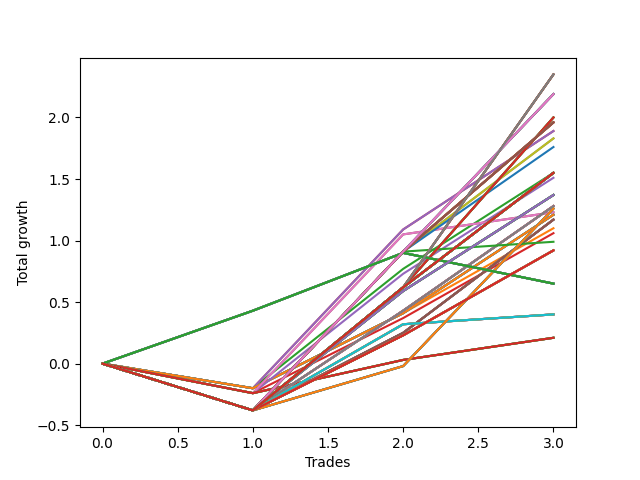

# Short HLT 110 
- Symbol: TSLA
- Date Range: 05/16/2022 - 05/17/2024
- Trading Period: 8:30-12:30
- Number of Trades: 18



| Id. | Name | Win Percent | Profit | Avg Profit / Trade | Avg Time / Trade | Std |      | Name | Win Percent | Profit | Avg Profit / Trade | Avg Time / Trade | Std |
| --- | ---- | ----------- | ------ | ------------------ | ---------------- | --- | ---- | ---- | ----------- | ------ | ------------------ | ---------------- | --- |
| | Sorted By <br> Profit | | | | | | | Sorted By <br> Win Percentage |||||
|0| TP-0.75 90m | 66.67 | 4.46 | 0.25 | 26:13 | 0.75 |     | TP-0.75 90m | 66.67 | 4.46 | 0.25 | 26:13 | 0.75 |
|1| TP-0.75 180m | 66.67 | 4.42 | 0.25 | 26:16 | 0.75 |     | TP-0.75 180m | 66.67 | 4.42 | 0.25 | 26:16 | 0.75 |
|2| TP-0.75 165m | 66.67 | 4.42 | 0.25 | 26:16 | 0.75 |     | TP-0.75 165m | 66.67 | 4.42 | 0.25 | 26:16 | 0.75 |
|3| TP-0.75 150m | 66.67 | 4.42 | 0.25 | 26:16 | 0.75 |     | TP-0.75 150m | 66.67 | 4.42 | 0.25 | 26:16 | 0.75 |
|4| TP-0.75 135m | 66.67 | 4.42 | 0.25 | 26:16 | 0.75 |     | TP-0.75 135m | 66.67 | 4.42 | 0.25 | 26:16 | 0.75 |
|5| TP-0.75 120m | 66.67 | 4.42 | 0.25 | 26:16 | 0.75 |     | TP-0.75 120m | 66.67 | 4.42 | 0.25 | 26:16 | 0.75 |
|6| TP-0.75 105m | 66.67 | 4.42 | 0.25 | 26:16 | 0.75 |     | TP-0.75 105m | 66.67 | 4.42 | 0.25 | 26:16 | 0.75 |
|7| TP-0.75 75m | 61.11 | 3.40 | 0.19 | 25:06 | 0.73 |     | TP-0.75 75m | 61.11 | 3.40 | 0.19 | 25:06 | 0.73 |
|8| TP-1 180m | 61.11 | 3.31 | 0.18 | 39:50 | 0.95 |     | TP-1 180m | 61.11 | 3.31 | 0.18 | 39:50 | 0.95 |
|9| TP-1 165m | 61.11 | 3.31 | 0.18 | 39:50 | 0.95 |     | TP-1 165m | 61.11 | 3.31 | 0.18 | 39:50 | 0.95 |
|10| TP-1 150m | 61.11 | 3.31 | 0.18 | 39:50 | 0.95 |     | TP-1 150m | 61.11 | 3.31 | 0.18 | 39:50 | 0.95 |
|11| TP-1 135m | 61.11 | 3.31 | 0.18 | 39:50 | 0.95 |     | TP-1 135m | 61.11 | 3.31 | 0.18 | 39:50 | 0.95 |
|12| TP-1 120m | 61.11 | 3.31 | 0.18 | 39:50 | 0.95 |     | TP-1 120m | 61.11 | 3.31 | 0.18 | 39:50 | 0.95 |
|13| TP-0.75 60m | 61.11 | 2.93 | 0.16 | 23:26 | 0.74 |     | TP-0.75 60m | 61.11 | 2.93 | 0.16 | 23:26 | 0.74 |
|14| TP-1 105m | 55.56 | 2.71 | 0.15 | 39:00 | 0.95 |     | TP-1 105m | 55.56 | 2.71 | 0.15 | 39:00 | 0.95 |
|15| TP-1 90m | 55.56 | 2.53 | 0.14 | 38:06 | 0.95 |     | TP-1 90m | 55.56 | 2.53 | 0.14 | 38:06 | 0.95 |
|16| TP-0.5 30m | 55.56 | 2.51 | 0.14 | 11:43 | 0.59 |     | TP-0.5 30m | 55.56 | 2.51 | 0.14 | 11:43 | 0.59 |
|17| TP-1.25 180m | 55.56 | 2.16 | 0.12 | 45:10 | 1.15 |     | TP-1.25 180m | 55.56 | 2.16 | 0.12 | 45:10 | 1.15 |
|18| TP-1.25 165m | 55.56 | 2.16 | 0.12 | 45:10 | 1.15 |     | TP-1.25 165m | 55.56 | 2.16 | 0.12 | 45:10 | 1.15 |
|19| TP-1.25 150m | 55.56 | 2.16 | 0.12 | 45:10 | 1.15 |     | TP-1.25 150m | 55.56 | 2.16 | 0.12 | 45:10 | 1.15 |
|20| TP-1.25 135m | 55.56 | 2.16 | 0.12 | 45:10 | 1.15 |     | TP-1.25 135m | 55.56 | 2.16 | 0.12 | 45:10 | 1.15 |
|21| TP-1.25 120m | 55.56 | 2.16 | 0.12 | 45:10 | 1.15 |     | TP-1.25 120m | 55.56 | 2.16 | 0.12 | 45:10 | 1.15 |
|22| TP-0.5 45m | 50.00 | 2.14 | 0.12 | 12:36 | 0.60 |     | TP-1.5 180m | 55.56 | 1.83 | 0.10 | 55:03 | 1.23 |
|23| TP-1.5 180m | 55.56 | 1.83 | 0.10 | 55:03 | 1.23 |     | TP-1.5 165m | 55.56 | 1.83 | 0.10 | 55:03 | 1.23 |
|24| TP-1.5 165m | 55.56 | 1.83 | 0.10 | 55:03 | 1.23 |     | TP-1.5 150m | 55.56 | 1.83 | 0.10 | 55:03 | 1.23 |
|25| TP-1.5 150m | 55.56 | 1.83 | 0.10 | 55:03 | 1.23 |     | TP-1.5 135m | 55.56 | 1.83 | 0.10 | 55:03 | 1.23 |
|26| TP-1.5 135m | 55.56 | 1.83 | 0.10 | 55:03 | 1.23 |     | TP-1.5 120m | 55.56 | 1.83 | 0.10 | 55:03 | 1.23 |
|27| TP-1.5 120m | 55.56 | 1.83 | 0.10 | 55:03 | 1.23 |     | TP-0.75 30m | 55.56 | 1.74 | 0.10 | 17:50 | 0.69 |
|28| TP-0.75 30m | 55.56 | 1.74 | 0.10 | 17:50 | 0.69 |     | TP-1 60m | 55.56 | 1.49 | 0.08 | 33:26 | 0.93 |
|29| TP-0.5 180m | 50.00 | 1.66 | 0.09 | 13:20 | 0.63 |     | TP-1 30m | 55.56 | 1.08 | 0.06 | 22:43 | 0.73 |
|30| TP-0.5 165m | 50.00 | 1.66 | 0.09 | 13:20 | 0.63 |     | TP-0.5 45m | 50.00 | 2.14 | 0.12 | 12:36 | 0.60 |
|31| TP-0.5 150m | 50.00 | 1.66 | 0.09 | 13:20 | 0.63 |     | TP-0.5 180m | 50.00 | 1.66 | 0.09 | 13:20 | 0.63 |
|32| TP-0.5 135m | 50.00 | 1.66 | 0.09 | 13:20 | 0.63 |     | TP-0.5 165m | 50.00 | 1.66 | 0.09 | 13:20 | 0.63 |
|33| TP-0.5 120m | 50.00 | 1.66 | 0.09 | 13:20 | 0.63 |     | TP-0.5 150m | 50.00 | 1.66 | 0.09 | 13:20 | 0.63 |
|34| TP-0.5 105m | 50.00 | 1.66 | 0.09 | 13:20 | 0.63 |     | TP-0.5 135m | 50.00 | 1.66 | 0.09 | 13:20 | 0.63 |
|35| TP-0.5 90m | 50.00 | 1.66 | 0.09 | 13:20 | 0.63 |     | TP-0.5 120m | 50.00 | 1.66 | 0.09 | 13:20 | 0.63 |
|36| TP-0.5 75m | 50.00 | 1.66 | 0.09 | 13:20 | 0.63 |     | TP-0.5 105m | 50.00 | 1.66 | 0.09 | 13:20 | 0.63 |
|37| TP-0.5 60m | 50.00 | 1.66 | 0.09 | 13:20 | 0.63 |     | TP-0.5 90m | 50.00 | 1.66 | 0.09 | 13:20 | 0.63 |
|38| TP-1 75m | 50.00 | 1.63 | 0.09 | 35:56 | 0.92 |     | TP-0.5 75m | 50.00 | 1.66 | 0.09 | 13:20 | 0.63 |
|39| TP-1.25 105m | 50.00 | 1.56 | 0.09 | 44:20 | 1.14 |     | TP-0.5 60m | 50.00 | 1.66 | 0.09 | 13:20 | 0.63 |
|40| TP-0.75 45m | 50.00 | 1.51 | 0.08 | 21:16 | 0.73 |     | TP-1 75m | 50.00 | 1.63 | 0.09 | 35:56 | 0.92 |
|41| TP-1 60m | 55.56 | 1.49 | 0.08 | 33:26 | 0.93 |     | TP-1.25 105m | 50.00 | 1.56 | 0.09 | 44:20 | 1.14 |
|42| TP-1.5 105m | 50.00 | 1.47 | 0.08 | 53:23 | 1.23 |     | TP-0.75 45m | 50.00 | 1.51 | 0.08 | 21:16 | 0.73 |
|43| TP-0.5 15m | 50.00 | 1.43 | 0.08 | 08:56 | 0.54 |     | TP-1.5 105m | 50.00 | 1.47 | 0.08 | 53:23 | 1.23 |
|44| TP-1.25 90m | 50.00 | 1.38 | 0.08 | 43:26 | 1.15 |     | TP-0.5 15m | 50.00 | 1.43 | 0.08 | 08:56 | 0.54 |
|45| TP-1 30m | 55.56 | 1.08 | 0.06 | 22:43 | 0.73 |     | TP-1.25 90m | 50.00 | 1.38 | 0.08 | 43:26 | 1.15 |
|46| TP-1 45m | 44.44 | 0.95 | 0.05 | 29:46 | 0.90 |     | TP-1.5 90m | 50.00 | -0.01 | -0.00 | 50:36 | 1.17 |
|47| TP-1.5 90m | 50.00 | -0.01 | -0.00 | 50:36 | 1.17 |     | TP-0.25 30m | 50.00 | -0.53 | -0.03 | 05:33 | 0.40 |
|48| TP-0.75 15m | 44.44 | -0.32 | -0.02 | 11:20 | 0.64 |     | TP-1.25 60m | 50.00 | -0.66 | -0.04 | 36:46 | 1.06 |
|49| TP-3 45m | 44.44 | -0.36 | -0.02 | 40:03 | 1.15 |     | TP-1.5 60m | 50.00 | -1.03 | -0.06 | 40:33 | 1.13 |
|50| TP-2.75 45m | 44.44 | -0.36 | -0.02 | 40:03 | 1.15 |     | TP-3 30m | 50.00 | -1.75 | -0.10 | 28:00 | 0.64 |
|51| TP-1 15m | 44.44 | -0.48 | -0.03 | 12:36 | 0.68 |     | TP-2.75 30m | 50.00 | -1.75 | -0.10 | 28:00 | 0.64 |
|52| TP-0.25 30m | 50.00 | -0.53 | -0.03 | 05:33 | 0.40 |     | TP-1.25 30m | 50.00 | -2.20 | -0.12 | 24:20 | 0.81 |
|53| TP-0.25 15m | 44.44 | -0.60 | -0.03 | 04:43 | 0.40 |     | TP-1.5 30m | 50.00 | -3.63 | -0.20 | 25:26 | 0.78 |
|54| TP-1.25 60m | 50.00 | -0.66 | -0.04 | 36:46 | 1.06 |     | TP-1.75 180m | 50.00 | -3.98 | -0.22 | 63:00 | 1.23 |
|55| TP-0.25 180m | 44.44 | -0.85 | -0.05 | 05:56 | 0.40 |     | TP-1.75 165m | 50.00 | -3.98 | -0.22 | 63:00 | 1.23 |
|56| TP-0.25 165m | 44.44 | -0.85 | -0.05 | 05:56 | 0.40 |     | TP-1.75 150m | 50.00 | -3.98 | -0.22 | 63:00 | 1.23 |
|57| TP-0.25 150m | 44.44 | -0.85 | -0.05 | 05:56 | 0.40 |     | TP-1.75 135m | 50.00 | -3.98 | -0.22 | 63:00 | 1.23 |
|58| TP-0.25 135m | 44.44 | -0.85 | -0.05 | 05:56 | 0.40 |     | TP-1.75 120m | 50.00 | -3.98 | -0.22 | 63:00 | 1.23 |
|59| TP-0.25 120m | 44.44 | -0.85 | -0.05 | 05:56 | 0.40 |     | TP-2 180m | 50.00 | -4.11 | -0.23 | 63:40 | 1.43 |
|60| TP-0.25 105m | 44.44 | -0.85 | -0.05 | 05:56 | 0.40 |     | TP-2 165m | 50.00 | -4.11 | -0.23 | 63:40 | 1.43 |
|61| TP-0.25 90m | 44.44 | -0.85 | -0.05 | 05:56 | 0.40 |     | TP-2 150m | 50.00 | -4.11 | -0.23 | 63:40 | 1.43 |
|62| TP-0.25 75m | 44.44 | -0.85 | -0.05 | 05:56 | 0.40 |     | TP-2 135m | 50.00 | -4.11 | -0.23 | 63:40 | 1.43 |
|63| TP-0.25 60m | 44.44 | -0.85 | -0.05 | 05:56 | 0.40 |     | TP-2 120m | 50.00 | -4.11 | -0.23 | 63:40 | 1.43 |
|64| TP-0.25 45m | 44.44 | -0.85 | -0.05 | 05:56 | 0.40 |     | TP-2.25 30m | 50.00 | -4.16 | -0.23 | 26:43 | 0.90 |
|65| TP-1.25 75m | 44.44 | -0.96 | -0.05 | 40:23 | 1.06 |     | TP-2.25 180m | 50.00 | -4.19 | -0.23 | 65:43 | 1.49 |
|66| TP-1.25 15m | 44.44 | -0.96 | -0.05 | 13:16 | 0.69 |     | TP-2.25 165m | 50.00 | -4.19 | -0.23 | 65:43 | 1.49 |
|67| TP-1.5 60m | 50.00 | -1.03 | -0.06 | 40:33 | 1.13 |     | TP-2.25 150m | 50.00 | -4.19 | -0.23 | 65:43 | 1.49 |
|68| TP-2.25 45m | 44.44 | -1.37 | -0.08 | 37:06 | 1.24 |     | TP-2.25 135m | 50.00 | -4.19 | -0.23 | 65:43 | 1.49 |
|69| TP-2.5 45m | 44.44 | -1.63 | -0.09 | 37:16 | 1.27 |     | TP-2.25 120m | 50.00 | -4.19 | -0.23 | 65:43 | 1.49 |
|70| TP-1.5 15m | 44.44 | -1.64 | -0.09 | 13:30 | 0.63 |     | TP-2.5 30m | 50.00 | -4.42 | -0.25 | 26:53 | 0.93 |
|71| TP-3 30m | 50.00 | -1.75 | -0.10 | 28:00 | 0.64 |     | TP-1.75 30m | 50.00 | -4.46 | -0.25 | 25:40 | 0.87 |
|72| TP-2.75 30m | 50.00 | -1.75 | -0.10 | 28:00 | 0.64 |     | TP-2.75 180m | 50.00 | -4.99 | -0.28 | 77:36 | 1.41 |
|73| TP-1.5 75m | 44.44 | -1.90 | -0.11 | 45:36 | 1.09 |     | TP-2.75 165m | 50.00 | -4.99 | -0.28 | 77:36 | 1.41 |
|74| TP-1.25 45m | 38.89 | -2.00 | -0.11 | 31:40 | 1.03 |     | TP-2.75 150m | 50.00 | -4.99 | -0.28 | 77:36 | 1.41 |
|75| TP-1.75 15m | 44.44 | -2.04 | -0.11 | 13:40 | 0.69 |     | TP-2.75 135m | 50.00 | -4.99 | -0.28 | 77:36 | 1.41 |
|76| TP-3 15m | 44.44 | -2.16 | -0.12 | 14:00 | 0.71 |     | TP-2.75 120m | 50.00 | -4.99 | -0.28 | 77:36 | 1.41 |
|77| TP-2.75 15m | 44.44 | -2.16 | -0.12 | 14:00 | 0.71 |     | TP-3 180m | 50.00 | -5.23 | -0.29 | 79:30 | 1.45 |
|78| TP-1.25 30m | 50.00 | -2.20 | -0.12 | 24:20 | 0.81 |     | TP-3 165m | 50.00 | -5.23 | -0.29 | 79:30 | 1.45 |
|79| TP-2.5 15m | 44.44 | -2.64 | -0.15 | 13:50 | 0.79 |     | TP-3 150m | 50.00 | -5.23 | -0.29 | 79:30 | 1.45 |
|80| TP-2.25 15m | 44.44 | -2.64 | -0.15 | 13:50 | 0.79 |     | TP-3 135m | 50.00 | -5.23 | -0.29 | 79:30 | 1.45 |
|81| TP-2 15m | 44.44 | -2.64 | -0.15 | 13:50 | 0.79 |     | TP-3 120m | 50.00 | -5.23 | -0.29 | 79:30 | 1.45 |
|82| TP-2.75 90m | 44.44 | -2.84 | -0.16 | 67:53 | 1.41 |     | TP-2 30m | 50.00 | -5.40 | -0.30 | 26:00 | 0.98 |
|83| TP-1.5 45m | 38.89 | -2.96 | -0.16 | 34:06 | 1.05 |     | TP-2.5 180m | 50.00 | -7.09 | -0.39 | 68:50 | 1.46 |
|84| TP-3 105m | 44.44 | -3.23 | -0.18 | 74:43 | 1.42 |     | TP-2.5 165m | 50.00 | -7.09 | -0.39 | 68:50 | 1.46 |
|85| TP-1.75 105m | 44.44 | -3.36 | -0.19 | 59:40 | 1.29 |     | TP-2.5 150m | 50.00 | -7.09 | -0.39 | 68:50 | 1.46 |
|86| TP-3 90m | 44.44 | -3.39 | -0.19 | 68:06 | 1.48 |     | TP-2.5 135m | 50.00 | -7.09 | -0.39 | 68:50 | 1.46 |
|87| TP-2 105m | 44.44 | -3.49 | -0.19 | 60:20 | 1.47 |     | TP-2.5 120m | 50.00 | -7.09 | -0.39 | 68:50 | 1.46 |
|88| TP-2.25 105m | 44.44 | -3.57 | -0.20 | 62:23 | 1.54 |     | TP-1 45m | 44.44 | 0.95 | 0.05 | 29:46 | 0.90 |
|89| TP-2.75 105m | 44.44 | -3.58 | -0.20 | 73:40 | 1.42 |     | TP-0.75 15m | 44.44 | -0.32 | -0.02 | 11:20 | 0.64 |
|90| TP-1.5 30m | 50.00 | -3.63 | -0.20 | 25:26 | 0.78 |     | TP-3 45m | 44.44 | -0.36 | -0.02 | 40:03 | 1.15 |
|91| TP-1.75 90m | 44.44 | -3.67 | -0.20 | 55:20 | 1.23 |     | TP-2.75 45m | 44.44 | -0.36 | -0.02 | 40:03 | 1.15 |
|92| TP-2 90m | 44.44 | -3.80 | -0.21 | 56:00 | 1.42 |     | TP-1 15m | 44.44 | -0.48 | -0.03 | 12:36 | 0.68 |
|93| TP-2.25 90m | 44.44 | -3.88 | -0.22 | 58:03 | 1.49 |     | TP-0.25 15m | 44.44 | -0.60 | -0.03 | 04:43 | 0.40 |
|94| TP-1.75 180m | 50.00 | -3.98 | -0.22 | 63:00 | 1.23 |     | TP-0.25 180m | 44.44 | -0.85 | -0.05 | 05:56 | 0.40 |
|95| TP-1.75 165m | 50.00 | -3.98 | -0.22 | 63:00 | 1.23 |     | TP-0.25 165m | 44.44 | -0.85 | -0.05 | 05:56 | 0.40 |
|96| TP-1.75 150m | 50.00 | -3.98 | -0.22 | 63:00 | 1.23 |     | TP-0.25 150m | 44.44 | -0.85 | -0.05 | 05:56 | 0.40 |
|97| TP-1.75 135m | 50.00 | -3.98 | -0.22 | 63:00 | 1.23 |     | TP-0.25 135m | 44.44 | -0.85 | -0.05 | 05:56 | 0.40 |
|98| TP-1.75 120m | 50.00 | -3.98 | -0.22 | 63:00 | 1.23 |     | TP-0.25 120m | 44.44 | -0.85 | -0.05 | 05:56 | 0.40 |
|99| TP-2 180m | 50.00 | -4.11 | -0.23 | 63:40 | 1.43 |     | TP-0.25 105m | 44.44 | -0.85 | -0.05 | 05:56 | 0.40 |
|100| TP-2 165m | 50.00 | -4.11 | -0.23 | 63:40 | 1.43 |     | TP-0.25 90m | 44.44 | -0.85 | -0.05 | 05:56 | 0.40 |
|101| TP-2 150m | 50.00 | -4.11 | -0.23 | 63:40 | 1.43 |     | TP-0.25 75m | 44.44 | -0.85 | -0.05 | 05:56 | 0.40 |
|102| TP-2 135m | 50.00 | -4.11 | -0.23 | 63:40 | 1.43 |     | TP-0.25 60m | 44.44 | -0.85 | -0.05 | 05:56 | 0.40 |
|103| TP-2 120m | 50.00 | -4.11 | -0.23 | 63:40 | 1.43 |     | TP-0.25 45m | 44.44 | -0.85 | -0.05 | 05:56 | 0.40 |
|104| TP-2.25 30m | 50.00 | -4.16 | -0.23 | 26:43 | 0.90 |     | TP-1.25 75m | 44.44 | -0.96 | -0.05 | 40:23 | 1.06 |
|105| TP-2.25 180m | 50.00 | -4.19 | -0.23 | 65:43 | 1.49 |     | TP-1.25 15m | 44.44 | -0.96 | -0.05 | 13:16 | 0.69 |
|106| TP-2.25 165m | 50.00 | -4.19 | -0.23 | 65:43 | 1.49 |     | TP-2.25 45m | 44.44 | -1.37 | -0.08 | 37:06 | 1.24 |
|107| TP-2.25 150m | 50.00 | -4.19 | -0.23 | 65:43 | 1.49 |     | TP-2.5 45m | 44.44 | -1.63 | -0.09 | 37:16 | 1.27 |
|108| TP-2.25 135m | 50.00 | -4.19 | -0.23 | 65:43 | 1.49 |     | TP-1.5 15m | 44.44 | -1.64 | -0.09 | 13:30 | 0.63 |
|109| TP-2.25 120m | 50.00 | -4.19 | -0.23 | 65:43 | 1.49 |     | TP-1.5 75m | 44.44 | -1.90 | -0.11 | 45:36 | 1.09 |
|110| TP-2.5 30m | 50.00 | -4.42 | -0.25 | 26:53 | 0.93 |     | TP-1.75 15m | 44.44 | -2.04 | -0.11 | 13:40 | 0.69 |
|111| TP-1.75 30m | 50.00 | -4.46 | -0.25 | 25:40 | 0.87 |     | TP-3 15m | 44.44 | -2.16 | -0.12 | 14:00 | 0.71 |
|112| TP-2.75 75m | 38.89 | -4.49 | -0.25 | 59:40 | 1.25 |     | TP-2.75 15m | 44.44 | -2.16 | -0.12 | 14:00 | 0.71 |
|113| TP-1.75 45m | 38.89 | -4.54 | -0.25 | 35:13 | 1.11 |     | TP-2.5 15m | 44.44 | -2.64 | -0.15 | 13:50 | 0.79 |
|114| TP-1.75 60m | 44.44 | -4.75 | -0.26 | 43:13 | 1.09 |     | TP-2.25 15m | 44.44 | -2.64 | -0.15 | 13:50 | 0.79 |
|115| TP-2.75 60m | 44.44 | -4.83 | -0.27 | 50:33 | 1.18 |     | TP-2 15m | 44.44 | -2.64 | -0.15 | 13:50 | 0.79 |
|116| TP-2.75 180m | 50.00 | -4.99 | -0.28 | 77:36 | 1.41 |     | TP-2.75 90m | 44.44 | -2.84 | -0.16 | 67:53 | 1.41 |
|117| TP-2.75 165m | 50.00 | -4.99 | -0.28 | 77:36 | 1.41 |     | TP-3 105m | 44.44 | -3.23 | -0.18 | 74:43 | 1.42 |
|118| TP-2.75 150m | 50.00 | -4.99 | -0.28 | 77:36 | 1.41 |     | TP-1.75 105m | 44.44 | -3.36 | -0.19 | 59:40 | 1.29 |
|119| TP-2.75 135m | 50.00 | -4.99 | -0.28 | 77:36 | 1.41 |     | TP-3 90m | 44.44 | -3.39 | -0.19 | 68:06 | 1.48 |
|120| TP-2.75 120m | 50.00 | -4.99 | -0.28 | 77:36 | 1.41 |     | TP-2 105m | 44.44 | -3.49 | -0.19 | 60:20 | 1.47 |
|121| TP-3 75m | 38.89 | -5.11 | -0.28 | 59:46 | 1.32 |     | TP-2.25 105m | 44.44 | -3.57 | -0.20 | 62:23 | 1.54 |
|122| TP-3 180m | 50.00 | -5.23 | -0.29 | 79:30 | 1.45 |     | TP-2.75 105m | 44.44 | -3.58 | -0.20 | 73:40 | 1.42 |
|123| TP-3 165m | 50.00 | -5.23 | -0.29 | 79:30 | 1.45 |     | TP-1.75 90m | 44.44 | -3.67 | -0.20 | 55:20 | 1.23 |
|124| TP-3 150m | 50.00 | -5.23 | -0.29 | 79:30 | 1.45 |     | TP-2 90m | 44.44 | -3.80 | -0.21 | 56:00 | 1.42 |
|125| TP-3 135m | 50.00 | -5.23 | -0.29 | 79:30 | 1.45 |     | TP-2.25 90m | 44.44 | -3.88 | -0.22 | 58:03 | 1.49 |
|126| TP-3 120m | 50.00 | -5.23 | -0.29 | 79:30 | 1.45 |     | TP-1.75 60m | 44.44 | -4.75 | -0.26 | 43:13 | 1.09 |
|127| TP-2 30m | 50.00 | -5.40 | -0.30 | 26:00 | 0.98 |     | TP-2.75 60m | 44.44 | -4.83 | -0.27 | 50:33 | 1.18 |
|128| TP-3 60m | 44.44 | -5.45 | -0.30 | 50:40 | 1.26 |     | TP-3 60m | 44.44 | -5.45 | -0.30 | 50:40 | 1.26 |
|129| TP-2 45m | 38.89 | -5.48 | -0.30 | 35:33 | 1.20 |     | TP-2 60m | 44.44 | -5.59 | -0.31 | 43:46 | 1.23 |
|130| TP-2 60m | 44.44 | -5.59 | -0.31 | 43:46 | 1.23 |     | TP-2.25 60m | 44.44 | -5.67 | -0.32 | 45:50 | 1.30 |
|131| TP-2.25 60m | 44.44 | -5.67 | -0.32 | 45:50 | 1.30 |     | TP-2.5 90m | 44.44 | -5.87 | -0.33 | 60:33 | 1.51 |
|132| TP-2.5 90m | 44.44 | -5.87 | -0.33 | 60:33 | 1.51 |     | TP-2.5 105m | 44.44 | -6.47 | -0.36 | 65:30 | 1.51 |
|133| TP-1.75 75m | 38.89 | -5.87 | -0.33 | 49:30 | 1.16 |     | TP-2.5 60m | 44.44 | -7.16 | -0.40 | 46:33 | 1.36 |
|134| TP-2 75m | 38.89 | -6.00 | -0.33 | 50:10 | 1.36 |     | TP-1.25 45m | 38.89 | -2.00 | -0.11 | 31:40 | 1.03 |
|135| TP-2.25 75m | 38.89 | -6.08 | -0.34 | 52:13 | 1.43 |     | TP-1.5 45m | 38.89 | -2.96 | -0.16 | 34:06 | 1.05 |
|136| TP-2.5 105m | 44.44 | -6.47 | -0.36 | 65:30 | 1.51 |     | TP-2.75 75m | 38.89 | -4.49 | -0.25 | 59:40 | 1.25 |
|137| TP-2.5 180m | 50.00 | -7.09 | -0.39 | 68:50 | 1.46 |     | TP-1.75 45m | 38.89 | -4.54 | -0.25 | 35:13 | 1.11 |
|138| TP-2.5 165m | 50.00 | -7.09 | -0.39 | 68:50 | 1.46 |     | TP-3 75m | 38.89 | -5.11 | -0.28 | 59:46 | 1.32 |
|139| TP-2.5 150m | 50.00 | -7.09 | -0.39 | 68:50 | 1.46 |     | TP-2 45m | 38.89 | -5.48 | -0.30 | 35:33 | 1.20 |
|140| TP-2.5 135m | 50.00 | -7.09 | -0.39 | 68:50 | 1.46 |     | TP-1.75 75m | 38.89 | -5.87 | -0.33 | 49:30 | 1.16 |
|141| TP-2.5 120m | 50.00 | -7.09 | -0.39 | 68:50 | 1.46 |     | TP-2 75m | 38.89 | -6.00 | -0.33 | 50:10 | 1.36 |
|142| TP-2.5 60m | 44.44 | -7.16 | -0.40 | 46:33 | 1.36 |     | TP-2.25 75m | 38.89 | -6.08 | -0.34 | 52:13 | 1.43 |
|143| TP-2.5 75m | 38.89 | -8.39 | -0.47 | 53:53 | 1.41 |     | TP-2.5 75m | 38.89 | -8.39 | -0.47 | 53:53 | 1.41 |

### Test TP-0.25 15m
* Take Profit of 0.25 Point
* 0.25 Stoploss
* Results:
```
Total Trades: 18
Percent Up: 55.56
Percent Down: 44.44
Total Points Moved Down: -0.60
Potential Profit: -300.00
Total Points Ups: 3.65 Count Ups: 10
Total Points Downs: 3.05 Count Downs: 8
```

<details><summary>Trades</summary>

<code>In: 2022-07-28 12:15:00		Out: 2022-07-28 12:20:00		Total Position Time: 05:00		Total Move Down: -0.26		Total to Date: -0.26</code> <br />
<code>In: 2022-08-10 11:15:00		Out: 2022-08-10 11:22:00		Total Position Time: 07:00		Total Move Down: -0.54		Total to Date: -0.80</code> <br />
<code>In: 2022-08-12 08:55:00		Out: 2022-08-12 08:57:00		Total Position Time: 02:00		Total Move Down: -0.57		Total to Date: -1.37</code> <br />
<code>In: 2022-09-06 12:05:00		Out: 2022-09-06 12:07:00		Total Position Time: 02:00		Total Move Down: -0.59		Total to Date: -1.96</code> <br />
<code>In: 2023-01-23 11:10:00		Out: 2023-01-23 11:15:00		Total Position Time: 05:00		Total Move Down: -0.42		Total to Date: -2.38</code> <br />
<code>In: 2023-02-01 10:50:00		Out: 2023-02-01 11:00:00		Total Position Time: 10:00		Total Move Down: 0.49		Total to Date: -1.89</code> <br />
<code>In: 2023-02-08 11:50:00		Out: 2023-02-08 11:52:00		Total Position Time: 02:00		Total Move Down: -0.45		Total to Date: -2.34</code> <br />
<code>In: 2023-05-05 11:20:00		Out: 2023-05-05 11:34:00		Total Position Time: 14:00		Total Move Down: -0.02		Total to Date: -2.36</code> <br />
<code>In: 2023-05-18 09:05:00		Out: 2023-05-18 09:07:00		Total Position Time: 02:00		Total Move Down: 0.29		Total to Date: -2.07</code> <br />
<code>In: 2023-07-17 12:30:00		Out: 2023-07-17 12:33:00		Total Position Time: 03:00		Total Move Down: 0.24		Total to Date: -1.83</code> <br />
<code>In: 2023-08-03 10:55:00		Out: 2023-08-03 10:57:00		Total Position Time: 02:00		Total Move Down: 0.32		Total to Date: -1.51</code> <br />
<code>In: 2023-08-30 09:45:00		Out: 2023-08-30 09:48:00		Total Position Time: 03:00		Total Move Down: 0.41		Total to Date: -1.10</code> <br />
<code>In: 2023-09-14 12:30:00		Out: 2023-09-14 12:43:00		Total Position Time: 13:00		Total Move Down: -0.31		Total to Date: -1.41</code> <br />
<code>In: 2023-11-27 10:25:00		Out: 2023-11-27 10:30:00		Total Position Time: 05:00		Total Move Down: -0.24		Total to Date: -1.65</code> <br />
<code>In: 2023-12-15 09:50:00		Out: 2023-12-15 09:53:00		Total Position Time: 03:00		Total Move Down: 0.40		Total to Date: -1.25</code> <br />
<code>In: 2024-01-19 12:20:00		Out: 2024-01-19 12:22:00		Total Position Time: 02:00		Total Move Down: 0.43		Total to Date: -0.82</code> <br />
<code>In: 2024-02-07 11:10:00		Out: 2024-02-07 11:13:00		Total Position Time: 03:00		Total Move Down: 0.47		Total to Date: -0.35</code> <br />
<code>In: 2024-03-18 08:35:00		Out: 2024-03-18 08:37:00		Total Position Time: 02:00		Total Move Down: -0.25		Total to Date: -0.60</code> <br />


</details>

### Test TP-0.5 15m
* Take Profit of 0.5 Point
* 0.5 Stoploss
* Results:
```
Total Trades: 18
Percent Up: 50.00
Percent Down: 50.00
Total Points Moved Down: 1.43
Potential Profit: 715.00
Total Points Ups: 3.58 Count Ups: 9
Total Points Downs: 5.01 Count Downs: 9
```

<details><summary>Trades</summary>

<code>In: 2022-07-28 12:15:00		Out: 2022-07-28 12:22:00		Total Position Time: 07:00		Total Move Down: -0.55		Total to Date: -0.55</code> <br />
<code>In: 2022-08-10 11:15:00		Out: 2022-08-10 11:22:00		Total Position Time: 07:00		Total Move Down: -0.54		Total to Date: -1.09</code> <br />
<code>In: 2022-08-12 08:55:00		Out: 2022-08-12 08:57:00		Total Position Time: 02:00		Total Move Down: -0.57		Total to Date: -1.66</code> <br />
<code>In: 2022-09-06 12:05:00		Out: 2022-09-06 12:07:00		Total Position Time: 02:00		Total Move Down: -0.59		Total to Date: -2.25</code> <br />
<code>In: 2023-01-23 11:10:00		Out: 2023-01-23 11:24:00		Total Position Time: 14:00		Total Move Down: 0.06		Total to Date: -2.19</code> <br />
<code>In: 2023-02-01 10:50:00		Out: 2023-02-01 11:01:00		Total Position Time: 11:00		Total Move Down: 1.02		Total to Date: -1.17</code> <br />
<code>In: 2023-02-08 11:50:00		Out: 2023-02-08 11:53:00		Total Position Time: 03:00		Total Move Down: -0.49		Total to Date: -1.66</code> <br />
<code>In: 2023-05-05 11:20:00		Out: 2023-05-05 11:34:00		Total Position Time: 14:00		Total Move Down: -0.02		Total to Date: -1.68</code> <br />
<code>In: 2023-05-18 09:05:00		Out: 2023-05-18 09:15:00		Total Position Time: 10:00		Total Move Down: 0.70		Total to Date: -0.98</code> <br />
<code>In: 2023-07-17 12:30:00		Out: 2023-07-17 12:36:00		Total Position Time: 06:00		Total Move Down: -0.50		Total to Date: -1.48</code> <br />
<code>In: 2023-08-03 10:55:00		Out: 2023-08-03 11:09:00		Total Position Time: 14:00		Total Move Down: 0.46		Total to Date: -1.02</code> <br />
<code>In: 2023-08-30 09:45:00		Out: 2023-08-30 09:54:00		Total Position Time: 09:00		Total Move Down: 0.82		Total to Date: -0.20</code> <br />
<code>In: 2023-09-14 12:30:00		Out: 2023-09-14 12:44:00		Total Position Time: 14:00		Total Move Down: -0.12		Total to Date: -0.32</code> <br />
<code>In: 2023-11-27 10:25:00		Out: 2023-11-27 10:39:00		Total Position Time: 14:00		Total Move Down: 0.13		Total to Date: -0.19</code> <br />
<code>In: 2023-12-15 09:50:00		Out: 2023-12-15 09:59:00		Total Position Time: 09:00		Total Move Down: 0.52		Total to Date: 0.33</code> <br />
<code>In: 2024-01-19 12:20:00		Out: 2024-01-19 12:34:00		Total Position Time: 14:00		Total Move Down: -0.20		Total to Date: 0.13</code> <br />
<code>In: 2024-02-07 11:10:00		Out: 2024-02-07 11:14:00		Total Position Time: 04:00		Total Move Down: 0.61		Total to Date: 0.74</code> <br />
<code>In: 2024-03-18 08:35:00		Out: 2024-03-18 08:42:00		Total Position Time: 07:00		Total Move Down: 0.69		Total to Date: 1.43</code> <br />


</details>

### Test TP-0.75 15m
* Take Profit of 0.75 Point
* 0.75 Stoploss
* Results:
```
Total Trades: 18
Percent Up: 55.56
Percent Down: 44.44
Total Points Moved Down: -0.32
Potential Profit: -160.00
Total Points Ups: 4.82 Count Ups: 10
Total Points Downs: 4.50 Count Downs: 8
```

<details><summary>Trades</summary>

<code>In: 2022-07-28 12:15:00		Out: 2022-07-28 12:29:00		Total Position Time: 14:00		Total Move Down: -0.65		Total to Date: -0.65</code> <br />
<code>In: 2022-08-10 11:15:00		Out: 2022-08-10 11:24:00		Total Position Time: 09:00		Total Move Down: -0.81		Total to Date: -1.46</code> <br />
<code>In: 2022-08-12 08:55:00		Out: 2022-08-12 09:02:00		Total Position Time: 07:00		Total Move Down: -0.87		Total to Date: -2.33</code> <br />
<code>In: 2022-09-06 12:05:00		Out: 2022-09-06 12:09:00		Total Position Time: 04:00		Total Move Down: -1.15		Total to Date: -3.48</code> <br />
<code>In: 2023-01-23 11:10:00		Out: 2023-01-23 11:24:00		Total Position Time: 14:00		Total Move Down: 0.06		Total to Date: -3.42</code> <br />
<code>In: 2023-02-01 10:50:00		Out: 2023-02-01 11:01:00		Total Position Time: 11:00		Total Move Down: 1.02		Total to Date: -2.40</code> <br />
<code>In: 2023-02-08 11:50:00		Out: 2023-02-08 12:04:00		Total Position Time: 14:00		Total Move Down: -0.03		Total to Date: -2.43</code> <br />
<code>In: 2023-05-05 11:20:00		Out: 2023-05-05 11:34:00		Total Position Time: 14:00		Total Move Down: -0.02		Total to Date: -2.45</code> <br />
<code>In: 2023-05-18 09:05:00		Out: 2023-05-18 09:19:00		Total Position Time: 14:00		Total Move Down: 0.26		Total to Date: -2.19</code> <br />
<code>In: 2023-07-17 12:30:00		Out: 2023-07-17 12:38:00		Total Position Time: 08:00		Total Move Down: -0.75		Total to Date: -2.94</code> <br />
<code>In: 2023-08-03 10:55:00		Out: 2023-08-03 11:09:00		Total Position Time: 14:00		Total Move Down: 0.46		Total to Date: -2.48</code> <br />
<code>In: 2023-08-30 09:45:00		Out: 2023-08-30 09:54:00		Total Position Time: 09:00		Total Move Down: 0.82		Total to Date: -1.66</code> <br />
<code>In: 2023-09-14 12:30:00		Out: 2023-09-14 12:44:00		Total Position Time: 14:00		Total Move Down: -0.12		Total to Date: -1.78</code> <br />
<code>In: 2023-11-27 10:25:00		Out: 2023-11-27 10:39:00		Total Position Time: 14:00		Total Move Down: 0.13		Total to Date: -1.65</code> <br />
<code>In: 2023-12-15 09:50:00		Out: 2023-12-15 10:04:00		Total Position Time: 14:00		Total Move Down: -0.22		Total to Date: -1.87</code> <br />
<code>In: 2024-01-19 12:20:00		Out: 2024-01-19 12:34:00		Total Position Time: 14:00		Total Move Down: -0.20		Total to Date: -2.07</code> <br />
<code>In: 2024-02-07 11:10:00		Out: 2024-02-07 11:18:00		Total Position Time: 08:00		Total Move Down: 0.97		Total to Date: -1.10</code> <br />
<code>In: 2024-03-18 08:35:00		Out: 2024-03-18 08:43:00		Total Position Time: 08:00		Total Move Down: 0.78		Total to Date: -0.32</code> <br />


</details>

### Test TP-1 15m
* Take Profit of 1 Point
* 1 Stoploss
* Results:
```
Total Trades: 18
Percent Up: 55.56
Percent Down: 44.44
Total Points Moved Down: -0.48
Potential Profit: -240.00
Total Points Ups: 4.95 Count Ups: 10
Total Points Downs: 4.47 Count Downs: 8
```

<details><summary>Trades</summary>

<code>In: 2022-07-28 12:15:00		Out: 2022-07-28 12:29:00		Total Position Time: 14:00		Total Move Down: -0.65		Total to Date: -0.65</code> <br />
<code>In: 2022-08-10 11:15:00		Out: 2022-08-10 11:29:00		Total Position Time: 14:00		Total Move Down: -0.34		Total to Date: -0.99</code> <br />
<code>In: 2022-08-12 08:55:00		Out: 2022-08-12 09:03:00		Total Position Time: 08:00		Total Move Down: -1.09		Total to Date: -2.08</code> <br />
<code>In: 2022-09-06 12:05:00		Out: 2022-09-06 12:09:00		Total Position Time: 04:00		Total Move Down: -1.15		Total to Date: -3.23</code> <br />
<code>In: 2023-01-23 11:10:00		Out: 2023-01-23 11:24:00		Total Position Time: 14:00		Total Move Down: 0.06		Total to Date: -3.17</code> <br />
<code>In: 2023-02-01 10:50:00		Out: 2023-02-01 11:01:00		Total Position Time: 11:00		Total Move Down: 1.02		Total to Date: -2.15</code> <br />
<code>In: 2023-02-08 11:50:00		Out: 2023-02-08 12:04:00		Total Position Time: 14:00		Total Move Down: -0.03		Total to Date: -2.18</code> <br />
<code>In: 2023-05-05 11:20:00		Out: 2023-05-05 11:34:00		Total Position Time: 14:00		Total Move Down: -0.02		Total to Date: -2.20</code> <br />
<code>In: 2023-05-18 09:05:00		Out: 2023-05-18 09:19:00		Total Position Time: 14:00		Total Move Down: 0.26		Total to Date: -1.94</code> <br />
<code>In: 2023-07-17 12:30:00		Out: 2023-07-17 12:42:00		Total Position Time: 12:00		Total Move Down: -1.13		Total to Date: -3.07</code> <br />
<code>In: 2023-08-03 10:55:00		Out: 2023-08-03 11:09:00		Total Position Time: 14:00		Total Move Down: 0.46		Total to Date: -2.61</code> <br />
<code>In: 2023-08-30 09:45:00		Out: 2023-08-30 09:59:00		Total Position Time: 14:00		Total Move Down: 0.45		Total to Date: -2.16</code> <br />
<code>In: 2023-09-14 12:30:00		Out: 2023-09-14 12:44:00		Total Position Time: 14:00		Total Move Down: -0.12		Total to Date: -2.28</code> <br />
<code>In: 2023-11-27 10:25:00		Out: 2023-11-27 10:39:00		Total Position Time: 14:00		Total Move Down: 0.13		Total to Date: -2.15</code> <br />
<code>In: 2023-12-15 09:50:00		Out: 2023-12-15 10:04:00		Total Position Time: 14:00		Total Move Down: -0.22		Total to Date: -2.37</code> <br />
<code>In: 2024-01-19 12:20:00		Out: 2024-01-19 12:34:00		Total Position Time: 14:00		Total Move Down: -0.20		Total to Date: -2.57</code> <br />
<code>In: 2024-02-07 11:10:00		Out: 2024-02-07 11:20:00		Total Position Time: 10:00		Total Move Down: 1.29		Total to Date: -1.28</code> <br />
<code>In: 2024-03-18 08:35:00		Out: 2024-03-18 08:49:00		Total Position Time: 14:00		Total Move Down: 0.80		Total to Date: -0.48</code> <br />


</details>

### Test TP-1.25 15m
* Take Profit of 1.25 Point
* 1.25 Stoploss
* Results:
```
Total Trades: 18
Percent Up: 55.56
Percent Down: 44.44
Total Points Moved Down: -0.96
Potential Profit: -480.00
Total Points Ups: 5.19 Count Ups: 10
Total Points Downs: 4.23 Count Downs: 8
```

<details><summary>Trades</summary>

<code>In: 2022-07-28 12:15:00		Out: 2022-07-28 12:29:00		Total Position Time: 14:00		Total Move Down: -0.65		Total to Date: -0.65</code> <br />
<code>In: 2022-08-10 11:15:00		Out: 2022-08-10 11:29:00		Total Position Time: 14:00		Total Move Down: -0.34		Total to Date: -0.99</code> <br />
<code>In: 2022-08-12 08:55:00		Out: 2022-08-12 09:09:00		Total Position Time: 14:00		Total Move Down: -1.10		Total to Date: -2.09</code> <br />
<code>In: 2022-09-06 12:05:00		Out: 2022-09-06 12:10:00		Total Position Time: 05:00		Total Move Down: -1.59		Total to Date: -3.68</code> <br />
<code>In: 2023-01-23 11:10:00		Out: 2023-01-23 11:24:00		Total Position Time: 14:00		Total Move Down: 0.06		Total to Date: -3.62</code> <br />
<code>In: 2023-02-01 10:50:00		Out: 2023-02-01 11:04:00		Total Position Time: 14:00		Total Move Down: 0.78		Total to Date: -2.84</code> <br />
<code>In: 2023-02-08 11:50:00		Out: 2023-02-08 12:04:00		Total Position Time: 14:00		Total Move Down: -0.03		Total to Date: -2.87</code> <br />
<code>In: 2023-05-05 11:20:00		Out: 2023-05-05 11:34:00		Total Position Time: 14:00		Total Move Down: -0.02		Total to Date: -2.89</code> <br />
<code>In: 2023-05-18 09:05:00		Out: 2023-05-18 09:19:00		Total Position Time: 14:00		Total Move Down: 0.26		Total to Date: -2.63</code> <br />
<code>In: 2023-07-17 12:30:00		Out: 2023-07-17 12:44:00		Total Position Time: 14:00		Total Move Down: -0.92		Total to Date: -3.55</code> <br />
<code>In: 2023-08-03 10:55:00		Out: 2023-08-03 11:09:00		Total Position Time: 14:00		Total Move Down: 0.46		Total to Date: -3.09</code> <br />
<code>In: 2023-08-30 09:45:00		Out: 2023-08-30 09:59:00		Total Position Time: 14:00		Total Move Down: 0.45		Total to Date: -2.64</code> <br />
<code>In: 2023-09-14 12:30:00		Out: 2023-09-14 12:44:00		Total Position Time: 14:00		Total Move Down: -0.12		Total to Date: -2.76</code> <br />
<code>In: 2023-11-27 10:25:00		Out: 2023-11-27 10:39:00		Total Position Time: 14:00		Total Move Down: 0.13		Total to Date: -2.63</code> <br />
<code>In: 2023-12-15 09:50:00		Out: 2023-12-15 10:04:00		Total Position Time: 14:00		Total Move Down: -0.22		Total to Date: -2.85</code> <br />
<code>In: 2024-01-19 12:20:00		Out: 2024-01-19 12:34:00		Total Position Time: 14:00		Total Move Down: -0.20		Total to Date: -3.05</code> <br />
<code>In: 2024-02-07 11:10:00		Out: 2024-02-07 11:20:00		Total Position Time: 10:00		Total Move Down: 1.29		Total to Date: -1.76</code> <br />
<code>In: 2024-03-18 08:35:00		Out: 2024-03-18 08:49:00		Total Position Time: 14:00		Total Move Down: 0.80		Total to Date: -0.96</code> <br />


</details>

### Test TP-1.5 15m
* Take Profit of 1.5 Point
* 1.5 Stoploss
* Results:
```
Total Trades: 18
Percent Up: 55.56
Percent Down: 44.44
Total Points Moved Down: -1.64
Potential Profit: -820.00
Total Points Ups: 5.19 Count Ups: 10
Total Points Downs: 3.55 Count Downs: 8
```

<details><summary>Trades</summary>

<code>In: 2022-07-28 12:15:00		Out: 2022-07-28 12:29:00		Total Position Time: 14:00		Total Move Down: -0.65		Total to Date: -0.65</code> <br />
<code>In: 2022-08-10 11:15:00		Out: 2022-08-10 11:29:00		Total Position Time: 14:00		Total Move Down: -0.34		Total to Date: -0.99</code> <br />
<code>In: 2022-08-12 08:55:00		Out: 2022-08-12 09:09:00		Total Position Time: 14:00		Total Move Down: -1.10		Total to Date: -2.09</code> <br />
<code>In: 2022-09-06 12:05:00		Out: 2022-09-06 12:10:00		Total Position Time: 05:00		Total Move Down: -1.59		Total to Date: -3.68</code> <br />
<code>In: 2023-01-23 11:10:00		Out: 2023-01-23 11:24:00		Total Position Time: 14:00		Total Move Down: 0.06		Total to Date: -3.62</code> <br />
<code>In: 2023-02-01 10:50:00		Out: 2023-02-01 11:04:00		Total Position Time: 14:00		Total Move Down: 0.78		Total to Date: -2.84</code> <br />
<code>In: 2023-02-08 11:50:00		Out: 2023-02-08 12:04:00		Total Position Time: 14:00		Total Move Down: -0.03		Total to Date: -2.87</code> <br />
<code>In: 2023-05-05 11:20:00		Out: 2023-05-05 11:34:00		Total Position Time: 14:00		Total Move Down: -0.02		Total to Date: -2.89</code> <br />
<code>In: 2023-05-18 09:05:00		Out: 2023-05-18 09:19:00		Total Position Time: 14:00		Total Move Down: 0.26		Total to Date: -2.63</code> <br />
<code>In: 2023-07-17 12:30:00		Out: 2023-07-17 12:44:00		Total Position Time: 14:00		Total Move Down: -0.92		Total to Date: -3.55</code> <br />
<code>In: 2023-08-03 10:55:00		Out: 2023-08-03 11:09:00		Total Position Time: 14:00		Total Move Down: 0.46		Total to Date: -3.09</code> <br />
<code>In: 2023-08-30 09:45:00		Out: 2023-08-30 09:59:00		Total Position Time: 14:00		Total Move Down: 0.45		Total to Date: -2.64</code> <br />
<code>In: 2023-09-14 12:30:00		Out: 2023-09-14 12:44:00		Total Position Time: 14:00		Total Move Down: -0.12		Total to Date: -2.76</code> <br />
<code>In: 2023-11-27 10:25:00		Out: 2023-11-27 10:39:00		Total Position Time: 14:00		Total Move Down: 0.13		Total to Date: -2.63</code> <br />
<code>In: 2023-12-15 09:50:00		Out: 2023-12-15 10:04:00		Total Position Time: 14:00		Total Move Down: -0.22		Total to Date: -2.85</code> <br />
<code>In: 2024-01-19 12:20:00		Out: 2024-01-19 12:34:00		Total Position Time: 14:00		Total Move Down: -0.20		Total to Date: -3.05</code> <br />
<code>In: 2024-02-07 11:10:00		Out: 2024-02-07 11:24:00		Total Position Time: 14:00		Total Move Down: 0.61		Total to Date: -2.44</code> <br />
<code>In: 2024-03-18 08:35:00		Out: 2024-03-18 08:49:00		Total Position Time: 14:00		Total Move Down: 0.80		Total to Date: -1.64</code> <br />


</details>

### Test TP-1.75 15m
* Take Profit of 1.75 Point
* 1.75 Stoploss
* Results:
```
Total Trades: 18
Percent Up: 55.56
Percent Down: 44.44
Total Points Moved Down: -2.04
Potential Profit: -1020.00
Total Points Ups: 5.59 Count Ups: 10
Total Points Downs: 3.55 Count Downs: 8
```

<details><summary>Trades</summary>

<code>In: 2022-07-28 12:15:00		Out: 2022-07-28 12:29:00		Total Position Time: 14:00		Total Move Down: -0.65		Total to Date: -0.65</code> <br />
<code>In: 2022-08-10 11:15:00		Out: 2022-08-10 11:29:00		Total Position Time: 14:00		Total Move Down: -0.34		Total to Date: -0.99</code> <br />
<code>In: 2022-08-12 08:55:00		Out: 2022-08-12 09:09:00		Total Position Time: 14:00		Total Move Down: -1.10		Total to Date: -2.09</code> <br />
<code>In: 2022-09-06 12:05:00		Out: 2022-09-06 12:13:00		Total Position Time: 08:00		Total Move Down: -1.99		Total to Date: -4.08</code> <br />
<code>In: 2023-01-23 11:10:00		Out: 2023-01-23 11:24:00		Total Position Time: 14:00		Total Move Down: 0.06		Total to Date: -4.02</code> <br />
<code>In: 2023-02-01 10:50:00		Out: 2023-02-01 11:04:00		Total Position Time: 14:00		Total Move Down: 0.78		Total to Date: -3.24</code> <br />
<code>In: 2023-02-08 11:50:00		Out: 2023-02-08 12:04:00		Total Position Time: 14:00		Total Move Down: -0.03		Total to Date: -3.27</code> <br />
<code>In: 2023-05-05 11:20:00		Out: 2023-05-05 11:34:00		Total Position Time: 14:00		Total Move Down: -0.02		Total to Date: -3.29</code> <br />
<code>In: 2023-05-18 09:05:00		Out: 2023-05-18 09:19:00		Total Position Time: 14:00		Total Move Down: 0.26		Total to Date: -3.03</code> <br />
<code>In: 2023-07-17 12:30:00		Out: 2023-07-17 12:44:00		Total Position Time: 14:00		Total Move Down: -0.92		Total to Date: -3.95</code> <br />
<code>In: 2023-08-03 10:55:00		Out: 2023-08-03 11:09:00		Total Position Time: 14:00		Total Move Down: 0.46		Total to Date: -3.49</code> <br />
<code>In: 2023-08-30 09:45:00		Out: 2023-08-30 09:59:00		Total Position Time: 14:00		Total Move Down: 0.45		Total to Date: -3.04</code> <br />
<code>In: 2023-09-14 12:30:00		Out: 2023-09-14 12:44:00		Total Position Time: 14:00		Total Move Down: -0.12		Total to Date: -3.16</code> <br />
<code>In: 2023-11-27 10:25:00		Out: 2023-11-27 10:39:00		Total Position Time: 14:00		Total Move Down: 0.13		Total to Date: -3.03</code> <br />
<code>In: 2023-12-15 09:50:00		Out: 2023-12-15 10:04:00		Total Position Time: 14:00		Total Move Down: -0.22		Total to Date: -3.25</code> <br />
<code>In: 2024-01-19 12:20:00		Out: 2024-01-19 12:34:00		Total Position Time: 14:00		Total Move Down: -0.20		Total to Date: -3.45</code> <br />
<code>In: 2024-02-07 11:10:00		Out: 2024-02-07 11:24:00		Total Position Time: 14:00		Total Move Down: 0.61		Total to Date: -2.84</code> <br />
<code>In: 2024-03-18 08:35:00		Out: 2024-03-18 08:49:00		Total Position Time: 14:00		Total Move Down: 0.80		Total to Date: -2.04</code> <br />


</details>

### Test TP-2 15m
* Take Profit of 2 Point
* 2 Stoploss
* Results:
```
Total Trades: 18
Percent Up: 55.56
Percent Down: 44.44
Total Points Moved Down: -2.64
Potential Profit: -1320.00
Total Points Ups: 6.19 Count Ups: 10
Total Points Downs: 3.55 Count Downs: 8
```

<details><summary>Trades</summary>

<code>In: 2022-07-28 12:15:00		Out: 2022-07-28 12:29:00		Total Position Time: 14:00		Total Move Down: -0.65		Total to Date: -0.65</code> <br />
<code>In: 2022-08-10 11:15:00		Out: 2022-08-10 11:29:00		Total Position Time: 14:00		Total Move Down: -0.34		Total to Date: -0.99</code> <br />
<code>In: 2022-08-12 08:55:00		Out: 2022-08-12 09:09:00		Total Position Time: 14:00		Total Move Down: -1.10		Total to Date: -2.09</code> <br />
<code>In: 2022-09-06 12:05:00		Out: 2022-09-06 12:16:00		Total Position Time: 11:00		Total Move Down: -2.59		Total to Date: -4.68</code> <br />
<code>In: 2023-01-23 11:10:00		Out: 2023-01-23 11:24:00		Total Position Time: 14:00		Total Move Down: 0.06		Total to Date: -4.62</code> <br />
<code>In: 2023-02-01 10:50:00		Out: 2023-02-01 11:04:00		Total Position Time: 14:00		Total Move Down: 0.78		Total to Date: -3.84</code> <br />
<code>In: 2023-02-08 11:50:00		Out: 2023-02-08 12:04:00		Total Position Time: 14:00		Total Move Down: -0.03		Total to Date: -3.87</code> <br />
<code>In: 2023-05-05 11:20:00		Out: 2023-05-05 11:34:00		Total Position Time: 14:00		Total Move Down: -0.02		Total to Date: -3.89</code> <br />
<code>In: 2023-05-18 09:05:00		Out: 2023-05-18 09:19:00		Total Position Time: 14:00		Total Move Down: 0.26		Total to Date: -3.63</code> <br />
<code>In: 2023-07-17 12:30:00		Out: 2023-07-17 12:44:00		Total Position Time: 14:00		Total Move Down: -0.92		Total to Date: -4.55</code> <br />
<code>In: 2023-08-03 10:55:00		Out: 2023-08-03 11:09:00		Total Position Time: 14:00		Total Move Down: 0.46		Total to Date: -4.09</code> <br />
<code>In: 2023-08-30 09:45:00		Out: 2023-08-30 09:59:00		Total Position Time: 14:00		Total Move Down: 0.45		Total to Date: -3.64</code> <br />
<code>In: 2023-09-14 12:30:00		Out: 2023-09-14 12:44:00		Total Position Time: 14:00		Total Move Down: -0.12		Total to Date: -3.76</code> <br />
<code>In: 2023-11-27 10:25:00		Out: 2023-11-27 10:39:00		Total Position Time: 14:00		Total Move Down: 0.13		Total to Date: -3.63</code> <br />
<code>In: 2023-12-15 09:50:00		Out: 2023-12-15 10:04:00		Total Position Time: 14:00		Total Move Down: -0.22		Total to Date: -3.85</code> <br />
<code>In: 2024-01-19 12:20:00		Out: 2024-01-19 12:34:00		Total Position Time: 14:00		Total Move Down: -0.20		Total to Date: -4.05</code> <br />
<code>In: 2024-02-07 11:10:00		Out: 2024-02-07 11:24:00		Total Position Time: 14:00		Total Move Down: 0.61		Total to Date: -3.44</code> <br />
<code>In: 2024-03-18 08:35:00		Out: 2024-03-18 08:49:00		Total Position Time: 14:00		Total Move Down: 0.80		Total to Date: -2.64</code> <br />


</details>

### Test TP-2.25 15m
* Take Profit of 2.25 Point
* 2.25 Stoploss
* Results:
```
Total Trades: 18
Percent Up: 55.56
Percent Down: 44.44
Total Points Moved Down: -2.64
Potential Profit: -1320.00
Total Points Ups: 6.19 Count Ups: 10
Total Points Downs: 3.55 Count Downs: 8
```

<details><summary>Trades</summary>

<code>In: 2022-07-28 12:15:00		Out: 2022-07-28 12:29:00		Total Position Time: 14:00		Total Move Down: -0.65		Total to Date: -0.65</code> <br />
<code>In: 2022-08-10 11:15:00		Out: 2022-08-10 11:29:00		Total Position Time: 14:00		Total Move Down: -0.34		Total to Date: -0.99</code> <br />
<code>In: 2022-08-12 08:55:00		Out: 2022-08-12 09:09:00		Total Position Time: 14:00		Total Move Down: -1.10		Total to Date: -2.09</code> <br />
<code>In: 2022-09-06 12:05:00		Out: 2022-09-06 12:16:00		Total Position Time: 11:00		Total Move Down: -2.59		Total to Date: -4.68</code> <br />
<code>In: 2023-01-23 11:10:00		Out: 2023-01-23 11:24:00		Total Position Time: 14:00		Total Move Down: 0.06		Total to Date: -4.62</code> <br />
<code>In: 2023-02-01 10:50:00		Out: 2023-02-01 11:04:00		Total Position Time: 14:00		Total Move Down: 0.78		Total to Date: -3.84</code> <br />
<code>In: 2023-02-08 11:50:00		Out: 2023-02-08 12:04:00		Total Position Time: 14:00		Total Move Down: -0.03		Total to Date: -3.87</code> <br />
<code>In: 2023-05-05 11:20:00		Out: 2023-05-05 11:34:00		Total Position Time: 14:00		Total Move Down: -0.02		Total to Date: -3.89</code> <br />
<code>In: 2023-05-18 09:05:00		Out: 2023-05-18 09:19:00		Total Position Time: 14:00		Total Move Down: 0.26		Total to Date: -3.63</code> <br />
<code>In: 2023-07-17 12:30:00		Out: 2023-07-17 12:44:00		Total Position Time: 14:00		Total Move Down: -0.92		Total to Date: -4.55</code> <br />
<code>In: 2023-08-03 10:55:00		Out: 2023-08-03 11:09:00		Total Position Time: 14:00		Total Move Down: 0.46		Total to Date: -4.09</code> <br />
<code>In: 2023-08-30 09:45:00		Out: 2023-08-30 09:59:00		Total Position Time: 14:00		Total Move Down: 0.45		Total to Date: -3.64</code> <br />
<code>In: 2023-09-14 12:30:00		Out: 2023-09-14 12:44:00		Total Position Time: 14:00		Total Move Down: -0.12		Total to Date: -3.76</code> <br />
<code>In: 2023-11-27 10:25:00		Out: 2023-11-27 10:39:00		Total Position Time: 14:00		Total Move Down: 0.13		Total to Date: -3.63</code> <br />
<code>In: 2023-12-15 09:50:00		Out: 2023-12-15 10:04:00		Total Position Time: 14:00		Total Move Down: -0.22		Total to Date: -3.85</code> <br />
<code>In: 2024-01-19 12:20:00		Out: 2024-01-19 12:34:00		Total Position Time: 14:00		Total Move Down: -0.20		Total to Date: -4.05</code> <br />
<code>In: 2024-02-07 11:10:00		Out: 2024-02-07 11:24:00		Total Position Time: 14:00		Total Move Down: 0.61		Total to Date: -3.44</code> <br />
<code>In: 2024-03-18 08:35:00		Out: 2024-03-18 08:49:00		Total Position Time: 14:00		Total Move Down: 0.80		Total to Date: -2.64</code> <br />


</details>

### Test TP-2.5 15m
* Take Profit of 2.5 Point
* 2.5 Stoploss
* Results:
```
Total Trades: 18
Percent Up: 55.56
Percent Down: 44.44
Total Points Moved Down: -2.64
Potential Profit: -1320.00
Total Points Ups: 6.19 Count Ups: 10
Total Points Downs: 3.55 Count Downs: 8
```

<details><summary>Trades</summary>

<code>In: 2022-07-28 12:15:00		Out: 2022-07-28 12:29:00		Total Position Time: 14:00		Total Move Down: -0.65		Total to Date: -0.65</code> <br />
<code>In: 2022-08-10 11:15:00		Out: 2022-08-10 11:29:00		Total Position Time: 14:00		Total Move Down: -0.34		Total to Date: -0.99</code> <br />
<code>In: 2022-08-12 08:55:00		Out: 2022-08-12 09:09:00		Total Position Time: 14:00		Total Move Down: -1.10		Total to Date: -2.09</code> <br />
<code>In: 2022-09-06 12:05:00		Out: 2022-09-06 12:16:00		Total Position Time: 11:00		Total Move Down: -2.59		Total to Date: -4.68</code> <br />
<code>In: 2023-01-23 11:10:00		Out: 2023-01-23 11:24:00		Total Position Time: 14:00		Total Move Down: 0.06		Total to Date: -4.62</code> <br />
<code>In: 2023-02-01 10:50:00		Out: 2023-02-01 11:04:00		Total Position Time: 14:00		Total Move Down: 0.78		Total to Date: -3.84</code> <br />
<code>In: 2023-02-08 11:50:00		Out: 2023-02-08 12:04:00		Total Position Time: 14:00		Total Move Down: -0.03		Total to Date: -3.87</code> <br />
<code>In: 2023-05-05 11:20:00		Out: 2023-05-05 11:34:00		Total Position Time: 14:00		Total Move Down: -0.02		Total to Date: -3.89</code> <br />
<code>In: 2023-05-18 09:05:00		Out: 2023-05-18 09:19:00		Total Position Time: 14:00		Total Move Down: 0.26		Total to Date: -3.63</code> <br />
<code>In: 2023-07-17 12:30:00		Out: 2023-07-17 12:44:00		Total Position Time: 14:00		Total Move Down: -0.92		Total to Date: -4.55</code> <br />
<code>In: 2023-08-03 10:55:00		Out: 2023-08-03 11:09:00		Total Position Time: 14:00		Total Move Down: 0.46		Total to Date: -4.09</code> <br />
<code>In: 2023-08-30 09:45:00		Out: 2023-08-30 09:59:00		Total Position Time: 14:00		Total Move Down: 0.45		Total to Date: -3.64</code> <br />
<code>In: 2023-09-14 12:30:00		Out: 2023-09-14 12:44:00		Total Position Time: 14:00		Total Move Down: -0.12		Total to Date: -3.76</code> <br />
<code>In: 2023-11-27 10:25:00		Out: 2023-11-27 10:39:00		Total Position Time: 14:00		Total Move Down: 0.13		Total to Date: -3.63</code> <br />
<code>In: 2023-12-15 09:50:00		Out: 2023-12-15 10:04:00		Total Position Time: 14:00		Total Move Down: -0.22		Total to Date: -3.85</code> <br />
<code>In: 2024-01-19 12:20:00		Out: 2024-01-19 12:34:00		Total Position Time: 14:00		Total Move Down: -0.20		Total to Date: -4.05</code> <br />
<code>In: 2024-02-07 11:10:00		Out: 2024-02-07 11:24:00		Total Position Time: 14:00		Total Move Down: 0.61		Total to Date: -3.44</code> <br />
<code>In: 2024-03-18 08:35:00		Out: 2024-03-18 08:49:00		Total Position Time: 14:00		Total Move Down: 0.80		Total to Date: -2.64</code> <br />


</details>

### Test TP-2.75 15m
* Take Profit of 2.75 Point
* 2.75 Stoploss
* Results:
```
Total Trades: 18
Percent Up: 55.56
Percent Down: 44.44
Total Points Moved Down: -2.16
Potential Profit: -1080.00
Total Points Ups: 5.71 Count Ups: 10
Total Points Downs: 3.55 Count Downs: 8
```

<details><summary>Trades</summary>

<code>In: 2022-07-28 12:15:00		Out: 2022-07-28 12:29:00		Total Position Time: 14:00		Total Move Down: -0.65		Total to Date: -0.65</code> <br />
<code>In: 2022-08-10 11:15:00		Out: 2022-08-10 11:29:00		Total Position Time: 14:00		Total Move Down: -0.34		Total to Date: -0.99</code> <br />
<code>In: 2022-08-12 08:55:00		Out: 2022-08-12 09:09:00		Total Position Time: 14:00		Total Move Down: -1.10		Total to Date: -2.09</code> <br />
<code>In: 2022-09-06 12:05:00		Out: 2022-09-06 12:19:00		Total Position Time: 14:00		Total Move Down: -2.11		Total to Date: -4.20</code> <br />
<code>In: 2023-01-23 11:10:00		Out: 2023-01-23 11:24:00		Total Position Time: 14:00		Total Move Down: 0.06		Total to Date: -4.14</code> <br />
<code>In: 2023-02-01 10:50:00		Out: 2023-02-01 11:04:00		Total Position Time: 14:00		Total Move Down: 0.78		Total to Date: -3.36</code> <br />
<code>In: 2023-02-08 11:50:00		Out: 2023-02-08 12:04:00		Total Position Time: 14:00		Total Move Down: -0.03		Total to Date: -3.39</code> <br />
<code>In: 2023-05-05 11:20:00		Out: 2023-05-05 11:34:00		Total Position Time: 14:00		Total Move Down: -0.02		Total to Date: -3.41</code> <br />
<code>In: 2023-05-18 09:05:00		Out: 2023-05-18 09:19:00		Total Position Time: 14:00		Total Move Down: 0.26		Total to Date: -3.15</code> <br />
<code>In: 2023-07-17 12:30:00		Out: 2023-07-17 12:44:00		Total Position Time: 14:00		Total Move Down: -0.92		Total to Date: -4.07</code> <br />
<code>In: 2023-08-03 10:55:00		Out: 2023-08-03 11:09:00		Total Position Time: 14:00		Total Move Down: 0.46		Total to Date: -3.61</code> <br />
<code>In: 2023-08-30 09:45:00		Out: 2023-08-30 09:59:00		Total Position Time: 14:00		Total Move Down: 0.45		Total to Date: -3.16</code> <br />
<code>In: 2023-09-14 12:30:00		Out: 2023-09-14 12:44:00		Total Position Time: 14:00		Total Move Down: -0.12		Total to Date: -3.28</code> <br />
<code>In: 2023-11-27 10:25:00		Out: 2023-11-27 10:39:00		Total Position Time: 14:00		Total Move Down: 0.13		Total to Date: -3.15</code> <br />
<code>In: 2023-12-15 09:50:00		Out: 2023-12-15 10:04:00		Total Position Time: 14:00		Total Move Down: -0.22		Total to Date: -3.37</code> <br />
<code>In: 2024-01-19 12:20:00		Out: 2024-01-19 12:34:00		Total Position Time: 14:00		Total Move Down: -0.20		Total to Date: -3.57</code> <br />
<code>In: 2024-02-07 11:10:00		Out: 2024-02-07 11:24:00		Total Position Time: 14:00		Total Move Down: 0.61		Total to Date: -2.96</code> <br />
<code>In: 2024-03-18 08:35:00		Out: 2024-03-18 08:49:00		Total Position Time: 14:00		Total Move Down: 0.80		Total to Date: -2.16</code> <br />


</details>

### Test TP-3 15m
* Take Profit of 3 Point
* 3 Stoploss
* Results:
```
Total Trades: 18
Percent Up: 55.56
Percent Down: 44.44
Total Points Moved Down: -2.16
Potential Profit: -1080.00
Total Points Ups: 5.71 Count Ups: 10
Total Points Downs: 3.55 Count Downs: 8
```

<details><summary>Trades</summary>

<code>In: 2022-07-28 12:15:00		Out: 2022-07-28 12:29:00		Total Position Time: 14:00		Total Move Down: -0.65		Total to Date: -0.65</code> <br />
<code>In: 2022-08-10 11:15:00		Out: 2022-08-10 11:29:00		Total Position Time: 14:00		Total Move Down: -0.34		Total to Date: -0.99</code> <br />
<code>In: 2022-08-12 08:55:00		Out: 2022-08-12 09:09:00		Total Position Time: 14:00		Total Move Down: -1.10		Total to Date: -2.09</code> <br />
<code>In: 2022-09-06 12:05:00		Out: 2022-09-06 12:19:00		Total Position Time: 14:00		Total Move Down: -2.11		Total to Date: -4.20</code> <br />
<code>In: 2023-01-23 11:10:00		Out: 2023-01-23 11:24:00		Total Position Time: 14:00		Total Move Down: 0.06		Total to Date: -4.14</code> <br />
<code>In: 2023-02-01 10:50:00		Out: 2023-02-01 11:04:00		Total Position Time: 14:00		Total Move Down: 0.78		Total to Date: -3.36</code> <br />
<code>In: 2023-02-08 11:50:00		Out: 2023-02-08 12:04:00		Total Position Time: 14:00		Total Move Down: -0.03		Total to Date: -3.39</code> <br />
<code>In: 2023-05-05 11:20:00		Out: 2023-05-05 11:34:00		Total Position Time: 14:00		Total Move Down: -0.02		Total to Date: -3.41</code> <br />
<code>In: 2023-05-18 09:05:00		Out: 2023-05-18 09:19:00		Total Position Time: 14:00		Total Move Down: 0.26		Total to Date: -3.15</code> <br />
<code>In: 2023-07-17 12:30:00		Out: 2023-07-17 12:44:00		Total Position Time: 14:00		Total Move Down: -0.92		Total to Date: -4.07</code> <br />
<code>In: 2023-08-03 10:55:00		Out: 2023-08-03 11:09:00		Total Position Time: 14:00		Total Move Down: 0.46		Total to Date: -3.61</code> <br />
<code>In: 2023-08-30 09:45:00		Out: 2023-08-30 09:59:00		Total Position Time: 14:00		Total Move Down: 0.45		Total to Date: -3.16</code> <br />
<code>In: 2023-09-14 12:30:00		Out: 2023-09-14 12:44:00		Total Position Time: 14:00		Total Move Down: -0.12		Total to Date: -3.28</code> <br />
<code>In: 2023-11-27 10:25:00		Out: 2023-11-27 10:39:00		Total Position Time: 14:00		Total Move Down: 0.13		Total to Date: -3.15</code> <br />
<code>In: 2023-12-15 09:50:00		Out: 2023-12-15 10:04:00		Total Position Time: 14:00		Total Move Down: -0.22		Total to Date: -3.37</code> <br />
<code>In: 2024-01-19 12:20:00		Out: 2024-01-19 12:34:00		Total Position Time: 14:00		Total Move Down: -0.20		Total to Date: -3.57</code> <br />
<code>In: 2024-02-07 11:10:00		Out: 2024-02-07 11:24:00		Total Position Time: 14:00		Total Move Down: 0.61		Total to Date: -2.96</code> <br />
<code>In: 2024-03-18 08:35:00		Out: 2024-03-18 08:49:00		Total Position Time: 14:00		Total Move Down: 0.80		Total to Date: -2.16</code> <br />


</details>

### Test TP-0.25 30m
* Take Profit of 0.25 Point
* 0.25 Stoploss
* Results:
```
Total Trades: 18
Percent Up: 50.00
Percent Down: 50.00
Total Points Moved Down: -0.53
Potential Profit: -265.00
Total Points Ups: 3.63 Count Ups: 9
Total Points Downs: 3.10 Count Downs: 9
```

<details><summary>Trades</summary>

<code>In: 2022-07-28 12:15:00		Out: 2022-07-28 12:20:00		Total Position Time: 05:00		Total Move Down: -0.26		Total to Date: -0.26</code> <br />
<code>In: 2022-08-10 11:15:00		Out: 2022-08-10 11:22:00		Total Position Time: 07:00		Total Move Down: -0.54		Total to Date: -0.80</code> <br />
<code>In: 2022-08-12 08:55:00		Out: 2022-08-12 08:57:00		Total Position Time: 02:00		Total Move Down: -0.57		Total to Date: -1.37</code> <br />
<code>In: 2022-09-06 12:05:00		Out: 2022-09-06 12:07:00		Total Position Time: 02:00		Total Move Down: -0.59		Total to Date: -1.96</code> <br />
<code>In: 2023-01-23 11:10:00		Out: 2023-01-23 11:15:00		Total Position Time: 05:00		Total Move Down: -0.42		Total to Date: -2.38</code> <br />
<code>In: 2023-02-01 10:50:00		Out: 2023-02-01 11:00:00		Total Position Time: 10:00		Total Move Down: 0.49		Total to Date: -1.89</code> <br />
<code>In: 2023-02-08 11:50:00		Out: 2023-02-08 11:52:00		Total Position Time: 02:00		Total Move Down: -0.45		Total to Date: -2.34</code> <br />
<code>In: 2023-05-05 11:20:00		Out: 2023-05-05 11:49:00		Total Position Time: 29:00		Total Move Down: 0.05		Total to Date: -2.29</code> <br />
<code>In: 2023-05-18 09:05:00		Out: 2023-05-18 09:07:00		Total Position Time: 02:00		Total Move Down: 0.29		Total to Date: -2.00</code> <br />
<code>In: 2023-07-17 12:30:00		Out: 2023-07-17 12:33:00		Total Position Time: 03:00		Total Move Down: 0.24		Total to Date: -1.76</code> <br />
<code>In: 2023-08-03 10:55:00		Out: 2023-08-03 10:57:00		Total Position Time: 02:00		Total Move Down: 0.32		Total to Date: -1.44</code> <br />
<code>In: 2023-08-30 09:45:00		Out: 2023-08-30 09:48:00		Total Position Time: 03:00		Total Move Down: 0.41		Total to Date: -1.03</code> <br />
<code>In: 2023-09-14 12:30:00		Out: 2023-09-14 12:43:00		Total Position Time: 13:00		Total Move Down: -0.31		Total to Date: -1.34</code> <br />
<code>In: 2023-11-27 10:25:00		Out: 2023-11-27 10:30:00		Total Position Time: 05:00		Total Move Down: -0.24		Total to Date: -1.58</code> <br />
<code>In: 2023-12-15 09:50:00		Out: 2023-12-15 09:53:00		Total Position Time: 03:00		Total Move Down: 0.40		Total to Date: -1.18</code> <br />
<code>In: 2024-01-19 12:20:00		Out: 2024-01-19 12:22:00		Total Position Time: 02:00		Total Move Down: 0.43		Total to Date: -0.75</code> <br />
<code>In: 2024-02-07 11:10:00		Out: 2024-02-07 11:13:00		Total Position Time: 03:00		Total Move Down: 0.47		Total to Date: -0.28</code> <br />
<code>In: 2024-03-18 08:35:00		Out: 2024-03-18 08:37:00		Total Position Time: 02:00		Total Move Down: -0.25		Total to Date: -0.53</code> <br />


</details>

### Test TP-0.5 30m
* Take Profit of 0.5 Point
* 0.5 Stoploss
* Results:
```
Total Trades: 18
Percent Up: 44.44
Percent Down: 55.56
Total Points Moved Down: 2.51
Potential Profit: 1255.00
Total Points Ups: 3.92 Count Ups: 8
Total Points Downs: 6.43 Count Downs: 10
```

<details><summary>Trades</summary>

<code>In: 2022-07-28 12:15:00		Out: 2022-07-28 12:22:00		Total Position Time: 07:00		Total Move Down: -0.55		Total to Date: -0.55</code> <br />
<code>In: 2022-08-10 11:15:00		Out: 2022-08-10 11:22:00		Total Position Time: 07:00		Total Move Down: -0.54		Total to Date: -1.09</code> <br />
<code>In: 2022-08-12 08:55:00		Out: 2022-08-12 08:57:00		Total Position Time: 02:00		Total Move Down: -0.57		Total to Date: -1.66</code> <br />
<code>In: 2022-09-06 12:05:00		Out: 2022-09-06 12:07:00		Total Position Time: 02:00		Total Move Down: -0.59		Total to Date: -2.25</code> <br />
<code>In: 2023-01-23 11:10:00		Out: 2023-01-23 11:34:00		Total Position Time: 24:00		Total Move Down: 0.62		Total to Date: -1.63</code> <br />
<code>In: 2023-02-01 10:50:00		Out: 2023-02-01 11:01:00		Total Position Time: 11:00		Total Move Down: 1.02		Total to Date: -0.61</code> <br />
<code>In: 2023-02-08 11:50:00		Out: 2023-02-08 11:53:00		Total Position Time: 03:00		Total Move Down: -0.49		Total to Date: -1.10</code> <br />
<code>In: 2023-05-05 11:20:00		Out: 2023-05-05 11:49:00		Total Position Time: 29:00		Total Move Down: 0.05		Total to Date: -1.05</code> <br />
<code>In: 2023-05-18 09:05:00		Out: 2023-05-18 09:15:00		Total Position Time: 10:00		Total Move Down: 0.70		Total to Date: -0.35</code> <br />
<code>In: 2023-07-17 12:30:00		Out: 2023-07-17 12:36:00		Total Position Time: 06:00		Total Move Down: -0.50		Total to Date: -0.85</code> <br />
<code>In: 2023-08-03 10:55:00		Out: 2023-08-03 11:10:00		Total Position Time: 15:00		Total Move Down: 0.74		Total to Date: -0.11</code> <br />
<code>In: 2023-08-30 09:45:00		Out: 2023-08-30 09:54:00		Total Position Time: 09:00		Total Move Down: 0.82		Total to Date: 0.71</code> <br />
<code>In: 2023-09-14 12:30:00		Out: 2023-09-14 12:50:00		Total Position Time: 20:00		Total Move Down: -0.44		Total to Date: 0.27</code> <br />
<code>In: 2023-11-27 10:25:00		Out: 2023-11-27 10:42:00		Total Position Time: 17:00		Total Move Down: 0.66		Total to Date: 0.93</code> <br />
<code>In: 2023-12-15 09:50:00		Out: 2023-12-15 09:59:00		Total Position Time: 09:00		Total Move Down: 0.52		Total to Date: 1.45</code> <br />
<code>In: 2024-01-19 12:20:00		Out: 2024-01-19 12:49:00		Total Position Time: 29:00		Total Move Down: -0.24		Total to Date: 1.21</code> <br />
<code>In: 2024-02-07 11:10:00		Out: 2024-02-07 11:14:00		Total Position Time: 04:00		Total Move Down: 0.61		Total to Date: 1.82</code> <br />
<code>In: 2024-03-18 08:35:00		Out: 2024-03-18 08:42:00		Total Position Time: 07:00		Total Move Down: 0.69		Total to Date: 2.51</code> <br />


</details>

### Test TP-0.75 30m
* Take Profit of 0.75 Point
* 0.75 Stoploss
* Results:
```
Total Trades: 18
Percent Up: 44.44
Percent Down: 55.56
Total Points Moved Down: 1.74
Potential Profit: 870.00
Total Points Ups: 4.46 Count Ups: 8
Total Points Downs: 6.20 Count Downs: 10
```

<details><summary>Trades</summary>

<code>In: 2022-07-28 12:15:00		Out: 2022-07-28 12:44:00		Total Position Time: 29:00		Total Move Down: -0.14		Total to Date: -0.14</code> <br />
<code>In: 2022-08-10 11:15:00		Out: 2022-08-10 11:24:00		Total Position Time: 09:00		Total Move Down: -0.81		Total to Date: -0.95</code> <br />
<code>In: 2022-08-12 08:55:00		Out: 2022-08-12 09:02:00		Total Position Time: 07:00		Total Move Down: -0.87		Total to Date: -1.82</code> <br />
<code>In: 2022-09-06 12:05:00		Out: 2022-09-06 12:09:00		Total Position Time: 04:00		Total Move Down: -1.15		Total to Date: -2.97</code> <br />
<code>In: 2023-01-23 11:10:00		Out: 2023-01-23 11:39:00		Total Position Time: 29:00		Total Move Down: 0.74		Total to Date: -2.23</code> <br />
<code>In: 2023-02-01 10:50:00		Out: 2023-02-01 11:01:00		Total Position Time: 11:00		Total Move Down: 1.02		Total to Date: -1.21</code> <br />
<code>In: 2023-02-08 11:50:00		Out: 2023-02-08 12:09:00		Total Position Time: 19:00		Total Move Down: 0.82		Total to Date: -0.39</code> <br />
<code>In: 2023-05-05 11:20:00		Out: 2023-05-05 11:49:00		Total Position Time: 29:00		Total Move Down: 0.05		Total to Date: -0.34</code> <br />
<code>In: 2023-05-18 09:05:00		Out: 2023-05-18 09:34:00		Total Position Time: 29:00		Total Move Down: 0.24		Total to Date: -0.10</code> <br />
<code>In: 2023-07-17 12:30:00		Out: 2023-07-17 12:38:00		Total Position Time: 08:00		Total Move Down: -0.75		Total to Date: -0.85</code> <br />
<code>In: 2023-08-03 10:55:00		Out: 2023-08-03 11:10:00		Total Position Time: 15:00		Total Move Down: 0.74		Total to Date: -0.11</code> <br />
<code>In: 2023-08-30 09:45:00		Out: 2023-08-30 09:54:00		Total Position Time: 09:00		Total Move Down: 0.82		Total to Date: 0.71</code> <br />
<code>In: 2023-09-14 12:30:00		Out: 2023-09-14 12:50:00		Total Position Time: 20:00		Total Move Down: -0.44		Total to Date: 0.27</code> <br />
<code>In: 2023-11-27 10:25:00		Out: 2023-11-27 10:54:00		Total Position Time: 29:00		Total Move Down: 0.02		Total to Date: 0.29</code> <br />
<code>In: 2023-12-15 09:50:00		Out: 2023-12-15 10:19:00		Total Position Time: 29:00		Total Move Down: -0.06		Total to Date: 0.23</code> <br />
<code>In: 2024-01-19 12:20:00		Out: 2024-01-19 12:49:00		Total Position Time: 29:00		Total Move Down: -0.24		Total to Date: -0.01</code> <br />
<code>In: 2024-02-07 11:10:00		Out: 2024-02-07 11:18:00		Total Position Time: 08:00		Total Move Down: 0.97		Total to Date: 0.96</code> <br />
<code>In: 2024-03-18 08:35:00		Out: 2024-03-18 08:43:00		Total Position Time: 08:00		Total Move Down: 0.78		Total to Date: 1.74</code> <br />


</details>

### Test TP-1 30m
* Take Profit of 1 Point
* 1 Stoploss
* Results:
```
Total Trades: 18
Percent Up: 44.44
Percent Down: 55.56
Total Points Moved Down: 1.08
Potential Profit: 540.00
Total Points Ups: 4.80 Count Ups: 8
Total Points Downs: 5.88 Count Downs: 10
```

<details><summary>Trades</summary>

<code>In: 2022-07-28 12:15:00		Out: 2022-07-28 12:44:00		Total Position Time: 29:00		Total Move Down: -0.14		Total to Date: -0.14</code> <br />
<code>In: 2022-08-10 11:15:00		Out: 2022-08-10 11:44:00		Total Position Time: 29:00		Total Move Down: 0.63		Total to Date: 0.49</code> <br />
<code>In: 2022-08-12 08:55:00		Out: 2022-08-12 09:03:00		Total Position Time: 08:00		Total Move Down: -1.09		Total to Date: -0.60</code> <br />
<code>In: 2022-09-06 12:05:00		Out: 2022-09-06 12:09:00		Total Position Time: 04:00		Total Move Down: -1.15		Total to Date: -1.75</code> <br />
<code>In: 2023-01-23 11:10:00		Out: 2023-01-23 11:39:00		Total Position Time: 29:00		Total Move Down: 0.74		Total to Date: -1.01</code> <br />
<code>In: 2023-02-01 10:50:00		Out: 2023-02-01 11:01:00		Total Position Time: 11:00		Total Move Down: 1.02		Total to Date: 0.01</code> <br />
<code>In: 2023-02-08 11:50:00		Out: 2023-02-08 12:19:00		Total Position Time: 29:00		Total Move Down: 0.60		Total to Date: 0.61</code> <br />
<code>In: 2023-05-05 11:20:00		Out: 2023-05-05 11:49:00		Total Position Time: 29:00		Total Move Down: 0.05		Total to Date: 0.66</code> <br />
<code>In: 2023-05-18 09:05:00		Out: 2023-05-18 09:34:00		Total Position Time: 29:00		Total Move Down: 0.24		Total to Date: 0.90</code> <br />
<code>In: 2023-07-17 12:30:00		Out: 2023-07-17 12:42:00		Total Position Time: 12:00		Total Move Down: -1.13		Total to Date: -0.23</code> <br />
<code>In: 2023-08-03 10:55:00		Out: 2023-08-03 11:24:00		Total Position Time: 29:00		Total Move Down: -0.55		Total to Date: -0.78</code> <br />
<code>In: 2023-08-30 09:45:00		Out: 2023-08-30 10:10:00		Total Position Time: 25:00		Total Move Down: 1.11		Total to Date: 0.33</code> <br />
<code>In: 2023-09-14 12:30:00		Out: 2023-09-14 12:50:00		Total Position Time: 20:00		Total Move Down: -0.44		Total to Date: -0.11</code> <br />
<code>In: 2023-11-27 10:25:00		Out: 2023-11-27 10:54:00		Total Position Time: 29:00		Total Move Down: 0.02		Total to Date: -0.09</code> <br />
<code>In: 2023-12-15 09:50:00		Out: 2023-12-15 10:19:00		Total Position Time: 29:00		Total Move Down: -0.06		Total to Date: -0.15</code> <br />
<code>In: 2024-01-19 12:20:00		Out: 2024-01-19 12:49:00		Total Position Time: 29:00		Total Move Down: -0.24		Total to Date: -0.39</code> <br />
<code>In: 2024-02-07 11:10:00		Out: 2024-02-07 11:20:00		Total Position Time: 10:00		Total Move Down: 1.29		Total to Date: 0.90</code> <br />
<code>In: 2024-03-18 08:35:00		Out: 2024-03-18 09:04:00		Total Position Time: 29:00		Total Move Down: 0.18		Total to Date: 1.08</code> <br />


</details>

### Test TP-1.25 30m
* Take Profit of 1.25 Point
* 1.25 Stoploss
* Results:
```
Total Trades: 18
Percent Up: 50.00
Percent Down: 50.00
Total Points Moved Down: -2.20
Potential Profit: -1100.00
Total Points Ups: 6.72 Count Ups: 9
Total Points Downs: 4.52 Count Downs: 9
```

<details><summary>Trades</summary>

<code>In: 2022-07-28 12:15:00		Out: 2022-07-28 12:44:00		Total Position Time: 29:00		Total Move Down: -0.14		Total to Date: -0.14</code> <br />
<code>In: 2022-08-10 11:15:00		Out: 2022-08-10 11:44:00		Total Position Time: 29:00		Total Move Down: 0.63		Total to Date: 0.49</code> <br />
<code>In: 2022-08-12 08:55:00		Out: 2022-08-12 09:12:00		Total Position Time: 17:00		Total Move Down: -1.64		Total to Date: -1.15</code> <br />
<code>In: 2022-09-06 12:05:00		Out: 2022-09-06 12:10:00		Total Position Time: 05:00		Total Move Down: -1.59		Total to Date: -2.74</code> <br />
<code>In: 2023-01-23 11:10:00		Out: 2023-01-23 11:39:00		Total Position Time: 29:00		Total Move Down: 0.74		Total to Date: -2.00</code> <br />
<code>In: 2023-02-01 10:50:00		Out: 2023-02-01 11:08:00		Total Position Time: 18:00		Total Move Down: -1.48		Total to Date: -3.48</code> <br />
<code>In: 2023-02-08 11:50:00		Out: 2023-02-08 12:19:00		Total Position Time: 29:00		Total Move Down: 0.60		Total to Date: -2.88</code> <br />
<code>In: 2023-05-05 11:20:00		Out: 2023-05-05 11:49:00		Total Position Time: 29:00		Total Move Down: 0.05		Total to Date: -2.83</code> <br />
<code>In: 2023-05-18 09:05:00		Out: 2023-05-18 09:34:00		Total Position Time: 29:00		Total Move Down: 0.24		Total to Date: -2.59</code> <br />
<code>In: 2023-07-17 12:30:00		Out: 2023-07-17 12:50:00		Total Position Time: 20:00		Total Move Down: -0.58		Total to Date: -3.17</code> <br />
<code>In: 2023-08-03 10:55:00		Out: 2023-08-03 11:24:00		Total Position Time: 29:00		Total Move Down: -0.55		Total to Date: -3.72</code> <br />
<code>In: 2023-08-30 09:45:00		Out: 2023-08-30 10:14:00		Total Position Time: 29:00		Total Move Down: 0.77		Total to Date: -2.95</code> <br />
<code>In: 2023-09-14 12:30:00		Out: 2023-09-14 12:50:00		Total Position Time: 20:00		Total Move Down: -0.44		Total to Date: -3.39</code> <br />
<code>In: 2023-11-27 10:25:00		Out: 2023-11-27 10:54:00		Total Position Time: 29:00		Total Move Down: 0.02		Total to Date: -3.37</code> <br />
<code>In: 2023-12-15 09:50:00		Out: 2023-12-15 10:19:00		Total Position Time: 29:00		Total Move Down: -0.06		Total to Date: -3.43</code> <br />
<code>In: 2024-01-19 12:20:00		Out: 2024-01-19 12:49:00		Total Position Time: 29:00		Total Move Down: -0.24		Total to Date: -3.67</code> <br />
<code>In: 2024-02-07 11:10:00		Out: 2024-02-07 11:20:00		Total Position Time: 10:00		Total Move Down: 1.29		Total to Date: -2.38</code> <br />
<code>In: 2024-03-18 08:35:00		Out: 2024-03-18 09:04:00		Total Position Time: 29:00		Total Move Down: 0.18		Total to Date: -2.20</code> <br />


</details>

### Test TP-1.5 30m
* Take Profit of 1.5 Point
* 1.5 Stoploss
* Results:
```
Total Trades: 18
Percent Up: 50.00
Percent Down: 50.00
Total Points Moved Down: -3.63
Potential Profit: -1815.00
Total Points Ups: 7.13 Count Ups: 9
Total Points Downs: 3.50 Count Downs: 9
```

<details><summary>Trades</summary>

<code>In: 2022-07-28 12:15:00		Out: 2022-07-28 12:44:00		Total Position Time: 29:00		Total Move Down: -0.14		Total to Date: -0.14</code> <br />
<code>In: 2022-08-10 11:15:00		Out: 2022-08-10 11:44:00		Total Position Time: 29:00		Total Move Down: 0.63		Total to Date: 0.49</code> <br />
<code>In: 2022-08-12 08:55:00		Out: 2022-08-12 09:12:00		Total Position Time: 17:00		Total Move Down: -1.64		Total to Date: -1.15</code> <br />
<code>In: 2022-09-06 12:05:00		Out: 2022-09-06 12:10:00		Total Position Time: 05:00		Total Move Down: -1.59		Total to Date: -2.74</code> <br />
<code>In: 2023-01-23 11:10:00		Out: 2023-01-23 11:39:00		Total Position Time: 29:00		Total Move Down: 0.74		Total to Date: -2.00</code> <br />
<code>In: 2023-02-01 10:50:00		Out: 2023-02-01 11:09:00		Total Position Time: 19:00		Total Move Down: -1.89		Total to Date: -3.89</code> <br />
<code>In: 2023-02-08 11:50:00		Out: 2023-02-08 12:19:00		Total Position Time: 29:00		Total Move Down: 0.60		Total to Date: -3.29</code> <br />
<code>In: 2023-05-05 11:20:00		Out: 2023-05-05 11:49:00		Total Position Time: 29:00		Total Move Down: 0.05		Total to Date: -3.24</code> <br />
<code>In: 2023-05-18 09:05:00		Out: 2023-05-18 09:34:00		Total Position Time: 29:00		Total Move Down: 0.24		Total to Date: -3.00</code> <br />
<code>In: 2023-07-17 12:30:00		Out: 2023-07-17 12:50:00		Total Position Time: 20:00		Total Move Down: -0.58		Total to Date: -3.58</code> <br />
<code>In: 2023-08-03 10:55:00		Out: 2023-08-03 11:24:00		Total Position Time: 29:00		Total Move Down: -0.55		Total to Date: -4.13</code> <br />
<code>In: 2023-08-30 09:45:00		Out: 2023-08-30 10:14:00		Total Position Time: 29:00		Total Move Down: 0.77		Total to Date: -3.36</code> <br />
<code>In: 2023-09-14 12:30:00		Out: 2023-09-14 12:50:00		Total Position Time: 20:00		Total Move Down: -0.44		Total to Date: -3.80</code> <br />
<code>In: 2023-11-27 10:25:00		Out: 2023-11-27 10:54:00		Total Position Time: 29:00		Total Move Down: 0.02		Total to Date: -3.78</code> <br />
<code>In: 2023-12-15 09:50:00		Out: 2023-12-15 10:19:00		Total Position Time: 29:00		Total Move Down: -0.06		Total to Date: -3.84</code> <br />
<code>In: 2024-01-19 12:20:00		Out: 2024-01-19 12:49:00		Total Position Time: 29:00		Total Move Down: -0.24		Total to Date: -4.08</code> <br />
<code>In: 2024-02-07 11:10:00		Out: 2024-02-07 11:39:00		Total Position Time: 29:00		Total Move Down: 0.27		Total to Date: -3.81</code> <br />
<code>In: 2024-03-18 08:35:00		Out: 2024-03-18 09:04:00		Total Position Time: 29:00		Total Move Down: 0.18		Total to Date: -3.63</code> <br />


</details>

### Test TP-1.75 30m
* Take Profit of 1.75 Point
* 1.75 Stoploss
* Results:
```
Total Trades: 18
Percent Up: 50.00
Percent Down: 50.00
Total Points Moved Down: -4.46
Potential Profit: -2230.00
Total Points Ups: 7.96 Count Ups: 9
Total Points Downs: 3.50 Count Downs: 9
```

<details><summary>Trades</summary>

<code>In: 2022-07-28 12:15:00		Out: 2022-07-28 12:44:00		Total Position Time: 29:00		Total Move Down: -0.14		Total to Date: -0.14</code> <br />
<code>In: 2022-08-10 11:15:00		Out: 2022-08-10 11:44:00		Total Position Time: 29:00		Total Move Down: 0.63		Total to Date: 0.49</code> <br />
<code>In: 2022-08-12 08:55:00		Out: 2022-08-12 09:13:00		Total Position Time: 18:00		Total Move Down: -2.07		Total to Date: -1.58</code> <br />
<code>In: 2022-09-06 12:05:00		Out: 2022-09-06 12:13:00		Total Position Time: 08:00		Total Move Down: -1.99		Total to Date: -3.57</code> <br />
<code>In: 2023-01-23 11:10:00		Out: 2023-01-23 11:39:00		Total Position Time: 29:00		Total Move Down: 0.74		Total to Date: -2.83</code> <br />
<code>In: 2023-02-01 10:50:00		Out: 2023-02-01 11:09:00		Total Position Time: 19:00		Total Move Down: -1.89		Total to Date: -4.72</code> <br />
<code>In: 2023-02-08 11:50:00		Out: 2023-02-08 12:19:00		Total Position Time: 29:00		Total Move Down: 0.60		Total to Date: -4.12</code> <br />
<code>In: 2023-05-05 11:20:00		Out: 2023-05-05 11:49:00		Total Position Time: 29:00		Total Move Down: 0.05		Total to Date: -4.07</code> <br />
<code>In: 2023-05-18 09:05:00		Out: 2023-05-18 09:34:00		Total Position Time: 29:00		Total Move Down: 0.24		Total to Date: -3.83</code> <br />
<code>In: 2023-07-17 12:30:00		Out: 2023-07-17 12:50:00		Total Position Time: 20:00		Total Move Down: -0.58		Total to Date: -4.41</code> <br />
<code>In: 2023-08-03 10:55:00		Out: 2023-08-03 11:24:00		Total Position Time: 29:00		Total Move Down: -0.55		Total to Date: -4.96</code> <br />
<code>In: 2023-08-30 09:45:00		Out: 2023-08-30 10:14:00		Total Position Time: 29:00		Total Move Down: 0.77		Total to Date: -4.19</code> <br />
<code>In: 2023-09-14 12:30:00		Out: 2023-09-14 12:50:00		Total Position Time: 20:00		Total Move Down: -0.44		Total to Date: -4.63</code> <br />
<code>In: 2023-11-27 10:25:00		Out: 2023-11-27 10:54:00		Total Position Time: 29:00		Total Move Down: 0.02		Total to Date: -4.61</code> <br />
<code>In: 2023-12-15 09:50:00		Out: 2023-12-15 10:19:00		Total Position Time: 29:00		Total Move Down: -0.06		Total to Date: -4.67</code> <br />
<code>In: 2024-01-19 12:20:00		Out: 2024-01-19 12:49:00		Total Position Time: 29:00		Total Move Down: -0.24		Total to Date: -4.91</code> <br />
<code>In: 2024-02-07 11:10:00		Out: 2024-02-07 11:39:00		Total Position Time: 29:00		Total Move Down: 0.27		Total to Date: -4.64</code> <br />
<code>In: 2024-03-18 08:35:00		Out: 2024-03-18 09:04:00		Total Position Time: 29:00		Total Move Down: 0.18		Total to Date: -4.46</code> <br />


</details>

### Test TP-2 30m
* Take Profit of 2 Point
* 2 Stoploss
* Results:
```
Total Trades: 18
Percent Up: 50.00
Percent Down: 50.00
Total Points Moved Down: -5.40
Potential Profit: -2700.00
Total Points Ups: 8.90 Count Ups: 9
Total Points Downs: 3.50 Count Downs: 9
```

<details><summary>Trades</summary>

<code>In: 2022-07-28 12:15:00		Out: 2022-07-28 12:44:00		Total Position Time: 29:00		Total Move Down: -0.14		Total to Date: -0.14</code> <br />
<code>In: 2022-08-10 11:15:00		Out: 2022-08-10 11:44:00		Total Position Time: 29:00		Total Move Down: 0.63		Total to Date: 0.49</code> <br />
<code>In: 2022-08-12 08:55:00		Out: 2022-08-12 09:13:00		Total Position Time: 18:00		Total Move Down: -2.07		Total to Date: -1.58</code> <br />
<code>In: 2022-09-06 12:05:00		Out: 2022-09-06 12:16:00		Total Position Time: 11:00		Total Move Down: -2.59		Total to Date: -4.17</code> <br />
<code>In: 2023-01-23 11:10:00		Out: 2023-01-23 11:39:00		Total Position Time: 29:00		Total Move Down: 0.74		Total to Date: -3.43</code> <br />
<code>In: 2023-02-01 10:50:00		Out: 2023-02-01 11:12:00		Total Position Time: 22:00		Total Move Down: -2.23		Total to Date: -5.66</code> <br />
<code>In: 2023-02-08 11:50:00		Out: 2023-02-08 12:19:00		Total Position Time: 29:00		Total Move Down: 0.60		Total to Date: -5.06</code> <br />
<code>In: 2023-05-05 11:20:00		Out: 2023-05-05 11:49:00		Total Position Time: 29:00		Total Move Down: 0.05		Total to Date: -5.01</code> <br />
<code>In: 2023-05-18 09:05:00		Out: 2023-05-18 09:34:00		Total Position Time: 29:00		Total Move Down: 0.24		Total to Date: -4.77</code> <br />
<code>In: 2023-07-17 12:30:00		Out: 2023-07-17 12:50:00		Total Position Time: 20:00		Total Move Down: -0.58		Total to Date: -5.35</code> <br />
<code>In: 2023-08-03 10:55:00		Out: 2023-08-03 11:24:00		Total Position Time: 29:00		Total Move Down: -0.55		Total to Date: -5.90</code> <br />
<code>In: 2023-08-30 09:45:00		Out: 2023-08-30 10:14:00		Total Position Time: 29:00		Total Move Down: 0.77		Total to Date: -5.13</code> <br />
<code>In: 2023-09-14 12:30:00		Out: 2023-09-14 12:50:00		Total Position Time: 20:00		Total Move Down: -0.44		Total to Date: -5.57</code> <br />
<code>In: 2023-11-27 10:25:00		Out: 2023-11-27 10:54:00		Total Position Time: 29:00		Total Move Down: 0.02		Total to Date: -5.55</code> <br />
<code>In: 2023-12-15 09:50:00		Out: 2023-12-15 10:19:00		Total Position Time: 29:00		Total Move Down: -0.06		Total to Date: -5.61</code> <br />
<code>In: 2024-01-19 12:20:00		Out: 2024-01-19 12:49:00		Total Position Time: 29:00		Total Move Down: -0.24		Total to Date: -5.85</code> <br />
<code>In: 2024-02-07 11:10:00		Out: 2024-02-07 11:39:00		Total Position Time: 29:00		Total Move Down: 0.27		Total to Date: -5.58</code> <br />
<code>In: 2024-03-18 08:35:00		Out: 2024-03-18 09:04:00		Total Position Time: 29:00		Total Move Down: 0.18		Total to Date: -5.40</code> <br />


</details>

### Test TP-2.25 30m
* Take Profit of 2.25 Point
* 2.25 Stoploss
* Results:
```
Total Trades: 18
Percent Up: 50.00
Percent Down: 50.00
Total Points Moved Down: -4.16
Potential Profit: -2080.00
Total Points Ups: 7.66 Count Ups: 9
Total Points Downs: 3.50 Count Downs: 9
```

<details><summary>Trades</summary>

<code>In: 2022-07-28 12:15:00		Out: 2022-07-28 12:44:00		Total Position Time: 29:00		Total Move Down: -0.14		Total to Date: -0.14</code> <br />
<code>In: 2022-08-10 11:15:00		Out: 2022-08-10 11:44:00		Total Position Time: 29:00		Total Move Down: 0.63		Total to Date: 0.49</code> <br />
<code>In: 2022-08-12 08:55:00		Out: 2022-08-12 09:19:00		Total Position Time: 24:00		Total Move Down: -2.29		Total to Date: -1.80</code> <br />
<code>In: 2022-09-06 12:05:00		Out: 2022-09-06 12:16:00		Total Position Time: 11:00		Total Move Down: -2.59		Total to Date: -4.39</code> <br />
<code>In: 2023-01-23 11:10:00		Out: 2023-01-23 11:39:00		Total Position Time: 29:00		Total Move Down: 0.74		Total to Date: -3.65</code> <br />
<code>In: 2023-02-01 10:50:00		Out: 2023-02-01 11:19:00		Total Position Time: 29:00		Total Move Down: -0.77		Total to Date: -4.42</code> <br />
<code>In: 2023-02-08 11:50:00		Out: 2023-02-08 12:19:00		Total Position Time: 29:00		Total Move Down: 0.60		Total to Date: -3.82</code> <br />
<code>In: 2023-05-05 11:20:00		Out: 2023-05-05 11:49:00		Total Position Time: 29:00		Total Move Down: 0.05		Total to Date: -3.77</code> <br />
<code>In: 2023-05-18 09:05:00		Out: 2023-05-18 09:34:00		Total Position Time: 29:00		Total Move Down: 0.24		Total to Date: -3.53</code> <br />
<code>In: 2023-07-17 12:30:00		Out: 2023-07-17 12:50:00		Total Position Time: 20:00		Total Move Down: -0.58		Total to Date: -4.11</code> <br />
<code>In: 2023-08-03 10:55:00		Out: 2023-08-03 11:24:00		Total Position Time: 29:00		Total Move Down: -0.55		Total to Date: -4.66</code> <br />
<code>In: 2023-08-30 09:45:00		Out: 2023-08-30 10:14:00		Total Position Time: 29:00		Total Move Down: 0.77		Total to Date: -3.89</code> <br />
<code>In: 2023-09-14 12:30:00		Out: 2023-09-14 12:50:00		Total Position Time: 20:00		Total Move Down: -0.44		Total to Date: -4.33</code> <br />
<code>In: 2023-11-27 10:25:00		Out: 2023-11-27 10:54:00		Total Position Time: 29:00		Total Move Down: 0.02		Total to Date: -4.31</code> <br />
<code>In: 2023-12-15 09:50:00		Out: 2023-12-15 10:19:00		Total Position Time: 29:00		Total Move Down: -0.06		Total to Date: -4.37</code> <br />
<code>In: 2024-01-19 12:20:00		Out: 2024-01-19 12:49:00		Total Position Time: 29:00		Total Move Down: -0.24		Total to Date: -4.61</code> <br />
<code>In: 2024-02-07 11:10:00		Out: 2024-02-07 11:39:00		Total Position Time: 29:00		Total Move Down: 0.27		Total to Date: -4.34</code> <br />
<code>In: 2024-03-18 08:35:00		Out: 2024-03-18 09:04:00		Total Position Time: 29:00		Total Move Down: 0.18		Total to Date: -4.16</code> <br />


</details>

### Test TP-2.5 30m
* Take Profit of 2.5 Point
* 2.5 Stoploss
* Results:
```
Total Trades: 18
Percent Up: 50.00
Percent Down: 50.00
Total Points Moved Down: -4.42
Potential Profit: -2210.00
Total Points Ups: 7.92 Count Ups: 9
Total Points Downs: 3.50 Count Downs: 9
```

<details><summary>Trades</summary>

<code>In: 2022-07-28 12:15:00		Out: 2022-07-28 12:44:00		Total Position Time: 29:00		Total Move Down: -0.14		Total to Date: -0.14</code> <br />
<code>In: 2022-08-10 11:15:00		Out: 2022-08-10 11:44:00		Total Position Time: 29:00		Total Move Down: 0.63		Total to Date: 0.49</code> <br />
<code>In: 2022-08-12 08:55:00		Out: 2022-08-12 09:22:00		Total Position Time: 27:00		Total Move Down: -2.55		Total to Date: -2.06</code> <br />
<code>In: 2022-09-06 12:05:00		Out: 2022-09-06 12:16:00		Total Position Time: 11:00		Total Move Down: -2.59		Total to Date: -4.65</code> <br />
<code>In: 2023-01-23 11:10:00		Out: 2023-01-23 11:39:00		Total Position Time: 29:00		Total Move Down: 0.74		Total to Date: -3.91</code> <br />
<code>In: 2023-02-01 10:50:00		Out: 2023-02-01 11:19:00		Total Position Time: 29:00		Total Move Down: -0.77		Total to Date: -4.68</code> <br />
<code>In: 2023-02-08 11:50:00		Out: 2023-02-08 12:19:00		Total Position Time: 29:00		Total Move Down: 0.60		Total to Date: -4.08</code> <br />
<code>In: 2023-05-05 11:20:00		Out: 2023-05-05 11:49:00		Total Position Time: 29:00		Total Move Down: 0.05		Total to Date: -4.03</code> <br />
<code>In: 2023-05-18 09:05:00		Out: 2023-05-18 09:34:00		Total Position Time: 29:00		Total Move Down: 0.24		Total to Date: -3.79</code> <br />
<code>In: 2023-07-17 12:30:00		Out: 2023-07-17 12:50:00		Total Position Time: 20:00		Total Move Down: -0.58		Total to Date: -4.37</code> <br />
<code>In: 2023-08-03 10:55:00		Out: 2023-08-03 11:24:00		Total Position Time: 29:00		Total Move Down: -0.55		Total to Date: -4.92</code> <br />
<code>In: 2023-08-30 09:45:00		Out: 2023-08-30 10:14:00		Total Position Time: 29:00		Total Move Down: 0.77		Total to Date: -4.15</code> <br />
<code>In: 2023-09-14 12:30:00		Out: 2023-09-14 12:50:00		Total Position Time: 20:00		Total Move Down: -0.44		Total to Date: -4.59</code> <br />
<code>In: 2023-11-27 10:25:00		Out: 2023-11-27 10:54:00		Total Position Time: 29:00		Total Move Down: 0.02		Total to Date: -4.57</code> <br />
<code>In: 2023-12-15 09:50:00		Out: 2023-12-15 10:19:00		Total Position Time: 29:00		Total Move Down: -0.06		Total to Date: -4.63</code> <br />
<code>In: 2024-01-19 12:20:00		Out: 2024-01-19 12:49:00		Total Position Time: 29:00		Total Move Down: -0.24		Total to Date: -4.87</code> <br />
<code>In: 2024-02-07 11:10:00		Out: 2024-02-07 11:39:00		Total Position Time: 29:00		Total Move Down: 0.27		Total to Date: -4.60</code> <br />
<code>In: 2024-03-18 08:35:00		Out: 2024-03-18 09:04:00		Total Position Time: 29:00		Total Move Down: 0.18		Total to Date: -4.42</code> <br />


</details>

### Test TP-2.75 30m
* Take Profit of 2.75 Point
* 2.75 Stoploss
* Results:
```
Total Trades: 18
Percent Up: 50.00
Percent Down: 50.00
Total Points Moved Down: -1.75
Potential Profit: -875.00
Total Points Ups: 5.25 Count Ups: 9
Total Points Downs: 3.50 Count Downs: 9
```

<details><summary>Trades</summary>

<code>In: 2022-07-28 12:15:00		Out: 2022-07-28 12:44:00		Total Position Time: 29:00		Total Move Down: -0.14		Total to Date: -0.14</code> <br />
<code>In: 2022-08-10 11:15:00		Out: 2022-08-10 11:44:00		Total Position Time: 29:00		Total Move Down: 0.63		Total to Date: 0.49</code> <br />
<code>In: 2022-08-12 08:55:00		Out: 2022-08-12 09:24:00		Total Position Time: 29:00		Total Move Down: -1.90		Total to Date: -1.41</code> <br />
<code>In: 2022-09-06 12:05:00		Out: 2022-09-06 12:34:00		Total Position Time: 29:00		Total Move Down: -0.57		Total to Date: -1.98</code> <br />
<code>In: 2023-01-23 11:10:00		Out: 2023-01-23 11:39:00		Total Position Time: 29:00		Total Move Down: 0.74		Total to Date: -1.24</code> <br />
<code>In: 2023-02-01 10:50:00		Out: 2023-02-01 11:19:00		Total Position Time: 29:00		Total Move Down: -0.77		Total to Date: -2.01</code> <br />
<code>In: 2023-02-08 11:50:00		Out: 2023-02-08 12:19:00		Total Position Time: 29:00		Total Move Down: 0.60		Total to Date: -1.41</code> <br />
<code>In: 2023-05-05 11:20:00		Out: 2023-05-05 11:49:00		Total Position Time: 29:00		Total Move Down: 0.05		Total to Date: -1.36</code> <br />
<code>In: 2023-05-18 09:05:00		Out: 2023-05-18 09:34:00		Total Position Time: 29:00		Total Move Down: 0.24		Total to Date: -1.12</code> <br />
<code>In: 2023-07-17 12:30:00		Out: 2023-07-17 12:50:00		Total Position Time: 20:00		Total Move Down: -0.58		Total to Date: -1.70</code> <br />
<code>In: 2023-08-03 10:55:00		Out: 2023-08-03 11:24:00		Total Position Time: 29:00		Total Move Down: -0.55		Total to Date: -2.25</code> <br />
<code>In: 2023-08-30 09:45:00		Out: 2023-08-30 10:14:00		Total Position Time: 29:00		Total Move Down: 0.77		Total to Date: -1.48</code> <br />
<code>In: 2023-09-14 12:30:00		Out: 2023-09-14 12:50:00		Total Position Time: 20:00		Total Move Down: -0.44		Total to Date: -1.92</code> <br />
<code>In: 2023-11-27 10:25:00		Out: 2023-11-27 10:54:00		Total Position Time: 29:00		Total Move Down: 0.02		Total to Date: -1.90</code> <br />
<code>In: 2023-12-15 09:50:00		Out: 2023-12-15 10:19:00		Total Position Time: 29:00		Total Move Down: -0.06		Total to Date: -1.96</code> <br />
<code>In: 2024-01-19 12:20:00		Out: 2024-01-19 12:49:00		Total Position Time: 29:00		Total Move Down: -0.24		Total to Date: -2.20</code> <br />
<code>In: 2024-02-07 11:10:00		Out: 2024-02-07 11:39:00		Total Position Time: 29:00		Total Move Down: 0.27		Total to Date: -1.93</code> <br />
<code>In: 2024-03-18 08:35:00		Out: 2024-03-18 09:04:00		Total Position Time: 29:00		Total Move Down: 0.18		Total to Date: -1.75</code> <br />


</details>

### Test TP-3 30m
* Take Profit of 3 Point
* 3 Stoploss
* Results:
```
Total Trades: 18
Percent Up: 50.00
Percent Down: 50.00
Total Points Moved Down: -1.75
Potential Profit: -875.00
Total Points Ups: 5.25 Count Ups: 9
Total Points Downs: 3.50 Count Downs: 9
```

<details><summary>Trades</summary>

<code>In: 2022-07-28 12:15:00		Out: 2022-07-28 12:44:00		Total Position Time: 29:00		Total Move Down: -0.14		Total to Date: -0.14</code> <br />
<code>In: 2022-08-10 11:15:00		Out: 2022-08-10 11:44:00		Total Position Time: 29:00		Total Move Down: 0.63		Total to Date: 0.49</code> <br />
<code>In: 2022-08-12 08:55:00		Out: 2022-08-12 09:24:00		Total Position Time: 29:00		Total Move Down: -1.90		Total to Date: -1.41</code> <br />
<code>In: 2022-09-06 12:05:00		Out: 2022-09-06 12:34:00		Total Position Time: 29:00		Total Move Down: -0.57		Total to Date: -1.98</code> <br />
<code>In: 2023-01-23 11:10:00		Out: 2023-01-23 11:39:00		Total Position Time: 29:00		Total Move Down: 0.74		Total to Date: -1.24</code> <br />
<code>In: 2023-02-01 10:50:00		Out: 2023-02-01 11:19:00		Total Position Time: 29:00		Total Move Down: -0.77		Total to Date: -2.01</code> <br />
<code>In: 2023-02-08 11:50:00		Out: 2023-02-08 12:19:00		Total Position Time: 29:00		Total Move Down: 0.60		Total to Date: -1.41</code> <br />
<code>In: 2023-05-05 11:20:00		Out: 2023-05-05 11:49:00		Total Position Time: 29:00		Total Move Down: 0.05		Total to Date: -1.36</code> <br />
<code>In: 2023-05-18 09:05:00		Out: 2023-05-18 09:34:00		Total Position Time: 29:00		Total Move Down: 0.24		Total to Date: -1.12</code> <br />
<code>In: 2023-07-17 12:30:00		Out: 2023-07-17 12:50:00		Total Position Time: 20:00		Total Move Down: -0.58		Total to Date: -1.70</code> <br />
<code>In: 2023-08-03 10:55:00		Out: 2023-08-03 11:24:00		Total Position Time: 29:00		Total Move Down: -0.55		Total to Date: -2.25</code> <br />
<code>In: 2023-08-30 09:45:00		Out: 2023-08-30 10:14:00		Total Position Time: 29:00		Total Move Down: 0.77		Total to Date: -1.48</code> <br />
<code>In: 2023-09-14 12:30:00		Out: 2023-09-14 12:50:00		Total Position Time: 20:00		Total Move Down: -0.44		Total to Date: -1.92</code> <br />
<code>In: 2023-11-27 10:25:00		Out: 2023-11-27 10:54:00		Total Position Time: 29:00		Total Move Down: 0.02		Total to Date: -1.90</code> <br />
<code>In: 2023-12-15 09:50:00		Out: 2023-12-15 10:19:00		Total Position Time: 29:00		Total Move Down: -0.06		Total to Date: -1.96</code> <br />
<code>In: 2024-01-19 12:20:00		Out: 2024-01-19 12:49:00		Total Position Time: 29:00		Total Move Down: -0.24		Total to Date: -2.20</code> <br />
<code>In: 2024-02-07 11:10:00		Out: 2024-02-07 11:39:00		Total Position Time: 29:00		Total Move Down: 0.27		Total to Date: -1.93</code> <br />
<code>In: 2024-03-18 08:35:00		Out: 2024-03-18 09:04:00		Total Position Time: 29:00		Total Move Down: 0.18		Total to Date: -1.75</code> <br />


</details>

### Test TP-0.25 45m
* Take Profit of 0.25 Point
* 0.25 Stoploss
* Results:
```
Total Trades: 18
Percent Up: 55.56
Percent Down: 44.44
Total Points Moved Down: -0.85
Potential Profit: -425.00
Total Points Ups: 3.90 Count Ups: 10
Total Points Downs: 3.05 Count Downs: 8
```

<details><summary>Trades</summary>

<code>In: 2022-07-28 12:15:00		Out: 2022-07-28 12:20:00		Total Position Time: 05:00		Total Move Down: -0.26		Total to Date: -0.26</code> <br />
<code>In: 2022-08-10 11:15:00		Out: 2022-08-10 11:22:00		Total Position Time: 07:00		Total Move Down: -0.54		Total to Date: -0.80</code> <br />
<code>In: 2022-08-12 08:55:00		Out: 2022-08-12 08:57:00		Total Position Time: 02:00		Total Move Down: -0.57		Total to Date: -1.37</code> <br />
<code>In: 2022-09-06 12:05:00		Out: 2022-09-06 12:07:00		Total Position Time: 02:00		Total Move Down: -0.59		Total to Date: -1.96</code> <br />
<code>In: 2023-01-23 11:10:00		Out: 2023-01-23 11:15:00		Total Position Time: 05:00		Total Move Down: -0.42		Total to Date: -2.38</code> <br />
<code>In: 2023-02-01 10:50:00		Out: 2023-02-01 11:00:00		Total Position Time: 10:00		Total Move Down: 0.49		Total to Date: -1.89</code> <br />
<code>In: 2023-02-08 11:50:00		Out: 2023-02-08 11:52:00		Total Position Time: 02:00		Total Move Down: -0.45		Total to Date: -2.34</code> <br />
<code>In: 2023-05-05 11:20:00		Out: 2023-05-05 11:56:00		Total Position Time: 36:00		Total Move Down: -0.27		Total to Date: -2.61</code> <br />
<code>In: 2023-05-18 09:05:00		Out: 2023-05-18 09:07:00		Total Position Time: 02:00		Total Move Down: 0.29		Total to Date: -2.32</code> <br />
<code>In: 2023-07-17 12:30:00		Out: 2023-07-17 12:33:00		Total Position Time: 03:00		Total Move Down: 0.24		Total to Date: -2.08</code> <br />
<code>In: 2023-08-03 10:55:00		Out: 2023-08-03 10:57:00		Total Position Time: 02:00		Total Move Down: 0.32		Total to Date: -1.76</code> <br />
<code>In: 2023-08-30 09:45:00		Out: 2023-08-30 09:48:00		Total Position Time: 03:00		Total Move Down: 0.41		Total to Date: -1.35</code> <br />
<code>In: 2023-09-14 12:30:00		Out: 2023-09-14 12:43:00		Total Position Time: 13:00		Total Move Down: -0.31		Total to Date: -1.66</code> <br />
<code>In: 2023-11-27 10:25:00		Out: 2023-11-27 10:30:00		Total Position Time: 05:00		Total Move Down: -0.24		Total to Date: -1.90</code> <br />
<code>In: 2023-12-15 09:50:00		Out: 2023-12-15 09:53:00		Total Position Time: 03:00		Total Move Down: 0.40		Total to Date: -1.50</code> <br />
<code>In: 2024-01-19 12:20:00		Out: 2024-01-19 12:22:00		Total Position Time: 02:00		Total Move Down: 0.43		Total to Date: -1.07</code> <br />
<code>In: 2024-02-07 11:10:00		Out: 2024-02-07 11:13:00		Total Position Time: 03:00		Total Move Down: 0.47		Total to Date: -0.60</code> <br />
<code>In: 2024-03-18 08:35:00		Out: 2024-03-18 08:37:00		Total Position Time: 02:00		Total Move Down: -0.25		Total to Date: -0.85</code> <br />


</details>

### Test TP-0.5 45m
* Take Profit of 0.5 Point
* 0.5 Stoploss
* Results:
```
Total Trades: 18
Percent Up: 50.00
Percent Down: 50.00
Total Points Moved Down: 2.14
Potential Profit: 1070.00
Total Points Ups: 4.24 Count Ups: 9
Total Points Downs: 6.38 Count Downs: 9
```

<details><summary>Trades</summary>

<code>In: 2022-07-28 12:15:00		Out: 2022-07-28 12:22:00		Total Position Time: 07:00		Total Move Down: -0.55		Total to Date: -0.55</code> <br />
<code>In: 2022-08-10 11:15:00		Out: 2022-08-10 11:22:00		Total Position Time: 07:00		Total Move Down: -0.54		Total to Date: -1.09</code> <br />
<code>In: 2022-08-12 08:55:00		Out: 2022-08-12 08:57:00		Total Position Time: 02:00		Total Move Down: -0.57		Total to Date: -1.66</code> <br />
<code>In: 2022-09-06 12:05:00		Out: 2022-09-06 12:07:00		Total Position Time: 02:00		Total Move Down: -0.59		Total to Date: -2.25</code> <br />
<code>In: 2023-01-23 11:10:00		Out: 2023-01-23 11:34:00		Total Position Time: 24:00		Total Move Down: 0.62		Total to Date: -1.63</code> <br />
<code>In: 2023-02-01 10:50:00		Out: 2023-02-01 11:01:00		Total Position Time: 11:00		Total Move Down: 1.02		Total to Date: -0.61</code> <br />
<code>In: 2023-02-08 11:50:00		Out: 2023-02-08 11:53:00		Total Position Time: 03:00		Total Move Down: -0.49		Total to Date: -1.10</code> <br />
<code>In: 2023-05-05 11:20:00		Out: 2023-05-05 12:04:00		Total Position Time: 44:00		Total Move Down: -0.18		Total to Date: -1.28</code> <br />
<code>In: 2023-05-18 09:05:00		Out: 2023-05-18 09:15:00		Total Position Time: 10:00		Total Move Down: 0.70		Total to Date: -0.58</code> <br />
<code>In: 2023-07-17 12:30:00		Out: 2023-07-17 12:36:00		Total Position Time: 06:00		Total Move Down: -0.50		Total to Date: -1.08</code> <br />
<code>In: 2023-08-03 10:55:00		Out: 2023-08-03 11:10:00		Total Position Time: 15:00		Total Move Down: 0.74		Total to Date: -0.34</code> <br />
<code>In: 2023-08-30 09:45:00		Out: 2023-08-30 09:54:00		Total Position Time: 09:00		Total Move Down: 0.82		Total to Date: 0.48</code> <br />
<code>In: 2023-09-14 12:30:00		Out: 2023-09-14 12:50:00		Total Position Time: 20:00		Total Move Down: -0.44		Total to Date: 0.04</code> <br />
<code>In: 2023-11-27 10:25:00		Out: 2023-11-27 10:42:00		Total Position Time: 17:00		Total Move Down: 0.66		Total to Date: 0.70</code> <br />
<code>In: 2023-12-15 09:50:00		Out: 2023-12-15 09:59:00		Total Position Time: 09:00		Total Move Down: 0.52		Total to Date: 1.22</code> <br />
<code>In: 2024-01-19 12:20:00		Out: 2024-01-19 12:50:00		Total Position Time: 30:00		Total Move Down: -0.38		Total to Date: 0.84</code> <br />
<code>In: 2024-02-07 11:10:00		Out: 2024-02-07 11:14:00		Total Position Time: 04:00		Total Move Down: 0.61		Total to Date: 1.45</code> <br />
<code>In: 2024-03-18 08:35:00		Out: 2024-03-18 08:42:00		Total Position Time: 07:00		Total Move Down: 0.69		Total to Date: 2.14</code> <br />


</details>

### Test TP-0.75 45m
* Take Profit of 0.75 Point
* 0.75 Stoploss
* Results:
```
Total Trades: 18
Percent Up: 50.00
Percent Down: 50.00
Total Points Moved Down: 1.51
Potential Profit: 755.00
Total Points Ups: 5.41 Count Ups: 9
Total Points Downs: 6.92 Count Downs: 9
```

<details><summary>Trades</summary>

<code>In: 2022-07-28 12:15:00		Out: 2022-07-28 12:50:00		Total Position Time: 35:00		Total Move Down: 0.22		Total to Date: 0.22</code> <br />
<code>In: 2022-08-10 11:15:00		Out: 2022-08-10 11:24:00		Total Position Time: 09:00		Total Move Down: -0.81		Total to Date: -0.59</code> <br />
<code>In: 2022-08-12 08:55:00		Out: 2022-08-12 09:02:00		Total Position Time: 07:00		Total Move Down: -0.87		Total to Date: -1.46</code> <br />
<code>In: 2022-09-06 12:05:00		Out: 2022-09-06 12:09:00		Total Position Time: 04:00		Total Move Down: -1.15		Total to Date: -2.61</code> <br />
<code>In: 2023-01-23 11:10:00		Out: 2023-01-23 11:39:00		Total Position Time: 29:00		Total Move Down: 0.74		Total to Date: -1.87</code> <br />
<code>In: 2023-02-01 10:50:00		Out: 2023-02-01 11:01:00		Total Position Time: 11:00		Total Move Down: 1.02		Total to Date: -0.85</code> <br />
<code>In: 2023-02-08 11:50:00		Out: 2023-02-08 12:09:00		Total Position Time: 19:00		Total Move Down: 0.82		Total to Date: -0.03</code> <br />
<code>In: 2023-05-05 11:20:00		Out: 2023-05-05 12:04:00		Total Position Time: 44:00		Total Move Down: -0.18		Total to Date: -0.21</code> <br />
<code>In: 2023-05-18 09:05:00		Out: 2023-05-18 09:44:00		Total Position Time: 39:00		Total Move Down: 0.81		Total to Date: 0.60</code> <br />
<code>In: 2023-07-17 12:30:00		Out: 2023-07-17 12:38:00		Total Position Time: 08:00		Total Move Down: -0.75		Total to Date: -0.15</code> <br />
<code>In: 2023-08-03 10:55:00		Out: 2023-08-03 11:10:00		Total Position Time: 15:00		Total Move Down: 0.74		Total to Date: 0.59</code> <br />
<code>In: 2023-08-30 09:45:00		Out: 2023-08-30 09:54:00		Total Position Time: 09:00		Total Move Down: 0.82		Total to Date: 1.41</code> <br />
<code>In: 2023-09-14 12:30:00		Out: 2023-09-14 12:50:00		Total Position Time: 20:00		Total Move Down: -0.44		Total to Date: 0.97</code> <br />
<code>In: 2023-11-27 10:25:00		Out: 2023-11-27 11:09:00		Total Position Time: 44:00		Total Move Down: -0.56		Total to Date: 0.41</code> <br />
<code>In: 2023-12-15 09:50:00		Out: 2023-12-15 10:34:00		Total Position Time: 44:00		Total Move Down: -0.27		Total to Date: 0.14</code> <br />
<code>In: 2024-01-19 12:20:00		Out: 2024-01-19 12:50:00		Total Position Time: 30:00		Total Move Down: -0.38		Total to Date: -0.24</code> <br />
<code>In: 2024-02-07 11:10:00		Out: 2024-02-07 11:18:00		Total Position Time: 08:00		Total Move Down: 0.97		Total to Date: 0.73</code> <br />
<code>In: 2024-03-18 08:35:00		Out: 2024-03-18 08:43:00		Total Position Time: 08:00		Total Move Down: 0.78		Total to Date: 1.51</code> <br />


</details>

### Test TP-1 45m
* Take Profit of 1 Point
* 1 Stoploss
* Results:
```
Total Trades: 18
Percent Up: 55.56
Percent Down: 44.44
Total Points Moved Down: 0.95
Potential Profit: 475.00
Total Points Ups: 6.88 Count Ups: 10
Total Points Downs: 7.83 Count Downs: 8
```

<details><summary>Trades</summary>

<code>In: 2022-07-28 12:15:00		Out: 2022-07-28 12:50:00		Total Position Time: 35:00		Total Move Down: 0.22		Total to Date: 0.22</code> <br />
<code>In: 2022-08-10 11:15:00		Out: 2022-08-10 11:58:00		Total Position Time: 43:00		Total Move Down: 1.10		Total to Date: 1.32</code> <br />
<code>In: 2022-08-12 08:55:00		Out: 2022-08-12 09:03:00		Total Position Time: 08:00		Total Move Down: -1.09		Total to Date: 0.23</code> <br />
<code>In: 2022-09-06 12:05:00		Out: 2022-09-06 12:09:00		Total Position Time: 04:00		Total Move Down: -1.15		Total to Date: -0.92</code> <br />
<code>In: 2023-01-23 11:10:00		Out: 2023-01-23 11:47:00		Total Position Time: 37:00		Total Move Down: 1.23		Total to Date: 0.31</code> <br />
<code>In: 2023-02-01 10:50:00		Out: 2023-02-01 11:01:00		Total Position Time: 11:00		Total Move Down: 1.02		Total to Date: 1.33</code> <br />
<code>In: 2023-02-08 11:50:00		Out: 2023-02-08 12:34:00		Total Position Time: 44:00		Total Move Down: -0.59		Total to Date: 0.74</code> <br />
<code>In: 2023-05-05 11:20:00		Out: 2023-05-05 12:04:00		Total Position Time: 44:00		Total Move Down: -0.18		Total to Date: 0.56</code> <br />
<code>In: 2023-05-18 09:05:00		Out: 2023-05-18 09:49:00		Total Position Time: 44:00		Total Move Down: 0.94		Total to Date: 1.50</code> <br />
<code>In: 2023-07-17 12:30:00		Out: 2023-07-17 12:42:00		Total Position Time: 12:00		Total Move Down: -1.13		Total to Date: 0.37</code> <br />
<code>In: 2023-08-03 10:55:00		Out: 2023-08-03 11:32:00		Total Position Time: 37:00		Total Move Down: -1.09		Total to Date: -0.72</code> <br />
<code>In: 2023-08-30 09:45:00		Out: 2023-08-30 10:10:00		Total Position Time: 25:00		Total Move Down: 1.11		Total to Date: 0.39</code> <br />
<code>In: 2023-09-14 12:30:00		Out: 2023-09-14 12:50:00		Total Position Time: 20:00		Total Move Down: -0.44		Total to Date: -0.05</code> <br />
<code>In: 2023-11-27 10:25:00		Out: 2023-11-27 11:09:00		Total Position Time: 44:00		Total Move Down: -0.56		Total to Date: -0.61</code> <br />
<code>In: 2023-12-15 09:50:00		Out: 2023-12-15 10:34:00		Total Position Time: 44:00		Total Move Down: -0.27		Total to Date: -0.88</code> <br />
<code>In: 2024-01-19 12:20:00		Out: 2024-01-19 12:50:00		Total Position Time: 30:00		Total Move Down: -0.38		Total to Date: -1.26</code> <br />
<code>In: 2024-02-07 11:10:00		Out: 2024-02-07 11:20:00		Total Position Time: 10:00		Total Move Down: 1.29		Total to Date: 0.03</code> <br />
<code>In: 2024-03-18 08:35:00		Out: 2024-03-18 09:19:00		Total Position Time: 44:00		Total Move Down: 0.92		Total to Date: 0.95</code> <br />


</details>

### Test TP-1.25 45m
* Take Profit of 1.25 Point
* 1.25 Stoploss
* Results:
```
Total Trades: 18
Percent Up: 61.11
Percent Down: 38.89
Total Points Moved Down: -2.00
Potential Profit: -1000.00
Total Points Ups: 9.15 Count Ups: 11
Total Points Downs: 7.15 Count Downs: 7
```

<details><summary>Trades</summary>

<code>In: 2022-07-28 12:15:00		Out: 2022-07-28 12:50:00		Total Position Time: 35:00		Total Move Down: 0.22		Total to Date: 0.22</code> <br />
<code>In: 2022-08-10 11:15:00		Out: 2022-08-10 11:59:00		Total Position Time: 44:00		Total Move Down: 1.11		Total to Date: 1.33</code> <br />
<code>In: 2022-08-12 08:55:00		Out: 2022-08-12 09:12:00		Total Position Time: 17:00		Total Move Down: -1.64		Total to Date: -0.31</code> <br />
<code>In: 2022-09-06 12:05:00		Out: 2022-09-06 12:10:00		Total Position Time: 05:00		Total Move Down: -1.59		Total to Date: -1.90</code> <br />
<code>In: 2023-01-23 11:10:00		Out: 2023-01-23 11:48:00		Total Position Time: 38:00		Total Move Down: 1.42		Total to Date: -0.48</code> <br />
<code>In: 2023-02-01 10:50:00		Out: 2023-02-01 11:08:00		Total Position Time: 18:00		Total Move Down: -1.48		Total to Date: -1.96</code> <br />
<code>In: 2023-02-08 11:50:00		Out: 2023-02-08 12:34:00		Total Position Time: 44:00		Total Move Down: -0.59		Total to Date: -2.55</code> <br />
<code>In: 2023-05-05 11:20:00		Out: 2023-05-05 12:04:00		Total Position Time: 44:00		Total Move Down: -0.18		Total to Date: -2.73</code> <br />
<code>In: 2023-05-18 09:05:00		Out: 2023-05-18 09:49:00		Total Position Time: 44:00		Total Move Down: 0.94		Total to Date: -1.79</code> <br />
<code>In: 2023-07-17 12:30:00		Out: 2023-07-17 12:50:00		Total Position Time: 20:00		Total Move Down: -0.58		Total to Date: -2.37</code> <br />
<code>In: 2023-08-03 10:55:00		Out: 2023-08-03 11:33:00		Total Position Time: 38:00		Total Move Down: -1.44		Total to Date: -3.81</code> <br />
<code>In: 2023-08-30 09:45:00		Out: 2023-08-30 10:16:00		Total Position Time: 31:00		Total Move Down: 1.25		Total to Date: -2.56</code> <br />
<code>In: 2023-09-14 12:30:00		Out: 2023-09-14 12:50:00		Total Position Time: 20:00		Total Move Down: -0.44		Total to Date: -3.00</code> <br />
<code>In: 2023-11-27 10:25:00		Out: 2023-11-27 11:09:00		Total Position Time: 44:00		Total Move Down: -0.56		Total to Date: -3.56</code> <br />
<code>In: 2023-12-15 09:50:00		Out: 2023-12-15 10:34:00		Total Position Time: 44:00		Total Move Down: -0.27		Total to Date: -3.83</code> <br />
<code>In: 2024-01-19 12:20:00		Out: 2024-01-19 12:50:00		Total Position Time: 30:00		Total Move Down: -0.38		Total to Date: -4.21</code> <br />
<code>In: 2024-02-07 11:10:00		Out: 2024-02-07 11:20:00		Total Position Time: 10:00		Total Move Down: 1.29		Total to Date: -2.92</code> <br />
<code>In: 2024-03-18 08:35:00		Out: 2024-03-18 09:19:00		Total Position Time: 44:00		Total Move Down: 0.92		Total to Date: -2.00</code> <br />


</details>

### Test TP-1.5 45m
* Take Profit of 1.5 Point
* 1.5 Stoploss
* Results:
```
Total Trades: 18
Percent Up: 61.11
Percent Down: 38.89
Total Points Moved Down: -2.96
Potential Profit: -1480.00
Total Points Ups: 9.67 Count Ups: 11
Total Points Downs: 6.71 Count Downs: 7
```

<details><summary>Trades</summary>

<code>In: 2022-07-28 12:15:00		Out: 2022-07-28 12:50:00		Total Position Time: 35:00		Total Move Down: 0.22		Total to Date: 0.22</code> <br />
<code>In: 2022-08-10 11:15:00		Out: 2022-08-10 11:59:00		Total Position Time: 44:00		Total Move Down: 1.11		Total to Date: 1.33</code> <br />
<code>In: 2022-08-12 08:55:00		Out: 2022-08-12 09:12:00		Total Position Time: 17:00		Total Move Down: -1.64		Total to Date: -0.31</code> <br />
<code>In: 2022-09-06 12:05:00		Out: 2022-09-06 12:10:00		Total Position Time: 05:00		Total Move Down: -1.59		Total to Date: -1.90</code> <br />
<code>In: 2023-01-23 11:10:00		Out: 2023-01-23 11:54:00		Total Position Time: 44:00		Total Move Down: 1.39		Total to Date: -0.51</code> <br />
<code>In: 2023-02-01 10:50:00		Out: 2023-02-01 11:09:00		Total Position Time: 19:00		Total Move Down: -1.89		Total to Date: -2.40</code> <br />
<code>In: 2023-02-08 11:50:00		Out: 2023-02-08 12:34:00		Total Position Time: 44:00		Total Move Down: -0.59		Total to Date: -2.99</code> <br />
<code>In: 2023-05-05 11:20:00		Out: 2023-05-05 12:04:00		Total Position Time: 44:00		Total Move Down: -0.18		Total to Date: -3.17</code> <br />
<code>In: 2023-05-18 09:05:00		Out: 2023-05-18 09:49:00		Total Position Time: 44:00		Total Move Down: 0.94		Total to Date: -2.23</code> <br />
<code>In: 2023-07-17 12:30:00		Out: 2023-07-17 12:50:00		Total Position Time: 20:00		Total Move Down: -0.58		Total to Date: -2.81</code> <br />
<code>In: 2023-08-03 10:55:00		Out: 2023-08-03 11:35:00		Total Position Time: 40:00		Total Move Down: -1.55		Total to Date: -4.36</code> <br />
<code>In: 2023-08-30 09:45:00		Out: 2023-08-30 10:17:00		Total Position Time: 32:00		Total Move Down: 1.50		Total to Date: -2.86</code> <br />
<code>In: 2023-09-14 12:30:00		Out: 2023-09-14 12:50:00		Total Position Time: 20:00		Total Move Down: -0.44		Total to Date: -3.30</code> <br />
<code>In: 2023-11-27 10:25:00		Out: 2023-11-27 11:09:00		Total Position Time: 44:00		Total Move Down: -0.56		Total to Date: -3.86</code> <br />
<code>In: 2023-12-15 09:50:00		Out: 2023-12-15 10:34:00		Total Position Time: 44:00		Total Move Down: -0.27		Total to Date: -4.13</code> <br />
<code>In: 2024-01-19 12:20:00		Out: 2024-01-19 12:50:00		Total Position Time: 30:00		Total Move Down: -0.38		Total to Date: -4.51</code> <br />
<code>In: 2024-02-07 11:10:00		Out: 2024-02-07 11:54:00		Total Position Time: 44:00		Total Move Down: 0.63		Total to Date: -3.88</code> <br />
<code>In: 2024-03-18 08:35:00		Out: 2024-03-18 09:19:00		Total Position Time: 44:00		Total Move Down: 0.92		Total to Date: -2.96</code> <br />


</details>

### Test TP-1.75 45m
* Take Profit of 1.75 Point
* 1.75 Stoploss
* Results:
```
Total Trades: 18
Percent Up: 61.11
Percent Down: 38.89
Total Points Moved Down: -4.54
Potential Profit: -2270.00
Total Points Ups: 10.84 Count Ups: 11
Total Points Downs: 6.30 Count Downs: 7
```

<details><summary>Trades</summary>

<code>In: 2022-07-28 12:15:00		Out: 2022-07-28 12:50:00		Total Position Time: 35:00		Total Move Down: 0.22		Total to Date: 0.22</code> <br />
<code>In: 2022-08-10 11:15:00		Out: 2022-08-10 11:59:00		Total Position Time: 44:00		Total Move Down: 1.11		Total to Date: 1.33</code> <br />
<code>In: 2022-08-12 08:55:00		Out: 2022-08-12 09:13:00		Total Position Time: 18:00		Total Move Down: -2.07		Total to Date: -0.74</code> <br />
<code>In: 2022-09-06 12:05:00		Out: 2022-09-06 12:13:00		Total Position Time: 08:00		Total Move Down: -1.99		Total to Date: -2.73</code> <br />
<code>In: 2023-01-23 11:10:00		Out: 2023-01-23 11:54:00		Total Position Time: 44:00		Total Move Down: 1.39		Total to Date: -1.34</code> <br />
<code>In: 2023-02-01 10:50:00		Out: 2023-02-01 11:09:00		Total Position Time: 19:00		Total Move Down: -1.89		Total to Date: -3.23</code> <br />
<code>In: 2023-02-08 11:50:00		Out: 2023-02-08 12:34:00		Total Position Time: 44:00		Total Move Down: -0.59		Total to Date: -3.82</code> <br />
<code>In: 2023-05-05 11:20:00		Out: 2023-05-05 12:04:00		Total Position Time: 44:00		Total Move Down: -0.18		Total to Date: -4.00</code> <br />
<code>In: 2023-05-18 09:05:00		Out: 2023-05-18 09:49:00		Total Position Time: 44:00		Total Move Down: 0.94		Total to Date: -3.06</code> <br />
<code>In: 2023-07-17 12:30:00		Out: 2023-07-17 12:50:00		Total Position Time: 20:00		Total Move Down: -0.58		Total to Date: -3.64</code> <br />
<code>In: 2023-08-03 10:55:00		Out: 2023-08-03 11:39:00		Total Position Time: 44:00		Total Move Down: -1.89		Total to Date: -5.53</code> <br />
<code>In: 2023-08-30 09:45:00		Out: 2023-08-30 10:29:00		Total Position Time: 44:00		Total Move Down: 1.09		Total to Date: -4.44</code> <br />
<code>In: 2023-09-14 12:30:00		Out: 2023-09-14 12:50:00		Total Position Time: 20:00		Total Move Down: -0.44		Total to Date: -4.88</code> <br />
<code>In: 2023-11-27 10:25:00		Out: 2023-11-27 11:09:00		Total Position Time: 44:00		Total Move Down: -0.56		Total to Date: -5.44</code> <br />
<code>In: 2023-12-15 09:50:00		Out: 2023-12-15 10:34:00		Total Position Time: 44:00		Total Move Down: -0.27		Total to Date: -5.71</code> <br />
<code>In: 2024-01-19 12:20:00		Out: 2024-01-19 12:50:00		Total Position Time: 30:00		Total Move Down: -0.38		Total to Date: -6.09</code> <br />
<code>In: 2024-02-07 11:10:00		Out: 2024-02-07 11:54:00		Total Position Time: 44:00		Total Move Down: 0.63		Total to Date: -5.46</code> <br />
<code>In: 2024-03-18 08:35:00		Out: 2024-03-18 09:19:00		Total Position Time: 44:00		Total Move Down: 0.92		Total to Date: -4.54</code> <br />


</details>

### Test TP-2 45m
* Take Profit of 2 Point
* 2 Stoploss
* Results:
```
Total Trades: 18
Percent Up: 61.11
Percent Down: 38.89
Total Points Moved Down: -5.48
Potential Profit: -2740.00
Total Points Ups: 11.78 Count Ups: 11
Total Points Downs: 6.30 Count Downs: 7
```

<details><summary>Trades</summary>

<code>In: 2022-07-28 12:15:00		Out: 2022-07-28 12:50:00		Total Position Time: 35:00		Total Move Down: 0.22		Total to Date: 0.22</code> <br />
<code>In: 2022-08-10 11:15:00		Out: 2022-08-10 11:59:00		Total Position Time: 44:00		Total Move Down: 1.11		Total to Date: 1.33</code> <br />
<code>In: 2022-08-12 08:55:00		Out: 2022-08-12 09:13:00		Total Position Time: 18:00		Total Move Down: -2.07		Total to Date: -0.74</code> <br />
<code>In: 2022-09-06 12:05:00		Out: 2022-09-06 12:16:00		Total Position Time: 11:00		Total Move Down: -2.59		Total to Date: -3.33</code> <br />
<code>In: 2023-01-23 11:10:00		Out: 2023-01-23 11:54:00		Total Position Time: 44:00		Total Move Down: 1.39		Total to Date: -1.94</code> <br />
<code>In: 2023-02-01 10:50:00		Out: 2023-02-01 11:12:00		Total Position Time: 22:00		Total Move Down: -2.23		Total to Date: -4.17</code> <br />
<code>In: 2023-02-08 11:50:00		Out: 2023-02-08 12:34:00		Total Position Time: 44:00		Total Move Down: -0.59		Total to Date: -4.76</code> <br />
<code>In: 2023-05-05 11:20:00		Out: 2023-05-05 12:04:00		Total Position Time: 44:00		Total Move Down: -0.18		Total to Date: -4.94</code> <br />
<code>In: 2023-05-18 09:05:00		Out: 2023-05-18 09:49:00		Total Position Time: 44:00		Total Move Down: 0.94		Total to Date: -4.00</code> <br />
<code>In: 2023-07-17 12:30:00		Out: 2023-07-17 12:50:00		Total Position Time: 20:00		Total Move Down: -0.58		Total to Date: -4.58</code> <br />
<code>In: 2023-08-03 10:55:00		Out: 2023-08-03 11:39:00		Total Position Time: 44:00		Total Move Down: -1.89		Total to Date: -6.47</code> <br />
<code>In: 2023-08-30 09:45:00		Out: 2023-08-30 10:29:00		Total Position Time: 44:00		Total Move Down: 1.09		Total to Date: -5.38</code> <br />
<code>In: 2023-09-14 12:30:00		Out: 2023-09-14 12:50:00		Total Position Time: 20:00		Total Move Down: -0.44		Total to Date: -5.82</code> <br />
<code>In: 2023-11-27 10:25:00		Out: 2023-11-27 11:09:00		Total Position Time: 44:00		Total Move Down: -0.56		Total to Date: -6.38</code> <br />
<code>In: 2023-12-15 09:50:00		Out: 2023-12-15 10:34:00		Total Position Time: 44:00		Total Move Down: -0.27		Total to Date: -6.65</code> <br />
<code>In: 2024-01-19 12:20:00		Out: 2024-01-19 12:50:00		Total Position Time: 30:00		Total Move Down: -0.38		Total to Date: -7.03</code> <br />
<code>In: 2024-02-07 11:10:00		Out: 2024-02-07 11:54:00		Total Position Time: 44:00		Total Move Down: 0.63		Total to Date: -6.40</code> <br />
<code>In: 2024-03-18 08:35:00		Out: 2024-03-18 09:19:00		Total Position Time: 44:00		Total Move Down: 0.92		Total to Date: -5.48</code> <br />


</details>

### Test TP-2.25 45m
* Take Profit of 2.25 Point
* 2.25 Stoploss
* Results:
```
Total Trades: 18
Percent Up: 55.56
Percent Down: 44.44
Total Points Moved Down: -1.37
Potential Profit: -685.00
Total Points Ups: 9.77 Count Ups: 10
Total Points Downs: 8.40 Count Downs: 8
```

<details><summary>Trades</summary>

<code>In: 2022-07-28 12:15:00		Out: 2022-07-28 12:50:00		Total Position Time: 35:00		Total Move Down: 0.22		Total to Date: 0.22</code> <br />
<code>In: 2022-08-10 11:15:00		Out: 2022-08-10 11:59:00		Total Position Time: 44:00		Total Move Down: 1.11		Total to Date: 1.33</code> <br />
<code>In: 2022-08-12 08:55:00		Out: 2022-08-12 09:19:00		Total Position Time: 24:00		Total Move Down: -2.29		Total to Date: -0.96</code> <br />
<code>In: 2022-09-06 12:05:00		Out: 2022-09-06 12:16:00		Total Position Time: 11:00		Total Move Down: -2.59		Total to Date: -3.55</code> <br />
<code>In: 2023-01-23 11:10:00		Out: 2023-01-23 11:54:00		Total Position Time: 44:00		Total Move Down: 1.39		Total to Date: -2.16</code> <br />
<code>In: 2023-02-01 10:50:00		Out: 2023-02-01 11:34:00		Total Position Time: 44:00		Total Move Down: 2.10		Total to Date: -0.06</code> <br />
<code>In: 2023-02-08 11:50:00		Out: 2023-02-08 12:34:00		Total Position Time: 44:00		Total Move Down: -0.59		Total to Date: -0.65</code> <br />
<code>In: 2023-05-05 11:20:00		Out: 2023-05-05 12:04:00		Total Position Time: 44:00		Total Move Down: -0.18		Total to Date: -0.83</code> <br />
<code>In: 2023-05-18 09:05:00		Out: 2023-05-18 09:49:00		Total Position Time: 44:00		Total Move Down: 0.94		Total to Date: 0.11</code> <br />
<code>In: 2023-07-17 12:30:00		Out: 2023-07-17 12:50:00		Total Position Time: 20:00		Total Move Down: -0.58		Total to Date: -0.47</code> <br />
<code>In: 2023-08-03 10:55:00		Out: 2023-08-03 11:39:00		Total Position Time: 44:00		Total Move Down: -1.89		Total to Date: -2.36</code> <br />
<code>In: 2023-08-30 09:45:00		Out: 2023-08-30 10:29:00		Total Position Time: 44:00		Total Move Down: 1.09		Total to Date: -1.27</code> <br />
<code>In: 2023-09-14 12:30:00		Out: 2023-09-14 12:50:00		Total Position Time: 20:00		Total Move Down: -0.44		Total to Date: -1.71</code> <br />
<code>In: 2023-11-27 10:25:00		Out: 2023-11-27 11:09:00		Total Position Time: 44:00		Total Move Down: -0.56		Total to Date: -2.27</code> <br />
<code>In: 2023-12-15 09:50:00		Out: 2023-12-15 10:34:00		Total Position Time: 44:00		Total Move Down: -0.27		Total to Date: -2.54</code> <br />
<code>In: 2024-01-19 12:20:00		Out: 2024-01-19 12:50:00		Total Position Time: 30:00		Total Move Down: -0.38		Total to Date: -2.92</code> <br />
<code>In: 2024-02-07 11:10:00		Out: 2024-02-07 11:54:00		Total Position Time: 44:00		Total Move Down: 0.63		Total to Date: -2.29</code> <br />
<code>In: 2024-03-18 08:35:00		Out: 2024-03-18 09:19:00		Total Position Time: 44:00		Total Move Down: 0.92		Total to Date: -1.37</code> <br />


</details>

### Test TP-2.5 45m
* Take Profit of 2.5 Point
* 2.5 Stoploss
* Results:
```
Total Trades: 18
Percent Up: 55.56
Percent Down: 44.44
Total Points Moved Down: -1.63
Potential Profit: -815.00
Total Points Ups: 10.03 Count Ups: 10
Total Points Downs: 8.40 Count Downs: 8
```

<details><summary>Trades</summary>

<code>In: 2022-07-28 12:15:00		Out: 2022-07-28 12:50:00		Total Position Time: 35:00		Total Move Down: 0.22		Total to Date: 0.22</code> <br />
<code>In: 2022-08-10 11:15:00		Out: 2022-08-10 11:59:00		Total Position Time: 44:00		Total Move Down: 1.11		Total to Date: 1.33</code> <br />
<code>In: 2022-08-12 08:55:00		Out: 2022-08-12 09:22:00		Total Position Time: 27:00		Total Move Down: -2.55		Total to Date: -1.22</code> <br />
<code>In: 2022-09-06 12:05:00		Out: 2022-09-06 12:16:00		Total Position Time: 11:00		Total Move Down: -2.59		Total to Date: -3.81</code> <br />
<code>In: 2023-01-23 11:10:00		Out: 2023-01-23 11:54:00		Total Position Time: 44:00		Total Move Down: 1.39		Total to Date: -2.42</code> <br />
<code>In: 2023-02-01 10:50:00		Out: 2023-02-01 11:34:00		Total Position Time: 44:00		Total Move Down: 2.10		Total to Date: -0.32</code> <br />
<code>In: 2023-02-08 11:50:00		Out: 2023-02-08 12:34:00		Total Position Time: 44:00		Total Move Down: -0.59		Total to Date: -0.91</code> <br />
<code>In: 2023-05-05 11:20:00		Out: 2023-05-05 12:04:00		Total Position Time: 44:00		Total Move Down: -0.18		Total to Date: -1.09</code> <br />
<code>In: 2023-05-18 09:05:00		Out: 2023-05-18 09:49:00		Total Position Time: 44:00		Total Move Down: 0.94		Total to Date: -0.15</code> <br />
<code>In: 2023-07-17 12:30:00		Out: 2023-07-17 12:50:00		Total Position Time: 20:00		Total Move Down: -0.58		Total to Date: -0.73</code> <br />
<code>In: 2023-08-03 10:55:00		Out: 2023-08-03 11:39:00		Total Position Time: 44:00		Total Move Down: -1.89		Total to Date: -2.62</code> <br />
<code>In: 2023-08-30 09:45:00		Out: 2023-08-30 10:29:00		Total Position Time: 44:00		Total Move Down: 1.09		Total to Date: -1.53</code> <br />
<code>In: 2023-09-14 12:30:00		Out: 2023-09-14 12:50:00		Total Position Time: 20:00		Total Move Down: -0.44		Total to Date: -1.97</code> <br />
<code>In: 2023-11-27 10:25:00		Out: 2023-11-27 11:09:00		Total Position Time: 44:00		Total Move Down: -0.56		Total to Date: -2.53</code> <br />
<code>In: 2023-12-15 09:50:00		Out: 2023-12-15 10:34:00		Total Position Time: 44:00		Total Move Down: -0.27		Total to Date: -2.80</code> <br />
<code>In: 2024-01-19 12:20:00		Out: 2024-01-19 12:50:00		Total Position Time: 30:00		Total Move Down: -0.38		Total to Date: -3.18</code> <br />
<code>In: 2024-02-07 11:10:00		Out: 2024-02-07 11:54:00		Total Position Time: 44:00		Total Move Down: 0.63		Total to Date: -2.55</code> <br />
<code>In: 2024-03-18 08:35:00		Out: 2024-03-18 09:19:00		Total Position Time: 44:00		Total Move Down: 0.92		Total to Date: -1.63</code> <br />


</details>

### Test TP-2.75 45m
* Take Profit of 2.75 Point
* 2.75 Stoploss
* Results:
```
Total Trades: 18
Percent Up: 55.56
Percent Down: 44.44
Total Points Moved Down: -0.36
Potential Profit: -180.00
Total Points Ups: 8.76 Count Ups: 10
Total Points Downs: 8.40 Count Downs: 8
```

<details><summary>Trades</summary>

<code>In: 2022-07-28 12:15:00		Out: 2022-07-28 12:50:00		Total Position Time: 35:00		Total Move Down: 0.22		Total to Date: 0.22</code> <br />
<code>In: 2022-08-10 11:15:00		Out: 2022-08-10 11:59:00		Total Position Time: 44:00		Total Move Down: 1.11		Total to Date: 1.33</code> <br />
<code>In: 2022-08-12 08:55:00		Out: 2022-08-12 09:39:00		Total Position Time: 44:00		Total Move Down: -2.47		Total to Date: -1.14</code> <br />
<code>In: 2022-09-06 12:05:00		Out: 2022-09-06 12:49:00		Total Position Time: 44:00		Total Move Down: -1.40		Total to Date: -2.54</code> <br />
<code>In: 2023-01-23 11:10:00		Out: 2023-01-23 11:54:00		Total Position Time: 44:00		Total Move Down: 1.39		Total to Date: -1.15</code> <br />
<code>In: 2023-02-01 10:50:00		Out: 2023-02-01 11:34:00		Total Position Time: 44:00		Total Move Down: 2.10		Total to Date: 0.95</code> <br />
<code>In: 2023-02-08 11:50:00		Out: 2023-02-08 12:34:00		Total Position Time: 44:00		Total Move Down: -0.59		Total to Date: 0.36</code> <br />
<code>In: 2023-05-05 11:20:00		Out: 2023-05-05 12:04:00		Total Position Time: 44:00		Total Move Down: -0.18		Total to Date: 0.18</code> <br />
<code>In: 2023-05-18 09:05:00		Out: 2023-05-18 09:49:00		Total Position Time: 44:00		Total Move Down: 0.94		Total to Date: 1.12</code> <br />
<code>In: 2023-07-17 12:30:00		Out: 2023-07-17 12:50:00		Total Position Time: 20:00		Total Move Down: -0.58		Total to Date: 0.54</code> <br />
<code>In: 2023-08-03 10:55:00		Out: 2023-08-03 11:39:00		Total Position Time: 44:00		Total Move Down: -1.89		Total to Date: -1.35</code> <br />
<code>In: 2023-08-30 09:45:00		Out: 2023-08-30 10:29:00		Total Position Time: 44:00		Total Move Down: 1.09		Total to Date: -0.26</code> <br />
<code>In: 2023-09-14 12:30:00		Out: 2023-09-14 12:50:00		Total Position Time: 20:00		Total Move Down: -0.44		Total to Date: -0.70</code> <br />
<code>In: 2023-11-27 10:25:00		Out: 2023-11-27 11:09:00		Total Position Time: 44:00		Total Move Down: -0.56		Total to Date: -1.26</code> <br />
<code>In: 2023-12-15 09:50:00		Out: 2023-12-15 10:34:00		Total Position Time: 44:00		Total Move Down: -0.27		Total to Date: -1.53</code> <br />
<code>In: 2024-01-19 12:20:00		Out: 2024-01-19 12:50:00		Total Position Time: 30:00		Total Move Down: -0.38		Total to Date: -1.91</code> <br />
<code>In: 2024-02-07 11:10:00		Out: 2024-02-07 11:54:00		Total Position Time: 44:00		Total Move Down: 0.63		Total to Date: -1.28</code> <br />
<code>In: 2024-03-18 08:35:00		Out: 2024-03-18 09:19:00		Total Position Time: 44:00		Total Move Down: 0.92		Total to Date: -0.36</code> <br />


</details>

### Test TP-3 45m
* Take Profit of 3 Point
* 3 Stoploss
* Results:
```
Total Trades: 18
Percent Up: 55.56
Percent Down: 44.44
Total Points Moved Down: -0.36
Potential Profit: -180.00
Total Points Ups: 8.76 Count Ups: 10
Total Points Downs: 8.40 Count Downs: 8
```

<details><summary>Trades</summary>

<code>In: 2022-07-28 12:15:00		Out: 2022-07-28 12:50:00		Total Position Time: 35:00		Total Move Down: 0.22		Total to Date: 0.22</code> <br />
<code>In: 2022-08-10 11:15:00		Out: 2022-08-10 11:59:00		Total Position Time: 44:00		Total Move Down: 1.11		Total to Date: 1.33</code> <br />
<code>In: 2022-08-12 08:55:00		Out: 2022-08-12 09:39:00		Total Position Time: 44:00		Total Move Down: -2.47		Total to Date: -1.14</code> <br />
<code>In: 2022-09-06 12:05:00		Out: 2022-09-06 12:49:00		Total Position Time: 44:00		Total Move Down: -1.40		Total to Date: -2.54</code> <br />
<code>In: 2023-01-23 11:10:00		Out: 2023-01-23 11:54:00		Total Position Time: 44:00		Total Move Down: 1.39		Total to Date: -1.15</code> <br />
<code>In: 2023-02-01 10:50:00		Out: 2023-02-01 11:34:00		Total Position Time: 44:00		Total Move Down: 2.10		Total to Date: 0.95</code> <br />
<code>In: 2023-02-08 11:50:00		Out: 2023-02-08 12:34:00		Total Position Time: 44:00		Total Move Down: -0.59		Total to Date: 0.36</code> <br />
<code>In: 2023-05-05 11:20:00		Out: 2023-05-05 12:04:00		Total Position Time: 44:00		Total Move Down: -0.18		Total to Date: 0.18</code> <br />
<code>In: 2023-05-18 09:05:00		Out: 2023-05-18 09:49:00		Total Position Time: 44:00		Total Move Down: 0.94		Total to Date: 1.12</code> <br />
<code>In: 2023-07-17 12:30:00		Out: 2023-07-17 12:50:00		Total Position Time: 20:00		Total Move Down: -0.58		Total to Date: 0.54</code> <br />
<code>In: 2023-08-03 10:55:00		Out: 2023-08-03 11:39:00		Total Position Time: 44:00		Total Move Down: -1.89		Total to Date: -1.35</code> <br />
<code>In: 2023-08-30 09:45:00		Out: 2023-08-30 10:29:00		Total Position Time: 44:00		Total Move Down: 1.09		Total to Date: -0.26</code> <br />
<code>In: 2023-09-14 12:30:00		Out: 2023-09-14 12:50:00		Total Position Time: 20:00		Total Move Down: -0.44		Total to Date: -0.70</code> <br />
<code>In: 2023-11-27 10:25:00		Out: 2023-11-27 11:09:00		Total Position Time: 44:00		Total Move Down: -0.56		Total to Date: -1.26</code> <br />
<code>In: 2023-12-15 09:50:00		Out: 2023-12-15 10:34:00		Total Position Time: 44:00		Total Move Down: -0.27		Total to Date: -1.53</code> <br />
<code>In: 2024-01-19 12:20:00		Out: 2024-01-19 12:50:00		Total Position Time: 30:00		Total Move Down: -0.38		Total to Date: -1.91</code> <br />
<code>In: 2024-02-07 11:10:00		Out: 2024-02-07 11:54:00		Total Position Time: 44:00		Total Move Down: 0.63		Total to Date: -1.28</code> <br />
<code>In: 2024-03-18 08:35:00		Out: 2024-03-18 09:19:00		Total Position Time: 44:00		Total Move Down: 0.92		Total to Date: -0.36</code> <br />


</details>

### Test TP-0.25 60m
* Take Profit of 0.25 Point
* 0.25 Stoploss
* Results:
```
Total Trades: 18
Percent Up: 55.56
Percent Down: 44.44
Total Points Moved Down: -0.85
Potential Profit: -425.00
Total Points Ups: 3.90 Count Ups: 10
Total Points Downs: 3.05 Count Downs: 8
```

<details><summary>Trades</summary>

<code>In: 2022-07-28 12:15:00		Out: 2022-07-28 12:20:00		Total Position Time: 05:00		Total Move Down: -0.26		Total to Date: -0.26</code> <br />
<code>In: 2022-08-10 11:15:00		Out: 2022-08-10 11:22:00		Total Position Time: 07:00		Total Move Down: -0.54		Total to Date: -0.80</code> <br />
<code>In: 2022-08-12 08:55:00		Out: 2022-08-12 08:57:00		Total Position Time: 02:00		Total Move Down: -0.57		Total to Date: -1.37</code> <br />
<code>In: 2022-09-06 12:05:00		Out: 2022-09-06 12:07:00		Total Position Time: 02:00		Total Move Down: -0.59		Total to Date: -1.96</code> <br />
<code>In: 2023-01-23 11:10:00		Out: 2023-01-23 11:15:00		Total Position Time: 05:00		Total Move Down: -0.42		Total to Date: -2.38</code> <br />
<code>In: 2023-02-01 10:50:00		Out: 2023-02-01 11:00:00		Total Position Time: 10:00		Total Move Down: 0.49		Total to Date: -1.89</code> <br />
<code>In: 2023-02-08 11:50:00		Out: 2023-02-08 11:52:00		Total Position Time: 02:00		Total Move Down: -0.45		Total to Date: -2.34</code> <br />
<code>In: 2023-05-05 11:20:00		Out: 2023-05-05 11:56:00		Total Position Time: 36:00		Total Move Down: -0.27		Total to Date: -2.61</code> <br />
<code>In: 2023-05-18 09:05:00		Out: 2023-05-18 09:07:00		Total Position Time: 02:00		Total Move Down: 0.29		Total to Date: -2.32</code> <br />
<code>In: 2023-07-17 12:30:00		Out: 2023-07-17 12:33:00		Total Position Time: 03:00		Total Move Down: 0.24		Total to Date: -2.08</code> <br />
<code>In: 2023-08-03 10:55:00		Out: 2023-08-03 10:57:00		Total Position Time: 02:00		Total Move Down: 0.32		Total to Date: -1.76</code> <br />
<code>In: 2023-08-30 09:45:00		Out: 2023-08-30 09:48:00		Total Position Time: 03:00		Total Move Down: 0.41		Total to Date: -1.35</code> <br />
<code>In: 2023-09-14 12:30:00		Out: 2023-09-14 12:43:00		Total Position Time: 13:00		Total Move Down: -0.31		Total to Date: -1.66</code> <br />
<code>In: 2023-11-27 10:25:00		Out: 2023-11-27 10:30:00		Total Position Time: 05:00		Total Move Down: -0.24		Total to Date: -1.90</code> <br />
<code>In: 2023-12-15 09:50:00		Out: 2023-12-15 09:53:00		Total Position Time: 03:00		Total Move Down: 0.40		Total to Date: -1.50</code> <br />
<code>In: 2024-01-19 12:20:00		Out: 2024-01-19 12:22:00		Total Position Time: 02:00		Total Move Down: 0.43		Total to Date: -1.07</code> <br />
<code>In: 2024-02-07 11:10:00		Out: 2024-02-07 11:13:00		Total Position Time: 03:00		Total Move Down: 0.47		Total to Date: -0.60</code> <br />
<code>In: 2024-03-18 08:35:00		Out: 2024-03-18 08:37:00		Total Position Time: 02:00		Total Move Down: -0.25		Total to Date: -0.85</code> <br />


</details>

### Test TP-0.5 60m
* Take Profit of 0.5 Point
* 0.5 Stoploss
* Results:
```
Total Trades: 18
Percent Up: 50.00
Percent Down: 50.00
Total Points Moved Down: 1.66
Potential Profit: 830.00
Total Points Ups: 4.72 Count Ups: 9
Total Points Downs: 6.38 Count Downs: 9
```

<details><summary>Trades</summary>

<code>In: 2022-07-28 12:15:00		Out: 2022-07-28 12:22:00		Total Position Time: 07:00		Total Move Down: -0.55		Total to Date: -0.55</code> <br />
<code>In: 2022-08-10 11:15:00		Out: 2022-08-10 11:22:00		Total Position Time: 07:00		Total Move Down: -0.54		Total to Date: -1.09</code> <br />
<code>In: 2022-08-12 08:55:00		Out: 2022-08-12 08:57:00		Total Position Time: 02:00		Total Move Down: -0.57		Total to Date: -1.66</code> <br />
<code>In: 2022-09-06 12:05:00		Out: 2022-09-06 12:07:00		Total Position Time: 02:00		Total Move Down: -0.59		Total to Date: -2.25</code> <br />
<code>In: 2023-01-23 11:10:00		Out: 2023-01-23 11:34:00		Total Position Time: 24:00		Total Move Down: 0.62		Total to Date: -1.63</code> <br />
<code>In: 2023-02-01 10:50:00		Out: 2023-02-01 11:01:00		Total Position Time: 11:00		Total Move Down: 1.02		Total to Date: -0.61</code> <br />
<code>In: 2023-02-08 11:50:00		Out: 2023-02-08 11:53:00		Total Position Time: 03:00		Total Move Down: -0.49		Total to Date: -1.10</code> <br />
<code>In: 2023-05-05 11:20:00		Out: 2023-05-05 12:17:00		Total Position Time: 57:00		Total Move Down: -0.66		Total to Date: -1.76</code> <br />
<code>In: 2023-05-18 09:05:00		Out: 2023-05-18 09:15:00		Total Position Time: 10:00		Total Move Down: 0.70		Total to Date: -1.06</code> <br />
<code>In: 2023-07-17 12:30:00		Out: 2023-07-17 12:36:00		Total Position Time: 06:00		Total Move Down: -0.50		Total to Date: -1.56</code> <br />
<code>In: 2023-08-03 10:55:00		Out: 2023-08-03 11:10:00		Total Position Time: 15:00		Total Move Down: 0.74		Total to Date: -0.82</code> <br />
<code>In: 2023-08-30 09:45:00		Out: 2023-08-30 09:54:00		Total Position Time: 09:00		Total Move Down: 0.82		Total to Date: 0.00</code> <br />
<code>In: 2023-09-14 12:30:00		Out: 2023-09-14 12:50:00		Total Position Time: 20:00		Total Move Down: -0.44		Total to Date: -0.44</code> <br />
<code>In: 2023-11-27 10:25:00		Out: 2023-11-27 10:42:00		Total Position Time: 17:00		Total Move Down: 0.66		Total to Date: 0.22</code> <br />
<code>In: 2023-12-15 09:50:00		Out: 2023-12-15 09:59:00		Total Position Time: 09:00		Total Move Down: 0.52		Total to Date: 0.74</code> <br />
<code>In: 2024-01-19 12:20:00		Out: 2024-01-19 12:50:00		Total Position Time: 30:00		Total Move Down: -0.38		Total to Date: 0.36</code> <br />
<code>In: 2024-02-07 11:10:00		Out: 2024-02-07 11:14:00		Total Position Time: 04:00		Total Move Down: 0.61		Total to Date: 0.97</code> <br />
<code>In: 2024-03-18 08:35:00		Out: 2024-03-18 08:42:00		Total Position Time: 07:00		Total Move Down: 0.69		Total to Date: 1.66</code> <br />


</details>

### Test TP-0.75 60m
* Take Profit of 0.75 Point
* 0.75 Stoploss
* Results:
```
Total Trades: 18
Percent Up: 38.89
Percent Down: 61.11
Total Points Moved Down: 2.93
Potential Profit: 1465.00
Total Points Ups: 4.86 Count Ups: 7
Total Points Downs: 7.79 Count Downs: 11
```

<details><summary>Trades</summary>

<code>In: 2022-07-28 12:15:00		Out: 2022-07-28 12:50:00		Total Position Time: 35:00		Total Move Down: 0.22		Total to Date: 0.22</code> <br />
<code>In: 2022-08-10 11:15:00		Out: 2022-08-10 11:24:00		Total Position Time: 09:00		Total Move Down: -0.81		Total to Date: -0.59</code> <br />
<code>In: 2022-08-12 08:55:00		Out: 2022-08-12 09:02:00		Total Position Time: 07:00		Total Move Down: -0.87		Total to Date: -1.46</code> <br />
<code>In: 2022-09-06 12:05:00		Out: 2022-09-06 12:09:00		Total Position Time: 04:00		Total Move Down: -1.15		Total to Date: -2.61</code> <br />
<code>In: 2023-01-23 11:10:00		Out: 2023-01-23 11:39:00		Total Position Time: 29:00		Total Move Down: 0.74		Total to Date: -1.87</code> <br />
<code>In: 2023-02-01 10:50:00		Out: 2023-02-01 11:01:00		Total Position Time: 11:00		Total Move Down: 1.02		Total to Date: -0.85</code> <br />
<code>In: 2023-02-08 11:50:00		Out: 2023-02-08 12:09:00		Total Position Time: 19:00		Total Move Down: 0.82		Total to Date: -0.03</code> <br />
<code>In: 2023-05-05 11:20:00		Out: 2023-05-05 12:19:00		Total Position Time: 59:00		Total Move Down: -0.46		Total to Date: -0.49</code> <br />
<code>In: 2023-05-18 09:05:00		Out: 2023-05-18 09:44:00		Total Position Time: 39:00		Total Move Down: 0.81		Total to Date: 0.32</code> <br />
<code>In: 2023-07-17 12:30:00		Out: 2023-07-17 12:38:00		Total Position Time: 08:00		Total Move Down: -0.75		Total to Date: -0.43</code> <br />
<code>In: 2023-08-03 10:55:00		Out: 2023-08-03 11:10:00		Total Position Time: 15:00		Total Move Down: 0.74		Total to Date: 0.31</code> <br />
<code>In: 2023-08-30 09:45:00		Out: 2023-08-30 09:54:00		Total Position Time: 09:00		Total Move Down: 0.82		Total to Date: 1.13</code> <br />
<code>In: 2023-09-14 12:30:00		Out: 2023-09-14 12:50:00		Total Position Time: 20:00		Total Move Down: -0.44		Total to Date: 0.69</code> <br />
<code>In: 2023-11-27 10:25:00		Out: 2023-11-27 11:24:00		Total Position Time: 59:00		Total Move Down: 0.03		Total to Date: 0.72</code> <br />
<code>In: 2023-12-15 09:50:00		Out: 2023-12-15 10:43:00		Total Position Time: 53:00		Total Move Down: 0.84		Total to Date: 1.56</code> <br />
<code>In: 2024-01-19 12:20:00		Out: 2024-01-19 12:50:00		Total Position Time: 30:00		Total Move Down: -0.38		Total to Date: 1.18</code> <br />
<code>In: 2024-02-07 11:10:00		Out: 2024-02-07 11:18:00		Total Position Time: 08:00		Total Move Down: 0.97		Total to Date: 2.15</code> <br />
<code>In: 2024-03-18 08:35:00		Out: 2024-03-18 08:43:00		Total Position Time: 08:00		Total Move Down: 0.78		Total to Date: 2.93</code> <br />


</details>

### Test TP-1 60m
* Take Profit of 1 Point
* 1 Stoploss
* Results:
```
Total Trades: 18
Percent Up: 44.44
Percent Down: 55.56
Total Points Moved Down: 1.49
Potential Profit: 745.00
Total Points Ups: 6.86 Count Ups: 8
Total Points Downs: 8.35 Count Downs: 10
```

<details><summary>Trades</summary>

<code>In: 2022-07-28 12:15:00		Out: 2022-07-28 12:50:00		Total Position Time: 35:00		Total Move Down: 0.22		Total to Date: 0.22</code> <br />
<code>In: 2022-08-10 11:15:00		Out: 2022-08-10 11:58:00		Total Position Time: 43:00		Total Move Down: 1.10		Total to Date: 1.32</code> <br />
<code>In: 2022-08-12 08:55:00		Out: 2022-08-12 09:03:00		Total Position Time: 08:00		Total Move Down: -1.09		Total to Date: 0.23</code> <br />
<code>In: 2022-09-06 12:05:00		Out: 2022-09-06 12:09:00		Total Position Time: 04:00		Total Move Down: -1.15		Total to Date: -0.92</code> <br />
<code>In: 2023-01-23 11:10:00		Out: 2023-01-23 11:47:00		Total Position Time: 37:00		Total Move Down: 1.23		Total to Date: 0.31</code> <br />
<code>In: 2023-02-01 10:50:00		Out: 2023-02-01 11:01:00		Total Position Time: 11:00		Total Move Down: 1.02		Total to Date: 1.33</code> <br />
<code>In: 2023-02-08 11:50:00		Out: 2023-02-08 12:44:00		Total Position Time: 54:00		Total Move Down: -1.12		Total to Date: 0.21</code> <br />
<code>In: 2023-05-05 11:20:00		Out: 2023-05-05 12:19:00		Total Position Time: 59:00		Total Move Down: -0.46		Total to Date: -0.25</code> <br />
<code>In: 2023-05-18 09:05:00		Out: 2023-05-18 10:04:00		Total Position Time: 59:00		Total Move Down: 0.31		Total to Date: 0.06</code> <br />
<code>In: 2023-07-17 12:30:00		Out: 2023-07-17 12:42:00		Total Position Time: 12:00		Total Move Down: -1.13		Total to Date: -1.07</code> <br />
<code>In: 2023-08-03 10:55:00		Out: 2023-08-03 11:32:00		Total Position Time: 37:00		Total Move Down: -1.09		Total to Date: -2.16</code> <br />
<code>In: 2023-08-30 09:45:00		Out: 2023-08-30 10:10:00		Total Position Time: 25:00		Total Move Down: 1.11		Total to Date: -1.05</code> <br />
<code>In: 2023-09-14 12:30:00		Out: 2023-09-14 12:50:00		Total Position Time: 20:00		Total Move Down: -0.44		Total to Date: -1.49</code> <br />
<code>In: 2023-11-27 10:25:00		Out: 2023-11-27 11:24:00		Total Position Time: 59:00		Total Move Down: 0.03		Total to Date: -1.46</code> <br />
<code>In: 2023-12-15 09:50:00		Out: 2023-12-15 10:44:00		Total Position Time: 54:00		Total Move Down: 0.99		Total to Date: -0.47</code> <br />
<code>In: 2024-01-19 12:20:00		Out: 2024-01-19 12:50:00		Total Position Time: 30:00		Total Move Down: -0.38		Total to Date: -0.85</code> <br />
<code>In: 2024-02-07 11:10:00		Out: 2024-02-07 11:20:00		Total Position Time: 10:00		Total Move Down: 1.29		Total to Date: 0.44</code> <br />
<code>In: 2024-03-18 08:35:00		Out: 2024-03-18 09:20:00		Total Position Time: 45:00		Total Move Down: 1.05		Total to Date: 1.49</code> <br />


</details>

### Test TP-1.25 60m
* Take Profit of 1.25 Point
* 1.25 Stoploss
* Results:
```
Total Trades: 18
Percent Up: 50.00
Percent Down: 50.00
Total Points Moved Down: -0.66
Potential Profit: -330.00
Total Points Ups: 8.61 Count Ups: 9
Total Points Downs: 7.95 Count Downs: 9
```

<details><summary>Trades</summary>

<code>In: 2022-07-28 12:15:00		Out: 2022-07-28 12:50:00		Total Position Time: 35:00		Total Move Down: 0.22		Total to Date: 0.22</code> <br />
<code>In: 2022-08-10 11:15:00		Out: 2022-08-10 12:01:00		Total Position Time: 46:00		Total Move Down: 1.65		Total to Date: 1.87</code> <br />
<code>In: 2022-08-12 08:55:00		Out: 2022-08-12 09:12:00		Total Position Time: 17:00		Total Move Down: -1.64		Total to Date: 0.23</code> <br />
<code>In: 2022-09-06 12:05:00		Out: 2022-09-06 12:10:00		Total Position Time: 05:00		Total Move Down: -1.59		Total to Date: -1.36</code> <br />
<code>In: 2023-01-23 11:10:00		Out: 2023-01-23 11:48:00		Total Position Time: 38:00		Total Move Down: 1.42		Total to Date: 0.06</code> <br />
<code>In: 2023-02-01 10:50:00		Out: 2023-02-01 11:08:00		Total Position Time: 18:00		Total Move Down: -1.48		Total to Date: -1.42</code> <br />
<code>In: 2023-02-08 11:50:00		Out: 2023-02-08 12:49:00		Total Position Time: 59:00		Total Move Down: -0.60		Total to Date: -2.02</code> <br />
<code>In: 2023-05-05 11:20:00		Out: 2023-05-05 12:19:00		Total Position Time: 59:00		Total Move Down: -0.46		Total to Date: -2.48</code> <br />
<code>In: 2023-05-18 09:05:00		Out: 2023-05-18 10:04:00		Total Position Time: 59:00		Total Move Down: 0.31		Total to Date: -2.17</code> <br />
<code>In: 2023-07-17 12:30:00		Out: 2023-07-17 12:50:00		Total Position Time: 20:00		Total Move Down: -0.58		Total to Date: -2.75</code> <br />
<code>In: 2023-08-03 10:55:00		Out: 2023-08-03 11:33:00		Total Position Time: 38:00		Total Move Down: -1.44		Total to Date: -4.19</code> <br />
<code>In: 2023-08-30 09:45:00		Out: 2023-08-30 10:16:00		Total Position Time: 31:00		Total Move Down: 1.25		Total to Date: -2.94</code> <br />
<code>In: 2023-09-14 12:30:00		Out: 2023-09-14 12:50:00		Total Position Time: 20:00		Total Move Down: -0.44		Total to Date: -3.38</code> <br />
<code>In: 2023-11-27 10:25:00		Out: 2023-11-27 11:24:00		Total Position Time: 59:00		Total Move Down: 0.03		Total to Date: -3.35</code> <br />
<code>In: 2023-12-15 09:50:00		Out: 2023-12-15 10:49:00		Total Position Time: 59:00		Total Move Down: 0.93		Total to Date: -2.42</code> <br />
<code>In: 2024-01-19 12:20:00		Out: 2024-01-19 12:50:00		Total Position Time: 30:00		Total Move Down: -0.38		Total to Date: -2.80</code> <br />
<code>In: 2024-02-07 11:10:00		Out: 2024-02-07 11:20:00		Total Position Time: 10:00		Total Move Down: 1.29		Total to Date: -1.51</code> <br />
<code>In: 2024-03-18 08:35:00		Out: 2024-03-18 09:34:00		Total Position Time: 59:00		Total Move Down: 0.85		Total to Date: -0.66</code> <br />


</details>

### Test TP-1.5 60m
* Take Profit of 1.5 Point
* 1.5 Stoploss
* Results:
```
Total Trades: 18
Percent Up: 50.00
Percent Down: 50.00
Total Points Moved Down: -1.03
Potential Profit: -515.00
Total Points Ups: 9.13 Count Ups: 9
Total Points Downs: 8.10 Count Downs: 9
```

<details><summary>Trades</summary>

<code>In: 2022-07-28 12:15:00		Out: 2022-07-28 12:50:00		Total Position Time: 35:00		Total Move Down: 0.22		Total to Date: 0.22</code> <br />
<code>In: 2022-08-10 11:15:00		Out: 2022-08-10 12:01:00		Total Position Time: 46:00		Total Move Down: 1.65		Total to Date: 1.87</code> <br />
<code>In: 2022-08-12 08:55:00		Out: 2022-08-12 09:12:00		Total Position Time: 17:00		Total Move Down: -1.64		Total to Date: 0.23</code> <br />
<code>In: 2022-09-06 12:05:00		Out: 2022-09-06 12:10:00		Total Position Time: 05:00		Total Move Down: -1.59		Total to Date: -1.36</code> <br />
<code>In: 2023-01-23 11:10:00		Out: 2023-01-23 12:03:00		Total Position Time: 53:00		Total Move Down: 1.80		Total to Date: 0.44</code> <br />
<code>In: 2023-02-01 10:50:00		Out: 2023-02-01 11:09:00		Total Position Time: 19:00		Total Move Down: -1.89		Total to Date: -1.45</code> <br />
<code>In: 2023-02-08 11:50:00		Out: 2023-02-08 12:49:00		Total Position Time: 59:00		Total Move Down: -0.60		Total to Date: -2.05</code> <br />
<code>In: 2023-05-05 11:20:00		Out: 2023-05-05 12:19:00		Total Position Time: 59:00		Total Move Down: -0.46		Total to Date: -2.51</code> <br />
<code>In: 2023-05-18 09:05:00		Out: 2023-05-18 10:04:00		Total Position Time: 59:00		Total Move Down: 0.31		Total to Date: -2.20</code> <br />
<code>In: 2023-07-17 12:30:00		Out: 2023-07-17 12:50:00		Total Position Time: 20:00		Total Move Down: -0.58		Total to Date: -2.78</code> <br />
<code>In: 2023-08-03 10:55:00		Out: 2023-08-03 11:35:00		Total Position Time: 40:00		Total Move Down: -1.55		Total to Date: -4.33</code> <br />
<code>In: 2023-08-30 09:45:00		Out: 2023-08-30 10:17:00		Total Position Time: 32:00		Total Move Down: 1.50		Total to Date: -2.83</code> <br />
<code>In: 2023-09-14 12:30:00		Out: 2023-09-14 12:50:00		Total Position Time: 20:00		Total Move Down: -0.44		Total to Date: -3.27</code> <br />
<code>In: 2023-11-27 10:25:00		Out: 2023-11-27 11:24:00		Total Position Time: 59:00		Total Move Down: 0.03		Total to Date: -3.24</code> <br />
<code>In: 2023-12-15 09:50:00		Out: 2023-12-15 10:49:00		Total Position Time: 59:00		Total Move Down: 0.93		Total to Date: -2.31</code> <br />
<code>In: 2024-01-19 12:20:00		Out: 2024-01-19 12:50:00		Total Position Time: 30:00		Total Move Down: -0.38		Total to Date: -2.69</code> <br />
<code>In: 2024-02-07 11:10:00		Out: 2024-02-07 12:09:00		Total Position Time: 59:00		Total Move Down: 0.81		Total to Date: -1.88</code> <br />
<code>In: 2024-03-18 08:35:00		Out: 2024-03-18 09:34:00		Total Position Time: 59:00		Total Move Down: 0.85		Total to Date: -1.03</code> <br />


</details>

### Test TP-1.75 60m
* Take Profit of 1.75 Point
* 1.75 Stoploss
* Results:
```
Total Trades: 18
Percent Up: 55.56
Percent Down: 44.44
Total Points Moved Down: -4.75
Potential Profit: -2375.00
Total Points Ups: 10.30 Count Ups: 10
Total Points Downs: 5.55 Count Downs: 8
```

<details><summary>Trades</summary>

<code>In: 2022-07-28 12:15:00		Out: 2022-07-28 12:50:00		Total Position Time: 35:00		Total Move Down: 0.22		Total to Date: 0.22</code> <br />
<code>In: 2022-08-10 11:15:00		Out: 2022-08-10 12:14:00		Total Position Time: 59:00		Total Move Down: -0.00		Total to Date: 0.22</code> <br />
<code>In: 2022-08-12 08:55:00		Out: 2022-08-12 09:13:00		Total Position Time: 18:00		Total Move Down: -2.07		Total to Date: -1.85</code> <br />
<code>In: 2022-09-06 12:05:00		Out: 2022-09-06 12:13:00		Total Position Time: 08:00		Total Move Down: -1.99		Total to Date: -3.84</code> <br />
<code>In: 2023-01-23 11:10:00		Out: 2023-01-23 12:03:00		Total Position Time: 53:00		Total Move Down: 1.80		Total to Date: -2.04</code> <br />
<code>In: 2023-02-01 10:50:00		Out: 2023-02-01 11:09:00		Total Position Time: 19:00		Total Move Down: -1.89		Total to Date: -3.93</code> <br />
<code>In: 2023-02-08 11:50:00		Out: 2023-02-08 12:49:00		Total Position Time: 59:00		Total Move Down: -0.60		Total to Date: -4.53</code> <br />
<code>In: 2023-05-05 11:20:00		Out: 2023-05-05 12:19:00		Total Position Time: 59:00		Total Move Down: -0.46		Total to Date: -4.99</code> <br />
<code>In: 2023-05-18 09:05:00		Out: 2023-05-18 10:04:00		Total Position Time: 59:00		Total Move Down: 0.31		Total to Date: -4.68</code> <br />
<code>In: 2023-07-17 12:30:00		Out: 2023-07-17 12:50:00		Total Position Time: 20:00		Total Move Down: -0.58		Total to Date: -5.26</code> <br />
<code>In: 2023-08-03 10:55:00		Out: 2023-08-03 11:39:00		Total Position Time: 44:00		Total Move Down: -1.89		Total to Date: -7.15</code> <br />
<code>In: 2023-08-30 09:45:00		Out: 2023-08-30 10:44:00		Total Position Time: 59:00		Total Move Down: 0.60		Total to Date: -6.55</code> <br />
<code>In: 2023-09-14 12:30:00		Out: 2023-09-14 12:50:00		Total Position Time: 20:00		Total Move Down: -0.44		Total to Date: -6.99</code> <br />
<code>In: 2023-11-27 10:25:00		Out: 2023-11-27 11:24:00		Total Position Time: 59:00		Total Move Down: 0.03		Total to Date: -6.96</code> <br />
<code>In: 2023-12-15 09:50:00		Out: 2023-12-15 10:49:00		Total Position Time: 59:00		Total Move Down: 0.93		Total to Date: -6.03</code> <br />
<code>In: 2024-01-19 12:20:00		Out: 2024-01-19 12:50:00		Total Position Time: 30:00		Total Move Down: -0.38		Total to Date: -6.41</code> <br />
<code>In: 2024-02-07 11:10:00		Out: 2024-02-07 12:09:00		Total Position Time: 59:00		Total Move Down: 0.81		Total to Date: -5.60</code> <br />
<code>In: 2024-03-18 08:35:00		Out: 2024-03-18 09:34:00		Total Position Time: 59:00		Total Move Down: 0.85		Total to Date: -4.75</code> <br />


</details>

### Test TP-2 60m
* Take Profit of 2 Point
* 2 Stoploss
* Results:
```
Total Trades: 18
Percent Up: 55.56
Percent Down: 44.44
Total Points Moved Down: -5.59
Potential Profit: -2795.00
Total Points Ups: 11.46 Count Ups: 10
Total Points Downs: 5.87 Count Downs: 8
```

<details><summary>Trades</summary>

<code>In: 2022-07-28 12:15:00		Out: 2022-07-28 12:50:00		Total Position Time: 35:00		Total Move Down: 0.22		Total to Date: 0.22</code> <br />
<code>In: 2022-08-10 11:15:00		Out: 2022-08-10 12:14:00		Total Position Time: 59:00		Total Move Down: -0.00		Total to Date: 0.22</code> <br />
<code>In: 2022-08-12 08:55:00		Out: 2022-08-12 09:13:00		Total Position Time: 18:00		Total Move Down: -2.07		Total to Date: -1.85</code> <br />
<code>In: 2022-09-06 12:05:00		Out: 2022-09-06 12:16:00		Total Position Time: 11:00		Total Move Down: -2.59		Total to Date: -4.44</code> <br />
<code>In: 2023-01-23 11:10:00		Out: 2023-01-23 12:05:00		Total Position Time: 55:00		Total Move Down: 2.12		Total to Date: -2.32</code> <br />
<code>In: 2023-02-01 10:50:00		Out: 2023-02-01 11:12:00		Total Position Time: 22:00		Total Move Down: -2.23		Total to Date: -4.55</code> <br />
<code>In: 2023-02-08 11:50:00		Out: 2023-02-08 12:49:00		Total Position Time: 59:00		Total Move Down: -0.60		Total to Date: -5.15</code> <br />
<code>In: 2023-05-05 11:20:00		Out: 2023-05-05 12:19:00		Total Position Time: 59:00		Total Move Down: -0.46		Total to Date: -5.61</code> <br />
<code>In: 2023-05-18 09:05:00		Out: 2023-05-18 10:04:00		Total Position Time: 59:00		Total Move Down: 0.31		Total to Date: -5.30</code> <br />
<code>In: 2023-07-17 12:30:00		Out: 2023-07-17 12:50:00		Total Position Time: 20:00		Total Move Down: -0.58		Total to Date: -5.88</code> <br />
<code>In: 2023-08-03 10:55:00		Out: 2023-08-03 11:41:00		Total Position Time: 46:00		Total Move Down: -2.11		Total to Date: -7.99</code> <br />
<code>In: 2023-08-30 09:45:00		Out: 2023-08-30 10:44:00		Total Position Time: 59:00		Total Move Down: 0.60		Total to Date: -7.39</code> <br />
<code>In: 2023-09-14 12:30:00		Out: 2023-09-14 12:50:00		Total Position Time: 20:00		Total Move Down: -0.44		Total to Date: -7.83</code> <br />
<code>In: 2023-11-27 10:25:00		Out: 2023-11-27 11:24:00		Total Position Time: 59:00		Total Move Down: 0.03		Total to Date: -7.80</code> <br />
<code>In: 2023-12-15 09:50:00		Out: 2023-12-15 10:49:00		Total Position Time: 59:00		Total Move Down: 0.93		Total to Date: -6.87</code> <br />
<code>In: 2024-01-19 12:20:00		Out: 2024-01-19 12:50:00		Total Position Time: 30:00		Total Move Down: -0.38		Total to Date: -7.25</code> <br />
<code>In: 2024-02-07 11:10:00		Out: 2024-02-07 12:09:00		Total Position Time: 59:00		Total Move Down: 0.81		Total to Date: -6.44</code> <br />
<code>In: 2024-03-18 08:35:00		Out: 2024-03-18 09:34:00		Total Position Time: 59:00		Total Move Down: 0.85		Total to Date: -5.59</code> <br />


</details>

### Test TP-2.25 60m
* Take Profit of 2.25 Point
* 2.25 Stoploss
* Results:
```
Total Trades: 18
Percent Up: 55.56
Percent Down: 44.44
Total Points Moved Down: -5.67
Potential Profit: -2835.00
Total Points Ups: 11.89 Count Ups: 10
Total Points Downs: 6.22 Count Downs: 8
```

<details><summary>Trades</summary>

<code>In: 2022-07-28 12:15:00		Out: 2022-07-28 12:50:00		Total Position Time: 35:00		Total Move Down: 0.22		Total to Date: 0.22</code> <br />
<code>In: 2022-08-10 11:15:00		Out: 2022-08-10 12:14:00		Total Position Time: 59:00		Total Move Down: -0.00		Total to Date: 0.22</code> <br />
<code>In: 2022-08-12 08:55:00		Out: 2022-08-12 09:19:00		Total Position Time: 24:00		Total Move Down: -2.29		Total to Date: -2.07</code> <br />
<code>In: 2022-09-06 12:05:00		Out: 2022-09-06 12:16:00		Total Position Time: 11:00		Total Move Down: -2.59		Total to Date: -4.66</code> <br />
<code>In: 2023-01-23 11:10:00		Out: 2023-01-23 12:06:00		Total Position Time: 56:00		Total Move Down: 2.47		Total to Date: -2.19</code> <br />
<code>In: 2023-02-01 10:50:00		Out: 2023-02-01 11:41:00		Total Position Time: 51:00		Total Move Down: -2.25		Total to Date: -4.44</code> <br />
<code>In: 2023-02-08 11:50:00		Out: 2023-02-08 12:49:00		Total Position Time: 59:00		Total Move Down: -0.60		Total to Date: -5.04</code> <br />
<code>In: 2023-05-05 11:20:00		Out: 2023-05-05 12:19:00		Total Position Time: 59:00		Total Move Down: -0.46		Total to Date: -5.50</code> <br />
<code>In: 2023-05-18 09:05:00		Out: 2023-05-18 10:04:00		Total Position Time: 59:00		Total Move Down: 0.31		Total to Date: -5.19</code> <br />
<code>In: 2023-07-17 12:30:00		Out: 2023-07-17 12:50:00		Total Position Time: 20:00		Total Move Down: -0.58		Total to Date: -5.77</code> <br />
<code>In: 2023-08-03 10:55:00		Out: 2023-08-03 11:42:00		Total Position Time: 47:00		Total Move Down: -2.30		Total to Date: -8.07</code> <br />
<code>In: 2023-08-30 09:45:00		Out: 2023-08-30 10:44:00		Total Position Time: 59:00		Total Move Down: 0.60		Total to Date: -7.47</code> <br />
<code>In: 2023-09-14 12:30:00		Out: 2023-09-14 12:50:00		Total Position Time: 20:00		Total Move Down: -0.44		Total to Date: -7.91</code> <br />
<code>In: 2023-11-27 10:25:00		Out: 2023-11-27 11:24:00		Total Position Time: 59:00		Total Move Down: 0.03		Total to Date: -7.88</code> <br />
<code>In: 2023-12-15 09:50:00		Out: 2023-12-15 10:49:00		Total Position Time: 59:00		Total Move Down: 0.93		Total to Date: -6.95</code> <br />
<code>In: 2024-01-19 12:20:00		Out: 2024-01-19 12:50:00		Total Position Time: 30:00		Total Move Down: -0.38		Total to Date: -7.33</code> <br />
<code>In: 2024-02-07 11:10:00		Out: 2024-02-07 12:09:00		Total Position Time: 59:00		Total Move Down: 0.81		Total to Date: -6.52</code> <br />
<code>In: 2024-03-18 08:35:00		Out: 2024-03-18 09:34:00		Total Position Time: 59:00		Total Move Down: 0.85		Total to Date: -5.67</code> <br />


</details>

### Test TP-2.5 60m
* Take Profit of 2.5 Point
* 2.5 Stoploss
* Results:
```
Total Trades: 18
Percent Up: 55.56
Percent Down: 44.44
Total Points Moved Down: -7.16
Potential Profit: -3580.00
Total Points Ups: 12.98 Count Ups: 10
Total Points Downs: 5.82 Count Downs: 8
```

<details><summary>Trades</summary>

<code>In: 2022-07-28 12:15:00		Out: 2022-07-28 12:50:00		Total Position Time: 35:00		Total Move Down: 0.22		Total to Date: 0.22</code> <br />
<code>In: 2022-08-10 11:15:00		Out: 2022-08-10 12:14:00		Total Position Time: 59:00		Total Move Down: -0.00		Total to Date: 0.22</code> <br />
<code>In: 2022-08-12 08:55:00		Out: 2022-08-12 09:22:00		Total Position Time: 27:00		Total Move Down: -2.55		Total to Date: -2.33</code> <br />
<code>In: 2022-09-06 12:05:00		Out: 2022-09-06 12:16:00		Total Position Time: 11:00		Total Move Down: -2.59		Total to Date: -4.92</code> <br />
<code>In: 2023-01-23 11:10:00		Out: 2023-01-23 12:09:00		Total Position Time: 59:00		Total Move Down: 2.07		Total to Date: -2.85</code> <br />
<code>In: 2023-02-01 10:50:00		Out: 2023-02-01 11:42:00		Total Position Time: 52:00		Total Move Down: -2.81		Total to Date: -5.66</code> <br />
<code>In: 2023-02-08 11:50:00		Out: 2023-02-08 12:49:00		Total Position Time: 59:00		Total Move Down: -0.60		Total to Date: -6.26</code> <br />
<code>In: 2023-05-05 11:20:00		Out: 2023-05-05 12:19:00		Total Position Time: 59:00		Total Move Down: -0.46		Total to Date: -6.72</code> <br />
<code>In: 2023-05-18 09:05:00		Out: 2023-05-18 10:04:00		Total Position Time: 59:00		Total Move Down: 0.31		Total to Date: -6.41</code> <br />
<code>In: 2023-07-17 12:30:00		Out: 2023-07-17 12:50:00		Total Position Time: 20:00		Total Move Down: -0.58		Total to Date: -6.99</code> <br />
<code>In: 2023-08-03 10:55:00		Out: 2023-08-03 11:48:00		Total Position Time: 53:00		Total Move Down: -2.57		Total to Date: -9.56</code> <br />
<code>In: 2023-08-30 09:45:00		Out: 2023-08-30 10:44:00		Total Position Time: 59:00		Total Move Down: 0.60		Total to Date: -8.96</code> <br />
<code>In: 2023-09-14 12:30:00		Out: 2023-09-14 12:50:00		Total Position Time: 20:00		Total Move Down: -0.44		Total to Date: -9.40</code> <br />
<code>In: 2023-11-27 10:25:00		Out: 2023-11-27 11:24:00		Total Position Time: 59:00		Total Move Down: 0.03		Total to Date: -9.37</code> <br />
<code>In: 2023-12-15 09:50:00		Out: 2023-12-15 10:49:00		Total Position Time: 59:00		Total Move Down: 0.93		Total to Date: -8.44</code> <br />
<code>In: 2024-01-19 12:20:00		Out: 2024-01-19 12:50:00		Total Position Time: 30:00		Total Move Down: -0.38		Total to Date: -8.82</code> <br />
<code>In: 2024-02-07 11:10:00		Out: 2024-02-07 12:09:00		Total Position Time: 59:00		Total Move Down: 0.81		Total to Date: -8.01</code> <br />
<code>In: 2024-03-18 08:35:00		Out: 2024-03-18 09:34:00		Total Position Time: 59:00		Total Move Down: 0.85		Total to Date: -7.16</code> <br />


</details>

### Test TP-2.75 60m
* Take Profit of 2.75 Point
* 2.75 Stoploss
* Results:
```
Total Trades: 18
Percent Up: 55.56
Percent Down: 44.44
Total Points Moved Down: -4.83
Potential Profit: -2415.00
Total Points Ups: 10.65 Count Ups: 10
Total Points Downs: 5.82 Count Downs: 8
```

<details><summary>Trades</summary>

<code>In: 2022-07-28 12:15:00		Out: 2022-07-28 12:50:00		Total Position Time: 35:00		Total Move Down: 0.22		Total to Date: 0.22</code> <br />
<code>In: 2022-08-10 11:15:00		Out: 2022-08-10 12:14:00		Total Position Time: 59:00		Total Move Down: -0.00		Total to Date: 0.22</code> <br />
<code>In: 2022-08-12 08:55:00		Out: 2022-08-12 09:54:00		Total Position Time: 59:00		Total Move Down: -1.45		Total to Date: -1.23</code> <br />
<code>In: 2022-09-06 12:05:00		Out: 2022-09-06 12:50:00		Total Position Time: 45:00		Total Move Down: -1.69		Total to Date: -2.92</code> <br />
<code>In: 2023-01-23 11:10:00		Out: 2023-01-23 12:09:00		Total Position Time: 59:00		Total Move Down: 2.07		Total to Date: -0.85</code> <br />
<code>In: 2023-02-01 10:50:00		Out: 2023-02-01 11:42:00		Total Position Time: 52:00		Total Move Down: -2.81		Total to Date: -3.66</code> <br />
<code>In: 2023-02-08 11:50:00		Out: 2023-02-08 12:49:00		Total Position Time: 59:00		Total Move Down: -0.60		Total to Date: -4.26</code> <br />
<code>In: 2023-05-05 11:20:00		Out: 2023-05-05 12:19:00		Total Position Time: 59:00		Total Move Down: -0.46		Total to Date: -4.72</code> <br />
<code>In: 2023-05-18 09:05:00		Out: 2023-05-18 10:04:00		Total Position Time: 59:00		Total Move Down: 0.31		Total to Date: -4.41</code> <br />
<code>In: 2023-07-17 12:30:00		Out: 2023-07-17 12:50:00		Total Position Time: 20:00		Total Move Down: -0.58		Total to Date: -4.99</code> <br />
<code>In: 2023-08-03 10:55:00		Out: 2023-08-03 11:54:00		Total Position Time: 59:00		Total Move Down: -2.24		Total to Date: -7.23</code> <br />
<code>In: 2023-08-30 09:45:00		Out: 2023-08-30 10:44:00		Total Position Time: 59:00		Total Move Down: 0.60		Total to Date: -6.63</code> <br />
<code>In: 2023-09-14 12:30:00		Out: 2023-09-14 12:50:00		Total Position Time: 20:00		Total Move Down: -0.44		Total to Date: -7.07</code> <br />
<code>In: 2023-11-27 10:25:00		Out: 2023-11-27 11:24:00		Total Position Time: 59:00		Total Move Down: 0.03		Total to Date: -7.04</code> <br />
<code>In: 2023-12-15 09:50:00		Out: 2023-12-15 10:49:00		Total Position Time: 59:00		Total Move Down: 0.93		Total to Date: -6.11</code> <br />
<code>In: 2024-01-19 12:20:00		Out: 2024-01-19 12:50:00		Total Position Time: 30:00		Total Move Down: -0.38		Total to Date: -6.49</code> <br />
<code>In: 2024-02-07 11:10:00		Out: 2024-02-07 12:09:00		Total Position Time: 59:00		Total Move Down: 0.81		Total to Date: -5.68</code> <br />
<code>In: 2024-03-18 08:35:00		Out: 2024-03-18 09:34:00		Total Position Time: 59:00		Total Move Down: 0.85		Total to Date: -4.83</code> <br />


</details>

### Test TP-3 60m
* Take Profit of 3 Point
* 3 Stoploss
* Results:
```
Total Trades: 18
Percent Up: 55.56
Percent Down: 44.44
Total Points Moved Down: -5.45
Potential Profit: -2725.00
Total Points Ups: 11.27 Count Ups: 10
Total Points Downs: 5.82 Count Downs: 8
```

<details><summary>Trades</summary>

<code>In: 2022-07-28 12:15:00		Out: 2022-07-28 12:50:00		Total Position Time: 35:00		Total Move Down: 0.22		Total to Date: 0.22</code> <br />
<code>In: 2022-08-10 11:15:00		Out: 2022-08-10 12:14:00		Total Position Time: 59:00		Total Move Down: -0.00		Total to Date: 0.22</code> <br />
<code>In: 2022-08-12 08:55:00		Out: 2022-08-12 09:54:00		Total Position Time: 59:00		Total Move Down: -1.45		Total to Date: -1.23</code> <br />
<code>In: 2022-09-06 12:05:00		Out: 2022-09-06 12:50:00		Total Position Time: 45:00		Total Move Down: -1.69		Total to Date: -2.92</code> <br />
<code>In: 2023-01-23 11:10:00		Out: 2023-01-23 12:09:00		Total Position Time: 59:00		Total Move Down: 2.07		Total to Date: -0.85</code> <br />
<code>In: 2023-02-01 10:50:00		Out: 2023-02-01 11:44:00		Total Position Time: 54:00		Total Move Down: -3.43		Total to Date: -4.28</code> <br />
<code>In: 2023-02-08 11:50:00		Out: 2023-02-08 12:49:00		Total Position Time: 59:00		Total Move Down: -0.60		Total to Date: -4.88</code> <br />
<code>In: 2023-05-05 11:20:00		Out: 2023-05-05 12:19:00		Total Position Time: 59:00		Total Move Down: -0.46		Total to Date: -5.34</code> <br />
<code>In: 2023-05-18 09:05:00		Out: 2023-05-18 10:04:00		Total Position Time: 59:00		Total Move Down: 0.31		Total to Date: -5.03</code> <br />
<code>In: 2023-07-17 12:30:00		Out: 2023-07-17 12:50:00		Total Position Time: 20:00		Total Move Down: -0.58		Total to Date: -5.61</code> <br />
<code>In: 2023-08-03 10:55:00		Out: 2023-08-03 11:54:00		Total Position Time: 59:00		Total Move Down: -2.24		Total to Date: -7.85</code> <br />
<code>In: 2023-08-30 09:45:00		Out: 2023-08-30 10:44:00		Total Position Time: 59:00		Total Move Down: 0.60		Total to Date: -7.25</code> <br />
<code>In: 2023-09-14 12:30:00		Out: 2023-09-14 12:50:00		Total Position Time: 20:00		Total Move Down: -0.44		Total to Date: -7.69</code> <br />
<code>In: 2023-11-27 10:25:00		Out: 2023-11-27 11:24:00		Total Position Time: 59:00		Total Move Down: 0.03		Total to Date: -7.66</code> <br />
<code>In: 2023-12-15 09:50:00		Out: 2023-12-15 10:49:00		Total Position Time: 59:00		Total Move Down: 0.93		Total to Date: -6.73</code> <br />
<code>In: 2024-01-19 12:20:00		Out: 2024-01-19 12:50:00		Total Position Time: 30:00		Total Move Down: -0.38		Total to Date: -7.11</code> <br />
<code>In: 2024-02-07 11:10:00		Out: 2024-02-07 12:09:00		Total Position Time: 59:00		Total Move Down: 0.81		Total to Date: -6.30</code> <br />
<code>In: 2024-03-18 08:35:00		Out: 2024-03-18 09:34:00		Total Position Time: 59:00		Total Move Down: 0.85		Total to Date: -5.45</code> <br />


</details>

### Test TP-0.25 75m
* Take Profit of 0.25 Point
* 0.25 Stoploss
* Results:
```
Total Trades: 18
Percent Up: 55.56
Percent Down: 44.44
Total Points Moved Down: -0.85
Potential Profit: -425.00
Total Points Ups: 3.90 Count Ups: 10
Total Points Downs: 3.05 Count Downs: 8
```

<details><summary>Trades</summary>

<code>In: 2022-07-28 12:15:00		Out: 2022-07-28 12:20:00		Total Position Time: 05:00		Total Move Down: -0.26		Total to Date: -0.26</code> <br />
<code>In: 2022-08-10 11:15:00		Out: 2022-08-10 11:22:00		Total Position Time: 07:00		Total Move Down: -0.54		Total to Date: -0.80</code> <br />
<code>In: 2022-08-12 08:55:00		Out: 2022-08-12 08:57:00		Total Position Time: 02:00		Total Move Down: -0.57		Total to Date: -1.37</code> <br />
<code>In: 2022-09-06 12:05:00		Out: 2022-09-06 12:07:00		Total Position Time: 02:00		Total Move Down: -0.59		Total to Date: -1.96</code> <br />
<code>In: 2023-01-23 11:10:00		Out: 2023-01-23 11:15:00		Total Position Time: 05:00		Total Move Down: -0.42		Total to Date: -2.38</code> <br />
<code>In: 2023-02-01 10:50:00		Out: 2023-02-01 11:00:00		Total Position Time: 10:00		Total Move Down: 0.49		Total to Date: -1.89</code> <br />
<code>In: 2023-02-08 11:50:00		Out: 2023-02-08 11:52:00		Total Position Time: 02:00		Total Move Down: -0.45		Total to Date: -2.34</code> <br />
<code>In: 2023-05-05 11:20:00		Out: 2023-05-05 11:56:00		Total Position Time: 36:00		Total Move Down: -0.27		Total to Date: -2.61</code> <br />
<code>In: 2023-05-18 09:05:00		Out: 2023-05-18 09:07:00		Total Position Time: 02:00		Total Move Down: 0.29		Total to Date: -2.32</code> <br />
<code>In: 2023-07-17 12:30:00		Out: 2023-07-17 12:33:00		Total Position Time: 03:00		Total Move Down: 0.24		Total to Date: -2.08</code> <br />
<code>In: 2023-08-03 10:55:00		Out: 2023-08-03 10:57:00		Total Position Time: 02:00		Total Move Down: 0.32		Total to Date: -1.76</code> <br />
<code>In: 2023-08-30 09:45:00		Out: 2023-08-30 09:48:00		Total Position Time: 03:00		Total Move Down: 0.41		Total to Date: -1.35</code> <br />
<code>In: 2023-09-14 12:30:00		Out: 2023-09-14 12:43:00		Total Position Time: 13:00		Total Move Down: -0.31		Total to Date: -1.66</code> <br />
<code>In: 2023-11-27 10:25:00		Out: 2023-11-27 10:30:00		Total Position Time: 05:00		Total Move Down: -0.24		Total to Date: -1.90</code> <br />
<code>In: 2023-12-15 09:50:00		Out: 2023-12-15 09:53:00		Total Position Time: 03:00		Total Move Down: 0.40		Total to Date: -1.50</code> <br />
<code>In: 2024-01-19 12:20:00		Out: 2024-01-19 12:22:00		Total Position Time: 02:00		Total Move Down: 0.43		Total to Date: -1.07</code> <br />
<code>In: 2024-02-07 11:10:00		Out: 2024-02-07 11:13:00		Total Position Time: 03:00		Total Move Down: 0.47		Total to Date: -0.60</code> <br />
<code>In: 2024-03-18 08:35:00		Out: 2024-03-18 08:37:00		Total Position Time: 02:00		Total Move Down: -0.25		Total to Date: -0.85</code> <br />


</details>

### Test TP-0.5 75m
* Take Profit of 0.5 Point
* 0.5 Stoploss
* Results:
```
Total Trades: 18
Percent Up: 50.00
Percent Down: 50.00
Total Points Moved Down: 1.66
Potential Profit: 830.00
Total Points Ups: 4.72 Count Ups: 9
Total Points Downs: 6.38 Count Downs: 9
```

<details><summary>Trades</summary>

<code>In: 2022-07-28 12:15:00		Out: 2022-07-28 12:22:00		Total Position Time: 07:00		Total Move Down: -0.55		Total to Date: -0.55</code> <br />
<code>In: 2022-08-10 11:15:00		Out: 2022-08-10 11:22:00		Total Position Time: 07:00		Total Move Down: -0.54		Total to Date: -1.09</code> <br />
<code>In: 2022-08-12 08:55:00		Out: 2022-08-12 08:57:00		Total Position Time: 02:00		Total Move Down: -0.57		Total to Date: -1.66</code> <br />
<code>In: 2022-09-06 12:05:00		Out: 2022-09-06 12:07:00		Total Position Time: 02:00		Total Move Down: -0.59		Total to Date: -2.25</code> <br />
<code>In: 2023-01-23 11:10:00		Out: 2023-01-23 11:34:00		Total Position Time: 24:00		Total Move Down: 0.62		Total to Date: -1.63</code> <br />
<code>In: 2023-02-01 10:50:00		Out: 2023-02-01 11:01:00		Total Position Time: 11:00		Total Move Down: 1.02		Total to Date: -0.61</code> <br />
<code>In: 2023-02-08 11:50:00		Out: 2023-02-08 11:53:00		Total Position Time: 03:00		Total Move Down: -0.49		Total to Date: -1.10</code> <br />
<code>In: 2023-05-05 11:20:00		Out: 2023-05-05 12:17:00		Total Position Time: 57:00		Total Move Down: -0.66		Total to Date: -1.76</code> <br />
<code>In: 2023-05-18 09:05:00		Out: 2023-05-18 09:15:00		Total Position Time: 10:00		Total Move Down: 0.70		Total to Date: -1.06</code> <br />
<code>In: 2023-07-17 12:30:00		Out: 2023-07-17 12:36:00		Total Position Time: 06:00		Total Move Down: -0.50		Total to Date: -1.56</code> <br />
<code>In: 2023-08-03 10:55:00		Out: 2023-08-03 11:10:00		Total Position Time: 15:00		Total Move Down: 0.74		Total to Date: -0.82</code> <br />
<code>In: 2023-08-30 09:45:00		Out: 2023-08-30 09:54:00		Total Position Time: 09:00		Total Move Down: 0.82		Total to Date: 0.00</code> <br />
<code>In: 2023-09-14 12:30:00		Out: 2023-09-14 12:50:00		Total Position Time: 20:00		Total Move Down: -0.44		Total to Date: -0.44</code> <br />
<code>In: 2023-11-27 10:25:00		Out: 2023-11-27 10:42:00		Total Position Time: 17:00		Total Move Down: 0.66		Total to Date: 0.22</code> <br />
<code>In: 2023-12-15 09:50:00		Out: 2023-12-15 09:59:00		Total Position Time: 09:00		Total Move Down: 0.52		Total to Date: 0.74</code> <br />
<code>In: 2024-01-19 12:20:00		Out: 2024-01-19 12:50:00		Total Position Time: 30:00		Total Move Down: -0.38		Total to Date: 0.36</code> <br />
<code>In: 2024-02-07 11:10:00		Out: 2024-02-07 11:14:00		Total Position Time: 04:00		Total Move Down: 0.61		Total to Date: 0.97</code> <br />
<code>In: 2024-03-18 08:35:00		Out: 2024-03-18 08:42:00		Total Position Time: 07:00		Total Move Down: 0.69		Total to Date: 1.66</code> <br />


</details>

### Test TP-0.75 75m
* Take Profit of 0.75 Point
* 0.75 Stoploss
* Results:
```
Total Trades: 18
Percent Up: 38.89
Percent Down: 61.11
Total Points Moved Down: 3.40
Potential Profit: 1700.00
Total Points Ups: 4.50 Count Ups: 7
Total Points Downs: 7.90 Count Downs: 11
```

<details><summary>Trades</summary>

<code>In: 2022-07-28 12:15:00		Out: 2022-07-28 12:50:00		Total Position Time: 35:00		Total Move Down: 0.22		Total to Date: 0.22</code> <br />
<code>In: 2022-08-10 11:15:00		Out: 2022-08-10 11:24:00		Total Position Time: 09:00		Total Move Down: -0.81		Total to Date: -0.59</code> <br />
<code>In: 2022-08-12 08:55:00		Out: 2022-08-12 09:02:00		Total Position Time: 07:00		Total Move Down: -0.87		Total to Date: -1.46</code> <br />
<code>In: 2022-09-06 12:05:00		Out: 2022-09-06 12:09:00		Total Position Time: 04:00		Total Move Down: -1.15		Total to Date: -2.61</code> <br />
<code>In: 2023-01-23 11:10:00		Out: 2023-01-23 11:39:00		Total Position Time: 29:00		Total Move Down: 0.74		Total to Date: -1.87</code> <br />
<code>In: 2023-02-01 10:50:00		Out: 2023-02-01 11:01:00		Total Position Time: 11:00		Total Move Down: 1.02		Total to Date: -0.85</code> <br />
<code>In: 2023-02-08 11:50:00		Out: 2023-02-08 12:09:00		Total Position Time: 19:00		Total Move Down: 0.82		Total to Date: -0.03</code> <br />
<code>In: 2023-05-05 11:20:00		Out: 2023-05-05 12:34:00		Total Position Time: 74:00		Total Move Down: 0.14		Total to Date: 0.11</code> <br />
<code>In: 2023-05-18 09:05:00		Out: 2023-05-18 09:44:00		Total Position Time: 39:00		Total Move Down: 0.81		Total to Date: 0.92</code> <br />
<code>In: 2023-07-17 12:30:00		Out: 2023-07-17 12:38:00		Total Position Time: 08:00		Total Move Down: -0.75		Total to Date: 0.17</code> <br />
<code>In: 2023-08-03 10:55:00		Out: 2023-08-03 11:10:00		Total Position Time: 15:00		Total Move Down: 0.74		Total to Date: 0.91</code> <br />
<code>In: 2023-08-30 09:45:00		Out: 2023-08-30 09:54:00		Total Position Time: 09:00		Total Move Down: 0.82		Total to Date: 1.73</code> <br />
<code>In: 2023-09-14 12:30:00		Out: 2023-09-14 12:50:00		Total Position Time: 20:00		Total Move Down: -0.44		Total to Date: 1.29</code> <br />
<code>In: 2023-11-27 10:25:00		Out: 2023-11-27 11:39:00		Total Position Time: 74:00		Total Move Down: -0.10		Total to Date: 1.19</code> <br />
<code>In: 2023-12-15 09:50:00		Out: 2023-12-15 10:43:00		Total Position Time: 53:00		Total Move Down: 0.84		Total to Date: 2.03</code> <br />
<code>In: 2024-01-19 12:20:00		Out: 2024-01-19 12:50:00		Total Position Time: 30:00		Total Move Down: -0.38		Total to Date: 1.65</code> <br />
<code>In: 2024-02-07 11:10:00		Out: 2024-02-07 11:18:00		Total Position Time: 08:00		Total Move Down: 0.97		Total to Date: 2.62</code> <br />
<code>In: 2024-03-18 08:35:00		Out: 2024-03-18 08:43:00		Total Position Time: 08:00		Total Move Down: 0.78		Total to Date: 3.40</code> <br />


</details>

### Test TP-1 75m
* Take Profit of 1 Point
* 1 Stoploss
* Results:
```
Total Trades: 18
Percent Up: 50.00
Percent Down: 50.00
Total Points Moved Down: 1.63
Potential Profit: 815.00
Total Points Ups: 6.52 Count Ups: 9
Total Points Downs: 8.15 Count Downs: 9
```

<details><summary>Trades</summary>

<code>In: 2022-07-28 12:15:00		Out: 2022-07-28 12:50:00		Total Position Time: 35:00		Total Move Down: 0.22		Total to Date: 0.22</code> <br />
<code>In: 2022-08-10 11:15:00		Out: 2022-08-10 11:58:00		Total Position Time: 43:00		Total Move Down: 1.10		Total to Date: 1.32</code> <br />
<code>In: 2022-08-12 08:55:00		Out: 2022-08-12 09:03:00		Total Position Time: 08:00		Total Move Down: -1.09		Total to Date: 0.23</code> <br />
<code>In: 2022-09-06 12:05:00		Out: 2022-09-06 12:09:00		Total Position Time: 04:00		Total Move Down: -1.15		Total to Date: -0.92</code> <br />
<code>In: 2023-01-23 11:10:00		Out: 2023-01-23 11:47:00		Total Position Time: 37:00		Total Move Down: 1.23		Total to Date: 0.31</code> <br />
<code>In: 2023-02-01 10:50:00		Out: 2023-02-01 11:01:00		Total Position Time: 11:00		Total Move Down: 1.02		Total to Date: 1.33</code> <br />
<code>In: 2023-02-08 11:50:00		Out: 2023-02-08 12:44:00		Total Position Time: 54:00		Total Move Down: -1.12		Total to Date: 0.21</code> <br />
<code>In: 2023-05-05 11:20:00		Out: 2023-05-05 12:34:00		Total Position Time: 74:00		Total Move Down: 0.14		Total to Date: 0.35</code> <br />
<code>In: 2023-05-18 09:05:00		Out: 2023-05-18 10:19:00		Total Position Time: 74:00		Total Move Down: -0.02		Total to Date: 0.33</code> <br />
<code>In: 2023-07-17 12:30:00		Out: 2023-07-17 12:42:00		Total Position Time: 12:00		Total Move Down: -1.13		Total to Date: -0.80</code> <br />
<code>In: 2023-08-03 10:55:00		Out: 2023-08-03 11:32:00		Total Position Time: 37:00		Total Move Down: -1.09		Total to Date: -1.89</code> <br />
<code>In: 2023-08-30 09:45:00		Out: 2023-08-30 10:10:00		Total Position Time: 25:00		Total Move Down: 1.11		Total to Date: -0.78</code> <br />
<code>In: 2023-09-14 12:30:00		Out: 2023-09-14 12:50:00		Total Position Time: 20:00		Total Move Down: -0.44		Total to Date: -1.22</code> <br />
<code>In: 2023-11-27 10:25:00		Out: 2023-11-27 11:39:00		Total Position Time: 74:00		Total Move Down: -0.10		Total to Date: -1.32</code> <br />
<code>In: 2023-12-15 09:50:00		Out: 2023-12-15 10:44:00		Total Position Time: 54:00		Total Move Down: 0.99		Total to Date: -0.33</code> <br />
<code>In: 2024-01-19 12:20:00		Out: 2024-01-19 12:50:00		Total Position Time: 30:00		Total Move Down: -0.38		Total to Date: -0.71</code> <br />
<code>In: 2024-02-07 11:10:00		Out: 2024-02-07 11:20:00		Total Position Time: 10:00		Total Move Down: 1.29		Total to Date: 0.58</code> <br />
<code>In: 2024-03-18 08:35:00		Out: 2024-03-18 09:20:00		Total Position Time: 45:00		Total Move Down: 1.05		Total to Date: 1.63</code> <br />


</details>

### Test TP-1.25 75m
* Take Profit of 1.25 Point
* 1.25 Stoploss
* Results:
```
Total Trades: 18
Percent Up: 55.56
Percent Down: 44.44
Total Points Moved Down: -0.96
Potential Profit: -480.00
Total Points Ups: 8.30 Count Ups: 10
Total Points Downs: 7.34 Count Downs: 8
```

<details><summary>Trades</summary>

<code>In: 2022-07-28 12:15:00		Out: 2022-07-28 12:50:00		Total Position Time: 35:00		Total Move Down: 0.22		Total to Date: 0.22</code> <br />
<code>In: 2022-08-10 11:15:00		Out: 2022-08-10 12:01:00		Total Position Time: 46:00		Total Move Down: 1.65		Total to Date: 1.87</code> <br />
<code>In: 2022-08-12 08:55:00		Out: 2022-08-12 09:12:00		Total Position Time: 17:00		Total Move Down: -1.64		Total to Date: 0.23</code> <br />
<code>In: 2022-09-06 12:05:00		Out: 2022-09-06 12:10:00		Total Position Time: 05:00		Total Move Down: -1.59		Total to Date: -1.36</code> <br />
<code>In: 2023-01-23 11:10:00		Out: 2023-01-23 11:48:00		Total Position Time: 38:00		Total Move Down: 1.42		Total to Date: 0.06</code> <br />
<code>In: 2023-02-01 10:50:00		Out: 2023-02-01 11:08:00		Total Position Time: 18:00		Total Move Down: -1.48		Total to Date: -1.42</code> <br />
<code>In: 2023-02-08 11:50:00		Out: 2023-02-08 12:50:00		Total Position Time: 60:00		Total Move Down: -0.63		Total to Date: -2.05</code> <br />
<code>In: 2023-05-05 11:20:00		Out: 2023-05-05 12:34:00		Total Position Time: 74:00		Total Move Down: 0.14		Total to Date: -1.91</code> <br />
<code>In: 2023-05-18 09:05:00		Out: 2023-05-18 10:19:00		Total Position Time: 74:00		Total Move Down: -0.02		Total to Date: -1.93</code> <br />
<code>In: 2023-07-17 12:30:00		Out: 2023-07-17 12:50:00		Total Position Time: 20:00		Total Move Down: -0.58		Total to Date: -2.51</code> <br />
<code>In: 2023-08-03 10:55:00		Out: 2023-08-03 11:33:00		Total Position Time: 38:00		Total Move Down: -1.44		Total to Date: -3.95</code> <br />
<code>In: 2023-08-30 09:45:00		Out: 2023-08-30 10:16:00		Total Position Time: 31:00		Total Move Down: 1.25		Total to Date: -2.70</code> <br />
<code>In: 2023-09-14 12:30:00		Out: 2023-09-14 12:50:00		Total Position Time: 20:00		Total Move Down: -0.44		Total to Date: -3.14</code> <br />
<code>In: 2023-11-27 10:25:00		Out: 2023-11-27 11:39:00		Total Position Time: 74:00		Total Move Down: -0.10		Total to Date: -3.24</code> <br />
<code>In: 2023-12-15 09:50:00		Out: 2023-12-15 10:53:00		Total Position Time: 63:00		Total Move Down: 1.29		Total to Date: -1.95</code> <br />
<code>In: 2024-01-19 12:20:00		Out: 2024-01-19 12:50:00		Total Position Time: 30:00		Total Move Down: -0.38		Total to Date: -2.33</code> <br />
<code>In: 2024-02-07 11:10:00		Out: 2024-02-07 11:20:00		Total Position Time: 10:00		Total Move Down: 1.29		Total to Date: -1.04</code> <br />
<code>In: 2024-03-18 08:35:00		Out: 2024-03-18 09:49:00		Total Position Time: 74:00		Total Move Down: 0.08		Total to Date: -0.96</code> <br />


</details>

### Test TP-1.5 75m
* Take Profit of 1.5 Point
* 1.5 Stoploss
* Results:
```
Total Trades: 18
Percent Up: 55.56
Percent Down: 44.44
Total Points Moved Down: -1.90
Potential Profit: -950.00
Total Points Ups: 8.82 Count Ups: 10
Total Points Downs: 6.92 Count Downs: 8
```

<details><summary>Trades</summary>

<code>In: 2022-07-28 12:15:00		Out: 2022-07-28 12:50:00		Total Position Time: 35:00		Total Move Down: 0.22		Total to Date: 0.22</code> <br />
<code>In: 2022-08-10 11:15:00		Out: 2022-08-10 12:01:00		Total Position Time: 46:00		Total Move Down: 1.65		Total to Date: 1.87</code> <br />
<code>In: 2022-08-12 08:55:00		Out: 2022-08-12 09:12:00		Total Position Time: 17:00		Total Move Down: -1.64		Total to Date: 0.23</code> <br />
<code>In: 2022-09-06 12:05:00		Out: 2022-09-06 12:10:00		Total Position Time: 05:00		Total Move Down: -1.59		Total to Date: -1.36</code> <br />
<code>In: 2023-01-23 11:10:00		Out: 2023-01-23 12:03:00		Total Position Time: 53:00		Total Move Down: 1.80		Total to Date: 0.44</code> <br />
<code>In: 2023-02-01 10:50:00		Out: 2023-02-01 11:09:00		Total Position Time: 19:00		Total Move Down: -1.89		Total to Date: -1.45</code> <br />
<code>In: 2023-02-08 11:50:00		Out: 2023-02-08 12:50:00		Total Position Time: 60:00		Total Move Down: -0.63		Total to Date: -2.08</code> <br />
<code>In: 2023-05-05 11:20:00		Out: 2023-05-05 12:34:00		Total Position Time: 74:00		Total Move Down: 0.14		Total to Date: -1.94</code> <br />
<code>In: 2023-05-18 09:05:00		Out: 2023-05-18 10:19:00		Total Position Time: 74:00		Total Move Down: -0.02		Total to Date: -1.96</code> <br />
<code>In: 2023-07-17 12:30:00		Out: 2023-07-17 12:50:00		Total Position Time: 20:00		Total Move Down: -0.58		Total to Date: -2.54</code> <br />
<code>In: 2023-08-03 10:55:00		Out: 2023-08-03 11:35:00		Total Position Time: 40:00		Total Move Down: -1.55		Total to Date: -4.09</code> <br />
<code>In: 2023-08-30 09:45:00		Out: 2023-08-30 10:17:00		Total Position Time: 32:00		Total Move Down: 1.50		Total to Date: -2.59</code> <br />
<code>In: 2023-09-14 12:30:00		Out: 2023-09-14 12:50:00		Total Position Time: 20:00		Total Move Down: -0.44		Total to Date: -3.03</code> <br />
<code>In: 2023-11-27 10:25:00		Out: 2023-11-27 11:39:00		Total Position Time: 74:00		Total Move Down: -0.10		Total to Date: -3.13</code> <br />
<code>In: 2023-12-15 09:50:00		Out: 2023-12-15 11:04:00		Total Position Time: 74:00		Total Move Down: 0.83		Total to Date: -2.30</code> <br />
<code>In: 2024-01-19 12:20:00		Out: 2024-01-19 12:50:00		Total Position Time: 30:00		Total Move Down: -0.38		Total to Date: -2.68</code> <br />
<code>In: 2024-02-07 11:10:00		Out: 2024-02-07 12:24:00		Total Position Time: 74:00		Total Move Down: 0.70		Total to Date: -1.98</code> <br />
<code>In: 2024-03-18 08:35:00		Out: 2024-03-18 09:49:00		Total Position Time: 74:00		Total Move Down: 0.08		Total to Date: -1.90</code> <br />


</details>

### Test TP-1.75 75m
* Take Profit of 1.75 Point
* 1.75 Stoploss
* Results:
```
Total Trades: 18
Percent Up: 61.11
Percent Down: 38.89
Total Points Moved Down: -5.87
Potential Profit: -2935.00
Total Points Ups: 11.39 Count Ups: 11
Total Points Downs: 5.52 Count Downs: 7
```

<details><summary>Trades</summary>

<code>In: 2022-07-28 12:15:00		Out: 2022-07-28 12:50:00		Total Position Time: 35:00		Total Move Down: 0.22		Total to Date: 0.22</code> <br />
<code>In: 2022-08-10 11:15:00		Out: 2022-08-10 12:29:00		Total Position Time: 74:00		Total Move Down: -1.40		Total to Date: -1.18</code> <br />
<code>In: 2022-08-12 08:55:00		Out: 2022-08-12 09:13:00		Total Position Time: 18:00		Total Move Down: -2.07		Total to Date: -3.25</code> <br />
<code>In: 2022-09-06 12:05:00		Out: 2022-09-06 12:13:00		Total Position Time: 08:00		Total Move Down: -1.99		Total to Date: -5.24</code> <br />
<code>In: 2023-01-23 11:10:00		Out: 2023-01-23 12:03:00		Total Position Time: 53:00		Total Move Down: 1.80		Total to Date: -3.44</code> <br />
<code>In: 2023-02-01 10:50:00		Out: 2023-02-01 11:09:00		Total Position Time: 19:00		Total Move Down: -1.89		Total to Date: -5.33</code> <br />
<code>In: 2023-02-08 11:50:00		Out: 2023-02-08 12:50:00		Total Position Time: 60:00		Total Move Down: -0.63		Total to Date: -5.96</code> <br />
<code>In: 2023-05-05 11:20:00		Out: 2023-05-05 12:34:00		Total Position Time: 74:00		Total Move Down: 0.14		Total to Date: -5.82</code> <br />
<code>In: 2023-05-18 09:05:00		Out: 2023-05-18 10:19:00		Total Position Time: 74:00		Total Move Down: -0.02		Total to Date: -5.84</code> <br />
<code>In: 2023-07-17 12:30:00		Out: 2023-07-17 12:50:00		Total Position Time: 20:00		Total Move Down: -0.58		Total to Date: -6.42</code> <br />
<code>In: 2023-08-03 10:55:00		Out: 2023-08-03 11:39:00		Total Position Time: 44:00		Total Move Down: -1.89		Total to Date: -8.31</code> <br />
<code>In: 2023-08-30 09:45:00		Out: 2023-08-30 10:51:00		Total Position Time: 66:00		Total Move Down: 1.75		Total to Date: -6.56</code> <br />
<code>In: 2023-09-14 12:30:00		Out: 2023-09-14 12:50:00		Total Position Time: 20:00		Total Move Down: -0.44		Total to Date: -7.00</code> <br />
<code>In: 2023-11-27 10:25:00		Out: 2023-11-27 11:39:00		Total Position Time: 74:00		Total Move Down: -0.10		Total to Date: -7.10</code> <br />
<code>In: 2023-12-15 09:50:00		Out: 2023-12-15 11:04:00		Total Position Time: 74:00		Total Move Down: 0.83		Total to Date: -6.27</code> <br />
<code>In: 2024-01-19 12:20:00		Out: 2024-01-19 12:50:00		Total Position Time: 30:00		Total Move Down: -0.38		Total to Date: -6.65</code> <br />
<code>In: 2024-02-07 11:10:00		Out: 2024-02-07 12:24:00		Total Position Time: 74:00		Total Move Down: 0.70		Total to Date: -5.95</code> <br />
<code>In: 2024-03-18 08:35:00		Out: 2024-03-18 09:49:00		Total Position Time: 74:00		Total Move Down: 0.08		Total to Date: -5.87</code> <br />


</details>

### Test TP-2 75m
* Take Profit of 2 Point
* 2 Stoploss
* Results:
```
Total Trades: 18
Percent Up: 61.11
Percent Down: 38.89
Total Points Moved Down: -6.00
Potential Profit: -3000.00
Total Points Ups: 12.55 Count Ups: 11
Total Points Downs: 6.55 Count Downs: 7
```

<details><summary>Trades</summary>

<code>In: 2022-07-28 12:15:00		Out: 2022-07-28 12:50:00		Total Position Time: 35:00		Total Move Down: 0.22		Total to Date: 0.22</code> <br />
<code>In: 2022-08-10 11:15:00		Out: 2022-08-10 12:29:00		Total Position Time: 74:00		Total Move Down: -1.40		Total to Date: -1.18</code> <br />
<code>In: 2022-08-12 08:55:00		Out: 2022-08-12 09:13:00		Total Position Time: 18:00		Total Move Down: -2.07		Total to Date: -3.25</code> <br />
<code>In: 2022-09-06 12:05:00		Out: 2022-09-06 12:16:00		Total Position Time: 11:00		Total Move Down: -2.59		Total to Date: -5.84</code> <br />
<code>In: 2023-01-23 11:10:00		Out: 2023-01-23 12:05:00		Total Position Time: 55:00		Total Move Down: 2.12		Total to Date: -3.72</code> <br />
<code>In: 2023-02-01 10:50:00		Out: 2023-02-01 11:12:00		Total Position Time: 22:00		Total Move Down: -2.23		Total to Date: -5.95</code> <br />
<code>In: 2023-02-08 11:50:00		Out: 2023-02-08 12:50:00		Total Position Time: 60:00		Total Move Down: -0.63		Total to Date: -6.58</code> <br />
<code>In: 2023-05-05 11:20:00		Out: 2023-05-05 12:34:00		Total Position Time: 74:00		Total Move Down: 0.14		Total to Date: -6.44</code> <br />
<code>In: 2023-05-18 09:05:00		Out: 2023-05-18 10:19:00		Total Position Time: 74:00		Total Move Down: -0.02		Total to Date: -6.46</code> <br />
<code>In: 2023-07-17 12:30:00		Out: 2023-07-17 12:50:00		Total Position Time: 20:00		Total Move Down: -0.58		Total to Date: -7.04</code> <br />
<code>In: 2023-08-03 10:55:00		Out: 2023-08-03 11:41:00		Total Position Time: 46:00		Total Move Down: -2.11		Total to Date: -9.15</code> <br />
<code>In: 2023-08-30 09:45:00		Out: 2023-08-30 10:53:00		Total Position Time: 68:00		Total Move Down: 2.46		Total to Date: -6.69</code> <br />
<code>In: 2023-09-14 12:30:00		Out: 2023-09-14 12:50:00		Total Position Time: 20:00		Total Move Down: -0.44		Total to Date: -7.13</code> <br />
<code>In: 2023-11-27 10:25:00		Out: 2023-11-27 11:39:00		Total Position Time: 74:00		Total Move Down: -0.10		Total to Date: -7.23</code> <br />
<code>In: 2023-12-15 09:50:00		Out: 2023-12-15 11:04:00		Total Position Time: 74:00		Total Move Down: 0.83		Total to Date: -6.40</code> <br />
<code>In: 2024-01-19 12:20:00		Out: 2024-01-19 12:50:00		Total Position Time: 30:00		Total Move Down: -0.38		Total to Date: -6.78</code> <br />
<code>In: 2024-02-07 11:10:00		Out: 2024-02-07 12:24:00		Total Position Time: 74:00		Total Move Down: 0.70		Total to Date: -6.08</code> <br />
<code>In: 2024-03-18 08:35:00		Out: 2024-03-18 09:49:00		Total Position Time: 74:00		Total Move Down: 0.08		Total to Date: -6.00</code> <br />


</details>

### Test TP-2.25 75m
* Take Profit of 2.25 Point
* 2.25 Stoploss
* Results:
```
Total Trades: 18
Percent Up: 61.11
Percent Down: 38.89
Total Points Moved Down: -6.08
Potential Profit: -3040.00
Total Points Ups: 12.98 Count Ups: 11
Total Points Downs: 6.90 Count Downs: 7
```

<details><summary>Trades</summary>

<code>In: 2022-07-28 12:15:00		Out: 2022-07-28 12:50:00		Total Position Time: 35:00		Total Move Down: 0.22		Total to Date: 0.22</code> <br />
<code>In: 2022-08-10 11:15:00		Out: 2022-08-10 12:29:00		Total Position Time: 74:00		Total Move Down: -1.40		Total to Date: -1.18</code> <br />
<code>In: 2022-08-12 08:55:00		Out: 2022-08-12 09:19:00		Total Position Time: 24:00		Total Move Down: -2.29		Total to Date: -3.47</code> <br />
<code>In: 2022-09-06 12:05:00		Out: 2022-09-06 12:16:00		Total Position Time: 11:00		Total Move Down: -2.59		Total to Date: -6.06</code> <br />
<code>In: 2023-01-23 11:10:00		Out: 2023-01-23 12:06:00		Total Position Time: 56:00		Total Move Down: 2.47		Total to Date: -3.59</code> <br />
<code>In: 2023-02-01 10:50:00		Out: 2023-02-01 11:41:00		Total Position Time: 51:00		Total Move Down: -2.25		Total to Date: -5.84</code> <br />
<code>In: 2023-02-08 11:50:00		Out: 2023-02-08 12:50:00		Total Position Time: 60:00		Total Move Down: -0.63		Total to Date: -6.47</code> <br />
<code>In: 2023-05-05 11:20:00		Out: 2023-05-05 12:34:00		Total Position Time: 74:00		Total Move Down: 0.14		Total to Date: -6.33</code> <br />
<code>In: 2023-05-18 09:05:00		Out: 2023-05-18 10:19:00		Total Position Time: 74:00		Total Move Down: -0.02		Total to Date: -6.35</code> <br />
<code>In: 2023-07-17 12:30:00		Out: 2023-07-17 12:50:00		Total Position Time: 20:00		Total Move Down: -0.58		Total to Date: -6.93</code> <br />
<code>In: 2023-08-03 10:55:00		Out: 2023-08-03 11:42:00		Total Position Time: 47:00		Total Move Down: -2.30		Total to Date: -9.23</code> <br />
<code>In: 2023-08-30 09:45:00		Out: 2023-08-30 10:53:00		Total Position Time: 68:00		Total Move Down: 2.46		Total to Date: -6.77</code> <br />
<code>In: 2023-09-14 12:30:00		Out: 2023-09-14 12:50:00		Total Position Time: 20:00		Total Move Down: -0.44		Total to Date: -7.21</code> <br />
<code>In: 2023-11-27 10:25:00		Out: 2023-11-27 11:39:00		Total Position Time: 74:00		Total Move Down: -0.10		Total to Date: -7.31</code> <br />
<code>In: 2023-12-15 09:50:00		Out: 2023-12-15 11:04:00		Total Position Time: 74:00		Total Move Down: 0.83		Total to Date: -6.48</code> <br />
<code>In: 2024-01-19 12:20:00		Out: 2024-01-19 12:50:00		Total Position Time: 30:00		Total Move Down: -0.38		Total to Date: -6.86</code> <br />
<code>In: 2024-02-07 11:10:00		Out: 2024-02-07 12:24:00		Total Position Time: 74:00		Total Move Down: 0.70		Total to Date: -6.16</code> <br />
<code>In: 2024-03-18 08:35:00		Out: 2024-03-18 09:49:00		Total Position Time: 74:00		Total Move Down: 0.08		Total to Date: -6.08</code> <br />


</details>

### Test TP-2.5 75m
* Take Profit of 2.5 Point
* 2.5 Stoploss
* Results:
```
Total Trades: 18
Percent Up: 61.11
Percent Down: 38.89
Total Points Moved Down: -8.39
Potential Profit: -4195.00
Total Points Ups: 14.07 Count Ups: 11
Total Points Downs: 5.68 Count Downs: 7
```

<details><summary>Trades</summary>

<code>In: 2022-07-28 12:15:00		Out: 2022-07-28 12:50:00		Total Position Time: 35:00		Total Move Down: 0.22		Total to Date: 0.22</code> <br />
<code>In: 2022-08-10 11:15:00		Out: 2022-08-10 12:29:00		Total Position Time: 74:00		Total Move Down: -1.40		Total to Date: -1.18</code> <br />
<code>In: 2022-08-12 08:55:00		Out: 2022-08-12 09:22:00		Total Position Time: 27:00		Total Move Down: -2.55		Total to Date: -3.73</code> <br />
<code>In: 2022-09-06 12:05:00		Out: 2022-09-06 12:16:00		Total Position Time: 11:00		Total Move Down: -2.59		Total to Date: -6.32</code> <br />
<code>In: 2023-01-23 11:10:00		Out: 2023-01-23 12:24:00		Total Position Time: 74:00		Total Move Down: 1.14		Total to Date: -5.18</code> <br />
<code>In: 2023-02-01 10:50:00		Out: 2023-02-01 11:42:00		Total Position Time: 52:00		Total Move Down: -2.81		Total to Date: -7.99</code> <br />
<code>In: 2023-02-08 11:50:00		Out: 2023-02-08 12:50:00		Total Position Time: 60:00		Total Move Down: -0.63		Total to Date: -8.62</code> <br />
<code>In: 2023-05-05 11:20:00		Out: 2023-05-05 12:34:00		Total Position Time: 74:00		Total Move Down: 0.14		Total to Date: -8.48</code> <br />
<code>In: 2023-05-18 09:05:00		Out: 2023-05-18 10:19:00		Total Position Time: 74:00		Total Move Down: -0.02		Total to Date: -8.50</code> <br />
<code>In: 2023-07-17 12:30:00		Out: 2023-07-17 12:50:00		Total Position Time: 20:00		Total Move Down: -0.58		Total to Date: -9.08</code> <br />
<code>In: 2023-08-03 10:55:00		Out: 2023-08-03 11:48:00		Total Position Time: 53:00		Total Move Down: -2.57		Total to Date: -11.65</code> <br />
<code>In: 2023-08-30 09:45:00		Out: 2023-08-30 10:55:00		Total Position Time: 70:00		Total Move Down: 2.57		Total to Date: -9.08</code> <br />
<code>In: 2023-09-14 12:30:00		Out: 2023-09-14 12:50:00		Total Position Time: 20:00		Total Move Down: -0.44		Total to Date: -9.52</code> <br />
<code>In: 2023-11-27 10:25:00		Out: 2023-11-27 11:39:00		Total Position Time: 74:00		Total Move Down: -0.10		Total to Date: -9.62</code> <br />
<code>In: 2023-12-15 09:50:00		Out: 2023-12-15 11:04:00		Total Position Time: 74:00		Total Move Down: 0.83		Total to Date: -8.79</code> <br />
<code>In: 2024-01-19 12:20:00		Out: 2024-01-19 12:50:00		Total Position Time: 30:00		Total Move Down: -0.38		Total to Date: -9.17</code> <br />
<code>In: 2024-02-07 11:10:00		Out: 2024-02-07 12:24:00		Total Position Time: 74:00		Total Move Down: 0.70		Total to Date: -8.47</code> <br />
<code>In: 2024-03-18 08:35:00		Out: 2024-03-18 09:49:00		Total Position Time: 74:00		Total Move Down: 0.08		Total to Date: -8.39</code> <br />


</details>

### Test TP-2.75 75m
* Take Profit of 2.75 Point
* 2.75 Stoploss
* Results:
```
Total Trades: 18
Percent Up: 61.11
Percent Down: 38.89
Total Points Moved Down: -4.49
Potential Profit: -2245.00
Total Points Ups: 10.65 Count Ups: 11
Total Points Downs: 6.16 Count Downs: 7
```

<details><summary>Trades</summary>

<code>In: 2022-07-28 12:15:00		Out: 2022-07-28 12:50:00		Total Position Time: 35:00		Total Move Down: 0.22		Total to Date: 0.22</code> <br />
<code>In: 2022-08-10 11:15:00		Out: 2022-08-10 12:29:00		Total Position Time: 74:00		Total Move Down: -1.40		Total to Date: -1.18</code> <br />
<code>In: 2022-08-12 08:55:00		Out: 2022-08-12 10:09:00		Total Position Time: 74:00		Total Move Down: -1.32		Total to Date: -2.50</code> <br />
<code>In: 2022-09-06 12:05:00		Out: 2022-09-06 12:50:00		Total Position Time: 45:00		Total Move Down: -1.69		Total to Date: -4.19</code> <br />
<code>In: 2023-01-23 11:10:00		Out: 2023-01-23 12:24:00		Total Position Time: 74:00		Total Move Down: 1.14		Total to Date: -3.05</code> <br />
<code>In: 2023-02-01 10:50:00		Out: 2023-02-01 11:42:00		Total Position Time: 52:00		Total Move Down: -2.81		Total to Date: -5.86</code> <br />
<code>In: 2023-02-08 11:50:00		Out: 2023-02-08 12:50:00		Total Position Time: 60:00		Total Move Down: -0.63		Total to Date: -6.49</code> <br />
<code>In: 2023-05-05 11:20:00		Out: 2023-05-05 12:34:00		Total Position Time: 74:00		Total Move Down: 0.14		Total to Date: -6.35</code> <br />
<code>In: 2023-05-18 09:05:00		Out: 2023-05-18 10:19:00		Total Position Time: 74:00		Total Move Down: -0.02		Total to Date: -6.37</code> <br />
<code>In: 2023-07-17 12:30:00		Out: 2023-07-17 12:50:00		Total Position Time: 20:00		Total Move Down: -0.58		Total to Date: -6.95</code> <br />
<code>In: 2023-08-03 10:55:00		Out: 2023-08-03 12:09:00		Total Position Time: 74:00		Total Move Down: -1.28		Total to Date: -8.23</code> <br />
<code>In: 2023-08-30 09:45:00		Out: 2023-08-30 10:57:00		Total Position Time: 72:00		Total Move Down: 3.05		Total to Date: -5.18</code> <br />
<code>In: 2023-09-14 12:30:00		Out: 2023-09-14 12:50:00		Total Position Time: 20:00		Total Move Down: -0.44		Total to Date: -5.62</code> <br />
<code>In: 2023-11-27 10:25:00		Out: 2023-11-27 11:39:00		Total Position Time: 74:00		Total Move Down: -0.10		Total to Date: -5.72</code> <br />
<code>In: 2023-12-15 09:50:00		Out: 2023-12-15 11:04:00		Total Position Time: 74:00		Total Move Down: 0.83		Total to Date: -4.89</code> <br />
<code>In: 2024-01-19 12:20:00		Out: 2024-01-19 12:50:00		Total Position Time: 30:00		Total Move Down: -0.38		Total to Date: -5.27</code> <br />
<code>In: 2024-02-07 11:10:00		Out: 2024-02-07 12:24:00		Total Position Time: 74:00		Total Move Down: 0.70		Total to Date: -4.57</code> <br />
<code>In: 2024-03-18 08:35:00		Out: 2024-03-18 09:49:00		Total Position Time: 74:00		Total Move Down: 0.08		Total to Date: -4.49</code> <br />


</details>

### Test TP-3 75m
* Take Profit of 3 Point
* 3 Stoploss
* Results:
```
Total Trades: 18
Percent Up: 61.11
Percent Down: 38.89
Total Points Moved Down: -5.11
Potential Profit: -2555.00
Total Points Ups: 11.27 Count Ups: 11
Total Points Downs: 6.16 Count Downs: 7
```

<details><summary>Trades</summary>

<code>In: 2022-07-28 12:15:00		Out: 2022-07-28 12:50:00		Total Position Time: 35:00		Total Move Down: 0.22		Total to Date: 0.22</code> <br />
<code>In: 2022-08-10 11:15:00		Out: 2022-08-10 12:29:00		Total Position Time: 74:00		Total Move Down: -1.40		Total to Date: -1.18</code> <br />
<code>In: 2022-08-12 08:55:00		Out: 2022-08-12 10:09:00		Total Position Time: 74:00		Total Move Down: -1.32		Total to Date: -2.50</code> <br />
<code>In: 2022-09-06 12:05:00		Out: 2022-09-06 12:50:00		Total Position Time: 45:00		Total Move Down: -1.69		Total to Date: -4.19</code> <br />
<code>In: 2023-01-23 11:10:00		Out: 2023-01-23 12:24:00		Total Position Time: 74:00		Total Move Down: 1.14		Total to Date: -3.05</code> <br />
<code>In: 2023-02-01 10:50:00		Out: 2023-02-01 11:44:00		Total Position Time: 54:00		Total Move Down: -3.43		Total to Date: -6.48</code> <br />
<code>In: 2023-02-08 11:50:00		Out: 2023-02-08 12:50:00		Total Position Time: 60:00		Total Move Down: -0.63		Total to Date: -7.11</code> <br />
<code>In: 2023-05-05 11:20:00		Out: 2023-05-05 12:34:00		Total Position Time: 74:00		Total Move Down: 0.14		Total to Date: -6.97</code> <br />
<code>In: 2023-05-18 09:05:00		Out: 2023-05-18 10:19:00		Total Position Time: 74:00		Total Move Down: -0.02		Total to Date: -6.99</code> <br />
<code>In: 2023-07-17 12:30:00		Out: 2023-07-17 12:50:00		Total Position Time: 20:00		Total Move Down: -0.58		Total to Date: -7.57</code> <br />
<code>In: 2023-08-03 10:55:00		Out: 2023-08-03 12:09:00		Total Position Time: 74:00		Total Move Down: -1.28		Total to Date: -8.85</code> <br />
<code>In: 2023-08-30 09:45:00		Out: 2023-08-30 10:57:00		Total Position Time: 72:00		Total Move Down: 3.05		Total to Date: -5.80</code> <br />
<code>In: 2023-09-14 12:30:00		Out: 2023-09-14 12:50:00		Total Position Time: 20:00		Total Move Down: -0.44		Total to Date: -6.24</code> <br />
<code>In: 2023-11-27 10:25:00		Out: 2023-11-27 11:39:00		Total Position Time: 74:00		Total Move Down: -0.10		Total to Date: -6.34</code> <br />
<code>In: 2023-12-15 09:50:00		Out: 2023-12-15 11:04:00		Total Position Time: 74:00		Total Move Down: 0.83		Total to Date: -5.51</code> <br />
<code>In: 2024-01-19 12:20:00		Out: 2024-01-19 12:50:00		Total Position Time: 30:00		Total Move Down: -0.38		Total to Date: -5.89</code> <br />
<code>In: 2024-02-07 11:10:00		Out: 2024-02-07 12:24:00		Total Position Time: 74:00		Total Move Down: 0.70		Total to Date: -5.19</code> <br />
<code>In: 2024-03-18 08:35:00		Out: 2024-03-18 09:49:00		Total Position Time: 74:00		Total Move Down: 0.08		Total to Date: -5.11</code> <br />


</details>

### Test TP-0.25 90m
* Take Profit of 0.25 Point
* 0.25 Stoploss
* Results:
```
Total Trades: 18
Percent Up: 55.56
Percent Down: 44.44
Total Points Moved Down: -0.85
Potential Profit: -425.00
Total Points Ups: 3.90 Count Ups: 10
Total Points Downs: 3.05 Count Downs: 8
```

<details><summary>Trades</summary>

<code>In: 2022-07-28 12:15:00		Out: 2022-07-28 12:20:00		Total Position Time: 05:00		Total Move Down: -0.26		Total to Date: -0.26</code> <br />
<code>In: 2022-08-10 11:15:00		Out: 2022-08-10 11:22:00		Total Position Time: 07:00		Total Move Down: -0.54		Total to Date: -0.80</code> <br />
<code>In: 2022-08-12 08:55:00		Out: 2022-08-12 08:57:00		Total Position Time: 02:00		Total Move Down: -0.57		Total to Date: -1.37</code> <br />
<code>In: 2022-09-06 12:05:00		Out: 2022-09-06 12:07:00		Total Position Time: 02:00		Total Move Down: -0.59		Total to Date: -1.96</code> <br />
<code>In: 2023-01-23 11:10:00		Out: 2023-01-23 11:15:00		Total Position Time: 05:00		Total Move Down: -0.42		Total to Date: -2.38</code> <br />
<code>In: 2023-02-01 10:50:00		Out: 2023-02-01 11:00:00		Total Position Time: 10:00		Total Move Down: 0.49		Total to Date: -1.89</code> <br />
<code>In: 2023-02-08 11:50:00		Out: 2023-02-08 11:52:00		Total Position Time: 02:00		Total Move Down: -0.45		Total to Date: -2.34</code> <br />
<code>In: 2023-05-05 11:20:00		Out: 2023-05-05 11:56:00		Total Position Time: 36:00		Total Move Down: -0.27		Total to Date: -2.61</code> <br />
<code>In: 2023-05-18 09:05:00		Out: 2023-05-18 09:07:00		Total Position Time: 02:00		Total Move Down: 0.29		Total to Date: -2.32</code> <br />
<code>In: 2023-07-17 12:30:00		Out: 2023-07-17 12:33:00		Total Position Time: 03:00		Total Move Down: 0.24		Total to Date: -2.08</code> <br />
<code>In: 2023-08-03 10:55:00		Out: 2023-08-03 10:57:00		Total Position Time: 02:00		Total Move Down: 0.32		Total to Date: -1.76</code> <br />
<code>In: 2023-08-30 09:45:00		Out: 2023-08-30 09:48:00		Total Position Time: 03:00		Total Move Down: 0.41		Total to Date: -1.35</code> <br />
<code>In: 2023-09-14 12:30:00		Out: 2023-09-14 12:43:00		Total Position Time: 13:00		Total Move Down: -0.31		Total to Date: -1.66</code> <br />
<code>In: 2023-11-27 10:25:00		Out: 2023-11-27 10:30:00		Total Position Time: 05:00		Total Move Down: -0.24		Total to Date: -1.90</code> <br />
<code>In: 2023-12-15 09:50:00		Out: 2023-12-15 09:53:00		Total Position Time: 03:00		Total Move Down: 0.40		Total to Date: -1.50</code> <br />
<code>In: 2024-01-19 12:20:00		Out: 2024-01-19 12:22:00		Total Position Time: 02:00		Total Move Down: 0.43		Total to Date: -1.07</code> <br />
<code>In: 2024-02-07 11:10:00		Out: 2024-02-07 11:13:00		Total Position Time: 03:00		Total Move Down: 0.47		Total to Date: -0.60</code> <br />
<code>In: 2024-03-18 08:35:00		Out: 2024-03-18 08:37:00		Total Position Time: 02:00		Total Move Down: -0.25		Total to Date: -0.85</code> <br />


</details>

### Test TP-0.5 90m
* Take Profit of 0.5 Point
* 0.5 Stoploss
* Results:
```
Total Trades: 18
Percent Up: 50.00
Percent Down: 50.00
Total Points Moved Down: 1.66
Potential Profit: 830.00
Total Points Ups: 4.72 Count Ups: 9
Total Points Downs: 6.38 Count Downs: 9
```

<details><summary>Trades</summary>

<code>In: 2022-07-28 12:15:00		Out: 2022-07-28 12:22:00		Total Position Time: 07:00		Total Move Down: -0.55		Total to Date: -0.55</code> <br />
<code>In: 2022-08-10 11:15:00		Out: 2022-08-10 11:22:00		Total Position Time: 07:00		Total Move Down: -0.54		Total to Date: -1.09</code> <br />
<code>In: 2022-08-12 08:55:00		Out: 2022-08-12 08:57:00		Total Position Time: 02:00		Total Move Down: -0.57		Total to Date: -1.66</code> <br />
<code>In: 2022-09-06 12:05:00		Out: 2022-09-06 12:07:00		Total Position Time: 02:00		Total Move Down: -0.59		Total to Date: -2.25</code> <br />
<code>In: 2023-01-23 11:10:00		Out: 2023-01-23 11:34:00		Total Position Time: 24:00		Total Move Down: 0.62		Total to Date: -1.63</code> <br />
<code>In: 2023-02-01 10:50:00		Out: 2023-02-01 11:01:00		Total Position Time: 11:00		Total Move Down: 1.02		Total to Date: -0.61</code> <br />
<code>In: 2023-02-08 11:50:00		Out: 2023-02-08 11:53:00		Total Position Time: 03:00		Total Move Down: -0.49		Total to Date: -1.10</code> <br />
<code>In: 2023-05-05 11:20:00		Out: 2023-05-05 12:17:00		Total Position Time: 57:00		Total Move Down: -0.66		Total to Date: -1.76</code> <br />
<code>In: 2023-05-18 09:05:00		Out: 2023-05-18 09:15:00		Total Position Time: 10:00		Total Move Down: 0.70		Total to Date: -1.06</code> <br />
<code>In: 2023-07-17 12:30:00		Out: 2023-07-17 12:36:00		Total Position Time: 06:00		Total Move Down: -0.50		Total to Date: -1.56</code> <br />
<code>In: 2023-08-03 10:55:00		Out: 2023-08-03 11:10:00		Total Position Time: 15:00		Total Move Down: 0.74		Total to Date: -0.82</code> <br />
<code>In: 2023-08-30 09:45:00		Out: 2023-08-30 09:54:00		Total Position Time: 09:00		Total Move Down: 0.82		Total to Date: 0.00</code> <br />
<code>In: 2023-09-14 12:30:00		Out: 2023-09-14 12:50:00		Total Position Time: 20:00		Total Move Down: -0.44		Total to Date: -0.44</code> <br />
<code>In: 2023-11-27 10:25:00		Out: 2023-11-27 10:42:00		Total Position Time: 17:00		Total Move Down: 0.66		Total to Date: 0.22</code> <br />
<code>In: 2023-12-15 09:50:00		Out: 2023-12-15 09:59:00		Total Position Time: 09:00		Total Move Down: 0.52		Total to Date: 0.74</code> <br />
<code>In: 2024-01-19 12:20:00		Out: 2024-01-19 12:50:00		Total Position Time: 30:00		Total Move Down: -0.38		Total to Date: 0.36</code> <br />
<code>In: 2024-02-07 11:10:00		Out: 2024-02-07 11:14:00		Total Position Time: 04:00		Total Move Down: 0.61		Total to Date: 0.97</code> <br />
<code>In: 2024-03-18 08:35:00		Out: 2024-03-18 08:42:00		Total Position Time: 07:00		Total Move Down: 0.69		Total to Date: 1.66</code> <br />


</details>

### Test TP-0.75 90m
* Take Profit of 0.75 Point
* 0.75 Stoploss
* Results:
```
Total Trades: 18
Percent Up: 33.33
Percent Down: 66.67
Total Points Moved Down: 4.46
Potential Profit: 2230.00
Total Points Ups: 4.40 Count Ups: 6
Total Points Downs: 8.86 Count Downs: 12
```

<details><summary>Trades</summary>

<code>In: 2022-07-28 12:15:00		Out: 2022-07-28 12:50:00		Total Position Time: 35:00		Total Move Down: 0.22		Total to Date: 0.22</code> <br />
<code>In: 2022-08-10 11:15:00		Out: 2022-08-10 11:24:00		Total Position Time: 09:00		Total Move Down: -0.81		Total to Date: -0.59</code> <br />
<code>In: 2022-08-12 08:55:00		Out: 2022-08-12 09:02:00		Total Position Time: 07:00		Total Move Down: -0.87		Total to Date: -1.46</code> <br />
<code>In: 2022-09-06 12:05:00		Out: 2022-09-06 12:09:00		Total Position Time: 04:00		Total Move Down: -1.15		Total to Date: -2.61</code> <br />
<code>In: 2023-01-23 11:10:00		Out: 2023-01-23 11:39:00		Total Position Time: 29:00		Total Move Down: 0.74		Total to Date: -1.87</code> <br />
<code>In: 2023-02-01 10:50:00		Out: 2023-02-01 11:01:00		Total Position Time: 11:00		Total Move Down: 1.02		Total to Date: -0.85</code> <br />
<code>In: 2023-02-08 11:50:00		Out: 2023-02-08 12:09:00		Total Position Time: 19:00		Total Move Down: 0.82		Total to Date: -0.03</code> <br />
<code>In: 2023-05-05 11:20:00		Out: 2023-05-05 12:49:00		Total Position Time: 89:00		Total Move Down: 0.09		Total to Date: 0.06</code> <br />
<code>In: 2023-05-18 09:05:00		Out: 2023-05-18 09:44:00		Total Position Time: 39:00		Total Move Down: 0.81		Total to Date: 0.87</code> <br />
<code>In: 2023-07-17 12:30:00		Out: 2023-07-17 12:38:00		Total Position Time: 08:00		Total Move Down: -0.75		Total to Date: 0.12</code> <br />
<code>In: 2023-08-03 10:55:00		Out: 2023-08-03 11:10:00		Total Position Time: 15:00		Total Move Down: 0.74		Total to Date: 0.86</code> <br />
<code>In: 2023-08-30 09:45:00		Out: 2023-08-30 09:54:00		Total Position Time: 09:00		Total Move Down: 0.82		Total to Date: 1.68</code> <br />
<code>In: 2023-09-14 12:30:00		Out: 2023-09-14 12:50:00		Total Position Time: 20:00		Total Move Down: -0.44		Total to Date: 1.24</code> <br />
<code>In: 2023-11-27 10:25:00		Out: 2023-11-27 11:44:00		Total Position Time: 79:00		Total Move Down: 1.01		Total to Date: 2.25</code> <br />
<code>In: 2023-12-15 09:50:00		Out: 2023-12-15 10:43:00		Total Position Time: 53:00		Total Move Down: 0.84		Total to Date: 3.09</code> <br />
<code>In: 2024-01-19 12:20:00		Out: 2024-01-19 12:50:00		Total Position Time: 30:00		Total Move Down: -0.38		Total to Date: 2.71</code> <br />
<code>In: 2024-02-07 11:10:00		Out: 2024-02-07 11:18:00		Total Position Time: 08:00		Total Move Down: 0.97		Total to Date: 3.68</code> <br />
<code>In: 2024-03-18 08:35:00		Out: 2024-03-18 08:43:00		Total Position Time: 08:00		Total Move Down: 0.78		Total to Date: 4.46</code> <br />


</details>

### Test TP-1 90m
* Take Profit of 1 Point
* 1 Stoploss
* Results:
```
Total Trades: 18
Percent Up: 44.44
Percent Down: 55.56
Total Points Moved Down: 2.53
Potential Profit: 1265.00
Total Points Ups: 6.68 Count Ups: 8
Total Points Downs: 9.21 Count Downs: 10
```

<details><summary>Trades</summary>

<code>In: 2022-07-28 12:15:00		Out: 2022-07-28 12:50:00		Total Position Time: 35:00		Total Move Down: 0.22		Total to Date: 0.22</code> <br />
<code>In: 2022-08-10 11:15:00		Out: 2022-08-10 11:58:00		Total Position Time: 43:00		Total Move Down: 1.10		Total to Date: 1.32</code> <br />
<code>In: 2022-08-12 08:55:00		Out: 2022-08-12 09:03:00		Total Position Time: 08:00		Total Move Down: -1.09		Total to Date: 0.23</code> <br />
<code>In: 2022-09-06 12:05:00		Out: 2022-09-06 12:09:00		Total Position Time: 04:00		Total Move Down: -1.15		Total to Date: -0.92</code> <br />
<code>In: 2023-01-23 11:10:00		Out: 2023-01-23 11:47:00		Total Position Time: 37:00		Total Move Down: 1.23		Total to Date: 0.31</code> <br />
<code>In: 2023-02-01 10:50:00		Out: 2023-02-01 11:01:00		Total Position Time: 11:00		Total Move Down: 1.02		Total to Date: 1.33</code> <br />
<code>In: 2023-02-08 11:50:00		Out: 2023-02-08 12:44:00		Total Position Time: 54:00		Total Move Down: -1.12		Total to Date: 0.21</code> <br />
<code>In: 2023-05-05 11:20:00		Out: 2023-05-05 12:49:00		Total Position Time: 89:00		Total Move Down: 0.09		Total to Date: 0.30</code> <br />
<code>In: 2023-05-18 09:05:00		Out: 2023-05-18 10:34:00		Total Position Time: 89:00		Total Move Down: -0.28		Total to Date: 0.02</code> <br />
<code>In: 2023-07-17 12:30:00		Out: 2023-07-17 12:42:00		Total Position Time: 12:00		Total Move Down: -1.13		Total to Date: -1.11</code> <br />
<code>In: 2023-08-03 10:55:00		Out: 2023-08-03 11:32:00		Total Position Time: 37:00		Total Move Down: -1.09		Total to Date: -2.20</code> <br />
<code>In: 2023-08-30 09:45:00		Out: 2023-08-30 10:10:00		Total Position Time: 25:00		Total Move Down: 1.11		Total to Date: -1.09</code> <br />
<code>In: 2023-09-14 12:30:00		Out: 2023-09-14 12:50:00		Total Position Time: 20:00		Total Move Down: -0.44		Total to Date: -1.53</code> <br />
<code>In: 2023-11-27 10:25:00		Out: 2023-11-27 11:48:00		Total Position Time: 83:00		Total Move Down: 1.11		Total to Date: -0.42</code> <br />
<code>In: 2023-12-15 09:50:00		Out: 2023-12-15 10:44:00		Total Position Time: 54:00		Total Move Down: 0.99		Total to Date: 0.57</code> <br />
<code>In: 2024-01-19 12:20:00		Out: 2024-01-19 12:50:00		Total Position Time: 30:00		Total Move Down: -0.38		Total to Date: 0.19</code> <br />
<code>In: 2024-02-07 11:10:00		Out: 2024-02-07 11:20:00		Total Position Time: 10:00		Total Move Down: 1.29		Total to Date: 1.48</code> <br />
<code>In: 2024-03-18 08:35:00		Out: 2024-03-18 09:20:00		Total Position Time: 45:00		Total Move Down: 1.05		Total to Date: 2.53</code> <br />


</details>

### Test TP-1.25 90m
* Take Profit of 1.25 Point
* 1.25 Stoploss
* Results:
```
Total Trades: 18
Percent Up: 50.00
Percent Down: 50.00
Total Points Moved Down: 1.38
Potential Profit: 690.00
Total Points Ups: 8.46 Count Ups: 9
Total Points Downs: 9.84 Count Downs: 9
```

<details><summary>Trades</summary>

<code>In: 2022-07-28 12:15:00		Out: 2022-07-28 12:50:00		Total Position Time: 35:00		Total Move Down: 0.22		Total to Date: 0.22</code> <br />
<code>In: 2022-08-10 11:15:00		Out: 2022-08-10 12:01:00		Total Position Time: 46:00		Total Move Down: 1.65		Total to Date: 1.87</code> <br />
<code>In: 2022-08-12 08:55:00		Out: 2022-08-12 09:12:00		Total Position Time: 17:00		Total Move Down: -1.64		Total to Date: 0.23</code> <br />
<code>In: 2022-09-06 12:05:00		Out: 2022-09-06 12:10:00		Total Position Time: 05:00		Total Move Down: -1.59		Total to Date: -1.36</code> <br />
<code>In: 2023-01-23 11:10:00		Out: 2023-01-23 11:48:00		Total Position Time: 38:00		Total Move Down: 1.42		Total to Date: 0.06</code> <br />
<code>In: 2023-02-01 10:50:00		Out: 2023-02-01 11:08:00		Total Position Time: 18:00		Total Move Down: -1.48		Total to Date: -1.42</code> <br />
<code>In: 2023-02-08 11:50:00		Out: 2023-02-08 12:50:00		Total Position Time: 60:00		Total Move Down: -0.63		Total to Date: -2.05</code> <br />
<code>In: 2023-05-05 11:20:00		Out: 2023-05-05 12:49:00		Total Position Time: 89:00		Total Move Down: 0.09		Total to Date: -1.96</code> <br />
<code>In: 2023-05-18 09:05:00		Out: 2023-05-18 10:34:00		Total Position Time: 89:00		Total Move Down: -0.28		Total to Date: -2.24</code> <br />
<code>In: 2023-07-17 12:30:00		Out: 2023-07-17 12:50:00		Total Position Time: 20:00		Total Move Down: -0.58		Total to Date: -2.82</code> <br />
<code>In: 2023-08-03 10:55:00		Out: 2023-08-03 11:33:00		Total Position Time: 38:00		Total Move Down: -1.44		Total to Date: -4.26</code> <br />
<code>In: 2023-08-30 09:45:00		Out: 2023-08-30 10:16:00		Total Position Time: 31:00		Total Move Down: 1.25		Total to Date: -3.01</code> <br />
<code>In: 2023-09-14 12:30:00		Out: 2023-09-14 12:50:00		Total Position Time: 20:00		Total Move Down: -0.44		Total to Date: -3.45</code> <br />
<code>In: 2023-11-27 10:25:00		Out: 2023-11-27 11:49:00		Total Position Time: 84:00		Total Move Down: 1.35		Total to Date: -2.10</code> <br />
<code>In: 2023-12-15 09:50:00		Out: 2023-12-15 10:53:00		Total Position Time: 63:00		Total Move Down: 1.29		Total to Date: -0.81</code> <br />
<code>In: 2024-01-19 12:20:00		Out: 2024-01-19 12:50:00		Total Position Time: 30:00		Total Move Down: -0.38		Total to Date: -1.19</code> <br />
<code>In: 2024-02-07 11:10:00		Out: 2024-02-07 11:20:00		Total Position Time: 10:00		Total Move Down: 1.29		Total to Date: 0.10</code> <br />
<code>In: 2024-03-18 08:35:00		Out: 2024-03-18 10:04:00		Total Position Time: 89:00		Total Move Down: 1.28		Total to Date: 1.38</code> <br />


</details>

### Test TP-1.5 90m
* Take Profit of 1.5 Point
* 1.5 Stoploss
* Results:
```
Total Trades: 18
Percent Up: 50.00
Percent Down: 50.00
Total Points Moved Down: -0.01
Potential Profit: -5.00
Total Points Ups: 8.98 Count Ups: 9
Total Points Downs: 8.97 Count Downs: 9
```

<details><summary>Trades</summary>

<code>In: 2022-07-28 12:15:00		Out: 2022-07-28 12:50:00		Total Position Time: 35:00		Total Move Down: 0.22		Total to Date: 0.22</code> <br />
<code>In: 2022-08-10 11:15:00		Out: 2022-08-10 12:01:00		Total Position Time: 46:00		Total Move Down: 1.65		Total to Date: 1.87</code> <br />
<code>In: 2022-08-12 08:55:00		Out: 2022-08-12 09:12:00		Total Position Time: 17:00		Total Move Down: -1.64		Total to Date: 0.23</code> <br />
<code>In: 2022-09-06 12:05:00		Out: 2022-09-06 12:10:00		Total Position Time: 05:00		Total Move Down: -1.59		Total to Date: -1.36</code> <br />
<code>In: 2023-01-23 11:10:00		Out: 2023-01-23 12:03:00		Total Position Time: 53:00		Total Move Down: 1.80		Total to Date: 0.44</code> <br />
<code>In: 2023-02-01 10:50:00		Out: 2023-02-01 11:09:00		Total Position Time: 19:00		Total Move Down: -1.89		Total to Date: -1.45</code> <br />
<code>In: 2023-02-08 11:50:00		Out: 2023-02-08 12:50:00		Total Position Time: 60:00		Total Move Down: -0.63		Total to Date: -2.08</code> <br />
<code>In: 2023-05-05 11:20:00		Out: 2023-05-05 12:49:00		Total Position Time: 89:00		Total Move Down: 0.09		Total to Date: -1.99</code> <br />
<code>In: 2023-05-18 09:05:00		Out: 2023-05-18 10:34:00		Total Position Time: 89:00		Total Move Down: -0.28		Total to Date: -2.27</code> <br />
<code>In: 2023-07-17 12:30:00		Out: 2023-07-17 12:50:00		Total Position Time: 20:00		Total Move Down: -0.58		Total to Date: -2.85</code> <br />
<code>In: 2023-08-03 10:55:00		Out: 2023-08-03 11:35:00		Total Position Time: 40:00		Total Move Down: -1.55		Total to Date: -4.40</code> <br />
<code>In: 2023-08-30 09:45:00		Out: 2023-08-30 10:17:00		Total Position Time: 32:00		Total Move Down: 1.50		Total to Date: -2.90</code> <br />
<code>In: 2023-09-14 12:30:00		Out: 2023-09-14 12:50:00		Total Position Time: 20:00		Total Move Down: -0.44		Total to Date: -3.34</code> <br />
<code>In: 2023-11-27 10:25:00		Out: 2023-11-27 11:54:00		Total Position Time: 89:00		Total Move Down: 1.04		Total to Date: -2.30</code> <br />
<code>In: 2023-12-15 09:50:00		Out: 2023-12-15 11:19:00		Total Position Time: 89:00		Total Move Down: 1.03		Total to Date: -1.27</code> <br />
<code>In: 2024-01-19 12:20:00		Out: 2024-01-19 12:50:00		Total Position Time: 30:00		Total Move Down: -0.38		Total to Date: -1.65</code> <br />
<code>In: 2024-02-07 11:10:00		Out: 2024-02-07 12:39:00		Total Position Time: 89:00		Total Move Down: 0.36		Total to Date: -1.29</code> <br />
<code>In: 2024-03-18 08:35:00		Out: 2024-03-18 10:04:00		Total Position Time: 89:00		Total Move Down: 1.28		Total to Date: -0.01</code> <br />


</details>

### Test TP-1.75 90m
* Take Profit of 1.75 Point
* 1.75 Stoploss
* Results:
```
Total Trades: 18
Percent Up: 55.56
Percent Down: 44.44
Total Points Moved Down: -3.67
Potential Profit: -1835.00
Total Points Ups: 11.24 Count Ups: 10
Total Points Downs: 7.57 Count Downs: 8
```

<details><summary>Trades</summary>

<code>In: 2022-07-28 12:15:00		Out: 2022-07-28 12:50:00		Total Position Time: 35:00		Total Move Down: 0.22		Total to Date: 0.22</code> <br />
<code>In: 2022-08-10 11:15:00		Out: 2022-08-10 12:44:00		Total Position Time: 89:00		Total Move Down: -1.09		Total to Date: -0.87</code> <br />
<code>In: 2022-08-12 08:55:00		Out: 2022-08-12 09:13:00		Total Position Time: 18:00		Total Move Down: -2.07		Total to Date: -2.94</code> <br />
<code>In: 2022-09-06 12:05:00		Out: 2022-09-06 12:13:00		Total Position Time: 08:00		Total Move Down: -1.99		Total to Date: -4.93</code> <br />
<code>In: 2023-01-23 11:10:00		Out: 2023-01-23 12:03:00		Total Position Time: 53:00		Total Move Down: 1.80		Total to Date: -3.13</code> <br />
<code>In: 2023-02-01 10:50:00		Out: 2023-02-01 11:09:00		Total Position Time: 19:00		Total Move Down: -1.89		Total to Date: -5.02</code> <br />
<code>In: 2023-02-08 11:50:00		Out: 2023-02-08 12:50:00		Total Position Time: 60:00		Total Move Down: -0.63		Total to Date: -5.65</code> <br />
<code>In: 2023-05-05 11:20:00		Out: 2023-05-05 12:49:00		Total Position Time: 89:00		Total Move Down: 0.09		Total to Date: -5.56</code> <br />
<code>In: 2023-05-18 09:05:00		Out: 2023-05-18 10:34:00		Total Position Time: 89:00		Total Move Down: -0.28		Total to Date: -5.84</code> <br />
<code>In: 2023-07-17 12:30:00		Out: 2023-07-17 12:50:00		Total Position Time: 20:00		Total Move Down: -0.58		Total to Date: -6.42</code> <br />
<code>In: 2023-08-03 10:55:00		Out: 2023-08-03 11:39:00		Total Position Time: 44:00		Total Move Down: -1.89		Total to Date: -8.31</code> <br />
<code>In: 2023-08-30 09:45:00		Out: 2023-08-30 10:51:00		Total Position Time: 66:00		Total Move Down: 1.75		Total to Date: -6.56</code> <br />
<code>In: 2023-09-14 12:30:00		Out: 2023-09-14 12:50:00		Total Position Time: 20:00		Total Move Down: -0.44		Total to Date: -7.00</code> <br />
<code>In: 2023-11-27 10:25:00		Out: 2023-11-27 11:54:00		Total Position Time: 89:00		Total Move Down: 1.04		Total to Date: -5.96</code> <br />
<code>In: 2023-12-15 09:50:00		Out: 2023-12-15 11:19:00		Total Position Time: 89:00		Total Move Down: 1.03		Total to Date: -4.93</code> <br />
<code>In: 2024-01-19 12:20:00		Out: 2024-01-19 12:50:00		Total Position Time: 30:00		Total Move Down: -0.38		Total to Date: -5.31</code> <br />
<code>In: 2024-02-07 11:10:00		Out: 2024-02-07 12:39:00		Total Position Time: 89:00		Total Move Down: 0.36		Total to Date: -4.95</code> <br />
<code>In: 2024-03-18 08:35:00		Out: 2024-03-18 10:04:00		Total Position Time: 89:00		Total Move Down: 1.28		Total to Date: -3.67</code> <br />


</details>

### Test TP-2 90m
* Take Profit of 2 Point
* 2 Stoploss
* Results:
```
Total Trades: 18
Percent Up: 55.56
Percent Down: 44.44
Total Points Moved Down: -3.80
Potential Profit: -1900.00
Total Points Ups: 12.40 Count Ups: 10
Total Points Downs: 8.60 Count Downs: 8
```

<details><summary>Trades</summary>

<code>In: 2022-07-28 12:15:00		Out: 2022-07-28 12:50:00		Total Position Time: 35:00		Total Move Down: 0.22		Total to Date: 0.22</code> <br />
<code>In: 2022-08-10 11:15:00		Out: 2022-08-10 12:44:00		Total Position Time: 89:00		Total Move Down: -1.09		Total to Date: -0.87</code> <br />
<code>In: 2022-08-12 08:55:00		Out: 2022-08-12 09:13:00		Total Position Time: 18:00		Total Move Down: -2.07		Total to Date: -2.94</code> <br />
<code>In: 2022-09-06 12:05:00		Out: 2022-09-06 12:16:00		Total Position Time: 11:00		Total Move Down: -2.59		Total to Date: -5.53</code> <br />
<code>In: 2023-01-23 11:10:00		Out: 2023-01-23 12:05:00		Total Position Time: 55:00		Total Move Down: 2.12		Total to Date: -3.41</code> <br />
<code>In: 2023-02-01 10:50:00		Out: 2023-02-01 11:12:00		Total Position Time: 22:00		Total Move Down: -2.23		Total to Date: -5.64</code> <br />
<code>In: 2023-02-08 11:50:00		Out: 2023-02-08 12:50:00		Total Position Time: 60:00		Total Move Down: -0.63		Total to Date: -6.27</code> <br />
<code>In: 2023-05-05 11:20:00		Out: 2023-05-05 12:49:00		Total Position Time: 89:00		Total Move Down: 0.09		Total to Date: -6.18</code> <br />
<code>In: 2023-05-18 09:05:00		Out: 2023-05-18 10:34:00		Total Position Time: 89:00		Total Move Down: -0.28		Total to Date: -6.46</code> <br />
<code>In: 2023-07-17 12:30:00		Out: 2023-07-17 12:50:00		Total Position Time: 20:00		Total Move Down: -0.58		Total to Date: -7.04</code> <br />
<code>In: 2023-08-03 10:55:00		Out: 2023-08-03 11:41:00		Total Position Time: 46:00		Total Move Down: -2.11		Total to Date: -9.15</code> <br />
<code>In: 2023-08-30 09:45:00		Out: 2023-08-30 10:53:00		Total Position Time: 68:00		Total Move Down: 2.46		Total to Date: -6.69</code> <br />
<code>In: 2023-09-14 12:30:00		Out: 2023-09-14 12:50:00		Total Position Time: 20:00		Total Move Down: -0.44		Total to Date: -7.13</code> <br />
<code>In: 2023-11-27 10:25:00		Out: 2023-11-27 11:54:00		Total Position Time: 89:00		Total Move Down: 1.04		Total to Date: -6.09</code> <br />
<code>In: 2023-12-15 09:50:00		Out: 2023-12-15 11:19:00		Total Position Time: 89:00		Total Move Down: 1.03		Total to Date: -5.06</code> <br />
<code>In: 2024-01-19 12:20:00		Out: 2024-01-19 12:50:00		Total Position Time: 30:00		Total Move Down: -0.38		Total to Date: -5.44</code> <br />
<code>In: 2024-02-07 11:10:00		Out: 2024-02-07 12:39:00		Total Position Time: 89:00		Total Move Down: 0.36		Total to Date: -5.08</code> <br />
<code>In: 2024-03-18 08:35:00		Out: 2024-03-18 10:04:00		Total Position Time: 89:00		Total Move Down: 1.28		Total to Date: -3.80</code> <br />


</details>

### Test TP-2.25 90m
* Take Profit of 2.25 Point
* 2.25 Stoploss
* Results:
```
Total Trades: 18
Percent Up: 55.56
Percent Down: 44.44
Total Points Moved Down: -3.88
Potential Profit: -1940.00
Total Points Ups: 12.83 Count Ups: 10
Total Points Downs: 8.95 Count Downs: 8
```

<details><summary>Trades</summary>

<code>In: 2022-07-28 12:15:00		Out: 2022-07-28 12:50:00		Total Position Time: 35:00		Total Move Down: 0.22		Total to Date: 0.22</code> <br />
<code>In: 2022-08-10 11:15:00		Out: 2022-08-10 12:44:00		Total Position Time: 89:00		Total Move Down: -1.09		Total to Date: -0.87</code> <br />
<code>In: 2022-08-12 08:55:00		Out: 2022-08-12 09:19:00		Total Position Time: 24:00		Total Move Down: -2.29		Total to Date: -3.16</code> <br />
<code>In: 2022-09-06 12:05:00		Out: 2022-09-06 12:16:00		Total Position Time: 11:00		Total Move Down: -2.59		Total to Date: -5.75</code> <br />
<code>In: 2023-01-23 11:10:00		Out: 2023-01-23 12:06:00		Total Position Time: 56:00		Total Move Down: 2.47		Total to Date: -3.28</code> <br />
<code>In: 2023-02-01 10:50:00		Out: 2023-02-01 11:41:00		Total Position Time: 51:00		Total Move Down: -2.25		Total to Date: -5.53</code> <br />
<code>In: 2023-02-08 11:50:00		Out: 2023-02-08 12:50:00		Total Position Time: 60:00		Total Move Down: -0.63		Total to Date: -6.16</code> <br />
<code>In: 2023-05-05 11:20:00		Out: 2023-05-05 12:49:00		Total Position Time: 89:00		Total Move Down: 0.09		Total to Date: -6.07</code> <br />
<code>In: 2023-05-18 09:05:00		Out: 2023-05-18 10:34:00		Total Position Time: 89:00		Total Move Down: -0.28		Total to Date: -6.35</code> <br />
<code>In: 2023-07-17 12:30:00		Out: 2023-07-17 12:50:00		Total Position Time: 20:00		Total Move Down: -0.58		Total to Date: -6.93</code> <br />
<code>In: 2023-08-03 10:55:00		Out: 2023-08-03 11:42:00		Total Position Time: 47:00		Total Move Down: -2.30		Total to Date: -9.23</code> <br />
<code>In: 2023-08-30 09:45:00		Out: 2023-08-30 10:53:00		Total Position Time: 68:00		Total Move Down: 2.46		Total to Date: -6.77</code> <br />
<code>In: 2023-09-14 12:30:00		Out: 2023-09-14 12:50:00		Total Position Time: 20:00		Total Move Down: -0.44		Total to Date: -7.21</code> <br />
<code>In: 2023-11-27 10:25:00		Out: 2023-11-27 11:54:00		Total Position Time: 89:00		Total Move Down: 1.04		Total to Date: -6.17</code> <br />
<code>In: 2023-12-15 09:50:00		Out: 2023-12-15 11:19:00		Total Position Time: 89:00		Total Move Down: 1.03		Total to Date: -5.14</code> <br />
<code>In: 2024-01-19 12:20:00		Out: 2024-01-19 12:50:00		Total Position Time: 30:00		Total Move Down: -0.38		Total to Date: -5.52</code> <br />
<code>In: 2024-02-07 11:10:00		Out: 2024-02-07 12:39:00		Total Position Time: 89:00		Total Move Down: 0.36		Total to Date: -5.16</code> <br />
<code>In: 2024-03-18 08:35:00		Out: 2024-03-18 10:04:00		Total Position Time: 89:00		Total Move Down: 1.28		Total to Date: -3.88</code> <br />


</details>

### Test TP-2.5 90m
* Take Profit of 2.5 Point
* 2.5 Stoploss
* Results:
```
Total Trades: 18
Percent Up: 55.56
Percent Down: 44.44
Total Points Moved Down: -5.87
Potential Profit: -2935.00
Total Points Ups: 13.92 Count Ups: 10
Total Points Downs: 8.05 Count Downs: 8
```

<details><summary>Trades</summary>

<code>In: 2022-07-28 12:15:00		Out: 2022-07-28 12:50:00		Total Position Time: 35:00		Total Move Down: 0.22		Total to Date: 0.22</code> <br />
<code>In: 2022-08-10 11:15:00		Out: 2022-08-10 12:44:00		Total Position Time: 89:00		Total Move Down: -1.09		Total to Date: -0.87</code> <br />
<code>In: 2022-08-12 08:55:00		Out: 2022-08-12 09:22:00		Total Position Time: 27:00		Total Move Down: -2.55		Total to Date: -3.42</code> <br />
<code>In: 2022-09-06 12:05:00		Out: 2022-09-06 12:16:00		Total Position Time: 11:00		Total Move Down: -2.59		Total to Date: -6.01</code> <br />
<code>In: 2023-01-23 11:10:00		Out: 2023-01-23 12:39:00		Total Position Time: 89:00		Total Move Down: 1.46		Total to Date: -4.55</code> <br />
<code>In: 2023-02-01 10:50:00		Out: 2023-02-01 11:42:00		Total Position Time: 52:00		Total Move Down: -2.81		Total to Date: -7.36</code> <br />
<code>In: 2023-02-08 11:50:00		Out: 2023-02-08 12:50:00		Total Position Time: 60:00		Total Move Down: -0.63		Total to Date: -7.99</code> <br />
<code>In: 2023-05-05 11:20:00		Out: 2023-05-05 12:49:00		Total Position Time: 89:00		Total Move Down: 0.09		Total to Date: -7.90</code> <br />
<code>In: 2023-05-18 09:05:00		Out: 2023-05-18 10:34:00		Total Position Time: 89:00		Total Move Down: -0.28		Total to Date: -8.18</code> <br />
<code>In: 2023-07-17 12:30:00		Out: 2023-07-17 12:50:00		Total Position Time: 20:00		Total Move Down: -0.58		Total to Date: -8.76</code> <br />
<code>In: 2023-08-03 10:55:00		Out: 2023-08-03 11:48:00		Total Position Time: 53:00		Total Move Down: -2.57		Total to Date: -11.33</code> <br />
<code>In: 2023-08-30 09:45:00		Out: 2023-08-30 10:55:00		Total Position Time: 70:00		Total Move Down: 2.57		Total to Date: -8.76</code> <br />
<code>In: 2023-09-14 12:30:00		Out: 2023-09-14 12:50:00		Total Position Time: 20:00		Total Move Down: -0.44		Total to Date: -9.20</code> <br />
<code>In: 2023-11-27 10:25:00		Out: 2023-11-27 11:54:00		Total Position Time: 89:00		Total Move Down: 1.04		Total to Date: -8.16</code> <br />
<code>In: 2023-12-15 09:50:00		Out: 2023-12-15 11:19:00		Total Position Time: 89:00		Total Move Down: 1.03		Total to Date: -7.13</code> <br />
<code>In: 2024-01-19 12:20:00		Out: 2024-01-19 12:50:00		Total Position Time: 30:00		Total Move Down: -0.38		Total to Date: -7.51</code> <br />
<code>In: 2024-02-07 11:10:00		Out: 2024-02-07 12:39:00		Total Position Time: 89:00		Total Move Down: 0.36		Total to Date: -7.15</code> <br />
<code>In: 2024-03-18 08:35:00		Out: 2024-03-18 10:04:00		Total Position Time: 89:00		Total Move Down: 1.28		Total to Date: -5.87</code> <br />


</details>

### Test TP-2.75 90m
* Take Profit of 2.75 Point
* 2.75 Stoploss
* Results:
```
Total Trades: 18
Percent Up: 55.56
Percent Down: 44.44
Total Points Moved Down: -2.84
Potential Profit: -1420.00
Total Points Ups: 11.37 Count Ups: 10
Total Points Downs: 8.53 Count Downs: 8
```

<details><summary>Trades</summary>

<code>In: 2022-07-28 12:15:00		Out: 2022-07-28 12:50:00		Total Position Time: 35:00		Total Move Down: 0.22		Total to Date: 0.22</code> <br />
<code>In: 2022-08-10 11:15:00		Out: 2022-08-10 12:44:00		Total Position Time: 89:00		Total Move Down: -1.09		Total to Date: -0.87</code> <br />
<code>In: 2022-08-12 08:55:00		Out: 2022-08-12 10:22:00		Total Position Time: 87:00		Total Move Down: -2.70		Total to Date: -3.57</code> <br />
<code>In: 2022-09-06 12:05:00		Out: 2022-09-06 12:50:00		Total Position Time: 45:00		Total Move Down: -1.69		Total to Date: -5.26</code> <br />
<code>In: 2023-01-23 11:10:00		Out: 2023-01-23 12:39:00		Total Position Time: 89:00		Total Move Down: 1.46		Total to Date: -3.80</code> <br />
<code>In: 2023-02-01 10:50:00		Out: 2023-02-01 11:42:00		Total Position Time: 52:00		Total Move Down: -2.81		Total to Date: -6.61</code> <br />
<code>In: 2023-02-08 11:50:00		Out: 2023-02-08 12:50:00		Total Position Time: 60:00		Total Move Down: -0.63		Total to Date: -7.24</code> <br />
<code>In: 2023-05-05 11:20:00		Out: 2023-05-05 12:49:00		Total Position Time: 89:00		Total Move Down: 0.09		Total to Date: -7.15</code> <br />
<code>In: 2023-05-18 09:05:00		Out: 2023-05-18 10:34:00		Total Position Time: 89:00		Total Move Down: -0.28		Total to Date: -7.43</code> <br />
<code>In: 2023-07-17 12:30:00		Out: 2023-07-17 12:50:00		Total Position Time: 20:00		Total Move Down: -0.58		Total to Date: -8.01</code> <br />
<code>In: 2023-08-03 10:55:00		Out: 2023-08-03 12:24:00		Total Position Time: 89:00		Total Move Down: -0.77		Total to Date: -8.78</code> <br />
<code>In: 2023-08-30 09:45:00		Out: 2023-08-30 10:57:00		Total Position Time: 72:00		Total Move Down: 3.05		Total to Date: -5.73</code> <br />
<code>In: 2023-09-14 12:30:00		Out: 2023-09-14 12:50:00		Total Position Time: 20:00		Total Move Down: -0.44		Total to Date: -6.17</code> <br />
<code>In: 2023-11-27 10:25:00		Out: 2023-11-27 11:54:00		Total Position Time: 89:00		Total Move Down: 1.04		Total to Date: -5.13</code> <br />
<code>In: 2023-12-15 09:50:00		Out: 2023-12-15 11:19:00		Total Position Time: 89:00		Total Move Down: 1.03		Total to Date: -4.10</code> <br />
<code>In: 2024-01-19 12:20:00		Out: 2024-01-19 12:50:00		Total Position Time: 30:00		Total Move Down: -0.38		Total to Date: -4.48</code> <br />
<code>In: 2024-02-07 11:10:00		Out: 2024-02-07 12:39:00		Total Position Time: 89:00		Total Move Down: 0.36		Total to Date: -4.12</code> <br />
<code>In: 2024-03-18 08:35:00		Out: 2024-03-18 10:04:00		Total Position Time: 89:00		Total Move Down: 1.28		Total to Date: -2.84</code> <br />


</details>

### Test TP-3 90m
* Take Profit of 3 Point
* 3 Stoploss
* Results:
```
Total Trades: 18
Percent Up: 55.56
Percent Down: 44.44
Total Points Moved Down: -3.39
Potential Profit: -1695.00
Total Points Ups: 11.92 Count Ups: 10
Total Points Downs: 8.53 Count Downs: 8
```

<details><summary>Trades</summary>

<code>In: 2022-07-28 12:15:00		Out: 2022-07-28 12:50:00		Total Position Time: 35:00		Total Move Down: 0.22		Total to Date: 0.22</code> <br />
<code>In: 2022-08-10 11:15:00		Out: 2022-08-10 12:44:00		Total Position Time: 89:00		Total Move Down: -1.09		Total to Date: -0.87</code> <br />
<code>In: 2022-08-12 08:55:00		Out: 2022-08-12 10:24:00		Total Position Time: 89:00		Total Move Down: -2.63		Total to Date: -3.50</code> <br />
<code>In: 2022-09-06 12:05:00		Out: 2022-09-06 12:50:00		Total Position Time: 45:00		Total Move Down: -1.69		Total to Date: -5.19</code> <br />
<code>In: 2023-01-23 11:10:00		Out: 2023-01-23 12:39:00		Total Position Time: 89:00		Total Move Down: 1.46		Total to Date: -3.73</code> <br />
<code>In: 2023-02-01 10:50:00		Out: 2023-02-01 11:44:00		Total Position Time: 54:00		Total Move Down: -3.43		Total to Date: -7.16</code> <br />
<code>In: 2023-02-08 11:50:00		Out: 2023-02-08 12:50:00		Total Position Time: 60:00		Total Move Down: -0.63		Total to Date: -7.79</code> <br />
<code>In: 2023-05-05 11:20:00		Out: 2023-05-05 12:49:00		Total Position Time: 89:00		Total Move Down: 0.09		Total to Date: -7.70</code> <br />
<code>In: 2023-05-18 09:05:00		Out: 2023-05-18 10:34:00		Total Position Time: 89:00		Total Move Down: -0.28		Total to Date: -7.98</code> <br />
<code>In: 2023-07-17 12:30:00		Out: 2023-07-17 12:50:00		Total Position Time: 20:00		Total Move Down: -0.58		Total to Date: -8.56</code> <br />
<code>In: 2023-08-03 10:55:00		Out: 2023-08-03 12:24:00		Total Position Time: 89:00		Total Move Down: -0.77		Total to Date: -9.33</code> <br />
<code>In: 2023-08-30 09:45:00		Out: 2023-08-30 10:57:00		Total Position Time: 72:00		Total Move Down: 3.05		Total to Date: -6.28</code> <br />
<code>In: 2023-09-14 12:30:00		Out: 2023-09-14 12:50:00		Total Position Time: 20:00		Total Move Down: -0.44		Total to Date: -6.72</code> <br />
<code>In: 2023-11-27 10:25:00		Out: 2023-11-27 11:54:00		Total Position Time: 89:00		Total Move Down: 1.04		Total to Date: -5.68</code> <br />
<code>In: 2023-12-15 09:50:00		Out: 2023-12-15 11:19:00		Total Position Time: 89:00		Total Move Down: 1.03		Total to Date: -4.65</code> <br />
<code>In: 2024-01-19 12:20:00		Out: 2024-01-19 12:50:00		Total Position Time: 30:00		Total Move Down: -0.38		Total to Date: -5.03</code> <br />
<code>In: 2024-02-07 11:10:00		Out: 2024-02-07 12:39:00		Total Position Time: 89:00		Total Move Down: 0.36		Total to Date: -4.67</code> <br />
<code>In: 2024-03-18 08:35:00		Out: 2024-03-18 10:04:00		Total Position Time: 89:00		Total Move Down: 1.28		Total to Date: -3.39</code> <br />


</details>

### Test TP-0.25 105m
* Take Profit of 0.25 Point
* 0.25 Stoploss
* Results:
```
Total Trades: 18
Percent Up: 55.56
Percent Down: 44.44
Total Points Moved Down: -0.85
Potential Profit: -425.00
Total Points Ups: 3.90 Count Ups: 10
Total Points Downs: 3.05 Count Downs: 8
```

<details><summary>Trades</summary>

<code>In: 2022-07-28 12:15:00		Out: 2022-07-28 12:20:00		Total Position Time: 05:00		Total Move Down: -0.26		Total to Date: -0.26</code> <br />
<code>In: 2022-08-10 11:15:00		Out: 2022-08-10 11:22:00		Total Position Time: 07:00		Total Move Down: -0.54		Total to Date: -0.80</code> <br />
<code>In: 2022-08-12 08:55:00		Out: 2022-08-12 08:57:00		Total Position Time: 02:00		Total Move Down: -0.57		Total to Date: -1.37</code> <br />
<code>In: 2022-09-06 12:05:00		Out: 2022-09-06 12:07:00		Total Position Time: 02:00		Total Move Down: -0.59		Total to Date: -1.96</code> <br />
<code>In: 2023-01-23 11:10:00		Out: 2023-01-23 11:15:00		Total Position Time: 05:00		Total Move Down: -0.42		Total to Date: -2.38</code> <br />
<code>In: 2023-02-01 10:50:00		Out: 2023-02-01 11:00:00		Total Position Time: 10:00		Total Move Down: 0.49		Total to Date: -1.89</code> <br />
<code>In: 2023-02-08 11:50:00		Out: 2023-02-08 11:52:00		Total Position Time: 02:00		Total Move Down: -0.45		Total to Date: -2.34</code> <br />
<code>In: 2023-05-05 11:20:00		Out: 2023-05-05 11:56:00		Total Position Time: 36:00		Total Move Down: -0.27		Total to Date: -2.61</code> <br />
<code>In: 2023-05-18 09:05:00		Out: 2023-05-18 09:07:00		Total Position Time: 02:00		Total Move Down: 0.29		Total to Date: -2.32</code> <br />
<code>In: 2023-07-17 12:30:00		Out: 2023-07-17 12:33:00		Total Position Time: 03:00		Total Move Down: 0.24		Total to Date: -2.08</code> <br />
<code>In: 2023-08-03 10:55:00		Out: 2023-08-03 10:57:00		Total Position Time: 02:00		Total Move Down: 0.32		Total to Date: -1.76</code> <br />
<code>In: 2023-08-30 09:45:00		Out: 2023-08-30 09:48:00		Total Position Time: 03:00		Total Move Down: 0.41		Total to Date: -1.35</code> <br />
<code>In: 2023-09-14 12:30:00		Out: 2023-09-14 12:43:00		Total Position Time: 13:00		Total Move Down: -0.31		Total to Date: -1.66</code> <br />
<code>In: 2023-11-27 10:25:00		Out: 2023-11-27 10:30:00		Total Position Time: 05:00		Total Move Down: -0.24		Total to Date: -1.90</code> <br />
<code>In: 2023-12-15 09:50:00		Out: 2023-12-15 09:53:00		Total Position Time: 03:00		Total Move Down: 0.40		Total to Date: -1.50</code> <br />
<code>In: 2024-01-19 12:20:00		Out: 2024-01-19 12:22:00		Total Position Time: 02:00		Total Move Down: 0.43		Total to Date: -1.07</code> <br />
<code>In: 2024-02-07 11:10:00		Out: 2024-02-07 11:13:00		Total Position Time: 03:00		Total Move Down: 0.47		Total to Date: -0.60</code> <br />
<code>In: 2024-03-18 08:35:00		Out: 2024-03-18 08:37:00		Total Position Time: 02:00		Total Move Down: -0.25		Total to Date: -0.85</code> <br />


</details>

### Test TP-0.5 105m
* Take Profit of 0.5 Point
* 0.5 Stoploss
* Results:
```
Total Trades: 18
Percent Up: 50.00
Percent Down: 50.00
Total Points Moved Down: 1.66
Potential Profit: 830.00
Total Points Ups: 4.72 Count Ups: 9
Total Points Downs: 6.38 Count Downs: 9
```

<details><summary>Trades</summary>

<code>In: 2022-07-28 12:15:00		Out: 2022-07-28 12:22:00		Total Position Time: 07:00		Total Move Down: -0.55		Total to Date: -0.55</code> <br />
<code>In: 2022-08-10 11:15:00		Out: 2022-08-10 11:22:00		Total Position Time: 07:00		Total Move Down: -0.54		Total to Date: -1.09</code> <br />
<code>In: 2022-08-12 08:55:00		Out: 2022-08-12 08:57:00		Total Position Time: 02:00		Total Move Down: -0.57		Total to Date: -1.66</code> <br />
<code>In: 2022-09-06 12:05:00		Out: 2022-09-06 12:07:00		Total Position Time: 02:00		Total Move Down: -0.59		Total to Date: -2.25</code> <br />
<code>In: 2023-01-23 11:10:00		Out: 2023-01-23 11:34:00		Total Position Time: 24:00		Total Move Down: 0.62		Total to Date: -1.63</code> <br />
<code>In: 2023-02-01 10:50:00		Out: 2023-02-01 11:01:00		Total Position Time: 11:00		Total Move Down: 1.02		Total to Date: -0.61</code> <br />
<code>In: 2023-02-08 11:50:00		Out: 2023-02-08 11:53:00		Total Position Time: 03:00		Total Move Down: -0.49		Total to Date: -1.10</code> <br />
<code>In: 2023-05-05 11:20:00		Out: 2023-05-05 12:17:00		Total Position Time: 57:00		Total Move Down: -0.66		Total to Date: -1.76</code> <br />
<code>In: 2023-05-18 09:05:00		Out: 2023-05-18 09:15:00		Total Position Time: 10:00		Total Move Down: 0.70		Total to Date: -1.06</code> <br />
<code>In: 2023-07-17 12:30:00		Out: 2023-07-17 12:36:00		Total Position Time: 06:00		Total Move Down: -0.50		Total to Date: -1.56</code> <br />
<code>In: 2023-08-03 10:55:00		Out: 2023-08-03 11:10:00		Total Position Time: 15:00		Total Move Down: 0.74		Total to Date: -0.82</code> <br />
<code>In: 2023-08-30 09:45:00		Out: 2023-08-30 09:54:00		Total Position Time: 09:00		Total Move Down: 0.82		Total to Date: 0.00</code> <br />
<code>In: 2023-09-14 12:30:00		Out: 2023-09-14 12:50:00		Total Position Time: 20:00		Total Move Down: -0.44		Total to Date: -0.44</code> <br />
<code>In: 2023-11-27 10:25:00		Out: 2023-11-27 10:42:00		Total Position Time: 17:00		Total Move Down: 0.66		Total to Date: 0.22</code> <br />
<code>In: 2023-12-15 09:50:00		Out: 2023-12-15 09:59:00		Total Position Time: 09:00		Total Move Down: 0.52		Total to Date: 0.74</code> <br />
<code>In: 2024-01-19 12:20:00		Out: 2024-01-19 12:50:00		Total Position Time: 30:00		Total Move Down: -0.38		Total to Date: 0.36</code> <br />
<code>In: 2024-02-07 11:10:00		Out: 2024-02-07 11:14:00		Total Position Time: 04:00		Total Move Down: 0.61		Total to Date: 0.97</code> <br />
<code>In: 2024-03-18 08:35:00		Out: 2024-03-18 08:42:00		Total Position Time: 07:00		Total Move Down: 0.69		Total to Date: 1.66</code> <br />


</details>

### Test TP-0.75 105m
* Take Profit of 0.75 Point
* 0.75 Stoploss
* Results:
```
Total Trades: 18
Percent Up: 33.33
Percent Down: 66.67
Total Points Moved Down: 4.42
Potential Profit: 2210.00
Total Points Ups: 4.40 Count Ups: 6
Total Points Downs: 8.82 Count Downs: 12
```

<details><summary>Trades</summary>

<code>In: 2022-07-28 12:15:00		Out: 2022-07-28 12:50:00		Total Position Time: 35:00		Total Move Down: 0.22		Total to Date: 0.22</code> <br />
<code>In: 2022-08-10 11:15:00		Out: 2022-08-10 11:24:00		Total Position Time: 09:00		Total Move Down: -0.81		Total to Date: -0.59</code> <br />
<code>In: 2022-08-12 08:55:00		Out: 2022-08-12 09:02:00		Total Position Time: 07:00		Total Move Down: -0.87		Total to Date: -1.46</code> <br />
<code>In: 2022-09-06 12:05:00		Out: 2022-09-06 12:09:00		Total Position Time: 04:00		Total Move Down: -1.15		Total to Date: -2.61</code> <br />
<code>In: 2023-01-23 11:10:00		Out: 2023-01-23 11:39:00		Total Position Time: 29:00		Total Move Down: 0.74		Total to Date: -1.87</code> <br />
<code>In: 2023-02-01 10:50:00		Out: 2023-02-01 11:01:00		Total Position Time: 11:00		Total Move Down: 1.02		Total to Date: -0.85</code> <br />
<code>In: 2023-02-08 11:50:00		Out: 2023-02-08 12:09:00		Total Position Time: 19:00		Total Move Down: 0.82		Total to Date: -0.03</code> <br />
<code>In: 2023-05-05 11:20:00		Out: 2023-05-05 12:50:00		Total Position Time: 90:00		Total Move Down: 0.05		Total to Date: 0.02</code> <br />
<code>In: 2023-05-18 09:05:00		Out: 2023-05-18 09:44:00		Total Position Time: 39:00		Total Move Down: 0.81		Total to Date: 0.83</code> <br />
<code>In: 2023-07-17 12:30:00		Out: 2023-07-17 12:38:00		Total Position Time: 08:00		Total Move Down: -0.75		Total to Date: 0.08</code> <br />
<code>In: 2023-08-03 10:55:00		Out: 2023-08-03 11:10:00		Total Position Time: 15:00		Total Move Down: 0.74		Total to Date: 0.82</code> <br />
<code>In: 2023-08-30 09:45:00		Out: 2023-08-30 09:54:00		Total Position Time: 09:00		Total Move Down: 0.82		Total to Date: 1.64</code> <br />
<code>In: 2023-09-14 12:30:00		Out: 2023-09-14 12:50:00		Total Position Time: 20:00		Total Move Down: -0.44		Total to Date: 1.20</code> <br />
<code>In: 2023-11-27 10:25:00		Out: 2023-11-27 11:44:00		Total Position Time: 79:00		Total Move Down: 1.01		Total to Date: 2.21</code> <br />
<code>In: 2023-12-15 09:50:00		Out: 2023-12-15 10:43:00		Total Position Time: 53:00		Total Move Down: 0.84		Total to Date: 3.05</code> <br />
<code>In: 2024-01-19 12:20:00		Out: 2024-01-19 12:50:00		Total Position Time: 30:00		Total Move Down: -0.38		Total to Date: 2.67</code> <br />
<code>In: 2024-02-07 11:10:00		Out: 2024-02-07 11:18:00		Total Position Time: 08:00		Total Move Down: 0.97		Total to Date: 3.64</code> <br />
<code>In: 2024-03-18 08:35:00		Out: 2024-03-18 08:43:00		Total Position Time: 08:00		Total Move Down: 0.78		Total to Date: 4.42</code> <br />


</details>

### Test TP-1 105m
* Take Profit of 1 Point
* 1 Stoploss
* Results:
```
Total Trades: 18
Percent Up: 44.44
Percent Down: 55.56
Total Points Moved Down: 2.71
Potential Profit: 1355.00
Total Points Ups: 6.46 Count Ups: 8
Total Points Downs: 9.17 Count Downs: 10
```

<details><summary>Trades</summary>

<code>In: 2022-07-28 12:15:00		Out: 2022-07-28 12:50:00		Total Position Time: 35:00		Total Move Down: 0.22		Total to Date: 0.22</code> <br />
<code>In: 2022-08-10 11:15:00		Out: 2022-08-10 11:58:00		Total Position Time: 43:00		Total Move Down: 1.10		Total to Date: 1.32</code> <br />
<code>In: 2022-08-12 08:55:00		Out: 2022-08-12 09:03:00		Total Position Time: 08:00		Total Move Down: -1.09		Total to Date: 0.23</code> <br />
<code>In: 2022-09-06 12:05:00		Out: 2022-09-06 12:09:00		Total Position Time: 04:00		Total Move Down: -1.15		Total to Date: -0.92</code> <br />
<code>In: 2023-01-23 11:10:00		Out: 2023-01-23 11:47:00		Total Position Time: 37:00		Total Move Down: 1.23		Total to Date: 0.31</code> <br />
<code>In: 2023-02-01 10:50:00		Out: 2023-02-01 11:01:00		Total Position Time: 11:00		Total Move Down: 1.02		Total to Date: 1.33</code> <br />
<code>In: 2023-02-08 11:50:00		Out: 2023-02-08 12:44:00		Total Position Time: 54:00		Total Move Down: -1.12		Total to Date: 0.21</code> <br />
<code>In: 2023-05-05 11:20:00		Out: 2023-05-05 12:50:00		Total Position Time: 90:00		Total Move Down: 0.05		Total to Date: 0.26</code> <br />
<code>In: 2023-05-18 09:05:00		Out: 2023-05-18 10:49:00		Total Position Time: 104:00		Total Move Down: -0.06		Total to Date: 0.20</code> <br />
<code>In: 2023-07-17 12:30:00		Out: 2023-07-17 12:42:00		Total Position Time: 12:00		Total Move Down: -1.13		Total to Date: -0.93</code> <br />
<code>In: 2023-08-03 10:55:00		Out: 2023-08-03 11:32:00		Total Position Time: 37:00		Total Move Down: -1.09		Total to Date: -2.02</code> <br />
<code>In: 2023-08-30 09:45:00		Out: 2023-08-30 10:10:00		Total Position Time: 25:00		Total Move Down: 1.11		Total to Date: -0.91</code> <br />
<code>In: 2023-09-14 12:30:00		Out: 2023-09-14 12:50:00		Total Position Time: 20:00		Total Move Down: -0.44		Total to Date: -1.35</code> <br />
<code>In: 2023-11-27 10:25:00		Out: 2023-11-27 11:48:00		Total Position Time: 83:00		Total Move Down: 1.11		Total to Date: -0.24</code> <br />
<code>In: 2023-12-15 09:50:00		Out: 2023-12-15 10:44:00		Total Position Time: 54:00		Total Move Down: 0.99		Total to Date: 0.75</code> <br />
<code>In: 2024-01-19 12:20:00		Out: 2024-01-19 12:50:00		Total Position Time: 30:00		Total Move Down: -0.38		Total to Date: 0.37</code> <br />
<code>In: 2024-02-07 11:10:00		Out: 2024-02-07 11:20:00		Total Position Time: 10:00		Total Move Down: 1.29		Total to Date: 1.66</code> <br />
<code>In: 2024-03-18 08:35:00		Out: 2024-03-18 09:20:00		Total Position Time: 45:00		Total Move Down: 1.05		Total to Date: 2.71</code> <br />


</details>

### Test TP-1.25 105m
* Take Profit of 1.25 Point
* 1.25 Stoploss
* Results:
```
Total Trades: 18
Percent Up: 50.00
Percent Down: 50.00
Total Points Moved Down: 1.56
Potential Profit: 780.00
Total Points Ups: 8.24 Count Ups: 9
Total Points Downs: 9.80 Count Downs: 9
```

<details><summary>Trades</summary>

<code>In: 2022-07-28 12:15:00		Out: 2022-07-28 12:50:00		Total Position Time: 35:00		Total Move Down: 0.22		Total to Date: 0.22</code> <br />
<code>In: 2022-08-10 11:15:00		Out: 2022-08-10 12:01:00		Total Position Time: 46:00		Total Move Down: 1.65		Total to Date: 1.87</code> <br />
<code>In: 2022-08-12 08:55:00		Out: 2022-08-12 09:12:00		Total Position Time: 17:00		Total Move Down: -1.64		Total to Date: 0.23</code> <br />
<code>In: 2022-09-06 12:05:00		Out: 2022-09-06 12:10:00		Total Position Time: 05:00		Total Move Down: -1.59		Total to Date: -1.36</code> <br />
<code>In: 2023-01-23 11:10:00		Out: 2023-01-23 11:48:00		Total Position Time: 38:00		Total Move Down: 1.42		Total to Date: 0.06</code> <br />
<code>In: 2023-02-01 10:50:00		Out: 2023-02-01 11:08:00		Total Position Time: 18:00		Total Move Down: -1.48		Total to Date: -1.42</code> <br />
<code>In: 2023-02-08 11:50:00		Out: 2023-02-08 12:50:00		Total Position Time: 60:00		Total Move Down: -0.63		Total to Date: -2.05</code> <br />
<code>In: 2023-05-05 11:20:00		Out: 2023-05-05 12:50:00		Total Position Time: 90:00		Total Move Down: 0.05		Total to Date: -2.00</code> <br />
<code>In: 2023-05-18 09:05:00		Out: 2023-05-18 10:49:00		Total Position Time: 104:00		Total Move Down: -0.06		Total to Date: -2.06</code> <br />
<code>In: 2023-07-17 12:30:00		Out: 2023-07-17 12:50:00		Total Position Time: 20:00		Total Move Down: -0.58		Total to Date: -2.64</code> <br />
<code>In: 2023-08-03 10:55:00		Out: 2023-08-03 11:33:00		Total Position Time: 38:00		Total Move Down: -1.44		Total to Date: -4.08</code> <br />
<code>In: 2023-08-30 09:45:00		Out: 2023-08-30 10:16:00		Total Position Time: 31:00		Total Move Down: 1.25		Total to Date: -2.83</code> <br />
<code>In: 2023-09-14 12:30:00		Out: 2023-09-14 12:50:00		Total Position Time: 20:00		Total Move Down: -0.44		Total to Date: -3.27</code> <br />
<code>In: 2023-11-27 10:25:00		Out: 2023-11-27 11:49:00		Total Position Time: 84:00		Total Move Down: 1.35		Total to Date: -1.92</code> <br />
<code>In: 2023-12-15 09:50:00		Out: 2023-12-15 10:53:00		Total Position Time: 63:00		Total Move Down: 1.29		Total to Date: -0.63</code> <br />
<code>In: 2024-01-19 12:20:00		Out: 2024-01-19 12:50:00		Total Position Time: 30:00		Total Move Down: -0.38		Total to Date: -1.01</code> <br />
<code>In: 2024-02-07 11:10:00		Out: 2024-02-07 11:20:00		Total Position Time: 10:00		Total Move Down: 1.29		Total to Date: 0.28</code> <br />
<code>In: 2024-03-18 08:35:00		Out: 2024-03-18 10:04:00		Total Position Time: 89:00		Total Move Down: 1.28		Total to Date: 1.56</code> <br />


</details>

### Test TP-1.5 105m
* Take Profit of 1.5 Point
* 1.5 Stoploss
* Results:
```
Total Trades: 18
Percent Up: 50.00
Percent Down: 50.00
Total Points Moved Down: 1.47
Potential Profit: 735.00
Total Points Ups: 8.76 Count Ups: 9
Total Points Downs: 10.23 Count Downs: 9
```

<details><summary>Trades</summary>

<code>In: 2022-07-28 12:15:00		Out: 2022-07-28 12:50:00		Total Position Time: 35:00		Total Move Down: 0.22		Total to Date: 0.22</code> <br />
<code>In: 2022-08-10 11:15:00		Out: 2022-08-10 12:01:00		Total Position Time: 46:00		Total Move Down: 1.65		Total to Date: 1.87</code> <br />
<code>In: 2022-08-12 08:55:00		Out: 2022-08-12 09:12:00		Total Position Time: 17:00		Total Move Down: -1.64		Total to Date: 0.23</code> <br />
<code>In: 2022-09-06 12:05:00		Out: 2022-09-06 12:10:00		Total Position Time: 05:00		Total Move Down: -1.59		Total to Date: -1.36</code> <br />
<code>In: 2023-01-23 11:10:00		Out: 2023-01-23 12:03:00		Total Position Time: 53:00		Total Move Down: 1.80		Total to Date: 0.44</code> <br />
<code>In: 2023-02-01 10:50:00		Out: 2023-02-01 11:09:00		Total Position Time: 19:00		Total Move Down: -1.89		Total to Date: -1.45</code> <br />
<code>In: 2023-02-08 11:50:00		Out: 2023-02-08 12:50:00		Total Position Time: 60:00		Total Move Down: -0.63		Total to Date: -2.08</code> <br />
<code>In: 2023-05-05 11:20:00		Out: 2023-05-05 12:50:00		Total Position Time: 90:00		Total Move Down: 0.05		Total to Date: -2.03</code> <br />
<code>In: 2023-05-18 09:05:00		Out: 2023-05-18 10:49:00		Total Position Time: 104:00		Total Move Down: -0.06		Total to Date: -2.09</code> <br />
<code>In: 2023-07-17 12:30:00		Out: 2023-07-17 12:50:00		Total Position Time: 20:00		Total Move Down: -0.58		Total to Date: -2.67</code> <br />
<code>In: 2023-08-03 10:55:00		Out: 2023-08-03 11:35:00		Total Position Time: 40:00		Total Move Down: -1.55		Total to Date: -4.22</code> <br />
<code>In: 2023-08-30 09:45:00		Out: 2023-08-30 10:17:00		Total Position Time: 32:00		Total Move Down: 1.50		Total to Date: -2.72</code> <br />
<code>In: 2023-09-14 12:30:00		Out: 2023-09-14 12:50:00		Total Position Time: 20:00		Total Move Down: -0.44		Total to Date: -3.16</code> <br />
<code>In: 2023-11-27 10:25:00		Out: 2023-11-27 12:09:00		Total Position Time: 104:00		Total Move Down: 0.78		Total to Date: -2.38</code> <br />
<code>In: 2023-12-15 09:50:00		Out: 2023-12-15 11:24:00		Total Position Time: 94:00		Total Move Down: 1.50		Total to Date: -0.88</code> <br />
<code>In: 2024-01-19 12:20:00		Out: 2024-01-19 12:50:00		Total Position Time: 30:00		Total Move Down: -0.38		Total to Date: -1.26</code> <br />
<code>In: 2024-02-07 11:10:00		Out: 2024-02-07 12:50:00		Total Position Time: 100:00		Total Move Down: 1.00		Total to Date: -0.26</code> <br />
<code>In: 2024-03-18 08:35:00		Out: 2024-03-18 10:07:00		Total Position Time: 92:00		Total Move Down: 1.73		Total to Date: 1.47</code> <br />


</details>

### Test TP-1.75 105m
* Take Profit of 1.75 Point
* 1.75 Stoploss
* Results:
```
Total Trades: 18
Percent Up: 55.56
Percent Down: 44.44
Total Points Moved Down: -3.36
Potential Profit: -1680.00
Total Points Ups: 11.54 Count Ups: 10
Total Points Downs: 8.18 Count Downs: 8
```

<details><summary>Trades</summary>

<code>In: 2022-07-28 12:15:00		Out: 2022-07-28 12:50:00		Total Position Time: 35:00		Total Move Down: 0.22		Total to Date: 0.22</code> <br />
<code>In: 2022-08-10 11:15:00		Out: 2022-08-10 12:50:00		Total Position Time: 95:00		Total Move Down: -1.61		Total to Date: -1.39</code> <br />
<code>In: 2022-08-12 08:55:00		Out: 2022-08-12 09:13:00		Total Position Time: 18:00		Total Move Down: -2.07		Total to Date: -3.46</code> <br />
<code>In: 2022-09-06 12:05:00		Out: 2022-09-06 12:13:00		Total Position Time: 08:00		Total Move Down: -1.99		Total to Date: -5.45</code> <br />
<code>In: 2023-01-23 11:10:00		Out: 2023-01-23 12:03:00		Total Position Time: 53:00		Total Move Down: 1.80		Total to Date: -3.65</code> <br />
<code>In: 2023-02-01 10:50:00		Out: 2023-02-01 11:09:00		Total Position Time: 19:00		Total Move Down: -1.89		Total to Date: -5.54</code> <br />
<code>In: 2023-02-08 11:50:00		Out: 2023-02-08 12:50:00		Total Position Time: 60:00		Total Move Down: -0.63		Total to Date: -6.17</code> <br />
<code>In: 2023-05-05 11:20:00		Out: 2023-05-05 12:50:00		Total Position Time: 90:00		Total Move Down: 0.05		Total to Date: -6.12</code> <br />
<code>In: 2023-05-18 09:05:00		Out: 2023-05-18 10:49:00		Total Position Time: 104:00		Total Move Down: -0.06		Total to Date: -6.18</code> <br />
<code>In: 2023-07-17 12:30:00		Out: 2023-07-17 12:50:00		Total Position Time: 20:00		Total Move Down: -0.58		Total to Date: -6.76</code> <br />
<code>In: 2023-08-03 10:55:00		Out: 2023-08-03 11:39:00		Total Position Time: 44:00		Total Move Down: -1.89		Total to Date: -8.65</code> <br />
<code>In: 2023-08-30 09:45:00		Out: 2023-08-30 10:51:00		Total Position Time: 66:00		Total Move Down: 1.75		Total to Date: -6.90</code> <br />
<code>In: 2023-09-14 12:30:00		Out: 2023-09-14 12:50:00		Total Position Time: 20:00		Total Move Down: -0.44		Total to Date: -7.34</code> <br />
<code>In: 2023-11-27 10:25:00		Out: 2023-11-27 12:09:00		Total Position Time: 104:00		Total Move Down: 0.78		Total to Date: -6.56</code> <br />
<code>In: 2023-12-15 09:50:00		Out: 2023-12-15 11:34:00		Total Position Time: 104:00		Total Move Down: 1.20		Total to Date: -5.36</code> <br />
<code>In: 2024-01-19 12:20:00		Out: 2024-01-19 12:50:00		Total Position Time: 30:00		Total Move Down: -0.38		Total to Date: -5.74</code> <br />
<code>In: 2024-02-07 11:10:00		Out: 2024-02-07 12:50:00		Total Position Time: 100:00		Total Move Down: 1.00		Total to Date: -4.74</code> <br />
<code>In: 2024-03-18 08:35:00		Out: 2024-03-18 10:19:00		Total Position Time: 104:00		Total Move Down: 1.38		Total to Date: -3.36</code> <br />


</details>

### Test TP-2 105m
* Take Profit of 2 Point
* 2 Stoploss
* Results:
```
Total Trades: 18
Percent Up: 55.56
Percent Down: 44.44
Total Points Moved Down: -3.49
Potential Profit: -1745.00
Total Points Ups: 12.70 Count Ups: 10
Total Points Downs: 9.21 Count Downs: 8
```

<details><summary>Trades</summary>

<code>In: 2022-07-28 12:15:00		Out: 2022-07-28 12:50:00		Total Position Time: 35:00		Total Move Down: 0.22		Total to Date: 0.22</code> <br />
<code>In: 2022-08-10 11:15:00		Out: 2022-08-10 12:50:00		Total Position Time: 95:00		Total Move Down: -1.61		Total to Date: -1.39</code> <br />
<code>In: 2022-08-12 08:55:00		Out: 2022-08-12 09:13:00		Total Position Time: 18:00		Total Move Down: -2.07		Total to Date: -3.46</code> <br />
<code>In: 2022-09-06 12:05:00		Out: 2022-09-06 12:16:00		Total Position Time: 11:00		Total Move Down: -2.59		Total to Date: -6.05</code> <br />
<code>In: 2023-01-23 11:10:00		Out: 2023-01-23 12:05:00		Total Position Time: 55:00		Total Move Down: 2.12		Total to Date: -3.93</code> <br />
<code>In: 2023-02-01 10:50:00		Out: 2023-02-01 11:12:00		Total Position Time: 22:00		Total Move Down: -2.23		Total to Date: -6.16</code> <br />
<code>In: 2023-02-08 11:50:00		Out: 2023-02-08 12:50:00		Total Position Time: 60:00		Total Move Down: -0.63		Total to Date: -6.79</code> <br />
<code>In: 2023-05-05 11:20:00		Out: 2023-05-05 12:50:00		Total Position Time: 90:00		Total Move Down: 0.05		Total to Date: -6.74</code> <br />
<code>In: 2023-05-18 09:05:00		Out: 2023-05-18 10:49:00		Total Position Time: 104:00		Total Move Down: -0.06		Total to Date: -6.80</code> <br />
<code>In: 2023-07-17 12:30:00		Out: 2023-07-17 12:50:00		Total Position Time: 20:00		Total Move Down: -0.58		Total to Date: -7.38</code> <br />
<code>In: 2023-08-03 10:55:00		Out: 2023-08-03 11:41:00		Total Position Time: 46:00		Total Move Down: -2.11		Total to Date: -9.49</code> <br />
<code>In: 2023-08-30 09:45:00		Out: 2023-08-30 10:53:00		Total Position Time: 68:00		Total Move Down: 2.46		Total to Date: -7.03</code> <br />
<code>In: 2023-09-14 12:30:00		Out: 2023-09-14 12:50:00		Total Position Time: 20:00		Total Move Down: -0.44		Total to Date: -7.47</code> <br />
<code>In: 2023-11-27 10:25:00		Out: 2023-11-27 12:09:00		Total Position Time: 104:00		Total Move Down: 0.78		Total to Date: -6.69</code> <br />
<code>In: 2023-12-15 09:50:00		Out: 2023-12-15 11:34:00		Total Position Time: 104:00		Total Move Down: 1.20		Total to Date: -5.49</code> <br />
<code>In: 2024-01-19 12:20:00		Out: 2024-01-19 12:50:00		Total Position Time: 30:00		Total Move Down: -0.38		Total to Date: -5.87</code> <br />
<code>In: 2024-02-07 11:10:00		Out: 2024-02-07 12:50:00		Total Position Time: 100:00		Total Move Down: 1.00		Total to Date: -4.87</code> <br />
<code>In: 2024-03-18 08:35:00		Out: 2024-03-18 10:19:00		Total Position Time: 104:00		Total Move Down: 1.38		Total to Date: -3.49</code> <br />


</details>

### Test TP-2.25 105m
* Take Profit of 2.25 Point
* 2.25 Stoploss
* Results:
```
Total Trades: 18
Percent Up: 55.56
Percent Down: 44.44
Total Points Moved Down: -3.57
Potential Profit: -1785.00
Total Points Ups: 13.13 Count Ups: 10
Total Points Downs: 9.56 Count Downs: 8
```

<details><summary>Trades</summary>

<code>In: 2022-07-28 12:15:00		Out: 2022-07-28 12:50:00		Total Position Time: 35:00		Total Move Down: 0.22		Total to Date: 0.22</code> <br />
<code>In: 2022-08-10 11:15:00		Out: 2022-08-10 12:50:00		Total Position Time: 95:00		Total Move Down: -1.61		Total to Date: -1.39</code> <br />
<code>In: 2022-08-12 08:55:00		Out: 2022-08-12 09:19:00		Total Position Time: 24:00		Total Move Down: -2.29		Total to Date: -3.68</code> <br />
<code>In: 2022-09-06 12:05:00		Out: 2022-09-06 12:16:00		Total Position Time: 11:00		Total Move Down: -2.59		Total to Date: -6.27</code> <br />
<code>In: 2023-01-23 11:10:00		Out: 2023-01-23 12:06:00		Total Position Time: 56:00		Total Move Down: 2.47		Total to Date: -3.80</code> <br />
<code>In: 2023-02-01 10:50:00		Out: 2023-02-01 11:41:00		Total Position Time: 51:00		Total Move Down: -2.25		Total to Date: -6.05</code> <br />
<code>In: 2023-02-08 11:50:00		Out: 2023-02-08 12:50:00		Total Position Time: 60:00		Total Move Down: -0.63		Total to Date: -6.68</code> <br />
<code>In: 2023-05-05 11:20:00		Out: 2023-05-05 12:50:00		Total Position Time: 90:00		Total Move Down: 0.05		Total to Date: -6.63</code> <br />
<code>In: 2023-05-18 09:05:00		Out: 2023-05-18 10:49:00		Total Position Time: 104:00		Total Move Down: -0.06		Total to Date: -6.69</code> <br />
<code>In: 2023-07-17 12:30:00		Out: 2023-07-17 12:50:00		Total Position Time: 20:00		Total Move Down: -0.58		Total to Date: -7.27</code> <br />
<code>In: 2023-08-03 10:55:00		Out: 2023-08-03 11:42:00		Total Position Time: 47:00		Total Move Down: -2.30		Total to Date: -9.57</code> <br />
<code>In: 2023-08-30 09:45:00		Out: 2023-08-30 10:53:00		Total Position Time: 68:00		Total Move Down: 2.46		Total to Date: -7.11</code> <br />
<code>In: 2023-09-14 12:30:00		Out: 2023-09-14 12:50:00		Total Position Time: 20:00		Total Move Down: -0.44		Total to Date: -7.55</code> <br />
<code>In: 2023-11-27 10:25:00		Out: 2023-11-27 12:09:00		Total Position Time: 104:00		Total Move Down: 0.78		Total to Date: -6.77</code> <br />
<code>In: 2023-12-15 09:50:00		Out: 2023-12-15 11:34:00		Total Position Time: 104:00		Total Move Down: 1.20		Total to Date: -5.57</code> <br />
<code>In: 2024-01-19 12:20:00		Out: 2024-01-19 12:50:00		Total Position Time: 30:00		Total Move Down: -0.38		Total to Date: -5.95</code> <br />
<code>In: 2024-02-07 11:10:00		Out: 2024-02-07 12:50:00		Total Position Time: 100:00		Total Move Down: 1.00		Total to Date: -4.95</code> <br />
<code>In: 2024-03-18 08:35:00		Out: 2024-03-18 10:19:00		Total Position Time: 104:00		Total Move Down: 1.38		Total to Date: -3.57</code> <br />


</details>

### Test TP-2.5 105m
* Take Profit of 2.5 Point
* 2.5 Stoploss
* Results:
```
Total Trades: 18
Percent Up: 55.56
Percent Down: 44.44
Total Points Moved Down: -6.47
Potential Profit: -3235.00
Total Points Ups: 14.22 Count Ups: 10
Total Points Downs: 7.75 Count Downs: 8
```

<details><summary>Trades</summary>

<code>In: 2022-07-28 12:15:00		Out: 2022-07-28 12:50:00		Total Position Time: 35:00		Total Move Down: 0.22		Total to Date: 0.22</code> <br />
<code>In: 2022-08-10 11:15:00		Out: 2022-08-10 12:50:00		Total Position Time: 95:00		Total Move Down: -1.61		Total to Date: -1.39</code> <br />
<code>In: 2022-08-12 08:55:00		Out: 2022-08-12 09:22:00		Total Position Time: 27:00		Total Move Down: -2.55		Total to Date: -3.94</code> <br />
<code>In: 2022-09-06 12:05:00		Out: 2022-09-06 12:16:00		Total Position Time: 11:00		Total Move Down: -2.59		Total to Date: -6.53</code> <br />
<code>In: 2023-01-23 11:10:00		Out: 2023-01-23 12:50:00		Total Position Time: 100:00		Total Move Down: 0.55		Total to Date: -5.98</code> <br />
<code>In: 2023-02-01 10:50:00		Out: 2023-02-01 11:42:00		Total Position Time: 52:00		Total Move Down: -2.81		Total to Date: -8.79</code> <br />
<code>In: 2023-02-08 11:50:00		Out: 2023-02-08 12:50:00		Total Position Time: 60:00		Total Move Down: -0.63		Total to Date: -9.42</code> <br />
<code>In: 2023-05-05 11:20:00		Out: 2023-05-05 12:50:00		Total Position Time: 90:00		Total Move Down: 0.05		Total to Date: -9.37</code> <br />
<code>In: 2023-05-18 09:05:00		Out: 2023-05-18 10:49:00		Total Position Time: 104:00		Total Move Down: -0.06		Total to Date: -9.43</code> <br />
<code>In: 2023-07-17 12:30:00		Out: 2023-07-17 12:50:00		Total Position Time: 20:00		Total Move Down: -0.58		Total to Date: -10.01</code> <br />
<code>In: 2023-08-03 10:55:00		Out: 2023-08-03 11:48:00		Total Position Time: 53:00		Total Move Down: -2.57		Total to Date: -12.58</code> <br />
<code>In: 2023-08-30 09:45:00		Out: 2023-08-30 10:55:00		Total Position Time: 70:00		Total Move Down: 2.57		Total to Date: -10.01</code> <br />
<code>In: 2023-09-14 12:30:00		Out: 2023-09-14 12:50:00		Total Position Time: 20:00		Total Move Down: -0.44		Total to Date: -10.45</code> <br />
<code>In: 2023-11-27 10:25:00		Out: 2023-11-27 12:09:00		Total Position Time: 104:00		Total Move Down: 0.78		Total to Date: -9.67</code> <br />
<code>In: 2023-12-15 09:50:00		Out: 2023-12-15 11:34:00		Total Position Time: 104:00		Total Move Down: 1.20		Total to Date: -8.47</code> <br />
<code>In: 2024-01-19 12:20:00		Out: 2024-01-19 12:50:00		Total Position Time: 30:00		Total Move Down: -0.38		Total to Date: -8.85</code> <br />
<code>In: 2024-02-07 11:10:00		Out: 2024-02-07 12:50:00		Total Position Time: 100:00		Total Move Down: 1.00		Total to Date: -7.85</code> <br />
<code>In: 2024-03-18 08:35:00		Out: 2024-03-18 10:19:00		Total Position Time: 104:00		Total Move Down: 1.38		Total to Date: -6.47</code> <br />


</details>

### Test TP-2.75 105m
* Take Profit of 2.75 Point
* 2.75 Stoploss
* Results:
```
Total Trades: 18
Percent Up: 55.56
Percent Down: 44.44
Total Points Moved Down: -3.58
Potential Profit: -1790.00
Total Points Ups: 11.81 Count Ups: 10
Total Points Downs: 8.23 Count Downs: 8
```

<details><summary>Trades</summary>

<code>In: 2022-07-28 12:15:00		Out: 2022-07-28 12:50:00		Total Position Time: 35:00		Total Move Down: 0.22		Total to Date: 0.22</code> <br />
<code>In: 2022-08-10 11:15:00		Out: 2022-08-10 12:50:00		Total Position Time: 95:00		Total Move Down: -1.61		Total to Date: -1.39</code> <br />
<code>In: 2022-08-12 08:55:00		Out: 2022-08-12 10:22:00		Total Position Time: 87:00		Total Move Down: -2.70		Total to Date: -4.09</code> <br />
<code>In: 2022-09-06 12:05:00		Out: 2022-09-06 12:50:00		Total Position Time: 45:00		Total Move Down: -1.69		Total to Date: -5.78</code> <br />
<code>In: 2023-01-23 11:10:00		Out: 2023-01-23 12:50:00		Total Position Time: 100:00		Total Move Down: 0.55		Total to Date: -5.23</code> <br />
<code>In: 2023-02-01 10:50:00		Out: 2023-02-01 11:42:00		Total Position Time: 52:00		Total Move Down: -2.81		Total to Date: -8.04</code> <br />
<code>In: 2023-02-08 11:50:00		Out: 2023-02-08 12:50:00		Total Position Time: 60:00		Total Move Down: -0.63		Total to Date: -8.67</code> <br />
<code>In: 2023-05-05 11:20:00		Out: 2023-05-05 12:50:00		Total Position Time: 90:00		Total Move Down: 0.05		Total to Date: -8.62</code> <br />
<code>In: 2023-05-18 09:05:00		Out: 2023-05-18 10:49:00		Total Position Time: 104:00		Total Move Down: -0.06		Total to Date: -8.68</code> <br />
<code>In: 2023-07-17 12:30:00		Out: 2023-07-17 12:50:00		Total Position Time: 20:00		Total Move Down: -0.58		Total to Date: -9.26</code> <br />
<code>In: 2023-08-03 10:55:00		Out: 2023-08-03 12:39:00		Total Position Time: 104:00		Total Move Down: -0.91		Total to Date: -10.17</code> <br />
<code>In: 2023-08-30 09:45:00		Out: 2023-08-30 10:57:00		Total Position Time: 72:00		Total Move Down: 3.05		Total to Date: -7.12</code> <br />
<code>In: 2023-09-14 12:30:00		Out: 2023-09-14 12:50:00		Total Position Time: 20:00		Total Move Down: -0.44		Total to Date: -7.56</code> <br />
<code>In: 2023-11-27 10:25:00		Out: 2023-11-27 12:09:00		Total Position Time: 104:00		Total Move Down: 0.78		Total to Date: -6.78</code> <br />
<code>In: 2023-12-15 09:50:00		Out: 2023-12-15 11:34:00		Total Position Time: 104:00		Total Move Down: 1.20		Total to Date: -5.58</code> <br />
<code>In: 2024-01-19 12:20:00		Out: 2024-01-19 12:50:00		Total Position Time: 30:00		Total Move Down: -0.38		Total to Date: -5.96</code> <br />
<code>In: 2024-02-07 11:10:00		Out: 2024-02-07 12:50:00		Total Position Time: 100:00		Total Move Down: 1.00		Total to Date: -4.96</code> <br />
<code>In: 2024-03-18 08:35:00		Out: 2024-03-18 10:19:00		Total Position Time: 104:00		Total Move Down: 1.38		Total to Date: -3.58</code> <br />


</details>

### Test TP-3 105m
* Take Profit of 3 Point
* 3 Stoploss
* Results:
```
Total Trades: 18
Percent Up: 55.56
Percent Down: 44.44
Total Points Moved Down: -3.23
Potential Profit: -1615.00
Total Points Ups: 11.46 Count Ups: 10
Total Points Downs: 8.23 Count Downs: 8
```

<details><summary>Trades</summary>

<code>In: 2022-07-28 12:15:00		Out: 2022-07-28 12:50:00		Total Position Time: 35:00		Total Move Down: 0.22		Total to Date: 0.22</code> <br />
<code>In: 2022-08-10 11:15:00		Out: 2022-08-10 12:50:00		Total Position Time: 95:00		Total Move Down: -1.61		Total to Date: -1.39</code> <br />
<code>In: 2022-08-12 08:55:00		Out: 2022-08-12 10:39:00		Total Position Time: 104:00		Total Move Down: -1.73		Total to Date: -3.12</code> <br />
<code>In: 2022-09-06 12:05:00		Out: 2022-09-06 12:50:00		Total Position Time: 45:00		Total Move Down: -1.69		Total to Date: -4.81</code> <br />
<code>In: 2023-01-23 11:10:00		Out: 2023-01-23 12:50:00		Total Position Time: 100:00		Total Move Down: 0.55		Total to Date: -4.26</code> <br />
<code>In: 2023-02-01 10:50:00		Out: 2023-02-01 11:44:00		Total Position Time: 54:00		Total Move Down: -3.43		Total to Date: -7.69</code> <br />
<code>In: 2023-02-08 11:50:00		Out: 2023-02-08 12:50:00		Total Position Time: 60:00		Total Move Down: -0.63		Total to Date: -8.32</code> <br />
<code>In: 2023-05-05 11:20:00		Out: 2023-05-05 12:50:00		Total Position Time: 90:00		Total Move Down: 0.05		Total to Date: -8.27</code> <br />
<code>In: 2023-05-18 09:05:00		Out: 2023-05-18 10:49:00		Total Position Time: 104:00		Total Move Down: -0.06		Total to Date: -8.33</code> <br />
<code>In: 2023-07-17 12:30:00		Out: 2023-07-17 12:50:00		Total Position Time: 20:00		Total Move Down: -0.58		Total to Date: -8.91</code> <br />
<code>In: 2023-08-03 10:55:00		Out: 2023-08-03 12:39:00		Total Position Time: 104:00		Total Move Down: -0.91		Total to Date: -9.82</code> <br />
<code>In: 2023-08-30 09:45:00		Out: 2023-08-30 10:57:00		Total Position Time: 72:00		Total Move Down: 3.05		Total to Date: -6.77</code> <br />
<code>In: 2023-09-14 12:30:00		Out: 2023-09-14 12:50:00		Total Position Time: 20:00		Total Move Down: -0.44		Total to Date: -7.21</code> <br />
<code>In: 2023-11-27 10:25:00		Out: 2023-11-27 12:09:00		Total Position Time: 104:00		Total Move Down: 0.78		Total to Date: -6.43</code> <br />
<code>In: 2023-12-15 09:50:00		Out: 2023-12-15 11:34:00		Total Position Time: 104:00		Total Move Down: 1.20		Total to Date: -5.23</code> <br />
<code>In: 2024-01-19 12:20:00		Out: 2024-01-19 12:50:00		Total Position Time: 30:00		Total Move Down: -0.38		Total to Date: -5.61</code> <br />
<code>In: 2024-02-07 11:10:00		Out: 2024-02-07 12:50:00		Total Position Time: 100:00		Total Move Down: 1.00		Total to Date: -4.61</code> <br />
<code>In: 2024-03-18 08:35:00		Out: 2024-03-18 10:19:00		Total Position Time: 104:00		Total Move Down: 1.38		Total to Date: -3.23</code> <br />


</details>

### Test TP-0.25 120m
* Take Profit of 0.25 Point
* 0.25 Stoploss
* Results:
```
Total Trades: 18
Percent Up: 55.56
Percent Down: 44.44
Total Points Moved Down: -0.85
Potential Profit: -425.00
Total Points Ups: 3.90 Count Ups: 10
Total Points Downs: 3.05 Count Downs: 8
```

<details><summary>Trades</summary>

<code>In: 2022-07-28 12:15:00		Out: 2022-07-28 12:20:00		Total Position Time: 05:00		Total Move Down: -0.26		Total to Date: -0.26</code> <br />
<code>In: 2022-08-10 11:15:00		Out: 2022-08-10 11:22:00		Total Position Time: 07:00		Total Move Down: -0.54		Total to Date: -0.80</code> <br />
<code>In: 2022-08-12 08:55:00		Out: 2022-08-12 08:57:00		Total Position Time: 02:00		Total Move Down: -0.57		Total to Date: -1.37</code> <br />
<code>In: 2022-09-06 12:05:00		Out: 2022-09-06 12:07:00		Total Position Time: 02:00		Total Move Down: -0.59		Total to Date: -1.96</code> <br />
<code>In: 2023-01-23 11:10:00		Out: 2023-01-23 11:15:00		Total Position Time: 05:00		Total Move Down: -0.42		Total to Date: -2.38</code> <br />
<code>In: 2023-02-01 10:50:00		Out: 2023-02-01 11:00:00		Total Position Time: 10:00		Total Move Down: 0.49		Total to Date: -1.89</code> <br />
<code>In: 2023-02-08 11:50:00		Out: 2023-02-08 11:52:00		Total Position Time: 02:00		Total Move Down: -0.45		Total to Date: -2.34</code> <br />
<code>In: 2023-05-05 11:20:00		Out: 2023-05-05 11:56:00		Total Position Time: 36:00		Total Move Down: -0.27		Total to Date: -2.61</code> <br />
<code>In: 2023-05-18 09:05:00		Out: 2023-05-18 09:07:00		Total Position Time: 02:00		Total Move Down: 0.29		Total to Date: -2.32</code> <br />
<code>In: 2023-07-17 12:30:00		Out: 2023-07-17 12:33:00		Total Position Time: 03:00		Total Move Down: 0.24		Total to Date: -2.08</code> <br />
<code>In: 2023-08-03 10:55:00		Out: 2023-08-03 10:57:00		Total Position Time: 02:00		Total Move Down: 0.32		Total to Date: -1.76</code> <br />
<code>In: 2023-08-30 09:45:00		Out: 2023-08-30 09:48:00		Total Position Time: 03:00		Total Move Down: 0.41		Total to Date: -1.35</code> <br />
<code>In: 2023-09-14 12:30:00		Out: 2023-09-14 12:43:00		Total Position Time: 13:00		Total Move Down: -0.31		Total to Date: -1.66</code> <br />
<code>In: 2023-11-27 10:25:00		Out: 2023-11-27 10:30:00		Total Position Time: 05:00		Total Move Down: -0.24		Total to Date: -1.90</code> <br />
<code>In: 2023-12-15 09:50:00		Out: 2023-12-15 09:53:00		Total Position Time: 03:00		Total Move Down: 0.40		Total to Date: -1.50</code> <br />
<code>In: 2024-01-19 12:20:00		Out: 2024-01-19 12:22:00		Total Position Time: 02:00		Total Move Down: 0.43		Total to Date: -1.07</code> <br />
<code>In: 2024-02-07 11:10:00		Out: 2024-02-07 11:13:00		Total Position Time: 03:00		Total Move Down: 0.47		Total to Date: -0.60</code> <br />
<code>In: 2024-03-18 08:35:00		Out: 2024-03-18 08:37:00		Total Position Time: 02:00		Total Move Down: -0.25		Total to Date: -0.85</code> <br />


</details>

### Test TP-0.5 120m
* Take Profit of 0.5 Point
* 0.5 Stoploss
* Results:
```
Total Trades: 18
Percent Up: 50.00
Percent Down: 50.00
Total Points Moved Down: 1.66
Potential Profit: 830.00
Total Points Ups: 4.72 Count Ups: 9
Total Points Downs: 6.38 Count Downs: 9
```

<details><summary>Trades</summary>

<code>In: 2022-07-28 12:15:00		Out: 2022-07-28 12:22:00		Total Position Time: 07:00		Total Move Down: -0.55		Total to Date: -0.55</code> <br />
<code>In: 2022-08-10 11:15:00		Out: 2022-08-10 11:22:00		Total Position Time: 07:00		Total Move Down: -0.54		Total to Date: -1.09</code> <br />
<code>In: 2022-08-12 08:55:00		Out: 2022-08-12 08:57:00		Total Position Time: 02:00		Total Move Down: -0.57		Total to Date: -1.66</code> <br />
<code>In: 2022-09-06 12:05:00		Out: 2022-09-06 12:07:00		Total Position Time: 02:00		Total Move Down: -0.59		Total to Date: -2.25</code> <br />
<code>In: 2023-01-23 11:10:00		Out: 2023-01-23 11:34:00		Total Position Time: 24:00		Total Move Down: 0.62		Total to Date: -1.63</code> <br />
<code>In: 2023-02-01 10:50:00		Out: 2023-02-01 11:01:00		Total Position Time: 11:00		Total Move Down: 1.02		Total to Date: -0.61</code> <br />
<code>In: 2023-02-08 11:50:00		Out: 2023-02-08 11:53:00		Total Position Time: 03:00		Total Move Down: -0.49		Total to Date: -1.10</code> <br />
<code>In: 2023-05-05 11:20:00		Out: 2023-05-05 12:17:00		Total Position Time: 57:00		Total Move Down: -0.66		Total to Date: -1.76</code> <br />
<code>In: 2023-05-18 09:05:00		Out: 2023-05-18 09:15:00		Total Position Time: 10:00		Total Move Down: 0.70		Total to Date: -1.06</code> <br />
<code>In: 2023-07-17 12:30:00		Out: 2023-07-17 12:36:00		Total Position Time: 06:00		Total Move Down: -0.50		Total to Date: -1.56</code> <br />
<code>In: 2023-08-03 10:55:00		Out: 2023-08-03 11:10:00		Total Position Time: 15:00		Total Move Down: 0.74		Total to Date: -0.82</code> <br />
<code>In: 2023-08-30 09:45:00		Out: 2023-08-30 09:54:00		Total Position Time: 09:00		Total Move Down: 0.82		Total to Date: 0.00</code> <br />
<code>In: 2023-09-14 12:30:00		Out: 2023-09-14 12:50:00		Total Position Time: 20:00		Total Move Down: -0.44		Total to Date: -0.44</code> <br />
<code>In: 2023-11-27 10:25:00		Out: 2023-11-27 10:42:00		Total Position Time: 17:00		Total Move Down: 0.66		Total to Date: 0.22</code> <br />
<code>In: 2023-12-15 09:50:00		Out: 2023-12-15 09:59:00		Total Position Time: 09:00		Total Move Down: 0.52		Total to Date: 0.74</code> <br />
<code>In: 2024-01-19 12:20:00		Out: 2024-01-19 12:50:00		Total Position Time: 30:00		Total Move Down: -0.38		Total to Date: 0.36</code> <br />
<code>In: 2024-02-07 11:10:00		Out: 2024-02-07 11:14:00		Total Position Time: 04:00		Total Move Down: 0.61		Total to Date: 0.97</code> <br />
<code>In: 2024-03-18 08:35:00		Out: 2024-03-18 08:42:00		Total Position Time: 07:00		Total Move Down: 0.69		Total to Date: 1.66</code> <br />


</details>

### Test TP-0.75 120m
* Take Profit of 0.75 Point
* 0.75 Stoploss
* Results:
```
Total Trades: 18
Percent Up: 33.33
Percent Down: 66.67
Total Points Moved Down: 4.42
Potential Profit: 2210.00
Total Points Ups: 4.40 Count Ups: 6
Total Points Downs: 8.82 Count Downs: 12
```

<details><summary>Trades</summary>

<code>In: 2022-07-28 12:15:00		Out: 2022-07-28 12:50:00		Total Position Time: 35:00		Total Move Down: 0.22		Total to Date: 0.22</code> <br />
<code>In: 2022-08-10 11:15:00		Out: 2022-08-10 11:24:00		Total Position Time: 09:00		Total Move Down: -0.81		Total to Date: -0.59</code> <br />
<code>In: 2022-08-12 08:55:00		Out: 2022-08-12 09:02:00		Total Position Time: 07:00		Total Move Down: -0.87		Total to Date: -1.46</code> <br />
<code>In: 2022-09-06 12:05:00		Out: 2022-09-06 12:09:00		Total Position Time: 04:00		Total Move Down: -1.15		Total to Date: -2.61</code> <br />
<code>In: 2023-01-23 11:10:00		Out: 2023-01-23 11:39:00		Total Position Time: 29:00		Total Move Down: 0.74		Total to Date: -1.87</code> <br />
<code>In: 2023-02-01 10:50:00		Out: 2023-02-01 11:01:00		Total Position Time: 11:00		Total Move Down: 1.02		Total to Date: -0.85</code> <br />
<code>In: 2023-02-08 11:50:00		Out: 2023-02-08 12:09:00		Total Position Time: 19:00		Total Move Down: 0.82		Total to Date: -0.03</code> <br />
<code>In: 2023-05-05 11:20:00		Out: 2023-05-05 12:50:00		Total Position Time: 90:00		Total Move Down: 0.05		Total to Date: 0.02</code> <br />
<code>In: 2023-05-18 09:05:00		Out: 2023-05-18 09:44:00		Total Position Time: 39:00		Total Move Down: 0.81		Total to Date: 0.83</code> <br />
<code>In: 2023-07-17 12:30:00		Out: 2023-07-17 12:38:00		Total Position Time: 08:00		Total Move Down: -0.75		Total to Date: 0.08</code> <br />
<code>In: 2023-08-03 10:55:00		Out: 2023-08-03 11:10:00		Total Position Time: 15:00		Total Move Down: 0.74		Total to Date: 0.82</code> <br />
<code>In: 2023-08-30 09:45:00		Out: 2023-08-30 09:54:00		Total Position Time: 09:00		Total Move Down: 0.82		Total to Date: 1.64</code> <br />
<code>In: 2023-09-14 12:30:00		Out: 2023-09-14 12:50:00		Total Position Time: 20:00		Total Move Down: -0.44		Total to Date: 1.20</code> <br />
<code>In: 2023-11-27 10:25:00		Out: 2023-11-27 11:44:00		Total Position Time: 79:00		Total Move Down: 1.01		Total to Date: 2.21</code> <br />
<code>In: 2023-12-15 09:50:00		Out: 2023-12-15 10:43:00		Total Position Time: 53:00		Total Move Down: 0.84		Total to Date: 3.05</code> <br />
<code>In: 2024-01-19 12:20:00		Out: 2024-01-19 12:50:00		Total Position Time: 30:00		Total Move Down: -0.38		Total to Date: 2.67</code> <br />
<code>In: 2024-02-07 11:10:00		Out: 2024-02-07 11:18:00		Total Position Time: 08:00		Total Move Down: 0.97		Total to Date: 3.64</code> <br />
<code>In: 2024-03-18 08:35:00		Out: 2024-03-18 08:43:00		Total Position Time: 08:00		Total Move Down: 0.78		Total to Date: 4.42</code> <br />


</details>

### Test TP-1 120m
* Take Profit of 1 Point
* 1 Stoploss
* Results:
```
Total Trades: 18
Percent Up: 38.89
Percent Down: 61.11
Total Points Moved Down: 3.31
Potential Profit: 1655.00
Total Points Ups: 6.40 Count Ups: 7
Total Points Downs: 9.71 Count Downs: 11
```

<details><summary>Trades</summary>

<code>In: 2022-07-28 12:15:00		Out: 2022-07-28 12:50:00		Total Position Time: 35:00		Total Move Down: 0.22		Total to Date: 0.22</code> <br />
<code>In: 2022-08-10 11:15:00		Out: 2022-08-10 11:58:00		Total Position Time: 43:00		Total Move Down: 1.10		Total to Date: 1.32</code> <br />
<code>In: 2022-08-12 08:55:00		Out: 2022-08-12 09:03:00		Total Position Time: 08:00		Total Move Down: -1.09		Total to Date: 0.23</code> <br />
<code>In: 2022-09-06 12:05:00		Out: 2022-09-06 12:09:00		Total Position Time: 04:00		Total Move Down: -1.15		Total to Date: -0.92</code> <br />
<code>In: 2023-01-23 11:10:00		Out: 2023-01-23 11:47:00		Total Position Time: 37:00		Total Move Down: 1.23		Total to Date: 0.31</code> <br />
<code>In: 2023-02-01 10:50:00		Out: 2023-02-01 11:01:00		Total Position Time: 11:00		Total Move Down: 1.02		Total to Date: 1.33</code> <br />
<code>In: 2023-02-08 11:50:00		Out: 2023-02-08 12:44:00		Total Position Time: 54:00		Total Move Down: -1.12		Total to Date: 0.21</code> <br />
<code>In: 2023-05-05 11:20:00		Out: 2023-05-05 12:50:00		Total Position Time: 90:00		Total Move Down: 0.05		Total to Date: 0.26</code> <br />
<code>In: 2023-05-18 09:05:00		Out: 2023-05-18 11:04:00		Total Position Time: 119:00		Total Move Down: 0.54		Total to Date: 0.80</code> <br />
<code>In: 2023-07-17 12:30:00		Out: 2023-07-17 12:42:00		Total Position Time: 12:00		Total Move Down: -1.13		Total to Date: -0.33</code> <br />
<code>In: 2023-08-03 10:55:00		Out: 2023-08-03 11:32:00		Total Position Time: 37:00		Total Move Down: -1.09		Total to Date: -1.42</code> <br />
<code>In: 2023-08-30 09:45:00		Out: 2023-08-30 10:10:00		Total Position Time: 25:00		Total Move Down: 1.11		Total to Date: -0.31</code> <br />
<code>In: 2023-09-14 12:30:00		Out: 2023-09-14 12:50:00		Total Position Time: 20:00		Total Move Down: -0.44		Total to Date: -0.75</code> <br />
<code>In: 2023-11-27 10:25:00		Out: 2023-11-27 11:48:00		Total Position Time: 83:00		Total Move Down: 1.11		Total to Date: 0.36</code> <br />
<code>In: 2023-12-15 09:50:00		Out: 2023-12-15 10:44:00		Total Position Time: 54:00		Total Move Down: 0.99		Total to Date: 1.35</code> <br />
<code>In: 2024-01-19 12:20:00		Out: 2024-01-19 12:50:00		Total Position Time: 30:00		Total Move Down: -0.38		Total to Date: 0.97</code> <br />
<code>In: 2024-02-07 11:10:00		Out: 2024-02-07 11:20:00		Total Position Time: 10:00		Total Move Down: 1.29		Total to Date: 2.26</code> <br />
<code>In: 2024-03-18 08:35:00		Out: 2024-03-18 09:20:00		Total Position Time: 45:00		Total Move Down: 1.05		Total to Date: 3.31</code> <br />


</details>

### Test TP-1.25 120m
* Take Profit of 1.25 Point
* 1.25 Stoploss
* Results:
```
Total Trades: 18
Percent Up: 44.44
Percent Down: 55.56
Total Points Moved Down: 2.16
Potential Profit: 1080.00
Total Points Ups: 8.18 Count Ups: 8
Total Points Downs: 10.34 Count Downs: 10
```

<details><summary>Trades</summary>

<code>In: 2022-07-28 12:15:00		Out: 2022-07-28 12:50:00		Total Position Time: 35:00		Total Move Down: 0.22		Total to Date: 0.22</code> <br />
<code>In: 2022-08-10 11:15:00		Out: 2022-08-10 12:01:00		Total Position Time: 46:00		Total Move Down: 1.65		Total to Date: 1.87</code> <br />
<code>In: 2022-08-12 08:55:00		Out: 2022-08-12 09:12:00		Total Position Time: 17:00		Total Move Down: -1.64		Total to Date: 0.23</code> <br />
<code>In: 2022-09-06 12:05:00		Out: 2022-09-06 12:10:00		Total Position Time: 05:00		Total Move Down: -1.59		Total to Date: -1.36</code> <br />
<code>In: 2023-01-23 11:10:00		Out: 2023-01-23 11:48:00		Total Position Time: 38:00		Total Move Down: 1.42		Total to Date: 0.06</code> <br />
<code>In: 2023-02-01 10:50:00		Out: 2023-02-01 11:08:00		Total Position Time: 18:00		Total Move Down: -1.48		Total to Date: -1.42</code> <br />
<code>In: 2023-02-08 11:50:00		Out: 2023-02-08 12:50:00		Total Position Time: 60:00		Total Move Down: -0.63		Total to Date: -2.05</code> <br />
<code>In: 2023-05-05 11:20:00		Out: 2023-05-05 12:50:00		Total Position Time: 90:00		Total Move Down: 0.05		Total to Date: -2.00</code> <br />
<code>In: 2023-05-18 09:05:00		Out: 2023-05-18 11:04:00		Total Position Time: 119:00		Total Move Down: 0.54		Total to Date: -1.46</code> <br />
<code>In: 2023-07-17 12:30:00		Out: 2023-07-17 12:50:00		Total Position Time: 20:00		Total Move Down: -0.58		Total to Date: -2.04</code> <br />
<code>In: 2023-08-03 10:55:00		Out: 2023-08-03 11:33:00		Total Position Time: 38:00		Total Move Down: -1.44		Total to Date: -3.48</code> <br />
<code>In: 2023-08-30 09:45:00		Out: 2023-08-30 10:16:00		Total Position Time: 31:00		Total Move Down: 1.25		Total to Date: -2.23</code> <br />
<code>In: 2023-09-14 12:30:00		Out: 2023-09-14 12:50:00		Total Position Time: 20:00		Total Move Down: -0.44		Total to Date: -2.67</code> <br />
<code>In: 2023-11-27 10:25:00		Out: 2023-11-27 11:49:00		Total Position Time: 84:00		Total Move Down: 1.35		Total to Date: -1.32</code> <br />
<code>In: 2023-12-15 09:50:00		Out: 2023-12-15 10:53:00		Total Position Time: 63:00		Total Move Down: 1.29		Total to Date: -0.03</code> <br />
<code>In: 2024-01-19 12:20:00		Out: 2024-01-19 12:50:00		Total Position Time: 30:00		Total Move Down: -0.38		Total to Date: -0.41</code> <br />
<code>In: 2024-02-07 11:10:00		Out: 2024-02-07 11:20:00		Total Position Time: 10:00		Total Move Down: 1.29		Total to Date: 0.88</code> <br />
<code>In: 2024-03-18 08:35:00		Out: 2024-03-18 10:04:00		Total Position Time: 89:00		Total Move Down: 1.28		Total to Date: 2.16</code> <br />


</details>

### Test TP-1.5 120m
* Take Profit of 1.5 Point
* 1.5 Stoploss
* Results:
```
Total Trades: 18
Percent Up: 44.44
Percent Down: 55.56
Total Points Moved Down: 1.83
Potential Profit: 915.00
Total Points Ups: 8.70 Count Ups: 8
Total Points Downs: 10.53 Count Downs: 10
```

<details><summary>Trades</summary>

<code>In: 2022-07-28 12:15:00		Out: 2022-07-28 12:50:00		Total Position Time: 35:00		Total Move Down: 0.22		Total to Date: 0.22</code> <br />
<code>In: 2022-08-10 11:15:00		Out: 2022-08-10 12:01:00		Total Position Time: 46:00		Total Move Down: 1.65		Total to Date: 1.87</code> <br />
<code>In: 2022-08-12 08:55:00		Out: 2022-08-12 09:12:00		Total Position Time: 17:00		Total Move Down: -1.64		Total to Date: 0.23</code> <br />
<code>In: 2022-09-06 12:05:00		Out: 2022-09-06 12:10:00		Total Position Time: 05:00		Total Move Down: -1.59		Total to Date: -1.36</code> <br />
<code>In: 2023-01-23 11:10:00		Out: 2023-01-23 12:03:00		Total Position Time: 53:00		Total Move Down: 1.80		Total to Date: 0.44</code> <br />
<code>In: 2023-02-01 10:50:00		Out: 2023-02-01 11:09:00		Total Position Time: 19:00		Total Move Down: -1.89		Total to Date: -1.45</code> <br />
<code>In: 2023-02-08 11:50:00		Out: 2023-02-08 12:50:00		Total Position Time: 60:00		Total Move Down: -0.63		Total to Date: -2.08</code> <br />
<code>In: 2023-05-05 11:20:00		Out: 2023-05-05 12:50:00		Total Position Time: 90:00		Total Move Down: 0.05		Total to Date: -2.03</code> <br />
<code>In: 2023-05-18 09:05:00		Out: 2023-05-18 11:04:00		Total Position Time: 119:00		Total Move Down: 0.54		Total to Date: -1.49</code> <br />
<code>In: 2023-07-17 12:30:00		Out: 2023-07-17 12:50:00		Total Position Time: 20:00		Total Move Down: -0.58		Total to Date: -2.07</code> <br />
<code>In: 2023-08-03 10:55:00		Out: 2023-08-03 11:35:00		Total Position Time: 40:00		Total Move Down: -1.55		Total to Date: -3.62</code> <br />
<code>In: 2023-08-30 09:45:00		Out: 2023-08-30 10:17:00		Total Position Time: 32:00		Total Move Down: 1.50		Total to Date: -2.12</code> <br />
<code>In: 2023-09-14 12:30:00		Out: 2023-09-14 12:50:00		Total Position Time: 20:00		Total Move Down: -0.44		Total to Date: -2.56</code> <br />
<code>In: 2023-11-27 10:25:00		Out: 2023-11-27 12:24:00		Total Position Time: 119:00		Total Move Down: 0.54		Total to Date: -2.02</code> <br />
<code>In: 2023-12-15 09:50:00		Out: 2023-12-15 11:24:00		Total Position Time: 94:00		Total Move Down: 1.50		Total to Date: -0.52</code> <br />
<code>In: 2024-01-19 12:20:00		Out: 2024-01-19 12:50:00		Total Position Time: 30:00		Total Move Down: -0.38		Total to Date: -0.90</code> <br />
<code>In: 2024-02-07 11:10:00		Out: 2024-02-07 12:50:00		Total Position Time: 100:00		Total Move Down: 1.00		Total to Date: 0.10</code> <br />
<code>In: 2024-03-18 08:35:00		Out: 2024-03-18 10:07:00		Total Position Time: 92:00		Total Move Down: 1.73		Total to Date: 1.83</code> <br />


</details>

### Test TP-1.75 120m
* Take Profit of 1.75 Point
* 1.75 Stoploss
* Results:
```
Total Trades: 18
Percent Up: 50.00
Percent Down: 50.00
Total Points Moved Down: -3.98
Potential Profit: -1990.00
Total Points Ups: 11.48 Count Ups: 9
Total Points Downs: 7.50 Count Downs: 9
```

<details><summary>Trades</summary>

<code>In: 2022-07-28 12:15:00		Out: 2022-07-28 12:50:00		Total Position Time: 35:00		Total Move Down: 0.22		Total to Date: 0.22</code> <br />
<code>In: 2022-08-10 11:15:00		Out: 2022-08-10 12:50:00		Total Position Time: 95:00		Total Move Down: -1.61		Total to Date: -1.39</code> <br />
<code>In: 2022-08-12 08:55:00		Out: 2022-08-12 09:13:00		Total Position Time: 18:00		Total Move Down: -2.07		Total to Date: -3.46</code> <br />
<code>In: 2022-09-06 12:05:00		Out: 2022-09-06 12:13:00		Total Position Time: 08:00		Total Move Down: -1.99		Total to Date: -5.45</code> <br />
<code>In: 2023-01-23 11:10:00		Out: 2023-01-23 12:03:00		Total Position Time: 53:00		Total Move Down: 1.80		Total to Date: -3.65</code> <br />
<code>In: 2023-02-01 10:50:00		Out: 2023-02-01 11:09:00		Total Position Time: 19:00		Total Move Down: -1.89		Total to Date: -5.54</code> <br />
<code>In: 2023-02-08 11:50:00		Out: 2023-02-08 12:50:00		Total Position Time: 60:00		Total Move Down: -0.63		Total to Date: -6.17</code> <br />
<code>In: 2023-05-05 11:20:00		Out: 2023-05-05 12:50:00		Total Position Time: 90:00		Total Move Down: 0.05		Total to Date: -6.12</code> <br />
<code>In: 2023-05-18 09:05:00		Out: 2023-05-18 11:04:00		Total Position Time: 119:00		Total Move Down: 0.54		Total to Date: -5.58</code> <br />
<code>In: 2023-07-17 12:30:00		Out: 2023-07-17 12:50:00		Total Position Time: 20:00		Total Move Down: -0.58		Total to Date: -6.16</code> <br />
<code>In: 2023-08-03 10:55:00		Out: 2023-08-03 11:39:00		Total Position Time: 44:00		Total Move Down: -1.89		Total to Date: -8.05</code> <br />
<code>In: 2023-08-30 09:45:00		Out: 2023-08-30 10:51:00		Total Position Time: 66:00		Total Move Down: 1.75		Total to Date: -6.30</code> <br />
<code>In: 2023-09-14 12:30:00		Out: 2023-09-14 12:50:00		Total Position Time: 20:00		Total Move Down: -0.44		Total to Date: -6.74</code> <br />
<code>In: 2023-11-27 10:25:00		Out: 2023-11-27 12:24:00		Total Position Time: 119:00		Total Move Down: 0.54		Total to Date: -6.20</code> <br />
<code>In: 2023-12-15 09:50:00		Out: 2023-12-15 11:49:00		Total Position Time: 119:00		Total Move Down: 0.67		Total to Date: -5.53</code> <br />
<code>In: 2024-01-19 12:20:00		Out: 2024-01-19 12:50:00		Total Position Time: 30:00		Total Move Down: -0.38		Total to Date: -5.91</code> <br />
<code>In: 2024-02-07 11:10:00		Out: 2024-02-07 12:50:00		Total Position Time: 100:00		Total Move Down: 1.00		Total to Date: -4.91</code> <br />
<code>In: 2024-03-18 08:35:00		Out: 2024-03-18 10:34:00		Total Position Time: 119:00		Total Move Down: 0.93		Total to Date: -3.98</code> <br />


</details>

### Test TP-2 120m
* Take Profit of 2 Point
* 2 Stoploss
* Results:
```
Total Trades: 18
Percent Up: 50.00
Percent Down: 50.00
Total Points Moved Down: -4.11
Potential Profit: -2055.00
Total Points Ups: 12.64 Count Ups: 9
Total Points Downs: 8.53 Count Downs: 9
```

<details><summary>Trades</summary>

<code>In: 2022-07-28 12:15:00		Out: 2022-07-28 12:50:00		Total Position Time: 35:00		Total Move Down: 0.22		Total to Date: 0.22</code> <br />
<code>In: 2022-08-10 11:15:00		Out: 2022-08-10 12:50:00		Total Position Time: 95:00		Total Move Down: -1.61		Total to Date: -1.39</code> <br />
<code>In: 2022-08-12 08:55:00		Out: 2022-08-12 09:13:00		Total Position Time: 18:00		Total Move Down: -2.07		Total to Date: -3.46</code> <br />
<code>In: 2022-09-06 12:05:00		Out: 2022-09-06 12:16:00		Total Position Time: 11:00		Total Move Down: -2.59		Total to Date: -6.05</code> <br />
<code>In: 2023-01-23 11:10:00		Out: 2023-01-23 12:05:00		Total Position Time: 55:00		Total Move Down: 2.12		Total to Date: -3.93</code> <br />
<code>In: 2023-02-01 10:50:00		Out: 2023-02-01 11:12:00		Total Position Time: 22:00		Total Move Down: -2.23		Total to Date: -6.16</code> <br />
<code>In: 2023-02-08 11:50:00		Out: 2023-02-08 12:50:00		Total Position Time: 60:00		Total Move Down: -0.63		Total to Date: -6.79</code> <br />
<code>In: 2023-05-05 11:20:00		Out: 2023-05-05 12:50:00		Total Position Time: 90:00		Total Move Down: 0.05		Total to Date: -6.74</code> <br />
<code>In: 2023-05-18 09:05:00		Out: 2023-05-18 11:04:00		Total Position Time: 119:00		Total Move Down: 0.54		Total to Date: -6.20</code> <br />
<code>In: 2023-07-17 12:30:00		Out: 2023-07-17 12:50:00		Total Position Time: 20:00		Total Move Down: -0.58		Total to Date: -6.78</code> <br />
<code>In: 2023-08-03 10:55:00		Out: 2023-08-03 11:41:00		Total Position Time: 46:00		Total Move Down: -2.11		Total to Date: -8.89</code> <br />
<code>In: 2023-08-30 09:45:00		Out: 2023-08-30 10:53:00		Total Position Time: 68:00		Total Move Down: 2.46		Total to Date: -6.43</code> <br />
<code>In: 2023-09-14 12:30:00		Out: 2023-09-14 12:50:00		Total Position Time: 20:00		Total Move Down: -0.44		Total to Date: -6.87</code> <br />
<code>In: 2023-11-27 10:25:00		Out: 2023-11-27 12:24:00		Total Position Time: 119:00		Total Move Down: 0.54		Total to Date: -6.33</code> <br />
<code>In: 2023-12-15 09:50:00		Out: 2023-12-15 11:49:00		Total Position Time: 119:00		Total Move Down: 0.67		Total to Date: -5.66</code> <br />
<code>In: 2024-01-19 12:20:00		Out: 2024-01-19 12:50:00		Total Position Time: 30:00		Total Move Down: -0.38		Total to Date: -6.04</code> <br />
<code>In: 2024-02-07 11:10:00		Out: 2024-02-07 12:50:00		Total Position Time: 100:00		Total Move Down: 1.00		Total to Date: -5.04</code> <br />
<code>In: 2024-03-18 08:35:00		Out: 2024-03-18 10:34:00		Total Position Time: 119:00		Total Move Down: 0.93		Total to Date: -4.11</code> <br />


</details>

### Test TP-2.25 120m
* Take Profit of 2.25 Point
* 2.25 Stoploss
* Results:
```
Total Trades: 18
Percent Up: 50.00
Percent Down: 50.00
Total Points Moved Down: -4.19
Potential Profit: -2095.00
Total Points Ups: 13.07 Count Ups: 9
Total Points Downs: 8.88 Count Downs: 9
```

<details><summary>Trades</summary>

<code>In: 2022-07-28 12:15:00		Out: 2022-07-28 12:50:00		Total Position Time: 35:00		Total Move Down: 0.22		Total to Date: 0.22</code> <br />
<code>In: 2022-08-10 11:15:00		Out: 2022-08-10 12:50:00		Total Position Time: 95:00		Total Move Down: -1.61		Total to Date: -1.39</code> <br />
<code>In: 2022-08-12 08:55:00		Out: 2022-08-12 09:19:00		Total Position Time: 24:00		Total Move Down: -2.29		Total to Date: -3.68</code> <br />
<code>In: 2022-09-06 12:05:00		Out: 2022-09-06 12:16:00		Total Position Time: 11:00		Total Move Down: -2.59		Total to Date: -6.27</code> <br />
<code>In: 2023-01-23 11:10:00		Out: 2023-01-23 12:06:00		Total Position Time: 56:00		Total Move Down: 2.47		Total to Date: -3.80</code> <br />
<code>In: 2023-02-01 10:50:00		Out: 2023-02-01 11:41:00		Total Position Time: 51:00		Total Move Down: -2.25		Total to Date: -6.05</code> <br />
<code>In: 2023-02-08 11:50:00		Out: 2023-02-08 12:50:00		Total Position Time: 60:00		Total Move Down: -0.63		Total to Date: -6.68</code> <br />
<code>In: 2023-05-05 11:20:00		Out: 2023-05-05 12:50:00		Total Position Time: 90:00		Total Move Down: 0.05		Total to Date: -6.63</code> <br />
<code>In: 2023-05-18 09:05:00		Out: 2023-05-18 11:04:00		Total Position Time: 119:00		Total Move Down: 0.54		Total to Date: -6.09</code> <br />
<code>In: 2023-07-17 12:30:00		Out: 2023-07-17 12:50:00		Total Position Time: 20:00		Total Move Down: -0.58		Total to Date: -6.67</code> <br />
<code>In: 2023-08-03 10:55:00		Out: 2023-08-03 11:42:00		Total Position Time: 47:00		Total Move Down: -2.30		Total to Date: -8.97</code> <br />
<code>In: 2023-08-30 09:45:00		Out: 2023-08-30 10:53:00		Total Position Time: 68:00		Total Move Down: 2.46		Total to Date: -6.51</code> <br />
<code>In: 2023-09-14 12:30:00		Out: 2023-09-14 12:50:00		Total Position Time: 20:00		Total Move Down: -0.44		Total to Date: -6.95</code> <br />
<code>In: 2023-11-27 10:25:00		Out: 2023-11-27 12:24:00		Total Position Time: 119:00		Total Move Down: 0.54		Total to Date: -6.41</code> <br />
<code>In: 2023-12-15 09:50:00		Out: 2023-12-15 11:49:00		Total Position Time: 119:00		Total Move Down: 0.67		Total to Date: -5.74</code> <br />
<code>In: 2024-01-19 12:20:00		Out: 2024-01-19 12:50:00		Total Position Time: 30:00		Total Move Down: -0.38		Total to Date: -6.12</code> <br />
<code>In: 2024-02-07 11:10:00		Out: 2024-02-07 12:50:00		Total Position Time: 100:00		Total Move Down: 1.00		Total to Date: -5.12</code> <br />
<code>In: 2024-03-18 08:35:00		Out: 2024-03-18 10:34:00		Total Position Time: 119:00		Total Move Down: 0.93		Total to Date: -4.19</code> <br />


</details>

### Test TP-2.5 120m
* Take Profit of 2.5 Point
* 2.5 Stoploss
* Results:
```
Total Trades: 18
Percent Up: 50.00
Percent Down: 50.00
Total Points Moved Down: -7.09
Potential Profit: -3545.00
Total Points Ups: 14.16 Count Ups: 9
Total Points Downs: 7.07 Count Downs: 9
```

<details><summary>Trades</summary>

<code>In: 2022-07-28 12:15:00		Out: 2022-07-28 12:50:00		Total Position Time: 35:00		Total Move Down: 0.22		Total to Date: 0.22</code> <br />
<code>In: 2022-08-10 11:15:00		Out: 2022-08-10 12:50:00		Total Position Time: 95:00		Total Move Down: -1.61		Total to Date: -1.39</code> <br />
<code>In: 2022-08-12 08:55:00		Out: 2022-08-12 09:22:00		Total Position Time: 27:00		Total Move Down: -2.55		Total to Date: -3.94</code> <br />
<code>In: 2022-09-06 12:05:00		Out: 2022-09-06 12:16:00		Total Position Time: 11:00		Total Move Down: -2.59		Total to Date: -6.53</code> <br />
<code>In: 2023-01-23 11:10:00		Out: 2023-01-23 12:50:00		Total Position Time: 100:00		Total Move Down: 0.55		Total to Date: -5.98</code> <br />
<code>In: 2023-02-01 10:50:00		Out: 2023-02-01 11:42:00		Total Position Time: 52:00		Total Move Down: -2.81		Total to Date: -8.79</code> <br />
<code>In: 2023-02-08 11:50:00		Out: 2023-02-08 12:50:00		Total Position Time: 60:00		Total Move Down: -0.63		Total to Date: -9.42</code> <br />
<code>In: 2023-05-05 11:20:00		Out: 2023-05-05 12:50:00		Total Position Time: 90:00		Total Move Down: 0.05		Total to Date: -9.37</code> <br />
<code>In: 2023-05-18 09:05:00		Out: 2023-05-18 11:04:00		Total Position Time: 119:00		Total Move Down: 0.54		Total to Date: -8.83</code> <br />
<code>In: 2023-07-17 12:30:00		Out: 2023-07-17 12:50:00		Total Position Time: 20:00		Total Move Down: -0.58		Total to Date: -9.41</code> <br />
<code>In: 2023-08-03 10:55:00		Out: 2023-08-03 11:48:00		Total Position Time: 53:00		Total Move Down: -2.57		Total to Date: -11.98</code> <br />
<code>In: 2023-08-30 09:45:00		Out: 2023-08-30 10:55:00		Total Position Time: 70:00		Total Move Down: 2.57		Total to Date: -9.41</code> <br />
<code>In: 2023-09-14 12:30:00		Out: 2023-09-14 12:50:00		Total Position Time: 20:00		Total Move Down: -0.44		Total to Date: -9.85</code> <br />
<code>In: 2023-11-27 10:25:00		Out: 2023-11-27 12:24:00		Total Position Time: 119:00		Total Move Down: 0.54		Total to Date: -9.31</code> <br />
<code>In: 2023-12-15 09:50:00		Out: 2023-12-15 11:49:00		Total Position Time: 119:00		Total Move Down: 0.67		Total to Date: -8.64</code> <br />
<code>In: 2024-01-19 12:20:00		Out: 2024-01-19 12:50:00		Total Position Time: 30:00		Total Move Down: -0.38		Total to Date: -9.02</code> <br />
<code>In: 2024-02-07 11:10:00		Out: 2024-02-07 12:50:00		Total Position Time: 100:00		Total Move Down: 1.00		Total to Date: -8.02</code> <br />
<code>In: 2024-03-18 08:35:00		Out: 2024-03-18 10:34:00		Total Position Time: 119:00		Total Move Down: 0.93		Total to Date: -7.09</code> <br />


</details>

### Test TP-2.75 120m
* Take Profit of 2.75 Point
* 2.75 Stoploss
* Results:
```
Total Trades: 18
Percent Up: 50.00
Percent Down: 50.00
Total Points Moved Down: -4.99
Potential Profit: -2495.00
Total Points Ups: 12.54 Count Ups: 9
Total Points Downs: 7.55 Count Downs: 9
```

<details><summary>Trades</summary>

<code>In: 2022-07-28 12:15:00		Out: 2022-07-28 12:50:00		Total Position Time: 35:00		Total Move Down: 0.22		Total to Date: 0.22</code> <br />
<code>In: 2022-08-10 11:15:00		Out: 2022-08-10 12:50:00		Total Position Time: 95:00		Total Move Down: -1.61		Total to Date: -1.39</code> <br />
<code>In: 2022-08-12 08:55:00		Out: 2022-08-12 10:22:00		Total Position Time: 87:00		Total Move Down: -2.70		Total to Date: -4.09</code> <br />
<code>In: 2022-09-06 12:05:00		Out: 2022-09-06 12:50:00		Total Position Time: 45:00		Total Move Down: -1.69		Total to Date: -5.78</code> <br />
<code>In: 2023-01-23 11:10:00		Out: 2023-01-23 12:50:00		Total Position Time: 100:00		Total Move Down: 0.55		Total to Date: -5.23</code> <br />
<code>In: 2023-02-01 10:50:00		Out: 2023-02-01 11:42:00		Total Position Time: 52:00		Total Move Down: -2.81		Total to Date: -8.04</code> <br />
<code>In: 2023-02-08 11:50:00		Out: 2023-02-08 12:50:00		Total Position Time: 60:00		Total Move Down: -0.63		Total to Date: -8.67</code> <br />
<code>In: 2023-05-05 11:20:00		Out: 2023-05-05 12:50:00		Total Position Time: 90:00		Total Move Down: 0.05		Total to Date: -8.62</code> <br />
<code>In: 2023-05-18 09:05:00		Out: 2023-05-18 11:04:00		Total Position Time: 119:00		Total Move Down: 0.54		Total to Date: -8.08</code> <br />
<code>In: 2023-07-17 12:30:00		Out: 2023-07-17 12:50:00		Total Position Time: 20:00		Total Move Down: -0.58		Total to Date: -8.66</code> <br />
<code>In: 2023-08-03 10:55:00		Out: 2023-08-03 12:50:00		Total Position Time: 115:00		Total Move Down: -1.70		Total to Date: -10.36</code> <br />
<code>In: 2023-08-30 09:45:00		Out: 2023-08-30 10:57:00		Total Position Time: 72:00		Total Move Down: 3.05		Total to Date: -7.31</code> <br />
<code>In: 2023-09-14 12:30:00		Out: 2023-09-14 12:50:00		Total Position Time: 20:00		Total Move Down: -0.44		Total to Date: -7.75</code> <br />
<code>In: 2023-11-27 10:25:00		Out: 2023-11-27 12:24:00		Total Position Time: 119:00		Total Move Down: 0.54		Total to Date: -7.21</code> <br />
<code>In: 2023-12-15 09:50:00		Out: 2023-12-15 11:49:00		Total Position Time: 119:00		Total Move Down: 0.67		Total to Date: -6.54</code> <br />
<code>In: 2024-01-19 12:20:00		Out: 2024-01-19 12:50:00		Total Position Time: 30:00		Total Move Down: -0.38		Total to Date: -6.92</code> <br />
<code>In: 2024-02-07 11:10:00		Out: 2024-02-07 12:50:00		Total Position Time: 100:00		Total Move Down: 1.00		Total to Date: -5.92</code> <br />
<code>In: 2024-03-18 08:35:00		Out: 2024-03-18 10:34:00		Total Position Time: 119:00		Total Move Down: 0.93		Total to Date: -4.99</code> <br />


</details>

### Test TP-3 120m
* Take Profit of 3 Point
* 3 Stoploss
* Results:
```
Total Trades: 18
Percent Up: 50.00
Percent Down: 50.00
Total Points Moved Down: -5.23
Potential Profit: -2615.00
Total Points Ups: 12.78 Count Ups: 9
Total Points Downs: 7.55 Count Downs: 9
```

<details><summary>Trades</summary>

<code>In: 2022-07-28 12:15:00		Out: 2022-07-28 12:50:00		Total Position Time: 35:00		Total Move Down: 0.22		Total to Date: 0.22</code> <br />
<code>In: 2022-08-10 11:15:00		Out: 2022-08-10 12:50:00		Total Position Time: 95:00		Total Move Down: -1.61		Total to Date: -1.39</code> <br />
<code>In: 2022-08-12 08:55:00		Out: 2022-08-12 10:54:00		Total Position Time: 119:00		Total Move Down: -2.32		Total to Date: -3.71</code> <br />
<code>In: 2022-09-06 12:05:00		Out: 2022-09-06 12:50:00		Total Position Time: 45:00		Total Move Down: -1.69		Total to Date: -5.40</code> <br />
<code>In: 2023-01-23 11:10:00		Out: 2023-01-23 12:50:00		Total Position Time: 100:00		Total Move Down: 0.55		Total to Date: -4.85</code> <br />
<code>In: 2023-02-01 10:50:00		Out: 2023-02-01 11:44:00		Total Position Time: 54:00		Total Move Down: -3.43		Total to Date: -8.28</code> <br />
<code>In: 2023-02-08 11:50:00		Out: 2023-02-08 12:50:00		Total Position Time: 60:00		Total Move Down: -0.63		Total to Date: -8.91</code> <br />
<code>In: 2023-05-05 11:20:00		Out: 2023-05-05 12:50:00		Total Position Time: 90:00		Total Move Down: 0.05		Total to Date: -8.86</code> <br />
<code>In: 2023-05-18 09:05:00		Out: 2023-05-18 11:04:00		Total Position Time: 119:00		Total Move Down: 0.54		Total to Date: -8.32</code> <br />
<code>In: 2023-07-17 12:30:00		Out: 2023-07-17 12:50:00		Total Position Time: 20:00		Total Move Down: -0.58		Total to Date: -8.90</code> <br />
<code>In: 2023-08-03 10:55:00		Out: 2023-08-03 12:50:00		Total Position Time: 115:00		Total Move Down: -1.70		Total to Date: -10.60</code> <br />
<code>In: 2023-08-30 09:45:00		Out: 2023-08-30 10:57:00		Total Position Time: 72:00		Total Move Down: 3.05		Total to Date: -7.55</code> <br />
<code>In: 2023-09-14 12:30:00		Out: 2023-09-14 12:50:00		Total Position Time: 20:00		Total Move Down: -0.44		Total to Date: -7.99</code> <br />
<code>In: 2023-11-27 10:25:00		Out: 2023-11-27 12:24:00		Total Position Time: 119:00		Total Move Down: 0.54		Total to Date: -7.45</code> <br />
<code>In: 2023-12-15 09:50:00		Out: 2023-12-15 11:49:00		Total Position Time: 119:00		Total Move Down: 0.67		Total to Date: -6.78</code> <br />
<code>In: 2024-01-19 12:20:00		Out: 2024-01-19 12:50:00		Total Position Time: 30:00		Total Move Down: -0.38		Total to Date: -7.16</code> <br />
<code>In: 2024-02-07 11:10:00		Out: 2024-02-07 12:50:00		Total Position Time: 100:00		Total Move Down: 1.00		Total to Date: -6.16</code> <br />
<code>In: 2024-03-18 08:35:00		Out: 2024-03-18 10:34:00		Total Position Time: 119:00		Total Move Down: 0.93		Total to Date: -5.23</code> <br />


</details>

### Test TP-0.25 135m
* Take Profit of 0.25 Point
* 0.25 Stoploss
* Results:
```
Total Trades: 18
Percent Up: 55.56
Percent Down: 44.44
Total Points Moved Down: -0.85
Potential Profit: -425.00
Total Points Ups: 3.90 Count Ups: 10
Total Points Downs: 3.05 Count Downs: 8
```

<details><summary>Trades</summary>

<code>In: 2022-07-28 12:15:00		Out: 2022-07-28 12:20:00		Total Position Time: 05:00		Total Move Down: -0.26		Total to Date: -0.26</code> <br />
<code>In: 2022-08-10 11:15:00		Out: 2022-08-10 11:22:00		Total Position Time: 07:00		Total Move Down: -0.54		Total to Date: -0.80</code> <br />
<code>In: 2022-08-12 08:55:00		Out: 2022-08-12 08:57:00		Total Position Time: 02:00		Total Move Down: -0.57		Total to Date: -1.37</code> <br />
<code>In: 2022-09-06 12:05:00		Out: 2022-09-06 12:07:00		Total Position Time: 02:00		Total Move Down: -0.59		Total to Date: -1.96</code> <br />
<code>In: 2023-01-23 11:10:00		Out: 2023-01-23 11:15:00		Total Position Time: 05:00		Total Move Down: -0.42		Total to Date: -2.38</code> <br />
<code>In: 2023-02-01 10:50:00		Out: 2023-02-01 11:00:00		Total Position Time: 10:00		Total Move Down: 0.49		Total to Date: -1.89</code> <br />
<code>In: 2023-02-08 11:50:00		Out: 2023-02-08 11:52:00		Total Position Time: 02:00		Total Move Down: -0.45		Total to Date: -2.34</code> <br />
<code>In: 2023-05-05 11:20:00		Out: 2023-05-05 11:56:00		Total Position Time: 36:00		Total Move Down: -0.27		Total to Date: -2.61</code> <br />
<code>In: 2023-05-18 09:05:00		Out: 2023-05-18 09:07:00		Total Position Time: 02:00		Total Move Down: 0.29		Total to Date: -2.32</code> <br />
<code>In: 2023-07-17 12:30:00		Out: 2023-07-17 12:33:00		Total Position Time: 03:00		Total Move Down: 0.24		Total to Date: -2.08</code> <br />
<code>In: 2023-08-03 10:55:00		Out: 2023-08-03 10:57:00		Total Position Time: 02:00		Total Move Down: 0.32		Total to Date: -1.76</code> <br />
<code>In: 2023-08-30 09:45:00		Out: 2023-08-30 09:48:00		Total Position Time: 03:00		Total Move Down: 0.41		Total to Date: -1.35</code> <br />
<code>In: 2023-09-14 12:30:00		Out: 2023-09-14 12:43:00		Total Position Time: 13:00		Total Move Down: -0.31		Total to Date: -1.66</code> <br />
<code>In: 2023-11-27 10:25:00		Out: 2023-11-27 10:30:00		Total Position Time: 05:00		Total Move Down: -0.24		Total to Date: -1.90</code> <br />
<code>In: 2023-12-15 09:50:00		Out: 2023-12-15 09:53:00		Total Position Time: 03:00		Total Move Down: 0.40		Total to Date: -1.50</code> <br />
<code>In: 2024-01-19 12:20:00		Out: 2024-01-19 12:22:00		Total Position Time: 02:00		Total Move Down: 0.43		Total to Date: -1.07</code> <br />
<code>In: 2024-02-07 11:10:00		Out: 2024-02-07 11:13:00		Total Position Time: 03:00		Total Move Down: 0.47		Total to Date: -0.60</code> <br />
<code>In: 2024-03-18 08:35:00		Out: 2024-03-18 08:37:00		Total Position Time: 02:00		Total Move Down: -0.25		Total to Date: -0.85</code> <br />


</details>

### Test TP-0.5 135m
* Take Profit of 0.5 Point
* 0.5 Stoploss
* Results:
```
Total Trades: 18
Percent Up: 50.00
Percent Down: 50.00
Total Points Moved Down: 1.66
Potential Profit: 830.00
Total Points Ups: 4.72 Count Ups: 9
Total Points Downs: 6.38 Count Downs: 9
```

<details><summary>Trades</summary>

<code>In: 2022-07-28 12:15:00		Out: 2022-07-28 12:22:00		Total Position Time: 07:00		Total Move Down: -0.55		Total to Date: -0.55</code> <br />
<code>In: 2022-08-10 11:15:00		Out: 2022-08-10 11:22:00		Total Position Time: 07:00		Total Move Down: -0.54		Total to Date: -1.09</code> <br />
<code>In: 2022-08-12 08:55:00		Out: 2022-08-12 08:57:00		Total Position Time: 02:00		Total Move Down: -0.57		Total to Date: -1.66</code> <br />
<code>In: 2022-09-06 12:05:00		Out: 2022-09-06 12:07:00		Total Position Time: 02:00		Total Move Down: -0.59		Total to Date: -2.25</code> <br />
<code>In: 2023-01-23 11:10:00		Out: 2023-01-23 11:34:00		Total Position Time: 24:00		Total Move Down: 0.62		Total to Date: -1.63</code> <br />
<code>In: 2023-02-01 10:50:00		Out: 2023-02-01 11:01:00		Total Position Time: 11:00		Total Move Down: 1.02		Total to Date: -0.61</code> <br />
<code>In: 2023-02-08 11:50:00		Out: 2023-02-08 11:53:00		Total Position Time: 03:00		Total Move Down: -0.49		Total to Date: -1.10</code> <br />
<code>In: 2023-05-05 11:20:00		Out: 2023-05-05 12:17:00		Total Position Time: 57:00		Total Move Down: -0.66		Total to Date: -1.76</code> <br />
<code>In: 2023-05-18 09:05:00		Out: 2023-05-18 09:15:00		Total Position Time: 10:00		Total Move Down: 0.70		Total to Date: -1.06</code> <br />
<code>In: 2023-07-17 12:30:00		Out: 2023-07-17 12:36:00		Total Position Time: 06:00		Total Move Down: -0.50		Total to Date: -1.56</code> <br />
<code>In: 2023-08-03 10:55:00		Out: 2023-08-03 11:10:00		Total Position Time: 15:00		Total Move Down: 0.74		Total to Date: -0.82</code> <br />
<code>In: 2023-08-30 09:45:00		Out: 2023-08-30 09:54:00		Total Position Time: 09:00		Total Move Down: 0.82		Total to Date: 0.00</code> <br />
<code>In: 2023-09-14 12:30:00		Out: 2023-09-14 12:50:00		Total Position Time: 20:00		Total Move Down: -0.44		Total to Date: -0.44</code> <br />
<code>In: 2023-11-27 10:25:00		Out: 2023-11-27 10:42:00		Total Position Time: 17:00		Total Move Down: 0.66		Total to Date: 0.22</code> <br />
<code>In: 2023-12-15 09:50:00		Out: 2023-12-15 09:59:00		Total Position Time: 09:00		Total Move Down: 0.52		Total to Date: 0.74</code> <br />
<code>In: 2024-01-19 12:20:00		Out: 2024-01-19 12:50:00		Total Position Time: 30:00		Total Move Down: -0.38		Total to Date: 0.36</code> <br />
<code>In: 2024-02-07 11:10:00		Out: 2024-02-07 11:14:00		Total Position Time: 04:00		Total Move Down: 0.61		Total to Date: 0.97</code> <br />
<code>In: 2024-03-18 08:35:00		Out: 2024-03-18 08:42:00		Total Position Time: 07:00		Total Move Down: 0.69		Total to Date: 1.66</code> <br />


</details>

### Test TP-0.75 135m
* Take Profit of 0.75 Point
* 0.75 Stoploss
* Results:
```
Total Trades: 18
Percent Up: 33.33
Percent Down: 66.67
Total Points Moved Down: 4.42
Potential Profit: 2210.00
Total Points Ups: 4.40 Count Ups: 6
Total Points Downs: 8.82 Count Downs: 12
```

<details><summary>Trades</summary>

<code>In: 2022-07-28 12:15:00		Out: 2022-07-28 12:50:00		Total Position Time: 35:00		Total Move Down: 0.22		Total to Date: 0.22</code> <br />
<code>In: 2022-08-10 11:15:00		Out: 2022-08-10 11:24:00		Total Position Time: 09:00		Total Move Down: -0.81		Total to Date: -0.59</code> <br />
<code>In: 2022-08-12 08:55:00		Out: 2022-08-12 09:02:00		Total Position Time: 07:00		Total Move Down: -0.87		Total to Date: -1.46</code> <br />
<code>In: 2022-09-06 12:05:00		Out: 2022-09-06 12:09:00		Total Position Time: 04:00		Total Move Down: -1.15		Total to Date: -2.61</code> <br />
<code>In: 2023-01-23 11:10:00		Out: 2023-01-23 11:39:00		Total Position Time: 29:00		Total Move Down: 0.74		Total to Date: -1.87</code> <br />
<code>In: 2023-02-01 10:50:00		Out: 2023-02-01 11:01:00		Total Position Time: 11:00		Total Move Down: 1.02		Total to Date: -0.85</code> <br />
<code>In: 2023-02-08 11:50:00		Out: 2023-02-08 12:09:00		Total Position Time: 19:00		Total Move Down: 0.82		Total to Date: -0.03</code> <br />
<code>In: 2023-05-05 11:20:00		Out: 2023-05-05 12:50:00		Total Position Time: 90:00		Total Move Down: 0.05		Total to Date: 0.02</code> <br />
<code>In: 2023-05-18 09:05:00		Out: 2023-05-18 09:44:00		Total Position Time: 39:00		Total Move Down: 0.81		Total to Date: 0.83</code> <br />
<code>In: 2023-07-17 12:30:00		Out: 2023-07-17 12:38:00		Total Position Time: 08:00		Total Move Down: -0.75		Total to Date: 0.08</code> <br />
<code>In: 2023-08-03 10:55:00		Out: 2023-08-03 11:10:00		Total Position Time: 15:00		Total Move Down: 0.74		Total to Date: 0.82</code> <br />
<code>In: 2023-08-30 09:45:00		Out: 2023-08-30 09:54:00		Total Position Time: 09:00		Total Move Down: 0.82		Total to Date: 1.64</code> <br />
<code>In: 2023-09-14 12:30:00		Out: 2023-09-14 12:50:00		Total Position Time: 20:00		Total Move Down: -0.44		Total to Date: 1.20</code> <br />
<code>In: 2023-11-27 10:25:00		Out: 2023-11-27 11:44:00		Total Position Time: 79:00		Total Move Down: 1.01		Total to Date: 2.21</code> <br />
<code>In: 2023-12-15 09:50:00		Out: 2023-12-15 10:43:00		Total Position Time: 53:00		Total Move Down: 0.84		Total to Date: 3.05</code> <br />
<code>In: 2024-01-19 12:20:00		Out: 2024-01-19 12:50:00		Total Position Time: 30:00		Total Move Down: -0.38		Total to Date: 2.67</code> <br />
<code>In: 2024-02-07 11:10:00		Out: 2024-02-07 11:18:00		Total Position Time: 08:00		Total Move Down: 0.97		Total to Date: 3.64</code> <br />
<code>In: 2024-03-18 08:35:00		Out: 2024-03-18 08:43:00		Total Position Time: 08:00		Total Move Down: 0.78		Total to Date: 4.42</code> <br />


</details>

### Test TP-1 135m
* Take Profit of 1 Point
* 1 Stoploss
* Results:
```
Total Trades: 18
Percent Up: 38.89
Percent Down: 61.11
Total Points Moved Down: 3.31
Potential Profit: 1655.00
Total Points Ups: 6.40 Count Ups: 7
Total Points Downs: 9.71 Count Downs: 11
```

<details><summary>Trades</summary>

<code>In: 2022-07-28 12:15:00		Out: 2022-07-28 12:50:00		Total Position Time: 35:00		Total Move Down: 0.22		Total to Date: 0.22</code> <br />
<code>In: 2022-08-10 11:15:00		Out: 2022-08-10 11:58:00		Total Position Time: 43:00		Total Move Down: 1.10		Total to Date: 1.32</code> <br />
<code>In: 2022-08-12 08:55:00		Out: 2022-08-12 09:03:00		Total Position Time: 08:00		Total Move Down: -1.09		Total to Date: 0.23</code> <br />
<code>In: 2022-09-06 12:05:00		Out: 2022-09-06 12:09:00		Total Position Time: 04:00		Total Move Down: -1.15		Total to Date: -0.92</code> <br />
<code>In: 2023-01-23 11:10:00		Out: 2023-01-23 11:47:00		Total Position Time: 37:00		Total Move Down: 1.23		Total to Date: 0.31</code> <br />
<code>In: 2023-02-01 10:50:00		Out: 2023-02-01 11:01:00		Total Position Time: 11:00		Total Move Down: 1.02		Total to Date: 1.33</code> <br />
<code>In: 2023-02-08 11:50:00		Out: 2023-02-08 12:44:00		Total Position Time: 54:00		Total Move Down: -1.12		Total to Date: 0.21</code> <br />
<code>In: 2023-05-05 11:20:00		Out: 2023-05-05 12:50:00		Total Position Time: 90:00		Total Move Down: 0.05		Total to Date: 0.26</code> <br />
<code>In: 2023-05-18 09:05:00		Out: 2023-05-18 11:04:00		Total Position Time: 119:00		Total Move Down: 0.54		Total to Date: 0.80</code> <br />
<code>In: 2023-07-17 12:30:00		Out: 2023-07-17 12:42:00		Total Position Time: 12:00		Total Move Down: -1.13		Total to Date: -0.33</code> <br />
<code>In: 2023-08-03 10:55:00		Out: 2023-08-03 11:32:00		Total Position Time: 37:00		Total Move Down: -1.09		Total to Date: -1.42</code> <br />
<code>In: 2023-08-30 09:45:00		Out: 2023-08-30 10:10:00		Total Position Time: 25:00		Total Move Down: 1.11		Total to Date: -0.31</code> <br />
<code>In: 2023-09-14 12:30:00		Out: 2023-09-14 12:50:00		Total Position Time: 20:00		Total Move Down: -0.44		Total to Date: -0.75</code> <br />
<code>In: 2023-11-27 10:25:00		Out: 2023-11-27 11:48:00		Total Position Time: 83:00		Total Move Down: 1.11		Total to Date: 0.36</code> <br />
<code>In: 2023-12-15 09:50:00		Out: 2023-12-15 10:44:00		Total Position Time: 54:00		Total Move Down: 0.99		Total to Date: 1.35</code> <br />
<code>In: 2024-01-19 12:20:00		Out: 2024-01-19 12:50:00		Total Position Time: 30:00		Total Move Down: -0.38		Total to Date: 0.97</code> <br />
<code>In: 2024-02-07 11:10:00		Out: 2024-02-07 11:20:00		Total Position Time: 10:00		Total Move Down: 1.29		Total to Date: 2.26</code> <br />
<code>In: 2024-03-18 08:35:00		Out: 2024-03-18 09:20:00		Total Position Time: 45:00		Total Move Down: 1.05		Total to Date: 3.31</code> <br />


</details>

### Test TP-1.25 135m
* Take Profit of 1.25 Point
* 1.25 Stoploss
* Results:
```
Total Trades: 18
Percent Up: 44.44
Percent Down: 55.56
Total Points Moved Down: 2.16
Potential Profit: 1080.00
Total Points Ups: 8.18 Count Ups: 8
Total Points Downs: 10.34 Count Downs: 10
```

<details><summary>Trades</summary>

<code>In: 2022-07-28 12:15:00		Out: 2022-07-28 12:50:00		Total Position Time: 35:00		Total Move Down: 0.22		Total to Date: 0.22</code> <br />
<code>In: 2022-08-10 11:15:00		Out: 2022-08-10 12:01:00		Total Position Time: 46:00		Total Move Down: 1.65		Total to Date: 1.87</code> <br />
<code>In: 2022-08-12 08:55:00		Out: 2022-08-12 09:12:00		Total Position Time: 17:00		Total Move Down: -1.64		Total to Date: 0.23</code> <br />
<code>In: 2022-09-06 12:05:00		Out: 2022-09-06 12:10:00		Total Position Time: 05:00		Total Move Down: -1.59		Total to Date: -1.36</code> <br />
<code>In: 2023-01-23 11:10:00		Out: 2023-01-23 11:48:00		Total Position Time: 38:00		Total Move Down: 1.42		Total to Date: 0.06</code> <br />
<code>In: 2023-02-01 10:50:00		Out: 2023-02-01 11:08:00		Total Position Time: 18:00		Total Move Down: -1.48		Total to Date: -1.42</code> <br />
<code>In: 2023-02-08 11:50:00		Out: 2023-02-08 12:50:00		Total Position Time: 60:00		Total Move Down: -0.63		Total to Date: -2.05</code> <br />
<code>In: 2023-05-05 11:20:00		Out: 2023-05-05 12:50:00		Total Position Time: 90:00		Total Move Down: 0.05		Total to Date: -2.00</code> <br />
<code>In: 2023-05-18 09:05:00		Out: 2023-05-18 11:04:00		Total Position Time: 119:00		Total Move Down: 0.54		Total to Date: -1.46</code> <br />
<code>In: 2023-07-17 12:30:00		Out: 2023-07-17 12:50:00		Total Position Time: 20:00		Total Move Down: -0.58		Total to Date: -2.04</code> <br />
<code>In: 2023-08-03 10:55:00		Out: 2023-08-03 11:33:00		Total Position Time: 38:00		Total Move Down: -1.44		Total to Date: -3.48</code> <br />
<code>In: 2023-08-30 09:45:00		Out: 2023-08-30 10:16:00		Total Position Time: 31:00		Total Move Down: 1.25		Total to Date: -2.23</code> <br />
<code>In: 2023-09-14 12:30:00		Out: 2023-09-14 12:50:00		Total Position Time: 20:00		Total Move Down: -0.44		Total to Date: -2.67</code> <br />
<code>In: 2023-11-27 10:25:00		Out: 2023-11-27 11:49:00		Total Position Time: 84:00		Total Move Down: 1.35		Total to Date: -1.32</code> <br />
<code>In: 2023-12-15 09:50:00		Out: 2023-12-15 10:53:00		Total Position Time: 63:00		Total Move Down: 1.29		Total to Date: -0.03</code> <br />
<code>In: 2024-01-19 12:20:00		Out: 2024-01-19 12:50:00		Total Position Time: 30:00		Total Move Down: -0.38		Total to Date: -0.41</code> <br />
<code>In: 2024-02-07 11:10:00		Out: 2024-02-07 11:20:00		Total Position Time: 10:00		Total Move Down: 1.29		Total to Date: 0.88</code> <br />
<code>In: 2024-03-18 08:35:00		Out: 2024-03-18 10:04:00		Total Position Time: 89:00		Total Move Down: 1.28		Total to Date: 2.16</code> <br />


</details>

### Test TP-1.5 135m
* Take Profit of 1.5 Point
* 1.5 Stoploss
* Results:
```
Total Trades: 18
Percent Up: 44.44
Percent Down: 55.56
Total Points Moved Down: 1.83
Potential Profit: 915.00
Total Points Ups: 8.70 Count Ups: 8
Total Points Downs: 10.53 Count Downs: 10
```

<details><summary>Trades</summary>

<code>In: 2022-07-28 12:15:00		Out: 2022-07-28 12:50:00		Total Position Time: 35:00		Total Move Down: 0.22		Total to Date: 0.22</code> <br />
<code>In: 2022-08-10 11:15:00		Out: 2022-08-10 12:01:00		Total Position Time: 46:00		Total Move Down: 1.65		Total to Date: 1.87</code> <br />
<code>In: 2022-08-12 08:55:00		Out: 2022-08-12 09:12:00		Total Position Time: 17:00		Total Move Down: -1.64		Total to Date: 0.23</code> <br />
<code>In: 2022-09-06 12:05:00		Out: 2022-09-06 12:10:00		Total Position Time: 05:00		Total Move Down: -1.59		Total to Date: -1.36</code> <br />
<code>In: 2023-01-23 11:10:00		Out: 2023-01-23 12:03:00		Total Position Time: 53:00		Total Move Down: 1.80		Total to Date: 0.44</code> <br />
<code>In: 2023-02-01 10:50:00		Out: 2023-02-01 11:09:00		Total Position Time: 19:00		Total Move Down: -1.89		Total to Date: -1.45</code> <br />
<code>In: 2023-02-08 11:50:00		Out: 2023-02-08 12:50:00		Total Position Time: 60:00		Total Move Down: -0.63		Total to Date: -2.08</code> <br />
<code>In: 2023-05-05 11:20:00		Out: 2023-05-05 12:50:00		Total Position Time: 90:00		Total Move Down: 0.05		Total to Date: -2.03</code> <br />
<code>In: 2023-05-18 09:05:00		Out: 2023-05-18 11:04:00		Total Position Time: 119:00		Total Move Down: 0.54		Total to Date: -1.49</code> <br />
<code>In: 2023-07-17 12:30:00		Out: 2023-07-17 12:50:00		Total Position Time: 20:00		Total Move Down: -0.58		Total to Date: -2.07</code> <br />
<code>In: 2023-08-03 10:55:00		Out: 2023-08-03 11:35:00		Total Position Time: 40:00		Total Move Down: -1.55		Total to Date: -3.62</code> <br />
<code>In: 2023-08-30 09:45:00		Out: 2023-08-30 10:17:00		Total Position Time: 32:00		Total Move Down: 1.50		Total to Date: -2.12</code> <br />
<code>In: 2023-09-14 12:30:00		Out: 2023-09-14 12:50:00		Total Position Time: 20:00		Total Move Down: -0.44		Total to Date: -2.56</code> <br />
<code>In: 2023-11-27 10:25:00		Out: 2023-11-27 12:24:00		Total Position Time: 119:00		Total Move Down: 0.54		Total to Date: -2.02</code> <br />
<code>In: 2023-12-15 09:50:00		Out: 2023-12-15 11:24:00		Total Position Time: 94:00		Total Move Down: 1.50		Total to Date: -0.52</code> <br />
<code>In: 2024-01-19 12:20:00		Out: 2024-01-19 12:50:00		Total Position Time: 30:00		Total Move Down: -0.38		Total to Date: -0.90</code> <br />
<code>In: 2024-02-07 11:10:00		Out: 2024-02-07 12:50:00		Total Position Time: 100:00		Total Move Down: 1.00		Total to Date: 0.10</code> <br />
<code>In: 2024-03-18 08:35:00		Out: 2024-03-18 10:07:00		Total Position Time: 92:00		Total Move Down: 1.73		Total to Date: 1.83</code> <br />


</details>

### Test TP-1.75 135m
* Take Profit of 1.75 Point
* 1.75 Stoploss
* Results:
```
Total Trades: 18
Percent Up: 50.00
Percent Down: 50.00
Total Points Moved Down: -3.98
Potential Profit: -1990.00
Total Points Ups: 11.48 Count Ups: 9
Total Points Downs: 7.50 Count Downs: 9
```

<details><summary>Trades</summary>

<code>In: 2022-07-28 12:15:00		Out: 2022-07-28 12:50:00		Total Position Time: 35:00		Total Move Down: 0.22		Total to Date: 0.22</code> <br />
<code>In: 2022-08-10 11:15:00		Out: 2022-08-10 12:50:00		Total Position Time: 95:00		Total Move Down: -1.61		Total to Date: -1.39</code> <br />
<code>In: 2022-08-12 08:55:00		Out: 2022-08-12 09:13:00		Total Position Time: 18:00		Total Move Down: -2.07		Total to Date: -3.46</code> <br />
<code>In: 2022-09-06 12:05:00		Out: 2022-09-06 12:13:00		Total Position Time: 08:00		Total Move Down: -1.99		Total to Date: -5.45</code> <br />
<code>In: 2023-01-23 11:10:00		Out: 2023-01-23 12:03:00		Total Position Time: 53:00		Total Move Down: 1.80		Total to Date: -3.65</code> <br />
<code>In: 2023-02-01 10:50:00		Out: 2023-02-01 11:09:00		Total Position Time: 19:00		Total Move Down: -1.89		Total to Date: -5.54</code> <br />
<code>In: 2023-02-08 11:50:00		Out: 2023-02-08 12:50:00		Total Position Time: 60:00		Total Move Down: -0.63		Total to Date: -6.17</code> <br />
<code>In: 2023-05-05 11:20:00		Out: 2023-05-05 12:50:00		Total Position Time: 90:00		Total Move Down: 0.05		Total to Date: -6.12</code> <br />
<code>In: 2023-05-18 09:05:00		Out: 2023-05-18 11:04:00		Total Position Time: 119:00		Total Move Down: 0.54		Total to Date: -5.58</code> <br />
<code>In: 2023-07-17 12:30:00		Out: 2023-07-17 12:50:00		Total Position Time: 20:00		Total Move Down: -0.58		Total to Date: -6.16</code> <br />
<code>In: 2023-08-03 10:55:00		Out: 2023-08-03 11:39:00		Total Position Time: 44:00		Total Move Down: -1.89		Total to Date: -8.05</code> <br />
<code>In: 2023-08-30 09:45:00		Out: 2023-08-30 10:51:00		Total Position Time: 66:00		Total Move Down: 1.75		Total to Date: -6.30</code> <br />
<code>In: 2023-09-14 12:30:00		Out: 2023-09-14 12:50:00		Total Position Time: 20:00		Total Move Down: -0.44		Total to Date: -6.74</code> <br />
<code>In: 2023-11-27 10:25:00		Out: 2023-11-27 12:24:00		Total Position Time: 119:00		Total Move Down: 0.54		Total to Date: -6.20</code> <br />
<code>In: 2023-12-15 09:50:00		Out: 2023-12-15 11:49:00		Total Position Time: 119:00		Total Move Down: 0.67		Total to Date: -5.53</code> <br />
<code>In: 2024-01-19 12:20:00		Out: 2024-01-19 12:50:00		Total Position Time: 30:00		Total Move Down: -0.38		Total to Date: -5.91</code> <br />
<code>In: 2024-02-07 11:10:00		Out: 2024-02-07 12:50:00		Total Position Time: 100:00		Total Move Down: 1.00		Total to Date: -4.91</code> <br />
<code>In: 2024-03-18 08:35:00		Out: 2024-03-18 10:34:00		Total Position Time: 119:00		Total Move Down: 0.93		Total to Date: -3.98</code> <br />


</details>

### Test TP-2 135m
* Take Profit of 2 Point
* 2 Stoploss
* Results:
```
Total Trades: 18
Percent Up: 50.00
Percent Down: 50.00
Total Points Moved Down: -4.11
Potential Profit: -2055.00
Total Points Ups: 12.64 Count Ups: 9
Total Points Downs: 8.53 Count Downs: 9
```

<details><summary>Trades</summary>

<code>In: 2022-07-28 12:15:00		Out: 2022-07-28 12:50:00		Total Position Time: 35:00		Total Move Down: 0.22		Total to Date: 0.22</code> <br />
<code>In: 2022-08-10 11:15:00		Out: 2022-08-10 12:50:00		Total Position Time: 95:00		Total Move Down: -1.61		Total to Date: -1.39</code> <br />
<code>In: 2022-08-12 08:55:00		Out: 2022-08-12 09:13:00		Total Position Time: 18:00		Total Move Down: -2.07		Total to Date: -3.46</code> <br />
<code>In: 2022-09-06 12:05:00		Out: 2022-09-06 12:16:00		Total Position Time: 11:00		Total Move Down: -2.59		Total to Date: -6.05</code> <br />
<code>In: 2023-01-23 11:10:00		Out: 2023-01-23 12:05:00		Total Position Time: 55:00		Total Move Down: 2.12		Total to Date: -3.93</code> <br />
<code>In: 2023-02-01 10:50:00		Out: 2023-02-01 11:12:00		Total Position Time: 22:00		Total Move Down: -2.23		Total to Date: -6.16</code> <br />
<code>In: 2023-02-08 11:50:00		Out: 2023-02-08 12:50:00		Total Position Time: 60:00		Total Move Down: -0.63		Total to Date: -6.79</code> <br />
<code>In: 2023-05-05 11:20:00		Out: 2023-05-05 12:50:00		Total Position Time: 90:00		Total Move Down: 0.05		Total to Date: -6.74</code> <br />
<code>In: 2023-05-18 09:05:00		Out: 2023-05-18 11:04:00		Total Position Time: 119:00		Total Move Down: 0.54		Total to Date: -6.20</code> <br />
<code>In: 2023-07-17 12:30:00		Out: 2023-07-17 12:50:00		Total Position Time: 20:00		Total Move Down: -0.58		Total to Date: -6.78</code> <br />
<code>In: 2023-08-03 10:55:00		Out: 2023-08-03 11:41:00		Total Position Time: 46:00		Total Move Down: -2.11		Total to Date: -8.89</code> <br />
<code>In: 2023-08-30 09:45:00		Out: 2023-08-30 10:53:00		Total Position Time: 68:00		Total Move Down: 2.46		Total to Date: -6.43</code> <br />
<code>In: 2023-09-14 12:30:00		Out: 2023-09-14 12:50:00		Total Position Time: 20:00		Total Move Down: -0.44		Total to Date: -6.87</code> <br />
<code>In: 2023-11-27 10:25:00		Out: 2023-11-27 12:24:00		Total Position Time: 119:00		Total Move Down: 0.54		Total to Date: -6.33</code> <br />
<code>In: 2023-12-15 09:50:00		Out: 2023-12-15 11:49:00		Total Position Time: 119:00		Total Move Down: 0.67		Total to Date: -5.66</code> <br />
<code>In: 2024-01-19 12:20:00		Out: 2024-01-19 12:50:00		Total Position Time: 30:00		Total Move Down: -0.38		Total to Date: -6.04</code> <br />
<code>In: 2024-02-07 11:10:00		Out: 2024-02-07 12:50:00		Total Position Time: 100:00		Total Move Down: 1.00		Total to Date: -5.04</code> <br />
<code>In: 2024-03-18 08:35:00		Out: 2024-03-18 10:34:00		Total Position Time: 119:00		Total Move Down: 0.93		Total to Date: -4.11</code> <br />


</details>

### Test TP-2.25 135m
* Take Profit of 2.25 Point
* 2.25 Stoploss
* Results:
```
Total Trades: 18
Percent Up: 50.00
Percent Down: 50.00
Total Points Moved Down: -4.19
Potential Profit: -2095.00
Total Points Ups: 13.07 Count Ups: 9
Total Points Downs: 8.88 Count Downs: 9
```

<details><summary>Trades</summary>

<code>In: 2022-07-28 12:15:00		Out: 2022-07-28 12:50:00		Total Position Time: 35:00		Total Move Down: 0.22		Total to Date: 0.22</code> <br />
<code>In: 2022-08-10 11:15:00		Out: 2022-08-10 12:50:00		Total Position Time: 95:00		Total Move Down: -1.61		Total to Date: -1.39</code> <br />
<code>In: 2022-08-12 08:55:00		Out: 2022-08-12 09:19:00		Total Position Time: 24:00		Total Move Down: -2.29		Total to Date: -3.68</code> <br />
<code>In: 2022-09-06 12:05:00		Out: 2022-09-06 12:16:00		Total Position Time: 11:00		Total Move Down: -2.59		Total to Date: -6.27</code> <br />
<code>In: 2023-01-23 11:10:00		Out: 2023-01-23 12:06:00		Total Position Time: 56:00		Total Move Down: 2.47		Total to Date: -3.80</code> <br />
<code>In: 2023-02-01 10:50:00		Out: 2023-02-01 11:41:00		Total Position Time: 51:00		Total Move Down: -2.25		Total to Date: -6.05</code> <br />
<code>In: 2023-02-08 11:50:00		Out: 2023-02-08 12:50:00		Total Position Time: 60:00		Total Move Down: -0.63		Total to Date: -6.68</code> <br />
<code>In: 2023-05-05 11:20:00		Out: 2023-05-05 12:50:00		Total Position Time: 90:00		Total Move Down: 0.05		Total to Date: -6.63</code> <br />
<code>In: 2023-05-18 09:05:00		Out: 2023-05-18 11:04:00		Total Position Time: 119:00		Total Move Down: 0.54		Total to Date: -6.09</code> <br />
<code>In: 2023-07-17 12:30:00		Out: 2023-07-17 12:50:00		Total Position Time: 20:00		Total Move Down: -0.58		Total to Date: -6.67</code> <br />
<code>In: 2023-08-03 10:55:00		Out: 2023-08-03 11:42:00		Total Position Time: 47:00		Total Move Down: -2.30		Total to Date: -8.97</code> <br />
<code>In: 2023-08-30 09:45:00		Out: 2023-08-30 10:53:00		Total Position Time: 68:00		Total Move Down: 2.46		Total to Date: -6.51</code> <br />
<code>In: 2023-09-14 12:30:00		Out: 2023-09-14 12:50:00		Total Position Time: 20:00		Total Move Down: -0.44		Total to Date: -6.95</code> <br />
<code>In: 2023-11-27 10:25:00		Out: 2023-11-27 12:24:00		Total Position Time: 119:00		Total Move Down: 0.54		Total to Date: -6.41</code> <br />
<code>In: 2023-12-15 09:50:00		Out: 2023-12-15 11:49:00		Total Position Time: 119:00		Total Move Down: 0.67		Total to Date: -5.74</code> <br />
<code>In: 2024-01-19 12:20:00		Out: 2024-01-19 12:50:00		Total Position Time: 30:00		Total Move Down: -0.38		Total to Date: -6.12</code> <br />
<code>In: 2024-02-07 11:10:00		Out: 2024-02-07 12:50:00		Total Position Time: 100:00		Total Move Down: 1.00		Total to Date: -5.12</code> <br />
<code>In: 2024-03-18 08:35:00		Out: 2024-03-18 10:34:00		Total Position Time: 119:00		Total Move Down: 0.93		Total to Date: -4.19</code> <br />


</details>

### Test TP-2.5 135m
* Take Profit of 2.5 Point
* 2.5 Stoploss
* Results:
```
Total Trades: 18
Percent Up: 50.00
Percent Down: 50.00
Total Points Moved Down: -7.09
Potential Profit: -3545.00
Total Points Ups: 14.16 Count Ups: 9
Total Points Downs: 7.07 Count Downs: 9
```

<details><summary>Trades</summary>

<code>In: 2022-07-28 12:15:00		Out: 2022-07-28 12:50:00		Total Position Time: 35:00		Total Move Down: 0.22		Total to Date: 0.22</code> <br />
<code>In: 2022-08-10 11:15:00		Out: 2022-08-10 12:50:00		Total Position Time: 95:00		Total Move Down: -1.61		Total to Date: -1.39</code> <br />
<code>In: 2022-08-12 08:55:00		Out: 2022-08-12 09:22:00		Total Position Time: 27:00		Total Move Down: -2.55		Total to Date: -3.94</code> <br />
<code>In: 2022-09-06 12:05:00		Out: 2022-09-06 12:16:00		Total Position Time: 11:00		Total Move Down: -2.59		Total to Date: -6.53</code> <br />
<code>In: 2023-01-23 11:10:00		Out: 2023-01-23 12:50:00		Total Position Time: 100:00		Total Move Down: 0.55		Total to Date: -5.98</code> <br />
<code>In: 2023-02-01 10:50:00		Out: 2023-02-01 11:42:00		Total Position Time: 52:00		Total Move Down: -2.81		Total to Date: -8.79</code> <br />
<code>In: 2023-02-08 11:50:00		Out: 2023-02-08 12:50:00		Total Position Time: 60:00		Total Move Down: -0.63		Total to Date: -9.42</code> <br />
<code>In: 2023-05-05 11:20:00		Out: 2023-05-05 12:50:00		Total Position Time: 90:00		Total Move Down: 0.05		Total to Date: -9.37</code> <br />
<code>In: 2023-05-18 09:05:00		Out: 2023-05-18 11:04:00		Total Position Time: 119:00		Total Move Down: 0.54		Total to Date: -8.83</code> <br />
<code>In: 2023-07-17 12:30:00		Out: 2023-07-17 12:50:00		Total Position Time: 20:00		Total Move Down: -0.58		Total to Date: -9.41</code> <br />
<code>In: 2023-08-03 10:55:00		Out: 2023-08-03 11:48:00		Total Position Time: 53:00		Total Move Down: -2.57		Total to Date: -11.98</code> <br />
<code>In: 2023-08-30 09:45:00		Out: 2023-08-30 10:55:00		Total Position Time: 70:00		Total Move Down: 2.57		Total to Date: -9.41</code> <br />
<code>In: 2023-09-14 12:30:00		Out: 2023-09-14 12:50:00		Total Position Time: 20:00		Total Move Down: -0.44		Total to Date: -9.85</code> <br />
<code>In: 2023-11-27 10:25:00		Out: 2023-11-27 12:24:00		Total Position Time: 119:00		Total Move Down: 0.54		Total to Date: -9.31</code> <br />
<code>In: 2023-12-15 09:50:00		Out: 2023-12-15 11:49:00		Total Position Time: 119:00		Total Move Down: 0.67		Total to Date: -8.64</code> <br />
<code>In: 2024-01-19 12:20:00		Out: 2024-01-19 12:50:00		Total Position Time: 30:00		Total Move Down: -0.38		Total to Date: -9.02</code> <br />
<code>In: 2024-02-07 11:10:00		Out: 2024-02-07 12:50:00		Total Position Time: 100:00		Total Move Down: 1.00		Total to Date: -8.02</code> <br />
<code>In: 2024-03-18 08:35:00		Out: 2024-03-18 10:34:00		Total Position Time: 119:00		Total Move Down: 0.93		Total to Date: -7.09</code> <br />


</details>

### Test TP-2.75 135m
* Take Profit of 2.75 Point
* 2.75 Stoploss
* Results:
```
Total Trades: 18
Percent Up: 50.00
Percent Down: 50.00
Total Points Moved Down: -4.99
Potential Profit: -2495.00
Total Points Ups: 12.54 Count Ups: 9
Total Points Downs: 7.55 Count Downs: 9
```

<details><summary>Trades</summary>

<code>In: 2022-07-28 12:15:00		Out: 2022-07-28 12:50:00		Total Position Time: 35:00		Total Move Down: 0.22		Total to Date: 0.22</code> <br />
<code>In: 2022-08-10 11:15:00		Out: 2022-08-10 12:50:00		Total Position Time: 95:00		Total Move Down: -1.61		Total to Date: -1.39</code> <br />
<code>In: 2022-08-12 08:55:00		Out: 2022-08-12 10:22:00		Total Position Time: 87:00		Total Move Down: -2.70		Total to Date: -4.09</code> <br />
<code>In: 2022-09-06 12:05:00		Out: 2022-09-06 12:50:00		Total Position Time: 45:00		Total Move Down: -1.69		Total to Date: -5.78</code> <br />
<code>In: 2023-01-23 11:10:00		Out: 2023-01-23 12:50:00		Total Position Time: 100:00		Total Move Down: 0.55		Total to Date: -5.23</code> <br />
<code>In: 2023-02-01 10:50:00		Out: 2023-02-01 11:42:00		Total Position Time: 52:00		Total Move Down: -2.81		Total to Date: -8.04</code> <br />
<code>In: 2023-02-08 11:50:00		Out: 2023-02-08 12:50:00		Total Position Time: 60:00		Total Move Down: -0.63		Total to Date: -8.67</code> <br />
<code>In: 2023-05-05 11:20:00		Out: 2023-05-05 12:50:00		Total Position Time: 90:00		Total Move Down: 0.05		Total to Date: -8.62</code> <br />
<code>In: 2023-05-18 09:05:00		Out: 2023-05-18 11:04:00		Total Position Time: 119:00		Total Move Down: 0.54		Total to Date: -8.08</code> <br />
<code>In: 2023-07-17 12:30:00		Out: 2023-07-17 12:50:00		Total Position Time: 20:00		Total Move Down: -0.58		Total to Date: -8.66</code> <br />
<code>In: 2023-08-03 10:55:00		Out: 2023-08-03 12:50:00		Total Position Time: 115:00		Total Move Down: -1.70		Total to Date: -10.36</code> <br />
<code>In: 2023-08-30 09:45:00		Out: 2023-08-30 10:57:00		Total Position Time: 72:00		Total Move Down: 3.05		Total to Date: -7.31</code> <br />
<code>In: 2023-09-14 12:30:00		Out: 2023-09-14 12:50:00		Total Position Time: 20:00		Total Move Down: -0.44		Total to Date: -7.75</code> <br />
<code>In: 2023-11-27 10:25:00		Out: 2023-11-27 12:24:00		Total Position Time: 119:00		Total Move Down: 0.54		Total to Date: -7.21</code> <br />
<code>In: 2023-12-15 09:50:00		Out: 2023-12-15 11:49:00		Total Position Time: 119:00		Total Move Down: 0.67		Total to Date: -6.54</code> <br />
<code>In: 2024-01-19 12:20:00		Out: 2024-01-19 12:50:00		Total Position Time: 30:00		Total Move Down: -0.38		Total to Date: -6.92</code> <br />
<code>In: 2024-02-07 11:10:00		Out: 2024-02-07 12:50:00		Total Position Time: 100:00		Total Move Down: 1.00		Total to Date: -5.92</code> <br />
<code>In: 2024-03-18 08:35:00		Out: 2024-03-18 10:34:00		Total Position Time: 119:00		Total Move Down: 0.93		Total to Date: -4.99</code> <br />


</details>

### Test TP-3 135m
* Take Profit of 3 Point
* 3 Stoploss
* Results:
```
Total Trades: 18
Percent Up: 50.00
Percent Down: 50.00
Total Points Moved Down: -5.23
Potential Profit: -2615.00
Total Points Ups: 12.78 Count Ups: 9
Total Points Downs: 7.55 Count Downs: 9
```

<details><summary>Trades</summary>

<code>In: 2022-07-28 12:15:00		Out: 2022-07-28 12:50:00		Total Position Time: 35:00		Total Move Down: 0.22		Total to Date: 0.22</code> <br />
<code>In: 2022-08-10 11:15:00		Out: 2022-08-10 12:50:00		Total Position Time: 95:00		Total Move Down: -1.61		Total to Date: -1.39</code> <br />
<code>In: 2022-08-12 08:55:00		Out: 2022-08-12 10:54:00		Total Position Time: 119:00		Total Move Down: -2.32		Total to Date: -3.71</code> <br />
<code>In: 2022-09-06 12:05:00		Out: 2022-09-06 12:50:00		Total Position Time: 45:00		Total Move Down: -1.69		Total to Date: -5.40</code> <br />
<code>In: 2023-01-23 11:10:00		Out: 2023-01-23 12:50:00		Total Position Time: 100:00		Total Move Down: 0.55		Total to Date: -4.85</code> <br />
<code>In: 2023-02-01 10:50:00		Out: 2023-02-01 11:44:00		Total Position Time: 54:00		Total Move Down: -3.43		Total to Date: -8.28</code> <br />
<code>In: 2023-02-08 11:50:00		Out: 2023-02-08 12:50:00		Total Position Time: 60:00		Total Move Down: -0.63		Total to Date: -8.91</code> <br />
<code>In: 2023-05-05 11:20:00		Out: 2023-05-05 12:50:00		Total Position Time: 90:00		Total Move Down: 0.05		Total to Date: -8.86</code> <br />
<code>In: 2023-05-18 09:05:00		Out: 2023-05-18 11:04:00		Total Position Time: 119:00		Total Move Down: 0.54		Total to Date: -8.32</code> <br />
<code>In: 2023-07-17 12:30:00		Out: 2023-07-17 12:50:00		Total Position Time: 20:00		Total Move Down: -0.58		Total to Date: -8.90</code> <br />
<code>In: 2023-08-03 10:55:00		Out: 2023-08-03 12:50:00		Total Position Time: 115:00		Total Move Down: -1.70		Total to Date: -10.60</code> <br />
<code>In: 2023-08-30 09:45:00		Out: 2023-08-30 10:57:00		Total Position Time: 72:00		Total Move Down: 3.05		Total to Date: -7.55</code> <br />
<code>In: 2023-09-14 12:30:00		Out: 2023-09-14 12:50:00		Total Position Time: 20:00		Total Move Down: -0.44		Total to Date: -7.99</code> <br />
<code>In: 2023-11-27 10:25:00		Out: 2023-11-27 12:24:00		Total Position Time: 119:00		Total Move Down: 0.54		Total to Date: -7.45</code> <br />
<code>In: 2023-12-15 09:50:00		Out: 2023-12-15 11:49:00		Total Position Time: 119:00		Total Move Down: 0.67		Total to Date: -6.78</code> <br />
<code>In: 2024-01-19 12:20:00		Out: 2024-01-19 12:50:00		Total Position Time: 30:00		Total Move Down: -0.38		Total to Date: -7.16</code> <br />
<code>In: 2024-02-07 11:10:00		Out: 2024-02-07 12:50:00		Total Position Time: 100:00		Total Move Down: 1.00		Total to Date: -6.16</code> <br />
<code>In: 2024-03-18 08:35:00		Out: 2024-03-18 10:34:00		Total Position Time: 119:00		Total Move Down: 0.93		Total to Date: -5.23</code> <br />


</details>

### Test TP-0.25 150m
* Take Profit of 0.25 Point
* 0.25 Stoploss
* Results:
```
Total Trades: 18
Percent Up: 55.56
Percent Down: 44.44
Total Points Moved Down: -0.85
Potential Profit: -425.00
Total Points Ups: 3.90 Count Ups: 10
Total Points Downs: 3.05 Count Downs: 8
```

<details><summary>Trades</summary>

<code>In: 2022-07-28 12:15:00		Out: 2022-07-28 12:20:00		Total Position Time: 05:00		Total Move Down: -0.26		Total to Date: -0.26</code> <br />
<code>In: 2022-08-10 11:15:00		Out: 2022-08-10 11:22:00		Total Position Time: 07:00		Total Move Down: -0.54		Total to Date: -0.80</code> <br />
<code>In: 2022-08-12 08:55:00		Out: 2022-08-12 08:57:00		Total Position Time: 02:00		Total Move Down: -0.57		Total to Date: -1.37</code> <br />
<code>In: 2022-09-06 12:05:00		Out: 2022-09-06 12:07:00		Total Position Time: 02:00		Total Move Down: -0.59		Total to Date: -1.96</code> <br />
<code>In: 2023-01-23 11:10:00		Out: 2023-01-23 11:15:00		Total Position Time: 05:00		Total Move Down: -0.42		Total to Date: -2.38</code> <br />
<code>In: 2023-02-01 10:50:00		Out: 2023-02-01 11:00:00		Total Position Time: 10:00		Total Move Down: 0.49		Total to Date: -1.89</code> <br />
<code>In: 2023-02-08 11:50:00		Out: 2023-02-08 11:52:00		Total Position Time: 02:00		Total Move Down: -0.45		Total to Date: -2.34</code> <br />
<code>In: 2023-05-05 11:20:00		Out: 2023-05-05 11:56:00		Total Position Time: 36:00		Total Move Down: -0.27		Total to Date: -2.61</code> <br />
<code>In: 2023-05-18 09:05:00		Out: 2023-05-18 09:07:00		Total Position Time: 02:00		Total Move Down: 0.29		Total to Date: -2.32</code> <br />
<code>In: 2023-07-17 12:30:00		Out: 2023-07-17 12:33:00		Total Position Time: 03:00		Total Move Down: 0.24		Total to Date: -2.08</code> <br />
<code>In: 2023-08-03 10:55:00		Out: 2023-08-03 10:57:00		Total Position Time: 02:00		Total Move Down: 0.32		Total to Date: -1.76</code> <br />
<code>In: 2023-08-30 09:45:00		Out: 2023-08-30 09:48:00		Total Position Time: 03:00		Total Move Down: 0.41		Total to Date: -1.35</code> <br />
<code>In: 2023-09-14 12:30:00		Out: 2023-09-14 12:43:00		Total Position Time: 13:00		Total Move Down: -0.31		Total to Date: -1.66</code> <br />
<code>In: 2023-11-27 10:25:00		Out: 2023-11-27 10:30:00		Total Position Time: 05:00		Total Move Down: -0.24		Total to Date: -1.90</code> <br />
<code>In: 2023-12-15 09:50:00		Out: 2023-12-15 09:53:00		Total Position Time: 03:00		Total Move Down: 0.40		Total to Date: -1.50</code> <br />
<code>In: 2024-01-19 12:20:00		Out: 2024-01-19 12:22:00		Total Position Time: 02:00		Total Move Down: 0.43		Total to Date: -1.07</code> <br />
<code>In: 2024-02-07 11:10:00		Out: 2024-02-07 11:13:00		Total Position Time: 03:00		Total Move Down: 0.47		Total to Date: -0.60</code> <br />
<code>In: 2024-03-18 08:35:00		Out: 2024-03-18 08:37:00		Total Position Time: 02:00		Total Move Down: -0.25		Total to Date: -0.85</code> <br />


</details>

### Test TP-0.5 150m
* Take Profit of 0.5 Point
* 0.5 Stoploss
* Results:
```
Total Trades: 18
Percent Up: 50.00
Percent Down: 50.00
Total Points Moved Down: 1.66
Potential Profit: 830.00
Total Points Ups: 4.72 Count Ups: 9
Total Points Downs: 6.38 Count Downs: 9
```

<details><summary>Trades</summary>

<code>In: 2022-07-28 12:15:00		Out: 2022-07-28 12:22:00		Total Position Time: 07:00		Total Move Down: -0.55		Total to Date: -0.55</code> <br />
<code>In: 2022-08-10 11:15:00		Out: 2022-08-10 11:22:00		Total Position Time: 07:00		Total Move Down: -0.54		Total to Date: -1.09</code> <br />
<code>In: 2022-08-12 08:55:00		Out: 2022-08-12 08:57:00		Total Position Time: 02:00		Total Move Down: -0.57		Total to Date: -1.66</code> <br />
<code>In: 2022-09-06 12:05:00		Out: 2022-09-06 12:07:00		Total Position Time: 02:00		Total Move Down: -0.59		Total to Date: -2.25</code> <br />
<code>In: 2023-01-23 11:10:00		Out: 2023-01-23 11:34:00		Total Position Time: 24:00		Total Move Down: 0.62		Total to Date: -1.63</code> <br />
<code>In: 2023-02-01 10:50:00		Out: 2023-02-01 11:01:00		Total Position Time: 11:00		Total Move Down: 1.02		Total to Date: -0.61</code> <br />
<code>In: 2023-02-08 11:50:00		Out: 2023-02-08 11:53:00		Total Position Time: 03:00		Total Move Down: -0.49		Total to Date: -1.10</code> <br />
<code>In: 2023-05-05 11:20:00		Out: 2023-05-05 12:17:00		Total Position Time: 57:00		Total Move Down: -0.66		Total to Date: -1.76</code> <br />
<code>In: 2023-05-18 09:05:00		Out: 2023-05-18 09:15:00		Total Position Time: 10:00		Total Move Down: 0.70		Total to Date: -1.06</code> <br />
<code>In: 2023-07-17 12:30:00		Out: 2023-07-17 12:36:00		Total Position Time: 06:00		Total Move Down: -0.50		Total to Date: -1.56</code> <br />
<code>In: 2023-08-03 10:55:00		Out: 2023-08-03 11:10:00		Total Position Time: 15:00		Total Move Down: 0.74		Total to Date: -0.82</code> <br />
<code>In: 2023-08-30 09:45:00		Out: 2023-08-30 09:54:00		Total Position Time: 09:00		Total Move Down: 0.82		Total to Date: 0.00</code> <br />
<code>In: 2023-09-14 12:30:00		Out: 2023-09-14 12:50:00		Total Position Time: 20:00		Total Move Down: -0.44		Total to Date: -0.44</code> <br />
<code>In: 2023-11-27 10:25:00		Out: 2023-11-27 10:42:00		Total Position Time: 17:00		Total Move Down: 0.66		Total to Date: 0.22</code> <br />
<code>In: 2023-12-15 09:50:00		Out: 2023-12-15 09:59:00		Total Position Time: 09:00		Total Move Down: 0.52		Total to Date: 0.74</code> <br />
<code>In: 2024-01-19 12:20:00		Out: 2024-01-19 12:50:00		Total Position Time: 30:00		Total Move Down: -0.38		Total to Date: 0.36</code> <br />
<code>In: 2024-02-07 11:10:00		Out: 2024-02-07 11:14:00		Total Position Time: 04:00		Total Move Down: 0.61		Total to Date: 0.97</code> <br />
<code>In: 2024-03-18 08:35:00		Out: 2024-03-18 08:42:00		Total Position Time: 07:00		Total Move Down: 0.69		Total to Date: 1.66</code> <br />


</details>

### Test TP-0.75 150m
* Take Profit of 0.75 Point
* 0.75 Stoploss
* Results:
```
Total Trades: 18
Percent Up: 33.33
Percent Down: 66.67
Total Points Moved Down: 4.42
Potential Profit: 2210.00
Total Points Ups: 4.40 Count Ups: 6
Total Points Downs: 8.82 Count Downs: 12
```

<details><summary>Trades</summary>

<code>In: 2022-07-28 12:15:00		Out: 2022-07-28 12:50:00		Total Position Time: 35:00		Total Move Down: 0.22		Total to Date: 0.22</code> <br />
<code>In: 2022-08-10 11:15:00		Out: 2022-08-10 11:24:00		Total Position Time: 09:00		Total Move Down: -0.81		Total to Date: -0.59</code> <br />
<code>In: 2022-08-12 08:55:00		Out: 2022-08-12 09:02:00		Total Position Time: 07:00		Total Move Down: -0.87		Total to Date: -1.46</code> <br />
<code>In: 2022-09-06 12:05:00		Out: 2022-09-06 12:09:00		Total Position Time: 04:00		Total Move Down: -1.15		Total to Date: -2.61</code> <br />
<code>In: 2023-01-23 11:10:00		Out: 2023-01-23 11:39:00		Total Position Time: 29:00		Total Move Down: 0.74		Total to Date: -1.87</code> <br />
<code>In: 2023-02-01 10:50:00		Out: 2023-02-01 11:01:00		Total Position Time: 11:00		Total Move Down: 1.02		Total to Date: -0.85</code> <br />
<code>In: 2023-02-08 11:50:00		Out: 2023-02-08 12:09:00		Total Position Time: 19:00		Total Move Down: 0.82		Total to Date: -0.03</code> <br />
<code>In: 2023-05-05 11:20:00		Out: 2023-05-05 12:50:00		Total Position Time: 90:00		Total Move Down: 0.05		Total to Date: 0.02</code> <br />
<code>In: 2023-05-18 09:05:00		Out: 2023-05-18 09:44:00		Total Position Time: 39:00		Total Move Down: 0.81		Total to Date: 0.83</code> <br />
<code>In: 2023-07-17 12:30:00		Out: 2023-07-17 12:38:00		Total Position Time: 08:00		Total Move Down: -0.75		Total to Date: 0.08</code> <br />
<code>In: 2023-08-03 10:55:00		Out: 2023-08-03 11:10:00		Total Position Time: 15:00		Total Move Down: 0.74		Total to Date: 0.82</code> <br />
<code>In: 2023-08-30 09:45:00		Out: 2023-08-30 09:54:00		Total Position Time: 09:00		Total Move Down: 0.82		Total to Date: 1.64</code> <br />
<code>In: 2023-09-14 12:30:00		Out: 2023-09-14 12:50:00		Total Position Time: 20:00		Total Move Down: -0.44		Total to Date: 1.20</code> <br />
<code>In: 2023-11-27 10:25:00		Out: 2023-11-27 11:44:00		Total Position Time: 79:00		Total Move Down: 1.01		Total to Date: 2.21</code> <br />
<code>In: 2023-12-15 09:50:00		Out: 2023-12-15 10:43:00		Total Position Time: 53:00		Total Move Down: 0.84		Total to Date: 3.05</code> <br />
<code>In: 2024-01-19 12:20:00		Out: 2024-01-19 12:50:00		Total Position Time: 30:00		Total Move Down: -0.38		Total to Date: 2.67</code> <br />
<code>In: 2024-02-07 11:10:00		Out: 2024-02-07 11:18:00		Total Position Time: 08:00		Total Move Down: 0.97		Total to Date: 3.64</code> <br />
<code>In: 2024-03-18 08:35:00		Out: 2024-03-18 08:43:00		Total Position Time: 08:00		Total Move Down: 0.78		Total to Date: 4.42</code> <br />


</details>

### Test TP-1 150m
* Take Profit of 1 Point
* 1 Stoploss
* Results:
```
Total Trades: 18
Percent Up: 38.89
Percent Down: 61.11
Total Points Moved Down: 3.31
Potential Profit: 1655.00
Total Points Ups: 6.40 Count Ups: 7
Total Points Downs: 9.71 Count Downs: 11
```

<details><summary>Trades</summary>

<code>In: 2022-07-28 12:15:00		Out: 2022-07-28 12:50:00		Total Position Time: 35:00		Total Move Down: 0.22		Total to Date: 0.22</code> <br />
<code>In: 2022-08-10 11:15:00		Out: 2022-08-10 11:58:00		Total Position Time: 43:00		Total Move Down: 1.10		Total to Date: 1.32</code> <br />
<code>In: 2022-08-12 08:55:00		Out: 2022-08-12 09:03:00		Total Position Time: 08:00		Total Move Down: -1.09		Total to Date: 0.23</code> <br />
<code>In: 2022-09-06 12:05:00		Out: 2022-09-06 12:09:00		Total Position Time: 04:00		Total Move Down: -1.15		Total to Date: -0.92</code> <br />
<code>In: 2023-01-23 11:10:00		Out: 2023-01-23 11:47:00		Total Position Time: 37:00		Total Move Down: 1.23		Total to Date: 0.31</code> <br />
<code>In: 2023-02-01 10:50:00		Out: 2023-02-01 11:01:00		Total Position Time: 11:00		Total Move Down: 1.02		Total to Date: 1.33</code> <br />
<code>In: 2023-02-08 11:50:00		Out: 2023-02-08 12:44:00		Total Position Time: 54:00		Total Move Down: -1.12		Total to Date: 0.21</code> <br />
<code>In: 2023-05-05 11:20:00		Out: 2023-05-05 12:50:00		Total Position Time: 90:00		Total Move Down: 0.05		Total to Date: 0.26</code> <br />
<code>In: 2023-05-18 09:05:00		Out: 2023-05-18 11:04:00		Total Position Time: 119:00		Total Move Down: 0.54		Total to Date: 0.80</code> <br />
<code>In: 2023-07-17 12:30:00		Out: 2023-07-17 12:42:00		Total Position Time: 12:00		Total Move Down: -1.13		Total to Date: -0.33</code> <br />
<code>In: 2023-08-03 10:55:00		Out: 2023-08-03 11:32:00		Total Position Time: 37:00		Total Move Down: -1.09		Total to Date: -1.42</code> <br />
<code>In: 2023-08-30 09:45:00		Out: 2023-08-30 10:10:00		Total Position Time: 25:00		Total Move Down: 1.11		Total to Date: -0.31</code> <br />
<code>In: 2023-09-14 12:30:00		Out: 2023-09-14 12:50:00		Total Position Time: 20:00		Total Move Down: -0.44		Total to Date: -0.75</code> <br />
<code>In: 2023-11-27 10:25:00		Out: 2023-11-27 11:48:00		Total Position Time: 83:00		Total Move Down: 1.11		Total to Date: 0.36</code> <br />
<code>In: 2023-12-15 09:50:00		Out: 2023-12-15 10:44:00		Total Position Time: 54:00		Total Move Down: 0.99		Total to Date: 1.35</code> <br />
<code>In: 2024-01-19 12:20:00		Out: 2024-01-19 12:50:00		Total Position Time: 30:00		Total Move Down: -0.38		Total to Date: 0.97</code> <br />
<code>In: 2024-02-07 11:10:00		Out: 2024-02-07 11:20:00		Total Position Time: 10:00		Total Move Down: 1.29		Total to Date: 2.26</code> <br />
<code>In: 2024-03-18 08:35:00		Out: 2024-03-18 09:20:00		Total Position Time: 45:00		Total Move Down: 1.05		Total to Date: 3.31</code> <br />


</details>

### Test TP-1.25 150m
* Take Profit of 1.25 Point
* 1.25 Stoploss
* Results:
```
Total Trades: 18
Percent Up: 44.44
Percent Down: 55.56
Total Points Moved Down: 2.16
Potential Profit: 1080.00
Total Points Ups: 8.18 Count Ups: 8
Total Points Downs: 10.34 Count Downs: 10
```

<details><summary>Trades</summary>

<code>In: 2022-07-28 12:15:00		Out: 2022-07-28 12:50:00		Total Position Time: 35:00		Total Move Down: 0.22		Total to Date: 0.22</code> <br />
<code>In: 2022-08-10 11:15:00		Out: 2022-08-10 12:01:00		Total Position Time: 46:00		Total Move Down: 1.65		Total to Date: 1.87</code> <br />
<code>In: 2022-08-12 08:55:00		Out: 2022-08-12 09:12:00		Total Position Time: 17:00		Total Move Down: -1.64		Total to Date: 0.23</code> <br />
<code>In: 2022-09-06 12:05:00		Out: 2022-09-06 12:10:00		Total Position Time: 05:00		Total Move Down: -1.59		Total to Date: -1.36</code> <br />
<code>In: 2023-01-23 11:10:00		Out: 2023-01-23 11:48:00		Total Position Time: 38:00		Total Move Down: 1.42		Total to Date: 0.06</code> <br />
<code>In: 2023-02-01 10:50:00		Out: 2023-02-01 11:08:00		Total Position Time: 18:00		Total Move Down: -1.48		Total to Date: -1.42</code> <br />
<code>In: 2023-02-08 11:50:00		Out: 2023-02-08 12:50:00		Total Position Time: 60:00		Total Move Down: -0.63		Total to Date: -2.05</code> <br />
<code>In: 2023-05-05 11:20:00		Out: 2023-05-05 12:50:00		Total Position Time: 90:00		Total Move Down: 0.05		Total to Date: -2.00</code> <br />
<code>In: 2023-05-18 09:05:00		Out: 2023-05-18 11:04:00		Total Position Time: 119:00		Total Move Down: 0.54		Total to Date: -1.46</code> <br />
<code>In: 2023-07-17 12:30:00		Out: 2023-07-17 12:50:00		Total Position Time: 20:00		Total Move Down: -0.58		Total to Date: -2.04</code> <br />
<code>In: 2023-08-03 10:55:00		Out: 2023-08-03 11:33:00		Total Position Time: 38:00		Total Move Down: -1.44		Total to Date: -3.48</code> <br />
<code>In: 2023-08-30 09:45:00		Out: 2023-08-30 10:16:00		Total Position Time: 31:00		Total Move Down: 1.25		Total to Date: -2.23</code> <br />
<code>In: 2023-09-14 12:30:00		Out: 2023-09-14 12:50:00		Total Position Time: 20:00		Total Move Down: -0.44		Total to Date: -2.67</code> <br />
<code>In: 2023-11-27 10:25:00		Out: 2023-11-27 11:49:00		Total Position Time: 84:00		Total Move Down: 1.35		Total to Date: -1.32</code> <br />
<code>In: 2023-12-15 09:50:00		Out: 2023-12-15 10:53:00		Total Position Time: 63:00		Total Move Down: 1.29		Total to Date: -0.03</code> <br />
<code>In: 2024-01-19 12:20:00		Out: 2024-01-19 12:50:00		Total Position Time: 30:00		Total Move Down: -0.38		Total to Date: -0.41</code> <br />
<code>In: 2024-02-07 11:10:00		Out: 2024-02-07 11:20:00		Total Position Time: 10:00		Total Move Down: 1.29		Total to Date: 0.88</code> <br />
<code>In: 2024-03-18 08:35:00		Out: 2024-03-18 10:04:00		Total Position Time: 89:00		Total Move Down: 1.28		Total to Date: 2.16</code> <br />


</details>

### Test TP-1.5 150m
* Take Profit of 1.5 Point
* 1.5 Stoploss
* Results:
```
Total Trades: 18
Percent Up: 44.44
Percent Down: 55.56
Total Points Moved Down: 1.83
Potential Profit: 915.00
Total Points Ups: 8.70 Count Ups: 8
Total Points Downs: 10.53 Count Downs: 10
```

<details><summary>Trades</summary>

<code>In: 2022-07-28 12:15:00		Out: 2022-07-28 12:50:00		Total Position Time: 35:00		Total Move Down: 0.22		Total to Date: 0.22</code> <br />
<code>In: 2022-08-10 11:15:00		Out: 2022-08-10 12:01:00		Total Position Time: 46:00		Total Move Down: 1.65		Total to Date: 1.87</code> <br />
<code>In: 2022-08-12 08:55:00		Out: 2022-08-12 09:12:00		Total Position Time: 17:00		Total Move Down: -1.64		Total to Date: 0.23</code> <br />
<code>In: 2022-09-06 12:05:00		Out: 2022-09-06 12:10:00		Total Position Time: 05:00		Total Move Down: -1.59		Total to Date: -1.36</code> <br />
<code>In: 2023-01-23 11:10:00		Out: 2023-01-23 12:03:00		Total Position Time: 53:00		Total Move Down: 1.80		Total to Date: 0.44</code> <br />
<code>In: 2023-02-01 10:50:00		Out: 2023-02-01 11:09:00		Total Position Time: 19:00		Total Move Down: -1.89		Total to Date: -1.45</code> <br />
<code>In: 2023-02-08 11:50:00		Out: 2023-02-08 12:50:00		Total Position Time: 60:00		Total Move Down: -0.63		Total to Date: -2.08</code> <br />
<code>In: 2023-05-05 11:20:00		Out: 2023-05-05 12:50:00		Total Position Time: 90:00		Total Move Down: 0.05		Total to Date: -2.03</code> <br />
<code>In: 2023-05-18 09:05:00		Out: 2023-05-18 11:04:00		Total Position Time: 119:00		Total Move Down: 0.54		Total to Date: -1.49</code> <br />
<code>In: 2023-07-17 12:30:00		Out: 2023-07-17 12:50:00		Total Position Time: 20:00		Total Move Down: -0.58		Total to Date: -2.07</code> <br />
<code>In: 2023-08-03 10:55:00		Out: 2023-08-03 11:35:00		Total Position Time: 40:00		Total Move Down: -1.55		Total to Date: -3.62</code> <br />
<code>In: 2023-08-30 09:45:00		Out: 2023-08-30 10:17:00		Total Position Time: 32:00		Total Move Down: 1.50		Total to Date: -2.12</code> <br />
<code>In: 2023-09-14 12:30:00		Out: 2023-09-14 12:50:00		Total Position Time: 20:00		Total Move Down: -0.44		Total to Date: -2.56</code> <br />
<code>In: 2023-11-27 10:25:00		Out: 2023-11-27 12:24:00		Total Position Time: 119:00		Total Move Down: 0.54		Total to Date: -2.02</code> <br />
<code>In: 2023-12-15 09:50:00		Out: 2023-12-15 11:24:00		Total Position Time: 94:00		Total Move Down: 1.50		Total to Date: -0.52</code> <br />
<code>In: 2024-01-19 12:20:00		Out: 2024-01-19 12:50:00		Total Position Time: 30:00		Total Move Down: -0.38		Total to Date: -0.90</code> <br />
<code>In: 2024-02-07 11:10:00		Out: 2024-02-07 12:50:00		Total Position Time: 100:00		Total Move Down: 1.00		Total to Date: 0.10</code> <br />
<code>In: 2024-03-18 08:35:00		Out: 2024-03-18 10:07:00		Total Position Time: 92:00		Total Move Down: 1.73		Total to Date: 1.83</code> <br />


</details>

### Test TP-1.75 150m
* Take Profit of 1.75 Point
* 1.75 Stoploss
* Results:
```
Total Trades: 18
Percent Up: 50.00
Percent Down: 50.00
Total Points Moved Down: -3.98
Potential Profit: -1990.00
Total Points Ups: 11.48 Count Ups: 9
Total Points Downs: 7.50 Count Downs: 9
```

<details><summary>Trades</summary>

<code>In: 2022-07-28 12:15:00		Out: 2022-07-28 12:50:00		Total Position Time: 35:00		Total Move Down: 0.22		Total to Date: 0.22</code> <br />
<code>In: 2022-08-10 11:15:00		Out: 2022-08-10 12:50:00		Total Position Time: 95:00		Total Move Down: -1.61		Total to Date: -1.39</code> <br />
<code>In: 2022-08-12 08:55:00		Out: 2022-08-12 09:13:00		Total Position Time: 18:00		Total Move Down: -2.07		Total to Date: -3.46</code> <br />
<code>In: 2022-09-06 12:05:00		Out: 2022-09-06 12:13:00		Total Position Time: 08:00		Total Move Down: -1.99		Total to Date: -5.45</code> <br />
<code>In: 2023-01-23 11:10:00		Out: 2023-01-23 12:03:00		Total Position Time: 53:00		Total Move Down: 1.80		Total to Date: -3.65</code> <br />
<code>In: 2023-02-01 10:50:00		Out: 2023-02-01 11:09:00		Total Position Time: 19:00		Total Move Down: -1.89		Total to Date: -5.54</code> <br />
<code>In: 2023-02-08 11:50:00		Out: 2023-02-08 12:50:00		Total Position Time: 60:00		Total Move Down: -0.63		Total to Date: -6.17</code> <br />
<code>In: 2023-05-05 11:20:00		Out: 2023-05-05 12:50:00		Total Position Time: 90:00		Total Move Down: 0.05		Total to Date: -6.12</code> <br />
<code>In: 2023-05-18 09:05:00		Out: 2023-05-18 11:04:00		Total Position Time: 119:00		Total Move Down: 0.54		Total to Date: -5.58</code> <br />
<code>In: 2023-07-17 12:30:00		Out: 2023-07-17 12:50:00		Total Position Time: 20:00		Total Move Down: -0.58		Total to Date: -6.16</code> <br />
<code>In: 2023-08-03 10:55:00		Out: 2023-08-03 11:39:00		Total Position Time: 44:00		Total Move Down: -1.89		Total to Date: -8.05</code> <br />
<code>In: 2023-08-30 09:45:00		Out: 2023-08-30 10:51:00		Total Position Time: 66:00		Total Move Down: 1.75		Total to Date: -6.30</code> <br />
<code>In: 2023-09-14 12:30:00		Out: 2023-09-14 12:50:00		Total Position Time: 20:00		Total Move Down: -0.44		Total to Date: -6.74</code> <br />
<code>In: 2023-11-27 10:25:00		Out: 2023-11-27 12:24:00		Total Position Time: 119:00		Total Move Down: 0.54		Total to Date: -6.20</code> <br />
<code>In: 2023-12-15 09:50:00		Out: 2023-12-15 11:49:00		Total Position Time: 119:00		Total Move Down: 0.67		Total to Date: -5.53</code> <br />
<code>In: 2024-01-19 12:20:00		Out: 2024-01-19 12:50:00		Total Position Time: 30:00		Total Move Down: -0.38		Total to Date: -5.91</code> <br />
<code>In: 2024-02-07 11:10:00		Out: 2024-02-07 12:50:00		Total Position Time: 100:00		Total Move Down: 1.00		Total to Date: -4.91</code> <br />
<code>In: 2024-03-18 08:35:00		Out: 2024-03-18 10:34:00		Total Position Time: 119:00		Total Move Down: 0.93		Total to Date: -3.98</code> <br />


</details>

### Test TP-2 150m
* Take Profit of 2 Point
* 2 Stoploss
* Results:
```
Total Trades: 18
Percent Up: 50.00
Percent Down: 50.00
Total Points Moved Down: -4.11
Potential Profit: -2055.00
Total Points Ups: 12.64 Count Ups: 9
Total Points Downs: 8.53 Count Downs: 9
```

<details><summary>Trades</summary>

<code>In: 2022-07-28 12:15:00		Out: 2022-07-28 12:50:00		Total Position Time: 35:00		Total Move Down: 0.22		Total to Date: 0.22</code> <br />
<code>In: 2022-08-10 11:15:00		Out: 2022-08-10 12:50:00		Total Position Time: 95:00		Total Move Down: -1.61		Total to Date: -1.39</code> <br />
<code>In: 2022-08-12 08:55:00		Out: 2022-08-12 09:13:00		Total Position Time: 18:00		Total Move Down: -2.07		Total to Date: -3.46</code> <br />
<code>In: 2022-09-06 12:05:00		Out: 2022-09-06 12:16:00		Total Position Time: 11:00		Total Move Down: -2.59		Total to Date: -6.05</code> <br />
<code>In: 2023-01-23 11:10:00		Out: 2023-01-23 12:05:00		Total Position Time: 55:00		Total Move Down: 2.12		Total to Date: -3.93</code> <br />
<code>In: 2023-02-01 10:50:00		Out: 2023-02-01 11:12:00		Total Position Time: 22:00		Total Move Down: -2.23		Total to Date: -6.16</code> <br />
<code>In: 2023-02-08 11:50:00		Out: 2023-02-08 12:50:00		Total Position Time: 60:00		Total Move Down: -0.63		Total to Date: -6.79</code> <br />
<code>In: 2023-05-05 11:20:00		Out: 2023-05-05 12:50:00		Total Position Time: 90:00		Total Move Down: 0.05		Total to Date: -6.74</code> <br />
<code>In: 2023-05-18 09:05:00		Out: 2023-05-18 11:04:00		Total Position Time: 119:00		Total Move Down: 0.54		Total to Date: -6.20</code> <br />
<code>In: 2023-07-17 12:30:00		Out: 2023-07-17 12:50:00		Total Position Time: 20:00		Total Move Down: -0.58		Total to Date: -6.78</code> <br />
<code>In: 2023-08-03 10:55:00		Out: 2023-08-03 11:41:00		Total Position Time: 46:00		Total Move Down: -2.11		Total to Date: -8.89</code> <br />
<code>In: 2023-08-30 09:45:00		Out: 2023-08-30 10:53:00		Total Position Time: 68:00		Total Move Down: 2.46		Total to Date: -6.43</code> <br />
<code>In: 2023-09-14 12:30:00		Out: 2023-09-14 12:50:00		Total Position Time: 20:00		Total Move Down: -0.44		Total to Date: -6.87</code> <br />
<code>In: 2023-11-27 10:25:00		Out: 2023-11-27 12:24:00		Total Position Time: 119:00		Total Move Down: 0.54		Total to Date: -6.33</code> <br />
<code>In: 2023-12-15 09:50:00		Out: 2023-12-15 11:49:00		Total Position Time: 119:00		Total Move Down: 0.67		Total to Date: -5.66</code> <br />
<code>In: 2024-01-19 12:20:00		Out: 2024-01-19 12:50:00		Total Position Time: 30:00		Total Move Down: -0.38		Total to Date: -6.04</code> <br />
<code>In: 2024-02-07 11:10:00		Out: 2024-02-07 12:50:00		Total Position Time: 100:00		Total Move Down: 1.00		Total to Date: -5.04</code> <br />
<code>In: 2024-03-18 08:35:00		Out: 2024-03-18 10:34:00		Total Position Time: 119:00		Total Move Down: 0.93		Total to Date: -4.11</code> <br />


</details>

### Test TP-2.25 150m
* Take Profit of 2.25 Point
* 2.25 Stoploss
* Results:
```
Total Trades: 18
Percent Up: 50.00
Percent Down: 50.00
Total Points Moved Down: -4.19
Potential Profit: -2095.00
Total Points Ups: 13.07 Count Ups: 9
Total Points Downs: 8.88 Count Downs: 9
```

<details><summary>Trades</summary>

<code>In: 2022-07-28 12:15:00		Out: 2022-07-28 12:50:00		Total Position Time: 35:00		Total Move Down: 0.22		Total to Date: 0.22</code> <br />
<code>In: 2022-08-10 11:15:00		Out: 2022-08-10 12:50:00		Total Position Time: 95:00		Total Move Down: -1.61		Total to Date: -1.39</code> <br />
<code>In: 2022-08-12 08:55:00		Out: 2022-08-12 09:19:00		Total Position Time: 24:00		Total Move Down: -2.29		Total to Date: -3.68</code> <br />
<code>In: 2022-09-06 12:05:00		Out: 2022-09-06 12:16:00		Total Position Time: 11:00		Total Move Down: -2.59		Total to Date: -6.27</code> <br />
<code>In: 2023-01-23 11:10:00		Out: 2023-01-23 12:06:00		Total Position Time: 56:00		Total Move Down: 2.47		Total to Date: -3.80</code> <br />
<code>In: 2023-02-01 10:50:00		Out: 2023-02-01 11:41:00		Total Position Time: 51:00		Total Move Down: -2.25		Total to Date: -6.05</code> <br />
<code>In: 2023-02-08 11:50:00		Out: 2023-02-08 12:50:00		Total Position Time: 60:00		Total Move Down: -0.63		Total to Date: -6.68</code> <br />
<code>In: 2023-05-05 11:20:00		Out: 2023-05-05 12:50:00		Total Position Time: 90:00		Total Move Down: 0.05		Total to Date: -6.63</code> <br />
<code>In: 2023-05-18 09:05:00		Out: 2023-05-18 11:04:00		Total Position Time: 119:00		Total Move Down: 0.54		Total to Date: -6.09</code> <br />
<code>In: 2023-07-17 12:30:00		Out: 2023-07-17 12:50:00		Total Position Time: 20:00		Total Move Down: -0.58		Total to Date: -6.67</code> <br />
<code>In: 2023-08-03 10:55:00		Out: 2023-08-03 11:42:00		Total Position Time: 47:00		Total Move Down: -2.30		Total to Date: -8.97</code> <br />
<code>In: 2023-08-30 09:45:00		Out: 2023-08-30 10:53:00		Total Position Time: 68:00		Total Move Down: 2.46		Total to Date: -6.51</code> <br />
<code>In: 2023-09-14 12:30:00		Out: 2023-09-14 12:50:00		Total Position Time: 20:00		Total Move Down: -0.44		Total to Date: -6.95</code> <br />
<code>In: 2023-11-27 10:25:00		Out: 2023-11-27 12:24:00		Total Position Time: 119:00		Total Move Down: 0.54		Total to Date: -6.41</code> <br />
<code>In: 2023-12-15 09:50:00		Out: 2023-12-15 11:49:00		Total Position Time: 119:00		Total Move Down: 0.67		Total to Date: -5.74</code> <br />
<code>In: 2024-01-19 12:20:00		Out: 2024-01-19 12:50:00		Total Position Time: 30:00		Total Move Down: -0.38		Total to Date: -6.12</code> <br />
<code>In: 2024-02-07 11:10:00		Out: 2024-02-07 12:50:00		Total Position Time: 100:00		Total Move Down: 1.00		Total to Date: -5.12</code> <br />
<code>In: 2024-03-18 08:35:00		Out: 2024-03-18 10:34:00		Total Position Time: 119:00		Total Move Down: 0.93		Total to Date: -4.19</code> <br />


</details>

### Test TP-2.5 150m
* Take Profit of 2.5 Point
* 2.5 Stoploss
* Results:
```
Total Trades: 18
Percent Up: 50.00
Percent Down: 50.00
Total Points Moved Down: -7.09
Potential Profit: -3545.00
Total Points Ups: 14.16 Count Ups: 9
Total Points Downs: 7.07 Count Downs: 9
```

<details><summary>Trades</summary>

<code>In: 2022-07-28 12:15:00		Out: 2022-07-28 12:50:00		Total Position Time: 35:00		Total Move Down: 0.22		Total to Date: 0.22</code> <br />
<code>In: 2022-08-10 11:15:00		Out: 2022-08-10 12:50:00		Total Position Time: 95:00		Total Move Down: -1.61		Total to Date: -1.39</code> <br />
<code>In: 2022-08-12 08:55:00		Out: 2022-08-12 09:22:00		Total Position Time: 27:00		Total Move Down: -2.55		Total to Date: -3.94</code> <br />
<code>In: 2022-09-06 12:05:00		Out: 2022-09-06 12:16:00		Total Position Time: 11:00		Total Move Down: -2.59		Total to Date: -6.53</code> <br />
<code>In: 2023-01-23 11:10:00		Out: 2023-01-23 12:50:00		Total Position Time: 100:00		Total Move Down: 0.55		Total to Date: -5.98</code> <br />
<code>In: 2023-02-01 10:50:00		Out: 2023-02-01 11:42:00		Total Position Time: 52:00		Total Move Down: -2.81		Total to Date: -8.79</code> <br />
<code>In: 2023-02-08 11:50:00		Out: 2023-02-08 12:50:00		Total Position Time: 60:00		Total Move Down: -0.63		Total to Date: -9.42</code> <br />
<code>In: 2023-05-05 11:20:00		Out: 2023-05-05 12:50:00		Total Position Time: 90:00		Total Move Down: 0.05		Total to Date: -9.37</code> <br />
<code>In: 2023-05-18 09:05:00		Out: 2023-05-18 11:04:00		Total Position Time: 119:00		Total Move Down: 0.54		Total to Date: -8.83</code> <br />
<code>In: 2023-07-17 12:30:00		Out: 2023-07-17 12:50:00		Total Position Time: 20:00		Total Move Down: -0.58		Total to Date: -9.41</code> <br />
<code>In: 2023-08-03 10:55:00		Out: 2023-08-03 11:48:00		Total Position Time: 53:00		Total Move Down: -2.57		Total to Date: -11.98</code> <br />
<code>In: 2023-08-30 09:45:00		Out: 2023-08-30 10:55:00		Total Position Time: 70:00		Total Move Down: 2.57		Total to Date: -9.41</code> <br />
<code>In: 2023-09-14 12:30:00		Out: 2023-09-14 12:50:00		Total Position Time: 20:00		Total Move Down: -0.44		Total to Date: -9.85</code> <br />
<code>In: 2023-11-27 10:25:00		Out: 2023-11-27 12:24:00		Total Position Time: 119:00		Total Move Down: 0.54		Total to Date: -9.31</code> <br />
<code>In: 2023-12-15 09:50:00		Out: 2023-12-15 11:49:00		Total Position Time: 119:00		Total Move Down: 0.67		Total to Date: -8.64</code> <br />
<code>In: 2024-01-19 12:20:00		Out: 2024-01-19 12:50:00		Total Position Time: 30:00		Total Move Down: -0.38		Total to Date: -9.02</code> <br />
<code>In: 2024-02-07 11:10:00		Out: 2024-02-07 12:50:00		Total Position Time: 100:00		Total Move Down: 1.00		Total to Date: -8.02</code> <br />
<code>In: 2024-03-18 08:35:00		Out: 2024-03-18 10:34:00		Total Position Time: 119:00		Total Move Down: 0.93		Total to Date: -7.09</code> <br />


</details>

### Test TP-2.75 150m
* Take Profit of 2.75 Point
* 2.75 Stoploss
* Results:
```
Total Trades: 18
Percent Up: 50.00
Percent Down: 50.00
Total Points Moved Down: -4.99
Potential Profit: -2495.00
Total Points Ups: 12.54 Count Ups: 9
Total Points Downs: 7.55 Count Downs: 9
```

<details><summary>Trades</summary>

<code>In: 2022-07-28 12:15:00		Out: 2022-07-28 12:50:00		Total Position Time: 35:00		Total Move Down: 0.22		Total to Date: 0.22</code> <br />
<code>In: 2022-08-10 11:15:00		Out: 2022-08-10 12:50:00		Total Position Time: 95:00		Total Move Down: -1.61		Total to Date: -1.39</code> <br />
<code>In: 2022-08-12 08:55:00		Out: 2022-08-12 10:22:00		Total Position Time: 87:00		Total Move Down: -2.70		Total to Date: -4.09</code> <br />
<code>In: 2022-09-06 12:05:00		Out: 2022-09-06 12:50:00		Total Position Time: 45:00		Total Move Down: -1.69		Total to Date: -5.78</code> <br />
<code>In: 2023-01-23 11:10:00		Out: 2023-01-23 12:50:00		Total Position Time: 100:00		Total Move Down: 0.55		Total to Date: -5.23</code> <br />
<code>In: 2023-02-01 10:50:00		Out: 2023-02-01 11:42:00		Total Position Time: 52:00		Total Move Down: -2.81		Total to Date: -8.04</code> <br />
<code>In: 2023-02-08 11:50:00		Out: 2023-02-08 12:50:00		Total Position Time: 60:00		Total Move Down: -0.63		Total to Date: -8.67</code> <br />
<code>In: 2023-05-05 11:20:00		Out: 2023-05-05 12:50:00		Total Position Time: 90:00		Total Move Down: 0.05		Total to Date: -8.62</code> <br />
<code>In: 2023-05-18 09:05:00		Out: 2023-05-18 11:04:00		Total Position Time: 119:00		Total Move Down: 0.54		Total to Date: -8.08</code> <br />
<code>In: 2023-07-17 12:30:00		Out: 2023-07-17 12:50:00		Total Position Time: 20:00		Total Move Down: -0.58		Total to Date: -8.66</code> <br />
<code>In: 2023-08-03 10:55:00		Out: 2023-08-03 12:50:00		Total Position Time: 115:00		Total Move Down: -1.70		Total to Date: -10.36</code> <br />
<code>In: 2023-08-30 09:45:00		Out: 2023-08-30 10:57:00		Total Position Time: 72:00		Total Move Down: 3.05		Total to Date: -7.31</code> <br />
<code>In: 2023-09-14 12:30:00		Out: 2023-09-14 12:50:00		Total Position Time: 20:00		Total Move Down: -0.44		Total to Date: -7.75</code> <br />
<code>In: 2023-11-27 10:25:00		Out: 2023-11-27 12:24:00		Total Position Time: 119:00		Total Move Down: 0.54		Total to Date: -7.21</code> <br />
<code>In: 2023-12-15 09:50:00		Out: 2023-12-15 11:49:00		Total Position Time: 119:00		Total Move Down: 0.67		Total to Date: -6.54</code> <br />
<code>In: 2024-01-19 12:20:00		Out: 2024-01-19 12:50:00		Total Position Time: 30:00		Total Move Down: -0.38		Total to Date: -6.92</code> <br />
<code>In: 2024-02-07 11:10:00		Out: 2024-02-07 12:50:00		Total Position Time: 100:00		Total Move Down: 1.00		Total to Date: -5.92</code> <br />
<code>In: 2024-03-18 08:35:00		Out: 2024-03-18 10:34:00		Total Position Time: 119:00		Total Move Down: 0.93		Total to Date: -4.99</code> <br />


</details>

### Test TP-3 150m
* Take Profit of 3 Point
* 3 Stoploss
* Results:
```
Total Trades: 18
Percent Up: 50.00
Percent Down: 50.00
Total Points Moved Down: -5.23
Potential Profit: -2615.00
Total Points Ups: 12.78 Count Ups: 9
Total Points Downs: 7.55 Count Downs: 9
```

<details><summary>Trades</summary>

<code>In: 2022-07-28 12:15:00		Out: 2022-07-28 12:50:00		Total Position Time: 35:00		Total Move Down: 0.22		Total to Date: 0.22</code> <br />
<code>In: 2022-08-10 11:15:00		Out: 2022-08-10 12:50:00		Total Position Time: 95:00		Total Move Down: -1.61		Total to Date: -1.39</code> <br />
<code>In: 2022-08-12 08:55:00		Out: 2022-08-12 10:54:00		Total Position Time: 119:00		Total Move Down: -2.32		Total to Date: -3.71</code> <br />
<code>In: 2022-09-06 12:05:00		Out: 2022-09-06 12:50:00		Total Position Time: 45:00		Total Move Down: -1.69		Total to Date: -5.40</code> <br />
<code>In: 2023-01-23 11:10:00		Out: 2023-01-23 12:50:00		Total Position Time: 100:00		Total Move Down: 0.55		Total to Date: -4.85</code> <br />
<code>In: 2023-02-01 10:50:00		Out: 2023-02-01 11:44:00		Total Position Time: 54:00		Total Move Down: -3.43		Total to Date: -8.28</code> <br />
<code>In: 2023-02-08 11:50:00		Out: 2023-02-08 12:50:00		Total Position Time: 60:00		Total Move Down: -0.63		Total to Date: -8.91</code> <br />
<code>In: 2023-05-05 11:20:00		Out: 2023-05-05 12:50:00		Total Position Time: 90:00		Total Move Down: 0.05		Total to Date: -8.86</code> <br />
<code>In: 2023-05-18 09:05:00		Out: 2023-05-18 11:04:00		Total Position Time: 119:00		Total Move Down: 0.54		Total to Date: -8.32</code> <br />
<code>In: 2023-07-17 12:30:00		Out: 2023-07-17 12:50:00		Total Position Time: 20:00		Total Move Down: -0.58		Total to Date: -8.90</code> <br />
<code>In: 2023-08-03 10:55:00		Out: 2023-08-03 12:50:00		Total Position Time: 115:00		Total Move Down: -1.70		Total to Date: -10.60</code> <br />
<code>In: 2023-08-30 09:45:00		Out: 2023-08-30 10:57:00		Total Position Time: 72:00		Total Move Down: 3.05		Total to Date: -7.55</code> <br />
<code>In: 2023-09-14 12:30:00		Out: 2023-09-14 12:50:00		Total Position Time: 20:00		Total Move Down: -0.44		Total to Date: -7.99</code> <br />
<code>In: 2023-11-27 10:25:00		Out: 2023-11-27 12:24:00		Total Position Time: 119:00		Total Move Down: 0.54		Total to Date: -7.45</code> <br />
<code>In: 2023-12-15 09:50:00		Out: 2023-12-15 11:49:00		Total Position Time: 119:00		Total Move Down: 0.67		Total to Date: -6.78</code> <br />
<code>In: 2024-01-19 12:20:00		Out: 2024-01-19 12:50:00		Total Position Time: 30:00		Total Move Down: -0.38		Total to Date: -7.16</code> <br />
<code>In: 2024-02-07 11:10:00		Out: 2024-02-07 12:50:00		Total Position Time: 100:00		Total Move Down: 1.00		Total to Date: -6.16</code> <br />
<code>In: 2024-03-18 08:35:00		Out: 2024-03-18 10:34:00		Total Position Time: 119:00		Total Move Down: 0.93		Total to Date: -5.23</code> <br />


</details>

### Test TP-0.25 165m
* Take Profit of 0.25 Point
* 0.25 Stoploss
* Results:
```
Total Trades: 18
Percent Up: 55.56
Percent Down: 44.44
Total Points Moved Down: -0.85
Potential Profit: -425.00
Total Points Ups: 3.90 Count Ups: 10
Total Points Downs: 3.05 Count Downs: 8
```

<details><summary>Trades</summary>

<code>In: 2022-07-28 12:15:00		Out: 2022-07-28 12:20:00		Total Position Time: 05:00		Total Move Down: -0.26		Total to Date: -0.26</code> <br />
<code>In: 2022-08-10 11:15:00		Out: 2022-08-10 11:22:00		Total Position Time: 07:00		Total Move Down: -0.54		Total to Date: -0.80</code> <br />
<code>In: 2022-08-12 08:55:00		Out: 2022-08-12 08:57:00		Total Position Time: 02:00		Total Move Down: -0.57		Total to Date: -1.37</code> <br />
<code>In: 2022-09-06 12:05:00		Out: 2022-09-06 12:07:00		Total Position Time: 02:00		Total Move Down: -0.59		Total to Date: -1.96</code> <br />
<code>In: 2023-01-23 11:10:00		Out: 2023-01-23 11:15:00		Total Position Time: 05:00		Total Move Down: -0.42		Total to Date: -2.38</code> <br />
<code>In: 2023-02-01 10:50:00		Out: 2023-02-01 11:00:00		Total Position Time: 10:00		Total Move Down: 0.49		Total to Date: -1.89</code> <br />
<code>In: 2023-02-08 11:50:00		Out: 2023-02-08 11:52:00		Total Position Time: 02:00		Total Move Down: -0.45		Total to Date: -2.34</code> <br />
<code>In: 2023-05-05 11:20:00		Out: 2023-05-05 11:56:00		Total Position Time: 36:00		Total Move Down: -0.27		Total to Date: -2.61</code> <br />
<code>In: 2023-05-18 09:05:00		Out: 2023-05-18 09:07:00		Total Position Time: 02:00		Total Move Down: 0.29		Total to Date: -2.32</code> <br />
<code>In: 2023-07-17 12:30:00		Out: 2023-07-17 12:33:00		Total Position Time: 03:00		Total Move Down: 0.24		Total to Date: -2.08</code> <br />
<code>In: 2023-08-03 10:55:00		Out: 2023-08-03 10:57:00		Total Position Time: 02:00		Total Move Down: 0.32		Total to Date: -1.76</code> <br />
<code>In: 2023-08-30 09:45:00		Out: 2023-08-30 09:48:00		Total Position Time: 03:00		Total Move Down: 0.41		Total to Date: -1.35</code> <br />
<code>In: 2023-09-14 12:30:00		Out: 2023-09-14 12:43:00		Total Position Time: 13:00		Total Move Down: -0.31		Total to Date: -1.66</code> <br />
<code>In: 2023-11-27 10:25:00		Out: 2023-11-27 10:30:00		Total Position Time: 05:00		Total Move Down: -0.24		Total to Date: -1.90</code> <br />
<code>In: 2023-12-15 09:50:00		Out: 2023-12-15 09:53:00		Total Position Time: 03:00		Total Move Down: 0.40		Total to Date: -1.50</code> <br />
<code>In: 2024-01-19 12:20:00		Out: 2024-01-19 12:22:00		Total Position Time: 02:00		Total Move Down: 0.43		Total to Date: -1.07</code> <br />
<code>In: 2024-02-07 11:10:00		Out: 2024-02-07 11:13:00		Total Position Time: 03:00		Total Move Down: 0.47		Total to Date: -0.60</code> <br />
<code>In: 2024-03-18 08:35:00		Out: 2024-03-18 08:37:00		Total Position Time: 02:00		Total Move Down: -0.25		Total to Date: -0.85</code> <br />


</details>

### Test TP-0.5 165m
* Take Profit of 0.5 Point
* 0.5 Stoploss
* Results:
```
Total Trades: 18
Percent Up: 50.00
Percent Down: 50.00
Total Points Moved Down: 1.66
Potential Profit: 830.00
Total Points Ups: 4.72 Count Ups: 9
Total Points Downs: 6.38 Count Downs: 9
```

<details><summary>Trades</summary>

<code>In: 2022-07-28 12:15:00		Out: 2022-07-28 12:22:00		Total Position Time: 07:00		Total Move Down: -0.55		Total to Date: -0.55</code> <br />
<code>In: 2022-08-10 11:15:00		Out: 2022-08-10 11:22:00		Total Position Time: 07:00		Total Move Down: -0.54		Total to Date: -1.09</code> <br />
<code>In: 2022-08-12 08:55:00		Out: 2022-08-12 08:57:00		Total Position Time: 02:00		Total Move Down: -0.57		Total to Date: -1.66</code> <br />
<code>In: 2022-09-06 12:05:00		Out: 2022-09-06 12:07:00		Total Position Time: 02:00		Total Move Down: -0.59		Total to Date: -2.25</code> <br />
<code>In: 2023-01-23 11:10:00		Out: 2023-01-23 11:34:00		Total Position Time: 24:00		Total Move Down: 0.62		Total to Date: -1.63</code> <br />
<code>In: 2023-02-01 10:50:00		Out: 2023-02-01 11:01:00		Total Position Time: 11:00		Total Move Down: 1.02		Total to Date: -0.61</code> <br />
<code>In: 2023-02-08 11:50:00		Out: 2023-02-08 11:53:00		Total Position Time: 03:00		Total Move Down: -0.49		Total to Date: -1.10</code> <br />
<code>In: 2023-05-05 11:20:00		Out: 2023-05-05 12:17:00		Total Position Time: 57:00		Total Move Down: -0.66		Total to Date: -1.76</code> <br />
<code>In: 2023-05-18 09:05:00		Out: 2023-05-18 09:15:00		Total Position Time: 10:00		Total Move Down: 0.70		Total to Date: -1.06</code> <br />
<code>In: 2023-07-17 12:30:00		Out: 2023-07-17 12:36:00		Total Position Time: 06:00		Total Move Down: -0.50		Total to Date: -1.56</code> <br />
<code>In: 2023-08-03 10:55:00		Out: 2023-08-03 11:10:00		Total Position Time: 15:00		Total Move Down: 0.74		Total to Date: -0.82</code> <br />
<code>In: 2023-08-30 09:45:00		Out: 2023-08-30 09:54:00		Total Position Time: 09:00		Total Move Down: 0.82		Total to Date: 0.00</code> <br />
<code>In: 2023-09-14 12:30:00		Out: 2023-09-14 12:50:00		Total Position Time: 20:00		Total Move Down: -0.44		Total to Date: -0.44</code> <br />
<code>In: 2023-11-27 10:25:00		Out: 2023-11-27 10:42:00		Total Position Time: 17:00		Total Move Down: 0.66		Total to Date: 0.22</code> <br />
<code>In: 2023-12-15 09:50:00		Out: 2023-12-15 09:59:00		Total Position Time: 09:00		Total Move Down: 0.52		Total to Date: 0.74</code> <br />
<code>In: 2024-01-19 12:20:00		Out: 2024-01-19 12:50:00		Total Position Time: 30:00		Total Move Down: -0.38		Total to Date: 0.36</code> <br />
<code>In: 2024-02-07 11:10:00		Out: 2024-02-07 11:14:00		Total Position Time: 04:00		Total Move Down: 0.61		Total to Date: 0.97</code> <br />
<code>In: 2024-03-18 08:35:00		Out: 2024-03-18 08:42:00		Total Position Time: 07:00		Total Move Down: 0.69		Total to Date: 1.66</code> <br />


</details>

### Test TP-0.75 165m
* Take Profit of 0.75 Point
* 0.75 Stoploss
* Results:
```
Total Trades: 18
Percent Up: 33.33
Percent Down: 66.67
Total Points Moved Down: 4.42
Potential Profit: 2210.00
Total Points Ups: 4.40 Count Ups: 6
Total Points Downs: 8.82 Count Downs: 12
```

<details><summary>Trades</summary>

<code>In: 2022-07-28 12:15:00		Out: 2022-07-28 12:50:00		Total Position Time: 35:00		Total Move Down: 0.22		Total to Date: 0.22</code> <br />
<code>In: 2022-08-10 11:15:00		Out: 2022-08-10 11:24:00		Total Position Time: 09:00		Total Move Down: -0.81		Total to Date: -0.59</code> <br />
<code>In: 2022-08-12 08:55:00		Out: 2022-08-12 09:02:00		Total Position Time: 07:00		Total Move Down: -0.87		Total to Date: -1.46</code> <br />
<code>In: 2022-09-06 12:05:00		Out: 2022-09-06 12:09:00		Total Position Time: 04:00		Total Move Down: -1.15		Total to Date: -2.61</code> <br />
<code>In: 2023-01-23 11:10:00		Out: 2023-01-23 11:39:00		Total Position Time: 29:00		Total Move Down: 0.74		Total to Date: -1.87</code> <br />
<code>In: 2023-02-01 10:50:00		Out: 2023-02-01 11:01:00		Total Position Time: 11:00		Total Move Down: 1.02		Total to Date: -0.85</code> <br />
<code>In: 2023-02-08 11:50:00		Out: 2023-02-08 12:09:00		Total Position Time: 19:00		Total Move Down: 0.82		Total to Date: -0.03</code> <br />
<code>In: 2023-05-05 11:20:00		Out: 2023-05-05 12:50:00		Total Position Time: 90:00		Total Move Down: 0.05		Total to Date: 0.02</code> <br />
<code>In: 2023-05-18 09:05:00		Out: 2023-05-18 09:44:00		Total Position Time: 39:00		Total Move Down: 0.81		Total to Date: 0.83</code> <br />
<code>In: 2023-07-17 12:30:00		Out: 2023-07-17 12:38:00		Total Position Time: 08:00		Total Move Down: -0.75		Total to Date: 0.08</code> <br />
<code>In: 2023-08-03 10:55:00		Out: 2023-08-03 11:10:00		Total Position Time: 15:00		Total Move Down: 0.74		Total to Date: 0.82</code> <br />
<code>In: 2023-08-30 09:45:00		Out: 2023-08-30 09:54:00		Total Position Time: 09:00		Total Move Down: 0.82		Total to Date: 1.64</code> <br />
<code>In: 2023-09-14 12:30:00		Out: 2023-09-14 12:50:00		Total Position Time: 20:00		Total Move Down: -0.44		Total to Date: 1.20</code> <br />
<code>In: 2023-11-27 10:25:00		Out: 2023-11-27 11:44:00		Total Position Time: 79:00		Total Move Down: 1.01		Total to Date: 2.21</code> <br />
<code>In: 2023-12-15 09:50:00		Out: 2023-12-15 10:43:00		Total Position Time: 53:00		Total Move Down: 0.84		Total to Date: 3.05</code> <br />
<code>In: 2024-01-19 12:20:00		Out: 2024-01-19 12:50:00		Total Position Time: 30:00		Total Move Down: -0.38		Total to Date: 2.67</code> <br />
<code>In: 2024-02-07 11:10:00		Out: 2024-02-07 11:18:00		Total Position Time: 08:00		Total Move Down: 0.97		Total to Date: 3.64</code> <br />
<code>In: 2024-03-18 08:35:00		Out: 2024-03-18 08:43:00		Total Position Time: 08:00		Total Move Down: 0.78		Total to Date: 4.42</code> <br />


</details>

### Test TP-1 165m
* Take Profit of 1 Point
* 1 Stoploss
* Results:
```
Total Trades: 18
Percent Up: 38.89
Percent Down: 61.11
Total Points Moved Down: 3.31
Potential Profit: 1655.00
Total Points Ups: 6.40 Count Ups: 7
Total Points Downs: 9.71 Count Downs: 11
```

<details><summary>Trades</summary>

<code>In: 2022-07-28 12:15:00		Out: 2022-07-28 12:50:00		Total Position Time: 35:00		Total Move Down: 0.22		Total to Date: 0.22</code> <br />
<code>In: 2022-08-10 11:15:00		Out: 2022-08-10 11:58:00		Total Position Time: 43:00		Total Move Down: 1.10		Total to Date: 1.32</code> <br />
<code>In: 2022-08-12 08:55:00		Out: 2022-08-12 09:03:00		Total Position Time: 08:00		Total Move Down: -1.09		Total to Date: 0.23</code> <br />
<code>In: 2022-09-06 12:05:00		Out: 2022-09-06 12:09:00		Total Position Time: 04:00		Total Move Down: -1.15		Total to Date: -0.92</code> <br />
<code>In: 2023-01-23 11:10:00		Out: 2023-01-23 11:47:00		Total Position Time: 37:00		Total Move Down: 1.23		Total to Date: 0.31</code> <br />
<code>In: 2023-02-01 10:50:00		Out: 2023-02-01 11:01:00		Total Position Time: 11:00		Total Move Down: 1.02		Total to Date: 1.33</code> <br />
<code>In: 2023-02-08 11:50:00		Out: 2023-02-08 12:44:00		Total Position Time: 54:00		Total Move Down: -1.12		Total to Date: 0.21</code> <br />
<code>In: 2023-05-05 11:20:00		Out: 2023-05-05 12:50:00		Total Position Time: 90:00		Total Move Down: 0.05		Total to Date: 0.26</code> <br />
<code>In: 2023-05-18 09:05:00		Out: 2023-05-18 11:04:00		Total Position Time: 119:00		Total Move Down: 0.54		Total to Date: 0.80</code> <br />
<code>In: 2023-07-17 12:30:00		Out: 2023-07-17 12:42:00		Total Position Time: 12:00		Total Move Down: -1.13		Total to Date: -0.33</code> <br />
<code>In: 2023-08-03 10:55:00		Out: 2023-08-03 11:32:00		Total Position Time: 37:00		Total Move Down: -1.09		Total to Date: -1.42</code> <br />
<code>In: 2023-08-30 09:45:00		Out: 2023-08-30 10:10:00		Total Position Time: 25:00		Total Move Down: 1.11		Total to Date: -0.31</code> <br />
<code>In: 2023-09-14 12:30:00		Out: 2023-09-14 12:50:00		Total Position Time: 20:00		Total Move Down: -0.44		Total to Date: -0.75</code> <br />
<code>In: 2023-11-27 10:25:00		Out: 2023-11-27 11:48:00		Total Position Time: 83:00		Total Move Down: 1.11		Total to Date: 0.36</code> <br />
<code>In: 2023-12-15 09:50:00		Out: 2023-12-15 10:44:00		Total Position Time: 54:00		Total Move Down: 0.99		Total to Date: 1.35</code> <br />
<code>In: 2024-01-19 12:20:00		Out: 2024-01-19 12:50:00		Total Position Time: 30:00		Total Move Down: -0.38		Total to Date: 0.97</code> <br />
<code>In: 2024-02-07 11:10:00		Out: 2024-02-07 11:20:00		Total Position Time: 10:00		Total Move Down: 1.29		Total to Date: 2.26</code> <br />
<code>In: 2024-03-18 08:35:00		Out: 2024-03-18 09:20:00		Total Position Time: 45:00		Total Move Down: 1.05		Total to Date: 3.31</code> <br />


</details>

### Test TP-1.25 165m
* Take Profit of 1.25 Point
* 1.25 Stoploss
* Results:
```
Total Trades: 18
Percent Up: 44.44
Percent Down: 55.56
Total Points Moved Down: 2.16
Potential Profit: 1080.00
Total Points Ups: 8.18 Count Ups: 8
Total Points Downs: 10.34 Count Downs: 10
```

<details><summary>Trades</summary>

<code>In: 2022-07-28 12:15:00		Out: 2022-07-28 12:50:00		Total Position Time: 35:00		Total Move Down: 0.22		Total to Date: 0.22</code> <br />
<code>In: 2022-08-10 11:15:00		Out: 2022-08-10 12:01:00		Total Position Time: 46:00		Total Move Down: 1.65		Total to Date: 1.87</code> <br />
<code>In: 2022-08-12 08:55:00		Out: 2022-08-12 09:12:00		Total Position Time: 17:00		Total Move Down: -1.64		Total to Date: 0.23</code> <br />
<code>In: 2022-09-06 12:05:00		Out: 2022-09-06 12:10:00		Total Position Time: 05:00		Total Move Down: -1.59		Total to Date: -1.36</code> <br />
<code>In: 2023-01-23 11:10:00		Out: 2023-01-23 11:48:00		Total Position Time: 38:00		Total Move Down: 1.42		Total to Date: 0.06</code> <br />
<code>In: 2023-02-01 10:50:00		Out: 2023-02-01 11:08:00		Total Position Time: 18:00		Total Move Down: -1.48		Total to Date: -1.42</code> <br />
<code>In: 2023-02-08 11:50:00		Out: 2023-02-08 12:50:00		Total Position Time: 60:00		Total Move Down: -0.63		Total to Date: -2.05</code> <br />
<code>In: 2023-05-05 11:20:00		Out: 2023-05-05 12:50:00		Total Position Time: 90:00		Total Move Down: 0.05		Total to Date: -2.00</code> <br />
<code>In: 2023-05-18 09:05:00		Out: 2023-05-18 11:04:00		Total Position Time: 119:00		Total Move Down: 0.54		Total to Date: -1.46</code> <br />
<code>In: 2023-07-17 12:30:00		Out: 2023-07-17 12:50:00		Total Position Time: 20:00		Total Move Down: -0.58		Total to Date: -2.04</code> <br />
<code>In: 2023-08-03 10:55:00		Out: 2023-08-03 11:33:00		Total Position Time: 38:00		Total Move Down: -1.44		Total to Date: -3.48</code> <br />
<code>In: 2023-08-30 09:45:00		Out: 2023-08-30 10:16:00		Total Position Time: 31:00		Total Move Down: 1.25		Total to Date: -2.23</code> <br />
<code>In: 2023-09-14 12:30:00		Out: 2023-09-14 12:50:00		Total Position Time: 20:00		Total Move Down: -0.44		Total to Date: -2.67</code> <br />
<code>In: 2023-11-27 10:25:00		Out: 2023-11-27 11:49:00		Total Position Time: 84:00		Total Move Down: 1.35		Total to Date: -1.32</code> <br />
<code>In: 2023-12-15 09:50:00		Out: 2023-12-15 10:53:00		Total Position Time: 63:00		Total Move Down: 1.29		Total to Date: -0.03</code> <br />
<code>In: 2024-01-19 12:20:00		Out: 2024-01-19 12:50:00		Total Position Time: 30:00		Total Move Down: -0.38		Total to Date: -0.41</code> <br />
<code>In: 2024-02-07 11:10:00		Out: 2024-02-07 11:20:00		Total Position Time: 10:00		Total Move Down: 1.29		Total to Date: 0.88</code> <br />
<code>In: 2024-03-18 08:35:00		Out: 2024-03-18 10:04:00		Total Position Time: 89:00		Total Move Down: 1.28		Total to Date: 2.16</code> <br />


</details>

### Test TP-1.5 165m
* Take Profit of 1.5 Point
* 1.5 Stoploss
* Results:
```
Total Trades: 18
Percent Up: 44.44
Percent Down: 55.56
Total Points Moved Down: 1.83
Potential Profit: 915.00
Total Points Ups: 8.70 Count Ups: 8
Total Points Downs: 10.53 Count Downs: 10
```

<details><summary>Trades</summary>

<code>In: 2022-07-28 12:15:00		Out: 2022-07-28 12:50:00		Total Position Time: 35:00		Total Move Down: 0.22		Total to Date: 0.22</code> <br />
<code>In: 2022-08-10 11:15:00		Out: 2022-08-10 12:01:00		Total Position Time: 46:00		Total Move Down: 1.65		Total to Date: 1.87</code> <br />
<code>In: 2022-08-12 08:55:00		Out: 2022-08-12 09:12:00		Total Position Time: 17:00		Total Move Down: -1.64		Total to Date: 0.23</code> <br />
<code>In: 2022-09-06 12:05:00		Out: 2022-09-06 12:10:00		Total Position Time: 05:00		Total Move Down: -1.59		Total to Date: -1.36</code> <br />
<code>In: 2023-01-23 11:10:00		Out: 2023-01-23 12:03:00		Total Position Time: 53:00		Total Move Down: 1.80		Total to Date: 0.44</code> <br />
<code>In: 2023-02-01 10:50:00		Out: 2023-02-01 11:09:00		Total Position Time: 19:00		Total Move Down: -1.89		Total to Date: -1.45</code> <br />
<code>In: 2023-02-08 11:50:00		Out: 2023-02-08 12:50:00		Total Position Time: 60:00		Total Move Down: -0.63		Total to Date: -2.08</code> <br />
<code>In: 2023-05-05 11:20:00		Out: 2023-05-05 12:50:00		Total Position Time: 90:00		Total Move Down: 0.05		Total to Date: -2.03</code> <br />
<code>In: 2023-05-18 09:05:00		Out: 2023-05-18 11:04:00		Total Position Time: 119:00		Total Move Down: 0.54		Total to Date: -1.49</code> <br />
<code>In: 2023-07-17 12:30:00		Out: 2023-07-17 12:50:00		Total Position Time: 20:00		Total Move Down: -0.58		Total to Date: -2.07</code> <br />
<code>In: 2023-08-03 10:55:00		Out: 2023-08-03 11:35:00		Total Position Time: 40:00		Total Move Down: -1.55		Total to Date: -3.62</code> <br />
<code>In: 2023-08-30 09:45:00		Out: 2023-08-30 10:17:00		Total Position Time: 32:00		Total Move Down: 1.50		Total to Date: -2.12</code> <br />
<code>In: 2023-09-14 12:30:00		Out: 2023-09-14 12:50:00		Total Position Time: 20:00		Total Move Down: -0.44		Total to Date: -2.56</code> <br />
<code>In: 2023-11-27 10:25:00		Out: 2023-11-27 12:24:00		Total Position Time: 119:00		Total Move Down: 0.54		Total to Date: -2.02</code> <br />
<code>In: 2023-12-15 09:50:00		Out: 2023-12-15 11:24:00		Total Position Time: 94:00		Total Move Down: 1.50		Total to Date: -0.52</code> <br />
<code>In: 2024-01-19 12:20:00		Out: 2024-01-19 12:50:00		Total Position Time: 30:00		Total Move Down: -0.38		Total to Date: -0.90</code> <br />
<code>In: 2024-02-07 11:10:00		Out: 2024-02-07 12:50:00		Total Position Time: 100:00		Total Move Down: 1.00		Total to Date: 0.10</code> <br />
<code>In: 2024-03-18 08:35:00		Out: 2024-03-18 10:07:00		Total Position Time: 92:00		Total Move Down: 1.73		Total to Date: 1.83</code> <br />


</details>

### Test TP-1.75 165m
* Take Profit of 1.75 Point
* 1.75 Stoploss
* Results:
```
Total Trades: 18
Percent Up: 50.00
Percent Down: 50.00
Total Points Moved Down: -3.98
Potential Profit: -1990.00
Total Points Ups: 11.48 Count Ups: 9
Total Points Downs: 7.50 Count Downs: 9
```

<details><summary>Trades</summary>

<code>In: 2022-07-28 12:15:00		Out: 2022-07-28 12:50:00		Total Position Time: 35:00		Total Move Down: 0.22		Total to Date: 0.22</code> <br />
<code>In: 2022-08-10 11:15:00		Out: 2022-08-10 12:50:00		Total Position Time: 95:00		Total Move Down: -1.61		Total to Date: -1.39</code> <br />
<code>In: 2022-08-12 08:55:00		Out: 2022-08-12 09:13:00		Total Position Time: 18:00		Total Move Down: -2.07		Total to Date: -3.46</code> <br />
<code>In: 2022-09-06 12:05:00		Out: 2022-09-06 12:13:00		Total Position Time: 08:00		Total Move Down: -1.99		Total to Date: -5.45</code> <br />
<code>In: 2023-01-23 11:10:00		Out: 2023-01-23 12:03:00		Total Position Time: 53:00		Total Move Down: 1.80		Total to Date: -3.65</code> <br />
<code>In: 2023-02-01 10:50:00		Out: 2023-02-01 11:09:00		Total Position Time: 19:00		Total Move Down: -1.89		Total to Date: -5.54</code> <br />
<code>In: 2023-02-08 11:50:00		Out: 2023-02-08 12:50:00		Total Position Time: 60:00		Total Move Down: -0.63		Total to Date: -6.17</code> <br />
<code>In: 2023-05-05 11:20:00		Out: 2023-05-05 12:50:00		Total Position Time: 90:00		Total Move Down: 0.05		Total to Date: -6.12</code> <br />
<code>In: 2023-05-18 09:05:00		Out: 2023-05-18 11:04:00		Total Position Time: 119:00		Total Move Down: 0.54		Total to Date: -5.58</code> <br />
<code>In: 2023-07-17 12:30:00		Out: 2023-07-17 12:50:00		Total Position Time: 20:00		Total Move Down: -0.58		Total to Date: -6.16</code> <br />
<code>In: 2023-08-03 10:55:00		Out: 2023-08-03 11:39:00		Total Position Time: 44:00		Total Move Down: -1.89		Total to Date: -8.05</code> <br />
<code>In: 2023-08-30 09:45:00		Out: 2023-08-30 10:51:00		Total Position Time: 66:00		Total Move Down: 1.75		Total to Date: -6.30</code> <br />
<code>In: 2023-09-14 12:30:00		Out: 2023-09-14 12:50:00		Total Position Time: 20:00		Total Move Down: -0.44		Total to Date: -6.74</code> <br />
<code>In: 2023-11-27 10:25:00		Out: 2023-11-27 12:24:00		Total Position Time: 119:00		Total Move Down: 0.54		Total to Date: -6.20</code> <br />
<code>In: 2023-12-15 09:50:00		Out: 2023-12-15 11:49:00		Total Position Time: 119:00		Total Move Down: 0.67		Total to Date: -5.53</code> <br />
<code>In: 2024-01-19 12:20:00		Out: 2024-01-19 12:50:00		Total Position Time: 30:00		Total Move Down: -0.38		Total to Date: -5.91</code> <br />
<code>In: 2024-02-07 11:10:00		Out: 2024-02-07 12:50:00		Total Position Time: 100:00		Total Move Down: 1.00		Total to Date: -4.91</code> <br />
<code>In: 2024-03-18 08:35:00		Out: 2024-03-18 10:34:00		Total Position Time: 119:00		Total Move Down: 0.93		Total to Date: -3.98</code> <br />


</details>

### Test TP-2 165m
* Take Profit of 2 Point
* 2 Stoploss
* Results:
```
Total Trades: 18
Percent Up: 50.00
Percent Down: 50.00
Total Points Moved Down: -4.11
Potential Profit: -2055.00
Total Points Ups: 12.64 Count Ups: 9
Total Points Downs: 8.53 Count Downs: 9
```

<details><summary>Trades</summary>

<code>In: 2022-07-28 12:15:00		Out: 2022-07-28 12:50:00		Total Position Time: 35:00		Total Move Down: 0.22		Total to Date: 0.22</code> <br />
<code>In: 2022-08-10 11:15:00		Out: 2022-08-10 12:50:00		Total Position Time: 95:00		Total Move Down: -1.61		Total to Date: -1.39</code> <br />
<code>In: 2022-08-12 08:55:00		Out: 2022-08-12 09:13:00		Total Position Time: 18:00		Total Move Down: -2.07		Total to Date: -3.46</code> <br />
<code>In: 2022-09-06 12:05:00		Out: 2022-09-06 12:16:00		Total Position Time: 11:00		Total Move Down: -2.59		Total to Date: -6.05</code> <br />
<code>In: 2023-01-23 11:10:00		Out: 2023-01-23 12:05:00		Total Position Time: 55:00		Total Move Down: 2.12		Total to Date: -3.93</code> <br />
<code>In: 2023-02-01 10:50:00		Out: 2023-02-01 11:12:00		Total Position Time: 22:00		Total Move Down: -2.23		Total to Date: -6.16</code> <br />
<code>In: 2023-02-08 11:50:00		Out: 2023-02-08 12:50:00		Total Position Time: 60:00		Total Move Down: -0.63		Total to Date: -6.79</code> <br />
<code>In: 2023-05-05 11:20:00		Out: 2023-05-05 12:50:00		Total Position Time: 90:00		Total Move Down: 0.05		Total to Date: -6.74</code> <br />
<code>In: 2023-05-18 09:05:00		Out: 2023-05-18 11:04:00		Total Position Time: 119:00		Total Move Down: 0.54		Total to Date: -6.20</code> <br />
<code>In: 2023-07-17 12:30:00		Out: 2023-07-17 12:50:00		Total Position Time: 20:00		Total Move Down: -0.58		Total to Date: -6.78</code> <br />
<code>In: 2023-08-03 10:55:00		Out: 2023-08-03 11:41:00		Total Position Time: 46:00		Total Move Down: -2.11		Total to Date: -8.89</code> <br />
<code>In: 2023-08-30 09:45:00		Out: 2023-08-30 10:53:00		Total Position Time: 68:00		Total Move Down: 2.46		Total to Date: -6.43</code> <br />
<code>In: 2023-09-14 12:30:00		Out: 2023-09-14 12:50:00		Total Position Time: 20:00		Total Move Down: -0.44		Total to Date: -6.87</code> <br />
<code>In: 2023-11-27 10:25:00		Out: 2023-11-27 12:24:00		Total Position Time: 119:00		Total Move Down: 0.54		Total to Date: -6.33</code> <br />
<code>In: 2023-12-15 09:50:00		Out: 2023-12-15 11:49:00		Total Position Time: 119:00		Total Move Down: 0.67		Total to Date: -5.66</code> <br />
<code>In: 2024-01-19 12:20:00		Out: 2024-01-19 12:50:00		Total Position Time: 30:00		Total Move Down: -0.38		Total to Date: -6.04</code> <br />
<code>In: 2024-02-07 11:10:00		Out: 2024-02-07 12:50:00		Total Position Time: 100:00		Total Move Down: 1.00		Total to Date: -5.04</code> <br />
<code>In: 2024-03-18 08:35:00		Out: 2024-03-18 10:34:00		Total Position Time: 119:00		Total Move Down: 0.93		Total to Date: -4.11</code> <br />


</details>

### Test TP-2.25 165m
* Take Profit of 2.25 Point
* 2.25 Stoploss
* Results:
```
Total Trades: 18
Percent Up: 50.00
Percent Down: 50.00
Total Points Moved Down: -4.19
Potential Profit: -2095.00
Total Points Ups: 13.07 Count Ups: 9
Total Points Downs: 8.88 Count Downs: 9
```

<details><summary>Trades</summary>

<code>In: 2022-07-28 12:15:00		Out: 2022-07-28 12:50:00		Total Position Time: 35:00		Total Move Down: 0.22		Total to Date: 0.22</code> <br />
<code>In: 2022-08-10 11:15:00		Out: 2022-08-10 12:50:00		Total Position Time: 95:00		Total Move Down: -1.61		Total to Date: -1.39</code> <br />
<code>In: 2022-08-12 08:55:00		Out: 2022-08-12 09:19:00		Total Position Time: 24:00		Total Move Down: -2.29		Total to Date: -3.68</code> <br />
<code>In: 2022-09-06 12:05:00		Out: 2022-09-06 12:16:00		Total Position Time: 11:00		Total Move Down: -2.59		Total to Date: -6.27</code> <br />
<code>In: 2023-01-23 11:10:00		Out: 2023-01-23 12:06:00		Total Position Time: 56:00		Total Move Down: 2.47		Total to Date: -3.80</code> <br />
<code>In: 2023-02-01 10:50:00		Out: 2023-02-01 11:41:00		Total Position Time: 51:00		Total Move Down: -2.25		Total to Date: -6.05</code> <br />
<code>In: 2023-02-08 11:50:00		Out: 2023-02-08 12:50:00		Total Position Time: 60:00		Total Move Down: -0.63		Total to Date: -6.68</code> <br />
<code>In: 2023-05-05 11:20:00		Out: 2023-05-05 12:50:00		Total Position Time: 90:00		Total Move Down: 0.05		Total to Date: -6.63</code> <br />
<code>In: 2023-05-18 09:05:00		Out: 2023-05-18 11:04:00		Total Position Time: 119:00		Total Move Down: 0.54		Total to Date: -6.09</code> <br />
<code>In: 2023-07-17 12:30:00		Out: 2023-07-17 12:50:00		Total Position Time: 20:00		Total Move Down: -0.58		Total to Date: -6.67</code> <br />
<code>In: 2023-08-03 10:55:00		Out: 2023-08-03 11:42:00		Total Position Time: 47:00		Total Move Down: -2.30		Total to Date: -8.97</code> <br />
<code>In: 2023-08-30 09:45:00		Out: 2023-08-30 10:53:00		Total Position Time: 68:00		Total Move Down: 2.46		Total to Date: -6.51</code> <br />
<code>In: 2023-09-14 12:30:00		Out: 2023-09-14 12:50:00		Total Position Time: 20:00		Total Move Down: -0.44		Total to Date: -6.95</code> <br />
<code>In: 2023-11-27 10:25:00		Out: 2023-11-27 12:24:00		Total Position Time: 119:00		Total Move Down: 0.54		Total to Date: -6.41</code> <br />
<code>In: 2023-12-15 09:50:00		Out: 2023-12-15 11:49:00		Total Position Time: 119:00		Total Move Down: 0.67		Total to Date: -5.74</code> <br />
<code>In: 2024-01-19 12:20:00		Out: 2024-01-19 12:50:00		Total Position Time: 30:00		Total Move Down: -0.38		Total to Date: -6.12</code> <br />
<code>In: 2024-02-07 11:10:00		Out: 2024-02-07 12:50:00		Total Position Time: 100:00		Total Move Down: 1.00		Total to Date: -5.12</code> <br />
<code>In: 2024-03-18 08:35:00		Out: 2024-03-18 10:34:00		Total Position Time: 119:00		Total Move Down: 0.93		Total to Date: -4.19</code> <br />


</details>

### Test TP-2.5 165m
* Take Profit of 2.5 Point
* 2.5 Stoploss
* Results:
```
Total Trades: 18
Percent Up: 50.00
Percent Down: 50.00
Total Points Moved Down: -7.09
Potential Profit: -3545.00
Total Points Ups: 14.16 Count Ups: 9
Total Points Downs: 7.07 Count Downs: 9
```

<details><summary>Trades</summary>

<code>In: 2022-07-28 12:15:00		Out: 2022-07-28 12:50:00		Total Position Time: 35:00		Total Move Down: 0.22		Total to Date: 0.22</code> <br />
<code>In: 2022-08-10 11:15:00		Out: 2022-08-10 12:50:00		Total Position Time: 95:00		Total Move Down: -1.61		Total to Date: -1.39</code> <br />
<code>In: 2022-08-12 08:55:00		Out: 2022-08-12 09:22:00		Total Position Time: 27:00		Total Move Down: -2.55		Total to Date: -3.94</code> <br />
<code>In: 2022-09-06 12:05:00		Out: 2022-09-06 12:16:00		Total Position Time: 11:00		Total Move Down: -2.59		Total to Date: -6.53</code> <br />
<code>In: 2023-01-23 11:10:00		Out: 2023-01-23 12:50:00		Total Position Time: 100:00		Total Move Down: 0.55		Total to Date: -5.98</code> <br />
<code>In: 2023-02-01 10:50:00		Out: 2023-02-01 11:42:00		Total Position Time: 52:00		Total Move Down: -2.81		Total to Date: -8.79</code> <br />
<code>In: 2023-02-08 11:50:00		Out: 2023-02-08 12:50:00		Total Position Time: 60:00		Total Move Down: -0.63		Total to Date: -9.42</code> <br />
<code>In: 2023-05-05 11:20:00		Out: 2023-05-05 12:50:00		Total Position Time: 90:00		Total Move Down: 0.05		Total to Date: -9.37</code> <br />
<code>In: 2023-05-18 09:05:00		Out: 2023-05-18 11:04:00		Total Position Time: 119:00		Total Move Down: 0.54		Total to Date: -8.83</code> <br />
<code>In: 2023-07-17 12:30:00		Out: 2023-07-17 12:50:00		Total Position Time: 20:00		Total Move Down: -0.58		Total to Date: -9.41</code> <br />
<code>In: 2023-08-03 10:55:00		Out: 2023-08-03 11:48:00		Total Position Time: 53:00		Total Move Down: -2.57		Total to Date: -11.98</code> <br />
<code>In: 2023-08-30 09:45:00		Out: 2023-08-30 10:55:00		Total Position Time: 70:00		Total Move Down: 2.57		Total to Date: -9.41</code> <br />
<code>In: 2023-09-14 12:30:00		Out: 2023-09-14 12:50:00		Total Position Time: 20:00		Total Move Down: -0.44		Total to Date: -9.85</code> <br />
<code>In: 2023-11-27 10:25:00		Out: 2023-11-27 12:24:00		Total Position Time: 119:00		Total Move Down: 0.54		Total to Date: -9.31</code> <br />
<code>In: 2023-12-15 09:50:00		Out: 2023-12-15 11:49:00		Total Position Time: 119:00		Total Move Down: 0.67		Total to Date: -8.64</code> <br />
<code>In: 2024-01-19 12:20:00		Out: 2024-01-19 12:50:00		Total Position Time: 30:00		Total Move Down: -0.38		Total to Date: -9.02</code> <br />
<code>In: 2024-02-07 11:10:00		Out: 2024-02-07 12:50:00		Total Position Time: 100:00		Total Move Down: 1.00		Total to Date: -8.02</code> <br />
<code>In: 2024-03-18 08:35:00		Out: 2024-03-18 10:34:00		Total Position Time: 119:00		Total Move Down: 0.93		Total to Date: -7.09</code> <br />


</details>

### Test TP-2.75 165m
* Take Profit of 2.75 Point
* 2.75 Stoploss
* Results:
```
Total Trades: 18
Percent Up: 50.00
Percent Down: 50.00
Total Points Moved Down: -4.99
Potential Profit: -2495.00
Total Points Ups: 12.54 Count Ups: 9
Total Points Downs: 7.55 Count Downs: 9
```

<details><summary>Trades</summary>

<code>In: 2022-07-28 12:15:00		Out: 2022-07-28 12:50:00		Total Position Time: 35:00		Total Move Down: 0.22		Total to Date: 0.22</code> <br />
<code>In: 2022-08-10 11:15:00		Out: 2022-08-10 12:50:00		Total Position Time: 95:00		Total Move Down: -1.61		Total to Date: -1.39</code> <br />
<code>In: 2022-08-12 08:55:00		Out: 2022-08-12 10:22:00		Total Position Time: 87:00		Total Move Down: -2.70		Total to Date: -4.09</code> <br />
<code>In: 2022-09-06 12:05:00		Out: 2022-09-06 12:50:00		Total Position Time: 45:00		Total Move Down: -1.69		Total to Date: -5.78</code> <br />
<code>In: 2023-01-23 11:10:00		Out: 2023-01-23 12:50:00		Total Position Time: 100:00		Total Move Down: 0.55		Total to Date: -5.23</code> <br />
<code>In: 2023-02-01 10:50:00		Out: 2023-02-01 11:42:00		Total Position Time: 52:00		Total Move Down: -2.81		Total to Date: -8.04</code> <br />
<code>In: 2023-02-08 11:50:00		Out: 2023-02-08 12:50:00		Total Position Time: 60:00		Total Move Down: -0.63		Total to Date: -8.67</code> <br />
<code>In: 2023-05-05 11:20:00		Out: 2023-05-05 12:50:00		Total Position Time: 90:00		Total Move Down: 0.05		Total to Date: -8.62</code> <br />
<code>In: 2023-05-18 09:05:00		Out: 2023-05-18 11:04:00		Total Position Time: 119:00		Total Move Down: 0.54		Total to Date: -8.08</code> <br />
<code>In: 2023-07-17 12:30:00		Out: 2023-07-17 12:50:00		Total Position Time: 20:00		Total Move Down: -0.58		Total to Date: -8.66</code> <br />
<code>In: 2023-08-03 10:55:00		Out: 2023-08-03 12:50:00		Total Position Time: 115:00		Total Move Down: -1.70		Total to Date: -10.36</code> <br />
<code>In: 2023-08-30 09:45:00		Out: 2023-08-30 10:57:00		Total Position Time: 72:00		Total Move Down: 3.05		Total to Date: -7.31</code> <br />
<code>In: 2023-09-14 12:30:00		Out: 2023-09-14 12:50:00		Total Position Time: 20:00		Total Move Down: -0.44		Total to Date: -7.75</code> <br />
<code>In: 2023-11-27 10:25:00		Out: 2023-11-27 12:24:00		Total Position Time: 119:00		Total Move Down: 0.54		Total to Date: -7.21</code> <br />
<code>In: 2023-12-15 09:50:00		Out: 2023-12-15 11:49:00		Total Position Time: 119:00		Total Move Down: 0.67		Total to Date: -6.54</code> <br />
<code>In: 2024-01-19 12:20:00		Out: 2024-01-19 12:50:00		Total Position Time: 30:00		Total Move Down: -0.38		Total to Date: -6.92</code> <br />
<code>In: 2024-02-07 11:10:00		Out: 2024-02-07 12:50:00		Total Position Time: 100:00		Total Move Down: 1.00		Total to Date: -5.92</code> <br />
<code>In: 2024-03-18 08:35:00		Out: 2024-03-18 10:34:00		Total Position Time: 119:00		Total Move Down: 0.93		Total to Date: -4.99</code> <br />


</details>

### Test TP-3 165m
* Take Profit of 3 Point
* 3 Stoploss
* Results:
```
Total Trades: 18
Percent Up: 50.00
Percent Down: 50.00
Total Points Moved Down: -5.23
Potential Profit: -2615.00
Total Points Ups: 12.78 Count Ups: 9
Total Points Downs: 7.55 Count Downs: 9
```

<details><summary>Trades</summary>

<code>In: 2022-07-28 12:15:00		Out: 2022-07-28 12:50:00		Total Position Time: 35:00		Total Move Down: 0.22		Total to Date: 0.22</code> <br />
<code>In: 2022-08-10 11:15:00		Out: 2022-08-10 12:50:00		Total Position Time: 95:00		Total Move Down: -1.61		Total to Date: -1.39</code> <br />
<code>In: 2022-08-12 08:55:00		Out: 2022-08-12 10:54:00		Total Position Time: 119:00		Total Move Down: -2.32		Total to Date: -3.71</code> <br />
<code>In: 2022-09-06 12:05:00		Out: 2022-09-06 12:50:00		Total Position Time: 45:00		Total Move Down: -1.69		Total to Date: -5.40</code> <br />
<code>In: 2023-01-23 11:10:00		Out: 2023-01-23 12:50:00		Total Position Time: 100:00		Total Move Down: 0.55		Total to Date: -4.85</code> <br />
<code>In: 2023-02-01 10:50:00		Out: 2023-02-01 11:44:00		Total Position Time: 54:00		Total Move Down: -3.43		Total to Date: -8.28</code> <br />
<code>In: 2023-02-08 11:50:00		Out: 2023-02-08 12:50:00		Total Position Time: 60:00		Total Move Down: -0.63		Total to Date: -8.91</code> <br />
<code>In: 2023-05-05 11:20:00		Out: 2023-05-05 12:50:00		Total Position Time: 90:00		Total Move Down: 0.05		Total to Date: -8.86</code> <br />
<code>In: 2023-05-18 09:05:00		Out: 2023-05-18 11:04:00		Total Position Time: 119:00		Total Move Down: 0.54		Total to Date: -8.32</code> <br />
<code>In: 2023-07-17 12:30:00		Out: 2023-07-17 12:50:00		Total Position Time: 20:00		Total Move Down: -0.58		Total to Date: -8.90</code> <br />
<code>In: 2023-08-03 10:55:00		Out: 2023-08-03 12:50:00		Total Position Time: 115:00		Total Move Down: -1.70		Total to Date: -10.60</code> <br />
<code>In: 2023-08-30 09:45:00		Out: 2023-08-30 10:57:00		Total Position Time: 72:00		Total Move Down: 3.05		Total to Date: -7.55</code> <br />
<code>In: 2023-09-14 12:30:00		Out: 2023-09-14 12:50:00		Total Position Time: 20:00		Total Move Down: -0.44		Total to Date: -7.99</code> <br />
<code>In: 2023-11-27 10:25:00		Out: 2023-11-27 12:24:00		Total Position Time: 119:00		Total Move Down: 0.54		Total to Date: -7.45</code> <br />
<code>In: 2023-12-15 09:50:00		Out: 2023-12-15 11:49:00		Total Position Time: 119:00		Total Move Down: 0.67		Total to Date: -6.78</code> <br />
<code>In: 2024-01-19 12:20:00		Out: 2024-01-19 12:50:00		Total Position Time: 30:00		Total Move Down: -0.38		Total to Date: -7.16</code> <br />
<code>In: 2024-02-07 11:10:00		Out: 2024-02-07 12:50:00		Total Position Time: 100:00		Total Move Down: 1.00		Total to Date: -6.16</code> <br />
<code>In: 2024-03-18 08:35:00		Out: 2024-03-18 10:34:00		Total Position Time: 119:00		Total Move Down: 0.93		Total to Date: -5.23</code> <br />


</details>

### Test TP-0.25 180m
* Take Profit of 0.25 Point
* 0.25 Stoploss
* Results:
```
Total Trades: 18
Percent Up: 55.56
Percent Down: 44.44
Total Points Moved Down: -0.85
Potential Profit: -425.00
Total Points Ups: 3.90 Count Ups: 10
Total Points Downs: 3.05 Count Downs: 8
```

<details><summary>Trades</summary>

<code>In: 2022-07-28 12:15:00		Out: 2022-07-28 12:20:00		Total Position Time: 05:00		Total Move Down: -0.26		Total to Date: -0.26</code> <br />
<code>In: 2022-08-10 11:15:00		Out: 2022-08-10 11:22:00		Total Position Time: 07:00		Total Move Down: -0.54		Total to Date: -0.80</code> <br />
<code>In: 2022-08-12 08:55:00		Out: 2022-08-12 08:57:00		Total Position Time: 02:00		Total Move Down: -0.57		Total to Date: -1.37</code> <br />
<code>In: 2022-09-06 12:05:00		Out: 2022-09-06 12:07:00		Total Position Time: 02:00		Total Move Down: -0.59		Total to Date: -1.96</code> <br />
<code>In: 2023-01-23 11:10:00		Out: 2023-01-23 11:15:00		Total Position Time: 05:00		Total Move Down: -0.42		Total to Date: -2.38</code> <br />
<code>In: 2023-02-01 10:50:00		Out: 2023-02-01 11:00:00		Total Position Time: 10:00		Total Move Down: 0.49		Total to Date: -1.89</code> <br />
<code>In: 2023-02-08 11:50:00		Out: 2023-02-08 11:52:00		Total Position Time: 02:00		Total Move Down: -0.45		Total to Date: -2.34</code> <br />
<code>In: 2023-05-05 11:20:00		Out: 2023-05-05 11:56:00		Total Position Time: 36:00		Total Move Down: -0.27		Total to Date: -2.61</code> <br />
<code>In: 2023-05-18 09:05:00		Out: 2023-05-18 09:07:00		Total Position Time: 02:00		Total Move Down: 0.29		Total to Date: -2.32</code> <br />
<code>In: 2023-07-17 12:30:00		Out: 2023-07-17 12:33:00		Total Position Time: 03:00		Total Move Down: 0.24		Total to Date: -2.08</code> <br />
<code>In: 2023-08-03 10:55:00		Out: 2023-08-03 10:57:00		Total Position Time: 02:00		Total Move Down: 0.32		Total to Date: -1.76</code> <br />
<code>In: 2023-08-30 09:45:00		Out: 2023-08-30 09:48:00		Total Position Time: 03:00		Total Move Down: 0.41		Total to Date: -1.35</code> <br />
<code>In: 2023-09-14 12:30:00		Out: 2023-09-14 12:43:00		Total Position Time: 13:00		Total Move Down: -0.31		Total to Date: -1.66</code> <br />
<code>In: 2023-11-27 10:25:00		Out: 2023-11-27 10:30:00		Total Position Time: 05:00		Total Move Down: -0.24		Total to Date: -1.90</code> <br />
<code>In: 2023-12-15 09:50:00		Out: 2023-12-15 09:53:00		Total Position Time: 03:00		Total Move Down: 0.40		Total to Date: -1.50</code> <br />
<code>In: 2024-01-19 12:20:00		Out: 2024-01-19 12:22:00		Total Position Time: 02:00		Total Move Down: 0.43		Total to Date: -1.07</code> <br />
<code>In: 2024-02-07 11:10:00		Out: 2024-02-07 11:13:00		Total Position Time: 03:00		Total Move Down: 0.47		Total to Date: -0.60</code> <br />
<code>In: 2024-03-18 08:35:00		Out: 2024-03-18 08:37:00		Total Position Time: 02:00		Total Move Down: -0.25		Total to Date: -0.85</code> <br />


</details>

### Test TP-0.5 180m
* Take Profit of 0.5 Point
* 0.5 Stoploss
* Results:
```
Total Trades: 18
Percent Up: 50.00
Percent Down: 50.00
Total Points Moved Down: 1.66
Potential Profit: 830.00
Total Points Ups: 4.72 Count Ups: 9
Total Points Downs: 6.38 Count Downs: 9
```

<details><summary>Trades</summary>

<code>In: 2022-07-28 12:15:00		Out: 2022-07-28 12:22:00		Total Position Time: 07:00		Total Move Down: -0.55		Total to Date: -0.55</code> <br />
<code>In: 2022-08-10 11:15:00		Out: 2022-08-10 11:22:00		Total Position Time: 07:00		Total Move Down: -0.54		Total to Date: -1.09</code> <br />
<code>In: 2022-08-12 08:55:00		Out: 2022-08-12 08:57:00		Total Position Time: 02:00		Total Move Down: -0.57		Total to Date: -1.66</code> <br />
<code>In: 2022-09-06 12:05:00		Out: 2022-09-06 12:07:00		Total Position Time: 02:00		Total Move Down: -0.59		Total to Date: -2.25</code> <br />
<code>In: 2023-01-23 11:10:00		Out: 2023-01-23 11:34:00		Total Position Time: 24:00		Total Move Down: 0.62		Total to Date: -1.63</code> <br />
<code>In: 2023-02-01 10:50:00		Out: 2023-02-01 11:01:00		Total Position Time: 11:00		Total Move Down: 1.02		Total to Date: -0.61</code> <br />
<code>In: 2023-02-08 11:50:00		Out: 2023-02-08 11:53:00		Total Position Time: 03:00		Total Move Down: -0.49		Total to Date: -1.10</code> <br />
<code>In: 2023-05-05 11:20:00		Out: 2023-05-05 12:17:00		Total Position Time: 57:00		Total Move Down: -0.66		Total to Date: -1.76</code> <br />
<code>In: 2023-05-18 09:05:00		Out: 2023-05-18 09:15:00		Total Position Time: 10:00		Total Move Down: 0.70		Total to Date: -1.06</code> <br />
<code>In: 2023-07-17 12:30:00		Out: 2023-07-17 12:36:00		Total Position Time: 06:00		Total Move Down: -0.50		Total to Date: -1.56</code> <br />
<code>In: 2023-08-03 10:55:00		Out: 2023-08-03 11:10:00		Total Position Time: 15:00		Total Move Down: 0.74		Total to Date: -0.82</code> <br />
<code>In: 2023-08-30 09:45:00		Out: 2023-08-30 09:54:00		Total Position Time: 09:00		Total Move Down: 0.82		Total to Date: 0.00</code> <br />
<code>In: 2023-09-14 12:30:00		Out: 2023-09-14 12:50:00		Total Position Time: 20:00		Total Move Down: -0.44		Total to Date: -0.44</code> <br />
<code>In: 2023-11-27 10:25:00		Out: 2023-11-27 10:42:00		Total Position Time: 17:00		Total Move Down: 0.66		Total to Date: 0.22</code> <br />
<code>In: 2023-12-15 09:50:00		Out: 2023-12-15 09:59:00		Total Position Time: 09:00		Total Move Down: 0.52		Total to Date: 0.74</code> <br />
<code>In: 2024-01-19 12:20:00		Out: 2024-01-19 12:50:00		Total Position Time: 30:00		Total Move Down: -0.38		Total to Date: 0.36</code> <br />
<code>In: 2024-02-07 11:10:00		Out: 2024-02-07 11:14:00		Total Position Time: 04:00		Total Move Down: 0.61		Total to Date: 0.97</code> <br />
<code>In: 2024-03-18 08:35:00		Out: 2024-03-18 08:42:00		Total Position Time: 07:00		Total Move Down: 0.69		Total to Date: 1.66</code> <br />


</details>

### Test TP-0.75 180m
* Take Profit of 0.75 Point
* 0.75 Stoploss
* Results:
```
Total Trades: 18
Percent Up: 33.33
Percent Down: 66.67
Total Points Moved Down: 4.42
Potential Profit: 2210.00
Total Points Ups: 4.40 Count Ups: 6
Total Points Downs: 8.82 Count Downs: 12
```

<details><summary>Trades</summary>

<code>In: 2022-07-28 12:15:00		Out: 2022-07-28 12:50:00		Total Position Time: 35:00		Total Move Down: 0.22		Total to Date: 0.22</code> <br />
<code>In: 2022-08-10 11:15:00		Out: 2022-08-10 11:24:00		Total Position Time: 09:00		Total Move Down: -0.81		Total to Date: -0.59</code> <br />
<code>In: 2022-08-12 08:55:00		Out: 2022-08-12 09:02:00		Total Position Time: 07:00		Total Move Down: -0.87		Total to Date: -1.46</code> <br />
<code>In: 2022-09-06 12:05:00		Out: 2022-09-06 12:09:00		Total Position Time: 04:00		Total Move Down: -1.15		Total to Date: -2.61</code> <br />
<code>In: 2023-01-23 11:10:00		Out: 2023-01-23 11:39:00		Total Position Time: 29:00		Total Move Down: 0.74		Total to Date: -1.87</code> <br />
<code>In: 2023-02-01 10:50:00		Out: 2023-02-01 11:01:00		Total Position Time: 11:00		Total Move Down: 1.02		Total to Date: -0.85</code> <br />
<code>In: 2023-02-08 11:50:00		Out: 2023-02-08 12:09:00		Total Position Time: 19:00		Total Move Down: 0.82		Total to Date: -0.03</code> <br />
<code>In: 2023-05-05 11:20:00		Out: 2023-05-05 12:50:00		Total Position Time: 90:00		Total Move Down: 0.05		Total to Date: 0.02</code> <br />
<code>In: 2023-05-18 09:05:00		Out: 2023-05-18 09:44:00		Total Position Time: 39:00		Total Move Down: 0.81		Total to Date: 0.83</code> <br />
<code>In: 2023-07-17 12:30:00		Out: 2023-07-17 12:38:00		Total Position Time: 08:00		Total Move Down: -0.75		Total to Date: 0.08</code> <br />
<code>In: 2023-08-03 10:55:00		Out: 2023-08-03 11:10:00		Total Position Time: 15:00		Total Move Down: 0.74		Total to Date: 0.82</code> <br />
<code>In: 2023-08-30 09:45:00		Out: 2023-08-30 09:54:00		Total Position Time: 09:00		Total Move Down: 0.82		Total to Date: 1.64</code> <br />
<code>In: 2023-09-14 12:30:00		Out: 2023-09-14 12:50:00		Total Position Time: 20:00		Total Move Down: -0.44		Total to Date: 1.20</code> <br />
<code>In: 2023-11-27 10:25:00		Out: 2023-11-27 11:44:00		Total Position Time: 79:00		Total Move Down: 1.01		Total to Date: 2.21</code> <br />
<code>In: 2023-12-15 09:50:00		Out: 2023-12-15 10:43:00		Total Position Time: 53:00		Total Move Down: 0.84		Total to Date: 3.05</code> <br />
<code>In: 2024-01-19 12:20:00		Out: 2024-01-19 12:50:00		Total Position Time: 30:00		Total Move Down: -0.38		Total to Date: 2.67</code> <br />
<code>In: 2024-02-07 11:10:00		Out: 2024-02-07 11:18:00		Total Position Time: 08:00		Total Move Down: 0.97		Total to Date: 3.64</code> <br />
<code>In: 2024-03-18 08:35:00		Out: 2024-03-18 08:43:00		Total Position Time: 08:00		Total Move Down: 0.78		Total to Date: 4.42</code> <br />


</details>

### Test TP-1 180m
* Take Profit of 1 Point
* 1 Stoploss
* Results:
```
Total Trades: 18
Percent Up: 38.89
Percent Down: 61.11
Total Points Moved Down: 3.31
Potential Profit: 1655.00
Total Points Ups: 6.40 Count Ups: 7
Total Points Downs: 9.71 Count Downs: 11
```

<details><summary>Trades</summary>

<code>In: 2022-07-28 12:15:00		Out: 2022-07-28 12:50:00		Total Position Time: 35:00		Total Move Down: 0.22		Total to Date: 0.22</code> <br />
<code>In: 2022-08-10 11:15:00		Out: 2022-08-10 11:58:00		Total Position Time: 43:00		Total Move Down: 1.10		Total to Date: 1.32</code> <br />
<code>In: 2022-08-12 08:55:00		Out: 2022-08-12 09:03:00		Total Position Time: 08:00		Total Move Down: -1.09		Total to Date: 0.23</code> <br />
<code>In: 2022-09-06 12:05:00		Out: 2022-09-06 12:09:00		Total Position Time: 04:00		Total Move Down: -1.15		Total to Date: -0.92</code> <br />
<code>In: 2023-01-23 11:10:00		Out: 2023-01-23 11:47:00		Total Position Time: 37:00		Total Move Down: 1.23		Total to Date: 0.31</code> <br />
<code>In: 2023-02-01 10:50:00		Out: 2023-02-01 11:01:00		Total Position Time: 11:00		Total Move Down: 1.02		Total to Date: 1.33</code> <br />
<code>In: 2023-02-08 11:50:00		Out: 2023-02-08 12:44:00		Total Position Time: 54:00		Total Move Down: -1.12		Total to Date: 0.21</code> <br />
<code>In: 2023-05-05 11:20:00		Out: 2023-05-05 12:50:00		Total Position Time: 90:00		Total Move Down: 0.05		Total to Date: 0.26</code> <br />
<code>In: 2023-05-18 09:05:00		Out: 2023-05-18 11:04:00		Total Position Time: 119:00		Total Move Down: 0.54		Total to Date: 0.80</code> <br />
<code>In: 2023-07-17 12:30:00		Out: 2023-07-17 12:42:00		Total Position Time: 12:00		Total Move Down: -1.13		Total to Date: -0.33</code> <br />
<code>In: 2023-08-03 10:55:00		Out: 2023-08-03 11:32:00		Total Position Time: 37:00		Total Move Down: -1.09		Total to Date: -1.42</code> <br />
<code>In: 2023-08-30 09:45:00		Out: 2023-08-30 10:10:00		Total Position Time: 25:00		Total Move Down: 1.11		Total to Date: -0.31</code> <br />
<code>In: 2023-09-14 12:30:00		Out: 2023-09-14 12:50:00		Total Position Time: 20:00		Total Move Down: -0.44		Total to Date: -0.75</code> <br />
<code>In: 2023-11-27 10:25:00		Out: 2023-11-27 11:48:00		Total Position Time: 83:00		Total Move Down: 1.11		Total to Date: 0.36</code> <br />
<code>In: 2023-12-15 09:50:00		Out: 2023-12-15 10:44:00		Total Position Time: 54:00		Total Move Down: 0.99		Total to Date: 1.35</code> <br />
<code>In: 2024-01-19 12:20:00		Out: 2024-01-19 12:50:00		Total Position Time: 30:00		Total Move Down: -0.38		Total to Date: 0.97</code> <br />
<code>In: 2024-02-07 11:10:00		Out: 2024-02-07 11:20:00		Total Position Time: 10:00		Total Move Down: 1.29		Total to Date: 2.26</code> <br />
<code>In: 2024-03-18 08:35:00		Out: 2024-03-18 09:20:00		Total Position Time: 45:00		Total Move Down: 1.05		Total to Date: 3.31</code> <br />


</details>

### Test TP-1.25 180m
* Take Profit of 1.25 Point
* 1.25 Stoploss
* Results:
```
Total Trades: 18
Percent Up: 44.44
Percent Down: 55.56
Total Points Moved Down: 2.16
Potential Profit: 1080.00
Total Points Ups: 8.18 Count Ups: 8
Total Points Downs: 10.34 Count Downs: 10
```

<details><summary>Trades</summary>

<code>In: 2022-07-28 12:15:00		Out: 2022-07-28 12:50:00		Total Position Time: 35:00		Total Move Down: 0.22		Total to Date: 0.22</code> <br />
<code>In: 2022-08-10 11:15:00		Out: 2022-08-10 12:01:00		Total Position Time: 46:00		Total Move Down: 1.65		Total to Date: 1.87</code> <br />
<code>In: 2022-08-12 08:55:00		Out: 2022-08-12 09:12:00		Total Position Time: 17:00		Total Move Down: -1.64		Total to Date: 0.23</code> <br />
<code>In: 2022-09-06 12:05:00		Out: 2022-09-06 12:10:00		Total Position Time: 05:00		Total Move Down: -1.59		Total to Date: -1.36</code> <br />
<code>In: 2023-01-23 11:10:00		Out: 2023-01-23 11:48:00		Total Position Time: 38:00		Total Move Down: 1.42		Total to Date: 0.06</code> <br />
<code>In: 2023-02-01 10:50:00		Out: 2023-02-01 11:08:00		Total Position Time: 18:00		Total Move Down: -1.48		Total to Date: -1.42</code> <br />
<code>In: 2023-02-08 11:50:00		Out: 2023-02-08 12:50:00		Total Position Time: 60:00		Total Move Down: -0.63		Total to Date: -2.05</code> <br />
<code>In: 2023-05-05 11:20:00		Out: 2023-05-05 12:50:00		Total Position Time: 90:00		Total Move Down: 0.05		Total to Date: -2.00</code> <br />
<code>In: 2023-05-18 09:05:00		Out: 2023-05-18 11:04:00		Total Position Time: 119:00		Total Move Down: 0.54		Total to Date: -1.46</code> <br />
<code>In: 2023-07-17 12:30:00		Out: 2023-07-17 12:50:00		Total Position Time: 20:00		Total Move Down: -0.58		Total to Date: -2.04</code> <br />
<code>In: 2023-08-03 10:55:00		Out: 2023-08-03 11:33:00		Total Position Time: 38:00		Total Move Down: -1.44		Total to Date: -3.48</code> <br />
<code>In: 2023-08-30 09:45:00		Out: 2023-08-30 10:16:00		Total Position Time: 31:00		Total Move Down: 1.25		Total to Date: -2.23</code> <br />
<code>In: 2023-09-14 12:30:00		Out: 2023-09-14 12:50:00		Total Position Time: 20:00		Total Move Down: -0.44		Total to Date: -2.67</code> <br />
<code>In: 2023-11-27 10:25:00		Out: 2023-11-27 11:49:00		Total Position Time: 84:00		Total Move Down: 1.35		Total to Date: -1.32</code> <br />
<code>In: 2023-12-15 09:50:00		Out: 2023-12-15 10:53:00		Total Position Time: 63:00		Total Move Down: 1.29		Total to Date: -0.03</code> <br />
<code>In: 2024-01-19 12:20:00		Out: 2024-01-19 12:50:00		Total Position Time: 30:00		Total Move Down: -0.38		Total to Date: -0.41</code> <br />
<code>In: 2024-02-07 11:10:00		Out: 2024-02-07 11:20:00		Total Position Time: 10:00		Total Move Down: 1.29		Total to Date: 0.88</code> <br />
<code>In: 2024-03-18 08:35:00		Out: 2024-03-18 10:04:00		Total Position Time: 89:00		Total Move Down: 1.28		Total to Date: 2.16</code> <br />


</details>

### Test TP-1.5 180m
* Take Profit of 1.5 Point
* 1.5 Stoploss
* Results:
```
Total Trades: 18
Percent Up: 44.44
Percent Down: 55.56
Total Points Moved Down: 1.83
Potential Profit: 915.00
Total Points Ups: 8.70 Count Ups: 8
Total Points Downs: 10.53 Count Downs: 10
```

<details><summary>Trades</summary>

<code>In: 2022-07-28 12:15:00		Out: 2022-07-28 12:50:00		Total Position Time: 35:00		Total Move Down: 0.22		Total to Date: 0.22</code> <br />
<code>In: 2022-08-10 11:15:00		Out: 2022-08-10 12:01:00		Total Position Time: 46:00		Total Move Down: 1.65		Total to Date: 1.87</code> <br />
<code>In: 2022-08-12 08:55:00		Out: 2022-08-12 09:12:00		Total Position Time: 17:00		Total Move Down: -1.64		Total to Date: 0.23</code> <br />
<code>In: 2022-09-06 12:05:00		Out: 2022-09-06 12:10:00		Total Position Time: 05:00		Total Move Down: -1.59		Total to Date: -1.36</code> <br />
<code>In: 2023-01-23 11:10:00		Out: 2023-01-23 12:03:00		Total Position Time: 53:00		Total Move Down: 1.80		Total to Date: 0.44</code> <br />
<code>In: 2023-02-01 10:50:00		Out: 2023-02-01 11:09:00		Total Position Time: 19:00		Total Move Down: -1.89		Total to Date: -1.45</code> <br />
<code>In: 2023-02-08 11:50:00		Out: 2023-02-08 12:50:00		Total Position Time: 60:00		Total Move Down: -0.63		Total to Date: -2.08</code> <br />
<code>In: 2023-05-05 11:20:00		Out: 2023-05-05 12:50:00		Total Position Time: 90:00		Total Move Down: 0.05		Total to Date: -2.03</code> <br />
<code>In: 2023-05-18 09:05:00		Out: 2023-05-18 11:04:00		Total Position Time: 119:00		Total Move Down: 0.54		Total to Date: -1.49</code> <br />
<code>In: 2023-07-17 12:30:00		Out: 2023-07-17 12:50:00		Total Position Time: 20:00		Total Move Down: -0.58		Total to Date: -2.07</code> <br />
<code>In: 2023-08-03 10:55:00		Out: 2023-08-03 11:35:00		Total Position Time: 40:00		Total Move Down: -1.55		Total to Date: -3.62</code> <br />
<code>In: 2023-08-30 09:45:00		Out: 2023-08-30 10:17:00		Total Position Time: 32:00		Total Move Down: 1.50		Total to Date: -2.12</code> <br />
<code>In: 2023-09-14 12:30:00		Out: 2023-09-14 12:50:00		Total Position Time: 20:00		Total Move Down: -0.44		Total to Date: -2.56</code> <br />
<code>In: 2023-11-27 10:25:00		Out: 2023-11-27 12:24:00		Total Position Time: 119:00		Total Move Down: 0.54		Total to Date: -2.02</code> <br />
<code>In: 2023-12-15 09:50:00		Out: 2023-12-15 11:24:00		Total Position Time: 94:00		Total Move Down: 1.50		Total to Date: -0.52</code> <br />
<code>In: 2024-01-19 12:20:00		Out: 2024-01-19 12:50:00		Total Position Time: 30:00		Total Move Down: -0.38		Total to Date: -0.90</code> <br />
<code>In: 2024-02-07 11:10:00		Out: 2024-02-07 12:50:00		Total Position Time: 100:00		Total Move Down: 1.00		Total to Date: 0.10</code> <br />
<code>In: 2024-03-18 08:35:00		Out: 2024-03-18 10:07:00		Total Position Time: 92:00		Total Move Down: 1.73		Total to Date: 1.83</code> <br />


</details>

### Test TP-1.75 180m
* Take Profit of 1.75 Point
* 1.75 Stoploss
* Results:
```
Total Trades: 18
Percent Up: 50.00
Percent Down: 50.00
Total Points Moved Down: -3.98
Potential Profit: -1990.00
Total Points Ups: 11.48 Count Ups: 9
Total Points Downs: 7.50 Count Downs: 9
```

<details><summary>Trades</summary>

<code>In: 2022-07-28 12:15:00		Out: 2022-07-28 12:50:00		Total Position Time: 35:00		Total Move Down: 0.22		Total to Date: 0.22</code> <br />
<code>In: 2022-08-10 11:15:00		Out: 2022-08-10 12:50:00		Total Position Time: 95:00		Total Move Down: -1.61		Total to Date: -1.39</code> <br />
<code>In: 2022-08-12 08:55:00		Out: 2022-08-12 09:13:00		Total Position Time: 18:00		Total Move Down: -2.07		Total to Date: -3.46</code> <br />
<code>In: 2022-09-06 12:05:00		Out: 2022-09-06 12:13:00		Total Position Time: 08:00		Total Move Down: -1.99		Total to Date: -5.45</code> <br />
<code>In: 2023-01-23 11:10:00		Out: 2023-01-23 12:03:00		Total Position Time: 53:00		Total Move Down: 1.80		Total to Date: -3.65</code> <br />
<code>In: 2023-02-01 10:50:00		Out: 2023-02-01 11:09:00		Total Position Time: 19:00		Total Move Down: -1.89		Total to Date: -5.54</code> <br />
<code>In: 2023-02-08 11:50:00		Out: 2023-02-08 12:50:00		Total Position Time: 60:00		Total Move Down: -0.63		Total to Date: -6.17</code> <br />
<code>In: 2023-05-05 11:20:00		Out: 2023-05-05 12:50:00		Total Position Time: 90:00		Total Move Down: 0.05		Total to Date: -6.12</code> <br />
<code>In: 2023-05-18 09:05:00		Out: 2023-05-18 11:04:00		Total Position Time: 119:00		Total Move Down: 0.54		Total to Date: -5.58</code> <br />
<code>In: 2023-07-17 12:30:00		Out: 2023-07-17 12:50:00		Total Position Time: 20:00		Total Move Down: -0.58		Total to Date: -6.16</code> <br />
<code>In: 2023-08-03 10:55:00		Out: 2023-08-03 11:39:00		Total Position Time: 44:00		Total Move Down: -1.89		Total to Date: -8.05</code> <br />
<code>In: 2023-08-30 09:45:00		Out: 2023-08-30 10:51:00		Total Position Time: 66:00		Total Move Down: 1.75		Total to Date: -6.30</code> <br />
<code>In: 2023-09-14 12:30:00		Out: 2023-09-14 12:50:00		Total Position Time: 20:00		Total Move Down: -0.44		Total to Date: -6.74</code> <br />
<code>In: 2023-11-27 10:25:00		Out: 2023-11-27 12:24:00		Total Position Time: 119:00		Total Move Down: 0.54		Total to Date: -6.20</code> <br />
<code>In: 2023-12-15 09:50:00		Out: 2023-12-15 11:49:00		Total Position Time: 119:00		Total Move Down: 0.67		Total to Date: -5.53</code> <br />
<code>In: 2024-01-19 12:20:00		Out: 2024-01-19 12:50:00		Total Position Time: 30:00		Total Move Down: -0.38		Total to Date: -5.91</code> <br />
<code>In: 2024-02-07 11:10:00		Out: 2024-02-07 12:50:00		Total Position Time: 100:00		Total Move Down: 1.00		Total to Date: -4.91</code> <br />
<code>In: 2024-03-18 08:35:00		Out: 2024-03-18 10:34:00		Total Position Time: 119:00		Total Move Down: 0.93		Total to Date: -3.98</code> <br />


</details>

### Test TP-2 180m
* Take Profit of 2 Point
* 2 Stoploss
* Results:
```
Total Trades: 18
Percent Up: 50.00
Percent Down: 50.00
Total Points Moved Down: -4.11
Potential Profit: -2055.00
Total Points Ups: 12.64 Count Ups: 9
Total Points Downs: 8.53 Count Downs: 9
```

<details><summary>Trades</summary>

<code>In: 2022-07-28 12:15:00		Out: 2022-07-28 12:50:00		Total Position Time: 35:00		Total Move Down: 0.22		Total to Date: 0.22</code> <br />
<code>In: 2022-08-10 11:15:00		Out: 2022-08-10 12:50:00		Total Position Time: 95:00		Total Move Down: -1.61		Total to Date: -1.39</code> <br />
<code>In: 2022-08-12 08:55:00		Out: 2022-08-12 09:13:00		Total Position Time: 18:00		Total Move Down: -2.07		Total to Date: -3.46</code> <br />
<code>In: 2022-09-06 12:05:00		Out: 2022-09-06 12:16:00		Total Position Time: 11:00		Total Move Down: -2.59		Total to Date: -6.05</code> <br />
<code>In: 2023-01-23 11:10:00		Out: 2023-01-23 12:05:00		Total Position Time: 55:00		Total Move Down: 2.12		Total to Date: -3.93</code> <br />
<code>In: 2023-02-01 10:50:00		Out: 2023-02-01 11:12:00		Total Position Time: 22:00		Total Move Down: -2.23		Total to Date: -6.16</code> <br />
<code>In: 2023-02-08 11:50:00		Out: 2023-02-08 12:50:00		Total Position Time: 60:00		Total Move Down: -0.63		Total to Date: -6.79</code> <br />
<code>In: 2023-05-05 11:20:00		Out: 2023-05-05 12:50:00		Total Position Time: 90:00		Total Move Down: 0.05		Total to Date: -6.74</code> <br />
<code>In: 2023-05-18 09:05:00		Out: 2023-05-18 11:04:00		Total Position Time: 119:00		Total Move Down: 0.54		Total to Date: -6.20</code> <br />
<code>In: 2023-07-17 12:30:00		Out: 2023-07-17 12:50:00		Total Position Time: 20:00		Total Move Down: -0.58		Total to Date: -6.78</code> <br />
<code>In: 2023-08-03 10:55:00		Out: 2023-08-03 11:41:00		Total Position Time: 46:00		Total Move Down: -2.11		Total to Date: -8.89</code> <br />
<code>In: 2023-08-30 09:45:00		Out: 2023-08-30 10:53:00		Total Position Time: 68:00		Total Move Down: 2.46		Total to Date: -6.43</code> <br />
<code>In: 2023-09-14 12:30:00		Out: 2023-09-14 12:50:00		Total Position Time: 20:00		Total Move Down: -0.44		Total to Date: -6.87</code> <br />
<code>In: 2023-11-27 10:25:00		Out: 2023-11-27 12:24:00		Total Position Time: 119:00		Total Move Down: 0.54		Total to Date: -6.33</code> <br />
<code>In: 2023-12-15 09:50:00		Out: 2023-12-15 11:49:00		Total Position Time: 119:00		Total Move Down: 0.67		Total to Date: -5.66</code> <br />
<code>In: 2024-01-19 12:20:00		Out: 2024-01-19 12:50:00		Total Position Time: 30:00		Total Move Down: -0.38		Total to Date: -6.04</code> <br />
<code>In: 2024-02-07 11:10:00		Out: 2024-02-07 12:50:00		Total Position Time: 100:00		Total Move Down: 1.00		Total to Date: -5.04</code> <br />
<code>In: 2024-03-18 08:35:00		Out: 2024-03-18 10:34:00		Total Position Time: 119:00		Total Move Down: 0.93		Total to Date: -4.11</code> <br />


</details>

### Test TP-2.25 180m
* Take Profit of 2.25 Point
* 2.25 Stoploss
* Results:
```
Total Trades: 18
Percent Up: 50.00
Percent Down: 50.00
Total Points Moved Down: -4.19
Potential Profit: -2095.00
Total Points Ups: 13.07 Count Ups: 9
Total Points Downs: 8.88 Count Downs: 9
```

<details><summary>Trades</summary>

<code>In: 2022-07-28 12:15:00		Out: 2022-07-28 12:50:00		Total Position Time: 35:00		Total Move Down: 0.22		Total to Date: 0.22</code> <br />
<code>In: 2022-08-10 11:15:00		Out: 2022-08-10 12:50:00		Total Position Time: 95:00		Total Move Down: -1.61		Total to Date: -1.39</code> <br />
<code>In: 2022-08-12 08:55:00		Out: 2022-08-12 09:19:00		Total Position Time: 24:00		Total Move Down: -2.29		Total to Date: -3.68</code> <br />
<code>In: 2022-09-06 12:05:00		Out: 2022-09-06 12:16:00		Total Position Time: 11:00		Total Move Down: -2.59		Total to Date: -6.27</code> <br />
<code>In: 2023-01-23 11:10:00		Out: 2023-01-23 12:06:00		Total Position Time: 56:00		Total Move Down: 2.47		Total to Date: -3.80</code> <br />
<code>In: 2023-02-01 10:50:00		Out: 2023-02-01 11:41:00		Total Position Time: 51:00		Total Move Down: -2.25		Total to Date: -6.05</code> <br />
<code>In: 2023-02-08 11:50:00		Out: 2023-02-08 12:50:00		Total Position Time: 60:00		Total Move Down: -0.63		Total to Date: -6.68</code> <br />
<code>In: 2023-05-05 11:20:00		Out: 2023-05-05 12:50:00		Total Position Time: 90:00		Total Move Down: 0.05		Total to Date: -6.63</code> <br />
<code>In: 2023-05-18 09:05:00		Out: 2023-05-18 11:04:00		Total Position Time: 119:00		Total Move Down: 0.54		Total to Date: -6.09</code> <br />
<code>In: 2023-07-17 12:30:00		Out: 2023-07-17 12:50:00		Total Position Time: 20:00		Total Move Down: -0.58		Total to Date: -6.67</code> <br />
<code>In: 2023-08-03 10:55:00		Out: 2023-08-03 11:42:00		Total Position Time: 47:00		Total Move Down: -2.30		Total to Date: -8.97</code> <br />
<code>In: 2023-08-30 09:45:00		Out: 2023-08-30 10:53:00		Total Position Time: 68:00		Total Move Down: 2.46		Total to Date: -6.51</code> <br />
<code>In: 2023-09-14 12:30:00		Out: 2023-09-14 12:50:00		Total Position Time: 20:00		Total Move Down: -0.44		Total to Date: -6.95</code> <br />
<code>In: 2023-11-27 10:25:00		Out: 2023-11-27 12:24:00		Total Position Time: 119:00		Total Move Down: 0.54		Total to Date: -6.41</code> <br />
<code>In: 2023-12-15 09:50:00		Out: 2023-12-15 11:49:00		Total Position Time: 119:00		Total Move Down: 0.67		Total to Date: -5.74</code> <br />
<code>In: 2024-01-19 12:20:00		Out: 2024-01-19 12:50:00		Total Position Time: 30:00		Total Move Down: -0.38		Total to Date: -6.12</code> <br />
<code>In: 2024-02-07 11:10:00		Out: 2024-02-07 12:50:00		Total Position Time: 100:00		Total Move Down: 1.00		Total to Date: -5.12</code> <br />
<code>In: 2024-03-18 08:35:00		Out: 2024-03-18 10:34:00		Total Position Time: 119:00		Total Move Down: 0.93		Total to Date: -4.19</code> <br />


</details>

### Test TP-2.5 180m
* Take Profit of 2.5 Point
* 2.5 Stoploss
* Results:
```
Total Trades: 18
Percent Up: 50.00
Percent Down: 50.00
Total Points Moved Down: -7.09
Potential Profit: -3545.00
Total Points Ups: 14.16 Count Ups: 9
Total Points Downs: 7.07 Count Downs: 9
```

<details><summary>Trades</summary>

<code>In: 2022-07-28 12:15:00		Out: 2022-07-28 12:50:00		Total Position Time: 35:00		Total Move Down: 0.22		Total to Date: 0.22</code> <br />
<code>In: 2022-08-10 11:15:00		Out: 2022-08-10 12:50:00		Total Position Time: 95:00		Total Move Down: -1.61		Total to Date: -1.39</code> <br />
<code>In: 2022-08-12 08:55:00		Out: 2022-08-12 09:22:00		Total Position Time: 27:00		Total Move Down: -2.55		Total to Date: -3.94</code> <br />
<code>In: 2022-09-06 12:05:00		Out: 2022-09-06 12:16:00		Total Position Time: 11:00		Total Move Down: -2.59		Total to Date: -6.53</code> <br />
<code>In: 2023-01-23 11:10:00		Out: 2023-01-23 12:50:00		Total Position Time: 100:00		Total Move Down: 0.55		Total to Date: -5.98</code> <br />
<code>In: 2023-02-01 10:50:00		Out: 2023-02-01 11:42:00		Total Position Time: 52:00		Total Move Down: -2.81		Total to Date: -8.79</code> <br />
<code>In: 2023-02-08 11:50:00		Out: 2023-02-08 12:50:00		Total Position Time: 60:00		Total Move Down: -0.63		Total to Date: -9.42</code> <br />
<code>In: 2023-05-05 11:20:00		Out: 2023-05-05 12:50:00		Total Position Time: 90:00		Total Move Down: 0.05		Total to Date: -9.37</code> <br />
<code>In: 2023-05-18 09:05:00		Out: 2023-05-18 11:04:00		Total Position Time: 119:00		Total Move Down: 0.54		Total to Date: -8.83</code> <br />
<code>In: 2023-07-17 12:30:00		Out: 2023-07-17 12:50:00		Total Position Time: 20:00		Total Move Down: -0.58		Total to Date: -9.41</code> <br />
<code>In: 2023-08-03 10:55:00		Out: 2023-08-03 11:48:00		Total Position Time: 53:00		Total Move Down: -2.57		Total to Date: -11.98</code> <br />
<code>In: 2023-08-30 09:45:00		Out: 2023-08-30 10:55:00		Total Position Time: 70:00		Total Move Down: 2.57		Total to Date: -9.41</code> <br />
<code>In: 2023-09-14 12:30:00		Out: 2023-09-14 12:50:00		Total Position Time: 20:00		Total Move Down: -0.44		Total to Date: -9.85</code> <br />
<code>In: 2023-11-27 10:25:00		Out: 2023-11-27 12:24:00		Total Position Time: 119:00		Total Move Down: 0.54		Total to Date: -9.31</code> <br />
<code>In: 2023-12-15 09:50:00		Out: 2023-12-15 11:49:00		Total Position Time: 119:00		Total Move Down: 0.67		Total to Date: -8.64</code> <br />
<code>In: 2024-01-19 12:20:00		Out: 2024-01-19 12:50:00		Total Position Time: 30:00		Total Move Down: -0.38		Total to Date: -9.02</code> <br />
<code>In: 2024-02-07 11:10:00		Out: 2024-02-07 12:50:00		Total Position Time: 100:00		Total Move Down: 1.00		Total to Date: -8.02</code> <br />
<code>In: 2024-03-18 08:35:00		Out: 2024-03-18 10:34:00		Total Position Time: 119:00		Total Move Down: 0.93		Total to Date: -7.09</code> <br />


</details>

### Test TP-2.75 180m
* Take Profit of 2.75 Point
* 2.75 Stoploss
* Results:
```
Total Trades: 18
Percent Up: 50.00
Percent Down: 50.00
Total Points Moved Down: -4.99
Potential Profit: -2495.00
Total Points Ups: 12.54 Count Ups: 9
Total Points Downs: 7.55 Count Downs: 9
```

<details><summary>Trades</summary>

<code>In: 2022-07-28 12:15:00		Out: 2022-07-28 12:50:00		Total Position Time: 35:00		Total Move Down: 0.22		Total to Date: 0.22</code> <br />
<code>In: 2022-08-10 11:15:00		Out: 2022-08-10 12:50:00		Total Position Time: 95:00		Total Move Down: -1.61		Total to Date: -1.39</code> <br />
<code>In: 2022-08-12 08:55:00		Out: 2022-08-12 10:22:00		Total Position Time: 87:00		Total Move Down: -2.70		Total to Date: -4.09</code> <br />
<code>In: 2022-09-06 12:05:00		Out: 2022-09-06 12:50:00		Total Position Time: 45:00		Total Move Down: -1.69		Total to Date: -5.78</code> <br />
<code>In: 2023-01-23 11:10:00		Out: 2023-01-23 12:50:00		Total Position Time: 100:00		Total Move Down: 0.55		Total to Date: -5.23</code> <br />
<code>In: 2023-02-01 10:50:00		Out: 2023-02-01 11:42:00		Total Position Time: 52:00		Total Move Down: -2.81		Total to Date: -8.04</code> <br />
<code>In: 2023-02-08 11:50:00		Out: 2023-02-08 12:50:00		Total Position Time: 60:00		Total Move Down: -0.63		Total to Date: -8.67</code> <br />
<code>In: 2023-05-05 11:20:00		Out: 2023-05-05 12:50:00		Total Position Time: 90:00		Total Move Down: 0.05		Total to Date: -8.62</code> <br />
<code>In: 2023-05-18 09:05:00		Out: 2023-05-18 11:04:00		Total Position Time: 119:00		Total Move Down: 0.54		Total to Date: -8.08</code> <br />
<code>In: 2023-07-17 12:30:00		Out: 2023-07-17 12:50:00		Total Position Time: 20:00		Total Move Down: -0.58		Total to Date: -8.66</code> <br />
<code>In: 2023-08-03 10:55:00		Out: 2023-08-03 12:50:00		Total Position Time: 115:00		Total Move Down: -1.70		Total to Date: -10.36</code> <br />
<code>In: 2023-08-30 09:45:00		Out: 2023-08-30 10:57:00		Total Position Time: 72:00		Total Move Down: 3.05		Total to Date: -7.31</code> <br />
<code>In: 2023-09-14 12:30:00		Out: 2023-09-14 12:50:00		Total Position Time: 20:00		Total Move Down: -0.44		Total to Date: -7.75</code> <br />
<code>In: 2023-11-27 10:25:00		Out: 2023-11-27 12:24:00		Total Position Time: 119:00		Total Move Down: 0.54		Total to Date: -7.21</code> <br />
<code>In: 2023-12-15 09:50:00		Out: 2023-12-15 11:49:00		Total Position Time: 119:00		Total Move Down: 0.67		Total to Date: -6.54</code> <br />
<code>In: 2024-01-19 12:20:00		Out: 2024-01-19 12:50:00		Total Position Time: 30:00		Total Move Down: -0.38		Total to Date: -6.92</code> <br />
<code>In: 2024-02-07 11:10:00		Out: 2024-02-07 12:50:00		Total Position Time: 100:00		Total Move Down: 1.00		Total to Date: -5.92</code> <br />
<code>In: 2024-03-18 08:35:00		Out: 2024-03-18 10:34:00		Total Position Time: 119:00		Total Move Down: 0.93		Total to Date: -4.99</code> <br />


</details>

### Test TP-3 180m
* Take Profit of 3 Point
* 3 Stoploss
* Results:
```
Total Trades: 18
Percent Up: 50.00
Percent Down: 50.00
Total Points Moved Down: -5.23
Potential Profit: -2615.00
Total Points Ups: 12.78 Count Ups: 9
Total Points Downs: 7.55 Count Downs: 9
```

<details><summary>Trades</summary>

<code>In: 2022-07-28 12:15:00		Out: 2022-07-28 12:50:00		Total Position Time: 35:00		Total Move Down: 0.22		Total to Date: 0.22</code> <br />
<code>In: 2022-08-10 11:15:00		Out: 2022-08-10 12:50:00		Total Position Time: 95:00		Total Move Down: -1.61		Total to Date: -1.39</code> <br />
<code>In: 2022-08-12 08:55:00		Out: 2022-08-12 10:54:00		Total Position Time: 119:00		Total Move Down: -2.32		Total to Date: -3.71</code> <br />
<code>In: 2022-09-06 12:05:00		Out: 2022-09-06 12:50:00		Total Position Time: 45:00		Total Move Down: -1.69		Total to Date: -5.40</code> <br />
<code>In: 2023-01-23 11:10:00		Out: 2023-01-23 12:50:00		Total Position Time: 100:00		Total Move Down: 0.55		Total to Date: -4.85</code> <br />
<code>In: 2023-02-01 10:50:00		Out: 2023-02-01 11:44:00		Total Position Time: 54:00		Total Move Down: -3.43		Total to Date: -8.28</code> <br />
<code>In: 2023-02-08 11:50:00		Out: 2023-02-08 12:50:00		Total Position Time: 60:00		Total Move Down: -0.63		Total to Date: -8.91</code> <br />
<code>In: 2023-05-05 11:20:00		Out: 2023-05-05 12:50:00		Total Position Time: 90:00		Total Move Down: 0.05		Total to Date: -8.86</code> <br />
<code>In: 2023-05-18 09:05:00		Out: 2023-05-18 11:04:00		Total Position Time: 119:00		Total Move Down: 0.54		Total to Date: -8.32</code> <br />
<code>In: 2023-07-17 12:30:00		Out: 2023-07-17 12:50:00		Total Position Time: 20:00		Total Move Down: -0.58		Total to Date: -8.90</code> <br />
<code>In: 2023-08-03 10:55:00		Out: 2023-08-03 12:50:00		Total Position Time: 115:00		Total Move Down: -1.70		Total to Date: -10.60</code> <br />
<code>In: 2023-08-30 09:45:00		Out: 2023-08-30 10:57:00		Total Position Time: 72:00		Total Move Down: 3.05		Total to Date: -7.55</code> <br />
<code>In: 2023-09-14 12:30:00		Out: 2023-09-14 12:50:00		Total Position Time: 20:00		Total Move Down: -0.44		Total to Date: -7.99</code> <br />
<code>In: 2023-11-27 10:25:00		Out: 2023-11-27 12:24:00		Total Position Time: 119:00		Total Move Down: 0.54		Total to Date: -7.45</code> <br />
<code>In: 2023-12-15 09:50:00		Out: 2023-12-15 11:49:00		Total Position Time: 119:00		Total Move Down: 0.67		Total to Date: -6.78</code> <br />
<code>In: 2024-01-19 12:20:00		Out: 2024-01-19 12:50:00		Total Position Time: 30:00		Total Move Down: -0.38		Total to Date: -7.16</code> <br />
<code>In: 2024-02-07 11:10:00		Out: 2024-02-07 12:50:00		Total Position Time: 100:00		Total Move Down: 1.00		Total to Date: -6.16</code> <br />
<code>In: 2024-03-18 08:35:00		Out: 2024-03-18 10:34:00		Total Position Time: 119:00		Total Move Down: 0.93		Total to Date: -5.23</code> <br />


</details>