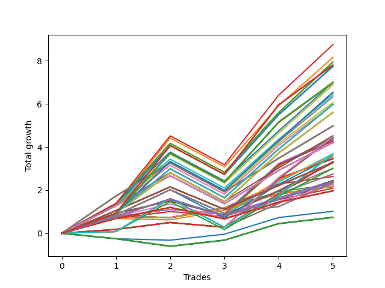

# Short HLT 11190d_100 
- Symbol: TSLA
- Date Range: 01/10/2024 - 05/17/2024
- Trading Period: 8:30-12:30
- Number of Trades: 5



| Id. | Name | Win Percent | Profit | Avg Profit / Trade | Avg Time / Trade | Std |      | Name | Win Percent | Profit | Avg Profit / Trade | Avg Time / Trade | Std |
| --- | ---- | ----------- | ------ | ------------------ | ---------------- | --- | ---- | ---- | ----------- | ------ | ------------------ | ---------------- | --- |
| | Sorted By <br> Profit | | | | | | | Sorted By <br> Win Percentage |||||
|0| TP-3 105m | 80.00 | 8.75 | 1.75 | 89:36 | 1.68 |     | TP-3 105m | 80.00 | 8.75 | 1.75 | 89:36 | 1.68 |
|1| TP-3 90m | 80.00 | 8.16 | 1.63 | 83:00 | 1.62 |     | TP-3 90m | 80.00 | 8.16 | 1.63 | 83:00 | 1.62 |
|2| TP-2.75 105m | 80.00 | 7.95 | 1.59 | 88:24 | 1.55 |     | TP-2.75 105m | 80.00 | 7.95 | 1.59 | 88:24 | 1.55 |
|3| TP-2.5 105m | 80.00 | 7.93 | 1.59 | 88:00 | 1.55 |     | TP-2.5 105m | 80.00 | 7.93 | 1.59 | 88:00 | 1.55 |
|4| TP-3 180m | 80.00 | 7.80 | 1.56 | 95:36 | 1.68 |     | TP-3 180m | 80.00 | 7.80 | 1.56 | 95:36 | 1.68 |
|5| TP-3 165m | 80.00 | 7.80 | 1.56 | 95:36 | 1.68 |     | TP-3 165m | 80.00 | 7.80 | 1.56 | 95:36 | 1.68 |
|6| TP-3 150m | 80.00 | 7.80 | 1.56 | 95:36 | 1.68 |     | TP-3 150m | 80.00 | 7.80 | 1.56 | 95:36 | 1.68 |
|7| TP-3 135m | 80.00 | 7.80 | 1.56 | 95:36 | 1.68 |     | TP-3 135m | 80.00 | 7.80 | 1.56 | 95:36 | 1.68 |
|8| TP-3 120m | 80.00 | 7.80 | 1.56 | 95:36 | 1.68 |     | TP-3 120m | 80.00 | 7.80 | 1.56 | 95:36 | 1.68 |
|9| TP-2.75 90m | 80.00 | 7.75 | 1.55 | 82:24 | 1.55 |     | TP-2.75 90m | 80.00 | 7.75 | 1.55 | 82:24 | 1.55 |
|10| TP-2.5 90m | 80.00 | 7.73 | 1.55 | 82:00 | 1.54 |     | TP-2.5 90m | 80.00 | 7.73 | 1.55 | 82:00 | 1.54 |
|11| TP-2.75 180m | 80.00 | 7.00 | 1.40 | 94:24 | 1.53 |     | TP-2.75 180m | 80.00 | 7.00 | 1.40 | 94:24 | 1.53 |
|12| TP-2.75 165m | 80.00 | 7.00 | 1.40 | 94:24 | 1.53 |     | TP-2.75 165m | 80.00 | 7.00 | 1.40 | 94:24 | 1.53 |
|13| TP-2.75 150m | 80.00 | 7.00 | 1.40 | 94:24 | 1.53 |     | TP-2.75 150m | 80.00 | 7.00 | 1.40 | 94:24 | 1.53 |
|14| TP-2.75 135m | 80.00 | 7.00 | 1.40 | 94:24 | 1.53 |     | TP-2.75 135m | 80.00 | 7.00 | 1.40 | 94:24 | 1.53 |
|15| TP-2.75 120m | 80.00 | 7.00 | 1.40 | 94:24 | 1.53 |     | TP-2.75 120m | 80.00 | 7.00 | 1.40 | 94:24 | 1.53 |
|16| TP-2.25 105m | 80.00 | 6.99 | 1.40 | 73:36 | 1.42 |     | TP-2.25 105m | 80.00 | 6.99 | 1.40 | 73:36 | 1.42 |
|17| TP-2.5 180m | 80.00 | 6.98 | 1.40 | 94:00 | 1.53 |     | TP-2.5 180m | 80.00 | 6.98 | 1.40 | 94:00 | 1.53 |
|18| TP-2.5 165m | 80.00 | 6.98 | 1.40 | 94:00 | 1.53 |     | TP-2.5 165m | 80.00 | 6.98 | 1.40 | 94:00 | 1.53 |
|19| TP-2.5 150m | 80.00 | 6.98 | 1.40 | 94:00 | 1.53 |     | TP-2.5 150m | 80.00 | 6.98 | 1.40 | 94:00 | 1.53 |
|20| TP-2.5 135m | 80.00 | 6.98 | 1.40 | 94:00 | 1.53 |     | TP-2.5 135m | 80.00 | 6.98 | 1.40 | 94:00 | 1.53 |
|21| TP-2.5 120m | 80.00 | 6.98 | 1.40 | 94:00 | 1.53 |     | TP-2.5 120m | 80.00 | 6.98 | 1.40 | 94:00 | 1.53 |
|22| TP-2.25 90m | 80.00 | 6.89 | 1.38 | 70:36 | 1.42 |     | TP-2.25 90m | 80.00 | 6.89 | 1.38 | 70:36 | 1.42 |
|23| TP-2.25 180m | 80.00 | 6.54 | 1.31 | 76:36 | 1.43 |     | TP-2.25 180m | 80.00 | 6.54 | 1.31 | 76:36 | 1.43 |
|24| TP-2.25 165m | 80.00 | 6.54 | 1.31 | 76:36 | 1.43 |     | TP-2.25 165m | 80.00 | 6.54 | 1.31 | 76:36 | 1.43 |
|25| TP-2.25 150m | 80.00 | 6.54 | 1.31 | 76:36 | 1.43 |     | TP-2.25 150m | 80.00 | 6.54 | 1.31 | 76:36 | 1.43 |
|26| TP-2.25 135m | 80.00 | 6.54 | 1.31 | 76:36 | 1.43 |     | TP-2.25 135m | 80.00 | 6.54 | 1.31 | 76:36 | 1.43 |
|27| TP-2.25 120m | 80.00 | 6.54 | 1.31 | 76:36 | 1.43 |     | TP-2.25 120m | 80.00 | 6.54 | 1.31 | 76:36 | 1.43 |
|28| TP-2 105m | 80.00 | 6.43 | 1.29 | 70:24 | 1.35 |     | TP-2 105m | 80.00 | 6.43 | 1.29 | 70:24 | 1.35 |
|29| TP-2 90m | 80.00 | 6.33 | 1.27 | 67:24 | 1.35 |     | TP-2 90m | 80.00 | 6.33 | 1.27 | 67:24 | 1.35 |
|30| TP-1.75 105m | 80.00 | 6.06 | 1.21 | 68:48 | 1.31 |     | TP-1.75 105m | 80.00 | 6.06 | 1.21 | 68:48 | 1.31 |
|31| TP-2 180m | 80.00 | 5.98 | 1.20 | 73:24 | 1.35 |     | TP-2 180m | 80.00 | 5.98 | 1.20 | 73:24 | 1.35 |
|32| TP-2 165m | 80.00 | 5.98 | 1.20 | 73:24 | 1.35 |     | TP-2 165m | 80.00 | 5.98 | 1.20 | 73:24 | 1.35 |
|33| TP-2 150m | 80.00 | 5.98 | 1.20 | 73:24 | 1.35 |     | TP-2 150m | 80.00 | 5.98 | 1.20 | 73:24 | 1.35 |
|34| TP-2 135m | 80.00 | 5.98 | 1.20 | 73:24 | 1.35 |     | TP-2 135m | 80.00 | 5.98 | 1.20 | 73:24 | 1.35 |
|35| TP-2 120m | 80.00 | 5.98 | 1.20 | 73:24 | 1.35 |     | TP-2 120m | 80.00 | 5.98 | 1.20 | 73:24 | 1.35 |
|36| TP-1.75 90m | 80.00 | 5.96 | 1.19 | 65:48 | 1.30 |     | TP-1.75 90m | 80.00 | 5.96 | 1.19 | 65:48 | 1.30 |
|37| TP-1.75 180m | 80.00 | 5.61 | 1.12 | 71:48 | 1.31 |     | TP-1.75 180m | 80.00 | 5.61 | 1.12 | 71:48 | 1.31 |
|38| TP-1.75 165m | 80.00 | 5.61 | 1.12 | 71:48 | 1.31 |     | TP-1.75 165m | 80.00 | 5.61 | 1.12 | 71:48 | 1.31 |
|39| TP-1.75 150m | 80.00 | 5.61 | 1.12 | 71:48 | 1.31 |     | TP-1.75 150m | 80.00 | 5.61 | 1.12 | 71:48 | 1.31 |
|40| TP-1.75 135m | 80.00 | 5.61 | 1.12 | 71:48 | 1.31 |     | TP-1.75 135m | 80.00 | 5.61 | 1.12 | 71:48 | 1.31 |
|41| TP-1.75 120m | 80.00 | 5.61 | 1.12 | 71:48 | 1.31 |     | TP-1.75 120m | 80.00 | 5.61 | 1.12 | 71:48 | 1.31 |
|42| TP-1.5 180m | 80.00 | 4.98 | 1.00 | 64:00 | 1.17 |     | TP-1.5 180m | 80.00 | 4.98 | 1.00 | 64:00 | 1.17 |
|43| TP-1.5 165m | 80.00 | 4.98 | 1.00 | 64:00 | 1.17 |     | TP-1.5 165m | 80.00 | 4.98 | 1.00 | 64:00 | 1.17 |
|44| TP-1.5 150m | 80.00 | 4.98 | 1.00 | 64:00 | 1.17 |     | TP-1.5 150m | 80.00 | 4.98 | 1.00 | 64:00 | 1.17 |
|45| TP-1.5 135m | 80.00 | 4.98 | 1.00 | 64:00 | 1.17 |     | TP-1.5 135m | 80.00 | 4.98 | 1.00 | 64:00 | 1.17 |
|46| TP-1.5 120m | 80.00 | 4.98 | 1.00 | 64:00 | 1.17 |     | TP-1.5 120m | 80.00 | 4.98 | 1.00 | 64:00 | 1.17 |
|47| TP-1.5 105m | 80.00 | 4.98 | 1.00 | 64:00 | 1.17 |     | TP-1.5 105m | 80.00 | 4.98 | 1.00 | 64:00 | 1.17 |
|48| TP-1.5 90m | 80.00 | 4.53 | 0.91 | 63:24 | 1.13 |     | TP-1.5 90m | 80.00 | 4.53 | 0.91 | 63:24 | 1.13 |
|49| TP-2.25 75m | 80.00 | 4.48 | 0.90 | 63:24 | 1.35 |     | TP-2.25 75m | 80.00 | 4.48 | 0.90 | 63:24 | 1.35 |
|50| TP-2.25 45m | 80.00 | 4.45 | 0.89 | 41:12 | 0.97 |     | TP-2.25 45m | 80.00 | 4.45 | 0.89 | 41:12 | 0.97 |
|51| TP-2 75m | 80.00 | 4.42 | 0.88 | 63:12 | 1.34 |     | TP-2 75m | 80.00 | 4.42 | 0.88 | 63:12 | 1.34 |
|52| TP-1.75 75m | 80.00 | 4.42 | 0.88 | 62:12 | 1.34 |     | TP-1.75 75m | 80.00 | 4.42 | 0.88 | 62:12 | 1.34 |
|53| TP-2 45m | 80.00 | 4.39 | 0.88 | 41:00 | 0.95 |     | TP-2 45m | 80.00 | 4.39 | 0.88 | 41:00 | 0.95 |
|54| TP-1.75 45m | 80.00 | 4.39 | 0.88 | 41:00 | 0.95 |     | TP-1.75 45m | 80.00 | 4.39 | 0.88 | 41:00 | 0.95 |
|55| TP-2.25 60m | 80.00 | 4.34 | 0.87 | 53:12 | 1.11 |     | TP-2.25 60m | 80.00 | 4.34 | 0.87 | 53:12 | 1.11 |
|56| TP-2 60m | 80.00 | 4.28 | 0.86 | 53:00 | 1.09 |     | TP-2 60m | 80.00 | 4.28 | 0.86 | 53:00 | 1.09 |
|57| TP-1.75 60m | 80.00 | 4.28 | 0.86 | 53:00 | 1.09 |     | TP-1.75 60m | 80.00 | 4.28 | 0.86 | 53:00 | 1.09 |
|58| TP-1.25 180m | 80.00 | 4.21 | 0.84 | 55:36 | 1.08 |     | TP-1.25 180m | 80.00 | 4.21 | 0.84 | 55:36 | 1.08 |
|59| TP-1.25 165m | 80.00 | 4.21 | 0.84 | 55:36 | 1.08 |     | TP-1.25 165m | 80.00 | 4.21 | 0.84 | 55:36 | 1.08 |
|60| TP-1.25 150m | 80.00 | 4.21 | 0.84 | 55:36 | 1.08 |     | TP-1.25 150m | 80.00 | 4.21 | 0.84 | 55:36 | 1.08 |
|61| TP-1.25 135m | 80.00 | 4.21 | 0.84 | 55:36 | 1.08 |     | TP-1.25 135m | 80.00 | 4.21 | 0.84 | 55:36 | 1.08 |
|62| TP-1.25 120m | 80.00 | 4.21 | 0.84 | 55:36 | 1.08 |     | TP-1.25 120m | 80.00 | 4.21 | 0.84 | 55:36 | 1.08 |
|63| TP-1.25 105m | 80.00 | 4.21 | 0.84 | 55:36 | 1.08 |     | TP-1.25 105m | 80.00 | 4.21 | 0.84 | 55:36 | 1.08 |
|64| TP-1.25 90m | 80.00 | 4.21 | 0.84 | 55:36 | 1.08 |     | TP-1.25 90m | 80.00 | 4.21 | 0.84 | 55:36 | 1.08 |
|65| TP-1.5 45m | 80.00 | 3.68 | 0.74 | 40:36 | 0.77 |     | TP-1.5 45m | 80.00 | 3.68 | 0.74 | 40:36 | 0.77 |
|66| TP-1.25 45m | 80.00 | 3.68 | 0.74 | 40:36 | 0.77 |     | TP-1.25 45m | 80.00 | 3.68 | 0.74 | 40:36 | 0.77 |
|67| TP-3 75m | 80.00 | 3.66 | 0.73 | 72:12 | 1.21 |     | TP-3 75m | 80.00 | 3.66 | 0.73 | 72:12 | 1.21 |
|68| TP-2.75 75m | 80.00 | 3.66 | 0.73 | 72:12 | 1.21 |     | TP-2.75 75m | 80.00 | 3.66 | 0.73 | 72:12 | 1.21 |
|69| TP-2.5 75m | 80.00 | 3.66 | 0.73 | 72:12 | 1.21 |     | TP-2.5 75m | 80.00 | 3.66 | 0.73 | 72:12 | 1.21 |
|70| TP-1.5 60m | 80.00 | 3.57 | 0.71 | 52:36 | 0.93 |     | TP-1.5 60m | 80.00 | 3.57 | 0.71 | 52:36 | 0.93 |
|71| TP-1.25 60m | 80.00 | 3.56 | 0.71 | 49:12 | 1.03 |     | TP-1.25 60m | 80.00 | 3.56 | 0.71 | 49:12 | 1.03 |
|72| TP-3 30m | 80.00 | 3.46 | 0.69 | 29:00 | 0.87 |     | TP-3 30m | 80.00 | 3.46 | 0.69 | 29:00 | 0.87 |
|73| TP-2.75 30m | 80.00 | 3.46 | 0.69 | 29:00 | 0.87 |     | TP-2.75 30m | 80.00 | 3.46 | 0.69 | 29:00 | 0.87 |
|74| TP-2.5 30m | 80.00 | 3.46 | 0.69 | 29:00 | 0.87 |     | TP-2.5 30m | 80.00 | 3.46 | 0.69 | 29:00 | 0.87 |
|75| TP-2.25 30m | 80.00 | 3.46 | 0.69 | 29:00 | 0.87 |     | TP-2.25 30m | 80.00 | 3.46 | 0.69 | 29:00 | 0.87 |
|76| TP-2 30m | 80.00 | 3.46 | 0.69 | 29:00 | 0.87 |     | TP-2 30m | 80.00 | 3.46 | 0.69 | 29:00 | 0.87 |
|77| TP-1.75 30m | 80.00 | 3.46 | 0.69 | 29:00 | 0.87 |     | TP-1.75 30m | 80.00 | 3.46 | 0.69 | 29:00 | 0.87 |
|78| TP-1.5 75m | 80.00 | 3.33 | 0.67 | 60:24 | 1.15 |     | TP-1.5 75m | 80.00 | 3.33 | 0.67 | 60:24 | 1.15 |
|79| TP-1 180m | 80.00 | 3.29 | 0.66 | 36:48 | 0.85 |     | TP-1 180m | 80.00 | 3.29 | 0.66 | 36:48 | 0.85 |
|80| TP-1 165m | 80.00 | 3.29 | 0.66 | 36:48 | 0.85 |     | TP-1 165m | 80.00 | 3.29 | 0.66 | 36:48 | 0.85 |
|81| TP-1 150m | 80.00 | 3.29 | 0.66 | 36:48 | 0.85 |     | TP-1 150m | 80.00 | 3.29 | 0.66 | 36:48 | 0.85 |
|82| TP-1 135m | 80.00 | 3.29 | 0.66 | 36:48 | 0.85 |     | TP-1 135m | 80.00 | 3.29 | 0.66 | 36:48 | 0.85 |
|83| TP-1 120m | 80.00 | 3.29 | 0.66 | 36:48 | 0.85 |     | TP-1 120m | 80.00 | 3.29 | 0.66 | 36:48 | 0.85 |
|84| TP-1 105m | 80.00 | 3.29 | 0.66 | 36:48 | 0.85 |     | TP-1 105m | 80.00 | 3.29 | 0.66 | 36:48 | 0.85 |
|85| TP-1 90m | 80.00 | 3.29 | 0.66 | 36:48 | 0.85 |     | TP-1 90m | 80.00 | 3.29 | 0.66 | 36:48 | 0.85 |
|86| TP-1 75m | 80.00 | 3.29 | 0.66 | 36:48 | 0.85 |     | TP-1 75m | 80.00 | 3.29 | 0.66 | 36:48 | 0.85 |
|87| TP-1 60m | 80.00 | 3.29 | 0.66 | 36:48 | 0.85 |     | TP-1 60m | 80.00 | 3.29 | 0.66 | 36:48 | 0.85 |
|88| TP-3 45m | 80.00 | 3.27 | 0.65 | 44:00 | 0.70 |     | TP-3 45m | 80.00 | 3.27 | 0.65 | 44:00 | 0.70 |
|89| TP-2.75 45m | 80.00 | 3.27 | 0.65 | 44:00 | 0.70 |     | TP-2.75 45m | 80.00 | 3.27 | 0.65 | 44:00 | 0.70 |
|90| TP-2.5 45m | 80.00 | 3.27 | 0.65 | 44:00 | 0.70 |     | TP-2.5 45m | 80.00 | 3.27 | 0.65 | 44:00 | 0.70 |
|91| TP-1 45m | 80.00 | 3.02 | 0.60 | 32:24 | 0.66 |     | TP-1 45m | 80.00 | 3.02 | 0.60 | 32:24 | 0.66 |
|92| TP-1.25 75m | 80.00 | 3.01 | 0.60 | 52:36 | 1.08 |     | TP-1.25 75m | 80.00 | 3.01 | 0.60 | 52:36 | 1.08 |
|93| TP-1.5 30m | 80.00 | 2.75 | 0.55 | 28:36 | 0.62 |     | TP-1.5 30m | 80.00 | 2.75 | 0.55 | 28:36 | 0.62 |
|94| TP-1.25 30m | 80.00 | 2.75 | 0.55 | 28:36 | 0.62 |     | TP-1.25 30m | 80.00 | 2.75 | 0.55 | 28:36 | 0.62 |
|95| TP-1 15m | 80.00 | 2.63 | 0.53 | 12:12 | 0.40 |     | TP-1 15m | 80.00 | 2.63 | 0.53 | 12:12 | 0.40 |
|96| TP-1 30m | 80.00 | 2.46 | 0.49 | 23:24 | 0.52 |     | TP-1 30m | 80.00 | 2.46 | 0.49 | 23:24 | 0.52 |
|97| TP-0.75 30m | 80.00 | 2.45 | 0.49 | 17:36 | 0.40 |     | TP-0.75 30m | 80.00 | 2.45 | 0.49 | 17:36 | 0.40 |
|98| TP-0.75 180m | 80.00 | 2.38 | 0.48 | 26:36 | 0.63 |     | TP-0.75 180m | 80.00 | 2.38 | 0.48 | 26:36 | 0.63 |
|99| TP-0.75 165m | 80.00 | 2.38 | 0.48 | 26:36 | 0.63 |     | TP-0.75 165m | 80.00 | 2.38 | 0.48 | 26:36 | 0.63 |
|100| TP-0.75 150m | 80.00 | 2.38 | 0.48 | 26:36 | 0.63 |     | TP-0.75 150m | 80.00 | 2.38 | 0.48 | 26:36 | 0.63 |
|101| TP-0.75 135m | 80.00 | 2.38 | 0.48 | 26:36 | 0.63 |     | TP-0.75 135m | 80.00 | 2.38 | 0.48 | 26:36 | 0.63 |
|102| TP-0.75 120m | 80.00 | 2.38 | 0.48 | 26:36 | 0.63 |     | TP-0.75 120m | 80.00 | 2.38 | 0.48 | 26:36 | 0.63 |
|103| TP-0.75 105m | 80.00 | 2.38 | 0.48 | 26:36 | 0.63 |     | TP-0.75 105m | 80.00 | 2.38 | 0.48 | 26:36 | 0.63 |
|104| TP-0.75 90m | 80.00 | 2.38 | 0.48 | 26:36 | 0.63 |     | TP-0.75 90m | 80.00 | 2.38 | 0.48 | 26:36 | 0.63 |
|105| TP-0.75 75m | 80.00 | 2.38 | 0.48 | 26:36 | 0.63 |     | TP-0.75 75m | 80.00 | 2.38 | 0.48 | 26:36 | 0.63 |
|106| TP-0.75 60m | 80.00 | 2.38 | 0.48 | 26:36 | 0.63 |     | TP-0.75 60m | 80.00 | 2.38 | 0.48 | 26:36 | 0.63 |
|107| TP-3 60m | 80.00 | 2.34 | 0.47 | 59:00 | 0.84 |     | TP-3 60m | 80.00 | 2.34 | 0.47 | 59:00 | 0.84 |
|108| TP-2.75 60m | 80.00 | 2.34 | 0.47 | 59:00 | 0.84 |     | TP-2.75 60m | 80.00 | 2.34 | 0.47 | 59:00 | 0.84 |
|109| TP-2.5 60m | 80.00 | 2.34 | 0.47 | 59:00 | 0.84 |     | TP-2.5 60m | 80.00 | 2.34 | 0.47 | 59:00 | 0.84 |
|110| TP-0.75 45m | 80.00 | 2.27 | 0.45 | 23:36 | 0.56 |     | TP-0.75 45m | 80.00 | 2.27 | 0.45 | 23:36 | 0.56 |
|111| TP-0.75 15m | 80.00 | 2.27 | 0.45 | 10:24 | 0.31 |     | TP-0.75 15m | 80.00 | 2.27 | 0.45 | 10:24 | 0.31 |
|112| TP-0.5 15m | 80.00 | 2.18 | 0.44 | 10:12 | 0.30 |     | TP-0.5 15m | 80.00 | 2.18 | 0.44 | 10:12 | 0.30 |
|113| TP-3 15m | 80.00 | 2.17 | 0.43 | 14:00 | 0.30 |     | TP-3 15m | 80.00 | 2.17 | 0.43 | 14:00 | 0.30 |
|114| TP-2.75 15m | 80.00 | 2.17 | 0.43 | 14:00 | 0.30 |     | TP-2.75 15m | 80.00 | 2.17 | 0.43 | 14:00 | 0.30 |
|115| TP-2.5 15m | 80.00 | 2.17 | 0.43 | 14:00 | 0.30 |     | TP-2.5 15m | 80.00 | 2.17 | 0.43 | 14:00 | 0.30 |
|116| TP-2.25 15m | 80.00 | 2.17 | 0.43 | 14:00 | 0.30 |     | TP-2.25 15m | 80.00 | 2.17 | 0.43 | 14:00 | 0.30 |
|117| TP-2 15m | 80.00 | 2.17 | 0.43 | 14:00 | 0.30 |     | TP-2 15m | 80.00 | 2.17 | 0.43 | 14:00 | 0.30 |
|118| TP-1.75 15m | 80.00 | 2.17 | 0.43 | 14:00 | 0.30 |     | TP-1.75 15m | 80.00 | 2.17 | 0.43 | 14:00 | 0.30 |
|119| TP-1.5 15m | 80.00 | 2.17 | 0.43 | 14:00 | 0.30 |     | TP-1.5 15m | 80.00 | 2.17 | 0.43 | 14:00 | 0.30 |
|120| TP-1.25 15m | 80.00 | 2.17 | 0.43 | 14:00 | 0.30 |     | TP-1.25 15m | 80.00 | 2.17 | 0.43 | 14:00 | 0.30 |
|121| TP-0.5 30m | 80.00 | 2.09 | 0.42 | 16:36 | 0.35 |     | TP-0.5 30m | 80.00 | 2.09 | 0.42 | 16:36 | 0.35 |
|122| TP-0.5 180m | 80.00 | 1.97 | 0.39 | 18:24 | 0.47 |     | TP-0.5 180m | 80.00 | 1.97 | 0.39 | 18:24 | 0.47 |
|123| TP-0.5 165m | 80.00 | 1.97 | 0.39 | 18:24 | 0.47 |     | TP-0.5 165m | 80.00 | 1.97 | 0.39 | 18:24 | 0.47 |
|124| TP-0.5 150m | 80.00 | 1.97 | 0.39 | 18:24 | 0.47 |     | TP-0.5 150m | 80.00 | 1.97 | 0.39 | 18:24 | 0.47 |
|125| TP-0.5 135m | 80.00 | 1.97 | 0.39 | 18:24 | 0.47 |     | TP-0.5 135m | 80.00 | 1.97 | 0.39 | 18:24 | 0.47 |
|126| TP-0.5 120m | 80.00 | 1.97 | 0.39 | 18:24 | 0.47 |     | TP-0.5 120m | 80.00 | 1.97 | 0.39 | 18:24 | 0.47 |
|127| TP-0.5 105m | 80.00 | 1.97 | 0.39 | 18:24 | 0.47 |     | TP-0.5 105m | 80.00 | 1.97 | 0.39 | 18:24 | 0.47 |
|128| TP-0.5 90m | 80.00 | 1.97 | 0.39 | 18:24 | 0.47 |     | TP-0.5 90m | 80.00 | 1.97 | 0.39 | 18:24 | 0.47 |
|129| TP-0.5 75m | 80.00 | 1.97 | 0.39 | 18:24 | 0.47 |     | TP-0.5 75m | 80.00 | 1.97 | 0.39 | 18:24 | 0.47 |
|130| TP-0.5 60m | 80.00 | 1.97 | 0.39 | 18:24 | 0.47 |     | TP-0.5 60m | 80.00 | 1.97 | 0.39 | 18:24 | 0.47 |
|131| TP-0.5 45m | 80.00 | 1.97 | 0.39 | 18:24 | 0.47 |     | TP-0.5 45m | 80.00 | 1.97 | 0.39 | 18:24 | 0.47 |
|132| TP-0.25 15m | 60.00 | 1.02 | 0.20 | 06:48 | 0.35 |     | TP-0.25 15m | 60.00 | 1.02 | 0.20 | 06:48 | 0.35 |
|133| TP-0.25 180m | 60.00 | 0.74 | 0.15 | 07:00 | 0.41 |     | TP-0.25 180m | 60.00 | 0.74 | 0.15 | 07:00 | 0.41 |
|134| TP-0.25 165m | 60.00 | 0.74 | 0.15 | 07:00 | 0.41 |     | TP-0.25 165m | 60.00 | 0.74 | 0.15 | 07:00 | 0.41 |
|135| TP-0.25 150m | 60.00 | 0.74 | 0.15 | 07:00 | 0.41 |     | TP-0.25 150m | 60.00 | 0.74 | 0.15 | 07:00 | 0.41 |
|136| TP-0.25 135m | 60.00 | 0.74 | 0.15 | 07:00 | 0.41 |     | TP-0.25 135m | 60.00 | 0.74 | 0.15 | 07:00 | 0.41 |
|137| TP-0.25 120m | 60.00 | 0.74 | 0.15 | 07:00 | 0.41 |     | TP-0.25 120m | 60.00 | 0.74 | 0.15 | 07:00 | 0.41 |
|138| TP-0.25 105m | 60.00 | 0.74 | 0.15 | 07:00 | 0.41 |     | TP-0.25 105m | 60.00 | 0.74 | 0.15 | 07:00 | 0.41 |
|139| TP-0.25 90m | 60.00 | 0.74 | 0.15 | 07:00 | 0.41 |     | TP-0.25 90m | 60.00 | 0.74 | 0.15 | 07:00 | 0.41 |
|140| TP-0.25 75m | 60.00 | 0.74 | 0.15 | 07:00 | 0.41 |     | TP-0.25 75m | 60.00 | 0.74 | 0.15 | 07:00 | 0.41 |
|141| TP-0.25 60m | 60.00 | 0.74 | 0.15 | 07:00 | 0.41 |     | TP-0.25 60m | 60.00 | 0.74 | 0.15 | 07:00 | 0.41 |
|142| TP-0.25 45m | 60.00 | 0.74 | 0.15 | 07:00 | 0.41 |     | TP-0.25 45m | 60.00 | 0.74 | 0.15 | 07:00 | 0.41 |
|143| TP-0.25 30m | 60.00 | 0.74 | 0.15 | 07:00 | 0.41 |     | TP-0.25 30m | 60.00 | 0.74 | 0.15 | 07:00 | 0.41 |

### Test TP-0.25 15m
* Take Profit of 0.25 Point
* 0.25 Stoploss
* Results:
```
Total Trades: 5
Percent Up: 40.00
Percent Down: 60.00
Total Points Moved Down: 1.02
Potential Profit: 510.00
Total Points Ups: 0.32 Count Ups: 2
Total Points Downs: 1.34 Count Downs: 3
```

<details><summary>Trades</summary>

<code>In: 2024-03-18 08:35:00		Out: 2024-03-18 08:37:00		Total Position Time: 02:00		Total Move Down: -0.25		Total to Date: -0.25</code> <br />
<code>In: 2024-04-04 10:10:00		Out: 2024-04-04 10:24:00		Total Position Time: 14:00		Total Move Down: -0.07		Total to Date: -0.32</code> <br />
<code>In: 2024-04-11 11:45:00		Out: 2024-04-11 11:51:00		Total Position Time: 06:00		Total Move Down: 0.28		Total to Date: -0.04</code> <br />
<code>In: 2024-04-29 09:40:00		Out: 2024-04-29 09:42:00		Total Position Time: 02:00		Total Move Down: 0.77		Total to Date: 0.73</code> <br />
<code>In: 2024-05-17 09:45:00		Out: 2024-05-17 09:55:00		Total Position Time: 10:00		Total Move Down: 0.29		Total to Date: 1.02</code> <br />


</details>

### Test TP-0.5 15m
* Take Profit of 0.5 Point
* 0.5 Stoploss
* Results:
```
Total Trades: 5
Percent Up: 20.00
Percent Down: 80.00
Total Points Moved Down: 2.18
Potential Profit: 1090.00
Total Points Ups: 0.07 Count Ups: 1
Total Points Downs: 2.25 Count Downs: 4
```

<details><summary>Trades</summary>

<code>In: 2024-03-18 08:35:00		Out: 2024-03-18 08:42:00		Total Position Time: 07:00		Total Move Down: 0.69		Total to Date: 0.69</code> <br />
<code>In: 2024-04-04 10:10:00		Out: 2024-04-04 10:24:00		Total Position Time: 14:00		Total Move Down: -0.07		Total to Date: 0.62</code> <br />
<code>In: 2024-04-11 11:45:00		Out: 2024-04-11 11:59:00		Total Position Time: 14:00		Total Move Down: 0.45		Total to Date: 1.07</code> <br />
<code>In: 2024-04-29 09:40:00		Out: 2024-04-29 09:42:00		Total Position Time: 02:00		Total Move Down: 0.77		Total to Date: 1.84</code> <br />
<code>In: 2024-05-17 09:45:00		Out: 2024-05-17 09:59:00		Total Position Time: 14:00		Total Move Down: 0.34		Total to Date: 2.18</code> <br />


</details>

### Test TP-0.75 15m
* Take Profit of 0.75 Point
* 0.75 Stoploss
* Results:
```
Total Trades: 5
Percent Up: 20.00
Percent Down: 80.00
Total Points Moved Down: 2.27
Potential Profit: 1135.00
Total Points Ups: 0.07 Count Ups: 1
Total Points Downs: 2.34 Count Downs: 4
```

<details><summary>Trades</summary>

<code>In: 2024-03-18 08:35:00		Out: 2024-03-18 08:43:00		Total Position Time: 08:00		Total Move Down: 0.78		Total to Date: 0.78</code> <br />
<code>In: 2024-04-04 10:10:00		Out: 2024-04-04 10:24:00		Total Position Time: 14:00		Total Move Down: -0.07		Total to Date: 0.71</code> <br />
<code>In: 2024-04-11 11:45:00		Out: 2024-04-11 11:59:00		Total Position Time: 14:00		Total Move Down: 0.45		Total to Date: 1.16</code> <br />
<code>In: 2024-04-29 09:40:00		Out: 2024-04-29 09:42:00		Total Position Time: 02:00		Total Move Down: 0.77		Total to Date: 1.93</code> <br />
<code>In: 2024-05-17 09:45:00		Out: 2024-05-17 09:59:00		Total Position Time: 14:00		Total Move Down: 0.34		Total to Date: 2.27</code> <br />


</details>

### Test TP-1 15m
* Take Profit of 1 Point
* 1 Stoploss
* Results:
```
Total Trades: 5
Percent Up: 20.00
Percent Down: 80.00
Total Points Moved Down: 2.63
Potential Profit: 1315.00
Total Points Ups: 0.07 Count Ups: 1
Total Points Downs: 2.70 Count Downs: 4
```

<details><summary>Trades</summary>

<code>In: 2024-03-18 08:35:00		Out: 2024-03-18 08:49:00		Total Position Time: 14:00		Total Move Down: 0.80		Total to Date: 0.80</code> <br />
<code>In: 2024-04-04 10:10:00		Out: 2024-04-04 10:24:00		Total Position Time: 14:00		Total Move Down: -0.07		Total to Date: 0.73</code> <br />
<code>In: 2024-04-11 11:45:00		Out: 2024-04-11 11:59:00		Total Position Time: 14:00		Total Move Down: 0.45		Total to Date: 1.18</code> <br />
<code>In: 2024-04-29 09:40:00		Out: 2024-04-29 09:45:00		Total Position Time: 05:00		Total Move Down: 1.11		Total to Date: 2.29</code> <br />
<code>In: 2024-05-17 09:45:00		Out: 2024-05-17 09:59:00		Total Position Time: 14:00		Total Move Down: 0.34		Total to Date: 2.63</code> <br />


</details>

### Test TP-1.25 15m
* Take Profit of 1.25 Point
* 1.25 Stoploss
* Results:
```
Total Trades: 5
Percent Up: 20.00
Percent Down: 80.00
Total Points Moved Down: 2.17
Potential Profit: 1085.00
Total Points Ups: 0.07 Count Ups: 1
Total Points Downs: 2.24 Count Downs: 4
```

<details><summary>Trades</summary>

<code>In: 2024-03-18 08:35:00		Out: 2024-03-18 08:49:00		Total Position Time: 14:00		Total Move Down: 0.80		Total to Date: 0.80</code> <br />
<code>In: 2024-04-04 10:10:00		Out: 2024-04-04 10:24:00		Total Position Time: 14:00		Total Move Down: -0.07		Total to Date: 0.73</code> <br />
<code>In: 2024-04-11 11:45:00		Out: 2024-04-11 11:59:00		Total Position Time: 14:00		Total Move Down: 0.45		Total to Date: 1.18</code> <br />
<code>In: 2024-04-29 09:40:00		Out: 2024-04-29 09:54:00		Total Position Time: 14:00		Total Move Down: 0.65		Total to Date: 1.83</code> <br />
<code>In: 2024-05-17 09:45:00		Out: 2024-05-17 09:59:00		Total Position Time: 14:00		Total Move Down: 0.34		Total to Date: 2.17</code> <br />


</details>

### Test TP-1.5 15m
* Take Profit of 1.5 Point
* 1.5 Stoploss
* Results:
```
Total Trades: 5
Percent Up: 20.00
Percent Down: 80.00
Total Points Moved Down: 2.17
Potential Profit: 1085.00
Total Points Ups: 0.07 Count Ups: 1
Total Points Downs: 2.24 Count Downs: 4
```

<details><summary>Trades</summary>

<code>In: 2024-03-18 08:35:00		Out: 2024-03-18 08:49:00		Total Position Time: 14:00		Total Move Down: 0.80		Total to Date: 0.80</code> <br />
<code>In: 2024-04-04 10:10:00		Out: 2024-04-04 10:24:00		Total Position Time: 14:00		Total Move Down: -0.07		Total to Date: 0.73</code> <br />
<code>In: 2024-04-11 11:45:00		Out: 2024-04-11 11:59:00		Total Position Time: 14:00		Total Move Down: 0.45		Total to Date: 1.18</code> <br />
<code>In: 2024-04-29 09:40:00		Out: 2024-04-29 09:54:00		Total Position Time: 14:00		Total Move Down: 0.65		Total to Date: 1.83</code> <br />
<code>In: 2024-05-17 09:45:00		Out: 2024-05-17 09:59:00		Total Position Time: 14:00		Total Move Down: 0.34		Total to Date: 2.17</code> <br />


</details>

### Test TP-1.75 15m
* Take Profit of 1.75 Point
* 1.75 Stoploss
* Results:
```
Total Trades: 5
Percent Up: 20.00
Percent Down: 80.00
Total Points Moved Down: 2.17
Potential Profit: 1085.00
Total Points Ups: 0.07 Count Ups: 1
Total Points Downs: 2.24 Count Downs: 4
```

<details><summary>Trades</summary>

<code>In: 2024-03-18 08:35:00		Out: 2024-03-18 08:49:00		Total Position Time: 14:00		Total Move Down: 0.80		Total to Date: 0.80</code> <br />
<code>In: 2024-04-04 10:10:00		Out: 2024-04-04 10:24:00		Total Position Time: 14:00		Total Move Down: -0.07		Total to Date: 0.73</code> <br />
<code>In: 2024-04-11 11:45:00		Out: 2024-04-11 11:59:00		Total Position Time: 14:00		Total Move Down: 0.45		Total to Date: 1.18</code> <br />
<code>In: 2024-04-29 09:40:00		Out: 2024-04-29 09:54:00		Total Position Time: 14:00		Total Move Down: 0.65		Total to Date: 1.83</code> <br />
<code>In: 2024-05-17 09:45:00		Out: 2024-05-17 09:59:00		Total Position Time: 14:00		Total Move Down: 0.34		Total to Date: 2.17</code> <br />


</details>

### Test TP-2 15m
* Take Profit of 2 Point
* 2 Stoploss
* Results:
```
Total Trades: 5
Percent Up: 20.00
Percent Down: 80.00
Total Points Moved Down: 2.17
Potential Profit: 1085.00
Total Points Ups: 0.07 Count Ups: 1
Total Points Downs: 2.24 Count Downs: 4
```

<details><summary>Trades</summary>

<code>In: 2024-03-18 08:35:00		Out: 2024-03-18 08:49:00		Total Position Time: 14:00		Total Move Down: 0.80		Total to Date: 0.80</code> <br />
<code>In: 2024-04-04 10:10:00		Out: 2024-04-04 10:24:00		Total Position Time: 14:00		Total Move Down: -0.07		Total to Date: 0.73</code> <br />
<code>In: 2024-04-11 11:45:00		Out: 2024-04-11 11:59:00		Total Position Time: 14:00		Total Move Down: 0.45		Total to Date: 1.18</code> <br />
<code>In: 2024-04-29 09:40:00		Out: 2024-04-29 09:54:00		Total Position Time: 14:00		Total Move Down: 0.65		Total to Date: 1.83</code> <br />
<code>In: 2024-05-17 09:45:00		Out: 2024-05-17 09:59:00		Total Position Time: 14:00		Total Move Down: 0.34		Total to Date: 2.17</code> <br />


</details>

### Test TP-2.25 15m
* Take Profit of 2.25 Point
* 2.25 Stoploss
* Results:
```
Total Trades: 5
Percent Up: 20.00
Percent Down: 80.00
Total Points Moved Down: 2.17
Potential Profit: 1085.00
Total Points Ups: 0.07 Count Ups: 1
Total Points Downs: 2.24 Count Downs: 4
```

<details><summary>Trades</summary>

<code>In: 2024-03-18 08:35:00		Out: 2024-03-18 08:49:00		Total Position Time: 14:00		Total Move Down: 0.80		Total to Date: 0.80</code> <br />
<code>In: 2024-04-04 10:10:00		Out: 2024-04-04 10:24:00		Total Position Time: 14:00		Total Move Down: -0.07		Total to Date: 0.73</code> <br />
<code>In: 2024-04-11 11:45:00		Out: 2024-04-11 11:59:00		Total Position Time: 14:00		Total Move Down: 0.45		Total to Date: 1.18</code> <br />
<code>In: 2024-04-29 09:40:00		Out: 2024-04-29 09:54:00		Total Position Time: 14:00		Total Move Down: 0.65		Total to Date: 1.83</code> <br />
<code>In: 2024-05-17 09:45:00		Out: 2024-05-17 09:59:00		Total Position Time: 14:00		Total Move Down: 0.34		Total to Date: 2.17</code> <br />


</details>

### Test TP-2.5 15m
* Take Profit of 2.5 Point
* 2.5 Stoploss
* Results:
```
Total Trades: 5
Percent Up: 20.00
Percent Down: 80.00
Total Points Moved Down: 2.17
Potential Profit: 1085.00
Total Points Ups: 0.07 Count Ups: 1
Total Points Downs: 2.24 Count Downs: 4
```

<details><summary>Trades</summary>

<code>In: 2024-03-18 08:35:00		Out: 2024-03-18 08:49:00		Total Position Time: 14:00		Total Move Down: 0.80		Total to Date: 0.80</code> <br />
<code>In: 2024-04-04 10:10:00		Out: 2024-04-04 10:24:00		Total Position Time: 14:00		Total Move Down: -0.07		Total to Date: 0.73</code> <br />
<code>In: 2024-04-11 11:45:00		Out: 2024-04-11 11:59:00		Total Position Time: 14:00		Total Move Down: 0.45		Total to Date: 1.18</code> <br />
<code>In: 2024-04-29 09:40:00		Out: 2024-04-29 09:54:00		Total Position Time: 14:00		Total Move Down: 0.65		Total to Date: 1.83</code> <br />
<code>In: 2024-05-17 09:45:00		Out: 2024-05-17 09:59:00		Total Position Time: 14:00		Total Move Down: 0.34		Total to Date: 2.17</code> <br />


</details>

### Test TP-2.75 15m
* Take Profit of 2.75 Point
* 2.75 Stoploss
* Results:
```
Total Trades: 5
Percent Up: 20.00
Percent Down: 80.00
Total Points Moved Down: 2.17
Potential Profit: 1085.00
Total Points Ups: 0.07 Count Ups: 1
Total Points Downs: 2.24 Count Downs: 4
```

<details><summary>Trades</summary>

<code>In: 2024-03-18 08:35:00		Out: 2024-03-18 08:49:00		Total Position Time: 14:00		Total Move Down: 0.80		Total to Date: 0.80</code> <br />
<code>In: 2024-04-04 10:10:00		Out: 2024-04-04 10:24:00		Total Position Time: 14:00		Total Move Down: -0.07		Total to Date: 0.73</code> <br />
<code>In: 2024-04-11 11:45:00		Out: 2024-04-11 11:59:00		Total Position Time: 14:00		Total Move Down: 0.45		Total to Date: 1.18</code> <br />
<code>In: 2024-04-29 09:40:00		Out: 2024-04-29 09:54:00		Total Position Time: 14:00		Total Move Down: 0.65		Total to Date: 1.83</code> <br />
<code>In: 2024-05-17 09:45:00		Out: 2024-05-17 09:59:00		Total Position Time: 14:00		Total Move Down: 0.34		Total to Date: 2.17</code> <br />


</details>

### Test TP-3 15m
* Take Profit of 3 Point
* 3 Stoploss
* Results:
```
Total Trades: 5
Percent Up: 20.00
Percent Down: 80.00
Total Points Moved Down: 2.17
Potential Profit: 1085.00
Total Points Ups: 0.07 Count Ups: 1
Total Points Downs: 2.24 Count Downs: 4
```

<details><summary>Trades</summary>

<code>In: 2024-03-18 08:35:00		Out: 2024-03-18 08:49:00		Total Position Time: 14:00		Total Move Down: 0.80		Total to Date: 0.80</code> <br />
<code>In: 2024-04-04 10:10:00		Out: 2024-04-04 10:24:00		Total Position Time: 14:00		Total Move Down: -0.07		Total to Date: 0.73</code> <br />
<code>In: 2024-04-11 11:45:00		Out: 2024-04-11 11:59:00		Total Position Time: 14:00		Total Move Down: 0.45		Total to Date: 1.18</code> <br />
<code>In: 2024-04-29 09:40:00		Out: 2024-04-29 09:54:00		Total Position Time: 14:00		Total Move Down: 0.65		Total to Date: 1.83</code> <br />
<code>In: 2024-05-17 09:45:00		Out: 2024-05-17 09:59:00		Total Position Time: 14:00		Total Move Down: 0.34		Total to Date: 2.17</code> <br />


</details>

### Test TP-0.25 30m
* Take Profit of 0.25 Point
* 0.25 Stoploss
* Results:
```
Total Trades: 5
Percent Up: 40.00
Percent Down: 60.00
Total Points Moved Down: 0.74
Potential Profit: 370.00
Total Points Ups: 0.60 Count Ups: 2
Total Points Downs: 1.34 Count Downs: 3
```

<details><summary>Trades</summary>

<code>In: 2024-03-18 08:35:00		Out: 2024-03-18 08:37:00		Total Position Time: 02:00		Total Move Down: -0.25		Total to Date: -0.25</code> <br />
<code>In: 2024-04-04 10:10:00		Out: 2024-04-04 10:25:00		Total Position Time: 15:00		Total Move Down: -0.35		Total to Date: -0.60</code> <br />
<code>In: 2024-04-11 11:45:00		Out: 2024-04-11 11:51:00		Total Position Time: 06:00		Total Move Down: 0.28		Total to Date: -0.32</code> <br />
<code>In: 2024-04-29 09:40:00		Out: 2024-04-29 09:42:00		Total Position Time: 02:00		Total Move Down: 0.77		Total to Date: 0.45</code> <br />
<code>In: 2024-05-17 09:45:00		Out: 2024-05-17 09:55:00		Total Position Time: 10:00		Total Move Down: 0.29		Total to Date: 0.74</code> <br />


</details>

### Test TP-0.5 30m
* Take Profit of 0.5 Point
* 0.5 Stoploss
* Results:
```
Total Trades: 5
Percent Up: 20.00
Percent Down: 80.00
Total Points Moved Down: 2.09
Potential Profit: 1045.00
Total Points Ups: 0.22 Count Ups: 1
Total Points Downs: 2.31 Count Downs: 4
```

<details><summary>Trades</summary>

<code>In: 2024-03-18 08:35:00		Out: 2024-03-18 08:42:00		Total Position Time: 07:00		Total Move Down: 0.69		Total to Date: 0.69</code> <br />
<code>In: 2024-04-04 10:10:00		Out: 2024-04-04 10:39:00		Total Position Time: 29:00		Total Move Down: 0.32		Total to Date: 1.01</code> <br />
<code>In: 2024-04-11 11:45:00		Out: 2024-04-11 12:14:00		Total Position Time: 29:00		Total Move Down: -0.22		Total to Date: 0.79</code> <br />
<code>In: 2024-04-29 09:40:00		Out: 2024-04-29 09:42:00		Total Position Time: 02:00		Total Move Down: 0.77		Total to Date: 1.56</code> <br />
<code>In: 2024-05-17 09:45:00		Out: 2024-05-17 10:01:00		Total Position Time: 16:00		Total Move Down: 0.53		Total to Date: 2.09</code> <br />


</details>

### Test TP-0.75 30m
* Take Profit of 0.75 Point
* 0.75 Stoploss
* Results:
```
Total Trades: 5
Percent Up: 20.00
Percent Down: 80.00
Total Points Moved Down: 2.45
Potential Profit: 1225.00
Total Points Ups: 0.22 Count Ups: 1
Total Points Downs: 2.67 Count Downs: 4
```

<details><summary>Trades</summary>

<code>In: 2024-03-18 08:35:00		Out: 2024-03-18 08:43:00		Total Position Time: 08:00		Total Move Down: 0.78		Total to Date: 0.78</code> <br />
<code>In: 2024-04-04 10:10:00		Out: 2024-04-04 10:39:00		Total Position Time: 29:00		Total Move Down: 0.32		Total to Date: 1.10</code> <br />
<code>In: 2024-04-11 11:45:00		Out: 2024-04-11 12:14:00		Total Position Time: 29:00		Total Move Down: -0.22		Total to Date: 0.88</code> <br />
<code>In: 2024-04-29 09:40:00		Out: 2024-04-29 09:42:00		Total Position Time: 02:00		Total Move Down: 0.77		Total to Date: 1.65</code> <br />
<code>In: 2024-05-17 09:45:00		Out: 2024-05-17 10:05:00		Total Position Time: 20:00		Total Move Down: 0.80		Total to Date: 2.45</code> <br />


</details>

### Test TP-1 30m
* Take Profit of 1 Point
* 1 Stoploss
* Results:
```
Total Trades: 5
Percent Up: 20.00
Percent Down: 80.00
Total Points Moved Down: 2.46
Potential Profit: 1230.00
Total Points Ups: 0.22 Count Ups: 1
Total Points Downs: 2.68 Count Downs: 4
```

<details><summary>Trades</summary>

<code>In: 2024-03-18 08:35:00		Out: 2024-03-18 09:04:00		Total Position Time: 29:00		Total Move Down: 0.18		Total to Date: 0.18</code> <br />
<code>In: 2024-04-04 10:10:00		Out: 2024-04-04 10:39:00		Total Position Time: 29:00		Total Move Down: 0.32		Total to Date: 0.50</code> <br />
<code>In: 2024-04-11 11:45:00		Out: 2024-04-11 12:14:00		Total Position Time: 29:00		Total Move Down: -0.22		Total to Date: 0.28</code> <br />
<code>In: 2024-04-29 09:40:00		Out: 2024-04-29 09:45:00		Total Position Time: 05:00		Total Move Down: 1.11		Total to Date: 1.39</code> <br />
<code>In: 2024-05-17 09:45:00		Out: 2024-05-17 10:10:00		Total Position Time: 25:00		Total Move Down: 1.07		Total to Date: 2.46</code> <br />


</details>

### Test TP-1.25 30m
* Take Profit of 1.25 Point
* 1.25 Stoploss
* Results:
```
Total Trades: 5
Percent Up: 20.00
Percent Down: 80.00
Total Points Moved Down: 2.75
Potential Profit: 1375.00
Total Points Ups: 0.22 Count Ups: 1
Total Points Downs: 2.97 Count Downs: 4
```

<details><summary>Trades</summary>

<code>In: 2024-03-18 08:35:00		Out: 2024-03-18 09:04:00		Total Position Time: 29:00		Total Move Down: 0.18		Total to Date: 0.18</code> <br />
<code>In: 2024-04-04 10:10:00		Out: 2024-04-04 10:39:00		Total Position Time: 29:00		Total Move Down: 0.32		Total to Date: 0.50</code> <br />
<code>In: 2024-04-11 11:45:00		Out: 2024-04-11 12:14:00		Total Position Time: 29:00		Total Move Down: -0.22		Total to Date: 0.28</code> <br />
<code>In: 2024-04-29 09:40:00		Out: 2024-04-29 10:07:00		Total Position Time: 27:00		Total Move Down: 1.55		Total to Date: 1.83</code> <br />
<code>In: 2024-05-17 09:45:00		Out: 2024-05-17 10:14:00		Total Position Time: 29:00		Total Move Down: 0.92		Total to Date: 2.75</code> <br />


</details>

### Test TP-1.5 30m
* Take Profit of 1.5 Point
* 1.5 Stoploss
* Results:
```
Total Trades: 5
Percent Up: 20.00
Percent Down: 80.00
Total Points Moved Down: 2.75
Potential Profit: 1375.00
Total Points Ups: 0.22 Count Ups: 1
Total Points Downs: 2.97 Count Downs: 4
```

<details><summary>Trades</summary>

<code>In: 2024-03-18 08:35:00		Out: 2024-03-18 09:04:00		Total Position Time: 29:00		Total Move Down: 0.18		Total to Date: 0.18</code> <br />
<code>In: 2024-04-04 10:10:00		Out: 2024-04-04 10:39:00		Total Position Time: 29:00		Total Move Down: 0.32		Total to Date: 0.50</code> <br />
<code>In: 2024-04-11 11:45:00		Out: 2024-04-11 12:14:00		Total Position Time: 29:00		Total Move Down: -0.22		Total to Date: 0.28</code> <br />
<code>In: 2024-04-29 09:40:00		Out: 2024-04-29 10:07:00		Total Position Time: 27:00		Total Move Down: 1.55		Total to Date: 1.83</code> <br />
<code>In: 2024-05-17 09:45:00		Out: 2024-05-17 10:14:00		Total Position Time: 29:00		Total Move Down: 0.92		Total to Date: 2.75</code> <br />


</details>

### Test TP-1.75 30m
* Take Profit of 1.75 Point
* 1.75 Stoploss
* Results:
```
Total Trades: 5
Percent Up: 20.00
Percent Down: 80.00
Total Points Moved Down: 3.46
Potential Profit: 1730.00
Total Points Ups: 0.22 Count Ups: 1
Total Points Downs: 3.68 Count Downs: 4
```

<details><summary>Trades</summary>

<code>In: 2024-03-18 08:35:00		Out: 2024-03-18 09:04:00		Total Position Time: 29:00		Total Move Down: 0.18		Total to Date: 0.18</code> <br />
<code>In: 2024-04-04 10:10:00		Out: 2024-04-04 10:39:00		Total Position Time: 29:00		Total Move Down: 0.32		Total to Date: 0.50</code> <br />
<code>In: 2024-04-11 11:45:00		Out: 2024-04-11 12:14:00		Total Position Time: 29:00		Total Move Down: -0.22		Total to Date: 0.28</code> <br />
<code>In: 2024-04-29 09:40:00		Out: 2024-04-29 10:09:00		Total Position Time: 29:00		Total Move Down: 2.26		Total to Date: 2.54</code> <br />
<code>In: 2024-05-17 09:45:00		Out: 2024-05-17 10:14:00		Total Position Time: 29:00		Total Move Down: 0.92		Total to Date: 3.46</code> <br />


</details>

### Test TP-2 30m
* Take Profit of 2 Point
* 2 Stoploss
* Results:
```
Total Trades: 5
Percent Up: 20.00
Percent Down: 80.00
Total Points Moved Down: 3.46
Potential Profit: 1730.00
Total Points Ups: 0.22 Count Ups: 1
Total Points Downs: 3.68 Count Downs: 4
```

<details><summary>Trades</summary>

<code>In: 2024-03-18 08:35:00		Out: 2024-03-18 09:04:00		Total Position Time: 29:00		Total Move Down: 0.18		Total to Date: 0.18</code> <br />
<code>In: 2024-04-04 10:10:00		Out: 2024-04-04 10:39:00		Total Position Time: 29:00		Total Move Down: 0.32		Total to Date: 0.50</code> <br />
<code>In: 2024-04-11 11:45:00		Out: 2024-04-11 12:14:00		Total Position Time: 29:00		Total Move Down: -0.22		Total to Date: 0.28</code> <br />
<code>In: 2024-04-29 09:40:00		Out: 2024-04-29 10:09:00		Total Position Time: 29:00		Total Move Down: 2.26		Total to Date: 2.54</code> <br />
<code>In: 2024-05-17 09:45:00		Out: 2024-05-17 10:14:00		Total Position Time: 29:00		Total Move Down: 0.92		Total to Date: 3.46</code> <br />


</details>

### Test TP-2.25 30m
* Take Profit of 2.25 Point
* 2.25 Stoploss
* Results:
```
Total Trades: 5
Percent Up: 20.00
Percent Down: 80.00
Total Points Moved Down: 3.46
Potential Profit: 1730.00
Total Points Ups: 0.22 Count Ups: 1
Total Points Downs: 3.68 Count Downs: 4
```

<details><summary>Trades</summary>

<code>In: 2024-03-18 08:35:00		Out: 2024-03-18 09:04:00		Total Position Time: 29:00		Total Move Down: 0.18		Total to Date: 0.18</code> <br />
<code>In: 2024-04-04 10:10:00		Out: 2024-04-04 10:39:00		Total Position Time: 29:00		Total Move Down: 0.32		Total to Date: 0.50</code> <br />
<code>In: 2024-04-11 11:45:00		Out: 2024-04-11 12:14:00		Total Position Time: 29:00		Total Move Down: -0.22		Total to Date: 0.28</code> <br />
<code>In: 2024-04-29 09:40:00		Out: 2024-04-29 10:09:00		Total Position Time: 29:00		Total Move Down: 2.26		Total to Date: 2.54</code> <br />
<code>In: 2024-05-17 09:45:00		Out: 2024-05-17 10:14:00		Total Position Time: 29:00		Total Move Down: 0.92		Total to Date: 3.46</code> <br />


</details>

### Test TP-2.5 30m
* Take Profit of 2.5 Point
* 2.5 Stoploss
* Results:
```
Total Trades: 5
Percent Up: 20.00
Percent Down: 80.00
Total Points Moved Down: 3.46
Potential Profit: 1730.00
Total Points Ups: 0.22 Count Ups: 1
Total Points Downs: 3.68 Count Downs: 4
```

<details><summary>Trades</summary>

<code>In: 2024-03-18 08:35:00		Out: 2024-03-18 09:04:00		Total Position Time: 29:00		Total Move Down: 0.18		Total to Date: 0.18</code> <br />
<code>In: 2024-04-04 10:10:00		Out: 2024-04-04 10:39:00		Total Position Time: 29:00		Total Move Down: 0.32		Total to Date: 0.50</code> <br />
<code>In: 2024-04-11 11:45:00		Out: 2024-04-11 12:14:00		Total Position Time: 29:00		Total Move Down: -0.22		Total to Date: 0.28</code> <br />
<code>In: 2024-04-29 09:40:00		Out: 2024-04-29 10:09:00		Total Position Time: 29:00		Total Move Down: 2.26		Total to Date: 2.54</code> <br />
<code>In: 2024-05-17 09:45:00		Out: 2024-05-17 10:14:00		Total Position Time: 29:00		Total Move Down: 0.92		Total to Date: 3.46</code> <br />


</details>

### Test TP-2.75 30m
* Take Profit of 2.75 Point
* 2.75 Stoploss
* Results:
```
Total Trades: 5
Percent Up: 20.00
Percent Down: 80.00
Total Points Moved Down: 3.46
Potential Profit: 1730.00
Total Points Ups: 0.22 Count Ups: 1
Total Points Downs: 3.68 Count Downs: 4
```

<details><summary>Trades</summary>

<code>In: 2024-03-18 08:35:00		Out: 2024-03-18 09:04:00		Total Position Time: 29:00		Total Move Down: 0.18		Total to Date: 0.18</code> <br />
<code>In: 2024-04-04 10:10:00		Out: 2024-04-04 10:39:00		Total Position Time: 29:00		Total Move Down: 0.32		Total to Date: 0.50</code> <br />
<code>In: 2024-04-11 11:45:00		Out: 2024-04-11 12:14:00		Total Position Time: 29:00		Total Move Down: -0.22		Total to Date: 0.28</code> <br />
<code>In: 2024-04-29 09:40:00		Out: 2024-04-29 10:09:00		Total Position Time: 29:00		Total Move Down: 2.26		Total to Date: 2.54</code> <br />
<code>In: 2024-05-17 09:45:00		Out: 2024-05-17 10:14:00		Total Position Time: 29:00		Total Move Down: 0.92		Total to Date: 3.46</code> <br />


</details>

### Test TP-3 30m
* Take Profit of 3 Point
* 3 Stoploss
* Results:
```
Total Trades: 5
Percent Up: 20.00
Percent Down: 80.00
Total Points Moved Down: 3.46
Potential Profit: 1730.00
Total Points Ups: 0.22 Count Ups: 1
Total Points Downs: 3.68 Count Downs: 4
```

<details><summary>Trades</summary>

<code>In: 2024-03-18 08:35:00		Out: 2024-03-18 09:04:00		Total Position Time: 29:00		Total Move Down: 0.18		Total to Date: 0.18</code> <br />
<code>In: 2024-04-04 10:10:00		Out: 2024-04-04 10:39:00		Total Position Time: 29:00		Total Move Down: 0.32		Total to Date: 0.50</code> <br />
<code>In: 2024-04-11 11:45:00		Out: 2024-04-11 12:14:00		Total Position Time: 29:00		Total Move Down: -0.22		Total to Date: 0.28</code> <br />
<code>In: 2024-04-29 09:40:00		Out: 2024-04-29 10:09:00		Total Position Time: 29:00		Total Move Down: 2.26		Total to Date: 2.54</code> <br />
<code>In: 2024-05-17 09:45:00		Out: 2024-05-17 10:14:00		Total Position Time: 29:00		Total Move Down: 0.92		Total to Date: 3.46</code> <br />


</details>

### Test TP-0.25 45m
* Take Profit of 0.25 Point
* 0.25 Stoploss
* Results:
```
Total Trades: 5
Percent Up: 40.00
Percent Down: 60.00
Total Points Moved Down: 0.74
Potential Profit: 370.00
Total Points Ups: 0.60 Count Ups: 2
Total Points Downs: 1.34 Count Downs: 3
```

<details><summary>Trades</summary>

<code>In: 2024-03-18 08:35:00		Out: 2024-03-18 08:37:00		Total Position Time: 02:00		Total Move Down: -0.25		Total to Date: -0.25</code> <br />
<code>In: 2024-04-04 10:10:00		Out: 2024-04-04 10:25:00		Total Position Time: 15:00		Total Move Down: -0.35		Total to Date: -0.60</code> <br />
<code>In: 2024-04-11 11:45:00		Out: 2024-04-11 11:51:00		Total Position Time: 06:00		Total Move Down: 0.28		Total to Date: -0.32</code> <br />
<code>In: 2024-04-29 09:40:00		Out: 2024-04-29 09:42:00		Total Position Time: 02:00		Total Move Down: 0.77		Total to Date: 0.45</code> <br />
<code>In: 2024-05-17 09:45:00		Out: 2024-05-17 09:55:00		Total Position Time: 10:00		Total Move Down: 0.29		Total to Date: 0.74</code> <br />


</details>

### Test TP-0.5 45m
* Take Profit of 0.5 Point
* 0.5 Stoploss
* Results:
```
Total Trades: 5
Percent Up: 20.00
Percent Down: 80.00
Total Points Moved Down: 1.97
Potential Profit: 985.00
Total Points Ups: 0.53 Count Ups: 1
Total Points Downs: 2.50 Count Downs: 4
```

<details><summary>Trades</summary>

<code>In: 2024-03-18 08:35:00		Out: 2024-03-18 08:42:00		Total Position Time: 07:00		Total Move Down: 0.69		Total to Date: 0.69</code> <br />
<code>In: 2024-04-04 10:10:00		Out: 2024-04-04 10:42:00		Total Position Time: 32:00		Total Move Down: 0.51		Total to Date: 1.20</code> <br />
<code>In: 2024-04-11 11:45:00		Out: 2024-04-11 12:20:00		Total Position Time: 35:00		Total Move Down: -0.53		Total to Date: 0.67</code> <br />
<code>In: 2024-04-29 09:40:00		Out: 2024-04-29 09:42:00		Total Position Time: 02:00		Total Move Down: 0.77		Total to Date: 1.44</code> <br />
<code>In: 2024-05-17 09:45:00		Out: 2024-05-17 10:01:00		Total Position Time: 16:00		Total Move Down: 0.53		Total to Date: 1.97</code> <br />


</details>

### Test TP-0.75 45m
* Take Profit of 0.75 Point
* 0.75 Stoploss
* Results:
```
Total Trades: 5
Percent Up: 20.00
Percent Down: 80.00
Total Points Moved Down: 2.27
Potential Profit: 1135.00
Total Points Ups: 0.66 Count Ups: 1
Total Points Downs: 2.93 Count Downs: 4
```

<details><summary>Trades</summary>

<code>In: 2024-03-18 08:35:00		Out: 2024-03-18 08:43:00		Total Position Time: 08:00		Total Move Down: 0.78		Total to Date: 0.78</code> <br />
<code>In: 2024-04-04 10:10:00		Out: 2024-04-04 10:54:00		Total Position Time: 44:00		Total Move Down: 0.58		Total to Date: 1.36</code> <br />
<code>In: 2024-04-11 11:45:00		Out: 2024-04-11 12:29:00		Total Position Time: 44:00		Total Move Down: -0.66		Total to Date: 0.70</code> <br />
<code>In: 2024-04-29 09:40:00		Out: 2024-04-29 09:42:00		Total Position Time: 02:00		Total Move Down: 0.77		Total to Date: 1.47</code> <br />
<code>In: 2024-05-17 09:45:00		Out: 2024-05-17 10:05:00		Total Position Time: 20:00		Total Move Down: 0.80		Total to Date: 2.27</code> <br />


</details>

### Test TP-1 45m
* Take Profit of 1 Point
* 1 Stoploss
* Results:
```
Total Trades: 5
Percent Up: 20.00
Percent Down: 80.00
Total Points Moved Down: 3.02
Potential Profit: 1510.00
Total Points Ups: 0.66 Count Ups: 1
Total Points Downs: 3.68 Count Downs: 4
```

<details><summary>Trades</summary>

<code>In: 2024-03-18 08:35:00		Out: 2024-03-18 09:19:00		Total Position Time: 44:00		Total Move Down: 0.92		Total to Date: 0.92</code> <br />
<code>In: 2024-04-04 10:10:00		Out: 2024-04-04 10:54:00		Total Position Time: 44:00		Total Move Down: 0.58		Total to Date: 1.50</code> <br />
<code>In: 2024-04-11 11:45:00		Out: 2024-04-11 12:29:00		Total Position Time: 44:00		Total Move Down: -0.66		Total to Date: 0.84</code> <br />
<code>In: 2024-04-29 09:40:00		Out: 2024-04-29 09:45:00		Total Position Time: 05:00		Total Move Down: 1.11		Total to Date: 1.95</code> <br />
<code>In: 2024-05-17 09:45:00		Out: 2024-05-17 10:10:00		Total Position Time: 25:00		Total Move Down: 1.07		Total to Date: 3.02</code> <br />


</details>

### Test TP-1.25 45m
* Take Profit of 1.25 Point
* 1.25 Stoploss
* Results:
```
Total Trades: 5
Percent Up: 20.00
Percent Down: 80.00
Total Points Moved Down: 3.68
Potential Profit: 1840.00
Total Points Ups: 0.66 Count Ups: 1
Total Points Downs: 4.34 Count Downs: 4
```

<details><summary>Trades</summary>

<code>In: 2024-03-18 08:35:00		Out: 2024-03-18 09:19:00		Total Position Time: 44:00		Total Move Down: 0.92		Total to Date: 0.92</code> <br />
<code>In: 2024-04-04 10:10:00		Out: 2024-04-04 10:54:00		Total Position Time: 44:00		Total Move Down: 0.58		Total to Date: 1.50</code> <br />
<code>In: 2024-04-11 11:45:00		Out: 2024-04-11 12:29:00		Total Position Time: 44:00		Total Move Down: -0.66		Total to Date: 0.84</code> <br />
<code>In: 2024-04-29 09:40:00		Out: 2024-04-29 10:07:00		Total Position Time: 27:00		Total Move Down: 1.55		Total to Date: 2.39</code> <br />
<code>In: 2024-05-17 09:45:00		Out: 2024-05-17 10:29:00		Total Position Time: 44:00		Total Move Down: 1.29		Total to Date: 3.68</code> <br />


</details>

### Test TP-1.5 45m
* Take Profit of 1.5 Point
* 1.5 Stoploss
* Results:
```
Total Trades: 5
Percent Up: 20.00
Percent Down: 80.00
Total Points Moved Down: 3.68
Potential Profit: 1840.00
Total Points Ups: 0.66 Count Ups: 1
Total Points Downs: 4.34 Count Downs: 4
```

<details><summary>Trades</summary>

<code>In: 2024-03-18 08:35:00		Out: 2024-03-18 09:19:00		Total Position Time: 44:00		Total Move Down: 0.92		Total to Date: 0.92</code> <br />
<code>In: 2024-04-04 10:10:00		Out: 2024-04-04 10:54:00		Total Position Time: 44:00		Total Move Down: 0.58		Total to Date: 1.50</code> <br />
<code>In: 2024-04-11 11:45:00		Out: 2024-04-11 12:29:00		Total Position Time: 44:00		Total Move Down: -0.66		Total to Date: 0.84</code> <br />
<code>In: 2024-04-29 09:40:00		Out: 2024-04-29 10:07:00		Total Position Time: 27:00		Total Move Down: 1.55		Total to Date: 2.39</code> <br />
<code>In: 2024-05-17 09:45:00		Out: 2024-05-17 10:29:00		Total Position Time: 44:00		Total Move Down: 1.29		Total to Date: 3.68</code> <br />


</details>

### Test TP-1.75 45m
* Take Profit of 1.75 Point
* 1.75 Stoploss
* Results:
```
Total Trades: 5
Percent Up: 20.00
Percent Down: 80.00
Total Points Moved Down: 4.39
Potential Profit: 2195.00
Total Points Ups: 0.66 Count Ups: 1
Total Points Downs: 5.05 Count Downs: 4
```

<details><summary>Trades</summary>

<code>In: 2024-03-18 08:35:00		Out: 2024-03-18 09:19:00		Total Position Time: 44:00		Total Move Down: 0.92		Total to Date: 0.92</code> <br />
<code>In: 2024-04-04 10:10:00		Out: 2024-04-04 10:54:00		Total Position Time: 44:00		Total Move Down: 0.58		Total to Date: 1.50</code> <br />
<code>In: 2024-04-11 11:45:00		Out: 2024-04-11 12:29:00		Total Position Time: 44:00		Total Move Down: -0.66		Total to Date: 0.84</code> <br />
<code>In: 2024-04-29 09:40:00		Out: 2024-04-29 10:09:00		Total Position Time: 29:00		Total Move Down: 2.26		Total to Date: 3.10</code> <br />
<code>In: 2024-05-17 09:45:00		Out: 2024-05-17 10:29:00		Total Position Time: 44:00		Total Move Down: 1.29		Total to Date: 4.39</code> <br />


</details>

### Test TP-2 45m
* Take Profit of 2 Point
* 2 Stoploss
* Results:
```
Total Trades: 5
Percent Up: 20.00
Percent Down: 80.00
Total Points Moved Down: 4.39
Potential Profit: 2195.00
Total Points Ups: 0.66 Count Ups: 1
Total Points Downs: 5.05 Count Downs: 4
```

<details><summary>Trades</summary>

<code>In: 2024-03-18 08:35:00		Out: 2024-03-18 09:19:00		Total Position Time: 44:00		Total Move Down: 0.92		Total to Date: 0.92</code> <br />
<code>In: 2024-04-04 10:10:00		Out: 2024-04-04 10:54:00		Total Position Time: 44:00		Total Move Down: 0.58		Total to Date: 1.50</code> <br />
<code>In: 2024-04-11 11:45:00		Out: 2024-04-11 12:29:00		Total Position Time: 44:00		Total Move Down: -0.66		Total to Date: 0.84</code> <br />
<code>In: 2024-04-29 09:40:00		Out: 2024-04-29 10:09:00		Total Position Time: 29:00		Total Move Down: 2.26		Total to Date: 3.10</code> <br />
<code>In: 2024-05-17 09:45:00		Out: 2024-05-17 10:29:00		Total Position Time: 44:00		Total Move Down: 1.29		Total to Date: 4.39</code> <br />


</details>

### Test TP-2.25 45m
* Take Profit of 2.25 Point
* 2.25 Stoploss
* Results:
```
Total Trades: 5
Percent Up: 20.00
Percent Down: 80.00
Total Points Moved Down: 4.45
Potential Profit: 2225.00
Total Points Ups: 0.66 Count Ups: 1
Total Points Downs: 5.11 Count Downs: 4
```

<details><summary>Trades</summary>

<code>In: 2024-03-18 08:35:00		Out: 2024-03-18 09:19:00		Total Position Time: 44:00		Total Move Down: 0.92		Total to Date: 0.92</code> <br />
<code>In: 2024-04-04 10:10:00		Out: 2024-04-04 10:54:00		Total Position Time: 44:00		Total Move Down: 0.58		Total to Date: 1.50</code> <br />
<code>In: 2024-04-11 11:45:00		Out: 2024-04-11 12:29:00		Total Position Time: 44:00		Total Move Down: -0.66		Total to Date: 0.84</code> <br />
<code>In: 2024-04-29 09:40:00		Out: 2024-04-29 10:10:00		Total Position Time: 30:00		Total Move Down: 2.32		Total to Date: 3.16</code> <br />
<code>In: 2024-05-17 09:45:00		Out: 2024-05-17 10:29:00		Total Position Time: 44:00		Total Move Down: 1.29		Total to Date: 4.45</code> <br />


</details>

### Test TP-2.5 45m
* Take Profit of 2.5 Point
* 2.5 Stoploss
* Results:
```
Total Trades: 5
Percent Up: 20.00
Percent Down: 80.00
Total Points Moved Down: 3.27
Potential Profit: 1635.00
Total Points Ups: 0.66 Count Ups: 1
Total Points Downs: 3.93 Count Downs: 4
```

<details><summary>Trades</summary>

<code>In: 2024-03-18 08:35:00		Out: 2024-03-18 09:19:00		Total Position Time: 44:00		Total Move Down: 0.92		Total to Date: 0.92</code> <br />
<code>In: 2024-04-04 10:10:00		Out: 2024-04-04 10:54:00		Total Position Time: 44:00		Total Move Down: 0.58		Total to Date: 1.50</code> <br />
<code>In: 2024-04-11 11:45:00		Out: 2024-04-11 12:29:00		Total Position Time: 44:00		Total Move Down: -0.66		Total to Date: 0.84</code> <br />
<code>In: 2024-04-29 09:40:00		Out: 2024-04-29 10:24:00		Total Position Time: 44:00		Total Move Down: 1.14		Total to Date: 1.98</code> <br />
<code>In: 2024-05-17 09:45:00		Out: 2024-05-17 10:29:00		Total Position Time: 44:00		Total Move Down: 1.29		Total to Date: 3.27</code> <br />


</details>

### Test TP-2.75 45m
* Take Profit of 2.75 Point
* 2.75 Stoploss
* Results:
```
Total Trades: 5
Percent Up: 20.00
Percent Down: 80.00
Total Points Moved Down: 3.27
Potential Profit: 1635.00
Total Points Ups: 0.66 Count Ups: 1
Total Points Downs: 3.93 Count Downs: 4
```

<details><summary>Trades</summary>

<code>In: 2024-03-18 08:35:00		Out: 2024-03-18 09:19:00		Total Position Time: 44:00		Total Move Down: 0.92		Total to Date: 0.92</code> <br />
<code>In: 2024-04-04 10:10:00		Out: 2024-04-04 10:54:00		Total Position Time: 44:00		Total Move Down: 0.58		Total to Date: 1.50</code> <br />
<code>In: 2024-04-11 11:45:00		Out: 2024-04-11 12:29:00		Total Position Time: 44:00		Total Move Down: -0.66		Total to Date: 0.84</code> <br />
<code>In: 2024-04-29 09:40:00		Out: 2024-04-29 10:24:00		Total Position Time: 44:00		Total Move Down: 1.14		Total to Date: 1.98</code> <br />
<code>In: 2024-05-17 09:45:00		Out: 2024-05-17 10:29:00		Total Position Time: 44:00		Total Move Down: 1.29		Total to Date: 3.27</code> <br />


</details>

### Test TP-3 45m
* Take Profit of 3 Point
* 3 Stoploss
* Results:
```
Total Trades: 5
Percent Up: 20.00
Percent Down: 80.00
Total Points Moved Down: 3.27
Potential Profit: 1635.00
Total Points Ups: 0.66 Count Ups: 1
Total Points Downs: 3.93 Count Downs: 4
```

<details><summary>Trades</summary>

<code>In: 2024-03-18 08:35:00		Out: 2024-03-18 09:19:00		Total Position Time: 44:00		Total Move Down: 0.92		Total to Date: 0.92</code> <br />
<code>In: 2024-04-04 10:10:00		Out: 2024-04-04 10:54:00		Total Position Time: 44:00		Total Move Down: 0.58		Total to Date: 1.50</code> <br />
<code>In: 2024-04-11 11:45:00		Out: 2024-04-11 12:29:00		Total Position Time: 44:00		Total Move Down: -0.66		Total to Date: 0.84</code> <br />
<code>In: 2024-04-29 09:40:00		Out: 2024-04-29 10:24:00		Total Position Time: 44:00		Total Move Down: 1.14		Total to Date: 1.98</code> <br />
<code>In: 2024-05-17 09:45:00		Out: 2024-05-17 10:29:00		Total Position Time: 44:00		Total Move Down: 1.29		Total to Date: 3.27</code> <br />


</details>

### Test TP-0.25 60m
* Take Profit of 0.25 Point
* 0.25 Stoploss
* Results:
```
Total Trades: 5
Percent Up: 40.00
Percent Down: 60.00
Total Points Moved Down: 0.74
Potential Profit: 370.00
Total Points Ups: 0.60 Count Ups: 2
Total Points Downs: 1.34 Count Downs: 3
```

<details><summary>Trades</summary>

<code>In: 2024-03-18 08:35:00		Out: 2024-03-18 08:37:00		Total Position Time: 02:00		Total Move Down: -0.25		Total to Date: -0.25</code> <br />
<code>In: 2024-04-04 10:10:00		Out: 2024-04-04 10:25:00		Total Position Time: 15:00		Total Move Down: -0.35		Total to Date: -0.60</code> <br />
<code>In: 2024-04-11 11:45:00		Out: 2024-04-11 11:51:00		Total Position Time: 06:00		Total Move Down: 0.28		Total to Date: -0.32</code> <br />
<code>In: 2024-04-29 09:40:00		Out: 2024-04-29 09:42:00		Total Position Time: 02:00		Total Move Down: 0.77		Total to Date: 0.45</code> <br />
<code>In: 2024-05-17 09:45:00		Out: 2024-05-17 09:55:00		Total Position Time: 10:00		Total Move Down: 0.29		Total to Date: 0.74</code> <br />


</details>

### Test TP-0.5 60m
* Take Profit of 0.5 Point
* 0.5 Stoploss
* Results:
```
Total Trades: 5
Percent Up: 20.00
Percent Down: 80.00
Total Points Moved Down: 1.97
Potential Profit: 985.00
Total Points Ups: 0.53 Count Ups: 1
Total Points Downs: 2.50 Count Downs: 4
```

<details><summary>Trades</summary>

<code>In: 2024-03-18 08:35:00		Out: 2024-03-18 08:42:00		Total Position Time: 07:00		Total Move Down: 0.69		Total to Date: 0.69</code> <br />
<code>In: 2024-04-04 10:10:00		Out: 2024-04-04 10:42:00		Total Position Time: 32:00		Total Move Down: 0.51		Total to Date: 1.20</code> <br />
<code>In: 2024-04-11 11:45:00		Out: 2024-04-11 12:20:00		Total Position Time: 35:00		Total Move Down: -0.53		Total to Date: 0.67</code> <br />
<code>In: 2024-04-29 09:40:00		Out: 2024-04-29 09:42:00		Total Position Time: 02:00		Total Move Down: 0.77		Total to Date: 1.44</code> <br />
<code>In: 2024-05-17 09:45:00		Out: 2024-05-17 10:01:00		Total Position Time: 16:00		Total Move Down: 0.53		Total to Date: 1.97</code> <br />


</details>

### Test TP-0.75 60m
* Take Profit of 0.75 Point
* 0.75 Stoploss
* Results:
```
Total Trades: 5
Percent Up: 20.00
Percent Down: 80.00
Total Points Moved Down: 2.38
Potential Profit: 1190.00
Total Points Ups: 0.78 Count Ups: 1
Total Points Downs: 3.16 Count Downs: 4
```

<details><summary>Trades</summary>

<code>In: 2024-03-18 08:35:00		Out: 2024-03-18 08:43:00		Total Position Time: 08:00		Total Move Down: 0.78		Total to Date: 0.78</code> <br />
<code>In: 2024-04-04 10:10:00		Out: 2024-04-04 11:05:00		Total Position Time: 55:00		Total Move Down: 0.81		Total to Date: 1.59</code> <br />
<code>In: 2024-04-11 11:45:00		Out: 2024-04-11 12:33:00		Total Position Time: 48:00		Total Move Down: -0.78		Total to Date: 0.81</code> <br />
<code>In: 2024-04-29 09:40:00		Out: 2024-04-29 09:42:00		Total Position Time: 02:00		Total Move Down: 0.77		Total to Date: 1.58</code> <br />
<code>In: 2024-05-17 09:45:00		Out: 2024-05-17 10:05:00		Total Position Time: 20:00		Total Move Down: 0.80		Total to Date: 2.38</code> <br />


</details>

### Test TP-1 60m
* Take Profit of 1 Point
* 1 Stoploss
* Results:
```
Total Trades: 5
Percent Up: 20.00
Percent Down: 80.00
Total Points Moved Down: 3.29
Potential Profit: 1645.00
Total Points Ups: 1.04 Count Ups: 1
Total Points Downs: 4.33 Count Downs: 4
```

<details><summary>Trades</summary>

<code>In: 2024-03-18 08:35:00		Out: 2024-03-18 09:20:00		Total Position Time: 45:00		Total Move Down: 1.05		Total to Date: 1.05</code> <br />
<code>In: 2024-04-04 10:10:00		Out: 2024-04-04 11:08:00		Total Position Time: 58:00		Total Move Down: 1.10		Total to Date: 2.15</code> <br />
<code>In: 2024-04-11 11:45:00		Out: 2024-04-11 12:36:00		Total Position Time: 51:00		Total Move Down: -1.04		Total to Date: 1.11</code> <br />
<code>In: 2024-04-29 09:40:00		Out: 2024-04-29 09:45:00		Total Position Time: 05:00		Total Move Down: 1.11		Total to Date: 2.22</code> <br />
<code>In: 2024-05-17 09:45:00		Out: 2024-05-17 10:10:00		Total Position Time: 25:00		Total Move Down: 1.07		Total to Date: 3.29</code> <br />


</details>

### Test TP-1.25 60m
* Take Profit of 1.25 Point
* 1.25 Stoploss
* Results:
```
Total Trades: 5
Percent Up: 20.00
Percent Down: 80.00
Total Points Moved Down: 3.56
Potential Profit: 1780.00
Total Points Ups: 1.30 Count Ups: 1
Total Points Downs: 4.86 Count Downs: 4
```

<details><summary>Trades</summary>

<code>In: 2024-03-18 08:35:00		Out: 2024-03-18 09:34:00		Total Position Time: 59:00		Total Move Down: 0.85		Total to Date: 0.85</code> <br />
<code>In: 2024-04-04 10:10:00		Out: 2024-04-04 11:09:00		Total Position Time: 59:00		Total Move Down: 1.17		Total to Date: 2.02</code> <br />
<code>In: 2024-04-11 11:45:00		Out: 2024-04-11 12:42:00		Total Position Time: 57:00		Total Move Down: -1.30		Total to Date: 0.72</code> <br />
<code>In: 2024-04-29 09:40:00		Out: 2024-04-29 10:07:00		Total Position Time: 27:00		Total Move Down: 1.55		Total to Date: 2.27</code> <br />
<code>In: 2024-05-17 09:45:00		Out: 2024-05-17 10:29:00		Total Position Time: 44:00		Total Move Down: 1.29		Total to Date: 3.56</code> <br />


</details>

### Test TP-1.5 60m
* Take Profit of 1.5 Point
* 1.5 Stoploss
* Results:
```
Total Trades: 5
Percent Up: 20.00
Percent Down: 80.00
Total Points Moved Down: 3.57
Potential Profit: 1785.00
Total Points Ups: 1.10 Count Ups: 1
Total Points Downs: 4.67 Count Downs: 4
```

<details><summary>Trades</summary>

<code>In: 2024-03-18 08:35:00		Out: 2024-03-18 09:34:00		Total Position Time: 59:00		Total Move Down: 0.85		Total to Date: 0.85</code> <br />
<code>In: 2024-04-04 10:10:00		Out: 2024-04-04 11:09:00		Total Position Time: 59:00		Total Move Down: 1.17		Total to Date: 2.02</code> <br />
<code>In: 2024-04-11 11:45:00		Out: 2024-04-11 12:44:00		Total Position Time: 59:00		Total Move Down: -1.10		Total to Date: 0.92</code> <br />
<code>In: 2024-04-29 09:40:00		Out: 2024-04-29 10:07:00		Total Position Time: 27:00		Total Move Down: 1.55		Total to Date: 2.47</code> <br />
<code>In: 2024-05-17 09:45:00		Out: 2024-05-17 10:44:00		Total Position Time: 59:00		Total Move Down: 1.10		Total to Date: 3.57</code> <br />


</details>

### Test TP-1.75 60m
* Take Profit of 1.75 Point
* 1.75 Stoploss
* Results:
```
Total Trades: 5
Percent Up: 20.00
Percent Down: 80.00
Total Points Moved Down: 4.28
Potential Profit: 2140.00
Total Points Ups: 1.10 Count Ups: 1
Total Points Downs: 5.38 Count Downs: 4
```

<details><summary>Trades</summary>

<code>In: 2024-03-18 08:35:00		Out: 2024-03-18 09:34:00		Total Position Time: 59:00		Total Move Down: 0.85		Total to Date: 0.85</code> <br />
<code>In: 2024-04-04 10:10:00		Out: 2024-04-04 11:09:00		Total Position Time: 59:00		Total Move Down: 1.17		Total to Date: 2.02</code> <br />
<code>In: 2024-04-11 11:45:00		Out: 2024-04-11 12:44:00		Total Position Time: 59:00		Total Move Down: -1.10		Total to Date: 0.92</code> <br />
<code>In: 2024-04-29 09:40:00		Out: 2024-04-29 10:09:00		Total Position Time: 29:00		Total Move Down: 2.26		Total to Date: 3.18</code> <br />
<code>In: 2024-05-17 09:45:00		Out: 2024-05-17 10:44:00		Total Position Time: 59:00		Total Move Down: 1.10		Total to Date: 4.28</code> <br />


</details>

### Test TP-2 60m
* Take Profit of 2 Point
* 2 Stoploss
* Results:
```
Total Trades: 5
Percent Up: 20.00
Percent Down: 80.00
Total Points Moved Down: 4.28
Potential Profit: 2140.00
Total Points Ups: 1.10 Count Ups: 1
Total Points Downs: 5.38 Count Downs: 4
```

<details><summary>Trades</summary>

<code>In: 2024-03-18 08:35:00		Out: 2024-03-18 09:34:00		Total Position Time: 59:00		Total Move Down: 0.85		Total to Date: 0.85</code> <br />
<code>In: 2024-04-04 10:10:00		Out: 2024-04-04 11:09:00		Total Position Time: 59:00		Total Move Down: 1.17		Total to Date: 2.02</code> <br />
<code>In: 2024-04-11 11:45:00		Out: 2024-04-11 12:44:00		Total Position Time: 59:00		Total Move Down: -1.10		Total to Date: 0.92</code> <br />
<code>In: 2024-04-29 09:40:00		Out: 2024-04-29 10:09:00		Total Position Time: 29:00		Total Move Down: 2.26		Total to Date: 3.18</code> <br />
<code>In: 2024-05-17 09:45:00		Out: 2024-05-17 10:44:00		Total Position Time: 59:00		Total Move Down: 1.10		Total to Date: 4.28</code> <br />


</details>

### Test TP-2.25 60m
* Take Profit of 2.25 Point
* 2.25 Stoploss
* Results:
```
Total Trades: 5
Percent Up: 20.00
Percent Down: 80.00
Total Points Moved Down: 4.34
Potential Profit: 2170.00
Total Points Ups: 1.10 Count Ups: 1
Total Points Downs: 5.44 Count Downs: 4
```

<details><summary>Trades</summary>

<code>In: 2024-03-18 08:35:00		Out: 2024-03-18 09:34:00		Total Position Time: 59:00		Total Move Down: 0.85		Total to Date: 0.85</code> <br />
<code>In: 2024-04-04 10:10:00		Out: 2024-04-04 11:09:00		Total Position Time: 59:00		Total Move Down: 1.17		Total to Date: 2.02</code> <br />
<code>In: 2024-04-11 11:45:00		Out: 2024-04-11 12:44:00		Total Position Time: 59:00		Total Move Down: -1.10		Total to Date: 0.92</code> <br />
<code>In: 2024-04-29 09:40:00		Out: 2024-04-29 10:10:00		Total Position Time: 30:00		Total Move Down: 2.32		Total to Date: 3.24</code> <br />
<code>In: 2024-05-17 09:45:00		Out: 2024-05-17 10:44:00		Total Position Time: 59:00		Total Move Down: 1.10		Total to Date: 4.34</code> <br />


</details>

### Test TP-2.5 60m
* Take Profit of 2.5 Point
* 2.5 Stoploss
* Results:
```
Total Trades: 5
Percent Up: 20.00
Percent Down: 80.00
Total Points Moved Down: 2.34
Potential Profit: 1170.00
Total Points Ups: 1.10 Count Ups: 1
Total Points Downs: 3.44 Count Downs: 4
```

<details><summary>Trades</summary>

<code>In: 2024-03-18 08:35:00		Out: 2024-03-18 09:34:00		Total Position Time: 59:00		Total Move Down: 0.85		Total to Date: 0.85</code> <br />
<code>In: 2024-04-04 10:10:00		Out: 2024-04-04 11:09:00		Total Position Time: 59:00		Total Move Down: 1.17		Total to Date: 2.02</code> <br />
<code>In: 2024-04-11 11:45:00		Out: 2024-04-11 12:44:00		Total Position Time: 59:00		Total Move Down: -1.10		Total to Date: 0.92</code> <br />
<code>In: 2024-04-29 09:40:00		Out: 2024-04-29 10:39:00		Total Position Time: 59:00		Total Move Down: 0.32		Total to Date: 1.24</code> <br />
<code>In: 2024-05-17 09:45:00		Out: 2024-05-17 10:44:00		Total Position Time: 59:00		Total Move Down: 1.10		Total to Date: 2.34</code> <br />


</details>

### Test TP-2.75 60m
* Take Profit of 2.75 Point
* 2.75 Stoploss
* Results:
```
Total Trades: 5
Percent Up: 20.00
Percent Down: 80.00
Total Points Moved Down: 2.34
Potential Profit: 1170.00
Total Points Ups: 1.10 Count Ups: 1
Total Points Downs: 3.44 Count Downs: 4
```

<details><summary>Trades</summary>

<code>In: 2024-03-18 08:35:00		Out: 2024-03-18 09:34:00		Total Position Time: 59:00		Total Move Down: 0.85		Total to Date: 0.85</code> <br />
<code>In: 2024-04-04 10:10:00		Out: 2024-04-04 11:09:00		Total Position Time: 59:00		Total Move Down: 1.17		Total to Date: 2.02</code> <br />
<code>In: 2024-04-11 11:45:00		Out: 2024-04-11 12:44:00		Total Position Time: 59:00		Total Move Down: -1.10		Total to Date: 0.92</code> <br />
<code>In: 2024-04-29 09:40:00		Out: 2024-04-29 10:39:00		Total Position Time: 59:00		Total Move Down: 0.32		Total to Date: 1.24</code> <br />
<code>In: 2024-05-17 09:45:00		Out: 2024-05-17 10:44:00		Total Position Time: 59:00		Total Move Down: 1.10		Total to Date: 2.34</code> <br />


</details>

### Test TP-3 60m
* Take Profit of 3 Point
* 3 Stoploss
* Results:
```
Total Trades: 5
Percent Up: 20.00
Percent Down: 80.00
Total Points Moved Down: 2.34
Potential Profit: 1170.00
Total Points Ups: 1.10 Count Ups: 1
Total Points Downs: 3.44 Count Downs: 4
```

<details><summary>Trades</summary>

<code>In: 2024-03-18 08:35:00		Out: 2024-03-18 09:34:00		Total Position Time: 59:00		Total Move Down: 0.85		Total to Date: 0.85</code> <br />
<code>In: 2024-04-04 10:10:00		Out: 2024-04-04 11:09:00		Total Position Time: 59:00		Total Move Down: 1.17		Total to Date: 2.02</code> <br />
<code>In: 2024-04-11 11:45:00		Out: 2024-04-11 12:44:00		Total Position Time: 59:00		Total Move Down: -1.10		Total to Date: 0.92</code> <br />
<code>In: 2024-04-29 09:40:00		Out: 2024-04-29 10:39:00		Total Position Time: 59:00		Total Move Down: 0.32		Total to Date: 1.24</code> <br />
<code>In: 2024-05-17 09:45:00		Out: 2024-05-17 10:44:00		Total Position Time: 59:00		Total Move Down: 1.10		Total to Date: 2.34</code> <br />


</details>

### Test TP-0.25 75m
* Take Profit of 0.25 Point
* 0.25 Stoploss
* Results:
```
Total Trades: 5
Percent Up: 40.00
Percent Down: 60.00
Total Points Moved Down: 0.74
Potential Profit: 370.00
Total Points Ups: 0.60 Count Ups: 2
Total Points Downs: 1.34 Count Downs: 3
```

<details><summary>Trades</summary>

<code>In: 2024-03-18 08:35:00		Out: 2024-03-18 08:37:00		Total Position Time: 02:00		Total Move Down: -0.25		Total to Date: -0.25</code> <br />
<code>In: 2024-04-04 10:10:00		Out: 2024-04-04 10:25:00		Total Position Time: 15:00		Total Move Down: -0.35		Total to Date: -0.60</code> <br />
<code>In: 2024-04-11 11:45:00		Out: 2024-04-11 11:51:00		Total Position Time: 06:00		Total Move Down: 0.28		Total to Date: -0.32</code> <br />
<code>In: 2024-04-29 09:40:00		Out: 2024-04-29 09:42:00		Total Position Time: 02:00		Total Move Down: 0.77		Total to Date: 0.45</code> <br />
<code>In: 2024-05-17 09:45:00		Out: 2024-05-17 09:55:00		Total Position Time: 10:00		Total Move Down: 0.29		Total to Date: 0.74</code> <br />


</details>

### Test TP-0.5 75m
* Take Profit of 0.5 Point
* 0.5 Stoploss
* Results:
```
Total Trades: 5
Percent Up: 20.00
Percent Down: 80.00
Total Points Moved Down: 1.97
Potential Profit: 985.00
Total Points Ups: 0.53 Count Ups: 1
Total Points Downs: 2.50 Count Downs: 4
```

<details><summary>Trades</summary>

<code>In: 2024-03-18 08:35:00		Out: 2024-03-18 08:42:00		Total Position Time: 07:00		Total Move Down: 0.69		Total to Date: 0.69</code> <br />
<code>In: 2024-04-04 10:10:00		Out: 2024-04-04 10:42:00		Total Position Time: 32:00		Total Move Down: 0.51		Total to Date: 1.20</code> <br />
<code>In: 2024-04-11 11:45:00		Out: 2024-04-11 12:20:00		Total Position Time: 35:00		Total Move Down: -0.53		Total to Date: 0.67</code> <br />
<code>In: 2024-04-29 09:40:00		Out: 2024-04-29 09:42:00		Total Position Time: 02:00		Total Move Down: 0.77		Total to Date: 1.44</code> <br />
<code>In: 2024-05-17 09:45:00		Out: 2024-05-17 10:01:00		Total Position Time: 16:00		Total Move Down: 0.53		Total to Date: 1.97</code> <br />


</details>

### Test TP-0.75 75m
* Take Profit of 0.75 Point
* 0.75 Stoploss
* Results:
```
Total Trades: 5
Percent Up: 20.00
Percent Down: 80.00
Total Points Moved Down: 2.38
Potential Profit: 1190.00
Total Points Ups: 0.78 Count Ups: 1
Total Points Downs: 3.16 Count Downs: 4
```

<details><summary>Trades</summary>

<code>In: 2024-03-18 08:35:00		Out: 2024-03-18 08:43:00		Total Position Time: 08:00		Total Move Down: 0.78		Total to Date: 0.78</code> <br />
<code>In: 2024-04-04 10:10:00		Out: 2024-04-04 11:05:00		Total Position Time: 55:00		Total Move Down: 0.81		Total to Date: 1.59</code> <br />
<code>In: 2024-04-11 11:45:00		Out: 2024-04-11 12:33:00		Total Position Time: 48:00		Total Move Down: -0.78		Total to Date: 0.81</code> <br />
<code>In: 2024-04-29 09:40:00		Out: 2024-04-29 09:42:00		Total Position Time: 02:00		Total Move Down: 0.77		Total to Date: 1.58</code> <br />
<code>In: 2024-05-17 09:45:00		Out: 2024-05-17 10:05:00		Total Position Time: 20:00		Total Move Down: 0.80		Total to Date: 2.38</code> <br />


</details>

### Test TP-1 75m
* Take Profit of 1 Point
* 1 Stoploss
* Results:
```
Total Trades: 5
Percent Up: 20.00
Percent Down: 80.00
Total Points Moved Down: 3.29
Potential Profit: 1645.00
Total Points Ups: 1.04 Count Ups: 1
Total Points Downs: 4.33 Count Downs: 4
```

<details><summary>Trades</summary>

<code>In: 2024-03-18 08:35:00		Out: 2024-03-18 09:20:00		Total Position Time: 45:00		Total Move Down: 1.05		Total to Date: 1.05</code> <br />
<code>In: 2024-04-04 10:10:00		Out: 2024-04-04 11:08:00		Total Position Time: 58:00		Total Move Down: 1.10		Total to Date: 2.15</code> <br />
<code>In: 2024-04-11 11:45:00		Out: 2024-04-11 12:36:00		Total Position Time: 51:00		Total Move Down: -1.04		Total to Date: 1.11</code> <br />
<code>In: 2024-04-29 09:40:00		Out: 2024-04-29 09:45:00		Total Position Time: 05:00		Total Move Down: 1.11		Total to Date: 2.22</code> <br />
<code>In: 2024-05-17 09:45:00		Out: 2024-05-17 10:10:00		Total Position Time: 25:00		Total Move Down: 1.07		Total to Date: 3.29</code> <br />


</details>

### Test TP-1.25 75m
* Take Profit of 1.25 Point
* 1.25 Stoploss
* Results:
```
Total Trades: 5
Percent Up: 20.00
Percent Down: 80.00
Total Points Moved Down: 3.01
Potential Profit: 1505.00
Total Points Ups: 1.30 Count Ups: 1
Total Points Downs: 4.31 Count Downs: 4
```

<details><summary>Trades</summary>

<code>In: 2024-03-18 08:35:00		Out: 2024-03-18 09:49:00		Total Position Time: 74:00		Total Move Down: 0.08		Total to Date: 0.08</code> <br />
<code>In: 2024-04-04 10:10:00		Out: 2024-04-04 11:11:00		Total Position Time: 61:00		Total Move Down: 1.39		Total to Date: 1.47</code> <br />
<code>In: 2024-04-11 11:45:00		Out: 2024-04-11 12:42:00		Total Position Time: 57:00		Total Move Down: -1.30		Total to Date: 0.17</code> <br />
<code>In: 2024-04-29 09:40:00		Out: 2024-04-29 10:07:00		Total Position Time: 27:00		Total Move Down: 1.55		Total to Date: 1.72</code> <br />
<code>In: 2024-05-17 09:45:00		Out: 2024-05-17 10:29:00		Total Position Time: 44:00		Total Move Down: 1.29		Total to Date: 3.01</code> <br />


</details>

### Test TP-1.5 75m
* Take Profit of 1.5 Point
* 1.5 Stoploss
* Results:
```
Total Trades: 5
Percent Up: 20.00
Percent Down: 80.00
Total Points Moved Down: 3.33
Potential Profit: 1665.00
Total Points Ups: 1.34 Count Ups: 1
Total Points Downs: 4.67 Count Downs: 4
```

<details><summary>Trades</summary>

<code>In: 2024-03-18 08:35:00		Out: 2024-03-18 09:49:00		Total Position Time: 74:00		Total Move Down: 0.08		Total to Date: 0.08</code> <br />
<code>In: 2024-04-04 10:10:00		Out: 2024-04-04 11:22:00		Total Position Time: 72:00		Total Move Down: 1.54		Total to Date: 1.62</code> <br />
<code>In: 2024-04-11 11:45:00		Out: 2024-04-11 12:50:00		Total Position Time: 65:00		Total Move Down: -1.34		Total to Date: 0.28</code> <br />
<code>In: 2024-04-29 09:40:00		Out: 2024-04-29 10:07:00		Total Position Time: 27:00		Total Move Down: 1.55		Total to Date: 1.83</code> <br />
<code>In: 2024-05-17 09:45:00		Out: 2024-05-17 10:49:00		Total Position Time: 64:00		Total Move Down: 1.50		Total to Date: 3.33</code> <br />


</details>

### Test TP-1.75 75m
* Take Profit of 1.75 Point
* 1.75 Stoploss
* Results:
```
Total Trades: 5
Percent Up: 20.00
Percent Down: 80.00
Total Points Moved Down: 4.42
Potential Profit: 2210.00
Total Points Ups: 1.34 Count Ups: 1
Total Points Downs: 5.76 Count Downs: 4
```

<details><summary>Trades</summary>

<code>In: 2024-03-18 08:35:00		Out: 2024-03-18 09:49:00		Total Position Time: 74:00		Total Move Down: 0.08		Total to Date: 0.08</code> <br />
<code>In: 2024-04-04 10:10:00		Out: 2024-04-04 11:24:00		Total Position Time: 74:00		Total Move Down: 1.53		Total to Date: 1.61</code> <br />
<code>In: 2024-04-11 11:45:00		Out: 2024-04-11 12:50:00		Total Position Time: 65:00		Total Move Down: -1.34		Total to Date: 0.27</code> <br />
<code>In: 2024-04-29 09:40:00		Out: 2024-04-29 10:09:00		Total Position Time: 29:00		Total Move Down: 2.26		Total to Date: 2.53</code> <br />
<code>In: 2024-05-17 09:45:00		Out: 2024-05-17 10:54:00		Total Position Time: 69:00		Total Move Down: 1.89		Total to Date: 4.42</code> <br />


</details>

### Test TP-2 75m
* Take Profit of 2 Point
* 2 Stoploss
* Results:
```
Total Trades: 5
Percent Up: 20.00
Percent Down: 80.00
Total Points Moved Down: 4.42
Potential Profit: 2210.00
Total Points Ups: 1.34 Count Ups: 1
Total Points Downs: 5.76 Count Downs: 4
```

<details><summary>Trades</summary>

<code>In: 2024-03-18 08:35:00		Out: 2024-03-18 09:49:00		Total Position Time: 74:00		Total Move Down: 0.08		Total to Date: 0.08</code> <br />
<code>In: 2024-04-04 10:10:00		Out: 2024-04-04 11:24:00		Total Position Time: 74:00		Total Move Down: 1.53		Total to Date: 1.61</code> <br />
<code>In: 2024-04-11 11:45:00		Out: 2024-04-11 12:50:00		Total Position Time: 65:00		Total Move Down: -1.34		Total to Date: 0.27</code> <br />
<code>In: 2024-04-29 09:40:00		Out: 2024-04-29 10:09:00		Total Position Time: 29:00		Total Move Down: 2.26		Total to Date: 2.53</code> <br />
<code>In: 2024-05-17 09:45:00		Out: 2024-05-17 10:59:00		Total Position Time: 74:00		Total Move Down: 1.89		Total to Date: 4.42</code> <br />


</details>

### Test TP-2.25 75m
* Take Profit of 2.25 Point
* 2.25 Stoploss
* Results:
```
Total Trades: 5
Percent Up: 20.00
Percent Down: 80.00
Total Points Moved Down: 4.48
Potential Profit: 2240.00
Total Points Ups: 1.34 Count Ups: 1
Total Points Downs: 5.82 Count Downs: 4
```

<details><summary>Trades</summary>

<code>In: 2024-03-18 08:35:00		Out: 2024-03-18 09:49:00		Total Position Time: 74:00		Total Move Down: 0.08		Total to Date: 0.08</code> <br />
<code>In: 2024-04-04 10:10:00		Out: 2024-04-04 11:24:00		Total Position Time: 74:00		Total Move Down: 1.53		Total to Date: 1.61</code> <br />
<code>In: 2024-04-11 11:45:00		Out: 2024-04-11 12:50:00		Total Position Time: 65:00		Total Move Down: -1.34		Total to Date: 0.27</code> <br />
<code>In: 2024-04-29 09:40:00		Out: 2024-04-29 10:10:00		Total Position Time: 30:00		Total Move Down: 2.32		Total to Date: 2.59</code> <br />
<code>In: 2024-05-17 09:45:00		Out: 2024-05-17 10:59:00		Total Position Time: 74:00		Total Move Down: 1.89		Total to Date: 4.48</code> <br />


</details>

### Test TP-2.5 75m
* Take Profit of 2.5 Point
* 2.5 Stoploss
* Results:
```
Total Trades: 5
Percent Up: 20.00
Percent Down: 80.00
Total Points Moved Down: 3.66
Potential Profit: 1830.00
Total Points Ups: 1.34 Count Ups: 1
Total Points Downs: 5.00 Count Downs: 4
```

<details><summary>Trades</summary>

<code>In: 2024-03-18 08:35:00		Out: 2024-03-18 09:49:00		Total Position Time: 74:00		Total Move Down: 0.08		Total to Date: 0.08</code> <br />
<code>In: 2024-04-04 10:10:00		Out: 2024-04-04 11:24:00		Total Position Time: 74:00		Total Move Down: 1.53		Total to Date: 1.61</code> <br />
<code>In: 2024-04-11 11:45:00		Out: 2024-04-11 12:50:00		Total Position Time: 65:00		Total Move Down: -1.34		Total to Date: 0.27</code> <br />
<code>In: 2024-04-29 09:40:00		Out: 2024-04-29 10:54:00		Total Position Time: 74:00		Total Move Down: 1.50		Total to Date: 1.77</code> <br />
<code>In: 2024-05-17 09:45:00		Out: 2024-05-17 10:59:00		Total Position Time: 74:00		Total Move Down: 1.89		Total to Date: 3.66</code> <br />


</details>

### Test TP-2.75 75m
* Take Profit of 2.75 Point
* 2.75 Stoploss
* Results:
```
Total Trades: 5
Percent Up: 20.00
Percent Down: 80.00
Total Points Moved Down: 3.66
Potential Profit: 1830.00
Total Points Ups: 1.34 Count Ups: 1
Total Points Downs: 5.00 Count Downs: 4
```

<details><summary>Trades</summary>

<code>In: 2024-03-18 08:35:00		Out: 2024-03-18 09:49:00		Total Position Time: 74:00		Total Move Down: 0.08		Total to Date: 0.08</code> <br />
<code>In: 2024-04-04 10:10:00		Out: 2024-04-04 11:24:00		Total Position Time: 74:00		Total Move Down: 1.53		Total to Date: 1.61</code> <br />
<code>In: 2024-04-11 11:45:00		Out: 2024-04-11 12:50:00		Total Position Time: 65:00		Total Move Down: -1.34		Total to Date: 0.27</code> <br />
<code>In: 2024-04-29 09:40:00		Out: 2024-04-29 10:54:00		Total Position Time: 74:00		Total Move Down: 1.50		Total to Date: 1.77</code> <br />
<code>In: 2024-05-17 09:45:00		Out: 2024-05-17 10:59:00		Total Position Time: 74:00		Total Move Down: 1.89		Total to Date: 3.66</code> <br />


</details>

### Test TP-3 75m
* Take Profit of 3 Point
* 3 Stoploss
* Results:
```
Total Trades: 5
Percent Up: 20.00
Percent Down: 80.00
Total Points Moved Down: 3.66
Potential Profit: 1830.00
Total Points Ups: 1.34 Count Ups: 1
Total Points Downs: 5.00 Count Downs: 4
```

<details><summary>Trades</summary>

<code>In: 2024-03-18 08:35:00		Out: 2024-03-18 09:49:00		Total Position Time: 74:00		Total Move Down: 0.08		Total to Date: 0.08</code> <br />
<code>In: 2024-04-04 10:10:00		Out: 2024-04-04 11:24:00		Total Position Time: 74:00		Total Move Down: 1.53		Total to Date: 1.61</code> <br />
<code>In: 2024-04-11 11:45:00		Out: 2024-04-11 12:50:00		Total Position Time: 65:00		Total Move Down: -1.34		Total to Date: 0.27</code> <br />
<code>In: 2024-04-29 09:40:00		Out: 2024-04-29 10:54:00		Total Position Time: 74:00		Total Move Down: 1.50		Total to Date: 1.77</code> <br />
<code>In: 2024-05-17 09:45:00		Out: 2024-05-17 10:59:00		Total Position Time: 74:00		Total Move Down: 1.89		Total to Date: 3.66</code> <br />


</details>

### Test TP-0.25 90m
* Take Profit of 0.25 Point
* 0.25 Stoploss
* Results:
```
Total Trades: 5
Percent Up: 40.00
Percent Down: 60.00
Total Points Moved Down: 0.74
Potential Profit: 370.00
Total Points Ups: 0.60 Count Ups: 2
Total Points Downs: 1.34 Count Downs: 3
```

<details><summary>Trades</summary>

<code>In: 2024-03-18 08:35:00		Out: 2024-03-18 08:37:00		Total Position Time: 02:00		Total Move Down: -0.25		Total to Date: -0.25</code> <br />
<code>In: 2024-04-04 10:10:00		Out: 2024-04-04 10:25:00		Total Position Time: 15:00		Total Move Down: -0.35		Total to Date: -0.60</code> <br />
<code>In: 2024-04-11 11:45:00		Out: 2024-04-11 11:51:00		Total Position Time: 06:00		Total Move Down: 0.28		Total to Date: -0.32</code> <br />
<code>In: 2024-04-29 09:40:00		Out: 2024-04-29 09:42:00		Total Position Time: 02:00		Total Move Down: 0.77		Total to Date: 0.45</code> <br />
<code>In: 2024-05-17 09:45:00		Out: 2024-05-17 09:55:00		Total Position Time: 10:00		Total Move Down: 0.29		Total to Date: 0.74</code> <br />


</details>

### Test TP-0.5 90m
* Take Profit of 0.5 Point
* 0.5 Stoploss
* Results:
```
Total Trades: 5
Percent Up: 20.00
Percent Down: 80.00
Total Points Moved Down: 1.97
Potential Profit: 985.00
Total Points Ups: 0.53 Count Ups: 1
Total Points Downs: 2.50 Count Downs: 4
```

<details><summary>Trades</summary>

<code>In: 2024-03-18 08:35:00		Out: 2024-03-18 08:42:00		Total Position Time: 07:00		Total Move Down: 0.69		Total to Date: 0.69</code> <br />
<code>In: 2024-04-04 10:10:00		Out: 2024-04-04 10:42:00		Total Position Time: 32:00		Total Move Down: 0.51		Total to Date: 1.20</code> <br />
<code>In: 2024-04-11 11:45:00		Out: 2024-04-11 12:20:00		Total Position Time: 35:00		Total Move Down: -0.53		Total to Date: 0.67</code> <br />
<code>In: 2024-04-29 09:40:00		Out: 2024-04-29 09:42:00		Total Position Time: 02:00		Total Move Down: 0.77		Total to Date: 1.44</code> <br />
<code>In: 2024-05-17 09:45:00		Out: 2024-05-17 10:01:00		Total Position Time: 16:00		Total Move Down: 0.53		Total to Date: 1.97</code> <br />


</details>

### Test TP-0.75 90m
* Take Profit of 0.75 Point
* 0.75 Stoploss
* Results:
```
Total Trades: 5
Percent Up: 20.00
Percent Down: 80.00
Total Points Moved Down: 2.38
Potential Profit: 1190.00
Total Points Ups: 0.78 Count Ups: 1
Total Points Downs: 3.16 Count Downs: 4
```

<details><summary>Trades</summary>

<code>In: 2024-03-18 08:35:00		Out: 2024-03-18 08:43:00		Total Position Time: 08:00		Total Move Down: 0.78		Total to Date: 0.78</code> <br />
<code>In: 2024-04-04 10:10:00		Out: 2024-04-04 11:05:00		Total Position Time: 55:00		Total Move Down: 0.81		Total to Date: 1.59</code> <br />
<code>In: 2024-04-11 11:45:00		Out: 2024-04-11 12:33:00		Total Position Time: 48:00		Total Move Down: -0.78		Total to Date: 0.81</code> <br />
<code>In: 2024-04-29 09:40:00		Out: 2024-04-29 09:42:00		Total Position Time: 02:00		Total Move Down: 0.77		Total to Date: 1.58</code> <br />
<code>In: 2024-05-17 09:45:00		Out: 2024-05-17 10:05:00		Total Position Time: 20:00		Total Move Down: 0.80		Total to Date: 2.38</code> <br />


</details>

### Test TP-1 90m
* Take Profit of 1 Point
* 1 Stoploss
* Results:
```
Total Trades: 5
Percent Up: 20.00
Percent Down: 80.00
Total Points Moved Down: 3.29
Potential Profit: 1645.00
Total Points Ups: 1.04 Count Ups: 1
Total Points Downs: 4.33 Count Downs: 4
```

<details><summary>Trades</summary>

<code>In: 2024-03-18 08:35:00		Out: 2024-03-18 09:20:00		Total Position Time: 45:00		Total Move Down: 1.05		Total to Date: 1.05</code> <br />
<code>In: 2024-04-04 10:10:00		Out: 2024-04-04 11:08:00		Total Position Time: 58:00		Total Move Down: 1.10		Total to Date: 2.15</code> <br />
<code>In: 2024-04-11 11:45:00		Out: 2024-04-11 12:36:00		Total Position Time: 51:00		Total Move Down: -1.04		Total to Date: 1.11</code> <br />
<code>In: 2024-04-29 09:40:00		Out: 2024-04-29 09:45:00		Total Position Time: 05:00		Total Move Down: 1.11		Total to Date: 2.22</code> <br />
<code>In: 2024-05-17 09:45:00		Out: 2024-05-17 10:10:00		Total Position Time: 25:00		Total Move Down: 1.07		Total to Date: 3.29</code> <br />


</details>

### Test TP-1.25 90m
* Take Profit of 1.25 Point
* 1.25 Stoploss
* Results:
```
Total Trades: 5
Percent Up: 20.00
Percent Down: 80.00
Total Points Moved Down: 4.21
Potential Profit: 2105.00
Total Points Ups: 1.30 Count Ups: 1
Total Points Downs: 5.51 Count Downs: 4
```

<details><summary>Trades</summary>

<code>In: 2024-03-18 08:35:00		Out: 2024-03-18 10:04:00		Total Position Time: 89:00		Total Move Down: 1.28		Total to Date: 1.28</code> <br />
<code>In: 2024-04-04 10:10:00		Out: 2024-04-04 11:11:00		Total Position Time: 61:00		Total Move Down: 1.39		Total to Date: 2.67</code> <br />
<code>In: 2024-04-11 11:45:00		Out: 2024-04-11 12:42:00		Total Position Time: 57:00		Total Move Down: -1.30		Total to Date: 1.37</code> <br />
<code>In: 2024-04-29 09:40:00		Out: 2024-04-29 10:07:00		Total Position Time: 27:00		Total Move Down: 1.55		Total to Date: 2.92</code> <br />
<code>In: 2024-05-17 09:45:00		Out: 2024-05-17 10:29:00		Total Position Time: 44:00		Total Move Down: 1.29		Total to Date: 4.21</code> <br />


</details>

### Test TP-1.5 90m
* Take Profit of 1.5 Point
* 1.5 Stoploss
* Results:
```
Total Trades: 5
Percent Up: 20.00
Percent Down: 80.00
Total Points Moved Down: 4.53
Potential Profit: 2265.00
Total Points Ups: 1.34 Count Ups: 1
Total Points Downs: 5.87 Count Downs: 4
```

<details><summary>Trades</summary>

<code>In: 2024-03-18 08:35:00		Out: 2024-03-18 10:04:00		Total Position Time: 89:00		Total Move Down: 1.28		Total to Date: 1.28</code> <br />
<code>In: 2024-04-04 10:10:00		Out: 2024-04-04 11:22:00		Total Position Time: 72:00		Total Move Down: 1.54		Total to Date: 2.82</code> <br />
<code>In: 2024-04-11 11:45:00		Out: 2024-04-11 12:50:00		Total Position Time: 65:00		Total Move Down: -1.34		Total to Date: 1.48</code> <br />
<code>In: 2024-04-29 09:40:00		Out: 2024-04-29 10:07:00		Total Position Time: 27:00		Total Move Down: 1.55		Total to Date: 3.03</code> <br />
<code>In: 2024-05-17 09:45:00		Out: 2024-05-17 10:49:00		Total Position Time: 64:00		Total Move Down: 1.50		Total to Date: 4.53</code> <br />


</details>

### Test TP-1.75 90m
* Take Profit of 1.75 Point
* 1.75 Stoploss
* Results:
```
Total Trades: 5
Percent Up: 20.00
Percent Down: 80.00
Total Points Moved Down: 5.96
Potential Profit: 2980.00
Total Points Ups: 1.34 Count Ups: 1
Total Points Downs: 7.30 Count Downs: 4
```

<details><summary>Trades</summary>

<code>In: 2024-03-18 08:35:00		Out: 2024-03-18 10:04:00		Total Position Time: 89:00		Total Move Down: 1.28		Total to Date: 1.28</code> <br />
<code>In: 2024-04-04 10:10:00		Out: 2024-04-04 11:27:00		Total Position Time: 77:00		Total Move Down: 1.87		Total to Date: 3.15</code> <br />
<code>In: 2024-04-11 11:45:00		Out: 2024-04-11 12:50:00		Total Position Time: 65:00		Total Move Down: -1.34		Total to Date: 1.81</code> <br />
<code>In: 2024-04-29 09:40:00		Out: 2024-04-29 10:09:00		Total Position Time: 29:00		Total Move Down: 2.26		Total to Date: 4.07</code> <br />
<code>In: 2024-05-17 09:45:00		Out: 2024-05-17 10:54:00		Total Position Time: 69:00		Total Move Down: 1.89		Total to Date: 5.96</code> <br />


</details>

### Test TP-2 90m
* Take Profit of 2 Point
* 2 Stoploss
* Results:
```
Total Trades: 5
Percent Up: 20.00
Percent Down: 80.00
Total Points Moved Down: 6.33
Potential Profit: 3165.00
Total Points Ups: 1.34 Count Ups: 1
Total Points Downs: 7.67 Count Downs: 4
```

<details><summary>Trades</summary>

<code>In: 2024-03-18 08:35:00		Out: 2024-03-18 10:04:00		Total Position Time: 89:00		Total Move Down: 1.28		Total to Date: 1.28</code> <br />
<code>In: 2024-04-04 10:10:00		Out: 2024-04-04 11:28:00		Total Position Time: 78:00		Total Move Down: 2.06		Total to Date: 3.34</code> <br />
<code>In: 2024-04-11 11:45:00		Out: 2024-04-11 12:50:00		Total Position Time: 65:00		Total Move Down: -1.34		Total to Date: 2.00</code> <br />
<code>In: 2024-04-29 09:40:00		Out: 2024-04-29 10:09:00		Total Position Time: 29:00		Total Move Down: 2.26		Total to Date: 4.26</code> <br />
<code>In: 2024-05-17 09:45:00		Out: 2024-05-17 11:01:00		Total Position Time: 76:00		Total Move Down: 2.07		Total to Date: 6.33</code> <br />


</details>

### Test TP-2.25 90m
* Take Profit of 2.25 Point
* 2.25 Stoploss
* Results:
```
Total Trades: 5
Percent Up: 20.00
Percent Down: 80.00
Total Points Moved Down: 6.89
Potential Profit: 3445.00
Total Points Ups: 1.34 Count Ups: 1
Total Points Downs: 8.23 Count Downs: 4
```

<details><summary>Trades</summary>

<code>In: 2024-03-18 08:35:00		Out: 2024-03-18 10:04:00		Total Position Time: 89:00		Total Move Down: 1.28		Total to Date: 1.28</code> <br />
<code>In: 2024-04-04 10:10:00		Out: 2024-04-04 11:30:00		Total Position Time: 80:00		Total Move Down: 2.39		Total to Date: 3.67</code> <br />
<code>In: 2024-04-11 11:45:00		Out: 2024-04-11 12:50:00		Total Position Time: 65:00		Total Move Down: -1.34		Total to Date: 2.33</code> <br />
<code>In: 2024-04-29 09:40:00		Out: 2024-04-29 10:10:00		Total Position Time: 30:00		Total Move Down: 2.32		Total to Date: 4.65</code> <br />
<code>In: 2024-05-17 09:45:00		Out: 2024-05-17 11:14:00		Total Position Time: 89:00		Total Move Down: 2.24		Total to Date: 6.89</code> <br />


</details>

### Test TP-2.5 90m
* Take Profit of 2.5 Point
* 2.5 Stoploss
* Results:
```
Total Trades: 5
Percent Up: 20.00
Percent Down: 80.00
Total Points Moved Down: 7.73
Potential Profit: 3865.00
Total Points Ups: 1.34 Count Ups: 1
Total Points Downs: 9.07 Count Downs: 4
```

<details><summary>Trades</summary>

<code>In: 2024-03-18 08:35:00		Out: 2024-03-18 10:04:00		Total Position Time: 89:00		Total Move Down: 1.28		Total to Date: 1.28</code> <br />
<code>In: 2024-04-04 10:10:00		Out: 2024-04-04 11:31:00		Total Position Time: 81:00		Total Move Down: 2.79		Total to Date: 4.07</code> <br />
<code>In: 2024-04-11 11:45:00		Out: 2024-04-11 12:50:00		Total Position Time: 65:00		Total Move Down: -1.34		Total to Date: 2.73</code> <br />
<code>In: 2024-04-29 09:40:00		Out: 2024-04-29 11:06:00		Total Position Time: 86:00		Total Move Down: 2.76		Total to Date: 5.49</code> <br />
<code>In: 2024-05-17 09:45:00		Out: 2024-05-17 11:14:00		Total Position Time: 89:00		Total Move Down: 2.24		Total to Date: 7.73</code> <br />


</details>

### Test TP-2.75 90m
* Take Profit of 2.75 Point
* 2.75 Stoploss
* Results:
```
Total Trades: 5
Percent Up: 20.00
Percent Down: 80.00
Total Points Moved Down: 7.75
Potential Profit: 3875.00
Total Points Ups: 1.34 Count Ups: 1
Total Points Downs: 9.09 Count Downs: 4
```

<details><summary>Trades</summary>

<code>In: 2024-03-18 08:35:00		Out: 2024-03-18 10:04:00		Total Position Time: 89:00		Total Move Down: 1.28		Total to Date: 1.28</code> <br />
<code>In: 2024-04-04 10:10:00		Out: 2024-04-04 11:31:00		Total Position Time: 81:00		Total Move Down: 2.79		Total to Date: 4.07</code> <br />
<code>In: 2024-04-11 11:45:00		Out: 2024-04-11 12:50:00		Total Position Time: 65:00		Total Move Down: -1.34		Total to Date: 2.73</code> <br />
<code>In: 2024-04-29 09:40:00		Out: 2024-04-29 11:08:00		Total Position Time: 88:00		Total Move Down: 2.78		Total to Date: 5.51</code> <br />
<code>In: 2024-05-17 09:45:00		Out: 2024-05-17 11:14:00		Total Position Time: 89:00		Total Move Down: 2.24		Total to Date: 7.75</code> <br />


</details>

### Test TP-3 90m
* Take Profit of 3 Point
* 3 Stoploss
* Results:
```
Total Trades: 5
Percent Up: 20.00
Percent Down: 80.00
Total Points Moved Down: 8.16
Potential Profit: 4080.00
Total Points Ups: 1.34 Count Ups: 1
Total Points Downs: 9.50 Count Downs: 4
```

<details><summary>Trades</summary>

<code>In: 2024-03-18 08:35:00		Out: 2024-03-18 10:04:00		Total Position Time: 89:00		Total Move Down: 1.28		Total to Date: 1.28</code> <br />
<code>In: 2024-04-04 10:10:00		Out: 2024-04-04 11:33:00		Total Position Time: 83:00		Total Move Down: 3.14		Total to Date: 4.42</code> <br />
<code>In: 2024-04-11 11:45:00		Out: 2024-04-11 12:50:00		Total Position Time: 65:00		Total Move Down: -1.34		Total to Date: 3.08</code> <br />
<code>In: 2024-04-29 09:40:00		Out: 2024-04-29 11:09:00		Total Position Time: 89:00		Total Move Down: 2.84		Total to Date: 5.92</code> <br />
<code>In: 2024-05-17 09:45:00		Out: 2024-05-17 11:14:00		Total Position Time: 89:00		Total Move Down: 2.24		Total to Date: 8.16</code> <br />


</details>

### Test TP-0.25 105m
* Take Profit of 0.25 Point
* 0.25 Stoploss
* Results:
```
Total Trades: 5
Percent Up: 40.00
Percent Down: 60.00
Total Points Moved Down: 0.74
Potential Profit: 370.00
Total Points Ups: 0.60 Count Ups: 2
Total Points Downs: 1.34 Count Downs: 3
```

<details><summary>Trades</summary>

<code>In: 2024-03-18 08:35:00		Out: 2024-03-18 08:37:00		Total Position Time: 02:00		Total Move Down: -0.25		Total to Date: -0.25</code> <br />
<code>In: 2024-04-04 10:10:00		Out: 2024-04-04 10:25:00		Total Position Time: 15:00		Total Move Down: -0.35		Total to Date: -0.60</code> <br />
<code>In: 2024-04-11 11:45:00		Out: 2024-04-11 11:51:00		Total Position Time: 06:00		Total Move Down: 0.28		Total to Date: -0.32</code> <br />
<code>In: 2024-04-29 09:40:00		Out: 2024-04-29 09:42:00		Total Position Time: 02:00		Total Move Down: 0.77		Total to Date: 0.45</code> <br />
<code>In: 2024-05-17 09:45:00		Out: 2024-05-17 09:55:00		Total Position Time: 10:00		Total Move Down: 0.29		Total to Date: 0.74</code> <br />


</details>

### Test TP-0.5 105m
* Take Profit of 0.5 Point
* 0.5 Stoploss
* Results:
```
Total Trades: 5
Percent Up: 20.00
Percent Down: 80.00
Total Points Moved Down: 1.97
Potential Profit: 985.00
Total Points Ups: 0.53 Count Ups: 1
Total Points Downs: 2.50 Count Downs: 4
```

<details><summary>Trades</summary>

<code>In: 2024-03-18 08:35:00		Out: 2024-03-18 08:42:00		Total Position Time: 07:00		Total Move Down: 0.69		Total to Date: 0.69</code> <br />
<code>In: 2024-04-04 10:10:00		Out: 2024-04-04 10:42:00		Total Position Time: 32:00		Total Move Down: 0.51		Total to Date: 1.20</code> <br />
<code>In: 2024-04-11 11:45:00		Out: 2024-04-11 12:20:00		Total Position Time: 35:00		Total Move Down: -0.53		Total to Date: 0.67</code> <br />
<code>In: 2024-04-29 09:40:00		Out: 2024-04-29 09:42:00		Total Position Time: 02:00		Total Move Down: 0.77		Total to Date: 1.44</code> <br />
<code>In: 2024-05-17 09:45:00		Out: 2024-05-17 10:01:00		Total Position Time: 16:00		Total Move Down: 0.53		Total to Date: 1.97</code> <br />


</details>

### Test TP-0.75 105m
* Take Profit of 0.75 Point
* 0.75 Stoploss
* Results:
```
Total Trades: 5
Percent Up: 20.00
Percent Down: 80.00
Total Points Moved Down: 2.38
Potential Profit: 1190.00
Total Points Ups: 0.78 Count Ups: 1
Total Points Downs: 3.16 Count Downs: 4
```

<details><summary>Trades</summary>

<code>In: 2024-03-18 08:35:00		Out: 2024-03-18 08:43:00		Total Position Time: 08:00		Total Move Down: 0.78		Total to Date: 0.78</code> <br />
<code>In: 2024-04-04 10:10:00		Out: 2024-04-04 11:05:00		Total Position Time: 55:00		Total Move Down: 0.81		Total to Date: 1.59</code> <br />
<code>In: 2024-04-11 11:45:00		Out: 2024-04-11 12:33:00		Total Position Time: 48:00		Total Move Down: -0.78		Total to Date: 0.81</code> <br />
<code>In: 2024-04-29 09:40:00		Out: 2024-04-29 09:42:00		Total Position Time: 02:00		Total Move Down: 0.77		Total to Date: 1.58</code> <br />
<code>In: 2024-05-17 09:45:00		Out: 2024-05-17 10:05:00		Total Position Time: 20:00		Total Move Down: 0.80		Total to Date: 2.38</code> <br />


</details>

### Test TP-1 105m
* Take Profit of 1 Point
* 1 Stoploss
* Results:
```
Total Trades: 5
Percent Up: 20.00
Percent Down: 80.00
Total Points Moved Down: 3.29
Potential Profit: 1645.00
Total Points Ups: 1.04 Count Ups: 1
Total Points Downs: 4.33 Count Downs: 4
```

<details><summary>Trades</summary>

<code>In: 2024-03-18 08:35:00		Out: 2024-03-18 09:20:00		Total Position Time: 45:00		Total Move Down: 1.05		Total to Date: 1.05</code> <br />
<code>In: 2024-04-04 10:10:00		Out: 2024-04-04 11:08:00		Total Position Time: 58:00		Total Move Down: 1.10		Total to Date: 2.15</code> <br />
<code>In: 2024-04-11 11:45:00		Out: 2024-04-11 12:36:00		Total Position Time: 51:00		Total Move Down: -1.04		Total to Date: 1.11</code> <br />
<code>In: 2024-04-29 09:40:00		Out: 2024-04-29 09:45:00		Total Position Time: 05:00		Total Move Down: 1.11		Total to Date: 2.22</code> <br />
<code>In: 2024-05-17 09:45:00		Out: 2024-05-17 10:10:00		Total Position Time: 25:00		Total Move Down: 1.07		Total to Date: 3.29</code> <br />


</details>

### Test TP-1.25 105m
* Take Profit of 1.25 Point
* 1.25 Stoploss
* Results:
```
Total Trades: 5
Percent Up: 20.00
Percent Down: 80.00
Total Points Moved Down: 4.21
Potential Profit: 2105.00
Total Points Ups: 1.30 Count Ups: 1
Total Points Downs: 5.51 Count Downs: 4
```

<details><summary>Trades</summary>

<code>In: 2024-03-18 08:35:00		Out: 2024-03-18 10:04:00		Total Position Time: 89:00		Total Move Down: 1.28		Total to Date: 1.28</code> <br />
<code>In: 2024-04-04 10:10:00		Out: 2024-04-04 11:11:00		Total Position Time: 61:00		Total Move Down: 1.39		Total to Date: 2.67</code> <br />
<code>In: 2024-04-11 11:45:00		Out: 2024-04-11 12:42:00		Total Position Time: 57:00		Total Move Down: -1.30		Total to Date: 1.37</code> <br />
<code>In: 2024-04-29 09:40:00		Out: 2024-04-29 10:07:00		Total Position Time: 27:00		Total Move Down: 1.55		Total to Date: 2.92</code> <br />
<code>In: 2024-05-17 09:45:00		Out: 2024-05-17 10:29:00		Total Position Time: 44:00		Total Move Down: 1.29		Total to Date: 4.21</code> <br />


</details>

### Test TP-1.5 105m
* Take Profit of 1.5 Point
* 1.5 Stoploss
* Results:
```
Total Trades: 5
Percent Up: 20.00
Percent Down: 80.00
Total Points Moved Down: 4.98
Potential Profit: 2490.00
Total Points Ups: 1.34 Count Ups: 1
Total Points Downs: 6.32 Count Downs: 4
```

<details><summary>Trades</summary>

<code>In: 2024-03-18 08:35:00		Out: 2024-03-18 10:07:00		Total Position Time: 92:00		Total Move Down: 1.73		Total to Date: 1.73</code> <br />
<code>In: 2024-04-04 10:10:00		Out: 2024-04-04 11:22:00		Total Position Time: 72:00		Total Move Down: 1.54		Total to Date: 3.27</code> <br />
<code>In: 2024-04-11 11:45:00		Out: 2024-04-11 12:50:00		Total Position Time: 65:00		Total Move Down: -1.34		Total to Date: 1.93</code> <br />
<code>In: 2024-04-29 09:40:00		Out: 2024-04-29 10:07:00		Total Position Time: 27:00		Total Move Down: 1.55		Total to Date: 3.48</code> <br />
<code>In: 2024-05-17 09:45:00		Out: 2024-05-17 10:49:00		Total Position Time: 64:00		Total Move Down: 1.50		Total to Date: 4.98</code> <br />


</details>

### Test TP-1.75 105m
* Take Profit of 1.75 Point
* 1.75 Stoploss
* Results:
```
Total Trades: 5
Percent Up: 20.00
Percent Down: 80.00
Total Points Moved Down: 6.06
Potential Profit: 3030.00
Total Points Ups: 1.34 Count Ups: 1
Total Points Downs: 7.40 Count Downs: 4
```

<details><summary>Trades</summary>

<code>In: 2024-03-18 08:35:00		Out: 2024-03-18 10:19:00		Total Position Time: 104:00		Total Move Down: 1.38		Total to Date: 1.38</code> <br />
<code>In: 2024-04-04 10:10:00		Out: 2024-04-04 11:27:00		Total Position Time: 77:00		Total Move Down: 1.87		Total to Date: 3.25</code> <br />
<code>In: 2024-04-11 11:45:00		Out: 2024-04-11 12:50:00		Total Position Time: 65:00		Total Move Down: -1.34		Total to Date: 1.91</code> <br />
<code>In: 2024-04-29 09:40:00		Out: 2024-04-29 10:09:00		Total Position Time: 29:00		Total Move Down: 2.26		Total to Date: 4.17</code> <br />
<code>In: 2024-05-17 09:45:00		Out: 2024-05-17 10:54:00		Total Position Time: 69:00		Total Move Down: 1.89		Total to Date: 6.06</code> <br />


</details>

### Test TP-2 105m
* Take Profit of 2 Point
* 2 Stoploss
* Results:
```
Total Trades: 5
Percent Up: 20.00
Percent Down: 80.00
Total Points Moved Down: 6.43
Potential Profit: 3215.00
Total Points Ups: 1.34 Count Ups: 1
Total Points Downs: 7.77 Count Downs: 4
```

<details><summary>Trades</summary>

<code>In: 2024-03-18 08:35:00		Out: 2024-03-18 10:19:00		Total Position Time: 104:00		Total Move Down: 1.38		Total to Date: 1.38</code> <br />
<code>In: 2024-04-04 10:10:00		Out: 2024-04-04 11:28:00		Total Position Time: 78:00		Total Move Down: 2.06		Total to Date: 3.44</code> <br />
<code>In: 2024-04-11 11:45:00		Out: 2024-04-11 12:50:00		Total Position Time: 65:00		Total Move Down: -1.34		Total to Date: 2.10</code> <br />
<code>In: 2024-04-29 09:40:00		Out: 2024-04-29 10:09:00		Total Position Time: 29:00		Total Move Down: 2.26		Total to Date: 4.36</code> <br />
<code>In: 2024-05-17 09:45:00		Out: 2024-05-17 11:01:00		Total Position Time: 76:00		Total Move Down: 2.07		Total to Date: 6.43</code> <br />


</details>

### Test TP-2.25 105m
* Take Profit of 2.25 Point
* 2.25 Stoploss
* Results:
```
Total Trades: 5
Percent Up: 20.00
Percent Down: 80.00
Total Points Moved Down: 6.99
Potential Profit: 3495.00
Total Points Ups: 1.34 Count Ups: 1
Total Points Downs: 8.33 Count Downs: 4
```

<details><summary>Trades</summary>

<code>In: 2024-03-18 08:35:00		Out: 2024-03-18 10:19:00		Total Position Time: 104:00		Total Move Down: 1.38		Total to Date: 1.38</code> <br />
<code>In: 2024-04-04 10:10:00		Out: 2024-04-04 11:30:00		Total Position Time: 80:00		Total Move Down: 2.39		Total to Date: 3.77</code> <br />
<code>In: 2024-04-11 11:45:00		Out: 2024-04-11 12:50:00		Total Position Time: 65:00		Total Move Down: -1.34		Total to Date: 2.43</code> <br />
<code>In: 2024-04-29 09:40:00		Out: 2024-04-29 10:10:00		Total Position Time: 30:00		Total Move Down: 2.32		Total to Date: 4.75</code> <br />
<code>In: 2024-05-17 09:45:00		Out: 2024-05-17 11:14:00		Total Position Time: 89:00		Total Move Down: 2.24		Total to Date: 6.99</code> <br />


</details>

### Test TP-2.5 105m
* Take Profit of 2.5 Point
* 2.5 Stoploss
* Results:
```
Total Trades: 5
Percent Up: 20.00
Percent Down: 80.00
Total Points Moved Down: 7.93
Potential Profit: 3965.00
Total Points Ups: 1.34 Count Ups: 1
Total Points Downs: 9.27 Count Downs: 4
```

<details><summary>Trades</summary>

<code>In: 2024-03-18 08:35:00		Out: 2024-03-18 10:19:00		Total Position Time: 104:00		Total Move Down: 1.38		Total to Date: 1.38</code> <br />
<code>In: 2024-04-04 10:10:00		Out: 2024-04-04 11:31:00		Total Position Time: 81:00		Total Move Down: 2.79		Total to Date: 4.17</code> <br />
<code>In: 2024-04-11 11:45:00		Out: 2024-04-11 12:50:00		Total Position Time: 65:00		Total Move Down: -1.34		Total to Date: 2.83</code> <br />
<code>In: 2024-04-29 09:40:00		Out: 2024-04-29 11:06:00		Total Position Time: 86:00		Total Move Down: 2.76		Total to Date: 5.59</code> <br />
<code>In: 2024-05-17 09:45:00		Out: 2024-05-17 11:29:00		Total Position Time: 104:00		Total Move Down: 2.34		Total to Date: 7.93</code> <br />


</details>

### Test TP-2.75 105m
* Take Profit of 2.75 Point
* 2.75 Stoploss
* Results:
```
Total Trades: 5
Percent Up: 20.00
Percent Down: 80.00
Total Points Moved Down: 7.95
Potential Profit: 3975.00
Total Points Ups: 1.34 Count Ups: 1
Total Points Downs: 9.29 Count Downs: 4
```

<details><summary>Trades</summary>

<code>In: 2024-03-18 08:35:00		Out: 2024-03-18 10:19:00		Total Position Time: 104:00		Total Move Down: 1.38		Total to Date: 1.38</code> <br />
<code>In: 2024-04-04 10:10:00		Out: 2024-04-04 11:31:00		Total Position Time: 81:00		Total Move Down: 2.79		Total to Date: 4.17</code> <br />
<code>In: 2024-04-11 11:45:00		Out: 2024-04-11 12:50:00		Total Position Time: 65:00		Total Move Down: -1.34		Total to Date: 2.83</code> <br />
<code>In: 2024-04-29 09:40:00		Out: 2024-04-29 11:08:00		Total Position Time: 88:00		Total Move Down: 2.78		Total to Date: 5.61</code> <br />
<code>In: 2024-05-17 09:45:00		Out: 2024-05-17 11:29:00		Total Position Time: 104:00		Total Move Down: 2.34		Total to Date: 7.95</code> <br />


</details>

### Test TP-3 105m
* Take Profit of 3 Point
* 3 Stoploss
* Results:
```
Total Trades: 5
Percent Up: 20.00
Percent Down: 80.00
Total Points Moved Down: 8.75
Potential Profit: 4375.00
Total Points Ups: 1.34 Count Ups: 1
Total Points Downs: 10.09 Count Downs: 4
```

<details><summary>Trades</summary>

<code>In: 2024-03-18 08:35:00		Out: 2024-03-18 10:19:00		Total Position Time: 104:00		Total Move Down: 1.38		Total to Date: 1.38</code> <br />
<code>In: 2024-04-04 10:10:00		Out: 2024-04-04 11:33:00		Total Position Time: 83:00		Total Move Down: 3.14		Total to Date: 4.52</code> <br />
<code>In: 2024-04-11 11:45:00		Out: 2024-04-11 12:50:00		Total Position Time: 65:00		Total Move Down: -1.34		Total to Date: 3.18</code> <br />
<code>In: 2024-04-29 09:40:00		Out: 2024-04-29 11:12:00		Total Position Time: 92:00		Total Move Down: 3.23		Total to Date: 6.41</code> <br />
<code>In: 2024-05-17 09:45:00		Out: 2024-05-17 11:29:00		Total Position Time: 104:00		Total Move Down: 2.34		Total to Date: 8.75</code> <br />


</details>

### Test TP-0.25 120m
* Take Profit of 0.25 Point
* 0.25 Stoploss
* Results:
```
Total Trades: 5
Percent Up: 40.00
Percent Down: 60.00
Total Points Moved Down: 0.74
Potential Profit: 370.00
Total Points Ups: 0.60 Count Ups: 2
Total Points Downs: 1.34 Count Downs: 3
```

<details><summary>Trades</summary>

<code>In: 2024-03-18 08:35:00		Out: 2024-03-18 08:37:00		Total Position Time: 02:00		Total Move Down: -0.25		Total to Date: -0.25</code> <br />
<code>In: 2024-04-04 10:10:00		Out: 2024-04-04 10:25:00		Total Position Time: 15:00		Total Move Down: -0.35		Total to Date: -0.60</code> <br />
<code>In: 2024-04-11 11:45:00		Out: 2024-04-11 11:51:00		Total Position Time: 06:00		Total Move Down: 0.28		Total to Date: -0.32</code> <br />
<code>In: 2024-04-29 09:40:00		Out: 2024-04-29 09:42:00		Total Position Time: 02:00		Total Move Down: 0.77		Total to Date: 0.45</code> <br />
<code>In: 2024-05-17 09:45:00		Out: 2024-05-17 09:55:00		Total Position Time: 10:00		Total Move Down: 0.29		Total to Date: 0.74</code> <br />


</details>

### Test TP-0.5 120m
* Take Profit of 0.5 Point
* 0.5 Stoploss
* Results:
```
Total Trades: 5
Percent Up: 20.00
Percent Down: 80.00
Total Points Moved Down: 1.97
Potential Profit: 985.00
Total Points Ups: 0.53 Count Ups: 1
Total Points Downs: 2.50 Count Downs: 4
```

<details><summary>Trades</summary>

<code>In: 2024-03-18 08:35:00		Out: 2024-03-18 08:42:00		Total Position Time: 07:00		Total Move Down: 0.69		Total to Date: 0.69</code> <br />
<code>In: 2024-04-04 10:10:00		Out: 2024-04-04 10:42:00		Total Position Time: 32:00		Total Move Down: 0.51		Total to Date: 1.20</code> <br />
<code>In: 2024-04-11 11:45:00		Out: 2024-04-11 12:20:00		Total Position Time: 35:00		Total Move Down: -0.53		Total to Date: 0.67</code> <br />
<code>In: 2024-04-29 09:40:00		Out: 2024-04-29 09:42:00		Total Position Time: 02:00		Total Move Down: 0.77		Total to Date: 1.44</code> <br />
<code>In: 2024-05-17 09:45:00		Out: 2024-05-17 10:01:00		Total Position Time: 16:00		Total Move Down: 0.53		Total to Date: 1.97</code> <br />


</details>

### Test TP-0.75 120m
* Take Profit of 0.75 Point
* 0.75 Stoploss
* Results:
```
Total Trades: 5
Percent Up: 20.00
Percent Down: 80.00
Total Points Moved Down: 2.38
Potential Profit: 1190.00
Total Points Ups: 0.78 Count Ups: 1
Total Points Downs: 3.16 Count Downs: 4
```

<details><summary>Trades</summary>

<code>In: 2024-03-18 08:35:00		Out: 2024-03-18 08:43:00		Total Position Time: 08:00		Total Move Down: 0.78		Total to Date: 0.78</code> <br />
<code>In: 2024-04-04 10:10:00		Out: 2024-04-04 11:05:00		Total Position Time: 55:00		Total Move Down: 0.81		Total to Date: 1.59</code> <br />
<code>In: 2024-04-11 11:45:00		Out: 2024-04-11 12:33:00		Total Position Time: 48:00		Total Move Down: -0.78		Total to Date: 0.81</code> <br />
<code>In: 2024-04-29 09:40:00		Out: 2024-04-29 09:42:00		Total Position Time: 02:00		Total Move Down: 0.77		Total to Date: 1.58</code> <br />
<code>In: 2024-05-17 09:45:00		Out: 2024-05-17 10:05:00		Total Position Time: 20:00		Total Move Down: 0.80		Total to Date: 2.38</code> <br />


</details>

### Test TP-1 120m
* Take Profit of 1 Point
* 1 Stoploss
* Results:
```
Total Trades: 5
Percent Up: 20.00
Percent Down: 80.00
Total Points Moved Down: 3.29
Potential Profit: 1645.00
Total Points Ups: 1.04 Count Ups: 1
Total Points Downs: 4.33 Count Downs: 4
```

<details><summary>Trades</summary>

<code>In: 2024-03-18 08:35:00		Out: 2024-03-18 09:20:00		Total Position Time: 45:00		Total Move Down: 1.05		Total to Date: 1.05</code> <br />
<code>In: 2024-04-04 10:10:00		Out: 2024-04-04 11:08:00		Total Position Time: 58:00		Total Move Down: 1.10		Total to Date: 2.15</code> <br />
<code>In: 2024-04-11 11:45:00		Out: 2024-04-11 12:36:00		Total Position Time: 51:00		Total Move Down: -1.04		Total to Date: 1.11</code> <br />
<code>In: 2024-04-29 09:40:00		Out: 2024-04-29 09:45:00		Total Position Time: 05:00		Total Move Down: 1.11		Total to Date: 2.22</code> <br />
<code>In: 2024-05-17 09:45:00		Out: 2024-05-17 10:10:00		Total Position Time: 25:00		Total Move Down: 1.07		Total to Date: 3.29</code> <br />


</details>

### Test TP-1.25 120m
* Take Profit of 1.25 Point
* 1.25 Stoploss
* Results:
```
Total Trades: 5
Percent Up: 20.00
Percent Down: 80.00
Total Points Moved Down: 4.21
Potential Profit: 2105.00
Total Points Ups: 1.30 Count Ups: 1
Total Points Downs: 5.51 Count Downs: 4
```

<details><summary>Trades</summary>

<code>In: 2024-03-18 08:35:00		Out: 2024-03-18 10:04:00		Total Position Time: 89:00		Total Move Down: 1.28		Total to Date: 1.28</code> <br />
<code>In: 2024-04-04 10:10:00		Out: 2024-04-04 11:11:00		Total Position Time: 61:00		Total Move Down: 1.39		Total to Date: 2.67</code> <br />
<code>In: 2024-04-11 11:45:00		Out: 2024-04-11 12:42:00		Total Position Time: 57:00		Total Move Down: -1.30		Total to Date: 1.37</code> <br />
<code>In: 2024-04-29 09:40:00		Out: 2024-04-29 10:07:00		Total Position Time: 27:00		Total Move Down: 1.55		Total to Date: 2.92</code> <br />
<code>In: 2024-05-17 09:45:00		Out: 2024-05-17 10:29:00		Total Position Time: 44:00		Total Move Down: 1.29		Total to Date: 4.21</code> <br />


</details>

### Test TP-1.5 120m
* Take Profit of 1.5 Point
* 1.5 Stoploss
* Results:
```
Total Trades: 5
Percent Up: 20.00
Percent Down: 80.00
Total Points Moved Down: 4.98
Potential Profit: 2490.00
Total Points Ups: 1.34 Count Ups: 1
Total Points Downs: 6.32 Count Downs: 4
```

<details><summary>Trades</summary>

<code>In: 2024-03-18 08:35:00		Out: 2024-03-18 10:07:00		Total Position Time: 92:00		Total Move Down: 1.73		Total to Date: 1.73</code> <br />
<code>In: 2024-04-04 10:10:00		Out: 2024-04-04 11:22:00		Total Position Time: 72:00		Total Move Down: 1.54		Total to Date: 3.27</code> <br />
<code>In: 2024-04-11 11:45:00		Out: 2024-04-11 12:50:00		Total Position Time: 65:00		Total Move Down: -1.34		Total to Date: 1.93</code> <br />
<code>In: 2024-04-29 09:40:00		Out: 2024-04-29 10:07:00		Total Position Time: 27:00		Total Move Down: 1.55		Total to Date: 3.48</code> <br />
<code>In: 2024-05-17 09:45:00		Out: 2024-05-17 10:49:00		Total Position Time: 64:00		Total Move Down: 1.50		Total to Date: 4.98</code> <br />


</details>

### Test TP-1.75 120m
* Take Profit of 1.75 Point
* 1.75 Stoploss
* Results:
```
Total Trades: 5
Percent Up: 20.00
Percent Down: 80.00
Total Points Moved Down: 5.61
Potential Profit: 2805.00
Total Points Ups: 1.34 Count Ups: 1
Total Points Downs: 6.95 Count Downs: 4
```

<details><summary>Trades</summary>

<code>In: 2024-03-18 08:35:00		Out: 2024-03-18 10:34:00		Total Position Time: 119:00		Total Move Down: 0.93		Total to Date: 0.93</code> <br />
<code>In: 2024-04-04 10:10:00		Out: 2024-04-04 11:27:00		Total Position Time: 77:00		Total Move Down: 1.87		Total to Date: 2.80</code> <br />
<code>In: 2024-04-11 11:45:00		Out: 2024-04-11 12:50:00		Total Position Time: 65:00		Total Move Down: -1.34		Total to Date: 1.46</code> <br />
<code>In: 2024-04-29 09:40:00		Out: 2024-04-29 10:09:00		Total Position Time: 29:00		Total Move Down: 2.26		Total to Date: 3.72</code> <br />
<code>In: 2024-05-17 09:45:00		Out: 2024-05-17 10:54:00		Total Position Time: 69:00		Total Move Down: 1.89		Total to Date: 5.61</code> <br />


</details>

### Test TP-2 120m
* Take Profit of 2 Point
* 2 Stoploss
* Results:
```
Total Trades: 5
Percent Up: 20.00
Percent Down: 80.00
Total Points Moved Down: 5.98
Potential Profit: 2990.00
Total Points Ups: 1.34 Count Ups: 1
Total Points Downs: 7.32 Count Downs: 4
```

<details><summary>Trades</summary>

<code>In: 2024-03-18 08:35:00		Out: 2024-03-18 10:34:00		Total Position Time: 119:00		Total Move Down: 0.93		Total to Date: 0.93</code> <br />
<code>In: 2024-04-04 10:10:00		Out: 2024-04-04 11:28:00		Total Position Time: 78:00		Total Move Down: 2.06		Total to Date: 2.99</code> <br />
<code>In: 2024-04-11 11:45:00		Out: 2024-04-11 12:50:00		Total Position Time: 65:00		Total Move Down: -1.34		Total to Date: 1.65</code> <br />
<code>In: 2024-04-29 09:40:00		Out: 2024-04-29 10:09:00		Total Position Time: 29:00		Total Move Down: 2.26		Total to Date: 3.91</code> <br />
<code>In: 2024-05-17 09:45:00		Out: 2024-05-17 11:01:00		Total Position Time: 76:00		Total Move Down: 2.07		Total to Date: 5.98</code> <br />


</details>

### Test TP-2.25 120m
* Take Profit of 2.25 Point
* 2.25 Stoploss
* Results:
```
Total Trades: 5
Percent Up: 20.00
Percent Down: 80.00
Total Points Moved Down: 6.54
Potential Profit: 3270.00
Total Points Ups: 1.34 Count Ups: 1
Total Points Downs: 7.88 Count Downs: 4
```

<details><summary>Trades</summary>

<code>In: 2024-03-18 08:35:00		Out: 2024-03-18 10:34:00		Total Position Time: 119:00		Total Move Down: 0.93		Total to Date: 0.93</code> <br />
<code>In: 2024-04-04 10:10:00		Out: 2024-04-04 11:30:00		Total Position Time: 80:00		Total Move Down: 2.39		Total to Date: 3.32</code> <br />
<code>In: 2024-04-11 11:45:00		Out: 2024-04-11 12:50:00		Total Position Time: 65:00		Total Move Down: -1.34		Total to Date: 1.98</code> <br />
<code>In: 2024-04-29 09:40:00		Out: 2024-04-29 10:10:00		Total Position Time: 30:00		Total Move Down: 2.32		Total to Date: 4.30</code> <br />
<code>In: 2024-05-17 09:45:00		Out: 2024-05-17 11:14:00		Total Position Time: 89:00		Total Move Down: 2.24		Total to Date: 6.54</code> <br />


</details>

### Test TP-2.5 120m
* Take Profit of 2.5 Point
* 2.5 Stoploss
* Results:
```
Total Trades: 5
Percent Up: 20.00
Percent Down: 80.00
Total Points Moved Down: 6.98
Potential Profit: 3490.00
Total Points Ups: 1.34 Count Ups: 1
Total Points Downs: 8.32 Count Downs: 4
```

<details><summary>Trades</summary>

<code>In: 2024-03-18 08:35:00		Out: 2024-03-18 10:34:00		Total Position Time: 119:00		Total Move Down: 0.93		Total to Date: 0.93</code> <br />
<code>In: 2024-04-04 10:10:00		Out: 2024-04-04 11:31:00		Total Position Time: 81:00		Total Move Down: 2.79		Total to Date: 3.72</code> <br />
<code>In: 2024-04-11 11:45:00		Out: 2024-04-11 12:50:00		Total Position Time: 65:00		Total Move Down: -1.34		Total to Date: 2.38</code> <br />
<code>In: 2024-04-29 09:40:00		Out: 2024-04-29 11:06:00		Total Position Time: 86:00		Total Move Down: 2.76		Total to Date: 5.14</code> <br />
<code>In: 2024-05-17 09:45:00		Out: 2024-05-17 11:44:00		Total Position Time: 119:00		Total Move Down: 1.84		Total to Date: 6.98</code> <br />


</details>

### Test TP-2.75 120m
* Take Profit of 2.75 Point
* 2.75 Stoploss
* Results:
```
Total Trades: 5
Percent Up: 20.00
Percent Down: 80.00
Total Points Moved Down: 7.00
Potential Profit: 3500.00
Total Points Ups: 1.34 Count Ups: 1
Total Points Downs: 8.34 Count Downs: 4
```

<details><summary>Trades</summary>

<code>In: 2024-03-18 08:35:00		Out: 2024-03-18 10:34:00		Total Position Time: 119:00		Total Move Down: 0.93		Total to Date: 0.93</code> <br />
<code>In: 2024-04-04 10:10:00		Out: 2024-04-04 11:31:00		Total Position Time: 81:00		Total Move Down: 2.79		Total to Date: 3.72</code> <br />
<code>In: 2024-04-11 11:45:00		Out: 2024-04-11 12:50:00		Total Position Time: 65:00		Total Move Down: -1.34		Total to Date: 2.38</code> <br />
<code>In: 2024-04-29 09:40:00		Out: 2024-04-29 11:08:00		Total Position Time: 88:00		Total Move Down: 2.78		Total to Date: 5.16</code> <br />
<code>In: 2024-05-17 09:45:00		Out: 2024-05-17 11:44:00		Total Position Time: 119:00		Total Move Down: 1.84		Total to Date: 7.00</code> <br />


</details>

### Test TP-3 120m
* Take Profit of 3 Point
* 3 Stoploss
* Results:
```
Total Trades: 5
Percent Up: 20.00
Percent Down: 80.00
Total Points Moved Down: 7.80
Potential Profit: 3900.00
Total Points Ups: 1.34 Count Ups: 1
Total Points Downs: 9.14 Count Downs: 4
```

<details><summary>Trades</summary>

<code>In: 2024-03-18 08:35:00		Out: 2024-03-18 10:34:00		Total Position Time: 119:00		Total Move Down: 0.93		Total to Date: 0.93</code> <br />
<code>In: 2024-04-04 10:10:00		Out: 2024-04-04 11:33:00		Total Position Time: 83:00		Total Move Down: 3.14		Total to Date: 4.07</code> <br />
<code>In: 2024-04-11 11:45:00		Out: 2024-04-11 12:50:00		Total Position Time: 65:00		Total Move Down: -1.34		Total to Date: 2.73</code> <br />
<code>In: 2024-04-29 09:40:00		Out: 2024-04-29 11:12:00		Total Position Time: 92:00		Total Move Down: 3.23		Total to Date: 5.96</code> <br />
<code>In: 2024-05-17 09:45:00		Out: 2024-05-17 11:44:00		Total Position Time: 119:00		Total Move Down: 1.84		Total to Date: 7.80</code> <br />


</details>

### Test TP-0.25 135m
* Take Profit of 0.25 Point
* 0.25 Stoploss
* Results:
```
Total Trades: 5
Percent Up: 40.00
Percent Down: 60.00
Total Points Moved Down: 0.74
Potential Profit: 370.00
Total Points Ups: 0.60 Count Ups: 2
Total Points Downs: 1.34 Count Downs: 3
```

<details><summary>Trades</summary>

<code>In: 2024-03-18 08:35:00		Out: 2024-03-18 08:37:00		Total Position Time: 02:00		Total Move Down: -0.25		Total to Date: -0.25</code> <br />
<code>In: 2024-04-04 10:10:00		Out: 2024-04-04 10:25:00		Total Position Time: 15:00		Total Move Down: -0.35		Total to Date: -0.60</code> <br />
<code>In: 2024-04-11 11:45:00		Out: 2024-04-11 11:51:00		Total Position Time: 06:00		Total Move Down: 0.28		Total to Date: -0.32</code> <br />
<code>In: 2024-04-29 09:40:00		Out: 2024-04-29 09:42:00		Total Position Time: 02:00		Total Move Down: 0.77		Total to Date: 0.45</code> <br />
<code>In: 2024-05-17 09:45:00		Out: 2024-05-17 09:55:00		Total Position Time: 10:00		Total Move Down: 0.29		Total to Date: 0.74</code> <br />


</details>

### Test TP-0.5 135m
* Take Profit of 0.5 Point
* 0.5 Stoploss
* Results:
```
Total Trades: 5
Percent Up: 20.00
Percent Down: 80.00
Total Points Moved Down: 1.97
Potential Profit: 985.00
Total Points Ups: 0.53 Count Ups: 1
Total Points Downs: 2.50 Count Downs: 4
```

<details><summary>Trades</summary>

<code>In: 2024-03-18 08:35:00		Out: 2024-03-18 08:42:00		Total Position Time: 07:00		Total Move Down: 0.69		Total to Date: 0.69</code> <br />
<code>In: 2024-04-04 10:10:00		Out: 2024-04-04 10:42:00		Total Position Time: 32:00		Total Move Down: 0.51		Total to Date: 1.20</code> <br />
<code>In: 2024-04-11 11:45:00		Out: 2024-04-11 12:20:00		Total Position Time: 35:00		Total Move Down: -0.53		Total to Date: 0.67</code> <br />
<code>In: 2024-04-29 09:40:00		Out: 2024-04-29 09:42:00		Total Position Time: 02:00		Total Move Down: 0.77		Total to Date: 1.44</code> <br />
<code>In: 2024-05-17 09:45:00		Out: 2024-05-17 10:01:00		Total Position Time: 16:00		Total Move Down: 0.53		Total to Date: 1.97</code> <br />


</details>

### Test TP-0.75 135m
* Take Profit of 0.75 Point
* 0.75 Stoploss
* Results:
```
Total Trades: 5
Percent Up: 20.00
Percent Down: 80.00
Total Points Moved Down: 2.38
Potential Profit: 1190.00
Total Points Ups: 0.78 Count Ups: 1
Total Points Downs: 3.16 Count Downs: 4
```

<details><summary>Trades</summary>

<code>In: 2024-03-18 08:35:00		Out: 2024-03-18 08:43:00		Total Position Time: 08:00		Total Move Down: 0.78		Total to Date: 0.78</code> <br />
<code>In: 2024-04-04 10:10:00		Out: 2024-04-04 11:05:00		Total Position Time: 55:00		Total Move Down: 0.81		Total to Date: 1.59</code> <br />
<code>In: 2024-04-11 11:45:00		Out: 2024-04-11 12:33:00		Total Position Time: 48:00		Total Move Down: -0.78		Total to Date: 0.81</code> <br />
<code>In: 2024-04-29 09:40:00		Out: 2024-04-29 09:42:00		Total Position Time: 02:00		Total Move Down: 0.77		Total to Date: 1.58</code> <br />
<code>In: 2024-05-17 09:45:00		Out: 2024-05-17 10:05:00		Total Position Time: 20:00		Total Move Down: 0.80		Total to Date: 2.38</code> <br />


</details>

### Test TP-1 135m
* Take Profit of 1 Point
* 1 Stoploss
* Results:
```
Total Trades: 5
Percent Up: 20.00
Percent Down: 80.00
Total Points Moved Down: 3.29
Potential Profit: 1645.00
Total Points Ups: 1.04 Count Ups: 1
Total Points Downs: 4.33 Count Downs: 4
```

<details><summary>Trades</summary>

<code>In: 2024-03-18 08:35:00		Out: 2024-03-18 09:20:00		Total Position Time: 45:00		Total Move Down: 1.05		Total to Date: 1.05</code> <br />
<code>In: 2024-04-04 10:10:00		Out: 2024-04-04 11:08:00		Total Position Time: 58:00		Total Move Down: 1.10		Total to Date: 2.15</code> <br />
<code>In: 2024-04-11 11:45:00		Out: 2024-04-11 12:36:00		Total Position Time: 51:00		Total Move Down: -1.04		Total to Date: 1.11</code> <br />
<code>In: 2024-04-29 09:40:00		Out: 2024-04-29 09:45:00		Total Position Time: 05:00		Total Move Down: 1.11		Total to Date: 2.22</code> <br />
<code>In: 2024-05-17 09:45:00		Out: 2024-05-17 10:10:00		Total Position Time: 25:00		Total Move Down: 1.07		Total to Date: 3.29</code> <br />


</details>

### Test TP-1.25 135m
* Take Profit of 1.25 Point
* 1.25 Stoploss
* Results:
```
Total Trades: 5
Percent Up: 20.00
Percent Down: 80.00
Total Points Moved Down: 4.21
Potential Profit: 2105.00
Total Points Ups: 1.30 Count Ups: 1
Total Points Downs: 5.51 Count Downs: 4
```

<details><summary>Trades</summary>

<code>In: 2024-03-18 08:35:00		Out: 2024-03-18 10:04:00		Total Position Time: 89:00		Total Move Down: 1.28		Total to Date: 1.28</code> <br />
<code>In: 2024-04-04 10:10:00		Out: 2024-04-04 11:11:00		Total Position Time: 61:00		Total Move Down: 1.39		Total to Date: 2.67</code> <br />
<code>In: 2024-04-11 11:45:00		Out: 2024-04-11 12:42:00		Total Position Time: 57:00		Total Move Down: -1.30		Total to Date: 1.37</code> <br />
<code>In: 2024-04-29 09:40:00		Out: 2024-04-29 10:07:00		Total Position Time: 27:00		Total Move Down: 1.55		Total to Date: 2.92</code> <br />
<code>In: 2024-05-17 09:45:00		Out: 2024-05-17 10:29:00		Total Position Time: 44:00		Total Move Down: 1.29		Total to Date: 4.21</code> <br />


</details>

### Test TP-1.5 135m
* Take Profit of 1.5 Point
* 1.5 Stoploss
* Results:
```
Total Trades: 5
Percent Up: 20.00
Percent Down: 80.00
Total Points Moved Down: 4.98
Potential Profit: 2490.00
Total Points Ups: 1.34 Count Ups: 1
Total Points Downs: 6.32 Count Downs: 4
```

<details><summary>Trades</summary>

<code>In: 2024-03-18 08:35:00		Out: 2024-03-18 10:07:00		Total Position Time: 92:00		Total Move Down: 1.73		Total to Date: 1.73</code> <br />
<code>In: 2024-04-04 10:10:00		Out: 2024-04-04 11:22:00		Total Position Time: 72:00		Total Move Down: 1.54		Total to Date: 3.27</code> <br />
<code>In: 2024-04-11 11:45:00		Out: 2024-04-11 12:50:00		Total Position Time: 65:00		Total Move Down: -1.34		Total to Date: 1.93</code> <br />
<code>In: 2024-04-29 09:40:00		Out: 2024-04-29 10:07:00		Total Position Time: 27:00		Total Move Down: 1.55		Total to Date: 3.48</code> <br />
<code>In: 2024-05-17 09:45:00		Out: 2024-05-17 10:49:00		Total Position Time: 64:00		Total Move Down: 1.50		Total to Date: 4.98</code> <br />


</details>

### Test TP-1.75 135m
* Take Profit of 1.75 Point
* 1.75 Stoploss
* Results:
```
Total Trades: 5
Percent Up: 20.00
Percent Down: 80.00
Total Points Moved Down: 5.61
Potential Profit: 2805.00
Total Points Ups: 1.34 Count Ups: 1
Total Points Downs: 6.95 Count Downs: 4
```

<details><summary>Trades</summary>

<code>In: 2024-03-18 08:35:00		Out: 2024-03-18 10:34:00		Total Position Time: 119:00		Total Move Down: 0.93		Total to Date: 0.93</code> <br />
<code>In: 2024-04-04 10:10:00		Out: 2024-04-04 11:27:00		Total Position Time: 77:00		Total Move Down: 1.87		Total to Date: 2.80</code> <br />
<code>In: 2024-04-11 11:45:00		Out: 2024-04-11 12:50:00		Total Position Time: 65:00		Total Move Down: -1.34		Total to Date: 1.46</code> <br />
<code>In: 2024-04-29 09:40:00		Out: 2024-04-29 10:09:00		Total Position Time: 29:00		Total Move Down: 2.26		Total to Date: 3.72</code> <br />
<code>In: 2024-05-17 09:45:00		Out: 2024-05-17 10:54:00		Total Position Time: 69:00		Total Move Down: 1.89		Total to Date: 5.61</code> <br />


</details>

### Test TP-2 135m
* Take Profit of 2 Point
* 2 Stoploss
* Results:
```
Total Trades: 5
Percent Up: 20.00
Percent Down: 80.00
Total Points Moved Down: 5.98
Potential Profit: 2990.00
Total Points Ups: 1.34 Count Ups: 1
Total Points Downs: 7.32 Count Downs: 4
```

<details><summary>Trades</summary>

<code>In: 2024-03-18 08:35:00		Out: 2024-03-18 10:34:00		Total Position Time: 119:00		Total Move Down: 0.93		Total to Date: 0.93</code> <br />
<code>In: 2024-04-04 10:10:00		Out: 2024-04-04 11:28:00		Total Position Time: 78:00		Total Move Down: 2.06		Total to Date: 2.99</code> <br />
<code>In: 2024-04-11 11:45:00		Out: 2024-04-11 12:50:00		Total Position Time: 65:00		Total Move Down: -1.34		Total to Date: 1.65</code> <br />
<code>In: 2024-04-29 09:40:00		Out: 2024-04-29 10:09:00		Total Position Time: 29:00		Total Move Down: 2.26		Total to Date: 3.91</code> <br />
<code>In: 2024-05-17 09:45:00		Out: 2024-05-17 11:01:00		Total Position Time: 76:00		Total Move Down: 2.07		Total to Date: 5.98</code> <br />


</details>

### Test TP-2.25 135m
* Take Profit of 2.25 Point
* 2.25 Stoploss
* Results:
```
Total Trades: 5
Percent Up: 20.00
Percent Down: 80.00
Total Points Moved Down: 6.54
Potential Profit: 3270.00
Total Points Ups: 1.34 Count Ups: 1
Total Points Downs: 7.88 Count Downs: 4
```

<details><summary>Trades</summary>

<code>In: 2024-03-18 08:35:00		Out: 2024-03-18 10:34:00		Total Position Time: 119:00		Total Move Down: 0.93		Total to Date: 0.93</code> <br />
<code>In: 2024-04-04 10:10:00		Out: 2024-04-04 11:30:00		Total Position Time: 80:00		Total Move Down: 2.39		Total to Date: 3.32</code> <br />
<code>In: 2024-04-11 11:45:00		Out: 2024-04-11 12:50:00		Total Position Time: 65:00		Total Move Down: -1.34		Total to Date: 1.98</code> <br />
<code>In: 2024-04-29 09:40:00		Out: 2024-04-29 10:10:00		Total Position Time: 30:00		Total Move Down: 2.32		Total to Date: 4.30</code> <br />
<code>In: 2024-05-17 09:45:00		Out: 2024-05-17 11:14:00		Total Position Time: 89:00		Total Move Down: 2.24		Total to Date: 6.54</code> <br />


</details>

### Test TP-2.5 135m
* Take Profit of 2.5 Point
* 2.5 Stoploss
* Results:
```
Total Trades: 5
Percent Up: 20.00
Percent Down: 80.00
Total Points Moved Down: 6.98
Potential Profit: 3490.00
Total Points Ups: 1.34 Count Ups: 1
Total Points Downs: 8.32 Count Downs: 4
```

<details><summary>Trades</summary>

<code>In: 2024-03-18 08:35:00		Out: 2024-03-18 10:34:00		Total Position Time: 119:00		Total Move Down: 0.93		Total to Date: 0.93</code> <br />
<code>In: 2024-04-04 10:10:00		Out: 2024-04-04 11:31:00		Total Position Time: 81:00		Total Move Down: 2.79		Total to Date: 3.72</code> <br />
<code>In: 2024-04-11 11:45:00		Out: 2024-04-11 12:50:00		Total Position Time: 65:00		Total Move Down: -1.34		Total to Date: 2.38</code> <br />
<code>In: 2024-04-29 09:40:00		Out: 2024-04-29 11:06:00		Total Position Time: 86:00		Total Move Down: 2.76		Total to Date: 5.14</code> <br />
<code>In: 2024-05-17 09:45:00		Out: 2024-05-17 11:44:00		Total Position Time: 119:00		Total Move Down: 1.84		Total to Date: 6.98</code> <br />


</details>

### Test TP-2.75 135m
* Take Profit of 2.75 Point
* 2.75 Stoploss
* Results:
```
Total Trades: 5
Percent Up: 20.00
Percent Down: 80.00
Total Points Moved Down: 7.00
Potential Profit: 3500.00
Total Points Ups: 1.34 Count Ups: 1
Total Points Downs: 8.34 Count Downs: 4
```

<details><summary>Trades</summary>

<code>In: 2024-03-18 08:35:00		Out: 2024-03-18 10:34:00		Total Position Time: 119:00		Total Move Down: 0.93		Total to Date: 0.93</code> <br />
<code>In: 2024-04-04 10:10:00		Out: 2024-04-04 11:31:00		Total Position Time: 81:00		Total Move Down: 2.79		Total to Date: 3.72</code> <br />
<code>In: 2024-04-11 11:45:00		Out: 2024-04-11 12:50:00		Total Position Time: 65:00		Total Move Down: -1.34		Total to Date: 2.38</code> <br />
<code>In: 2024-04-29 09:40:00		Out: 2024-04-29 11:08:00		Total Position Time: 88:00		Total Move Down: 2.78		Total to Date: 5.16</code> <br />
<code>In: 2024-05-17 09:45:00		Out: 2024-05-17 11:44:00		Total Position Time: 119:00		Total Move Down: 1.84		Total to Date: 7.00</code> <br />


</details>

### Test TP-3 135m
* Take Profit of 3 Point
* 3 Stoploss
* Results:
```
Total Trades: 5
Percent Up: 20.00
Percent Down: 80.00
Total Points Moved Down: 7.80
Potential Profit: 3900.00
Total Points Ups: 1.34 Count Ups: 1
Total Points Downs: 9.14 Count Downs: 4
```

<details><summary>Trades</summary>

<code>In: 2024-03-18 08:35:00		Out: 2024-03-18 10:34:00		Total Position Time: 119:00		Total Move Down: 0.93		Total to Date: 0.93</code> <br />
<code>In: 2024-04-04 10:10:00		Out: 2024-04-04 11:33:00		Total Position Time: 83:00		Total Move Down: 3.14		Total to Date: 4.07</code> <br />
<code>In: 2024-04-11 11:45:00		Out: 2024-04-11 12:50:00		Total Position Time: 65:00		Total Move Down: -1.34		Total to Date: 2.73</code> <br />
<code>In: 2024-04-29 09:40:00		Out: 2024-04-29 11:12:00		Total Position Time: 92:00		Total Move Down: 3.23		Total to Date: 5.96</code> <br />
<code>In: 2024-05-17 09:45:00		Out: 2024-05-17 11:44:00		Total Position Time: 119:00		Total Move Down: 1.84		Total to Date: 7.80</code> <br />


</details>

### Test TP-0.25 150m
* Take Profit of 0.25 Point
* 0.25 Stoploss
* Results:
```
Total Trades: 5
Percent Up: 40.00
Percent Down: 60.00
Total Points Moved Down: 0.74
Potential Profit: 370.00
Total Points Ups: 0.60 Count Ups: 2
Total Points Downs: 1.34 Count Downs: 3
```

<details><summary>Trades</summary>

<code>In: 2024-03-18 08:35:00		Out: 2024-03-18 08:37:00		Total Position Time: 02:00		Total Move Down: -0.25		Total to Date: -0.25</code> <br />
<code>In: 2024-04-04 10:10:00		Out: 2024-04-04 10:25:00		Total Position Time: 15:00		Total Move Down: -0.35		Total to Date: -0.60</code> <br />
<code>In: 2024-04-11 11:45:00		Out: 2024-04-11 11:51:00		Total Position Time: 06:00		Total Move Down: 0.28		Total to Date: -0.32</code> <br />
<code>In: 2024-04-29 09:40:00		Out: 2024-04-29 09:42:00		Total Position Time: 02:00		Total Move Down: 0.77		Total to Date: 0.45</code> <br />
<code>In: 2024-05-17 09:45:00		Out: 2024-05-17 09:55:00		Total Position Time: 10:00		Total Move Down: 0.29		Total to Date: 0.74</code> <br />


</details>

### Test TP-0.5 150m
* Take Profit of 0.5 Point
* 0.5 Stoploss
* Results:
```
Total Trades: 5
Percent Up: 20.00
Percent Down: 80.00
Total Points Moved Down: 1.97
Potential Profit: 985.00
Total Points Ups: 0.53 Count Ups: 1
Total Points Downs: 2.50 Count Downs: 4
```

<details><summary>Trades</summary>

<code>In: 2024-03-18 08:35:00		Out: 2024-03-18 08:42:00		Total Position Time: 07:00		Total Move Down: 0.69		Total to Date: 0.69</code> <br />
<code>In: 2024-04-04 10:10:00		Out: 2024-04-04 10:42:00		Total Position Time: 32:00		Total Move Down: 0.51		Total to Date: 1.20</code> <br />
<code>In: 2024-04-11 11:45:00		Out: 2024-04-11 12:20:00		Total Position Time: 35:00		Total Move Down: -0.53		Total to Date: 0.67</code> <br />
<code>In: 2024-04-29 09:40:00		Out: 2024-04-29 09:42:00		Total Position Time: 02:00		Total Move Down: 0.77		Total to Date: 1.44</code> <br />
<code>In: 2024-05-17 09:45:00		Out: 2024-05-17 10:01:00		Total Position Time: 16:00		Total Move Down: 0.53		Total to Date: 1.97</code> <br />


</details>

### Test TP-0.75 150m
* Take Profit of 0.75 Point
* 0.75 Stoploss
* Results:
```
Total Trades: 5
Percent Up: 20.00
Percent Down: 80.00
Total Points Moved Down: 2.38
Potential Profit: 1190.00
Total Points Ups: 0.78 Count Ups: 1
Total Points Downs: 3.16 Count Downs: 4
```

<details><summary>Trades</summary>

<code>In: 2024-03-18 08:35:00		Out: 2024-03-18 08:43:00		Total Position Time: 08:00		Total Move Down: 0.78		Total to Date: 0.78</code> <br />
<code>In: 2024-04-04 10:10:00		Out: 2024-04-04 11:05:00		Total Position Time: 55:00		Total Move Down: 0.81		Total to Date: 1.59</code> <br />
<code>In: 2024-04-11 11:45:00		Out: 2024-04-11 12:33:00		Total Position Time: 48:00		Total Move Down: -0.78		Total to Date: 0.81</code> <br />
<code>In: 2024-04-29 09:40:00		Out: 2024-04-29 09:42:00		Total Position Time: 02:00		Total Move Down: 0.77		Total to Date: 1.58</code> <br />
<code>In: 2024-05-17 09:45:00		Out: 2024-05-17 10:05:00		Total Position Time: 20:00		Total Move Down: 0.80		Total to Date: 2.38</code> <br />


</details>

### Test TP-1 150m
* Take Profit of 1 Point
* 1 Stoploss
* Results:
```
Total Trades: 5
Percent Up: 20.00
Percent Down: 80.00
Total Points Moved Down: 3.29
Potential Profit: 1645.00
Total Points Ups: 1.04 Count Ups: 1
Total Points Downs: 4.33 Count Downs: 4
```

<details><summary>Trades</summary>

<code>In: 2024-03-18 08:35:00		Out: 2024-03-18 09:20:00		Total Position Time: 45:00		Total Move Down: 1.05		Total to Date: 1.05</code> <br />
<code>In: 2024-04-04 10:10:00		Out: 2024-04-04 11:08:00		Total Position Time: 58:00		Total Move Down: 1.10		Total to Date: 2.15</code> <br />
<code>In: 2024-04-11 11:45:00		Out: 2024-04-11 12:36:00		Total Position Time: 51:00		Total Move Down: -1.04		Total to Date: 1.11</code> <br />
<code>In: 2024-04-29 09:40:00		Out: 2024-04-29 09:45:00		Total Position Time: 05:00		Total Move Down: 1.11		Total to Date: 2.22</code> <br />
<code>In: 2024-05-17 09:45:00		Out: 2024-05-17 10:10:00		Total Position Time: 25:00		Total Move Down: 1.07		Total to Date: 3.29</code> <br />


</details>

### Test TP-1.25 150m
* Take Profit of 1.25 Point
* 1.25 Stoploss
* Results:
```
Total Trades: 5
Percent Up: 20.00
Percent Down: 80.00
Total Points Moved Down: 4.21
Potential Profit: 2105.00
Total Points Ups: 1.30 Count Ups: 1
Total Points Downs: 5.51 Count Downs: 4
```

<details><summary>Trades</summary>

<code>In: 2024-03-18 08:35:00		Out: 2024-03-18 10:04:00		Total Position Time: 89:00		Total Move Down: 1.28		Total to Date: 1.28</code> <br />
<code>In: 2024-04-04 10:10:00		Out: 2024-04-04 11:11:00		Total Position Time: 61:00		Total Move Down: 1.39		Total to Date: 2.67</code> <br />
<code>In: 2024-04-11 11:45:00		Out: 2024-04-11 12:42:00		Total Position Time: 57:00		Total Move Down: -1.30		Total to Date: 1.37</code> <br />
<code>In: 2024-04-29 09:40:00		Out: 2024-04-29 10:07:00		Total Position Time: 27:00		Total Move Down: 1.55		Total to Date: 2.92</code> <br />
<code>In: 2024-05-17 09:45:00		Out: 2024-05-17 10:29:00		Total Position Time: 44:00		Total Move Down: 1.29		Total to Date: 4.21</code> <br />


</details>

### Test TP-1.5 150m
* Take Profit of 1.5 Point
* 1.5 Stoploss
* Results:
```
Total Trades: 5
Percent Up: 20.00
Percent Down: 80.00
Total Points Moved Down: 4.98
Potential Profit: 2490.00
Total Points Ups: 1.34 Count Ups: 1
Total Points Downs: 6.32 Count Downs: 4
```

<details><summary>Trades</summary>

<code>In: 2024-03-18 08:35:00		Out: 2024-03-18 10:07:00		Total Position Time: 92:00		Total Move Down: 1.73		Total to Date: 1.73</code> <br />
<code>In: 2024-04-04 10:10:00		Out: 2024-04-04 11:22:00		Total Position Time: 72:00		Total Move Down: 1.54		Total to Date: 3.27</code> <br />
<code>In: 2024-04-11 11:45:00		Out: 2024-04-11 12:50:00		Total Position Time: 65:00		Total Move Down: -1.34		Total to Date: 1.93</code> <br />
<code>In: 2024-04-29 09:40:00		Out: 2024-04-29 10:07:00		Total Position Time: 27:00		Total Move Down: 1.55		Total to Date: 3.48</code> <br />
<code>In: 2024-05-17 09:45:00		Out: 2024-05-17 10:49:00		Total Position Time: 64:00		Total Move Down: 1.50		Total to Date: 4.98</code> <br />


</details>

### Test TP-1.75 150m
* Take Profit of 1.75 Point
* 1.75 Stoploss
* Results:
```
Total Trades: 5
Percent Up: 20.00
Percent Down: 80.00
Total Points Moved Down: 5.61
Potential Profit: 2805.00
Total Points Ups: 1.34 Count Ups: 1
Total Points Downs: 6.95 Count Downs: 4
```

<details><summary>Trades</summary>

<code>In: 2024-03-18 08:35:00		Out: 2024-03-18 10:34:00		Total Position Time: 119:00		Total Move Down: 0.93		Total to Date: 0.93</code> <br />
<code>In: 2024-04-04 10:10:00		Out: 2024-04-04 11:27:00		Total Position Time: 77:00		Total Move Down: 1.87		Total to Date: 2.80</code> <br />
<code>In: 2024-04-11 11:45:00		Out: 2024-04-11 12:50:00		Total Position Time: 65:00		Total Move Down: -1.34		Total to Date: 1.46</code> <br />
<code>In: 2024-04-29 09:40:00		Out: 2024-04-29 10:09:00		Total Position Time: 29:00		Total Move Down: 2.26		Total to Date: 3.72</code> <br />
<code>In: 2024-05-17 09:45:00		Out: 2024-05-17 10:54:00		Total Position Time: 69:00		Total Move Down: 1.89		Total to Date: 5.61</code> <br />


</details>

### Test TP-2 150m
* Take Profit of 2 Point
* 2 Stoploss
* Results:
```
Total Trades: 5
Percent Up: 20.00
Percent Down: 80.00
Total Points Moved Down: 5.98
Potential Profit: 2990.00
Total Points Ups: 1.34 Count Ups: 1
Total Points Downs: 7.32 Count Downs: 4
```

<details><summary>Trades</summary>

<code>In: 2024-03-18 08:35:00		Out: 2024-03-18 10:34:00		Total Position Time: 119:00		Total Move Down: 0.93		Total to Date: 0.93</code> <br />
<code>In: 2024-04-04 10:10:00		Out: 2024-04-04 11:28:00		Total Position Time: 78:00		Total Move Down: 2.06		Total to Date: 2.99</code> <br />
<code>In: 2024-04-11 11:45:00		Out: 2024-04-11 12:50:00		Total Position Time: 65:00		Total Move Down: -1.34		Total to Date: 1.65</code> <br />
<code>In: 2024-04-29 09:40:00		Out: 2024-04-29 10:09:00		Total Position Time: 29:00		Total Move Down: 2.26		Total to Date: 3.91</code> <br />
<code>In: 2024-05-17 09:45:00		Out: 2024-05-17 11:01:00		Total Position Time: 76:00		Total Move Down: 2.07		Total to Date: 5.98</code> <br />


</details>

### Test TP-2.25 150m
* Take Profit of 2.25 Point
* 2.25 Stoploss
* Results:
```
Total Trades: 5
Percent Up: 20.00
Percent Down: 80.00
Total Points Moved Down: 6.54
Potential Profit: 3270.00
Total Points Ups: 1.34 Count Ups: 1
Total Points Downs: 7.88 Count Downs: 4
```

<details><summary>Trades</summary>

<code>In: 2024-03-18 08:35:00		Out: 2024-03-18 10:34:00		Total Position Time: 119:00		Total Move Down: 0.93		Total to Date: 0.93</code> <br />
<code>In: 2024-04-04 10:10:00		Out: 2024-04-04 11:30:00		Total Position Time: 80:00		Total Move Down: 2.39		Total to Date: 3.32</code> <br />
<code>In: 2024-04-11 11:45:00		Out: 2024-04-11 12:50:00		Total Position Time: 65:00		Total Move Down: -1.34		Total to Date: 1.98</code> <br />
<code>In: 2024-04-29 09:40:00		Out: 2024-04-29 10:10:00		Total Position Time: 30:00		Total Move Down: 2.32		Total to Date: 4.30</code> <br />
<code>In: 2024-05-17 09:45:00		Out: 2024-05-17 11:14:00		Total Position Time: 89:00		Total Move Down: 2.24		Total to Date: 6.54</code> <br />


</details>

### Test TP-2.5 150m
* Take Profit of 2.5 Point
* 2.5 Stoploss
* Results:
```
Total Trades: 5
Percent Up: 20.00
Percent Down: 80.00
Total Points Moved Down: 6.98
Potential Profit: 3490.00
Total Points Ups: 1.34 Count Ups: 1
Total Points Downs: 8.32 Count Downs: 4
```

<details><summary>Trades</summary>

<code>In: 2024-03-18 08:35:00		Out: 2024-03-18 10:34:00		Total Position Time: 119:00		Total Move Down: 0.93		Total to Date: 0.93</code> <br />
<code>In: 2024-04-04 10:10:00		Out: 2024-04-04 11:31:00		Total Position Time: 81:00		Total Move Down: 2.79		Total to Date: 3.72</code> <br />
<code>In: 2024-04-11 11:45:00		Out: 2024-04-11 12:50:00		Total Position Time: 65:00		Total Move Down: -1.34		Total to Date: 2.38</code> <br />
<code>In: 2024-04-29 09:40:00		Out: 2024-04-29 11:06:00		Total Position Time: 86:00		Total Move Down: 2.76		Total to Date: 5.14</code> <br />
<code>In: 2024-05-17 09:45:00		Out: 2024-05-17 11:44:00		Total Position Time: 119:00		Total Move Down: 1.84		Total to Date: 6.98</code> <br />


</details>

### Test TP-2.75 150m
* Take Profit of 2.75 Point
* 2.75 Stoploss
* Results:
```
Total Trades: 5
Percent Up: 20.00
Percent Down: 80.00
Total Points Moved Down: 7.00
Potential Profit: 3500.00
Total Points Ups: 1.34 Count Ups: 1
Total Points Downs: 8.34 Count Downs: 4
```

<details><summary>Trades</summary>

<code>In: 2024-03-18 08:35:00		Out: 2024-03-18 10:34:00		Total Position Time: 119:00		Total Move Down: 0.93		Total to Date: 0.93</code> <br />
<code>In: 2024-04-04 10:10:00		Out: 2024-04-04 11:31:00		Total Position Time: 81:00		Total Move Down: 2.79		Total to Date: 3.72</code> <br />
<code>In: 2024-04-11 11:45:00		Out: 2024-04-11 12:50:00		Total Position Time: 65:00		Total Move Down: -1.34		Total to Date: 2.38</code> <br />
<code>In: 2024-04-29 09:40:00		Out: 2024-04-29 11:08:00		Total Position Time: 88:00		Total Move Down: 2.78		Total to Date: 5.16</code> <br />
<code>In: 2024-05-17 09:45:00		Out: 2024-05-17 11:44:00		Total Position Time: 119:00		Total Move Down: 1.84		Total to Date: 7.00</code> <br />


</details>

### Test TP-3 150m
* Take Profit of 3 Point
* 3 Stoploss
* Results:
```
Total Trades: 5
Percent Up: 20.00
Percent Down: 80.00
Total Points Moved Down: 7.80
Potential Profit: 3900.00
Total Points Ups: 1.34 Count Ups: 1
Total Points Downs: 9.14 Count Downs: 4
```

<details><summary>Trades</summary>

<code>In: 2024-03-18 08:35:00		Out: 2024-03-18 10:34:00		Total Position Time: 119:00		Total Move Down: 0.93		Total to Date: 0.93</code> <br />
<code>In: 2024-04-04 10:10:00		Out: 2024-04-04 11:33:00		Total Position Time: 83:00		Total Move Down: 3.14		Total to Date: 4.07</code> <br />
<code>In: 2024-04-11 11:45:00		Out: 2024-04-11 12:50:00		Total Position Time: 65:00		Total Move Down: -1.34		Total to Date: 2.73</code> <br />
<code>In: 2024-04-29 09:40:00		Out: 2024-04-29 11:12:00		Total Position Time: 92:00		Total Move Down: 3.23		Total to Date: 5.96</code> <br />
<code>In: 2024-05-17 09:45:00		Out: 2024-05-17 11:44:00		Total Position Time: 119:00		Total Move Down: 1.84		Total to Date: 7.80</code> <br />


</details>

### Test TP-0.25 165m
* Take Profit of 0.25 Point
* 0.25 Stoploss
* Results:
```
Total Trades: 5
Percent Up: 40.00
Percent Down: 60.00
Total Points Moved Down: 0.74
Potential Profit: 370.00
Total Points Ups: 0.60 Count Ups: 2
Total Points Downs: 1.34 Count Downs: 3
```

<details><summary>Trades</summary>

<code>In: 2024-03-18 08:35:00		Out: 2024-03-18 08:37:00		Total Position Time: 02:00		Total Move Down: -0.25		Total to Date: -0.25</code> <br />
<code>In: 2024-04-04 10:10:00		Out: 2024-04-04 10:25:00		Total Position Time: 15:00		Total Move Down: -0.35		Total to Date: -0.60</code> <br />
<code>In: 2024-04-11 11:45:00		Out: 2024-04-11 11:51:00		Total Position Time: 06:00		Total Move Down: 0.28		Total to Date: -0.32</code> <br />
<code>In: 2024-04-29 09:40:00		Out: 2024-04-29 09:42:00		Total Position Time: 02:00		Total Move Down: 0.77		Total to Date: 0.45</code> <br />
<code>In: 2024-05-17 09:45:00		Out: 2024-05-17 09:55:00		Total Position Time: 10:00		Total Move Down: 0.29		Total to Date: 0.74</code> <br />


</details>

### Test TP-0.5 165m
* Take Profit of 0.5 Point
* 0.5 Stoploss
* Results:
```
Total Trades: 5
Percent Up: 20.00
Percent Down: 80.00
Total Points Moved Down: 1.97
Potential Profit: 985.00
Total Points Ups: 0.53 Count Ups: 1
Total Points Downs: 2.50 Count Downs: 4
```

<details><summary>Trades</summary>

<code>In: 2024-03-18 08:35:00		Out: 2024-03-18 08:42:00		Total Position Time: 07:00		Total Move Down: 0.69		Total to Date: 0.69</code> <br />
<code>In: 2024-04-04 10:10:00		Out: 2024-04-04 10:42:00		Total Position Time: 32:00		Total Move Down: 0.51		Total to Date: 1.20</code> <br />
<code>In: 2024-04-11 11:45:00		Out: 2024-04-11 12:20:00		Total Position Time: 35:00		Total Move Down: -0.53		Total to Date: 0.67</code> <br />
<code>In: 2024-04-29 09:40:00		Out: 2024-04-29 09:42:00		Total Position Time: 02:00		Total Move Down: 0.77		Total to Date: 1.44</code> <br />
<code>In: 2024-05-17 09:45:00		Out: 2024-05-17 10:01:00		Total Position Time: 16:00		Total Move Down: 0.53		Total to Date: 1.97</code> <br />


</details>

### Test TP-0.75 165m
* Take Profit of 0.75 Point
* 0.75 Stoploss
* Results:
```
Total Trades: 5
Percent Up: 20.00
Percent Down: 80.00
Total Points Moved Down: 2.38
Potential Profit: 1190.00
Total Points Ups: 0.78 Count Ups: 1
Total Points Downs: 3.16 Count Downs: 4
```

<details><summary>Trades</summary>

<code>In: 2024-03-18 08:35:00		Out: 2024-03-18 08:43:00		Total Position Time: 08:00		Total Move Down: 0.78		Total to Date: 0.78</code> <br />
<code>In: 2024-04-04 10:10:00		Out: 2024-04-04 11:05:00		Total Position Time: 55:00		Total Move Down: 0.81		Total to Date: 1.59</code> <br />
<code>In: 2024-04-11 11:45:00		Out: 2024-04-11 12:33:00		Total Position Time: 48:00		Total Move Down: -0.78		Total to Date: 0.81</code> <br />
<code>In: 2024-04-29 09:40:00		Out: 2024-04-29 09:42:00		Total Position Time: 02:00		Total Move Down: 0.77		Total to Date: 1.58</code> <br />
<code>In: 2024-05-17 09:45:00		Out: 2024-05-17 10:05:00		Total Position Time: 20:00		Total Move Down: 0.80		Total to Date: 2.38</code> <br />


</details>

### Test TP-1 165m
* Take Profit of 1 Point
* 1 Stoploss
* Results:
```
Total Trades: 5
Percent Up: 20.00
Percent Down: 80.00
Total Points Moved Down: 3.29
Potential Profit: 1645.00
Total Points Ups: 1.04 Count Ups: 1
Total Points Downs: 4.33 Count Downs: 4
```

<details><summary>Trades</summary>

<code>In: 2024-03-18 08:35:00		Out: 2024-03-18 09:20:00		Total Position Time: 45:00		Total Move Down: 1.05		Total to Date: 1.05</code> <br />
<code>In: 2024-04-04 10:10:00		Out: 2024-04-04 11:08:00		Total Position Time: 58:00		Total Move Down: 1.10		Total to Date: 2.15</code> <br />
<code>In: 2024-04-11 11:45:00		Out: 2024-04-11 12:36:00		Total Position Time: 51:00		Total Move Down: -1.04		Total to Date: 1.11</code> <br />
<code>In: 2024-04-29 09:40:00		Out: 2024-04-29 09:45:00		Total Position Time: 05:00		Total Move Down: 1.11		Total to Date: 2.22</code> <br />
<code>In: 2024-05-17 09:45:00		Out: 2024-05-17 10:10:00		Total Position Time: 25:00		Total Move Down: 1.07		Total to Date: 3.29</code> <br />


</details>

### Test TP-1.25 165m
* Take Profit of 1.25 Point
* 1.25 Stoploss
* Results:
```
Total Trades: 5
Percent Up: 20.00
Percent Down: 80.00
Total Points Moved Down: 4.21
Potential Profit: 2105.00
Total Points Ups: 1.30 Count Ups: 1
Total Points Downs: 5.51 Count Downs: 4
```

<details><summary>Trades</summary>

<code>In: 2024-03-18 08:35:00		Out: 2024-03-18 10:04:00		Total Position Time: 89:00		Total Move Down: 1.28		Total to Date: 1.28</code> <br />
<code>In: 2024-04-04 10:10:00		Out: 2024-04-04 11:11:00		Total Position Time: 61:00		Total Move Down: 1.39		Total to Date: 2.67</code> <br />
<code>In: 2024-04-11 11:45:00		Out: 2024-04-11 12:42:00		Total Position Time: 57:00		Total Move Down: -1.30		Total to Date: 1.37</code> <br />
<code>In: 2024-04-29 09:40:00		Out: 2024-04-29 10:07:00		Total Position Time: 27:00		Total Move Down: 1.55		Total to Date: 2.92</code> <br />
<code>In: 2024-05-17 09:45:00		Out: 2024-05-17 10:29:00		Total Position Time: 44:00		Total Move Down: 1.29		Total to Date: 4.21</code> <br />


</details>

### Test TP-1.5 165m
* Take Profit of 1.5 Point
* 1.5 Stoploss
* Results:
```
Total Trades: 5
Percent Up: 20.00
Percent Down: 80.00
Total Points Moved Down: 4.98
Potential Profit: 2490.00
Total Points Ups: 1.34 Count Ups: 1
Total Points Downs: 6.32 Count Downs: 4
```

<details><summary>Trades</summary>

<code>In: 2024-03-18 08:35:00		Out: 2024-03-18 10:07:00		Total Position Time: 92:00		Total Move Down: 1.73		Total to Date: 1.73</code> <br />
<code>In: 2024-04-04 10:10:00		Out: 2024-04-04 11:22:00		Total Position Time: 72:00		Total Move Down: 1.54		Total to Date: 3.27</code> <br />
<code>In: 2024-04-11 11:45:00		Out: 2024-04-11 12:50:00		Total Position Time: 65:00		Total Move Down: -1.34		Total to Date: 1.93</code> <br />
<code>In: 2024-04-29 09:40:00		Out: 2024-04-29 10:07:00		Total Position Time: 27:00		Total Move Down: 1.55		Total to Date: 3.48</code> <br />
<code>In: 2024-05-17 09:45:00		Out: 2024-05-17 10:49:00		Total Position Time: 64:00		Total Move Down: 1.50		Total to Date: 4.98</code> <br />


</details>

### Test TP-1.75 165m
* Take Profit of 1.75 Point
* 1.75 Stoploss
* Results:
```
Total Trades: 5
Percent Up: 20.00
Percent Down: 80.00
Total Points Moved Down: 5.61
Potential Profit: 2805.00
Total Points Ups: 1.34 Count Ups: 1
Total Points Downs: 6.95 Count Downs: 4
```

<details><summary>Trades</summary>

<code>In: 2024-03-18 08:35:00		Out: 2024-03-18 10:34:00		Total Position Time: 119:00		Total Move Down: 0.93		Total to Date: 0.93</code> <br />
<code>In: 2024-04-04 10:10:00		Out: 2024-04-04 11:27:00		Total Position Time: 77:00		Total Move Down: 1.87		Total to Date: 2.80</code> <br />
<code>In: 2024-04-11 11:45:00		Out: 2024-04-11 12:50:00		Total Position Time: 65:00		Total Move Down: -1.34		Total to Date: 1.46</code> <br />
<code>In: 2024-04-29 09:40:00		Out: 2024-04-29 10:09:00		Total Position Time: 29:00		Total Move Down: 2.26		Total to Date: 3.72</code> <br />
<code>In: 2024-05-17 09:45:00		Out: 2024-05-17 10:54:00		Total Position Time: 69:00		Total Move Down: 1.89		Total to Date: 5.61</code> <br />


</details>

### Test TP-2 165m
* Take Profit of 2 Point
* 2 Stoploss
* Results:
```
Total Trades: 5
Percent Up: 20.00
Percent Down: 80.00
Total Points Moved Down: 5.98
Potential Profit: 2990.00
Total Points Ups: 1.34 Count Ups: 1
Total Points Downs: 7.32 Count Downs: 4
```

<details><summary>Trades</summary>

<code>In: 2024-03-18 08:35:00		Out: 2024-03-18 10:34:00		Total Position Time: 119:00		Total Move Down: 0.93		Total to Date: 0.93</code> <br />
<code>In: 2024-04-04 10:10:00		Out: 2024-04-04 11:28:00		Total Position Time: 78:00		Total Move Down: 2.06		Total to Date: 2.99</code> <br />
<code>In: 2024-04-11 11:45:00		Out: 2024-04-11 12:50:00		Total Position Time: 65:00		Total Move Down: -1.34		Total to Date: 1.65</code> <br />
<code>In: 2024-04-29 09:40:00		Out: 2024-04-29 10:09:00		Total Position Time: 29:00		Total Move Down: 2.26		Total to Date: 3.91</code> <br />
<code>In: 2024-05-17 09:45:00		Out: 2024-05-17 11:01:00		Total Position Time: 76:00		Total Move Down: 2.07		Total to Date: 5.98</code> <br />


</details>

### Test TP-2.25 165m
* Take Profit of 2.25 Point
* 2.25 Stoploss
* Results:
```
Total Trades: 5
Percent Up: 20.00
Percent Down: 80.00
Total Points Moved Down: 6.54
Potential Profit: 3270.00
Total Points Ups: 1.34 Count Ups: 1
Total Points Downs: 7.88 Count Downs: 4
```

<details><summary>Trades</summary>

<code>In: 2024-03-18 08:35:00		Out: 2024-03-18 10:34:00		Total Position Time: 119:00		Total Move Down: 0.93		Total to Date: 0.93</code> <br />
<code>In: 2024-04-04 10:10:00		Out: 2024-04-04 11:30:00		Total Position Time: 80:00		Total Move Down: 2.39		Total to Date: 3.32</code> <br />
<code>In: 2024-04-11 11:45:00		Out: 2024-04-11 12:50:00		Total Position Time: 65:00		Total Move Down: -1.34		Total to Date: 1.98</code> <br />
<code>In: 2024-04-29 09:40:00		Out: 2024-04-29 10:10:00		Total Position Time: 30:00		Total Move Down: 2.32		Total to Date: 4.30</code> <br />
<code>In: 2024-05-17 09:45:00		Out: 2024-05-17 11:14:00		Total Position Time: 89:00		Total Move Down: 2.24		Total to Date: 6.54</code> <br />


</details>

### Test TP-2.5 165m
* Take Profit of 2.5 Point
* 2.5 Stoploss
* Results:
```
Total Trades: 5
Percent Up: 20.00
Percent Down: 80.00
Total Points Moved Down: 6.98
Potential Profit: 3490.00
Total Points Ups: 1.34 Count Ups: 1
Total Points Downs: 8.32 Count Downs: 4
```

<details><summary>Trades</summary>

<code>In: 2024-03-18 08:35:00		Out: 2024-03-18 10:34:00		Total Position Time: 119:00		Total Move Down: 0.93		Total to Date: 0.93</code> <br />
<code>In: 2024-04-04 10:10:00		Out: 2024-04-04 11:31:00		Total Position Time: 81:00		Total Move Down: 2.79		Total to Date: 3.72</code> <br />
<code>In: 2024-04-11 11:45:00		Out: 2024-04-11 12:50:00		Total Position Time: 65:00		Total Move Down: -1.34		Total to Date: 2.38</code> <br />
<code>In: 2024-04-29 09:40:00		Out: 2024-04-29 11:06:00		Total Position Time: 86:00		Total Move Down: 2.76		Total to Date: 5.14</code> <br />
<code>In: 2024-05-17 09:45:00		Out: 2024-05-17 11:44:00		Total Position Time: 119:00		Total Move Down: 1.84		Total to Date: 6.98</code> <br />


</details>

### Test TP-2.75 165m
* Take Profit of 2.75 Point
* 2.75 Stoploss
* Results:
```
Total Trades: 5
Percent Up: 20.00
Percent Down: 80.00
Total Points Moved Down: 7.00
Potential Profit: 3500.00
Total Points Ups: 1.34 Count Ups: 1
Total Points Downs: 8.34 Count Downs: 4
```

<details><summary>Trades</summary>

<code>In: 2024-03-18 08:35:00		Out: 2024-03-18 10:34:00		Total Position Time: 119:00		Total Move Down: 0.93		Total to Date: 0.93</code> <br />
<code>In: 2024-04-04 10:10:00		Out: 2024-04-04 11:31:00		Total Position Time: 81:00		Total Move Down: 2.79		Total to Date: 3.72</code> <br />
<code>In: 2024-04-11 11:45:00		Out: 2024-04-11 12:50:00		Total Position Time: 65:00		Total Move Down: -1.34		Total to Date: 2.38</code> <br />
<code>In: 2024-04-29 09:40:00		Out: 2024-04-29 11:08:00		Total Position Time: 88:00		Total Move Down: 2.78		Total to Date: 5.16</code> <br />
<code>In: 2024-05-17 09:45:00		Out: 2024-05-17 11:44:00		Total Position Time: 119:00		Total Move Down: 1.84		Total to Date: 7.00</code> <br />


</details>

### Test TP-3 165m
* Take Profit of 3 Point
* 3 Stoploss
* Results:
```
Total Trades: 5
Percent Up: 20.00
Percent Down: 80.00
Total Points Moved Down: 7.80
Potential Profit: 3900.00
Total Points Ups: 1.34 Count Ups: 1
Total Points Downs: 9.14 Count Downs: 4
```

<details><summary>Trades</summary>

<code>In: 2024-03-18 08:35:00		Out: 2024-03-18 10:34:00		Total Position Time: 119:00		Total Move Down: 0.93		Total to Date: 0.93</code> <br />
<code>In: 2024-04-04 10:10:00		Out: 2024-04-04 11:33:00		Total Position Time: 83:00		Total Move Down: 3.14		Total to Date: 4.07</code> <br />
<code>In: 2024-04-11 11:45:00		Out: 2024-04-11 12:50:00		Total Position Time: 65:00		Total Move Down: -1.34		Total to Date: 2.73</code> <br />
<code>In: 2024-04-29 09:40:00		Out: 2024-04-29 11:12:00		Total Position Time: 92:00		Total Move Down: 3.23		Total to Date: 5.96</code> <br />
<code>In: 2024-05-17 09:45:00		Out: 2024-05-17 11:44:00		Total Position Time: 119:00		Total Move Down: 1.84		Total to Date: 7.80</code> <br />


</details>

### Test TP-0.25 180m
* Take Profit of 0.25 Point
* 0.25 Stoploss
* Results:
```
Total Trades: 5
Percent Up: 40.00
Percent Down: 60.00
Total Points Moved Down: 0.74
Potential Profit: 370.00
Total Points Ups: 0.60 Count Ups: 2
Total Points Downs: 1.34 Count Downs: 3
```

<details><summary>Trades</summary>

<code>In: 2024-03-18 08:35:00		Out: 2024-03-18 08:37:00		Total Position Time: 02:00		Total Move Down: -0.25		Total to Date: -0.25</code> <br />
<code>In: 2024-04-04 10:10:00		Out: 2024-04-04 10:25:00		Total Position Time: 15:00		Total Move Down: -0.35		Total to Date: -0.60</code> <br />
<code>In: 2024-04-11 11:45:00		Out: 2024-04-11 11:51:00		Total Position Time: 06:00		Total Move Down: 0.28		Total to Date: -0.32</code> <br />
<code>In: 2024-04-29 09:40:00		Out: 2024-04-29 09:42:00		Total Position Time: 02:00		Total Move Down: 0.77		Total to Date: 0.45</code> <br />
<code>In: 2024-05-17 09:45:00		Out: 2024-05-17 09:55:00		Total Position Time: 10:00		Total Move Down: 0.29		Total to Date: 0.74</code> <br />


</details>

### Test TP-0.5 180m
* Take Profit of 0.5 Point
* 0.5 Stoploss
* Results:
```
Total Trades: 5
Percent Up: 20.00
Percent Down: 80.00
Total Points Moved Down: 1.97
Potential Profit: 985.00
Total Points Ups: 0.53 Count Ups: 1
Total Points Downs: 2.50 Count Downs: 4
```

<details><summary>Trades</summary>

<code>In: 2024-03-18 08:35:00		Out: 2024-03-18 08:42:00		Total Position Time: 07:00		Total Move Down: 0.69		Total to Date: 0.69</code> <br />
<code>In: 2024-04-04 10:10:00		Out: 2024-04-04 10:42:00		Total Position Time: 32:00		Total Move Down: 0.51		Total to Date: 1.20</code> <br />
<code>In: 2024-04-11 11:45:00		Out: 2024-04-11 12:20:00		Total Position Time: 35:00		Total Move Down: -0.53		Total to Date: 0.67</code> <br />
<code>In: 2024-04-29 09:40:00		Out: 2024-04-29 09:42:00		Total Position Time: 02:00		Total Move Down: 0.77		Total to Date: 1.44</code> <br />
<code>In: 2024-05-17 09:45:00		Out: 2024-05-17 10:01:00		Total Position Time: 16:00		Total Move Down: 0.53		Total to Date: 1.97</code> <br />


</details>

### Test TP-0.75 180m
* Take Profit of 0.75 Point
* 0.75 Stoploss
* Results:
```
Total Trades: 5
Percent Up: 20.00
Percent Down: 80.00
Total Points Moved Down: 2.38
Potential Profit: 1190.00
Total Points Ups: 0.78 Count Ups: 1
Total Points Downs: 3.16 Count Downs: 4
```

<details><summary>Trades</summary>

<code>In: 2024-03-18 08:35:00		Out: 2024-03-18 08:43:00		Total Position Time: 08:00		Total Move Down: 0.78		Total to Date: 0.78</code> <br />
<code>In: 2024-04-04 10:10:00		Out: 2024-04-04 11:05:00		Total Position Time: 55:00		Total Move Down: 0.81		Total to Date: 1.59</code> <br />
<code>In: 2024-04-11 11:45:00		Out: 2024-04-11 12:33:00		Total Position Time: 48:00		Total Move Down: -0.78		Total to Date: 0.81</code> <br />
<code>In: 2024-04-29 09:40:00		Out: 2024-04-29 09:42:00		Total Position Time: 02:00		Total Move Down: 0.77		Total to Date: 1.58</code> <br />
<code>In: 2024-05-17 09:45:00		Out: 2024-05-17 10:05:00		Total Position Time: 20:00		Total Move Down: 0.80		Total to Date: 2.38</code> <br />


</details>

### Test TP-1 180m
* Take Profit of 1 Point
* 1 Stoploss
* Results:
```
Total Trades: 5
Percent Up: 20.00
Percent Down: 80.00
Total Points Moved Down: 3.29
Potential Profit: 1645.00
Total Points Ups: 1.04 Count Ups: 1
Total Points Downs: 4.33 Count Downs: 4
```

<details><summary>Trades</summary>

<code>In: 2024-03-18 08:35:00		Out: 2024-03-18 09:20:00		Total Position Time: 45:00		Total Move Down: 1.05		Total to Date: 1.05</code> <br />
<code>In: 2024-04-04 10:10:00		Out: 2024-04-04 11:08:00		Total Position Time: 58:00		Total Move Down: 1.10		Total to Date: 2.15</code> <br />
<code>In: 2024-04-11 11:45:00		Out: 2024-04-11 12:36:00		Total Position Time: 51:00		Total Move Down: -1.04		Total to Date: 1.11</code> <br />
<code>In: 2024-04-29 09:40:00		Out: 2024-04-29 09:45:00		Total Position Time: 05:00		Total Move Down: 1.11		Total to Date: 2.22</code> <br />
<code>In: 2024-05-17 09:45:00		Out: 2024-05-17 10:10:00		Total Position Time: 25:00		Total Move Down: 1.07		Total to Date: 3.29</code> <br />


</details>

### Test TP-1.25 180m
* Take Profit of 1.25 Point
* 1.25 Stoploss
* Results:
```
Total Trades: 5
Percent Up: 20.00
Percent Down: 80.00
Total Points Moved Down: 4.21
Potential Profit: 2105.00
Total Points Ups: 1.30 Count Ups: 1
Total Points Downs: 5.51 Count Downs: 4
```

<details><summary>Trades</summary>

<code>In: 2024-03-18 08:35:00		Out: 2024-03-18 10:04:00		Total Position Time: 89:00		Total Move Down: 1.28		Total to Date: 1.28</code> <br />
<code>In: 2024-04-04 10:10:00		Out: 2024-04-04 11:11:00		Total Position Time: 61:00		Total Move Down: 1.39		Total to Date: 2.67</code> <br />
<code>In: 2024-04-11 11:45:00		Out: 2024-04-11 12:42:00		Total Position Time: 57:00		Total Move Down: -1.30		Total to Date: 1.37</code> <br />
<code>In: 2024-04-29 09:40:00		Out: 2024-04-29 10:07:00		Total Position Time: 27:00		Total Move Down: 1.55		Total to Date: 2.92</code> <br />
<code>In: 2024-05-17 09:45:00		Out: 2024-05-17 10:29:00		Total Position Time: 44:00		Total Move Down: 1.29		Total to Date: 4.21</code> <br />


</details>

### Test TP-1.5 180m
* Take Profit of 1.5 Point
* 1.5 Stoploss
* Results:
```
Total Trades: 5
Percent Up: 20.00
Percent Down: 80.00
Total Points Moved Down: 4.98
Potential Profit: 2490.00
Total Points Ups: 1.34 Count Ups: 1
Total Points Downs: 6.32 Count Downs: 4
```

<details><summary>Trades</summary>

<code>In: 2024-03-18 08:35:00		Out: 2024-03-18 10:07:00		Total Position Time: 92:00		Total Move Down: 1.73		Total to Date: 1.73</code> <br />
<code>In: 2024-04-04 10:10:00		Out: 2024-04-04 11:22:00		Total Position Time: 72:00		Total Move Down: 1.54		Total to Date: 3.27</code> <br />
<code>In: 2024-04-11 11:45:00		Out: 2024-04-11 12:50:00		Total Position Time: 65:00		Total Move Down: -1.34		Total to Date: 1.93</code> <br />
<code>In: 2024-04-29 09:40:00		Out: 2024-04-29 10:07:00		Total Position Time: 27:00		Total Move Down: 1.55		Total to Date: 3.48</code> <br />
<code>In: 2024-05-17 09:45:00		Out: 2024-05-17 10:49:00		Total Position Time: 64:00		Total Move Down: 1.50		Total to Date: 4.98</code> <br />


</details>

### Test TP-1.75 180m
* Take Profit of 1.75 Point
* 1.75 Stoploss
* Results:
```
Total Trades: 5
Percent Up: 20.00
Percent Down: 80.00
Total Points Moved Down: 5.61
Potential Profit: 2805.00
Total Points Ups: 1.34 Count Ups: 1
Total Points Downs: 6.95 Count Downs: 4
```

<details><summary>Trades</summary>

<code>In: 2024-03-18 08:35:00		Out: 2024-03-18 10:34:00		Total Position Time: 119:00		Total Move Down: 0.93		Total to Date: 0.93</code> <br />
<code>In: 2024-04-04 10:10:00		Out: 2024-04-04 11:27:00		Total Position Time: 77:00		Total Move Down: 1.87		Total to Date: 2.80</code> <br />
<code>In: 2024-04-11 11:45:00		Out: 2024-04-11 12:50:00		Total Position Time: 65:00		Total Move Down: -1.34		Total to Date: 1.46</code> <br />
<code>In: 2024-04-29 09:40:00		Out: 2024-04-29 10:09:00		Total Position Time: 29:00		Total Move Down: 2.26		Total to Date: 3.72</code> <br />
<code>In: 2024-05-17 09:45:00		Out: 2024-05-17 10:54:00		Total Position Time: 69:00		Total Move Down: 1.89		Total to Date: 5.61</code> <br />


</details>

### Test TP-2 180m
* Take Profit of 2 Point
* 2 Stoploss
* Results:
```
Total Trades: 5
Percent Up: 20.00
Percent Down: 80.00
Total Points Moved Down: 5.98
Potential Profit: 2990.00
Total Points Ups: 1.34 Count Ups: 1
Total Points Downs: 7.32 Count Downs: 4
```

<details><summary>Trades</summary>

<code>In: 2024-03-18 08:35:00		Out: 2024-03-18 10:34:00		Total Position Time: 119:00		Total Move Down: 0.93		Total to Date: 0.93</code> <br />
<code>In: 2024-04-04 10:10:00		Out: 2024-04-04 11:28:00		Total Position Time: 78:00		Total Move Down: 2.06		Total to Date: 2.99</code> <br />
<code>In: 2024-04-11 11:45:00		Out: 2024-04-11 12:50:00		Total Position Time: 65:00		Total Move Down: -1.34		Total to Date: 1.65</code> <br />
<code>In: 2024-04-29 09:40:00		Out: 2024-04-29 10:09:00		Total Position Time: 29:00		Total Move Down: 2.26		Total to Date: 3.91</code> <br />
<code>In: 2024-05-17 09:45:00		Out: 2024-05-17 11:01:00		Total Position Time: 76:00		Total Move Down: 2.07		Total to Date: 5.98</code> <br />


</details>

### Test TP-2.25 180m
* Take Profit of 2.25 Point
* 2.25 Stoploss
* Results:
```
Total Trades: 5
Percent Up: 20.00
Percent Down: 80.00
Total Points Moved Down: 6.54
Potential Profit: 3270.00
Total Points Ups: 1.34 Count Ups: 1
Total Points Downs: 7.88 Count Downs: 4
```

<details><summary>Trades</summary>

<code>In: 2024-03-18 08:35:00		Out: 2024-03-18 10:34:00		Total Position Time: 119:00		Total Move Down: 0.93		Total to Date: 0.93</code> <br />
<code>In: 2024-04-04 10:10:00		Out: 2024-04-04 11:30:00		Total Position Time: 80:00		Total Move Down: 2.39		Total to Date: 3.32</code> <br />
<code>In: 2024-04-11 11:45:00		Out: 2024-04-11 12:50:00		Total Position Time: 65:00		Total Move Down: -1.34		Total to Date: 1.98</code> <br />
<code>In: 2024-04-29 09:40:00		Out: 2024-04-29 10:10:00		Total Position Time: 30:00		Total Move Down: 2.32		Total to Date: 4.30</code> <br />
<code>In: 2024-05-17 09:45:00		Out: 2024-05-17 11:14:00		Total Position Time: 89:00		Total Move Down: 2.24		Total to Date: 6.54</code> <br />


</details>

### Test TP-2.5 180m
* Take Profit of 2.5 Point
* 2.5 Stoploss
* Results:
```
Total Trades: 5
Percent Up: 20.00
Percent Down: 80.00
Total Points Moved Down: 6.98
Potential Profit: 3490.00
Total Points Ups: 1.34 Count Ups: 1
Total Points Downs: 8.32 Count Downs: 4
```

<details><summary>Trades</summary>

<code>In: 2024-03-18 08:35:00		Out: 2024-03-18 10:34:00		Total Position Time: 119:00		Total Move Down: 0.93		Total to Date: 0.93</code> <br />
<code>In: 2024-04-04 10:10:00		Out: 2024-04-04 11:31:00		Total Position Time: 81:00		Total Move Down: 2.79		Total to Date: 3.72</code> <br />
<code>In: 2024-04-11 11:45:00		Out: 2024-04-11 12:50:00		Total Position Time: 65:00		Total Move Down: -1.34		Total to Date: 2.38</code> <br />
<code>In: 2024-04-29 09:40:00		Out: 2024-04-29 11:06:00		Total Position Time: 86:00		Total Move Down: 2.76		Total to Date: 5.14</code> <br />
<code>In: 2024-05-17 09:45:00		Out: 2024-05-17 11:44:00		Total Position Time: 119:00		Total Move Down: 1.84		Total to Date: 6.98</code> <br />


</details>

### Test TP-2.75 180m
* Take Profit of 2.75 Point
* 2.75 Stoploss
* Results:
```
Total Trades: 5
Percent Up: 20.00
Percent Down: 80.00
Total Points Moved Down: 7.00
Potential Profit: 3500.00
Total Points Ups: 1.34 Count Ups: 1
Total Points Downs: 8.34 Count Downs: 4
```

<details><summary>Trades</summary>

<code>In: 2024-03-18 08:35:00		Out: 2024-03-18 10:34:00		Total Position Time: 119:00		Total Move Down: 0.93		Total to Date: 0.93</code> <br />
<code>In: 2024-04-04 10:10:00		Out: 2024-04-04 11:31:00		Total Position Time: 81:00		Total Move Down: 2.79		Total to Date: 3.72</code> <br />
<code>In: 2024-04-11 11:45:00		Out: 2024-04-11 12:50:00		Total Position Time: 65:00		Total Move Down: -1.34		Total to Date: 2.38</code> <br />
<code>In: 2024-04-29 09:40:00		Out: 2024-04-29 11:08:00		Total Position Time: 88:00		Total Move Down: 2.78		Total to Date: 5.16</code> <br />
<code>In: 2024-05-17 09:45:00		Out: 2024-05-17 11:44:00		Total Position Time: 119:00		Total Move Down: 1.84		Total to Date: 7.00</code> <br />


</details>

### Test TP-3 180m
* Take Profit of 3 Point
* 3 Stoploss
* Results:
```
Total Trades: 5
Percent Up: 20.00
Percent Down: 80.00
Total Points Moved Down: 7.80
Potential Profit: 3900.00
Total Points Ups: 1.34 Count Ups: 1
Total Points Downs: 9.14 Count Downs: 4
```

<details><summary>Trades</summary>

<code>In: 2024-03-18 08:35:00		Out: 2024-03-18 10:34:00		Total Position Time: 119:00		Total Move Down: 0.93		Total to Date: 0.93</code> <br />
<code>In: 2024-04-04 10:10:00		Out: 2024-04-04 11:33:00		Total Position Time: 83:00		Total Move Down: 3.14		Total to Date: 4.07</code> <br />
<code>In: 2024-04-11 11:45:00		Out: 2024-04-11 12:50:00		Total Position Time: 65:00		Total Move Down: -1.34		Total to Date: 2.73</code> <br />
<code>In: 2024-04-29 09:40:00		Out: 2024-04-29 11:12:00		Total Position Time: 92:00		Total Move Down: 3.23		Total to Date: 5.96</code> <br />
<code>In: 2024-05-17 09:45:00		Out: 2024-05-17 11:44:00		Total Position Time: 119:00		Total Move Down: 1.84		Total to Date: 7.80</code> <br />


</details>