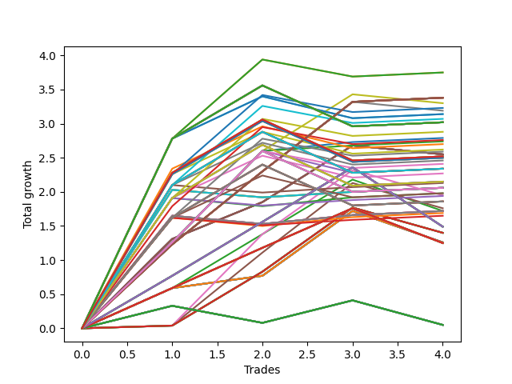

# Short HLT 11190d_Doug 
- Symbol: TSLA
- Date Range: 01/10/2024 - 05/17/2024
- Trading Period: 8:30-12:30
- Number of Trades: 4



| Id. | Name | Win Percent | Profit | Avg Profit / Trade | Avg Time / Trade | Std |      | Name | Win Percent | Profit | Avg Profit / Trade | Avg Time / Trade | Std |
| --- | ---- | ----------- | ------ | ------------------ | ---------------- | --- | ---- | ---- | ----------- | ------ | ------------------ | ---------------- | --- |
| | Sorted By <br> Profit | | | | | | | Sorted By <br> Win Percentage |||||
|0| TP-2.75 105m | 75.00 | 3.75 | 0.94 | 85:30 | 1.19 |     | TP-1 180m | 100.00 | 3.38 | 0.85 | 31:15 | 0.46 |
|1| TP-2.5 105m | 75.00 | 3.75 | 0.94 | 85:30 | 1.19 |     | TP-1 165m | 100.00 | 3.38 | 0.85 | 31:15 | 0.46 |
|2| TP-1 180m | 100.00 | 3.38 | 0.85 | 31:15 | 0.46 |     | TP-1 150m | 100.00 | 3.38 | 0.85 | 31:15 | 0.46 |
|3| TP-1 165m | 100.00 | 3.38 | 0.85 | 31:15 | 0.46 |     | TP-1 135m | 100.00 | 3.38 | 0.85 | 31:15 | 0.46 |
|4| TP-1 150m | 100.00 | 3.38 | 0.85 | 31:15 | 0.46 |     | TP-1 120m | 100.00 | 3.38 | 0.85 | 31:15 | 0.46 |
|5| TP-1 135m | 100.00 | 3.38 | 0.85 | 31:15 | 0.46 |     | TP-1 105m | 100.00 | 3.38 | 0.85 | 31:15 | 0.46 |
|6| TP-1 120m | 100.00 | 3.38 | 0.85 | 31:15 | 0.46 |     | TP-1 90m | 100.00 | 3.38 | 0.85 | 31:15 | 0.46 |
|7| TP-1 105m | 100.00 | 3.38 | 0.85 | 31:15 | 0.46 |     | TP-1 75m | 100.00 | 3.38 | 0.85 | 31:15 | 0.46 |
|8| TP-1 90m | 100.00 | 3.38 | 0.85 | 31:15 | 0.46 |     | TP-1 60m | 100.00 | 3.38 | 0.85 | 31:15 | 0.46 |
|9| TP-1 75m | 100.00 | 3.38 | 0.85 | 31:15 | 0.46 |     | TP-1.25 60m | 100.00 | 2.79 | 0.70 | 42:45 | 0.60 |
|10| TP-1 60m | 100.00 | 3.38 | 0.85 | 31:15 | 0.46 |     | TP-1.25 75m | 100.00 | 2.74 | 0.69 | 46:30 | 0.62 |
|11| TP-1.25 45m | 75.00 | 3.30 | 0.83 | 37:30 | 0.58 |     | TP-2.75 105m | 75.00 | 3.75 | 0.94 | 85:30 | 1.19 |
|12| TP-2.25 105m | 75.00 | 3.23 | 0.81 | 84:00 | 0.99 |     | TP-2.5 105m | 75.00 | 3.75 | 0.94 | 85:30 | 1.19 |
|13| TP-1 45m | 75.00 | 3.19 | 0.80 | 29:45 | 0.54 |     | TP-1.25 45m | 75.00 | 3.30 | 0.83 | 37:30 | 0.58 |
|14| TP-2.75 90m | 75.00 | 3.14 | 0.79 | 78:00 | 1.20 |     | TP-2.25 105m | 75.00 | 3.23 | 0.81 | 84:00 | 0.99 |
|15| TP-2.5 90m | 75.00 | 3.14 | 0.79 | 78:00 | 1.20 |     | TP-1 45m | 75.00 | 3.19 | 0.80 | 29:45 | 0.54 |
|16| TP-2 105m | 75.00 | 3.07 | 0.77 | 82:45 | 0.93 |     | TP-2.75 90m | 75.00 | 3.14 | 0.79 | 78:00 | 1.20 |
|17| TP-2.75 180m | 75.00 | 3.02 | 0.76 | 92:00 | 1.27 |     | TP-2.5 90m | 75.00 | 3.14 | 0.79 | 78:00 | 1.20 |
|18| TP-2.5 180m | 75.00 | 3.02 | 0.76 | 92:00 | 1.27 |     | TP-2 105m | 75.00 | 3.07 | 0.77 | 82:45 | 0.93 |
|19| TP-2.75 165m | 75.00 | 3.02 | 0.76 | 92:00 | 1.27 |     | TP-2.75 180m | 75.00 | 3.02 | 0.76 | 92:00 | 1.27 |
|20| TP-2.5 165m | 75.00 | 3.02 | 0.76 | 92:00 | 1.27 |     | TP-2.5 180m | 75.00 | 3.02 | 0.76 | 92:00 | 1.27 |
|21| TP-2.75 150m | 75.00 | 3.02 | 0.76 | 92:00 | 1.27 |     | TP-2.75 165m | 75.00 | 3.02 | 0.76 | 92:00 | 1.27 |
|22| TP-2.5 150m | 75.00 | 3.02 | 0.76 | 92:00 | 1.27 |     | TP-2.5 165m | 75.00 | 3.02 | 0.76 | 92:00 | 1.27 |
|23| TP-2.75 135m | 75.00 | 3.02 | 0.76 | 92:00 | 1.27 |     | TP-2.75 150m | 75.00 | 3.02 | 0.76 | 92:00 | 1.27 |
|24| TP-2.5 135m | 75.00 | 3.02 | 0.76 | 92:00 | 1.27 |     | TP-2.5 150m | 75.00 | 3.02 | 0.76 | 92:00 | 1.27 |
|25| TP-2.75 120m | 75.00 | 3.02 | 0.76 | 92:00 | 1.27 |     | TP-2.75 135m | 75.00 | 3.02 | 0.76 | 92:00 | 1.27 |
|26| TP-2.5 120m | 75.00 | 3.02 | 0.76 | 92:00 | 1.27 |     | TP-2.5 135m | 75.00 | 3.02 | 0.76 | 92:00 | 1.27 |
|27| TP-1.75 105m | 75.00 | 2.88 | 0.72 | 77:00 | 0.86 |     | TP-2.75 120m | 75.00 | 3.02 | 0.76 | 92:00 | 1.27 |
|28| TP-1.25 60m | 100.00 | 2.79 | 0.70 | 42:45 | 0.60 |     | TP-2.5 120m | 75.00 | 3.02 | 0.76 | 92:00 | 1.27 |
|29| TP-3 105m | 75.00 | 2.76 | 0.69 | 90:30 | 0.82 |     | TP-1.75 105m | 75.00 | 2.88 | 0.72 | 77:00 | 0.86 |
|30| TP-1.25 75m | 100.00 | 2.74 | 0.69 | 46:30 | 0.62 |     | TP-3 105m | 75.00 | 2.76 | 0.69 | 90:30 | 0.82 |
|31| TP-3 90m | 75.00 | 2.70 | 0.68 | 79:15 | 1.02 |     | TP-3 90m | 75.00 | 2.70 | 0.68 | 79:15 | 1.02 |
|32| TP-2.25 90m | 75.00 | 2.62 | 0.66 | 76:30 | 0.99 |     | TP-2.25 90m | 75.00 | 2.62 | 0.66 | 76:30 | 0.99 |
|33| TP-1.5 105m | 75.00 | 2.59 | 0.65 | 76:00 | 0.77 |     | TP-1.5 105m | 75.00 | 2.59 | 0.65 | 76:00 | 0.77 |
|34| TP-3 45m | 75.00 | 2.55 | 0.64 | 44:00 | 0.52 |     | TP-3 45m | 75.00 | 2.55 | 0.64 | 44:00 | 0.52 |
|35| TP-2.75 45m | 75.00 | 2.55 | 0.64 | 44:00 | 0.52 |     | TP-2.75 45m | 75.00 | 2.55 | 0.64 | 44:00 | 0.52 |
|36| TP-2.5 45m | 75.00 | 2.55 | 0.64 | 44:00 | 0.52 |     | TP-2.5 45m | 75.00 | 2.55 | 0.64 | 44:00 | 0.52 |
|37| TP-2.25 45m | 75.00 | 2.55 | 0.64 | 44:00 | 0.52 |     | TP-2.25 45m | 75.00 | 2.55 | 0.64 | 44:00 | 0.52 |
|38| TP-2 45m | 75.00 | 2.55 | 0.64 | 44:00 | 0.52 |     | TP-2 45m | 75.00 | 2.55 | 0.64 | 44:00 | 0.52 |
|39| TP-1.75 45m | 75.00 | 2.55 | 0.64 | 44:00 | 0.52 |     | TP-1.75 45m | 75.00 | 2.55 | 0.64 | 44:00 | 0.52 |
|40| TP-1.5 45m | 75.00 | 2.55 | 0.64 | 44:00 | 0.52 |     | TP-1.5 45m | 75.00 | 2.55 | 0.64 | 44:00 | 0.52 |
|41| TP-3 180m | 75.00 | 2.52 | 0.63 | 100:45 | 1.07 |     | TP-3 180m | 75.00 | 2.52 | 0.63 | 100:45 | 1.07 |
|42| TP-3 165m | 75.00 | 2.52 | 0.63 | 100:45 | 1.07 |     | TP-3 165m | 75.00 | 2.52 | 0.63 | 100:45 | 1.07 |
|43| TP-3 150m | 75.00 | 2.52 | 0.63 | 100:45 | 1.07 |     | TP-3 150m | 75.00 | 2.52 | 0.63 | 100:45 | 1.07 |
|44| TP-3 135m | 75.00 | 2.52 | 0.63 | 100:45 | 1.07 |     | TP-3 135m | 75.00 | 2.52 | 0.63 | 100:45 | 1.07 |
|45| TP-3 120m | 75.00 | 2.52 | 0.63 | 100:45 | 1.07 |     | TP-3 120m | 75.00 | 2.52 | 0.63 | 100:45 | 1.07 |
|46| TP-2.25 180m | 75.00 | 2.50 | 0.63 | 90:30 | 1.06 |     | TP-2.25 180m | 75.00 | 2.50 | 0.63 | 90:30 | 1.06 |
|47| TP-2.25 165m | 75.00 | 2.50 | 0.63 | 90:30 | 1.06 |     | TP-2.25 165m | 75.00 | 2.50 | 0.63 | 90:30 | 1.06 |
|48| TP-2.25 150m | 75.00 | 2.50 | 0.63 | 90:30 | 1.06 |     | TP-2.25 150m | 75.00 | 2.50 | 0.63 | 90:30 | 1.06 |
|49| TP-2.25 135m | 75.00 | 2.50 | 0.63 | 90:30 | 1.06 |     | TP-2.25 135m | 75.00 | 2.50 | 0.63 | 90:30 | 1.06 |
|50| TP-2.25 120m | 75.00 | 2.50 | 0.63 | 90:30 | 1.06 |     | TP-2.25 120m | 75.00 | 2.50 | 0.63 | 90:30 | 1.06 |
|51| TP-2 90m | 75.00 | 2.46 | 0.62 | 75:15 | 0.92 |     | TP-2 90m | 75.00 | 2.46 | 0.62 | 75:15 | 0.92 |
|52| TP-1.25 105m | 75.00 | 2.41 | 0.60 | 54:00 | 0.71 |     | TP-1.25 105m | 75.00 | 2.41 | 0.60 | 54:00 | 0.71 |
|53| TP-2 180m | 75.00 | 2.34 | 0.59 | 89:15 | 1.00 |     | TP-2 180m | 75.00 | 2.34 | 0.59 | 89:15 | 1.00 |
|54| TP-2 165m | 75.00 | 2.34 | 0.59 | 89:15 | 1.00 |     | TP-2 165m | 75.00 | 2.34 | 0.59 | 89:15 | 1.00 |
|55| TP-2 150m | 75.00 | 2.34 | 0.59 | 89:15 | 1.00 |     | TP-2 150m | 75.00 | 2.34 | 0.59 | 89:15 | 1.00 |
|56| TP-2 135m | 75.00 | 2.34 | 0.59 | 89:15 | 1.00 |     | TP-2 135m | 75.00 | 2.34 | 0.59 | 89:15 | 1.00 |
|57| TP-2 120m | 75.00 | 2.34 | 0.59 | 89:15 | 1.00 |     | TP-2 120m | 75.00 | 2.34 | 0.59 | 89:15 | 1.00 |
|58| TP-1.25 90m | 75.00 | 2.34 | 0.59 | 50:15 | 0.73 |     | TP-1.25 90m | 75.00 | 2.34 | 0.59 | 50:15 | 0.73 |
|59| TP-1.75 90m | 75.00 | 2.27 | 0.57 | 69:30 | 0.84 |     | TP-1.75 90m | 75.00 | 2.27 | 0.57 | 69:30 | 0.84 |
|60| TP-1.75 180m | 75.00 | 2.15 | 0.54 | 83:30 | 0.93 |     | TP-1.75 180m | 75.00 | 2.15 | 0.54 | 83:30 | 0.93 |
|61| TP-1.75 165m | 75.00 | 2.15 | 0.54 | 83:30 | 0.93 |     | TP-1.75 165m | 75.00 | 2.15 | 0.54 | 83:30 | 0.93 |
|62| TP-1.75 150m | 75.00 | 2.15 | 0.54 | 83:30 | 0.93 |     | TP-1.75 150m | 75.00 | 2.15 | 0.54 | 83:30 | 0.93 |
|63| TP-1.75 135m | 75.00 | 2.15 | 0.54 | 83:30 | 0.93 |     | TP-1.75 135m | 75.00 | 2.15 | 0.54 | 83:30 | 0.93 |
|64| TP-1.75 120m | 75.00 | 2.15 | 0.54 | 83:30 | 0.93 |     | TP-1.75 120m | 75.00 | 2.15 | 0.54 | 83:30 | 0.93 |
|65| TP-2 75m | 75.00 | 2.13 | 0.53 | 67:45 | 0.91 |     | TP-2 75m | 75.00 | 2.13 | 0.53 | 67:45 | 0.91 |
|66| TP-1.25 180m | 75.00 | 2.06 | 0.52 | 57:45 | 0.82 |     | TP-1.25 180m | 75.00 | 2.06 | 0.52 | 57:45 | 0.82 |
|67| TP-1.25 165m | 75.00 | 2.06 | 0.52 | 57:45 | 0.82 |     | TP-1.25 165m | 75.00 | 2.06 | 0.52 | 57:45 | 0.82 |
|68| TP-1.25 150m | 75.00 | 2.06 | 0.52 | 57:45 | 0.82 |     | TP-1.25 150m | 75.00 | 2.06 | 0.52 | 57:45 | 0.82 |
|69| TP-1.25 135m | 75.00 | 2.06 | 0.52 | 57:45 | 0.82 |     | TP-1.25 135m | 75.00 | 2.06 | 0.52 | 57:45 | 0.82 |
|70| TP-1.25 120m | 75.00 | 2.06 | 0.52 | 57:45 | 0.82 |     | TP-1.25 120m | 75.00 | 2.06 | 0.52 | 57:45 | 0.82 |
|71| TP-3 75m | 75.00 | 2.06 | 0.52 | 68:00 | 0.88 |     | TP-3 75m | 75.00 | 2.06 | 0.52 | 68:00 | 0.88 |
|72| TP-2.75 75m | 75.00 | 2.06 | 0.52 | 68:00 | 0.88 |     | TP-2.75 75m | 75.00 | 2.06 | 0.52 | 68:00 | 0.88 |
|73| TP-2.5 75m | 75.00 | 2.06 | 0.52 | 68:00 | 0.88 |     | TP-2.5 75m | 75.00 | 2.06 | 0.52 | 68:00 | 0.88 |
|74| TP-2.25 75m | 75.00 | 2.06 | 0.52 | 68:00 | 0.88 |     | TP-2.25 75m | 75.00 | 2.06 | 0.52 | 68:00 | 0.88 |
|75| TP-1.5 90m | 75.00 | 1.98 | 0.50 | 68:30 | 0.73 |     | TP-1.5 90m | 75.00 | 1.98 | 0.50 | 68:30 | 0.73 |
|76| TP-1.75 60m | 75.00 | 1.98 | 0.50 | 54:30 | 0.82 |     | TP-1.75 60m | 75.00 | 1.98 | 0.50 | 54:30 | 0.82 |
|77| TP-1.25 30m | 75.00 | 1.95 | 0.49 | 27:00 | 0.68 |     | TP-1.25 30m | 75.00 | 1.95 | 0.49 | 27:00 | 0.68 |
|78| TP-1.75 75m | 75.00 | 1.94 | 0.48 | 62:00 | 0.83 |     | TP-1.75 75m | 75.00 | 1.94 | 0.48 | 62:00 | 0.83 |
|79| TP-1.5 180m | 75.00 | 1.86 | 0.47 | 82:30 | 0.83 |     | TP-1.5 180m | 75.00 | 1.86 | 0.47 | 82:30 | 0.83 |
|80| TP-1.5 165m | 75.00 | 1.86 | 0.47 | 82:30 | 0.83 |     | TP-1.5 165m | 75.00 | 1.86 | 0.47 | 82:30 | 0.83 |
|81| TP-1.5 150m | 75.00 | 1.86 | 0.47 | 82:30 | 0.83 |     | TP-1.5 150m | 75.00 | 1.86 | 0.47 | 82:30 | 0.83 |
|82| TP-1.5 135m | 75.00 | 1.86 | 0.47 | 82:30 | 0.83 |     | TP-1.5 135m | 75.00 | 1.86 | 0.47 | 82:30 | 0.83 |
|83| TP-1.5 120m | 75.00 | 1.86 | 0.47 | 82:30 | 0.83 |     | TP-1.5 120m | 75.00 | 1.86 | 0.47 | 82:30 | 0.83 |
|84| TP-1 30m | 75.00 | 1.76 | 0.44 | 23:15 | 0.62 |     | TP-1 30m | 75.00 | 1.76 | 0.44 | 23:15 | 0.62 |
|85| TP-3 60m | 75.00 | 1.72 | 0.43 | 56:45 | 0.71 |     | TP-3 60m | 75.00 | 1.72 | 0.43 | 56:45 | 0.71 |
|86| TP-2.75 60m | 75.00 | 1.72 | 0.43 | 56:45 | 0.71 |     | TP-2.75 60m | 75.00 | 1.72 | 0.43 | 56:45 | 0.71 |
|87| TP-2.5 60m | 75.00 | 1.72 | 0.43 | 56:45 | 0.71 |     | TP-2.5 60m | 75.00 | 1.72 | 0.43 | 56:45 | 0.71 |
|88| TP-2.25 60m | 75.00 | 1.72 | 0.43 | 56:45 | 0.71 |     | TP-2.25 60m | 75.00 | 1.72 | 0.43 | 56:45 | 0.71 |
|89| TP-2 60m | 75.00 | 1.72 | 0.43 | 56:45 | 0.71 |     | TP-2 60m | 75.00 | 1.72 | 0.43 | 56:45 | 0.71 |
|90| TP-0.75 15m | 75.00 | 1.72 | 0.43 | 11:45 | 0.52 |     | TP-0.75 15m | 75.00 | 1.72 | 0.43 | 11:45 | 0.52 |
|91| TP-1.5 60m | 75.00 | 1.69 | 0.42 | 53:30 | 0.70 |     | TP-1.5 60m | 75.00 | 1.69 | 0.42 | 53:30 | 0.70 |
|92| TP-1.5 75m | 75.00 | 1.65 | 0.41 | 61:00 | 0.70 |     | TP-1.5 75m | 75.00 | 1.65 | 0.41 | 61:00 | 0.70 |
|93| TP-0.75 180m | 75.00 | 1.49 | 0.37 | 12:45 | 0.72 |     | TP-0.75 180m | 75.00 | 1.49 | 0.37 | 12:45 | 0.72 |
|94| TP-0.75 165m | 75.00 | 1.49 | 0.37 | 12:45 | 0.72 |     | TP-0.75 165m | 75.00 | 1.49 | 0.37 | 12:45 | 0.72 |
|95| TP-0.75 150m | 75.00 | 1.49 | 0.37 | 12:45 | 0.72 |     | TP-0.75 150m | 75.00 | 1.49 | 0.37 | 12:45 | 0.72 |
|96| TP-0.75 135m | 75.00 | 1.49 | 0.37 | 12:45 | 0.72 |     | TP-0.75 135m | 75.00 | 1.49 | 0.37 | 12:45 | 0.72 |
|97| TP-0.75 120m | 75.00 | 1.49 | 0.37 | 12:45 | 0.72 |     | TP-0.75 120m | 75.00 | 1.49 | 0.37 | 12:45 | 0.72 |
|98| TP-0.75 105m | 75.00 | 1.49 | 0.37 | 12:45 | 0.72 |     | TP-0.75 105m | 75.00 | 1.49 | 0.37 | 12:45 | 0.72 |
|99| TP-0.75 90m | 75.00 | 1.49 | 0.37 | 12:45 | 0.72 |     | TP-0.75 90m | 75.00 | 1.49 | 0.37 | 12:45 | 0.72 |
|100| TP-0.75 75m | 75.00 | 1.49 | 0.37 | 12:45 | 0.72 |     | TP-0.75 75m | 75.00 | 1.49 | 0.37 | 12:45 | 0.72 |
|101| TP-0.75 60m | 75.00 | 1.49 | 0.37 | 12:45 | 0.72 |     | TP-0.75 60m | 75.00 | 1.49 | 0.37 | 12:45 | 0.72 |
|102| TP-0.75 45m | 75.00 | 1.49 | 0.37 | 12:45 | 0.72 |     | TP-0.75 45m | 75.00 | 1.49 | 0.37 | 12:45 | 0.72 |
|103| TP-0.75 30m | 75.00 | 1.49 | 0.37 | 12:45 | 0.72 |     | TP-0.75 30m | 75.00 | 1.49 | 0.37 | 12:45 | 0.72 |
|104| TP-3 30m | 75.00 | 1.40 | 0.35 | 29:00 | 0.54 |     | TP-3 30m | 75.00 | 1.40 | 0.35 | 29:00 | 0.54 |
|105| TP-2.75 30m | 75.00 | 1.40 | 0.35 | 29:00 | 0.54 |     | TP-2.75 30m | 75.00 | 1.40 | 0.35 | 29:00 | 0.54 |
|106| TP-2.5 30m | 75.00 | 1.40 | 0.35 | 29:00 | 0.54 |     | TP-2.5 30m | 75.00 | 1.40 | 0.35 | 29:00 | 0.54 |
|107| TP-2.25 30m | 75.00 | 1.40 | 0.35 | 29:00 | 0.54 |     | TP-2.25 30m | 75.00 | 1.40 | 0.35 | 29:00 | 0.54 |
|108| TP-2 30m | 75.00 | 1.40 | 0.35 | 29:00 | 0.54 |     | TP-2 30m | 75.00 | 1.40 | 0.35 | 29:00 | 0.54 |
|109| TP-1.75 30m | 75.00 | 1.40 | 0.35 | 29:00 | 0.54 |     | TP-1.75 30m | 75.00 | 1.40 | 0.35 | 29:00 | 0.54 |
|110| TP-1.5 30m | 75.00 | 1.40 | 0.35 | 29:00 | 0.54 |     | TP-1.5 30m | 75.00 | 1.40 | 0.35 | 29:00 | 0.54 |
|111| TP-3 15m | 75.00 | 1.26 | 0.32 | 14:00 | 0.52 |     | TP-3 15m | 75.00 | 1.26 | 0.32 | 14:00 | 0.52 |
|112| TP-2.75 15m | 75.00 | 1.26 | 0.32 | 14:00 | 0.52 |     | TP-2.75 15m | 75.00 | 1.26 | 0.32 | 14:00 | 0.52 |
|113| TP-2.5 15m | 75.00 | 1.26 | 0.32 | 14:00 | 0.52 |     | TP-2.5 15m | 75.00 | 1.26 | 0.32 | 14:00 | 0.52 |
|114| TP-2.25 15m | 75.00 | 1.26 | 0.32 | 14:00 | 0.52 |     | TP-2.25 15m | 75.00 | 1.26 | 0.32 | 14:00 | 0.52 |
|115| TP-2 15m | 75.00 | 1.26 | 0.32 | 14:00 | 0.52 |     | TP-2 15m | 75.00 | 1.26 | 0.32 | 14:00 | 0.52 |
|116| TP-1.75 15m | 75.00 | 1.26 | 0.32 | 14:00 | 0.52 |     | TP-1.75 15m | 75.00 | 1.26 | 0.32 | 14:00 | 0.52 |
|117| TP-1.5 15m | 75.00 | 1.26 | 0.32 | 14:00 | 0.52 |     | TP-1.5 15m | 75.00 | 1.26 | 0.32 | 14:00 | 0.52 |
|118| TP-1.25 15m | 75.00 | 1.26 | 0.32 | 14:00 | 0.52 |     | TP-1.25 15m | 75.00 | 1.26 | 0.32 | 14:00 | 0.52 |
|119| TP-1 15m | 75.00 | 1.26 | 0.32 | 14:00 | 0.52 |     | TP-1 15m | 75.00 | 1.26 | 0.32 | 14:00 | 0.52 |
|120| TP-0.5 180m | 75.00 | 1.25 | 0.31 | 10:00 | 0.47 |     | TP-0.5 180m | 75.00 | 1.25 | 0.31 | 10:00 | 0.47 |
|121| TP-0.5 165m | 75.00 | 1.25 | 0.31 | 10:00 | 0.47 |     | TP-0.5 165m | 75.00 | 1.25 | 0.31 | 10:00 | 0.47 |
|122| TP-0.5 150m | 75.00 | 1.25 | 0.31 | 10:00 | 0.47 |     | TP-0.5 150m | 75.00 | 1.25 | 0.31 | 10:00 | 0.47 |
|123| TP-0.5 135m | 75.00 | 1.25 | 0.31 | 10:00 | 0.47 |     | TP-0.5 135m | 75.00 | 1.25 | 0.31 | 10:00 | 0.47 |
|124| TP-0.5 120m | 75.00 | 1.25 | 0.31 | 10:00 | 0.47 |     | TP-0.5 120m | 75.00 | 1.25 | 0.31 | 10:00 | 0.47 |
|125| TP-0.5 105m | 75.00 | 1.25 | 0.31 | 10:00 | 0.47 |     | TP-0.5 105m | 75.00 | 1.25 | 0.31 | 10:00 | 0.47 |
|126| TP-0.5 90m | 75.00 | 1.25 | 0.31 | 10:00 | 0.47 |     | TP-0.5 90m | 75.00 | 1.25 | 0.31 | 10:00 | 0.47 |
|127| TP-0.5 75m | 75.00 | 1.25 | 0.31 | 10:00 | 0.47 |     | TP-0.5 75m | 75.00 | 1.25 | 0.31 | 10:00 | 0.47 |
|128| TP-0.5 60m | 75.00 | 1.25 | 0.31 | 10:00 | 0.47 |     | TP-0.5 60m | 75.00 | 1.25 | 0.31 | 10:00 | 0.47 |
|129| TP-0.5 45m | 75.00 | 1.25 | 0.31 | 10:00 | 0.47 |     | TP-0.5 45m | 75.00 | 1.25 | 0.31 | 10:00 | 0.47 |
|130| TP-0.5 30m | 75.00 | 1.25 | 0.31 | 10:00 | 0.47 |     | TP-0.5 30m | 75.00 | 1.25 | 0.31 | 10:00 | 0.47 |
|131| TP-0.5 15m | 75.00 | 1.25 | 0.31 | 10:00 | 0.47 |     | TP-0.5 15m | 75.00 | 1.25 | 0.31 | 10:00 | 0.47 |
|132| TP-0.25 180m | 50.00 | 0.05 | 0.01 | 05:00 | 0.32 |     | TP-0.25 180m | 50.00 | 0.05 | 0.01 | 05:00 | 0.32 |
|133| TP-0.25 165m | 50.00 | 0.05 | 0.01 | 05:00 | 0.32 |     | TP-0.25 165m | 50.00 | 0.05 | 0.01 | 05:00 | 0.32 |
|134| TP-0.25 150m | 50.00 | 0.05 | 0.01 | 05:00 | 0.32 |     | TP-0.25 150m | 50.00 | 0.05 | 0.01 | 05:00 | 0.32 |
|135| TP-0.25 135m | 50.00 | 0.05 | 0.01 | 05:00 | 0.32 |     | TP-0.25 135m | 50.00 | 0.05 | 0.01 | 05:00 | 0.32 |
|136| TP-0.25 120m | 50.00 | 0.05 | 0.01 | 05:00 | 0.32 |     | TP-0.25 120m | 50.00 | 0.05 | 0.01 | 05:00 | 0.32 |
|137| TP-0.25 105m | 50.00 | 0.05 | 0.01 | 05:00 | 0.32 |     | TP-0.25 105m | 50.00 | 0.05 | 0.01 | 05:00 | 0.32 |
|138| TP-0.25 90m | 50.00 | 0.05 | 0.01 | 05:00 | 0.32 |     | TP-0.25 90m | 50.00 | 0.05 | 0.01 | 05:00 | 0.32 |
|139| TP-0.25 75m | 50.00 | 0.05 | 0.01 | 05:00 | 0.32 |     | TP-0.25 75m | 50.00 | 0.05 | 0.01 | 05:00 | 0.32 |
|140| TP-0.25 60m | 50.00 | 0.05 | 0.01 | 05:00 | 0.32 |     | TP-0.25 60m | 50.00 | 0.05 | 0.01 | 05:00 | 0.32 |
|141| TP-0.25 45m | 50.00 | 0.05 | 0.01 | 05:00 | 0.32 |     | TP-0.25 45m | 50.00 | 0.05 | 0.01 | 05:00 | 0.32 |
|142| TP-0.25 30m | 50.00 | 0.05 | 0.01 | 05:00 | 0.32 |     | TP-0.25 30m | 50.00 | 0.05 | 0.01 | 05:00 | 0.32 |
|143| TP-0.25 15m | 50.00 | 0.05 | 0.01 | 05:00 | 0.32 |     | TP-0.25 15m | 50.00 | 0.05 | 0.01 | 05:00 | 0.32 |

### Test TP-0.25 15m
* Take Profit of 0.25 Point
* 0.25 Stoploss
* Results:
```
Total Trades: 4
Percent Up: 50.00
Percent Down: 50.00
Total Points Moved Down: 0.05
Potential Profit: 25.00
Total Points Ups: 0.61 Count Ups: 2
Total Points Downs: 0.66 Count Downs: 2
```

<details><summary>Trades</summary>

<code>In: 2024-01-24 10:00:00		Out: 2024-01-24 10:03:00		Total Position Time: 03:00		Total Move Down: 0.33		Total to Date: 0.33</code> <br />
<code>In: 2024-03-06 10:55:00		Out: 2024-03-06 10:58:00		Total Position Time: 03:00		Total Move Down: -0.25		Total to Date: 0.08</code> <br />
<code>In: 2024-03-12 09:30:00		Out: 2024-03-12 09:37:00		Total Position Time: 07:00		Total Move Down: 0.33		Total to Date: 0.41</code> <br />
<code>In: 2024-05-03 12:00:00		Out: 2024-05-03 12:07:00		Total Position Time: 07:00		Total Move Down: -0.36		Total to Date: 0.05</code> <br />


</details>

### Test TP-0.5 15m
* Take Profit of 0.5 Point
* 0.5 Stoploss
* Results:
```
Total Trades: 4
Percent Up: 25.00
Percent Down: 75.00
Total Points Moved Down: 1.25
Potential Profit: 625.00
Total Points Ups: 0.51 Count Ups: 1
Total Points Downs: 1.76 Count Downs: 3
```

<details><summary>Trades</summary>

<code>In: 2024-01-24 10:00:00		Out: 2024-01-24 10:14:00		Total Position Time: 14:00		Total Move Down: 0.59		Total to Date: 0.59</code> <br />
<code>In: 2024-03-06 10:55:00		Out: 2024-03-06 11:03:00		Total Position Time: 08:00		Total Move Down: 0.59		Total to Date: 1.18</code> <br />
<code>In: 2024-03-12 09:30:00		Out: 2024-03-12 09:38:00		Total Position Time: 08:00		Total Move Down: 0.58		Total to Date: 1.76</code> <br />
<code>In: 2024-05-03 12:00:00		Out: 2024-05-03 12:10:00		Total Position Time: 10:00		Total Move Down: -0.51		Total to Date: 1.25</code> <br />


</details>

### Test TP-0.75 15m
* Take Profit of 0.75 Point
* 0.75 Stoploss
* Results:
```
Total Trades: 4
Percent Up: 25.00
Percent Down: 75.00
Total Points Moved Down: 1.72
Potential Profit: 860.00
Total Points Ups: 0.46 Count Ups: 1
Total Points Downs: 2.18 Count Downs: 3
```

<details><summary>Trades</summary>

<code>In: 2024-01-24 10:00:00		Out: 2024-01-24 10:14:00		Total Position Time: 14:00		Total Move Down: 0.59		Total to Date: 0.59</code> <br />
<code>In: 2024-03-06 10:55:00		Out: 2024-03-06 11:04:00		Total Position Time: 09:00		Total Move Down: 0.79		Total to Date: 1.38</code> <br />
<code>In: 2024-03-12 09:30:00		Out: 2024-03-12 09:40:00		Total Position Time: 10:00		Total Move Down: 0.80		Total to Date: 2.18</code> <br />
<code>In: 2024-05-03 12:00:00		Out: 2024-05-03 12:14:00		Total Position Time: 14:00		Total Move Down: -0.46		Total to Date: 1.72</code> <br />


</details>

### Test TP-1 15m
* Take Profit of 1 Point
* 1 Stoploss
* Results:
```
Total Trades: 4
Percent Up: 25.00
Percent Down: 75.00
Total Points Moved Down: 1.26
Potential Profit: 630.00
Total Points Ups: 0.46 Count Ups: 1
Total Points Downs: 1.72 Count Downs: 3
```

<details><summary>Trades</summary>

<code>In: 2024-01-24 10:00:00		Out: 2024-01-24 10:14:00		Total Position Time: 14:00		Total Move Down: 0.59		Total to Date: 0.59</code> <br />
<code>In: 2024-03-06 10:55:00		Out: 2024-03-06 11:09:00		Total Position Time: 14:00		Total Move Down: 0.18		Total to Date: 0.77</code> <br />
<code>In: 2024-03-12 09:30:00		Out: 2024-03-12 09:44:00		Total Position Time: 14:00		Total Move Down: 0.95		Total to Date: 1.72</code> <br />
<code>In: 2024-05-03 12:00:00		Out: 2024-05-03 12:14:00		Total Position Time: 14:00		Total Move Down: -0.46		Total to Date: 1.26</code> <br />


</details>

### Test TP-1.25 15m
* Take Profit of 1.25 Point
* 1.25 Stoploss
* Results:
```
Total Trades: 4
Percent Up: 25.00
Percent Down: 75.00
Total Points Moved Down: 1.26
Potential Profit: 630.00
Total Points Ups: 0.46 Count Ups: 1
Total Points Downs: 1.72 Count Downs: 3
```

<details><summary>Trades</summary>

<code>In: 2024-01-24 10:00:00		Out: 2024-01-24 10:14:00		Total Position Time: 14:00		Total Move Down: 0.59		Total to Date: 0.59</code> <br />
<code>In: 2024-03-06 10:55:00		Out: 2024-03-06 11:09:00		Total Position Time: 14:00		Total Move Down: 0.18		Total to Date: 0.77</code> <br />
<code>In: 2024-03-12 09:30:00		Out: 2024-03-12 09:44:00		Total Position Time: 14:00		Total Move Down: 0.95		Total to Date: 1.72</code> <br />
<code>In: 2024-05-03 12:00:00		Out: 2024-05-03 12:14:00		Total Position Time: 14:00		Total Move Down: -0.46		Total to Date: 1.26</code> <br />


</details>

### Test TP-1.5 15m
* Take Profit of 1.5 Point
* 1.5 Stoploss
* Results:
```
Total Trades: 4
Percent Up: 25.00
Percent Down: 75.00
Total Points Moved Down: 1.26
Potential Profit: 630.00
Total Points Ups: 0.46 Count Ups: 1
Total Points Downs: 1.72 Count Downs: 3
```

<details><summary>Trades</summary>

<code>In: 2024-01-24 10:00:00		Out: 2024-01-24 10:14:00		Total Position Time: 14:00		Total Move Down: 0.59		Total to Date: 0.59</code> <br />
<code>In: 2024-03-06 10:55:00		Out: 2024-03-06 11:09:00		Total Position Time: 14:00		Total Move Down: 0.18		Total to Date: 0.77</code> <br />
<code>In: 2024-03-12 09:30:00		Out: 2024-03-12 09:44:00		Total Position Time: 14:00		Total Move Down: 0.95		Total to Date: 1.72</code> <br />
<code>In: 2024-05-03 12:00:00		Out: 2024-05-03 12:14:00		Total Position Time: 14:00		Total Move Down: -0.46		Total to Date: 1.26</code> <br />


</details>

### Test TP-1.75 15m
* Take Profit of 1.75 Point
* 1.75 Stoploss
* Results:
```
Total Trades: 4
Percent Up: 25.00
Percent Down: 75.00
Total Points Moved Down: 1.26
Potential Profit: 630.00
Total Points Ups: 0.46 Count Ups: 1
Total Points Downs: 1.72 Count Downs: 3
```

<details><summary>Trades</summary>

<code>In: 2024-01-24 10:00:00		Out: 2024-01-24 10:14:00		Total Position Time: 14:00		Total Move Down: 0.59		Total to Date: 0.59</code> <br />
<code>In: 2024-03-06 10:55:00		Out: 2024-03-06 11:09:00		Total Position Time: 14:00		Total Move Down: 0.18		Total to Date: 0.77</code> <br />
<code>In: 2024-03-12 09:30:00		Out: 2024-03-12 09:44:00		Total Position Time: 14:00		Total Move Down: 0.95		Total to Date: 1.72</code> <br />
<code>In: 2024-05-03 12:00:00		Out: 2024-05-03 12:14:00		Total Position Time: 14:00		Total Move Down: -0.46		Total to Date: 1.26</code> <br />


</details>

### Test TP-2 15m
* Take Profit of 2 Point
* 2 Stoploss
* Results:
```
Total Trades: 4
Percent Up: 25.00
Percent Down: 75.00
Total Points Moved Down: 1.26
Potential Profit: 630.00
Total Points Ups: 0.46 Count Ups: 1
Total Points Downs: 1.72 Count Downs: 3
```

<details><summary>Trades</summary>

<code>In: 2024-01-24 10:00:00		Out: 2024-01-24 10:14:00		Total Position Time: 14:00		Total Move Down: 0.59		Total to Date: 0.59</code> <br />
<code>In: 2024-03-06 10:55:00		Out: 2024-03-06 11:09:00		Total Position Time: 14:00		Total Move Down: 0.18		Total to Date: 0.77</code> <br />
<code>In: 2024-03-12 09:30:00		Out: 2024-03-12 09:44:00		Total Position Time: 14:00		Total Move Down: 0.95		Total to Date: 1.72</code> <br />
<code>In: 2024-05-03 12:00:00		Out: 2024-05-03 12:14:00		Total Position Time: 14:00		Total Move Down: -0.46		Total to Date: 1.26</code> <br />


</details>

### Test TP-2.25 15m
* Take Profit of 2.25 Point
* 2.25 Stoploss
* Results:
```
Total Trades: 4
Percent Up: 25.00
Percent Down: 75.00
Total Points Moved Down: 1.26
Potential Profit: 630.00
Total Points Ups: 0.46 Count Ups: 1
Total Points Downs: 1.72 Count Downs: 3
```

<details><summary>Trades</summary>

<code>In: 2024-01-24 10:00:00		Out: 2024-01-24 10:14:00		Total Position Time: 14:00		Total Move Down: 0.59		Total to Date: 0.59</code> <br />
<code>In: 2024-03-06 10:55:00		Out: 2024-03-06 11:09:00		Total Position Time: 14:00		Total Move Down: 0.18		Total to Date: 0.77</code> <br />
<code>In: 2024-03-12 09:30:00		Out: 2024-03-12 09:44:00		Total Position Time: 14:00		Total Move Down: 0.95		Total to Date: 1.72</code> <br />
<code>In: 2024-05-03 12:00:00		Out: 2024-05-03 12:14:00		Total Position Time: 14:00		Total Move Down: -0.46		Total to Date: 1.26</code> <br />


</details>

### Test TP-2.5 15m
* Take Profit of 2.5 Point
* 2.5 Stoploss
* Results:
```
Total Trades: 4
Percent Up: 25.00
Percent Down: 75.00
Total Points Moved Down: 1.26
Potential Profit: 630.00
Total Points Ups: 0.46 Count Ups: 1
Total Points Downs: 1.72 Count Downs: 3
```

<details><summary>Trades</summary>

<code>In: 2024-01-24 10:00:00		Out: 2024-01-24 10:14:00		Total Position Time: 14:00		Total Move Down: 0.59		Total to Date: 0.59</code> <br />
<code>In: 2024-03-06 10:55:00		Out: 2024-03-06 11:09:00		Total Position Time: 14:00		Total Move Down: 0.18		Total to Date: 0.77</code> <br />
<code>In: 2024-03-12 09:30:00		Out: 2024-03-12 09:44:00		Total Position Time: 14:00		Total Move Down: 0.95		Total to Date: 1.72</code> <br />
<code>In: 2024-05-03 12:00:00		Out: 2024-05-03 12:14:00		Total Position Time: 14:00		Total Move Down: -0.46		Total to Date: 1.26</code> <br />


</details>

### Test TP-2.75 15m
* Take Profit of 2.75 Point
* 2.75 Stoploss
* Results:
```
Total Trades: 4
Percent Up: 25.00
Percent Down: 75.00
Total Points Moved Down: 1.26
Potential Profit: 630.00
Total Points Ups: 0.46 Count Ups: 1
Total Points Downs: 1.72 Count Downs: 3
```

<details><summary>Trades</summary>

<code>In: 2024-01-24 10:00:00		Out: 2024-01-24 10:14:00		Total Position Time: 14:00		Total Move Down: 0.59		Total to Date: 0.59</code> <br />
<code>In: 2024-03-06 10:55:00		Out: 2024-03-06 11:09:00		Total Position Time: 14:00		Total Move Down: 0.18		Total to Date: 0.77</code> <br />
<code>In: 2024-03-12 09:30:00		Out: 2024-03-12 09:44:00		Total Position Time: 14:00		Total Move Down: 0.95		Total to Date: 1.72</code> <br />
<code>In: 2024-05-03 12:00:00		Out: 2024-05-03 12:14:00		Total Position Time: 14:00		Total Move Down: -0.46		Total to Date: 1.26</code> <br />


</details>

### Test TP-3 15m
* Take Profit of 3 Point
* 3 Stoploss
* Results:
```
Total Trades: 4
Percent Up: 25.00
Percent Down: 75.00
Total Points Moved Down: 1.26
Potential Profit: 630.00
Total Points Ups: 0.46 Count Ups: 1
Total Points Downs: 1.72 Count Downs: 3
```

<details><summary>Trades</summary>

<code>In: 2024-01-24 10:00:00		Out: 2024-01-24 10:14:00		Total Position Time: 14:00		Total Move Down: 0.59		Total to Date: 0.59</code> <br />
<code>In: 2024-03-06 10:55:00		Out: 2024-03-06 11:09:00		Total Position Time: 14:00		Total Move Down: 0.18		Total to Date: 0.77</code> <br />
<code>In: 2024-03-12 09:30:00		Out: 2024-03-12 09:44:00		Total Position Time: 14:00		Total Move Down: 0.95		Total to Date: 1.72</code> <br />
<code>In: 2024-05-03 12:00:00		Out: 2024-05-03 12:14:00		Total Position Time: 14:00		Total Move Down: -0.46		Total to Date: 1.26</code> <br />


</details>

### Test TP-0.25 30m
* Take Profit of 0.25 Point
* 0.25 Stoploss
* Results:
```
Total Trades: 4
Percent Up: 50.00
Percent Down: 50.00
Total Points Moved Down: 0.05
Potential Profit: 25.00
Total Points Ups: 0.61 Count Ups: 2
Total Points Downs: 0.66 Count Downs: 2
```

<details><summary>Trades</summary>

<code>In: 2024-01-24 10:00:00		Out: 2024-01-24 10:03:00		Total Position Time: 03:00		Total Move Down: 0.33		Total to Date: 0.33</code> <br />
<code>In: 2024-03-06 10:55:00		Out: 2024-03-06 10:58:00		Total Position Time: 03:00		Total Move Down: -0.25		Total to Date: 0.08</code> <br />
<code>In: 2024-03-12 09:30:00		Out: 2024-03-12 09:37:00		Total Position Time: 07:00		Total Move Down: 0.33		Total to Date: 0.41</code> <br />
<code>In: 2024-05-03 12:00:00		Out: 2024-05-03 12:07:00		Total Position Time: 07:00		Total Move Down: -0.36		Total to Date: 0.05</code> <br />


</details>

### Test TP-0.5 30m
* Take Profit of 0.5 Point
* 0.5 Stoploss
* Results:
```
Total Trades: 4
Percent Up: 25.00
Percent Down: 75.00
Total Points Moved Down: 1.25
Potential Profit: 625.00
Total Points Ups: 0.51 Count Ups: 1
Total Points Downs: 1.76 Count Downs: 3
```

<details><summary>Trades</summary>

<code>In: 2024-01-24 10:00:00		Out: 2024-01-24 10:14:00		Total Position Time: 14:00		Total Move Down: 0.59		Total to Date: 0.59</code> <br />
<code>In: 2024-03-06 10:55:00		Out: 2024-03-06 11:03:00		Total Position Time: 08:00		Total Move Down: 0.59		Total to Date: 1.18</code> <br />
<code>In: 2024-03-12 09:30:00		Out: 2024-03-12 09:38:00		Total Position Time: 08:00		Total Move Down: 0.58		Total to Date: 1.76</code> <br />
<code>In: 2024-05-03 12:00:00		Out: 2024-05-03 12:10:00		Total Position Time: 10:00		Total Move Down: -0.51		Total to Date: 1.25</code> <br />


</details>

### Test TP-0.75 30m
* Take Profit of 0.75 Point
* 0.75 Stoploss
* Results:
```
Total Trades: 4
Percent Up: 25.00
Percent Down: 75.00
Total Points Moved Down: 1.49
Potential Profit: 745.00
Total Points Ups: 0.87 Count Ups: 1
Total Points Downs: 2.36 Count Downs: 3
```

<details><summary>Trades</summary>

<code>In: 2024-01-24 10:00:00		Out: 2024-01-24 10:15:00		Total Position Time: 15:00		Total Move Down: 0.77		Total to Date: 0.77</code> <br />
<code>In: 2024-03-06 10:55:00		Out: 2024-03-06 11:04:00		Total Position Time: 09:00		Total Move Down: 0.79		Total to Date: 1.56</code> <br />
<code>In: 2024-03-12 09:30:00		Out: 2024-03-12 09:40:00		Total Position Time: 10:00		Total Move Down: 0.80		Total to Date: 2.36</code> <br />
<code>In: 2024-05-03 12:00:00		Out: 2024-05-03 12:17:00		Total Position Time: 17:00		Total Move Down: -0.87		Total to Date: 1.49</code> <br />


</details>

### Test TP-1 30m
* Take Profit of 1 Point
* 1 Stoploss
* Results:
```
Total Trades: 4
Percent Up: 25.00
Percent Down: 75.00
Total Points Moved Down: 1.76
Potential Profit: 880.00
Total Points Ups: 0.37 Count Ups: 1
Total Points Downs: 2.13 Count Downs: 3
```

<details><summary>Trades</summary>

<code>In: 2024-01-24 10:00:00		Out: 2024-01-24 10:29:00		Total Position Time: 29:00		Total Move Down: 0.04		Total to Date: 0.04</code> <br />
<code>In: 2024-03-06 10:55:00		Out: 2024-03-06 11:15:00		Total Position Time: 20:00		Total Move Down: 1.07		Total to Date: 1.11</code> <br />
<code>In: 2024-03-12 09:30:00		Out: 2024-03-12 09:45:00		Total Position Time: 15:00		Total Move Down: 1.02		Total to Date: 2.13</code> <br />
<code>In: 2024-05-03 12:00:00		Out: 2024-05-03 12:29:00		Total Position Time: 29:00		Total Move Down: -0.37		Total to Date: 1.76</code> <br />


</details>

### Test TP-1.25 30m
* Take Profit of 1.25 Point
* 1.25 Stoploss
* Results:
```
Total Trades: 4
Percent Up: 25.00
Percent Down: 75.00
Total Points Moved Down: 1.95
Potential Profit: 975.00
Total Points Ups: 0.37 Count Ups: 1
Total Points Downs: 2.32 Count Downs: 3
```

<details><summary>Trades</summary>

<code>In: 2024-01-24 10:00:00		Out: 2024-01-24 10:29:00		Total Position Time: 29:00		Total Move Down: 0.04		Total to Date: 0.04</code> <br />
<code>In: 2024-03-06 10:55:00		Out: 2024-03-06 11:16:00		Total Position Time: 21:00		Total Move Down: 1.34		Total to Date: 1.38</code> <br />
<code>In: 2024-03-12 09:30:00		Out: 2024-03-12 09:59:00		Total Position Time: 29:00		Total Move Down: 0.94		Total to Date: 2.32</code> <br />
<code>In: 2024-05-03 12:00:00		Out: 2024-05-03 12:29:00		Total Position Time: 29:00		Total Move Down: -0.37		Total to Date: 1.95</code> <br />


</details>

### Test TP-1.5 30m
* Take Profit of 1.5 Point
* 1.5 Stoploss
* Results:
```
Total Trades: 4
Percent Up: 25.00
Percent Down: 75.00
Total Points Moved Down: 1.40
Potential Profit: 700.00
Total Points Ups: 0.37 Count Ups: 1
Total Points Downs: 1.77 Count Downs: 3
```

<details><summary>Trades</summary>

<code>In: 2024-01-24 10:00:00		Out: 2024-01-24 10:29:00		Total Position Time: 29:00		Total Move Down: 0.04		Total to Date: 0.04</code> <br />
<code>In: 2024-03-06 10:55:00		Out: 2024-03-06 11:24:00		Total Position Time: 29:00		Total Move Down: 0.79		Total to Date: 0.83</code> <br />
<code>In: 2024-03-12 09:30:00		Out: 2024-03-12 09:59:00		Total Position Time: 29:00		Total Move Down: 0.94		Total to Date: 1.77</code> <br />
<code>In: 2024-05-03 12:00:00		Out: 2024-05-03 12:29:00		Total Position Time: 29:00		Total Move Down: -0.37		Total to Date: 1.40</code> <br />


</details>

### Test TP-1.75 30m
* Take Profit of 1.75 Point
* 1.75 Stoploss
* Results:
```
Total Trades: 4
Percent Up: 25.00
Percent Down: 75.00
Total Points Moved Down: 1.40
Potential Profit: 700.00
Total Points Ups: 0.37 Count Ups: 1
Total Points Downs: 1.77 Count Downs: 3
```

<details><summary>Trades</summary>

<code>In: 2024-01-24 10:00:00		Out: 2024-01-24 10:29:00		Total Position Time: 29:00		Total Move Down: 0.04		Total to Date: 0.04</code> <br />
<code>In: 2024-03-06 10:55:00		Out: 2024-03-06 11:24:00		Total Position Time: 29:00		Total Move Down: 0.79		Total to Date: 0.83</code> <br />
<code>In: 2024-03-12 09:30:00		Out: 2024-03-12 09:59:00		Total Position Time: 29:00		Total Move Down: 0.94		Total to Date: 1.77</code> <br />
<code>In: 2024-05-03 12:00:00		Out: 2024-05-03 12:29:00		Total Position Time: 29:00		Total Move Down: -0.37		Total to Date: 1.40</code> <br />


</details>

### Test TP-2 30m
* Take Profit of 2 Point
* 2 Stoploss
* Results:
```
Total Trades: 4
Percent Up: 25.00
Percent Down: 75.00
Total Points Moved Down: 1.40
Potential Profit: 700.00
Total Points Ups: 0.37 Count Ups: 1
Total Points Downs: 1.77 Count Downs: 3
```

<details><summary>Trades</summary>

<code>In: 2024-01-24 10:00:00		Out: 2024-01-24 10:29:00		Total Position Time: 29:00		Total Move Down: 0.04		Total to Date: 0.04</code> <br />
<code>In: 2024-03-06 10:55:00		Out: 2024-03-06 11:24:00		Total Position Time: 29:00		Total Move Down: 0.79		Total to Date: 0.83</code> <br />
<code>In: 2024-03-12 09:30:00		Out: 2024-03-12 09:59:00		Total Position Time: 29:00		Total Move Down: 0.94		Total to Date: 1.77</code> <br />
<code>In: 2024-05-03 12:00:00		Out: 2024-05-03 12:29:00		Total Position Time: 29:00		Total Move Down: -0.37		Total to Date: 1.40</code> <br />


</details>

### Test TP-2.25 30m
* Take Profit of 2.25 Point
* 2.25 Stoploss
* Results:
```
Total Trades: 4
Percent Up: 25.00
Percent Down: 75.00
Total Points Moved Down: 1.40
Potential Profit: 700.00
Total Points Ups: 0.37 Count Ups: 1
Total Points Downs: 1.77 Count Downs: 3
```

<details><summary>Trades</summary>

<code>In: 2024-01-24 10:00:00		Out: 2024-01-24 10:29:00		Total Position Time: 29:00		Total Move Down: 0.04		Total to Date: 0.04</code> <br />
<code>In: 2024-03-06 10:55:00		Out: 2024-03-06 11:24:00		Total Position Time: 29:00		Total Move Down: 0.79		Total to Date: 0.83</code> <br />
<code>In: 2024-03-12 09:30:00		Out: 2024-03-12 09:59:00		Total Position Time: 29:00		Total Move Down: 0.94		Total to Date: 1.77</code> <br />
<code>In: 2024-05-03 12:00:00		Out: 2024-05-03 12:29:00		Total Position Time: 29:00		Total Move Down: -0.37		Total to Date: 1.40</code> <br />


</details>

### Test TP-2.5 30m
* Take Profit of 2.5 Point
* 2.5 Stoploss
* Results:
```
Total Trades: 4
Percent Up: 25.00
Percent Down: 75.00
Total Points Moved Down: 1.40
Potential Profit: 700.00
Total Points Ups: 0.37 Count Ups: 1
Total Points Downs: 1.77 Count Downs: 3
```

<details><summary>Trades</summary>

<code>In: 2024-01-24 10:00:00		Out: 2024-01-24 10:29:00		Total Position Time: 29:00		Total Move Down: 0.04		Total to Date: 0.04</code> <br />
<code>In: 2024-03-06 10:55:00		Out: 2024-03-06 11:24:00		Total Position Time: 29:00		Total Move Down: 0.79		Total to Date: 0.83</code> <br />
<code>In: 2024-03-12 09:30:00		Out: 2024-03-12 09:59:00		Total Position Time: 29:00		Total Move Down: 0.94		Total to Date: 1.77</code> <br />
<code>In: 2024-05-03 12:00:00		Out: 2024-05-03 12:29:00		Total Position Time: 29:00		Total Move Down: -0.37		Total to Date: 1.40</code> <br />


</details>

### Test TP-2.75 30m
* Take Profit of 2.75 Point
* 2.75 Stoploss
* Results:
```
Total Trades: 4
Percent Up: 25.00
Percent Down: 75.00
Total Points Moved Down: 1.40
Potential Profit: 700.00
Total Points Ups: 0.37 Count Ups: 1
Total Points Downs: 1.77 Count Downs: 3
```

<details><summary>Trades</summary>

<code>In: 2024-01-24 10:00:00		Out: 2024-01-24 10:29:00		Total Position Time: 29:00		Total Move Down: 0.04		Total to Date: 0.04</code> <br />
<code>In: 2024-03-06 10:55:00		Out: 2024-03-06 11:24:00		Total Position Time: 29:00		Total Move Down: 0.79		Total to Date: 0.83</code> <br />
<code>In: 2024-03-12 09:30:00		Out: 2024-03-12 09:59:00		Total Position Time: 29:00		Total Move Down: 0.94		Total to Date: 1.77</code> <br />
<code>In: 2024-05-03 12:00:00		Out: 2024-05-03 12:29:00		Total Position Time: 29:00		Total Move Down: -0.37		Total to Date: 1.40</code> <br />


</details>

### Test TP-3 30m
* Take Profit of 3 Point
* 3 Stoploss
* Results:
```
Total Trades: 4
Percent Up: 25.00
Percent Down: 75.00
Total Points Moved Down: 1.40
Potential Profit: 700.00
Total Points Ups: 0.37 Count Ups: 1
Total Points Downs: 1.77 Count Downs: 3
```

<details><summary>Trades</summary>

<code>In: 2024-01-24 10:00:00		Out: 2024-01-24 10:29:00		Total Position Time: 29:00		Total Move Down: 0.04		Total to Date: 0.04</code> <br />
<code>In: 2024-03-06 10:55:00		Out: 2024-03-06 11:24:00		Total Position Time: 29:00		Total Move Down: 0.79		Total to Date: 0.83</code> <br />
<code>In: 2024-03-12 09:30:00		Out: 2024-03-12 09:59:00		Total Position Time: 29:00		Total Move Down: 0.94		Total to Date: 1.77</code> <br />
<code>In: 2024-05-03 12:00:00		Out: 2024-05-03 12:29:00		Total Position Time: 29:00		Total Move Down: -0.37		Total to Date: 1.40</code> <br />


</details>

### Test TP-0.25 45m
* Take Profit of 0.25 Point
* 0.25 Stoploss
* Results:
```
Total Trades: 4
Percent Up: 50.00
Percent Down: 50.00
Total Points Moved Down: 0.05
Potential Profit: 25.00
Total Points Ups: 0.61 Count Ups: 2
Total Points Downs: 0.66 Count Downs: 2
```

<details><summary>Trades</summary>

<code>In: 2024-01-24 10:00:00		Out: 2024-01-24 10:03:00		Total Position Time: 03:00		Total Move Down: 0.33		Total to Date: 0.33</code> <br />
<code>In: 2024-03-06 10:55:00		Out: 2024-03-06 10:58:00		Total Position Time: 03:00		Total Move Down: -0.25		Total to Date: 0.08</code> <br />
<code>In: 2024-03-12 09:30:00		Out: 2024-03-12 09:37:00		Total Position Time: 07:00		Total Move Down: 0.33		Total to Date: 0.41</code> <br />
<code>In: 2024-05-03 12:00:00		Out: 2024-05-03 12:07:00		Total Position Time: 07:00		Total Move Down: -0.36		Total to Date: 0.05</code> <br />


</details>

### Test TP-0.5 45m
* Take Profit of 0.5 Point
* 0.5 Stoploss
* Results:
```
Total Trades: 4
Percent Up: 25.00
Percent Down: 75.00
Total Points Moved Down: 1.25
Potential Profit: 625.00
Total Points Ups: 0.51 Count Ups: 1
Total Points Downs: 1.76 Count Downs: 3
```

<details><summary>Trades</summary>

<code>In: 2024-01-24 10:00:00		Out: 2024-01-24 10:14:00		Total Position Time: 14:00		Total Move Down: 0.59		Total to Date: 0.59</code> <br />
<code>In: 2024-03-06 10:55:00		Out: 2024-03-06 11:03:00		Total Position Time: 08:00		Total Move Down: 0.59		Total to Date: 1.18</code> <br />
<code>In: 2024-03-12 09:30:00		Out: 2024-03-12 09:38:00		Total Position Time: 08:00		Total Move Down: 0.58		Total to Date: 1.76</code> <br />
<code>In: 2024-05-03 12:00:00		Out: 2024-05-03 12:10:00		Total Position Time: 10:00		Total Move Down: -0.51		Total to Date: 1.25</code> <br />


</details>

### Test TP-0.75 45m
* Take Profit of 0.75 Point
* 0.75 Stoploss
* Results:
```
Total Trades: 4
Percent Up: 25.00
Percent Down: 75.00
Total Points Moved Down: 1.49
Potential Profit: 745.00
Total Points Ups: 0.87 Count Ups: 1
Total Points Downs: 2.36 Count Downs: 3
```

<details><summary>Trades</summary>

<code>In: 2024-01-24 10:00:00		Out: 2024-01-24 10:15:00		Total Position Time: 15:00		Total Move Down: 0.77		Total to Date: 0.77</code> <br />
<code>In: 2024-03-06 10:55:00		Out: 2024-03-06 11:04:00		Total Position Time: 09:00		Total Move Down: 0.79		Total to Date: 1.56</code> <br />
<code>In: 2024-03-12 09:30:00		Out: 2024-03-12 09:40:00		Total Position Time: 10:00		Total Move Down: 0.80		Total to Date: 2.36</code> <br />
<code>In: 2024-05-03 12:00:00		Out: 2024-05-03 12:17:00		Total Position Time: 17:00		Total Move Down: -0.87		Total to Date: 1.49</code> <br />


</details>

### Test TP-1 45m
* Take Profit of 1 Point
* 1 Stoploss
* Results:
```
Total Trades: 4
Percent Up: 25.00
Percent Down: 75.00
Total Points Moved Down: 3.19
Potential Profit: 1595.00
Total Points Ups: 0.13 Count Ups: 1
Total Points Downs: 3.32 Count Downs: 3
```

<details><summary>Trades</summary>

<code>In: 2024-01-24 10:00:00		Out: 2024-01-24 10:40:00		Total Position Time: 40:00		Total Move Down: 1.23		Total to Date: 1.23</code> <br />
<code>In: 2024-03-06 10:55:00		Out: 2024-03-06 11:15:00		Total Position Time: 20:00		Total Move Down: 1.07		Total to Date: 2.30</code> <br />
<code>In: 2024-03-12 09:30:00		Out: 2024-03-12 09:45:00		Total Position Time: 15:00		Total Move Down: 1.02		Total to Date: 3.32</code> <br />
<code>In: 2024-05-03 12:00:00		Out: 2024-05-03 12:44:00		Total Position Time: 44:00		Total Move Down: -0.13		Total to Date: 3.19</code> <br />


</details>

### Test TP-1.25 45m
* Take Profit of 1.25 Point
* 1.25 Stoploss
* Results:
```
Total Trades: 4
Percent Up: 25.00
Percent Down: 75.00
Total Points Moved Down: 3.30
Potential Profit: 1650.00
Total Points Ups: 0.13 Count Ups: 1
Total Points Downs: 3.43 Count Downs: 3
```

<details><summary>Trades</summary>

<code>In: 2024-01-24 10:00:00		Out: 2024-01-24 10:41:00		Total Position Time: 41:00		Total Move Down: 1.26		Total to Date: 1.26</code> <br />
<code>In: 2024-03-06 10:55:00		Out: 2024-03-06 11:16:00		Total Position Time: 21:00		Total Move Down: 1.34		Total to Date: 2.60</code> <br />
<code>In: 2024-03-12 09:30:00		Out: 2024-03-12 10:14:00		Total Position Time: 44:00		Total Move Down: 0.83		Total to Date: 3.43</code> <br />
<code>In: 2024-05-03 12:00:00		Out: 2024-05-03 12:44:00		Total Position Time: 44:00		Total Move Down: -0.13		Total to Date: 3.30</code> <br />


</details>

### Test TP-1.5 45m
* Take Profit of 1.5 Point
* 1.5 Stoploss
* Results:
```
Total Trades: 4
Percent Up: 25.00
Percent Down: 75.00
Total Points Moved Down: 2.55
Potential Profit: 1275.00
Total Points Ups: 0.13 Count Ups: 1
Total Points Downs: 2.68 Count Downs: 3
```

<details><summary>Trades</summary>

<code>In: 2024-01-24 10:00:00		Out: 2024-01-24 10:44:00		Total Position Time: 44:00		Total Move Down: 1.31		Total to Date: 1.31</code> <br />
<code>In: 2024-03-06 10:55:00		Out: 2024-03-06 11:39:00		Total Position Time: 44:00		Total Move Down: 0.54		Total to Date: 1.85</code> <br />
<code>In: 2024-03-12 09:30:00		Out: 2024-03-12 10:14:00		Total Position Time: 44:00		Total Move Down: 0.83		Total to Date: 2.68</code> <br />
<code>In: 2024-05-03 12:00:00		Out: 2024-05-03 12:44:00		Total Position Time: 44:00		Total Move Down: -0.13		Total to Date: 2.55</code> <br />


</details>

### Test TP-1.75 45m
* Take Profit of 1.75 Point
* 1.75 Stoploss
* Results:
```
Total Trades: 4
Percent Up: 25.00
Percent Down: 75.00
Total Points Moved Down: 2.55
Potential Profit: 1275.00
Total Points Ups: 0.13 Count Ups: 1
Total Points Downs: 2.68 Count Downs: 3
```

<details><summary>Trades</summary>

<code>In: 2024-01-24 10:00:00		Out: 2024-01-24 10:44:00		Total Position Time: 44:00		Total Move Down: 1.31		Total to Date: 1.31</code> <br />
<code>In: 2024-03-06 10:55:00		Out: 2024-03-06 11:39:00		Total Position Time: 44:00		Total Move Down: 0.54		Total to Date: 1.85</code> <br />
<code>In: 2024-03-12 09:30:00		Out: 2024-03-12 10:14:00		Total Position Time: 44:00		Total Move Down: 0.83		Total to Date: 2.68</code> <br />
<code>In: 2024-05-03 12:00:00		Out: 2024-05-03 12:44:00		Total Position Time: 44:00		Total Move Down: -0.13		Total to Date: 2.55</code> <br />


</details>

### Test TP-2 45m
* Take Profit of 2 Point
* 2 Stoploss
* Results:
```
Total Trades: 4
Percent Up: 25.00
Percent Down: 75.00
Total Points Moved Down: 2.55
Potential Profit: 1275.00
Total Points Ups: 0.13 Count Ups: 1
Total Points Downs: 2.68 Count Downs: 3
```

<details><summary>Trades</summary>

<code>In: 2024-01-24 10:00:00		Out: 2024-01-24 10:44:00		Total Position Time: 44:00		Total Move Down: 1.31		Total to Date: 1.31</code> <br />
<code>In: 2024-03-06 10:55:00		Out: 2024-03-06 11:39:00		Total Position Time: 44:00		Total Move Down: 0.54		Total to Date: 1.85</code> <br />
<code>In: 2024-03-12 09:30:00		Out: 2024-03-12 10:14:00		Total Position Time: 44:00		Total Move Down: 0.83		Total to Date: 2.68</code> <br />
<code>In: 2024-05-03 12:00:00		Out: 2024-05-03 12:44:00		Total Position Time: 44:00		Total Move Down: -0.13		Total to Date: 2.55</code> <br />


</details>

### Test TP-2.25 45m
* Take Profit of 2.25 Point
* 2.25 Stoploss
* Results:
```
Total Trades: 4
Percent Up: 25.00
Percent Down: 75.00
Total Points Moved Down: 2.55
Potential Profit: 1275.00
Total Points Ups: 0.13 Count Ups: 1
Total Points Downs: 2.68 Count Downs: 3
```

<details><summary>Trades</summary>

<code>In: 2024-01-24 10:00:00		Out: 2024-01-24 10:44:00		Total Position Time: 44:00		Total Move Down: 1.31		Total to Date: 1.31</code> <br />
<code>In: 2024-03-06 10:55:00		Out: 2024-03-06 11:39:00		Total Position Time: 44:00		Total Move Down: 0.54		Total to Date: 1.85</code> <br />
<code>In: 2024-03-12 09:30:00		Out: 2024-03-12 10:14:00		Total Position Time: 44:00		Total Move Down: 0.83		Total to Date: 2.68</code> <br />
<code>In: 2024-05-03 12:00:00		Out: 2024-05-03 12:44:00		Total Position Time: 44:00		Total Move Down: -0.13		Total to Date: 2.55</code> <br />


</details>

### Test TP-2.5 45m
* Take Profit of 2.5 Point
* 2.5 Stoploss
* Results:
```
Total Trades: 4
Percent Up: 25.00
Percent Down: 75.00
Total Points Moved Down: 2.55
Potential Profit: 1275.00
Total Points Ups: 0.13 Count Ups: 1
Total Points Downs: 2.68 Count Downs: 3
```

<details><summary>Trades</summary>

<code>In: 2024-01-24 10:00:00		Out: 2024-01-24 10:44:00		Total Position Time: 44:00		Total Move Down: 1.31		Total to Date: 1.31</code> <br />
<code>In: 2024-03-06 10:55:00		Out: 2024-03-06 11:39:00		Total Position Time: 44:00		Total Move Down: 0.54		Total to Date: 1.85</code> <br />
<code>In: 2024-03-12 09:30:00		Out: 2024-03-12 10:14:00		Total Position Time: 44:00		Total Move Down: 0.83		Total to Date: 2.68</code> <br />
<code>In: 2024-05-03 12:00:00		Out: 2024-05-03 12:44:00		Total Position Time: 44:00		Total Move Down: -0.13		Total to Date: 2.55</code> <br />


</details>

### Test TP-2.75 45m
* Take Profit of 2.75 Point
* 2.75 Stoploss
* Results:
```
Total Trades: 4
Percent Up: 25.00
Percent Down: 75.00
Total Points Moved Down: 2.55
Potential Profit: 1275.00
Total Points Ups: 0.13 Count Ups: 1
Total Points Downs: 2.68 Count Downs: 3
```

<details><summary>Trades</summary>

<code>In: 2024-01-24 10:00:00		Out: 2024-01-24 10:44:00		Total Position Time: 44:00		Total Move Down: 1.31		Total to Date: 1.31</code> <br />
<code>In: 2024-03-06 10:55:00		Out: 2024-03-06 11:39:00		Total Position Time: 44:00		Total Move Down: 0.54		Total to Date: 1.85</code> <br />
<code>In: 2024-03-12 09:30:00		Out: 2024-03-12 10:14:00		Total Position Time: 44:00		Total Move Down: 0.83		Total to Date: 2.68</code> <br />
<code>In: 2024-05-03 12:00:00		Out: 2024-05-03 12:44:00		Total Position Time: 44:00		Total Move Down: -0.13		Total to Date: 2.55</code> <br />


</details>

### Test TP-3 45m
* Take Profit of 3 Point
* 3 Stoploss
* Results:
```
Total Trades: 4
Percent Up: 25.00
Percent Down: 75.00
Total Points Moved Down: 2.55
Potential Profit: 1275.00
Total Points Ups: 0.13 Count Ups: 1
Total Points Downs: 2.68 Count Downs: 3
```

<details><summary>Trades</summary>

<code>In: 2024-01-24 10:00:00		Out: 2024-01-24 10:44:00		Total Position Time: 44:00		Total Move Down: 1.31		Total to Date: 1.31</code> <br />
<code>In: 2024-03-06 10:55:00		Out: 2024-03-06 11:39:00		Total Position Time: 44:00		Total Move Down: 0.54		Total to Date: 1.85</code> <br />
<code>In: 2024-03-12 09:30:00		Out: 2024-03-12 10:14:00		Total Position Time: 44:00		Total Move Down: 0.83		Total to Date: 2.68</code> <br />
<code>In: 2024-05-03 12:00:00		Out: 2024-05-03 12:44:00		Total Position Time: 44:00		Total Move Down: -0.13		Total to Date: 2.55</code> <br />


</details>

### Test TP-0.25 60m
* Take Profit of 0.25 Point
* 0.25 Stoploss
* Results:
```
Total Trades: 4
Percent Up: 50.00
Percent Down: 50.00
Total Points Moved Down: 0.05
Potential Profit: 25.00
Total Points Ups: 0.61 Count Ups: 2
Total Points Downs: 0.66 Count Downs: 2
```

<details><summary>Trades</summary>

<code>In: 2024-01-24 10:00:00		Out: 2024-01-24 10:03:00		Total Position Time: 03:00		Total Move Down: 0.33		Total to Date: 0.33</code> <br />
<code>In: 2024-03-06 10:55:00		Out: 2024-03-06 10:58:00		Total Position Time: 03:00		Total Move Down: -0.25		Total to Date: 0.08</code> <br />
<code>In: 2024-03-12 09:30:00		Out: 2024-03-12 09:37:00		Total Position Time: 07:00		Total Move Down: 0.33		Total to Date: 0.41</code> <br />
<code>In: 2024-05-03 12:00:00		Out: 2024-05-03 12:07:00		Total Position Time: 07:00		Total Move Down: -0.36		Total to Date: 0.05</code> <br />


</details>

### Test TP-0.5 60m
* Take Profit of 0.5 Point
* 0.5 Stoploss
* Results:
```
Total Trades: 4
Percent Up: 25.00
Percent Down: 75.00
Total Points Moved Down: 1.25
Potential Profit: 625.00
Total Points Ups: 0.51 Count Ups: 1
Total Points Downs: 1.76 Count Downs: 3
```

<details><summary>Trades</summary>

<code>In: 2024-01-24 10:00:00		Out: 2024-01-24 10:14:00		Total Position Time: 14:00		Total Move Down: 0.59		Total to Date: 0.59</code> <br />
<code>In: 2024-03-06 10:55:00		Out: 2024-03-06 11:03:00		Total Position Time: 08:00		Total Move Down: 0.59		Total to Date: 1.18</code> <br />
<code>In: 2024-03-12 09:30:00		Out: 2024-03-12 09:38:00		Total Position Time: 08:00		Total Move Down: 0.58		Total to Date: 1.76</code> <br />
<code>In: 2024-05-03 12:00:00		Out: 2024-05-03 12:10:00		Total Position Time: 10:00		Total Move Down: -0.51		Total to Date: 1.25</code> <br />


</details>

### Test TP-0.75 60m
* Take Profit of 0.75 Point
* 0.75 Stoploss
* Results:
```
Total Trades: 4
Percent Up: 25.00
Percent Down: 75.00
Total Points Moved Down: 1.49
Potential Profit: 745.00
Total Points Ups: 0.87 Count Ups: 1
Total Points Downs: 2.36 Count Downs: 3
```

<details><summary>Trades</summary>

<code>In: 2024-01-24 10:00:00		Out: 2024-01-24 10:15:00		Total Position Time: 15:00		Total Move Down: 0.77		Total to Date: 0.77</code> <br />
<code>In: 2024-03-06 10:55:00		Out: 2024-03-06 11:04:00		Total Position Time: 09:00		Total Move Down: 0.79		Total to Date: 1.56</code> <br />
<code>In: 2024-03-12 09:30:00		Out: 2024-03-12 09:40:00		Total Position Time: 10:00		Total Move Down: 0.80		Total to Date: 2.36</code> <br />
<code>In: 2024-05-03 12:00:00		Out: 2024-05-03 12:17:00		Total Position Time: 17:00		Total Move Down: -0.87		Total to Date: 1.49</code> <br />


</details>

### Test TP-1 60m
* Take Profit of 1 Point
* 1 Stoploss
* Results:
```
Total Trades: 4
Percent Up: 0.00
Percent Down: 100.00
Total Points Moved Down: 3.38
Potential Profit: 1690.00
Total Points Ups: 0.00 Count Ups: 0
Total Points Downs: 3.38 Count Downs: 4
```

<details><summary>Trades</summary>

<code>In: 2024-01-24 10:00:00		Out: 2024-01-24 10:40:00		Total Position Time: 40:00		Total Move Down: 1.23		Total to Date: 1.23</code> <br />
<code>In: 2024-03-06 10:55:00		Out: 2024-03-06 11:15:00		Total Position Time: 20:00		Total Move Down: 1.07		Total to Date: 2.30</code> <br />
<code>In: 2024-03-12 09:30:00		Out: 2024-03-12 09:45:00		Total Position Time: 15:00		Total Move Down: 1.02		Total to Date: 3.32</code> <br />
<code>In: 2024-05-03 12:00:00		Out: 2024-05-03 12:50:00		Total Position Time: 50:00		Total Move Down: 0.06		Total to Date: 3.38</code> <br />


</details>

### Test TP-1.25 60m
* Take Profit of 1.25 Point
* 1.25 Stoploss
* Results:
```
Total Trades: 4
Percent Up: 0.00
Percent Down: 100.00
Total Points Moved Down: 2.79
Potential Profit: 1395.00
Total Points Ups: 0.00 Count Ups: 0
Total Points Downs: 2.79 Count Downs: 4
```

<details><summary>Trades</summary>

<code>In: 2024-01-24 10:00:00		Out: 2024-01-24 10:41:00		Total Position Time: 41:00		Total Move Down: 1.26		Total to Date: 1.26</code> <br />
<code>In: 2024-03-06 10:55:00		Out: 2024-03-06 11:16:00		Total Position Time: 21:00		Total Move Down: 1.34		Total to Date: 2.60</code> <br />
<code>In: 2024-03-12 09:30:00		Out: 2024-03-12 10:29:00		Total Position Time: 59:00		Total Move Down: 0.13		Total to Date: 2.73</code> <br />
<code>In: 2024-05-03 12:00:00		Out: 2024-05-03 12:50:00		Total Position Time: 50:00		Total Move Down: 0.06		Total to Date: 2.79</code> <br />


</details>

### Test TP-1.5 60m
* Take Profit of 1.5 Point
* 1.5 Stoploss
* Results:
```
Total Trades: 4
Percent Up: 25.00
Percent Down: 75.00
Total Points Moved Down: 1.69
Potential Profit: 845.00
Total Points Ups: 0.12 Count Ups: 1
Total Points Downs: 1.81 Count Downs: 3
```

<details><summary>Trades</summary>

<code>In: 2024-01-24 10:00:00		Out: 2024-01-24 10:46:00		Total Position Time: 46:00		Total Move Down: 1.62		Total to Date: 1.62</code> <br />
<code>In: 2024-03-06 10:55:00		Out: 2024-03-06 11:54:00		Total Position Time: 59:00		Total Move Down: -0.12		Total to Date: 1.50</code> <br />
<code>In: 2024-03-12 09:30:00		Out: 2024-03-12 10:29:00		Total Position Time: 59:00		Total Move Down: 0.13		Total to Date: 1.63</code> <br />
<code>In: 2024-05-03 12:00:00		Out: 2024-05-03 12:50:00		Total Position Time: 50:00		Total Move Down: 0.06		Total to Date: 1.69</code> <br />


</details>

### Test TP-1.75 60m
* Take Profit of 1.75 Point
* 1.75 Stoploss
* Results:
```
Total Trades: 4
Percent Up: 25.00
Percent Down: 75.00
Total Points Moved Down: 1.98
Potential Profit: 990.00
Total Points Ups: 0.12 Count Ups: 1
Total Points Downs: 2.10 Count Downs: 3
```

<details><summary>Trades</summary>

<code>In: 2024-01-24 10:00:00		Out: 2024-01-24 10:50:00		Total Position Time: 50:00		Total Move Down: 1.91		Total to Date: 1.91</code> <br />
<code>In: 2024-03-06 10:55:00		Out: 2024-03-06 11:54:00		Total Position Time: 59:00		Total Move Down: -0.12		Total to Date: 1.79</code> <br />
<code>In: 2024-03-12 09:30:00		Out: 2024-03-12 10:29:00		Total Position Time: 59:00		Total Move Down: 0.13		Total to Date: 1.92</code> <br />
<code>In: 2024-05-03 12:00:00		Out: 2024-05-03 12:50:00		Total Position Time: 50:00		Total Move Down: 0.06		Total to Date: 1.98</code> <br />


</details>

### Test TP-2 60m
* Take Profit of 2 Point
* 2 Stoploss
* Results:
```
Total Trades: 4
Percent Up: 25.00
Percent Down: 75.00
Total Points Moved Down: 1.72
Potential Profit: 860.00
Total Points Ups: 0.12 Count Ups: 1
Total Points Downs: 1.84 Count Downs: 3
```

<details><summary>Trades</summary>

<code>In: 2024-01-24 10:00:00		Out: 2024-01-24 10:59:00		Total Position Time: 59:00		Total Move Down: 1.65		Total to Date: 1.65</code> <br />
<code>In: 2024-03-06 10:55:00		Out: 2024-03-06 11:54:00		Total Position Time: 59:00		Total Move Down: -0.12		Total to Date: 1.53</code> <br />
<code>In: 2024-03-12 09:30:00		Out: 2024-03-12 10:29:00		Total Position Time: 59:00		Total Move Down: 0.13		Total to Date: 1.66</code> <br />
<code>In: 2024-05-03 12:00:00		Out: 2024-05-03 12:50:00		Total Position Time: 50:00		Total Move Down: 0.06		Total to Date: 1.72</code> <br />


</details>

### Test TP-2.25 60m
* Take Profit of 2.25 Point
* 2.25 Stoploss
* Results:
```
Total Trades: 4
Percent Up: 25.00
Percent Down: 75.00
Total Points Moved Down: 1.72
Potential Profit: 860.00
Total Points Ups: 0.12 Count Ups: 1
Total Points Downs: 1.84 Count Downs: 3
```

<details><summary>Trades</summary>

<code>In: 2024-01-24 10:00:00		Out: 2024-01-24 10:59:00		Total Position Time: 59:00		Total Move Down: 1.65		Total to Date: 1.65</code> <br />
<code>In: 2024-03-06 10:55:00		Out: 2024-03-06 11:54:00		Total Position Time: 59:00		Total Move Down: -0.12		Total to Date: 1.53</code> <br />
<code>In: 2024-03-12 09:30:00		Out: 2024-03-12 10:29:00		Total Position Time: 59:00		Total Move Down: 0.13		Total to Date: 1.66</code> <br />
<code>In: 2024-05-03 12:00:00		Out: 2024-05-03 12:50:00		Total Position Time: 50:00		Total Move Down: 0.06		Total to Date: 1.72</code> <br />


</details>

### Test TP-2.5 60m
* Take Profit of 2.5 Point
* 2.5 Stoploss
* Results:
```
Total Trades: 4
Percent Up: 25.00
Percent Down: 75.00
Total Points Moved Down: 1.72
Potential Profit: 860.00
Total Points Ups: 0.12 Count Ups: 1
Total Points Downs: 1.84 Count Downs: 3
```

<details><summary>Trades</summary>

<code>In: 2024-01-24 10:00:00		Out: 2024-01-24 10:59:00		Total Position Time: 59:00		Total Move Down: 1.65		Total to Date: 1.65</code> <br />
<code>In: 2024-03-06 10:55:00		Out: 2024-03-06 11:54:00		Total Position Time: 59:00		Total Move Down: -0.12		Total to Date: 1.53</code> <br />
<code>In: 2024-03-12 09:30:00		Out: 2024-03-12 10:29:00		Total Position Time: 59:00		Total Move Down: 0.13		Total to Date: 1.66</code> <br />
<code>In: 2024-05-03 12:00:00		Out: 2024-05-03 12:50:00		Total Position Time: 50:00		Total Move Down: 0.06		Total to Date: 1.72</code> <br />


</details>

### Test TP-2.75 60m
* Take Profit of 2.75 Point
* 2.75 Stoploss
* Results:
```
Total Trades: 4
Percent Up: 25.00
Percent Down: 75.00
Total Points Moved Down: 1.72
Potential Profit: 860.00
Total Points Ups: 0.12 Count Ups: 1
Total Points Downs: 1.84 Count Downs: 3
```

<details><summary>Trades</summary>

<code>In: 2024-01-24 10:00:00		Out: 2024-01-24 10:59:00		Total Position Time: 59:00		Total Move Down: 1.65		Total to Date: 1.65</code> <br />
<code>In: 2024-03-06 10:55:00		Out: 2024-03-06 11:54:00		Total Position Time: 59:00		Total Move Down: -0.12		Total to Date: 1.53</code> <br />
<code>In: 2024-03-12 09:30:00		Out: 2024-03-12 10:29:00		Total Position Time: 59:00		Total Move Down: 0.13		Total to Date: 1.66</code> <br />
<code>In: 2024-05-03 12:00:00		Out: 2024-05-03 12:50:00		Total Position Time: 50:00		Total Move Down: 0.06		Total to Date: 1.72</code> <br />


</details>

### Test TP-3 60m
* Take Profit of 3 Point
* 3 Stoploss
* Results:
```
Total Trades: 4
Percent Up: 25.00
Percent Down: 75.00
Total Points Moved Down: 1.72
Potential Profit: 860.00
Total Points Ups: 0.12 Count Ups: 1
Total Points Downs: 1.84 Count Downs: 3
```

<details><summary>Trades</summary>

<code>In: 2024-01-24 10:00:00		Out: 2024-01-24 10:59:00		Total Position Time: 59:00		Total Move Down: 1.65		Total to Date: 1.65</code> <br />
<code>In: 2024-03-06 10:55:00		Out: 2024-03-06 11:54:00		Total Position Time: 59:00		Total Move Down: -0.12		Total to Date: 1.53</code> <br />
<code>In: 2024-03-12 09:30:00		Out: 2024-03-12 10:29:00		Total Position Time: 59:00		Total Move Down: 0.13		Total to Date: 1.66</code> <br />
<code>In: 2024-05-03 12:00:00		Out: 2024-05-03 12:50:00		Total Position Time: 50:00		Total Move Down: 0.06		Total to Date: 1.72</code> <br />


</details>

### Test TP-0.25 75m
* Take Profit of 0.25 Point
* 0.25 Stoploss
* Results:
```
Total Trades: 4
Percent Up: 50.00
Percent Down: 50.00
Total Points Moved Down: 0.05
Potential Profit: 25.00
Total Points Ups: 0.61 Count Ups: 2
Total Points Downs: 0.66 Count Downs: 2
```

<details><summary>Trades</summary>

<code>In: 2024-01-24 10:00:00		Out: 2024-01-24 10:03:00		Total Position Time: 03:00		Total Move Down: 0.33		Total to Date: 0.33</code> <br />
<code>In: 2024-03-06 10:55:00		Out: 2024-03-06 10:58:00		Total Position Time: 03:00		Total Move Down: -0.25		Total to Date: 0.08</code> <br />
<code>In: 2024-03-12 09:30:00		Out: 2024-03-12 09:37:00		Total Position Time: 07:00		Total Move Down: 0.33		Total to Date: 0.41</code> <br />
<code>In: 2024-05-03 12:00:00		Out: 2024-05-03 12:07:00		Total Position Time: 07:00		Total Move Down: -0.36		Total to Date: 0.05</code> <br />


</details>

### Test TP-0.5 75m
* Take Profit of 0.5 Point
* 0.5 Stoploss
* Results:
```
Total Trades: 4
Percent Up: 25.00
Percent Down: 75.00
Total Points Moved Down: 1.25
Potential Profit: 625.00
Total Points Ups: 0.51 Count Ups: 1
Total Points Downs: 1.76 Count Downs: 3
```

<details><summary>Trades</summary>

<code>In: 2024-01-24 10:00:00		Out: 2024-01-24 10:14:00		Total Position Time: 14:00		Total Move Down: 0.59		Total to Date: 0.59</code> <br />
<code>In: 2024-03-06 10:55:00		Out: 2024-03-06 11:03:00		Total Position Time: 08:00		Total Move Down: 0.59		Total to Date: 1.18</code> <br />
<code>In: 2024-03-12 09:30:00		Out: 2024-03-12 09:38:00		Total Position Time: 08:00		Total Move Down: 0.58		Total to Date: 1.76</code> <br />
<code>In: 2024-05-03 12:00:00		Out: 2024-05-03 12:10:00		Total Position Time: 10:00		Total Move Down: -0.51		Total to Date: 1.25</code> <br />


</details>

### Test TP-0.75 75m
* Take Profit of 0.75 Point
* 0.75 Stoploss
* Results:
```
Total Trades: 4
Percent Up: 25.00
Percent Down: 75.00
Total Points Moved Down: 1.49
Potential Profit: 745.00
Total Points Ups: 0.87 Count Ups: 1
Total Points Downs: 2.36 Count Downs: 3
```

<details><summary>Trades</summary>

<code>In: 2024-01-24 10:00:00		Out: 2024-01-24 10:15:00		Total Position Time: 15:00		Total Move Down: 0.77		Total to Date: 0.77</code> <br />
<code>In: 2024-03-06 10:55:00		Out: 2024-03-06 11:04:00		Total Position Time: 09:00		Total Move Down: 0.79		Total to Date: 1.56</code> <br />
<code>In: 2024-03-12 09:30:00		Out: 2024-03-12 09:40:00		Total Position Time: 10:00		Total Move Down: 0.80		Total to Date: 2.36</code> <br />
<code>In: 2024-05-03 12:00:00		Out: 2024-05-03 12:17:00		Total Position Time: 17:00		Total Move Down: -0.87		Total to Date: 1.49</code> <br />


</details>

### Test TP-1 75m
* Take Profit of 1 Point
* 1 Stoploss
* Results:
```
Total Trades: 4
Percent Up: 0.00
Percent Down: 100.00
Total Points Moved Down: 3.38
Potential Profit: 1690.00
Total Points Ups: 0.00 Count Ups: 0
Total Points Downs: 3.38 Count Downs: 4
```

<details><summary>Trades</summary>

<code>In: 2024-01-24 10:00:00		Out: 2024-01-24 10:40:00		Total Position Time: 40:00		Total Move Down: 1.23		Total to Date: 1.23</code> <br />
<code>In: 2024-03-06 10:55:00		Out: 2024-03-06 11:15:00		Total Position Time: 20:00		Total Move Down: 1.07		Total to Date: 2.30</code> <br />
<code>In: 2024-03-12 09:30:00		Out: 2024-03-12 09:45:00		Total Position Time: 15:00		Total Move Down: 1.02		Total to Date: 3.32</code> <br />
<code>In: 2024-05-03 12:00:00		Out: 2024-05-03 12:50:00		Total Position Time: 50:00		Total Move Down: 0.06		Total to Date: 3.38</code> <br />


</details>

### Test TP-1.25 75m
* Take Profit of 1.25 Point
* 1.25 Stoploss
* Results:
```
Total Trades: 4
Percent Up: 0.00
Percent Down: 100.00
Total Points Moved Down: 2.74
Potential Profit: 1370.00
Total Points Ups: 0.00 Count Ups: 0
Total Points Downs: 2.74 Count Downs: 4
```

<details><summary>Trades</summary>

<code>In: 2024-01-24 10:00:00		Out: 2024-01-24 10:41:00		Total Position Time: 41:00		Total Move Down: 1.26		Total to Date: 1.26</code> <br />
<code>In: 2024-03-06 10:55:00		Out: 2024-03-06 11:16:00		Total Position Time: 21:00		Total Move Down: 1.34		Total to Date: 2.60</code> <br />
<code>In: 2024-03-12 09:30:00		Out: 2024-03-12 10:44:00		Total Position Time: 74:00		Total Move Down: 0.08		Total to Date: 2.68</code> <br />
<code>In: 2024-05-03 12:00:00		Out: 2024-05-03 12:50:00		Total Position Time: 50:00		Total Move Down: 0.06		Total to Date: 2.74</code> <br />


</details>

### Test TP-1.5 75m
* Take Profit of 1.5 Point
* 1.5 Stoploss
* Results:
```
Total Trades: 4
Percent Up: 25.00
Percent Down: 75.00
Total Points Moved Down: 1.65
Potential Profit: 825.00
Total Points Ups: 0.11 Count Ups: 1
Total Points Downs: 1.76 Count Downs: 3
```

<details><summary>Trades</summary>

<code>In: 2024-01-24 10:00:00		Out: 2024-01-24 10:46:00		Total Position Time: 46:00		Total Move Down: 1.62		Total to Date: 1.62</code> <br />
<code>In: 2024-03-06 10:55:00		Out: 2024-03-06 12:09:00		Total Position Time: 74:00		Total Move Down: -0.11		Total to Date: 1.51</code> <br />
<code>In: 2024-03-12 09:30:00		Out: 2024-03-12 10:44:00		Total Position Time: 74:00		Total Move Down: 0.08		Total to Date: 1.59</code> <br />
<code>In: 2024-05-03 12:00:00		Out: 2024-05-03 12:50:00		Total Position Time: 50:00		Total Move Down: 0.06		Total to Date: 1.65</code> <br />


</details>

### Test TP-1.75 75m
* Take Profit of 1.75 Point
* 1.75 Stoploss
* Results:
```
Total Trades: 4
Percent Up: 25.00
Percent Down: 75.00
Total Points Moved Down: 1.94
Potential Profit: 970.00
Total Points Ups: 0.11 Count Ups: 1
Total Points Downs: 2.05 Count Downs: 3
```

<details><summary>Trades</summary>

<code>In: 2024-01-24 10:00:00		Out: 2024-01-24 10:50:00		Total Position Time: 50:00		Total Move Down: 1.91		Total to Date: 1.91</code> <br />
<code>In: 2024-03-06 10:55:00		Out: 2024-03-06 12:09:00		Total Position Time: 74:00		Total Move Down: -0.11		Total to Date: 1.80</code> <br />
<code>In: 2024-03-12 09:30:00		Out: 2024-03-12 10:44:00		Total Position Time: 74:00		Total Move Down: 0.08		Total to Date: 1.88</code> <br />
<code>In: 2024-05-03 12:00:00		Out: 2024-05-03 12:50:00		Total Position Time: 50:00		Total Move Down: 0.06		Total to Date: 1.94</code> <br />


</details>

### Test TP-2 75m
* Take Profit of 2 Point
* 2 Stoploss
* Results:
```
Total Trades: 4
Percent Up: 25.00
Percent Down: 75.00
Total Points Moved Down: 2.13
Potential Profit: 1065.00
Total Points Ups: 0.11 Count Ups: 1
Total Points Downs: 2.24 Count Downs: 3
```

<details><summary>Trades</summary>

<code>In: 2024-01-24 10:00:00		Out: 2024-01-24 11:13:00		Total Position Time: 73:00		Total Move Down: 2.10		Total to Date: 2.10</code> <br />
<code>In: 2024-03-06 10:55:00		Out: 2024-03-06 12:09:00		Total Position Time: 74:00		Total Move Down: -0.11		Total to Date: 1.99</code> <br />
<code>In: 2024-03-12 09:30:00		Out: 2024-03-12 10:44:00		Total Position Time: 74:00		Total Move Down: 0.08		Total to Date: 2.07</code> <br />
<code>In: 2024-05-03 12:00:00		Out: 2024-05-03 12:50:00		Total Position Time: 50:00		Total Move Down: 0.06		Total to Date: 2.13</code> <br />


</details>

### Test TP-2.25 75m
* Take Profit of 2.25 Point
* 2.25 Stoploss
* Results:
```
Total Trades: 4
Percent Up: 25.00
Percent Down: 75.00
Total Points Moved Down: 2.06
Potential Profit: 1030.00
Total Points Ups: 0.11 Count Ups: 1
Total Points Downs: 2.17 Count Downs: 3
```

<details><summary>Trades</summary>

<code>In: 2024-01-24 10:00:00		Out: 2024-01-24 11:14:00		Total Position Time: 74:00		Total Move Down: 2.03		Total to Date: 2.03</code> <br />
<code>In: 2024-03-06 10:55:00		Out: 2024-03-06 12:09:00		Total Position Time: 74:00		Total Move Down: -0.11		Total to Date: 1.92</code> <br />
<code>In: 2024-03-12 09:30:00		Out: 2024-03-12 10:44:00		Total Position Time: 74:00		Total Move Down: 0.08		Total to Date: 2.00</code> <br />
<code>In: 2024-05-03 12:00:00		Out: 2024-05-03 12:50:00		Total Position Time: 50:00		Total Move Down: 0.06		Total to Date: 2.06</code> <br />


</details>

### Test TP-2.5 75m
* Take Profit of 2.5 Point
* 2.5 Stoploss
* Results:
```
Total Trades: 4
Percent Up: 25.00
Percent Down: 75.00
Total Points Moved Down: 2.06
Potential Profit: 1030.00
Total Points Ups: 0.11 Count Ups: 1
Total Points Downs: 2.17 Count Downs: 3
```

<details><summary>Trades</summary>

<code>In: 2024-01-24 10:00:00		Out: 2024-01-24 11:14:00		Total Position Time: 74:00		Total Move Down: 2.03		Total to Date: 2.03</code> <br />
<code>In: 2024-03-06 10:55:00		Out: 2024-03-06 12:09:00		Total Position Time: 74:00		Total Move Down: -0.11		Total to Date: 1.92</code> <br />
<code>In: 2024-03-12 09:30:00		Out: 2024-03-12 10:44:00		Total Position Time: 74:00		Total Move Down: 0.08		Total to Date: 2.00</code> <br />
<code>In: 2024-05-03 12:00:00		Out: 2024-05-03 12:50:00		Total Position Time: 50:00		Total Move Down: 0.06		Total to Date: 2.06</code> <br />


</details>

### Test TP-2.75 75m
* Take Profit of 2.75 Point
* 2.75 Stoploss
* Results:
```
Total Trades: 4
Percent Up: 25.00
Percent Down: 75.00
Total Points Moved Down: 2.06
Potential Profit: 1030.00
Total Points Ups: 0.11 Count Ups: 1
Total Points Downs: 2.17 Count Downs: 3
```

<details><summary>Trades</summary>

<code>In: 2024-01-24 10:00:00		Out: 2024-01-24 11:14:00		Total Position Time: 74:00		Total Move Down: 2.03		Total to Date: 2.03</code> <br />
<code>In: 2024-03-06 10:55:00		Out: 2024-03-06 12:09:00		Total Position Time: 74:00		Total Move Down: -0.11		Total to Date: 1.92</code> <br />
<code>In: 2024-03-12 09:30:00		Out: 2024-03-12 10:44:00		Total Position Time: 74:00		Total Move Down: 0.08		Total to Date: 2.00</code> <br />
<code>In: 2024-05-03 12:00:00		Out: 2024-05-03 12:50:00		Total Position Time: 50:00		Total Move Down: 0.06		Total to Date: 2.06</code> <br />


</details>

### Test TP-3 75m
* Take Profit of 3 Point
* 3 Stoploss
* Results:
```
Total Trades: 4
Percent Up: 25.00
Percent Down: 75.00
Total Points Moved Down: 2.06
Potential Profit: 1030.00
Total Points Ups: 0.11 Count Ups: 1
Total Points Downs: 2.17 Count Downs: 3
```

<details><summary>Trades</summary>

<code>In: 2024-01-24 10:00:00		Out: 2024-01-24 11:14:00		Total Position Time: 74:00		Total Move Down: 2.03		Total to Date: 2.03</code> <br />
<code>In: 2024-03-06 10:55:00		Out: 2024-03-06 12:09:00		Total Position Time: 74:00		Total Move Down: -0.11		Total to Date: 1.92</code> <br />
<code>In: 2024-03-12 09:30:00		Out: 2024-03-12 10:44:00		Total Position Time: 74:00		Total Move Down: 0.08		Total to Date: 2.00</code> <br />
<code>In: 2024-05-03 12:00:00		Out: 2024-05-03 12:50:00		Total Position Time: 50:00		Total Move Down: 0.06		Total to Date: 2.06</code> <br />


</details>

### Test TP-0.25 90m
* Take Profit of 0.25 Point
* 0.25 Stoploss
* Results:
```
Total Trades: 4
Percent Up: 50.00
Percent Down: 50.00
Total Points Moved Down: 0.05
Potential Profit: 25.00
Total Points Ups: 0.61 Count Ups: 2
Total Points Downs: 0.66 Count Downs: 2
```

<details><summary>Trades</summary>

<code>In: 2024-01-24 10:00:00		Out: 2024-01-24 10:03:00		Total Position Time: 03:00		Total Move Down: 0.33		Total to Date: 0.33</code> <br />
<code>In: 2024-03-06 10:55:00		Out: 2024-03-06 10:58:00		Total Position Time: 03:00		Total Move Down: -0.25		Total to Date: 0.08</code> <br />
<code>In: 2024-03-12 09:30:00		Out: 2024-03-12 09:37:00		Total Position Time: 07:00		Total Move Down: 0.33		Total to Date: 0.41</code> <br />
<code>In: 2024-05-03 12:00:00		Out: 2024-05-03 12:07:00		Total Position Time: 07:00		Total Move Down: -0.36		Total to Date: 0.05</code> <br />


</details>

### Test TP-0.5 90m
* Take Profit of 0.5 Point
* 0.5 Stoploss
* Results:
```
Total Trades: 4
Percent Up: 25.00
Percent Down: 75.00
Total Points Moved Down: 1.25
Potential Profit: 625.00
Total Points Ups: 0.51 Count Ups: 1
Total Points Downs: 1.76 Count Downs: 3
```

<details><summary>Trades</summary>

<code>In: 2024-01-24 10:00:00		Out: 2024-01-24 10:14:00		Total Position Time: 14:00		Total Move Down: 0.59		Total to Date: 0.59</code> <br />
<code>In: 2024-03-06 10:55:00		Out: 2024-03-06 11:03:00		Total Position Time: 08:00		Total Move Down: 0.59		Total to Date: 1.18</code> <br />
<code>In: 2024-03-12 09:30:00		Out: 2024-03-12 09:38:00		Total Position Time: 08:00		Total Move Down: 0.58		Total to Date: 1.76</code> <br />
<code>In: 2024-05-03 12:00:00		Out: 2024-05-03 12:10:00		Total Position Time: 10:00		Total Move Down: -0.51		Total to Date: 1.25</code> <br />


</details>

### Test TP-0.75 90m
* Take Profit of 0.75 Point
* 0.75 Stoploss
* Results:
```
Total Trades: 4
Percent Up: 25.00
Percent Down: 75.00
Total Points Moved Down: 1.49
Potential Profit: 745.00
Total Points Ups: 0.87 Count Ups: 1
Total Points Downs: 2.36 Count Downs: 3
```

<details><summary>Trades</summary>

<code>In: 2024-01-24 10:00:00		Out: 2024-01-24 10:15:00		Total Position Time: 15:00		Total Move Down: 0.77		Total to Date: 0.77</code> <br />
<code>In: 2024-03-06 10:55:00		Out: 2024-03-06 11:04:00		Total Position Time: 09:00		Total Move Down: 0.79		Total to Date: 1.56</code> <br />
<code>In: 2024-03-12 09:30:00		Out: 2024-03-12 09:40:00		Total Position Time: 10:00		Total Move Down: 0.80		Total to Date: 2.36</code> <br />
<code>In: 2024-05-03 12:00:00		Out: 2024-05-03 12:17:00		Total Position Time: 17:00		Total Move Down: -0.87		Total to Date: 1.49</code> <br />


</details>

### Test TP-1 90m
* Take Profit of 1 Point
* 1 Stoploss
* Results:
```
Total Trades: 4
Percent Up: 0.00
Percent Down: 100.00
Total Points Moved Down: 3.38
Potential Profit: 1690.00
Total Points Ups: 0.00 Count Ups: 0
Total Points Downs: 3.38 Count Downs: 4
```

<details><summary>Trades</summary>

<code>In: 2024-01-24 10:00:00		Out: 2024-01-24 10:40:00		Total Position Time: 40:00		Total Move Down: 1.23		Total to Date: 1.23</code> <br />
<code>In: 2024-03-06 10:55:00		Out: 2024-03-06 11:15:00		Total Position Time: 20:00		Total Move Down: 1.07		Total to Date: 2.30</code> <br />
<code>In: 2024-03-12 09:30:00		Out: 2024-03-12 09:45:00		Total Position Time: 15:00		Total Move Down: 1.02		Total to Date: 3.32</code> <br />
<code>In: 2024-05-03 12:00:00		Out: 2024-05-03 12:50:00		Total Position Time: 50:00		Total Move Down: 0.06		Total to Date: 3.38</code> <br />


</details>

### Test TP-1.25 90m
* Take Profit of 1.25 Point
* 1.25 Stoploss
* Results:
```
Total Trades: 4
Percent Up: 25.00
Percent Down: 75.00
Total Points Moved Down: 2.34
Potential Profit: 1170.00
Total Points Ups: 0.32 Count Ups: 1
Total Points Downs: 2.66 Count Downs: 3
```

<details><summary>Trades</summary>

<code>In: 2024-01-24 10:00:00		Out: 2024-01-24 10:41:00		Total Position Time: 41:00		Total Move Down: 1.26		Total to Date: 1.26</code> <br />
<code>In: 2024-03-06 10:55:00		Out: 2024-03-06 11:16:00		Total Position Time: 21:00		Total Move Down: 1.34		Total to Date: 2.60</code> <br />
<code>In: 2024-03-12 09:30:00		Out: 2024-03-12 10:59:00		Total Position Time: 89:00		Total Move Down: -0.32		Total to Date: 2.28</code> <br />
<code>In: 2024-05-03 12:00:00		Out: 2024-05-03 12:50:00		Total Position Time: 50:00		Total Move Down: 0.06		Total to Date: 2.34</code> <br />


</details>

### Test TP-1.5 90m
* Take Profit of 1.5 Point
* 1.5 Stoploss
* Results:
```
Total Trades: 4
Percent Up: 25.00
Percent Down: 75.00
Total Points Moved Down: 1.98
Potential Profit: 990.00
Total Points Ups: 0.32 Count Ups: 1
Total Points Downs: 2.30 Count Downs: 3
```

<details><summary>Trades</summary>

<code>In: 2024-01-24 10:00:00		Out: 2024-01-24 10:46:00		Total Position Time: 46:00		Total Move Down: 1.62		Total to Date: 1.62</code> <br />
<code>In: 2024-03-06 10:55:00		Out: 2024-03-06 12:24:00		Total Position Time: 89:00		Total Move Down: 0.62		Total to Date: 2.24</code> <br />
<code>In: 2024-03-12 09:30:00		Out: 2024-03-12 10:59:00		Total Position Time: 89:00		Total Move Down: -0.32		Total to Date: 1.92</code> <br />
<code>In: 2024-05-03 12:00:00		Out: 2024-05-03 12:50:00		Total Position Time: 50:00		Total Move Down: 0.06		Total to Date: 1.98</code> <br />


</details>

### Test TP-1.75 90m
* Take Profit of 1.75 Point
* 1.75 Stoploss
* Results:
```
Total Trades: 4
Percent Up: 25.00
Percent Down: 75.00
Total Points Moved Down: 2.27
Potential Profit: 1135.00
Total Points Ups: 0.32 Count Ups: 1
Total Points Downs: 2.59 Count Downs: 3
```

<details><summary>Trades</summary>

<code>In: 2024-01-24 10:00:00		Out: 2024-01-24 10:50:00		Total Position Time: 50:00		Total Move Down: 1.91		Total to Date: 1.91</code> <br />
<code>In: 2024-03-06 10:55:00		Out: 2024-03-06 12:24:00		Total Position Time: 89:00		Total Move Down: 0.62		Total to Date: 2.53</code> <br />
<code>In: 2024-03-12 09:30:00		Out: 2024-03-12 10:59:00		Total Position Time: 89:00		Total Move Down: -0.32		Total to Date: 2.21</code> <br />
<code>In: 2024-05-03 12:00:00		Out: 2024-05-03 12:50:00		Total Position Time: 50:00		Total Move Down: 0.06		Total to Date: 2.27</code> <br />


</details>

### Test TP-2 90m
* Take Profit of 2 Point
* 2 Stoploss
* Results:
```
Total Trades: 4
Percent Up: 25.00
Percent Down: 75.00
Total Points Moved Down: 2.46
Potential Profit: 1230.00
Total Points Ups: 0.32 Count Ups: 1
Total Points Downs: 2.78 Count Downs: 3
```

<details><summary>Trades</summary>

<code>In: 2024-01-24 10:00:00		Out: 2024-01-24 11:13:00		Total Position Time: 73:00		Total Move Down: 2.10		Total to Date: 2.10</code> <br />
<code>In: 2024-03-06 10:55:00		Out: 2024-03-06 12:24:00		Total Position Time: 89:00		Total Move Down: 0.62		Total to Date: 2.72</code> <br />
<code>In: 2024-03-12 09:30:00		Out: 2024-03-12 10:59:00		Total Position Time: 89:00		Total Move Down: -0.32		Total to Date: 2.40</code> <br />
<code>In: 2024-05-03 12:00:00		Out: 2024-05-03 12:50:00		Total Position Time: 50:00		Total Move Down: 0.06		Total to Date: 2.46</code> <br />


</details>

### Test TP-2.25 90m
* Take Profit of 2.25 Point
* 2.25 Stoploss
* Results:
```
Total Trades: 4
Percent Up: 25.00
Percent Down: 75.00
Total Points Moved Down: 2.62
Potential Profit: 1310.00
Total Points Ups: 0.32 Count Ups: 1
Total Points Downs: 2.94 Count Downs: 3
```

<details><summary>Trades</summary>

<code>In: 2024-01-24 10:00:00		Out: 2024-01-24 11:18:00		Total Position Time: 78:00		Total Move Down: 2.26		Total to Date: 2.26</code> <br />
<code>In: 2024-03-06 10:55:00		Out: 2024-03-06 12:24:00		Total Position Time: 89:00		Total Move Down: 0.62		Total to Date: 2.88</code> <br />
<code>In: 2024-03-12 09:30:00		Out: 2024-03-12 10:59:00		Total Position Time: 89:00		Total Move Down: -0.32		Total to Date: 2.56</code> <br />
<code>In: 2024-05-03 12:00:00		Out: 2024-05-03 12:50:00		Total Position Time: 50:00		Total Move Down: 0.06		Total to Date: 2.62</code> <br />


</details>

### Test TP-2.5 90m
* Take Profit of 2.5 Point
* 2.5 Stoploss
* Results:
```
Total Trades: 4
Percent Up: 25.00
Percent Down: 75.00
Total Points Moved Down: 3.14
Potential Profit: 1570.00
Total Points Ups: 0.32 Count Ups: 1
Total Points Downs: 3.46 Count Downs: 3
```

<details><summary>Trades</summary>

<code>In: 2024-01-24 10:00:00		Out: 2024-01-24 11:24:00		Total Position Time: 84:00		Total Move Down: 2.78		Total to Date: 2.78</code> <br />
<code>In: 2024-03-06 10:55:00		Out: 2024-03-06 12:24:00		Total Position Time: 89:00		Total Move Down: 0.62		Total to Date: 3.40</code> <br />
<code>In: 2024-03-12 09:30:00		Out: 2024-03-12 10:59:00		Total Position Time: 89:00		Total Move Down: -0.32		Total to Date: 3.08</code> <br />
<code>In: 2024-05-03 12:00:00		Out: 2024-05-03 12:50:00		Total Position Time: 50:00		Total Move Down: 0.06		Total to Date: 3.14</code> <br />


</details>

### Test TP-2.75 90m
* Take Profit of 2.75 Point
* 2.75 Stoploss
* Results:
```
Total Trades: 4
Percent Up: 25.00
Percent Down: 75.00
Total Points Moved Down: 3.14
Potential Profit: 1570.00
Total Points Ups: 0.32 Count Ups: 1
Total Points Downs: 3.46 Count Downs: 3
```

<details><summary>Trades</summary>

<code>In: 2024-01-24 10:00:00		Out: 2024-01-24 11:24:00		Total Position Time: 84:00		Total Move Down: 2.78		Total to Date: 2.78</code> <br />
<code>In: 2024-03-06 10:55:00		Out: 2024-03-06 12:24:00		Total Position Time: 89:00		Total Move Down: 0.62		Total to Date: 3.40</code> <br />
<code>In: 2024-03-12 09:30:00		Out: 2024-03-12 10:59:00		Total Position Time: 89:00		Total Move Down: -0.32		Total to Date: 3.08</code> <br />
<code>In: 2024-05-03 12:00:00		Out: 2024-05-03 12:50:00		Total Position Time: 50:00		Total Move Down: 0.06		Total to Date: 3.14</code> <br />


</details>

### Test TP-3 90m
* Take Profit of 3 Point
* 3 Stoploss
* Results:
```
Total Trades: 4
Percent Up: 25.00
Percent Down: 75.00
Total Points Moved Down: 2.70
Potential Profit: 1350.00
Total Points Ups: 0.32 Count Ups: 1
Total Points Downs: 3.02 Count Downs: 3
```

<details><summary>Trades</summary>

<code>In: 2024-01-24 10:00:00		Out: 2024-01-24 11:29:00		Total Position Time: 89:00		Total Move Down: 2.34		Total to Date: 2.34</code> <br />
<code>In: 2024-03-06 10:55:00		Out: 2024-03-06 12:24:00		Total Position Time: 89:00		Total Move Down: 0.62		Total to Date: 2.96</code> <br />
<code>In: 2024-03-12 09:30:00		Out: 2024-03-12 10:59:00		Total Position Time: 89:00		Total Move Down: -0.32		Total to Date: 2.64</code> <br />
<code>In: 2024-05-03 12:00:00		Out: 2024-05-03 12:50:00		Total Position Time: 50:00		Total Move Down: 0.06		Total to Date: 2.70</code> <br />


</details>

### Test TP-0.25 105m
* Take Profit of 0.25 Point
* 0.25 Stoploss
* Results:
```
Total Trades: 4
Percent Up: 50.00
Percent Down: 50.00
Total Points Moved Down: 0.05
Potential Profit: 25.00
Total Points Ups: 0.61 Count Ups: 2
Total Points Downs: 0.66 Count Downs: 2
```

<details><summary>Trades</summary>

<code>In: 2024-01-24 10:00:00		Out: 2024-01-24 10:03:00		Total Position Time: 03:00		Total Move Down: 0.33		Total to Date: 0.33</code> <br />
<code>In: 2024-03-06 10:55:00		Out: 2024-03-06 10:58:00		Total Position Time: 03:00		Total Move Down: -0.25		Total to Date: 0.08</code> <br />
<code>In: 2024-03-12 09:30:00		Out: 2024-03-12 09:37:00		Total Position Time: 07:00		Total Move Down: 0.33		Total to Date: 0.41</code> <br />
<code>In: 2024-05-03 12:00:00		Out: 2024-05-03 12:07:00		Total Position Time: 07:00		Total Move Down: -0.36		Total to Date: 0.05</code> <br />


</details>

### Test TP-0.5 105m
* Take Profit of 0.5 Point
* 0.5 Stoploss
* Results:
```
Total Trades: 4
Percent Up: 25.00
Percent Down: 75.00
Total Points Moved Down: 1.25
Potential Profit: 625.00
Total Points Ups: 0.51 Count Ups: 1
Total Points Downs: 1.76 Count Downs: 3
```

<details><summary>Trades</summary>

<code>In: 2024-01-24 10:00:00		Out: 2024-01-24 10:14:00		Total Position Time: 14:00		Total Move Down: 0.59		Total to Date: 0.59</code> <br />
<code>In: 2024-03-06 10:55:00		Out: 2024-03-06 11:03:00		Total Position Time: 08:00		Total Move Down: 0.59		Total to Date: 1.18</code> <br />
<code>In: 2024-03-12 09:30:00		Out: 2024-03-12 09:38:00		Total Position Time: 08:00		Total Move Down: 0.58		Total to Date: 1.76</code> <br />
<code>In: 2024-05-03 12:00:00		Out: 2024-05-03 12:10:00		Total Position Time: 10:00		Total Move Down: -0.51		Total to Date: 1.25</code> <br />


</details>

### Test TP-0.75 105m
* Take Profit of 0.75 Point
* 0.75 Stoploss
* Results:
```
Total Trades: 4
Percent Up: 25.00
Percent Down: 75.00
Total Points Moved Down: 1.49
Potential Profit: 745.00
Total Points Ups: 0.87 Count Ups: 1
Total Points Downs: 2.36 Count Downs: 3
```

<details><summary>Trades</summary>

<code>In: 2024-01-24 10:00:00		Out: 2024-01-24 10:15:00		Total Position Time: 15:00		Total Move Down: 0.77		Total to Date: 0.77</code> <br />
<code>In: 2024-03-06 10:55:00		Out: 2024-03-06 11:04:00		Total Position Time: 09:00		Total Move Down: 0.79		Total to Date: 1.56</code> <br />
<code>In: 2024-03-12 09:30:00		Out: 2024-03-12 09:40:00		Total Position Time: 10:00		Total Move Down: 0.80		Total to Date: 2.36</code> <br />
<code>In: 2024-05-03 12:00:00		Out: 2024-05-03 12:17:00		Total Position Time: 17:00		Total Move Down: -0.87		Total to Date: 1.49</code> <br />


</details>

### Test TP-1 105m
* Take Profit of 1 Point
* 1 Stoploss
* Results:
```
Total Trades: 4
Percent Up: 0.00
Percent Down: 100.00
Total Points Moved Down: 3.38
Potential Profit: 1690.00
Total Points Ups: 0.00 Count Ups: 0
Total Points Downs: 3.38 Count Downs: 4
```

<details><summary>Trades</summary>

<code>In: 2024-01-24 10:00:00		Out: 2024-01-24 10:40:00		Total Position Time: 40:00		Total Move Down: 1.23		Total to Date: 1.23</code> <br />
<code>In: 2024-03-06 10:55:00		Out: 2024-03-06 11:15:00		Total Position Time: 20:00		Total Move Down: 1.07		Total to Date: 2.30</code> <br />
<code>In: 2024-03-12 09:30:00		Out: 2024-03-12 09:45:00		Total Position Time: 15:00		Total Move Down: 1.02		Total to Date: 3.32</code> <br />
<code>In: 2024-05-03 12:00:00		Out: 2024-05-03 12:50:00		Total Position Time: 50:00		Total Move Down: 0.06		Total to Date: 3.38</code> <br />


</details>

### Test TP-1.25 105m
* Take Profit of 1.25 Point
* 1.25 Stoploss
* Results:
```
Total Trades: 4
Percent Up: 25.00
Percent Down: 75.00
Total Points Moved Down: 2.41
Potential Profit: 1205.00
Total Points Ups: 0.25 Count Ups: 1
Total Points Downs: 2.66 Count Downs: 3
```

<details><summary>Trades</summary>

<code>In: 2024-01-24 10:00:00		Out: 2024-01-24 10:41:00		Total Position Time: 41:00		Total Move Down: 1.26		Total to Date: 1.26</code> <br />
<code>In: 2024-03-06 10:55:00		Out: 2024-03-06 11:16:00		Total Position Time: 21:00		Total Move Down: 1.34		Total to Date: 2.60</code> <br />
<code>In: 2024-03-12 09:30:00		Out: 2024-03-12 11:14:00		Total Position Time: 104:00		Total Move Down: -0.25		Total to Date: 2.35</code> <br />
<code>In: 2024-05-03 12:00:00		Out: 2024-05-03 12:50:00		Total Position Time: 50:00		Total Move Down: 0.06		Total to Date: 2.41</code> <br />


</details>

### Test TP-1.5 105m
* Take Profit of 1.5 Point
* 1.5 Stoploss
* Results:
```
Total Trades: 4
Percent Up: 25.00
Percent Down: 75.00
Total Points Moved Down: 2.59
Potential Profit: 1295.00
Total Points Ups: 0.25 Count Ups: 1
Total Points Downs: 2.84 Count Downs: 3
```

<details><summary>Trades</summary>

<code>In: 2024-01-24 10:00:00		Out: 2024-01-24 10:46:00		Total Position Time: 46:00		Total Move Down: 1.62		Total to Date: 1.62</code> <br />
<code>In: 2024-03-06 10:55:00		Out: 2024-03-06 12:39:00		Total Position Time: 104:00		Total Move Down: 1.16		Total to Date: 2.78</code> <br />
<code>In: 2024-03-12 09:30:00		Out: 2024-03-12 11:14:00		Total Position Time: 104:00		Total Move Down: -0.25		Total to Date: 2.53</code> <br />
<code>In: 2024-05-03 12:00:00		Out: 2024-05-03 12:50:00		Total Position Time: 50:00		Total Move Down: 0.06		Total to Date: 2.59</code> <br />


</details>

### Test TP-1.75 105m
* Take Profit of 1.75 Point
* 1.75 Stoploss
* Results:
```
Total Trades: 4
Percent Up: 25.00
Percent Down: 75.00
Total Points Moved Down: 2.88
Potential Profit: 1440.00
Total Points Ups: 0.25 Count Ups: 1
Total Points Downs: 3.13 Count Downs: 3
```

<details><summary>Trades</summary>

<code>In: 2024-01-24 10:00:00		Out: 2024-01-24 10:50:00		Total Position Time: 50:00		Total Move Down: 1.91		Total to Date: 1.91</code> <br />
<code>In: 2024-03-06 10:55:00		Out: 2024-03-06 12:39:00		Total Position Time: 104:00		Total Move Down: 1.16		Total to Date: 3.07</code> <br />
<code>In: 2024-03-12 09:30:00		Out: 2024-03-12 11:14:00		Total Position Time: 104:00		Total Move Down: -0.25		Total to Date: 2.82</code> <br />
<code>In: 2024-05-03 12:00:00		Out: 2024-05-03 12:50:00		Total Position Time: 50:00		Total Move Down: 0.06		Total to Date: 2.88</code> <br />


</details>

### Test TP-2 105m
* Take Profit of 2 Point
* 2 Stoploss
* Results:
```
Total Trades: 4
Percent Up: 25.00
Percent Down: 75.00
Total Points Moved Down: 3.07
Potential Profit: 1535.00
Total Points Ups: 0.25 Count Ups: 1
Total Points Downs: 3.32 Count Downs: 3
```

<details><summary>Trades</summary>

<code>In: 2024-01-24 10:00:00		Out: 2024-01-24 11:13:00		Total Position Time: 73:00		Total Move Down: 2.10		Total to Date: 2.10</code> <br />
<code>In: 2024-03-06 10:55:00		Out: 2024-03-06 12:39:00		Total Position Time: 104:00		Total Move Down: 1.16		Total to Date: 3.26</code> <br />
<code>In: 2024-03-12 09:30:00		Out: 2024-03-12 11:14:00		Total Position Time: 104:00		Total Move Down: -0.25		Total to Date: 3.01</code> <br />
<code>In: 2024-05-03 12:00:00		Out: 2024-05-03 12:50:00		Total Position Time: 50:00		Total Move Down: 0.06		Total to Date: 3.07</code> <br />


</details>

### Test TP-2.25 105m
* Take Profit of 2.25 Point
* 2.25 Stoploss
* Results:
```
Total Trades: 4
Percent Up: 25.00
Percent Down: 75.00
Total Points Moved Down: 3.23
Potential Profit: 1615.00
Total Points Ups: 0.25 Count Ups: 1
Total Points Downs: 3.48 Count Downs: 3
```

<details><summary>Trades</summary>

<code>In: 2024-01-24 10:00:00		Out: 2024-01-24 11:18:00		Total Position Time: 78:00		Total Move Down: 2.26		Total to Date: 2.26</code> <br />
<code>In: 2024-03-06 10:55:00		Out: 2024-03-06 12:39:00		Total Position Time: 104:00		Total Move Down: 1.16		Total to Date: 3.42</code> <br />
<code>In: 2024-03-12 09:30:00		Out: 2024-03-12 11:14:00		Total Position Time: 104:00		Total Move Down: -0.25		Total to Date: 3.17</code> <br />
<code>In: 2024-05-03 12:00:00		Out: 2024-05-03 12:50:00		Total Position Time: 50:00		Total Move Down: 0.06		Total to Date: 3.23</code> <br />


</details>

### Test TP-2.5 105m
* Take Profit of 2.5 Point
* 2.5 Stoploss
* Results:
```
Total Trades: 4
Percent Up: 25.00
Percent Down: 75.00
Total Points Moved Down: 3.75
Potential Profit: 1875.00
Total Points Ups: 0.25 Count Ups: 1
Total Points Downs: 4.00 Count Downs: 3
```

<details><summary>Trades</summary>

<code>In: 2024-01-24 10:00:00		Out: 2024-01-24 11:24:00		Total Position Time: 84:00		Total Move Down: 2.78		Total to Date: 2.78</code> <br />
<code>In: 2024-03-06 10:55:00		Out: 2024-03-06 12:39:00		Total Position Time: 104:00		Total Move Down: 1.16		Total to Date: 3.94</code> <br />
<code>In: 2024-03-12 09:30:00		Out: 2024-03-12 11:14:00		Total Position Time: 104:00		Total Move Down: -0.25		Total to Date: 3.69</code> <br />
<code>In: 2024-05-03 12:00:00		Out: 2024-05-03 12:50:00		Total Position Time: 50:00		Total Move Down: 0.06		Total to Date: 3.75</code> <br />


</details>

### Test TP-2.75 105m
* Take Profit of 2.75 Point
* 2.75 Stoploss
* Results:
```
Total Trades: 4
Percent Up: 25.00
Percent Down: 75.00
Total Points Moved Down: 3.75
Potential Profit: 1875.00
Total Points Ups: 0.25 Count Ups: 1
Total Points Downs: 4.00 Count Downs: 3
```

<details><summary>Trades</summary>

<code>In: 2024-01-24 10:00:00		Out: 2024-01-24 11:24:00		Total Position Time: 84:00		Total Move Down: 2.78		Total to Date: 2.78</code> <br />
<code>In: 2024-03-06 10:55:00		Out: 2024-03-06 12:39:00		Total Position Time: 104:00		Total Move Down: 1.16		Total to Date: 3.94</code> <br />
<code>In: 2024-03-12 09:30:00		Out: 2024-03-12 11:14:00		Total Position Time: 104:00		Total Move Down: -0.25		Total to Date: 3.69</code> <br />
<code>In: 2024-05-03 12:00:00		Out: 2024-05-03 12:50:00		Total Position Time: 50:00		Total Move Down: 0.06		Total to Date: 3.75</code> <br />


</details>

### Test TP-3 105m
* Take Profit of 3 Point
* 3 Stoploss
* Results:
```
Total Trades: 4
Percent Up: 25.00
Percent Down: 75.00
Total Points Moved Down: 2.76
Potential Profit: 1380.00
Total Points Ups: 0.25 Count Ups: 1
Total Points Downs: 3.01 Count Downs: 3
```

<details><summary>Trades</summary>

<code>In: 2024-01-24 10:00:00		Out: 2024-01-24 11:44:00		Total Position Time: 104:00		Total Move Down: 1.79		Total to Date: 1.79</code> <br />
<code>In: 2024-03-06 10:55:00		Out: 2024-03-06 12:39:00		Total Position Time: 104:00		Total Move Down: 1.16		Total to Date: 2.95</code> <br />
<code>In: 2024-03-12 09:30:00		Out: 2024-03-12 11:14:00		Total Position Time: 104:00		Total Move Down: -0.25		Total to Date: 2.70</code> <br />
<code>In: 2024-05-03 12:00:00		Out: 2024-05-03 12:50:00		Total Position Time: 50:00		Total Move Down: 0.06		Total to Date: 2.76</code> <br />


</details>

### Test TP-0.25 120m
* Take Profit of 0.25 Point
* 0.25 Stoploss
* Results:
```
Total Trades: 4
Percent Up: 50.00
Percent Down: 50.00
Total Points Moved Down: 0.05
Potential Profit: 25.00
Total Points Ups: 0.61 Count Ups: 2
Total Points Downs: 0.66 Count Downs: 2
```

<details><summary>Trades</summary>

<code>In: 2024-01-24 10:00:00		Out: 2024-01-24 10:03:00		Total Position Time: 03:00		Total Move Down: 0.33		Total to Date: 0.33</code> <br />
<code>In: 2024-03-06 10:55:00		Out: 2024-03-06 10:58:00		Total Position Time: 03:00		Total Move Down: -0.25		Total to Date: 0.08</code> <br />
<code>In: 2024-03-12 09:30:00		Out: 2024-03-12 09:37:00		Total Position Time: 07:00		Total Move Down: 0.33		Total to Date: 0.41</code> <br />
<code>In: 2024-05-03 12:00:00		Out: 2024-05-03 12:07:00		Total Position Time: 07:00		Total Move Down: -0.36		Total to Date: 0.05</code> <br />


</details>

### Test TP-0.5 120m
* Take Profit of 0.5 Point
* 0.5 Stoploss
* Results:
```
Total Trades: 4
Percent Up: 25.00
Percent Down: 75.00
Total Points Moved Down: 1.25
Potential Profit: 625.00
Total Points Ups: 0.51 Count Ups: 1
Total Points Downs: 1.76 Count Downs: 3
```

<details><summary>Trades</summary>

<code>In: 2024-01-24 10:00:00		Out: 2024-01-24 10:14:00		Total Position Time: 14:00		Total Move Down: 0.59		Total to Date: 0.59</code> <br />
<code>In: 2024-03-06 10:55:00		Out: 2024-03-06 11:03:00		Total Position Time: 08:00		Total Move Down: 0.59		Total to Date: 1.18</code> <br />
<code>In: 2024-03-12 09:30:00		Out: 2024-03-12 09:38:00		Total Position Time: 08:00		Total Move Down: 0.58		Total to Date: 1.76</code> <br />
<code>In: 2024-05-03 12:00:00		Out: 2024-05-03 12:10:00		Total Position Time: 10:00		Total Move Down: -0.51		Total to Date: 1.25</code> <br />


</details>

### Test TP-0.75 120m
* Take Profit of 0.75 Point
* 0.75 Stoploss
* Results:
```
Total Trades: 4
Percent Up: 25.00
Percent Down: 75.00
Total Points Moved Down: 1.49
Potential Profit: 745.00
Total Points Ups: 0.87 Count Ups: 1
Total Points Downs: 2.36 Count Downs: 3
```

<details><summary>Trades</summary>

<code>In: 2024-01-24 10:00:00		Out: 2024-01-24 10:15:00		Total Position Time: 15:00		Total Move Down: 0.77		Total to Date: 0.77</code> <br />
<code>In: 2024-03-06 10:55:00		Out: 2024-03-06 11:04:00		Total Position Time: 09:00		Total Move Down: 0.79		Total to Date: 1.56</code> <br />
<code>In: 2024-03-12 09:30:00		Out: 2024-03-12 09:40:00		Total Position Time: 10:00		Total Move Down: 0.80		Total to Date: 2.36</code> <br />
<code>In: 2024-05-03 12:00:00		Out: 2024-05-03 12:17:00		Total Position Time: 17:00		Total Move Down: -0.87		Total to Date: 1.49</code> <br />


</details>

### Test TP-1 120m
* Take Profit of 1 Point
* 1 Stoploss
* Results:
```
Total Trades: 4
Percent Up: 0.00
Percent Down: 100.00
Total Points Moved Down: 3.38
Potential Profit: 1690.00
Total Points Ups: 0.00 Count Ups: 0
Total Points Downs: 3.38 Count Downs: 4
```

<details><summary>Trades</summary>

<code>In: 2024-01-24 10:00:00		Out: 2024-01-24 10:40:00		Total Position Time: 40:00		Total Move Down: 1.23		Total to Date: 1.23</code> <br />
<code>In: 2024-03-06 10:55:00		Out: 2024-03-06 11:15:00		Total Position Time: 20:00		Total Move Down: 1.07		Total to Date: 2.30</code> <br />
<code>In: 2024-03-12 09:30:00		Out: 2024-03-12 09:45:00		Total Position Time: 15:00		Total Move Down: 1.02		Total to Date: 3.32</code> <br />
<code>In: 2024-05-03 12:00:00		Out: 2024-05-03 12:50:00		Total Position Time: 50:00		Total Move Down: 0.06		Total to Date: 3.38</code> <br />


</details>

### Test TP-1.25 120m
* Take Profit of 1.25 Point
* 1.25 Stoploss
* Results:
```
Total Trades: 4
Percent Up: 25.00
Percent Down: 75.00
Total Points Moved Down: 2.06
Potential Profit: 1030.00
Total Points Ups: 0.60 Count Ups: 1
Total Points Downs: 2.66 Count Downs: 3
```

<details><summary>Trades</summary>

<code>In: 2024-01-24 10:00:00		Out: 2024-01-24 10:41:00		Total Position Time: 41:00		Total Move Down: 1.26		Total to Date: 1.26</code> <br />
<code>In: 2024-03-06 10:55:00		Out: 2024-03-06 11:16:00		Total Position Time: 21:00		Total Move Down: 1.34		Total to Date: 2.60</code> <br />
<code>In: 2024-03-12 09:30:00		Out: 2024-03-12 11:29:00		Total Position Time: 119:00		Total Move Down: -0.60		Total to Date: 2.00</code> <br />
<code>In: 2024-05-03 12:00:00		Out: 2024-05-03 12:50:00		Total Position Time: 50:00		Total Move Down: 0.06		Total to Date: 2.06</code> <br />


</details>

### Test TP-1.5 120m
* Take Profit of 1.5 Point
* 1.5 Stoploss
* Results:
```
Total Trades: 4
Percent Up: 25.00
Percent Down: 75.00
Total Points Moved Down: 1.86
Potential Profit: 930.00
Total Points Ups: 0.60 Count Ups: 1
Total Points Downs: 2.46 Count Downs: 3
```

<details><summary>Trades</summary>

<code>In: 2024-01-24 10:00:00		Out: 2024-01-24 10:46:00		Total Position Time: 46:00		Total Move Down: 1.62		Total to Date: 1.62</code> <br />
<code>In: 2024-03-06 10:55:00		Out: 2024-03-06 12:50:00		Total Position Time: 115:00		Total Move Down: 0.78		Total to Date: 2.40</code> <br />
<code>In: 2024-03-12 09:30:00		Out: 2024-03-12 11:29:00		Total Position Time: 119:00		Total Move Down: -0.60		Total to Date: 1.80</code> <br />
<code>In: 2024-05-03 12:00:00		Out: 2024-05-03 12:50:00		Total Position Time: 50:00		Total Move Down: 0.06		Total to Date: 1.86</code> <br />


</details>

### Test TP-1.75 120m
* Take Profit of 1.75 Point
* 1.75 Stoploss
* Results:
```
Total Trades: 4
Percent Up: 25.00
Percent Down: 75.00
Total Points Moved Down: 2.15
Potential Profit: 1075.00
Total Points Ups: 0.60 Count Ups: 1
Total Points Downs: 2.75 Count Downs: 3
```

<details><summary>Trades</summary>

<code>In: 2024-01-24 10:00:00		Out: 2024-01-24 10:50:00		Total Position Time: 50:00		Total Move Down: 1.91		Total to Date: 1.91</code> <br />
<code>In: 2024-03-06 10:55:00		Out: 2024-03-06 12:50:00		Total Position Time: 115:00		Total Move Down: 0.78		Total to Date: 2.69</code> <br />
<code>In: 2024-03-12 09:30:00		Out: 2024-03-12 11:29:00		Total Position Time: 119:00		Total Move Down: -0.60		Total to Date: 2.09</code> <br />
<code>In: 2024-05-03 12:00:00		Out: 2024-05-03 12:50:00		Total Position Time: 50:00		Total Move Down: 0.06		Total to Date: 2.15</code> <br />


</details>

### Test TP-2 120m
* Take Profit of 2 Point
* 2 Stoploss
* Results:
```
Total Trades: 4
Percent Up: 25.00
Percent Down: 75.00
Total Points Moved Down: 2.34
Potential Profit: 1170.00
Total Points Ups: 0.60 Count Ups: 1
Total Points Downs: 2.94 Count Downs: 3
```

<details><summary>Trades</summary>

<code>In: 2024-01-24 10:00:00		Out: 2024-01-24 11:13:00		Total Position Time: 73:00		Total Move Down: 2.10		Total to Date: 2.10</code> <br />
<code>In: 2024-03-06 10:55:00		Out: 2024-03-06 12:50:00		Total Position Time: 115:00		Total Move Down: 0.78		Total to Date: 2.88</code> <br />
<code>In: 2024-03-12 09:30:00		Out: 2024-03-12 11:29:00		Total Position Time: 119:00		Total Move Down: -0.60		Total to Date: 2.28</code> <br />
<code>In: 2024-05-03 12:00:00		Out: 2024-05-03 12:50:00		Total Position Time: 50:00		Total Move Down: 0.06		Total to Date: 2.34</code> <br />


</details>

### Test TP-2.25 120m
* Take Profit of 2.25 Point
* 2.25 Stoploss
* Results:
```
Total Trades: 4
Percent Up: 25.00
Percent Down: 75.00
Total Points Moved Down: 2.50
Potential Profit: 1250.00
Total Points Ups: 0.60 Count Ups: 1
Total Points Downs: 3.10 Count Downs: 3
```

<details><summary>Trades</summary>

<code>In: 2024-01-24 10:00:00		Out: 2024-01-24 11:18:00		Total Position Time: 78:00		Total Move Down: 2.26		Total to Date: 2.26</code> <br />
<code>In: 2024-03-06 10:55:00		Out: 2024-03-06 12:50:00		Total Position Time: 115:00		Total Move Down: 0.78		Total to Date: 3.04</code> <br />
<code>In: 2024-03-12 09:30:00		Out: 2024-03-12 11:29:00		Total Position Time: 119:00		Total Move Down: -0.60		Total to Date: 2.44</code> <br />
<code>In: 2024-05-03 12:00:00		Out: 2024-05-03 12:50:00		Total Position Time: 50:00		Total Move Down: 0.06		Total to Date: 2.50</code> <br />


</details>

### Test TP-2.5 120m
* Take Profit of 2.5 Point
* 2.5 Stoploss
* Results:
```
Total Trades: 4
Percent Up: 25.00
Percent Down: 75.00
Total Points Moved Down: 3.02
Potential Profit: 1510.00
Total Points Ups: 0.60 Count Ups: 1
Total Points Downs: 3.62 Count Downs: 3
```

<details><summary>Trades</summary>

<code>In: 2024-01-24 10:00:00		Out: 2024-01-24 11:24:00		Total Position Time: 84:00		Total Move Down: 2.78		Total to Date: 2.78</code> <br />
<code>In: 2024-03-06 10:55:00		Out: 2024-03-06 12:50:00		Total Position Time: 115:00		Total Move Down: 0.78		Total to Date: 3.56</code> <br />
<code>In: 2024-03-12 09:30:00		Out: 2024-03-12 11:29:00		Total Position Time: 119:00		Total Move Down: -0.60		Total to Date: 2.96</code> <br />
<code>In: 2024-05-03 12:00:00		Out: 2024-05-03 12:50:00		Total Position Time: 50:00		Total Move Down: 0.06		Total to Date: 3.02</code> <br />


</details>

### Test TP-2.75 120m
* Take Profit of 2.75 Point
* 2.75 Stoploss
* Results:
```
Total Trades: 4
Percent Up: 25.00
Percent Down: 75.00
Total Points Moved Down: 3.02
Potential Profit: 1510.00
Total Points Ups: 0.60 Count Ups: 1
Total Points Downs: 3.62 Count Downs: 3
```

<details><summary>Trades</summary>

<code>In: 2024-01-24 10:00:00		Out: 2024-01-24 11:24:00		Total Position Time: 84:00		Total Move Down: 2.78		Total to Date: 2.78</code> <br />
<code>In: 2024-03-06 10:55:00		Out: 2024-03-06 12:50:00		Total Position Time: 115:00		Total Move Down: 0.78		Total to Date: 3.56</code> <br />
<code>In: 2024-03-12 09:30:00		Out: 2024-03-12 11:29:00		Total Position Time: 119:00		Total Move Down: -0.60		Total to Date: 2.96</code> <br />
<code>In: 2024-05-03 12:00:00		Out: 2024-05-03 12:50:00		Total Position Time: 50:00		Total Move Down: 0.06		Total to Date: 3.02</code> <br />


</details>

### Test TP-3 120m
* Take Profit of 3 Point
* 3 Stoploss
* Results:
```
Total Trades: 4
Percent Up: 25.00
Percent Down: 75.00
Total Points Moved Down: 2.52
Potential Profit: 1260.00
Total Points Ups: 0.60 Count Ups: 1
Total Points Downs: 3.12 Count Downs: 3
```

<details><summary>Trades</summary>

<code>In: 2024-01-24 10:00:00		Out: 2024-01-24 11:59:00		Total Position Time: 119:00		Total Move Down: 2.28		Total to Date: 2.28</code> <br />
<code>In: 2024-03-06 10:55:00		Out: 2024-03-06 12:50:00		Total Position Time: 115:00		Total Move Down: 0.78		Total to Date: 3.06</code> <br />
<code>In: 2024-03-12 09:30:00		Out: 2024-03-12 11:29:00		Total Position Time: 119:00		Total Move Down: -0.60		Total to Date: 2.46</code> <br />
<code>In: 2024-05-03 12:00:00		Out: 2024-05-03 12:50:00		Total Position Time: 50:00		Total Move Down: 0.06		Total to Date: 2.52</code> <br />


</details>

### Test TP-0.25 135m
* Take Profit of 0.25 Point
* 0.25 Stoploss
* Results:
```
Total Trades: 4
Percent Up: 50.00
Percent Down: 50.00
Total Points Moved Down: 0.05
Potential Profit: 25.00
Total Points Ups: 0.61 Count Ups: 2
Total Points Downs: 0.66 Count Downs: 2
```

<details><summary>Trades</summary>

<code>In: 2024-01-24 10:00:00		Out: 2024-01-24 10:03:00		Total Position Time: 03:00		Total Move Down: 0.33		Total to Date: 0.33</code> <br />
<code>In: 2024-03-06 10:55:00		Out: 2024-03-06 10:58:00		Total Position Time: 03:00		Total Move Down: -0.25		Total to Date: 0.08</code> <br />
<code>In: 2024-03-12 09:30:00		Out: 2024-03-12 09:37:00		Total Position Time: 07:00		Total Move Down: 0.33		Total to Date: 0.41</code> <br />
<code>In: 2024-05-03 12:00:00		Out: 2024-05-03 12:07:00		Total Position Time: 07:00		Total Move Down: -0.36		Total to Date: 0.05</code> <br />


</details>

### Test TP-0.5 135m
* Take Profit of 0.5 Point
* 0.5 Stoploss
* Results:
```
Total Trades: 4
Percent Up: 25.00
Percent Down: 75.00
Total Points Moved Down: 1.25
Potential Profit: 625.00
Total Points Ups: 0.51 Count Ups: 1
Total Points Downs: 1.76 Count Downs: 3
```

<details><summary>Trades</summary>

<code>In: 2024-01-24 10:00:00		Out: 2024-01-24 10:14:00		Total Position Time: 14:00		Total Move Down: 0.59		Total to Date: 0.59</code> <br />
<code>In: 2024-03-06 10:55:00		Out: 2024-03-06 11:03:00		Total Position Time: 08:00		Total Move Down: 0.59		Total to Date: 1.18</code> <br />
<code>In: 2024-03-12 09:30:00		Out: 2024-03-12 09:38:00		Total Position Time: 08:00		Total Move Down: 0.58		Total to Date: 1.76</code> <br />
<code>In: 2024-05-03 12:00:00		Out: 2024-05-03 12:10:00		Total Position Time: 10:00		Total Move Down: -0.51		Total to Date: 1.25</code> <br />


</details>

### Test TP-0.75 135m
* Take Profit of 0.75 Point
* 0.75 Stoploss
* Results:
```
Total Trades: 4
Percent Up: 25.00
Percent Down: 75.00
Total Points Moved Down: 1.49
Potential Profit: 745.00
Total Points Ups: 0.87 Count Ups: 1
Total Points Downs: 2.36 Count Downs: 3
```

<details><summary>Trades</summary>

<code>In: 2024-01-24 10:00:00		Out: 2024-01-24 10:15:00		Total Position Time: 15:00		Total Move Down: 0.77		Total to Date: 0.77</code> <br />
<code>In: 2024-03-06 10:55:00		Out: 2024-03-06 11:04:00		Total Position Time: 09:00		Total Move Down: 0.79		Total to Date: 1.56</code> <br />
<code>In: 2024-03-12 09:30:00		Out: 2024-03-12 09:40:00		Total Position Time: 10:00		Total Move Down: 0.80		Total to Date: 2.36</code> <br />
<code>In: 2024-05-03 12:00:00		Out: 2024-05-03 12:17:00		Total Position Time: 17:00		Total Move Down: -0.87		Total to Date: 1.49</code> <br />


</details>

### Test TP-1 135m
* Take Profit of 1 Point
* 1 Stoploss
* Results:
```
Total Trades: 4
Percent Up: 0.00
Percent Down: 100.00
Total Points Moved Down: 3.38
Potential Profit: 1690.00
Total Points Ups: 0.00 Count Ups: 0
Total Points Downs: 3.38 Count Downs: 4
```

<details><summary>Trades</summary>

<code>In: 2024-01-24 10:00:00		Out: 2024-01-24 10:40:00		Total Position Time: 40:00		Total Move Down: 1.23		Total to Date: 1.23</code> <br />
<code>In: 2024-03-06 10:55:00		Out: 2024-03-06 11:15:00		Total Position Time: 20:00		Total Move Down: 1.07		Total to Date: 2.30</code> <br />
<code>In: 2024-03-12 09:30:00		Out: 2024-03-12 09:45:00		Total Position Time: 15:00		Total Move Down: 1.02		Total to Date: 3.32</code> <br />
<code>In: 2024-05-03 12:00:00		Out: 2024-05-03 12:50:00		Total Position Time: 50:00		Total Move Down: 0.06		Total to Date: 3.38</code> <br />


</details>

### Test TP-1.25 135m
* Take Profit of 1.25 Point
* 1.25 Stoploss
* Results:
```
Total Trades: 4
Percent Up: 25.00
Percent Down: 75.00
Total Points Moved Down: 2.06
Potential Profit: 1030.00
Total Points Ups: 0.60 Count Ups: 1
Total Points Downs: 2.66 Count Downs: 3
```

<details><summary>Trades</summary>

<code>In: 2024-01-24 10:00:00		Out: 2024-01-24 10:41:00		Total Position Time: 41:00		Total Move Down: 1.26		Total to Date: 1.26</code> <br />
<code>In: 2024-03-06 10:55:00		Out: 2024-03-06 11:16:00		Total Position Time: 21:00		Total Move Down: 1.34		Total to Date: 2.60</code> <br />
<code>In: 2024-03-12 09:30:00		Out: 2024-03-12 11:29:00		Total Position Time: 119:00		Total Move Down: -0.60		Total to Date: 2.00</code> <br />
<code>In: 2024-05-03 12:00:00		Out: 2024-05-03 12:50:00		Total Position Time: 50:00		Total Move Down: 0.06		Total to Date: 2.06</code> <br />


</details>

### Test TP-1.5 135m
* Take Profit of 1.5 Point
* 1.5 Stoploss
* Results:
```
Total Trades: 4
Percent Up: 25.00
Percent Down: 75.00
Total Points Moved Down: 1.86
Potential Profit: 930.00
Total Points Ups: 0.60 Count Ups: 1
Total Points Downs: 2.46 Count Downs: 3
```

<details><summary>Trades</summary>

<code>In: 2024-01-24 10:00:00		Out: 2024-01-24 10:46:00		Total Position Time: 46:00		Total Move Down: 1.62		Total to Date: 1.62</code> <br />
<code>In: 2024-03-06 10:55:00		Out: 2024-03-06 12:50:00		Total Position Time: 115:00		Total Move Down: 0.78		Total to Date: 2.40</code> <br />
<code>In: 2024-03-12 09:30:00		Out: 2024-03-12 11:29:00		Total Position Time: 119:00		Total Move Down: -0.60		Total to Date: 1.80</code> <br />
<code>In: 2024-05-03 12:00:00		Out: 2024-05-03 12:50:00		Total Position Time: 50:00		Total Move Down: 0.06		Total to Date: 1.86</code> <br />


</details>

### Test TP-1.75 135m
* Take Profit of 1.75 Point
* 1.75 Stoploss
* Results:
```
Total Trades: 4
Percent Up: 25.00
Percent Down: 75.00
Total Points Moved Down: 2.15
Potential Profit: 1075.00
Total Points Ups: 0.60 Count Ups: 1
Total Points Downs: 2.75 Count Downs: 3
```

<details><summary>Trades</summary>

<code>In: 2024-01-24 10:00:00		Out: 2024-01-24 10:50:00		Total Position Time: 50:00		Total Move Down: 1.91		Total to Date: 1.91</code> <br />
<code>In: 2024-03-06 10:55:00		Out: 2024-03-06 12:50:00		Total Position Time: 115:00		Total Move Down: 0.78		Total to Date: 2.69</code> <br />
<code>In: 2024-03-12 09:30:00		Out: 2024-03-12 11:29:00		Total Position Time: 119:00		Total Move Down: -0.60		Total to Date: 2.09</code> <br />
<code>In: 2024-05-03 12:00:00		Out: 2024-05-03 12:50:00		Total Position Time: 50:00		Total Move Down: 0.06		Total to Date: 2.15</code> <br />


</details>

### Test TP-2 135m
* Take Profit of 2 Point
* 2 Stoploss
* Results:
```
Total Trades: 4
Percent Up: 25.00
Percent Down: 75.00
Total Points Moved Down: 2.34
Potential Profit: 1170.00
Total Points Ups: 0.60 Count Ups: 1
Total Points Downs: 2.94 Count Downs: 3
```

<details><summary>Trades</summary>

<code>In: 2024-01-24 10:00:00		Out: 2024-01-24 11:13:00		Total Position Time: 73:00		Total Move Down: 2.10		Total to Date: 2.10</code> <br />
<code>In: 2024-03-06 10:55:00		Out: 2024-03-06 12:50:00		Total Position Time: 115:00		Total Move Down: 0.78		Total to Date: 2.88</code> <br />
<code>In: 2024-03-12 09:30:00		Out: 2024-03-12 11:29:00		Total Position Time: 119:00		Total Move Down: -0.60		Total to Date: 2.28</code> <br />
<code>In: 2024-05-03 12:00:00		Out: 2024-05-03 12:50:00		Total Position Time: 50:00		Total Move Down: 0.06		Total to Date: 2.34</code> <br />


</details>

### Test TP-2.25 135m
* Take Profit of 2.25 Point
* 2.25 Stoploss
* Results:
```
Total Trades: 4
Percent Up: 25.00
Percent Down: 75.00
Total Points Moved Down: 2.50
Potential Profit: 1250.00
Total Points Ups: 0.60 Count Ups: 1
Total Points Downs: 3.10 Count Downs: 3
```

<details><summary>Trades</summary>

<code>In: 2024-01-24 10:00:00		Out: 2024-01-24 11:18:00		Total Position Time: 78:00		Total Move Down: 2.26		Total to Date: 2.26</code> <br />
<code>In: 2024-03-06 10:55:00		Out: 2024-03-06 12:50:00		Total Position Time: 115:00		Total Move Down: 0.78		Total to Date: 3.04</code> <br />
<code>In: 2024-03-12 09:30:00		Out: 2024-03-12 11:29:00		Total Position Time: 119:00		Total Move Down: -0.60		Total to Date: 2.44</code> <br />
<code>In: 2024-05-03 12:00:00		Out: 2024-05-03 12:50:00		Total Position Time: 50:00		Total Move Down: 0.06		Total to Date: 2.50</code> <br />


</details>

### Test TP-2.5 135m
* Take Profit of 2.5 Point
* 2.5 Stoploss
* Results:
```
Total Trades: 4
Percent Up: 25.00
Percent Down: 75.00
Total Points Moved Down: 3.02
Potential Profit: 1510.00
Total Points Ups: 0.60 Count Ups: 1
Total Points Downs: 3.62 Count Downs: 3
```

<details><summary>Trades</summary>

<code>In: 2024-01-24 10:00:00		Out: 2024-01-24 11:24:00		Total Position Time: 84:00		Total Move Down: 2.78		Total to Date: 2.78</code> <br />
<code>In: 2024-03-06 10:55:00		Out: 2024-03-06 12:50:00		Total Position Time: 115:00		Total Move Down: 0.78		Total to Date: 3.56</code> <br />
<code>In: 2024-03-12 09:30:00		Out: 2024-03-12 11:29:00		Total Position Time: 119:00		Total Move Down: -0.60		Total to Date: 2.96</code> <br />
<code>In: 2024-05-03 12:00:00		Out: 2024-05-03 12:50:00		Total Position Time: 50:00		Total Move Down: 0.06		Total to Date: 3.02</code> <br />


</details>

### Test TP-2.75 135m
* Take Profit of 2.75 Point
* 2.75 Stoploss
* Results:
```
Total Trades: 4
Percent Up: 25.00
Percent Down: 75.00
Total Points Moved Down: 3.02
Potential Profit: 1510.00
Total Points Ups: 0.60 Count Ups: 1
Total Points Downs: 3.62 Count Downs: 3
```

<details><summary>Trades</summary>

<code>In: 2024-01-24 10:00:00		Out: 2024-01-24 11:24:00		Total Position Time: 84:00		Total Move Down: 2.78		Total to Date: 2.78</code> <br />
<code>In: 2024-03-06 10:55:00		Out: 2024-03-06 12:50:00		Total Position Time: 115:00		Total Move Down: 0.78		Total to Date: 3.56</code> <br />
<code>In: 2024-03-12 09:30:00		Out: 2024-03-12 11:29:00		Total Position Time: 119:00		Total Move Down: -0.60		Total to Date: 2.96</code> <br />
<code>In: 2024-05-03 12:00:00		Out: 2024-05-03 12:50:00		Total Position Time: 50:00		Total Move Down: 0.06		Total to Date: 3.02</code> <br />


</details>

### Test TP-3 135m
* Take Profit of 3 Point
* 3 Stoploss
* Results:
```
Total Trades: 4
Percent Up: 25.00
Percent Down: 75.00
Total Points Moved Down: 2.52
Potential Profit: 1260.00
Total Points Ups: 0.60 Count Ups: 1
Total Points Downs: 3.12 Count Downs: 3
```

<details><summary>Trades</summary>

<code>In: 2024-01-24 10:00:00		Out: 2024-01-24 11:59:00		Total Position Time: 119:00		Total Move Down: 2.28		Total to Date: 2.28</code> <br />
<code>In: 2024-03-06 10:55:00		Out: 2024-03-06 12:50:00		Total Position Time: 115:00		Total Move Down: 0.78		Total to Date: 3.06</code> <br />
<code>In: 2024-03-12 09:30:00		Out: 2024-03-12 11:29:00		Total Position Time: 119:00		Total Move Down: -0.60		Total to Date: 2.46</code> <br />
<code>In: 2024-05-03 12:00:00		Out: 2024-05-03 12:50:00		Total Position Time: 50:00		Total Move Down: 0.06		Total to Date: 2.52</code> <br />


</details>

### Test TP-0.25 150m
* Take Profit of 0.25 Point
* 0.25 Stoploss
* Results:
```
Total Trades: 4
Percent Up: 50.00
Percent Down: 50.00
Total Points Moved Down: 0.05
Potential Profit: 25.00
Total Points Ups: 0.61 Count Ups: 2
Total Points Downs: 0.66 Count Downs: 2
```

<details><summary>Trades</summary>

<code>In: 2024-01-24 10:00:00		Out: 2024-01-24 10:03:00		Total Position Time: 03:00		Total Move Down: 0.33		Total to Date: 0.33</code> <br />
<code>In: 2024-03-06 10:55:00		Out: 2024-03-06 10:58:00		Total Position Time: 03:00		Total Move Down: -0.25		Total to Date: 0.08</code> <br />
<code>In: 2024-03-12 09:30:00		Out: 2024-03-12 09:37:00		Total Position Time: 07:00		Total Move Down: 0.33		Total to Date: 0.41</code> <br />
<code>In: 2024-05-03 12:00:00		Out: 2024-05-03 12:07:00		Total Position Time: 07:00		Total Move Down: -0.36		Total to Date: 0.05</code> <br />


</details>

### Test TP-0.5 150m
* Take Profit of 0.5 Point
* 0.5 Stoploss
* Results:
```
Total Trades: 4
Percent Up: 25.00
Percent Down: 75.00
Total Points Moved Down: 1.25
Potential Profit: 625.00
Total Points Ups: 0.51 Count Ups: 1
Total Points Downs: 1.76 Count Downs: 3
```

<details><summary>Trades</summary>

<code>In: 2024-01-24 10:00:00		Out: 2024-01-24 10:14:00		Total Position Time: 14:00		Total Move Down: 0.59		Total to Date: 0.59</code> <br />
<code>In: 2024-03-06 10:55:00		Out: 2024-03-06 11:03:00		Total Position Time: 08:00		Total Move Down: 0.59		Total to Date: 1.18</code> <br />
<code>In: 2024-03-12 09:30:00		Out: 2024-03-12 09:38:00		Total Position Time: 08:00		Total Move Down: 0.58		Total to Date: 1.76</code> <br />
<code>In: 2024-05-03 12:00:00		Out: 2024-05-03 12:10:00		Total Position Time: 10:00		Total Move Down: -0.51		Total to Date: 1.25</code> <br />


</details>

### Test TP-0.75 150m
* Take Profit of 0.75 Point
* 0.75 Stoploss
* Results:
```
Total Trades: 4
Percent Up: 25.00
Percent Down: 75.00
Total Points Moved Down: 1.49
Potential Profit: 745.00
Total Points Ups: 0.87 Count Ups: 1
Total Points Downs: 2.36 Count Downs: 3
```

<details><summary>Trades</summary>

<code>In: 2024-01-24 10:00:00		Out: 2024-01-24 10:15:00		Total Position Time: 15:00		Total Move Down: 0.77		Total to Date: 0.77</code> <br />
<code>In: 2024-03-06 10:55:00		Out: 2024-03-06 11:04:00		Total Position Time: 09:00		Total Move Down: 0.79		Total to Date: 1.56</code> <br />
<code>In: 2024-03-12 09:30:00		Out: 2024-03-12 09:40:00		Total Position Time: 10:00		Total Move Down: 0.80		Total to Date: 2.36</code> <br />
<code>In: 2024-05-03 12:00:00		Out: 2024-05-03 12:17:00		Total Position Time: 17:00		Total Move Down: -0.87		Total to Date: 1.49</code> <br />


</details>

### Test TP-1 150m
* Take Profit of 1 Point
* 1 Stoploss
* Results:
```
Total Trades: 4
Percent Up: 0.00
Percent Down: 100.00
Total Points Moved Down: 3.38
Potential Profit: 1690.00
Total Points Ups: 0.00 Count Ups: 0
Total Points Downs: 3.38 Count Downs: 4
```

<details><summary>Trades</summary>

<code>In: 2024-01-24 10:00:00		Out: 2024-01-24 10:40:00		Total Position Time: 40:00		Total Move Down: 1.23		Total to Date: 1.23</code> <br />
<code>In: 2024-03-06 10:55:00		Out: 2024-03-06 11:15:00		Total Position Time: 20:00		Total Move Down: 1.07		Total to Date: 2.30</code> <br />
<code>In: 2024-03-12 09:30:00		Out: 2024-03-12 09:45:00		Total Position Time: 15:00		Total Move Down: 1.02		Total to Date: 3.32</code> <br />
<code>In: 2024-05-03 12:00:00		Out: 2024-05-03 12:50:00		Total Position Time: 50:00		Total Move Down: 0.06		Total to Date: 3.38</code> <br />


</details>

### Test TP-1.25 150m
* Take Profit of 1.25 Point
* 1.25 Stoploss
* Results:
```
Total Trades: 4
Percent Up: 25.00
Percent Down: 75.00
Total Points Moved Down: 2.06
Potential Profit: 1030.00
Total Points Ups: 0.60 Count Ups: 1
Total Points Downs: 2.66 Count Downs: 3
```

<details><summary>Trades</summary>

<code>In: 2024-01-24 10:00:00		Out: 2024-01-24 10:41:00		Total Position Time: 41:00		Total Move Down: 1.26		Total to Date: 1.26</code> <br />
<code>In: 2024-03-06 10:55:00		Out: 2024-03-06 11:16:00		Total Position Time: 21:00		Total Move Down: 1.34		Total to Date: 2.60</code> <br />
<code>In: 2024-03-12 09:30:00		Out: 2024-03-12 11:29:00		Total Position Time: 119:00		Total Move Down: -0.60		Total to Date: 2.00</code> <br />
<code>In: 2024-05-03 12:00:00		Out: 2024-05-03 12:50:00		Total Position Time: 50:00		Total Move Down: 0.06		Total to Date: 2.06</code> <br />


</details>

### Test TP-1.5 150m
* Take Profit of 1.5 Point
* 1.5 Stoploss
* Results:
```
Total Trades: 4
Percent Up: 25.00
Percent Down: 75.00
Total Points Moved Down: 1.86
Potential Profit: 930.00
Total Points Ups: 0.60 Count Ups: 1
Total Points Downs: 2.46 Count Downs: 3
```

<details><summary>Trades</summary>

<code>In: 2024-01-24 10:00:00		Out: 2024-01-24 10:46:00		Total Position Time: 46:00		Total Move Down: 1.62		Total to Date: 1.62</code> <br />
<code>In: 2024-03-06 10:55:00		Out: 2024-03-06 12:50:00		Total Position Time: 115:00		Total Move Down: 0.78		Total to Date: 2.40</code> <br />
<code>In: 2024-03-12 09:30:00		Out: 2024-03-12 11:29:00		Total Position Time: 119:00		Total Move Down: -0.60		Total to Date: 1.80</code> <br />
<code>In: 2024-05-03 12:00:00		Out: 2024-05-03 12:50:00		Total Position Time: 50:00		Total Move Down: 0.06		Total to Date: 1.86</code> <br />


</details>

### Test TP-1.75 150m
* Take Profit of 1.75 Point
* 1.75 Stoploss
* Results:
```
Total Trades: 4
Percent Up: 25.00
Percent Down: 75.00
Total Points Moved Down: 2.15
Potential Profit: 1075.00
Total Points Ups: 0.60 Count Ups: 1
Total Points Downs: 2.75 Count Downs: 3
```

<details><summary>Trades</summary>

<code>In: 2024-01-24 10:00:00		Out: 2024-01-24 10:50:00		Total Position Time: 50:00		Total Move Down: 1.91		Total to Date: 1.91</code> <br />
<code>In: 2024-03-06 10:55:00		Out: 2024-03-06 12:50:00		Total Position Time: 115:00		Total Move Down: 0.78		Total to Date: 2.69</code> <br />
<code>In: 2024-03-12 09:30:00		Out: 2024-03-12 11:29:00		Total Position Time: 119:00		Total Move Down: -0.60		Total to Date: 2.09</code> <br />
<code>In: 2024-05-03 12:00:00		Out: 2024-05-03 12:50:00		Total Position Time: 50:00		Total Move Down: 0.06		Total to Date: 2.15</code> <br />


</details>

### Test TP-2 150m
* Take Profit of 2 Point
* 2 Stoploss
* Results:
```
Total Trades: 4
Percent Up: 25.00
Percent Down: 75.00
Total Points Moved Down: 2.34
Potential Profit: 1170.00
Total Points Ups: 0.60 Count Ups: 1
Total Points Downs: 2.94 Count Downs: 3
```

<details><summary>Trades</summary>

<code>In: 2024-01-24 10:00:00		Out: 2024-01-24 11:13:00		Total Position Time: 73:00		Total Move Down: 2.10		Total to Date: 2.10</code> <br />
<code>In: 2024-03-06 10:55:00		Out: 2024-03-06 12:50:00		Total Position Time: 115:00		Total Move Down: 0.78		Total to Date: 2.88</code> <br />
<code>In: 2024-03-12 09:30:00		Out: 2024-03-12 11:29:00		Total Position Time: 119:00		Total Move Down: -0.60		Total to Date: 2.28</code> <br />
<code>In: 2024-05-03 12:00:00		Out: 2024-05-03 12:50:00		Total Position Time: 50:00		Total Move Down: 0.06		Total to Date: 2.34</code> <br />


</details>

### Test TP-2.25 150m
* Take Profit of 2.25 Point
* 2.25 Stoploss
* Results:
```
Total Trades: 4
Percent Up: 25.00
Percent Down: 75.00
Total Points Moved Down: 2.50
Potential Profit: 1250.00
Total Points Ups: 0.60 Count Ups: 1
Total Points Downs: 3.10 Count Downs: 3
```

<details><summary>Trades</summary>

<code>In: 2024-01-24 10:00:00		Out: 2024-01-24 11:18:00		Total Position Time: 78:00		Total Move Down: 2.26		Total to Date: 2.26</code> <br />
<code>In: 2024-03-06 10:55:00		Out: 2024-03-06 12:50:00		Total Position Time: 115:00		Total Move Down: 0.78		Total to Date: 3.04</code> <br />
<code>In: 2024-03-12 09:30:00		Out: 2024-03-12 11:29:00		Total Position Time: 119:00		Total Move Down: -0.60		Total to Date: 2.44</code> <br />
<code>In: 2024-05-03 12:00:00		Out: 2024-05-03 12:50:00		Total Position Time: 50:00		Total Move Down: 0.06		Total to Date: 2.50</code> <br />


</details>

### Test TP-2.5 150m
* Take Profit of 2.5 Point
* 2.5 Stoploss
* Results:
```
Total Trades: 4
Percent Up: 25.00
Percent Down: 75.00
Total Points Moved Down: 3.02
Potential Profit: 1510.00
Total Points Ups: 0.60 Count Ups: 1
Total Points Downs: 3.62 Count Downs: 3
```

<details><summary>Trades</summary>

<code>In: 2024-01-24 10:00:00		Out: 2024-01-24 11:24:00		Total Position Time: 84:00		Total Move Down: 2.78		Total to Date: 2.78</code> <br />
<code>In: 2024-03-06 10:55:00		Out: 2024-03-06 12:50:00		Total Position Time: 115:00		Total Move Down: 0.78		Total to Date: 3.56</code> <br />
<code>In: 2024-03-12 09:30:00		Out: 2024-03-12 11:29:00		Total Position Time: 119:00		Total Move Down: -0.60		Total to Date: 2.96</code> <br />
<code>In: 2024-05-03 12:00:00		Out: 2024-05-03 12:50:00		Total Position Time: 50:00		Total Move Down: 0.06		Total to Date: 3.02</code> <br />


</details>

### Test TP-2.75 150m
* Take Profit of 2.75 Point
* 2.75 Stoploss
* Results:
```
Total Trades: 4
Percent Up: 25.00
Percent Down: 75.00
Total Points Moved Down: 3.02
Potential Profit: 1510.00
Total Points Ups: 0.60 Count Ups: 1
Total Points Downs: 3.62 Count Downs: 3
```

<details><summary>Trades</summary>

<code>In: 2024-01-24 10:00:00		Out: 2024-01-24 11:24:00		Total Position Time: 84:00		Total Move Down: 2.78		Total to Date: 2.78</code> <br />
<code>In: 2024-03-06 10:55:00		Out: 2024-03-06 12:50:00		Total Position Time: 115:00		Total Move Down: 0.78		Total to Date: 3.56</code> <br />
<code>In: 2024-03-12 09:30:00		Out: 2024-03-12 11:29:00		Total Position Time: 119:00		Total Move Down: -0.60		Total to Date: 2.96</code> <br />
<code>In: 2024-05-03 12:00:00		Out: 2024-05-03 12:50:00		Total Position Time: 50:00		Total Move Down: 0.06		Total to Date: 3.02</code> <br />


</details>

### Test TP-3 150m
* Take Profit of 3 Point
* 3 Stoploss
* Results:
```
Total Trades: 4
Percent Up: 25.00
Percent Down: 75.00
Total Points Moved Down: 2.52
Potential Profit: 1260.00
Total Points Ups: 0.60 Count Ups: 1
Total Points Downs: 3.12 Count Downs: 3
```

<details><summary>Trades</summary>

<code>In: 2024-01-24 10:00:00		Out: 2024-01-24 11:59:00		Total Position Time: 119:00		Total Move Down: 2.28		Total to Date: 2.28</code> <br />
<code>In: 2024-03-06 10:55:00		Out: 2024-03-06 12:50:00		Total Position Time: 115:00		Total Move Down: 0.78		Total to Date: 3.06</code> <br />
<code>In: 2024-03-12 09:30:00		Out: 2024-03-12 11:29:00		Total Position Time: 119:00		Total Move Down: -0.60		Total to Date: 2.46</code> <br />
<code>In: 2024-05-03 12:00:00		Out: 2024-05-03 12:50:00		Total Position Time: 50:00		Total Move Down: 0.06		Total to Date: 2.52</code> <br />


</details>

### Test TP-0.25 165m
* Take Profit of 0.25 Point
* 0.25 Stoploss
* Results:
```
Total Trades: 4
Percent Up: 50.00
Percent Down: 50.00
Total Points Moved Down: 0.05
Potential Profit: 25.00
Total Points Ups: 0.61 Count Ups: 2
Total Points Downs: 0.66 Count Downs: 2
```

<details><summary>Trades</summary>

<code>In: 2024-01-24 10:00:00		Out: 2024-01-24 10:03:00		Total Position Time: 03:00		Total Move Down: 0.33		Total to Date: 0.33</code> <br />
<code>In: 2024-03-06 10:55:00		Out: 2024-03-06 10:58:00		Total Position Time: 03:00		Total Move Down: -0.25		Total to Date: 0.08</code> <br />
<code>In: 2024-03-12 09:30:00		Out: 2024-03-12 09:37:00		Total Position Time: 07:00		Total Move Down: 0.33		Total to Date: 0.41</code> <br />
<code>In: 2024-05-03 12:00:00		Out: 2024-05-03 12:07:00		Total Position Time: 07:00		Total Move Down: -0.36		Total to Date: 0.05</code> <br />


</details>

### Test TP-0.5 165m
* Take Profit of 0.5 Point
* 0.5 Stoploss
* Results:
```
Total Trades: 4
Percent Up: 25.00
Percent Down: 75.00
Total Points Moved Down: 1.25
Potential Profit: 625.00
Total Points Ups: 0.51 Count Ups: 1
Total Points Downs: 1.76 Count Downs: 3
```

<details><summary>Trades</summary>

<code>In: 2024-01-24 10:00:00		Out: 2024-01-24 10:14:00		Total Position Time: 14:00		Total Move Down: 0.59		Total to Date: 0.59</code> <br />
<code>In: 2024-03-06 10:55:00		Out: 2024-03-06 11:03:00		Total Position Time: 08:00		Total Move Down: 0.59		Total to Date: 1.18</code> <br />
<code>In: 2024-03-12 09:30:00		Out: 2024-03-12 09:38:00		Total Position Time: 08:00		Total Move Down: 0.58		Total to Date: 1.76</code> <br />
<code>In: 2024-05-03 12:00:00		Out: 2024-05-03 12:10:00		Total Position Time: 10:00		Total Move Down: -0.51		Total to Date: 1.25</code> <br />


</details>

### Test TP-0.75 165m
* Take Profit of 0.75 Point
* 0.75 Stoploss
* Results:
```
Total Trades: 4
Percent Up: 25.00
Percent Down: 75.00
Total Points Moved Down: 1.49
Potential Profit: 745.00
Total Points Ups: 0.87 Count Ups: 1
Total Points Downs: 2.36 Count Downs: 3
```

<details><summary>Trades</summary>

<code>In: 2024-01-24 10:00:00		Out: 2024-01-24 10:15:00		Total Position Time: 15:00		Total Move Down: 0.77		Total to Date: 0.77</code> <br />
<code>In: 2024-03-06 10:55:00		Out: 2024-03-06 11:04:00		Total Position Time: 09:00		Total Move Down: 0.79		Total to Date: 1.56</code> <br />
<code>In: 2024-03-12 09:30:00		Out: 2024-03-12 09:40:00		Total Position Time: 10:00		Total Move Down: 0.80		Total to Date: 2.36</code> <br />
<code>In: 2024-05-03 12:00:00		Out: 2024-05-03 12:17:00		Total Position Time: 17:00		Total Move Down: -0.87		Total to Date: 1.49</code> <br />


</details>

### Test TP-1 165m
* Take Profit of 1 Point
* 1 Stoploss
* Results:
```
Total Trades: 4
Percent Up: 0.00
Percent Down: 100.00
Total Points Moved Down: 3.38
Potential Profit: 1690.00
Total Points Ups: 0.00 Count Ups: 0
Total Points Downs: 3.38 Count Downs: 4
```

<details><summary>Trades</summary>

<code>In: 2024-01-24 10:00:00		Out: 2024-01-24 10:40:00		Total Position Time: 40:00		Total Move Down: 1.23		Total to Date: 1.23</code> <br />
<code>In: 2024-03-06 10:55:00		Out: 2024-03-06 11:15:00		Total Position Time: 20:00		Total Move Down: 1.07		Total to Date: 2.30</code> <br />
<code>In: 2024-03-12 09:30:00		Out: 2024-03-12 09:45:00		Total Position Time: 15:00		Total Move Down: 1.02		Total to Date: 3.32</code> <br />
<code>In: 2024-05-03 12:00:00		Out: 2024-05-03 12:50:00		Total Position Time: 50:00		Total Move Down: 0.06		Total to Date: 3.38</code> <br />


</details>

### Test TP-1.25 165m
* Take Profit of 1.25 Point
* 1.25 Stoploss
* Results:
```
Total Trades: 4
Percent Up: 25.00
Percent Down: 75.00
Total Points Moved Down: 2.06
Potential Profit: 1030.00
Total Points Ups: 0.60 Count Ups: 1
Total Points Downs: 2.66 Count Downs: 3
```

<details><summary>Trades</summary>

<code>In: 2024-01-24 10:00:00		Out: 2024-01-24 10:41:00		Total Position Time: 41:00		Total Move Down: 1.26		Total to Date: 1.26</code> <br />
<code>In: 2024-03-06 10:55:00		Out: 2024-03-06 11:16:00		Total Position Time: 21:00		Total Move Down: 1.34		Total to Date: 2.60</code> <br />
<code>In: 2024-03-12 09:30:00		Out: 2024-03-12 11:29:00		Total Position Time: 119:00		Total Move Down: -0.60		Total to Date: 2.00</code> <br />
<code>In: 2024-05-03 12:00:00		Out: 2024-05-03 12:50:00		Total Position Time: 50:00		Total Move Down: 0.06		Total to Date: 2.06</code> <br />


</details>

### Test TP-1.5 165m
* Take Profit of 1.5 Point
* 1.5 Stoploss
* Results:
```
Total Trades: 4
Percent Up: 25.00
Percent Down: 75.00
Total Points Moved Down: 1.86
Potential Profit: 930.00
Total Points Ups: 0.60 Count Ups: 1
Total Points Downs: 2.46 Count Downs: 3
```

<details><summary>Trades</summary>

<code>In: 2024-01-24 10:00:00		Out: 2024-01-24 10:46:00		Total Position Time: 46:00		Total Move Down: 1.62		Total to Date: 1.62</code> <br />
<code>In: 2024-03-06 10:55:00		Out: 2024-03-06 12:50:00		Total Position Time: 115:00		Total Move Down: 0.78		Total to Date: 2.40</code> <br />
<code>In: 2024-03-12 09:30:00		Out: 2024-03-12 11:29:00		Total Position Time: 119:00		Total Move Down: -0.60		Total to Date: 1.80</code> <br />
<code>In: 2024-05-03 12:00:00		Out: 2024-05-03 12:50:00		Total Position Time: 50:00		Total Move Down: 0.06		Total to Date: 1.86</code> <br />


</details>

### Test TP-1.75 165m
* Take Profit of 1.75 Point
* 1.75 Stoploss
* Results:
```
Total Trades: 4
Percent Up: 25.00
Percent Down: 75.00
Total Points Moved Down: 2.15
Potential Profit: 1075.00
Total Points Ups: 0.60 Count Ups: 1
Total Points Downs: 2.75 Count Downs: 3
```

<details><summary>Trades</summary>

<code>In: 2024-01-24 10:00:00		Out: 2024-01-24 10:50:00		Total Position Time: 50:00		Total Move Down: 1.91		Total to Date: 1.91</code> <br />
<code>In: 2024-03-06 10:55:00		Out: 2024-03-06 12:50:00		Total Position Time: 115:00		Total Move Down: 0.78		Total to Date: 2.69</code> <br />
<code>In: 2024-03-12 09:30:00		Out: 2024-03-12 11:29:00		Total Position Time: 119:00		Total Move Down: -0.60		Total to Date: 2.09</code> <br />
<code>In: 2024-05-03 12:00:00		Out: 2024-05-03 12:50:00		Total Position Time: 50:00		Total Move Down: 0.06		Total to Date: 2.15</code> <br />


</details>

### Test TP-2 165m
* Take Profit of 2 Point
* 2 Stoploss
* Results:
```
Total Trades: 4
Percent Up: 25.00
Percent Down: 75.00
Total Points Moved Down: 2.34
Potential Profit: 1170.00
Total Points Ups: 0.60 Count Ups: 1
Total Points Downs: 2.94 Count Downs: 3
```

<details><summary>Trades</summary>

<code>In: 2024-01-24 10:00:00		Out: 2024-01-24 11:13:00		Total Position Time: 73:00		Total Move Down: 2.10		Total to Date: 2.10</code> <br />
<code>In: 2024-03-06 10:55:00		Out: 2024-03-06 12:50:00		Total Position Time: 115:00		Total Move Down: 0.78		Total to Date: 2.88</code> <br />
<code>In: 2024-03-12 09:30:00		Out: 2024-03-12 11:29:00		Total Position Time: 119:00		Total Move Down: -0.60		Total to Date: 2.28</code> <br />
<code>In: 2024-05-03 12:00:00		Out: 2024-05-03 12:50:00		Total Position Time: 50:00		Total Move Down: 0.06		Total to Date: 2.34</code> <br />


</details>

### Test TP-2.25 165m
* Take Profit of 2.25 Point
* 2.25 Stoploss
* Results:
```
Total Trades: 4
Percent Up: 25.00
Percent Down: 75.00
Total Points Moved Down: 2.50
Potential Profit: 1250.00
Total Points Ups: 0.60 Count Ups: 1
Total Points Downs: 3.10 Count Downs: 3
```

<details><summary>Trades</summary>

<code>In: 2024-01-24 10:00:00		Out: 2024-01-24 11:18:00		Total Position Time: 78:00		Total Move Down: 2.26		Total to Date: 2.26</code> <br />
<code>In: 2024-03-06 10:55:00		Out: 2024-03-06 12:50:00		Total Position Time: 115:00		Total Move Down: 0.78		Total to Date: 3.04</code> <br />
<code>In: 2024-03-12 09:30:00		Out: 2024-03-12 11:29:00		Total Position Time: 119:00		Total Move Down: -0.60		Total to Date: 2.44</code> <br />
<code>In: 2024-05-03 12:00:00		Out: 2024-05-03 12:50:00		Total Position Time: 50:00		Total Move Down: 0.06		Total to Date: 2.50</code> <br />


</details>

### Test TP-2.5 165m
* Take Profit of 2.5 Point
* 2.5 Stoploss
* Results:
```
Total Trades: 4
Percent Up: 25.00
Percent Down: 75.00
Total Points Moved Down: 3.02
Potential Profit: 1510.00
Total Points Ups: 0.60 Count Ups: 1
Total Points Downs: 3.62 Count Downs: 3
```

<details><summary>Trades</summary>

<code>In: 2024-01-24 10:00:00		Out: 2024-01-24 11:24:00		Total Position Time: 84:00		Total Move Down: 2.78		Total to Date: 2.78</code> <br />
<code>In: 2024-03-06 10:55:00		Out: 2024-03-06 12:50:00		Total Position Time: 115:00		Total Move Down: 0.78		Total to Date: 3.56</code> <br />
<code>In: 2024-03-12 09:30:00		Out: 2024-03-12 11:29:00		Total Position Time: 119:00		Total Move Down: -0.60		Total to Date: 2.96</code> <br />
<code>In: 2024-05-03 12:00:00		Out: 2024-05-03 12:50:00		Total Position Time: 50:00		Total Move Down: 0.06		Total to Date: 3.02</code> <br />


</details>

### Test TP-2.75 165m
* Take Profit of 2.75 Point
* 2.75 Stoploss
* Results:
```
Total Trades: 4
Percent Up: 25.00
Percent Down: 75.00
Total Points Moved Down: 3.02
Potential Profit: 1510.00
Total Points Ups: 0.60 Count Ups: 1
Total Points Downs: 3.62 Count Downs: 3
```

<details><summary>Trades</summary>

<code>In: 2024-01-24 10:00:00		Out: 2024-01-24 11:24:00		Total Position Time: 84:00		Total Move Down: 2.78		Total to Date: 2.78</code> <br />
<code>In: 2024-03-06 10:55:00		Out: 2024-03-06 12:50:00		Total Position Time: 115:00		Total Move Down: 0.78		Total to Date: 3.56</code> <br />
<code>In: 2024-03-12 09:30:00		Out: 2024-03-12 11:29:00		Total Position Time: 119:00		Total Move Down: -0.60		Total to Date: 2.96</code> <br />
<code>In: 2024-05-03 12:00:00		Out: 2024-05-03 12:50:00		Total Position Time: 50:00		Total Move Down: 0.06		Total to Date: 3.02</code> <br />


</details>

### Test TP-3 165m
* Take Profit of 3 Point
* 3 Stoploss
* Results:
```
Total Trades: 4
Percent Up: 25.00
Percent Down: 75.00
Total Points Moved Down: 2.52
Potential Profit: 1260.00
Total Points Ups: 0.60 Count Ups: 1
Total Points Downs: 3.12 Count Downs: 3
```

<details><summary>Trades</summary>

<code>In: 2024-01-24 10:00:00		Out: 2024-01-24 11:59:00		Total Position Time: 119:00		Total Move Down: 2.28		Total to Date: 2.28</code> <br />
<code>In: 2024-03-06 10:55:00		Out: 2024-03-06 12:50:00		Total Position Time: 115:00		Total Move Down: 0.78		Total to Date: 3.06</code> <br />
<code>In: 2024-03-12 09:30:00		Out: 2024-03-12 11:29:00		Total Position Time: 119:00		Total Move Down: -0.60		Total to Date: 2.46</code> <br />
<code>In: 2024-05-03 12:00:00		Out: 2024-05-03 12:50:00		Total Position Time: 50:00		Total Move Down: 0.06		Total to Date: 2.52</code> <br />


</details>

### Test TP-0.25 180m
* Take Profit of 0.25 Point
* 0.25 Stoploss
* Results:
```
Total Trades: 4
Percent Up: 50.00
Percent Down: 50.00
Total Points Moved Down: 0.05
Potential Profit: 25.00
Total Points Ups: 0.61 Count Ups: 2
Total Points Downs: 0.66 Count Downs: 2
```

<details><summary>Trades</summary>

<code>In: 2024-01-24 10:00:00		Out: 2024-01-24 10:03:00		Total Position Time: 03:00		Total Move Down: 0.33		Total to Date: 0.33</code> <br />
<code>In: 2024-03-06 10:55:00		Out: 2024-03-06 10:58:00		Total Position Time: 03:00		Total Move Down: -0.25		Total to Date: 0.08</code> <br />
<code>In: 2024-03-12 09:30:00		Out: 2024-03-12 09:37:00		Total Position Time: 07:00		Total Move Down: 0.33		Total to Date: 0.41</code> <br />
<code>In: 2024-05-03 12:00:00		Out: 2024-05-03 12:07:00		Total Position Time: 07:00		Total Move Down: -0.36		Total to Date: 0.05</code> <br />


</details>

### Test TP-0.5 180m
* Take Profit of 0.5 Point
* 0.5 Stoploss
* Results:
```
Total Trades: 4
Percent Up: 25.00
Percent Down: 75.00
Total Points Moved Down: 1.25
Potential Profit: 625.00
Total Points Ups: 0.51 Count Ups: 1
Total Points Downs: 1.76 Count Downs: 3
```

<details><summary>Trades</summary>

<code>In: 2024-01-24 10:00:00		Out: 2024-01-24 10:14:00		Total Position Time: 14:00		Total Move Down: 0.59		Total to Date: 0.59</code> <br />
<code>In: 2024-03-06 10:55:00		Out: 2024-03-06 11:03:00		Total Position Time: 08:00		Total Move Down: 0.59		Total to Date: 1.18</code> <br />
<code>In: 2024-03-12 09:30:00		Out: 2024-03-12 09:38:00		Total Position Time: 08:00		Total Move Down: 0.58		Total to Date: 1.76</code> <br />
<code>In: 2024-05-03 12:00:00		Out: 2024-05-03 12:10:00		Total Position Time: 10:00		Total Move Down: -0.51		Total to Date: 1.25</code> <br />


</details>

### Test TP-0.75 180m
* Take Profit of 0.75 Point
* 0.75 Stoploss
* Results:
```
Total Trades: 4
Percent Up: 25.00
Percent Down: 75.00
Total Points Moved Down: 1.49
Potential Profit: 745.00
Total Points Ups: 0.87 Count Ups: 1
Total Points Downs: 2.36 Count Downs: 3
```

<details><summary>Trades</summary>

<code>In: 2024-01-24 10:00:00		Out: 2024-01-24 10:15:00		Total Position Time: 15:00		Total Move Down: 0.77		Total to Date: 0.77</code> <br />
<code>In: 2024-03-06 10:55:00		Out: 2024-03-06 11:04:00		Total Position Time: 09:00		Total Move Down: 0.79		Total to Date: 1.56</code> <br />
<code>In: 2024-03-12 09:30:00		Out: 2024-03-12 09:40:00		Total Position Time: 10:00		Total Move Down: 0.80		Total to Date: 2.36</code> <br />
<code>In: 2024-05-03 12:00:00		Out: 2024-05-03 12:17:00		Total Position Time: 17:00		Total Move Down: -0.87		Total to Date: 1.49</code> <br />


</details>

### Test TP-1 180m
* Take Profit of 1 Point
* 1 Stoploss
* Results:
```
Total Trades: 4
Percent Up: 0.00
Percent Down: 100.00
Total Points Moved Down: 3.38
Potential Profit: 1690.00
Total Points Ups: 0.00 Count Ups: 0
Total Points Downs: 3.38 Count Downs: 4
```

<details><summary>Trades</summary>

<code>In: 2024-01-24 10:00:00		Out: 2024-01-24 10:40:00		Total Position Time: 40:00		Total Move Down: 1.23		Total to Date: 1.23</code> <br />
<code>In: 2024-03-06 10:55:00		Out: 2024-03-06 11:15:00		Total Position Time: 20:00		Total Move Down: 1.07		Total to Date: 2.30</code> <br />
<code>In: 2024-03-12 09:30:00		Out: 2024-03-12 09:45:00		Total Position Time: 15:00		Total Move Down: 1.02		Total to Date: 3.32</code> <br />
<code>In: 2024-05-03 12:00:00		Out: 2024-05-03 12:50:00		Total Position Time: 50:00		Total Move Down: 0.06		Total to Date: 3.38</code> <br />


</details>

### Test TP-1.25 180m
* Take Profit of 1.25 Point
* 1.25 Stoploss
* Results:
```
Total Trades: 4
Percent Up: 25.00
Percent Down: 75.00
Total Points Moved Down: 2.06
Potential Profit: 1030.00
Total Points Ups: 0.60 Count Ups: 1
Total Points Downs: 2.66 Count Downs: 3
```

<details><summary>Trades</summary>

<code>In: 2024-01-24 10:00:00		Out: 2024-01-24 10:41:00		Total Position Time: 41:00		Total Move Down: 1.26		Total to Date: 1.26</code> <br />
<code>In: 2024-03-06 10:55:00		Out: 2024-03-06 11:16:00		Total Position Time: 21:00		Total Move Down: 1.34		Total to Date: 2.60</code> <br />
<code>In: 2024-03-12 09:30:00		Out: 2024-03-12 11:29:00		Total Position Time: 119:00		Total Move Down: -0.60		Total to Date: 2.00</code> <br />
<code>In: 2024-05-03 12:00:00		Out: 2024-05-03 12:50:00		Total Position Time: 50:00		Total Move Down: 0.06		Total to Date: 2.06</code> <br />


</details>

### Test TP-1.5 180m
* Take Profit of 1.5 Point
* 1.5 Stoploss
* Results:
```
Total Trades: 4
Percent Up: 25.00
Percent Down: 75.00
Total Points Moved Down: 1.86
Potential Profit: 930.00
Total Points Ups: 0.60 Count Ups: 1
Total Points Downs: 2.46 Count Downs: 3
```

<details><summary>Trades</summary>

<code>In: 2024-01-24 10:00:00		Out: 2024-01-24 10:46:00		Total Position Time: 46:00		Total Move Down: 1.62		Total to Date: 1.62</code> <br />
<code>In: 2024-03-06 10:55:00		Out: 2024-03-06 12:50:00		Total Position Time: 115:00		Total Move Down: 0.78		Total to Date: 2.40</code> <br />
<code>In: 2024-03-12 09:30:00		Out: 2024-03-12 11:29:00		Total Position Time: 119:00		Total Move Down: -0.60		Total to Date: 1.80</code> <br />
<code>In: 2024-05-03 12:00:00		Out: 2024-05-03 12:50:00		Total Position Time: 50:00		Total Move Down: 0.06		Total to Date: 1.86</code> <br />


</details>

### Test TP-1.75 180m
* Take Profit of 1.75 Point
* 1.75 Stoploss
* Results:
```
Total Trades: 4
Percent Up: 25.00
Percent Down: 75.00
Total Points Moved Down: 2.15
Potential Profit: 1075.00
Total Points Ups: 0.60 Count Ups: 1
Total Points Downs: 2.75 Count Downs: 3
```

<details><summary>Trades</summary>

<code>In: 2024-01-24 10:00:00		Out: 2024-01-24 10:50:00		Total Position Time: 50:00		Total Move Down: 1.91		Total to Date: 1.91</code> <br />
<code>In: 2024-03-06 10:55:00		Out: 2024-03-06 12:50:00		Total Position Time: 115:00		Total Move Down: 0.78		Total to Date: 2.69</code> <br />
<code>In: 2024-03-12 09:30:00		Out: 2024-03-12 11:29:00		Total Position Time: 119:00		Total Move Down: -0.60		Total to Date: 2.09</code> <br />
<code>In: 2024-05-03 12:00:00		Out: 2024-05-03 12:50:00		Total Position Time: 50:00		Total Move Down: 0.06		Total to Date: 2.15</code> <br />


</details>

### Test TP-2 180m
* Take Profit of 2 Point
* 2 Stoploss
* Results:
```
Total Trades: 4
Percent Up: 25.00
Percent Down: 75.00
Total Points Moved Down: 2.34
Potential Profit: 1170.00
Total Points Ups: 0.60 Count Ups: 1
Total Points Downs: 2.94 Count Downs: 3
```

<details><summary>Trades</summary>

<code>In: 2024-01-24 10:00:00		Out: 2024-01-24 11:13:00		Total Position Time: 73:00		Total Move Down: 2.10		Total to Date: 2.10</code> <br />
<code>In: 2024-03-06 10:55:00		Out: 2024-03-06 12:50:00		Total Position Time: 115:00		Total Move Down: 0.78		Total to Date: 2.88</code> <br />
<code>In: 2024-03-12 09:30:00		Out: 2024-03-12 11:29:00		Total Position Time: 119:00		Total Move Down: -0.60		Total to Date: 2.28</code> <br />
<code>In: 2024-05-03 12:00:00		Out: 2024-05-03 12:50:00		Total Position Time: 50:00		Total Move Down: 0.06		Total to Date: 2.34</code> <br />


</details>

### Test TP-2.25 180m
* Take Profit of 2.25 Point
* 2.25 Stoploss
* Results:
```
Total Trades: 4
Percent Up: 25.00
Percent Down: 75.00
Total Points Moved Down: 2.50
Potential Profit: 1250.00
Total Points Ups: 0.60 Count Ups: 1
Total Points Downs: 3.10 Count Downs: 3
```

<details><summary>Trades</summary>

<code>In: 2024-01-24 10:00:00		Out: 2024-01-24 11:18:00		Total Position Time: 78:00		Total Move Down: 2.26		Total to Date: 2.26</code> <br />
<code>In: 2024-03-06 10:55:00		Out: 2024-03-06 12:50:00		Total Position Time: 115:00		Total Move Down: 0.78		Total to Date: 3.04</code> <br />
<code>In: 2024-03-12 09:30:00		Out: 2024-03-12 11:29:00		Total Position Time: 119:00		Total Move Down: -0.60		Total to Date: 2.44</code> <br />
<code>In: 2024-05-03 12:00:00		Out: 2024-05-03 12:50:00		Total Position Time: 50:00		Total Move Down: 0.06		Total to Date: 2.50</code> <br />


</details>

### Test TP-2.5 180m
* Take Profit of 2.5 Point
* 2.5 Stoploss
* Results:
```
Total Trades: 4
Percent Up: 25.00
Percent Down: 75.00
Total Points Moved Down: 3.02
Potential Profit: 1510.00
Total Points Ups: 0.60 Count Ups: 1
Total Points Downs: 3.62 Count Downs: 3
```

<details><summary>Trades</summary>

<code>In: 2024-01-24 10:00:00		Out: 2024-01-24 11:24:00		Total Position Time: 84:00		Total Move Down: 2.78		Total to Date: 2.78</code> <br />
<code>In: 2024-03-06 10:55:00		Out: 2024-03-06 12:50:00		Total Position Time: 115:00		Total Move Down: 0.78		Total to Date: 3.56</code> <br />
<code>In: 2024-03-12 09:30:00		Out: 2024-03-12 11:29:00		Total Position Time: 119:00		Total Move Down: -0.60		Total to Date: 2.96</code> <br />
<code>In: 2024-05-03 12:00:00		Out: 2024-05-03 12:50:00		Total Position Time: 50:00		Total Move Down: 0.06		Total to Date: 3.02</code> <br />


</details>

### Test TP-2.75 180m
* Take Profit of 2.75 Point
* 2.75 Stoploss
* Results:
```
Total Trades: 4
Percent Up: 25.00
Percent Down: 75.00
Total Points Moved Down: 3.02
Potential Profit: 1510.00
Total Points Ups: 0.60 Count Ups: 1
Total Points Downs: 3.62 Count Downs: 3
```

<details><summary>Trades</summary>

<code>In: 2024-01-24 10:00:00		Out: 2024-01-24 11:24:00		Total Position Time: 84:00		Total Move Down: 2.78		Total to Date: 2.78</code> <br />
<code>In: 2024-03-06 10:55:00		Out: 2024-03-06 12:50:00		Total Position Time: 115:00		Total Move Down: 0.78		Total to Date: 3.56</code> <br />
<code>In: 2024-03-12 09:30:00		Out: 2024-03-12 11:29:00		Total Position Time: 119:00		Total Move Down: -0.60		Total to Date: 2.96</code> <br />
<code>In: 2024-05-03 12:00:00		Out: 2024-05-03 12:50:00		Total Position Time: 50:00		Total Move Down: 0.06		Total to Date: 3.02</code> <br />


</details>

### Test TP-3 180m
* Take Profit of 3 Point
* 3 Stoploss
* Results:
```
Total Trades: 4
Percent Up: 25.00
Percent Down: 75.00
Total Points Moved Down: 2.52
Potential Profit: 1260.00
Total Points Ups: 0.60 Count Ups: 1
Total Points Downs: 3.12 Count Downs: 3
```

<details><summary>Trades</summary>

<code>In: 2024-01-24 10:00:00		Out: 2024-01-24 11:59:00		Total Position Time: 119:00		Total Move Down: 2.28		Total to Date: 2.28</code> <br />
<code>In: 2024-03-06 10:55:00		Out: 2024-03-06 12:50:00		Total Position Time: 115:00		Total Move Down: 0.78		Total to Date: 3.06</code> <br />
<code>In: 2024-03-12 09:30:00		Out: 2024-03-12 11:29:00		Total Position Time: 119:00		Total Move Down: -0.60		Total to Date: 2.46</code> <br />
<code>In: 2024-05-03 12:00:00		Out: 2024-05-03 12:50:00		Total Position Time: 50:00		Total Move Down: 0.06		Total to Date: 2.52</code> <br />


</details>