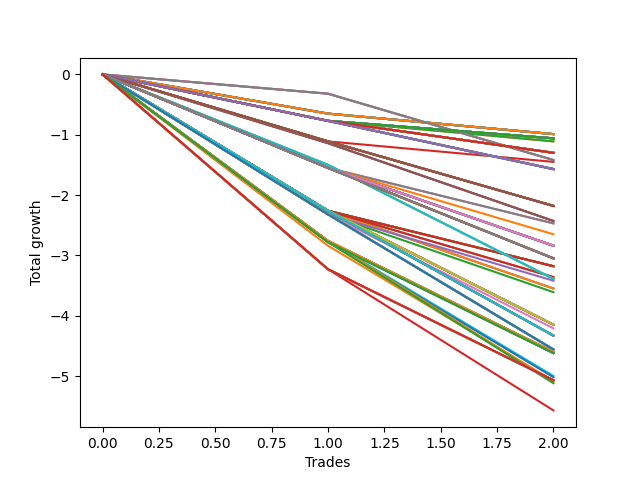

# Short HLT 111_STACK_2 
- Symbol: TSLA
- Date Range: 01/10/2024 - 05/17/2024
- Trading Period: 8:30-12:30
- Number of Trades: 2



| Id. | Name | Win Percent | Profit | Avg Profit / Trade | Avg Time / Trade | Std |      | Name | Win Percent | Profit | Avg Profit / Trade | Avg Time / Trade | Std |
| --- | ---- | ----------- | ------ | ------------------ | ---------------- | --- | ---- | ---- | ----------- | ------ | ------------------ | ---------------- | --- |
| | Sorted By <br> Profit | | | | | | | Sorted By <br> Win Percentage |||||
|0| TP-3 15m | 0.00 | -0.99 | -0.50 | 14:00 | 0.16 |     | TP-3 15m | 0.00 | -0.99 | -0.50 | 14:00 | 0.16 |
|1| TP-2.75 15m | 0.00 | -0.99 | -0.50 | 14:00 | 0.16 |     | TP-2.75 15m | 0.00 | -0.99 | -0.50 | 14:00 | 0.16 |
|2| TP-2.5 15m | 0.00 | -0.99 | -0.50 | 14:00 | 0.16 |     | TP-2.5 15m | 0.00 | -0.99 | -0.50 | 14:00 | 0.16 |
|3| TP-2.25 15m | 0.00 | -0.99 | -0.50 | 14:00 | 0.16 |     | TP-2.25 15m | 0.00 | -0.99 | -0.50 | 14:00 | 0.16 |
|4| TP-2 15m | 0.00 | -0.99 | -0.50 | 14:00 | 0.16 |     | TP-2 15m | 0.00 | -0.99 | -0.50 | 14:00 | 0.16 |
|5| TP-1.75 15m | 0.00 | -0.99 | -0.50 | 14:00 | 0.16 |     | TP-1.75 15m | 0.00 | -0.99 | -0.50 | 14:00 | 0.16 |
|6| TP-1.5 15m | 0.00 | -0.99 | -0.50 | 14:00 | 0.16 |     | TP-1.5 15m | 0.00 | -0.99 | -0.50 | 14:00 | 0.16 |
|7| TP-1.25 15m | 0.00 | -0.99 | -0.50 | 14:00 | 0.16 |     | TP-1.25 15m | 0.00 | -0.99 | -0.50 | 14:00 | 0.16 |
|8| TP-0.25 180m | 0.00 | -1.06 | -0.53 | 06:00 | 0.24 |     | TP-0.25 180m | 0.00 | -1.06 | -0.53 | 06:00 | 0.24 |
|9| TP-0.25 165m | 0.00 | -1.06 | -0.53 | 06:00 | 0.24 |     | TP-0.25 165m | 0.00 | -1.06 | -0.53 | 06:00 | 0.24 |
|10| TP-0.25 150m | 0.00 | -1.06 | -0.53 | 06:00 | 0.24 |     | TP-0.25 150m | 0.00 | -1.06 | -0.53 | 06:00 | 0.24 |
|11| TP-0.25 135m | 0.00 | -1.06 | -0.53 | 06:00 | 0.24 |     | TP-0.25 135m | 0.00 | -1.06 | -0.53 | 06:00 | 0.24 |
|12| TP-0.25 120m | 0.00 | -1.06 | -0.53 | 06:00 | 0.24 |     | TP-0.25 120m | 0.00 | -1.06 | -0.53 | 06:00 | 0.24 |
|13| TP-0.25 105m | 0.00 | -1.06 | -0.53 | 06:00 | 0.24 |     | TP-0.25 105m | 0.00 | -1.06 | -0.53 | 06:00 | 0.24 |
|14| TP-0.25 90m | 0.00 | -1.06 | -0.53 | 06:00 | 0.24 |     | TP-0.25 90m | 0.00 | -1.06 | -0.53 | 06:00 | 0.24 |
|15| TP-0.25 75m | 0.00 | -1.06 | -0.53 | 06:00 | 0.24 |     | TP-0.25 75m | 0.00 | -1.06 | -0.53 | 06:00 | 0.24 |
|16| TP-0.25 60m | 0.00 | -1.06 | -0.53 | 06:00 | 0.24 |     | TP-0.25 60m | 0.00 | -1.06 | -0.53 | 06:00 | 0.24 |
|17| TP-0.25 45m | 0.00 | -1.06 | -0.53 | 06:00 | 0.24 |     | TP-0.25 45m | 0.00 | -1.06 | -0.53 | 06:00 | 0.24 |
|18| TP-0.25 30m | 0.00 | -1.06 | -0.53 | 06:00 | 0.24 |     | TP-0.25 30m | 0.00 | -1.06 | -0.53 | 06:00 | 0.24 |
|19| TP-0.25 15m | 0.00 | -1.06 | -0.53 | 06:00 | 0.24 |     | TP-0.25 15m | 0.00 | -1.06 | -0.53 | 06:00 | 0.24 |
|20| TP-0.75 15m | 0.00 | -1.11 | -0.55 | 08:00 | 0.21 |     | TP-0.75 15m | 0.00 | -1.11 | -0.55 | 08:00 | 0.21 |
|21| TP-0.5 15m | 0.00 | -1.11 | -0.55 | 08:00 | 0.21 |     | TP-0.5 15m | 0.00 | -1.11 | -0.55 | 08:00 | 0.21 |
|22| TP-0.5 180m | 0.00 | -1.30 | -0.65 | 09:00 | 0.12 |     | TP-0.5 180m | 0.00 | -1.30 | -0.65 | 09:00 | 0.12 |
|23| TP-0.5 165m | 0.00 | -1.30 | -0.65 | 09:00 | 0.12 |     | TP-0.5 165m | 0.00 | -1.30 | -0.65 | 09:00 | 0.12 |
|24| TP-0.5 150m | 0.00 | -1.30 | -0.65 | 09:00 | 0.12 |     | TP-0.5 150m | 0.00 | -1.30 | -0.65 | 09:00 | 0.12 |
|25| TP-0.5 135m | 0.00 | -1.30 | -0.65 | 09:00 | 0.12 |     | TP-0.5 135m | 0.00 | -1.30 | -0.65 | 09:00 | 0.12 |
|26| TP-0.5 120m | 0.00 | -1.30 | -0.65 | 09:00 | 0.12 |     | TP-0.5 120m | 0.00 | -1.30 | -0.65 | 09:00 | 0.12 |
|27| TP-0.5 105m | 0.00 | -1.30 | -0.65 | 09:00 | 0.12 |     | TP-0.5 105m | 0.00 | -1.30 | -0.65 | 09:00 | 0.12 |
|28| TP-0.5 90m | 0.00 | -1.30 | -0.65 | 09:00 | 0.12 |     | TP-0.5 90m | 0.00 | -1.30 | -0.65 | 09:00 | 0.12 |
|29| TP-0.5 75m | 0.00 | -1.30 | -0.65 | 09:00 | 0.12 |     | TP-0.5 75m | 0.00 | -1.30 | -0.65 | 09:00 | 0.12 |
|30| TP-0.5 60m | 0.00 | -1.30 | -0.65 | 09:00 | 0.12 |     | TP-0.5 60m | 0.00 | -1.30 | -0.65 | 09:00 | 0.12 |
|31| TP-0.5 45m | 0.00 | -1.30 | -0.65 | 09:00 | 0.12 |     | TP-0.5 45m | 0.00 | -1.30 | -0.65 | 09:00 | 0.12 |
|32| TP-0.5 30m | 0.00 | -1.30 | -0.65 | 09:00 | 0.12 |     | TP-0.5 30m | 0.00 | -1.30 | -0.65 | 09:00 | 0.12 |
|33| TP-3 60m | 0.00 | -1.42 | -0.71 | 59:00 | 0.39 |     | TP-3 60m | 0.00 | -1.42 | -0.71 | 59:00 | 0.39 |
|34| TP-2.75 60m | 0.00 | -1.42 | -0.71 | 59:00 | 0.39 |     | TP-2.75 60m | 0.00 | -1.42 | -0.71 | 59:00 | 0.39 |
|35| TP-2.5 60m | 0.00 | -1.42 | -0.71 | 59:00 | 0.39 |     | TP-2.5 60m | 0.00 | -1.42 | -0.71 | 59:00 | 0.39 |
|36| TP-1 15m | 0.00 | -1.45 | -0.72 | 09:30 | 0.38 |     | TP-1 15m | 0.00 | -1.45 | -0.72 | 09:30 | 0.38 |
|37| TP-0.75 180m | 0.00 | -1.57 | -0.78 | 11:00 | 0.02 |     | TP-0.75 180m | 0.00 | -1.57 | -0.78 | 11:00 | 0.02 |
|38| TP-0.75 165m | 0.00 | -1.57 | -0.78 | 11:00 | 0.02 |     | TP-0.75 165m | 0.00 | -1.57 | -0.78 | 11:00 | 0.02 |
|39| TP-0.75 150m | 0.00 | -1.57 | -0.78 | 11:00 | 0.02 |     | TP-0.75 150m | 0.00 | -1.57 | -0.78 | 11:00 | 0.02 |
|40| TP-0.75 135m | 0.00 | -1.57 | -0.78 | 11:00 | 0.02 |     | TP-0.75 135m | 0.00 | -1.57 | -0.78 | 11:00 | 0.02 |
|41| TP-0.75 120m | 0.00 | -1.57 | -0.78 | 11:00 | 0.02 |     | TP-0.75 120m | 0.00 | -1.57 | -0.78 | 11:00 | 0.02 |
|42| TP-0.75 105m | 0.00 | -1.57 | -0.78 | 11:00 | 0.02 |     | TP-0.75 105m | 0.00 | -1.57 | -0.78 | 11:00 | 0.02 |
|43| TP-0.75 90m | 0.00 | -1.57 | -0.78 | 11:00 | 0.02 |     | TP-0.75 90m | 0.00 | -1.57 | -0.78 | 11:00 | 0.02 |
|44| TP-0.75 75m | 0.00 | -1.57 | -0.78 | 11:00 | 0.02 |     | TP-0.75 75m | 0.00 | -1.57 | -0.78 | 11:00 | 0.02 |
|45| TP-0.75 60m | 0.00 | -1.57 | -0.78 | 11:00 | 0.02 |     | TP-0.75 60m | 0.00 | -1.57 | -0.78 | 11:00 | 0.02 |
|46| TP-0.75 45m | 0.00 | -1.57 | -0.78 | 11:00 | 0.02 |     | TP-0.75 45m | 0.00 | -1.57 | -0.78 | 11:00 | 0.02 |
|47| TP-0.75 30m | 0.00 | -1.57 | -0.78 | 11:00 | 0.02 |     | TP-0.75 30m | 0.00 | -1.57 | -0.78 | 11:00 | 0.02 |
|48| TP-1 180m | 0.00 | -2.18 | -1.09 | 15:00 | 0.02 |     | TP-1 180m | 0.00 | -2.18 | -1.09 | 15:00 | 0.02 |
|49| TP-1 165m | 0.00 | -2.18 | -1.09 | 15:00 | 0.02 |     | TP-1 165m | 0.00 | -2.18 | -1.09 | 15:00 | 0.02 |
|50| TP-1 150m | 0.00 | -2.18 | -1.09 | 15:00 | 0.02 |     | TP-1 150m | 0.00 | -2.18 | -1.09 | 15:00 | 0.02 |
|51| TP-1 135m | 0.00 | -2.18 | -1.09 | 15:00 | 0.02 |     | TP-1 135m | 0.00 | -2.18 | -1.09 | 15:00 | 0.02 |
|52| TP-1 120m | 0.00 | -2.18 | -1.09 | 15:00 | 0.02 |     | TP-1 120m | 0.00 | -2.18 | -1.09 | 15:00 | 0.02 |
|53| TP-1 105m | 0.00 | -2.18 | -1.09 | 15:00 | 0.02 |     | TP-1 105m | 0.00 | -2.18 | -1.09 | 15:00 | 0.02 |
|54| TP-1 90m | 0.00 | -2.18 | -1.09 | 15:00 | 0.02 |     | TP-1 90m | 0.00 | -2.18 | -1.09 | 15:00 | 0.02 |
|55| TP-1 75m | 0.00 | -2.18 | -1.09 | 15:00 | 0.02 |     | TP-1 75m | 0.00 | -2.18 | -1.09 | 15:00 | 0.02 |
|56| TP-1 60m | 0.00 | -2.18 | -1.09 | 15:00 | 0.02 |     | TP-1 60m | 0.00 | -2.18 | -1.09 | 15:00 | 0.02 |
|57| TP-1 45m | 0.00 | -2.18 | -1.09 | 15:00 | 0.02 |     | TP-1 45m | 0.00 | -2.18 | -1.09 | 15:00 | 0.02 |
|58| TP-1 30m | 0.00 | -2.18 | -1.09 | 15:00 | 0.02 |     | TP-1 30m | 0.00 | -2.18 | -1.09 | 15:00 | 0.02 |
|59| TP-3 45m | 0.00 | -2.43 | -1.21 | 44:00 | 0.08 |     | TP-3 45m | 0.00 | -2.43 | -1.21 | 44:00 | 0.08 |
|60| TP-2.75 45m | 0.00 | -2.43 | -1.21 | 44:00 | 0.08 |     | TP-2.75 45m | 0.00 | -2.43 | -1.21 | 44:00 | 0.08 |
|61| TP-2.5 45m | 0.00 | -2.43 | -1.21 | 44:00 | 0.08 |     | TP-2.5 45m | 0.00 | -2.43 | -1.21 | 44:00 | 0.08 |
|62| TP-1.5 30m | 0.00 | -2.47 | -1.23 | 28:00 | 0.31 |     | TP-1.5 30m | 0.00 | -2.47 | -1.23 | 28:00 | 0.31 |
|63| TP-1.25 30m | 0.00 | -2.47 | -1.23 | 28:00 | 0.31 |     | TP-1.25 30m | 0.00 | -2.47 | -1.23 | 28:00 | 0.31 |
|64| TP-1.5 60m | 0.00 | -2.65 | -1.32 | 43:00 | 0.22 |     | TP-1.5 60m | 0.00 | -2.65 | -1.32 | 43:00 | 0.22 |
|65| TP-1.25 180m | 0.00 | -2.84 | -1.42 | 35:30 | 0.13 |     | TP-1.25 180m | 0.00 | -2.84 | -1.42 | 35:30 | 0.13 |
|66| TP-1.25 165m | 0.00 | -2.84 | -1.42 | 35:30 | 0.13 |     | TP-1.25 165m | 0.00 | -2.84 | -1.42 | 35:30 | 0.13 |
|67| TP-1.25 150m | 0.00 | -2.84 | -1.42 | 35:30 | 0.13 |     | TP-1.25 150m | 0.00 | -2.84 | -1.42 | 35:30 | 0.13 |
|68| TP-1.25 135m | 0.00 | -2.84 | -1.42 | 35:30 | 0.13 |     | TP-1.25 135m | 0.00 | -2.84 | -1.42 | 35:30 | 0.13 |
|69| TP-1.25 120m | 0.00 | -2.84 | -1.42 | 35:30 | 0.13 |     | TP-1.25 120m | 0.00 | -2.84 | -1.42 | 35:30 | 0.13 |
|70| TP-1.25 105m | 0.00 | -2.84 | -1.42 | 35:30 | 0.13 |     | TP-1.25 105m | 0.00 | -2.84 | -1.42 | 35:30 | 0.13 |
|71| TP-1.25 90m | 0.00 | -2.84 | -1.42 | 35:30 | 0.13 |     | TP-1.25 90m | 0.00 | -2.84 | -1.42 | 35:30 | 0.13 |
|72| TP-1.25 75m | 0.00 | -2.84 | -1.42 | 35:30 | 0.13 |     | TP-1.25 75m | 0.00 | -2.84 | -1.42 | 35:30 | 0.13 |
|73| TP-1.25 60m | 0.00 | -2.84 | -1.42 | 35:30 | 0.13 |     | TP-1.25 60m | 0.00 | -2.84 | -1.42 | 35:30 | 0.13 |
|74| TP-1.5 45m | 0.00 | -2.84 | -1.42 | 35:30 | 0.13 |     | TP-1.5 45m | 0.00 | -2.84 | -1.42 | 35:30 | 0.13 |
|75| TP-1.25 45m | 0.00 | -2.84 | -1.42 | 35:30 | 0.13 |     | TP-1.25 45m | 0.00 | -2.84 | -1.42 | 35:30 | 0.13 |
|76| TP-1.5 180m | 0.00 | -3.05 | -1.52 | 45:30 | 0.02 |     | TP-1.5 180m | 0.00 | -3.05 | -1.52 | 45:30 | 0.02 |
|77| TP-1.5 165m | 0.00 | -3.05 | -1.52 | 45:30 | 0.02 |     | TP-1.5 165m | 0.00 | -3.05 | -1.52 | 45:30 | 0.02 |
|78| TP-1.5 150m | 0.00 | -3.05 | -1.52 | 45:30 | 0.02 |     | TP-1.5 150m | 0.00 | -3.05 | -1.52 | 45:30 | 0.02 |
|79| TP-1.5 135m | 0.00 | -3.05 | -1.52 | 45:30 | 0.02 |     | TP-1.5 135m | 0.00 | -3.05 | -1.52 | 45:30 | 0.02 |
|80| TP-1.5 120m | 0.00 | -3.05 | -1.52 | 45:30 | 0.02 |     | TP-1.5 120m | 0.00 | -3.05 | -1.52 | 45:30 | 0.02 |
|81| TP-1.5 105m | 0.00 | -3.05 | -1.52 | 45:30 | 0.02 |     | TP-1.5 105m | 0.00 | -3.05 | -1.52 | 45:30 | 0.02 |
|82| TP-1.5 90m | 0.00 | -3.05 | -1.52 | 45:30 | 0.02 |     | TP-1.5 90m | 0.00 | -3.05 | -1.52 | 45:30 | 0.02 |
|83| TP-1.5 75m | 0.00 | -3.05 | -1.52 | 45:30 | 0.02 |     | TP-1.5 75m | 0.00 | -3.05 | -1.52 | 45:30 | 0.02 |
|84| TP-3 30m | 0.00 | -3.18 | -1.59 | 29:00 | 0.67 |     | TP-3 30m | 0.00 | -3.18 | -1.59 | 29:00 | 0.67 |
|85| TP-2.75 30m | 0.00 | -3.18 | -1.59 | 29:00 | 0.67 |     | TP-2.75 30m | 0.00 | -3.18 | -1.59 | 29:00 | 0.67 |
|86| TP-2.5 30m | 0.00 | -3.18 | -1.59 | 29:00 | 0.67 |     | TP-2.5 30m | 0.00 | -3.18 | -1.59 | 29:00 | 0.67 |
|87| TP-2.25 30m | 0.00 | -3.18 | -1.59 | 29:00 | 0.67 |     | TP-2.25 30m | 0.00 | -3.18 | -1.59 | 29:00 | 0.67 |
|88| TP-2 30m | 0.00 | -3.18 | -1.59 | 29:00 | 0.67 |     | TP-2 30m | 0.00 | -3.18 | -1.59 | 29:00 | 0.67 |
|89| TP-1.75 30m | 0.00 | -3.18 | -1.59 | 29:00 | 0.67 |     | TP-1.75 30m | 0.00 | -3.18 | -1.59 | 29:00 | 0.67 |
|90| TP-2 60m | 0.00 | -3.36 | -1.68 | 44:00 | 0.58 |     | TP-2 60m | 0.00 | -3.36 | -1.68 | 44:00 | 0.58 |
|91| TP-1.75 60m | 0.00 | -3.36 | -1.68 | 44:00 | 0.58 |     | TP-1.75 60m | 0.00 | -3.36 | -1.68 | 44:00 | 0.58 |
|92| TP-3 75m | 0.00 | -3.39 | -1.69 | 74:00 | 0.19 |     | TP-3 75m | 0.00 | -3.39 | -1.69 | 74:00 | 0.19 |
|93| TP-2.75 75m | 0.00 | -3.39 | -1.69 | 74:00 | 0.19 |     | TP-2.75 75m | 0.00 | -3.39 | -1.69 | 74:00 | 0.19 |
|94| TP-2.5 75m | 0.00 | -3.39 | -1.69 | 74:00 | 0.19 |     | TP-2.5 75m | 0.00 | -3.39 | -1.69 | 74:00 | 0.19 |
|95| TP-2.25 60m | 0.00 | -3.42 | -1.71 | 44:30 | 0.61 |     | TP-2.25 60m | 0.00 | -3.42 | -1.71 | 44:30 | 0.61 |
|96| TP-2 45m | 0.00 | -3.55 | -1.77 | 36:30 | 0.48 |     | TP-2 45m | 0.00 | -3.55 | -1.77 | 36:30 | 0.48 |
|97| TP-1.75 45m | 0.00 | -3.55 | -1.77 | 36:30 | 0.48 |     | TP-1.75 45m | 0.00 | -3.55 | -1.77 | 36:30 | 0.48 |
|98| TP-2.25 45m | 0.00 | -3.61 | -1.80 | 37:00 | 0.52 |     | TP-2.25 45m | 0.00 | -3.61 | -1.80 | 37:00 | 0.52 |
|99| TP-1.75 180m | 0.00 | -4.15 | -2.07 | 49:00 | 0.19 |     | TP-1.75 180m | 0.00 | -4.15 | -2.07 | 49:00 | 0.19 |
|100| TP-1.75 165m | 0.00 | -4.15 | -2.07 | 49:00 | 0.19 |     | TP-1.75 165m | 0.00 | -4.15 | -2.07 | 49:00 | 0.19 |
|101| TP-1.75 150m | 0.00 | -4.15 | -2.07 | 49:00 | 0.19 |     | TP-1.75 150m | 0.00 | -4.15 | -2.07 | 49:00 | 0.19 |
|102| TP-1.75 135m | 0.00 | -4.15 | -2.07 | 49:00 | 0.19 |     | TP-1.75 135m | 0.00 | -4.15 | -2.07 | 49:00 | 0.19 |
|103| TP-1.75 120m | 0.00 | -4.15 | -2.07 | 49:00 | 0.19 |     | TP-1.75 120m | 0.00 | -4.15 | -2.07 | 49:00 | 0.19 |
|104| TP-1.75 105m | 0.00 | -4.15 | -2.07 | 49:00 | 0.19 |     | TP-1.75 105m | 0.00 | -4.15 | -2.07 | 49:00 | 0.19 |
|105| TP-1.75 90m | 0.00 | -4.15 | -2.07 | 49:00 | 0.19 |     | TP-1.75 90m | 0.00 | -4.15 | -2.07 | 49:00 | 0.19 |
|106| TP-2 75m | 0.00 | -4.15 | -2.07 | 51:30 | 0.19 |     | TP-2 75m | 0.00 | -4.15 | -2.07 | 51:30 | 0.19 |
|107| TP-1.75 75m | 0.00 | -4.15 | -2.07 | 49:00 | 0.19 |     | TP-1.75 75m | 0.00 | -4.15 | -2.07 | 49:00 | 0.19 |
|108| TP-2.25 75m | 0.00 | -4.21 | -2.10 | 52:00 | 0.22 |     | TP-2.25 75m | 0.00 | -4.21 | -2.10 | 52:00 | 0.22 |
|109| TP-2 180m | 0.00 | -4.33 | -2.16 | 52:30 | 0.09 |     | TP-2 180m | 0.00 | -4.33 | -2.16 | 52:30 | 0.09 |
|110| TP-2 165m | 0.00 | -4.33 | -2.16 | 52:30 | 0.09 |     | TP-2 165m | 0.00 | -4.33 | -2.16 | 52:30 | 0.09 |
|111| TP-2 150m | 0.00 | -4.33 | -2.16 | 52:30 | 0.09 |     | TP-2 150m | 0.00 | -4.33 | -2.16 | 52:30 | 0.09 |
|112| TP-2 135m | 0.00 | -4.33 | -2.16 | 52:30 | 0.09 |     | TP-2 135m | 0.00 | -4.33 | -2.16 | 52:30 | 0.09 |
|113| TP-2 120m | 0.00 | -4.33 | -2.16 | 52:30 | 0.09 |     | TP-2 120m | 0.00 | -4.33 | -2.16 | 52:30 | 0.09 |
|114| TP-2 105m | 0.00 | -4.33 | -2.16 | 52:30 | 0.09 |     | TP-2 105m | 0.00 | -4.33 | -2.16 | 52:30 | 0.09 |
|115| TP-2 90m | 0.00 | -4.33 | -2.16 | 52:30 | 0.09 |     | TP-2 90m | 0.00 | -4.33 | -2.16 | 52:30 | 0.09 |
|116| TP-2.25 180m | 0.00 | -4.56 | -2.28 | 59:30 | 0.04 |     | TP-2.25 180m | 0.00 | -4.56 | -2.28 | 59:30 | 0.04 |
|117| TP-2.25 165m | 0.00 | -4.56 | -2.28 | 59:30 | 0.04 |     | TP-2.25 165m | 0.00 | -4.56 | -2.28 | 59:30 | 0.04 |
|118| TP-2.25 150m | 0.00 | -4.56 | -2.28 | 59:30 | 0.04 |     | TP-2.25 150m | 0.00 | -4.56 | -2.28 | 59:30 | 0.04 |
|119| TP-2.25 135m | 0.00 | -4.56 | -2.28 | 59:30 | 0.04 |     | TP-2.25 135m | 0.00 | -4.56 | -2.28 | 59:30 | 0.04 |
|120| TP-2.25 120m | 0.00 | -4.56 | -2.28 | 59:30 | 0.04 |     | TP-2.25 120m | 0.00 | -4.56 | -2.28 | 59:30 | 0.04 |
|121| TP-2.25 105m | 0.00 | -4.56 | -2.28 | 59:30 | 0.04 |     | TP-2.25 105m | 0.00 | -4.56 | -2.28 | 59:30 | 0.04 |
|122| TP-2.25 90m | 0.00 | -4.56 | -2.28 | 59:30 | 0.04 |     | TP-2.25 90m | 0.00 | -4.56 | -2.28 | 59:30 | 0.04 |
|123| TP-2.5 180m | 0.00 | -4.60 | -2.30 | 102:30 | 0.46 |     | TP-2.5 180m | 0.00 | -4.60 | -2.30 | 102:30 | 0.46 |
|124| TP-2.5 165m | 0.00 | -4.60 | -2.30 | 102:30 | 0.46 |     | TP-2.5 165m | 0.00 | -4.60 | -2.30 | 102:30 | 0.46 |
|125| TP-2.5 150m | 0.00 | -4.60 | -2.30 | 102:30 | 0.46 |     | TP-2.5 150m | 0.00 | -4.60 | -2.30 | 102:30 | 0.46 |
|126| TP-2.5 135m | 0.00 | -4.60 | -2.30 | 102:30 | 0.46 |     | TP-2.5 135m | 0.00 | -4.60 | -2.30 | 102:30 | 0.46 |
|127| TP-2.5 120m | 0.00 | -4.60 | -2.30 | 102:30 | 0.46 |     | TP-2.5 120m | 0.00 | -4.60 | -2.30 | 102:30 | 0.46 |
|128| TP-2.75 180m | 0.00 | -4.62 | -2.31 | 103:30 | 0.47 |     | TP-2.75 180m | 0.00 | -4.62 | -2.31 | 103:30 | 0.47 |
|129| TP-2.75 165m | 0.00 | -4.62 | -2.31 | 103:30 | 0.47 |     | TP-2.75 165m | 0.00 | -4.62 | -2.31 | 103:30 | 0.47 |
|130| TP-2.75 150m | 0.00 | -4.62 | -2.31 | 103:30 | 0.47 |     | TP-2.75 150m | 0.00 | -4.62 | -2.31 | 103:30 | 0.47 |
|131| TP-2.75 135m | 0.00 | -4.62 | -2.31 | 103:30 | 0.47 |     | TP-2.75 135m | 0.00 | -4.62 | -2.31 | 103:30 | 0.47 |
|132| TP-2.75 120m | 0.00 | -4.62 | -2.31 | 103:30 | 0.47 |     | TP-2.75 120m | 0.00 | -4.62 | -2.31 | 103:30 | 0.47 |
|133| TP-2.5 90m | 0.00 | -5.00 | -2.50 | 87:30 | 0.26 |     | TP-2.5 90m | 0.00 | -5.00 | -2.50 | 87:30 | 0.26 |
|134| TP-2.75 90m | 0.00 | -5.02 | -2.51 | 88:30 | 0.27 |     | TP-2.75 90m | 0.00 | -5.02 | -2.51 | 88:30 | 0.27 |
|135| TP-3 180m | 0.00 | -5.07 | -2.53 | 105:30 | 0.69 |     | TP-3 180m | 0.00 | -5.07 | -2.53 | 105:30 | 0.69 |
|136| TP-3 165m | 0.00 | -5.07 | -2.53 | 105:30 | 0.69 |     | TP-3 165m | 0.00 | -5.07 | -2.53 | 105:30 | 0.69 |
|137| TP-3 150m | 0.00 | -5.07 | -2.53 | 105:30 | 0.69 |     | TP-3 150m | 0.00 | -5.07 | -2.53 | 105:30 | 0.69 |
|138| TP-3 135m | 0.00 | -5.07 | -2.53 | 105:30 | 0.69 |     | TP-3 135m | 0.00 | -5.07 | -2.53 | 105:30 | 0.69 |
|139| TP-3 120m | 0.00 | -5.07 | -2.53 | 105:30 | 0.69 |     | TP-3 120m | 0.00 | -5.07 | -2.53 | 105:30 | 0.69 |
|140| TP-3 90m | 0.00 | -5.08 | -2.54 | 89:00 | 0.30 |     | TP-3 90m | 0.00 | -5.08 | -2.54 | 89:00 | 0.30 |
|141| TP-2.5 105m | 0.00 | -5.10 | -2.55 | 95:00 | 0.21 |     | TP-2.5 105m | 0.00 | -5.10 | -2.55 | 95:00 | 0.21 |
|142| TP-2.75 105m | 0.00 | -5.12 | -2.56 | 96:00 | 0.22 |     | TP-2.75 105m | 0.00 | -5.12 | -2.56 | 96:00 | 0.22 |
|143| TP-3 105m | 0.00 | -5.57 | -2.78 | 98:00 | 0.44 |     | TP-3 105m | 0.00 | -5.57 | -2.78 | 98:00 | 0.44 |

### Test TP-0.25 15m
* Take Profit of 0.25 Point
* 0.25 Stoploss
* Results:
```
Total Trades: 2
Percent Up: 0.00
Percent Down: 100.00
Total Points Moved Up: -1.06
Potential Profit: -530.00
Total Points Ups: 0.00 Count Ups: 0
Total Points Downs: -1.06 Count Downs: 2
```

<details><summary>Trades</summary>

<code>In: 2024-04-29 09:40:00		Out: 2024-04-29 09:42:00		Total Position Time: 02:00		Total Move Up: -0.77		Total to Date: -0.77</code> <br />
<code>In: 2024-05-17 09:45:00		Out: 2024-05-17 09:55:00		Total Position Time: 10:00		Total Move Up: -0.29		Total to Date: -1.06</code> <br />


</details>

### Test TP-0.5 15m
* Take Profit of 0.5 Point
* 0.5 Stoploss
* Results:
```
Total Trades: 2
Percent Up: 0.00
Percent Down: 100.00
Total Points Moved Up: -1.11
Potential Profit: -555.00
Total Points Ups: 0.00 Count Ups: 0
Total Points Downs: -1.11 Count Downs: 2
```

<details><summary>Trades</summary>

<code>In: 2024-04-29 09:40:00		Out: 2024-04-29 09:42:00		Total Position Time: 02:00		Total Move Up: -0.77		Total to Date: -0.77</code> <br />
<code>In: 2024-05-17 09:45:00		Out: 2024-05-17 09:59:00		Total Position Time: 14:00		Total Move Up: -0.34		Total to Date: -1.11</code> <br />


</details>

### Test TP-0.75 15m
* Take Profit of 0.75 Point
* 0.75 Stoploss
* Results:
```
Total Trades: 2
Percent Up: 0.00
Percent Down: 100.00
Total Points Moved Up: -1.11
Potential Profit: -555.00
Total Points Ups: 0.00 Count Ups: 0
Total Points Downs: -1.11 Count Downs: 2
```

<details><summary>Trades</summary>

<code>In: 2024-04-29 09:40:00		Out: 2024-04-29 09:42:00		Total Position Time: 02:00		Total Move Up: -0.77		Total to Date: -0.77</code> <br />
<code>In: 2024-05-17 09:45:00		Out: 2024-05-17 09:59:00		Total Position Time: 14:00		Total Move Up: -0.34		Total to Date: -1.11</code> <br />


</details>

### Test TP-1 15m
* Take Profit of 1 Point
* 1 Stoploss
* Results:
```
Total Trades: 2
Percent Up: 0.00
Percent Down: 100.00
Total Points Moved Up: -1.45
Potential Profit: -725.00
Total Points Ups: 0.00 Count Ups: 0
Total Points Downs: -1.45 Count Downs: 2
```

<details><summary>Trades</summary>

<code>In: 2024-04-29 09:40:00		Out: 2024-04-29 09:45:00		Total Position Time: 05:00		Total Move Up: -1.11		Total to Date: -1.11</code> <br />
<code>In: 2024-05-17 09:45:00		Out: 2024-05-17 09:59:00		Total Position Time: 14:00		Total Move Up: -0.34		Total to Date: -1.45</code> <br />


</details>

### Test TP-1.25 15m
* Take Profit of 1.25 Point
* 1.25 Stoploss
* Results:
```
Total Trades: 2
Percent Up: 0.00
Percent Down: 100.00
Total Points Moved Up: -0.99
Potential Profit: -495.00
Total Points Ups: 0.00 Count Ups: 0
Total Points Downs: -0.99 Count Downs: 2
```

<details><summary>Trades</summary>

<code>In: 2024-04-29 09:40:00		Out: 2024-04-29 09:54:00		Total Position Time: 14:00		Total Move Up: -0.65		Total to Date: -0.65</code> <br />
<code>In: 2024-05-17 09:45:00		Out: 2024-05-17 09:59:00		Total Position Time: 14:00		Total Move Up: -0.34		Total to Date: -0.99</code> <br />


</details>

### Test TP-1.5 15m
* Take Profit of 1.5 Point
* 1.5 Stoploss
* Results:
```
Total Trades: 2
Percent Up: 0.00
Percent Down: 100.00
Total Points Moved Up: -0.99
Potential Profit: -495.00
Total Points Ups: 0.00 Count Ups: 0
Total Points Downs: -0.99 Count Downs: 2
```

<details><summary>Trades</summary>

<code>In: 2024-04-29 09:40:00		Out: 2024-04-29 09:54:00		Total Position Time: 14:00		Total Move Up: -0.65		Total to Date: -0.65</code> <br />
<code>In: 2024-05-17 09:45:00		Out: 2024-05-17 09:59:00		Total Position Time: 14:00		Total Move Up: -0.34		Total to Date: -0.99</code> <br />


</details>

### Test TP-1.75 15m
* Take Profit of 1.75 Point
* 1.75 Stoploss
* Results:
```
Total Trades: 2
Percent Up: 0.00
Percent Down: 100.00
Total Points Moved Up: -0.99
Potential Profit: -495.00
Total Points Ups: 0.00 Count Ups: 0
Total Points Downs: -0.99 Count Downs: 2
```

<details><summary>Trades</summary>

<code>In: 2024-04-29 09:40:00		Out: 2024-04-29 09:54:00		Total Position Time: 14:00		Total Move Up: -0.65		Total to Date: -0.65</code> <br />
<code>In: 2024-05-17 09:45:00		Out: 2024-05-17 09:59:00		Total Position Time: 14:00		Total Move Up: -0.34		Total to Date: -0.99</code> <br />


</details>

### Test TP-2 15m
* Take Profit of 2 Point
* 2 Stoploss
* Results:
```
Total Trades: 2
Percent Up: 0.00
Percent Down: 100.00
Total Points Moved Up: -0.99
Potential Profit: -495.00
Total Points Ups: 0.00 Count Ups: 0
Total Points Downs: -0.99 Count Downs: 2
```

<details><summary>Trades</summary>

<code>In: 2024-04-29 09:40:00		Out: 2024-04-29 09:54:00		Total Position Time: 14:00		Total Move Up: -0.65		Total to Date: -0.65</code> <br />
<code>In: 2024-05-17 09:45:00		Out: 2024-05-17 09:59:00		Total Position Time: 14:00		Total Move Up: -0.34		Total to Date: -0.99</code> <br />


</details>

### Test TP-2.25 15m
* Take Profit of 2.25 Point
* 2.25 Stoploss
* Results:
```
Total Trades: 2
Percent Up: 0.00
Percent Down: 100.00
Total Points Moved Up: -0.99
Potential Profit: -495.00
Total Points Ups: 0.00 Count Ups: 0
Total Points Downs: -0.99 Count Downs: 2
```

<details><summary>Trades</summary>

<code>In: 2024-04-29 09:40:00		Out: 2024-04-29 09:54:00		Total Position Time: 14:00		Total Move Up: -0.65		Total to Date: -0.65</code> <br />
<code>In: 2024-05-17 09:45:00		Out: 2024-05-17 09:59:00		Total Position Time: 14:00		Total Move Up: -0.34		Total to Date: -0.99</code> <br />


</details>

### Test TP-2.5 15m
* Take Profit of 2.5 Point
* 2.5 Stoploss
* Results:
```
Total Trades: 2
Percent Up: 0.00
Percent Down: 100.00
Total Points Moved Up: -0.99
Potential Profit: -495.00
Total Points Ups: 0.00 Count Ups: 0
Total Points Downs: -0.99 Count Downs: 2
```

<details><summary>Trades</summary>

<code>In: 2024-04-29 09:40:00		Out: 2024-04-29 09:54:00		Total Position Time: 14:00		Total Move Up: -0.65		Total to Date: -0.65</code> <br />
<code>In: 2024-05-17 09:45:00		Out: 2024-05-17 09:59:00		Total Position Time: 14:00		Total Move Up: -0.34		Total to Date: -0.99</code> <br />


</details>

### Test TP-2.75 15m
* Take Profit of 2.75 Point
* 2.75 Stoploss
* Results:
```
Total Trades: 2
Percent Up: 0.00
Percent Down: 100.00
Total Points Moved Up: -0.99
Potential Profit: -495.00
Total Points Ups: 0.00 Count Ups: 0
Total Points Downs: -0.99 Count Downs: 2
```

<details><summary>Trades</summary>

<code>In: 2024-04-29 09:40:00		Out: 2024-04-29 09:54:00		Total Position Time: 14:00		Total Move Up: -0.65		Total to Date: -0.65</code> <br />
<code>In: 2024-05-17 09:45:00		Out: 2024-05-17 09:59:00		Total Position Time: 14:00		Total Move Up: -0.34		Total to Date: -0.99</code> <br />


</details>

### Test TP-3 15m
* Take Profit of 3 Point
* 3 Stoploss
* Results:
```
Total Trades: 2
Percent Up: 0.00
Percent Down: 100.00
Total Points Moved Up: -0.99
Potential Profit: -495.00
Total Points Ups: 0.00 Count Ups: 0
Total Points Downs: -0.99 Count Downs: 2
```

<details><summary>Trades</summary>

<code>In: 2024-04-29 09:40:00		Out: 2024-04-29 09:54:00		Total Position Time: 14:00		Total Move Up: -0.65		Total to Date: -0.65</code> <br />
<code>In: 2024-05-17 09:45:00		Out: 2024-05-17 09:59:00		Total Position Time: 14:00		Total Move Up: -0.34		Total to Date: -0.99</code> <br />


</details>

### Test TP-0.25 30m
* Take Profit of 0.25 Point
* 0.25 Stoploss
* Results:
```
Total Trades: 2
Percent Up: 0.00
Percent Down: 100.00
Total Points Moved Up: -1.06
Potential Profit: -530.00
Total Points Ups: 0.00 Count Ups: 0
Total Points Downs: -1.06 Count Downs: 2
```

<details><summary>Trades</summary>

<code>In: 2024-04-29 09:40:00		Out: 2024-04-29 09:42:00		Total Position Time: 02:00		Total Move Up: -0.77		Total to Date: -0.77</code> <br />
<code>In: 2024-05-17 09:45:00		Out: 2024-05-17 09:55:00		Total Position Time: 10:00		Total Move Up: -0.29		Total to Date: -1.06</code> <br />


</details>

### Test TP-0.5 30m
* Take Profit of 0.5 Point
* 0.5 Stoploss
* Results:
```
Total Trades: 2
Percent Up: 0.00
Percent Down: 100.00
Total Points Moved Up: -1.30
Potential Profit: -650.00
Total Points Ups: 0.00 Count Ups: 0
Total Points Downs: -1.30 Count Downs: 2
```

<details><summary>Trades</summary>

<code>In: 2024-04-29 09:40:00		Out: 2024-04-29 09:42:00		Total Position Time: 02:00		Total Move Up: -0.77		Total to Date: -0.77</code> <br />
<code>In: 2024-05-17 09:45:00		Out: 2024-05-17 10:01:00		Total Position Time: 16:00		Total Move Up: -0.53		Total to Date: -1.30</code> <br />


</details>

### Test TP-0.75 30m
* Take Profit of 0.75 Point
* 0.75 Stoploss
* Results:
```
Total Trades: 2
Percent Up: 0.00
Percent Down: 100.00
Total Points Moved Up: -1.57
Potential Profit: -785.00
Total Points Ups: 0.00 Count Ups: 0
Total Points Downs: -1.57 Count Downs: 2
```

<details><summary>Trades</summary>

<code>In: 2024-04-29 09:40:00		Out: 2024-04-29 09:42:00		Total Position Time: 02:00		Total Move Up: -0.77		Total to Date: -0.77</code> <br />
<code>In: 2024-05-17 09:45:00		Out: 2024-05-17 10:05:00		Total Position Time: 20:00		Total Move Up: -0.80		Total to Date: -1.57</code> <br />


</details>

### Test TP-1 30m
* Take Profit of 1 Point
* 1 Stoploss
* Results:
```
Total Trades: 2
Percent Up: 0.00
Percent Down: 100.00
Total Points Moved Up: -2.18
Potential Profit: -1090.00
Total Points Ups: 0.00 Count Ups: 0
Total Points Downs: -2.18 Count Downs: 2
```

<details><summary>Trades</summary>

<code>In: 2024-04-29 09:40:00		Out: 2024-04-29 09:45:00		Total Position Time: 05:00		Total Move Up: -1.11		Total to Date: -1.11</code> <br />
<code>In: 2024-05-17 09:45:00		Out: 2024-05-17 10:10:00		Total Position Time: 25:00		Total Move Up: -1.07		Total to Date: -2.18</code> <br />


</details>

### Test TP-1.25 30m
* Take Profit of 1.25 Point
* 1.25 Stoploss
* Results:
```
Total Trades: 2
Percent Up: 0.00
Percent Down: 100.00
Total Points Moved Up: -2.47
Potential Profit: -1235.00
Total Points Ups: 0.00 Count Ups: 0
Total Points Downs: -2.47 Count Downs: 2
```

<details><summary>Trades</summary>

<code>In: 2024-04-29 09:40:00		Out: 2024-04-29 10:07:00		Total Position Time: 27:00		Total Move Up: -1.55		Total to Date: -1.55</code> <br />
<code>In: 2024-05-17 09:45:00		Out: 2024-05-17 10:14:00		Total Position Time: 29:00		Total Move Up: -0.92		Total to Date: -2.47</code> <br />


</details>

### Test TP-1.5 30m
* Take Profit of 1.5 Point
* 1.5 Stoploss
* Results:
```
Total Trades: 2
Percent Up: 0.00
Percent Down: 100.00
Total Points Moved Up: -2.47
Potential Profit: -1235.00
Total Points Ups: 0.00 Count Ups: 0
Total Points Downs: -2.47 Count Downs: 2
```

<details><summary>Trades</summary>

<code>In: 2024-04-29 09:40:00		Out: 2024-04-29 10:07:00		Total Position Time: 27:00		Total Move Up: -1.55		Total to Date: -1.55</code> <br />
<code>In: 2024-05-17 09:45:00		Out: 2024-05-17 10:14:00		Total Position Time: 29:00		Total Move Up: -0.92		Total to Date: -2.47</code> <br />


</details>

### Test TP-1.75 30m
* Take Profit of 1.75 Point
* 1.75 Stoploss
* Results:
```
Total Trades: 2
Percent Up: 0.00
Percent Down: 100.00
Total Points Moved Up: -3.18
Potential Profit: -1590.00
Total Points Ups: 0.00 Count Ups: 0
Total Points Downs: -3.18 Count Downs: 2
```

<details><summary>Trades</summary>

<code>In: 2024-04-29 09:40:00		Out: 2024-04-29 10:09:00		Total Position Time: 29:00		Total Move Up: -2.26		Total to Date: -2.26</code> <br />
<code>In: 2024-05-17 09:45:00		Out: 2024-05-17 10:14:00		Total Position Time: 29:00		Total Move Up: -0.92		Total to Date: -3.18</code> <br />


</details>

### Test TP-2 30m
* Take Profit of 2 Point
* 2 Stoploss
* Results:
```
Total Trades: 2
Percent Up: 0.00
Percent Down: 100.00
Total Points Moved Up: -3.18
Potential Profit: -1590.00
Total Points Ups: 0.00 Count Ups: 0
Total Points Downs: -3.18 Count Downs: 2
```

<details><summary>Trades</summary>

<code>In: 2024-04-29 09:40:00		Out: 2024-04-29 10:09:00		Total Position Time: 29:00		Total Move Up: -2.26		Total to Date: -2.26</code> <br />
<code>In: 2024-05-17 09:45:00		Out: 2024-05-17 10:14:00		Total Position Time: 29:00		Total Move Up: -0.92		Total to Date: -3.18</code> <br />


</details>

### Test TP-2.25 30m
* Take Profit of 2.25 Point
* 2.25 Stoploss
* Results:
```
Total Trades: 2
Percent Up: 0.00
Percent Down: 100.00
Total Points Moved Up: -3.18
Potential Profit: -1590.00
Total Points Ups: 0.00 Count Ups: 0
Total Points Downs: -3.18 Count Downs: 2
```

<details><summary>Trades</summary>

<code>In: 2024-04-29 09:40:00		Out: 2024-04-29 10:09:00		Total Position Time: 29:00		Total Move Up: -2.26		Total to Date: -2.26</code> <br />
<code>In: 2024-05-17 09:45:00		Out: 2024-05-17 10:14:00		Total Position Time: 29:00		Total Move Up: -0.92		Total to Date: -3.18</code> <br />


</details>

### Test TP-2.5 30m
* Take Profit of 2.5 Point
* 2.5 Stoploss
* Results:
```
Total Trades: 2
Percent Up: 0.00
Percent Down: 100.00
Total Points Moved Up: -3.18
Potential Profit: -1590.00
Total Points Ups: 0.00 Count Ups: 0
Total Points Downs: -3.18 Count Downs: 2
```

<details><summary>Trades</summary>

<code>In: 2024-04-29 09:40:00		Out: 2024-04-29 10:09:00		Total Position Time: 29:00		Total Move Up: -2.26		Total to Date: -2.26</code> <br />
<code>In: 2024-05-17 09:45:00		Out: 2024-05-17 10:14:00		Total Position Time: 29:00		Total Move Up: -0.92		Total to Date: -3.18</code> <br />


</details>

### Test TP-2.75 30m
* Take Profit of 2.75 Point
* 2.75 Stoploss
* Results:
```
Total Trades: 2
Percent Up: 0.00
Percent Down: 100.00
Total Points Moved Up: -3.18
Potential Profit: -1590.00
Total Points Ups: 0.00 Count Ups: 0
Total Points Downs: -3.18 Count Downs: 2
```

<details><summary>Trades</summary>

<code>In: 2024-04-29 09:40:00		Out: 2024-04-29 10:09:00		Total Position Time: 29:00		Total Move Up: -2.26		Total to Date: -2.26</code> <br />
<code>In: 2024-05-17 09:45:00		Out: 2024-05-17 10:14:00		Total Position Time: 29:00		Total Move Up: -0.92		Total to Date: -3.18</code> <br />


</details>

### Test TP-3 30m
* Take Profit of 3 Point
* 3 Stoploss
* Results:
```
Total Trades: 2
Percent Up: 0.00
Percent Down: 100.00
Total Points Moved Up: -3.18
Potential Profit: -1590.00
Total Points Ups: 0.00 Count Ups: 0
Total Points Downs: -3.18 Count Downs: 2
```

<details><summary>Trades</summary>

<code>In: 2024-04-29 09:40:00		Out: 2024-04-29 10:09:00		Total Position Time: 29:00		Total Move Up: -2.26		Total to Date: -2.26</code> <br />
<code>In: 2024-05-17 09:45:00		Out: 2024-05-17 10:14:00		Total Position Time: 29:00		Total Move Up: -0.92		Total to Date: -3.18</code> <br />


</details>

### Test TP-0.25 45m
* Take Profit of 0.25 Point
* 0.25 Stoploss
* Results:
```
Total Trades: 2
Percent Up: 0.00
Percent Down: 100.00
Total Points Moved Up: -1.06
Potential Profit: -530.00
Total Points Ups: 0.00 Count Ups: 0
Total Points Downs: -1.06 Count Downs: 2
```

<details><summary>Trades</summary>

<code>In: 2024-04-29 09:40:00		Out: 2024-04-29 09:42:00		Total Position Time: 02:00		Total Move Up: -0.77		Total to Date: -0.77</code> <br />
<code>In: 2024-05-17 09:45:00		Out: 2024-05-17 09:55:00		Total Position Time: 10:00		Total Move Up: -0.29		Total to Date: -1.06</code> <br />


</details>

### Test TP-0.5 45m
* Take Profit of 0.5 Point
* 0.5 Stoploss
* Results:
```
Total Trades: 2
Percent Up: 0.00
Percent Down: 100.00
Total Points Moved Up: -1.30
Potential Profit: -650.00
Total Points Ups: 0.00 Count Ups: 0
Total Points Downs: -1.30 Count Downs: 2
```

<details><summary>Trades</summary>

<code>In: 2024-04-29 09:40:00		Out: 2024-04-29 09:42:00		Total Position Time: 02:00		Total Move Up: -0.77		Total to Date: -0.77</code> <br />
<code>In: 2024-05-17 09:45:00		Out: 2024-05-17 10:01:00		Total Position Time: 16:00		Total Move Up: -0.53		Total to Date: -1.30</code> <br />


</details>

### Test TP-0.75 45m
* Take Profit of 0.75 Point
* 0.75 Stoploss
* Results:
```
Total Trades: 2
Percent Up: 0.00
Percent Down: 100.00
Total Points Moved Up: -1.57
Potential Profit: -785.00
Total Points Ups: 0.00 Count Ups: 0
Total Points Downs: -1.57 Count Downs: 2
```

<details><summary>Trades</summary>

<code>In: 2024-04-29 09:40:00		Out: 2024-04-29 09:42:00		Total Position Time: 02:00		Total Move Up: -0.77		Total to Date: -0.77</code> <br />
<code>In: 2024-05-17 09:45:00		Out: 2024-05-17 10:05:00		Total Position Time: 20:00		Total Move Up: -0.80		Total to Date: -1.57</code> <br />


</details>

### Test TP-1 45m
* Take Profit of 1 Point
* 1 Stoploss
* Results:
```
Total Trades: 2
Percent Up: 0.00
Percent Down: 100.00
Total Points Moved Up: -2.18
Potential Profit: -1090.00
Total Points Ups: 0.00 Count Ups: 0
Total Points Downs: -2.18 Count Downs: 2
```

<details><summary>Trades</summary>

<code>In: 2024-04-29 09:40:00		Out: 2024-04-29 09:45:00		Total Position Time: 05:00		Total Move Up: -1.11		Total to Date: -1.11</code> <br />
<code>In: 2024-05-17 09:45:00		Out: 2024-05-17 10:10:00		Total Position Time: 25:00		Total Move Up: -1.07		Total to Date: -2.18</code> <br />


</details>

### Test TP-1.25 45m
* Take Profit of 1.25 Point
* 1.25 Stoploss
* Results:
```
Total Trades: 2
Percent Up: 0.00
Percent Down: 100.00
Total Points Moved Up: -2.84
Potential Profit: -1420.00
Total Points Ups: 0.00 Count Ups: 0
Total Points Downs: -2.84 Count Downs: 2
```

<details><summary>Trades</summary>

<code>In: 2024-04-29 09:40:00		Out: 2024-04-29 10:07:00		Total Position Time: 27:00		Total Move Up: -1.55		Total to Date: -1.55</code> <br />
<code>In: 2024-05-17 09:45:00		Out: 2024-05-17 10:29:00		Total Position Time: 44:00		Total Move Up: -1.29		Total to Date: -2.84</code> <br />


</details>

### Test TP-1.5 45m
* Take Profit of 1.5 Point
* 1.5 Stoploss
* Results:
```
Total Trades: 2
Percent Up: 0.00
Percent Down: 100.00
Total Points Moved Up: -2.84
Potential Profit: -1420.00
Total Points Ups: 0.00 Count Ups: 0
Total Points Downs: -2.84 Count Downs: 2
```

<details><summary>Trades</summary>

<code>In: 2024-04-29 09:40:00		Out: 2024-04-29 10:07:00		Total Position Time: 27:00		Total Move Up: -1.55		Total to Date: -1.55</code> <br />
<code>In: 2024-05-17 09:45:00		Out: 2024-05-17 10:29:00		Total Position Time: 44:00		Total Move Up: -1.29		Total to Date: -2.84</code> <br />


</details>

### Test TP-1.75 45m
* Take Profit of 1.75 Point
* 1.75 Stoploss
* Results:
```
Total Trades: 2
Percent Up: 0.00
Percent Down: 100.00
Total Points Moved Up: -3.55
Potential Profit: -1775.00
Total Points Ups: 0.00 Count Ups: 0
Total Points Downs: -3.55 Count Downs: 2
```

<details><summary>Trades</summary>

<code>In: 2024-04-29 09:40:00		Out: 2024-04-29 10:09:00		Total Position Time: 29:00		Total Move Up: -2.26		Total to Date: -2.26</code> <br />
<code>In: 2024-05-17 09:45:00		Out: 2024-05-17 10:29:00		Total Position Time: 44:00		Total Move Up: -1.29		Total to Date: -3.55</code> <br />


</details>

### Test TP-2 45m
* Take Profit of 2 Point
* 2 Stoploss
* Results:
```
Total Trades: 2
Percent Up: 0.00
Percent Down: 100.00
Total Points Moved Up: -3.55
Potential Profit: -1775.00
Total Points Ups: 0.00 Count Ups: 0
Total Points Downs: -3.55 Count Downs: 2
```

<details><summary>Trades</summary>

<code>In: 2024-04-29 09:40:00		Out: 2024-04-29 10:09:00		Total Position Time: 29:00		Total Move Up: -2.26		Total to Date: -2.26</code> <br />
<code>In: 2024-05-17 09:45:00		Out: 2024-05-17 10:29:00		Total Position Time: 44:00		Total Move Up: -1.29		Total to Date: -3.55</code> <br />


</details>

### Test TP-2.25 45m
* Take Profit of 2.25 Point
* 2.25 Stoploss
* Results:
```
Total Trades: 2
Percent Up: 0.00
Percent Down: 100.00
Total Points Moved Up: -3.61
Potential Profit: -1805.00
Total Points Ups: 0.00 Count Ups: 0
Total Points Downs: -3.61 Count Downs: 2
```

<details><summary>Trades</summary>

<code>In: 2024-04-29 09:40:00		Out: 2024-04-29 10:10:00		Total Position Time: 30:00		Total Move Up: -2.32		Total to Date: -2.32</code> <br />
<code>In: 2024-05-17 09:45:00		Out: 2024-05-17 10:29:00		Total Position Time: 44:00		Total Move Up: -1.29		Total to Date: -3.61</code> <br />


</details>

### Test TP-2.5 45m
* Take Profit of 2.5 Point
* 2.5 Stoploss
* Results:
```
Total Trades: 2
Percent Up: 0.00
Percent Down: 100.00
Total Points Moved Up: -2.43
Potential Profit: -1215.00
Total Points Ups: 0.00 Count Ups: 0
Total Points Downs: -2.43 Count Downs: 2
```

<details><summary>Trades</summary>

<code>In: 2024-04-29 09:40:00		Out: 2024-04-29 10:24:00		Total Position Time: 44:00		Total Move Up: -1.14		Total to Date: -1.14</code> <br />
<code>In: 2024-05-17 09:45:00		Out: 2024-05-17 10:29:00		Total Position Time: 44:00		Total Move Up: -1.29		Total to Date: -2.43</code> <br />


</details>

### Test TP-2.75 45m
* Take Profit of 2.75 Point
* 2.75 Stoploss
* Results:
```
Total Trades: 2
Percent Up: 0.00
Percent Down: 100.00
Total Points Moved Up: -2.43
Potential Profit: -1215.00
Total Points Ups: 0.00 Count Ups: 0
Total Points Downs: -2.43 Count Downs: 2
```

<details><summary>Trades</summary>

<code>In: 2024-04-29 09:40:00		Out: 2024-04-29 10:24:00		Total Position Time: 44:00		Total Move Up: -1.14		Total to Date: -1.14</code> <br />
<code>In: 2024-05-17 09:45:00		Out: 2024-05-17 10:29:00		Total Position Time: 44:00		Total Move Up: -1.29		Total to Date: -2.43</code> <br />


</details>

### Test TP-3 45m
* Take Profit of 3 Point
* 3 Stoploss
* Results:
```
Total Trades: 2
Percent Up: 0.00
Percent Down: 100.00
Total Points Moved Up: -2.43
Potential Profit: -1215.00
Total Points Ups: 0.00 Count Ups: 0
Total Points Downs: -2.43 Count Downs: 2
```

<details><summary>Trades</summary>

<code>In: 2024-04-29 09:40:00		Out: 2024-04-29 10:24:00		Total Position Time: 44:00		Total Move Up: -1.14		Total to Date: -1.14</code> <br />
<code>In: 2024-05-17 09:45:00		Out: 2024-05-17 10:29:00		Total Position Time: 44:00		Total Move Up: -1.29		Total to Date: -2.43</code> <br />


</details>

### Test TP-0.25 60m
* Take Profit of 0.25 Point
* 0.25 Stoploss
* Results:
```
Total Trades: 2
Percent Up: 0.00
Percent Down: 100.00
Total Points Moved Up: -1.06
Potential Profit: -530.00
Total Points Ups: 0.00 Count Ups: 0
Total Points Downs: -1.06 Count Downs: 2
```

<details><summary>Trades</summary>

<code>In: 2024-04-29 09:40:00		Out: 2024-04-29 09:42:00		Total Position Time: 02:00		Total Move Up: -0.77		Total to Date: -0.77</code> <br />
<code>In: 2024-05-17 09:45:00		Out: 2024-05-17 09:55:00		Total Position Time: 10:00		Total Move Up: -0.29		Total to Date: -1.06</code> <br />


</details>

### Test TP-0.5 60m
* Take Profit of 0.5 Point
* 0.5 Stoploss
* Results:
```
Total Trades: 2
Percent Up: 0.00
Percent Down: 100.00
Total Points Moved Up: -1.30
Potential Profit: -650.00
Total Points Ups: 0.00 Count Ups: 0
Total Points Downs: -1.30 Count Downs: 2
```

<details><summary>Trades</summary>

<code>In: 2024-04-29 09:40:00		Out: 2024-04-29 09:42:00		Total Position Time: 02:00		Total Move Up: -0.77		Total to Date: -0.77</code> <br />
<code>In: 2024-05-17 09:45:00		Out: 2024-05-17 10:01:00		Total Position Time: 16:00		Total Move Up: -0.53		Total to Date: -1.30</code> <br />


</details>

### Test TP-0.75 60m
* Take Profit of 0.75 Point
* 0.75 Stoploss
* Results:
```
Total Trades: 2
Percent Up: 0.00
Percent Down: 100.00
Total Points Moved Up: -1.57
Potential Profit: -785.00
Total Points Ups: 0.00 Count Ups: 0
Total Points Downs: -1.57 Count Downs: 2
```

<details><summary>Trades</summary>

<code>In: 2024-04-29 09:40:00		Out: 2024-04-29 09:42:00		Total Position Time: 02:00		Total Move Up: -0.77		Total to Date: -0.77</code> <br />
<code>In: 2024-05-17 09:45:00		Out: 2024-05-17 10:05:00		Total Position Time: 20:00		Total Move Up: -0.80		Total to Date: -1.57</code> <br />


</details>

### Test TP-1 60m
* Take Profit of 1 Point
* 1 Stoploss
* Results:
```
Total Trades: 2
Percent Up: 0.00
Percent Down: 100.00
Total Points Moved Up: -2.18
Potential Profit: -1090.00
Total Points Ups: 0.00 Count Ups: 0
Total Points Downs: -2.18 Count Downs: 2
```

<details><summary>Trades</summary>

<code>In: 2024-04-29 09:40:00		Out: 2024-04-29 09:45:00		Total Position Time: 05:00		Total Move Up: -1.11		Total to Date: -1.11</code> <br />
<code>In: 2024-05-17 09:45:00		Out: 2024-05-17 10:10:00		Total Position Time: 25:00		Total Move Up: -1.07		Total to Date: -2.18</code> <br />


</details>

### Test TP-1.25 60m
* Take Profit of 1.25 Point
* 1.25 Stoploss
* Results:
```
Total Trades: 2
Percent Up: 0.00
Percent Down: 100.00
Total Points Moved Up: -2.84
Potential Profit: -1420.00
Total Points Ups: 0.00 Count Ups: 0
Total Points Downs: -2.84 Count Downs: 2
```

<details><summary>Trades</summary>

<code>In: 2024-04-29 09:40:00		Out: 2024-04-29 10:07:00		Total Position Time: 27:00		Total Move Up: -1.55		Total to Date: -1.55</code> <br />
<code>In: 2024-05-17 09:45:00		Out: 2024-05-17 10:29:00		Total Position Time: 44:00		Total Move Up: -1.29		Total to Date: -2.84</code> <br />


</details>

### Test TP-1.5 60m
* Take Profit of 1.5 Point
* 1.5 Stoploss
* Results:
```
Total Trades: 2
Percent Up: 0.00
Percent Down: 100.00
Total Points Moved Up: -2.65
Potential Profit: -1325.00
Total Points Ups: 0.00 Count Ups: 0
Total Points Downs: -2.65 Count Downs: 2
```

<details><summary>Trades</summary>

<code>In: 2024-04-29 09:40:00		Out: 2024-04-29 10:07:00		Total Position Time: 27:00		Total Move Up: -1.55		Total to Date: -1.55</code> <br />
<code>In: 2024-05-17 09:45:00		Out: 2024-05-17 10:44:00		Total Position Time: 59:00		Total Move Up: -1.10		Total to Date: -2.65</code> <br />


</details>

### Test TP-1.75 60m
* Take Profit of 1.75 Point
* 1.75 Stoploss
* Results:
```
Total Trades: 2
Percent Up: 0.00
Percent Down: 100.00
Total Points Moved Up: -3.36
Potential Profit: -1680.00
Total Points Ups: 0.00 Count Ups: 0
Total Points Downs: -3.36 Count Downs: 2
```

<details><summary>Trades</summary>

<code>In: 2024-04-29 09:40:00		Out: 2024-04-29 10:09:00		Total Position Time: 29:00		Total Move Up: -2.26		Total to Date: -2.26</code> <br />
<code>In: 2024-05-17 09:45:00		Out: 2024-05-17 10:44:00		Total Position Time: 59:00		Total Move Up: -1.10		Total to Date: -3.36</code> <br />


</details>

### Test TP-2 60m
* Take Profit of 2 Point
* 2 Stoploss
* Results:
```
Total Trades: 2
Percent Up: 0.00
Percent Down: 100.00
Total Points Moved Up: -3.36
Potential Profit: -1680.00
Total Points Ups: 0.00 Count Ups: 0
Total Points Downs: -3.36 Count Downs: 2
```

<details><summary>Trades</summary>

<code>In: 2024-04-29 09:40:00		Out: 2024-04-29 10:09:00		Total Position Time: 29:00		Total Move Up: -2.26		Total to Date: -2.26</code> <br />
<code>In: 2024-05-17 09:45:00		Out: 2024-05-17 10:44:00		Total Position Time: 59:00		Total Move Up: -1.10		Total to Date: -3.36</code> <br />


</details>

### Test TP-2.25 60m
* Take Profit of 2.25 Point
* 2.25 Stoploss
* Results:
```
Total Trades: 2
Percent Up: 0.00
Percent Down: 100.00
Total Points Moved Up: -3.42
Potential Profit: -1710.00
Total Points Ups: 0.00 Count Ups: 0
Total Points Downs: -3.42 Count Downs: 2
```

<details><summary>Trades</summary>

<code>In: 2024-04-29 09:40:00		Out: 2024-04-29 10:10:00		Total Position Time: 30:00		Total Move Up: -2.32		Total to Date: -2.32</code> <br />
<code>In: 2024-05-17 09:45:00		Out: 2024-05-17 10:44:00		Total Position Time: 59:00		Total Move Up: -1.10		Total to Date: -3.42</code> <br />


</details>

### Test TP-2.5 60m
* Take Profit of 2.5 Point
* 2.5 Stoploss
* Results:
```
Total Trades: 2
Percent Up: 0.00
Percent Down: 100.00
Total Points Moved Up: -1.42
Potential Profit: -710.00
Total Points Ups: 0.00 Count Ups: 0
Total Points Downs: -1.42 Count Downs: 2
```

<details><summary>Trades</summary>

<code>In: 2024-04-29 09:40:00		Out: 2024-04-29 10:39:00		Total Position Time: 59:00		Total Move Up: -0.32		Total to Date: -0.32</code> <br />
<code>In: 2024-05-17 09:45:00		Out: 2024-05-17 10:44:00		Total Position Time: 59:00		Total Move Up: -1.10		Total to Date: -1.42</code> <br />


</details>

### Test TP-2.75 60m
* Take Profit of 2.75 Point
* 2.75 Stoploss
* Results:
```
Total Trades: 2
Percent Up: 0.00
Percent Down: 100.00
Total Points Moved Up: -1.42
Potential Profit: -710.00
Total Points Ups: 0.00 Count Ups: 0
Total Points Downs: -1.42 Count Downs: 2
```

<details><summary>Trades</summary>

<code>In: 2024-04-29 09:40:00		Out: 2024-04-29 10:39:00		Total Position Time: 59:00		Total Move Up: -0.32		Total to Date: -0.32</code> <br />
<code>In: 2024-05-17 09:45:00		Out: 2024-05-17 10:44:00		Total Position Time: 59:00		Total Move Up: -1.10		Total to Date: -1.42</code> <br />


</details>

### Test TP-3 60m
* Take Profit of 3 Point
* 3 Stoploss
* Results:
```
Total Trades: 2
Percent Up: 0.00
Percent Down: 100.00
Total Points Moved Up: -1.42
Potential Profit: -710.00
Total Points Ups: 0.00 Count Ups: 0
Total Points Downs: -1.42 Count Downs: 2
```

<details><summary>Trades</summary>

<code>In: 2024-04-29 09:40:00		Out: 2024-04-29 10:39:00		Total Position Time: 59:00		Total Move Up: -0.32		Total to Date: -0.32</code> <br />
<code>In: 2024-05-17 09:45:00		Out: 2024-05-17 10:44:00		Total Position Time: 59:00		Total Move Up: -1.10		Total to Date: -1.42</code> <br />


</details>

### Test TP-0.25 75m
* Take Profit of 0.25 Point
* 0.25 Stoploss
* Results:
```
Total Trades: 2
Percent Up: 0.00
Percent Down: 100.00
Total Points Moved Up: -1.06
Potential Profit: -530.00
Total Points Ups: 0.00 Count Ups: 0
Total Points Downs: -1.06 Count Downs: 2
```

<details><summary>Trades</summary>

<code>In: 2024-04-29 09:40:00		Out: 2024-04-29 09:42:00		Total Position Time: 02:00		Total Move Up: -0.77		Total to Date: -0.77</code> <br />
<code>In: 2024-05-17 09:45:00		Out: 2024-05-17 09:55:00		Total Position Time: 10:00		Total Move Up: -0.29		Total to Date: -1.06</code> <br />


</details>

### Test TP-0.5 75m
* Take Profit of 0.5 Point
* 0.5 Stoploss
* Results:
```
Total Trades: 2
Percent Up: 0.00
Percent Down: 100.00
Total Points Moved Up: -1.30
Potential Profit: -650.00
Total Points Ups: 0.00 Count Ups: 0
Total Points Downs: -1.30 Count Downs: 2
```

<details><summary>Trades</summary>

<code>In: 2024-04-29 09:40:00		Out: 2024-04-29 09:42:00		Total Position Time: 02:00		Total Move Up: -0.77		Total to Date: -0.77</code> <br />
<code>In: 2024-05-17 09:45:00		Out: 2024-05-17 10:01:00		Total Position Time: 16:00		Total Move Up: -0.53		Total to Date: -1.30</code> <br />


</details>

### Test TP-0.75 75m
* Take Profit of 0.75 Point
* 0.75 Stoploss
* Results:
```
Total Trades: 2
Percent Up: 0.00
Percent Down: 100.00
Total Points Moved Up: -1.57
Potential Profit: -785.00
Total Points Ups: 0.00 Count Ups: 0
Total Points Downs: -1.57 Count Downs: 2
```

<details><summary>Trades</summary>

<code>In: 2024-04-29 09:40:00		Out: 2024-04-29 09:42:00		Total Position Time: 02:00		Total Move Up: -0.77		Total to Date: -0.77</code> <br />
<code>In: 2024-05-17 09:45:00		Out: 2024-05-17 10:05:00		Total Position Time: 20:00		Total Move Up: -0.80		Total to Date: -1.57</code> <br />


</details>

### Test TP-1 75m
* Take Profit of 1 Point
* 1 Stoploss
* Results:
```
Total Trades: 2
Percent Up: 0.00
Percent Down: 100.00
Total Points Moved Up: -2.18
Potential Profit: -1090.00
Total Points Ups: 0.00 Count Ups: 0
Total Points Downs: -2.18 Count Downs: 2
```

<details><summary>Trades</summary>

<code>In: 2024-04-29 09:40:00		Out: 2024-04-29 09:45:00		Total Position Time: 05:00		Total Move Up: -1.11		Total to Date: -1.11</code> <br />
<code>In: 2024-05-17 09:45:00		Out: 2024-05-17 10:10:00		Total Position Time: 25:00		Total Move Up: -1.07		Total to Date: -2.18</code> <br />


</details>

### Test TP-1.25 75m
* Take Profit of 1.25 Point
* 1.25 Stoploss
* Results:
```
Total Trades: 2
Percent Up: 0.00
Percent Down: 100.00
Total Points Moved Up: -2.84
Potential Profit: -1420.00
Total Points Ups: 0.00 Count Ups: 0
Total Points Downs: -2.84 Count Downs: 2
```

<details><summary>Trades</summary>

<code>In: 2024-04-29 09:40:00		Out: 2024-04-29 10:07:00		Total Position Time: 27:00		Total Move Up: -1.55		Total to Date: -1.55</code> <br />
<code>In: 2024-05-17 09:45:00		Out: 2024-05-17 10:29:00		Total Position Time: 44:00		Total Move Up: -1.29		Total to Date: -2.84</code> <br />


</details>

### Test TP-1.5 75m
* Take Profit of 1.5 Point
* 1.5 Stoploss
* Results:
```
Total Trades: 2
Percent Up: 0.00
Percent Down: 100.00
Total Points Moved Up: -3.05
Potential Profit: -1525.00
Total Points Ups: 0.00 Count Ups: 0
Total Points Downs: -3.05 Count Downs: 2
```

<details><summary>Trades</summary>

<code>In: 2024-04-29 09:40:00		Out: 2024-04-29 10:07:00		Total Position Time: 27:00		Total Move Up: -1.55		Total to Date: -1.55</code> <br />
<code>In: 2024-05-17 09:45:00		Out: 2024-05-17 10:49:00		Total Position Time: 64:00		Total Move Up: -1.50		Total to Date: -3.05</code> <br />


</details>

### Test TP-1.75 75m
* Take Profit of 1.75 Point
* 1.75 Stoploss
* Results:
```
Total Trades: 2
Percent Up: 0.00
Percent Down: 100.00
Total Points Moved Up: -4.15
Potential Profit: -2075.00
Total Points Ups: 0.00 Count Ups: 0
Total Points Downs: -4.15 Count Downs: 2
```

<details><summary>Trades</summary>

<code>In: 2024-04-29 09:40:00		Out: 2024-04-29 10:09:00		Total Position Time: 29:00		Total Move Up: -2.26		Total to Date: -2.26</code> <br />
<code>In: 2024-05-17 09:45:00		Out: 2024-05-17 10:54:00		Total Position Time: 69:00		Total Move Up: -1.89		Total to Date: -4.15</code> <br />


</details>

### Test TP-2 75m
* Take Profit of 2 Point
* 2 Stoploss
* Results:
```
Total Trades: 2
Percent Up: 0.00
Percent Down: 100.00
Total Points Moved Up: -4.15
Potential Profit: -2075.00
Total Points Ups: 0.00 Count Ups: 0
Total Points Downs: -4.15 Count Downs: 2
```

<details><summary>Trades</summary>

<code>In: 2024-04-29 09:40:00		Out: 2024-04-29 10:09:00		Total Position Time: 29:00		Total Move Up: -2.26		Total to Date: -2.26</code> <br />
<code>In: 2024-05-17 09:45:00		Out: 2024-05-17 10:59:00		Total Position Time: 74:00		Total Move Up: -1.89		Total to Date: -4.15</code> <br />


</details>

### Test TP-2.25 75m
* Take Profit of 2.25 Point
* 2.25 Stoploss
* Results:
```
Total Trades: 2
Percent Up: 0.00
Percent Down: 100.00
Total Points Moved Up: -4.21
Potential Profit: -2105.00
Total Points Ups: 0.00 Count Ups: 0
Total Points Downs: -4.21 Count Downs: 2
```

<details><summary>Trades</summary>

<code>In: 2024-04-29 09:40:00		Out: 2024-04-29 10:10:00		Total Position Time: 30:00		Total Move Up: -2.32		Total to Date: -2.32</code> <br />
<code>In: 2024-05-17 09:45:00		Out: 2024-05-17 10:59:00		Total Position Time: 74:00		Total Move Up: -1.89		Total to Date: -4.21</code> <br />


</details>

### Test TP-2.5 75m
* Take Profit of 2.5 Point
* 2.5 Stoploss
* Results:
```
Total Trades: 2
Percent Up: 0.00
Percent Down: 100.00
Total Points Moved Up: -3.39
Potential Profit: -1695.00
Total Points Ups: 0.00 Count Ups: 0
Total Points Downs: -3.39 Count Downs: 2
```

<details><summary>Trades</summary>

<code>In: 2024-04-29 09:40:00		Out: 2024-04-29 10:54:00		Total Position Time: 74:00		Total Move Up: -1.50		Total to Date: -1.50</code> <br />
<code>In: 2024-05-17 09:45:00		Out: 2024-05-17 10:59:00		Total Position Time: 74:00		Total Move Up: -1.89		Total to Date: -3.39</code> <br />


</details>

### Test TP-2.75 75m
* Take Profit of 2.75 Point
* 2.75 Stoploss
* Results:
```
Total Trades: 2
Percent Up: 0.00
Percent Down: 100.00
Total Points Moved Up: -3.39
Potential Profit: -1695.00
Total Points Ups: 0.00 Count Ups: 0
Total Points Downs: -3.39 Count Downs: 2
```

<details><summary>Trades</summary>

<code>In: 2024-04-29 09:40:00		Out: 2024-04-29 10:54:00		Total Position Time: 74:00		Total Move Up: -1.50		Total to Date: -1.50</code> <br />
<code>In: 2024-05-17 09:45:00		Out: 2024-05-17 10:59:00		Total Position Time: 74:00		Total Move Up: -1.89		Total to Date: -3.39</code> <br />


</details>

### Test TP-3 75m
* Take Profit of 3 Point
* 3 Stoploss
* Results:
```
Total Trades: 2
Percent Up: 0.00
Percent Down: 100.00
Total Points Moved Up: -3.39
Potential Profit: -1695.00
Total Points Ups: 0.00 Count Ups: 0
Total Points Downs: -3.39 Count Downs: 2
```

<details><summary>Trades</summary>

<code>In: 2024-04-29 09:40:00		Out: 2024-04-29 10:54:00		Total Position Time: 74:00		Total Move Up: -1.50		Total to Date: -1.50</code> <br />
<code>In: 2024-05-17 09:45:00		Out: 2024-05-17 10:59:00		Total Position Time: 74:00		Total Move Up: -1.89		Total to Date: -3.39</code> <br />


</details>

### Test TP-0.25 90m
* Take Profit of 0.25 Point
* 0.25 Stoploss
* Results:
```
Total Trades: 2
Percent Up: 0.00
Percent Down: 100.00
Total Points Moved Up: -1.06
Potential Profit: -530.00
Total Points Ups: 0.00 Count Ups: 0
Total Points Downs: -1.06 Count Downs: 2
```

<details><summary>Trades</summary>

<code>In: 2024-04-29 09:40:00		Out: 2024-04-29 09:42:00		Total Position Time: 02:00		Total Move Up: -0.77		Total to Date: -0.77</code> <br />
<code>In: 2024-05-17 09:45:00		Out: 2024-05-17 09:55:00		Total Position Time: 10:00		Total Move Up: -0.29		Total to Date: -1.06</code> <br />


</details>

### Test TP-0.5 90m
* Take Profit of 0.5 Point
* 0.5 Stoploss
* Results:
```
Total Trades: 2
Percent Up: 0.00
Percent Down: 100.00
Total Points Moved Up: -1.30
Potential Profit: -650.00
Total Points Ups: 0.00 Count Ups: 0
Total Points Downs: -1.30 Count Downs: 2
```

<details><summary>Trades</summary>

<code>In: 2024-04-29 09:40:00		Out: 2024-04-29 09:42:00		Total Position Time: 02:00		Total Move Up: -0.77		Total to Date: -0.77</code> <br />
<code>In: 2024-05-17 09:45:00		Out: 2024-05-17 10:01:00		Total Position Time: 16:00		Total Move Up: -0.53		Total to Date: -1.30</code> <br />


</details>

### Test TP-0.75 90m
* Take Profit of 0.75 Point
* 0.75 Stoploss
* Results:
```
Total Trades: 2
Percent Up: 0.00
Percent Down: 100.00
Total Points Moved Up: -1.57
Potential Profit: -785.00
Total Points Ups: 0.00 Count Ups: 0
Total Points Downs: -1.57 Count Downs: 2
```

<details><summary>Trades</summary>

<code>In: 2024-04-29 09:40:00		Out: 2024-04-29 09:42:00		Total Position Time: 02:00		Total Move Up: -0.77		Total to Date: -0.77</code> <br />
<code>In: 2024-05-17 09:45:00		Out: 2024-05-17 10:05:00		Total Position Time: 20:00		Total Move Up: -0.80		Total to Date: -1.57</code> <br />


</details>

### Test TP-1 90m
* Take Profit of 1 Point
* 1 Stoploss
* Results:
```
Total Trades: 2
Percent Up: 0.00
Percent Down: 100.00
Total Points Moved Up: -2.18
Potential Profit: -1090.00
Total Points Ups: 0.00 Count Ups: 0
Total Points Downs: -2.18 Count Downs: 2
```

<details><summary>Trades</summary>

<code>In: 2024-04-29 09:40:00		Out: 2024-04-29 09:45:00		Total Position Time: 05:00		Total Move Up: -1.11		Total to Date: -1.11</code> <br />
<code>In: 2024-05-17 09:45:00		Out: 2024-05-17 10:10:00		Total Position Time: 25:00		Total Move Up: -1.07		Total to Date: -2.18</code> <br />


</details>

### Test TP-1.25 90m
* Take Profit of 1.25 Point
* 1.25 Stoploss
* Results:
```
Total Trades: 2
Percent Up: 0.00
Percent Down: 100.00
Total Points Moved Up: -2.84
Potential Profit: -1420.00
Total Points Ups: 0.00 Count Ups: 0
Total Points Downs: -2.84 Count Downs: 2
```

<details><summary>Trades</summary>

<code>In: 2024-04-29 09:40:00		Out: 2024-04-29 10:07:00		Total Position Time: 27:00		Total Move Up: -1.55		Total to Date: -1.55</code> <br />
<code>In: 2024-05-17 09:45:00		Out: 2024-05-17 10:29:00		Total Position Time: 44:00		Total Move Up: -1.29		Total to Date: -2.84</code> <br />


</details>

### Test TP-1.5 90m
* Take Profit of 1.5 Point
* 1.5 Stoploss
* Results:
```
Total Trades: 2
Percent Up: 0.00
Percent Down: 100.00
Total Points Moved Up: -3.05
Potential Profit: -1525.00
Total Points Ups: 0.00 Count Ups: 0
Total Points Downs: -3.05 Count Downs: 2
```

<details><summary>Trades</summary>

<code>In: 2024-04-29 09:40:00		Out: 2024-04-29 10:07:00		Total Position Time: 27:00		Total Move Up: -1.55		Total to Date: -1.55</code> <br />
<code>In: 2024-05-17 09:45:00		Out: 2024-05-17 10:49:00		Total Position Time: 64:00		Total Move Up: -1.50		Total to Date: -3.05</code> <br />


</details>

### Test TP-1.75 90m
* Take Profit of 1.75 Point
* 1.75 Stoploss
* Results:
```
Total Trades: 2
Percent Up: 0.00
Percent Down: 100.00
Total Points Moved Up: -4.15
Potential Profit: -2075.00
Total Points Ups: 0.00 Count Ups: 0
Total Points Downs: -4.15 Count Downs: 2
```

<details><summary>Trades</summary>

<code>In: 2024-04-29 09:40:00		Out: 2024-04-29 10:09:00		Total Position Time: 29:00		Total Move Up: -2.26		Total to Date: -2.26</code> <br />
<code>In: 2024-05-17 09:45:00		Out: 2024-05-17 10:54:00		Total Position Time: 69:00		Total Move Up: -1.89		Total to Date: -4.15</code> <br />


</details>

### Test TP-2 90m
* Take Profit of 2 Point
* 2 Stoploss
* Results:
```
Total Trades: 2
Percent Up: 0.00
Percent Down: 100.00
Total Points Moved Up: -4.33
Potential Profit: -2165.00
Total Points Ups: 0.00 Count Ups: 0
Total Points Downs: -4.33 Count Downs: 2
```

<details><summary>Trades</summary>

<code>In: 2024-04-29 09:40:00		Out: 2024-04-29 10:09:00		Total Position Time: 29:00		Total Move Up: -2.26		Total to Date: -2.26</code> <br />
<code>In: 2024-05-17 09:45:00		Out: 2024-05-17 11:01:00		Total Position Time: 76:00		Total Move Up: -2.07		Total to Date: -4.33</code> <br />


</details>

### Test TP-2.25 90m
* Take Profit of 2.25 Point
* 2.25 Stoploss
* Results:
```
Total Trades: 2
Percent Up: 0.00
Percent Down: 100.00
Total Points Moved Up: -4.56
Potential Profit: -2280.00
Total Points Ups: 0.00 Count Ups: 0
Total Points Downs: -4.56 Count Downs: 2
```

<details><summary>Trades</summary>

<code>In: 2024-04-29 09:40:00		Out: 2024-04-29 10:10:00		Total Position Time: 30:00		Total Move Up: -2.32		Total to Date: -2.32</code> <br />
<code>In: 2024-05-17 09:45:00		Out: 2024-05-17 11:14:00		Total Position Time: 89:00		Total Move Up: -2.24		Total to Date: -4.56</code> <br />


</details>

### Test TP-2.5 90m
* Take Profit of 2.5 Point
* 2.5 Stoploss
* Results:
```
Total Trades: 2
Percent Up: 0.00
Percent Down: 100.00
Total Points Moved Up: -5.00
Potential Profit: -2500.00
Total Points Ups: 0.00 Count Ups: 0
Total Points Downs: -5.00 Count Downs: 2
```

<details><summary>Trades</summary>

<code>In: 2024-04-29 09:40:00		Out: 2024-04-29 11:06:00		Total Position Time: 86:00		Total Move Up: -2.76		Total to Date: -2.76</code> <br />
<code>In: 2024-05-17 09:45:00		Out: 2024-05-17 11:14:00		Total Position Time: 89:00		Total Move Up: -2.24		Total to Date: -5.00</code> <br />


</details>

### Test TP-2.75 90m
* Take Profit of 2.75 Point
* 2.75 Stoploss
* Results:
```
Total Trades: 2
Percent Up: 0.00
Percent Down: 100.00
Total Points Moved Up: -5.02
Potential Profit: -2510.00
Total Points Ups: 0.00 Count Ups: 0
Total Points Downs: -5.02 Count Downs: 2
```

<details><summary>Trades</summary>

<code>In: 2024-04-29 09:40:00		Out: 2024-04-29 11:08:00		Total Position Time: 88:00		Total Move Up: -2.78		Total to Date: -2.78</code> <br />
<code>In: 2024-05-17 09:45:00		Out: 2024-05-17 11:14:00		Total Position Time: 89:00		Total Move Up: -2.24		Total to Date: -5.02</code> <br />


</details>

### Test TP-3 90m
* Take Profit of 3 Point
* 3 Stoploss
* Results:
```
Total Trades: 2
Percent Up: 0.00
Percent Down: 100.00
Total Points Moved Up: -5.08
Potential Profit: -2540.00
Total Points Ups: 0.00 Count Ups: 0
Total Points Downs: -5.08 Count Downs: 2
```

<details><summary>Trades</summary>

<code>In: 2024-04-29 09:40:00		Out: 2024-04-29 11:09:00		Total Position Time: 89:00		Total Move Up: -2.84		Total to Date: -2.84</code> <br />
<code>In: 2024-05-17 09:45:00		Out: 2024-05-17 11:14:00		Total Position Time: 89:00		Total Move Up: -2.24		Total to Date: -5.08</code> <br />


</details>

### Test TP-0.25 105m
* Take Profit of 0.25 Point
* 0.25 Stoploss
* Results:
```
Total Trades: 2
Percent Up: 0.00
Percent Down: 100.00
Total Points Moved Up: -1.06
Potential Profit: -530.00
Total Points Ups: 0.00 Count Ups: 0
Total Points Downs: -1.06 Count Downs: 2
```

<details><summary>Trades</summary>

<code>In: 2024-04-29 09:40:00		Out: 2024-04-29 09:42:00		Total Position Time: 02:00		Total Move Up: -0.77		Total to Date: -0.77</code> <br />
<code>In: 2024-05-17 09:45:00		Out: 2024-05-17 09:55:00		Total Position Time: 10:00		Total Move Up: -0.29		Total to Date: -1.06</code> <br />


</details>

### Test TP-0.5 105m
* Take Profit of 0.5 Point
* 0.5 Stoploss
* Results:
```
Total Trades: 2
Percent Up: 0.00
Percent Down: 100.00
Total Points Moved Up: -1.30
Potential Profit: -650.00
Total Points Ups: 0.00 Count Ups: 0
Total Points Downs: -1.30 Count Downs: 2
```

<details><summary>Trades</summary>

<code>In: 2024-04-29 09:40:00		Out: 2024-04-29 09:42:00		Total Position Time: 02:00		Total Move Up: -0.77		Total to Date: -0.77</code> <br />
<code>In: 2024-05-17 09:45:00		Out: 2024-05-17 10:01:00		Total Position Time: 16:00		Total Move Up: -0.53		Total to Date: -1.30</code> <br />


</details>

### Test TP-0.75 105m
* Take Profit of 0.75 Point
* 0.75 Stoploss
* Results:
```
Total Trades: 2
Percent Up: 0.00
Percent Down: 100.00
Total Points Moved Up: -1.57
Potential Profit: -785.00
Total Points Ups: 0.00 Count Ups: 0
Total Points Downs: -1.57 Count Downs: 2
```

<details><summary>Trades</summary>

<code>In: 2024-04-29 09:40:00		Out: 2024-04-29 09:42:00		Total Position Time: 02:00		Total Move Up: -0.77		Total to Date: -0.77</code> <br />
<code>In: 2024-05-17 09:45:00		Out: 2024-05-17 10:05:00		Total Position Time: 20:00		Total Move Up: -0.80		Total to Date: -1.57</code> <br />


</details>

### Test TP-1 105m
* Take Profit of 1 Point
* 1 Stoploss
* Results:
```
Total Trades: 2
Percent Up: 0.00
Percent Down: 100.00
Total Points Moved Up: -2.18
Potential Profit: -1090.00
Total Points Ups: 0.00 Count Ups: 0
Total Points Downs: -2.18 Count Downs: 2
```

<details><summary>Trades</summary>

<code>In: 2024-04-29 09:40:00		Out: 2024-04-29 09:45:00		Total Position Time: 05:00		Total Move Up: -1.11		Total to Date: -1.11</code> <br />
<code>In: 2024-05-17 09:45:00		Out: 2024-05-17 10:10:00		Total Position Time: 25:00		Total Move Up: -1.07		Total to Date: -2.18</code> <br />


</details>

### Test TP-1.25 105m
* Take Profit of 1.25 Point
* 1.25 Stoploss
* Results:
```
Total Trades: 2
Percent Up: 0.00
Percent Down: 100.00
Total Points Moved Up: -2.84
Potential Profit: -1420.00
Total Points Ups: 0.00 Count Ups: 0
Total Points Downs: -2.84 Count Downs: 2
```

<details><summary>Trades</summary>

<code>In: 2024-04-29 09:40:00		Out: 2024-04-29 10:07:00		Total Position Time: 27:00		Total Move Up: -1.55		Total to Date: -1.55</code> <br />
<code>In: 2024-05-17 09:45:00		Out: 2024-05-17 10:29:00		Total Position Time: 44:00		Total Move Up: -1.29		Total to Date: -2.84</code> <br />


</details>

### Test TP-1.5 105m
* Take Profit of 1.5 Point
* 1.5 Stoploss
* Results:
```
Total Trades: 2
Percent Up: 0.00
Percent Down: 100.00
Total Points Moved Up: -3.05
Potential Profit: -1525.00
Total Points Ups: 0.00 Count Ups: 0
Total Points Downs: -3.05 Count Downs: 2
```

<details><summary>Trades</summary>

<code>In: 2024-04-29 09:40:00		Out: 2024-04-29 10:07:00		Total Position Time: 27:00		Total Move Up: -1.55		Total to Date: -1.55</code> <br />
<code>In: 2024-05-17 09:45:00		Out: 2024-05-17 10:49:00		Total Position Time: 64:00		Total Move Up: -1.50		Total to Date: -3.05</code> <br />


</details>

### Test TP-1.75 105m
* Take Profit of 1.75 Point
* 1.75 Stoploss
* Results:
```
Total Trades: 2
Percent Up: 0.00
Percent Down: 100.00
Total Points Moved Up: -4.15
Potential Profit: -2075.00
Total Points Ups: 0.00 Count Ups: 0
Total Points Downs: -4.15 Count Downs: 2
```

<details><summary>Trades</summary>

<code>In: 2024-04-29 09:40:00		Out: 2024-04-29 10:09:00		Total Position Time: 29:00		Total Move Up: -2.26		Total to Date: -2.26</code> <br />
<code>In: 2024-05-17 09:45:00		Out: 2024-05-17 10:54:00		Total Position Time: 69:00		Total Move Up: -1.89		Total to Date: -4.15</code> <br />


</details>

### Test TP-2 105m
* Take Profit of 2 Point
* 2 Stoploss
* Results:
```
Total Trades: 2
Percent Up: 0.00
Percent Down: 100.00
Total Points Moved Up: -4.33
Potential Profit: -2165.00
Total Points Ups: 0.00 Count Ups: 0
Total Points Downs: -4.33 Count Downs: 2
```

<details><summary>Trades</summary>

<code>In: 2024-04-29 09:40:00		Out: 2024-04-29 10:09:00		Total Position Time: 29:00		Total Move Up: -2.26		Total to Date: -2.26</code> <br />
<code>In: 2024-05-17 09:45:00		Out: 2024-05-17 11:01:00		Total Position Time: 76:00		Total Move Up: -2.07		Total to Date: -4.33</code> <br />


</details>

### Test TP-2.25 105m
* Take Profit of 2.25 Point
* 2.25 Stoploss
* Results:
```
Total Trades: 2
Percent Up: 0.00
Percent Down: 100.00
Total Points Moved Up: -4.56
Potential Profit: -2280.00
Total Points Ups: 0.00 Count Ups: 0
Total Points Downs: -4.56 Count Downs: 2
```

<details><summary>Trades</summary>

<code>In: 2024-04-29 09:40:00		Out: 2024-04-29 10:10:00		Total Position Time: 30:00		Total Move Up: -2.32		Total to Date: -2.32</code> <br />
<code>In: 2024-05-17 09:45:00		Out: 2024-05-17 11:14:00		Total Position Time: 89:00		Total Move Up: -2.24		Total to Date: -4.56</code> <br />


</details>

### Test TP-2.5 105m
* Take Profit of 2.5 Point
* 2.5 Stoploss
* Results:
```
Total Trades: 2
Percent Up: 0.00
Percent Down: 100.00
Total Points Moved Up: -5.10
Potential Profit: -2550.00
Total Points Ups: 0.00 Count Ups: 0
Total Points Downs: -5.10 Count Downs: 2
```

<details><summary>Trades</summary>

<code>In: 2024-04-29 09:40:00		Out: 2024-04-29 11:06:00		Total Position Time: 86:00		Total Move Up: -2.76		Total to Date: -2.76</code> <br />
<code>In: 2024-05-17 09:45:00		Out: 2024-05-17 11:29:00		Total Position Time: 104:00		Total Move Up: -2.34		Total to Date: -5.10</code> <br />


</details>

### Test TP-2.75 105m
* Take Profit of 2.75 Point
* 2.75 Stoploss
* Results:
```
Total Trades: 2
Percent Up: 0.00
Percent Down: 100.00
Total Points Moved Up: -5.12
Potential Profit: -2560.00
Total Points Ups: 0.00 Count Ups: 0
Total Points Downs: -5.12 Count Downs: 2
```

<details><summary>Trades</summary>

<code>In: 2024-04-29 09:40:00		Out: 2024-04-29 11:08:00		Total Position Time: 88:00		Total Move Up: -2.78		Total to Date: -2.78</code> <br />
<code>In: 2024-05-17 09:45:00		Out: 2024-05-17 11:29:00		Total Position Time: 104:00		Total Move Up: -2.34		Total to Date: -5.12</code> <br />


</details>

### Test TP-3 105m
* Take Profit of 3 Point
* 3 Stoploss
* Results:
```
Total Trades: 2
Percent Up: 0.00
Percent Down: 100.00
Total Points Moved Up: -5.57
Potential Profit: -2785.00
Total Points Ups: 0.00 Count Ups: 0
Total Points Downs: -5.57 Count Downs: 2
```

<details><summary>Trades</summary>

<code>In: 2024-04-29 09:40:00		Out: 2024-04-29 11:12:00		Total Position Time: 92:00		Total Move Up: -3.23		Total to Date: -3.23</code> <br />
<code>In: 2024-05-17 09:45:00		Out: 2024-05-17 11:29:00		Total Position Time: 104:00		Total Move Up: -2.34		Total to Date: -5.57</code> <br />


</details>

### Test TP-0.25 120m
* Take Profit of 0.25 Point
* 0.25 Stoploss
* Results:
```
Total Trades: 2
Percent Up: 0.00
Percent Down: 100.00
Total Points Moved Up: -1.06
Potential Profit: -530.00
Total Points Ups: 0.00 Count Ups: 0
Total Points Downs: -1.06 Count Downs: 2
```

<details><summary>Trades</summary>

<code>In: 2024-04-29 09:40:00		Out: 2024-04-29 09:42:00		Total Position Time: 02:00		Total Move Up: -0.77		Total to Date: -0.77</code> <br />
<code>In: 2024-05-17 09:45:00		Out: 2024-05-17 09:55:00		Total Position Time: 10:00		Total Move Up: -0.29		Total to Date: -1.06</code> <br />


</details>

### Test TP-0.5 120m
* Take Profit of 0.5 Point
* 0.5 Stoploss
* Results:
```
Total Trades: 2
Percent Up: 0.00
Percent Down: 100.00
Total Points Moved Up: -1.30
Potential Profit: -650.00
Total Points Ups: 0.00 Count Ups: 0
Total Points Downs: -1.30 Count Downs: 2
```

<details><summary>Trades</summary>

<code>In: 2024-04-29 09:40:00		Out: 2024-04-29 09:42:00		Total Position Time: 02:00		Total Move Up: -0.77		Total to Date: -0.77</code> <br />
<code>In: 2024-05-17 09:45:00		Out: 2024-05-17 10:01:00		Total Position Time: 16:00		Total Move Up: -0.53		Total to Date: -1.30</code> <br />


</details>

### Test TP-0.75 120m
* Take Profit of 0.75 Point
* 0.75 Stoploss
* Results:
```
Total Trades: 2
Percent Up: 0.00
Percent Down: 100.00
Total Points Moved Up: -1.57
Potential Profit: -785.00
Total Points Ups: 0.00 Count Ups: 0
Total Points Downs: -1.57 Count Downs: 2
```

<details><summary>Trades</summary>

<code>In: 2024-04-29 09:40:00		Out: 2024-04-29 09:42:00		Total Position Time: 02:00		Total Move Up: -0.77		Total to Date: -0.77</code> <br />
<code>In: 2024-05-17 09:45:00		Out: 2024-05-17 10:05:00		Total Position Time: 20:00		Total Move Up: -0.80		Total to Date: -1.57</code> <br />


</details>

### Test TP-1 120m
* Take Profit of 1 Point
* 1 Stoploss
* Results:
```
Total Trades: 2
Percent Up: 0.00
Percent Down: 100.00
Total Points Moved Up: -2.18
Potential Profit: -1090.00
Total Points Ups: 0.00 Count Ups: 0
Total Points Downs: -2.18 Count Downs: 2
```

<details><summary>Trades</summary>

<code>In: 2024-04-29 09:40:00		Out: 2024-04-29 09:45:00		Total Position Time: 05:00		Total Move Up: -1.11		Total to Date: -1.11</code> <br />
<code>In: 2024-05-17 09:45:00		Out: 2024-05-17 10:10:00		Total Position Time: 25:00		Total Move Up: -1.07		Total to Date: -2.18</code> <br />


</details>

### Test TP-1.25 120m
* Take Profit of 1.25 Point
* 1.25 Stoploss
* Results:
```
Total Trades: 2
Percent Up: 0.00
Percent Down: 100.00
Total Points Moved Up: -2.84
Potential Profit: -1420.00
Total Points Ups: 0.00 Count Ups: 0
Total Points Downs: -2.84 Count Downs: 2
```

<details><summary>Trades</summary>

<code>In: 2024-04-29 09:40:00		Out: 2024-04-29 10:07:00		Total Position Time: 27:00		Total Move Up: -1.55		Total to Date: -1.55</code> <br />
<code>In: 2024-05-17 09:45:00		Out: 2024-05-17 10:29:00		Total Position Time: 44:00		Total Move Up: -1.29		Total to Date: -2.84</code> <br />


</details>

### Test TP-1.5 120m
* Take Profit of 1.5 Point
* 1.5 Stoploss
* Results:
```
Total Trades: 2
Percent Up: 0.00
Percent Down: 100.00
Total Points Moved Up: -3.05
Potential Profit: -1525.00
Total Points Ups: 0.00 Count Ups: 0
Total Points Downs: -3.05 Count Downs: 2
```

<details><summary>Trades</summary>

<code>In: 2024-04-29 09:40:00		Out: 2024-04-29 10:07:00		Total Position Time: 27:00		Total Move Up: -1.55		Total to Date: -1.55</code> <br />
<code>In: 2024-05-17 09:45:00		Out: 2024-05-17 10:49:00		Total Position Time: 64:00		Total Move Up: -1.50		Total to Date: -3.05</code> <br />


</details>

### Test TP-1.75 120m
* Take Profit of 1.75 Point
* 1.75 Stoploss
* Results:
```
Total Trades: 2
Percent Up: 0.00
Percent Down: 100.00
Total Points Moved Up: -4.15
Potential Profit: -2075.00
Total Points Ups: 0.00 Count Ups: 0
Total Points Downs: -4.15 Count Downs: 2
```

<details><summary>Trades</summary>

<code>In: 2024-04-29 09:40:00		Out: 2024-04-29 10:09:00		Total Position Time: 29:00		Total Move Up: -2.26		Total to Date: -2.26</code> <br />
<code>In: 2024-05-17 09:45:00		Out: 2024-05-17 10:54:00		Total Position Time: 69:00		Total Move Up: -1.89		Total to Date: -4.15</code> <br />


</details>

### Test TP-2 120m
* Take Profit of 2 Point
* 2 Stoploss
* Results:
```
Total Trades: 2
Percent Up: 0.00
Percent Down: 100.00
Total Points Moved Up: -4.33
Potential Profit: -2165.00
Total Points Ups: 0.00 Count Ups: 0
Total Points Downs: -4.33 Count Downs: 2
```

<details><summary>Trades</summary>

<code>In: 2024-04-29 09:40:00		Out: 2024-04-29 10:09:00		Total Position Time: 29:00		Total Move Up: -2.26		Total to Date: -2.26</code> <br />
<code>In: 2024-05-17 09:45:00		Out: 2024-05-17 11:01:00		Total Position Time: 76:00		Total Move Up: -2.07		Total to Date: -4.33</code> <br />


</details>

### Test TP-2.25 120m
* Take Profit of 2.25 Point
* 2.25 Stoploss
* Results:
```
Total Trades: 2
Percent Up: 0.00
Percent Down: 100.00
Total Points Moved Up: -4.56
Potential Profit: -2280.00
Total Points Ups: 0.00 Count Ups: 0
Total Points Downs: -4.56 Count Downs: 2
```

<details><summary>Trades</summary>

<code>In: 2024-04-29 09:40:00		Out: 2024-04-29 10:10:00		Total Position Time: 30:00		Total Move Up: -2.32		Total to Date: -2.32</code> <br />
<code>In: 2024-05-17 09:45:00		Out: 2024-05-17 11:14:00		Total Position Time: 89:00		Total Move Up: -2.24		Total to Date: -4.56</code> <br />


</details>

### Test TP-2.5 120m
* Take Profit of 2.5 Point
* 2.5 Stoploss
* Results:
```
Total Trades: 2
Percent Up: 0.00
Percent Down: 100.00
Total Points Moved Up: -4.60
Potential Profit: -2300.00
Total Points Ups: 0.00 Count Ups: 0
Total Points Downs: -4.60 Count Downs: 2
```

<details><summary>Trades</summary>

<code>In: 2024-04-29 09:40:00		Out: 2024-04-29 11:06:00		Total Position Time: 86:00		Total Move Up: -2.76		Total to Date: -2.76</code> <br />
<code>In: 2024-05-17 09:45:00		Out: 2024-05-17 11:44:00		Total Position Time: 119:00		Total Move Up: -1.84		Total to Date: -4.60</code> <br />


</details>

### Test TP-2.75 120m
* Take Profit of 2.75 Point
* 2.75 Stoploss
* Results:
```
Total Trades: 2
Percent Up: 0.00
Percent Down: 100.00
Total Points Moved Up: -4.62
Potential Profit: -2310.00
Total Points Ups: 0.00 Count Ups: 0
Total Points Downs: -4.62 Count Downs: 2
```

<details><summary>Trades</summary>

<code>In: 2024-04-29 09:40:00		Out: 2024-04-29 11:08:00		Total Position Time: 88:00		Total Move Up: -2.78		Total to Date: -2.78</code> <br />
<code>In: 2024-05-17 09:45:00		Out: 2024-05-17 11:44:00		Total Position Time: 119:00		Total Move Up: -1.84		Total to Date: -4.62</code> <br />


</details>

### Test TP-3 120m
* Take Profit of 3 Point
* 3 Stoploss
* Results:
```
Total Trades: 2
Percent Up: 0.00
Percent Down: 100.00
Total Points Moved Up: -5.07
Potential Profit: -2535.00
Total Points Ups: 0.00 Count Ups: 0
Total Points Downs: -5.07 Count Downs: 2
```

<details><summary>Trades</summary>

<code>In: 2024-04-29 09:40:00		Out: 2024-04-29 11:12:00		Total Position Time: 92:00		Total Move Up: -3.23		Total to Date: -3.23</code> <br />
<code>In: 2024-05-17 09:45:00		Out: 2024-05-17 11:44:00		Total Position Time: 119:00		Total Move Up: -1.84		Total to Date: -5.07</code> <br />


</details>

### Test TP-0.25 135m
* Take Profit of 0.25 Point
* 0.25 Stoploss
* Results:
```
Total Trades: 2
Percent Up: 0.00
Percent Down: 100.00
Total Points Moved Up: -1.06
Potential Profit: -530.00
Total Points Ups: 0.00 Count Ups: 0
Total Points Downs: -1.06 Count Downs: 2
```

<details><summary>Trades</summary>

<code>In: 2024-04-29 09:40:00		Out: 2024-04-29 09:42:00		Total Position Time: 02:00		Total Move Up: -0.77		Total to Date: -0.77</code> <br />
<code>In: 2024-05-17 09:45:00		Out: 2024-05-17 09:55:00		Total Position Time: 10:00		Total Move Up: -0.29		Total to Date: -1.06</code> <br />


</details>

### Test TP-0.5 135m
* Take Profit of 0.5 Point
* 0.5 Stoploss
* Results:
```
Total Trades: 2
Percent Up: 0.00
Percent Down: 100.00
Total Points Moved Up: -1.30
Potential Profit: -650.00
Total Points Ups: 0.00 Count Ups: 0
Total Points Downs: -1.30 Count Downs: 2
```

<details><summary>Trades</summary>

<code>In: 2024-04-29 09:40:00		Out: 2024-04-29 09:42:00		Total Position Time: 02:00		Total Move Up: -0.77		Total to Date: -0.77</code> <br />
<code>In: 2024-05-17 09:45:00		Out: 2024-05-17 10:01:00		Total Position Time: 16:00		Total Move Up: -0.53		Total to Date: -1.30</code> <br />


</details>

### Test TP-0.75 135m
* Take Profit of 0.75 Point
* 0.75 Stoploss
* Results:
```
Total Trades: 2
Percent Up: 0.00
Percent Down: 100.00
Total Points Moved Up: -1.57
Potential Profit: -785.00
Total Points Ups: 0.00 Count Ups: 0
Total Points Downs: -1.57 Count Downs: 2
```

<details><summary>Trades</summary>

<code>In: 2024-04-29 09:40:00		Out: 2024-04-29 09:42:00		Total Position Time: 02:00		Total Move Up: -0.77		Total to Date: -0.77</code> <br />
<code>In: 2024-05-17 09:45:00		Out: 2024-05-17 10:05:00		Total Position Time: 20:00		Total Move Up: -0.80		Total to Date: -1.57</code> <br />


</details>

### Test TP-1 135m
* Take Profit of 1 Point
* 1 Stoploss
* Results:
```
Total Trades: 2
Percent Up: 0.00
Percent Down: 100.00
Total Points Moved Up: -2.18
Potential Profit: -1090.00
Total Points Ups: 0.00 Count Ups: 0
Total Points Downs: -2.18 Count Downs: 2
```

<details><summary>Trades</summary>

<code>In: 2024-04-29 09:40:00		Out: 2024-04-29 09:45:00		Total Position Time: 05:00		Total Move Up: -1.11		Total to Date: -1.11</code> <br />
<code>In: 2024-05-17 09:45:00		Out: 2024-05-17 10:10:00		Total Position Time: 25:00		Total Move Up: -1.07		Total to Date: -2.18</code> <br />


</details>

### Test TP-1.25 135m
* Take Profit of 1.25 Point
* 1.25 Stoploss
* Results:
```
Total Trades: 2
Percent Up: 0.00
Percent Down: 100.00
Total Points Moved Up: -2.84
Potential Profit: -1420.00
Total Points Ups: 0.00 Count Ups: 0
Total Points Downs: -2.84 Count Downs: 2
```

<details><summary>Trades</summary>

<code>In: 2024-04-29 09:40:00		Out: 2024-04-29 10:07:00		Total Position Time: 27:00		Total Move Up: -1.55		Total to Date: -1.55</code> <br />
<code>In: 2024-05-17 09:45:00		Out: 2024-05-17 10:29:00		Total Position Time: 44:00		Total Move Up: -1.29		Total to Date: -2.84</code> <br />


</details>

### Test TP-1.5 135m
* Take Profit of 1.5 Point
* 1.5 Stoploss
* Results:
```
Total Trades: 2
Percent Up: 0.00
Percent Down: 100.00
Total Points Moved Up: -3.05
Potential Profit: -1525.00
Total Points Ups: 0.00 Count Ups: 0
Total Points Downs: -3.05 Count Downs: 2
```

<details><summary>Trades</summary>

<code>In: 2024-04-29 09:40:00		Out: 2024-04-29 10:07:00		Total Position Time: 27:00		Total Move Up: -1.55		Total to Date: -1.55</code> <br />
<code>In: 2024-05-17 09:45:00		Out: 2024-05-17 10:49:00		Total Position Time: 64:00		Total Move Up: -1.50		Total to Date: -3.05</code> <br />


</details>

### Test TP-1.75 135m
* Take Profit of 1.75 Point
* 1.75 Stoploss
* Results:
```
Total Trades: 2
Percent Up: 0.00
Percent Down: 100.00
Total Points Moved Up: -4.15
Potential Profit: -2075.00
Total Points Ups: 0.00 Count Ups: 0
Total Points Downs: -4.15 Count Downs: 2
```

<details><summary>Trades</summary>

<code>In: 2024-04-29 09:40:00		Out: 2024-04-29 10:09:00		Total Position Time: 29:00		Total Move Up: -2.26		Total to Date: -2.26</code> <br />
<code>In: 2024-05-17 09:45:00		Out: 2024-05-17 10:54:00		Total Position Time: 69:00		Total Move Up: -1.89		Total to Date: -4.15</code> <br />


</details>

### Test TP-2 135m
* Take Profit of 2 Point
* 2 Stoploss
* Results:
```
Total Trades: 2
Percent Up: 0.00
Percent Down: 100.00
Total Points Moved Up: -4.33
Potential Profit: -2165.00
Total Points Ups: 0.00 Count Ups: 0
Total Points Downs: -4.33 Count Downs: 2
```

<details><summary>Trades</summary>

<code>In: 2024-04-29 09:40:00		Out: 2024-04-29 10:09:00		Total Position Time: 29:00		Total Move Up: -2.26		Total to Date: -2.26</code> <br />
<code>In: 2024-05-17 09:45:00		Out: 2024-05-17 11:01:00		Total Position Time: 76:00		Total Move Up: -2.07		Total to Date: -4.33</code> <br />


</details>

### Test TP-2.25 135m
* Take Profit of 2.25 Point
* 2.25 Stoploss
* Results:
```
Total Trades: 2
Percent Up: 0.00
Percent Down: 100.00
Total Points Moved Up: -4.56
Potential Profit: -2280.00
Total Points Ups: 0.00 Count Ups: 0
Total Points Downs: -4.56 Count Downs: 2
```

<details><summary>Trades</summary>

<code>In: 2024-04-29 09:40:00		Out: 2024-04-29 10:10:00		Total Position Time: 30:00		Total Move Up: -2.32		Total to Date: -2.32</code> <br />
<code>In: 2024-05-17 09:45:00		Out: 2024-05-17 11:14:00		Total Position Time: 89:00		Total Move Up: -2.24		Total to Date: -4.56</code> <br />


</details>

### Test TP-2.5 135m
* Take Profit of 2.5 Point
* 2.5 Stoploss
* Results:
```
Total Trades: 2
Percent Up: 0.00
Percent Down: 100.00
Total Points Moved Up: -4.60
Potential Profit: -2300.00
Total Points Ups: 0.00 Count Ups: 0
Total Points Downs: -4.60 Count Downs: 2
```

<details><summary>Trades</summary>

<code>In: 2024-04-29 09:40:00		Out: 2024-04-29 11:06:00		Total Position Time: 86:00		Total Move Up: -2.76		Total to Date: -2.76</code> <br />
<code>In: 2024-05-17 09:45:00		Out: 2024-05-17 11:44:00		Total Position Time: 119:00		Total Move Up: -1.84		Total to Date: -4.60</code> <br />


</details>

### Test TP-2.75 135m
* Take Profit of 2.75 Point
* 2.75 Stoploss
* Results:
```
Total Trades: 2
Percent Up: 0.00
Percent Down: 100.00
Total Points Moved Up: -4.62
Potential Profit: -2310.00
Total Points Ups: 0.00 Count Ups: 0
Total Points Downs: -4.62 Count Downs: 2
```

<details><summary>Trades</summary>

<code>In: 2024-04-29 09:40:00		Out: 2024-04-29 11:08:00		Total Position Time: 88:00		Total Move Up: -2.78		Total to Date: -2.78</code> <br />
<code>In: 2024-05-17 09:45:00		Out: 2024-05-17 11:44:00		Total Position Time: 119:00		Total Move Up: -1.84		Total to Date: -4.62</code> <br />


</details>

### Test TP-3 135m
* Take Profit of 3 Point
* 3 Stoploss
* Results:
```
Total Trades: 2
Percent Up: 0.00
Percent Down: 100.00
Total Points Moved Up: -5.07
Potential Profit: -2535.00
Total Points Ups: 0.00 Count Ups: 0
Total Points Downs: -5.07 Count Downs: 2
```

<details><summary>Trades</summary>

<code>In: 2024-04-29 09:40:00		Out: 2024-04-29 11:12:00		Total Position Time: 92:00		Total Move Up: -3.23		Total to Date: -3.23</code> <br />
<code>In: 2024-05-17 09:45:00		Out: 2024-05-17 11:44:00		Total Position Time: 119:00		Total Move Up: -1.84		Total to Date: -5.07</code> <br />


</details>

### Test TP-0.25 150m
* Take Profit of 0.25 Point
* 0.25 Stoploss
* Results:
```
Total Trades: 2
Percent Up: 0.00
Percent Down: 100.00
Total Points Moved Up: -1.06
Potential Profit: -530.00
Total Points Ups: 0.00 Count Ups: 0
Total Points Downs: -1.06 Count Downs: 2
```

<details><summary>Trades</summary>

<code>In: 2024-04-29 09:40:00		Out: 2024-04-29 09:42:00		Total Position Time: 02:00		Total Move Up: -0.77		Total to Date: -0.77</code> <br />
<code>In: 2024-05-17 09:45:00		Out: 2024-05-17 09:55:00		Total Position Time: 10:00		Total Move Up: -0.29		Total to Date: -1.06</code> <br />


</details>

### Test TP-0.5 150m
* Take Profit of 0.5 Point
* 0.5 Stoploss
* Results:
```
Total Trades: 2
Percent Up: 0.00
Percent Down: 100.00
Total Points Moved Up: -1.30
Potential Profit: -650.00
Total Points Ups: 0.00 Count Ups: 0
Total Points Downs: -1.30 Count Downs: 2
```

<details><summary>Trades</summary>

<code>In: 2024-04-29 09:40:00		Out: 2024-04-29 09:42:00		Total Position Time: 02:00		Total Move Up: -0.77		Total to Date: -0.77</code> <br />
<code>In: 2024-05-17 09:45:00		Out: 2024-05-17 10:01:00		Total Position Time: 16:00		Total Move Up: -0.53		Total to Date: -1.30</code> <br />


</details>

### Test TP-0.75 150m
* Take Profit of 0.75 Point
* 0.75 Stoploss
* Results:
```
Total Trades: 2
Percent Up: 0.00
Percent Down: 100.00
Total Points Moved Up: -1.57
Potential Profit: -785.00
Total Points Ups: 0.00 Count Ups: 0
Total Points Downs: -1.57 Count Downs: 2
```

<details><summary>Trades</summary>

<code>In: 2024-04-29 09:40:00		Out: 2024-04-29 09:42:00		Total Position Time: 02:00		Total Move Up: -0.77		Total to Date: -0.77</code> <br />
<code>In: 2024-05-17 09:45:00		Out: 2024-05-17 10:05:00		Total Position Time: 20:00		Total Move Up: -0.80		Total to Date: -1.57</code> <br />


</details>

### Test TP-1 150m
* Take Profit of 1 Point
* 1 Stoploss
* Results:
```
Total Trades: 2
Percent Up: 0.00
Percent Down: 100.00
Total Points Moved Up: -2.18
Potential Profit: -1090.00
Total Points Ups: 0.00 Count Ups: 0
Total Points Downs: -2.18 Count Downs: 2
```

<details><summary>Trades</summary>

<code>In: 2024-04-29 09:40:00		Out: 2024-04-29 09:45:00		Total Position Time: 05:00		Total Move Up: -1.11		Total to Date: -1.11</code> <br />
<code>In: 2024-05-17 09:45:00		Out: 2024-05-17 10:10:00		Total Position Time: 25:00		Total Move Up: -1.07		Total to Date: -2.18</code> <br />


</details>

### Test TP-1.25 150m
* Take Profit of 1.25 Point
* 1.25 Stoploss
* Results:
```
Total Trades: 2
Percent Up: 0.00
Percent Down: 100.00
Total Points Moved Up: -2.84
Potential Profit: -1420.00
Total Points Ups: 0.00 Count Ups: 0
Total Points Downs: -2.84 Count Downs: 2
```

<details><summary>Trades</summary>

<code>In: 2024-04-29 09:40:00		Out: 2024-04-29 10:07:00		Total Position Time: 27:00		Total Move Up: -1.55		Total to Date: -1.55</code> <br />
<code>In: 2024-05-17 09:45:00		Out: 2024-05-17 10:29:00		Total Position Time: 44:00		Total Move Up: -1.29		Total to Date: -2.84</code> <br />


</details>

### Test TP-1.5 150m
* Take Profit of 1.5 Point
* 1.5 Stoploss
* Results:
```
Total Trades: 2
Percent Up: 0.00
Percent Down: 100.00
Total Points Moved Up: -3.05
Potential Profit: -1525.00
Total Points Ups: 0.00 Count Ups: 0
Total Points Downs: -3.05 Count Downs: 2
```

<details><summary>Trades</summary>

<code>In: 2024-04-29 09:40:00		Out: 2024-04-29 10:07:00		Total Position Time: 27:00		Total Move Up: -1.55		Total to Date: -1.55</code> <br />
<code>In: 2024-05-17 09:45:00		Out: 2024-05-17 10:49:00		Total Position Time: 64:00		Total Move Up: -1.50		Total to Date: -3.05</code> <br />


</details>

### Test TP-1.75 150m
* Take Profit of 1.75 Point
* 1.75 Stoploss
* Results:
```
Total Trades: 2
Percent Up: 0.00
Percent Down: 100.00
Total Points Moved Up: -4.15
Potential Profit: -2075.00
Total Points Ups: 0.00 Count Ups: 0
Total Points Downs: -4.15 Count Downs: 2
```

<details><summary>Trades</summary>

<code>In: 2024-04-29 09:40:00		Out: 2024-04-29 10:09:00		Total Position Time: 29:00		Total Move Up: -2.26		Total to Date: -2.26</code> <br />
<code>In: 2024-05-17 09:45:00		Out: 2024-05-17 10:54:00		Total Position Time: 69:00		Total Move Up: -1.89		Total to Date: -4.15</code> <br />


</details>

### Test TP-2 150m
* Take Profit of 2 Point
* 2 Stoploss
* Results:
```
Total Trades: 2
Percent Up: 0.00
Percent Down: 100.00
Total Points Moved Up: -4.33
Potential Profit: -2165.00
Total Points Ups: 0.00 Count Ups: 0
Total Points Downs: -4.33 Count Downs: 2
```

<details><summary>Trades</summary>

<code>In: 2024-04-29 09:40:00		Out: 2024-04-29 10:09:00		Total Position Time: 29:00		Total Move Up: -2.26		Total to Date: -2.26</code> <br />
<code>In: 2024-05-17 09:45:00		Out: 2024-05-17 11:01:00		Total Position Time: 76:00		Total Move Up: -2.07		Total to Date: -4.33</code> <br />


</details>

### Test TP-2.25 150m
* Take Profit of 2.25 Point
* 2.25 Stoploss
* Results:
```
Total Trades: 2
Percent Up: 0.00
Percent Down: 100.00
Total Points Moved Up: -4.56
Potential Profit: -2280.00
Total Points Ups: 0.00 Count Ups: 0
Total Points Downs: -4.56 Count Downs: 2
```

<details><summary>Trades</summary>

<code>In: 2024-04-29 09:40:00		Out: 2024-04-29 10:10:00		Total Position Time: 30:00		Total Move Up: -2.32		Total to Date: -2.32</code> <br />
<code>In: 2024-05-17 09:45:00		Out: 2024-05-17 11:14:00		Total Position Time: 89:00		Total Move Up: -2.24		Total to Date: -4.56</code> <br />


</details>

### Test TP-2.5 150m
* Take Profit of 2.5 Point
* 2.5 Stoploss
* Results:
```
Total Trades: 2
Percent Up: 0.00
Percent Down: 100.00
Total Points Moved Up: -4.60
Potential Profit: -2300.00
Total Points Ups: 0.00 Count Ups: 0
Total Points Downs: -4.60 Count Downs: 2
```

<details><summary>Trades</summary>

<code>In: 2024-04-29 09:40:00		Out: 2024-04-29 11:06:00		Total Position Time: 86:00		Total Move Up: -2.76		Total to Date: -2.76</code> <br />
<code>In: 2024-05-17 09:45:00		Out: 2024-05-17 11:44:00		Total Position Time: 119:00		Total Move Up: -1.84		Total to Date: -4.60</code> <br />


</details>

### Test TP-2.75 150m
* Take Profit of 2.75 Point
* 2.75 Stoploss
* Results:
```
Total Trades: 2
Percent Up: 0.00
Percent Down: 100.00
Total Points Moved Up: -4.62
Potential Profit: -2310.00
Total Points Ups: 0.00 Count Ups: 0
Total Points Downs: -4.62 Count Downs: 2
```

<details><summary>Trades</summary>

<code>In: 2024-04-29 09:40:00		Out: 2024-04-29 11:08:00		Total Position Time: 88:00		Total Move Up: -2.78		Total to Date: -2.78</code> <br />
<code>In: 2024-05-17 09:45:00		Out: 2024-05-17 11:44:00		Total Position Time: 119:00		Total Move Up: -1.84		Total to Date: -4.62</code> <br />


</details>

### Test TP-3 150m
* Take Profit of 3 Point
* 3 Stoploss
* Results:
```
Total Trades: 2
Percent Up: 0.00
Percent Down: 100.00
Total Points Moved Up: -5.07
Potential Profit: -2535.00
Total Points Ups: 0.00 Count Ups: 0
Total Points Downs: -5.07 Count Downs: 2
```

<details><summary>Trades</summary>

<code>In: 2024-04-29 09:40:00		Out: 2024-04-29 11:12:00		Total Position Time: 92:00		Total Move Up: -3.23		Total to Date: -3.23</code> <br />
<code>In: 2024-05-17 09:45:00		Out: 2024-05-17 11:44:00		Total Position Time: 119:00		Total Move Up: -1.84		Total to Date: -5.07</code> <br />


</details>

### Test TP-0.25 165m
* Take Profit of 0.25 Point
* 0.25 Stoploss
* Results:
```
Total Trades: 2
Percent Up: 0.00
Percent Down: 100.00
Total Points Moved Up: -1.06
Potential Profit: -530.00
Total Points Ups: 0.00 Count Ups: 0
Total Points Downs: -1.06 Count Downs: 2
```

<details><summary>Trades</summary>

<code>In: 2024-04-29 09:40:00		Out: 2024-04-29 09:42:00		Total Position Time: 02:00		Total Move Up: -0.77		Total to Date: -0.77</code> <br />
<code>In: 2024-05-17 09:45:00		Out: 2024-05-17 09:55:00		Total Position Time: 10:00		Total Move Up: -0.29		Total to Date: -1.06</code> <br />


</details>

### Test TP-0.5 165m
* Take Profit of 0.5 Point
* 0.5 Stoploss
* Results:
```
Total Trades: 2
Percent Up: 0.00
Percent Down: 100.00
Total Points Moved Up: -1.30
Potential Profit: -650.00
Total Points Ups: 0.00 Count Ups: 0
Total Points Downs: -1.30 Count Downs: 2
```

<details><summary>Trades</summary>

<code>In: 2024-04-29 09:40:00		Out: 2024-04-29 09:42:00		Total Position Time: 02:00		Total Move Up: -0.77		Total to Date: -0.77</code> <br />
<code>In: 2024-05-17 09:45:00		Out: 2024-05-17 10:01:00		Total Position Time: 16:00		Total Move Up: -0.53		Total to Date: -1.30</code> <br />


</details>

### Test TP-0.75 165m
* Take Profit of 0.75 Point
* 0.75 Stoploss
* Results:
```
Total Trades: 2
Percent Up: 0.00
Percent Down: 100.00
Total Points Moved Up: -1.57
Potential Profit: -785.00
Total Points Ups: 0.00 Count Ups: 0
Total Points Downs: -1.57 Count Downs: 2
```

<details><summary>Trades</summary>

<code>In: 2024-04-29 09:40:00		Out: 2024-04-29 09:42:00		Total Position Time: 02:00		Total Move Up: -0.77		Total to Date: -0.77</code> <br />
<code>In: 2024-05-17 09:45:00		Out: 2024-05-17 10:05:00		Total Position Time: 20:00		Total Move Up: -0.80		Total to Date: -1.57</code> <br />


</details>

### Test TP-1 165m
* Take Profit of 1 Point
* 1 Stoploss
* Results:
```
Total Trades: 2
Percent Up: 0.00
Percent Down: 100.00
Total Points Moved Up: -2.18
Potential Profit: -1090.00
Total Points Ups: 0.00 Count Ups: 0
Total Points Downs: -2.18 Count Downs: 2
```

<details><summary>Trades</summary>

<code>In: 2024-04-29 09:40:00		Out: 2024-04-29 09:45:00		Total Position Time: 05:00		Total Move Up: -1.11		Total to Date: -1.11</code> <br />
<code>In: 2024-05-17 09:45:00		Out: 2024-05-17 10:10:00		Total Position Time: 25:00		Total Move Up: -1.07		Total to Date: -2.18</code> <br />


</details>

### Test TP-1.25 165m
* Take Profit of 1.25 Point
* 1.25 Stoploss
* Results:
```
Total Trades: 2
Percent Up: 0.00
Percent Down: 100.00
Total Points Moved Up: -2.84
Potential Profit: -1420.00
Total Points Ups: 0.00 Count Ups: 0
Total Points Downs: -2.84 Count Downs: 2
```

<details><summary>Trades</summary>

<code>In: 2024-04-29 09:40:00		Out: 2024-04-29 10:07:00		Total Position Time: 27:00		Total Move Up: -1.55		Total to Date: -1.55</code> <br />
<code>In: 2024-05-17 09:45:00		Out: 2024-05-17 10:29:00		Total Position Time: 44:00		Total Move Up: -1.29		Total to Date: -2.84</code> <br />


</details>

### Test TP-1.5 165m
* Take Profit of 1.5 Point
* 1.5 Stoploss
* Results:
```
Total Trades: 2
Percent Up: 0.00
Percent Down: 100.00
Total Points Moved Up: -3.05
Potential Profit: -1525.00
Total Points Ups: 0.00 Count Ups: 0
Total Points Downs: -3.05 Count Downs: 2
```

<details><summary>Trades</summary>

<code>In: 2024-04-29 09:40:00		Out: 2024-04-29 10:07:00		Total Position Time: 27:00		Total Move Up: -1.55		Total to Date: -1.55</code> <br />
<code>In: 2024-05-17 09:45:00		Out: 2024-05-17 10:49:00		Total Position Time: 64:00		Total Move Up: -1.50		Total to Date: -3.05</code> <br />


</details>

### Test TP-1.75 165m
* Take Profit of 1.75 Point
* 1.75 Stoploss
* Results:
```
Total Trades: 2
Percent Up: 0.00
Percent Down: 100.00
Total Points Moved Up: -4.15
Potential Profit: -2075.00
Total Points Ups: 0.00 Count Ups: 0
Total Points Downs: -4.15 Count Downs: 2
```

<details><summary>Trades</summary>

<code>In: 2024-04-29 09:40:00		Out: 2024-04-29 10:09:00		Total Position Time: 29:00		Total Move Up: -2.26		Total to Date: -2.26</code> <br />
<code>In: 2024-05-17 09:45:00		Out: 2024-05-17 10:54:00		Total Position Time: 69:00		Total Move Up: -1.89		Total to Date: -4.15</code> <br />


</details>

### Test TP-2 165m
* Take Profit of 2 Point
* 2 Stoploss
* Results:
```
Total Trades: 2
Percent Up: 0.00
Percent Down: 100.00
Total Points Moved Up: -4.33
Potential Profit: -2165.00
Total Points Ups: 0.00 Count Ups: 0
Total Points Downs: -4.33 Count Downs: 2
```

<details><summary>Trades</summary>

<code>In: 2024-04-29 09:40:00		Out: 2024-04-29 10:09:00		Total Position Time: 29:00		Total Move Up: -2.26		Total to Date: -2.26</code> <br />
<code>In: 2024-05-17 09:45:00		Out: 2024-05-17 11:01:00		Total Position Time: 76:00		Total Move Up: -2.07		Total to Date: -4.33</code> <br />


</details>

### Test TP-2.25 165m
* Take Profit of 2.25 Point
* 2.25 Stoploss
* Results:
```
Total Trades: 2
Percent Up: 0.00
Percent Down: 100.00
Total Points Moved Up: -4.56
Potential Profit: -2280.00
Total Points Ups: 0.00 Count Ups: 0
Total Points Downs: -4.56 Count Downs: 2
```

<details><summary>Trades</summary>

<code>In: 2024-04-29 09:40:00		Out: 2024-04-29 10:10:00		Total Position Time: 30:00		Total Move Up: -2.32		Total to Date: -2.32</code> <br />
<code>In: 2024-05-17 09:45:00		Out: 2024-05-17 11:14:00		Total Position Time: 89:00		Total Move Up: -2.24		Total to Date: -4.56</code> <br />


</details>

### Test TP-2.5 165m
* Take Profit of 2.5 Point
* 2.5 Stoploss
* Results:
```
Total Trades: 2
Percent Up: 0.00
Percent Down: 100.00
Total Points Moved Up: -4.60
Potential Profit: -2300.00
Total Points Ups: 0.00 Count Ups: 0
Total Points Downs: -4.60 Count Downs: 2
```

<details><summary>Trades</summary>

<code>In: 2024-04-29 09:40:00		Out: 2024-04-29 11:06:00		Total Position Time: 86:00		Total Move Up: -2.76		Total to Date: -2.76</code> <br />
<code>In: 2024-05-17 09:45:00		Out: 2024-05-17 11:44:00		Total Position Time: 119:00		Total Move Up: -1.84		Total to Date: -4.60</code> <br />


</details>

### Test TP-2.75 165m
* Take Profit of 2.75 Point
* 2.75 Stoploss
* Results:
```
Total Trades: 2
Percent Up: 0.00
Percent Down: 100.00
Total Points Moved Up: -4.62
Potential Profit: -2310.00
Total Points Ups: 0.00 Count Ups: 0
Total Points Downs: -4.62 Count Downs: 2
```

<details><summary>Trades</summary>

<code>In: 2024-04-29 09:40:00		Out: 2024-04-29 11:08:00		Total Position Time: 88:00		Total Move Up: -2.78		Total to Date: -2.78</code> <br />
<code>In: 2024-05-17 09:45:00		Out: 2024-05-17 11:44:00		Total Position Time: 119:00		Total Move Up: -1.84		Total to Date: -4.62</code> <br />


</details>

### Test TP-3 165m
* Take Profit of 3 Point
* 3 Stoploss
* Results:
```
Total Trades: 2
Percent Up: 0.00
Percent Down: 100.00
Total Points Moved Up: -5.07
Potential Profit: -2535.00
Total Points Ups: 0.00 Count Ups: 0
Total Points Downs: -5.07 Count Downs: 2
```

<details><summary>Trades</summary>

<code>In: 2024-04-29 09:40:00		Out: 2024-04-29 11:12:00		Total Position Time: 92:00		Total Move Up: -3.23		Total to Date: -3.23</code> <br />
<code>In: 2024-05-17 09:45:00		Out: 2024-05-17 11:44:00		Total Position Time: 119:00		Total Move Up: -1.84		Total to Date: -5.07</code> <br />


</details>

### Test TP-0.25 180m
* Take Profit of 0.25 Point
* 0.25 Stoploss
* Results:
```
Total Trades: 2
Percent Up: 0.00
Percent Down: 100.00
Total Points Moved Up: -1.06
Potential Profit: -530.00
Total Points Ups: 0.00 Count Ups: 0
Total Points Downs: -1.06 Count Downs: 2
```

<details><summary>Trades</summary>

<code>In: 2024-04-29 09:40:00		Out: 2024-04-29 09:42:00		Total Position Time: 02:00		Total Move Up: -0.77		Total to Date: -0.77</code> <br />
<code>In: 2024-05-17 09:45:00		Out: 2024-05-17 09:55:00		Total Position Time: 10:00		Total Move Up: -0.29		Total to Date: -1.06</code> <br />


</details>

### Test TP-0.5 180m
* Take Profit of 0.5 Point
* 0.5 Stoploss
* Results:
```
Total Trades: 2
Percent Up: 0.00
Percent Down: 100.00
Total Points Moved Up: -1.30
Potential Profit: -650.00
Total Points Ups: 0.00 Count Ups: 0
Total Points Downs: -1.30 Count Downs: 2
```

<details><summary>Trades</summary>

<code>In: 2024-04-29 09:40:00		Out: 2024-04-29 09:42:00		Total Position Time: 02:00		Total Move Up: -0.77		Total to Date: -0.77</code> <br />
<code>In: 2024-05-17 09:45:00		Out: 2024-05-17 10:01:00		Total Position Time: 16:00		Total Move Up: -0.53		Total to Date: -1.30</code> <br />


</details>

### Test TP-0.75 180m
* Take Profit of 0.75 Point
* 0.75 Stoploss
* Results:
```
Total Trades: 2
Percent Up: 0.00
Percent Down: 100.00
Total Points Moved Up: -1.57
Potential Profit: -785.00
Total Points Ups: 0.00 Count Ups: 0
Total Points Downs: -1.57 Count Downs: 2
```

<details><summary>Trades</summary>

<code>In: 2024-04-29 09:40:00		Out: 2024-04-29 09:42:00		Total Position Time: 02:00		Total Move Up: -0.77		Total to Date: -0.77</code> <br />
<code>In: 2024-05-17 09:45:00		Out: 2024-05-17 10:05:00		Total Position Time: 20:00		Total Move Up: -0.80		Total to Date: -1.57</code> <br />


</details>

### Test TP-1 180m
* Take Profit of 1 Point
* 1 Stoploss
* Results:
```
Total Trades: 2
Percent Up: 0.00
Percent Down: 100.00
Total Points Moved Up: -2.18
Potential Profit: -1090.00
Total Points Ups: 0.00 Count Ups: 0
Total Points Downs: -2.18 Count Downs: 2
```

<details><summary>Trades</summary>

<code>In: 2024-04-29 09:40:00		Out: 2024-04-29 09:45:00		Total Position Time: 05:00		Total Move Up: -1.11		Total to Date: -1.11</code> <br />
<code>In: 2024-05-17 09:45:00		Out: 2024-05-17 10:10:00		Total Position Time: 25:00		Total Move Up: -1.07		Total to Date: -2.18</code> <br />


</details>

### Test TP-1.25 180m
* Take Profit of 1.25 Point
* 1.25 Stoploss
* Results:
```
Total Trades: 2
Percent Up: 0.00
Percent Down: 100.00
Total Points Moved Up: -2.84
Potential Profit: -1420.00
Total Points Ups: 0.00 Count Ups: 0
Total Points Downs: -2.84 Count Downs: 2
```

<details><summary>Trades</summary>

<code>In: 2024-04-29 09:40:00		Out: 2024-04-29 10:07:00		Total Position Time: 27:00		Total Move Up: -1.55		Total to Date: -1.55</code> <br />
<code>In: 2024-05-17 09:45:00		Out: 2024-05-17 10:29:00		Total Position Time: 44:00		Total Move Up: -1.29		Total to Date: -2.84</code> <br />


</details>

### Test TP-1.5 180m
* Take Profit of 1.5 Point
* 1.5 Stoploss
* Results:
```
Total Trades: 2
Percent Up: 0.00
Percent Down: 100.00
Total Points Moved Up: -3.05
Potential Profit: -1525.00
Total Points Ups: 0.00 Count Ups: 0
Total Points Downs: -3.05 Count Downs: 2
```

<details><summary>Trades</summary>

<code>In: 2024-04-29 09:40:00		Out: 2024-04-29 10:07:00		Total Position Time: 27:00		Total Move Up: -1.55		Total to Date: -1.55</code> <br />
<code>In: 2024-05-17 09:45:00		Out: 2024-05-17 10:49:00		Total Position Time: 64:00		Total Move Up: -1.50		Total to Date: -3.05</code> <br />


</details>

### Test TP-1.75 180m
* Take Profit of 1.75 Point
* 1.75 Stoploss
* Results:
```
Total Trades: 2
Percent Up: 0.00
Percent Down: 100.00
Total Points Moved Up: -4.15
Potential Profit: -2075.00
Total Points Ups: 0.00 Count Ups: 0
Total Points Downs: -4.15 Count Downs: 2
```

<details><summary>Trades</summary>

<code>In: 2024-04-29 09:40:00		Out: 2024-04-29 10:09:00		Total Position Time: 29:00		Total Move Up: -2.26		Total to Date: -2.26</code> <br />
<code>In: 2024-05-17 09:45:00		Out: 2024-05-17 10:54:00		Total Position Time: 69:00		Total Move Up: -1.89		Total to Date: -4.15</code> <br />


</details>

### Test TP-2 180m
* Take Profit of 2 Point
* 2 Stoploss
* Results:
```
Total Trades: 2
Percent Up: 0.00
Percent Down: 100.00
Total Points Moved Up: -4.33
Potential Profit: -2165.00
Total Points Ups: 0.00 Count Ups: 0
Total Points Downs: -4.33 Count Downs: 2
```

<details><summary>Trades</summary>

<code>In: 2024-04-29 09:40:00		Out: 2024-04-29 10:09:00		Total Position Time: 29:00		Total Move Up: -2.26		Total to Date: -2.26</code> <br />
<code>In: 2024-05-17 09:45:00		Out: 2024-05-17 11:01:00		Total Position Time: 76:00		Total Move Up: -2.07		Total to Date: -4.33</code> <br />


</details>

### Test TP-2.25 180m
* Take Profit of 2.25 Point
* 2.25 Stoploss
* Results:
```
Total Trades: 2
Percent Up: 0.00
Percent Down: 100.00
Total Points Moved Up: -4.56
Potential Profit: -2280.00
Total Points Ups: 0.00 Count Ups: 0
Total Points Downs: -4.56 Count Downs: 2
```

<details><summary>Trades</summary>

<code>In: 2024-04-29 09:40:00		Out: 2024-04-29 10:10:00		Total Position Time: 30:00		Total Move Up: -2.32		Total to Date: -2.32</code> <br />
<code>In: 2024-05-17 09:45:00		Out: 2024-05-17 11:14:00		Total Position Time: 89:00		Total Move Up: -2.24		Total to Date: -4.56</code> <br />


</details>

### Test TP-2.5 180m
* Take Profit of 2.5 Point
* 2.5 Stoploss
* Results:
```
Total Trades: 2
Percent Up: 0.00
Percent Down: 100.00
Total Points Moved Up: -4.60
Potential Profit: -2300.00
Total Points Ups: 0.00 Count Ups: 0
Total Points Downs: -4.60 Count Downs: 2
```

<details><summary>Trades</summary>

<code>In: 2024-04-29 09:40:00		Out: 2024-04-29 11:06:00		Total Position Time: 86:00		Total Move Up: -2.76		Total to Date: -2.76</code> <br />
<code>In: 2024-05-17 09:45:00		Out: 2024-05-17 11:44:00		Total Position Time: 119:00		Total Move Up: -1.84		Total to Date: -4.60</code> <br />


</details>

### Test TP-2.75 180m
* Take Profit of 2.75 Point
* 2.75 Stoploss
* Results:
```
Total Trades: 2
Percent Up: 0.00
Percent Down: 100.00
Total Points Moved Up: -4.62
Potential Profit: -2310.00
Total Points Ups: 0.00 Count Ups: 0
Total Points Downs: -4.62 Count Downs: 2
```

<details><summary>Trades</summary>

<code>In: 2024-04-29 09:40:00		Out: 2024-04-29 11:08:00		Total Position Time: 88:00		Total Move Up: -2.78		Total to Date: -2.78</code> <br />
<code>In: 2024-05-17 09:45:00		Out: 2024-05-17 11:44:00		Total Position Time: 119:00		Total Move Up: -1.84		Total to Date: -4.62</code> <br />


</details>

### Test TP-3 180m
* Take Profit of 3 Point
* 3 Stoploss
* Results:
```
Total Trades: 2
Percent Up: 0.00
Percent Down: 100.00
Total Points Moved Up: -5.07
Potential Profit: -2535.00
Total Points Ups: 0.00 Count Ups: 0
Total Points Downs: -5.07 Count Downs: 2
```

<details><summary>Trades</summary>

<code>In: 2024-04-29 09:40:00		Out: 2024-04-29 11:12:00		Total Position Time: 92:00		Total Move Up: -3.23		Total to Date: -3.23</code> <br />
<code>In: 2024-05-17 09:45:00		Out: 2024-05-17 11:44:00		Total Position Time: 119:00		Total Move Up: -1.84		Total to Date: -5.07</code> <br />


</details>