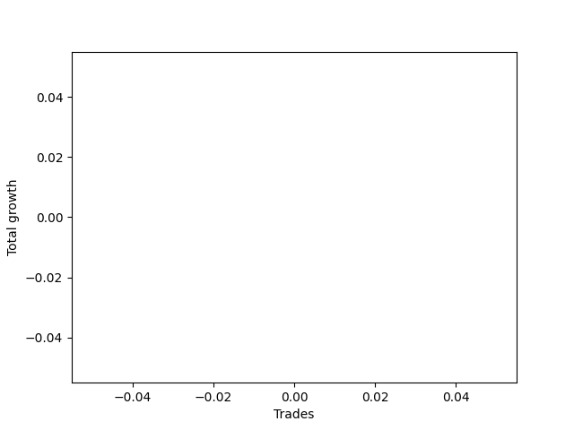

# Short HLT 111 
- Symbol: TSLA
- Date Range: 01/10/2024 - 05/17/2024
- Trading Period: 8:30-12:30
- Number of Trades: 16


### Test TP-0.25 15m
* Take Profit of 0.25 Point
* 0.25 Stoploss
* Results:
```
Total Trades: 16
Percent Up: 37.50
Percent Down: 62.50
Total Points Moved Down: 2.78
Potential Profit: 1390.00
Total Points Ups: 1.22 Count Ups: 6
Total Points Downs: 4.00 Count Downs: 10
```

<details><summary>Trades</summary>

<code>In: 2024-01-19 12:20:00		Out: 2024-01-19 12:22:00		Total Position Time: 02:00		Total Move Down: 0.43		Total to Date: 0.43</code> <br />
<code>In: 2024-01-24 10:00:00		Out: 2024-01-24 10:03:00		Total Position Time: 03:00		Total Move Down: 0.33		Total to Date: 0.76</code> <br />
<code>In: 2024-01-29 11:45:00		Out: 2024-01-29 11:49:00		Total Position Time: 04:00		Total Move Down: 0.33		Total to Date: 1.09</code> <br />
<code>In: 2024-02-15 11:10:00		Out: 2024-02-15 11:14:00		Total Position Time: 04:00		Total Move Down: 0.31		Total to Date: 1.40</code> <br />
<code>In: 2024-02-22 11:40:00		Out: 2024-02-22 11:51:00		Total Position Time: 11:00		Total Move Down: 0.40		Total to Date: 1.80</code> <br />
<code>In: 2024-03-06 10:55:00		Out: 2024-03-06 10:58:00		Total Position Time: 03:00		Total Move Down: -0.25		Total to Date: 1.55</code> <br />
<code>In: 2024-03-12 09:30:00		Out: 2024-03-12 09:37:00		Total Position Time: 07:00		Total Move Down: 0.33		Total to Date: 1.88</code> <br />
<code>In: 2024-03-18 08:35:00		Out: 2024-03-18 08:37:00		Total Position Time: 02:00		Total Move Down: -0.25		Total to Date: 1.63</code> <br />
<code>In: 2024-03-18 10:00:00		Out: 2024-03-18 10:02:00		Total Position Time: 02:00		Total Move Down: 0.53		Total to Date: 2.16</code> <br />
<code>In: 2024-03-25 10:10:00		Out: 2024-03-25 10:24:00		Total Position Time: 14:00		Total Move Down: -0.01		Total to Date: 2.15</code> <br />
<code>In: 2024-04-04 10:10:00		Out: 2024-04-04 10:24:00		Total Position Time: 14:00		Total Move Down: -0.07		Total to Date: 2.08</code> <br />
<code>In: 2024-04-11 11:45:00		Out: 2024-04-11 11:51:00		Total Position Time: 06:00		Total Move Down: 0.28		Total to Date: 2.36</code> <br />
<code>In: 2024-04-29 09:40:00		Out: 2024-04-29 09:42:00		Total Position Time: 02:00		Total Move Down: 0.77		Total to Date: 3.13</code> <br />
<code>In: 2024-05-03 12:00:00		Out: 2024-05-03 12:07:00		Total Position Time: 07:00		Total Move Down: -0.36		Total to Date: 2.77</code> <br />
<code>In: 2024-05-06 11:40:00		Out: 2024-05-06 11:49:00		Total Position Time: 09:00		Total Move Down: -0.28		Total to Date: 2.49</code> <br />
<code>In: 2024-05-17 09:45:00		Out: 2024-05-17 09:55:00		Total Position Time: 10:00		Total Move Down: 0.29		Total to Date: 2.78</code> <br />


</details>

### Test TP-0.5 15m
* Take Profit of 0.5 Point
* 0.5 Stoploss
* Results:
```
Total Trades: 16
Percent Up: 43.75
Percent Down: 56.25
Total Points Moved Down: 3.68
Potential Profit: 1840.00
Total Points Ups: 1.39 Count Ups: 7
Total Points Downs: 5.07 Count Downs: 9
```

<details><summary>Trades</summary>

<code>In: 2024-01-19 12:20:00		Out: 2024-01-19 12:34:00		Total Position Time: 14:00		Total Move Down: -0.20		Total to Date: -0.20</code> <br />
<code>In: 2024-01-24 10:00:00		Out: 2024-01-24 10:14:00		Total Position Time: 14:00		Total Move Down: 0.59		Total to Date: 0.39</code> <br />
<code>In: 2024-01-29 11:45:00		Out: 2024-01-29 11:50:00		Total Position Time: 05:00		Total Move Down: 0.53		Total to Date: 0.92</code> <br />
<code>In: 2024-02-15 11:10:00		Out: 2024-02-15 11:24:00		Total Position Time: 14:00		Total Move Down: -0.29		Total to Date: 0.63</code> <br />
<code>In: 2024-02-22 11:40:00		Out: 2024-02-22 11:54:00		Total Position Time: 14:00		Total Move Down: -0.15		Total to Date: 0.48</code> <br />
<code>In: 2024-03-06 10:55:00		Out: 2024-03-06 11:03:00		Total Position Time: 08:00		Total Move Down: 0.59		Total to Date: 1.07</code> <br />
<code>In: 2024-03-12 09:30:00		Out: 2024-03-12 09:38:00		Total Position Time: 08:00		Total Move Down: 0.58		Total to Date: 1.65</code> <br />
<code>In: 2024-03-18 08:35:00		Out: 2024-03-18 08:42:00		Total Position Time: 07:00		Total Move Down: 0.69		Total to Date: 2.34</code> <br />
<code>In: 2024-03-18 10:00:00		Out: 2024-03-18 10:02:00		Total Position Time: 02:00		Total Move Down: 0.53		Total to Date: 2.87</code> <br />
<code>In: 2024-03-25 10:10:00		Out: 2024-03-25 10:24:00		Total Position Time: 14:00		Total Move Down: -0.01		Total to Date: 2.86</code> <br />
<code>In: 2024-04-04 10:10:00		Out: 2024-04-04 10:24:00		Total Position Time: 14:00		Total Move Down: -0.07		Total to Date: 2.79</code> <br />
<code>In: 2024-04-11 11:45:00		Out: 2024-04-11 11:59:00		Total Position Time: 14:00		Total Move Down: 0.45		Total to Date: 3.24</code> <br />
<code>In: 2024-04-29 09:40:00		Out: 2024-04-29 09:42:00		Total Position Time: 02:00		Total Move Down: 0.77		Total to Date: 4.01</code> <br />
<code>In: 2024-05-03 12:00:00		Out: 2024-05-03 12:10:00		Total Position Time: 10:00		Total Move Down: -0.51		Total to Date: 3.50</code> <br />
<code>In: 2024-05-06 11:40:00		Out: 2024-05-06 11:54:00		Total Position Time: 14:00		Total Move Down: -0.16		Total to Date: 3.34</code> <br />
<code>In: 2024-05-17 09:45:00		Out: 2024-05-17 09:59:00		Total Position Time: 14:00		Total Move Down: 0.34		Total to Date: 3.68</code> <br />


</details>

### Test TP-0.75 15m
* Take Profit of 0.75 Point
* 0.75 Stoploss
* Results:
```
Total Trades: 16
Percent Up: 43.75
Percent Down: 56.25
Total Points Moved Down: 4.43
Potential Profit: 2215.00
Total Points Ups: 1.34 Count Ups: 7
Total Points Downs: 5.77 Count Downs: 9
```

<details><summary>Trades</summary>

<code>In: 2024-01-19 12:20:00		Out: 2024-01-19 12:34:00		Total Position Time: 14:00		Total Move Down: -0.20		Total to Date: -0.20</code> <br />
<code>In: 2024-01-24 10:00:00		Out: 2024-01-24 10:14:00		Total Position Time: 14:00		Total Move Down: 0.59		Total to Date: 0.39</code> <br />
<code>In: 2024-01-29 11:45:00		Out: 2024-01-29 11:59:00		Total Position Time: 14:00		Total Move Down: 0.23		Total to Date: 0.62</code> <br />
<code>In: 2024-02-15 11:10:00		Out: 2024-02-15 11:24:00		Total Position Time: 14:00		Total Move Down: -0.29		Total to Date: 0.33</code> <br />
<code>In: 2024-02-22 11:40:00		Out: 2024-02-22 11:54:00		Total Position Time: 14:00		Total Move Down: -0.15		Total to Date: 0.18</code> <br />
<code>In: 2024-03-06 10:55:00		Out: 2024-03-06 11:04:00		Total Position Time: 09:00		Total Move Down: 0.79		Total to Date: 0.97</code> <br />
<code>In: 2024-03-12 09:30:00		Out: 2024-03-12 09:40:00		Total Position Time: 10:00		Total Move Down: 0.80		Total to Date: 1.77</code> <br />
<code>In: 2024-03-18 08:35:00		Out: 2024-03-18 08:43:00		Total Position Time: 08:00		Total Move Down: 0.78		Total to Date: 2.55</code> <br />
<code>In: 2024-03-18 10:00:00		Out: 2024-03-18 10:07:00		Total Position Time: 07:00		Total Move Down: 1.02		Total to Date: 3.57</code> <br />
<code>In: 2024-03-25 10:10:00		Out: 2024-03-25 10:24:00		Total Position Time: 14:00		Total Move Down: -0.01		Total to Date: 3.56</code> <br />
<code>In: 2024-04-04 10:10:00		Out: 2024-04-04 10:24:00		Total Position Time: 14:00		Total Move Down: -0.07		Total to Date: 3.49</code> <br />
<code>In: 2024-04-11 11:45:00		Out: 2024-04-11 11:59:00		Total Position Time: 14:00		Total Move Down: 0.45		Total to Date: 3.94</code> <br />
<code>In: 2024-04-29 09:40:00		Out: 2024-04-29 09:42:00		Total Position Time: 02:00		Total Move Down: 0.77		Total to Date: 4.71</code> <br />
<code>In: 2024-05-03 12:00:00		Out: 2024-05-03 12:14:00		Total Position Time: 14:00		Total Move Down: -0.46		Total to Date: 4.25</code> <br />
<code>In: 2024-05-06 11:40:00		Out: 2024-05-06 11:54:00		Total Position Time: 14:00		Total Move Down: -0.16		Total to Date: 4.09</code> <br />
<code>In: 2024-05-17 09:45:00		Out: 2024-05-17 09:59:00		Total Position Time: 14:00		Total Move Down: 0.34		Total to Date: 4.43</code> <br />


</details>

### Test TP-1 15m
* Take Profit of 1 Point
* 1 Stoploss
* Results:
```
Total Trades: 16
Percent Up: 43.75
Percent Down: 56.25
Total Points Moved Down: 4.33
Potential Profit: 2165.00
Total Points Ups: 1.34 Count Ups: 7
Total Points Downs: 5.67 Count Downs: 9
```

<details><summary>Trades</summary>

<code>In: 2024-01-19 12:20:00		Out: 2024-01-19 12:34:00		Total Position Time: 14:00		Total Move Down: -0.20		Total to Date: -0.20</code> <br />
<code>In: 2024-01-24 10:00:00		Out: 2024-01-24 10:14:00		Total Position Time: 14:00		Total Move Down: 0.59		Total to Date: 0.39</code> <br />
<code>In: 2024-01-29 11:45:00		Out: 2024-01-29 11:59:00		Total Position Time: 14:00		Total Move Down: 0.23		Total to Date: 0.62</code> <br />
<code>In: 2024-02-15 11:10:00		Out: 2024-02-15 11:24:00		Total Position Time: 14:00		Total Move Down: -0.29		Total to Date: 0.33</code> <br />
<code>In: 2024-02-22 11:40:00		Out: 2024-02-22 11:54:00		Total Position Time: 14:00		Total Move Down: -0.15		Total to Date: 0.18</code> <br />
<code>In: 2024-03-06 10:55:00		Out: 2024-03-06 11:09:00		Total Position Time: 14:00		Total Move Down: 0.18		Total to Date: 0.36</code> <br />
<code>In: 2024-03-12 09:30:00		Out: 2024-03-12 09:44:00		Total Position Time: 14:00		Total Move Down: 0.95		Total to Date: 1.31</code> <br />
<code>In: 2024-03-18 08:35:00		Out: 2024-03-18 08:49:00		Total Position Time: 14:00		Total Move Down: 0.80		Total to Date: 2.11</code> <br />
<code>In: 2024-03-18 10:00:00		Out: 2024-03-18 10:07:00		Total Position Time: 07:00		Total Move Down: 1.02		Total to Date: 3.13</code> <br />
<code>In: 2024-03-25 10:10:00		Out: 2024-03-25 10:24:00		Total Position Time: 14:00		Total Move Down: -0.01		Total to Date: 3.12</code> <br />
<code>In: 2024-04-04 10:10:00		Out: 2024-04-04 10:24:00		Total Position Time: 14:00		Total Move Down: -0.07		Total to Date: 3.05</code> <br />
<code>In: 2024-04-11 11:45:00		Out: 2024-04-11 11:59:00		Total Position Time: 14:00		Total Move Down: 0.45		Total to Date: 3.50</code> <br />
<code>In: 2024-04-29 09:40:00		Out: 2024-04-29 09:45:00		Total Position Time: 05:00		Total Move Down: 1.11		Total to Date: 4.61</code> <br />
<code>In: 2024-05-03 12:00:00		Out: 2024-05-03 12:14:00		Total Position Time: 14:00		Total Move Down: -0.46		Total to Date: 4.15</code> <br />
<code>In: 2024-05-06 11:40:00		Out: 2024-05-06 11:54:00		Total Position Time: 14:00		Total Move Down: -0.16		Total to Date: 3.99</code> <br />
<code>In: 2024-05-17 09:45:00		Out: 2024-05-17 09:59:00		Total Position Time: 14:00		Total Move Down: 0.34		Total to Date: 4.33</code> <br />


</details>

### Test TP-1.25 15m
* Take Profit of 1.25 Point
* 1.25 Stoploss
* Results:
```
Total Trades: 16
Percent Up: 43.75
Percent Down: 56.25
Total Points Moved Down: 3.48
Potential Profit: 1740.00
Total Points Ups: 1.34 Count Ups: 7
Total Points Downs: 4.82 Count Downs: 9
```

<details><summary>Trades</summary>

<code>In: 2024-01-19 12:20:00		Out: 2024-01-19 12:34:00		Total Position Time: 14:00		Total Move Down: -0.20		Total to Date: -0.20</code> <br />
<code>In: 2024-01-24 10:00:00		Out: 2024-01-24 10:14:00		Total Position Time: 14:00		Total Move Down: 0.59		Total to Date: 0.39</code> <br />
<code>In: 2024-01-29 11:45:00		Out: 2024-01-29 11:59:00		Total Position Time: 14:00		Total Move Down: 0.23		Total to Date: 0.62</code> <br />
<code>In: 2024-02-15 11:10:00		Out: 2024-02-15 11:24:00		Total Position Time: 14:00		Total Move Down: -0.29		Total to Date: 0.33</code> <br />
<code>In: 2024-02-22 11:40:00		Out: 2024-02-22 11:54:00		Total Position Time: 14:00		Total Move Down: -0.15		Total to Date: 0.18</code> <br />
<code>In: 2024-03-06 10:55:00		Out: 2024-03-06 11:09:00		Total Position Time: 14:00		Total Move Down: 0.18		Total to Date: 0.36</code> <br />
<code>In: 2024-03-12 09:30:00		Out: 2024-03-12 09:44:00		Total Position Time: 14:00		Total Move Down: 0.95		Total to Date: 1.31</code> <br />
<code>In: 2024-03-18 08:35:00		Out: 2024-03-18 08:49:00		Total Position Time: 14:00		Total Move Down: 0.80		Total to Date: 2.11</code> <br />
<code>In: 2024-03-18 10:00:00		Out: 2024-03-18 10:14:00		Total Position Time: 14:00		Total Move Down: 0.63		Total to Date: 2.74</code> <br />
<code>In: 2024-03-25 10:10:00		Out: 2024-03-25 10:24:00		Total Position Time: 14:00		Total Move Down: -0.01		Total to Date: 2.73</code> <br />
<code>In: 2024-04-04 10:10:00		Out: 2024-04-04 10:24:00		Total Position Time: 14:00		Total Move Down: -0.07		Total to Date: 2.66</code> <br />
<code>In: 2024-04-11 11:45:00		Out: 2024-04-11 11:59:00		Total Position Time: 14:00		Total Move Down: 0.45		Total to Date: 3.11</code> <br />
<code>In: 2024-04-29 09:40:00		Out: 2024-04-29 09:54:00		Total Position Time: 14:00		Total Move Down: 0.65		Total to Date: 3.76</code> <br />
<code>In: 2024-05-03 12:00:00		Out: 2024-05-03 12:14:00		Total Position Time: 14:00		Total Move Down: -0.46		Total to Date: 3.30</code> <br />
<code>In: 2024-05-06 11:40:00		Out: 2024-05-06 11:54:00		Total Position Time: 14:00		Total Move Down: -0.16		Total to Date: 3.14</code> <br />
<code>In: 2024-05-17 09:45:00		Out: 2024-05-17 09:59:00		Total Position Time: 14:00		Total Move Down: 0.34		Total to Date: 3.48</code> <br />


</details>

### Test TP-1.5 15m
* Take Profit of 1.5 Point
* 1.5 Stoploss
* Results:
```
Total Trades: 16
Percent Up: 43.75
Percent Down: 56.25
Total Points Moved Down: 3.48
Potential Profit: 1740.00
Total Points Ups: 1.34 Count Ups: 7
Total Points Downs: 4.82 Count Downs: 9
```

<details><summary>Trades</summary>

<code>In: 2024-01-19 12:20:00		Out: 2024-01-19 12:34:00		Total Position Time: 14:00		Total Move Down: -0.20		Total to Date: -0.20</code> <br />
<code>In: 2024-01-24 10:00:00		Out: 2024-01-24 10:14:00		Total Position Time: 14:00		Total Move Down: 0.59		Total to Date: 0.39</code> <br />
<code>In: 2024-01-29 11:45:00		Out: 2024-01-29 11:59:00		Total Position Time: 14:00		Total Move Down: 0.23		Total to Date: 0.62</code> <br />
<code>In: 2024-02-15 11:10:00		Out: 2024-02-15 11:24:00		Total Position Time: 14:00		Total Move Down: -0.29		Total to Date: 0.33</code> <br />
<code>In: 2024-02-22 11:40:00		Out: 2024-02-22 11:54:00		Total Position Time: 14:00		Total Move Down: -0.15		Total to Date: 0.18</code> <br />
<code>In: 2024-03-06 10:55:00		Out: 2024-03-06 11:09:00		Total Position Time: 14:00		Total Move Down: 0.18		Total to Date: 0.36</code> <br />
<code>In: 2024-03-12 09:30:00		Out: 2024-03-12 09:44:00		Total Position Time: 14:00		Total Move Down: 0.95		Total to Date: 1.31</code> <br />
<code>In: 2024-03-18 08:35:00		Out: 2024-03-18 08:49:00		Total Position Time: 14:00		Total Move Down: 0.80		Total to Date: 2.11</code> <br />
<code>In: 2024-03-18 10:00:00		Out: 2024-03-18 10:14:00		Total Position Time: 14:00		Total Move Down: 0.63		Total to Date: 2.74</code> <br />
<code>In: 2024-03-25 10:10:00		Out: 2024-03-25 10:24:00		Total Position Time: 14:00		Total Move Down: -0.01		Total to Date: 2.73</code> <br />
<code>In: 2024-04-04 10:10:00		Out: 2024-04-04 10:24:00		Total Position Time: 14:00		Total Move Down: -0.07		Total to Date: 2.66</code> <br />
<code>In: 2024-04-11 11:45:00		Out: 2024-04-11 11:59:00		Total Position Time: 14:00		Total Move Down: 0.45		Total to Date: 3.11</code> <br />
<code>In: 2024-04-29 09:40:00		Out: 2024-04-29 09:54:00		Total Position Time: 14:00		Total Move Down: 0.65		Total to Date: 3.76</code> <br />
<code>In: 2024-05-03 12:00:00		Out: 2024-05-03 12:14:00		Total Position Time: 14:00		Total Move Down: -0.46		Total to Date: 3.30</code> <br />
<code>In: 2024-05-06 11:40:00		Out: 2024-05-06 11:54:00		Total Position Time: 14:00		Total Move Down: -0.16		Total to Date: 3.14</code> <br />
<code>In: 2024-05-17 09:45:00		Out: 2024-05-17 09:59:00		Total Position Time: 14:00		Total Move Down: 0.34		Total to Date: 3.48</code> <br />


</details>

### Test TP-1.75 15m
* Take Profit of 1.75 Point
* 1.75 Stoploss
* Results:
```
Total Trades: 16
Percent Up: 43.75
Percent Down: 56.25
Total Points Moved Down: 3.48
Potential Profit: 1740.00
Total Points Ups: 1.34 Count Ups: 7
Total Points Downs: 4.82 Count Downs: 9
```

<details><summary>Trades</summary>

<code>In: 2024-01-19 12:20:00		Out: 2024-01-19 12:34:00		Total Position Time: 14:00		Total Move Down: -0.20		Total to Date: -0.20</code> <br />
<code>In: 2024-01-24 10:00:00		Out: 2024-01-24 10:14:00		Total Position Time: 14:00		Total Move Down: 0.59		Total to Date: 0.39</code> <br />
<code>In: 2024-01-29 11:45:00		Out: 2024-01-29 11:59:00		Total Position Time: 14:00		Total Move Down: 0.23		Total to Date: 0.62</code> <br />
<code>In: 2024-02-15 11:10:00		Out: 2024-02-15 11:24:00		Total Position Time: 14:00		Total Move Down: -0.29		Total to Date: 0.33</code> <br />
<code>In: 2024-02-22 11:40:00		Out: 2024-02-22 11:54:00		Total Position Time: 14:00		Total Move Down: -0.15		Total to Date: 0.18</code> <br />
<code>In: 2024-03-06 10:55:00		Out: 2024-03-06 11:09:00		Total Position Time: 14:00		Total Move Down: 0.18		Total to Date: 0.36</code> <br />
<code>In: 2024-03-12 09:30:00		Out: 2024-03-12 09:44:00		Total Position Time: 14:00		Total Move Down: 0.95		Total to Date: 1.31</code> <br />
<code>In: 2024-03-18 08:35:00		Out: 2024-03-18 08:49:00		Total Position Time: 14:00		Total Move Down: 0.80		Total to Date: 2.11</code> <br />
<code>In: 2024-03-18 10:00:00		Out: 2024-03-18 10:14:00		Total Position Time: 14:00		Total Move Down: 0.63		Total to Date: 2.74</code> <br />
<code>In: 2024-03-25 10:10:00		Out: 2024-03-25 10:24:00		Total Position Time: 14:00		Total Move Down: -0.01		Total to Date: 2.73</code> <br />
<code>In: 2024-04-04 10:10:00		Out: 2024-04-04 10:24:00		Total Position Time: 14:00		Total Move Down: -0.07		Total to Date: 2.66</code> <br />
<code>In: 2024-04-11 11:45:00		Out: 2024-04-11 11:59:00		Total Position Time: 14:00		Total Move Down: 0.45		Total to Date: 3.11</code> <br />
<code>In: 2024-04-29 09:40:00		Out: 2024-04-29 09:54:00		Total Position Time: 14:00		Total Move Down: 0.65		Total to Date: 3.76</code> <br />
<code>In: 2024-05-03 12:00:00		Out: 2024-05-03 12:14:00		Total Position Time: 14:00		Total Move Down: -0.46		Total to Date: 3.30</code> <br />
<code>In: 2024-05-06 11:40:00		Out: 2024-05-06 11:54:00		Total Position Time: 14:00		Total Move Down: -0.16		Total to Date: 3.14</code> <br />
<code>In: 2024-05-17 09:45:00		Out: 2024-05-17 09:59:00		Total Position Time: 14:00		Total Move Down: 0.34		Total to Date: 3.48</code> <br />


</details>

### Test TP-2 15m
* Take Profit of 2 Point
* 2 Stoploss
* Results:
```
Total Trades: 16
Percent Up: 43.75
Percent Down: 56.25
Total Points Moved Down: 3.48
Potential Profit: 1740.00
Total Points Ups: 1.34 Count Ups: 7
Total Points Downs: 4.82 Count Downs: 9
```

<details><summary>Trades</summary>

<code>In: 2024-01-19 12:20:00		Out: 2024-01-19 12:34:00		Total Position Time: 14:00		Total Move Down: -0.20		Total to Date: -0.20</code> <br />
<code>In: 2024-01-24 10:00:00		Out: 2024-01-24 10:14:00		Total Position Time: 14:00		Total Move Down: 0.59		Total to Date: 0.39</code> <br />
<code>In: 2024-01-29 11:45:00		Out: 2024-01-29 11:59:00		Total Position Time: 14:00		Total Move Down: 0.23		Total to Date: 0.62</code> <br />
<code>In: 2024-02-15 11:10:00		Out: 2024-02-15 11:24:00		Total Position Time: 14:00		Total Move Down: -0.29		Total to Date: 0.33</code> <br />
<code>In: 2024-02-22 11:40:00		Out: 2024-02-22 11:54:00		Total Position Time: 14:00		Total Move Down: -0.15		Total to Date: 0.18</code> <br />
<code>In: 2024-03-06 10:55:00		Out: 2024-03-06 11:09:00		Total Position Time: 14:00		Total Move Down: 0.18		Total to Date: 0.36</code> <br />
<code>In: 2024-03-12 09:30:00		Out: 2024-03-12 09:44:00		Total Position Time: 14:00		Total Move Down: 0.95		Total to Date: 1.31</code> <br />
<code>In: 2024-03-18 08:35:00		Out: 2024-03-18 08:49:00		Total Position Time: 14:00		Total Move Down: 0.80		Total to Date: 2.11</code> <br />
<code>In: 2024-03-18 10:00:00		Out: 2024-03-18 10:14:00		Total Position Time: 14:00		Total Move Down: 0.63		Total to Date: 2.74</code> <br />
<code>In: 2024-03-25 10:10:00		Out: 2024-03-25 10:24:00		Total Position Time: 14:00		Total Move Down: -0.01		Total to Date: 2.73</code> <br />
<code>In: 2024-04-04 10:10:00		Out: 2024-04-04 10:24:00		Total Position Time: 14:00		Total Move Down: -0.07		Total to Date: 2.66</code> <br />
<code>In: 2024-04-11 11:45:00		Out: 2024-04-11 11:59:00		Total Position Time: 14:00		Total Move Down: 0.45		Total to Date: 3.11</code> <br />
<code>In: 2024-04-29 09:40:00		Out: 2024-04-29 09:54:00		Total Position Time: 14:00		Total Move Down: 0.65		Total to Date: 3.76</code> <br />
<code>In: 2024-05-03 12:00:00		Out: 2024-05-03 12:14:00		Total Position Time: 14:00		Total Move Down: -0.46		Total to Date: 3.30</code> <br />
<code>In: 2024-05-06 11:40:00		Out: 2024-05-06 11:54:00		Total Position Time: 14:00		Total Move Down: -0.16		Total to Date: 3.14</code> <br />
<code>In: 2024-05-17 09:45:00		Out: 2024-05-17 09:59:00		Total Position Time: 14:00		Total Move Down: 0.34		Total to Date: 3.48</code> <br />


</details>

### Test TP-2.25 15m
* Take Profit of 2.25 Point
* 2.25 Stoploss
* Results:
```
Total Trades: 16
Percent Up: 43.75
Percent Down: 56.25
Total Points Moved Down: 3.48
Potential Profit: 1740.00
Total Points Ups: 1.34 Count Ups: 7
Total Points Downs: 4.82 Count Downs: 9
```

<details><summary>Trades</summary>

<code>In: 2024-01-19 12:20:00		Out: 2024-01-19 12:34:00		Total Position Time: 14:00		Total Move Down: -0.20		Total to Date: -0.20</code> <br />
<code>In: 2024-01-24 10:00:00		Out: 2024-01-24 10:14:00		Total Position Time: 14:00		Total Move Down: 0.59		Total to Date: 0.39</code> <br />
<code>In: 2024-01-29 11:45:00		Out: 2024-01-29 11:59:00		Total Position Time: 14:00		Total Move Down: 0.23		Total to Date: 0.62</code> <br />
<code>In: 2024-02-15 11:10:00		Out: 2024-02-15 11:24:00		Total Position Time: 14:00		Total Move Down: -0.29		Total to Date: 0.33</code> <br />
<code>In: 2024-02-22 11:40:00		Out: 2024-02-22 11:54:00		Total Position Time: 14:00		Total Move Down: -0.15		Total to Date: 0.18</code> <br />
<code>In: 2024-03-06 10:55:00		Out: 2024-03-06 11:09:00		Total Position Time: 14:00		Total Move Down: 0.18		Total to Date: 0.36</code> <br />
<code>In: 2024-03-12 09:30:00		Out: 2024-03-12 09:44:00		Total Position Time: 14:00		Total Move Down: 0.95		Total to Date: 1.31</code> <br />
<code>In: 2024-03-18 08:35:00		Out: 2024-03-18 08:49:00		Total Position Time: 14:00		Total Move Down: 0.80		Total to Date: 2.11</code> <br />
<code>In: 2024-03-18 10:00:00		Out: 2024-03-18 10:14:00		Total Position Time: 14:00		Total Move Down: 0.63		Total to Date: 2.74</code> <br />
<code>In: 2024-03-25 10:10:00		Out: 2024-03-25 10:24:00		Total Position Time: 14:00		Total Move Down: -0.01		Total to Date: 2.73</code> <br />
<code>In: 2024-04-04 10:10:00		Out: 2024-04-04 10:24:00		Total Position Time: 14:00		Total Move Down: -0.07		Total to Date: 2.66</code> <br />
<code>In: 2024-04-11 11:45:00		Out: 2024-04-11 11:59:00		Total Position Time: 14:00		Total Move Down: 0.45		Total to Date: 3.11</code> <br />
<code>In: 2024-04-29 09:40:00		Out: 2024-04-29 09:54:00		Total Position Time: 14:00		Total Move Down: 0.65		Total to Date: 3.76</code> <br />
<code>In: 2024-05-03 12:00:00		Out: 2024-05-03 12:14:00		Total Position Time: 14:00		Total Move Down: -0.46		Total to Date: 3.30</code> <br />
<code>In: 2024-05-06 11:40:00		Out: 2024-05-06 11:54:00		Total Position Time: 14:00		Total Move Down: -0.16		Total to Date: 3.14</code> <br />
<code>In: 2024-05-17 09:45:00		Out: 2024-05-17 09:59:00		Total Position Time: 14:00		Total Move Down: 0.34		Total to Date: 3.48</code> <br />


</details>

### Test TP-2.5 15m
* Take Profit of 2.5 Point
* 2.5 Stoploss
* Results:
```
Total Trades: 16
Percent Up: 43.75
Percent Down: 56.25
Total Points Moved Down: 3.48
Potential Profit: 1740.00
Total Points Ups: 1.34 Count Ups: 7
Total Points Downs: 4.82 Count Downs: 9
```

<details><summary>Trades</summary>

<code>In: 2024-01-19 12:20:00		Out: 2024-01-19 12:34:00		Total Position Time: 14:00		Total Move Down: -0.20		Total to Date: -0.20</code> <br />
<code>In: 2024-01-24 10:00:00		Out: 2024-01-24 10:14:00		Total Position Time: 14:00		Total Move Down: 0.59		Total to Date: 0.39</code> <br />
<code>In: 2024-01-29 11:45:00		Out: 2024-01-29 11:59:00		Total Position Time: 14:00		Total Move Down: 0.23		Total to Date: 0.62</code> <br />
<code>In: 2024-02-15 11:10:00		Out: 2024-02-15 11:24:00		Total Position Time: 14:00		Total Move Down: -0.29		Total to Date: 0.33</code> <br />
<code>In: 2024-02-22 11:40:00		Out: 2024-02-22 11:54:00		Total Position Time: 14:00		Total Move Down: -0.15		Total to Date: 0.18</code> <br />
<code>In: 2024-03-06 10:55:00		Out: 2024-03-06 11:09:00		Total Position Time: 14:00		Total Move Down: 0.18		Total to Date: 0.36</code> <br />
<code>In: 2024-03-12 09:30:00		Out: 2024-03-12 09:44:00		Total Position Time: 14:00		Total Move Down: 0.95		Total to Date: 1.31</code> <br />
<code>In: 2024-03-18 08:35:00		Out: 2024-03-18 08:49:00		Total Position Time: 14:00		Total Move Down: 0.80		Total to Date: 2.11</code> <br />
<code>In: 2024-03-18 10:00:00		Out: 2024-03-18 10:14:00		Total Position Time: 14:00		Total Move Down: 0.63		Total to Date: 2.74</code> <br />
<code>In: 2024-03-25 10:10:00		Out: 2024-03-25 10:24:00		Total Position Time: 14:00		Total Move Down: -0.01		Total to Date: 2.73</code> <br />
<code>In: 2024-04-04 10:10:00		Out: 2024-04-04 10:24:00		Total Position Time: 14:00		Total Move Down: -0.07		Total to Date: 2.66</code> <br />
<code>In: 2024-04-11 11:45:00		Out: 2024-04-11 11:59:00		Total Position Time: 14:00		Total Move Down: 0.45		Total to Date: 3.11</code> <br />
<code>In: 2024-04-29 09:40:00		Out: 2024-04-29 09:54:00		Total Position Time: 14:00		Total Move Down: 0.65		Total to Date: 3.76</code> <br />
<code>In: 2024-05-03 12:00:00		Out: 2024-05-03 12:14:00		Total Position Time: 14:00		Total Move Down: -0.46		Total to Date: 3.30</code> <br />
<code>In: 2024-05-06 11:40:00		Out: 2024-05-06 11:54:00		Total Position Time: 14:00		Total Move Down: -0.16		Total to Date: 3.14</code> <br />
<code>In: 2024-05-17 09:45:00		Out: 2024-05-17 09:59:00		Total Position Time: 14:00		Total Move Down: 0.34		Total to Date: 3.48</code> <br />


</details>

### Test TP-2.75 15m
* Take Profit of 2.75 Point
* 2.75 Stoploss
* Results:
```
Total Trades: 16
Percent Up: 43.75
Percent Down: 56.25
Total Points Moved Down: 3.48
Potential Profit: 1740.00
Total Points Ups: 1.34 Count Ups: 7
Total Points Downs: 4.82 Count Downs: 9
```

<details><summary>Trades</summary>

<code>In: 2024-01-19 12:20:00		Out: 2024-01-19 12:34:00		Total Position Time: 14:00		Total Move Down: -0.20		Total to Date: -0.20</code> <br />
<code>In: 2024-01-24 10:00:00		Out: 2024-01-24 10:14:00		Total Position Time: 14:00		Total Move Down: 0.59		Total to Date: 0.39</code> <br />
<code>In: 2024-01-29 11:45:00		Out: 2024-01-29 11:59:00		Total Position Time: 14:00		Total Move Down: 0.23		Total to Date: 0.62</code> <br />
<code>In: 2024-02-15 11:10:00		Out: 2024-02-15 11:24:00		Total Position Time: 14:00		Total Move Down: -0.29		Total to Date: 0.33</code> <br />
<code>In: 2024-02-22 11:40:00		Out: 2024-02-22 11:54:00		Total Position Time: 14:00		Total Move Down: -0.15		Total to Date: 0.18</code> <br />
<code>In: 2024-03-06 10:55:00		Out: 2024-03-06 11:09:00		Total Position Time: 14:00		Total Move Down: 0.18		Total to Date: 0.36</code> <br />
<code>In: 2024-03-12 09:30:00		Out: 2024-03-12 09:44:00		Total Position Time: 14:00		Total Move Down: 0.95		Total to Date: 1.31</code> <br />
<code>In: 2024-03-18 08:35:00		Out: 2024-03-18 08:49:00		Total Position Time: 14:00		Total Move Down: 0.80		Total to Date: 2.11</code> <br />
<code>In: 2024-03-18 10:00:00		Out: 2024-03-18 10:14:00		Total Position Time: 14:00		Total Move Down: 0.63		Total to Date: 2.74</code> <br />
<code>In: 2024-03-25 10:10:00		Out: 2024-03-25 10:24:00		Total Position Time: 14:00		Total Move Down: -0.01		Total to Date: 2.73</code> <br />
<code>In: 2024-04-04 10:10:00		Out: 2024-04-04 10:24:00		Total Position Time: 14:00		Total Move Down: -0.07		Total to Date: 2.66</code> <br />
<code>In: 2024-04-11 11:45:00		Out: 2024-04-11 11:59:00		Total Position Time: 14:00		Total Move Down: 0.45		Total to Date: 3.11</code> <br />
<code>In: 2024-04-29 09:40:00		Out: 2024-04-29 09:54:00		Total Position Time: 14:00		Total Move Down: 0.65		Total to Date: 3.76</code> <br />
<code>In: 2024-05-03 12:00:00		Out: 2024-05-03 12:14:00		Total Position Time: 14:00		Total Move Down: -0.46		Total to Date: 3.30</code> <br />
<code>In: 2024-05-06 11:40:00		Out: 2024-05-06 11:54:00		Total Position Time: 14:00		Total Move Down: -0.16		Total to Date: 3.14</code> <br />
<code>In: 2024-05-17 09:45:00		Out: 2024-05-17 09:59:00		Total Position Time: 14:00		Total Move Down: 0.34		Total to Date: 3.48</code> <br />


</details>

### Test TP-3 15m
* Take Profit of 3 Point
* 3 Stoploss
* Results:
```
Total Trades: 16
Percent Up: 43.75
Percent Down: 56.25
Total Points Moved Down: 3.48
Potential Profit: 1740.00
Total Points Ups: 1.34 Count Ups: 7
Total Points Downs: 4.82 Count Downs: 9
```

<details><summary>Trades</summary>

<code>In: 2024-01-19 12:20:00		Out: 2024-01-19 12:34:00		Total Position Time: 14:00		Total Move Down: -0.20		Total to Date: -0.20</code> <br />
<code>In: 2024-01-24 10:00:00		Out: 2024-01-24 10:14:00		Total Position Time: 14:00		Total Move Down: 0.59		Total to Date: 0.39</code> <br />
<code>In: 2024-01-29 11:45:00		Out: 2024-01-29 11:59:00		Total Position Time: 14:00		Total Move Down: 0.23		Total to Date: 0.62</code> <br />
<code>In: 2024-02-15 11:10:00		Out: 2024-02-15 11:24:00		Total Position Time: 14:00		Total Move Down: -0.29		Total to Date: 0.33</code> <br />
<code>In: 2024-02-22 11:40:00		Out: 2024-02-22 11:54:00		Total Position Time: 14:00		Total Move Down: -0.15		Total to Date: 0.18</code> <br />
<code>In: 2024-03-06 10:55:00		Out: 2024-03-06 11:09:00		Total Position Time: 14:00		Total Move Down: 0.18		Total to Date: 0.36</code> <br />
<code>In: 2024-03-12 09:30:00		Out: 2024-03-12 09:44:00		Total Position Time: 14:00		Total Move Down: 0.95		Total to Date: 1.31</code> <br />
<code>In: 2024-03-18 08:35:00		Out: 2024-03-18 08:49:00		Total Position Time: 14:00		Total Move Down: 0.80		Total to Date: 2.11</code> <br />
<code>In: 2024-03-18 10:00:00		Out: 2024-03-18 10:14:00		Total Position Time: 14:00		Total Move Down: 0.63		Total to Date: 2.74</code> <br />
<code>In: 2024-03-25 10:10:00		Out: 2024-03-25 10:24:00		Total Position Time: 14:00		Total Move Down: -0.01		Total to Date: 2.73</code> <br />
<code>In: 2024-04-04 10:10:00		Out: 2024-04-04 10:24:00		Total Position Time: 14:00		Total Move Down: -0.07		Total to Date: 2.66</code> <br />
<code>In: 2024-04-11 11:45:00		Out: 2024-04-11 11:59:00		Total Position Time: 14:00		Total Move Down: 0.45		Total to Date: 3.11</code> <br />
<code>In: 2024-04-29 09:40:00		Out: 2024-04-29 09:54:00		Total Position Time: 14:00		Total Move Down: 0.65		Total to Date: 3.76</code> <br />
<code>In: 2024-05-03 12:00:00		Out: 2024-05-03 12:14:00		Total Position Time: 14:00		Total Move Down: -0.46		Total to Date: 3.30</code> <br />
<code>In: 2024-05-06 11:40:00		Out: 2024-05-06 11:54:00		Total Position Time: 14:00		Total Move Down: -0.16		Total to Date: 3.14</code> <br />
<code>In: 2024-05-17 09:45:00		Out: 2024-05-17 09:59:00		Total Position Time: 14:00		Total Move Down: 0.34		Total to Date: 3.48</code> <br />


</details>

### Test TP-0.25 30m
* Take Profit of 0.25 Point
* 0.25 Stoploss
* Results:
```
Total Trades: 16
Percent Up: 31.25
Percent Down: 68.75
Total Points Moved Down: 2.76
Potential Profit: 1380.00
Total Points Ups: 1.49 Count Ups: 5
Total Points Downs: 4.25 Count Downs: 11
```

<details><summary>Trades</summary>

<code>In: 2024-01-19 12:20:00		Out: 2024-01-19 12:22:00		Total Position Time: 02:00		Total Move Down: 0.43		Total to Date: 0.43</code> <br />
<code>In: 2024-01-24 10:00:00		Out: 2024-01-24 10:03:00		Total Position Time: 03:00		Total Move Down: 0.33		Total to Date: 0.76</code> <br />
<code>In: 2024-01-29 11:45:00		Out: 2024-01-29 11:49:00		Total Position Time: 04:00		Total Move Down: 0.33		Total to Date: 1.09</code> <br />
<code>In: 2024-02-15 11:10:00		Out: 2024-02-15 11:14:00		Total Position Time: 04:00		Total Move Down: 0.31		Total to Date: 1.40</code> <br />
<code>In: 2024-02-22 11:40:00		Out: 2024-02-22 11:51:00		Total Position Time: 11:00		Total Move Down: 0.40		Total to Date: 1.80</code> <br />
<code>In: 2024-03-06 10:55:00		Out: 2024-03-06 10:58:00		Total Position Time: 03:00		Total Move Down: -0.25		Total to Date: 1.55</code> <br />
<code>In: 2024-03-12 09:30:00		Out: 2024-03-12 09:37:00		Total Position Time: 07:00		Total Move Down: 0.33		Total to Date: 1.88</code> <br />
<code>In: 2024-03-18 08:35:00		Out: 2024-03-18 08:37:00		Total Position Time: 02:00		Total Move Down: -0.25		Total to Date: 1.63</code> <br />
<code>In: 2024-03-18 10:00:00		Out: 2024-03-18 10:02:00		Total Position Time: 02:00		Total Move Down: 0.53		Total to Date: 2.16</code> <br />
<code>In: 2024-03-25 10:10:00		Out: 2024-03-25 10:29:00		Total Position Time: 19:00		Total Move Down: 0.25		Total to Date: 2.41</code> <br />
<code>In: 2024-04-04 10:10:00		Out: 2024-04-04 10:25:00		Total Position Time: 15:00		Total Move Down: -0.35		Total to Date: 2.06</code> <br />
<code>In: 2024-04-11 11:45:00		Out: 2024-04-11 11:51:00		Total Position Time: 06:00		Total Move Down: 0.28		Total to Date: 2.34</code> <br />
<code>In: 2024-04-29 09:40:00		Out: 2024-04-29 09:42:00		Total Position Time: 02:00		Total Move Down: 0.77		Total to Date: 3.11</code> <br />
<code>In: 2024-05-03 12:00:00		Out: 2024-05-03 12:07:00		Total Position Time: 07:00		Total Move Down: -0.36		Total to Date: 2.75</code> <br />
<code>In: 2024-05-06 11:40:00		Out: 2024-05-06 11:49:00		Total Position Time: 09:00		Total Move Down: -0.28		Total to Date: 2.47</code> <br />
<code>In: 2024-05-17 09:45:00		Out: 2024-05-17 09:55:00		Total Position Time: 10:00		Total Move Down: 0.29		Total to Date: 2.76</code> <br />


</details>

### Test TP-0.5 30m
* Take Profit of 0.5 Point
* 0.5 Stoploss
* Results:
```
Total Trades: 16
Percent Up: 37.50
Percent Down: 62.50
Total Points Moved Down: 3.96
Potential Profit: 1980.00
Total Points Ups: 1.56 Count Ups: 6
Total Points Downs: 5.52 Count Downs: 10
```

<details><summary>Trades</summary>

<code>In: 2024-01-19 12:20:00		Out: 2024-01-19 12:49:00		Total Position Time: 29:00		Total Move Down: -0.24		Total to Date: -0.24</code> <br />
<code>In: 2024-01-24 10:00:00		Out: 2024-01-24 10:14:00		Total Position Time: 14:00		Total Move Down: 0.59		Total to Date: 0.35</code> <br />
<code>In: 2024-01-29 11:45:00		Out: 2024-01-29 11:50:00		Total Position Time: 05:00		Total Move Down: 0.53		Total to Date: 0.88</code> <br />
<code>In: 2024-02-15 11:10:00		Out: 2024-02-15 11:25:00		Total Position Time: 15:00		Total Move Down: -0.51		Total to Date: 0.37</code> <br />
<code>In: 2024-02-22 11:40:00		Out: 2024-02-22 12:09:00		Total Position Time: 29:00		Total Move Down: -0.03		Total to Date: 0.34</code> <br />
<code>In: 2024-03-06 10:55:00		Out: 2024-03-06 11:03:00		Total Position Time: 08:00		Total Move Down: 0.59		Total to Date: 0.93</code> <br />
<code>In: 2024-03-12 09:30:00		Out: 2024-03-12 09:38:00		Total Position Time: 08:00		Total Move Down: 0.58		Total to Date: 1.51</code> <br />
<code>In: 2024-03-18 08:35:00		Out: 2024-03-18 08:42:00		Total Position Time: 07:00		Total Move Down: 0.69		Total to Date: 2.20</code> <br />
<code>In: 2024-03-18 10:00:00		Out: 2024-03-18 10:02:00		Total Position Time: 02:00		Total Move Down: 0.53		Total to Date: 2.73</code> <br />
<code>In: 2024-03-25 10:10:00		Out: 2024-03-25 10:39:00		Total Position Time: 29:00		Total Move Down: -0.05		Total to Date: 2.68</code> <br />
<code>In: 2024-04-04 10:10:00		Out: 2024-04-04 10:39:00		Total Position Time: 29:00		Total Move Down: 0.32		Total to Date: 3.00</code> <br />
<code>In: 2024-04-11 11:45:00		Out: 2024-04-11 12:14:00		Total Position Time: 29:00		Total Move Down: -0.22		Total to Date: 2.78</code> <br />
<code>In: 2024-04-29 09:40:00		Out: 2024-04-29 09:42:00		Total Position Time: 02:00		Total Move Down: 0.77		Total to Date: 3.55</code> <br />
<code>In: 2024-05-03 12:00:00		Out: 2024-05-03 12:10:00		Total Position Time: 10:00		Total Move Down: -0.51		Total to Date: 3.04</code> <br />
<code>In: 2024-05-06 11:40:00		Out: 2024-05-06 12:09:00		Total Position Time: 29:00		Total Move Down: 0.39		Total to Date: 3.43</code> <br />
<code>In: 2024-05-17 09:45:00		Out: 2024-05-17 10:01:00		Total Position Time: 16:00		Total Move Down: 0.53		Total to Date: 3.96</code> <br />


</details>

### Test TP-0.75 30m
* Take Profit of 0.75 Point
* 0.75 Stoploss
* Results:
```
Total Trades: 16
Percent Up: 43.75
Percent Down: 56.25
Total Points Moved Down: 3.48
Potential Profit: 1740.00
Total Points Ups: 2.96 Count Ups: 7
Total Points Downs: 6.44 Count Downs: 9
```

<details><summary>Trades</summary>

<code>In: 2024-01-19 12:20:00		Out: 2024-01-19 12:49:00		Total Position Time: 29:00		Total Move Down: -0.24		Total to Date: -0.24</code> <br />
<code>In: 2024-01-24 10:00:00		Out: 2024-01-24 10:15:00		Total Position Time: 15:00		Total Move Down: 0.77		Total to Date: 0.53</code> <br />
<code>In: 2024-01-29 11:45:00		Out: 2024-01-29 12:05:00		Total Position Time: 20:00		Total Move Down: -0.80		Total to Date: -0.27</code> <br />
<code>In: 2024-02-15 11:10:00		Out: 2024-02-15 11:31:00		Total Position Time: 21:00		Total Move Down: -0.75		Total to Date: -1.02</code> <br />
<code>In: 2024-02-22 11:40:00		Out: 2024-02-22 12:09:00		Total Position Time: 29:00		Total Move Down: -0.03		Total to Date: -1.05</code> <br />
<code>In: 2024-03-06 10:55:00		Out: 2024-03-06 11:04:00		Total Position Time: 09:00		Total Move Down: 0.79		Total to Date: -0.26</code> <br />
<code>In: 2024-03-12 09:30:00		Out: 2024-03-12 09:40:00		Total Position Time: 10:00		Total Move Down: 0.80		Total to Date: 0.54</code> <br />
<code>In: 2024-03-18 08:35:00		Out: 2024-03-18 08:43:00		Total Position Time: 08:00		Total Move Down: 0.78		Total to Date: 1.32</code> <br />
<code>In: 2024-03-18 10:00:00		Out: 2024-03-18 10:07:00		Total Position Time: 07:00		Total Move Down: 1.02		Total to Date: 2.34</code> <br />
<code>In: 2024-03-25 10:10:00		Out: 2024-03-25 10:39:00		Total Position Time: 29:00		Total Move Down: -0.05		Total to Date: 2.29</code> <br />
<code>In: 2024-04-04 10:10:00		Out: 2024-04-04 10:39:00		Total Position Time: 29:00		Total Move Down: 0.32		Total to Date: 2.61</code> <br />
<code>In: 2024-04-11 11:45:00		Out: 2024-04-11 12:14:00		Total Position Time: 29:00		Total Move Down: -0.22		Total to Date: 2.39</code> <br />
<code>In: 2024-04-29 09:40:00		Out: 2024-04-29 09:42:00		Total Position Time: 02:00		Total Move Down: 0.77		Total to Date: 3.16</code> <br />
<code>In: 2024-05-03 12:00:00		Out: 2024-05-03 12:17:00		Total Position Time: 17:00		Total Move Down: -0.87		Total to Date: 2.29</code> <br />
<code>In: 2024-05-06 11:40:00		Out: 2024-05-06 12:09:00		Total Position Time: 29:00		Total Move Down: 0.39		Total to Date: 2.68</code> <br />
<code>In: 2024-05-17 09:45:00		Out: 2024-05-17 10:05:00		Total Position Time: 20:00		Total Move Down: 0.80		Total to Date: 3.48</code> <br />


</details>

### Test TP-1 30m
* Take Profit of 1 Point
* 1 Stoploss
* Results:
```
Total Trades: 16
Percent Up: 43.75
Percent Down: 56.25
Total Points Moved Down: 3.15
Potential Profit: 1575.00
Total Points Ups: 3.07 Count Ups: 7
Total Points Downs: 6.22 Count Downs: 9
```

<details><summary>Trades</summary>

<code>In: 2024-01-19 12:20:00		Out: 2024-01-19 12:49:00		Total Position Time: 29:00		Total Move Down: -0.24		Total to Date: -0.24</code> <br />
<code>In: 2024-01-24 10:00:00		Out: 2024-01-24 10:29:00		Total Position Time: 29:00		Total Move Down: 0.04		Total to Date: -0.20</code> <br />
<code>In: 2024-01-29 11:45:00		Out: 2024-01-29 12:09:00		Total Position Time: 24:00		Total Move Down: -1.26		Total to Date: -1.46</code> <br />
<code>In: 2024-02-15 11:10:00		Out: 2024-02-15 11:39:00		Total Position Time: 29:00		Total Move Down: -0.90		Total to Date: -2.36</code> <br />
<code>In: 2024-02-22 11:40:00		Out: 2024-02-22 12:09:00		Total Position Time: 29:00		Total Move Down: -0.03		Total to Date: -2.39</code> <br />
<code>In: 2024-03-06 10:55:00		Out: 2024-03-06 11:15:00		Total Position Time: 20:00		Total Move Down: 1.07		Total to Date: -1.32</code> <br />
<code>In: 2024-03-12 09:30:00		Out: 2024-03-12 09:45:00		Total Position Time: 15:00		Total Move Down: 1.02		Total to Date: -0.30</code> <br />
<code>In: 2024-03-18 08:35:00		Out: 2024-03-18 09:04:00		Total Position Time: 29:00		Total Move Down: 0.18		Total to Date: -0.12</code> <br />
<code>In: 2024-03-18 10:00:00		Out: 2024-03-18 10:07:00		Total Position Time: 07:00		Total Move Down: 1.02		Total to Date: 0.90</code> <br />
<code>In: 2024-03-25 10:10:00		Out: 2024-03-25 10:39:00		Total Position Time: 29:00		Total Move Down: -0.05		Total to Date: 0.85</code> <br />
<code>In: 2024-04-04 10:10:00		Out: 2024-04-04 10:39:00		Total Position Time: 29:00		Total Move Down: 0.32		Total to Date: 1.17</code> <br />
<code>In: 2024-04-11 11:45:00		Out: 2024-04-11 12:14:00		Total Position Time: 29:00		Total Move Down: -0.22		Total to Date: 0.95</code> <br />
<code>In: 2024-04-29 09:40:00		Out: 2024-04-29 09:45:00		Total Position Time: 05:00		Total Move Down: 1.11		Total to Date: 2.06</code> <br />
<code>In: 2024-05-03 12:00:00		Out: 2024-05-03 12:29:00		Total Position Time: 29:00		Total Move Down: -0.37		Total to Date: 1.69</code> <br />
<code>In: 2024-05-06 11:40:00		Out: 2024-05-06 12:09:00		Total Position Time: 29:00		Total Move Down: 0.39		Total to Date: 2.08</code> <br />
<code>In: 2024-05-17 09:45:00		Out: 2024-05-17 10:10:00		Total Position Time: 25:00		Total Move Down: 1.07		Total to Date: 3.15</code> <br />


</details>

### Test TP-1.25 30m
* Take Profit of 1.25 Point
* 1.25 Stoploss
* Results:
```
Total Trades: 16
Percent Up: 43.75
Percent Down: 56.25
Total Points Moved Down: 2.83
Potential Profit: 1415.00
Total Points Ups: 3.07 Count Ups: 7
Total Points Downs: 5.90 Count Downs: 9
```

<details><summary>Trades</summary>

<code>In: 2024-01-19 12:20:00		Out: 2024-01-19 12:49:00		Total Position Time: 29:00		Total Move Down: -0.24		Total to Date: -0.24</code> <br />
<code>In: 2024-01-24 10:00:00		Out: 2024-01-24 10:29:00		Total Position Time: 29:00		Total Move Down: 0.04		Total to Date: -0.20</code> <br />
<code>In: 2024-01-29 11:45:00		Out: 2024-01-29 12:09:00		Total Position Time: 24:00		Total Move Down: -1.26		Total to Date: -1.46</code> <br />
<code>In: 2024-02-15 11:10:00		Out: 2024-02-15 11:39:00		Total Position Time: 29:00		Total Move Down: -0.90		Total to Date: -2.36</code> <br />
<code>In: 2024-02-22 11:40:00		Out: 2024-02-22 12:09:00		Total Position Time: 29:00		Total Move Down: -0.03		Total to Date: -2.39</code> <br />
<code>In: 2024-03-06 10:55:00		Out: 2024-03-06 11:16:00		Total Position Time: 21:00		Total Move Down: 1.34		Total to Date: -1.05</code> <br />
<code>In: 2024-03-12 09:30:00		Out: 2024-03-12 09:59:00		Total Position Time: 29:00		Total Move Down: 0.94		Total to Date: -0.11</code> <br />
<code>In: 2024-03-18 08:35:00		Out: 2024-03-18 09:04:00		Total Position Time: 29:00		Total Move Down: 0.18		Total to Date: 0.07</code> <br />
<code>In: 2024-03-18 10:00:00		Out: 2024-03-18 10:29:00		Total Position Time: 29:00		Total Move Down: 0.22		Total to Date: 0.29</code> <br />
<code>In: 2024-03-25 10:10:00		Out: 2024-03-25 10:39:00		Total Position Time: 29:00		Total Move Down: -0.05		Total to Date: 0.24</code> <br />
<code>In: 2024-04-04 10:10:00		Out: 2024-04-04 10:39:00		Total Position Time: 29:00		Total Move Down: 0.32		Total to Date: 0.56</code> <br />
<code>In: 2024-04-11 11:45:00		Out: 2024-04-11 12:14:00		Total Position Time: 29:00		Total Move Down: -0.22		Total to Date: 0.34</code> <br />
<code>In: 2024-04-29 09:40:00		Out: 2024-04-29 10:07:00		Total Position Time: 27:00		Total Move Down: 1.55		Total to Date: 1.89</code> <br />
<code>In: 2024-05-03 12:00:00		Out: 2024-05-03 12:29:00		Total Position Time: 29:00		Total Move Down: -0.37		Total to Date: 1.52</code> <br />
<code>In: 2024-05-06 11:40:00		Out: 2024-05-06 12:09:00		Total Position Time: 29:00		Total Move Down: 0.39		Total to Date: 1.91</code> <br />
<code>In: 2024-05-17 09:45:00		Out: 2024-05-17 10:14:00		Total Position Time: 29:00		Total Move Down: 0.92		Total to Date: 2.83</code> <br />


</details>

### Test TP-1.5 30m
* Take Profit of 1.5 Point
* 1.5 Stoploss
* Results:
```
Total Trades: 16
Percent Up: 43.75
Percent Down: 56.25
Total Points Moved Down: 2.42
Potential Profit: 1210.00
Total Points Ups: 2.93 Count Ups: 7
Total Points Downs: 5.35 Count Downs: 9
```

<details><summary>Trades</summary>

<code>In: 2024-01-19 12:20:00		Out: 2024-01-19 12:49:00		Total Position Time: 29:00		Total Move Down: -0.24		Total to Date: -0.24</code> <br />
<code>In: 2024-01-24 10:00:00		Out: 2024-01-24 10:29:00		Total Position Time: 29:00		Total Move Down: 0.04		Total to Date: -0.20</code> <br />
<code>In: 2024-01-29 11:45:00		Out: 2024-01-29 12:14:00		Total Position Time: 29:00		Total Move Down: -1.12		Total to Date: -1.32</code> <br />
<code>In: 2024-02-15 11:10:00		Out: 2024-02-15 11:39:00		Total Position Time: 29:00		Total Move Down: -0.90		Total to Date: -2.22</code> <br />
<code>In: 2024-02-22 11:40:00		Out: 2024-02-22 12:09:00		Total Position Time: 29:00		Total Move Down: -0.03		Total to Date: -2.25</code> <br />
<code>In: 2024-03-06 10:55:00		Out: 2024-03-06 11:24:00		Total Position Time: 29:00		Total Move Down: 0.79		Total to Date: -1.46</code> <br />
<code>In: 2024-03-12 09:30:00		Out: 2024-03-12 09:59:00		Total Position Time: 29:00		Total Move Down: 0.94		Total to Date: -0.52</code> <br />
<code>In: 2024-03-18 08:35:00		Out: 2024-03-18 09:04:00		Total Position Time: 29:00		Total Move Down: 0.18		Total to Date: -0.34</code> <br />
<code>In: 2024-03-18 10:00:00		Out: 2024-03-18 10:29:00		Total Position Time: 29:00		Total Move Down: 0.22		Total to Date: -0.12</code> <br />
<code>In: 2024-03-25 10:10:00		Out: 2024-03-25 10:39:00		Total Position Time: 29:00		Total Move Down: -0.05		Total to Date: -0.17</code> <br />
<code>In: 2024-04-04 10:10:00		Out: 2024-04-04 10:39:00		Total Position Time: 29:00		Total Move Down: 0.32		Total to Date: 0.15</code> <br />
<code>In: 2024-04-11 11:45:00		Out: 2024-04-11 12:14:00		Total Position Time: 29:00		Total Move Down: -0.22		Total to Date: -0.07</code> <br />
<code>In: 2024-04-29 09:40:00		Out: 2024-04-29 10:07:00		Total Position Time: 27:00		Total Move Down: 1.55		Total to Date: 1.48</code> <br />
<code>In: 2024-05-03 12:00:00		Out: 2024-05-03 12:29:00		Total Position Time: 29:00		Total Move Down: -0.37		Total to Date: 1.11</code> <br />
<code>In: 2024-05-06 11:40:00		Out: 2024-05-06 12:09:00		Total Position Time: 29:00		Total Move Down: 0.39		Total to Date: 1.50</code> <br />
<code>In: 2024-05-17 09:45:00		Out: 2024-05-17 10:14:00		Total Position Time: 29:00		Total Move Down: 0.92		Total to Date: 2.42</code> <br />


</details>

### Test TP-1.75 30m
* Take Profit of 1.75 Point
* 1.75 Stoploss
* Results:
```
Total Trades: 16
Percent Up: 43.75
Percent Down: 56.25
Total Points Moved Down: 3.13
Potential Profit: 1565.00
Total Points Ups: 2.93 Count Ups: 7
Total Points Downs: 6.06 Count Downs: 9
```

<details><summary>Trades</summary>

<code>In: 2024-01-19 12:20:00		Out: 2024-01-19 12:49:00		Total Position Time: 29:00		Total Move Down: -0.24		Total to Date: -0.24</code> <br />
<code>In: 2024-01-24 10:00:00		Out: 2024-01-24 10:29:00		Total Position Time: 29:00		Total Move Down: 0.04		Total to Date: -0.20</code> <br />
<code>In: 2024-01-29 11:45:00		Out: 2024-01-29 12:14:00		Total Position Time: 29:00		Total Move Down: -1.12		Total to Date: -1.32</code> <br />
<code>In: 2024-02-15 11:10:00		Out: 2024-02-15 11:39:00		Total Position Time: 29:00		Total Move Down: -0.90		Total to Date: -2.22</code> <br />
<code>In: 2024-02-22 11:40:00		Out: 2024-02-22 12:09:00		Total Position Time: 29:00		Total Move Down: -0.03		Total to Date: -2.25</code> <br />
<code>In: 2024-03-06 10:55:00		Out: 2024-03-06 11:24:00		Total Position Time: 29:00		Total Move Down: 0.79		Total to Date: -1.46</code> <br />
<code>In: 2024-03-12 09:30:00		Out: 2024-03-12 09:59:00		Total Position Time: 29:00		Total Move Down: 0.94		Total to Date: -0.52</code> <br />
<code>In: 2024-03-18 08:35:00		Out: 2024-03-18 09:04:00		Total Position Time: 29:00		Total Move Down: 0.18		Total to Date: -0.34</code> <br />
<code>In: 2024-03-18 10:00:00		Out: 2024-03-18 10:29:00		Total Position Time: 29:00		Total Move Down: 0.22		Total to Date: -0.12</code> <br />
<code>In: 2024-03-25 10:10:00		Out: 2024-03-25 10:39:00		Total Position Time: 29:00		Total Move Down: -0.05		Total to Date: -0.17</code> <br />
<code>In: 2024-04-04 10:10:00		Out: 2024-04-04 10:39:00		Total Position Time: 29:00		Total Move Down: 0.32		Total to Date: 0.15</code> <br />
<code>In: 2024-04-11 11:45:00		Out: 2024-04-11 12:14:00		Total Position Time: 29:00		Total Move Down: -0.22		Total to Date: -0.07</code> <br />
<code>In: 2024-04-29 09:40:00		Out: 2024-04-29 10:09:00		Total Position Time: 29:00		Total Move Down: 2.26		Total to Date: 2.19</code> <br />
<code>In: 2024-05-03 12:00:00		Out: 2024-05-03 12:29:00		Total Position Time: 29:00		Total Move Down: -0.37		Total to Date: 1.82</code> <br />
<code>In: 2024-05-06 11:40:00		Out: 2024-05-06 12:09:00		Total Position Time: 29:00		Total Move Down: 0.39		Total to Date: 2.21</code> <br />
<code>In: 2024-05-17 09:45:00		Out: 2024-05-17 10:14:00		Total Position Time: 29:00		Total Move Down: 0.92		Total to Date: 3.13</code> <br />


</details>

### Test TP-2 30m
* Take Profit of 2 Point
* 2 Stoploss
* Results:
```
Total Trades: 16
Percent Up: 43.75
Percent Down: 56.25
Total Points Moved Down: 3.13
Potential Profit: 1565.00
Total Points Ups: 2.93 Count Ups: 7
Total Points Downs: 6.06 Count Downs: 9
```

<details><summary>Trades</summary>

<code>In: 2024-01-19 12:20:00		Out: 2024-01-19 12:49:00		Total Position Time: 29:00		Total Move Down: -0.24		Total to Date: -0.24</code> <br />
<code>In: 2024-01-24 10:00:00		Out: 2024-01-24 10:29:00		Total Position Time: 29:00		Total Move Down: 0.04		Total to Date: -0.20</code> <br />
<code>In: 2024-01-29 11:45:00		Out: 2024-01-29 12:14:00		Total Position Time: 29:00		Total Move Down: -1.12		Total to Date: -1.32</code> <br />
<code>In: 2024-02-15 11:10:00		Out: 2024-02-15 11:39:00		Total Position Time: 29:00		Total Move Down: -0.90		Total to Date: -2.22</code> <br />
<code>In: 2024-02-22 11:40:00		Out: 2024-02-22 12:09:00		Total Position Time: 29:00		Total Move Down: -0.03		Total to Date: -2.25</code> <br />
<code>In: 2024-03-06 10:55:00		Out: 2024-03-06 11:24:00		Total Position Time: 29:00		Total Move Down: 0.79		Total to Date: -1.46</code> <br />
<code>In: 2024-03-12 09:30:00		Out: 2024-03-12 09:59:00		Total Position Time: 29:00		Total Move Down: 0.94		Total to Date: -0.52</code> <br />
<code>In: 2024-03-18 08:35:00		Out: 2024-03-18 09:04:00		Total Position Time: 29:00		Total Move Down: 0.18		Total to Date: -0.34</code> <br />
<code>In: 2024-03-18 10:00:00		Out: 2024-03-18 10:29:00		Total Position Time: 29:00		Total Move Down: 0.22		Total to Date: -0.12</code> <br />
<code>In: 2024-03-25 10:10:00		Out: 2024-03-25 10:39:00		Total Position Time: 29:00		Total Move Down: -0.05		Total to Date: -0.17</code> <br />
<code>In: 2024-04-04 10:10:00		Out: 2024-04-04 10:39:00		Total Position Time: 29:00		Total Move Down: 0.32		Total to Date: 0.15</code> <br />
<code>In: 2024-04-11 11:45:00		Out: 2024-04-11 12:14:00		Total Position Time: 29:00		Total Move Down: -0.22		Total to Date: -0.07</code> <br />
<code>In: 2024-04-29 09:40:00		Out: 2024-04-29 10:09:00		Total Position Time: 29:00		Total Move Down: 2.26		Total to Date: 2.19</code> <br />
<code>In: 2024-05-03 12:00:00		Out: 2024-05-03 12:29:00		Total Position Time: 29:00		Total Move Down: -0.37		Total to Date: 1.82</code> <br />
<code>In: 2024-05-06 11:40:00		Out: 2024-05-06 12:09:00		Total Position Time: 29:00		Total Move Down: 0.39		Total to Date: 2.21</code> <br />
<code>In: 2024-05-17 09:45:00		Out: 2024-05-17 10:14:00		Total Position Time: 29:00		Total Move Down: 0.92		Total to Date: 3.13</code> <br />


</details>

### Test TP-2.25 30m
* Take Profit of 2.25 Point
* 2.25 Stoploss
* Results:
```
Total Trades: 16
Percent Up: 43.75
Percent Down: 56.25
Total Points Moved Down: 3.13
Potential Profit: 1565.00
Total Points Ups: 2.93 Count Ups: 7
Total Points Downs: 6.06 Count Downs: 9
```

<details><summary>Trades</summary>

<code>In: 2024-01-19 12:20:00		Out: 2024-01-19 12:49:00		Total Position Time: 29:00		Total Move Down: -0.24		Total to Date: -0.24</code> <br />
<code>In: 2024-01-24 10:00:00		Out: 2024-01-24 10:29:00		Total Position Time: 29:00		Total Move Down: 0.04		Total to Date: -0.20</code> <br />
<code>In: 2024-01-29 11:45:00		Out: 2024-01-29 12:14:00		Total Position Time: 29:00		Total Move Down: -1.12		Total to Date: -1.32</code> <br />
<code>In: 2024-02-15 11:10:00		Out: 2024-02-15 11:39:00		Total Position Time: 29:00		Total Move Down: -0.90		Total to Date: -2.22</code> <br />
<code>In: 2024-02-22 11:40:00		Out: 2024-02-22 12:09:00		Total Position Time: 29:00		Total Move Down: -0.03		Total to Date: -2.25</code> <br />
<code>In: 2024-03-06 10:55:00		Out: 2024-03-06 11:24:00		Total Position Time: 29:00		Total Move Down: 0.79		Total to Date: -1.46</code> <br />
<code>In: 2024-03-12 09:30:00		Out: 2024-03-12 09:59:00		Total Position Time: 29:00		Total Move Down: 0.94		Total to Date: -0.52</code> <br />
<code>In: 2024-03-18 08:35:00		Out: 2024-03-18 09:04:00		Total Position Time: 29:00		Total Move Down: 0.18		Total to Date: -0.34</code> <br />
<code>In: 2024-03-18 10:00:00		Out: 2024-03-18 10:29:00		Total Position Time: 29:00		Total Move Down: 0.22		Total to Date: -0.12</code> <br />
<code>In: 2024-03-25 10:10:00		Out: 2024-03-25 10:39:00		Total Position Time: 29:00		Total Move Down: -0.05		Total to Date: -0.17</code> <br />
<code>In: 2024-04-04 10:10:00		Out: 2024-04-04 10:39:00		Total Position Time: 29:00		Total Move Down: 0.32		Total to Date: 0.15</code> <br />
<code>In: 2024-04-11 11:45:00		Out: 2024-04-11 12:14:00		Total Position Time: 29:00		Total Move Down: -0.22		Total to Date: -0.07</code> <br />
<code>In: 2024-04-29 09:40:00		Out: 2024-04-29 10:09:00		Total Position Time: 29:00		Total Move Down: 2.26		Total to Date: 2.19</code> <br />
<code>In: 2024-05-03 12:00:00		Out: 2024-05-03 12:29:00		Total Position Time: 29:00		Total Move Down: -0.37		Total to Date: 1.82</code> <br />
<code>In: 2024-05-06 11:40:00		Out: 2024-05-06 12:09:00		Total Position Time: 29:00		Total Move Down: 0.39		Total to Date: 2.21</code> <br />
<code>In: 2024-05-17 09:45:00		Out: 2024-05-17 10:14:00		Total Position Time: 29:00		Total Move Down: 0.92		Total to Date: 3.13</code> <br />


</details>

### Test TP-2.5 30m
* Take Profit of 2.5 Point
* 2.5 Stoploss
* Results:
```
Total Trades: 16
Percent Up: 43.75
Percent Down: 56.25
Total Points Moved Down: 3.13
Potential Profit: 1565.00
Total Points Ups: 2.93 Count Ups: 7
Total Points Downs: 6.06 Count Downs: 9
```

<details><summary>Trades</summary>

<code>In: 2024-01-19 12:20:00		Out: 2024-01-19 12:49:00		Total Position Time: 29:00		Total Move Down: -0.24		Total to Date: -0.24</code> <br />
<code>In: 2024-01-24 10:00:00		Out: 2024-01-24 10:29:00		Total Position Time: 29:00		Total Move Down: 0.04		Total to Date: -0.20</code> <br />
<code>In: 2024-01-29 11:45:00		Out: 2024-01-29 12:14:00		Total Position Time: 29:00		Total Move Down: -1.12		Total to Date: -1.32</code> <br />
<code>In: 2024-02-15 11:10:00		Out: 2024-02-15 11:39:00		Total Position Time: 29:00		Total Move Down: -0.90		Total to Date: -2.22</code> <br />
<code>In: 2024-02-22 11:40:00		Out: 2024-02-22 12:09:00		Total Position Time: 29:00		Total Move Down: -0.03		Total to Date: -2.25</code> <br />
<code>In: 2024-03-06 10:55:00		Out: 2024-03-06 11:24:00		Total Position Time: 29:00		Total Move Down: 0.79		Total to Date: -1.46</code> <br />
<code>In: 2024-03-12 09:30:00		Out: 2024-03-12 09:59:00		Total Position Time: 29:00		Total Move Down: 0.94		Total to Date: -0.52</code> <br />
<code>In: 2024-03-18 08:35:00		Out: 2024-03-18 09:04:00		Total Position Time: 29:00		Total Move Down: 0.18		Total to Date: -0.34</code> <br />
<code>In: 2024-03-18 10:00:00		Out: 2024-03-18 10:29:00		Total Position Time: 29:00		Total Move Down: 0.22		Total to Date: -0.12</code> <br />
<code>In: 2024-03-25 10:10:00		Out: 2024-03-25 10:39:00		Total Position Time: 29:00		Total Move Down: -0.05		Total to Date: -0.17</code> <br />
<code>In: 2024-04-04 10:10:00		Out: 2024-04-04 10:39:00		Total Position Time: 29:00		Total Move Down: 0.32		Total to Date: 0.15</code> <br />
<code>In: 2024-04-11 11:45:00		Out: 2024-04-11 12:14:00		Total Position Time: 29:00		Total Move Down: -0.22		Total to Date: -0.07</code> <br />
<code>In: 2024-04-29 09:40:00		Out: 2024-04-29 10:09:00		Total Position Time: 29:00		Total Move Down: 2.26		Total to Date: 2.19</code> <br />
<code>In: 2024-05-03 12:00:00		Out: 2024-05-03 12:29:00		Total Position Time: 29:00		Total Move Down: -0.37		Total to Date: 1.82</code> <br />
<code>In: 2024-05-06 11:40:00		Out: 2024-05-06 12:09:00		Total Position Time: 29:00		Total Move Down: 0.39		Total to Date: 2.21</code> <br />
<code>In: 2024-05-17 09:45:00		Out: 2024-05-17 10:14:00		Total Position Time: 29:00		Total Move Down: 0.92		Total to Date: 3.13</code> <br />


</details>

### Test TP-2.75 30m
* Take Profit of 2.75 Point
* 2.75 Stoploss
* Results:
```
Total Trades: 16
Percent Up: 43.75
Percent Down: 56.25
Total Points Moved Down: 3.13
Potential Profit: 1565.00
Total Points Ups: 2.93 Count Ups: 7
Total Points Downs: 6.06 Count Downs: 9
```

<details><summary>Trades</summary>

<code>In: 2024-01-19 12:20:00		Out: 2024-01-19 12:49:00		Total Position Time: 29:00		Total Move Down: -0.24		Total to Date: -0.24</code> <br />
<code>In: 2024-01-24 10:00:00		Out: 2024-01-24 10:29:00		Total Position Time: 29:00		Total Move Down: 0.04		Total to Date: -0.20</code> <br />
<code>In: 2024-01-29 11:45:00		Out: 2024-01-29 12:14:00		Total Position Time: 29:00		Total Move Down: -1.12		Total to Date: -1.32</code> <br />
<code>In: 2024-02-15 11:10:00		Out: 2024-02-15 11:39:00		Total Position Time: 29:00		Total Move Down: -0.90		Total to Date: -2.22</code> <br />
<code>In: 2024-02-22 11:40:00		Out: 2024-02-22 12:09:00		Total Position Time: 29:00		Total Move Down: -0.03		Total to Date: -2.25</code> <br />
<code>In: 2024-03-06 10:55:00		Out: 2024-03-06 11:24:00		Total Position Time: 29:00		Total Move Down: 0.79		Total to Date: -1.46</code> <br />
<code>In: 2024-03-12 09:30:00		Out: 2024-03-12 09:59:00		Total Position Time: 29:00		Total Move Down: 0.94		Total to Date: -0.52</code> <br />
<code>In: 2024-03-18 08:35:00		Out: 2024-03-18 09:04:00		Total Position Time: 29:00		Total Move Down: 0.18		Total to Date: -0.34</code> <br />
<code>In: 2024-03-18 10:00:00		Out: 2024-03-18 10:29:00		Total Position Time: 29:00		Total Move Down: 0.22		Total to Date: -0.12</code> <br />
<code>In: 2024-03-25 10:10:00		Out: 2024-03-25 10:39:00		Total Position Time: 29:00		Total Move Down: -0.05		Total to Date: -0.17</code> <br />
<code>In: 2024-04-04 10:10:00		Out: 2024-04-04 10:39:00		Total Position Time: 29:00		Total Move Down: 0.32		Total to Date: 0.15</code> <br />
<code>In: 2024-04-11 11:45:00		Out: 2024-04-11 12:14:00		Total Position Time: 29:00		Total Move Down: -0.22		Total to Date: -0.07</code> <br />
<code>In: 2024-04-29 09:40:00		Out: 2024-04-29 10:09:00		Total Position Time: 29:00		Total Move Down: 2.26		Total to Date: 2.19</code> <br />
<code>In: 2024-05-03 12:00:00		Out: 2024-05-03 12:29:00		Total Position Time: 29:00		Total Move Down: -0.37		Total to Date: 1.82</code> <br />
<code>In: 2024-05-06 11:40:00		Out: 2024-05-06 12:09:00		Total Position Time: 29:00		Total Move Down: 0.39		Total to Date: 2.21</code> <br />
<code>In: 2024-05-17 09:45:00		Out: 2024-05-17 10:14:00		Total Position Time: 29:00		Total Move Down: 0.92		Total to Date: 3.13</code> <br />


</details>

### Test TP-3 30m
* Take Profit of 3 Point
* 3 Stoploss
* Results:
```
Total Trades: 16
Percent Up: 43.75
Percent Down: 56.25
Total Points Moved Down: 3.13
Potential Profit: 1565.00
Total Points Ups: 2.93 Count Ups: 7
Total Points Downs: 6.06 Count Downs: 9
```

<details><summary>Trades</summary>

<code>In: 2024-01-19 12:20:00		Out: 2024-01-19 12:49:00		Total Position Time: 29:00		Total Move Down: -0.24		Total to Date: -0.24</code> <br />
<code>In: 2024-01-24 10:00:00		Out: 2024-01-24 10:29:00		Total Position Time: 29:00		Total Move Down: 0.04		Total to Date: -0.20</code> <br />
<code>In: 2024-01-29 11:45:00		Out: 2024-01-29 12:14:00		Total Position Time: 29:00		Total Move Down: -1.12		Total to Date: -1.32</code> <br />
<code>In: 2024-02-15 11:10:00		Out: 2024-02-15 11:39:00		Total Position Time: 29:00		Total Move Down: -0.90		Total to Date: -2.22</code> <br />
<code>In: 2024-02-22 11:40:00		Out: 2024-02-22 12:09:00		Total Position Time: 29:00		Total Move Down: -0.03		Total to Date: -2.25</code> <br />
<code>In: 2024-03-06 10:55:00		Out: 2024-03-06 11:24:00		Total Position Time: 29:00		Total Move Down: 0.79		Total to Date: -1.46</code> <br />
<code>In: 2024-03-12 09:30:00		Out: 2024-03-12 09:59:00		Total Position Time: 29:00		Total Move Down: 0.94		Total to Date: -0.52</code> <br />
<code>In: 2024-03-18 08:35:00		Out: 2024-03-18 09:04:00		Total Position Time: 29:00		Total Move Down: 0.18		Total to Date: -0.34</code> <br />
<code>In: 2024-03-18 10:00:00		Out: 2024-03-18 10:29:00		Total Position Time: 29:00		Total Move Down: 0.22		Total to Date: -0.12</code> <br />
<code>In: 2024-03-25 10:10:00		Out: 2024-03-25 10:39:00		Total Position Time: 29:00		Total Move Down: -0.05		Total to Date: -0.17</code> <br />
<code>In: 2024-04-04 10:10:00		Out: 2024-04-04 10:39:00		Total Position Time: 29:00		Total Move Down: 0.32		Total to Date: 0.15</code> <br />
<code>In: 2024-04-11 11:45:00		Out: 2024-04-11 12:14:00		Total Position Time: 29:00		Total Move Down: -0.22		Total to Date: -0.07</code> <br />
<code>In: 2024-04-29 09:40:00		Out: 2024-04-29 10:09:00		Total Position Time: 29:00		Total Move Down: 2.26		Total to Date: 2.19</code> <br />
<code>In: 2024-05-03 12:00:00		Out: 2024-05-03 12:29:00		Total Position Time: 29:00		Total Move Down: -0.37		Total to Date: 1.82</code> <br />
<code>In: 2024-05-06 11:40:00		Out: 2024-05-06 12:09:00		Total Position Time: 29:00		Total Move Down: 0.39		Total to Date: 2.21</code> <br />
<code>In: 2024-05-17 09:45:00		Out: 2024-05-17 10:14:00		Total Position Time: 29:00		Total Move Down: 0.92		Total to Date: 3.13</code> <br />


</details>

### Test TP-0.25 45m
* Take Profit of 0.25 Point
* 0.25 Stoploss
* Results:
```
Total Trades: 16
Percent Up: 31.25
Percent Down: 68.75
Total Points Moved Down: 2.76
Potential Profit: 1380.00
Total Points Ups: 1.49 Count Ups: 5
Total Points Downs: 4.25 Count Downs: 11
```

<details><summary>Trades</summary>

<code>In: 2024-01-19 12:20:00		Out: 2024-01-19 12:22:00		Total Position Time: 02:00		Total Move Down: 0.43		Total to Date: 0.43</code> <br />
<code>In: 2024-01-24 10:00:00		Out: 2024-01-24 10:03:00		Total Position Time: 03:00		Total Move Down: 0.33		Total to Date: 0.76</code> <br />
<code>In: 2024-01-29 11:45:00		Out: 2024-01-29 11:49:00		Total Position Time: 04:00		Total Move Down: 0.33		Total to Date: 1.09</code> <br />
<code>In: 2024-02-15 11:10:00		Out: 2024-02-15 11:14:00		Total Position Time: 04:00		Total Move Down: 0.31		Total to Date: 1.40</code> <br />
<code>In: 2024-02-22 11:40:00		Out: 2024-02-22 11:51:00		Total Position Time: 11:00		Total Move Down: 0.40		Total to Date: 1.80</code> <br />
<code>In: 2024-03-06 10:55:00		Out: 2024-03-06 10:58:00		Total Position Time: 03:00		Total Move Down: -0.25		Total to Date: 1.55</code> <br />
<code>In: 2024-03-12 09:30:00		Out: 2024-03-12 09:37:00		Total Position Time: 07:00		Total Move Down: 0.33		Total to Date: 1.88</code> <br />
<code>In: 2024-03-18 08:35:00		Out: 2024-03-18 08:37:00		Total Position Time: 02:00		Total Move Down: -0.25		Total to Date: 1.63</code> <br />
<code>In: 2024-03-18 10:00:00		Out: 2024-03-18 10:02:00		Total Position Time: 02:00		Total Move Down: 0.53		Total to Date: 2.16</code> <br />
<code>In: 2024-03-25 10:10:00		Out: 2024-03-25 10:29:00		Total Position Time: 19:00		Total Move Down: 0.25		Total to Date: 2.41</code> <br />
<code>In: 2024-04-04 10:10:00		Out: 2024-04-04 10:25:00		Total Position Time: 15:00		Total Move Down: -0.35		Total to Date: 2.06</code> <br />
<code>In: 2024-04-11 11:45:00		Out: 2024-04-11 11:51:00		Total Position Time: 06:00		Total Move Down: 0.28		Total to Date: 2.34</code> <br />
<code>In: 2024-04-29 09:40:00		Out: 2024-04-29 09:42:00		Total Position Time: 02:00		Total Move Down: 0.77		Total to Date: 3.11</code> <br />
<code>In: 2024-05-03 12:00:00		Out: 2024-05-03 12:07:00		Total Position Time: 07:00		Total Move Down: -0.36		Total to Date: 2.75</code> <br />
<code>In: 2024-05-06 11:40:00		Out: 2024-05-06 11:49:00		Total Position Time: 09:00		Total Move Down: -0.28		Total to Date: 2.47</code> <br />
<code>In: 2024-05-17 09:45:00		Out: 2024-05-17 09:55:00		Total Position Time: 10:00		Total Move Down: 0.29		Total to Date: 2.76</code> <br />


</details>

### Test TP-0.5 45m
* Take Profit of 0.5 Point
* 0.5 Stoploss
* Results:
```
Total Trades: 16
Percent Up: 31.25
Percent Down: 68.75
Total Points Moved Down: 3.43
Potential Profit: 1715.00
Total Points Ups: 2.46 Count Ups: 5
Total Points Downs: 5.89 Count Downs: 11
```

<details><summary>Trades</summary>

<code>In: 2024-01-19 12:20:00		Out: 2024-01-19 12:50:00		Total Position Time: 30:00		Total Move Down: -0.38		Total to Date: -0.38</code> <br />
<code>In: 2024-01-24 10:00:00		Out: 2024-01-24 10:14:00		Total Position Time: 14:00		Total Move Down: 0.59		Total to Date: 0.21</code> <br />
<code>In: 2024-01-29 11:45:00		Out: 2024-01-29 11:50:00		Total Position Time: 05:00		Total Move Down: 0.53		Total to Date: 0.74</code> <br />
<code>In: 2024-02-15 11:10:00		Out: 2024-02-15 11:25:00		Total Position Time: 15:00		Total Move Down: -0.51		Total to Date: 0.23</code> <br />
<code>In: 2024-02-22 11:40:00		Out: 2024-02-22 12:19:00		Total Position Time: 39:00		Total Move Down: -0.53		Total to Date: -0.30</code> <br />
<code>In: 2024-03-06 10:55:00		Out: 2024-03-06 11:03:00		Total Position Time: 08:00		Total Move Down: 0.59		Total to Date: 0.29</code> <br />
<code>In: 2024-03-12 09:30:00		Out: 2024-03-12 09:38:00		Total Position Time: 08:00		Total Move Down: 0.58		Total to Date: 0.87</code> <br />
<code>In: 2024-03-18 08:35:00		Out: 2024-03-18 08:42:00		Total Position Time: 07:00		Total Move Down: 0.69		Total to Date: 1.56</code> <br />
<code>In: 2024-03-18 10:00:00		Out: 2024-03-18 10:02:00		Total Position Time: 02:00		Total Move Down: 0.53		Total to Date: 2.09</code> <br />
<code>In: 2024-03-25 10:10:00		Out: 2024-03-25 10:54:00		Total Position Time: 44:00		Total Move Down: 0.09		Total to Date: 2.18</code> <br />
<code>In: 2024-04-04 10:10:00		Out: 2024-04-04 10:42:00		Total Position Time: 32:00		Total Move Down: 0.51		Total to Date: 2.69</code> <br />
<code>In: 2024-04-11 11:45:00		Out: 2024-04-11 12:20:00		Total Position Time: 35:00		Total Move Down: -0.53		Total to Date: 2.16</code> <br />
<code>In: 2024-04-29 09:40:00		Out: 2024-04-29 09:42:00		Total Position Time: 02:00		Total Move Down: 0.77		Total to Date: 2.93</code> <br />
<code>In: 2024-05-03 12:00:00		Out: 2024-05-03 12:10:00		Total Position Time: 10:00		Total Move Down: -0.51		Total to Date: 2.42</code> <br />
<code>In: 2024-05-06 11:40:00		Out: 2024-05-06 12:17:00		Total Position Time: 37:00		Total Move Down: 0.48		Total to Date: 2.90</code> <br />
<code>In: 2024-05-17 09:45:00		Out: 2024-05-17 10:01:00		Total Position Time: 16:00		Total Move Down: 0.53		Total to Date: 3.43</code> <br />


</details>

### Test TP-0.75 45m
* Take Profit of 0.75 Point
* 0.75 Stoploss
* Results:
```
Total Trades: 16
Percent Up: 37.50
Percent Down: 62.50
Total Points Moved Down: 2.46
Potential Profit: 1230.00
Total Points Ups: 4.24 Count Ups: 6
Total Points Downs: 6.70 Count Downs: 10
```

<details><summary>Trades</summary>

<code>In: 2024-01-19 12:20:00		Out: 2024-01-19 12:50:00		Total Position Time: 30:00		Total Move Down: -0.38		Total to Date: -0.38</code> <br />
<code>In: 2024-01-24 10:00:00		Out: 2024-01-24 10:15:00		Total Position Time: 15:00		Total Move Down: 0.77		Total to Date: 0.39</code> <br />
<code>In: 2024-01-29 11:45:00		Out: 2024-01-29 12:05:00		Total Position Time: 20:00		Total Move Down: -0.80		Total to Date: -0.41</code> <br />
<code>In: 2024-02-15 11:10:00		Out: 2024-02-15 11:31:00		Total Position Time: 21:00		Total Move Down: -0.75		Total to Date: -1.16</code> <br />
<code>In: 2024-02-22 11:40:00		Out: 2024-02-22 12:23:00		Total Position Time: 43:00		Total Move Down: -0.78		Total to Date: -1.94</code> <br />
<code>In: 2024-03-06 10:55:00		Out: 2024-03-06 11:04:00		Total Position Time: 09:00		Total Move Down: 0.79		Total to Date: -1.15</code> <br />
<code>In: 2024-03-12 09:30:00		Out: 2024-03-12 09:40:00		Total Position Time: 10:00		Total Move Down: 0.80		Total to Date: -0.35</code> <br />
<code>In: 2024-03-18 08:35:00		Out: 2024-03-18 08:43:00		Total Position Time: 08:00		Total Move Down: 0.78		Total to Date: 0.43</code> <br />
<code>In: 2024-03-18 10:00:00		Out: 2024-03-18 10:07:00		Total Position Time: 07:00		Total Move Down: 1.02		Total to Date: 1.45</code> <br />
<code>In: 2024-03-25 10:10:00		Out: 2024-03-25 10:54:00		Total Position Time: 44:00		Total Move Down: 0.09		Total to Date: 1.54</code> <br />
<code>In: 2024-04-04 10:10:00		Out: 2024-04-04 10:54:00		Total Position Time: 44:00		Total Move Down: 0.58		Total to Date: 2.12</code> <br />
<code>In: 2024-04-11 11:45:00		Out: 2024-04-11 12:29:00		Total Position Time: 44:00		Total Move Down: -0.66		Total to Date: 1.46</code> <br />
<code>In: 2024-04-29 09:40:00		Out: 2024-04-29 09:42:00		Total Position Time: 02:00		Total Move Down: 0.77		Total to Date: 2.23</code> <br />
<code>In: 2024-05-03 12:00:00		Out: 2024-05-03 12:17:00		Total Position Time: 17:00		Total Move Down: -0.87		Total to Date: 1.36</code> <br />
<code>In: 2024-05-06 11:40:00		Out: 2024-05-06 12:24:00		Total Position Time: 44:00		Total Move Down: 0.30		Total to Date: 1.66</code> <br />
<code>In: 2024-05-17 09:45:00		Out: 2024-05-17 10:05:00		Total Position Time: 20:00		Total Move Down: 0.80		Total to Date: 2.46</code> <br />


</details>

### Test TP-1 45m
* Take Profit of 1 Point
* 1 Stoploss
* Results:
```
Total Trades: 16
Percent Up: 37.50
Percent Down: 62.50
Total Points Moved Down: 3.95
Potential Profit: 1975.00
Total Points Ups: 4.46 Count Ups: 6
Total Points Downs: 8.41 Count Downs: 10
```

<details><summary>Trades</summary>

<code>In: 2024-01-19 12:20:00		Out: 2024-01-19 12:50:00		Total Position Time: 30:00		Total Move Down: -0.38		Total to Date: -0.38</code> <br />
<code>In: 2024-01-24 10:00:00		Out: 2024-01-24 10:40:00		Total Position Time: 40:00		Total Move Down: 1.23		Total to Date: 0.85</code> <br />
<code>In: 2024-01-29 11:45:00		Out: 2024-01-29 12:09:00		Total Position Time: 24:00		Total Move Down: -1.26		Total to Date: -0.41</code> <br />
<code>In: 2024-02-15 11:10:00		Out: 2024-02-15 11:49:00		Total Position Time: 39:00		Total Move Down: -1.04		Total to Date: -1.45</code> <br />
<code>In: 2024-02-22 11:40:00		Out: 2024-02-22 12:24:00		Total Position Time: 44:00		Total Move Down: -0.99		Total to Date: -2.44</code> <br />
<code>In: 2024-03-06 10:55:00		Out: 2024-03-06 11:15:00		Total Position Time: 20:00		Total Move Down: 1.07		Total to Date: -1.37</code> <br />
<code>In: 2024-03-12 09:30:00		Out: 2024-03-12 09:45:00		Total Position Time: 15:00		Total Move Down: 1.02		Total to Date: -0.35</code> <br />
<code>In: 2024-03-18 08:35:00		Out: 2024-03-18 09:19:00		Total Position Time: 44:00		Total Move Down: 0.92		Total to Date: 0.57</code> <br />
<code>In: 2024-03-18 10:00:00		Out: 2024-03-18 10:07:00		Total Position Time: 07:00		Total Move Down: 1.02		Total to Date: 1.59</code> <br />
<code>In: 2024-03-25 10:10:00		Out: 2024-03-25 10:54:00		Total Position Time: 44:00		Total Move Down: 0.09		Total to Date: 1.68</code> <br />
<code>In: 2024-04-04 10:10:00		Out: 2024-04-04 10:54:00		Total Position Time: 44:00		Total Move Down: 0.58		Total to Date: 2.26</code> <br />
<code>In: 2024-04-11 11:45:00		Out: 2024-04-11 12:29:00		Total Position Time: 44:00		Total Move Down: -0.66		Total to Date: 1.60</code> <br />
<code>In: 2024-04-29 09:40:00		Out: 2024-04-29 09:45:00		Total Position Time: 05:00		Total Move Down: 1.11		Total to Date: 2.71</code> <br />
<code>In: 2024-05-03 12:00:00		Out: 2024-05-03 12:44:00		Total Position Time: 44:00		Total Move Down: -0.13		Total to Date: 2.58</code> <br />
<code>In: 2024-05-06 11:40:00		Out: 2024-05-06 12:24:00		Total Position Time: 44:00		Total Move Down: 0.30		Total to Date: 2.88</code> <br />
<code>In: 2024-05-17 09:45:00		Out: 2024-05-17 10:10:00		Total Position Time: 25:00		Total Move Down: 1.07		Total to Date: 3.95</code> <br />


</details>

### Test TP-1.25 45m
* Take Profit of 1.25 Point
* 1.25 Stoploss
* Results:
```
Total Trades: 16
Percent Up: 37.50
Percent Down: 62.50
Total Points Moved Down: 4.04
Potential Profit: 2020.00
Total Points Ups: 4.65 Count Ups: 6
Total Points Downs: 8.69 Count Downs: 10
```

<details><summary>Trades</summary>

<code>In: 2024-01-19 12:20:00		Out: 2024-01-19 12:50:00		Total Position Time: 30:00		Total Move Down: -0.38		Total to Date: -0.38</code> <br />
<code>In: 2024-01-24 10:00:00		Out: 2024-01-24 10:41:00		Total Position Time: 41:00		Total Move Down: 1.26		Total to Date: 0.88</code> <br />
<code>In: 2024-01-29 11:45:00		Out: 2024-01-29 12:09:00		Total Position Time: 24:00		Total Move Down: -1.26		Total to Date: -0.38</code> <br />
<code>In: 2024-02-15 11:10:00		Out: 2024-02-15 11:54:00		Total Position Time: 44:00		Total Move Down: -1.23		Total to Date: -1.61</code> <br />
<code>In: 2024-02-22 11:40:00		Out: 2024-02-22 12:24:00		Total Position Time: 44:00		Total Move Down: -0.99		Total to Date: -2.60</code> <br />
<code>In: 2024-03-06 10:55:00		Out: 2024-03-06 11:16:00		Total Position Time: 21:00		Total Move Down: 1.34		Total to Date: -1.26</code> <br />
<code>In: 2024-03-12 09:30:00		Out: 2024-03-12 10:14:00		Total Position Time: 44:00		Total Move Down: 0.83		Total to Date: -0.43</code> <br />
<code>In: 2024-03-18 08:35:00		Out: 2024-03-18 09:19:00		Total Position Time: 44:00		Total Move Down: 0.92		Total to Date: 0.49</code> <br />
<code>In: 2024-03-18 10:00:00		Out: 2024-03-18 10:44:00		Total Position Time: 44:00		Total Move Down: 0.53		Total to Date: 1.02</code> <br />
<code>In: 2024-03-25 10:10:00		Out: 2024-03-25 10:54:00		Total Position Time: 44:00		Total Move Down: 0.09		Total to Date: 1.11</code> <br />
<code>In: 2024-04-04 10:10:00		Out: 2024-04-04 10:54:00		Total Position Time: 44:00		Total Move Down: 0.58		Total to Date: 1.69</code> <br />
<code>In: 2024-04-11 11:45:00		Out: 2024-04-11 12:29:00		Total Position Time: 44:00		Total Move Down: -0.66		Total to Date: 1.03</code> <br />
<code>In: 2024-04-29 09:40:00		Out: 2024-04-29 10:07:00		Total Position Time: 27:00		Total Move Down: 1.55		Total to Date: 2.58</code> <br />
<code>In: 2024-05-03 12:00:00		Out: 2024-05-03 12:44:00		Total Position Time: 44:00		Total Move Down: -0.13		Total to Date: 2.45</code> <br />
<code>In: 2024-05-06 11:40:00		Out: 2024-05-06 12:24:00		Total Position Time: 44:00		Total Move Down: 0.30		Total to Date: 2.75</code> <br />
<code>In: 2024-05-17 09:45:00		Out: 2024-05-17 10:29:00		Total Position Time: 44:00		Total Move Down: 1.29		Total to Date: 4.04</code> <br />


</details>

### Test TP-1.5 45m
* Take Profit of 1.5 Point
* 1.5 Stoploss
* Results:
```
Total Trades: 16
Percent Up: 37.50
Percent Down: 62.50
Total Points Moved Down: 3.05
Potential Profit: 1525.00
Total Points Ups: 4.89 Count Ups: 6
Total Points Downs: 7.94 Count Downs: 10
```

<details><summary>Trades</summary>

<code>In: 2024-01-19 12:20:00		Out: 2024-01-19 12:50:00		Total Position Time: 30:00		Total Move Down: -0.38		Total to Date: -0.38</code> <br />
<code>In: 2024-01-24 10:00:00		Out: 2024-01-24 10:44:00		Total Position Time: 44:00		Total Move Down: 1.31		Total to Date: 0.93</code> <br />
<code>In: 2024-01-29 11:45:00		Out: 2024-01-29 12:23:00		Total Position Time: 38:00		Total Move Down: -1.50		Total to Date: -0.57</code> <br />
<code>In: 2024-02-15 11:10:00		Out: 2024-02-15 11:54:00		Total Position Time: 44:00		Total Move Down: -1.23		Total to Date: -1.80</code> <br />
<code>In: 2024-02-22 11:40:00		Out: 2024-02-22 12:24:00		Total Position Time: 44:00		Total Move Down: -0.99		Total to Date: -2.79</code> <br />
<code>In: 2024-03-06 10:55:00		Out: 2024-03-06 11:39:00		Total Position Time: 44:00		Total Move Down: 0.54		Total to Date: -2.25</code> <br />
<code>In: 2024-03-12 09:30:00		Out: 2024-03-12 10:14:00		Total Position Time: 44:00		Total Move Down: 0.83		Total to Date: -1.42</code> <br />
<code>In: 2024-03-18 08:35:00		Out: 2024-03-18 09:19:00		Total Position Time: 44:00		Total Move Down: 0.92		Total to Date: -0.50</code> <br />
<code>In: 2024-03-18 10:00:00		Out: 2024-03-18 10:44:00		Total Position Time: 44:00		Total Move Down: 0.53		Total to Date: 0.03</code> <br />
<code>In: 2024-03-25 10:10:00		Out: 2024-03-25 10:54:00		Total Position Time: 44:00		Total Move Down: 0.09		Total to Date: 0.12</code> <br />
<code>In: 2024-04-04 10:10:00		Out: 2024-04-04 10:54:00		Total Position Time: 44:00		Total Move Down: 0.58		Total to Date: 0.70</code> <br />
<code>In: 2024-04-11 11:45:00		Out: 2024-04-11 12:29:00		Total Position Time: 44:00		Total Move Down: -0.66		Total to Date: 0.04</code> <br />
<code>In: 2024-04-29 09:40:00		Out: 2024-04-29 10:07:00		Total Position Time: 27:00		Total Move Down: 1.55		Total to Date: 1.59</code> <br />
<code>In: 2024-05-03 12:00:00		Out: 2024-05-03 12:44:00		Total Position Time: 44:00		Total Move Down: -0.13		Total to Date: 1.46</code> <br />
<code>In: 2024-05-06 11:40:00		Out: 2024-05-06 12:24:00		Total Position Time: 44:00		Total Move Down: 0.30		Total to Date: 1.76</code> <br />
<code>In: 2024-05-17 09:45:00		Out: 2024-05-17 10:29:00		Total Position Time: 44:00		Total Move Down: 1.29		Total to Date: 3.05</code> <br />


</details>

### Test TP-1.75 45m
* Take Profit of 1.75 Point
* 1.75 Stoploss
* Results:
```
Total Trades: 16
Percent Up: 37.50
Percent Down: 62.50
Total Points Moved Down: 3.29
Potential Profit: 1645.00
Total Points Ups: 5.36 Count Ups: 6
Total Points Downs: 8.65 Count Downs: 10
```

<details><summary>Trades</summary>

<code>In: 2024-01-19 12:20:00		Out: 2024-01-19 12:50:00		Total Position Time: 30:00		Total Move Down: -0.38		Total to Date: -0.38</code> <br />
<code>In: 2024-01-24 10:00:00		Out: 2024-01-24 10:44:00		Total Position Time: 44:00		Total Move Down: 1.31		Total to Date: 0.93</code> <br />
<code>In: 2024-01-29 11:45:00		Out: 2024-01-29 12:25:00		Total Position Time: 40:00		Total Move Down: -1.97		Total to Date: -1.04</code> <br />
<code>In: 2024-02-15 11:10:00		Out: 2024-02-15 11:54:00		Total Position Time: 44:00		Total Move Down: -1.23		Total to Date: -2.27</code> <br />
<code>In: 2024-02-22 11:40:00		Out: 2024-02-22 12:24:00		Total Position Time: 44:00		Total Move Down: -0.99		Total to Date: -3.26</code> <br />
<code>In: 2024-03-06 10:55:00		Out: 2024-03-06 11:39:00		Total Position Time: 44:00		Total Move Down: 0.54		Total to Date: -2.72</code> <br />
<code>In: 2024-03-12 09:30:00		Out: 2024-03-12 10:14:00		Total Position Time: 44:00		Total Move Down: 0.83		Total to Date: -1.89</code> <br />
<code>In: 2024-03-18 08:35:00		Out: 2024-03-18 09:19:00		Total Position Time: 44:00		Total Move Down: 0.92		Total to Date: -0.97</code> <br />
<code>In: 2024-03-18 10:00:00		Out: 2024-03-18 10:44:00		Total Position Time: 44:00		Total Move Down: 0.53		Total to Date: -0.44</code> <br />
<code>In: 2024-03-25 10:10:00		Out: 2024-03-25 10:54:00		Total Position Time: 44:00		Total Move Down: 0.09		Total to Date: -0.35</code> <br />
<code>In: 2024-04-04 10:10:00		Out: 2024-04-04 10:54:00		Total Position Time: 44:00		Total Move Down: 0.58		Total to Date: 0.23</code> <br />
<code>In: 2024-04-11 11:45:00		Out: 2024-04-11 12:29:00		Total Position Time: 44:00		Total Move Down: -0.66		Total to Date: -0.43</code> <br />
<code>In: 2024-04-29 09:40:00		Out: 2024-04-29 10:09:00		Total Position Time: 29:00		Total Move Down: 2.26		Total to Date: 1.83</code> <br />
<code>In: 2024-05-03 12:00:00		Out: 2024-05-03 12:44:00		Total Position Time: 44:00		Total Move Down: -0.13		Total to Date: 1.70</code> <br />
<code>In: 2024-05-06 11:40:00		Out: 2024-05-06 12:24:00		Total Position Time: 44:00		Total Move Down: 0.30		Total to Date: 2.00</code> <br />
<code>In: 2024-05-17 09:45:00		Out: 2024-05-17 10:29:00		Total Position Time: 44:00		Total Move Down: 1.29		Total to Date: 3.29</code> <br />


</details>

### Test TP-2 45m
* Take Profit of 2 Point
* 2 Stoploss
* Results:
```
Total Trades: 16
Percent Up: 37.50
Percent Down: 62.50
Total Points Moved Down: 3.27
Potential Profit: 1635.00
Total Points Ups: 5.38 Count Ups: 6
Total Points Downs: 8.65 Count Downs: 10
```

<details><summary>Trades</summary>

<code>In: 2024-01-19 12:20:00		Out: 2024-01-19 12:50:00		Total Position Time: 30:00		Total Move Down: -0.38		Total to Date: -0.38</code> <br />
<code>In: 2024-01-24 10:00:00		Out: 2024-01-24 10:44:00		Total Position Time: 44:00		Total Move Down: 1.31		Total to Date: 0.93</code> <br />
<code>In: 2024-01-29 11:45:00		Out: 2024-01-29 12:29:00		Total Position Time: 44:00		Total Move Down: -1.99		Total to Date: -1.06</code> <br />
<code>In: 2024-02-15 11:10:00		Out: 2024-02-15 11:54:00		Total Position Time: 44:00		Total Move Down: -1.23		Total to Date: -2.29</code> <br />
<code>In: 2024-02-22 11:40:00		Out: 2024-02-22 12:24:00		Total Position Time: 44:00		Total Move Down: -0.99		Total to Date: -3.28</code> <br />
<code>In: 2024-03-06 10:55:00		Out: 2024-03-06 11:39:00		Total Position Time: 44:00		Total Move Down: 0.54		Total to Date: -2.74</code> <br />
<code>In: 2024-03-12 09:30:00		Out: 2024-03-12 10:14:00		Total Position Time: 44:00		Total Move Down: 0.83		Total to Date: -1.91</code> <br />
<code>In: 2024-03-18 08:35:00		Out: 2024-03-18 09:19:00		Total Position Time: 44:00		Total Move Down: 0.92		Total to Date: -0.99</code> <br />
<code>In: 2024-03-18 10:00:00		Out: 2024-03-18 10:44:00		Total Position Time: 44:00		Total Move Down: 0.53		Total to Date: -0.46</code> <br />
<code>In: 2024-03-25 10:10:00		Out: 2024-03-25 10:54:00		Total Position Time: 44:00		Total Move Down: 0.09		Total to Date: -0.37</code> <br />
<code>In: 2024-04-04 10:10:00		Out: 2024-04-04 10:54:00		Total Position Time: 44:00		Total Move Down: 0.58		Total to Date: 0.21</code> <br />
<code>In: 2024-04-11 11:45:00		Out: 2024-04-11 12:29:00		Total Position Time: 44:00		Total Move Down: -0.66		Total to Date: -0.45</code> <br />
<code>In: 2024-04-29 09:40:00		Out: 2024-04-29 10:09:00		Total Position Time: 29:00		Total Move Down: 2.26		Total to Date: 1.81</code> <br />
<code>In: 2024-05-03 12:00:00		Out: 2024-05-03 12:44:00		Total Position Time: 44:00		Total Move Down: -0.13		Total to Date: 1.68</code> <br />
<code>In: 2024-05-06 11:40:00		Out: 2024-05-06 12:24:00		Total Position Time: 44:00		Total Move Down: 0.30		Total to Date: 1.98</code> <br />
<code>In: 2024-05-17 09:45:00		Out: 2024-05-17 10:29:00		Total Position Time: 44:00		Total Move Down: 1.29		Total to Date: 3.27</code> <br />


</details>

### Test TP-2.25 45m
* Take Profit of 2.25 Point
* 2.25 Stoploss
* Results:
```
Total Trades: 16
Percent Up: 37.50
Percent Down: 62.50
Total Points Moved Down: 3.33
Potential Profit: 1665.00
Total Points Ups: 5.38 Count Ups: 6
Total Points Downs: 8.71 Count Downs: 10
```

<details><summary>Trades</summary>

<code>In: 2024-01-19 12:20:00		Out: 2024-01-19 12:50:00		Total Position Time: 30:00		Total Move Down: -0.38		Total to Date: -0.38</code> <br />
<code>In: 2024-01-24 10:00:00		Out: 2024-01-24 10:44:00		Total Position Time: 44:00		Total Move Down: 1.31		Total to Date: 0.93</code> <br />
<code>In: 2024-01-29 11:45:00		Out: 2024-01-29 12:29:00		Total Position Time: 44:00		Total Move Down: -1.99		Total to Date: -1.06</code> <br />
<code>In: 2024-02-15 11:10:00		Out: 2024-02-15 11:54:00		Total Position Time: 44:00		Total Move Down: -1.23		Total to Date: -2.29</code> <br />
<code>In: 2024-02-22 11:40:00		Out: 2024-02-22 12:24:00		Total Position Time: 44:00		Total Move Down: -0.99		Total to Date: -3.28</code> <br />
<code>In: 2024-03-06 10:55:00		Out: 2024-03-06 11:39:00		Total Position Time: 44:00		Total Move Down: 0.54		Total to Date: -2.74</code> <br />
<code>In: 2024-03-12 09:30:00		Out: 2024-03-12 10:14:00		Total Position Time: 44:00		Total Move Down: 0.83		Total to Date: -1.91</code> <br />
<code>In: 2024-03-18 08:35:00		Out: 2024-03-18 09:19:00		Total Position Time: 44:00		Total Move Down: 0.92		Total to Date: -0.99</code> <br />
<code>In: 2024-03-18 10:00:00		Out: 2024-03-18 10:44:00		Total Position Time: 44:00		Total Move Down: 0.53		Total to Date: -0.46</code> <br />
<code>In: 2024-03-25 10:10:00		Out: 2024-03-25 10:54:00		Total Position Time: 44:00		Total Move Down: 0.09		Total to Date: -0.37</code> <br />
<code>In: 2024-04-04 10:10:00		Out: 2024-04-04 10:54:00		Total Position Time: 44:00		Total Move Down: 0.58		Total to Date: 0.21</code> <br />
<code>In: 2024-04-11 11:45:00		Out: 2024-04-11 12:29:00		Total Position Time: 44:00		Total Move Down: -0.66		Total to Date: -0.45</code> <br />
<code>In: 2024-04-29 09:40:00		Out: 2024-04-29 10:10:00		Total Position Time: 30:00		Total Move Down: 2.32		Total to Date: 1.87</code> <br />
<code>In: 2024-05-03 12:00:00		Out: 2024-05-03 12:44:00		Total Position Time: 44:00		Total Move Down: -0.13		Total to Date: 1.74</code> <br />
<code>In: 2024-05-06 11:40:00		Out: 2024-05-06 12:24:00		Total Position Time: 44:00		Total Move Down: 0.30		Total to Date: 2.04</code> <br />
<code>In: 2024-05-17 09:45:00		Out: 2024-05-17 10:29:00		Total Position Time: 44:00		Total Move Down: 1.29		Total to Date: 3.33</code> <br />


</details>

### Test TP-2.5 45m
* Take Profit of 2.5 Point
* 2.5 Stoploss
* Results:
```
Total Trades: 16
Percent Up: 37.50
Percent Down: 62.50
Total Points Moved Down: 2.15
Potential Profit: 1075.00
Total Points Ups: 5.38 Count Ups: 6
Total Points Downs: 7.53 Count Downs: 10
```

<details><summary>Trades</summary>

<code>In: 2024-01-19 12:20:00		Out: 2024-01-19 12:50:00		Total Position Time: 30:00		Total Move Down: -0.38		Total to Date: -0.38</code> <br />
<code>In: 2024-01-24 10:00:00		Out: 2024-01-24 10:44:00		Total Position Time: 44:00		Total Move Down: 1.31		Total to Date: 0.93</code> <br />
<code>In: 2024-01-29 11:45:00		Out: 2024-01-29 12:29:00		Total Position Time: 44:00		Total Move Down: -1.99		Total to Date: -1.06</code> <br />
<code>In: 2024-02-15 11:10:00		Out: 2024-02-15 11:54:00		Total Position Time: 44:00		Total Move Down: -1.23		Total to Date: -2.29</code> <br />
<code>In: 2024-02-22 11:40:00		Out: 2024-02-22 12:24:00		Total Position Time: 44:00		Total Move Down: -0.99		Total to Date: -3.28</code> <br />
<code>In: 2024-03-06 10:55:00		Out: 2024-03-06 11:39:00		Total Position Time: 44:00		Total Move Down: 0.54		Total to Date: -2.74</code> <br />
<code>In: 2024-03-12 09:30:00		Out: 2024-03-12 10:14:00		Total Position Time: 44:00		Total Move Down: 0.83		Total to Date: -1.91</code> <br />
<code>In: 2024-03-18 08:35:00		Out: 2024-03-18 09:19:00		Total Position Time: 44:00		Total Move Down: 0.92		Total to Date: -0.99</code> <br />
<code>In: 2024-03-18 10:00:00		Out: 2024-03-18 10:44:00		Total Position Time: 44:00		Total Move Down: 0.53		Total to Date: -0.46</code> <br />
<code>In: 2024-03-25 10:10:00		Out: 2024-03-25 10:54:00		Total Position Time: 44:00		Total Move Down: 0.09		Total to Date: -0.37</code> <br />
<code>In: 2024-04-04 10:10:00		Out: 2024-04-04 10:54:00		Total Position Time: 44:00		Total Move Down: 0.58		Total to Date: 0.21</code> <br />
<code>In: 2024-04-11 11:45:00		Out: 2024-04-11 12:29:00		Total Position Time: 44:00		Total Move Down: -0.66		Total to Date: -0.45</code> <br />
<code>In: 2024-04-29 09:40:00		Out: 2024-04-29 10:24:00		Total Position Time: 44:00		Total Move Down: 1.14		Total to Date: 0.69</code> <br />
<code>In: 2024-05-03 12:00:00		Out: 2024-05-03 12:44:00		Total Position Time: 44:00		Total Move Down: -0.13		Total to Date: 0.56</code> <br />
<code>In: 2024-05-06 11:40:00		Out: 2024-05-06 12:24:00		Total Position Time: 44:00		Total Move Down: 0.30		Total to Date: 0.86</code> <br />
<code>In: 2024-05-17 09:45:00		Out: 2024-05-17 10:29:00		Total Position Time: 44:00		Total Move Down: 1.29		Total to Date: 2.15</code> <br />


</details>

### Test TP-2.75 45m
* Take Profit of 2.75 Point
* 2.75 Stoploss
* Results:
```
Total Trades: 16
Percent Up: 37.50
Percent Down: 62.50
Total Points Moved Down: 2.15
Potential Profit: 1075.00
Total Points Ups: 5.38 Count Ups: 6
Total Points Downs: 7.53 Count Downs: 10
```

<details><summary>Trades</summary>

<code>In: 2024-01-19 12:20:00		Out: 2024-01-19 12:50:00		Total Position Time: 30:00		Total Move Down: -0.38		Total to Date: -0.38</code> <br />
<code>In: 2024-01-24 10:00:00		Out: 2024-01-24 10:44:00		Total Position Time: 44:00		Total Move Down: 1.31		Total to Date: 0.93</code> <br />
<code>In: 2024-01-29 11:45:00		Out: 2024-01-29 12:29:00		Total Position Time: 44:00		Total Move Down: -1.99		Total to Date: -1.06</code> <br />
<code>In: 2024-02-15 11:10:00		Out: 2024-02-15 11:54:00		Total Position Time: 44:00		Total Move Down: -1.23		Total to Date: -2.29</code> <br />
<code>In: 2024-02-22 11:40:00		Out: 2024-02-22 12:24:00		Total Position Time: 44:00		Total Move Down: -0.99		Total to Date: -3.28</code> <br />
<code>In: 2024-03-06 10:55:00		Out: 2024-03-06 11:39:00		Total Position Time: 44:00		Total Move Down: 0.54		Total to Date: -2.74</code> <br />
<code>In: 2024-03-12 09:30:00		Out: 2024-03-12 10:14:00		Total Position Time: 44:00		Total Move Down: 0.83		Total to Date: -1.91</code> <br />
<code>In: 2024-03-18 08:35:00		Out: 2024-03-18 09:19:00		Total Position Time: 44:00		Total Move Down: 0.92		Total to Date: -0.99</code> <br />
<code>In: 2024-03-18 10:00:00		Out: 2024-03-18 10:44:00		Total Position Time: 44:00		Total Move Down: 0.53		Total to Date: -0.46</code> <br />
<code>In: 2024-03-25 10:10:00		Out: 2024-03-25 10:54:00		Total Position Time: 44:00		Total Move Down: 0.09		Total to Date: -0.37</code> <br />
<code>In: 2024-04-04 10:10:00		Out: 2024-04-04 10:54:00		Total Position Time: 44:00		Total Move Down: 0.58		Total to Date: 0.21</code> <br />
<code>In: 2024-04-11 11:45:00		Out: 2024-04-11 12:29:00		Total Position Time: 44:00		Total Move Down: -0.66		Total to Date: -0.45</code> <br />
<code>In: 2024-04-29 09:40:00		Out: 2024-04-29 10:24:00		Total Position Time: 44:00		Total Move Down: 1.14		Total to Date: 0.69</code> <br />
<code>In: 2024-05-03 12:00:00		Out: 2024-05-03 12:44:00		Total Position Time: 44:00		Total Move Down: -0.13		Total to Date: 0.56</code> <br />
<code>In: 2024-05-06 11:40:00		Out: 2024-05-06 12:24:00		Total Position Time: 44:00		Total Move Down: 0.30		Total to Date: 0.86</code> <br />
<code>In: 2024-05-17 09:45:00		Out: 2024-05-17 10:29:00		Total Position Time: 44:00		Total Move Down: 1.29		Total to Date: 2.15</code> <br />


</details>

### Test TP-3 45m
* Take Profit of 3 Point
* 3 Stoploss
* Results:
```
Total Trades: 16
Percent Up: 37.50
Percent Down: 62.50
Total Points Moved Down: 2.15
Potential Profit: 1075.00
Total Points Ups: 5.38 Count Ups: 6
Total Points Downs: 7.53 Count Downs: 10
```

<details><summary>Trades</summary>

<code>In: 2024-01-19 12:20:00		Out: 2024-01-19 12:50:00		Total Position Time: 30:00		Total Move Down: -0.38		Total to Date: -0.38</code> <br />
<code>In: 2024-01-24 10:00:00		Out: 2024-01-24 10:44:00		Total Position Time: 44:00		Total Move Down: 1.31		Total to Date: 0.93</code> <br />
<code>In: 2024-01-29 11:45:00		Out: 2024-01-29 12:29:00		Total Position Time: 44:00		Total Move Down: -1.99		Total to Date: -1.06</code> <br />
<code>In: 2024-02-15 11:10:00		Out: 2024-02-15 11:54:00		Total Position Time: 44:00		Total Move Down: -1.23		Total to Date: -2.29</code> <br />
<code>In: 2024-02-22 11:40:00		Out: 2024-02-22 12:24:00		Total Position Time: 44:00		Total Move Down: -0.99		Total to Date: -3.28</code> <br />
<code>In: 2024-03-06 10:55:00		Out: 2024-03-06 11:39:00		Total Position Time: 44:00		Total Move Down: 0.54		Total to Date: -2.74</code> <br />
<code>In: 2024-03-12 09:30:00		Out: 2024-03-12 10:14:00		Total Position Time: 44:00		Total Move Down: 0.83		Total to Date: -1.91</code> <br />
<code>In: 2024-03-18 08:35:00		Out: 2024-03-18 09:19:00		Total Position Time: 44:00		Total Move Down: 0.92		Total to Date: -0.99</code> <br />
<code>In: 2024-03-18 10:00:00		Out: 2024-03-18 10:44:00		Total Position Time: 44:00		Total Move Down: 0.53		Total to Date: -0.46</code> <br />
<code>In: 2024-03-25 10:10:00		Out: 2024-03-25 10:54:00		Total Position Time: 44:00		Total Move Down: 0.09		Total to Date: -0.37</code> <br />
<code>In: 2024-04-04 10:10:00		Out: 2024-04-04 10:54:00		Total Position Time: 44:00		Total Move Down: 0.58		Total to Date: 0.21</code> <br />
<code>In: 2024-04-11 11:45:00		Out: 2024-04-11 12:29:00		Total Position Time: 44:00		Total Move Down: -0.66		Total to Date: -0.45</code> <br />
<code>In: 2024-04-29 09:40:00		Out: 2024-04-29 10:24:00		Total Position Time: 44:00		Total Move Down: 1.14		Total to Date: 0.69</code> <br />
<code>In: 2024-05-03 12:00:00		Out: 2024-05-03 12:44:00		Total Position Time: 44:00		Total Move Down: -0.13		Total to Date: 0.56</code> <br />
<code>In: 2024-05-06 11:40:00		Out: 2024-05-06 12:24:00		Total Position Time: 44:00		Total Move Down: 0.30		Total to Date: 0.86</code> <br />
<code>In: 2024-05-17 09:45:00		Out: 2024-05-17 10:29:00		Total Position Time: 44:00		Total Move Down: 1.29		Total to Date: 2.15</code> <br />


</details>

### Test TP-0.25 60m
* Take Profit of 0.25 Point
* 0.25 Stoploss
* Results:
```
Total Trades: 16
Percent Up: 31.25
Percent Down: 68.75
Total Points Moved Down: 2.76
Potential Profit: 1380.00
Total Points Ups: 1.49 Count Ups: 5
Total Points Downs: 4.25 Count Downs: 11
```

<details><summary>Trades</summary>

<code>In: 2024-01-19 12:20:00		Out: 2024-01-19 12:22:00		Total Position Time: 02:00		Total Move Down: 0.43		Total to Date: 0.43</code> <br />
<code>In: 2024-01-24 10:00:00		Out: 2024-01-24 10:03:00		Total Position Time: 03:00		Total Move Down: 0.33		Total to Date: 0.76</code> <br />
<code>In: 2024-01-29 11:45:00		Out: 2024-01-29 11:49:00		Total Position Time: 04:00		Total Move Down: 0.33		Total to Date: 1.09</code> <br />
<code>In: 2024-02-15 11:10:00		Out: 2024-02-15 11:14:00		Total Position Time: 04:00		Total Move Down: 0.31		Total to Date: 1.40</code> <br />
<code>In: 2024-02-22 11:40:00		Out: 2024-02-22 11:51:00		Total Position Time: 11:00		Total Move Down: 0.40		Total to Date: 1.80</code> <br />
<code>In: 2024-03-06 10:55:00		Out: 2024-03-06 10:58:00		Total Position Time: 03:00		Total Move Down: -0.25		Total to Date: 1.55</code> <br />
<code>In: 2024-03-12 09:30:00		Out: 2024-03-12 09:37:00		Total Position Time: 07:00		Total Move Down: 0.33		Total to Date: 1.88</code> <br />
<code>In: 2024-03-18 08:35:00		Out: 2024-03-18 08:37:00		Total Position Time: 02:00		Total Move Down: -0.25		Total to Date: 1.63</code> <br />
<code>In: 2024-03-18 10:00:00		Out: 2024-03-18 10:02:00		Total Position Time: 02:00		Total Move Down: 0.53		Total to Date: 2.16</code> <br />
<code>In: 2024-03-25 10:10:00		Out: 2024-03-25 10:29:00		Total Position Time: 19:00		Total Move Down: 0.25		Total to Date: 2.41</code> <br />
<code>In: 2024-04-04 10:10:00		Out: 2024-04-04 10:25:00		Total Position Time: 15:00		Total Move Down: -0.35		Total to Date: 2.06</code> <br />
<code>In: 2024-04-11 11:45:00		Out: 2024-04-11 11:51:00		Total Position Time: 06:00		Total Move Down: 0.28		Total to Date: 2.34</code> <br />
<code>In: 2024-04-29 09:40:00		Out: 2024-04-29 09:42:00		Total Position Time: 02:00		Total Move Down: 0.77		Total to Date: 3.11</code> <br />
<code>In: 2024-05-03 12:00:00		Out: 2024-05-03 12:07:00		Total Position Time: 07:00		Total Move Down: -0.36		Total to Date: 2.75</code> <br />
<code>In: 2024-05-06 11:40:00		Out: 2024-05-06 11:49:00		Total Position Time: 09:00		Total Move Down: -0.28		Total to Date: 2.47</code> <br />
<code>In: 2024-05-17 09:45:00		Out: 2024-05-17 09:55:00		Total Position Time: 10:00		Total Move Down: 0.29		Total to Date: 2.76</code> <br />


</details>

### Test TP-0.5 60m
* Take Profit of 0.5 Point
* 0.5 Stoploss
* Results:
```
Total Trades: 16
Percent Up: 37.50
Percent Down: 62.50
Total Points Moved Down: 2.75
Potential Profit: 1375.00
Total Points Ups: 3.05 Count Ups: 6
Total Points Downs: 5.80 Count Downs: 10
```

<details><summary>Trades</summary>

<code>In: 2024-01-19 12:20:00		Out: 2024-01-19 12:50:00		Total Position Time: 30:00		Total Move Down: -0.38		Total to Date: -0.38</code> <br />
<code>In: 2024-01-24 10:00:00		Out: 2024-01-24 10:14:00		Total Position Time: 14:00		Total Move Down: 0.59		Total to Date: 0.21</code> <br />
<code>In: 2024-01-29 11:45:00		Out: 2024-01-29 11:50:00		Total Position Time: 05:00		Total Move Down: 0.53		Total to Date: 0.74</code> <br />
<code>In: 2024-02-15 11:10:00		Out: 2024-02-15 11:25:00		Total Position Time: 15:00		Total Move Down: -0.51		Total to Date: 0.23</code> <br />
<code>In: 2024-02-22 11:40:00		Out: 2024-02-22 12:19:00		Total Position Time: 39:00		Total Move Down: -0.53		Total to Date: -0.30</code> <br />
<code>In: 2024-03-06 10:55:00		Out: 2024-03-06 11:03:00		Total Position Time: 08:00		Total Move Down: 0.59		Total to Date: 0.29</code> <br />
<code>In: 2024-03-12 09:30:00		Out: 2024-03-12 09:38:00		Total Position Time: 08:00		Total Move Down: 0.58		Total to Date: 0.87</code> <br />
<code>In: 2024-03-18 08:35:00		Out: 2024-03-18 08:42:00		Total Position Time: 07:00		Total Move Down: 0.69		Total to Date: 1.56</code> <br />
<code>In: 2024-03-18 10:00:00		Out: 2024-03-18 10:02:00		Total Position Time: 02:00		Total Move Down: 0.53		Total to Date: 2.09</code> <br />
<code>In: 2024-03-25 10:10:00		Out: 2024-03-25 11:09:00		Total Position Time: 59:00		Total Move Down: -0.59		Total to Date: 1.50</code> <br />
<code>In: 2024-04-04 10:10:00		Out: 2024-04-04 10:42:00		Total Position Time: 32:00		Total Move Down: 0.51		Total to Date: 2.01</code> <br />
<code>In: 2024-04-11 11:45:00		Out: 2024-04-11 12:20:00		Total Position Time: 35:00		Total Move Down: -0.53		Total to Date: 1.48</code> <br />
<code>In: 2024-04-29 09:40:00		Out: 2024-04-29 09:42:00		Total Position Time: 02:00		Total Move Down: 0.77		Total to Date: 2.25</code> <br />
<code>In: 2024-05-03 12:00:00		Out: 2024-05-03 12:10:00		Total Position Time: 10:00		Total Move Down: -0.51		Total to Date: 1.74</code> <br />
<code>In: 2024-05-06 11:40:00		Out: 2024-05-06 12:17:00		Total Position Time: 37:00		Total Move Down: 0.48		Total to Date: 2.22</code> <br />
<code>In: 2024-05-17 09:45:00		Out: 2024-05-17 10:01:00		Total Position Time: 16:00		Total Move Down: 0.53		Total to Date: 2.75</code> <br />


</details>

### Test TP-0.75 60m
* Take Profit of 0.75 Point
* 0.75 Stoploss
* Results:
```
Total Trades: 16
Percent Up: 50.00
Percent Down: 50.00
Total Points Moved Down: 1.57
Potential Profit: 785.00
Total Points Ups: 4.97 Count Ups: 8
Total Points Downs: 6.54 Count Downs: 8
```

<details><summary>Trades</summary>

<code>In: 2024-01-19 12:20:00		Out: 2024-01-19 12:50:00		Total Position Time: 30:00		Total Move Down: -0.38		Total to Date: -0.38</code> <br />
<code>In: 2024-01-24 10:00:00		Out: 2024-01-24 10:15:00		Total Position Time: 15:00		Total Move Down: 0.77		Total to Date: 0.39</code> <br />
<code>In: 2024-01-29 11:45:00		Out: 2024-01-29 12:05:00		Total Position Time: 20:00		Total Move Down: -0.80		Total to Date: -0.41</code> <br />
<code>In: 2024-02-15 11:10:00		Out: 2024-02-15 11:31:00		Total Position Time: 21:00		Total Move Down: -0.75		Total to Date: -1.16</code> <br />
<code>In: 2024-02-22 11:40:00		Out: 2024-02-22 12:23:00		Total Position Time: 43:00		Total Move Down: -0.78		Total to Date: -1.94</code> <br />
<code>In: 2024-03-06 10:55:00		Out: 2024-03-06 11:04:00		Total Position Time: 09:00		Total Move Down: 0.79		Total to Date: -1.15</code> <br />
<code>In: 2024-03-12 09:30:00		Out: 2024-03-12 09:40:00		Total Position Time: 10:00		Total Move Down: 0.80		Total to Date: -0.35</code> <br />
<code>In: 2024-03-18 08:35:00		Out: 2024-03-18 08:43:00		Total Position Time: 08:00		Total Move Down: 0.78		Total to Date: 0.43</code> <br />
<code>In: 2024-03-18 10:00:00		Out: 2024-03-18 10:07:00		Total Position Time: 07:00		Total Move Down: 1.02		Total to Date: 1.45</code> <br />
<code>In: 2024-03-25 10:10:00		Out: 2024-03-25 11:09:00		Total Position Time: 59:00		Total Move Down: -0.59		Total to Date: 0.86</code> <br />
<code>In: 2024-04-04 10:10:00		Out: 2024-04-04 11:05:00		Total Position Time: 55:00		Total Move Down: 0.81		Total to Date: 1.67</code> <br />
<code>In: 2024-04-11 11:45:00		Out: 2024-04-11 12:33:00		Total Position Time: 48:00		Total Move Down: -0.78		Total to Date: 0.89</code> <br />
<code>In: 2024-04-29 09:40:00		Out: 2024-04-29 09:42:00		Total Position Time: 02:00		Total Move Down: 0.77		Total to Date: 1.66</code> <br />
<code>In: 2024-05-03 12:00:00		Out: 2024-05-03 12:17:00		Total Position Time: 17:00		Total Move Down: -0.87		Total to Date: 0.79</code> <br />
<code>In: 2024-05-06 11:40:00		Out: 2024-05-06 12:39:00		Total Position Time: 59:00		Total Move Down: -0.02		Total to Date: 0.77</code> <br />
<code>In: 2024-05-17 09:45:00		Out: 2024-05-17 10:05:00		Total Position Time: 20:00		Total Move Down: 0.80		Total to Date: 1.57</code> <br />


</details>

### Test TP-1 60m
* Take Profit of 1 Point
* 1 Stoploss
* Results:
```
Total Trades: 16
Percent Up: 43.75
Percent Down: 56.25
Total Points Moved Down: 3.40
Potential Profit: 1700.00
Total Points Ups: 5.33 Count Ups: 7
Total Points Downs: 8.73 Count Downs: 9
```

<details><summary>Trades</summary>

<code>In: 2024-01-19 12:20:00		Out: 2024-01-19 12:50:00		Total Position Time: 30:00		Total Move Down: -0.38		Total to Date: -0.38</code> <br />
<code>In: 2024-01-24 10:00:00		Out: 2024-01-24 10:40:00		Total Position Time: 40:00		Total Move Down: 1.23		Total to Date: 0.85</code> <br />
<code>In: 2024-01-29 11:45:00		Out: 2024-01-29 12:09:00		Total Position Time: 24:00		Total Move Down: -1.26		Total to Date: -0.41</code> <br />
<code>In: 2024-02-15 11:10:00		Out: 2024-02-15 11:49:00		Total Position Time: 39:00		Total Move Down: -1.04		Total to Date: -1.45</code> <br />
<code>In: 2024-02-22 11:40:00		Out: 2024-02-22 12:26:00		Total Position Time: 46:00		Total Move Down: -1.00		Total to Date: -2.45</code> <br />
<code>In: 2024-03-06 10:55:00		Out: 2024-03-06 11:15:00		Total Position Time: 20:00		Total Move Down: 1.07		Total to Date: -1.38</code> <br />
<code>In: 2024-03-12 09:30:00		Out: 2024-03-12 09:45:00		Total Position Time: 15:00		Total Move Down: 1.02		Total to Date: -0.36</code> <br />
<code>In: 2024-03-18 08:35:00		Out: 2024-03-18 09:20:00		Total Position Time: 45:00		Total Move Down: 1.05		Total to Date: 0.69</code> <br />
<code>In: 2024-03-18 10:00:00		Out: 2024-03-18 10:07:00		Total Position Time: 07:00		Total Move Down: 1.02		Total to Date: 1.71</code> <br />
<code>In: 2024-03-25 10:10:00		Out: 2024-03-25 11:09:00		Total Position Time: 59:00		Total Move Down: -0.59		Total to Date: 1.12</code> <br />
<code>In: 2024-04-04 10:10:00		Out: 2024-04-04 11:08:00		Total Position Time: 58:00		Total Move Down: 1.10		Total to Date: 2.22</code> <br />
<code>In: 2024-04-11 11:45:00		Out: 2024-04-11 12:36:00		Total Position Time: 51:00		Total Move Down: -1.04		Total to Date: 1.18</code> <br />
<code>In: 2024-04-29 09:40:00		Out: 2024-04-29 09:45:00		Total Position Time: 05:00		Total Move Down: 1.11		Total to Date: 2.29</code> <br />
<code>In: 2024-05-03 12:00:00		Out: 2024-05-03 12:50:00		Total Position Time: 50:00		Total Move Down: 0.06		Total to Date: 2.35</code> <br />
<code>In: 2024-05-06 11:40:00		Out: 2024-05-06 12:39:00		Total Position Time: 59:00		Total Move Down: -0.02		Total to Date: 2.33</code> <br />
<code>In: 2024-05-17 09:45:00		Out: 2024-05-17 10:10:00		Total Position Time: 25:00		Total Move Down: 1.07		Total to Date: 3.40</code> <br />


</details>

### Test TP-1.25 60m
* Take Profit of 1.25 Point
* 1.25 Stoploss
* Results:
```
Total Trades: 16
Percent Up: 50.00
Percent Down: 50.00
Total Points Moved Down: 2.31
Potential Profit: 1155.00
Total Points Ups: 5.34 Count Ups: 8
Total Points Downs: 7.65 Count Downs: 8
```

<details><summary>Trades</summary>

<code>In: 2024-01-19 12:20:00		Out: 2024-01-19 12:50:00		Total Position Time: 30:00		Total Move Down: -0.38		Total to Date: -0.38</code> <br />
<code>In: 2024-01-24 10:00:00		Out: 2024-01-24 10:41:00		Total Position Time: 41:00		Total Move Down: 1.26		Total to Date: 0.88</code> <br />
<code>In: 2024-01-29 11:45:00		Out: 2024-01-29 12:09:00		Total Position Time: 24:00		Total Move Down: -1.26		Total to Date: -0.38</code> <br />
<code>In: 2024-02-15 11:10:00		Out: 2024-02-15 12:09:00		Total Position Time: 59:00		Total Move Down: -0.42		Total to Date: -0.80</code> <br />
<code>In: 2024-02-22 11:40:00		Out: 2024-02-22 12:39:00		Total Position Time: 59:00		Total Move Down: -1.01		Total to Date: -1.81</code> <br />
<code>In: 2024-03-06 10:55:00		Out: 2024-03-06 11:16:00		Total Position Time: 21:00		Total Move Down: 1.34		Total to Date: -0.47</code> <br />
<code>In: 2024-03-12 09:30:00		Out: 2024-03-12 10:29:00		Total Position Time: 59:00		Total Move Down: 0.13		Total to Date: -0.34</code> <br />
<code>In: 2024-03-18 08:35:00		Out: 2024-03-18 09:34:00		Total Position Time: 59:00		Total Move Down: 0.85		Total to Date: 0.51</code> <br />
<code>In: 2024-03-18 10:00:00		Out: 2024-03-18 10:59:00		Total Position Time: 59:00		Total Move Down: -0.36		Total to Date: 0.15</code> <br />
<code>In: 2024-03-25 10:10:00		Out: 2024-03-25 11:09:00		Total Position Time: 59:00		Total Move Down: -0.59		Total to Date: -0.44</code> <br />
<code>In: 2024-04-04 10:10:00		Out: 2024-04-04 11:09:00		Total Position Time: 59:00		Total Move Down: 1.17		Total to Date: 0.73</code> <br />
<code>In: 2024-04-11 11:45:00		Out: 2024-04-11 12:42:00		Total Position Time: 57:00		Total Move Down: -1.30		Total to Date: -0.57</code> <br />
<code>In: 2024-04-29 09:40:00		Out: 2024-04-29 10:07:00		Total Position Time: 27:00		Total Move Down: 1.55		Total to Date: 0.98</code> <br />
<code>In: 2024-05-03 12:00:00		Out: 2024-05-03 12:50:00		Total Position Time: 50:00		Total Move Down: 0.06		Total to Date: 1.04</code> <br />
<code>In: 2024-05-06 11:40:00		Out: 2024-05-06 12:39:00		Total Position Time: 59:00		Total Move Down: -0.02		Total to Date: 1.02</code> <br />
<code>In: 2024-05-17 09:45:00		Out: 2024-05-17 10:29:00		Total Position Time: 44:00		Total Move Down: 1.29		Total to Date: 2.31</code> <br />


</details>

### Test TP-1.5 60m
* Take Profit of 1.5 Point
* 1.5 Stoploss
* Results:
```
Total Trades: 16
Percent Up: 56.25
Percent Down: 43.75
Total Points Moved Down: 0.98
Potential Profit: 490.00
Total Points Ups: 5.50 Count Ups: 9
Total Points Downs: 6.48 Count Downs: 7
```

<details><summary>Trades</summary>

<code>In: 2024-01-19 12:20:00		Out: 2024-01-19 12:50:00		Total Position Time: 30:00		Total Move Down: -0.38		Total to Date: -0.38</code> <br />
<code>In: 2024-01-24 10:00:00		Out: 2024-01-24 10:46:00		Total Position Time: 46:00		Total Move Down: 1.62		Total to Date: 1.24</code> <br />
<code>In: 2024-01-29 11:45:00		Out: 2024-01-29 12:23:00		Total Position Time: 38:00		Total Move Down: -1.50		Total to Date: -0.26</code> <br />
<code>In: 2024-02-15 11:10:00		Out: 2024-02-15 12:09:00		Total Position Time: 59:00		Total Move Down: -0.42		Total to Date: -0.68</code> <br />
<code>In: 2024-02-22 11:40:00		Out: 2024-02-22 12:39:00		Total Position Time: 59:00		Total Move Down: -1.01		Total to Date: -1.69</code> <br />
<code>In: 2024-03-06 10:55:00		Out: 2024-03-06 11:54:00		Total Position Time: 59:00		Total Move Down: -0.12		Total to Date: -1.81</code> <br />
<code>In: 2024-03-12 09:30:00		Out: 2024-03-12 10:29:00		Total Position Time: 59:00		Total Move Down: 0.13		Total to Date: -1.68</code> <br />
<code>In: 2024-03-18 08:35:00		Out: 2024-03-18 09:34:00		Total Position Time: 59:00		Total Move Down: 0.85		Total to Date: -0.83</code> <br />
<code>In: 2024-03-18 10:00:00		Out: 2024-03-18 10:59:00		Total Position Time: 59:00		Total Move Down: -0.36		Total to Date: -1.19</code> <br />
<code>In: 2024-03-25 10:10:00		Out: 2024-03-25 11:09:00		Total Position Time: 59:00		Total Move Down: -0.59		Total to Date: -1.78</code> <br />
<code>In: 2024-04-04 10:10:00		Out: 2024-04-04 11:09:00		Total Position Time: 59:00		Total Move Down: 1.17		Total to Date: -0.61</code> <br />
<code>In: 2024-04-11 11:45:00		Out: 2024-04-11 12:44:00		Total Position Time: 59:00		Total Move Down: -1.10		Total to Date: -1.71</code> <br />
<code>In: 2024-04-29 09:40:00		Out: 2024-04-29 10:07:00		Total Position Time: 27:00		Total Move Down: 1.55		Total to Date: -0.16</code> <br />
<code>In: 2024-05-03 12:00:00		Out: 2024-05-03 12:50:00		Total Position Time: 50:00		Total Move Down: 0.06		Total to Date: -0.10</code> <br />
<code>In: 2024-05-06 11:40:00		Out: 2024-05-06 12:39:00		Total Position Time: 59:00		Total Move Down: -0.02		Total to Date: -0.12</code> <br />
<code>In: 2024-05-17 09:45:00		Out: 2024-05-17 10:44:00		Total Position Time: 59:00		Total Move Down: 1.10		Total to Date: 0.98</code> <br />


</details>

### Test TP-1.75 60m
* Take Profit of 1.75 Point
* 1.75 Stoploss
* Results:
```
Total Trades: 16
Percent Up: 56.25
Percent Down: 43.75
Total Points Moved Down: 1.51
Potential Profit: 755.00
Total Points Ups: 5.97 Count Ups: 9
Total Points Downs: 7.48 Count Downs: 7
```

<details><summary>Trades</summary>

<code>In: 2024-01-19 12:20:00		Out: 2024-01-19 12:50:00		Total Position Time: 30:00		Total Move Down: -0.38		Total to Date: -0.38</code> <br />
<code>In: 2024-01-24 10:00:00		Out: 2024-01-24 10:50:00		Total Position Time: 50:00		Total Move Down: 1.91		Total to Date: 1.53</code> <br />
<code>In: 2024-01-29 11:45:00		Out: 2024-01-29 12:25:00		Total Position Time: 40:00		Total Move Down: -1.97		Total to Date: -0.44</code> <br />
<code>In: 2024-02-15 11:10:00		Out: 2024-02-15 12:09:00		Total Position Time: 59:00		Total Move Down: -0.42		Total to Date: -0.86</code> <br />
<code>In: 2024-02-22 11:40:00		Out: 2024-02-22 12:39:00		Total Position Time: 59:00		Total Move Down: -1.01		Total to Date: -1.87</code> <br />
<code>In: 2024-03-06 10:55:00		Out: 2024-03-06 11:54:00		Total Position Time: 59:00		Total Move Down: -0.12		Total to Date: -1.99</code> <br />
<code>In: 2024-03-12 09:30:00		Out: 2024-03-12 10:29:00		Total Position Time: 59:00		Total Move Down: 0.13		Total to Date: -1.86</code> <br />
<code>In: 2024-03-18 08:35:00		Out: 2024-03-18 09:34:00		Total Position Time: 59:00		Total Move Down: 0.85		Total to Date: -1.01</code> <br />
<code>In: 2024-03-18 10:00:00		Out: 2024-03-18 10:59:00		Total Position Time: 59:00		Total Move Down: -0.36		Total to Date: -1.37</code> <br />
<code>In: 2024-03-25 10:10:00		Out: 2024-03-25 11:09:00		Total Position Time: 59:00		Total Move Down: -0.59		Total to Date: -1.96</code> <br />
<code>In: 2024-04-04 10:10:00		Out: 2024-04-04 11:09:00		Total Position Time: 59:00		Total Move Down: 1.17		Total to Date: -0.79</code> <br />
<code>In: 2024-04-11 11:45:00		Out: 2024-04-11 12:44:00		Total Position Time: 59:00		Total Move Down: -1.10		Total to Date: -1.89</code> <br />
<code>In: 2024-04-29 09:40:00		Out: 2024-04-29 10:09:00		Total Position Time: 29:00		Total Move Down: 2.26		Total to Date: 0.37</code> <br />
<code>In: 2024-05-03 12:00:00		Out: 2024-05-03 12:50:00		Total Position Time: 50:00		Total Move Down: 0.06		Total to Date: 0.43</code> <br />
<code>In: 2024-05-06 11:40:00		Out: 2024-05-06 12:39:00		Total Position Time: 59:00		Total Move Down: -0.02		Total to Date: 0.41</code> <br />
<code>In: 2024-05-17 09:45:00		Out: 2024-05-17 10:44:00		Total Position Time: 59:00		Total Move Down: 1.10		Total to Date: 1.51</code> <br />


</details>

### Test TP-2 60m
* Take Profit of 2 Point
* 2 Stoploss
* Results:
```
Total Trades: 16
Percent Up: 56.25
Percent Down: 43.75
Total Points Moved Down: 1.01
Potential Profit: 505.00
Total Points Ups: 6.21 Count Ups: 9
Total Points Downs: 7.22 Count Downs: 7
```

<details><summary>Trades</summary>

<code>In: 2024-01-19 12:20:00		Out: 2024-01-19 12:50:00		Total Position Time: 30:00		Total Move Down: -0.38		Total to Date: -0.38</code> <br />
<code>In: 2024-01-24 10:00:00		Out: 2024-01-24 10:59:00		Total Position Time: 59:00		Total Move Down: 1.65		Total to Date: 1.27</code> <br />
<code>In: 2024-01-29 11:45:00		Out: 2024-01-29 12:30:00		Total Position Time: 45:00		Total Move Down: -2.21		Total to Date: -0.94</code> <br />
<code>In: 2024-02-15 11:10:00		Out: 2024-02-15 12:09:00		Total Position Time: 59:00		Total Move Down: -0.42		Total to Date: -1.36</code> <br />
<code>In: 2024-02-22 11:40:00		Out: 2024-02-22 12:39:00		Total Position Time: 59:00		Total Move Down: -1.01		Total to Date: -2.37</code> <br />
<code>In: 2024-03-06 10:55:00		Out: 2024-03-06 11:54:00		Total Position Time: 59:00		Total Move Down: -0.12		Total to Date: -2.49</code> <br />
<code>In: 2024-03-12 09:30:00		Out: 2024-03-12 10:29:00		Total Position Time: 59:00		Total Move Down: 0.13		Total to Date: -2.36</code> <br />
<code>In: 2024-03-18 08:35:00		Out: 2024-03-18 09:34:00		Total Position Time: 59:00		Total Move Down: 0.85		Total to Date: -1.51</code> <br />
<code>In: 2024-03-18 10:00:00		Out: 2024-03-18 10:59:00		Total Position Time: 59:00		Total Move Down: -0.36		Total to Date: -1.87</code> <br />
<code>In: 2024-03-25 10:10:00		Out: 2024-03-25 11:09:00		Total Position Time: 59:00		Total Move Down: -0.59		Total to Date: -2.46</code> <br />
<code>In: 2024-04-04 10:10:00		Out: 2024-04-04 11:09:00		Total Position Time: 59:00		Total Move Down: 1.17		Total to Date: -1.29</code> <br />
<code>In: 2024-04-11 11:45:00		Out: 2024-04-11 12:44:00		Total Position Time: 59:00		Total Move Down: -1.10		Total to Date: -2.39</code> <br />
<code>In: 2024-04-29 09:40:00		Out: 2024-04-29 10:09:00		Total Position Time: 29:00		Total Move Down: 2.26		Total to Date: -0.13</code> <br />
<code>In: 2024-05-03 12:00:00		Out: 2024-05-03 12:50:00		Total Position Time: 50:00		Total Move Down: 0.06		Total to Date: -0.07</code> <br />
<code>In: 2024-05-06 11:40:00		Out: 2024-05-06 12:39:00		Total Position Time: 59:00		Total Move Down: -0.02		Total to Date: -0.09</code> <br />
<code>In: 2024-05-17 09:45:00		Out: 2024-05-17 10:44:00		Total Position Time: 59:00		Total Move Down: 1.10		Total to Date: 1.01</code> <br />


</details>

### Test TP-2.25 60m
* Take Profit of 2.25 Point
* 2.25 Stoploss
* Results:
```
Total Trades: 16
Percent Up: 56.25
Percent Down: 43.75
Total Points Moved Down: 0.81
Potential Profit: 405.00
Total Points Ups: 6.47 Count Ups: 9
Total Points Downs: 7.28 Count Downs: 7
```

<details><summary>Trades</summary>

<code>In: 2024-01-19 12:20:00		Out: 2024-01-19 12:50:00		Total Position Time: 30:00		Total Move Down: -0.38		Total to Date: -0.38</code> <br />
<code>In: 2024-01-24 10:00:00		Out: 2024-01-24 10:59:00		Total Position Time: 59:00		Total Move Down: 1.65		Total to Date: 1.27</code> <br />
<code>In: 2024-01-29 11:45:00		Out: 2024-01-29 12:31:00		Total Position Time: 46:00		Total Move Down: -2.47		Total to Date: -1.20</code> <br />
<code>In: 2024-02-15 11:10:00		Out: 2024-02-15 12:09:00		Total Position Time: 59:00		Total Move Down: -0.42		Total to Date: -1.62</code> <br />
<code>In: 2024-02-22 11:40:00		Out: 2024-02-22 12:39:00		Total Position Time: 59:00		Total Move Down: -1.01		Total to Date: -2.63</code> <br />
<code>In: 2024-03-06 10:55:00		Out: 2024-03-06 11:54:00		Total Position Time: 59:00		Total Move Down: -0.12		Total to Date: -2.75</code> <br />
<code>In: 2024-03-12 09:30:00		Out: 2024-03-12 10:29:00		Total Position Time: 59:00		Total Move Down: 0.13		Total to Date: -2.62</code> <br />
<code>In: 2024-03-18 08:35:00		Out: 2024-03-18 09:34:00		Total Position Time: 59:00		Total Move Down: 0.85		Total to Date: -1.77</code> <br />
<code>In: 2024-03-18 10:00:00		Out: 2024-03-18 10:59:00		Total Position Time: 59:00		Total Move Down: -0.36		Total to Date: -2.13</code> <br />
<code>In: 2024-03-25 10:10:00		Out: 2024-03-25 11:09:00		Total Position Time: 59:00		Total Move Down: -0.59		Total to Date: -2.72</code> <br />
<code>In: 2024-04-04 10:10:00		Out: 2024-04-04 11:09:00		Total Position Time: 59:00		Total Move Down: 1.17		Total to Date: -1.55</code> <br />
<code>In: 2024-04-11 11:45:00		Out: 2024-04-11 12:44:00		Total Position Time: 59:00		Total Move Down: -1.10		Total to Date: -2.65</code> <br />
<code>In: 2024-04-29 09:40:00		Out: 2024-04-29 10:10:00		Total Position Time: 30:00		Total Move Down: 2.32		Total to Date: -0.33</code> <br />
<code>In: 2024-05-03 12:00:00		Out: 2024-05-03 12:50:00		Total Position Time: 50:00		Total Move Down: 0.06		Total to Date: -0.27</code> <br />
<code>In: 2024-05-06 11:40:00		Out: 2024-05-06 12:39:00		Total Position Time: 59:00		Total Move Down: -0.02		Total to Date: -0.29</code> <br />
<code>In: 2024-05-17 09:45:00		Out: 2024-05-17 10:44:00		Total Position Time: 59:00		Total Move Down: 1.10		Total to Date: 0.81</code> <br />


</details>

### Test TP-2.5 60m
* Take Profit of 2.5 Point
* 2.5 Stoploss
* Results:
```
Total Trades: 16
Percent Up: 56.25
Percent Down: 43.75
Total Points Moved Down: -0.20
Potential Profit: -100.00
Total Points Ups: 5.48 Count Ups: 9
Total Points Downs: 5.28 Count Downs: 7
```

<details><summary>Trades</summary>

<code>In: 2024-01-19 12:20:00		Out: 2024-01-19 12:50:00		Total Position Time: 30:00		Total Move Down: -0.38		Total to Date: -0.38</code> <br />
<code>In: 2024-01-24 10:00:00		Out: 2024-01-24 10:59:00		Total Position Time: 59:00		Total Move Down: 1.65		Total to Date: 1.27</code> <br />
<code>In: 2024-01-29 11:45:00		Out: 2024-01-29 12:44:00		Total Position Time: 59:00		Total Move Down: -1.48		Total to Date: -0.21</code> <br />
<code>In: 2024-02-15 11:10:00		Out: 2024-02-15 12:09:00		Total Position Time: 59:00		Total Move Down: -0.42		Total to Date: -0.63</code> <br />
<code>In: 2024-02-22 11:40:00		Out: 2024-02-22 12:39:00		Total Position Time: 59:00		Total Move Down: -1.01		Total to Date: -1.64</code> <br />
<code>In: 2024-03-06 10:55:00		Out: 2024-03-06 11:54:00		Total Position Time: 59:00		Total Move Down: -0.12		Total to Date: -1.76</code> <br />
<code>In: 2024-03-12 09:30:00		Out: 2024-03-12 10:29:00		Total Position Time: 59:00		Total Move Down: 0.13		Total to Date: -1.63</code> <br />
<code>In: 2024-03-18 08:35:00		Out: 2024-03-18 09:34:00		Total Position Time: 59:00		Total Move Down: 0.85		Total to Date: -0.78</code> <br />
<code>In: 2024-03-18 10:00:00		Out: 2024-03-18 10:59:00		Total Position Time: 59:00		Total Move Down: -0.36		Total to Date: -1.14</code> <br />
<code>In: 2024-03-25 10:10:00		Out: 2024-03-25 11:09:00		Total Position Time: 59:00		Total Move Down: -0.59		Total to Date: -1.73</code> <br />
<code>In: 2024-04-04 10:10:00		Out: 2024-04-04 11:09:00		Total Position Time: 59:00		Total Move Down: 1.17		Total to Date: -0.56</code> <br />
<code>In: 2024-04-11 11:45:00		Out: 2024-04-11 12:44:00		Total Position Time: 59:00		Total Move Down: -1.10		Total to Date: -1.66</code> <br />
<code>In: 2024-04-29 09:40:00		Out: 2024-04-29 10:39:00		Total Position Time: 59:00		Total Move Down: 0.32		Total to Date: -1.34</code> <br />
<code>In: 2024-05-03 12:00:00		Out: 2024-05-03 12:50:00		Total Position Time: 50:00		Total Move Down: 0.06		Total to Date: -1.28</code> <br />
<code>In: 2024-05-06 11:40:00		Out: 2024-05-06 12:39:00		Total Position Time: 59:00		Total Move Down: -0.02		Total to Date: -1.30</code> <br />
<code>In: 2024-05-17 09:45:00		Out: 2024-05-17 10:44:00		Total Position Time: 59:00		Total Move Down: 1.10		Total to Date: -0.20</code> <br />


</details>

### Test TP-2.75 60m
* Take Profit of 2.75 Point
* 2.75 Stoploss
* Results:
```
Total Trades: 16
Percent Up: 56.25
Percent Down: 43.75
Total Points Moved Down: -0.20
Potential Profit: -100.00
Total Points Ups: 5.48 Count Ups: 9
Total Points Downs: 5.28 Count Downs: 7
```

<details><summary>Trades</summary>

<code>In: 2024-01-19 12:20:00		Out: 2024-01-19 12:50:00		Total Position Time: 30:00		Total Move Down: -0.38		Total to Date: -0.38</code> <br />
<code>In: 2024-01-24 10:00:00		Out: 2024-01-24 10:59:00		Total Position Time: 59:00		Total Move Down: 1.65		Total to Date: 1.27</code> <br />
<code>In: 2024-01-29 11:45:00		Out: 2024-01-29 12:44:00		Total Position Time: 59:00		Total Move Down: -1.48		Total to Date: -0.21</code> <br />
<code>In: 2024-02-15 11:10:00		Out: 2024-02-15 12:09:00		Total Position Time: 59:00		Total Move Down: -0.42		Total to Date: -0.63</code> <br />
<code>In: 2024-02-22 11:40:00		Out: 2024-02-22 12:39:00		Total Position Time: 59:00		Total Move Down: -1.01		Total to Date: -1.64</code> <br />
<code>In: 2024-03-06 10:55:00		Out: 2024-03-06 11:54:00		Total Position Time: 59:00		Total Move Down: -0.12		Total to Date: -1.76</code> <br />
<code>In: 2024-03-12 09:30:00		Out: 2024-03-12 10:29:00		Total Position Time: 59:00		Total Move Down: 0.13		Total to Date: -1.63</code> <br />
<code>In: 2024-03-18 08:35:00		Out: 2024-03-18 09:34:00		Total Position Time: 59:00		Total Move Down: 0.85		Total to Date: -0.78</code> <br />
<code>In: 2024-03-18 10:00:00		Out: 2024-03-18 10:59:00		Total Position Time: 59:00		Total Move Down: -0.36		Total to Date: -1.14</code> <br />
<code>In: 2024-03-25 10:10:00		Out: 2024-03-25 11:09:00		Total Position Time: 59:00		Total Move Down: -0.59		Total to Date: -1.73</code> <br />
<code>In: 2024-04-04 10:10:00		Out: 2024-04-04 11:09:00		Total Position Time: 59:00		Total Move Down: 1.17		Total to Date: -0.56</code> <br />
<code>In: 2024-04-11 11:45:00		Out: 2024-04-11 12:44:00		Total Position Time: 59:00		Total Move Down: -1.10		Total to Date: -1.66</code> <br />
<code>In: 2024-04-29 09:40:00		Out: 2024-04-29 10:39:00		Total Position Time: 59:00		Total Move Down: 0.32		Total to Date: -1.34</code> <br />
<code>In: 2024-05-03 12:00:00		Out: 2024-05-03 12:50:00		Total Position Time: 50:00		Total Move Down: 0.06		Total to Date: -1.28</code> <br />
<code>In: 2024-05-06 11:40:00		Out: 2024-05-06 12:39:00		Total Position Time: 59:00		Total Move Down: -0.02		Total to Date: -1.30</code> <br />
<code>In: 2024-05-17 09:45:00		Out: 2024-05-17 10:44:00		Total Position Time: 59:00		Total Move Down: 1.10		Total to Date: -0.20</code> <br />


</details>

### Test TP-3 60m
* Take Profit of 3 Point
* 3 Stoploss
* Results:
```
Total Trades: 16
Percent Up: 56.25
Percent Down: 43.75
Total Points Moved Down: -0.20
Potential Profit: -100.00
Total Points Ups: 5.48 Count Ups: 9
Total Points Downs: 5.28 Count Downs: 7
```

<details><summary>Trades</summary>

<code>In: 2024-01-19 12:20:00		Out: 2024-01-19 12:50:00		Total Position Time: 30:00		Total Move Down: -0.38		Total to Date: -0.38</code> <br />
<code>In: 2024-01-24 10:00:00		Out: 2024-01-24 10:59:00		Total Position Time: 59:00		Total Move Down: 1.65		Total to Date: 1.27</code> <br />
<code>In: 2024-01-29 11:45:00		Out: 2024-01-29 12:44:00		Total Position Time: 59:00		Total Move Down: -1.48		Total to Date: -0.21</code> <br />
<code>In: 2024-02-15 11:10:00		Out: 2024-02-15 12:09:00		Total Position Time: 59:00		Total Move Down: -0.42		Total to Date: -0.63</code> <br />
<code>In: 2024-02-22 11:40:00		Out: 2024-02-22 12:39:00		Total Position Time: 59:00		Total Move Down: -1.01		Total to Date: -1.64</code> <br />
<code>In: 2024-03-06 10:55:00		Out: 2024-03-06 11:54:00		Total Position Time: 59:00		Total Move Down: -0.12		Total to Date: -1.76</code> <br />
<code>In: 2024-03-12 09:30:00		Out: 2024-03-12 10:29:00		Total Position Time: 59:00		Total Move Down: 0.13		Total to Date: -1.63</code> <br />
<code>In: 2024-03-18 08:35:00		Out: 2024-03-18 09:34:00		Total Position Time: 59:00		Total Move Down: 0.85		Total to Date: -0.78</code> <br />
<code>In: 2024-03-18 10:00:00		Out: 2024-03-18 10:59:00		Total Position Time: 59:00		Total Move Down: -0.36		Total to Date: -1.14</code> <br />
<code>In: 2024-03-25 10:10:00		Out: 2024-03-25 11:09:00		Total Position Time: 59:00		Total Move Down: -0.59		Total to Date: -1.73</code> <br />
<code>In: 2024-04-04 10:10:00		Out: 2024-04-04 11:09:00		Total Position Time: 59:00		Total Move Down: 1.17		Total to Date: -0.56</code> <br />
<code>In: 2024-04-11 11:45:00		Out: 2024-04-11 12:44:00		Total Position Time: 59:00		Total Move Down: -1.10		Total to Date: -1.66</code> <br />
<code>In: 2024-04-29 09:40:00		Out: 2024-04-29 10:39:00		Total Position Time: 59:00		Total Move Down: 0.32		Total to Date: -1.34</code> <br />
<code>In: 2024-05-03 12:00:00		Out: 2024-05-03 12:50:00		Total Position Time: 50:00		Total Move Down: 0.06		Total to Date: -1.28</code> <br />
<code>In: 2024-05-06 11:40:00		Out: 2024-05-06 12:39:00		Total Position Time: 59:00		Total Move Down: -0.02		Total to Date: -1.30</code> <br />
<code>In: 2024-05-17 09:45:00		Out: 2024-05-17 10:44:00		Total Position Time: 59:00		Total Move Down: 1.10		Total to Date: -0.20</code> <br />


</details>

### Test TP-0.25 75m
* Take Profit of 0.25 Point
* 0.25 Stoploss
* Results:
```
Total Trades: 16
Percent Up: 31.25
Percent Down: 68.75
Total Points Moved Down: 2.76
Potential Profit: 1380.00
Total Points Ups: 1.49 Count Ups: 5
Total Points Downs: 4.25 Count Downs: 11
```

<details><summary>Trades</summary>

<code>In: 2024-01-19 12:20:00		Out: 2024-01-19 12:22:00		Total Position Time: 02:00		Total Move Down: 0.43		Total to Date: 0.43</code> <br />
<code>In: 2024-01-24 10:00:00		Out: 2024-01-24 10:03:00		Total Position Time: 03:00		Total Move Down: 0.33		Total to Date: 0.76</code> <br />
<code>In: 2024-01-29 11:45:00		Out: 2024-01-29 11:49:00		Total Position Time: 04:00		Total Move Down: 0.33		Total to Date: 1.09</code> <br />
<code>In: 2024-02-15 11:10:00		Out: 2024-02-15 11:14:00		Total Position Time: 04:00		Total Move Down: 0.31		Total to Date: 1.40</code> <br />
<code>In: 2024-02-22 11:40:00		Out: 2024-02-22 11:51:00		Total Position Time: 11:00		Total Move Down: 0.40		Total to Date: 1.80</code> <br />
<code>In: 2024-03-06 10:55:00		Out: 2024-03-06 10:58:00		Total Position Time: 03:00		Total Move Down: -0.25		Total to Date: 1.55</code> <br />
<code>In: 2024-03-12 09:30:00		Out: 2024-03-12 09:37:00		Total Position Time: 07:00		Total Move Down: 0.33		Total to Date: 1.88</code> <br />
<code>In: 2024-03-18 08:35:00		Out: 2024-03-18 08:37:00		Total Position Time: 02:00		Total Move Down: -0.25		Total to Date: 1.63</code> <br />
<code>In: 2024-03-18 10:00:00		Out: 2024-03-18 10:02:00		Total Position Time: 02:00		Total Move Down: 0.53		Total to Date: 2.16</code> <br />
<code>In: 2024-03-25 10:10:00		Out: 2024-03-25 10:29:00		Total Position Time: 19:00		Total Move Down: 0.25		Total to Date: 2.41</code> <br />
<code>In: 2024-04-04 10:10:00		Out: 2024-04-04 10:25:00		Total Position Time: 15:00		Total Move Down: -0.35		Total to Date: 2.06</code> <br />
<code>In: 2024-04-11 11:45:00		Out: 2024-04-11 11:51:00		Total Position Time: 06:00		Total Move Down: 0.28		Total to Date: 2.34</code> <br />
<code>In: 2024-04-29 09:40:00		Out: 2024-04-29 09:42:00		Total Position Time: 02:00		Total Move Down: 0.77		Total to Date: 3.11</code> <br />
<code>In: 2024-05-03 12:00:00		Out: 2024-05-03 12:07:00		Total Position Time: 07:00		Total Move Down: -0.36		Total to Date: 2.75</code> <br />
<code>In: 2024-05-06 11:40:00		Out: 2024-05-06 11:49:00		Total Position Time: 09:00		Total Move Down: -0.28		Total to Date: 2.47</code> <br />
<code>In: 2024-05-17 09:45:00		Out: 2024-05-17 09:55:00		Total Position Time: 10:00		Total Move Down: 0.29		Total to Date: 2.76</code> <br />


</details>

### Test TP-0.5 75m
* Take Profit of 0.5 Point
* 0.5 Stoploss
* Results:
```
Total Trades: 16
Percent Up: 37.50
Percent Down: 62.50
Total Points Moved Down: 2.75
Potential Profit: 1375.00
Total Points Ups: 3.05 Count Ups: 6
Total Points Downs: 5.80 Count Downs: 10
```

<details><summary>Trades</summary>

<code>In: 2024-01-19 12:20:00		Out: 2024-01-19 12:50:00		Total Position Time: 30:00		Total Move Down: -0.38		Total to Date: -0.38</code> <br />
<code>In: 2024-01-24 10:00:00		Out: 2024-01-24 10:14:00		Total Position Time: 14:00		Total Move Down: 0.59		Total to Date: 0.21</code> <br />
<code>In: 2024-01-29 11:45:00		Out: 2024-01-29 11:50:00		Total Position Time: 05:00		Total Move Down: 0.53		Total to Date: 0.74</code> <br />
<code>In: 2024-02-15 11:10:00		Out: 2024-02-15 11:25:00		Total Position Time: 15:00		Total Move Down: -0.51		Total to Date: 0.23</code> <br />
<code>In: 2024-02-22 11:40:00		Out: 2024-02-22 12:19:00		Total Position Time: 39:00		Total Move Down: -0.53		Total to Date: -0.30</code> <br />
<code>In: 2024-03-06 10:55:00		Out: 2024-03-06 11:03:00		Total Position Time: 08:00		Total Move Down: 0.59		Total to Date: 0.29</code> <br />
<code>In: 2024-03-12 09:30:00		Out: 2024-03-12 09:38:00		Total Position Time: 08:00		Total Move Down: 0.58		Total to Date: 0.87</code> <br />
<code>In: 2024-03-18 08:35:00		Out: 2024-03-18 08:42:00		Total Position Time: 07:00		Total Move Down: 0.69		Total to Date: 1.56</code> <br />
<code>In: 2024-03-18 10:00:00		Out: 2024-03-18 10:02:00		Total Position Time: 02:00		Total Move Down: 0.53		Total to Date: 2.09</code> <br />
<code>In: 2024-03-25 10:10:00		Out: 2024-03-25 11:09:00		Total Position Time: 59:00		Total Move Down: -0.59		Total to Date: 1.50</code> <br />
<code>In: 2024-04-04 10:10:00		Out: 2024-04-04 10:42:00		Total Position Time: 32:00		Total Move Down: 0.51		Total to Date: 2.01</code> <br />
<code>In: 2024-04-11 11:45:00		Out: 2024-04-11 12:20:00		Total Position Time: 35:00		Total Move Down: -0.53		Total to Date: 1.48</code> <br />
<code>In: 2024-04-29 09:40:00		Out: 2024-04-29 09:42:00		Total Position Time: 02:00		Total Move Down: 0.77		Total to Date: 2.25</code> <br />
<code>In: 2024-05-03 12:00:00		Out: 2024-05-03 12:10:00		Total Position Time: 10:00		Total Move Down: -0.51		Total to Date: 1.74</code> <br />
<code>In: 2024-05-06 11:40:00		Out: 2024-05-06 12:17:00		Total Position Time: 37:00		Total Move Down: 0.48		Total to Date: 2.22</code> <br />
<code>In: 2024-05-17 09:45:00		Out: 2024-05-17 10:01:00		Total Position Time: 16:00		Total Move Down: 0.53		Total to Date: 2.75</code> <br />


</details>

### Test TP-0.75 75m
* Take Profit of 0.75 Point
* 0.75 Stoploss
* Results:
```
Total Trades: 16
Percent Up: 50.00
Percent Down: 50.00
Total Points Moved Down: 0.77
Potential Profit: 385.00
Total Points Ups: 5.77 Count Ups: 8
Total Points Downs: 6.54 Count Downs: 8
```

<details><summary>Trades</summary>

<code>In: 2024-01-19 12:20:00		Out: 2024-01-19 12:50:00		Total Position Time: 30:00		Total Move Down: -0.38		Total to Date: -0.38</code> <br />
<code>In: 2024-01-24 10:00:00		Out: 2024-01-24 10:15:00		Total Position Time: 15:00		Total Move Down: 0.77		Total to Date: 0.39</code> <br />
<code>In: 2024-01-29 11:45:00		Out: 2024-01-29 12:05:00		Total Position Time: 20:00		Total Move Down: -0.80		Total to Date: -0.41</code> <br />
<code>In: 2024-02-15 11:10:00		Out: 2024-02-15 11:31:00		Total Position Time: 21:00		Total Move Down: -0.75		Total to Date: -1.16</code> <br />
<code>In: 2024-02-22 11:40:00		Out: 2024-02-22 12:23:00		Total Position Time: 43:00		Total Move Down: -0.78		Total to Date: -1.94</code> <br />
<code>In: 2024-03-06 10:55:00		Out: 2024-03-06 11:04:00		Total Position Time: 09:00		Total Move Down: 0.79		Total to Date: -1.15</code> <br />
<code>In: 2024-03-12 09:30:00		Out: 2024-03-12 09:40:00		Total Position Time: 10:00		Total Move Down: 0.80		Total to Date: -0.35</code> <br />
<code>In: 2024-03-18 08:35:00		Out: 2024-03-18 08:43:00		Total Position Time: 08:00		Total Move Down: 0.78		Total to Date: 0.43</code> <br />
<code>In: 2024-03-18 10:00:00		Out: 2024-03-18 10:07:00		Total Position Time: 07:00		Total Move Down: 1.02		Total to Date: 1.45</code> <br />
<code>In: 2024-03-25 10:10:00		Out: 2024-03-25 11:13:00		Total Position Time: 63:00		Total Move Down: -0.88		Total to Date: 0.57</code> <br />
<code>In: 2024-04-04 10:10:00		Out: 2024-04-04 11:05:00		Total Position Time: 55:00		Total Move Down: 0.81		Total to Date: 1.38</code> <br />
<code>In: 2024-04-11 11:45:00		Out: 2024-04-11 12:33:00		Total Position Time: 48:00		Total Move Down: -0.78		Total to Date: 0.60</code> <br />
<code>In: 2024-04-29 09:40:00		Out: 2024-04-29 09:42:00		Total Position Time: 02:00		Total Move Down: 0.77		Total to Date: 1.37</code> <br />
<code>In: 2024-05-03 12:00:00		Out: 2024-05-03 12:17:00		Total Position Time: 17:00		Total Move Down: -0.87		Total to Date: 0.50</code> <br />
<code>In: 2024-05-06 11:40:00		Out: 2024-05-06 12:50:00		Total Position Time: 70:00		Total Move Down: -0.53		Total to Date: -0.03</code> <br />
<code>In: 2024-05-17 09:45:00		Out: 2024-05-17 10:05:00		Total Position Time: 20:00		Total Move Down: 0.80		Total to Date: 0.77</code> <br />


</details>

### Test TP-1 75m
* Take Profit of 1 Point
* 1 Stoploss
* Results:
```
Total Trades: 16
Percent Up: 43.75
Percent Down: 56.25
Total Points Moved Down: 2.46
Potential Profit: 1230.00
Total Points Ups: 6.27 Count Ups: 7
Total Points Downs: 8.73 Count Downs: 9
```

<details><summary>Trades</summary>

<code>In: 2024-01-19 12:20:00		Out: 2024-01-19 12:50:00		Total Position Time: 30:00		Total Move Down: -0.38		Total to Date: -0.38</code> <br />
<code>In: 2024-01-24 10:00:00		Out: 2024-01-24 10:40:00		Total Position Time: 40:00		Total Move Down: 1.23		Total to Date: 0.85</code> <br />
<code>In: 2024-01-29 11:45:00		Out: 2024-01-29 12:09:00		Total Position Time: 24:00		Total Move Down: -1.26		Total to Date: -0.41</code> <br />
<code>In: 2024-02-15 11:10:00		Out: 2024-02-15 11:49:00		Total Position Time: 39:00		Total Move Down: -1.04		Total to Date: -1.45</code> <br />
<code>In: 2024-02-22 11:40:00		Out: 2024-02-22 12:26:00		Total Position Time: 46:00		Total Move Down: -1.00		Total to Date: -2.45</code> <br />
<code>In: 2024-03-06 10:55:00		Out: 2024-03-06 11:15:00		Total Position Time: 20:00		Total Move Down: 1.07		Total to Date: -1.38</code> <br />
<code>In: 2024-03-12 09:30:00		Out: 2024-03-12 09:45:00		Total Position Time: 15:00		Total Move Down: 1.02		Total to Date: -0.36</code> <br />
<code>In: 2024-03-18 08:35:00		Out: 2024-03-18 09:20:00		Total Position Time: 45:00		Total Move Down: 1.05		Total to Date: 0.69</code> <br />
<code>In: 2024-03-18 10:00:00		Out: 2024-03-18 10:07:00		Total Position Time: 07:00		Total Move Down: 1.02		Total to Date: 1.71</code> <br />
<code>In: 2024-03-25 10:10:00		Out: 2024-03-25 11:21:00		Total Position Time: 71:00		Total Move Down: -1.02		Total to Date: 0.69</code> <br />
<code>In: 2024-04-04 10:10:00		Out: 2024-04-04 11:08:00		Total Position Time: 58:00		Total Move Down: 1.10		Total to Date: 1.79</code> <br />
<code>In: 2024-04-11 11:45:00		Out: 2024-04-11 12:36:00		Total Position Time: 51:00		Total Move Down: -1.04		Total to Date: 0.75</code> <br />
<code>In: 2024-04-29 09:40:00		Out: 2024-04-29 09:45:00		Total Position Time: 05:00		Total Move Down: 1.11		Total to Date: 1.86</code> <br />
<code>In: 2024-05-03 12:00:00		Out: 2024-05-03 12:50:00		Total Position Time: 50:00		Total Move Down: 0.06		Total to Date: 1.92</code> <br />
<code>In: 2024-05-06 11:40:00		Out: 2024-05-06 12:50:00		Total Position Time: 70:00		Total Move Down: -0.53		Total to Date: 1.39</code> <br />
<code>In: 2024-05-17 09:45:00		Out: 2024-05-17 10:10:00		Total Position Time: 25:00		Total Move Down: 1.07		Total to Date: 2.46</code> <br />


</details>

### Test TP-1.25 75m
* Take Profit of 1.25 Point
* 1.25 Stoploss
* Results:
```
Total Trades: 16
Percent Up: 50.00
Percent Down: 50.00
Total Points Moved Down: -0.23
Potential Profit: -115.00
Total Points Ups: 7.28 Count Ups: 8
Total Points Downs: 7.05 Count Downs: 8
```

<details><summary>Trades</summary>

<code>In: 2024-01-19 12:20:00		Out: 2024-01-19 12:50:00		Total Position Time: 30:00		Total Move Down: -0.38		Total to Date: -0.38</code> <br />
<code>In: 2024-01-24 10:00:00		Out: 2024-01-24 10:41:00		Total Position Time: 41:00		Total Move Down: 1.26		Total to Date: 0.88</code> <br />
<code>In: 2024-01-29 11:45:00		Out: 2024-01-29 12:09:00		Total Position Time: 24:00		Total Move Down: -1.26		Total to Date: -0.38</code> <br />
<code>In: 2024-02-15 11:10:00		Out: 2024-02-15 12:24:00		Total Position Time: 74:00		Total Move Down: -0.98		Total to Date: -1.36</code> <br />
<code>In: 2024-02-22 11:40:00		Out: 2024-02-22 12:41:00		Total Position Time: 61:00		Total Move Down: -1.33		Total to Date: -2.69</code> <br />
<code>In: 2024-03-06 10:55:00		Out: 2024-03-06 11:16:00		Total Position Time: 21:00		Total Move Down: 1.34		Total to Date: -1.35</code> <br />
<code>In: 2024-03-12 09:30:00		Out: 2024-03-12 10:44:00		Total Position Time: 74:00		Total Move Down: 0.08		Total to Date: -1.27</code> <br />
<code>In: 2024-03-18 08:35:00		Out: 2024-03-18 09:49:00		Total Position Time: 74:00		Total Move Down: 0.08		Total to Date: -1.19</code> <br />
<code>In: 2024-03-18 10:00:00		Out: 2024-03-18 11:14:00		Total Position Time: 74:00		Total Move Down: -0.60		Total to Date: -1.79</code> <br />
<code>In: 2024-03-25 10:10:00		Out: 2024-03-25 11:24:00		Total Position Time: 74:00		Total Move Down: -0.90		Total to Date: -2.69</code> <br />
<code>In: 2024-04-04 10:10:00		Out: 2024-04-04 11:11:00		Total Position Time: 61:00		Total Move Down: 1.39		Total to Date: -1.30</code> <br />
<code>In: 2024-04-11 11:45:00		Out: 2024-04-11 12:42:00		Total Position Time: 57:00		Total Move Down: -1.30		Total to Date: -2.60</code> <br />
<code>In: 2024-04-29 09:40:00		Out: 2024-04-29 10:07:00		Total Position Time: 27:00		Total Move Down: 1.55		Total to Date: -1.05</code> <br />
<code>In: 2024-05-03 12:00:00		Out: 2024-05-03 12:50:00		Total Position Time: 50:00		Total Move Down: 0.06		Total to Date: -0.99</code> <br />
<code>In: 2024-05-06 11:40:00		Out: 2024-05-06 12:50:00		Total Position Time: 70:00		Total Move Down: -0.53		Total to Date: -1.52</code> <br />
<code>In: 2024-05-17 09:45:00		Out: 2024-05-17 10:29:00		Total Position Time: 44:00		Total Move Down: 1.29		Total to Date: -0.23</code> <br />


</details>

### Test TP-1.5 75m
* Take Profit of 1.5 Point
* 1.5 Stoploss
* Results:
```
Total Trades: 16
Percent Up: 56.25
Percent Down: 43.75
Total Points Moved Down: -0.31
Potential Profit: -155.00
Total Points Ups: 6.74 Count Ups: 9
Total Points Downs: 6.43 Count Downs: 7
```

<details><summary>Trades</summary>

<code>In: 2024-01-19 12:20:00		Out: 2024-01-19 12:50:00		Total Position Time: 30:00		Total Move Down: -0.38		Total to Date: -0.38</code> <br />
<code>In: 2024-01-24 10:00:00		Out: 2024-01-24 10:46:00		Total Position Time: 46:00		Total Move Down: 1.62		Total to Date: 1.24</code> <br />
<code>In: 2024-01-29 11:45:00		Out: 2024-01-29 12:23:00		Total Position Time: 38:00		Total Move Down: -1.50		Total to Date: -0.26</code> <br />
<code>In: 2024-02-15 11:10:00		Out: 2024-02-15 12:24:00		Total Position Time: 74:00		Total Move Down: -0.98		Total to Date: -1.24</code> <br />
<code>In: 2024-02-22 11:40:00		Out: 2024-02-22 12:50:00		Total Position Time: 70:00		Total Move Down: -0.40		Total to Date: -1.64</code> <br />
<code>In: 2024-03-06 10:55:00		Out: 2024-03-06 12:09:00		Total Position Time: 74:00		Total Move Down: -0.11		Total to Date: -1.75</code> <br />
<code>In: 2024-03-12 09:30:00		Out: 2024-03-12 10:44:00		Total Position Time: 74:00		Total Move Down: 0.08		Total to Date: -1.67</code> <br />
<code>In: 2024-03-18 08:35:00		Out: 2024-03-18 09:49:00		Total Position Time: 74:00		Total Move Down: 0.08		Total to Date: -1.59</code> <br />
<code>In: 2024-03-18 10:00:00		Out: 2024-03-18 11:14:00		Total Position Time: 74:00		Total Move Down: -0.60		Total to Date: -2.19</code> <br />
<code>In: 2024-03-25 10:10:00		Out: 2024-03-25 11:24:00		Total Position Time: 74:00		Total Move Down: -0.90		Total to Date: -3.09</code> <br />
<code>In: 2024-04-04 10:10:00		Out: 2024-04-04 11:22:00		Total Position Time: 72:00		Total Move Down: 1.54		Total to Date: -1.55</code> <br />
<code>In: 2024-04-11 11:45:00		Out: 2024-04-11 12:50:00		Total Position Time: 65:00		Total Move Down: -1.34		Total to Date: -2.89</code> <br />
<code>In: 2024-04-29 09:40:00		Out: 2024-04-29 10:07:00		Total Position Time: 27:00		Total Move Down: 1.55		Total to Date: -1.34</code> <br />
<code>In: 2024-05-03 12:00:00		Out: 2024-05-03 12:50:00		Total Position Time: 50:00		Total Move Down: 0.06		Total to Date: -1.28</code> <br />
<code>In: 2024-05-06 11:40:00		Out: 2024-05-06 12:50:00		Total Position Time: 70:00		Total Move Down: -0.53		Total to Date: -1.81</code> <br />
<code>In: 2024-05-17 09:45:00		Out: 2024-05-17 10:49:00		Total Position Time: 64:00		Total Move Down: 1.50		Total to Date: -0.31</code> <br />


</details>

### Test TP-1.75 75m
* Take Profit of 1.75 Point
* 1.75 Stoploss
* Results:
```
Total Trades: 16
Percent Up: 56.25
Percent Down: 43.75
Total Points Moved Down: 0.60
Potential Profit: 300.00
Total Points Ups: 7.21 Count Ups: 9
Total Points Downs: 7.81 Count Downs: 7
```

<details><summary>Trades</summary>

<code>In: 2024-01-19 12:20:00		Out: 2024-01-19 12:50:00		Total Position Time: 30:00		Total Move Down: -0.38		Total to Date: -0.38</code> <br />
<code>In: 2024-01-24 10:00:00		Out: 2024-01-24 10:50:00		Total Position Time: 50:00		Total Move Down: 1.91		Total to Date: 1.53</code> <br />
<code>In: 2024-01-29 11:45:00		Out: 2024-01-29 12:25:00		Total Position Time: 40:00		Total Move Down: -1.97		Total to Date: -0.44</code> <br />
<code>In: 2024-02-15 11:10:00		Out: 2024-02-15 12:24:00		Total Position Time: 74:00		Total Move Down: -0.98		Total to Date: -1.42</code> <br />
<code>In: 2024-02-22 11:40:00		Out: 2024-02-22 12:50:00		Total Position Time: 70:00		Total Move Down: -0.40		Total to Date: -1.82</code> <br />
<code>In: 2024-03-06 10:55:00		Out: 2024-03-06 12:09:00		Total Position Time: 74:00		Total Move Down: -0.11		Total to Date: -1.93</code> <br />
<code>In: 2024-03-12 09:30:00		Out: 2024-03-12 10:44:00		Total Position Time: 74:00		Total Move Down: 0.08		Total to Date: -1.85</code> <br />
<code>In: 2024-03-18 08:35:00		Out: 2024-03-18 09:49:00		Total Position Time: 74:00		Total Move Down: 0.08		Total to Date: -1.77</code> <br />
<code>In: 2024-03-18 10:00:00		Out: 2024-03-18 11:14:00		Total Position Time: 74:00		Total Move Down: -0.60		Total to Date: -2.37</code> <br />
<code>In: 2024-03-25 10:10:00		Out: 2024-03-25 11:24:00		Total Position Time: 74:00		Total Move Down: -0.90		Total to Date: -3.27</code> <br />
<code>In: 2024-04-04 10:10:00		Out: 2024-04-04 11:24:00		Total Position Time: 74:00		Total Move Down: 1.53		Total to Date: -1.74</code> <br />
<code>In: 2024-04-11 11:45:00		Out: 2024-04-11 12:50:00		Total Position Time: 65:00		Total Move Down: -1.34		Total to Date: -3.08</code> <br />
<code>In: 2024-04-29 09:40:00		Out: 2024-04-29 10:09:00		Total Position Time: 29:00		Total Move Down: 2.26		Total to Date: -0.82</code> <br />
<code>In: 2024-05-03 12:00:00		Out: 2024-05-03 12:50:00		Total Position Time: 50:00		Total Move Down: 0.06		Total to Date: -0.76</code> <br />
<code>In: 2024-05-06 11:40:00		Out: 2024-05-06 12:50:00		Total Position Time: 70:00		Total Move Down: -0.53		Total to Date: -1.29</code> <br />
<code>In: 2024-05-17 09:45:00		Out: 2024-05-17 10:54:00		Total Position Time: 69:00		Total Move Down: 1.89		Total to Date: 0.60</code> <br />


</details>

### Test TP-2 75m
* Take Profit of 2 Point
* 2 Stoploss
* Results:
```
Total Trades: 16
Percent Up: 56.25
Percent Down: 43.75
Total Points Moved Down: 0.55
Potential Profit: 275.00
Total Points Ups: 7.45 Count Ups: 9
Total Points Downs: 8.00 Count Downs: 7
```

<details><summary>Trades</summary>

<code>In: 2024-01-19 12:20:00		Out: 2024-01-19 12:50:00		Total Position Time: 30:00		Total Move Down: -0.38		Total to Date: -0.38</code> <br />
<code>In: 2024-01-24 10:00:00		Out: 2024-01-24 11:13:00		Total Position Time: 73:00		Total Move Down: 2.10		Total to Date: 1.72</code> <br />
<code>In: 2024-01-29 11:45:00		Out: 2024-01-29 12:30:00		Total Position Time: 45:00		Total Move Down: -2.21		Total to Date: -0.49</code> <br />
<code>In: 2024-02-15 11:10:00		Out: 2024-02-15 12:24:00		Total Position Time: 74:00		Total Move Down: -0.98		Total to Date: -1.47</code> <br />
<code>In: 2024-02-22 11:40:00		Out: 2024-02-22 12:50:00		Total Position Time: 70:00		Total Move Down: -0.40		Total to Date: -1.87</code> <br />
<code>In: 2024-03-06 10:55:00		Out: 2024-03-06 12:09:00		Total Position Time: 74:00		Total Move Down: -0.11		Total to Date: -1.98</code> <br />
<code>In: 2024-03-12 09:30:00		Out: 2024-03-12 10:44:00		Total Position Time: 74:00		Total Move Down: 0.08		Total to Date: -1.90</code> <br />
<code>In: 2024-03-18 08:35:00		Out: 2024-03-18 09:49:00		Total Position Time: 74:00		Total Move Down: 0.08		Total to Date: -1.82</code> <br />
<code>In: 2024-03-18 10:00:00		Out: 2024-03-18 11:14:00		Total Position Time: 74:00		Total Move Down: -0.60		Total to Date: -2.42</code> <br />
<code>In: 2024-03-25 10:10:00		Out: 2024-03-25 11:24:00		Total Position Time: 74:00		Total Move Down: -0.90		Total to Date: -3.32</code> <br />
<code>In: 2024-04-04 10:10:00		Out: 2024-04-04 11:24:00		Total Position Time: 74:00		Total Move Down: 1.53		Total to Date: -1.79</code> <br />
<code>In: 2024-04-11 11:45:00		Out: 2024-04-11 12:50:00		Total Position Time: 65:00		Total Move Down: -1.34		Total to Date: -3.13</code> <br />
<code>In: 2024-04-29 09:40:00		Out: 2024-04-29 10:09:00		Total Position Time: 29:00		Total Move Down: 2.26		Total to Date: -0.87</code> <br />
<code>In: 2024-05-03 12:00:00		Out: 2024-05-03 12:50:00		Total Position Time: 50:00		Total Move Down: 0.06		Total to Date: -0.81</code> <br />
<code>In: 2024-05-06 11:40:00		Out: 2024-05-06 12:50:00		Total Position Time: 70:00		Total Move Down: -0.53		Total to Date: -1.34</code> <br />
<code>In: 2024-05-17 09:45:00		Out: 2024-05-17 10:59:00		Total Position Time: 74:00		Total Move Down: 1.89		Total to Date: 0.55</code> <br />


</details>

### Test TP-2.25 75m
* Take Profit of 2.25 Point
* 2.25 Stoploss
* Results:
```
Total Trades: 16
Percent Up: 56.25
Percent Down: 43.75
Total Points Moved Down: 0.28
Potential Profit: 140.00
Total Points Ups: 7.71 Count Ups: 9
Total Points Downs: 7.99 Count Downs: 7
```

<details><summary>Trades</summary>

<code>In: 2024-01-19 12:20:00		Out: 2024-01-19 12:50:00		Total Position Time: 30:00		Total Move Down: -0.38		Total to Date: -0.38</code> <br />
<code>In: 2024-01-24 10:00:00		Out: 2024-01-24 11:14:00		Total Position Time: 74:00		Total Move Down: 2.03		Total to Date: 1.65</code> <br />
<code>In: 2024-01-29 11:45:00		Out: 2024-01-29 12:31:00		Total Position Time: 46:00		Total Move Down: -2.47		Total to Date: -0.82</code> <br />
<code>In: 2024-02-15 11:10:00		Out: 2024-02-15 12:24:00		Total Position Time: 74:00		Total Move Down: -0.98		Total to Date: -1.80</code> <br />
<code>In: 2024-02-22 11:40:00		Out: 2024-02-22 12:50:00		Total Position Time: 70:00		Total Move Down: -0.40		Total to Date: -2.20</code> <br />
<code>In: 2024-03-06 10:55:00		Out: 2024-03-06 12:09:00		Total Position Time: 74:00		Total Move Down: -0.11		Total to Date: -2.31</code> <br />
<code>In: 2024-03-12 09:30:00		Out: 2024-03-12 10:44:00		Total Position Time: 74:00		Total Move Down: 0.08		Total to Date: -2.23</code> <br />
<code>In: 2024-03-18 08:35:00		Out: 2024-03-18 09:49:00		Total Position Time: 74:00		Total Move Down: 0.08		Total to Date: -2.15</code> <br />
<code>In: 2024-03-18 10:00:00		Out: 2024-03-18 11:14:00		Total Position Time: 74:00		Total Move Down: -0.60		Total to Date: -2.75</code> <br />
<code>In: 2024-03-25 10:10:00		Out: 2024-03-25 11:24:00		Total Position Time: 74:00		Total Move Down: -0.90		Total to Date: -3.65</code> <br />
<code>In: 2024-04-04 10:10:00		Out: 2024-04-04 11:24:00		Total Position Time: 74:00		Total Move Down: 1.53		Total to Date: -2.12</code> <br />
<code>In: 2024-04-11 11:45:00		Out: 2024-04-11 12:50:00		Total Position Time: 65:00		Total Move Down: -1.34		Total to Date: -3.46</code> <br />
<code>In: 2024-04-29 09:40:00		Out: 2024-04-29 10:10:00		Total Position Time: 30:00		Total Move Down: 2.32		Total to Date: -1.14</code> <br />
<code>In: 2024-05-03 12:00:00		Out: 2024-05-03 12:50:00		Total Position Time: 50:00		Total Move Down: 0.06		Total to Date: -1.08</code> <br />
<code>In: 2024-05-06 11:40:00		Out: 2024-05-06 12:50:00		Total Position Time: 70:00		Total Move Down: -0.53		Total to Date: -1.61</code> <br />
<code>In: 2024-05-17 09:45:00		Out: 2024-05-17 10:59:00		Total Position Time: 74:00		Total Move Down: 1.89		Total to Date: 0.28</code> <br />


</details>

### Test TP-2.5 75m
* Take Profit of 2.5 Point
* 2.5 Stoploss
* Results:
```
Total Trades: 16
Percent Up: 56.25
Percent Down: 43.75
Total Points Moved Down: 0.63
Potential Profit: 315.00
Total Points Ups: 6.54 Count Ups: 9
Total Points Downs: 7.17 Count Downs: 7
```

<details><summary>Trades</summary>

<code>In: 2024-01-19 12:20:00		Out: 2024-01-19 12:50:00		Total Position Time: 30:00		Total Move Down: -0.38		Total to Date: -0.38</code> <br />
<code>In: 2024-01-24 10:00:00		Out: 2024-01-24 11:14:00		Total Position Time: 74:00		Total Move Down: 2.03		Total to Date: 1.65</code> <br />
<code>In: 2024-01-29 11:45:00		Out: 2024-01-29 12:50:00		Total Position Time: 65:00		Total Move Down: -1.30		Total to Date: 0.35</code> <br />
<code>In: 2024-02-15 11:10:00		Out: 2024-02-15 12:24:00		Total Position Time: 74:00		Total Move Down: -0.98		Total to Date: -0.63</code> <br />
<code>In: 2024-02-22 11:40:00		Out: 2024-02-22 12:50:00		Total Position Time: 70:00		Total Move Down: -0.40		Total to Date: -1.03</code> <br />
<code>In: 2024-03-06 10:55:00		Out: 2024-03-06 12:09:00		Total Position Time: 74:00		Total Move Down: -0.11		Total to Date: -1.14</code> <br />
<code>In: 2024-03-12 09:30:00		Out: 2024-03-12 10:44:00		Total Position Time: 74:00		Total Move Down: 0.08		Total to Date: -1.06</code> <br />
<code>In: 2024-03-18 08:35:00		Out: 2024-03-18 09:49:00		Total Position Time: 74:00		Total Move Down: 0.08		Total to Date: -0.98</code> <br />
<code>In: 2024-03-18 10:00:00		Out: 2024-03-18 11:14:00		Total Position Time: 74:00		Total Move Down: -0.60		Total to Date: -1.58</code> <br />
<code>In: 2024-03-25 10:10:00		Out: 2024-03-25 11:24:00		Total Position Time: 74:00		Total Move Down: -0.90		Total to Date: -2.48</code> <br />
<code>In: 2024-04-04 10:10:00		Out: 2024-04-04 11:24:00		Total Position Time: 74:00		Total Move Down: 1.53		Total to Date: -0.95</code> <br />
<code>In: 2024-04-11 11:45:00		Out: 2024-04-11 12:50:00		Total Position Time: 65:00		Total Move Down: -1.34		Total to Date: -2.29</code> <br />
<code>In: 2024-04-29 09:40:00		Out: 2024-04-29 10:54:00		Total Position Time: 74:00		Total Move Down: 1.50		Total to Date: -0.79</code> <br />
<code>In: 2024-05-03 12:00:00		Out: 2024-05-03 12:50:00		Total Position Time: 50:00		Total Move Down: 0.06		Total to Date: -0.73</code> <br />
<code>In: 2024-05-06 11:40:00		Out: 2024-05-06 12:50:00		Total Position Time: 70:00		Total Move Down: -0.53		Total to Date: -1.26</code> <br />
<code>In: 2024-05-17 09:45:00		Out: 2024-05-17 10:59:00		Total Position Time: 74:00		Total Move Down: 1.89		Total to Date: 0.63</code> <br />


</details>

### Test TP-2.75 75m
* Take Profit of 2.75 Point
* 2.75 Stoploss
* Results:
```
Total Trades: 16
Percent Up: 56.25
Percent Down: 43.75
Total Points Moved Down: 0.63
Potential Profit: 315.00
Total Points Ups: 6.54 Count Ups: 9
Total Points Downs: 7.17 Count Downs: 7
```

<details><summary>Trades</summary>

<code>In: 2024-01-19 12:20:00		Out: 2024-01-19 12:50:00		Total Position Time: 30:00		Total Move Down: -0.38		Total to Date: -0.38</code> <br />
<code>In: 2024-01-24 10:00:00		Out: 2024-01-24 11:14:00		Total Position Time: 74:00		Total Move Down: 2.03		Total to Date: 1.65</code> <br />
<code>In: 2024-01-29 11:45:00		Out: 2024-01-29 12:50:00		Total Position Time: 65:00		Total Move Down: -1.30		Total to Date: 0.35</code> <br />
<code>In: 2024-02-15 11:10:00		Out: 2024-02-15 12:24:00		Total Position Time: 74:00		Total Move Down: -0.98		Total to Date: -0.63</code> <br />
<code>In: 2024-02-22 11:40:00		Out: 2024-02-22 12:50:00		Total Position Time: 70:00		Total Move Down: -0.40		Total to Date: -1.03</code> <br />
<code>In: 2024-03-06 10:55:00		Out: 2024-03-06 12:09:00		Total Position Time: 74:00		Total Move Down: -0.11		Total to Date: -1.14</code> <br />
<code>In: 2024-03-12 09:30:00		Out: 2024-03-12 10:44:00		Total Position Time: 74:00		Total Move Down: 0.08		Total to Date: -1.06</code> <br />
<code>In: 2024-03-18 08:35:00		Out: 2024-03-18 09:49:00		Total Position Time: 74:00		Total Move Down: 0.08		Total to Date: -0.98</code> <br />
<code>In: 2024-03-18 10:00:00		Out: 2024-03-18 11:14:00		Total Position Time: 74:00		Total Move Down: -0.60		Total to Date: -1.58</code> <br />
<code>In: 2024-03-25 10:10:00		Out: 2024-03-25 11:24:00		Total Position Time: 74:00		Total Move Down: -0.90		Total to Date: -2.48</code> <br />
<code>In: 2024-04-04 10:10:00		Out: 2024-04-04 11:24:00		Total Position Time: 74:00		Total Move Down: 1.53		Total to Date: -0.95</code> <br />
<code>In: 2024-04-11 11:45:00		Out: 2024-04-11 12:50:00		Total Position Time: 65:00		Total Move Down: -1.34		Total to Date: -2.29</code> <br />
<code>In: 2024-04-29 09:40:00		Out: 2024-04-29 10:54:00		Total Position Time: 74:00		Total Move Down: 1.50		Total to Date: -0.79</code> <br />
<code>In: 2024-05-03 12:00:00		Out: 2024-05-03 12:50:00		Total Position Time: 50:00		Total Move Down: 0.06		Total to Date: -0.73</code> <br />
<code>In: 2024-05-06 11:40:00		Out: 2024-05-06 12:50:00		Total Position Time: 70:00		Total Move Down: -0.53		Total to Date: -1.26</code> <br />
<code>In: 2024-05-17 09:45:00		Out: 2024-05-17 10:59:00		Total Position Time: 74:00		Total Move Down: 1.89		Total to Date: 0.63</code> <br />


</details>

### Test TP-3 75m
* Take Profit of 3 Point
* 3 Stoploss
* Results:
```
Total Trades: 16
Percent Up: 56.25
Percent Down: 43.75
Total Points Moved Down: 0.63
Potential Profit: 315.00
Total Points Ups: 6.54 Count Ups: 9
Total Points Downs: 7.17 Count Downs: 7
```

<details><summary>Trades</summary>

<code>In: 2024-01-19 12:20:00		Out: 2024-01-19 12:50:00		Total Position Time: 30:00		Total Move Down: -0.38		Total to Date: -0.38</code> <br />
<code>In: 2024-01-24 10:00:00		Out: 2024-01-24 11:14:00		Total Position Time: 74:00		Total Move Down: 2.03		Total to Date: 1.65</code> <br />
<code>In: 2024-01-29 11:45:00		Out: 2024-01-29 12:50:00		Total Position Time: 65:00		Total Move Down: -1.30		Total to Date: 0.35</code> <br />
<code>In: 2024-02-15 11:10:00		Out: 2024-02-15 12:24:00		Total Position Time: 74:00		Total Move Down: -0.98		Total to Date: -0.63</code> <br />
<code>In: 2024-02-22 11:40:00		Out: 2024-02-22 12:50:00		Total Position Time: 70:00		Total Move Down: -0.40		Total to Date: -1.03</code> <br />
<code>In: 2024-03-06 10:55:00		Out: 2024-03-06 12:09:00		Total Position Time: 74:00		Total Move Down: -0.11		Total to Date: -1.14</code> <br />
<code>In: 2024-03-12 09:30:00		Out: 2024-03-12 10:44:00		Total Position Time: 74:00		Total Move Down: 0.08		Total to Date: -1.06</code> <br />
<code>In: 2024-03-18 08:35:00		Out: 2024-03-18 09:49:00		Total Position Time: 74:00		Total Move Down: 0.08		Total to Date: -0.98</code> <br />
<code>In: 2024-03-18 10:00:00		Out: 2024-03-18 11:14:00		Total Position Time: 74:00		Total Move Down: -0.60		Total to Date: -1.58</code> <br />
<code>In: 2024-03-25 10:10:00		Out: 2024-03-25 11:24:00		Total Position Time: 74:00		Total Move Down: -0.90		Total to Date: -2.48</code> <br />
<code>In: 2024-04-04 10:10:00		Out: 2024-04-04 11:24:00		Total Position Time: 74:00		Total Move Down: 1.53		Total to Date: -0.95</code> <br />
<code>In: 2024-04-11 11:45:00		Out: 2024-04-11 12:50:00		Total Position Time: 65:00		Total Move Down: -1.34		Total to Date: -2.29</code> <br />
<code>In: 2024-04-29 09:40:00		Out: 2024-04-29 10:54:00		Total Position Time: 74:00		Total Move Down: 1.50		Total to Date: -0.79</code> <br />
<code>In: 2024-05-03 12:00:00		Out: 2024-05-03 12:50:00		Total Position Time: 50:00		Total Move Down: 0.06		Total to Date: -0.73</code> <br />
<code>In: 2024-05-06 11:40:00		Out: 2024-05-06 12:50:00		Total Position Time: 70:00		Total Move Down: -0.53		Total to Date: -1.26</code> <br />
<code>In: 2024-05-17 09:45:00		Out: 2024-05-17 10:59:00		Total Position Time: 74:00		Total Move Down: 1.89		Total to Date: 0.63</code> <br />


</details>

### Test TP-0.25 90m
* Take Profit of 0.25 Point
* 0.25 Stoploss
* Results:
```
Total Trades: 16
Percent Up: 31.25
Percent Down: 68.75
Total Points Moved Down: 2.76
Potential Profit: 1380.00
Total Points Ups: 1.49 Count Ups: 5
Total Points Downs: 4.25 Count Downs: 11
```

<details><summary>Trades</summary>

<code>In: 2024-01-19 12:20:00		Out: 2024-01-19 12:22:00		Total Position Time: 02:00		Total Move Down: 0.43		Total to Date: 0.43</code> <br />
<code>In: 2024-01-24 10:00:00		Out: 2024-01-24 10:03:00		Total Position Time: 03:00		Total Move Down: 0.33		Total to Date: 0.76</code> <br />
<code>In: 2024-01-29 11:45:00		Out: 2024-01-29 11:49:00		Total Position Time: 04:00		Total Move Down: 0.33		Total to Date: 1.09</code> <br />
<code>In: 2024-02-15 11:10:00		Out: 2024-02-15 11:14:00		Total Position Time: 04:00		Total Move Down: 0.31		Total to Date: 1.40</code> <br />
<code>In: 2024-02-22 11:40:00		Out: 2024-02-22 11:51:00		Total Position Time: 11:00		Total Move Down: 0.40		Total to Date: 1.80</code> <br />
<code>In: 2024-03-06 10:55:00		Out: 2024-03-06 10:58:00		Total Position Time: 03:00		Total Move Down: -0.25		Total to Date: 1.55</code> <br />
<code>In: 2024-03-12 09:30:00		Out: 2024-03-12 09:37:00		Total Position Time: 07:00		Total Move Down: 0.33		Total to Date: 1.88</code> <br />
<code>In: 2024-03-18 08:35:00		Out: 2024-03-18 08:37:00		Total Position Time: 02:00		Total Move Down: -0.25		Total to Date: 1.63</code> <br />
<code>In: 2024-03-18 10:00:00		Out: 2024-03-18 10:02:00		Total Position Time: 02:00		Total Move Down: 0.53		Total to Date: 2.16</code> <br />
<code>In: 2024-03-25 10:10:00		Out: 2024-03-25 10:29:00		Total Position Time: 19:00		Total Move Down: 0.25		Total to Date: 2.41</code> <br />
<code>In: 2024-04-04 10:10:00		Out: 2024-04-04 10:25:00		Total Position Time: 15:00		Total Move Down: -0.35		Total to Date: 2.06</code> <br />
<code>In: 2024-04-11 11:45:00		Out: 2024-04-11 11:51:00		Total Position Time: 06:00		Total Move Down: 0.28		Total to Date: 2.34</code> <br />
<code>In: 2024-04-29 09:40:00		Out: 2024-04-29 09:42:00		Total Position Time: 02:00		Total Move Down: 0.77		Total to Date: 3.11</code> <br />
<code>In: 2024-05-03 12:00:00		Out: 2024-05-03 12:07:00		Total Position Time: 07:00		Total Move Down: -0.36		Total to Date: 2.75</code> <br />
<code>In: 2024-05-06 11:40:00		Out: 2024-05-06 11:49:00		Total Position Time: 09:00		Total Move Down: -0.28		Total to Date: 2.47</code> <br />
<code>In: 2024-05-17 09:45:00		Out: 2024-05-17 09:55:00		Total Position Time: 10:00		Total Move Down: 0.29		Total to Date: 2.76</code> <br />


</details>

### Test TP-0.5 90m
* Take Profit of 0.5 Point
* 0.5 Stoploss
* Results:
```
Total Trades: 16
Percent Up: 37.50
Percent Down: 62.50
Total Points Moved Down: 2.75
Potential Profit: 1375.00
Total Points Ups: 3.05 Count Ups: 6
Total Points Downs: 5.80 Count Downs: 10
```

<details><summary>Trades</summary>

<code>In: 2024-01-19 12:20:00		Out: 2024-01-19 12:50:00		Total Position Time: 30:00		Total Move Down: -0.38		Total to Date: -0.38</code> <br />
<code>In: 2024-01-24 10:00:00		Out: 2024-01-24 10:14:00		Total Position Time: 14:00		Total Move Down: 0.59		Total to Date: 0.21</code> <br />
<code>In: 2024-01-29 11:45:00		Out: 2024-01-29 11:50:00		Total Position Time: 05:00		Total Move Down: 0.53		Total to Date: 0.74</code> <br />
<code>In: 2024-02-15 11:10:00		Out: 2024-02-15 11:25:00		Total Position Time: 15:00		Total Move Down: -0.51		Total to Date: 0.23</code> <br />
<code>In: 2024-02-22 11:40:00		Out: 2024-02-22 12:19:00		Total Position Time: 39:00		Total Move Down: -0.53		Total to Date: -0.30</code> <br />
<code>In: 2024-03-06 10:55:00		Out: 2024-03-06 11:03:00		Total Position Time: 08:00		Total Move Down: 0.59		Total to Date: 0.29</code> <br />
<code>In: 2024-03-12 09:30:00		Out: 2024-03-12 09:38:00		Total Position Time: 08:00		Total Move Down: 0.58		Total to Date: 0.87</code> <br />
<code>In: 2024-03-18 08:35:00		Out: 2024-03-18 08:42:00		Total Position Time: 07:00		Total Move Down: 0.69		Total to Date: 1.56</code> <br />
<code>In: 2024-03-18 10:00:00		Out: 2024-03-18 10:02:00		Total Position Time: 02:00		Total Move Down: 0.53		Total to Date: 2.09</code> <br />
<code>In: 2024-03-25 10:10:00		Out: 2024-03-25 11:09:00		Total Position Time: 59:00		Total Move Down: -0.59		Total to Date: 1.50</code> <br />
<code>In: 2024-04-04 10:10:00		Out: 2024-04-04 10:42:00		Total Position Time: 32:00		Total Move Down: 0.51		Total to Date: 2.01</code> <br />
<code>In: 2024-04-11 11:45:00		Out: 2024-04-11 12:20:00		Total Position Time: 35:00		Total Move Down: -0.53		Total to Date: 1.48</code> <br />
<code>In: 2024-04-29 09:40:00		Out: 2024-04-29 09:42:00		Total Position Time: 02:00		Total Move Down: 0.77		Total to Date: 2.25</code> <br />
<code>In: 2024-05-03 12:00:00		Out: 2024-05-03 12:10:00		Total Position Time: 10:00		Total Move Down: -0.51		Total to Date: 1.74</code> <br />
<code>In: 2024-05-06 11:40:00		Out: 2024-05-06 12:17:00		Total Position Time: 37:00		Total Move Down: 0.48		Total to Date: 2.22</code> <br />
<code>In: 2024-05-17 09:45:00		Out: 2024-05-17 10:01:00		Total Position Time: 16:00		Total Move Down: 0.53		Total to Date: 2.75</code> <br />


</details>

### Test TP-0.75 90m
* Take Profit of 0.75 Point
* 0.75 Stoploss
* Results:
```
Total Trades: 16
Percent Up: 50.00
Percent Down: 50.00
Total Points Moved Down: 0.77
Potential Profit: 385.00
Total Points Ups: 5.77 Count Ups: 8
Total Points Downs: 6.54 Count Downs: 8
```

<details><summary>Trades</summary>

<code>In: 2024-01-19 12:20:00		Out: 2024-01-19 12:50:00		Total Position Time: 30:00		Total Move Down: -0.38		Total to Date: -0.38</code> <br />
<code>In: 2024-01-24 10:00:00		Out: 2024-01-24 10:15:00		Total Position Time: 15:00		Total Move Down: 0.77		Total to Date: 0.39</code> <br />
<code>In: 2024-01-29 11:45:00		Out: 2024-01-29 12:05:00		Total Position Time: 20:00		Total Move Down: -0.80		Total to Date: -0.41</code> <br />
<code>In: 2024-02-15 11:10:00		Out: 2024-02-15 11:31:00		Total Position Time: 21:00		Total Move Down: -0.75		Total to Date: -1.16</code> <br />
<code>In: 2024-02-22 11:40:00		Out: 2024-02-22 12:23:00		Total Position Time: 43:00		Total Move Down: -0.78		Total to Date: -1.94</code> <br />
<code>In: 2024-03-06 10:55:00		Out: 2024-03-06 11:04:00		Total Position Time: 09:00		Total Move Down: 0.79		Total to Date: -1.15</code> <br />
<code>In: 2024-03-12 09:30:00		Out: 2024-03-12 09:40:00		Total Position Time: 10:00		Total Move Down: 0.80		Total to Date: -0.35</code> <br />
<code>In: 2024-03-18 08:35:00		Out: 2024-03-18 08:43:00		Total Position Time: 08:00		Total Move Down: 0.78		Total to Date: 0.43</code> <br />
<code>In: 2024-03-18 10:00:00		Out: 2024-03-18 10:07:00		Total Position Time: 07:00		Total Move Down: 1.02		Total to Date: 1.45</code> <br />
<code>In: 2024-03-25 10:10:00		Out: 2024-03-25 11:13:00		Total Position Time: 63:00		Total Move Down: -0.88		Total to Date: 0.57</code> <br />
<code>In: 2024-04-04 10:10:00		Out: 2024-04-04 11:05:00		Total Position Time: 55:00		Total Move Down: 0.81		Total to Date: 1.38</code> <br />
<code>In: 2024-04-11 11:45:00		Out: 2024-04-11 12:33:00		Total Position Time: 48:00		Total Move Down: -0.78		Total to Date: 0.60</code> <br />
<code>In: 2024-04-29 09:40:00		Out: 2024-04-29 09:42:00		Total Position Time: 02:00		Total Move Down: 0.77		Total to Date: 1.37</code> <br />
<code>In: 2024-05-03 12:00:00		Out: 2024-05-03 12:17:00		Total Position Time: 17:00		Total Move Down: -0.87		Total to Date: 0.50</code> <br />
<code>In: 2024-05-06 11:40:00		Out: 2024-05-06 12:50:00		Total Position Time: 70:00		Total Move Down: -0.53		Total to Date: -0.03</code> <br />
<code>In: 2024-05-17 09:45:00		Out: 2024-05-17 10:05:00		Total Position Time: 20:00		Total Move Down: 0.80		Total to Date: 0.77</code> <br />


</details>

### Test TP-1 90m
* Take Profit of 1 Point
* 1 Stoploss
* Results:
```
Total Trades: 16
Percent Up: 43.75
Percent Down: 56.25
Total Points Moved Down: 2.46
Potential Profit: 1230.00
Total Points Ups: 6.27 Count Ups: 7
Total Points Downs: 8.73 Count Downs: 9
```

<details><summary>Trades</summary>

<code>In: 2024-01-19 12:20:00		Out: 2024-01-19 12:50:00		Total Position Time: 30:00		Total Move Down: -0.38		Total to Date: -0.38</code> <br />
<code>In: 2024-01-24 10:00:00		Out: 2024-01-24 10:40:00		Total Position Time: 40:00		Total Move Down: 1.23		Total to Date: 0.85</code> <br />
<code>In: 2024-01-29 11:45:00		Out: 2024-01-29 12:09:00		Total Position Time: 24:00		Total Move Down: -1.26		Total to Date: -0.41</code> <br />
<code>In: 2024-02-15 11:10:00		Out: 2024-02-15 11:49:00		Total Position Time: 39:00		Total Move Down: -1.04		Total to Date: -1.45</code> <br />
<code>In: 2024-02-22 11:40:00		Out: 2024-02-22 12:26:00		Total Position Time: 46:00		Total Move Down: -1.00		Total to Date: -2.45</code> <br />
<code>In: 2024-03-06 10:55:00		Out: 2024-03-06 11:15:00		Total Position Time: 20:00		Total Move Down: 1.07		Total to Date: -1.38</code> <br />
<code>In: 2024-03-12 09:30:00		Out: 2024-03-12 09:45:00		Total Position Time: 15:00		Total Move Down: 1.02		Total to Date: -0.36</code> <br />
<code>In: 2024-03-18 08:35:00		Out: 2024-03-18 09:20:00		Total Position Time: 45:00		Total Move Down: 1.05		Total to Date: 0.69</code> <br />
<code>In: 2024-03-18 10:00:00		Out: 2024-03-18 10:07:00		Total Position Time: 07:00		Total Move Down: 1.02		Total to Date: 1.71</code> <br />
<code>In: 2024-03-25 10:10:00		Out: 2024-03-25 11:21:00		Total Position Time: 71:00		Total Move Down: -1.02		Total to Date: 0.69</code> <br />
<code>In: 2024-04-04 10:10:00		Out: 2024-04-04 11:08:00		Total Position Time: 58:00		Total Move Down: 1.10		Total to Date: 1.79</code> <br />
<code>In: 2024-04-11 11:45:00		Out: 2024-04-11 12:36:00		Total Position Time: 51:00		Total Move Down: -1.04		Total to Date: 0.75</code> <br />
<code>In: 2024-04-29 09:40:00		Out: 2024-04-29 09:45:00		Total Position Time: 05:00		Total Move Down: 1.11		Total to Date: 1.86</code> <br />
<code>In: 2024-05-03 12:00:00		Out: 2024-05-03 12:50:00		Total Position Time: 50:00		Total Move Down: 0.06		Total to Date: 1.92</code> <br />
<code>In: 2024-05-06 11:40:00		Out: 2024-05-06 12:50:00		Total Position Time: 70:00		Total Move Down: -0.53		Total to Date: 1.39</code> <br />
<code>In: 2024-05-17 09:45:00		Out: 2024-05-17 10:10:00		Total Position Time: 25:00		Total Move Down: 1.07		Total to Date: 2.46</code> <br />


</details>

### Test TP-1.25 90m
* Take Profit of 1.25 Point
* 1.25 Stoploss
* Results:
```
Total Trades: 16
Percent Up: 56.25
Percent Down: 43.75
Total Points Moved Down: -0.63
Potential Profit: -315.00
Total Points Ups: 8.80 Count Ups: 9
Total Points Downs: 8.17 Count Downs: 7
```

<details><summary>Trades</summary>

<code>In: 2024-01-19 12:20:00		Out: 2024-01-19 12:50:00		Total Position Time: 30:00		Total Move Down: -0.38		Total to Date: -0.38</code> <br />
<code>In: 2024-01-24 10:00:00		Out: 2024-01-24 10:41:00		Total Position Time: 41:00		Total Move Down: 1.26		Total to Date: 0.88</code> <br />
<code>In: 2024-01-29 11:45:00		Out: 2024-01-29 12:09:00		Total Position Time: 24:00		Total Move Down: -1.26		Total to Date: -0.38</code> <br />
<code>In: 2024-02-15 11:10:00		Out: 2024-02-15 12:29:00		Total Position Time: 79:00		Total Move Down: -1.51		Total to Date: -1.89</code> <br />
<code>In: 2024-02-22 11:40:00		Out: 2024-02-22 12:41:00		Total Position Time: 61:00		Total Move Down: -1.33		Total to Date: -3.22</code> <br />
<code>In: 2024-03-06 10:55:00		Out: 2024-03-06 11:16:00		Total Position Time: 21:00		Total Move Down: 1.34		Total to Date: -1.88</code> <br />
<code>In: 2024-03-12 09:30:00		Out: 2024-03-12 10:59:00		Total Position Time: 89:00		Total Move Down: -0.32		Total to Date: -2.20</code> <br />
<code>In: 2024-03-18 08:35:00		Out: 2024-03-18 10:04:00		Total Position Time: 89:00		Total Move Down: 1.28		Total to Date: -0.92</code> <br />
<code>In: 2024-03-18 10:00:00		Out: 2024-03-18 11:29:00		Total Position Time: 89:00		Total Move Down: -1.08		Total to Date: -2.00</code> <br />
<code>In: 2024-03-25 10:10:00		Out: 2024-03-25 11:39:00		Total Position Time: 89:00		Total Move Down: -1.09		Total to Date: -3.09</code> <br />
<code>In: 2024-04-04 10:10:00		Out: 2024-04-04 11:11:00		Total Position Time: 61:00		Total Move Down: 1.39		Total to Date: -1.70</code> <br />
<code>In: 2024-04-11 11:45:00		Out: 2024-04-11 12:42:00		Total Position Time: 57:00		Total Move Down: -1.30		Total to Date: -3.00</code> <br />
<code>In: 2024-04-29 09:40:00		Out: 2024-04-29 10:07:00		Total Position Time: 27:00		Total Move Down: 1.55		Total to Date: -1.45</code> <br />
<code>In: 2024-05-03 12:00:00		Out: 2024-05-03 12:50:00		Total Position Time: 50:00		Total Move Down: 0.06		Total to Date: -1.39</code> <br />
<code>In: 2024-05-06 11:40:00		Out: 2024-05-06 12:50:00		Total Position Time: 70:00		Total Move Down: -0.53		Total to Date: -1.92</code> <br />
<code>In: 2024-05-17 09:45:00		Out: 2024-05-17 10:29:00		Total Position Time: 44:00		Total Move Down: 1.29		Total to Date: -0.63</code> <br />


</details>

### Test TP-1.5 90m
* Take Profit of 1.5 Point
* 1.5 Stoploss
* Results:
```
Total Trades: 16
Percent Up: 56.25
Percent Down: 43.75
Total Points Moved Down: 0.02
Potential Profit: 10.00
Total Points Ups: 8.15 Count Ups: 9
Total Points Downs: 8.17 Count Downs: 7
```

<details><summary>Trades</summary>

<code>In: 2024-01-19 12:20:00		Out: 2024-01-19 12:50:00		Total Position Time: 30:00		Total Move Down: -0.38		Total to Date: -0.38</code> <br />
<code>In: 2024-01-24 10:00:00		Out: 2024-01-24 10:46:00		Total Position Time: 46:00		Total Move Down: 1.62		Total to Date: 1.24</code> <br />
<code>In: 2024-01-29 11:45:00		Out: 2024-01-29 12:23:00		Total Position Time: 38:00		Total Move Down: -1.50		Total to Date: -0.26</code> <br />
<code>In: 2024-02-15 11:10:00		Out: 2024-02-15 12:29:00		Total Position Time: 79:00		Total Move Down: -1.51		Total to Date: -1.77</code> <br />
<code>In: 2024-02-22 11:40:00		Out: 2024-02-22 12:50:00		Total Position Time: 70:00		Total Move Down: -0.40		Total to Date: -2.17</code> <br />
<code>In: 2024-03-06 10:55:00		Out: 2024-03-06 12:24:00		Total Position Time: 89:00		Total Move Down: 0.62		Total to Date: -1.55</code> <br />
<code>In: 2024-03-12 09:30:00		Out: 2024-03-12 10:59:00		Total Position Time: 89:00		Total Move Down: -0.32		Total to Date: -1.87</code> <br />
<code>In: 2024-03-18 08:35:00		Out: 2024-03-18 10:04:00		Total Position Time: 89:00		Total Move Down: 1.28		Total to Date: -0.59</code> <br />
<code>In: 2024-03-18 10:00:00		Out: 2024-03-18 11:29:00		Total Position Time: 89:00		Total Move Down: -1.08		Total to Date: -1.67</code> <br />
<code>In: 2024-03-25 10:10:00		Out: 2024-03-25 11:39:00		Total Position Time: 89:00		Total Move Down: -1.09		Total to Date: -2.76</code> <br />
<code>In: 2024-04-04 10:10:00		Out: 2024-04-04 11:22:00		Total Position Time: 72:00		Total Move Down: 1.54		Total to Date: -1.22</code> <br />
<code>In: 2024-04-11 11:45:00		Out: 2024-04-11 12:50:00		Total Position Time: 65:00		Total Move Down: -1.34		Total to Date: -2.56</code> <br />
<code>In: 2024-04-29 09:40:00		Out: 2024-04-29 10:07:00		Total Position Time: 27:00		Total Move Down: 1.55		Total to Date: -1.01</code> <br />
<code>In: 2024-05-03 12:00:00		Out: 2024-05-03 12:50:00		Total Position Time: 50:00		Total Move Down: 0.06		Total to Date: -0.95</code> <br />
<code>In: 2024-05-06 11:40:00		Out: 2024-05-06 12:50:00		Total Position Time: 70:00		Total Move Down: -0.53		Total to Date: -1.48</code> <br />
<code>In: 2024-05-17 09:45:00		Out: 2024-05-17 10:49:00		Total Position Time: 64:00		Total Move Down: 1.50		Total to Date: 0.02</code> <br />


</details>

### Test TP-1.75 90m
* Take Profit of 1.75 Point
* 1.75 Stoploss
* Results:
```
Total Trades: 16
Percent Up: 56.25
Percent Down: 43.75
Total Points Moved Down: 0.94
Potential Profit: 470.00
Total Points Ups: 8.95 Count Ups: 9
Total Points Downs: 9.89 Count Downs: 7
```

<details><summary>Trades</summary>

<code>In: 2024-01-19 12:20:00		Out: 2024-01-19 12:50:00		Total Position Time: 30:00		Total Move Down: -0.38		Total to Date: -0.38</code> <br />
<code>In: 2024-01-24 10:00:00		Out: 2024-01-24 10:50:00		Total Position Time: 50:00		Total Move Down: 1.91		Total to Date: 1.53</code> <br />
<code>In: 2024-01-29 11:45:00		Out: 2024-01-29 12:25:00		Total Position Time: 40:00		Total Move Down: -1.97		Total to Date: -0.44</code> <br />
<code>In: 2024-02-15 11:10:00		Out: 2024-02-15 12:33:00		Total Position Time: 83:00		Total Move Down: -1.84		Total to Date: -2.28</code> <br />
<code>In: 2024-02-22 11:40:00		Out: 2024-02-22 12:50:00		Total Position Time: 70:00		Total Move Down: -0.40		Total to Date: -2.68</code> <br />
<code>In: 2024-03-06 10:55:00		Out: 2024-03-06 12:24:00		Total Position Time: 89:00		Total Move Down: 0.62		Total to Date: -2.06</code> <br />
<code>In: 2024-03-12 09:30:00		Out: 2024-03-12 10:59:00		Total Position Time: 89:00		Total Move Down: -0.32		Total to Date: -2.38</code> <br />
<code>In: 2024-03-18 08:35:00		Out: 2024-03-18 10:04:00		Total Position Time: 89:00		Total Move Down: 1.28		Total to Date: -1.10</code> <br />
<code>In: 2024-03-18 10:00:00		Out: 2024-03-18 11:29:00		Total Position Time: 89:00		Total Move Down: -1.08		Total to Date: -2.18</code> <br />
<code>In: 2024-03-25 10:10:00		Out: 2024-03-25 11:39:00		Total Position Time: 89:00		Total Move Down: -1.09		Total to Date: -3.27</code> <br />
<code>In: 2024-04-04 10:10:00		Out: 2024-04-04 11:27:00		Total Position Time: 77:00		Total Move Down: 1.87		Total to Date: -1.40</code> <br />
<code>In: 2024-04-11 11:45:00		Out: 2024-04-11 12:50:00		Total Position Time: 65:00		Total Move Down: -1.34		Total to Date: -2.74</code> <br />
<code>In: 2024-04-29 09:40:00		Out: 2024-04-29 10:09:00		Total Position Time: 29:00		Total Move Down: 2.26		Total to Date: -0.48</code> <br />
<code>In: 2024-05-03 12:00:00		Out: 2024-05-03 12:50:00		Total Position Time: 50:00		Total Move Down: 0.06		Total to Date: -0.42</code> <br />
<code>In: 2024-05-06 11:40:00		Out: 2024-05-06 12:50:00		Total Position Time: 70:00		Total Move Down: -0.53		Total to Date: -0.95</code> <br />
<code>In: 2024-05-17 09:45:00		Out: 2024-05-17 10:54:00		Total Position Time: 69:00		Total Move Down: 1.89		Total to Date: 0.94</code> <br />


</details>

### Test TP-2 90m
* Take Profit of 2 Point
* 2 Stoploss
* Results:
```
Total Trades: 16
Percent Up: 56.25
Percent Down: 43.75
Total Points Moved Down: 1.07
Potential Profit: 535.00
Total Points Ups: 9.38 Count Ups: 9
Total Points Downs: 10.45 Count Downs: 7
```

<details><summary>Trades</summary>

<code>In: 2024-01-19 12:20:00		Out: 2024-01-19 12:50:00		Total Position Time: 30:00		Total Move Down: -0.38		Total to Date: -0.38</code> <br />
<code>In: 2024-01-24 10:00:00		Out: 2024-01-24 11:13:00		Total Position Time: 73:00		Total Move Down: 2.10		Total to Date: 1.72</code> <br />
<code>In: 2024-01-29 11:45:00		Out: 2024-01-29 12:30:00		Total Position Time: 45:00		Total Move Down: -2.21		Total to Date: -0.49</code> <br />
<code>In: 2024-02-15 11:10:00		Out: 2024-02-15 12:36:00		Total Position Time: 86:00		Total Move Down: -2.03		Total to Date: -2.52</code> <br />
<code>In: 2024-02-22 11:40:00		Out: 2024-02-22 12:50:00		Total Position Time: 70:00		Total Move Down: -0.40		Total to Date: -2.92</code> <br />
<code>In: 2024-03-06 10:55:00		Out: 2024-03-06 12:24:00		Total Position Time: 89:00		Total Move Down: 0.62		Total to Date: -2.30</code> <br />
<code>In: 2024-03-12 09:30:00		Out: 2024-03-12 10:59:00		Total Position Time: 89:00		Total Move Down: -0.32		Total to Date: -2.62</code> <br />
<code>In: 2024-03-18 08:35:00		Out: 2024-03-18 10:04:00		Total Position Time: 89:00		Total Move Down: 1.28		Total to Date: -1.34</code> <br />
<code>In: 2024-03-18 10:00:00		Out: 2024-03-18 11:29:00		Total Position Time: 89:00		Total Move Down: -1.08		Total to Date: -2.42</code> <br />
<code>In: 2024-03-25 10:10:00		Out: 2024-03-25 11:39:00		Total Position Time: 89:00		Total Move Down: -1.09		Total to Date: -3.51</code> <br />
<code>In: 2024-04-04 10:10:00		Out: 2024-04-04 11:28:00		Total Position Time: 78:00		Total Move Down: 2.06		Total to Date: -1.45</code> <br />
<code>In: 2024-04-11 11:45:00		Out: 2024-04-11 12:50:00		Total Position Time: 65:00		Total Move Down: -1.34		Total to Date: -2.79</code> <br />
<code>In: 2024-04-29 09:40:00		Out: 2024-04-29 10:09:00		Total Position Time: 29:00		Total Move Down: 2.26		Total to Date: -0.53</code> <br />
<code>In: 2024-05-03 12:00:00		Out: 2024-05-03 12:50:00		Total Position Time: 50:00		Total Move Down: 0.06		Total to Date: -0.47</code> <br />
<code>In: 2024-05-06 11:40:00		Out: 2024-05-06 12:50:00		Total Position Time: 70:00		Total Move Down: -0.53		Total to Date: -1.00</code> <br />
<code>In: 2024-05-17 09:45:00		Out: 2024-05-17 11:01:00		Total Position Time: 76:00		Total Move Down: 2.07		Total to Date: 1.07</code> <br />


</details>

### Test TP-2.25 90m
* Take Profit of 2.25 Point
* 2.25 Stoploss
* Results:
```
Total Trades: 16
Percent Up: 56.25
Percent Down: 43.75
Total Points Moved Down: 1.41
Potential Profit: 705.00
Total Points Ups: 9.76 Count Ups: 9
Total Points Downs: 11.17 Count Downs: 7
```

<details><summary>Trades</summary>

<code>In: 2024-01-19 12:20:00		Out: 2024-01-19 12:50:00		Total Position Time: 30:00		Total Move Down: -0.38		Total to Date: -0.38</code> <br />
<code>In: 2024-01-24 10:00:00		Out: 2024-01-24 11:18:00		Total Position Time: 78:00		Total Move Down: 2.26		Total to Date: 1.88</code> <br />
<code>In: 2024-01-29 11:45:00		Out: 2024-01-29 12:31:00		Total Position Time: 46:00		Total Move Down: -2.47		Total to Date: -0.59</code> <br />
<code>In: 2024-02-15 11:10:00		Out: 2024-02-15 12:39:00		Total Position Time: 89:00		Total Move Down: -2.15		Total to Date: -2.74</code> <br />
<code>In: 2024-02-22 11:40:00		Out: 2024-02-22 12:50:00		Total Position Time: 70:00		Total Move Down: -0.40		Total to Date: -3.14</code> <br />
<code>In: 2024-03-06 10:55:00		Out: 2024-03-06 12:24:00		Total Position Time: 89:00		Total Move Down: 0.62		Total to Date: -2.52</code> <br />
<code>In: 2024-03-12 09:30:00		Out: 2024-03-12 10:59:00		Total Position Time: 89:00		Total Move Down: -0.32		Total to Date: -2.84</code> <br />
<code>In: 2024-03-18 08:35:00		Out: 2024-03-18 10:04:00		Total Position Time: 89:00		Total Move Down: 1.28		Total to Date: -1.56</code> <br />
<code>In: 2024-03-18 10:00:00		Out: 2024-03-18 11:29:00		Total Position Time: 89:00		Total Move Down: -1.08		Total to Date: -2.64</code> <br />
<code>In: 2024-03-25 10:10:00		Out: 2024-03-25 11:39:00		Total Position Time: 89:00		Total Move Down: -1.09		Total to Date: -3.73</code> <br />
<code>In: 2024-04-04 10:10:00		Out: 2024-04-04 11:30:00		Total Position Time: 80:00		Total Move Down: 2.39		Total to Date: -1.34</code> <br />
<code>In: 2024-04-11 11:45:00		Out: 2024-04-11 12:50:00		Total Position Time: 65:00		Total Move Down: -1.34		Total to Date: -2.68</code> <br />
<code>In: 2024-04-29 09:40:00		Out: 2024-04-29 10:10:00		Total Position Time: 30:00		Total Move Down: 2.32		Total to Date: -0.36</code> <br />
<code>In: 2024-05-03 12:00:00		Out: 2024-05-03 12:50:00		Total Position Time: 50:00		Total Move Down: 0.06		Total to Date: -0.30</code> <br />
<code>In: 2024-05-06 11:40:00		Out: 2024-05-06 12:50:00		Total Position Time: 70:00		Total Move Down: -0.53		Total to Date: -0.83</code> <br />
<code>In: 2024-05-17 09:45:00		Out: 2024-05-17 11:14:00		Total Position Time: 89:00		Total Move Down: 2.24		Total to Date: 1.41</code> <br />


</details>

### Test TP-2.5 90m
* Take Profit of 2.5 Point
* 2.5 Stoploss
* Results:
```
Total Trades: 16
Percent Up: 56.25
Percent Down: 43.75
Total Points Moved Down: 3.94
Potential Profit: 1970.00
Total Points Ups: 8.59 Count Ups: 9
Total Points Downs: 12.53 Count Downs: 7
```

<details><summary>Trades</summary>

<code>In: 2024-01-19 12:20:00		Out: 2024-01-19 12:50:00		Total Position Time: 30:00		Total Move Down: -0.38		Total to Date: -0.38</code> <br />
<code>In: 2024-01-24 10:00:00		Out: 2024-01-24 11:24:00		Total Position Time: 84:00		Total Move Down: 2.78		Total to Date: 2.40</code> <br />
<code>In: 2024-01-29 11:45:00		Out: 2024-01-29 12:50:00		Total Position Time: 65:00		Total Move Down: -1.30		Total to Date: 1.10</code> <br />
<code>In: 2024-02-15 11:10:00		Out: 2024-02-15 12:39:00		Total Position Time: 89:00		Total Move Down: -2.15		Total to Date: -1.05</code> <br />
<code>In: 2024-02-22 11:40:00		Out: 2024-02-22 12:50:00		Total Position Time: 70:00		Total Move Down: -0.40		Total to Date: -1.45</code> <br />
<code>In: 2024-03-06 10:55:00		Out: 2024-03-06 12:24:00		Total Position Time: 89:00		Total Move Down: 0.62		Total to Date: -0.83</code> <br />
<code>In: 2024-03-12 09:30:00		Out: 2024-03-12 10:59:00		Total Position Time: 89:00		Total Move Down: -0.32		Total to Date: -1.15</code> <br />
<code>In: 2024-03-18 08:35:00		Out: 2024-03-18 10:04:00		Total Position Time: 89:00		Total Move Down: 1.28		Total to Date: 0.13</code> <br />
<code>In: 2024-03-18 10:00:00		Out: 2024-03-18 11:29:00		Total Position Time: 89:00		Total Move Down: -1.08		Total to Date: -0.95</code> <br />
<code>In: 2024-03-25 10:10:00		Out: 2024-03-25 11:39:00		Total Position Time: 89:00		Total Move Down: -1.09		Total to Date: -2.04</code> <br />
<code>In: 2024-04-04 10:10:00		Out: 2024-04-04 11:31:00		Total Position Time: 81:00		Total Move Down: 2.79		Total to Date: 0.75</code> <br />
<code>In: 2024-04-11 11:45:00		Out: 2024-04-11 12:50:00		Total Position Time: 65:00		Total Move Down: -1.34		Total to Date: -0.59</code> <br />
<code>In: 2024-04-29 09:40:00		Out: 2024-04-29 11:06:00		Total Position Time: 86:00		Total Move Down: 2.76		Total to Date: 2.17</code> <br />
<code>In: 2024-05-03 12:00:00		Out: 2024-05-03 12:50:00		Total Position Time: 50:00		Total Move Down: 0.06		Total to Date: 2.23</code> <br />
<code>In: 2024-05-06 11:40:00		Out: 2024-05-06 12:50:00		Total Position Time: 70:00		Total Move Down: -0.53		Total to Date: 1.70</code> <br />
<code>In: 2024-05-17 09:45:00		Out: 2024-05-17 11:14:00		Total Position Time: 89:00		Total Move Down: 2.24		Total to Date: 3.94</code> <br />


</details>

### Test TP-2.75 90m
* Take Profit of 2.75 Point
* 2.75 Stoploss
* Results:
```
Total Trades: 16
Percent Up: 56.25
Percent Down: 43.75
Total Points Moved Down: 3.96
Potential Profit: 1980.00
Total Points Ups: 8.59 Count Ups: 9
Total Points Downs: 12.55 Count Downs: 7
```

<details><summary>Trades</summary>

<code>In: 2024-01-19 12:20:00		Out: 2024-01-19 12:50:00		Total Position Time: 30:00		Total Move Down: -0.38		Total to Date: -0.38</code> <br />
<code>In: 2024-01-24 10:00:00		Out: 2024-01-24 11:24:00		Total Position Time: 84:00		Total Move Down: 2.78		Total to Date: 2.40</code> <br />
<code>In: 2024-01-29 11:45:00		Out: 2024-01-29 12:50:00		Total Position Time: 65:00		Total Move Down: -1.30		Total to Date: 1.10</code> <br />
<code>In: 2024-02-15 11:10:00		Out: 2024-02-15 12:39:00		Total Position Time: 89:00		Total Move Down: -2.15		Total to Date: -1.05</code> <br />
<code>In: 2024-02-22 11:40:00		Out: 2024-02-22 12:50:00		Total Position Time: 70:00		Total Move Down: -0.40		Total to Date: -1.45</code> <br />
<code>In: 2024-03-06 10:55:00		Out: 2024-03-06 12:24:00		Total Position Time: 89:00		Total Move Down: 0.62		Total to Date: -0.83</code> <br />
<code>In: 2024-03-12 09:30:00		Out: 2024-03-12 10:59:00		Total Position Time: 89:00		Total Move Down: -0.32		Total to Date: -1.15</code> <br />
<code>In: 2024-03-18 08:35:00		Out: 2024-03-18 10:04:00		Total Position Time: 89:00		Total Move Down: 1.28		Total to Date: 0.13</code> <br />
<code>In: 2024-03-18 10:00:00		Out: 2024-03-18 11:29:00		Total Position Time: 89:00		Total Move Down: -1.08		Total to Date: -0.95</code> <br />
<code>In: 2024-03-25 10:10:00		Out: 2024-03-25 11:39:00		Total Position Time: 89:00		Total Move Down: -1.09		Total to Date: -2.04</code> <br />
<code>In: 2024-04-04 10:10:00		Out: 2024-04-04 11:31:00		Total Position Time: 81:00		Total Move Down: 2.79		Total to Date: 0.75</code> <br />
<code>In: 2024-04-11 11:45:00		Out: 2024-04-11 12:50:00		Total Position Time: 65:00		Total Move Down: -1.34		Total to Date: -0.59</code> <br />
<code>In: 2024-04-29 09:40:00		Out: 2024-04-29 11:08:00		Total Position Time: 88:00		Total Move Down: 2.78		Total to Date: 2.19</code> <br />
<code>In: 2024-05-03 12:00:00		Out: 2024-05-03 12:50:00		Total Position Time: 50:00		Total Move Down: 0.06		Total to Date: 2.25</code> <br />
<code>In: 2024-05-06 11:40:00		Out: 2024-05-06 12:50:00		Total Position Time: 70:00		Total Move Down: -0.53		Total to Date: 1.72</code> <br />
<code>In: 2024-05-17 09:45:00		Out: 2024-05-17 11:14:00		Total Position Time: 89:00		Total Move Down: 2.24		Total to Date: 3.96</code> <br />


</details>

### Test TP-3 90m
* Take Profit of 3 Point
* 3 Stoploss
* Results:
```
Total Trades: 16
Percent Up: 56.25
Percent Down: 43.75
Total Points Moved Down: 3.93
Potential Profit: 1965.00
Total Points Ups: 8.59 Count Ups: 9
Total Points Downs: 12.52 Count Downs: 7
```

<details><summary>Trades</summary>

<code>In: 2024-01-19 12:20:00		Out: 2024-01-19 12:50:00		Total Position Time: 30:00		Total Move Down: -0.38		Total to Date: -0.38</code> <br />
<code>In: 2024-01-24 10:00:00		Out: 2024-01-24 11:29:00		Total Position Time: 89:00		Total Move Down: 2.34		Total to Date: 1.96</code> <br />
<code>In: 2024-01-29 11:45:00		Out: 2024-01-29 12:50:00		Total Position Time: 65:00		Total Move Down: -1.30		Total to Date: 0.66</code> <br />
<code>In: 2024-02-15 11:10:00		Out: 2024-02-15 12:39:00		Total Position Time: 89:00		Total Move Down: -2.15		Total to Date: -1.49</code> <br />
<code>In: 2024-02-22 11:40:00		Out: 2024-02-22 12:50:00		Total Position Time: 70:00		Total Move Down: -0.40		Total to Date: -1.89</code> <br />
<code>In: 2024-03-06 10:55:00		Out: 2024-03-06 12:24:00		Total Position Time: 89:00		Total Move Down: 0.62		Total to Date: -1.27</code> <br />
<code>In: 2024-03-12 09:30:00		Out: 2024-03-12 10:59:00		Total Position Time: 89:00		Total Move Down: -0.32		Total to Date: -1.59</code> <br />
<code>In: 2024-03-18 08:35:00		Out: 2024-03-18 10:04:00		Total Position Time: 89:00		Total Move Down: 1.28		Total to Date: -0.31</code> <br />
<code>In: 2024-03-18 10:00:00		Out: 2024-03-18 11:29:00		Total Position Time: 89:00		Total Move Down: -1.08		Total to Date: -1.39</code> <br />
<code>In: 2024-03-25 10:10:00		Out: 2024-03-25 11:39:00		Total Position Time: 89:00		Total Move Down: -1.09		Total to Date: -2.48</code> <br />
<code>In: 2024-04-04 10:10:00		Out: 2024-04-04 11:33:00		Total Position Time: 83:00		Total Move Down: 3.14		Total to Date: 0.66</code> <br />
<code>In: 2024-04-11 11:45:00		Out: 2024-04-11 12:50:00		Total Position Time: 65:00		Total Move Down: -1.34		Total to Date: -0.68</code> <br />
<code>In: 2024-04-29 09:40:00		Out: 2024-04-29 11:09:00		Total Position Time: 89:00		Total Move Down: 2.84		Total to Date: 2.16</code> <br />
<code>In: 2024-05-03 12:00:00		Out: 2024-05-03 12:50:00		Total Position Time: 50:00		Total Move Down: 0.06		Total to Date: 2.22</code> <br />
<code>In: 2024-05-06 11:40:00		Out: 2024-05-06 12:50:00		Total Position Time: 70:00		Total Move Down: -0.53		Total to Date: 1.69</code> <br />
<code>In: 2024-05-17 09:45:00		Out: 2024-05-17 11:14:00		Total Position Time: 89:00		Total Move Down: 2.24		Total to Date: 3.93</code> <br />


</details>

### Test TP-0.25 105m
* Take Profit of 0.25 Point
* 0.25 Stoploss
* Results:
```
Total Trades: 16
Percent Up: 31.25
Percent Down: 68.75
Total Points Moved Down: 2.76
Potential Profit: 1380.00
Total Points Ups: 1.49 Count Ups: 5
Total Points Downs: 4.25 Count Downs: 11
```

<details><summary>Trades</summary>

<code>In: 2024-01-19 12:20:00		Out: 2024-01-19 12:22:00		Total Position Time: 02:00		Total Move Down: 0.43		Total to Date: 0.43</code> <br />
<code>In: 2024-01-24 10:00:00		Out: 2024-01-24 10:03:00		Total Position Time: 03:00		Total Move Down: 0.33		Total to Date: 0.76</code> <br />
<code>In: 2024-01-29 11:45:00		Out: 2024-01-29 11:49:00		Total Position Time: 04:00		Total Move Down: 0.33		Total to Date: 1.09</code> <br />
<code>In: 2024-02-15 11:10:00		Out: 2024-02-15 11:14:00		Total Position Time: 04:00		Total Move Down: 0.31		Total to Date: 1.40</code> <br />
<code>In: 2024-02-22 11:40:00		Out: 2024-02-22 11:51:00		Total Position Time: 11:00		Total Move Down: 0.40		Total to Date: 1.80</code> <br />
<code>In: 2024-03-06 10:55:00		Out: 2024-03-06 10:58:00		Total Position Time: 03:00		Total Move Down: -0.25		Total to Date: 1.55</code> <br />
<code>In: 2024-03-12 09:30:00		Out: 2024-03-12 09:37:00		Total Position Time: 07:00		Total Move Down: 0.33		Total to Date: 1.88</code> <br />
<code>In: 2024-03-18 08:35:00		Out: 2024-03-18 08:37:00		Total Position Time: 02:00		Total Move Down: -0.25		Total to Date: 1.63</code> <br />
<code>In: 2024-03-18 10:00:00		Out: 2024-03-18 10:02:00		Total Position Time: 02:00		Total Move Down: 0.53		Total to Date: 2.16</code> <br />
<code>In: 2024-03-25 10:10:00		Out: 2024-03-25 10:29:00		Total Position Time: 19:00		Total Move Down: 0.25		Total to Date: 2.41</code> <br />
<code>In: 2024-04-04 10:10:00		Out: 2024-04-04 10:25:00		Total Position Time: 15:00		Total Move Down: -0.35		Total to Date: 2.06</code> <br />
<code>In: 2024-04-11 11:45:00		Out: 2024-04-11 11:51:00		Total Position Time: 06:00		Total Move Down: 0.28		Total to Date: 2.34</code> <br />
<code>In: 2024-04-29 09:40:00		Out: 2024-04-29 09:42:00		Total Position Time: 02:00		Total Move Down: 0.77		Total to Date: 3.11</code> <br />
<code>In: 2024-05-03 12:00:00		Out: 2024-05-03 12:07:00		Total Position Time: 07:00		Total Move Down: -0.36		Total to Date: 2.75</code> <br />
<code>In: 2024-05-06 11:40:00		Out: 2024-05-06 11:49:00		Total Position Time: 09:00		Total Move Down: -0.28		Total to Date: 2.47</code> <br />
<code>In: 2024-05-17 09:45:00		Out: 2024-05-17 09:55:00		Total Position Time: 10:00		Total Move Down: 0.29		Total to Date: 2.76</code> <br />


</details>

### Test TP-0.5 105m
* Take Profit of 0.5 Point
* 0.5 Stoploss
* Results:
```
Total Trades: 16
Percent Up: 37.50
Percent Down: 62.50
Total Points Moved Down: 2.75
Potential Profit: 1375.00
Total Points Ups: 3.05 Count Ups: 6
Total Points Downs: 5.80 Count Downs: 10
```

<details><summary>Trades</summary>

<code>In: 2024-01-19 12:20:00		Out: 2024-01-19 12:50:00		Total Position Time: 30:00		Total Move Down: -0.38		Total to Date: -0.38</code> <br />
<code>In: 2024-01-24 10:00:00		Out: 2024-01-24 10:14:00		Total Position Time: 14:00		Total Move Down: 0.59		Total to Date: 0.21</code> <br />
<code>In: 2024-01-29 11:45:00		Out: 2024-01-29 11:50:00		Total Position Time: 05:00		Total Move Down: 0.53		Total to Date: 0.74</code> <br />
<code>In: 2024-02-15 11:10:00		Out: 2024-02-15 11:25:00		Total Position Time: 15:00		Total Move Down: -0.51		Total to Date: 0.23</code> <br />
<code>In: 2024-02-22 11:40:00		Out: 2024-02-22 12:19:00		Total Position Time: 39:00		Total Move Down: -0.53		Total to Date: -0.30</code> <br />
<code>In: 2024-03-06 10:55:00		Out: 2024-03-06 11:03:00		Total Position Time: 08:00		Total Move Down: 0.59		Total to Date: 0.29</code> <br />
<code>In: 2024-03-12 09:30:00		Out: 2024-03-12 09:38:00		Total Position Time: 08:00		Total Move Down: 0.58		Total to Date: 0.87</code> <br />
<code>In: 2024-03-18 08:35:00		Out: 2024-03-18 08:42:00		Total Position Time: 07:00		Total Move Down: 0.69		Total to Date: 1.56</code> <br />
<code>In: 2024-03-18 10:00:00		Out: 2024-03-18 10:02:00		Total Position Time: 02:00		Total Move Down: 0.53		Total to Date: 2.09</code> <br />
<code>In: 2024-03-25 10:10:00		Out: 2024-03-25 11:09:00		Total Position Time: 59:00		Total Move Down: -0.59		Total to Date: 1.50</code> <br />
<code>In: 2024-04-04 10:10:00		Out: 2024-04-04 10:42:00		Total Position Time: 32:00		Total Move Down: 0.51		Total to Date: 2.01</code> <br />
<code>In: 2024-04-11 11:45:00		Out: 2024-04-11 12:20:00		Total Position Time: 35:00		Total Move Down: -0.53		Total to Date: 1.48</code> <br />
<code>In: 2024-04-29 09:40:00		Out: 2024-04-29 09:42:00		Total Position Time: 02:00		Total Move Down: 0.77		Total to Date: 2.25</code> <br />
<code>In: 2024-05-03 12:00:00		Out: 2024-05-03 12:10:00		Total Position Time: 10:00		Total Move Down: -0.51		Total to Date: 1.74</code> <br />
<code>In: 2024-05-06 11:40:00		Out: 2024-05-06 12:17:00		Total Position Time: 37:00		Total Move Down: 0.48		Total to Date: 2.22</code> <br />
<code>In: 2024-05-17 09:45:00		Out: 2024-05-17 10:01:00		Total Position Time: 16:00		Total Move Down: 0.53		Total to Date: 2.75</code> <br />


</details>

### Test TP-0.75 105m
* Take Profit of 0.75 Point
* 0.75 Stoploss
* Results:
```
Total Trades: 16
Percent Up: 50.00
Percent Down: 50.00
Total Points Moved Down: 0.77
Potential Profit: 385.00
Total Points Ups: 5.77 Count Ups: 8
Total Points Downs: 6.54 Count Downs: 8
```

<details><summary>Trades</summary>

<code>In: 2024-01-19 12:20:00		Out: 2024-01-19 12:50:00		Total Position Time: 30:00		Total Move Down: -0.38		Total to Date: -0.38</code> <br />
<code>In: 2024-01-24 10:00:00		Out: 2024-01-24 10:15:00		Total Position Time: 15:00		Total Move Down: 0.77		Total to Date: 0.39</code> <br />
<code>In: 2024-01-29 11:45:00		Out: 2024-01-29 12:05:00		Total Position Time: 20:00		Total Move Down: -0.80		Total to Date: -0.41</code> <br />
<code>In: 2024-02-15 11:10:00		Out: 2024-02-15 11:31:00		Total Position Time: 21:00		Total Move Down: -0.75		Total to Date: -1.16</code> <br />
<code>In: 2024-02-22 11:40:00		Out: 2024-02-22 12:23:00		Total Position Time: 43:00		Total Move Down: -0.78		Total to Date: -1.94</code> <br />
<code>In: 2024-03-06 10:55:00		Out: 2024-03-06 11:04:00		Total Position Time: 09:00		Total Move Down: 0.79		Total to Date: -1.15</code> <br />
<code>In: 2024-03-12 09:30:00		Out: 2024-03-12 09:40:00		Total Position Time: 10:00		Total Move Down: 0.80		Total to Date: -0.35</code> <br />
<code>In: 2024-03-18 08:35:00		Out: 2024-03-18 08:43:00		Total Position Time: 08:00		Total Move Down: 0.78		Total to Date: 0.43</code> <br />
<code>In: 2024-03-18 10:00:00		Out: 2024-03-18 10:07:00		Total Position Time: 07:00		Total Move Down: 1.02		Total to Date: 1.45</code> <br />
<code>In: 2024-03-25 10:10:00		Out: 2024-03-25 11:13:00		Total Position Time: 63:00		Total Move Down: -0.88		Total to Date: 0.57</code> <br />
<code>In: 2024-04-04 10:10:00		Out: 2024-04-04 11:05:00		Total Position Time: 55:00		Total Move Down: 0.81		Total to Date: 1.38</code> <br />
<code>In: 2024-04-11 11:45:00		Out: 2024-04-11 12:33:00		Total Position Time: 48:00		Total Move Down: -0.78		Total to Date: 0.60</code> <br />
<code>In: 2024-04-29 09:40:00		Out: 2024-04-29 09:42:00		Total Position Time: 02:00		Total Move Down: 0.77		Total to Date: 1.37</code> <br />
<code>In: 2024-05-03 12:00:00		Out: 2024-05-03 12:17:00		Total Position Time: 17:00		Total Move Down: -0.87		Total to Date: 0.50</code> <br />
<code>In: 2024-05-06 11:40:00		Out: 2024-05-06 12:50:00		Total Position Time: 70:00		Total Move Down: -0.53		Total to Date: -0.03</code> <br />
<code>In: 2024-05-17 09:45:00		Out: 2024-05-17 10:05:00		Total Position Time: 20:00		Total Move Down: 0.80		Total to Date: 0.77</code> <br />


</details>

### Test TP-1 105m
* Take Profit of 1 Point
* 1 Stoploss
* Results:
```
Total Trades: 16
Percent Up: 43.75
Percent Down: 56.25
Total Points Moved Down: 2.46
Potential Profit: 1230.00
Total Points Ups: 6.27 Count Ups: 7
Total Points Downs: 8.73 Count Downs: 9
```

<details><summary>Trades</summary>

<code>In: 2024-01-19 12:20:00		Out: 2024-01-19 12:50:00		Total Position Time: 30:00		Total Move Down: -0.38		Total to Date: -0.38</code> <br />
<code>In: 2024-01-24 10:00:00		Out: 2024-01-24 10:40:00		Total Position Time: 40:00		Total Move Down: 1.23		Total to Date: 0.85</code> <br />
<code>In: 2024-01-29 11:45:00		Out: 2024-01-29 12:09:00		Total Position Time: 24:00		Total Move Down: -1.26		Total to Date: -0.41</code> <br />
<code>In: 2024-02-15 11:10:00		Out: 2024-02-15 11:49:00		Total Position Time: 39:00		Total Move Down: -1.04		Total to Date: -1.45</code> <br />
<code>In: 2024-02-22 11:40:00		Out: 2024-02-22 12:26:00		Total Position Time: 46:00		Total Move Down: -1.00		Total to Date: -2.45</code> <br />
<code>In: 2024-03-06 10:55:00		Out: 2024-03-06 11:15:00		Total Position Time: 20:00		Total Move Down: 1.07		Total to Date: -1.38</code> <br />
<code>In: 2024-03-12 09:30:00		Out: 2024-03-12 09:45:00		Total Position Time: 15:00		Total Move Down: 1.02		Total to Date: -0.36</code> <br />
<code>In: 2024-03-18 08:35:00		Out: 2024-03-18 09:20:00		Total Position Time: 45:00		Total Move Down: 1.05		Total to Date: 0.69</code> <br />
<code>In: 2024-03-18 10:00:00		Out: 2024-03-18 10:07:00		Total Position Time: 07:00		Total Move Down: 1.02		Total to Date: 1.71</code> <br />
<code>In: 2024-03-25 10:10:00		Out: 2024-03-25 11:21:00		Total Position Time: 71:00		Total Move Down: -1.02		Total to Date: 0.69</code> <br />
<code>In: 2024-04-04 10:10:00		Out: 2024-04-04 11:08:00		Total Position Time: 58:00		Total Move Down: 1.10		Total to Date: 1.79</code> <br />
<code>In: 2024-04-11 11:45:00		Out: 2024-04-11 12:36:00		Total Position Time: 51:00		Total Move Down: -1.04		Total to Date: 0.75</code> <br />
<code>In: 2024-04-29 09:40:00		Out: 2024-04-29 09:45:00		Total Position Time: 05:00		Total Move Down: 1.11		Total to Date: 1.86</code> <br />
<code>In: 2024-05-03 12:00:00		Out: 2024-05-03 12:50:00		Total Position Time: 50:00		Total Move Down: 0.06		Total to Date: 1.92</code> <br />
<code>In: 2024-05-06 11:40:00		Out: 2024-05-06 12:50:00		Total Position Time: 70:00		Total Move Down: -0.53		Total to Date: 1.39</code> <br />
<code>In: 2024-05-17 09:45:00		Out: 2024-05-17 10:10:00		Total Position Time: 25:00		Total Move Down: 1.07		Total to Date: 2.46</code> <br />


</details>

### Test TP-1.25 105m
* Take Profit of 1.25 Point
* 1.25 Stoploss
* Results:
```
Total Trades: 16
Percent Up: 56.25
Percent Down: 43.75
Total Points Moved Down: 0.39
Potential Profit: 195.00
Total Points Ups: 7.78 Count Ups: 9
Total Points Downs: 8.17 Count Downs: 7
```

<details><summary>Trades</summary>

<code>In: 2024-01-19 12:20:00		Out: 2024-01-19 12:50:00		Total Position Time: 30:00		Total Move Down: -0.38		Total to Date: -0.38</code> <br />
<code>In: 2024-01-24 10:00:00		Out: 2024-01-24 10:41:00		Total Position Time: 41:00		Total Move Down: 1.26		Total to Date: 0.88</code> <br />
<code>In: 2024-01-29 11:45:00		Out: 2024-01-29 12:09:00		Total Position Time: 24:00		Total Move Down: -1.26		Total to Date: -0.38</code> <br />
<code>In: 2024-02-15 11:10:00		Out: 2024-02-15 12:29:00		Total Position Time: 79:00		Total Move Down: -1.51		Total to Date: -1.89</code> <br />
<code>In: 2024-02-22 11:40:00		Out: 2024-02-22 12:41:00		Total Position Time: 61:00		Total Move Down: -1.33		Total to Date: -3.22</code> <br />
<code>In: 2024-03-06 10:55:00		Out: 2024-03-06 11:16:00		Total Position Time: 21:00		Total Move Down: 1.34		Total to Date: -1.88</code> <br />
<code>In: 2024-03-12 09:30:00		Out: 2024-03-12 11:14:00		Total Position Time: 104:00		Total Move Down: -0.25		Total to Date: -2.13</code> <br />
<code>In: 2024-03-18 08:35:00		Out: 2024-03-18 10:04:00		Total Position Time: 89:00		Total Move Down: 1.28		Total to Date: -0.85</code> <br />
<code>In: 2024-03-18 10:00:00		Out: 2024-03-18 11:44:00		Total Position Time: 104:00		Total Move Down: -0.92		Total to Date: -1.77</code> <br />
<code>In: 2024-03-25 10:10:00		Out: 2024-03-25 11:54:00		Total Position Time: 104:00		Total Move Down: -0.30		Total to Date: -2.07</code> <br />
<code>In: 2024-04-04 10:10:00		Out: 2024-04-04 11:11:00		Total Position Time: 61:00		Total Move Down: 1.39		Total to Date: -0.68</code> <br />
<code>In: 2024-04-11 11:45:00		Out: 2024-04-11 12:42:00		Total Position Time: 57:00		Total Move Down: -1.30		Total to Date: -1.98</code> <br />
<code>In: 2024-04-29 09:40:00		Out: 2024-04-29 10:07:00		Total Position Time: 27:00		Total Move Down: 1.55		Total to Date: -0.43</code> <br />
<code>In: 2024-05-03 12:00:00		Out: 2024-05-03 12:50:00		Total Position Time: 50:00		Total Move Down: 0.06		Total to Date: -0.37</code> <br />
<code>In: 2024-05-06 11:40:00		Out: 2024-05-06 12:50:00		Total Position Time: 70:00		Total Move Down: -0.53		Total to Date: -0.90</code> <br />
<code>In: 2024-05-17 09:45:00		Out: 2024-05-17 10:29:00		Total Position Time: 44:00		Total Move Down: 1.29		Total to Date: 0.39</code> <br />


</details>

### Test TP-1.5 105m
* Take Profit of 1.5 Point
* 1.5 Stoploss
* Results:
```
Total Trades: 16
Percent Up: 56.25
Percent Down: 43.75
Total Points Moved Down: 2.03
Potential Profit: 1015.00
Total Points Ups: 7.13 Count Ups: 9
Total Points Downs: 9.16 Count Downs: 7
```

<details><summary>Trades</summary>

<code>In: 2024-01-19 12:20:00		Out: 2024-01-19 12:50:00		Total Position Time: 30:00		Total Move Down: -0.38		Total to Date: -0.38</code> <br />
<code>In: 2024-01-24 10:00:00		Out: 2024-01-24 10:46:00		Total Position Time: 46:00		Total Move Down: 1.62		Total to Date: 1.24</code> <br />
<code>In: 2024-01-29 11:45:00		Out: 2024-01-29 12:23:00		Total Position Time: 38:00		Total Move Down: -1.50		Total to Date: -0.26</code> <br />
<code>In: 2024-02-15 11:10:00		Out: 2024-02-15 12:29:00		Total Position Time: 79:00		Total Move Down: -1.51		Total to Date: -1.77</code> <br />
<code>In: 2024-02-22 11:40:00		Out: 2024-02-22 12:50:00		Total Position Time: 70:00		Total Move Down: -0.40		Total to Date: -2.17</code> <br />
<code>In: 2024-03-06 10:55:00		Out: 2024-03-06 12:39:00		Total Position Time: 104:00		Total Move Down: 1.16		Total to Date: -1.01</code> <br />
<code>In: 2024-03-12 09:30:00		Out: 2024-03-12 11:14:00		Total Position Time: 104:00		Total Move Down: -0.25		Total to Date: -1.26</code> <br />
<code>In: 2024-03-18 08:35:00		Out: 2024-03-18 10:07:00		Total Position Time: 92:00		Total Move Down: 1.73		Total to Date: 0.47</code> <br />
<code>In: 2024-03-18 10:00:00		Out: 2024-03-18 11:44:00		Total Position Time: 104:00		Total Move Down: -0.92		Total to Date: -0.45</code> <br />
<code>In: 2024-03-25 10:10:00		Out: 2024-03-25 11:54:00		Total Position Time: 104:00		Total Move Down: -0.30		Total to Date: -0.75</code> <br />
<code>In: 2024-04-04 10:10:00		Out: 2024-04-04 11:22:00		Total Position Time: 72:00		Total Move Down: 1.54		Total to Date: 0.79</code> <br />
<code>In: 2024-04-11 11:45:00		Out: 2024-04-11 12:50:00		Total Position Time: 65:00		Total Move Down: -1.34		Total to Date: -0.55</code> <br />
<code>In: 2024-04-29 09:40:00		Out: 2024-04-29 10:07:00		Total Position Time: 27:00		Total Move Down: 1.55		Total to Date: 1.00</code> <br />
<code>In: 2024-05-03 12:00:00		Out: 2024-05-03 12:50:00		Total Position Time: 50:00		Total Move Down: 0.06		Total to Date: 1.06</code> <br />
<code>In: 2024-05-06 11:40:00		Out: 2024-05-06 12:50:00		Total Position Time: 70:00		Total Move Down: -0.53		Total to Date: 0.53</code> <br />
<code>In: 2024-05-17 09:45:00		Out: 2024-05-17 10:49:00		Total Position Time: 64:00		Total Move Down: 1.50		Total to Date: 2.03</code> <br />


</details>

### Test TP-1.75 105m
* Take Profit of 1.75 Point
* 1.75 Stoploss
* Results:
```
Total Trades: 16
Percent Up: 56.25
Percent Down: 43.75
Total Points Moved Down: 2.60
Potential Profit: 1300.00
Total Points Ups: 7.93 Count Ups: 9
Total Points Downs: 10.53 Count Downs: 7
```

<details><summary>Trades</summary>

<code>In: 2024-01-19 12:20:00		Out: 2024-01-19 12:50:00		Total Position Time: 30:00		Total Move Down: -0.38		Total to Date: -0.38</code> <br />
<code>In: 2024-01-24 10:00:00		Out: 2024-01-24 10:50:00		Total Position Time: 50:00		Total Move Down: 1.91		Total to Date: 1.53</code> <br />
<code>In: 2024-01-29 11:45:00		Out: 2024-01-29 12:25:00		Total Position Time: 40:00		Total Move Down: -1.97		Total to Date: -0.44</code> <br />
<code>In: 2024-02-15 11:10:00		Out: 2024-02-15 12:33:00		Total Position Time: 83:00		Total Move Down: -1.84		Total to Date: -2.28</code> <br />
<code>In: 2024-02-22 11:40:00		Out: 2024-02-22 12:50:00		Total Position Time: 70:00		Total Move Down: -0.40		Total to Date: -2.68</code> <br />
<code>In: 2024-03-06 10:55:00		Out: 2024-03-06 12:39:00		Total Position Time: 104:00		Total Move Down: 1.16		Total to Date: -1.52</code> <br />
<code>In: 2024-03-12 09:30:00		Out: 2024-03-12 11:14:00		Total Position Time: 104:00		Total Move Down: -0.25		Total to Date: -1.77</code> <br />
<code>In: 2024-03-18 08:35:00		Out: 2024-03-18 10:19:00		Total Position Time: 104:00		Total Move Down: 1.38		Total to Date: -0.39</code> <br />
<code>In: 2024-03-18 10:00:00		Out: 2024-03-18 11:44:00		Total Position Time: 104:00		Total Move Down: -0.92		Total to Date: -1.31</code> <br />
<code>In: 2024-03-25 10:10:00		Out: 2024-03-25 11:54:00		Total Position Time: 104:00		Total Move Down: -0.30		Total to Date: -1.61</code> <br />
<code>In: 2024-04-04 10:10:00		Out: 2024-04-04 11:27:00		Total Position Time: 77:00		Total Move Down: 1.87		Total to Date: 0.26</code> <br />
<code>In: 2024-04-11 11:45:00		Out: 2024-04-11 12:50:00		Total Position Time: 65:00		Total Move Down: -1.34		Total to Date: -1.08</code> <br />
<code>In: 2024-04-29 09:40:00		Out: 2024-04-29 10:09:00		Total Position Time: 29:00		Total Move Down: 2.26		Total to Date: 1.18</code> <br />
<code>In: 2024-05-03 12:00:00		Out: 2024-05-03 12:50:00		Total Position Time: 50:00		Total Move Down: 0.06		Total to Date: 1.24</code> <br />
<code>In: 2024-05-06 11:40:00		Out: 2024-05-06 12:50:00		Total Position Time: 70:00		Total Move Down: -0.53		Total to Date: 0.71</code> <br />
<code>In: 2024-05-17 09:45:00		Out: 2024-05-17 10:54:00		Total Position Time: 69:00		Total Move Down: 1.89		Total to Date: 2.60</code> <br />


</details>

### Test TP-2 105m
* Take Profit of 2 Point
* 2 Stoploss
* Results:
```
Total Trades: 16
Percent Up: 56.25
Percent Down: 43.75
Total Points Moved Down: 2.73
Potential Profit: 1365.00
Total Points Ups: 8.36 Count Ups: 9
Total Points Downs: 11.09 Count Downs: 7
```

<details><summary>Trades</summary>

<code>In: 2024-01-19 12:20:00		Out: 2024-01-19 12:50:00		Total Position Time: 30:00		Total Move Down: -0.38		Total to Date: -0.38</code> <br />
<code>In: 2024-01-24 10:00:00		Out: 2024-01-24 11:13:00		Total Position Time: 73:00		Total Move Down: 2.10		Total to Date: 1.72</code> <br />
<code>In: 2024-01-29 11:45:00		Out: 2024-01-29 12:30:00		Total Position Time: 45:00		Total Move Down: -2.21		Total to Date: -0.49</code> <br />
<code>In: 2024-02-15 11:10:00		Out: 2024-02-15 12:36:00		Total Position Time: 86:00		Total Move Down: -2.03		Total to Date: -2.52</code> <br />
<code>In: 2024-02-22 11:40:00		Out: 2024-02-22 12:50:00		Total Position Time: 70:00		Total Move Down: -0.40		Total to Date: -2.92</code> <br />
<code>In: 2024-03-06 10:55:00		Out: 2024-03-06 12:39:00		Total Position Time: 104:00		Total Move Down: 1.16		Total to Date: -1.76</code> <br />
<code>In: 2024-03-12 09:30:00		Out: 2024-03-12 11:14:00		Total Position Time: 104:00		Total Move Down: -0.25		Total to Date: -2.01</code> <br />
<code>In: 2024-03-18 08:35:00		Out: 2024-03-18 10:19:00		Total Position Time: 104:00		Total Move Down: 1.38		Total to Date: -0.63</code> <br />
<code>In: 2024-03-18 10:00:00		Out: 2024-03-18 11:44:00		Total Position Time: 104:00		Total Move Down: -0.92		Total to Date: -1.55</code> <br />
<code>In: 2024-03-25 10:10:00		Out: 2024-03-25 11:54:00		Total Position Time: 104:00		Total Move Down: -0.30		Total to Date: -1.85</code> <br />
<code>In: 2024-04-04 10:10:00		Out: 2024-04-04 11:28:00		Total Position Time: 78:00		Total Move Down: 2.06		Total to Date: 0.21</code> <br />
<code>In: 2024-04-11 11:45:00		Out: 2024-04-11 12:50:00		Total Position Time: 65:00		Total Move Down: -1.34		Total to Date: -1.13</code> <br />
<code>In: 2024-04-29 09:40:00		Out: 2024-04-29 10:09:00		Total Position Time: 29:00		Total Move Down: 2.26		Total to Date: 1.13</code> <br />
<code>In: 2024-05-03 12:00:00		Out: 2024-05-03 12:50:00		Total Position Time: 50:00		Total Move Down: 0.06		Total to Date: 1.19</code> <br />
<code>In: 2024-05-06 11:40:00		Out: 2024-05-06 12:50:00		Total Position Time: 70:00		Total Move Down: -0.53		Total to Date: 0.66</code> <br />
<code>In: 2024-05-17 09:45:00		Out: 2024-05-17 11:01:00		Total Position Time: 76:00		Total Move Down: 2.07		Total to Date: 2.73</code> <br />


</details>

### Test TP-2.25 105m
* Take Profit of 2.25 Point
* 2.25 Stoploss
* Results:
```
Total Trades: 16
Percent Up: 56.25
Percent Down: 43.75
Total Points Moved Down: 2.83
Potential Profit: 1415.00
Total Points Ups: 8.98 Count Ups: 9
Total Points Downs: 11.81 Count Downs: 7
```

<details><summary>Trades</summary>

<code>In: 2024-01-19 12:20:00		Out: 2024-01-19 12:50:00		Total Position Time: 30:00		Total Move Down: -0.38		Total to Date: -0.38</code> <br />
<code>In: 2024-01-24 10:00:00		Out: 2024-01-24 11:18:00		Total Position Time: 78:00		Total Move Down: 2.26		Total to Date: 1.88</code> <br />
<code>In: 2024-01-29 11:45:00		Out: 2024-01-29 12:31:00		Total Position Time: 46:00		Total Move Down: -2.47		Total to Date: -0.59</code> <br />
<code>In: 2024-02-15 11:10:00		Out: 2024-02-15 12:42:00		Total Position Time: 92:00		Total Move Down: -2.39		Total to Date: -2.98</code> <br />
<code>In: 2024-02-22 11:40:00		Out: 2024-02-22 12:50:00		Total Position Time: 70:00		Total Move Down: -0.40		Total to Date: -3.38</code> <br />
<code>In: 2024-03-06 10:55:00		Out: 2024-03-06 12:39:00		Total Position Time: 104:00		Total Move Down: 1.16		Total to Date: -2.22</code> <br />
<code>In: 2024-03-12 09:30:00		Out: 2024-03-12 11:14:00		Total Position Time: 104:00		Total Move Down: -0.25		Total to Date: -2.47</code> <br />
<code>In: 2024-03-18 08:35:00		Out: 2024-03-18 10:19:00		Total Position Time: 104:00		Total Move Down: 1.38		Total to Date: -1.09</code> <br />
<code>In: 2024-03-18 10:00:00		Out: 2024-03-18 11:44:00		Total Position Time: 104:00		Total Move Down: -0.92		Total to Date: -2.01</code> <br />
<code>In: 2024-03-25 10:10:00		Out: 2024-03-25 11:54:00		Total Position Time: 104:00		Total Move Down: -0.30		Total to Date: -2.31</code> <br />
<code>In: 2024-04-04 10:10:00		Out: 2024-04-04 11:30:00		Total Position Time: 80:00		Total Move Down: 2.39		Total to Date: 0.08</code> <br />
<code>In: 2024-04-11 11:45:00		Out: 2024-04-11 12:50:00		Total Position Time: 65:00		Total Move Down: -1.34		Total to Date: -1.26</code> <br />
<code>In: 2024-04-29 09:40:00		Out: 2024-04-29 10:10:00		Total Position Time: 30:00		Total Move Down: 2.32		Total to Date: 1.06</code> <br />
<code>In: 2024-05-03 12:00:00		Out: 2024-05-03 12:50:00		Total Position Time: 50:00		Total Move Down: 0.06		Total to Date: 1.12</code> <br />
<code>In: 2024-05-06 11:40:00		Out: 2024-05-06 12:50:00		Total Position Time: 70:00		Total Move Down: -0.53		Total to Date: 0.59</code> <br />
<code>In: 2024-05-17 09:45:00		Out: 2024-05-17 11:14:00		Total Position Time: 89:00		Total Move Down: 2.24		Total to Date: 2.83</code> <br />


</details>

### Test TP-2.5 105m
* Take Profit of 2.5 Point
* 2.5 Stoploss
* Results:
```
Total Trades: 16
Percent Up: 56.25
Percent Down: 43.75
Total Points Moved Down: 5.36
Potential Profit: 2680.00
Total Points Ups: 7.91 Count Ups: 9
Total Points Downs: 13.27 Count Downs: 7
```

<details><summary>Trades</summary>

<code>In: 2024-01-19 12:20:00		Out: 2024-01-19 12:50:00		Total Position Time: 30:00		Total Move Down: -0.38		Total to Date: -0.38</code> <br />
<code>In: 2024-01-24 10:00:00		Out: 2024-01-24 11:24:00		Total Position Time: 84:00		Total Move Down: 2.78		Total to Date: 2.40</code> <br />
<code>In: 2024-01-29 11:45:00		Out: 2024-01-29 12:50:00		Total Position Time: 65:00		Total Move Down: -1.30		Total to Date: 1.10</code> <br />
<code>In: 2024-02-15 11:10:00		Out: 2024-02-15 12:45:00		Total Position Time: 95:00		Total Move Down: -2.49		Total to Date: -1.39</code> <br />
<code>In: 2024-02-22 11:40:00		Out: 2024-02-22 12:50:00		Total Position Time: 70:00		Total Move Down: -0.40		Total to Date: -1.79</code> <br />
<code>In: 2024-03-06 10:55:00		Out: 2024-03-06 12:39:00		Total Position Time: 104:00		Total Move Down: 1.16		Total to Date: -0.63</code> <br />
<code>In: 2024-03-12 09:30:00		Out: 2024-03-12 11:14:00		Total Position Time: 104:00		Total Move Down: -0.25		Total to Date: -0.88</code> <br />
<code>In: 2024-03-18 08:35:00		Out: 2024-03-18 10:19:00		Total Position Time: 104:00		Total Move Down: 1.38		Total to Date: 0.50</code> <br />
<code>In: 2024-03-18 10:00:00		Out: 2024-03-18 11:44:00		Total Position Time: 104:00		Total Move Down: -0.92		Total to Date: -0.42</code> <br />
<code>In: 2024-03-25 10:10:00		Out: 2024-03-25 11:54:00		Total Position Time: 104:00		Total Move Down: -0.30		Total to Date: -0.72</code> <br />
<code>In: 2024-04-04 10:10:00		Out: 2024-04-04 11:31:00		Total Position Time: 81:00		Total Move Down: 2.79		Total to Date: 2.07</code> <br />
<code>In: 2024-04-11 11:45:00		Out: 2024-04-11 12:50:00		Total Position Time: 65:00		Total Move Down: -1.34		Total to Date: 0.73</code> <br />
<code>In: 2024-04-29 09:40:00		Out: 2024-04-29 11:06:00		Total Position Time: 86:00		Total Move Down: 2.76		Total to Date: 3.49</code> <br />
<code>In: 2024-05-03 12:00:00		Out: 2024-05-03 12:50:00		Total Position Time: 50:00		Total Move Down: 0.06		Total to Date: 3.55</code> <br />
<code>In: 2024-05-06 11:40:00		Out: 2024-05-06 12:50:00		Total Position Time: 70:00		Total Move Down: -0.53		Total to Date: 3.02</code> <br />
<code>In: 2024-05-17 09:45:00		Out: 2024-05-17 11:29:00		Total Position Time: 104:00		Total Move Down: 2.34		Total to Date: 5.36</code> <br />


</details>

### Test TP-2.75 105m
* Take Profit of 2.75 Point
* 2.75 Stoploss
* Results:
```
Total Trades: 16
Percent Up: 56.25
Percent Down: 43.75
Total Points Moved Down: 6.08
Potential Profit: 3040.00
Total Points Ups: 7.21 Count Ups: 9
Total Points Downs: 13.29 Count Downs: 7
```

<details><summary>Trades</summary>

<code>In: 2024-01-19 12:20:00		Out: 2024-01-19 12:50:00		Total Position Time: 30:00		Total Move Down: -0.38		Total to Date: -0.38</code> <br />
<code>In: 2024-01-24 10:00:00		Out: 2024-01-24 11:24:00		Total Position Time: 84:00		Total Move Down: 2.78		Total to Date: 2.40</code> <br />
<code>In: 2024-01-29 11:45:00		Out: 2024-01-29 12:50:00		Total Position Time: 65:00		Total Move Down: -1.30		Total to Date: 1.10</code> <br />
<code>In: 2024-02-15 11:10:00		Out: 2024-02-15 12:50:00		Total Position Time: 100:00		Total Move Down: -1.79		Total to Date: -0.69</code> <br />
<code>In: 2024-02-22 11:40:00		Out: 2024-02-22 12:50:00		Total Position Time: 70:00		Total Move Down: -0.40		Total to Date: -1.09</code> <br />
<code>In: 2024-03-06 10:55:00		Out: 2024-03-06 12:39:00		Total Position Time: 104:00		Total Move Down: 1.16		Total to Date: 0.07</code> <br />
<code>In: 2024-03-12 09:30:00		Out: 2024-03-12 11:14:00		Total Position Time: 104:00		Total Move Down: -0.25		Total to Date: -0.18</code> <br />
<code>In: 2024-03-18 08:35:00		Out: 2024-03-18 10:19:00		Total Position Time: 104:00		Total Move Down: 1.38		Total to Date: 1.20</code> <br />
<code>In: 2024-03-18 10:00:00		Out: 2024-03-18 11:44:00		Total Position Time: 104:00		Total Move Down: -0.92		Total to Date: 0.28</code> <br />
<code>In: 2024-03-25 10:10:00		Out: 2024-03-25 11:54:00		Total Position Time: 104:00		Total Move Down: -0.30		Total to Date: -0.02</code> <br />
<code>In: 2024-04-04 10:10:00		Out: 2024-04-04 11:31:00		Total Position Time: 81:00		Total Move Down: 2.79		Total to Date: 2.77</code> <br />
<code>In: 2024-04-11 11:45:00		Out: 2024-04-11 12:50:00		Total Position Time: 65:00		Total Move Down: -1.34		Total to Date: 1.43</code> <br />
<code>In: 2024-04-29 09:40:00		Out: 2024-04-29 11:08:00		Total Position Time: 88:00		Total Move Down: 2.78		Total to Date: 4.21</code> <br />
<code>In: 2024-05-03 12:00:00		Out: 2024-05-03 12:50:00		Total Position Time: 50:00		Total Move Down: 0.06		Total to Date: 4.27</code> <br />
<code>In: 2024-05-06 11:40:00		Out: 2024-05-06 12:50:00		Total Position Time: 70:00		Total Move Down: -0.53		Total to Date: 3.74</code> <br />
<code>In: 2024-05-17 09:45:00		Out: 2024-05-17 11:29:00		Total Position Time: 104:00		Total Move Down: 2.34		Total to Date: 6.08</code> <br />


</details>

### Test TP-3 105m
* Take Profit of 3 Point
* 3 Stoploss
* Results:
```
Total Trades: 16
Percent Up: 56.25
Percent Down: 43.75
Total Points Moved Down: 5.89
Potential Profit: 2945.00
Total Points Ups: 7.21 Count Ups: 9
Total Points Downs: 13.10 Count Downs: 7
```

<details><summary>Trades</summary>

<code>In: 2024-01-19 12:20:00		Out: 2024-01-19 12:50:00		Total Position Time: 30:00		Total Move Down: -0.38		Total to Date: -0.38</code> <br />
<code>In: 2024-01-24 10:00:00		Out: 2024-01-24 11:44:00		Total Position Time: 104:00		Total Move Down: 1.79		Total to Date: 1.41</code> <br />
<code>In: 2024-01-29 11:45:00		Out: 2024-01-29 12:50:00		Total Position Time: 65:00		Total Move Down: -1.30		Total to Date: 0.11</code> <br />
<code>In: 2024-02-15 11:10:00		Out: 2024-02-15 12:50:00		Total Position Time: 100:00		Total Move Down: -1.79		Total to Date: -1.68</code> <br />
<code>In: 2024-02-22 11:40:00		Out: 2024-02-22 12:50:00		Total Position Time: 70:00		Total Move Down: -0.40		Total to Date: -2.08</code> <br />
<code>In: 2024-03-06 10:55:00		Out: 2024-03-06 12:39:00		Total Position Time: 104:00		Total Move Down: 1.16		Total to Date: -0.92</code> <br />
<code>In: 2024-03-12 09:30:00		Out: 2024-03-12 11:14:00		Total Position Time: 104:00		Total Move Down: -0.25		Total to Date: -1.17</code> <br />
<code>In: 2024-03-18 08:35:00		Out: 2024-03-18 10:19:00		Total Position Time: 104:00		Total Move Down: 1.38		Total to Date: 0.21</code> <br />
<code>In: 2024-03-18 10:00:00		Out: 2024-03-18 11:44:00		Total Position Time: 104:00		Total Move Down: -0.92		Total to Date: -0.71</code> <br />
<code>In: 2024-03-25 10:10:00		Out: 2024-03-25 11:54:00		Total Position Time: 104:00		Total Move Down: -0.30		Total to Date: -1.01</code> <br />
<code>In: 2024-04-04 10:10:00		Out: 2024-04-04 11:33:00		Total Position Time: 83:00		Total Move Down: 3.14		Total to Date: 2.13</code> <br />
<code>In: 2024-04-11 11:45:00		Out: 2024-04-11 12:50:00		Total Position Time: 65:00		Total Move Down: -1.34		Total to Date: 0.79</code> <br />
<code>In: 2024-04-29 09:40:00		Out: 2024-04-29 11:12:00		Total Position Time: 92:00		Total Move Down: 3.23		Total to Date: 4.02</code> <br />
<code>In: 2024-05-03 12:00:00		Out: 2024-05-03 12:50:00		Total Position Time: 50:00		Total Move Down: 0.06		Total to Date: 4.08</code> <br />
<code>In: 2024-05-06 11:40:00		Out: 2024-05-06 12:50:00		Total Position Time: 70:00		Total Move Down: -0.53		Total to Date: 3.55</code> <br />
<code>In: 2024-05-17 09:45:00		Out: 2024-05-17 11:29:00		Total Position Time: 104:00		Total Move Down: 2.34		Total to Date: 5.89</code> <br />


</details>

### Test TP-0.25 120m
* Take Profit of 0.25 Point
* 0.25 Stoploss
* Results:
```
Total Trades: 16
Percent Up: 31.25
Percent Down: 68.75
Total Points Moved Down: 2.76
Potential Profit: 1380.00
Total Points Ups: 1.49 Count Ups: 5
Total Points Downs: 4.25 Count Downs: 11
```

<details><summary>Trades</summary>

<code>In: 2024-01-19 12:20:00		Out: 2024-01-19 12:22:00		Total Position Time: 02:00		Total Move Down: 0.43		Total to Date: 0.43</code> <br />
<code>In: 2024-01-24 10:00:00		Out: 2024-01-24 10:03:00		Total Position Time: 03:00		Total Move Down: 0.33		Total to Date: 0.76</code> <br />
<code>In: 2024-01-29 11:45:00		Out: 2024-01-29 11:49:00		Total Position Time: 04:00		Total Move Down: 0.33		Total to Date: 1.09</code> <br />
<code>In: 2024-02-15 11:10:00		Out: 2024-02-15 11:14:00		Total Position Time: 04:00		Total Move Down: 0.31		Total to Date: 1.40</code> <br />
<code>In: 2024-02-22 11:40:00		Out: 2024-02-22 11:51:00		Total Position Time: 11:00		Total Move Down: 0.40		Total to Date: 1.80</code> <br />
<code>In: 2024-03-06 10:55:00		Out: 2024-03-06 10:58:00		Total Position Time: 03:00		Total Move Down: -0.25		Total to Date: 1.55</code> <br />
<code>In: 2024-03-12 09:30:00		Out: 2024-03-12 09:37:00		Total Position Time: 07:00		Total Move Down: 0.33		Total to Date: 1.88</code> <br />
<code>In: 2024-03-18 08:35:00		Out: 2024-03-18 08:37:00		Total Position Time: 02:00		Total Move Down: -0.25		Total to Date: 1.63</code> <br />
<code>In: 2024-03-18 10:00:00		Out: 2024-03-18 10:02:00		Total Position Time: 02:00		Total Move Down: 0.53		Total to Date: 2.16</code> <br />
<code>In: 2024-03-25 10:10:00		Out: 2024-03-25 10:29:00		Total Position Time: 19:00		Total Move Down: 0.25		Total to Date: 2.41</code> <br />
<code>In: 2024-04-04 10:10:00		Out: 2024-04-04 10:25:00		Total Position Time: 15:00		Total Move Down: -0.35		Total to Date: 2.06</code> <br />
<code>In: 2024-04-11 11:45:00		Out: 2024-04-11 11:51:00		Total Position Time: 06:00		Total Move Down: 0.28		Total to Date: 2.34</code> <br />
<code>In: 2024-04-29 09:40:00		Out: 2024-04-29 09:42:00		Total Position Time: 02:00		Total Move Down: 0.77		Total to Date: 3.11</code> <br />
<code>In: 2024-05-03 12:00:00		Out: 2024-05-03 12:07:00		Total Position Time: 07:00		Total Move Down: -0.36		Total to Date: 2.75</code> <br />
<code>In: 2024-05-06 11:40:00		Out: 2024-05-06 11:49:00		Total Position Time: 09:00		Total Move Down: -0.28		Total to Date: 2.47</code> <br />
<code>In: 2024-05-17 09:45:00		Out: 2024-05-17 09:55:00		Total Position Time: 10:00		Total Move Down: 0.29		Total to Date: 2.76</code> <br />


</details>

### Test TP-0.5 120m
* Take Profit of 0.5 Point
* 0.5 Stoploss
* Results:
```
Total Trades: 16
Percent Up: 37.50
Percent Down: 62.50
Total Points Moved Down: 2.75
Potential Profit: 1375.00
Total Points Ups: 3.05 Count Ups: 6
Total Points Downs: 5.80 Count Downs: 10
```

<details><summary>Trades</summary>

<code>In: 2024-01-19 12:20:00		Out: 2024-01-19 12:50:00		Total Position Time: 30:00		Total Move Down: -0.38		Total to Date: -0.38</code> <br />
<code>In: 2024-01-24 10:00:00		Out: 2024-01-24 10:14:00		Total Position Time: 14:00		Total Move Down: 0.59		Total to Date: 0.21</code> <br />
<code>In: 2024-01-29 11:45:00		Out: 2024-01-29 11:50:00		Total Position Time: 05:00		Total Move Down: 0.53		Total to Date: 0.74</code> <br />
<code>In: 2024-02-15 11:10:00		Out: 2024-02-15 11:25:00		Total Position Time: 15:00		Total Move Down: -0.51		Total to Date: 0.23</code> <br />
<code>In: 2024-02-22 11:40:00		Out: 2024-02-22 12:19:00		Total Position Time: 39:00		Total Move Down: -0.53		Total to Date: -0.30</code> <br />
<code>In: 2024-03-06 10:55:00		Out: 2024-03-06 11:03:00		Total Position Time: 08:00		Total Move Down: 0.59		Total to Date: 0.29</code> <br />
<code>In: 2024-03-12 09:30:00		Out: 2024-03-12 09:38:00		Total Position Time: 08:00		Total Move Down: 0.58		Total to Date: 0.87</code> <br />
<code>In: 2024-03-18 08:35:00		Out: 2024-03-18 08:42:00		Total Position Time: 07:00		Total Move Down: 0.69		Total to Date: 1.56</code> <br />
<code>In: 2024-03-18 10:00:00		Out: 2024-03-18 10:02:00		Total Position Time: 02:00		Total Move Down: 0.53		Total to Date: 2.09</code> <br />
<code>In: 2024-03-25 10:10:00		Out: 2024-03-25 11:09:00		Total Position Time: 59:00		Total Move Down: -0.59		Total to Date: 1.50</code> <br />
<code>In: 2024-04-04 10:10:00		Out: 2024-04-04 10:42:00		Total Position Time: 32:00		Total Move Down: 0.51		Total to Date: 2.01</code> <br />
<code>In: 2024-04-11 11:45:00		Out: 2024-04-11 12:20:00		Total Position Time: 35:00		Total Move Down: -0.53		Total to Date: 1.48</code> <br />
<code>In: 2024-04-29 09:40:00		Out: 2024-04-29 09:42:00		Total Position Time: 02:00		Total Move Down: 0.77		Total to Date: 2.25</code> <br />
<code>In: 2024-05-03 12:00:00		Out: 2024-05-03 12:10:00		Total Position Time: 10:00		Total Move Down: -0.51		Total to Date: 1.74</code> <br />
<code>In: 2024-05-06 11:40:00		Out: 2024-05-06 12:17:00		Total Position Time: 37:00		Total Move Down: 0.48		Total to Date: 2.22</code> <br />
<code>In: 2024-05-17 09:45:00		Out: 2024-05-17 10:01:00		Total Position Time: 16:00		Total Move Down: 0.53		Total to Date: 2.75</code> <br />


</details>

### Test TP-0.75 120m
* Take Profit of 0.75 Point
* 0.75 Stoploss
* Results:
```
Total Trades: 16
Percent Up: 50.00
Percent Down: 50.00
Total Points Moved Down: 0.77
Potential Profit: 385.00
Total Points Ups: 5.77 Count Ups: 8
Total Points Downs: 6.54 Count Downs: 8
```

<details><summary>Trades</summary>

<code>In: 2024-01-19 12:20:00		Out: 2024-01-19 12:50:00		Total Position Time: 30:00		Total Move Down: -0.38		Total to Date: -0.38</code> <br />
<code>In: 2024-01-24 10:00:00		Out: 2024-01-24 10:15:00		Total Position Time: 15:00		Total Move Down: 0.77		Total to Date: 0.39</code> <br />
<code>In: 2024-01-29 11:45:00		Out: 2024-01-29 12:05:00		Total Position Time: 20:00		Total Move Down: -0.80		Total to Date: -0.41</code> <br />
<code>In: 2024-02-15 11:10:00		Out: 2024-02-15 11:31:00		Total Position Time: 21:00		Total Move Down: -0.75		Total to Date: -1.16</code> <br />
<code>In: 2024-02-22 11:40:00		Out: 2024-02-22 12:23:00		Total Position Time: 43:00		Total Move Down: -0.78		Total to Date: -1.94</code> <br />
<code>In: 2024-03-06 10:55:00		Out: 2024-03-06 11:04:00		Total Position Time: 09:00		Total Move Down: 0.79		Total to Date: -1.15</code> <br />
<code>In: 2024-03-12 09:30:00		Out: 2024-03-12 09:40:00		Total Position Time: 10:00		Total Move Down: 0.80		Total to Date: -0.35</code> <br />
<code>In: 2024-03-18 08:35:00		Out: 2024-03-18 08:43:00		Total Position Time: 08:00		Total Move Down: 0.78		Total to Date: 0.43</code> <br />
<code>In: 2024-03-18 10:00:00		Out: 2024-03-18 10:07:00		Total Position Time: 07:00		Total Move Down: 1.02		Total to Date: 1.45</code> <br />
<code>In: 2024-03-25 10:10:00		Out: 2024-03-25 11:13:00		Total Position Time: 63:00		Total Move Down: -0.88		Total to Date: 0.57</code> <br />
<code>In: 2024-04-04 10:10:00		Out: 2024-04-04 11:05:00		Total Position Time: 55:00		Total Move Down: 0.81		Total to Date: 1.38</code> <br />
<code>In: 2024-04-11 11:45:00		Out: 2024-04-11 12:33:00		Total Position Time: 48:00		Total Move Down: -0.78		Total to Date: 0.60</code> <br />
<code>In: 2024-04-29 09:40:00		Out: 2024-04-29 09:42:00		Total Position Time: 02:00		Total Move Down: 0.77		Total to Date: 1.37</code> <br />
<code>In: 2024-05-03 12:00:00		Out: 2024-05-03 12:17:00		Total Position Time: 17:00		Total Move Down: -0.87		Total to Date: 0.50</code> <br />
<code>In: 2024-05-06 11:40:00		Out: 2024-05-06 12:50:00		Total Position Time: 70:00		Total Move Down: -0.53		Total to Date: -0.03</code> <br />
<code>In: 2024-05-17 09:45:00		Out: 2024-05-17 10:05:00		Total Position Time: 20:00		Total Move Down: 0.80		Total to Date: 0.77</code> <br />


</details>

### Test TP-1 120m
* Take Profit of 1 Point
* 1 Stoploss
* Results:
```
Total Trades: 16
Percent Up: 43.75
Percent Down: 56.25
Total Points Moved Down: 2.46
Potential Profit: 1230.00
Total Points Ups: 6.27 Count Ups: 7
Total Points Downs: 8.73 Count Downs: 9
```

<details><summary>Trades</summary>

<code>In: 2024-01-19 12:20:00		Out: 2024-01-19 12:50:00		Total Position Time: 30:00		Total Move Down: -0.38		Total to Date: -0.38</code> <br />
<code>In: 2024-01-24 10:00:00		Out: 2024-01-24 10:40:00		Total Position Time: 40:00		Total Move Down: 1.23		Total to Date: 0.85</code> <br />
<code>In: 2024-01-29 11:45:00		Out: 2024-01-29 12:09:00		Total Position Time: 24:00		Total Move Down: -1.26		Total to Date: -0.41</code> <br />
<code>In: 2024-02-15 11:10:00		Out: 2024-02-15 11:49:00		Total Position Time: 39:00		Total Move Down: -1.04		Total to Date: -1.45</code> <br />
<code>In: 2024-02-22 11:40:00		Out: 2024-02-22 12:26:00		Total Position Time: 46:00		Total Move Down: -1.00		Total to Date: -2.45</code> <br />
<code>In: 2024-03-06 10:55:00		Out: 2024-03-06 11:15:00		Total Position Time: 20:00		Total Move Down: 1.07		Total to Date: -1.38</code> <br />
<code>In: 2024-03-12 09:30:00		Out: 2024-03-12 09:45:00		Total Position Time: 15:00		Total Move Down: 1.02		Total to Date: -0.36</code> <br />
<code>In: 2024-03-18 08:35:00		Out: 2024-03-18 09:20:00		Total Position Time: 45:00		Total Move Down: 1.05		Total to Date: 0.69</code> <br />
<code>In: 2024-03-18 10:00:00		Out: 2024-03-18 10:07:00		Total Position Time: 07:00		Total Move Down: 1.02		Total to Date: 1.71</code> <br />
<code>In: 2024-03-25 10:10:00		Out: 2024-03-25 11:21:00		Total Position Time: 71:00		Total Move Down: -1.02		Total to Date: 0.69</code> <br />
<code>In: 2024-04-04 10:10:00		Out: 2024-04-04 11:08:00		Total Position Time: 58:00		Total Move Down: 1.10		Total to Date: 1.79</code> <br />
<code>In: 2024-04-11 11:45:00		Out: 2024-04-11 12:36:00		Total Position Time: 51:00		Total Move Down: -1.04		Total to Date: 0.75</code> <br />
<code>In: 2024-04-29 09:40:00		Out: 2024-04-29 09:45:00		Total Position Time: 05:00		Total Move Down: 1.11		Total to Date: 1.86</code> <br />
<code>In: 2024-05-03 12:00:00		Out: 2024-05-03 12:50:00		Total Position Time: 50:00		Total Move Down: 0.06		Total to Date: 1.92</code> <br />
<code>In: 2024-05-06 11:40:00		Out: 2024-05-06 12:50:00		Total Position Time: 70:00		Total Move Down: -0.53		Total to Date: 1.39</code> <br />
<code>In: 2024-05-17 09:45:00		Out: 2024-05-17 10:10:00		Total Position Time: 25:00		Total Move Down: 1.07		Total to Date: 2.46</code> <br />


</details>

### Test TP-1.25 120m
* Take Profit of 1.25 Point
* 1.25 Stoploss
* Results:
```
Total Trades: 16
Percent Up: 50.00
Percent Down: 50.00
Total Points Moved Down: 0.79
Potential Profit: 395.00
Total Points Ups: 7.44 Count Ups: 8
Total Points Downs: 8.23 Count Downs: 8
```

<details><summary>Trades</summary>

<code>In: 2024-01-19 12:20:00		Out: 2024-01-19 12:50:00		Total Position Time: 30:00		Total Move Down: -0.38		Total to Date: -0.38</code> <br />
<code>In: 2024-01-24 10:00:00		Out: 2024-01-24 10:41:00		Total Position Time: 41:00		Total Move Down: 1.26		Total to Date: 0.88</code> <br />
<code>In: 2024-01-29 11:45:00		Out: 2024-01-29 12:09:00		Total Position Time: 24:00		Total Move Down: -1.26		Total to Date: -0.38</code> <br />
<code>In: 2024-02-15 11:10:00		Out: 2024-02-15 12:29:00		Total Position Time: 79:00		Total Move Down: -1.51		Total to Date: -1.89</code> <br />
<code>In: 2024-02-22 11:40:00		Out: 2024-02-22 12:41:00		Total Position Time: 61:00		Total Move Down: -1.33		Total to Date: -3.22</code> <br />
<code>In: 2024-03-06 10:55:00		Out: 2024-03-06 11:16:00		Total Position Time: 21:00		Total Move Down: 1.34		Total to Date: -1.88</code> <br />
<code>In: 2024-03-12 09:30:00		Out: 2024-03-12 11:29:00		Total Position Time: 119:00		Total Move Down: -0.60		Total to Date: -2.48</code> <br />
<code>In: 2024-03-18 08:35:00		Out: 2024-03-18 10:04:00		Total Position Time: 89:00		Total Move Down: 1.28		Total to Date: -1.20</code> <br />
<code>In: 2024-03-18 10:00:00		Out: 2024-03-18 11:59:00		Total Position Time: 119:00		Total Move Down: -0.53		Total to Date: -1.73</code> <br />
<code>In: 2024-03-25 10:10:00		Out: 2024-03-25 12:09:00		Total Position Time: 119:00		Total Move Down: 0.06		Total to Date: -1.67</code> <br />
<code>In: 2024-04-04 10:10:00		Out: 2024-04-04 11:11:00		Total Position Time: 61:00		Total Move Down: 1.39		Total to Date: -0.28</code> <br />
<code>In: 2024-04-11 11:45:00		Out: 2024-04-11 12:42:00		Total Position Time: 57:00		Total Move Down: -1.30		Total to Date: -1.58</code> <br />
<code>In: 2024-04-29 09:40:00		Out: 2024-04-29 10:07:00		Total Position Time: 27:00		Total Move Down: 1.55		Total to Date: -0.03</code> <br />
<code>In: 2024-05-03 12:00:00		Out: 2024-05-03 12:50:00		Total Position Time: 50:00		Total Move Down: 0.06		Total to Date: 0.03</code> <br />
<code>In: 2024-05-06 11:40:00		Out: 2024-05-06 12:50:00		Total Position Time: 70:00		Total Move Down: -0.53		Total to Date: -0.50</code> <br />
<code>In: 2024-05-17 09:45:00		Out: 2024-05-17 10:29:00		Total Position Time: 44:00		Total Move Down: 1.29		Total to Date: 0.79</code> <br />


</details>

### Test TP-1.5 120m
* Take Profit of 1.5 Point
* 1.5 Stoploss
* Results:
```
Total Trades: 16
Percent Up: 50.00
Percent Down: 50.00
Total Points Moved Down: 2.05
Potential Profit: 1025.00
Total Points Ups: 6.79 Count Ups: 8
Total Points Downs: 8.84 Count Downs: 8
```

<details><summary>Trades</summary>

<code>In: 2024-01-19 12:20:00		Out: 2024-01-19 12:50:00		Total Position Time: 30:00		Total Move Down: -0.38		Total to Date: -0.38</code> <br />
<code>In: 2024-01-24 10:00:00		Out: 2024-01-24 10:46:00		Total Position Time: 46:00		Total Move Down: 1.62		Total to Date: 1.24</code> <br />
<code>In: 2024-01-29 11:45:00		Out: 2024-01-29 12:23:00		Total Position Time: 38:00		Total Move Down: -1.50		Total to Date: -0.26</code> <br />
<code>In: 2024-02-15 11:10:00		Out: 2024-02-15 12:29:00		Total Position Time: 79:00		Total Move Down: -1.51		Total to Date: -1.77</code> <br />
<code>In: 2024-02-22 11:40:00		Out: 2024-02-22 12:50:00		Total Position Time: 70:00		Total Move Down: -0.40		Total to Date: -2.17</code> <br />
<code>In: 2024-03-06 10:55:00		Out: 2024-03-06 12:50:00		Total Position Time: 115:00		Total Move Down: 0.78		Total to Date: -1.39</code> <br />
<code>In: 2024-03-12 09:30:00		Out: 2024-03-12 11:29:00		Total Position Time: 119:00		Total Move Down: -0.60		Total to Date: -1.99</code> <br />
<code>In: 2024-03-18 08:35:00		Out: 2024-03-18 10:07:00		Total Position Time: 92:00		Total Move Down: 1.73		Total to Date: -0.26</code> <br />
<code>In: 2024-03-18 10:00:00		Out: 2024-03-18 11:59:00		Total Position Time: 119:00		Total Move Down: -0.53		Total to Date: -0.79</code> <br />
<code>In: 2024-03-25 10:10:00		Out: 2024-03-25 12:09:00		Total Position Time: 119:00		Total Move Down: 0.06		Total to Date: -0.73</code> <br />
<code>In: 2024-04-04 10:10:00		Out: 2024-04-04 11:22:00		Total Position Time: 72:00		Total Move Down: 1.54		Total to Date: 0.81</code> <br />
<code>In: 2024-04-11 11:45:00		Out: 2024-04-11 12:50:00		Total Position Time: 65:00		Total Move Down: -1.34		Total to Date: -0.53</code> <br />
<code>In: 2024-04-29 09:40:00		Out: 2024-04-29 10:07:00		Total Position Time: 27:00		Total Move Down: 1.55		Total to Date: 1.02</code> <br />
<code>In: 2024-05-03 12:00:00		Out: 2024-05-03 12:50:00		Total Position Time: 50:00		Total Move Down: 0.06		Total to Date: 1.08</code> <br />
<code>In: 2024-05-06 11:40:00		Out: 2024-05-06 12:50:00		Total Position Time: 70:00		Total Move Down: -0.53		Total to Date: 0.55</code> <br />
<code>In: 2024-05-17 09:45:00		Out: 2024-05-17 10:49:00		Total Position Time: 64:00		Total Move Down: 1.50		Total to Date: 2.05</code> <br />


</details>

### Test TP-1.75 120m
* Take Profit of 1.75 Point
* 1.75 Stoploss
* Results:
```
Total Trades: 16
Percent Up: 50.00
Percent Down: 50.00
Total Points Moved Down: 2.17
Potential Profit: 1085.00
Total Points Ups: 7.59 Count Ups: 8
Total Points Downs: 9.76 Count Downs: 8
```

<details><summary>Trades</summary>

<code>In: 2024-01-19 12:20:00		Out: 2024-01-19 12:50:00		Total Position Time: 30:00		Total Move Down: -0.38		Total to Date: -0.38</code> <br />
<code>In: 2024-01-24 10:00:00		Out: 2024-01-24 10:50:00		Total Position Time: 50:00		Total Move Down: 1.91		Total to Date: 1.53</code> <br />
<code>In: 2024-01-29 11:45:00		Out: 2024-01-29 12:25:00		Total Position Time: 40:00		Total Move Down: -1.97		Total to Date: -0.44</code> <br />
<code>In: 2024-02-15 11:10:00		Out: 2024-02-15 12:33:00		Total Position Time: 83:00		Total Move Down: -1.84		Total to Date: -2.28</code> <br />
<code>In: 2024-02-22 11:40:00		Out: 2024-02-22 12:50:00		Total Position Time: 70:00		Total Move Down: -0.40		Total to Date: -2.68</code> <br />
<code>In: 2024-03-06 10:55:00		Out: 2024-03-06 12:50:00		Total Position Time: 115:00		Total Move Down: 0.78		Total to Date: -1.90</code> <br />
<code>In: 2024-03-12 09:30:00		Out: 2024-03-12 11:29:00		Total Position Time: 119:00		Total Move Down: -0.60		Total to Date: -2.50</code> <br />
<code>In: 2024-03-18 08:35:00		Out: 2024-03-18 10:34:00		Total Position Time: 119:00		Total Move Down: 0.93		Total to Date: -1.57</code> <br />
<code>In: 2024-03-18 10:00:00		Out: 2024-03-18 11:59:00		Total Position Time: 119:00		Total Move Down: -0.53		Total to Date: -2.10</code> <br />
<code>In: 2024-03-25 10:10:00		Out: 2024-03-25 12:09:00		Total Position Time: 119:00		Total Move Down: 0.06		Total to Date: -2.04</code> <br />
<code>In: 2024-04-04 10:10:00		Out: 2024-04-04 11:27:00		Total Position Time: 77:00		Total Move Down: 1.87		Total to Date: -0.17</code> <br />
<code>In: 2024-04-11 11:45:00		Out: 2024-04-11 12:50:00		Total Position Time: 65:00		Total Move Down: -1.34		Total to Date: -1.51</code> <br />
<code>In: 2024-04-29 09:40:00		Out: 2024-04-29 10:09:00		Total Position Time: 29:00		Total Move Down: 2.26		Total to Date: 0.75</code> <br />
<code>In: 2024-05-03 12:00:00		Out: 2024-05-03 12:50:00		Total Position Time: 50:00		Total Move Down: 0.06		Total to Date: 0.81</code> <br />
<code>In: 2024-05-06 11:40:00		Out: 2024-05-06 12:50:00		Total Position Time: 70:00		Total Move Down: -0.53		Total to Date: 0.28</code> <br />
<code>In: 2024-05-17 09:45:00		Out: 2024-05-17 10:54:00		Total Position Time: 69:00		Total Move Down: 1.89		Total to Date: 2.17</code> <br />


</details>

### Test TP-2 120m
* Take Profit of 2 Point
* 2 Stoploss
* Results:
```
Total Trades: 16
Percent Up: 50.00
Percent Down: 50.00
Total Points Moved Down: 2.30
Potential Profit: 1150.00
Total Points Ups: 8.02 Count Ups: 8
Total Points Downs: 10.32 Count Downs: 8
```

<details><summary>Trades</summary>

<code>In: 2024-01-19 12:20:00		Out: 2024-01-19 12:50:00		Total Position Time: 30:00		Total Move Down: -0.38		Total to Date: -0.38</code> <br />
<code>In: 2024-01-24 10:00:00		Out: 2024-01-24 11:13:00		Total Position Time: 73:00		Total Move Down: 2.10		Total to Date: 1.72</code> <br />
<code>In: 2024-01-29 11:45:00		Out: 2024-01-29 12:30:00		Total Position Time: 45:00		Total Move Down: -2.21		Total to Date: -0.49</code> <br />
<code>In: 2024-02-15 11:10:00		Out: 2024-02-15 12:36:00		Total Position Time: 86:00		Total Move Down: -2.03		Total to Date: -2.52</code> <br />
<code>In: 2024-02-22 11:40:00		Out: 2024-02-22 12:50:00		Total Position Time: 70:00		Total Move Down: -0.40		Total to Date: -2.92</code> <br />
<code>In: 2024-03-06 10:55:00		Out: 2024-03-06 12:50:00		Total Position Time: 115:00		Total Move Down: 0.78		Total to Date: -2.14</code> <br />
<code>In: 2024-03-12 09:30:00		Out: 2024-03-12 11:29:00		Total Position Time: 119:00		Total Move Down: -0.60		Total to Date: -2.74</code> <br />
<code>In: 2024-03-18 08:35:00		Out: 2024-03-18 10:34:00		Total Position Time: 119:00		Total Move Down: 0.93		Total to Date: -1.81</code> <br />
<code>In: 2024-03-18 10:00:00		Out: 2024-03-18 11:59:00		Total Position Time: 119:00		Total Move Down: -0.53		Total to Date: -2.34</code> <br />
<code>In: 2024-03-25 10:10:00		Out: 2024-03-25 12:09:00		Total Position Time: 119:00		Total Move Down: 0.06		Total to Date: -2.28</code> <br />
<code>In: 2024-04-04 10:10:00		Out: 2024-04-04 11:28:00		Total Position Time: 78:00		Total Move Down: 2.06		Total to Date: -0.22</code> <br />
<code>In: 2024-04-11 11:45:00		Out: 2024-04-11 12:50:00		Total Position Time: 65:00		Total Move Down: -1.34		Total to Date: -1.56</code> <br />
<code>In: 2024-04-29 09:40:00		Out: 2024-04-29 10:09:00		Total Position Time: 29:00		Total Move Down: 2.26		Total to Date: 0.70</code> <br />
<code>In: 2024-05-03 12:00:00		Out: 2024-05-03 12:50:00		Total Position Time: 50:00		Total Move Down: 0.06		Total to Date: 0.76</code> <br />
<code>In: 2024-05-06 11:40:00		Out: 2024-05-06 12:50:00		Total Position Time: 70:00		Total Move Down: -0.53		Total to Date: 0.23</code> <br />
<code>In: 2024-05-17 09:45:00		Out: 2024-05-17 11:01:00		Total Position Time: 76:00		Total Move Down: 2.07		Total to Date: 2.30</code> <br />


</details>

### Test TP-2.25 120m
* Take Profit of 2.25 Point
* 2.25 Stoploss
* Results:
```
Total Trades: 16
Percent Up: 50.00
Percent Down: 50.00
Total Points Moved Down: 2.40
Potential Profit: 1200.00
Total Points Ups: 8.64 Count Ups: 8
Total Points Downs: 11.04 Count Downs: 8
```

<details><summary>Trades</summary>

<code>In: 2024-01-19 12:20:00		Out: 2024-01-19 12:50:00		Total Position Time: 30:00		Total Move Down: -0.38		Total to Date: -0.38</code> <br />
<code>In: 2024-01-24 10:00:00		Out: 2024-01-24 11:18:00		Total Position Time: 78:00		Total Move Down: 2.26		Total to Date: 1.88</code> <br />
<code>In: 2024-01-29 11:45:00		Out: 2024-01-29 12:31:00		Total Position Time: 46:00		Total Move Down: -2.47		Total to Date: -0.59</code> <br />
<code>In: 2024-02-15 11:10:00		Out: 2024-02-15 12:42:00		Total Position Time: 92:00		Total Move Down: -2.39		Total to Date: -2.98</code> <br />
<code>In: 2024-02-22 11:40:00		Out: 2024-02-22 12:50:00		Total Position Time: 70:00		Total Move Down: -0.40		Total to Date: -3.38</code> <br />
<code>In: 2024-03-06 10:55:00		Out: 2024-03-06 12:50:00		Total Position Time: 115:00		Total Move Down: 0.78		Total to Date: -2.60</code> <br />
<code>In: 2024-03-12 09:30:00		Out: 2024-03-12 11:29:00		Total Position Time: 119:00		Total Move Down: -0.60		Total to Date: -3.20</code> <br />
<code>In: 2024-03-18 08:35:00		Out: 2024-03-18 10:34:00		Total Position Time: 119:00		Total Move Down: 0.93		Total to Date: -2.27</code> <br />
<code>In: 2024-03-18 10:00:00		Out: 2024-03-18 11:59:00		Total Position Time: 119:00		Total Move Down: -0.53		Total to Date: -2.80</code> <br />
<code>In: 2024-03-25 10:10:00		Out: 2024-03-25 12:09:00		Total Position Time: 119:00		Total Move Down: 0.06		Total to Date: -2.74</code> <br />
<code>In: 2024-04-04 10:10:00		Out: 2024-04-04 11:30:00		Total Position Time: 80:00		Total Move Down: 2.39		Total to Date: -0.35</code> <br />
<code>In: 2024-04-11 11:45:00		Out: 2024-04-11 12:50:00		Total Position Time: 65:00		Total Move Down: -1.34		Total to Date: -1.69</code> <br />
<code>In: 2024-04-29 09:40:00		Out: 2024-04-29 10:10:00		Total Position Time: 30:00		Total Move Down: 2.32		Total to Date: 0.63</code> <br />
<code>In: 2024-05-03 12:00:00		Out: 2024-05-03 12:50:00		Total Position Time: 50:00		Total Move Down: 0.06		Total to Date: 0.69</code> <br />
<code>In: 2024-05-06 11:40:00		Out: 2024-05-06 12:50:00		Total Position Time: 70:00		Total Move Down: -0.53		Total to Date: 0.16</code> <br />
<code>In: 2024-05-17 09:45:00		Out: 2024-05-17 11:14:00		Total Position Time: 89:00		Total Move Down: 2.24		Total to Date: 2.40</code> <br />


</details>

### Test TP-2.5 120m
* Take Profit of 2.5 Point
* 2.5 Stoploss
* Results:
```
Total Trades: 16
Percent Up: 50.00
Percent Down: 50.00
Total Points Moved Down: 4.43
Potential Profit: 2215.00
Total Points Ups: 7.57 Count Ups: 8
Total Points Downs: 12.00 Count Downs: 8
```

<details><summary>Trades</summary>

<code>In: 2024-01-19 12:20:00		Out: 2024-01-19 12:50:00		Total Position Time: 30:00		Total Move Down: -0.38		Total to Date: -0.38</code> <br />
<code>In: 2024-01-24 10:00:00		Out: 2024-01-24 11:24:00		Total Position Time: 84:00		Total Move Down: 2.78		Total to Date: 2.40</code> <br />
<code>In: 2024-01-29 11:45:00		Out: 2024-01-29 12:50:00		Total Position Time: 65:00		Total Move Down: -1.30		Total to Date: 1.10</code> <br />
<code>In: 2024-02-15 11:10:00		Out: 2024-02-15 12:45:00		Total Position Time: 95:00		Total Move Down: -2.49		Total to Date: -1.39</code> <br />
<code>In: 2024-02-22 11:40:00		Out: 2024-02-22 12:50:00		Total Position Time: 70:00		Total Move Down: -0.40		Total to Date: -1.79</code> <br />
<code>In: 2024-03-06 10:55:00		Out: 2024-03-06 12:50:00		Total Position Time: 115:00		Total Move Down: 0.78		Total to Date: -1.01</code> <br />
<code>In: 2024-03-12 09:30:00		Out: 2024-03-12 11:29:00		Total Position Time: 119:00		Total Move Down: -0.60		Total to Date: -1.61</code> <br />
<code>In: 2024-03-18 08:35:00		Out: 2024-03-18 10:34:00		Total Position Time: 119:00		Total Move Down: 0.93		Total to Date: -0.68</code> <br />
<code>In: 2024-03-18 10:00:00		Out: 2024-03-18 11:59:00		Total Position Time: 119:00		Total Move Down: -0.53		Total to Date: -1.21</code> <br />
<code>In: 2024-03-25 10:10:00		Out: 2024-03-25 12:09:00		Total Position Time: 119:00		Total Move Down: 0.06		Total to Date: -1.15</code> <br />
<code>In: 2024-04-04 10:10:00		Out: 2024-04-04 11:31:00		Total Position Time: 81:00		Total Move Down: 2.79		Total to Date: 1.64</code> <br />
<code>In: 2024-04-11 11:45:00		Out: 2024-04-11 12:50:00		Total Position Time: 65:00		Total Move Down: -1.34		Total to Date: 0.30</code> <br />
<code>In: 2024-04-29 09:40:00		Out: 2024-04-29 11:06:00		Total Position Time: 86:00		Total Move Down: 2.76		Total to Date: 3.06</code> <br />
<code>In: 2024-05-03 12:00:00		Out: 2024-05-03 12:50:00		Total Position Time: 50:00		Total Move Down: 0.06		Total to Date: 3.12</code> <br />
<code>In: 2024-05-06 11:40:00		Out: 2024-05-06 12:50:00		Total Position Time: 70:00		Total Move Down: -0.53		Total to Date: 2.59</code> <br />
<code>In: 2024-05-17 09:45:00		Out: 2024-05-17 11:44:00		Total Position Time: 119:00		Total Move Down: 1.84		Total to Date: 4.43</code> <br />


</details>

### Test TP-2.75 120m
* Take Profit of 2.75 Point
* 2.75 Stoploss
* Results:
```
Total Trades: 16
Percent Up: 50.00
Percent Down: 50.00
Total Points Moved Down: 5.15
Potential Profit: 2575.00
Total Points Ups: 6.87 Count Ups: 8
Total Points Downs: 12.02 Count Downs: 8
```

<details><summary>Trades</summary>

<code>In: 2024-01-19 12:20:00		Out: 2024-01-19 12:50:00		Total Position Time: 30:00		Total Move Down: -0.38		Total to Date: -0.38</code> <br />
<code>In: 2024-01-24 10:00:00		Out: 2024-01-24 11:24:00		Total Position Time: 84:00		Total Move Down: 2.78		Total to Date: 2.40</code> <br />
<code>In: 2024-01-29 11:45:00		Out: 2024-01-29 12:50:00		Total Position Time: 65:00		Total Move Down: -1.30		Total to Date: 1.10</code> <br />
<code>In: 2024-02-15 11:10:00		Out: 2024-02-15 12:50:00		Total Position Time: 100:00		Total Move Down: -1.79		Total to Date: -0.69</code> <br />
<code>In: 2024-02-22 11:40:00		Out: 2024-02-22 12:50:00		Total Position Time: 70:00		Total Move Down: -0.40		Total to Date: -1.09</code> <br />
<code>In: 2024-03-06 10:55:00		Out: 2024-03-06 12:50:00		Total Position Time: 115:00		Total Move Down: 0.78		Total to Date: -0.31</code> <br />
<code>In: 2024-03-12 09:30:00		Out: 2024-03-12 11:29:00		Total Position Time: 119:00		Total Move Down: -0.60		Total to Date: -0.91</code> <br />
<code>In: 2024-03-18 08:35:00		Out: 2024-03-18 10:34:00		Total Position Time: 119:00		Total Move Down: 0.93		Total to Date: 0.02</code> <br />
<code>In: 2024-03-18 10:00:00		Out: 2024-03-18 11:59:00		Total Position Time: 119:00		Total Move Down: -0.53		Total to Date: -0.51</code> <br />
<code>In: 2024-03-25 10:10:00		Out: 2024-03-25 12:09:00		Total Position Time: 119:00		Total Move Down: 0.06		Total to Date: -0.45</code> <br />
<code>In: 2024-04-04 10:10:00		Out: 2024-04-04 11:31:00		Total Position Time: 81:00		Total Move Down: 2.79		Total to Date: 2.34</code> <br />
<code>In: 2024-04-11 11:45:00		Out: 2024-04-11 12:50:00		Total Position Time: 65:00		Total Move Down: -1.34		Total to Date: 1.00</code> <br />
<code>In: 2024-04-29 09:40:00		Out: 2024-04-29 11:08:00		Total Position Time: 88:00		Total Move Down: 2.78		Total to Date: 3.78</code> <br />
<code>In: 2024-05-03 12:00:00		Out: 2024-05-03 12:50:00		Total Position Time: 50:00		Total Move Down: 0.06		Total to Date: 3.84</code> <br />
<code>In: 2024-05-06 11:40:00		Out: 2024-05-06 12:50:00		Total Position Time: 70:00		Total Move Down: -0.53		Total to Date: 3.31</code> <br />
<code>In: 2024-05-17 09:45:00		Out: 2024-05-17 11:44:00		Total Position Time: 119:00		Total Move Down: 1.84		Total to Date: 5.15</code> <br />


</details>

### Test TP-3 120m
* Take Profit of 3 Point
* 3 Stoploss
* Results:
```
Total Trades: 16
Percent Up: 50.00
Percent Down: 50.00
Total Points Moved Down: 5.45
Potential Profit: 2725.00
Total Points Ups: 6.87 Count Ups: 8
Total Points Downs: 12.32 Count Downs: 8
```

<details><summary>Trades</summary>

<code>In: 2024-01-19 12:20:00		Out: 2024-01-19 12:50:00		Total Position Time: 30:00		Total Move Down: -0.38		Total to Date: -0.38</code> <br />
<code>In: 2024-01-24 10:00:00		Out: 2024-01-24 11:59:00		Total Position Time: 119:00		Total Move Down: 2.28		Total to Date: 1.90</code> <br />
<code>In: 2024-01-29 11:45:00		Out: 2024-01-29 12:50:00		Total Position Time: 65:00		Total Move Down: -1.30		Total to Date: 0.60</code> <br />
<code>In: 2024-02-15 11:10:00		Out: 2024-02-15 12:50:00		Total Position Time: 100:00		Total Move Down: -1.79		Total to Date: -1.19</code> <br />
<code>In: 2024-02-22 11:40:00		Out: 2024-02-22 12:50:00		Total Position Time: 70:00		Total Move Down: -0.40		Total to Date: -1.59</code> <br />
<code>In: 2024-03-06 10:55:00		Out: 2024-03-06 12:50:00		Total Position Time: 115:00		Total Move Down: 0.78		Total to Date: -0.81</code> <br />
<code>In: 2024-03-12 09:30:00		Out: 2024-03-12 11:29:00		Total Position Time: 119:00		Total Move Down: -0.60		Total to Date: -1.41</code> <br />
<code>In: 2024-03-18 08:35:00		Out: 2024-03-18 10:34:00		Total Position Time: 119:00		Total Move Down: 0.93		Total to Date: -0.48</code> <br />
<code>In: 2024-03-18 10:00:00		Out: 2024-03-18 11:59:00		Total Position Time: 119:00		Total Move Down: -0.53		Total to Date: -1.01</code> <br />
<code>In: 2024-03-25 10:10:00		Out: 2024-03-25 12:09:00		Total Position Time: 119:00		Total Move Down: 0.06		Total to Date: -0.95</code> <br />
<code>In: 2024-04-04 10:10:00		Out: 2024-04-04 11:33:00		Total Position Time: 83:00		Total Move Down: 3.14		Total to Date: 2.19</code> <br />
<code>In: 2024-04-11 11:45:00		Out: 2024-04-11 12:50:00		Total Position Time: 65:00		Total Move Down: -1.34		Total to Date: 0.85</code> <br />
<code>In: 2024-04-29 09:40:00		Out: 2024-04-29 11:12:00		Total Position Time: 92:00		Total Move Down: 3.23		Total to Date: 4.08</code> <br />
<code>In: 2024-05-03 12:00:00		Out: 2024-05-03 12:50:00		Total Position Time: 50:00		Total Move Down: 0.06		Total to Date: 4.14</code> <br />
<code>In: 2024-05-06 11:40:00		Out: 2024-05-06 12:50:00		Total Position Time: 70:00		Total Move Down: -0.53		Total to Date: 3.61</code> <br />
<code>In: 2024-05-17 09:45:00		Out: 2024-05-17 11:44:00		Total Position Time: 119:00		Total Move Down: 1.84		Total to Date: 5.45</code> <br />


</details>

### Test TP-0.25 135m
* Take Profit of 0.25 Point
* 0.25 Stoploss
* Results:
```
Total Trades: 16
Percent Up: 31.25
Percent Down: 68.75
Total Points Moved Down: 2.76
Potential Profit: 1380.00
Total Points Ups: 1.49 Count Ups: 5
Total Points Downs: 4.25 Count Downs: 11
```

<details><summary>Trades</summary>

<code>In: 2024-01-19 12:20:00		Out: 2024-01-19 12:22:00		Total Position Time: 02:00		Total Move Down: 0.43		Total to Date: 0.43</code> <br />
<code>In: 2024-01-24 10:00:00		Out: 2024-01-24 10:03:00		Total Position Time: 03:00		Total Move Down: 0.33		Total to Date: 0.76</code> <br />
<code>In: 2024-01-29 11:45:00		Out: 2024-01-29 11:49:00		Total Position Time: 04:00		Total Move Down: 0.33		Total to Date: 1.09</code> <br />
<code>In: 2024-02-15 11:10:00		Out: 2024-02-15 11:14:00		Total Position Time: 04:00		Total Move Down: 0.31		Total to Date: 1.40</code> <br />
<code>In: 2024-02-22 11:40:00		Out: 2024-02-22 11:51:00		Total Position Time: 11:00		Total Move Down: 0.40		Total to Date: 1.80</code> <br />
<code>In: 2024-03-06 10:55:00		Out: 2024-03-06 10:58:00		Total Position Time: 03:00		Total Move Down: -0.25		Total to Date: 1.55</code> <br />
<code>In: 2024-03-12 09:30:00		Out: 2024-03-12 09:37:00		Total Position Time: 07:00		Total Move Down: 0.33		Total to Date: 1.88</code> <br />
<code>In: 2024-03-18 08:35:00		Out: 2024-03-18 08:37:00		Total Position Time: 02:00		Total Move Down: -0.25		Total to Date: 1.63</code> <br />
<code>In: 2024-03-18 10:00:00		Out: 2024-03-18 10:02:00		Total Position Time: 02:00		Total Move Down: 0.53		Total to Date: 2.16</code> <br />
<code>In: 2024-03-25 10:10:00		Out: 2024-03-25 10:29:00		Total Position Time: 19:00		Total Move Down: 0.25		Total to Date: 2.41</code> <br />
<code>In: 2024-04-04 10:10:00		Out: 2024-04-04 10:25:00		Total Position Time: 15:00		Total Move Down: -0.35		Total to Date: 2.06</code> <br />
<code>In: 2024-04-11 11:45:00		Out: 2024-04-11 11:51:00		Total Position Time: 06:00		Total Move Down: 0.28		Total to Date: 2.34</code> <br />
<code>In: 2024-04-29 09:40:00		Out: 2024-04-29 09:42:00		Total Position Time: 02:00		Total Move Down: 0.77		Total to Date: 3.11</code> <br />
<code>In: 2024-05-03 12:00:00		Out: 2024-05-03 12:07:00		Total Position Time: 07:00		Total Move Down: -0.36		Total to Date: 2.75</code> <br />
<code>In: 2024-05-06 11:40:00		Out: 2024-05-06 11:49:00		Total Position Time: 09:00		Total Move Down: -0.28		Total to Date: 2.47</code> <br />
<code>In: 2024-05-17 09:45:00		Out: 2024-05-17 09:55:00		Total Position Time: 10:00		Total Move Down: 0.29		Total to Date: 2.76</code> <br />


</details>

### Test TP-0.5 135m
* Take Profit of 0.5 Point
* 0.5 Stoploss
* Results:
```
Total Trades: 16
Percent Up: 37.50
Percent Down: 62.50
Total Points Moved Down: 2.75
Potential Profit: 1375.00
Total Points Ups: 3.05 Count Ups: 6
Total Points Downs: 5.80 Count Downs: 10
```

<details><summary>Trades</summary>

<code>In: 2024-01-19 12:20:00		Out: 2024-01-19 12:50:00		Total Position Time: 30:00		Total Move Down: -0.38		Total to Date: -0.38</code> <br />
<code>In: 2024-01-24 10:00:00		Out: 2024-01-24 10:14:00		Total Position Time: 14:00		Total Move Down: 0.59		Total to Date: 0.21</code> <br />
<code>In: 2024-01-29 11:45:00		Out: 2024-01-29 11:50:00		Total Position Time: 05:00		Total Move Down: 0.53		Total to Date: 0.74</code> <br />
<code>In: 2024-02-15 11:10:00		Out: 2024-02-15 11:25:00		Total Position Time: 15:00		Total Move Down: -0.51		Total to Date: 0.23</code> <br />
<code>In: 2024-02-22 11:40:00		Out: 2024-02-22 12:19:00		Total Position Time: 39:00		Total Move Down: -0.53		Total to Date: -0.30</code> <br />
<code>In: 2024-03-06 10:55:00		Out: 2024-03-06 11:03:00		Total Position Time: 08:00		Total Move Down: 0.59		Total to Date: 0.29</code> <br />
<code>In: 2024-03-12 09:30:00		Out: 2024-03-12 09:38:00		Total Position Time: 08:00		Total Move Down: 0.58		Total to Date: 0.87</code> <br />
<code>In: 2024-03-18 08:35:00		Out: 2024-03-18 08:42:00		Total Position Time: 07:00		Total Move Down: 0.69		Total to Date: 1.56</code> <br />
<code>In: 2024-03-18 10:00:00		Out: 2024-03-18 10:02:00		Total Position Time: 02:00		Total Move Down: 0.53		Total to Date: 2.09</code> <br />
<code>In: 2024-03-25 10:10:00		Out: 2024-03-25 11:09:00		Total Position Time: 59:00		Total Move Down: -0.59		Total to Date: 1.50</code> <br />
<code>In: 2024-04-04 10:10:00		Out: 2024-04-04 10:42:00		Total Position Time: 32:00		Total Move Down: 0.51		Total to Date: 2.01</code> <br />
<code>In: 2024-04-11 11:45:00		Out: 2024-04-11 12:20:00		Total Position Time: 35:00		Total Move Down: -0.53		Total to Date: 1.48</code> <br />
<code>In: 2024-04-29 09:40:00		Out: 2024-04-29 09:42:00		Total Position Time: 02:00		Total Move Down: 0.77		Total to Date: 2.25</code> <br />
<code>In: 2024-05-03 12:00:00		Out: 2024-05-03 12:10:00		Total Position Time: 10:00		Total Move Down: -0.51		Total to Date: 1.74</code> <br />
<code>In: 2024-05-06 11:40:00		Out: 2024-05-06 12:17:00		Total Position Time: 37:00		Total Move Down: 0.48		Total to Date: 2.22</code> <br />
<code>In: 2024-05-17 09:45:00		Out: 2024-05-17 10:01:00		Total Position Time: 16:00		Total Move Down: 0.53		Total to Date: 2.75</code> <br />


</details>

### Test TP-0.75 135m
* Take Profit of 0.75 Point
* 0.75 Stoploss
* Results:
```
Total Trades: 16
Percent Up: 50.00
Percent Down: 50.00
Total Points Moved Down: 0.77
Potential Profit: 385.00
Total Points Ups: 5.77 Count Ups: 8
Total Points Downs: 6.54 Count Downs: 8
```

<details><summary>Trades</summary>

<code>In: 2024-01-19 12:20:00		Out: 2024-01-19 12:50:00		Total Position Time: 30:00		Total Move Down: -0.38		Total to Date: -0.38</code> <br />
<code>In: 2024-01-24 10:00:00		Out: 2024-01-24 10:15:00		Total Position Time: 15:00		Total Move Down: 0.77		Total to Date: 0.39</code> <br />
<code>In: 2024-01-29 11:45:00		Out: 2024-01-29 12:05:00		Total Position Time: 20:00		Total Move Down: -0.80		Total to Date: -0.41</code> <br />
<code>In: 2024-02-15 11:10:00		Out: 2024-02-15 11:31:00		Total Position Time: 21:00		Total Move Down: -0.75		Total to Date: -1.16</code> <br />
<code>In: 2024-02-22 11:40:00		Out: 2024-02-22 12:23:00		Total Position Time: 43:00		Total Move Down: -0.78		Total to Date: -1.94</code> <br />
<code>In: 2024-03-06 10:55:00		Out: 2024-03-06 11:04:00		Total Position Time: 09:00		Total Move Down: 0.79		Total to Date: -1.15</code> <br />
<code>In: 2024-03-12 09:30:00		Out: 2024-03-12 09:40:00		Total Position Time: 10:00		Total Move Down: 0.80		Total to Date: -0.35</code> <br />
<code>In: 2024-03-18 08:35:00		Out: 2024-03-18 08:43:00		Total Position Time: 08:00		Total Move Down: 0.78		Total to Date: 0.43</code> <br />
<code>In: 2024-03-18 10:00:00		Out: 2024-03-18 10:07:00		Total Position Time: 07:00		Total Move Down: 1.02		Total to Date: 1.45</code> <br />
<code>In: 2024-03-25 10:10:00		Out: 2024-03-25 11:13:00		Total Position Time: 63:00		Total Move Down: -0.88		Total to Date: 0.57</code> <br />
<code>In: 2024-04-04 10:10:00		Out: 2024-04-04 11:05:00		Total Position Time: 55:00		Total Move Down: 0.81		Total to Date: 1.38</code> <br />
<code>In: 2024-04-11 11:45:00		Out: 2024-04-11 12:33:00		Total Position Time: 48:00		Total Move Down: -0.78		Total to Date: 0.60</code> <br />
<code>In: 2024-04-29 09:40:00		Out: 2024-04-29 09:42:00		Total Position Time: 02:00		Total Move Down: 0.77		Total to Date: 1.37</code> <br />
<code>In: 2024-05-03 12:00:00		Out: 2024-05-03 12:17:00		Total Position Time: 17:00		Total Move Down: -0.87		Total to Date: 0.50</code> <br />
<code>In: 2024-05-06 11:40:00		Out: 2024-05-06 12:50:00		Total Position Time: 70:00		Total Move Down: -0.53		Total to Date: -0.03</code> <br />
<code>In: 2024-05-17 09:45:00		Out: 2024-05-17 10:05:00		Total Position Time: 20:00		Total Move Down: 0.80		Total to Date: 0.77</code> <br />


</details>

### Test TP-1 135m
* Take Profit of 1 Point
* 1 Stoploss
* Results:
```
Total Trades: 16
Percent Up: 43.75
Percent Down: 56.25
Total Points Moved Down: 2.46
Potential Profit: 1230.00
Total Points Ups: 6.27 Count Ups: 7
Total Points Downs: 8.73 Count Downs: 9
```

<details><summary>Trades</summary>

<code>In: 2024-01-19 12:20:00		Out: 2024-01-19 12:50:00		Total Position Time: 30:00		Total Move Down: -0.38		Total to Date: -0.38</code> <br />
<code>In: 2024-01-24 10:00:00		Out: 2024-01-24 10:40:00		Total Position Time: 40:00		Total Move Down: 1.23		Total to Date: 0.85</code> <br />
<code>In: 2024-01-29 11:45:00		Out: 2024-01-29 12:09:00		Total Position Time: 24:00		Total Move Down: -1.26		Total to Date: -0.41</code> <br />
<code>In: 2024-02-15 11:10:00		Out: 2024-02-15 11:49:00		Total Position Time: 39:00		Total Move Down: -1.04		Total to Date: -1.45</code> <br />
<code>In: 2024-02-22 11:40:00		Out: 2024-02-22 12:26:00		Total Position Time: 46:00		Total Move Down: -1.00		Total to Date: -2.45</code> <br />
<code>In: 2024-03-06 10:55:00		Out: 2024-03-06 11:15:00		Total Position Time: 20:00		Total Move Down: 1.07		Total to Date: -1.38</code> <br />
<code>In: 2024-03-12 09:30:00		Out: 2024-03-12 09:45:00		Total Position Time: 15:00		Total Move Down: 1.02		Total to Date: -0.36</code> <br />
<code>In: 2024-03-18 08:35:00		Out: 2024-03-18 09:20:00		Total Position Time: 45:00		Total Move Down: 1.05		Total to Date: 0.69</code> <br />
<code>In: 2024-03-18 10:00:00		Out: 2024-03-18 10:07:00		Total Position Time: 07:00		Total Move Down: 1.02		Total to Date: 1.71</code> <br />
<code>In: 2024-03-25 10:10:00		Out: 2024-03-25 11:21:00		Total Position Time: 71:00		Total Move Down: -1.02		Total to Date: 0.69</code> <br />
<code>In: 2024-04-04 10:10:00		Out: 2024-04-04 11:08:00		Total Position Time: 58:00		Total Move Down: 1.10		Total to Date: 1.79</code> <br />
<code>In: 2024-04-11 11:45:00		Out: 2024-04-11 12:36:00		Total Position Time: 51:00		Total Move Down: -1.04		Total to Date: 0.75</code> <br />
<code>In: 2024-04-29 09:40:00		Out: 2024-04-29 09:45:00		Total Position Time: 05:00		Total Move Down: 1.11		Total to Date: 1.86</code> <br />
<code>In: 2024-05-03 12:00:00		Out: 2024-05-03 12:50:00		Total Position Time: 50:00		Total Move Down: 0.06		Total to Date: 1.92</code> <br />
<code>In: 2024-05-06 11:40:00		Out: 2024-05-06 12:50:00		Total Position Time: 70:00		Total Move Down: -0.53		Total to Date: 1.39</code> <br />
<code>In: 2024-05-17 09:45:00		Out: 2024-05-17 10:10:00		Total Position Time: 25:00		Total Move Down: 1.07		Total to Date: 2.46</code> <br />


</details>

### Test TP-1.25 135m
* Take Profit of 1.25 Point
* 1.25 Stoploss
* Results:
```
Total Trades: 16
Percent Up: 50.00
Percent Down: 50.00
Total Points Moved Down: 0.79
Potential Profit: 395.00
Total Points Ups: 7.44 Count Ups: 8
Total Points Downs: 8.23 Count Downs: 8
```

<details><summary>Trades</summary>

<code>In: 2024-01-19 12:20:00		Out: 2024-01-19 12:50:00		Total Position Time: 30:00		Total Move Down: -0.38		Total to Date: -0.38</code> <br />
<code>In: 2024-01-24 10:00:00		Out: 2024-01-24 10:41:00		Total Position Time: 41:00		Total Move Down: 1.26		Total to Date: 0.88</code> <br />
<code>In: 2024-01-29 11:45:00		Out: 2024-01-29 12:09:00		Total Position Time: 24:00		Total Move Down: -1.26		Total to Date: -0.38</code> <br />
<code>In: 2024-02-15 11:10:00		Out: 2024-02-15 12:29:00		Total Position Time: 79:00		Total Move Down: -1.51		Total to Date: -1.89</code> <br />
<code>In: 2024-02-22 11:40:00		Out: 2024-02-22 12:41:00		Total Position Time: 61:00		Total Move Down: -1.33		Total to Date: -3.22</code> <br />
<code>In: 2024-03-06 10:55:00		Out: 2024-03-06 11:16:00		Total Position Time: 21:00		Total Move Down: 1.34		Total to Date: -1.88</code> <br />
<code>In: 2024-03-12 09:30:00		Out: 2024-03-12 11:29:00		Total Position Time: 119:00		Total Move Down: -0.60		Total to Date: -2.48</code> <br />
<code>In: 2024-03-18 08:35:00		Out: 2024-03-18 10:04:00		Total Position Time: 89:00		Total Move Down: 1.28		Total to Date: -1.20</code> <br />
<code>In: 2024-03-18 10:00:00		Out: 2024-03-18 11:59:00		Total Position Time: 119:00		Total Move Down: -0.53		Total to Date: -1.73</code> <br />
<code>In: 2024-03-25 10:10:00		Out: 2024-03-25 12:09:00		Total Position Time: 119:00		Total Move Down: 0.06		Total to Date: -1.67</code> <br />
<code>In: 2024-04-04 10:10:00		Out: 2024-04-04 11:11:00		Total Position Time: 61:00		Total Move Down: 1.39		Total to Date: -0.28</code> <br />
<code>In: 2024-04-11 11:45:00		Out: 2024-04-11 12:42:00		Total Position Time: 57:00		Total Move Down: -1.30		Total to Date: -1.58</code> <br />
<code>In: 2024-04-29 09:40:00		Out: 2024-04-29 10:07:00		Total Position Time: 27:00		Total Move Down: 1.55		Total to Date: -0.03</code> <br />
<code>In: 2024-05-03 12:00:00		Out: 2024-05-03 12:50:00		Total Position Time: 50:00		Total Move Down: 0.06		Total to Date: 0.03</code> <br />
<code>In: 2024-05-06 11:40:00		Out: 2024-05-06 12:50:00		Total Position Time: 70:00		Total Move Down: -0.53		Total to Date: -0.50</code> <br />
<code>In: 2024-05-17 09:45:00		Out: 2024-05-17 10:29:00		Total Position Time: 44:00		Total Move Down: 1.29		Total to Date: 0.79</code> <br />


</details>

### Test TP-1.5 135m
* Take Profit of 1.5 Point
* 1.5 Stoploss
* Results:
```
Total Trades: 16
Percent Up: 50.00
Percent Down: 50.00
Total Points Moved Down: 2.05
Potential Profit: 1025.00
Total Points Ups: 6.79 Count Ups: 8
Total Points Downs: 8.84 Count Downs: 8
```

<details><summary>Trades</summary>

<code>In: 2024-01-19 12:20:00		Out: 2024-01-19 12:50:00		Total Position Time: 30:00		Total Move Down: -0.38		Total to Date: -0.38</code> <br />
<code>In: 2024-01-24 10:00:00		Out: 2024-01-24 10:46:00		Total Position Time: 46:00		Total Move Down: 1.62		Total to Date: 1.24</code> <br />
<code>In: 2024-01-29 11:45:00		Out: 2024-01-29 12:23:00		Total Position Time: 38:00		Total Move Down: -1.50		Total to Date: -0.26</code> <br />
<code>In: 2024-02-15 11:10:00		Out: 2024-02-15 12:29:00		Total Position Time: 79:00		Total Move Down: -1.51		Total to Date: -1.77</code> <br />
<code>In: 2024-02-22 11:40:00		Out: 2024-02-22 12:50:00		Total Position Time: 70:00		Total Move Down: -0.40		Total to Date: -2.17</code> <br />
<code>In: 2024-03-06 10:55:00		Out: 2024-03-06 12:50:00		Total Position Time: 115:00		Total Move Down: 0.78		Total to Date: -1.39</code> <br />
<code>In: 2024-03-12 09:30:00		Out: 2024-03-12 11:29:00		Total Position Time: 119:00		Total Move Down: -0.60		Total to Date: -1.99</code> <br />
<code>In: 2024-03-18 08:35:00		Out: 2024-03-18 10:07:00		Total Position Time: 92:00		Total Move Down: 1.73		Total to Date: -0.26</code> <br />
<code>In: 2024-03-18 10:00:00		Out: 2024-03-18 11:59:00		Total Position Time: 119:00		Total Move Down: -0.53		Total to Date: -0.79</code> <br />
<code>In: 2024-03-25 10:10:00		Out: 2024-03-25 12:09:00		Total Position Time: 119:00		Total Move Down: 0.06		Total to Date: -0.73</code> <br />
<code>In: 2024-04-04 10:10:00		Out: 2024-04-04 11:22:00		Total Position Time: 72:00		Total Move Down: 1.54		Total to Date: 0.81</code> <br />
<code>In: 2024-04-11 11:45:00		Out: 2024-04-11 12:50:00		Total Position Time: 65:00		Total Move Down: -1.34		Total to Date: -0.53</code> <br />
<code>In: 2024-04-29 09:40:00		Out: 2024-04-29 10:07:00		Total Position Time: 27:00		Total Move Down: 1.55		Total to Date: 1.02</code> <br />
<code>In: 2024-05-03 12:00:00		Out: 2024-05-03 12:50:00		Total Position Time: 50:00		Total Move Down: 0.06		Total to Date: 1.08</code> <br />
<code>In: 2024-05-06 11:40:00		Out: 2024-05-06 12:50:00		Total Position Time: 70:00		Total Move Down: -0.53		Total to Date: 0.55</code> <br />
<code>In: 2024-05-17 09:45:00		Out: 2024-05-17 10:49:00		Total Position Time: 64:00		Total Move Down: 1.50		Total to Date: 2.05</code> <br />


</details>

### Test TP-1.75 135m
* Take Profit of 1.75 Point
* 1.75 Stoploss
* Results:
```
Total Trades: 16
Percent Up: 50.00
Percent Down: 50.00
Total Points Moved Down: 2.17
Potential Profit: 1085.00
Total Points Ups: 7.59 Count Ups: 8
Total Points Downs: 9.76 Count Downs: 8
```

<details><summary>Trades</summary>

<code>In: 2024-01-19 12:20:00		Out: 2024-01-19 12:50:00		Total Position Time: 30:00		Total Move Down: -0.38		Total to Date: -0.38</code> <br />
<code>In: 2024-01-24 10:00:00		Out: 2024-01-24 10:50:00		Total Position Time: 50:00		Total Move Down: 1.91		Total to Date: 1.53</code> <br />
<code>In: 2024-01-29 11:45:00		Out: 2024-01-29 12:25:00		Total Position Time: 40:00		Total Move Down: -1.97		Total to Date: -0.44</code> <br />
<code>In: 2024-02-15 11:10:00		Out: 2024-02-15 12:33:00		Total Position Time: 83:00		Total Move Down: -1.84		Total to Date: -2.28</code> <br />
<code>In: 2024-02-22 11:40:00		Out: 2024-02-22 12:50:00		Total Position Time: 70:00		Total Move Down: -0.40		Total to Date: -2.68</code> <br />
<code>In: 2024-03-06 10:55:00		Out: 2024-03-06 12:50:00		Total Position Time: 115:00		Total Move Down: 0.78		Total to Date: -1.90</code> <br />
<code>In: 2024-03-12 09:30:00		Out: 2024-03-12 11:29:00		Total Position Time: 119:00		Total Move Down: -0.60		Total to Date: -2.50</code> <br />
<code>In: 2024-03-18 08:35:00		Out: 2024-03-18 10:34:00		Total Position Time: 119:00		Total Move Down: 0.93		Total to Date: -1.57</code> <br />
<code>In: 2024-03-18 10:00:00		Out: 2024-03-18 11:59:00		Total Position Time: 119:00		Total Move Down: -0.53		Total to Date: -2.10</code> <br />
<code>In: 2024-03-25 10:10:00		Out: 2024-03-25 12:09:00		Total Position Time: 119:00		Total Move Down: 0.06		Total to Date: -2.04</code> <br />
<code>In: 2024-04-04 10:10:00		Out: 2024-04-04 11:27:00		Total Position Time: 77:00		Total Move Down: 1.87		Total to Date: -0.17</code> <br />
<code>In: 2024-04-11 11:45:00		Out: 2024-04-11 12:50:00		Total Position Time: 65:00		Total Move Down: -1.34		Total to Date: -1.51</code> <br />
<code>In: 2024-04-29 09:40:00		Out: 2024-04-29 10:09:00		Total Position Time: 29:00		Total Move Down: 2.26		Total to Date: 0.75</code> <br />
<code>In: 2024-05-03 12:00:00		Out: 2024-05-03 12:50:00		Total Position Time: 50:00		Total Move Down: 0.06		Total to Date: 0.81</code> <br />
<code>In: 2024-05-06 11:40:00		Out: 2024-05-06 12:50:00		Total Position Time: 70:00		Total Move Down: -0.53		Total to Date: 0.28</code> <br />
<code>In: 2024-05-17 09:45:00		Out: 2024-05-17 10:54:00		Total Position Time: 69:00		Total Move Down: 1.89		Total to Date: 2.17</code> <br />


</details>

### Test TP-2 135m
* Take Profit of 2 Point
* 2 Stoploss
* Results:
```
Total Trades: 16
Percent Up: 50.00
Percent Down: 50.00
Total Points Moved Down: 2.30
Potential Profit: 1150.00
Total Points Ups: 8.02 Count Ups: 8
Total Points Downs: 10.32 Count Downs: 8
```

<details><summary>Trades</summary>

<code>In: 2024-01-19 12:20:00		Out: 2024-01-19 12:50:00		Total Position Time: 30:00		Total Move Down: -0.38		Total to Date: -0.38</code> <br />
<code>In: 2024-01-24 10:00:00		Out: 2024-01-24 11:13:00		Total Position Time: 73:00		Total Move Down: 2.10		Total to Date: 1.72</code> <br />
<code>In: 2024-01-29 11:45:00		Out: 2024-01-29 12:30:00		Total Position Time: 45:00		Total Move Down: -2.21		Total to Date: -0.49</code> <br />
<code>In: 2024-02-15 11:10:00		Out: 2024-02-15 12:36:00		Total Position Time: 86:00		Total Move Down: -2.03		Total to Date: -2.52</code> <br />
<code>In: 2024-02-22 11:40:00		Out: 2024-02-22 12:50:00		Total Position Time: 70:00		Total Move Down: -0.40		Total to Date: -2.92</code> <br />
<code>In: 2024-03-06 10:55:00		Out: 2024-03-06 12:50:00		Total Position Time: 115:00		Total Move Down: 0.78		Total to Date: -2.14</code> <br />
<code>In: 2024-03-12 09:30:00		Out: 2024-03-12 11:29:00		Total Position Time: 119:00		Total Move Down: -0.60		Total to Date: -2.74</code> <br />
<code>In: 2024-03-18 08:35:00		Out: 2024-03-18 10:34:00		Total Position Time: 119:00		Total Move Down: 0.93		Total to Date: -1.81</code> <br />
<code>In: 2024-03-18 10:00:00		Out: 2024-03-18 11:59:00		Total Position Time: 119:00		Total Move Down: -0.53		Total to Date: -2.34</code> <br />
<code>In: 2024-03-25 10:10:00		Out: 2024-03-25 12:09:00		Total Position Time: 119:00		Total Move Down: 0.06		Total to Date: -2.28</code> <br />
<code>In: 2024-04-04 10:10:00		Out: 2024-04-04 11:28:00		Total Position Time: 78:00		Total Move Down: 2.06		Total to Date: -0.22</code> <br />
<code>In: 2024-04-11 11:45:00		Out: 2024-04-11 12:50:00		Total Position Time: 65:00		Total Move Down: -1.34		Total to Date: -1.56</code> <br />
<code>In: 2024-04-29 09:40:00		Out: 2024-04-29 10:09:00		Total Position Time: 29:00		Total Move Down: 2.26		Total to Date: 0.70</code> <br />
<code>In: 2024-05-03 12:00:00		Out: 2024-05-03 12:50:00		Total Position Time: 50:00		Total Move Down: 0.06		Total to Date: 0.76</code> <br />
<code>In: 2024-05-06 11:40:00		Out: 2024-05-06 12:50:00		Total Position Time: 70:00		Total Move Down: -0.53		Total to Date: 0.23</code> <br />
<code>In: 2024-05-17 09:45:00		Out: 2024-05-17 11:01:00		Total Position Time: 76:00		Total Move Down: 2.07		Total to Date: 2.30</code> <br />


</details>

### Test TP-2.25 135m
* Take Profit of 2.25 Point
* 2.25 Stoploss
* Results:
```
Total Trades: 16
Percent Up: 50.00
Percent Down: 50.00
Total Points Moved Down: 2.40
Potential Profit: 1200.00
Total Points Ups: 8.64 Count Ups: 8
Total Points Downs: 11.04 Count Downs: 8
```

<details><summary>Trades</summary>

<code>In: 2024-01-19 12:20:00		Out: 2024-01-19 12:50:00		Total Position Time: 30:00		Total Move Down: -0.38		Total to Date: -0.38</code> <br />
<code>In: 2024-01-24 10:00:00		Out: 2024-01-24 11:18:00		Total Position Time: 78:00		Total Move Down: 2.26		Total to Date: 1.88</code> <br />
<code>In: 2024-01-29 11:45:00		Out: 2024-01-29 12:31:00		Total Position Time: 46:00		Total Move Down: -2.47		Total to Date: -0.59</code> <br />
<code>In: 2024-02-15 11:10:00		Out: 2024-02-15 12:42:00		Total Position Time: 92:00		Total Move Down: -2.39		Total to Date: -2.98</code> <br />
<code>In: 2024-02-22 11:40:00		Out: 2024-02-22 12:50:00		Total Position Time: 70:00		Total Move Down: -0.40		Total to Date: -3.38</code> <br />
<code>In: 2024-03-06 10:55:00		Out: 2024-03-06 12:50:00		Total Position Time: 115:00		Total Move Down: 0.78		Total to Date: -2.60</code> <br />
<code>In: 2024-03-12 09:30:00		Out: 2024-03-12 11:29:00		Total Position Time: 119:00		Total Move Down: -0.60		Total to Date: -3.20</code> <br />
<code>In: 2024-03-18 08:35:00		Out: 2024-03-18 10:34:00		Total Position Time: 119:00		Total Move Down: 0.93		Total to Date: -2.27</code> <br />
<code>In: 2024-03-18 10:00:00		Out: 2024-03-18 11:59:00		Total Position Time: 119:00		Total Move Down: -0.53		Total to Date: -2.80</code> <br />
<code>In: 2024-03-25 10:10:00		Out: 2024-03-25 12:09:00		Total Position Time: 119:00		Total Move Down: 0.06		Total to Date: -2.74</code> <br />
<code>In: 2024-04-04 10:10:00		Out: 2024-04-04 11:30:00		Total Position Time: 80:00		Total Move Down: 2.39		Total to Date: -0.35</code> <br />
<code>In: 2024-04-11 11:45:00		Out: 2024-04-11 12:50:00		Total Position Time: 65:00		Total Move Down: -1.34		Total to Date: -1.69</code> <br />
<code>In: 2024-04-29 09:40:00		Out: 2024-04-29 10:10:00		Total Position Time: 30:00		Total Move Down: 2.32		Total to Date: 0.63</code> <br />
<code>In: 2024-05-03 12:00:00		Out: 2024-05-03 12:50:00		Total Position Time: 50:00		Total Move Down: 0.06		Total to Date: 0.69</code> <br />
<code>In: 2024-05-06 11:40:00		Out: 2024-05-06 12:50:00		Total Position Time: 70:00		Total Move Down: -0.53		Total to Date: 0.16</code> <br />
<code>In: 2024-05-17 09:45:00		Out: 2024-05-17 11:14:00		Total Position Time: 89:00		Total Move Down: 2.24		Total to Date: 2.40</code> <br />


</details>

### Test TP-2.5 135m
* Take Profit of 2.5 Point
* 2.5 Stoploss
* Results:
```
Total Trades: 16
Percent Up: 50.00
Percent Down: 50.00
Total Points Moved Down: 4.43
Potential Profit: 2215.00
Total Points Ups: 7.57 Count Ups: 8
Total Points Downs: 12.00 Count Downs: 8
```

<details><summary>Trades</summary>

<code>In: 2024-01-19 12:20:00		Out: 2024-01-19 12:50:00		Total Position Time: 30:00		Total Move Down: -0.38		Total to Date: -0.38</code> <br />
<code>In: 2024-01-24 10:00:00		Out: 2024-01-24 11:24:00		Total Position Time: 84:00		Total Move Down: 2.78		Total to Date: 2.40</code> <br />
<code>In: 2024-01-29 11:45:00		Out: 2024-01-29 12:50:00		Total Position Time: 65:00		Total Move Down: -1.30		Total to Date: 1.10</code> <br />
<code>In: 2024-02-15 11:10:00		Out: 2024-02-15 12:45:00		Total Position Time: 95:00		Total Move Down: -2.49		Total to Date: -1.39</code> <br />
<code>In: 2024-02-22 11:40:00		Out: 2024-02-22 12:50:00		Total Position Time: 70:00		Total Move Down: -0.40		Total to Date: -1.79</code> <br />
<code>In: 2024-03-06 10:55:00		Out: 2024-03-06 12:50:00		Total Position Time: 115:00		Total Move Down: 0.78		Total to Date: -1.01</code> <br />
<code>In: 2024-03-12 09:30:00		Out: 2024-03-12 11:29:00		Total Position Time: 119:00		Total Move Down: -0.60		Total to Date: -1.61</code> <br />
<code>In: 2024-03-18 08:35:00		Out: 2024-03-18 10:34:00		Total Position Time: 119:00		Total Move Down: 0.93		Total to Date: -0.68</code> <br />
<code>In: 2024-03-18 10:00:00		Out: 2024-03-18 11:59:00		Total Position Time: 119:00		Total Move Down: -0.53		Total to Date: -1.21</code> <br />
<code>In: 2024-03-25 10:10:00		Out: 2024-03-25 12:09:00		Total Position Time: 119:00		Total Move Down: 0.06		Total to Date: -1.15</code> <br />
<code>In: 2024-04-04 10:10:00		Out: 2024-04-04 11:31:00		Total Position Time: 81:00		Total Move Down: 2.79		Total to Date: 1.64</code> <br />
<code>In: 2024-04-11 11:45:00		Out: 2024-04-11 12:50:00		Total Position Time: 65:00		Total Move Down: -1.34		Total to Date: 0.30</code> <br />
<code>In: 2024-04-29 09:40:00		Out: 2024-04-29 11:06:00		Total Position Time: 86:00		Total Move Down: 2.76		Total to Date: 3.06</code> <br />
<code>In: 2024-05-03 12:00:00		Out: 2024-05-03 12:50:00		Total Position Time: 50:00		Total Move Down: 0.06		Total to Date: 3.12</code> <br />
<code>In: 2024-05-06 11:40:00		Out: 2024-05-06 12:50:00		Total Position Time: 70:00		Total Move Down: -0.53		Total to Date: 2.59</code> <br />
<code>In: 2024-05-17 09:45:00		Out: 2024-05-17 11:44:00		Total Position Time: 119:00		Total Move Down: 1.84		Total to Date: 4.43</code> <br />


</details>

### Test TP-2.75 135m
* Take Profit of 2.75 Point
* 2.75 Stoploss
* Results:
```
Total Trades: 16
Percent Up: 50.00
Percent Down: 50.00
Total Points Moved Down: 5.15
Potential Profit: 2575.00
Total Points Ups: 6.87 Count Ups: 8
Total Points Downs: 12.02 Count Downs: 8
```

<details><summary>Trades</summary>

<code>In: 2024-01-19 12:20:00		Out: 2024-01-19 12:50:00		Total Position Time: 30:00		Total Move Down: -0.38		Total to Date: -0.38</code> <br />
<code>In: 2024-01-24 10:00:00		Out: 2024-01-24 11:24:00		Total Position Time: 84:00		Total Move Down: 2.78		Total to Date: 2.40</code> <br />
<code>In: 2024-01-29 11:45:00		Out: 2024-01-29 12:50:00		Total Position Time: 65:00		Total Move Down: -1.30		Total to Date: 1.10</code> <br />
<code>In: 2024-02-15 11:10:00		Out: 2024-02-15 12:50:00		Total Position Time: 100:00		Total Move Down: -1.79		Total to Date: -0.69</code> <br />
<code>In: 2024-02-22 11:40:00		Out: 2024-02-22 12:50:00		Total Position Time: 70:00		Total Move Down: -0.40		Total to Date: -1.09</code> <br />
<code>In: 2024-03-06 10:55:00		Out: 2024-03-06 12:50:00		Total Position Time: 115:00		Total Move Down: 0.78		Total to Date: -0.31</code> <br />
<code>In: 2024-03-12 09:30:00		Out: 2024-03-12 11:29:00		Total Position Time: 119:00		Total Move Down: -0.60		Total to Date: -0.91</code> <br />
<code>In: 2024-03-18 08:35:00		Out: 2024-03-18 10:34:00		Total Position Time: 119:00		Total Move Down: 0.93		Total to Date: 0.02</code> <br />
<code>In: 2024-03-18 10:00:00		Out: 2024-03-18 11:59:00		Total Position Time: 119:00		Total Move Down: -0.53		Total to Date: -0.51</code> <br />
<code>In: 2024-03-25 10:10:00		Out: 2024-03-25 12:09:00		Total Position Time: 119:00		Total Move Down: 0.06		Total to Date: -0.45</code> <br />
<code>In: 2024-04-04 10:10:00		Out: 2024-04-04 11:31:00		Total Position Time: 81:00		Total Move Down: 2.79		Total to Date: 2.34</code> <br />
<code>In: 2024-04-11 11:45:00		Out: 2024-04-11 12:50:00		Total Position Time: 65:00		Total Move Down: -1.34		Total to Date: 1.00</code> <br />
<code>In: 2024-04-29 09:40:00		Out: 2024-04-29 11:08:00		Total Position Time: 88:00		Total Move Down: 2.78		Total to Date: 3.78</code> <br />
<code>In: 2024-05-03 12:00:00		Out: 2024-05-03 12:50:00		Total Position Time: 50:00		Total Move Down: 0.06		Total to Date: 3.84</code> <br />
<code>In: 2024-05-06 11:40:00		Out: 2024-05-06 12:50:00		Total Position Time: 70:00		Total Move Down: -0.53		Total to Date: 3.31</code> <br />
<code>In: 2024-05-17 09:45:00		Out: 2024-05-17 11:44:00		Total Position Time: 119:00		Total Move Down: 1.84		Total to Date: 5.15</code> <br />


</details>

### Test TP-3 135m
* Take Profit of 3 Point
* 3 Stoploss
* Results:
```
Total Trades: 16
Percent Up: 50.00
Percent Down: 50.00
Total Points Moved Down: 5.45
Potential Profit: 2725.00
Total Points Ups: 6.87 Count Ups: 8
Total Points Downs: 12.32 Count Downs: 8
```

<details><summary>Trades</summary>

<code>In: 2024-01-19 12:20:00		Out: 2024-01-19 12:50:00		Total Position Time: 30:00		Total Move Down: -0.38		Total to Date: -0.38</code> <br />
<code>In: 2024-01-24 10:00:00		Out: 2024-01-24 11:59:00		Total Position Time: 119:00		Total Move Down: 2.28		Total to Date: 1.90</code> <br />
<code>In: 2024-01-29 11:45:00		Out: 2024-01-29 12:50:00		Total Position Time: 65:00		Total Move Down: -1.30		Total to Date: 0.60</code> <br />
<code>In: 2024-02-15 11:10:00		Out: 2024-02-15 12:50:00		Total Position Time: 100:00		Total Move Down: -1.79		Total to Date: -1.19</code> <br />
<code>In: 2024-02-22 11:40:00		Out: 2024-02-22 12:50:00		Total Position Time: 70:00		Total Move Down: -0.40		Total to Date: -1.59</code> <br />
<code>In: 2024-03-06 10:55:00		Out: 2024-03-06 12:50:00		Total Position Time: 115:00		Total Move Down: 0.78		Total to Date: -0.81</code> <br />
<code>In: 2024-03-12 09:30:00		Out: 2024-03-12 11:29:00		Total Position Time: 119:00		Total Move Down: -0.60		Total to Date: -1.41</code> <br />
<code>In: 2024-03-18 08:35:00		Out: 2024-03-18 10:34:00		Total Position Time: 119:00		Total Move Down: 0.93		Total to Date: -0.48</code> <br />
<code>In: 2024-03-18 10:00:00		Out: 2024-03-18 11:59:00		Total Position Time: 119:00		Total Move Down: -0.53		Total to Date: -1.01</code> <br />
<code>In: 2024-03-25 10:10:00		Out: 2024-03-25 12:09:00		Total Position Time: 119:00		Total Move Down: 0.06		Total to Date: -0.95</code> <br />
<code>In: 2024-04-04 10:10:00		Out: 2024-04-04 11:33:00		Total Position Time: 83:00		Total Move Down: 3.14		Total to Date: 2.19</code> <br />
<code>In: 2024-04-11 11:45:00		Out: 2024-04-11 12:50:00		Total Position Time: 65:00		Total Move Down: -1.34		Total to Date: 0.85</code> <br />
<code>In: 2024-04-29 09:40:00		Out: 2024-04-29 11:12:00		Total Position Time: 92:00		Total Move Down: 3.23		Total to Date: 4.08</code> <br />
<code>In: 2024-05-03 12:00:00		Out: 2024-05-03 12:50:00		Total Position Time: 50:00		Total Move Down: 0.06		Total to Date: 4.14</code> <br />
<code>In: 2024-05-06 11:40:00		Out: 2024-05-06 12:50:00		Total Position Time: 70:00		Total Move Down: -0.53		Total to Date: 3.61</code> <br />
<code>In: 2024-05-17 09:45:00		Out: 2024-05-17 11:44:00		Total Position Time: 119:00		Total Move Down: 1.84		Total to Date: 5.45</code> <br />


</details>

### Test TP-0.25 150m
* Take Profit of 0.25 Point
* 0.25 Stoploss
* Results:
```
Total Trades: 16
Percent Up: 31.25
Percent Down: 68.75
Total Points Moved Down: 2.76
Potential Profit: 1380.00
Total Points Ups: 1.49 Count Ups: 5
Total Points Downs: 4.25 Count Downs: 11
```

<details><summary>Trades</summary>

<code>In: 2024-01-19 12:20:00		Out: 2024-01-19 12:22:00		Total Position Time: 02:00		Total Move Down: 0.43		Total to Date: 0.43</code> <br />
<code>In: 2024-01-24 10:00:00		Out: 2024-01-24 10:03:00		Total Position Time: 03:00		Total Move Down: 0.33		Total to Date: 0.76</code> <br />
<code>In: 2024-01-29 11:45:00		Out: 2024-01-29 11:49:00		Total Position Time: 04:00		Total Move Down: 0.33		Total to Date: 1.09</code> <br />
<code>In: 2024-02-15 11:10:00		Out: 2024-02-15 11:14:00		Total Position Time: 04:00		Total Move Down: 0.31		Total to Date: 1.40</code> <br />
<code>In: 2024-02-22 11:40:00		Out: 2024-02-22 11:51:00		Total Position Time: 11:00		Total Move Down: 0.40		Total to Date: 1.80</code> <br />
<code>In: 2024-03-06 10:55:00		Out: 2024-03-06 10:58:00		Total Position Time: 03:00		Total Move Down: -0.25		Total to Date: 1.55</code> <br />
<code>In: 2024-03-12 09:30:00		Out: 2024-03-12 09:37:00		Total Position Time: 07:00		Total Move Down: 0.33		Total to Date: 1.88</code> <br />
<code>In: 2024-03-18 08:35:00		Out: 2024-03-18 08:37:00		Total Position Time: 02:00		Total Move Down: -0.25		Total to Date: 1.63</code> <br />
<code>In: 2024-03-18 10:00:00		Out: 2024-03-18 10:02:00		Total Position Time: 02:00		Total Move Down: 0.53		Total to Date: 2.16</code> <br />
<code>In: 2024-03-25 10:10:00		Out: 2024-03-25 10:29:00		Total Position Time: 19:00		Total Move Down: 0.25		Total to Date: 2.41</code> <br />
<code>In: 2024-04-04 10:10:00		Out: 2024-04-04 10:25:00		Total Position Time: 15:00		Total Move Down: -0.35		Total to Date: 2.06</code> <br />
<code>In: 2024-04-11 11:45:00		Out: 2024-04-11 11:51:00		Total Position Time: 06:00		Total Move Down: 0.28		Total to Date: 2.34</code> <br />
<code>In: 2024-04-29 09:40:00		Out: 2024-04-29 09:42:00		Total Position Time: 02:00		Total Move Down: 0.77		Total to Date: 3.11</code> <br />
<code>In: 2024-05-03 12:00:00		Out: 2024-05-03 12:07:00		Total Position Time: 07:00		Total Move Down: -0.36		Total to Date: 2.75</code> <br />
<code>In: 2024-05-06 11:40:00		Out: 2024-05-06 11:49:00		Total Position Time: 09:00		Total Move Down: -0.28		Total to Date: 2.47</code> <br />
<code>In: 2024-05-17 09:45:00		Out: 2024-05-17 09:55:00		Total Position Time: 10:00		Total Move Down: 0.29		Total to Date: 2.76</code> <br />


</details>

### Test TP-0.5 150m
* Take Profit of 0.5 Point
* 0.5 Stoploss
* Results:
```
Total Trades: 16
Percent Up: 37.50
Percent Down: 62.50
Total Points Moved Down: 2.75
Potential Profit: 1375.00
Total Points Ups: 3.05 Count Ups: 6
Total Points Downs: 5.80 Count Downs: 10
```

<details><summary>Trades</summary>

<code>In: 2024-01-19 12:20:00		Out: 2024-01-19 12:50:00		Total Position Time: 30:00		Total Move Down: -0.38		Total to Date: -0.38</code> <br />
<code>In: 2024-01-24 10:00:00		Out: 2024-01-24 10:14:00		Total Position Time: 14:00		Total Move Down: 0.59		Total to Date: 0.21</code> <br />
<code>In: 2024-01-29 11:45:00		Out: 2024-01-29 11:50:00		Total Position Time: 05:00		Total Move Down: 0.53		Total to Date: 0.74</code> <br />
<code>In: 2024-02-15 11:10:00		Out: 2024-02-15 11:25:00		Total Position Time: 15:00		Total Move Down: -0.51		Total to Date: 0.23</code> <br />
<code>In: 2024-02-22 11:40:00		Out: 2024-02-22 12:19:00		Total Position Time: 39:00		Total Move Down: -0.53		Total to Date: -0.30</code> <br />
<code>In: 2024-03-06 10:55:00		Out: 2024-03-06 11:03:00		Total Position Time: 08:00		Total Move Down: 0.59		Total to Date: 0.29</code> <br />
<code>In: 2024-03-12 09:30:00		Out: 2024-03-12 09:38:00		Total Position Time: 08:00		Total Move Down: 0.58		Total to Date: 0.87</code> <br />
<code>In: 2024-03-18 08:35:00		Out: 2024-03-18 08:42:00		Total Position Time: 07:00		Total Move Down: 0.69		Total to Date: 1.56</code> <br />
<code>In: 2024-03-18 10:00:00		Out: 2024-03-18 10:02:00		Total Position Time: 02:00		Total Move Down: 0.53		Total to Date: 2.09</code> <br />
<code>In: 2024-03-25 10:10:00		Out: 2024-03-25 11:09:00		Total Position Time: 59:00		Total Move Down: -0.59		Total to Date: 1.50</code> <br />
<code>In: 2024-04-04 10:10:00		Out: 2024-04-04 10:42:00		Total Position Time: 32:00		Total Move Down: 0.51		Total to Date: 2.01</code> <br />
<code>In: 2024-04-11 11:45:00		Out: 2024-04-11 12:20:00		Total Position Time: 35:00		Total Move Down: -0.53		Total to Date: 1.48</code> <br />
<code>In: 2024-04-29 09:40:00		Out: 2024-04-29 09:42:00		Total Position Time: 02:00		Total Move Down: 0.77		Total to Date: 2.25</code> <br />
<code>In: 2024-05-03 12:00:00		Out: 2024-05-03 12:10:00		Total Position Time: 10:00		Total Move Down: -0.51		Total to Date: 1.74</code> <br />
<code>In: 2024-05-06 11:40:00		Out: 2024-05-06 12:17:00		Total Position Time: 37:00		Total Move Down: 0.48		Total to Date: 2.22</code> <br />
<code>In: 2024-05-17 09:45:00		Out: 2024-05-17 10:01:00		Total Position Time: 16:00		Total Move Down: 0.53		Total to Date: 2.75</code> <br />


</details>

### Test TP-0.75 150m
* Take Profit of 0.75 Point
* 0.75 Stoploss
* Results:
```
Total Trades: 16
Percent Up: 50.00
Percent Down: 50.00
Total Points Moved Down: 0.77
Potential Profit: 385.00
Total Points Ups: 5.77 Count Ups: 8
Total Points Downs: 6.54 Count Downs: 8
```

<details><summary>Trades</summary>

<code>In: 2024-01-19 12:20:00		Out: 2024-01-19 12:50:00		Total Position Time: 30:00		Total Move Down: -0.38		Total to Date: -0.38</code> <br />
<code>In: 2024-01-24 10:00:00		Out: 2024-01-24 10:15:00		Total Position Time: 15:00		Total Move Down: 0.77		Total to Date: 0.39</code> <br />
<code>In: 2024-01-29 11:45:00		Out: 2024-01-29 12:05:00		Total Position Time: 20:00		Total Move Down: -0.80		Total to Date: -0.41</code> <br />
<code>In: 2024-02-15 11:10:00		Out: 2024-02-15 11:31:00		Total Position Time: 21:00		Total Move Down: -0.75		Total to Date: -1.16</code> <br />
<code>In: 2024-02-22 11:40:00		Out: 2024-02-22 12:23:00		Total Position Time: 43:00		Total Move Down: -0.78		Total to Date: -1.94</code> <br />
<code>In: 2024-03-06 10:55:00		Out: 2024-03-06 11:04:00		Total Position Time: 09:00		Total Move Down: 0.79		Total to Date: -1.15</code> <br />
<code>In: 2024-03-12 09:30:00		Out: 2024-03-12 09:40:00		Total Position Time: 10:00		Total Move Down: 0.80		Total to Date: -0.35</code> <br />
<code>In: 2024-03-18 08:35:00		Out: 2024-03-18 08:43:00		Total Position Time: 08:00		Total Move Down: 0.78		Total to Date: 0.43</code> <br />
<code>In: 2024-03-18 10:00:00		Out: 2024-03-18 10:07:00		Total Position Time: 07:00		Total Move Down: 1.02		Total to Date: 1.45</code> <br />
<code>In: 2024-03-25 10:10:00		Out: 2024-03-25 11:13:00		Total Position Time: 63:00		Total Move Down: -0.88		Total to Date: 0.57</code> <br />
<code>In: 2024-04-04 10:10:00		Out: 2024-04-04 11:05:00		Total Position Time: 55:00		Total Move Down: 0.81		Total to Date: 1.38</code> <br />
<code>In: 2024-04-11 11:45:00		Out: 2024-04-11 12:33:00		Total Position Time: 48:00		Total Move Down: -0.78		Total to Date: 0.60</code> <br />
<code>In: 2024-04-29 09:40:00		Out: 2024-04-29 09:42:00		Total Position Time: 02:00		Total Move Down: 0.77		Total to Date: 1.37</code> <br />
<code>In: 2024-05-03 12:00:00		Out: 2024-05-03 12:17:00		Total Position Time: 17:00		Total Move Down: -0.87		Total to Date: 0.50</code> <br />
<code>In: 2024-05-06 11:40:00		Out: 2024-05-06 12:50:00		Total Position Time: 70:00		Total Move Down: -0.53		Total to Date: -0.03</code> <br />
<code>In: 2024-05-17 09:45:00		Out: 2024-05-17 10:05:00		Total Position Time: 20:00		Total Move Down: 0.80		Total to Date: 0.77</code> <br />


</details>

### Test TP-1 150m
* Take Profit of 1 Point
* 1 Stoploss
* Results:
```
Total Trades: 16
Percent Up: 43.75
Percent Down: 56.25
Total Points Moved Down: 2.46
Potential Profit: 1230.00
Total Points Ups: 6.27 Count Ups: 7
Total Points Downs: 8.73 Count Downs: 9
```

<details><summary>Trades</summary>

<code>In: 2024-01-19 12:20:00		Out: 2024-01-19 12:50:00		Total Position Time: 30:00		Total Move Down: -0.38		Total to Date: -0.38</code> <br />
<code>In: 2024-01-24 10:00:00		Out: 2024-01-24 10:40:00		Total Position Time: 40:00		Total Move Down: 1.23		Total to Date: 0.85</code> <br />
<code>In: 2024-01-29 11:45:00		Out: 2024-01-29 12:09:00		Total Position Time: 24:00		Total Move Down: -1.26		Total to Date: -0.41</code> <br />
<code>In: 2024-02-15 11:10:00		Out: 2024-02-15 11:49:00		Total Position Time: 39:00		Total Move Down: -1.04		Total to Date: -1.45</code> <br />
<code>In: 2024-02-22 11:40:00		Out: 2024-02-22 12:26:00		Total Position Time: 46:00		Total Move Down: -1.00		Total to Date: -2.45</code> <br />
<code>In: 2024-03-06 10:55:00		Out: 2024-03-06 11:15:00		Total Position Time: 20:00		Total Move Down: 1.07		Total to Date: -1.38</code> <br />
<code>In: 2024-03-12 09:30:00		Out: 2024-03-12 09:45:00		Total Position Time: 15:00		Total Move Down: 1.02		Total to Date: -0.36</code> <br />
<code>In: 2024-03-18 08:35:00		Out: 2024-03-18 09:20:00		Total Position Time: 45:00		Total Move Down: 1.05		Total to Date: 0.69</code> <br />
<code>In: 2024-03-18 10:00:00		Out: 2024-03-18 10:07:00		Total Position Time: 07:00		Total Move Down: 1.02		Total to Date: 1.71</code> <br />
<code>In: 2024-03-25 10:10:00		Out: 2024-03-25 11:21:00		Total Position Time: 71:00		Total Move Down: -1.02		Total to Date: 0.69</code> <br />
<code>In: 2024-04-04 10:10:00		Out: 2024-04-04 11:08:00		Total Position Time: 58:00		Total Move Down: 1.10		Total to Date: 1.79</code> <br />
<code>In: 2024-04-11 11:45:00		Out: 2024-04-11 12:36:00		Total Position Time: 51:00		Total Move Down: -1.04		Total to Date: 0.75</code> <br />
<code>In: 2024-04-29 09:40:00		Out: 2024-04-29 09:45:00		Total Position Time: 05:00		Total Move Down: 1.11		Total to Date: 1.86</code> <br />
<code>In: 2024-05-03 12:00:00		Out: 2024-05-03 12:50:00		Total Position Time: 50:00		Total Move Down: 0.06		Total to Date: 1.92</code> <br />
<code>In: 2024-05-06 11:40:00		Out: 2024-05-06 12:50:00		Total Position Time: 70:00		Total Move Down: -0.53		Total to Date: 1.39</code> <br />
<code>In: 2024-05-17 09:45:00		Out: 2024-05-17 10:10:00		Total Position Time: 25:00		Total Move Down: 1.07		Total to Date: 2.46</code> <br />


</details>

### Test TP-1.25 150m
* Take Profit of 1.25 Point
* 1.25 Stoploss
* Results:
```
Total Trades: 16
Percent Up: 50.00
Percent Down: 50.00
Total Points Moved Down: 0.79
Potential Profit: 395.00
Total Points Ups: 7.44 Count Ups: 8
Total Points Downs: 8.23 Count Downs: 8
```

<details><summary>Trades</summary>

<code>In: 2024-01-19 12:20:00		Out: 2024-01-19 12:50:00		Total Position Time: 30:00		Total Move Down: -0.38		Total to Date: -0.38</code> <br />
<code>In: 2024-01-24 10:00:00		Out: 2024-01-24 10:41:00		Total Position Time: 41:00		Total Move Down: 1.26		Total to Date: 0.88</code> <br />
<code>In: 2024-01-29 11:45:00		Out: 2024-01-29 12:09:00		Total Position Time: 24:00		Total Move Down: -1.26		Total to Date: -0.38</code> <br />
<code>In: 2024-02-15 11:10:00		Out: 2024-02-15 12:29:00		Total Position Time: 79:00		Total Move Down: -1.51		Total to Date: -1.89</code> <br />
<code>In: 2024-02-22 11:40:00		Out: 2024-02-22 12:41:00		Total Position Time: 61:00		Total Move Down: -1.33		Total to Date: -3.22</code> <br />
<code>In: 2024-03-06 10:55:00		Out: 2024-03-06 11:16:00		Total Position Time: 21:00		Total Move Down: 1.34		Total to Date: -1.88</code> <br />
<code>In: 2024-03-12 09:30:00		Out: 2024-03-12 11:29:00		Total Position Time: 119:00		Total Move Down: -0.60		Total to Date: -2.48</code> <br />
<code>In: 2024-03-18 08:35:00		Out: 2024-03-18 10:04:00		Total Position Time: 89:00		Total Move Down: 1.28		Total to Date: -1.20</code> <br />
<code>In: 2024-03-18 10:00:00		Out: 2024-03-18 11:59:00		Total Position Time: 119:00		Total Move Down: -0.53		Total to Date: -1.73</code> <br />
<code>In: 2024-03-25 10:10:00		Out: 2024-03-25 12:09:00		Total Position Time: 119:00		Total Move Down: 0.06		Total to Date: -1.67</code> <br />
<code>In: 2024-04-04 10:10:00		Out: 2024-04-04 11:11:00		Total Position Time: 61:00		Total Move Down: 1.39		Total to Date: -0.28</code> <br />
<code>In: 2024-04-11 11:45:00		Out: 2024-04-11 12:42:00		Total Position Time: 57:00		Total Move Down: -1.30		Total to Date: -1.58</code> <br />
<code>In: 2024-04-29 09:40:00		Out: 2024-04-29 10:07:00		Total Position Time: 27:00		Total Move Down: 1.55		Total to Date: -0.03</code> <br />
<code>In: 2024-05-03 12:00:00		Out: 2024-05-03 12:50:00		Total Position Time: 50:00		Total Move Down: 0.06		Total to Date: 0.03</code> <br />
<code>In: 2024-05-06 11:40:00		Out: 2024-05-06 12:50:00		Total Position Time: 70:00		Total Move Down: -0.53		Total to Date: -0.50</code> <br />
<code>In: 2024-05-17 09:45:00		Out: 2024-05-17 10:29:00		Total Position Time: 44:00		Total Move Down: 1.29		Total to Date: 0.79</code> <br />


</details>

### Test TP-1.5 150m
* Take Profit of 1.5 Point
* 1.5 Stoploss
* Results:
```
Total Trades: 16
Percent Up: 50.00
Percent Down: 50.00
Total Points Moved Down: 2.05
Potential Profit: 1025.00
Total Points Ups: 6.79 Count Ups: 8
Total Points Downs: 8.84 Count Downs: 8
```

<details><summary>Trades</summary>

<code>In: 2024-01-19 12:20:00		Out: 2024-01-19 12:50:00		Total Position Time: 30:00		Total Move Down: -0.38		Total to Date: -0.38</code> <br />
<code>In: 2024-01-24 10:00:00		Out: 2024-01-24 10:46:00		Total Position Time: 46:00		Total Move Down: 1.62		Total to Date: 1.24</code> <br />
<code>In: 2024-01-29 11:45:00		Out: 2024-01-29 12:23:00		Total Position Time: 38:00		Total Move Down: -1.50		Total to Date: -0.26</code> <br />
<code>In: 2024-02-15 11:10:00		Out: 2024-02-15 12:29:00		Total Position Time: 79:00		Total Move Down: -1.51		Total to Date: -1.77</code> <br />
<code>In: 2024-02-22 11:40:00		Out: 2024-02-22 12:50:00		Total Position Time: 70:00		Total Move Down: -0.40		Total to Date: -2.17</code> <br />
<code>In: 2024-03-06 10:55:00		Out: 2024-03-06 12:50:00		Total Position Time: 115:00		Total Move Down: 0.78		Total to Date: -1.39</code> <br />
<code>In: 2024-03-12 09:30:00		Out: 2024-03-12 11:29:00		Total Position Time: 119:00		Total Move Down: -0.60		Total to Date: -1.99</code> <br />
<code>In: 2024-03-18 08:35:00		Out: 2024-03-18 10:07:00		Total Position Time: 92:00		Total Move Down: 1.73		Total to Date: -0.26</code> <br />
<code>In: 2024-03-18 10:00:00		Out: 2024-03-18 11:59:00		Total Position Time: 119:00		Total Move Down: -0.53		Total to Date: -0.79</code> <br />
<code>In: 2024-03-25 10:10:00		Out: 2024-03-25 12:09:00		Total Position Time: 119:00		Total Move Down: 0.06		Total to Date: -0.73</code> <br />
<code>In: 2024-04-04 10:10:00		Out: 2024-04-04 11:22:00		Total Position Time: 72:00		Total Move Down: 1.54		Total to Date: 0.81</code> <br />
<code>In: 2024-04-11 11:45:00		Out: 2024-04-11 12:50:00		Total Position Time: 65:00		Total Move Down: -1.34		Total to Date: -0.53</code> <br />
<code>In: 2024-04-29 09:40:00		Out: 2024-04-29 10:07:00		Total Position Time: 27:00		Total Move Down: 1.55		Total to Date: 1.02</code> <br />
<code>In: 2024-05-03 12:00:00		Out: 2024-05-03 12:50:00		Total Position Time: 50:00		Total Move Down: 0.06		Total to Date: 1.08</code> <br />
<code>In: 2024-05-06 11:40:00		Out: 2024-05-06 12:50:00		Total Position Time: 70:00		Total Move Down: -0.53		Total to Date: 0.55</code> <br />
<code>In: 2024-05-17 09:45:00		Out: 2024-05-17 10:49:00		Total Position Time: 64:00		Total Move Down: 1.50		Total to Date: 2.05</code> <br />


</details>

### Test TP-1.75 150m
* Take Profit of 1.75 Point
* 1.75 Stoploss
* Results:
```
Total Trades: 16
Percent Up: 50.00
Percent Down: 50.00
Total Points Moved Down: 2.17
Potential Profit: 1085.00
Total Points Ups: 7.59 Count Ups: 8
Total Points Downs: 9.76 Count Downs: 8
```

<details><summary>Trades</summary>

<code>In: 2024-01-19 12:20:00		Out: 2024-01-19 12:50:00		Total Position Time: 30:00		Total Move Down: -0.38		Total to Date: -0.38</code> <br />
<code>In: 2024-01-24 10:00:00		Out: 2024-01-24 10:50:00		Total Position Time: 50:00		Total Move Down: 1.91		Total to Date: 1.53</code> <br />
<code>In: 2024-01-29 11:45:00		Out: 2024-01-29 12:25:00		Total Position Time: 40:00		Total Move Down: -1.97		Total to Date: -0.44</code> <br />
<code>In: 2024-02-15 11:10:00		Out: 2024-02-15 12:33:00		Total Position Time: 83:00		Total Move Down: -1.84		Total to Date: -2.28</code> <br />
<code>In: 2024-02-22 11:40:00		Out: 2024-02-22 12:50:00		Total Position Time: 70:00		Total Move Down: -0.40		Total to Date: -2.68</code> <br />
<code>In: 2024-03-06 10:55:00		Out: 2024-03-06 12:50:00		Total Position Time: 115:00		Total Move Down: 0.78		Total to Date: -1.90</code> <br />
<code>In: 2024-03-12 09:30:00		Out: 2024-03-12 11:29:00		Total Position Time: 119:00		Total Move Down: -0.60		Total to Date: -2.50</code> <br />
<code>In: 2024-03-18 08:35:00		Out: 2024-03-18 10:34:00		Total Position Time: 119:00		Total Move Down: 0.93		Total to Date: -1.57</code> <br />
<code>In: 2024-03-18 10:00:00		Out: 2024-03-18 11:59:00		Total Position Time: 119:00		Total Move Down: -0.53		Total to Date: -2.10</code> <br />
<code>In: 2024-03-25 10:10:00		Out: 2024-03-25 12:09:00		Total Position Time: 119:00		Total Move Down: 0.06		Total to Date: -2.04</code> <br />
<code>In: 2024-04-04 10:10:00		Out: 2024-04-04 11:27:00		Total Position Time: 77:00		Total Move Down: 1.87		Total to Date: -0.17</code> <br />
<code>In: 2024-04-11 11:45:00		Out: 2024-04-11 12:50:00		Total Position Time: 65:00		Total Move Down: -1.34		Total to Date: -1.51</code> <br />
<code>In: 2024-04-29 09:40:00		Out: 2024-04-29 10:09:00		Total Position Time: 29:00		Total Move Down: 2.26		Total to Date: 0.75</code> <br />
<code>In: 2024-05-03 12:00:00		Out: 2024-05-03 12:50:00		Total Position Time: 50:00		Total Move Down: 0.06		Total to Date: 0.81</code> <br />
<code>In: 2024-05-06 11:40:00		Out: 2024-05-06 12:50:00		Total Position Time: 70:00		Total Move Down: -0.53		Total to Date: 0.28</code> <br />
<code>In: 2024-05-17 09:45:00		Out: 2024-05-17 10:54:00		Total Position Time: 69:00		Total Move Down: 1.89		Total to Date: 2.17</code> <br />


</details>

### Test TP-2 150m
* Take Profit of 2 Point
* 2 Stoploss
* Results:
```
Total Trades: 16
Percent Up: 50.00
Percent Down: 50.00
Total Points Moved Down: 2.30
Potential Profit: 1150.00
Total Points Ups: 8.02 Count Ups: 8
Total Points Downs: 10.32 Count Downs: 8
```

<details><summary>Trades</summary>

<code>In: 2024-01-19 12:20:00		Out: 2024-01-19 12:50:00		Total Position Time: 30:00		Total Move Down: -0.38		Total to Date: -0.38</code> <br />
<code>In: 2024-01-24 10:00:00		Out: 2024-01-24 11:13:00		Total Position Time: 73:00		Total Move Down: 2.10		Total to Date: 1.72</code> <br />
<code>In: 2024-01-29 11:45:00		Out: 2024-01-29 12:30:00		Total Position Time: 45:00		Total Move Down: -2.21		Total to Date: -0.49</code> <br />
<code>In: 2024-02-15 11:10:00		Out: 2024-02-15 12:36:00		Total Position Time: 86:00		Total Move Down: -2.03		Total to Date: -2.52</code> <br />
<code>In: 2024-02-22 11:40:00		Out: 2024-02-22 12:50:00		Total Position Time: 70:00		Total Move Down: -0.40		Total to Date: -2.92</code> <br />
<code>In: 2024-03-06 10:55:00		Out: 2024-03-06 12:50:00		Total Position Time: 115:00		Total Move Down: 0.78		Total to Date: -2.14</code> <br />
<code>In: 2024-03-12 09:30:00		Out: 2024-03-12 11:29:00		Total Position Time: 119:00		Total Move Down: -0.60		Total to Date: -2.74</code> <br />
<code>In: 2024-03-18 08:35:00		Out: 2024-03-18 10:34:00		Total Position Time: 119:00		Total Move Down: 0.93		Total to Date: -1.81</code> <br />
<code>In: 2024-03-18 10:00:00		Out: 2024-03-18 11:59:00		Total Position Time: 119:00		Total Move Down: -0.53		Total to Date: -2.34</code> <br />
<code>In: 2024-03-25 10:10:00		Out: 2024-03-25 12:09:00		Total Position Time: 119:00		Total Move Down: 0.06		Total to Date: -2.28</code> <br />
<code>In: 2024-04-04 10:10:00		Out: 2024-04-04 11:28:00		Total Position Time: 78:00		Total Move Down: 2.06		Total to Date: -0.22</code> <br />
<code>In: 2024-04-11 11:45:00		Out: 2024-04-11 12:50:00		Total Position Time: 65:00		Total Move Down: -1.34		Total to Date: -1.56</code> <br />
<code>In: 2024-04-29 09:40:00		Out: 2024-04-29 10:09:00		Total Position Time: 29:00		Total Move Down: 2.26		Total to Date: 0.70</code> <br />
<code>In: 2024-05-03 12:00:00		Out: 2024-05-03 12:50:00		Total Position Time: 50:00		Total Move Down: 0.06		Total to Date: 0.76</code> <br />
<code>In: 2024-05-06 11:40:00		Out: 2024-05-06 12:50:00		Total Position Time: 70:00		Total Move Down: -0.53		Total to Date: 0.23</code> <br />
<code>In: 2024-05-17 09:45:00		Out: 2024-05-17 11:01:00		Total Position Time: 76:00		Total Move Down: 2.07		Total to Date: 2.30</code> <br />


</details>

### Test TP-2.25 150m
* Take Profit of 2.25 Point
* 2.25 Stoploss
* Results:
```
Total Trades: 16
Percent Up: 50.00
Percent Down: 50.00
Total Points Moved Down: 2.40
Potential Profit: 1200.00
Total Points Ups: 8.64 Count Ups: 8
Total Points Downs: 11.04 Count Downs: 8
```

<details><summary>Trades</summary>

<code>In: 2024-01-19 12:20:00		Out: 2024-01-19 12:50:00		Total Position Time: 30:00		Total Move Down: -0.38		Total to Date: -0.38</code> <br />
<code>In: 2024-01-24 10:00:00		Out: 2024-01-24 11:18:00		Total Position Time: 78:00		Total Move Down: 2.26		Total to Date: 1.88</code> <br />
<code>In: 2024-01-29 11:45:00		Out: 2024-01-29 12:31:00		Total Position Time: 46:00		Total Move Down: -2.47		Total to Date: -0.59</code> <br />
<code>In: 2024-02-15 11:10:00		Out: 2024-02-15 12:42:00		Total Position Time: 92:00		Total Move Down: -2.39		Total to Date: -2.98</code> <br />
<code>In: 2024-02-22 11:40:00		Out: 2024-02-22 12:50:00		Total Position Time: 70:00		Total Move Down: -0.40		Total to Date: -3.38</code> <br />
<code>In: 2024-03-06 10:55:00		Out: 2024-03-06 12:50:00		Total Position Time: 115:00		Total Move Down: 0.78		Total to Date: -2.60</code> <br />
<code>In: 2024-03-12 09:30:00		Out: 2024-03-12 11:29:00		Total Position Time: 119:00		Total Move Down: -0.60		Total to Date: -3.20</code> <br />
<code>In: 2024-03-18 08:35:00		Out: 2024-03-18 10:34:00		Total Position Time: 119:00		Total Move Down: 0.93		Total to Date: -2.27</code> <br />
<code>In: 2024-03-18 10:00:00		Out: 2024-03-18 11:59:00		Total Position Time: 119:00		Total Move Down: -0.53		Total to Date: -2.80</code> <br />
<code>In: 2024-03-25 10:10:00		Out: 2024-03-25 12:09:00		Total Position Time: 119:00		Total Move Down: 0.06		Total to Date: -2.74</code> <br />
<code>In: 2024-04-04 10:10:00		Out: 2024-04-04 11:30:00		Total Position Time: 80:00		Total Move Down: 2.39		Total to Date: -0.35</code> <br />
<code>In: 2024-04-11 11:45:00		Out: 2024-04-11 12:50:00		Total Position Time: 65:00		Total Move Down: -1.34		Total to Date: -1.69</code> <br />
<code>In: 2024-04-29 09:40:00		Out: 2024-04-29 10:10:00		Total Position Time: 30:00		Total Move Down: 2.32		Total to Date: 0.63</code> <br />
<code>In: 2024-05-03 12:00:00		Out: 2024-05-03 12:50:00		Total Position Time: 50:00		Total Move Down: 0.06		Total to Date: 0.69</code> <br />
<code>In: 2024-05-06 11:40:00		Out: 2024-05-06 12:50:00		Total Position Time: 70:00		Total Move Down: -0.53		Total to Date: 0.16</code> <br />
<code>In: 2024-05-17 09:45:00		Out: 2024-05-17 11:14:00		Total Position Time: 89:00		Total Move Down: 2.24		Total to Date: 2.40</code> <br />


</details>

### Test TP-2.5 150m
* Take Profit of 2.5 Point
* 2.5 Stoploss
* Results:
```
Total Trades: 16
Percent Up: 50.00
Percent Down: 50.00
Total Points Moved Down: 4.43
Potential Profit: 2215.00
Total Points Ups: 7.57 Count Ups: 8
Total Points Downs: 12.00 Count Downs: 8
```

<details><summary>Trades</summary>

<code>In: 2024-01-19 12:20:00		Out: 2024-01-19 12:50:00		Total Position Time: 30:00		Total Move Down: -0.38		Total to Date: -0.38</code> <br />
<code>In: 2024-01-24 10:00:00		Out: 2024-01-24 11:24:00		Total Position Time: 84:00		Total Move Down: 2.78		Total to Date: 2.40</code> <br />
<code>In: 2024-01-29 11:45:00		Out: 2024-01-29 12:50:00		Total Position Time: 65:00		Total Move Down: -1.30		Total to Date: 1.10</code> <br />
<code>In: 2024-02-15 11:10:00		Out: 2024-02-15 12:45:00		Total Position Time: 95:00		Total Move Down: -2.49		Total to Date: -1.39</code> <br />
<code>In: 2024-02-22 11:40:00		Out: 2024-02-22 12:50:00		Total Position Time: 70:00		Total Move Down: -0.40		Total to Date: -1.79</code> <br />
<code>In: 2024-03-06 10:55:00		Out: 2024-03-06 12:50:00		Total Position Time: 115:00		Total Move Down: 0.78		Total to Date: -1.01</code> <br />
<code>In: 2024-03-12 09:30:00		Out: 2024-03-12 11:29:00		Total Position Time: 119:00		Total Move Down: -0.60		Total to Date: -1.61</code> <br />
<code>In: 2024-03-18 08:35:00		Out: 2024-03-18 10:34:00		Total Position Time: 119:00		Total Move Down: 0.93		Total to Date: -0.68</code> <br />
<code>In: 2024-03-18 10:00:00		Out: 2024-03-18 11:59:00		Total Position Time: 119:00		Total Move Down: -0.53		Total to Date: -1.21</code> <br />
<code>In: 2024-03-25 10:10:00		Out: 2024-03-25 12:09:00		Total Position Time: 119:00		Total Move Down: 0.06		Total to Date: -1.15</code> <br />
<code>In: 2024-04-04 10:10:00		Out: 2024-04-04 11:31:00		Total Position Time: 81:00		Total Move Down: 2.79		Total to Date: 1.64</code> <br />
<code>In: 2024-04-11 11:45:00		Out: 2024-04-11 12:50:00		Total Position Time: 65:00		Total Move Down: -1.34		Total to Date: 0.30</code> <br />
<code>In: 2024-04-29 09:40:00		Out: 2024-04-29 11:06:00		Total Position Time: 86:00		Total Move Down: 2.76		Total to Date: 3.06</code> <br />
<code>In: 2024-05-03 12:00:00		Out: 2024-05-03 12:50:00		Total Position Time: 50:00		Total Move Down: 0.06		Total to Date: 3.12</code> <br />
<code>In: 2024-05-06 11:40:00		Out: 2024-05-06 12:50:00		Total Position Time: 70:00		Total Move Down: -0.53		Total to Date: 2.59</code> <br />
<code>In: 2024-05-17 09:45:00		Out: 2024-05-17 11:44:00		Total Position Time: 119:00		Total Move Down: 1.84		Total to Date: 4.43</code> <br />


</details>

### Test TP-2.75 150m
* Take Profit of 2.75 Point
* 2.75 Stoploss
* Results:
```
Total Trades: 16
Percent Up: 50.00
Percent Down: 50.00
Total Points Moved Down: 5.15
Potential Profit: 2575.00
Total Points Ups: 6.87 Count Ups: 8
Total Points Downs: 12.02 Count Downs: 8
```

<details><summary>Trades</summary>

<code>In: 2024-01-19 12:20:00		Out: 2024-01-19 12:50:00		Total Position Time: 30:00		Total Move Down: -0.38		Total to Date: -0.38</code> <br />
<code>In: 2024-01-24 10:00:00		Out: 2024-01-24 11:24:00		Total Position Time: 84:00		Total Move Down: 2.78		Total to Date: 2.40</code> <br />
<code>In: 2024-01-29 11:45:00		Out: 2024-01-29 12:50:00		Total Position Time: 65:00		Total Move Down: -1.30		Total to Date: 1.10</code> <br />
<code>In: 2024-02-15 11:10:00		Out: 2024-02-15 12:50:00		Total Position Time: 100:00		Total Move Down: -1.79		Total to Date: -0.69</code> <br />
<code>In: 2024-02-22 11:40:00		Out: 2024-02-22 12:50:00		Total Position Time: 70:00		Total Move Down: -0.40		Total to Date: -1.09</code> <br />
<code>In: 2024-03-06 10:55:00		Out: 2024-03-06 12:50:00		Total Position Time: 115:00		Total Move Down: 0.78		Total to Date: -0.31</code> <br />
<code>In: 2024-03-12 09:30:00		Out: 2024-03-12 11:29:00		Total Position Time: 119:00		Total Move Down: -0.60		Total to Date: -0.91</code> <br />
<code>In: 2024-03-18 08:35:00		Out: 2024-03-18 10:34:00		Total Position Time: 119:00		Total Move Down: 0.93		Total to Date: 0.02</code> <br />
<code>In: 2024-03-18 10:00:00		Out: 2024-03-18 11:59:00		Total Position Time: 119:00		Total Move Down: -0.53		Total to Date: -0.51</code> <br />
<code>In: 2024-03-25 10:10:00		Out: 2024-03-25 12:09:00		Total Position Time: 119:00		Total Move Down: 0.06		Total to Date: -0.45</code> <br />
<code>In: 2024-04-04 10:10:00		Out: 2024-04-04 11:31:00		Total Position Time: 81:00		Total Move Down: 2.79		Total to Date: 2.34</code> <br />
<code>In: 2024-04-11 11:45:00		Out: 2024-04-11 12:50:00		Total Position Time: 65:00		Total Move Down: -1.34		Total to Date: 1.00</code> <br />
<code>In: 2024-04-29 09:40:00		Out: 2024-04-29 11:08:00		Total Position Time: 88:00		Total Move Down: 2.78		Total to Date: 3.78</code> <br />
<code>In: 2024-05-03 12:00:00		Out: 2024-05-03 12:50:00		Total Position Time: 50:00		Total Move Down: 0.06		Total to Date: 3.84</code> <br />
<code>In: 2024-05-06 11:40:00		Out: 2024-05-06 12:50:00		Total Position Time: 70:00		Total Move Down: -0.53		Total to Date: 3.31</code> <br />
<code>In: 2024-05-17 09:45:00		Out: 2024-05-17 11:44:00		Total Position Time: 119:00		Total Move Down: 1.84		Total to Date: 5.15</code> <br />


</details>

### Test TP-3 150m
* Take Profit of 3 Point
* 3 Stoploss
* Results:
```
Total Trades: 16
Percent Up: 50.00
Percent Down: 50.00
Total Points Moved Down: 5.45
Potential Profit: 2725.00
Total Points Ups: 6.87 Count Ups: 8
Total Points Downs: 12.32 Count Downs: 8
```

<details><summary>Trades</summary>

<code>In: 2024-01-19 12:20:00		Out: 2024-01-19 12:50:00		Total Position Time: 30:00		Total Move Down: -0.38		Total to Date: -0.38</code> <br />
<code>In: 2024-01-24 10:00:00		Out: 2024-01-24 11:59:00		Total Position Time: 119:00		Total Move Down: 2.28		Total to Date: 1.90</code> <br />
<code>In: 2024-01-29 11:45:00		Out: 2024-01-29 12:50:00		Total Position Time: 65:00		Total Move Down: -1.30		Total to Date: 0.60</code> <br />
<code>In: 2024-02-15 11:10:00		Out: 2024-02-15 12:50:00		Total Position Time: 100:00		Total Move Down: -1.79		Total to Date: -1.19</code> <br />
<code>In: 2024-02-22 11:40:00		Out: 2024-02-22 12:50:00		Total Position Time: 70:00		Total Move Down: -0.40		Total to Date: -1.59</code> <br />
<code>In: 2024-03-06 10:55:00		Out: 2024-03-06 12:50:00		Total Position Time: 115:00		Total Move Down: 0.78		Total to Date: -0.81</code> <br />
<code>In: 2024-03-12 09:30:00		Out: 2024-03-12 11:29:00		Total Position Time: 119:00		Total Move Down: -0.60		Total to Date: -1.41</code> <br />
<code>In: 2024-03-18 08:35:00		Out: 2024-03-18 10:34:00		Total Position Time: 119:00		Total Move Down: 0.93		Total to Date: -0.48</code> <br />
<code>In: 2024-03-18 10:00:00		Out: 2024-03-18 11:59:00		Total Position Time: 119:00		Total Move Down: -0.53		Total to Date: -1.01</code> <br />
<code>In: 2024-03-25 10:10:00		Out: 2024-03-25 12:09:00		Total Position Time: 119:00		Total Move Down: 0.06		Total to Date: -0.95</code> <br />
<code>In: 2024-04-04 10:10:00		Out: 2024-04-04 11:33:00		Total Position Time: 83:00		Total Move Down: 3.14		Total to Date: 2.19</code> <br />
<code>In: 2024-04-11 11:45:00		Out: 2024-04-11 12:50:00		Total Position Time: 65:00		Total Move Down: -1.34		Total to Date: 0.85</code> <br />
<code>In: 2024-04-29 09:40:00		Out: 2024-04-29 11:12:00		Total Position Time: 92:00		Total Move Down: 3.23		Total to Date: 4.08</code> <br />
<code>In: 2024-05-03 12:00:00		Out: 2024-05-03 12:50:00		Total Position Time: 50:00		Total Move Down: 0.06		Total to Date: 4.14</code> <br />
<code>In: 2024-05-06 11:40:00		Out: 2024-05-06 12:50:00		Total Position Time: 70:00		Total Move Down: -0.53		Total to Date: 3.61</code> <br />
<code>In: 2024-05-17 09:45:00		Out: 2024-05-17 11:44:00		Total Position Time: 119:00		Total Move Down: 1.84		Total to Date: 5.45</code> <br />


</details>

### Test TP-0.25 165m
* Take Profit of 0.25 Point
* 0.25 Stoploss
* Results:
```
Total Trades: 16
Percent Up: 31.25
Percent Down: 68.75
Total Points Moved Down: 2.76
Potential Profit: 1380.00
Total Points Ups: 1.49 Count Ups: 5
Total Points Downs: 4.25 Count Downs: 11
```

<details><summary>Trades</summary>

<code>In: 2024-01-19 12:20:00		Out: 2024-01-19 12:22:00		Total Position Time: 02:00		Total Move Down: 0.43		Total to Date: 0.43</code> <br />
<code>In: 2024-01-24 10:00:00		Out: 2024-01-24 10:03:00		Total Position Time: 03:00		Total Move Down: 0.33		Total to Date: 0.76</code> <br />
<code>In: 2024-01-29 11:45:00		Out: 2024-01-29 11:49:00		Total Position Time: 04:00		Total Move Down: 0.33		Total to Date: 1.09</code> <br />
<code>In: 2024-02-15 11:10:00		Out: 2024-02-15 11:14:00		Total Position Time: 04:00		Total Move Down: 0.31		Total to Date: 1.40</code> <br />
<code>In: 2024-02-22 11:40:00		Out: 2024-02-22 11:51:00		Total Position Time: 11:00		Total Move Down: 0.40		Total to Date: 1.80</code> <br />
<code>In: 2024-03-06 10:55:00		Out: 2024-03-06 10:58:00		Total Position Time: 03:00		Total Move Down: -0.25		Total to Date: 1.55</code> <br />
<code>In: 2024-03-12 09:30:00		Out: 2024-03-12 09:37:00		Total Position Time: 07:00		Total Move Down: 0.33		Total to Date: 1.88</code> <br />
<code>In: 2024-03-18 08:35:00		Out: 2024-03-18 08:37:00		Total Position Time: 02:00		Total Move Down: -0.25		Total to Date: 1.63</code> <br />
<code>In: 2024-03-18 10:00:00		Out: 2024-03-18 10:02:00		Total Position Time: 02:00		Total Move Down: 0.53		Total to Date: 2.16</code> <br />
<code>In: 2024-03-25 10:10:00		Out: 2024-03-25 10:29:00		Total Position Time: 19:00		Total Move Down: 0.25		Total to Date: 2.41</code> <br />
<code>In: 2024-04-04 10:10:00		Out: 2024-04-04 10:25:00		Total Position Time: 15:00		Total Move Down: -0.35		Total to Date: 2.06</code> <br />
<code>In: 2024-04-11 11:45:00		Out: 2024-04-11 11:51:00		Total Position Time: 06:00		Total Move Down: 0.28		Total to Date: 2.34</code> <br />
<code>In: 2024-04-29 09:40:00		Out: 2024-04-29 09:42:00		Total Position Time: 02:00		Total Move Down: 0.77		Total to Date: 3.11</code> <br />
<code>In: 2024-05-03 12:00:00		Out: 2024-05-03 12:07:00		Total Position Time: 07:00		Total Move Down: -0.36		Total to Date: 2.75</code> <br />
<code>In: 2024-05-06 11:40:00		Out: 2024-05-06 11:49:00		Total Position Time: 09:00		Total Move Down: -0.28		Total to Date: 2.47</code> <br />
<code>In: 2024-05-17 09:45:00		Out: 2024-05-17 09:55:00		Total Position Time: 10:00		Total Move Down: 0.29		Total to Date: 2.76</code> <br />


</details>

### Test TP-0.5 165m
* Take Profit of 0.5 Point
* 0.5 Stoploss
* Results:
```
Total Trades: 16
Percent Up: 37.50
Percent Down: 62.50
Total Points Moved Down: 2.75
Potential Profit: 1375.00
Total Points Ups: 3.05 Count Ups: 6
Total Points Downs: 5.80 Count Downs: 10
```

<details><summary>Trades</summary>

<code>In: 2024-01-19 12:20:00		Out: 2024-01-19 12:50:00		Total Position Time: 30:00		Total Move Down: -0.38		Total to Date: -0.38</code> <br />
<code>In: 2024-01-24 10:00:00		Out: 2024-01-24 10:14:00		Total Position Time: 14:00		Total Move Down: 0.59		Total to Date: 0.21</code> <br />
<code>In: 2024-01-29 11:45:00		Out: 2024-01-29 11:50:00		Total Position Time: 05:00		Total Move Down: 0.53		Total to Date: 0.74</code> <br />
<code>In: 2024-02-15 11:10:00		Out: 2024-02-15 11:25:00		Total Position Time: 15:00		Total Move Down: -0.51		Total to Date: 0.23</code> <br />
<code>In: 2024-02-22 11:40:00		Out: 2024-02-22 12:19:00		Total Position Time: 39:00		Total Move Down: -0.53		Total to Date: -0.30</code> <br />
<code>In: 2024-03-06 10:55:00		Out: 2024-03-06 11:03:00		Total Position Time: 08:00		Total Move Down: 0.59		Total to Date: 0.29</code> <br />
<code>In: 2024-03-12 09:30:00		Out: 2024-03-12 09:38:00		Total Position Time: 08:00		Total Move Down: 0.58		Total to Date: 0.87</code> <br />
<code>In: 2024-03-18 08:35:00		Out: 2024-03-18 08:42:00		Total Position Time: 07:00		Total Move Down: 0.69		Total to Date: 1.56</code> <br />
<code>In: 2024-03-18 10:00:00		Out: 2024-03-18 10:02:00		Total Position Time: 02:00		Total Move Down: 0.53		Total to Date: 2.09</code> <br />
<code>In: 2024-03-25 10:10:00		Out: 2024-03-25 11:09:00		Total Position Time: 59:00		Total Move Down: -0.59		Total to Date: 1.50</code> <br />
<code>In: 2024-04-04 10:10:00		Out: 2024-04-04 10:42:00		Total Position Time: 32:00		Total Move Down: 0.51		Total to Date: 2.01</code> <br />
<code>In: 2024-04-11 11:45:00		Out: 2024-04-11 12:20:00		Total Position Time: 35:00		Total Move Down: -0.53		Total to Date: 1.48</code> <br />
<code>In: 2024-04-29 09:40:00		Out: 2024-04-29 09:42:00		Total Position Time: 02:00		Total Move Down: 0.77		Total to Date: 2.25</code> <br />
<code>In: 2024-05-03 12:00:00		Out: 2024-05-03 12:10:00		Total Position Time: 10:00		Total Move Down: -0.51		Total to Date: 1.74</code> <br />
<code>In: 2024-05-06 11:40:00		Out: 2024-05-06 12:17:00		Total Position Time: 37:00		Total Move Down: 0.48		Total to Date: 2.22</code> <br />
<code>In: 2024-05-17 09:45:00		Out: 2024-05-17 10:01:00		Total Position Time: 16:00		Total Move Down: 0.53		Total to Date: 2.75</code> <br />


</details>

### Test TP-0.75 165m
* Take Profit of 0.75 Point
* 0.75 Stoploss
* Results:
```
Total Trades: 16
Percent Up: 50.00
Percent Down: 50.00
Total Points Moved Down: 0.77
Potential Profit: 385.00
Total Points Ups: 5.77 Count Ups: 8
Total Points Downs: 6.54 Count Downs: 8
```

<details><summary>Trades</summary>

<code>In: 2024-01-19 12:20:00		Out: 2024-01-19 12:50:00		Total Position Time: 30:00		Total Move Down: -0.38		Total to Date: -0.38</code> <br />
<code>In: 2024-01-24 10:00:00		Out: 2024-01-24 10:15:00		Total Position Time: 15:00		Total Move Down: 0.77		Total to Date: 0.39</code> <br />
<code>In: 2024-01-29 11:45:00		Out: 2024-01-29 12:05:00		Total Position Time: 20:00		Total Move Down: -0.80		Total to Date: -0.41</code> <br />
<code>In: 2024-02-15 11:10:00		Out: 2024-02-15 11:31:00		Total Position Time: 21:00		Total Move Down: -0.75		Total to Date: -1.16</code> <br />
<code>In: 2024-02-22 11:40:00		Out: 2024-02-22 12:23:00		Total Position Time: 43:00		Total Move Down: -0.78		Total to Date: -1.94</code> <br />
<code>In: 2024-03-06 10:55:00		Out: 2024-03-06 11:04:00		Total Position Time: 09:00		Total Move Down: 0.79		Total to Date: -1.15</code> <br />
<code>In: 2024-03-12 09:30:00		Out: 2024-03-12 09:40:00		Total Position Time: 10:00		Total Move Down: 0.80		Total to Date: -0.35</code> <br />
<code>In: 2024-03-18 08:35:00		Out: 2024-03-18 08:43:00		Total Position Time: 08:00		Total Move Down: 0.78		Total to Date: 0.43</code> <br />
<code>In: 2024-03-18 10:00:00		Out: 2024-03-18 10:07:00		Total Position Time: 07:00		Total Move Down: 1.02		Total to Date: 1.45</code> <br />
<code>In: 2024-03-25 10:10:00		Out: 2024-03-25 11:13:00		Total Position Time: 63:00		Total Move Down: -0.88		Total to Date: 0.57</code> <br />
<code>In: 2024-04-04 10:10:00		Out: 2024-04-04 11:05:00		Total Position Time: 55:00		Total Move Down: 0.81		Total to Date: 1.38</code> <br />
<code>In: 2024-04-11 11:45:00		Out: 2024-04-11 12:33:00		Total Position Time: 48:00		Total Move Down: -0.78		Total to Date: 0.60</code> <br />
<code>In: 2024-04-29 09:40:00		Out: 2024-04-29 09:42:00		Total Position Time: 02:00		Total Move Down: 0.77		Total to Date: 1.37</code> <br />
<code>In: 2024-05-03 12:00:00		Out: 2024-05-03 12:17:00		Total Position Time: 17:00		Total Move Down: -0.87		Total to Date: 0.50</code> <br />
<code>In: 2024-05-06 11:40:00		Out: 2024-05-06 12:50:00		Total Position Time: 70:00		Total Move Down: -0.53		Total to Date: -0.03</code> <br />
<code>In: 2024-05-17 09:45:00		Out: 2024-05-17 10:05:00		Total Position Time: 20:00		Total Move Down: 0.80		Total to Date: 0.77</code> <br />


</details>

### Test TP-1 165m
* Take Profit of 1 Point
* 1 Stoploss
* Results:
```
Total Trades: 16
Percent Up: 43.75
Percent Down: 56.25
Total Points Moved Down: 2.46
Potential Profit: 1230.00
Total Points Ups: 6.27 Count Ups: 7
Total Points Downs: 8.73 Count Downs: 9
```

<details><summary>Trades</summary>

<code>In: 2024-01-19 12:20:00		Out: 2024-01-19 12:50:00		Total Position Time: 30:00		Total Move Down: -0.38		Total to Date: -0.38</code> <br />
<code>In: 2024-01-24 10:00:00		Out: 2024-01-24 10:40:00		Total Position Time: 40:00		Total Move Down: 1.23		Total to Date: 0.85</code> <br />
<code>In: 2024-01-29 11:45:00		Out: 2024-01-29 12:09:00		Total Position Time: 24:00		Total Move Down: -1.26		Total to Date: -0.41</code> <br />
<code>In: 2024-02-15 11:10:00		Out: 2024-02-15 11:49:00		Total Position Time: 39:00		Total Move Down: -1.04		Total to Date: -1.45</code> <br />
<code>In: 2024-02-22 11:40:00		Out: 2024-02-22 12:26:00		Total Position Time: 46:00		Total Move Down: -1.00		Total to Date: -2.45</code> <br />
<code>In: 2024-03-06 10:55:00		Out: 2024-03-06 11:15:00		Total Position Time: 20:00		Total Move Down: 1.07		Total to Date: -1.38</code> <br />
<code>In: 2024-03-12 09:30:00		Out: 2024-03-12 09:45:00		Total Position Time: 15:00		Total Move Down: 1.02		Total to Date: -0.36</code> <br />
<code>In: 2024-03-18 08:35:00		Out: 2024-03-18 09:20:00		Total Position Time: 45:00		Total Move Down: 1.05		Total to Date: 0.69</code> <br />
<code>In: 2024-03-18 10:00:00		Out: 2024-03-18 10:07:00		Total Position Time: 07:00		Total Move Down: 1.02		Total to Date: 1.71</code> <br />
<code>In: 2024-03-25 10:10:00		Out: 2024-03-25 11:21:00		Total Position Time: 71:00		Total Move Down: -1.02		Total to Date: 0.69</code> <br />
<code>In: 2024-04-04 10:10:00		Out: 2024-04-04 11:08:00		Total Position Time: 58:00		Total Move Down: 1.10		Total to Date: 1.79</code> <br />
<code>In: 2024-04-11 11:45:00		Out: 2024-04-11 12:36:00		Total Position Time: 51:00		Total Move Down: -1.04		Total to Date: 0.75</code> <br />
<code>In: 2024-04-29 09:40:00		Out: 2024-04-29 09:45:00		Total Position Time: 05:00		Total Move Down: 1.11		Total to Date: 1.86</code> <br />
<code>In: 2024-05-03 12:00:00		Out: 2024-05-03 12:50:00		Total Position Time: 50:00		Total Move Down: 0.06		Total to Date: 1.92</code> <br />
<code>In: 2024-05-06 11:40:00		Out: 2024-05-06 12:50:00		Total Position Time: 70:00		Total Move Down: -0.53		Total to Date: 1.39</code> <br />
<code>In: 2024-05-17 09:45:00		Out: 2024-05-17 10:10:00		Total Position Time: 25:00		Total Move Down: 1.07		Total to Date: 2.46</code> <br />


</details>

### Test TP-1.25 165m
* Take Profit of 1.25 Point
* 1.25 Stoploss
* Results:
```
Total Trades: 16
Percent Up: 50.00
Percent Down: 50.00
Total Points Moved Down: 0.79
Potential Profit: 395.00
Total Points Ups: 7.44 Count Ups: 8
Total Points Downs: 8.23 Count Downs: 8
```

<details><summary>Trades</summary>

<code>In: 2024-01-19 12:20:00		Out: 2024-01-19 12:50:00		Total Position Time: 30:00		Total Move Down: -0.38		Total to Date: -0.38</code> <br />
<code>In: 2024-01-24 10:00:00		Out: 2024-01-24 10:41:00		Total Position Time: 41:00		Total Move Down: 1.26		Total to Date: 0.88</code> <br />
<code>In: 2024-01-29 11:45:00		Out: 2024-01-29 12:09:00		Total Position Time: 24:00		Total Move Down: -1.26		Total to Date: -0.38</code> <br />
<code>In: 2024-02-15 11:10:00		Out: 2024-02-15 12:29:00		Total Position Time: 79:00		Total Move Down: -1.51		Total to Date: -1.89</code> <br />
<code>In: 2024-02-22 11:40:00		Out: 2024-02-22 12:41:00		Total Position Time: 61:00		Total Move Down: -1.33		Total to Date: -3.22</code> <br />
<code>In: 2024-03-06 10:55:00		Out: 2024-03-06 11:16:00		Total Position Time: 21:00		Total Move Down: 1.34		Total to Date: -1.88</code> <br />
<code>In: 2024-03-12 09:30:00		Out: 2024-03-12 11:29:00		Total Position Time: 119:00		Total Move Down: -0.60		Total to Date: -2.48</code> <br />
<code>In: 2024-03-18 08:35:00		Out: 2024-03-18 10:04:00		Total Position Time: 89:00		Total Move Down: 1.28		Total to Date: -1.20</code> <br />
<code>In: 2024-03-18 10:00:00		Out: 2024-03-18 11:59:00		Total Position Time: 119:00		Total Move Down: -0.53		Total to Date: -1.73</code> <br />
<code>In: 2024-03-25 10:10:00		Out: 2024-03-25 12:09:00		Total Position Time: 119:00		Total Move Down: 0.06		Total to Date: -1.67</code> <br />
<code>In: 2024-04-04 10:10:00		Out: 2024-04-04 11:11:00		Total Position Time: 61:00		Total Move Down: 1.39		Total to Date: -0.28</code> <br />
<code>In: 2024-04-11 11:45:00		Out: 2024-04-11 12:42:00		Total Position Time: 57:00		Total Move Down: -1.30		Total to Date: -1.58</code> <br />
<code>In: 2024-04-29 09:40:00		Out: 2024-04-29 10:07:00		Total Position Time: 27:00		Total Move Down: 1.55		Total to Date: -0.03</code> <br />
<code>In: 2024-05-03 12:00:00		Out: 2024-05-03 12:50:00		Total Position Time: 50:00		Total Move Down: 0.06		Total to Date: 0.03</code> <br />
<code>In: 2024-05-06 11:40:00		Out: 2024-05-06 12:50:00		Total Position Time: 70:00		Total Move Down: -0.53		Total to Date: -0.50</code> <br />
<code>In: 2024-05-17 09:45:00		Out: 2024-05-17 10:29:00		Total Position Time: 44:00		Total Move Down: 1.29		Total to Date: 0.79</code> <br />


</details>

### Test TP-1.5 165m
* Take Profit of 1.5 Point
* 1.5 Stoploss
* Results:
```
Total Trades: 16
Percent Up: 50.00
Percent Down: 50.00
Total Points Moved Down: 2.05
Potential Profit: 1025.00
Total Points Ups: 6.79 Count Ups: 8
Total Points Downs: 8.84 Count Downs: 8
```

<details><summary>Trades</summary>

<code>In: 2024-01-19 12:20:00		Out: 2024-01-19 12:50:00		Total Position Time: 30:00		Total Move Down: -0.38		Total to Date: -0.38</code> <br />
<code>In: 2024-01-24 10:00:00		Out: 2024-01-24 10:46:00		Total Position Time: 46:00		Total Move Down: 1.62		Total to Date: 1.24</code> <br />
<code>In: 2024-01-29 11:45:00		Out: 2024-01-29 12:23:00		Total Position Time: 38:00		Total Move Down: -1.50		Total to Date: -0.26</code> <br />
<code>In: 2024-02-15 11:10:00		Out: 2024-02-15 12:29:00		Total Position Time: 79:00		Total Move Down: -1.51		Total to Date: -1.77</code> <br />
<code>In: 2024-02-22 11:40:00		Out: 2024-02-22 12:50:00		Total Position Time: 70:00		Total Move Down: -0.40		Total to Date: -2.17</code> <br />
<code>In: 2024-03-06 10:55:00		Out: 2024-03-06 12:50:00		Total Position Time: 115:00		Total Move Down: 0.78		Total to Date: -1.39</code> <br />
<code>In: 2024-03-12 09:30:00		Out: 2024-03-12 11:29:00		Total Position Time: 119:00		Total Move Down: -0.60		Total to Date: -1.99</code> <br />
<code>In: 2024-03-18 08:35:00		Out: 2024-03-18 10:07:00		Total Position Time: 92:00		Total Move Down: 1.73		Total to Date: -0.26</code> <br />
<code>In: 2024-03-18 10:00:00		Out: 2024-03-18 11:59:00		Total Position Time: 119:00		Total Move Down: -0.53		Total to Date: -0.79</code> <br />
<code>In: 2024-03-25 10:10:00		Out: 2024-03-25 12:09:00		Total Position Time: 119:00		Total Move Down: 0.06		Total to Date: -0.73</code> <br />
<code>In: 2024-04-04 10:10:00		Out: 2024-04-04 11:22:00		Total Position Time: 72:00		Total Move Down: 1.54		Total to Date: 0.81</code> <br />
<code>In: 2024-04-11 11:45:00		Out: 2024-04-11 12:50:00		Total Position Time: 65:00		Total Move Down: -1.34		Total to Date: -0.53</code> <br />
<code>In: 2024-04-29 09:40:00		Out: 2024-04-29 10:07:00		Total Position Time: 27:00		Total Move Down: 1.55		Total to Date: 1.02</code> <br />
<code>In: 2024-05-03 12:00:00		Out: 2024-05-03 12:50:00		Total Position Time: 50:00		Total Move Down: 0.06		Total to Date: 1.08</code> <br />
<code>In: 2024-05-06 11:40:00		Out: 2024-05-06 12:50:00		Total Position Time: 70:00		Total Move Down: -0.53		Total to Date: 0.55</code> <br />
<code>In: 2024-05-17 09:45:00		Out: 2024-05-17 10:49:00		Total Position Time: 64:00		Total Move Down: 1.50		Total to Date: 2.05</code> <br />


</details>

### Test TP-1.75 165m
* Take Profit of 1.75 Point
* 1.75 Stoploss
* Results:
```
Total Trades: 16
Percent Up: 50.00
Percent Down: 50.00
Total Points Moved Down: 2.17
Potential Profit: 1085.00
Total Points Ups: 7.59 Count Ups: 8
Total Points Downs: 9.76 Count Downs: 8
```

<details><summary>Trades</summary>

<code>In: 2024-01-19 12:20:00		Out: 2024-01-19 12:50:00		Total Position Time: 30:00		Total Move Down: -0.38		Total to Date: -0.38</code> <br />
<code>In: 2024-01-24 10:00:00		Out: 2024-01-24 10:50:00		Total Position Time: 50:00		Total Move Down: 1.91		Total to Date: 1.53</code> <br />
<code>In: 2024-01-29 11:45:00		Out: 2024-01-29 12:25:00		Total Position Time: 40:00		Total Move Down: -1.97		Total to Date: -0.44</code> <br />
<code>In: 2024-02-15 11:10:00		Out: 2024-02-15 12:33:00		Total Position Time: 83:00		Total Move Down: -1.84		Total to Date: -2.28</code> <br />
<code>In: 2024-02-22 11:40:00		Out: 2024-02-22 12:50:00		Total Position Time: 70:00		Total Move Down: -0.40		Total to Date: -2.68</code> <br />
<code>In: 2024-03-06 10:55:00		Out: 2024-03-06 12:50:00		Total Position Time: 115:00		Total Move Down: 0.78		Total to Date: -1.90</code> <br />
<code>In: 2024-03-12 09:30:00		Out: 2024-03-12 11:29:00		Total Position Time: 119:00		Total Move Down: -0.60		Total to Date: -2.50</code> <br />
<code>In: 2024-03-18 08:35:00		Out: 2024-03-18 10:34:00		Total Position Time: 119:00		Total Move Down: 0.93		Total to Date: -1.57</code> <br />
<code>In: 2024-03-18 10:00:00		Out: 2024-03-18 11:59:00		Total Position Time: 119:00		Total Move Down: -0.53		Total to Date: -2.10</code> <br />
<code>In: 2024-03-25 10:10:00		Out: 2024-03-25 12:09:00		Total Position Time: 119:00		Total Move Down: 0.06		Total to Date: -2.04</code> <br />
<code>In: 2024-04-04 10:10:00		Out: 2024-04-04 11:27:00		Total Position Time: 77:00		Total Move Down: 1.87		Total to Date: -0.17</code> <br />
<code>In: 2024-04-11 11:45:00		Out: 2024-04-11 12:50:00		Total Position Time: 65:00		Total Move Down: -1.34		Total to Date: -1.51</code> <br />
<code>In: 2024-04-29 09:40:00		Out: 2024-04-29 10:09:00		Total Position Time: 29:00		Total Move Down: 2.26		Total to Date: 0.75</code> <br />
<code>In: 2024-05-03 12:00:00		Out: 2024-05-03 12:50:00		Total Position Time: 50:00		Total Move Down: 0.06		Total to Date: 0.81</code> <br />
<code>In: 2024-05-06 11:40:00		Out: 2024-05-06 12:50:00		Total Position Time: 70:00		Total Move Down: -0.53		Total to Date: 0.28</code> <br />
<code>In: 2024-05-17 09:45:00		Out: 2024-05-17 10:54:00		Total Position Time: 69:00		Total Move Down: 1.89		Total to Date: 2.17</code> <br />


</details>

### Test TP-2 165m
* Take Profit of 2 Point
* 2 Stoploss
* Results:
```
Total Trades: 16
Percent Up: 50.00
Percent Down: 50.00
Total Points Moved Down: 2.30
Potential Profit: 1150.00
Total Points Ups: 8.02 Count Ups: 8
Total Points Downs: 10.32 Count Downs: 8
```

<details><summary>Trades</summary>

<code>In: 2024-01-19 12:20:00		Out: 2024-01-19 12:50:00		Total Position Time: 30:00		Total Move Down: -0.38		Total to Date: -0.38</code> <br />
<code>In: 2024-01-24 10:00:00		Out: 2024-01-24 11:13:00		Total Position Time: 73:00		Total Move Down: 2.10		Total to Date: 1.72</code> <br />
<code>In: 2024-01-29 11:45:00		Out: 2024-01-29 12:30:00		Total Position Time: 45:00		Total Move Down: -2.21		Total to Date: -0.49</code> <br />
<code>In: 2024-02-15 11:10:00		Out: 2024-02-15 12:36:00		Total Position Time: 86:00		Total Move Down: -2.03		Total to Date: -2.52</code> <br />
<code>In: 2024-02-22 11:40:00		Out: 2024-02-22 12:50:00		Total Position Time: 70:00		Total Move Down: -0.40		Total to Date: -2.92</code> <br />
<code>In: 2024-03-06 10:55:00		Out: 2024-03-06 12:50:00		Total Position Time: 115:00		Total Move Down: 0.78		Total to Date: -2.14</code> <br />
<code>In: 2024-03-12 09:30:00		Out: 2024-03-12 11:29:00		Total Position Time: 119:00		Total Move Down: -0.60		Total to Date: -2.74</code> <br />
<code>In: 2024-03-18 08:35:00		Out: 2024-03-18 10:34:00		Total Position Time: 119:00		Total Move Down: 0.93		Total to Date: -1.81</code> <br />
<code>In: 2024-03-18 10:00:00		Out: 2024-03-18 11:59:00		Total Position Time: 119:00		Total Move Down: -0.53		Total to Date: -2.34</code> <br />
<code>In: 2024-03-25 10:10:00		Out: 2024-03-25 12:09:00		Total Position Time: 119:00		Total Move Down: 0.06		Total to Date: -2.28</code> <br />
<code>In: 2024-04-04 10:10:00		Out: 2024-04-04 11:28:00		Total Position Time: 78:00		Total Move Down: 2.06		Total to Date: -0.22</code> <br />
<code>In: 2024-04-11 11:45:00		Out: 2024-04-11 12:50:00		Total Position Time: 65:00		Total Move Down: -1.34		Total to Date: -1.56</code> <br />
<code>In: 2024-04-29 09:40:00		Out: 2024-04-29 10:09:00		Total Position Time: 29:00		Total Move Down: 2.26		Total to Date: 0.70</code> <br />
<code>In: 2024-05-03 12:00:00		Out: 2024-05-03 12:50:00		Total Position Time: 50:00		Total Move Down: 0.06		Total to Date: 0.76</code> <br />
<code>In: 2024-05-06 11:40:00		Out: 2024-05-06 12:50:00		Total Position Time: 70:00		Total Move Down: -0.53		Total to Date: 0.23</code> <br />
<code>In: 2024-05-17 09:45:00		Out: 2024-05-17 11:01:00		Total Position Time: 76:00		Total Move Down: 2.07		Total to Date: 2.30</code> <br />


</details>

### Test TP-2.25 165m
* Take Profit of 2.25 Point
* 2.25 Stoploss
* Results:
```
Total Trades: 16
Percent Up: 50.00
Percent Down: 50.00
Total Points Moved Down: 2.40
Potential Profit: 1200.00
Total Points Ups: 8.64 Count Ups: 8
Total Points Downs: 11.04 Count Downs: 8
```

<details><summary>Trades</summary>

<code>In: 2024-01-19 12:20:00		Out: 2024-01-19 12:50:00		Total Position Time: 30:00		Total Move Down: -0.38		Total to Date: -0.38</code> <br />
<code>In: 2024-01-24 10:00:00		Out: 2024-01-24 11:18:00		Total Position Time: 78:00		Total Move Down: 2.26		Total to Date: 1.88</code> <br />
<code>In: 2024-01-29 11:45:00		Out: 2024-01-29 12:31:00		Total Position Time: 46:00		Total Move Down: -2.47		Total to Date: -0.59</code> <br />
<code>In: 2024-02-15 11:10:00		Out: 2024-02-15 12:42:00		Total Position Time: 92:00		Total Move Down: -2.39		Total to Date: -2.98</code> <br />
<code>In: 2024-02-22 11:40:00		Out: 2024-02-22 12:50:00		Total Position Time: 70:00		Total Move Down: -0.40		Total to Date: -3.38</code> <br />
<code>In: 2024-03-06 10:55:00		Out: 2024-03-06 12:50:00		Total Position Time: 115:00		Total Move Down: 0.78		Total to Date: -2.60</code> <br />
<code>In: 2024-03-12 09:30:00		Out: 2024-03-12 11:29:00		Total Position Time: 119:00		Total Move Down: -0.60		Total to Date: -3.20</code> <br />
<code>In: 2024-03-18 08:35:00		Out: 2024-03-18 10:34:00		Total Position Time: 119:00		Total Move Down: 0.93		Total to Date: -2.27</code> <br />
<code>In: 2024-03-18 10:00:00		Out: 2024-03-18 11:59:00		Total Position Time: 119:00		Total Move Down: -0.53		Total to Date: -2.80</code> <br />
<code>In: 2024-03-25 10:10:00		Out: 2024-03-25 12:09:00		Total Position Time: 119:00		Total Move Down: 0.06		Total to Date: -2.74</code> <br />
<code>In: 2024-04-04 10:10:00		Out: 2024-04-04 11:30:00		Total Position Time: 80:00		Total Move Down: 2.39		Total to Date: -0.35</code> <br />
<code>In: 2024-04-11 11:45:00		Out: 2024-04-11 12:50:00		Total Position Time: 65:00		Total Move Down: -1.34		Total to Date: -1.69</code> <br />
<code>In: 2024-04-29 09:40:00		Out: 2024-04-29 10:10:00		Total Position Time: 30:00		Total Move Down: 2.32		Total to Date: 0.63</code> <br />
<code>In: 2024-05-03 12:00:00		Out: 2024-05-03 12:50:00		Total Position Time: 50:00		Total Move Down: 0.06		Total to Date: 0.69</code> <br />
<code>In: 2024-05-06 11:40:00		Out: 2024-05-06 12:50:00		Total Position Time: 70:00		Total Move Down: -0.53		Total to Date: 0.16</code> <br />
<code>In: 2024-05-17 09:45:00		Out: 2024-05-17 11:14:00		Total Position Time: 89:00		Total Move Down: 2.24		Total to Date: 2.40</code> <br />


</details>

### Test TP-2.5 165m
* Take Profit of 2.5 Point
* 2.5 Stoploss
* Results:
```
Total Trades: 16
Percent Up: 50.00
Percent Down: 50.00
Total Points Moved Down: 4.43
Potential Profit: 2215.00
Total Points Ups: 7.57 Count Ups: 8
Total Points Downs: 12.00 Count Downs: 8
```

<details><summary>Trades</summary>

<code>In: 2024-01-19 12:20:00		Out: 2024-01-19 12:50:00		Total Position Time: 30:00		Total Move Down: -0.38		Total to Date: -0.38</code> <br />
<code>In: 2024-01-24 10:00:00		Out: 2024-01-24 11:24:00		Total Position Time: 84:00		Total Move Down: 2.78		Total to Date: 2.40</code> <br />
<code>In: 2024-01-29 11:45:00		Out: 2024-01-29 12:50:00		Total Position Time: 65:00		Total Move Down: -1.30		Total to Date: 1.10</code> <br />
<code>In: 2024-02-15 11:10:00		Out: 2024-02-15 12:45:00		Total Position Time: 95:00		Total Move Down: -2.49		Total to Date: -1.39</code> <br />
<code>In: 2024-02-22 11:40:00		Out: 2024-02-22 12:50:00		Total Position Time: 70:00		Total Move Down: -0.40		Total to Date: -1.79</code> <br />
<code>In: 2024-03-06 10:55:00		Out: 2024-03-06 12:50:00		Total Position Time: 115:00		Total Move Down: 0.78		Total to Date: -1.01</code> <br />
<code>In: 2024-03-12 09:30:00		Out: 2024-03-12 11:29:00		Total Position Time: 119:00		Total Move Down: -0.60		Total to Date: -1.61</code> <br />
<code>In: 2024-03-18 08:35:00		Out: 2024-03-18 10:34:00		Total Position Time: 119:00		Total Move Down: 0.93		Total to Date: -0.68</code> <br />
<code>In: 2024-03-18 10:00:00		Out: 2024-03-18 11:59:00		Total Position Time: 119:00		Total Move Down: -0.53		Total to Date: -1.21</code> <br />
<code>In: 2024-03-25 10:10:00		Out: 2024-03-25 12:09:00		Total Position Time: 119:00		Total Move Down: 0.06		Total to Date: -1.15</code> <br />
<code>In: 2024-04-04 10:10:00		Out: 2024-04-04 11:31:00		Total Position Time: 81:00		Total Move Down: 2.79		Total to Date: 1.64</code> <br />
<code>In: 2024-04-11 11:45:00		Out: 2024-04-11 12:50:00		Total Position Time: 65:00		Total Move Down: -1.34		Total to Date: 0.30</code> <br />
<code>In: 2024-04-29 09:40:00		Out: 2024-04-29 11:06:00		Total Position Time: 86:00		Total Move Down: 2.76		Total to Date: 3.06</code> <br />
<code>In: 2024-05-03 12:00:00		Out: 2024-05-03 12:50:00		Total Position Time: 50:00		Total Move Down: 0.06		Total to Date: 3.12</code> <br />
<code>In: 2024-05-06 11:40:00		Out: 2024-05-06 12:50:00		Total Position Time: 70:00		Total Move Down: -0.53		Total to Date: 2.59</code> <br />
<code>In: 2024-05-17 09:45:00		Out: 2024-05-17 11:44:00		Total Position Time: 119:00		Total Move Down: 1.84		Total to Date: 4.43</code> <br />


</details>

### Test TP-2.75 165m
* Take Profit of 2.75 Point
* 2.75 Stoploss
* Results:
```
Total Trades: 16
Percent Up: 50.00
Percent Down: 50.00
Total Points Moved Down: 5.15
Potential Profit: 2575.00
Total Points Ups: 6.87 Count Ups: 8
Total Points Downs: 12.02 Count Downs: 8
```

<details><summary>Trades</summary>

<code>In: 2024-01-19 12:20:00		Out: 2024-01-19 12:50:00		Total Position Time: 30:00		Total Move Down: -0.38		Total to Date: -0.38</code> <br />
<code>In: 2024-01-24 10:00:00		Out: 2024-01-24 11:24:00		Total Position Time: 84:00		Total Move Down: 2.78		Total to Date: 2.40</code> <br />
<code>In: 2024-01-29 11:45:00		Out: 2024-01-29 12:50:00		Total Position Time: 65:00		Total Move Down: -1.30		Total to Date: 1.10</code> <br />
<code>In: 2024-02-15 11:10:00		Out: 2024-02-15 12:50:00		Total Position Time: 100:00		Total Move Down: -1.79		Total to Date: -0.69</code> <br />
<code>In: 2024-02-22 11:40:00		Out: 2024-02-22 12:50:00		Total Position Time: 70:00		Total Move Down: -0.40		Total to Date: -1.09</code> <br />
<code>In: 2024-03-06 10:55:00		Out: 2024-03-06 12:50:00		Total Position Time: 115:00		Total Move Down: 0.78		Total to Date: -0.31</code> <br />
<code>In: 2024-03-12 09:30:00		Out: 2024-03-12 11:29:00		Total Position Time: 119:00		Total Move Down: -0.60		Total to Date: -0.91</code> <br />
<code>In: 2024-03-18 08:35:00		Out: 2024-03-18 10:34:00		Total Position Time: 119:00		Total Move Down: 0.93		Total to Date: 0.02</code> <br />
<code>In: 2024-03-18 10:00:00		Out: 2024-03-18 11:59:00		Total Position Time: 119:00		Total Move Down: -0.53		Total to Date: -0.51</code> <br />
<code>In: 2024-03-25 10:10:00		Out: 2024-03-25 12:09:00		Total Position Time: 119:00		Total Move Down: 0.06		Total to Date: -0.45</code> <br />
<code>In: 2024-04-04 10:10:00		Out: 2024-04-04 11:31:00		Total Position Time: 81:00		Total Move Down: 2.79		Total to Date: 2.34</code> <br />
<code>In: 2024-04-11 11:45:00		Out: 2024-04-11 12:50:00		Total Position Time: 65:00		Total Move Down: -1.34		Total to Date: 1.00</code> <br />
<code>In: 2024-04-29 09:40:00		Out: 2024-04-29 11:08:00		Total Position Time: 88:00		Total Move Down: 2.78		Total to Date: 3.78</code> <br />
<code>In: 2024-05-03 12:00:00		Out: 2024-05-03 12:50:00		Total Position Time: 50:00		Total Move Down: 0.06		Total to Date: 3.84</code> <br />
<code>In: 2024-05-06 11:40:00		Out: 2024-05-06 12:50:00		Total Position Time: 70:00		Total Move Down: -0.53		Total to Date: 3.31</code> <br />
<code>In: 2024-05-17 09:45:00		Out: 2024-05-17 11:44:00		Total Position Time: 119:00		Total Move Down: 1.84		Total to Date: 5.15</code> <br />


</details>

### Test TP-3 165m
* Take Profit of 3 Point
* 3 Stoploss
* Results:
```
Total Trades: 16
Percent Up: 50.00
Percent Down: 50.00
Total Points Moved Down: 5.45
Potential Profit: 2725.00
Total Points Ups: 6.87 Count Ups: 8
Total Points Downs: 12.32 Count Downs: 8
```

<details><summary>Trades</summary>

<code>In: 2024-01-19 12:20:00		Out: 2024-01-19 12:50:00		Total Position Time: 30:00		Total Move Down: -0.38		Total to Date: -0.38</code> <br />
<code>In: 2024-01-24 10:00:00		Out: 2024-01-24 11:59:00		Total Position Time: 119:00		Total Move Down: 2.28		Total to Date: 1.90</code> <br />
<code>In: 2024-01-29 11:45:00		Out: 2024-01-29 12:50:00		Total Position Time: 65:00		Total Move Down: -1.30		Total to Date: 0.60</code> <br />
<code>In: 2024-02-15 11:10:00		Out: 2024-02-15 12:50:00		Total Position Time: 100:00		Total Move Down: -1.79		Total to Date: -1.19</code> <br />
<code>In: 2024-02-22 11:40:00		Out: 2024-02-22 12:50:00		Total Position Time: 70:00		Total Move Down: -0.40		Total to Date: -1.59</code> <br />
<code>In: 2024-03-06 10:55:00		Out: 2024-03-06 12:50:00		Total Position Time: 115:00		Total Move Down: 0.78		Total to Date: -0.81</code> <br />
<code>In: 2024-03-12 09:30:00		Out: 2024-03-12 11:29:00		Total Position Time: 119:00		Total Move Down: -0.60		Total to Date: -1.41</code> <br />
<code>In: 2024-03-18 08:35:00		Out: 2024-03-18 10:34:00		Total Position Time: 119:00		Total Move Down: 0.93		Total to Date: -0.48</code> <br />
<code>In: 2024-03-18 10:00:00		Out: 2024-03-18 11:59:00		Total Position Time: 119:00		Total Move Down: -0.53		Total to Date: -1.01</code> <br />
<code>In: 2024-03-25 10:10:00		Out: 2024-03-25 12:09:00		Total Position Time: 119:00		Total Move Down: 0.06		Total to Date: -0.95</code> <br />
<code>In: 2024-04-04 10:10:00		Out: 2024-04-04 11:33:00		Total Position Time: 83:00		Total Move Down: 3.14		Total to Date: 2.19</code> <br />
<code>In: 2024-04-11 11:45:00		Out: 2024-04-11 12:50:00		Total Position Time: 65:00		Total Move Down: -1.34		Total to Date: 0.85</code> <br />
<code>In: 2024-04-29 09:40:00		Out: 2024-04-29 11:12:00		Total Position Time: 92:00		Total Move Down: 3.23		Total to Date: 4.08</code> <br />
<code>In: 2024-05-03 12:00:00		Out: 2024-05-03 12:50:00		Total Position Time: 50:00		Total Move Down: 0.06		Total to Date: 4.14</code> <br />
<code>In: 2024-05-06 11:40:00		Out: 2024-05-06 12:50:00		Total Position Time: 70:00		Total Move Down: -0.53		Total to Date: 3.61</code> <br />
<code>In: 2024-05-17 09:45:00		Out: 2024-05-17 11:44:00		Total Position Time: 119:00		Total Move Down: 1.84		Total to Date: 5.45</code> <br />


</details>

### Test TP-0.25 180m
* Take Profit of 0.25 Point
* 0.25 Stoploss
* Results:
```
Total Trades: 16
Percent Up: 31.25
Percent Down: 68.75
Total Points Moved Down: 2.76
Potential Profit: 1380.00
Total Points Ups: 1.49 Count Ups: 5
Total Points Downs: 4.25 Count Downs: 11
```

<details><summary>Trades</summary>

<code>In: 2024-01-19 12:20:00		Out: 2024-01-19 12:22:00		Total Position Time: 02:00		Total Move Down: 0.43		Total to Date: 0.43</code> <br />
<code>In: 2024-01-24 10:00:00		Out: 2024-01-24 10:03:00		Total Position Time: 03:00		Total Move Down: 0.33		Total to Date: 0.76</code> <br />
<code>In: 2024-01-29 11:45:00		Out: 2024-01-29 11:49:00		Total Position Time: 04:00		Total Move Down: 0.33		Total to Date: 1.09</code> <br />
<code>In: 2024-02-15 11:10:00		Out: 2024-02-15 11:14:00		Total Position Time: 04:00		Total Move Down: 0.31		Total to Date: 1.40</code> <br />
<code>In: 2024-02-22 11:40:00		Out: 2024-02-22 11:51:00		Total Position Time: 11:00		Total Move Down: 0.40		Total to Date: 1.80</code> <br />
<code>In: 2024-03-06 10:55:00		Out: 2024-03-06 10:58:00		Total Position Time: 03:00		Total Move Down: -0.25		Total to Date: 1.55</code> <br />
<code>In: 2024-03-12 09:30:00		Out: 2024-03-12 09:37:00		Total Position Time: 07:00		Total Move Down: 0.33		Total to Date: 1.88</code> <br />
<code>In: 2024-03-18 08:35:00		Out: 2024-03-18 08:37:00		Total Position Time: 02:00		Total Move Down: -0.25		Total to Date: 1.63</code> <br />
<code>In: 2024-03-18 10:00:00		Out: 2024-03-18 10:02:00		Total Position Time: 02:00		Total Move Down: 0.53		Total to Date: 2.16</code> <br />
<code>In: 2024-03-25 10:10:00		Out: 2024-03-25 10:29:00		Total Position Time: 19:00		Total Move Down: 0.25		Total to Date: 2.41</code> <br />
<code>In: 2024-04-04 10:10:00		Out: 2024-04-04 10:25:00		Total Position Time: 15:00		Total Move Down: -0.35		Total to Date: 2.06</code> <br />
<code>In: 2024-04-11 11:45:00		Out: 2024-04-11 11:51:00		Total Position Time: 06:00		Total Move Down: 0.28		Total to Date: 2.34</code> <br />
<code>In: 2024-04-29 09:40:00		Out: 2024-04-29 09:42:00		Total Position Time: 02:00		Total Move Down: 0.77		Total to Date: 3.11</code> <br />
<code>In: 2024-05-03 12:00:00		Out: 2024-05-03 12:07:00		Total Position Time: 07:00		Total Move Down: -0.36		Total to Date: 2.75</code> <br />
<code>In: 2024-05-06 11:40:00		Out: 2024-05-06 11:49:00		Total Position Time: 09:00		Total Move Down: -0.28		Total to Date: 2.47</code> <br />
<code>In: 2024-05-17 09:45:00		Out: 2024-05-17 09:55:00		Total Position Time: 10:00		Total Move Down: 0.29		Total to Date: 2.76</code> <br />


</details>

### Test TP-0.5 180m
* Take Profit of 0.5 Point
* 0.5 Stoploss
* Results:
```
Total Trades: 16
Percent Up: 37.50
Percent Down: 62.50
Total Points Moved Down: 2.75
Potential Profit: 1375.00
Total Points Ups: 3.05 Count Ups: 6
Total Points Downs: 5.80 Count Downs: 10
```

<details><summary>Trades</summary>

<code>In: 2024-01-19 12:20:00		Out: 2024-01-19 12:50:00		Total Position Time: 30:00		Total Move Down: -0.38		Total to Date: -0.38</code> <br />
<code>In: 2024-01-24 10:00:00		Out: 2024-01-24 10:14:00		Total Position Time: 14:00		Total Move Down: 0.59		Total to Date: 0.21</code> <br />
<code>In: 2024-01-29 11:45:00		Out: 2024-01-29 11:50:00		Total Position Time: 05:00		Total Move Down: 0.53		Total to Date: 0.74</code> <br />
<code>In: 2024-02-15 11:10:00		Out: 2024-02-15 11:25:00		Total Position Time: 15:00		Total Move Down: -0.51		Total to Date: 0.23</code> <br />
<code>In: 2024-02-22 11:40:00		Out: 2024-02-22 12:19:00		Total Position Time: 39:00		Total Move Down: -0.53		Total to Date: -0.30</code> <br />
<code>In: 2024-03-06 10:55:00		Out: 2024-03-06 11:03:00		Total Position Time: 08:00		Total Move Down: 0.59		Total to Date: 0.29</code> <br />
<code>In: 2024-03-12 09:30:00		Out: 2024-03-12 09:38:00		Total Position Time: 08:00		Total Move Down: 0.58		Total to Date: 0.87</code> <br />
<code>In: 2024-03-18 08:35:00		Out: 2024-03-18 08:42:00		Total Position Time: 07:00		Total Move Down: 0.69		Total to Date: 1.56</code> <br />
<code>In: 2024-03-18 10:00:00		Out: 2024-03-18 10:02:00		Total Position Time: 02:00		Total Move Down: 0.53		Total to Date: 2.09</code> <br />
<code>In: 2024-03-25 10:10:00		Out: 2024-03-25 11:09:00		Total Position Time: 59:00		Total Move Down: -0.59		Total to Date: 1.50</code> <br />
<code>In: 2024-04-04 10:10:00		Out: 2024-04-04 10:42:00		Total Position Time: 32:00		Total Move Down: 0.51		Total to Date: 2.01</code> <br />
<code>In: 2024-04-11 11:45:00		Out: 2024-04-11 12:20:00		Total Position Time: 35:00		Total Move Down: -0.53		Total to Date: 1.48</code> <br />
<code>In: 2024-04-29 09:40:00		Out: 2024-04-29 09:42:00		Total Position Time: 02:00		Total Move Down: 0.77		Total to Date: 2.25</code> <br />
<code>In: 2024-05-03 12:00:00		Out: 2024-05-03 12:10:00		Total Position Time: 10:00		Total Move Down: -0.51		Total to Date: 1.74</code> <br />
<code>In: 2024-05-06 11:40:00		Out: 2024-05-06 12:17:00		Total Position Time: 37:00		Total Move Down: 0.48		Total to Date: 2.22</code> <br />
<code>In: 2024-05-17 09:45:00		Out: 2024-05-17 10:01:00		Total Position Time: 16:00		Total Move Down: 0.53		Total to Date: 2.75</code> <br />


</details>

### Test TP-0.75 180m
* Take Profit of 0.75 Point
* 0.75 Stoploss
* Results:
```
Total Trades: 16
Percent Up: 50.00
Percent Down: 50.00
Total Points Moved Down: 0.77
Potential Profit: 385.00
Total Points Ups: 5.77 Count Ups: 8
Total Points Downs: 6.54 Count Downs: 8
```

<details><summary>Trades</summary>

<code>In: 2024-01-19 12:20:00		Out: 2024-01-19 12:50:00		Total Position Time: 30:00		Total Move Down: -0.38		Total to Date: -0.38</code> <br />
<code>In: 2024-01-24 10:00:00		Out: 2024-01-24 10:15:00		Total Position Time: 15:00		Total Move Down: 0.77		Total to Date: 0.39</code> <br />
<code>In: 2024-01-29 11:45:00		Out: 2024-01-29 12:05:00		Total Position Time: 20:00		Total Move Down: -0.80		Total to Date: -0.41</code> <br />
<code>In: 2024-02-15 11:10:00		Out: 2024-02-15 11:31:00		Total Position Time: 21:00		Total Move Down: -0.75		Total to Date: -1.16</code> <br />
<code>In: 2024-02-22 11:40:00		Out: 2024-02-22 12:23:00		Total Position Time: 43:00		Total Move Down: -0.78		Total to Date: -1.94</code> <br />
<code>In: 2024-03-06 10:55:00		Out: 2024-03-06 11:04:00		Total Position Time: 09:00		Total Move Down: 0.79		Total to Date: -1.15</code> <br />
<code>In: 2024-03-12 09:30:00		Out: 2024-03-12 09:40:00		Total Position Time: 10:00		Total Move Down: 0.80		Total to Date: -0.35</code> <br />
<code>In: 2024-03-18 08:35:00		Out: 2024-03-18 08:43:00		Total Position Time: 08:00		Total Move Down: 0.78		Total to Date: 0.43</code> <br />
<code>In: 2024-03-18 10:00:00		Out: 2024-03-18 10:07:00		Total Position Time: 07:00		Total Move Down: 1.02		Total to Date: 1.45</code> <br />
<code>In: 2024-03-25 10:10:00		Out: 2024-03-25 11:13:00		Total Position Time: 63:00		Total Move Down: -0.88		Total to Date: 0.57</code> <br />
<code>In: 2024-04-04 10:10:00		Out: 2024-04-04 11:05:00		Total Position Time: 55:00		Total Move Down: 0.81		Total to Date: 1.38</code> <br />
<code>In: 2024-04-11 11:45:00		Out: 2024-04-11 12:33:00		Total Position Time: 48:00		Total Move Down: -0.78		Total to Date: 0.60</code> <br />
<code>In: 2024-04-29 09:40:00		Out: 2024-04-29 09:42:00		Total Position Time: 02:00		Total Move Down: 0.77		Total to Date: 1.37</code> <br />
<code>In: 2024-05-03 12:00:00		Out: 2024-05-03 12:17:00		Total Position Time: 17:00		Total Move Down: -0.87		Total to Date: 0.50</code> <br />
<code>In: 2024-05-06 11:40:00		Out: 2024-05-06 12:50:00		Total Position Time: 70:00		Total Move Down: -0.53		Total to Date: -0.03</code> <br />
<code>In: 2024-05-17 09:45:00		Out: 2024-05-17 10:05:00		Total Position Time: 20:00		Total Move Down: 0.80		Total to Date: 0.77</code> <br />


</details>

### Test TP-1 180m
* Take Profit of 1 Point
* 1 Stoploss
* Results:
```
Total Trades: 16
Percent Up: 43.75
Percent Down: 56.25
Total Points Moved Down: 2.46
Potential Profit: 1230.00
Total Points Ups: 6.27 Count Ups: 7
Total Points Downs: 8.73 Count Downs: 9
```

<details><summary>Trades</summary>

<code>In: 2024-01-19 12:20:00		Out: 2024-01-19 12:50:00		Total Position Time: 30:00		Total Move Down: -0.38		Total to Date: -0.38</code> <br />
<code>In: 2024-01-24 10:00:00		Out: 2024-01-24 10:40:00		Total Position Time: 40:00		Total Move Down: 1.23		Total to Date: 0.85</code> <br />
<code>In: 2024-01-29 11:45:00		Out: 2024-01-29 12:09:00		Total Position Time: 24:00		Total Move Down: -1.26		Total to Date: -0.41</code> <br />
<code>In: 2024-02-15 11:10:00		Out: 2024-02-15 11:49:00		Total Position Time: 39:00		Total Move Down: -1.04		Total to Date: -1.45</code> <br />
<code>In: 2024-02-22 11:40:00		Out: 2024-02-22 12:26:00		Total Position Time: 46:00		Total Move Down: -1.00		Total to Date: -2.45</code> <br />
<code>In: 2024-03-06 10:55:00		Out: 2024-03-06 11:15:00		Total Position Time: 20:00		Total Move Down: 1.07		Total to Date: -1.38</code> <br />
<code>In: 2024-03-12 09:30:00		Out: 2024-03-12 09:45:00		Total Position Time: 15:00		Total Move Down: 1.02		Total to Date: -0.36</code> <br />
<code>In: 2024-03-18 08:35:00		Out: 2024-03-18 09:20:00		Total Position Time: 45:00		Total Move Down: 1.05		Total to Date: 0.69</code> <br />
<code>In: 2024-03-18 10:00:00		Out: 2024-03-18 10:07:00		Total Position Time: 07:00		Total Move Down: 1.02		Total to Date: 1.71</code> <br />
<code>In: 2024-03-25 10:10:00		Out: 2024-03-25 11:21:00		Total Position Time: 71:00		Total Move Down: -1.02		Total to Date: 0.69</code> <br />
<code>In: 2024-04-04 10:10:00		Out: 2024-04-04 11:08:00		Total Position Time: 58:00		Total Move Down: 1.10		Total to Date: 1.79</code> <br />
<code>In: 2024-04-11 11:45:00		Out: 2024-04-11 12:36:00		Total Position Time: 51:00		Total Move Down: -1.04		Total to Date: 0.75</code> <br />
<code>In: 2024-04-29 09:40:00		Out: 2024-04-29 09:45:00		Total Position Time: 05:00		Total Move Down: 1.11		Total to Date: 1.86</code> <br />
<code>In: 2024-05-03 12:00:00		Out: 2024-05-03 12:50:00		Total Position Time: 50:00		Total Move Down: 0.06		Total to Date: 1.92</code> <br />
<code>In: 2024-05-06 11:40:00		Out: 2024-05-06 12:50:00		Total Position Time: 70:00		Total Move Down: -0.53		Total to Date: 1.39</code> <br />
<code>In: 2024-05-17 09:45:00		Out: 2024-05-17 10:10:00		Total Position Time: 25:00		Total Move Down: 1.07		Total to Date: 2.46</code> <br />


</details>

### Test TP-1.25 180m
* Take Profit of 1.25 Point
* 1.25 Stoploss
* Results:
```
Total Trades: 16
Percent Up: 50.00
Percent Down: 50.00
Total Points Moved Down: 0.79
Potential Profit: 395.00
Total Points Ups: 7.44 Count Ups: 8
Total Points Downs: 8.23 Count Downs: 8
```

<details><summary>Trades</summary>

<code>In: 2024-01-19 12:20:00		Out: 2024-01-19 12:50:00		Total Position Time: 30:00		Total Move Down: -0.38		Total to Date: -0.38</code> <br />
<code>In: 2024-01-24 10:00:00		Out: 2024-01-24 10:41:00		Total Position Time: 41:00		Total Move Down: 1.26		Total to Date: 0.88</code> <br />
<code>In: 2024-01-29 11:45:00		Out: 2024-01-29 12:09:00		Total Position Time: 24:00		Total Move Down: -1.26		Total to Date: -0.38</code> <br />
<code>In: 2024-02-15 11:10:00		Out: 2024-02-15 12:29:00		Total Position Time: 79:00		Total Move Down: -1.51		Total to Date: -1.89</code> <br />
<code>In: 2024-02-22 11:40:00		Out: 2024-02-22 12:41:00		Total Position Time: 61:00		Total Move Down: -1.33		Total to Date: -3.22</code> <br />
<code>In: 2024-03-06 10:55:00		Out: 2024-03-06 11:16:00		Total Position Time: 21:00		Total Move Down: 1.34		Total to Date: -1.88</code> <br />
<code>In: 2024-03-12 09:30:00		Out: 2024-03-12 11:29:00		Total Position Time: 119:00		Total Move Down: -0.60		Total to Date: -2.48</code> <br />
<code>In: 2024-03-18 08:35:00		Out: 2024-03-18 10:04:00		Total Position Time: 89:00		Total Move Down: 1.28		Total to Date: -1.20</code> <br />
<code>In: 2024-03-18 10:00:00		Out: 2024-03-18 11:59:00		Total Position Time: 119:00		Total Move Down: -0.53		Total to Date: -1.73</code> <br />
<code>In: 2024-03-25 10:10:00		Out: 2024-03-25 12:09:00		Total Position Time: 119:00		Total Move Down: 0.06		Total to Date: -1.67</code> <br />
<code>In: 2024-04-04 10:10:00		Out: 2024-04-04 11:11:00		Total Position Time: 61:00		Total Move Down: 1.39		Total to Date: -0.28</code> <br />
<code>In: 2024-04-11 11:45:00		Out: 2024-04-11 12:42:00		Total Position Time: 57:00		Total Move Down: -1.30		Total to Date: -1.58</code> <br />
<code>In: 2024-04-29 09:40:00		Out: 2024-04-29 10:07:00		Total Position Time: 27:00		Total Move Down: 1.55		Total to Date: -0.03</code> <br />
<code>In: 2024-05-03 12:00:00		Out: 2024-05-03 12:50:00		Total Position Time: 50:00		Total Move Down: 0.06		Total to Date: 0.03</code> <br />
<code>In: 2024-05-06 11:40:00		Out: 2024-05-06 12:50:00		Total Position Time: 70:00		Total Move Down: -0.53		Total to Date: -0.50</code> <br />
<code>In: 2024-05-17 09:45:00		Out: 2024-05-17 10:29:00		Total Position Time: 44:00		Total Move Down: 1.29		Total to Date: 0.79</code> <br />


</details>

### Test TP-1.5 180m
* Take Profit of 1.5 Point
* 1.5 Stoploss
* Results:
```
Total Trades: 16
Percent Up: 50.00
Percent Down: 50.00
Total Points Moved Down: 2.05
Potential Profit: 1025.00
Total Points Ups: 6.79 Count Ups: 8
Total Points Downs: 8.84 Count Downs: 8
```

<details><summary>Trades</summary>

<code>In: 2024-01-19 12:20:00		Out: 2024-01-19 12:50:00		Total Position Time: 30:00		Total Move Down: -0.38		Total to Date: -0.38</code> <br />
<code>In: 2024-01-24 10:00:00		Out: 2024-01-24 10:46:00		Total Position Time: 46:00		Total Move Down: 1.62		Total to Date: 1.24</code> <br />
<code>In: 2024-01-29 11:45:00		Out: 2024-01-29 12:23:00		Total Position Time: 38:00		Total Move Down: -1.50		Total to Date: -0.26</code> <br />
<code>In: 2024-02-15 11:10:00		Out: 2024-02-15 12:29:00		Total Position Time: 79:00		Total Move Down: -1.51		Total to Date: -1.77</code> <br />
<code>In: 2024-02-22 11:40:00		Out: 2024-02-22 12:50:00		Total Position Time: 70:00		Total Move Down: -0.40		Total to Date: -2.17</code> <br />
<code>In: 2024-03-06 10:55:00		Out: 2024-03-06 12:50:00		Total Position Time: 115:00		Total Move Down: 0.78		Total to Date: -1.39</code> <br />
<code>In: 2024-03-12 09:30:00		Out: 2024-03-12 11:29:00		Total Position Time: 119:00		Total Move Down: -0.60		Total to Date: -1.99</code> <br />
<code>In: 2024-03-18 08:35:00		Out: 2024-03-18 10:07:00		Total Position Time: 92:00		Total Move Down: 1.73		Total to Date: -0.26</code> <br />
<code>In: 2024-03-18 10:00:00		Out: 2024-03-18 11:59:00		Total Position Time: 119:00		Total Move Down: -0.53		Total to Date: -0.79</code> <br />
<code>In: 2024-03-25 10:10:00		Out: 2024-03-25 12:09:00		Total Position Time: 119:00		Total Move Down: 0.06		Total to Date: -0.73</code> <br />
<code>In: 2024-04-04 10:10:00		Out: 2024-04-04 11:22:00		Total Position Time: 72:00		Total Move Down: 1.54		Total to Date: 0.81</code> <br />
<code>In: 2024-04-11 11:45:00		Out: 2024-04-11 12:50:00		Total Position Time: 65:00		Total Move Down: -1.34		Total to Date: -0.53</code> <br />
<code>In: 2024-04-29 09:40:00		Out: 2024-04-29 10:07:00		Total Position Time: 27:00		Total Move Down: 1.55		Total to Date: 1.02</code> <br />
<code>In: 2024-05-03 12:00:00		Out: 2024-05-03 12:50:00		Total Position Time: 50:00		Total Move Down: 0.06		Total to Date: 1.08</code> <br />
<code>In: 2024-05-06 11:40:00		Out: 2024-05-06 12:50:00		Total Position Time: 70:00		Total Move Down: -0.53		Total to Date: 0.55</code> <br />
<code>In: 2024-05-17 09:45:00		Out: 2024-05-17 10:49:00		Total Position Time: 64:00		Total Move Down: 1.50		Total to Date: 2.05</code> <br />


</details>

### Test TP-1.75 180m
* Take Profit of 1.75 Point
* 1.75 Stoploss
* Results:
```
Total Trades: 16
Percent Up: 50.00
Percent Down: 50.00
Total Points Moved Down: 2.17
Potential Profit: 1085.00
Total Points Ups: 7.59 Count Ups: 8
Total Points Downs: 9.76 Count Downs: 8
```

<details><summary>Trades</summary>

<code>In: 2024-01-19 12:20:00		Out: 2024-01-19 12:50:00		Total Position Time: 30:00		Total Move Down: -0.38		Total to Date: -0.38</code> <br />
<code>In: 2024-01-24 10:00:00		Out: 2024-01-24 10:50:00		Total Position Time: 50:00		Total Move Down: 1.91		Total to Date: 1.53</code> <br />
<code>In: 2024-01-29 11:45:00		Out: 2024-01-29 12:25:00		Total Position Time: 40:00		Total Move Down: -1.97		Total to Date: -0.44</code> <br />
<code>In: 2024-02-15 11:10:00		Out: 2024-02-15 12:33:00		Total Position Time: 83:00		Total Move Down: -1.84		Total to Date: -2.28</code> <br />
<code>In: 2024-02-22 11:40:00		Out: 2024-02-22 12:50:00		Total Position Time: 70:00		Total Move Down: -0.40		Total to Date: -2.68</code> <br />
<code>In: 2024-03-06 10:55:00		Out: 2024-03-06 12:50:00		Total Position Time: 115:00		Total Move Down: 0.78		Total to Date: -1.90</code> <br />
<code>In: 2024-03-12 09:30:00		Out: 2024-03-12 11:29:00		Total Position Time: 119:00		Total Move Down: -0.60		Total to Date: -2.50</code> <br />
<code>In: 2024-03-18 08:35:00		Out: 2024-03-18 10:34:00		Total Position Time: 119:00		Total Move Down: 0.93		Total to Date: -1.57</code> <br />
<code>In: 2024-03-18 10:00:00		Out: 2024-03-18 11:59:00		Total Position Time: 119:00		Total Move Down: -0.53		Total to Date: -2.10</code> <br />
<code>In: 2024-03-25 10:10:00		Out: 2024-03-25 12:09:00		Total Position Time: 119:00		Total Move Down: 0.06		Total to Date: -2.04</code> <br />
<code>In: 2024-04-04 10:10:00		Out: 2024-04-04 11:27:00		Total Position Time: 77:00		Total Move Down: 1.87		Total to Date: -0.17</code> <br />
<code>In: 2024-04-11 11:45:00		Out: 2024-04-11 12:50:00		Total Position Time: 65:00		Total Move Down: -1.34		Total to Date: -1.51</code> <br />
<code>In: 2024-04-29 09:40:00		Out: 2024-04-29 10:09:00		Total Position Time: 29:00		Total Move Down: 2.26		Total to Date: 0.75</code> <br />
<code>In: 2024-05-03 12:00:00		Out: 2024-05-03 12:50:00		Total Position Time: 50:00		Total Move Down: 0.06		Total to Date: 0.81</code> <br />
<code>In: 2024-05-06 11:40:00		Out: 2024-05-06 12:50:00		Total Position Time: 70:00		Total Move Down: -0.53		Total to Date: 0.28</code> <br />
<code>In: 2024-05-17 09:45:00		Out: 2024-05-17 10:54:00		Total Position Time: 69:00		Total Move Down: 1.89		Total to Date: 2.17</code> <br />


</details>

### Test TP-2 180m
* Take Profit of 2 Point
* 2 Stoploss
* Results:
```
Total Trades: 16
Percent Up: 50.00
Percent Down: 50.00
Total Points Moved Down: 2.30
Potential Profit: 1150.00
Total Points Ups: 8.02 Count Ups: 8
Total Points Downs: 10.32 Count Downs: 8
```

<details><summary>Trades</summary>

<code>In: 2024-01-19 12:20:00		Out: 2024-01-19 12:50:00		Total Position Time: 30:00		Total Move Down: -0.38		Total to Date: -0.38</code> <br />
<code>In: 2024-01-24 10:00:00		Out: 2024-01-24 11:13:00		Total Position Time: 73:00		Total Move Down: 2.10		Total to Date: 1.72</code> <br />
<code>In: 2024-01-29 11:45:00		Out: 2024-01-29 12:30:00		Total Position Time: 45:00		Total Move Down: -2.21		Total to Date: -0.49</code> <br />
<code>In: 2024-02-15 11:10:00		Out: 2024-02-15 12:36:00		Total Position Time: 86:00		Total Move Down: -2.03		Total to Date: -2.52</code> <br />
<code>In: 2024-02-22 11:40:00		Out: 2024-02-22 12:50:00		Total Position Time: 70:00		Total Move Down: -0.40		Total to Date: -2.92</code> <br />
<code>In: 2024-03-06 10:55:00		Out: 2024-03-06 12:50:00		Total Position Time: 115:00		Total Move Down: 0.78		Total to Date: -2.14</code> <br />
<code>In: 2024-03-12 09:30:00		Out: 2024-03-12 11:29:00		Total Position Time: 119:00		Total Move Down: -0.60		Total to Date: -2.74</code> <br />
<code>In: 2024-03-18 08:35:00		Out: 2024-03-18 10:34:00		Total Position Time: 119:00		Total Move Down: 0.93		Total to Date: -1.81</code> <br />
<code>In: 2024-03-18 10:00:00		Out: 2024-03-18 11:59:00		Total Position Time: 119:00		Total Move Down: -0.53		Total to Date: -2.34</code> <br />
<code>In: 2024-03-25 10:10:00		Out: 2024-03-25 12:09:00		Total Position Time: 119:00		Total Move Down: 0.06		Total to Date: -2.28</code> <br />
<code>In: 2024-04-04 10:10:00		Out: 2024-04-04 11:28:00		Total Position Time: 78:00		Total Move Down: 2.06		Total to Date: -0.22</code> <br />
<code>In: 2024-04-11 11:45:00		Out: 2024-04-11 12:50:00		Total Position Time: 65:00		Total Move Down: -1.34		Total to Date: -1.56</code> <br />
<code>In: 2024-04-29 09:40:00		Out: 2024-04-29 10:09:00		Total Position Time: 29:00		Total Move Down: 2.26		Total to Date: 0.70</code> <br />
<code>In: 2024-05-03 12:00:00		Out: 2024-05-03 12:50:00		Total Position Time: 50:00		Total Move Down: 0.06		Total to Date: 0.76</code> <br />
<code>In: 2024-05-06 11:40:00		Out: 2024-05-06 12:50:00		Total Position Time: 70:00		Total Move Down: -0.53		Total to Date: 0.23</code> <br />
<code>In: 2024-05-17 09:45:00		Out: 2024-05-17 11:01:00		Total Position Time: 76:00		Total Move Down: 2.07		Total to Date: 2.30</code> <br />


</details>

### Test TP-2.25 180m
* Take Profit of 2.25 Point
* 2.25 Stoploss
* Results:
```
Total Trades: 16
Percent Up: 50.00
Percent Down: 50.00
Total Points Moved Down: 2.40
Potential Profit: 1200.00
Total Points Ups: 8.64 Count Ups: 8
Total Points Downs: 11.04 Count Downs: 8
```

<details><summary>Trades</summary>

<code>In: 2024-01-19 12:20:00		Out: 2024-01-19 12:50:00		Total Position Time: 30:00		Total Move Down: -0.38		Total to Date: -0.38</code> <br />
<code>In: 2024-01-24 10:00:00		Out: 2024-01-24 11:18:00		Total Position Time: 78:00		Total Move Down: 2.26		Total to Date: 1.88</code> <br />
<code>In: 2024-01-29 11:45:00		Out: 2024-01-29 12:31:00		Total Position Time: 46:00		Total Move Down: -2.47		Total to Date: -0.59</code> <br />
<code>In: 2024-02-15 11:10:00		Out: 2024-02-15 12:42:00		Total Position Time: 92:00		Total Move Down: -2.39		Total to Date: -2.98</code> <br />
<code>In: 2024-02-22 11:40:00		Out: 2024-02-22 12:50:00		Total Position Time: 70:00		Total Move Down: -0.40		Total to Date: -3.38</code> <br />
<code>In: 2024-03-06 10:55:00		Out: 2024-03-06 12:50:00		Total Position Time: 115:00		Total Move Down: 0.78		Total to Date: -2.60</code> <br />
<code>In: 2024-03-12 09:30:00		Out: 2024-03-12 11:29:00		Total Position Time: 119:00		Total Move Down: -0.60		Total to Date: -3.20</code> <br />
<code>In: 2024-03-18 08:35:00		Out: 2024-03-18 10:34:00		Total Position Time: 119:00		Total Move Down: 0.93		Total to Date: -2.27</code> <br />
<code>In: 2024-03-18 10:00:00		Out: 2024-03-18 11:59:00		Total Position Time: 119:00		Total Move Down: -0.53		Total to Date: -2.80</code> <br />
<code>In: 2024-03-25 10:10:00		Out: 2024-03-25 12:09:00		Total Position Time: 119:00		Total Move Down: 0.06		Total to Date: -2.74</code> <br />
<code>In: 2024-04-04 10:10:00		Out: 2024-04-04 11:30:00		Total Position Time: 80:00		Total Move Down: 2.39		Total to Date: -0.35</code> <br />
<code>In: 2024-04-11 11:45:00		Out: 2024-04-11 12:50:00		Total Position Time: 65:00		Total Move Down: -1.34		Total to Date: -1.69</code> <br />
<code>In: 2024-04-29 09:40:00		Out: 2024-04-29 10:10:00		Total Position Time: 30:00		Total Move Down: 2.32		Total to Date: 0.63</code> <br />
<code>In: 2024-05-03 12:00:00		Out: 2024-05-03 12:50:00		Total Position Time: 50:00		Total Move Down: 0.06		Total to Date: 0.69</code> <br />
<code>In: 2024-05-06 11:40:00		Out: 2024-05-06 12:50:00		Total Position Time: 70:00		Total Move Down: -0.53		Total to Date: 0.16</code> <br />
<code>In: 2024-05-17 09:45:00		Out: 2024-05-17 11:14:00		Total Position Time: 89:00		Total Move Down: 2.24		Total to Date: 2.40</code> <br />


</details>

### Test TP-2.5 180m
* Take Profit of 2.5 Point
* 2.5 Stoploss
* Results:
```
Total Trades: 16
Percent Up: 50.00
Percent Down: 50.00
Total Points Moved Down: 4.43
Potential Profit: 2215.00
Total Points Ups: 7.57 Count Ups: 8
Total Points Downs: 12.00 Count Downs: 8
```

<details><summary>Trades</summary>

<code>In: 2024-01-19 12:20:00		Out: 2024-01-19 12:50:00		Total Position Time: 30:00		Total Move Down: -0.38		Total to Date: -0.38</code> <br />
<code>In: 2024-01-24 10:00:00		Out: 2024-01-24 11:24:00		Total Position Time: 84:00		Total Move Down: 2.78		Total to Date: 2.40</code> <br />
<code>In: 2024-01-29 11:45:00		Out: 2024-01-29 12:50:00		Total Position Time: 65:00		Total Move Down: -1.30		Total to Date: 1.10</code> <br />
<code>In: 2024-02-15 11:10:00		Out: 2024-02-15 12:45:00		Total Position Time: 95:00		Total Move Down: -2.49		Total to Date: -1.39</code> <br />
<code>In: 2024-02-22 11:40:00		Out: 2024-02-22 12:50:00		Total Position Time: 70:00		Total Move Down: -0.40		Total to Date: -1.79</code> <br />
<code>In: 2024-03-06 10:55:00		Out: 2024-03-06 12:50:00		Total Position Time: 115:00		Total Move Down: 0.78		Total to Date: -1.01</code> <br />
<code>In: 2024-03-12 09:30:00		Out: 2024-03-12 11:29:00		Total Position Time: 119:00		Total Move Down: -0.60		Total to Date: -1.61</code> <br />
<code>In: 2024-03-18 08:35:00		Out: 2024-03-18 10:34:00		Total Position Time: 119:00		Total Move Down: 0.93		Total to Date: -0.68</code> <br />
<code>In: 2024-03-18 10:00:00		Out: 2024-03-18 11:59:00		Total Position Time: 119:00		Total Move Down: -0.53		Total to Date: -1.21</code> <br />
<code>In: 2024-03-25 10:10:00		Out: 2024-03-25 12:09:00		Total Position Time: 119:00		Total Move Down: 0.06		Total to Date: -1.15</code> <br />
<code>In: 2024-04-04 10:10:00		Out: 2024-04-04 11:31:00		Total Position Time: 81:00		Total Move Down: 2.79		Total to Date: 1.64</code> <br />
<code>In: 2024-04-11 11:45:00		Out: 2024-04-11 12:50:00		Total Position Time: 65:00		Total Move Down: -1.34		Total to Date: 0.30</code> <br />
<code>In: 2024-04-29 09:40:00		Out: 2024-04-29 11:06:00		Total Position Time: 86:00		Total Move Down: 2.76		Total to Date: 3.06</code> <br />
<code>In: 2024-05-03 12:00:00		Out: 2024-05-03 12:50:00		Total Position Time: 50:00		Total Move Down: 0.06		Total to Date: 3.12</code> <br />
<code>In: 2024-05-06 11:40:00		Out: 2024-05-06 12:50:00		Total Position Time: 70:00		Total Move Down: -0.53		Total to Date: 2.59</code> <br />
<code>In: 2024-05-17 09:45:00		Out: 2024-05-17 11:44:00		Total Position Time: 119:00		Total Move Down: 1.84		Total to Date: 4.43</code> <br />


</details>

### Test TP-2.75 180m
* Take Profit of 2.75 Point
* 2.75 Stoploss
* Results:
```
Total Trades: 16
Percent Up: 50.00
Percent Down: 50.00
Total Points Moved Down: 5.15
Potential Profit: 2575.00
Total Points Ups: 6.87 Count Ups: 8
Total Points Downs: 12.02 Count Downs: 8
```

<details><summary>Trades</summary>

<code>In: 2024-01-19 12:20:00		Out: 2024-01-19 12:50:00		Total Position Time: 30:00		Total Move Down: -0.38		Total to Date: -0.38</code> <br />
<code>In: 2024-01-24 10:00:00		Out: 2024-01-24 11:24:00		Total Position Time: 84:00		Total Move Down: 2.78		Total to Date: 2.40</code> <br />
<code>In: 2024-01-29 11:45:00		Out: 2024-01-29 12:50:00		Total Position Time: 65:00		Total Move Down: -1.30		Total to Date: 1.10</code> <br />
<code>In: 2024-02-15 11:10:00		Out: 2024-02-15 12:50:00		Total Position Time: 100:00		Total Move Down: -1.79		Total to Date: -0.69</code> <br />
<code>In: 2024-02-22 11:40:00		Out: 2024-02-22 12:50:00		Total Position Time: 70:00		Total Move Down: -0.40		Total to Date: -1.09</code> <br />
<code>In: 2024-03-06 10:55:00		Out: 2024-03-06 12:50:00		Total Position Time: 115:00		Total Move Down: 0.78		Total to Date: -0.31</code> <br />
<code>In: 2024-03-12 09:30:00		Out: 2024-03-12 11:29:00		Total Position Time: 119:00		Total Move Down: -0.60		Total to Date: -0.91</code> <br />
<code>In: 2024-03-18 08:35:00		Out: 2024-03-18 10:34:00		Total Position Time: 119:00		Total Move Down: 0.93		Total to Date: 0.02</code> <br />
<code>In: 2024-03-18 10:00:00		Out: 2024-03-18 11:59:00		Total Position Time: 119:00		Total Move Down: -0.53		Total to Date: -0.51</code> <br />
<code>In: 2024-03-25 10:10:00		Out: 2024-03-25 12:09:00		Total Position Time: 119:00		Total Move Down: 0.06		Total to Date: -0.45</code> <br />
<code>In: 2024-04-04 10:10:00		Out: 2024-04-04 11:31:00		Total Position Time: 81:00		Total Move Down: 2.79		Total to Date: 2.34</code> <br />
<code>In: 2024-04-11 11:45:00		Out: 2024-04-11 12:50:00		Total Position Time: 65:00		Total Move Down: -1.34		Total to Date: 1.00</code> <br />
<code>In: 2024-04-29 09:40:00		Out: 2024-04-29 11:08:00		Total Position Time: 88:00		Total Move Down: 2.78		Total to Date: 3.78</code> <br />
<code>In: 2024-05-03 12:00:00		Out: 2024-05-03 12:50:00		Total Position Time: 50:00		Total Move Down: 0.06		Total to Date: 3.84</code> <br />
<code>In: 2024-05-06 11:40:00		Out: 2024-05-06 12:50:00		Total Position Time: 70:00		Total Move Down: -0.53		Total to Date: 3.31</code> <br />
<code>In: 2024-05-17 09:45:00		Out: 2024-05-17 11:44:00		Total Position Time: 119:00		Total Move Down: 1.84		Total to Date: 5.15</code> <br />


</details>

### Test TP-3 180m
* Take Profit of 3 Point
* 3 Stoploss
* Results:
```
Total Trades: 16
Percent Up: 50.00
Percent Down: 50.00
Total Points Moved Down: 5.45
Potential Profit: 2725.00
Total Points Ups: 6.87 Count Ups: 8
Total Points Downs: 12.32 Count Downs: 8
```

<details><summary>Trades</summary>

<code>In: 2024-01-19 12:20:00		Out: 2024-01-19 12:50:00		Total Position Time: 30:00		Total Move Down: -0.38		Total to Date: -0.38</code> <br />
<code>In: 2024-01-24 10:00:00		Out: 2024-01-24 11:59:00		Total Position Time: 119:00		Total Move Down: 2.28		Total to Date: 1.90</code> <br />
<code>In: 2024-01-29 11:45:00		Out: 2024-01-29 12:50:00		Total Position Time: 65:00		Total Move Down: -1.30		Total to Date: 0.60</code> <br />
<code>In: 2024-02-15 11:10:00		Out: 2024-02-15 12:50:00		Total Position Time: 100:00		Total Move Down: -1.79		Total to Date: -1.19</code> <br />
<code>In: 2024-02-22 11:40:00		Out: 2024-02-22 12:50:00		Total Position Time: 70:00		Total Move Down: -0.40		Total to Date: -1.59</code> <br />
<code>In: 2024-03-06 10:55:00		Out: 2024-03-06 12:50:00		Total Position Time: 115:00		Total Move Down: 0.78		Total to Date: -0.81</code> <br />
<code>In: 2024-03-12 09:30:00		Out: 2024-03-12 11:29:00		Total Position Time: 119:00		Total Move Down: -0.60		Total to Date: -1.41</code> <br />
<code>In: 2024-03-18 08:35:00		Out: 2024-03-18 10:34:00		Total Position Time: 119:00		Total Move Down: 0.93		Total to Date: -0.48</code> <br />
<code>In: 2024-03-18 10:00:00		Out: 2024-03-18 11:59:00		Total Position Time: 119:00		Total Move Down: -0.53		Total to Date: -1.01</code> <br />
<code>In: 2024-03-25 10:10:00		Out: 2024-03-25 12:09:00		Total Position Time: 119:00		Total Move Down: 0.06		Total to Date: -0.95</code> <br />
<code>In: 2024-04-04 10:10:00		Out: 2024-04-04 11:33:00		Total Position Time: 83:00		Total Move Down: 3.14		Total to Date: 2.19</code> <br />
<code>In: 2024-04-11 11:45:00		Out: 2024-04-11 12:50:00		Total Position Time: 65:00		Total Move Down: -1.34		Total to Date: 0.85</code> <br />
<code>In: 2024-04-29 09:40:00		Out: 2024-04-29 11:12:00		Total Position Time: 92:00		Total Move Down: 3.23		Total to Date: 4.08</code> <br />
<code>In: 2024-05-03 12:00:00		Out: 2024-05-03 12:50:00		Total Position Time: 50:00		Total Move Down: 0.06		Total to Date: 4.14</code> <br />
<code>In: 2024-05-06 11:40:00		Out: 2024-05-06 12:50:00		Total Position Time: 70:00		Total Move Down: -0.53		Total to Date: 3.61</code> <br />
<code>In: 2024-05-17 09:45:00		Out: 2024-05-17 11:44:00		Total Position Time: 119:00		Total Move Down: 1.84		Total to Date: 5.45</code> <br />


</details>