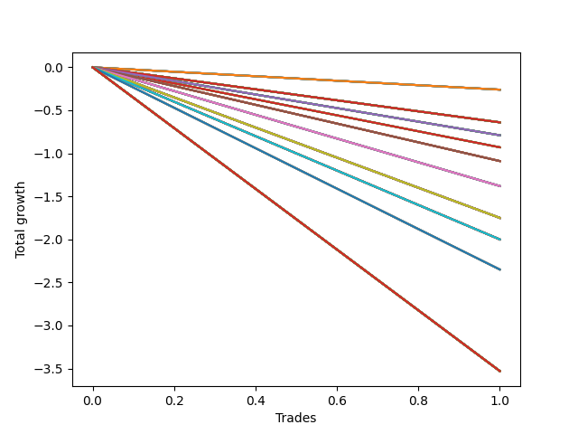

# Short HLT 646_extendedhours 
- Symbol: TSLA
- Date Range: 03/25/2024 - 05/17/2024
- Trading Period: 5:30-6:30
- Number of Trades: 1


### Test TP-0.25 15m
* Take Profit of 0.25 Point
* 0.25 Stoploss
* Results:
```
Total Trades: 1
Percent Up: 100.00
Percent Down: 0.00
Total Points Moved Down: -0.64
Potential Profit: -320.00
Total Points Ups: 0.64 Count Ups: 1
Total Points Downs: 0.00 Count Downs: 0
```

<details><summary>Trades</summary>

<code>In: 2024-05-14 05:35:00		Out: 2024-05-14 05:38:00		Total Position Time: 03:00		Total Move Down: -0.64		Total to Date: -0.64</code> <br />


</details>

### Test TP-0.5 15m
* Take Profit of 0.5 Point
* 0.5 Stoploss
* Results:
```
Total Trades: 1
Percent Up: 100.00
Percent Down: 0.00
Total Points Moved Down: -0.64
Potential Profit: -320.00
Total Points Ups: 0.64 Count Ups: 1
Total Points Downs: 0.00 Count Downs: 0
```

<details><summary>Trades</summary>

<code>In: 2024-05-14 05:35:00		Out: 2024-05-14 05:38:00		Total Position Time: 03:00		Total Move Down: -0.64		Total to Date: -0.64</code> <br />


</details>

### Test TP-0.75 15m
* Take Profit of 0.75 Point
* 0.75 Stoploss
* Results:
```
Total Trades: 1
Percent Up: 100.00
Percent Down: 0.00
Total Points Moved Down: -0.26
Potential Profit: -130.00
Total Points Ups: 0.26 Count Ups: 1
Total Points Downs: 0.00 Count Downs: 0
```

<details><summary>Trades</summary>

<code>In: 2024-05-14 05:35:00		Out: 2024-05-14 05:49:00		Total Position Time: 14:00		Total Move Down: -0.26		Total to Date: -0.26</code> <br />


</details>

### Test TP-1 15m
* Take Profit of 1 Point
* 1 Stoploss
* Results:
```
Total Trades: 1
Percent Up: 100.00
Percent Down: 0.00
Total Points Moved Down: -0.26
Potential Profit: -130.00
Total Points Ups: 0.26 Count Ups: 1
Total Points Downs: 0.00 Count Downs: 0
```

<details><summary>Trades</summary>

<code>In: 2024-05-14 05:35:00		Out: 2024-05-14 05:49:00		Total Position Time: 14:00		Total Move Down: -0.26		Total to Date: -0.26</code> <br />


</details>

### Test TP-1.25 15m
* Take Profit of 1.25 Point
* 1.25 Stoploss
* Results:
```
Total Trades: 1
Percent Up: 100.00
Percent Down: 0.00
Total Points Moved Down: -0.26
Potential Profit: -130.00
Total Points Ups: 0.26 Count Ups: 1
Total Points Downs: 0.00 Count Downs: 0
```

<details><summary>Trades</summary>

<code>In: 2024-05-14 05:35:00		Out: 2024-05-14 05:49:00		Total Position Time: 14:00		Total Move Down: -0.26		Total to Date: -0.26</code> <br />


</details>

### Test TP-1.5 15m
* Take Profit of 1.5 Point
* 1.5 Stoploss
* Results:
```
Total Trades: 1
Percent Up: 100.00
Percent Down: 0.00
Total Points Moved Down: -0.26
Potential Profit: -130.00
Total Points Ups: 0.26 Count Ups: 1
Total Points Downs: 0.00 Count Downs: 0
```

<details><summary>Trades</summary>

<code>In: 2024-05-14 05:35:00		Out: 2024-05-14 05:49:00		Total Position Time: 14:00		Total Move Down: -0.26		Total to Date: -0.26</code> <br />


</details>

### Test TP-1.75 15m
* Take Profit of 1.75 Point
* 1.75 Stoploss
* Results:
```
Total Trades: 1
Percent Up: 100.00
Percent Down: 0.00
Total Points Moved Down: -0.26
Potential Profit: -130.00
Total Points Ups: 0.26 Count Ups: 1
Total Points Downs: 0.00 Count Downs: 0
```

<details><summary>Trades</summary>

<code>In: 2024-05-14 05:35:00		Out: 2024-05-14 05:49:00		Total Position Time: 14:00		Total Move Down: -0.26		Total to Date: -0.26</code> <br />


</details>

### Test TP-2 15m
* Take Profit of 2 Point
* 2 Stoploss
* Results:
```
Total Trades: 1
Percent Up: 100.00
Percent Down: 0.00
Total Points Moved Down: -0.26
Potential Profit: -130.00
Total Points Ups: 0.26 Count Ups: 1
Total Points Downs: 0.00 Count Downs: 0
```

<details><summary>Trades</summary>

<code>In: 2024-05-14 05:35:00		Out: 2024-05-14 05:49:00		Total Position Time: 14:00		Total Move Down: -0.26		Total to Date: -0.26</code> <br />


</details>

### Test TP-2.25 15m
* Take Profit of 2.25 Point
* 2.25 Stoploss
* Results:
```
Total Trades: 1
Percent Up: 100.00
Percent Down: 0.00
Total Points Moved Down: -0.26
Potential Profit: -130.00
Total Points Ups: 0.26 Count Ups: 1
Total Points Downs: 0.00 Count Downs: 0
```

<details><summary>Trades</summary>

<code>In: 2024-05-14 05:35:00		Out: 2024-05-14 05:49:00		Total Position Time: 14:00		Total Move Down: -0.26		Total to Date: -0.26</code> <br />


</details>

### Test TP-2.5 15m
* Take Profit of 2.5 Point
* 2.5 Stoploss
* Results:
```
Total Trades: 1
Percent Up: 100.00
Percent Down: 0.00
Total Points Moved Down: -0.26
Potential Profit: -130.00
Total Points Ups: 0.26 Count Ups: 1
Total Points Downs: 0.00 Count Downs: 0
```

<details><summary>Trades</summary>

<code>In: 2024-05-14 05:35:00		Out: 2024-05-14 05:49:00		Total Position Time: 14:00		Total Move Down: -0.26		Total to Date: -0.26</code> <br />


</details>

### Test TP-2.75 15m
* Take Profit of 2.75 Point
* 2.75 Stoploss
* Results:
```
Total Trades: 1
Percent Up: 100.00
Percent Down: 0.00
Total Points Moved Down: -0.26
Potential Profit: -130.00
Total Points Ups: 0.26 Count Ups: 1
Total Points Downs: 0.00 Count Downs: 0
```

<details><summary>Trades</summary>

<code>In: 2024-05-14 05:35:00		Out: 2024-05-14 05:49:00		Total Position Time: 14:00		Total Move Down: -0.26		Total to Date: -0.26</code> <br />


</details>

### Test TP-3 15m
* Take Profit of 3 Point
* 3 Stoploss
* Results:
```
Total Trades: 1
Percent Up: 100.00
Percent Down: 0.00
Total Points Moved Down: -0.26
Potential Profit: -130.00
Total Points Ups: 0.26 Count Ups: 1
Total Points Downs: 0.00 Count Downs: 0
```

<details><summary>Trades</summary>

<code>In: 2024-05-14 05:35:00		Out: 2024-05-14 05:49:00		Total Position Time: 14:00		Total Move Down: -0.26		Total to Date: -0.26</code> <br />


</details>

### Test TP-0.25 30m
* Take Profit of 0.25 Point
* 0.25 Stoploss
* Results:
```
Total Trades: 1
Percent Up: 100.00
Percent Down: 0.00
Total Points Moved Down: -0.64
Potential Profit: -320.00
Total Points Ups: 0.64 Count Ups: 1
Total Points Downs: 0.00 Count Downs: 0
```

<details><summary>Trades</summary>

<code>In: 2024-05-14 05:35:00		Out: 2024-05-14 05:38:00		Total Position Time: 03:00		Total Move Down: -0.64		Total to Date: -0.64</code> <br />


</details>

### Test TP-0.5 30m
* Take Profit of 0.5 Point
* 0.5 Stoploss
* Results:
```
Total Trades: 1
Percent Up: 100.00
Percent Down: 0.00
Total Points Moved Down: -0.64
Potential Profit: -320.00
Total Points Ups: 0.64 Count Ups: 1
Total Points Downs: 0.00 Count Downs: 0
```

<details><summary>Trades</summary>

<code>In: 2024-05-14 05:35:00		Out: 2024-05-14 05:38:00		Total Position Time: 03:00		Total Move Down: -0.64		Total to Date: -0.64</code> <br />


</details>

### Test TP-0.75 30m
* Take Profit of 0.75 Point
* 0.75 Stoploss
* Results:
```
Total Trades: 1
Percent Up: 100.00
Percent Down: 0.00
Total Points Moved Down: -0.79
Potential Profit: -395.00
Total Points Ups: 0.79 Count Ups: 1
Total Points Downs: 0.00 Count Downs: 0
```

<details><summary>Trades</summary>

<code>In: 2024-05-14 05:35:00		Out: 2024-05-14 05:54:00		Total Position Time: 19:00		Total Move Down: -0.79		Total to Date: -0.79</code> <br />


</details>

### Test TP-1 30m
* Take Profit of 1 Point
* 1 Stoploss
* Results:
```
Total Trades: 1
Percent Up: 100.00
Percent Down: 0.00
Total Points Moved Down: -0.93
Potential Profit: -465.00
Total Points Ups: 0.93 Count Ups: 1
Total Points Downs: 0.00 Count Downs: 0
```

<details><summary>Trades</summary>

<code>In: 2024-05-14 05:35:00		Out: 2024-05-14 06:04:00		Total Position Time: 29:00		Total Move Down: -0.93		Total to Date: -0.93</code> <br />


</details>

### Test TP-1.25 30m
* Take Profit of 1.25 Point
* 1.25 Stoploss
* Results:
```
Total Trades: 1
Percent Up: 100.00
Percent Down: 0.00
Total Points Moved Down: -0.93
Potential Profit: -465.00
Total Points Ups: 0.93 Count Ups: 1
Total Points Downs: 0.00 Count Downs: 0
```

<details><summary>Trades</summary>

<code>In: 2024-05-14 05:35:00		Out: 2024-05-14 06:04:00		Total Position Time: 29:00		Total Move Down: -0.93		Total to Date: -0.93</code> <br />


</details>

### Test TP-1.5 30m
* Take Profit of 1.5 Point
* 1.5 Stoploss
* Results:
```
Total Trades: 1
Percent Up: 100.00
Percent Down: 0.00
Total Points Moved Down: -0.93
Potential Profit: -465.00
Total Points Ups: 0.93 Count Ups: 1
Total Points Downs: 0.00 Count Downs: 0
```

<details><summary>Trades</summary>

<code>In: 2024-05-14 05:35:00		Out: 2024-05-14 06:04:00		Total Position Time: 29:00		Total Move Down: -0.93		Total to Date: -0.93</code> <br />


</details>

### Test TP-1.75 30m
* Take Profit of 1.75 Point
* 1.75 Stoploss
* Results:
```
Total Trades: 1
Percent Up: 100.00
Percent Down: 0.00
Total Points Moved Down: -0.93
Potential Profit: -465.00
Total Points Ups: 0.93 Count Ups: 1
Total Points Downs: 0.00 Count Downs: 0
```

<details><summary>Trades</summary>

<code>In: 2024-05-14 05:35:00		Out: 2024-05-14 06:04:00		Total Position Time: 29:00		Total Move Down: -0.93		Total to Date: -0.93</code> <br />


</details>

### Test TP-2 30m
* Take Profit of 2 Point
* 2 Stoploss
* Results:
```
Total Trades: 1
Percent Up: 100.00
Percent Down: 0.00
Total Points Moved Down: -0.93
Potential Profit: -465.00
Total Points Ups: 0.93 Count Ups: 1
Total Points Downs: 0.00 Count Downs: 0
```

<details><summary>Trades</summary>

<code>In: 2024-05-14 05:35:00		Out: 2024-05-14 06:04:00		Total Position Time: 29:00		Total Move Down: -0.93		Total to Date: -0.93</code> <br />


</details>

### Test TP-2.25 30m
* Take Profit of 2.25 Point
* 2.25 Stoploss
* Results:
```
Total Trades: 1
Percent Up: 100.00
Percent Down: 0.00
Total Points Moved Down: -0.93
Potential Profit: -465.00
Total Points Ups: 0.93 Count Ups: 1
Total Points Downs: 0.00 Count Downs: 0
```

<details><summary>Trades</summary>

<code>In: 2024-05-14 05:35:00		Out: 2024-05-14 06:04:00		Total Position Time: 29:00		Total Move Down: -0.93		Total to Date: -0.93</code> <br />


</details>

### Test TP-2.5 30m
* Take Profit of 2.5 Point
* 2.5 Stoploss
* Results:
```
Total Trades: 1
Percent Up: 100.00
Percent Down: 0.00
Total Points Moved Down: -0.93
Potential Profit: -465.00
Total Points Ups: 0.93 Count Ups: 1
Total Points Downs: 0.00 Count Downs: 0
```

<details><summary>Trades</summary>

<code>In: 2024-05-14 05:35:00		Out: 2024-05-14 06:04:00		Total Position Time: 29:00		Total Move Down: -0.93		Total to Date: -0.93</code> <br />


</details>

### Test TP-2.75 30m
* Take Profit of 2.75 Point
* 2.75 Stoploss
* Results:
```
Total Trades: 1
Percent Up: 100.00
Percent Down: 0.00
Total Points Moved Down: -0.93
Potential Profit: -465.00
Total Points Ups: 0.93 Count Ups: 1
Total Points Downs: 0.00 Count Downs: 0
```

<details><summary>Trades</summary>

<code>In: 2024-05-14 05:35:00		Out: 2024-05-14 06:04:00		Total Position Time: 29:00		Total Move Down: -0.93		Total to Date: -0.93</code> <br />


</details>

### Test TP-3 30m
* Take Profit of 3 Point
* 3 Stoploss
* Results:
```
Total Trades: 1
Percent Up: 100.00
Percent Down: 0.00
Total Points Moved Down: -0.93
Potential Profit: -465.00
Total Points Ups: 0.93 Count Ups: 1
Total Points Downs: 0.00 Count Downs: 0
```

<details><summary>Trades</summary>

<code>In: 2024-05-14 05:35:00		Out: 2024-05-14 06:04:00		Total Position Time: 29:00		Total Move Down: -0.93		Total to Date: -0.93</code> <br />


</details>

### Test TP-0.25 45m
* Take Profit of 0.25 Point
* 0.25 Stoploss
* Results:
```
Total Trades: 1
Percent Up: 100.00
Percent Down: 0.00
Total Points Moved Down: -0.64
Potential Profit: -320.00
Total Points Ups: 0.64 Count Ups: 1
Total Points Downs: 0.00 Count Downs: 0
```

<details><summary>Trades</summary>

<code>In: 2024-05-14 05:35:00		Out: 2024-05-14 05:38:00		Total Position Time: 03:00		Total Move Down: -0.64		Total to Date: -0.64</code> <br />


</details>

### Test TP-0.5 45m
* Take Profit of 0.5 Point
* 0.5 Stoploss
* Results:
```
Total Trades: 1
Percent Up: 100.00
Percent Down: 0.00
Total Points Moved Down: -0.64
Potential Profit: -320.00
Total Points Ups: 0.64 Count Ups: 1
Total Points Downs: 0.00 Count Downs: 0
```

<details><summary>Trades</summary>

<code>In: 2024-05-14 05:35:00		Out: 2024-05-14 05:38:00		Total Position Time: 03:00		Total Move Down: -0.64		Total to Date: -0.64</code> <br />


</details>

### Test TP-0.75 45m
* Take Profit of 0.75 Point
* 0.75 Stoploss
* Results:
```
Total Trades: 1
Percent Up: 100.00
Percent Down: 0.00
Total Points Moved Down: -0.79
Potential Profit: -395.00
Total Points Ups: 0.79 Count Ups: 1
Total Points Downs: 0.00 Count Downs: 0
```

<details><summary>Trades</summary>

<code>In: 2024-05-14 05:35:00		Out: 2024-05-14 05:54:00		Total Position Time: 19:00		Total Move Down: -0.79		Total to Date: -0.79</code> <br />


</details>

### Test TP-1 45m
* Take Profit of 1 Point
* 1 Stoploss
* Results:
```
Total Trades: 1
Percent Up: 100.00
Percent Down: 0.00
Total Points Moved Down: -1.09
Potential Profit: -545.00
Total Points Ups: 1.09 Count Ups: 1
Total Points Downs: 0.00 Count Downs: 0
```

<details><summary>Trades</summary>

<code>In: 2024-05-14 05:35:00		Out: 2024-05-14 06:07:00		Total Position Time: 32:00		Total Move Down: -1.09		Total to Date: -1.09</code> <br />


</details>

### Test TP-1.25 45m
* Take Profit of 1.25 Point
* 1.25 Stoploss
* Results:
```
Total Trades: 1
Percent Up: 100.00
Percent Down: 0.00
Total Points Moved Down: -1.38
Potential Profit: -690.00
Total Points Ups: 1.38 Count Ups: 1
Total Points Downs: 0.00 Count Downs: 0
```

<details><summary>Trades</summary>

<code>In: 2024-05-14 05:35:00		Out: 2024-05-14 06:09:00		Total Position Time: 34:00		Total Move Down: -1.38		Total to Date: -1.38</code> <br />


</details>

### Test TP-1.5 45m
* Take Profit of 1.5 Point
* 1.5 Stoploss
* Results:
```
Total Trades: 1
Percent Up: 100.00
Percent Down: 0.00
Total Points Moved Down: -1.75
Potential Profit: -875.00
Total Points Ups: 1.75 Count Ups: 1
Total Points Downs: 0.00 Count Downs: 0
```

<details><summary>Trades</summary>

<code>In: 2024-05-14 05:35:00		Out: 2024-05-14 06:11:00		Total Position Time: 36:00		Total Move Down: -1.75		Total to Date: -1.75</code> <br />


</details>

### Test TP-1.75 45m
* Take Profit of 1.75 Point
* 1.75 Stoploss
* Results:
```
Total Trades: 1
Percent Up: 100.00
Percent Down: 0.00
Total Points Moved Down: -1.75
Potential Profit: -875.00
Total Points Ups: 1.75 Count Ups: 1
Total Points Downs: 0.00 Count Downs: 0
```

<details><summary>Trades</summary>

<code>In: 2024-05-14 05:35:00		Out: 2024-05-14 06:11:00		Total Position Time: 36:00		Total Move Down: -1.75		Total to Date: -1.75</code> <br />


</details>

### Test TP-2 45m
* Take Profit of 2 Point
* 2 Stoploss
* Results:
```
Total Trades: 1
Percent Up: 100.00
Percent Down: 0.00
Total Points Moved Down: -2.00
Potential Profit: -1000.00
Total Points Ups: 2.00 Count Ups: 1
Total Points Downs: 0.00 Count Downs: 0
```

<details><summary>Trades</summary>

<code>In: 2024-05-14 05:35:00		Out: 2024-05-14 06:18:00		Total Position Time: 43:00		Total Move Down: -2.00		Total to Date: -2.00</code> <br />


</details>

### Test TP-2.25 45m
* Take Profit of 2.25 Point
* 2.25 Stoploss
* Results:
```
Total Trades: 1
Percent Up: 100.00
Percent Down: 0.00
Total Points Moved Down: -2.00
Potential Profit: -1000.00
Total Points Ups: 2.00 Count Ups: 1
Total Points Downs: 0.00 Count Downs: 0
```

<details><summary>Trades</summary>

<code>In: 2024-05-14 05:35:00		Out: 2024-05-14 06:19:00		Total Position Time: 44:00		Total Move Down: -2.00		Total to Date: -2.00</code> <br />


</details>

### Test TP-2.5 45m
* Take Profit of 2.5 Point
* 2.5 Stoploss
* Results:
```
Total Trades: 1
Percent Up: 100.00
Percent Down: 0.00
Total Points Moved Down: -2.00
Potential Profit: -1000.00
Total Points Ups: 2.00 Count Ups: 1
Total Points Downs: 0.00 Count Downs: 0
```

<details><summary>Trades</summary>

<code>In: 2024-05-14 05:35:00		Out: 2024-05-14 06:19:00		Total Position Time: 44:00		Total Move Down: -2.00		Total to Date: -2.00</code> <br />


</details>

### Test TP-2.75 45m
* Take Profit of 2.75 Point
* 2.75 Stoploss
* Results:
```
Total Trades: 1
Percent Up: 100.00
Percent Down: 0.00
Total Points Moved Down: -2.00
Potential Profit: -1000.00
Total Points Ups: 2.00 Count Ups: 1
Total Points Downs: 0.00 Count Downs: 0
```

<details><summary>Trades</summary>

<code>In: 2024-05-14 05:35:00		Out: 2024-05-14 06:19:00		Total Position Time: 44:00		Total Move Down: -2.00		Total to Date: -2.00</code> <br />


</details>

### Test TP-3 45m
* Take Profit of 3 Point
* 3 Stoploss
* Results:
```
Total Trades: 1
Percent Up: 100.00
Percent Down: 0.00
Total Points Moved Down: -2.00
Potential Profit: -1000.00
Total Points Ups: 2.00 Count Ups: 1
Total Points Downs: 0.00 Count Downs: 0
```

<details><summary>Trades</summary>

<code>In: 2024-05-14 05:35:00		Out: 2024-05-14 06:19:00		Total Position Time: 44:00		Total Move Down: -2.00		Total to Date: -2.00</code> <br />


</details>

### Test TP-0.25 60m
* Take Profit of 0.25 Point
* 0.25 Stoploss
* Results:
```
Total Trades: 1
Percent Up: 100.00
Percent Down: 0.00
Total Points Moved Down: -0.64
Potential Profit: -320.00
Total Points Ups: 0.64 Count Ups: 1
Total Points Downs: 0.00 Count Downs: 0
```

<details><summary>Trades</summary>

<code>In: 2024-05-14 05:35:00		Out: 2024-05-14 05:38:00		Total Position Time: 03:00		Total Move Down: -0.64		Total to Date: -0.64</code> <br />


</details>

### Test TP-0.5 60m
* Take Profit of 0.5 Point
* 0.5 Stoploss
* Results:
```
Total Trades: 1
Percent Up: 100.00
Percent Down: 0.00
Total Points Moved Down: -0.64
Potential Profit: -320.00
Total Points Ups: 0.64 Count Ups: 1
Total Points Downs: 0.00 Count Downs: 0
```

<details><summary>Trades</summary>

<code>In: 2024-05-14 05:35:00		Out: 2024-05-14 05:38:00		Total Position Time: 03:00		Total Move Down: -0.64		Total to Date: -0.64</code> <br />


</details>

### Test TP-0.75 60m
* Take Profit of 0.75 Point
* 0.75 Stoploss
* Results:
```
Total Trades: 1
Percent Up: 100.00
Percent Down: 0.00
Total Points Moved Down: -0.79
Potential Profit: -395.00
Total Points Ups: 0.79 Count Ups: 1
Total Points Downs: 0.00 Count Downs: 0
```

<details><summary>Trades</summary>

<code>In: 2024-05-14 05:35:00		Out: 2024-05-14 05:54:00		Total Position Time: 19:00		Total Move Down: -0.79		Total to Date: -0.79</code> <br />


</details>

### Test TP-1 60m
* Take Profit of 1 Point
* 1 Stoploss
* Results:
```
Total Trades: 1
Percent Up: 100.00
Percent Down: 0.00
Total Points Moved Down: -1.09
Potential Profit: -545.00
Total Points Ups: 1.09 Count Ups: 1
Total Points Downs: 0.00 Count Downs: 0
```

<details><summary>Trades</summary>

<code>In: 2024-05-14 05:35:00		Out: 2024-05-14 06:07:00		Total Position Time: 32:00		Total Move Down: -1.09		Total to Date: -1.09</code> <br />


</details>

### Test TP-1.25 60m
* Take Profit of 1.25 Point
* 1.25 Stoploss
* Results:
```
Total Trades: 1
Percent Up: 100.00
Percent Down: 0.00
Total Points Moved Down: -1.38
Potential Profit: -690.00
Total Points Ups: 1.38 Count Ups: 1
Total Points Downs: 0.00 Count Downs: 0
```

<details><summary>Trades</summary>

<code>In: 2024-05-14 05:35:00		Out: 2024-05-14 06:09:00		Total Position Time: 34:00		Total Move Down: -1.38		Total to Date: -1.38</code> <br />


</details>

### Test TP-1.5 60m
* Take Profit of 1.5 Point
* 1.5 Stoploss
* Results:
```
Total Trades: 1
Percent Up: 100.00
Percent Down: 0.00
Total Points Moved Down: -1.75
Potential Profit: -875.00
Total Points Ups: 1.75 Count Ups: 1
Total Points Downs: 0.00 Count Downs: 0
```

<details><summary>Trades</summary>

<code>In: 2024-05-14 05:35:00		Out: 2024-05-14 06:11:00		Total Position Time: 36:00		Total Move Down: -1.75		Total to Date: -1.75</code> <br />


</details>

### Test TP-1.75 60m
* Take Profit of 1.75 Point
* 1.75 Stoploss
* Results:
```
Total Trades: 1
Percent Up: 100.00
Percent Down: 0.00
Total Points Moved Down: -1.75
Potential Profit: -875.00
Total Points Ups: 1.75 Count Ups: 1
Total Points Downs: 0.00 Count Downs: 0
```

<details><summary>Trades</summary>

<code>In: 2024-05-14 05:35:00		Out: 2024-05-14 06:11:00		Total Position Time: 36:00		Total Move Down: -1.75		Total to Date: -1.75</code> <br />


</details>

### Test TP-2 60m
* Take Profit of 2 Point
* 2 Stoploss
* Results:
```
Total Trades: 1
Percent Up: 100.00
Percent Down: 0.00
Total Points Moved Down: -2.00
Potential Profit: -1000.00
Total Points Ups: 2.00 Count Ups: 1
Total Points Downs: 0.00 Count Downs: 0
```

<details><summary>Trades</summary>

<code>In: 2024-05-14 05:35:00		Out: 2024-05-14 06:18:00		Total Position Time: 43:00		Total Move Down: -2.00		Total to Date: -2.00</code> <br />


</details>

### Test TP-2.25 60m
* Take Profit of 2.25 Point
* 2.25 Stoploss
* Results:
```
Total Trades: 1
Percent Up: 100.00
Percent Down: 0.00
Total Points Moved Down: -2.35
Potential Profit: -1175.00
Total Points Ups: 2.35 Count Ups: 1
Total Points Downs: 0.00 Count Downs: 0
```

<details><summary>Trades</summary>

<code>In: 2024-05-14 05:35:00		Out: 2024-05-14 06:23:00		Total Position Time: 48:00		Total Move Down: -2.35		Total to Date: -2.35</code> <br />


</details>

### Test TP-2.5 60m
* Take Profit of 2.5 Point
* 2.5 Stoploss
* Results:
```
Total Trades: 1
Percent Up: 100.00
Percent Down: 0.00
Total Points Moved Down: -3.53
Potential Profit: -1765.00
Total Points Ups: 3.53 Count Ups: 1
Total Points Downs: 0.00 Count Downs: 0
```

<details><summary>Trades</summary>

<code>In: 2024-05-14 05:35:00		Out: 2024-05-14 06:31:00		Total Position Time: 56:00		Total Move Down: -3.53		Total to Date: -3.53</code> <br />


</details>

### Test TP-2.75 60m
* Take Profit of 2.75 Point
* 2.75 Stoploss
* Results:
```
Total Trades: 1
Percent Up: 100.00
Percent Down: 0.00
Total Points Moved Down: -3.53
Potential Profit: -1765.00
Total Points Ups: 3.53 Count Ups: 1
Total Points Downs: 0.00 Count Downs: 0
```

<details><summary>Trades</summary>

<code>In: 2024-05-14 05:35:00		Out: 2024-05-14 06:31:00		Total Position Time: 56:00		Total Move Down: -3.53		Total to Date: -3.53</code> <br />


</details>

### Test TP-3 60m
* Take Profit of 3 Point
* 3 Stoploss
* Results:
```
Total Trades: 1
Percent Up: 100.00
Percent Down: 0.00
Total Points Moved Down: -3.53
Potential Profit: -1765.00
Total Points Ups: 3.53 Count Ups: 1
Total Points Downs: 0.00 Count Downs: 0
```

<details><summary>Trades</summary>

<code>In: 2024-05-14 05:35:00		Out: 2024-05-14 06:31:00		Total Position Time: 56:00		Total Move Down: -3.53		Total to Date: -3.53</code> <br />


</details>

### Test TP-0.25 75m
* Take Profit of 0.25 Point
* 0.25 Stoploss
* Results:
```
Total Trades: 1
Percent Up: 100.00
Percent Down: 0.00
Total Points Moved Down: -0.64
Potential Profit: -320.00
Total Points Ups: 0.64 Count Ups: 1
Total Points Downs: 0.00 Count Downs: 0
```

<details><summary>Trades</summary>

<code>In: 2024-05-14 05:35:00		Out: 2024-05-14 05:38:00		Total Position Time: 03:00		Total Move Down: -0.64		Total to Date: -0.64</code> <br />


</details>

### Test TP-0.5 75m
* Take Profit of 0.5 Point
* 0.5 Stoploss
* Results:
```
Total Trades: 1
Percent Up: 100.00
Percent Down: 0.00
Total Points Moved Down: -0.64
Potential Profit: -320.00
Total Points Ups: 0.64 Count Ups: 1
Total Points Downs: 0.00 Count Downs: 0
```

<details><summary>Trades</summary>

<code>In: 2024-05-14 05:35:00		Out: 2024-05-14 05:38:00		Total Position Time: 03:00		Total Move Down: -0.64		Total to Date: -0.64</code> <br />


</details>

### Test TP-0.75 75m
* Take Profit of 0.75 Point
* 0.75 Stoploss
* Results:
```
Total Trades: 1
Percent Up: 100.00
Percent Down: 0.00
Total Points Moved Down: -0.79
Potential Profit: -395.00
Total Points Ups: 0.79 Count Ups: 1
Total Points Downs: 0.00 Count Downs: 0
```

<details><summary>Trades</summary>

<code>In: 2024-05-14 05:35:00		Out: 2024-05-14 05:54:00		Total Position Time: 19:00		Total Move Down: -0.79		Total to Date: -0.79</code> <br />


</details>

### Test TP-1 75m
* Take Profit of 1 Point
* 1 Stoploss
* Results:
```
Total Trades: 1
Percent Up: 100.00
Percent Down: 0.00
Total Points Moved Down: -1.09
Potential Profit: -545.00
Total Points Ups: 1.09 Count Ups: 1
Total Points Downs: 0.00 Count Downs: 0
```

<details><summary>Trades</summary>

<code>In: 2024-05-14 05:35:00		Out: 2024-05-14 06:07:00		Total Position Time: 32:00		Total Move Down: -1.09		Total to Date: -1.09</code> <br />


</details>

### Test TP-1.25 75m
* Take Profit of 1.25 Point
* 1.25 Stoploss
* Results:
```
Total Trades: 1
Percent Up: 100.00
Percent Down: 0.00
Total Points Moved Down: -1.38
Potential Profit: -690.00
Total Points Ups: 1.38 Count Ups: 1
Total Points Downs: 0.00 Count Downs: 0
```

<details><summary>Trades</summary>

<code>In: 2024-05-14 05:35:00		Out: 2024-05-14 06:09:00		Total Position Time: 34:00		Total Move Down: -1.38		Total to Date: -1.38</code> <br />


</details>

### Test TP-1.5 75m
* Take Profit of 1.5 Point
* 1.5 Stoploss
* Results:
```
Total Trades: 1
Percent Up: 100.00
Percent Down: 0.00
Total Points Moved Down: -1.75
Potential Profit: -875.00
Total Points Ups: 1.75 Count Ups: 1
Total Points Downs: 0.00 Count Downs: 0
```

<details><summary>Trades</summary>

<code>In: 2024-05-14 05:35:00		Out: 2024-05-14 06:11:00		Total Position Time: 36:00		Total Move Down: -1.75		Total to Date: -1.75</code> <br />


</details>

### Test TP-1.75 75m
* Take Profit of 1.75 Point
* 1.75 Stoploss
* Results:
```
Total Trades: 1
Percent Up: 100.00
Percent Down: 0.00
Total Points Moved Down: -1.75
Potential Profit: -875.00
Total Points Ups: 1.75 Count Ups: 1
Total Points Downs: 0.00 Count Downs: 0
```

<details><summary>Trades</summary>

<code>In: 2024-05-14 05:35:00		Out: 2024-05-14 06:11:00		Total Position Time: 36:00		Total Move Down: -1.75		Total to Date: -1.75</code> <br />


</details>

### Test TP-2 75m
* Take Profit of 2 Point
* 2 Stoploss
* Results:
```
Total Trades: 1
Percent Up: 100.00
Percent Down: 0.00
Total Points Moved Down: -2.00
Potential Profit: -1000.00
Total Points Ups: 2.00 Count Ups: 1
Total Points Downs: 0.00 Count Downs: 0
```

<details><summary>Trades</summary>

<code>In: 2024-05-14 05:35:00		Out: 2024-05-14 06:18:00		Total Position Time: 43:00		Total Move Down: -2.00		Total to Date: -2.00</code> <br />


</details>

### Test TP-2.25 75m
* Take Profit of 2.25 Point
* 2.25 Stoploss
* Results:
```
Total Trades: 1
Percent Up: 100.00
Percent Down: 0.00
Total Points Moved Down: -2.35
Potential Profit: -1175.00
Total Points Ups: 2.35 Count Ups: 1
Total Points Downs: 0.00 Count Downs: 0
```

<details><summary>Trades</summary>

<code>In: 2024-05-14 05:35:00		Out: 2024-05-14 06:23:00		Total Position Time: 48:00		Total Move Down: -2.35		Total to Date: -2.35</code> <br />


</details>

### Test TP-2.5 75m
* Take Profit of 2.5 Point
* 2.5 Stoploss
* Results:
```
Total Trades: 1
Percent Up: 100.00
Percent Down: 0.00
Total Points Moved Down: -3.53
Potential Profit: -1765.00
Total Points Ups: 3.53 Count Ups: 1
Total Points Downs: 0.00 Count Downs: 0
```

<details><summary>Trades</summary>

<code>In: 2024-05-14 05:35:00		Out: 2024-05-14 06:31:00		Total Position Time: 56:00		Total Move Down: -3.53		Total to Date: -3.53</code> <br />


</details>

### Test TP-2.75 75m
* Take Profit of 2.75 Point
* 2.75 Stoploss
* Results:
```
Total Trades: 1
Percent Up: 100.00
Percent Down: 0.00
Total Points Moved Down: -3.53
Potential Profit: -1765.00
Total Points Ups: 3.53 Count Ups: 1
Total Points Downs: 0.00 Count Downs: 0
```

<details><summary>Trades</summary>

<code>In: 2024-05-14 05:35:00		Out: 2024-05-14 06:31:00		Total Position Time: 56:00		Total Move Down: -3.53		Total to Date: -3.53</code> <br />


</details>

### Test TP-3 75m
* Take Profit of 3 Point
* 3 Stoploss
* Results:
```
Total Trades: 1
Percent Up: 100.00
Percent Down: 0.00
Total Points Moved Down: -3.53
Potential Profit: -1765.00
Total Points Ups: 3.53 Count Ups: 1
Total Points Downs: 0.00 Count Downs: 0
```

<details><summary>Trades</summary>

<code>In: 2024-05-14 05:35:00		Out: 2024-05-14 06:31:00		Total Position Time: 56:00		Total Move Down: -3.53		Total to Date: -3.53</code> <br />


</details>

### Test TP-0.25 90m
* Take Profit of 0.25 Point
* 0.25 Stoploss
* Results:
```
Total Trades: 1
Percent Up: 100.00
Percent Down: 0.00
Total Points Moved Down: -0.64
Potential Profit: -320.00
Total Points Ups: 0.64 Count Ups: 1
Total Points Downs: 0.00 Count Downs: 0
```

<details><summary>Trades</summary>

<code>In: 2024-05-14 05:35:00		Out: 2024-05-14 05:38:00		Total Position Time: 03:00		Total Move Down: -0.64		Total to Date: -0.64</code> <br />


</details>

### Test TP-0.5 90m
* Take Profit of 0.5 Point
* 0.5 Stoploss
* Results:
```
Total Trades: 1
Percent Up: 100.00
Percent Down: 0.00
Total Points Moved Down: -0.64
Potential Profit: -320.00
Total Points Ups: 0.64 Count Ups: 1
Total Points Downs: 0.00 Count Downs: 0
```

<details><summary>Trades</summary>

<code>In: 2024-05-14 05:35:00		Out: 2024-05-14 05:38:00		Total Position Time: 03:00		Total Move Down: -0.64		Total to Date: -0.64</code> <br />


</details>

### Test TP-0.75 90m
* Take Profit of 0.75 Point
* 0.75 Stoploss
* Results:
```
Total Trades: 1
Percent Up: 100.00
Percent Down: 0.00
Total Points Moved Down: -0.79
Potential Profit: -395.00
Total Points Ups: 0.79 Count Ups: 1
Total Points Downs: 0.00 Count Downs: 0
```

<details><summary>Trades</summary>

<code>In: 2024-05-14 05:35:00		Out: 2024-05-14 05:54:00		Total Position Time: 19:00		Total Move Down: -0.79		Total to Date: -0.79</code> <br />


</details>

### Test TP-1 90m
* Take Profit of 1 Point
* 1 Stoploss
* Results:
```
Total Trades: 1
Percent Up: 100.00
Percent Down: 0.00
Total Points Moved Down: -1.09
Potential Profit: -545.00
Total Points Ups: 1.09 Count Ups: 1
Total Points Downs: 0.00 Count Downs: 0
```

<details><summary>Trades</summary>

<code>In: 2024-05-14 05:35:00		Out: 2024-05-14 06:07:00		Total Position Time: 32:00		Total Move Down: -1.09		Total to Date: -1.09</code> <br />


</details>

### Test TP-1.25 90m
* Take Profit of 1.25 Point
* 1.25 Stoploss
* Results:
```
Total Trades: 1
Percent Up: 100.00
Percent Down: 0.00
Total Points Moved Down: -1.38
Potential Profit: -690.00
Total Points Ups: 1.38 Count Ups: 1
Total Points Downs: 0.00 Count Downs: 0
```

<details><summary>Trades</summary>

<code>In: 2024-05-14 05:35:00		Out: 2024-05-14 06:09:00		Total Position Time: 34:00		Total Move Down: -1.38		Total to Date: -1.38</code> <br />


</details>

### Test TP-1.5 90m
* Take Profit of 1.5 Point
* 1.5 Stoploss
* Results:
```
Total Trades: 1
Percent Up: 100.00
Percent Down: 0.00
Total Points Moved Down: -1.75
Potential Profit: -875.00
Total Points Ups: 1.75 Count Ups: 1
Total Points Downs: 0.00 Count Downs: 0
```

<details><summary>Trades</summary>

<code>In: 2024-05-14 05:35:00		Out: 2024-05-14 06:11:00		Total Position Time: 36:00		Total Move Down: -1.75		Total to Date: -1.75</code> <br />


</details>

### Test TP-1.75 90m
* Take Profit of 1.75 Point
* 1.75 Stoploss
* Results:
```
Total Trades: 1
Percent Up: 100.00
Percent Down: 0.00
Total Points Moved Down: -1.75
Potential Profit: -875.00
Total Points Ups: 1.75 Count Ups: 1
Total Points Downs: 0.00 Count Downs: 0
```

<details><summary>Trades</summary>

<code>In: 2024-05-14 05:35:00		Out: 2024-05-14 06:11:00		Total Position Time: 36:00		Total Move Down: -1.75		Total to Date: -1.75</code> <br />


</details>

### Test TP-2 90m
* Take Profit of 2 Point
* 2 Stoploss
* Results:
```
Total Trades: 1
Percent Up: 100.00
Percent Down: 0.00
Total Points Moved Down: -2.00
Potential Profit: -1000.00
Total Points Ups: 2.00 Count Ups: 1
Total Points Downs: 0.00 Count Downs: 0
```

<details><summary>Trades</summary>

<code>In: 2024-05-14 05:35:00		Out: 2024-05-14 06:18:00		Total Position Time: 43:00		Total Move Down: -2.00		Total to Date: -2.00</code> <br />


</details>

### Test TP-2.25 90m
* Take Profit of 2.25 Point
* 2.25 Stoploss
* Results:
```
Total Trades: 1
Percent Up: 100.00
Percent Down: 0.00
Total Points Moved Down: -2.35
Potential Profit: -1175.00
Total Points Ups: 2.35 Count Ups: 1
Total Points Downs: 0.00 Count Downs: 0
```

<details><summary>Trades</summary>

<code>In: 2024-05-14 05:35:00		Out: 2024-05-14 06:23:00		Total Position Time: 48:00		Total Move Down: -2.35		Total to Date: -2.35</code> <br />


</details>

### Test TP-2.5 90m
* Take Profit of 2.5 Point
* 2.5 Stoploss
* Results:
```
Total Trades: 1
Percent Up: 100.00
Percent Down: 0.00
Total Points Moved Down: -3.53
Potential Profit: -1765.00
Total Points Ups: 3.53 Count Ups: 1
Total Points Downs: 0.00 Count Downs: 0
```

<details><summary>Trades</summary>

<code>In: 2024-05-14 05:35:00		Out: 2024-05-14 06:31:00		Total Position Time: 56:00		Total Move Down: -3.53		Total to Date: -3.53</code> <br />


</details>

### Test TP-2.75 90m
* Take Profit of 2.75 Point
* 2.75 Stoploss
* Results:
```
Total Trades: 1
Percent Up: 100.00
Percent Down: 0.00
Total Points Moved Down: -3.53
Potential Profit: -1765.00
Total Points Ups: 3.53 Count Ups: 1
Total Points Downs: 0.00 Count Downs: 0
```

<details><summary>Trades</summary>

<code>In: 2024-05-14 05:35:00		Out: 2024-05-14 06:31:00		Total Position Time: 56:00		Total Move Down: -3.53		Total to Date: -3.53</code> <br />


</details>

### Test TP-3 90m
* Take Profit of 3 Point
* 3 Stoploss
* Results:
```
Total Trades: 1
Percent Up: 100.00
Percent Down: 0.00
Total Points Moved Down: -3.53
Potential Profit: -1765.00
Total Points Ups: 3.53 Count Ups: 1
Total Points Downs: 0.00 Count Downs: 0
```

<details><summary>Trades</summary>

<code>In: 2024-05-14 05:35:00		Out: 2024-05-14 06:31:00		Total Position Time: 56:00		Total Move Down: -3.53		Total to Date: -3.53</code> <br />


</details>

### Test TP-0.25 105m
* Take Profit of 0.25 Point
* 0.25 Stoploss
* Results:
```
Total Trades: 1
Percent Up: 100.00
Percent Down: 0.00
Total Points Moved Down: -0.64
Potential Profit: -320.00
Total Points Ups: 0.64 Count Ups: 1
Total Points Downs: 0.00 Count Downs: 0
```

<details><summary>Trades</summary>

<code>In: 2024-05-14 05:35:00		Out: 2024-05-14 05:38:00		Total Position Time: 03:00		Total Move Down: -0.64		Total to Date: -0.64</code> <br />


</details>

### Test TP-0.5 105m
* Take Profit of 0.5 Point
* 0.5 Stoploss
* Results:
```
Total Trades: 1
Percent Up: 100.00
Percent Down: 0.00
Total Points Moved Down: -0.64
Potential Profit: -320.00
Total Points Ups: 0.64 Count Ups: 1
Total Points Downs: 0.00 Count Downs: 0
```

<details><summary>Trades</summary>

<code>In: 2024-05-14 05:35:00		Out: 2024-05-14 05:38:00		Total Position Time: 03:00		Total Move Down: -0.64		Total to Date: -0.64</code> <br />


</details>

### Test TP-0.75 105m
* Take Profit of 0.75 Point
* 0.75 Stoploss
* Results:
```
Total Trades: 1
Percent Up: 100.00
Percent Down: 0.00
Total Points Moved Down: -0.79
Potential Profit: -395.00
Total Points Ups: 0.79 Count Ups: 1
Total Points Downs: 0.00 Count Downs: 0
```

<details><summary>Trades</summary>

<code>In: 2024-05-14 05:35:00		Out: 2024-05-14 05:54:00		Total Position Time: 19:00		Total Move Down: -0.79		Total to Date: -0.79</code> <br />


</details>

### Test TP-1 105m
* Take Profit of 1 Point
* 1 Stoploss
* Results:
```
Total Trades: 1
Percent Up: 100.00
Percent Down: 0.00
Total Points Moved Down: -1.09
Potential Profit: -545.00
Total Points Ups: 1.09 Count Ups: 1
Total Points Downs: 0.00 Count Downs: 0
```

<details><summary>Trades</summary>

<code>In: 2024-05-14 05:35:00		Out: 2024-05-14 06:07:00		Total Position Time: 32:00		Total Move Down: -1.09		Total to Date: -1.09</code> <br />


</details>

### Test TP-1.25 105m
* Take Profit of 1.25 Point
* 1.25 Stoploss
* Results:
```
Total Trades: 1
Percent Up: 100.00
Percent Down: 0.00
Total Points Moved Down: -1.38
Potential Profit: -690.00
Total Points Ups: 1.38 Count Ups: 1
Total Points Downs: 0.00 Count Downs: 0
```

<details><summary>Trades</summary>

<code>In: 2024-05-14 05:35:00		Out: 2024-05-14 06:09:00		Total Position Time: 34:00		Total Move Down: -1.38		Total to Date: -1.38</code> <br />


</details>

### Test TP-1.5 105m
* Take Profit of 1.5 Point
* 1.5 Stoploss
* Results:
```
Total Trades: 1
Percent Up: 100.00
Percent Down: 0.00
Total Points Moved Down: -1.75
Potential Profit: -875.00
Total Points Ups: 1.75 Count Ups: 1
Total Points Downs: 0.00 Count Downs: 0
```

<details><summary>Trades</summary>

<code>In: 2024-05-14 05:35:00		Out: 2024-05-14 06:11:00		Total Position Time: 36:00		Total Move Down: -1.75		Total to Date: -1.75</code> <br />


</details>

### Test TP-1.75 105m
* Take Profit of 1.75 Point
* 1.75 Stoploss
* Results:
```
Total Trades: 1
Percent Up: 100.00
Percent Down: 0.00
Total Points Moved Down: -1.75
Potential Profit: -875.00
Total Points Ups: 1.75 Count Ups: 1
Total Points Downs: 0.00 Count Downs: 0
```

<details><summary>Trades</summary>

<code>In: 2024-05-14 05:35:00		Out: 2024-05-14 06:11:00		Total Position Time: 36:00		Total Move Down: -1.75		Total to Date: -1.75</code> <br />


</details>

### Test TP-2 105m
* Take Profit of 2 Point
* 2 Stoploss
* Results:
```
Total Trades: 1
Percent Up: 100.00
Percent Down: 0.00
Total Points Moved Down: -2.00
Potential Profit: -1000.00
Total Points Ups: 2.00 Count Ups: 1
Total Points Downs: 0.00 Count Downs: 0
```

<details><summary>Trades</summary>

<code>In: 2024-05-14 05:35:00		Out: 2024-05-14 06:18:00		Total Position Time: 43:00		Total Move Down: -2.00		Total to Date: -2.00</code> <br />


</details>

### Test TP-2.25 105m
* Take Profit of 2.25 Point
* 2.25 Stoploss
* Results:
```
Total Trades: 1
Percent Up: 100.00
Percent Down: 0.00
Total Points Moved Down: -2.35
Potential Profit: -1175.00
Total Points Ups: 2.35 Count Ups: 1
Total Points Downs: 0.00 Count Downs: 0
```

<details><summary>Trades</summary>

<code>In: 2024-05-14 05:35:00		Out: 2024-05-14 06:23:00		Total Position Time: 48:00		Total Move Down: -2.35		Total to Date: -2.35</code> <br />


</details>

### Test TP-2.5 105m
* Take Profit of 2.5 Point
* 2.5 Stoploss
* Results:
```
Total Trades: 1
Percent Up: 100.00
Percent Down: 0.00
Total Points Moved Down: -3.53
Potential Profit: -1765.00
Total Points Ups: 3.53 Count Ups: 1
Total Points Downs: 0.00 Count Downs: 0
```

<details><summary>Trades</summary>

<code>In: 2024-05-14 05:35:00		Out: 2024-05-14 06:31:00		Total Position Time: 56:00		Total Move Down: -3.53		Total to Date: -3.53</code> <br />


</details>

### Test TP-2.75 105m
* Take Profit of 2.75 Point
* 2.75 Stoploss
* Results:
```
Total Trades: 1
Percent Up: 100.00
Percent Down: 0.00
Total Points Moved Down: -3.53
Potential Profit: -1765.00
Total Points Ups: 3.53 Count Ups: 1
Total Points Downs: 0.00 Count Downs: 0
```

<details><summary>Trades</summary>

<code>In: 2024-05-14 05:35:00		Out: 2024-05-14 06:31:00		Total Position Time: 56:00		Total Move Down: -3.53		Total to Date: -3.53</code> <br />


</details>

### Test TP-3 105m
* Take Profit of 3 Point
* 3 Stoploss
* Results:
```
Total Trades: 1
Percent Up: 100.00
Percent Down: 0.00
Total Points Moved Down: -3.53
Potential Profit: -1765.00
Total Points Ups: 3.53 Count Ups: 1
Total Points Downs: 0.00 Count Downs: 0
```

<details><summary>Trades</summary>

<code>In: 2024-05-14 05:35:00		Out: 2024-05-14 06:31:00		Total Position Time: 56:00		Total Move Down: -3.53		Total to Date: -3.53</code> <br />


</details>

### Test TP-0.25 120m
* Take Profit of 0.25 Point
* 0.25 Stoploss
* Results:
```
Total Trades: 1
Percent Up: 100.00
Percent Down: 0.00
Total Points Moved Down: -0.64
Potential Profit: -320.00
Total Points Ups: 0.64 Count Ups: 1
Total Points Downs: 0.00 Count Downs: 0
```

<details><summary>Trades</summary>

<code>In: 2024-05-14 05:35:00		Out: 2024-05-14 05:38:00		Total Position Time: 03:00		Total Move Down: -0.64		Total to Date: -0.64</code> <br />


</details>

### Test TP-0.5 120m
* Take Profit of 0.5 Point
* 0.5 Stoploss
* Results:
```
Total Trades: 1
Percent Up: 100.00
Percent Down: 0.00
Total Points Moved Down: -0.64
Potential Profit: -320.00
Total Points Ups: 0.64 Count Ups: 1
Total Points Downs: 0.00 Count Downs: 0
```

<details><summary>Trades</summary>

<code>In: 2024-05-14 05:35:00		Out: 2024-05-14 05:38:00		Total Position Time: 03:00		Total Move Down: -0.64		Total to Date: -0.64</code> <br />


</details>

### Test TP-0.75 120m
* Take Profit of 0.75 Point
* 0.75 Stoploss
* Results:
```
Total Trades: 1
Percent Up: 100.00
Percent Down: 0.00
Total Points Moved Down: -0.79
Potential Profit: -395.00
Total Points Ups: 0.79 Count Ups: 1
Total Points Downs: 0.00 Count Downs: 0
```

<details><summary>Trades</summary>

<code>In: 2024-05-14 05:35:00		Out: 2024-05-14 05:54:00		Total Position Time: 19:00		Total Move Down: -0.79		Total to Date: -0.79</code> <br />


</details>

### Test TP-1 120m
* Take Profit of 1 Point
* 1 Stoploss
* Results:
```
Total Trades: 1
Percent Up: 100.00
Percent Down: 0.00
Total Points Moved Down: -1.09
Potential Profit: -545.00
Total Points Ups: 1.09 Count Ups: 1
Total Points Downs: 0.00 Count Downs: 0
```

<details><summary>Trades</summary>

<code>In: 2024-05-14 05:35:00		Out: 2024-05-14 06:07:00		Total Position Time: 32:00		Total Move Down: -1.09		Total to Date: -1.09</code> <br />


</details>

### Test TP-1.25 120m
* Take Profit of 1.25 Point
* 1.25 Stoploss
* Results:
```
Total Trades: 1
Percent Up: 100.00
Percent Down: 0.00
Total Points Moved Down: -1.38
Potential Profit: -690.00
Total Points Ups: 1.38 Count Ups: 1
Total Points Downs: 0.00 Count Downs: 0
```

<details><summary>Trades</summary>

<code>In: 2024-05-14 05:35:00		Out: 2024-05-14 06:09:00		Total Position Time: 34:00		Total Move Down: -1.38		Total to Date: -1.38</code> <br />


</details>

### Test TP-1.5 120m
* Take Profit of 1.5 Point
* 1.5 Stoploss
* Results:
```
Total Trades: 1
Percent Up: 100.00
Percent Down: 0.00
Total Points Moved Down: -1.75
Potential Profit: -875.00
Total Points Ups: 1.75 Count Ups: 1
Total Points Downs: 0.00 Count Downs: 0
```

<details><summary>Trades</summary>

<code>In: 2024-05-14 05:35:00		Out: 2024-05-14 06:11:00		Total Position Time: 36:00		Total Move Down: -1.75		Total to Date: -1.75</code> <br />


</details>

### Test TP-1.75 120m
* Take Profit of 1.75 Point
* 1.75 Stoploss
* Results:
```
Total Trades: 1
Percent Up: 100.00
Percent Down: 0.00
Total Points Moved Down: -1.75
Potential Profit: -875.00
Total Points Ups: 1.75 Count Ups: 1
Total Points Downs: 0.00 Count Downs: 0
```

<details><summary>Trades</summary>

<code>In: 2024-05-14 05:35:00		Out: 2024-05-14 06:11:00		Total Position Time: 36:00		Total Move Down: -1.75		Total to Date: -1.75</code> <br />


</details>

### Test TP-2 120m
* Take Profit of 2 Point
* 2 Stoploss
* Results:
```
Total Trades: 1
Percent Up: 100.00
Percent Down: 0.00
Total Points Moved Down: -2.00
Potential Profit: -1000.00
Total Points Ups: 2.00 Count Ups: 1
Total Points Downs: 0.00 Count Downs: 0
```

<details><summary>Trades</summary>

<code>In: 2024-05-14 05:35:00		Out: 2024-05-14 06:18:00		Total Position Time: 43:00		Total Move Down: -2.00		Total to Date: -2.00</code> <br />


</details>

### Test TP-2.25 120m
* Take Profit of 2.25 Point
* 2.25 Stoploss
* Results:
```
Total Trades: 1
Percent Up: 100.00
Percent Down: 0.00
Total Points Moved Down: -2.35
Potential Profit: -1175.00
Total Points Ups: 2.35 Count Ups: 1
Total Points Downs: 0.00 Count Downs: 0
```

<details><summary>Trades</summary>

<code>In: 2024-05-14 05:35:00		Out: 2024-05-14 06:23:00		Total Position Time: 48:00		Total Move Down: -2.35		Total to Date: -2.35</code> <br />


</details>

### Test TP-2.5 120m
* Take Profit of 2.5 Point
* 2.5 Stoploss
* Results:
```
Total Trades: 1
Percent Up: 100.00
Percent Down: 0.00
Total Points Moved Down: -3.53
Potential Profit: -1765.00
Total Points Ups: 3.53 Count Ups: 1
Total Points Downs: 0.00 Count Downs: 0
```

<details><summary>Trades</summary>

<code>In: 2024-05-14 05:35:00		Out: 2024-05-14 06:31:00		Total Position Time: 56:00		Total Move Down: -3.53		Total to Date: -3.53</code> <br />


</details>

### Test TP-2.75 120m
* Take Profit of 2.75 Point
* 2.75 Stoploss
* Results:
```
Total Trades: 1
Percent Up: 100.00
Percent Down: 0.00
Total Points Moved Down: -3.53
Potential Profit: -1765.00
Total Points Ups: 3.53 Count Ups: 1
Total Points Downs: 0.00 Count Downs: 0
```

<details><summary>Trades</summary>

<code>In: 2024-05-14 05:35:00		Out: 2024-05-14 06:31:00		Total Position Time: 56:00		Total Move Down: -3.53		Total to Date: -3.53</code> <br />


</details>

### Test TP-3 120m
* Take Profit of 3 Point
* 3 Stoploss
* Results:
```
Total Trades: 1
Percent Up: 100.00
Percent Down: 0.00
Total Points Moved Down: -3.53
Potential Profit: -1765.00
Total Points Ups: 3.53 Count Ups: 1
Total Points Downs: 0.00 Count Downs: 0
```

<details><summary>Trades</summary>

<code>In: 2024-05-14 05:35:00		Out: 2024-05-14 06:31:00		Total Position Time: 56:00		Total Move Down: -3.53		Total to Date: -3.53</code> <br />


</details>

### Test TP-0.25 135m
* Take Profit of 0.25 Point
* 0.25 Stoploss
* Results:
```
Total Trades: 1
Percent Up: 100.00
Percent Down: 0.00
Total Points Moved Down: -0.64
Potential Profit: -320.00
Total Points Ups: 0.64 Count Ups: 1
Total Points Downs: 0.00 Count Downs: 0
```

<details><summary>Trades</summary>

<code>In: 2024-05-14 05:35:00		Out: 2024-05-14 05:38:00		Total Position Time: 03:00		Total Move Down: -0.64		Total to Date: -0.64</code> <br />


</details>

### Test TP-0.5 135m
* Take Profit of 0.5 Point
* 0.5 Stoploss
* Results:
```
Total Trades: 1
Percent Up: 100.00
Percent Down: 0.00
Total Points Moved Down: -0.64
Potential Profit: -320.00
Total Points Ups: 0.64 Count Ups: 1
Total Points Downs: 0.00 Count Downs: 0
```

<details><summary>Trades</summary>

<code>In: 2024-05-14 05:35:00		Out: 2024-05-14 05:38:00		Total Position Time: 03:00		Total Move Down: -0.64		Total to Date: -0.64</code> <br />


</details>

### Test TP-0.75 135m
* Take Profit of 0.75 Point
* 0.75 Stoploss
* Results:
```
Total Trades: 1
Percent Up: 100.00
Percent Down: 0.00
Total Points Moved Down: -0.79
Potential Profit: -395.00
Total Points Ups: 0.79 Count Ups: 1
Total Points Downs: 0.00 Count Downs: 0
```

<details><summary>Trades</summary>

<code>In: 2024-05-14 05:35:00		Out: 2024-05-14 05:54:00		Total Position Time: 19:00		Total Move Down: -0.79		Total to Date: -0.79</code> <br />


</details>

### Test TP-1 135m
* Take Profit of 1 Point
* 1 Stoploss
* Results:
```
Total Trades: 1
Percent Up: 100.00
Percent Down: 0.00
Total Points Moved Down: -1.09
Potential Profit: -545.00
Total Points Ups: 1.09 Count Ups: 1
Total Points Downs: 0.00 Count Downs: 0
```

<details><summary>Trades</summary>

<code>In: 2024-05-14 05:35:00		Out: 2024-05-14 06:07:00		Total Position Time: 32:00		Total Move Down: -1.09		Total to Date: -1.09</code> <br />


</details>

### Test TP-1.25 135m
* Take Profit of 1.25 Point
* 1.25 Stoploss
* Results:
```
Total Trades: 1
Percent Up: 100.00
Percent Down: 0.00
Total Points Moved Down: -1.38
Potential Profit: -690.00
Total Points Ups: 1.38 Count Ups: 1
Total Points Downs: 0.00 Count Downs: 0
```

<details><summary>Trades</summary>

<code>In: 2024-05-14 05:35:00		Out: 2024-05-14 06:09:00		Total Position Time: 34:00		Total Move Down: -1.38		Total to Date: -1.38</code> <br />


</details>

### Test TP-1.5 135m
* Take Profit of 1.5 Point
* 1.5 Stoploss
* Results:
```
Total Trades: 1
Percent Up: 100.00
Percent Down: 0.00
Total Points Moved Down: -1.75
Potential Profit: -875.00
Total Points Ups: 1.75 Count Ups: 1
Total Points Downs: 0.00 Count Downs: 0
```

<details><summary>Trades</summary>

<code>In: 2024-05-14 05:35:00		Out: 2024-05-14 06:11:00		Total Position Time: 36:00		Total Move Down: -1.75		Total to Date: -1.75</code> <br />


</details>

### Test TP-1.75 135m
* Take Profit of 1.75 Point
* 1.75 Stoploss
* Results:
```
Total Trades: 1
Percent Up: 100.00
Percent Down: 0.00
Total Points Moved Down: -1.75
Potential Profit: -875.00
Total Points Ups: 1.75 Count Ups: 1
Total Points Downs: 0.00 Count Downs: 0
```

<details><summary>Trades</summary>

<code>In: 2024-05-14 05:35:00		Out: 2024-05-14 06:11:00		Total Position Time: 36:00		Total Move Down: -1.75		Total to Date: -1.75</code> <br />


</details>

### Test TP-2 135m
* Take Profit of 2 Point
* 2 Stoploss
* Results:
```
Total Trades: 1
Percent Up: 100.00
Percent Down: 0.00
Total Points Moved Down: -2.00
Potential Profit: -1000.00
Total Points Ups: 2.00 Count Ups: 1
Total Points Downs: 0.00 Count Downs: 0
```

<details><summary>Trades</summary>

<code>In: 2024-05-14 05:35:00		Out: 2024-05-14 06:18:00		Total Position Time: 43:00		Total Move Down: -2.00		Total to Date: -2.00</code> <br />


</details>

### Test TP-2.25 135m
* Take Profit of 2.25 Point
* 2.25 Stoploss
* Results:
```
Total Trades: 1
Percent Up: 100.00
Percent Down: 0.00
Total Points Moved Down: -2.35
Potential Profit: -1175.00
Total Points Ups: 2.35 Count Ups: 1
Total Points Downs: 0.00 Count Downs: 0
```

<details><summary>Trades</summary>

<code>In: 2024-05-14 05:35:00		Out: 2024-05-14 06:23:00		Total Position Time: 48:00		Total Move Down: -2.35		Total to Date: -2.35</code> <br />


</details>

### Test TP-2.5 135m
* Take Profit of 2.5 Point
* 2.5 Stoploss
* Results:
```
Total Trades: 1
Percent Up: 100.00
Percent Down: 0.00
Total Points Moved Down: -3.53
Potential Profit: -1765.00
Total Points Ups: 3.53 Count Ups: 1
Total Points Downs: 0.00 Count Downs: 0
```

<details><summary>Trades</summary>

<code>In: 2024-05-14 05:35:00		Out: 2024-05-14 06:31:00		Total Position Time: 56:00		Total Move Down: -3.53		Total to Date: -3.53</code> <br />


</details>

### Test TP-2.75 135m
* Take Profit of 2.75 Point
* 2.75 Stoploss
* Results:
```
Total Trades: 1
Percent Up: 100.00
Percent Down: 0.00
Total Points Moved Down: -3.53
Potential Profit: -1765.00
Total Points Ups: 3.53 Count Ups: 1
Total Points Downs: 0.00 Count Downs: 0
```

<details><summary>Trades</summary>

<code>In: 2024-05-14 05:35:00		Out: 2024-05-14 06:31:00		Total Position Time: 56:00		Total Move Down: -3.53		Total to Date: -3.53</code> <br />


</details>

### Test TP-3 135m
* Take Profit of 3 Point
* 3 Stoploss
* Results:
```
Total Trades: 1
Percent Up: 100.00
Percent Down: 0.00
Total Points Moved Down: -3.53
Potential Profit: -1765.00
Total Points Ups: 3.53 Count Ups: 1
Total Points Downs: 0.00 Count Downs: 0
```

<details><summary>Trades</summary>

<code>In: 2024-05-14 05:35:00		Out: 2024-05-14 06:31:00		Total Position Time: 56:00		Total Move Down: -3.53		Total to Date: -3.53</code> <br />


</details>

### Test TP-0.25 150m
* Take Profit of 0.25 Point
* 0.25 Stoploss
* Results:
```
Total Trades: 1
Percent Up: 100.00
Percent Down: 0.00
Total Points Moved Down: -0.64
Potential Profit: -320.00
Total Points Ups: 0.64 Count Ups: 1
Total Points Downs: 0.00 Count Downs: 0
```

<details><summary>Trades</summary>

<code>In: 2024-05-14 05:35:00		Out: 2024-05-14 05:38:00		Total Position Time: 03:00		Total Move Down: -0.64		Total to Date: -0.64</code> <br />


</details>

### Test TP-0.5 150m
* Take Profit of 0.5 Point
* 0.5 Stoploss
* Results:
```
Total Trades: 1
Percent Up: 100.00
Percent Down: 0.00
Total Points Moved Down: -0.64
Potential Profit: -320.00
Total Points Ups: 0.64 Count Ups: 1
Total Points Downs: 0.00 Count Downs: 0
```

<details><summary>Trades</summary>

<code>In: 2024-05-14 05:35:00		Out: 2024-05-14 05:38:00		Total Position Time: 03:00		Total Move Down: -0.64		Total to Date: -0.64</code> <br />


</details>

### Test TP-0.75 150m
* Take Profit of 0.75 Point
* 0.75 Stoploss
* Results:
```
Total Trades: 1
Percent Up: 100.00
Percent Down: 0.00
Total Points Moved Down: -0.79
Potential Profit: -395.00
Total Points Ups: 0.79 Count Ups: 1
Total Points Downs: 0.00 Count Downs: 0
```

<details><summary>Trades</summary>

<code>In: 2024-05-14 05:35:00		Out: 2024-05-14 05:54:00		Total Position Time: 19:00		Total Move Down: -0.79		Total to Date: -0.79</code> <br />


</details>

### Test TP-1 150m
* Take Profit of 1 Point
* 1 Stoploss
* Results:
```
Total Trades: 1
Percent Up: 100.00
Percent Down: 0.00
Total Points Moved Down: -1.09
Potential Profit: -545.00
Total Points Ups: 1.09 Count Ups: 1
Total Points Downs: 0.00 Count Downs: 0
```

<details><summary>Trades</summary>

<code>In: 2024-05-14 05:35:00		Out: 2024-05-14 06:07:00		Total Position Time: 32:00		Total Move Down: -1.09		Total to Date: -1.09</code> <br />


</details>

### Test TP-1.25 150m
* Take Profit of 1.25 Point
* 1.25 Stoploss
* Results:
```
Total Trades: 1
Percent Up: 100.00
Percent Down: 0.00
Total Points Moved Down: -1.38
Potential Profit: -690.00
Total Points Ups: 1.38 Count Ups: 1
Total Points Downs: 0.00 Count Downs: 0
```

<details><summary>Trades</summary>

<code>In: 2024-05-14 05:35:00		Out: 2024-05-14 06:09:00		Total Position Time: 34:00		Total Move Down: -1.38		Total to Date: -1.38</code> <br />


</details>

### Test TP-1.5 150m
* Take Profit of 1.5 Point
* 1.5 Stoploss
* Results:
```
Total Trades: 1
Percent Up: 100.00
Percent Down: 0.00
Total Points Moved Down: -1.75
Potential Profit: -875.00
Total Points Ups: 1.75 Count Ups: 1
Total Points Downs: 0.00 Count Downs: 0
```

<details><summary>Trades</summary>

<code>In: 2024-05-14 05:35:00		Out: 2024-05-14 06:11:00		Total Position Time: 36:00		Total Move Down: -1.75		Total to Date: -1.75</code> <br />


</details>

### Test TP-1.75 150m
* Take Profit of 1.75 Point
* 1.75 Stoploss
* Results:
```
Total Trades: 1
Percent Up: 100.00
Percent Down: 0.00
Total Points Moved Down: -1.75
Potential Profit: -875.00
Total Points Ups: 1.75 Count Ups: 1
Total Points Downs: 0.00 Count Downs: 0
```

<details><summary>Trades</summary>

<code>In: 2024-05-14 05:35:00		Out: 2024-05-14 06:11:00		Total Position Time: 36:00		Total Move Down: -1.75		Total to Date: -1.75</code> <br />


</details>

### Test TP-2 150m
* Take Profit of 2 Point
* 2 Stoploss
* Results:
```
Total Trades: 1
Percent Up: 100.00
Percent Down: 0.00
Total Points Moved Down: -2.00
Potential Profit: -1000.00
Total Points Ups: 2.00 Count Ups: 1
Total Points Downs: 0.00 Count Downs: 0
```

<details><summary>Trades</summary>

<code>In: 2024-05-14 05:35:00		Out: 2024-05-14 06:18:00		Total Position Time: 43:00		Total Move Down: -2.00		Total to Date: -2.00</code> <br />


</details>

### Test TP-2.25 150m
* Take Profit of 2.25 Point
* 2.25 Stoploss
* Results:
```
Total Trades: 1
Percent Up: 100.00
Percent Down: 0.00
Total Points Moved Down: -2.35
Potential Profit: -1175.00
Total Points Ups: 2.35 Count Ups: 1
Total Points Downs: 0.00 Count Downs: 0
```

<details><summary>Trades</summary>

<code>In: 2024-05-14 05:35:00		Out: 2024-05-14 06:23:00		Total Position Time: 48:00		Total Move Down: -2.35		Total to Date: -2.35</code> <br />


</details>

### Test TP-2.5 150m
* Take Profit of 2.5 Point
* 2.5 Stoploss
* Results:
```
Total Trades: 1
Percent Up: 100.00
Percent Down: 0.00
Total Points Moved Down: -3.53
Potential Profit: -1765.00
Total Points Ups: 3.53 Count Ups: 1
Total Points Downs: 0.00 Count Downs: 0
```

<details><summary>Trades</summary>

<code>In: 2024-05-14 05:35:00		Out: 2024-05-14 06:31:00		Total Position Time: 56:00		Total Move Down: -3.53		Total to Date: -3.53</code> <br />


</details>

### Test TP-2.75 150m
* Take Profit of 2.75 Point
* 2.75 Stoploss
* Results:
```
Total Trades: 1
Percent Up: 100.00
Percent Down: 0.00
Total Points Moved Down: -3.53
Potential Profit: -1765.00
Total Points Ups: 3.53 Count Ups: 1
Total Points Downs: 0.00 Count Downs: 0
```

<details><summary>Trades</summary>

<code>In: 2024-05-14 05:35:00		Out: 2024-05-14 06:31:00		Total Position Time: 56:00		Total Move Down: -3.53		Total to Date: -3.53</code> <br />


</details>

### Test TP-3 150m
* Take Profit of 3 Point
* 3 Stoploss
* Results:
```
Total Trades: 1
Percent Up: 100.00
Percent Down: 0.00
Total Points Moved Down: -3.53
Potential Profit: -1765.00
Total Points Ups: 3.53 Count Ups: 1
Total Points Downs: 0.00 Count Downs: 0
```

<details><summary>Trades</summary>

<code>In: 2024-05-14 05:35:00		Out: 2024-05-14 06:31:00		Total Position Time: 56:00		Total Move Down: -3.53		Total to Date: -3.53</code> <br />


</details>

### Test TP-0.25 165m
* Take Profit of 0.25 Point
* 0.25 Stoploss
* Results:
```
Total Trades: 1
Percent Up: 100.00
Percent Down: 0.00
Total Points Moved Down: -0.64
Potential Profit: -320.00
Total Points Ups: 0.64 Count Ups: 1
Total Points Downs: 0.00 Count Downs: 0
```

<details><summary>Trades</summary>

<code>In: 2024-05-14 05:35:00		Out: 2024-05-14 05:38:00		Total Position Time: 03:00		Total Move Down: -0.64		Total to Date: -0.64</code> <br />


</details>

### Test TP-0.5 165m
* Take Profit of 0.5 Point
* 0.5 Stoploss
* Results:
```
Total Trades: 1
Percent Up: 100.00
Percent Down: 0.00
Total Points Moved Down: -0.64
Potential Profit: -320.00
Total Points Ups: 0.64 Count Ups: 1
Total Points Downs: 0.00 Count Downs: 0
```

<details><summary>Trades</summary>

<code>In: 2024-05-14 05:35:00		Out: 2024-05-14 05:38:00		Total Position Time: 03:00		Total Move Down: -0.64		Total to Date: -0.64</code> <br />


</details>

### Test TP-0.75 165m
* Take Profit of 0.75 Point
* 0.75 Stoploss
* Results:
```
Total Trades: 1
Percent Up: 100.00
Percent Down: 0.00
Total Points Moved Down: -0.79
Potential Profit: -395.00
Total Points Ups: 0.79 Count Ups: 1
Total Points Downs: 0.00 Count Downs: 0
```

<details><summary>Trades</summary>

<code>In: 2024-05-14 05:35:00		Out: 2024-05-14 05:54:00		Total Position Time: 19:00		Total Move Down: -0.79		Total to Date: -0.79</code> <br />


</details>

### Test TP-1 165m
* Take Profit of 1 Point
* 1 Stoploss
* Results:
```
Total Trades: 1
Percent Up: 100.00
Percent Down: 0.00
Total Points Moved Down: -1.09
Potential Profit: -545.00
Total Points Ups: 1.09 Count Ups: 1
Total Points Downs: 0.00 Count Downs: 0
```

<details><summary>Trades</summary>

<code>In: 2024-05-14 05:35:00		Out: 2024-05-14 06:07:00		Total Position Time: 32:00		Total Move Down: -1.09		Total to Date: -1.09</code> <br />


</details>

### Test TP-1.25 165m
* Take Profit of 1.25 Point
* 1.25 Stoploss
* Results:
```
Total Trades: 1
Percent Up: 100.00
Percent Down: 0.00
Total Points Moved Down: -1.38
Potential Profit: -690.00
Total Points Ups: 1.38 Count Ups: 1
Total Points Downs: 0.00 Count Downs: 0
```

<details><summary>Trades</summary>

<code>In: 2024-05-14 05:35:00		Out: 2024-05-14 06:09:00		Total Position Time: 34:00		Total Move Down: -1.38		Total to Date: -1.38</code> <br />


</details>

### Test TP-1.5 165m
* Take Profit of 1.5 Point
* 1.5 Stoploss
* Results:
```
Total Trades: 1
Percent Up: 100.00
Percent Down: 0.00
Total Points Moved Down: -1.75
Potential Profit: -875.00
Total Points Ups: 1.75 Count Ups: 1
Total Points Downs: 0.00 Count Downs: 0
```

<details><summary>Trades</summary>

<code>In: 2024-05-14 05:35:00		Out: 2024-05-14 06:11:00		Total Position Time: 36:00		Total Move Down: -1.75		Total to Date: -1.75</code> <br />


</details>

### Test TP-1.75 165m
* Take Profit of 1.75 Point
* 1.75 Stoploss
* Results:
```
Total Trades: 1
Percent Up: 100.00
Percent Down: 0.00
Total Points Moved Down: -1.75
Potential Profit: -875.00
Total Points Ups: 1.75 Count Ups: 1
Total Points Downs: 0.00 Count Downs: 0
```

<details><summary>Trades</summary>

<code>In: 2024-05-14 05:35:00		Out: 2024-05-14 06:11:00		Total Position Time: 36:00		Total Move Down: -1.75		Total to Date: -1.75</code> <br />


</details>

### Test TP-2 165m
* Take Profit of 2 Point
* 2 Stoploss
* Results:
```
Total Trades: 1
Percent Up: 100.00
Percent Down: 0.00
Total Points Moved Down: -2.00
Potential Profit: -1000.00
Total Points Ups: 2.00 Count Ups: 1
Total Points Downs: 0.00 Count Downs: 0
```

<details><summary>Trades</summary>

<code>In: 2024-05-14 05:35:00		Out: 2024-05-14 06:18:00		Total Position Time: 43:00		Total Move Down: -2.00		Total to Date: -2.00</code> <br />


</details>

### Test TP-2.25 165m
* Take Profit of 2.25 Point
* 2.25 Stoploss
* Results:
```
Total Trades: 1
Percent Up: 100.00
Percent Down: 0.00
Total Points Moved Down: -2.35
Potential Profit: -1175.00
Total Points Ups: 2.35 Count Ups: 1
Total Points Downs: 0.00 Count Downs: 0
```

<details><summary>Trades</summary>

<code>In: 2024-05-14 05:35:00		Out: 2024-05-14 06:23:00		Total Position Time: 48:00		Total Move Down: -2.35		Total to Date: -2.35</code> <br />


</details>

### Test TP-2.5 165m
* Take Profit of 2.5 Point
* 2.5 Stoploss
* Results:
```
Total Trades: 1
Percent Up: 100.00
Percent Down: 0.00
Total Points Moved Down: -3.53
Potential Profit: -1765.00
Total Points Ups: 3.53 Count Ups: 1
Total Points Downs: 0.00 Count Downs: 0
```

<details><summary>Trades</summary>

<code>In: 2024-05-14 05:35:00		Out: 2024-05-14 06:31:00		Total Position Time: 56:00		Total Move Down: -3.53		Total to Date: -3.53</code> <br />


</details>

### Test TP-2.75 165m
* Take Profit of 2.75 Point
* 2.75 Stoploss
* Results:
```
Total Trades: 1
Percent Up: 100.00
Percent Down: 0.00
Total Points Moved Down: -3.53
Potential Profit: -1765.00
Total Points Ups: 3.53 Count Ups: 1
Total Points Downs: 0.00 Count Downs: 0
```

<details><summary>Trades</summary>

<code>In: 2024-05-14 05:35:00		Out: 2024-05-14 06:31:00		Total Position Time: 56:00		Total Move Down: -3.53		Total to Date: -3.53</code> <br />


</details>

### Test TP-3 165m
* Take Profit of 3 Point
* 3 Stoploss
* Results:
```
Total Trades: 1
Percent Up: 100.00
Percent Down: 0.00
Total Points Moved Down: -3.53
Potential Profit: -1765.00
Total Points Ups: 3.53 Count Ups: 1
Total Points Downs: 0.00 Count Downs: 0
```

<details><summary>Trades</summary>

<code>In: 2024-05-14 05:35:00		Out: 2024-05-14 06:31:00		Total Position Time: 56:00		Total Move Down: -3.53		Total to Date: -3.53</code> <br />


</details>

### Test TP-0.25 180m
* Take Profit of 0.25 Point
* 0.25 Stoploss
* Results:
```
Total Trades: 1
Percent Up: 100.00
Percent Down: 0.00
Total Points Moved Down: -0.64
Potential Profit: -320.00
Total Points Ups: 0.64 Count Ups: 1
Total Points Downs: 0.00 Count Downs: 0
```

<details><summary>Trades</summary>

<code>In: 2024-05-14 05:35:00		Out: 2024-05-14 05:38:00		Total Position Time: 03:00		Total Move Down: -0.64		Total to Date: -0.64</code> <br />


</details>

### Test TP-0.5 180m
* Take Profit of 0.5 Point
* 0.5 Stoploss
* Results:
```
Total Trades: 1
Percent Up: 100.00
Percent Down: 0.00
Total Points Moved Down: -0.64
Potential Profit: -320.00
Total Points Ups: 0.64 Count Ups: 1
Total Points Downs: 0.00 Count Downs: 0
```

<details><summary>Trades</summary>

<code>In: 2024-05-14 05:35:00		Out: 2024-05-14 05:38:00		Total Position Time: 03:00		Total Move Down: -0.64		Total to Date: -0.64</code> <br />


</details>

### Test TP-0.75 180m
* Take Profit of 0.75 Point
* 0.75 Stoploss
* Results:
```
Total Trades: 1
Percent Up: 100.00
Percent Down: 0.00
Total Points Moved Down: -0.79
Potential Profit: -395.00
Total Points Ups: 0.79 Count Ups: 1
Total Points Downs: 0.00 Count Downs: 0
```

<details><summary>Trades</summary>

<code>In: 2024-05-14 05:35:00		Out: 2024-05-14 05:54:00		Total Position Time: 19:00		Total Move Down: -0.79		Total to Date: -0.79</code> <br />


</details>

### Test TP-1 180m
* Take Profit of 1 Point
* 1 Stoploss
* Results:
```
Total Trades: 1
Percent Up: 100.00
Percent Down: 0.00
Total Points Moved Down: -1.09
Potential Profit: -545.00
Total Points Ups: 1.09 Count Ups: 1
Total Points Downs: 0.00 Count Downs: 0
```

<details><summary>Trades</summary>

<code>In: 2024-05-14 05:35:00		Out: 2024-05-14 06:07:00		Total Position Time: 32:00		Total Move Down: -1.09		Total to Date: -1.09</code> <br />


</details>

### Test TP-1.25 180m
* Take Profit of 1.25 Point
* 1.25 Stoploss
* Results:
```
Total Trades: 1
Percent Up: 100.00
Percent Down: 0.00
Total Points Moved Down: -1.38
Potential Profit: -690.00
Total Points Ups: 1.38 Count Ups: 1
Total Points Downs: 0.00 Count Downs: 0
```

<details><summary>Trades</summary>

<code>In: 2024-05-14 05:35:00		Out: 2024-05-14 06:09:00		Total Position Time: 34:00		Total Move Down: -1.38		Total to Date: -1.38</code> <br />


</details>

### Test TP-1.5 180m
* Take Profit of 1.5 Point
* 1.5 Stoploss
* Results:
```
Total Trades: 1
Percent Up: 100.00
Percent Down: 0.00
Total Points Moved Down: -1.75
Potential Profit: -875.00
Total Points Ups: 1.75 Count Ups: 1
Total Points Downs: 0.00 Count Downs: 0
```

<details><summary>Trades</summary>

<code>In: 2024-05-14 05:35:00		Out: 2024-05-14 06:11:00		Total Position Time: 36:00		Total Move Down: -1.75		Total to Date: -1.75</code> <br />


</details>

### Test TP-1.75 180m
* Take Profit of 1.75 Point
* 1.75 Stoploss
* Results:
```
Total Trades: 1
Percent Up: 100.00
Percent Down: 0.00
Total Points Moved Down: -1.75
Potential Profit: -875.00
Total Points Ups: 1.75 Count Ups: 1
Total Points Downs: 0.00 Count Downs: 0
```

<details><summary>Trades</summary>

<code>In: 2024-05-14 05:35:00		Out: 2024-05-14 06:11:00		Total Position Time: 36:00		Total Move Down: -1.75		Total to Date: -1.75</code> <br />


</details>

### Test TP-2 180m
* Take Profit of 2 Point
* 2 Stoploss
* Results:
```
Total Trades: 1
Percent Up: 100.00
Percent Down: 0.00
Total Points Moved Down: -2.00
Potential Profit: -1000.00
Total Points Ups: 2.00 Count Ups: 1
Total Points Downs: 0.00 Count Downs: 0
```

<details><summary>Trades</summary>

<code>In: 2024-05-14 05:35:00		Out: 2024-05-14 06:18:00		Total Position Time: 43:00		Total Move Down: -2.00		Total to Date: -2.00</code> <br />


</details>

### Test TP-2.25 180m
* Take Profit of 2.25 Point
* 2.25 Stoploss
* Results:
```
Total Trades: 1
Percent Up: 100.00
Percent Down: 0.00
Total Points Moved Down: -2.35
Potential Profit: -1175.00
Total Points Ups: 2.35 Count Ups: 1
Total Points Downs: 0.00 Count Downs: 0
```

<details><summary>Trades</summary>

<code>In: 2024-05-14 05:35:00		Out: 2024-05-14 06:23:00		Total Position Time: 48:00		Total Move Down: -2.35		Total to Date: -2.35</code> <br />


</details>

### Test TP-2.5 180m
* Take Profit of 2.5 Point
* 2.5 Stoploss
* Results:
```
Total Trades: 1
Percent Up: 100.00
Percent Down: 0.00
Total Points Moved Down: -3.53
Potential Profit: -1765.00
Total Points Ups: 3.53 Count Ups: 1
Total Points Downs: 0.00 Count Downs: 0
```

<details><summary>Trades</summary>

<code>In: 2024-05-14 05:35:00		Out: 2024-05-14 06:31:00		Total Position Time: 56:00		Total Move Down: -3.53		Total to Date: -3.53</code> <br />


</details>

### Test TP-2.75 180m
* Take Profit of 2.75 Point
* 2.75 Stoploss
* Results:
```
Total Trades: 1
Percent Up: 100.00
Percent Down: 0.00
Total Points Moved Down: -3.53
Potential Profit: -1765.00
Total Points Ups: 3.53 Count Ups: 1
Total Points Downs: 0.00 Count Downs: 0
```

<details><summary>Trades</summary>

<code>In: 2024-05-14 05:35:00		Out: 2024-05-14 06:31:00		Total Position Time: 56:00		Total Move Down: -3.53		Total to Date: -3.53</code> <br />


</details>

### Test TP-3 180m
* Take Profit of 3 Point
* 3 Stoploss
* Results:
```
Total Trades: 1
Percent Up: 100.00
Percent Down: 0.00
Total Points Moved Down: -3.53
Potential Profit: -1765.00
Total Points Ups: 3.53 Count Ups: 1
Total Points Downs: 0.00 Count Downs: 0
```

<details><summary>Trades</summary>

<code>In: 2024-05-14 05:35:00		Out: 2024-05-14 06:31:00		Total Position Time: 56:00		Total Move Down: -3.53		Total to Date: -3.53</code> <br />


</details>