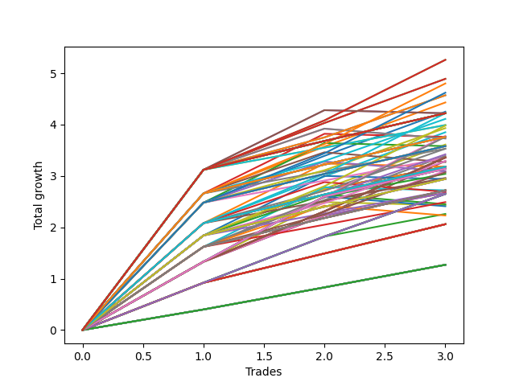

# Short HLT 650_extendedhours 
- Symbol: TSLA
- Date Range: 03/25/2024 - 05/17/2024
- Trading Period: 4:30-12:30
- Number of Trades: 3



| Id. | Name | Win Percent | Profit | Avg Profit / Trade | Avg Time / Trade | Std |      | Name | Win Percent | Profit | Avg Profit / Trade | Avg Time / Trade | Std |
| --- | ---- | ----------- | ------ | ------------------ | ---------------- | --- | ---- | ---- | ----------- | ------ | ------------------ | ---------------- | --- |
| | Sorted By <br> Profit | | | | | | | Sorted By <br> Win Percentage |||||
|0| TP-3 105m | 100.00 | 5.26 | 1.75 | 77:00 | 0.97 |     | TP-3 105m | 100.00 | 5.26 | 1.75 | 77:00 | 0.97 |
|1| TP-2.75 105m | 100.00 | 5.26 | 1.75 | 77:00 | 0.97 |     | TP-2.75 105m | 100.00 | 5.26 | 1.75 | 77:00 | 0.97 |
|2| TP-3 30m | 100.00 | 4.89 | 1.63 | 27:00 | 1.05 |     | TP-3 30m | 100.00 | 4.89 | 1.63 | 27:00 | 1.05 |
|3| TP-2.75 30m | 100.00 | 4.89 | 1.63 | 27:00 | 1.05 |     | TP-2.75 30m | 100.00 | 4.89 | 1.63 | 27:00 | 1.05 |
|4| TP-2.5 105m | 100.00 | 4.80 | 1.60 | 76:40 | 0.75 |     | TP-2.5 105m | 100.00 | 4.80 | 1.60 | 76:40 | 0.75 |
|5| TP-2.25 105m | 100.00 | 4.62 | 1.54 | 76:20 | 0.67 |     | TP-2.25 105m | 100.00 | 4.62 | 1.54 | 76:20 | 0.67 |
|6| TP-3 90m | 100.00 | 4.57 | 1.52 | 67:00 | 1.13 |     | TP-3 90m | 100.00 | 4.57 | 1.52 | 67:00 | 1.13 |
|7| TP-2.75 90m | 100.00 | 4.57 | 1.52 | 67:00 | 1.13 |     | TP-2.75 90m | 100.00 | 4.57 | 1.52 | 67:00 | 1.13 |
|8| TP-2.5 30m | 100.00 | 4.43 | 1.48 | 26:40 | 0.84 |     | TP-2.5 30m | 100.00 | 4.43 | 1.48 | 26:40 | 0.84 |
|9| TP-2.25 30m | 100.00 | 4.25 | 1.42 | 26:20 | 0.75 |     | TP-2.25 30m | 100.00 | 4.25 | 1.42 | 26:20 | 0.75 |
|10| TP-3 180m | 100.00 | 4.22 | 1.41 | 84:00 | 1.21 |     | TP-3 180m | 100.00 | 4.22 | 1.41 | 84:00 | 1.21 |
|11| TP-2.75 180m | 100.00 | 4.22 | 1.41 | 84:00 | 1.21 |     | TP-2.75 180m | 100.00 | 4.22 | 1.41 | 84:00 | 1.21 |
|12| TP-3 165m | 100.00 | 4.22 | 1.41 | 84:00 | 1.21 |     | TP-3 165m | 100.00 | 4.22 | 1.41 | 84:00 | 1.21 |
|13| TP-2.75 165m | 100.00 | 4.22 | 1.41 | 84:00 | 1.21 |     | TP-2.75 165m | 100.00 | 4.22 | 1.41 | 84:00 | 1.21 |
|14| TP-3 150m | 100.00 | 4.22 | 1.41 | 84:00 | 1.21 |     | TP-3 150m | 100.00 | 4.22 | 1.41 | 84:00 | 1.21 |
|15| TP-2.75 150m | 100.00 | 4.22 | 1.41 | 84:00 | 1.21 |     | TP-2.75 150m | 100.00 | 4.22 | 1.41 | 84:00 | 1.21 |
|16| TP-3 135m | 100.00 | 4.22 | 1.41 | 84:00 | 1.21 |     | TP-3 135m | 100.00 | 4.22 | 1.41 | 84:00 | 1.21 |
|17| TP-2.75 135m | 100.00 | 4.22 | 1.41 | 84:00 | 1.21 |     | TP-2.75 135m | 100.00 | 4.22 | 1.41 | 84:00 | 1.21 |
|18| TP-3 120m | 100.00 | 4.22 | 1.41 | 84:00 | 1.21 |     | TP-3 120m | 100.00 | 4.22 | 1.41 | 84:00 | 1.21 |
|19| TP-2.75 120m | 100.00 | 4.22 | 1.41 | 84:00 | 1.21 |     | TP-2.75 120m | 100.00 | 4.22 | 1.41 | 84:00 | 1.21 |
|20| TP-2 105m | 100.00 | 4.22 | 1.41 | 75:00 | 0.48 |     | TP-2 105m | 100.00 | 4.22 | 1.41 | 75:00 | 0.48 |
|21| TP-3 45m | 66.67 | 4.22 | 1.41 | 37:00 | 1.31 |     | TP-2.5 90m | 100.00 | 4.11 | 1.37 | 66:40 | 0.92 |
|22| TP-2.75 45m | 66.67 | 4.22 | 1.41 | 37:00 | 1.31 |     | TP-3 75m | 100.00 | 3.99 | 1.33 | 57:00 | 1.27 |
|23| TP-2.5 90m | 100.00 | 4.11 | 1.37 | 66:40 | 0.92 |     | TP-2.75 75m | 100.00 | 3.99 | 1.33 | 57:00 | 1.27 |
|24| TP-3 75m | 100.00 | 3.99 | 1.33 | 57:00 | 1.27 |     | TP-1.75 105m | 100.00 | 3.98 | 1.33 | 74:00 | 0.37 |
|25| TP-2.75 75m | 100.00 | 3.99 | 1.33 | 57:00 | 1.27 |     | TP-2.25 90m | 100.00 | 3.93 | 1.31 | 66:20 | 0.83 |
|26| TP-1.75 105m | 100.00 | 3.98 | 1.33 | 74:00 | 0.37 |     | TP-2 30m | 100.00 | 3.85 | 1.28 | 25:00 | 0.56 |
|27| TP-2.25 90m | 100.00 | 3.93 | 1.31 | 66:20 | 0.83 |     | TP-1.25 105m | 100.00 | 3.78 | 1.26 | 53:40 | 0.06 |
|28| TP-2 30m | 100.00 | 3.85 | 1.28 | 25:00 | 0.56 |     | TP-2.5 180m | 100.00 | 3.76 | 1.25 | 83:40 | 0.99 |
|29| TP-1.25 105m | 100.00 | 3.78 | 1.26 | 53:40 | 0.06 |     | TP-2.5 165m | 100.00 | 3.76 | 1.25 | 83:40 | 0.99 |
|30| TP-2.5 180m | 100.00 | 3.76 | 1.25 | 83:40 | 0.99 |     | TP-2.5 150m | 100.00 | 3.76 | 1.25 | 83:40 | 0.99 |
|31| TP-2.5 165m | 100.00 | 3.76 | 1.25 | 83:40 | 0.99 |     | TP-2.5 135m | 100.00 | 3.76 | 1.25 | 83:40 | 0.99 |
|32| TP-2.5 150m | 100.00 | 3.76 | 1.25 | 83:40 | 0.99 |     | TP-2.5 120m | 100.00 | 3.76 | 1.25 | 83:40 | 0.99 |
|33| TP-2.5 135m | 100.00 | 3.76 | 1.25 | 83:40 | 0.99 |     | TP-1.5 105m | 100.00 | 3.76 | 1.25 | 72:40 | 0.27 |
|34| TP-2.5 120m | 100.00 | 3.76 | 1.25 | 83:40 | 0.99 |     | TP-1.75 30m | 100.00 | 3.61 | 1.20 | 24:00 | 0.45 |
|35| TP-1.5 105m | 100.00 | 3.76 | 1.25 | 72:40 | 0.27 |     | TP-2.25 180m | 100.00 | 3.58 | 1.19 | 83:20 | 0.91 |
|36| TP-2.5 45m | 66.67 | 3.76 | 1.25 | 36:40 | 1.11 |     | TP-2.25 165m | 100.00 | 3.58 | 1.19 | 83:20 | 0.91 |
|37| TP-3 60m | 66.67 | 3.73 | 1.24 | 47:00 | 1.39 |     | TP-2.25 150m | 100.00 | 3.58 | 1.19 | 83:20 | 0.91 |
|38| TP-2.75 60m | 66.67 | 3.73 | 1.24 | 47:00 | 1.39 |     | TP-2.25 135m | 100.00 | 3.58 | 1.19 | 83:20 | 0.91 |
|39| TP-1.75 30m | 100.00 | 3.61 | 1.20 | 24:00 | 0.45 |     | TP-2.25 120m | 100.00 | 3.58 | 1.19 | 83:20 | 0.91 |
|40| TP-2.25 180m | 100.00 | 3.58 | 1.19 | 83:20 | 0.91 |     | TP-2 90m | 100.00 | 3.53 | 1.18 | 65:00 | 0.64 |
|41| TP-2.25 165m | 100.00 | 3.58 | 1.19 | 83:20 | 0.91 |     | TP-2.5 75m | 100.00 | 3.53 | 1.18 | 56:40 | 1.05 |
|42| TP-2.25 150m | 100.00 | 3.58 | 1.19 | 83:20 | 0.91 |     | TP-1.25 90m | 100.00 | 3.42 | 1.14 | 48:40 | 0.23 |
|43| TP-2.25 135m | 100.00 | 3.58 | 1.19 | 83:20 | 0.91 |     | TP-1.5 30m | 100.00 | 3.39 | 1.13 | 22:40 | 0.35 |
|44| TP-2.25 120m | 100.00 | 3.58 | 1.19 | 83:20 | 0.91 |     | TP-1 180m | 100.00 | 3.36 | 1.12 | 22:00 | 0.15 |
|45| TP-2.25 45m | 66.67 | 3.58 | 1.19 | 36:20 | 1.04 |     | TP-1 165m | 100.00 | 3.36 | 1.12 | 22:00 | 0.15 |
|46| TP-2 90m | 100.00 | 3.53 | 1.18 | 65:00 | 0.64 |     | TP-1 150m | 100.00 | 3.36 | 1.12 | 22:00 | 0.15 |
|47| TP-2.5 75m | 100.00 | 3.53 | 1.18 | 56:40 | 1.05 |     | TP-1 135m | 100.00 | 3.36 | 1.12 | 22:00 | 0.15 |
|48| TP-1.25 90m | 100.00 | 3.42 | 1.14 | 48:40 | 0.23 |     | TP-1 120m | 100.00 | 3.36 | 1.12 | 22:00 | 0.15 |
|49| TP-1.5 30m | 100.00 | 3.39 | 1.13 | 22:40 | 0.35 |     | TP-1 105m | 100.00 | 3.36 | 1.12 | 22:00 | 0.15 |
|50| TP-1 180m | 100.00 | 3.36 | 1.12 | 22:00 | 0.15 |     | TP-1 90m | 100.00 | 3.36 | 1.12 | 22:00 | 0.15 |
|51| TP-1 165m | 100.00 | 3.36 | 1.12 | 22:00 | 0.15 |     | TP-1 75m | 100.00 | 3.36 | 1.12 | 22:00 | 0.15 |
|52| TP-1 150m | 100.00 | 3.36 | 1.12 | 22:00 | 0.15 |     | TP-1 60m | 100.00 | 3.36 | 1.12 | 22:00 | 0.15 |
|53| TP-1 135m | 100.00 | 3.36 | 1.12 | 22:00 | 0.15 |     | TP-1 45m | 100.00 | 3.36 | 1.12 | 22:00 | 0.15 |
|54| TP-1 120m | 100.00 | 3.36 | 1.12 | 22:00 | 0.15 |     | TP-2.25 75m | 100.00 | 3.35 | 1.12 | 56:20 | 0.96 |
|55| TP-1 105m | 100.00 | 3.36 | 1.12 | 22:00 | 0.15 |     | TP-1.75 90m | 100.00 | 3.29 | 1.10 | 64:00 | 0.53 |
|56| TP-1 90m | 100.00 | 3.36 | 1.12 | 22:00 | 0.15 |     | TP-1 30m | 100.00 | 3.29 | 1.10 | 21:20 | 0.17 |
|57| TP-1 75m | 100.00 | 3.36 | 1.12 | 22:00 | 0.15 |     | TP-2 180m | 100.00 | 3.18 | 1.06 | 82:00 | 0.72 |
|58| TP-1 60m | 100.00 | 3.36 | 1.12 | 22:00 | 0.15 |     | TP-2 165m | 100.00 | 3.18 | 1.06 | 82:00 | 0.72 |
|59| TP-1 45m | 100.00 | 3.36 | 1.12 | 22:00 | 0.15 |     | TP-2 150m | 100.00 | 3.18 | 1.06 | 82:00 | 0.72 |
|60| TP-2.25 75m | 100.00 | 3.35 | 1.12 | 56:20 | 0.96 |     | TP-2 135m | 100.00 | 3.18 | 1.06 | 82:00 | 0.72 |
|61| TP-1.75 90m | 100.00 | 3.29 | 1.10 | 64:00 | 0.53 |     | TP-2 120m | 100.00 | 3.18 | 1.06 | 82:00 | 0.72 |
|62| TP-1 30m | 100.00 | 3.29 | 1.10 | 21:20 | 0.17 |     | TP-3 15m | 100.00 | 3.18 | 1.06 | 14:00 | 0.58 |
|63| TP-2.5 60m | 66.67 | 3.27 | 1.09 | 46:40 | 1.18 |     | TP-2.75 15m | 100.00 | 3.18 | 1.06 | 14:00 | 0.58 |
|64| TP-2 180m | 100.00 | 3.18 | 1.06 | 82:00 | 0.72 |     | TP-2.5 15m | 100.00 | 3.18 | 1.06 | 14:00 | 0.58 |
|65| TP-2 165m | 100.00 | 3.18 | 1.06 | 82:00 | 0.72 |     | TP-2.25 15m | 100.00 | 3.18 | 1.06 | 14:00 | 0.58 |
|66| TP-2 150m | 100.00 | 3.18 | 1.06 | 82:00 | 0.72 |     | TP-2 15m | 100.00 | 3.18 | 1.06 | 14:00 | 0.58 |
|67| TP-2 135m | 100.00 | 3.18 | 1.06 | 82:00 | 0.72 |     | TP-1.75 15m | 100.00 | 3.18 | 1.06 | 14:00 | 0.58 |
|68| TP-2 120m | 100.00 | 3.18 | 1.06 | 82:00 | 0.72 |     | TP-1.25 180m | 100.00 | 3.14 | 1.05 | 58:40 | 0.36 |
|69| TP-3 15m | 100.00 | 3.18 | 1.06 | 14:00 | 0.58 |     | TP-1.25 165m | 100.00 | 3.14 | 1.05 | 58:40 | 0.36 |
|70| TP-2.75 15m | 100.00 | 3.18 | 1.06 | 14:00 | 0.58 |     | TP-1.25 150m | 100.00 | 3.14 | 1.05 | 58:40 | 0.36 |
|71| TP-2.5 15m | 100.00 | 3.18 | 1.06 | 14:00 | 0.58 |     | TP-1.25 135m | 100.00 | 3.14 | 1.05 | 58:40 | 0.36 |
|72| TP-2.25 15m | 100.00 | 3.18 | 1.06 | 14:00 | 0.58 |     | TP-1.25 120m | 100.00 | 3.14 | 1.05 | 58:40 | 0.36 |
|73| TP-2 15m | 100.00 | 3.18 | 1.06 | 14:00 | 0.58 |     | TP-1.25 30m | 100.00 | 3.10 | 1.03 | 22:00 | 0.21 |
|74| TP-1.75 15m | 100.00 | 3.18 | 1.06 | 14:00 | 0.58 |     | TP-1.5 90m | 100.00 | 3.07 | 1.02 | 62:40 | 0.43 |
|75| TP-2 45m | 66.67 | 3.18 | 1.06 | 35:00 | 0.88 |     | TP-1.25 75m | 100.00 | 3.04 | 1.01 | 43:40 | 0.41 |
|76| TP-1.25 180m | 100.00 | 3.14 | 1.05 | 58:40 | 0.36 |     | TP-1.5 15m | 100.00 | 2.96 | 0.99 | 12:40 | 0.49 |
|77| TP-1.25 165m | 100.00 | 3.14 | 1.05 | 58:40 | 0.36 |     | TP-2 75m | 100.00 | 2.95 | 0.98 | 55:00 | 0.78 |
|78| TP-1.25 150m | 100.00 | 3.14 | 1.05 | 58:40 | 0.36 |     | TP-1.75 180m | 100.00 | 2.94 | 0.98 | 81:00 | 0.61 |
|79| TP-1.25 135m | 100.00 | 3.14 | 1.05 | 58:40 | 0.36 |     | TP-1.75 165m | 100.00 | 2.94 | 0.98 | 81:00 | 0.61 |
|80| TP-1.25 120m | 100.00 | 3.14 | 1.05 | 58:40 | 0.36 |     | TP-1.75 150m | 100.00 | 2.94 | 0.98 | 81:00 | 0.61 |
|81| TP-1.25 30m | 100.00 | 3.10 | 1.03 | 22:00 | 0.21 |     | TP-1.75 135m | 100.00 | 2.94 | 0.98 | 81:00 | 0.61 |
|82| TP-2.25 60m | 66.67 | 3.09 | 1.03 | 46:20 | 1.10 |     | TP-1.75 120m | 100.00 | 2.94 | 0.98 | 81:00 | 0.61 |
|83| TP-1.5 90m | 100.00 | 3.07 | 1.02 | 62:40 | 0.43 |     | TP-1.5 180m | 100.00 | 2.72 | 0.91 | 79:40 | 0.50 |
|84| TP-1.25 75m | 100.00 | 3.04 | 1.01 | 43:40 | 0.41 |     | TP-1.5 165m | 100.00 | 2.72 | 0.91 | 79:40 | 0.50 |
|85| TP-1.5 15m | 100.00 | 2.96 | 0.99 | 12:40 | 0.49 |     | TP-1.5 150m | 100.00 | 2.72 | 0.91 | 79:40 | 0.50 |
|86| TP-2 75m | 100.00 | 2.95 | 0.98 | 55:00 | 0.78 |     | TP-1.5 135m | 100.00 | 2.72 | 0.91 | 79:40 | 0.50 |
|87| TP-1.75 180m | 100.00 | 2.94 | 0.98 | 81:00 | 0.61 |     | TP-1.5 120m | 100.00 | 2.72 | 0.91 | 79:40 | 0.50 |
|88| TP-1.75 165m | 100.00 | 2.94 | 0.98 | 81:00 | 0.61 |     | TP-1.75 75m | 100.00 | 2.71 | 0.90 | 54:00 | 0.66 |
|89| TP-1.75 150m | 100.00 | 2.94 | 0.98 | 81:00 | 0.61 |     | TP-1.25 15m | 100.00 | 2.67 | 0.89 | 12:00 | 0.36 |
|90| TP-1.75 135m | 100.00 | 2.94 | 0.98 | 81:00 | 0.61 |     | TP-1 15m | 100.00 | 2.67 | 0.89 | 12:00 | 0.36 |
|91| TP-1.75 120m | 100.00 | 2.94 | 0.98 | 81:00 | 0.61 |     | TP-0.75 180m | 100.00 | 2.65 | 0.88 | 12:20 | 0.04 |
|92| TP-1.75 45m | 66.67 | 2.94 | 0.98 | 34:00 | 0.79 |     | TP-0.75 165m | 100.00 | 2.65 | 0.88 | 12:20 | 0.04 |
|93| TP-1.5 180m | 100.00 | 2.72 | 0.91 | 79:40 | 0.50 |     | TP-0.75 150m | 100.00 | 2.65 | 0.88 | 12:20 | 0.04 |
|94| TP-1.5 165m | 100.00 | 2.72 | 0.91 | 79:40 | 0.50 |     | TP-0.75 135m | 100.00 | 2.65 | 0.88 | 12:20 | 0.04 |
|95| TP-1.5 150m | 100.00 | 2.72 | 0.91 | 79:40 | 0.50 |     | TP-0.75 120m | 100.00 | 2.65 | 0.88 | 12:20 | 0.04 |
|96| TP-1.5 135m | 100.00 | 2.72 | 0.91 | 79:40 | 0.50 |     | TP-0.75 105m | 100.00 | 2.65 | 0.88 | 12:20 | 0.04 |
|97| TP-1.5 120m | 100.00 | 2.72 | 0.91 | 79:40 | 0.50 |     | TP-0.75 90m | 100.00 | 2.65 | 0.88 | 12:20 | 0.04 |
|98| TP-1.5 45m | 66.67 | 2.72 | 0.91 | 32:40 | 0.71 |     | TP-0.75 75m | 100.00 | 2.65 | 0.88 | 12:20 | 0.04 |
|99| TP-1.75 75m | 100.00 | 2.71 | 0.90 | 54:00 | 0.66 |     | TP-0.75 60m | 100.00 | 2.65 | 0.88 | 12:20 | 0.04 |
|100| TP-2 60m | 66.67 | 2.69 | 0.90 | 45:00 | 0.93 |     | TP-0.75 45m | 100.00 | 2.65 | 0.88 | 12:20 | 0.04 |
|101| TP-1.25 15m | 100.00 | 2.67 | 0.89 | 12:00 | 0.36 |     | TP-0.75 30m | 100.00 | 2.65 | 0.88 | 12:20 | 0.04 |
|102| TP-1 15m | 100.00 | 2.67 | 0.89 | 12:00 | 0.36 |     | TP-1.5 75m | 100.00 | 2.49 | 0.83 | 52:40 | 0.56 |
|103| TP-0.75 180m | 100.00 | 2.65 | 0.88 | 12:20 | 0.04 |     | TP-0.75 15m | 100.00 | 2.26 | 0.75 | 11:00 | 0.22 |
|104| TP-0.75 165m | 100.00 | 2.65 | 0.88 | 12:20 | 0.04 |     | TP-0.5 180m | 100.00 | 2.06 | 0.69 | 07:20 | 0.16 |
|105| TP-0.75 150m | 100.00 | 2.65 | 0.88 | 12:20 | 0.04 |     | TP-0.5 165m | 100.00 | 2.06 | 0.69 | 07:20 | 0.16 |
|106| TP-0.75 135m | 100.00 | 2.65 | 0.88 | 12:20 | 0.04 |     | TP-0.5 150m | 100.00 | 2.06 | 0.69 | 07:20 | 0.16 |
|107| TP-0.75 120m | 100.00 | 2.65 | 0.88 | 12:20 | 0.04 |     | TP-0.5 135m | 100.00 | 2.06 | 0.69 | 07:20 | 0.16 |
|108| TP-0.75 105m | 100.00 | 2.65 | 0.88 | 12:20 | 0.04 |     | TP-0.5 120m | 100.00 | 2.06 | 0.69 | 07:20 | 0.16 |
|109| TP-0.75 90m | 100.00 | 2.65 | 0.88 | 12:20 | 0.04 |     | TP-0.5 105m | 100.00 | 2.06 | 0.69 | 07:20 | 0.16 |
|110| TP-0.75 75m | 100.00 | 2.65 | 0.88 | 12:20 | 0.04 |     | TP-0.5 90m | 100.00 | 2.06 | 0.69 | 07:20 | 0.16 |
|111| TP-0.75 60m | 100.00 | 2.65 | 0.88 | 12:20 | 0.04 |     | TP-0.5 75m | 100.00 | 2.06 | 0.69 | 07:20 | 0.16 |
|112| TP-0.75 45m | 100.00 | 2.65 | 0.88 | 12:20 | 0.04 |     | TP-0.5 60m | 100.00 | 2.06 | 0.69 | 07:20 | 0.16 |
|113| TP-0.75 30m | 100.00 | 2.65 | 0.88 | 12:20 | 0.04 |     | TP-0.5 45m | 100.00 | 2.06 | 0.69 | 07:20 | 0.16 |
|114| TP-1.5 75m | 100.00 | 2.49 | 0.83 | 52:40 | 0.56 |     | TP-0.5 30m | 100.00 | 2.06 | 0.69 | 07:20 | 0.16 |
|115| TP-1.75 60m | 66.67 | 2.45 | 0.82 | 44:00 | 0.83 |     | TP-0.5 15m | 100.00 | 2.06 | 0.69 | 07:20 | 0.16 |
|116| TP-1.25 45m | 66.67 | 2.43 | 0.81 | 32:00 | 0.62 |     | TP-0.25 180m | 100.00 | 1.27 | 0.42 | 05:20 | 0.02 |
|117| TP-1.25 60m | 66.67 | 2.41 | 0.80 | 38:40 | 0.70 |     | TP-0.25 165m | 100.00 | 1.27 | 0.42 | 05:20 | 0.02 |
|118| TP-0.75 15m | 100.00 | 2.26 | 0.75 | 11:00 | 0.22 |     | TP-0.25 150m | 100.00 | 1.27 | 0.42 | 05:20 | 0.02 |
|119| TP-1.5 60m | 66.67 | 2.23 | 0.74 | 42:40 | 0.74 |     | TP-0.25 135m | 100.00 | 1.27 | 0.42 | 05:20 | 0.02 |
|120| TP-0.5 180m | 100.00 | 2.06 | 0.69 | 07:20 | 0.16 |     | TP-0.25 120m | 100.00 | 1.27 | 0.42 | 05:20 | 0.02 |
|121| TP-0.5 165m | 100.00 | 2.06 | 0.69 | 07:20 | 0.16 |     | TP-0.25 105m | 100.00 | 1.27 | 0.42 | 05:20 | 0.02 |
|122| TP-0.5 150m | 100.00 | 2.06 | 0.69 | 07:20 | 0.16 |     | TP-0.25 90m | 100.00 | 1.27 | 0.42 | 05:20 | 0.02 |
|123| TP-0.5 135m | 100.00 | 2.06 | 0.69 | 07:20 | 0.16 |     | TP-0.25 75m | 100.00 | 1.27 | 0.42 | 05:20 | 0.02 |
|124| TP-0.5 120m | 100.00 | 2.06 | 0.69 | 07:20 | 0.16 |     | TP-0.25 60m | 100.00 | 1.27 | 0.42 | 05:20 | 0.02 |
|125| TP-0.5 105m | 100.00 | 2.06 | 0.69 | 07:20 | 0.16 |     | TP-0.25 45m | 100.00 | 1.27 | 0.42 | 05:20 | 0.02 |
|126| TP-0.5 90m | 100.00 | 2.06 | 0.69 | 07:20 | 0.16 |     | TP-0.25 30m | 100.00 | 1.27 | 0.42 | 05:20 | 0.02 |
|127| TP-0.5 75m | 100.00 | 2.06 | 0.69 | 07:20 | 0.16 |     | TP-0.25 15m | 100.00 | 1.27 | 0.42 | 05:20 | 0.02 |
|128| TP-0.5 60m | 100.00 | 2.06 | 0.69 | 07:20 | 0.16 |     | TP-3 45m | 66.67 | 4.22 | 1.41 | 37:00 | 1.31 |
|129| TP-0.5 45m | 100.00 | 2.06 | 0.69 | 07:20 | 0.16 |     | TP-2.75 45m | 66.67 | 4.22 | 1.41 | 37:00 | 1.31 |
|130| TP-0.5 30m | 100.00 | 2.06 | 0.69 | 07:20 | 0.16 |     | TP-2.5 45m | 66.67 | 3.76 | 1.25 | 36:40 | 1.11 |
|131| TP-0.5 15m | 100.00 | 2.06 | 0.69 | 07:20 | 0.16 |     | TP-3 60m | 66.67 | 3.73 | 1.24 | 47:00 | 1.39 |
|132| TP-0.25 180m | 100.00 | 1.27 | 0.42 | 05:20 | 0.02 |     | TP-2.75 60m | 66.67 | 3.73 | 1.24 | 47:00 | 1.39 |
|133| TP-0.25 165m | 100.00 | 1.27 | 0.42 | 05:20 | 0.02 |     | TP-2.25 45m | 66.67 | 3.58 | 1.19 | 36:20 | 1.04 |
|134| TP-0.25 150m | 100.00 | 1.27 | 0.42 | 05:20 | 0.02 |     | TP-2.5 60m | 66.67 | 3.27 | 1.09 | 46:40 | 1.18 |
|135| TP-0.25 135m | 100.00 | 1.27 | 0.42 | 05:20 | 0.02 |     | TP-2 45m | 66.67 | 3.18 | 1.06 | 35:00 | 0.88 |
|136| TP-0.25 120m | 100.00 | 1.27 | 0.42 | 05:20 | 0.02 |     | TP-2.25 60m | 66.67 | 3.09 | 1.03 | 46:20 | 1.10 |
|137| TP-0.25 105m | 100.00 | 1.27 | 0.42 | 05:20 | 0.02 |     | TP-1.75 45m | 66.67 | 2.94 | 0.98 | 34:00 | 0.79 |
|138| TP-0.25 90m | 100.00 | 1.27 | 0.42 | 05:20 | 0.02 |     | TP-1.5 45m | 66.67 | 2.72 | 0.91 | 32:40 | 0.71 |
|139| TP-0.25 75m | 100.00 | 1.27 | 0.42 | 05:20 | 0.02 |     | TP-2 60m | 66.67 | 2.69 | 0.90 | 45:00 | 0.93 |
|140| TP-0.25 60m | 100.00 | 1.27 | 0.42 | 05:20 | 0.02 |     | TP-1.75 60m | 66.67 | 2.45 | 0.82 | 44:00 | 0.83 |
|141| TP-0.25 45m | 100.00 | 1.27 | 0.42 | 05:20 | 0.02 |     | TP-1.25 45m | 66.67 | 2.43 | 0.81 | 32:00 | 0.62 |
|142| TP-0.25 30m | 100.00 | 1.27 | 0.42 | 05:20 | 0.02 |     | TP-1.25 60m | 66.67 | 2.41 | 0.80 | 38:40 | 0.70 |
|143| TP-0.25 15m | 100.00 | 1.27 | 0.42 | 05:20 | 0.02 |     | TP-1.5 60m | 66.67 | 2.23 | 0.74 | 42:40 | 0.74 |

### Test TP-0.25 15m
* Take Profit of 0.25 Point
* 0.25 Stoploss
* Results:
```
Total Trades: 3
Percent Up: 0.00
Percent Down: 100.00
Total Points Moved Down: 1.27
Potential Profit: 635.00
Total Points Ups: 0.00 Count Ups: 0
Total Points Downs: 1.27 Count Downs: 3
```

<details><summary>Trades</summary>

<code>In: 2024-04-11 06:40:00		Out: 2024-04-11 06:44:00		Total Position Time: 04:00		Total Move Down: 0.40		Total to Date: 0.40</code> <br />
<code>In: 2024-04-22 11:00:00		Out: 2024-04-22 11:02:00		Total Position Time: 02:00		Total Move Down: 0.43		Total to Date: 0.83</code> <br />
<code>In: 2024-05-08 07:55:00		Out: 2024-05-08 08:05:00		Total Position Time: 10:00		Total Move Down: 0.44		Total to Date: 1.27</code> <br />


</details>

### Test TP-0.5 15m
* Take Profit of 0.5 Point
* 0.5 Stoploss
* Results:
```
Total Trades: 3
Percent Up: 0.00
Percent Down: 100.00
Total Points Moved Down: 2.06
Potential Profit: 1030.00
Total Points Ups: 0.00 Count Ups: 0
Total Points Downs: 2.06 Count Downs: 3
```

<details><summary>Trades</summary>

<code>In: 2024-04-11 06:40:00		Out: 2024-04-11 06:45:00		Total Position Time: 05:00		Total Move Down: 0.92		Total to Date: 0.92</code> <br />
<code>In: 2024-04-22 11:00:00		Out: 2024-04-22 11:04:00		Total Position Time: 04:00		Total Move Down: 0.57		Total to Date: 1.49</code> <br />
<code>In: 2024-05-08 07:55:00		Out: 2024-05-08 08:08:00		Total Position Time: 13:00		Total Move Down: 0.57		Total to Date: 2.06</code> <br />


</details>

### Test TP-0.75 15m
* Take Profit of 0.75 Point
* 0.75 Stoploss
* Results:
```
Total Trades: 3
Percent Up: 0.00
Percent Down: 100.00
Total Points Moved Down: 2.26
Potential Profit: 1130.00
Total Points Ups: 0.00 Count Ups: 0
Total Points Downs: 2.26 Count Downs: 3
```

<details><summary>Trades</summary>

<code>In: 2024-04-11 06:40:00		Out: 2024-04-11 06:45:00		Total Position Time: 05:00		Total Move Down: 0.92		Total to Date: 0.92</code> <br />
<code>In: 2024-04-22 11:00:00		Out: 2024-04-22 11:14:00		Total Position Time: 14:00		Total Move Down: 0.90		Total to Date: 1.82</code> <br />
<code>In: 2024-05-08 07:55:00		Out: 2024-05-08 08:09:00		Total Position Time: 14:00		Total Move Down: 0.44		Total to Date: 2.26</code> <br />


</details>

### Test TP-1 15m
* Take Profit of 1 Point
* 1 Stoploss
* Results:
```
Total Trades: 3
Percent Up: 0.00
Percent Down: 100.00
Total Points Moved Down: 2.67
Potential Profit: 1335.00
Total Points Ups: 0.00 Count Ups: 0
Total Points Downs: 2.67 Count Downs: 3
```

<details><summary>Trades</summary>

<code>In: 2024-04-11 06:40:00		Out: 2024-04-11 06:48:00		Total Position Time: 08:00		Total Move Down: 1.33		Total to Date: 1.33</code> <br />
<code>In: 2024-04-22 11:00:00		Out: 2024-04-22 11:14:00		Total Position Time: 14:00		Total Move Down: 0.90		Total to Date: 2.23</code> <br />
<code>In: 2024-05-08 07:55:00		Out: 2024-05-08 08:09:00		Total Position Time: 14:00		Total Move Down: 0.44		Total to Date: 2.67</code> <br />


</details>

### Test TP-1.25 15m
* Take Profit of 1.25 Point
* 1.25 Stoploss
* Results:
```
Total Trades: 3
Percent Up: 0.00
Percent Down: 100.00
Total Points Moved Down: 2.67
Potential Profit: 1335.00
Total Points Ups: 0.00 Count Ups: 0
Total Points Downs: 2.67 Count Downs: 3
```

<details><summary>Trades</summary>

<code>In: 2024-04-11 06:40:00		Out: 2024-04-11 06:48:00		Total Position Time: 08:00		Total Move Down: 1.33		Total to Date: 1.33</code> <br />
<code>In: 2024-04-22 11:00:00		Out: 2024-04-22 11:14:00		Total Position Time: 14:00		Total Move Down: 0.90		Total to Date: 2.23</code> <br />
<code>In: 2024-05-08 07:55:00		Out: 2024-05-08 08:09:00		Total Position Time: 14:00		Total Move Down: 0.44		Total to Date: 2.67</code> <br />


</details>

### Test TP-1.5 15m
* Take Profit of 1.5 Point
* 1.5 Stoploss
* Results:
```
Total Trades: 3
Percent Up: 0.00
Percent Down: 100.00
Total Points Moved Down: 2.96
Potential Profit: 1480.00
Total Points Ups: 0.00 Count Ups: 0
Total Points Downs: 2.96 Count Downs: 3
```

<details><summary>Trades</summary>

<code>In: 2024-04-11 06:40:00		Out: 2024-04-11 06:50:00		Total Position Time: 10:00		Total Move Down: 1.62		Total to Date: 1.62</code> <br />
<code>In: 2024-04-22 11:00:00		Out: 2024-04-22 11:14:00		Total Position Time: 14:00		Total Move Down: 0.90		Total to Date: 2.52</code> <br />
<code>In: 2024-05-08 07:55:00		Out: 2024-05-08 08:09:00		Total Position Time: 14:00		Total Move Down: 0.44		Total to Date: 2.96</code> <br />


</details>

### Test TP-1.75 15m
* Take Profit of 1.75 Point
* 1.75 Stoploss
* Results:
```
Total Trades: 3
Percent Up: 0.00
Percent Down: 100.00
Total Points Moved Down: 3.18
Potential Profit: 1590.00
Total Points Ups: 0.00 Count Ups: 0
Total Points Downs: 3.18 Count Downs: 3
```

<details><summary>Trades</summary>

<code>In: 2024-04-11 06:40:00		Out: 2024-04-11 06:54:00		Total Position Time: 14:00		Total Move Down: 1.84		Total to Date: 1.84</code> <br />
<code>In: 2024-04-22 11:00:00		Out: 2024-04-22 11:14:00		Total Position Time: 14:00		Total Move Down: 0.90		Total to Date: 2.74</code> <br />
<code>In: 2024-05-08 07:55:00		Out: 2024-05-08 08:09:00		Total Position Time: 14:00		Total Move Down: 0.44		Total to Date: 3.18</code> <br />


</details>

### Test TP-2 15m
* Take Profit of 2 Point
* 2 Stoploss
* Results:
```
Total Trades: 3
Percent Up: 0.00
Percent Down: 100.00
Total Points Moved Down: 3.18
Potential Profit: 1590.00
Total Points Ups: 0.00 Count Ups: 0
Total Points Downs: 3.18 Count Downs: 3
```

<details><summary>Trades</summary>

<code>In: 2024-04-11 06:40:00		Out: 2024-04-11 06:54:00		Total Position Time: 14:00		Total Move Down: 1.84		Total to Date: 1.84</code> <br />
<code>In: 2024-04-22 11:00:00		Out: 2024-04-22 11:14:00		Total Position Time: 14:00		Total Move Down: 0.90		Total to Date: 2.74</code> <br />
<code>In: 2024-05-08 07:55:00		Out: 2024-05-08 08:09:00		Total Position Time: 14:00		Total Move Down: 0.44		Total to Date: 3.18</code> <br />


</details>

### Test TP-2.25 15m
* Take Profit of 2.25 Point
* 2.25 Stoploss
* Results:
```
Total Trades: 3
Percent Up: 0.00
Percent Down: 100.00
Total Points Moved Down: 3.18
Potential Profit: 1590.00
Total Points Ups: 0.00 Count Ups: 0
Total Points Downs: 3.18 Count Downs: 3
```

<details><summary>Trades</summary>

<code>In: 2024-04-11 06:40:00		Out: 2024-04-11 06:54:00		Total Position Time: 14:00		Total Move Down: 1.84		Total to Date: 1.84</code> <br />
<code>In: 2024-04-22 11:00:00		Out: 2024-04-22 11:14:00		Total Position Time: 14:00		Total Move Down: 0.90		Total to Date: 2.74</code> <br />
<code>In: 2024-05-08 07:55:00		Out: 2024-05-08 08:09:00		Total Position Time: 14:00		Total Move Down: 0.44		Total to Date: 3.18</code> <br />


</details>

### Test TP-2.5 15m
* Take Profit of 2.5 Point
* 2.5 Stoploss
* Results:
```
Total Trades: 3
Percent Up: 0.00
Percent Down: 100.00
Total Points Moved Down: 3.18
Potential Profit: 1590.00
Total Points Ups: 0.00 Count Ups: 0
Total Points Downs: 3.18 Count Downs: 3
```

<details><summary>Trades</summary>

<code>In: 2024-04-11 06:40:00		Out: 2024-04-11 06:54:00		Total Position Time: 14:00		Total Move Down: 1.84		Total to Date: 1.84</code> <br />
<code>In: 2024-04-22 11:00:00		Out: 2024-04-22 11:14:00		Total Position Time: 14:00		Total Move Down: 0.90		Total to Date: 2.74</code> <br />
<code>In: 2024-05-08 07:55:00		Out: 2024-05-08 08:09:00		Total Position Time: 14:00		Total Move Down: 0.44		Total to Date: 3.18</code> <br />


</details>

### Test TP-2.75 15m
* Take Profit of 2.75 Point
* 2.75 Stoploss
* Results:
```
Total Trades: 3
Percent Up: 0.00
Percent Down: 100.00
Total Points Moved Down: 3.18
Potential Profit: 1590.00
Total Points Ups: 0.00 Count Ups: 0
Total Points Downs: 3.18 Count Downs: 3
```

<details><summary>Trades</summary>

<code>In: 2024-04-11 06:40:00		Out: 2024-04-11 06:54:00		Total Position Time: 14:00		Total Move Down: 1.84		Total to Date: 1.84</code> <br />
<code>In: 2024-04-22 11:00:00		Out: 2024-04-22 11:14:00		Total Position Time: 14:00		Total Move Down: 0.90		Total to Date: 2.74</code> <br />
<code>In: 2024-05-08 07:55:00		Out: 2024-05-08 08:09:00		Total Position Time: 14:00		Total Move Down: 0.44		Total to Date: 3.18</code> <br />


</details>

### Test TP-3 15m
* Take Profit of 3 Point
* 3 Stoploss
* Results:
```
Total Trades: 3
Percent Up: 0.00
Percent Down: 100.00
Total Points Moved Down: 3.18
Potential Profit: 1590.00
Total Points Ups: 0.00 Count Ups: 0
Total Points Downs: 3.18 Count Downs: 3
```

<details><summary>Trades</summary>

<code>In: 2024-04-11 06:40:00		Out: 2024-04-11 06:54:00		Total Position Time: 14:00		Total Move Down: 1.84		Total to Date: 1.84</code> <br />
<code>In: 2024-04-22 11:00:00		Out: 2024-04-22 11:14:00		Total Position Time: 14:00		Total Move Down: 0.90		Total to Date: 2.74</code> <br />
<code>In: 2024-05-08 07:55:00		Out: 2024-05-08 08:09:00		Total Position Time: 14:00		Total Move Down: 0.44		Total to Date: 3.18</code> <br />


</details>

### Test TP-0.25 30m
* Take Profit of 0.25 Point
* 0.25 Stoploss
* Results:
```
Total Trades: 3
Percent Up: 0.00
Percent Down: 100.00
Total Points Moved Down: 1.27
Potential Profit: 635.00
Total Points Ups: 0.00 Count Ups: 0
Total Points Downs: 1.27 Count Downs: 3
```

<details><summary>Trades</summary>

<code>In: 2024-04-11 06:40:00		Out: 2024-04-11 06:44:00		Total Position Time: 04:00		Total Move Down: 0.40		Total to Date: 0.40</code> <br />
<code>In: 2024-04-22 11:00:00		Out: 2024-04-22 11:02:00		Total Position Time: 02:00		Total Move Down: 0.43		Total to Date: 0.83</code> <br />
<code>In: 2024-05-08 07:55:00		Out: 2024-05-08 08:05:00		Total Position Time: 10:00		Total Move Down: 0.44		Total to Date: 1.27</code> <br />


</details>

### Test TP-0.5 30m
* Take Profit of 0.5 Point
* 0.5 Stoploss
* Results:
```
Total Trades: 3
Percent Up: 0.00
Percent Down: 100.00
Total Points Moved Down: 2.06
Potential Profit: 1030.00
Total Points Ups: 0.00 Count Ups: 0
Total Points Downs: 2.06 Count Downs: 3
```

<details><summary>Trades</summary>

<code>In: 2024-04-11 06:40:00		Out: 2024-04-11 06:45:00		Total Position Time: 05:00		Total Move Down: 0.92		Total to Date: 0.92</code> <br />
<code>In: 2024-04-22 11:00:00		Out: 2024-04-22 11:04:00		Total Position Time: 04:00		Total Move Down: 0.57		Total to Date: 1.49</code> <br />
<code>In: 2024-05-08 07:55:00		Out: 2024-05-08 08:08:00		Total Position Time: 13:00		Total Move Down: 0.57		Total to Date: 2.06</code> <br />


</details>

### Test TP-0.75 30m
* Take Profit of 0.75 Point
* 0.75 Stoploss
* Results:
```
Total Trades: 3
Percent Up: 0.00
Percent Down: 100.00
Total Points Moved Down: 2.65
Potential Profit: 1325.00
Total Points Ups: 0.00 Count Ups: 0
Total Points Downs: 2.65 Count Downs: 3
```

<details><summary>Trades</summary>

<code>In: 2024-04-11 06:40:00		Out: 2024-04-11 06:45:00		Total Position Time: 05:00		Total Move Down: 0.92		Total to Date: 0.92</code> <br />
<code>In: 2024-04-22 11:00:00		Out: 2024-04-22 11:14:00		Total Position Time: 14:00		Total Move Down: 0.90		Total to Date: 1.82</code> <br />
<code>In: 2024-05-08 07:55:00		Out: 2024-05-08 08:13:00		Total Position Time: 18:00		Total Move Down: 0.83		Total to Date: 2.65</code> <br />


</details>

### Test TP-1 30m
* Take Profit of 1 Point
* 1 Stoploss
* Results:
```
Total Trades: 3
Percent Up: 0.00
Percent Down: 100.00
Total Points Moved Down: 3.29
Potential Profit: 1645.00
Total Points Ups: 0.00 Count Ups: 0
Total Points Downs: 3.29 Count Downs: 3
```

<details><summary>Trades</summary>

<code>In: 2024-04-11 06:40:00		Out: 2024-04-11 06:48:00		Total Position Time: 08:00		Total Move Down: 1.33		Total to Date: 1.33</code> <br />
<code>In: 2024-04-22 11:00:00		Out: 2024-04-22 11:29:00		Total Position Time: 29:00		Total Move Down: 0.91		Total to Date: 2.24</code> <br />
<code>In: 2024-05-08 07:55:00		Out: 2024-05-08 08:22:00		Total Position Time: 27:00		Total Move Down: 1.05		Total to Date: 3.29</code> <br />


</details>

### Test TP-1.25 30m
* Take Profit of 1.25 Point
* 1.25 Stoploss
* Results:
```
Total Trades: 3
Percent Up: 0.00
Percent Down: 100.00
Total Points Moved Down: 3.10
Potential Profit: 1550.00
Total Points Ups: 0.00 Count Ups: 0
Total Points Downs: 3.10 Count Downs: 3
```

<details><summary>Trades</summary>

<code>In: 2024-04-11 06:40:00		Out: 2024-04-11 06:48:00		Total Position Time: 08:00		Total Move Down: 1.33		Total to Date: 1.33</code> <br />
<code>In: 2024-04-22 11:00:00		Out: 2024-04-22 11:29:00		Total Position Time: 29:00		Total Move Down: 0.91		Total to Date: 2.24</code> <br />
<code>In: 2024-05-08 07:55:00		Out: 2024-05-08 08:24:00		Total Position Time: 29:00		Total Move Down: 0.86		Total to Date: 3.10</code> <br />


</details>

### Test TP-1.5 30m
* Take Profit of 1.5 Point
* 1.5 Stoploss
* Results:
```
Total Trades: 3
Percent Up: 0.00
Percent Down: 100.00
Total Points Moved Down: 3.39
Potential Profit: 1695.00
Total Points Ups: 0.00 Count Ups: 0
Total Points Downs: 3.39 Count Downs: 3
```

<details><summary>Trades</summary>

<code>In: 2024-04-11 06:40:00		Out: 2024-04-11 06:50:00		Total Position Time: 10:00		Total Move Down: 1.62		Total to Date: 1.62</code> <br />
<code>In: 2024-04-22 11:00:00		Out: 2024-04-22 11:29:00		Total Position Time: 29:00		Total Move Down: 0.91		Total to Date: 2.53</code> <br />
<code>In: 2024-05-08 07:55:00		Out: 2024-05-08 08:24:00		Total Position Time: 29:00		Total Move Down: 0.86		Total to Date: 3.39</code> <br />


</details>

### Test TP-1.75 30m
* Take Profit of 1.75 Point
* 1.75 Stoploss
* Results:
```
Total Trades: 3
Percent Up: 0.00
Percent Down: 100.00
Total Points Moved Down: 3.61
Potential Profit: 1805.00
Total Points Ups: 0.00 Count Ups: 0
Total Points Downs: 3.61 Count Downs: 3
```

<details><summary>Trades</summary>

<code>In: 2024-04-11 06:40:00		Out: 2024-04-11 06:54:00		Total Position Time: 14:00		Total Move Down: 1.84		Total to Date: 1.84</code> <br />
<code>In: 2024-04-22 11:00:00		Out: 2024-04-22 11:29:00		Total Position Time: 29:00		Total Move Down: 0.91		Total to Date: 2.75</code> <br />
<code>In: 2024-05-08 07:55:00		Out: 2024-05-08 08:24:00		Total Position Time: 29:00		Total Move Down: 0.86		Total to Date: 3.61</code> <br />


</details>

### Test TP-2 30m
* Take Profit of 2 Point
* 2 Stoploss
* Results:
```
Total Trades: 3
Percent Up: 0.00
Percent Down: 100.00
Total Points Moved Down: 3.85
Potential Profit: 1925.00
Total Points Ups: 0.00 Count Ups: 0
Total Points Downs: 3.85 Count Downs: 3
```

<details><summary>Trades</summary>

<code>In: 2024-04-11 06:40:00		Out: 2024-04-11 06:57:00		Total Position Time: 17:00		Total Move Down: 2.08		Total to Date: 2.08</code> <br />
<code>In: 2024-04-22 11:00:00		Out: 2024-04-22 11:29:00		Total Position Time: 29:00		Total Move Down: 0.91		Total to Date: 2.99</code> <br />
<code>In: 2024-05-08 07:55:00		Out: 2024-05-08 08:24:00		Total Position Time: 29:00		Total Move Down: 0.86		Total to Date: 3.85</code> <br />


</details>

### Test TP-2.25 30m
* Take Profit of 2.25 Point
* 2.25 Stoploss
* Results:
```
Total Trades: 3
Percent Up: 0.00
Percent Down: 100.00
Total Points Moved Down: 4.25
Potential Profit: 2125.00
Total Points Ups: 0.00 Count Ups: 0
Total Points Downs: 4.25 Count Downs: 3
```

<details><summary>Trades</summary>

<code>In: 2024-04-11 06:40:00		Out: 2024-04-11 07:01:00		Total Position Time: 21:00		Total Move Down: 2.48		Total to Date: 2.48</code> <br />
<code>In: 2024-04-22 11:00:00		Out: 2024-04-22 11:29:00		Total Position Time: 29:00		Total Move Down: 0.91		Total to Date: 3.39</code> <br />
<code>In: 2024-05-08 07:55:00		Out: 2024-05-08 08:24:00		Total Position Time: 29:00		Total Move Down: 0.86		Total to Date: 4.25</code> <br />


</details>

### Test TP-2.5 30m
* Take Profit of 2.5 Point
* 2.5 Stoploss
* Results:
```
Total Trades: 3
Percent Up: 0.00
Percent Down: 100.00
Total Points Moved Down: 4.43
Potential Profit: 2215.00
Total Points Ups: 0.00 Count Ups: 0
Total Points Downs: 4.43 Count Downs: 3
```

<details><summary>Trades</summary>

<code>In: 2024-04-11 06:40:00		Out: 2024-04-11 07:02:00		Total Position Time: 22:00		Total Move Down: 2.66		Total to Date: 2.66</code> <br />
<code>In: 2024-04-22 11:00:00		Out: 2024-04-22 11:29:00		Total Position Time: 29:00		Total Move Down: 0.91		Total to Date: 3.57</code> <br />
<code>In: 2024-05-08 07:55:00		Out: 2024-05-08 08:24:00		Total Position Time: 29:00		Total Move Down: 0.86		Total to Date: 4.43</code> <br />


</details>

### Test TP-2.75 30m
* Take Profit of 2.75 Point
* 2.75 Stoploss
* Results:
```
Total Trades: 3
Percent Up: 0.00
Percent Down: 100.00
Total Points Moved Down: 4.89
Potential Profit: 2445.00
Total Points Ups: 0.00 Count Ups: 0
Total Points Downs: 4.89 Count Downs: 3
```

<details><summary>Trades</summary>

<code>In: 2024-04-11 06:40:00		Out: 2024-04-11 07:03:00		Total Position Time: 23:00		Total Move Down: 3.12		Total to Date: 3.12</code> <br />
<code>In: 2024-04-22 11:00:00		Out: 2024-04-22 11:29:00		Total Position Time: 29:00		Total Move Down: 0.91		Total to Date: 4.03</code> <br />
<code>In: 2024-05-08 07:55:00		Out: 2024-05-08 08:24:00		Total Position Time: 29:00		Total Move Down: 0.86		Total to Date: 4.89</code> <br />


</details>

### Test TP-3 30m
* Take Profit of 3 Point
* 3 Stoploss
* Results:
```
Total Trades: 3
Percent Up: 0.00
Percent Down: 100.00
Total Points Moved Down: 4.89
Potential Profit: 2445.00
Total Points Ups: 0.00 Count Ups: 0
Total Points Downs: 4.89 Count Downs: 3
```

<details><summary>Trades</summary>

<code>In: 2024-04-11 06:40:00		Out: 2024-04-11 07:03:00		Total Position Time: 23:00		Total Move Down: 3.12		Total to Date: 3.12</code> <br />
<code>In: 2024-04-22 11:00:00		Out: 2024-04-22 11:29:00		Total Position Time: 29:00		Total Move Down: 0.91		Total to Date: 4.03</code> <br />
<code>In: 2024-05-08 07:55:00		Out: 2024-05-08 08:24:00		Total Position Time: 29:00		Total Move Down: 0.86		Total to Date: 4.89</code> <br />


</details>

### Test TP-0.25 45m
* Take Profit of 0.25 Point
* 0.25 Stoploss
* Results:
```
Total Trades: 3
Percent Up: 0.00
Percent Down: 100.00
Total Points Moved Down: 1.27
Potential Profit: 635.00
Total Points Ups: 0.00 Count Ups: 0
Total Points Downs: 1.27 Count Downs: 3
```

<details><summary>Trades</summary>

<code>In: 2024-04-11 06:40:00		Out: 2024-04-11 06:44:00		Total Position Time: 04:00		Total Move Down: 0.40		Total to Date: 0.40</code> <br />
<code>In: 2024-04-22 11:00:00		Out: 2024-04-22 11:02:00		Total Position Time: 02:00		Total Move Down: 0.43		Total to Date: 0.83</code> <br />
<code>In: 2024-05-08 07:55:00		Out: 2024-05-08 08:05:00		Total Position Time: 10:00		Total Move Down: 0.44		Total to Date: 1.27</code> <br />


</details>

### Test TP-0.5 45m
* Take Profit of 0.5 Point
* 0.5 Stoploss
* Results:
```
Total Trades: 3
Percent Up: 0.00
Percent Down: 100.00
Total Points Moved Down: 2.06
Potential Profit: 1030.00
Total Points Ups: 0.00 Count Ups: 0
Total Points Downs: 2.06 Count Downs: 3
```

<details><summary>Trades</summary>

<code>In: 2024-04-11 06:40:00		Out: 2024-04-11 06:45:00		Total Position Time: 05:00		Total Move Down: 0.92		Total to Date: 0.92</code> <br />
<code>In: 2024-04-22 11:00:00		Out: 2024-04-22 11:04:00		Total Position Time: 04:00		Total Move Down: 0.57		Total to Date: 1.49</code> <br />
<code>In: 2024-05-08 07:55:00		Out: 2024-05-08 08:08:00		Total Position Time: 13:00		Total Move Down: 0.57		Total to Date: 2.06</code> <br />


</details>

### Test TP-0.75 45m
* Take Profit of 0.75 Point
* 0.75 Stoploss
* Results:
```
Total Trades: 3
Percent Up: 0.00
Percent Down: 100.00
Total Points Moved Down: 2.65
Potential Profit: 1325.00
Total Points Ups: 0.00 Count Ups: 0
Total Points Downs: 2.65 Count Downs: 3
```

<details><summary>Trades</summary>

<code>In: 2024-04-11 06:40:00		Out: 2024-04-11 06:45:00		Total Position Time: 05:00		Total Move Down: 0.92		Total to Date: 0.92</code> <br />
<code>In: 2024-04-22 11:00:00		Out: 2024-04-22 11:14:00		Total Position Time: 14:00		Total Move Down: 0.90		Total to Date: 1.82</code> <br />
<code>In: 2024-05-08 07:55:00		Out: 2024-05-08 08:13:00		Total Position Time: 18:00		Total Move Down: 0.83		Total to Date: 2.65</code> <br />


</details>

### Test TP-1 45m
* Take Profit of 1 Point
* 1 Stoploss
* Results:
```
Total Trades: 3
Percent Up: 0.00
Percent Down: 100.00
Total Points Moved Down: 3.36
Potential Profit: 1680.00
Total Points Ups: 0.00 Count Ups: 0
Total Points Downs: 3.36 Count Downs: 3
```

<details><summary>Trades</summary>

<code>In: 2024-04-11 06:40:00		Out: 2024-04-11 06:48:00		Total Position Time: 08:00		Total Move Down: 1.33		Total to Date: 1.33</code> <br />
<code>In: 2024-04-22 11:00:00		Out: 2024-04-22 11:31:00		Total Position Time: 31:00		Total Move Down: 0.98		Total to Date: 2.31</code> <br />
<code>In: 2024-05-08 07:55:00		Out: 2024-05-08 08:22:00		Total Position Time: 27:00		Total Move Down: 1.05		Total to Date: 3.36</code> <br />


</details>

### Test TP-1.25 45m
* Take Profit of 1.25 Point
* 1.25 Stoploss
* Results:
```
Total Trades: 3
Percent Up: 33.33
Percent Down: 66.67
Total Points Moved Down: 2.43
Potential Profit: 1215.00
Total Points Ups: 0.06 Count Ups: 1
Total Points Downs: 2.49 Count Downs: 2
```

<details><summary>Trades</summary>

<code>In: 2024-04-11 06:40:00		Out: 2024-04-11 06:48:00		Total Position Time: 08:00		Total Move Down: 1.33		Total to Date: 1.33</code> <br />
<code>In: 2024-04-22 11:00:00		Out: 2024-04-22 11:44:00		Total Position Time: 44:00		Total Move Down: 1.16		Total to Date: 2.49</code> <br />
<code>In: 2024-05-08 07:55:00		Out: 2024-05-08 08:39:00		Total Position Time: 44:00		Total Move Down: -0.06		Total to Date: 2.43</code> <br />


</details>

### Test TP-1.5 45m
* Take Profit of 1.5 Point
* 1.5 Stoploss
* Results:
```
Total Trades: 3
Percent Up: 33.33
Percent Down: 66.67
Total Points Moved Down: 2.72
Potential Profit: 1360.00
Total Points Ups: 0.06 Count Ups: 1
Total Points Downs: 2.78 Count Downs: 2
```

<details><summary>Trades</summary>

<code>In: 2024-04-11 06:40:00		Out: 2024-04-11 06:50:00		Total Position Time: 10:00		Total Move Down: 1.62		Total to Date: 1.62</code> <br />
<code>In: 2024-04-22 11:00:00		Out: 2024-04-22 11:44:00		Total Position Time: 44:00		Total Move Down: 1.16		Total to Date: 2.78</code> <br />
<code>In: 2024-05-08 07:55:00		Out: 2024-05-08 08:39:00		Total Position Time: 44:00		Total Move Down: -0.06		Total to Date: 2.72</code> <br />


</details>

### Test TP-1.75 45m
* Take Profit of 1.75 Point
* 1.75 Stoploss
* Results:
```
Total Trades: 3
Percent Up: 33.33
Percent Down: 66.67
Total Points Moved Down: 2.94
Potential Profit: 1470.00
Total Points Ups: 0.06 Count Ups: 1
Total Points Downs: 3.00 Count Downs: 2
```

<details><summary>Trades</summary>

<code>In: 2024-04-11 06:40:00		Out: 2024-04-11 06:54:00		Total Position Time: 14:00		Total Move Down: 1.84		Total to Date: 1.84</code> <br />
<code>In: 2024-04-22 11:00:00		Out: 2024-04-22 11:44:00		Total Position Time: 44:00		Total Move Down: 1.16		Total to Date: 3.00</code> <br />
<code>In: 2024-05-08 07:55:00		Out: 2024-05-08 08:39:00		Total Position Time: 44:00		Total Move Down: -0.06		Total to Date: 2.94</code> <br />


</details>

### Test TP-2 45m
* Take Profit of 2 Point
* 2 Stoploss
* Results:
```
Total Trades: 3
Percent Up: 33.33
Percent Down: 66.67
Total Points Moved Down: 3.18
Potential Profit: 1590.00
Total Points Ups: 0.06 Count Ups: 1
Total Points Downs: 3.24 Count Downs: 2
```

<details><summary>Trades</summary>

<code>In: 2024-04-11 06:40:00		Out: 2024-04-11 06:57:00		Total Position Time: 17:00		Total Move Down: 2.08		Total to Date: 2.08</code> <br />
<code>In: 2024-04-22 11:00:00		Out: 2024-04-22 11:44:00		Total Position Time: 44:00		Total Move Down: 1.16		Total to Date: 3.24</code> <br />
<code>In: 2024-05-08 07:55:00		Out: 2024-05-08 08:39:00		Total Position Time: 44:00		Total Move Down: -0.06		Total to Date: 3.18</code> <br />


</details>

### Test TP-2.25 45m
* Take Profit of 2.25 Point
* 2.25 Stoploss
* Results:
```
Total Trades: 3
Percent Up: 33.33
Percent Down: 66.67
Total Points Moved Down: 3.58
Potential Profit: 1790.00
Total Points Ups: 0.06 Count Ups: 1
Total Points Downs: 3.64 Count Downs: 2
```

<details><summary>Trades</summary>

<code>In: 2024-04-11 06:40:00		Out: 2024-04-11 07:01:00		Total Position Time: 21:00		Total Move Down: 2.48		Total to Date: 2.48</code> <br />
<code>In: 2024-04-22 11:00:00		Out: 2024-04-22 11:44:00		Total Position Time: 44:00		Total Move Down: 1.16		Total to Date: 3.64</code> <br />
<code>In: 2024-05-08 07:55:00		Out: 2024-05-08 08:39:00		Total Position Time: 44:00		Total Move Down: -0.06		Total to Date: 3.58</code> <br />


</details>

### Test TP-2.5 45m
* Take Profit of 2.5 Point
* 2.5 Stoploss
* Results:
```
Total Trades: 3
Percent Up: 33.33
Percent Down: 66.67
Total Points Moved Down: 3.76
Potential Profit: 1880.00
Total Points Ups: 0.06 Count Ups: 1
Total Points Downs: 3.82 Count Downs: 2
```

<details><summary>Trades</summary>

<code>In: 2024-04-11 06:40:00		Out: 2024-04-11 07:02:00		Total Position Time: 22:00		Total Move Down: 2.66		Total to Date: 2.66</code> <br />
<code>In: 2024-04-22 11:00:00		Out: 2024-04-22 11:44:00		Total Position Time: 44:00		Total Move Down: 1.16		Total to Date: 3.82</code> <br />
<code>In: 2024-05-08 07:55:00		Out: 2024-05-08 08:39:00		Total Position Time: 44:00		Total Move Down: -0.06		Total to Date: 3.76</code> <br />


</details>

### Test TP-2.75 45m
* Take Profit of 2.75 Point
* 2.75 Stoploss
* Results:
```
Total Trades: 3
Percent Up: 33.33
Percent Down: 66.67
Total Points Moved Down: 4.22
Potential Profit: 2110.00
Total Points Ups: 0.06 Count Ups: 1
Total Points Downs: 4.28 Count Downs: 2
```

<details><summary>Trades</summary>

<code>In: 2024-04-11 06:40:00		Out: 2024-04-11 07:03:00		Total Position Time: 23:00		Total Move Down: 3.12		Total to Date: 3.12</code> <br />
<code>In: 2024-04-22 11:00:00		Out: 2024-04-22 11:44:00		Total Position Time: 44:00		Total Move Down: 1.16		Total to Date: 4.28</code> <br />
<code>In: 2024-05-08 07:55:00		Out: 2024-05-08 08:39:00		Total Position Time: 44:00		Total Move Down: -0.06		Total to Date: 4.22</code> <br />


</details>

### Test TP-3 45m
* Take Profit of 3 Point
* 3 Stoploss
* Results:
```
Total Trades: 3
Percent Up: 33.33
Percent Down: 66.67
Total Points Moved Down: 4.22
Potential Profit: 2110.00
Total Points Ups: 0.06 Count Ups: 1
Total Points Downs: 4.28 Count Downs: 2
```

<details><summary>Trades</summary>

<code>In: 2024-04-11 06:40:00		Out: 2024-04-11 07:03:00		Total Position Time: 23:00		Total Move Down: 3.12		Total to Date: 3.12</code> <br />
<code>In: 2024-04-22 11:00:00		Out: 2024-04-22 11:44:00		Total Position Time: 44:00		Total Move Down: 1.16		Total to Date: 4.28</code> <br />
<code>In: 2024-05-08 07:55:00		Out: 2024-05-08 08:39:00		Total Position Time: 44:00		Total Move Down: -0.06		Total to Date: 4.22</code> <br />


</details>

### Test TP-0.25 60m
* Take Profit of 0.25 Point
* 0.25 Stoploss
* Results:
```
Total Trades: 3
Percent Up: 0.00
Percent Down: 100.00
Total Points Moved Down: 1.27
Potential Profit: 635.00
Total Points Ups: 0.00 Count Ups: 0
Total Points Downs: 1.27 Count Downs: 3
```

<details><summary>Trades</summary>

<code>In: 2024-04-11 06:40:00		Out: 2024-04-11 06:44:00		Total Position Time: 04:00		Total Move Down: 0.40		Total to Date: 0.40</code> <br />
<code>In: 2024-04-22 11:00:00		Out: 2024-04-22 11:02:00		Total Position Time: 02:00		Total Move Down: 0.43		Total to Date: 0.83</code> <br />
<code>In: 2024-05-08 07:55:00		Out: 2024-05-08 08:05:00		Total Position Time: 10:00		Total Move Down: 0.44		Total to Date: 1.27</code> <br />


</details>

### Test TP-0.5 60m
* Take Profit of 0.5 Point
* 0.5 Stoploss
* Results:
```
Total Trades: 3
Percent Up: 0.00
Percent Down: 100.00
Total Points Moved Down: 2.06
Potential Profit: 1030.00
Total Points Ups: 0.00 Count Ups: 0
Total Points Downs: 2.06 Count Downs: 3
```

<details><summary>Trades</summary>

<code>In: 2024-04-11 06:40:00		Out: 2024-04-11 06:45:00		Total Position Time: 05:00		Total Move Down: 0.92		Total to Date: 0.92</code> <br />
<code>In: 2024-04-22 11:00:00		Out: 2024-04-22 11:04:00		Total Position Time: 04:00		Total Move Down: 0.57		Total to Date: 1.49</code> <br />
<code>In: 2024-05-08 07:55:00		Out: 2024-05-08 08:08:00		Total Position Time: 13:00		Total Move Down: 0.57		Total to Date: 2.06</code> <br />


</details>

### Test TP-0.75 60m
* Take Profit of 0.75 Point
* 0.75 Stoploss
* Results:
```
Total Trades: 3
Percent Up: 0.00
Percent Down: 100.00
Total Points Moved Down: 2.65
Potential Profit: 1325.00
Total Points Ups: 0.00 Count Ups: 0
Total Points Downs: 2.65 Count Downs: 3
```

<details><summary>Trades</summary>

<code>In: 2024-04-11 06:40:00		Out: 2024-04-11 06:45:00		Total Position Time: 05:00		Total Move Down: 0.92		Total to Date: 0.92</code> <br />
<code>In: 2024-04-22 11:00:00		Out: 2024-04-22 11:14:00		Total Position Time: 14:00		Total Move Down: 0.90		Total to Date: 1.82</code> <br />
<code>In: 2024-05-08 07:55:00		Out: 2024-05-08 08:13:00		Total Position Time: 18:00		Total Move Down: 0.83		Total to Date: 2.65</code> <br />


</details>

### Test TP-1 60m
* Take Profit of 1 Point
* 1 Stoploss
* Results:
```
Total Trades: 3
Percent Up: 0.00
Percent Down: 100.00
Total Points Moved Down: 3.36
Potential Profit: 1680.00
Total Points Ups: 0.00 Count Ups: 0
Total Points Downs: 3.36 Count Downs: 3
```

<details><summary>Trades</summary>

<code>In: 2024-04-11 06:40:00		Out: 2024-04-11 06:48:00		Total Position Time: 08:00		Total Move Down: 1.33		Total to Date: 1.33</code> <br />
<code>In: 2024-04-22 11:00:00		Out: 2024-04-22 11:31:00		Total Position Time: 31:00		Total Move Down: 0.98		Total to Date: 2.31</code> <br />
<code>In: 2024-05-08 07:55:00		Out: 2024-05-08 08:22:00		Total Position Time: 27:00		Total Move Down: 1.05		Total to Date: 3.36</code> <br />


</details>

### Test TP-1.25 60m
* Take Profit of 1.25 Point
* 1.25 Stoploss
* Results:
```
Total Trades: 3
Percent Up: 33.33
Percent Down: 66.67
Total Points Moved Down: 2.41
Potential Profit: 1205.00
Total Points Ups: 0.19 Count Ups: 1
Total Points Downs: 2.60 Count Downs: 2
```

<details><summary>Trades</summary>

<code>In: 2024-04-11 06:40:00		Out: 2024-04-11 06:48:00		Total Position Time: 08:00		Total Move Down: 1.33		Total to Date: 1.33</code> <br />
<code>In: 2024-04-22 11:00:00		Out: 2024-04-22 11:49:00		Total Position Time: 49:00		Total Move Down: 1.27		Total to Date: 2.60</code> <br />
<code>In: 2024-05-08 07:55:00		Out: 2024-05-08 08:54:00		Total Position Time: 59:00		Total Move Down: -0.19		Total to Date: 2.41</code> <br />


</details>

### Test TP-1.5 60m
* Take Profit of 1.5 Point
* 1.5 Stoploss
* Results:
```
Total Trades: 3
Percent Up: 33.33
Percent Down: 66.67
Total Points Moved Down: 2.23
Potential Profit: 1115.00
Total Points Ups: 0.19 Count Ups: 1
Total Points Downs: 2.42 Count Downs: 2
```

<details><summary>Trades</summary>

<code>In: 2024-04-11 06:40:00		Out: 2024-04-11 06:50:00		Total Position Time: 10:00		Total Move Down: 1.62		Total to Date: 1.62</code> <br />
<code>In: 2024-04-22 11:00:00		Out: 2024-04-22 11:59:00		Total Position Time: 59:00		Total Move Down: 0.80		Total to Date: 2.42</code> <br />
<code>In: 2024-05-08 07:55:00		Out: 2024-05-08 08:54:00		Total Position Time: 59:00		Total Move Down: -0.19		Total to Date: 2.23</code> <br />


</details>

### Test TP-1.75 60m
* Take Profit of 1.75 Point
* 1.75 Stoploss
* Results:
```
Total Trades: 3
Percent Up: 33.33
Percent Down: 66.67
Total Points Moved Down: 2.45
Potential Profit: 1225.00
Total Points Ups: 0.19 Count Ups: 1
Total Points Downs: 2.64 Count Downs: 2
```

<details><summary>Trades</summary>

<code>In: 2024-04-11 06:40:00		Out: 2024-04-11 06:54:00		Total Position Time: 14:00		Total Move Down: 1.84		Total to Date: 1.84</code> <br />
<code>In: 2024-04-22 11:00:00		Out: 2024-04-22 11:59:00		Total Position Time: 59:00		Total Move Down: 0.80		Total to Date: 2.64</code> <br />
<code>In: 2024-05-08 07:55:00		Out: 2024-05-08 08:54:00		Total Position Time: 59:00		Total Move Down: -0.19		Total to Date: 2.45</code> <br />


</details>

### Test TP-2 60m
* Take Profit of 2 Point
* 2 Stoploss
* Results:
```
Total Trades: 3
Percent Up: 33.33
Percent Down: 66.67
Total Points Moved Down: 2.69
Potential Profit: 1345.00
Total Points Ups: 0.19 Count Ups: 1
Total Points Downs: 2.88 Count Downs: 2
```

<details><summary>Trades</summary>

<code>In: 2024-04-11 06:40:00		Out: 2024-04-11 06:57:00		Total Position Time: 17:00		Total Move Down: 2.08		Total to Date: 2.08</code> <br />
<code>In: 2024-04-22 11:00:00		Out: 2024-04-22 11:59:00		Total Position Time: 59:00		Total Move Down: 0.80		Total to Date: 2.88</code> <br />
<code>In: 2024-05-08 07:55:00		Out: 2024-05-08 08:54:00		Total Position Time: 59:00		Total Move Down: -0.19		Total to Date: 2.69</code> <br />


</details>

### Test TP-2.25 60m
* Take Profit of 2.25 Point
* 2.25 Stoploss
* Results:
```
Total Trades: 3
Percent Up: 33.33
Percent Down: 66.67
Total Points Moved Down: 3.09
Potential Profit: 1545.00
Total Points Ups: 0.19 Count Ups: 1
Total Points Downs: 3.28 Count Downs: 2
```

<details><summary>Trades</summary>

<code>In: 2024-04-11 06:40:00		Out: 2024-04-11 07:01:00		Total Position Time: 21:00		Total Move Down: 2.48		Total to Date: 2.48</code> <br />
<code>In: 2024-04-22 11:00:00		Out: 2024-04-22 11:59:00		Total Position Time: 59:00		Total Move Down: 0.80		Total to Date: 3.28</code> <br />
<code>In: 2024-05-08 07:55:00		Out: 2024-05-08 08:54:00		Total Position Time: 59:00		Total Move Down: -0.19		Total to Date: 3.09</code> <br />


</details>

### Test TP-2.5 60m
* Take Profit of 2.5 Point
* 2.5 Stoploss
* Results:
```
Total Trades: 3
Percent Up: 33.33
Percent Down: 66.67
Total Points Moved Down: 3.27
Potential Profit: 1635.00
Total Points Ups: 0.19 Count Ups: 1
Total Points Downs: 3.46 Count Downs: 2
```

<details><summary>Trades</summary>

<code>In: 2024-04-11 06:40:00		Out: 2024-04-11 07:02:00		Total Position Time: 22:00		Total Move Down: 2.66		Total to Date: 2.66</code> <br />
<code>In: 2024-04-22 11:00:00		Out: 2024-04-22 11:59:00		Total Position Time: 59:00		Total Move Down: 0.80		Total to Date: 3.46</code> <br />
<code>In: 2024-05-08 07:55:00		Out: 2024-05-08 08:54:00		Total Position Time: 59:00		Total Move Down: -0.19		Total to Date: 3.27</code> <br />


</details>

### Test TP-2.75 60m
* Take Profit of 2.75 Point
* 2.75 Stoploss
* Results:
```
Total Trades: 3
Percent Up: 33.33
Percent Down: 66.67
Total Points Moved Down: 3.73
Potential Profit: 1865.00
Total Points Ups: 0.19 Count Ups: 1
Total Points Downs: 3.92 Count Downs: 2
```

<details><summary>Trades</summary>

<code>In: 2024-04-11 06:40:00		Out: 2024-04-11 07:03:00		Total Position Time: 23:00		Total Move Down: 3.12		Total to Date: 3.12</code> <br />
<code>In: 2024-04-22 11:00:00		Out: 2024-04-22 11:59:00		Total Position Time: 59:00		Total Move Down: 0.80		Total to Date: 3.92</code> <br />
<code>In: 2024-05-08 07:55:00		Out: 2024-05-08 08:54:00		Total Position Time: 59:00		Total Move Down: -0.19		Total to Date: 3.73</code> <br />


</details>

### Test TP-3 60m
* Take Profit of 3 Point
* 3 Stoploss
* Results:
```
Total Trades: 3
Percent Up: 33.33
Percent Down: 66.67
Total Points Moved Down: 3.73
Potential Profit: 1865.00
Total Points Ups: 0.19 Count Ups: 1
Total Points Downs: 3.92 Count Downs: 2
```

<details><summary>Trades</summary>

<code>In: 2024-04-11 06:40:00		Out: 2024-04-11 07:03:00		Total Position Time: 23:00		Total Move Down: 3.12		Total to Date: 3.12</code> <br />
<code>In: 2024-04-22 11:00:00		Out: 2024-04-22 11:59:00		Total Position Time: 59:00		Total Move Down: 0.80		Total to Date: 3.92</code> <br />
<code>In: 2024-05-08 07:55:00		Out: 2024-05-08 08:54:00		Total Position Time: 59:00		Total Move Down: -0.19		Total to Date: 3.73</code> <br />


</details>

### Test TP-0.25 75m
* Take Profit of 0.25 Point
* 0.25 Stoploss
* Results:
```
Total Trades: 3
Percent Up: 0.00
Percent Down: 100.00
Total Points Moved Down: 1.27
Potential Profit: 635.00
Total Points Ups: 0.00 Count Ups: 0
Total Points Downs: 1.27 Count Downs: 3
```

<details><summary>Trades</summary>

<code>In: 2024-04-11 06:40:00		Out: 2024-04-11 06:44:00		Total Position Time: 04:00		Total Move Down: 0.40		Total to Date: 0.40</code> <br />
<code>In: 2024-04-22 11:00:00		Out: 2024-04-22 11:02:00		Total Position Time: 02:00		Total Move Down: 0.43		Total to Date: 0.83</code> <br />
<code>In: 2024-05-08 07:55:00		Out: 2024-05-08 08:05:00		Total Position Time: 10:00		Total Move Down: 0.44		Total to Date: 1.27</code> <br />


</details>

### Test TP-0.5 75m
* Take Profit of 0.5 Point
* 0.5 Stoploss
* Results:
```
Total Trades: 3
Percent Up: 0.00
Percent Down: 100.00
Total Points Moved Down: 2.06
Potential Profit: 1030.00
Total Points Ups: 0.00 Count Ups: 0
Total Points Downs: 2.06 Count Downs: 3
```

<details><summary>Trades</summary>

<code>In: 2024-04-11 06:40:00		Out: 2024-04-11 06:45:00		Total Position Time: 05:00		Total Move Down: 0.92		Total to Date: 0.92</code> <br />
<code>In: 2024-04-22 11:00:00		Out: 2024-04-22 11:04:00		Total Position Time: 04:00		Total Move Down: 0.57		Total to Date: 1.49</code> <br />
<code>In: 2024-05-08 07:55:00		Out: 2024-05-08 08:08:00		Total Position Time: 13:00		Total Move Down: 0.57		Total to Date: 2.06</code> <br />


</details>

### Test TP-0.75 75m
* Take Profit of 0.75 Point
* 0.75 Stoploss
* Results:
```
Total Trades: 3
Percent Up: 0.00
Percent Down: 100.00
Total Points Moved Down: 2.65
Potential Profit: 1325.00
Total Points Ups: 0.00 Count Ups: 0
Total Points Downs: 2.65 Count Downs: 3
```

<details><summary>Trades</summary>

<code>In: 2024-04-11 06:40:00		Out: 2024-04-11 06:45:00		Total Position Time: 05:00		Total Move Down: 0.92		Total to Date: 0.92</code> <br />
<code>In: 2024-04-22 11:00:00		Out: 2024-04-22 11:14:00		Total Position Time: 14:00		Total Move Down: 0.90		Total to Date: 1.82</code> <br />
<code>In: 2024-05-08 07:55:00		Out: 2024-05-08 08:13:00		Total Position Time: 18:00		Total Move Down: 0.83		Total to Date: 2.65</code> <br />


</details>

### Test TP-1 75m
* Take Profit of 1 Point
* 1 Stoploss
* Results:
```
Total Trades: 3
Percent Up: 0.00
Percent Down: 100.00
Total Points Moved Down: 3.36
Potential Profit: 1680.00
Total Points Ups: 0.00 Count Ups: 0
Total Points Downs: 3.36 Count Downs: 3
```

<details><summary>Trades</summary>

<code>In: 2024-04-11 06:40:00		Out: 2024-04-11 06:48:00		Total Position Time: 08:00		Total Move Down: 1.33		Total to Date: 1.33</code> <br />
<code>In: 2024-04-22 11:00:00		Out: 2024-04-22 11:31:00		Total Position Time: 31:00		Total Move Down: 0.98		Total to Date: 2.31</code> <br />
<code>In: 2024-05-08 07:55:00		Out: 2024-05-08 08:22:00		Total Position Time: 27:00		Total Move Down: 1.05		Total to Date: 3.36</code> <br />


</details>

### Test TP-1.25 75m
* Take Profit of 1.25 Point
* 1.25 Stoploss
* Results:
```
Total Trades: 3
Percent Up: 0.00
Percent Down: 100.00
Total Points Moved Down: 3.04
Potential Profit: 1520.00
Total Points Ups: 0.00 Count Ups: 0
Total Points Downs: 3.04 Count Downs: 3
```

<details><summary>Trades</summary>

<code>In: 2024-04-11 06:40:00		Out: 2024-04-11 06:48:00		Total Position Time: 08:00		Total Move Down: 1.33		Total to Date: 1.33</code> <br />
<code>In: 2024-04-22 11:00:00		Out: 2024-04-22 11:49:00		Total Position Time: 49:00		Total Move Down: 1.27		Total to Date: 2.60</code> <br />
<code>In: 2024-05-08 07:55:00		Out: 2024-05-08 09:09:00		Total Position Time: 74:00		Total Move Down: 0.44		Total to Date: 3.04</code> <br />


</details>

### Test TP-1.5 75m
* Take Profit of 1.5 Point
* 1.5 Stoploss
* Results:
```
Total Trades: 3
Percent Up: 0.00
Percent Down: 100.00
Total Points Moved Down: 2.49
Potential Profit: 1245.00
Total Points Ups: 0.00 Count Ups: 0
Total Points Downs: 2.49 Count Downs: 3
```

<details><summary>Trades</summary>

<code>In: 2024-04-11 06:40:00		Out: 2024-04-11 06:50:00		Total Position Time: 10:00		Total Move Down: 1.62		Total to Date: 1.62</code> <br />
<code>In: 2024-04-22 11:00:00		Out: 2024-04-22 12:14:00		Total Position Time: 74:00		Total Move Down: 0.43		Total to Date: 2.05</code> <br />
<code>In: 2024-05-08 07:55:00		Out: 2024-05-08 09:09:00		Total Position Time: 74:00		Total Move Down: 0.44		Total to Date: 2.49</code> <br />


</details>

### Test TP-1.75 75m
* Take Profit of 1.75 Point
* 1.75 Stoploss
* Results:
```
Total Trades: 3
Percent Up: 0.00
Percent Down: 100.00
Total Points Moved Down: 2.71
Potential Profit: 1355.00
Total Points Ups: 0.00 Count Ups: 0
Total Points Downs: 2.71 Count Downs: 3
```

<details><summary>Trades</summary>

<code>In: 2024-04-11 06:40:00		Out: 2024-04-11 06:54:00		Total Position Time: 14:00		Total Move Down: 1.84		Total to Date: 1.84</code> <br />
<code>In: 2024-04-22 11:00:00		Out: 2024-04-22 12:14:00		Total Position Time: 74:00		Total Move Down: 0.43		Total to Date: 2.27</code> <br />
<code>In: 2024-05-08 07:55:00		Out: 2024-05-08 09:09:00		Total Position Time: 74:00		Total Move Down: 0.44		Total to Date: 2.71</code> <br />


</details>

### Test TP-2 75m
* Take Profit of 2 Point
* 2 Stoploss
* Results:
```
Total Trades: 3
Percent Up: 0.00
Percent Down: 100.00
Total Points Moved Down: 2.95
Potential Profit: 1475.00
Total Points Ups: 0.00 Count Ups: 0
Total Points Downs: 2.95 Count Downs: 3
```

<details><summary>Trades</summary>

<code>In: 2024-04-11 06:40:00		Out: 2024-04-11 06:57:00		Total Position Time: 17:00		Total Move Down: 2.08		Total to Date: 2.08</code> <br />
<code>In: 2024-04-22 11:00:00		Out: 2024-04-22 12:14:00		Total Position Time: 74:00		Total Move Down: 0.43		Total to Date: 2.51</code> <br />
<code>In: 2024-05-08 07:55:00		Out: 2024-05-08 09:09:00		Total Position Time: 74:00		Total Move Down: 0.44		Total to Date: 2.95</code> <br />


</details>

### Test TP-2.25 75m
* Take Profit of 2.25 Point
* 2.25 Stoploss
* Results:
```
Total Trades: 3
Percent Up: 0.00
Percent Down: 100.00
Total Points Moved Down: 3.35
Potential Profit: 1675.00
Total Points Ups: 0.00 Count Ups: 0
Total Points Downs: 3.35 Count Downs: 3
```

<details><summary>Trades</summary>

<code>In: 2024-04-11 06:40:00		Out: 2024-04-11 07:01:00		Total Position Time: 21:00		Total Move Down: 2.48		Total to Date: 2.48</code> <br />
<code>In: 2024-04-22 11:00:00		Out: 2024-04-22 12:14:00		Total Position Time: 74:00		Total Move Down: 0.43		Total to Date: 2.91</code> <br />
<code>In: 2024-05-08 07:55:00		Out: 2024-05-08 09:09:00		Total Position Time: 74:00		Total Move Down: 0.44		Total to Date: 3.35</code> <br />


</details>

### Test TP-2.5 75m
* Take Profit of 2.5 Point
* 2.5 Stoploss
* Results:
```
Total Trades: 3
Percent Up: 0.00
Percent Down: 100.00
Total Points Moved Down: 3.53
Potential Profit: 1765.00
Total Points Ups: 0.00 Count Ups: 0
Total Points Downs: 3.53 Count Downs: 3
```

<details><summary>Trades</summary>

<code>In: 2024-04-11 06:40:00		Out: 2024-04-11 07:02:00		Total Position Time: 22:00		Total Move Down: 2.66		Total to Date: 2.66</code> <br />
<code>In: 2024-04-22 11:00:00		Out: 2024-04-22 12:14:00		Total Position Time: 74:00		Total Move Down: 0.43		Total to Date: 3.09</code> <br />
<code>In: 2024-05-08 07:55:00		Out: 2024-05-08 09:09:00		Total Position Time: 74:00		Total Move Down: 0.44		Total to Date: 3.53</code> <br />


</details>

### Test TP-2.75 75m
* Take Profit of 2.75 Point
* 2.75 Stoploss
* Results:
```
Total Trades: 3
Percent Up: 0.00
Percent Down: 100.00
Total Points Moved Down: 3.99
Potential Profit: 1995.00
Total Points Ups: 0.00 Count Ups: 0
Total Points Downs: 3.99 Count Downs: 3
```

<details><summary>Trades</summary>

<code>In: 2024-04-11 06:40:00		Out: 2024-04-11 07:03:00		Total Position Time: 23:00		Total Move Down: 3.12		Total to Date: 3.12</code> <br />
<code>In: 2024-04-22 11:00:00		Out: 2024-04-22 12:14:00		Total Position Time: 74:00		Total Move Down: 0.43		Total to Date: 3.55</code> <br />
<code>In: 2024-05-08 07:55:00		Out: 2024-05-08 09:09:00		Total Position Time: 74:00		Total Move Down: 0.44		Total to Date: 3.99</code> <br />


</details>

### Test TP-3 75m
* Take Profit of 3 Point
* 3 Stoploss
* Results:
```
Total Trades: 3
Percent Up: 0.00
Percent Down: 100.00
Total Points Moved Down: 3.99
Potential Profit: 1995.00
Total Points Ups: 0.00 Count Ups: 0
Total Points Downs: 3.99 Count Downs: 3
```

<details><summary>Trades</summary>

<code>In: 2024-04-11 06:40:00		Out: 2024-04-11 07:03:00		Total Position Time: 23:00		Total Move Down: 3.12		Total to Date: 3.12</code> <br />
<code>In: 2024-04-22 11:00:00		Out: 2024-04-22 12:14:00		Total Position Time: 74:00		Total Move Down: 0.43		Total to Date: 3.55</code> <br />
<code>In: 2024-05-08 07:55:00		Out: 2024-05-08 09:09:00		Total Position Time: 74:00		Total Move Down: 0.44		Total to Date: 3.99</code> <br />


</details>

### Test TP-0.25 90m
* Take Profit of 0.25 Point
* 0.25 Stoploss
* Results:
```
Total Trades: 3
Percent Up: 0.00
Percent Down: 100.00
Total Points Moved Down: 1.27
Potential Profit: 635.00
Total Points Ups: 0.00 Count Ups: 0
Total Points Downs: 1.27 Count Downs: 3
```

<details><summary>Trades</summary>

<code>In: 2024-04-11 06:40:00		Out: 2024-04-11 06:44:00		Total Position Time: 04:00		Total Move Down: 0.40		Total to Date: 0.40</code> <br />
<code>In: 2024-04-22 11:00:00		Out: 2024-04-22 11:02:00		Total Position Time: 02:00		Total Move Down: 0.43		Total to Date: 0.83</code> <br />
<code>In: 2024-05-08 07:55:00		Out: 2024-05-08 08:05:00		Total Position Time: 10:00		Total Move Down: 0.44		Total to Date: 1.27</code> <br />


</details>

### Test TP-0.5 90m
* Take Profit of 0.5 Point
* 0.5 Stoploss
* Results:
```
Total Trades: 3
Percent Up: 0.00
Percent Down: 100.00
Total Points Moved Down: 2.06
Potential Profit: 1030.00
Total Points Ups: 0.00 Count Ups: 0
Total Points Downs: 2.06 Count Downs: 3
```

<details><summary>Trades</summary>

<code>In: 2024-04-11 06:40:00		Out: 2024-04-11 06:45:00		Total Position Time: 05:00		Total Move Down: 0.92		Total to Date: 0.92</code> <br />
<code>In: 2024-04-22 11:00:00		Out: 2024-04-22 11:04:00		Total Position Time: 04:00		Total Move Down: 0.57		Total to Date: 1.49</code> <br />
<code>In: 2024-05-08 07:55:00		Out: 2024-05-08 08:08:00		Total Position Time: 13:00		Total Move Down: 0.57		Total to Date: 2.06</code> <br />


</details>

### Test TP-0.75 90m
* Take Profit of 0.75 Point
* 0.75 Stoploss
* Results:
```
Total Trades: 3
Percent Up: 0.00
Percent Down: 100.00
Total Points Moved Down: 2.65
Potential Profit: 1325.00
Total Points Ups: 0.00 Count Ups: 0
Total Points Downs: 2.65 Count Downs: 3
```

<details><summary>Trades</summary>

<code>In: 2024-04-11 06:40:00		Out: 2024-04-11 06:45:00		Total Position Time: 05:00		Total Move Down: 0.92		Total to Date: 0.92</code> <br />
<code>In: 2024-04-22 11:00:00		Out: 2024-04-22 11:14:00		Total Position Time: 14:00		Total Move Down: 0.90		Total to Date: 1.82</code> <br />
<code>In: 2024-05-08 07:55:00		Out: 2024-05-08 08:13:00		Total Position Time: 18:00		Total Move Down: 0.83		Total to Date: 2.65</code> <br />


</details>

### Test TP-1 90m
* Take Profit of 1 Point
* 1 Stoploss
* Results:
```
Total Trades: 3
Percent Up: 0.00
Percent Down: 100.00
Total Points Moved Down: 3.36
Potential Profit: 1680.00
Total Points Ups: 0.00 Count Ups: 0
Total Points Downs: 3.36 Count Downs: 3
```

<details><summary>Trades</summary>

<code>In: 2024-04-11 06:40:00		Out: 2024-04-11 06:48:00		Total Position Time: 08:00		Total Move Down: 1.33		Total to Date: 1.33</code> <br />
<code>In: 2024-04-22 11:00:00		Out: 2024-04-22 11:31:00		Total Position Time: 31:00		Total Move Down: 0.98		Total to Date: 2.31</code> <br />
<code>In: 2024-05-08 07:55:00		Out: 2024-05-08 08:22:00		Total Position Time: 27:00		Total Move Down: 1.05		Total to Date: 3.36</code> <br />


</details>

### Test TP-1.25 90m
* Take Profit of 1.25 Point
* 1.25 Stoploss
* Results:
```
Total Trades: 3
Percent Up: 0.00
Percent Down: 100.00
Total Points Moved Down: 3.42
Potential Profit: 1710.00
Total Points Ups: 0.00 Count Ups: 0
Total Points Downs: 3.42 Count Downs: 3
```

<details><summary>Trades</summary>

<code>In: 2024-04-11 06:40:00		Out: 2024-04-11 06:48:00		Total Position Time: 08:00		Total Move Down: 1.33		Total to Date: 1.33</code> <br />
<code>In: 2024-04-22 11:00:00		Out: 2024-04-22 11:49:00		Total Position Time: 49:00		Total Move Down: 1.27		Total to Date: 2.60</code> <br />
<code>In: 2024-05-08 07:55:00		Out: 2024-05-08 09:24:00		Total Position Time: 89:00		Total Move Down: 0.82		Total to Date: 3.42</code> <br />


</details>

### Test TP-1.5 90m
* Take Profit of 1.5 Point
* 1.5 Stoploss
* Results:
```
Total Trades: 3
Percent Up: 0.00
Percent Down: 100.00
Total Points Moved Down: 3.07
Potential Profit: 1535.00
Total Points Ups: 0.00 Count Ups: 0
Total Points Downs: 3.07 Count Downs: 3
```

<details><summary>Trades</summary>

<code>In: 2024-04-11 06:40:00		Out: 2024-04-11 06:50:00		Total Position Time: 10:00		Total Move Down: 1.62		Total to Date: 1.62</code> <br />
<code>In: 2024-04-22 11:00:00		Out: 2024-04-22 12:29:00		Total Position Time: 89:00		Total Move Down: 0.63		Total to Date: 2.25</code> <br />
<code>In: 2024-05-08 07:55:00		Out: 2024-05-08 09:24:00		Total Position Time: 89:00		Total Move Down: 0.82		Total to Date: 3.07</code> <br />


</details>

### Test TP-1.75 90m
* Take Profit of 1.75 Point
* 1.75 Stoploss
* Results:
```
Total Trades: 3
Percent Up: 0.00
Percent Down: 100.00
Total Points Moved Down: 3.29
Potential Profit: 1645.00
Total Points Ups: 0.00 Count Ups: 0
Total Points Downs: 3.29 Count Downs: 3
```

<details><summary>Trades</summary>

<code>In: 2024-04-11 06:40:00		Out: 2024-04-11 06:54:00		Total Position Time: 14:00		Total Move Down: 1.84		Total to Date: 1.84</code> <br />
<code>In: 2024-04-22 11:00:00		Out: 2024-04-22 12:29:00		Total Position Time: 89:00		Total Move Down: 0.63		Total to Date: 2.47</code> <br />
<code>In: 2024-05-08 07:55:00		Out: 2024-05-08 09:24:00		Total Position Time: 89:00		Total Move Down: 0.82		Total to Date: 3.29</code> <br />


</details>

### Test TP-2 90m
* Take Profit of 2 Point
* 2 Stoploss
* Results:
```
Total Trades: 3
Percent Up: 0.00
Percent Down: 100.00
Total Points Moved Down: 3.53
Potential Profit: 1765.00
Total Points Ups: 0.00 Count Ups: 0
Total Points Downs: 3.53 Count Downs: 3
```

<details><summary>Trades</summary>

<code>In: 2024-04-11 06:40:00		Out: 2024-04-11 06:57:00		Total Position Time: 17:00		Total Move Down: 2.08		Total to Date: 2.08</code> <br />
<code>In: 2024-04-22 11:00:00		Out: 2024-04-22 12:29:00		Total Position Time: 89:00		Total Move Down: 0.63		Total to Date: 2.71</code> <br />
<code>In: 2024-05-08 07:55:00		Out: 2024-05-08 09:24:00		Total Position Time: 89:00		Total Move Down: 0.82		Total to Date: 3.53</code> <br />


</details>

### Test TP-2.25 90m
* Take Profit of 2.25 Point
* 2.25 Stoploss
* Results:
```
Total Trades: 3
Percent Up: 0.00
Percent Down: 100.00
Total Points Moved Down: 3.93
Potential Profit: 1965.00
Total Points Ups: 0.00 Count Ups: 0
Total Points Downs: 3.93 Count Downs: 3
```

<details><summary>Trades</summary>

<code>In: 2024-04-11 06:40:00		Out: 2024-04-11 07:01:00		Total Position Time: 21:00		Total Move Down: 2.48		Total to Date: 2.48</code> <br />
<code>In: 2024-04-22 11:00:00		Out: 2024-04-22 12:29:00		Total Position Time: 89:00		Total Move Down: 0.63		Total to Date: 3.11</code> <br />
<code>In: 2024-05-08 07:55:00		Out: 2024-05-08 09:24:00		Total Position Time: 89:00		Total Move Down: 0.82		Total to Date: 3.93</code> <br />


</details>

### Test TP-2.5 90m
* Take Profit of 2.5 Point
* 2.5 Stoploss
* Results:
```
Total Trades: 3
Percent Up: 0.00
Percent Down: 100.00
Total Points Moved Down: 4.11
Potential Profit: 2055.00
Total Points Ups: 0.00 Count Ups: 0
Total Points Downs: 4.11 Count Downs: 3
```

<details><summary>Trades</summary>

<code>In: 2024-04-11 06:40:00		Out: 2024-04-11 07:02:00		Total Position Time: 22:00		Total Move Down: 2.66		Total to Date: 2.66</code> <br />
<code>In: 2024-04-22 11:00:00		Out: 2024-04-22 12:29:00		Total Position Time: 89:00		Total Move Down: 0.63		Total to Date: 3.29</code> <br />
<code>In: 2024-05-08 07:55:00		Out: 2024-05-08 09:24:00		Total Position Time: 89:00		Total Move Down: 0.82		Total to Date: 4.11</code> <br />


</details>

### Test TP-2.75 90m
* Take Profit of 2.75 Point
* 2.75 Stoploss
* Results:
```
Total Trades: 3
Percent Up: 0.00
Percent Down: 100.00
Total Points Moved Down: 4.57
Potential Profit: 2285.00
Total Points Ups: 0.00 Count Ups: 0
Total Points Downs: 4.57 Count Downs: 3
```

<details><summary>Trades</summary>

<code>In: 2024-04-11 06:40:00		Out: 2024-04-11 07:03:00		Total Position Time: 23:00		Total Move Down: 3.12		Total to Date: 3.12</code> <br />
<code>In: 2024-04-22 11:00:00		Out: 2024-04-22 12:29:00		Total Position Time: 89:00		Total Move Down: 0.63		Total to Date: 3.75</code> <br />
<code>In: 2024-05-08 07:55:00		Out: 2024-05-08 09:24:00		Total Position Time: 89:00		Total Move Down: 0.82		Total to Date: 4.57</code> <br />


</details>

### Test TP-3 90m
* Take Profit of 3 Point
* 3 Stoploss
* Results:
```
Total Trades: 3
Percent Up: 0.00
Percent Down: 100.00
Total Points Moved Down: 4.57
Potential Profit: 2285.00
Total Points Ups: 0.00 Count Ups: 0
Total Points Downs: 4.57 Count Downs: 3
```

<details><summary>Trades</summary>

<code>In: 2024-04-11 06:40:00		Out: 2024-04-11 07:03:00		Total Position Time: 23:00		Total Move Down: 3.12		Total to Date: 3.12</code> <br />
<code>In: 2024-04-22 11:00:00		Out: 2024-04-22 12:29:00		Total Position Time: 89:00		Total Move Down: 0.63		Total to Date: 3.75</code> <br />
<code>In: 2024-05-08 07:55:00		Out: 2024-05-08 09:24:00		Total Position Time: 89:00		Total Move Down: 0.82		Total to Date: 4.57</code> <br />


</details>

### Test TP-0.25 105m
* Take Profit of 0.25 Point
* 0.25 Stoploss
* Results:
```
Total Trades: 3
Percent Up: 0.00
Percent Down: 100.00
Total Points Moved Down: 1.27
Potential Profit: 635.00
Total Points Ups: 0.00 Count Ups: 0
Total Points Downs: 1.27 Count Downs: 3
```

<details><summary>Trades</summary>

<code>In: 2024-04-11 06:40:00		Out: 2024-04-11 06:44:00		Total Position Time: 04:00		Total Move Down: 0.40		Total to Date: 0.40</code> <br />
<code>In: 2024-04-22 11:00:00		Out: 2024-04-22 11:02:00		Total Position Time: 02:00		Total Move Down: 0.43		Total to Date: 0.83</code> <br />
<code>In: 2024-05-08 07:55:00		Out: 2024-05-08 08:05:00		Total Position Time: 10:00		Total Move Down: 0.44		Total to Date: 1.27</code> <br />


</details>

### Test TP-0.5 105m
* Take Profit of 0.5 Point
* 0.5 Stoploss
* Results:
```
Total Trades: 3
Percent Up: 0.00
Percent Down: 100.00
Total Points Moved Down: 2.06
Potential Profit: 1030.00
Total Points Ups: 0.00 Count Ups: 0
Total Points Downs: 2.06 Count Downs: 3
```

<details><summary>Trades</summary>

<code>In: 2024-04-11 06:40:00		Out: 2024-04-11 06:45:00		Total Position Time: 05:00		Total Move Down: 0.92		Total to Date: 0.92</code> <br />
<code>In: 2024-04-22 11:00:00		Out: 2024-04-22 11:04:00		Total Position Time: 04:00		Total Move Down: 0.57		Total to Date: 1.49</code> <br />
<code>In: 2024-05-08 07:55:00		Out: 2024-05-08 08:08:00		Total Position Time: 13:00		Total Move Down: 0.57		Total to Date: 2.06</code> <br />


</details>

### Test TP-0.75 105m
* Take Profit of 0.75 Point
* 0.75 Stoploss
* Results:
```
Total Trades: 3
Percent Up: 0.00
Percent Down: 100.00
Total Points Moved Down: 2.65
Potential Profit: 1325.00
Total Points Ups: 0.00 Count Ups: 0
Total Points Downs: 2.65 Count Downs: 3
```

<details><summary>Trades</summary>

<code>In: 2024-04-11 06:40:00		Out: 2024-04-11 06:45:00		Total Position Time: 05:00		Total Move Down: 0.92		Total to Date: 0.92</code> <br />
<code>In: 2024-04-22 11:00:00		Out: 2024-04-22 11:14:00		Total Position Time: 14:00		Total Move Down: 0.90		Total to Date: 1.82</code> <br />
<code>In: 2024-05-08 07:55:00		Out: 2024-05-08 08:13:00		Total Position Time: 18:00		Total Move Down: 0.83		Total to Date: 2.65</code> <br />


</details>

### Test TP-1 105m
* Take Profit of 1 Point
* 1 Stoploss
* Results:
```
Total Trades: 3
Percent Up: 0.00
Percent Down: 100.00
Total Points Moved Down: 3.36
Potential Profit: 1680.00
Total Points Ups: 0.00 Count Ups: 0
Total Points Downs: 3.36 Count Downs: 3
```

<details><summary>Trades</summary>

<code>In: 2024-04-11 06:40:00		Out: 2024-04-11 06:48:00		Total Position Time: 08:00		Total Move Down: 1.33		Total to Date: 1.33</code> <br />
<code>In: 2024-04-22 11:00:00		Out: 2024-04-22 11:31:00		Total Position Time: 31:00		Total Move Down: 0.98		Total to Date: 2.31</code> <br />
<code>In: 2024-05-08 07:55:00		Out: 2024-05-08 08:22:00		Total Position Time: 27:00		Total Move Down: 1.05		Total to Date: 3.36</code> <br />


</details>

### Test TP-1.25 105m
* Take Profit of 1.25 Point
* 1.25 Stoploss
* Results:
```
Total Trades: 3
Percent Up: 0.00
Percent Down: 100.00
Total Points Moved Down: 3.78
Potential Profit: 1890.00
Total Points Ups: 0.00 Count Ups: 0
Total Points Downs: 3.78 Count Downs: 3
```

<details><summary>Trades</summary>

<code>In: 2024-04-11 06:40:00		Out: 2024-04-11 06:48:00		Total Position Time: 08:00		Total Move Down: 1.33		Total to Date: 1.33</code> <br />
<code>In: 2024-04-22 11:00:00		Out: 2024-04-22 11:49:00		Total Position Time: 49:00		Total Move Down: 1.27		Total to Date: 2.60</code> <br />
<code>In: 2024-05-08 07:55:00		Out: 2024-05-08 09:39:00		Total Position Time: 104:00		Total Move Down: 1.18		Total to Date: 3.78</code> <br />


</details>

### Test TP-1.5 105m
* Take Profit of 1.5 Point
* 1.5 Stoploss
* Results:
```
Total Trades: 3
Percent Up: 0.00
Percent Down: 100.00
Total Points Moved Down: 3.76
Potential Profit: 1880.00
Total Points Ups: 0.00 Count Ups: 0
Total Points Downs: 3.76 Count Downs: 3
```

<details><summary>Trades</summary>

<code>In: 2024-04-11 06:40:00		Out: 2024-04-11 06:50:00		Total Position Time: 10:00		Total Move Down: 1.62		Total to Date: 1.62</code> <br />
<code>In: 2024-04-22 11:00:00		Out: 2024-04-22 12:44:00		Total Position Time: 104:00		Total Move Down: 0.96		Total to Date: 2.58</code> <br />
<code>In: 2024-05-08 07:55:00		Out: 2024-05-08 09:39:00		Total Position Time: 104:00		Total Move Down: 1.18		Total to Date: 3.76</code> <br />


</details>

### Test TP-1.75 105m
* Take Profit of 1.75 Point
* 1.75 Stoploss
* Results:
```
Total Trades: 3
Percent Up: 0.00
Percent Down: 100.00
Total Points Moved Down: 3.98
Potential Profit: 1990.00
Total Points Ups: 0.00 Count Ups: 0
Total Points Downs: 3.98 Count Downs: 3
```

<details><summary>Trades</summary>

<code>In: 2024-04-11 06:40:00		Out: 2024-04-11 06:54:00		Total Position Time: 14:00		Total Move Down: 1.84		Total to Date: 1.84</code> <br />
<code>In: 2024-04-22 11:00:00		Out: 2024-04-22 12:44:00		Total Position Time: 104:00		Total Move Down: 0.96		Total to Date: 2.80</code> <br />
<code>In: 2024-05-08 07:55:00		Out: 2024-05-08 09:39:00		Total Position Time: 104:00		Total Move Down: 1.18		Total to Date: 3.98</code> <br />


</details>

### Test TP-2 105m
* Take Profit of 2 Point
* 2 Stoploss
* Results:
```
Total Trades: 3
Percent Up: 0.00
Percent Down: 100.00
Total Points Moved Down: 4.22
Potential Profit: 2110.00
Total Points Ups: 0.00 Count Ups: 0
Total Points Downs: 4.22 Count Downs: 3
```

<details><summary>Trades</summary>

<code>In: 2024-04-11 06:40:00		Out: 2024-04-11 06:57:00		Total Position Time: 17:00		Total Move Down: 2.08		Total to Date: 2.08</code> <br />
<code>In: 2024-04-22 11:00:00		Out: 2024-04-22 12:44:00		Total Position Time: 104:00		Total Move Down: 0.96		Total to Date: 3.04</code> <br />
<code>In: 2024-05-08 07:55:00		Out: 2024-05-08 09:39:00		Total Position Time: 104:00		Total Move Down: 1.18		Total to Date: 4.22</code> <br />


</details>

### Test TP-2.25 105m
* Take Profit of 2.25 Point
* 2.25 Stoploss
* Results:
```
Total Trades: 3
Percent Up: 0.00
Percent Down: 100.00
Total Points Moved Down: 4.62
Potential Profit: 2310.00
Total Points Ups: 0.00 Count Ups: 0
Total Points Downs: 4.62 Count Downs: 3
```

<details><summary>Trades</summary>

<code>In: 2024-04-11 06:40:00		Out: 2024-04-11 07:01:00		Total Position Time: 21:00		Total Move Down: 2.48		Total to Date: 2.48</code> <br />
<code>In: 2024-04-22 11:00:00		Out: 2024-04-22 12:44:00		Total Position Time: 104:00		Total Move Down: 0.96		Total to Date: 3.44</code> <br />
<code>In: 2024-05-08 07:55:00		Out: 2024-05-08 09:39:00		Total Position Time: 104:00		Total Move Down: 1.18		Total to Date: 4.62</code> <br />


</details>

### Test TP-2.5 105m
* Take Profit of 2.5 Point
* 2.5 Stoploss
* Results:
```
Total Trades: 3
Percent Up: 0.00
Percent Down: 100.00
Total Points Moved Down: 4.80
Potential Profit: 2400.00
Total Points Ups: 0.00 Count Ups: 0
Total Points Downs: 4.80 Count Downs: 3
```

<details><summary>Trades</summary>

<code>In: 2024-04-11 06:40:00		Out: 2024-04-11 07:02:00		Total Position Time: 22:00		Total Move Down: 2.66		Total to Date: 2.66</code> <br />
<code>In: 2024-04-22 11:00:00		Out: 2024-04-22 12:44:00		Total Position Time: 104:00		Total Move Down: 0.96		Total to Date: 3.62</code> <br />
<code>In: 2024-05-08 07:55:00		Out: 2024-05-08 09:39:00		Total Position Time: 104:00		Total Move Down: 1.18		Total to Date: 4.80</code> <br />


</details>

### Test TP-2.75 105m
* Take Profit of 2.75 Point
* 2.75 Stoploss
* Results:
```
Total Trades: 3
Percent Up: 0.00
Percent Down: 100.00
Total Points Moved Down: 5.26
Potential Profit: 2630.00
Total Points Ups: 0.00 Count Ups: 0
Total Points Downs: 5.26 Count Downs: 3
```

<details><summary>Trades</summary>

<code>In: 2024-04-11 06:40:00		Out: 2024-04-11 07:03:00		Total Position Time: 23:00		Total Move Down: 3.12		Total to Date: 3.12</code> <br />
<code>In: 2024-04-22 11:00:00		Out: 2024-04-22 12:44:00		Total Position Time: 104:00		Total Move Down: 0.96		Total to Date: 4.08</code> <br />
<code>In: 2024-05-08 07:55:00		Out: 2024-05-08 09:39:00		Total Position Time: 104:00		Total Move Down: 1.18		Total to Date: 5.26</code> <br />


</details>

### Test TP-3 105m
* Take Profit of 3 Point
* 3 Stoploss
* Results:
```
Total Trades: 3
Percent Up: 0.00
Percent Down: 100.00
Total Points Moved Down: 5.26
Potential Profit: 2630.00
Total Points Ups: 0.00 Count Ups: 0
Total Points Downs: 5.26 Count Downs: 3
```

<details><summary>Trades</summary>

<code>In: 2024-04-11 06:40:00		Out: 2024-04-11 07:03:00		Total Position Time: 23:00		Total Move Down: 3.12		Total to Date: 3.12</code> <br />
<code>In: 2024-04-22 11:00:00		Out: 2024-04-22 12:44:00		Total Position Time: 104:00		Total Move Down: 0.96		Total to Date: 4.08</code> <br />
<code>In: 2024-05-08 07:55:00		Out: 2024-05-08 09:39:00		Total Position Time: 104:00		Total Move Down: 1.18		Total to Date: 5.26</code> <br />


</details>

### Test TP-0.25 120m
* Take Profit of 0.25 Point
* 0.25 Stoploss
* Results:
```
Total Trades: 3
Percent Up: 0.00
Percent Down: 100.00
Total Points Moved Down: 1.27
Potential Profit: 635.00
Total Points Ups: 0.00 Count Ups: 0
Total Points Downs: 1.27 Count Downs: 3
```

<details><summary>Trades</summary>

<code>In: 2024-04-11 06:40:00		Out: 2024-04-11 06:44:00		Total Position Time: 04:00		Total Move Down: 0.40		Total to Date: 0.40</code> <br />
<code>In: 2024-04-22 11:00:00		Out: 2024-04-22 11:02:00		Total Position Time: 02:00		Total Move Down: 0.43		Total to Date: 0.83</code> <br />
<code>In: 2024-05-08 07:55:00		Out: 2024-05-08 08:05:00		Total Position Time: 10:00		Total Move Down: 0.44		Total to Date: 1.27</code> <br />


</details>

### Test TP-0.5 120m
* Take Profit of 0.5 Point
* 0.5 Stoploss
* Results:
```
Total Trades: 3
Percent Up: 0.00
Percent Down: 100.00
Total Points Moved Down: 2.06
Potential Profit: 1030.00
Total Points Ups: 0.00 Count Ups: 0
Total Points Downs: 2.06 Count Downs: 3
```

<details><summary>Trades</summary>

<code>In: 2024-04-11 06:40:00		Out: 2024-04-11 06:45:00		Total Position Time: 05:00		Total Move Down: 0.92		Total to Date: 0.92</code> <br />
<code>In: 2024-04-22 11:00:00		Out: 2024-04-22 11:04:00		Total Position Time: 04:00		Total Move Down: 0.57		Total to Date: 1.49</code> <br />
<code>In: 2024-05-08 07:55:00		Out: 2024-05-08 08:08:00		Total Position Time: 13:00		Total Move Down: 0.57		Total to Date: 2.06</code> <br />


</details>

### Test TP-0.75 120m
* Take Profit of 0.75 Point
* 0.75 Stoploss
* Results:
```
Total Trades: 3
Percent Up: 0.00
Percent Down: 100.00
Total Points Moved Down: 2.65
Potential Profit: 1325.00
Total Points Ups: 0.00 Count Ups: 0
Total Points Downs: 2.65 Count Downs: 3
```

<details><summary>Trades</summary>

<code>In: 2024-04-11 06:40:00		Out: 2024-04-11 06:45:00		Total Position Time: 05:00		Total Move Down: 0.92		Total to Date: 0.92</code> <br />
<code>In: 2024-04-22 11:00:00		Out: 2024-04-22 11:14:00		Total Position Time: 14:00		Total Move Down: 0.90		Total to Date: 1.82</code> <br />
<code>In: 2024-05-08 07:55:00		Out: 2024-05-08 08:13:00		Total Position Time: 18:00		Total Move Down: 0.83		Total to Date: 2.65</code> <br />


</details>

### Test TP-1 120m
* Take Profit of 1 Point
* 1 Stoploss
* Results:
```
Total Trades: 3
Percent Up: 0.00
Percent Down: 100.00
Total Points Moved Down: 3.36
Potential Profit: 1680.00
Total Points Ups: 0.00 Count Ups: 0
Total Points Downs: 3.36 Count Downs: 3
```

<details><summary>Trades</summary>

<code>In: 2024-04-11 06:40:00		Out: 2024-04-11 06:48:00		Total Position Time: 08:00		Total Move Down: 1.33		Total to Date: 1.33</code> <br />
<code>In: 2024-04-22 11:00:00		Out: 2024-04-22 11:31:00		Total Position Time: 31:00		Total Move Down: 0.98		Total to Date: 2.31</code> <br />
<code>In: 2024-05-08 07:55:00		Out: 2024-05-08 08:22:00		Total Position Time: 27:00		Total Move Down: 1.05		Total to Date: 3.36</code> <br />


</details>

### Test TP-1.25 120m
* Take Profit of 1.25 Point
* 1.25 Stoploss
* Results:
```
Total Trades: 3
Percent Up: 0.00
Percent Down: 100.00
Total Points Moved Down: 3.14
Potential Profit: 1570.00
Total Points Ups: 0.00 Count Ups: 0
Total Points Downs: 3.14 Count Downs: 3
```

<details><summary>Trades</summary>

<code>In: 2024-04-11 06:40:00		Out: 2024-04-11 06:48:00		Total Position Time: 08:00		Total Move Down: 1.33		Total to Date: 1.33</code> <br />
<code>In: 2024-04-22 11:00:00		Out: 2024-04-22 11:49:00		Total Position Time: 49:00		Total Move Down: 1.27		Total to Date: 2.60</code> <br />
<code>In: 2024-05-08 07:55:00		Out: 2024-05-08 09:54:00		Total Position Time: 119:00		Total Move Down: 0.54		Total to Date: 3.14</code> <br />


</details>

### Test TP-1.5 120m
* Take Profit of 1.5 Point
* 1.5 Stoploss
* Results:
```
Total Trades: 3
Percent Up: 0.00
Percent Down: 100.00
Total Points Moved Down: 2.72
Potential Profit: 1360.00
Total Points Ups: 0.00 Count Ups: 0
Total Points Downs: 2.72 Count Downs: 3
```

<details><summary>Trades</summary>

<code>In: 2024-04-11 06:40:00		Out: 2024-04-11 06:50:00		Total Position Time: 10:00		Total Move Down: 1.62		Total to Date: 1.62</code> <br />
<code>In: 2024-04-22 11:00:00		Out: 2024-04-22 12:50:00		Total Position Time: 110:00		Total Move Down: 0.56		Total to Date: 2.18</code> <br />
<code>In: 2024-05-08 07:55:00		Out: 2024-05-08 09:54:00		Total Position Time: 119:00		Total Move Down: 0.54		Total to Date: 2.72</code> <br />


</details>

### Test TP-1.75 120m
* Take Profit of 1.75 Point
* 1.75 Stoploss
* Results:
```
Total Trades: 3
Percent Up: 0.00
Percent Down: 100.00
Total Points Moved Down: 2.94
Potential Profit: 1470.00
Total Points Ups: 0.00 Count Ups: 0
Total Points Downs: 2.94 Count Downs: 3
```

<details><summary>Trades</summary>

<code>In: 2024-04-11 06:40:00		Out: 2024-04-11 06:54:00		Total Position Time: 14:00		Total Move Down: 1.84		Total to Date: 1.84</code> <br />
<code>In: 2024-04-22 11:00:00		Out: 2024-04-22 12:50:00		Total Position Time: 110:00		Total Move Down: 0.56		Total to Date: 2.40</code> <br />
<code>In: 2024-05-08 07:55:00		Out: 2024-05-08 09:54:00		Total Position Time: 119:00		Total Move Down: 0.54		Total to Date: 2.94</code> <br />


</details>

### Test TP-2 120m
* Take Profit of 2 Point
* 2 Stoploss
* Results:
```
Total Trades: 3
Percent Up: 0.00
Percent Down: 100.00
Total Points Moved Down: 3.18
Potential Profit: 1590.00
Total Points Ups: 0.00 Count Ups: 0
Total Points Downs: 3.18 Count Downs: 3
```

<details><summary>Trades</summary>

<code>In: 2024-04-11 06:40:00		Out: 2024-04-11 06:57:00		Total Position Time: 17:00		Total Move Down: 2.08		Total to Date: 2.08</code> <br />
<code>In: 2024-04-22 11:00:00		Out: 2024-04-22 12:50:00		Total Position Time: 110:00		Total Move Down: 0.56		Total to Date: 2.64</code> <br />
<code>In: 2024-05-08 07:55:00		Out: 2024-05-08 09:54:00		Total Position Time: 119:00		Total Move Down: 0.54		Total to Date: 3.18</code> <br />


</details>

### Test TP-2.25 120m
* Take Profit of 2.25 Point
* 2.25 Stoploss
* Results:
```
Total Trades: 3
Percent Up: 0.00
Percent Down: 100.00
Total Points Moved Down: 3.58
Potential Profit: 1790.00
Total Points Ups: 0.00 Count Ups: 0
Total Points Downs: 3.58 Count Downs: 3
```

<details><summary>Trades</summary>

<code>In: 2024-04-11 06:40:00		Out: 2024-04-11 07:01:00		Total Position Time: 21:00		Total Move Down: 2.48		Total to Date: 2.48</code> <br />
<code>In: 2024-04-22 11:00:00		Out: 2024-04-22 12:50:00		Total Position Time: 110:00		Total Move Down: 0.56		Total to Date: 3.04</code> <br />
<code>In: 2024-05-08 07:55:00		Out: 2024-05-08 09:54:00		Total Position Time: 119:00		Total Move Down: 0.54		Total to Date: 3.58</code> <br />


</details>

### Test TP-2.5 120m
* Take Profit of 2.5 Point
* 2.5 Stoploss
* Results:
```
Total Trades: 3
Percent Up: 0.00
Percent Down: 100.00
Total Points Moved Down: 3.76
Potential Profit: 1880.00
Total Points Ups: 0.00 Count Ups: 0
Total Points Downs: 3.76 Count Downs: 3
```

<details><summary>Trades</summary>

<code>In: 2024-04-11 06:40:00		Out: 2024-04-11 07:02:00		Total Position Time: 22:00		Total Move Down: 2.66		Total to Date: 2.66</code> <br />
<code>In: 2024-04-22 11:00:00		Out: 2024-04-22 12:50:00		Total Position Time: 110:00		Total Move Down: 0.56		Total to Date: 3.22</code> <br />
<code>In: 2024-05-08 07:55:00		Out: 2024-05-08 09:54:00		Total Position Time: 119:00		Total Move Down: 0.54		Total to Date: 3.76</code> <br />


</details>

### Test TP-2.75 120m
* Take Profit of 2.75 Point
* 2.75 Stoploss
* Results:
```
Total Trades: 3
Percent Up: 0.00
Percent Down: 100.00
Total Points Moved Down: 4.22
Potential Profit: 2110.00
Total Points Ups: 0.00 Count Ups: 0
Total Points Downs: 4.22 Count Downs: 3
```

<details><summary>Trades</summary>

<code>In: 2024-04-11 06:40:00		Out: 2024-04-11 07:03:00		Total Position Time: 23:00		Total Move Down: 3.12		Total to Date: 3.12</code> <br />
<code>In: 2024-04-22 11:00:00		Out: 2024-04-22 12:50:00		Total Position Time: 110:00		Total Move Down: 0.56		Total to Date: 3.68</code> <br />
<code>In: 2024-05-08 07:55:00		Out: 2024-05-08 09:54:00		Total Position Time: 119:00		Total Move Down: 0.54		Total to Date: 4.22</code> <br />


</details>

### Test TP-3 120m
* Take Profit of 3 Point
* 3 Stoploss
* Results:
```
Total Trades: 3
Percent Up: 0.00
Percent Down: 100.00
Total Points Moved Down: 4.22
Potential Profit: 2110.00
Total Points Ups: 0.00 Count Ups: 0
Total Points Downs: 4.22 Count Downs: 3
```

<details><summary>Trades</summary>

<code>In: 2024-04-11 06:40:00		Out: 2024-04-11 07:03:00		Total Position Time: 23:00		Total Move Down: 3.12		Total to Date: 3.12</code> <br />
<code>In: 2024-04-22 11:00:00		Out: 2024-04-22 12:50:00		Total Position Time: 110:00		Total Move Down: 0.56		Total to Date: 3.68</code> <br />
<code>In: 2024-05-08 07:55:00		Out: 2024-05-08 09:54:00		Total Position Time: 119:00		Total Move Down: 0.54		Total to Date: 4.22</code> <br />


</details>

### Test TP-0.25 135m
* Take Profit of 0.25 Point
* 0.25 Stoploss
* Results:
```
Total Trades: 3
Percent Up: 0.00
Percent Down: 100.00
Total Points Moved Down: 1.27
Potential Profit: 635.00
Total Points Ups: 0.00 Count Ups: 0
Total Points Downs: 1.27 Count Downs: 3
```

<details><summary>Trades</summary>

<code>In: 2024-04-11 06:40:00		Out: 2024-04-11 06:44:00		Total Position Time: 04:00		Total Move Down: 0.40		Total to Date: 0.40</code> <br />
<code>In: 2024-04-22 11:00:00		Out: 2024-04-22 11:02:00		Total Position Time: 02:00		Total Move Down: 0.43		Total to Date: 0.83</code> <br />
<code>In: 2024-05-08 07:55:00		Out: 2024-05-08 08:05:00		Total Position Time: 10:00		Total Move Down: 0.44		Total to Date: 1.27</code> <br />


</details>

### Test TP-0.5 135m
* Take Profit of 0.5 Point
* 0.5 Stoploss
* Results:
```
Total Trades: 3
Percent Up: 0.00
Percent Down: 100.00
Total Points Moved Down: 2.06
Potential Profit: 1030.00
Total Points Ups: 0.00 Count Ups: 0
Total Points Downs: 2.06 Count Downs: 3
```

<details><summary>Trades</summary>

<code>In: 2024-04-11 06:40:00		Out: 2024-04-11 06:45:00		Total Position Time: 05:00		Total Move Down: 0.92		Total to Date: 0.92</code> <br />
<code>In: 2024-04-22 11:00:00		Out: 2024-04-22 11:04:00		Total Position Time: 04:00		Total Move Down: 0.57		Total to Date: 1.49</code> <br />
<code>In: 2024-05-08 07:55:00		Out: 2024-05-08 08:08:00		Total Position Time: 13:00		Total Move Down: 0.57		Total to Date: 2.06</code> <br />


</details>

### Test TP-0.75 135m
* Take Profit of 0.75 Point
* 0.75 Stoploss
* Results:
```
Total Trades: 3
Percent Up: 0.00
Percent Down: 100.00
Total Points Moved Down: 2.65
Potential Profit: 1325.00
Total Points Ups: 0.00 Count Ups: 0
Total Points Downs: 2.65 Count Downs: 3
```

<details><summary>Trades</summary>

<code>In: 2024-04-11 06:40:00		Out: 2024-04-11 06:45:00		Total Position Time: 05:00		Total Move Down: 0.92		Total to Date: 0.92</code> <br />
<code>In: 2024-04-22 11:00:00		Out: 2024-04-22 11:14:00		Total Position Time: 14:00		Total Move Down: 0.90		Total to Date: 1.82</code> <br />
<code>In: 2024-05-08 07:55:00		Out: 2024-05-08 08:13:00		Total Position Time: 18:00		Total Move Down: 0.83		Total to Date: 2.65</code> <br />


</details>

### Test TP-1 135m
* Take Profit of 1 Point
* 1 Stoploss
* Results:
```
Total Trades: 3
Percent Up: 0.00
Percent Down: 100.00
Total Points Moved Down: 3.36
Potential Profit: 1680.00
Total Points Ups: 0.00 Count Ups: 0
Total Points Downs: 3.36 Count Downs: 3
```

<details><summary>Trades</summary>

<code>In: 2024-04-11 06:40:00		Out: 2024-04-11 06:48:00		Total Position Time: 08:00		Total Move Down: 1.33		Total to Date: 1.33</code> <br />
<code>In: 2024-04-22 11:00:00		Out: 2024-04-22 11:31:00		Total Position Time: 31:00		Total Move Down: 0.98		Total to Date: 2.31</code> <br />
<code>In: 2024-05-08 07:55:00		Out: 2024-05-08 08:22:00		Total Position Time: 27:00		Total Move Down: 1.05		Total to Date: 3.36</code> <br />


</details>

### Test TP-1.25 135m
* Take Profit of 1.25 Point
* 1.25 Stoploss
* Results:
```
Total Trades: 3
Percent Up: 0.00
Percent Down: 100.00
Total Points Moved Down: 3.14
Potential Profit: 1570.00
Total Points Ups: 0.00 Count Ups: 0
Total Points Downs: 3.14 Count Downs: 3
```

<details><summary>Trades</summary>

<code>In: 2024-04-11 06:40:00		Out: 2024-04-11 06:48:00		Total Position Time: 08:00		Total Move Down: 1.33		Total to Date: 1.33</code> <br />
<code>In: 2024-04-22 11:00:00		Out: 2024-04-22 11:49:00		Total Position Time: 49:00		Total Move Down: 1.27		Total to Date: 2.60</code> <br />
<code>In: 2024-05-08 07:55:00		Out: 2024-05-08 09:54:00		Total Position Time: 119:00		Total Move Down: 0.54		Total to Date: 3.14</code> <br />


</details>

### Test TP-1.5 135m
* Take Profit of 1.5 Point
* 1.5 Stoploss
* Results:
```
Total Trades: 3
Percent Up: 0.00
Percent Down: 100.00
Total Points Moved Down: 2.72
Potential Profit: 1360.00
Total Points Ups: 0.00 Count Ups: 0
Total Points Downs: 2.72 Count Downs: 3
```

<details><summary>Trades</summary>

<code>In: 2024-04-11 06:40:00		Out: 2024-04-11 06:50:00		Total Position Time: 10:00		Total Move Down: 1.62		Total to Date: 1.62</code> <br />
<code>In: 2024-04-22 11:00:00		Out: 2024-04-22 12:50:00		Total Position Time: 110:00		Total Move Down: 0.56		Total to Date: 2.18</code> <br />
<code>In: 2024-05-08 07:55:00		Out: 2024-05-08 09:54:00		Total Position Time: 119:00		Total Move Down: 0.54		Total to Date: 2.72</code> <br />


</details>

### Test TP-1.75 135m
* Take Profit of 1.75 Point
* 1.75 Stoploss
* Results:
```
Total Trades: 3
Percent Up: 0.00
Percent Down: 100.00
Total Points Moved Down: 2.94
Potential Profit: 1470.00
Total Points Ups: 0.00 Count Ups: 0
Total Points Downs: 2.94 Count Downs: 3
```

<details><summary>Trades</summary>

<code>In: 2024-04-11 06:40:00		Out: 2024-04-11 06:54:00		Total Position Time: 14:00		Total Move Down: 1.84		Total to Date: 1.84</code> <br />
<code>In: 2024-04-22 11:00:00		Out: 2024-04-22 12:50:00		Total Position Time: 110:00		Total Move Down: 0.56		Total to Date: 2.40</code> <br />
<code>In: 2024-05-08 07:55:00		Out: 2024-05-08 09:54:00		Total Position Time: 119:00		Total Move Down: 0.54		Total to Date: 2.94</code> <br />


</details>

### Test TP-2 135m
* Take Profit of 2 Point
* 2 Stoploss
* Results:
```
Total Trades: 3
Percent Up: 0.00
Percent Down: 100.00
Total Points Moved Down: 3.18
Potential Profit: 1590.00
Total Points Ups: 0.00 Count Ups: 0
Total Points Downs: 3.18 Count Downs: 3
```

<details><summary>Trades</summary>

<code>In: 2024-04-11 06:40:00		Out: 2024-04-11 06:57:00		Total Position Time: 17:00		Total Move Down: 2.08		Total to Date: 2.08</code> <br />
<code>In: 2024-04-22 11:00:00		Out: 2024-04-22 12:50:00		Total Position Time: 110:00		Total Move Down: 0.56		Total to Date: 2.64</code> <br />
<code>In: 2024-05-08 07:55:00		Out: 2024-05-08 09:54:00		Total Position Time: 119:00		Total Move Down: 0.54		Total to Date: 3.18</code> <br />


</details>

### Test TP-2.25 135m
* Take Profit of 2.25 Point
* 2.25 Stoploss
* Results:
```
Total Trades: 3
Percent Up: 0.00
Percent Down: 100.00
Total Points Moved Down: 3.58
Potential Profit: 1790.00
Total Points Ups: 0.00 Count Ups: 0
Total Points Downs: 3.58 Count Downs: 3
```

<details><summary>Trades</summary>

<code>In: 2024-04-11 06:40:00		Out: 2024-04-11 07:01:00		Total Position Time: 21:00		Total Move Down: 2.48		Total to Date: 2.48</code> <br />
<code>In: 2024-04-22 11:00:00		Out: 2024-04-22 12:50:00		Total Position Time: 110:00		Total Move Down: 0.56		Total to Date: 3.04</code> <br />
<code>In: 2024-05-08 07:55:00		Out: 2024-05-08 09:54:00		Total Position Time: 119:00		Total Move Down: 0.54		Total to Date: 3.58</code> <br />


</details>

### Test TP-2.5 135m
* Take Profit of 2.5 Point
* 2.5 Stoploss
* Results:
```
Total Trades: 3
Percent Up: 0.00
Percent Down: 100.00
Total Points Moved Down: 3.76
Potential Profit: 1880.00
Total Points Ups: 0.00 Count Ups: 0
Total Points Downs: 3.76 Count Downs: 3
```

<details><summary>Trades</summary>

<code>In: 2024-04-11 06:40:00		Out: 2024-04-11 07:02:00		Total Position Time: 22:00		Total Move Down: 2.66		Total to Date: 2.66</code> <br />
<code>In: 2024-04-22 11:00:00		Out: 2024-04-22 12:50:00		Total Position Time: 110:00		Total Move Down: 0.56		Total to Date: 3.22</code> <br />
<code>In: 2024-05-08 07:55:00		Out: 2024-05-08 09:54:00		Total Position Time: 119:00		Total Move Down: 0.54		Total to Date: 3.76</code> <br />


</details>

### Test TP-2.75 135m
* Take Profit of 2.75 Point
* 2.75 Stoploss
* Results:
```
Total Trades: 3
Percent Up: 0.00
Percent Down: 100.00
Total Points Moved Down: 4.22
Potential Profit: 2110.00
Total Points Ups: 0.00 Count Ups: 0
Total Points Downs: 4.22 Count Downs: 3
```

<details><summary>Trades</summary>

<code>In: 2024-04-11 06:40:00		Out: 2024-04-11 07:03:00		Total Position Time: 23:00		Total Move Down: 3.12		Total to Date: 3.12</code> <br />
<code>In: 2024-04-22 11:00:00		Out: 2024-04-22 12:50:00		Total Position Time: 110:00		Total Move Down: 0.56		Total to Date: 3.68</code> <br />
<code>In: 2024-05-08 07:55:00		Out: 2024-05-08 09:54:00		Total Position Time: 119:00		Total Move Down: 0.54		Total to Date: 4.22</code> <br />


</details>

### Test TP-3 135m
* Take Profit of 3 Point
* 3 Stoploss
* Results:
```
Total Trades: 3
Percent Up: 0.00
Percent Down: 100.00
Total Points Moved Down: 4.22
Potential Profit: 2110.00
Total Points Ups: 0.00 Count Ups: 0
Total Points Downs: 4.22 Count Downs: 3
```

<details><summary>Trades</summary>

<code>In: 2024-04-11 06:40:00		Out: 2024-04-11 07:03:00		Total Position Time: 23:00		Total Move Down: 3.12		Total to Date: 3.12</code> <br />
<code>In: 2024-04-22 11:00:00		Out: 2024-04-22 12:50:00		Total Position Time: 110:00		Total Move Down: 0.56		Total to Date: 3.68</code> <br />
<code>In: 2024-05-08 07:55:00		Out: 2024-05-08 09:54:00		Total Position Time: 119:00		Total Move Down: 0.54		Total to Date: 4.22</code> <br />


</details>

### Test TP-0.25 150m
* Take Profit of 0.25 Point
* 0.25 Stoploss
* Results:
```
Total Trades: 3
Percent Up: 0.00
Percent Down: 100.00
Total Points Moved Down: 1.27
Potential Profit: 635.00
Total Points Ups: 0.00 Count Ups: 0
Total Points Downs: 1.27 Count Downs: 3
```

<details><summary>Trades</summary>

<code>In: 2024-04-11 06:40:00		Out: 2024-04-11 06:44:00		Total Position Time: 04:00		Total Move Down: 0.40		Total to Date: 0.40</code> <br />
<code>In: 2024-04-22 11:00:00		Out: 2024-04-22 11:02:00		Total Position Time: 02:00		Total Move Down: 0.43		Total to Date: 0.83</code> <br />
<code>In: 2024-05-08 07:55:00		Out: 2024-05-08 08:05:00		Total Position Time: 10:00		Total Move Down: 0.44		Total to Date: 1.27</code> <br />


</details>

### Test TP-0.5 150m
* Take Profit of 0.5 Point
* 0.5 Stoploss
* Results:
```
Total Trades: 3
Percent Up: 0.00
Percent Down: 100.00
Total Points Moved Down: 2.06
Potential Profit: 1030.00
Total Points Ups: 0.00 Count Ups: 0
Total Points Downs: 2.06 Count Downs: 3
```

<details><summary>Trades</summary>

<code>In: 2024-04-11 06:40:00		Out: 2024-04-11 06:45:00		Total Position Time: 05:00		Total Move Down: 0.92		Total to Date: 0.92</code> <br />
<code>In: 2024-04-22 11:00:00		Out: 2024-04-22 11:04:00		Total Position Time: 04:00		Total Move Down: 0.57		Total to Date: 1.49</code> <br />
<code>In: 2024-05-08 07:55:00		Out: 2024-05-08 08:08:00		Total Position Time: 13:00		Total Move Down: 0.57		Total to Date: 2.06</code> <br />


</details>

### Test TP-0.75 150m
* Take Profit of 0.75 Point
* 0.75 Stoploss
* Results:
```
Total Trades: 3
Percent Up: 0.00
Percent Down: 100.00
Total Points Moved Down: 2.65
Potential Profit: 1325.00
Total Points Ups: 0.00 Count Ups: 0
Total Points Downs: 2.65 Count Downs: 3
```

<details><summary>Trades</summary>

<code>In: 2024-04-11 06:40:00		Out: 2024-04-11 06:45:00		Total Position Time: 05:00		Total Move Down: 0.92		Total to Date: 0.92</code> <br />
<code>In: 2024-04-22 11:00:00		Out: 2024-04-22 11:14:00		Total Position Time: 14:00		Total Move Down: 0.90		Total to Date: 1.82</code> <br />
<code>In: 2024-05-08 07:55:00		Out: 2024-05-08 08:13:00		Total Position Time: 18:00		Total Move Down: 0.83		Total to Date: 2.65</code> <br />


</details>

### Test TP-1 150m
* Take Profit of 1 Point
* 1 Stoploss
* Results:
```
Total Trades: 3
Percent Up: 0.00
Percent Down: 100.00
Total Points Moved Down: 3.36
Potential Profit: 1680.00
Total Points Ups: 0.00 Count Ups: 0
Total Points Downs: 3.36 Count Downs: 3
```

<details><summary>Trades</summary>

<code>In: 2024-04-11 06:40:00		Out: 2024-04-11 06:48:00		Total Position Time: 08:00		Total Move Down: 1.33		Total to Date: 1.33</code> <br />
<code>In: 2024-04-22 11:00:00		Out: 2024-04-22 11:31:00		Total Position Time: 31:00		Total Move Down: 0.98		Total to Date: 2.31</code> <br />
<code>In: 2024-05-08 07:55:00		Out: 2024-05-08 08:22:00		Total Position Time: 27:00		Total Move Down: 1.05		Total to Date: 3.36</code> <br />


</details>

### Test TP-1.25 150m
* Take Profit of 1.25 Point
* 1.25 Stoploss
* Results:
```
Total Trades: 3
Percent Up: 0.00
Percent Down: 100.00
Total Points Moved Down: 3.14
Potential Profit: 1570.00
Total Points Ups: 0.00 Count Ups: 0
Total Points Downs: 3.14 Count Downs: 3
```

<details><summary>Trades</summary>

<code>In: 2024-04-11 06:40:00		Out: 2024-04-11 06:48:00		Total Position Time: 08:00		Total Move Down: 1.33		Total to Date: 1.33</code> <br />
<code>In: 2024-04-22 11:00:00		Out: 2024-04-22 11:49:00		Total Position Time: 49:00		Total Move Down: 1.27		Total to Date: 2.60</code> <br />
<code>In: 2024-05-08 07:55:00		Out: 2024-05-08 09:54:00		Total Position Time: 119:00		Total Move Down: 0.54		Total to Date: 3.14</code> <br />


</details>

### Test TP-1.5 150m
* Take Profit of 1.5 Point
* 1.5 Stoploss
* Results:
```
Total Trades: 3
Percent Up: 0.00
Percent Down: 100.00
Total Points Moved Down: 2.72
Potential Profit: 1360.00
Total Points Ups: 0.00 Count Ups: 0
Total Points Downs: 2.72 Count Downs: 3
```

<details><summary>Trades</summary>

<code>In: 2024-04-11 06:40:00		Out: 2024-04-11 06:50:00		Total Position Time: 10:00		Total Move Down: 1.62		Total to Date: 1.62</code> <br />
<code>In: 2024-04-22 11:00:00		Out: 2024-04-22 12:50:00		Total Position Time: 110:00		Total Move Down: 0.56		Total to Date: 2.18</code> <br />
<code>In: 2024-05-08 07:55:00		Out: 2024-05-08 09:54:00		Total Position Time: 119:00		Total Move Down: 0.54		Total to Date: 2.72</code> <br />


</details>

### Test TP-1.75 150m
* Take Profit of 1.75 Point
* 1.75 Stoploss
* Results:
```
Total Trades: 3
Percent Up: 0.00
Percent Down: 100.00
Total Points Moved Down: 2.94
Potential Profit: 1470.00
Total Points Ups: 0.00 Count Ups: 0
Total Points Downs: 2.94 Count Downs: 3
```

<details><summary>Trades</summary>

<code>In: 2024-04-11 06:40:00		Out: 2024-04-11 06:54:00		Total Position Time: 14:00		Total Move Down: 1.84		Total to Date: 1.84</code> <br />
<code>In: 2024-04-22 11:00:00		Out: 2024-04-22 12:50:00		Total Position Time: 110:00		Total Move Down: 0.56		Total to Date: 2.40</code> <br />
<code>In: 2024-05-08 07:55:00		Out: 2024-05-08 09:54:00		Total Position Time: 119:00		Total Move Down: 0.54		Total to Date: 2.94</code> <br />


</details>

### Test TP-2 150m
* Take Profit of 2 Point
* 2 Stoploss
* Results:
```
Total Trades: 3
Percent Up: 0.00
Percent Down: 100.00
Total Points Moved Down: 3.18
Potential Profit: 1590.00
Total Points Ups: 0.00 Count Ups: 0
Total Points Downs: 3.18 Count Downs: 3
```

<details><summary>Trades</summary>

<code>In: 2024-04-11 06:40:00		Out: 2024-04-11 06:57:00		Total Position Time: 17:00		Total Move Down: 2.08		Total to Date: 2.08</code> <br />
<code>In: 2024-04-22 11:00:00		Out: 2024-04-22 12:50:00		Total Position Time: 110:00		Total Move Down: 0.56		Total to Date: 2.64</code> <br />
<code>In: 2024-05-08 07:55:00		Out: 2024-05-08 09:54:00		Total Position Time: 119:00		Total Move Down: 0.54		Total to Date: 3.18</code> <br />


</details>

### Test TP-2.25 150m
* Take Profit of 2.25 Point
* 2.25 Stoploss
* Results:
```
Total Trades: 3
Percent Up: 0.00
Percent Down: 100.00
Total Points Moved Down: 3.58
Potential Profit: 1790.00
Total Points Ups: 0.00 Count Ups: 0
Total Points Downs: 3.58 Count Downs: 3
```

<details><summary>Trades</summary>

<code>In: 2024-04-11 06:40:00		Out: 2024-04-11 07:01:00		Total Position Time: 21:00		Total Move Down: 2.48		Total to Date: 2.48</code> <br />
<code>In: 2024-04-22 11:00:00		Out: 2024-04-22 12:50:00		Total Position Time: 110:00		Total Move Down: 0.56		Total to Date: 3.04</code> <br />
<code>In: 2024-05-08 07:55:00		Out: 2024-05-08 09:54:00		Total Position Time: 119:00		Total Move Down: 0.54		Total to Date: 3.58</code> <br />


</details>

### Test TP-2.5 150m
* Take Profit of 2.5 Point
* 2.5 Stoploss
* Results:
```
Total Trades: 3
Percent Up: 0.00
Percent Down: 100.00
Total Points Moved Down: 3.76
Potential Profit: 1880.00
Total Points Ups: 0.00 Count Ups: 0
Total Points Downs: 3.76 Count Downs: 3
```

<details><summary>Trades</summary>

<code>In: 2024-04-11 06:40:00		Out: 2024-04-11 07:02:00		Total Position Time: 22:00		Total Move Down: 2.66		Total to Date: 2.66</code> <br />
<code>In: 2024-04-22 11:00:00		Out: 2024-04-22 12:50:00		Total Position Time: 110:00		Total Move Down: 0.56		Total to Date: 3.22</code> <br />
<code>In: 2024-05-08 07:55:00		Out: 2024-05-08 09:54:00		Total Position Time: 119:00		Total Move Down: 0.54		Total to Date: 3.76</code> <br />


</details>

### Test TP-2.75 150m
* Take Profit of 2.75 Point
* 2.75 Stoploss
* Results:
```
Total Trades: 3
Percent Up: 0.00
Percent Down: 100.00
Total Points Moved Down: 4.22
Potential Profit: 2110.00
Total Points Ups: 0.00 Count Ups: 0
Total Points Downs: 4.22 Count Downs: 3
```

<details><summary>Trades</summary>

<code>In: 2024-04-11 06:40:00		Out: 2024-04-11 07:03:00		Total Position Time: 23:00		Total Move Down: 3.12		Total to Date: 3.12</code> <br />
<code>In: 2024-04-22 11:00:00		Out: 2024-04-22 12:50:00		Total Position Time: 110:00		Total Move Down: 0.56		Total to Date: 3.68</code> <br />
<code>In: 2024-05-08 07:55:00		Out: 2024-05-08 09:54:00		Total Position Time: 119:00		Total Move Down: 0.54		Total to Date: 4.22</code> <br />


</details>

### Test TP-3 150m
* Take Profit of 3 Point
* 3 Stoploss
* Results:
```
Total Trades: 3
Percent Up: 0.00
Percent Down: 100.00
Total Points Moved Down: 4.22
Potential Profit: 2110.00
Total Points Ups: 0.00 Count Ups: 0
Total Points Downs: 4.22 Count Downs: 3
```

<details><summary>Trades</summary>

<code>In: 2024-04-11 06:40:00		Out: 2024-04-11 07:03:00		Total Position Time: 23:00		Total Move Down: 3.12		Total to Date: 3.12</code> <br />
<code>In: 2024-04-22 11:00:00		Out: 2024-04-22 12:50:00		Total Position Time: 110:00		Total Move Down: 0.56		Total to Date: 3.68</code> <br />
<code>In: 2024-05-08 07:55:00		Out: 2024-05-08 09:54:00		Total Position Time: 119:00		Total Move Down: 0.54		Total to Date: 4.22</code> <br />


</details>

### Test TP-0.25 165m
* Take Profit of 0.25 Point
* 0.25 Stoploss
* Results:
```
Total Trades: 3
Percent Up: 0.00
Percent Down: 100.00
Total Points Moved Down: 1.27
Potential Profit: 635.00
Total Points Ups: 0.00 Count Ups: 0
Total Points Downs: 1.27 Count Downs: 3
```

<details><summary>Trades</summary>

<code>In: 2024-04-11 06:40:00		Out: 2024-04-11 06:44:00		Total Position Time: 04:00		Total Move Down: 0.40		Total to Date: 0.40</code> <br />
<code>In: 2024-04-22 11:00:00		Out: 2024-04-22 11:02:00		Total Position Time: 02:00		Total Move Down: 0.43		Total to Date: 0.83</code> <br />
<code>In: 2024-05-08 07:55:00		Out: 2024-05-08 08:05:00		Total Position Time: 10:00		Total Move Down: 0.44		Total to Date: 1.27</code> <br />


</details>

### Test TP-0.5 165m
* Take Profit of 0.5 Point
* 0.5 Stoploss
* Results:
```
Total Trades: 3
Percent Up: 0.00
Percent Down: 100.00
Total Points Moved Down: 2.06
Potential Profit: 1030.00
Total Points Ups: 0.00 Count Ups: 0
Total Points Downs: 2.06 Count Downs: 3
```

<details><summary>Trades</summary>

<code>In: 2024-04-11 06:40:00		Out: 2024-04-11 06:45:00		Total Position Time: 05:00		Total Move Down: 0.92		Total to Date: 0.92</code> <br />
<code>In: 2024-04-22 11:00:00		Out: 2024-04-22 11:04:00		Total Position Time: 04:00		Total Move Down: 0.57		Total to Date: 1.49</code> <br />
<code>In: 2024-05-08 07:55:00		Out: 2024-05-08 08:08:00		Total Position Time: 13:00		Total Move Down: 0.57		Total to Date: 2.06</code> <br />


</details>

### Test TP-0.75 165m
* Take Profit of 0.75 Point
* 0.75 Stoploss
* Results:
```
Total Trades: 3
Percent Up: 0.00
Percent Down: 100.00
Total Points Moved Down: 2.65
Potential Profit: 1325.00
Total Points Ups: 0.00 Count Ups: 0
Total Points Downs: 2.65 Count Downs: 3
```

<details><summary>Trades</summary>

<code>In: 2024-04-11 06:40:00		Out: 2024-04-11 06:45:00		Total Position Time: 05:00		Total Move Down: 0.92		Total to Date: 0.92</code> <br />
<code>In: 2024-04-22 11:00:00		Out: 2024-04-22 11:14:00		Total Position Time: 14:00		Total Move Down: 0.90		Total to Date: 1.82</code> <br />
<code>In: 2024-05-08 07:55:00		Out: 2024-05-08 08:13:00		Total Position Time: 18:00		Total Move Down: 0.83		Total to Date: 2.65</code> <br />


</details>

### Test TP-1 165m
* Take Profit of 1 Point
* 1 Stoploss
* Results:
```
Total Trades: 3
Percent Up: 0.00
Percent Down: 100.00
Total Points Moved Down: 3.36
Potential Profit: 1680.00
Total Points Ups: 0.00 Count Ups: 0
Total Points Downs: 3.36 Count Downs: 3
```

<details><summary>Trades</summary>

<code>In: 2024-04-11 06:40:00		Out: 2024-04-11 06:48:00		Total Position Time: 08:00		Total Move Down: 1.33		Total to Date: 1.33</code> <br />
<code>In: 2024-04-22 11:00:00		Out: 2024-04-22 11:31:00		Total Position Time: 31:00		Total Move Down: 0.98		Total to Date: 2.31</code> <br />
<code>In: 2024-05-08 07:55:00		Out: 2024-05-08 08:22:00		Total Position Time: 27:00		Total Move Down: 1.05		Total to Date: 3.36</code> <br />


</details>

### Test TP-1.25 165m
* Take Profit of 1.25 Point
* 1.25 Stoploss
* Results:
```
Total Trades: 3
Percent Up: 0.00
Percent Down: 100.00
Total Points Moved Down: 3.14
Potential Profit: 1570.00
Total Points Ups: 0.00 Count Ups: 0
Total Points Downs: 3.14 Count Downs: 3
```

<details><summary>Trades</summary>

<code>In: 2024-04-11 06:40:00		Out: 2024-04-11 06:48:00		Total Position Time: 08:00		Total Move Down: 1.33		Total to Date: 1.33</code> <br />
<code>In: 2024-04-22 11:00:00		Out: 2024-04-22 11:49:00		Total Position Time: 49:00		Total Move Down: 1.27		Total to Date: 2.60</code> <br />
<code>In: 2024-05-08 07:55:00		Out: 2024-05-08 09:54:00		Total Position Time: 119:00		Total Move Down: 0.54		Total to Date: 3.14</code> <br />


</details>

### Test TP-1.5 165m
* Take Profit of 1.5 Point
* 1.5 Stoploss
* Results:
```
Total Trades: 3
Percent Up: 0.00
Percent Down: 100.00
Total Points Moved Down: 2.72
Potential Profit: 1360.00
Total Points Ups: 0.00 Count Ups: 0
Total Points Downs: 2.72 Count Downs: 3
```

<details><summary>Trades</summary>

<code>In: 2024-04-11 06:40:00		Out: 2024-04-11 06:50:00		Total Position Time: 10:00		Total Move Down: 1.62		Total to Date: 1.62</code> <br />
<code>In: 2024-04-22 11:00:00		Out: 2024-04-22 12:50:00		Total Position Time: 110:00		Total Move Down: 0.56		Total to Date: 2.18</code> <br />
<code>In: 2024-05-08 07:55:00		Out: 2024-05-08 09:54:00		Total Position Time: 119:00		Total Move Down: 0.54		Total to Date: 2.72</code> <br />


</details>

### Test TP-1.75 165m
* Take Profit of 1.75 Point
* 1.75 Stoploss
* Results:
```
Total Trades: 3
Percent Up: 0.00
Percent Down: 100.00
Total Points Moved Down: 2.94
Potential Profit: 1470.00
Total Points Ups: 0.00 Count Ups: 0
Total Points Downs: 2.94 Count Downs: 3
```

<details><summary>Trades</summary>

<code>In: 2024-04-11 06:40:00		Out: 2024-04-11 06:54:00		Total Position Time: 14:00		Total Move Down: 1.84		Total to Date: 1.84</code> <br />
<code>In: 2024-04-22 11:00:00		Out: 2024-04-22 12:50:00		Total Position Time: 110:00		Total Move Down: 0.56		Total to Date: 2.40</code> <br />
<code>In: 2024-05-08 07:55:00		Out: 2024-05-08 09:54:00		Total Position Time: 119:00		Total Move Down: 0.54		Total to Date: 2.94</code> <br />


</details>

### Test TP-2 165m
* Take Profit of 2 Point
* 2 Stoploss
* Results:
```
Total Trades: 3
Percent Up: 0.00
Percent Down: 100.00
Total Points Moved Down: 3.18
Potential Profit: 1590.00
Total Points Ups: 0.00 Count Ups: 0
Total Points Downs: 3.18 Count Downs: 3
```

<details><summary>Trades</summary>

<code>In: 2024-04-11 06:40:00		Out: 2024-04-11 06:57:00		Total Position Time: 17:00		Total Move Down: 2.08		Total to Date: 2.08</code> <br />
<code>In: 2024-04-22 11:00:00		Out: 2024-04-22 12:50:00		Total Position Time: 110:00		Total Move Down: 0.56		Total to Date: 2.64</code> <br />
<code>In: 2024-05-08 07:55:00		Out: 2024-05-08 09:54:00		Total Position Time: 119:00		Total Move Down: 0.54		Total to Date: 3.18</code> <br />


</details>

### Test TP-2.25 165m
* Take Profit of 2.25 Point
* 2.25 Stoploss
* Results:
```
Total Trades: 3
Percent Up: 0.00
Percent Down: 100.00
Total Points Moved Down: 3.58
Potential Profit: 1790.00
Total Points Ups: 0.00 Count Ups: 0
Total Points Downs: 3.58 Count Downs: 3
```

<details><summary>Trades</summary>

<code>In: 2024-04-11 06:40:00		Out: 2024-04-11 07:01:00		Total Position Time: 21:00		Total Move Down: 2.48		Total to Date: 2.48</code> <br />
<code>In: 2024-04-22 11:00:00		Out: 2024-04-22 12:50:00		Total Position Time: 110:00		Total Move Down: 0.56		Total to Date: 3.04</code> <br />
<code>In: 2024-05-08 07:55:00		Out: 2024-05-08 09:54:00		Total Position Time: 119:00		Total Move Down: 0.54		Total to Date: 3.58</code> <br />


</details>

### Test TP-2.5 165m
* Take Profit of 2.5 Point
* 2.5 Stoploss
* Results:
```
Total Trades: 3
Percent Up: 0.00
Percent Down: 100.00
Total Points Moved Down: 3.76
Potential Profit: 1880.00
Total Points Ups: 0.00 Count Ups: 0
Total Points Downs: 3.76 Count Downs: 3
```

<details><summary>Trades</summary>

<code>In: 2024-04-11 06:40:00		Out: 2024-04-11 07:02:00		Total Position Time: 22:00		Total Move Down: 2.66		Total to Date: 2.66</code> <br />
<code>In: 2024-04-22 11:00:00		Out: 2024-04-22 12:50:00		Total Position Time: 110:00		Total Move Down: 0.56		Total to Date: 3.22</code> <br />
<code>In: 2024-05-08 07:55:00		Out: 2024-05-08 09:54:00		Total Position Time: 119:00		Total Move Down: 0.54		Total to Date: 3.76</code> <br />


</details>

### Test TP-2.75 165m
* Take Profit of 2.75 Point
* 2.75 Stoploss
* Results:
```
Total Trades: 3
Percent Up: 0.00
Percent Down: 100.00
Total Points Moved Down: 4.22
Potential Profit: 2110.00
Total Points Ups: 0.00 Count Ups: 0
Total Points Downs: 4.22 Count Downs: 3
```

<details><summary>Trades</summary>

<code>In: 2024-04-11 06:40:00		Out: 2024-04-11 07:03:00		Total Position Time: 23:00		Total Move Down: 3.12		Total to Date: 3.12</code> <br />
<code>In: 2024-04-22 11:00:00		Out: 2024-04-22 12:50:00		Total Position Time: 110:00		Total Move Down: 0.56		Total to Date: 3.68</code> <br />
<code>In: 2024-05-08 07:55:00		Out: 2024-05-08 09:54:00		Total Position Time: 119:00		Total Move Down: 0.54		Total to Date: 4.22</code> <br />


</details>

### Test TP-3 165m
* Take Profit of 3 Point
* 3 Stoploss
* Results:
```
Total Trades: 3
Percent Up: 0.00
Percent Down: 100.00
Total Points Moved Down: 4.22
Potential Profit: 2110.00
Total Points Ups: 0.00 Count Ups: 0
Total Points Downs: 4.22 Count Downs: 3
```

<details><summary>Trades</summary>

<code>In: 2024-04-11 06:40:00		Out: 2024-04-11 07:03:00		Total Position Time: 23:00		Total Move Down: 3.12		Total to Date: 3.12</code> <br />
<code>In: 2024-04-22 11:00:00		Out: 2024-04-22 12:50:00		Total Position Time: 110:00		Total Move Down: 0.56		Total to Date: 3.68</code> <br />
<code>In: 2024-05-08 07:55:00		Out: 2024-05-08 09:54:00		Total Position Time: 119:00		Total Move Down: 0.54		Total to Date: 4.22</code> <br />


</details>

### Test TP-0.25 180m
* Take Profit of 0.25 Point
* 0.25 Stoploss
* Results:
```
Total Trades: 3
Percent Up: 0.00
Percent Down: 100.00
Total Points Moved Down: 1.27
Potential Profit: 635.00
Total Points Ups: 0.00 Count Ups: 0
Total Points Downs: 1.27 Count Downs: 3
```

<details><summary>Trades</summary>

<code>In: 2024-04-11 06:40:00		Out: 2024-04-11 06:44:00		Total Position Time: 04:00		Total Move Down: 0.40		Total to Date: 0.40</code> <br />
<code>In: 2024-04-22 11:00:00		Out: 2024-04-22 11:02:00		Total Position Time: 02:00		Total Move Down: 0.43		Total to Date: 0.83</code> <br />
<code>In: 2024-05-08 07:55:00		Out: 2024-05-08 08:05:00		Total Position Time: 10:00		Total Move Down: 0.44		Total to Date: 1.27</code> <br />


</details>

### Test TP-0.5 180m
* Take Profit of 0.5 Point
* 0.5 Stoploss
* Results:
```
Total Trades: 3
Percent Up: 0.00
Percent Down: 100.00
Total Points Moved Down: 2.06
Potential Profit: 1030.00
Total Points Ups: 0.00 Count Ups: 0
Total Points Downs: 2.06 Count Downs: 3
```

<details><summary>Trades</summary>

<code>In: 2024-04-11 06:40:00		Out: 2024-04-11 06:45:00		Total Position Time: 05:00		Total Move Down: 0.92		Total to Date: 0.92</code> <br />
<code>In: 2024-04-22 11:00:00		Out: 2024-04-22 11:04:00		Total Position Time: 04:00		Total Move Down: 0.57		Total to Date: 1.49</code> <br />
<code>In: 2024-05-08 07:55:00		Out: 2024-05-08 08:08:00		Total Position Time: 13:00		Total Move Down: 0.57		Total to Date: 2.06</code> <br />


</details>

### Test TP-0.75 180m
* Take Profit of 0.75 Point
* 0.75 Stoploss
* Results:
```
Total Trades: 3
Percent Up: 0.00
Percent Down: 100.00
Total Points Moved Down: 2.65
Potential Profit: 1325.00
Total Points Ups: 0.00 Count Ups: 0
Total Points Downs: 2.65 Count Downs: 3
```

<details><summary>Trades</summary>

<code>In: 2024-04-11 06:40:00		Out: 2024-04-11 06:45:00		Total Position Time: 05:00		Total Move Down: 0.92		Total to Date: 0.92</code> <br />
<code>In: 2024-04-22 11:00:00		Out: 2024-04-22 11:14:00		Total Position Time: 14:00		Total Move Down: 0.90		Total to Date: 1.82</code> <br />
<code>In: 2024-05-08 07:55:00		Out: 2024-05-08 08:13:00		Total Position Time: 18:00		Total Move Down: 0.83		Total to Date: 2.65</code> <br />


</details>

### Test TP-1 180m
* Take Profit of 1 Point
* 1 Stoploss
* Results:
```
Total Trades: 3
Percent Up: 0.00
Percent Down: 100.00
Total Points Moved Down: 3.36
Potential Profit: 1680.00
Total Points Ups: 0.00 Count Ups: 0
Total Points Downs: 3.36 Count Downs: 3
```

<details><summary>Trades</summary>

<code>In: 2024-04-11 06:40:00		Out: 2024-04-11 06:48:00		Total Position Time: 08:00		Total Move Down: 1.33		Total to Date: 1.33</code> <br />
<code>In: 2024-04-22 11:00:00		Out: 2024-04-22 11:31:00		Total Position Time: 31:00		Total Move Down: 0.98		Total to Date: 2.31</code> <br />
<code>In: 2024-05-08 07:55:00		Out: 2024-05-08 08:22:00		Total Position Time: 27:00		Total Move Down: 1.05		Total to Date: 3.36</code> <br />


</details>

### Test TP-1.25 180m
* Take Profit of 1.25 Point
* 1.25 Stoploss
* Results:
```
Total Trades: 3
Percent Up: 0.00
Percent Down: 100.00
Total Points Moved Down: 3.14
Potential Profit: 1570.00
Total Points Ups: 0.00 Count Ups: 0
Total Points Downs: 3.14 Count Downs: 3
```

<details><summary>Trades</summary>

<code>In: 2024-04-11 06:40:00		Out: 2024-04-11 06:48:00		Total Position Time: 08:00		Total Move Down: 1.33		Total to Date: 1.33</code> <br />
<code>In: 2024-04-22 11:00:00		Out: 2024-04-22 11:49:00		Total Position Time: 49:00		Total Move Down: 1.27		Total to Date: 2.60</code> <br />
<code>In: 2024-05-08 07:55:00		Out: 2024-05-08 09:54:00		Total Position Time: 119:00		Total Move Down: 0.54		Total to Date: 3.14</code> <br />


</details>

### Test TP-1.5 180m
* Take Profit of 1.5 Point
* 1.5 Stoploss
* Results:
```
Total Trades: 3
Percent Up: 0.00
Percent Down: 100.00
Total Points Moved Down: 2.72
Potential Profit: 1360.00
Total Points Ups: 0.00 Count Ups: 0
Total Points Downs: 2.72 Count Downs: 3
```

<details><summary>Trades</summary>

<code>In: 2024-04-11 06:40:00		Out: 2024-04-11 06:50:00		Total Position Time: 10:00		Total Move Down: 1.62		Total to Date: 1.62</code> <br />
<code>In: 2024-04-22 11:00:00		Out: 2024-04-22 12:50:00		Total Position Time: 110:00		Total Move Down: 0.56		Total to Date: 2.18</code> <br />
<code>In: 2024-05-08 07:55:00		Out: 2024-05-08 09:54:00		Total Position Time: 119:00		Total Move Down: 0.54		Total to Date: 2.72</code> <br />


</details>

### Test TP-1.75 180m
* Take Profit of 1.75 Point
* 1.75 Stoploss
* Results:
```
Total Trades: 3
Percent Up: 0.00
Percent Down: 100.00
Total Points Moved Down: 2.94
Potential Profit: 1470.00
Total Points Ups: 0.00 Count Ups: 0
Total Points Downs: 2.94 Count Downs: 3
```

<details><summary>Trades</summary>

<code>In: 2024-04-11 06:40:00		Out: 2024-04-11 06:54:00		Total Position Time: 14:00		Total Move Down: 1.84		Total to Date: 1.84</code> <br />
<code>In: 2024-04-22 11:00:00		Out: 2024-04-22 12:50:00		Total Position Time: 110:00		Total Move Down: 0.56		Total to Date: 2.40</code> <br />
<code>In: 2024-05-08 07:55:00		Out: 2024-05-08 09:54:00		Total Position Time: 119:00		Total Move Down: 0.54		Total to Date: 2.94</code> <br />


</details>

### Test TP-2 180m
* Take Profit of 2 Point
* 2 Stoploss
* Results:
```
Total Trades: 3
Percent Up: 0.00
Percent Down: 100.00
Total Points Moved Down: 3.18
Potential Profit: 1590.00
Total Points Ups: 0.00 Count Ups: 0
Total Points Downs: 3.18 Count Downs: 3
```

<details><summary>Trades</summary>

<code>In: 2024-04-11 06:40:00		Out: 2024-04-11 06:57:00		Total Position Time: 17:00		Total Move Down: 2.08		Total to Date: 2.08</code> <br />
<code>In: 2024-04-22 11:00:00		Out: 2024-04-22 12:50:00		Total Position Time: 110:00		Total Move Down: 0.56		Total to Date: 2.64</code> <br />
<code>In: 2024-05-08 07:55:00		Out: 2024-05-08 09:54:00		Total Position Time: 119:00		Total Move Down: 0.54		Total to Date: 3.18</code> <br />


</details>

### Test TP-2.25 180m
* Take Profit of 2.25 Point
* 2.25 Stoploss
* Results:
```
Total Trades: 3
Percent Up: 0.00
Percent Down: 100.00
Total Points Moved Down: 3.58
Potential Profit: 1790.00
Total Points Ups: 0.00 Count Ups: 0
Total Points Downs: 3.58 Count Downs: 3
```

<details><summary>Trades</summary>

<code>In: 2024-04-11 06:40:00		Out: 2024-04-11 07:01:00		Total Position Time: 21:00		Total Move Down: 2.48		Total to Date: 2.48</code> <br />
<code>In: 2024-04-22 11:00:00		Out: 2024-04-22 12:50:00		Total Position Time: 110:00		Total Move Down: 0.56		Total to Date: 3.04</code> <br />
<code>In: 2024-05-08 07:55:00		Out: 2024-05-08 09:54:00		Total Position Time: 119:00		Total Move Down: 0.54		Total to Date: 3.58</code> <br />


</details>

### Test TP-2.5 180m
* Take Profit of 2.5 Point
* 2.5 Stoploss
* Results:
```
Total Trades: 3
Percent Up: 0.00
Percent Down: 100.00
Total Points Moved Down: 3.76
Potential Profit: 1880.00
Total Points Ups: 0.00 Count Ups: 0
Total Points Downs: 3.76 Count Downs: 3
```

<details><summary>Trades</summary>

<code>In: 2024-04-11 06:40:00		Out: 2024-04-11 07:02:00		Total Position Time: 22:00		Total Move Down: 2.66		Total to Date: 2.66</code> <br />
<code>In: 2024-04-22 11:00:00		Out: 2024-04-22 12:50:00		Total Position Time: 110:00		Total Move Down: 0.56		Total to Date: 3.22</code> <br />
<code>In: 2024-05-08 07:55:00		Out: 2024-05-08 09:54:00		Total Position Time: 119:00		Total Move Down: 0.54		Total to Date: 3.76</code> <br />


</details>

### Test TP-2.75 180m
* Take Profit of 2.75 Point
* 2.75 Stoploss
* Results:
```
Total Trades: 3
Percent Up: 0.00
Percent Down: 100.00
Total Points Moved Down: 4.22
Potential Profit: 2110.00
Total Points Ups: 0.00 Count Ups: 0
Total Points Downs: 4.22 Count Downs: 3
```

<details><summary>Trades</summary>

<code>In: 2024-04-11 06:40:00		Out: 2024-04-11 07:03:00		Total Position Time: 23:00		Total Move Down: 3.12		Total to Date: 3.12</code> <br />
<code>In: 2024-04-22 11:00:00		Out: 2024-04-22 12:50:00		Total Position Time: 110:00		Total Move Down: 0.56		Total to Date: 3.68</code> <br />
<code>In: 2024-05-08 07:55:00		Out: 2024-05-08 09:54:00		Total Position Time: 119:00		Total Move Down: 0.54		Total to Date: 4.22</code> <br />


</details>

### Test TP-3 180m
* Take Profit of 3 Point
* 3 Stoploss
* Results:
```
Total Trades: 3
Percent Up: 0.00
Percent Down: 100.00
Total Points Moved Down: 4.22
Potential Profit: 2110.00
Total Points Ups: 0.00 Count Ups: 0
Total Points Downs: 4.22 Count Downs: 3
```

<details><summary>Trades</summary>

<code>In: 2024-04-11 06:40:00		Out: 2024-04-11 07:03:00		Total Position Time: 23:00		Total Move Down: 3.12		Total to Date: 3.12</code> <br />
<code>In: 2024-04-22 11:00:00		Out: 2024-04-22 12:50:00		Total Position Time: 110:00		Total Move Down: 0.56		Total to Date: 3.68</code> <br />
<code>In: 2024-05-08 07:55:00		Out: 2024-05-08 09:54:00		Total Position Time: 119:00		Total Move Down: 0.54		Total to Date: 4.22</code> <br />


</details>