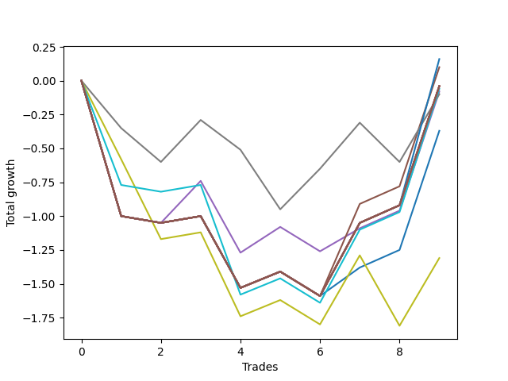

# Long HLT 101 
- Symbol: TSLA_15
- Date Range: 01/10/2024 - 05/17/2024
- Trading Period: 8:30-12:30
- Number of Trades: 9



| Name | Win Percent | Profit | Avg Profit / Trade | Avg Time / Trade |      | Name | Win Percent | Profit | Avg Profit / Trade | Avg Time / Trade |
| ---- | ----------- | ------ | ------------------ | ---------------- | ---- | ---- | ----------- | ------ | ------------------ | ---------------- |
| Sorted By <br> Profit | | | | | | Sorted By <br> Win Percentage ||||
| TP-1 | 55.56 | 80.00 | 8.89 | 13:06 |     | TP-1 | 55.56 | 80.00 | 8.89 | 13:06 |
| BB-50 U/L 1SD | 55.56 | 50.00 | 5.56 | 13:46 |     | BB-50 U/L 1SD | 55.56 | 50.00 | 5.56 | 13:46 |
| NEWFI 000 | 55.56 | -20.00 | -2.22 | 14:00 |     | NEWFI 000 | 55.56 | -20.00 | -2.22 | 14:00 |
| TP-2 | 55.56 | -20.00 | -2.22 | 14:00 |     | TP-2 | 55.56 | -20.00 | -2.22 | 14:00 |
| TP-1.75 | 55.56 | -20.00 | -2.22 | 14:00 |     | TP-1.75 | 55.56 | -20.00 | -2.22 | 14:00 |
| TP-1.5 | 55.56 | -20.00 | -2.22 | 14:00 |     | TP-1.5 | 55.56 | -20.00 | -2.22 | 14:00 |
| TP-1.25 | 55.56 | -20.00 | -2.22 | 14:00 |     | TP-1.25 | 55.56 | -20.00 | -2.22 | 14:00 |
| BB-50 U/L 2SD | 55.56 | -20.00 | -2.22 | 14:00 |     | BB-50 U/L 2SD | 55.56 | -20.00 | -2.22 | 14:00 |
| BB-20 U/L 2SD C | 55.56 | -20.00 | -2.22 | 14:00 |     | BB-20 U/L 2SD C | 55.56 | -20.00 | -2.22 | 14:00 |
| BB-20 U/L 2SD | 55.56 | -20.00 | -2.22 | 14:00 |     | BB-20 U/L 2SD | 55.56 | -20.00 | -2.22 | 14:00 |
| BB-20 U/L 1SD | 55.56 | -20.00 | -2.22 | 14:00 |     | BB-20 U/L 1SD | 55.56 | -20.00 | -2.22 | 14:00 |
| TP-0.75 | 55.56 | -30.00 | -3.33 | 11:33 |     | TP-0.75 | 55.56 | -30.00 | -3.33 | 11:33 |
| BB-50 Mid | 55.56 | -40.00 | -4.44 | 10:00 |     | BB-50 Mid | 55.56 | -40.00 | -4.44 | 10:00 |
| TP-0.25 | 44.44 | -50.00 | -5.56 | 04:00 |     | BB-20 Mid | 55.56 | -185.00 | -20.56 | 12:53 |
| BB-20 Mid | 55.56 | -185.00 | -20.56 | 12:53 |     | TP-0.25 | 44.44 | -50.00 | -5.56 | 04:00 |
| TP-0.5 | 44.44 | -655.00 | -72.78 | 07:46 |     | TP-0.5 | 44.44 | -655.00 | -72.78 | 07:46 |

## NO STOPLOSS

### Test BB-20 Mid
* Sell when price hits the middle line of the 20p bollinger
* No Stoploss
* Results:
```
Total Trades: 9
Percent Up: 55.56
Percent Down: 44.44
Total Points Moved Up: -0.37
Potential Profit: -185.00
Total Points Ups: 1.39 Count Ups: 5
Total Points Downs: -1.76 Count Downs: 4
```

<details><summary>Trades</summary>

<code>In: 2024-01-26 10:30:00		Out: 2024-01-26 10:44:00		Total Position Time: 14:00		Total Move Up: -1.00		Total to Date: -1.00</code> <br />
<code>In: 2024-02-06 09:10:00		Out: 2024-02-06 09:24:00		Total Position Time: 14:00		Total Move Up: -0.05		Total to Date: -1.05</code> <br />
<code>In: 2024-02-08 10:35:00		Out: 2024-02-08 10:49:00		Total Position Time: 14:00		Total Move Up: 0.05		Total to Date: -1.00</code> <br />
<code>In: 2024-02-20 09:35:00		Out: 2024-02-20 09:49:00		Total Position Time: 14:00		Total Move Up: -0.53		Total to Date: -1.53</code> <br />
<code>In: 2024-03-11 08:55:00		Out: 2024-03-11 09:09:00		Total Position Time: 14:00		Total Move Up: 0.12		Total to Date: -1.41</code> <br />
<code>In: 2024-03-13 11:45:00		Out: 2024-03-13 11:59:00		Total Position Time: 14:00		Total Move Up: -0.18		Total to Date: -1.59</code> <br />
<code>In: 2024-03-20 09:45:00		Out: 2024-03-20 09:49:00		Total Position Time: 04:00		Total Move Up: 0.21		Total to Date: -1.38</code> <br />
<code>In: 2024-03-21 11:35:00		Out: 2024-03-21 11:49:00		Total Position Time: 14:00		Total Move Up: 0.13		Total to Date: -1.25</code> <br />
<code>In: 2024-04-30 09:00:00		Out: 2024-04-30 09:14:00		Total Position Time: 14:00		Total Move Up: 0.88		Total to Date: -0.37</code> <br />


</details>

### Test BB-20 U/L 1SD
* Sell when the price hits the upper line of the 20p 1std bollinger
* No Stoploss
* Results:
```
Total Trades: 9
Percent Up: 55.56
Percent Down: 44.44
Total Points Moved Up: -0.04
Potential Profit: -20.00
Total Points Ups: 1.72 Count Ups: 5
Total Points Downs: -1.76 Count Downs: 4
```

<details><summary>Trades</summary>

<code>In: 2024-01-26 10:30:00		Out: 2024-01-26 10:44:00		Total Position Time: 14:00		Total Move Up: -1.00		Total to Date: -1.00</code> <br />
<code>In: 2024-02-06 09:10:00		Out: 2024-02-06 09:24:00		Total Position Time: 14:00		Total Move Up: -0.05		Total to Date: -1.05</code> <br />
<code>In: 2024-02-08 10:35:00		Out: 2024-02-08 10:49:00		Total Position Time: 14:00		Total Move Up: 0.05		Total to Date: -1.00</code> <br />
<code>In: 2024-02-20 09:35:00		Out: 2024-02-20 09:49:00		Total Position Time: 14:00		Total Move Up: -0.53		Total to Date: -1.53</code> <br />
<code>In: 2024-03-11 08:55:00		Out: 2024-03-11 09:09:00		Total Position Time: 14:00		Total Move Up: 0.12		Total to Date: -1.41</code> <br />
<code>In: 2024-03-13 11:45:00		Out: 2024-03-13 11:59:00		Total Position Time: 14:00		Total Move Up: -0.18		Total to Date: -1.59</code> <br />
<code>In: 2024-03-20 09:45:00		Out: 2024-03-20 09:59:00		Total Position Time: 14:00		Total Move Up: 0.54		Total to Date: -1.05</code> <br />
<code>In: 2024-03-21 11:35:00		Out: 2024-03-21 11:49:00		Total Position Time: 14:00		Total Move Up: 0.13		Total to Date: -0.92</code> <br />
<code>In: 2024-04-30 09:00:00		Out: 2024-04-30 09:14:00		Total Position Time: 14:00		Total Move Up: 0.88		Total to Date: -0.04</code> <br />


</details>

### Test BB-20 U/L 2SD
* Sell when the price hits the upper line of the 20p 2std bollinger
* No Stoploss
* Results:
```
Total Trades: 9
Percent Up: 55.56
Percent Down: 44.44
Total Points Moved Up: -0.04
Potential Profit: -20.00
Total Points Ups: 1.72 Count Ups: 5
Total Points Downs: -1.76 Count Downs: 4
```

<details><summary>Trades</summary>

<code>In: 2024-01-26 10:30:00		Out: 2024-01-26 10:44:00		Total Position Time: 14:00		Total Move Up: -1.00		Total to Date: -1.00</code> <br />
<code>In: 2024-02-06 09:10:00		Out: 2024-02-06 09:24:00		Total Position Time: 14:00		Total Move Up: -0.05		Total to Date: -1.05</code> <br />
<code>In: 2024-02-08 10:35:00		Out: 2024-02-08 10:49:00		Total Position Time: 14:00		Total Move Up: 0.05		Total to Date: -1.00</code> <br />
<code>In: 2024-02-20 09:35:00		Out: 2024-02-20 09:49:00		Total Position Time: 14:00		Total Move Up: -0.53		Total to Date: -1.53</code> <br />
<code>In: 2024-03-11 08:55:00		Out: 2024-03-11 09:09:00		Total Position Time: 14:00		Total Move Up: 0.12		Total to Date: -1.41</code> <br />
<code>In: 2024-03-13 11:45:00		Out: 2024-03-13 11:59:00		Total Position Time: 14:00		Total Move Up: -0.18		Total to Date: -1.59</code> <br />
<code>In: 2024-03-20 09:45:00		Out: 2024-03-20 09:59:00		Total Position Time: 14:00		Total Move Up: 0.54		Total to Date: -1.05</code> <br />
<code>In: 2024-03-21 11:35:00		Out: 2024-03-21 11:49:00		Total Position Time: 14:00		Total Move Up: 0.13		Total to Date: -0.92</code> <br />
<code>In: 2024-04-30 09:00:00		Out: 2024-04-30 09:14:00		Total Position Time: 14:00		Total Move Up: 0.88		Total to Date: -0.04</code> <br />


</details>

### Test BB-20 U/L 2SD C
* Sell when the price hits the upper line of the 20p 2std bollinger
* No Stoploss
* Results:
```
Total Trades: 9
Percent Up: 55.56
Percent Down: 44.44
Total Points Moved Up: -0.04
Potential Profit: -20.00
Total Points Ups: 1.72 Count Ups: 5
Total Points Downs: -1.76 Count Downs: 4
```

<details><summary>Trades</summary>

<code>In: 2024-01-26 10:30:00		Out: 2024-01-26 10:44:00		Total Position Time: 14:00		Total Move Up: -1.00		Total to Date: -1.00</code> <br />
<code>In: 2024-02-06 09:10:00		Out: 2024-02-06 09:24:00		Total Position Time: 14:00		Total Move Up: -0.05		Total to Date: -1.05</code> <br />
<code>In: 2024-02-08 10:35:00		Out: 2024-02-08 10:49:00		Total Position Time: 14:00		Total Move Up: 0.05		Total to Date: -1.00</code> <br />
<code>In: 2024-02-20 09:35:00		Out: 2024-02-20 09:49:00		Total Position Time: 14:00		Total Move Up: -0.53		Total to Date: -1.53</code> <br />
<code>In: 2024-03-11 08:55:00		Out: 2024-03-11 09:09:00		Total Position Time: 14:00		Total Move Up: 0.12		Total to Date: -1.41</code> <br />
<code>In: 2024-03-13 11:45:00		Out: 2024-03-13 11:59:00		Total Position Time: 14:00		Total Move Up: -0.18		Total to Date: -1.59</code> <br />
<code>In: 2024-03-20 09:45:00		Out: 2024-03-20 09:59:00		Total Position Time: 14:00		Total Move Up: 0.54		Total to Date: -1.05</code> <br />
<code>In: 2024-03-21 11:35:00		Out: 2024-03-21 11:49:00		Total Position Time: 14:00		Total Move Up: 0.13		Total to Date: -0.92</code> <br />
<code>In: 2024-04-30 09:00:00		Out: 2024-04-30 09:14:00		Total Position Time: 14:00		Total Move Up: 0.88		Total to Date: -0.04</code> <br />


</details>

### Test BB-50 Mid
* Sell when price hits the middle line of the 50p bollinger
* No Stoploss
* Results:
```
Total Trades: 9
Percent Up: 55.56
Percent Down: 44.44
Total Points Moved Up: -0.08
Potential Profit: -40.00
Total Points Ups: 1.68 Count Ups: 5
Total Points Downs: -1.76 Count Downs: 4
```

<details><summary>Trades</summary>

<code>In: 2024-01-26 10:30:00		Out: 2024-01-26 10:44:00		Total Position Time: 14:00		Total Move Up: -1.00		Total to Date: -1.00</code> <br />
<code>In: 2024-02-06 09:10:00		Out: 2024-02-06 09:24:00		Total Position Time: 14:00		Total Move Up: -0.05		Total to Date: -1.05</code> <br />
<code>In: 2024-02-08 10:35:00		Out: 2024-02-08 10:37:00		Total Position Time: 02:00		Total Move Up: 0.31		Total to Date: -0.74</code> <br />
<code>In: 2024-02-20 09:35:00		Out: 2024-02-20 09:49:00		Total Position Time: 14:00		Total Move Up: -0.53		Total to Date: -1.27</code> <br />
<code>In: 2024-03-11 08:55:00		Out: 2024-03-11 08:57:00		Total Position Time: 02:00		Total Move Up: 0.19		Total to Date: -1.08</code> <br />
<code>In: 2024-03-13 11:45:00		Out: 2024-03-13 11:59:00		Total Position Time: 14:00		Total Move Up: -0.18		Total to Date: -1.26</code> <br />
<code>In: 2024-03-20 09:45:00		Out: 2024-03-20 09:47:00		Total Position Time: 02:00		Total Move Up: 0.17		Total to Date: -1.09</code> <br />
<code>In: 2024-03-21 11:35:00		Out: 2024-03-21 11:49:00		Total Position Time: 14:00		Total Move Up: 0.13		Total to Date: -0.96</code> <br />
<code>In: 2024-04-30 09:00:00		Out: 2024-04-30 09:14:00		Total Position Time: 14:00		Total Move Up: 0.88		Total to Date: -0.08</code> <br />


</details>

### Test BB-50 U/L 1SD
* Sell when the price hits the upper line of the 50p 1std bollinger
* No Stoploss
* Results:
```
Total Trades: 9
Percent Up: 55.56
Percent Down: 44.44
Total Points Moved Up: 0.10
Potential Profit: 50.00
Total Points Ups: 1.86 Count Ups: 5
Total Points Downs: -1.76 Count Downs: 4
```

<details><summary>Trades</summary>

<code>In: 2024-01-26 10:30:00		Out: 2024-01-26 10:44:00		Total Position Time: 14:00		Total Move Up: -1.00		Total to Date: -1.00</code> <br />
<code>In: 2024-02-06 09:10:00		Out: 2024-02-06 09:24:00		Total Position Time: 14:00		Total Move Up: -0.05		Total to Date: -1.05</code> <br />
<code>In: 2024-02-08 10:35:00		Out: 2024-02-08 10:49:00		Total Position Time: 14:00		Total Move Up: 0.05		Total to Date: -1.00</code> <br />
<code>In: 2024-02-20 09:35:00		Out: 2024-02-20 09:49:00		Total Position Time: 14:00		Total Move Up: -0.53		Total to Date: -1.53</code> <br />
<code>In: 2024-03-11 08:55:00		Out: 2024-03-11 09:09:00		Total Position Time: 14:00		Total Move Up: 0.12		Total to Date: -1.41</code> <br />
<code>In: 2024-03-13 11:45:00		Out: 2024-03-13 11:59:00		Total Position Time: 14:00		Total Move Up: -0.18		Total to Date: -1.59</code> <br />
<code>In: 2024-03-20 09:45:00		Out: 2024-03-20 09:57:00		Total Position Time: 12:00		Total Move Up: 0.68		Total to Date: -0.91</code> <br />
<code>In: 2024-03-21 11:35:00		Out: 2024-03-21 11:49:00		Total Position Time: 14:00		Total Move Up: 0.13		Total to Date: -0.78</code> <br />
<code>In: 2024-04-30 09:00:00		Out: 2024-04-30 09:14:00		Total Position Time: 14:00		Total Move Up: 0.88		Total to Date: 0.10</code> <br />


</details>

### Test BB-50 U/L 2SD
* Sell when the price hits the upper line of the 50p 2std bollinger
* No Stoploss
* Results:
```
Total Trades: 9
Percent Up: 55.56
Percent Down: 44.44
Total Points Moved Up: -0.04
Potential Profit: -20.00
Total Points Ups: 1.72 Count Ups: 5
Total Points Downs: -1.76 Count Downs: 4
```

<details><summary>Trades</summary>

<code>In: 2024-01-26 10:30:00		Out: 2024-01-26 10:44:00		Total Position Time: 14:00		Total Move Up: -1.00		Total to Date: -1.00</code> <br />
<code>In: 2024-02-06 09:10:00		Out: 2024-02-06 09:24:00		Total Position Time: 14:00		Total Move Up: -0.05		Total to Date: -1.05</code> <br />
<code>In: 2024-02-08 10:35:00		Out: 2024-02-08 10:49:00		Total Position Time: 14:00		Total Move Up: 0.05		Total to Date: -1.00</code> <br />
<code>In: 2024-02-20 09:35:00		Out: 2024-02-20 09:49:00		Total Position Time: 14:00		Total Move Up: -0.53		Total to Date: -1.53</code> <br />
<code>In: 2024-03-11 08:55:00		Out: 2024-03-11 09:09:00		Total Position Time: 14:00		Total Move Up: 0.12		Total to Date: -1.41</code> <br />
<code>In: 2024-03-13 11:45:00		Out: 2024-03-13 11:59:00		Total Position Time: 14:00		Total Move Up: -0.18		Total to Date: -1.59</code> <br />
<code>In: 2024-03-20 09:45:00		Out: 2024-03-20 09:59:00		Total Position Time: 14:00		Total Move Up: 0.54		Total to Date: -1.05</code> <br />
<code>In: 2024-03-21 11:35:00		Out: 2024-03-21 11:49:00		Total Position Time: 14:00		Total Move Up: 0.13		Total to Date: -0.92</code> <br />
<code>In: 2024-04-30 09:00:00		Out: 2024-04-30 09:14:00		Total Position Time: 14:00		Total Move Up: 0.88		Total to Date: -0.04</code> <br />


</details>

## TAKE PROFIT

### Test TP-0.25
* Take Profit of 0.25 Point
* 0.25 Stoploss
* Results:
```
Total Trades: 9
Percent Up: 44.44
Percent Down: 55.56
Total Points Moved Up: -0.10
Potential Profit: -50.00
Total Points Ups: 1.45 Count Ups: 4
Total Points Downs: -1.55 Count Downs: 5
```

<details><summary>Trades</summary>

<code>In: 2024-01-26 10:30:00		Out: 2024-01-26 10:33:00		Total Position Time: 03:00		Total Move Up: -0.35		Total to Date: -0.35</code> <br />
<code>In: 2024-02-06 09:10:00		Out: 2024-02-06 09:12:00		Total Position Time: 02:00		Total Move Up: -0.25		Total to Date: -0.60</code> <br />
<code>In: 2024-02-08 10:35:00		Out: 2024-02-08 10:37:00		Total Position Time: 02:00		Total Move Up: 0.31		Total to Date: -0.29</code> <br />
<code>In: 2024-02-20 09:35:00		Out: 2024-02-20 09:37:00		Total Position Time: 02:00		Total Move Up: -0.22		Total to Date: -0.51</code> <br />
<code>In: 2024-03-11 08:55:00		Out: 2024-03-11 09:02:00		Total Position Time: 07:00		Total Move Up: -0.44		Total to Date: -0.95</code> <br />
<code>In: 2024-03-13 11:45:00		Out: 2024-03-13 11:53:00		Total Position Time: 08:00		Total Move Up: 0.30		Total to Date: -0.65</code> <br />
<code>In: 2024-03-20 09:45:00		Out: 2024-03-20 09:51:00		Total Position Time: 06:00		Total Move Up: 0.34		Total to Date: -0.31</code> <br />
<code>In: 2024-03-21 11:35:00		Out: 2024-03-21 11:38:00		Total Position Time: 03:00		Total Move Up: -0.29		Total to Date: -0.60</code> <br />
<code>In: 2024-04-30 09:00:00		Out: 2024-04-30 09:03:00		Total Position Time: 03:00		Total Move Up: 0.50		Total to Date: -0.10</code> <br />


</details>

### Test TP-0.5
* Take Profit of 0.5 Point
* 0.5 Stoploss
* Results:
```
Total Trades: 9
Percent Up: 44.44
Percent Down: 55.56
Total Points Moved Up: -1.31
Potential Profit: -655.00
Total Points Ups: 1.18 Count Ups: 4
Total Points Downs: -2.49 Count Downs: 5
```

<details><summary>Trades</summary>

<code>In: 2024-01-26 10:30:00		Out: 2024-01-26 10:36:00		Total Position Time: 06:00		Total Move Up: -0.58		Total to Date: -0.58</code> <br />
<code>In: 2024-02-06 09:10:00		Out: 2024-02-06 09:13:00		Total Position Time: 03:00		Total Move Up: -0.59		Total to Date: -1.17</code> <br />
<code>In: 2024-02-08 10:35:00		Out: 2024-02-08 10:49:00		Total Position Time: 14:00		Total Move Up: 0.05		Total to Date: -1.12</code> <br />
<code>In: 2024-02-20 09:35:00		Out: 2024-02-20 09:38:00		Total Position Time: 03:00		Total Move Up: -0.62		Total to Date: -1.74</code> <br />
<code>In: 2024-03-11 08:55:00		Out: 2024-03-11 09:09:00		Total Position Time: 14:00		Total Move Up: 0.12		Total to Date: -1.62</code> <br />
<code>In: 2024-03-13 11:45:00		Out: 2024-03-13 11:59:00		Total Position Time: 14:00		Total Move Up: -0.18		Total to Date: -1.80</code> <br />
<code>In: 2024-03-20 09:45:00		Out: 2024-03-20 09:54:00		Total Position Time: 09:00		Total Move Up: 0.51		Total to Date: -1.29</code> <br />
<code>In: 2024-03-21 11:35:00		Out: 2024-03-21 11:39:00		Total Position Time: 04:00		Total Move Up: -0.52		Total to Date: -1.81</code> <br />
<code>In: 2024-04-30 09:00:00		Out: 2024-04-30 09:03:00		Total Position Time: 03:00		Total Move Up: 0.50		Total to Date: -1.31</code> <br />


</details>

### Test TP-0.75
* Take Profit of 0.75 Point
* 0.75 Stoploss
* Results:
```
Total Trades: 9
Percent Up: 55.56
Percent Down: 44.44
Total Points Moved Up: -0.06
Potential Profit: -30.00
Total Points Ups: 1.75 Count Ups: 5
Total Points Downs: -1.81 Count Downs: 4
```

<details><summary>Trades</summary>

<code>In: 2024-01-26 10:30:00		Out: 2024-01-26 10:41:00		Total Position Time: 11:00		Total Move Up: -0.77		Total to Date: -0.77</code> <br />
<code>In: 2024-02-06 09:10:00		Out: 2024-02-06 09:24:00		Total Position Time: 14:00		Total Move Up: -0.05		Total to Date: -0.82</code> <br />
<code>In: 2024-02-08 10:35:00		Out: 2024-02-08 10:49:00		Total Position Time: 14:00		Total Move Up: 0.05		Total to Date: -0.77</code> <br />
<code>In: 2024-02-20 09:35:00		Out: 2024-02-20 09:39:00		Total Position Time: 04:00		Total Move Up: -0.81		Total to Date: -1.58</code> <br />
<code>In: 2024-03-11 08:55:00		Out: 2024-03-11 09:09:00		Total Position Time: 14:00		Total Move Up: 0.12		Total to Date: -1.46</code> <br />
<code>In: 2024-03-13 11:45:00		Out: 2024-03-13 11:59:00		Total Position Time: 14:00		Total Move Up: -0.18		Total to Date: -1.64</code> <br />
<code>In: 2024-03-20 09:45:00		Out: 2024-03-20 09:59:00		Total Position Time: 14:00		Total Move Up: 0.54		Total to Date: -1.10</code> <br />
<code>In: 2024-03-21 11:35:00		Out: 2024-03-21 11:49:00		Total Position Time: 14:00		Total Move Up: 0.13		Total to Date: -0.97</code> <br />
<code>In: 2024-04-30 09:00:00		Out: 2024-04-30 09:05:00		Total Position Time: 05:00		Total Move Up: 0.91		Total to Date: -0.06</code> <br />


</details>

### Test TP-1
* Take Profit of 1 Point
* 1 Stoploss
* Results:
```
Total Trades: 9
Percent Up: 55.56
Percent Down: 44.44
Total Points Moved Up: 0.16
Potential Profit: 80.00
Total Points Ups: 1.92 Count Ups: 5
Total Points Downs: -1.76 Count Downs: 4
```

<details><summary>Trades</summary>

<code>In: 2024-01-26 10:30:00		Out: 2024-01-26 10:44:00		Total Position Time: 14:00		Total Move Up: -1.00		Total to Date: -1.00</code> <br />
<code>In: 2024-02-06 09:10:00		Out: 2024-02-06 09:24:00		Total Position Time: 14:00		Total Move Up: -0.05		Total to Date: -1.05</code> <br />
<code>In: 2024-02-08 10:35:00		Out: 2024-02-08 10:49:00		Total Position Time: 14:00		Total Move Up: 0.05		Total to Date: -1.00</code> <br />
<code>In: 2024-02-20 09:35:00		Out: 2024-02-20 09:49:00		Total Position Time: 14:00		Total Move Up: -0.53		Total to Date: -1.53</code> <br />
<code>In: 2024-03-11 08:55:00		Out: 2024-03-11 09:09:00		Total Position Time: 14:00		Total Move Up: 0.12		Total to Date: -1.41</code> <br />
<code>In: 2024-03-13 11:45:00		Out: 2024-03-13 11:59:00		Total Position Time: 14:00		Total Move Up: -0.18		Total to Date: -1.59</code> <br />
<code>In: 2024-03-20 09:45:00		Out: 2024-03-20 09:59:00		Total Position Time: 14:00		Total Move Up: 0.54		Total to Date: -1.05</code> <br />
<code>In: 2024-03-21 11:35:00		Out: 2024-03-21 11:49:00		Total Position Time: 14:00		Total Move Up: 0.13		Total to Date: -0.92</code> <br />
<code>In: 2024-04-30 09:00:00		Out: 2024-04-30 09:06:00		Total Position Time: 06:00		Total Move Up: 1.08		Total to Date: 0.16</code> <br />


</details>

### Test TP-1.25
* Take Profit of 1.25 Point
* 1.25 Stoploss
* Results:
```
Total Trades: 9
Percent Up: 55.56
Percent Down: 44.44
Total Points Moved Up: -0.04
Potential Profit: -20.00
Total Points Ups: 1.72 Count Ups: 5
Total Points Downs: -1.76 Count Downs: 4
```

<details><summary>Trades</summary>

<code>In: 2024-01-26 10:30:00		Out: 2024-01-26 10:44:00		Total Position Time: 14:00		Total Move Up: -1.00		Total to Date: -1.00</code> <br />
<code>In: 2024-02-06 09:10:00		Out: 2024-02-06 09:24:00		Total Position Time: 14:00		Total Move Up: -0.05		Total to Date: -1.05</code> <br />
<code>In: 2024-02-08 10:35:00		Out: 2024-02-08 10:49:00		Total Position Time: 14:00		Total Move Up: 0.05		Total to Date: -1.00</code> <br />
<code>In: 2024-02-20 09:35:00		Out: 2024-02-20 09:49:00		Total Position Time: 14:00		Total Move Up: -0.53		Total to Date: -1.53</code> <br />
<code>In: 2024-03-11 08:55:00		Out: 2024-03-11 09:09:00		Total Position Time: 14:00		Total Move Up: 0.12		Total to Date: -1.41</code> <br />
<code>In: 2024-03-13 11:45:00		Out: 2024-03-13 11:59:00		Total Position Time: 14:00		Total Move Up: -0.18		Total to Date: -1.59</code> <br />
<code>In: 2024-03-20 09:45:00		Out: 2024-03-20 09:59:00		Total Position Time: 14:00		Total Move Up: 0.54		Total to Date: -1.05</code> <br />
<code>In: 2024-03-21 11:35:00		Out: 2024-03-21 11:49:00		Total Position Time: 14:00		Total Move Up: 0.13		Total to Date: -0.92</code> <br />
<code>In: 2024-04-30 09:00:00		Out: 2024-04-30 09:14:00		Total Position Time: 14:00		Total Move Up: 0.88		Total to Date: -0.04</code> <br />


</details>

### Test TP-1.5
* Take Profit of 1.5 Point
* 1.5 Stoploss
* Results:
```
Total Trades: 9
Percent Up: 55.56
Percent Down: 44.44
Total Points Moved Up: -0.04
Potential Profit: -20.00
Total Points Ups: 1.72 Count Ups: 5
Total Points Downs: -1.76 Count Downs: 4
```

<details><summary>Trades</summary>

<code>In: 2024-01-26 10:30:00		Out: 2024-01-26 10:44:00		Total Position Time: 14:00		Total Move Up: -1.00		Total to Date: -1.00</code> <br />
<code>In: 2024-02-06 09:10:00		Out: 2024-02-06 09:24:00		Total Position Time: 14:00		Total Move Up: -0.05		Total to Date: -1.05</code> <br />
<code>In: 2024-02-08 10:35:00		Out: 2024-02-08 10:49:00		Total Position Time: 14:00		Total Move Up: 0.05		Total to Date: -1.00</code> <br />
<code>In: 2024-02-20 09:35:00		Out: 2024-02-20 09:49:00		Total Position Time: 14:00		Total Move Up: -0.53		Total to Date: -1.53</code> <br />
<code>In: 2024-03-11 08:55:00		Out: 2024-03-11 09:09:00		Total Position Time: 14:00		Total Move Up: 0.12		Total to Date: -1.41</code> <br />
<code>In: 2024-03-13 11:45:00		Out: 2024-03-13 11:59:00		Total Position Time: 14:00		Total Move Up: -0.18		Total to Date: -1.59</code> <br />
<code>In: 2024-03-20 09:45:00		Out: 2024-03-20 09:59:00		Total Position Time: 14:00		Total Move Up: 0.54		Total to Date: -1.05</code> <br />
<code>In: 2024-03-21 11:35:00		Out: 2024-03-21 11:49:00		Total Position Time: 14:00		Total Move Up: 0.13		Total to Date: -0.92</code> <br />
<code>In: 2024-04-30 09:00:00		Out: 2024-04-30 09:14:00		Total Position Time: 14:00		Total Move Up: 0.88		Total to Date: -0.04</code> <br />


</details>

### Test TP-1.75
* Take Profit of 1.75 Point
* 1.75 Stoploss
* Results:
```
Total Trades: 9
Percent Up: 55.56
Percent Down: 44.44
Total Points Moved Up: -0.04
Potential Profit: -20.00
Total Points Ups: 1.72 Count Ups: 5
Total Points Downs: -1.76 Count Downs: 4
```

<details><summary>Trades</summary>

<code>In: 2024-01-26 10:30:00		Out: 2024-01-26 10:44:00		Total Position Time: 14:00		Total Move Up: -1.00		Total to Date: -1.00</code> <br />
<code>In: 2024-02-06 09:10:00		Out: 2024-02-06 09:24:00		Total Position Time: 14:00		Total Move Up: -0.05		Total to Date: -1.05</code> <br />
<code>In: 2024-02-08 10:35:00		Out: 2024-02-08 10:49:00		Total Position Time: 14:00		Total Move Up: 0.05		Total to Date: -1.00</code> <br />
<code>In: 2024-02-20 09:35:00		Out: 2024-02-20 09:49:00		Total Position Time: 14:00		Total Move Up: -0.53		Total to Date: -1.53</code> <br />
<code>In: 2024-03-11 08:55:00		Out: 2024-03-11 09:09:00		Total Position Time: 14:00		Total Move Up: 0.12		Total to Date: -1.41</code> <br />
<code>In: 2024-03-13 11:45:00		Out: 2024-03-13 11:59:00		Total Position Time: 14:00		Total Move Up: -0.18		Total to Date: -1.59</code> <br />
<code>In: 2024-03-20 09:45:00		Out: 2024-03-20 09:59:00		Total Position Time: 14:00		Total Move Up: 0.54		Total to Date: -1.05</code> <br />
<code>In: 2024-03-21 11:35:00		Out: 2024-03-21 11:49:00		Total Position Time: 14:00		Total Move Up: 0.13		Total to Date: -0.92</code> <br />
<code>In: 2024-04-30 09:00:00		Out: 2024-04-30 09:14:00		Total Position Time: 14:00		Total Move Up: 0.88		Total to Date: -0.04</code> <br />


</details>

### Test TP-2
* Take Profit of 2 Point
* 2 Stoploss
* Results:
```
Total Trades: 9
Percent Up: 55.56
Percent Down: 44.44
Total Points Moved Up: -0.04
Potential Profit: -20.00
Total Points Ups: 1.72 Count Ups: 5
Total Points Downs: -1.76 Count Downs: 4
```

<details><summary>Trades</summary>

<code>In: 2024-01-26 10:30:00		Out: 2024-01-26 10:44:00		Total Position Time: 14:00		Total Move Up: -1.00		Total to Date: -1.00</code> <br />
<code>In: 2024-02-06 09:10:00		Out: 2024-02-06 09:24:00		Total Position Time: 14:00		Total Move Up: -0.05		Total to Date: -1.05</code> <br />
<code>In: 2024-02-08 10:35:00		Out: 2024-02-08 10:49:00		Total Position Time: 14:00		Total Move Up: 0.05		Total to Date: -1.00</code> <br />
<code>In: 2024-02-20 09:35:00		Out: 2024-02-20 09:49:00		Total Position Time: 14:00		Total Move Up: -0.53		Total to Date: -1.53</code> <br />
<code>In: 2024-03-11 08:55:00		Out: 2024-03-11 09:09:00		Total Position Time: 14:00		Total Move Up: 0.12		Total to Date: -1.41</code> <br />
<code>In: 2024-03-13 11:45:00		Out: 2024-03-13 11:59:00		Total Position Time: 14:00		Total Move Up: -0.18		Total to Date: -1.59</code> <br />
<code>In: 2024-03-20 09:45:00		Out: 2024-03-20 09:59:00		Total Position Time: 14:00		Total Move Up: 0.54		Total to Date: -1.05</code> <br />
<code>In: 2024-03-21 11:35:00		Out: 2024-03-21 11:49:00		Total Position Time: 14:00		Total Move Up: 0.13		Total to Date: -0.92</code> <br />
<code>In: 2024-04-30 09:00:00		Out: 2024-04-30 09:14:00		Total Position Time: 14:00		Total Move Up: 0.88		Total to Date: -0.04</code> <br />


</details>

## Indicator Exits

### Test NEWFI 000
* Newfi 0000
* No Stoploss
* Results:
```
Total Trades: 9
Percent Up: 55.56
Percent Down: 44.44
Total Points Moved Up: -0.04
Potential Profit: -20.00
Total Points Ups: 1.72 Count Ups: 5
Total Points Downs: -1.76 Count Downs: 4
```

<details><summary>Trades</summary>

<code>In: 2024-01-26 10:30:00		Out: 2024-01-26 10:44:00		Total Position Time: 14:00		Total Move Up: -1.00		Total to Date: -1.00</code> <br />
<code>In: 2024-02-06 09:10:00		Out: 2024-02-06 09:24:00		Total Position Time: 14:00		Total Move Up: -0.05		Total to Date: -1.05</code> <br />
<code>In: 2024-02-08 10:35:00		Out: 2024-02-08 10:49:00		Total Position Time: 14:00		Total Move Up: 0.05		Total to Date: -1.00</code> <br />
<code>In: 2024-02-20 09:35:00		Out: 2024-02-20 09:49:00		Total Position Time: 14:00		Total Move Up: -0.53		Total to Date: -1.53</code> <br />
<code>In: 2024-03-11 08:55:00		Out: 2024-03-11 09:09:00		Total Position Time: 14:00		Total Move Up: 0.12		Total to Date: -1.41</code> <br />
<code>In: 2024-03-13 11:45:00		Out: 2024-03-13 11:59:00		Total Position Time: 14:00		Total Move Up: -0.18		Total to Date: -1.59</code> <br />
<code>In: 2024-03-20 09:45:00		Out: 2024-03-20 09:59:00		Total Position Time: 14:00		Total Move Up: 0.54		Total to Date: -1.05</code> <br />
<code>In: 2024-03-21 11:35:00		Out: 2024-03-21 11:49:00		Total Position Time: 14:00		Total Move Up: 0.13		Total to Date: -0.92</code> <br />
<code>In: 2024-04-30 09:00:00		Out: 2024-04-30 09:14:00		Total Position Time: 14:00		Total Move Up: 0.88		Total to Date: -0.04</code> <br />


</details>