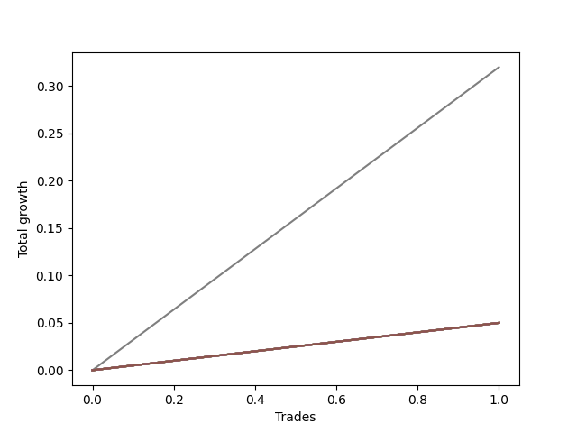

# Long HLT 103 
- Symbol: TSLA_15
- Date Range: 01/10/2024 - 05/17/2024
- Trading Period: 8:30-12:30
- Number of Trades: 1



| Name | Win Percent | Profit | Avg Profit / Trade | Avg Time / Trade |      | Name | Win Percent | Profit | Avg Profit / Trade | Avg Time / Trade |
| ---- | ----------- | ------ | ------------------ | ---------------- | ---- | ---- | ----------- | ------ | ------------------ | ---------------- |
| Sorted By <br> Profit | | | | | | Sorted By <br> Win Percentage ||||
| TP-0.25 | 100.00 | 160.00 | 160.00 | 09:00 |     | TP-0.25 | 100.00 | 160.00 | 160.00 | 09:00 |
| NEWFI 000 | 100.00 | 25.00 | 25.00 | 14:00 |     | NEWFI 000 | 100.00 | 25.00 | 25.00 | 14:00 |
| TP-2 | 100.00 | 25.00 | 25.00 | 14:00 |     | TP-2 | 100.00 | 25.00 | 25.00 | 14:00 |
| TP-1.75 | 100.00 | 25.00 | 25.00 | 14:00 |     | TP-1.75 | 100.00 | 25.00 | 25.00 | 14:00 |
| TP-1.5 | 100.00 | 25.00 | 25.00 | 14:00 |     | TP-1.5 | 100.00 | 25.00 | 25.00 | 14:00 |
| TP-1.25 | 100.00 | 25.00 | 25.00 | 14:00 |     | TP-1.25 | 100.00 | 25.00 | 25.00 | 14:00 |
| TP-1 | 100.00 | 25.00 | 25.00 | 14:00 |     | TP-1 | 100.00 | 25.00 | 25.00 | 14:00 |
| TP-0.75 | 100.00 | 25.00 | 25.00 | 14:00 |     | TP-0.75 | 100.00 | 25.00 | 25.00 | 14:00 |
| TP-0.5 | 100.00 | 25.00 | 25.00 | 14:00 |     | TP-0.5 | 100.00 | 25.00 | 25.00 | 14:00 |
| BB-50 U/L 2SD | 100.00 | 25.00 | 25.00 | 14:00 |     | BB-50 U/L 2SD | 100.00 | 25.00 | 25.00 | 14:00 |
| BB-50 U/L 1SD | 100.00 | 25.00 | 25.00 | 14:00 |     | BB-50 U/L 1SD | 100.00 | 25.00 | 25.00 | 14:00 |
| BB-50 Mid | 100.00 | 25.00 | 25.00 | 14:00 |     | BB-50 Mid | 100.00 | 25.00 | 25.00 | 14:00 |
| BB-20 U/L 2SD C | 100.00 | 25.00 | 25.00 | 14:00 |     | BB-20 U/L 2SD C | 100.00 | 25.00 | 25.00 | 14:00 |
| BB-20 U/L 2SD | 100.00 | 25.00 | 25.00 | 14:00 |     | BB-20 U/L 2SD | 100.00 | 25.00 | 25.00 | 14:00 |
| BB-20 U/L 1SD | 100.00 | 25.00 | 25.00 | 14:00 |     | BB-20 U/L 1SD | 100.00 | 25.00 | 25.00 | 14:00 |
| BB-20 Mid | 100.00 | 25.00 | 25.00 | 14:00 |     | BB-20 Mid | 100.00 | 25.00 | 25.00 | 14:00 |

## NO STOPLOSS

### Test BB-20 Mid
* Sell when price hits the middle line of the 20p bollinger
* No Stoploss
* Results:
```
Total Trades: 1
Percent Up: 100.00
Percent Down: 0.00
Total Points Moved Up: 0.05
Potential Profit: 25.00
Total Points Ups: 0.05 Count Ups: 1
Total Points Downs: 0.00 Count Downs: 0
```

<details><summary>Trades</summary>

<code>In: 2024-02-23 11:30:00		Out: 2024-02-23 11:44:00		Total Position Time: 14:00		Total Move Up: 0.05		Total to Date: 0.05</code> <br />


</details>

### Test BB-20 U/L 1SD
* Sell when the price hits the upper line of the 20p 1std bollinger
* No Stoploss
* Results:
```
Total Trades: 1
Percent Up: 100.00
Percent Down: 0.00
Total Points Moved Up: 0.05
Potential Profit: 25.00
Total Points Ups: 0.05 Count Ups: 1
Total Points Downs: 0.00 Count Downs: 0
```

<details><summary>Trades</summary>

<code>In: 2024-02-23 11:30:00		Out: 2024-02-23 11:44:00		Total Position Time: 14:00		Total Move Up: 0.05		Total to Date: 0.05</code> <br />


</details>

### Test BB-20 U/L 2SD
* Sell when the price hits the upper line of the 20p 2std bollinger
* No Stoploss
* Results:
```
Total Trades: 1
Percent Up: 100.00
Percent Down: 0.00
Total Points Moved Up: 0.05
Potential Profit: 25.00
Total Points Ups: 0.05 Count Ups: 1
Total Points Downs: 0.00 Count Downs: 0
```

<details><summary>Trades</summary>

<code>In: 2024-02-23 11:30:00		Out: 2024-02-23 11:44:00		Total Position Time: 14:00		Total Move Up: 0.05		Total to Date: 0.05</code> <br />


</details>

### Test BB-20 U/L 2SD C
* Sell when the price hits the upper line of the 20p 2std bollinger
* No Stoploss
* Results:
```
Total Trades: 1
Percent Up: 100.00
Percent Down: 0.00
Total Points Moved Up: 0.05
Potential Profit: 25.00
Total Points Ups: 0.05 Count Ups: 1
Total Points Downs: 0.00 Count Downs: 0
```

<details><summary>Trades</summary>

<code>In: 2024-02-23 11:30:00		Out: 2024-02-23 11:44:00		Total Position Time: 14:00		Total Move Up: 0.05		Total to Date: 0.05</code> <br />


</details>

### Test BB-50 Mid
* Sell when price hits the middle line of the 50p bollinger
* No Stoploss
* Results:
```
Total Trades: 1
Percent Up: 100.00
Percent Down: 0.00
Total Points Moved Up: 0.05
Potential Profit: 25.00
Total Points Ups: 0.05 Count Ups: 1
Total Points Downs: 0.00 Count Downs: 0
```

<details><summary>Trades</summary>

<code>In: 2024-02-23 11:30:00		Out: 2024-02-23 11:44:00		Total Position Time: 14:00		Total Move Up: 0.05		Total to Date: 0.05</code> <br />


</details>

### Test BB-50 U/L 1SD
* Sell when the price hits the upper line of the 50p 1std bollinger
* No Stoploss
* Results:
```
Total Trades: 1
Percent Up: 100.00
Percent Down: 0.00
Total Points Moved Up: 0.05
Potential Profit: 25.00
Total Points Ups: 0.05 Count Ups: 1
Total Points Downs: 0.00 Count Downs: 0
```

<details><summary>Trades</summary>

<code>In: 2024-02-23 11:30:00		Out: 2024-02-23 11:44:00		Total Position Time: 14:00		Total Move Up: 0.05		Total to Date: 0.05</code> <br />


</details>

### Test BB-50 U/L 2SD
* Sell when the price hits the upper line of the 50p 2std bollinger
* No Stoploss
* Results:
```
Total Trades: 1
Percent Up: 100.00
Percent Down: 0.00
Total Points Moved Up: 0.05
Potential Profit: 25.00
Total Points Ups: 0.05 Count Ups: 1
Total Points Downs: 0.00 Count Downs: 0
```

<details><summary>Trades</summary>

<code>In: 2024-02-23 11:30:00		Out: 2024-02-23 11:44:00		Total Position Time: 14:00		Total Move Up: 0.05		Total to Date: 0.05</code> <br />


</details>

## TAKE PROFIT

### Test TP-0.25
* Take Profit of 0.25 Point
* 0.25 Stoploss
* Results:
```
Total Trades: 1
Percent Up: 100.00
Percent Down: 0.00
Total Points Moved Up: 0.32
Potential Profit: 160.00
Total Points Ups: 0.32 Count Ups: 1
Total Points Downs: 0.00 Count Downs: 0
```

<details><summary>Trades</summary>

<code>In: 2024-02-23 11:30:00		Out: 2024-02-23 11:39:00		Total Position Time: 09:00		Total Move Up: 0.32		Total to Date: 0.32</code> <br />


</details>

### Test TP-0.5
* Take Profit of 0.5 Point
* 0.5 Stoploss
* Results:
```
Total Trades: 1
Percent Up: 100.00
Percent Down: 0.00
Total Points Moved Up: 0.05
Potential Profit: 25.00
Total Points Ups: 0.05 Count Ups: 1
Total Points Downs: 0.00 Count Downs: 0
```

<details><summary>Trades</summary>

<code>In: 2024-02-23 11:30:00		Out: 2024-02-23 11:44:00		Total Position Time: 14:00		Total Move Up: 0.05		Total to Date: 0.05</code> <br />


</details>

### Test TP-0.75
* Take Profit of 0.75 Point
* 0.75 Stoploss
* Results:
```
Total Trades: 1
Percent Up: 100.00
Percent Down: 0.00
Total Points Moved Up: 0.05
Potential Profit: 25.00
Total Points Ups: 0.05 Count Ups: 1
Total Points Downs: 0.00 Count Downs: 0
```

<details><summary>Trades</summary>

<code>In: 2024-02-23 11:30:00		Out: 2024-02-23 11:44:00		Total Position Time: 14:00		Total Move Up: 0.05		Total to Date: 0.05</code> <br />


</details>

### Test TP-1
* Take Profit of 1 Point
* 1 Stoploss
* Results:
```
Total Trades: 1
Percent Up: 100.00
Percent Down: 0.00
Total Points Moved Up: 0.05
Potential Profit: 25.00
Total Points Ups: 0.05 Count Ups: 1
Total Points Downs: 0.00 Count Downs: 0
```

<details><summary>Trades</summary>

<code>In: 2024-02-23 11:30:00		Out: 2024-02-23 11:44:00		Total Position Time: 14:00		Total Move Up: 0.05		Total to Date: 0.05</code> <br />


</details>

### Test TP-1.25
* Take Profit of 1.25 Point
* 1.25 Stoploss
* Results:
```
Total Trades: 1
Percent Up: 100.00
Percent Down: 0.00
Total Points Moved Up: 0.05
Potential Profit: 25.00
Total Points Ups: 0.05 Count Ups: 1
Total Points Downs: 0.00 Count Downs: 0
```

<details><summary>Trades</summary>

<code>In: 2024-02-23 11:30:00		Out: 2024-02-23 11:44:00		Total Position Time: 14:00		Total Move Up: 0.05		Total to Date: 0.05</code> <br />


</details>

### Test TP-1.5
* Take Profit of 1.5 Point
* 1.5 Stoploss
* Results:
```
Total Trades: 1
Percent Up: 100.00
Percent Down: 0.00
Total Points Moved Up: 0.05
Potential Profit: 25.00
Total Points Ups: 0.05 Count Ups: 1
Total Points Downs: 0.00 Count Downs: 0
```

<details><summary>Trades</summary>

<code>In: 2024-02-23 11:30:00		Out: 2024-02-23 11:44:00		Total Position Time: 14:00		Total Move Up: 0.05		Total to Date: 0.05</code> <br />


</details>

### Test TP-1.75
* Take Profit of 1.75 Point
* 1.75 Stoploss
* Results:
```
Total Trades: 1
Percent Up: 100.00
Percent Down: 0.00
Total Points Moved Up: 0.05
Potential Profit: 25.00
Total Points Ups: 0.05 Count Ups: 1
Total Points Downs: 0.00 Count Downs: 0
```

<details><summary>Trades</summary>

<code>In: 2024-02-23 11:30:00		Out: 2024-02-23 11:44:00		Total Position Time: 14:00		Total Move Up: 0.05		Total to Date: 0.05</code> <br />


</details>

### Test TP-2
* Take Profit of 2 Point
* 2 Stoploss
* Results:
```
Total Trades: 1
Percent Up: 100.00
Percent Down: 0.00
Total Points Moved Up: 0.05
Potential Profit: 25.00
Total Points Ups: 0.05 Count Ups: 1
Total Points Downs: 0.00 Count Downs: 0
```

<details><summary>Trades</summary>

<code>In: 2024-02-23 11:30:00		Out: 2024-02-23 11:44:00		Total Position Time: 14:00		Total Move Up: 0.05		Total to Date: 0.05</code> <br />


</details>

## Indicator Exits

### Test NEWFI 000
* Newfi 0000
* No Stoploss
* Results:
```
Total Trades: 1
Percent Up: 100.00
Percent Down: 0.00
Total Points Moved Up: 0.05
Potential Profit: 25.00
Total Points Ups: 0.05 Count Ups: 1
Total Points Downs: 0.00 Count Downs: 0
```

<details><summary>Trades</summary>

<code>In: 2024-02-23 11:30:00		Out: 2024-02-23 11:44:00		Total Position Time: 14:00		Total Move Up: 0.05		Total to Date: 0.05</code> <br />


</details>