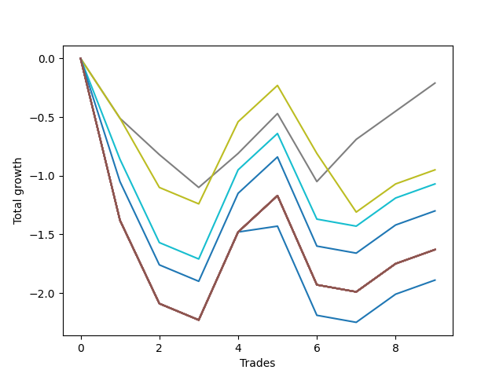

# Long HLT 105 
- Symbol: TSLA_15
- Date Range: 01/10/2024 - 05/17/2024
- Trading Period: 8:30-12:30
- Number of Trades: 9



| Name | Win Percent | Profit | Avg Profit / Trade | Avg Time / Trade |      | Name | Win Percent | Profit | Avg Profit / Trade | Avg Time / Trade |
| ---- | ----------- | ------ | ------------------ | ---------------- | ---- | ---- | ----------- | ------ | ------------------ | ---------------- |
| Sorted By <br> Profit | | | | | | Sorted By <br> Win Percentage ||||
| TP-0.25 | 55.56 | -105.00 | -11.67 | 08:33 |     | TP-0.25 | 55.56 | -105.00 | -11.67 | 08:33 |
| TP-0.5 | 44.44 | -475.00 | -52.78 | 11:13 |     | TP-0.5 | 44.44 | -475.00 | -52.78 | 11:13 |
| TP-0.75 | 44.44 | -535.00 | -59.44 | 12:46 |     | TP-0.75 | 44.44 | -535.00 | -59.44 | 12:46 |
| TP-1 | 44.44 | -650.00 | -72.22 | 13:46 |     | TP-1 | 44.44 | -650.00 | -72.22 | 13:46 |
| NEWFI 000 | 44.44 | -815.00 | -90.56 | 14:00 |     | NEWFI 000 | 44.44 | -815.00 | -90.56 | 14:00 |
| TP-2 | 44.44 | -815.00 | -90.56 | 14:00 |     | TP-2 | 44.44 | -815.00 | -90.56 | 14:00 |
| TP-1.75 | 44.44 | -815.00 | -90.56 | 14:00 |     | TP-1.75 | 44.44 | -815.00 | -90.56 | 14:00 |
| TP-1.5 | 44.44 | -815.00 | -90.56 | 14:00 |     | TP-1.5 | 44.44 | -815.00 | -90.56 | 14:00 |
| TP-1.25 | 44.44 | -815.00 | -90.56 | 14:00 |     | TP-1.25 | 44.44 | -815.00 | -90.56 | 14:00 |
| BB-50 U/L 2SD | 44.44 | -815.00 | -90.56 | 14:00 |     | BB-50 U/L 2SD | 44.44 | -815.00 | -90.56 | 14:00 |
| BB-50 U/L 1SD | 44.44 | -815.00 | -90.56 | 14:00 |     | BB-50 U/L 1SD | 44.44 | -815.00 | -90.56 | 14:00 |
| BB-50 Mid | 44.44 | -815.00 | -90.56 | 14:00 |     | BB-50 Mid | 44.44 | -815.00 | -90.56 | 14:00 |
| BB-20 U/L 2SD C | 44.44 | -815.00 | -90.56 | 14:00 |     | BB-20 U/L 2SD C | 44.44 | -815.00 | -90.56 | 14:00 |
| BB-20 U/L 2SD | 44.44 | -815.00 | -90.56 | 14:00 |     | BB-20 U/L 2SD | 44.44 | -815.00 | -90.56 | 14:00 |
| BB-20 U/L 1SD | 44.44 | -815.00 | -90.56 | 14:00 |     | BB-20 U/L 1SD | 44.44 | -815.00 | -90.56 | 14:00 |
| BB-20 Mid | 44.44 | -945.00 | -105.00 | 12:40 |     | BB-20 Mid | 44.44 | -945.00 | -105.00 | 12:40 |

## NO STOPLOSS

### Test BB-20 Mid
* Sell when price hits the middle line of the 20p bollinger
* No Stoploss
* Results:
```
Total Trades: 9
Percent Up: 44.44
Percent Down: 55.56
Total Points Moved Up: -1.89
Potential Profit: -945.00
Total Points Ups: 1.16 Count Ups: 4
Total Points Downs: -3.05 Count Downs: 5
```

<details><summary>Trades</summary>

<code>In: 2024-01-24 11:10:00		Out: 2024-01-24 11:24:00		Total Position Time: 14:00		Total Move Up: -1.38		Total to Date: -1.38</code> <br />
<code>In: 2024-02-13 11:35:00		Out: 2024-02-13 11:49:00		Total Position Time: 14:00		Total Move Up: -0.71		Total to Date: -2.09</code> <br />
<code>In: 2024-03-13 11:50:00		Out: 2024-03-13 12:04:00		Total Position Time: 14:00		Total Move Up: -0.14		Total to Date: -2.23</code> <br />
<code>In: 2024-03-14 09:25:00		Out: 2024-03-14 09:39:00		Total Position Time: 14:00		Total Move Up: 0.75		Total to Date: -1.48</code> <br />
<code>In: 2024-03-15 10:10:00		Out: 2024-03-15 10:12:00		Total Position Time: 02:00		Total Move Up: 0.05		Total to Date: -1.43</code> <br />
<code>In: 2024-04-15 10:10:00		Out: 2024-04-15 10:24:00		Total Position Time: 14:00		Total Move Up: -0.76		Total to Date: -2.19</code> <br />
<code>In: 2024-04-18 09:25:00		Out: 2024-04-18 09:39:00		Total Position Time: 14:00		Total Move Up: -0.06		Total to Date: -2.25</code> <br />
<code>In: 2024-04-22 08:35:00		Out: 2024-04-22 08:49:00		Total Position Time: 14:00		Total Move Up: 0.24		Total to Date: -2.01</code> <br />
<code>In: 2024-05-07 12:00:00		Out: 2024-05-07 12:14:00		Total Position Time: 14:00		Total Move Up: 0.12		Total to Date: -1.89</code> <br />


</details>

### Test BB-20 U/L 1SD
* Sell when the price hits the upper line of the 20p 1std bollinger
* No Stoploss
* Results:
```
Total Trades: 9
Percent Up: 44.44
Percent Down: 55.56
Total Points Moved Up: -1.63
Potential Profit: -815.00
Total Points Ups: 1.42 Count Ups: 4
Total Points Downs: -3.05 Count Downs: 5
```

<details><summary>Trades</summary>

<code>In: 2024-01-24 11:10:00		Out: 2024-01-24 11:24:00		Total Position Time: 14:00		Total Move Up: -1.38		Total to Date: -1.38</code> <br />
<code>In: 2024-02-13 11:35:00		Out: 2024-02-13 11:49:00		Total Position Time: 14:00		Total Move Up: -0.71		Total to Date: -2.09</code> <br />
<code>In: 2024-03-13 11:50:00		Out: 2024-03-13 12:04:00		Total Position Time: 14:00		Total Move Up: -0.14		Total to Date: -2.23</code> <br />
<code>In: 2024-03-14 09:25:00		Out: 2024-03-14 09:39:00		Total Position Time: 14:00		Total Move Up: 0.75		Total to Date: -1.48</code> <br />
<code>In: 2024-03-15 10:10:00		Out: 2024-03-15 10:24:00		Total Position Time: 14:00		Total Move Up: 0.31		Total to Date: -1.17</code> <br />
<code>In: 2024-04-15 10:10:00		Out: 2024-04-15 10:24:00		Total Position Time: 14:00		Total Move Up: -0.76		Total to Date: -1.93</code> <br />
<code>In: 2024-04-18 09:25:00		Out: 2024-04-18 09:39:00		Total Position Time: 14:00		Total Move Up: -0.06		Total to Date: -1.99</code> <br />
<code>In: 2024-04-22 08:35:00		Out: 2024-04-22 08:49:00		Total Position Time: 14:00		Total Move Up: 0.24		Total to Date: -1.75</code> <br />
<code>In: 2024-05-07 12:00:00		Out: 2024-05-07 12:14:00		Total Position Time: 14:00		Total Move Up: 0.12		Total to Date: -1.63</code> <br />


</details>

### Test BB-20 U/L 2SD
* Sell when the price hits the upper line of the 20p 2std bollinger
* No Stoploss
* Results:
```
Total Trades: 9
Percent Up: 44.44
Percent Down: 55.56
Total Points Moved Up: -1.63
Potential Profit: -815.00
Total Points Ups: 1.42 Count Ups: 4
Total Points Downs: -3.05 Count Downs: 5
```

<details><summary>Trades</summary>

<code>In: 2024-01-24 11:10:00		Out: 2024-01-24 11:24:00		Total Position Time: 14:00		Total Move Up: -1.38		Total to Date: -1.38</code> <br />
<code>In: 2024-02-13 11:35:00		Out: 2024-02-13 11:49:00		Total Position Time: 14:00		Total Move Up: -0.71		Total to Date: -2.09</code> <br />
<code>In: 2024-03-13 11:50:00		Out: 2024-03-13 12:04:00		Total Position Time: 14:00		Total Move Up: -0.14		Total to Date: -2.23</code> <br />
<code>In: 2024-03-14 09:25:00		Out: 2024-03-14 09:39:00		Total Position Time: 14:00		Total Move Up: 0.75		Total to Date: -1.48</code> <br />
<code>In: 2024-03-15 10:10:00		Out: 2024-03-15 10:24:00		Total Position Time: 14:00		Total Move Up: 0.31		Total to Date: -1.17</code> <br />
<code>In: 2024-04-15 10:10:00		Out: 2024-04-15 10:24:00		Total Position Time: 14:00		Total Move Up: -0.76		Total to Date: -1.93</code> <br />
<code>In: 2024-04-18 09:25:00		Out: 2024-04-18 09:39:00		Total Position Time: 14:00		Total Move Up: -0.06		Total to Date: -1.99</code> <br />
<code>In: 2024-04-22 08:35:00		Out: 2024-04-22 08:49:00		Total Position Time: 14:00		Total Move Up: 0.24		Total to Date: -1.75</code> <br />
<code>In: 2024-05-07 12:00:00		Out: 2024-05-07 12:14:00		Total Position Time: 14:00		Total Move Up: 0.12		Total to Date: -1.63</code> <br />


</details>

### Test BB-20 U/L 2SD C
* Sell when the price hits the upper line of the 20p 2std bollinger
* No Stoploss
* Results:
```
Total Trades: 9
Percent Up: 44.44
Percent Down: 55.56
Total Points Moved Up: -1.63
Potential Profit: -815.00
Total Points Ups: 1.42 Count Ups: 4
Total Points Downs: -3.05 Count Downs: 5
```

<details><summary>Trades</summary>

<code>In: 2024-01-24 11:10:00		Out: 2024-01-24 11:24:00		Total Position Time: 14:00		Total Move Up: -1.38		Total to Date: -1.38</code> <br />
<code>In: 2024-02-13 11:35:00		Out: 2024-02-13 11:49:00		Total Position Time: 14:00		Total Move Up: -0.71		Total to Date: -2.09</code> <br />
<code>In: 2024-03-13 11:50:00		Out: 2024-03-13 12:04:00		Total Position Time: 14:00		Total Move Up: -0.14		Total to Date: -2.23</code> <br />
<code>In: 2024-03-14 09:25:00		Out: 2024-03-14 09:39:00		Total Position Time: 14:00		Total Move Up: 0.75		Total to Date: -1.48</code> <br />
<code>In: 2024-03-15 10:10:00		Out: 2024-03-15 10:24:00		Total Position Time: 14:00		Total Move Up: 0.31		Total to Date: -1.17</code> <br />
<code>In: 2024-04-15 10:10:00		Out: 2024-04-15 10:24:00		Total Position Time: 14:00		Total Move Up: -0.76		Total to Date: -1.93</code> <br />
<code>In: 2024-04-18 09:25:00		Out: 2024-04-18 09:39:00		Total Position Time: 14:00		Total Move Up: -0.06		Total to Date: -1.99</code> <br />
<code>In: 2024-04-22 08:35:00		Out: 2024-04-22 08:49:00		Total Position Time: 14:00		Total Move Up: 0.24		Total to Date: -1.75</code> <br />
<code>In: 2024-05-07 12:00:00		Out: 2024-05-07 12:14:00		Total Position Time: 14:00		Total Move Up: 0.12		Total to Date: -1.63</code> <br />


</details>

### Test BB-50 Mid
* Sell when price hits the middle line of the 50p bollinger
* No Stoploss
* Results:
```
Total Trades: 9
Percent Up: 44.44
Percent Down: 55.56
Total Points Moved Up: -1.63
Potential Profit: -815.00
Total Points Ups: 1.42 Count Ups: 4
Total Points Downs: -3.05 Count Downs: 5
```

<details><summary>Trades</summary>

<code>In: 2024-01-24 11:10:00		Out: 2024-01-24 11:24:00		Total Position Time: 14:00		Total Move Up: -1.38		Total to Date: -1.38</code> <br />
<code>In: 2024-02-13 11:35:00		Out: 2024-02-13 11:49:00		Total Position Time: 14:00		Total Move Up: -0.71		Total to Date: -2.09</code> <br />
<code>In: 2024-03-13 11:50:00		Out: 2024-03-13 12:04:00		Total Position Time: 14:00		Total Move Up: -0.14		Total to Date: -2.23</code> <br />
<code>In: 2024-03-14 09:25:00		Out: 2024-03-14 09:39:00		Total Position Time: 14:00		Total Move Up: 0.75		Total to Date: -1.48</code> <br />
<code>In: 2024-03-15 10:10:00		Out: 2024-03-15 10:24:00		Total Position Time: 14:00		Total Move Up: 0.31		Total to Date: -1.17</code> <br />
<code>In: 2024-04-15 10:10:00		Out: 2024-04-15 10:24:00		Total Position Time: 14:00		Total Move Up: -0.76		Total to Date: -1.93</code> <br />
<code>In: 2024-04-18 09:25:00		Out: 2024-04-18 09:39:00		Total Position Time: 14:00		Total Move Up: -0.06		Total to Date: -1.99</code> <br />
<code>In: 2024-04-22 08:35:00		Out: 2024-04-22 08:49:00		Total Position Time: 14:00		Total Move Up: 0.24		Total to Date: -1.75</code> <br />
<code>In: 2024-05-07 12:00:00		Out: 2024-05-07 12:14:00		Total Position Time: 14:00		Total Move Up: 0.12		Total to Date: -1.63</code> <br />


</details>

### Test BB-50 U/L 1SD
* Sell when the price hits the upper line of the 50p 1std bollinger
* No Stoploss
* Results:
```
Total Trades: 9
Percent Up: 44.44
Percent Down: 55.56
Total Points Moved Up: -1.63
Potential Profit: -815.00
Total Points Ups: 1.42 Count Ups: 4
Total Points Downs: -3.05 Count Downs: 5
```

<details><summary>Trades</summary>

<code>In: 2024-01-24 11:10:00		Out: 2024-01-24 11:24:00		Total Position Time: 14:00		Total Move Up: -1.38		Total to Date: -1.38</code> <br />
<code>In: 2024-02-13 11:35:00		Out: 2024-02-13 11:49:00		Total Position Time: 14:00		Total Move Up: -0.71		Total to Date: -2.09</code> <br />
<code>In: 2024-03-13 11:50:00		Out: 2024-03-13 12:04:00		Total Position Time: 14:00		Total Move Up: -0.14		Total to Date: -2.23</code> <br />
<code>In: 2024-03-14 09:25:00		Out: 2024-03-14 09:39:00		Total Position Time: 14:00		Total Move Up: 0.75		Total to Date: -1.48</code> <br />
<code>In: 2024-03-15 10:10:00		Out: 2024-03-15 10:24:00		Total Position Time: 14:00		Total Move Up: 0.31		Total to Date: -1.17</code> <br />
<code>In: 2024-04-15 10:10:00		Out: 2024-04-15 10:24:00		Total Position Time: 14:00		Total Move Up: -0.76		Total to Date: -1.93</code> <br />
<code>In: 2024-04-18 09:25:00		Out: 2024-04-18 09:39:00		Total Position Time: 14:00		Total Move Up: -0.06		Total to Date: -1.99</code> <br />
<code>In: 2024-04-22 08:35:00		Out: 2024-04-22 08:49:00		Total Position Time: 14:00		Total Move Up: 0.24		Total to Date: -1.75</code> <br />
<code>In: 2024-05-07 12:00:00		Out: 2024-05-07 12:14:00		Total Position Time: 14:00		Total Move Up: 0.12		Total to Date: -1.63</code> <br />


</details>

### Test BB-50 U/L 2SD
* Sell when the price hits the upper line of the 50p 2std bollinger
* No Stoploss
* Results:
```
Total Trades: 9
Percent Up: 44.44
Percent Down: 55.56
Total Points Moved Up: -1.63
Potential Profit: -815.00
Total Points Ups: 1.42 Count Ups: 4
Total Points Downs: -3.05 Count Downs: 5
```

<details><summary>Trades</summary>

<code>In: 2024-01-24 11:10:00		Out: 2024-01-24 11:24:00		Total Position Time: 14:00		Total Move Up: -1.38		Total to Date: -1.38</code> <br />
<code>In: 2024-02-13 11:35:00		Out: 2024-02-13 11:49:00		Total Position Time: 14:00		Total Move Up: -0.71		Total to Date: -2.09</code> <br />
<code>In: 2024-03-13 11:50:00		Out: 2024-03-13 12:04:00		Total Position Time: 14:00		Total Move Up: -0.14		Total to Date: -2.23</code> <br />
<code>In: 2024-03-14 09:25:00		Out: 2024-03-14 09:39:00		Total Position Time: 14:00		Total Move Up: 0.75		Total to Date: -1.48</code> <br />
<code>In: 2024-03-15 10:10:00		Out: 2024-03-15 10:24:00		Total Position Time: 14:00		Total Move Up: 0.31		Total to Date: -1.17</code> <br />
<code>In: 2024-04-15 10:10:00		Out: 2024-04-15 10:24:00		Total Position Time: 14:00		Total Move Up: -0.76		Total to Date: -1.93</code> <br />
<code>In: 2024-04-18 09:25:00		Out: 2024-04-18 09:39:00		Total Position Time: 14:00		Total Move Up: -0.06		Total to Date: -1.99</code> <br />
<code>In: 2024-04-22 08:35:00		Out: 2024-04-22 08:49:00		Total Position Time: 14:00		Total Move Up: 0.24		Total to Date: -1.75</code> <br />
<code>In: 2024-05-07 12:00:00		Out: 2024-05-07 12:14:00		Total Position Time: 14:00		Total Move Up: 0.12		Total to Date: -1.63</code> <br />


</details>

## TAKE PROFIT

### Test TP-0.25
* Take Profit of 0.25 Point
* 0.25 Stoploss
* Results:
```
Total Trades: 9
Percent Up: 55.56
Percent Down: 44.44
Total Points Moved Up: -0.21
Potential Profit: -105.00
Total Points Ups: 1.47 Count Ups: 5
Total Points Downs: -1.68 Count Downs: 4
```

<details><summary>Trades</summary>

<code>In: 2024-01-24 11:10:00		Out: 2024-01-24 11:12:00		Total Position Time: 02:00		Total Move Up: -0.51		Total to Date: -0.51</code> <br />
<code>In: 2024-02-13 11:35:00		Out: 2024-02-13 11:46:00		Total Position Time: 11:00		Total Move Up: -0.31		Total to Date: -0.82</code> <br />
<code>In: 2024-03-13 11:50:00		Out: 2024-03-13 11:58:00		Total Position Time: 08:00		Total Move Up: -0.28		Total to Date: -1.10</code> <br />
<code>In: 2024-03-14 09:25:00		Out: 2024-03-14 09:34:00		Total Position Time: 09:00		Total Move Up: 0.29		Total to Date: -0.81</code> <br />
<code>In: 2024-03-15 10:10:00		Out: 2024-03-15 10:21:00		Total Position Time: 11:00		Total Move Up: 0.34		Total to Date: -0.47</code> <br />
<code>In: 2024-04-15 10:10:00		Out: 2024-04-15 10:19:00		Total Position Time: 09:00		Total Move Up: -0.58		Total to Date: -1.05</code> <br />
<code>In: 2024-04-18 09:25:00		Out: 2024-04-18 09:30:00		Total Position Time: 05:00		Total Move Up: 0.36		Total to Date: -0.69</code> <br />
<code>In: 2024-04-22 08:35:00		Out: 2024-04-22 08:49:00		Total Position Time: 14:00		Total Move Up: 0.24		Total to Date: -0.45</code> <br />
<code>In: 2024-05-07 12:00:00		Out: 2024-05-07 12:08:00		Total Position Time: 08:00		Total Move Up: 0.24		Total to Date: -0.21</code> <br />


</details>

### Test TP-0.5
* Take Profit of 0.5 Point
* 0.5 Stoploss
* Results:
```
Total Trades: 9
Percent Up: 44.44
Percent Down: 55.56
Total Points Moved Up: -0.95
Potential Profit: -475.00
Total Points Ups: 1.37 Count Ups: 4
Total Points Downs: -2.32 Count Downs: 5
```

<details><summary>Trades</summary>

<code>In: 2024-01-24 11:10:00		Out: 2024-01-24 11:12:00		Total Position Time: 02:00		Total Move Up: -0.51		Total to Date: -0.51</code> <br />
<code>In: 2024-02-13 11:35:00		Out: 2024-02-13 11:48:00		Total Position Time: 13:00		Total Move Up: -0.59		Total to Date: -1.10</code> <br />
<code>In: 2024-03-13 11:50:00		Out: 2024-03-13 12:04:00		Total Position Time: 14:00		Total Move Up: -0.14		Total to Date: -1.24</code> <br />
<code>In: 2024-03-14 09:25:00		Out: 2024-03-14 09:36:00		Total Position Time: 11:00		Total Move Up: 0.70		Total to Date: -0.54</code> <br />
<code>In: 2024-03-15 10:10:00		Out: 2024-03-15 10:24:00		Total Position Time: 14:00		Total Move Up: 0.31		Total to Date: -0.23</code> <br />
<code>In: 2024-04-15 10:10:00		Out: 2024-04-15 10:19:00		Total Position Time: 09:00		Total Move Up: -0.58		Total to Date: -0.81</code> <br />
<code>In: 2024-04-18 09:25:00		Out: 2024-04-18 09:35:00		Total Position Time: 10:00		Total Move Up: -0.50		Total to Date: -1.31</code> <br />
<code>In: 2024-04-22 08:35:00		Out: 2024-04-22 08:49:00		Total Position Time: 14:00		Total Move Up: 0.24		Total to Date: -1.07</code> <br />
<code>In: 2024-05-07 12:00:00		Out: 2024-05-07 12:14:00		Total Position Time: 14:00		Total Move Up: 0.12		Total to Date: -0.95</code> <br />


</details>

### Test TP-0.75
* Take Profit of 0.75 Point
* 0.75 Stoploss
* Results:
```
Total Trades: 9
Percent Up: 44.44
Percent Down: 55.56
Total Points Moved Up: -1.07
Potential Profit: -535.00
Total Points Ups: 1.43 Count Ups: 4
Total Points Downs: -2.50 Count Downs: 5
```

<details><summary>Trades</summary>

<code>In: 2024-01-24 11:10:00		Out: 2024-01-24 11:18:00		Total Position Time: 08:00		Total Move Up: -0.86		Total to Date: -0.86</code> <br />
<code>In: 2024-02-13 11:35:00		Out: 2024-02-13 11:49:00		Total Position Time: 14:00		Total Move Up: -0.71		Total to Date: -1.57</code> <br />
<code>In: 2024-03-13 11:50:00		Out: 2024-03-13 12:04:00		Total Position Time: 14:00		Total Move Up: -0.14		Total to Date: -1.71</code> <br />
<code>In: 2024-03-14 09:25:00		Out: 2024-03-14 09:37:00		Total Position Time: 12:00		Total Move Up: 0.76		Total to Date: -0.95</code> <br />
<code>In: 2024-03-15 10:10:00		Out: 2024-03-15 10:24:00		Total Position Time: 14:00		Total Move Up: 0.31		Total to Date: -0.64</code> <br />
<code>In: 2024-04-15 10:10:00		Out: 2024-04-15 10:21:00		Total Position Time: 11:00		Total Move Up: -0.73		Total to Date: -1.37</code> <br />
<code>In: 2024-04-18 09:25:00		Out: 2024-04-18 09:39:00		Total Position Time: 14:00		Total Move Up: -0.06		Total to Date: -1.43</code> <br />
<code>In: 2024-04-22 08:35:00		Out: 2024-04-22 08:49:00		Total Position Time: 14:00		Total Move Up: 0.24		Total to Date: -1.19</code> <br />
<code>In: 2024-05-07 12:00:00		Out: 2024-05-07 12:14:00		Total Position Time: 14:00		Total Move Up: 0.12		Total to Date: -1.07</code> <br />


</details>

### Test TP-1
* Take Profit of 1 Point
* 1 Stoploss
* Results:
```
Total Trades: 9
Percent Up: 44.44
Percent Down: 55.56
Total Points Moved Up: -1.30
Potential Profit: -650.00
Total Points Ups: 1.42 Count Ups: 4
Total Points Downs: -2.72 Count Downs: 5
```

<details><summary>Trades</summary>

<code>In: 2024-01-24 11:10:00		Out: 2024-01-24 11:22:00		Total Position Time: 12:00		Total Move Up: -1.05		Total to Date: -1.05</code> <br />
<code>In: 2024-02-13 11:35:00		Out: 2024-02-13 11:49:00		Total Position Time: 14:00		Total Move Up: -0.71		Total to Date: -1.76</code> <br />
<code>In: 2024-03-13 11:50:00		Out: 2024-03-13 12:04:00		Total Position Time: 14:00		Total Move Up: -0.14		Total to Date: -1.90</code> <br />
<code>In: 2024-03-14 09:25:00		Out: 2024-03-14 09:39:00		Total Position Time: 14:00		Total Move Up: 0.75		Total to Date: -1.15</code> <br />
<code>In: 2024-03-15 10:10:00		Out: 2024-03-15 10:24:00		Total Position Time: 14:00		Total Move Up: 0.31		Total to Date: -0.84</code> <br />
<code>In: 2024-04-15 10:10:00		Out: 2024-04-15 10:24:00		Total Position Time: 14:00		Total Move Up: -0.76		Total to Date: -1.60</code> <br />
<code>In: 2024-04-18 09:25:00		Out: 2024-04-18 09:39:00		Total Position Time: 14:00		Total Move Up: -0.06		Total to Date: -1.66</code> <br />
<code>In: 2024-04-22 08:35:00		Out: 2024-04-22 08:49:00		Total Position Time: 14:00		Total Move Up: 0.24		Total to Date: -1.42</code> <br />
<code>In: 2024-05-07 12:00:00		Out: 2024-05-07 12:14:00		Total Position Time: 14:00		Total Move Up: 0.12		Total to Date: -1.30</code> <br />


</details>

### Test TP-1.25
* Take Profit of 1.25 Point
* 1.25 Stoploss
* Results:
```
Total Trades: 9
Percent Up: 44.44
Percent Down: 55.56
Total Points Moved Up: -1.63
Potential Profit: -815.00
Total Points Ups: 1.42 Count Ups: 4
Total Points Downs: -3.05 Count Downs: 5
```

<details><summary>Trades</summary>

<code>In: 2024-01-24 11:10:00		Out: 2024-01-24 11:24:00		Total Position Time: 14:00		Total Move Up: -1.38		Total to Date: -1.38</code> <br />
<code>In: 2024-02-13 11:35:00		Out: 2024-02-13 11:49:00		Total Position Time: 14:00		Total Move Up: -0.71		Total to Date: -2.09</code> <br />
<code>In: 2024-03-13 11:50:00		Out: 2024-03-13 12:04:00		Total Position Time: 14:00		Total Move Up: -0.14		Total to Date: -2.23</code> <br />
<code>In: 2024-03-14 09:25:00		Out: 2024-03-14 09:39:00		Total Position Time: 14:00		Total Move Up: 0.75		Total to Date: -1.48</code> <br />
<code>In: 2024-03-15 10:10:00		Out: 2024-03-15 10:24:00		Total Position Time: 14:00		Total Move Up: 0.31		Total to Date: -1.17</code> <br />
<code>In: 2024-04-15 10:10:00		Out: 2024-04-15 10:24:00		Total Position Time: 14:00		Total Move Up: -0.76		Total to Date: -1.93</code> <br />
<code>In: 2024-04-18 09:25:00		Out: 2024-04-18 09:39:00		Total Position Time: 14:00		Total Move Up: -0.06		Total to Date: -1.99</code> <br />
<code>In: 2024-04-22 08:35:00		Out: 2024-04-22 08:49:00		Total Position Time: 14:00		Total Move Up: 0.24		Total to Date: -1.75</code> <br />
<code>In: 2024-05-07 12:00:00		Out: 2024-05-07 12:14:00		Total Position Time: 14:00		Total Move Up: 0.12		Total to Date: -1.63</code> <br />


</details>

### Test TP-1.5
* Take Profit of 1.5 Point
* 1.5 Stoploss
* Results:
```
Total Trades: 9
Percent Up: 44.44
Percent Down: 55.56
Total Points Moved Up: -1.63
Potential Profit: -815.00
Total Points Ups: 1.42 Count Ups: 4
Total Points Downs: -3.05 Count Downs: 5
```

<details><summary>Trades</summary>

<code>In: 2024-01-24 11:10:00		Out: 2024-01-24 11:24:00		Total Position Time: 14:00		Total Move Up: -1.38		Total to Date: -1.38</code> <br />
<code>In: 2024-02-13 11:35:00		Out: 2024-02-13 11:49:00		Total Position Time: 14:00		Total Move Up: -0.71		Total to Date: -2.09</code> <br />
<code>In: 2024-03-13 11:50:00		Out: 2024-03-13 12:04:00		Total Position Time: 14:00		Total Move Up: -0.14		Total to Date: -2.23</code> <br />
<code>In: 2024-03-14 09:25:00		Out: 2024-03-14 09:39:00		Total Position Time: 14:00		Total Move Up: 0.75		Total to Date: -1.48</code> <br />
<code>In: 2024-03-15 10:10:00		Out: 2024-03-15 10:24:00		Total Position Time: 14:00		Total Move Up: 0.31		Total to Date: -1.17</code> <br />
<code>In: 2024-04-15 10:10:00		Out: 2024-04-15 10:24:00		Total Position Time: 14:00		Total Move Up: -0.76		Total to Date: -1.93</code> <br />
<code>In: 2024-04-18 09:25:00		Out: 2024-04-18 09:39:00		Total Position Time: 14:00		Total Move Up: -0.06		Total to Date: -1.99</code> <br />
<code>In: 2024-04-22 08:35:00		Out: 2024-04-22 08:49:00		Total Position Time: 14:00		Total Move Up: 0.24		Total to Date: -1.75</code> <br />
<code>In: 2024-05-07 12:00:00		Out: 2024-05-07 12:14:00		Total Position Time: 14:00		Total Move Up: 0.12		Total to Date: -1.63</code> <br />


</details>

### Test TP-1.75
* Take Profit of 1.75 Point
* 1.75 Stoploss
* Results:
```
Total Trades: 9
Percent Up: 44.44
Percent Down: 55.56
Total Points Moved Up: -1.63
Potential Profit: -815.00
Total Points Ups: 1.42 Count Ups: 4
Total Points Downs: -3.05 Count Downs: 5
```

<details><summary>Trades</summary>

<code>In: 2024-01-24 11:10:00		Out: 2024-01-24 11:24:00		Total Position Time: 14:00		Total Move Up: -1.38		Total to Date: -1.38</code> <br />
<code>In: 2024-02-13 11:35:00		Out: 2024-02-13 11:49:00		Total Position Time: 14:00		Total Move Up: -0.71		Total to Date: -2.09</code> <br />
<code>In: 2024-03-13 11:50:00		Out: 2024-03-13 12:04:00		Total Position Time: 14:00		Total Move Up: -0.14		Total to Date: -2.23</code> <br />
<code>In: 2024-03-14 09:25:00		Out: 2024-03-14 09:39:00		Total Position Time: 14:00		Total Move Up: 0.75		Total to Date: -1.48</code> <br />
<code>In: 2024-03-15 10:10:00		Out: 2024-03-15 10:24:00		Total Position Time: 14:00		Total Move Up: 0.31		Total to Date: -1.17</code> <br />
<code>In: 2024-04-15 10:10:00		Out: 2024-04-15 10:24:00		Total Position Time: 14:00		Total Move Up: -0.76		Total to Date: -1.93</code> <br />
<code>In: 2024-04-18 09:25:00		Out: 2024-04-18 09:39:00		Total Position Time: 14:00		Total Move Up: -0.06		Total to Date: -1.99</code> <br />
<code>In: 2024-04-22 08:35:00		Out: 2024-04-22 08:49:00		Total Position Time: 14:00		Total Move Up: 0.24		Total to Date: -1.75</code> <br />
<code>In: 2024-05-07 12:00:00		Out: 2024-05-07 12:14:00		Total Position Time: 14:00		Total Move Up: 0.12		Total to Date: -1.63</code> <br />


</details>

### Test TP-2
* Take Profit of 2 Point
* 2 Stoploss
* Results:
```
Total Trades: 9
Percent Up: 44.44
Percent Down: 55.56
Total Points Moved Up: -1.63
Potential Profit: -815.00
Total Points Ups: 1.42 Count Ups: 4
Total Points Downs: -3.05 Count Downs: 5
```

<details><summary>Trades</summary>

<code>In: 2024-01-24 11:10:00		Out: 2024-01-24 11:24:00		Total Position Time: 14:00		Total Move Up: -1.38		Total to Date: -1.38</code> <br />
<code>In: 2024-02-13 11:35:00		Out: 2024-02-13 11:49:00		Total Position Time: 14:00		Total Move Up: -0.71		Total to Date: -2.09</code> <br />
<code>In: 2024-03-13 11:50:00		Out: 2024-03-13 12:04:00		Total Position Time: 14:00		Total Move Up: -0.14		Total to Date: -2.23</code> <br />
<code>In: 2024-03-14 09:25:00		Out: 2024-03-14 09:39:00		Total Position Time: 14:00		Total Move Up: 0.75		Total to Date: -1.48</code> <br />
<code>In: 2024-03-15 10:10:00		Out: 2024-03-15 10:24:00		Total Position Time: 14:00		Total Move Up: 0.31		Total to Date: -1.17</code> <br />
<code>In: 2024-04-15 10:10:00		Out: 2024-04-15 10:24:00		Total Position Time: 14:00		Total Move Up: -0.76		Total to Date: -1.93</code> <br />
<code>In: 2024-04-18 09:25:00		Out: 2024-04-18 09:39:00		Total Position Time: 14:00		Total Move Up: -0.06		Total to Date: -1.99</code> <br />
<code>In: 2024-04-22 08:35:00		Out: 2024-04-22 08:49:00		Total Position Time: 14:00		Total Move Up: 0.24		Total to Date: -1.75</code> <br />
<code>In: 2024-05-07 12:00:00		Out: 2024-05-07 12:14:00		Total Position Time: 14:00		Total Move Up: 0.12		Total to Date: -1.63</code> <br />


</details>

## Indicator Exits

### Test NEWFI 000
* Newfi 0000
* No Stoploss
* Results:
```
Total Trades: 9
Percent Up: 44.44
Percent Down: 55.56
Total Points Moved Up: -1.63
Potential Profit: -815.00
Total Points Ups: 1.42 Count Ups: 4
Total Points Downs: -3.05 Count Downs: 5
```

<details><summary>Trades</summary>

<code>In: 2024-01-24 11:10:00		Out: 2024-01-24 11:24:00		Total Position Time: 14:00		Total Move Up: -1.38		Total to Date: -1.38</code> <br />
<code>In: 2024-02-13 11:35:00		Out: 2024-02-13 11:49:00		Total Position Time: 14:00		Total Move Up: -0.71		Total to Date: -2.09</code> <br />
<code>In: 2024-03-13 11:50:00		Out: 2024-03-13 12:04:00		Total Position Time: 14:00		Total Move Up: -0.14		Total to Date: -2.23</code> <br />
<code>In: 2024-03-14 09:25:00		Out: 2024-03-14 09:39:00		Total Position Time: 14:00		Total Move Up: 0.75		Total to Date: -1.48</code> <br />
<code>In: 2024-03-15 10:10:00		Out: 2024-03-15 10:24:00		Total Position Time: 14:00		Total Move Up: 0.31		Total to Date: -1.17</code> <br />
<code>In: 2024-04-15 10:10:00		Out: 2024-04-15 10:24:00		Total Position Time: 14:00		Total Move Up: -0.76		Total to Date: -1.93</code> <br />
<code>In: 2024-04-18 09:25:00		Out: 2024-04-18 09:39:00		Total Position Time: 14:00		Total Move Up: -0.06		Total to Date: -1.99</code> <br />
<code>In: 2024-04-22 08:35:00		Out: 2024-04-22 08:49:00		Total Position Time: 14:00		Total Move Up: 0.24		Total to Date: -1.75</code> <br />
<code>In: 2024-05-07 12:00:00		Out: 2024-05-07 12:14:00		Total Position Time: 14:00		Total Move Up: 0.12		Total to Date: -1.63</code> <br />


</details>