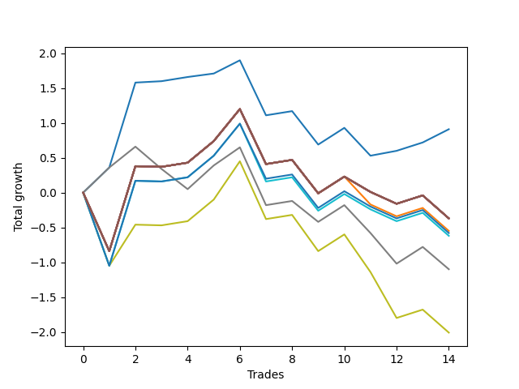

# Long HLT 111 
- Symbol: TSLA_15
- Date Range: 01/10/2024 - 05/17/2024
- Trading Period: 8:30-12:30
- Number of Trades: 14



| Name | Win Percent | Profit | Avg Profit / Trade | Avg Time / Trade |      | Name | Win Percent | Profit | Avg Profit / Trade | Avg Time / Trade |
| ---- | ----------- | ------ | ------------------ | ---------------- | ---- | ---- | ----------- | ------ | ------------------ | ---------------- |
| Sorted By <br> Profit | | | | | | Sorted By <br> Win Percentage ||||
| BB-20 Mid | 78.57 | 455.00 | 32.50 | 08:30 |     | BB-20 Mid | 78.57 | 455.00 | 32.50 | 08:30 |
| NEWFI 000 | 50.00 | -185.00 | -13.21 | 14:00 |     | NEWFI 000 | 50.00 | -185.00 | -13.21 | 14:00 |
| TP-2 | 50.00 | -185.00 | -13.21 | 14:00 |     | TP-2 | 50.00 | -185.00 | -13.21 | 14:00 |
| TP-1.75 | 50.00 | -185.00 | -13.21 | 14:00 |     | TP-1.75 | 50.00 | -185.00 | -13.21 | 14:00 |
| TP-1.5 | 50.00 | -185.00 | -13.21 | 14:00 |     | TP-1.5 | 50.00 | -185.00 | -13.21 | 14:00 |
| TP-1.25 | 50.00 | -185.00 | -13.21 | 14:00 |     | TP-1.25 | 50.00 | -185.00 | -13.21 | 14:00 |
| BB-50 U/L 2SD | 50.00 | -185.00 | -13.21 | 14:00 |     | BB-50 U/L 2SD | 50.00 | -185.00 | -13.21 | 14:00 |
| BB-50 U/L 1SD | 50.00 | -185.00 | -13.21 | 14:00 |     | BB-50 U/L 1SD | 50.00 | -185.00 | -13.21 | 14:00 |
| BB-50 Mid | 50.00 | -185.00 | -13.21 | 14:00 |     | BB-50 Mid | 50.00 | -185.00 | -13.21 | 14:00 |
| BB-20 U/L 2SD C | 50.00 | -185.00 | -13.21 | 14:00 |     | BB-20 U/L 2SD C | 50.00 | -185.00 | -13.21 | 14:00 |
| BB-20 U/L 2SD | 50.00 | -185.00 | -13.21 | 14:00 |     | BB-20 U/L 2SD | 50.00 | -185.00 | -13.21 | 14:00 |
| BB-20 U/L 1SD | 50.00 | -275.00 | -19.64 | 13:08 |     | BB-20 U/L 1SD | 50.00 | -275.00 | -19.64 | 13:08 |
| TP-1 | 50.00 | -290.00 | -20.71 | 13:34 |     | TP-1 | 50.00 | -290.00 | -20.71 | 13:34 |
| TP-0.75 | 50.00 | -310.00 | -22.14 | 12:42 |     | TP-0.75 | 50.00 | -310.00 | -22.14 | 12:42 |
| TP-0.25 | 50.00 | -550.00 | -39.29 | 07:34 |     | TP-0.25 | 50.00 | -550.00 | -39.29 | 07:34 |
| TP-0.5 | 50.00 | -1005.00 | -71.79 | 11:21 |     | TP-0.5 | 50.00 | -1005.00 | -71.79 | 11:21 |

## NO STOPLOSS

### Test BB-20 Mid
* Sell when price hits the middle line of the 20p bollinger
* No Stoploss
* Results:
```
Total Trades: 14
Percent Up: 78.57
Percent Down: 21.43
Total Points Moved Up: 0.91
Potential Profit: 455.00
Total Points Ups: 2.58 Count Ups: 11
Total Points Downs: -1.67 Count Downs: 3
```

<details><summary>Trades</summary>

<code>In: 2024-02-21 09:55:00		Out: 2024-02-21 10:00:00		Total Position Time: 05:00		Total Move Up: 0.36		Total to Date: 0.36</code> <br />
<code>In: 2024-02-27 10:45:00		Out: 2024-02-27 10:59:00		Total Position Time: 14:00		Total Move Up: 1.22		Total to Date: 1.58</code> <br />
<code>In: 2024-03-08 09:35:00		Out: 2024-03-08 09:37:00		Total Position Time: 02:00		Total Move Up: 0.02		Total to Date: 1.60</code> <br />
<code>In: 2024-03-14 12:30:00		Out: 2024-03-14 12:44:00		Total Position Time: 14:00		Total Move Up: 0.06		Total to Date: 1.66</code> <br />
<code>In: 2024-03-15 10:10:00		Out: 2024-03-15 10:12:00		Total Position Time: 02:00		Total Move Up: 0.05		Total to Date: 1.71</code> <br />
<code>In: 2024-03-21 11:50:00		Out: 2024-03-21 11:52:00		Total Position Time: 02:00		Total Move Up: 0.19		Total to Date: 1.90</code> <br />
<code>In: 2024-04-05 08:45:00		Out: 2024-04-05 08:59:00		Total Position Time: 14:00		Total Move Up: -0.79		Total to Date: 1.11</code> <br />
<code>In: 2024-04-05 12:00:00		Out: 2024-04-05 12:14:00		Total Position Time: 14:00		Total Move Up: 0.06		Total to Date: 1.17</code> <br />
<code>In: 2024-04-15 11:40:00		Out: 2024-04-15 11:54:00		Total Position Time: 14:00		Total Move Up: -0.48		Total to Date: 0.69</code> <br />
<code>In: 2024-04-22 08:35:00		Out: 2024-04-22 08:49:00		Total Position Time: 14:00		Total Move Up: 0.24		Total to Date: 0.93</code> <br />
<code>In: 2024-04-30 10:40:00		Out: 2024-04-30 10:42:00		Total Position Time: 02:00		Total Move Up: -0.40		Total to Date: 0.53</code> <br />
<code>In: 2024-05-07 09:15:00		Out: 2024-05-07 09:17:00		Total Position Time: 02:00		Total Move Up: 0.07		Total to Date: 0.60</code> <br />
<code>In: 2024-05-07 12:00:00		Out: 2024-05-07 12:14:00		Total Position Time: 14:00		Total Move Up: 0.12		Total to Date: 0.72</code> <br />
<code>In: 2024-05-09 08:55:00		Out: 2024-05-09 09:01:00		Total Position Time: 06:00		Total Move Up: 0.19		Total to Date: 0.91</code> <br />


</details>

### Test BB-20 U/L 1SD
* Sell when the price hits the upper line of the 20p 1std bollinger
* No Stoploss
* Results:
```
Total Trades: 14
Percent Up: 50.00
Percent Down: 50.00
Total Points Moved Up: -0.55
Potential Profit: -275.00
Total Points Ups: 2.47 Count Ups: 7
Total Points Downs: -3.02 Count Downs: 7
```

<details><summary>Trades</summary>

<code>In: 2024-02-21 09:55:00		Out: 2024-02-21 10:09:00		Total Position Time: 14:00		Total Move Up: -0.84		Total to Date: -0.84</code> <br />
<code>In: 2024-02-27 10:45:00		Out: 2024-02-27 10:59:00		Total Position Time: 14:00		Total Move Up: 1.22		Total to Date: 0.38</code> <br />
<code>In: 2024-03-08 09:35:00		Out: 2024-03-08 09:49:00		Total Position Time: 14:00		Total Move Up: -0.01		Total to Date: 0.37</code> <br />
<code>In: 2024-03-14 12:30:00		Out: 2024-03-14 12:44:00		Total Position Time: 14:00		Total Move Up: 0.06		Total to Date: 0.43</code> <br />
<code>In: 2024-03-15 10:10:00		Out: 2024-03-15 10:24:00		Total Position Time: 14:00		Total Move Up: 0.31		Total to Date: 0.74</code> <br />
<code>In: 2024-03-21 11:50:00		Out: 2024-03-21 12:04:00		Total Position Time: 14:00		Total Move Up: 0.46		Total to Date: 1.20</code> <br />
<code>In: 2024-04-05 08:45:00		Out: 2024-04-05 08:59:00		Total Position Time: 14:00		Total Move Up: -0.79		Total to Date: 0.41</code> <br />
<code>In: 2024-04-05 12:00:00		Out: 2024-04-05 12:14:00		Total Position Time: 14:00		Total Move Up: 0.06		Total to Date: 0.47</code> <br />
<code>In: 2024-04-15 11:40:00		Out: 2024-04-15 11:54:00		Total Position Time: 14:00		Total Move Up: -0.48		Total to Date: -0.01</code> <br />
<code>In: 2024-04-22 08:35:00		Out: 2024-04-22 08:49:00		Total Position Time: 14:00		Total Move Up: 0.24		Total to Date: 0.23</code> <br />
<code>In: 2024-04-30 10:40:00		Out: 2024-04-30 10:42:00		Total Position Time: 02:00		Total Move Up: -0.40		Total to Date: -0.17</code> <br />
<code>In: 2024-05-07 09:15:00		Out: 2024-05-07 09:29:00		Total Position Time: 14:00		Total Move Up: -0.17		Total to Date: -0.34</code> <br />
<code>In: 2024-05-07 12:00:00		Out: 2024-05-07 12:14:00		Total Position Time: 14:00		Total Move Up: 0.12		Total to Date: -0.22</code> <br />
<code>In: 2024-05-09 08:55:00		Out: 2024-05-09 09:09:00		Total Position Time: 14:00		Total Move Up: -0.33		Total to Date: -0.55</code> <br />


</details>

### Test BB-20 U/L 2SD
* Sell when the price hits the upper line of the 20p 2std bollinger
* No Stoploss
* Results:
```
Total Trades: 14
Percent Up: 50.00
Percent Down: 50.00
Total Points Moved Up: -0.37
Potential Profit: -185.00
Total Points Ups: 2.47 Count Ups: 7
Total Points Downs: -2.84 Count Downs: 7
```

<details><summary>Trades</summary>

<code>In: 2024-02-21 09:55:00		Out: 2024-02-21 10:09:00		Total Position Time: 14:00		Total Move Up: -0.84		Total to Date: -0.84</code> <br />
<code>In: 2024-02-27 10:45:00		Out: 2024-02-27 10:59:00		Total Position Time: 14:00		Total Move Up: 1.22		Total to Date: 0.38</code> <br />
<code>In: 2024-03-08 09:35:00		Out: 2024-03-08 09:49:00		Total Position Time: 14:00		Total Move Up: -0.01		Total to Date: 0.37</code> <br />
<code>In: 2024-03-14 12:30:00		Out: 2024-03-14 12:44:00		Total Position Time: 14:00		Total Move Up: 0.06		Total to Date: 0.43</code> <br />
<code>In: 2024-03-15 10:10:00		Out: 2024-03-15 10:24:00		Total Position Time: 14:00		Total Move Up: 0.31		Total to Date: 0.74</code> <br />
<code>In: 2024-03-21 11:50:00		Out: 2024-03-21 12:04:00		Total Position Time: 14:00		Total Move Up: 0.46		Total to Date: 1.20</code> <br />
<code>In: 2024-04-05 08:45:00		Out: 2024-04-05 08:59:00		Total Position Time: 14:00		Total Move Up: -0.79		Total to Date: 0.41</code> <br />
<code>In: 2024-04-05 12:00:00		Out: 2024-04-05 12:14:00		Total Position Time: 14:00		Total Move Up: 0.06		Total to Date: 0.47</code> <br />
<code>In: 2024-04-15 11:40:00		Out: 2024-04-15 11:54:00		Total Position Time: 14:00		Total Move Up: -0.48		Total to Date: -0.01</code> <br />
<code>In: 2024-04-22 08:35:00		Out: 2024-04-22 08:49:00		Total Position Time: 14:00		Total Move Up: 0.24		Total to Date: 0.23</code> <br />
<code>In: 2024-04-30 10:40:00		Out: 2024-04-30 10:54:00		Total Position Time: 14:00		Total Move Up: -0.22		Total to Date: 0.01</code> <br />
<code>In: 2024-05-07 09:15:00		Out: 2024-05-07 09:29:00		Total Position Time: 14:00		Total Move Up: -0.17		Total to Date: -0.16</code> <br />
<code>In: 2024-05-07 12:00:00		Out: 2024-05-07 12:14:00		Total Position Time: 14:00		Total Move Up: 0.12		Total to Date: -0.04</code> <br />
<code>In: 2024-05-09 08:55:00		Out: 2024-05-09 09:09:00		Total Position Time: 14:00		Total Move Up: -0.33		Total to Date: -0.37</code> <br />


</details>

### Test BB-20 U/L 2SD C
* Sell when the price hits the upper line of the 20p 2std bollinger
* No Stoploss
* Results:
```
Total Trades: 14
Percent Up: 50.00
Percent Down: 50.00
Total Points Moved Up: -0.37
Potential Profit: -185.00
Total Points Ups: 2.47 Count Ups: 7
Total Points Downs: -2.84 Count Downs: 7
```

<details><summary>Trades</summary>

<code>In: 2024-02-21 09:55:00		Out: 2024-02-21 10:09:00		Total Position Time: 14:00		Total Move Up: -0.84		Total to Date: -0.84</code> <br />
<code>In: 2024-02-27 10:45:00		Out: 2024-02-27 10:59:00		Total Position Time: 14:00		Total Move Up: 1.22		Total to Date: 0.38</code> <br />
<code>In: 2024-03-08 09:35:00		Out: 2024-03-08 09:49:00		Total Position Time: 14:00		Total Move Up: -0.01		Total to Date: 0.37</code> <br />
<code>In: 2024-03-14 12:30:00		Out: 2024-03-14 12:44:00		Total Position Time: 14:00		Total Move Up: 0.06		Total to Date: 0.43</code> <br />
<code>In: 2024-03-15 10:10:00		Out: 2024-03-15 10:24:00		Total Position Time: 14:00		Total Move Up: 0.31		Total to Date: 0.74</code> <br />
<code>In: 2024-03-21 11:50:00		Out: 2024-03-21 12:04:00		Total Position Time: 14:00		Total Move Up: 0.46		Total to Date: 1.20</code> <br />
<code>In: 2024-04-05 08:45:00		Out: 2024-04-05 08:59:00		Total Position Time: 14:00		Total Move Up: -0.79		Total to Date: 0.41</code> <br />
<code>In: 2024-04-05 12:00:00		Out: 2024-04-05 12:14:00		Total Position Time: 14:00		Total Move Up: 0.06		Total to Date: 0.47</code> <br />
<code>In: 2024-04-15 11:40:00		Out: 2024-04-15 11:54:00		Total Position Time: 14:00		Total Move Up: -0.48		Total to Date: -0.01</code> <br />
<code>In: 2024-04-22 08:35:00		Out: 2024-04-22 08:49:00		Total Position Time: 14:00		Total Move Up: 0.24		Total to Date: 0.23</code> <br />
<code>In: 2024-04-30 10:40:00		Out: 2024-04-30 10:54:00		Total Position Time: 14:00		Total Move Up: -0.22		Total to Date: 0.01</code> <br />
<code>In: 2024-05-07 09:15:00		Out: 2024-05-07 09:29:00		Total Position Time: 14:00		Total Move Up: -0.17		Total to Date: -0.16</code> <br />
<code>In: 2024-05-07 12:00:00		Out: 2024-05-07 12:14:00		Total Position Time: 14:00		Total Move Up: 0.12		Total to Date: -0.04</code> <br />
<code>In: 2024-05-09 08:55:00		Out: 2024-05-09 09:09:00		Total Position Time: 14:00		Total Move Up: -0.33		Total to Date: -0.37</code> <br />


</details>

### Test BB-50 Mid
* Sell when price hits the middle line of the 50p bollinger
* No Stoploss
* Results:
```
Total Trades: 14
Percent Up: 50.00
Percent Down: 50.00
Total Points Moved Up: -0.37
Potential Profit: -185.00
Total Points Ups: 2.47 Count Ups: 7
Total Points Downs: -2.84 Count Downs: 7
```

<details><summary>Trades</summary>

<code>In: 2024-02-21 09:55:00		Out: 2024-02-21 10:09:00		Total Position Time: 14:00		Total Move Up: -0.84		Total to Date: -0.84</code> <br />
<code>In: 2024-02-27 10:45:00		Out: 2024-02-27 10:59:00		Total Position Time: 14:00		Total Move Up: 1.22		Total to Date: 0.38</code> <br />
<code>In: 2024-03-08 09:35:00		Out: 2024-03-08 09:49:00		Total Position Time: 14:00		Total Move Up: -0.01		Total to Date: 0.37</code> <br />
<code>In: 2024-03-14 12:30:00		Out: 2024-03-14 12:44:00		Total Position Time: 14:00		Total Move Up: 0.06		Total to Date: 0.43</code> <br />
<code>In: 2024-03-15 10:10:00		Out: 2024-03-15 10:24:00		Total Position Time: 14:00		Total Move Up: 0.31		Total to Date: 0.74</code> <br />
<code>In: 2024-03-21 11:50:00		Out: 2024-03-21 12:04:00		Total Position Time: 14:00		Total Move Up: 0.46		Total to Date: 1.20</code> <br />
<code>In: 2024-04-05 08:45:00		Out: 2024-04-05 08:59:00		Total Position Time: 14:00		Total Move Up: -0.79		Total to Date: 0.41</code> <br />
<code>In: 2024-04-05 12:00:00		Out: 2024-04-05 12:14:00		Total Position Time: 14:00		Total Move Up: 0.06		Total to Date: 0.47</code> <br />
<code>In: 2024-04-15 11:40:00		Out: 2024-04-15 11:54:00		Total Position Time: 14:00		Total Move Up: -0.48		Total to Date: -0.01</code> <br />
<code>In: 2024-04-22 08:35:00		Out: 2024-04-22 08:49:00		Total Position Time: 14:00		Total Move Up: 0.24		Total to Date: 0.23</code> <br />
<code>In: 2024-04-30 10:40:00		Out: 2024-04-30 10:54:00		Total Position Time: 14:00		Total Move Up: -0.22		Total to Date: 0.01</code> <br />
<code>In: 2024-05-07 09:15:00		Out: 2024-05-07 09:29:00		Total Position Time: 14:00		Total Move Up: -0.17		Total to Date: -0.16</code> <br />
<code>In: 2024-05-07 12:00:00		Out: 2024-05-07 12:14:00		Total Position Time: 14:00		Total Move Up: 0.12		Total to Date: -0.04</code> <br />
<code>In: 2024-05-09 08:55:00		Out: 2024-05-09 09:09:00		Total Position Time: 14:00		Total Move Up: -0.33		Total to Date: -0.37</code> <br />


</details>

### Test BB-50 U/L 1SD
* Sell when the price hits the upper line of the 50p 1std bollinger
* No Stoploss
* Results:
```
Total Trades: 14
Percent Up: 50.00
Percent Down: 50.00
Total Points Moved Up: -0.37
Potential Profit: -185.00
Total Points Ups: 2.47 Count Ups: 7
Total Points Downs: -2.84 Count Downs: 7
```

<details><summary>Trades</summary>

<code>In: 2024-02-21 09:55:00		Out: 2024-02-21 10:09:00		Total Position Time: 14:00		Total Move Up: -0.84		Total to Date: -0.84</code> <br />
<code>In: 2024-02-27 10:45:00		Out: 2024-02-27 10:59:00		Total Position Time: 14:00		Total Move Up: 1.22		Total to Date: 0.38</code> <br />
<code>In: 2024-03-08 09:35:00		Out: 2024-03-08 09:49:00		Total Position Time: 14:00		Total Move Up: -0.01		Total to Date: 0.37</code> <br />
<code>In: 2024-03-14 12:30:00		Out: 2024-03-14 12:44:00		Total Position Time: 14:00		Total Move Up: 0.06		Total to Date: 0.43</code> <br />
<code>In: 2024-03-15 10:10:00		Out: 2024-03-15 10:24:00		Total Position Time: 14:00		Total Move Up: 0.31		Total to Date: 0.74</code> <br />
<code>In: 2024-03-21 11:50:00		Out: 2024-03-21 12:04:00		Total Position Time: 14:00		Total Move Up: 0.46		Total to Date: 1.20</code> <br />
<code>In: 2024-04-05 08:45:00		Out: 2024-04-05 08:59:00		Total Position Time: 14:00		Total Move Up: -0.79		Total to Date: 0.41</code> <br />
<code>In: 2024-04-05 12:00:00		Out: 2024-04-05 12:14:00		Total Position Time: 14:00		Total Move Up: 0.06		Total to Date: 0.47</code> <br />
<code>In: 2024-04-15 11:40:00		Out: 2024-04-15 11:54:00		Total Position Time: 14:00		Total Move Up: -0.48		Total to Date: -0.01</code> <br />
<code>In: 2024-04-22 08:35:00		Out: 2024-04-22 08:49:00		Total Position Time: 14:00		Total Move Up: 0.24		Total to Date: 0.23</code> <br />
<code>In: 2024-04-30 10:40:00		Out: 2024-04-30 10:54:00		Total Position Time: 14:00		Total Move Up: -0.22		Total to Date: 0.01</code> <br />
<code>In: 2024-05-07 09:15:00		Out: 2024-05-07 09:29:00		Total Position Time: 14:00		Total Move Up: -0.17		Total to Date: -0.16</code> <br />
<code>In: 2024-05-07 12:00:00		Out: 2024-05-07 12:14:00		Total Position Time: 14:00		Total Move Up: 0.12		Total to Date: -0.04</code> <br />
<code>In: 2024-05-09 08:55:00		Out: 2024-05-09 09:09:00		Total Position Time: 14:00		Total Move Up: -0.33		Total to Date: -0.37</code> <br />


</details>

### Test BB-50 U/L 2SD
* Sell when the price hits the upper line of the 50p 2std bollinger
* No Stoploss
* Results:
```
Total Trades: 14
Percent Up: 50.00
Percent Down: 50.00
Total Points Moved Up: -0.37
Potential Profit: -185.00
Total Points Ups: 2.47 Count Ups: 7
Total Points Downs: -2.84 Count Downs: 7
```

<details><summary>Trades</summary>

<code>In: 2024-02-21 09:55:00		Out: 2024-02-21 10:09:00		Total Position Time: 14:00		Total Move Up: -0.84		Total to Date: -0.84</code> <br />
<code>In: 2024-02-27 10:45:00		Out: 2024-02-27 10:59:00		Total Position Time: 14:00		Total Move Up: 1.22		Total to Date: 0.38</code> <br />
<code>In: 2024-03-08 09:35:00		Out: 2024-03-08 09:49:00		Total Position Time: 14:00		Total Move Up: -0.01		Total to Date: 0.37</code> <br />
<code>In: 2024-03-14 12:30:00		Out: 2024-03-14 12:44:00		Total Position Time: 14:00		Total Move Up: 0.06		Total to Date: 0.43</code> <br />
<code>In: 2024-03-15 10:10:00		Out: 2024-03-15 10:24:00		Total Position Time: 14:00		Total Move Up: 0.31		Total to Date: 0.74</code> <br />
<code>In: 2024-03-21 11:50:00		Out: 2024-03-21 12:04:00		Total Position Time: 14:00		Total Move Up: 0.46		Total to Date: 1.20</code> <br />
<code>In: 2024-04-05 08:45:00		Out: 2024-04-05 08:59:00		Total Position Time: 14:00		Total Move Up: -0.79		Total to Date: 0.41</code> <br />
<code>In: 2024-04-05 12:00:00		Out: 2024-04-05 12:14:00		Total Position Time: 14:00		Total Move Up: 0.06		Total to Date: 0.47</code> <br />
<code>In: 2024-04-15 11:40:00		Out: 2024-04-15 11:54:00		Total Position Time: 14:00		Total Move Up: -0.48		Total to Date: -0.01</code> <br />
<code>In: 2024-04-22 08:35:00		Out: 2024-04-22 08:49:00		Total Position Time: 14:00		Total Move Up: 0.24		Total to Date: 0.23</code> <br />
<code>In: 2024-04-30 10:40:00		Out: 2024-04-30 10:54:00		Total Position Time: 14:00		Total Move Up: -0.22		Total to Date: 0.01</code> <br />
<code>In: 2024-05-07 09:15:00		Out: 2024-05-07 09:29:00		Total Position Time: 14:00		Total Move Up: -0.17		Total to Date: -0.16</code> <br />
<code>In: 2024-05-07 12:00:00		Out: 2024-05-07 12:14:00		Total Position Time: 14:00		Total Move Up: 0.12		Total to Date: -0.04</code> <br />
<code>In: 2024-05-09 08:55:00		Out: 2024-05-09 09:09:00		Total Position Time: 14:00		Total Move Up: -0.33		Total to Date: -0.37</code> <br />


</details>

## TAKE PROFIT

### Test TP-0.25
* Take Profit of 0.25 Point
* 0.25 Stoploss
* Results:
```
Total Trades: 14
Percent Up: 50.00
Percent Down: 50.00
Total Points Moved Up: -1.10
Potential Profit: -550.00
Total Points Ups: 1.80 Count Ups: 7
Total Points Downs: -2.90 Count Downs: 7
```

<details><summary>Trades</summary>

<code>In: 2024-02-21 09:55:00		Out: 2024-02-21 10:00:00		Total Position Time: 05:00		Total Move Up: 0.36		Total to Date: 0.36</code> <br />
<code>In: 2024-02-27 10:45:00		Out: 2024-02-27 10:49:00		Total Position Time: 04:00		Total Move Up: 0.30		Total to Date: 0.66</code> <br />
<code>In: 2024-03-08 09:35:00		Out: 2024-03-08 09:46:00		Total Position Time: 11:00		Total Move Up: -0.32		Total to Date: 0.34</code> <br />
<code>In: 2024-03-14 12:30:00		Out: 2024-03-14 12:35:00		Total Position Time: 05:00		Total Move Up: -0.29		Total to Date: 0.05</code> <br />
<code>In: 2024-03-15 10:10:00		Out: 2024-03-15 10:21:00		Total Position Time: 11:00		Total Move Up: 0.34		Total to Date: 0.39</code> <br />
<code>In: 2024-03-21 11:50:00		Out: 2024-03-21 11:55:00		Total Position Time: 05:00		Total Move Up: 0.26		Total to Date: 0.65</code> <br />
<code>In: 2024-04-05 08:45:00		Out: 2024-04-05 08:47:00		Total Position Time: 02:00		Total Move Up: -0.83		Total to Date: -0.18</code> <br />
<code>In: 2024-04-05 12:00:00		Out: 2024-04-05 12:14:00		Total Position Time: 14:00		Total Move Up: 0.06		Total to Date: -0.12</code> <br />
<code>In: 2024-04-15 11:40:00		Out: 2024-04-15 11:45:00		Total Position Time: 05:00		Total Move Up: -0.30		Total to Date: -0.42</code> <br />
<code>In: 2024-04-22 08:35:00		Out: 2024-04-22 08:49:00		Total Position Time: 14:00		Total Move Up: 0.24		Total to Date: -0.18</code> <br />
<code>In: 2024-04-30 10:40:00		Out: 2024-04-30 10:42:00		Total Position Time: 02:00		Total Move Up: -0.40		Total to Date: -0.58</code> <br />
<code>In: 2024-05-07 09:15:00		Out: 2024-05-07 09:22:00		Total Position Time: 07:00		Total Move Up: -0.44		Total to Date: -1.02</code> <br />
<code>In: 2024-05-07 12:00:00		Out: 2024-05-07 12:08:00		Total Position Time: 08:00		Total Move Up: 0.24		Total to Date: -0.78</code> <br />
<code>In: 2024-05-09 08:55:00		Out: 2024-05-09 09:08:00		Total Position Time: 13:00		Total Move Up: -0.32		Total to Date: -1.10</code> <br />


</details>

### Test TP-0.5
* Take Profit of 0.5 Point
* 0.5 Stoploss
* Results:
```
Total Trades: 14
Percent Up: 50.00
Percent Down: 50.00
Total Points Moved Up: -2.01
Potential Profit: -1005.00
Total Points Ups: 1.93 Count Ups: 7
Total Points Downs: -3.94 Count Downs: 7
```

<details><summary>Trades</summary>

<code>In: 2024-02-21 09:55:00		Out: 2024-02-21 10:03:00		Total Position Time: 08:00		Total Move Up: -1.05		Total to Date: -1.05</code> <br />
<code>In: 2024-02-27 10:45:00		Out: 2024-02-27 10:58:00		Total Position Time: 13:00		Total Move Up: 0.59		Total to Date: -0.46</code> <br />
<code>In: 2024-03-08 09:35:00		Out: 2024-03-08 09:49:00		Total Position Time: 14:00		Total Move Up: -0.01		Total to Date: -0.47</code> <br />
<code>In: 2024-03-14 12:30:00		Out: 2024-03-14 12:44:00		Total Position Time: 14:00		Total Move Up: 0.06		Total to Date: -0.41</code> <br />
<code>In: 2024-03-15 10:10:00		Out: 2024-03-15 10:24:00		Total Position Time: 14:00		Total Move Up: 0.31		Total to Date: -0.10</code> <br />
<code>In: 2024-03-21 11:50:00		Out: 2024-03-21 11:59:00		Total Position Time: 09:00		Total Move Up: 0.55		Total to Date: 0.45</code> <br />
<code>In: 2024-04-05 08:45:00		Out: 2024-04-05 08:47:00		Total Position Time: 02:00		Total Move Up: -0.83		Total to Date: -0.38</code> <br />
<code>In: 2024-04-05 12:00:00		Out: 2024-04-05 12:14:00		Total Position Time: 14:00		Total Move Up: 0.06		Total to Date: -0.32</code> <br />
<code>In: 2024-04-15 11:40:00		Out: 2024-04-15 11:53:00		Total Position Time: 13:00		Total Move Up: -0.52		Total to Date: -0.84</code> <br />
<code>In: 2024-04-22 08:35:00		Out: 2024-04-22 08:49:00		Total Position Time: 14:00		Total Move Up: 0.24		Total to Date: -0.60</code> <br />
<code>In: 2024-04-30 10:40:00		Out: 2024-04-30 10:48:00		Total Position Time: 08:00		Total Move Up: -0.54		Total to Date: -1.14</code> <br />
<code>In: 2024-05-07 09:15:00		Out: 2024-05-07 09:23:00		Total Position Time: 08:00		Total Move Up: -0.66		Total to Date: -1.80</code> <br />
<code>In: 2024-05-07 12:00:00		Out: 2024-05-07 12:14:00		Total Position Time: 14:00		Total Move Up: 0.12		Total to Date: -1.68</code> <br />
<code>In: 2024-05-09 08:55:00		Out: 2024-05-09 09:09:00		Total Position Time: 14:00		Total Move Up: -0.33		Total to Date: -2.01</code> <br />


</details>

### Test TP-0.75
* Take Profit of 0.75 Point
* 0.75 Stoploss
* Results:
```
Total Trades: 14
Percent Up: 50.00
Percent Down: 50.00
Total Points Moved Up: -0.62
Potential Profit: -310.00
Total Points Ups: 2.47 Count Ups: 7
Total Points Downs: -3.09 Count Downs: 7
```

<details><summary>Trades</summary>

<code>In: 2024-02-21 09:55:00		Out: 2024-02-21 10:03:00		Total Position Time: 08:00		Total Move Up: -1.05		Total to Date: -1.05</code> <br />
<code>In: 2024-02-27 10:45:00		Out: 2024-02-27 10:59:00		Total Position Time: 14:00		Total Move Up: 1.22		Total to Date: 0.17</code> <br />
<code>In: 2024-03-08 09:35:00		Out: 2024-03-08 09:49:00		Total Position Time: 14:00		Total Move Up: -0.01		Total to Date: 0.16</code> <br />
<code>In: 2024-03-14 12:30:00		Out: 2024-03-14 12:44:00		Total Position Time: 14:00		Total Move Up: 0.06		Total to Date: 0.22</code> <br />
<code>In: 2024-03-15 10:10:00		Out: 2024-03-15 10:24:00		Total Position Time: 14:00		Total Move Up: 0.31		Total to Date: 0.53</code> <br />
<code>In: 2024-03-21 11:50:00		Out: 2024-03-21 12:04:00		Total Position Time: 14:00		Total Move Up: 0.46		Total to Date: 0.99</code> <br />
<code>In: 2024-04-05 08:45:00		Out: 2024-04-05 08:47:00		Total Position Time: 02:00		Total Move Up: -0.83		Total to Date: 0.16</code> <br />
<code>In: 2024-04-05 12:00:00		Out: 2024-04-05 12:14:00		Total Position Time: 14:00		Total Move Up: 0.06		Total to Date: 0.22</code> <br />
<code>In: 2024-04-15 11:40:00		Out: 2024-04-15 11:54:00		Total Position Time: 14:00		Total Move Up: -0.48		Total to Date: -0.26</code> <br />
<code>In: 2024-04-22 08:35:00		Out: 2024-04-22 08:49:00		Total Position Time: 14:00		Total Move Up: 0.24		Total to Date: -0.02</code> <br />
<code>In: 2024-04-30 10:40:00		Out: 2024-04-30 10:54:00		Total Position Time: 14:00		Total Move Up: -0.22		Total to Date: -0.24</code> <br />
<code>In: 2024-05-07 09:15:00		Out: 2024-05-07 09:29:00		Total Position Time: 14:00		Total Move Up: -0.17		Total to Date: -0.41</code> <br />
<code>In: 2024-05-07 12:00:00		Out: 2024-05-07 12:14:00		Total Position Time: 14:00		Total Move Up: 0.12		Total to Date: -0.29</code> <br />
<code>In: 2024-05-09 08:55:00		Out: 2024-05-09 09:09:00		Total Position Time: 14:00		Total Move Up: -0.33		Total to Date: -0.62</code> <br />


</details>

### Test TP-1
* Take Profit of 1 Point
* 1 Stoploss
* Results:
```
Total Trades: 14
Percent Up: 50.00
Percent Down: 50.00
Total Points Moved Up: -0.58
Potential Profit: -290.00
Total Points Ups: 2.47 Count Ups: 7
Total Points Downs: -3.05 Count Downs: 7
```

<details><summary>Trades</summary>

<code>In: 2024-02-21 09:55:00		Out: 2024-02-21 10:03:00		Total Position Time: 08:00		Total Move Up: -1.05		Total to Date: -1.05</code> <br />
<code>In: 2024-02-27 10:45:00		Out: 2024-02-27 10:59:00		Total Position Time: 14:00		Total Move Up: 1.22		Total to Date: 0.17</code> <br />
<code>In: 2024-03-08 09:35:00		Out: 2024-03-08 09:49:00		Total Position Time: 14:00		Total Move Up: -0.01		Total to Date: 0.16</code> <br />
<code>In: 2024-03-14 12:30:00		Out: 2024-03-14 12:44:00		Total Position Time: 14:00		Total Move Up: 0.06		Total to Date: 0.22</code> <br />
<code>In: 2024-03-15 10:10:00		Out: 2024-03-15 10:24:00		Total Position Time: 14:00		Total Move Up: 0.31		Total to Date: 0.53</code> <br />
<code>In: 2024-03-21 11:50:00		Out: 2024-03-21 12:04:00		Total Position Time: 14:00		Total Move Up: 0.46		Total to Date: 0.99</code> <br />
<code>In: 2024-04-05 08:45:00		Out: 2024-04-05 08:59:00		Total Position Time: 14:00		Total Move Up: -0.79		Total to Date: 0.20</code> <br />
<code>In: 2024-04-05 12:00:00		Out: 2024-04-05 12:14:00		Total Position Time: 14:00		Total Move Up: 0.06		Total to Date: 0.26</code> <br />
<code>In: 2024-04-15 11:40:00		Out: 2024-04-15 11:54:00		Total Position Time: 14:00		Total Move Up: -0.48		Total to Date: -0.22</code> <br />
<code>In: 2024-04-22 08:35:00		Out: 2024-04-22 08:49:00		Total Position Time: 14:00		Total Move Up: 0.24		Total to Date: 0.02</code> <br />
<code>In: 2024-04-30 10:40:00		Out: 2024-04-30 10:54:00		Total Position Time: 14:00		Total Move Up: -0.22		Total to Date: -0.20</code> <br />
<code>In: 2024-05-07 09:15:00		Out: 2024-05-07 09:29:00		Total Position Time: 14:00		Total Move Up: -0.17		Total to Date: -0.37</code> <br />
<code>In: 2024-05-07 12:00:00		Out: 2024-05-07 12:14:00		Total Position Time: 14:00		Total Move Up: 0.12		Total to Date: -0.25</code> <br />
<code>In: 2024-05-09 08:55:00		Out: 2024-05-09 09:09:00		Total Position Time: 14:00		Total Move Up: -0.33		Total to Date: -0.58</code> <br />


</details>

### Test TP-1.25
* Take Profit of 1.25 Point
* 1.25 Stoploss
* Results:
```
Total Trades: 14
Percent Up: 50.00
Percent Down: 50.00
Total Points Moved Up: -0.37
Potential Profit: -185.00
Total Points Ups: 2.47 Count Ups: 7
Total Points Downs: -2.84 Count Downs: 7
```

<details><summary>Trades</summary>

<code>In: 2024-02-21 09:55:00		Out: 2024-02-21 10:09:00		Total Position Time: 14:00		Total Move Up: -0.84		Total to Date: -0.84</code> <br />
<code>In: 2024-02-27 10:45:00		Out: 2024-02-27 10:59:00		Total Position Time: 14:00		Total Move Up: 1.22		Total to Date: 0.38</code> <br />
<code>In: 2024-03-08 09:35:00		Out: 2024-03-08 09:49:00		Total Position Time: 14:00		Total Move Up: -0.01		Total to Date: 0.37</code> <br />
<code>In: 2024-03-14 12:30:00		Out: 2024-03-14 12:44:00		Total Position Time: 14:00		Total Move Up: 0.06		Total to Date: 0.43</code> <br />
<code>In: 2024-03-15 10:10:00		Out: 2024-03-15 10:24:00		Total Position Time: 14:00		Total Move Up: 0.31		Total to Date: 0.74</code> <br />
<code>In: 2024-03-21 11:50:00		Out: 2024-03-21 12:04:00		Total Position Time: 14:00		Total Move Up: 0.46		Total to Date: 1.20</code> <br />
<code>In: 2024-04-05 08:45:00		Out: 2024-04-05 08:59:00		Total Position Time: 14:00		Total Move Up: -0.79		Total to Date: 0.41</code> <br />
<code>In: 2024-04-05 12:00:00		Out: 2024-04-05 12:14:00		Total Position Time: 14:00		Total Move Up: 0.06		Total to Date: 0.47</code> <br />
<code>In: 2024-04-15 11:40:00		Out: 2024-04-15 11:54:00		Total Position Time: 14:00		Total Move Up: -0.48		Total to Date: -0.01</code> <br />
<code>In: 2024-04-22 08:35:00		Out: 2024-04-22 08:49:00		Total Position Time: 14:00		Total Move Up: 0.24		Total to Date: 0.23</code> <br />
<code>In: 2024-04-30 10:40:00		Out: 2024-04-30 10:54:00		Total Position Time: 14:00		Total Move Up: -0.22		Total to Date: 0.01</code> <br />
<code>In: 2024-05-07 09:15:00		Out: 2024-05-07 09:29:00		Total Position Time: 14:00		Total Move Up: -0.17		Total to Date: -0.16</code> <br />
<code>In: 2024-05-07 12:00:00		Out: 2024-05-07 12:14:00		Total Position Time: 14:00		Total Move Up: 0.12		Total to Date: -0.04</code> <br />
<code>In: 2024-05-09 08:55:00		Out: 2024-05-09 09:09:00		Total Position Time: 14:00		Total Move Up: -0.33		Total to Date: -0.37</code> <br />


</details>

### Test TP-1.5
* Take Profit of 1.5 Point
* 1.5 Stoploss
* Results:
```
Total Trades: 14
Percent Up: 50.00
Percent Down: 50.00
Total Points Moved Up: -0.37
Potential Profit: -185.00
Total Points Ups: 2.47 Count Ups: 7
Total Points Downs: -2.84 Count Downs: 7
```

<details><summary>Trades</summary>

<code>In: 2024-02-21 09:55:00		Out: 2024-02-21 10:09:00		Total Position Time: 14:00		Total Move Up: -0.84		Total to Date: -0.84</code> <br />
<code>In: 2024-02-27 10:45:00		Out: 2024-02-27 10:59:00		Total Position Time: 14:00		Total Move Up: 1.22		Total to Date: 0.38</code> <br />
<code>In: 2024-03-08 09:35:00		Out: 2024-03-08 09:49:00		Total Position Time: 14:00		Total Move Up: -0.01		Total to Date: 0.37</code> <br />
<code>In: 2024-03-14 12:30:00		Out: 2024-03-14 12:44:00		Total Position Time: 14:00		Total Move Up: 0.06		Total to Date: 0.43</code> <br />
<code>In: 2024-03-15 10:10:00		Out: 2024-03-15 10:24:00		Total Position Time: 14:00		Total Move Up: 0.31		Total to Date: 0.74</code> <br />
<code>In: 2024-03-21 11:50:00		Out: 2024-03-21 12:04:00		Total Position Time: 14:00		Total Move Up: 0.46		Total to Date: 1.20</code> <br />
<code>In: 2024-04-05 08:45:00		Out: 2024-04-05 08:59:00		Total Position Time: 14:00		Total Move Up: -0.79		Total to Date: 0.41</code> <br />
<code>In: 2024-04-05 12:00:00		Out: 2024-04-05 12:14:00		Total Position Time: 14:00		Total Move Up: 0.06		Total to Date: 0.47</code> <br />
<code>In: 2024-04-15 11:40:00		Out: 2024-04-15 11:54:00		Total Position Time: 14:00		Total Move Up: -0.48		Total to Date: -0.01</code> <br />
<code>In: 2024-04-22 08:35:00		Out: 2024-04-22 08:49:00		Total Position Time: 14:00		Total Move Up: 0.24		Total to Date: 0.23</code> <br />
<code>In: 2024-04-30 10:40:00		Out: 2024-04-30 10:54:00		Total Position Time: 14:00		Total Move Up: -0.22		Total to Date: 0.01</code> <br />
<code>In: 2024-05-07 09:15:00		Out: 2024-05-07 09:29:00		Total Position Time: 14:00		Total Move Up: -0.17		Total to Date: -0.16</code> <br />
<code>In: 2024-05-07 12:00:00		Out: 2024-05-07 12:14:00		Total Position Time: 14:00		Total Move Up: 0.12		Total to Date: -0.04</code> <br />
<code>In: 2024-05-09 08:55:00		Out: 2024-05-09 09:09:00		Total Position Time: 14:00		Total Move Up: -0.33		Total to Date: -0.37</code> <br />


</details>

### Test TP-1.75
* Take Profit of 1.75 Point
* 1.75 Stoploss
* Results:
```
Total Trades: 14
Percent Up: 50.00
Percent Down: 50.00
Total Points Moved Up: -0.37
Potential Profit: -185.00
Total Points Ups: 2.47 Count Ups: 7
Total Points Downs: -2.84 Count Downs: 7
```

<details><summary>Trades</summary>

<code>In: 2024-02-21 09:55:00		Out: 2024-02-21 10:09:00		Total Position Time: 14:00		Total Move Up: -0.84		Total to Date: -0.84</code> <br />
<code>In: 2024-02-27 10:45:00		Out: 2024-02-27 10:59:00		Total Position Time: 14:00		Total Move Up: 1.22		Total to Date: 0.38</code> <br />
<code>In: 2024-03-08 09:35:00		Out: 2024-03-08 09:49:00		Total Position Time: 14:00		Total Move Up: -0.01		Total to Date: 0.37</code> <br />
<code>In: 2024-03-14 12:30:00		Out: 2024-03-14 12:44:00		Total Position Time: 14:00		Total Move Up: 0.06		Total to Date: 0.43</code> <br />
<code>In: 2024-03-15 10:10:00		Out: 2024-03-15 10:24:00		Total Position Time: 14:00		Total Move Up: 0.31		Total to Date: 0.74</code> <br />
<code>In: 2024-03-21 11:50:00		Out: 2024-03-21 12:04:00		Total Position Time: 14:00		Total Move Up: 0.46		Total to Date: 1.20</code> <br />
<code>In: 2024-04-05 08:45:00		Out: 2024-04-05 08:59:00		Total Position Time: 14:00		Total Move Up: -0.79		Total to Date: 0.41</code> <br />
<code>In: 2024-04-05 12:00:00		Out: 2024-04-05 12:14:00		Total Position Time: 14:00		Total Move Up: 0.06		Total to Date: 0.47</code> <br />
<code>In: 2024-04-15 11:40:00		Out: 2024-04-15 11:54:00		Total Position Time: 14:00		Total Move Up: -0.48		Total to Date: -0.01</code> <br />
<code>In: 2024-04-22 08:35:00		Out: 2024-04-22 08:49:00		Total Position Time: 14:00		Total Move Up: 0.24		Total to Date: 0.23</code> <br />
<code>In: 2024-04-30 10:40:00		Out: 2024-04-30 10:54:00		Total Position Time: 14:00		Total Move Up: -0.22		Total to Date: 0.01</code> <br />
<code>In: 2024-05-07 09:15:00		Out: 2024-05-07 09:29:00		Total Position Time: 14:00		Total Move Up: -0.17		Total to Date: -0.16</code> <br />
<code>In: 2024-05-07 12:00:00		Out: 2024-05-07 12:14:00		Total Position Time: 14:00		Total Move Up: 0.12		Total to Date: -0.04</code> <br />
<code>In: 2024-05-09 08:55:00		Out: 2024-05-09 09:09:00		Total Position Time: 14:00		Total Move Up: -0.33		Total to Date: -0.37</code> <br />


</details>

### Test TP-2
* Take Profit of 2 Point
* 2 Stoploss
* Results:
```
Total Trades: 14
Percent Up: 50.00
Percent Down: 50.00
Total Points Moved Up: -0.37
Potential Profit: -185.00
Total Points Ups: 2.47 Count Ups: 7
Total Points Downs: -2.84 Count Downs: 7
```

<details><summary>Trades</summary>

<code>In: 2024-02-21 09:55:00		Out: 2024-02-21 10:09:00		Total Position Time: 14:00		Total Move Up: -0.84		Total to Date: -0.84</code> <br />
<code>In: 2024-02-27 10:45:00		Out: 2024-02-27 10:59:00		Total Position Time: 14:00		Total Move Up: 1.22		Total to Date: 0.38</code> <br />
<code>In: 2024-03-08 09:35:00		Out: 2024-03-08 09:49:00		Total Position Time: 14:00		Total Move Up: -0.01		Total to Date: 0.37</code> <br />
<code>In: 2024-03-14 12:30:00		Out: 2024-03-14 12:44:00		Total Position Time: 14:00		Total Move Up: 0.06		Total to Date: 0.43</code> <br />
<code>In: 2024-03-15 10:10:00		Out: 2024-03-15 10:24:00		Total Position Time: 14:00		Total Move Up: 0.31		Total to Date: 0.74</code> <br />
<code>In: 2024-03-21 11:50:00		Out: 2024-03-21 12:04:00		Total Position Time: 14:00		Total Move Up: 0.46		Total to Date: 1.20</code> <br />
<code>In: 2024-04-05 08:45:00		Out: 2024-04-05 08:59:00		Total Position Time: 14:00		Total Move Up: -0.79		Total to Date: 0.41</code> <br />
<code>In: 2024-04-05 12:00:00		Out: 2024-04-05 12:14:00		Total Position Time: 14:00		Total Move Up: 0.06		Total to Date: 0.47</code> <br />
<code>In: 2024-04-15 11:40:00		Out: 2024-04-15 11:54:00		Total Position Time: 14:00		Total Move Up: -0.48		Total to Date: -0.01</code> <br />
<code>In: 2024-04-22 08:35:00		Out: 2024-04-22 08:49:00		Total Position Time: 14:00		Total Move Up: 0.24		Total to Date: 0.23</code> <br />
<code>In: 2024-04-30 10:40:00		Out: 2024-04-30 10:54:00		Total Position Time: 14:00		Total Move Up: -0.22		Total to Date: 0.01</code> <br />
<code>In: 2024-05-07 09:15:00		Out: 2024-05-07 09:29:00		Total Position Time: 14:00		Total Move Up: -0.17		Total to Date: -0.16</code> <br />
<code>In: 2024-05-07 12:00:00		Out: 2024-05-07 12:14:00		Total Position Time: 14:00		Total Move Up: 0.12		Total to Date: -0.04</code> <br />
<code>In: 2024-05-09 08:55:00		Out: 2024-05-09 09:09:00		Total Position Time: 14:00		Total Move Up: -0.33		Total to Date: -0.37</code> <br />


</details>

## Indicator Exits

### Test NEWFI 000
* Newfi 0000
* No Stoploss
* Results:
```
Total Trades: 14
Percent Up: 50.00
Percent Down: 50.00
Total Points Moved Up: -0.37
Potential Profit: -185.00
Total Points Ups: 2.47 Count Ups: 7
Total Points Downs: -2.84 Count Downs: 7
```

<details><summary>Trades</summary>

<code>In: 2024-02-21 09:55:00		Out: 2024-02-21 10:09:00		Total Position Time: 14:00		Total Move Up: -0.84		Total to Date: -0.84</code> <br />
<code>In: 2024-02-27 10:45:00		Out: 2024-02-27 10:59:00		Total Position Time: 14:00		Total Move Up: 1.22		Total to Date: 0.38</code> <br />
<code>In: 2024-03-08 09:35:00		Out: 2024-03-08 09:49:00		Total Position Time: 14:00		Total Move Up: -0.01		Total to Date: 0.37</code> <br />
<code>In: 2024-03-14 12:30:00		Out: 2024-03-14 12:44:00		Total Position Time: 14:00		Total Move Up: 0.06		Total to Date: 0.43</code> <br />
<code>In: 2024-03-15 10:10:00		Out: 2024-03-15 10:24:00		Total Position Time: 14:00		Total Move Up: 0.31		Total to Date: 0.74</code> <br />
<code>In: 2024-03-21 11:50:00		Out: 2024-03-21 12:04:00		Total Position Time: 14:00		Total Move Up: 0.46		Total to Date: 1.20</code> <br />
<code>In: 2024-04-05 08:45:00		Out: 2024-04-05 08:59:00		Total Position Time: 14:00		Total Move Up: -0.79		Total to Date: 0.41</code> <br />
<code>In: 2024-04-05 12:00:00		Out: 2024-04-05 12:14:00		Total Position Time: 14:00		Total Move Up: 0.06		Total to Date: 0.47</code> <br />
<code>In: 2024-04-15 11:40:00		Out: 2024-04-15 11:54:00		Total Position Time: 14:00		Total Move Up: -0.48		Total to Date: -0.01</code> <br />
<code>In: 2024-04-22 08:35:00		Out: 2024-04-22 08:49:00		Total Position Time: 14:00		Total Move Up: 0.24		Total to Date: 0.23</code> <br />
<code>In: 2024-04-30 10:40:00		Out: 2024-04-30 10:54:00		Total Position Time: 14:00		Total Move Up: -0.22		Total to Date: 0.01</code> <br />
<code>In: 2024-05-07 09:15:00		Out: 2024-05-07 09:29:00		Total Position Time: 14:00		Total Move Up: -0.17		Total to Date: -0.16</code> <br />
<code>In: 2024-05-07 12:00:00		Out: 2024-05-07 12:14:00		Total Position Time: 14:00		Total Move Up: 0.12		Total to Date: -0.04</code> <br />
<code>In: 2024-05-09 08:55:00		Out: 2024-05-09 09:09:00		Total Position Time: 14:00		Total Move Up: -0.33		Total to Date: -0.37</code> <br />


</details>