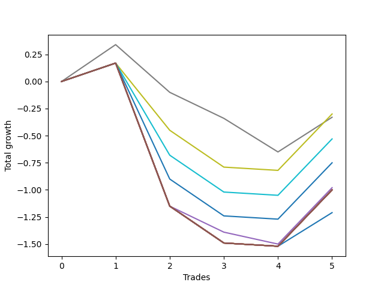

# Short HLT 101 
- Symbol: TSLA_15
- Date Range: 01/10/2024 - 05/17/2024
- Trading Period: 8:30-12:30
- Number of Trades: 5



| Name | Win Percent | Profit | Avg Profit / Trade | Avg Time / Trade |      | Name | Win Percent | Profit | Avg Profit / Trade | Avg Time / Trade |
| ---- | ----------- | ------ | ------------------ | ---------------- | ---- | ---- | ----------- | ------ | ------------------ | ---------------- |
| Sorted By <br> Profit | | | | | | Sorted By <br> Win Percentage ||||
| TP-0.5 | 40.00 | -150.00 | -30.00 | 12:36 |     | TP-0.5 | 40.00 | -150.00 | -30.00 | 12:36 |
| TP-0.25 | 40.00 | -165.00 | -33.00 | 02:24 |     | TP-0.25 | 40.00 | -165.00 | -33.00 | 02:24 |
| TP-0.75 | 40.00 | -265.00 | -53.00 | 13:36 |     | TP-0.75 | 40.00 | -265.00 | -53.00 | 13:36 |
| TP-1 | 40.00 | -375.00 | -75.00 | 13:48 |     | TP-1 | 40.00 | -375.00 | -75.00 | 13:48 |
| BB-50 Mid | 40.00 | -490.00 | -98.00 | 09:12 |     | BB-50 Mid | 40.00 | -490.00 | -98.00 | 09:12 |
| NEWFI 000 | 40.00 | -500.00 | -100.00 | 14:00 |     | NEWFI 000 | 40.00 | -500.00 | -100.00 | 14:00 |
| TP-2 | 40.00 | -500.00 | -100.00 | 14:00 |     | TP-2 | 40.00 | -500.00 | -100.00 | 14:00 |
| TP-1.75 | 40.00 | -500.00 | -100.00 | 14:00 |     | TP-1.75 | 40.00 | -500.00 | -100.00 | 14:00 |
| TP-1.5 | 40.00 | -500.00 | -100.00 | 14:00 |     | TP-1.5 | 40.00 | -500.00 | -100.00 | 14:00 |
| TP-1.25 | 40.00 | -500.00 | -100.00 | 14:00 |     | TP-1.25 | 40.00 | -500.00 | -100.00 | 14:00 |
| BB-50 U/L 2SD | 40.00 | -500.00 | -100.00 | 14:00 |     | BB-50 U/L 2SD | 40.00 | -500.00 | -100.00 | 14:00 |
| BB-50 U/L 1SD | 40.00 | -500.00 | -100.00 | 14:00 |     | BB-50 U/L 1SD | 40.00 | -500.00 | -100.00 | 14:00 |
| BB-20 U/L 2SD C | 40.00 | -500.00 | -100.00 | 14:00 |     | BB-20 U/L 2SD C | 40.00 | -500.00 | -100.00 | 14:00 |
| BB-20 U/L 2SD | 40.00 | -500.00 | -100.00 | 14:00 |     | BB-20 U/L 2SD | 40.00 | -500.00 | -100.00 | 14:00 |
| BB-20 U/L 1SD | 40.00 | -500.00 | -100.00 | 14:00 |     | BB-20 U/L 1SD | 40.00 | -500.00 | -100.00 | 14:00 |
| BB-20 Mid | 40.00 | -605.00 | -121.00 | 12:24 |     | BB-20 Mid | 40.00 | -605.00 | -121.00 | 12:24 |

## NO STOPLOSS

### Test BB-20 Mid
* Sell when price hits the middle line of the 20p bollinger
* No Stoploss
* Results:
```
Total Trades: 5
Percent Up: 60.00
Percent Down: 40.00
Total Points Moved Down: -1.21
Potential Profit: -605.00
Total Points Ups: 1.69 Count Ups: 3
Total Points Downs: 0.48 Count Downs: 2
```

<details><summary>Trades</summary>

<code>In: 2024-01-16 10:40:00		Out: 2024-01-16 10:54:00		Total Position Time: 14:00		Total Move Down: 0.17		Total to Date: 0.17</code> <br />
<code>In: 2024-02-22 08:55:00		Out: 2024-02-22 09:09:00		Total Position Time: 14:00		Total Move Down: -1.32		Total to Date: -1.15</code> <br />
<code>In: 2024-03-27 08:35:00		Out: 2024-03-27 08:49:00		Total Position Time: 14:00		Total Move Down: -0.34		Total to Date: -1.49</code> <br />
<code>In: 2024-03-28 10:05:00		Out: 2024-03-28 10:19:00		Total Position Time: 14:00		Total Move Down: -0.03		Total to Date: -1.52</code> <br />
<code>In: 2024-04-03 08:50:00		Out: 2024-04-03 08:56:00		Total Position Time: 06:00		Total Move Down: 0.31		Total to Date: -1.21</code> <br />


</details>

### Test BB-20 U/L 1SD
* Sell when the price hits the lower line of the 20p 1std bollinger
* No Stoploss
* Results:
```
Total Trades: 5
Percent Up: 60.00
Percent Down: 40.00
Total Points Moved Down: -1.00
Potential Profit: -500.00
Total Points Ups: 1.69 Count Ups: 3
Total Points Downs: 0.69 Count Downs: 2
```

<details><summary>Trades</summary>

<code>In: 2024-01-16 10:40:00		Out: 2024-01-16 10:54:00		Total Position Time: 14:00		Total Move Down: 0.17		Total to Date: 0.17</code> <br />
<code>In: 2024-02-22 08:55:00		Out: 2024-02-22 09:09:00		Total Position Time: 14:00		Total Move Down: -1.32		Total to Date: -1.15</code> <br />
<code>In: 2024-03-27 08:35:00		Out: 2024-03-27 08:49:00		Total Position Time: 14:00		Total Move Down: -0.34		Total to Date: -1.49</code> <br />
<code>In: 2024-03-28 10:05:00		Out: 2024-03-28 10:19:00		Total Position Time: 14:00		Total Move Down: -0.03		Total to Date: -1.52</code> <br />
<code>In: 2024-04-03 08:50:00		Out: 2024-04-03 09:04:00		Total Position Time: 14:00		Total Move Down: 0.52		Total to Date: -1.00</code> <br />


</details>

### Test BB-20 U/L 2SD
* Sell when the price hits the lower line of the 20p 2std bollinger
* No Stoploss
* Results:
```
Total Trades: 5
Percent Up: 60.00
Percent Down: 40.00
Total Points Moved Down: -1.00
Potential Profit: -500.00
Total Points Ups: 1.69 Count Ups: 3
Total Points Downs: 0.69 Count Downs: 2
```

<details><summary>Trades</summary>

<code>In: 2024-01-16 10:40:00		Out: 2024-01-16 10:54:00		Total Position Time: 14:00		Total Move Down: 0.17		Total to Date: 0.17</code> <br />
<code>In: 2024-02-22 08:55:00		Out: 2024-02-22 09:09:00		Total Position Time: 14:00		Total Move Down: -1.32		Total to Date: -1.15</code> <br />
<code>In: 2024-03-27 08:35:00		Out: 2024-03-27 08:49:00		Total Position Time: 14:00		Total Move Down: -0.34		Total to Date: -1.49</code> <br />
<code>In: 2024-03-28 10:05:00		Out: 2024-03-28 10:19:00		Total Position Time: 14:00		Total Move Down: -0.03		Total to Date: -1.52</code> <br />
<code>In: 2024-04-03 08:50:00		Out: 2024-04-03 09:04:00		Total Position Time: 14:00		Total Move Down: 0.52		Total to Date: -1.00</code> <br />


</details>

### Test BB-20 U/L 2SD C
* Sell when the price hits the lower line of the 20p 2std bollinger
* No Stoploss
* Results:
```
Total Trades: 5
Percent Up: 60.00
Percent Down: 40.00
Total Points Moved Down: -1.00
Potential Profit: -500.00
Total Points Ups: 1.69 Count Ups: 3
Total Points Downs: 0.69 Count Downs: 2
```

<details><summary>Trades</summary>

<code>In: 2024-01-16 10:40:00		Out: 2024-01-16 10:54:00		Total Position Time: 14:00		Total Move Down: 0.17		Total to Date: 0.17</code> <br />
<code>In: 2024-02-22 08:55:00		Out: 2024-02-22 09:09:00		Total Position Time: 14:00		Total Move Down: -1.32		Total to Date: -1.15</code> <br />
<code>In: 2024-03-27 08:35:00		Out: 2024-03-27 08:49:00		Total Position Time: 14:00		Total Move Down: -0.34		Total to Date: -1.49</code> <br />
<code>In: 2024-03-28 10:05:00		Out: 2024-03-28 10:19:00		Total Position Time: 14:00		Total Move Down: -0.03		Total to Date: -1.52</code> <br />
<code>In: 2024-04-03 08:50:00		Out: 2024-04-03 09:04:00		Total Position Time: 14:00		Total Move Down: 0.52		Total to Date: -1.00</code> <br />


</details>

### Test BB-50 Mid
* Sell when price hits the middle line of the 50p bollinger
* No Stoploss
* Results:
```
Total Trades: 5
Percent Up: 60.00
Percent Down: 40.00
Total Points Moved Down: -0.98
Potential Profit: -490.00
Total Points Ups: 1.67 Count Ups: 3
Total Points Downs: 0.69 Count Downs: 2
```

<details><summary>Trades</summary>

<code>In: 2024-01-16 10:40:00		Out: 2024-01-16 10:54:00		Total Position Time: 14:00		Total Move Down: 0.17		Total to Date: 0.17</code> <br />
<code>In: 2024-02-22 08:55:00		Out: 2024-02-22 09:09:00		Total Position Time: 14:00		Total Move Down: -1.32		Total to Date: -1.15</code> <br />
<code>In: 2024-03-27 08:35:00		Out: 2024-03-27 08:37:00		Total Position Time: 02:00		Total Move Down: -0.24		Total to Date: -1.39</code> <br />
<code>In: 2024-03-28 10:05:00		Out: 2024-03-28 10:07:00		Total Position Time: 02:00		Total Move Down: -0.11		Total to Date: -1.50</code> <br />
<code>In: 2024-04-03 08:50:00		Out: 2024-04-03 09:04:00		Total Position Time: 14:00		Total Move Down: 0.52		Total to Date: -0.98</code> <br />


</details>

### Test BB-50 U/L 1SD
* Sell when the price hits the lower line of the 50p 1std bollinger
* No Stoploss
* Results:
```
Total Trades: 5
Percent Up: 60.00
Percent Down: 40.00
Total Points Moved Down: -1.00
Potential Profit: -500.00
Total Points Ups: 1.69 Count Ups: 3
Total Points Downs: 0.69 Count Downs: 2
```

<details><summary>Trades</summary>

<code>In: 2024-01-16 10:40:00		Out: 2024-01-16 10:54:00		Total Position Time: 14:00		Total Move Down: 0.17		Total to Date: 0.17</code> <br />
<code>In: 2024-02-22 08:55:00		Out: 2024-02-22 09:09:00		Total Position Time: 14:00		Total Move Down: -1.32		Total to Date: -1.15</code> <br />
<code>In: 2024-03-27 08:35:00		Out: 2024-03-27 08:49:00		Total Position Time: 14:00		Total Move Down: -0.34		Total to Date: -1.49</code> <br />
<code>In: 2024-03-28 10:05:00		Out: 2024-03-28 10:19:00		Total Position Time: 14:00		Total Move Down: -0.03		Total to Date: -1.52</code> <br />
<code>In: 2024-04-03 08:50:00		Out: 2024-04-03 09:04:00		Total Position Time: 14:00		Total Move Down: 0.52		Total to Date: -1.00</code> <br />


</details>

### Test BB-50 U/L 2SD
* Sell when the price hits the lower line of the 50p 2std bollinger
* No Stoploss
* Results:
```
Total Trades: 5
Percent Up: 60.00
Percent Down: 40.00
Total Points Moved Down: -1.00
Potential Profit: -500.00
Total Points Ups: 1.69 Count Ups: 3
Total Points Downs: 0.69 Count Downs: 2
```

<details><summary>Trades</summary>

<code>In: 2024-01-16 10:40:00		Out: 2024-01-16 10:54:00		Total Position Time: 14:00		Total Move Down: 0.17		Total to Date: 0.17</code> <br />
<code>In: 2024-02-22 08:55:00		Out: 2024-02-22 09:09:00		Total Position Time: 14:00		Total Move Down: -1.32		Total to Date: -1.15</code> <br />
<code>In: 2024-03-27 08:35:00		Out: 2024-03-27 08:49:00		Total Position Time: 14:00		Total Move Down: -0.34		Total to Date: -1.49</code> <br />
<code>In: 2024-03-28 10:05:00		Out: 2024-03-28 10:19:00		Total Position Time: 14:00		Total Move Down: -0.03		Total to Date: -1.52</code> <br />
<code>In: 2024-04-03 08:50:00		Out: 2024-04-03 09:04:00		Total Position Time: 14:00		Total Move Down: 0.52		Total to Date: -1.00</code> <br />


</details>

## TAKE PROFIT

### Test TP-0.25
* Take Profit of 0.25 Point
* 0.25 Stoploss
* Results:
```
Total Trades: 5
Percent Up: 60.00
Percent Down: 40.00
Total Points Moved Down: -0.33
Potential Profit: -165.00
Total Points Ups: 0.99 Count Ups: 3
Total Points Downs: 0.66 Count Downs: 2
```

<details><summary>Trades</summary>

<code>In: 2024-01-16 10:40:00		Out: 2024-01-16 10:42:00		Total Position Time: 02:00		Total Move Down: 0.34		Total to Date: 0.34</code> <br />
<code>In: 2024-02-22 08:55:00		Out: 2024-02-22 08:57:00		Total Position Time: 02:00		Total Move Down: -0.44		Total to Date: -0.10</code> <br />
<code>In: 2024-03-27 08:35:00		Out: 2024-03-27 08:37:00		Total Position Time: 02:00		Total Move Down: -0.24		Total to Date: -0.34</code> <br />
<code>In: 2024-03-28 10:05:00		Out: 2024-03-28 10:09:00		Total Position Time: 04:00		Total Move Down: -0.31		Total to Date: -0.65</code> <br />
<code>In: 2024-04-03 08:50:00		Out: 2024-04-03 08:52:00		Total Position Time: 02:00		Total Move Down: 0.32		Total to Date: -0.33</code> <br />


</details>

### Test TP-0.5
* Take Profit of 0.5 Point
* 0.5 Stoploss
* Results:
```
Total Trades: 5
Percent Up: 60.00
Percent Down: 40.00
Total Points Moved Down: -0.30
Potential Profit: -150.00
Total Points Ups: 0.99 Count Ups: 3
Total Points Downs: 0.69 Count Downs: 2
```

<details><summary>Trades</summary>

<code>In: 2024-01-16 10:40:00		Out: 2024-01-16 10:54:00		Total Position Time: 14:00		Total Move Down: 0.17		Total to Date: 0.17</code> <br />
<code>In: 2024-02-22 08:55:00		Out: 2024-02-22 09:02:00		Total Position Time: 07:00		Total Move Down: -0.62		Total to Date: -0.45</code> <br />
<code>In: 2024-03-27 08:35:00		Out: 2024-03-27 08:49:00		Total Position Time: 14:00		Total Move Down: -0.34		Total to Date: -0.79</code> <br />
<code>In: 2024-03-28 10:05:00		Out: 2024-03-28 10:19:00		Total Position Time: 14:00		Total Move Down: -0.03		Total to Date: -0.82</code> <br />
<code>In: 2024-04-03 08:50:00		Out: 2024-04-03 09:04:00		Total Position Time: 14:00		Total Move Down: 0.52		Total to Date: -0.30</code> <br />


</details>

### Test TP-0.75
* Take Profit of 0.75 Point
* 0.75 Stoploss
* Results:
```
Total Trades: 5
Percent Up: 60.00
Percent Down: 40.00
Total Points Moved Down: -0.53
Potential Profit: -265.00
Total Points Ups: 1.22 Count Ups: 3
Total Points Downs: 0.69 Count Downs: 2
```

<details><summary>Trades</summary>

<code>In: 2024-01-16 10:40:00		Out: 2024-01-16 10:54:00		Total Position Time: 14:00		Total Move Down: 0.17		Total to Date: 0.17</code> <br />
<code>In: 2024-02-22 08:55:00		Out: 2024-02-22 09:07:00		Total Position Time: 12:00		Total Move Down: -0.85		Total to Date: -0.68</code> <br />
<code>In: 2024-03-27 08:35:00		Out: 2024-03-27 08:49:00		Total Position Time: 14:00		Total Move Down: -0.34		Total to Date: -1.02</code> <br />
<code>In: 2024-03-28 10:05:00		Out: 2024-03-28 10:19:00		Total Position Time: 14:00		Total Move Down: -0.03		Total to Date: -1.05</code> <br />
<code>In: 2024-04-03 08:50:00		Out: 2024-04-03 09:04:00		Total Position Time: 14:00		Total Move Down: 0.52		Total to Date: -0.53</code> <br />


</details>

### Test TP-1
* Take Profit of 1 Point
* 1 Stoploss
* Results:
```
Total Trades: 5
Percent Up: 60.00
Percent Down: 40.00
Total Points Moved Down: -0.75
Potential Profit: -375.00
Total Points Ups: 1.44 Count Ups: 3
Total Points Downs: 0.69 Count Downs: 2
```

<details><summary>Trades</summary>

<code>In: 2024-01-16 10:40:00		Out: 2024-01-16 10:54:00		Total Position Time: 14:00		Total Move Down: 0.17		Total to Date: 0.17</code> <br />
<code>In: 2024-02-22 08:55:00		Out: 2024-02-22 09:08:00		Total Position Time: 13:00		Total Move Down: -1.07		Total to Date: -0.90</code> <br />
<code>In: 2024-03-27 08:35:00		Out: 2024-03-27 08:49:00		Total Position Time: 14:00		Total Move Down: -0.34		Total to Date: -1.24</code> <br />
<code>In: 2024-03-28 10:05:00		Out: 2024-03-28 10:19:00		Total Position Time: 14:00		Total Move Down: -0.03		Total to Date: -1.27</code> <br />
<code>In: 2024-04-03 08:50:00		Out: 2024-04-03 09:04:00		Total Position Time: 14:00		Total Move Down: 0.52		Total to Date: -0.75</code> <br />


</details>

### Test TP-1.25
* Take Profit of 1.25 Point
* 1.25 Stoploss
* Results:
```
Total Trades: 5
Percent Up: 60.00
Percent Down: 40.00
Total Points Moved Down: -1.00
Potential Profit: -500.00
Total Points Ups: 1.69 Count Ups: 3
Total Points Downs: 0.69 Count Downs: 2
```

<details><summary>Trades</summary>

<code>In: 2024-01-16 10:40:00		Out: 2024-01-16 10:54:00		Total Position Time: 14:00		Total Move Down: 0.17		Total to Date: 0.17</code> <br />
<code>In: 2024-02-22 08:55:00		Out: 2024-02-22 09:09:00		Total Position Time: 14:00		Total Move Down: -1.32		Total to Date: -1.15</code> <br />
<code>In: 2024-03-27 08:35:00		Out: 2024-03-27 08:49:00		Total Position Time: 14:00		Total Move Down: -0.34		Total to Date: -1.49</code> <br />
<code>In: 2024-03-28 10:05:00		Out: 2024-03-28 10:19:00		Total Position Time: 14:00		Total Move Down: -0.03		Total to Date: -1.52</code> <br />
<code>In: 2024-04-03 08:50:00		Out: 2024-04-03 09:04:00		Total Position Time: 14:00		Total Move Down: 0.52		Total to Date: -1.00</code> <br />


</details>

### Test TP-1.5
* Take Profit of 1.5 Point
* 1.5 Stoploss
* Results:
```
Total Trades: 5
Percent Up: 60.00
Percent Down: 40.00
Total Points Moved Down: -1.00
Potential Profit: -500.00
Total Points Ups: 1.69 Count Ups: 3
Total Points Downs: 0.69 Count Downs: 2
```

<details><summary>Trades</summary>

<code>In: 2024-01-16 10:40:00		Out: 2024-01-16 10:54:00		Total Position Time: 14:00		Total Move Down: 0.17		Total to Date: 0.17</code> <br />
<code>In: 2024-02-22 08:55:00		Out: 2024-02-22 09:09:00		Total Position Time: 14:00		Total Move Down: -1.32		Total to Date: -1.15</code> <br />
<code>In: 2024-03-27 08:35:00		Out: 2024-03-27 08:49:00		Total Position Time: 14:00		Total Move Down: -0.34		Total to Date: -1.49</code> <br />
<code>In: 2024-03-28 10:05:00		Out: 2024-03-28 10:19:00		Total Position Time: 14:00		Total Move Down: -0.03		Total to Date: -1.52</code> <br />
<code>In: 2024-04-03 08:50:00		Out: 2024-04-03 09:04:00		Total Position Time: 14:00		Total Move Down: 0.52		Total to Date: -1.00</code> <br />


</details>

### Test TP-1.75
* Take Profit of 1.75 Point
* 1.75 Stoploss
* Results:
```
Total Trades: 5
Percent Up: 60.00
Percent Down: 40.00
Total Points Moved Down: -1.00
Potential Profit: -500.00
Total Points Ups: 1.69 Count Ups: 3
Total Points Downs: 0.69 Count Downs: 2
```

<details><summary>Trades</summary>

<code>In: 2024-01-16 10:40:00		Out: 2024-01-16 10:54:00		Total Position Time: 14:00		Total Move Down: 0.17		Total to Date: 0.17</code> <br />
<code>In: 2024-02-22 08:55:00		Out: 2024-02-22 09:09:00		Total Position Time: 14:00		Total Move Down: -1.32		Total to Date: -1.15</code> <br />
<code>In: 2024-03-27 08:35:00		Out: 2024-03-27 08:49:00		Total Position Time: 14:00		Total Move Down: -0.34		Total to Date: -1.49</code> <br />
<code>In: 2024-03-28 10:05:00		Out: 2024-03-28 10:19:00		Total Position Time: 14:00		Total Move Down: -0.03		Total to Date: -1.52</code> <br />
<code>In: 2024-04-03 08:50:00		Out: 2024-04-03 09:04:00		Total Position Time: 14:00		Total Move Down: 0.52		Total to Date: -1.00</code> <br />


</details>

### Test TP-2
* Take Profit of 2 Point
* 2 Stoploss
* Results:
```
Total Trades: 5
Percent Up: 60.00
Percent Down: 40.00
Total Points Moved Down: -1.00
Potential Profit: -500.00
Total Points Ups: 1.69 Count Ups: 3
Total Points Downs: 0.69 Count Downs: 2
```

<details><summary>Trades</summary>

<code>In: 2024-01-16 10:40:00		Out: 2024-01-16 10:54:00		Total Position Time: 14:00		Total Move Down: 0.17		Total to Date: 0.17</code> <br />
<code>In: 2024-02-22 08:55:00		Out: 2024-02-22 09:09:00		Total Position Time: 14:00		Total Move Down: -1.32		Total to Date: -1.15</code> <br />
<code>In: 2024-03-27 08:35:00		Out: 2024-03-27 08:49:00		Total Position Time: 14:00		Total Move Down: -0.34		Total to Date: -1.49</code> <br />
<code>In: 2024-03-28 10:05:00		Out: 2024-03-28 10:19:00		Total Position Time: 14:00		Total Move Down: -0.03		Total to Date: -1.52</code> <br />
<code>In: 2024-04-03 08:50:00		Out: 2024-04-03 09:04:00		Total Position Time: 14:00		Total Move Down: 0.52		Total to Date: -1.00</code> <br />


</details>

## Indicator Exits

### Test NEWFI 000
* Newfi 0000
* No Stoploss
* Results:
```
Total Trades: 5
Percent Up: 60.00
Percent Down: 40.00
Total Points Moved Down: -1.00
Potential Profit: -500.00
Total Points Ups: 1.69 Count Ups: 3
Total Points Downs: 0.69 Count Downs: 2
```

<details><summary>Trades</summary>

<code>In: 2024-01-16 10:40:00		Out: 2024-01-16 10:54:00		Total Position Time: 14:00		Total Move Down: 0.17		Total to Date: 0.17</code> <br />
<code>In: 2024-02-22 08:55:00		Out: 2024-02-22 09:09:00		Total Position Time: 14:00		Total Move Down: -1.32		Total to Date: -1.15</code> <br />
<code>In: 2024-03-27 08:35:00		Out: 2024-03-27 08:49:00		Total Position Time: 14:00		Total Move Down: -0.34		Total to Date: -1.49</code> <br />
<code>In: 2024-03-28 10:05:00		Out: 2024-03-28 10:19:00		Total Position Time: 14:00		Total Move Down: -0.03		Total to Date: -1.52</code> <br />
<code>In: 2024-04-03 08:50:00		Out: 2024-04-03 09:04:00		Total Position Time: 14:00		Total Move Down: 0.52		Total to Date: -1.00</code> <br />


</details>