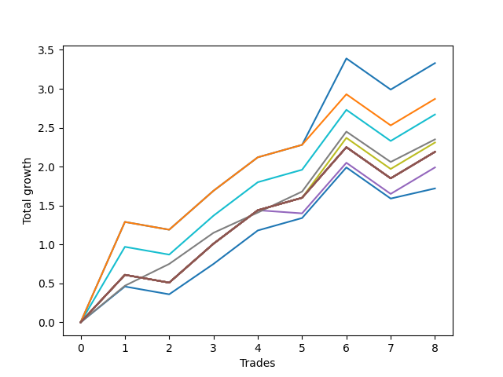

# Short HLT 105 
- Symbol: TSLA_15
- Date Range: 01/10/2024 - 05/17/2024
- Trading Period: 8:30-12:30
- Number of Trades: 8



| Name | Win Percent | Profit | Avg Profit / Trade | Avg Time / Trade |      | Name | Win Percent | Profit | Avg Profit / Trade | Avg Time / Trade |
| ---- | ----------- | ------ | ------------------ | ---------------- | ---- | ---- | ----------- | ------ | ------------------ | ---------------- |
| Sorted By <br> Profit | | | | | | Sorted By <br> Win Percentage ||||
| TP-1 | 75.00 | 1665.00 | 208.13 | 12:22 |     | TP-0.25 | 87.50 | 1175.00 | 146.88 | 06:37 |
| TP-1.25 | 75.00 | 1435.00 | 179.38 | 13:30 |     | TP-1 | 75.00 | 1665.00 | 208.13 | 12:22 |
| TP-0.75 | 75.00 | 1335.00 | 166.88 | 11:45 |     | TP-1.25 | 75.00 | 1435.00 | 179.38 | 13:30 |
| TP-0.25 | 87.50 | 1175.00 | 146.88 | 06:37 |     | TP-0.75 | 75.00 | 1335.00 | 166.88 | 11:45 |
| TP-0.5 | 75.00 | 1155.00 | 144.38 | 11:07 |     | TP-0.5 | 75.00 | 1155.00 | 144.38 | 11:07 |
| NEWFI 000 | 75.00 | 1095.00 | 136.88 | 14:00 |     | NEWFI 000 | 75.00 | 1095.00 | 136.88 | 14:00 |
| TP-2 | 75.00 | 1095.00 | 136.88 | 14:00 |     | TP-2 | 75.00 | 1095.00 | 136.88 | 14:00 |
| TP-1.75 | 75.00 | 1095.00 | 136.88 | 14:00 |     | TP-1.75 | 75.00 | 1095.00 | 136.88 | 14:00 |
| TP-1.5 | 75.00 | 1095.00 | 136.88 | 14:00 |     | TP-1.5 | 75.00 | 1095.00 | 136.88 | 14:00 |
| BB-50 U/L 2SD | 75.00 | 1095.00 | 136.88 | 14:00 |     | BB-50 U/L 2SD | 75.00 | 1095.00 | 136.88 | 14:00 |
| BB-50 U/L 1SD | 75.00 | 1095.00 | 136.88 | 14:00 |     | BB-50 U/L 1SD | 75.00 | 1095.00 | 136.88 | 14:00 |
| BB-20 U/L 2SD C | 75.00 | 1095.00 | 136.88 | 14:00 |     | BB-20 U/L 2SD C | 75.00 | 1095.00 | 136.88 | 14:00 |
| BB-20 U/L 2SD | 75.00 | 1095.00 | 136.88 | 14:00 |     | BB-20 U/L 2SD | 75.00 | 1095.00 | 136.88 | 14:00 |
| BB-20 U/L 1SD | 75.00 | 1095.00 | 136.88 | 14:00 |     | BB-20 U/L 1SD | 75.00 | 1095.00 | 136.88 | 14:00 |
| BB-50 Mid | 62.50 | 995.00 | 124.38 | 12:37 |     | BB-20 Mid | 75.00 | 860.00 | 107.50 | 11:07 |
| BB-20 Mid | 75.00 | 860.00 | 107.50 | 11:07 |     | BB-50 Mid | 62.50 | 995.00 | 124.38 | 12:37 |

## NO STOPLOSS

### Test BB-20 Mid
* Sell when price hits the middle line of the 20p bollinger
* No Stoploss
* Results:
```
Total Trades: 8
Percent Up: 25.00
Percent Down: 75.00
Total Points Moved Down: 1.72
Potential Profit: 860.00
Total Points Ups: 0.50 Count Ups: 2
Total Points Downs: 2.22 Count Downs: 6
```

<details><summary>Trades</summary>

<code>In: 2024-02-07 11:10:00		Out: 2024-02-07 11:16:00		Total Position Time: 06:00		Total Move Down: 0.46		Total to Date: 0.46</code> <br />
<code>In: 2024-02-22 10:55:00		Out: 2024-02-22 11:09:00		Total Position Time: 14:00		Total Move Down: -0.10		Total to Date: 0.36</code> <br />
<code>In: 2024-03-18 11:50:00		Out: 2024-03-18 12:01:00		Total Position Time: 11:00		Total Move Down: 0.39		Total to Date: 0.75</code> <br />
<code>In: 2024-03-27 09:55:00		Out: 2024-03-27 10:09:00		Total Position Time: 14:00		Total Move Down: 0.43		Total to Date: 1.18</code> <br />
<code>In: 2024-04-24 11:10:00		Out: 2024-04-24 11:24:00		Total Position Time: 14:00		Total Move Down: 0.16		Total to Date: 1.34</code> <br />
<code>In: 2024-04-29 09:40:00		Out: 2024-04-29 09:54:00		Total Position Time: 14:00		Total Move Down: 0.65		Total to Date: 1.99</code> <br />
<code>In: 2024-05-14 08:40:00		Out: 2024-05-14 08:54:00		Total Position Time: 14:00		Total Move Down: -0.40		Total to Date: 1.59</code> <br />
<code>In: 2024-05-17 09:45:00		Out: 2024-05-17 09:47:00		Total Position Time: 02:00		Total Move Down: 0.13		Total to Date: 1.72</code> <br />


</details>

### Test BB-20 U/L 1SD
* Sell when the price hits the lower line of the 20p 1std bollinger
* No Stoploss
* Results:
```
Total Trades: 8
Percent Up: 25.00
Percent Down: 75.00
Total Points Moved Down: 2.19
Potential Profit: 1095.00
Total Points Ups: 0.50 Count Ups: 2
Total Points Downs: 2.69 Count Downs: 6
```

<details><summary>Trades</summary>

<code>In: 2024-02-07 11:10:00		Out: 2024-02-07 11:24:00		Total Position Time: 14:00		Total Move Down: 0.61		Total to Date: 0.61</code> <br />
<code>In: 2024-02-22 10:55:00		Out: 2024-02-22 11:09:00		Total Position Time: 14:00		Total Move Down: -0.10		Total to Date: 0.51</code> <br />
<code>In: 2024-03-18 11:50:00		Out: 2024-03-18 12:04:00		Total Position Time: 14:00		Total Move Down: 0.50		Total to Date: 1.01</code> <br />
<code>In: 2024-03-27 09:55:00		Out: 2024-03-27 10:09:00		Total Position Time: 14:00		Total Move Down: 0.43		Total to Date: 1.44</code> <br />
<code>In: 2024-04-24 11:10:00		Out: 2024-04-24 11:24:00		Total Position Time: 14:00		Total Move Down: 0.16		Total to Date: 1.60</code> <br />
<code>In: 2024-04-29 09:40:00		Out: 2024-04-29 09:54:00		Total Position Time: 14:00		Total Move Down: 0.65		Total to Date: 2.25</code> <br />
<code>In: 2024-05-14 08:40:00		Out: 2024-05-14 08:54:00		Total Position Time: 14:00		Total Move Down: -0.40		Total to Date: 1.85</code> <br />
<code>In: 2024-05-17 09:45:00		Out: 2024-05-17 09:59:00		Total Position Time: 14:00		Total Move Down: 0.34		Total to Date: 2.19</code> <br />


</details>

### Test BB-20 U/L 2SD
* Sell when the price hits the lower line of the 20p 2std bollinger
* No Stoploss
* Results:
```
Total Trades: 8
Percent Up: 25.00
Percent Down: 75.00
Total Points Moved Down: 2.19
Potential Profit: 1095.00
Total Points Ups: 0.50 Count Ups: 2
Total Points Downs: 2.69 Count Downs: 6
```

<details><summary>Trades</summary>

<code>In: 2024-02-07 11:10:00		Out: 2024-02-07 11:24:00		Total Position Time: 14:00		Total Move Down: 0.61		Total to Date: 0.61</code> <br />
<code>In: 2024-02-22 10:55:00		Out: 2024-02-22 11:09:00		Total Position Time: 14:00		Total Move Down: -0.10		Total to Date: 0.51</code> <br />
<code>In: 2024-03-18 11:50:00		Out: 2024-03-18 12:04:00		Total Position Time: 14:00		Total Move Down: 0.50		Total to Date: 1.01</code> <br />
<code>In: 2024-03-27 09:55:00		Out: 2024-03-27 10:09:00		Total Position Time: 14:00		Total Move Down: 0.43		Total to Date: 1.44</code> <br />
<code>In: 2024-04-24 11:10:00		Out: 2024-04-24 11:24:00		Total Position Time: 14:00		Total Move Down: 0.16		Total to Date: 1.60</code> <br />
<code>In: 2024-04-29 09:40:00		Out: 2024-04-29 09:54:00		Total Position Time: 14:00		Total Move Down: 0.65		Total to Date: 2.25</code> <br />
<code>In: 2024-05-14 08:40:00		Out: 2024-05-14 08:54:00		Total Position Time: 14:00		Total Move Down: -0.40		Total to Date: 1.85</code> <br />
<code>In: 2024-05-17 09:45:00		Out: 2024-05-17 09:59:00		Total Position Time: 14:00		Total Move Down: 0.34		Total to Date: 2.19</code> <br />


</details>

### Test BB-20 U/L 2SD C
* Sell when the price hits the lower line of the 20p 2std bollinger
* No Stoploss
* Results:
```
Total Trades: 8
Percent Up: 25.00
Percent Down: 75.00
Total Points Moved Down: 2.19
Potential Profit: 1095.00
Total Points Ups: 0.50 Count Ups: 2
Total Points Downs: 2.69 Count Downs: 6
```

<details><summary>Trades</summary>

<code>In: 2024-02-07 11:10:00		Out: 2024-02-07 11:24:00		Total Position Time: 14:00		Total Move Down: 0.61		Total to Date: 0.61</code> <br />
<code>In: 2024-02-22 10:55:00		Out: 2024-02-22 11:09:00		Total Position Time: 14:00		Total Move Down: -0.10		Total to Date: 0.51</code> <br />
<code>In: 2024-03-18 11:50:00		Out: 2024-03-18 12:04:00		Total Position Time: 14:00		Total Move Down: 0.50		Total to Date: 1.01</code> <br />
<code>In: 2024-03-27 09:55:00		Out: 2024-03-27 10:09:00		Total Position Time: 14:00		Total Move Down: 0.43		Total to Date: 1.44</code> <br />
<code>In: 2024-04-24 11:10:00		Out: 2024-04-24 11:24:00		Total Position Time: 14:00		Total Move Down: 0.16		Total to Date: 1.60</code> <br />
<code>In: 2024-04-29 09:40:00		Out: 2024-04-29 09:54:00		Total Position Time: 14:00		Total Move Down: 0.65		Total to Date: 2.25</code> <br />
<code>In: 2024-05-14 08:40:00		Out: 2024-05-14 08:54:00		Total Position Time: 14:00		Total Move Down: -0.40		Total to Date: 1.85</code> <br />
<code>In: 2024-05-17 09:45:00		Out: 2024-05-17 09:59:00		Total Position Time: 14:00		Total Move Down: 0.34		Total to Date: 2.19</code> <br />


</details>

### Test BB-50 Mid
* Sell when price hits the middle line of the 50p bollinger
* No Stoploss
* Results:
```
Total Trades: 8
Percent Up: 37.50
Percent Down: 62.50
Total Points Moved Down: 1.99
Potential Profit: 995.00
Total Points Ups: 0.54 Count Ups: 3
Total Points Downs: 2.53 Count Downs: 5
```

<details><summary>Trades</summary>

<code>In: 2024-02-07 11:10:00		Out: 2024-02-07 11:24:00		Total Position Time: 14:00		Total Move Down: 0.61		Total to Date: 0.61</code> <br />
<code>In: 2024-02-22 10:55:00		Out: 2024-02-22 11:09:00		Total Position Time: 14:00		Total Move Down: -0.10		Total to Date: 0.51</code> <br />
<code>In: 2024-03-18 11:50:00		Out: 2024-03-18 12:04:00		Total Position Time: 14:00		Total Move Down: 0.50		Total to Date: 1.01</code> <br />
<code>In: 2024-03-27 09:55:00		Out: 2024-03-27 10:09:00		Total Position Time: 14:00		Total Move Down: 0.43		Total to Date: 1.44</code> <br />
<code>In: 2024-04-24 11:10:00		Out: 2024-04-24 11:13:00		Total Position Time: 03:00		Total Move Down: -0.04		Total to Date: 1.40</code> <br />
<code>In: 2024-04-29 09:40:00		Out: 2024-04-29 09:54:00		Total Position Time: 14:00		Total Move Down: 0.65		Total to Date: 2.05</code> <br />
<code>In: 2024-05-14 08:40:00		Out: 2024-05-14 08:54:00		Total Position Time: 14:00		Total Move Down: -0.40		Total to Date: 1.65</code> <br />
<code>In: 2024-05-17 09:45:00		Out: 2024-05-17 09:59:00		Total Position Time: 14:00		Total Move Down: 0.34		Total to Date: 1.99</code> <br />


</details>

### Test BB-50 U/L 1SD
* Sell when the price hits the lower line of the 50p 1std bollinger
* No Stoploss
* Results:
```
Total Trades: 8
Percent Up: 25.00
Percent Down: 75.00
Total Points Moved Down: 2.19
Potential Profit: 1095.00
Total Points Ups: 0.50 Count Ups: 2
Total Points Downs: 2.69 Count Downs: 6
```

<details><summary>Trades</summary>

<code>In: 2024-02-07 11:10:00		Out: 2024-02-07 11:24:00		Total Position Time: 14:00		Total Move Down: 0.61		Total to Date: 0.61</code> <br />
<code>In: 2024-02-22 10:55:00		Out: 2024-02-22 11:09:00		Total Position Time: 14:00		Total Move Down: -0.10		Total to Date: 0.51</code> <br />
<code>In: 2024-03-18 11:50:00		Out: 2024-03-18 12:04:00		Total Position Time: 14:00		Total Move Down: 0.50		Total to Date: 1.01</code> <br />
<code>In: 2024-03-27 09:55:00		Out: 2024-03-27 10:09:00		Total Position Time: 14:00		Total Move Down: 0.43		Total to Date: 1.44</code> <br />
<code>In: 2024-04-24 11:10:00		Out: 2024-04-24 11:24:00		Total Position Time: 14:00		Total Move Down: 0.16		Total to Date: 1.60</code> <br />
<code>In: 2024-04-29 09:40:00		Out: 2024-04-29 09:54:00		Total Position Time: 14:00		Total Move Down: 0.65		Total to Date: 2.25</code> <br />
<code>In: 2024-05-14 08:40:00		Out: 2024-05-14 08:54:00		Total Position Time: 14:00		Total Move Down: -0.40		Total to Date: 1.85</code> <br />
<code>In: 2024-05-17 09:45:00		Out: 2024-05-17 09:59:00		Total Position Time: 14:00		Total Move Down: 0.34		Total to Date: 2.19</code> <br />


</details>

### Test BB-50 U/L 2SD
* Sell when the price hits the lower line of the 50p 2std bollinger
* No Stoploss
* Results:
```
Total Trades: 8
Percent Up: 25.00
Percent Down: 75.00
Total Points Moved Down: 2.19
Potential Profit: 1095.00
Total Points Ups: 0.50 Count Ups: 2
Total Points Downs: 2.69 Count Downs: 6
```

<details><summary>Trades</summary>

<code>In: 2024-02-07 11:10:00		Out: 2024-02-07 11:24:00		Total Position Time: 14:00		Total Move Down: 0.61		Total to Date: 0.61</code> <br />
<code>In: 2024-02-22 10:55:00		Out: 2024-02-22 11:09:00		Total Position Time: 14:00		Total Move Down: -0.10		Total to Date: 0.51</code> <br />
<code>In: 2024-03-18 11:50:00		Out: 2024-03-18 12:04:00		Total Position Time: 14:00		Total Move Down: 0.50		Total to Date: 1.01</code> <br />
<code>In: 2024-03-27 09:55:00		Out: 2024-03-27 10:09:00		Total Position Time: 14:00		Total Move Down: 0.43		Total to Date: 1.44</code> <br />
<code>In: 2024-04-24 11:10:00		Out: 2024-04-24 11:24:00		Total Position Time: 14:00		Total Move Down: 0.16		Total to Date: 1.60</code> <br />
<code>In: 2024-04-29 09:40:00		Out: 2024-04-29 09:54:00		Total Position Time: 14:00		Total Move Down: 0.65		Total to Date: 2.25</code> <br />
<code>In: 2024-05-14 08:40:00		Out: 2024-05-14 08:54:00		Total Position Time: 14:00		Total Move Down: -0.40		Total to Date: 1.85</code> <br />
<code>In: 2024-05-17 09:45:00		Out: 2024-05-17 09:59:00		Total Position Time: 14:00		Total Move Down: 0.34		Total to Date: 2.19</code> <br />


</details>

## TAKE PROFIT

### Test TP-0.25
* Take Profit of 0.25 Point
* 0.25 Stoploss
* Results:
```
Total Trades: 8
Percent Up: 12.50
Percent Down: 87.50
Total Points Moved Down: 2.35
Potential Profit: 1175.00
Total Points Ups: 0.39 Count Ups: 1
Total Points Downs: 2.74 Count Downs: 7
```

<details><summary>Trades</summary>

<code>In: 2024-02-07 11:10:00		Out: 2024-02-07 11:13:00		Total Position Time: 03:00		Total Move Down: 0.47		Total to Date: 0.47</code> <br />
<code>In: 2024-02-22 10:55:00		Out: 2024-02-22 11:00:00		Total Position Time: 05:00		Total Move Down: 0.28		Total to Date: 0.75</code> <br />
<code>In: 2024-03-18 11:50:00		Out: 2024-03-18 11:57:00		Total Position Time: 07:00		Total Move Down: 0.40		Total to Date: 1.15</code> <br />
<code>In: 2024-03-27 09:55:00		Out: 2024-03-27 10:03:00		Total Position Time: 08:00		Total Move Down: 0.26		Total to Date: 1.41</code> <br />
<code>In: 2024-04-24 11:10:00		Out: 2024-04-24 11:18:00		Total Position Time: 08:00		Total Move Down: 0.27		Total to Date: 1.68</code> <br />
<code>In: 2024-04-29 09:40:00		Out: 2024-04-29 09:42:00		Total Position Time: 02:00		Total Move Down: 0.77		Total to Date: 2.45</code> <br />
<code>In: 2024-05-14 08:40:00		Out: 2024-05-14 08:50:00		Total Position Time: 10:00		Total Move Down: -0.39		Total to Date: 2.06</code> <br />
<code>In: 2024-05-17 09:45:00		Out: 2024-05-17 09:55:00		Total Position Time: 10:00		Total Move Down: 0.29		Total to Date: 2.35</code> <br />


</details>

### Test TP-0.5
* Take Profit of 0.5 Point
* 0.5 Stoploss
* Results:
```
Total Trades: 8
Percent Up: 25.00
Percent Down: 75.00
Total Points Moved Down: 2.31
Potential Profit: 1155.00
Total Points Ups: 0.50 Count Ups: 2
Total Points Downs: 2.81 Count Downs: 6
```

<details><summary>Trades</summary>

<code>In: 2024-02-07 11:10:00		Out: 2024-02-07 11:14:00		Total Position Time: 04:00		Total Move Down: 0.61		Total to Date: 0.61</code> <br />
<code>In: 2024-02-22 10:55:00		Out: 2024-02-22 11:09:00		Total Position Time: 14:00		Total Move Down: -0.10		Total to Date: 0.51</code> <br />
<code>In: 2024-03-18 11:50:00		Out: 2024-03-18 12:03:00		Total Position Time: 13:00		Total Move Down: 0.50		Total to Date: 1.01</code> <br />
<code>In: 2024-03-27 09:55:00		Out: 2024-03-27 10:09:00		Total Position Time: 14:00		Total Move Down: 0.43		Total to Date: 1.44</code> <br />
<code>In: 2024-04-24 11:10:00		Out: 2024-04-24 11:24:00		Total Position Time: 14:00		Total Move Down: 0.16		Total to Date: 1.60</code> <br />
<code>In: 2024-04-29 09:40:00		Out: 2024-04-29 09:42:00		Total Position Time: 02:00		Total Move Down: 0.77		Total to Date: 2.37</code> <br />
<code>In: 2024-05-14 08:40:00		Out: 2024-05-14 08:54:00		Total Position Time: 14:00		Total Move Down: -0.40		Total to Date: 1.97</code> <br />
<code>In: 2024-05-17 09:45:00		Out: 2024-05-17 09:59:00		Total Position Time: 14:00		Total Move Down: 0.34		Total to Date: 2.31</code> <br />


</details>

### Test TP-0.75
* Take Profit of 0.75 Point
* 0.75 Stoploss
* Results:
```
Total Trades: 8
Percent Up: 25.00
Percent Down: 75.00
Total Points Moved Down: 2.67
Potential Profit: 1335.00
Total Points Ups: 0.50 Count Ups: 2
Total Points Downs: 3.17 Count Downs: 6
```

<details><summary>Trades</summary>

<code>In: 2024-02-07 11:10:00		Out: 2024-02-07 11:18:00		Total Position Time: 08:00		Total Move Down: 0.97		Total to Date: 0.97</code> <br />
<code>In: 2024-02-22 10:55:00		Out: 2024-02-22 11:09:00		Total Position Time: 14:00		Total Move Down: -0.10		Total to Date: 0.87</code> <br />
<code>In: 2024-03-18 11:50:00		Out: 2024-03-18 12:04:00		Total Position Time: 14:00		Total Move Down: 0.50		Total to Date: 1.37</code> <br />
<code>In: 2024-03-27 09:55:00		Out: 2024-03-27 10:09:00		Total Position Time: 14:00		Total Move Down: 0.43		Total to Date: 1.80</code> <br />
<code>In: 2024-04-24 11:10:00		Out: 2024-04-24 11:24:00		Total Position Time: 14:00		Total Move Down: 0.16		Total to Date: 1.96</code> <br />
<code>In: 2024-04-29 09:40:00		Out: 2024-04-29 09:42:00		Total Position Time: 02:00		Total Move Down: 0.77		Total to Date: 2.73</code> <br />
<code>In: 2024-05-14 08:40:00		Out: 2024-05-14 08:54:00		Total Position Time: 14:00		Total Move Down: -0.40		Total to Date: 2.33</code> <br />
<code>In: 2024-05-17 09:45:00		Out: 2024-05-17 09:59:00		Total Position Time: 14:00		Total Move Down: 0.34		Total to Date: 2.67</code> <br />


</details>

### Test TP-1
* Take Profit of 1 Point
* 1 Stoploss
* Results:
```
Total Trades: 8
Percent Up: 25.00
Percent Down: 75.00
Total Points Moved Down: 3.33
Potential Profit: 1665.00
Total Points Ups: 0.50 Count Ups: 2
Total Points Downs: 3.83 Count Downs: 6
```

<details><summary>Trades</summary>

<code>In: 2024-02-07 11:10:00		Out: 2024-02-07 11:20:00		Total Position Time: 10:00		Total Move Down: 1.29		Total to Date: 1.29</code> <br />
<code>In: 2024-02-22 10:55:00		Out: 2024-02-22 11:09:00		Total Position Time: 14:00		Total Move Down: -0.10		Total to Date: 1.19</code> <br />
<code>In: 2024-03-18 11:50:00		Out: 2024-03-18 12:04:00		Total Position Time: 14:00		Total Move Down: 0.50		Total to Date: 1.69</code> <br />
<code>In: 2024-03-27 09:55:00		Out: 2024-03-27 10:09:00		Total Position Time: 14:00		Total Move Down: 0.43		Total to Date: 2.12</code> <br />
<code>In: 2024-04-24 11:10:00		Out: 2024-04-24 11:24:00		Total Position Time: 14:00		Total Move Down: 0.16		Total to Date: 2.28</code> <br />
<code>In: 2024-04-29 09:40:00		Out: 2024-04-29 09:45:00		Total Position Time: 05:00		Total Move Down: 1.11		Total to Date: 3.39</code> <br />
<code>In: 2024-05-14 08:40:00		Out: 2024-05-14 08:54:00		Total Position Time: 14:00		Total Move Down: -0.40		Total to Date: 2.99</code> <br />
<code>In: 2024-05-17 09:45:00		Out: 2024-05-17 09:59:00		Total Position Time: 14:00		Total Move Down: 0.34		Total to Date: 3.33</code> <br />


</details>

### Test TP-1.25
* Take Profit of 1.25 Point
* 1.25 Stoploss
* Results:
```
Total Trades: 8
Percent Up: 25.00
Percent Down: 75.00
Total Points Moved Down: 2.87
Potential Profit: 1435.00
Total Points Ups: 0.50 Count Ups: 2
Total Points Downs: 3.37 Count Downs: 6
```

<details><summary>Trades</summary>

<code>In: 2024-02-07 11:10:00		Out: 2024-02-07 11:20:00		Total Position Time: 10:00		Total Move Down: 1.29		Total to Date: 1.29</code> <br />
<code>In: 2024-02-22 10:55:00		Out: 2024-02-22 11:09:00		Total Position Time: 14:00		Total Move Down: -0.10		Total to Date: 1.19</code> <br />
<code>In: 2024-03-18 11:50:00		Out: 2024-03-18 12:04:00		Total Position Time: 14:00		Total Move Down: 0.50		Total to Date: 1.69</code> <br />
<code>In: 2024-03-27 09:55:00		Out: 2024-03-27 10:09:00		Total Position Time: 14:00		Total Move Down: 0.43		Total to Date: 2.12</code> <br />
<code>In: 2024-04-24 11:10:00		Out: 2024-04-24 11:24:00		Total Position Time: 14:00		Total Move Down: 0.16		Total to Date: 2.28</code> <br />
<code>In: 2024-04-29 09:40:00		Out: 2024-04-29 09:54:00		Total Position Time: 14:00		Total Move Down: 0.65		Total to Date: 2.93</code> <br />
<code>In: 2024-05-14 08:40:00		Out: 2024-05-14 08:54:00		Total Position Time: 14:00		Total Move Down: -0.40		Total to Date: 2.53</code> <br />
<code>In: 2024-05-17 09:45:00		Out: 2024-05-17 09:59:00		Total Position Time: 14:00		Total Move Down: 0.34		Total to Date: 2.87</code> <br />


</details>

### Test TP-1.5
* Take Profit of 1.5 Point
* 1.5 Stoploss
* Results:
```
Total Trades: 8
Percent Up: 25.00
Percent Down: 75.00
Total Points Moved Down: 2.19
Potential Profit: 1095.00
Total Points Ups: 0.50 Count Ups: 2
Total Points Downs: 2.69 Count Downs: 6
```

<details><summary>Trades</summary>

<code>In: 2024-02-07 11:10:00		Out: 2024-02-07 11:24:00		Total Position Time: 14:00		Total Move Down: 0.61		Total to Date: 0.61</code> <br />
<code>In: 2024-02-22 10:55:00		Out: 2024-02-22 11:09:00		Total Position Time: 14:00		Total Move Down: -0.10		Total to Date: 0.51</code> <br />
<code>In: 2024-03-18 11:50:00		Out: 2024-03-18 12:04:00		Total Position Time: 14:00		Total Move Down: 0.50		Total to Date: 1.01</code> <br />
<code>In: 2024-03-27 09:55:00		Out: 2024-03-27 10:09:00		Total Position Time: 14:00		Total Move Down: 0.43		Total to Date: 1.44</code> <br />
<code>In: 2024-04-24 11:10:00		Out: 2024-04-24 11:24:00		Total Position Time: 14:00		Total Move Down: 0.16		Total to Date: 1.60</code> <br />
<code>In: 2024-04-29 09:40:00		Out: 2024-04-29 09:54:00		Total Position Time: 14:00		Total Move Down: 0.65		Total to Date: 2.25</code> <br />
<code>In: 2024-05-14 08:40:00		Out: 2024-05-14 08:54:00		Total Position Time: 14:00		Total Move Down: -0.40		Total to Date: 1.85</code> <br />
<code>In: 2024-05-17 09:45:00		Out: 2024-05-17 09:59:00		Total Position Time: 14:00		Total Move Down: 0.34		Total to Date: 2.19</code> <br />


</details>

### Test TP-1.75
* Take Profit of 1.75 Point
* 1.75 Stoploss
* Results:
```
Total Trades: 8
Percent Up: 25.00
Percent Down: 75.00
Total Points Moved Down: 2.19
Potential Profit: 1095.00
Total Points Ups: 0.50 Count Ups: 2
Total Points Downs: 2.69 Count Downs: 6
```

<details><summary>Trades</summary>

<code>In: 2024-02-07 11:10:00		Out: 2024-02-07 11:24:00		Total Position Time: 14:00		Total Move Down: 0.61		Total to Date: 0.61</code> <br />
<code>In: 2024-02-22 10:55:00		Out: 2024-02-22 11:09:00		Total Position Time: 14:00		Total Move Down: -0.10		Total to Date: 0.51</code> <br />
<code>In: 2024-03-18 11:50:00		Out: 2024-03-18 12:04:00		Total Position Time: 14:00		Total Move Down: 0.50		Total to Date: 1.01</code> <br />
<code>In: 2024-03-27 09:55:00		Out: 2024-03-27 10:09:00		Total Position Time: 14:00		Total Move Down: 0.43		Total to Date: 1.44</code> <br />
<code>In: 2024-04-24 11:10:00		Out: 2024-04-24 11:24:00		Total Position Time: 14:00		Total Move Down: 0.16		Total to Date: 1.60</code> <br />
<code>In: 2024-04-29 09:40:00		Out: 2024-04-29 09:54:00		Total Position Time: 14:00		Total Move Down: 0.65		Total to Date: 2.25</code> <br />
<code>In: 2024-05-14 08:40:00		Out: 2024-05-14 08:54:00		Total Position Time: 14:00		Total Move Down: -0.40		Total to Date: 1.85</code> <br />
<code>In: 2024-05-17 09:45:00		Out: 2024-05-17 09:59:00		Total Position Time: 14:00		Total Move Down: 0.34		Total to Date: 2.19</code> <br />


</details>

### Test TP-2
* Take Profit of 2 Point
* 2 Stoploss
* Results:
```
Total Trades: 8
Percent Up: 25.00
Percent Down: 75.00
Total Points Moved Down: 2.19
Potential Profit: 1095.00
Total Points Ups: 0.50 Count Ups: 2
Total Points Downs: 2.69 Count Downs: 6
```

<details><summary>Trades</summary>

<code>In: 2024-02-07 11:10:00		Out: 2024-02-07 11:24:00		Total Position Time: 14:00		Total Move Down: 0.61		Total to Date: 0.61</code> <br />
<code>In: 2024-02-22 10:55:00		Out: 2024-02-22 11:09:00		Total Position Time: 14:00		Total Move Down: -0.10		Total to Date: 0.51</code> <br />
<code>In: 2024-03-18 11:50:00		Out: 2024-03-18 12:04:00		Total Position Time: 14:00		Total Move Down: 0.50		Total to Date: 1.01</code> <br />
<code>In: 2024-03-27 09:55:00		Out: 2024-03-27 10:09:00		Total Position Time: 14:00		Total Move Down: 0.43		Total to Date: 1.44</code> <br />
<code>In: 2024-04-24 11:10:00		Out: 2024-04-24 11:24:00		Total Position Time: 14:00		Total Move Down: 0.16		Total to Date: 1.60</code> <br />
<code>In: 2024-04-29 09:40:00		Out: 2024-04-29 09:54:00		Total Position Time: 14:00		Total Move Down: 0.65		Total to Date: 2.25</code> <br />
<code>In: 2024-05-14 08:40:00		Out: 2024-05-14 08:54:00		Total Position Time: 14:00		Total Move Down: -0.40		Total to Date: 1.85</code> <br />
<code>In: 2024-05-17 09:45:00		Out: 2024-05-17 09:59:00		Total Position Time: 14:00		Total Move Down: 0.34		Total to Date: 2.19</code> <br />


</details>

## Indicator Exits

### Test NEWFI 000
* Newfi 0000
* No Stoploss
* Results:
```
Total Trades: 8
Percent Up: 25.00
Percent Down: 75.00
Total Points Moved Down: 2.19
Potential Profit: 1095.00
Total Points Ups: 0.50 Count Ups: 2
Total Points Downs: 2.69 Count Downs: 6
```

<details><summary>Trades</summary>

<code>In: 2024-02-07 11:10:00		Out: 2024-02-07 11:24:00		Total Position Time: 14:00		Total Move Down: 0.61		Total to Date: 0.61</code> <br />
<code>In: 2024-02-22 10:55:00		Out: 2024-02-22 11:09:00		Total Position Time: 14:00		Total Move Down: -0.10		Total to Date: 0.51</code> <br />
<code>In: 2024-03-18 11:50:00		Out: 2024-03-18 12:04:00		Total Position Time: 14:00		Total Move Down: 0.50		Total to Date: 1.01</code> <br />
<code>In: 2024-03-27 09:55:00		Out: 2024-03-27 10:09:00		Total Position Time: 14:00		Total Move Down: 0.43		Total to Date: 1.44</code> <br />
<code>In: 2024-04-24 11:10:00		Out: 2024-04-24 11:24:00		Total Position Time: 14:00		Total Move Down: 0.16		Total to Date: 1.60</code> <br />
<code>In: 2024-04-29 09:40:00		Out: 2024-04-29 09:54:00		Total Position Time: 14:00		Total Move Down: 0.65		Total to Date: 2.25</code> <br />
<code>In: 2024-05-14 08:40:00		Out: 2024-05-14 08:54:00		Total Position Time: 14:00		Total Move Down: -0.40		Total to Date: 1.85</code> <br />
<code>In: 2024-05-17 09:45:00		Out: 2024-05-17 09:59:00		Total Position Time: 14:00		Total Move Down: 0.34		Total to Date: 2.19</code> <br />


</details>