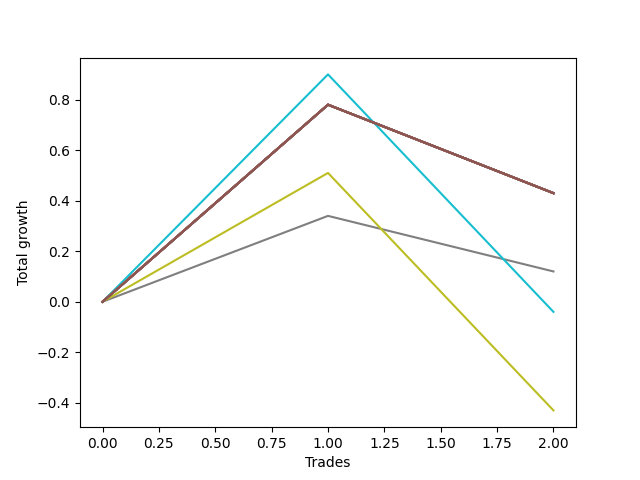

# Short HLT 106 
- Symbol: TSLA_15
- Date Range: 01/10/2024 - 05/17/2024
- Trading Period: 8:30-12:30
- Number of Trades: 2



| Name | Win Percent | Profit | Avg Profit / Trade | Avg Time / Trade |      | Name | Win Percent | Profit | Avg Profit / Trade | Avg Time / Trade |
| ---- | ----------- | ------ | ------------------ | ---------------- | ---- | ---- | ----------- | ------ | ------------------ | ---------------- |
| Sorted By <br> Profit | | | | | | Sorted By <br> Win Percentage ||||
| NEWFI 000 | 50.00 | 215.00 | 107.50 | 14:00 |     | NEWFI 000 | 50.00 | 215.00 | 107.50 | 14:00 |
| TP-2 | 50.00 | 215.00 | 107.50 | 14:00 |     | TP-2 | 50.00 | 215.00 | 107.50 | 14:00 |
| TP-1.75 | 50.00 | 215.00 | 107.50 | 14:00 |     | TP-1.75 | 50.00 | 215.00 | 107.50 | 14:00 |
| TP-1.5 | 50.00 | 215.00 | 107.50 | 14:00 |     | TP-1.5 | 50.00 | 215.00 | 107.50 | 14:00 |
| TP-1.25 | 50.00 | 215.00 | 107.50 | 14:00 |     | TP-1.25 | 50.00 | 215.00 | 107.50 | 14:00 |
| TP-1 | 50.00 | 215.00 | 107.50 | 14:00 |     | TP-1 | 50.00 | 215.00 | 107.50 | 14:00 |
| BB-50 U/L 2SD | 50.00 | 215.00 | 107.50 | 14:00 |     | BB-50 U/L 2SD | 50.00 | 215.00 | 107.50 | 14:00 |
| BB-50 U/L 1SD | 50.00 | 215.00 | 107.50 | 14:00 |     | BB-50 U/L 1SD | 50.00 | 215.00 | 107.50 | 14:00 |
| BB-50 Mid | 50.00 | 215.00 | 107.50 | 14:00 |     | BB-50 Mid | 50.00 | 215.00 | 107.50 | 14:00 |
| BB-20 U/L 2SD C | 50.00 | 215.00 | 107.50 | 14:00 |     | BB-20 U/L 2SD C | 50.00 | 215.00 | 107.50 | 14:00 |
| BB-20 U/L 2SD | 50.00 | 215.00 | 107.50 | 14:00 |     | BB-20 U/L 2SD | 50.00 | 215.00 | 107.50 | 14:00 |
| BB-20 U/L 1SD | 50.00 | 215.00 | 107.50 | 14:00 |     | BB-20 U/L 1SD | 50.00 | 215.00 | 107.50 | 14:00 |
| BB-20 Mid | 50.00 | 215.00 | 107.50 | 14:00 |     | BB-20 Mid | 50.00 | 215.00 | 107.50 | 14:00 |
| TP-0.25 | 50.00 | 60.00 | 30.00 | 02:00 |     | TP-0.25 | 50.00 | 60.00 | 30.00 | 02:00 |
| TP-0.75 | 50.00 | -20.00 | -10.00 | 08:00 |     | TP-0.75 | 50.00 | -20.00 | -10.00 | 08:00 |
| TP-0.5 | 50.00 | -215.00 | -107.50 | 04:30 |     | TP-0.5 | 50.00 | -215.00 | -107.50 | 04:30 |

## NO STOPLOSS

### Test BB-20 Mid
* Sell when price hits the middle line of the 20p bollinger
* No Stoploss
* Results:
```
Total Trades: 2
Percent Up: 50.00
Percent Down: 50.00
Total Points Moved Down: 0.43
Potential Profit: 215.00
Total Points Ups: 0.35 Count Ups: 1
Total Points Downs: 0.78 Count Downs: 1
```

<details><summary>Trades</summary>

<code>In: 2024-01-29 08:40:00		Out: 2024-01-29 08:54:00		Total Position Time: 14:00		Total Move Down: 0.78		Total to Date: 0.78</code> <br />
<code>In: 2024-02-15 09:30:00		Out: 2024-02-15 09:44:00		Total Position Time: 14:00		Total Move Down: -0.35		Total to Date: 0.43</code> <br />


</details>

### Test BB-20 U/L 1SD
* Sell when the price hits the lower line of the 20p 1std bollinger
* No Stoploss
* Results:
```
Total Trades: 2
Percent Up: 50.00
Percent Down: 50.00
Total Points Moved Down: 0.43
Potential Profit: 215.00
Total Points Ups: 0.35 Count Ups: 1
Total Points Downs: 0.78 Count Downs: 1
```

<details><summary>Trades</summary>

<code>In: 2024-01-29 08:40:00		Out: 2024-01-29 08:54:00		Total Position Time: 14:00		Total Move Down: 0.78		Total to Date: 0.78</code> <br />
<code>In: 2024-02-15 09:30:00		Out: 2024-02-15 09:44:00		Total Position Time: 14:00		Total Move Down: -0.35		Total to Date: 0.43</code> <br />


</details>

### Test BB-20 U/L 2SD
* Sell when the price hits the lower line of the 20p 2std bollinger
* No Stoploss
* Results:
```
Total Trades: 2
Percent Up: 50.00
Percent Down: 50.00
Total Points Moved Down: 0.43
Potential Profit: 215.00
Total Points Ups: 0.35 Count Ups: 1
Total Points Downs: 0.78 Count Downs: 1
```

<details><summary>Trades</summary>

<code>In: 2024-01-29 08:40:00		Out: 2024-01-29 08:54:00		Total Position Time: 14:00		Total Move Down: 0.78		Total to Date: 0.78</code> <br />
<code>In: 2024-02-15 09:30:00		Out: 2024-02-15 09:44:00		Total Position Time: 14:00		Total Move Down: -0.35		Total to Date: 0.43</code> <br />


</details>

### Test BB-20 U/L 2SD C
* Sell when the price hits the lower line of the 20p 2std bollinger
* No Stoploss
* Results:
```
Total Trades: 2
Percent Up: 50.00
Percent Down: 50.00
Total Points Moved Down: 0.43
Potential Profit: 215.00
Total Points Ups: 0.35 Count Ups: 1
Total Points Downs: 0.78 Count Downs: 1
```

<details><summary>Trades</summary>

<code>In: 2024-01-29 08:40:00		Out: 2024-01-29 08:54:00		Total Position Time: 14:00		Total Move Down: 0.78		Total to Date: 0.78</code> <br />
<code>In: 2024-02-15 09:30:00		Out: 2024-02-15 09:44:00		Total Position Time: 14:00		Total Move Down: -0.35		Total to Date: 0.43</code> <br />


</details>

### Test BB-50 Mid
* Sell when price hits the middle line of the 50p bollinger
* No Stoploss
* Results:
```
Total Trades: 2
Percent Up: 50.00
Percent Down: 50.00
Total Points Moved Down: 0.43
Potential Profit: 215.00
Total Points Ups: 0.35 Count Ups: 1
Total Points Downs: 0.78 Count Downs: 1
```

<details><summary>Trades</summary>

<code>In: 2024-01-29 08:40:00		Out: 2024-01-29 08:54:00		Total Position Time: 14:00		Total Move Down: 0.78		Total to Date: 0.78</code> <br />
<code>In: 2024-02-15 09:30:00		Out: 2024-02-15 09:44:00		Total Position Time: 14:00		Total Move Down: -0.35		Total to Date: 0.43</code> <br />


</details>

### Test BB-50 U/L 1SD
* Sell when the price hits the lower line of the 50p 1std bollinger
* No Stoploss
* Results:
```
Total Trades: 2
Percent Up: 50.00
Percent Down: 50.00
Total Points Moved Down: 0.43
Potential Profit: 215.00
Total Points Ups: 0.35 Count Ups: 1
Total Points Downs: 0.78 Count Downs: 1
```

<details><summary>Trades</summary>

<code>In: 2024-01-29 08:40:00		Out: 2024-01-29 08:54:00		Total Position Time: 14:00		Total Move Down: 0.78		Total to Date: 0.78</code> <br />
<code>In: 2024-02-15 09:30:00		Out: 2024-02-15 09:44:00		Total Position Time: 14:00		Total Move Down: -0.35		Total to Date: 0.43</code> <br />


</details>

### Test BB-50 U/L 2SD
* Sell when the price hits the lower line of the 50p 2std bollinger
* No Stoploss
* Results:
```
Total Trades: 2
Percent Up: 50.00
Percent Down: 50.00
Total Points Moved Down: 0.43
Potential Profit: 215.00
Total Points Ups: 0.35 Count Ups: 1
Total Points Downs: 0.78 Count Downs: 1
```

<details><summary>Trades</summary>

<code>In: 2024-01-29 08:40:00		Out: 2024-01-29 08:54:00		Total Position Time: 14:00		Total Move Down: 0.78		Total to Date: 0.78</code> <br />
<code>In: 2024-02-15 09:30:00		Out: 2024-02-15 09:44:00		Total Position Time: 14:00		Total Move Down: -0.35		Total to Date: 0.43</code> <br />


</details>

## TAKE PROFIT

### Test TP-0.25
* Take Profit of 0.25 Point
* 0.25 Stoploss
* Results:
```
Total Trades: 2
Percent Up: 50.00
Percent Down: 50.00
Total Points Moved Down: 0.12
Potential Profit: 60.00
Total Points Ups: 0.22 Count Ups: 1
Total Points Downs: 0.34 Count Downs: 1
```

<details><summary>Trades</summary>

<code>In: 2024-01-29 08:40:00		Out: 2024-01-29 08:42:00		Total Position Time: 02:00		Total Move Down: 0.34		Total to Date: 0.34</code> <br />
<code>In: 2024-02-15 09:30:00		Out: 2024-02-15 09:32:00		Total Position Time: 02:00		Total Move Down: -0.22		Total to Date: 0.12</code> <br />


</details>

### Test TP-0.5
* Take Profit of 0.5 Point
* 0.5 Stoploss
* Results:
```
Total Trades: 2
Percent Up: 50.00
Percent Down: 50.00
Total Points Moved Down: -0.43
Potential Profit: -215.00
Total Points Ups: 0.94 Count Ups: 1
Total Points Downs: 0.51 Count Downs: 1
```

<details><summary>Trades</summary>

<code>In: 2024-01-29 08:40:00		Out: 2024-01-29 08:44:00		Total Position Time: 04:00		Total Move Down: 0.51		Total to Date: 0.51</code> <br />
<code>In: 2024-02-15 09:30:00		Out: 2024-02-15 09:35:00		Total Position Time: 05:00		Total Move Down: -0.94		Total to Date: -0.43</code> <br />


</details>

### Test TP-0.75
* Take Profit of 0.75 Point
* 0.75 Stoploss
* Results:
```
Total Trades: 2
Percent Up: 50.00
Percent Down: 50.00
Total Points Moved Down: -0.04
Potential Profit: -20.00
Total Points Ups: 0.94 Count Ups: 1
Total Points Downs: 0.90 Count Downs: 1
```

<details><summary>Trades</summary>

<code>In: 2024-01-29 08:40:00		Out: 2024-01-29 08:51:00		Total Position Time: 11:00		Total Move Down: 0.90		Total to Date: 0.90</code> <br />
<code>In: 2024-02-15 09:30:00		Out: 2024-02-15 09:35:00		Total Position Time: 05:00		Total Move Down: -0.94		Total to Date: -0.04</code> <br />


</details>

### Test TP-1
* Take Profit of 1 Point
* 1 Stoploss
* Results:
```
Total Trades: 2
Percent Up: 50.00
Percent Down: 50.00
Total Points Moved Down: 0.43
Potential Profit: 215.00
Total Points Ups: 0.35 Count Ups: 1
Total Points Downs: 0.78 Count Downs: 1
```

<details><summary>Trades</summary>

<code>In: 2024-01-29 08:40:00		Out: 2024-01-29 08:54:00		Total Position Time: 14:00		Total Move Down: 0.78		Total to Date: 0.78</code> <br />
<code>In: 2024-02-15 09:30:00		Out: 2024-02-15 09:44:00		Total Position Time: 14:00		Total Move Down: -0.35		Total to Date: 0.43</code> <br />


</details>

### Test TP-1.25
* Take Profit of 1.25 Point
* 1.25 Stoploss
* Results:
```
Total Trades: 2
Percent Up: 50.00
Percent Down: 50.00
Total Points Moved Down: 0.43
Potential Profit: 215.00
Total Points Ups: 0.35 Count Ups: 1
Total Points Downs: 0.78 Count Downs: 1
```

<details><summary>Trades</summary>

<code>In: 2024-01-29 08:40:00		Out: 2024-01-29 08:54:00		Total Position Time: 14:00		Total Move Down: 0.78		Total to Date: 0.78</code> <br />
<code>In: 2024-02-15 09:30:00		Out: 2024-02-15 09:44:00		Total Position Time: 14:00		Total Move Down: -0.35		Total to Date: 0.43</code> <br />


</details>

### Test TP-1.5
* Take Profit of 1.5 Point
* 1.5 Stoploss
* Results:
```
Total Trades: 2
Percent Up: 50.00
Percent Down: 50.00
Total Points Moved Down: 0.43
Potential Profit: 215.00
Total Points Ups: 0.35 Count Ups: 1
Total Points Downs: 0.78 Count Downs: 1
```

<details><summary>Trades</summary>

<code>In: 2024-01-29 08:40:00		Out: 2024-01-29 08:54:00		Total Position Time: 14:00		Total Move Down: 0.78		Total to Date: 0.78</code> <br />
<code>In: 2024-02-15 09:30:00		Out: 2024-02-15 09:44:00		Total Position Time: 14:00		Total Move Down: -0.35		Total to Date: 0.43</code> <br />


</details>

### Test TP-1.75
* Take Profit of 1.75 Point
* 1.75 Stoploss
* Results:
```
Total Trades: 2
Percent Up: 50.00
Percent Down: 50.00
Total Points Moved Down: 0.43
Potential Profit: 215.00
Total Points Ups: 0.35 Count Ups: 1
Total Points Downs: 0.78 Count Downs: 1
```

<details><summary>Trades</summary>

<code>In: 2024-01-29 08:40:00		Out: 2024-01-29 08:54:00		Total Position Time: 14:00		Total Move Down: 0.78		Total to Date: 0.78</code> <br />
<code>In: 2024-02-15 09:30:00		Out: 2024-02-15 09:44:00		Total Position Time: 14:00		Total Move Down: -0.35		Total to Date: 0.43</code> <br />


</details>

### Test TP-2
* Take Profit of 2 Point
* 2 Stoploss
* Results:
```
Total Trades: 2
Percent Up: 50.00
Percent Down: 50.00
Total Points Moved Down: 0.43
Potential Profit: 215.00
Total Points Ups: 0.35 Count Ups: 1
Total Points Downs: 0.78 Count Downs: 1
```

<details><summary>Trades</summary>

<code>In: 2024-01-29 08:40:00		Out: 2024-01-29 08:54:00		Total Position Time: 14:00		Total Move Down: 0.78		Total to Date: 0.78</code> <br />
<code>In: 2024-02-15 09:30:00		Out: 2024-02-15 09:44:00		Total Position Time: 14:00		Total Move Down: -0.35		Total to Date: 0.43</code> <br />


</details>

## Indicator Exits

### Test NEWFI 000
* Newfi 0000
* No Stoploss
* Results:
```
Total Trades: 2
Percent Up: 50.00
Percent Down: 50.00
Total Points Moved Down: 0.43
Potential Profit: 215.00
Total Points Ups: 0.35 Count Ups: 1
Total Points Downs: 0.78 Count Downs: 1
```

<details><summary>Trades</summary>

<code>In: 2024-01-29 08:40:00		Out: 2024-01-29 08:54:00		Total Position Time: 14:00		Total Move Down: 0.78		Total to Date: 0.78</code> <br />
<code>In: 2024-02-15 09:30:00		Out: 2024-02-15 09:44:00		Total Position Time: 14:00		Total Move Down: -0.35		Total to Date: 0.43</code> <br />


</details>