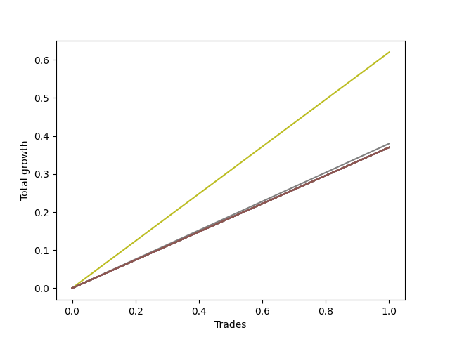

# Short HLT 107 
- Symbol: TSLA_15
- Date Range: 01/10/2024 - 05/17/2024
- Trading Period: 8:30-12:30
- Number of Trades: 1



| Name | Win Percent | Profit | Avg Profit / Trade | Avg Time / Trade |      | Name | Win Percent | Profit | Avg Profit / Trade | Avg Time / Trade |
| ---- | ----------- | ------ | ------------------ | ---------------- | ---- | ---- | ----------- | ------ | ------------------ | ---------------- |
| Sorted By <br> Profit | | | | | | Sorted By <br> Win Percentage ||||
| TP-0.5 | 100.00 | 310.00 | 310.00 | 06:00 |     | TP-0.5 | 100.00 | 310.00 | 310.00 | 06:00 |
| TP-0.25 | 100.00 | 190.00 | 190.00 | 05:00 |     | TP-0.25 | 100.00 | 190.00 | 190.00 | 05:00 |
| NEWFI 000 | 100.00 | 185.00 | 185.00 | 14:00 |     | NEWFI 000 | 100.00 | 185.00 | 185.00 | 14:00 |
| TP-2 | 100.00 | 185.00 | 185.00 | 14:00 |     | TP-2 | 100.00 | 185.00 | 185.00 | 14:00 |
| TP-1.75 | 100.00 | 185.00 | 185.00 | 14:00 |     | TP-1.75 | 100.00 | 185.00 | 185.00 | 14:00 |
| TP-1.5 | 100.00 | 185.00 | 185.00 | 14:00 |     | TP-1.5 | 100.00 | 185.00 | 185.00 | 14:00 |
| TP-1.25 | 100.00 | 185.00 | 185.00 | 14:00 |     | TP-1.25 | 100.00 | 185.00 | 185.00 | 14:00 |
| TP-1 | 100.00 | 185.00 | 185.00 | 14:00 |     | TP-1 | 100.00 | 185.00 | 185.00 | 14:00 |
| TP-0.75 | 100.00 | 185.00 | 185.00 | 14:00 |     | TP-0.75 | 100.00 | 185.00 | 185.00 | 14:00 |
| BB-50 U/L 2SD | 100.00 | 185.00 | 185.00 | 14:00 |     | BB-50 U/L 2SD | 100.00 | 185.00 | 185.00 | 14:00 |
| BB-50 U/L 1SD | 100.00 | 185.00 | 185.00 | 14:00 |     | BB-50 U/L 1SD | 100.00 | 185.00 | 185.00 | 14:00 |
| BB-50 Mid | 100.00 | 185.00 | 185.00 | 14:00 |     | BB-50 Mid | 100.00 | 185.00 | 185.00 | 14:00 |
| BB-20 U/L 2SD C | 100.00 | 185.00 | 185.00 | 14:00 |     | BB-20 U/L 2SD C | 100.00 | 185.00 | 185.00 | 14:00 |
| BB-20 U/L 2SD | 100.00 | 185.00 | 185.00 | 14:00 |     | BB-20 U/L 2SD | 100.00 | 185.00 | 185.00 | 14:00 |
| BB-20 U/L 1SD | 100.00 | 185.00 | 185.00 | 14:00 |     | BB-20 U/L 1SD | 100.00 | 185.00 | 185.00 | 14:00 |
| BB-20 Mid | 100.00 | 185.00 | 185.00 | 14:00 |     | BB-20 Mid | 100.00 | 185.00 | 185.00 | 14:00 |

## NO STOPLOSS

### Test BB-20 Mid
* Sell when price hits the middle line of the 20p bollinger
* No Stoploss
* Results:
```
Total Trades: 1
Percent Up: 0.00
Percent Down: 100.00
Total Points Moved Down: 0.37
Potential Profit: 185.00
Total Points Ups: 0.00 Count Ups: 0
Total Points Downs: 0.37 Count Downs: 1
```

<details><summary>Trades</summary>

<code>In: 2024-02-15 10:50:00		Out: 2024-02-15 11:04:00		Total Position Time: 14:00		Total Move Down: 0.37		Total to Date: 0.37</code> <br />


</details>

### Test BB-20 U/L 1SD
* Sell when the price hits the lower line of the 20p 1std bollinger
* No Stoploss
* Results:
```
Total Trades: 1
Percent Up: 0.00
Percent Down: 100.00
Total Points Moved Down: 0.37
Potential Profit: 185.00
Total Points Ups: 0.00 Count Ups: 0
Total Points Downs: 0.37 Count Downs: 1
```

<details><summary>Trades</summary>

<code>In: 2024-02-15 10:50:00		Out: 2024-02-15 11:04:00		Total Position Time: 14:00		Total Move Down: 0.37		Total to Date: 0.37</code> <br />


</details>

### Test BB-20 U/L 2SD
* Sell when the price hits the lower line of the 20p 2std bollinger
* No Stoploss
* Results:
```
Total Trades: 1
Percent Up: 0.00
Percent Down: 100.00
Total Points Moved Down: 0.37
Potential Profit: 185.00
Total Points Ups: 0.00 Count Ups: 0
Total Points Downs: 0.37 Count Downs: 1
```

<details><summary>Trades</summary>

<code>In: 2024-02-15 10:50:00		Out: 2024-02-15 11:04:00		Total Position Time: 14:00		Total Move Down: 0.37		Total to Date: 0.37</code> <br />


</details>

### Test BB-20 U/L 2SD C
* Sell when the price hits the lower line of the 20p 2std bollinger
* No Stoploss
* Results:
```
Total Trades: 1
Percent Up: 0.00
Percent Down: 100.00
Total Points Moved Down: 0.37
Potential Profit: 185.00
Total Points Ups: 0.00 Count Ups: 0
Total Points Downs: 0.37 Count Downs: 1
```

<details><summary>Trades</summary>

<code>In: 2024-02-15 10:50:00		Out: 2024-02-15 11:04:00		Total Position Time: 14:00		Total Move Down: 0.37		Total to Date: 0.37</code> <br />


</details>

### Test BB-50 Mid
* Sell when price hits the middle line of the 50p bollinger
* No Stoploss
* Results:
```
Total Trades: 1
Percent Up: 0.00
Percent Down: 100.00
Total Points Moved Down: 0.37
Potential Profit: 185.00
Total Points Ups: 0.00 Count Ups: 0
Total Points Downs: 0.37 Count Downs: 1
```

<details><summary>Trades</summary>

<code>In: 2024-02-15 10:50:00		Out: 2024-02-15 11:04:00		Total Position Time: 14:00		Total Move Down: 0.37		Total to Date: 0.37</code> <br />


</details>

### Test BB-50 U/L 1SD
* Sell when the price hits the lower line of the 50p 1std bollinger
* No Stoploss
* Results:
```
Total Trades: 1
Percent Up: 0.00
Percent Down: 100.00
Total Points Moved Down: 0.37
Potential Profit: 185.00
Total Points Ups: 0.00 Count Ups: 0
Total Points Downs: 0.37 Count Downs: 1
```

<details><summary>Trades</summary>

<code>In: 2024-02-15 10:50:00		Out: 2024-02-15 11:04:00		Total Position Time: 14:00		Total Move Down: 0.37		Total to Date: 0.37</code> <br />


</details>

### Test BB-50 U/L 2SD
* Sell when the price hits the lower line of the 50p 2std bollinger
* No Stoploss
* Results:
```
Total Trades: 1
Percent Up: 0.00
Percent Down: 100.00
Total Points Moved Down: 0.37
Potential Profit: 185.00
Total Points Ups: 0.00 Count Ups: 0
Total Points Downs: 0.37 Count Downs: 1
```

<details><summary>Trades</summary>

<code>In: 2024-02-15 10:50:00		Out: 2024-02-15 11:04:00		Total Position Time: 14:00		Total Move Down: 0.37		Total to Date: 0.37</code> <br />


</details>

## TAKE PROFIT

### Test TP-0.25
* Take Profit of 0.25 Point
* 0.25 Stoploss
* Results:
```
Total Trades: 1
Percent Up: 0.00
Percent Down: 100.00
Total Points Moved Down: 0.38
Potential Profit: 190.00
Total Points Ups: 0.00 Count Ups: 0
Total Points Downs: 0.38 Count Downs: 1
```

<details><summary>Trades</summary>

<code>In: 2024-02-15 10:50:00		Out: 2024-02-15 10:55:00		Total Position Time: 05:00		Total Move Down: 0.38		Total to Date: 0.38</code> <br />


</details>

### Test TP-0.5
* Take Profit of 0.5 Point
* 0.5 Stoploss
* Results:
```
Total Trades: 1
Percent Up: 0.00
Percent Down: 100.00
Total Points Moved Down: 0.62
Potential Profit: 310.00
Total Points Ups: 0.00 Count Ups: 0
Total Points Downs: 0.62 Count Downs: 1
```

<details><summary>Trades</summary>

<code>In: 2024-02-15 10:50:00		Out: 2024-02-15 10:56:00		Total Position Time: 06:00		Total Move Down: 0.62		Total to Date: 0.62</code> <br />


</details>

### Test TP-0.75
* Take Profit of 0.75 Point
* 0.75 Stoploss
* Results:
```
Total Trades: 1
Percent Up: 0.00
Percent Down: 100.00
Total Points Moved Down: 0.37
Potential Profit: 185.00
Total Points Ups: 0.00 Count Ups: 0
Total Points Downs: 0.37 Count Downs: 1
```

<details><summary>Trades</summary>

<code>In: 2024-02-15 10:50:00		Out: 2024-02-15 11:04:00		Total Position Time: 14:00		Total Move Down: 0.37		Total to Date: 0.37</code> <br />


</details>

### Test TP-1
* Take Profit of 1 Point
* 1 Stoploss
* Results:
```
Total Trades: 1
Percent Up: 0.00
Percent Down: 100.00
Total Points Moved Down: 0.37
Potential Profit: 185.00
Total Points Ups: 0.00 Count Ups: 0
Total Points Downs: 0.37 Count Downs: 1
```

<details><summary>Trades</summary>

<code>In: 2024-02-15 10:50:00		Out: 2024-02-15 11:04:00		Total Position Time: 14:00		Total Move Down: 0.37		Total to Date: 0.37</code> <br />


</details>

### Test TP-1.25
* Take Profit of 1.25 Point
* 1.25 Stoploss
* Results:
```
Total Trades: 1
Percent Up: 0.00
Percent Down: 100.00
Total Points Moved Down: 0.37
Potential Profit: 185.00
Total Points Ups: 0.00 Count Ups: 0
Total Points Downs: 0.37 Count Downs: 1
```

<details><summary>Trades</summary>

<code>In: 2024-02-15 10:50:00		Out: 2024-02-15 11:04:00		Total Position Time: 14:00		Total Move Down: 0.37		Total to Date: 0.37</code> <br />


</details>

### Test TP-1.5
* Take Profit of 1.5 Point
* 1.5 Stoploss
* Results:
```
Total Trades: 1
Percent Up: 0.00
Percent Down: 100.00
Total Points Moved Down: 0.37
Potential Profit: 185.00
Total Points Ups: 0.00 Count Ups: 0
Total Points Downs: 0.37 Count Downs: 1
```

<details><summary>Trades</summary>

<code>In: 2024-02-15 10:50:00		Out: 2024-02-15 11:04:00		Total Position Time: 14:00		Total Move Down: 0.37		Total to Date: 0.37</code> <br />


</details>

### Test TP-1.75
* Take Profit of 1.75 Point
* 1.75 Stoploss
* Results:
```
Total Trades: 1
Percent Up: 0.00
Percent Down: 100.00
Total Points Moved Down: 0.37
Potential Profit: 185.00
Total Points Ups: 0.00 Count Ups: 0
Total Points Downs: 0.37 Count Downs: 1
```

<details><summary>Trades</summary>

<code>In: 2024-02-15 10:50:00		Out: 2024-02-15 11:04:00		Total Position Time: 14:00		Total Move Down: 0.37		Total to Date: 0.37</code> <br />


</details>

### Test TP-2
* Take Profit of 2 Point
* 2 Stoploss
* Results:
```
Total Trades: 1
Percent Up: 0.00
Percent Down: 100.00
Total Points Moved Down: 0.37
Potential Profit: 185.00
Total Points Ups: 0.00 Count Ups: 0
Total Points Downs: 0.37 Count Downs: 1
```

<details><summary>Trades</summary>

<code>In: 2024-02-15 10:50:00		Out: 2024-02-15 11:04:00		Total Position Time: 14:00		Total Move Down: 0.37		Total to Date: 0.37</code> <br />


</details>

## Indicator Exits

### Test NEWFI 000
* Newfi 0000
* No Stoploss
* Results:
```
Total Trades: 1
Percent Up: 0.00
Percent Down: 100.00
Total Points Moved Down: 0.37
Potential Profit: 185.00
Total Points Ups: 0.00 Count Ups: 0
Total Points Downs: 0.37 Count Downs: 1
```

<details><summary>Trades</summary>

<code>In: 2024-02-15 10:50:00		Out: 2024-02-15 11:04:00		Total Position Time: 14:00		Total Move Down: 0.37		Total to Date: 0.37</code> <br />


</details>