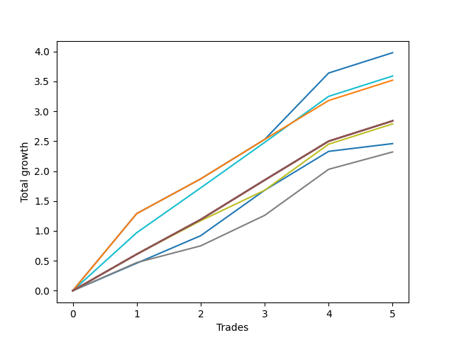

# Short HLT 108 
- Symbol: TSLA_15
- Date Range: 01/10/2024 - 05/17/2024
- Trading Period: 8:30-12:30
- Number of Trades: 5



| Name | Win Percent | Profit | Avg Profit / Trade | Avg Time / Trade |      | Name | Win Percent | Profit | Avg Profit / Trade | Avg Time / Trade |
| ---- | ----------- | ------ | ------------------ | ---------------- | ---- | ---- | ----------- | ------ | ------------------ | ---------------- |
| Sorted By <br> Profit | | | | | | Sorted By <br> Win Percentage ||||
| TP-1 | 100.00 | 1990.00 | 398.00 | 11:24 |     | TP-1 | 100.00 | 1990.00 | 398.00 | 11:24 |
| TP-0.75 | 100.00 | 1795.00 | 359.00 | 09:48 |     | TP-0.75 | 100.00 | 1795.00 | 359.00 | 09:48 |
| TP-1.25 | 100.00 | 1760.00 | 352.00 | 13:12 |     | TP-1.25 | 100.00 | 1760.00 | 352.00 | 13:12 |
| NEWFI 000 | 100.00 | 1420.00 | 284.00 | 14:00 |     | NEWFI 000 | 100.00 | 1420.00 | 284.00 | 14:00 |
| TP-2 | 100.00 | 1420.00 | 284.00 | 14:00 |     | TP-2 | 100.00 | 1420.00 | 284.00 | 14:00 |
| TP-1.75 | 100.00 | 1420.00 | 284.00 | 14:00 |     | TP-1.75 | 100.00 | 1420.00 | 284.00 | 14:00 |
| TP-1.5 | 100.00 | 1420.00 | 284.00 | 14:00 |     | TP-1.5 | 100.00 | 1420.00 | 284.00 | 14:00 |
| BB-50 U/L 2SD | 100.00 | 1420.00 | 284.00 | 14:00 |     | BB-50 U/L 2SD | 100.00 | 1420.00 | 284.00 | 14:00 |
| BB-50 U/L 1SD | 100.00 | 1420.00 | 284.00 | 14:00 |     | BB-50 U/L 1SD | 100.00 | 1420.00 | 284.00 | 14:00 |
| BB-50 Mid | 100.00 | 1420.00 | 284.00 | 14:00 |     | BB-50 Mid | 100.00 | 1420.00 | 284.00 | 14:00 |
| BB-20 U/L 2SD C | 100.00 | 1420.00 | 284.00 | 14:00 |     | BB-20 U/L 2SD C | 100.00 | 1420.00 | 284.00 | 14:00 |
| BB-20 U/L 2SD | 100.00 | 1420.00 | 284.00 | 14:00 |     | BB-20 U/L 2SD | 100.00 | 1420.00 | 284.00 | 14:00 |
| BB-20 U/L 1SD | 100.00 | 1420.00 | 284.00 | 14:00 |     | BB-20 U/L 1SD | 100.00 | 1420.00 | 284.00 | 14:00 |
| TP-0.5 | 100.00 | 1395.00 | 279.00 | 06:00 |     | TP-0.5 | 100.00 | 1395.00 | 279.00 | 06:00 |
| BB-20 Mid | 100.00 | 1230.00 | 246.00 | 08:12 |     | BB-20 Mid | 100.00 | 1230.00 | 246.00 | 08:12 |
| TP-0.25 | 100.00 | 1160.00 | 232.00 | 04:24 |     | TP-0.25 | 100.00 | 1160.00 | 232.00 | 04:24 |

## NO STOPLOSS

### Test BB-20 Mid
* Sell when price hits the middle line of the 20p bollinger
* No Stoploss
* Results:
```
Total Trades: 5
Percent Up: 0.00
Percent Down: 100.00
Total Points Moved Down: 2.46
Potential Profit: 1230.00
Total Points Ups: 0.00 Count Ups: 0
Total Points Downs: 2.46 Count Downs: 5
```

<details><summary>Trades</summary>

<code>In: 2024-02-07 11:10:00		Out: 2024-02-07 11:16:00		Total Position Time: 06:00		Total Move Down: 0.46		Total to Date: 0.46</code> <br />
<code>In: 2024-02-14 11:00:00		Out: 2024-02-14 11:06:00		Total Position Time: 06:00		Total Move Down: 0.46		Total to Date: 0.92</code> <br />
<code>In: 2024-04-08 08:35:00		Out: 2024-04-08 08:48:00		Total Position Time: 13:00		Total Move Down: 0.76		Total to Date: 1.68</code> <br />
<code>In: 2024-04-29 09:40:00		Out: 2024-04-29 09:54:00		Total Position Time: 14:00		Total Move Down: 0.65		Total to Date: 2.33</code> <br />
<code>In: 2024-05-17 09:45:00		Out: 2024-05-17 09:47:00		Total Position Time: 02:00		Total Move Down: 0.13		Total to Date: 2.46</code> <br />


</details>

### Test BB-20 U/L 1SD
* Sell when the price hits the lower line of the 20p 1std bollinger
* No Stoploss
* Results:
```
Total Trades: 5
Percent Up: 0.00
Percent Down: 100.00
Total Points Moved Down: 2.84
Potential Profit: 1420.00
Total Points Ups: 0.00 Count Ups: 0
Total Points Downs: 2.84 Count Downs: 5
```

<details><summary>Trades</summary>

<code>In: 2024-02-07 11:10:00		Out: 2024-02-07 11:24:00		Total Position Time: 14:00		Total Move Down: 0.61		Total to Date: 0.61</code> <br />
<code>In: 2024-02-14 11:00:00		Out: 2024-02-14 11:14:00		Total Position Time: 14:00		Total Move Down: 0.58		Total to Date: 1.19</code> <br />
<code>In: 2024-04-08 08:35:00		Out: 2024-04-08 08:49:00		Total Position Time: 14:00		Total Move Down: 0.66		Total to Date: 1.85</code> <br />
<code>In: 2024-04-29 09:40:00		Out: 2024-04-29 09:54:00		Total Position Time: 14:00		Total Move Down: 0.65		Total to Date: 2.50</code> <br />
<code>In: 2024-05-17 09:45:00		Out: 2024-05-17 09:59:00		Total Position Time: 14:00		Total Move Down: 0.34		Total to Date: 2.84</code> <br />


</details>

### Test BB-20 U/L 2SD
* Sell when the price hits the lower line of the 20p 2std bollinger
* No Stoploss
* Results:
```
Total Trades: 5
Percent Up: 0.00
Percent Down: 100.00
Total Points Moved Down: 2.84
Potential Profit: 1420.00
Total Points Ups: 0.00 Count Ups: 0
Total Points Downs: 2.84 Count Downs: 5
```

<details><summary>Trades</summary>

<code>In: 2024-02-07 11:10:00		Out: 2024-02-07 11:24:00		Total Position Time: 14:00		Total Move Down: 0.61		Total to Date: 0.61</code> <br />
<code>In: 2024-02-14 11:00:00		Out: 2024-02-14 11:14:00		Total Position Time: 14:00		Total Move Down: 0.58		Total to Date: 1.19</code> <br />
<code>In: 2024-04-08 08:35:00		Out: 2024-04-08 08:49:00		Total Position Time: 14:00		Total Move Down: 0.66		Total to Date: 1.85</code> <br />
<code>In: 2024-04-29 09:40:00		Out: 2024-04-29 09:54:00		Total Position Time: 14:00		Total Move Down: 0.65		Total to Date: 2.50</code> <br />
<code>In: 2024-05-17 09:45:00		Out: 2024-05-17 09:59:00		Total Position Time: 14:00		Total Move Down: 0.34		Total to Date: 2.84</code> <br />


</details>

### Test BB-20 U/L 2SD C
* Sell when the price hits the lower line of the 20p 2std bollinger
* No Stoploss
* Results:
```
Total Trades: 5
Percent Up: 0.00
Percent Down: 100.00
Total Points Moved Down: 2.84
Potential Profit: 1420.00
Total Points Ups: 0.00 Count Ups: 0
Total Points Downs: 2.84 Count Downs: 5
```

<details><summary>Trades</summary>

<code>In: 2024-02-07 11:10:00		Out: 2024-02-07 11:24:00		Total Position Time: 14:00		Total Move Down: 0.61		Total to Date: 0.61</code> <br />
<code>In: 2024-02-14 11:00:00		Out: 2024-02-14 11:14:00		Total Position Time: 14:00		Total Move Down: 0.58		Total to Date: 1.19</code> <br />
<code>In: 2024-04-08 08:35:00		Out: 2024-04-08 08:49:00		Total Position Time: 14:00		Total Move Down: 0.66		Total to Date: 1.85</code> <br />
<code>In: 2024-04-29 09:40:00		Out: 2024-04-29 09:54:00		Total Position Time: 14:00		Total Move Down: 0.65		Total to Date: 2.50</code> <br />
<code>In: 2024-05-17 09:45:00		Out: 2024-05-17 09:59:00		Total Position Time: 14:00		Total Move Down: 0.34		Total to Date: 2.84</code> <br />


</details>

### Test BB-50 Mid
* Sell when price hits the middle line of the 50p bollinger
* No Stoploss
* Results:
```
Total Trades: 5
Percent Up: 0.00
Percent Down: 100.00
Total Points Moved Down: 2.84
Potential Profit: 1420.00
Total Points Ups: 0.00 Count Ups: 0
Total Points Downs: 2.84 Count Downs: 5
```

<details><summary>Trades</summary>

<code>In: 2024-02-07 11:10:00		Out: 2024-02-07 11:24:00		Total Position Time: 14:00		Total Move Down: 0.61		Total to Date: 0.61</code> <br />
<code>In: 2024-02-14 11:00:00		Out: 2024-02-14 11:14:00		Total Position Time: 14:00		Total Move Down: 0.58		Total to Date: 1.19</code> <br />
<code>In: 2024-04-08 08:35:00		Out: 2024-04-08 08:49:00		Total Position Time: 14:00		Total Move Down: 0.66		Total to Date: 1.85</code> <br />
<code>In: 2024-04-29 09:40:00		Out: 2024-04-29 09:54:00		Total Position Time: 14:00		Total Move Down: 0.65		Total to Date: 2.50</code> <br />
<code>In: 2024-05-17 09:45:00		Out: 2024-05-17 09:59:00		Total Position Time: 14:00		Total Move Down: 0.34		Total to Date: 2.84</code> <br />


</details>

### Test BB-50 U/L 1SD
* Sell when the price hits the lower line of the 50p 1std bollinger
* No Stoploss
* Results:
```
Total Trades: 5
Percent Up: 0.00
Percent Down: 100.00
Total Points Moved Down: 2.84
Potential Profit: 1420.00
Total Points Ups: 0.00 Count Ups: 0
Total Points Downs: 2.84 Count Downs: 5
```

<details><summary>Trades</summary>

<code>In: 2024-02-07 11:10:00		Out: 2024-02-07 11:24:00		Total Position Time: 14:00		Total Move Down: 0.61		Total to Date: 0.61</code> <br />
<code>In: 2024-02-14 11:00:00		Out: 2024-02-14 11:14:00		Total Position Time: 14:00		Total Move Down: 0.58		Total to Date: 1.19</code> <br />
<code>In: 2024-04-08 08:35:00		Out: 2024-04-08 08:49:00		Total Position Time: 14:00		Total Move Down: 0.66		Total to Date: 1.85</code> <br />
<code>In: 2024-04-29 09:40:00		Out: 2024-04-29 09:54:00		Total Position Time: 14:00		Total Move Down: 0.65		Total to Date: 2.50</code> <br />
<code>In: 2024-05-17 09:45:00		Out: 2024-05-17 09:59:00		Total Position Time: 14:00		Total Move Down: 0.34		Total to Date: 2.84</code> <br />


</details>

### Test BB-50 U/L 2SD
* Sell when the price hits the lower line of the 50p 2std bollinger
* No Stoploss
* Results:
```
Total Trades: 5
Percent Up: 0.00
Percent Down: 100.00
Total Points Moved Down: 2.84
Potential Profit: 1420.00
Total Points Ups: 0.00 Count Ups: 0
Total Points Downs: 2.84 Count Downs: 5
```

<details><summary>Trades</summary>

<code>In: 2024-02-07 11:10:00		Out: 2024-02-07 11:24:00		Total Position Time: 14:00		Total Move Down: 0.61		Total to Date: 0.61</code> <br />
<code>In: 2024-02-14 11:00:00		Out: 2024-02-14 11:14:00		Total Position Time: 14:00		Total Move Down: 0.58		Total to Date: 1.19</code> <br />
<code>In: 2024-04-08 08:35:00		Out: 2024-04-08 08:49:00		Total Position Time: 14:00		Total Move Down: 0.66		Total to Date: 1.85</code> <br />
<code>In: 2024-04-29 09:40:00		Out: 2024-04-29 09:54:00		Total Position Time: 14:00		Total Move Down: 0.65		Total to Date: 2.50</code> <br />
<code>In: 2024-05-17 09:45:00		Out: 2024-05-17 09:59:00		Total Position Time: 14:00		Total Move Down: 0.34		Total to Date: 2.84</code> <br />


</details>

## TAKE PROFIT

### Test TP-0.25
* Take Profit of 0.25 Point
* 0.25 Stoploss
* Results:
```
Total Trades: 5
Percent Up: 0.00
Percent Down: 100.00
Total Points Moved Down: 2.32
Potential Profit: 1160.00
Total Points Ups: 0.00 Count Ups: 0
Total Points Downs: 2.32 Count Downs: 5
```

<details><summary>Trades</summary>

<code>In: 2024-02-07 11:10:00		Out: 2024-02-07 11:13:00		Total Position Time: 03:00		Total Move Down: 0.47		Total to Date: 0.47</code> <br />
<code>In: 2024-02-14 11:00:00		Out: 2024-02-14 11:05:00		Total Position Time: 05:00		Total Move Down: 0.28		Total to Date: 0.75</code> <br />
<code>In: 2024-04-08 08:35:00		Out: 2024-04-08 08:37:00		Total Position Time: 02:00		Total Move Down: 0.51		Total to Date: 1.26</code> <br />
<code>In: 2024-04-29 09:40:00		Out: 2024-04-29 09:42:00		Total Position Time: 02:00		Total Move Down: 0.77		Total to Date: 2.03</code> <br />
<code>In: 2024-05-17 09:45:00		Out: 2024-05-17 09:55:00		Total Position Time: 10:00		Total Move Down: 0.29		Total to Date: 2.32</code> <br />


</details>

### Test TP-0.5
* Take Profit of 0.5 Point
* 0.5 Stoploss
* Results:
```
Total Trades: 5
Percent Up: 0.00
Percent Down: 100.00
Total Points Moved Down: 2.79
Potential Profit: 1395.00
Total Points Ups: 0.00 Count Ups: 0
Total Points Downs: 2.79 Count Downs: 5
```

<details><summary>Trades</summary>

<code>In: 2024-02-07 11:10:00		Out: 2024-02-07 11:14:00		Total Position Time: 04:00		Total Move Down: 0.61		Total to Date: 0.61</code> <br />
<code>In: 2024-02-14 11:00:00		Out: 2024-02-14 11:08:00		Total Position Time: 08:00		Total Move Down: 0.56		Total to Date: 1.17</code> <br />
<code>In: 2024-04-08 08:35:00		Out: 2024-04-08 08:37:00		Total Position Time: 02:00		Total Move Down: 0.51		Total to Date: 1.68</code> <br />
<code>In: 2024-04-29 09:40:00		Out: 2024-04-29 09:42:00		Total Position Time: 02:00		Total Move Down: 0.77		Total to Date: 2.45</code> <br />
<code>In: 2024-05-17 09:45:00		Out: 2024-05-17 09:59:00		Total Position Time: 14:00		Total Move Down: 0.34		Total to Date: 2.79</code> <br />


</details>

### Test TP-0.75
* Take Profit of 0.75 Point
* 0.75 Stoploss
* Results:
```
Total Trades: 5
Percent Up: 0.00
Percent Down: 100.00
Total Points Moved Down: 3.59
Potential Profit: 1795.00
Total Points Ups: 0.00 Count Ups: 0
Total Points Downs: 3.59 Count Downs: 5
```

<details><summary>Trades</summary>

<code>In: 2024-02-07 11:10:00		Out: 2024-02-07 11:18:00		Total Position Time: 08:00		Total Move Down: 0.97		Total to Date: 0.97</code> <br />
<code>In: 2024-02-14 11:00:00		Out: 2024-02-14 11:12:00		Total Position Time: 12:00		Total Move Down: 0.75		Total to Date: 1.72</code> <br />
<code>In: 2024-04-08 08:35:00		Out: 2024-04-08 08:48:00		Total Position Time: 13:00		Total Move Down: 0.76		Total to Date: 2.48</code> <br />
<code>In: 2024-04-29 09:40:00		Out: 2024-04-29 09:42:00		Total Position Time: 02:00		Total Move Down: 0.77		Total to Date: 3.25</code> <br />
<code>In: 2024-05-17 09:45:00		Out: 2024-05-17 09:59:00		Total Position Time: 14:00		Total Move Down: 0.34		Total to Date: 3.59</code> <br />


</details>

### Test TP-1
* Take Profit of 1 Point
* 1 Stoploss
* Results:
```
Total Trades: 5
Percent Up: 0.00
Percent Down: 100.00
Total Points Moved Down: 3.98
Potential Profit: 1990.00
Total Points Ups: 0.00 Count Ups: 0
Total Points Downs: 3.98 Count Downs: 5
```

<details><summary>Trades</summary>

<code>In: 2024-02-07 11:10:00		Out: 2024-02-07 11:20:00		Total Position Time: 10:00		Total Move Down: 1.29		Total to Date: 1.29</code> <br />
<code>In: 2024-02-14 11:00:00		Out: 2024-02-14 11:14:00		Total Position Time: 14:00		Total Move Down: 0.58		Total to Date: 1.87</code> <br />
<code>In: 2024-04-08 08:35:00		Out: 2024-04-08 08:49:00		Total Position Time: 14:00		Total Move Down: 0.66		Total to Date: 2.53</code> <br />
<code>In: 2024-04-29 09:40:00		Out: 2024-04-29 09:45:00		Total Position Time: 05:00		Total Move Down: 1.11		Total to Date: 3.64</code> <br />
<code>In: 2024-05-17 09:45:00		Out: 2024-05-17 09:59:00		Total Position Time: 14:00		Total Move Down: 0.34		Total to Date: 3.98</code> <br />


</details>

### Test TP-1.25
* Take Profit of 1.25 Point
* 1.25 Stoploss
* Results:
```
Total Trades: 5
Percent Up: 0.00
Percent Down: 100.00
Total Points Moved Down: 3.52
Potential Profit: 1760.00
Total Points Ups: 0.00 Count Ups: 0
Total Points Downs: 3.52 Count Downs: 5
```

<details><summary>Trades</summary>

<code>In: 2024-02-07 11:10:00		Out: 2024-02-07 11:20:00		Total Position Time: 10:00		Total Move Down: 1.29		Total to Date: 1.29</code> <br />
<code>In: 2024-02-14 11:00:00		Out: 2024-02-14 11:14:00		Total Position Time: 14:00		Total Move Down: 0.58		Total to Date: 1.87</code> <br />
<code>In: 2024-04-08 08:35:00		Out: 2024-04-08 08:49:00		Total Position Time: 14:00		Total Move Down: 0.66		Total to Date: 2.53</code> <br />
<code>In: 2024-04-29 09:40:00		Out: 2024-04-29 09:54:00		Total Position Time: 14:00		Total Move Down: 0.65		Total to Date: 3.18</code> <br />
<code>In: 2024-05-17 09:45:00		Out: 2024-05-17 09:59:00		Total Position Time: 14:00		Total Move Down: 0.34		Total to Date: 3.52</code> <br />


</details>

### Test TP-1.5
* Take Profit of 1.5 Point
* 1.5 Stoploss
* Results:
```
Total Trades: 5
Percent Up: 0.00
Percent Down: 100.00
Total Points Moved Down: 2.84
Potential Profit: 1420.00
Total Points Ups: 0.00 Count Ups: 0
Total Points Downs: 2.84 Count Downs: 5
```

<details><summary>Trades</summary>

<code>In: 2024-02-07 11:10:00		Out: 2024-02-07 11:24:00		Total Position Time: 14:00		Total Move Down: 0.61		Total to Date: 0.61</code> <br />
<code>In: 2024-02-14 11:00:00		Out: 2024-02-14 11:14:00		Total Position Time: 14:00		Total Move Down: 0.58		Total to Date: 1.19</code> <br />
<code>In: 2024-04-08 08:35:00		Out: 2024-04-08 08:49:00		Total Position Time: 14:00		Total Move Down: 0.66		Total to Date: 1.85</code> <br />
<code>In: 2024-04-29 09:40:00		Out: 2024-04-29 09:54:00		Total Position Time: 14:00		Total Move Down: 0.65		Total to Date: 2.50</code> <br />
<code>In: 2024-05-17 09:45:00		Out: 2024-05-17 09:59:00		Total Position Time: 14:00		Total Move Down: 0.34		Total to Date: 2.84</code> <br />


</details>

### Test TP-1.75
* Take Profit of 1.75 Point
* 1.75 Stoploss
* Results:
```
Total Trades: 5
Percent Up: 0.00
Percent Down: 100.00
Total Points Moved Down: 2.84
Potential Profit: 1420.00
Total Points Ups: 0.00 Count Ups: 0
Total Points Downs: 2.84 Count Downs: 5
```

<details><summary>Trades</summary>

<code>In: 2024-02-07 11:10:00		Out: 2024-02-07 11:24:00		Total Position Time: 14:00		Total Move Down: 0.61		Total to Date: 0.61</code> <br />
<code>In: 2024-02-14 11:00:00		Out: 2024-02-14 11:14:00		Total Position Time: 14:00		Total Move Down: 0.58		Total to Date: 1.19</code> <br />
<code>In: 2024-04-08 08:35:00		Out: 2024-04-08 08:49:00		Total Position Time: 14:00		Total Move Down: 0.66		Total to Date: 1.85</code> <br />
<code>In: 2024-04-29 09:40:00		Out: 2024-04-29 09:54:00		Total Position Time: 14:00		Total Move Down: 0.65		Total to Date: 2.50</code> <br />
<code>In: 2024-05-17 09:45:00		Out: 2024-05-17 09:59:00		Total Position Time: 14:00		Total Move Down: 0.34		Total to Date: 2.84</code> <br />


</details>

### Test TP-2
* Take Profit of 2 Point
* 2 Stoploss
* Results:
```
Total Trades: 5
Percent Up: 0.00
Percent Down: 100.00
Total Points Moved Down: 2.84
Potential Profit: 1420.00
Total Points Ups: 0.00 Count Ups: 0
Total Points Downs: 2.84 Count Downs: 5
```

<details><summary>Trades</summary>

<code>In: 2024-02-07 11:10:00		Out: 2024-02-07 11:24:00		Total Position Time: 14:00		Total Move Down: 0.61		Total to Date: 0.61</code> <br />
<code>In: 2024-02-14 11:00:00		Out: 2024-02-14 11:14:00		Total Position Time: 14:00		Total Move Down: 0.58		Total to Date: 1.19</code> <br />
<code>In: 2024-04-08 08:35:00		Out: 2024-04-08 08:49:00		Total Position Time: 14:00		Total Move Down: 0.66		Total to Date: 1.85</code> <br />
<code>In: 2024-04-29 09:40:00		Out: 2024-04-29 09:54:00		Total Position Time: 14:00		Total Move Down: 0.65		Total to Date: 2.50</code> <br />
<code>In: 2024-05-17 09:45:00		Out: 2024-05-17 09:59:00		Total Position Time: 14:00		Total Move Down: 0.34		Total to Date: 2.84</code> <br />


</details>

## Indicator Exits

### Test NEWFI 000
* Newfi 0000
* No Stoploss
* Results:
```
Total Trades: 5
Percent Up: 0.00
Percent Down: 100.00
Total Points Moved Down: 2.84
Potential Profit: 1420.00
Total Points Ups: 0.00 Count Ups: 0
Total Points Downs: 2.84 Count Downs: 5
```

<details><summary>Trades</summary>

<code>In: 2024-02-07 11:10:00		Out: 2024-02-07 11:24:00		Total Position Time: 14:00		Total Move Down: 0.61		Total to Date: 0.61</code> <br />
<code>In: 2024-02-14 11:00:00		Out: 2024-02-14 11:14:00		Total Position Time: 14:00		Total Move Down: 0.58		Total to Date: 1.19</code> <br />
<code>In: 2024-04-08 08:35:00		Out: 2024-04-08 08:49:00		Total Position Time: 14:00		Total Move Down: 0.66		Total to Date: 1.85</code> <br />
<code>In: 2024-04-29 09:40:00		Out: 2024-04-29 09:54:00		Total Position Time: 14:00		Total Move Down: 0.65		Total to Date: 2.50</code> <br />
<code>In: 2024-05-17 09:45:00		Out: 2024-05-17 09:59:00		Total Position Time: 14:00		Total Move Down: 0.34		Total to Date: 2.84</code> <br />


</details>