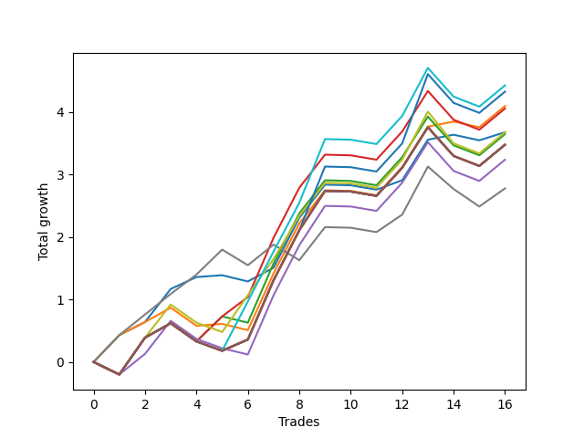

# Short HLT 111 
- Symbol: TSLA_15
- Date Range: 01/10/2024 - 05/17/2024
- Trading Period: 8:30-12:30
- Number of Trades: 16



| Name | Win Percent | Profit | Avg Profit / Trade | Avg Time / Trade |      | Name | Win Percent | Profit | Avg Profit / Trade | Avg Time / Trade |
| ---- | ----------- | ------ | ------------------ | ---------------- | ---- | ---- | ----------- | ------ | ------------------ | ---------------- |
| Sorted By <br> Profit | | | | | | Sorted By <br> Win Percentage ||||
| TP-0.75 | 56.25 | 2215.00 | 138.44 | 11:52 |     | BB-20 Mid | 75.00 | 1840.00 | 115.00 | 05:22 |
| TP-1 | 56.25 | 2165.00 | 135.31 | 13:00 |     | BB-20 U/L 1SD | 68.75 | 2050.00 | 128.13 | 08:33 |
| BB-20 U/L 1SD | 68.75 | 2050.00 | 128.13 | 08:33 |     | BB-20 U/L 2SD C | 62.50 | 2030.00 | 126.88 | 12:33 |
| BB-20 U/L 2SD C | 62.50 | 2030.00 | 126.88 | 12:33 |     | TP-0.25 | 62.50 | 1390.00 | 86.88 | 06:15 |
| BB-20 Mid | 75.00 | 1840.00 | 115.00 | 05:22 |     | TP-0.75 | 56.25 | 2215.00 | 138.44 | 11:52 |
| TP-0.5 | 56.25 | 1840.00 | 115.00 | 10:30 |     | TP-1 | 56.25 | 2165.00 | 135.31 | 13:00 |
| BB-20 U/L 2SD | 56.25 | 1825.00 | 114.06 | 12:18 |     | TP-0.5 | 56.25 | 1840.00 | 115.00 | 10:30 |
| NEWFI 000 | 56.25 | 1740.00 | 108.75 | 14:00 |     | BB-20 U/L 2SD | 56.25 | 1825.00 | 114.06 | 12:18 |
| TP-2 | 56.25 | 1740.00 | 108.75 | 14:00 |     | NEWFI 000 | 56.25 | 1740.00 | 108.75 | 14:00 |
| TP-1.75 | 56.25 | 1740.00 | 108.75 | 14:00 |     | TP-2 | 56.25 | 1740.00 | 108.75 | 14:00 |
| TP-1.5 | 56.25 | 1740.00 | 108.75 | 14:00 |     | TP-1.75 | 56.25 | 1740.00 | 108.75 | 14:00 |
| TP-1.25 | 56.25 | 1740.00 | 108.75 | 14:00 |     | TP-1.5 | 56.25 | 1740.00 | 108.75 | 14:00 |
| BB-50 U/L 2SD | 56.25 | 1740.00 | 108.75 | 14:00 |     | TP-1.25 | 56.25 | 1740.00 | 108.75 | 14:00 |
| BB-50 U/L 1SD | 56.25 | 1740.00 | 108.75 | 14:00 |     | BB-50 U/L 2SD | 56.25 | 1740.00 | 108.75 | 14:00 |
| BB-50 Mid | 50.00 | 1620.00 | 101.25 | 12:00 |     | BB-50 U/L 1SD | 56.25 | 1740.00 | 108.75 | 14:00 |
| TP-0.25 | 62.50 | 1390.00 | 86.88 | 06:15 |     | BB-50 Mid | 50.00 | 1620.00 | 101.25 | 12:00 |

## NO STOPLOSS

### Test BB-20 Mid
* Sell when price hits the middle line of the 20p bollinger
* No Stoploss
* Results:
```
Total Trades: 16
Percent Up: 25.00
Percent Down: 75.00
Total Points Moved Down: 3.68
Potential Profit: 1840.00
Total Points Ups: 0.27 Count Ups: 4
Total Points Downs: 3.95 Count Downs: 12
```

<details><summary>Trades</summary>

<code>In: 2024-01-19 12:20:00		Out: 2024-01-19 12:22:00		Total Position Time: 02:00		Total Move Down: 0.43		Total to Date: 0.43</code> <br />
<code>In: 2024-01-24 10:00:00		Out: 2024-01-24 10:02:00		Total Position Time: 02:00		Total Move Down: 0.21		Total to Date: 0.64</code> <br />
<code>In: 2024-01-29 11:45:00		Out: 2024-01-29 11:50:00		Total Position Time: 05:00		Total Move Down: 0.53		Total to Date: 1.17</code> <br />
<code>In: 2024-02-15 11:10:00		Out: 2024-02-15 11:12:00		Total Position Time: 02:00		Total Move Down: 0.19		Total to Date: 1.36</code> <br />
<code>In: 2024-02-22 11:40:00		Out: 2024-02-22 11:42:00		Total Position Time: 02:00		Total Move Down: 0.03		Total to Date: 1.39</code> <br />
<code>In: 2024-03-06 10:55:00		Out: 2024-03-06 10:57:00		Total Position Time: 02:00		Total Move Down: -0.10		Total to Date: 1.29</code> <br />
<code>In: 2024-03-12 09:30:00		Out: 2024-03-12 09:34:00		Total Position Time: 04:00		Total Move Down: 0.22		Total to Date: 1.51</code> <br />
<code>In: 2024-03-18 08:35:00		Out: 2024-03-18 08:49:00		Total Position Time: 14:00		Total Move Down: 0.80		Total to Date: 2.31</code> <br />
<code>In: 2024-03-18 10:00:00		Out: 2024-03-18 10:02:00		Total Position Time: 02:00		Total Move Down: 0.53		Total to Date: 2.84</code> <br />
<code>In: 2024-03-25 10:10:00		Out: 2024-03-25 10:24:00		Total Position Time: 14:00		Total Move Down: -0.01		Total to Date: 2.83</code> <br />
<code>In: 2024-04-04 10:10:00		Out: 2024-04-04 10:24:00		Total Position Time: 14:00		Total Move Down: -0.07		Total to Date: 2.76</code> <br />
<code>In: 2024-04-11 11:45:00		Out: 2024-04-11 11:48:00		Total Position Time: 03:00		Total Move Down: 0.15		Total to Date: 2.91</code> <br />
<code>In: 2024-04-29 09:40:00		Out: 2024-04-29 09:54:00		Total Position Time: 14:00		Total Move Down: 0.65		Total to Date: 3.56</code> <br />
<code>In: 2024-05-03 12:00:00		Out: 2024-05-03 12:02:00		Total Position Time: 02:00		Total Move Down: 0.08		Total to Date: 3.64</code> <br />
<code>In: 2024-05-06 11:40:00		Out: 2024-05-06 11:42:00		Total Position Time: 02:00		Total Move Down: -0.09		Total to Date: 3.55</code> <br />
<code>In: 2024-05-17 09:45:00		Out: 2024-05-17 09:47:00		Total Position Time: 02:00		Total Move Down: 0.13		Total to Date: 3.68</code> <br />


</details>

### Test BB-20 U/L 1SD
* Sell when the price hits the lower line of the 20p 1std bollinger
* No Stoploss
* Results:
```
Total Trades: 16
Percent Up: 31.25
Percent Down: 68.75
Total Points Moved Down: 4.10
Potential Profit: 2050.00
Total Points Ups: 0.56 Count Ups: 5
Total Points Downs: 4.66 Count Downs: 11
```

<details><summary>Trades</summary>

<code>In: 2024-01-19 12:20:00		Out: 2024-01-19 12:22:00		Total Position Time: 02:00		Total Move Down: 0.43		Total to Date: 0.43</code> <br />
<code>In: 2024-01-24 10:00:00		Out: 2024-01-24 10:02:00		Total Position Time: 02:00		Total Move Down: 0.21		Total to Date: 0.64</code> <br />
<code>In: 2024-01-29 11:45:00		Out: 2024-01-29 11:59:00		Total Position Time: 14:00		Total Move Down: 0.23		Total to Date: 0.87</code> <br />
<code>In: 2024-02-15 11:10:00		Out: 2024-02-15 11:24:00		Total Position Time: 14:00		Total Move Down: -0.29		Total to Date: 0.58</code> <br />
<code>In: 2024-02-22 11:40:00		Out: 2024-02-22 11:42:00		Total Position Time: 02:00		Total Move Down: 0.03		Total to Date: 0.61</code> <br />
<code>In: 2024-03-06 10:55:00		Out: 2024-03-06 10:57:00		Total Position Time: 02:00		Total Move Down: -0.10		Total to Date: 0.51</code> <br />
<code>In: 2024-03-12 09:30:00		Out: 2024-03-12 09:41:00		Total Position Time: 11:00		Total Move Down: 0.91		Total to Date: 1.42</code> <br />
<code>In: 2024-03-18 08:35:00		Out: 2024-03-18 08:49:00		Total Position Time: 14:00		Total Move Down: 0.80		Total to Date: 2.22</code> <br />
<code>In: 2024-03-18 10:00:00		Out: 2024-03-18 10:02:00		Total Position Time: 02:00		Total Move Down: 0.53		Total to Date: 2.75</code> <br />
<code>In: 2024-03-25 10:10:00		Out: 2024-03-25 10:24:00		Total Position Time: 14:00		Total Move Down: -0.01		Total to Date: 2.74</code> <br />
<code>In: 2024-04-04 10:10:00		Out: 2024-04-04 10:24:00		Total Position Time: 14:00		Total Move Down: -0.07		Total to Date: 2.67</code> <br />
<code>In: 2024-04-11 11:45:00		Out: 2024-04-11 11:59:00		Total Position Time: 14:00		Total Move Down: 0.45		Total to Date: 3.12</code> <br />
<code>In: 2024-04-29 09:40:00		Out: 2024-04-29 09:54:00		Total Position Time: 14:00		Total Move Down: 0.65		Total to Date: 3.77</code> <br />
<code>In: 2024-05-03 12:00:00		Out: 2024-05-03 12:02:00		Total Position Time: 02:00		Total Move Down: 0.08		Total to Date: 3.85</code> <br />
<code>In: 2024-05-06 11:40:00		Out: 2024-05-06 11:42:00		Total Position Time: 02:00		Total Move Down: -0.09		Total to Date: 3.76</code> <br />
<code>In: 2024-05-17 09:45:00		Out: 2024-05-17 09:59:00		Total Position Time: 14:00		Total Move Down: 0.34		Total to Date: 4.10</code> <br />


</details>

### Test BB-20 U/L 2SD
* Sell when the price hits the lower line of the 20p 2std bollinger
* No Stoploss
* Results:
```
Total Trades: 16
Percent Up: 43.75
Percent Down: 56.25
Total Points Moved Down: 3.65
Potential Profit: 1825.00
Total Points Ups: 1.29 Count Ups: 7
Total Points Downs: 4.94 Count Downs: 9
```

<details><summary>Trades</summary>

<code>In: 2024-01-19 12:20:00		Out: 2024-01-19 12:34:00		Total Position Time: 14:00		Total Move Down: -0.20		Total to Date: -0.20</code> <br />
<code>In: 2024-01-24 10:00:00		Out: 2024-01-24 10:14:00		Total Position Time: 14:00		Total Move Down: 0.59		Total to Date: 0.39</code> <br />
<code>In: 2024-01-29 11:45:00		Out: 2024-01-29 11:59:00		Total Position Time: 14:00		Total Move Down: 0.23		Total to Date: 0.62</code> <br />
<code>In: 2024-02-15 11:10:00		Out: 2024-02-15 11:24:00		Total Position Time: 14:00		Total Move Down: -0.29		Total to Date: 0.33</code> <br />
<code>In: 2024-02-22 11:40:00		Out: 2024-02-22 11:51:00		Total Position Time: 11:00		Total Move Down: 0.40		Total to Date: 0.73</code> <br />
<code>In: 2024-03-06 10:55:00		Out: 2024-03-06 10:57:00		Total Position Time: 02:00		Total Move Down: -0.10		Total to Date: 0.63</code> <br />
<code>In: 2024-03-12 09:30:00		Out: 2024-03-12 09:44:00		Total Position Time: 14:00		Total Move Down: 0.95		Total to Date: 1.58</code> <br />
<code>In: 2024-03-18 08:35:00		Out: 2024-03-18 08:49:00		Total Position Time: 14:00		Total Move Down: 0.80		Total to Date: 2.38</code> <br />
<code>In: 2024-03-18 10:00:00		Out: 2024-03-18 10:02:00		Total Position Time: 02:00		Total Move Down: 0.53		Total to Date: 2.91</code> <br />
<code>In: 2024-03-25 10:10:00		Out: 2024-03-25 10:24:00		Total Position Time: 14:00		Total Move Down: -0.01		Total to Date: 2.90</code> <br />
<code>In: 2024-04-04 10:10:00		Out: 2024-04-04 10:24:00		Total Position Time: 14:00		Total Move Down: -0.07		Total to Date: 2.83</code> <br />
<code>In: 2024-04-11 11:45:00		Out: 2024-04-11 11:59:00		Total Position Time: 14:00		Total Move Down: 0.45		Total to Date: 3.28</code> <br />
<code>In: 2024-04-29 09:40:00		Out: 2024-04-29 09:54:00		Total Position Time: 14:00		Total Move Down: 0.65		Total to Date: 3.93</code> <br />
<code>In: 2024-05-03 12:00:00		Out: 2024-05-03 12:14:00		Total Position Time: 14:00		Total Move Down: -0.46		Total to Date: 3.47</code> <br />
<code>In: 2024-05-06 11:40:00		Out: 2024-05-06 11:54:00		Total Position Time: 14:00		Total Move Down: -0.16		Total to Date: 3.31</code> <br />
<code>In: 2024-05-17 09:45:00		Out: 2024-05-17 09:59:00		Total Position Time: 14:00		Total Move Down: 0.34		Total to Date: 3.65</code> <br />


</details>

### Test BB-20 U/L 2SD C
* Sell when the price hits the lower line of the 20p 2std bollinger
* No Stoploss
* Results:
```
Total Trades: 16
Percent Up: 37.50
Percent Down: 62.50
Total Points Moved Down: 4.06
Potential Profit: 2030.00
Total Points Ups: 1.19 Count Ups: 6
Total Points Downs: 5.25 Count Downs: 10
```

<details><summary>Trades</summary>

<code>In: 2024-01-19 12:20:00		Out: 2024-01-19 12:34:00		Total Position Time: 14:00		Total Move Down: -0.20		Total to Date: -0.20</code> <br />
<code>In: 2024-01-24 10:00:00		Out: 2024-01-24 10:14:00		Total Position Time: 14:00		Total Move Down: 0.59		Total to Date: 0.39</code> <br />
<code>In: 2024-01-29 11:45:00		Out: 2024-01-29 11:59:00		Total Position Time: 14:00		Total Move Down: 0.23		Total to Date: 0.62</code> <br />
<code>In: 2024-02-15 11:10:00		Out: 2024-02-15 11:24:00		Total Position Time: 14:00		Total Move Down: -0.29		Total to Date: 0.33</code> <br />
<code>In: 2024-02-22 11:40:00		Out: 2024-02-22 11:51:00		Total Position Time: 11:00		Total Move Down: 0.40		Total to Date: 0.73</code> <br />
<code>In: 2024-03-06 10:55:00		Out: 2024-03-06 11:01:00		Total Position Time: 06:00		Total Move Down: 0.31		Total to Date: 1.04</code> <br />
<code>In: 2024-03-12 09:30:00		Out: 2024-03-12 09:44:00		Total Position Time: 14:00		Total Move Down: 0.95		Total to Date: 1.99</code> <br />
<code>In: 2024-03-18 08:35:00		Out: 2024-03-18 08:49:00		Total Position Time: 14:00		Total Move Down: 0.80		Total to Date: 2.79</code> <br />
<code>In: 2024-03-18 10:00:00		Out: 2024-03-18 10:02:00		Total Position Time: 02:00		Total Move Down: 0.53		Total to Date: 3.32</code> <br />
<code>In: 2024-03-25 10:10:00		Out: 2024-03-25 10:24:00		Total Position Time: 14:00		Total Move Down: -0.01		Total to Date: 3.31</code> <br />
<code>In: 2024-04-04 10:10:00		Out: 2024-04-04 10:24:00		Total Position Time: 14:00		Total Move Down: -0.07		Total to Date: 3.24</code> <br />
<code>In: 2024-04-11 11:45:00		Out: 2024-04-11 11:59:00		Total Position Time: 14:00		Total Move Down: 0.45		Total to Date: 3.69</code> <br />
<code>In: 2024-04-29 09:40:00		Out: 2024-04-29 09:54:00		Total Position Time: 14:00		Total Move Down: 0.65		Total to Date: 4.34</code> <br />
<code>In: 2024-05-03 12:00:00		Out: 2024-05-03 12:14:00		Total Position Time: 14:00		Total Move Down: -0.46		Total to Date: 3.88</code> <br />
<code>In: 2024-05-06 11:40:00		Out: 2024-05-06 11:54:00		Total Position Time: 14:00		Total Move Down: -0.16		Total to Date: 3.72</code> <br />
<code>In: 2024-05-17 09:45:00		Out: 2024-05-17 09:59:00		Total Position Time: 14:00		Total Move Down: 0.34		Total to Date: 4.06</code> <br />


</details>

### Test BB-50 Mid
* Sell when price hits the middle line of the 50p bollinger
* No Stoploss
* Results:
```
Total Trades: 16
Percent Up: 50.00
Percent Down: 50.00
Total Points Moved Down: 3.24
Potential Profit: 1620.00
Total Points Ups: 1.44 Count Ups: 8
Total Points Downs: 4.68 Count Downs: 8
```

<details><summary>Trades</summary>

<code>In: 2024-01-19 12:20:00		Out: 2024-01-19 12:34:00		Total Position Time: 14:00		Total Move Down: -0.20		Total to Date: -0.20</code> <br />
<code>In: 2024-01-24 10:00:00		Out: 2024-01-24 10:03:00		Total Position Time: 03:00		Total Move Down: 0.33		Total to Date: 0.13</code> <br />
<code>In: 2024-01-29 11:45:00		Out: 2024-01-29 11:50:00		Total Position Time: 05:00		Total Move Down: 0.53		Total to Date: 0.66</code> <br />
<code>In: 2024-02-15 11:10:00		Out: 2024-02-15 11:24:00		Total Position Time: 14:00		Total Move Down: -0.29		Total to Date: 0.37</code> <br />
<code>In: 2024-02-22 11:40:00		Out: 2024-02-22 11:54:00		Total Position Time: 14:00		Total Move Down: -0.15		Total to Date: 0.22</code> <br />
<code>In: 2024-03-06 10:55:00		Out: 2024-03-06 10:57:00		Total Position Time: 02:00		Total Move Down: -0.10		Total to Date: 0.12</code> <br />
<code>In: 2024-03-12 09:30:00		Out: 2024-03-12 09:44:00		Total Position Time: 14:00		Total Move Down: 0.95		Total to Date: 1.07</code> <br />
<code>In: 2024-03-18 08:35:00		Out: 2024-03-18 08:49:00		Total Position Time: 14:00		Total Move Down: 0.80		Total to Date: 1.87</code> <br />
<code>In: 2024-03-18 10:00:00		Out: 2024-03-18 10:14:00		Total Position Time: 14:00		Total Move Down: 0.63		Total to Date: 2.50</code> <br />
<code>In: 2024-03-25 10:10:00		Out: 2024-03-25 10:24:00		Total Position Time: 14:00		Total Move Down: -0.01		Total to Date: 2.49</code> <br />
<code>In: 2024-04-04 10:10:00		Out: 2024-04-04 10:24:00		Total Position Time: 14:00		Total Move Down: -0.07		Total to Date: 2.42</code> <br />
<code>In: 2024-04-11 11:45:00		Out: 2024-04-11 11:59:00		Total Position Time: 14:00		Total Move Down: 0.45		Total to Date: 2.87</code> <br />
<code>In: 2024-04-29 09:40:00		Out: 2024-04-29 09:54:00		Total Position Time: 14:00		Total Move Down: 0.65		Total to Date: 3.52</code> <br />
<code>In: 2024-05-03 12:00:00		Out: 2024-05-03 12:14:00		Total Position Time: 14:00		Total Move Down: -0.46		Total to Date: 3.06</code> <br />
<code>In: 2024-05-06 11:40:00		Out: 2024-05-06 11:54:00		Total Position Time: 14:00		Total Move Down: -0.16		Total to Date: 2.90</code> <br />
<code>In: 2024-05-17 09:45:00		Out: 2024-05-17 09:59:00		Total Position Time: 14:00		Total Move Down: 0.34		Total to Date: 3.24</code> <br />


</details>

### Test BB-50 U/L 1SD
* Sell when the price hits the lower line of the 50p 1std bollinger
* No Stoploss
* Results:
```
Total Trades: 16
Percent Up: 43.75
Percent Down: 56.25
Total Points Moved Down: 3.48
Potential Profit: 1740.00
Total Points Ups: 1.34 Count Ups: 7
Total Points Downs: 4.82 Count Downs: 9
```

<details><summary>Trades</summary>

<code>In: 2024-01-19 12:20:00		Out: 2024-01-19 12:34:00		Total Position Time: 14:00		Total Move Down: -0.20		Total to Date: -0.20</code> <br />
<code>In: 2024-01-24 10:00:00		Out: 2024-01-24 10:14:00		Total Position Time: 14:00		Total Move Down: 0.59		Total to Date: 0.39</code> <br />
<code>In: 2024-01-29 11:45:00		Out: 2024-01-29 11:59:00		Total Position Time: 14:00		Total Move Down: 0.23		Total to Date: 0.62</code> <br />
<code>In: 2024-02-15 11:10:00		Out: 2024-02-15 11:24:00		Total Position Time: 14:00		Total Move Down: -0.29		Total to Date: 0.33</code> <br />
<code>In: 2024-02-22 11:40:00		Out: 2024-02-22 11:54:00		Total Position Time: 14:00		Total Move Down: -0.15		Total to Date: 0.18</code> <br />
<code>In: 2024-03-06 10:55:00		Out: 2024-03-06 11:09:00		Total Position Time: 14:00		Total Move Down: 0.18		Total to Date: 0.36</code> <br />
<code>In: 2024-03-12 09:30:00		Out: 2024-03-12 09:44:00		Total Position Time: 14:00		Total Move Down: 0.95		Total to Date: 1.31</code> <br />
<code>In: 2024-03-18 08:35:00		Out: 2024-03-18 08:49:00		Total Position Time: 14:00		Total Move Down: 0.80		Total to Date: 2.11</code> <br />
<code>In: 2024-03-18 10:00:00		Out: 2024-03-18 10:14:00		Total Position Time: 14:00		Total Move Down: 0.63		Total to Date: 2.74</code> <br />
<code>In: 2024-03-25 10:10:00		Out: 2024-03-25 10:24:00		Total Position Time: 14:00		Total Move Down: -0.01		Total to Date: 2.73</code> <br />
<code>In: 2024-04-04 10:10:00		Out: 2024-04-04 10:24:00		Total Position Time: 14:00		Total Move Down: -0.07		Total to Date: 2.66</code> <br />
<code>In: 2024-04-11 11:45:00		Out: 2024-04-11 11:59:00		Total Position Time: 14:00		Total Move Down: 0.45		Total to Date: 3.11</code> <br />
<code>In: 2024-04-29 09:40:00		Out: 2024-04-29 09:54:00		Total Position Time: 14:00		Total Move Down: 0.65		Total to Date: 3.76</code> <br />
<code>In: 2024-05-03 12:00:00		Out: 2024-05-03 12:14:00		Total Position Time: 14:00		Total Move Down: -0.46		Total to Date: 3.30</code> <br />
<code>In: 2024-05-06 11:40:00		Out: 2024-05-06 11:54:00		Total Position Time: 14:00		Total Move Down: -0.16		Total to Date: 3.14</code> <br />
<code>In: 2024-05-17 09:45:00		Out: 2024-05-17 09:59:00		Total Position Time: 14:00		Total Move Down: 0.34		Total to Date: 3.48</code> <br />


</details>

### Test BB-50 U/L 2SD
* Sell when the price hits the lower line of the 50p 2std bollinger
* No Stoploss
* Results:
```
Total Trades: 16
Percent Up: 43.75
Percent Down: 56.25
Total Points Moved Down: 3.48
Potential Profit: 1740.00
Total Points Ups: 1.34 Count Ups: 7
Total Points Downs: 4.82 Count Downs: 9
```

<details><summary>Trades</summary>

<code>In: 2024-01-19 12:20:00		Out: 2024-01-19 12:34:00		Total Position Time: 14:00		Total Move Down: -0.20		Total to Date: -0.20</code> <br />
<code>In: 2024-01-24 10:00:00		Out: 2024-01-24 10:14:00		Total Position Time: 14:00		Total Move Down: 0.59		Total to Date: 0.39</code> <br />
<code>In: 2024-01-29 11:45:00		Out: 2024-01-29 11:59:00		Total Position Time: 14:00		Total Move Down: 0.23		Total to Date: 0.62</code> <br />
<code>In: 2024-02-15 11:10:00		Out: 2024-02-15 11:24:00		Total Position Time: 14:00		Total Move Down: -0.29		Total to Date: 0.33</code> <br />
<code>In: 2024-02-22 11:40:00		Out: 2024-02-22 11:54:00		Total Position Time: 14:00		Total Move Down: -0.15		Total to Date: 0.18</code> <br />
<code>In: 2024-03-06 10:55:00		Out: 2024-03-06 11:09:00		Total Position Time: 14:00		Total Move Down: 0.18		Total to Date: 0.36</code> <br />
<code>In: 2024-03-12 09:30:00		Out: 2024-03-12 09:44:00		Total Position Time: 14:00		Total Move Down: 0.95		Total to Date: 1.31</code> <br />
<code>In: 2024-03-18 08:35:00		Out: 2024-03-18 08:49:00		Total Position Time: 14:00		Total Move Down: 0.80		Total to Date: 2.11</code> <br />
<code>In: 2024-03-18 10:00:00		Out: 2024-03-18 10:14:00		Total Position Time: 14:00		Total Move Down: 0.63		Total to Date: 2.74</code> <br />
<code>In: 2024-03-25 10:10:00		Out: 2024-03-25 10:24:00		Total Position Time: 14:00		Total Move Down: -0.01		Total to Date: 2.73</code> <br />
<code>In: 2024-04-04 10:10:00		Out: 2024-04-04 10:24:00		Total Position Time: 14:00		Total Move Down: -0.07		Total to Date: 2.66</code> <br />
<code>In: 2024-04-11 11:45:00		Out: 2024-04-11 11:59:00		Total Position Time: 14:00		Total Move Down: 0.45		Total to Date: 3.11</code> <br />
<code>In: 2024-04-29 09:40:00		Out: 2024-04-29 09:54:00		Total Position Time: 14:00		Total Move Down: 0.65		Total to Date: 3.76</code> <br />
<code>In: 2024-05-03 12:00:00		Out: 2024-05-03 12:14:00		Total Position Time: 14:00		Total Move Down: -0.46		Total to Date: 3.30</code> <br />
<code>In: 2024-05-06 11:40:00		Out: 2024-05-06 11:54:00		Total Position Time: 14:00		Total Move Down: -0.16		Total to Date: 3.14</code> <br />
<code>In: 2024-05-17 09:45:00		Out: 2024-05-17 09:59:00		Total Position Time: 14:00		Total Move Down: 0.34		Total to Date: 3.48</code> <br />


</details>

## TAKE PROFIT

### Test TP-0.25
* Take Profit of 0.25 Point
* 0.25 Stoploss
* Results:
```
Total Trades: 16
Percent Up: 37.50
Percent Down: 62.50
Total Points Moved Down: 2.78
Potential Profit: 1390.00
Total Points Ups: 1.22 Count Ups: 6
Total Points Downs: 4.00 Count Downs: 10
```

<details><summary>Trades</summary>

<code>In: 2024-01-19 12:20:00		Out: 2024-01-19 12:22:00		Total Position Time: 02:00		Total Move Down: 0.43		Total to Date: 0.43</code> <br />
<code>In: 2024-01-24 10:00:00		Out: 2024-01-24 10:03:00		Total Position Time: 03:00		Total Move Down: 0.33		Total to Date: 0.76</code> <br />
<code>In: 2024-01-29 11:45:00		Out: 2024-01-29 11:49:00		Total Position Time: 04:00		Total Move Down: 0.33		Total to Date: 1.09</code> <br />
<code>In: 2024-02-15 11:10:00		Out: 2024-02-15 11:14:00		Total Position Time: 04:00		Total Move Down: 0.31		Total to Date: 1.40</code> <br />
<code>In: 2024-02-22 11:40:00		Out: 2024-02-22 11:51:00		Total Position Time: 11:00		Total Move Down: 0.40		Total to Date: 1.80</code> <br />
<code>In: 2024-03-06 10:55:00		Out: 2024-03-06 10:58:00		Total Position Time: 03:00		Total Move Down: -0.25		Total to Date: 1.55</code> <br />
<code>In: 2024-03-12 09:30:00		Out: 2024-03-12 09:37:00		Total Position Time: 07:00		Total Move Down: 0.33		Total to Date: 1.88</code> <br />
<code>In: 2024-03-18 08:35:00		Out: 2024-03-18 08:37:00		Total Position Time: 02:00		Total Move Down: -0.25		Total to Date: 1.63</code> <br />
<code>In: 2024-03-18 10:00:00		Out: 2024-03-18 10:02:00		Total Position Time: 02:00		Total Move Down: 0.53		Total to Date: 2.16</code> <br />
<code>In: 2024-03-25 10:10:00		Out: 2024-03-25 10:24:00		Total Position Time: 14:00		Total Move Down: -0.01		Total to Date: 2.15</code> <br />
<code>In: 2024-04-04 10:10:00		Out: 2024-04-04 10:24:00		Total Position Time: 14:00		Total Move Down: -0.07		Total to Date: 2.08</code> <br />
<code>In: 2024-04-11 11:45:00		Out: 2024-04-11 11:51:00		Total Position Time: 06:00		Total Move Down: 0.28		Total to Date: 2.36</code> <br />
<code>In: 2024-04-29 09:40:00		Out: 2024-04-29 09:42:00		Total Position Time: 02:00		Total Move Down: 0.77		Total to Date: 3.13</code> <br />
<code>In: 2024-05-03 12:00:00		Out: 2024-05-03 12:07:00		Total Position Time: 07:00		Total Move Down: -0.36		Total to Date: 2.77</code> <br />
<code>In: 2024-05-06 11:40:00		Out: 2024-05-06 11:49:00		Total Position Time: 09:00		Total Move Down: -0.28		Total to Date: 2.49</code> <br />
<code>In: 2024-05-17 09:45:00		Out: 2024-05-17 09:55:00		Total Position Time: 10:00		Total Move Down: 0.29		Total to Date: 2.78</code> <br />


</details>

### Test TP-0.5
* Take Profit of 0.5 Point
* 0.5 Stoploss
* Results:
```
Total Trades: 16
Percent Up: 43.75
Percent Down: 56.25
Total Points Moved Down: 3.68
Potential Profit: 1840.00
Total Points Ups: 1.39 Count Ups: 7
Total Points Downs: 5.07 Count Downs: 9
```

<details><summary>Trades</summary>

<code>In: 2024-01-19 12:20:00		Out: 2024-01-19 12:34:00		Total Position Time: 14:00		Total Move Down: -0.20		Total to Date: -0.20</code> <br />
<code>In: 2024-01-24 10:00:00		Out: 2024-01-24 10:14:00		Total Position Time: 14:00		Total Move Down: 0.59		Total to Date: 0.39</code> <br />
<code>In: 2024-01-29 11:45:00		Out: 2024-01-29 11:50:00		Total Position Time: 05:00		Total Move Down: 0.53		Total to Date: 0.92</code> <br />
<code>In: 2024-02-15 11:10:00		Out: 2024-02-15 11:24:00		Total Position Time: 14:00		Total Move Down: -0.29		Total to Date: 0.63</code> <br />
<code>In: 2024-02-22 11:40:00		Out: 2024-02-22 11:54:00		Total Position Time: 14:00		Total Move Down: -0.15		Total to Date: 0.48</code> <br />
<code>In: 2024-03-06 10:55:00		Out: 2024-03-06 11:03:00		Total Position Time: 08:00		Total Move Down: 0.59		Total to Date: 1.07</code> <br />
<code>In: 2024-03-12 09:30:00		Out: 2024-03-12 09:38:00		Total Position Time: 08:00		Total Move Down: 0.58		Total to Date: 1.65</code> <br />
<code>In: 2024-03-18 08:35:00		Out: 2024-03-18 08:42:00		Total Position Time: 07:00		Total Move Down: 0.69		Total to Date: 2.34</code> <br />
<code>In: 2024-03-18 10:00:00		Out: 2024-03-18 10:02:00		Total Position Time: 02:00		Total Move Down: 0.53		Total to Date: 2.87</code> <br />
<code>In: 2024-03-25 10:10:00		Out: 2024-03-25 10:24:00		Total Position Time: 14:00		Total Move Down: -0.01		Total to Date: 2.86</code> <br />
<code>In: 2024-04-04 10:10:00		Out: 2024-04-04 10:24:00		Total Position Time: 14:00		Total Move Down: -0.07		Total to Date: 2.79</code> <br />
<code>In: 2024-04-11 11:45:00		Out: 2024-04-11 11:59:00		Total Position Time: 14:00		Total Move Down: 0.45		Total to Date: 3.24</code> <br />
<code>In: 2024-04-29 09:40:00		Out: 2024-04-29 09:42:00		Total Position Time: 02:00		Total Move Down: 0.77		Total to Date: 4.01</code> <br />
<code>In: 2024-05-03 12:00:00		Out: 2024-05-03 12:10:00		Total Position Time: 10:00		Total Move Down: -0.51		Total to Date: 3.50</code> <br />
<code>In: 2024-05-06 11:40:00		Out: 2024-05-06 11:54:00		Total Position Time: 14:00		Total Move Down: -0.16		Total to Date: 3.34</code> <br />
<code>In: 2024-05-17 09:45:00		Out: 2024-05-17 09:59:00		Total Position Time: 14:00		Total Move Down: 0.34		Total to Date: 3.68</code> <br />


</details>

### Test TP-0.75
* Take Profit of 0.75 Point
* 0.75 Stoploss
* Results:
```
Total Trades: 16
Percent Up: 43.75
Percent Down: 56.25
Total Points Moved Down: 4.43
Potential Profit: 2215.00
Total Points Ups: 1.34 Count Ups: 7
Total Points Downs: 5.77 Count Downs: 9
```

<details><summary>Trades</summary>

<code>In: 2024-01-19 12:20:00		Out: 2024-01-19 12:34:00		Total Position Time: 14:00		Total Move Down: -0.20		Total to Date: -0.20</code> <br />
<code>In: 2024-01-24 10:00:00		Out: 2024-01-24 10:14:00		Total Position Time: 14:00		Total Move Down: 0.59		Total to Date: 0.39</code> <br />
<code>In: 2024-01-29 11:45:00		Out: 2024-01-29 11:59:00		Total Position Time: 14:00		Total Move Down: 0.23		Total to Date: 0.62</code> <br />
<code>In: 2024-02-15 11:10:00		Out: 2024-02-15 11:24:00		Total Position Time: 14:00		Total Move Down: -0.29		Total to Date: 0.33</code> <br />
<code>In: 2024-02-22 11:40:00		Out: 2024-02-22 11:54:00		Total Position Time: 14:00		Total Move Down: -0.15		Total to Date: 0.18</code> <br />
<code>In: 2024-03-06 10:55:00		Out: 2024-03-06 11:04:00		Total Position Time: 09:00		Total Move Down: 0.79		Total to Date: 0.97</code> <br />
<code>In: 2024-03-12 09:30:00		Out: 2024-03-12 09:40:00		Total Position Time: 10:00		Total Move Down: 0.80		Total to Date: 1.77</code> <br />
<code>In: 2024-03-18 08:35:00		Out: 2024-03-18 08:43:00		Total Position Time: 08:00		Total Move Down: 0.78		Total to Date: 2.55</code> <br />
<code>In: 2024-03-18 10:00:00		Out: 2024-03-18 10:07:00		Total Position Time: 07:00		Total Move Down: 1.02		Total to Date: 3.57</code> <br />
<code>In: 2024-03-25 10:10:00		Out: 2024-03-25 10:24:00		Total Position Time: 14:00		Total Move Down: -0.01		Total to Date: 3.56</code> <br />
<code>In: 2024-04-04 10:10:00		Out: 2024-04-04 10:24:00		Total Position Time: 14:00		Total Move Down: -0.07		Total to Date: 3.49</code> <br />
<code>In: 2024-04-11 11:45:00		Out: 2024-04-11 11:59:00		Total Position Time: 14:00		Total Move Down: 0.45		Total to Date: 3.94</code> <br />
<code>In: 2024-04-29 09:40:00		Out: 2024-04-29 09:42:00		Total Position Time: 02:00		Total Move Down: 0.77		Total to Date: 4.71</code> <br />
<code>In: 2024-05-03 12:00:00		Out: 2024-05-03 12:14:00		Total Position Time: 14:00		Total Move Down: -0.46		Total to Date: 4.25</code> <br />
<code>In: 2024-05-06 11:40:00		Out: 2024-05-06 11:54:00		Total Position Time: 14:00		Total Move Down: -0.16		Total to Date: 4.09</code> <br />
<code>In: 2024-05-17 09:45:00		Out: 2024-05-17 09:59:00		Total Position Time: 14:00		Total Move Down: 0.34		Total to Date: 4.43</code> <br />


</details>

### Test TP-1
* Take Profit of 1 Point
* 1 Stoploss
* Results:
```
Total Trades: 16
Percent Up: 43.75
Percent Down: 56.25
Total Points Moved Down: 4.33
Potential Profit: 2165.00
Total Points Ups: 1.34 Count Ups: 7
Total Points Downs: 5.67 Count Downs: 9
```

<details><summary>Trades</summary>

<code>In: 2024-01-19 12:20:00		Out: 2024-01-19 12:34:00		Total Position Time: 14:00		Total Move Down: -0.20		Total to Date: -0.20</code> <br />
<code>In: 2024-01-24 10:00:00		Out: 2024-01-24 10:14:00		Total Position Time: 14:00		Total Move Down: 0.59		Total to Date: 0.39</code> <br />
<code>In: 2024-01-29 11:45:00		Out: 2024-01-29 11:59:00		Total Position Time: 14:00		Total Move Down: 0.23		Total to Date: 0.62</code> <br />
<code>In: 2024-02-15 11:10:00		Out: 2024-02-15 11:24:00		Total Position Time: 14:00		Total Move Down: -0.29		Total to Date: 0.33</code> <br />
<code>In: 2024-02-22 11:40:00		Out: 2024-02-22 11:54:00		Total Position Time: 14:00		Total Move Down: -0.15		Total to Date: 0.18</code> <br />
<code>In: 2024-03-06 10:55:00		Out: 2024-03-06 11:09:00		Total Position Time: 14:00		Total Move Down: 0.18		Total to Date: 0.36</code> <br />
<code>In: 2024-03-12 09:30:00		Out: 2024-03-12 09:44:00		Total Position Time: 14:00		Total Move Down: 0.95		Total to Date: 1.31</code> <br />
<code>In: 2024-03-18 08:35:00		Out: 2024-03-18 08:49:00		Total Position Time: 14:00		Total Move Down: 0.80		Total to Date: 2.11</code> <br />
<code>In: 2024-03-18 10:00:00		Out: 2024-03-18 10:07:00		Total Position Time: 07:00		Total Move Down: 1.02		Total to Date: 3.13</code> <br />
<code>In: 2024-03-25 10:10:00		Out: 2024-03-25 10:24:00		Total Position Time: 14:00		Total Move Down: -0.01		Total to Date: 3.12</code> <br />
<code>In: 2024-04-04 10:10:00		Out: 2024-04-04 10:24:00		Total Position Time: 14:00		Total Move Down: -0.07		Total to Date: 3.05</code> <br />
<code>In: 2024-04-11 11:45:00		Out: 2024-04-11 11:59:00		Total Position Time: 14:00		Total Move Down: 0.45		Total to Date: 3.50</code> <br />
<code>In: 2024-04-29 09:40:00		Out: 2024-04-29 09:45:00		Total Position Time: 05:00		Total Move Down: 1.11		Total to Date: 4.61</code> <br />
<code>In: 2024-05-03 12:00:00		Out: 2024-05-03 12:14:00		Total Position Time: 14:00		Total Move Down: -0.46		Total to Date: 4.15</code> <br />
<code>In: 2024-05-06 11:40:00		Out: 2024-05-06 11:54:00		Total Position Time: 14:00		Total Move Down: -0.16		Total to Date: 3.99</code> <br />
<code>In: 2024-05-17 09:45:00		Out: 2024-05-17 09:59:00		Total Position Time: 14:00		Total Move Down: 0.34		Total to Date: 4.33</code> <br />


</details>

### Test TP-1.25
* Take Profit of 1.25 Point
* 1.25 Stoploss
* Results:
```
Total Trades: 16
Percent Up: 43.75
Percent Down: 56.25
Total Points Moved Down: 3.48
Potential Profit: 1740.00
Total Points Ups: 1.34 Count Ups: 7
Total Points Downs: 4.82 Count Downs: 9
```

<details><summary>Trades</summary>

<code>In: 2024-01-19 12:20:00		Out: 2024-01-19 12:34:00		Total Position Time: 14:00		Total Move Down: -0.20		Total to Date: -0.20</code> <br />
<code>In: 2024-01-24 10:00:00		Out: 2024-01-24 10:14:00		Total Position Time: 14:00		Total Move Down: 0.59		Total to Date: 0.39</code> <br />
<code>In: 2024-01-29 11:45:00		Out: 2024-01-29 11:59:00		Total Position Time: 14:00		Total Move Down: 0.23		Total to Date: 0.62</code> <br />
<code>In: 2024-02-15 11:10:00		Out: 2024-02-15 11:24:00		Total Position Time: 14:00		Total Move Down: -0.29		Total to Date: 0.33</code> <br />
<code>In: 2024-02-22 11:40:00		Out: 2024-02-22 11:54:00		Total Position Time: 14:00		Total Move Down: -0.15		Total to Date: 0.18</code> <br />
<code>In: 2024-03-06 10:55:00		Out: 2024-03-06 11:09:00		Total Position Time: 14:00		Total Move Down: 0.18		Total to Date: 0.36</code> <br />
<code>In: 2024-03-12 09:30:00		Out: 2024-03-12 09:44:00		Total Position Time: 14:00		Total Move Down: 0.95		Total to Date: 1.31</code> <br />
<code>In: 2024-03-18 08:35:00		Out: 2024-03-18 08:49:00		Total Position Time: 14:00		Total Move Down: 0.80		Total to Date: 2.11</code> <br />
<code>In: 2024-03-18 10:00:00		Out: 2024-03-18 10:14:00		Total Position Time: 14:00		Total Move Down: 0.63		Total to Date: 2.74</code> <br />
<code>In: 2024-03-25 10:10:00		Out: 2024-03-25 10:24:00		Total Position Time: 14:00		Total Move Down: -0.01		Total to Date: 2.73</code> <br />
<code>In: 2024-04-04 10:10:00		Out: 2024-04-04 10:24:00		Total Position Time: 14:00		Total Move Down: -0.07		Total to Date: 2.66</code> <br />
<code>In: 2024-04-11 11:45:00		Out: 2024-04-11 11:59:00		Total Position Time: 14:00		Total Move Down: 0.45		Total to Date: 3.11</code> <br />
<code>In: 2024-04-29 09:40:00		Out: 2024-04-29 09:54:00		Total Position Time: 14:00		Total Move Down: 0.65		Total to Date: 3.76</code> <br />
<code>In: 2024-05-03 12:00:00		Out: 2024-05-03 12:14:00		Total Position Time: 14:00		Total Move Down: -0.46		Total to Date: 3.30</code> <br />
<code>In: 2024-05-06 11:40:00		Out: 2024-05-06 11:54:00		Total Position Time: 14:00		Total Move Down: -0.16		Total to Date: 3.14</code> <br />
<code>In: 2024-05-17 09:45:00		Out: 2024-05-17 09:59:00		Total Position Time: 14:00		Total Move Down: 0.34		Total to Date: 3.48</code> <br />


</details>

### Test TP-1.5
* Take Profit of 1.5 Point
* 1.5 Stoploss
* Results:
```
Total Trades: 16
Percent Up: 43.75
Percent Down: 56.25
Total Points Moved Down: 3.48
Potential Profit: 1740.00
Total Points Ups: 1.34 Count Ups: 7
Total Points Downs: 4.82 Count Downs: 9
```

<details><summary>Trades</summary>

<code>In: 2024-01-19 12:20:00		Out: 2024-01-19 12:34:00		Total Position Time: 14:00		Total Move Down: -0.20		Total to Date: -0.20</code> <br />
<code>In: 2024-01-24 10:00:00		Out: 2024-01-24 10:14:00		Total Position Time: 14:00		Total Move Down: 0.59		Total to Date: 0.39</code> <br />
<code>In: 2024-01-29 11:45:00		Out: 2024-01-29 11:59:00		Total Position Time: 14:00		Total Move Down: 0.23		Total to Date: 0.62</code> <br />
<code>In: 2024-02-15 11:10:00		Out: 2024-02-15 11:24:00		Total Position Time: 14:00		Total Move Down: -0.29		Total to Date: 0.33</code> <br />
<code>In: 2024-02-22 11:40:00		Out: 2024-02-22 11:54:00		Total Position Time: 14:00		Total Move Down: -0.15		Total to Date: 0.18</code> <br />
<code>In: 2024-03-06 10:55:00		Out: 2024-03-06 11:09:00		Total Position Time: 14:00		Total Move Down: 0.18		Total to Date: 0.36</code> <br />
<code>In: 2024-03-12 09:30:00		Out: 2024-03-12 09:44:00		Total Position Time: 14:00		Total Move Down: 0.95		Total to Date: 1.31</code> <br />
<code>In: 2024-03-18 08:35:00		Out: 2024-03-18 08:49:00		Total Position Time: 14:00		Total Move Down: 0.80		Total to Date: 2.11</code> <br />
<code>In: 2024-03-18 10:00:00		Out: 2024-03-18 10:14:00		Total Position Time: 14:00		Total Move Down: 0.63		Total to Date: 2.74</code> <br />
<code>In: 2024-03-25 10:10:00		Out: 2024-03-25 10:24:00		Total Position Time: 14:00		Total Move Down: -0.01		Total to Date: 2.73</code> <br />
<code>In: 2024-04-04 10:10:00		Out: 2024-04-04 10:24:00		Total Position Time: 14:00		Total Move Down: -0.07		Total to Date: 2.66</code> <br />
<code>In: 2024-04-11 11:45:00		Out: 2024-04-11 11:59:00		Total Position Time: 14:00		Total Move Down: 0.45		Total to Date: 3.11</code> <br />
<code>In: 2024-04-29 09:40:00		Out: 2024-04-29 09:54:00		Total Position Time: 14:00		Total Move Down: 0.65		Total to Date: 3.76</code> <br />
<code>In: 2024-05-03 12:00:00		Out: 2024-05-03 12:14:00		Total Position Time: 14:00		Total Move Down: -0.46		Total to Date: 3.30</code> <br />
<code>In: 2024-05-06 11:40:00		Out: 2024-05-06 11:54:00		Total Position Time: 14:00		Total Move Down: -0.16		Total to Date: 3.14</code> <br />
<code>In: 2024-05-17 09:45:00		Out: 2024-05-17 09:59:00		Total Position Time: 14:00		Total Move Down: 0.34		Total to Date: 3.48</code> <br />


</details>

### Test TP-1.75
* Take Profit of 1.75 Point
* 1.75 Stoploss
* Results:
```
Total Trades: 16
Percent Up: 43.75
Percent Down: 56.25
Total Points Moved Down: 3.48
Potential Profit: 1740.00
Total Points Ups: 1.34 Count Ups: 7
Total Points Downs: 4.82 Count Downs: 9
```

<details><summary>Trades</summary>

<code>In: 2024-01-19 12:20:00		Out: 2024-01-19 12:34:00		Total Position Time: 14:00		Total Move Down: -0.20		Total to Date: -0.20</code> <br />
<code>In: 2024-01-24 10:00:00		Out: 2024-01-24 10:14:00		Total Position Time: 14:00		Total Move Down: 0.59		Total to Date: 0.39</code> <br />
<code>In: 2024-01-29 11:45:00		Out: 2024-01-29 11:59:00		Total Position Time: 14:00		Total Move Down: 0.23		Total to Date: 0.62</code> <br />
<code>In: 2024-02-15 11:10:00		Out: 2024-02-15 11:24:00		Total Position Time: 14:00		Total Move Down: -0.29		Total to Date: 0.33</code> <br />
<code>In: 2024-02-22 11:40:00		Out: 2024-02-22 11:54:00		Total Position Time: 14:00		Total Move Down: -0.15		Total to Date: 0.18</code> <br />
<code>In: 2024-03-06 10:55:00		Out: 2024-03-06 11:09:00		Total Position Time: 14:00		Total Move Down: 0.18		Total to Date: 0.36</code> <br />
<code>In: 2024-03-12 09:30:00		Out: 2024-03-12 09:44:00		Total Position Time: 14:00		Total Move Down: 0.95		Total to Date: 1.31</code> <br />
<code>In: 2024-03-18 08:35:00		Out: 2024-03-18 08:49:00		Total Position Time: 14:00		Total Move Down: 0.80		Total to Date: 2.11</code> <br />
<code>In: 2024-03-18 10:00:00		Out: 2024-03-18 10:14:00		Total Position Time: 14:00		Total Move Down: 0.63		Total to Date: 2.74</code> <br />
<code>In: 2024-03-25 10:10:00		Out: 2024-03-25 10:24:00		Total Position Time: 14:00		Total Move Down: -0.01		Total to Date: 2.73</code> <br />
<code>In: 2024-04-04 10:10:00		Out: 2024-04-04 10:24:00		Total Position Time: 14:00		Total Move Down: -0.07		Total to Date: 2.66</code> <br />
<code>In: 2024-04-11 11:45:00		Out: 2024-04-11 11:59:00		Total Position Time: 14:00		Total Move Down: 0.45		Total to Date: 3.11</code> <br />
<code>In: 2024-04-29 09:40:00		Out: 2024-04-29 09:54:00		Total Position Time: 14:00		Total Move Down: 0.65		Total to Date: 3.76</code> <br />
<code>In: 2024-05-03 12:00:00		Out: 2024-05-03 12:14:00		Total Position Time: 14:00		Total Move Down: -0.46		Total to Date: 3.30</code> <br />
<code>In: 2024-05-06 11:40:00		Out: 2024-05-06 11:54:00		Total Position Time: 14:00		Total Move Down: -0.16		Total to Date: 3.14</code> <br />
<code>In: 2024-05-17 09:45:00		Out: 2024-05-17 09:59:00		Total Position Time: 14:00		Total Move Down: 0.34		Total to Date: 3.48</code> <br />


</details>

### Test TP-2
* Take Profit of 2 Point
* 2 Stoploss
* Results:
```
Total Trades: 16
Percent Up: 43.75
Percent Down: 56.25
Total Points Moved Down: 3.48
Potential Profit: 1740.00
Total Points Ups: 1.34 Count Ups: 7
Total Points Downs: 4.82 Count Downs: 9
```

<details><summary>Trades</summary>

<code>In: 2024-01-19 12:20:00		Out: 2024-01-19 12:34:00		Total Position Time: 14:00		Total Move Down: -0.20		Total to Date: -0.20</code> <br />
<code>In: 2024-01-24 10:00:00		Out: 2024-01-24 10:14:00		Total Position Time: 14:00		Total Move Down: 0.59		Total to Date: 0.39</code> <br />
<code>In: 2024-01-29 11:45:00		Out: 2024-01-29 11:59:00		Total Position Time: 14:00		Total Move Down: 0.23		Total to Date: 0.62</code> <br />
<code>In: 2024-02-15 11:10:00		Out: 2024-02-15 11:24:00		Total Position Time: 14:00		Total Move Down: -0.29		Total to Date: 0.33</code> <br />
<code>In: 2024-02-22 11:40:00		Out: 2024-02-22 11:54:00		Total Position Time: 14:00		Total Move Down: -0.15		Total to Date: 0.18</code> <br />
<code>In: 2024-03-06 10:55:00		Out: 2024-03-06 11:09:00		Total Position Time: 14:00		Total Move Down: 0.18		Total to Date: 0.36</code> <br />
<code>In: 2024-03-12 09:30:00		Out: 2024-03-12 09:44:00		Total Position Time: 14:00		Total Move Down: 0.95		Total to Date: 1.31</code> <br />
<code>In: 2024-03-18 08:35:00		Out: 2024-03-18 08:49:00		Total Position Time: 14:00		Total Move Down: 0.80		Total to Date: 2.11</code> <br />
<code>In: 2024-03-18 10:00:00		Out: 2024-03-18 10:14:00		Total Position Time: 14:00		Total Move Down: 0.63		Total to Date: 2.74</code> <br />
<code>In: 2024-03-25 10:10:00		Out: 2024-03-25 10:24:00		Total Position Time: 14:00		Total Move Down: -0.01		Total to Date: 2.73</code> <br />
<code>In: 2024-04-04 10:10:00		Out: 2024-04-04 10:24:00		Total Position Time: 14:00		Total Move Down: -0.07		Total to Date: 2.66</code> <br />
<code>In: 2024-04-11 11:45:00		Out: 2024-04-11 11:59:00		Total Position Time: 14:00		Total Move Down: 0.45		Total to Date: 3.11</code> <br />
<code>In: 2024-04-29 09:40:00		Out: 2024-04-29 09:54:00		Total Position Time: 14:00		Total Move Down: 0.65		Total to Date: 3.76</code> <br />
<code>In: 2024-05-03 12:00:00		Out: 2024-05-03 12:14:00		Total Position Time: 14:00		Total Move Down: -0.46		Total to Date: 3.30</code> <br />
<code>In: 2024-05-06 11:40:00		Out: 2024-05-06 11:54:00		Total Position Time: 14:00		Total Move Down: -0.16		Total to Date: 3.14</code> <br />
<code>In: 2024-05-17 09:45:00		Out: 2024-05-17 09:59:00		Total Position Time: 14:00		Total Move Down: 0.34		Total to Date: 3.48</code> <br />


</details>

## Indicator Exits

### Test NEWFI 000
* Newfi 0000
* No Stoploss
* Results:
```
Total Trades: 16
Percent Up: 43.75
Percent Down: 56.25
Total Points Moved Down: 3.48
Potential Profit: 1740.00
Total Points Ups: 1.34 Count Ups: 7
Total Points Downs: 4.82 Count Downs: 9
```

<details><summary>Trades</summary>

<code>In: 2024-01-19 12:20:00		Out: 2024-01-19 12:34:00		Total Position Time: 14:00		Total Move Down: -0.20		Total to Date: -0.20</code> <br />
<code>In: 2024-01-24 10:00:00		Out: 2024-01-24 10:14:00		Total Position Time: 14:00		Total Move Down: 0.59		Total to Date: 0.39</code> <br />
<code>In: 2024-01-29 11:45:00		Out: 2024-01-29 11:59:00		Total Position Time: 14:00		Total Move Down: 0.23		Total to Date: 0.62</code> <br />
<code>In: 2024-02-15 11:10:00		Out: 2024-02-15 11:24:00		Total Position Time: 14:00		Total Move Down: -0.29		Total to Date: 0.33</code> <br />
<code>In: 2024-02-22 11:40:00		Out: 2024-02-22 11:54:00		Total Position Time: 14:00		Total Move Down: -0.15		Total to Date: 0.18</code> <br />
<code>In: 2024-03-06 10:55:00		Out: 2024-03-06 11:09:00		Total Position Time: 14:00		Total Move Down: 0.18		Total to Date: 0.36</code> <br />
<code>In: 2024-03-12 09:30:00		Out: 2024-03-12 09:44:00		Total Position Time: 14:00		Total Move Down: 0.95		Total to Date: 1.31</code> <br />
<code>In: 2024-03-18 08:35:00		Out: 2024-03-18 08:49:00		Total Position Time: 14:00		Total Move Down: 0.80		Total to Date: 2.11</code> <br />
<code>In: 2024-03-18 10:00:00		Out: 2024-03-18 10:14:00		Total Position Time: 14:00		Total Move Down: 0.63		Total to Date: 2.74</code> <br />
<code>In: 2024-03-25 10:10:00		Out: 2024-03-25 10:24:00		Total Position Time: 14:00		Total Move Down: -0.01		Total to Date: 2.73</code> <br />
<code>In: 2024-04-04 10:10:00		Out: 2024-04-04 10:24:00		Total Position Time: 14:00		Total Move Down: -0.07		Total to Date: 2.66</code> <br />
<code>In: 2024-04-11 11:45:00		Out: 2024-04-11 11:59:00		Total Position Time: 14:00		Total Move Down: 0.45		Total to Date: 3.11</code> <br />
<code>In: 2024-04-29 09:40:00		Out: 2024-04-29 09:54:00		Total Position Time: 14:00		Total Move Down: 0.65		Total to Date: 3.76</code> <br />
<code>In: 2024-05-03 12:00:00		Out: 2024-05-03 12:14:00		Total Position Time: 14:00		Total Move Down: -0.46		Total to Date: 3.30</code> <br />
<code>In: 2024-05-06 11:40:00		Out: 2024-05-06 11:54:00		Total Position Time: 14:00		Total Move Down: -0.16		Total to Date: 3.14</code> <br />
<code>In: 2024-05-17 09:45:00		Out: 2024-05-17 09:59:00		Total Position Time: 14:00		Total Move Down: 0.34		Total to Date: 3.48</code> <br />


</details>