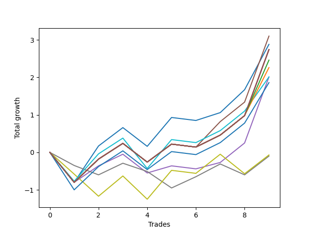

# Long HLT 101 
- Symbol: TSLA_30
- Date Range: 01/10/2024 - 05/17/2024
- Trading Period: 8:30-12:30
- Number of Trades: 9



| Name | Win Percent | Profit | Avg Profit / Trade | Avg Time / Trade |      | Name | Win Percent | Profit | Avg Profit / Trade | Avg Time / Trade |
| ---- | ----------- | ------ | ------------------ | ---------------- | ---- | ---- | ----------- | ------ | ------------------ | ---------------- |
| Sorted By <br> Profit | | | | | | Sorted By <br> Win Percentage ||||
| BB-50 U/L 1SD | 66.67 | 1550.00 | 172.22 | 27:06 |     | BB-50 U/L 1SD | 66.67 | 1550.00 | 172.22 | 27:06 |
| BB-20 Mid | 66.67 | 1440.00 | 160.00 | 22:13 |     | BB-20 Mid | 66.67 | 1440.00 | 160.00 | 22:13 |
| NEWFI 000 | 66.67 | 1370.00 | 152.22 | 29:00 |     | NEWFI 000 | 66.67 | 1370.00 | 152.22 | 29:00 |
| TP-2 | 66.67 | 1370.00 | 152.22 | 29:00 |     | TP-2 | 66.67 | 1370.00 | 152.22 | 29:00 |
| TP-1.75 | 66.67 | 1370.00 | 152.22 | 29:00 |     | TP-1.75 | 66.67 | 1370.00 | 152.22 | 29:00 |
| BB-50 U/L 2SD | 66.67 | 1370.00 | 152.22 | 29:00 |     | BB-50 U/L 2SD | 66.67 | 1370.00 | 152.22 | 29:00 |
| BB-20 U/L 2SD C | 66.67 | 1370.00 | 152.22 | 29:00 |     | BB-20 U/L 2SD C | 66.67 | 1370.00 | 152.22 | 29:00 |
| BB-20 U/L 2SD | 66.67 | 1370.00 | 152.22 | 29:00 |     | BB-20 U/L 2SD | 66.67 | 1370.00 | 152.22 | 29:00 |
| BB-20 U/L 1SD | 66.67 | 1370.00 | 152.22 | 29:00 |     | BB-20 U/L 1SD | 66.67 | 1370.00 | 152.22 | 29:00 |
| TP-1.5 | 66.67 | 1230.00 | 136.67 | 28:40 |     | TP-1.5 | 66.67 | 1230.00 | 136.67 | 28:40 |
| TP-1.25 | 66.67 | 1130.00 | 125.56 | 28:13 |     | TP-1.25 | 66.67 | 1130.00 | 125.56 | 28:13 |
| TP-0.75 | 66.67 | 1005.00 | 111.67 | 19:46 |     | TP-0.75 | 66.67 | 1005.00 | 111.67 | 19:46 |
| BB-50 Mid | 66.67 | 1005.00 | 111.67 | 18:40 |     | BB-50 Mid | 66.67 | 1005.00 | 111.67 | 18:40 |
| TP-1 | 66.67 | 930.00 | 103.33 | 24:46 |     | TP-1 | 66.67 | 930.00 | 103.33 | 24:46 |
| TP-0.5 | 44.44 | -35.00 | -3.89 | 11:33 |     | TP-0.5 | 44.44 | -35.00 | -3.89 | 11:33 |
| TP-0.25 | 44.44 | -50.00 | -5.56 | 04:00 |     | TP-0.25 | 44.44 | -50.00 | -5.56 | 04:00 |

## NO STOPLOSS

### Test BB-20 Mid
* Sell when price hits the middle line of the 20p bollinger
* No Stoploss
* Results:
```
Total Trades: 9
Percent Up: 66.67
Percent Down: 33.33
Total Points Moved Up: 2.88
Potential Profit: 1440.00
Total Points Ups: 4.26 Count Ups: 6
Total Points Downs: -1.38 Count Downs: 3
```

<details><summary>Trades</summary>

<code>In: 2024-01-26 10:30:00		Out: 2024-01-26 10:59:00		Total Position Time: 29:00		Total Move Up: -0.80		Total to Date: -0.80</code> <br />
<code>In: 2024-02-06 09:10:00		Out: 2024-02-06 09:34:00		Total Position Time: 24:00		Total Move Up: 0.97		Total to Date: 0.17</code> <br />
<code>In: 2024-02-08 10:35:00		Out: 2024-02-08 10:57:00		Total Position Time: 22:00		Total Move Up: 0.49		Total to Date: 0.66</code> <br />
<code>In: 2024-02-20 09:35:00		Out: 2024-02-20 10:04:00		Total Position Time: 29:00		Total Move Up: -0.50		Total to Date: 0.16</code> <br />
<code>In: 2024-03-11 08:55:00		Out: 2024-03-11 09:18:00		Total Position Time: 23:00		Total Move Up: 0.77		Total to Date: 0.93</code> <br />
<code>In: 2024-03-13 11:45:00		Out: 2024-03-13 12:14:00		Total Position Time: 29:00		Total Move Up: -0.08		Total to Date: 0.85</code> <br />
<code>In: 2024-03-20 09:45:00		Out: 2024-03-20 09:49:00		Total Position Time: 04:00		Total Move Up: 0.21		Total to Date: 1.06</code> <br />
<code>In: 2024-03-21 11:35:00		Out: 2024-03-21 11:59:00		Total Position Time: 24:00		Total Move Up: 0.61		Total to Date: 1.67</code> <br />
<code>In: 2024-04-30 09:00:00		Out: 2024-04-30 09:16:00		Total Position Time: 16:00		Total Move Up: 1.21		Total to Date: 2.88</code> <br />


</details>

### Test BB-20 U/L 1SD
* Sell when the price hits the upper line of the 20p 1std bollinger
* No Stoploss
* Results:
```
Total Trades: 9
Percent Up: 66.67
Percent Down: 33.33
Total Points Moved Up: 2.74
Potential Profit: 1370.00
Total Points Ups: 4.12 Count Ups: 6
Total Points Downs: -1.38 Count Downs: 3
```

<details><summary>Trades</summary>

<code>In: 2024-01-26 10:30:00		Out: 2024-01-26 10:59:00		Total Position Time: 29:00		Total Move Up: -0.80		Total to Date: -0.80</code> <br />
<code>In: 2024-02-06 09:10:00		Out: 2024-02-06 09:39:00		Total Position Time: 29:00		Total Move Up: 0.62		Total to Date: -0.18</code> <br />
<code>In: 2024-02-08 10:35:00		Out: 2024-02-08 11:04:00		Total Position Time: 29:00		Total Move Up: 0.42		Total to Date: 0.24</code> <br />
<code>In: 2024-02-20 09:35:00		Out: 2024-02-20 10:04:00		Total Position Time: 29:00		Total Move Up: -0.50		Total to Date: -0.26</code> <br />
<code>In: 2024-03-11 08:55:00		Out: 2024-03-11 09:24:00		Total Position Time: 29:00		Total Move Up: 0.48		Total to Date: 0.22</code> <br />
<code>In: 2024-03-13 11:45:00		Out: 2024-03-13 12:14:00		Total Position Time: 29:00		Total Move Up: -0.08		Total to Date: 0.14</code> <br />
<code>In: 2024-03-20 09:45:00		Out: 2024-03-20 10:14:00		Total Position Time: 29:00		Total Move Up: 0.32		Total to Date: 0.46</code> <br />
<code>In: 2024-03-21 11:35:00		Out: 2024-03-21 12:04:00		Total Position Time: 29:00		Total Move Up: 0.52		Total to Date: 0.98</code> <br />
<code>In: 2024-04-30 09:00:00		Out: 2024-04-30 09:29:00		Total Position Time: 29:00		Total Move Up: 1.76		Total to Date: 2.74</code> <br />


</details>

### Test BB-20 U/L 2SD
* Sell when the price hits the upper line of the 20p 2std bollinger
* No Stoploss
* Results:
```
Total Trades: 9
Percent Up: 66.67
Percent Down: 33.33
Total Points Moved Up: 2.74
Potential Profit: 1370.00
Total Points Ups: 4.12 Count Ups: 6
Total Points Downs: -1.38 Count Downs: 3
```

<details><summary>Trades</summary>

<code>In: 2024-01-26 10:30:00		Out: 2024-01-26 10:59:00		Total Position Time: 29:00		Total Move Up: -0.80		Total to Date: -0.80</code> <br />
<code>In: 2024-02-06 09:10:00		Out: 2024-02-06 09:39:00		Total Position Time: 29:00		Total Move Up: 0.62		Total to Date: -0.18</code> <br />
<code>In: 2024-02-08 10:35:00		Out: 2024-02-08 11:04:00		Total Position Time: 29:00		Total Move Up: 0.42		Total to Date: 0.24</code> <br />
<code>In: 2024-02-20 09:35:00		Out: 2024-02-20 10:04:00		Total Position Time: 29:00		Total Move Up: -0.50		Total to Date: -0.26</code> <br />
<code>In: 2024-03-11 08:55:00		Out: 2024-03-11 09:24:00		Total Position Time: 29:00		Total Move Up: 0.48		Total to Date: 0.22</code> <br />
<code>In: 2024-03-13 11:45:00		Out: 2024-03-13 12:14:00		Total Position Time: 29:00		Total Move Up: -0.08		Total to Date: 0.14</code> <br />
<code>In: 2024-03-20 09:45:00		Out: 2024-03-20 10:14:00		Total Position Time: 29:00		Total Move Up: 0.32		Total to Date: 0.46</code> <br />
<code>In: 2024-03-21 11:35:00		Out: 2024-03-21 12:04:00		Total Position Time: 29:00		Total Move Up: 0.52		Total to Date: 0.98</code> <br />
<code>In: 2024-04-30 09:00:00		Out: 2024-04-30 09:29:00		Total Position Time: 29:00		Total Move Up: 1.76		Total to Date: 2.74</code> <br />


</details>

### Test BB-20 U/L 2SD C
* Sell when the price hits the upper line of the 20p 2std bollinger
* No Stoploss
* Results:
```
Total Trades: 9
Percent Up: 66.67
Percent Down: 33.33
Total Points Moved Up: 2.74
Potential Profit: 1370.00
Total Points Ups: 4.12 Count Ups: 6
Total Points Downs: -1.38 Count Downs: 3
```

<details><summary>Trades</summary>

<code>In: 2024-01-26 10:30:00		Out: 2024-01-26 10:59:00		Total Position Time: 29:00		Total Move Up: -0.80		Total to Date: -0.80</code> <br />
<code>In: 2024-02-06 09:10:00		Out: 2024-02-06 09:39:00		Total Position Time: 29:00		Total Move Up: 0.62		Total to Date: -0.18</code> <br />
<code>In: 2024-02-08 10:35:00		Out: 2024-02-08 11:04:00		Total Position Time: 29:00		Total Move Up: 0.42		Total to Date: 0.24</code> <br />
<code>In: 2024-02-20 09:35:00		Out: 2024-02-20 10:04:00		Total Position Time: 29:00		Total Move Up: -0.50		Total to Date: -0.26</code> <br />
<code>In: 2024-03-11 08:55:00		Out: 2024-03-11 09:24:00		Total Position Time: 29:00		Total Move Up: 0.48		Total to Date: 0.22</code> <br />
<code>In: 2024-03-13 11:45:00		Out: 2024-03-13 12:14:00		Total Position Time: 29:00		Total Move Up: -0.08		Total to Date: 0.14</code> <br />
<code>In: 2024-03-20 09:45:00		Out: 2024-03-20 10:14:00		Total Position Time: 29:00		Total Move Up: 0.32		Total to Date: 0.46</code> <br />
<code>In: 2024-03-21 11:35:00		Out: 2024-03-21 12:04:00		Total Position Time: 29:00		Total Move Up: 0.52		Total to Date: 0.98</code> <br />
<code>In: 2024-04-30 09:00:00		Out: 2024-04-30 09:29:00		Total Position Time: 29:00		Total Move Up: 1.76		Total to Date: 2.74</code> <br />


</details>

### Test BB-50 Mid
* Sell when price hits the middle line of the 50p bollinger
* No Stoploss
* Results:
```
Total Trades: 9
Percent Up: 66.67
Percent Down: 33.33
Total Points Moved Up: 2.01
Potential Profit: 1005.00
Total Points Ups: 3.39 Count Ups: 6
Total Points Downs: -1.38 Count Downs: 3
```

<details><summary>Trades</summary>

<code>In: 2024-01-26 10:30:00		Out: 2024-01-26 10:59:00		Total Position Time: 29:00		Total Move Up: -0.80		Total to Date: -0.80</code> <br />
<code>In: 2024-02-06 09:10:00		Out: 2024-02-06 09:27:00		Total Position Time: 17:00		Total Move Up: 0.44		Total to Date: -0.36</code> <br />
<code>In: 2024-02-08 10:35:00		Out: 2024-02-08 10:37:00		Total Position Time: 02:00		Total Move Up: 0.31		Total to Date: -0.05</code> <br />
<code>In: 2024-02-20 09:35:00		Out: 2024-02-20 10:04:00		Total Position Time: 29:00		Total Move Up: -0.50		Total to Date: -0.55</code> <br />
<code>In: 2024-03-11 08:55:00		Out: 2024-03-11 08:57:00		Total Position Time: 02:00		Total Move Up: 0.19		Total to Date: -0.36</code> <br />
<code>In: 2024-03-13 11:45:00		Out: 2024-03-13 12:14:00		Total Position Time: 29:00		Total Move Up: -0.08		Total to Date: -0.44</code> <br />
<code>In: 2024-03-20 09:45:00		Out: 2024-03-20 09:47:00		Total Position Time: 02:00		Total Move Up: 0.17		Total to Date: -0.27</code> <br />
<code>In: 2024-03-21 11:35:00		Out: 2024-03-21 12:04:00		Total Position Time: 29:00		Total Move Up: 0.52		Total to Date: 0.25</code> <br />
<code>In: 2024-04-30 09:00:00		Out: 2024-04-30 09:29:00		Total Position Time: 29:00		Total Move Up: 1.76		Total to Date: 2.01</code> <br />


</details>

### Test BB-50 U/L 1SD
* Sell when the price hits the upper line of the 50p 1std bollinger
* No Stoploss
* Results:
```
Total Trades: 9
Percent Up: 66.67
Percent Down: 33.33
Total Points Moved Up: 3.10
Potential Profit: 1550.00
Total Points Ups: 4.48 Count Ups: 6
Total Points Downs: -1.38 Count Downs: 3
```

<details><summary>Trades</summary>

<code>In: 2024-01-26 10:30:00		Out: 2024-01-26 10:59:00		Total Position Time: 29:00		Total Move Up: -0.80		Total to Date: -0.80</code> <br />
<code>In: 2024-02-06 09:10:00		Out: 2024-02-06 09:39:00		Total Position Time: 29:00		Total Move Up: 0.62		Total to Date: -0.18</code> <br />
<code>In: 2024-02-08 10:35:00		Out: 2024-02-08 11:04:00		Total Position Time: 29:00		Total Move Up: 0.42		Total to Date: 0.24</code> <br />
<code>In: 2024-02-20 09:35:00		Out: 2024-02-20 10:04:00		Total Position Time: 29:00		Total Move Up: -0.50		Total to Date: -0.26</code> <br />
<code>In: 2024-03-11 08:55:00		Out: 2024-03-11 09:24:00		Total Position Time: 29:00		Total Move Up: 0.48		Total to Date: 0.22</code> <br />
<code>In: 2024-03-13 11:45:00		Out: 2024-03-13 12:14:00		Total Position Time: 29:00		Total Move Up: -0.08		Total to Date: 0.14</code> <br />
<code>In: 2024-03-20 09:45:00		Out: 2024-03-20 09:57:00		Total Position Time: 12:00		Total Move Up: 0.68		Total to Date: 0.82</code> <br />
<code>In: 2024-03-21 11:35:00		Out: 2024-03-21 12:04:00		Total Position Time: 29:00		Total Move Up: 0.52		Total to Date: 1.34</code> <br />
<code>In: 2024-04-30 09:00:00		Out: 2024-04-30 09:29:00		Total Position Time: 29:00		Total Move Up: 1.76		Total to Date: 3.10</code> <br />


</details>

### Test BB-50 U/L 2SD
* Sell when the price hits the upper line of the 50p 2std bollinger
* No Stoploss
* Results:
```
Total Trades: 9
Percent Up: 66.67
Percent Down: 33.33
Total Points Moved Up: 2.74
Potential Profit: 1370.00
Total Points Ups: 4.12 Count Ups: 6
Total Points Downs: -1.38 Count Downs: 3
```

<details><summary>Trades</summary>

<code>In: 2024-01-26 10:30:00		Out: 2024-01-26 10:59:00		Total Position Time: 29:00		Total Move Up: -0.80		Total to Date: -0.80</code> <br />
<code>In: 2024-02-06 09:10:00		Out: 2024-02-06 09:39:00		Total Position Time: 29:00		Total Move Up: 0.62		Total to Date: -0.18</code> <br />
<code>In: 2024-02-08 10:35:00		Out: 2024-02-08 11:04:00		Total Position Time: 29:00		Total Move Up: 0.42		Total to Date: 0.24</code> <br />
<code>In: 2024-02-20 09:35:00		Out: 2024-02-20 10:04:00		Total Position Time: 29:00		Total Move Up: -0.50		Total to Date: -0.26</code> <br />
<code>In: 2024-03-11 08:55:00		Out: 2024-03-11 09:24:00		Total Position Time: 29:00		Total Move Up: 0.48		Total to Date: 0.22</code> <br />
<code>In: 2024-03-13 11:45:00		Out: 2024-03-13 12:14:00		Total Position Time: 29:00		Total Move Up: -0.08		Total to Date: 0.14</code> <br />
<code>In: 2024-03-20 09:45:00		Out: 2024-03-20 10:14:00		Total Position Time: 29:00		Total Move Up: 0.32		Total to Date: 0.46</code> <br />
<code>In: 2024-03-21 11:35:00		Out: 2024-03-21 12:04:00		Total Position Time: 29:00		Total Move Up: 0.52		Total to Date: 0.98</code> <br />
<code>In: 2024-04-30 09:00:00		Out: 2024-04-30 09:29:00		Total Position Time: 29:00		Total Move Up: 1.76		Total to Date: 2.74</code> <br />


</details>

## TAKE PROFIT

### Test TP-0.25
* Take Profit of 0.25 Point
* 0.25 Stoploss
* Results:
```
Total Trades: 9
Percent Up: 44.44
Percent Down: 55.56
Total Points Moved Up: -0.10
Potential Profit: -50.00
Total Points Ups: 1.45 Count Ups: 4
Total Points Downs: -1.55 Count Downs: 5
```

<details><summary>Trades</summary>

<code>In: 2024-01-26 10:30:00		Out: 2024-01-26 10:33:00		Total Position Time: 03:00		Total Move Up: -0.35		Total to Date: -0.35</code> <br />
<code>In: 2024-02-06 09:10:00		Out: 2024-02-06 09:12:00		Total Position Time: 02:00		Total Move Up: -0.25		Total to Date: -0.60</code> <br />
<code>In: 2024-02-08 10:35:00		Out: 2024-02-08 10:37:00		Total Position Time: 02:00		Total Move Up: 0.31		Total to Date: -0.29</code> <br />
<code>In: 2024-02-20 09:35:00		Out: 2024-02-20 09:37:00		Total Position Time: 02:00		Total Move Up: -0.22		Total to Date: -0.51</code> <br />
<code>In: 2024-03-11 08:55:00		Out: 2024-03-11 09:02:00		Total Position Time: 07:00		Total Move Up: -0.44		Total to Date: -0.95</code> <br />
<code>In: 2024-03-13 11:45:00		Out: 2024-03-13 11:53:00		Total Position Time: 08:00		Total Move Up: 0.30		Total to Date: -0.65</code> <br />
<code>In: 2024-03-20 09:45:00		Out: 2024-03-20 09:51:00		Total Position Time: 06:00		Total Move Up: 0.34		Total to Date: -0.31</code> <br />
<code>In: 2024-03-21 11:35:00		Out: 2024-03-21 11:38:00		Total Position Time: 03:00		Total Move Up: -0.29		Total to Date: -0.60</code> <br />
<code>In: 2024-04-30 09:00:00		Out: 2024-04-30 09:03:00		Total Position Time: 03:00		Total Move Up: 0.50		Total to Date: -0.10</code> <br />


</details>

### Test TP-0.5
* Take Profit of 0.5 Point
* 0.5 Stoploss
* Results:
```
Total Trades: 9
Percent Up: 44.44
Percent Down: 55.56
Total Points Moved Up: -0.07
Potential Profit: -35.00
Total Points Ups: 2.32 Count Ups: 4
Total Points Downs: -2.39 Count Downs: 5
```

<details><summary>Trades</summary>

<code>In: 2024-01-26 10:30:00		Out: 2024-01-26 10:36:00		Total Position Time: 06:00		Total Move Up: -0.58		Total to Date: -0.58</code> <br />
<code>In: 2024-02-06 09:10:00		Out: 2024-02-06 09:13:00		Total Position Time: 03:00		Total Move Up: -0.59		Total to Date: -1.17</code> <br />
<code>In: 2024-02-08 10:35:00		Out: 2024-02-08 10:59:00		Total Position Time: 24:00		Total Move Up: 0.54		Total to Date: -0.63</code> <br />
<code>In: 2024-02-20 09:35:00		Out: 2024-02-20 09:38:00		Total Position Time: 03:00		Total Move Up: -0.62		Total to Date: -1.25</code> <br />
<code>In: 2024-03-11 08:55:00		Out: 2024-03-11 09:18:00		Total Position Time: 23:00		Total Move Up: 0.77		Total to Date: -0.48</code> <br />
<code>In: 2024-03-13 11:45:00		Out: 2024-03-13 12:14:00		Total Position Time: 29:00		Total Move Up: -0.08		Total to Date: -0.56</code> <br />
<code>In: 2024-03-20 09:45:00		Out: 2024-03-20 09:54:00		Total Position Time: 09:00		Total Move Up: 0.51		Total to Date: -0.05</code> <br />
<code>In: 2024-03-21 11:35:00		Out: 2024-03-21 11:39:00		Total Position Time: 04:00		Total Move Up: -0.52		Total to Date: -0.57</code> <br />
<code>In: 2024-04-30 09:00:00		Out: 2024-04-30 09:03:00		Total Position Time: 03:00		Total Move Up: 0.50		Total to Date: -0.07</code> <br />


</details>

### Test TP-0.75
* Take Profit of 0.75 Point
* 0.75 Stoploss
* Results:
```
Total Trades: 9
Percent Up: 66.67
Percent Down: 33.33
Total Points Moved Up: 2.01
Potential Profit: 1005.00
Total Points Ups: 3.67 Count Ups: 6
Total Points Downs: -1.66 Count Downs: 3
```

<details><summary>Trades</summary>

<code>In: 2024-01-26 10:30:00		Out: 2024-01-26 10:41:00		Total Position Time: 11:00		Total Move Up: -0.77		Total to Date: -0.77</code> <br />
<code>In: 2024-02-06 09:10:00		Out: 2024-02-06 09:29:00		Total Position Time: 19:00		Total Move Up: 0.73		Total to Date: -0.04</code> <br />
<code>In: 2024-02-08 10:35:00		Out: 2024-02-08 11:04:00		Total Position Time: 29:00		Total Move Up: 0.42		Total to Date: 0.38</code> <br />
<code>In: 2024-02-20 09:35:00		Out: 2024-02-20 09:39:00		Total Position Time: 04:00		Total Move Up: -0.81		Total to Date: -0.43</code> <br />
<code>In: 2024-03-11 08:55:00		Out: 2024-03-11 09:18:00		Total Position Time: 23:00		Total Move Up: 0.77		Total to Date: 0.34</code> <br />
<code>In: 2024-03-13 11:45:00		Out: 2024-03-13 12:14:00		Total Position Time: 29:00		Total Move Up: -0.08		Total to Date: 0.26</code> <br />
<code>In: 2024-03-20 09:45:00		Out: 2024-03-20 10:14:00		Total Position Time: 29:00		Total Move Up: 0.32		Total to Date: 0.58</code> <br />
<code>In: 2024-03-21 11:35:00		Out: 2024-03-21 12:04:00		Total Position Time: 29:00		Total Move Up: 0.52		Total to Date: 1.10</code> <br />
<code>In: 2024-04-30 09:00:00		Out: 2024-04-30 09:05:00		Total Position Time: 05:00		Total Move Up: 0.91		Total to Date: 2.01</code> <br />


</details>

### Test TP-1
* Take Profit of 1 Point
* 1 Stoploss
* Results:
```
Total Trades: 9
Percent Up: 66.67
Percent Down: 33.33
Total Points Moved Up: 1.86
Potential Profit: 930.00
Total Points Ups: 3.44 Count Ups: 6
Total Points Downs: -1.58 Count Downs: 3
```

<details><summary>Trades</summary>

<code>In: 2024-01-26 10:30:00		Out: 2024-01-26 10:44:00		Total Position Time: 14:00		Total Move Up: -1.00		Total to Date: -1.00</code> <br />
<code>In: 2024-02-06 09:10:00		Out: 2024-02-06 09:39:00		Total Position Time: 29:00		Total Move Up: 0.62		Total to Date: -0.38</code> <br />
<code>In: 2024-02-08 10:35:00		Out: 2024-02-08 11:04:00		Total Position Time: 29:00		Total Move Up: 0.42		Total to Date: 0.04</code> <br />
<code>In: 2024-02-20 09:35:00		Out: 2024-02-20 10:04:00		Total Position Time: 29:00		Total Move Up: -0.50		Total to Date: -0.46</code> <br />
<code>In: 2024-03-11 08:55:00		Out: 2024-03-11 09:24:00		Total Position Time: 29:00		Total Move Up: 0.48		Total to Date: 0.02</code> <br />
<code>In: 2024-03-13 11:45:00		Out: 2024-03-13 12:14:00		Total Position Time: 29:00		Total Move Up: -0.08		Total to Date: -0.06</code> <br />
<code>In: 2024-03-20 09:45:00		Out: 2024-03-20 10:14:00		Total Position Time: 29:00		Total Move Up: 0.32		Total to Date: 0.26</code> <br />
<code>In: 2024-03-21 11:35:00		Out: 2024-03-21 12:04:00		Total Position Time: 29:00		Total Move Up: 0.52		Total to Date: 0.78</code> <br />
<code>In: 2024-04-30 09:00:00		Out: 2024-04-30 09:06:00		Total Position Time: 06:00		Total Move Up: 1.08		Total to Date: 1.86</code> <br />


</details>

### Test TP-1.25
* Take Profit of 1.25 Point
* 1.25 Stoploss
* Results:
```
Total Trades: 9
Percent Up: 66.67
Percent Down: 33.33
Total Points Moved Up: 2.26
Potential Profit: 1130.00
Total Points Ups: 3.64 Count Ups: 6
Total Points Downs: -1.38 Count Downs: 3
```

<details><summary>Trades</summary>

<code>In: 2024-01-26 10:30:00		Out: 2024-01-26 10:59:00		Total Position Time: 29:00		Total Move Up: -0.80		Total to Date: -0.80</code> <br />
<code>In: 2024-02-06 09:10:00		Out: 2024-02-06 09:39:00		Total Position Time: 29:00		Total Move Up: 0.62		Total to Date: -0.18</code> <br />
<code>In: 2024-02-08 10:35:00		Out: 2024-02-08 11:04:00		Total Position Time: 29:00		Total Move Up: 0.42		Total to Date: 0.24</code> <br />
<code>In: 2024-02-20 09:35:00		Out: 2024-02-20 10:04:00		Total Position Time: 29:00		Total Move Up: -0.50		Total to Date: -0.26</code> <br />
<code>In: 2024-03-11 08:55:00		Out: 2024-03-11 09:24:00		Total Position Time: 29:00		Total Move Up: 0.48		Total to Date: 0.22</code> <br />
<code>In: 2024-03-13 11:45:00		Out: 2024-03-13 12:14:00		Total Position Time: 29:00		Total Move Up: -0.08		Total to Date: 0.14</code> <br />
<code>In: 2024-03-20 09:45:00		Out: 2024-03-20 10:14:00		Total Position Time: 29:00		Total Move Up: 0.32		Total to Date: 0.46</code> <br />
<code>In: 2024-03-21 11:35:00		Out: 2024-03-21 12:04:00		Total Position Time: 29:00		Total Move Up: 0.52		Total to Date: 0.98</code> <br />
<code>In: 2024-04-30 09:00:00		Out: 2024-04-30 09:22:00		Total Position Time: 22:00		Total Move Up: 1.28		Total to Date: 2.26</code> <br />


</details>

### Test TP-1.5
* Take Profit of 1.5 Point
* 1.5 Stoploss
* Results:
```
Total Trades: 9
Percent Up: 66.67
Percent Down: 33.33
Total Points Moved Up: 2.46
Potential Profit: 1230.00
Total Points Ups: 3.84 Count Ups: 6
Total Points Downs: -1.38 Count Downs: 3
```

<details><summary>Trades</summary>

<code>In: 2024-01-26 10:30:00		Out: 2024-01-26 10:59:00		Total Position Time: 29:00		Total Move Up: -0.80		Total to Date: -0.80</code> <br />
<code>In: 2024-02-06 09:10:00		Out: 2024-02-06 09:39:00		Total Position Time: 29:00		Total Move Up: 0.62		Total to Date: -0.18</code> <br />
<code>In: 2024-02-08 10:35:00		Out: 2024-02-08 11:04:00		Total Position Time: 29:00		Total Move Up: 0.42		Total to Date: 0.24</code> <br />
<code>In: 2024-02-20 09:35:00		Out: 2024-02-20 10:04:00		Total Position Time: 29:00		Total Move Up: -0.50		Total to Date: -0.26</code> <br />
<code>In: 2024-03-11 08:55:00		Out: 2024-03-11 09:24:00		Total Position Time: 29:00		Total Move Up: 0.48		Total to Date: 0.22</code> <br />
<code>In: 2024-03-13 11:45:00		Out: 2024-03-13 12:14:00		Total Position Time: 29:00		Total Move Up: -0.08		Total to Date: 0.14</code> <br />
<code>In: 2024-03-20 09:45:00		Out: 2024-03-20 10:14:00		Total Position Time: 29:00		Total Move Up: 0.32		Total to Date: 0.46</code> <br />
<code>In: 2024-03-21 11:35:00		Out: 2024-03-21 12:04:00		Total Position Time: 29:00		Total Move Up: 0.52		Total to Date: 0.98</code> <br />
<code>In: 2024-04-30 09:00:00		Out: 2024-04-30 09:26:00		Total Position Time: 26:00		Total Move Up: 1.48		Total to Date: 2.46</code> <br />


</details>

### Test TP-1.75
* Take Profit of 1.75 Point
* 1.75 Stoploss
* Results:
```
Total Trades: 9
Percent Up: 66.67
Percent Down: 33.33
Total Points Moved Up: 2.74
Potential Profit: 1370.00
Total Points Ups: 4.12 Count Ups: 6
Total Points Downs: -1.38 Count Downs: 3
```

<details><summary>Trades</summary>

<code>In: 2024-01-26 10:30:00		Out: 2024-01-26 10:59:00		Total Position Time: 29:00		Total Move Up: -0.80		Total to Date: -0.80</code> <br />
<code>In: 2024-02-06 09:10:00		Out: 2024-02-06 09:39:00		Total Position Time: 29:00		Total Move Up: 0.62		Total to Date: -0.18</code> <br />
<code>In: 2024-02-08 10:35:00		Out: 2024-02-08 11:04:00		Total Position Time: 29:00		Total Move Up: 0.42		Total to Date: 0.24</code> <br />
<code>In: 2024-02-20 09:35:00		Out: 2024-02-20 10:04:00		Total Position Time: 29:00		Total Move Up: -0.50		Total to Date: -0.26</code> <br />
<code>In: 2024-03-11 08:55:00		Out: 2024-03-11 09:24:00		Total Position Time: 29:00		Total Move Up: 0.48		Total to Date: 0.22</code> <br />
<code>In: 2024-03-13 11:45:00		Out: 2024-03-13 12:14:00		Total Position Time: 29:00		Total Move Up: -0.08		Total to Date: 0.14</code> <br />
<code>In: 2024-03-20 09:45:00		Out: 2024-03-20 10:14:00		Total Position Time: 29:00		Total Move Up: 0.32		Total to Date: 0.46</code> <br />
<code>In: 2024-03-21 11:35:00		Out: 2024-03-21 12:04:00		Total Position Time: 29:00		Total Move Up: 0.52		Total to Date: 0.98</code> <br />
<code>In: 2024-04-30 09:00:00		Out: 2024-04-30 09:29:00		Total Position Time: 29:00		Total Move Up: 1.76		Total to Date: 2.74</code> <br />


</details>

### Test TP-2
* Take Profit of 2 Point
* 2 Stoploss
* Results:
```
Total Trades: 9
Percent Up: 66.67
Percent Down: 33.33
Total Points Moved Up: 2.74
Potential Profit: 1370.00
Total Points Ups: 4.12 Count Ups: 6
Total Points Downs: -1.38 Count Downs: 3
```

<details><summary>Trades</summary>

<code>In: 2024-01-26 10:30:00		Out: 2024-01-26 10:59:00		Total Position Time: 29:00		Total Move Up: -0.80		Total to Date: -0.80</code> <br />
<code>In: 2024-02-06 09:10:00		Out: 2024-02-06 09:39:00		Total Position Time: 29:00		Total Move Up: 0.62		Total to Date: -0.18</code> <br />
<code>In: 2024-02-08 10:35:00		Out: 2024-02-08 11:04:00		Total Position Time: 29:00		Total Move Up: 0.42		Total to Date: 0.24</code> <br />
<code>In: 2024-02-20 09:35:00		Out: 2024-02-20 10:04:00		Total Position Time: 29:00		Total Move Up: -0.50		Total to Date: -0.26</code> <br />
<code>In: 2024-03-11 08:55:00		Out: 2024-03-11 09:24:00		Total Position Time: 29:00		Total Move Up: 0.48		Total to Date: 0.22</code> <br />
<code>In: 2024-03-13 11:45:00		Out: 2024-03-13 12:14:00		Total Position Time: 29:00		Total Move Up: -0.08		Total to Date: 0.14</code> <br />
<code>In: 2024-03-20 09:45:00		Out: 2024-03-20 10:14:00		Total Position Time: 29:00		Total Move Up: 0.32		Total to Date: 0.46</code> <br />
<code>In: 2024-03-21 11:35:00		Out: 2024-03-21 12:04:00		Total Position Time: 29:00		Total Move Up: 0.52		Total to Date: 0.98</code> <br />
<code>In: 2024-04-30 09:00:00		Out: 2024-04-30 09:29:00		Total Position Time: 29:00		Total Move Up: 1.76		Total to Date: 2.74</code> <br />


</details>

## Indicator Exits

### Test NEWFI 000
* Newfi 0000
* No Stoploss
* Results:
```
Total Trades: 9
Percent Up: 66.67
Percent Down: 33.33
Total Points Moved Up: 2.74
Potential Profit: 1370.00
Total Points Ups: 4.12 Count Ups: 6
Total Points Downs: -1.38 Count Downs: 3
```

<details><summary>Trades</summary>

<code>In: 2024-01-26 10:30:00		Out: 2024-01-26 10:59:00		Total Position Time: 29:00		Total Move Up: -0.80		Total to Date: -0.80</code> <br />
<code>In: 2024-02-06 09:10:00		Out: 2024-02-06 09:39:00		Total Position Time: 29:00		Total Move Up: 0.62		Total to Date: -0.18</code> <br />
<code>In: 2024-02-08 10:35:00		Out: 2024-02-08 11:04:00		Total Position Time: 29:00		Total Move Up: 0.42		Total to Date: 0.24</code> <br />
<code>In: 2024-02-20 09:35:00		Out: 2024-02-20 10:04:00		Total Position Time: 29:00		Total Move Up: -0.50		Total to Date: -0.26</code> <br />
<code>In: 2024-03-11 08:55:00		Out: 2024-03-11 09:24:00		Total Position Time: 29:00		Total Move Up: 0.48		Total to Date: 0.22</code> <br />
<code>In: 2024-03-13 11:45:00		Out: 2024-03-13 12:14:00		Total Position Time: 29:00		Total Move Up: -0.08		Total to Date: 0.14</code> <br />
<code>In: 2024-03-20 09:45:00		Out: 2024-03-20 10:14:00		Total Position Time: 29:00		Total Move Up: 0.32		Total to Date: 0.46</code> <br />
<code>In: 2024-03-21 11:35:00		Out: 2024-03-21 12:04:00		Total Position Time: 29:00		Total Move Up: 0.52		Total to Date: 0.98</code> <br />
<code>In: 2024-04-30 09:00:00		Out: 2024-04-30 09:29:00		Total Position Time: 29:00		Total Move Up: 1.76		Total to Date: 2.74</code> <br />


</details>