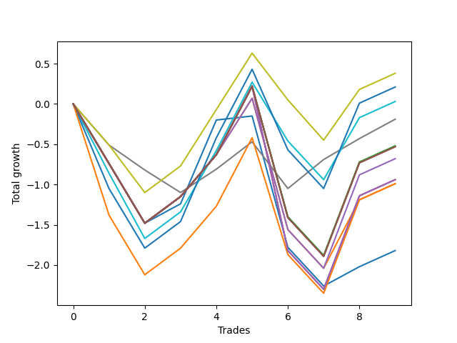

# Long HLT 105 
- Symbol: TSLA_30
- Date Range: 01/10/2024 - 05/17/2024
- Trading Period: 8:30-12:30
- Number of Trades: 9



| Name | Win Percent | Profit | Avg Profit / Trade | Avg Time / Trade |      | Name | Win Percent | Profit | Avg Profit / Trade | Avg Time / Trade |
| ---- | ----------- | ------ | ------------------ | ---------------- | ---- | ---- | ----------- | ------ | ------------------ | ---------------- |
| Sorted By <br> Profit | | | | | | Sorted By <br> Win Percentage ||||
| TP-0.5 | 55.56 | 190.00 | 21.11 | 16:20 |     | TP-0.5 | 55.56 | 190.00 | 21.11 | 16:20 |
| TP-1 | 55.56 | 105.00 | 11.67 | 24:46 |     | TP-1 | 55.56 | 105.00 | 11.67 | 24:46 |
| TP-0.75 | 55.56 | 15.00 | 1.67 | 20:20 |     | TP-0.75 | 55.56 | 15.00 | 1.67 | 20:20 |
| TP-0.25 | 55.56 | -95.00 | -10.56 | 08:46 |     | TP-0.25 | 55.56 | -95.00 | -10.56 | 08:46 |
| TP-1.5 | 55.56 | -260.00 | -28.89 | 28:00 |     | TP-1.5 | 55.56 | -260.00 | -28.89 | 28:00 |
| NEWFI 000 | 55.56 | -265.00 | -29.44 | 29:00 |     | NEWFI 000 | 55.56 | -265.00 | -29.44 | 29:00 |
| BB-50 U/L 2SD | 55.56 | -265.00 | -29.44 | 29:00 |     | BB-50 U/L 2SD | 55.56 | -265.00 | -29.44 | 29:00 |
| BB-50 U/L 1SD | 55.56 | -265.00 | -29.44 | 29:00 |     | BB-50 U/L 1SD | 55.56 | -265.00 | -29.44 | 29:00 |
| BB-20 U/L 2SD C | 55.56 | -265.00 | -29.44 | 29:00 |     | BB-20 U/L 2SD C | 55.56 | -265.00 | -29.44 | 29:00 |
| BB-20 U/L 2SD | 55.56 | -265.00 | -29.44 | 29:00 |     | BB-20 U/L 2SD | 55.56 | -265.00 | -29.44 | 29:00 |
| BB-50 Mid | 55.56 | -340.00 | -37.78 | 28:40 |     | BB-50 Mid | 55.56 | -340.00 | -37.78 | 28:40 |
| TP-2 | 55.56 | -470.00 | -52.22 | 28:06 |     | TP-2 | 55.56 | -470.00 | -52.22 | 28:06 |
| TP-1.75 | 55.56 | -470.00 | -52.22 | 28:06 |     | TP-1.75 | 55.56 | -470.00 | -52.22 | 28:06 |
| TP-1.25 | 55.56 | -495.00 | -55.00 | 26:13 |     | TP-1.25 | 55.56 | -495.00 | -55.00 | 26:13 |
| BB-20 U/L 1SD | 55.56 | -495.00 | -55.00 | 28:13 |     | BB-20 U/L 1SD | 55.56 | -495.00 | -55.00 | 28:13 |
| BB-20 Mid | 55.56 | -910.00 | -101.11 | 23:06 |     | BB-20 Mid | 55.56 | -910.00 | -101.11 | 23:06 |

## NO STOPLOSS

### Test BB-20 Mid
* Sell when price hits the middle line of the 20p bollinger
* No Stoploss
* Results:
```
Total Trades: 9
Percent Up: 55.56
Percent Down: 44.44
Total Points Moved Up: -1.82
Potential Profit: -910.00
Total Points Ups: 1.77 Count Ups: 5
Total Points Downs: -3.59 Count Downs: 4
```

<details><summary>Trades</summary>

<code>In: 2024-01-24 11:10:00		Out: 2024-01-24 11:39:00		Total Position Time: 29:00		Total Move Up: -0.74		Total to Date: -0.74</code> <br />
<code>In: 2024-02-13 11:35:00		Out: 2024-02-13 12:04:00		Total Position Time: 29:00		Total Move Up: -0.74		Total to Date: -1.48</code> <br />
<code>In: 2024-03-13 11:50:00		Out: 2024-03-13 12:16:00		Total Position Time: 26:00		Total Move Up: 0.24		Total to Date: -1.24</code> <br />
<code>In: 2024-03-14 09:25:00		Out: 2024-03-14 09:46:00		Total Position Time: 21:00		Total Move Up: 1.04		Total to Date: -0.20</code> <br />
<code>In: 2024-03-15 10:10:00		Out: 2024-03-15 10:12:00		Total Position Time: 02:00		Total Move Up: 0.05		Total to Date: -0.15</code> <br />
<code>In: 2024-04-15 10:10:00		Out: 2024-04-15 10:39:00		Total Position Time: 29:00		Total Move Up: -1.63		Total to Date: -1.78</code> <br />
<code>In: 2024-04-18 09:25:00		Out: 2024-04-18 09:54:00		Total Position Time: 29:00		Total Move Up: -0.48		Total to Date: -2.26</code> <br />
<code>In: 2024-04-22 08:35:00		Out: 2024-04-22 08:49:00		Total Position Time: 14:00		Total Move Up: 0.24		Total to Date: -2.02</code> <br />
<code>In: 2024-05-07 12:00:00		Out: 2024-05-07 12:29:00		Total Position Time: 29:00		Total Move Up: 0.20		Total to Date: -1.82</code> <br />


</details>

### Test BB-20 U/L 1SD
* Sell when the price hits the upper line of the 20p 1std bollinger
* No Stoploss
* Results:
```
Total Trades: 9
Percent Up: 55.56
Percent Down: 44.44
Total Points Moved Up: -0.99
Potential Profit: -495.00
Total Points Ups: 2.60 Count Ups: 5
Total Points Downs: -3.59 Count Downs: 4
```

<details><summary>Trades</summary>

<code>In: 2024-01-24 11:10:00		Out: 2024-01-24 11:39:00		Total Position Time: 29:00		Total Move Up: -0.74		Total to Date: -0.74</code> <br />
<code>In: 2024-02-13 11:35:00		Out: 2024-02-13 12:04:00		Total Position Time: 29:00		Total Move Up: -0.74		Total to Date: -1.48</code> <br />
<code>In: 2024-03-13 11:50:00		Out: 2024-03-13 12:19:00		Total Position Time: 29:00		Total Move Up: 0.33		Total to Date: -1.15</code> <br />
<code>In: 2024-03-14 09:25:00		Out: 2024-03-14 09:54:00		Total Position Time: 29:00		Total Move Up: 0.52		Total to Date: -0.63</code> <br />
<code>In: 2024-03-15 10:10:00		Out: 2024-03-15 10:36:00		Total Position Time: 26:00		Total Move Up: 0.70		Total to Date: 0.07</code> <br />
<code>In: 2024-04-15 10:10:00		Out: 2024-04-15 10:39:00		Total Position Time: 29:00		Total Move Up: -1.63		Total to Date: -1.56</code> <br />
<code>In: 2024-04-18 09:25:00		Out: 2024-04-18 09:54:00		Total Position Time: 29:00		Total Move Up: -0.48		Total to Date: -2.04</code> <br />
<code>In: 2024-04-22 08:35:00		Out: 2024-04-22 09:00:00		Total Position Time: 25:00		Total Move Up: 0.85		Total to Date: -1.19</code> <br />
<code>In: 2024-05-07 12:00:00		Out: 2024-05-07 12:29:00		Total Position Time: 29:00		Total Move Up: 0.20		Total to Date: -0.99</code> <br />


</details>

### Test BB-20 U/L 2SD
* Sell when the price hits the upper line of the 20p 2std bollinger
* No Stoploss
* Results:
```
Total Trades: 9
Percent Up: 55.56
Percent Down: 44.44
Total Points Moved Up: -0.53
Potential Profit: -265.00
Total Points Ups: 3.06 Count Ups: 5
Total Points Downs: -3.59 Count Downs: 4
```

<details><summary>Trades</summary>

<code>In: 2024-01-24 11:10:00		Out: 2024-01-24 11:39:00		Total Position Time: 29:00		Total Move Up: -0.74		Total to Date: -0.74</code> <br />
<code>In: 2024-02-13 11:35:00		Out: 2024-02-13 12:04:00		Total Position Time: 29:00		Total Move Up: -0.74		Total to Date: -1.48</code> <br />
<code>In: 2024-03-13 11:50:00		Out: 2024-03-13 12:19:00		Total Position Time: 29:00		Total Move Up: 0.33		Total to Date: -1.15</code> <br />
<code>In: 2024-03-14 09:25:00		Out: 2024-03-14 09:54:00		Total Position Time: 29:00		Total Move Up: 0.52		Total to Date: -0.63</code> <br />
<code>In: 2024-03-15 10:10:00		Out: 2024-03-15 10:39:00		Total Position Time: 29:00		Total Move Up: 0.85		Total to Date: 0.22</code> <br />
<code>In: 2024-04-15 10:10:00		Out: 2024-04-15 10:39:00		Total Position Time: 29:00		Total Move Up: -1.63		Total to Date: -1.41</code> <br />
<code>In: 2024-04-18 09:25:00		Out: 2024-04-18 09:54:00		Total Position Time: 29:00		Total Move Up: -0.48		Total to Date: -1.89</code> <br />
<code>In: 2024-04-22 08:35:00		Out: 2024-04-22 09:04:00		Total Position Time: 29:00		Total Move Up: 1.16		Total to Date: -0.73</code> <br />
<code>In: 2024-05-07 12:00:00		Out: 2024-05-07 12:29:00		Total Position Time: 29:00		Total Move Up: 0.20		Total to Date: -0.53</code> <br />


</details>

### Test BB-20 U/L 2SD C
* Sell when the price hits the upper line of the 20p 2std bollinger
* No Stoploss
* Results:
```
Total Trades: 9
Percent Up: 55.56
Percent Down: 44.44
Total Points Moved Up: -0.53
Potential Profit: -265.00
Total Points Ups: 3.06 Count Ups: 5
Total Points Downs: -3.59 Count Downs: 4
```

<details><summary>Trades</summary>

<code>In: 2024-01-24 11:10:00		Out: 2024-01-24 11:39:00		Total Position Time: 29:00		Total Move Up: -0.74		Total to Date: -0.74</code> <br />
<code>In: 2024-02-13 11:35:00		Out: 2024-02-13 12:04:00		Total Position Time: 29:00		Total Move Up: -0.74		Total to Date: -1.48</code> <br />
<code>In: 2024-03-13 11:50:00		Out: 2024-03-13 12:19:00		Total Position Time: 29:00		Total Move Up: 0.33		Total to Date: -1.15</code> <br />
<code>In: 2024-03-14 09:25:00		Out: 2024-03-14 09:54:00		Total Position Time: 29:00		Total Move Up: 0.52		Total to Date: -0.63</code> <br />
<code>In: 2024-03-15 10:10:00		Out: 2024-03-15 10:39:00		Total Position Time: 29:00		Total Move Up: 0.85		Total to Date: 0.22</code> <br />
<code>In: 2024-04-15 10:10:00		Out: 2024-04-15 10:39:00		Total Position Time: 29:00		Total Move Up: -1.63		Total to Date: -1.41</code> <br />
<code>In: 2024-04-18 09:25:00		Out: 2024-04-18 09:54:00		Total Position Time: 29:00		Total Move Up: -0.48		Total to Date: -1.89</code> <br />
<code>In: 2024-04-22 08:35:00		Out: 2024-04-22 09:04:00		Total Position Time: 29:00		Total Move Up: 1.16		Total to Date: -0.73</code> <br />
<code>In: 2024-05-07 12:00:00		Out: 2024-05-07 12:29:00		Total Position Time: 29:00		Total Move Up: 0.20		Total to Date: -0.53</code> <br />


</details>

### Test BB-50 Mid
* Sell when price hits the middle line of the 50p bollinger
* No Stoploss
* Results:
```
Total Trades: 9
Percent Up: 55.56
Percent Down: 44.44
Total Points Moved Up: -0.68
Potential Profit: -340.00
Total Points Ups: 2.91 Count Ups: 5
Total Points Downs: -3.59 Count Downs: 4
```

<details><summary>Trades</summary>

<code>In: 2024-01-24 11:10:00		Out: 2024-01-24 11:39:00		Total Position Time: 29:00		Total Move Up: -0.74		Total to Date: -0.74</code> <br />
<code>In: 2024-02-13 11:35:00		Out: 2024-02-13 12:04:00		Total Position Time: 29:00		Total Move Up: -0.74		Total to Date: -1.48</code> <br />
<code>In: 2024-03-13 11:50:00		Out: 2024-03-13 12:19:00		Total Position Time: 29:00		Total Move Up: 0.33		Total to Date: -1.15</code> <br />
<code>In: 2024-03-14 09:25:00		Out: 2024-03-14 09:54:00		Total Position Time: 29:00		Total Move Up: 0.52		Total to Date: -0.63</code> <br />
<code>In: 2024-03-15 10:10:00		Out: 2024-03-15 10:36:00		Total Position Time: 26:00		Total Move Up: 0.70		Total to Date: 0.07</code> <br />
<code>In: 2024-04-15 10:10:00		Out: 2024-04-15 10:39:00		Total Position Time: 29:00		Total Move Up: -1.63		Total to Date: -1.56</code> <br />
<code>In: 2024-04-18 09:25:00		Out: 2024-04-18 09:54:00		Total Position Time: 29:00		Total Move Up: -0.48		Total to Date: -2.04</code> <br />
<code>In: 2024-04-22 08:35:00		Out: 2024-04-22 09:04:00		Total Position Time: 29:00		Total Move Up: 1.16		Total to Date: -0.88</code> <br />
<code>In: 2024-05-07 12:00:00		Out: 2024-05-07 12:29:00		Total Position Time: 29:00		Total Move Up: 0.20		Total to Date: -0.68</code> <br />


</details>

### Test BB-50 U/L 1SD
* Sell when the price hits the upper line of the 50p 1std bollinger
* No Stoploss
* Results:
```
Total Trades: 9
Percent Up: 55.56
Percent Down: 44.44
Total Points Moved Up: -0.53
Potential Profit: -265.00
Total Points Ups: 3.06 Count Ups: 5
Total Points Downs: -3.59 Count Downs: 4
```

<details><summary>Trades</summary>

<code>In: 2024-01-24 11:10:00		Out: 2024-01-24 11:39:00		Total Position Time: 29:00		Total Move Up: -0.74		Total to Date: -0.74</code> <br />
<code>In: 2024-02-13 11:35:00		Out: 2024-02-13 12:04:00		Total Position Time: 29:00		Total Move Up: -0.74		Total to Date: -1.48</code> <br />
<code>In: 2024-03-13 11:50:00		Out: 2024-03-13 12:19:00		Total Position Time: 29:00		Total Move Up: 0.33		Total to Date: -1.15</code> <br />
<code>In: 2024-03-14 09:25:00		Out: 2024-03-14 09:54:00		Total Position Time: 29:00		Total Move Up: 0.52		Total to Date: -0.63</code> <br />
<code>In: 2024-03-15 10:10:00		Out: 2024-03-15 10:39:00		Total Position Time: 29:00		Total Move Up: 0.85		Total to Date: 0.22</code> <br />
<code>In: 2024-04-15 10:10:00		Out: 2024-04-15 10:39:00		Total Position Time: 29:00		Total Move Up: -1.63		Total to Date: -1.41</code> <br />
<code>In: 2024-04-18 09:25:00		Out: 2024-04-18 09:54:00		Total Position Time: 29:00		Total Move Up: -0.48		Total to Date: -1.89</code> <br />
<code>In: 2024-04-22 08:35:00		Out: 2024-04-22 09:04:00		Total Position Time: 29:00		Total Move Up: 1.16		Total to Date: -0.73</code> <br />
<code>In: 2024-05-07 12:00:00		Out: 2024-05-07 12:29:00		Total Position Time: 29:00		Total Move Up: 0.20		Total to Date: -0.53</code> <br />


</details>

### Test BB-50 U/L 2SD
* Sell when the price hits the upper line of the 50p 2std bollinger
* No Stoploss
* Results:
```
Total Trades: 9
Percent Up: 55.56
Percent Down: 44.44
Total Points Moved Up: -0.53
Potential Profit: -265.00
Total Points Ups: 3.06 Count Ups: 5
Total Points Downs: -3.59 Count Downs: 4
```

<details><summary>Trades</summary>

<code>In: 2024-01-24 11:10:00		Out: 2024-01-24 11:39:00		Total Position Time: 29:00		Total Move Up: -0.74		Total to Date: -0.74</code> <br />
<code>In: 2024-02-13 11:35:00		Out: 2024-02-13 12:04:00		Total Position Time: 29:00		Total Move Up: -0.74		Total to Date: -1.48</code> <br />
<code>In: 2024-03-13 11:50:00		Out: 2024-03-13 12:19:00		Total Position Time: 29:00		Total Move Up: 0.33		Total to Date: -1.15</code> <br />
<code>In: 2024-03-14 09:25:00		Out: 2024-03-14 09:54:00		Total Position Time: 29:00		Total Move Up: 0.52		Total to Date: -0.63</code> <br />
<code>In: 2024-03-15 10:10:00		Out: 2024-03-15 10:39:00		Total Position Time: 29:00		Total Move Up: 0.85		Total to Date: 0.22</code> <br />
<code>In: 2024-04-15 10:10:00		Out: 2024-04-15 10:39:00		Total Position Time: 29:00		Total Move Up: -1.63		Total to Date: -1.41</code> <br />
<code>In: 2024-04-18 09:25:00		Out: 2024-04-18 09:54:00		Total Position Time: 29:00		Total Move Up: -0.48		Total to Date: -1.89</code> <br />
<code>In: 2024-04-22 08:35:00		Out: 2024-04-22 09:04:00		Total Position Time: 29:00		Total Move Up: 1.16		Total to Date: -0.73</code> <br />
<code>In: 2024-05-07 12:00:00		Out: 2024-05-07 12:29:00		Total Position Time: 29:00		Total Move Up: 0.20		Total to Date: -0.53</code> <br />


</details>

## TAKE PROFIT

### Test TP-0.25
* Take Profit of 0.25 Point
* 0.25 Stoploss
* Results:
```
Total Trades: 9
Percent Up: 55.56
Percent Down: 44.44
Total Points Moved Up: -0.19
Potential Profit: -95.00
Total Points Ups: 1.49 Count Ups: 5
Total Points Downs: -1.68 Count Downs: 4
```

<details><summary>Trades</summary>

<code>In: 2024-01-24 11:10:00		Out: 2024-01-24 11:12:00		Total Position Time: 02:00		Total Move Up: -0.51		Total to Date: -0.51</code> <br />
<code>In: 2024-02-13 11:35:00		Out: 2024-02-13 11:46:00		Total Position Time: 11:00		Total Move Up: -0.31		Total to Date: -0.82</code> <br />
<code>In: 2024-03-13 11:50:00		Out: 2024-03-13 11:58:00		Total Position Time: 08:00		Total Move Up: -0.28		Total to Date: -1.10</code> <br />
<code>In: 2024-03-14 09:25:00		Out: 2024-03-14 09:34:00		Total Position Time: 09:00		Total Move Up: 0.29		Total to Date: -0.81</code> <br />
<code>In: 2024-03-15 10:10:00		Out: 2024-03-15 10:21:00		Total Position Time: 11:00		Total Move Up: 0.34		Total to Date: -0.47</code> <br />
<code>In: 2024-04-15 10:10:00		Out: 2024-04-15 10:19:00		Total Position Time: 09:00		Total Move Up: -0.58		Total to Date: -1.05</code> <br />
<code>In: 2024-04-18 09:25:00		Out: 2024-04-18 09:30:00		Total Position Time: 05:00		Total Move Up: 0.36		Total to Date: -0.69</code> <br />
<code>In: 2024-04-22 08:35:00		Out: 2024-04-22 08:51:00		Total Position Time: 16:00		Total Move Up: 0.26		Total to Date: -0.43</code> <br />
<code>In: 2024-05-07 12:00:00		Out: 2024-05-07 12:08:00		Total Position Time: 08:00		Total Move Up: 0.24		Total to Date: -0.19</code> <br />


</details>

### Test TP-0.5
* Take Profit of 0.5 Point
* 0.5 Stoploss
* Results:
```
Total Trades: 9
Percent Up: 55.56
Percent Down: 44.44
Total Points Moved Up: 0.38
Potential Profit: 190.00
Total Points Ups: 2.56 Count Ups: 5
Total Points Downs: -2.18 Count Downs: 4
```

<details><summary>Trades</summary>

<code>In: 2024-01-24 11:10:00		Out: 2024-01-24 11:12:00		Total Position Time: 02:00		Total Move Up: -0.51		Total to Date: -0.51</code> <br />
<code>In: 2024-02-13 11:35:00		Out: 2024-02-13 11:48:00		Total Position Time: 13:00		Total Move Up: -0.59		Total to Date: -1.10</code> <br />
<code>In: 2024-03-13 11:50:00		Out: 2024-03-13 12:19:00		Total Position Time: 29:00		Total Move Up: 0.33		Total to Date: -0.77</code> <br />
<code>In: 2024-03-14 09:25:00		Out: 2024-03-14 09:36:00		Total Position Time: 11:00		Total Move Up: 0.70		Total to Date: -0.07</code> <br />
<code>In: 2024-03-15 10:10:00		Out: 2024-03-15 10:36:00		Total Position Time: 26:00		Total Move Up: 0.70		Total to Date: 0.63</code> <br />
<code>In: 2024-04-15 10:10:00		Out: 2024-04-15 10:19:00		Total Position Time: 09:00		Total Move Up: -0.58		Total to Date: 0.05</code> <br />
<code>In: 2024-04-18 09:25:00		Out: 2024-04-18 09:35:00		Total Position Time: 10:00		Total Move Up: -0.50		Total to Date: -0.45</code> <br />
<code>In: 2024-04-22 08:35:00		Out: 2024-04-22 08:53:00		Total Position Time: 18:00		Total Move Up: 0.63		Total to Date: 0.18</code> <br />
<code>In: 2024-05-07 12:00:00		Out: 2024-05-07 12:29:00		Total Position Time: 29:00		Total Move Up: 0.20		Total to Date: 0.38</code> <br />


</details>

### Test TP-0.75
* Take Profit of 0.75 Point
* 0.75 Stoploss
* Results:
```
Total Trades: 9
Percent Up: 55.56
Percent Down: 44.44
Total Points Moved Up: 0.03
Potential Profit: 15.00
Total Points Ups: 2.91 Count Ups: 5
Total Points Downs: -2.88 Count Downs: 4
```

<details><summary>Trades</summary>

<code>In: 2024-01-24 11:10:00		Out: 2024-01-24 11:18:00		Total Position Time: 08:00		Total Move Up: -0.86		Total to Date: -0.86</code> <br />
<code>In: 2024-02-13 11:35:00		Out: 2024-02-13 11:51:00		Total Position Time: 16:00		Total Move Up: -0.81		Total to Date: -1.67</code> <br />
<code>In: 2024-03-13 11:50:00		Out: 2024-03-13 12:19:00		Total Position Time: 29:00		Total Move Up: 0.33		Total to Date: -1.34</code> <br />
<code>In: 2024-03-14 09:25:00		Out: 2024-03-14 09:37:00		Total Position Time: 12:00		Total Move Up: 0.76		Total to Date: -0.58</code> <br />
<code>In: 2024-03-15 10:10:00		Out: 2024-03-15 10:37:00		Total Position Time: 27:00		Total Move Up: 0.85		Total to Date: 0.27</code> <br />
<code>In: 2024-04-15 10:10:00		Out: 2024-04-15 10:21:00		Total Position Time: 11:00		Total Move Up: -0.73		Total to Date: -0.46</code> <br />
<code>In: 2024-04-18 09:25:00		Out: 2024-04-18 09:54:00		Total Position Time: 29:00		Total Move Up: -0.48		Total to Date: -0.94</code> <br />
<code>In: 2024-04-22 08:35:00		Out: 2024-04-22 08:57:00		Total Position Time: 22:00		Total Move Up: 0.77		Total to Date: -0.17</code> <br />
<code>In: 2024-05-07 12:00:00		Out: 2024-05-07 12:29:00		Total Position Time: 29:00		Total Move Up: 0.20		Total to Date: 0.03</code> <br />


</details>

### Test TP-1
* Take Profit of 1 Point
* 1 Stoploss
* Results:
```
Total Trades: 9
Percent Up: 55.56
Percent Down: 44.44
Total Points Moved Up: 0.21
Potential Profit: 105.00
Total Points Ups: 3.48 Count Ups: 5
Total Points Downs: -3.27 Count Downs: 4
```

<details><summary>Trades</summary>

<code>In: 2024-01-24 11:10:00		Out: 2024-01-24 11:22:00		Total Position Time: 12:00		Total Move Up: -1.05		Total to Date: -1.05</code> <br />
<code>In: 2024-02-13 11:35:00		Out: 2024-02-13 12:04:00		Total Position Time: 29:00		Total Move Up: -0.74		Total to Date: -1.79</code> <br />
<code>In: 2024-03-13 11:50:00		Out: 2024-03-13 12:19:00		Total Position Time: 29:00		Total Move Up: 0.33		Total to Date: -1.46</code> <br />
<code>In: 2024-03-14 09:25:00		Out: 2024-03-14 09:46:00		Total Position Time: 21:00		Total Move Up: 1.04		Total to Date: -0.42</code> <br />
<code>In: 2024-03-15 10:10:00		Out: 2024-03-15 10:39:00		Total Position Time: 29:00		Total Move Up: 0.85		Total to Date: 0.43</code> <br />
<code>In: 2024-04-15 10:10:00		Out: 2024-04-15 10:27:00		Total Position Time: 17:00		Total Move Up: -1.00		Total to Date: -0.57</code> <br />
<code>In: 2024-04-18 09:25:00		Out: 2024-04-18 09:54:00		Total Position Time: 29:00		Total Move Up: -0.48		Total to Date: -1.05</code> <br />
<code>In: 2024-04-22 08:35:00		Out: 2024-04-22 09:03:00		Total Position Time: 28:00		Total Move Up: 1.06		Total to Date: 0.01</code> <br />
<code>In: 2024-05-07 12:00:00		Out: 2024-05-07 12:29:00		Total Position Time: 29:00		Total Move Up: 0.20		Total to Date: 0.21</code> <br />


</details>

### Test TP-1.25
* Take Profit of 1.25 Point
* 1.25 Stoploss
* Results:
```
Total Trades: 9
Percent Up: 55.56
Percent Down: 44.44
Total Points Moved Up: -0.99
Potential Profit: -495.00
Total Points Ups: 3.06 Count Ups: 5
Total Points Downs: -4.05 Count Downs: 4
```

<details><summary>Trades</summary>

<code>In: 2024-01-24 11:10:00		Out: 2024-01-24 11:24:00		Total Position Time: 14:00		Total Move Up: -1.38		Total to Date: -1.38</code> <br />
<code>In: 2024-02-13 11:35:00		Out: 2024-02-13 12:04:00		Total Position Time: 29:00		Total Move Up: -0.74		Total to Date: -2.12</code> <br />
<code>In: 2024-03-13 11:50:00		Out: 2024-03-13 12:19:00		Total Position Time: 29:00		Total Move Up: 0.33		Total to Date: -1.79</code> <br />
<code>In: 2024-03-14 09:25:00		Out: 2024-03-14 09:54:00		Total Position Time: 29:00		Total Move Up: 0.52		Total to Date: -1.27</code> <br />
<code>In: 2024-03-15 10:10:00		Out: 2024-03-15 10:39:00		Total Position Time: 29:00		Total Move Up: 0.85		Total to Date: -0.42</code> <br />
<code>In: 2024-04-15 10:10:00		Out: 2024-04-15 10:29:00		Total Position Time: 19:00		Total Move Up: -1.45		Total to Date: -1.87</code> <br />
<code>In: 2024-04-18 09:25:00		Out: 2024-04-18 09:54:00		Total Position Time: 29:00		Total Move Up: -0.48		Total to Date: -2.35</code> <br />
<code>In: 2024-04-22 08:35:00		Out: 2024-04-22 09:04:00		Total Position Time: 29:00		Total Move Up: 1.16		Total to Date: -1.19</code> <br />
<code>In: 2024-05-07 12:00:00		Out: 2024-05-07 12:29:00		Total Position Time: 29:00		Total Move Up: 0.20		Total to Date: -0.99</code> <br />


</details>

### Test TP-1.5
* Take Profit of 1.5 Point
* 1.5 Stoploss
* Results:
```
Total Trades: 9
Percent Up: 55.56
Percent Down: 44.44
Total Points Moved Up: -0.52
Potential Profit: -260.00
Total Points Ups: 3.06 Count Ups: 5
Total Points Downs: -3.58 Count Downs: 4
```

<details><summary>Trades</summary>

<code>In: 2024-01-24 11:10:00		Out: 2024-01-24 11:39:00		Total Position Time: 29:00		Total Move Up: -0.74		Total to Date: -0.74</code> <br />
<code>In: 2024-02-13 11:35:00		Out: 2024-02-13 12:04:00		Total Position Time: 29:00		Total Move Up: -0.74		Total to Date: -1.48</code> <br />
<code>In: 2024-03-13 11:50:00		Out: 2024-03-13 12:19:00		Total Position Time: 29:00		Total Move Up: 0.33		Total to Date: -1.15</code> <br />
<code>In: 2024-03-14 09:25:00		Out: 2024-03-14 09:54:00		Total Position Time: 29:00		Total Move Up: 0.52		Total to Date: -0.63</code> <br />
<code>In: 2024-03-15 10:10:00		Out: 2024-03-15 10:39:00		Total Position Time: 29:00		Total Move Up: 0.85		Total to Date: 0.22</code> <br />
<code>In: 2024-04-15 10:10:00		Out: 2024-04-15 10:30:00		Total Position Time: 20:00		Total Move Up: -1.62		Total to Date: -1.40</code> <br />
<code>In: 2024-04-18 09:25:00		Out: 2024-04-18 09:54:00		Total Position Time: 29:00		Total Move Up: -0.48		Total to Date: -1.88</code> <br />
<code>In: 2024-04-22 08:35:00		Out: 2024-04-22 09:04:00		Total Position Time: 29:00		Total Move Up: 1.16		Total to Date: -0.72</code> <br />
<code>In: 2024-05-07 12:00:00		Out: 2024-05-07 12:29:00		Total Position Time: 29:00		Total Move Up: 0.20		Total to Date: -0.52</code> <br />


</details>

### Test TP-1.75
* Take Profit of 1.75 Point
* 1.75 Stoploss
* Results:
```
Total Trades: 9
Percent Up: 55.56
Percent Down: 44.44
Total Points Moved Up: -0.94
Potential Profit: -470.00
Total Points Ups: 3.06 Count Ups: 5
Total Points Downs: -4.00 Count Downs: 4
```

<details><summary>Trades</summary>

<code>In: 2024-01-24 11:10:00		Out: 2024-01-24 11:39:00		Total Position Time: 29:00		Total Move Up: -0.74		Total to Date: -0.74</code> <br />
<code>In: 2024-02-13 11:35:00		Out: 2024-02-13 12:04:00		Total Position Time: 29:00		Total Move Up: -0.74		Total to Date: -1.48</code> <br />
<code>In: 2024-03-13 11:50:00		Out: 2024-03-13 12:19:00		Total Position Time: 29:00		Total Move Up: 0.33		Total to Date: -1.15</code> <br />
<code>In: 2024-03-14 09:25:00		Out: 2024-03-14 09:54:00		Total Position Time: 29:00		Total Move Up: 0.52		Total to Date: -0.63</code> <br />
<code>In: 2024-03-15 10:10:00		Out: 2024-03-15 10:39:00		Total Position Time: 29:00		Total Move Up: 0.85		Total to Date: 0.22</code> <br />
<code>In: 2024-04-15 10:10:00		Out: 2024-04-15 10:31:00		Total Position Time: 21:00		Total Move Up: -2.04		Total to Date: -1.82</code> <br />
<code>In: 2024-04-18 09:25:00		Out: 2024-04-18 09:54:00		Total Position Time: 29:00		Total Move Up: -0.48		Total to Date: -2.30</code> <br />
<code>In: 2024-04-22 08:35:00		Out: 2024-04-22 09:04:00		Total Position Time: 29:00		Total Move Up: 1.16		Total to Date: -1.14</code> <br />
<code>In: 2024-05-07 12:00:00		Out: 2024-05-07 12:29:00		Total Position Time: 29:00		Total Move Up: 0.20		Total to Date: -0.94</code> <br />


</details>

### Test TP-2
* Take Profit of 2 Point
* 2 Stoploss
* Results:
```
Total Trades: 9
Percent Up: 55.56
Percent Down: 44.44
Total Points Moved Up: -0.94
Potential Profit: -470.00
Total Points Ups: 3.06 Count Ups: 5
Total Points Downs: -4.00 Count Downs: 4
```

<details><summary>Trades</summary>

<code>In: 2024-01-24 11:10:00		Out: 2024-01-24 11:39:00		Total Position Time: 29:00		Total Move Up: -0.74		Total to Date: -0.74</code> <br />
<code>In: 2024-02-13 11:35:00		Out: 2024-02-13 12:04:00		Total Position Time: 29:00		Total Move Up: -0.74		Total to Date: -1.48</code> <br />
<code>In: 2024-03-13 11:50:00		Out: 2024-03-13 12:19:00		Total Position Time: 29:00		Total Move Up: 0.33		Total to Date: -1.15</code> <br />
<code>In: 2024-03-14 09:25:00		Out: 2024-03-14 09:54:00		Total Position Time: 29:00		Total Move Up: 0.52		Total to Date: -0.63</code> <br />
<code>In: 2024-03-15 10:10:00		Out: 2024-03-15 10:39:00		Total Position Time: 29:00		Total Move Up: 0.85		Total to Date: 0.22</code> <br />
<code>In: 2024-04-15 10:10:00		Out: 2024-04-15 10:31:00		Total Position Time: 21:00		Total Move Up: -2.04		Total to Date: -1.82</code> <br />
<code>In: 2024-04-18 09:25:00		Out: 2024-04-18 09:54:00		Total Position Time: 29:00		Total Move Up: -0.48		Total to Date: -2.30</code> <br />
<code>In: 2024-04-22 08:35:00		Out: 2024-04-22 09:04:00		Total Position Time: 29:00		Total Move Up: 1.16		Total to Date: -1.14</code> <br />
<code>In: 2024-05-07 12:00:00		Out: 2024-05-07 12:29:00		Total Position Time: 29:00		Total Move Up: 0.20		Total to Date: -0.94</code> <br />


</details>

## Indicator Exits

### Test NEWFI 000
* Newfi 0000
* No Stoploss
* Results:
```
Total Trades: 9
Percent Up: 55.56
Percent Down: 44.44
Total Points Moved Up: -0.53
Potential Profit: -265.00
Total Points Ups: 3.06 Count Ups: 5
Total Points Downs: -3.59 Count Downs: 4
```

<details><summary>Trades</summary>

<code>In: 2024-01-24 11:10:00		Out: 2024-01-24 11:39:00		Total Position Time: 29:00		Total Move Up: -0.74		Total to Date: -0.74</code> <br />
<code>In: 2024-02-13 11:35:00		Out: 2024-02-13 12:04:00		Total Position Time: 29:00		Total Move Up: -0.74		Total to Date: -1.48</code> <br />
<code>In: 2024-03-13 11:50:00		Out: 2024-03-13 12:19:00		Total Position Time: 29:00		Total Move Up: 0.33		Total to Date: -1.15</code> <br />
<code>In: 2024-03-14 09:25:00		Out: 2024-03-14 09:54:00		Total Position Time: 29:00		Total Move Up: 0.52		Total to Date: -0.63</code> <br />
<code>In: 2024-03-15 10:10:00		Out: 2024-03-15 10:39:00		Total Position Time: 29:00		Total Move Up: 0.85		Total to Date: 0.22</code> <br />
<code>In: 2024-04-15 10:10:00		Out: 2024-04-15 10:39:00		Total Position Time: 29:00		Total Move Up: -1.63		Total to Date: -1.41</code> <br />
<code>In: 2024-04-18 09:25:00		Out: 2024-04-18 09:54:00		Total Position Time: 29:00		Total Move Up: -0.48		Total to Date: -1.89</code> <br />
<code>In: 2024-04-22 08:35:00		Out: 2024-04-22 09:04:00		Total Position Time: 29:00		Total Move Up: 1.16		Total to Date: -0.73</code> <br />
<code>In: 2024-05-07 12:00:00		Out: 2024-05-07 12:29:00		Total Position Time: 29:00		Total Move Up: 0.20		Total to Date: -0.53</code> <br />


</details>