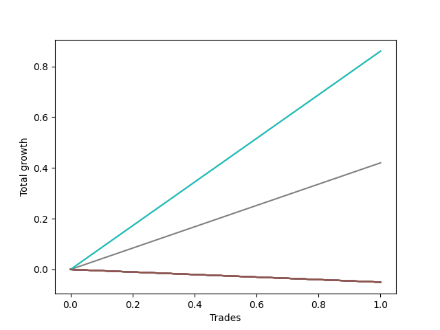

# Long HLT 106 
- Symbol: TSLA_30
- Date Range: 01/10/2024 - 05/17/2024
- Trading Period: 8:30-12:30
- Number of Trades: 1



| Name | Win Percent | Profit | Avg Profit / Trade | Avg Time / Trade |      | Name | Win Percent | Profit | Avg Profit / Trade | Avg Time / Trade |
| ---- | ----------- | ------ | ------------------ | ---------------- | ---- | ---- | ----------- | ------ | ------------------ | ---------------- |
| Sorted By <br> Profit | | | | | | Sorted By <br> Win Percentage ||||
| TP-0.75 | 100.00 | 430.00 | 430.00 | 05:00 |     | TP-0.75 | 100.00 | 430.00 | 430.00 | 05:00 |
| TP-0.5 | 100.00 | 430.00 | 430.00 | 05:00 |     | TP-0.5 | 100.00 | 430.00 | 430.00 | 05:00 |
| TP-0.25 | 100.00 | 210.00 | 210.00 | 02:00 |     | TP-0.25 | 100.00 | 210.00 | 210.00 | 02:00 |
| NEWFI 000 | 0.00 | -25.00 | -25.00 | 29:00 |     | NEWFI 000 | 0.00 | -25.00 | -25.00 | 29:00 |
| TP-2 | 0.00 | -25.00 | -25.00 | 29:00 |     | TP-2 | 0.00 | -25.00 | -25.00 | 29:00 |
| TP-1.75 | 0.00 | -25.00 | -25.00 | 29:00 |     | TP-1.75 | 0.00 | -25.00 | -25.00 | 29:00 |
| TP-1.5 | 0.00 | -25.00 | -25.00 | 29:00 |     | TP-1.5 | 0.00 | -25.00 | -25.00 | 29:00 |
| TP-1.25 | 0.00 | -25.00 | -25.00 | 29:00 |     | TP-1.25 | 0.00 | -25.00 | -25.00 | 29:00 |
| TP-1 | 0.00 | -25.00 | -25.00 | 29:00 |     | TP-1 | 0.00 | -25.00 | -25.00 | 29:00 |
| BB-50 U/L 2SD | 0.00 | -25.00 | -25.00 | 29:00 |     | BB-50 U/L 2SD | 0.00 | -25.00 | -25.00 | 29:00 |
| BB-50 U/L 1SD | 0.00 | -25.00 | -25.00 | 29:00 |     | BB-50 U/L 1SD | 0.00 | -25.00 | -25.00 | 29:00 |
| BB-50 Mid | 0.00 | -25.00 | -25.00 | 29:00 |     | BB-50 Mid | 0.00 | -25.00 | -25.00 | 29:00 |
| BB-20 U/L 2SD C | 0.00 | -25.00 | -25.00 | 29:00 |     | BB-20 U/L 2SD C | 0.00 | -25.00 | -25.00 | 29:00 |
| BB-20 U/L 2SD | 0.00 | -25.00 | -25.00 | 29:00 |     | BB-20 U/L 2SD | 0.00 | -25.00 | -25.00 | 29:00 |
| BB-20 U/L 1SD | 0.00 | -25.00 | -25.00 | 29:00 |     | BB-20 U/L 1SD | 0.00 | -25.00 | -25.00 | 29:00 |
| BB-20 Mid | 0.00 | -25.00 | -25.00 | 29:00 |     | BB-20 Mid | 0.00 | -25.00 | -25.00 | 29:00 |

## NO STOPLOSS

### Test BB-20 Mid
* Sell when price hits the middle line of the 20p bollinger
* No Stoploss
* Results:
```
Total Trades: 1
Percent Up: 0.00
Percent Down: 100.00
Total Points Moved Up: -0.05
Potential Profit: -25.00
Total Points Ups: 0.00 Count Ups: 0
Total Points Downs: -0.05 Count Downs: 1
```

<details><summary>Trades</summary>

<code>In: 2024-04-26 12:05:00		Out: 2024-04-26 12:34:00		Total Position Time: 29:00		Total Move Up: -0.05		Total to Date: -0.05</code> <br />


</details>

### Test BB-20 U/L 1SD
* Sell when the price hits the upper line of the 20p 1std bollinger
* No Stoploss
* Results:
```
Total Trades: 1
Percent Up: 0.00
Percent Down: 100.00
Total Points Moved Up: -0.05
Potential Profit: -25.00
Total Points Ups: 0.00 Count Ups: 0
Total Points Downs: -0.05 Count Downs: 1
```

<details><summary>Trades</summary>

<code>In: 2024-04-26 12:05:00		Out: 2024-04-26 12:34:00		Total Position Time: 29:00		Total Move Up: -0.05		Total to Date: -0.05</code> <br />


</details>

### Test BB-20 U/L 2SD
* Sell when the price hits the upper line of the 20p 2std bollinger
* No Stoploss
* Results:
```
Total Trades: 1
Percent Up: 0.00
Percent Down: 100.00
Total Points Moved Up: -0.05
Potential Profit: -25.00
Total Points Ups: 0.00 Count Ups: 0
Total Points Downs: -0.05 Count Downs: 1
```

<details><summary>Trades</summary>

<code>In: 2024-04-26 12:05:00		Out: 2024-04-26 12:34:00		Total Position Time: 29:00		Total Move Up: -0.05		Total to Date: -0.05</code> <br />


</details>

### Test BB-20 U/L 2SD C
* Sell when the price hits the upper line of the 20p 2std bollinger
* No Stoploss
* Results:
```
Total Trades: 1
Percent Up: 0.00
Percent Down: 100.00
Total Points Moved Up: -0.05
Potential Profit: -25.00
Total Points Ups: 0.00 Count Ups: 0
Total Points Downs: -0.05 Count Downs: 1
```

<details><summary>Trades</summary>

<code>In: 2024-04-26 12:05:00		Out: 2024-04-26 12:34:00		Total Position Time: 29:00		Total Move Up: -0.05		Total to Date: -0.05</code> <br />


</details>

### Test BB-50 Mid
* Sell when price hits the middle line of the 50p bollinger
* No Stoploss
* Results:
```
Total Trades: 1
Percent Up: 0.00
Percent Down: 100.00
Total Points Moved Up: -0.05
Potential Profit: -25.00
Total Points Ups: 0.00 Count Ups: 0
Total Points Downs: -0.05 Count Downs: 1
```

<details><summary>Trades</summary>

<code>In: 2024-04-26 12:05:00		Out: 2024-04-26 12:34:00		Total Position Time: 29:00		Total Move Up: -0.05		Total to Date: -0.05</code> <br />


</details>

### Test BB-50 U/L 1SD
* Sell when the price hits the upper line of the 50p 1std bollinger
* No Stoploss
* Results:
```
Total Trades: 1
Percent Up: 0.00
Percent Down: 100.00
Total Points Moved Up: -0.05
Potential Profit: -25.00
Total Points Ups: 0.00 Count Ups: 0
Total Points Downs: -0.05 Count Downs: 1
```

<details><summary>Trades</summary>

<code>In: 2024-04-26 12:05:00		Out: 2024-04-26 12:34:00		Total Position Time: 29:00		Total Move Up: -0.05		Total to Date: -0.05</code> <br />


</details>

### Test BB-50 U/L 2SD
* Sell when the price hits the upper line of the 50p 2std bollinger
* No Stoploss
* Results:
```
Total Trades: 1
Percent Up: 0.00
Percent Down: 100.00
Total Points Moved Up: -0.05
Potential Profit: -25.00
Total Points Ups: 0.00 Count Ups: 0
Total Points Downs: -0.05 Count Downs: 1
```

<details><summary>Trades</summary>

<code>In: 2024-04-26 12:05:00		Out: 2024-04-26 12:34:00		Total Position Time: 29:00		Total Move Up: -0.05		Total to Date: -0.05</code> <br />


</details>

## TAKE PROFIT

### Test TP-0.25
* Take Profit of 0.25 Point
* 0.25 Stoploss
* Results:
```
Total Trades: 1
Percent Up: 100.00
Percent Down: 0.00
Total Points Moved Up: 0.42
Potential Profit: 210.00
Total Points Ups: 0.42 Count Ups: 1
Total Points Downs: 0.00 Count Downs: 0
```

<details><summary>Trades</summary>

<code>In: 2024-04-26 12:05:00		Out: 2024-04-26 12:07:00		Total Position Time: 02:00		Total Move Up: 0.42		Total to Date: 0.42</code> <br />


</details>

### Test TP-0.5
* Take Profit of 0.5 Point
* 0.5 Stoploss
* Results:
```
Total Trades: 1
Percent Up: 100.00
Percent Down: 0.00
Total Points Moved Up: 0.86
Potential Profit: 430.00
Total Points Ups: 0.86 Count Ups: 1
Total Points Downs: 0.00 Count Downs: 0
```

<details><summary>Trades</summary>

<code>In: 2024-04-26 12:05:00		Out: 2024-04-26 12:10:00		Total Position Time: 05:00		Total Move Up: 0.86		Total to Date: 0.86</code> <br />


</details>

### Test TP-0.75
* Take Profit of 0.75 Point
* 0.75 Stoploss
* Results:
```
Total Trades: 1
Percent Up: 100.00
Percent Down: 0.00
Total Points Moved Up: 0.86
Potential Profit: 430.00
Total Points Ups: 0.86 Count Ups: 1
Total Points Downs: 0.00 Count Downs: 0
```

<details><summary>Trades</summary>

<code>In: 2024-04-26 12:05:00		Out: 2024-04-26 12:10:00		Total Position Time: 05:00		Total Move Up: 0.86		Total to Date: 0.86</code> <br />


</details>

### Test TP-1
* Take Profit of 1 Point
* 1 Stoploss
* Results:
```
Total Trades: 1
Percent Up: 0.00
Percent Down: 100.00
Total Points Moved Up: -0.05
Potential Profit: -25.00
Total Points Ups: 0.00 Count Ups: 0
Total Points Downs: -0.05 Count Downs: 1
```

<details><summary>Trades</summary>

<code>In: 2024-04-26 12:05:00		Out: 2024-04-26 12:34:00		Total Position Time: 29:00		Total Move Up: -0.05		Total to Date: -0.05</code> <br />


</details>

### Test TP-1.25
* Take Profit of 1.25 Point
* 1.25 Stoploss
* Results:
```
Total Trades: 1
Percent Up: 0.00
Percent Down: 100.00
Total Points Moved Up: -0.05
Potential Profit: -25.00
Total Points Ups: 0.00 Count Ups: 0
Total Points Downs: -0.05 Count Downs: 1
```

<details><summary>Trades</summary>

<code>In: 2024-04-26 12:05:00		Out: 2024-04-26 12:34:00		Total Position Time: 29:00		Total Move Up: -0.05		Total to Date: -0.05</code> <br />


</details>

### Test TP-1.5
* Take Profit of 1.5 Point
* 1.5 Stoploss
* Results:
```
Total Trades: 1
Percent Up: 0.00
Percent Down: 100.00
Total Points Moved Up: -0.05
Potential Profit: -25.00
Total Points Ups: 0.00 Count Ups: 0
Total Points Downs: -0.05 Count Downs: 1
```

<details><summary>Trades</summary>

<code>In: 2024-04-26 12:05:00		Out: 2024-04-26 12:34:00		Total Position Time: 29:00		Total Move Up: -0.05		Total to Date: -0.05</code> <br />


</details>

### Test TP-1.75
* Take Profit of 1.75 Point
* 1.75 Stoploss
* Results:
```
Total Trades: 1
Percent Up: 0.00
Percent Down: 100.00
Total Points Moved Up: -0.05
Potential Profit: -25.00
Total Points Ups: 0.00 Count Ups: 0
Total Points Downs: -0.05 Count Downs: 1
```

<details><summary>Trades</summary>

<code>In: 2024-04-26 12:05:00		Out: 2024-04-26 12:34:00		Total Position Time: 29:00		Total Move Up: -0.05		Total to Date: -0.05</code> <br />


</details>

### Test TP-2
* Take Profit of 2 Point
* 2 Stoploss
* Results:
```
Total Trades: 1
Percent Up: 0.00
Percent Down: 100.00
Total Points Moved Up: -0.05
Potential Profit: -25.00
Total Points Ups: 0.00 Count Ups: 0
Total Points Downs: -0.05 Count Downs: 1
```

<details><summary>Trades</summary>

<code>In: 2024-04-26 12:05:00		Out: 2024-04-26 12:34:00		Total Position Time: 29:00		Total Move Up: -0.05		Total to Date: -0.05</code> <br />


</details>

## Indicator Exits

### Test NEWFI 000
* Newfi 0000
* No Stoploss
* Results:
```
Total Trades: 1
Percent Up: 0.00
Percent Down: 100.00
Total Points Moved Up: -0.05
Potential Profit: -25.00
Total Points Ups: 0.00 Count Ups: 0
Total Points Downs: -0.05 Count Downs: 1
```

<details><summary>Trades</summary>

<code>In: 2024-04-26 12:05:00		Out: 2024-04-26 12:34:00		Total Position Time: 29:00		Total Move Up: -0.05		Total to Date: -0.05</code> <br />


</details>