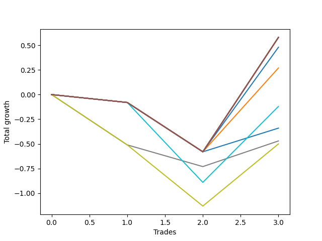

# Long HLT 108 
- Symbol: TSLA_30
- Date Range: 01/10/2024 - 05/17/2024
- Trading Period: 8:30-12:30
- Number of Trades: 3



| Name | Win Percent | Profit | Avg Profit / Trade | Avg Time / Trade |      | Name | Win Percent | Profit | Avg Profit / Trade | Avg Time / Trade |
| ---- | ----------- | ------ | ------------------ | ---------------- | ---- | ---- | ----------- | ------ | ------------------ | ---------------- |
| Sorted By <br> Profit | | | | | | Sorted By <br> Win Percentage ||||
| NEWFI 000 | 33.33 | 290.00 | 96.67 | 29:00 |     | NEWFI 000 | 33.33 | 290.00 | 96.67 | 29:00 |
| TP-2 | 33.33 | 290.00 | 96.67 | 29:00 |     | TP-2 | 33.33 | 290.00 | 96.67 | 29:00 |
| TP-1.75 | 33.33 | 290.00 | 96.67 | 29:00 |     | TP-1.75 | 33.33 | 290.00 | 96.67 | 29:00 |
| TP-1.5 | 33.33 | 290.00 | 96.67 | 29:00 |     | TP-1.5 | 33.33 | 290.00 | 96.67 | 29:00 |
| TP-1.25 | 33.33 | 290.00 | 96.67 | 29:00 |     | TP-1.25 | 33.33 | 290.00 | 96.67 | 29:00 |
| BB-50 U/L 2SD | 33.33 | 290.00 | 96.67 | 29:00 |     | BB-50 U/L 2SD | 33.33 | 290.00 | 96.67 | 29:00 |
| BB-50 U/L 1SD | 33.33 | 290.00 | 96.67 | 29:00 |     | BB-50 U/L 1SD | 33.33 | 290.00 | 96.67 | 29:00 |
| BB-50 Mid | 33.33 | 290.00 | 96.67 | 29:00 |     | BB-50 Mid | 33.33 | 290.00 | 96.67 | 29:00 |
| BB-20 U/L 2SD C | 33.33 | 290.00 | 96.67 | 29:00 |     | BB-20 U/L 2SD C | 33.33 | 290.00 | 96.67 | 29:00 |
| BB-20 U/L 2SD | 33.33 | 290.00 | 96.67 | 29:00 |     | BB-20 U/L 2SD | 33.33 | 290.00 | 96.67 | 29:00 |
| TP-1 | 33.33 | 240.00 | 80.00 | 28:40 |     | TP-1 | 33.33 | 240.00 | 80.00 | 28:40 |
| BB-20 U/L 1SD | 33.33 | 135.00 | 45.00 | 27:40 |     | BB-20 U/L 1SD | 33.33 | 135.00 | 45.00 | 27:40 |
| TP-0.75 | 33.33 | -60.00 | -20.00 | 18:20 |     | TP-0.75 | 33.33 | -60.00 | -20.00 | 18:20 |
| BB-20 Mid | 33.33 | -170.00 | -56.67 | 24:00 |     | BB-20 Mid | 33.33 | -170.00 | -56.67 | 24:00 |
| TP-0.25 | 33.33 | -235.00 | -78.33 | 08:00 |     | TP-0.25 | 33.33 | -235.00 | -78.33 | 08:00 |
| TP-0.5 | 33.33 | -250.00 | -83.33 | 09:00 |     | TP-0.5 | 33.33 | -250.00 | -83.33 | 09:00 |

## NO STOPLOSS

### Test BB-20 Mid
* Sell when price hits the middle line of the 20p bollinger
* No Stoploss
* Results:
```
Total Trades: 3
Percent Up: 33.33
Percent Down: 66.67
Total Points Moved Up: -0.34
Potential Profit: -170.00
Total Points Ups: 0.24 Count Ups: 1
Total Points Downs: -0.58 Count Downs: 2
```

<details><summary>Trades</summary>

<code>In: 2024-01-12 09:20:00		Out: 2024-01-12 09:49:00		Total Position Time: 29:00		Total Move Up: -0.08		Total to Date: -0.08</code> <br />
<code>In: 2024-02-20 09:35:00		Out: 2024-02-20 10:04:00		Total Position Time: 29:00		Total Move Up: -0.50		Total to Date: -0.58</code> <br />
<code>In: 2024-04-22 08:35:00		Out: 2024-04-22 08:49:00		Total Position Time: 14:00		Total Move Up: 0.24		Total to Date: -0.34</code> <br />


</details>

### Test BB-20 U/L 1SD
* Sell when the price hits the upper line of the 20p 1std bollinger
* No Stoploss
* Results:
```
Total Trades: 3
Percent Up: 33.33
Percent Down: 66.67
Total Points Moved Up: 0.27
Potential Profit: 135.00
Total Points Ups: 0.85 Count Ups: 1
Total Points Downs: -0.58 Count Downs: 2
```

<details><summary>Trades</summary>

<code>In: 2024-01-12 09:20:00		Out: 2024-01-12 09:49:00		Total Position Time: 29:00		Total Move Up: -0.08		Total to Date: -0.08</code> <br />
<code>In: 2024-02-20 09:35:00		Out: 2024-02-20 10:04:00		Total Position Time: 29:00		Total Move Up: -0.50		Total to Date: -0.58</code> <br />
<code>In: 2024-04-22 08:35:00		Out: 2024-04-22 09:00:00		Total Position Time: 25:00		Total Move Up: 0.85		Total to Date: 0.27</code> <br />


</details>

### Test BB-20 U/L 2SD
* Sell when the price hits the upper line of the 20p 2std bollinger
* No Stoploss
* Results:
```
Total Trades: 3
Percent Up: 33.33
Percent Down: 66.67
Total Points Moved Up: 0.58
Potential Profit: 290.00
Total Points Ups: 1.16 Count Ups: 1
Total Points Downs: -0.58 Count Downs: 2
```

<details><summary>Trades</summary>

<code>In: 2024-01-12 09:20:00		Out: 2024-01-12 09:49:00		Total Position Time: 29:00		Total Move Up: -0.08		Total to Date: -0.08</code> <br />
<code>In: 2024-02-20 09:35:00		Out: 2024-02-20 10:04:00		Total Position Time: 29:00		Total Move Up: -0.50		Total to Date: -0.58</code> <br />
<code>In: 2024-04-22 08:35:00		Out: 2024-04-22 09:04:00		Total Position Time: 29:00		Total Move Up: 1.16		Total to Date: 0.58</code> <br />


</details>

### Test BB-20 U/L 2SD C
* Sell when the price hits the upper line of the 20p 2std bollinger
* No Stoploss
* Results:
```
Total Trades: 3
Percent Up: 33.33
Percent Down: 66.67
Total Points Moved Up: 0.58
Potential Profit: 290.00
Total Points Ups: 1.16 Count Ups: 1
Total Points Downs: -0.58 Count Downs: 2
```

<details><summary>Trades</summary>

<code>In: 2024-01-12 09:20:00		Out: 2024-01-12 09:49:00		Total Position Time: 29:00		Total Move Up: -0.08		Total to Date: -0.08</code> <br />
<code>In: 2024-02-20 09:35:00		Out: 2024-02-20 10:04:00		Total Position Time: 29:00		Total Move Up: -0.50		Total to Date: -0.58</code> <br />
<code>In: 2024-04-22 08:35:00		Out: 2024-04-22 09:04:00		Total Position Time: 29:00		Total Move Up: 1.16		Total to Date: 0.58</code> <br />


</details>

### Test BB-50 Mid
* Sell when price hits the middle line of the 50p bollinger
* No Stoploss
* Results:
```
Total Trades: 3
Percent Up: 33.33
Percent Down: 66.67
Total Points Moved Up: 0.58
Potential Profit: 290.00
Total Points Ups: 1.16 Count Ups: 1
Total Points Downs: -0.58 Count Downs: 2
```

<details><summary>Trades</summary>

<code>In: 2024-01-12 09:20:00		Out: 2024-01-12 09:49:00		Total Position Time: 29:00		Total Move Up: -0.08		Total to Date: -0.08</code> <br />
<code>In: 2024-02-20 09:35:00		Out: 2024-02-20 10:04:00		Total Position Time: 29:00		Total Move Up: -0.50		Total to Date: -0.58</code> <br />
<code>In: 2024-04-22 08:35:00		Out: 2024-04-22 09:04:00		Total Position Time: 29:00		Total Move Up: 1.16		Total to Date: 0.58</code> <br />


</details>

### Test BB-50 U/L 1SD
* Sell when the price hits the upper line of the 50p 1std bollinger
* No Stoploss
* Results:
```
Total Trades: 3
Percent Up: 33.33
Percent Down: 66.67
Total Points Moved Up: 0.58
Potential Profit: 290.00
Total Points Ups: 1.16 Count Ups: 1
Total Points Downs: -0.58 Count Downs: 2
```

<details><summary>Trades</summary>

<code>In: 2024-01-12 09:20:00		Out: 2024-01-12 09:49:00		Total Position Time: 29:00		Total Move Up: -0.08		Total to Date: -0.08</code> <br />
<code>In: 2024-02-20 09:35:00		Out: 2024-02-20 10:04:00		Total Position Time: 29:00		Total Move Up: -0.50		Total to Date: -0.58</code> <br />
<code>In: 2024-04-22 08:35:00		Out: 2024-04-22 09:04:00		Total Position Time: 29:00		Total Move Up: 1.16		Total to Date: 0.58</code> <br />


</details>

### Test BB-50 U/L 2SD
* Sell when the price hits the upper line of the 50p 2std bollinger
* No Stoploss
* Results:
```
Total Trades: 3
Percent Up: 33.33
Percent Down: 66.67
Total Points Moved Up: 0.58
Potential Profit: 290.00
Total Points Ups: 1.16 Count Ups: 1
Total Points Downs: -0.58 Count Downs: 2
```

<details><summary>Trades</summary>

<code>In: 2024-01-12 09:20:00		Out: 2024-01-12 09:49:00		Total Position Time: 29:00		Total Move Up: -0.08		Total to Date: -0.08</code> <br />
<code>In: 2024-02-20 09:35:00		Out: 2024-02-20 10:04:00		Total Position Time: 29:00		Total Move Up: -0.50		Total to Date: -0.58</code> <br />
<code>In: 2024-04-22 08:35:00		Out: 2024-04-22 09:04:00		Total Position Time: 29:00		Total Move Up: 1.16		Total to Date: 0.58</code> <br />


</details>

## TAKE PROFIT

### Test TP-0.25
* Take Profit of 0.25 Point
* 0.25 Stoploss
* Results:
```
Total Trades: 3
Percent Up: 33.33
Percent Down: 66.67
Total Points Moved Up: -0.47
Potential Profit: -235.00
Total Points Ups: 0.26 Count Ups: 1
Total Points Downs: -0.73 Count Downs: 2
```

<details><summary>Trades</summary>

<code>In: 2024-01-12 09:20:00		Out: 2024-01-12 09:26:00		Total Position Time: 06:00		Total Move Up: -0.51		Total to Date: -0.51</code> <br />
<code>In: 2024-02-20 09:35:00		Out: 2024-02-20 09:37:00		Total Position Time: 02:00		Total Move Up: -0.22		Total to Date: -0.73</code> <br />
<code>In: 2024-04-22 08:35:00		Out: 2024-04-22 08:51:00		Total Position Time: 16:00		Total Move Up: 0.26		Total to Date: -0.47</code> <br />


</details>

### Test TP-0.5
* Take Profit of 0.5 Point
* 0.5 Stoploss
* Results:
```
Total Trades: 3
Percent Up: 33.33
Percent Down: 66.67
Total Points Moved Up: -0.50
Potential Profit: -250.00
Total Points Ups: 0.63 Count Ups: 1
Total Points Downs: -1.13 Count Downs: 2
```

<details><summary>Trades</summary>

<code>In: 2024-01-12 09:20:00		Out: 2024-01-12 09:26:00		Total Position Time: 06:00		Total Move Up: -0.51		Total to Date: -0.51</code> <br />
<code>In: 2024-02-20 09:35:00		Out: 2024-02-20 09:38:00		Total Position Time: 03:00		Total Move Up: -0.62		Total to Date: -1.13</code> <br />
<code>In: 2024-04-22 08:35:00		Out: 2024-04-22 08:53:00		Total Position Time: 18:00		Total Move Up: 0.63		Total to Date: -0.50</code> <br />


</details>

### Test TP-0.75
* Take Profit of 0.75 Point
* 0.75 Stoploss
* Results:
```
Total Trades: 3
Percent Up: 33.33
Percent Down: 66.67
Total Points Moved Up: -0.12
Potential Profit: -60.00
Total Points Ups: 0.77 Count Ups: 1
Total Points Downs: -0.89 Count Downs: 2
```

<details><summary>Trades</summary>

<code>In: 2024-01-12 09:20:00		Out: 2024-01-12 09:49:00		Total Position Time: 29:00		Total Move Up: -0.08		Total to Date: -0.08</code> <br />
<code>In: 2024-02-20 09:35:00		Out: 2024-02-20 09:39:00		Total Position Time: 04:00		Total Move Up: -0.81		Total to Date: -0.89</code> <br />
<code>In: 2024-04-22 08:35:00		Out: 2024-04-22 08:57:00		Total Position Time: 22:00		Total Move Up: 0.77		Total to Date: -0.12</code> <br />


</details>

### Test TP-1
* Take Profit of 1 Point
* 1 Stoploss
* Results:
```
Total Trades: 3
Percent Up: 33.33
Percent Down: 66.67
Total Points Moved Up: 0.48
Potential Profit: 240.00
Total Points Ups: 1.06 Count Ups: 1
Total Points Downs: -0.58 Count Downs: 2
```

<details><summary>Trades</summary>

<code>In: 2024-01-12 09:20:00		Out: 2024-01-12 09:49:00		Total Position Time: 29:00		Total Move Up: -0.08		Total to Date: -0.08</code> <br />
<code>In: 2024-02-20 09:35:00		Out: 2024-02-20 10:04:00		Total Position Time: 29:00		Total Move Up: -0.50		Total to Date: -0.58</code> <br />
<code>In: 2024-04-22 08:35:00		Out: 2024-04-22 09:03:00		Total Position Time: 28:00		Total Move Up: 1.06		Total to Date: 0.48</code> <br />


</details>

### Test TP-1.25
* Take Profit of 1.25 Point
* 1.25 Stoploss
* Results:
```
Total Trades: 3
Percent Up: 33.33
Percent Down: 66.67
Total Points Moved Up: 0.58
Potential Profit: 290.00
Total Points Ups: 1.16 Count Ups: 1
Total Points Downs: -0.58 Count Downs: 2
```

<details><summary>Trades</summary>

<code>In: 2024-01-12 09:20:00		Out: 2024-01-12 09:49:00		Total Position Time: 29:00		Total Move Up: -0.08		Total to Date: -0.08</code> <br />
<code>In: 2024-02-20 09:35:00		Out: 2024-02-20 10:04:00		Total Position Time: 29:00		Total Move Up: -0.50		Total to Date: -0.58</code> <br />
<code>In: 2024-04-22 08:35:00		Out: 2024-04-22 09:04:00		Total Position Time: 29:00		Total Move Up: 1.16		Total to Date: 0.58</code> <br />


</details>

### Test TP-1.5
* Take Profit of 1.5 Point
* 1.5 Stoploss
* Results:
```
Total Trades: 3
Percent Up: 33.33
Percent Down: 66.67
Total Points Moved Up: 0.58
Potential Profit: 290.00
Total Points Ups: 1.16 Count Ups: 1
Total Points Downs: -0.58 Count Downs: 2
```

<details><summary>Trades</summary>

<code>In: 2024-01-12 09:20:00		Out: 2024-01-12 09:49:00		Total Position Time: 29:00		Total Move Up: -0.08		Total to Date: -0.08</code> <br />
<code>In: 2024-02-20 09:35:00		Out: 2024-02-20 10:04:00		Total Position Time: 29:00		Total Move Up: -0.50		Total to Date: -0.58</code> <br />
<code>In: 2024-04-22 08:35:00		Out: 2024-04-22 09:04:00		Total Position Time: 29:00		Total Move Up: 1.16		Total to Date: 0.58</code> <br />


</details>

### Test TP-1.75
* Take Profit of 1.75 Point
* 1.75 Stoploss
* Results:
```
Total Trades: 3
Percent Up: 33.33
Percent Down: 66.67
Total Points Moved Up: 0.58
Potential Profit: 290.00
Total Points Ups: 1.16 Count Ups: 1
Total Points Downs: -0.58 Count Downs: 2
```

<details><summary>Trades</summary>

<code>In: 2024-01-12 09:20:00		Out: 2024-01-12 09:49:00		Total Position Time: 29:00		Total Move Up: -0.08		Total to Date: -0.08</code> <br />
<code>In: 2024-02-20 09:35:00		Out: 2024-02-20 10:04:00		Total Position Time: 29:00		Total Move Up: -0.50		Total to Date: -0.58</code> <br />
<code>In: 2024-04-22 08:35:00		Out: 2024-04-22 09:04:00		Total Position Time: 29:00		Total Move Up: 1.16		Total to Date: 0.58</code> <br />


</details>

### Test TP-2
* Take Profit of 2 Point
* 2 Stoploss
* Results:
```
Total Trades: 3
Percent Up: 33.33
Percent Down: 66.67
Total Points Moved Up: 0.58
Potential Profit: 290.00
Total Points Ups: 1.16 Count Ups: 1
Total Points Downs: -0.58 Count Downs: 2
```

<details><summary>Trades</summary>

<code>In: 2024-01-12 09:20:00		Out: 2024-01-12 09:49:00		Total Position Time: 29:00		Total Move Up: -0.08		Total to Date: -0.08</code> <br />
<code>In: 2024-02-20 09:35:00		Out: 2024-02-20 10:04:00		Total Position Time: 29:00		Total Move Up: -0.50		Total to Date: -0.58</code> <br />
<code>In: 2024-04-22 08:35:00		Out: 2024-04-22 09:04:00		Total Position Time: 29:00		Total Move Up: 1.16		Total to Date: 0.58</code> <br />


</details>

## Indicator Exits

### Test NEWFI 000
* Newfi 0000
* No Stoploss
* Results:
```
Total Trades: 3
Percent Up: 33.33
Percent Down: 66.67
Total Points Moved Up: 0.58
Potential Profit: 290.00
Total Points Ups: 1.16 Count Ups: 1
Total Points Downs: -0.58 Count Downs: 2
```

<details><summary>Trades</summary>

<code>In: 2024-01-12 09:20:00		Out: 2024-01-12 09:49:00		Total Position Time: 29:00		Total Move Up: -0.08		Total to Date: -0.08</code> <br />
<code>In: 2024-02-20 09:35:00		Out: 2024-02-20 10:04:00		Total Position Time: 29:00		Total Move Up: -0.50		Total to Date: -0.58</code> <br />
<code>In: 2024-04-22 08:35:00		Out: 2024-04-22 09:04:00		Total Position Time: 29:00		Total Move Up: 1.16		Total to Date: 0.58</code> <br />


</details>