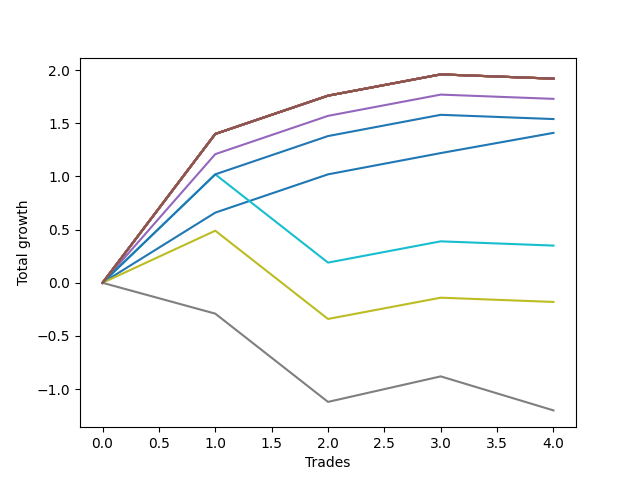

# Long HLT 110 
- Symbol: TSLA_30
- Date Range: 01/10/2024 - 05/17/2024
- Trading Period: 8:30-12:30
- Number of Trades: 4



| Name | Win Percent | Profit | Avg Profit / Trade | Avg Time / Trade |      | Name | Win Percent | Profit | Avg Profit / Trade | Avg Time / Trade |
| ---- | ----------- | ------ | ------------------ | ---------------- | ---- | ---- | ----------- | ------ | ------------------ | ---------------- |
| Sorted By <br> Profit | | | | | | Sorted By <br> Win Percentage ||||
| NEWFI 000 | 75.00 | 960.00 | 240.00 | 29:00 |     | BB-20 Mid | 100.00 | 705.00 | 176.25 | 21:15 |
| TP-2 | 75.00 | 960.00 | 240.00 | 29:00 |     | NEWFI 000 | 75.00 | 960.00 | 240.00 | 29:00 |
| TP-1.75 | 75.00 | 960.00 | 240.00 | 29:00 |     | TP-2 | 75.00 | 960.00 | 240.00 | 29:00 |
| TP-1.5 | 75.00 | 960.00 | 240.00 | 29:00 |     | TP-1.75 | 75.00 | 960.00 | 240.00 | 29:00 |
| TP-1.25 | 75.00 | 960.00 | 240.00 | 29:00 |     | TP-1.5 | 75.00 | 960.00 | 240.00 | 29:00 |
| BB-50 U/L 2SD | 75.00 | 960.00 | 240.00 | 29:00 |     | TP-1.25 | 75.00 | 960.00 | 240.00 | 29:00 |
| BB-50 U/L 1SD | 75.00 | 960.00 | 240.00 | 29:00 |     | BB-50 U/L 2SD | 75.00 | 960.00 | 240.00 | 29:00 |
| BB-20 U/L 2SD C | 75.00 | 960.00 | 240.00 | 29:00 |     | BB-50 U/L 1SD | 75.00 | 960.00 | 240.00 | 29:00 |
| BB-20 U/L 2SD | 75.00 | 960.00 | 240.00 | 29:00 |     | BB-20 U/L 2SD C | 75.00 | 960.00 | 240.00 | 29:00 |
| BB-20 U/L 1SD | 75.00 | 960.00 | 240.00 | 29:00 |     | BB-20 U/L 2SD | 75.00 | 960.00 | 240.00 | 29:00 |
| BB-50 Mid | 75.00 | 865.00 | 216.25 | 28:00 |     | BB-20 U/L 1SD | 75.00 | 960.00 | 240.00 | 29:00 |
| TP-1 | 75.00 | 770.00 | 192.50 | 27:15 |     | BB-50 Mid | 75.00 | 865.00 | 216.25 | 28:00 |
| BB-20 Mid | 100.00 | 705.00 | 176.25 | 21:15 |     | TP-1 | 75.00 | 770.00 | 192.50 | 27:15 |
| TP-0.75 | 50.00 | 175.00 | 43.75 | 20:30 |     | TP-0.75 | 50.00 | 175.00 | 43.75 | 20:30 |
| TP-0.5 | 50.00 | -90.00 | -22.50 | 19:45 |     | TP-0.5 | 50.00 | -90.00 | -22.50 | 19:45 |
| TP-0.25 | 25.00 | -600.00 | -150.00 | 07:00 |     | TP-0.25 | 25.00 | -600.00 | -150.00 | 07:00 |

## NO STOPLOSS

### Test BB-20 Mid
* Sell when price hits the middle line of the 20p bollinger
* No Stoploss
* Results:
```
Total Trades: 4
Percent Up: 100.00
Percent Down: 0.00
Total Points Moved Up: 1.41
Potential Profit: 705.00
Total Points Ups: 1.41 Count Ups: 4
Total Points Downs: 0.00 Count Downs: 0
```

<details><summary>Trades</summary>

<code>In: 2024-03-14 12:30:00		Out: 2024-03-14 12:51:00		Total Position Time: 21:00		Total Move Up: 0.66		Total to Date: 0.66</code> <br />
<code>In: 2024-04-05 08:45:00		Out: 2024-04-05 09:14:00		Total Position Time: 29:00		Total Move Up: 0.36		Total to Date: 1.02</code> <br />
<code>In: 2024-05-07 12:00:00		Out: 2024-05-07 12:29:00		Total Position Time: 29:00		Total Move Up: 0.20		Total to Date: 1.22</code> <br />
<code>In: 2024-05-09 08:55:00		Out: 2024-05-09 09:01:00		Total Position Time: 06:00		Total Move Up: 0.19		Total to Date: 1.41</code> <br />


</details>

### Test BB-20 U/L 1SD
* Sell when the price hits the upper line of the 20p 1std bollinger
* No Stoploss
* Results:
```
Total Trades: 4
Percent Up: 75.00
Percent Down: 25.00
Total Points Moved Up: 1.92
Potential Profit: 960.00
Total Points Ups: 1.96 Count Ups: 3
Total Points Downs: -0.04 Count Downs: 1
```

<details><summary>Trades</summary>

<code>In: 2024-03-14 12:30:00		Out: 2024-03-14 12:59:00		Total Position Time: 29:00		Total Move Up: 1.40		Total to Date: 1.40</code> <br />
<code>In: 2024-04-05 08:45:00		Out: 2024-04-05 09:14:00		Total Position Time: 29:00		Total Move Up: 0.36		Total to Date: 1.76</code> <br />
<code>In: 2024-05-07 12:00:00		Out: 2024-05-07 12:29:00		Total Position Time: 29:00		Total Move Up: 0.20		Total to Date: 1.96</code> <br />
<code>In: 2024-05-09 08:55:00		Out: 2024-05-09 09:24:00		Total Position Time: 29:00		Total Move Up: -0.04		Total to Date: 1.92</code> <br />


</details>

### Test BB-20 U/L 2SD
* Sell when the price hits the upper line of the 20p 2std bollinger
* No Stoploss
* Results:
```
Total Trades: 4
Percent Up: 75.00
Percent Down: 25.00
Total Points Moved Up: 1.92
Potential Profit: 960.00
Total Points Ups: 1.96 Count Ups: 3
Total Points Downs: -0.04 Count Downs: 1
```

<details><summary>Trades</summary>

<code>In: 2024-03-14 12:30:00		Out: 2024-03-14 12:59:00		Total Position Time: 29:00		Total Move Up: 1.40		Total to Date: 1.40</code> <br />
<code>In: 2024-04-05 08:45:00		Out: 2024-04-05 09:14:00		Total Position Time: 29:00		Total Move Up: 0.36		Total to Date: 1.76</code> <br />
<code>In: 2024-05-07 12:00:00		Out: 2024-05-07 12:29:00		Total Position Time: 29:00		Total Move Up: 0.20		Total to Date: 1.96</code> <br />
<code>In: 2024-05-09 08:55:00		Out: 2024-05-09 09:24:00		Total Position Time: 29:00		Total Move Up: -0.04		Total to Date: 1.92</code> <br />


</details>

### Test BB-20 U/L 2SD C
* Sell when the price hits the upper line of the 20p 2std bollinger
* No Stoploss
* Results:
```
Total Trades: 4
Percent Up: 75.00
Percent Down: 25.00
Total Points Moved Up: 1.92
Potential Profit: 960.00
Total Points Ups: 1.96 Count Ups: 3
Total Points Downs: -0.04 Count Downs: 1
```

<details><summary>Trades</summary>

<code>In: 2024-03-14 12:30:00		Out: 2024-03-14 12:59:00		Total Position Time: 29:00		Total Move Up: 1.40		Total to Date: 1.40</code> <br />
<code>In: 2024-04-05 08:45:00		Out: 2024-04-05 09:14:00		Total Position Time: 29:00		Total Move Up: 0.36		Total to Date: 1.76</code> <br />
<code>In: 2024-05-07 12:00:00		Out: 2024-05-07 12:29:00		Total Position Time: 29:00		Total Move Up: 0.20		Total to Date: 1.96</code> <br />
<code>In: 2024-05-09 08:55:00		Out: 2024-05-09 09:24:00		Total Position Time: 29:00		Total Move Up: -0.04		Total to Date: 1.92</code> <br />


</details>

### Test BB-50 Mid
* Sell when price hits the middle line of the 50p bollinger
* No Stoploss
* Results:
```
Total Trades: 4
Percent Up: 75.00
Percent Down: 25.00
Total Points Moved Up: 1.73
Potential Profit: 865.00
Total Points Ups: 1.77 Count Ups: 3
Total Points Downs: -0.04 Count Downs: 1
```

<details><summary>Trades</summary>

<code>In: 2024-03-14 12:30:00		Out: 2024-03-14 12:55:00		Total Position Time: 25:00		Total Move Up: 1.21		Total to Date: 1.21</code> <br />
<code>In: 2024-04-05 08:45:00		Out: 2024-04-05 09:14:00		Total Position Time: 29:00		Total Move Up: 0.36		Total to Date: 1.57</code> <br />
<code>In: 2024-05-07 12:00:00		Out: 2024-05-07 12:29:00		Total Position Time: 29:00		Total Move Up: 0.20		Total to Date: 1.77</code> <br />
<code>In: 2024-05-09 08:55:00		Out: 2024-05-09 09:24:00		Total Position Time: 29:00		Total Move Up: -0.04		Total to Date: 1.73</code> <br />


</details>

### Test BB-50 U/L 1SD
* Sell when the price hits the upper line of the 50p 1std bollinger
* No Stoploss
* Results:
```
Total Trades: 4
Percent Up: 75.00
Percent Down: 25.00
Total Points Moved Up: 1.92
Potential Profit: 960.00
Total Points Ups: 1.96 Count Ups: 3
Total Points Downs: -0.04 Count Downs: 1
```

<details><summary>Trades</summary>

<code>In: 2024-03-14 12:30:00		Out: 2024-03-14 12:59:00		Total Position Time: 29:00		Total Move Up: 1.40		Total to Date: 1.40</code> <br />
<code>In: 2024-04-05 08:45:00		Out: 2024-04-05 09:14:00		Total Position Time: 29:00		Total Move Up: 0.36		Total to Date: 1.76</code> <br />
<code>In: 2024-05-07 12:00:00		Out: 2024-05-07 12:29:00		Total Position Time: 29:00		Total Move Up: 0.20		Total to Date: 1.96</code> <br />
<code>In: 2024-05-09 08:55:00		Out: 2024-05-09 09:24:00		Total Position Time: 29:00		Total Move Up: -0.04		Total to Date: 1.92</code> <br />


</details>

### Test BB-50 U/L 2SD
* Sell when the price hits the upper line of the 50p 2std bollinger
* No Stoploss
* Results:
```
Total Trades: 4
Percent Up: 75.00
Percent Down: 25.00
Total Points Moved Up: 1.92
Potential Profit: 960.00
Total Points Ups: 1.96 Count Ups: 3
Total Points Downs: -0.04 Count Downs: 1
```

<details><summary>Trades</summary>

<code>In: 2024-03-14 12:30:00		Out: 2024-03-14 12:59:00		Total Position Time: 29:00		Total Move Up: 1.40		Total to Date: 1.40</code> <br />
<code>In: 2024-04-05 08:45:00		Out: 2024-04-05 09:14:00		Total Position Time: 29:00		Total Move Up: 0.36		Total to Date: 1.76</code> <br />
<code>In: 2024-05-07 12:00:00		Out: 2024-05-07 12:29:00		Total Position Time: 29:00		Total Move Up: 0.20		Total to Date: 1.96</code> <br />
<code>In: 2024-05-09 08:55:00		Out: 2024-05-09 09:24:00		Total Position Time: 29:00		Total Move Up: -0.04		Total to Date: 1.92</code> <br />


</details>

## TAKE PROFIT

### Test TP-0.25
* Take Profit of 0.25 Point
* 0.25 Stoploss
* Results:
```
Total Trades: 4
Percent Up: 25.00
Percent Down: 75.00
Total Points Moved Up: -1.20
Potential Profit: -600.00
Total Points Ups: 0.24 Count Ups: 1
Total Points Downs: -1.44 Count Downs: 3
```

<details><summary>Trades</summary>

<code>In: 2024-03-14 12:30:00		Out: 2024-03-14 12:35:00		Total Position Time: 05:00		Total Move Up: -0.29		Total to Date: -0.29</code> <br />
<code>In: 2024-04-05 08:45:00		Out: 2024-04-05 08:47:00		Total Position Time: 02:00		Total Move Up: -0.83		Total to Date: -1.12</code> <br />
<code>In: 2024-05-07 12:00:00		Out: 2024-05-07 12:08:00		Total Position Time: 08:00		Total Move Up: 0.24		Total to Date: -0.88</code> <br />
<code>In: 2024-05-09 08:55:00		Out: 2024-05-09 09:08:00		Total Position Time: 13:00		Total Move Up: -0.32		Total to Date: -1.20</code> <br />


</details>

### Test TP-0.5
* Take Profit of 0.5 Point
* 0.5 Stoploss
* Results:
```
Total Trades: 4
Percent Up: 50.00
Percent Down: 50.00
Total Points Moved Up: -0.18
Potential Profit: -90.00
Total Points Ups: 0.69 Count Ups: 2
Total Points Downs: -0.87 Count Downs: 2
```

<details><summary>Trades</summary>

<code>In: 2024-03-14 12:30:00		Out: 2024-03-14 12:49:00		Total Position Time: 19:00		Total Move Up: 0.49		Total to Date: 0.49</code> <br />
<code>In: 2024-04-05 08:45:00		Out: 2024-04-05 08:47:00		Total Position Time: 02:00		Total Move Up: -0.83		Total to Date: -0.34</code> <br />
<code>In: 2024-05-07 12:00:00		Out: 2024-05-07 12:29:00		Total Position Time: 29:00		Total Move Up: 0.20		Total to Date: -0.14</code> <br />
<code>In: 2024-05-09 08:55:00		Out: 2024-05-09 09:24:00		Total Position Time: 29:00		Total Move Up: -0.04		Total to Date: -0.18</code> <br />


</details>

### Test TP-0.75
* Take Profit of 0.75 Point
* 0.75 Stoploss
* Results:
```
Total Trades: 4
Percent Up: 50.00
Percent Down: 50.00
Total Points Moved Up: 0.35
Potential Profit: 175.00
Total Points Ups: 1.22 Count Ups: 2
Total Points Downs: -0.87 Count Downs: 2
```

<details><summary>Trades</summary>

<code>In: 2024-03-14 12:30:00		Out: 2024-03-14 12:52:00		Total Position Time: 22:00		Total Move Up: 1.02		Total to Date: 1.02</code> <br />
<code>In: 2024-04-05 08:45:00		Out: 2024-04-05 08:47:00		Total Position Time: 02:00		Total Move Up: -0.83		Total to Date: 0.19</code> <br />
<code>In: 2024-05-07 12:00:00		Out: 2024-05-07 12:29:00		Total Position Time: 29:00		Total Move Up: 0.20		Total to Date: 0.39</code> <br />
<code>In: 2024-05-09 08:55:00		Out: 2024-05-09 09:24:00		Total Position Time: 29:00		Total Move Up: -0.04		Total to Date: 0.35</code> <br />


</details>

### Test TP-1
* Take Profit of 1 Point
* 1 Stoploss
* Results:
```
Total Trades: 4
Percent Up: 75.00
Percent Down: 25.00
Total Points Moved Up: 1.54
Potential Profit: 770.00
Total Points Ups: 1.58 Count Ups: 3
Total Points Downs: -0.04 Count Downs: 1
```

<details><summary>Trades</summary>

<code>In: 2024-03-14 12:30:00		Out: 2024-03-14 12:52:00		Total Position Time: 22:00		Total Move Up: 1.02		Total to Date: 1.02</code> <br />
<code>In: 2024-04-05 08:45:00		Out: 2024-04-05 09:14:00		Total Position Time: 29:00		Total Move Up: 0.36		Total to Date: 1.38</code> <br />
<code>In: 2024-05-07 12:00:00		Out: 2024-05-07 12:29:00		Total Position Time: 29:00		Total Move Up: 0.20		Total to Date: 1.58</code> <br />
<code>In: 2024-05-09 08:55:00		Out: 2024-05-09 09:24:00		Total Position Time: 29:00		Total Move Up: -0.04		Total to Date: 1.54</code> <br />


</details>

### Test TP-1.25
* Take Profit of 1.25 Point
* 1.25 Stoploss
* Results:
```
Total Trades: 4
Percent Up: 75.00
Percent Down: 25.00
Total Points Moved Up: 1.92
Potential Profit: 960.00
Total Points Ups: 1.96 Count Ups: 3
Total Points Downs: -0.04 Count Downs: 1
```

<details><summary>Trades</summary>

<code>In: 2024-03-14 12:30:00		Out: 2024-03-14 12:59:00		Total Position Time: 29:00		Total Move Up: 1.40		Total to Date: 1.40</code> <br />
<code>In: 2024-04-05 08:45:00		Out: 2024-04-05 09:14:00		Total Position Time: 29:00		Total Move Up: 0.36		Total to Date: 1.76</code> <br />
<code>In: 2024-05-07 12:00:00		Out: 2024-05-07 12:29:00		Total Position Time: 29:00		Total Move Up: 0.20		Total to Date: 1.96</code> <br />
<code>In: 2024-05-09 08:55:00		Out: 2024-05-09 09:24:00		Total Position Time: 29:00		Total Move Up: -0.04		Total to Date: 1.92</code> <br />


</details>

### Test TP-1.5
* Take Profit of 1.5 Point
* 1.5 Stoploss
* Results:
```
Total Trades: 4
Percent Up: 75.00
Percent Down: 25.00
Total Points Moved Up: 1.92
Potential Profit: 960.00
Total Points Ups: 1.96 Count Ups: 3
Total Points Downs: -0.04 Count Downs: 1
```

<details><summary>Trades</summary>

<code>In: 2024-03-14 12:30:00		Out: 2024-03-14 12:59:00		Total Position Time: 29:00		Total Move Up: 1.40		Total to Date: 1.40</code> <br />
<code>In: 2024-04-05 08:45:00		Out: 2024-04-05 09:14:00		Total Position Time: 29:00		Total Move Up: 0.36		Total to Date: 1.76</code> <br />
<code>In: 2024-05-07 12:00:00		Out: 2024-05-07 12:29:00		Total Position Time: 29:00		Total Move Up: 0.20		Total to Date: 1.96</code> <br />
<code>In: 2024-05-09 08:55:00		Out: 2024-05-09 09:24:00		Total Position Time: 29:00		Total Move Up: -0.04		Total to Date: 1.92</code> <br />


</details>

### Test TP-1.75
* Take Profit of 1.75 Point
* 1.75 Stoploss
* Results:
```
Total Trades: 4
Percent Up: 75.00
Percent Down: 25.00
Total Points Moved Up: 1.92
Potential Profit: 960.00
Total Points Ups: 1.96 Count Ups: 3
Total Points Downs: -0.04 Count Downs: 1
```

<details><summary>Trades</summary>

<code>In: 2024-03-14 12:30:00		Out: 2024-03-14 12:59:00		Total Position Time: 29:00		Total Move Up: 1.40		Total to Date: 1.40</code> <br />
<code>In: 2024-04-05 08:45:00		Out: 2024-04-05 09:14:00		Total Position Time: 29:00		Total Move Up: 0.36		Total to Date: 1.76</code> <br />
<code>In: 2024-05-07 12:00:00		Out: 2024-05-07 12:29:00		Total Position Time: 29:00		Total Move Up: 0.20		Total to Date: 1.96</code> <br />
<code>In: 2024-05-09 08:55:00		Out: 2024-05-09 09:24:00		Total Position Time: 29:00		Total Move Up: -0.04		Total to Date: 1.92</code> <br />


</details>

### Test TP-2
* Take Profit of 2 Point
* 2 Stoploss
* Results:
```
Total Trades: 4
Percent Up: 75.00
Percent Down: 25.00
Total Points Moved Up: 1.92
Potential Profit: 960.00
Total Points Ups: 1.96 Count Ups: 3
Total Points Downs: -0.04 Count Downs: 1
```

<details><summary>Trades</summary>

<code>In: 2024-03-14 12:30:00		Out: 2024-03-14 12:59:00		Total Position Time: 29:00		Total Move Up: 1.40		Total to Date: 1.40</code> <br />
<code>In: 2024-04-05 08:45:00		Out: 2024-04-05 09:14:00		Total Position Time: 29:00		Total Move Up: 0.36		Total to Date: 1.76</code> <br />
<code>In: 2024-05-07 12:00:00		Out: 2024-05-07 12:29:00		Total Position Time: 29:00		Total Move Up: 0.20		Total to Date: 1.96</code> <br />
<code>In: 2024-05-09 08:55:00		Out: 2024-05-09 09:24:00		Total Position Time: 29:00		Total Move Up: -0.04		Total to Date: 1.92</code> <br />


</details>

## Indicator Exits

### Test NEWFI 000
* Newfi 0000
* No Stoploss
* Results:
```
Total Trades: 4
Percent Up: 75.00
Percent Down: 25.00
Total Points Moved Up: 1.92
Potential Profit: 960.00
Total Points Ups: 1.96 Count Ups: 3
Total Points Downs: -0.04 Count Downs: 1
```

<details><summary>Trades</summary>

<code>In: 2024-03-14 12:30:00		Out: 2024-03-14 12:59:00		Total Position Time: 29:00		Total Move Up: 1.40		Total to Date: 1.40</code> <br />
<code>In: 2024-04-05 08:45:00		Out: 2024-04-05 09:14:00		Total Position Time: 29:00		Total Move Up: 0.36		Total to Date: 1.76</code> <br />
<code>In: 2024-05-07 12:00:00		Out: 2024-05-07 12:29:00		Total Position Time: 29:00		Total Move Up: 0.20		Total to Date: 1.96</code> <br />
<code>In: 2024-05-09 08:55:00		Out: 2024-05-09 09:24:00		Total Position Time: 29:00		Total Move Up: -0.04		Total to Date: 1.92</code> <br />


</details>