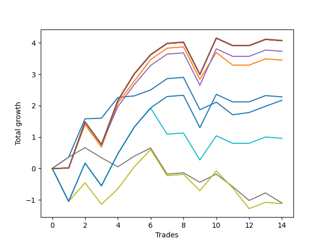

# Long HLT 111 
- Symbol: TSLA_30
- Date Range: 01/10/2024 - 05/17/2024
- Trading Period: 8:30-12:30
- Number of Trades: 14



| Name | Win Percent | Profit | Avg Profit / Trade | Avg Time / Trade |      | Name | Win Percent | Profit | Avg Profit / Trade | Avg Time / Trade |
| ---- | ----------- | ------ | ------------------ | ---------------- | ---- | ---- | ----------- | ------ | ------------------ | ---------------- |
| Sorted By <br> Profit | | | | | | Sorted By <br> Win Percentage ||||
| TP-1.25 | 71.43 | 2040.00 | 145.71 | 28:00 |     | BB-20 Mid | 85.71 | 1085.00 | 77.50 | 13:17 |
| NEWFI 000 | 71.43 | 2035.00 | 145.36 | 29:00 |     | TP-1.25 | 71.43 | 2040.00 | 145.71 | 28:00 |
| TP-2 | 71.43 | 2035.00 | 145.36 | 29:00 |     | NEWFI 000 | 71.43 | 2035.00 | 145.36 | 29:00 |
| TP-1.75 | 71.43 | 2035.00 | 145.36 | 29:00 |     | TP-2 | 71.43 | 2035.00 | 145.36 | 29:00 |
| TP-1.5 | 71.43 | 2035.00 | 145.36 | 29:00 |     | TP-1.75 | 71.43 | 2035.00 | 145.36 | 29:00 |
| BB-50 U/L 2SD | 71.43 | 2035.00 | 145.36 | 29:00 |     | TP-1.5 | 71.43 | 2035.00 | 145.36 | 29:00 |
| BB-50 U/L 1SD | 71.43 | 2035.00 | 145.36 | 29:00 |     | BB-50 U/L 2SD | 71.43 | 2035.00 | 145.36 | 29:00 |
| BB-20 U/L 2SD C | 71.43 | 2035.00 | 145.36 | 29:00 |     | BB-50 U/L 1SD | 71.43 | 2035.00 | 145.36 | 29:00 |
| BB-20 U/L 2SD | 71.43 | 2035.00 | 145.36 | 29:00 |     | BB-20 U/L 2SD C | 71.43 | 2035.00 | 145.36 | 29:00 |
| BB-50 Mid | 71.43 | 1865.00 | 133.21 | 28:30 |     | BB-20 U/L 2SD | 71.43 | 2035.00 | 145.36 | 29:00 |
| BB-20 U/L 1SD | 71.43 | 1725.00 | 123.21 | 25:38 |     | BB-50 Mid | 71.43 | 1865.00 | 133.21 | 28:30 |
| TP-1 | 64.29 | 1140.00 | 81.43 | 25:51 |     | BB-20 U/L 1SD | 71.43 | 1725.00 | 123.21 | 25:38 |
| BB-20 Mid | 85.71 | 1085.00 | 77.50 | 13:17 |     | TP-1 | 64.29 | 1140.00 | 81.43 | 25:51 |
| TP-0.75 | 57.14 | 480.00 | 34.29 | 22:30 |     | TP-0.75 | 57.14 | 480.00 | 34.29 | 22:30 |
| TP-0.25 | 50.00 | -550.00 | -39.29 | 08:47 |     | TP-0.25 | 50.00 | -550.00 | -39.29 | 08:47 |
| TP-0.5 | 50.00 | -560.00 | -40.00 | 16:30 |     | TP-0.5 | 50.00 | -560.00 | -40.00 | 16:30 |

## NO STOPLOSS

### Test BB-20 Mid
* Sell when price hits the middle line of the 20p bollinger
* No Stoploss
* Results:
```
Total Trades: 14
Percent Up: 85.71
Percent Down: 14.29
Total Points Moved Up: 2.17
Potential Profit: 1085.00
Total Points Ups: 3.60 Count Ups: 12
Total Points Downs: -1.43 Count Downs: 2
```

<details><summary>Trades</summary>

<code>In: 2024-02-21 09:55:00		Out: 2024-02-21 10:00:00		Total Position Time: 05:00		Total Move Up: 0.36		Total to Date: 0.36</code> <br />
<code>In: 2024-02-27 10:45:00		Out: 2024-02-27 10:59:00		Total Position Time: 14:00		Total Move Up: 1.22		Total to Date: 1.58</code> <br />
<code>In: 2024-03-08 09:35:00		Out: 2024-03-08 09:37:00		Total Position Time: 02:00		Total Move Up: 0.02		Total to Date: 1.60</code> <br />
<code>In: 2024-03-14 12:30:00		Out: 2024-03-14 12:51:00		Total Position Time: 21:00		Total Move Up: 0.66		Total to Date: 2.26</code> <br />
<code>In: 2024-03-15 10:10:00		Out: 2024-03-15 10:12:00		Total Position Time: 02:00		Total Move Up: 0.05		Total to Date: 2.31</code> <br />
<code>In: 2024-03-21 11:50:00		Out: 2024-03-21 11:52:00		Total Position Time: 02:00		Total Move Up: 0.19		Total to Date: 2.50</code> <br />
<code>In: 2024-04-05 08:45:00		Out: 2024-04-05 09:14:00		Total Position Time: 29:00		Total Move Up: 0.36		Total to Date: 2.86</code> <br />
<code>In: 2024-04-05 12:00:00		Out: 2024-04-05 12:29:00		Total Position Time: 29:00		Total Move Up: 0.04		Total to Date: 2.90</code> <br />
<code>In: 2024-04-15 11:40:00		Out: 2024-04-15 12:09:00		Total Position Time: 29:00		Total Move Up: -1.03		Total to Date: 1.87</code> <br />
<code>In: 2024-04-22 08:35:00		Out: 2024-04-22 08:49:00		Total Position Time: 14:00		Total Move Up: 0.24		Total to Date: 2.11</code> <br />
<code>In: 2024-04-30 10:40:00		Out: 2024-04-30 10:42:00		Total Position Time: 02:00		Total Move Up: -0.40		Total to Date: 1.71</code> <br />
<code>In: 2024-05-07 09:15:00		Out: 2024-05-07 09:17:00		Total Position Time: 02:00		Total Move Up: 0.07		Total to Date: 1.78</code> <br />
<code>In: 2024-05-07 12:00:00		Out: 2024-05-07 12:29:00		Total Position Time: 29:00		Total Move Up: 0.20		Total to Date: 1.98</code> <br />
<code>In: 2024-05-09 08:55:00		Out: 2024-05-09 09:01:00		Total Position Time: 06:00		Total Move Up: 0.19		Total to Date: 2.17</code> <br />


</details>

### Test BB-20 U/L 1SD
* Sell when the price hits the upper line of the 20p 1std bollinger
* No Stoploss
* Results:
```
Total Trades: 14
Percent Up: 71.43
Percent Down: 28.57
Total Points Moved Up: 3.45
Potential Profit: 1725.00
Total Points Ups: 5.64 Count Ups: 10
Total Points Downs: -2.19 Count Downs: 4
```

<details><summary>Trades</summary>

<code>In: 2024-02-21 09:55:00		Out: 2024-02-21 10:24:00		Total Position Time: 29:00		Total Move Up: 0.01		Total to Date: 0.01</code> <br />
<code>In: 2024-02-27 10:45:00		Out: 2024-02-27 11:11:00		Total Position Time: 26:00		Total Move Up: 1.39		Total to Date: 1.40</code> <br />
<code>In: 2024-03-08 09:35:00		Out: 2024-03-08 10:04:00		Total Position Time: 29:00		Total Move Up: -0.72		Total to Date: 0.68</code> <br />
<code>In: 2024-03-14 12:30:00		Out: 2024-03-14 12:59:00		Total Position Time: 29:00		Total Move Up: 1.40		Total to Date: 2.08</code> <br />
<code>In: 2024-03-15 10:10:00		Out: 2024-03-15 10:36:00		Total Position Time: 26:00		Total Move Up: 0.70		Total to Date: 2.78</code> <br />
<code>In: 2024-03-21 11:50:00		Out: 2024-03-21 12:09:00		Total Position Time: 19:00		Total Move Up: 0.69		Total to Date: 3.47</code> <br />
<code>In: 2024-04-05 08:45:00		Out: 2024-04-05 09:14:00		Total Position Time: 29:00		Total Move Up: 0.36		Total to Date: 3.83</code> <br />
<code>In: 2024-04-05 12:00:00		Out: 2024-04-05 12:29:00		Total Position Time: 29:00		Total Move Up: 0.04		Total to Date: 3.87</code> <br />
<code>In: 2024-04-15 11:40:00		Out: 2024-04-15 12:09:00		Total Position Time: 29:00		Total Move Up: -1.03		Total to Date: 2.84</code> <br />
<code>In: 2024-04-22 08:35:00		Out: 2024-04-22 09:00:00		Total Position Time: 25:00		Total Move Up: 0.85		Total to Date: 3.69</code> <br />
<code>In: 2024-04-30 10:40:00		Out: 2024-04-30 10:42:00		Total Position Time: 02:00		Total Move Up: -0.40		Total to Date: 3.29</code> <br />
<code>In: 2024-05-07 09:15:00		Out: 2024-05-07 09:44:00		Total Position Time: 29:00		Total Move Up: 0.00		Total to Date: 3.29</code> <br />
<code>In: 2024-05-07 12:00:00		Out: 2024-05-07 12:29:00		Total Position Time: 29:00		Total Move Up: 0.20		Total to Date: 3.49</code> <br />
<code>In: 2024-05-09 08:55:00		Out: 2024-05-09 09:24:00		Total Position Time: 29:00		Total Move Up: -0.04		Total to Date: 3.45</code> <br />


</details>

### Test BB-20 U/L 2SD
* Sell when the price hits the upper line of the 20p 2std bollinger
* No Stoploss
* Results:
```
Total Trades: 14
Percent Up: 71.43
Percent Down: 28.57
Total Points Moved Up: 4.07
Potential Profit: 2035.00
Total Points Ups: 6.10 Count Ups: 10
Total Points Downs: -2.03 Count Downs: 4
```

<details><summary>Trades</summary>

<code>In: 2024-02-21 09:55:00		Out: 2024-02-21 10:24:00		Total Position Time: 29:00		Total Move Up: 0.01		Total to Date: 0.01</code> <br />
<code>In: 2024-02-27 10:45:00		Out: 2024-02-27 11:14:00		Total Position Time: 29:00		Total Move Up: 1.47		Total to Date: 1.48</code> <br />
<code>In: 2024-03-08 09:35:00		Out: 2024-03-08 10:04:00		Total Position Time: 29:00		Total Move Up: -0.72		Total to Date: 0.76</code> <br />
<code>In: 2024-03-14 12:30:00		Out: 2024-03-14 12:59:00		Total Position Time: 29:00		Total Move Up: 1.40		Total to Date: 2.16</code> <br />
<code>In: 2024-03-15 10:10:00		Out: 2024-03-15 10:39:00		Total Position Time: 29:00		Total Move Up: 0.85		Total to Date: 3.01</code> <br />
<code>In: 2024-03-21 11:50:00		Out: 2024-03-21 12:19:00		Total Position Time: 29:00		Total Move Up: 0.61		Total to Date: 3.62</code> <br />
<code>In: 2024-04-05 08:45:00		Out: 2024-04-05 09:14:00		Total Position Time: 29:00		Total Move Up: 0.36		Total to Date: 3.98</code> <br />
<code>In: 2024-04-05 12:00:00		Out: 2024-04-05 12:29:00		Total Position Time: 29:00		Total Move Up: 0.04		Total to Date: 4.02</code> <br />
<code>In: 2024-04-15 11:40:00		Out: 2024-04-15 12:09:00		Total Position Time: 29:00		Total Move Up: -1.03		Total to Date: 2.99</code> <br />
<code>In: 2024-04-22 08:35:00		Out: 2024-04-22 09:04:00		Total Position Time: 29:00		Total Move Up: 1.16		Total to Date: 4.15</code> <br />
<code>In: 2024-04-30 10:40:00		Out: 2024-04-30 11:09:00		Total Position Time: 29:00		Total Move Up: -0.24		Total to Date: 3.91</code> <br />
<code>In: 2024-05-07 09:15:00		Out: 2024-05-07 09:44:00		Total Position Time: 29:00		Total Move Up: 0.00		Total to Date: 3.91</code> <br />
<code>In: 2024-05-07 12:00:00		Out: 2024-05-07 12:29:00		Total Position Time: 29:00		Total Move Up: 0.20		Total to Date: 4.11</code> <br />
<code>In: 2024-05-09 08:55:00		Out: 2024-05-09 09:24:00		Total Position Time: 29:00		Total Move Up: -0.04		Total to Date: 4.07</code> <br />


</details>

### Test BB-20 U/L 2SD C
* Sell when the price hits the upper line of the 20p 2std bollinger
* No Stoploss
* Results:
```
Total Trades: 14
Percent Up: 71.43
Percent Down: 28.57
Total Points Moved Up: 4.07
Potential Profit: 2035.00
Total Points Ups: 6.10 Count Ups: 10
Total Points Downs: -2.03 Count Downs: 4
```

<details><summary>Trades</summary>

<code>In: 2024-02-21 09:55:00		Out: 2024-02-21 10:24:00		Total Position Time: 29:00		Total Move Up: 0.01		Total to Date: 0.01</code> <br />
<code>In: 2024-02-27 10:45:00		Out: 2024-02-27 11:14:00		Total Position Time: 29:00		Total Move Up: 1.47		Total to Date: 1.48</code> <br />
<code>In: 2024-03-08 09:35:00		Out: 2024-03-08 10:04:00		Total Position Time: 29:00		Total Move Up: -0.72		Total to Date: 0.76</code> <br />
<code>In: 2024-03-14 12:30:00		Out: 2024-03-14 12:59:00		Total Position Time: 29:00		Total Move Up: 1.40		Total to Date: 2.16</code> <br />
<code>In: 2024-03-15 10:10:00		Out: 2024-03-15 10:39:00		Total Position Time: 29:00		Total Move Up: 0.85		Total to Date: 3.01</code> <br />
<code>In: 2024-03-21 11:50:00		Out: 2024-03-21 12:19:00		Total Position Time: 29:00		Total Move Up: 0.61		Total to Date: 3.62</code> <br />
<code>In: 2024-04-05 08:45:00		Out: 2024-04-05 09:14:00		Total Position Time: 29:00		Total Move Up: 0.36		Total to Date: 3.98</code> <br />
<code>In: 2024-04-05 12:00:00		Out: 2024-04-05 12:29:00		Total Position Time: 29:00		Total Move Up: 0.04		Total to Date: 4.02</code> <br />
<code>In: 2024-04-15 11:40:00		Out: 2024-04-15 12:09:00		Total Position Time: 29:00		Total Move Up: -1.03		Total to Date: 2.99</code> <br />
<code>In: 2024-04-22 08:35:00		Out: 2024-04-22 09:04:00		Total Position Time: 29:00		Total Move Up: 1.16		Total to Date: 4.15</code> <br />
<code>In: 2024-04-30 10:40:00		Out: 2024-04-30 11:09:00		Total Position Time: 29:00		Total Move Up: -0.24		Total to Date: 3.91</code> <br />
<code>In: 2024-05-07 09:15:00		Out: 2024-05-07 09:44:00		Total Position Time: 29:00		Total Move Up: 0.00		Total to Date: 3.91</code> <br />
<code>In: 2024-05-07 12:00:00		Out: 2024-05-07 12:29:00		Total Position Time: 29:00		Total Move Up: 0.20		Total to Date: 4.11</code> <br />
<code>In: 2024-05-09 08:55:00		Out: 2024-05-09 09:24:00		Total Position Time: 29:00		Total Move Up: -0.04		Total to Date: 4.07</code> <br />


</details>

### Test BB-50 Mid
* Sell when price hits the middle line of the 50p bollinger
* No Stoploss
* Results:
```
Total Trades: 14
Percent Up: 71.43
Percent Down: 28.57
Total Points Moved Up: 3.73
Potential Profit: 1865.00
Total Points Ups: 5.76 Count Ups: 10
Total Points Downs: -2.03 Count Downs: 4
```

<details><summary>Trades</summary>

<code>In: 2024-02-21 09:55:00		Out: 2024-02-21 10:24:00		Total Position Time: 29:00		Total Move Up: 0.01		Total to Date: 0.01</code> <br />
<code>In: 2024-02-27 10:45:00		Out: 2024-02-27 11:14:00		Total Position Time: 29:00		Total Move Up: 1.47		Total to Date: 1.48</code> <br />
<code>In: 2024-03-08 09:35:00		Out: 2024-03-08 10:04:00		Total Position Time: 29:00		Total Move Up: -0.72		Total to Date: 0.76</code> <br />
<code>In: 2024-03-14 12:30:00		Out: 2024-03-14 12:55:00		Total Position Time: 25:00		Total Move Up: 1.21		Total to Date: 1.97</code> <br />
<code>In: 2024-03-15 10:10:00		Out: 2024-03-15 10:36:00		Total Position Time: 26:00		Total Move Up: 0.70		Total to Date: 2.67</code> <br />
<code>In: 2024-03-21 11:50:00		Out: 2024-03-21 12:19:00		Total Position Time: 29:00		Total Move Up: 0.61		Total to Date: 3.28</code> <br />
<code>In: 2024-04-05 08:45:00		Out: 2024-04-05 09:14:00		Total Position Time: 29:00		Total Move Up: 0.36		Total to Date: 3.64</code> <br />
<code>In: 2024-04-05 12:00:00		Out: 2024-04-05 12:29:00		Total Position Time: 29:00		Total Move Up: 0.04		Total to Date: 3.68</code> <br />
<code>In: 2024-04-15 11:40:00		Out: 2024-04-15 12:09:00		Total Position Time: 29:00		Total Move Up: -1.03		Total to Date: 2.65</code> <br />
<code>In: 2024-04-22 08:35:00		Out: 2024-04-22 09:04:00		Total Position Time: 29:00		Total Move Up: 1.16		Total to Date: 3.81</code> <br />
<code>In: 2024-04-30 10:40:00		Out: 2024-04-30 11:09:00		Total Position Time: 29:00		Total Move Up: -0.24		Total to Date: 3.57</code> <br />
<code>In: 2024-05-07 09:15:00		Out: 2024-05-07 09:44:00		Total Position Time: 29:00		Total Move Up: 0.00		Total to Date: 3.57</code> <br />
<code>In: 2024-05-07 12:00:00		Out: 2024-05-07 12:29:00		Total Position Time: 29:00		Total Move Up: 0.20		Total to Date: 3.77</code> <br />
<code>In: 2024-05-09 08:55:00		Out: 2024-05-09 09:24:00		Total Position Time: 29:00		Total Move Up: -0.04		Total to Date: 3.73</code> <br />


</details>

### Test BB-50 U/L 1SD
* Sell when the price hits the upper line of the 50p 1std bollinger
* No Stoploss
* Results:
```
Total Trades: 14
Percent Up: 71.43
Percent Down: 28.57
Total Points Moved Up: 4.07
Potential Profit: 2035.00
Total Points Ups: 6.10 Count Ups: 10
Total Points Downs: -2.03 Count Downs: 4
```

<details><summary>Trades</summary>

<code>In: 2024-02-21 09:55:00		Out: 2024-02-21 10:24:00		Total Position Time: 29:00		Total Move Up: 0.01		Total to Date: 0.01</code> <br />
<code>In: 2024-02-27 10:45:00		Out: 2024-02-27 11:14:00		Total Position Time: 29:00		Total Move Up: 1.47		Total to Date: 1.48</code> <br />
<code>In: 2024-03-08 09:35:00		Out: 2024-03-08 10:04:00		Total Position Time: 29:00		Total Move Up: -0.72		Total to Date: 0.76</code> <br />
<code>In: 2024-03-14 12:30:00		Out: 2024-03-14 12:59:00		Total Position Time: 29:00		Total Move Up: 1.40		Total to Date: 2.16</code> <br />
<code>In: 2024-03-15 10:10:00		Out: 2024-03-15 10:39:00		Total Position Time: 29:00		Total Move Up: 0.85		Total to Date: 3.01</code> <br />
<code>In: 2024-03-21 11:50:00		Out: 2024-03-21 12:19:00		Total Position Time: 29:00		Total Move Up: 0.61		Total to Date: 3.62</code> <br />
<code>In: 2024-04-05 08:45:00		Out: 2024-04-05 09:14:00		Total Position Time: 29:00		Total Move Up: 0.36		Total to Date: 3.98</code> <br />
<code>In: 2024-04-05 12:00:00		Out: 2024-04-05 12:29:00		Total Position Time: 29:00		Total Move Up: 0.04		Total to Date: 4.02</code> <br />
<code>In: 2024-04-15 11:40:00		Out: 2024-04-15 12:09:00		Total Position Time: 29:00		Total Move Up: -1.03		Total to Date: 2.99</code> <br />
<code>In: 2024-04-22 08:35:00		Out: 2024-04-22 09:04:00		Total Position Time: 29:00		Total Move Up: 1.16		Total to Date: 4.15</code> <br />
<code>In: 2024-04-30 10:40:00		Out: 2024-04-30 11:09:00		Total Position Time: 29:00		Total Move Up: -0.24		Total to Date: 3.91</code> <br />
<code>In: 2024-05-07 09:15:00		Out: 2024-05-07 09:44:00		Total Position Time: 29:00		Total Move Up: 0.00		Total to Date: 3.91</code> <br />
<code>In: 2024-05-07 12:00:00		Out: 2024-05-07 12:29:00		Total Position Time: 29:00		Total Move Up: 0.20		Total to Date: 4.11</code> <br />
<code>In: 2024-05-09 08:55:00		Out: 2024-05-09 09:24:00		Total Position Time: 29:00		Total Move Up: -0.04		Total to Date: 4.07</code> <br />


</details>

### Test BB-50 U/L 2SD
* Sell when the price hits the upper line of the 50p 2std bollinger
* No Stoploss
* Results:
```
Total Trades: 14
Percent Up: 71.43
Percent Down: 28.57
Total Points Moved Up: 4.07
Potential Profit: 2035.00
Total Points Ups: 6.10 Count Ups: 10
Total Points Downs: -2.03 Count Downs: 4
```

<details><summary>Trades</summary>

<code>In: 2024-02-21 09:55:00		Out: 2024-02-21 10:24:00		Total Position Time: 29:00		Total Move Up: 0.01		Total to Date: 0.01</code> <br />
<code>In: 2024-02-27 10:45:00		Out: 2024-02-27 11:14:00		Total Position Time: 29:00		Total Move Up: 1.47		Total to Date: 1.48</code> <br />
<code>In: 2024-03-08 09:35:00		Out: 2024-03-08 10:04:00		Total Position Time: 29:00		Total Move Up: -0.72		Total to Date: 0.76</code> <br />
<code>In: 2024-03-14 12:30:00		Out: 2024-03-14 12:59:00		Total Position Time: 29:00		Total Move Up: 1.40		Total to Date: 2.16</code> <br />
<code>In: 2024-03-15 10:10:00		Out: 2024-03-15 10:39:00		Total Position Time: 29:00		Total Move Up: 0.85		Total to Date: 3.01</code> <br />
<code>In: 2024-03-21 11:50:00		Out: 2024-03-21 12:19:00		Total Position Time: 29:00		Total Move Up: 0.61		Total to Date: 3.62</code> <br />
<code>In: 2024-04-05 08:45:00		Out: 2024-04-05 09:14:00		Total Position Time: 29:00		Total Move Up: 0.36		Total to Date: 3.98</code> <br />
<code>In: 2024-04-05 12:00:00		Out: 2024-04-05 12:29:00		Total Position Time: 29:00		Total Move Up: 0.04		Total to Date: 4.02</code> <br />
<code>In: 2024-04-15 11:40:00		Out: 2024-04-15 12:09:00		Total Position Time: 29:00		Total Move Up: -1.03		Total to Date: 2.99</code> <br />
<code>In: 2024-04-22 08:35:00		Out: 2024-04-22 09:04:00		Total Position Time: 29:00		Total Move Up: 1.16		Total to Date: 4.15</code> <br />
<code>In: 2024-04-30 10:40:00		Out: 2024-04-30 11:09:00		Total Position Time: 29:00		Total Move Up: -0.24		Total to Date: 3.91</code> <br />
<code>In: 2024-05-07 09:15:00		Out: 2024-05-07 09:44:00		Total Position Time: 29:00		Total Move Up: 0.00		Total to Date: 3.91</code> <br />
<code>In: 2024-05-07 12:00:00		Out: 2024-05-07 12:29:00		Total Position Time: 29:00		Total Move Up: 0.20		Total to Date: 4.11</code> <br />
<code>In: 2024-05-09 08:55:00		Out: 2024-05-09 09:24:00		Total Position Time: 29:00		Total Move Up: -0.04		Total to Date: 4.07</code> <br />


</details>

## TAKE PROFIT

### Test TP-0.25
* Take Profit of 0.25 Point
* 0.25 Stoploss
* Results:
```
Total Trades: 14
Percent Up: 50.00
Percent Down: 50.00
Total Points Moved Up: -1.10
Potential Profit: -550.00
Total Points Ups: 1.80 Count Ups: 7
Total Points Downs: -2.90 Count Downs: 7
```

<details><summary>Trades</summary>

<code>In: 2024-02-21 09:55:00		Out: 2024-02-21 10:00:00		Total Position Time: 05:00		Total Move Up: 0.36		Total to Date: 0.36</code> <br />
<code>In: 2024-02-27 10:45:00		Out: 2024-02-27 10:49:00		Total Position Time: 04:00		Total Move Up: 0.30		Total to Date: 0.66</code> <br />
<code>In: 2024-03-08 09:35:00		Out: 2024-03-08 09:46:00		Total Position Time: 11:00		Total Move Up: -0.32		Total to Date: 0.34</code> <br />
<code>In: 2024-03-14 12:30:00		Out: 2024-03-14 12:35:00		Total Position Time: 05:00		Total Move Up: -0.29		Total to Date: 0.05</code> <br />
<code>In: 2024-03-15 10:10:00		Out: 2024-03-15 10:21:00		Total Position Time: 11:00		Total Move Up: 0.34		Total to Date: 0.39</code> <br />
<code>In: 2024-03-21 11:50:00		Out: 2024-03-21 11:55:00		Total Position Time: 05:00		Total Move Up: 0.26		Total to Date: 0.65</code> <br />
<code>In: 2024-04-05 08:45:00		Out: 2024-04-05 08:47:00		Total Position Time: 02:00		Total Move Up: -0.83		Total to Date: -0.18</code> <br />
<code>In: 2024-04-05 12:00:00		Out: 2024-04-05 12:29:00		Total Position Time: 29:00		Total Move Up: 0.04		Total to Date: -0.14</code> <br />
<code>In: 2024-04-15 11:40:00		Out: 2024-04-15 11:45:00		Total Position Time: 05:00		Total Move Up: -0.30		Total to Date: -0.44</code> <br />
<code>In: 2024-04-22 08:35:00		Out: 2024-04-22 08:51:00		Total Position Time: 16:00		Total Move Up: 0.26		Total to Date: -0.18</code> <br />
<code>In: 2024-04-30 10:40:00		Out: 2024-04-30 10:42:00		Total Position Time: 02:00		Total Move Up: -0.40		Total to Date: -0.58</code> <br />
<code>In: 2024-05-07 09:15:00		Out: 2024-05-07 09:22:00		Total Position Time: 07:00		Total Move Up: -0.44		Total to Date: -1.02</code> <br />
<code>In: 2024-05-07 12:00:00		Out: 2024-05-07 12:08:00		Total Position Time: 08:00		Total Move Up: 0.24		Total to Date: -0.78</code> <br />
<code>In: 2024-05-09 08:55:00		Out: 2024-05-09 09:08:00		Total Position Time: 13:00		Total Move Up: -0.32		Total to Date: -1.10</code> <br />


</details>

### Test TP-0.5
* Take Profit of 0.5 Point
* 0.5 Stoploss
* Results:
```
Total Trades: 14
Percent Up: 50.00
Percent Down: 50.00
Total Points Moved Up: -1.12
Potential Profit: -560.00
Total Points Ups: 3.20 Count Ups: 7
Total Points Downs: -4.32 Count Downs: 7
```

<details><summary>Trades</summary>

<code>In: 2024-02-21 09:55:00		Out: 2024-02-21 10:03:00		Total Position Time: 08:00		Total Move Up: -1.05		Total to Date: -1.05</code> <br />
<code>In: 2024-02-27 10:45:00		Out: 2024-02-27 10:58:00		Total Position Time: 13:00		Total Move Up: 0.59		Total to Date: -0.46</code> <br />
<code>In: 2024-03-08 09:35:00		Out: 2024-03-08 09:55:00		Total Position Time: 20:00		Total Move Up: -0.68		Total to Date: -1.14</code> <br />
<code>In: 2024-03-14 12:30:00		Out: 2024-03-14 12:49:00		Total Position Time: 19:00		Total Move Up: 0.49		Total to Date: -0.65</code> <br />
<code>In: 2024-03-15 10:10:00		Out: 2024-03-15 10:36:00		Total Position Time: 26:00		Total Move Up: 0.70		Total to Date: 0.05</code> <br />
<code>In: 2024-03-21 11:50:00		Out: 2024-03-21 11:59:00		Total Position Time: 09:00		Total Move Up: 0.55		Total to Date: 0.60</code> <br />
<code>In: 2024-04-05 08:45:00		Out: 2024-04-05 08:47:00		Total Position Time: 02:00		Total Move Up: -0.83		Total to Date: -0.23</code> <br />
<code>In: 2024-04-05 12:00:00		Out: 2024-04-05 12:29:00		Total Position Time: 29:00		Total Move Up: 0.04		Total to Date: -0.19</code> <br />
<code>In: 2024-04-15 11:40:00		Out: 2024-04-15 11:53:00		Total Position Time: 13:00		Total Move Up: -0.52		Total to Date: -0.71</code> <br />
<code>In: 2024-04-22 08:35:00		Out: 2024-04-22 08:53:00		Total Position Time: 18:00		Total Move Up: 0.63		Total to Date: -0.08</code> <br />
<code>In: 2024-04-30 10:40:00		Out: 2024-04-30 10:48:00		Total Position Time: 08:00		Total Move Up: -0.54		Total to Date: -0.62</code> <br />
<code>In: 2024-05-07 09:15:00		Out: 2024-05-07 09:23:00		Total Position Time: 08:00		Total Move Up: -0.66		Total to Date: -1.28</code> <br />
<code>In: 2024-05-07 12:00:00		Out: 2024-05-07 12:29:00		Total Position Time: 29:00		Total Move Up: 0.20		Total to Date: -1.08</code> <br />
<code>In: 2024-05-09 08:55:00		Out: 2024-05-09 09:24:00		Total Position Time: 29:00		Total Move Up: -0.04		Total to Date: -1.12</code> <br />


</details>

### Test TP-0.75
* Take Profit of 0.75 Point
* 0.75 Stoploss
* Results:
```
Total Trades: 14
Percent Up: 57.14
Percent Down: 42.86
Total Points Moved Up: 0.96
Potential Profit: 480.00
Total Points Ups: 4.71 Count Ups: 8
Total Points Downs: -3.75 Count Downs: 6
```

<details><summary>Trades</summary>

<code>In: 2024-02-21 09:55:00		Out: 2024-02-21 10:03:00		Total Position Time: 08:00		Total Move Up: -1.05		Total to Date: -1.05</code> <br />
<code>In: 2024-02-27 10:45:00		Out: 2024-02-27 10:59:00		Total Position Time: 14:00		Total Move Up: 1.22		Total to Date: 0.17</code> <br />
<code>In: 2024-03-08 09:35:00		Out: 2024-03-08 09:57:00		Total Position Time: 22:00		Total Move Up: -0.73		Total to Date: -0.56</code> <br />
<code>In: 2024-03-14 12:30:00		Out: 2024-03-14 12:52:00		Total Position Time: 22:00		Total Move Up: 1.02		Total to Date: 0.46</code> <br />
<code>In: 2024-03-15 10:10:00		Out: 2024-03-15 10:37:00		Total Position Time: 27:00		Total Move Up: 0.85		Total to Date: 1.31</code> <br />
<code>In: 2024-03-21 11:50:00		Out: 2024-03-21 12:19:00		Total Position Time: 29:00		Total Move Up: 0.61		Total to Date: 1.92</code> <br />
<code>In: 2024-04-05 08:45:00		Out: 2024-04-05 08:47:00		Total Position Time: 02:00		Total Move Up: -0.83		Total to Date: 1.09</code> <br />
<code>In: 2024-04-05 12:00:00		Out: 2024-04-05 12:29:00		Total Position Time: 29:00		Total Move Up: 0.04		Total to Date: 1.13</code> <br />
<code>In: 2024-04-15 11:40:00		Out: 2024-04-15 12:04:00		Total Position Time: 24:00		Total Move Up: -0.86		Total to Date: 0.27</code> <br />
<code>In: 2024-04-22 08:35:00		Out: 2024-04-22 08:57:00		Total Position Time: 22:00		Total Move Up: 0.77		Total to Date: 1.04</code> <br />
<code>In: 2024-04-30 10:40:00		Out: 2024-04-30 11:09:00		Total Position Time: 29:00		Total Move Up: -0.24		Total to Date: 0.80</code> <br />
<code>In: 2024-05-07 09:15:00		Out: 2024-05-07 09:44:00		Total Position Time: 29:00		Total Move Up: 0.00		Total to Date: 0.80</code> <br />
<code>In: 2024-05-07 12:00:00		Out: 2024-05-07 12:29:00		Total Position Time: 29:00		Total Move Up: 0.20		Total to Date: 1.00</code> <br />
<code>In: 2024-05-09 08:55:00		Out: 2024-05-09 09:24:00		Total Position Time: 29:00		Total Move Up: -0.04		Total to Date: 0.96</code> <br />


</details>

### Test TP-1
* Take Profit of 1 Point
* 1 Stoploss
* Results:
```
Total Trades: 14
Percent Up: 64.29
Percent Down: 35.71
Total Points Moved Up: 2.28
Potential Profit: 1140.00
Total Points Ups: 5.36 Count Ups: 9
Total Points Downs: -3.08 Count Downs: 5
```

<details><summary>Trades</summary>

<code>In: 2024-02-21 09:55:00		Out: 2024-02-21 10:03:00		Total Position Time: 08:00		Total Move Up: -1.05		Total to Date: -1.05</code> <br />
<code>In: 2024-02-27 10:45:00		Out: 2024-02-27 10:59:00		Total Position Time: 14:00		Total Move Up: 1.22		Total to Date: 0.17</code> <br />
<code>In: 2024-03-08 09:35:00		Out: 2024-03-08 10:04:00		Total Position Time: 29:00		Total Move Up: -0.72		Total to Date: -0.55</code> <br />
<code>In: 2024-03-14 12:30:00		Out: 2024-03-14 12:52:00		Total Position Time: 22:00		Total Move Up: 1.02		Total to Date: 0.47</code> <br />
<code>In: 2024-03-15 10:10:00		Out: 2024-03-15 10:39:00		Total Position Time: 29:00		Total Move Up: 0.85		Total to Date: 1.32</code> <br />
<code>In: 2024-03-21 11:50:00		Out: 2024-03-21 12:19:00		Total Position Time: 29:00		Total Move Up: 0.61		Total to Date: 1.93</code> <br />
<code>In: 2024-04-05 08:45:00		Out: 2024-04-05 09:14:00		Total Position Time: 29:00		Total Move Up: 0.36		Total to Date: 2.29</code> <br />
<code>In: 2024-04-05 12:00:00		Out: 2024-04-05 12:29:00		Total Position Time: 29:00		Total Move Up: 0.04		Total to Date: 2.33</code> <br />
<code>In: 2024-04-15 11:40:00		Out: 2024-04-15 12:09:00		Total Position Time: 29:00		Total Move Up: -1.03		Total to Date: 1.30</code> <br />
<code>In: 2024-04-22 08:35:00		Out: 2024-04-22 09:03:00		Total Position Time: 28:00		Total Move Up: 1.06		Total to Date: 2.36</code> <br />
<code>In: 2024-04-30 10:40:00		Out: 2024-04-30 11:09:00		Total Position Time: 29:00		Total Move Up: -0.24		Total to Date: 2.12</code> <br />
<code>In: 2024-05-07 09:15:00		Out: 2024-05-07 09:44:00		Total Position Time: 29:00		Total Move Up: 0.00		Total to Date: 2.12</code> <br />
<code>In: 2024-05-07 12:00:00		Out: 2024-05-07 12:29:00		Total Position Time: 29:00		Total Move Up: 0.20		Total to Date: 2.32</code> <br />
<code>In: 2024-05-09 08:55:00		Out: 2024-05-09 09:24:00		Total Position Time: 29:00		Total Move Up: -0.04		Total to Date: 2.28</code> <br />


</details>

### Test TP-1.25
* Take Profit of 1.25 Point
* 1.25 Stoploss
* Results:
```
Total Trades: 14
Percent Up: 71.43
Percent Down: 28.57
Total Points Moved Up: 4.08
Potential Profit: 2040.00
Total Points Ups: 6.11 Count Ups: 10
Total Points Downs: -2.03 Count Downs: 4
```

<details><summary>Trades</summary>

<code>In: 2024-02-21 09:55:00		Out: 2024-02-21 10:24:00		Total Position Time: 29:00		Total Move Up: 0.01		Total to Date: 0.01</code> <br />
<code>In: 2024-02-27 10:45:00		Out: 2024-02-27 11:00:00		Total Position Time: 15:00		Total Move Up: 1.48		Total to Date: 1.49</code> <br />
<code>In: 2024-03-08 09:35:00		Out: 2024-03-08 10:04:00		Total Position Time: 29:00		Total Move Up: -0.72		Total to Date: 0.77</code> <br />
<code>In: 2024-03-14 12:30:00		Out: 2024-03-14 12:59:00		Total Position Time: 29:00		Total Move Up: 1.40		Total to Date: 2.17</code> <br />
<code>In: 2024-03-15 10:10:00		Out: 2024-03-15 10:39:00		Total Position Time: 29:00		Total Move Up: 0.85		Total to Date: 3.02</code> <br />
<code>In: 2024-03-21 11:50:00		Out: 2024-03-21 12:19:00		Total Position Time: 29:00		Total Move Up: 0.61		Total to Date: 3.63</code> <br />
<code>In: 2024-04-05 08:45:00		Out: 2024-04-05 09:14:00		Total Position Time: 29:00		Total Move Up: 0.36		Total to Date: 3.99</code> <br />
<code>In: 2024-04-05 12:00:00		Out: 2024-04-05 12:29:00		Total Position Time: 29:00		Total Move Up: 0.04		Total to Date: 4.03</code> <br />
<code>In: 2024-04-15 11:40:00		Out: 2024-04-15 12:09:00		Total Position Time: 29:00		Total Move Up: -1.03		Total to Date: 3.00</code> <br />
<code>In: 2024-04-22 08:35:00		Out: 2024-04-22 09:04:00		Total Position Time: 29:00		Total Move Up: 1.16		Total to Date: 4.16</code> <br />
<code>In: 2024-04-30 10:40:00		Out: 2024-04-30 11:09:00		Total Position Time: 29:00		Total Move Up: -0.24		Total to Date: 3.92</code> <br />
<code>In: 2024-05-07 09:15:00		Out: 2024-05-07 09:44:00		Total Position Time: 29:00		Total Move Up: 0.00		Total to Date: 3.92</code> <br />
<code>In: 2024-05-07 12:00:00		Out: 2024-05-07 12:29:00		Total Position Time: 29:00		Total Move Up: 0.20		Total to Date: 4.12</code> <br />
<code>In: 2024-05-09 08:55:00		Out: 2024-05-09 09:24:00		Total Position Time: 29:00		Total Move Up: -0.04		Total to Date: 4.08</code> <br />


</details>

### Test TP-1.5
* Take Profit of 1.5 Point
* 1.5 Stoploss
* Results:
```
Total Trades: 14
Percent Up: 71.43
Percent Down: 28.57
Total Points Moved Up: 4.07
Potential Profit: 2035.00
Total Points Ups: 6.10 Count Ups: 10
Total Points Downs: -2.03 Count Downs: 4
```

<details><summary>Trades</summary>

<code>In: 2024-02-21 09:55:00		Out: 2024-02-21 10:24:00		Total Position Time: 29:00		Total Move Up: 0.01		Total to Date: 0.01</code> <br />
<code>In: 2024-02-27 10:45:00		Out: 2024-02-27 11:14:00		Total Position Time: 29:00		Total Move Up: 1.47		Total to Date: 1.48</code> <br />
<code>In: 2024-03-08 09:35:00		Out: 2024-03-08 10:04:00		Total Position Time: 29:00		Total Move Up: -0.72		Total to Date: 0.76</code> <br />
<code>In: 2024-03-14 12:30:00		Out: 2024-03-14 12:59:00		Total Position Time: 29:00		Total Move Up: 1.40		Total to Date: 2.16</code> <br />
<code>In: 2024-03-15 10:10:00		Out: 2024-03-15 10:39:00		Total Position Time: 29:00		Total Move Up: 0.85		Total to Date: 3.01</code> <br />
<code>In: 2024-03-21 11:50:00		Out: 2024-03-21 12:19:00		Total Position Time: 29:00		Total Move Up: 0.61		Total to Date: 3.62</code> <br />
<code>In: 2024-04-05 08:45:00		Out: 2024-04-05 09:14:00		Total Position Time: 29:00		Total Move Up: 0.36		Total to Date: 3.98</code> <br />
<code>In: 2024-04-05 12:00:00		Out: 2024-04-05 12:29:00		Total Position Time: 29:00		Total Move Up: 0.04		Total to Date: 4.02</code> <br />
<code>In: 2024-04-15 11:40:00		Out: 2024-04-15 12:09:00		Total Position Time: 29:00		Total Move Up: -1.03		Total to Date: 2.99</code> <br />
<code>In: 2024-04-22 08:35:00		Out: 2024-04-22 09:04:00		Total Position Time: 29:00		Total Move Up: 1.16		Total to Date: 4.15</code> <br />
<code>In: 2024-04-30 10:40:00		Out: 2024-04-30 11:09:00		Total Position Time: 29:00		Total Move Up: -0.24		Total to Date: 3.91</code> <br />
<code>In: 2024-05-07 09:15:00		Out: 2024-05-07 09:44:00		Total Position Time: 29:00		Total Move Up: 0.00		Total to Date: 3.91</code> <br />
<code>In: 2024-05-07 12:00:00		Out: 2024-05-07 12:29:00		Total Position Time: 29:00		Total Move Up: 0.20		Total to Date: 4.11</code> <br />
<code>In: 2024-05-09 08:55:00		Out: 2024-05-09 09:24:00		Total Position Time: 29:00		Total Move Up: -0.04		Total to Date: 4.07</code> <br />


</details>

### Test TP-1.75
* Take Profit of 1.75 Point
* 1.75 Stoploss
* Results:
```
Total Trades: 14
Percent Up: 71.43
Percent Down: 28.57
Total Points Moved Up: 4.07
Potential Profit: 2035.00
Total Points Ups: 6.10 Count Ups: 10
Total Points Downs: -2.03 Count Downs: 4
```

<details><summary>Trades</summary>

<code>In: 2024-02-21 09:55:00		Out: 2024-02-21 10:24:00		Total Position Time: 29:00		Total Move Up: 0.01		Total to Date: 0.01</code> <br />
<code>In: 2024-02-27 10:45:00		Out: 2024-02-27 11:14:00		Total Position Time: 29:00		Total Move Up: 1.47		Total to Date: 1.48</code> <br />
<code>In: 2024-03-08 09:35:00		Out: 2024-03-08 10:04:00		Total Position Time: 29:00		Total Move Up: -0.72		Total to Date: 0.76</code> <br />
<code>In: 2024-03-14 12:30:00		Out: 2024-03-14 12:59:00		Total Position Time: 29:00		Total Move Up: 1.40		Total to Date: 2.16</code> <br />
<code>In: 2024-03-15 10:10:00		Out: 2024-03-15 10:39:00		Total Position Time: 29:00		Total Move Up: 0.85		Total to Date: 3.01</code> <br />
<code>In: 2024-03-21 11:50:00		Out: 2024-03-21 12:19:00		Total Position Time: 29:00		Total Move Up: 0.61		Total to Date: 3.62</code> <br />
<code>In: 2024-04-05 08:45:00		Out: 2024-04-05 09:14:00		Total Position Time: 29:00		Total Move Up: 0.36		Total to Date: 3.98</code> <br />
<code>In: 2024-04-05 12:00:00		Out: 2024-04-05 12:29:00		Total Position Time: 29:00		Total Move Up: 0.04		Total to Date: 4.02</code> <br />
<code>In: 2024-04-15 11:40:00		Out: 2024-04-15 12:09:00		Total Position Time: 29:00		Total Move Up: -1.03		Total to Date: 2.99</code> <br />
<code>In: 2024-04-22 08:35:00		Out: 2024-04-22 09:04:00		Total Position Time: 29:00		Total Move Up: 1.16		Total to Date: 4.15</code> <br />
<code>In: 2024-04-30 10:40:00		Out: 2024-04-30 11:09:00		Total Position Time: 29:00		Total Move Up: -0.24		Total to Date: 3.91</code> <br />
<code>In: 2024-05-07 09:15:00		Out: 2024-05-07 09:44:00		Total Position Time: 29:00		Total Move Up: 0.00		Total to Date: 3.91</code> <br />
<code>In: 2024-05-07 12:00:00		Out: 2024-05-07 12:29:00		Total Position Time: 29:00		Total Move Up: 0.20		Total to Date: 4.11</code> <br />
<code>In: 2024-05-09 08:55:00		Out: 2024-05-09 09:24:00		Total Position Time: 29:00		Total Move Up: -0.04		Total to Date: 4.07</code> <br />


</details>

### Test TP-2
* Take Profit of 2 Point
* 2 Stoploss
* Results:
```
Total Trades: 14
Percent Up: 71.43
Percent Down: 28.57
Total Points Moved Up: 4.07
Potential Profit: 2035.00
Total Points Ups: 6.10 Count Ups: 10
Total Points Downs: -2.03 Count Downs: 4
```

<details><summary>Trades</summary>

<code>In: 2024-02-21 09:55:00		Out: 2024-02-21 10:24:00		Total Position Time: 29:00		Total Move Up: 0.01		Total to Date: 0.01</code> <br />
<code>In: 2024-02-27 10:45:00		Out: 2024-02-27 11:14:00		Total Position Time: 29:00		Total Move Up: 1.47		Total to Date: 1.48</code> <br />
<code>In: 2024-03-08 09:35:00		Out: 2024-03-08 10:04:00		Total Position Time: 29:00		Total Move Up: -0.72		Total to Date: 0.76</code> <br />
<code>In: 2024-03-14 12:30:00		Out: 2024-03-14 12:59:00		Total Position Time: 29:00		Total Move Up: 1.40		Total to Date: 2.16</code> <br />
<code>In: 2024-03-15 10:10:00		Out: 2024-03-15 10:39:00		Total Position Time: 29:00		Total Move Up: 0.85		Total to Date: 3.01</code> <br />
<code>In: 2024-03-21 11:50:00		Out: 2024-03-21 12:19:00		Total Position Time: 29:00		Total Move Up: 0.61		Total to Date: 3.62</code> <br />
<code>In: 2024-04-05 08:45:00		Out: 2024-04-05 09:14:00		Total Position Time: 29:00		Total Move Up: 0.36		Total to Date: 3.98</code> <br />
<code>In: 2024-04-05 12:00:00		Out: 2024-04-05 12:29:00		Total Position Time: 29:00		Total Move Up: 0.04		Total to Date: 4.02</code> <br />
<code>In: 2024-04-15 11:40:00		Out: 2024-04-15 12:09:00		Total Position Time: 29:00		Total Move Up: -1.03		Total to Date: 2.99</code> <br />
<code>In: 2024-04-22 08:35:00		Out: 2024-04-22 09:04:00		Total Position Time: 29:00		Total Move Up: 1.16		Total to Date: 4.15</code> <br />
<code>In: 2024-04-30 10:40:00		Out: 2024-04-30 11:09:00		Total Position Time: 29:00		Total Move Up: -0.24		Total to Date: 3.91</code> <br />
<code>In: 2024-05-07 09:15:00		Out: 2024-05-07 09:44:00		Total Position Time: 29:00		Total Move Up: 0.00		Total to Date: 3.91</code> <br />
<code>In: 2024-05-07 12:00:00		Out: 2024-05-07 12:29:00		Total Position Time: 29:00		Total Move Up: 0.20		Total to Date: 4.11</code> <br />
<code>In: 2024-05-09 08:55:00		Out: 2024-05-09 09:24:00		Total Position Time: 29:00		Total Move Up: -0.04		Total to Date: 4.07</code> <br />


</details>

## Indicator Exits

### Test NEWFI 000
* Newfi 0000
* No Stoploss
* Results:
```
Total Trades: 14
Percent Up: 71.43
Percent Down: 28.57
Total Points Moved Up: 4.07
Potential Profit: 2035.00
Total Points Ups: 6.10 Count Ups: 10
Total Points Downs: -2.03 Count Downs: 4
```

<details><summary>Trades</summary>

<code>In: 2024-02-21 09:55:00		Out: 2024-02-21 10:24:00		Total Position Time: 29:00		Total Move Up: 0.01		Total to Date: 0.01</code> <br />
<code>In: 2024-02-27 10:45:00		Out: 2024-02-27 11:14:00		Total Position Time: 29:00		Total Move Up: 1.47		Total to Date: 1.48</code> <br />
<code>In: 2024-03-08 09:35:00		Out: 2024-03-08 10:04:00		Total Position Time: 29:00		Total Move Up: -0.72		Total to Date: 0.76</code> <br />
<code>In: 2024-03-14 12:30:00		Out: 2024-03-14 12:59:00		Total Position Time: 29:00		Total Move Up: 1.40		Total to Date: 2.16</code> <br />
<code>In: 2024-03-15 10:10:00		Out: 2024-03-15 10:39:00		Total Position Time: 29:00		Total Move Up: 0.85		Total to Date: 3.01</code> <br />
<code>In: 2024-03-21 11:50:00		Out: 2024-03-21 12:19:00		Total Position Time: 29:00		Total Move Up: 0.61		Total to Date: 3.62</code> <br />
<code>In: 2024-04-05 08:45:00		Out: 2024-04-05 09:14:00		Total Position Time: 29:00		Total Move Up: 0.36		Total to Date: 3.98</code> <br />
<code>In: 2024-04-05 12:00:00		Out: 2024-04-05 12:29:00		Total Position Time: 29:00		Total Move Up: 0.04		Total to Date: 4.02</code> <br />
<code>In: 2024-04-15 11:40:00		Out: 2024-04-15 12:09:00		Total Position Time: 29:00		Total Move Up: -1.03		Total to Date: 2.99</code> <br />
<code>In: 2024-04-22 08:35:00		Out: 2024-04-22 09:04:00		Total Position Time: 29:00		Total Move Up: 1.16		Total to Date: 4.15</code> <br />
<code>In: 2024-04-30 10:40:00		Out: 2024-04-30 11:09:00		Total Position Time: 29:00		Total Move Up: -0.24		Total to Date: 3.91</code> <br />
<code>In: 2024-05-07 09:15:00		Out: 2024-05-07 09:44:00		Total Position Time: 29:00		Total Move Up: 0.00		Total to Date: 3.91</code> <br />
<code>In: 2024-05-07 12:00:00		Out: 2024-05-07 12:29:00		Total Position Time: 29:00		Total Move Up: 0.20		Total to Date: 4.11</code> <br />
<code>In: 2024-05-09 08:55:00		Out: 2024-05-09 09:24:00		Total Position Time: 29:00		Total Move Up: -0.04		Total to Date: 4.07</code> <br />


</details>