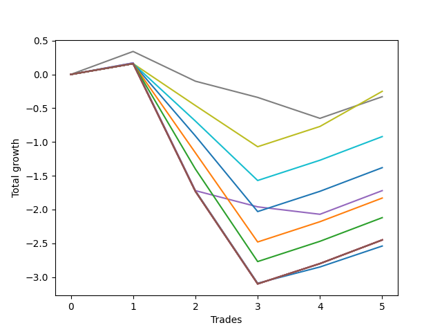

# Short HLT 101 
- Symbol: TSLA_30
- Date Range: 01/10/2024 - 05/17/2024
- Trading Period: 8:30-12:30
- Number of Trades: 5



| Name | Win Percent | Profit | Avg Profit / Trade | Avg Time / Trade |      | Name | Win Percent | Profit | Avg Profit / Trade | Avg Time / Trade |
| ---- | ----------- | ------ | ------------------ | ---------------- | ---- | ---- | ----------- | ------ | ------------------ | ---------------- |
| Sorted By <br> Profit | | | | | | Sorted By <br> Win Percentage ||||
| TP-0.5 | 60.00 | -125.00 | -25.00 | 19:12 |     | TP-0.5 | 60.00 | -125.00 | -25.00 | 19:12 |
| TP-0.25 | 40.00 | -165.00 | -33.00 | 02:24 |     | TP-0.75 | 60.00 | -460.00 | -92.00 | 24:00 |
| TP-0.75 | 60.00 | -460.00 | -92.00 | 24:00 |     | TP-1 | 60.00 | -690.00 | -138.00 | 24:24 |
| TP-1 | 60.00 | -690.00 | -138.00 | 24:24 |     | TP-1.25 | 60.00 | -915.00 | -183.00 | 25:36 |
| BB-50 Mid | 40.00 | -860.00 | -172.00 | 15:12 |     | TP-1.5 | 60.00 | -1060.00 | -212.00 | 26:12 |
| TP-1.25 | 60.00 | -915.00 | -183.00 | 25:36 |     | NEWFI 000 | 60.00 | -1225.00 | -245.00 | 29:00 |
| TP-1.5 | 60.00 | -1060.00 | -212.00 | 26:12 |     | TP-2 | 60.00 | -1225.00 | -245.00 | 29:00 |
| NEWFI 000 | 60.00 | -1225.00 | -245.00 | 29:00 |     | TP-1.75 | 60.00 | -1225.00 | -245.00 | 29:00 |
| TP-2 | 60.00 | -1225.00 | -245.00 | 29:00 |     | BB-50 U/L 2SD | 60.00 | -1225.00 | -245.00 | 29:00 |
| TP-1.75 | 60.00 | -1225.00 | -245.00 | 29:00 |     | BB-50 U/L 1SD | 60.00 | -1225.00 | -245.00 | 29:00 |
| BB-50 U/L 2SD | 60.00 | -1225.00 | -245.00 | 29:00 |     | BB-20 U/L 2SD C | 60.00 | -1225.00 | -245.00 | 29:00 |
| BB-50 U/L 1SD | 60.00 | -1225.00 | -245.00 | 29:00 |     | BB-20 U/L 2SD | 60.00 | -1225.00 | -245.00 | 29:00 |
| BB-20 U/L 2SD C | 60.00 | -1225.00 | -245.00 | 29:00 |     | BB-20 U/L 1SD | 60.00 | -1225.00 | -245.00 | 29:00 |
| BB-20 U/L 2SD | 60.00 | -1225.00 | -245.00 | 29:00 |     | BB-20 Mid | 60.00 | -1270.00 | -254.00 | 20:00 |
| BB-20 U/L 1SD | 60.00 | -1225.00 | -245.00 | 29:00 |     | TP-0.25 | 40.00 | -165.00 | -33.00 | 02:24 |
| BB-20 Mid | 60.00 | -1270.00 | -254.00 | 20:00 |     | BB-50 Mid | 40.00 | -860.00 | -172.00 | 15:12 |

## NO STOPLOSS

### Test BB-20 Mid
* Sell when price hits the middle line of the 20p bollinger
* No Stoploss
* Results:
```
Total Trades: 5
Percent Up: 40.00
Percent Down: 60.00
Total Points Moved Down: -2.54
Potential Profit: -1270.00
Total Points Ups: 3.26 Count Ups: 2
Total Points Downs: 0.72 Count Downs: 3
```

<details><summary>Trades</summary>

<code>In: 2024-01-16 10:40:00		Out: 2024-01-16 10:54:00		Total Position Time: 14:00		Total Move Down: 0.17		Total to Date: 0.17</code> <br />
<code>In: 2024-02-22 08:55:00		Out: 2024-02-22 09:24:00		Total Position Time: 29:00		Total Move Down: -1.89		Total to Date: -1.72</code> <br />
<code>In: 2024-03-27 08:35:00		Out: 2024-03-27 09:04:00		Total Position Time: 29:00		Total Move Down: -1.37		Total to Date: -3.09</code> <br />
<code>In: 2024-03-28 10:05:00		Out: 2024-03-28 10:27:00		Total Position Time: 22:00		Total Move Down: 0.24		Total to Date: -2.85</code> <br />
<code>In: 2024-04-03 08:50:00		Out: 2024-04-03 08:56:00		Total Position Time: 06:00		Total Move Down: 0.31		Total to Date: -2.54</code> <br />


</details>

### Test BB-20 U/L 1SD
* Sell when the price hits the lower line of the 20p 1std bollinger
* No Stoploss
* Results:
```
Total Trades: 5
Percent Up: 40.00
Percent Down: 60.00
Total Points Moved Down: -2.45
Potential Profit: -1225.00
Total Points Ups: 3.26 Count Ups: 2
Total Points Downs: 0.81 Count Downs: 3
```

<details><summary>Trades</summary>

<code>In: 2024-01-16 10:40:00		Out: 2024-01-16 11:09:00		Total Position Time: 29:00		Total Move Down: 0.16		Total to Date: 0.16</code> <br />
<code>In: 2024-02-22 08:55:00		Out: 2024-02-22 09:24:00		Total Position Time: 29:00		Total Move Down: -1.89		Total to Date: -1.73</code> <br />
<code>In: 2024-03-27 08:35:00		Out: 2024-03-27 09:04:00		Total Position Time: 29:00		Total Move Down: -1.37		Total to Date: -3.10</code> <br />
<code>In: 2024-03-28 10:05:00		Out: 2024-03-28 10:34:00		Total Position Time: 29:00		Total Move Down: 0.30		Total to Date: -2.80</code> <br />
<code>In: 2024-04-03 08:50:00		Out: 2024-04-03 09:19:00		Total Position Time: 29:00		Total Move Down: 0.35		Total to Date: -2.45</code> <br />


</details>

### Test BB-20 U/L 2SD
* Sell when the price hits the lower line of the 20p 2std bollinger
* No Stoploss
* Results:
```
Total Trades: 5
Percent Up: 40.00
Percent Down: 60.00
Total Points Moved Down: -2.45
Potential Profit: -1225.00
Total Points Ups: 3.26 Count Ups: 2
Total Points Downs: 0.81 Count Downs: 3
```

<details><summary>Trades</summary>

<code>In: 2024-01-16 10:40:00		Out: 2024-01-16 11:09:00		Total Position Time: 29:00		Total Move Down: 0.16		Total to Date: 0.16</code> <br />
<code>In: 2024-02-22 08:55:00		Out: 2024-02-22 09:24:00		Total Position Time: 29:00		Total Move Down: -1.89		Total to Date: -1.73</code> <br />
<code>In: 2024-03-27 08:35:00		Out: 2024-03-27 09:04:00		Total Position Time: 29:00		Total Move Down: -1.37		Total to Date: -3.10</code> <br />
<code>In: 2024-03-28 10:05:00		Out: 2024-03-28 10:34:00		Total Position Time: 29:00		Total Move Down: 0.30		Total to Date: -2.80</code> <br />
<code>In: 2024-04-03 08:50:00		Out: 2024-04-03 09:19:00		Total Position Time: 29:00		Total Move Down: 0.35		Total to Date: -2.45</code> <br />


</details>

### Test BB-20 U/L 2SD C
* Sell when the price hits the lower line of the 20p 2std bollinger
* No Stoploss
* Results:
```
Total Trades: 5
Percent Up: 40.00
Percent Down: 60.00
Total Points Moved Down: -2.45
Potential Profit: -1225.00
Total Points Ups: 3.26 Count Ups: 2
Total Points Downs: 0.81 Count Downs: 3
```

<details><summary>Trades</summary>

<code>In: 2024-01-16 10:40:00		Out: 2024-01-16 11:09:00		Total Position Time: 29:00		Total Move Down: 0.16		Total to Date: 0.16</code> <br />
<code>In: 2024-02-22 08:55:00		Out: 2024-02-22 09:24:00		Total Position Time: 29:00		Total Move Down: -1.89		Total to Date: -1.73</code> <br />
<code>In: 2024-03-27 08:35:00		Out: 2024-03-27 09:04:00		Total Position Time: 29:00		Total Move Down: -1.37		Total to Date: -3.10</code> <br />
<code>In: 2024-03-28 10:05:00		Out: 2024-03-28 10:34:00		Total Position Time: 29:00		Total Move Down: 0.30		Total to Date: -2.80</code> <br />
<code>In: 2024-04-03 08:50:00		Out: 2024-04-03 09:19:00		Total Position Time: 29:00		Total Move Down: 0.35		Total to Date: -2.45</code> <br />


</details>

### Test BB-50 Mid
* Sell when price hits the middle line of the 50p bollinger
* No Stoploss
* Results:
```
Total Trades: 5
Percent Up: 60.00
Percent Down: 40.00
Total Points Moved Down: -1.72
Potential Profit: -860.00
Total Points Ups: 2.24 Count Ups: 3
Total Points Downs: 0.52 Count Downs: 2
```

<details><summary>Trades</summary>

<code>In: 2024-01-16 10:40:00		Out: 2024-01-16 10:54:00		Total Position Time: 14:00		Total Move Down: 0.17		Total to Date: 0.17</code> <br />
<code>In: 2024-02-22 08:55:00		Out: 2024-02-22 09:24:00		Total Position Time: 29:00		Total Move Down: -1.89		Total to Date: -1.72</code> <br />
<code>In: 2024-03-27 08:35:00		Out: 2024-03-27 08:37:00		Total Position Time: 02:00		Total Move Down: -0.24		Total to Date: -1.96</code> <br />
<code>In: 2024-03-28 10:05:00		Out: 2024-03-28 10:07:00		Total Position Time: 02:00		Total Move Down: -0.11		Total to Date: -2.07</code> <br />
<code>In: 2024-04-03 08:50:00		Out: 2024-04-03 09:19:00		Total Position Time: 29:00		Total Move Down: 0.35		Total to Date: -1.72</code> <br />


</details>

### Test BB-50 U/L 1SD
* Sell when the price hits the lower line of the 50p 1std bollinger
* No Stoploss
* Results:
```
Total Trades: 5
Percent Up: 40.00
Percent Down: 60.00
Total Points Moved Down: -2.45
Potential Profit: -1225.00
Total Points Ups: 3.26 Count Ups: 2
Total Points Downs: 0.81 Count Downs: 3
```

<details><summary>Trades</summary>

<code>In: 2024-01-16 10:40:00		Out: 2024-01-16 11:09:00		Total Position Time: 29:00		Total Move Down: 0.16		Total to Date: 0.16</code> <br />
<code>In: 2024-02-22 08:55:00		Out: 2024-02-22 09:24:00		Total Position Time: 29:00		Total Move Down: -1.89		Total to Date: -1.73</code> <br />
<code>In: 2024-03-27 08:35:00		Out: 2024-03-27 09:04:00		Total Position Time: 29:00		Total Move Down: -1.37		Total to Date: -3.10</code> <br />
<code>In: 2024-03-28 10:05:00		Out: 2024-03-28 10:34:00		Total Position Time: 29:00		Total Move Down: 0.30		Total to Date: -2.80</code> <br />
<code>In: 2024-04-03 08:50:00		Out: 2024-04-03 09:19:00		Total Position Time: 29:00		Total Move Down: 0.35		Total to Date: -2.45</code> <br />


</details>

### Test BB-50 U/L 2SD
* Sell when the price hits the lower line of the 50p 2std bollinger
* No Stoploss
* Results:
```
Total Trades: 5
Percent Up: 40.00
Percent Down: 60.00
Total Points Moved Down: -2.45
Potential Profit: -1225.00
Total Points Ups: 3.26 Count Ups: 2
Total Points Downs: 0.81 Count Downs: 3
```

<details><summary>Trades</summary>

<code>In: 2024-01-16 10:40:00		Out: 2024-01-16 11:09:00		Total Position Time: 29:00		Total Move Down: 0.16		Total to Date: 0.16</code> <br />
<code>In: 2024-02-22 08:55:00		Out: 2024-02-22 09:24:00		Total Position Time: 29:00		Total Move Down: -1.89		Total to Date: -1.73</code> <br />
<code>In: 2024-03-27 08:35:00		Out: 2024-03-27 09:04:00		Total Position Time: 29:00		Total Move Down: -1.37		Total to Date: -3.10</code> <br />
<code>In: 2024-03-28 10:05:00		Out: 2024-03-28 10:34:00		Total Position Time: 29:00		Total Move Down: 0.30		Total to Date: -2.80</code> <br />
<code>In: 2024-04-03 08:50:00		Out: 2024-04-03 09:19:00		Total Position Time: 29:00		Total Move Down: 0.35		Total to Date: -2.45</code> <br />


</details>

## TAKE PROFIT

### Test TP-0.25
* Take Profit of 0.25 Point
* 0.25 Stoploss
* Results:
```
Total Trades: 5
Percent Up: 60.00
Percent Down: 40.00
Total Points Moved Down: -0.33
Potential Profit: -165.00
Total Points Ups: 0.99 Count Ups: 3
Total Points Downs: 0.66 Count Downs: 2
```

<details><summary>Trades</summary>

<code>In: 2024-01-16 10:40:00		Out: 2024-01-16 10:42:00		Total Position Time: 02:00		Total Move Down: 0.34		Total to Date: 0.34</code> <br />
<code>In: 2024-02-22 08:55:00		Out: 2024-02-22 08:57:00		Total Position Time: 02:00		Total Move Down: -0.44		Total to Date: -0.10</code> <br />
<code>In: 2024-03-27 08:35:00		Out: 2024-03-27 08:37:00		Total Position Time: 02:00		Total Move Down: -0.24		Total to Date: -0.34</code> <br />
<code>In: 2024-03-28 10:05:00		Out: 2024-03-28 10:09:00		Total Position Time: 04:00		Total Move Down: -0.31		Total to Date: -0.65</code> <br />
<code>In: 2024-04-03 08:50:00		Out: 2024-04-03 08:52:00		Total Position Time: 02:00		Total Move Down: 0.32		Total to Date: -0.33</code> <br />


</details>

### Test TP-0.5
* Take Profit of 0.5 Point
* 0.5 Stoploss
* Results:
```
Total Trades: 5
Percent Up: 40.00
Percent Down: 60.00
Total Points Moved Down: -0.25
Potential Profit: -125.00
Total Points Ups: 1.23 Count Ups: 2
Total Points Downs: 0.98 Count Downs: 3
```

<details><summary>Trades</summary>

<code>In: 2024-01-16 10:40:00		Out: 2024-01-16 11:09:00		Total Position Time: 29:00		Total Move Down: 0.16		Total to Date: 0.16</code> <br />
<code>In: 2024-02-22 08:55:00		Out: 2024-02-22 09:02:00		Total Position Time: 07:00		Total Move Down: -0.62		Total to Date: -0.46</code> <br />
<code>In: 2024-03-27 08:35:00		Out: 2024-03-27 08:52:00		Total Position Time: 17:00		Total Move Down: -0.61		Total to Date: -1.07</code> <br />
<code>In: 2024-03-28 10:05:00		Out: 2024-03-28 10:34:00		Total Position Time: 29:00		Total Move Down: 0.30		Total to Date: -0.77</code> <br />
<code>In: 2024-04-03 08:50:00		Out: 2024-04-03 09:04:00		Total Position Time: 14:00		Total Move Down: 0.52		Total to Date: -0.25</code> <br />


</details>

### Test TP-0.75
* Take Profit of 0.75 Point
* 0.75 Stoploss
* Results:
```
Total Trades: 5
Percent Up: 40.00
Percent Down: 60.00
Total Points Moved Down: -0.92
Potential Profit: -460.00
Total Points Ups: 1.73 Count Ups: 2
Total Points Downs: 0.81 Count Downs: 3
```

<details><summary>Trades</summary>

<code>In: 2024-01-16 10:40:00		Out: 2024-01-16 11:09:00		Total Position Time: 29:00		Total Move Down: 0.16		Total to Date: 0.16</code> <br />
<code>In: 2024-02-22 08:55:00		Out: 2024-02-22 09:07:00		Total Position Time: 12:00		Total Move Down: -0.85		Total to Date: -0.69</code> <br />
<code>In: 2024-03-27 08:35:00		Out: 2024-03-27 08:56:00		Total Position Time: 21:00		Total Move Down: -0.88		Total to Date: -1.57</code> <br />
<code>In: 2024-03-28 10:05:00		Out: 2024-03-28 10:34:00		Total Position Time: 29:00		Total Move Down: 0.30		Total to Date: -1.27</code> <br />
<code>In: 2024-04-03 08:50:00		Out: 2024-04-03 09:19:00		Total Position Time: 29:00		Total Move Down: 0.35		Total to Date: -0.92</code> <br />


</details>

### Test TP-1
* Take Profit of 1 Point
* 1 Stoploss
* Results:
```
Total Trades: 5
Percent Up: 40.00
Percent Down: 60.00
Total Points Moved Down: -1.38
Potential Profit: -690.00
Total Points Ups: 2.19 Count Ups: 2
Total Points Downs: 0.81 Count Downs: 3
```

<details><summary>Trades</summary>

<code>In: 2024-01-16 10:40:00		Out: 2024-01-16 11:09:00		Total Position Time: 29:00		Total Move Down: 0.16		Total to Date: 0.16</code> <br />
<code>In: 2024-02-22 08:55:00		Out: 2024-02-22 09:08:00		Total Position Time: 13:00		Total Move Down: -1.07		Total to Date: -0.91</code> <br />
<code>In: 2024-03-27 08:35:00		Out: 2024-03-27 08:57:00		Total Position Time: 22:00		Total Move Down: -1.12		Total to Date: -2.03</code> <br />
<code>In: 2024-03-28 10:05:00		Out: 2024-03-28 10:34:00		Total Position Time: 29:00		Total Move Down: 0.30		Total to Date: -1.73</code> <br />
<code>In: 2024-04-03 08:50:00		Out: 2024-04-03 09:19:00		Total Position Time: 29:00		Total Move Down: 0.35		Total to Date: -1.38</code> <br />


</details>

### Test TP-1.25
* Take Profit of 1.25 Point
* 1.25 Stoploss
* Results:
```
Total Trades: 5
Percent Up: 40.00
Percent Down: 60.00
Total Points Moved Down: -1.83
Potential Profit: -915.00
Total Points Ups: 2.64 Count Ups: 2
Total Points Downs: 0.81 Count Downs: 3
```

<details><summary>Trades</summary>

<code>In: 2024-01-16 10:40:00		Out: 2024-01-16 11:09:00		Total Position Time: 29:00		Total Move Down: 0.16		Total to Date: 0.16</code> <br />
<code>In: 2024-02-22 08:55:00		Out: 2024-02-22 09:09:00		Total Position Time: 14:00		Total Move Down: -1.32		Total to Date: -1.16</code> <br />
<code>In: 2024-03-27 08:35:00		Out: 2024-03-27 09:02:00		Total Position Time: 27:00		Total Move Down: -1.32		Total to Date: -2.48</code> <br />
<code>In: 2024-03-28 10:05:00		Out: 2024-03-28 10:34:00		Total Position Time: 29:00		Total Move Down: 0.30		Total to Date: -2.18</code> <br />
<code>In: 2024-04-03 08:50:00		Out: 2024-04-03 09:19:00		Total Position Time: 29:00		Total Move Down: 0.35		Total to Date: -1.83</code> <br />


</details>

### Test TP-1.5
* Take Profit of 1.5 Point
* 1.5 Stoploss
* Results:
```
Total Trades: 5
Percent Up: 40.00
Percent Down: 60.00
Total Points Moved Down: -2.12
Potential Profit: -1060.00
Total Points Ups: 2.93 Count Ups: 2
Total Points Downs: 0.81 Count Downs: 3
```

<details><summary>Trades</summary>

<code>In: 2024-01-16 10:40:00		Out: 2024-01-16 11:09:00		Total Position Time: 29:00		Total Move Down: 0.16		Total to Date: 0.16</code> <br />
<code>In: 2024-02-22 08:55:00		Out: 2024-02-22 09:10:00		Total Position Time: 15:00		Total Move Down: -1.56		Total to Date: -1.40</code> <br />
<code>In: 2024-03-27 08:35:00		Out: 2024-03-27 09:04:00		Total Position Time: 29:00		Total Move Down: -1.37		Total to Date: -2.77</code> <br />
<code>In: 2024-03-28 10:05:00		Out: 2024-03-28 10:34:00		Total Position Time: 29:00		Total Move Down: 0.30		Total to Date: -2.47</code> <br />
<code>In: 2024-04-03 08:50:00		Out: 2024-04-03 09:19:00		Total Position Time: 29:00		Total Move Down: 0.35		Total to Date: -2.12</code> <br />


</details>

### Test TP-1.75
* Take Profit of 1.75 Point
* 1.75 Stoploss
* Results:
```
Total Trades: 5
Percent Up: 40.00
Percent Down: 60.00
Total Points Moved Down: -2.45
Potential Profit: -1225.00
Total Points Ups: 3.26 Count Ups: 2
Total Points Downs: 0.81 Count Downs: 3
```

<details><summary>Trades</summary>

<code>In: 2024-01-16 10:40:00		Out: 2024-01-16 11:09:00		Total Position Time: 29:00		Total Move Down: 0.16		Total to Date: 0.16</code> <br />
<code>In: 2024-02-22 08:55:00		Out: 2024-02-22 09:24:00		Total Position Time: 29:00		Total Move Down: -1.89		Total to Date: -1.73</code> <br />
<code>In: 2024-03-27 08:35:00		Out: 2024-03-27 09:04:00		Total Position Time: 29:00		Total Move Down: -1.37		Total to Date: -3.10</code> <br />
<code>In: 2024-03-28 10:05:00		Out: 2024-03-28 10:34:00		Total Position Time: 29:00		Total Move Down: 0.30		Total to Date: -2.80</code> <br />
<code>In: 2024-04-03 08:50:00		Out: 2024-04-03 09:19:00		Total Position Time: 29:00		Total Move Down: 0.35		Total to Date: -2.45</code> <br />


</details>

### Test TP-2
* Take Profit of 2 Point
* 2 Stoploss
* Results:
```
Total Trades: 5
Percent Up: 40.00
Percent Down: 60.00
Total Points Moved Down: -2.45
Potential Profit: -1225.00
Total Points Ups: 3.26 Count Ups: 2
Total Points Downs: 0.81 Count Downs: 3
```

<details><summary>Trades</summary>

<code>In: 2024-01-16 10:40:00		Out: 2024-01-16 11:09:00		Total Position Time: 29:00		Total Move Down: 0.16		Total to Date: 0.16</code> <br />
<code>In: 2024-02-22 08:55:00		Out: 2024-02-22 09:24:00		Total Position Time: 29:00		Total Move Down: -1.89		Total to Date: -1.73</code> <br />
<code>In: 2024-03-27 08:35:00		Out: 2024-03-27 09:04:00		Total Position Time: 29:00		Total Move Down: -1.37		Total to Date: -3.10</code> <br />
<code>In: 2024-03-28 10:05:00		Out: 2024-03-28 10:34:00		Total Position Time: 29:00		Total Move Down: 0.30		Total to Date: -2.80</code> <br />
<code>In: 2024-04-03 08:50:00		Out: 2024-04-03 09:19:00		Total Position Time: 29:00		Total Move Down: 0.35		Total to Date: -2.45</code> <br />


</details>

## Indicator Exits

### Test NEWFI 000
* Newfi 0000
* No Stoploss
* Results:
```
Total Trades: 5
Percent Up: 40.00
Percent Down: 60.00
Total Points Moved Down: -2.45
Potential Profit: -1225.00
Total Points Ups: 3.26 Count Ups: 2
Total Points Downs: 0.81 Count Downs: 3
```

<details><summary>Trades</summary>

<code>In: 2024-01-16 10:40:00		Out: 2024-01-16 11:09:00		Total Position Time: 29:00		Total Move Down: 0.16		Total to Date: 0.16</code> <br />
<code>In: 2024-02-22 08:55:00		Out: 2024-02-22 09:24:00		Total Position Time: 29:00		Total Move Down: -1.89		Total to Date: -1.73</code> <br />
<code>In: 2024-03-27 08:35:00		Out: 2024-03-27 09:04:00		Total Position Time: 29:00		Total Move Down: -1.37		Total to Date: -3.10</code> <br />
<code>In: 2024-03-28 10:05:00		Out: 2024-03-28 10:34:00		Total Position Time: 29:00		Total Move Down: 0.30		Total to Date: -2.80</code> <br />
<code>In: 2024-04-03 08:50:00		Out: 2024-04-03 09:19:00		Total Position Time: 29:00		Total Move Down: 0.35		Total to Date: -2.45</code> <br />


</details>