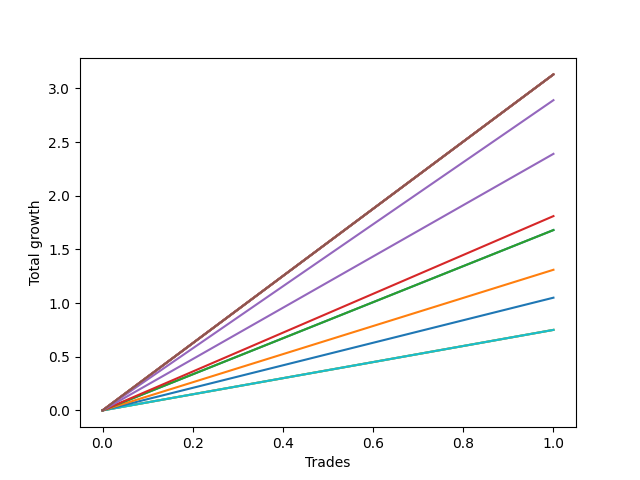

# Short HLT 103 
- Symbol: TSLA_30
- Date Range: 01/10/2024 - 05/17/2024
- Trading Period: 8:30-12:30
- Number of Trades: 1



| Name | Win Percent | Profit | Avg Profit / Trade | Avg Time / Trade |      | Name | Win Percent | Profit | Avg Profit / Trade | Avg Time / Trade |
| ---- | ----------- | ------ | ------------------ | ---------------- | ---- | ---- | ----------- | ------ | ------------------ | ---------------- |
| Sorted By <br> Profit | | | | | | Sorted By <br> Win Percentage ||||
| NEWFI 000 | 100.00 | 1565.00 | 1565.00 | 29:00 |     | NEWFI 000 | 100.00 | 1565.00 | 1565.00 | 29:00 |
| BB-50 U/L 2SD | 100.00 | 1565.00 | 1565.00 | 29:00 |     | BB-50 U/L 2SD | 100.00 | 1565.00 | 1565.00 | 29:00 |
| BB-50 U/L 1SD | 100.00 | 1565.00 | 1565.00 | 29:00 |     | BB-50 U/L 1SD | 100.00 | 1565.00 | 1565.00 | 29:00 |
| BB-20 U/L 2SD C | 100.00 | 1565.00 | 1565.00 | 29:00 |     | BB-20 U/L 2SD C | 100.00 | 1565.00 | 1565.00 | 29:00 |
| BB-20 U/L 2SD | 100.00 | 1565.00 | 1565.00 | 29:00 |     | BB-20 U/L 2SD | 100.00 | 1565.00 | 1565.00 | 29:00 |
| BB-20 U/L 1SD | 100.00 | 1565.00 | 1565.00 | 29:00 |     | BB-20 U/L 1SD | 100.00 | 1565.00 | 1565.00 | 29:00 |
| BB-50 Mid | 100.00 | 1445.00 | 1445.00 | 25:00 |     | BB-50 Mid | 100.00 | 1445.00 | 1445.00 | 25:00 |
| TP-2 | 100.00 | 1195.00 | 1195.00 | 19:00 |     | TP-2 | 100.00 | 1195.00 | 1195.00 | 19:00 |
| TP-1.75 | 100.00 | 905.00 | 905.00 | 15:00 |     | TP-1.75 | 100.00 | 905.00 | 905.00 | 15:00 |
| TP-1.5 | 100.00 | 840.00 | 840.00 | 13:00 |     | TP-1.5 | 100.00 | 840.00 | 840.00 | 13:00 |
| BB-20 Mid | 100.00 | 840.00 | 840.00 | 13:00 |     | BB-20 Mid | 100.00 | 840.00 | 840.00 | 13:00 |
| TP-1.25 | 100.00 | 655.00 | 655.00 | 11:00 |     | TP-1.25 | 100.00 | 655.00 | 655.00 | 11:00 |
| TP-1 | 100.00 | 525.00 | 525.00 | 10:00 |     | TP-1 | 100.00 | 525.00 | 525.00 | 10:00 |
| TP-0.75 | 100.00 | 375.00 | 375.00 | 02:00 |     | TP-0.75 | 100.00 | 375.00 | 375.00 | 02:00 |
| TP-0.5 | 100.00 | 375.00 | 375.00 | 02:00 |     | TP-0.5 | 100.00 | 375.00 | 375.00 | 02:00 |
| TP-0.25 | 100.00 | 375.00 | 375.00 | 02:00 |     | TP-0.25 | 100.00 | 375.00 | 375.00 | 02:00 |

## NO STOPLOSS

### Test BB-20 Mid
* Sell when price hits the middle line of the 20p bollinger
* No Stoploss
* Results:
```
Total Trades: 1
Percent Up: 0.00
Percent Down: 100.00
Total Points Moved Down: 1.68
Potential Profit: 840.00
Total Points Ups: 0.00 Count Ups: 0
Total Points Downs: 1.68 Count Downs: 1
```

<details><summary>Trades</summary>

<code>In: 2024-05-01 12:20:00		Out: 2024-05-01 12:33:00		Total Position Time: 13:00		Total Move Down: 1.68		Total to Date: 1.68</code> <br />


</details>

### Test BB-20 U/L 1SD
* Sell when the price hits the lower line of the 20p 1std bollinger
* No Stoploss
* Results:
```
Total Trades: 1
Percent Up: 0.00
Percent Down: 100.00
Total Points Moved Down: 3.13
Potential Profit: 1565.00
Total Points Ups: 0.00 Count Ups: 0
Total Points Downs: 3.13 Count Downs: 1
```

<details><summary>Trades</summary>

<code>In: 2024-05-01 12:20:00		Out: 2024-05-01 12:49:00		Total Position Time: 29:00		Total Move Down: 3.13		Total to Date: 3.13</code> <br />


</details>

### Test BB-20 U/L 2SD
* Sell when the price hits the lower line of the 20p 2std bollinger
* No Stoploss
* Results:
```
Total Trades: 1
Percent Up: 0.00
Percent Down: 100.00
Total Points Moved Down: 3.13
Potential Profit: 1565.00
Total Points Ups: 0.00 Count Ups: 0
Total Points Downs: 3.13 Count Downs: 1
```

<details><summary>Trades</summary>

<code>In: 2024-05-01 12:20:00		Out: 2024-05-01 12:49:00		Total Position Time: 29:00		Total Move Down: 3.13		Total to Date: 3.13</code> <br />


</details>

### Test BB-20 U/L 2SD C
* Sell when the price hits the lower line of the 20p 2std bollinger
* No Stoploss
* Results:
```
Total Trades: 1
Percent Up: 0.00
Percent Down: 100.00
Total Points Moved Down: 3.13
Potential Profit: 1565.00
Total Points Ups: 0.00 Count Ups: 0
Total Points Downs: 3.13 Count Downs: 1
```

<details><summary>Trades</summary>

<code>In: 2024-05-01 12:20:00		Out: 2024-05-01 12:49:00		Total Position Time: 29:00		Total Move Down: 3.13		Total to Date: 3.13</code> <br />


</details>

### Test BB-50 Mid
* Sell when price hits the middle line of the 50p bollinger
* No Stoploss
* Results:
```
Total Trades: 1
Percent Up: 0.00
Percent Down: 100.00
Total Points Moved Down: 2.89
Potential Profit: 1445.00
Total Points Ups: 0.00 Count Ups: 0
Total Points Downs: 2.89 Count Downs: 1
```

<details><summary>Trades</summary>

<code>In: 2024-05-01 12:20:00		Out: 2024-05-01 12:45:00		Total Position Time: 25:00		Total Move Down: 2.89		Total to Date: 2.89</code> <br />


</details>

### Test BB-50 U/L 1SD
* Sell when the price hits the lower line of the 50p 1std bollinger
* No Stoploss
* Results:
```
Total Trades: 1
Percent Up: 0.00
Percent Down: 100.00
Total Points Moved Down: 3.13
Potential Profit: 1565.00
Total Points Ups: 0.00 Count Ups: 0
Total Points Downs: 3.13 Count Downs: 1
```

<details><summary>Trades</summary>

<code>In: 2024-05-01 12:20:00		Out: 2024-05-01 12:49:00		Total Position Time: 29:00		Total Move Down: 3.13		Total to Date: 3.13</code> <br />


</details>

### Test BB-50 U/L 2SD
* Sell when the price hits the lower line of the 50p 2std bollinger
* No Stoploss
* Results:
```
Total Trades: 1
Percent Up: 0.00
Percent Down: 100.00
Total Points Moved Down: 3.13
Potential Profit: 1565.00
Total Points Ups: 0.00 Count Ups: 0
Total Points Downs: 3.13 Count Downs: 1
```

<details><summary>Trades</summary>

<code>In: 2024-05-01 12:20:00		Out: 2024-05-01 12:49:00		Total Position Time: 29:00		Total Move Down: 3.13		Total to Date: 3.13</code> <br />


</details>

## TAKE PROFIT

### Test TP-0.25
* Take Profit of 0.25 Point
* 0.25 Stoploss
* Results:
```
Total Trades: 1
Percent Up: 0.00
Percent Down: 100.00
Total Points Moved Down: 0.75
Potential Profit: 375.00
Total Points Ups: 0.00 Count Ups: 0
Total Points Downs: 0.75 Count Downs: 1
```

<details><summary>Trades</summary>

<code>In: 2024-05-01 12:20:00		Out: 2024-05-01 12:22:00		Total Position Time: 02:00		Total Move Down: 0.75		Total to Date: 0.75</code> <br />


</details>

### Test TP-0.5
* Take Profit of 0.5 Point
* 0.5 Stoploss
* Results:
```
Total Trades: 1
Percent Up: 0.00
Percent Down: 100.00
Total Points Moved Down: 0.75
Potential Profit: 375.00
Total Points Ups: 0.00 Count Ups: 0
Total Points Downs: 0.75 Count Downs: 1
```

<details><summary>Trades</summary>

<code>In: 2024-05-01 12:20:00		Out: 2024-05-01 12:22:00		Total Position Time: 02:00		Total Move Down: 0.75		Total to Date: 0.75</code> <br />


</details>

### Test TP-0.75
* Take Profit of 0.75 Point
* 0.75 Stoploss
* Results:
```
Total Trades: 1
Percent Up: 0.00
Percent Down: 100.00
Total Points Moved Down: 0.75
Potential Profit: 375.00
Total Points Ups: 0.00 Count Ups: 0
Total Points Downs: 0.75 Count Downs: 1
```

<details><summary>Trades</summary>

<code>In: 2024-05-01 12:20:00		Out: 2024-05-01 12:22:00		Total Position Time: 02:00		Total Move Down: 0.75		Total to Date: 0.75</code> <br />


</details>

### Test TP-1
* Take Profit of 1 Point
* 1 Stoploss
* Results:
```
Total Trades: 1
Percent Up: 0.00
Percent Down: 100.00
Total Points Moved Down: 1.05
Potential Profit: 525.00
Total Points Ups: 0.00 Count Ups: 0
Total Points Downs: 1.05 Count Downs: 1
```

<details><summary>Trades</summary>

<code>In: 2024-05-01 12:20:00		Out: 2024-05-01 12:30:00		Total Position Time: 10:00		Total Move Down: 1.05		Total to Date: 1.05</code> <br />


</details>

### Test TP-1.25
* Take Profit of 1.25 Point
* 1.25 Stoploss
* Results:
```
Total Trades: 1
Percent Up: 0.00
Percent Down: 100.00
Total Points Moved Down: 1.31
Potential Profit: 655.00
Total Points Ups: 0.00 Count Ups: 0
Total Points Downs: 1.31 Count Downs: 1
```

<details><summary>Trades</summary>

<code>In: 2024-05-01 12:20:00		Out: 2024-05-01 12:31:00		Total Position Time: 11:00		Total Move Down: 1.31		Total to Date: 1.31</code> <br />


</details>

### Test TP-1.5
* Take Profit of 1.5 Point
* 1.5 Stoploss
* Results:
```
Total Trades: 1
Percent Up: 0.00
Percent Down: 100.00
Total Points Moved Down: 1.68
Potential Profit: 840.00
Total Points Ups: 0.00 Count Ups: 0
Total Points Downs: 1.68 Count Downs: 1
```

<details><summary>Trades</summary>

<code>In: 2024-05-01 12:20:00		Out: 2024-05-01 12:33:00		Total Position Time: 13:00		Total Move Down: 1.68		Total to Date: 1.68</code> <br />


</details>

### Test TP-1.75
* Take Profit of 1.75 Point
* 1.75 Stoploss
* Results:
```
Total Trades: 1
Percent Up: 0.00
Percent Down: 100.00
Total Points Moved Down: 1.81
Potential Profit: 905.00
Total Points Ups: 0.00 Count Ups: 0
Total Points Downs: 1.81 Count Downs: 1
```

<details><summary>Trades</summary>

<code>In: 2024-05-01 12:20:00		Out: 2024-05-01 12:35:00		Total Position Time: 15:00		Total Move Down: 1.81		Total to Date: 1.81</code> <br />


</details>

### Test TP-2
* Take Profit of 2 Point
* 2 Stoploss
* Results:
```
Total Trades: 1
Percent Up: 0.00
Percent Down: 100.00
Total Points Moved Down: 2.39
Potential Profit: 1195.00
Total Points Ups: 0.00 Count Ups: 0
Total Points Downs: 2.39 Count Downs: 1
```

<details><summary>Trades</summary>

<code>In: 2024-05-01 12:20:00		Out: 2024-05-01 12:39:00		Total Position Time: 19:00		Total Move Down: 2.39		Total to Date: 2.39</code> <br />


</details>

## Indicator Exits

### Test NEWFI 000
* Newfi 0000
* No Stoploss
* Results:
```
Total Trades: 1
Percent Up: 0.00
Percent Down: 100.00
Total Points Moved Down: 3.13
Potential Profit: 1565.00
Total Points Ups: 0.00 Count Ups: 0
Total Points Downs: 3.13 Count Downs: 1
```

<details><summary>Trades</summary>

<code>In: 2024-05-01 12:20:00		Out: 2024-05-01 12:49:00		Total Position Time: 29:00		Total Move Down: 3.13		Total to Date: 3.13</code> <br />


</details>