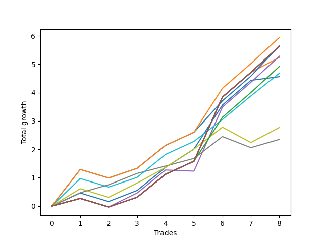

# Short HLT 105 
- Symbol: TSLA_30
- Date Range: 01/10/2024 - 05/17/2024
- Trading Period: 8:30-12:30
- Number of Trades: 8



| Name | Win Percent | Profit | Avg Profit / Trade | Avg Time / Trade |      | Name | Win Percent | Profit | Avg Profit / Trade | Avg Time / Trade |
| ---- | ----------- | ------ | ------------------ | ---------------- | ---- | ---- | ----------- | ------ | ------------------ | ---------------- |
| Sorted By <br> Profit | | | | | | Sorted By <br> Win Percentage ||||
| TP-1.25 | 87.50 | 2970.00 | 371.25 | 26:22 |     | TP-1.25 | 87.50 | 2970.00 | 371.25 | 26:22 |
| TP-1 | 87.50 | 2825.00 | 353.12 | 23:07 |     | TP-1 | 87.50 | 2825.00 | 353.12 | 23:07 |
| NEWFI 000 | 87.50 | 2815.00 | 351.87 | 29:00 |     | NEWFI 000 | 87.50 | 2815.00 | 351.87 | 29:00 |
| TP-2 | 87.50 | 2815.00 | 351.87 | 29:00 |     | TP-2 | 87.50 | 2815.00 | 351.87 | 29:00 |
| TP-1.75 | 87.50 | 2815.00 | 351.87 | 29:00 |     | TP-1.75 | 87.50 | 2815.00 | 351.87 | 29:00 |
| BB-50 U/L 2SD | 87.50 | 2815.00 | 351.87 | 29:00 |     | BB-50 U/L 2SD | 87.50 | 2815.00 | 351.87 | 29:00 |
| BB-50 U/L 1SD | 87.50 | 2815.00 | 351.87 | 29:00 |     | BB-50 U/L 1SD | 87.50 | 2815.00 | 351.87 | 29:00 |
| BB-20 U/L 2SD C | 87.50 | 2815.00 | 351.87 | 29:00 |     | BB-20 U/L 2SD C | 87.50 | 2815.00 | 351.87 | 29:00 |
| BB-20 U/L 2SD | 87.50 | 2815.00 | 351.87 | 29:00 |     | BB-20 U/L 2SD | 87.50 | 2815.00 | 351.87 | 29:00 |
| BB-50 Mid | 75.00 | 2640.00 | 330.00 | 24:07 |     | BB-20 U/L 1SD | 87.50 | 2620.00 | 327.50 | 27:22 |
| BB-20 U/L 1SD | 87.50 | 2620.00 | 327.50 | 27:22 |     | TP-1.5 | 87.50 | 2460.00 | 307.50 | 28:45 |
| TP-1.5 | 87.50 | 2460.00 | 307.50 | 28:45 |     | TP-0.75 | 87.50 | 2340.00 | 292.50 | 21:45 |
| TP-0.75 | 87.50 | 2340.00 | 292.50 | 21:45 |     | BB-20 Mid | 87.50 | 2280.00 | 285.00 | 19:45 |
| BB-20 Mid | 87.50 | 2280.00 | 285.00 | 19:45 |     | TP-0.25 | 87.50 | 1175.00 | 146.88 | 06:37 |
| TP-0.5 | 75.00 | 1385.00 | 173.13 | 14:52 |     | BB-50 Mid | 75.00 | 2640.00 | 330.00 | 24:07 |
| TP-0.25 | 87.50 | 1175.00 | 146.88 | 06:37 |     | TP-0.5 | 75.00 | 1385.00 | 173.13 | 14:52 |

## NO STOPLOSS

### Test BB-20 Mid
* Sell when price hits the middle line of the 20p bollinger
* No Stoploss
* Results:
```
Total Trades: 8
Percent Up: 12.50
Percent Down: 87.50
Total Points Moved Down: 4.56
Potential Profit: 2280.00
Total Points Ups: 0.30 Count Ups: 1
Total Points Downs: 4.86 Count Downs: 7
```

<details><summary>Trades</summary>

<code>In: 2024-02-07 11:10:00		Out: 2024-02-07 11:16:00		Total Position Time: 06:00		Total Move Down: 0.46		Total to Date: 0.46</code> <br />
<code>In: 2024-02-22 10:55:00		Out: 2024-02-22 11:24:00		Total Position Time: 29:00		Total Move Down: -0.30		Total to Date: 0.16</code> <br />
<code>In: 2024-03-18 11:50:00		Out: 2024-03-18 12:01:00		Total Position Time: 11:00		Total Move Down: 0.39		Total to Date: 0.55</code> <br />
<code>In: 2024-03-27 09:55:00		Out: 2024-03-27 10:24:00		Total Position Time: 29:00		Total Move Down: 0.81		Total to Date: 1.36</code> <br />
<code>In: 2024-04-24 11:10:00		Out: 2024-04-24 11:35:00		Total Position Time: 25:00		Total Move Down: 0.65		Total to Date: 2.01</code> <br />
<code>In: 2024-04-29 09:40:00		Out: 2024-04-29 10:07:00		Total Position Time: 27:00		Total Move Down: 1.55		Total to Date: 3.56</code> <br />
<code>In: 2024-05-14 08:40:00		Out: 2024-05-14 09:09:00		Total Position Time: 29:00		Total Move Down: 0.87		Total to Date: 4.43</code> <br />
<code>In: 2024-05-17 09:45:00		Out: 2024-05-17 09:47:00		Total Position Time: 02:00		Total Move Down: 0.13		Total to Date: 4.56</code> <br />


</details>

### Test BB-20 U/L 1SD
* Sell when the price hits the lower line of the 20p 1std bollinger
* No Stoploss
* Results:
```
Total Trades: 8
Percent Up: 12.50
Percent Down: 87.50
Total Points Moved Down: 5.24
Potential Profit: 2620.00
Total Points Ups: 0.30 Count Ups: 1
Total Points Downs: 5.54 Count Downs: 7
```

<details><summary>Trades</summary>

<code>In: 2024-02-07 11:10:00		Out: 2024-02-07 11:39:00		Total Position Time: 29:00		Total Move Down: 0.27		Total to Date: 0.27</code> <br />
<code>In: 2024-02-22 10:55:00		Out: 2024-02-22 11:24:00		Total Position Time: 29:00		Total Move Down: -0.30		Total to Date: -0.03</code> <br />
<code>In: 2024-03-18 11:50:00		Out: 2024-03-18 12:19:00		Total Position Time: 29:00		Total Move Down: 0.34		Total to Date: 0.31</code> <br />
<code>In: 2024-03-27 09:55:00		Out: 2024-03-27 10:24:00		Total Position Time: 29:00		Total Move Down: 0.81		Total to Date: 1.12</code> <br />
<code>In: 2024-04-24 11:10:00		Out: 2024-04-24 11:39:00		Total Position Time: 29:00		Total Move Down: 0.46		Total to Date: 1.58</code> <br />
<code>In: 2024-04-29 09:40:00		Out: 2024-04-29 10:09:00		Total Position Time: 29:00		Total Move Down: 2.26		Total to Date: 3.84</code> <br />
<code>In: 2024-05-14 08:40:00		Out: 2024-05-14 09:09:00		Total Position Time: 29:00		Total Move Down: 0.87		Total to Date: 4.71</code> <br />
<code>In: 2024-05-17 09:45:00		Out: 2024-05-17 10:01:00		Total Position Time: 16:00		Total Move Down: 0.53		Total to Date: 5.24</code> <br />


</details>

### Test BB-20 U/L 2SD
* Sell when the price hits the lower line of the 20p 2std bollinger
* No Stoploss
* Results:
```
Total Trades: 8
Percent Up: 12.50
Percent Down: 87.50
Total Points Moved Down: 5.63
Potential Profit: 2815.00
Total Points Ups: 0.30 Count Ups: 1
Total Points Downs: 5.93 Count Downs: 7
```

<details><summary>Trades</summary>

<code>In: 2024-02-07 11:10:00		Out: 2024-02-07 11:39:00		Total Position Time: 29:00		Total Move Down: 0.27		Total to Date: 0.27</code> <br />
<code>In: 2024-02-22 10:55:00		Out: 2024-02-22 11:24:00		Total Position Time: 29:00		Total Move Down: -0.30		Total to Date: -0.03</code> <br />
<code>In: 2024-03-18 11:50:00		Out: 2024-03-18 12:19:00		Total Position Time: 29:00		Total Move Down: 0.34		Total to Date: 0.31</code> <br />
<code>In: 2024-03-27 09:55:00		Out: 2024-03-27 10:24:00		Total Position Time: 29:00		Total Move Down: 0.81		Total to Date: 1.12</code> <br />
<code>In: 2024-04-24 11:10:00		Out: 2024-04-24 11:39:00		Total Position Time: 29:00		Total Move Down: 0.46		Total to Date: 1.58</code> <br />
<code>In: 2024-04-29 09:40:00		Out: 2024-04-29 10:09:00		Total Position Time: 29:00		Total Move Down: 2.26		Total to Date: 3.84</code> <br />
<code>In: 2024-05-14 08:40:00		Out: 2024-05-14 09:09:00		Total Position Time: 29:00		Total Move Down: 0.87		Total to Date: 4.71</code> <br />
<code>In: 2024-05-17 09:45:00		Out: 2024-05-17 10:14:00		Total Position Time: 29:00		Total Move Down: 0.92		Total to Date: 5.63</code> <br />


</details>

### Test BB-20 U/L 2SD C
* Sell when the price hits the lower line of the 20p 2std bollinger
* No Stoploss
* Results:
```
Total Trades: 8
Percent Up: 12.50
Percent Down: 87.50
Total Points Moved Down: 5.63
Potential Profit: 2815.00
Total Points Ups: 0.30 Count Ups: 1
Total Points Downs: 5.93 Count Downs: 7
```

<details><summary>Trades</summary>

<code>In: 2024-02-07 11:10:00		Out: 2024-02-07 11:39:00		Total Position Time: 29:00		Total Move Down: 0.27		Total to Date: 0.27</code> <br />
<code>In: 2024-02-22 10:55:00		Out: 2024-02-22 11:24:00		Total Position Time: 29:00		Total Move Down: -0.30		Total to Date: -0.03</code> <br />
<code>In: 2024-03-18 11:50:00		Out: 2024-03-18 12:19:00		Total Position Time: 29:00		Total Move Down: 0.34		Total to Date: 0.31</code> <br />
<code>In: 2024-03-27 09:55:00		Out: 2024-03-27 10:24:00		Total Position Time: 29:00		Total Move Down: 0.81		Total to Date: 1.12</code> <br />
<code>In: 2024-04-24 11:10:00		Out: 2024-04-24 11:39:00		Total Position Time: 29:00		Total Move Down: 0.46		Total to Date: 1.58</code> <br />
<code>In: 2024-04-29 09:40:00		Out: 2024-04-29 10:09:00		Total Position Time: 29:00		Total Move Down: 2.26		Total to Date: 3.84</code> <br />
<code>In: 2024-05-14 08:40:00		Out: 2024-05-14 09:09:00		Total Position Time: 29:00		Total Move Down: 0.87		Total to Date: 4.71</code> <br />
<code>In: 2024-05-17 09:45:00		Out: 2024-05-17 10:14:00		Total Position Time: 29:00		Total Move Down: 0.92		Total to Date: 5.63</code> <br />


</details>

### Test BB-50 Mid
* Sell when price hits the middle line of the 50p bollinger
* No Stoploss
* Results:
```
Total Trades: 8
Percent Up: 25.00
Percent Down: 75.00
Total Points Moved Down: 5.28
Potential Profit: 2640.00
Total Points Ups: 0.34 Count Ups: 2
Total Points Downs: 5.62 Count Downs: 6
```

<details><summary>Trades</summary>

<code>In: 2024-02-07 11:10:00		Out: 2024-02-07 11:39:00		Total Position Time: 29:00		Total Move Down: 0.27		Total to Date: 0.27</code> <br />
<code>In: 2024-02-22 10:55:00		Out: 2024-02-22 11:24:00		Total Position Time: 29:00		Total Move Down: -0.30		Total to Date: -0.03</code> <br />
<code>In: 2024-03-18 11:50:00		Out: 2024-03-18 12:06:00		Total Position Time: 16:00		Total Move Down: 0.49		Total to Date: 0.46</code> <br />
<code>In: 2024-03-27 09:55:00		Out: 2024-03-27 10:24:00		Total Position Time: 29:00		Total Move Down: 0.81		Total to Date: 1.27</code> <br />
<code>In: 2024-04-24 11:10:00		Out: 2024-04-24 11:13:00		Total Position Time: 03:00		Total Move Down: -0.04		Total to Date: 1.23</code> <br />
<code>In: 2024-04-29 09:40:00		Out: 2024-04-29 10:09:00		Total Position Time: 29:00		Total Move Down: 2.26		Total to Date: 3.49</code> <br />
<code>In: 2024-05-14 08:40:00		Out: 2024-05-14 09:09:00		Total Position Time: 29:00		Total Move Down: 0.87		Total to Date: 4.36</code> <br />
<code>In: 2024-05-17 09:45:00		Out: 2024-05-17 10:14:00		Total Position Time: 29:00		Total Move Down: 0.92		Total to Date: 5.28</code> <br />


</details>

### Test BB-50 U/L 1SD
* Sell when the price hits the lower line of the 50p 1std bollinger
* No Stoploss
* Results:
```
Total Trades: 8
Percent Up: 12.50
Percent Down: 87.50
Total Points Moved Down: 5.63
Potential Profit: 2815.00
Total Points Ups: 0.30 Count Ups: 1
Total Points Downs: 5.93 Count Downs: 7
```

<details><summary>Trades</summary>

<code>In: 2024-02-07 11:10:00		Out: 2024-02-07 11:39:00		Total Position Time: 29:00		Total Move Down: 0.27		Total to Date: 0.27</code> <br />
<code>In: 2024-02-22 10:55:00		Out: 2024-02-22 11:24:00		Total Position Time: 29:00		Total Move Down: -0.30		Total to Date: -0.03</code> <br />
<code>In: 2024-03-18 11:50:00		Out: 2024-03-18 12:19:00		Total Position Time: 29:00		Total Move Down: 0.34		Total to Date: 0.31</code> <br />
<code>In: 2024-03-27 09:55:00		Out: 2024-03-27 10:24:00		Total Position Time: 29:00		Total Move Down: 0.81		Total to Date: 1.12</code> <br />
<code>In: 2024-04-24 11:10:00		Out: 2024-04-24 11:39:00		Total Position Time: 29:00		Total Move Down: 0.46		Total to Date: 1.58</code> <br />
<code>In: 2024-04-29 09:40:00		Out: 2024-04-29 10:09:00		Total Position Time: 29:00		Total Move Down: 2.26		Total to Date: 3.84</code> <br />
<code>In: 2024-05-14 08:40:00		Out: 2024-05-14 09:09:00		Total Position Time: 29:00		Total Move Down: 0.87		Total to Date: 4.71</code> <br />
<code>In: 2024-05-17 09:45:00		Out: 2024-05-17 10:14:00		Total Position Time: 29:00		Total Move Down: 0.92		Total to Date: 5.63</code> <br />


</details>

### Test BB-50 U/L 2SD
* Sell when the price hits the lower line of the 50p 2std bollinger
* No Stoploss
* Results:
```
Total Trades: 8
Percent Up: 12.50
Percent Down: 87.50
Total Points Moved Down: 5.63
Potential Profit: 2815.00
Total Points Ups: 0.30 Count Ups: 1
Total Points Downs: 5.93 Count Downs: 7
```

<details><summary>Trades</summary>

<code>In: 2024-02-07 11:10:00		Out: 2024-02-07 11:39:00		Total Position Time: 29:00		Total Move Down: 0.27		Total to Date: 0.27</code> <br />
<code>In: 2024-02-22 10:55:00		Out: 2024-02-22 11:24:00		Total Position Time: 29:00		Total Move Down: -0.30		Total to Date: -0.03</code> <br />
<code>In: 2024-03-18 11:50:00		Out: 2024-03-18 12:19:00		Total Position Time: 29:00		Total Move Down: 0.34		Total to Date: 0.31</code> <br />
<code>In: 2024-03-27 09:55:00		Out: 2024-03-27 10:24:00		Total Position Time: 29:00		Total Move Down: 0.81		Total to Date: 1.12</code> <br />
<code>In: 2024-04-24 11:10:00		Out: 2024-04-24 11:39:00		Total Position Time: 29:00		Total Move Down: 0.46		Total to Date: 1.58</code> <br />
<code>In: 2024-04-29 09:40:00		Out: 2024-04-29 10:09:00		Total Position Time: 29:00		Total Move Down: 2.26		Total to Date: 3.84</code> <br />
<code>In: 2024-05-14 08:40:00		Out: 2024-05-14 09:09:00		Total Position Time: 29:00		Total Move Down: 0.87		Total to Date: 4.71</code> <br />
<code>In: 2024-05-17 09:45:00		Out: 2024-05-17 10:14:00		Total Position Time: 29:00		Total Move Down: 0.92		Total to Date: 5.63</code> <br />


</details>

## TAKE PROFIT

### Test TP-0.25
* Take Profit of 0.25 Point
* 0.25 Stoploss
* Results:
```
Total Trades: 8
Percent Up: 12.50
Percent Down: 87.50
Total Points Moved Down: 2.35
Potential Profit: 1175.00
Total Points Ups: 0.39 Count Ups: 1
Total Points Downs: 2.74 Count Downs: 7
```

<details><summary>Trades</summary>

<code>In: 2024-02-07 11:10:00		Out: 2024-02-07 11:13:00		Total Position Time: 03:00		Total Move Down: 0.47		Total to Date: 0.47</code> <br />
<code>In: 2024-02-22 10:55:00		Out: 2024-02-22 11:00:00		Total Position Time: 05:00		Total Move Down: 0.28		Total to Date: 0.75</code> <br />
<code>In: 2024-03-18 11:50:00		Out: 2024-03-18 11:57:00		Total Position Time: 07:00		Total Move Down: 0.40		Total to Date: 1.15</code> <br />
<code>In: 2024-03-27 09:55:00		Out: 2024-03-27 10:03:00		Total Position Time: 08:00		Total Move Down: 0.26		Total to Date: 1.41</code> <br />
<code>In: 2024-04-24 11:10:00		Out: 2024-04-24 11:18:00		Total Position Time: 08:00		Total Move Down: 0.27		Total to Date: 1.68</code> <br />
<code>In: 2024-04-29 09:40:00		Out: 2024-04-29 09:42:00		Total Position Time: 02:00		Total Move Down: 0.77		Total to Date: 2.45</code> <br />
<code>In: 2024-05-14 08:40:00		Out: 2024-05-14 08:50:00		Total Position Time: 10:00		Total Move Down: -0.39		Total to Date: 2.06</code> <br />
<code>In: 2024-05-17 09:45:00		Out: 2024-05-17 09:55:00		Total Position Time: 10:00		Total Move Down: 0.29		Total to Date: 2.35</code> <br />


</details>

### Test TP-0.5
* Take Profit of 0.5 Point
* 0.5 Stoploss
* Results:
```
Total Trades: 8
Percent Up: 25.00
Percent Down: 75.00
Total Points Moved Down: 2.77
Potential Profit: 1385.00
Total Points Ups: 0.84 Count Ups: 2
Total Points Downs: 3.61 Count Downs: 6
```

<details><summary>Trades</summary>

<code>In: 2024-02-07 11:10:00		Out: 2024-02-07 11:14:00		Total Position Time: 04:00		Total Move Down: 0.61		Total to Date: 0.61</code> <br />
<code>In: 2024-02-22 10:55:00		Out: 2024-02-22 11:24:00		Total Position Time: 29:00		Total Move Down: -0.30		Total to Date: 0.31</code> <br />
<code>In: 2024-03-18 11:50:00		Out: 2024-03-18 12:03:00		Total Position Time: 13:00		Total Move Down: 0.50		Total to Date: 0.81</code> <br />
<code>In: 2024-03-27 09:55:00		Out: 2024-03-27 10:10:00		Total Position Time: 15:00		Total Move Down: 0.55		Total to Date: 1.36</code> <br />
<code>In: 2024-04-24 11:10:00		Out: 2024-04-24 11:35:00		Total Position Time: 25:00		Total Move Down: 0.65		Total to Date: 2.01</code> <br />
<code>In: 2024-04-29 09:40:00		Out: 2024-04-29 09:42:00		Total Position Time: 02:00		Total Move Down: 0.77		Total to Date: 2.78</code> <br />
<code>In: 2024-05-14 08:40:00		Out: 2024-05-14 08:55:00		Total Position Time: 15:00		Total Move Down: -0.54		Total to Date: 2.24</code> <br />
<code>In: 2024-05-17 09:45:00		Out: 2024-05-17 10:01:00		Total Position Time: 16:00		Total Move Down: 0.53		Total to Date: 2.77</code> <br />


</details>

### Test TP-0.75
* Take Profit of 0.75 Point
* 0.75 Stoploss
* Results:
```
Total Trades: 8
Percent Up: 12.50
Percent Down: 87.50
Total Points Moved Down: 4.68
Potential Profit: 2340.00
Total Points Ups: 0.30 Count Ups: 1
Total Points Downs: 4.98 Count Downs: 7
```

<details><summary>Trades</summary>

<code>In: 2024-02-07 11:10:00		Out: 2024-02-07 11:18:00		Total Position Time: 08:00		Total Move Down: 0.97		Total to Date: 0.97</code> <br />
<code>In: 2024-02-22 10:55:00		Out: 2024-02-22 11:24:00		Total Position Time: 29:00		Total Move Down: -0.30		Total to Date: 0.67</code> <br />
<code>In: 2024-03-18 11:50:00		Out: 2024-03-18 12:19:00		Total Position Time: 29:00		Total Move Down: 0.34		Total to Date: 1.01</code> <br />
<code>In: 2024-03-27 09:55:00		Out: 2024-03-27 10:24:00		Total Position Time: 29:00		Total Move Down: 0.81		Total to Date: 1.82</code> <br />
<code>In: 2024-04-24 11:10:00		Out: 2024-04-24 11:39:00		Total Position Time: 29:00		Total Move Down: 0.46		Total to Date: 2.28</code> <br />
<code>In: 2024-04-29 09:40:00		Out: 2024-04-29 09:42:00		Total Position Time: 02:00		Total Move Down: 0.77		Total to Date: 3.05</code> <br />
<code>In: 2024-05-14 08:40:00		Out: 2024-05-14 09:08:00		Total Position Time: 28:00		Total Move Down: 0.83		Total to Date: 3.88</code> <br />
<code>In: 2024-05-17 09:45:00		Out: 2024-05-17 10:05:00		Total Position Time: 20:00		Total Move Down: 0.80		Total to Date: 4.68</code> <br />


</details>

### Test TP-1
* Take Profit of 1 Point
* 1 Stoploss
* Results:
```
Total Trades: 8
Percent Up: 12.50
Percent Down: 87.50
Total Points Moved Down: 5.65
Potential Profit: 2825.00
Total Points Ups: 0.30 Count Ups: 1
Total Points Downs: 5.95 Count Downs: 7
```

<details><summary>Trades</summary>

<code>In: 2024-02-07 11:10:00		Out: 2024-02-07 11:20:00		Total Position Time: 10:00		Total Move Down: 1.29		Total to Date: 1.29</code> <br />
<code>In: 2024-02-22 10:55:00		Out: 2024-02-22 11:24:00		Total Position Time: 29:00		Total Move Down: -0.30		Total to Date: 0.99</code> <br />
<code>In: 2024-03-18 11:50:00		Out: 2024-03-18 12:19:00		Total Position Time: 29:00		Total Move Down: 0.34		Total to Date: 1.33</code> <br />
<code>In: 2024-03-27 09:55:00		Out: 2024-03-27 10:24:00		Total Position Time: 29:00		Total Move Down: 0.81		Total to Date: 2.14</code> <br />
<code>In: 2024-04-24 11:10:00		Out: 2024-04-24 11:39:00		Total Position Time: 29:00		Total Move Down: 0.46		Total to Date: 2.60</code> <br />
<code>In: 2024-04-29 09:40:00		Out: 2024-04-29 09:45:00		Total Position Time: 05:00		Total Move Down: 1.11		Total to Date: 3.71</code> <br />
<code>In: 2024-05-14 08:40:00		Out: 2024-05-14 09:09:00		Total Position Time: 29:00		Total Move Down: 0.87		Total to Date: 4.58</code> <br />
<code>In: 2024-05-17 09:45:00		Out: 2024-05-17 10:10:00		Total Position Time: 25:00		Total Move Down: 1.07		Total to Date: 5.65</code> <br />


</details>

### Test TP-1.25
* Take Profit of 1.25 Point
* 1.25 Stoploss
* Results:
```
Total Trades: 8
Percent Up: 12.50
Percent Down: 87.50
Total Points Moved Down: 5.94
Potential Profit: 2970.00
Total Points Ups: 0.30 Count Ups: 1
Total Points Downs: 6.24 Count Downs: 7
```

<details><summary>Trades</summary>

<code>In: 2024-02-07 11:10:00		Out: 2024-02-07 11:20:00		Total Position Time: 10:00		Total Move Down: 1.29		Total to Date: 1.29</code> <br />
<code>In: 2024-02-22 10:55:00		Out: 2024-02-22 11:24:00		Total Position Time: 29:00		Total Move Down: -0.30		Total to Date: 0.99</code> <br />
<code>In: 2024-03-18 11:50:00		Out: 2024-03-18 12:19:00		Total Position Time: 29:00		Total Move Down: 0.34		Total to Date: 1.33</code> <br />
<code>In: 2024-03-27 09:55:00		Out: 2024-03-27 10:24:00		Total Position Time: 29:00		Total Move Down: 0.81		Total to Date: 2.14</code> <br />
<code>In: 2024-04-24 11:10:00		Out: 2024-04-24 11:39:00		Total Position Time: 29:00		Total Move Down: 0.46		Total to Date: 2.60</code> <br />
<code>In: 2024-04-29 09:40:00		Out: 2024-04-29 10:07:00		Total Position Time: 27:00		Total Move Down: 1.55		Total to Date: 4.15</code> <br />
<code>In: 2024-05-14 08:40:00		Out: 2024-05-14 09:09:00		Total Position Time: 29:00		Total Move Down: 0.87		Total to Date: 5.02</code> <br />
<code>In: 2024-05-17 09:45:00		Out: 2024-05-17 10:14:00		Total Position Time: 29:00		Total Move Down: 0.92		Total to Date: 5.94</code> <br />


</details>

### Test TP-1.5
* Take Profit of 1.5 Point
* 1.5 Stoploss
* Results:
```
Total Trades: 8
Percent Up: 12.50
Percent Down: 87.50
Total Points Moved Down: 4.92
Potential Profit: 2460.00
Total Points Ups: 0.30 Count Ups: 1
Total Points Downs: 5.22 Count Downs: 7
```

<details><summary>Trades</summary>

<code>In: 2024-02-07 11:10:00		Out: 2024-02-07 11:39:00		Total Position Time: 29:00		Total Move Down: 0.27		Total to Date: 0.27</code> <br />
<code>In: 2024-02-22 10:55:00		Out: 2024-02-22 11:24:00		Total Position Time: 29:00		Total Move Down: -0.30		Total to Date: -0.03</code> <br />
<code>In: 2024-03-18 11:50:00		Out: 2024-03-18 12:19:00		Total Position Time: 29:00		Total Move Down: 0.34		Total to Date: 0.31</code> <br />
<code>In: 2024-03-27 09:55:00		Out: 2024-03-27 10:24:00		Total Position Time: 29:00		Total Move Down: 0.81		Total to Date: 1.12</code> <br />
<code>In: 2024-04-24 11:10:00		Out: 2024-04-24 11:39:00		Total Position Time: 29:00		Total Move Down: 0.46		Total to Date: 1.58</code> <br />
<code>In: 2024-04-29 09:40:00		Out: 2024-04-29 10:07:00		Total Position Time: 27:00		Total Move Down: 1.55		Total to Date: 3.13</code> <br />
<code>In: 2024-05-14 08:40:00		Out: 2024-05-14 09:09:00		Total Position Time: 29:00		Total Move Down: 0.87		Total to Date: 4.00</code> <br />
<code>In: 2024-05-17 09:45:00		Out: 2024-05-17 10:14:00		Total Position Time: 29:00		Total Move Down: 0.92		Total to Date: 4.92</code> <br />


</details>

### Test TP-1.75
* Take Profit of 1.75 Point
* 1.75 Stoploss
* Results:
```
Total Trades: 8
Percent Up: 12.50
Percent Down: 87.50
Total Points Moved Down: 5.63
Potential Profit: 2815.00
Total Points Ups: 0.30 Count Ups: 1
Total Points Downs: 5.93 Count Downs: 7
```

<details><summary>Trades</summary>

<code>In: 2024-02-07 11:10:00		Out: 2024-02-07 11:39:00		Total Position Time: 29:00		Total Move Down: 0.27		Total to Date: 0.27</code> <br />
<code>In: 2024-02-22 10:55:00		Out: 2024-02-22 11:24:00		Total Position Time: 29:00		Total Move Down: -0.30		Total to Date: -0.03</code> <br />
<code>In: 2024-03-18 11:50:00		Out: 2024-03-18 12:19:00		Total Position Time: 29:00		Total Move Down: 0.34		Total to Date: 0.31</code> <br />
<code>In: 2024-03-27 09:55:00		Out: 2024-03-27 10:24:00		Total Position Time: 29:00		Total Move Down: 0.81		Total to Date: 1.12</code> <br />
<code>In: 2024-04-24 11:10:00		Out: 2024-04-24 11:39:00		Total Position Time: 29:00		Total Move Down: 0.46		Total to Date: 1.58</code> <br />
<code>In: 2024-04-29 09:40:00		Out: 2024-04-29 10:09:00		Total Position Time: 29:00		Total Move Down: 2.26		Total to Date: 3.84</code> <br />
<code>In: 2024-05-14 08:40:00		Out: 2024-05-14 09:09:00		Total Position Time: 29:00		Total Move Down: 0.87		Total to Date: 4.71</code> <br />
<code>In: 2024-05-17 09:45:00		Out: 2024-05-17 10:14:00		Total Position Time: 29:00		Total Move Down: 0.92		Total to Date: 5.63</code> <br />


</details>

### Test TP-2
* Take Profit of 2 Point
* 2 Stoploss
* Results:
```
Total Trades: 8
Percent Up: 12.50
Percent Down: 87.50
Total Points Moved Down: 5.63
Potential Profit: 2815.00
Total Points Ups: 0.30 Count Ups: 1
Total Points Downs: 5.93 Count Downs: 7
```

<details><summary>Trades</summary>

<code>In: 2024-02-07 11:10:00		Out: 2024-02-07 11:39:00		Total Position Time: 29:00		Total Move Down: 0.27		Total to Date: 0.27</code> <br />
<code>In: 2024-02-22 10:55:00		Out: 2024-02-22 11:24:00		Total Position Time: 29:00		Total Move Down: -0.30		Total to Date: -0.03</code> <br />
<code>In: 2024-03-18 11:50:00		Out: 2024-03-18 12:19:00		Total Position Time: 29:00		Total Move Down: 0.34		Total to Date: 0.31</code> <br />
<code>In: 2024-03-27 09:55:00		Out: 2024-03-27 10:24:00		Total Position Time: 29:00		Total Move Down: 0.81		Total to Date: 1.12</code> <br />
<code>In: 2024-04-24 11:10:00		Out: 2024-04-24 11:39:00		Total Position Time: 29:00		Total Move Down: 0.46		Total to Date: 1.58</code> <br />
<code>In: 2024-04-29 09:40:00		Out: 2024-04-29 10:09:00		Total Position Time: 29:00		Total Move Down: 2.26		Total to Date: 3.84</code> <br />
<code>In: 2024-05-14 08:40:00		Out: 2024-05-14 09:09:00		Total Position Time: 29:00		Total Move Down: 0.87		Total to Date: 4.71</code> <br />
<code>In: 2024-05-17 09:45:00		Out: 2024-05-17 10:14:00		Total Position Time: 29:00		Total Move Down: 0.92		Total to Date: 5.63</code> <br />


</details>

## Indicator Exits

### Test NEWFI 000
* Newfi 0000
* No Stoploss
* Results:
```
Total Trades: 8
Percent Up: 12.50
Percent Down: 87.50
Total Points Moved Down: 5.63
Potential Profit: 2815.00
Total Points Ups: 0.30 Count Ups: 1
Total Points Downs: 5.93 Count Downs: 7
```

<details><summary>Trades</summary>

<code>In: 2024-02-07 11:10:00		Out: 2024-02-07 11:39:00		Total Position Time: 29:00		Total Move Down: 0.27		Total to Date: 0.27</code> <br />
<code>In: 2024-02-22 10:55:00		Out: 2024-02-22 11:24:00		Total Position Time: 29:00		Total Move Down: -0.30		Total to Date: -0.03</code> <br />
<code>In: 2024-03-18 11:50:00		Out: 2024-03-18 12:19:00		Total Position Time: 29:00		Total Move Down: 0.34		Total to Date: 0.31</code> <br />
<code>In: 2024-03-27 09:55:00		Out: 2024-03-27 10:24:00		Total Position Time: 29:00		Total Move Down: 0.81		Total to Date: 1.12</code> <br />
<code>In: 2024-04-24 11:10:00		Out: 2024-04-24 11:39:00		Total Position Time: 29:00		Total Move Down: 0.46		Total to Date: 1.58</code> <br />
<code>In: 2024-04-29 09:40:00		Out: 2024-04-29 10:09:00		Total Position Time: 29:00		Total Move Down: 2.26		Total to Date: 3.84</code> <br />
<code>In: 2024-05-14 08:40:00		Out: 2024-05-14 09:09:00		Total Position Time: 29:00		Total Move Down: 0.87		Total to Date: 4.71</code> <br />
<code>In: 2024-05-17 09:45:00		Out: 2024-05-17 10:14:00		Total Position Time: 29:00		Total Move Down: 0.92		Total to Date: 5.63</code> <br />


</details>