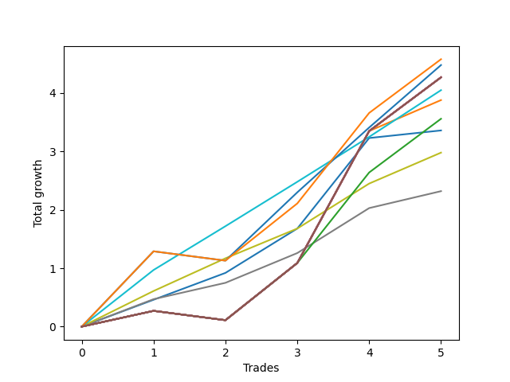

# Short HLT 108 
- Symbol: TSLA_30
- Date Range: 01/10/2024 - 05/17/2024
- Trading Period: 8:30-12:30
- Number of Trades: 5



| Name | Win Percent | Profit | Avg Profit / Trade | Avg Time / Trade |      | Name | Win Percent | Profit | Avg Profit / Trade | Avg Time / Trade |
| ---- | ----------- | ------ | ------------------ | ---------------- | ---- | ---- | ----------- | ------ | ------------------ | ---------------- |
| Sorted By <br> Profit | | | | | | Sorted By <br> Win Percentage ||||
| TP-1.25 | 80.00 | 2290.00 | 458.00 | 24:48 |     | TP-0.75 | 100.00 | 2025.00 | 405.00 | 11:00 |
| TP-1 | 80.00 | 2240.00 | 448.00 | 19:12 |     | BB-20 Mid | 100.00 | 1680.00 | 336.00 | 10:48 |
| NEWFI 000 | 80.00 | 2135.00 | 427.00 | 29:00 |     | TP-0.5 | 100.00 | 1490.00 | 298.00 | 06:24 |
| TP-2 | 80.00 | 2135.00 | 427.00 | 29:00 |     | TP-0.25 | 100.00 | 1160.00 | 232.00 | 04:24 |
| TP-1.75 | 80.00 | 2135.00 | 427.00 | 29:00 |     | TP-1.25 | 80.00 | 2290.00 | 458.00 | 24:48 |
| BB-50 U/L 2SD | 80.00 | 2135.00 | 427.00 | 29:00 |     | TP-1 | 80.00 | 2240.00 | 448.00 | 19:12 |
| BB-50 U/L 1SD | 80.00 | 2135.00 | 427.00 | 29:00 |     | NEWFI 000 | 80.00 | 2135.00 | 427.00 | 29:00 |
| BB-50 Mid | 80.00 | 2135.00 | 427.00 | 29:00 |     | TP-2 | 80.00 | 2135.00 | 427.00 | 29:00 |
| BB-20 U/L 2SD C | 80.00 | 2135.00 | 427.00 | 29:00 |     | TP-1.75 | 80.00 | 2135.00 | 427.00 | 29:00 |
| BB-20 U/L 2SD | 80.00 | 2135.00 | 427.00 | 29:00 |     | BB-50 U/L 2SD | 80.00 | 2135.00 | 427.00 | 29:00 |
| TP-0.75 | 100.00 | 2025.00 | 405.00 | 11:00 |     | BB-50 U/L 1SD | 80.00 | 2135.00 | 427.00 | 29:00 |
| BB-20 U/L 1SD | 80.00 | 1940.00 | 388.00 | 26:24 |     | BB-50 Mid | 80.00 | 2135.00 | 427.00 | 29:00 |
| TP-1.5 | 80.00 | 1780.00 | 356.00 | 28:36 |     | BB-20 U/L 2SD C | 80.00 | 2135.00 | 427.00 | 29:00 |
| BB-20 Mid | 100.00 | 1680.00 | 336.00 | 10:48 |     | BB-20 U/L 2SD | 80.00 | 2135.00 | 427.00 | 29:00 |
| TP-0.5 | 100.00 | 1490.00 | 298.00 | 06:24 |     | BB-20 U/L 1SD | 80.00 | 1940.00 | 388.00 | 26:24 |
| TP-0.25 | 100.00 | 1160.00 | 232.00 | 04:24 |     | TP-1.5 | 80.00 | 1780.00 | 356.00 | 28:36 |

## NO STOPLOSS

### Test BB-20 Mid
* Sell when price hits the middle line of the 20p bollinger
* No Stoploss
* Results:
```
Total Trades: 5
Percent Up: 0.00
Percent Down: 100.00
Total Points Moved Down: 3.36
Potential Profit: 1680.00
Total Points Ups: 0.00 Count Ups: 0
Total Points Downs: 3.36 Count Downs: 5
```

<details><summary>Trades</summary>

<code>In: 2024-02-07 11:10:00		Out: 2024-02-07 11:16:00		Total Position Time: 06:00		Total Move Down: 0.46		Total to Date: 0.46</code> <br />
<code>In: 2024-02-14 11:00:00		Out: 2024-02-14 11:06:00		Total Position Time: 06:00		Total Move Down: 0.46		Total to Date: 0.92</code> <br />
<code>In: 2024-04-08 08:35:00		Out: 2024-04-08 08:48:00		Total Position Time: 13:00		Total Move Down: 0.76		Total to Date: 1.68</code> <br />
<code>In: 2024-04-29 09:40:00		Out: 2024-04-29 10:07:00		Total Position Time: 27:00		Total Move Down: 1.55		Total to Date: 3.23</code> <br />
<code>In: 2024-05-17 09:45:00		Out: 2024-05-17 09:47:00		Total Position Time: 02:00		Total Move Down: 0.13		Total to Date: 3.36</code> <br />


</details>

### Test BB-20 U/L 1SD
* Sell when the price hits the lower line of the 20p 1std bollinger
* No Stoploss
* Results:
```
Total Trades: 5
Percent Up: 20.00
Percent Down: 80.00
Total Points Moved Down: 3.88
Potential Profit: 1940.00
Total Points Ups: 0.16 Count Ups: 1
Total Points Downs: 4.04 Count Downs: 4
```

<details><summary>Trades</summary>

<code>In: 2024-02-07 11:10:00		Out: 2024-02-07 11:39:00		Total Position Time: 29:00		Total Move Down: 0.27		Total to Date: 0.27</code> <br />
<code>In: 2024-02-14 11:00:00		Out: 2024-02-14 11:29:00		Total Position Time: 29:00		Total Move Down: -0.16		Total to Date: 0.11</code> <br />
<code>In: 2024-04-08 08:35:00		Out: 2024-04-08 09:04:00		Total Position Time: 29:00		Total Move Down: 0.98		Total to Date: 1.09</code> <br />
<code>In: 2024-04-29 09:40:00		Out: 2024-04-29 10:09:00		Total Position Time: 29:00		Total Move Down: 2.26		Total to Date: 3.35</code> <br />
<code>In: 2024-05-17 09:45:00		Out: 2024-05-17 10:01:00		Total Position Time: 16:00		Total Move Down: 0.53		Total to Date: 3.88</code> <br />


</details>

### Test BB-20 U/L 2SD
* Sell when the price hits the lower line of the 20p 2std bollinger
* No Stoploss
* Results:
```
Total Trades: 5
Percent Up: 20.00
Percent Down: 80.00
Total Points Moved Down: 4.27
Potential Profit: 2135.00
Total Points Ups: 0.16 Count Ups: 1
Total Points Downs: 4.43 Count Downs: 4
```

<details><summary>Trades</summary>

<code>In: 2024-02-07 11:10:00		Out: 2024-02-07 11:39:00		Total Position Time: 29:00		Total Move Down: 0.27		Total to Date: 0.27</code> <br />
<code>In: 2024-02-14 11:00:00		Out: 2024-02-14 11:29:00		Total Position Time: 29:00		Total Move Down: -0.16		Total to Date: 0.11</code> <br />
<code>In: 2024-04-08 08:35:00		Out: 2024-04-08 09:04:00		Total Position Time: 29:00		Total Move Down: 0.98		Total to Date: 1.09</code> <br />
<code>In: 2024-04-29 09:40:00		Out: 2024-04-29 10:09:00		Total Position Time: 29:00		Total Move Down: 2.26		Total to Date: 3.35</code> <br />
<code>In: 2024-05-17 09:45:00		Out: 2024-05-17 10:14:00		Total Position Time: 29:00		Total Move Down: 0.92		Total to Date: 4.27</code> <br />


</details>

### Test BB-20 U/L 2SD C
* Sell when the price hits the lower line of the 20p 2std bollinger
* No Stoploss
* Results:
```
Total Trades: 5
Percent Up: 20.00
Percent Down: 80.00
Total Points Moved Down: 4.27
Potential Profit: 2135.00
Total Points Ups: 0.16 Count Ups: 1
Total Points Downs: 4.43 Count Downs: 4
```

<details><summary>Trades</summary>

<code>In: 2024-02-07 11:10:00		Out: 2024-02-07 11:39:00		Total Position Time: 29:00		Total Move Down: 0.27		Total to Date: 0.27</code> <br />
<code>In: 2024-02-14 11:00:00		Out: 2024-02-14 11:29:00		Total Position Time: 29:00		Total Move Down: -0.16		Total to Date: 0.11</code> <br />
<code>In: 2024-04-08 08:35:00		Out: 2024-04-08 09:04:00		Total Position Time: 29:00		Total Move Down: 0.98		Total to Date: 1.09</code> <br />
<code>In: 2024-04-29 09:40:00		Out: 2024-04-29 10:09:00		Total Position Time: 29:00		Total Move Down: 2.26		Total to Date: 3.35</code> <br />
<code>In: 2024-05-17 09:45:00		Out: 2024-05-17 10:14:00		Total Position Time: 29:00		Total Move Down: 0.92		Total to Date: 4.27</code> <br />


</details>

### Test BB-50 Mid
* Sell when price hits the middle line of the 50p bollinger
* No Stoploss
* Results:
```
Total Trades: 5
Percent Up: 20.00
Percent Down: 80.00
Total Points Moved Down: 4.27
Potential Profit: 2135.00
Total Points Ups: 0.16 Count Ups: 1
Total Points Downs: 4.43 Count Downs: 4
```

<details><summary>Trades</summary>

<code>In: 2024-02-07 11:10:00		Out: 2024-02-07 11:39:00		Total Position Time: 29:00		Total Move Down: 0.27		Total to Date: 0.27</code> <br />
<code>In: 2024-02-14 11:00:00		Out: 2024-02-14 11:29:00		Total Position Time: 29:00		Total Move Down: -0.16		Total to Date: 0.11</code> <br />
<code>In: 2024-04-08 08:35:00		Out: 2024-04-08 09:04:00		Total Position Time: 29:00		Total Move Down: 0.98		Total to Date: 1.09</code> <br />
<code>In: 2024-04-29 09:40:00		Out: 2024-04-29 10:09:00		Total Position Time: 29:00		Total Move Down: 2.26		Total to Date: 3.35</code> <br />
<code>In: 2024-05-17 09:45:00		Out: 2024-05-17 10:14:00		Total Position Time: 29:00		Total Move Down: 0.92		Total to Date: 4.27</code> <br />


</details>

### Test BB-50 U/L 1SD
* Sell when the price hits the lower line of the 50p 1std bollinger
* No Stoploss
* Results:
```
Total Trades: 5
Percent Up: 20.00
Percent Down: 80.00
Total Points Moved Down: 4.27
Potential Profit: 2135.00
Total Points Ups: 0.16 Count Ups: 1
Total Points Downs: 4.43 Count Downs: 4
```

<details><summary>Trades</summary>

<code>In: 2024-02-07 11:10:00		Out: 2024-02-07 11:39:00		Total Position Time: 29:00		Total Move Down: 0.27		Total to Date: 0.27</code> <br />
<code>In: 2024-02-14 11:00:00		Out: 2024-02-14 11:29:00		Total Position Time: 29:00		Total Move Down: -0.16		Total to Date: 0.11</code> <br />
<code>In: 2024-04-08 08:35:00		Out: 2024-04-08 09:04:00		Total Position Time: 29:00		Total Move Down: 0.98		Total to Date: 1.09</code> <br />
<code>In: 2024-04-29 09:40:00		Out: 2024-04-29 10:09:00		Total Position Time: 29:00		Total Move Down: 2.26		Total to Date: 3.35</code> <br />
<code>In: 2024-05-17 09:45:00		Out: 2024-05-17 10:14:00		Total Position Time: 29:00		Total Move Down: 0.92		Total to Date: 4.27</code> <br />


</details>

### Test BB-50 U/L 2SD
* Sell when the price hits the lower line of the 50p 2std bollinger
* No Stoploss
* Results:
```
Total Trades: 5
Percent Up: 20.00
Percent Down: 80.00
Total Points Moved Down: 4.27
Potential Profit: 2135.00
Total Points Ups: 0.16 Count Ups: 1
Total Points Downs: 4.43 Count Downs: 4
```

<details><summary>Trades</summary>

<code>In: 2024-02-07 11:10:00		Out: 2024-02-07 11:39:00		Total Position Time: 29:00		Total Move Down: 0.27		Total to Date: 0.27</code> <br />
<code>In: 2024-02-14 11:00:00		Out: 2024-02-14 11:29:00		Total Position Time: 29:00		Total Move Down: -0.16		Total to Date: 0.11</code> <br />
<code>In: 2024-04-08 08:35:00		Out: 2024-04-08 09:04:00		Total Position Time: 29:00		Total Move Down: 0.98		Total to Date: 1.09</code> <br />
<code>In: 2024-04-29 09:40:00		Out: 2024-04-29 10:09:00		Total Position Time: 29:00		Total Move Down: 2.26		Total to Date: 3.35</code> <br />
<code>In: 2024-05-17 09:45:00		Out: 2024-05-17 10:14:00		Total Position Time: 29:00		Total Move Down: 0.92		Total to Date: 4.27</code> <br />


</details>

## TAKE PROFIT

### Test TP-0.25
* Take Profit of 0.25 Point
* 0.25 Stoploss
* Results:
```
Total Trades: 5
Percent Up: 0.00
Percent Down: 100.00
Total Points Moved Down: 2.32
Potential Profit: 1160.00
Total Points Ups: 0.00 Count Ups: 0
Total Points Downs: 2.32 Count Downs: 5
```

<details><summary>Trades</summary>

<code>In: 2024-02-07 11:10:00		Out: 2024-02-07 11:13:00		Total Position Time: 03:00		Total Move Down: 0.47		Total to Date: 0.47</code> <br />
<code>In: 2024-02-14 11:00:00		Out: 2024-02-14 11:05:00		Total Position Time: 05:00		Total Move Down: 0.28		Total to Date: 0.75</code> <br />
<code>In: 2024-04-08 08:35:00		Out: 2024-04-08 08:37:00		Total Position Time: 02:00		Total Move Down: 0.51		Total to Date: 1.26</code> <br />
<code>In: 2024-04-29 09:40:00		Out: 2024-04-29 09:42:00		Total Position Time: 02:00		Total Move Down: 0.77		Total to Date: 2.03</code> <br />
<code>In: 2024-05-17 09:45:00		Out: 2024-05-17 09:55:00		Total Position Time: 10:00		Total Move Down: 0.29		Total to Date: 2.32</code> <br />


</details>

### Test TP-0.5
* Take Profit of 0.5 Point
* 0.5 Stoploss
* Results:
```
Total Trades: 5
Percent Up: 0.00
Percent Down: 100.00
Total Points Moved Down: 2.98
Potential Profit: 1490.00
Total Points Ups: 0.00 Count Ups: 0
Total Points Downs: 2.98 Count Downs: 5
```

<details><summary>Trades</summary>

<code>In: 2024-02-07 11:10:00		Out: 2024-02-07 11:14:00		Total Position Time: 04:00		Total Move Down: 0.61		Total to Date: 0.61</code> <br />
<code>In: 2024-02-14 11:00:00		Out: 2024-02-14 11:08:00		Total Position Time: 08:00		Total Move Down: 0.56		Total to Date: 1.17</code> <br />
<code>In: 2024-04-08 08:35:00		Out: 2024-04-08 08:37:00		Total Position Time: 02:00		Total Move Down: 0.51		Total to Date: 1.68</code> <br />
<code>In: 2024-04-29 09:40:00		Out: 2024-04-29 09:42:00		Total Position Time: 02:00		Total Move Down: 0.77		Total to Date: 2.45</code> <br />
<code>In: 2024-05-17 09:45:00		Out: 2024-05-17 10:01:00		Total Position Time: 16:00		Total Move Down: 0.53		Total to Date: 2.98</code> <br />


</details>

### Test TP-0.75
* Take Profit of 0.75 Point
* 0.75 Stoploss
* Results:
```
Total Trades: 5
Percent Up: 0.00
Percent Down: 100.00
Total Points Moved Down: 4.05
Potential Profit: 2025.00
Total Points Ups: 0.00 Count Ups: 0
Total Points Downs: 4.05 Count Downs: 5
```

<details><summary>Trades</summary>

<code>In: 2024-02-07 11:10:00		Out: 2024-02-07 11:18:00		Total Position Time: 08:00		Total Move Down: 0.97		Total to Date: 0.97</code> <br />
<code>In: 2024-02-14 11:00:00		Out: 2024-02-14 11:12:00		Total Position Time: 12:00		Total Move Down: 0.75		Total to Date: 1.72</code> <br />
<code>In: 2024-04-08 08:35:00		Out: 2024-04-08 08:48:00		Total Position Time: 13:00		Total Move Down: 0.76		Total to Date: 2.48</code> <br />
<code>In: 2024-04-29 09:40:00		Out: 2024-04-29 09:42:00		Total Position Time: 02:00		Total Move Down: 0.77		Total to Date: 3.25</code> <br />
<code>In: 2024-05-17 09:45:00		Out: 2024-05-17 10:05:00		Total Position Time: 20:00		Total Move Down: 0.80		Total to Date: 4.05</code> <br />


</details>

### Test TP-1
* Take Profit of 1 Point
* 1 Stoploss
* Results:
```
Total Trades: 5
Percent Up: 20.00
Percent Down: 80.00
Total Points Moved Down: 4.48
Potential Profit: 2240.00
Total Points Ups: 0.16 Count Ups: 1
Total Points Downs: 4.64 Count Downs: 4
```

<details><summary>Trades</summary>

<code>In: 2024-02-07 11:10:00		Out: 2024-02-07 11:20:00		Total Position Time: 10:00		Total Move Down: 1.29		Total to Date: 1.29</code> <br />
<code>In: 2024-02-14 11:00:00		Out: 2024-02-14 11:29:00		Total Position Time: 29:00		Total Move Down: -0.16		Total to Date: 1.13</code> <br />
<code>In: 2024-04-08 08:35:00		Out: 2024-04-08 09:02:00		Total Position Time: 27:00		Total Move Down: 1.17		Total to Date: 2.30</code> <br />
<code>In: 2024-04-29 09:40:00		Out: 2024-04-29 09:45:00		Total Position Time: 05:00		Total Move Down: 1.11		Total to Date: 3.41</code> <br />
<code>In: 2024-05-17 09:45:00		Out: 2024-05-17 10:10:00		Total Position Time: 25:00		Total Move Down: 1.07		Total to Date: 4.48</code> <br />


</details>

### Test TP-1.25
* Take Profit of 1.25 Point
* 1.25 Stoploss
* Results:
```
Total Trades: 5
Percent Up: 20.00
Percent Down: 80.00
Total Points Moved Down: 4.58
Potential Profit: 2290.00
Total Points Ups: 0.16 Count Ups: 1
Total Points Downs: 4.74 Count Downs: 4
```

<details><summary>Trades</summary>

<code>In: 2024-02-07 11:10:00		Out: 2024-02-07 11:20:00		Total Position Time: 10:00		Total Move Down: 1.29		Total to Date: 1.29</code> <br />
<code>In: 2024-02-14 11:00:00		Out: 2024-02-14 11:29:00		Total Position Time: 29:00		Total Move Down: -0.16		Total to Date: 1.13</code> <br />
<code>In: 2024-04-08 08:35:00		Out: 2024-04-08 09:04:00		Total Position Time: 29:00		Total Move Down: 0.98		Total to Date: 2.11</code> <br />
<code>In: 2024-04-29 09:40:00		Out: 2024-04-29 10:07:00		Total Position Time: 27:00		Total Move Down: 1.55		Total to Date: 3.66</code> <br />
<code>In: 2024-05-17 09:45:00		Out: 2024-05-17 10:14:00		Total Position Time: 29:00		Total Move Down: 0.92		Total to Date: 4.58</code> <br />


</details>

### Test TP-1.5
* Take Profit of 1.5 Point
* 1.5 Stoploss
* Results:
```
Total Trades: 5
Percent Up: 20.00
Percent Down: 80.00
Total Points Moved Down: 3.56
Potential Profit: 1780.00
Total Points Ups: 0.16 Count Ups: 1
Total Points Downs: 3.72 Count Downs: 4
```

<details><summary>Trades</summary>

<code>In: 2024-02-07 11:10:00		Out: 2024-02-07 11:39:00		Total Position Time: 29:00		Total Move Down: 0.27		Total to Date: 0.27</code> <br />
<code>In: 2024-02-14 11:00:00		Out: 2024-02-14 11:29:00		Total Position Time: 29:00		Total Move Down: -0.16		Total to Date: 0.11</code> <br />
<code>In: 2024-04-08 08:35:00		Out: 2024-04-08 09:04:00		Total Position Time: 29:00		Total Move Down: 0.98		Total to Date: 1.09</code> <br />
<code>In: 2024-04-29 09:40:00		Out: 2024-04-29 10:07:00		Total Position Time: 27:00		Total Move Down: 1.55		Total to Date: 2.64</code> <br />
<code>In: 2024-05-17 09:45:00		Out: 2024-05-17 10:14:00		Total Position Time: 29:00		Total Move Down: 0.92		Total to Date: 3.56</code> <br />


</details>

### Test TP-1.75
* Take Profit of 1.75 Point
* 1.75 Stoploss
* Results:
```
Total Trades: 5
Percent Up: 20.00
Percent Down: 80.00
Total Points Moved Down: 4.27
Potential Profit: 2135.00
Total Points Ups: 0.16 Count Ups: 1
Total Points Downs: 4.43 Count Downs: 4
```

<details><summary>Trades</summary>

<code>In: 2024-02-07 11:10:00		Out: 2024-02-07 11:39:00		Total Position Time: 29:00		Total Move Down: 0.27		Total to Date: 0.27</code> <br />
<code>In: 2024-02-14 11:00:00		Out: 2024-02-14 11:29:00		Total Position Time: 29:00		Total Move Down: -0.16		Total to Date: 0.11</code> <br />
<code>In: 2024-04-08 08:35:00		Out: 2024-04-08 09:04:00		Total Position Time: 29:00		Total Move Down: 0.98		Total to Date: 1.09</code> <br />
<code>In: 2024-04-29 09:40:00		Out: 2024-04-29 10:09:00		Total Position Time: 29:00		Total Move Down: 2.26		Total to Date: 3.35</code> <br />
<code>In: 2024-05-17 09:45:00		Out: 2024-05-17 10:14:00		Total Position Time: 29:00		Total Move Down: 0.92		Total to Date: 4.27</code> <br />


</details>

### Test TP-2
* Take Profit of 2 Point
* 2 Stoploss
* Results:
```
Total Trades: 5
Percent Up: 20.00
Percent Down: 80.00
Total Points Moved Down: 4.27
Potential Profit: 2135.00
Total Points Ups: 0.16 Count Ups: 1
Total Points Downs: 4.43 Count Downs: 4
```

<details><summary>Trades</summary>

<code>In: 2024-02-07 11:10:00		Out: 2024-02-07 11:39:00		Total Position Time: 29:00		Total Move Down: 0.27		Total to Date: 0.27</code> <br />
<code>In: 2024-02-14 11:00:00		Out: 2024-02-14 11:29:00		Total Position Time: 29:00		Total Move Down: -0.16		Total to Date: 0.11</code> <br />
<code>In: 2024-04-08 08:35:00		Out: 2024-04-08 09:04:00		Total Position Time: 29:00		Total Move Down: 0.98		Total to Date: 1.09</code> <br />
<code>In: 2024-04-29 09:40:00		Out: 2024-04-29 10:09:00		Total Position Time: 29:00		Total Move Down: 2.26		Total to Date: 3.35</code> <br />
<code>In: 2024-05-17 09:45:00		Out: 2024-05-17 10:14:00		Total Position Time: 29:00		Total Move Down: 0.92		Total to Date: 4.27</code> <br />


</details>

## Indicator Exits

### Test NEWFI 000
* Newfi 0000
* No Stoploss
* Results:
```
Total Trades: 5
Percent Up: 20.00
Percent Down: 80.00
Total Points Moved Down: 4.27
Potential Profit: 2135.00
Total Points Ups: 0.16 Count Ups: 1
Total Points Downs: 4.43 Count Downs: 4
```

<details><summary>Trades</summary>

<code>In: 2024-02-07 11:10:00		Out: 2024-02-07 11:39:00		Total Position Time: 29:00		Total Move Down: 0.27		Total to Date: 0.27</code> <br />
<code>In: 2024-02-14 11:00:00		Out: 2024-02-14 11:29:00		Total Position Time: 29:00		Total Move Down: -0.16		Total to Date: 0.11</code> <br />
<code>In: 2024-04-08 08:35:00		Out: 2024-04-08 09:04:00		Total Position Time: 29:00		Total Move Down: 0.98		Total to Date: 1.09</code> <br />
<code>In: 2024-04-29 09:40:00		Out: 2024-04-29 10:09:00		Total Position Time: 29:00		Total Move Down: 2.26		Total to Date: 3.35</code> <br />
<code>In: 2024-05-17 09:45:00		Out: 2024-05-17 10:14:00		Total Position Time: 29:00		Total Move Down: 0.92		Total to Date: 4.27</code> <br />


</details>