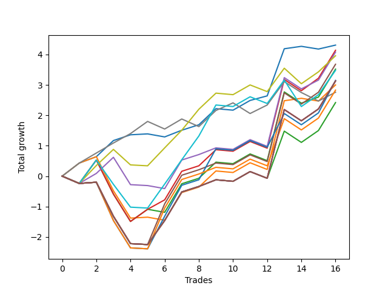

# Short HLT 111 
- Symbol: TSLA_30
- Date Range: 01/10/2024 - 05/17/2024
- Trading Period: 8:30-12:30
- Number of Trades: 16



| Name | Win Percent | Profit | Avg Profit / Trade | Avg Time / Trade |      | Name | Win Percent | Profit | Avg Profit / Trade | Avg Time / Trade |
| ---- | ----------- | ------ | ------------------ | ---------------- | ---- | ---- | ----------- | ------ | ------------------ | ---------------- |
| Sorted By <br> Profit | | | | | | Sorted By <br> Win Percentage ||||
| BB-20 Mid | 81.25 | 2155.00 | 134.69 | 09:00 |     | BB-20 Mid | 81.25 | 2155.00 | 134.69 | 09:00 |
| BB-20 U/L 2SD C | 62.50 | 2070.00 | 129.37 | 23:41 |     | TP-0.25 | 68.75 | 1380.00 | 86.25 | 06:37 |
| BB-50 Mid | 56.25 | 2040.00 | 127.50 | 23:41 |     | BB-20 U/L 2SD C | 62.50 | 2070.00 | 129.37 | 23:41 |
| TP-0.5 | 62.50 | 1980.00 | 123.75 | 16:18 |     | TP-0.5 | 62.50 | 1980.00 | 123.75 | 16:18 |
| BB-50 U/L 1SD | 56.25 | 1840.00 | 115.00 | 28:30 |     | BB-20 U/L 1SD | 62.50 | 1500.00 | 93.75 | 15:15 |
| BB-20 U/L 2SD | 56.25 | 1760.00 | 110.00 | 23:15 |     | BB-50 Mid | 56.25 | 2040.00 | 127.50 | 23:41 |
| TP-0.75 | 56.25 | 1740.00 | 108.75 | 18:56 |     | BB-50 U/L 1SD | 56.25 | 1840.00 | 115.00 | 28:30 |
| TP-1 | 56.25 | 1575.00 | 98.44 | 24:07 |     | BB-20 U/L 2SD | 56.25 | 1760.00 | 110.00 | 23:15 |
| NEWFI 000 | 56.25 | 1565.00 | 97.81 | 29:00 |     | TP-0.75 | 56.25 | 1740.00 | 108.75 | 18:56 |
| TP-2 | 56.25 | 1565.00 | 97.81 | 29:00 |     | TP-1 | 56.25 | 1575.00 | 98.44 | 24:07 |
| TP-1.75 | 56.25 | 1565.00 | 97.81 | 29:00 |     | NEWFI 000 | 56.25 | 1565.00 | 97.81 | 29:00 |
| BB-50 U/L 2SD | 56.25 | 1565.00 | 97.81 | 29:00 |     | TP-2 | 56.25 | 1565.00 | 97.81 | 29:00 |
| BB-20 U/L 1SD | 62.50 | 1500.00 | 93.75 | 15:15 |     | TP-1.75 | 56.25 | 1565.00 | 97.81 | 29:00 |
| TP-1.25 | 56.25 | 1415.00 | 88.44 | 28:03 |     | BB-50 U/L 2SD | 56.25 | 1565.00 | 97.81 | 29:00 |
| TP-0.25 | 68.75 | 1380.00 | 86.25 | 06:37 |     | TP-1.25 | 56.25 | 1415.00 | 88.44 | 28:03 |
| TP-1.5 | 56.25 | 1210.00 | 75.62 | 28:52 |     | TP-1.5 | 56.25 | 1210.00 | 75.62 | 28:52 |

## NO STOPLOSS

### Test BB-20 Mid
* Sell when price hits the middle line of the 20p bollinger
* No Stoploss
* Results:
```
Total Trades: 16
Percent Up: 18.75
Percent Down: 81.25
Total Points Moved Down: 4.31
Potential Profit: 2155.00
Total Points Ups: 0.24 Count Ups: 3
Total Points Downs: 4.55 Count Downs: 13
```

<details><summary>Trades</summary>

<code>In: 2024-01-19 12:20:00		Out: 2024-01-19 12:22:00		Total Position Time: 02:00		Total Move Down: 0.43		Total to Date: 0.43</code> <br />
<code>In: 2024-01-24 10:00:00		Out: 2024-01-24 10:02:00		Total Position Time: 02:00		Total Move Down: 0.21		Total to Date: 0.64</code> <br />
<code>In: 2024-01-29 11:45:00		Out: 2024-01-29 11:50:00		Total Position Time: 05:00		Total Move Down: 0.53		Total to Date: 1.17</code> <br />
<code>In: 2024-02-15 11:10:00		Out: 2024-02-15 11:12:00		Total Position Time: 02:00		Total Move Down: 0.19		Total to Date: 1.36</code> <br />
<code>In: 2024-02-22 11:40:00		Out: 2024-02-22 11:42:00		Total Position Time: 02:00		Total Move Down: 0.03		Total to Date: 1.39</code> <br />
<code>In: 2024-03-06 10:55:00		Out: 2024-03-06 10:57:00		Total Position Time: 02:00		Total Move Down: -0.10		Total to Date: 1.29</code> <br />
<code>In: 2024-03-12 09:30:00		Out: 2024-03-12 09:34:00		Total Position Time: 04:00		Total Move Down: 0.22		Total to Date: 1.51</code> <br />
<code>In: 2024-03-18 08:35:00		Out: 2024-03-18 09:04:00		Total Position Time: 29:00		Total Move Down: 0.18		Total to Date: 1.69</code> <br />
<code>In: 2024-03-18 10:00:00		Out: 2024-03-18 10:02:00		Total Position Time: 02:00		Total Move Down: 0.53		Total to Date: 2.22</code> <br />
<code>In: 2024-03-25 10:10:00		Out: 2024-03-25 10:39:00		Total Position Time: 29:00		Total Move Down: -0.05		Total to Date: 2.17</code> <br />
<code>In: 2024-04-04 10:10:00		Out: 2024-04-04 10:39:00		Total Position Time: 29:00		Total Move Down: 0.32		Total to Date: 2.49</code> <br />
<code>In: 2024-04-11 11:45:00		Out: 2024-04-11 11:48:00		Total Position Time: 03:00		Total Move Down: 0.15		Total to Date: 2.64</code> <br />
<code>In: 2024-04-29 09:40:00		Out: 2024-04-29 10:07:00		Total Position Time: 27:00		Total Move Down: 1.55		Total to Date: 4.19</code> <br />
<code>In: 2024-05-03 12:00:00		Out: 2024-05-03 12:02:00		Total Position Time: 02:00		Total Move Down: 0.08		Total to Date: 4.27</code> <br />
<code>In: 2024-05-06 11:40:00		Out: 2024-05-06 11:42:00		Total Position Time: 02:00		Total Move Down: -0.09		Total to Date: 4.18</code> <br />
<code>In: 2024-05-17 09:45:00		Out: 2024-05-17 09:47:00		Total Position Time: 02:00		Total Move Down: 0.13		Total to Date: 4.31</code> <br />


</details>

### Test BB-20 U/L 1SD
* Sell when the price hits the lower line of the 20p 1std bollinger
* No Stoploss
* Results:
```
Total Trades: 16
Percent Up: 37.50
Percent Down: 62.50
Total Points Moved Down: 3.00
Potential Profit: 1500.00
Total Points Ups: 2.48 Count Ups: 6
Total Points Downs: 5.48 Count Downs: 10
```

<details><summary>Trades</summary>

<code>In: 2024-01-19 12:20:00		Out: 2024-01-19 12:22:00		Total Position Time: 02:00		Total Move Down: 0.43		Total to Date: 0.43</code> <br />
<code>In: 2024-01-24 10:00:00		Out: 2024-01-24 10:02:00		Total Position Time: 02:00		Total Move Down: 0.21		Total to Date: 0.64</code> <br />
<code>In: 2024-01-29 11:45:00		Out: 2024-01-29 12:14:00		Total Position Time: 29:00		Total Move Down: -1.12		Total to Date: -0.48</code> <br />
<code>In: 2024-02-15 11:10:00		Out: 2024-02-15 11:39:00		Total Position Time: 29:00		Total Move Down: -0.90		Total to Date: -1.38</code> <br />
<code>In: 2024-02-22 11:40:00		Out: 2024-02-22 11:42:00		Total Position Time: 02:00		Total Move Down: 0.03		Total to Date: -1.35</code> <br />
<code>In: 2024-03-06 10:55:00		Out: 2024-03-06 10:57:00		Total Position Time: 02:00		Total Move Down: -0.10		Total to Date: -1.45</code> <br />
<code>In: 2024-03-12 09:30:00		Out: 2024-03-12 09:41:00		Total Position Time: 11:00		Total Move Down: 0.91		Total to Date: -0.54</code> <br />
<code>In: 2024-03-18 08:35:00		Out: 2024-03-18 09:04:00		Total Position Time: 29:00		Total Move Down: 0.18		Total to Date: -0.36</code> <br />
<code>In: 2024-03-18 10:00:00		Out: 2024-03-18 10:02:00		Total Position Time: 02:00		Total Move Down: 0.53		Total to Date: 0.17</code> <br />
<code>In: 2024-03-25 10:10:00		Out: 2024-03-25 10:39:00		Total Position Time: 29:00		Total Move Down: -0.05		Total to Date: 0.12</code> <br />
<code>In: 2024-04-04 10:10:00		Out: 2024-04-04 10:39:00		Total Position Time: 29:00		Total Move Down: 0.32		Total to Date: 0.44</code> <br />
<code>In: 2024-04-11 11:45:00		Out: 2024-04-11 12:14:00		Total Position Time: 29:00		Total Move Down: -0.22		Total to Date: 0.22</code> <br />
<code>In: 2024-04-29 09:40:00		Out: 2024-04-29 10:09:00		Total Position Time: 29:00		Total Move Down: 2.26		Total to Date: 2.48</code> <br />
<code>In: 2024-05-03 12:00:00		Out: 2024-05-03 12:02:00		Total Position Time: 02:00		Total Move Down: 0.08		Total to Date: 2.56</code> <br />
<code>In: 2024-05-06 11:40:00		Out: 2024-05-06 11:42:00		Total Position Time: 02:00		Total Move Down: -0.09		Total to Date: 2.47</code> <br />
<code>In: 2024-05-17 09:45:00		Out: 2024-05-17 10:01:00		Total Position Time: 16:00		Total Move Down: 0.53		Total to Date: 3.00</code> <br />


</details>

### Test BB-20 U/L 2SD
* Sell when the price hits the lower line of the 20p 2std bollinger
* No Stoploss
* Results:
```
Total Trades: 16
Percent Up: 43.75
Percent Down: 56.25
Total Points Moved Down: 3.52
Potential Profit: 1760.00
Total Points Ups: 3.00 Count Ups: 7
Total Points Downs: 6.52 Count Downs: 9
```

<details><summary>Trades</summary>

<code>In: 2024-01-19 12:20:00		Out: 2024-01-19 12:49:00		Total Position Time: 29:00		Total Move Down: -0.24		Total to Date: -0.24</code> <br />
<code>In: 2024-01-24 10:00:00		Out: 2024-01-24 10:15:00		Total Position Time: 15:00		Total Move Down: 0.77		Total to Date: 0.53</code> <br />
<code>In: 2024-01-29 11:45:00		Out: 2024-01-29 12:14:00		Total Position Time: 29:00		Total Move Down: -1.12		Total to Date: -0.59</code> <br />
<code>In: 2024-02-15 11:10:00		Out: 2024-02-15 11:39:00		Total Position Time: 29:00		Total Move Down: -0.90		Total to Date: -1.49</code> <br />
<code>In: 2024-02-22 11:40:00		Out: 2024-02-22 11:51:00		Total Position Time: 11:00		Total Move Down: 0.40		Total to Date: -1.09</code> <br />
<code>In: 2024-03-06 10:55:00		Out: 2024-03-06 10:57:00		Total Position Time: 02:00		Total Move Down: -0.10		Total to Date: -1.19</code> <br />
<code>In: 2024-03-12 09:30:00		Out: 2024-03-12 09:59:00		Total Position Time: 29:00		Total Move Down: 0.94		Total to Date: -0.25</code> <br />
<code>In: 2024-03-18 08:35:00		Out: 2024-03-18 09:04:00		Total Position Time: 29:00		Total Move Down: 0.18		Total to Date: -0.07</code> <br />
<code>In: 2024-03-18 10:00:00		Out: 2024-03-18 10:02:00		Total Position Time: 02:00		Total Move Down: 0.53		Total to Date: 0.46</code> <br />
<code>In: 2024-03-25 10:10:00		Out: 2024-03-25 10:39:00		Total Position Time: 29:00		Total Move Down: -0.05		Total to Date: 0.41</code> <br />
<code>In: 2024-04-04 10:10:00		Out: 2024-04-04 10:39:00		Total Position Time: 29:00		Total Move Down: 0.32		Total to Date: 0.73</code> <br />
<code>In: 2024-04-11 11:45:00		Out: 2024-04-11 12:14:00		Total Position Time: 29:00		Total Move Down: -0.22		Total to Date: 0.51</code> <br />
<code>In: 2024-04-29 09:40:00		Out: 2024-04-29 10:09:00		Total Position Time: 29:00		Total Move Down: 2.26		Total to Date: 2.77</code> <br />
<code>In: 2024-05-03 12:00:00		Out: 2024-05-03 12:29:00		Total Position Time: 29:00		Total Move Down: -0.37		Total to Date: 2.40</code> <br />
<code>In: 2024-05-06 11:40:00		Out: 2024-05-06 12:03:00		Total Position Time: 23:00		Total Move Down: 0.20		Total to Date: 2.60</code> <br />
<code>In: 2024-05-17 09:45:00		Out: 2024-05-17 10:14:00		Total Position Time: 29:00		Total Move Down: 0.92		Total to Date: 3.52</code> <br />


</details>

### Test BB-20 U/L 2SD C
* Sell when the price hits the lower line of the 20p 2std bollinger
* No Stoploss
* Results:
```
Total Trades: 16
Percent Up: 37.50
Percent Down: 62.50
Total Points Moved Down: 4.14
Potential Profit: 2070.00
Total Points Ups: 2.90 Count Ups: 6
Total Points Downs: 7.04 Count Downs: 10
```

<details><summary>Trades</summary>

<code>In: 2024-01-19 12:20:00		Out: 2024-01-19 12:49:00		Total Position Time: 29:00		Total Move Down: -0.24		Total to Date: -0.24</code> <br />
<code>In: 2024-01-24 10:00:00		Out: 2024-01-24 10:15:00		Total Position Time: 15:00		Total Move Down: 0.77		Total to Date: 0.53</code> <br />
<code>In: 2024-01-29 11:45:00		Out: 2024-01-29 12:14:00		Total Position Time: 29:00		Total Move Down: -1.12		Total to Date: -0.59</code> <br />
<code>In: 2024-02-15 11:10:00		Out: 2024-02-15 11:39:00		Total Position Time: 29:00		Total Move Down: -0.90		Total to Date: -1.49</code> <br />
<code>In: 2024-02-22 11:40:00		Out: 2024-02-22 11:51:00		Total Position Time: 11:00		Total Move Down: 0.40		Total to Date: -1.09</code> <br />
<code>In: 2024-03-06 10:55:00		Out: 2024-03-06 11:01:00		Total Position Time: 06:00		Total Move Down: 0.31		Total to Date: -0.78</code> <br />
<code>In: 2024-03-12 09:30:00		Out: 2024-03-12 09:59:00		Total Position Time: 29:00		Total Move Down: 0.94		Total to Date: 0.16</code> <br />
<code>In: 2024-03-18 08:35:00		Out: 2024-03-18 09:04:00		Total Position Time: 29:00		Total Move Down: 0.18		Total to Date: 0.34</code> <br />
<code>In: 2024-03-18 10:00:00		Out: 2024-03-18 10:02:00		Total Position Time: 02:00		Total Move Down: 0.53		Total to Date: 0.87</code> <br />
<code>In: 2024-03-25 10:10:00		Out: 2024-03-25 10:39:00		Total Position Time: 29:00		Total Move Down: -0.05		Total to Date: 0.82</code> <br />
<code>In: 2024-04-04 10:10:00		Out: 2024-04-04 10:39:00		Total Position Time: 29:00		Total Move Down: 0.32		Total to Date: 1.14</code> <br />
<code>In: 2024-04-11 11:45:00		Out: 2024-04-11 12:14:00		Total Position Time: 29:00		Total Move Down: -0.22		Total to Date: 0.92</code> <br />
<code>In: 2024-04-29 09:40:00		Out: 2024-04-29 10:09:00		Total Position Time: 29:00		Total Move Down: 2.26		Total to Date: 3.18</code> <br />
<code>In: 2024-05-03 12:00:00		Out: 2024-05-03 12:29:00		Total Position Time: 29:00		Total Move Down: -0.37		Total to Date: 2.81</code> <br />
<code>In: 2024-05-06 11:40:00		Out: 2024-05-06 12:06:00		Total Position Time: 26:00		Total Move Down: 0.41		Total to Date: 3.22</code> <br />
<code>In: 2024-05-17 09:45:00		Out: 2024-05-17 10:14:00		Total Position Time: 29:00		Total Move Down: 0.92		Total to Date: 4.14</code> <br />


</details>

### Test BB-50 Mid
* Sell when price hits the middle line of the 50p bollinger
* No Stoploss
* Results:
```
Total Trades: 16
Percent Up: 43.75
Percent Down: 56.25
Total Points Moved Down: 4.08
Potential Profit: 2040.00
Total Points Ups: 1.91 Count Ups: 7
Total Points Downs: 5.99 Count Downs: 9
```

<details><summary>Trades</summary>

<code>In: 2024-01-19 12:20:00		Out: 2024-01-19 12:49:00		Total Position Time: 29:00		Total Move Down: -0.24		Total to Date: -0.24</code> <br />
<code>In: 2024-01-24 10:00:00		Out: 2024-01-24 10:03:00		Total Position Time: 03:00		Total Move Down: 0.33		Total to Date: 0.09</code> <br />
<code>In: 2024-01-29 11:45:00		Out: 2024-01-29 11:50:00		Total Position Time: 05:00		Total Move Down: 0.53		Total to Date: 0.62</code> <br />
<code>In: 2024-02-15 11:10:00		Out: 2024-02-15 11:39:00		Total Position Time: 29:00		Total Move Down: -0.90		Total to Date: -0.28</code> <br />
<code>In: 2024-02-22 11:40:00		Out: 2024-02-22 12:09:00		Total Position Time: 29:00		Total Move Down: -0.03		Total to Date: -0.31</code> <br />
<code>In: 2024-03-06 10:55:00		Out: 2024-03-06 10:57:00		Total Position Time: 02:00		Total Move Down: -0.10		Total to Date: -0.41</code> <br />
<code>In: 2024-03-12 09:30:00		Out: 2024-03-12 09:59:00		Total Position Time: 29:00		Total Move Down: 0.94		Total to Date: 0.53</code> <br />
<code>In: 2024-03-18 08:35:00		Out: 2024-03-18 09:04:00		Total Position Time: 29:00		Total Move Down: 0.18		Total to Date: 0.71</code> <br />
<code>In: 2024-03-18 10:00:00		Out: 2024-03-18 10:29:00		Total Position Time: 29:00		Total Move Down: 0.22		Total to Date: 0.93</code> <br />
<code>In: 2024-03-25 10:10:00		Out: 2024-03-25 10:39:00		Total Position Time: 29:00		Total Move Down: -0.05		Total to Date: 0.88</code> <br />
<code>In: 2024-04-04 10:10:00		Out: 2024-04-04 10:39:00		Total Position Time: 29:00		Total Move Down: 0.32		Total to Date: 1.20</code> <br />
<code>In: 2024-04-11 11:45:00		Out: 2024-04-11 12:14:00		Total Position Time: 29:00		Total Move Down: -0.22		Total to Date: 0.98</code> <br />
<code>In: 2024-04-29 09:40:00		Out: 2024-04-29 10:09:00		Total Position Time: 29:00		Total Move Down: 2.26		Total to Date: 3.24</code> <br />
<code>In: 2024-05-03 12:00:00		Out: 2024-05-03 12:29:00		Total Position Time: 29:00		Total Move Down: -0.37		Total to Date: 2.87</code> <br />
<code>In: 2024-05-06 11:40:00		Out: 2024-05-06 12:01:00		Total Position Time: 21:00		Total Move Down: 0.29		Total to Date: 3.16</code> <br />
<code>In: 2024-05-17 09:45:00		Out: 2024-05-17 10:14:00		Total Position Time: 29:00		Total Move Down: 0.92		Total to Date: 4.08</code> <br />


</details>

### Test BB-50 U/L 1SD
* Sell when the price hits the lower line of the 50p 1std bollinger
* No Stoploss
* Results:
```
Total Trades: 16
Percent Up: 43.75
Percent Down: 56.25
Total Points Moved Down: 3.68
Potential Profit: 1840.00
Total Points Ups: 2.93 Count Ups: 7
Total Points Downs: 6.61 Count Downs: 9
```

<details><summary>Trades</summary>

<code>In: 2024-01-19 12:20:00		Out: 2024-01-19 12:49:00		Total Position Time: 29:00		Total Move Down: -0.24		Total to Date: -0.24</code> <br />
<code>In: 2024-01-24 10:00:00		Out: 2024-01-24 10:29:00		Total Position Time: 29:00		Total Move Down: 0.04		Total to Date: -0.20</code> <br />
<code>In: 2024-01-29 11:45:00		Out: 2024-01-29 12:14:00		Total Position Time: 29:00		Total Move Down: -1.12		Total to Date: -1.32</code> <br />
<code>In: 2024-02-15 11:10:00		Out: 2024-02-15 11:39:00		Total Position Time: 29:00		Total Move Down: -0.90		Total to Date: -2.22</code> <br />
<code>In: 2024-02-22 11:40:00		Out: 2024-02-22 12:09:00		Total Position Time: 29:00		Total Move Down: -0.03		Total to Date: -2.25</code> <br />
<code>In: 2024-03-06 10:55:00		Out: 2024-03-06 11:16:00		Total Position Time: 21:00		Total Move Down: 1.34		Total to Date: -0.91</code> <br />
<code>In: 2024-03-12 09:30:00		Out: 2024-03-12 09:59:00		Total Position Time: 29:00		Total Move Down: 0.94		Total to Date: 0.03</code> <br />
<code>In: 2024-03-18 08:35:00		Out: 2024-03-18 09:04:00		Total Position Time: 29:00		Total Move Down: 0.18		Total to Date: 0.21</code> <br />
<code>In: 2024-03-18 10:00:00		Out: 2024-03-18 10:29:00		Total Position Time: 29:00		Total Move Down: 0.22		Total to Date: 0.43</code> <br />
<code>In: 2024-03-25 10:10:00		Out: 2024-03-25 10:39:00		Total Position Time: 29:00		Total Move Down: -0.05		Total to Date: 0.38</code> <br />
<code>In: 2024-04-04 10:10:00		Out: 2024-04-04 10:39:00		Total Position Time: 29:00		Total Move Down: 0.32		Total to Date: 0.70</code> <br />
<code>In: 2024-04-11 11:45:00		Out: 2024-04-11 12:14:00		Total Position Time: 29:00		Total Move Down: -0.22		Total to Date: 0.48</code> <br />
<code>In: 2024-04-29 09:40:00		Out: 2024-04-29 10:09:00		Total Position Time: 29:00		Total Move Down: 2.26		Total to Date: 2.74</code> <br />
<code>In: 2024-05-03 12:00:00		Out: 2024-05-03 12:29:00		Total Position Time: 29:00		Total Move Down: -0.37		Total to Date: 2.37</code> <br />
<code>In: 2024-05-06 11:40:00		Out: 2024-05-06 12:09:00		Total Position Time: 29:00		Total Move Down: 0.39		Total to Date: 2.76</code> <br />
<code>In: 2024-05-17 09:45:00		Out: 2024-05-17 10:14:00		Total Position Time: 29:00		Total Move Down: 0.92		Total to Date: 3.68</code> <br />


</details>

### Test BB-50 U/L 2SD
* Sell when the price hits the lower line of the 50p 2std bollinger
* No Stoploss
* Results:
```
Total Trades: 16
Percent Up: 43.75
Percent Down: 56.25
Total Points Moved Down: 3.13
Potential Profit: 1565.00
Total Points Ups: 2.93 Count Ups: 7
Total Points Downs: 6.06 Count Downs: 9
```

<details><summary>Trades</summary>

<code>In: 2024-01-19 12:20:00		Out: 2024-01-19 12:49:00		Total Position Time: 29:00		Total Move Down: -0.24		Total to Date: -0.24</code> <br />
<code>In: 2024-01-24 10:00:00		Out: 2024-01-24 10:29:00		Total Position Time: 29:00		Total Move Down: 0.04		Total to Date: -0.20</code> <br />
<code>In: 2024-01-29 11:45:00		Out: 2024-01-29 12:14:00		Total Position Time: 29:00		Total Move Down: -1.12		Total to Date: -1.32</code> <br />
<code>In: 2024-02-15 11:10:00		Out: 2024-02-15 11:39:00		Total Position Time: 29:00		Total Move Down: -0.90		Total to Date: -2.22</code> <br />
<code>In: 2024-02-22 11:40:00		Out: 2024-02-22 12:09:00		Total Position Time: 29:00		Total Move Down: -0.03		Total to Date: -2.25</code> <br />
<code>In: 2024-03-06 10:55:00		Out: 2024-03-06 11:24:00		Total Position Time: 29:00		Total Move Down: 0.79		Total to Date: -1.46</code> <br />
<code>In: 2024-03-12 09:30:00		Out: 2024-03-12 09:59:00		Total Position Time: 29:00		Total Move Down: 0.94		Total to Date: -0.52</code> <br />
<code>In: 2024-03-18 08:35:00		Out: 2024-03-18 09:04:00		Total Position Time: 29:00		Total Move Down: 0.18		Total to Date: -0.34</code> <br />
<code>In: 2024-03-18 10:00:00		Out: 2024-03-18 10:29:00		Total Position Time: 29:00		Total Move Down: 0.22		Total to Date: -0.12</code> <br />
<code>In: 2024-03-25 10:10:00		Out: 2024-03-25 10:39:00		Total Position Time: 29:00		Total Move Down: -0.05		Total to Date: -0.17</code> <br />
<code>In: 2024-04-04 10:10:00		Out: 2024-04-04 10:39:00		Total Position Time: 29:00		Total Move Down: 0.32		Total to Date: 0.15</code> <br />
<code>In: 2024-04-11 11:45:00		Out: 2024-04-11 12:14:00		Total Position Time: 29:00		Total Move Down: -0.22		Total to Date: -0.07</code> <br />
<code>In: 2024-04-29 09:40:00		Out: 2024-04-29 10:09:00		Total Position Time: 29:00		Total Move Down: 2.26		Total to Date: 2.19</code> <br />
<code>In: 2024-05-03 12:00:00		Out: 2024-05-03 12:29:00		Total Position Time: 29:00		Total Move Down: -0.37		Total to Date: 1.82</code> <br />
<code>In: 2024-05-06 11:40:00		Out: 2024-05-06 12:09:00		Total Position Time: 29:00		Total Move Down: 0.39		Total to Date: 2.21</code> <br />
<code>In: 2024-05-17 09:45:00		Out: 2024-05-17 10:14:00		Total Position Time: 29:00		Total Move Down: 0.92		Total to Date: 3.13</code> <br />


</details>

## TAKE PROFIT

### Test TP-0.25
* Take Profit of 0.25 Point
* 0.25 Stoploss
* Results:
```
Total Trades: 16
Percent Up: 31.25
Percent Down: 68.75
Total Points Moved Down: 2.76
Potential Profit: 1380.00
Total Points Ups: 1.49 Count Ups: 5
Total Points Downs: 4.25 Count Downs: 11
```

<details><summary>Trades</summary>

<code>In: 2024-01-19 12:20:00		Out: 2024-01-19 12:22:00		Total Position Time: 02:00		Total Move Down: 0.43		Total to Date: 0.43</code> <br />
<code>In: 2024-01-24 10:00:00		Out: 2024-01-24 10:03:00		Total Position Time: 03:00		Total Move Down: 0.33		Total to Date: 0.76</code> <br />
<code>In: 2024-01-29 11:45:00		Out: 2024-01-29 11:49:00		Total Position Time: 04:00		Total Move Down: 0.33		Total to Date: 1.09</code> <br />
<code>In: 2024-02-15 11:10:00		Out: 2024-02-15 11:14:00		Total Position Time: 04:00		Total Move Down: 0.31		Total to Date: 1.40</code> <br />
<code>In: 2024-02-22 11:40:00		Out: 2024-02-22 11:51:00		Total Position Time: 11:00		Total Move Down: 0.40		Total to Date: 1.80</code> <br />
<code>In: 2024-03-06 10:55:00		Out: 2024-03-06 10:58:00		Total Position Time: 03:00		Total Move Down: -0.25		Total to Date: 1.55</code> <br />
<code>In: 2024-03-12 09:30:00		Out: 2024-03-12 09:37:00		Total Position Time: 07:00		Total Move Down: 0.33		Total to Date: 1.88</code> <br />
<code>In: 2024-03-18 08:35:00		Out: 2024-03-18 08:37:00		Total Position Time: 02:00		Total Move Down: -0.25		Total to Date: 1.63</code> <br />
<code>In: 2024-03-18 10:00:00		Out: 2024-03-18 10:02:00		Total Position Time: 02:00		Total Move Down: 0.53		Total to Date: 2.16</code> <br />
<code>In: 2024-03-25 10:10:00		Out: 2024-03-25 10:29:00		Total Position Time: 19:00		Total Move Down: 0.25		Total to Date: 2.41</code> <br />
<code>In: 2024-04-04 10:10:00		Out: 2024-04-04 10:25:00		Total Position Time: 15:00		Total Move Down: -0.35		Total to Date: 2.06</code> <br />
<code>In: 2024-04-11 11:45:00		Out: 2024-04-11 11:51:00		Total Position Time: 06:00		Total Move Down: 0.28		Total to Date: 2.34</code> <br />
<code>In: 2024-04-29 09:40:00		Out: 2024-04-29 09:42:00		Total Position Time: 02:00		Total Move Down: 0.77		Total to Date: 3.11</code> <br />
<code>In: 2024-05-03 12:00:00		Out: 2024-05-03 12:07:00		Total Position Time: 07:00		Total Move Down: -0.36		Total to Date: 2.75</code> <br />
<code>In: 2024-05-06 11:40:00		Out: 2024-05-06 11:49:00		Total Position Time: 09:00		Total Move Down: -0.28		Total to Date: 2.47</code> <br />
<code>In: 2024-05-17 09:45:00		Out: 2024-05-17 09:55:00		Total Position Time: 10:00		Total Move Down: 0.29		Total to Date: 2.76</code> <br />


</details>

### Test TP-0.5
* Take Profit of 0.5 Point
* 0.5 Stoploss
* Results:
```
Total Trades: 16
Percent Up: 37.50
Percent Down: 62.50
Total Points Moved Down: 3.96
Potential Profit: 1980.00
Total Points Ups: 1.56 Count Ups: 6
Total Points Downs: 5.52 Count Downs: 10
```

<details><summary>Trades</summary>

<code>In: 2024-01-19 12:20:00		Out: 2024-01-19 12:49:00		Total Position Time: 29:00		Total Move Down: -0.24		Total to Date: -0.24</code> <br />
<code>In: 2024-01-24 10:00:00		Out: 2024-01-24 10:14:00		Total Position Time: 14:00		Total Move Down: 0.59		Total to Date: 0.35</code> <br />
<code>In: 2024-01-29 11:45:00		Out: 2024-01-29 11:50:00		Total Position Time: 05:00		Total Move Down: 0.53		Total to Date: 0.88</code> <br />
<code>In: 2024-02-15 11:10:00		Out: 2024-02-15 11:25:00		Total Position Time: 15:00		Total Move Down: -0.51		Total to Date: 0.37</code> <br />
<code>In: 2024-02-22 11:40:00		Out: 2024-02-22 12:09:00		Total Position Time: 29:00		Total Move Down: -0.03		Total to Date: 0.34</code> <br />
<code>In: 2024-03-06 10:55:00		Out: 2024-03-06 11:03:00		Total Position Time: 08:00		Total Move Down: 0.59		Total to Date: 0.93</code> <br />
<code>In: 2024-03-12 09:30:00		Out: 2024-03-12 09:38:00		Total Position Time: 08:00		Total Move Down: 0.58		Total to Date: 1.51</code> <br />
<code>In: 2024-03-18 08:35:00		Out: 2024-03-18 08:42:00		Total Position Time: 07:00		Total Move Down: 0.69		Total to Date: 2.20</code> <br />
<code>In: 2024-03-18 10:00:00		Out: 2024-03-18 10:02:00		Total Position Time: 02:00		Total Move Down: 0.53		Total to Date: 2.73</code> <br />
<code>In: 2024-03-25 10:10:00		Out: 2024-03-25 10:39:00		Total Position Time: 29:00		Total Move Down: -0.05		Total to Date: 2.68</code> <br />
<code>In: 2024-04-04 10:10:00		Out: 2024-04-04 10:39:00		Total Position Time: 29:00		Total Move Down: 0.32		Total to Date: 3.00</code> <br />
<code>In: 2024-04-11 11:45:00		Out: 2024-04-11 12:14:00		Total Position Time: 29:00		Total Move Down: -0.22		Total to Date: 2.78</code> <br />
<code>In: 2024-04-29 09:40:00		Out: 2024-04-29 09:42:00		Total Position Time: 02:00		Total Move Down: 0.77		Total to Date: 3.55</code> <br />
<code>In: 2024-05-03 12:00:00		Out: 2024-05-03 12:10:00		Total Position Time: 10:00		Total Move Down: -0.51		Total to Date: 3.04</code> <br />
<code>In: 2024-05-06 11:40:00		Out: 2024-05-06 12:09:00		Total Position Time: 29:00		Total Move Down: 0.39		Total to Date: 3.43</code> <br />
<code>In: 2024-05-17 09:45:00		Out: 2024-05-17 10:01:00		Total Position Time: 16:00		Total Move Down: 0.53		Total to Date: 3.96</code> <br />


</details>

### Test TP-0.75
* Take Profit of 0.75 Point
* 0.75 Stoploss
* Results:
```
Total Trades: 16
Percent Up: 43.75
Percent Down: 56.25
Total Points Moved Down: 3.48
Potential Profit: 1740.00
Total Points Ups: 2.96 Count Ups: 7
Total Points Downs: 6.44 Count Downs: 9
```

<details><summary>Trades</summary>

<code>In: 2024-01-19 12:20:00		Out: 2024-01-19 12:49:00		Total Position Time: 29:00		Total Move Down: -0.24		Total to Date: -0.24</code> <br />
<code>In: 2024-01-24 10:00:00		Out: 2024-01-24 10:15:00		Total Position Time: 15:00		Total Move Down: 0.77		Total to Date: 0.53</code> <br />
<code>In: 2024-01-29 11:45:00		Out: 2024-01-29 12:05:00		Total Position Time: 20:00		Total Move Down: -0.80		Total to Date: -0.27</code> <br />
<code>In: 2024-02-15 11:10:00		Out: 2024-02-15 11:31:00		Total Position Time: 21:00		Total Move Down: -0.75		Total to Date: -1.02</code> <br />
<code>In: 2024-02-22 11:40:00		Out: 2024-02-22 12:09:00		Total Position Time: 29:00		Total Move Down: -0.03		Total to Date: -1.05</code> <br />
<code>In: 2024-03-06 10:55:00		Out: 2024-03-06 11:04:00		Total Position Time: 09:00		Total Move Down: 0.79		Total to Date: -0.26</code> <br />
<code>In: 2024-03-12 09:30:00		Out: 2024-03-12 09:40:00		Total Position Time: 10:00		Total Move Down: 0.80		Total to Date: 0.54</code> <br />
<code>In: 2024-03-18 08:35:00		Out: 2024-03-18 08:43:00		Total Position Time: 08:00		Total Move Down: 0.78		Total to Date: 1.32</code> <br />
<code>In: 2024-03-18 10:00:00		Out: 2024-03-18 10:07:00		Total Position Time: 07:00		Total Move Down: 1.02		Total to Date: 2.34</code> <br />
<code>In: 2024-03-25 10:10:00		Out: 2024-03-25 10:39:00		Total Position Time: 29:00		Total Move Down: -0.05		Total to Date: 2.29</code> <br />
<code>In: 2024-04-04 10:10:00		Out: 2024-04-04 10:39:00		Total Position Time: 29:00		Total Move Down: 0.32		Total to Date: 2.61</code> <br />
<code>In: 2024-04-11 11:45:00		Out: 2024-04-11 12:14:00		Total Position Time: 29:00		Total Move Down: -0.22		Total to Date: 2.39</code> <br />
<code>In: 2024-04-29 09:40:00		Out: 2024-04-29 09:42:00		Total Position Time: 02:00		Total Move Down: 0.77		Total to Date: 3.16</code> <br />
<code>In: 2024-05-03 12:00:00		Out: 2024-05-03 12:17:00		Total Position Time: 17:00		Total Move Down: -0.87		Total to Date: 2.29</code> <br />
<code>In: 2024-05-06 11:40:00		Out: 2024-05-06 12:09:00		Total Position Time: 29:00		Total Move Down: 0.39		Total to Date: 2.68</code> <br />
<code>In: 2024-05-17 09:45:00		Out: 2024-05-17 10:05:00		Total Position Time: 20:00		Total Move Down: 0.80		Total to Date: 3.48</code> <br />


</details>

### Test TP-1
* Take Profit of 1 Point
* 1 Stoploss
* Results:
```
Total Trades: 16
Percent Up: 43.75
Percent Down: 56.25
Total Points Moved Down: 3.15
Potential Profit: 1575.00
Total Points Ups: 3.07 Count Ups: 7
Total Points Downs: 6.22 Count Downs: 9
```

<details><summary>Trades</summary>

<code>In: 2024-01-19 12:20:00		Out: 2024-01-19 12:49:00		Total Position Time: 29:00		Total Move Down: -0.24		Total to Date: -0.24</code> <br />
<code>In: 2024-01-24 10:00:00		Out: 2024-01-24 10:29:00		Total Position Time: 29:00		Total Move Down: 0.04		Total to Date: -0.20</code> <br />
<code>In: 2024-01-29 11:45:00		Out: 2024-01-29 12:09:00		Total Position Time: 24:00		Total Move Down: -1.26		Total to Date: -1.46</code> <br />
<code>In: 2024-02-15 11:10:00		Out: 2024-02-15 11:39:00		Total Position Time: 29:00		Total Move Down: -0.90		Total to Date: -2.36</code> <br />
<code>In: 2024-02-22 11:40:00		Out: 2024-02-22 12:09:00		Total Position Time: 29:00		Total Move Down: -0.03		Total to Date: -2.39</code> <br />
<code>In: 2024-03-06 10:55:00		Out: 2024-03-06 11:15:00		Total Position Time: 20:00		Total Move Down: 1.07		Total to Date: -1.32</code> <br />
<code>In: 2024-03-12 09:30:00		Out: 2024-03-12 09:45:00		Total Position Time: 15:00		Total Move Down: 1.02		Total to Date: -0.30</code> <br />
<code>In: 2024-03-18 08:35:00		Out: 2024-03-18 09:04:00		Total Position Time: 29:00		Total Move Down: 0.18		Total to Date: -0.12</code> <br />
<code>In: 2024-03-18 10:00:00		Out: 2024-03-18 10:07:00		Total Position Time: 07:00		Total Move Down: 1.02		Total to Date: 0.90</code> <br />
<code>In: 2024-03-25 10:10:00		Out: 2024-03-25 10:39:00		Total Position Time: 29:00		Total Move Down: -0.05		Total to Date: 0.85</code> <br />
<code>In: 2024-04-04 10:10:00		Out: 2024-04-04 10:39:00		Total Position Time: 29:00		Total Move Down: 0.32		Total to Date: 1.17</code> <br />
<code>In: 2024-04-11 11:45:00		Out: 2024-04-11 12:14:00		Total Position Time: 29:00		Total Move Down: -0.22		Total to Date: 0.95</code> <br />
<code>In: 2024-04-29 09:40:00		Out: 2024-04-29 09:45:00		Total Position Time: 05:00		Total Move Down: 1.11		Total to Date: 2.06</code> <br />
<code>In: 2024-05-03 12:00:00		Out: 2024-05-03 12:29:00		Total Position Time: 29:00		Total Move Down: -0.37		Total to Date: 1.69</code> <br />
<code>In: 2024-05-06 11:40:00		Out: 2024-05-06 12:09:00		Total Position Time: 29:00		Total Move Down: 0.39		Total to Date: 2.08</code> <br />
<code>In: 2024-05-17 09:45:00		Out: 2024-05-17 10:10:00		Total Position Time: 25:00		Total Move Down: 1.07		Total to Date: 3.15</code> <br />


</details>

### Test TP-1.25
* Take Profit of 1.25 Point
* 1.25 Stoploss
* Results:
```
Total Trades: 16
Percent Up: 43.75
Percent Down: 56.25
Total Points Moved Down: 2.83
Potential Profit: 1415.00
Total Points Ups: 3.07 Count Ups: 7
Total Points Downs: 5.90 Count Downs: 9
```

<details><summary>Trades</summary>

<code>In: 2024-01-19 12:20:00		Out: 2024-01-19 12:49:00		Total Position Time: 29:00		Total Move Down: -0.24		Total to Date: -0.24</code> <br />
<code>In: 2024-01-24 10:00:00		Out: 2024-01-24 10:29:00		Total Position Time: 29:00		Total Move Down: 0.04		Total to Date: -0.20</code> <br />
<code>In: 2024-01-29 11:45:00		Out: 2024-01-29 12:09:00		Total Position Time: 24:00		Total Move Down: -1.26		Total to Date: -1.46</code> <br />
<code>In: 2024-02-15 11:10:00		Out: 2024-02-15 11:39:00		Total Position Time: 29:00		Total Move Down: -0.90		Total to Date: -2.36</code> <br />
<code>In: 2024-02-22 11:40:00		Out: 2024-02-22 12:09:00		Total Position Time: 29:00		Total Move Down: -0.03		Total to Date: -2.39</code> <br />
<code>In: 2024-03-06 10:55:00		Out: 2024-03-06 11:16:00		Total Position Time: 21:00		Total Move Down: 1.34		Total to Date: -1.05</code> <br />
<code>In: 2024-03-12 09:30:00		Out: 2024-03-12 09:59:00		Total Position Time: 29:00		Total Move Down: 0.94		Total to Date: -0.11</code> <br />
<code>In: 2024-03-18 08:35:00		Out: 2024-03-18 09:04:00		Total Position Time: 29:00		Total Move Down: 0.18		Total to Date: 0.07</code> <br />
<code>In: 2024-03-18 10:00:00		Out: 2024-03-18 10:29:00		Total Position Time: 29:00		Total Move Down: 0.22		Total to Date: 0.29</code> <br />
<code>In: 2024-03-25 10:10:00		Out: 2024-03-25 10:39:00		Total Position Time: 29:00		Total Move Down: -0.05		Total to Date: 0.24</code> <br />
<code>In: 2024-04-04 10:10:00		Out: 2024-04-04 10:39:00		Total Position Time: 29:00		Total Move Down: 0.32		Total to Date: 0.56</code> <br />
<code>In: 2024-04-11 11:45:00		Out: 2024-04-11 12:14:00		Total Position Time: 29:00		Total Move Down: -0.22		Total to Date: 0.34</code> <br />
<code>In: 2024-04-29 09:40:00		Out: 2024-04-29 10:07:00		Total Position Time: 27:00		Total Move Down: 1.55		Total to Date: 1.89</code> <br />
<code>In: 2024-05-03 12:00:00		Out: 2024-05-03 12:29:00		Total Position Time: 29:00		Total Move Down: -0.37		Total to Date: 1.52</code> <br />
<code>In: 2024-05-06 11:40:00		Out: 2024-05-06 12:09:00		Total Position Time: 29:00		Total Move Down: 0.39		Total to Date: 1.91</code> <br />
<code>In: 2024-05-17 09:45:00		Out: 2024-05-17 10:14:00		Total Position Time: 29:00		Total Move Down: 0.92		Total to Date: 2.83</code> <br />


</details>

### Test TP-1.5
* Take Profit of 1.5 Point
* 1.5 Stoploss
* Results:
```
Total Trades: 16
Percent Up: 43.75
Percent Down: 56.25
Total Points Moved Down: 2.42
Potential Profit: 1210.00
Total Points Ups: 2.93 Count Ups: 7
Total Points Downs: 5.35 Count Downs: 9
```

<details><summary>Trades</summary>

<code>In: 2024-01-19 12:20:00		Out: 2024-01-19 12:49:00		Total Position Time: 29:00		Total Move Down: -0.24		Total to Date: -0.24</code> <br />
<code>In: 2024-01-24 10:00:00		Out: 2024-01-24 10:29:00		Total Position Time: 29:00		Total Move Down: 0.04		Total to Date: -0.20</code> <br />
<code>In: 2024-01-29 11:45:00		Out: 2024-01-29 12:14:00		Total Position Time: 29:00		Total Move Down: -1.12		Total to Date: -1.32</code> <br />
<code>In: 2024-02-15 11:10:00		Out: 2024-02-15 11:39:00		Total Position Time: 29:00		Total Move Down: -0.90		Total to Date: -2.22</code> <br />
<code>In: 2024-02-22 11:40:00		Out: 2024-02-22 12:09:00		Total Position Time: 29:00		Total Move Down: -0.03		Total to Date: -2.25</code> <br />
<code>In: 2024-03-06 10:55:00		Out: 2024-03-06 11:24:00		Total Position Time: 29:00		Total Move Down: 0.79		Total to Date: -1.46</code> <br />
<code>In: 2024-03-12 09:30:00		Out: 2024-03-12 09:59:00		Total Position Time: 29:00		Total Move Down: 0.94		Total to Date: -0.52</code> <br />
<code>In: 2024-03-18 08:35:00		Out: 2024-03-18 09:04:00		Total Position Time: 29:00		Total Move Down: 0.18		Total to Date: -0.34</code> <br />
<code>In: 2024-03-18 10:00:00		Out: 2024-03-18 10:29:00		Total Position Time: 29:00		Total Move Down: 0.22		Total to Date: -0.12</code> <br />
<code>In: 2024-03-25 10:10:00		Out: 2024-03-25 10:39:00		Total Position Time: 29:00		Total Move Down: -0.05		Total to Date: -0.17</code> <br />
<code>In: 2024-04-04 10:10:00		Out: 2024-04-04 10:39:00		Total Position Time: 29:00		Total Move Down: 0.32		Total to Date: 0.15</code> <br />
<code>In: 2024-04-11 11:45:00		Out: 2024-04-11 12:14:00		Total Position Time: 29:00		Total Move Down: -0.22		Total to Date: -0.07</code> <br />
<code>In: 2024-04-29 09:40:00		Out: 2024-04-29 10:07:00		Total Position Time: 27:00		Total Move Down: 1.55		Total to Date: 1.48</code> <br />
<code>In: 2024-05-03 12:00:00		Out: 2024-05-03 12:29:00		Total Position Time: 29:00		Total Move Down: -0.37		Total to Date: 1.11</code> <br />
<code>In: 2024-05-06 11:40:00		Out: 2024-05-06 12:09:00		Total Position Time: 29:00		Total Move Down: 0.39		Total to Date: 1.50</code> <br />
<code>In: 2024-05-17 09:45:00		Out: 2024-05-17 10:14:00		Total Position Time: 29:00		Total Move Down: 0.92		Total to Date: 2.42</code> <br />


</details>

### Test TP-1.75
* Take Profit of 1.75 Point
* 1.75 Stoploss
* Results:
```
Total Trades: 16
Percent Up: 43.75
Percent Down: 56.25
Total Points Moved Down: 3.13
Potential Profit: 1565.00
Total Points Ups: 2.93 Count Ups: 7
Total Points Downs: 6.06 Count Downs: 9
```

<details><summary>Trades</summary>

<code>In: 2024-01-19 12:20:00		Out: 2024-01-19 12:49:00		Total Position Time: 29:00		Total Move Down: -0.24		Total to Date: -0.24</code> <br />
<code>In: 2024-01-24 10:00:00		Out: 2024-01-24 10:29:00		Total Position Time: 29:00		Total Move Down: 0.04		Total to Date: -0.20</code> <br />
<code>In: 2024-01-29 11:45:00		Out: 2024-01-29 12:14:00		Total Position Time: 29:00		Total Move Down: -1.12		Total to Date: -1.32</code> <br />
<code>In: 2024-02-15 11:10:00		Out: 2024-02-15 11:39:00		Total Position Time: 29:00		Total Move Down: -0.90		Total to Date: -2.22</code> <br />
<code>In: 2024-02-22 11:40:00		Out: 2024-02-22 12:09:00		Total Position Time: 29:00		Total Move Down: -0.03		Total to Date: -2.25</code> <br />
<code>In: 2024-03-06 10:55:00		Out: 2024-03-06 11:24:00		Total Position Time: 29:00		Total Move Down: 0.79		Total to Date: -1.46</code> <br />
<code>In: 2024-03-12 09:30:00		Out: 2024-03-12 09:59:00		Total Position Time: 29:00		Total Move Down: 0.94		Total to Date: -0.52</code> <br />
<code>In: 2024-03-18 08:35:00		Out: 2024-03-18 09:04:00		Total Position Time: 29:00		Total Move Down: 0.18		Total to Date: -0.34</code> <br />
<code>In: 2024-03-18 10:00:00		Out: 2024-03-18 10:29:00		Total Position Time: 29:00		Total Move Down: 0.22		Total to Date: -0.12</code> <br />
<code>In: 2024-03-25 10:10:00		Out: 2024-03-25 10:39:00		Total Position Time: 29:00		Total Move Down: -0.05		Total to Date: -0.17</code> <br />
<code>In: 2024-04-04 10:10:00		Out: 2024-04-04 10:39:00		Total Position Time: 29:00		Total Move Down: 0.32		Total to Date: 0.15</code> <br />
<code>In: 2024-04-11 11:45:00		Out: 2024-04-11 12:14:00		Total Position Time: 29:00		Total Move Down: -0.22		Total to Date: -0.07</code> <br />
<code>In: 2024-04-29 09:40:00		Out: 2024-04-29 10:09:00		Total Position Time: 29:00		Total Move Down: 2.26		Total to Date: 2.19</code> <br />
<code>In: 2024-05-03 12:00:00		Out: 2024-05-03 12:29:00		Total Position Time: 29:00		Total Move Down: -0.37		Total to Date: 1.82</code> <br />
<code>In: 2024-05-06 11:40:00		Out: 2024-05-06 12:09:00		Total Position Time: 29:00		Total Move Down: 0.39		Total to Date: 2.21</code> <br />
<code>In: 2024-05-17 09:45:00		Out: 2024-05-17 10:14:00		Total Position Time: 29:00		Total Move Down: 0.92		Total to Date: 3.13</code> <br />


</details>

### Test TP-2
* Take Profit of 2 Point
* 2 Stoploss
* Results:
```
Total Trades: 16
Percent Up: 43.75
Percent Down: 56.25
Total Points Moved Down: 3.13
Potential Profit: 1565.00
Total Points Ups: 2.93 Count Ups: 7
Total Points Downs: 6.06 Count Downs: 9
```

<details><summary>Trades</summary>

<code>In: 2024-01-19 12:20:00		Out: 2024-01-19 12:49:00		Total Position Time: 29:00		Total Move Down: -0.24		Total to Date: -0.24</code> <br />
<code>In: 2024-01-24 10:00:00		Out: 2024-01-24 10:29:00		Total Position Time: 29:00		Total Move Down: 0.04		Total to Date: -0.20</code> <br />
<code>In: 2024-01-29 11:45:00		Out: 2024-01-29 12:14:00		Total Position Time: 29:00		Total Move Down: -1.12		Total to Date: -1.32</code> <br />
<code>In: 2024-02-15 11:10:00		Out: 2024-02-15 11:39:00		Total Position Time: 29:00		Total Move Down: -0.90		Total to Date: -2.22</code> <br />
<code>In: 2024-02-22 11:40:00		Out: 2024-02-22 12:09:00		Total Position Time: 29:00		Total Move Down: -0.03		Total to Date: -2.25</code> <br />
<code>In: 2024-03-06 10:55:00		Out: 2024-03-06 11:24:00		Total Position Time: 29:00		Total Move Down: 0.79		Total to Date: -1.46</code> <br />
<code>In: 2024-03-12 09:30:00		Out: 2024-03-12 09:59:00		Total Position Time: 29:00		Total Move Down: 0.94		Total to Date: -0.52</code> <br />
<code>In: 2024-03-18 08:35:00		Out: 2024-03-18 09:04:00		Total Position Time: 29:00		Total Move Down: 0.18		Total to Date: -0.34</code> <br />
<code>In: 2024-03-18 10:00:00		Out: 2024-03-18 10:29:00		Total Position Time: 29:00		Total Move Down: 0.22		Total to Date: -0.12</code> <br />
<code>In: 2024-03-25 10:10:00		Out: 2024-03-25 10:39:00		Total Position Time: 29:00		Total Move Down: -0.05		Total to Date: -0.17</code> <br />
<code>In: 2024-04-04 10:10:00		Out: 2024-04-04 10:39:00		Total Position Time: 29:00		Total Move Down: 0.32		Total to Date: 0.15</code> <br />
<code>In: 2024-04-11 11:45:00		Out: 2024-04-11 12:14:00		Total Position Time: 29:00		Total Move Down: -0.22		Total to Date: -0.07</code> <br />
<code>In: 2024-04-29 09:40:00		Out: 2024-04-29 10:09:00		Total Position Time: 29:00		Total Move Down: 2.26		Total to Date: 2.19</code> <br />
<code>In: 2024-05-03 12:00:00		Out: 2024-05-03 12:29:00		Total Position Time: 29:00		Total Move Down: -0.37		Total to Date: 1.82</code> <br />
<code>In: 2024-05-06 11:40:00		Out: 2024-05-06 12:09:00		Total Position Time: 29:00		Total Move Down: 0.39		Total to Date: 2.21</code> <br />
<code>In: 2024-05-17 09:45:00		Out: 2024-05-17 10:14:00		Total Position Time: 29:00		Total Move Down: 0.92		Total to Date: 3.13</code> <br />


</details>

## Indicator Exits

### Test NEWFI 000
* Newfi 0000
* No Stoploss
* Results:
```
Total Trades: 16
Percent Up: 43.75
Percent Down: 56.25
Total Points Moved Down: 3.13
Potential Profit: 1565.00
Total Points Ups: 2.93 Count Ups: 7
Total Points Downs: 6.06 Count Downs: 9
```

<details><summary>Trades</summary>

<code>In: 2024-01-19 12:20:00		Out: 2024-01-19 12:49:00		Total Position Time: 29:00		Total Move Down: -0.24		Total to Date: -0.24</code> <br />
<code>In: 2024-01-24 10:00:00		Out: 2024-01-24 10:29:00		Total Position Time: 29:00		Total Move Down: 0.04		Total to Date: -0.20</code> <br />
<code>In: 2024-01-29 11:45:00		Out: 2024-01-29 12:14:00		Total Position Time: 29:00		Total Move Down: -1.12		Total to Date: -1.32</code> <br />
<code>In: 2024-02-15 11:10:00		Out: 2024-02-15 11:39:00		Total Position Time: 29:00		Total Move Down: -0.90		Total to Date: -2.22</code> <br />
<code>In: 2024-02-22 11:40:00		Out: 2024-02-22 12:09:00		Total Position Time: 29:00		Total Move Down: -0.03		Total to Date: -2.25</code> <br />
<code>In: 2024-03-06 10:55:00		Out: 2024-03-06 11:24:00		Total Position Time: 29:00		Total Move Down: 0.79		Total to Date: -1.46</code> <br />
<code>In: 2024-03-12 09:30:00		Out: 2024-03-12 09:59:00		Total Position Time: 29:00		Total Move Down: 0.94		Total to Date: -0.52</code> <br />
<code>In: 2024-03-18 08:35:00		Out: 2024-03-18 09:04:00		Total Position Time: 29:00		Total Move Down: 0.18		Total to Date: -0.34</code> <br />
<code>In: 2024-03-18 10:00:00		Out: 2024-03-18 10:29:00		Total Position Time: 29:00		Total Move Down: 0.22		Total to Date: -0.12</code> <br />
<code>In: 2024-03-25 10:10:00		Out: 2024-03-25 10:39:00		Total Position Time: 29:00		Total Move Down: -0.05		Total to Date: -0.17</code> <br />
<code>In: 2024-04-04 10:10:00		Out: 2024-04-04 10:39:00		Total Position Time: 29:00		Total Move Down: 0.32		Total to Date: 0.15</code> <br />
<code>In: 2024-04-11 11:45:00		Out: 2024-04-11 12:14:00		Total Position Time: 29:00		Total Move Down: -0.22		Total to Date: -0.07</code> <br />
<code>In: 2024-04-29 09:40:00		Out: 2024-04-29 10:09:00		Total Position Time: 29:00		Total Move Down: 2.26		Total to Date: 2.19</code> <br />
<code>In: 2024-05-03 12:00:00		Out: 2024-05-03 12:29:00		Total Position Time: 29:00		Total Move Down: -0.37		Total to Date: 1.82</code> <br />
<code>In: 2024-05-06 11:40:00		Out: 2024-05-06 12:09:00		Total Position Time: 29:00		Total Move Down: 0.39		Total to Date: 2.21</code> <br />
<code>In: 2024-05-17 09:45:00		Out: 2024-05-17 10:14:00		Total Position Time: 29:00		Total Move Down: 0.92		Total to Date: 3.13</code> <br />


</details>