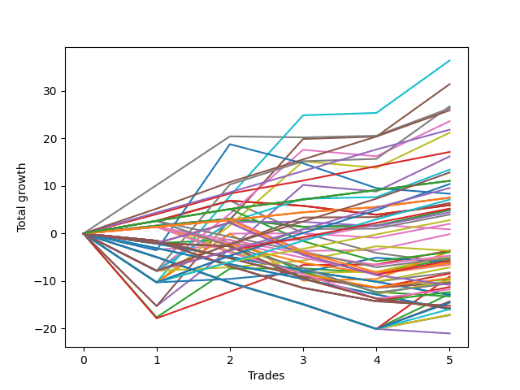

# Long Bulldog 004 
- Symbol: TSLA_Unlimited
- Date Range: 03/23/2022 - 07/08/2022
- Trading Period: 7:20-12:30
- Number of Trades: 5



| Name | Win Percent | Profit | Avg Profit / Trade | Avg Time / Trade |      | Name | Win Percent | Profit | Avg Profit / Trade | Avg Time / Trade |
| ---- | ----------- | ------ | ------------------ | ---------------- | ---- | ---- | ----------- | ------ | ------------------ | ---------------- |
| Sorted By <br> Profit | | | | | | Sorted By <br> Win Percentage ||||
| Sixty-One | 80.00 | 18210.00 | 3642.00 | 27:05 |     | Eighty-Five | 100.00 | 12965.00 | 2593.00 | 69:48 |
| Five | 80.00 | 15720.00 | 3144.00 | 51:18 |     | Eighty-Four | 100.00 | 10925.00 | 2185.00 | 66:32 |
| Sixty-Nine | 80.00 | 13375.00 | 2675.00 | 25:50 |     | Eighty-Three | 100.00 | 8585.00 | 1717.00 | 63:45 |
| Seven | 80.00 | 13180.00 | 2636.00 | 121:21 |     | One Hundred Twenty-Seven | 100.00 | 5545.00 | 1109.00 | 15:41 |
| Eighty-Five | 100.00 | 12965.00 | 2593.00 | 69:48 |     | One Hundred Twenty-Two | 100.00 | 5545.00 | 1109.00 | 15:41 |
| Sixty-Eight | 60.00 | 11820.00 | 2364.00 | 23:01 |     | Eighty-Two | 100.00 | 5545.00 | 1109.00 | 15:41 |
| Eighty-Four | 100.00 | 10925.00 | 2185.00 | 66:32 |     | One Hundred Twenty-Six | 100.00 | 3770.00 | 754.00 | 14:21 |
| Sixty | 60.00 | 10605.00 | 2121.00 | 23:19 |     | One Hundred Twenty-One | 100.00 | 3770.00 | 754.00 | 14:21 |
| Eighty-Three | 100.00 | 8585.00 | 1717.00 | 63:45 |     | Eighty-One | 100.00 | 3770.00 | 754.00 | 14:21 |
| Four | 60.00 | 8115.00 | 1623.00 | 35:17 |     | Sixty-One | 80.00 | 18210.00 | 3642.00 | 27:05 |
| Seventy-One | 80.00 | 6725.00 | 1345.00 | 35:38 |     | Five | 80.00 | 15720.00 | 3144.00 | 51:18 |
| One Hundred Thirty | 80.00 | 6430.00 | 1286.00 | 25:00 |     | Sixty-Nine | 80.00 | 13375.00 | 2675.00 | 25:50 |
| One Hundred Twenty-Seven | 100.00 | 5545.00 | 1109.00 | 15:41 |     | Seven | 80.00 | 13180.00 | 2636.00 | 121:21 |
| One Hundred Twenty-Two | 100.00 | 5545.00 | 1109.00 | 15:41 |     | Seventy-One | 80.00 | 6725.00 | 1345.00 | 35:38 |
| Eighty-Two | 100.00 | 5545.00 | 1109.00 | 15:41 |     | One Hundred Thirty | 80.00 | 6430.00 | 1286.00 | 25:00 |
| One Hundred Twenty-Five | 80.00 | 5215.00 | 1043.00 | 25:18 |     | One Hundred Twenty-Five | 80.00 | 5215.00 | 1043.00 | 25:18 |
| One Hundred Twenty-Nine | 80.00 | 4790.00 | 958.00 | 21:49 |     | One Hundred Twenty-Nine | 80.00 | 4790.00 | 958.00 | 21:49 |
| Seventy-Three | 20.00 | 4190.00 | 838.00 | 10:05 |     | One Hundred Twenty-Four | 80.00 | 3575.00 | 715.00 | 22:07 |
| One Hundred Twenty-Six | 100.00 | 3770.00 | 754.00 | 14:21 |     | Sixty-Seven | 80.00 | 3215.00 | 643.00 | 16:32 |
| One Hundred Twenty-One | 100.00 | 3770.00 | 754.00 | 14:21 |     | One Hundred Twenty-Eight | 80.00 | 2625.00 | 525.00 | 19:03 |
| Eighty-One | 100.00 | 3770.00 | 754.00 | 14:21 |     | Sixty-Four | 80.00 | 2485.00 | 497.00 | 05:29 |
| One Hundred Twenty-Four | 80.00 | 3575.00 | 715.00 | 22:07 |     | Fifty-Six | 80.00 | 2485.00 | 497.00 | 05:29 |
| Sixty-Seven | 80.00 | 3215.00 | 643.00 | 16:32 |     | Zero | 80.00 | 2485.00 | 497.00 | 05:29 |
| Sixty-Five | 60.00 | 2995.00 | 599.00 | 13:13 |     | Fifty-Nine | 80.00 | 2000.00 | 400.00 | 16:50 |
| Fifty-Seven | 60.00 | 2995.00 | 599.00 | 13:13 |     | One Hundred Twenty-Three | 80.00 | 1410.00 | 282.00 | 19:21 |
| One | 60.00 | 2995.00 | 599.00 | 13:13 |     | Forty-Eight | 80.00 | -60.00 | -12.00 | 03:59 |
| One Hundred Twenty-Eight | 80.00 | 2625.00 | 525.00 | 19:03 |     | Three | 80.00 | -1780.00 | -356.00 | 28:30 |
| Sixty-Four | 80.00 | 2485.00 | 497.00 | 05:29 |     | Sixty-Eight | 60.00 | 11820.00 | 2364.00 | 23:01 |
| Fifty-Six | 80.00 | 2485.00 | 497.00 | 05:29 |     | Sixty | 60.00 | 10605.00 | 2121.00 | 23:19 |
| Zero | 80.00 | 2485.00 | 497.00 | 05:29 |     | Four | 60.00 | 8115.00 | 1623.00 | 35:17 |
| Sixty-Six | 60.00 | 2235.00 | 447.00 | 19:24 |     | Sixty-Five | 60.00 | 2995.00 | 599.00 | 13:13 |
| Fifty-Nine | 80.00 | 2000.00 | 400.00 | 16:50 |     | Fifty-Seven | 60.00 | 2995.00 | 599.00 | 13:13 |
| One Hundred Twenty-Three | 80.00 | 1410.00 | 282.00 | 19:21 |     | One | 60.00 | 2995.00 | 599.00 | 13:13 |
| Fifty-Eight | 60.00 | 1020.00 | 204.00 | 19:42 |     | Sixty-Six | 60.00 | 2235.00 | 447.00 | 19:24 |
| Six | 60.00 | 445.00 | 89.00 | 52:57 |     | Fifty-Eight | 60.00 | 1020.00 | 204.00 | 19:42 |
| Forty-Eight | 80.00 | -60.00 | -12.00 | 03:59 |     | Six | 60.00 | 445.00 | 89.00 | 52:57 |
| Three | 80.00 | -1780.00 | -356.00 | 28:30 |     | Seventy | 60.00 | -1810.00 | -362.00 | 18:28 |
| Seventy | 60.00 | -1810.00 | -362.00 | 18:28 |     | Sixty-Three | 60.00 | -1890.00 | -378.00 | 50:27 |
| Sixty-Three | 60.00 | -1890.00 | -378.00 | 50:27 |     | One Hundred Seventeen | 60.00 | -1950.00 | -390.00 | 04:48 |
| One Hundred Seventeen | 60.00 | -1950.00 | -390.00 | 04:48 |     | Forty | 60.00 | -2360.00 | -472.00 | 03:15 |
| Ninety-One | 40.00 | -2320.00 | -464.00 | 02:07 |     | Two | 60.00 | -2665.00 | -533.00 | 31:23 |
| Forty | 60.00 | -2360.00 | -472.00 | 03:15 |     | Sixty-Two | 60.00 | -3025.00 | -605.00 | 18:46 |
| One Hundred Two | 40.00 | -2575.00 | -515.00 | 03:23 |     | One Hundred Sixteen | 60.00 | -3090.00 | -618.00 | 03:41 |
| Two | 60.00 | -2665.00 | -533.00 | 31:23 |     | Ninety-One | 40.00 | -2320.00 | -464.00 | 02:07 |
| One Hundred Eighteen | 40.00 | -2835.00 | -567.00 | 05:27 |     | One Hundred Two | 40.00 | -2575.00 | -515.00 | 03:23 |
| Sixty-Two | 60.00 | -3025.00 | -605.00 | 18:46 |     | One Hundred Eighteen | 40.00 | -2835.00 | -567.00 | 05:27 |
| Forty-Nine | 40.00 | -3065.00 | -613.00 | 05:29 |     | Forty-Nine | 40.00 | -3065.00 | -613.00 | 05:29 |
| One Hundred Sixteen | 60.00 | -3090.00 | -618.00 | 03:41 |     | One Hundred One | 40.00 | -3195.00 | -639.00 | 02:19 |
| One Hundred One | 40.00 | -3195.00 | -639.00 | 02:19 |     | Ninety-Six | 40.00 | -3270.00 | -654.00 | 02:21 |
| Ninety-Six | 40.00 | -3270.00 | -654.00 | 02:21 |     | One Hundred Six | 40.00 | -4685.00 | -937.00 | 02:33 |
| Ninety-Three | 20.00 | -3565.00 | -713.00 | 02:54 |     | Forty-One | 40.00 | -5210.00 | -1042.00 | 06:37 |
| Ninety-Two | 20.00 | -4095.00 | -819.00 | 02:51 |     | One Hundred Twelve | 40.00 | -5255.00 | -1051.00 | 04:06 |
| Ninety-Eight | 20.00 | -4210.00 | -842.00 | 02:29 |     | One Hundred Eleven | 40.00 | -5875.00 | -1175.00 | 03:02 |
| Forty-Five | 20.00 | -4515.00 | -903.00 | 09:37 |     | Seventy-Three | 20.00 | 4190.00 | 838.00 | 10:05 |
| One Hundred Six | 40.00 | -4685.00 | -937.00 | 02:33 |     | Ninety-Three | 20.00 | -3565.00 | -713.00 | 02:54 |
| Ninety-Seven | 20.00 | -4740.00 | -948.00 | 02:26 |     | Ninety-Two | 20.00 | -4095.00 | -819.00 | 02:51 |
| One Hundred Three | 20.00 | -4910.00 | -982.00 | 04:12 |     | Ninety-Eight | 20.00 | -4210.00 | -842.00 | 02:29 |
| One Hundred | 20.00 | -5140.00 | -1028.00 | 02:39 |     | Forty-Five | 20.00 | -4515.00 | -903.00 | 09:37 |
| Ninety-Nine | 20.00 | -5140.00 | -1028.00 | 02:39 |     | Ninety-Seven | 20.00 | -4740.00 | -948.00 | 02:26 |
| Forty-One | 40.00 | -5210.00 | -1042.00 | 06:37 |     | One Hundred Three | 20.00 | -4910.00 | -982.00 | 04:12 |
| One Hundred Twelve | 40.00 | -5255.00 | -1051.00 | 04:06 |     | One Hundred | 20.00 | -5140.00 | -1028.00 | 02:39 |
| One Hundred Ninteen | 20.00 | -5400.00 | -1080.00 | 06:03 |     | Ninety-Nine | 20.00 | -5140.00 | -1028.00 | 02:39 |
| One Hundred Eight | 20.00 | -5625.00 | -1125.00 | 02:41 |     | One Hundred Ninteen | 20.00 | -5400.00 | -1080.00 | 06:03 |
| One Hundred Eleven | 40.00 | -5875.00 | -1175.00 | 03:02 |     | One Hundred Eight | 20.00 | -5625.00 | -1125.00 | 02:41 |
| One Hundred Seven | 20.00 | -6155.00 | -1231.00 | 02:38 |     | One Hundred Seven | 20.00 | -6155.00 | -1231.00 | 02:38 |
| Forty-Four | 20.00 | -6345.00 | -1269.00 | 09:07 |     | Forty-Four | 20.00 | -6345.00 | -1269.00 | 09:07 |
| Ninety-Five | 0.00 | -6465.00 | -1293.00 | 03:59 |     | Fifty-Four | 20.00 | -6615.00 | -1323.00 | 04:59 |
| Ninety-Four | 0.00 | -6465.00 | -1293.00 | 03:59 |     | Forty-Seven | 20.00 | -7145.00 | -1429.00 | 09:06 |
| Fifty-Four | 20.00 | -6615.00 | -1323.00 | 04:59 |     | One Hundred Fifteen | 20.00 | -7275.00 | -1455.00 | 07:44 |
| Forty-Seven | 20.00 | -7145.00 | -1429.00 | 09:06 |     | One Hundred Fourteen | 20.00 | -7955.00 | -1591.00 | 07:42 |
| One Hundred Fifteen | 20.00 | -7275.00 | -1455.00 | 07:44 |     | One Hundred Thirteen | 20.00 | -8535.00 | -1707.00 | 05:09 |
| One Hundred Ten | 0.00 | -7595.00 | -1519.00 | 03:03 |     | Forty-Three | 20.00 | -8550.00 | -1710.00 | 07:41 |
| One Hundred Nine | 0.00 | -7595.00 | -1519.00 | 03:03 |     | Forty-Two | 20.00 | -8575.00 | -1715.00 | 07:40 |
| One Hundred Twenty | 0.00 | -7860.00 | -1572.00 | 06:12 |     | Ninety-Five | 0.00 | -6465.00 | -1293.00 | 03:59 |
| Fifty-Five | 0.00 | -7860.00 | -1572.00 | 06:12 |     | Ninety-Four | 0.00 | -6465.00 | -1293.00 | 03:59 |
| Fifty-Three | 0.00 | -7860.00 | -1572.00 | 06:12 |     | One Hundred Ten | 0.00 | -7595.00 | -1519.00 | 03:03 |
| Fifty-Two | 0.00 | -7860.00 | -1572.00 | 06:12 |     | One Hundred Nine | 0.00 | -7595.00 | -1519.00 | 03:03 |
| Fifty-One | 0.00 | -7860.00 | -1572.00 | 06:12 |     | One Hundred Twenty | 0.00 | -7860.00 | -1572.00 | 06:12 |
| Fifty | 0.00 | -7860.00 | -1572.00 | 06:12 |     | Fifty-Five | 0.00 | -7860.00 | -1572.00 | 06:12 |
| One Hundred Fourteen | 20.00 | -7955.00 | -1591.00 | 07:42 |     | Fifty-Three | 0.00 | -7860.00 | -1572.00 | 06:12 |
| One Hundred Five | 0.00 | -7970.00 | -1594.00 | 05:18 |     | Fifty-Two | 0.00 | -7860.00 | -1572.00 | 06:12 |
| One Hundred Four | 0.00 | -7970.00 | -1594.00 | 05:18 |     | Fifty-One | 0.00 | -7860.00 | -1572.00 | 06:12 |
| One Hundred Thirteen | 20.00 | -8535.00 | -1707.00 | 05:09 |     | Fifty | 0.00 | -7860.00 | -1572.00 | 06:12 |
| Forty-Three | 20.00 | -8550.00 | -1710.00 | 07:41 |     | One Hundred Five | 0.00 | -7970.00 | -1594.00 | 05:18 |
| Forty-Two | 20.00 | -8575.00 | -1715.00 | 07:40 |     | One Hundred Four | 0.00 | -7970.00 | -1594.00 | 05:18 |
| Forty-Six | 0.00 | -10510.00 | -2102.00 | 04:56 |     | Forty-Six | 0.00 | -10510.00 | -2102.00 | 04:56 |

## NO STOPLOSS

### Test Zero
* Sell when price hits the middle line of the 20p bollinger
* No Stoploss
* Results:
```
Total Trades: 5
Percent Up: 80.00
Percent Down: 20.00
Total Points Moved Up: 4.97
Potential Profit: 2485.00
Total Points Ups: 6.65 Count Ups: 4
Total Points Downs: -1.68 Count Downs: 1
```

<details><summary>Trades</summary>

<code>In: 2022-04-07 07:52:00		Out: 2022-04-07 08:00:05		Total Position Time: 08:05		Total Move Up: 1.66		Total to Date: 1.66</code> <br />
<code>In: 2022-05-04 11:37:00		Out: 2022-05-04 11:41:15		Total Position Time: 04:15		Total Move Up: 1.45		Total to Date: 3.11</code> <br />
<code>In: 2022-05-12 09:05:00		Out: 2022-05-12 09:16:10		Total Position Time: 11:10		Total Move Up: -1.68		Total to Date: 1.43</code> <br />
<code>In: 2022-05-13 11:11:00		Out: 2022-05-13 11:12:25		Total Position Time: 01:25		Total Move Up: 0.22		Total to Date: 1.65</code> <br />
<code>In: 2022-05-17 11:25:00		Out: 2022-05-17 11:27:30		Total Position Time: 02:30		Total Move Up: 3.32		Total to Date: 4.97</code> <br />


</details>

### Test One
* Sell when the price hits the upper line of the 20p 1std bollinger
* No Stoploss
* Results:
```
Total Trades: 5
Percent Up: 60.00
Percent Down: 40.00
Total Points Moved Up: 5.99
Potential Profit: 2995.00
Total Points Ups: 8.94 Count Ups: 3
Total Points Downs: -2.95 Count Downs: 2
```

<details><summary>Trades</summary>

<code>In: 2022-04-07 07:52:00		Out: 2022-04-07 08:01:05		Total Position Time: 09:05		Total Move Up: 2.66		Total to Date: 2.66</code> <br />
<code>In: 2022-05-04 11:37:00		Out: 2022-05-04 11:42:00		Total Position Time: 05:00		Total Move Up: 4.25		Total to Date: 6.91</code> <br />
<code>In: 2022-05-12 09:05:00		Out: 2022-05-12 09:21:30		Total Position Time: 16:30		Total Move Up: -1.08		Total to Date: 5.83</code> <br />
<code>In: 2022-05-13 11:11:00		Out: 2022-05-13 11:31:45		Total Position Time: 20:45		Total Move Up: -1.87		Total to Date: 3.96</code> <br />
<code>In: 2022-05-17 11:25:00		Out: 2022-05-17 11:39:45		Total Position Time: 14:45		Total Move Up: 2.03		Total to Date: 5.99</code> <br />


</details>

### Test Two
* Sell when the price hits the upper line of the 20p 2std bollinger
* No Stoploss
* Results:
```
Total Trades: 5
Percent Up: 60.00
Percent Down: 40.00
Total Points Moved Up: -5.33
Potential Profit: -2665.00
Total Points Ups: 13.23 Count Ups: 3
Total Points Downs: -18.56 Count Downs: 2
```

<details><summary>Trades</summary>

<code>In: 2022-04-07 07:52:00		Out: 2022-04-07 09:09:30		Total Position Time: 77:30		Total Move Up: -17.64		Total to Date: -17.64</code> <br />
<code>In: 2022-05-04 11:37:00		Out: 2022-05-04 11:44:10		Total Position Time: 07:10		Total Move Up: 10.26		Total to Date: -7.38</code> <br />
<code>In: 2022-05-12 09:05:00		Out: 2022-05-12 09:21:50		Total Position Time: 16:50		Total Move Up: 0.05		Total to Date: -7.33</code> <br />
<code>In: 2022-05-13 11:11:00		Out: 2022-05-13 11:51:25		Total Position Time: 40:25		Total Move Up: -0.92		Total to Date: -8.25</code> <br />
<code>In: 2022-05-17 11:25:00		Out: 2022-05-17 11:40:00		Total Position Time: 15:00		Total Move Up: 2.92		Total to Date: -5.33</code> <br />


</details>

### Test Three
* Sell when price hits the middle line of the 50p bollinger
* No Stoploss
* Results:
```
Total Trades: 5
Percent Up: 80.00
Percent Down: 20.00
Total Points Moved Up: -3.56
Potential Profit: -1780.00
Total Points Ups: 14.27 Count Ups: 4
Total Points Downs: -17.83 Count Downs: 1
```

<details><summary>Trades</summary>

<code>In: 2022-04-07 07:52:00		Out: 2022-04-07 09:09:25		Total Position Time: 77:25		Total Move Up: -17.83		Total to Date: -17.83</code> <br />
<code>In: 2022-05-04 11:37:00		Out: 2022-05-04 11:43:35		Total Position Time: 06:35		Total Move Up: 5.59		Total to Date: -12.24</code> <br />
<code>In: 2022-05-12 09:05:00		Out: 2022-05-12 09:27:25		Total Position Time: 22:25		Total Move Up: 5.63		Total to Date: -6.61</code> <br />
<code>In: 2022-05-13 11:11:00		Out: 2022-05-13 11:32:00		Total Position Time: 21:00		Total Move Up: 0.08		Total to Date: -6.53</code> <br />
<code>In: 2022-05-17 11:25:00		Out: 2022-05-17 11:40:05		Total Position Time: 15:05		Total Move Up: 2.97		Total to Date: -3.56</code> <br />


</details>

### Test Four
* Sell when the price hits the upper line of the 50p 1std bollinger
* No Stoploss
* Results:
```
Total Trades: 5
Percent Up: 60.00
Percent Down: 40.00
Total Points Moved Up: 16.23
Potential Profit: 8115.00
Total Points Ups: 32.85 Count Ups: 3
Total Points Downs: -16.62 Count Downs: 2
```

<details><summary>Trades</summary>

<code>In: 2022-04-07 07:52:00		Out: 2022-04-07 09:10:55		Total Position Time: 78:55		Total Move Up: -15.25		Total to Date: -15.25</code> <br />
<code>In: 2022-05-04 11:37:00		Out: 2022-05-04 11:44:25		Total Position Time: 07:25		Total Move Up: 11.98		Total to Date: -3.27</code> <br />
<code>In: 2022-05-12 09:05:00		Out: 2022-05-12 09:32:30		Total Position Time: 27:30		Total Move Up: 13.49		Total to Date: 10.22</code> <br />
<code>In: 2022-05-13 11:11:00		Out: 2022-05-13 11:51:20		Total Position Time: 40:20		Total Move Up: -1.37		Total to Date: 8.85</code> <br />
<code>In: 2022-05-17 11:25:00		Out: 2022-05-17 11:47:15		Total Position Time: 22:15		Total Move Up: 7.38		Total to Date: 16.23</code> <br />


</details>

### Test Five
* Sell when the price hits the upper line of the 50p 2std bollinger
* No Stoploss
* Results:
```
Total Trades: 5
Percent Up: 80.00
Percent Down: 20.00
Total Points Moved Up: 31.44
Potential Profit: 15720.00
Total Points Ups: 46.69 Count Ups: 4
Total Points Downs: -15.25 Count Downs: 1
```

<details><summary>Trades</summary>

<code>In: 2022-04-07 07:52:00		Out: 2022-04-07 10:12:10		Total Position Time: 140:10		Total Move Up: -15.25		Total to Date: -15.25</code> <br />
<code>In: 2022-05-04 11:37:00		Out: 2022-05-04 11:47:00		Total Position Time: 10:00		Total Move Up: 18.15		Total to Date: 2.90</code> <br />
<code>In: 2022-05-12 09:05:00		Out: 2022-05-12 09:45:00		Total Position Time: 40:00		Total Move Up: 17.00		Total to Date: 19.90</code> <br />
<code>In: 2022-05-13 11:11:00		Out: 2022-05-13 11:52:35		Total Position Time: 41:35		Total Move Up: 0.50		Total to Date: 20.40</code> <br />
<code>In: 2022-05-17 11:25:00		Out: 2022-05-17 11:49:45		Total Position Time: 24:45		Total Move Up: 11.04		Total to Date: 31.44</code> <br />


</details>

### Test Six
* Sell when the price hits the middle line of the 1std VWAP
* No Stoploss
* Results:
```
Total Trades: 5
Percent Up: 60.00
Percent Down: 40.00
Total Points Moved Up: 0.89
Potential Profit: 445.00
Total Points Ups: 5.17 Count Ups: 3
Total Points Downs: -4.28 Count Downs: 2
```

<details><summary>Trades</summary>

<code>In: 2022-04-07 07:52:00		Out: 2022-04-07 11:02:00		Total Position Time: 190:00		Total Move Up: -3.33		Total to Date: -3.33</code> <br />
<code>In: 2022-05-04 11:37:00		Out: 2022-05-04 11:40:25		Total Position Time: 03:25		Total Move Up: 0.72		Total to Date: -2.61</code> <br />
<code>In: 2022-05-12 09:05:00		Out: 2022-05-12 09:24:55		Total Position Time: 19:55		Total Move Up: 1.42		Total to Date: -1.19</code> <br />
<code>In: 2022-05-13 11:11:00		Out: 2022-05-13 12:01:05		Total Position Time: 50:05		Total Move Up: 3.03		Total to Date: 1.84</code> <br />
<code>In: 2022-05-17 11:25:00		Out: 2022-05-17 11:26:20		Total Position Time: 01:20		Total Move Up: -0.95		Total to Date: 0.89</code> <br />


</details>

### Test Seven
* Sell when the price hits the upper line of the 1std VWAP
* No Stoploss
* Results:
```
Total Trades: 5
Percent Up: 80.00
Percent Down: 20.00
Total Points Moved Up: 26.36
Potential Profit: 13180.00
Total Points Ups: 26.58 Count Ups: 4
Total Points Downs: -0.22 Count Downs: 1
```

<details><summary>Trades</summary>

<code>In: 2022-04-07 07:52:00		Out: 2022-04-07 12:11:25		Total Position Time: 259:25		Total Move Up: 10.19		Total to Date: 10.19</code> <br />
<code>In: 2022-05-04 11:37:00		Out: 2022-05-04 11:44:10		Total Position Time: 07:10		Total Move Up: 10.26		Total to Date: 20.45</code> <br />
<code>In: 2022-05-12 09:05:00		Out: 2022-05-12 12:47:00		Total Position Time: 222:00		Total Move Up: -0.22		Total to Date: 20.23</code> <br />
<code>In: 2022-05-13 11:11:00		Out: 2022-05-13 12:47:00		Total Position Time: 96:00		Total Move Up: 0.35		Total to Date: 20.58</code> <br />
<code>In: 2022-05-17 11:25:00		Out: 2022-05-17 11:47:10		Total Position Time: 22:10		Total Move Up: 5.78		Total to Date: 26.36</code> <br />


</details>

## STOPLOSS OF 5

### Test Forty
* Sell when price hits the middle line of the 20p bollinger
* Stoploss is 5 points
* Results:
```
Total Trades: 5
Percent Up: 60.00
Percent Down: 40.00
Total Points Moved Up: -4.72
Potential Profit: -2360.00
Total Points Ups: 5.20 Count Ups: 3
Total Points Downs: -9.92 Count Downs: 2
```

<details><summary>Trades</summary>

<code>In: 2022-04-07 07:52:00		Out: 2022-04-07 08:00:05		Total Position Time: 08:05		Total Move Up: 1.66		Total to Date: 1.66</code> <br />
<code>In: 2022-05-04 11:37:00		Out: 2022-05-04 11:38:55		Total Position Time: 01:55		Total Move Up: -5.35		Total to Date: -3.69</code> <br />
<code>In: 2022-05-12 09:05:00		Out: 2022-05-12 09:07:20		Total Position Time: 02:20		Total Move Up: -4.57		Total to Date: -8.26</code> <br />
<code>In: 2022-05-13 11:11:00		Out: 2022-05-13 11:12:25		Total Position Time: 01:25		Total Move Up: 0.22		Total to Date: -8.04</code> <br />
<code>In: 2022-05-17 11:25:00		Out: 2022-05-17 11:27:30		Total Position Time: 02:30		Total Move Up: 3.32		Total to Date: -4.72</code> <br />


</details>

### Test Forty-One
* Sell when the price hits the upper line of the 20p 1std bollinger
* Stoploss is 5 points
* Results:
```
Total Trades: 5
Percent Up: 40.00
Percent Down: 60.00
Total Points Moved Up: -10.42
Potential Profit: -5210.00
Total Points Ups: 4.69 Count Ups: 2
Total Points Downs: -15.11 Count Downs: 3
```

<details><summary>Trades</summary>

<code>In: 2022-04-07 07:52:00		Out: 2022-04-07 08:01:05		Total Position Time: 09:05		Total Move Up: 2.66		Total to Date: 2.66</code> <br />
<code>In: 2022-05-04 11:37:00		Out: 2022-05-04 11:38:55		Total Position Time: 01:55		Total Move Up: -5.35		Total to Date: -2.69</code> <br />
<code>In: 2022-05-12 09:05:00		Out: 2022-05-12 09:07:20		Total Position Time: 02:20		Total Move Up: -4.57		Total to Date: -7.26</code> <br />
<code>In: 2022-05-13 11:11:00		Out: 2022-05-13 11:16:00		Total Position Time: 05:00		Total Move Up: -5.19		Total to Date: -12.45</code> <br />
<code>In: 2022-05-17 11:25:00		Out: 2022-05-17 11:39:45		Total Position Time: 14:45		Total Move Up: 2.03		Total to Date: -10.42</code> <br />


</details>

### Test Forty-Two
* Sell when the price hits the upper line of the 20p 2std bollinger
* Stoploss is 5 points
* Results:
```
Total Trades: 5
Percent Up: 20.00
Percent Down: 80.00
Total Points Moved Up: -17.15
Potential Profit: -8575.00
Total Points Ups: 2.92 Count Ups: 1
Total Points Downs: -20.07 Count Downs: 4
```

<details><summary>Trades</summary>

<code>In: 2022-04-07 07:52:00		Out: 2022-04-07 08:06:05		Total Position Time: 14:05		Total Move Up: -4.96		Total to Date: -4.96</code> <br />
<code>In: 2022-05-04 11:37:00		Out: 2022-05-04 11:38:55		Total Position Time: 01:55		Total Move Up: -5.35		Total to Date: -10.31</code> <br />
<code>In: 2022-05-12 09:05:00		Out: 2022-05-12 09:07:20		Total Position Time: 02:20		Total Move Up: -4.57		Total to Date: -14.88</code> <br />
<code>In: 2022-05-13 11:11:00		Out: 2022-05-13 11:16:00		Total Position Time: 05:00		Total Move Up: -5.19		Total to Date: -20.07</code> <br />
<code>In: 2022-05-17 11:25:00		Out: 2022-05-17 11:40:00		Total Position Time: 15:00		Total Move Up: 2.92		Total to Date: -17.15</code> <br />


</details>

### Test Forty-Three
* Sell when price hits the middle line of the 50p bollinger
* Stoploss is 5 points
* Results:
```
Total Trades: 5
Percent Up: 20.00
Percent Down: 80.00
Total Points Moved Up: -17.10
Potential Profit: -8550.00
Total Points Ups: 2.97 Count Ups: 1
Total Points Downs: -20.07 Count Downs: 4
```

<details><summary>Trades</summary>

<code>In: 2022-04-07 07:52:00		Out: 2022-04-07 08:06:05		Total Position Time: 14:05		Total Move Up: -4.96		Total to Date: -4.96</code> <br />
<code>In: 2022-05-04 11:37:00		Out: 2022-05-04 11:38:55		Total Position Time: 01:55		Total Move Up: -5.35		Total to Date: -10.31</code> <br />
<code>In: 2022-05-12 09:05:00		Out: 2022-05-12 09:07:20		Total Position Time: 02:20		Total Move Up: -4.57		Total to Date: -14.88</code> <br />
<code>In: 2022-05-13 11:11:00		Out: 2022-05-13 11:16:00		Total Position Time: 05:00		Total Move Up: -5.19		Total to Date: -20.07</code> <br />
<code>In: 2022-05-17 11:25:00		Out: 2022-05-17 11:40:05		Total Position Time: 15:05		Total Move Up: 2.97		Total to Date: -17.10</code> <br />


</details>

### Test Forty-Four
* Sell when the price hits the upper line of the 50p 1std bollinger
* Stoploss is 5 points
* Results:
```
Total Trades: 5
Percent Up: 20.00
Percent Down: 80.00
Total Points Moved Up: -12.69
Potential Profit: -6345.00
Total Points Ups: 7.38 Count Ups: 1
Total Points Downs: -20.07 Count Downs: 4
```

<details><summary>Trades</summary>

<code>In: 2022-04-07 07:52:00		Out: 2022-04-07 08:06:05		Total Position Time: 14:05		Total Move Up: -4.96		Total to Date: -4.96</code> <br />
<code>In: 2022-05-04 11:37:00		Out: 2022-05-04 11:38:55		Total Position Time: 01:55		Total Move Up: -5.35		Total to Date: -10.31</code> <br />
<code>In: 2022-05-12 09:05:00		Out: 2022-05-12 09:07:20		Total Position Time: 02:20		Total Move Up: -4.57		Total to Date: -14.88</code> <br />
<code>In: 2022-05-13 11:11:00		Out: 2022-05-13 11:16:00		Total Position Time: 05:00		Total Move Up: -5.19		Total to Date: -20.07</code> <br />
<code>In: 2022-05-17 11:25:00		Out: 2022-05-17 11:47:15		Total Position Time: 22:15		Total Move Up: 7.38		Total to Date: -12.69</code> <br />


</details>

### Test Forty-Five
* Sell when the price hits the upper line of the 50p 2std bollinger
* Stoploss is 5 points
* Results:
```
Total Trades: 5
Percent Up: 20.00
Percent Down: 80.00
Total Points Moved Up: -9.03
Potential Profit: -4515.00
Total Points Ups: 11.04 Count Ups: 1
Total Points Downs: -20.07 Count Downs: 4
```

<details><summary>Trades</summary>

<code>In: 2022-04-07 07:52:00		Out: 2022-04-07 08:06:05		Total Position Time: 14:05		Total Move Up: -4.96		Total to Date: -4.96</code> <br />
<code>In: 2022-05-04 11:37:00		Out: 2022-05-04 11:38:55		Total Position Time: 01:55		Total Move Up: -5.35		Total to Date: -10.31</code> <br />
<code>In: 2022-05-12 09:05:00		Out: 2022-05-12 09:07:20		Total Position Time: 02:20		Total Move Up: -4.57		Total to Date: -14.88</code> <br />
<code>In: 2022-05-13 11:11:00		Out: 2022-05-13 11:16:00		Total Position Time: 05:00		Total Move Up: -5.19		Total to Date: -20.07</code> <br />
<code>In: 2022-05-17 11:25:00		Out: 2022-05-17 11:49:45		Total Position Time: 24:45		Total Move Up: 11.04		Total to Date: -9.03</code> <br />


</details>

### Test Forty-Six
* Sell when the price hits the middle line of the 1std VWAP
* Stoploss is 5 points
* Results:
```
Total Trades: 5
Percent Up: 0.00
Percent Down: 100.00
Total Points Moved Up: -21.02
Potential Profit: -10510.00
Total Points Ups: 0.00 Count Ups: 0
Total Points Downs: -21.02 Count Downs: 5
```

<details><summary>Trades</summary>

<code>In: 2022-04-07 07:52:00		Out: 2022-04-07 08:06:05		Total Position Time: 14:05		Total Move Up: -4.96		Total to Date: -4.96</code> <br />
<code>In: 2022-05-04 11:37:00		Out: 2022-05-04 11:38:55		Total Position Time: 01:55		Total Move Up: -5.35		Total to Date: -10.31</code> <br />
<code>In: 2022-05-12 09:05:00		Out: 2022-05-12 09:07:20		Total Position Time: 02:20		Total Move Up: -4.57		Total to Date: -14.88</code> <br />
<code>In: 2022-05-13 11:11:00		Out: 2022-05-13 11:16:00		Total Position Time: 05:00		Total Move Up: -5.19		Total to Date: -20.07</code> <br />
<code>In: 2022-05-17 11:25:00		Out: 2022-05-17 11:26:20		Total Position Time: 01:20		Total Move Up: -0.95		Total to Date: -21.02</code> <br />


</details>

### Test Forty-Seven
* Sell when the price hits the upper line of the 1std VWAP
* Stoploss is 5 points
* Results:
```
Total Trades: 5
Percent Up: 20.00
Percent Down: 80.00
Total Points Moved Up: -14.29
Potential Profit: -7145.00
Total Points Ups: 5.78 Count Ups: 1
Total Points Downs: -20.07 Count Downs: 4
```

<details><summary>Trades</summary>

<code>In: 2022-04-07 07:52:00		Out: 2022-04-07 08:06:05		Total Position Time: 14:05		Total Move Up: -4.96		Total to Date: -4.96</code> <br />
<code>In: 2022-05-04 11:37:00		Out: 2022-05-04 11:38:55		Total Position Time: 01:55		Total Move Up: -5.35		Total to Date: -10.31</code> <br />
<code>In: 2022-05-12 09:05:00		Out: 2022-05-12 09:07:20		Total Position Time: 02:20		Total Move Up: -4.57		Total to Date: -14.88</code> <br />
<code>In: 2022-05-13 11:11:00		Out: 2022-05-13 11:16:00		Total Position Time: 05:00		Total Move Up: -5.19		Total to Date: -20.07</code> <br />
<code>In: 2022-05-17 11:25:00		Out: 2022-05-17 11:47:10		Total Position Time: 22:10		Total Move Up: 5.78		Total to Date: -14.29</code> <br />


</details>

## TRAIL STOP OF 5

### Test Forty-Eight
* Sell when price hits the middle line of the 20p bollinger
* Trailing Stop is 5 points
* Results:
```
Total Trades: 5
Percent Up: 80.00
Percent Down: 20.00
Total Points Moved Up: -0.12
Potential Profit: -60.00
Total Points Ups: 6.65 Count Ups: 4
Total Points Downs: -6.77 Count Downs: 1
```

<details><summary>Trades</summary>

<code>In: 2022-04-07 07:52:00		Out: 2022-04-07 08:00:05		Total Position Time: 08:05		Total Move Up: 1.66		Total to Date: 1.66</code> <br />
<code>In: 2022-05-04 11:37:00		Out: 2022-05-04 11:41:15		Total Position Time: 04:15		Total Move Up: 1.45		Total to Date: 3.11</code> <br />
<code>In: 2022-05-12 09:05:00		Out: 2022-05-12 09:08:40		Total Position Time: 03:40		Total Move Up: -6.77		Total to Date: -3.66</code> <br />
<code>In: 2022-05-13 11:11:00		Out: 2022-05-13 11:12:25		Total Position Time: 01:25		Total Move Up: 0.22		Total to Date: -3.44</code> <br />
<code>In: 2022-05-17 11:25:00		Out: 2022-05-17 11:27:30		Total Position Time: 02:30		Total Move Up: 3.32		Total to Date: -0.12</code> <br />


</details>

### Test Forty-Nine
* Sell when the price hits the upper line of the 20p 1std bollinger
* Trailing Stop is 5 points
* Results:
```
Total Trades: 5
Percent Up: 40.00
Percent Down: 60.00
Total Points Moved Up: -6.13
Potential Profit: -3065.00
Total Points Ups: 6.91 Count Ups: 2
Total Points Downs: -13.04 Count Downs: 3
```

<details><summary>Trades</summary>

<code>In: 2022-04-07 07:52:00		Out: 2022-04-07 08:01:05		Total Position Time: 09:05		Total Move Up: 2.66		Total to Date: 2.66</code> <br />
<code>In: 2022-05-04 11:37:00		Out: 2022-05-04 11:42:00		Total Position Time: 05:00		Total Move Up: 4.25		Total to Date: 6.91</code> <br />
<code>In: 2022-05-12 09:05:00		Out: 2022-05-12 09:08:40		Total Position Time: 03:40		Total Move Up: -6.77		Total to Date: 0.14</code> <br />
<code>In: 2022-05-13 11:11:00		Out: 2022-05-13 11:15:35		Total Position Time: 04:35		Total Move Up: -4.22		Total to Date: -4.08</code> <br />
<code>In: 2022-05-17 11:25:00		Out: 2022-05-17 11:30:05		Total Position Time: 05:05		Total Move Up: -2.05		Total to Date: -6.13</code> <br />


</details>

### Test Fifty
* Sell when the price hits the upper line of the 20p 2std bollinger
* Trailing Stop is 5 points
* Results:
```
Total Trades: 5
Percent Up: 0.00
Percent Down: 100.00
Total Points Moved Up: -15.72
Potential Profit: -7860.00
Total Points Ups: 0.00 Count Ups: 0
Total Points Downs: -15.72 Count Downs: 5
```

<details><summary>Trades</summary>

<code>In: 2022-04-07 07:52:00		Out: 2022-04-07 08:03:55		Total Position Time: 11:55		Total Move Up: -2.01		Total to Date: -2.01</code> <br />
<code>In: 2022-05-04 11:37:00		Out: 2022-05-04 11:42:45		Total Position Time: 05:45		Total Move Up: -0.67		Total to Date: -2.68</code> <br />
<code>In: 2022-05-12 09:05:00		Out: 2022-05-12 09:08:40		Total Position Time: 03:40		Total Move Up: -6.77		Total to Date: -9.45</code> <br />
<code>In: 2022-05-13 11:11:00		Out: 2022-05-13 11:15:35		Total Position Time: 04:35		Total Move Up: -4.22		Total to Date: -13.67</code> <br />
<code>In: 2022-05-17 11:25:00		Out: 2022-05-17 11:30:05		Total Position Time: 05:05		Total Move Up: -2.05		Total to Date: -15.72</code> <br />


</details>

### Test Fifty-One
* Sell when price hits the middle line of the 50p bollinger
* Trailing Stop is 5 points
* Results:
```
Total Trades: 5
Percent Up: 0.00
Percent Down: 100.00
Total Points Moved Up: -15.72
Potential Profit: -7860.00
Total Points Ups: 0.00 Count Ups: 0
Total Points Downs: -15.72 Count Downs: 5
```

<details><summary>Trades</summary>

<code>In: 2022-04-07 07:52:00		Out: 2022-04-07 08:03:55		Total Position Time: 11:55		Total Move Up: -2.01		Total to Date: -2.01</code> <br />
<code>In: 2022-05-04 11:37:00		Out: 2022-05-04 11:42:45		Total Position Time: 05:45		Total Move Up: -0.67		Total to Date: -2.68</code> <br />
<code>In: 2022-05-12 09:05:00		Out: 2022-05-12 09:08:40		Total Position Time: 03:40		Total Move Up: -6.77		Total to Date: -9.45</code> <br />
<code>In: 2022-05-13 11:11:00		Out: 2022-05-13 11:15:35		Total Position Time: 04:35		Total Move Up: -4.22		Total to Date: -13.67</code> <br />
<code>In: 2022-05-17 11:25:00		Out: 2022-05-17 11:30:05		Total Position Time: 05:05		Total Move Up: -2.05		Total to Date: -15.72</code> <br />


</details>

### Test Fifty-Two
* Sell when the price hits the upper line of the 50p 1std bollinger
* Trailing Stop is 5 points
* Results:
```
Total Trades: 5
Percent Up: 0.00
Percent Down: 100.00
Total Points Moved Up: -15.72
Potential Profit: -7860.00
Total Points Ups: 0.00 Count Ups: 0
Total Points Downs: -15.72 Count Downs: 5
```

<details><summary>Trades</summary>

<code>In: 2022-04-07 07:52:00		Out: 2022-04-07 08:03:55		Total Position Time: 11:55		Total Move Up: -2.01		Total to Date: -2.01</code> <br />
<code>In: 2022-05-04 11:37:00		Out: 2022-05-04 11:42:45		Total Position Time: 05:45		Total Move Up: -0.67		Total to Date: -2.68</code> <br />
<code>In: 2022-05-12 09:05:00		Out: 2022-05-12 09:08:40		Total Position Time: 03:40		Total Move Up: -6.77		Total to Date: -9.45</code> <br />
<code>In: 2022-05-13 11:11:00		Out: 2022-05-13 11:15:35		Total Position Time: 04:35		Total Move Up: -4.22		Total to Date: -13.67</code> <br />
<code>In: 2022-05-17 11:25:00		Out: 2022-05-17 11:30:05		Total Position Time: 05:05		Total Move Up: -2.05		Total to Date: -15.72</code> <br />


</details>

### Test Fifty-Three
* Sell when the price hits the upper line of the 50p 2std bollinger
* Trailing Stop is 5 points
* Results:
```
Total Trades: 5
Percent Up: 0.00
Percent Down: 100.00
Total Points Moved Up: -15.72
Potential Profit: -7860.00
Total Points Ups: 0.00 Count Ups: 0
Total Points Downs: -15.72 Count Downs: 5
```

<details><summary>Trades</summary>

<code>In: 2022-04-07 07:52:00		Out: 2022-04-07 08:03:55		Total Position Time: 11:55		Total Move Up: -2.01		Total to Date: -2.01</code> <br />
<code>In: 2022-05-04 11:37:00		Out: 2022-05-04 11:42:45		Total Position Time: 05:45		Total Move Up: -0.67		Total to Date: -2.68</code> <br />
<code>In: 2022-05-12 09:05:00		Out: 2022-05-12 09:08:40		Total Position Time: 03:40		Total Move Up: -6.77		Total to Date: -9.45</code> <br />
<code>In: 2022-05-13 11:11:00		Out: 2022-05-13 11:15:35		Total Position Time: 04:35		Total Move Up: -4.22		Total to Date: -13.67</code> <br />
<code>In: 2022-05-17 11:25:00		Out: 2022-05-17 11:30:05		Total Position Time: 05:05		Total Move Up: -2.05		Total to Date: -15.72</code> <br />


</details>

### Test Fifty-Four
* Sell when the price hits the middle line of the 1std VWAP
* Trailing Stop is 5 points
* Results:
```
Total Trades: 5
Percent Up: 20.00
Percent Down: 80.00
Total Points Moved Up: -13.23
Potential Profit: -6615.00
Total Points Ups: 0.72 Count Ups: 1
Total Points Downs: -13.95 Count Downs: 4
```

<details><summary>Trades</summary>

<code>In: 2022-04-07 07:52:00		Out: 2022-04-07 08:03:55		Total Position Time: 11:55		Total Move Up: -2.01		Total to Date: -2.01</code> <br />
<code>In: 2022-05-04 11:37:00		Out: 2022-05-04 11:40:25		Total Position Time: 03:25		Total Move Up: 0.72		Total to Date: -1.29</code> <br />
<code>In: 2022-05-12 09:05:00		Out: 2022-05-12 09:08:40		Total Position Time: 03:40		Total Move Up: -6.77		Total to Date: -8.06</code> <br />
<code>In: 2022-05-13 11:11:00		Out: 2022-05-13 11:15:35		Total Position Time: 04:35		Total Move Up: -4.22		Total to Date: -12.28</code> <br />
<code>In: 2022-05-17 11:25:00		Out: 2022-05-17 11:26:20		Total Position Time: 01:20		Total Move Up: -0.95		Total to Date: -13.23</code> <br />


</details>

### Test Fifty-Five
* Sell when the price hits the upper line of the 1std VWAP
* Trailing Stop is 5 points
* Results:
```
Total Trades: 5
Percent Up: 0.00
Percent Down: 100.00
Total Points Moved Up: -15.72
Potential Profit: -7860.00
Total Points Ups: 0.00 Count Ups: 0
Total Points Downs: -15.72 Count Downs: 5
```

<details><summary>Trades</summary>

<code>In: 2022-04-07 07:52:00		Out: 2022-04-07 08:03:55		Total Position Time: 11:55		Total Move Up: -2.01		Total to Date: -2.01</code> <br />
<code>In: 2022-05-04 11:37:00		Out: 2022-05-04 11:42:45		Total Position Time: 05:45		Total Move Up: -0.67		Total to Date: -2.68</code> <br />
<code>In: 2022-05-12 09:05:00		Out: 2022-05-12 09:08:40		Total Position Time: 03:40		Total Move Up: -6.77		Total to Date: -9.45</code> <br />
<code>In: 2022-05-13 11:11:00		Out: 2022-05-13 11:15:35		Total Position Time: 04:35		Total Move Up: -4.22		Total to Date: -13.67</code> <br />
<code>In: 2022-05-17 11:25:00		Out: 2022-05-17 11:30:05		Total Position Time: 05:05		Total Move Up: -2.05		Total to Date: -15.72</code> <br />


</details>

## STOPLOSS OF 10

### Test Fifty-Six
* Sell when price hits the middle line of the 20p bollinger
* Stoploss is 10 points
* Results:
```
Total Trades: 5
Percent Up: 80.00
Percent Down: 20.00
Total Points Moved Up: 4.97
Potential Profit: 2485.00
Total Points Ups: 6.65 Count Ups: 4
Total Points Downs: -1.68 Count Downs: 1
```

<details><summary>Trades</summary>

<code>In: 2022-04-07 07:52:00		Out: 2022-04-07 08:00:05		Total Position Time: 08:05		Total Move Up: 1.66		Total to Date: 1.66</code> <br />
<code>In: 2022-05-04 11:37:00		Out: 2022-05-04 11:41:15		Total Position Time: 04:15		Total Move Up: 1.45		Total to Date: 3.11</code> <br />
<code>In: 2022-05-12 09:05:00		Out: 2022-05-12 09:16:10		Total Position Time: 11:10		Total Move Up: -1.68		Total to Date: 1.43</code> <br />
<code>In: 2022-05-13 11:11:00		Out: 2022-05-13 11:12:25		Total Position Time: 01:25		Total Move Up: 0.22		Total to Date: 1.65</code> <br />
<code>In: 2022-05-17 11:25:00		Out: 2022-05-17 11:27:30		Total Position Time: 02:30		Total Move Up: 3.32		Total to Date: 4.97</code> <br />


</details>

### Test Fifty-Seven
* Sell when the price hits the upper line of the 20p 1std bollinger
* Stoploss is 10 points
* Results:
```
Total Trades: 5
Percent Up: 60.00
Percent Down: 40.00
Total Points Moved Up: 5.99
Potential Profit: 2995.00
Total Points Ups: 8.94 Count Ups: 3
Total Points Downs: -2.95 Count Downs: 2
```

<details><summary>Trades</summary>

<code>In: 2022-04-07 07:52:00		Out: 2022-04-07 08:01:05		Total Position Time: 09:05		Total Move Up: 2.66		Total to Date: 2.66</code> <br />
<code>In: 2022-05-04 11:37:00		Out: 2022-05-04 11:42:00		Total Position Time: 05:00		Total Move Up: 4.25		Total to Date: 6.91</code> <br />
<code>In: 2022-05-12 09:05:00		Out: 2022-05-12 09:21:30		Total Position Time: 16:30		Total Move Up: -1.08		Total to Date: 5.83</code> <br />
<code>In: 2022-05-13 11:11:00		Out: 2022-05-13 11:31:45		Total Position Time: 20:45		Total Move Up: -1.87		Total to Date: 3.96</code> <br />
<code>In: 2022-05-17 11:25:00		Out: 2022-05-17 11:39:45		Total Position Time: 14:45		Total Move Up: 2.03		Total to Date: 5.99</code> <br />


</details>

### Test Fifty-Eight
* Sell when the price hits the upper line of the 20p 2std bollinger
* Stoploss is 10 points
* Results:
```
Total Trades: 5
Percent Up: 60.00
Percent Down: 40.00
Total Points Moved Up: 2.04
Potential Profit: 1020.00
Total Points Ups: 13.23 Count Ups: 3
Total Points Downs: -11.19 Count Downs: 2
```

<details><summary>Trades</summary>

<code>In: 2022-04-07 07:52:00		Out: 2022-04-07 08:11:05		Total Position Time: 19:05		Total Move Up: -10.27		Total to Date: -10.27</code> <br />
<code>In: 2022-05-04 11:37:00		Out: 2022-05-04 11:44:10		Total Position Time: 07:10		Total Move Up: 10.26		Total to Date: -0.01</code> <br />
<code>In: 2022-05-12 09:05:00		Out: 2022-05-12 09:21:50		Total Position Time: 16:50		Total Move Up: 0.05		Total to Date: 0.04</code> <br />
<code>In: 2022-05-13 11:11:00		Out: 2022-05-13 11:51:25		Total Position Time: 40:25		Total Move Up: -0.92		Total to Date: -0.88</code> <br />
<code>In: 2022-05-17 11:25:00		Out: 2022-05-17 11:40:00		Total Position Time: 15:00		Total Move Up: 2.92		Total to Date: 2.04</code> <br />


</details>

### Test Fifty-Nine
* Sell when price hits the middle line of the 50p bollinger
* Stoploss is 10 points
* Results:
```
Total Trades: 5
Percent Up: 80.00
Percent Down: 20.00
Total Points Moved Up: 4.00
Potential Profit: 2000.00
Total Points Ups: 14.27 Count Ups: 4
Total Points Downs: -10.27 Count Downs: 1
```

<details><summary>Trades</summary>

<code>In: 2022-04-07 07:52:00		Out: 2022-04-07 08:11:05		Total Position Time: 19:05		Total Move Up: -10.27		Total to Date: -10.27</code> <br />
<code>In: 2022-05-04 11:37:00		Out: 2022-05-04 11:43:35		Total Position Time: 06:35		Total Move Up: 5.59		Total to Date: -4.68</code> <br />
<code>In: 2022-05-12 09:05:00		Out: 2022-05-12 09:27:25		Total Position Time: 22:25		Total Move Up: 5.63		Total to Date: 0.95</code> <br />
<code>In: 2022-05-13 11:11:00		Out: 2022-05-13 11:32:00		Total Position Time: 21:00		Total Move Up: 0.08		Total to Date: 1.03</code> <br />
<code>In: 2022-05-17 11:25:00		Out: 2022-05-17 11:40:05		Total Position Time: 15:05		Total Move Up: 2.97		Total to Date: 4.00</code> <br />


</details>

### Test Sixty
* Sell when the price hits the upper line of the 50p 1std bollinger
* Stoploss is 10 points
* Results:
```
Total Trades: 5
Percent Up: 60.00
Percent Down: 40.00
Total Points Moved Up: 21.21
Potential Profit: 10605.00
Total Points Ups: 32.85 Count Ups: 3
Total Points Downs: -11.64 Count Downs: 2
```

<details><summary>Trades</summary>

<code>In: 2022-04-07 07:52:00		Out: 2022-04-07 08:11:05		Total Position Time: 19:05		Total Move Up: -10.27		Total to Date: -10.27</code> <br />
<code>In: 2022-05-04 11:37:00		Out: 2022-05-04 11:44:25		Total Position Time: 07:25		Total Move Up: 11.98		Total to Date: 1.71</code> <br />
<code>In: 2022-05-12 09:05:00		Out: 2022-05-12 09:32:30		Total Position Time: 27:30		Total Move Up: 13.49		Total to Date: 15.20</code> <br />
<code>In: 2022-05-13 11:11:00		Out: 2022-05-13 11:51:20		Total Position Time: 40:20		Total Move Up: -1.37		Total to Date: 13.83</code> <br />
<code>In: 2022-05-17 11:25:00		Out: 2022-05-17 11:47:15		Total Position Time: 22:15		Total Move Up: 7.38		Total to Date: 21.21</code> <br />


</details>

### Test Sixty-One
* Sell when the price hits the upper line of the 50p 2std bollinger
* Stoploss is 10 points
* Results:
```
Total Trades: 5
Percent Up: 80.00
Percent Down: 20.00
Total Points Moved Up: 36.42
Potential Profit: 18210.00
Total Points Ups: 46.69 Count Ups: 4
Total Points Downs: -10.27 Count Downs: 1
```

<details><summary>Trades</summary>

<code>In: 2022-04-07 07:52:00		Out: 2022-04-07 08:11:05		Total Position Time: 19:05		Total Move Up: -10.27		Total to Date: -10.27</code> <br />
<code>In: 2022-05-04 11:37:00		Out: 2022-05-04 11:47:00		Total Position Time: 10:00		Total Move Up: 18.15		Total to Date: 7.88</code> <br />
<code>In: 2022-05-12 09:05:00		Out: 2022-05-12 09:45:00		Total Position Time: 40:00		Total Move Up: 17.00		Total to Date: 24.88</code> <br />
<code>In: 2022-05-13 11:11:00		Out: 2022-05-13 11:52:35		Total Position Time: 41:35		Total Move Up: 0.50		Total to Date: 25.38</code> <br />
<code>In: 2022-05-17 11:25:00		Out: 2022-05-17 11:49:45		Total Position Time: 24:45		Total Move Up: 11.04		Total to Date: 36.42</code> <br />


</details>

### Test Sixty-Two
* Sell when the price hits the middle line of the 1std VWAP
* Stoploss is 10 points
* Results:
```
Total Trades: 5
Percent Up: 60.00
Percent Down: 40.00
Total Points Moved Up: -6.05
Potential Profit: -3025.00
Total Points Ups: 5.17 Count Ups: 3
Total Points Downs: -11.22 Count Downs: 2
```

<details><summary>Trades</summary>

<code>In: 2022-04-07 07:52:00		Out: 2022-04-07 08:11:05		Total Position Time: 19:05		Total Move Up: -10.27		Total to Date: -10.27</code> <br />
<code>In: 2022-05-04 11:37:00		Out: 2022-05-04 11:40:25		Total Position Time: 03:25		Total Move Up: 0.72		Total to Date: -9.55</code> <br />
<code>In: 2022-05-12 09:05:00		Out: 2022-05-12 09:24:55		Total Position Time: 19:55		Total Move Up: 1.42		Total to Date: -8.13</code> <br />
<code>In: 2022-05-13 11:11:00		Out: 2022-05-13 12:01:05		Total Position Time: 50:05		Total Move Up: 3.03		Total to Date: -5.10</code> <br />
<code>In: 2022-05-17 11:25:00		Out: 2022-05-17 11:26:20		Total Position Time: 01:20		Total Move Up: -0.95		Total to Date: -6.05</code> <br />


</details>

### Test Sixty-Three
* Sell when the price hits the upper line of the 1std VWAP
* Stoploss is 10 points
* Results:
```
Total Trades: 5
Percent Up: 60.00
Percent Down: 40.00
Total Points Moved Up: -3.78
Potential Profit: -1890.00
Total Points Ups: 16.39 Count Ups: 3
Total Points Downs: -20.17 Count Downs: 2
```

<details><summary>Trades</summary>

<code>In: 2022-04-07 07:52:00		Out: 2022-04-07 08:11:05		Total Position Time: 19:05		Total Move Up: -10.27		Total to Date: -10.27</code> <br />
<code>In: 2022-05-04 11:37:00		Out: 2022-05-04 11:44:10		Total Position Time: 07:10		Total Move Up: 10.26		Total to Date: -0.01</code> <br />
<code>In: 2022-05-12 09:05:00		Out: 2022-05-12 10:52:50		Total Position Time: 107:50		Total Move Up: -9.90		Total to Date: -9.91</code> <br />
<code>In: 2022-05-13 11:11:00		Out: 2022-05-13 12:47:00		Total Position Time: 96:00		Total Move Up: 0.35		Total to Date: -9.56</code> <br />
<code>In: 2022-05-17 11:25:00		Out: 2022-05-17 11:47:10		Total Position Time: 22:10		Total Move Up: 5.78		Total to Date: -3.78</code> <br />


</details>

## TRAIL STOP OF 10

### Test Sixty-Four
* Sell when price hits the middle line of the 20p bollinger
* Trailing Stop is 10 points
* Results:
```
Total Trades: 5
Percent Up: 80.00
Percent Down: 20.00
Total Points Moved Up: 4.97
Potential Profit: 2485.00
Total Points Ups: 6.65 Count Ups: 4
Total Points Downs: -1.68 Count Downs: 1
```

<details><summary>Trades</summary>

<code>In: 2022-04-07 07:52:00		Out: 2022-04-07 08:00:05		Total Position Time: 08:05		Total Move Up: 1.66		Total to Date: 1.66</code> <br />
<code>In: 2022-05-04 11:37:00		Out: 2022-05-04 11:41:15		Total Position Time: 04:15		Total Move Up: 1.45		Total to Date: 3.11</code> <br />
<code>In: 2022-05-12 09:05:00		Out: 2022-05-12 09:16:10		Total Position Time: 11:10		Total Move Up: -1.68		Total to Date: 1.43</code> <br />
<code>In: 2022-05-13 11:11:00		Out: 2022-05-13 11:12:25		Total Position Time: 01:25		Total Move Up: 0.22		Total to Date: 1.65</code> <br />
<code>In: 2022-05-17 11:25:00		Out: 2022-05-17 11:27:30		Total Position Time: 02:30		Total Move Up: 3.32		Total to Date: 4.97</code> <br />


</details>

### Test Sixty-Five
* Sell when the price hits the upper line of the 20p 1std bollinger
* Trailing Stop is 10 points
* Results:
```
Total Trades: 5
Percent Up: 60.00
Percent Down: 40.00
Total Points Moved Up: 5.99
Potential Profit: 2995.00
Total Points Ups: 8.94 Count Ups: 3
Total Points Downs: -2.95 Count Downs: 2
```

<details><summary>Trades</summary>

<code>In: 2022-04-07 07:52:00		Out: 2022-04-07 08:01:05		Total Position Time: 09:05		Total Move Up: 2.66		Total to Date: 2.66</code> <br />
<code>In: 2022-05-04 11:37:00		Out: 2022-05-04 11:42:00		Total Position Time: 05:00		Total Move Up: 4.25		Total to Date: 6.91</code> <br />
<code>In: 2022-05-12 09:05:00		Out: 2022-05-12 09:21:30		Total Position Time: 16:30		Total Move Up: -1.08		Total to Date: 5.83</code> <br />
<code>In: 2022-05-13 11:11:00		Out: 2022-05-13 11:31:45		Total Position Time: 20:45		Total Move Up: -1.87		Total to Date: 3.96</code> <br />
<code>In: 2022-05-17 11:25:00		Out: 2022-05-17 11:39:45		Total Position Time: 14:45		Total Move Up: 2.03		Total to Date: 5.99</code> <br />


</details>

### Test Sixty-Six
* Sell when the price hits the upper line of the 20p 2std bollinger
* Trailing Stop is 10 points
* Results:
```
Total Trades: 5
Percent Up: 60.00
Percent Down: 40.00
Total Points Moved Up: 4.47
Potential Profit: 2235.00
Total Points Ups: 13.23 Count Ups: 3
Total Points Downs: -8.76 Count Downs: 2
```

<details><summary>Trades</summary>

<code>In: 2022-04-07 07:52:00		Out: 2022-04-07 08:09:35		Total Position Time: 17:35		Total Move Up: -7.84		Total to Date: -7.84</code> <br />
<code>In: 2022-05-04 11:37:00		Out: 2022-05-04 11:44:10		Total Position Time: 07:10		Total Move Up: 10.26		Total to Date: 2.42</code> <br />
<code>In: 2022-05-12 09:05:00		Out: 2022-05-12 09:21:50		Total Position Time: 16:50		Total Move Up: 0.05		Total to Date: 2.47</code> <br />
<code>In: 2022-05-13 11:11:00		Out: 2022-05-13 11:51:25		Total Position Time: 40:25		Total Move Up: -0.92		Total to Date: 1.55</code> <br />
<code>In: 2022-05-17 11:25:00		Out: 2022-05-17 11:40:00		Total Position Time: 15:00		Total Move Up: 2.92		Total to Date: 4.47</code> <br />


</details>

### Test Sixty-Seven
* Sell when price hits the middle line of the 50p bollinger
* Trailing Stop is 10 points
* Results:
```
Total Trades: 5
Percent Up: 80.00
Percent Down: 20.00
Total Points Moved Up: 6.43
Potential Profit: 3215.00
Total Points Ups: 14.27 Count Ups: 4
Total Points Downs: -7.84 Count Downs: 1
```

<details><summary>Trades</summary>

<code>In: 2022-04-07 07:52:00		Out: 2022-04-07 08:09:35		Total Position Time: 17:35		Total Move Up: -7.84		Total to Date: -7.84</code> <br />
<code>In: 2022-05-04 11:37:00		Out: 2022-05-04 11:43:35		Total Position Time: 06:35		Total Move Up: 5.59		Total to Date: -2.25</code> <br />
<code>In: 2022-05-12 09:05:00		Out: 2022-05-12 09:27:25		Total Position Time: 22:25		Total Move Up: 5.63		Total to Date: 3.38</code> <br />
<code>In: 2022-05-13 11:11:00		Out: 2022-05-13 11:32:00		Total Position Time: 21:00		Total Move Up: 0.08		Total to Date: 3.46</code> <br />
<code>In: 2022-05-17 11:25:00		Out: 2022-05-17 11:40:05		Total Position Time: 15:05		Total Move Up: 2.97		Total to Date: 6.43</code> <br />


</details>

### Test Sixty-Eight
* Sell when the price hits the upper line of the 50p 1std bollinger
* Trailing Stop is 10 points
* Results:
```
Total Trades: 5
Percent Up: 60.00
Percent Down: 40.00
Total Points Moved Up: 23.64
Potential Profit: 11820.00
Total Points Ups: 32.85 Count Ups: 3
Total Points Downs: -9.21 Count Downs: 2
```

<details><summary>Trades</summary>

<code>In: 2022-04-07 07:52:00		Out: 2022-04-07 08:09:35		Total Position Time: 17:35		Total Move Up: -7.84		Total to Date: -7.84</code> <br />
<code>In: 2022-05-04 11:37:00		Out: 2022-05-04 11:44:25		Total Position Time: 07:25		Total Move Up: 11.98		Total to Date: 4.14</code> <br />
<code>In: 2022-05-12 09:05:00		Out: 2022-05-12 09:32:30		Total Position Time: 27:30		Total Move Up: 13.49		Total to Date: 17.63</code> <br />
<code>In: 2022-05-13 11:11:00		Out: 2022-05-13 11:51:20		Total Position Time: 40:20		Total Move Up: -1.37		Total to Date: 16.26</code> <br />
<code>In: 2022-05-17 11:25:00		Out: 2022-05-17 11:47:15		Total Position Time: 22:15		Total Move Up: 7.38		Total to Date: 23.64</code> <br />


</details>

### Test Sixty-Nine
* Sell when the price hits the upper line of the 50p 2std bollinger
* Trailing Stop is 10 points
* Results:
```
Total Trades: 5
Percent Up: 80.00
Percent Down: 20.00
Total Points Moved Up: 26.75
Potential Profit: 13375.00
Total Points Ups: 34.59 Count Ups: 4
Total Points Downs: -7.84 Count Downs: 1
```

<details><summary>Trades</summary>

<code>In: 2022-04-07 07:52:00		Out: 2022-04-07 08:09:35		Total Position Time: 17:35		Total Move Up: -7.84		Total to Date: -7.84</code> <br />
<code>In: 2022-05-04 11:37:00		Out: 2022-05-04 11:47:00		Total Position Time: 10:00		Total Move Up: 18.15		Total to Date: 10.31</code> <br />
<code>In: 2022-05-12 09:05:00		Out: 2022-05-12 09:40:15		Total Position Time: 35:15		Total Move Up: 4.90		Total to Date: 15.21</code> <br />
<code>In: 2022-05-13 11:11:00		Out: 2022-05-13 11:52:35		Total Position Time: 41:35		Total Move Up: 0.50		Total to Date: 15.71</code> <br />
<code>In: 2022-05-17 11:25:00		Out: 2022-05-17 11:49:45		Total Position Time: 24:45		Total Move Up: 11.04		Total to Date: 26.75</code> <br />


</details>

### Test Seventy
* Sell when the price hits the middle line of the 1std VWAP
* Trailing Stop is 10 points
* Results:
```
Total Trades: 5
Percent Up: 60.00
Percent Down: 40.00
Total Points Moved Up: -3.62
Potential Profit: -1810.00
Total Points Ups: 5.17 Count Ups: 3
Total Points Downs: -8.79 Count Downs: 2
```

<details><summary>Trades</summary>

<code>In: 2022-04-07 07:52:00		Out: 2022-04-07 08:09:35		Total Position Time: 17:35		Total Move Up: -7.84		Total to Date: -7.84</code> <br />
<code>In: 2022-05-04 11:37:00		Out: 2022-05-04 11:40:25		Total Position Time: 03:25		Total Move Up: 0.72		Total to Date: -7.12</code> <br />
<code>In: 2022-05-12 09:05:00		Out: 2022-05-12 09:24:55		Total Position Time: 19:55		Total Move Up: 1.42		Total to Date: -5.70</code> <br />
<code>In: 2022-05-13 11:11:00		Out: 2022-05-13 12:01:05		Total Position Time: 50:05		Total Move Up: 3.03		Total to Date: -2.67</code> <br />
<code>In: 2022-05-17 11:25:00		Out: 2022-05-17 11:26:20		Total Position Time: 01:20		Total Move Up: -0.95		Total to Date: -3.62</code> <br />


</details>

### Test Seventy-One
* Sell when the price hits the upper line of the 1std VWAP
* Trailing Stop is 10 points
* Results:
```
Total Trades: 5
Percent Up: 80.00
Percent Down: 20.00
Total Points Moved Up: 13.45
Potential Profit: 6725.00
Total Points Ups: 21.29 Count Ups: 4
Total Points Downs: -7.84 Count Downs: 1
```

<details><summary>Trades</summary>

<code>In: 2022-04-07 07:52:00		Out: 2022-04-07 08:09:35		Total Position Time: 17:35		Total Move Up: -7.84		Total to Date: -7.84</code> <br />
<code>In: 2022-05-04 11:37:00		Out: 2022-05-04 11:44:10		Total Position Time: 07:10		Total Move Up: 10.26		Total to Date: 2.42</code> <br />
<code>In: 2022-05-12 09:05:00		Out: 2022-05-12 09:40:15		Total Position Time: 35:15		Total Move Up: 4.90		Total to Date: 7.32</code> <br />
<code>In: 2022-05-13 11:11:00		Out: 2022-05-13 12:47:00		Total Position Time: 96:00		Total Move Up: 0.35		Total to Date: 7.67</code> <br />
<code>In: 2022-05-17 11:25:00		Out: 2022-05-17 11:47:10		Total Position Time: 22:10		Total Move Up: 5.78		Total to Date: 13.45</code> <br />


</details>

## SPECIAL EXIT CONDITIONS 

### Test Seventy-Three
* Sell when the linear regression slope changes to negative
* No Stoploss
* Results:
```
Total Trades: 5
Percent Up: 20.00
Percent Down: 80.00
Total Points Moved Up: 8.38
Potential Profit: 4190.00
Total Points Ups: 22.32 Count Ups: 1
Total Points Downs: -13.94 Count Downs: 4
```

<details><summary>Trades</summary>

<code>In: 2022-04-07 07:52:00		Out: 2022-04-07 08:05:05		Total Position Time: 13:05		Total Move Up: -3.52		Total to Date: -3.52</code> <br />
<code>In: 2022-05-04 11:37:00		Out: 2022-05-04 11:59:05		Total Position Time: 22:05		Total Move Up: 22.32		Total to Date: 18.80</code> <br />
<code>In: 2022-05-12 09:05:00		Out: 2022-05-12 09:08:05		Total Position Time: 03:05		Total Move Up: -4.03		Total to Date: 14.77</code> <br />
<code>In: 2022-05-13 11:11:00		Out: 2022-05-13 11:16:05		Total Position Time: 05:05		Total Move Up: -5.21		Total to Date: 9.56</code> <br />
<code>In: 2022-05-17 11:25:00		Out: 2022-05-17 11:32:05		Total Position Time: 07:05		Total Move Up: -1.18		Total to Date: 8.38</code> <br />


</details>

## TAKE PROFIT

### Test Eighty-One
* Take Profit of 1 Point
* No Stoploss
* Results:
```
Total Trades: 5
Percent Up: 100.00
Percent Down: 0.00
Total Points Moved Up: 7.54
Potential Profit: 3770.00
Total Points Ups: 7.54 Count Ups: 5
Total Points Downs: 0.00 Count Downs: 0
```

<details><summary>Trades</summary>

<code>In: 2022-04-07 07:52:00		Out: 2022-04-07 07:55:55		Total Position Time: 03:55		Total Move Up: 1.40		Total to Date: 1.40</code> <br />
<code>In: 2022-05-04 11:37:00		Out: 2022-05-04 11:41:15		Total Position Time: 04:15		Total Move Up: 1.45		Total to Date: 2.85</code> <br />
<code>In: 2022-05-12 09:05:00		Out: 2022-05-12 09:24:50		Total Position Time: 19:50		Total Move Up: 1.62		Total to Date: 4.47</code> <br />
<code>In: 2022-05-13 11:11:00		Out: 2022-05-13 11:52:45		Total Position Time: 41:45		Total Move Up: 1.11		Total to Date: 5.58</code> <br />
<code>In: 2022-05-17 11:25:00		Out: 2022-05-17 11:27:00		Total Position Time: 02:00		Total Move Up: 1.96		Total to Date: 7.54</code> <br />


</details>

### Test Eighty-Two
* Take Profit of 2 Point
* No Stoploss
* Results:
```
Total Trades: 5
Percent Up: 100.00
Percent Down: 0.00
Total Points Moved Up: 11.09
Potential Profit: 5545.00
Total Points Ups: 11.09 Count Ups: 5
Total Points Downs: 0.00 Count Downs: 0
```

<details><summary>Trades</summary>

<code>In: 2022-04-07 07:52:00		Out: 2022-04-07 08:01:05		Total Position Time: 09:05		Total Move Up: 2.66		Total to Date: 2.66</code> <br />
<code>In: 2022-05-04 11:37:00		Out: 2022-05-04 11:41:30		Total Position Time: 04:30		Total Move Up: 2.49		Total to Date: 5.15</code> <br />
<code>In: 2022-05-12 09:05:00		Out: 2022-05-12 09:25:20		Total Position Time: 20:20		Total Move Up: 2.00		Total to Date: 7.15</code> <br />
<code>In: 2022-05-13 11:11:00		Out: 2022-05-13 11:53:20		Total Position Time: 42:20		Total Move Up: 2.00		Total to Date: 9.15</code> <br />
<code>In: 2022-05-17 11:25:00		Out: 2022-05-17 11:27:10		Total Position Time: 02:10		Total Move Up: 1.94		Total to Date: 11.09</code> <br />


</details>

### Test Eighty-Three
* Take Profit of 3 Point
* No Stoploss
* Results:
```
Total Trades: 5
Percent Up: 100.00
Percent Down: 0.00
Total Points Moved Up: 17.17
Potential Profit: 8585.00
Total Points Ups: 17.17 Count Ups: 5
Total Points Downs: 0.00 Count Downs: 0
```

<details><summary>Trades</summary>

<code>In: 2022-04-07 07:52:00		Out: 2022-04-07 11:53:05		Total Position Time: 241:05		Total Move Up: 4.08		Total to Date: 4.08</code> <br />
<code>In: 2022-05-04 11:37:00		Out: 2022-05-04 11:41:40		Total Position Time: 04:40		Total Move Up: 4.33		Total to Date: 8.41</code> <br />
<code>In: 2022-05-12 09:05:00		Out: 2022-05-12 09:25:30		Total Position Time: 20:30		Total Move Up: 2.73		Total to Date: 11.14</code> <br />
<code>In: 2022-05-13 11:11:00		Out: 2022-05-13 12:01:05		Total Position Time: 50:05		Total Move Up: 3.03		Total to Date: 14.17</code> <br />
<code>In: 2022-05-17 11:25:00		Out: 2022-05-17 11:27:25		Total Position Time: 02:25		Total Move Up: 3.00		Total to Date: 17.17</code> <br />


</details>

### Test Eighty-Four
* Take Profit of 4 Point
* No Stoploss
* Results:
```
Total Trades: 5
Percent Up: 100.00
Percent Down: 0.00
Total Points Moved Up: 21.85
Potential Profit: 10925.00
Total Points Ups: 21.85 Count Ups: 5
Total Points Downs: 0.00 Count Downs: 0
```

<details><summary>Trades</summary>

<code>In: 2022-04-07 07:52:00		Out: 2022-04-07 11:53:10		Total Position Time: 241:10		Total Move Up: 4.43		Total to Date: 4.43</code> <br />
<code>In: 2022-05-04 11:37:00		Out: 2022-05-04 11:42:00		Total Position Time: 05:00		Total Move Up: 4.25		Total to Date: 8.68</code> <br />
<code>In: 2022-05-12 09:05:00		Out: 2022-05-12 09:26:00		Total Position Time: 21:00		Total Move Up: 4.48		Total to Date: 13.16</code> <br />
<code>In: 2022-05-13 11:11:00		Out: 2022-05-13 12:01:20		Total Position Time: 50:20		Total Move Up: 4.53		Total to Date: 17.69</code> <br />
<code>In: 2022-05-17 11:25:00		Out: 2022-05-17 11:40:10		Total Position Time: 15:10		Total Move Up: 4.16		Total to Date: 21.85</code> <br />


</details>

### Test Eighty-Five
* Take Profit of 5 Point
* No Stoploss
* Results:
```
Total Trades: 5
Percent Up: 100.00
Percent Down: 0.00
Total Points Moved Up: 25.93
Potential Profit: 12965.00
Total Points Ups: 25.93 Count Ups: 5
Total Points Downs: 0.00 Count Downs: 0
```

<details><summary>Trades</summary>

<code>In: 2022-04-07 07:52:00		Out: 2022-04-07 11:53:35		Total Position Time: 241:35		Total Move Up: 5.23		Total to Date: 5.23</code> <br />
<code>In: 2022-05-04 11:37:00		Out: 2022-05-04 11:43:35		Total Position Time: 06:35		Total Move Up: 5.59		Total to Date: 10.82</code> <br />
<code>In: 2022-05-12 09:05:00		Out: 2022-05-12 09:27:10		Total Position Time: 22:10		Total Move Up: 4.78		Total to Date: 15.60</code> <br />
<code>In: 2022-05-13 11:11:00		Out: 2022-05-13 12:14:20		Total Position Time: 63:20		Total Move Up: 4.81		Total to Date: 20.41</code> <br />
<code>In: 2022-05-17 11:25:00		Out: 2022-05-17 11:40:20		Total Position Time: 15:20		Total Move Up: 5.52		Total to Date: 25.93</code> <br />


</details>

## TAKE PROFIT Stoploss of Two

### Test Ninety-One
* Take Profit of 1 Point
* Stoploss is 2 points
* Results:
```
Total Trades: 5
Percent Up: 40.00
Percent Down: 60.00
Total Points Moved Up: -4.64
Potential Profit: -2320.00
Total Points Ups: 3.36 Count Ups: 2
Total Points Downs: -8.00 Count Downs: 3
```

<details><summary>Trades</summary>

<code>In: 2022-04-07 07:52:00		Out: 2022-04-07 07:55:55		Total Position Time: 03:55		Total Move Up: 1.40		Total to Date: 1.40</code> <br />
<code>In: 2022-05-04 11:37:00		Out: 2022-05-04 11:38:10		Total Position Time: 01:10		Total Move Up: -2.76		Total to Date: -1.36</code> <br />
<code>In: 2022-05-12 09:05:00		Out: 2022-05-12 09:06:10		Total Position Time: 01:10		Total Move Up: -2.90		Total to Date: -4.26</code> <br />
<code>In: 2022-05-13 11:11:00		Out: 2022-05-13 11:13:20		Total Position Time: 02:20		Total Move Up: -2.34		Total to Date: -6.60</code> <br />
<code>In: 2022-05-17 11:25:00		Out: 2022-05-17 11:27:00		Total Position Time: 02:00		Total Move Up: 1.96		Total to Date: -4.64</code> <br />


</details>

### Test Ninety-Two
* Take Profit of 2 Point
* Stoploss is 2 points
* Results:
```
Total Trades: 5
Percent Up: 20.00
Percent Down: 80.00
Total Points Moved Up: -8.19
Potential Profit: -4095.00
Total Points Ups: 1.94 Count Ups: 1
Total Points Downs: -10.13 Count Downs: 4
```

<details><summary>Trades</summary>

<code>In: 2022-04-07 07:52:00		Out: 2022-04-07 07:59:25		Total Position Time: 07:25		Total Move Up: -2.13		Total to Date: -2.13</code> <br />
<code>In: 2022-05-04 11:37:00		Out: 2022-05-04 11:38:10		Total Position Time: 01:10		Total Move Up: -2.76		Total to Date: -4.89</code> <br />
<code>In: 2022-05-12 09:05:00		Out: 2022-05-12 09:06:10		Total Position Time: 01:10		Total Move Up: -2.90		Total to Date: -7.79</code> <br />
<code>In: 2022-05-13 11:11:00		Out: 2022-05-13 11:13:20		Total Position Time: 02:20		Total Move Up: -2.34		Total to Date: -10.13</code> <br />
<code>In: 2022-05-17 11:25:00		Out: 2022-05-17 11:27:10		Total Position Time: 02:10		Total Move Up: 1.94		Total to Date: -8.19</code> <br />


</details>

### Test Ninety-Three
* Take Profit of 3 Point
* Stoploss is 2 points
* Results:
```
Total Trades: 5
Percent Up: 20.00
Percent Down: 80.00
Total Points Moved Up: -7.13
Potential Profit: -3565.00
Total Points Ups: 3.00 Count Ups: 1
Total Points Downs: -10.13 Count Downs: 4
```

<details><summary>Trades</summary>

<code>In: 2022-04-07 07:52:00		Out: 2022-04-07 07:59:25		Total Position Time: 07:25		Total Move Up: -2.13		Total to Date: -2.13</code> <br />
<code>In: 2022-05-04 11:37:00		Out: 2022-05-04 11:38:10		Total Position Time: 01:10		Total Move Up: -2.76		Total to Date: -4.89</code> <br />
<code>In: 2022-05-12 09:05:00		Out: 2022-05-12 09:06:10		Total Position Time: 01:10		Total Move Up: -2.90		Total to Date: -7.79</code> <br />
<code>In: 2022-05-13 11:11:00		Out: 2022-05-13 11:13:20		Total Position Time: 02:20		Total Move Up: -2.34		Total to Date: -10.13</code> <br />
<code>In: 2022-05-17 11:25:00		Out: 2022-05-17 11:27:25		Total Position Time: 02:25		Total Move Up: 3.00		Total to Date: -7.13</code> <br />


</details>

### Test Ninety-Four
* Take Profit of 4 Point
* Stoploss is 2 points
* Results:
```
Total Trades: 5
Percent Up: 0.00
Percent Down: 100.00
Total Points Moved Up: -12.93
Potential Profit: -6465.00
Total Points Ups: 0.00 Count Ups: 0
Total Points Downs: -12.93 Count Downs: 5
```

<details><summary>Trades</summary>

<code>In: 2022-04-07 07:52:00		Out: 2022-04-07 07:59:25		Total Position Time: 07:25		Total Move Up: -2.13		Total to Date: -2.13</code> <br />
<code>In: 2022-05-04 11:37:00		Out: 2022-05-04 11:38:10		Total Position Time: 01:10		Total Move Up: -2.76		Total to Date: -4.89</code> <br />
<code>In: 2022-05-12 09:05:00		Out: 2022-05-12 09:06:10		Total Position Time: 01:10		Total Move Up: -2.90		Total to Date: -7.79</code> <br />
<code>In: 2022-05-13 11:11:00		Out: 2022-05-13 11:13:20		Total Position Time: 02:20		Total Move Up: -2.34		Total to Date: -10.13</code> <br />
<code>In: 2022-05-17 11:25:00		Out: 2022-05-17 11:32:50		Total Position Time: 07:50		Total Move Up: -2.80		Total to Date: -12.93</code> <br />


</details>

### Test Ninety-Five
* Take Profit of 5 Point
* Stoploss is 2 points
* Results:
```
Total Trades: 5
Percent Up: 0.00
Percent Down: 100.00
Total Points Moved Up: -12.93
Potential Profit: -6465.00
Total Points Ups: 0.00 Count Ups: 0
Total Points Downs: -12.93 Count Downs: 5
```

<details><summary>Trades</summary>

<code>In: 2022-04-07 07:52:00		Out: 2022-04-07 07:59:25		Total Position Time: 07:25		Total Move Up: -2.13		Total to Date: -2.13</code> <br />
<code>In: 2022-05-04 11:37:00		Out: 2022-05-04 11:38:10		Total Position Time: 01:10		Total Move Up: -2.76		Total to Date: -4.89</code> <br />
<code>In: 2022-05-12 09:05:00		Out: 2022-05-12 09:06:10		Total Position Time: 01:10		Total Move Up: -2.90		Total to Date: -7.79</code> <br />
<code>In: 2022-05-13 11:11:00		Out: 2022-05-13 11:13:20		Total Position Time: 02:20		Total Move Up: -2.34		Total to Date: -10.13</code> <br />
<code>In: 2022-05-17 11:25:00		Out: 2022-05-17 11:32:50		Total Position Time: 07:50		Total Move Up: -2.80		Total to Date: -12.93</code> <br />


</details>

## TAKE PROFIT Trailstop of Two

### Test Ninety-Six
* Take Profit of 1 Point
* Trailing stop is 2 points
* Results:
```
Total Trades: 5
Percent Up: 40.00
Percent Down: 60.00
Total Points Moved Up: -6.54
Potential Profit: -3270.00
Total Points Ups: 3.36 Count Ups: 2
Total Points Downs: -9.90 Count Downs: 3
```

<details><summary>Trades</summary>

<code>In: 2022-04-07 07:52:00		Out: 2022-04-07 07:55:55		Total Position Time: 03:55		Total Move Up: 1.40		Total to Date: 1.40</code> <br />
<code>In: 2022-05-04 11:37:00		Out: 2022-05-04 11:38:25		Total Position Time: 01:25		Total Move Up: -3.67		Total to Date: -2.27</code> <br />
<code>In: 2022-05-12 09:05:00		Out: 2022-05-12 09:07:05		Total Position Time: 02:05		Total Move Up: -3.89		Total to Date: -6.16</code> <br />
<code>In: 2022-05-13 11:11:00		Out: 2022-05-13 11:13:20		Total Position Time: 02:20		Total Move Up: -2.34		Total to Date: -8.50</code> <br />
<code>In: 2022-05-17 11:25:00		Out: 2022-05-17 11:27:00		Total Position Time: 02:00		Total Move Up: 1.96		Total to Date: -6.54</code> <br />


</details>

### Test Ninety-Seven
* Take Profit of 2 Point
* Trailing stop is 2 points
* Results:
```
Total Trades: 5
Percent Up: 20.00
Percent Down: 80.00
Total Points Moved Up: -9.48
Potential Profit: -4740.00
Total Points Ups: 1.94 Count Ups: 1
Total Points Downs: -11.42 Count Downs: 4
```

<details><summary>Trades</summary>

<code>In: 2022-04-07 07:52:00		Out: 2022-04-07 07:56:10		Total Position Time: 04:10		Total Move Up: -1.52		Total to Date: -1.52</code> <br />
<code>In: 2022-05-04 11:37:00		Out: 2022-05-04 11:38:25		Total Position Time: 01:25		Total Move Up: -3.67		Total to Date: -5.19</code> <br />
<code>In: 2022-05-12 09:05:00		Out: 2022-05-12 09:07:05		Total Position Time: 02:05		Total Move Up: -3.89		Total to Date: -9.08</code> <br />
<code>In: 2022-05-13 11:11:00		Out: 2022-05-13 11:13:20		Total Position Time: 02:20		Total Move Up: -2.34		Total to Date: -11.42</code> <br />
<code>In: 2022-05-17 11:25:00		Out: 2022-05-17 11:27:10		Total Position Time: 02:10		Total Move Up: 1.94		Total to Date: -9.48</code> <br />


</details>

### Test Ninety-Eight
* Take Profit of 3 Point
* Trailing stop is 2 points
* Results:
```
Total Trades: 5
Percent Up: 20.00
Percent Down: 80.00
Total Points Moved Up: -8.42
Potential Profit: -4210.00
Total Points Ups: 3.00 Count Ups: 1
Total Points Downs: -11.42 Count Downs: 4
```

<details><summary>Trades</summary>

<code>In: 2022-04-07 07:52:00		Out: 2022-04-07 07:56:10		Total Position Time: 04:10		Total Move Up: -1.52		Total to Date: -1.52</code> <br />
<code>In: 2022-05-04 11:37:00		Out: 2022-05-04 11:38:25		Total Position Time: 01:25		Total Move Up: -3.67		Total to Date: -5.19</code> <br />
<code>In: 2022-05-12 09:05:00		Out: 2022-05-12 09:07:05		Total Position Time: 02:05		Total Move Up: -3.89		Total to Date: -9.08</code> <br />
<code>In: 2022-05-13 11:11:00		Out: 2022-05-13 11:13:20		Total Position Time: 02:20		Total Move Up: -2.34		Total to Date: -11.42</code> <br />
<code>In: 2022-05-17 11:25:00		Out: 2022-05-17 11:27:25		Total Position Time: 02:25		Total Move Up: 3.00		Total to Date: -8.42</code> <br />


</details>

### Test Ninety-Nine
* Take Profit of 4 Point
* Trailing stop is 2 points
* Results:
```
Total Trades: 5
Percent Up: 20.00
Percent Down: 80.00
Total Points Moved Up: -10.28
Potential Profit: -5140.00
Total Points Ups: 1.14 Count Ups: 1
Total Points Downs: -11.42 Count Downs: 4
```

<details><summary>Trades</summary>

<code>In: 2022-04-07 07:52:00		Out: 2022-04-07 07:56:10		Total Position Time: 04:10		Total Move Up: -1.52		Total to Date: -1.52</code> <br />
<code>In: 2022-05-04 11:37:00		Out: 2022-05-04 11:38:25		Total Position Time: 01:25		Total Move Up: -3.67		Total to Date: -5.19</code> <br />
<code>In: 2022-05-12 09:05:00		Out: 2022-05-12 09:07:05		Total Position Time: 02:05		Total Move Up: -3.89		Total to Date: -9.08</code> <br />
<code>In: 2022-05-13 11:11:00		Out: 2022-05-13 11:13:20		Total Position Time: 02:20		Total Move Up: -2.34		Total to Date: -11.42</code> <br />
<code>In: 2022-05-17 11:25:00		Out: 2022-05-17 11:28:15		Total Position Time: 03:15		Total Move Up: 1.14		Total to Date: -10.28</code> <br />


</details>

### Test One Hundred
* Take Profit of 5 Point
* Trailing stop is 2 points
* Results:
```
Total Trades: 5
Percent Up: 20.00
Percent Down: 80.00
Total Points Moved Up: -10.28
Potential Profit: -5140.00
Total Points Ups: 1.14 Count Ups: 1
Total Points Downs: -11.42 Count Downs: 4
```

<details><summary>Trades</summary>

<code>In: 2022-04-07 07:52:00		Out: 2022-04-07 07:56:10		Total Position Time: 04:10		Total Move Up: -1.52		Total to Date: -1.52</code> <br />
<code>In: 2022-05-04 11:37:00		Out: 2022-05-04 11:38:25		Total Position Time: 01:25		Total Move Up: -3.67		Total to Date: -5.19</code> <br />
<code>In: 2022-05-12 09:05:00		Out: 2022-05-12 09:07:05		Total Position Time: 02:05		Total Move Up: -3.89		Total to Date: -9.08</code> <br />
<code>In: 2022-05-13 11:11:00		Out: 2022-05-13 11:13:20		Total Position Time: 02:20		Total Move Up: -2.34		Total to Date: -11.42</code> <br />
<code>In: 2022-05-17 11:25:00		Out: 2022-05-17 11:28:15		Total Position Time: 03:15		Total Move Up: 1.14		Total to Date: -10.28</code> <br />


</details>

## TAKE PROFIT Stoploss of Three

### Test One Hundred One
* Take Profit of 1 Point
* Stoploss is 3 points
* Results:
```
Total Trades: 5
Percent Up: 40.00
Percent Down: 60.00
Total Points Moved Up: -6.39
Potential Profit: -3195.00
Total Points Ups: 3.36 Count Ups: 2
Total Points Downs: -9.75 Count Downs: 3
```

<details><summary>Trades</summary>

<code>In: 2022-04-07 07:52:00		Out: 2022-04-07 07:55:55		Total Position Time: 03:55		Total Move Up: 1.40		Total to Date: 1.40</code> <br />
<code>In: 2022-05-04 11:37:00		Out: 2022-05-04 11:38:20		Total Position Time: 01:20		Total Move Up: -3.35		Total to Date: -1.95</code> <br />
<code>In: 2022-05-12 09:05:00		Out: 2022-05-12 09:06:25		Total Position Time: 01:25		Total Move Up: -3.14		Total to Date: -5.09</code> <br />
<code>In: 2022-05-13 11:11:00		Out: 2022-05-13 11:13:55		Total Position Time: 02:55		Total Move Up: -3.26		Total to Date: -8.35</code> <br />
<code>In: 2022-05-17 11:25:00		Out: 2022-05-17 11:27:00		Total Position Time: 02:00		Total Move Up: 1.96		Total to Date: -6.39</code> <br />


</details>

### Test One Hundred Two
* Take Profit of 2 Point
* Stoploss is 3 points
* Results:
```
Total Trades: 5
Percent Up: 40.00
Percent Down: 60.00
Total Points Moved Up: -5.15
Potential Profit: -2575.00
Total Points Ups: 4.60 Count Ups: 2
Total Points Downs: -9.75 Count Downs: 3
```

<details><summary>Trades</summary>

<code>In: 2022-04-07 07:52:00		Out: 2022-04-07 08:01:05		Total Position Time: 09:05		Total Move Up: 2.66		Total to Date: 2.66</code> <br />
<code>In: 2022-05-04 11:37:00		Out: 2022-05-04 11:38:20		Total Position Time: 01:20		Total Move Up: -3.35		Total to Date: -0.69</code> <br />
<code>In: 2022-05-12 09:05:00		Out: 2022-05-12 09:06:25		Total Position Time: 01:25		Total Move Up: -3.14		Total to Date: -3.83</code> <br />
<code>In: 2022-05-13 11:11:00		Out: 2022-05-13 11:13:55		Total Position Time: 02:55		Total Move Up: -3.26		Total to Date: -7.09</code> <br />
<code>In: 2022-05-17 11:25:00		Out: 2022-05-17 11:27:10		Total Position Time: 02:10		Total Move Up: 1.94		Total to Date: -5.15</code> <br />


</details>

### Test One Hundred Three
* Take Profit of 3 Point
* Stoploss is 3 points
* Results:
```
Total Trades: 5
Percent Up: 20.00
Percent Down: 80.00
Total Points Moved Up: -9.82
Potential Profit: -4910.00
Total Points Ups: 3.00 Count Ups: 1
Total Points Downs: -12.82 Count Downs: 4
```

<details><summary>Trades</summary>

<code>In: 2022-04-07 07:52:00		Out: 2022-04-07 08:04:55		Total Position Time: 12:55		Total Move Up: -3.07		Total to Date: -3.07</code> <br />
<code>In: 2022-05-04 11:37:00		Out: 2022-05-04 11:38:20		Total Position Time: 01:20		Total Move Up: -3.35		Total to Date: -6.42</code> <br />
<code>In: 2022-05-12 09:05:00		Out: 2022-05-12 09:06:25		Total Position Time: 01:25		Total Move Up: -3.14		Total to Date: -9.56</code> <br />
<code>In: 2022-05-13 11:11:00		Out: 2022-05-13 11:13:55		Total Position Time: 02:55		Total Move Up: -3.26		Total to Date: -12.82</code> <br />
<code>In: 2022-05-17 11:25:00		Out: 2022-05-17 11:27:25		Total Position Time: 02:25		Total Move Up: 3.00		Total to Date: -9.82</code> <br />


</details>

### Test One Hundred Four
* Take Profit of 4 Point
* Stoploss is 3 points
* Results:
```
Total Trades: 5
Percent Up: 0.00
Percent Down: 100.00
Total Points Moved Up: -15.94
Potential Profit: -7970.00
Total Points Ups: 0.00 Count Ups: 0
Total Points Downs: -15.94 Count Downs: 5
```

<details><summary>Trades</summary>

<code>In: 2022-04-07 07:52:00		Out: 2022-04-07 08:04:55		Total Position Time: 12:55		Total Move Up: -3.07		Total to Date: -3.07</code> <br />
<code>In: 2022-05-04 11:37:00		Out: 2022-05-04 11:38:20		Total Position Time: 01:20		Total Move Up: -3.35		Total to Date: -6.42</code> <br />
<code>In: 2022-05-12 09:05:00		Out: 2022-05-12 09:06:25		Total Position Time: 01:25		Total Move Up: -3.14		Total to Date: -9.56</code> <br />
<code>In: 2022-05-13 11:11:00		Out: 2022-05-13 11:13:55		Total Position Time: 02:55		Total Move Up: -3.26		Total to Date: -12.82</code> <br />
<code>In: 2022-05-17 11:25:00		Out: 2022-05-17 11:32:55		Total Position Time: 07:55		Total Move Up: -3.12		Total to Date: -15.94</code> <br />


</details>

### Test One Hundred Five
* Take Profit of 5 Point
* Stoploss is 3 points
* Results:
```
Total Trades: 5
Percent Up: 0.00
Percent Down: 100.00
Total Points Moved Up: -15.94
Potential Profit: -7970.00
Total Points Ups: 0.00 Count Ups: 0
Total Points Downs: -15.94 Count Downs: 5
```

<details><summary>Trades</summary>

<code>In: 2022-04-07 07:52:00		Out: 2022-04-07 08:04:55		Total Position Time: 12:55		Total Move Up: -3.07		Total to Date: -3.07</code> <br />
<code>In: 2022-05-04 11:37:00		Out: 2022-05-04 11:38:20		Total Position Time: 01:20		Total Move Up: -3.35		Total to Date: -6.42</code> <br />
<code>In: 2022-05-12 09:05:00		Out: 2022-05-12 09:06:25		Total Position Time: 01:25		Total Move Up: -3.14		Total to Date: -9.56</code> <br />
<code>In: 2022-05-13 11:11:00		Out: 2022-05-13 11:13:55		Total Position Time: 02:55		Total Move Up: -3.26		Total to Date: -12.82</code> <br />
<code>In: 2022-05-17 11:25:00		Out: 2022-05-17 11:32:55		Total Position Time: 07:55		Total Move Up: -3.12		Total to Date: -15.94</code> <br />


</details>

## TAKE PROFIT Trailstop of Three

### Test One Hundred Six
* Take Profit of 1 Point
* Trailing stop is 3 points
* Results:
```
Total Trades: 5
Percent Up: 40.00
Percent Down: 60.00
Total Points Moved Up: -9.37
Potential Profit: -4685.00
Total Points Ups: 3.36 Count Ups: 2
Total Points Downs: -12.73 Count Downs: 3
```

<details><summary>Trades</summary>

<code>In: 2022-04-07 07:52:00		Out: 2022-04-07 07:55:55		Total Position Time: 03:55		Total Move Up: 1.40		Total to Date: 1.40</code> <br />
<code>In: 2022-05-04 11:37:00		Out: 2022-05-04 11:38:55		Total Position Time: 01:55		Total Move Up: -5.35		Total to Date: -3.95</code> <br />
<code>In: 2022-05-12 09:05:00		Out: 2022-05-12 09:07:20		Total Position Time: 02:20		Total Move Up: -4.57		Total to Date: -8.52</code> <br />
<code>In: 2022-05-13 11:11:00		Out: 2022-05-13 11:13:35		Total Position Time: 02:35		Total Move Up: -2.81		Total to Date: -11.33</code> <br />
<code>In: 2022-05-17 11:25:00		Out: 2022-05-17 11:27:00		Total Position Time: 02:00		Total Move Up: 1.96		Total to Date: -9.37</code> <br />


</details>

### Test One Hundred Seven
* Take Profit of 2 Point
* Trailing stop is 3 points
* Results:
```
Total Trades: 5
Percent Up: 20.00
Percent Down: 80.00
Total Points Moved Up: -12.31
Potential Profit: -6155.00
Total Points Ups: 1.94 Count Ups: 1
Total Points Downs: -14.25 Count Downs: 4
```

<details><summary>Trades</summary>

<code>In: 2022-04-07 07:52:00		Out: 2022-04-07 07:56:10		Total Position Time: 04:10		Total Move Up: -1.52		Total to Date: -1.52</code> <br />
<code>In: 2022-05-04 11:37:00		Out: 2022-05-04 11:38:55		Total Position Time: 01:55		Total Move Up: -5.35		Total to Date: -6.87</code> <br />
<code>In: 2022-05-12 09:05:00		Out: 2022-05-12 09:07:20		Total Position Time: 02:20		Total Move Up: -4.57		Total to Date: -11.44</code> <br />
<code>In: 2022-05-13 11:11:00		Out: 2022-05-13 11:13:35		Total Position Time: 02:35		Total Move Up: -2.81		Total to Date: -14.25</code> <br />
<code>In: 2022-05-17 11:25:00		Out: 2022-05-17 11:27:10		Total Position Time: 02:10		Total Move Up: 1.94		Total to Date: -12.31</code> <br />


</details>

### Test One Hundred Eight
* Take Profit of 3 Point
* Trailing stop is 3 points
* Results:
```
Total Trades: 5
Percent Up: 20.00
Percent Down: 80.00
Total Points Moved Up: -11.25
Potential Profit: -5625.00
Total Points Ups: 3.00 Count Ups: 1
Total Points Downs: -14.25 Count Downs: 4
```

<details><summary>Trades</summary>

<code>In: 2022-04-07 07:52:00		Out: 2022-04-07 07:56:10		Total Position Time: 04:10		Total Move Up: -1.52		Total to Date: -1.52</code> <br />
<code>In: 2022-05-04 11:37:00		Out: 2022-05-04 11:38:55		Total Position Time: 01:55		Total Move Up: -5.35		Total to Date: -6.87</code> <br />
<code>In: 2022-05-12 09:05:00		Out: 2022-05-12 09:07:20		Total Position Time: 02:20		Total Move Up: -4.57		Total to Date: -11.44</code> <br />
<code>In: 2022-05-13 11:11:00		Out: 2022-05-13 11:13:35		Total Position Time: 02:35		Total Move Up: -2.81		Total to Date: -14.25</code> <br />
<code>In: 2022-05-17 11:25:00		Out: 2022-05-17 11:27:25		Total Position Time: 02:25		Total Move Up: 3.00		Total to Date: -11.25</code> <br />


</details>

### Test One Hundred Nine
* Take Profit of 4 Point
* Trailing stop is 3 points
* Results:
```
Total Trades: 5
Percent Up: 0.00
Percent Down: 100.00
Total Points Moved Up: -15.19
Potential Profit: -7595.00
Total Points Ups: 0.00 Count Ups: 0
Total Points Downs: -15.19 Count Downs: 5
```

<details><summary>Trades</summary>

<code>In: 2022-04-07 07:52:00		Out: 2022-04-07 07:56:10		Total Position Time: 04:10		Total Move Up: -1.52		Total to Date: -1.52</code> <br />
<code>In: 2022-05-04 11:37:00		Out: 2022-05-04 11:38:55		Total Position Time: 01:55		Total Move Up: -5.35		Total to Date: -6.87</code> <br />
<code>In: 2022-05-12 09:05:00		Out: 2022-05-12 09:07:20		Total Position Time: 02:20		Total Move Up: -4.57		Total to Date: -11.44</code> <br />
<code>In: 2022-05-13 11:11:00		Out: 2022-05-13 11:13:35		Total Position Time: 02:35		Total Move Up: -2.81		Total to Date: -14.25</code> <br />
<code>In: 2022-05-17 11:25:00		Out: 2022-05-17 11:29:15		Total Position Time: 04:15		Total Move Up: -0.94		Total to Date: -15.19</code> <br />


</details>

### Test One Hundred Ten
* Take Profit of 5 Point
* Trailing stop is 3 points
* Results:
```
Total Trades: 5
Percent Up: 0.00
Percent Down: 100.00
Total Points Moved Up: -15.19
Potential Profit: -7595.00
Total Points Ups: 0.00 Count Ups: 0
Total Points Downs: -15.19 Count Downs: 5
```

<details><summary>Trades</summary>

<code>In: 2022-04-07 07:52:00		Out: 2022-04-07 07:56:10		Total Position Time: 04:10		Total Move Up: -1.52		Total to Date: -1.52</code> <br />
<code>In: 2022-05-04 11:37:00		Out: 2022-05-04 11:38:55		Total Position Time: 01:55		Total Move Up: -5.35		Total to Date: -6.87</code> <br />
<code>In: 2022-05-12 09:05:00		Out: 2022-05-12 09:07:20		Total Position Time: 02:20		Total Move Up: -4.57		Total to Date: -11.44</code> <br />
<code>In: 2022-05-13 11:11:00		Out: 2022-05-13 11:13:35		Total Position Time: 02:35		Total Move Up: -2.81		Total to Date: -14.25</code> <br />
<code>In: 2022-05-17 11:25:00		Out: 2022-05-17 11:29:15		Total Position Time: 04:15		Total Move Up: -0.94		Total to Date: -15.19</code> <br />


</details>

## TAKE PROFIT Stoploss of Five

### Test One Hundred Eleven
* Take Profit of 1 Point
* Stoploss is 5 points
* Results:
```
Total Trades: 5
Percent Up: 40.00
Percent Down: 60.00
Total Points Moved Up: -11.75
Potential Profit: -5875.00
Total Points Ups: 3.36 Count Ups: 2
Total Points Downs: -15.11 Count Downs: 3
```

<details><summary>Trades</summary>

<code>In: 2022-04-07 07:52:00		Out: 2022-04-07 07:55:55		Total Position Time: 03:55		Total Move Up: 1.40		Total to Date: 1.40</code> <br />
<code>In: 2022-05-04 11:37:00		Out: 2022-05-04 11:38:55		Total Position Time: 01:55		Total Move Up: -5.35		Total to Date: -3.95</code> <br />
<code>In: 2022-05-12 09:05:00		Out: 2022-05-12 09:07:20		Total Position Time: 02:20		Total Move Up: -4.57		Total to Date: -8.52</code> <br />
<code>In: 2022-05-13 11:11:00		Out: 2022-05-13 11:16:00		Total Position Time: 05:00		Total Move Up: -5.19		Total to Date: -13.71</code> <br />
<code>In: 2022-05-17 11:25:00		Out: 2022-05-17 11:27:00		Total Position Time: 02:00		Total Move Up: 1.96		Total to Date: -11.75</code> <br />


</details>

### Test One Hundred Twelve
* Take Profit of 2 Point
* Stoploss is 5 points
* Results:
```
Total Trades: 5
Percent Up: 40.00
Percent Down: 60.00
Total Points Moved Up: -10.51
Potential Profit: -5255.00
Total Points Ups: 4.60 Count Ups: 2
Total Points Downs: -15.11 Count Downs: 3
```

<details><summary>Trades</summary>

<code>In: 2022-04-07 07:52:00		Out: 2022-04-07 08:01:05		Total Position Time: 09:05		Total Move Up: 2.66		Total to Date: 2.66</code> <br />
<code>In: 2022-05-04 11:37:00		Out: 2022-05-04 11:38:55		Total Position Time: 01:55		Total Move Up: -5.35		Total to Date: -2.69</code> <br />
<code>In: 2022-05-12 09:05:00		Out: 2022-05-12 09:07:20		Total Position Time: 02:20		Total Move Up: -4.57		Total to Date: -7.26</code> <br />
<code>In: 2022-05-13 11:11:00		Out: 2022-05-13 11:16:00		Total Position Time: 05:00		Total Move Up: -5.19		Total to Date: -12.45</code> <br />
<code>In: 2022-05-17 11:25:00		Out: 2022-05-17 11:27:10		Total Position Time: 02:10		Total Move Up: 1.94		Total to Date: -10.51</code> <br />


</details>

### Test One Hundred Thirteen
* Take Profit of 3 Point
* Stoploss is 5 points
* Results:
```
Total Trades: 5
Percent Up: 20.00
Percent Down: 80.00
Total Points Moved Up: -17.07
Potential Profit: -8535.00
Total Points Ups: 3.00 Count Ups: 1
Total Points Downs: -20.07 Count Downs: 4
```

<details><summary>Trades</summary>

<code>In: 2022-04-07 07:52:00		Out: 2022-04-07 08:06:05		Total Position Time: 14:05		Total Move Up: -4.96		Total to Date: -4.96</code> <br />
<code>In: 2022-05-04 11:37:00		Out: 2022-05-04 11:38:55		Total Position Time: 01:55		Total Move Up: -5.35		Total to Date: -10.31</code> <br />
<code>In: 2022-05-12 09:05:00		Out: 2022-05-12 09:07:20		Total Position Time: 02:20		Total Move Up: -4.57		Total to Date: -14.88</code> <br />
<code>In: 2022-05-13 11:11:00		Out: 2022-05-13 11:16:00		Total Position Time: 05:00		Total Move Up: -5.19		Total to Date: -20.07</code> <br />
<code>In: 2022-05-17 11:25:00		Out: 2022-05-17 11:27:25		Total Position Time: 02:25		Total Move Up: 3.00		Total to Date: -17.07</code> <br />


</details>

### Test One Hundred Fourteen
* Take Profit of 4 Point
* Stoploss is 5 points
* Results:
```
Total Trades: 5
Percent Up: 20.00
Percent Down: 80.00
Total Points Moved Up: -15.91
Potential Profit: -7955.00
Total Points Ups: 4.16 Count Ups: 1
Total Points Downs: -20.07 Count Downs: 4
```

<details><summary>Trades</summary>

<code>In: 2022-04-07 07:52:00		Out: 2022-04-07 08:06:05		Total Position Time: 14:05		Total Move Up: -4.96		Total to Date: -4.96</code> <br />
<code>In: 2022-05-04 11:37:00		Out: 2022-05-04 11:38:55		Total Position Time: 01:55		Total Move Up: -5.35		Total to Date: -10.31</code> <br />
<code>In: 2022-05-12 09:05:00		Out: 2022-05-12 09:07:20		Total Position Time: 02:20		Total Move Up: -4.57		Total to Date: -14.88</code> <br />
<code>In: 2022-05-13 11:11:00		Out: 2022-05-13 11:16:00		Total Position Time: 05:00		Total Move Up: -5.19		Total to Date: -20.07</code> <br />
<code>In: 2022-05-17 11:25:00		Out: 2022-05-17 11:40:10		Total Position Time: 15:10		Total Move Up: 4.16		Total to Date: -15.91</code> <br />


</details>

### Test One Hundred Fifteen
* Take Profit of 5 Point
* Stoploss is 5 points
* Results:
```
Total Trades: 5
Percent Up: 20.00
Percent Down: 80.00
Total Points Moved Up: -14.55
Potential Profit: -7275.00
Total Points Ups: 5.52 Count Ups: 1
Total Points Downs: -20.07 Count Downs: 4
```

<details><summary>Trades</summary>

<code>In: 2022-04-07 07:52:00		Out: 2022-04-07 08:06:05		Total Position Time: 14:05		Total Move Up: -4.96		Total to Date: -4.96</code> <br />
<code>In: 2022-05-04 11:37:00		Out: 2022-05-04 11:38:55		Total Position Time: 01:55		Total Move Up: -5.35		Total to Date: -10.31</code> <br />
<code>In: 2022-05-12 09:05:00		Out: 2022-05-12 09:07:20		Total Position Time: 02:20		Total Move Up: -4.57		Total to Date: -14.88</code> <br />
<code>In: 2022-05-13 11:11:00		Out: 2022-05-13 11:16:00		Total Position Time: 05:00		Total Move Up: -5.19		Total to Date: -20.07</code> <br />
<code>In: 2022-05-17 11:25:00		Out: 2022-05-17 11:40:20		Total Position Time: 15:20		Total Move Up: 5.52		Total to Date: -14.55</code> <br />


</details>

## TAKE PROFIT Trailstop of Five

### Test One Hundred Sixteen
* Take Profit of 1 Point
* Trailing stop is 5 points
* Results:
```
Total Trades: 5
Percent Up: 60.00
Percent Down: 40.00
Total Points Moved Up: -6.18
Potential Profit: -3090.00
Total Points Ups: 4.81 Count Ups: 3
Total Points Downs: -10.99 Count Downs: 2
```

<details><summary>Trades</summary>

<code>In: 2022-04-07 07:52:00		Out: 2022-04-07 07:55:55		Total Position Time: 03:55		Total Move Up: 1.40		Total to Date: 1.40</code> <br />
<code>In: 2022-05-04 11:37:00		Out: 2022-05-04 11:41:15		Total Position Time: 04:15		Total Move Up: 1.45		Total to Date: 2.85</code> <br />
<code>In: 2022-05-12 09:05:00		Out: 2022-05-12 09:08:40		Total Position Time: 03:40		Total Move Up: -6.77		Total to Date: -3.92</code> <br />
<code>In: 2022-05-13 11:11:00		Out: 2022-05-13 11:15:35		Total Position Time: 04:35		Total Move Up: -4.22		Total to Date: -8.14</code> <br />
<code>In: 2022-05-17 11:25:00		Out: 2022-05-17 11:27:00		Total Position Time: 02:00		Total Move Up: 1.96		Total to Date: -6.18</code> <br />


</details>

### Test One Hundred Seventeen
* Take Profit of 2 Point
* Trailing stop is 5 points
* Results:
```
Total Trades: 5
Percent Up: 60.00
Percent Down: 40.00
Total Points Moved Up: -3.90
Potential Profit: -1950.00
Total Points Ups: 7.09 Count Ups: 3
Total Points Downs: -10.99 Count Downs: 2
```

<details><summary>Trades</summary>

<code>In: 2022-04-07 07:52:00		Out: 2022-04-07 08:01:05		Total Position Time: 09:05		Total Move Up: 2.66		Total to Date: 2.66</code> <br />
<code>In: 2022-05-04 11:37:00		Out: 2022-05-04 11:41:30		Total Position Time: 04:30		Total Move Up: 2.49		Total to Date: 5.15</code> <br />
<code>In: 2022-05-12 09:05:00		Out: 2022-05-12 09:08:40		Total Position Time: 03:40		Total Move Up: -6.77		Total to Date: -1.62</code> <br />
<code>In: 2022-05-13 11:11:00		Out: 2022-05-13 11:15:35		Total Position Time: 04:35		Total Move Up: -4.22		Total to Date: -5.84</code> <br />
<code>In: 2022-05-17 11:25:00		Out: 2022-05-17 11:27:10		Total Position Time: 02:10		Total Move Up: 1.94		Total to Date: -3.90</code> <br />


</details>

### Test One Hundred Eighteen
* Take Profit of 3 Point
* Trailing stop is 5 points
* Results:
```
Total Trades: 5
Percent Up: 40.00
Percent Down: 60.00
Total Points Moved Up: -5.67
Potential Profit: -2835.00
Total Points Ups: 7.33 Count Ups: 2
Total Points Downs: -13.00 Count Downs: 3
```

<details><summary>Trades</summary>

<code>In: 2022-04-07 07:52:00		Out: 2022-04-07 08:03:55		Total Position Time: 11:55		Total Move Up: -2.01		Total to Date: -2.01</code> <br />
<code>In: 2022-05-04 11:37:00		Out: 2022-05-04 11:41:40		Total Position Time: 04:40		Total Move Up: 4.33		Total to Date: 2.32</code> <br />
<code>In: 2022-05-12 09:05:00		Out: 2022-05-12 09:08:40		Total Position Time: 03:40		Total Move Up: -6.77		Total to Date: -4.45</code> <br />
<code>In: 2022-05-13 11:11:00		Out: 2022-05-13 11:15:35		Total Position Time: 04:35		Total Move Up: -4.22		Total to Date: -8.67</code> <br />
<code>In: 2022-05-17 11:25:00		Out: 2022-05-17 11:27:25		Total Position Time: 02:25		Total Move Up: 3.00		Total to Date: -5.67</code> <br />


</details>

### Test One Hundred Ninteen
* Take Profit of 4 Point
* Trailing stop is 5 points
* Results:
```
Total Trades: 5
Percent Up: 20.00
Percent Down: 80.00
Total Points Moved Up: -10.80
Potential Profit: -5400.00
Total Points Ups: 4.25 Count Ups: 1
Total Points Downs: -15.05 Count Downs: 4
```

<details><summary>Trades</summary>

<code>In: 2022-04-07 07:52:00		Out: 2022-04-07 08:03:55		Total Position Time: 11:55		Total Move Up: -2.01		Total to Date: -2.01</code> <br />
<code>In: 2022-05-04 11:37:00		Out: 2022-05-04 11:42:00		Total Position Time: 05:00		Total Move Up: 4.25		Total to Date: 2.24</code> <br />
<code>In: 2022-05-12 09:05:00		Out: 2022-05-12 09:08:40		Total Position Time: 03:40		Total Move Up: -6.77		Total to Date: -4.53</code> <br />
<code>In: 2022-05-13 11:11:00		Out: 2022-05-13 11:15:35		Total Position Time: 04:35		Total Move Up: -4.22		Total to Date: -8.75</code> <br />
<code>In: 2022-05-17 11:25:00		Out: 2022-05-17 11:30:05		Total Position Time: 05:05		Total Move Up: -2.05		Total to Date: -10.80</code> <br />


</details>

### Test One Hundred Twenty
* Take Profit of 5 Point
* Trailing stop is 5 points
* Results:
```
Total Trades: 5
Percent Up: 0.00
Percent Down: 100.00
Total Points Moved Up: -15.72
Potential Profit: -7860.00
Total Points Ups: 0.00 Count Ups: 0
Total Points Downs: -15.72 Count Downs: 5
```

<details><summary>Trades</summary>

<code>In: 2022-04-07 07:52:00		Out: 2022-04-07 08:03:55		Total Position Time: 11:55		Total Move Up: -2.01		Total to Date: -2.01</code> <br />
<code>In: 2022-05-04 11:37:00		Out: 2022-05-04 11:42:45		Total Position Time: 05:45		Total Move Up: -0.67		Total to Date: -2.68</code> <br />
<code>In: 2022-05-12 09:05:00		Out: 2022-05-12 09:08:40		Total Position Time: 03:40		Total Move Up: -6.77		Total to Date: -9.45</code> <br />
<code>In: 2022-05-13 11:11:00		Out: 2022-05-13 11:15:35		Total Position Time: 04:35		Total Move Up: -4.22		Total to Date: -13.67</code> <br />
<code>In: 2022-05-17 11:25:00		Out: 2022-05-17 11:30:05		Total Position Time: 05:05		Total Move Up: -2.05		Total to Date: -15.72</code> <br />


</details>

## TAKE PROFIT Stoploss of Ten

### Test One Hundred Twenty-One
* Take Profit of 1 Point
* Stoploss is 10 points
* Results:
```
Total Trades: 5
Percent Up: 100.00
Percent Down: 0.00
Total Points Moved Up: 7.54
Potential Profit: 3770.00
Total Points Ups: 7.54 Count Ups: 5
Total Points Downs: 0.00 Count Downs: 0
```

<details><summary>Trades</summary>

<code>In: 2022-04-07 07:52:00		Out: 2022-04-07 07:55:55		Total Position Time: 03:55		Total Move Up: 1.40		Total to Date: 1.40</code> <br />
<code>In: 2022-05-04 11:37:00		Out: 2022-05-04 11:41:15		Total Position Time: 04:15		Total Move Up: 1.45		Total to Date: 2.85</code> <br />
<code>In: 2022-05-12 09:05:00		Out: 2022-05-12 09:24:50		Total Position Time: 19:50		Total Move Up: 1.62		Total to Date: 4.47</code> <br />
<code>In: 2022-05-13 11:11:00		Out: 2022-05-13 11:52:45		Total Position Time: 41:45		Total Move Up: 1.11		Total to Date: 5.58</code> <br />
<code>In: 2022-05-17 11:25:00		Out: 2022-05-17 11:27:00		Total Position Time: 02:00		Total Move Up: 1.96		Total to Date: 7.54</code> <br />


</details>

### Test One Hundred Twenty-Two
* Take Profit of 2 Point
* Stoploss is 10 points
* Results:
```
Total Trades: 5
Percent Up: 100.00
Percent Down: 0.00
Total Points Moved Up: 11.09
Potential Profit: 5545.00
Total Points Ups: 11.09 Count Ups: 5
Total Points Downs: 0.00 Count Downs: 0
```

<details><summary>Trades</summary>

<code>In: 2022-04-07 07:52:00		Out: 2022-04-07 08:01:05		Total Position Time: 09:05		Total Move Up: 2.66		Total to Date: 2.66</code> <br />
<code>In: 2022-05-04 11:37:00		Out: 2022-05-04 11:41:30		Total Position Time: 04:30		Total Move Up: 2.49		Total to Date: 5.15</code> <br />
<code>In: 2022-05-12 09:05:00		Out: 2022-05-12 09:25:20		Total Position Time: 20:20		Total Move Up: 2.00		Total to Date: 7.15</code> <br />
<code>In: 2022-05-13 11:11:00		Out: 2022-05-13 11:53:20		Total Position Time: 42:20		Total Move Up: 2.00		Total to Date: 9.15</code> <br />
<code>In: 2022-05-17 11:25:00		Out: 2022-05-17 11:27:10		Total Position Time: 02:10		Total Move Up: 1.94		Total to Date: 11.09</code> <br />


</details>

### Test One Hundred Twenty-Three
* Take Profit of 3 Point
* Stoploss is 10 points
* Results:
```
Total Trades: 5
Percent Up: 80.00
Percent Down: 20.00
Total Points Moved Up: 2.82
Potential Profit: 1410.00
Total Points Ups: 13.09 Count Ups: 4
Total Points Downs: -10.27 Count Downs: 1
```

<details><summary>Trades</summary>

<code>In: 2022-04-07 07:52:00		Out: 2022-04-07 08:11:05		Total Position Time: 19:05		Total Move Up: -10.27		Total to Date: -10.27</code> <br />
<code>In: 2022-05-04 11:37:00		Out: 2022-05-04 11:41:40		Total Position Time: 04:40		Total Move Up: 4.33		Total to Date: -5.94</code> <br />
<code>In: 2022-05-12 09:05:00		Out: 2022-05-12 09:25:30		Total Position Time: 20:30		Total Move Up: 2.73		Total to Date: -3.21</code> <br />
<code>In: 2022-05-13 11:11:00		Out: 2022-05-13 12:01:05		Total Position Time: 50:05		Total Move Up: 3.03		Total to Date: -0.18</code> <br />
<code>In: 2022-05-17 11:25:00		Out: 2022-05-17 11:27:25		Total Position Time: 02:25		Total Move Up: 3.00		Total to Date: 2.82</code> <br />


</details>

### Test One Hundred Twenty-Four
* Take Profit of 4 Point
* Stoploss is 10 points
* Results:
```
Total Trades: 5
Percent Up: 80.00
Percent Down: 20.00
Total Points Moved Up: 7.15
Potential Profit: 3575.00
Total Points Ups: 17.42 Count Ups: 4
Total Points Downs: -10.27 Count Downs: 1
```

<details><summary>Trades</summary>

<code>In: 2022-04-07 07:52:00		Out: 2022-04-07 08:11:05		Total Position Time: 19:05		Total Move Up: -10.27		Total to Date: -10.27</code> <br />
<code>In: 2022-05-04 11:37:00		Out: 2022-05-04 11:42:00		Total Position Time: 05:00		Total Move Up: 4.25		Total to Date: -6.02</code> <br />
<code>In: 2022-05-12 09:05:00		Out: 2022-05-12 09:26:00		Total Position Time: 21:00		Total Move Up: 4.48		Total to Date: -1.54</code> <br />
<code>In: 2022-05-13 11:11:00		Out: 2022-05-13 12:01:20		Total Position Time: 50:20		Total Move Up: 4.53		Total to Date: 2.99</code> <br />
<code>In: 2022-05-17 11:25:00		Out: 2022-05-17 11:40:10		Total Position Time: 15:10		Total Move Up: 4.16		Total to Date: 7.15</code> <br />


</details>

### Test One Hundred Twenty-Five
* Take Profit of 5 Point
* Stoploss is 10 points
* Results:
```
Total Trades: 5
Percent Up: 80.00
Percent Down: 20.00
Total Points Moved Up: 10.43
Potential Profit: 5215.00
Total Points Ups: 20.70 Count Ups: 4
Total Points Downs: -10.27 Count Downs: 1
```

<details><summary>Trades</summary>

<code>In: 2022-04-07 07:52:00		Out: 2022-04-07 08:11:05		Total Position Time: 19:05		Total Move Up: -10.27		Total to Date: -10.27</code> <br />
<code>In: 2022-05-04 11:37:00		Out: 2022-05-04 11:43:35		Total Position Time: 06:35		Total Move Up: 5.59		Total to Date: -4.68</code> <br />
<code>In: 2022-05-12 09:05:00		Out: 2022-05-12 09:27:10		Total Position Time: 22:10		Total Move Up: 4.78		Total to Date: 0.10</code> <br />
<code>In: 2022-05-13 11:11:00		Out: 2022-05-13 12:14:20		Total Position Time: 63:20		Total Move Up: 4.81		Total to Date: 4.91</code> <br />
<code>In: 2022-05-17 11:25:00		Out: 2022-05-17 11:40:20		Total Position Time: 15:20		Total Move Up: 5.52		Total to Date: 10.43</code> <br />


</details>

## TAKE PROFIT Trailstop of Ten

### Test One Hundred Twenty-Six
* Take Profit of 1 Point
* Trailing stop is 10 points
* Results:
```
Total Trades: 5
Percent Up: 100.00
Percent Down: 0.00
Total Points Moved Up: 7.54
Potential Profit: 3770.00
Total Points Ups: 7.54 Count Ups: 5
Total Points Downs: 0.00 Count Downs: 0
```

<details><summary>Trades</summary>

<code>In: 2022-04-07 07:52:00		Out: 2022-04-07 07:55:55		Total Position Time: 03:55		Total Move Up: 1.40		Total to Date: 1.40</code> <br />
<code>In: 2022-05-04 11:37:00		Out: 2022-05-04 11:41:15		Total Position Time: 04:15		Total Move Up: 1.45		Total to Date: 2.85</code> <br />
<code>In: 2022-05-12 09:05:00		Out: 2022-05-12 09:24:50		Total Position Time: 19:50		Total Move Up: 1.62		Total to Date: 4.47</code> <br />
<code>In: 2022-05-13 11:11:00		Out: 2022-05-13 11:52:45		Total Position Time: 41:45		Total Move Up: 1.11		Total to Date: 5.58</code> <br />
<code>In: 2022-05-17 11:25:00		Out: 2022-05-17 11:27:00		Total Position Time: 02:00		Total Move Up: 1.96		Total to Date: 7.54</code> <br />


</details>

### Test One Hundred Twenty-Seven
* Take Profit of 2 Point
* Trailing stop is 10 points
* Results:
```
Total Trades: 5
Percent Up: 100.00
Percent Down: 0.00
Total Points Moved Up: 11.09
Potential Profit: 5545.00
Total Points Ups: 11.09 Count Ups: 5
Total Points Downs: 0.00 Count Downs: 0
```

<details><summary>Trades</summary>

<code>In: 2022-04-07 07:52:00		Out: 2022-04-07 08:01:05		Total Position Time: 09:05		Total Move Up: 2.66		Total to Date: 2.66</code> <br />
<code>In: 2022-05-04 11:37:00		Out: 2022-05-04 11:41:30		Total Position Time: 04:30		Total Move Up: 2.49		Total to Date: 5.15</code> <br />
<code>In: 2022-05-12 09:05:00		Out: 2022-05-12 09:25:20		Total Position Time: 20:20		Total Move Up: 2.00		Total to Date: 7.15</code> <br />
<code>In: 2022-05-13 11:11:00		Out: 2022-05-13 11:53:20		Total Position Time: 42:20		Total Move Up: 2.00		Total to Date: 9.15</code> <br />
<code>In: 2022-05-17 11:25:00		Out: 2022-05-17 11:27:10		Total Position Time: 02:10		Total Move Up: 1.94		Total to Date: 11.09</code> <br />


</details>

### Test One Hundred Twenty-Eight
* Take Profit of 3 Point
* Trailing stop is 10 points
* Results:
```
Total Trades: 5
Percent Up: 80.00
Percent Down: 20.00
Total Points Moved Up: 5.25
Potential Profit: 2625.00
Total Points Ups: 13.09 Count Ups: 4
Total Points Downs: -7.84 Count Downs: 1
```

<details><summary>Trades</summary>

<code>In: 2022-04-07 07:52:00		Out: 2022-04-07 08:09:35		Total Position Time: 17:35		Total Move Up: -7.84		Total to Date: -7.84</code> <br />
<code>In: 2022-05-04 11:37:00		Out: 2022-05-04 11:41:40		Total Position Time: 04:40		Total Move Up: 4.33		Total to Date: -3.51</code> <br />
<code>In: 2022-05-12 09:05:00		Out: 2022-05-12 09:25:30		Total Position Time: 20:30		Total Move Up: 2.73		Total to Date: -0.78</code> <br />
<code>In: 2022-05-13 11:11:00		Out: 2022-05-13 12:01:05		Total Position Time: 50:05		Total Move Up: 3.03		Total to Date: 2.25</code> <br />
<code>In: 2022-05-17 11:25:00		Out: 2022-05-17 11:27:25		Total Position Time: 02:25		Total Move Up: 3.00		Total to Date: 5.25</code> <br />


</details>

### Test One Hundred Twenty-Nine
* Take Profit of 4 Point
* Trailing stop is 10 points
* Results:
```
Total Trades: 5
Percent Up: 80.00
Percent Down: 20.00
Total Points Moved Up: 9.58
Potential Profit: 4790.00
Total Points Ups: 17.42 Count Ups: 4
Total Points Downs: -7.84 Count Downs: 1
```

<details><summary>Trades</summary>

<code>In: 2022-04-07 07:52:00		Out: 2022-04-07 08:09:35		Total Position Time: 17:35		Total Move Up: -7.84		Total to Date: -7.84</code> <br />
<code>In: 2022-05-04 11:37:00		Out: 2022-05-04 11:42:00		Total Position Time: 05:00		Total Move Up: 4.25		Total to Date: -3.59</code> <br />
<code>In: 2022-05-12 09:05:00		Out: 2022-05-12 09:26:00		Total Position Time: 21:00		Total Move Up: 4.48		Total to Date: 0.89</code> <br />
<code>In: 2022-05-13 11:11:00		Out: 2022-05-13 12:01:20		Total Position Time: 50:20		Total Move Up: 4.53		Total to Date: 5.42</code> <br />
<code>In: 2022-05-17 11:25:00		Out: 2022-05-17 11:40:10		Total Position Time: 15:10		Total Move Up: 4.16		Total to Date: 9.58</code> <br />


</details>

### Test One Hundred Thirty
* Take Profit of 5 Point
* Trailing stop is 10 points
* Results:
```
Total Trades: 5
Percent Up: 80.00
Percent Down: 20.00
Total Points Moved Up: 12.86
Potential Profit: 6430.00
Total Points Ups: 20.70 Count Ups: 4
Total Points Downs: -7.84 Count Downs: 1
```

<details><summary>Trades</summary>

<code>In: 2022-04-07 07:52:00		Out: 2022-04-07 08:09:35		Total Position Time: 17:35		Total Move Up: -7.84		Total to Date: -7.84</code> <br />
<code>In: 2022-05-04 11:37:00		Out: 2022-05-04 11:43:35		Total Position Time: 06:35		Total Move Up: 5.59		Total to Date: -2.25</code> <br />
<code>In: 2022-05-12 09:05:00		Out: 2022-05-12 09:27:10		Total Position Time: 22:10		Total Move Up: 4.78		Total to Date: 2.53</code> <br />
<code>In: 2022-05-13 11:11:00		Out: 2022-05-13 12:14:20		Total Position Time: 63:20		Total Move Up: 4.81		Total to Date: 7.34</code> <br />
<code>In: 2022-05-17 11:25:00		Out: 2022-05-17 11:40:20		Total Position Time: 15:20		Total Move Up: 5.52		Total to Date: 12.86</code> <br />


</details>