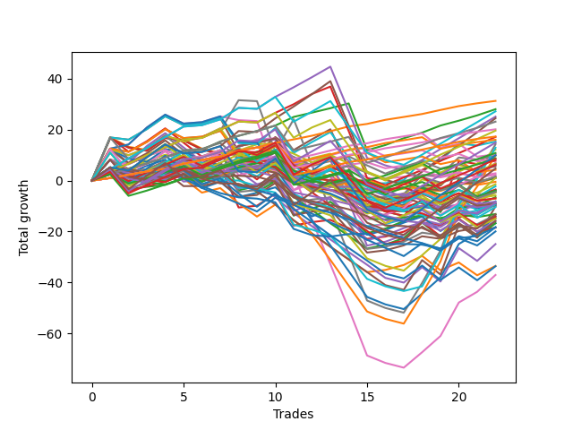

# Long Bulldog 006 
- Symbol: TSLA_Unlimited
- Date Range: 03/23/2022 - 07/08/2022
- Trading Period: 7:20-12:30
- Number of Trades: 22



| Name | Win Percent | Profit | Avg Profit / Trade | Avg Time / Trade |      | Name | Win Percent | Profit | Avg Profit / Trade | Avg Time / Trade |
| ---- | ----------- | ------ | ------------------ | ---------------- | ---- | ---- | ----------- | ------ | ------------------ | ---------------- |
| Sorted By <br> Profit | | | | | | Sorted By <br> Win Percentage ||||
| Eighty-One | 100.00 | 15640.00 | 710.91 | 17:06 |     | Eighty-One | 100.00 | 15640.00 | 710.91 | 17:06 |
| Eighty-Two | 95.45 | 14010.00 | 636.82 | 38:32 |     | Eighty-Two | 95.45 | 14010.00 | 636.82 | 38:32 |
| One Hundred Twenty-Four | 72.73 | 13590.00 | 617.73 | 53:27 |     | One Hundred Twenty-One | 95.45 | 10065.00 | 457.50 | 09:39 |
| Eighty-Four | 77.27 | 12545.00 | 570.23 | 78:49 |     | One Hundred Twenty-Six | 95.45 | 8650.00 | 393.18 | 10:19 |
| Eighty-Five | 68.18 | 12240.00 | 556.36 | 99:25 |     | One Hundred Twenty-Two | 90.91 | 11565.00 | 525.68 | 22:06 |
| One Hundred Twenty-Two | 90.91 | 11565.00 | 525.68 | 22:06 |     | One Hundred Sixteen | 90.91 | 8020.00 | 364.55 | 05:29 |
| One Hundred Twenty-One | 95.45 | 10065.00 | 457.50 | 09:39 |     | One Hundred Twenty-Seven | 86.36 | 5415.00 | 246.14 | 15:34 |
| One Hundred Twenty-Three | 77.27 | 9805.00 | 445.68 | 35:30 |     | One Hundred Eleven | 86.36 | 5165.00 | 234.77 | 04:57 |
| One Hundred Twenty-Six | 95.45 | 8650.00 | 393.18 | 10:19 |     | Eighty-Three | 81.82 | 8575.00 | 389.77 | 60:50 |
| Eighty-Three | 81.82 | 8575.00 | 389.77 | 60:50 |     | Eighty-Four | 77.27 | 12545.00 | 570.23 | 78:49 |
| One Hundred Sixteen | 90.91 | 8020.00 | 364.55 | 05:29 |     | One Hundred Twenty-Three | 77.27 | 9805.00 | 445.68 | 35:30 |
| Sixty-One | 63.64 | 7660.00 | 348.18 | 55:23 |     | One Hundred One | 77.27 | 4275.00 | 194.32 | 03:22 |
| One Hundred Twenty-Nine | 68.18 | 7450.00 | 338.64 | 46:12 |     | One Hundred Six | 77.27 | 2115.00 | 96.14 | 04:00 |
| Seven | 54.55 | 7125.00 | 323.86 | 161:39 |     | One Hundred Twenty-Four | 72.73 | 13590.00 | 617.73 | 53:27 |
| Seventy-One | 40.91 | 6455.00 | 293.41 | 88:11 |     | One Hundred Seventeen | 72.73 | 4375.00 | 198.86 | 08:57 |
| Sixty | 63.64 | 6090.00 | 276.82 | 33:02 |     | One Hundred Twenty-Eight | 72.73 | 4200.00 | 190.91 | 28:19 |
| One Hundred Twenty-Seven | 86.36 | 5415.00 | 246.14 | 15:34 |     | Fifty-Seven | 72.73 | 770.00 | 35.00 | 14:40 |
| One Hundred Eleven | 86.36 | 5165.00 | 234.77 | 04:57 |     | One | 72.73 | 580.00 | 26.36 | 17:55 |
| Sixty-Three | 45.45 | 4980.00 | 226.36 | 111:47 |     | Sixty-Five | 72.73 | -1755.00 | -79.77 | 14:01 |
| One Hundred Twenty-Five | 59.09 | 4965.00 | 225.68 | 64:00 |     | Eighty-Five | 68.18 | 12240.00 | 556.36 | 99:25 |
| Sixty-Nine | 63.64 | 4920.00 | 223.64 | 51:28 |     | One Hundred Twenty-Nine | 68.18 | 7450.00 | 338.64 | 46:12 |
| One Hundred Seventeen | 72.73 | 4375.00 | 198.86 | 08:57 |     | Fifty-Eight | 68.18 | -2220.00 | -100.91 | 22:45 |
| One Hundred One | 77.27 | 4275.00 | 194.32 | 03:22 |     | One Hundred Twelve | 68.18 | -2240.00 | -101.82 | 08:39 |
| One Hundred Twenty-Eight | 72.73 | 4200.00 | 190.91 | 28:19 |     | Two | 68.18 | -3245.00 | -147.50 | 28:46 |
| Fifty-Five | 27.27 | 3885.00 | 176.59 | 28:56 |     | Sixty-Six | 68.18 | -4615.00 | -209.77 | 20:28 |
| Sixty-Eight | 63.64 | 3490.00 | 158.64 | 29:15 |     | Three | 68.18 | -4745.00 | -215.68 | 31:32 |
| Fifty-Two | 40.91 | 3355.00 | 152.50 | 18:28 |     | Fifty-Nine | 68.18 | -6725.00 | -305.68 | 25:13 |
| One Hundred Three | 54.55 | 3330.00 | 151.36 | 09:30 |     | Sixty-Seven | 68.18 | -7435.00 | -337.95 | 22:07 |
| One Hundred Eighteen | 59.09 | 3140.00 | 142.73 | 14:05 |     | Sixty-One | 63.64 | 7660.00 | 348.18 | 55:23 |
| One Hundred Two | 63.64 | 3080.00 | 140.00 | 05:41 |     | Sixty | 63.64 | 6090.00 | 276.82 | 33:02 |
| Five | 63.64 | 2815.00 | 127.95 | 75:43 |     | Sixty-Nine | 63.64 | 4920.00 | 223.64 | 51:28 |
| One Hundred Thirty | 59.09 | 2390.00 | 108.64 | 50:13 |     | Sixty-Eight | 63.64 | 3490.00 | 158.64 | 29:15 |
| One Hundred Six | 77.27 | 2115.00 | 96.14 | 04:00 |     | One Hundred Two | 63.64 | 3080.00 | 140.00 | 05:41 |
| Forty-Eight | 63.64 | 1425.00 | 64.77 | 07:16 |     | Five | 63.64 | 2815.00 | 127.95 | 75:43 |
| Ninety-One | 63.64 | 1125.00 | 51.14 | 02:36 |     | Forty-Eight | 63.64 | 1425.00 | 64.77 | 07:16 |
| Ninety-Two | 50.00 | 800.00 | 36.36 | 04:35 |     | Ninety-One | 63.64 | 1125.00 | 51.14 | 02:36 |
| Fifty-Seven | 72.73 | 770.00 | 35.00 | 14:40 |     | Four | 63.64 | -1815.00 | -82.50 | 48:35 |
| One | 72.73 | 580.00 | 26.36 | 17:55 |     | Forty | 63.64 | -2900.00 | -131.82 | 07:15 |
| Seventy | 45.45 | 525.00 | 23.86 | 70:31 |     | Fifty-Six | 63.64 | -4620.00 | -210.00 | 09:09 |
| Fifty-Four | 27.27 | 455.00 | 20.68 | 26:46 |     | Forty-One | 63.64 | -4660.00 | -211.82 | 11:32 |
| Fifty-Three | 27.27 | -235.00 | -10.68 | 23:31 |     | Zero | 63.64 | -4825.00 | -219.32 | 11:19 |
| Fifty | 50.00 | -715.00 | -32.50 | 13:04 |     | Sixty-Four | 63.64 | -6560.00 | -298.18 | 08:32 |
| One Hundred Four | 40.91 | -1115.00 | -50.68 | 13:13 |     | One Hundred Twenty-Five | 59.09 | 4965.00 | 225.68 | 64:00 |
| Sixty-Five | 72.73 | -1755.00 | -79.77 | 14:01 |     | One Hundred Eighteen | 59.09 | 3140.00 | 142.73 | 14:05 |
| Four | 63.64 | -1815.00 | -82.50 | 48:35 |     | One Hundred Thirty | 59.09 | 2390.00 | 108.64 | 50:13 |
| Forty-Nine | 59.09 | -1840.00 | -83.64 | 10:57 |     | Forty-Nine | 59.09 | -1840.00 | -83.64 | 10:57 |
| One Hundred Seven | 50.00 | -1950.00 | -88.64 | 06:02 |     | Seven | 54.55 | 7125.00 | 323.86 | 161:39 |
| Ninety-Seven | 40.91 | -2110.00 | -95.91 | 03:48 |     | One Hundred Three | 54.55 | 3330.00 | 151.36 | 09:30 |
| Fifty-Eight | 68.18 | -2220.00 | -100.91 | 22:45 |     | Ninety-Six | 54.55 | -3530.00 | -160.45 | 02:36 |
| One Hundred Twelve | 68.18 | -2240.00 | -101.82 | 08:39 |     | One Hundred Thirteen | 54.55 | -7485.00 | -340.23 | 13:52 |
| Ninety-Three | 36.36 | -2370.00 | -107.73 | 06:37 |     | Forty-Two | 54.55 | -8365.00 | -380.23 | 14:44 |
| Forty | 63.64 | -2900.00 | -131.82 | 07:15 |     | Ninety-Two | 50.00 | 800.00 | 36.36 | 04:35 |
| Two | 68.18 | -3245.00 | -147.50 | 28:46 |     | Fifty | 50.00 | -715.00 | -32.50 | 13:04 |
| Ninety-Eight | 40.91 | -3480.00 | -158.18 | 04:45 |     | One Hundred Seven | 50.00 | -1950.00 | -88.64 | 06:02 |
| Ninety-Six | 54.55 | -3530.00 | -160.45 | 02:36 |     | One Hundred Fourteen | 50.00 | -5175.00 | -235.23 | 24:57 |
| Fifty-One | 40.91 | -4065.00 | -184.77 | 14:50 |     | Sixty-Two | 50.00 | -7030.00 | -319.55 | 85:03 |
| Ninety-Nine | 40.91 | -4135.00 | -187.95 | 05:12 |     | Six | 50.00 | -18520.00 | -841.82 | 131:18 |
| One Hundred Ninteen | 36.36 | -4360.00 | -198.18 | 17:44 |     | Sixty-Three | 45.45 | 4980.00 | 226.36 | 111:47 |
| One Hundred | 40.91 | -4470.00 | -203.18 | 05:31 |     | Seventy | 45.45 | 525.00 | 23.86 | 70:31 |
| Ninety-Four | 27.27 | -4610.00 | -209.55 | 08:37 |     | Forty-Four | 45.45 | -8375.00 | -380.68 | 21:58 |
| Sixty-Six | 68.18 | -4615.00 | -209.77 | 20:28 |     | Forty-Three | 45.45 | -16755.00 | -761.59 | 18:07 |
| Fifty-Six | 63.64 | -4620.00 | -210.00 | 09:09 |     | Seventy-One | 40.91 | 6455.00 | 293.41 | 88:11 |
| Forty-One | 63.64 | -4660.00 | -211.82 | 11:32 |     | Fifty-Two | 40.91 | 3355.00 | 152.50 | 18:28 |
| Three | 68.18 | -4745.00 | -215.68 | 31:32 |     | One Hundred Four | 40.91 | -1115.00 | -50.68 | 13:13 |
| Zero | 63.64 | -4825.00 | -219.32 | 11:19 |     | Ninety-Seven | 40.91 | -2110.00 | -95.91 | 03:48 |
| Forty-Seven | 31.82 | -5050.00 | -229.55 | 64:22 |     | Ninety-Eight | 40.91 | -3480.00 | -158.18 | 04:45 |
| One Hundred Fourteen | 50.00 | -5175.00 | -235.23 | 24:57 |     | Fifty-One | 40.91 | -4065.00 | -184.77 | 14:50 |
| Sixty-Four | 63.64 | -6560.00 | -298.18 | 08:32 |     | Ninety-Nine | 40.91 | -4135.00 | -187.95 | 05:12 |
| One Hundred Twenty | 27.27 | -6640.00 | -301.82 | 19:03 |     | One Hundred | 40.91 | -4470.00 | -203.18 | 05:31 |
| Fifty-Nine | 68.18 | -6725.00 | -305.68 | 25:13 |     | Seventy-Three | 40.91 | -9150.00 | -415.91 | 11:21 |
| Sixty-Two | 50.00 | -7030.00 | -319.55 | 85:03 |     | Forty-Five | 40.91 | -9240.00 | -420.00 | 34:19 |
| One Hundred Eight | 27.27 | -7085.00 | -322.05 | 07:23 |     | Ninety-Three | 36.36 | -2370.00 | -107.73 | 06:37 |
| Sixty-Seven | 68.18 | -7435.00 | -337.95 | 22:07 |     | One Hundred Ninteen | 36.36 | -4360.00 | -198.18 | 17:44 |
| One Hundred Thirteen | 54.55 | -7485.00 | -340.23 | 13:52 |     | One Hundred Fifteen | 36.36 | -16805.00 | -763.86 | 28:19 |
| One Hundred Nine | 27.27 | -7895.00 | -358.86 | 07:56 |     | Forty-Seven | 31.82 | -5050.00 | -229.55 | 64:22 |
| One Hundred Ten | 27.27 | -7945.00 | -361.14 | 08:44 |     | Forty-Six | 31.82 | -12460.00 | -566.36 | 48:15 |
| Forty-Two | 54.55 | -8365.00 | -380.23 | 14:44 |     | Fifty-Five | 27.27 | 3885.00 | 176.59 | 28:56 |
| Forty-Four | 45.45 | -8375.00 | -380.68 | 21:58 |     | Fifty-Four | 27.27 | 455.00 | 20.68 | 26:46 |
| Ninety-Five | 18.18 | -9140.00 | -415.45 | 10:28 |     | Fifty-Three | 27.27 | -235.00 | -10.68 | 23:31 |
| Seventy-Three | 40.91 | -9150.00 | -415.91 | 11:21 |     | Ninety-Four | 27.27 | -4610.00 | -209.55 | 08:37 |
| Forty-Five | 40.91 | -9240.00 | -420.00 | 34:19 |     | One Hundred Twenty | 27.27 | -6640.00 | -301.82 | 19:03 |
| One Hundred Five | 27.27 | -9970.00 | -453.18 | 15:50 |     | One Hundred Eight | 27.27 | -7085.00 | -322.05 | 07:23 |
| Forty-Six | 31.82 | -12460.00 | -566.36 | 48:15 |     | One Hundred Nine | 27.27 | -7895.00 | -358.86 | 07:56 |
| Forty-Three | 45.45 | -16755.00 | -761.59 | 18:07 |     | One Hundred Ten | 27.27 | -7945.00 | -361.14 | 08:44 |
| One Hundred Fifteen | 36.36 | -16805.00 | -763.86 | 28:19 |     | One Hundred Five | 27.27 | -9970.00 | -453.18 | 15:50 |
| Six | 50.00 | -18520.00 | -841.82 | 131:18 |     | Ninety-Five | 18.18 | -9140.00 | -415.45 | 10:28 |

## NO STOPLOSS

### Test Zero
* Sell when price hits the middle line of the 20p bollinger
* No Stoploss
* Results:
```
Total Trades: 22
Percent Up: 63.64
Percent Down: 36.36
Total Points Moved Up: -9.65
Potential Profit: -4825.00
Total Points Ups: 27.36 Count Ups: 14
Total Points Downs: -37.01 Count Downs: 8
```

<details><summary>Trades</summary>

<code>In: 2022-03-23 11:13:00		Out: 2022-03-23 11:16:45		Total Position Time: 03:45		Total Move Up: 5.17		Total to Date: 5.17</code> <br />
<code>In: 2022-03-25 08:12:00		Out: 2022-03-25 08:41:30		Total Position Time: 29:30		Total Move Up: -4.13		Total to Date: 1.04</code> <br />
<code>In: 2022-03-25 08:30:00		Out: 2022-03-25 08:41:30		Total Position Time: 11:30		Total Move Up: 0.89		Total to Date: 1.93</code> <br />
<code>In: 2022-03-25 12:23:00		Out: 2022-03-25 12:35:45		Total Position Time: 12:45		Total Move Up: 0.74		Total to Date: 2.67</code> <br />
<code>In: 2022-03-30 11:30:00		Out: 2022-03-30 11:32:50		Total Position Time: 02:50		Total Move Up: 2.44		Total to Date: 5.11</code> <br />
<code>In: 2022-03-30 12:07:00		Out: 2022-03-30 12:13:15		Total Position Time: 06:15		Total Move Up: 1.47		Total to Date: 6.58</code> <br />
<code>In: 2022-03-30 12:11:00		Out: 2022-03-30 12:13:15		Total Position Time: 02:15		Total Move Up: 3.18		Total to Date: 9.76</code> <br />
<code>In: 2022-04-07 07:51:00		Out: 2022-04-07 08:00:05		Total Position Time: 09:05		Total Move Up: 3.51		Total to Date: 13.27</code> <br />
<code>In: 2022-04-27 12:11:00		Out: 2022-04-27 12:14:00		Total Position Time: 03:00		Total Move Up: 2.45		Total to Date: 15.72</code> <br />
<code>In: 2022-04-29 09:47:00		Out: 2022-04-29 10:00:40		Total Position Time: 13:40		Total Move Up: 0.44		Total to Date: 16.16</code> <br />
<code>In: 2022-05-10 07:45:00		Out: 2022-05-10 08:19:05		Total Position Time: 34:05		Total Move Up: -16.60		Total to Date: -0.44</code> <br />
<code>In: 2022-05-11 10:50:00		Out: 2022-05-11 11:01:35		Total Position Time: 11:35		Total Move Up: -0.14		Total to Date: -0.58</code> <br />
<code>In: 2022-05-16 08:02:00		Out: 2022-05-16 08:09:55		Total Position Time: 07:55		Total Move Up: 2.90		Total to Date: 2.32</code> <br />
<code>In: 2022-05-18 09:11:00		Out: 2022-05-18 09:39:50		Total Position Time: 28:50		Total Move Up: -6.45		Total to Date: -4.13</code> <br />
<code>In: 2022-05-18 09:12:00		Out: 2022-05-18 09:39:50		Total Position Time: 27:50		Total Move Up: -7.35		Total to Date: -11.48</code> <br />
<code>In: 2022-06-08 09:42:00		Out: 2022-06-08 09:50:25		Total Position Time: 08:25		Total Move Up: -0.28		Total to Date: -11.76</code> <br />
<code>In: 2022-06-08 09:48:00		Out: 2022-06-08 09:50:25		Total Position Time: 02:25		Total Move Up: 0.79		Total to Date: -10.97</code> <br />
<code>In: 2022-06-17 07:38:00		Out: 2022-06-17 07:43:50		Total Position Time: 05:50		Total Move Up: 0.64		Total to Date: -10.33</code> <br />
<code>In: 2022-06-23 09:42:00		Out: 2022-06-23 09:54:00		Total Position Time: 12:00		Total Move Up: -0.90		Total to Date: -11.23</code> <br />
<code>In: 2022-06-23 10:44:00		Out: 2022-06-23 10:46:10		Total Position Time: 02:10		Total Move Up: 1.52		Total to Date: -9.71</code> <br />
<code>In: 2022-06-29 08:17:00		Out: 2022-06-29 08:28:15		Total Position Time: 11:15		Total Move Up: -1.16		Total to Date: -10.87</code> <br />
<code>In: 2022-06-29 08:26:00		Out: 2022-06-29 08:28:15		Total Position Time: 02:15		Total Move Up: 1.22		Total to Date: -9.65</code> <br />


</details>

### Test One
* Sell when the price hits the upper line of the 20p 1std bollinger
* No Stoploss
* Results:
```
Total Trades: 22
Percent Up: 72.73
Percent Down: 27.27
Total Points Moved Up: 1.16
Potential Profit: 580.00
Total Points Ups: 35.37 Count Ups: 16
Total Points Downs: -34.21 Count Downs: 6
```

<details><summary>Trades</summary>

<code>In: 2022-03-23 11:13:00		Out: 2022-03-23 11:26:05		Total Position Time: 13:05		Total Move Up: 4.30		Total to Date: 4.30</code> <br />
<code>In: 2022-03-25 08:12:00		Out: 2022-03-25 08:41:55		Total Position Time: 29:55		Total Move Up: -2.96		Total to Date: 1.34</code> <br />
<code>In: 2022-03-25 08:30:00		Out: 2022-03-25 08:41:55		Total Position Time: 11:55		Total Move Up: 2.06		Total to Date: 3.40</code> <br />
<code>In: 2022-03-25 12:23:00		Out: 2022-03-25 12:36:25		Total Position Time: 13:25		Total Move Up: 1.67		Total to Date: 5.07</code> <br />
<code>In: 2022-03-30 11:30:00		Out: 2022-03-30 11:36:15		Total Position Time: 06:15		Total Move Up: 2.91		Total to Date: 7.98</code> <br />
<code>In: 2022-03-30 12:07:00		Out: 2022-03-30 12:32:45		Total Position Time: 25:45		Total Move Up: -0.31		Total to Date: 7.67</code> <br />
<code>In: 2022-03-30 12:11:00		Out: 2022-03-30 12:32:45		Total Position Time: 21:45		Total Move Up: 1.40		Total to Date: 9.07</code> <br />
<code>In: 2022-04-07 07:51:00		Out: 2022-04-07 08:01:05		Total Position Time: 10:05		Total Move Up: 4.51		Total to Date: 13.58</code> <br />
<code>In: 2022-04-27 12:11:00		Out: 2022-04-27 12:31:10		Total Position Time: 20:10		Total Move Up: 1.22		Total to Date: 14.80</code> <br />
<code>In: 2022-04-29 09:47:00		Out: 2022-04-29 10:01:00		Total Position Time: 14:00		Total Move Up: 1.78		Total to Date: 16.58</code> <br />
<code>In: 2022-05-10 07:45:00		Out: 2022-05-10 08:29:40		Total Position Time: 44:40		Total Move Up: -16.25		Total to Date: 0.33</code> <br />
<code>In: 2022-05-11 10:50:00		Out: 2022-05-11 11:04:20		Total Position Time: 14:20		Total Move Up: 1.50		Total to Date: 1.83</code> <br />
<code>In: 2022-05-16 08:02:00		Out: 2022-05-16 08:16:30		Total Position Time: 14:30		Total Move Up: 2.07		Total to Date: 3.90</code> <br />
<code>In: 2022-05-18 09:11:00		Out: 2022-05-18 09:46:35		Total Position Time: 35:35		Total Move Up: -6.61		Total to Date: -2.71</code> <br />
<code>In: 2022-05-18 09:12:00		Out: 2022-05-18 09:46:35		Total Position Time: 34:35		Total Move Up: -7.51		Total to Date: -10.22</code> <br />
<code>In: 2022-06-08 09:42:00		Out: 2022-06-08 09:56:40		Total Position Time: 14:40		Total Move Up: 1.61		Total to Date: -8.61</code> <br />
<code>In: 2022-06-08 09:48:00		Out: 2022-06-08 09:56:40		Total Position Time: 08:40		Total Move Up: 2.68		Total to Date: -5.93</code> <br />
<code>In: 2022-06-17 07:38:00		Out: 2022-06-17 07:44:35		Total Position Time: 06:35		Total Move Up: 2.41		Total to Date: -3.52</code> <br />
<code>In: 2022-06-23 09:42:00		Out: 2022-06-23 10:11:35		Total Position Time: 29:35		Total Move Up: -0.57		Total to Date: -4.09</code> <br />
<code>In: 2022-06-23 10:44:00		Out: 2022-06-23 10:47:30		Total Position Time: 03:30		Total Move Up: 2.79		Total to Date: -1.30</code> <br />
<code>In: 2022-06-29 08:17:00		Out: 2022-06-29 08:32:15		Total Position Time: 15:15		Total Move Up: 0.04		Total to Date: -1.26</code> <br />
<code>In: 2022-06-29 08:26:00		Out: 2022-06-29 08:32:15		Total Position Time: 06:15		Total Move Up: 2.42		Total to Date: 1.16</code> <br />


</details>

### Test Two
* Sell when the price hits the upper line of the 20p 2std bollinger
* No Stoploss
* Results:
```
Total Trades: 22
Percent Up: 68.18
Percent Down: 31.82
Total Points Moved Up: -6.49
Potential Profit: -3245.00
Total Points Ups: 42.44 Count Ups: 15
Total Points Downs: -48.93 Count Downs: 7
```

<details><summary>Trades</summary>

<code>In: 2022-03-23 11:13:00		Out: 2022-03-23 11:27:35		Total Position Time: 14:35		Total Move Up: 8.22		Total to Date: 8.22</code> <br />
<code>In: 2022-03-25 08:12:00		Out: 2022-03-25 08:44:45		Total Position Time: 32:45		Total Move Up: -1.77		Total to Date: 6.45</code> <br />
<code>In: 2022-03-25 08:30:00		Out: 2022-03-25 08:44:45		Total Position Time: 14:45		Total Move Up: 3.25		Total to Date: 9.70</code> <br />
<code>In: 2022-03-25 12:23:00		Out: 2022-03-25 12:37:15		Total Position Time: 14:15		Total Move Up: 2.35		Total to Date: 12.05</code> <br />
<code>In: 2022-03-30 11:30:00		Out: 2022-03-30 12:36:15		Total Position Time: 66:15		Total Move Up: -3.30		Total to Date: 8.75</code> <br />
<code>In: 2022-03-30 12:07:00		Out: 2022-03-30 12:36:15		Total Position Time: 29:15		Total Move Up: 0.76		Total to Date: 9.51</code> <br />
<code>In: 2022-03-30 12:11:00		Out: 2022-03-30 12:36:15		Total Position Time: 25:15		Total Move Up: 2.47		Total to Date: 11.98</code> <br />
<code>In: 2022-04-07 07:51:00		Out: 2022-04-07 09:09:30		Total Position Time: 78:30		Total Move Up: -15.79		Total to Date: -3.81</code> <br />
<code>In: 2022-04-27 12:11:00		Out: 2022-04-27 12:31:20		Total Position Time: 20:20		Total Move Up: 1.69		Total to Date: -2.12</code> <br />
<code>In: 2022-04-29 09:47:00		Out: 2022-04-29 10:01:05		Total Position Time: 14:05		Total Move Up: 2.13		Total to Date: 0.01</code> <br />
<code>In: 2022-05-10 07:45:00		Out: 2022-05-10 08:30:35		Total Position Time: 45:35		Total Move Up: -13.76		Total to Date: -13.75</code> <br />
<code>In: 2022-05-11 10:50:00		Out: 2022-05-11 11:24:00		Total Position Time: 34:00		Total Move Up: 2.73		Total to Date: -11.02</code> <br />
<code>In: 2022-05-16 08:02:00		Out: 2022-05-16 08:17:25		Total Position Time: 15:25		Total Move Up: 2.71		Total to Date: -8.31</code> <br />
<code>In: 2022-05-18 09:11:00		Out: 2022-05-18 09:47:30		Total Position Time: 36:30		Total Move Up: -5.72		Total to Date: -14.03</code> <br />
<code>In: 2022-05-18 09:12:00		Out: 2022-05-18 09:47:30		Total Position Time: 35:30		Total Move Up: -6.62		Total to Date: -20.65</code> <br />
<code>In: 2022-06-08 09:42:00		Out: 2022-06-08 09:56:55		Total Position Time: 14:55		Total Move Up: 1.84		Total to Date: -18.81</code> <br />
<code>In: 2022-06-08 09:48:00		Out: 2022-06-08 09:56:55		Total Position Time: 08:55		Total Move Up: 2.91		Total to Date: -15.90</code> <br />
<code>In: 2022-06-17 07:38:00		Out: 2022-06-17 07:56:25		Total Position Time: 18:25		Total Move Up: 2.35		Total to Date: -13.55</code> <br />
<code>In: 2022-06-23 09:42:00		Out: 2022-06-23 10:55:45		Total Position Time: 73:45		Total Move Up: -1.97		Total to Date: -15.52</code> <br />
<code>In: 2022-06-23 10:44:00		Out: 2022-06-23 10:55:45		Total Position Time: 11:45		Total Move Up: 4.79		Total to Date: -10.73</code> <br />
<code>In: 2022-06-29 08:17:00		Out: 2022-06-29 08:35:35		Total Position Time: 18:35		Total Move Up: 0.93		Total to Date: -9.80</code> <br />
<code>In: 2022-06-29 08:26:00		Out: 2022-06-29 08:35:35		Total Position Time: 09:35		Total Move Up: 3.31		Total to Date: -6.49</code> <br />


</details>

### Test Three
* Sell when price hits the middle line of the 50p bollinger
* No Stoploss
* Results:
```
Total Trades: 22
Percent Up: 68.18
Percent Down: 31.82
Total Points Moved Up: -9.49
Potential Profit: -4745.00
Total Points Ups: 35.83 Count Ups: 15
Total Points Downs: -45.32 Count Downs: 7
```

<details><summary>Trades</summary>

<code>In: 2022-03-23 11:13:00		Out: 2022-03-23 11:27:35		Total Position Time: 14:35		Total Move Up: 8.22		Total to Date: 8.22</code> <br />
<code>In: 2022-03-25 08:12:00		Out: 2022-03-25 09:05:25		Total Position Time: 53:25		Total Move Up: -4.44		Total to Date: 3.78</code> <br />
<code>In: 2022-03-25 08:30:00		Out: 2022-03-25 09:05:25		Total Position Time: 35:25		Total Move Up: 0.58		Total to Date: 4.36</code> <br />
<code>In: 2022-03-25 12:23:00		Out: 2022-03-25 12:42:40		Total Position Time: 19:40		Total Move Up: 3.24		Total to Date: 7.60</code> <br />
<code>In: 2022-03-30 11:30:00		Out: 2022-03-30 12:33:35		Total Position Time: 63:35		Total Move Up: -4.00		Total to Date: 3.60</code> <br />
<code>In: 2022-03-30 12:07:00		Out: 2022-03-30 12:33:35		Total Position Time: 26:35		Total Move Up: 0.06		Total to Date: 3.66</code> <br />
<code>In: 2022-03-30 12:11:00		Out: 2022-03-30 12:33:35		Total Position Time: 22:35		Total Move Up: 1.77		Total to Date: 5.43</code> <br />
<code>In: 2022-04-07 07:51:00		Out: 2022-04-07 09:09:25		Total Position Time: 78:25		Total Move Up: -15.98		Total to Date: -10.55</code> <br />
<code>In: 2022-04-27 12:11:00		Out: 2022-04-27 12:46:20		Total Position Time: 35:20		Total Move Up: 0.69		Total to Date: -9.86</code> <br />
<code>In: 2022-04-29 09:47:00		Out: 2022-04-29 10:03:40		Total Position Time: 16:40		Total Move Up: 4.69		Total to Date: -5.17</code> <br />
<code>In: 2022-05-10 07:45:00		Out: 2022-05-10 08:31:30		Total Position Time: 46:30		Total Move Up: -12.46		Total to Date: -17.63</code> <br />
<code>In: 2022-05-11 10:50:00		Out: 2022-05-11 11:18:45		Total Position Time: 28:45		Total Move Up: 1.34		Total to Date: -16.29</code> <br />
<code>In: 2022-05-16 08:02:00		Out: 2022-05-16 08:39:35		Total Position Time: 37:35		Total Move Up: 0.88		Total to Date: -15.41</code> <br />
<code>In: 2022-05-18 09:11:00		Out: 2022-05-18 09:50:30		Total Position Time: 39:30		Total Move Up: -3.27		Total to Date: -18.68</code> <br />
<code>In: 2022-05-18 09:12:00		Out: 2022-05-18 09:50:30		Total Position Time: 38:30		Total Move Up: -4.17		Total to Date: -22.85</code> <br />
<code>In: 2022-06-08 09:42:00		Out: 2022-06-08 10:08:35		Total Position Time: 26:35		Total Move Up: 0.87		Total to Date: -21.98</code> <br />
<code>In: 2022-06-08 09:48:00		Out: 2022-06-08 10:08:35		Total Position Time: 20:35		Total Move Up: 1.94		Total to Date: -20.04</code> <br />
<code>In: 2022-06-17 07:38:00		Out: 2022-06-17 07:57:00		Total Position Time: 19:00		Total Move Up: 3.57		Total to Date: -16.47</code> <br />
<code>In: 2022-06-23 09:42:00		Out: 2022-06-23 10:17:20		Total Position Time: 35:20		Total Move Up: -1.00		Total to Date: -17.47</code> <br />
<code>In: 2022-06-23 10:44:00		Out: 2022-06-23 10:50:10		Total Position Time: 06:10		Total Move Up: 3.06		Total to Date: -14.41</code> <br />
<code>In: 2022-06-29 08:17:00		Out: 2022-06-29 08:36:05		Total Position Time: 19:05		Total Move Up: 1.27		Total to Date: -13.14</code> <br />
<code>In: 2022-06-29 08:26:00		Out: 2022-06-29 08:36:05		Total Position Time: 10:05		Total Move Up: 3.65		Total to Date: -9.49</code> <br />


</details>

### Test Four
* Sell when the price hits the upper line of the 50p 1std bollinger
* No Stoploss
* Results:
```
Total Trades: 22
Percent Up: 63.64
Percent Down: 36.36
Total Points Moved Up: -3.63
Potential Profit: -1815.00
Total Points Ups: 58.90 Count Ups: 14
Total Points Downs: -62.53 Count Downs: 8
```

<details><summary>Trades</summary>

<code>In: 2022-03-23 11:13:00		Out: 2022-03-23 11:29:15		Total Position Time: 16:15		Total Move Up: 12.30		Total to Date: 12.30</code> <br />
<code>In: 2022-03-25 08:12:00		Out: 2022-03-25 09:08:40		Total Position Time: 56:40		Total Move Up: -2.33		Total to Date: 9.97</code> <br />
<code>In: 2022-03-25 08:30:00		Out: 2022-03-25 09:08:40		Total Position Time: 38:40		Total Move Up: 2.69		Total to Date: 12.66</code> <br />
<code>In: 2022-03-25 12:23:00		Out: 2022-03-25 12:46:55		Total Position Time: 23:55		Total Move Up: 4.99		Total to Date: 17.65</code> <br />
<code>In: 2022-03-30 11:30:00		Out: 2022-03-30 12:45:20		Total Position Time: 75:20		Total Move Up: -2.33		Total to Date: 15.32</code> <br />
<code>In: 2022-03-30 12:07:00		Out: 2022-03-30 12:45:20		Total Position Time: 38:20		Total Move Up: 1.73		Total to Date: 17.05</code> <br />
<code>In: 2022-03-30 12:11:00		Out: 2022-03-30 12:45:20		Total Position Time: 34:20		Total Move Up: 3.44		Total to Date: 20.49</code> <br />
<code>In: 2022-04-07 07:51:00		Out: 2022-04-07 09:10:55		Total Position Time: 79:55		Total Move Up: -13.40		Total to Date: 7.09</code> <br />
<code>In: 2022-04-27 12:11:00		Out: 2022-04-27 12:47:00		Total Position Time: 36:00		Total Move Up: -0.37		Total to Date: 6.72</code> <br />
<code>In: 2022-04-29 09:47:00		Out: 2022-04-29 10:24:50		Total Position Time: 37:50		Total Move Up: 4.33		Total to Date: 11.05</code> <br />
<code>In: 2022-05-10 07:45:00		Out: 2022-05-10 08:38:55		Total Position Time: 53:55		Total Move Up: -8.73		Total to Date: 2.32</code> <br />
<code>In: 2022-05-11 10:50:00		Out: 2022-05-11 11:24:05		Total Position Time: 34:05		Total Move Up: 4.02		Total to Date: 6.34</code> <br />
<code>In: 2022-05-16 08:02:00		Out: 2022-05-16 08:45:20		Total Position Time: 43:20		Total Move Up: 1.67		Total to Date: 8.01</code> <br />
<code>In: 2022-05-18 09:11:00		Out: 2022-05-18 11:27:35		Total Position Time: 136:35		Total Move Up: -16.31		Total to Date: -8.30</code> <br />
<code>In: 2022-05-18 09:12:00		Out: 2022-05-18 11:27:35		Total Position Time: 135:35		Total Move Up: -17.21		Total to Date: -25.51</code> <br />
<code>In: 2022-06-08 09:42:00		Out: 2022-06-08 10:18:05		Total Position Time: 36:05		Total Move Up: 1.53		Total to Date: -23.98</code> <br />
<code>In: 2022-06-08 09:48:00		Out: 2022-06-08 10:18:05		Total Position Time: 30:05		Total Move Up: 2.60		Total to Date: -21.38</code> <br />
<code>In: 2022-06-17 07:38:00		Out: 2022-06-17 08:03:55		Total Position Time: 25:55		Total Move Up: 6.05		Total to Date: -15.33</code> <br />
<code>In: 2022-06-23 09:42:00		Out: 2022-06-23 10:55:50		Total Position Time: 73:50		Total Move Up: -1.85		Total to Date: -17.18</code> <br />
<code>In: 2022-06-23 10:44:00		Out: 2022-06-23 10:55:50		Total Position Time: 11:50		Total Move Up: 4.91		Total to Date: -12.27</code> <br />
<code>In: 2022-06-29 08:17:00		Out: 2022-06-29 08:46:50		Total Position Time: 29:50		Total Move Up: 3.13		Total to Date: -9.14</code> <br />
<code>In: 2022-06-29 08:26:00		Out: 2022-06-29 08:46:50		Total Position Time: 20:50		Total Move Up: 5.51		Total to Date: -3.63</code> <br />


</details>

### Test Five
* Sell when the price hits the upper line of the 50p 2std bollinger
* No Stoploss
* Results:
```
Total Trades: 22
Percent Up: 63.64
Percent Down: 36.36
Total Points Moved Up: 5.63
Potential Profit: 2815.00
Total Points Ups: 60.72 Count Ups: 14
Total Points Downs: -55.09 Count Downs: 8
```

<details><summary>Trades</summary>

<code>In: 2022-03-23 11:13:00		Out: 2022-03-23 11:48:30		Total Position Time: 35:30		Total Move Up: 16.94		Total to Date: 16.94</code> <br />
<code>In: 2022-03-25 08:12:00		Out: 2022-03-25 09:09:50		Total Position Time: 57:50		Total Move Up: -0.88		Total to Date: 16.06</code> <br />
<code>In: 2022-03-25 08:30:00		Out: 2022-03-25 09:09:50		Total Position Time: 39:50		Total Move Up: 4.14		Total to Date: 20.20</code> <br />
<code>In: 2022-03-25 12:23:00		Out: 2022-03-25 12:47:00		Total Position Time: 24:00		Total Move Up: 5.05		Total to Date: 25.25</code> <br />
<code>In: 2022-03-30 11:30:00		Out: 2022-03-30 12:47:00		Total Position Time: 77:00		Total Move Up: -3.50		Total to Date: 21.75</code> <br />
<code>In: 2022-03-30 12:07:00		Out: 2022-03-30 12:47:00		Total Position Time: 40:00		Total Move Up: 0.56		Total to Date: 22.31</code> <br />
<code>In: 2022-03-30 12:11:00		Out: 2022-03-30 12:47:00		Total Position Time: 36:00		Total Move Up: 2.27		Total to Date: 24.58</code> <br />
<code>In: 2022-04-07 07:51:00		Out: 2022-04-07 10:12:10		Total Position Time: 141:10		Total Move Up: -13.40		Total to Date: 11.18</code> <br />
<code>In: 2022-04-27 12:11:00		Out: 2022-04-27 12:47:00		Total Position Time: 36:00		Total Move Up: -0.37		Total to Date: 10.81</code> <br />
<code>In: 2022-04-29 09:47:00		Out: 2022-04-29 10:31:30		Total Position Time: 44:30		Total Move Up: 6.29		Total to Date: 17.10</code> <br />
<code>In: 2022-05-10 07:45:00		Out: 2022-05-10 08:39:50		Total Position Time: 54:50		Total Move Up: -5.11		Total to Date: 11.99</code> <br />
<code>In: 2022-05-11 10:50:00		Out: 2022-05-11 11:36:05		Total Position Time: 46:05		Total Move Up: 4.23		Total to Date: 16.22</code> <br />
<code>In: 2022-05-16 08:02:00		Out: 2022-05-16 08:47:05		Total Position Time: 45:05		Total Move Up: 3.92		Total to Date: 20.14</code> <br />
<code>In: 2022-05-18 09:11:00		Out: 2022-05-18 11:49:05		Total Position Time: 158:05		Total Move Up: -15.06		Total to Date: 5.08</code> <br />
<code>In: 2022-05-18 09:12:00		Out: 2022-05-18 11:49:05		Total Position Time: 157:05		Total Move Up: -15.96		Total to Date: -10.88</code> <br />
<code>In: 2022-06-08 09:42:00		Out: 2022-06-08 12:33:20		Total Position Time: 171:20		Total Move Up: 0.16		Total to Date: -10.72</code> <br />
<code>In: 2022-06-08 09:48:00		Out: 2022-06-08 12:33:20		Total Position Time: 165:20		Total Move Up: 1.23		Total to Date: -9.49</code> <br />
<code>In: 2022-06-17 07:38:00		Out: 2022-06-17 08:06:30		Total Position Time: 28:30		Total Move Up: 7.44		Total to Date: -2.05</code> <br />
<code>In: 2022-06-23 09:42:00		Out: 2022-06-23 11:09:40		Total Position Time: 87:40		Total Move Up: 0.08		Total to Date: -1.97</code> <br />
<code>In: 2022-06-23 10:44:00		Out: 2022-06-23 11:09:40		Total Position Time: 25:40		Total Move Up: 6.84		Total to Date: 4.87</code> <br />
<code>In: 2022-06-29 08:17:00		Out: 2022-06-29 09:58:40		Total Position Time: 101:40		Total Move Up: -0.81		Total to Date: 4.06</code> <br />
<code>In: 2022-06-29 08:26:00		Out: 2022-06-29 09:58:40		Total Position Time: 92:40		Total Move Up: 1.57		Total to Date: 5.63</code> <br />


</details>

### Test Six
* Sell when the price hits the middle line of the 1std VWAP
* No Stoploss
* Results:
```
Total Trades: 22
Percent Up: 50.00
Percent Down: 50.00
Total Points Moved Up: -37.04
Potential Profit: -18520.00
Total Points Ups: 65.08 Count Ups: 11
Total Points Downs: -102.12 Count Downs: 11
```

<details><summary>Trades</summary>

<code>In: 2022-03-23 11:13:00		Out: 2022-03-23 12:47:00		Total Position Time: 94:00		Total Move Up: 12.53		Total to Date: 12.53</code> <br />
<code>In: 2022-03-25 08:12:00		Out: 2022-03-25 10:58:35		Total Position Time: 166:35		Total Move Up: 1.64		Total to Date: 14.17</code> <br />
<code>In: 2022-03-25 08:30:00		Out: 2022-03-25 10:58:35		Total Position Time: 148:35		Total Move Up: 6.66		Total to Date: 20.83</code> <br />
<code>In: 2022-03-25 12:23:00		Out: 2022-03-25 12:47:00		Total Position Time: 24:00		Total Move Up: 5.05		Total to Date: 25.88</code> <br />
<code>In: 2022-03-30 11:30:00		Out: 2022-03-30 12:47:00		Total Position Time: 77:00		Total Move Up: -3.50		Total to Date: 22.38</code> <br />
<code>In: 2022-03-30 12:07:00		Out: 2022-03-30 12:47:00		Total Position Time: 40:00		Total Move Up: 0.56		Total to Date: 22.94</code> <br />
<code>In: 2022-03-30 12:11:00		Out: 2022-03-30 12:47:00		Total Position Time: 36:00		Total Move Up: 2.27		Total to Date: 25.21</code> <br />
<code>In: 2022-04-07 07:51:00		Out: 2022-04-07 11:02:00		Total Position Time: 191:00		Total Move Up: -1.48		Total to Date: 23.73</code> <br />
<code>In: 2022-04-27 12:11:00		Out: 2022-04-27 12:47:00		Total Position Time: 36:00		Total Move Up: -0.37		Total to Date: 23.36</code> <br />
<code>In: 2022-04-29 09:47:00		Out: 2022-04-29 12:47:00		Total Position Time: 180:00		Total Move Up: -19.90		Total to Date: 3.46</code> <br />
<code>In: 2022-05-10 07:45:00		Out: 2022-05-10 10:30:25		Total Position Time: 165:25		Total Move Up: -0.97		Total to Date: 2.49</code> <br />
<code>In: 2022-05-11 10:50:00		Out: 2022-05-11 12:47:00		Total Position Time: 117:00		Total Move Up: -18.05		Total to Date: -15.56</code> <br />
<code>In: 2022-05-16 08:02:00		Out: 2022-05-16 12:47:00		Total Position Time: 285:00		Total Move Up: -17.24		Total to Date: -32.80</code> <br />
<code>In: 2022-05-18 09:11:00		Out: 2022-05-18 12:47:00		Total Position Time: 216:00		Total Move Up: -17.47		Total to Date: -50.27</code> <br />
<code>In: 2022-05-18 09:12:00		Out: 2022-05-18 12:47:00		Total Position Time: 215:00		Total Move Up: -18.37		Total to Date: -68.64</code> <br />
<code>In: 2022-06-08 09:42:00		Out: 2022-06-08 12:47:00		Total Position Time: 185:00		Total Move Up: -2.92		Total to Date: -71.56</code> <br />
<code>In: 2022-06-08 09:48:00		Out: 2022-06-08 12:47:00		Total Position Time: 179:00		Total Move Up: -1.85		Total to Date: -73.41</code> <br />
<code>In: 2022-06-17 07:38:00		Out: 2022-06-17 08:03:55		Total Position Time: 25:55		Total Move Up: 6.05		Total to Date: -67.36</code> <br />
<code>In: 2022-06-23 09:42:00		Out: 2022-06-23 12:07:25		Total Position Time: 145:25		Total Move Up: 6.37		Total to Date: -60.99</code> <br />
<code>In: 2022-06-23 10:44:00		Out: 2022-06-23 12:07:25		Total Position Time: 83:25		Total Move Up: 13.13		Total to Date: -47.86</code> <br />
<code>In: 2022-06-29 08:17:00		Out: 2022-06-29 10:40:45		Total Position Time: 143:45		Total Move Up: 4.22		Total to Date: -43.64</code> <br />
<code>In: 2022-06-29 08:26:00		Out: 2022-06-29 10:40:45		Total Position Time: 134:45		Total Move Up: 6.60		Total to Date: -37.04</code> <br />


</details>

### Test Seven
* Sell when the price hits the upper line of the 1std VWAP
* No Stoploss
* Results:
```
Total Trades: 22
Percent Up: 54.55
Percent Down: 45.45
Total Points Moved Up: 14.25
Potential Profit: 7125.00
Total Points Ups: 115.13 Count Ups: 12
Total Points Downs: -100.88 Count Downs: 10
```

<details><summary>Trades</summary>

<code>In: 2022-03-23 11:13:00		Out: 2022-03-23 12:47:00		Total Position Time: 94:00		Total Move Up: 12.53		Total to Date: 12.53</code> <br />
<code>In: 2022-03-25 08:12:00		Out: 2022-03-25 12:47:00		Total Position Time: 275:00		Total Move Up: -1.21		Total to Date: 11.32</code> <br />
<code>In: 2022-03-25 08:30:00		Out: 2022-03-25 12:47:00		Total Position Time: 257:00		Total Move Up: 3.81		Total to Date: 15.13</code> <br />
<code>In: 2022-03-25 12:23:00		Out: 2022-03-25 12:47:00		Total Position Time: 24:00		Total Move Up: 5.05		Total to Date: 20.18</code> <br />
<code>In: 2022-03-30 11:30:00		Out: 2022-03-30 12:47:00		Total Position Time: 77:00		Total Move Up: -3.50		Total to Date: 16.68</code> <br />
<code>In: 2022-03-30 12:07:00		Out: 2022-03-30 12:47:00		Total Position Time: 40:00		Total Move Up: 0.56		Total to Date: 17.24</code> <br />
<code>In: 2022-03-30 12:11:00		Out: 2022-03-30 12:47:00		Total Position Time: 36:00		Total Move Up: 2.27		Total to Date: 19.51</code> <br />
<code>In: 2022-04-07 07:51:00		Out: 2022-04-07 12:11:25		Total Position Time: 260:25		Total Move Up: 12.04		Total to Date: 31.55</code> <br />
<code>In: 2022-04-27 12:11:00		Out: 2022-04-27 12:47:00		Total Position Time: 36:00		Total Move Up: -0.37		Total to Date: 31.18</code> <br />
<code>In: 2022-04-29 09:47:00		Out: 2022-04-29 12:47:00		Total Position Time: 180:00		Total Move Up: -19.90		Total to Date: 11.28</code> <br />
<code>In: 2022-05-10 07:45:00		Out: 2022-05-10 10:40:30		Total Position Time: 175:30		Total Move Up: 12.78		Total to Date: 24.06</code> <br />
<code>In: 2022-05-11 10:50:00		Out: 2022-05-11 12:47:00		Total Position Time: 117:00		Total Move Up: -18.05		Total to Date: 6.01</code> <br />
<code>In: 2022-05-16 08:02:00		Out: 2022-05-16 12:47:00		Total Position Time: 285:00		Total Move Up: -17.24		Total to Date: -11.23</code> <br />
<code>In: 2022-05-18 09:11:00		Out: 2022-05-18 12:47:00		Total Position Time: 216:00		Total Move Up: -17.47		Total to Date: -28.70</code> <br />
<code>In: 2022-05-18 09:12:00		Out: 2022-05-18 12:47:00		Total Position Time: 215:00		Total Move Up: -18.37		Total to Date: -47.07</code> <br />
<code>In: 2022-06-08 09:42:00		Out: 2022-06-08 12:47:00		Total Position Time: 185:00		Total Move Up: -2.92		Total to Date: -49.99</code> <br />
<code>In: 2022-06-08 09:48:00		Out: 2022-06-08 12:47:00		Total Position Time: 179:00		Total Move Up: -1.85		Total to Date: -51.84</code> <br />
<code>In: 2022-06-17 07:38:00		Out: 2022-06-17 10:04:40		Total Position Time: 146:40		Total Move Up: 11.67		Total to Date: -40.17</code> <br />
<code>In: 2022-06-23 09:42:00		Out: 2022-06-23 12:47:00		Total Position Time: 185:00		Total Move Up: 12.71		Total to Date: -27.46</code> <br />
<code>In: 2022-06-23 10:44:00		Out: 2022-06-23 12:47:00		Total Position Time: 123:00		Total Move Up: 19.47		Total to Date: -7.99</code> <br />
<code>In: 2022-06-29 08:17:00		Out: 2022-06-29 12:06:30		Total Position Time: 229:30		Total Move Up: 9.93		Total to Date: 1.94</code> <br />
<code>In: 2022-06-29 08:26:00		Out: 2022-06-29 12:06:30		Total Position Time: 220:30		Total Move Up: 12.31		Total to Date: 14.25</code> <br />


</details>

## STOPLOSS OF 5

### Test Forty
* Sell when price hits the middle line of the 20p bollinger
* Stoploss is 5 points
* Results:
```
Total Trades: 22
Percent Up: 63.64
Percent Down: 36.36
Total Points Moved Up: -5.80
Potential Profit: -2900.00
Total Points Ups: 27.36 Count Ups: 14
Total Points Downs: -33.16 Count Downs: 8
```

<details><summary>Trades</summary>

<code>In: 2022-03-23 11:13:00		Out: 2022-03-23 11:16:45		Total Position Time: 03:45		Total Move Up: 5.17		Total to Date: 5.17</code> <br />
<code>In: 2022-03-25 08:12:00		Out: 2022-03-25 08:26:30		Total Position Time: 14:30		Total Move Up: -5.62		Total to Date: -0.45</code> <br />
<code>In: 2022-03-25 08:30:00		Out: 2022-03-25 08:41:30		Total Position Time: 11:30		Total Move Up: 0.89		Total to Date: 0.44</code> <br />
<code>In: 2022-03-25 12:23:00		Out: 2022-03-25 12:35:45		Total Position Time: 12:45		Total Move Up: 0.74		Total to Date: 1.18</code> <br />
<code>In: 2022-03-30 11:30:00		Out: 2022-03-30 11:32:50		Total Position Time: 02:50		Total Move Up: 2.44		Total to Date: 3.62</code> <br />
<code>In: 2022-03-30 12:07:00		Out: 2022-03-30 12:13:15		Total Position Time: 06:15		Total Move Up: 1.47		Total to Date: 5.09</code> <br />
<code>In: 2022-03-30 12:11:00		Out: 2022-03-30 12:13:15		Total Position Time: 02:15		Total Move Up: 3.18		Total to Date: 8.27</code> <br />
<code>In: 2022-04-07 07:51:00		Out: 2022-04-07 08:00:05		Total Position Time: 09:05		Total Move Up: 3.51		Total to Date: 11.78</code> <br />
<code>In: 2022-04-27 12:11:00		Out: 2022-04-27 12:14:00		Total Position Time: 03:00		Total Move Up: 2.45		Total to Date: 14.23</code> <br />
<code>In: 2022-04-29 09:47:00		Out: 2022-04-29 10:00:40		Total Position Time: 13:40		Total Move Up: 0.44		Total to Date: 14.67</code> <br />
<code>In: 2022-05-10 07:45:00		Out: 2022-05-10 07:47:25		Total Position Time: 02:25		Total Move Up: -6.20		Total to Date: 8.47</code> <br />
<code>In: 2022-05-11 10:50:00		Out: 2022-05-11 10:58:40		Total Position Time: 08:40		Total Move Up: -5.19		Total to Date: 3.28</code> <br />
<code>In: 2022-05-16 08:02:00		Out: 2022-05-16 08:09:55		Total Position Time: 07:55		Total Move Up: 2.90		Total to Date: 6.18</code> <br />
<code>In: 2022-05-18 09:11:00		Out: 2022-05-18 09:22:15		Total Position Time: 11:15		Total Move Up: -4.97		Total to Date: 1.21</code> <br />
<code>In: 2022-05-18 09:12:00		Out: 2022-05-18 09:21:45		Total Position Time: 09:45		Total Move Up: -4.97		Total to Date: -3.76</code> <br />
<code>In: 2022-06-08 09:42:00		Out: 2022-06-08 09:50:25		Total Position Time: 08:25		Total Move Up: -0.28		Total to Date: -4.04</code> <br />
<code>In: 2022-06-08 09:48:00		Out: 2022-06-08 09:50:25		Total Position Time: 02:25		Total Move Up: 0.79		Total to Date: -3.25</code> <br />
<code>In: 2022-06-17 07:38:00		Out: 2022-06-17 07:43:50		Total Position Time: 05:50		Total Move Up: 0.64		Total to Date: -2.61</code> <br />
<code>In: 2022-06-23 09:42:00		Out: 2022-06-23 09:54:00		Total Position Time: 12:00		Total Move Up: -0.90		Total to Date: -3.51</code> <br />
<code>In: 2022-06-23 10:44:00		Out: 2022-06-23 10:46:10		Total Position Time: 02:10		Total Move Up: 1.52		Total to Date: -1.99</code> <br />
<code>In: 2022-06-29 08:17:00		Out: 2022-06-29 08:23:55		Total Position Time: 06:55		Total Move Up: -5.03		Total to Date: -7.02</code> <br />
<code>In: 2022-06-29 08:26:00		Out: 2022-06-29 08:28:15		Total Position Time: 02:15		Total Move Up: 1.22		Total to Date: -5.80</code> <br />


</details>

### Test Forty-One
* Sell when the price hits the upper line of the 20p 1std bollinger
* Stoploss is 5 points
* Results:
```
Total Trades: 22
Percent Up: 63.64
Percent Down: 36.36
Total Points Moved Up: -9.32
Potential Profit: -4660.00
Total Points Ups: 33.83 Count Ups: 14
Total Points Downs: -43.15 Count Downs: 8
```

<details><summary>Trades</summary>

<code>In: 2022-03-23 11:13:00		Out: 2022-03-23 11:26:05		Total Position Time: 13:05		Total Move Up: 4.30		Total to Date: 4.30</code> <br />
<code>In: 2022-03-25 08:12:00		Out: 2022-03-25 08:26:30		Total Position Time: 14:30		Total Move Up: -5.62		Total to Date: -1.32</code> <br />
<code>In: 2022-03-25 08:30:00		Out: 2022-03-25 08:41:55		Total Position Time: 11:55		Total Move Up: 2.06		Total to Date: 0.74</code> <br />
<code>In: 2022-03-25 12:23:00		Out: 2022-03-25 12:36:25		Total Position Time: 13:25		Total Move Up: 1.67		Total to Date: 2.41</code> <br />
<code>In: 2022-03-30 11:30:00		Out: 2022-03-30 11:36:15		Total Position Time: 06:15		Total Move Up: 2.91		Total to Date: 5.32</code> <br />
<code>In: 2022-03-30 12:07:00		Out: 2022-03-30 12:23:20		Total Position Time: 16:20		Total Move Up: -5.53		Total to Date: -0.21</code> <br />
<code>In: 2022-03-30 12:11:00		Out: 2022-03-30 12:32:45		Total Position Time: 21:45		Total Move Up: 1.40		Total to Date: 1.19</code> <br />
<code>In: 2022-04-07 07:51:00		Out: 2022-04-07 08:01:05		Total Position Time: 10:05		Total Move Up: 4.51		Total to Date: 5.70</code> <br />
<code>In: 2022-04-27 12:11:00		Out: 2022-04-27 12:31:10		Total Position Time: 20:10		Total Move Up: 1.22		Total to Date: 6.92</code> <br />
<code>In: 2022-04-29 09:47:00		Out: 2022-04-29 10:01:00		Total Position Time: 14:00		Total Move Up: 1.78		Total to Date: 8.70</code> <br />
<code>In: 2022-05-10 07:45:00		Out: 2022-05-10 07:47:25		Total Position Time: 02:25		Total Move Up: -6.20		Total to Date: 2.50</code> <br />
<code>In: 2022-05-11 10:50:00		Out: 2022-05-11 10:58:40		Total Position Time: 08:40		Total Move Up: -5.19		Total to Date: -2.69</code> <br />
<code>In: 2022-05-16 08:02:00		Out: 2022-05-16 08:16:30		Total Position Time: 14:30		Total Move Up: 2.07		Total to Date: -0.62</code> <br />
<code>In: 2022-05-18 09:11:00		Out: 2022-05-18 09:22:15		Total Position Time: 11:15		Total Move Up: -4.97		Total to Date: -5.59</code> <br />
<code>In: 2022-05-18 09:12:00		Out: 2022-05-18 09:21:45		Total Position Time: 09:45		Total Move Up: -4.97		Total to Date: -10.56</code> <br />
<code>In: 2022-06-08 09:42:00		Out: 2022-06-08 09:56:40		Total Position Time: 14:40		Total Move Up: 1.61		Total to Date: -8.95</code> <br />
<code>In: 2022-06-08 09:48:00		Out: 2022-06-08 09:56:40		Total Position Time: 08:40		Total Move Up: 2.68		Total to Date: -6.27</code> <br />
<code>In: 2022-06-17 07:38:00		Out: 2022-06-17 07:44:35		Total Position Time: 06:35		Total Move Up: 2.41		Total to Date: -3.86</code> <br />
<code>In: 2022-06-23 09:42:00		Out: 2022-06-23 10:01:25		Total Position Time: 19:25		Total Move Up: -5.64		Total to Date: -9.50</code> <br />
<code>In: 2022-06-23 10:44:00		Out: 2022-06-23 10:47:30		Total Position Time: 03:30		Total Move Up: 2.79		Total to Date: -6.71</code> <br />
<code>In: 2022-06-29 08:17:00		Out: 2022-06-29 08:23:55		Total Position Time: 06:55		Total Move Up: -5.03		Total to Date: -11.74</code> <br />
<code>In: 2022-06-29 08:26:00		Out: 2022-06-29 08:32:15		Total Position Time: 06:15		Total Move Up: 2.42		Total to Date: -9.32</code> <br />


</details>

### Test Forty-Two
* Sell when the price hits the upper line of the 20p 2std bollinger
* Stoploss is 5 points
* Results:
```
Total Trades: 22
Percent Up: 54.55
Percent Down: 45.45
Total Points Moved Up: -16.73
Potential Profit: -8365.00
Total Points Ups: 38.02 Count Ups: 12
Total Points Downs: -54.75 Count Downs: 10
```

<details><summary>Trades</summary>

<code>In: 2022-03-23 11:13:00		Out: 2022-03-23 11:27:35		Total Position Time: 14:35		Total Move Up: 8.22		Total to Date: 8.22</code> <br />
<code>In: 2022-03-25 08:12:00		Out: 2022-03-25 08:26:30		Total Position Time: 14:30		Total Move Up: -5.62		Total to Date: 2.60</code> <br />
<code>In: 2022-03-25 08:30:00		Out: 2022-03-25 08:44:45		Total Position Time: 14:45		Total Move Up: 3.25		Total to Date: 5.85</code> <br />
<code>In: 2022-03-25 12:23:00		Out: 2022-03-25 12:37:15		Total Position Time: 14:15		Total Move Up: 2.35		Total to Date: 8.20</code> <br />
<code>In: 2022-03-30 11:30:00		Out: 2022-03-30 12:04:15		Total Position Time: 34:15		Total Move Up: -5.61		Total to Date: 2.59</code> <br />
<code>In: 2022-03-30 12:07:00		Out: 2022-03-30 12:23:20		Total Position Time: 16:20		Total Move Up: -5.53		Total to Date: -2.94</code> <br />
<code>In: 2022-03-30 12:11:00		Out: 2022-03-30 12:36:15		Total Position Time: 25:15		Total Move Up: 2.47		Total to Date: -0.47</code> <br />
<code>In: 2022-04-07 07:51:00		Out: 2022-04-07 08:09:35		Total Position Time: 18:35		Total Move Up: -5.99		Total to Date: -6.46</code> <br />
<code>In: 2022-04-27 12:11:00		Out: 2022-04-27 12:31:20		Total Position Time: 20:20		Total Move Up: 1.69		Total to Date: -4.77</code> <br />
<code>In: 2022-04-29 09:47:00		Out: 2022-04-29 10:01:05		Total Position Time: 14:05		Total Move Up: 2.13		Total to Date: -2.64</code> <br />
<code>In: 2022-05-10 07:45:00		Out: 2022-05-10 07:47:25		Total Position Time: 02:25		Total Move Up: -6.20		Total to Date: -8.84</code> <br />
<code>In: 2022-05-11 10:50:00		Out: 2022-05-11 10:58:40		Total Position Time: 08:40		Total Move Up: -5.19		Total to Date: -14.03</code> <br />
<code>In: 2022-05-16 08:02:00		Out: 2022-05-16 08:17:25		Total Position Time: 15:25		Total Move Up: 2.71		Total to Date: -11.32</code> <br />
<code>In: 2022-05-18 09:11:00		Out: 2022-05-18 09:22:15		Total Position Time: 11:15		Total Move Up: -4.97		Total to Date: -16.29</code> <br />
<code>In: 2022-05-18 09:12:00		Out: 2022-05-18 09:21:45		Total Position Time: 09:45		Total Move Up: -4.97		Total to Date: -21.26</code> <br />
<code>In: 2022-06-08 09:42:00		Out: 2022-06-08 09:56:55		Total Position Time: 14:55		Total Move Up: 1.84		Total to Date: -19.42</code> <br />
<code>In: 2022-06-08 09:48:00		Out: 2022-06-08 09:56:55		Total Position Time: 08:55		Total Move Up: 2.91		Total to Date: -16.51</code> <br />
<code>In: 2022-06-17 07:38:00		Out: 2022-06-17 07:56:25		Total Position Time: 18:25		Total Move Up: 2.35		Total to Date: -14.16</code> <br />
<code>In: 2022-06-23 09:42:00		Out: 2022-06-23 10:01:25		Total Position Time: 19:25		Total Move Up: -5.64		Total to Date: -19.80</code> <br />
<code>In: 2022-06-23 10:44:00		Out: 2022-06-23 10:55:45		Total Position Time: 11:45		Total Move Up: 4.79		Total to Date: -15.01</code> <br />
<code>In: 2022-06-29 08:17:00		Out: 2022-06-29 08:23:55		Total Position Time: 06:55		Total Move Up: -5.03		Total to Date: -20.04</code> <br />
<code>In: 2022-06-29 08:26:00		Out: 2022-06-29 08:35:35		Total Position Time: 09:35		Total Move Up: 3.31		Total to Date: -16.73</code> <br />


</details>

### Test Forty-Three
* Sell when price hits the middle line of the 50p bollinger
* Stoploss is 5 points
* Results:
```
Total Trades: 22
Percent Up: 45.45
Percent Down: 54.55
Total Points Moved Up: -33.51
Potential Profit: -16755.00
Total Points Ups: 31.59 Count Ups: 10
Total Points Downs: -65.10 Count Downs: 12
```

<details><summary>Trades</summary>

<code>In: 2022-03-23 11:13:00		Out: 2022-03-23 11:27:35		Total Position Time: 14:35		Total Move Up: 8.22		Total to Date: 8.22</code> <br />
<code>In: 2022-03-25 08:12:00		Out: 2022-03-25 08:26:30		Total Position Time: 14:30		Total Move Up: -5.62		Total to Date: 2.60</code> <br />
<code>In: 2022-03-25 08:30:00		Out: 2022-03-25 09:05:25		Total Position Time: 35:25		Total Move Up: 0.58		Total to Date: 3.18</code> <br />
<code>In: 2022-03-25 12:23:00		Out: 2022-03-25 12:42:40		Total Position Time: 19:40		Total Move Up: 3.24		Total to Date: 6.42</code> <br />
<code>In: 2022-03-30 11:30:00		Out: 2022-03-30 12:04:15		Total Position Time: 34:15		Total Move Up: -5.61		Total to Date: 0.81</code> <br />
<code>In: 2022-03-30 12:07:00		Out: 2022-03-30 12:23:20		Total Position Time: 16:20		Total Move Up: -5.53		Total to Date: -4.72</code> <br />
<code>In: 2022-03-30 12:11:00		Out: 2022-03-30 12:33:35		Total Position Time: 22:35		Total Move Up: 1.77		Total to Date: -2.95</code> <br />
<code>In: 2022-04-07 07:51:00		Out: 2022-04-07 08:09:35		Total Position Time: 18:35		Total Move Up: -5.99		Total to Date: -8.94</code> <br />
<code>In: 2022-04-27 12:11:00		Out: 2022-04-27 12:42:20		Total Position Time: 31:20		Total Move Up: -5.18		Total to Date: -14.12</code> <br />
<code>In: 2022-04-29 09:47:00		Out: 2022-04-29 10:03:40		Total Position Time: 16:40		Total Move Up: 4.69		Total to Date: -9.43</code> <br />
<code>In: 2022-05-10 07:45:00		Out: 2022-05-10 07:47:25		Total Position Time: 02:25		Total Move Up: -6.20		Total to Date: -15.63</code> <br />
<code>In: 2022-05-11 10:50:00		Out: 2022-05-11 10:58:40		Total Position Time: 08:40		Total Move Up: -5.19		Total to Date: -20.82</code> <br />
<code>In: 2022-05-16 08:02:00		Out: 2022-05-16 08:36:10		Total Position Time: 34:10		Total Move Up: -5.17		Total to Date: -25.99</code> <br />
<code>In: 2022-05-18 09:11:00		Out: 2022-05-18 09:22:15		Total Position Time: 11:15		Total Move Up: -4.97		Total to Date: -30.96</code> <br />
<code>In: 2022-05-18 09:12:00		Out: 2022-05-18 09:21:45		Total Position Time: 09:45		Total Move Up: -4.97		Total to Date: -35.93</code> <br />
<code>In: 2022-06-08 09:42:00		Out: 2022-06-08 10:08:35		Total Position Time: 26:35		Total Move Up: 0.87		Total to Date: -35.06</code> <br />
<code>In: 2022-06-08 09:48:00		Out: 2022-06-08 10:08:35		Total Position Time: 20:35		Total Move Up: 1.94		Total to Date: -33.12</code> <br />
<code>In: 2022-06-17 07:38:00		Out: 2022-06-17 07:57:00		Total Position Time: 19:00		Total Move Up: 3.57		Total to Date: -29.55</code> <br />
<code>In: 2022-06-23 09:42:00		Out: 2022-06-23 10:01:25		Total Position Time: 19:25		Total Move Up: -5.64		Total to Date: -35.19</code> <br />
<code>In: 2022-06-23 10:44:00		Out: 2022-06-23 10:50:10		Total Position Time: 06:10		Total Move Up: 3.06		Total to Date: -32.13</code> <br />
<code>In: 2022-06-29 08:17:00		Out: 2022-06-29 08:23:55		Total Position Time: 06:55		Total Move Up: -5.03		Total to Date: -37.16</code> <br />
<code>In: 2022-06-29 08:26:00		Out: 2022-06-29 08:36:05		Total Position Time: 10:05		Total Move Up: 3.65		Total to Date: -33.51</code> <br />


</details>

### Test Forty-Four
* Sell when the price hits the upper line of the 50p 1std bollinger
* Stoploss is 5 points
* Results:
```
Total Trades: 22
Percent Up: 45.45
Percent Down: 54.55
Total Points Moved Up: -16.75
Potential Profit: -8375.00
Total Points Ups: 48.35 Count Ups: 10
Total Points Downs: -65.10 Count Downs: 12
```

<details><summary>Trades</summary>

<code>In: 2022-03-23 11:13:00		Out: 2022-03-23 11:29:15		Total Position Time: 16:15		Total Move Up: 12.30		Total to Date: 12.30</code> <br />
<code>In: 2022-03-25 08:12:00		Out: 2022-03-25 08:26:30		Total Position Time: 14:30		Total Move Up: -5.62		Total to Date: 6.68</code> <br />
<code>In: 2022-03-25 08:30:00		Out: 2022-03-25 09:08:40		Total Position Time: 38:40		Total Move Up: 2.69		Total to Date: 9.37</code> <br />
<code>In: 2022-03-25 12:23:00		Out: 2022-03-25 12:46:55		Total Position Time: 23:55		Total Move Up: 4.99		Total to Date: 14.36</code> <br />
<code>In: 2022-03-30 11:30:00		Out: 2022-03-30 12:04:15		Total Position Time: 34:15		Total Move Up: -5.61		Total to Date: 8.75</code> <br />
<code>In: 2022-03-30 12:07:00		Out: 2022-03-30 12:23:20		Total Position Time: 16:20		Total Move Up: -5.53		Total to Date: 3.22</code> <br />
<code>In: 2022-03-30 12:11:00		Out: 2022-03-30 12:45:20		Total Position Time: 34:20		Total Move Up: 3.44		Total to Date: 6.66</code> <br />
<code>In: 2022-04-07 07:51:00		Out: 2022-04-07 08:09:35		Total Position Time: 18:35		Total Move Up: -5.99		Total to Date: 0.67</code> <br />
<code>In: 2022-04-27 12:11:00		Out: 2022-04-27 12:42:20		Total Position Time: 31:20		Total Move Up: -5.18		Total to Date: -4.51</code> <br />
<code>In: 2022-04-29 09:47:00		Out: 2022-04-29 10:24:50		Total Position Time: 37:50		Total Move Up: 4.33		Total to Date: -0.18</code> <br />
<code>In: 2022-05-10 07:45:00		Out: 2022-05-10 07:47:25		Total Position Time: 02:25		Total Move Up: -6.20		Total to Date: -6.38</code> <br />
<code>In: 2022-05-11 10:50:00		Out: 2022-05-11 10:58:40		Total Position Time: 08:40		Total Move Up: -5.19		Total to Date: -11.57</code> <br />
<code>In: 2022-05-16 08:02:00		Out: 2022-05-16 08:36:10		Total Position Time: 34:10		Total Move Up: -5.17		Total to Date: -16.74</code> <br />
<code>In: 2022-05-18 09:11:00		Out: 2022-05-18 09:22:15		Total Position Time: 11:15		Total Move Up: -4.97		Total to Date: -21.71</code> <br />
<code>In: 2022-05-18 09:12:00		Out: 2022-05-18 09:21:45		Total Position Time: 09:45		Total Move Up: -4.97		Total to Date: -26.68</code> <br />
<code>In: 2022-06-08 09:42:00		Out: 2022-06-08 10:18:05		Total Position Time: 36:05		Total Move Up: 1.53		Total to Date: -25.15</code> <br />
<code>In: 2022-06-08 09:48:00		Out: 2022-06-08 10:18:05		Total Position Time: 30:05		Total Move Up: 2.60		Total to Date: -22.55</code> <br />
<code>In: 2022-06-17 07:38:00		Out: 2022-06-17 08:03:55		Total Position Time: 25:55		Total Move Up: 6.05		Total to Date: -16.50</code> <br />
<code>In: 2022-06-23 09:42:00		Out: 2022-06-23 10:01:25		Total Position Time: 19:25		Total Move Up: -5.64		Total to Date: -22.14</code> <br />
<code>In: 2022-06-23 10:44:00		Out: 2022-06-23 10:55:50		Total Position Time: 11:50		Total Move Up: 4.91		Total to Date: -17.23</code> <br />
<code>In: 2022-06-29 08:17:00		Out: 2022-06-29 08:23:55		Total Position Time: 06:55		Total Move Up: -5.03		Total to Date: -22.26</code> <br />
<code>In: 2022-06-29 08:26:00		Out: 2022-06-29 08:46:50		Total Position Time: 20:50		Total Move Up: 5.51		Total to Date: -16.75</code> <br />


</details>

### Test Forty-Five
* Sell when the price hits the upper line of the 50p 2std bollinger
* Stoploss is 5 points
* Results:
```
Total Trades: 22
Percent Up: 40.91
Percent Down: 59.09
Total Points Moved Up: -18.48
Potential Profit: -9240.00
Total Points Ups: 51.77 Count Ups: 9
Total Points Downs: -70.25 Count Downs: 13
```

<details><summary>Trades</summary>

<code>In: 2022-03-23 11:13:00		Out: 2022-03-23 11:48:30		Total Position Time: 35:30		Total Move Up: 16.94		Total to Date: 16.94</code> <br />
<code>In: 2022-03-25 08:12:00		Out: 2022-03-25 08:26:30		Total Position Time: 14:30		Total Move Up: -5.62		Total to Date: 11.32</code> <br />
<code>In: 2022-03-25 08:30:00		Out: 2022-03-25 09:09:50		Total Position Time: 39:50		Total Move Up: 4.14		Total to Date: 15.46</code> <br />
<code>In: 2022-03-25 12:23:00		Out: 2022-03-25 12:47:00		Total Position Time: 24:00		Total Move Up: 5.05		Total to Date: 20.51</code> <br />
<code>In: 2022-03-30 11:30:00		Out: 2022-03-30 12:04:15		Total Position Time: 34:15		Total Move Up: -5.61		Total to Date: 14.90</code> <br />
<code>In: 2022-03-30 12:07:00		Out: 2022-03-30 12:23:20		Total Position Time: 16:20		Total Move Up: -5.53		Total to Date: 9.37</code> <br />
<code>In: 2022-03-30 12:11:00		Out: 2022-03-30 12:47:00		Total Position Time: 36:00		Total Move Up: 2.27		Total to Date: 11.64</code> <br />
<code>In: 2022-04-07 07:51:00		Out: 2022-04-07 08:09:35		Total Position Time: 18:35		Total Move Up: -5.99		Total to Date: 5.65</code> <br />
<code>In: 2022-04-27 12:11:00		Out: 2022-04-27 12:42:20		Total Position Time: 31:20		Total Move Up: -5.18		Total to Date: 0.47</code> <br />
<code>In: 2022-04-29 09:47:00		Out: 2022-04-29 10:31:30		Total Position Time: 44:30		Total Move Up: 6.29		Total to Date: 6.76</code> <br />
<code>In: 2022-05-10 07:45:00		Out: 2022-05-10 07:47:25		Total Position Time: 02:25		Total Move Up: -6.20		Total to Date: 0.56</code> <br />
<code>In: 2022-05-11 10:50:00		Out: 2022-05-11 10:58:40		Total Position Time: 08:40		Total Move Up: -5.19		Total to Date: -4.63</code> <br />
<code>In: 2022-05-16 08:02:00		Out: 2022-05-16 08:36:10		Total Position Time: 34:10		Total Move Up: -5.17		Total to Date: -9.80</code> <br />
<code>In: 2022-05-18 09:11:00		Out: 2022-05-18 09:22:15		Total Position Time: 11:15		Total Move Up: -4.97		Total to Date: -14.77</code> <br />
<code>In: 2022-05-18 09:12:00		Out: 2022-05-18 09:21:45		Total Position Time: 09:45		Total Move Up: -4.97		Total to Date: -19.74</code> <br />
<code>In: 2022-06-08 09:42:00		Out: 2022-06-08 10:37:35		Total Position Time: 55:35		Total Move Up: -5.15		Total to Date: -24.89</code> <br />
<code>In: 2022-06-08 09:48:00		Out: 2022-06-08 12:33:20		Total Position Time: 165:20		Total Move Up: 1.23		Total to Date: -23.66</code> <br />
<code>In: 2022-06-17 07:38:00		Out: 2022-06-17 08:06:30		Total Position Time: 28:30		Total Move Up: 7.44		Total to Date: -16.22</code> <br />
<code>In: 2022-06-23 09:42:00		Out: 2022-06-23 10:01:25		Total Position Time: 19:25		Total Move Up: -5.64		Total to Date: -21.86</code> <br />
<code>In: 2022-06-23 10:44:00		Out: 2022-06-23 11:09:40		Total Position Time: 25:40		Total Move Up: 6.84		Total to Date: -15.02</code> <br />
<code>In: 2022-06-29 08:17:00		Out: 2022-06-29 08:23:55		Total Position Time: 06:55		Total Move Up: -5.03		Total to Date: -20.05</code> <br />
<code>In: 2022-06-29 08:26:00		Out: 2022-06-29 09:58:40		Total Position Time: 92:40		Total Move Up: 1.57		Total to Date: -18.48</code> <br />


</details>

### Test Forty-Six
* Sell when the price hits the middle line of the 1std VWAP
* Stoploss is 5 points
* Results:
```
Total Trades: 22
Percent Up: 31.82
Percent Down: 68.18
Total Points Moved Up: -24.92
Potential Profit: -12460.00
Total Points Ups: 52.29 Count Ups: 7
Total Points Downs: -77.21 Count Downs: 15
```

<details><summary>Trades</summary>

<code>In: 2022-03-23 11:13:00		Out: 2022-03-23 12:47:00		Total Position Time: 94:00		Total Move Up: 12.53		Total to Date: 12.53</code> <br />
<code>In: 2022-03-25 08:12:00		Out: 2022-03-25 08:26:30		Total Position Time: 14:30		Total Move Up: -5.62		Total to Date: 6.91</code> <br />
<code>In: 2022-03-25 08:30:00		Out: 2022-03-25 10:58:35		Total Position Time: 148:35		Total Move Up: 6.66		Total to Date: 13.57</code> <br />
<code>In: 2022-03-25 12:23:00		Out: 2022-03-25 12:47:00		Total Position Time: 24:00		Total Move Up: 5.05		Total to Date: 18.62</code> <br />
<code>In: 2022-03-30 11:30:00		Out: 2022-03-30 12:04:15		Total Position Time: 34:15		Total Move Up: -5.61		Total to Date: 13.01</code> <br />
<code>In: 2022-03-30 12:07:00		Out: 2022-03-30 12:23:20		Total Position Time: 16:20		Total Move Up: -5.53		Total to Date: 7.48</code> <br />
<code>In: 2022-03-30 12:11:00		Out: 2022-03-30 12:47:00		Total Position Time: 36:00		Total Move Up: 2.27		Total to Date: 9.75</code> <br />
<code>In: 2022-04-07 07:51:00		Out: 2022-04-07 08:09:35		Total Position Time: 18:35		Total Move Up: -5.99		Total to Date: 3.76</code> <br />
<code>In: 2022-04-27 12:11:00		Out: 2022-04-27 12:42:20		Total Position Time: 31:20		Total Move Up: -5.18		Total to Date: -1.42</code> <br />
<code>In: 2022-04-29 09:47:00		Out: 2022-04-29 10:59:55		Total Position Time: 72:55		Total Move Up: -5.11		Total to Date: -6.53</code> <br />
<code>In: 2022-05-10 07:45:00		Out: 2022-05-10 07:47:25		Total Position Time: 02:25		Total Move Up: -6.20		Total to Date: -12.73</code> <br />
<code>In: 2022-05-11 10:50:00		Out: 2022-05-11 10:58:40		Total Position Time: 08:40		Total Move Up: -5.19		Total to Date: -17.92</code> <br />
<code>In: 2022-05-16 08:02:00		Out: 2022-05-16 08:36:10		Total Position Time: 34:10		Total Move Up: -5.17		Total to Date: -23.09</code> <br />
<code>In: 2022-05-18 09:11:00		Out: 2022-05-18 09:22:15		Total Position Time: 11:15		Total Move Up: -4.97		Total to Date: -28.06</code> <br />
<code>In: 2022-05-18 09:12:00		Out: 2022-05-18 09:21:45		Total Position Time: 09:45		Total Move Up: -4.97		Total to Date: -33.03</code> <br />
<code>In: 2022-06-08 09:42:00		Out: 2022-06-08 10:37:35		Total Position Time: 55:35		Total Move Up: -5.15		Total to Date: -38.18</code> <br />
<code>In: 2022-06-08 09:48:00		Out: 2022-06-08 12:47:00		Total Position Time: 179:00		Total Move Up: -1.85		Total to Date: -40.03</code> <br />
<code>In: 2022-06-17 07:38:00		Out: 2022-06-17 08:03:55		Total Position Time: 25:55		Total Move Up: 6.05		Total to Date: -33.98</code> <br />
<code>In: 2022-06-23 09:42:00		Out: 2022-06-23 10:01:25		Total Position Time: 19:25		Total Move Up: -5.64		Total to Date: -39.62</code> <br />
<code>In: 2022-06-23 10:44:00		Out: 2022-06-23 12:07:25		Total Position Time: 83:25		Total Move Up: 13.13		Total to Date: -26.49</code> <br />
<code>In: 2022-06-29 08:17:00		Out: 2022-06-29 08:23:55		Total Position Time: 06:55		Total Move Up: -5.03		Total to Date: -31.52</code> <br />
<code>In: 2022-06-29 08:26:00		Out: 2022-06-29 10:40:45		Total Position Time: 134:45		Total Move Up: 6.60		Total to Date: -24.92</code> <br />


</details>

### Test Forty-Seven
* Sell when the price hits the upper line of the 1std VWAP
* Stoploss is 5 points
* Results:
```
Total Trades: 22
Percent Up: 31.82
Percent Down: 68.18
Total Points Moved Up: -10.10
Potential Profit: -5050.00
Total Points Ups: 67.11 Count Ups: 7
Total Points Downs: -77.21 Count Downs: 15
```

<details><summary>Trades</summary>

<code>In: 2022-03-23 11:13:00		Out: 2022-03-23 12:47:00		Total Position Time: 94:00		Total Move Up: 12.53		Total to Date: 12.53</code> <br />
<code>In: 2022-03-25 08:12:00		Out: 2022-03-25 08:26:30		Total Position Time: 14:30		Total Move Up: -5.62		Total to Date: 6.91</code> <br />
<code>In: 2022-03-25 08:30:00		Out: 2022-03-25 12:47:00		Total Position Time: 257:00		Total Move Up: 3.81		Total to Date: 10.72</code> <br />
<code>In: 2022-03-25 12:23:00		Out: 2022-03-25 12:47:00		Total Position Time: 24:00		Total Move Up: 5.05		Total to Date: 15.77</code> <br />
<code>In: 2022-03-30 11:30:00		Out: 2022-03-30 12:04:15		Total Position Time: 34:15		Total Move Up: -5.61		Total to Date: 10.16</code> <br />
<code>In: 2022-03-30 12:07:00		Out: 2022-03-30 12:23:20		Total Position Time: 16:20		Total Move Up: -5.53		Total to Date: 4.63</code> <br />
<code>In: 2022-03-30 12:11:00		Out: 2022-03-30 12:47:00		Total Position Time: 36:00		Total Move Up: 2.27		Total to Date: 6.90</code> <br />
<code>In: 2022-04-07 07:51:00		Out: 2022-04-07 08:09:35		Total Position Time: 18:35		Total Move Up: -5.99		Total to Date: 0.91</code> <br />
<code>In: 2022-04-27 12:11:00		Out: 2022-04-27 12:42:20		Total Position Time: 31:20		Total Move Up: -5.18		Total to Date: -4.27</code> <br />
<code>In: 2022-04-29 09:47:00		Out: 2022-04-29 10:59:55		Total Position Time: 72:55		Total Move Up: -5.11		Total to Date: -9.38</code> <br />
<code>In: 2022-05-10 07:45:00		Out: 2022-05-10 07:47:25		Total Position Time: 02:25		Total Move Up: -6.20		Total to Date: -15.58</code> <br />
<code>In: 2022-05-11 10:50:00		Out: 2022-05-11 10:58:40		Total Position Time: 08:40		Total Move Up: -5.19		Total to Date: -20.77</code> <br />
<code>In: 2022-05-16 08:02:00		Out: 2022-05-16 08:36:10		Total Position Time: 34:10		Total Move Up: -5.17		Total to Date: -25.94</code> <br />
<code>In: 2022-05-18 09:11:00		Out: 2022-05-18 09:22:15		Total Position Time: 11:15		Total Move Up: -4.97		Total to Date: -30.91</code> <br />
<code>In: 2022-05-18 09:12:00		Out: 2022-05-18 09:21:45		Total Position Time: 09:45		Total Move Up: -4.97		Total to Date: -35.88</code> <br />
<code>In: 2022-06-08 09:42:00		Out: 2022-06-08 10:37:35		Total Position Time: 55:35		Total Move Up: -5.15		Total to Date: -41.03</code> <br />
<code>In: 2022-06-08 09:48:00		Out: 2022-06-08 12:47:00		Total Position Time: 179:00		Total Move Up: -1.85		Total to Date: -42.88</code> <br />
<code>In: 2022-06-17 07:38:00		Out: 2022-06-17 10:04:40		Total Position Time: 146:40		Total Move Up: 11.67		Total to Date: -31.21</code> <br />
<code>In: 2022-06-23 09:42:00		Out: 2022-06-23 10:01:25		Total Position Time: 19:25		Total Move Up: -5.64		Total to Date: -36.85</code> <br />
<code>In: 2022-06-23 10:44:00		Out: 2022-06-23 12:47:00		Total Position Time: 123:00		Total Move Up: 19.47		Total to Date: -17.38</code> <br />
<code>In: 2022-06-29 08:17:00		Out: 2022-06-29 08:23:55		Total Position Time: 06:55		Total Move Up: -5.03		Total to Date: -22.41</code> <br />
<code>In: 2022-06-29 08:26:00		Out: 2022-06-29 12:06:30		Total Position Time: 220:30		Total Move Up: 12.31		Total to Date: -10.10</code> <br />


</details>

## TRAIL STOP OF 5

### Test Forty-Eight
* Sell when price hits the middle line of the 20p bollinger
* Trailing Stop is 5 points
* Results:
```
Total Trades: 22
Percent Up: 63.64
Percent Down: 36.36
Total Points Moved Up: 2.85
Potential Profit: 1425.00
Total Points Ups: 27.36 Count Ups: 14
Total Points Downs: -24.51 Count Downs: 8
```

<details><summary>Trades</summary>

<code>In: 2022-03-23 11:13:00		Out: 2022-03-23 11:16:45		Total Position Time: 03:45		Total Move Up: 5.17		Total to Date: 5.17</code> <br />
<code>In: 2022-03-25 08:12:00		Out: 2022-03-25 08:24:20		Total Position Time: 12:20		Total Move Up: -3.67		Total to Date: 1.50</code> <br />
<code>In: 2022-03-25 08:30:00		Out: 2022-03-25 08:41:30		Total Position Time: 11:30		Total Move Up: 0.89		Total to Date: 2.39</code> <br />
<code>In: 2022-03-25 12:23:00		Out: 2022-03-25 12:35:45		Total Position Time: 12:45		Total Move Up: 0.74		Total to Date: 3.13</code> <br />
<code>In: 2022-03-30 11:30:00		Out: 2022-03-30 11:32:50		Total Position Time: 02:50		Total Move Up: 2.44		Total to Date: 5.57</code> <br />
<code>In: 2022-03-30 12:07:00		Out: 2022-03-30 12:13:15		Total Position Time: 06:15		Total Move Up: 1.47		Total to Date: 7.04</code> <br />
<code>In: 2022-03-30 12:11:00		Out: 2022-03-30 12:13:15		Total Position Time: 02:15		Total Move Up: 3.18		Total to Date: 10.22</code> <br />
<code>In: 2022-04-07 07:51:00		Out: 2022-04-07 08:00:05		Total Position Time: 09:05		Total Move Up: 3.51		Total to Date: 13.73</code> <br />
<code>In: 2022-04-27 12:11:00		Out: 2022-04-27 12:14:00		Total Position Time: 03:00		Total Move Up: 2.45		Total to Date: 16.18</code> <br />
<code>In: 2022-04-29 09:47:00		Out: 2022-04-29 10:00:40		Total Position Time: 13:40		Total Move Up: 0.44		Total to Date: 16.62</code> <br />
<code>In: 2022-05-10 07:45:00		Out: 2022-05-10 07:47:40		Total Position Time: 02:40		Total Move Up: -7.71		Total to Date: 8.91</code> <br />
<code>In: 2022-05-11 10:50:00		Out: 2022-05-11 10:58:20		Total Position Time: 08:20		Total Move Up: -3.41		Total to Date: 5.50</code> <br />
<code>In: 2022-05-16 08:02:00		Out: 2022-05-16 08:09:55		Total Position Time: 07:55		Total Move Up: 2.90		Total to Date: 8.40</code> <br />
<code>In: 2022-05-18 09:11:00		Out: 2022-05-18 09:21:15		Total Position Time: 10:15		Total Move Up: -3.24		Total to Date: 5.16</code> <br />
<code>In: 2022-05-18 09:12:00		Out: 2022-05-18 09:21:15		Total Position Time: 09:15		Total Move Up: -4.14		Total to Date: 1.02</code> <br />
<code>In: 2022-06-08 09:42:00		Out: 2022-06-08 09:50:25		Total Position Time: 08:25		Total Move Up: -0.28		Total to Date: 0.74</code> <br />
<code>In: 2022-06-08 09:48:00		Out: 2022-06-08 09:50:25		Total Position Time: 02:25		Total Move Up: 0.79		Total to Date: 1.53</code> <br />
<code>In: 2022-06-17 07:38:00		Out: 2022-06-17 07:43:50		Total Position Time: 05:50		Total Move Up: 0.64		Total to Date: 2.17</code> <br />
<code>In: 2022-06-23 09:42:00		Out: 2022-06-23 09:54:00		Total Position Time: 12:00		Total Move Up: -0.90		Total to Date: 1.27</code> <br />
<code>In: 2022-06-23 10:44:00		Out: 2022-06-23 10:46:10		Total Position Time: 02:10		Total Move Up: 1.52		Total to Date: 2.79</code> <br />
<code>In: 2022-06-29 08:17:00		Out: 2022-06-29 08:28:15		Total Position Time: 11:15		Total Move Up: -1.16		Total to Date: 1.63</code> <br />
<code>In: 2022-06-29 08:26:00		Out: 2022-06-29 08:28:15		Total Position Time: 02:15		Total Move Up: 1.22		Total to Date: 2.85</code> <br />


</details>

### Test Forty-Nine
* Sell when the price hits the upper line of the 20p 1std bollinger
* Trailing Stop is 5 points
* Results:
```
Total Trades: 22
Percent Up: 59.09
Percent Down: 40.91
Total Points Moved Up: -3.68
Potential Profit: -1840.00
Total Points Ups: 30.40 Count Ups: 13
Total Points Downs: -34.08 Count Downs: 9
```

<details><summary>Trades</summary>

<code>In: 2022-03-23 11:13:00		Out: 2022-03-23 11:26:05		Total Position Time: 13:05		Total Move Up: 4.30		Total to Date: 4.30</code> <br />
<code>In: 2022-03-25 08:12:00		Out: 2022-03-25 08:24:20		Total Position Time: 12:20		Total Move Up: -3.67		Total to Date: 0.63</code> <br />
<code>In: 2022-03-25 08:30:00		Out: 2022-03-25 08:41:55		Total Position Time: 11:55		Total Move Up: 2.06		Total to Date: 2.69</code> <br />
<code>In: 2022-03-25 12:23:00		Out: 2022-03-25 12:36:25		Total Position Time: 13:25		Total Move Up: 1.67		Total to Date: 4.36</code> <br />
<code>In: 2022-03-30 11:30:00		Out: 2022-03-30 11:36:15		Total Position Time: 06:15		Total Move Up: 2.91		Total to Date: 7.27</code> <br />
<code>In: 2022-03-30 12:07:00		Out: 2022-03-30 12:20:00		Total Position Time: 13:00		Total Move Up: -3.55		Total to Date: 3.72</code> <br />
<code>In: 2022-03-30 12:11:00		Out: 2022-03-30 12:20:00		Total Position Time: 09:00		Total Move Up: -1.84		Total to Date: 1.88</code> <br />
<code>In: 2022-04-07 07:51:00		Out: 2022-04-07 08:01:05		Total Position Time: 10:05		Total Move Up: 4.51		Total to Date: 6.39</code> <br />
<code>In: 2022-04-27 12:11:00		Out: 2022-04-27 12:31:10		Total Position Time: 20:10		Total Move Up: 1.22		Total to Date: 7.61</code> <br />
<code>In: 2022-04-29 09:47:00		Out: 2022-04-29 10:01:00		Total Position Time: 14:00		Total Move Up: 1.78		Total to Date: 9.39</code> <br />
<code>In: 2022-05-10 07:45:00		Out: 2022-05-10 07:47:40		Total Position Time: 02:40		Total Move Up: -7.71		Total to Date: 1.68</code> <br />
<code>In: 2022-05-11 10:50:00		Out: 2022-05-11 10:58:20		Total Position Time: 08:20		Total Move Up: -3.41		Total to Date: -1.73</code> <br />
<code>In: 2022-05-16 08:02:00		Out: 2022-05-16 08:15:55		Total Position Time: 13:55		Total Move Up: -1.96		Total to Date: -3.69</code> <br />
<code>In: 2022-05-18 09:11:00		Out: 2022-05-18 09:21:15		Total Position Time: 10:15		Total Move Up: -3.24		Total to Date: -6.93</code> <br />
<code>In: 2022-05-18 09:12:00		Out: 2022-05-18 09:21:15		Total Position Time: 09:15		Total Move Up: -4.14		Total to Date: -11.07</code> <br />
<code>In: 2022-06-08 09:42:00		Out: 2022-06-08 09:56:40		Total Position Time: 14:40		Total Move Up: 1.61		Total to Date: -9.46</code> <br />
<code>In: 2022-06-08 09:48:00		Out: 2022-06-08 09:56:40		Total Position Time: 08:40		Total Move Up: 2.68		Total to Date: -6.78</code> <br />
<code>In: 2022-06-17 07:38:00		Out: 2022-06-17 07:44:35		Total Position Time: 06:35		Total Move Up: 2.41		Total to Date: -4.37</code> <br />
<code>In: 2022-06-23 09:42:00		Out: 2022-06-23 10:00:35		Total Position Time: 18:35		Total Move Up: -4.56		Total to Date: -8.93</code> <br />
<code>In: 2022-06-23 10:44:00		Out: 2022-06-23 10:47:30		Total Position Time: 03:30		Total Move Up: 2.79		Total to Date: -6.14</code> <br />
<code>In: 2022-06-29 08:17:00		Out: 2022-06-29 08:32:15		Total Position Time: 15:15		Total Move Up: 0.04		Total to Date: -6.10</code> <br />
<code>In: 2022-06-29 08:26:00		Out: 2022-06-29 08:32:15		Total Position Time: 06:15		Total Move Up: 2.42		Total to Date: -3.68</code> <br />


</details>

### Test Fifty
* Sell when the price hits the upper line of the 20p 2std bollinger
* Trailing Stop is 5 points
* Results:
```
Total Trades: 22
Percent Up: 50.00
Percent Down: 50.00
Total Points Moved Up: -1.43
Potential Profit: -715.00
Total Points Ups: 33.77 Count Ups: 11
Total Points Downs: -35.20 Count Downs: 11
```

<details><summary>Trades</summary>

<code>In: 2022-03-23 11:13:00		Out: 2022-03-23 11:27:35		Total Position Time: 14:35		Total Move Up: 8.22		Total to Date: 8.22</code> <br />
<code>In: 2022-03-25 08:12:00		Out: 2022-03-25 08:24:20		Total Position Time: 12:20		Total Move Up: -3.67		Total to Date: 4.55</code> <br />
<code>In: 2022-03-25 08:30:00		Out: 2022-03-25 08:44:45		Total Position Time: 14:45		Total Move Up: 3.25		Total to Date: 7.80</code> <br />
<code>In: 2022-03-25 12:23:00		Out: 2022-03-25 12:37:15		Total Position Time: 14:15		Total Move Up: 2.35		Total to Date: 10.15</code> <br />
<code>In: 2022-03-30 11:30:00		Out: 2022-03-30 11:47:10		Total Position Time: 17:10		Total Move Up: -0.96		Total to Date: 9.19</code> <br />
<code>In: 2022-03-30 12:07:00		Out: 2022-03-30 12:20:00		Total Position Time: 13:00		Total Move Up: -3.55		Total to Date: 5.64</code> <br />
<code>In: 2022-03-30 12:11:00		Out: 2022-03-30 12:20:00		Total Position Time: 09:00		Total Move Up: -1.84		Total to Date: 3.80</code> <br />
<code>In: 2022-04-07 07:51:00		Out: 2022-04-07 08:03:55		Total Position Time: 12:55		Total Move Up: -0.16		Total to Date: 3.64</code> <br />
<code>In: 2022-04-27 12:11:00		Out: 2022-04-27 12:31:20		Total Position Time: 20:20		Total Move Up: 1.69		Total to Date: 5.33</code> <br />
<code>In: 2022-04-29 09:47:00		Out: 2022-04-29 10:01:05		Total Position Time: 14:05		Total Move Up: 2.13		Total to Date: 7.46</code> <br />
<code>In: 2022-05-10 07:45:00		Out: 2022-05-10 07:47:40		Total Position Time: 02:40		Total Move Up: -7.71		Total to Date: -0.25</code> <br />
<code>In: 2022-05-11 10:50:00		Out: 2022-05-11 10:58:20		Total Position Time: 08:20		Total Move Up: -3.41		Total to Date: -3.66</code> <br />
<code>In: 2022-05-16 08:02:00		Out: 2022-05-16 08:15:55		Total Position Time: 13:55		Total Move Up: -1.96		Total to Date: -5.62</code> <br />
<code>In: 2022-05-18 09:11:00		Out: 2022-05-18 09:21:15		Total Position Time: 10:15		Total Move Up: -3.24		Total to Date: -8.86</code> <br />
<code>In: 2022-05-18 09:12:00		Out: 2022-05-18 09:21:15		Total Position Time: 09:15		Total Move Up: -4.14		Total to Date: -13.00</code> <br />
<code>In: 2022-06-08 09:42:00		Out: 2022-06-08 09:56:55		Total Position Time: 14:55		Total Move Up: 1.84		Total to Date: -11.16</code> <br />
<code>In: 2022-06-08 09:48:00		Out: 2022-06-08 09:56:55		Total Position Time: 08:55		Total Move Up: 2.91		Total to Date: -8.25</code> <br />
<code>In: 2022-06-17 07:38:00		Out: 2022-06-17 07:56:25		Total Position Time: 18:25		Total Move Up: 2.35		Total to Date: -5.90</code> <br />
<code>In: 2022-06-23 09:42:00		Out: 2022-06-23 10:00:35		Total Position Time: 18:35		Total Move Up: -4.56		Total to Date: -10.46</code> <br />
<code>In: 2022-06-23 10:44:00		Out: 2022-06-23 10:55:45		Total Position Time: 11:45		Total Move Up: 4.79		Total to Date: -5.67</code> <br />
<code>In: 2022-06-29 08:17:00		Out: 2022-06-29 08:35:35		Total Position Time: 18:35		Total Move Up: 0.93		Total to Date: -4.74</code> <br />
<code>In: 2022-06-29 08:26:00		Out: 2022-06-29 08:35:35		Total Position Time: 09:35		Total Move Up: 3.31		Total to Date: -1.43</code> <br />


</details>

### Test Fifty-One
* Sell when price hits the middle line of the 50p bollinger
* Trailing Stop is 5 points
* Results:
```
Total Trades: 22
Percent Up: 40.91
Percent Down: 59.09
Total Points Moved Up: -8.13
Potential Profit: -4065.00
Total Points Ups: 30.51 Count Ups: 9
Total Points Downs: -38.64 Count Downs: 13
```

<details><summary>Trades</summary>

<code>In: 2022-03-23 11:13:00		Out: 2022-03-23 11:27:35		Total Position Time: 14:35		Total Move Up: 8.22		Total to Date: 8.22</code> <br />
<code>In: 2022-03-25 08:12:00		Out: 2022-03-25 08:24:20		Total Position Time: 12:20		Total Move Up: -3.67		Total to Date: 4.55</code> <br />
<code>In: 2022-03-25 08:30:00		Out: 2022-03-25 08:49:55		Total Position Time: 19:55		Total Move Up: -1.26		Total to Date: 3.29</code> <br />
<code>In: 2022-03-25 12:23:00		Out: 2022-03-25 12:42:40		Total Position Time: 19:40		Total Move Up: 3.24		Total to Date: 6.53</code> <br />
<code>In: 2022-03-30 11:30:00		Out: 2022-03-30 11:47:10		Total Position Time: 17:10		Total Move Up: -0.96		Total to Date: 5.57</code> <br />
<code>In: 2022-03-30 12:07:00		Out: 2022-03-30 12:20:00		Total Position Time: 13:00		Total Move Up: -3.55		Total to Date: 2.02</code> <br />
<code>In: 2022-03-30 12:11:00		Out: 2022-03-30 12:20:00		Total Position Time: 09:00		Total Move Up: -1.84		Total to Date: 0.18</code> <br />
<code>In: 2022-04-07 07:51:00		Out: 2022-04-07 08:03:55		Total Position Time: 12:55		Total Move Up: -0.16		Total to Date: 0.02</code> <br />
<code>In: 2022-04-27 12:11:00		Out: 2022-04-27 12:37:35		Total Position Time: 26:35		Total Move Up: -2.18		Total to Date: -2.16</code> <br />
<code>In: 2022-04-29 09:47:00		Out: 2022-04-29 10:03:40		Total Position Time: 16:40		Total Move Up: 4.69		Total to Date: 2.53</code> <br />
<code>In: 2022-05-10 07:45:00		Out: 2022-05-10 07:47:40		Total Position Time: 02:40		Total Move Up: -7.71		Total to Date: -5.18</code> <br />
<code>In: 2022-05-11 10:50:00		Out: 2022-05-11 10:58:20		Total Position Time: 08:20		Total Move Up: -3.41		Total to Date: -8.59</code> <br />
<code>In: 2022-05-16 08:02:00		Out: 2022-05-16 08:15:55		Total Position Time: 13:55		Total Move Up: -1.96		Total to Date: -10.55</code> <br />
<code>In: 2022-05-18 09:11:00		Out: 2022-05-18 09:21:15		Total Position Time: 10:15		Total Move Up: -3.24		Total to Date: -13.79</code> <br />
<code>In: 2022-05-18 09:12:00		Out: 2022-05-18 09:21:15		Total Position Time: 09:15		Total Move Up: -4.14		Total to Date: -17.93</code> <br />
<code>In: 2022-06-08 09:42:00		Out: 2022-06-08 10:08:35		Total Position Time: 26:35		Total Move Up: 0.87		Total to Date: -17.06</code> <br />
<code>In: 2022-06-08 09:48:00		Out: 2022-06-08 10:08:35		Total Position Time: 20:35		Total Move Up: 1.94		Total to Date: -15.12</code> <br />
<code>In: 2022-06-17 07:38:00		Out: 2022-06-17 07:57:00		Total Position Time: 19:00		Total Move Up: 3.57		Total to Date: -11.55</code> <br />
<code>In: 2022-06-23 09:42:00		Out: 2022-06-23 10:00:35		Total Position Time: 18:35		Total Move Up: -4.56		Total to Date: -16.11</code> <br />
<code>In: 2022-06-23 10:44:00		Out: 2022-06-23 10:50:10		Total Position Time: 06:10		Total Move Up: 3.06		Total to Date: -13.05</code> <br />
<code>In: 2022-06-29 08:17:00		Out: 2022-06-29 08:36:05		Total Position Time: 19:05		Total Move Up: 1.27		Total to Date: -11.78</code> <br />
<code>In: 2022-06-29 08:26:00		Out: 2022-06-29 08:36:05		Total Position Time: 10:05		Total Move Up: 3.65		Total to Date: -8.13</code> <br />


</details>

### Test Fifty-Two
* Sell when the price hits the upper line of the 50p 1std bollinger
* Trailing Stop is 5 points
* Results:
```
Total Trades: 22
Percent Up: 40.91
Percent Down: 59.09
Total Points Moved Up: 6.71
Potential Profit: 3355.00
Total Points Ups: 45.35 Count Ups: 9
Total Points Downs: -38.64 Count Downs: 13
```

<details><summary>Trades</summary>

<code>In: 2022-03-23 11:13:00		Out: 2022-03-23 11:29:15		Total Position Time: 16:15		Total Move Up: 12.30		Total to Date: 12.30</code> <br />
<code>In: 2022-03-25 08:12:00		Out: 2022-03-25 08:24:20		Total Position Time: 12:20		Total Move Up: -3.67		Total to Date: 8.63</code> <br />
<code>In: 2022-03-25 08:30:00		Out: 2022-03-25 08:49:55		Total Position Time: 19:55		Total Move Up: -1.26		Total to Date: 7.37</code> <br />
<code>In: 2022-03-25 12:23:00		Out: 2022-03-25 12:46:55		Total Position Time: 23:55		Total Move Up: 4.99		Total to Date: 12.36</code> <br />
<code>In: 2022-03-30 11:30:00		Out: 2022-03-30 11:47:10		Total Position Time: 17:10		Total Move Up: -0.96		Total to Date: 11.40</code> <br />
<code>In: 2022-03-30 12:07:00		Out: 2022-03-30 12:20:00		Total Position Time: 13:00		Total Move Up: -3.55		Total to Date: 7.85</code> <br />
<code>In: 2022-03-30 12:11:00		Out: 2022-03-30 12:20:00		Total Position Time: 09:00		Total Move Up: -1.84		Total to Date: 6.01</code> <br />
<code>In: 2022-04-07 07:51:00		Out: 2022-04-07 08:03:55		Total Position Time: 12:55		Total Move Up: -0.16		Total to Date: 5.85</code> <br />
<code>In: 2022-04-27 12:11:00		Out: 2022-04-27 12:37:35		Total Position Time: 26:35		Total Move Up: -2.18		Total to Date: 3.67</code> <br />
<code>In: 2022-04-29 09:47:00		Out: 2022-04-29 10:24:50		Total Position Time: 37:50		Total Move Up: 4.33		Total to Date: 8.00</code> <br />
<code>In: 2022-05-10 07:45:00		Out: 2022-05-10 07:47:40		Total Position Time: 02:40		Total Move Up: -7.71		Total to Date: 0.29</code> <br />
<code>In: 2022-05-11 10:50:00		Out: 2022-05-11 10:58:20		Total Position Time: 08:20		Total Move Up: -3.41		Total to Date: -3.12</code> <br />
<code>In: 2022-05-16 08:02:00		Out: 2022-05-16 08:15:55		Total Position Time: 13:55		Total Move Up: -1.96		Total to Date: -5.08</code> <br />
<code>In: 2022-05-18 09:11:00		Out: 2022-05-18 09:21:15		Total Position Time: 10:15		Total Move Up: -3.24		Total to Date: -8.32</code> <br />
<code>In: 2022-05-18 09:12:00		Out: 2022-05-18 09:21:15		Total Position Time: 09:15		Total Move Up: -4.14		Total to Date: -12.46</code> <br />
<code>In: 2022-06-08 09:42:00		Out: 2022-06-08 10:18:05		Total Position Time: 36:05		Total Move Up: 1.53		Total to Date: -10.93</code> <br />
<code>In: 2022-06-08 09:48:00		Out: 2022-06-08 10:18:05		Total Position Time: 30:05		Total Move Up: 2.60		Total to Date: -8.33</code> <br />
<code>In: 2022-06-17 07:38:00		Out: 2022-06-17 08:03:55		Total Position Time: 25:55		Total Move Up: 6.05		Total to Date: -2.28</code> <br />
<code>In: 2022-06-23 09:42:00		Out: 2022-06-23 10:00:35		Total Position Time: 18:35		Total Move Up: -4.56		Total to Date: -6.84</code> <br />
<code>In: 2022-06-23 10:44:00		Out: 2022-06-23 10:55:50		Total Position Time: 11:50		Total Move Up: 4.91		Total to Date: -1.93</code> <br />
<code>In: 2022-06-29 08:17:00		Out: 2022-06-29 08:46:50		Total Position Time: 29:50		Total Move Up: 3.13		Total to Date: 1.20</code> <br />
<code>In: 2022-06-29 08:26:00		Out: 2022-06-29 08:46:50		Total Position Time: 20:50		Total Move Up: 5.51		Total to Date: 6.71</code> <br />


</details>

### Test Fifty-Three
* Sell when the price hits the upper line of the 50p 2std bollinger
* Trailing Stop is 5 points
* Results:
```
Total Trades: 22
Percent Up: 27.27
Percent Down: 72.73
Total Points Moved Up: -0.47
Potential Profit: -235.00
Total Points Ups: 43.82 Count Ups: 6
Total Points Downs: -44.29 Count Downs: 16
```

<details><summary>Trades</summary>

<code>In: 2022-03-23 11:13:00		Out: 2022-03-23 11:48:30		Total Position Time: 35:30		Total Move Up: 16.94		Total to Date: 16.94</code> <br />
<code>In: 2022-03-25 08:12:00		Out: 2022-03-25 08:24:20		Total Position Time: 12:20		Total Move Up: -3.67		Total to Date: 13.27</code> <br />
<code>In: 2022-03-25 08:30:00		Out: 2022-03-25 08:49:55		Total Position Time: 19:55		Total Move Up: -1.26		Total to Date: 12.01</code> <br />
<code>In: 2022-03-25 12:23:00		Out: 2022-03-25 12:47:00		Total Position Time: 24:00		Total Move Up: 5.05		Total to Date: 17.06</code> <br />
<code>In: 2022-03-30 11:30:00		Out: 2022-03-30 11:47:10		Total Position Time: 17:10		Total Move Up: -0.96		Total to Date: 16.10</code> <br />
<code>In: 2022-03-30 12:07:00		Out: 2022-03-30 12:20:00		Total Position Time: 13:00		Total Move Up: -3.55		Total to Date: 12.55</code> <br />
<code>In: 2022-03-30 12:11:00		Out: 2022-03-30 12:20:00		Total Position Time: 09:00		Total Move Up: -1.84		Total to Date: 10.71</code> <br />
<code>In: 2022-04-07 07:51:00		Out: 2022-04-07 08:03:55		Total Position Time: 12:55		Total Move Up: -0.16		Total to Date: 10.55</code> <br />
<code>In: 2022-04-27 12:11:00		Out: 2022-04-27 12:37:35		Total Position Time: 26:35		Total Move Up: -2.18		Total to Date: 8.37</code> <br />
<code>In: 2022-04-29 09:47:00		Out: 2022-04-29 10:31:30		Total Position Time: 44:30		Total Move Up: 6.29		Total to Date: 14.66</code> <br />
<code>In: 2022-05-10 07:45:00		Out: 2022-05-10 07:47:40		Total Position Time: 02:40		Total Move Up: -7.71		Total to Date: 6.95</code> <br />
<code>In: 2022-05-11 10:50:00		Out: 2022-05-11 10:58:20		Total Position Time: 08:20		Total Move Up: -3.41		Total to Date: 3.54</code> <br />
<code>In: 2022-05-16 08:02:00		Out: 2022-05-16 08:15:55		Total Position Time: 13:55		Total Move Up: -1.96		Total to Date: 1.58</code> <br />
<code>In: 2022-05-18 09:11:00		Out: 2022-05-18 09:21:15		Total Position Time: 10:15		Total Move Up: -3.24		Total to Date: -1.66</code> <br />
<code>In: 2022-05-18 09:12:00		Out: 2022-05-18 09:21:15		Total Position Time: 09:15		Total Move Up: -4.14		Total to Date: -5.80</code> <br />
<code>In: 2022-06-08 09:42:00		Out: 2022-06-08 10:32:00		Total Position Time: 50:00		Total Move Up: -2.80		Total to Date: -8.60</code> <br />
<code>In: 2022-06-08 09:48:00		Out: 2022-06-08 10:32:00		Total Position Time: 44:00		Total Move Up: -1.73		Total to Date: -10.33</code> <br />
<code>In: 2022-06-17 07:38:00		Out: 2022-06-17 08:06:30		Total Position Time: 28:30		Total Move Up: 7.44		Total to Date: -2.89</code> <br />
<code>In: 2022-06-23 09:42:00		Out: 2022-06-23 10:00:35		Total Position Time: 18:35		Total Move Up: -4.56		Total to Date: -7.45</code> <br />
<code>In: 2022-06-23 10:44:00		Out: 2022-06-23 11:09:40		Total Position Time: 25:40		Total Move Up: 6.84		Total to Date: -0.61</code> <br />
<code>In: 2022-06-29 08:17:00		Out: 2022-06-29 09:07:15		Total Position Time: 50:15		Total Move Up: -1.12		Total to Date: -1.73</code> <br />
<code>In: 2022-06-29 08:26:00		Out: 2022-06-29 09:07:15		Total Position Time: 41:15		Total Move Up: 1.26		Total to Date: -0.47</code> <br />


</details>

### Test Fifty-Four
* Sell when the price hits the middle line of the 1std VWAP
* Trailing Stop is 5 points
* Results:
```
Total Trades: 22
Percent Up: 27.27
Percent Down: 72.73
Total Points Moved Up: 0.91
Potential Profit: 455.00
Total Points Ups: 45.20 Count Ups: 6
Total Points Downs: -44.29 Count Downs: 16
```

<details><summary>Trades</summary>

<code>In: 2022-03-23 11:13:00		Out: 2022-03-23 11:55:45		Total Position Time: 42:45		Total Move Up: 16.63		Total to Date: 16.63</code> <br />
<code>In: 2022-03-25 08:12:00		Out: 2022-03-25 08:24:20		Total Position Time: 12:20		Total Move Up: -3.67		Total to Date: 12.96</code> <br />
<code>In: 2022-03-25 08:30:00		Out: 2022-03-25 08:49:55		Total Position Time: 19:55		Total Move Up: -1.26		Total to Date: 11.70</code> <br />
<code>In: 2022-03-25 12:23:00		Out: 2022-03-25 12:47:00		Total Position Time: 24:00		Total Move Up: 5.05		Total to Date: 16.75</code> <br />
<code>In: 2022-03-30 11:30:00		Out: 2022-03-30 11:47:10		Total Position Time: 17:10		Total Move Up: -0.96		Total to Date: 15.79</code> <br />
<code>In: 2022-03-30 12:07:00		Out: 2022-03-30 12:20:00		Total Position Time: 13:00		Total Move Up: -3.55		Total to Date: 12.24</code> <br />
<code>In: 2022-03-30 12:11:00		Out: 2022-03-30 12:20:00		Total Position Time: 09:00		Total Move Up: -1.84		Total to Date: 10.40</code> <br />
<code>In: 2022-04-07 07:51:00		Out: 2022-04-07 08:03:55		Total Position Time: 12:55		Total Move Up: -0.16		Total to Date: 10.24</code> <br />
<code>In: 2022-04-27 12:11:00		Out: 2022-04-27 12:37:35		Total Position Time: 26:35		Total Move Up: -2.18		Total to Date: 8.06</code> <br />
<code>In: 2022-04-29 09:47:00		Out: 2022-04-29 10:40:30		Total Position Time: 53:30		Total Move Up: 3.08		Total to Date: 11.14</code> <br />
<code>In: 2022-05-10 07:45:00		Out: 2022-05-10 07:47:40		Total Position Time: 02:40		Total Move Up: -7.71		Total to Date: 3.43</code> <br />
<code>In: 2022-05-11 10:50:00		Out: 2022-05-11 10:58:20		Total Position Time: 08:20		Total Move Up: -3.41		Total to Date: 0.02</code> <br />
<code>In: 2022-05-16 08:02:00		Out: 2022-05-16 08:15:55		Total Position Time: 13:55		Total Move Up: -1.96		Total to Date: -1.94</code> <br />
<code>In: 2022-05-18 09:11:00		Out: 2022-05-18 09:21:15		Total Position Time: 10:15		Total Move Up: -3.24		Total to Date: -5.18</code> <br />
<code>In: 2022-05-18 09:12:00		Out: 2022-05-18 09:21:15		Total Position Time: 09:15		Total Move Up: -4.14		Total to Date: -9.32</code> <br />
<code>In: 2022-06-08 09:42:00		Out: 2022-06-08 10:32:00		Total Position Time: 50:00		Total Move Up: -2.80		Total to Date: -12.12</code> <br />
<code>In: 2022-06-08 09:48:00		Out: 2022-06-08 10:32:00		Total Position Time: 44:00		Total Move Up: -1.73		Total to Date: -13.85</code> <br />
<code>In: 2022-06-17 07:38:00		Out: 2022-06-17 08:03:55		Total Position Time: 25:55		Total Move Up: 6.05		Total to Date: -7.80</code> <br />
<code>In: 2022-06-23 09:42:00		Out: 2022-06-23 10:00:35		Total Position Time: 18:35		Total Move Up: -4.56		Total to Date: -12.36</code> <br />
<code>In: 2022-06-23 10:44:00		Out: 2022-06-23 12:07:25		Total Position Time: 83:25		Total Move Up: 13.13		Total to Date: 0.77</code> <br />
<code>In: 2022-06-29 08:17:00		Out: 2022-06-29 09:07:15		Total Position Time: 50:15		Total Move Up: -1.12		Total to Date: -0.35</code> <br />
<code>In: 2022-06-29 08:26:00		Out: 2022-06-29 09:07:15		Total Position Time: 41:15		Total Move Up: 1.26		Total to Date: 0.91</code> <br />


</details>

### Test Fifty-Five
* Sell when the price hits the upper line of the 1std VWAP
* Trailing Stop is 5 points
* Results:
```
Total Trades: 22
Percent Up: 27.27
Percent Down: 72.73
Total Points Moved Up: 7.77
Potential Profit: 3885.00
Total Points Ups: 52.06 Count Ups: 6
Total Points Downs: -44.29 Count Downs: 16
```

<details><summary>Trades</summary>

<code>In: 2022-03-23 11:13:00		Out: 2022-03-23 11:55:45		Total Position Time: 42:45		Total Move Up: 16.63		Total to Date: 16.63</code> <br />
<code>In: 2022-03-25 08:12:00		Out: 2022-03-25 08:24:20		Total Position Time: 12:20		Total Move Up: -3.67		Total to Date: 12.96</code> <br />
<code>In: 2022-03-25 08:30:00		Out: 2022-03-25 08:49:55		Total Position Time: 19:55		Total Move Up: -1.26		Total to Date: 11.70</code> <br />
<code>In: 2022-03-25 12:23:00		Out: 2022-03-25 12:47:00		Total Position Time: 24:00		Total Move Up: 5.05		Total to Date: 16.75</code> <br />
<code>In: 2022-03-30 11:30:00		Out: 2022-03-30 11:47:10		Total Position Time: 17:10		Total Move Up: -0.96		Total to Date: 15.79</code> <br />
<code>In: 2022-03-30 12:07:00		Out: 2022-03-30 12:20:00		Total Position Time: 13:00		Total Move Up: -3.55		Total to Date: 12.24</code> <br />
<code>In: 2022-03-30 12:11:00		Out: 2022-03-30 12:20:00		Total Position Time: 09:00		Total Move Up: -1.84		Total to Date: 10.40</code> <br />
<code>In: 2022-04-07 07:51:00		Out: 2022-04-07 08:03:55		Total Position Time: 12:55		Total Move Up: -0.16		Total to Date: 10.24</code> <br />
<code>In: 2022-04-27 12:11:00		Out: 2022-04-27 12:37:35		Total Position Time: 26:35		Total Move Up: -2.18		Total to Date: 8.06</code> <br />
<code>In: 2022-04-29 09:47:00		Out: 2022-04-29 10:40:30		Total Position Time: 53:30		Total Move Up: 3.08		Total to Date: 11.14</code> <br />
<code>In: 2022-05-10 07:45:00		Out: 2022-05-10 07:47:40		Total Position Time: 02:40		Total Move Up: -7.71		Total to Date: 3.43</code> <br />
<code>In: 2022-05-11 10:50:00		Out: 2022-05-11 10:58:20		Total Position Time: 08:20		Total Move Up: -3.41		Total to Date: 0.02</code> <br />
<code>In: 2022-05-16 08:02:00		Out: 2022-05-16 08:15:55		Total Position Time: 13:55		Total Move Up: -1.96		Total to Date: -1.94</code> <br />
<code>In: 2022-05-18 09:11:00		Out: 2022-05-18 09:21:15		Total Position Time: 10:15		Total Move Up: -3.24		Total to Date: -5.18</code> <br />
<code>In: 2022-05-18 09:12:00		Out: 2022-05-18 09:21:15		Total Position Time: 09:15		Total Move Up: -4.14		Total to Date: -9.32</code> <br />
<code>In: 2022-06-08 09:42:00		Out: 2022-06-08 10:32:00		Total Position Time: 50:00		Total Move Up: -2.80		Total to Date: -12.12</code> <br />
<code>In: 2022-06-08 09:48:00		Out: 2022-06-08 10:32:00		Total Position Time: 44:00		Total Move Up: -1.73		Total to Date: -13.85</code> <br />
<code>In: 2022-06-17 07:38:00		Out: 2022-06-17 08:12:10		Total Position Time: 34:10		Total Move Up: 6.57		Total to Date: -7.28</code> <br />
<code>In: 2022-06-23 09:42:00		Out: 2022-06-23 10:00:35		Total Position Time: 18:35		Total Move Up: -4.56		Total to Date: -11.84</code> <br />
<code>In: 2022-06-23 10:44:00		Out: 2022-06-23 12:47:00		Total Position Time: 123:00		Total Move Up: 19.47		Total to Date: 7.63</code> <br />
<code>In: 2022-06-29 08:17:00		Out: 2022-06-29 09:07:15		Total Position Time: 50:15		Total Move Up: -1.12		Total to Date: 6.51</code> <br />
<code>In: 2022-06-29 08:26:00		Out: 2022-06-29 09:07:15		Total Position Time: 41:15		Total Move Up: 1.26		Total to Date: 7.77</code> <br />


</details>

## STOPLOSS OF 10

### Test Fifty-Six
* Sell when price hits the middle line of the 20p bollinger
* Stoploss is 10 points
* Results:
```
Total Trades: 22
Percent Up: 63.64
Percent Down: 36.36
Total Points Moved Up: -9.24
Potential Profit: -4620.00
Total Points Ups: 27.36 Count Ups: 14
Total Points Downs: -36.60 Count Downs: 8
```

<details><summary>Trades</summary>

<code>In: 2022-03-23 11:13:00		Out: 2022-03-23 11:16:45		Total Position Time: 03:45		Total Move Up: 5.17		Total to Date: 5.17</code> <br />
<code>In: 2022-03-25 08:12:00		Out: 2022-03-25 08:41:30		Total Position Time: 29:30		Total Move Up: -4.13		Total to Date: 1.04</code> <br />
<code>In: 2022-03-25 08:30:00		Out: 2022-03-25 08:41:30		Total Position Time: 11:30		Total Move Up: 0.89		Total to Date: 1.93</code> <br />
<code>In: 2022-03-25 12:23:00		Out: 2022-03-25 12:35:45		Total Position Time: 12:45		Total Move Up: 0.74		Total to Date: 2.67</code> <br />
<code>In: 2022-03-30 11:30:00		Out: 2022-03-30 11:32:50		Total Position Time: 02:50		Total Move Up: 2.44		Total to Date: 5.11</code> <br />
<code>In: 2022-03-30 12:07:00		Out: 2022-03-30 12:13:15		Total Position Time: 06:15		Total Move Up: 1.47		Total to Date: 6.58</code> <br />
<code>In: 2022-03-30 12:11:00		Out: 2022-03-30 12:13:15		Total Position Time: 02:15		Total Move Up: 3.18		Total to Date: 9.76</code> <br />
<code>In: 2022-04-07 07:51:00		Out: 2022-04-07 08:00:05		Total Position Time: 09:05		Total Move Up: 3.51		Total to Date: 13.27</code> <br />
<code>In: 2022-04-27 12:11:00		Out: 2022-04-27 12:14:00		Total Position Time: 03:00		Total Move Up: 2.45		Total to Date: 15.72</code> <br />
<code>In: 2022-04-29 09:47:00		Out: 2022-04-29 10:00:40		Total Position Time: 13:40		Total Move Up: 0.44		Total to Date: 16.16</code> <br />
<code>In: 2022-05-10 07:45:00		Out: 2022-05-10 07:49:15		Total Position Time: 04:15		Total Move Up: -9.75		Total to Date: 6.41</code> <br />
<code>In: 2022-05-11 10:50:00		Out: 2022-05-11 11:01:35		Total Position Time: 11:35		Total Move Up: -0.14		Total to Date: 6.27</code> <br />
<code>In: 2022-05-16 08:02:00		Out: 2022-05-16 08:09:55		Total Position Time: 07:55		Total Move Up: 2.90		Total to Date: 9.17</code> <br />
<code>In: 2022-05-18 09:11:00		Out: 2022-05-18 09:31:05		Total Position Time: 20:05		Total Move Up: -10.12		Total to Date: -0.95</code> <br />
<code>In: 2022-05-18 09:12:00		Out: 2022-05-18 09:30:45		Total Position Time: 18:45		Total Move Up: -10.12		Total to Date: -11.07</code> <br />
<code>In: 2022-06-08 09:42:00		Out: 2022-06-08 09:50:25		Total Position Time: 08:25		Total Move Up: -0.28		Total to Date: -11.35</code> <br />
<code>In: 2022-06-08 09:48:00		Out: 2022-06-08 09:50:25		Total Position Time: 02:25		Total Move Up: 0.79		Total to Date: -10.56</code> <br />
<code>In: 2022-06-17 07:38:00		Out: 2022-06-17 07:43:50		Total Position Time: 05:50		Total Move Up: 0.64		Total to Date: -9.92</code> <br />
<code>In: 2022-06-23 09:42:00		Out: 2022-06-23 09:54:00		Total Position Time: 12:00		Total Move Up: -0.90		Total to Date: -10.82</code> <br />
<code>In: 2022-06-23 10:44:00		Out: 2022-06-23 10:46:10		Total Position Time: 02:10		Total Move Up: 1.52		Total to Date: -9.30</code> <br />
<code>In: 2022-06-29 08:17:00		Out: 2022-06-29 08:28:15		Total Position Time: 11:15		Total Move Up: -1.16		Total to Date: -10.46</code> <br />
<code>In: 2022-06-29 08:26:00		Out: 2022-06-29 08:28:15		Total Position Time: 02:15		Total Move Up: 1.22		Total to Date: -9.24</code> <br />


</details>

### Test Fifty-Seven
* Sell when the price hits the upper line of the 20p 1std bollinger
* Stoploss is 10 points
* Results:
```
Total Trades: 22
Percent Up: 72.73
Percent Down: 27.27
Total Points Moved Up: 1.54
Potential Profit: 770.00
Total Points Ups: 35.37 Count Ups: 16
Total Points Downs: -33.83 Count Downs: 6
```

<details><summary>Trades</summary>

<code>In: 2022-03-23 11:13:00		Out: 2022-03-23 11:26:05		Total Position Time: 13:05		Total Move Up: 4.30		Total to Date: 4.30</code> <br />
<code>In: 2022-03-25 08:12:00		Out: 2022-03-25 08:41:55		Total Position Time: 29:55		Total Move Up: -2.96		Total to Date: 1.34</code> <br />
<code>In: 2022-03-25 08:30:00		Out: 2022-03-25 08:41:55		Total Position Time: 11:55		Total Move Up: 2.06		Total to Date: 3.40</code> <br />
<code>In: 2022-03-25 12:23:00		Out: 2022-03-25 12:36:25		Total Position Time: 13:25		Total Move Up: 1.67		Total to Date: 5.07</code> <br />
<code>In: 2022-03-30 11:30:00		Out: 2022-03-30 11:36:15		Total Position Time: 06:15		Total Move Up: 2.91		Total to Date: 7.98</code> <br />
<code>In: 2022-03-30 12:07:00		Out: 2022-03-30 12:32:45		Total Position Time: 25:45		Total Move Up: -0.31		Total to Date: 7.67</code> <br />
<code>In: 2022-03-30 12:11:00		Out: 2022-03-30 12:32:45		Total Position Time: 21:45		Total Move Up: 1.40		Total to Date: 9.07</code> <br />
<code>In: 2022-04-07 07:51:00		Out: 2022-04-07 08:01:05		Total Position Time: 10:05		Total Move Up: 4.51		Total to Date: 13.58</code> <br />
<code>In: 2022-04-27 12:11:00		Out: 2022-04-27 12:31:10		Total Position Time: 20:10		Total Move Up: 1.22		Total to Date: 14.80</code> <br />
<code>In: 2022-04-29 09:47:00		Out: 2022-04-29 10:01:00		Total Position Time: 14:00		Total Move Up: 1.78		Total to Date: 16.58</code> <br />
<code>In: 2022-05-10 07:45:00		Out: 2022-05-10 07:49:15		Total Position Time: 04:15		Total Move Up: -9.75		Total to Date: 6.83</code> <br />
<code>In: 2022-05-11 10:50:00		Out: 2022-05-11 11:04:20		Total Position Time: 14:20		Total Move Up: 1.50		Total to Date: 8.33</code> <br />
<code>In: 2022-05-16 08:02:00		Out: 2022-05-16 08:16:30		Total Position Time: 14:30		Total Move Up: 2.07		Total to Date: 10.40</code> <br />
<code>In: 2022-05-18 09:11:00		Out: 2022-05-18 09:31:05		Total Position Time: 20:05		Total Move Up: -10.12		Total to Date: 0.28</code> <br />
<code>In: 2022-05-18 09:12:00		Out: 2022-05-18 09:30:45		Total Position Time: 18:45		Total Move Up: -10.12		Total to Date: -9.84</code> <br />
<code>In: 2022-06-08 09:42:00		Out: 2022-06-08 09:56:40		Total Position Time: 14:40		Total Move Up: 1.61		Total to Date: -8.23</code> <br />
<code>In: 2022-06-08 09:48:00		Out: 2022-06-08 09:56:40		Total Position Time: 08:40		Total Move Up: 2.68		Total to Date: -5.55</code> <br />
<code>In: 2022-06-17 07:38:00		Out: 2022-06-17 07:44:35		Total Position Time: 06:35		Total Move Up: 2.41		Total to Date: -3.14</code> <br />
<code>In: 2022-06-23 09:42:00		Out: 2022-06-23 10:11:35		Total Position Time: 29:35		Total Move Up: -0.57		Total to Date: -3.71</code> <br />
<code>In: 2022-06-23 10:44:00		Out: 2022-06-23 10:47:30		Total Position Time: 03:30		Total Move Up: 2.79		Total to Date: -0.92</code> <br />
<code>In: 2022-06-29 08:17:00		Out: 2022-06-29 08:32:15		Total Position Time: 15:15		Total Move Up: 0.04		Total to Date: -0.88</code> <br />
<code>In: 2022-06-29 08:26:00		Out: 2022-06-29 08:32:15		Total Position Time: 06:15		Total Move Up: 2.42		Total to Date: 1.54</code> <br />


</details>

### Test Fifty-Eight
* Sell when the price hits the upper line of the 20p 2std bollinger
* Stoploss is 10 points
* Results:
```
Total Trades: 22
Percent Up: 68.18
Percent Down: 31.82
Total Points Moved Up: -4.44
Potential Profit: -2220.00
Total Points Ups: 42.44 Count Ups: 15
Total Points Downs: -46.88 Count Downs: 7
```

<details><summary>Trades</summary>

<code>In: 2022-03-23 11:13:00		Out: 2022-03-23 11:27:35		Total Position Time: 14:35		Total Move Up: 8.22		Total to Date: 8.22</code> <br />
<code>In: 2022-03-25 08:12:00		Out: 2022-03-25 08:44:45		Total Position Time: 32:45		Total Move Up: -1.77		Total to Date: 6.45</code> <br />
<code>In: 2022-03-25 08:30:00		Out: 2022-03-25 08:44:45		Total Position Time: 14:45		Total Move Up: 3.25		Total to Date: 9.70</code> <br />
<code>In: 2022-03-25 12:23:00		Out: 2022-03-25 12:37:15		Total Position Time: 14:15		Total Move Up: 2.35		Total to Date: 12.05</code> <br />
<code>In: 2022-03-30 11:30:00		Out: 2022-03-30 12:36:15		Total Position Time: 66:15		Total Move Up: -3.30		Total to Date: 8.75</code> <br />
<code>In: 2022-03-30 12:07:00		Out: 2022-03-30 12:36:15		Total Position Time: 29:15		Total Move Up: 0.76		Total to Date: 9.51</code> <br />
<code>In: 2022-03-30 12:11:00		Out: 2022-03-30 12:36:15		Total Position Time: 25:15		Total Move Up: 2.47		Total to Date: 11.98</code> <br />
<code>In: 2022-04-07 07:51:00		Out: 2022-04-07 08:11:45		Total Position Time: 20:45		Total Move Up: -9.85		Total to Date: 2.13</code> <br />
<code>In: 2022-04-27 12:11:00		Out: 2022-04-27 12:31:20		Total Position Time: 20:20		Total Move Up: 1.69		Total to Date: 3.82</code> <br />
<code>In: 2022-04-29 09:47:00		Out: 2022-04-29 10:01:05		Total Position Time: 14:05		Total Move Up: 2.13		Total to Date: 5.95</code> <br />
<code>In: 2022-05-10 07:45:00		Out: 2022-05-10 07:49:15		Total Position Time: 04:15		Total Move Up: -9.75		Total to Date: -3.80</code> <br />
<code>In: 2022-05-11 10:50:00		Out: 2022-05-11 11:24:00		Total Position Time: 34:00		Total Move Up: 2.73		Total to Date: -1.07</code> <br />
<code>In: 2022-05-16 08:02:00		Out: 2022-05-16 08:17:25		Total Position Time: 15:25		Total Move Up: 2.71		Total to Date: 1.64</code> <br />
<code>In: 2022-05-18 09:11:00		Out: 2022-05-18 09:31:05		Total Position Time: 20:05		Total Move Up: -10.12		Total to Date: -8.48</code> <br />
<code>In: 2022-05-18 09:12:00		Out: 2022-05-18 09:30:45		Total Position Time: 18:45		Total Move Up: -10.12		Total to Date: -18.60</code> <br />
<code>In: 2022-06-08 09:42:00		Out: 2022-06-08 09:56:55		Total Position Time: 14:55		Total Move Up: 1.84		Total to Date: -16.76</code> <br />
<code>In: 2022-06-08 09:48:00		Out: 2022-06-08 09:56:55		Total Position Time: 08:55		Total Move Up: 2.91		Total to Date: -13.85</code> <br />
<code>In: 2022-06-17 07:38:00		Out: 2022-06-17 07:56:25		Total Position Time: 18:25		Total Move Up: 2.35		Total to Date: -11.50</code> <br />
<code>In: 2022-06-23 09:42:00		Out: 2022-06-23 10:55:45		Total Position Time: 73:45		Total Move Up: -1.97		Total to Date: -13.47</code> <br />
<code>In: 2022-06-23 10:44:00		Out: 2022-06-23 10:55:45		Total Position Time: 11:45		Total Move Up: 4.79		Total to Date: -8.68</code> <br />
<code>In: 2022-06-29 08:17:00		Out: 2022-06-29 08:35:35		Total Position Time: 18:35		Total Move Up: 0.93		Total to Date: -7.75</code> <br />
<code>In: 2022-06-29 08:26:00		Out: 2022-06-29 08:35:35		Total Position Time: 09:35		Total Move Up: 3.31		Total to Date: -4.44</code> <br />


</details>

### Test Fifty-Nine
* Sell when price hits the middle line of the 50p bollinger
* Stoploss is 10 points
* Results:
```
Total Trades: 22
Percent Up: 68.18
Percent Down: 31.82
Total Points Moved Up: -13.45
Potential Profit: -6725.00
Total Points Ups: 35.83 Count Ups: 15
Total Points Downs: -49.28 Count Downs: 7
```

<details><summary>Trades</summary>

<code>In: 2022-03-23 11:13:00		Out: 2022-03-23 11:27:35		Total Position Time: 14:35		Total Move Up: 8.22		Total to Date: 8.22</code> <br />
<code>In: 2022-03-25 08:12:00		Out: 2022-03-25 09:05:25		Total Position Time: 53:25		Total Move Up: -4.44		Total to Date: 3.78</code> <br />
<code>In: 2022-03-25 08:30:00		Out: 2022-03-25 09:05:25		Total Position Time: 35:25		Total Move Up: 0.58		Total to Date: 4.36</code> <br />
<code>In: 2022-03-25 12:23:00		Out: 2022-03-25 12:42:40		Total Position Time: 19:40		Total Move Up: 3.24		Total to Date: 7.60</code> <br />
<code>In: 2022-03-30 11:30:00		Out: 2022-03-30 12:33:35		Total Position Time: 63:35		Total Move Up: -4.00		Total to Date: 3.60</code> <br />
<code>In: 2022-03-30 12:07:00		Out: 2022-03-30 12:33:35		Total Position Time: 26:35		Total Move Up: 0.06		Total to Date: 3.66</code> <br />
<code>In: 2022-03-30 12:11:00		Out: 2022-03-30 12:33:35		Total Position Time: 22:35		Total Move Up: 1.77		Total to Date: 5.43</code> <br />
<code>In: 2022-04-07 07:51:00		Out: 2022-04-07 08:11:45		Total Position Time: 20:45		Total Move Up: -9.85		Total to Date: -4.42</code> <br />
<code>In: 2022-04-27 12:11:00		Out: 2022-04-27 12:46:20		Total Position Time: 35:20		Total Move Up: 0.69		Total to Date: -3.73</code> <br />
<code>In: 2022-04-29 09:47:00		Out: 2022-04-29 10:03:40		Total Position Time: 16:40		Total Move Up: 4.69		Total to Date: 0.96</code> <br />
<code>In: 2022-05-10 07:45:00		Out: 2022-05-10 07:49:15		Total Position Time: 04:15		Total Move Up: -9.75		Total to Date: -8.79</code> <br />
<code>In: 2022-05-11 10:50:00		Out: 2022-05-11 11:18:45		Total Position Time: 28:45		Total Move Up: 1.34		Total to Date: -7.45</code> <br />
<code>In: 2022-05-16 08:02:00		Out: 2022-05-16 08:39:35		Total Position Time: 37:35		Total Move Up: 0.88		Total to Date: -6.57</code> <br />
<code>In: 2022-05-18 09:11:00		Out: 2022-05-18 09:31:05		Total Position Time: 20:05		Total Move Up: -10.12		Total to Date: -16.69</code> <br />
<code>In: 2022-05-18 09:12:00		Out: 2022-05-18 09:30:45		Total Position Time: 18:45		Total Move Up: -10.12		Total to Date: -26.81</code> <br />
<code>In: 2022-06-08 09:42:00		Out: 2022-06-08 10:08:35		Total Position Time: 26:35		Total Move Up: 0.87		Total to Date: -25.94</code> <br />
<code>In: 2022-06-08 09:48:00		Out: 2022-06-08 10:08:35		Total Position Time: 20:35		Total Move Up: 1.94		Total to Date: -24.00</code> <br />
<code>In: 2022-06-17 07:38:00		Out: 2022-06-17 07:57:00		Total Position Time: 19:00		Total Move Up: 3.57		Total to Date: -20.43</code> <br />
<code>In: 2022-06-23 09:42:00		Out: 2022-06-23 10:17:20		Total Position Time: 35:20		Total Move Up: -1.00		Total to Date: -21.43</code> <br />
<code>In: 2022-06-23 10:44:00		Out: 2022-06-23 10:50:10		Total Position Time: 06:10		Total Move Up: 3.06		Total to Date: -18.37</code> <br />
<code>In: 2022-06-29 08:17:00		Out: 2022-06-29 08:36:05		Total Position Time: 19:05		Total Move Up: 1.27		Total to Date: -17.10</code> <br />
<code>In: 2022-06-29 08:26:00		Out: 2022-06-29 08:36:05		Total Position Time: 10:05		Total Move Up: 3.65		Total to Date: -13.45</code> <br />


</details>

### Test Sixty
* Sell when the price hits the upper line of the 50p 1std bollinger
* Stoploss is 10 points
* Results:
```
Total Trades: 22
Percent Up: 63.64
Percent Down: 36.36
Total Points Moved Up: 12.18
Potential Profit: 6090.00
Total Points Ups: 58.90 Count Ups: 14
Total Points Downs: -46.72 Count Downs: 8
```

<details><summary>Trades</summary>

<code>In: 2022-03-23 11:13:00		Out: 2022-03-23 11:29:15		Total Position Time: 16:15		Total Move Up: 12.30		Total to Date: 12.30</code> <br />
<code>In: 2022-03-25 08:12:00		Out: 2022-03-25 09:08:40		Total Position Time: 56:40		Total Move Up: -2.33		Total to Date: 9.97</code> <br />
<code>In: 2022-03-25 08:30:00		Out: 2022-03-25 09:08:40		Total Position Time: 38:40		Total Move Up: 2.69		Total to Date: 12.66</code> <br />
<code>In: 2022-03-25 12:23:00		Out: 2022-03-25 12:46:55		Total Position Time: 23:55		Total Move Up: 4.99		Total to Date: 17.65</code> <br />
<code>In: 2022-03-30 11:30:00		Out: 2022-03-30 12:45:20		Total Position Time: 75:20		Total Move Up: -2.33		Total to Date: 15.32</code> <br />
<code>In: 2022-03-30 12:07:00		Out: 2022-03-30 12:45:20		Total Position Time: 38:20		Total Move Up: 1.73		Total to Date: 17.05</code> <br />
<code>In: 2022-03-30 12:11:00		Out: 2022-03-30 12:45:20		Total Position Time: 34:20		Total Move Up: 3.44		Total to Date: 20.49</code> <br />
<code>In: 2022-04-07 07:51:00		Out: 2022-04-07 08:11:45		Total Position Time: 20:45		Total Move Up: -9.85		Total to Date: 10.64</code> <br />
<code>In: 2022-04-27 12:11:00		Out: 2022-04-27 12:47:00		Total Position Time: 36:00		Total Move Up: -0.37		Total to Date: 10.27</code> <br />
<code>In: 2022-04-29 09:47:00		Out: 2022-04-29 10:24:50		Total Position Time: 37:50		Total Move Up: 4.33		Total to Date: 14.60</code> <br />
<code>In: 2022-05-10 07:45:00		Out: 2022-05-10 07:49:15		Total Position Time: 04:15		Total Move Up: -9.75		Total to Date: 4.85</code> <br />
<code>In: 2022-05-11 10:50:00		Out: 2022-05-11 11:24:05		Total Position Time: 34:05		Total Move Up: 4.02		Total to Date: 8.87</code> <br />
<code>In: 2022-05-16 08:02:00		Out: 2022-05-16 08:45:20		Total Position Time: 43:20		Total Move Up: 1.67		Total to Date: 10.54</code> <br />
<code>In: 2022-05-18 09:11:00		Out: 2022-05-18 09:31:05		Total Position Time: 20:05		Total Move Up: -10.12		Total to Date: 0.42</code> <br />
<code>In: 2022-05-18 09:12:00		Out: 2022-05-18 09:30:45		Total Position Time: 18:45		Total Move Up: -10.12		Total to Date: -9.70</code> <br />
<code>In: 2022-06-08 09:42:00		Out: 2022-06-08 10:18:05		Total Position Time: 36:05		Total Move Up: 1.53		Total to Date: -8.17</code> <br />
<code>In: 2022-06-08 09:48:00		Out: 2022-06-08 10:18:05		Total Position Time: 30:05		Total Move Up: 2.60		Total to Date: -5.57</code> <br />
<code>In: 2022-06-17 07:38:00		Out: 2022-06-17 08:03:55		Total Position Time: 25:55		Total Move Up: 6.05		Total to Date: 0.48</code> <br />
<code>In: 2022-06-23 09:42:00		Out: 2022-06-23 10:55:50		Total Position Time: 73:50		Total Move Up: -1.85		Total to Date: -1.37</code> <br />
<code>In: 2022-06-23 10:44:00		Out: 2022-06-23 10:55:50		Total Position Time: 11:50		Total Move Up: 4.91		Total to Date: 3.54</code> <br />
<code>In: 2022-06-29 08:17:00		Out: 2022-06-29 08:46:50		Total Position Time: 29:50		Total Move Up: 3.13		Total to Date: 6.67</code> <br />
<code>In: 2022-06-29 08:26:00		Out: 2022-06-29 08:46:50		Total Position Time: 20:50		Total Move Up: 5.51		Total to Date: 12.18</code> <br />


</details>

### Test Sixty-One
* Sell when the price hits the upper line of the 50p 2std bollinger
* Stoploss is 10 points
* Results:
```
Total Trades: 22
Percent Up: 63.64
Percent Down: 36.36
Total Points Moved Up: 15.32
Potential Profit: 7660.00
Total Points Ups: 60.72 Count Ups: 14
Total Points Downs: -45.40 Count Downs: 8
```

<details><summary>Trades</summary>

<code>In: 2022-03-23 11:13:00		Out: 2022-03-23 11:48:30		Total Position Time: 35:30		Total Move Up: 16.94		Total to Date: 16.94</code> <br />
<code>In: 2022-03-25 08:12:00		Out: 2022-03-25 09:09:50		Total Position Time: 57:50		Total Move Up: -0.88		Total to Date: 16.06</code> <br />
<code>In: 2022-03-25 08:30:00		Out: 2022-03-25 09:09:50		Total Position Time: 39:50		Total Move Up: 4.14		Total to Date: 20.20</code> <br />
<code>In: 2022-03-25 12:23:00		Out: 2022-03-25 12:47:00		Total Position Time: 24:00		Total Move Up: 5.05		Total to Date: 25.25</code> <br />
<code>In: 2022-03-30 11:30:00		Out: 2022-03-30 12:47:00		Total Position Time: 77:00		Total Move Up: -3.50		Total to Date: 21.75</code> <br />
<code>In: 2022-03-30 12:07:00		Out: 2022-03-30 12:47:00		Total Position Time: 40:00		Total Move Up: 0.56		Total to Date: 22.31</code> <br />
<code>In: 2022-03-30 12:11:00		Out: 2022-03-30 12:47:00		Total Position Time: 36:00		Total Move Up: 2.27		Total to Date: 24.58</code> <br />
<code>In: 2022-04-07 07:51:00		Out: 2022-04-07 08:11:45		Total Position Time: 20:45		Total Move Up: -9.85		Total to Date: 14.73</code> <br />
<code>In: 2022-04-27 12:11:00		Out: 2022-04-27 12:47:00		Total Position Time: 36:00		Total Move Up: -0.37		Total to Date: 14.36</code> <br />
<code>In: 2022-04-29 09:47:00		Out: 2022-04-29 10:31:30		Total Position Time: 44:30		Total Move Up: 6.29		Total to Date: 20.65</code> <br />
<code>In: 2022-05-10 07:45:00		Out: 2022-05-10 07:49:15		Total Position Time: 04:15		Total Move Up: -9.75		Total to Date: 10.90</code> <br />
<code>In: 2022-05-11 10:50:00		Out: 2022-05-11 11:36:05		Total Position Time: 46:05		Total Move Up: 4.23		Total to Date: 15.13</code> <br />
<code>In: 2022-05-16 08:02:00		Out: 2022-05-16 08:47:05		Total Position Time: 45:05		Total Move Up: 3.92		Total to Date: 19.05</code> <br />
<code>In: 2022-05-18 09:11:00		Out: 2022-05-18 09:31:05		Total Position Time: 20:05		Total Move Up: -10.12		Total to Date: 8.93</code> <br />
<code>In: 2022-05-18 09:12:00		Out: 2022-05-18 09:30:45		Total Position Time: 18:45		Total Move Up: -10.12		Total to Date: -1.19</code> <br />
<code>In: 2022-06-08 09:42:00		Out: 2022-06-08 12:33:20		Total Position Time: 171:20		Total Move Up: 0.16		Total to Date: -1.03</code> <br />
<code>In: 2022-06-08 09:48:00		Out: 2022-06-08 12:33:20		Total Position Time: 165:20		Total Move Up: 1.23		Total to Date: 0.20</code> <br />
<code>In: 2022-06-17 07:38:00		Out: 2022-06-17 08:06:30		Total Position Time: 28:30		Total Move Up: 7.44		Total to Date: 7.64</code> <br />
<code>In: 2022-06-23 09:42:00		Out: 2022-06-23 11:09:40		Total Position Time: 87:40		Total Move Up: 0.08		Total to Date: 7.72</code> <br />
<code>In: 2022-06-23 10:44:00		Out: 2022-06-23 11:09:40		Total Position Time: 25:40		Total Move Up: 6.84		Total to Date: 14.56</code> <br />
<code>In: 2022-06-29 08:17:00		Out: 2022-06-29 09:58:40		Total Position Time: 101:40		Total Move Up: -0.81		Total to Date: 13.75</code> <br />
<code>In: 2022-06-29 08:26:00		Out: 2022-06-29 09:58:40		Total Position Time: 92:40		Total Move Up: 1.57		Total to Date: 15.32</code> <br />


</details>

### Test Sixty-Two
* Sell when the price hits the middle line of the 1std VWAP
* Stoploss is 10 points
* Results:
```
Total Trades: 22
Percent Up: 50.00
Percent Down: 50.00
Total Points Moved Up: -14.06
Potential Profit: -7030.00
Total Points Ups: 65.08 Count Ups: 11
Total Points Downs: -79.14 Count Downs: 11
```

<details><summary>Trades</summary>

<code>In: 2022-03-23 11:13:00		Out: 2022-03-23 12:47:00		Total Position Time: 94:00		Total Move Up: 12.53		Total to Date: 12.53</code> <br />
<code>In: 2022-03-25 08:12:00		Out: 2022-03-25 10:58:35		Total Position Time: 166:35		Total Move Up: 1.64		Total to Date: 14.17</code> <br />
<code>In: 2022-03-25 08:30:00		Out: 2022-03-25 10:58:35		Total Position Time: 148:35		Total Move Up: 6.66		Total to Date: 20.83</code> <br />
<code>In: 2022-03-25 12:23:00		Out: 2022-03-25 12:47:00		Total Position Time: 24:00		Total Move Up: 5.05		Total to Date: 25.88</code> <br />
<code>In: 2022-03-30 11:30:00		Out: 2022-03-30 12:47:00		Total Position Time: 77:00		Total Move Up: -3.50		Total to Date: 22.38</code> <br />
<code>In: 2022-03-30 12:07:00		Out: 2022-03-30 12:47:00		Total Position Time: 40:00		Total Move Up: 0.56		Total to Date: 22.94</code> <br />
<code>In: 2022-03-30 12:11:00		Out: 2022-03-30 12:47:00		Total Position Time: 36:00		Total Move Up: 2.27		Total to Date: 25.21</code> <br />
<code>In: 2022-04-07 07:51:00		Out: 2022-04-07 08:11:45		Total Position Time: 20:45		Total Move Up: -9.85		Total to Date: 15.36</code> <br />
<code>In: 2022-04-27 12:11:00		Out: 2022-04-27 12:47:00		Total Position Time: 36:00		Total Move Up: -0.37		Total to Date: 14.99</code> <br />
<code>In: 2022-04-29 09:47:00		Out: 2022-04-29 11:10:25		Total Position Time: 83:25		Total Move Up: -10.32		Total to Date: 4.67</code> <br />
<code>In: 2022-05-10 07:45:00		Out: 2022-05-10 07:49:15		Total Position Time: 04:15		Total Move Up: -9.75		Total to Date: -5.08</code> <br />
<code>In: 2022-05-11 10:50:00		Out: 2022-05-11 12:15:35		Total Position Time: 85:35		Total Move Up: -10.46		Total to Date: -15.54</code> <br />
<code>In: 2022-05-16 08:02:00		Out: 2022-05-16 10:00:55		Total Position Time: 118:55		Total Move Up: -9.88		Total to Date: -25.42</code> <br />
<code>In: 2022-05-18 09:11:00		Out: 2022-05-18 09:31:05		Total Position Time: 20:05		Total Move Up: -10.12		Total to Date: -35.54</code> <br />
<code>In: 2022-05-18 09:12:00		Out: 2022-05-18 09:30:45		Total Position Time: 18:45		Total Move Up: -10.12		Total to Date: -45.66</code> <br />
<code>In: 2022-06-08 09:42:00		Out: 2022-06-08 12:47:00		Total Position Time: 185:00		Total Move Up: -2.92		Total to Date: -48.58</code> <br />
<code>In: 2022-06-08 09:48:00		Out: 2022-06-08 12:47:00		Total Position Time: 179:00		Total Move Up: -1.85		Total to Date: -50.43</code> <br />
<code>In: 2022-06-17 07:38:00		Out: 2022-06-17 08:03:55		Total Position Time: 25:55		Total Move Up: 6.05		Total to Date: -44.38</code> <br />
<code>In: 2022-06-23 09:42:00		Out: 2022-06-23 12:07:25		Total Position Time: 145:25		Total Move Up: 6.37		Total to Date: -38.01</code> <br />
<code>In: 2022-06-23 10:44:00		Out: 2022-06-23 12:07:25		Total Position Time: 83:25		Total Move Up: 13.13		Total to Date: -24.88</code> <br />
<code>In: 2022-06-29 08:17:00		Out: 2022-06-29 10:40:45		Total Position Time: 143:45		Total Move Up: 4.22		Total to Date: -20.66</code> <br />
<code>In: 2022-06-29 08:26:00		Out: 2022-06-29 10:40:45		Total Position Time: 134:45		Total Move Up: 6.60		Total to Date: -14.06</code> <br />


</details>

### Test Sixty-Three
* Sell when the price hits the upper line of the 1std VWAP
* Stoploss is 10 points
* Results:
```
Total Trades: 22
Percent Up: 45.45
Percent Down: 54.55
Total Points Moved Up: 9.96
Potential Profit: 4980.00
Total Points Ups: 90.31 Count Ups: 10
Total Points Downs: -80.35 Count Downs: 12
```

<details><summary>Trades</summary>

<code>In: 2022-03-23 11:13:00		Out: 2022-03-23 12:47:00		Total Position Time: 94:00		Total Move Up: 12.53		Total to Date: 12.53</code> <br />
<code>In: 2022-03-25 08:12:00		Out: 2022-03-25 12:47:00		Total Position Time: 275:00		Total Move Up: -1.21		Total to Date: 11.32</code> <br />
<code>In: 2022-03-25 08:30:00		Out: 2022-03-25 12:47:00		Total Position Time: 257:00		Total Move Up: 3.81		Total to Date: 15.13</code> <br />
<code>In: 2022-03-25 12:23:00		Out: 2022-03-25 12:47:00		Total Position Time: 24:00		Total Move Up: 5.05		Total to Date: 20.18</code> <br />
<code>In: 2022-03-30 11:30:00		Out: 2022-03-30 12:47:00		Total Position Time: 77:00		Total Move Up: -3.50		Total to Date: 16.68</code> <br />
<code>In: 2022-03-30 12:07:00		Out: 2022-03-30 12:47:00		Total Position Time: 40:00		Total Move Up: 0.56		Total to Date: 17.24</code> <br />
<code>In: 2022-03-30 12:11:00		Out: 2022-03-30 12:47:00		Total Position Time: 36:00		Total Move Up: 2.27		Total to Date: 19.51</code> <br />
<code>In: 2022-04-07 07:51:00		Out: 2022-04-07 08:11:45		Total Position Time: 20:45		Total Move Up: -9.85		Total to Date: 9.66</code> <br />
<code>In: 2022-04-27 12:11:00		Out: 2022-04-27 12:47:00		Total Position Time: 36:00		Total Move Up: -0.37		Total to Date: 9.29</code> <br />
<code>In: 2022-04-29 09:47:00		Out: 2022-04-29 11:10:25		Total Position Time: 83:25		Total Move Up: -10.32		Total to Date: -1.03</code> <br />
<code>In: 2022-05-10 07:45:00		Out: 2022-05-10 07:49:15		Total Position Time: 04:15		Total Move Up: -9.75		Total to Date: -10.78</code> <br />
<code>In: 2022-05-11 10:50:00		Out: 2022-05-11 12:15:35		Total Position Time: 85:35		Total Move Up: -10.46		Total to Date: -21.24</code> <br />
<code>In: 2022-05-16 08:02:00		Out: 2022-05-16 10:00:55		Total Position Time: 118:55		Total Move Up: -9.88		Total to Date: -31.12</code> <br />
<code>In: 2022-05-18 09:11:00		Out: 2022-05-18 09:31:05		Total Position Time: 20:05		Total Move Up: -10.12		Total to Date: -41.24</code> <br />
<code>In: 2022-05-18 09:12:00		Out: 2022-05-18 09:30:45		Total Position Time: 18:45		Total Move Up: -10.12		Total to Date: -51.36</code> <br />
<code>In: 2022-06-08 09:42:00		Out: 2022-06-08 12:47:00		Total Position Time: 185:00		Total Move Up: -2.92		Total to Date: -54.28</code> <br />
<code>In: 2022-06-08 09:48:00		Out: 2022-06-08 12:47:00		Total Position Time: 179:00		Total Move Up: -1.85		Total to Date: -56.13</code> <br />
<code>In: 2022-06-17 07:38:00		Out: 2022-06-17 10:04:40		Total Position Time: 146:40		Total Move Up: 11.67		Total to Date: -44.46</code> <br />
<code>In: 2022-06-23 09:42:00		Out: 2022-06-23 12:47:00		Total Position Time: 185:00		Total Move Up: 12.71		Total to Date: -31.75</code> <br />
<code>In: 2022-06-23 10:44:00		Out: 2022-06-23 12:47:00		Total Position Time: 123:00		Total Move Up: 19.47		Total to Date: -12.28</code> <br />
<code>In: 2022-06-29 08:17:00		Out: 2022-06-29 12:06:30		Total Position Time: 229:30		Total Move Up: 9.93		Total to Date: -2.35</code> <br />
<code>In: 2022-06-29 08:26:00		Out: 2022-06-29 12:06:30		Total Position Time: 220:30		Total Move Up: 12.31		Total to Date: 9.96</code> <br />


</details>

## TRAIL STOP OF 10

### Test Sixty-Four
* Sell when price hits the middle line of the 20p bollinger
* Trailing Stop is 10 points
* Results:
```
Total Trades: 22
Percent Up: 63.64
Percent Down: 36.36
Total Points Moved Up: -13.12
Potential Profit: -6560.00
Total Points Ups: 27.36 Count Ups: 14
Total Points Downs: -40.48 Count Downs: 8
```

<details><summary>Trades</summary>

<code>In: 2022-03-23 11:13:00		Out: 2022-03-23 11:16:45		Total Position Time: 03:45		Total Move Up: 5.17		Total to Date: 5.17</code> <br />
<code>In: 2022-03-25 08:12:00		Out: 2022-03-25 08:27:30		Total Position Time: 15:30		Total Move Up: -8.50		Total to Date: -3.33</code> <br />
<code>In: 2022-03-25 08:30:00		Out: 2022-03-25 08:41:30		Total Position Time: 11:30		Total Move Up: 0.89		Total to Date: -2.44</code> <br />
<code>In: 2022-03-25 12:23:00		Out: 2022-03-25 12:35:45		Total Position Time: 12:45		Total Move Up: 0.74		Total to Date: -1.70</code> <br />
<code>In: 2022-03-30 11:30:00		Out: 2022-03-30 11:32:50		Total Position Time: 02:50		Total Move Up: 2.44		Total to Date: 0.74</code> <br />
<code>In: 2022-03-30 12:07:00		Out: 2022-03-30 12:13:15		Total Position Time: 06:15		Total Move Up: 1.47		Total to Date: 2.21</code> <br />
<code>In: 2022-03-30 12:11:00		Out: 2022-03-30 12:13:15		Total Position Time: 02:15		Total Move Up: 3.18		Total to Date: 5.39</code> <br />
<code>In: 2022-04-07 07:51:00		Out: 2022-04-07 08:00:05		Total Position Time: 09:05		Total Move Up: 3.51		Total to Date: 8.90</code> <br />
<code>In: 2022-04-27 12:11:00		Out: 2022-04-27 12:14:00		Total Position Time: 03:00		Total Move Up: 2.45		Total to Date: 11.35</code> <br />
<code>In: 2022-04-29 09:47:00		Out: 2022-04-29 10:00:40		Total Position Time: 13:40		Total Move Up: 0.44		Total to Date: 11.79</code> <br />
<code>In: 2022-05-10 07:45:00		Out: 2022-05-10 08:03:50		Total Position Time: 18:50		Total Move Up: -12.58		Total to Date: -0.79</code> <br />
<code>In: 2022-05-11 10:50:00		Out: 2022-05-11 11:01:35		Total Position Time: 11:35		Total Move Up: -0.14		Total to Date: -0.93</code> <br />
<code>In: 2022-05-16 08:02:00		Out: 2022-05-16 08:09:55		Total Position Time: 07:55		Total Move Up: 2.90		Total to Date: 1.97</code> <br />
<code>In: 2022-05-18 09:11:00		Out: 2022-05-18 09:23:45		Total Position Time: 12:45		Total Move Up: -8.01		Total to Date: -6.04</code> <br />
<code>In: 2022-05-18 09:12:00		Out: 2022-05-18 09:23:45		Total Position Time: 11:45		Total Move Up: -8.91		Total to Date: -14.95</code> <br />
<code>In: 2022-06-08 09:42:00		Out: 2022-06-08 09:50:25		Total Position Time: 08:25		Total Move Up: -0.28		Total to Date: -15.23</code> <br />
<code>In: 2022-06-08 09:48:00		Out: 2022-06-08 09:50:25		Total Position Time: 02:25		Total Move Up: 0.79		Total to Date: -14.44</code> <br />
<code>In: 2022-06-17 07:38:00		Out: 2022-06-17 07:43:50		Total Position Time: 05:50		Total Move Up: 0.64		Total to Date: -13.80</code> <br />
<code>In: 2022-06-23 09:42:00		Out: 2022-06-23 09:54:00		Total Position Time: 12:00		Total Move Up: -0.90		Total to Date: -14.70</code> <br />
<code>In: 2022-06-23 10:44:00		Out: 2022-06-23 10:46:10		Total Position Time: 02:10		Total Move Up: 1.52		Total to Date: -13.18</code> <br />
<code>In: 2022-06-29 08:17:00		Out: 2022-06-29 08:28:15		Total Position Time: 11:15		Total Move Up: -1.16		Total to Date: -14.34</code> <br />
<code>In: 2022-06-29 08:26:00		Out: 2022-06-29 08:28:15		Total Position Time: 02:15		Total Move Up: 1.22		Total to Date: -13.12</code> <br />


</details>

### Test Sixty-Five
* Sell when the price hits the upper line of the 20p 1std bollinger
* Trailing Stop is 10 points
* Results:
```
Total Trades: 22
Percent Up: 72.73
Percent Down: 27.27
Total Points Moved Up: -3.51
Potential Profit: -1755.00
Total Points Ups: 35.37 Count Ups: 16
Total Points Downs: -38.88 Count Downs: 6
```

<details><summary>Trades</summary>

<code>In: 2022-03-23 11:13:00		Out: 2022-03-23 11:26:05		Total Position Time: 13:05		Total Move Up: 4.30		Total to Date: 4.30</code> <br />
<code>In: 2022-03-25 08:12:00		Out: 2022-03-25 08:27:30		Total Position Time: 15:30		Total Move Up: -8.50		Total to Date: -4.20</code> <br />
<code>In: 2022-03-25 08:30:00		Out: 2022-03-25 08:41:55		Total Position Time: 11:55		Total Move Up: 2.06		Total to Date: -2.14</code> <br />
<code>In: 2022-03-25 12:23:00		Out: 2022-03-25 12:36:25		Total Position Time: 13:25		Total Move Up: 1.67		Total to Date: -0.47</code> <br />
<code>In: 2022-03-30 11:30:00		Out: 2022-03-30 11:36:15		Total Position Time: 06:15		Total Move Up: 2.91		Total to Date: 2.44</code> <br />
<code>In: 2022-03-30 12:07:00		Out: 2022-03-30 12:32:45		Total Position Time: 25:45		Total Move Up: -0.31		Total to Date: 2.13</code> <br />
<code>In: 2022-03-30 12:11:00		Out: 2022-03-30 12:32:45		Total Position Time: 21:45		Total Move Up: 1.40		Total to Date: 3.53</code> <br />
<code>In: 2022-04-07 07:51:00		Out: 2022-04-07 08:01:05		Total Position Time: 10:05		Total Move Up: 4.51		Total to Date: 8.04</code> <br />
<code>In: 2022-04-27 12:11:00		Out: 2022-04-27 12:31:10		Total Position Time: 20:10		Total Move Up: 1.22		Total to Date: 9.26</code> <br />
<code>In: 2022-04-29 09:47:00		Out: 2022-04-29 10:01:00		Total Position Time: 14:00		Total Move Up: 1.78		Total to Date: 11.04</code> <br />
<code>In: 2022-05-10 07:45:00		Out: 2022-05-10 08:03:50		Total Position Time: 18:50		Total Move Up: -12.58		Total to Date: -1.54</code> <br />
<code>In: 2022-05-11 10:50:00		Out: 2022-05-11 11:04:20		Total Position Time: 14:20		Total Move Up: 1.50		Total to Date: -0.04</code> <br />
<code>In: 2022-05-16 08:02:00		Out: 2022-05-16 08:16:30		Total Position Time: 14:30		Total Move Up: 2.07		Total to Date: 2.03</code> <br />
<code>In: 2022-05-18 09:11:00		Out: 2022-05-18 09:23:45		Total Position Time: 12:45		Total Move Up: -8.01		Total to Date: -5.98</code> <br />
<code>In: 2022-05-18 09:12:00		Out: 2022-05-18 09:23:45		Total Position Time: 11:45		Total Move Up: -8.91		Total to Date: -14.89</code> <br />
<code>In: 2022-06-08 09:42:00		Out: 2022-06-08 09:56:40		Total Position Time: 14:40		Total Move Up: 1.61		Total to Date: -13.28</code> <br />
<code>In: 2022-06-08 09:48:00		Out: 2022-06-08 09:56:40		Total Position Time: 08:40		Total Move Up: 2.68		Total to Date: -10.60</code> <br />
<code>In: 2022-06-17 07:38:00		Out: 2022-06-17 07:44:35		Total Position Time: 06:35		Total Move Up: 2.41		Total to Date: -8.19</code> <br />
<code>In: 2022-06-23 09:42:00		Out: 2022-06-23 10:11:35		Total Position Time: 29:35		Total Move Up: -0.57		Total to Date: -8.76</code> <br />
<code>In: 2022-06-23 10:44:00		Out: 2022-06-23 10:47:30		Total Position Time: 03:30		Total Move Up: 2.79		Total to Date: -5.97</code> <br />
<code>In: 2022-06-29 08:17:00		Out: 2022-06-29 08:32:15		Total Position Time: 15:15		Total Move Up: 0.04		Total to Date: -5.93</code> <br />
<code>In: 2022-06-29 08:26:00		Out: 2022-06-29 08:32:15		Total Position Time: 06:15		Total Move Up: 2.42		Total to Date: -3.51</code> <br />


</details>

### Test Sixty-Six
* Sell when the price hits the upper line of the 20p 2std bollinger
* Trailing Stop is 10 points
* Results:
```
Total Trades: 22
Percent Up: 68.18
Percent Down: 31.82
Total Points Moved Up: -9.23
Potential Profit: -4615.00
Total Points Ups: 42.44 Count Ups: 15
Total Points Downs: -51.67 Count Downs: 7
```

<details><summary>Trades</summary>

<code>In: 2022-03-23 11:13:00		Out: 2022-03-23 11:27:35		Total Position Time: 14:35		Total Move Up: 8.22		Total to Date: 8.22</code> <br />
<code>In: 2022-03-25 08:12:00		Out: 2022-03-25 08:27:30		Total Position Time: 15:30		Total Move Up: -8.50		Total to Date: -0.28</code> <br />
<code>In: 2022-03-25 08:30:00		Out: 2022-03-25 08:44:45		Total Position Time: 14:45		Total Move Up: 3.25		Total to Date: 2.97</code> <br />
<code>In: 2022-03-25 12:23:00		Out: 2022-03-25 12:37:15		Total Position Time: 14:15		Total Move Up: 2.35		Total to Date: 5.32</code> <br />
<code>In: 2022-03-30 11:30:00		Out: 2022-03-30 12:05:15		Total Position Time: 35:15		Total Move Up: -5.71		Total to Date: -0.39</code> <br />
<code>In: 2022-03-30 12:07:00		Out: 2022-03-30 12:36:15		Total Position Time: 29:15		Total Move Up: 0.76		Total to Date: 0.37</code> <br />
<code>In: 2022-03-30 12:11:00		Out: 2022-03-30 12:36:15		Total Position Time: 25:15		Total Move Up: 2.47		Total to Date: 2.84</code> <br />
<code>In: 2022-04-07 07:51:00		Out: 2022-04-07 08:09:35		Total Position Time: 18:35		Total Move Up: -5.99		Total to Date: -3.15</code> <br />
<code>In: 2022-04-27 12:11:00		Out: 2022-04-27 12:31:20		Total Position Time: 20:20		Total Move Up: 1.69		Total to Date: -1.46</code> <br />
<code>In: 2022-04-29 09:47:00		Out: 2022-04-29 10:01:05		Total Position Time: 14:05		Total Move Up: 2.13		Total to Date: 0.67</code> <br />
<code>In: 2022-05-10 07:45:00		Out: 2022-05-10 08:03:50		Total Position Time: 18:50		Total Move Up: -12.58		Total to Date: -11.91</code> <br />
<code>In: 2022-05-11 10:50:00		Out: 2022-05-11 11:24:00		Total Position Time: 34:00		Total Move Up: 2.73		Total to Date: -9.18</code> <br />
<code>In: 2022-05-16 08:02:00		Out: 2022-05-16 08:17:25		Total Position Time: 15:25		Total Move Up: 2.71		Total to Date: -6.47</code> <br />
<code>In: 2022-05-18 09:11:00		Out: 2022-05-18 09:23:45		Total Position Time: 12:45		Total Move Up: -8.01		Total to Date: -14.48</code> <br />
<code>In: 2022-05-18 09:12:00		Out: 2022-05-18 09:23:45		Total Position Time: 11:45		Total Move Up: -8.91		Total to Date: -23.39</code> <br />
<code>In: 2022-06-08 09:42:00		Out: 2022-06-08 09:56:55		Total Position Time: 14:55		Total Move Up: 1.84		Total to Date: -21.55</code> <br />
<code>In: 2022-06-08 09:48:00		Out: 2022-06-08 09:56:55		Total Position Time: 08:55		Total Move Up: 2.91		Total to Date: -18.64</code> <br />
<code>In: 2022-06-17 07:38:00		Out: 2022-06-17 07:56:25		Total Position Time: 18:25		Total Move Up: 2.35		Total to Date: -16.29</code> <br />
<code>In: 2022-06-23 09:42:00		Out: 2022-06-23 10:55:45		Total Position Time: 73:45		Total Move Up: -1.97		Total to Date: -18.26</code> <br />
<code>In: 2022-06-23 10:44:00		Out: 2022-06-23 10:55:45		Total Position Time: 11:45		Total Move Up: 4.79		Total to Date: -13.47</code> <br />
<code>In: 2022-06-29 08:17:00		Out: 2022-06-29 08:35:35		Total Position Time: 18:35		Total Move Up: 0.93		Total to Date: -12.54</code> <br />
<code>In: 2022-06-29 08:26:00		Out: 2022-06-29 08:35:35		Total Position Time: 09:35		Total Move Up: 3.31		Total to Date: -9.23</code> <br />


</details>

### Test Sixty-Seven
* Sell when price hits the middle line of the 50p bollinger
* Trailing Stop is 10 points
* Results:
```
Total Trades: 22
Percent Up: 68.18
Percent Down: 31.82
Total Points Moved Up: -14.87
Potential Profit: -7435.00
Total Points Ups: 35.83 Count Ups: 15
Total Points Downs: -50.70 Count Downs: 7
```

<details><summary>Trades</summary>

<code>In: 2022-03-23 11:13:00		Out: 2022-03-23 11:27:35		Total Position Time: 14:35		Total Move Up: 8.22		Total to Date: 8.22</code> <br />
<code>In: 2022-03-25 08:12:00		Out: 2022-03-25 08:27:30		Total Position Time: 15:30		Total Move Up: -8.50		Total to Date: -0.28</code> <br />
<code>In: 2022-03-25 08:30:00		Out: 2022-03-25 09:05:25		Total Position Time: 35:25		Total Move Up: 0.58		Total to Date: 0.30</code> <br />
<code>In: 2022-03-25 12:23:00		Out: 2022-03-25 12:42:40		Total Position Time: 19:40		Total Move Up: 3.24		Total to Date: 3.54</code> <br />
<code>In: 2022-03-30 11:30:00		Out: 2022-03-30 12:05:15		Total Position Time: 35:15		Total Move Up: -5.71		Total to Date: -2.17</code> <br />
<code>In: 2022-03-30 12:07:00		Out: 2022-03-30 12:33:35		Total Position Time: 26:35		Total Move Up: 0.06		Total to Date: -2.11</code> <br />
<code>In: 2022-03-30 12:11:00		Out: 2022-03-30 12:33:35		Total Position Time: 22:35		Total Move Up: 1.77		Total to Date: -0.34</code> <br />
<code>In: 2022-04-07 07:51:00		Out: 2022-04-07 08:09:35		Total Position Time: 18:35		Total Move Up: -5.99		Total to Date: -6.33</code> <br />
<code>In: 2022-04-27 12:11:00		Out: 2022-04-27 12:46:20		Total Position Time: 35:20		Total Move Up: 0.69		Total to Date: -5.64</code> <br />
<code>In: 2022-04-29 09:47:00		Out: 2022-04-29 10:03:40		Total Position Time: 16:40		Total Move Up: 4.69		Total to Date: -0.95</code> <br />
<code>In: 2022-05-10 07:45:00		Out: 2022-05-10 08:03:50		Total Position Time: 18:50		Total Move Up: -12.58		Total to Date: -13.53</code> <br />
<code>In: 2022-05-11 10:50:00		Out: 2022-05-11 11:18:45		Total Position Time: 28:45		Total Move Up: 1.34		Total to Date: -12.19</code> <br />
<code>In: 2022-05-16 08:02:00		Out: 2022-05-16 08:39:35		Total Position Time: 37:35		Total Move Up: 0.88		Total to Date: -11.31</code> <br />
<code>In: 2022-05-18 09:11:00		Out: 2022-05-18 09:23:45		Total Position Time: 12:45		Total Move Up: -8.01		Total to Date: -19.32</code> <br />
<code>In: 2022-05-18 09:12:00		Out: 2022-05-18 09:23:45		Total Position Time: 11:45		Total Move Up: -8.91		Total to Date: -28.23</code> <br />
<code>In: 2022-06-08 09:42:00		Out: 2022-06-08 10:08:35		Total Position Time: 26:35		Total Move Up: 0.87		Total to Date: -27.36</code> <br />
<code>In: 2022-06-08 09:48:00		Out: 2022-06-08 10:08:35		Total Position Time: 20:35		Total Move Up: 1.94		Total to Date: -25.42</code> <br />
<code>In: 2022-06-17 07:38:00		Out: 2022-06-17 07:57:00		Total Position Time: 19:00		Total Move Up: 3.57		Total to Date: -21.85</code> <br />
<code>In: 2022-06-23 09:42:00		Out: 2022-06-23 10:17:20		Total Position Time: 35:20		Total Move Up: -1.00		Total to Date: -22.85</code> <br />
<code>In: 2022-06-23 10:44:00		Out: 2022-06-23 10:50:10		Total Position Time: 06:10		Total Move Up: 3.06		Total to Date: -19.79</code> <br />
<code>In: 2022-06-29 08:17:00		Out: 2022-06-29 08:36:05		Total Position Time: 19:05		Total Move Up: 1.27		Total to Date: -18.52</code> <br />
<code>In: 2022-06-29 08:26:00		Out: 2022-06-29 08:36:05		Total Position Time: 10:05		Total Move Up: 3.65		Total to Date: -14.87</code> <br />


</details>

### Test Sixty-Eight
* Sell when the price hits the upper line of the 50p 1std bollinger
* Trailing Stop is 10 points
* Results:
```
Total Trades: 22
Percent Up: 63.64
Percent Down: 36.36
Total Points Moved Up: 6.98
Potential Profit: 3490.00
Total Points Ups: 58.90 Count Ups: 14
Total Points Downs: -51.92 Count Downs: 8
```

<details><summary>Trades</summary>

<code>In: 2022-03-23 11:13:00		Out: 2022-03-23 11:29:15		Total Position Time: 16:15		Total Move Up: 12.30		Total to Date: 12.30</code> <br />
<code>In: 2022-03-25 08:12:00		Out: 2022-03-25 08:27:30		Total Position Time: 15:30		Total Move Up: -8.50		Total to Date: 3.80</code> <br />
<code>In: 2022-03-25 08:30:00		Out: 2022-03-25 09:08:40		Total Position Time: 38:40		Total Move Up: 2.69		Total to Date: 6.49</code> <br />
<code>In: 2022-03-25 12:23:00		Out: 2022-03-25 12:46:55		Total Position Time: 23:55		Total Move Up: 4.99		Total to Date: 11.48</code> <br />
<code>In: 2022-03-30 11:30:00		Out: 2022-03-30 12:05:15		Total Position Time: 35:15		Total Move Up: -5.71		Total to Date: 5.77</code> <br />
<code>In: 2022-03-30 12:07:00		Out: 2022-03-30 12:45:20		Total Position Time: 38:20		Total Move Up: 1.73		Total to Date: 7.50</code> <br />
<code>In: 2022-03-30 12:11:00		Out: 2022-03-30 12:45:20		Total Position Time: 34:20		Total Move Up: 3.44		Total to Date: 10.94</code> <br />
<code>In: 2022-04-07 07:51:00		Out: 2022-04-07 08:09:35		Total Position Time: 18:35		Total Move Up: -5.99		Total to Date: 4.95</code> <br />
<code>In: 2022-04-27 12:11:00		Out: 2022-04-27 12:47:00		Total Position Time: 36:00		Total Move Up: -0.37		Total to Date: 4.58</code> <br />
<code>In: 2022-04-29 09:47:00		Out: 2022-04-29 10:24:50		Total Position Time: 37:50		Total Move Up: 4.33		Total to Date: 8.91</code> <br />
<code>In: 2022-05-10 07:45:00		Out: 2022-05-10 08:03:50		Total Position Time: 18:50		Total Move Up: -12.58		Total to Date: -3.67</code> <br />
<code>In: 2022-05-11 10:50:00		Out: 2022-05-11 11:24:05		Total Position Time: 34:05		Total Move Up: 4.02		Total to Date: 0.35</code> <br />
<code>In: 2022-05-16 08:02:00		Out: 2022-05-16 08:45:20		Total Position Time: 43:20		Total Move Up: 1.67		Total to Date: 2.02</code> <br />
<code>In: 2022-05-18 09:11:00		Out: 2022-05-18 09:23:45		Total Position Time: 12:45		Total Move Up: -8.01		Total to Date: -5.99</code> <br />
<code>In: 2022-05-18 09:12:00		Out: 2022-05-18 09:23:45		Total Position Time: 11:45		Total Move Up: -8.91		Total to Date: -14.90</code> <br />
<code>In: 2022-06-08 09:42:00		Out: 2022-06-08 10:18:05		Total Position Time: 36:05		Total Move Up: 1.53		Total to Date: -13.37</code> <br />
<code>In: 2022-06-08 09:48:00		Out: 2022-06-08 10:18:05		Total Position Time: 30:05		Total Move Up: 2.60		Total to Date: -10.77</code> <br />
<code>In: 2022-06-17 07:38:00		Out: 2022-06-17 08:03:55		Total Position Time: 25:55		Total Move Up: 6.05		Total to Date: -4.72</code> <br />
<code>In: 2022-06-23 09:42:00		Out: 2022-06-23 10:55:50		Total Position Time: 73:50		Total Move Up: -1.85		Total to Date: -6.57</code> <br />
<code>In: 2022-06-23 10:44:00		Out: 2022-06-23 10:55:50		Total Position Time: 11:50		Total Move Up: 4.91		Total to Date: -1.66</code> <br />
<code>In: 2022-06-29 08:17:00		Out: 2022-06-29 08:46:50		Total Position Time: 29:50		Total Move Up: 3.13		Total to Date: 1.47</code> <br />
<code>In: 2022-06-29 08:26:00		Out: 2022-06-29 08:46:50		Total Position Time: 20:50		Total Move Up: 5.51		Total to Date: 6.98</code> <br />


</details>

### Test Sixty-Nine
* Sell when the price hits the upper line of the 50p 2std bollinger
* Trailing Stop is 10 points
* Results:
```
Total Trades: 22
Percent Up: 63.64
Percent Down: 36.36
Total Points Moved Up: 9.84
Potential Profit: 4920.00
Total Points Ups: 60.72 Count Ups: 14
Total Points Downs: -50.88 Count Downs: 8
```

<details><summary>Trades</summary>

<code>In: 2022-03-23 11:13:00		Out: 2022-03-23 11:48:30		Total Position Time: 35:30		Total Move Up: 16.94		Total to Date: 16.94</code> <br />
<code>In: 2022-03-25 08:12:00		Out: 2022-03-25 08:27:30		Total Position Time: 15:30		Total Move Up: -8.50		Total to Date: 8.44</code> <br />
<code>In: 2022-03-25 08:30:00		Out: 2022-03-25 09:09:50		Total Position Time: 39:50		Total Move Up: 4.14		Total to Date: 12.58</code> <br />
<code>In: 2022-03-25 12:23:00		Out: 2022-03-25 12:47:00		Total Position Time: 24:00		Total Move Up: 5.05		Total to Date: 17.63</code> <br />
<code>In: 2022-03-30 11:30:00		Out: 2022-03-30 12:05:15		Total Position Time: 35:15		Total Move Up: -5.71		Total to Date: 11.92</code> <br />
<code>In: 2022-03-30 12:07:00		Out: 2022-03-30 12:47:00		Total Position Time: 40:00		Total Move Up: 0.56		Total to Date: 12.48</code> <br />
<code>In: 2022-03-30 12:11:00		Out: 2022-03-30 12:47:00		Total Position Time: 36:00		Total Move Up: 2.27		Total to Date: 14.75</code> <br />
<code>In: 2022-04-07 07:51:00		Out: 2022-04-07 08:09:35		Total Position Time: 18:35		Total Move Up: -5.99		Total to Date: 8.76</code> <br />
<code>In: 2022-04-27 12:11:00		Out: 2022-04-27 12:47:00		Total Position Time: 36:00		Total Move Up: -0.37		Total to Date: 8.39</code> <br />
<code>In: 2022-04-29 09:47:00		Out: 2022-04-29 10:31:30		Total Position Time: 44:30		Total Move Up: 6.29		Total to Date: 14.68</code> <br />
<code>In: 2022-05-10 07:45:00		Out: 2022-05-10 08:03:50		Total Position Time: 18:50		Total Move Up: -12.58		Total to Date: 2.10</code> <br />
<code>In: 2022-05-11 10:50:00		Out: 2022-05-11 11:36:05		Total Position Time: 46:05		Total Move Up: 4.23		Total to Date: 6.33</code> <br />
<code>In: 2022-05-16 08:02:00		Out: 2022-05-16 08:47:05		Total Position Time: 45:05		Total Move Up: 3.92		Total to Date: 10.25</code> <br />
<code>In: 2022-05-18 09:11:00		Out: 2022-05-18 09:23:45		Total Position Time: 12:45		Total Move Up: -8.01		Total to Date: 2.24</code> <br />
<code>In: 2022-05-18 09:12:00		Out: 2022-05-18 09:23:45		Total Position Time: 11:45		Total Move Up: -8.91		Total to Date: -6.67</code> <br />
<code>In: 2022-06-08 09:42:00		Out: 2022-06-08 12:33:20		Total Position Time: 171:20		Total Move Up: 0.16		Total to Date: -6.51</code> <br />
<code>In: 2022-06-08 09:48:00		Out: 2022-06-08 12:33:20		Total Position Time: 165:20		Total Move Up: 1.23		Total to Date: -5.28</code> <br />
<code>In: 2022-06-17 07:38:00		Out: 2022-06-17 08:06:30		Total Position Time: 28:30		Total Move Up: 7.44		Total to Date: 2.16</code> <br />
<code>In: 2022-06-23 09:42:00		Out: 2022-06-23 11:09:40		Total Position Time: 87:40		Total Move Up: 0.08		Total to Date: 2.24</code> <br />
<code>In: 2022-06-23 10:44:00		Out: 2022-06-23 11:09:40		Total Position Time: 25:40		Total Move Up: 6.84		Total to Date: 9.08</code> <br />
<code>In: 2022-06-29 08:17:00		Out: 2022-06-29 09:58:40		Total Position Time: 101:40		Total Move Up: -0.81		Total to Date: 8.27</code> <br />
<code>In: 2022-06-29 08:26:00		Out: 2022-06-29 09:58:40		Total Position Time: 92:40		Total Move Up: 1.57		Total to Date: 9.84</code> <br />


</details>

### Test Seventy
* Sell when the price hits the middle line of the 1std VWAP
* Trailing Stop is 10 points
* Results:
```
Total Trades: 22
Percent Up: 45.45
Percent Down: 54.55
Total Points Moved Up: 1.05
Potential Profit: 525.00
Total Points Ups: 61.88 Count Ups: 10
Total Points Downs: -60.83 Count Downs: 12
```

<details><summary>Trades</summary>

<code>In: 2022-03-23 11:13:00		Out: 2022-03-23 12:00:10		Total Position Time: 47:10		Total Move Up: 10.97		Total to Date: 10.97</code> <br />
<code>In: 2022-03-25 08:12:00		Out: 2022-03-25 08:27:30		Total Position Time: 15:30		Total Move Up: -8.50		Total to Date: 2.47</code> <br />
<code>In: 2022-03-25 08:30:00		Out: 2022-03-25 10:58:35		Total Position Time: 148:35		Total Move Up: 6.66		Total to Date: 9.13</code> <br />
<code>In: 2022-03-25 12:23:00		Out: 2022-03-25 12:47:00		Total Position Time: 24:00		Total Move Up: 5.05		Total to Date: 14.18</code> <br />
<code>In: 2022-03-30 11:30:00		Out: 2022-03-30 12:05:15		Total Position Time: 35:15		Total Move Up: -5.71		Total to Date: 8.47</code> <br />
<code>In: 2022-03-30 12:07:00		Out: 2022-03-30 12:47:00		Total Position Time: 40:00		Total Move Up: 0.56		Total to Date: 9.03</code> <br />
<code>In: 2022-03-30 12:11:00		Out: 2022-03-30 12:47:00		Total Position Time: 36:00		Total Move Up: 2.27		Total to Date: 11.30</code> <br />
<code>In: 2022-04-07 07:51:00		Out: 2022-04-07 08:09:35		Total Position Time: 18:35		Total Move Up: -5.99		Total to Date: 5.31</code> <br />
<code>In: 2022-04-27 12:11:00		Out: 2022-04-27 12:47:00		Total Position Time: 36:00		Total Move Up: -0.37		Total to Date: 4.94</code> <br />
<code>In: 2022-04-29 09:47:00		Out: 2022-04-29 10:51:10		Total Position Time: 64:10		Total Move Up: -1.62		Total to Date: 3.32</code> <br />
<code>In: 2022-05-10 07:45:00		Out: 2022-05-10 08:03:50		Total Position Time: 18:50		Total Move Up: -12.58		Total to Date: -9.26</code> <br />
<code>In: 2022-05-11 10:50:00		Out: 2022-05-11 11:56:40		Total Position Time: 66:40		Total Move Up: -1.96		Total to Date: -11.22</code> <br />
<code>In: 2022-05-16 08:02:00		Out: 2022-05-16 09:21:10		Total Position Time: 79:10		Total Move Up: -2.41		Total to Date: -13.63</code> <br />
<code>In: 2022-05-18 09:11:00		Out: 2022-05-18 09:23:45		Total Position Time: 12:45		Total Move Up: -8.01		Total to Date: -21.64</code> <br />
<code>In: 2022-05-18 09:12:00		Out: 2022-05-18 09:23:45		Total Position Time: 11:45		Total Move Up: -8.91		Total to Date: -30.55</code> <br />
<code>In: 2022-06-08 09:42:00		Out: 2022-06-08 12:47:00		Total Position Time: 185:00		Total Move Up: -2.92		Total to Date: -33.47</code> <br />
<code>In: 2022-06-08 09:48:00		Out: 2022-06-08 12:47:00		Total Position Time: 179:00		Total Move Up: -1.85		Total to Date: -35.32</code> <br />
<code>In: 2022-06-17 07:38:00		Out: 2022-06-17 08:03:55		Total Position Time: 25:55		Total Move Up: 6.05		Total to Date: -29.27</code> <br />
<code>In: 2022-06-23 09:42:00		Out: 2022-06-23 12:07:25		Total Position Time: 145:25		Total Move Up: 6.37		Total to Date: -22.90</code> <br />
<code>In: 2022-06-23 10:44:00		Out: 2022-06-23 12:07:25		Total Position Time: 83:25		Total Move Up: 13.13		Total to Date: -9.77</code> <br />
<code>In: 2022-06-29 08:17:00		Out: 2022-06-29 10:40:45		Total Position Time: 143:45		Total Move Up: 4.22		Total to Date: -5.55</code> <br />
<code>In: 2022-06-29 08:26:00		Out: 2022-06-29 10:40:45		Total Position Time: 134:45		Total Move Up: 6.60		Total to Date: 1.05</code> <br />


</details>

### Test Seventy-One
* Sell when the price hits the upper line of the 1std VWAP
* Trailing Stop is 10 points
* Results:
```
Total Trades: 22
Percent Up: 40.91
Percent Down: 59.09
Total Points Moved Up: 12.91
Potential Profit: 6455.00
Total Points Ups: 75.09 Count Ups: 9
Total Points Downs: -62.18 Count Downs: 13
```

<details><summary>Trades</summary>

<code>In: 2022-03-23 11:13:00		Out: 2022-03-23 12:00:10		Total Position Time: 47:10		Total Move Up: 10.97		Total to Date: 10.97</code> <br />
<code>In: 2022-03-25 08:12:00		Out: 2022-03-25 08:27:30		Total Position Time: 15:30		Total Move Up: -8.50		Total to Date: 2.47</code> <br />
<code>In: 2022-03-25 08:30:00		Out: 2022-03-25 12:19:40		Total Position Time: 229:40		Total Move Up: -1.35		Total to Date: 1.12</code> <br />
<code>In: 2022-03-25 12:23:00		Out: 2022-03-25 12:47:00		Total Position Time: 24:00		Total Move Up: 5.05		Total to Date: 6.17</code> <br />
<code>In: 2022-03-30 11:30:00		Out: 2022-03-30 12:05:15		Total Position Time: 35:15		Total Move Up: -5.71		Total to Date: 0.46</code> <br />
<code>In: 2022-03-30 12:07:00		Out: 2022-03-30 12:47:00		Total Position Time: 40:00		Total Move Up: 0.56		Total to Date: 1.02</code> <br />
<code>In: 2022-03-30 12:11:00		Out: 2022-03-30 12:47:00		Total Position Time: 36:00		Total Move Up: 2.27		Total to Date: 3.29</code> <br />
<code>In: 2022-04-07 07:51:00		Out: 2022-04-07 08:09:35		Total Position Time: 18:35		Total Move Up: -5.99		Total to Date: -2.70</code> <br />
<code>In: 2022-04-27 12:11:00		Out: 2022-04-27 12:47:00		Total Position Time: 36:00		Total Move Up: -0.37		Total to Date: -3.07</code> <br />
<code>In: 2022-04-29 09:47:00		Out: 2022-04-29 10:51:10		Total Position Time: 64:10		Total Move Up: -1.62		Total to Date: -4.69</code> <br />
<code>In: 2022-05-10 07:45:00		Out: 2022-05-10 08:03:50		Total Position Time: 18:50		Total Move Up: -12.58		Total to Date: -17.27</code> <br />
<code>In: 2022-05-11 10:50:00		Out: 2022-05-11 11:56:40		Total Position Time: 66:40		Total Move Up: -1.96		Total to Date: -19.23</code> <br />
<code>In: 2022-05-16 08:02:00		Out: 2022-05-16 09:21:10		Total Position Time: 79:10		Total Move Up: -2.41		Total to Date: -21.64</code> <br />
<code>In: 2022-05-18 09:11:00		Out: 2022-05-18 09:23:45		Total Position Time: 12:45		Total Move Up: -8.01		Total to Date: -29.65</code> <br />
<code>In: 2022-05-18 09:12:00		Out: 2022-05-18 09:23:45		Total Position Time: 11:45		Total Move Up: -8.91		Total to Date: -38.56</code> <br />
<code>In: 2022-06-08 09:42:00		Out: 2022-06-08 12:47:00		Total Position Time: 185:00		Total Move Up: -2.92		Total to Date: -41.48</code> <br />
<code>In: 2022-06-08 09:48:00		Out: 2022-06-08 12:47:00		Total Position Time: 179:00		Total Move Up: -1.85		Total to Date: -43.33</code> <br />
<code>In: 2022-06-17 07:38:00		Out: 2022-06-17 09:00:35		Total Position Time: 82:35		Total Move Up: 1.82		Total to Date: -41.51</code> <br />
<code>In: 2022-06-23 09:42:00		Out: 2022-06-23 12:47:00		Total Position Time: 185:00		Total Move Up: 12.71		Total to Date: -28.80</code> <br />
<code>In: 2022-06-23 10:44:00		Out: 2022-06-23 12:47:00		Total Position Time: 123:00		Total Move Up: 19.47		Total to Date: -9.33</code> <br />
<code>In: 2022-06-29 08:17:00		Out: 2022-06-29 12:06:30		Total Position Time: 229:30		Total Move Up: 9.93		Total to Date: 0.60</code> <br />
<code>In: 2022-06-29 08:26:00		Out: 2022-06-29 12:06:30		Total Position Time: 220:30		Total Move Up: 12.31		Total to Date: 12.91</code> <br />


</details>

## SPECIAL EXIT CONDITIONS 

### Test Seventy-Three
* Sell when the linear regression slope changes to negative
* No Stoploss
* Results:
```
Total Trades: 22
Percent Up: 40.91
Percent Down: 59.09
Total Points Moved Up: -18.30
Potential Profit: -9150.00
Total Points Ups: 13.57 Count Ups: 9
Total Points Downs: -31.87 Count Downs: 13
```

<details><summary>Trades</summary>

<code>In: 2022-03-23 11:13:00		Out: 2022-03-23 11:25:05		Total Position Time: 12:05		Total Move Up: 3.04		Total to Date: 3.04</code> <br />
<code>In: 2022-03-25 08:12:00		Out: 2022-03-25 08:17:05		Total Position Time: 05:05		Total Move Up: 0.96		Total to Date: 4.00</code> <br />
<code>In: 2022-03-25 08:30:00		Out: 2022-03-25 08:34:05		Total Position Time: 04:05		Total Move Up: -0.94		Total to Date: 3.06</code> <br />
<code>In: 2022-03-25 12:23:00		Out: 2022-03-25 12:30:05		Total Position Time: 07:05		Total Move Up: -0.97		Total to Date: 2.09</code> <br />
<code>In: 2022-03-30 11:30:00		Out: 2022-03-30 11:43:05		Total Position Time: 13:05		Total Move Up: 0.12		Total to Date: 2.21</code> <br />
<code>In: 2022-03-30 12:07:00		Out: 2022-03-30 12:21:05		Total Position Time: 14:05		Total Move Up: -4.42		Total to Date: -2.21</code> <br />
<code>In: 2022-03-30 12:11:00		Out: 2022-03-30 12:21:05		Total Position Time: 10:05		Total Move Up: -2.71		Total to Date: -4.92</code> <br />
<code>In: 2022-04-07 07:51:00		Out: 2022-04-07 08:05:05		Total Position Time: 14:05		Total Move Up: -1.67		Total to Date: -6.59</code> <br />
<code>In: 2022-04-27 12:11:00		Out: 2022-04-27 12:18:05		Total Position Time: 07:05		Total Move Up: -0.48		Total to Date: -7.07</code> <br />
<code>In: 2022-04-29 09:47:00		Out: 2022-04-29 10:00:05		Total Position Time: 13:05		Total Move Up: -1.43		Total to Date: -8.50</code> <br />
<code>In: 2022-05-10 07:45:00		Out: 2022-05-10 08:03:05		Total Position Time: 18:05		Total Move Up: -10.45		Total to Date: -18.95</code> <br />
<code>In: 2022-05-11 10:50:00		Out: 2022-05-11 10:58:05		Total Position Time: 08:05		Total Move Up: -2.47		Total to Date: -21.42</code> <br />
<code>In: 2022-05-16 08:02:00		Out: 2022-05-16 08:16:05		Total Position Time: 14:05		Total Move Up: -0.54		Total to Date: -21.96</code> <br />
<code>In: 2022-05-18 09:11:00		Out: 2022-05-18 09:15:05		Total Position Time: 04:05		Total Move Up: 0.98		Total to Date: -20.98</code> <br />
<code>In: 2022-05-18 09:12:00		Out: 2022-05-18 09:15:05		Total Position Time: 03:05		Total Move Up: 0.08		Total to Date: -20.90</code> <br />
<code>In: 2022-06-08 09:42:00		Out: 2022-06-08 09:46:05		Total Position Time: 04:05		Total Move Up: -4.03		Total to Date: -24.93</code> <br />
<code>In: 2022-06-08 09:48:00		Out: 2022-06-08 10:03:05		Total Position Time: 15:05		Total Move Up: 0.07		Total to Date: -24.86</code> <br />
<code>In: 2022-06-17 07:38:00		Out: 2022-06-17 07:51:05		Total Position Time: 13:05		Total Move Up: -0.29		Total to Date: -25.15</code> <br />
<code>In: 2022-06-23 09:42:00		Out: 2022-06-23 09:48:05		Total Position Time: 06:05		Total Move Up: -1.47		Total to Date: -26.62</code> <br />
<code>In: 2022-06-23 10:44:00		Out: 2022-06-23 10:59:05		Total Position Time: 15:05		Total Move Up: 3.92		Total to Date: -22.70</code> <br />
<code>In: 2022-06-29 08:17:00		Out: 2022-06-29 08:46:05		Total Position Time: 29:05		Total Move Up: 1.01		Total to Date: -21.69</code> <br />
<code>In: 2022-06-29 08:26:00		Out: 2022-06-29 08:46:05		Total Position Time: 20:05		Total Move Up: 3.39		Total to Date: -18.30</code> <br />


</details>

## TAKE PROFIT

### Test Eighty-One
* Take Profit of 1 Point
* No Stoploss
* Results:
```
Total Trades: 22
Percent Up: 100.00
Percent Down: 0.00
Total Points Moved Up: 31.28
Potential Profit: 15640.00
Total Points Ups: 31.28 Count Ups: 22
Total Points Downs: 0.00 Count Downs: 0
```

<details><summary>Trades</summary>

<code>In: 2022-03-23 11:13:00		Out: 2022-03-23 11:14:10		Total Position Time: 01:10		Total Move Up: 1.01		Total to Date: 1.01</code> <br />
<code>In: 2022-03-25 08:12:00		Out: 2022-03-25 08:16:25		Total Position Time: 04:25		Total Move Up: 1.28		Total to Date: 2.29</code> <br />
<code>In: 2022-03-25 08:30:00		Out: 2022-03-25 08:36:55		Total Position Time: 06:55		Total Move Up: 1.30		Total to Date: 3.59</code> <br />
<code>In: 2022-03-25 12:23:00		Out: 2022-03-25 12:24:15		Total Position Time: 01:15		Total Move Up: 1.12		Total to Date: 4.71</code> <br />
<code>In: 2022-03-30 11:30:00		Out: 2022-03-30 11:31:10		Total Position Time: 01:10		Total Move Up: 1.90		Total to Date: 6.61</code> <br />
<code>In: 2022-03-30 12:07:00		Out: 2022-03-30 12:13:15		Total Position Time: 06:15		Total Move Up: 1.47		Total to Date: 8.08</code> <br />
<code>In: 2022-03-30 12:11:00		Out: 2022-03-30 12:12:20		Total Position Time: 01:20		Total Move Up: 1.33		Total to Date: 9.41</code> <br />
<code>In: 2022-04-07 07:51:00		Out: 2022-04-07 07:52:10		Total Position Time: 01:10		Total Move Up: 2.30		Total to Date: 11.71</code> <br />
<code>In: 2022-04-27 12:11:00		Out: 2022-04-27 12:13:35		Total Position Time: 02:35		Total Move Up: 1.28		Total to Date: 12.99</code> <br />
<code>In: 2022-04-29 09:47:00		Out: 2022-04-29 10:01:00		Total Position Time: 14:00		Total Move Up: 1.78		Total to Date: 14.77</code> <br />
<code>In: 2022-05-10 07:45:00		Out: 2022-05-10 10:33:10		Total Position Time: 168:10		Total Move Up: 1.40		Total to Date: 16.17</code> <br />
<code>In: 2022-05-11 10:50:00		Out: 2022-05-11 10:53:20		Total Position Time: 03:20		Total Move Up: 1.45		Total to Date: 17.62</code> <br />
<code>In: 2022-05-16 08:02:00		Out: 2022-05-16 08:05:20		Total Position Time: 03:20		Total Move Up: 1.76		Total to Date: 19.38</code> <br />
<code>In: 2022-05-18 09:11:00		Out: 2022-05-18 09:14:45		Total Position Time: 03:45		Total Move Up: 1.88		Total to Date: 21.26</code> <br />
<code>In: 2022-05-18 09:12:00		Out: 2022-05-18 09:14:45		Total Position Time: 02:45		Total Move Up: 0.98		Total to Date: 22.24</code> <br />
<code>In: 2022-06-08 09:42:00		Out: 2022-06-08 09:56:40		Total Position Time: 14:40		Total Move Up: 1.61		Total to Date: 23.85</code> <br />
<code>In: 2022-06-08 09:48:00		Out: 2022-06-08 09:51:00		Total Position Time: 03:00		Total Move Up: 1.12		Total to Date: 24.97</code> <br />
<code>In: 2022-06-17 07:38:00		Out: 2022-06-17 07:44:00		Total Position Time: 06:00		Total Move Up: 1.17		Total to Date: 26.14</code> <br />
<code>In: 2022-06-23 09:42:00		Out: 2022-06-23 11:30:50		Total Position Time: 108:50		Total Move Up: 1.57		Total to Date: 27.71</code> <br />
<code>In: 2022-06-23 10:44:00		Out: 2022-06-23 10:46:10		Total Position Time: 02:10		Total Move Up: 1.52		Total to Date: 29.23</code> <br />
<code>In: 2022-06-29 08:17:00		Out: 2022-06-29 08:36:00		Total Position Time: 19:00		Total Move Up: 1.11		Total to Date: 30.34</code> <br />
<code>In: 2022-06-29 08:26:00		Out: 2022-06-29 08:27:15		Total Position Time: 01:15		Total Move Up: 0.94		Total to Date: 31.28</code> <br />


</details>

### Test Eighty-Two
* Take Profit of 2 Point
* No Stoploss
* Results:
```
Total Trades: 22
Percent Up: 95.45
Percent Down: 4.55
Total Points Moved Up: 28.02
Potential Profit: 14010.00
Total Points Ups: 46.39 Count Ups: 21
Total Points Downs: -18.37 Count Downs: 1
```

<details><summary>Trades</summary>

<code>In: 2022-03-23 11:13:00		Out: 2022-03-23 11:15:50		Total Position Time: 02:50		Total Move Up: 2.52		Total to Date: 2.52</code> <br />
<code>In: 2022-03-25 08:12:00		Out: 2022-03-25 10:58:40		Total Position Time: 166:40		Total Move Up: 2.18		Total to Date: 4.70</code> <br />
<code>In: 2022-03-25 08:30:00		Out: 2022-03-25 08:41:55		Total Position Time: 11:55		Total Move Up: 2.06		Total to Date: 6.76</code> <br />
<code>In: 2022-03-25 12:23:00		Out: 2022-03-25 12:37:15		Total Position Time: 14:15		Total Move Up: 2.35		Total to Date: 9.11</code> <br />
<code>In: 2022-03-30 11:30:00		Out: 2022-03-30 11:32:50		Total Position Time: 02:50		Total Move Up: 2.44		Total to Date: 11.55</code> <br />
<code>In: 2022-03-30 12:07:00		Out: 2022-03-30 12:47:00		Total Position Time: 40:00		Total Move Up: 0.56		Total to Date: 12.11</code> <br />
<code>In: 2022-03-30 12:11:00		Out: 2022-03-30 12:13:15		Total Position Time: 02:15		Total Move Up: 3.18		Total to Date: 15.29</code> <br />
<code>In: 2022-04-07 07:51:00		Out: 2022-04-07 07:52:10		Total Position Time: 01:10		Total Move Up: 2.30		Total to Date: 17.59</code> <br />
<code>In: 2022-04-27 12:11:00		Out: 2022-04-27 12:13:55		Total Position Time: 02:55		Total Move Up: 1.88		Total to Date: 19.47</code> <br />
<code>In: 2022-04-29 09:47:00		Out: 2022-04-29 10:01:05		Total Position Time: 14:05		Total Move Up: 2.13		Total to Date: 21.60</code> <br />
<code>In: 2022-05-10 07:45:00		Out: 2022-05-10 10:34:25		Total Position Time: 169:25		Total Move Up: 3.39		Total to Date: 24.99</code> <br />
<code>In: 2022-05-11 10:50:00		Out: 2022-05-11 11:04:35		Total Position Time: 14:35		Total Move Up: 1.69		Total to Date: 26.68</code> <br />
<code>In: 2022-05-16 08:02:00		Out: 2022-05-16 08:05:30		Total Position Time: 03:30		Total Move Up: 1.73		Total to Date: 28.41</code> <br />
<code>In: 2022-05-18 09:11:00		Out: 2022-05-18 09:14:45		Total Position Time: 03:45		Total Move Up: 1.88		Total to Date: 30.29</code> <br />
<code>In: 2022-05-18 09:12:00		Out: 2022-05-18 12:47:00		Total Position Time: 215:00		Total Move Up: -18.37		Total to Date: 11.92</code> <br />
<code>In: 2022-06-08 09:42:00		Out: 2022-06-08 10:11:10		Total Position Time: 29:10		Total Move Up: 2.04		Total to Date: 13.96</code> <br />
<code>In: 2022-06-08 09:48:00		Out: 2022-06-08 09:56:40		Total Position Time: 08:40		Total Move Up: 2.68		Total to Date: 16.64</code> <br />
<code>In: 2022-06-17 07:38:00		Out: 2022-06-17 07:44:25		Total Position Time: 06:25		Total Move Up: 2.18		Total to Date: 18.82</code> <br />
<code>In: 2022-06-23 09:42:00		Out: 2022-06-23 11:31:15		Total Position Time: 109:15		Total Move Up: 2.78		Total to Date: 21.60</code> <br />
<code>In: 2022-06-23 10:44:00		Out: 2022-06-23 10:46:30		Total Position Time: 02:30		Total Move Up: 1.91		Total to Date: 23.51</code> <br />
<code>In: 2022-06-29 08:17:00		Out: 2022-06-29 08:37:20		Total Position Time: 20:20		Total Move Up: 2.09		Total to Date: 25.60</code> <br />
<code>In: 2022-06-29 08:26:00		Out: 2022-06-29 08:32:15		Total Position Time: 06:15		Total Move Up: 2.42		Total to Date: 28.02</code> <br />


</details>

### Test Eighty-Three
* Take Profit of 3 Point
* No Stoploss
* Results:
```
Total Trades: 22
Percent Up: 81.82
Percent Down: 18.18
Total Points Moved Up: 17.15
Potential Profit: 8575.00
Total Points Ups: 56.28 Count Ups: 18
Total Points Downs: -39.13 Count Downs: 4
```

<details><summary>Trades</summary>

<code>In: 2022-03-23 11:13:00		Out: 2022-03-23 11:16:05		Total Position Time: 03:05		Total Move Up: 3.46		Total to Date: 3.46</code> <br />
<code>In: 2022-03-25 08:12:00		Out: 2022-03-25 11:06:05		Total Position Time: 174:05		Total Move Up: 3.20		Total to Date: 6.66</code> <br />
<code>In: 2022-03-25 08:30:00		Out: 2022-03-25 08:44:50		Total Position Time: 14:50		Total Move Up: 3.40		Total to Date: 10.06</code> <br />
<code>In: 2022-03-25 12:23:00		Out: 2022-03-25 12:41:00		Total Position Time: 18:00		Total Move Up: 3.03		Total to Date: 13.09</code> <br />
<code>In: 2022-03-30 11:30:00		Out: 2022-03-30 11:33:55		Total Position Time: 03:55		Total Move Up: 3.11		Total to Date: 16.20</code> <br />
<code>In: 2022-03-30 12:07:00		Out: 2022-03-30 12:47:00		Total Position Time: 40:00		Total Move Up: 0.56		Total to Date: 16.76</code> <br />
<code>In: 2022-03-30 12:11:00		Out: 2022-03-30 12:13:15		Total Position Time: 02:15		Total Move Up: 3.18		Total to Date: 19.94</code> <br />
<code>In: 2022-04-07 07:51:00		Out: 2022-04-07 07:55:55		Total Position Time: 04:55		Total Move Up: 3.25		Total to Date: 23.19</code> <br />
<code>In: 2022-04-27 12:11:00		Out: 2022-04-27 12:47:00		Total Position Time: 36:00		Total Move Up: -0.37		Total to Date: 22.82</code> <br />
<code>In: 2022-04-29 09:47:00		Out: 2022-04-29 10:03:35		Total Position Time: 16:35		Total Move Up: 3.77		Total to Date: 26.59</code> <br />
<code>In: 2022-05-10 07:45:00		Out: 2022-05-10 10:34:25		Total Position Time: 169:25		Total Move Up: 3.39		Total to Date: 29.98</code> <br />
<code>In: 2022-05-11 10:50:00		Out: 2022-05-11 11:24:05		Total Position Time: 34:05		Total Move Up: 4.02		Total to Date: 34.00</code> <br />
<code>In: 2022-05-16 08:02:00		Out: 2022-05-16 08:09:55		Total Position Time: 07:55		Total Move Up: 2.90		Total to Date: 36.90</code> <br />
<code>In: 2022-05-18 09:11:00		Out: 2022-05-18 12:47:00		Total Position Time: 216:00		Total Move Up: -17.47		Total to Date: 19.43</code> <br />
<code>In: 2022-05-18 09:12:00		Out: 2022-05-18 12:47:00		Total Position Time: 215:00		Total Move Up: -18.37		Total to Date: 1.06</code> <br />
<code>In: 2022-06-08 09:42:00		Out: 2022-06-08 12:47:00		Total Position Time: 185:00		Total Move Up: -2.92		Total to Date: -1.86</code> <br />
<code>In: 2022-06-08 09:48:00		Out: 2022-06-08 10:11:10		Total Position Time: 23:10		Total Move Up: 3.11		Total to Date: 1.25</code> <br />
<code>In: 2022-06-17 07:38:00		Out: 2022-06-17 07:56:40		Total Position Time: 18:40		Total Move Up: 2.93		Total to Date: 4.18</code> <br />
<code>In: 2022-06-23 09:42:00		Out: 2022-06-23 11:32:05		Total Position Time: 110:05		Total Move Up: 3.57		Total to Date: 7.75</code> <br />
<code>In: 2022-06-23 10:44:00		Out: 2022-06-23 10:50:10		Total Position Time: 06:10		Total Move Up: 3.06		Total to Date: 10.81</code> <br />
<code>In: 2022-06-29 08:17:00		Out: 2022-06-29 08:46:55		Total Position Time: 29:55		Total Move Up: 3.03		Total to Date: 13.84</code> <br />
<code>In: 2022-06-29 08:26:00		Out: 2022-06-29 08:35:35		Total Position Time: 09:35		Total Move Up: 3.31		Total to Date: 17.15</code> <br />


</details>

### Test Eighty-Four
* Take Profit of 4 Point
* No Stoploss
* Results:
```
Total Trades: 22
Percent Up: 77.27
Percent Down: 22.73
Total Points Moved Up: 25.09
Potential Profit: 12545.00
Total Points Ups: 66.07 Count Ups: 17
Total Points Downs: -40.98 Count Downs: 5
```

<details><summary>Trades</summary>

<code>In: 2022-03-23 11:13:00		Out: 2022-03-23 11:16:30		Total Position Time: 03:30		Total Move Up: 4.44		Total to Date: 4.44</code> <br />
<code>In: 2022-03-25 08:12:00		Out: 2022-03-25 11:07:30		Total Position Time: 175:30		Total Move Up: 4.27		Total to Date: 8.71</code> <br />
<code>In: 2022-03-25 08:30:00		Out: 2022-03-25 09:09:50		Total Position Time: 39:50		Total Move Up: 4.14		Total to Date: 12.85</code> <br />
<code>In: 2022-03-25 12:23:00		Out: 2022-03-25 12:43:10		Total Position Time: 20:10		Total Move Up: 4.24		Total to Date: 17.09</code> <br />
<code>In: 2022-03-30 11:30:00		Out: 2022-03-30 11:38:25		Total Position Time: 08:25		Total Move Up: 4.11		Total to Date: 21.20</code> <br />
<code>In: 2022-03-30 12:07:00		Out: 2022-03-30 12:47:00		Total Position Time: 40:00		Total Move Up: 0.56		Total to Date: 21.76</code> <br />
<code>In: 2022-03-30 12:11:00		Out: 2022-03-30 12:47:00		Total Position Time: 36:00		Total Move Up: 2.27		Total to Date: 24.03</code> <br />
<code>In: 2022-04-07 07:51:00		Out: 2022-04-07 08:01:05		Total Position Time: 10:05		Total Move Up: 4.51		Total to Date: 28.54</code> <br />
<code>In: 2022-04-27 12:11:00		Out: 2022-04-27 12:47:00		Total Position Time: 36:00		Total Move Up: -0.37		Total to Date: 28.17</code> <br />
<code>In: 2022-04-29 09:47:00		Out: 2022-04-29 10:03:40		Total Position Time: 16:40		Total Move Up: 4.69		Total to Date: 32.86</code> <br />
<code>In: 2022-05-10 07:45:00		Out: 2022-05-10 10:34:55		Total Position Time: 169:55		Total Move Up: 3.76		Total to Date: 36.62</code> <br />
<code>In: 2022-05-11 10:50:00		Out: 2022-05-11 11:25:25		Total Position Time: 35:25		Total Move Up: 3.98		Total to Date: 40.60</code> <br />
<code>In: 2022-05-16 08:02:00		Out: 2022-05-16 08:17:40		Total Position Time: 15:40		Total Move Up: 4.12		Total to Date: 44.72</code> <br />
<code>In: 2022-05-18 09:11:00		Out: 2022-05-18 12:47:00		Total Position Time: 216:00		Total Move Up: -17.47		Total to Date: 27.25</code> <br />
<code>In: 2022-05-18 09:12:00		Out: 2022-05-18 12:47:00		Total Position Time: 215:00		Total Move Up: -18.37		Total to Date: 8.88</code> <br />
<code>In: 2022-06-08 09:42:00		Out: 2022-06-08 12:47:00		Total Position Time: 185:00		Total Move Up: -2.92		Total to Date: 5.96</code> <br />
<code>In: 2022-06-08 09:48:00		Out: 2022-06-08 12:47:00		Total Position Time: 179:00		Total Move Up: -1.85		Total to Date: 4.11</code> <br />
<code>In: 2022-06-17 07:38:00		Out: 2022-06-17 08:03:00		Total Position Time: 25:00		Total Move Up: 3.98		Total to Date: 8.09</code> <br />
<code>In: 2022-06-23 09:42:00		Out: 2022-06-23 12:06:40		Total Position Time: 144:40		Total Move Up: 4.30		Total to Date: 12.39</code> <br />
<code>In: 2022-06-23 10:44:00		Out: 2022-06-23 10:52:10		Total Position Time: 08:10		Total Move Up: 4.24		Total to Date: 16.63</code> <br />
<code>In: 2022-06-29 08:17:00		Out: 2022-06-29 10:40:45		Total Position Time: 143:45		Total Move Up: 4.22		Total to Date: 20.85</code> <br />
<code>In: 2022-06-29 08:26:00		Out: 2022-06-29 08:36:15		Total Position Time: 10:15		Total Move Up: 4.24		Total to Date: 25.09</code> <br />


</details>

### Test Eighty-Five
* Take Profit of 5 Point
* No Stoploss
* Results:
```
Total Trades: 22
Percent Up: 68.18
Percent Down: 31.82
Total Points Moved Up: 24.48
Potential Profit: 12240.00
Total Points Ups: 70.17 Count Ups: 15
Total Points Downs: -45.69 Count Downs: 7
```

<details><summary>Trades</summary>

<code>In: 2022-03-23 11:13:00		Out: 2022-03-23 11:16:45		Total Position Time: 03:45		Total Move Up: 5.17		Total to Date: 5.17</code> <br />
<code>In: 2022-03-25 08:12:00		Out: 2022-03-25 12:47:00		Total Position Time: 275:00		Total Move Up: -1.21		Total to Date: 3.96</code> <br />
<code>In: 2022-03-25 08:30:00		Out: 2022-03-25 09:13:50		Total Position Time: 43:50		Total Move Up: 5.21		Total to Date: 9.17</code> <br />
<code>In: 2022-03-25 12:23:00		Out: 2022-03-25 12:45:25		Total Position Time: 22:25		Total Move Up: 5.01		Total to Date: 14.18</code> <br />
<code>In: 2022-03-30 11:30:00		Out: 2022-03-30 12:47:00		Total Position Time: 77:00		Total Move Up: -3.50		Total to Date: 10.68</code> <br />
<code>In: 2022-03-30 12:07:00		Out: 2022-03-30 12:47:00		Total Position Time: 40:00		Total Move Up: 0.56		Total to Date: 11.24</code> <br />
<code>In: 2022-03-30 12:11:00		Out: 2022-03-30 12:47:00		Total Position Time: 36:00		Total Move Up: 2.27		Total to Date: 13.51</code> <br />
<code>In: 2022-04-07 07:51:00		Out: 2022-04-07 11:53:05		Total Position Time: 242:05		Total Move Up: 5.93		Total to Date: 19.44</code> <br />
<code>In: 2022-04-27 12:11:00		Out: 2022-04-27 12:47:00		Total Position Time: 36:00		Total Move Up: -0.37		Total to Date: 19.07</code> <br />
<code>In: 2022-04-29 09:47:00		Out: 2022-04-29 10:03:50		Total Position Time: 16:50		Total Move Up: 5.37		Total to Date: 24.44</code> <br />
<code>In: 2022-05-10 07:45:00		Out: 2022-05-10 10:35:05		Total Position Time: 170:05		Total Move Up: 4.62		Total to Date: 29.06</code> <br />
<code>In: 2022-05-11 10:50:00		Out: 2022-05-11 11:25:45		Total Position Time: 35:45		Total Move Up: 4.88		Total to Date: 33.94</code> <br />
<code>In: 2022-05-16 08:02:00		Out: 2022-05-16 08:48:20		Total Position Time: 46:20		Total Move Up: 5.09		Total to Date: 39.03</code> <br />
<code>In: 2022-05-18 09:11:00		Out: 2022-05-18 12:47:00		Total Position Time: 216:00		Total Move Up: -17.47		Total to Date: 21.56</code> <br />
<code>In: 2022-05-18 09:12:00		Out: 2022-05-18 12:47:00		Total Position Time: 215:00		Total Move Up: -18.37		Total to Date: 3.19</code> <br />
<code>In: 2022-06-08 09:42:00		Out: 2022-06-08 12:47:00		Total Position Time: 185:00		Total Move Up: -2.92		Total to Date: 0.27</code> <br />
<code>In: 2022-06-08 09:48:00		Out: 2022-06-08 12:47:00		Total Position Time: 179:00		Total Move Up: -1.85		Total to Date: -1.58</code> <br />
<code>In: 2022-06-17 07:38:00		Out: 2022-06-17 08:03:30		Total Position Time: 25:30		Total Move Up: 5.04		Total to Date: 3.46</code> <br />
<code>In: 2022-06-23 09:42:00		Out: 2022-06-23 12:07:15		Total Position Time: 145:15		Total Move Up: 5.41		Total to Date: 8.87</code> <br />
<code>In: 2022-06-23 10:44:00		Out: 2022-06-23 10:55:50		Total Position Time: 11:50		Total Move Up: 4.91		Total to Date: 13.78</code> <br />
<code>In: 2022-06-29 08:17:00		Out: 2022-06-29 10:40:55		Total Position Time: 143:55		Total Move Up: 5.19		Total to Date: 18.97</code> <br />
<code>In: 2022-06-29 08:26:00		Out: 2022-06-29 08:46:50		Total Position Time: 20:50		Total Move Up: 5.51		Total to Date: 24.48</code> <br />


</details>

## TAKE PROFIT Stoploss of Two

### Test Ninety-One
* Take Profit of 1 Point
* Stoploss is 2 points
* Results:
```
Total Trades: 22
Percent Up: 63.64
Percent Down: 36.36
Total Points Moved Up: 2.25
Potential Profit: 1125.00
Total Points Ups: 19.87 Count Ups: 14
Total Points Downs: -17.62 Count Downs: 8
```

<details><summary>Trades</summary>

<code>In: 2022-03-23 11:13:00		Out: 2022-03-23 11:14:10		Total Position Time: 01:10		Total Move Up: 1.01		Total to Date: 1.01</code> <br />
<code>In: 2022-03-25 08:12:00		Out: 2022-03-25 08:16:25		Total Position Time: 04:25		Total Move Up: 1.28		Total to Date: 2.29</code> <br />
<code>In: 2022-03-25 08:30:00		Out: 2022-03-25 08:33:10		Total Position Time: 03:10		Total Move Up: -1.91		Total to Date: 0.38</code> <br />
<code>In: 2022-03-25 12:23:00		Out: 2022-03-25 12:24:15		Total Position Time: 01:15		Total Move Up: 1.12		Total to Date: 1.50</code> <br />
<code>In: 2022-03-30 11:30:00		Out: 2022-03-30 11:31:10		Total Position Time: 01:10		Total Move Up: 1.90		Total to Date: 3.40</code> <br />
<code>In: 2022-03-30 12:07:00		Out: 2022-03-30 12:08:30		Total Position Time: 01:30		Total Move Up: -2.32		Total to Date: 1.08</code> <br />
<code>In: 2022-03-30 12:11:00		Out: 2022-03-30 12:12:20		Total Position Time: 01:20		Total Move Up: 1.33		Total to Date: 2.41</code> <br />
<code>In: 2022-04-07 07:51:00		Out: 2022-04-07 07:52:10		Total Position Time: 01:10		Total Move Up: 2.30		Total to Date: 4.71</code> <br />
<code>In: 2022-04-27 12:11:00		Out: 2022-04-27 12:13:35		Total Position Time: 02:35		Total Move Up: 1.28		Total to Date: 5.99</code> <br />
<code>In: 2022-04-29 09:47:00		Out: 2022-04-29 09:58:30		Total Position Time: 11:30		Total Move Up: -2.06		Total to Date: 3.93</code> <br />
<code>In: 2022-05-10 07:45:00		Out: 2022-05-10 07:46:10		Total Position Time: 01:10		Total Move Up: -2.81		Total to Date: 1.12</code> <br />
<code>In: 2022-05-11 10:50:00		Out: 2022-05-11 10:53:20		Total Position Time: 03:20		Total Move Up: 1.45		Total to Date: 2.57</code> <br />
<code>In: 2022-05-16 08:02:00		Out: 2022-05-16 08:05:20		Total Position Time: 03:20		Total Move Up: 1.76		Total to Date: 4.33</code> <br />
<code>In: 2022-05-18 09:11:00		Out: 2022-05-18 09:14:45		Total Position Time: 03:45		Total Move Up: 1.88		Total to Date: 6.21</code> <br />
<code>In: 2022-05-18 09:12:00		Out: 2022-05-18 09:14:45		Total Position Time: 02:45		Total Move Up: 0.98		Total to Date: 7.19</code> <br />
<code>In: 2022-06-08 09:42:00		Out: 2022-06-08 09:43:25		Total Position Time: 01:25		Total Move Up: -2.36		Total to Date: 4.83</code> <br />
<code>In: 2022-06-08 09:48:00		Out: 2022-06-08 09:51:00		Total Position Time: 03:00		Total Move Up: 1.12		Total to Date: 5.95</code> <br />
<code>In: 2022-06-17 07:38:00		Out: 2022-06-17 07:40:50		Total Position Time: 02:50		Total Move Up: -2.01		Total to Date: 3.94</code> <br />
<code>In: 2022-06-23 09:42:00		Out: 2022-06-23 09:43:35		Total Position Time: 01:35		Total Move Up: -2.20		Total to Date: 1.74</code> <br />
<code>In: 2022-06-23 10:44:00		Out: 2022-06-23 10:46:10		Total Position Time: 02:10		Total Move Up: 1.52		Total to Date: 3.26</code> <br />
<code>In: 2022-06-29 08:17:00		Out: 2022-06-29 08:18:40		Total Position Time: 01:40		Total Move Up: -1.95		Total to Date: 1.31</code> <br />
<code>In: 2022-06-29 08:26:00		Out: 2022-06-29 08:27:15		Total Position Time: 01:15		Total Move Up: 0.94		Total to Date: 2.25</code> <br />


</details>

### Test Ninety-Two
* Take Profit of 2 Point
* Stoploss is 2 points
* Results:
```
Total Trades: 22
Percent Up: 50.00
Percent Down: 50.00
Total Points Moved Up: 1.60
Potential Profit: 800.00
Total Points Ups: 25.29 Count Ups: 11
Total Points Downs: -23.69 Count Downs: 11
```

<details><summary>Trades</summary>

<code>In: 2022-03-23 11:13:00		Out: 2022-03-23 11:15:50		Total Position Time: 02:50		Total Move Up: 2.52		Total to Date: 2.52</code> <br />
<code>In: 2022-03-25 08:12:00		Out: 2022-03-25 08:21:20		Total Position Time: 09:20		Total Move Up: -1.56		Total to Date: 0.96</code> <br />
<code>In: 2022-03-25 08:30:00		Out: 2022-03-25 08:33:10		Total Position Time: 03:10		Total Move Up: -1.91		Total to Date: -0.95</code> <br />
<code>In: 2022-03-25 12:23:00		Out: 2022-03-25 12:37:15		Total Position Time: 14:15		Total Move Up: 2.35		Total to Date: 1.40</code> <br />
<code>In: 2022-03-30 11:30:00		Out: 2022-03-30 11:32:50		Total Position Time: 02:50		Total Move Up: 2.44		Total to Date: 3.84</code> <br />
<code>In: 2022-03-30 12:07:00		Out: 2022-03-30 12:08:30		Total Position Time: 01:30		Total Move Up: -2.32		Total to Date: 1.52</code> <br />
<code>In: 2022-03-30 12:11:00		Out: 2022-03-30 12:13:15		Total Position Time: 02:15		Total Move Up: 3.18		Total to Date: 4.70</code> <br />
<code>In: 2022-04-07 07:51:00		Out: 2022-04-07 07:52:10		Total Position Time: 01:10		Total Move Up: 2.30		Total to Date: 7.00</code> <br />
<code>In: 2022-04-27 12:11:00		Out: 2022-04-27 12:13:55		Total Position Time: 02:55		Total Move Up: 1.88		Total to Date: 8.88</code> <br />
<code>In: 2022-04-29 09:47:00		Out: 2022-04-29 09:58:30		Total Position Time: 11:30		Total Move Up: -2.06		Total to Date: 6.82</code> <br />
<code>In: 2022-05-10 07:45:00		Out: 2022-05-10 07:46:10		Total Position Time: 01:10		Total Move Up: -2.81		Total to Date: 4.01</code> <br />
<code>In: 2022-05-11 10:50:00		Out: 2022-05-11 10:57:00		Total Position Time: 07:00		Total Move Up: -1.85		Total to Date: 2.16</code> <br />
<code>In: 2022-05-16 08:02:00		Out: 2022-05-16 08:05:30		Total Position Time: 03:30		Total Move Up: 1.73		Total to Date: 3.89</code> <br />
<code>In: 2022-05-18 09:11:00		Out: 2022-05-18 09:14:45		Total Position Time: 03:45		Total Move Up: 1.88		Total to Date: 5.77</code> <br />
<code>In: 2022-05-18 09:12:00		Out: 2022-05-18 09:20:50		Total Position Time: 08:50		Total Move Up: -2.66		Total to Date: 3.11</code> <br />
<code>In: 2022-06-08 09:42:00		Out: 2022-06-08 09:43:25		Total Position Time: 01:25		Total Move Up: -2.36		Total to Date: 0.75</code> <br />
<code>In: 2022-06-08 09:48:00		Out: 2022-06-08 09:56:40		Total Position Time: 08:40		Total Move Up: 2.68		Total to Date: 3.43</code> <br />
<code>In: 2022-06-17 07:38:00		Out: 2022-06-17 07:40:50		Total Position Time: 02:50		Total Move Up: -2.01		Total to Date: 1.42</code> <br />
<code>In: 2022-06-23 09:42:00		Out: 2022-06-23 09:43:35		Total Position Time: 01:35		Total Move Up: -2.20		Total to Date: -0.78</code> <br />
<code>In: 2022-06-23 10:44:00		Out: 2022-06-23 10:46:30		Total Position Time: 02:30		Total Move Up: 1.91		Total to Date: 1.13</code> <br />
<code>In: 2022-06-29 08:17:00		Out: 2022-06-29 08:18:40		Total Position Time: 01:40		Total Move Up: -1.95		Total to Date: -0.82</code> <br />
<code>In: 2022-06-29 08:26:00		Out: 2022-06-29 08:32:15		Total Position Time: 06:15		Total Move Up: 2.42		Total to Date: 1.60</code> <br />


</details>

### Test Ninety-Three
* Take Profit of 3 Point
* Stoploss is 2 points
* Results:
```
Total Trades: 22
Percent Up: 36.36
Percent Down: 63.64
Total Points Moved Up: -4.74
Potential Profit: -2370.00
Total Points Ups: 25.51 Count Ups: 8
Total Points Downs: -30.25 Count Downs: 14
```

<details><summary>Trades</summary>

<code>In: 2022-03-23 11:13:00		Out: 2022-03-23 11:16:05		Total Position Time: 03:05		Total Move Up: 3.46		Total to Date: 3.46</code> <br />
<code>In: 2022-03-25 08:12:00		Out: 2022-03-25 08:21:20		Total Position Time: 09:20		Total Move Up: -1.56		Total to Date: 1.90</code> <br />
<code>In: 2022-03-25 08:30:00		Out: 2022-03-25 08:33:10		Total Position Time: 03:10		Total Move Up: -1.91		Total to Date: -0.01</code> <br />
<code>In: 2022-03-25 12:23:00		Out: 2022-03-25 12:41:00		Total Position Time: 18:00		Total Move Up: 3.03		Total to Date: 3.02</code> <br />
<code>In: 2022-03-30 11:30:00		Out: 2022-03-30 11:33:55		Total Position Time: 03:55		Total Move Up: 3.11		Total to Date: 6.13</code> <br />
<code>In: 2022-03-30 12:07:00		Out: 2022-03-30 12:08:30		Total Position Time: 01:30		Total Move Up: -2.32		Total to Date: 3.81</code> <br />
<code>In: 2022-03-30 12:11:00		Out: 2022-03-30 12:13:15		Total Position Time: 02:15		Total Move Up: 3.18		Total to Date: 6.99</code> <br />
<code>In: 2022-04-07 07:51:00		Out: 2022-04-07 07:55:55		Total Position Time: 04:55		Total Move Up: 3.25		Total to Date: 10.24</code> <br />
<code>In: 2022-04-27 12:11:00		Out: 2022-04-27 12:21:20		Total Position Time: 10:20		Total Move Up: -1.85		Total to Date: 8.39</code> <br />
<code>In: 2022-04-29 09:47:00		Out: 2022-04-29 09:58:30		Total Position Time: 11:30		Total Move Up: -2.06		Total to Date: 6.33</code> <br />
<code>In: 2022-05-10 07:45:00		Out: 2022-05-10 07:46:10		Total Position Time: 01:10		Total Move Up: -2.81		Total to Date: 3.52</code> <br />
<code>In: 2022-05-11 10:50:00		Out: 2022-05-11 10:57:00		Total Position Time: 07:00		Total Move Up: -1.85		Total to Date: 1.67</code> <br />
<code>In: 2022-05-16 08:02:00		Out: 2022-05-16 08:06:15		Total Position Time: 04:15		Total Move Up: -2.07		Total to Date: -0.40</code> <br />
<code>In: 2022-05-18 09:11:00		Out: 2022-05-18 09:21:00		Total Position Time: 10:00		Total Move Up: -2.64		Total to Date: -3.04</code> <br />
<code>In: 2022-05-18 09:12:00		Out: 2022-05-18 09:20:50		Total Position Time: 08:50		Total Move Up: -2.66		Total to Date: -5.70</code> <br />
<code>In: 2022-06-08 09:42:00		Out: 2022-06-08 09:43:25		Total Position Time: 01:25		Total Move Up: -2.36		Total to Date: -8.06</code> <br />
<code>In: 2022-06-08 09:48:00		Out: 2022-06-08 10:11:10		Total Position Time: 23:10		Total Move Up: 3.11		Total to Date: -4.95</code> <br />
<code>In: 2022-06-17 07:38:00		Out: 2022-06-17 07:40:50		Total Position Time: 02:50		Total Move Up: -2.01		Total to Date: -6.96</code> <br />
<code>In: 2022-06-23 09:42:00		Out: 2022-06-23 09:43:35		Total Position Time: 01:35		Total Move Up: -2.20		Total to Date: -9.16</code> <br />
<code>In: 2022-06-23 10:44:00		Out: 2022-06-23 10:50:10		Total Position Time: 06:10		Total Move Up: 3.06		Total to Date: -6.10</code> <br />
<code>In: 2022-06-29 08:17:00		Out: 2022-06-29 08:18:40		Total Position Time: 01:40		Total Move Up: -1.95		Total to Date: -8.05</code> <br />
<code>In: 2022-06-29 08:26:00		Out: 2022-06-29 08:35:35		Total Position Time: 09:35		Total Move Up: 3.31		Total to Date: -4.74</code> <br />


</details>

### Test Ninety-Four
* Take Profit of 4 Point
* Stoploss is 2 points
* Results:
```
Total Trades: 22
Percent Up: 27.27
Percent Down: 72.73
Total Points Moved Up: -9.22
Potential Profit: -4610.00
Total Points Ups: 25.78 Count Ups: 6
Total Points Downs: -35.00 Count Downs: 16
```

<details><summary>Trades</summary>

<code>In: 2022-03-23 11:13:00		Out: 2022-03-23 11:16:30		Total Position Time: 03:30		Total Move Up: 4.44		Total to Date: 4.44</code> <br />
<code>In: 2022-03-25 08:12:00		Out: 2022-03-25 08:21:20		Total Position Time: 09:20		Total Move Up: -1.56		Total to Date: 2.88</code> <br />
<code>In: 2022-03-25 08:30:00		Out: 2022-03-25 08:33:10		Total Position Time: 03:10		Total Move Up: -1.91		Total to Date: 0.97</code> <br />
<code>In: 2022-03-25 12:23:00		Out: 2022-03-25 12:43:10		Total Position Time: 20:10		Total Move Up: 4.24		Total to Date: 5.21</code> <br />
<code>In: 2022-03-30 11:30:00		Out: 2022-03-30 11:38:25		Total Position Time: 08:25		Total Move Up: 4.11		Total to Date: 9.32</code> <br />
<code>In: 2022-03-30 12:07:00		Out: 2022-03-30 12:08:30		Total Position Time: 01:30		Total Move Up: -2.32		Total to Date: 7.00</code> <br />
<code>In: 2022-03-30 12:11:00		Out: 2022-03-30 12:20:05		Total Position Time: 09:05		Total Move Up: -2.48		Total to Date: 4.52</code> <br />
<code>In: 2022-04-07 07:51:00		Out: 2022-04-07 08:01:05		Total Position Time: 10:05		Total Move Up: 4.51		Total to Date: 9.03</code> <br />
<code>In: 2022-04-27 12:11:00		Out: 2022-04-27 12:21:20		Total Position Time: 10:20		Total Move Up: -1.85		Total to Date: 7.18</code> <br />
<code>In: 2022-04-29 09:47:00		Out: 2022-04-29 09:58:30		Total Position Time: 11:30		Total Move Up: -2.06		Total to Date: 5.12</code> <br />
<code>In: 2022-05-10 07:45:00		Out: 2022-05-10 07:46:10		Total Position Time: 01:10		Total Move Up: -2.81		Total to Date: 2.31</code> <br />
<code>In: 2022-05-11 10:50:00		Out: 2022-05-11 10:57:00		Total Position Time: 07:00		Total Move Up: -1.85		Total to Date: 0.46</code> <br />
<code>In: 2022-05-16 08:02:00		Out: 2022-05-16 08:06:15		Total Position Time: 04:15		Total Move Up: -2.07		Total to Date: -1.61</code> <br />
<code>In: 2022-05-18 09:11:00		Out: 2022-05-18 09:21:00		Total Position Time: 10:00		Total Move Up: -2.64		Total to Date: -4.25</code> <br />
<code>In: 2022-05-18 09:12:00		Out: 2022-05-18 09:20:50		Total Position Time: 08:50		Total Move Up: -2.66		Total to Date: -6.91</code> <br />
<code>In: 2022-06-08 09:42:00		Out: 2022-06-08 09:43:25		Total Position Time: 01:25		Total Move Up: -2.36		Total to Date: -9.27</code> <br />
<code>In: 2022-06-08 09:48:00		Out: 2022-06-08 10:33:40		Total Position Time: 45:40		Total Move Up: -2.27		Total to Date: -11.54</code> <br />
<code>In: 2022-06-17 07:38:00		Out: 2022-06-17 07:40:50		Total Position Time: 02:50		Total Move Up: -2.01		Total to Date: -13.55</code> <br />
<code>In: 2022-06-23 09:42:00		Out: 2022-06-23 09:43:35		Total Position Time: 01:35		Total Move Up: -2.20		Total to Date: -15.75</code> <br />
<code>In: 2022-06-23 10:44:00		Out: 2022-06-23 10:52:10		Total Position Time: 08:10		Total Move Up: 4.24		Total to Date: -11.51</code> <br />
<code>In: 2022-06-29 08:17:00		Out: 2022-06-29 08:18:40		Total Position Time: 01:40		Total Move Up: -1.95		Total to Date: -13.46</code> <br />
<code>In: 2022-06-29 08:26:00		Out: 2022-06-29 08:36:15		Total Position Time: 10:15		Total Move Up: 4.24		Total to Date: -9.22</code> <br />


</details>

### Test Ninety-Five
* Take Profit of 5 Point
* Stoploss is 2 points
* Results:
```
Total Trades: 22
Percent Up: 18.18
Percent Down: 81.82
Total Points Moved Up: -18.28
Potential Profit: -9140.00
Total Points Ups: 20.60 Count Ups: 4
Total Points Downs: -38.88 Count Downs: 18
```

<details><summary>Trades</summary>

<code>In: 2022-03-23 11:13:00		Out: 2022-03-23 11:16:45		Total Position Time: 03:45		Total Move Up: 5.17		Total to Date: 5.17</code> <br />
<code>In: 2022-03-25 08:12:00		Out: 2022-03-25 08:21:20		Total Position Time: 09:20		Total Move Up: -1.56		Total to Date: 3.61</code> <br />
<code>In: 2022-03-25 08:30:00		Out: 2022-03-25 08:33:10		Total Position Time: 03:10		Total Move Up: -1.91		Total to Date: 1.70</code> <br />
<code>In: 2022-03-25 12:23:00		Out: 2022-03-25 12:45:25		Total Position Time: 22:25		Total Move Up: 5.01		Total to Date: 6.71</code> <br />
<code>In: 2022-03-30 11:30:00		Out: 2022-03-30 11:58:05		Total Position Time: 28:05		Total Move Up: -2.02		Total to Date: 4.69</code> <br />
<code>In: 2022-03-30 12:07:00		Out: 2022-03-30 12:08:30		Total Position Time: 01:30		Total Move Up: -2.32		Total to Date: 2.37</code> <br />
<code>In: 2022-03-30 12:11:00		Out: 2022-03-30 12:20:05		Total Position Time: 09:05		Total Move Up: -2.48		Total to Date: -0.11</code> <br />
<code>In: 2022-04-07 07:51:00		Out: 2022-04-07 08:05:20		Total Position Time: 14:20		Total Move Up: -1.86		Total to Date: -1.97</code> <br />
<code>In: 2022-04-27 12:11:00		Out: 2022-04-27 12:21:20		Total Position Time: 10:20		Total Move Up: -1.85		Total to Date: -3.82</code> <br />
<code>In: 2022-04-29 09:47:00		Out: 2022-04-29 09:58:30		Total Position Time: 11:30		Total Move Up: -2.06		Total to Date: -5.88</code> <br />
<code>In: 2022-05-10 07:45:00		Out: 2022-05-10 07:46:10		Total Position Time: 01:10		Total Move Up: -2.81		Total to Date: -8.69</code> <br />
<code>In: 2022-05-11 10:50:00		Out: 2022-05-11 10:57:00		Total Position Time: 07:00		Total Move Up: -1.85		Total to Date: -10.54</code> <br />
<code>In: 2022-05-16 08:02:00		Out: 2022-05-16 08:06:15		Total Position Time: 04:15		Total Move Up: -2.07		Total to Date: -12.61</code> <br />
<code>In: 2022-05-18 09:11:00		Out: 2022-05-18 09:21:00		Total Position Time: 10:00		Total Move Up: -2.64		Total to Date: -15.25</code> <br />
<code>In: 2022-05-18 09:12:00		Out: 2022-05-18 09:20:50		Total Position Time: 08:50		Total Move Up: -2.66		Total to Date: -17.91</code> <br />
<code>In: 2022-06-08 09:42:00		Out: 2022-06-08 09:43:25		Total Position Time: 01:25		Total Move Up: -2.36		Total to Date: -20.27</code> <br />
<code>In: 2022-06-08 09:48:00		Out: 2022-06-08 10:33:40		Total Position Time: 45:40		Total Move Up: -2.27		Total to Date: -22.54</code> <br />
<code>In: 2022-06-17 07:38:00		Out: 2022-06-17 07:40:50		Total Position Time: 02:50		Total Move Up: -2.01		Total to Date: -24.55</code> <br />
<code>In: 2022-06-23 09:42:00		Out: 2022-06-23 09:43:35		Total Position Time: 01:35		Total Move Up: -2.20		Total to Date: -26.75</code> <br />
<code>In: 2022-06-23 10:44:00		Out: 2022-06-23 10:55:50		Total Position Time: 11:50		Total Move Up: 4.91		Total to Date: -21.84</code> <br />
<code>In: 2022-06-29 08:17:00		Out: 2022-06-29 08:18:40		Total Position Time: 01:40		Total Move Up: -1.95		Total to Date: -23.79</code> <br />
<code>In: 2022-06-29 08:26:00		Out: 2022-06-29 08:46:50		Total Position Time: 20:50		Total Move Up: 5.51		Total to Date: -18.28</code> <br />


</details>

## TAKE PROFIT Trailstop of Two

### Test Ninety-Six
* Take Profit of 1 Point
* Trailing stop is 2 points
* Results:
```
Total Trades: 22
Percent Up: 54.55
Percent Down: 45.45
Total Points Moved Up: -7.06
Potential Profit: -3530.00
Total Points Ups: 16.66 Count Ups: 12
Total Points Downs: -23.72 Count Downs: 10
```

<details><summary>Trades</summary>

<code>In: 2022-03-23 11:13:00		Out: 2022-03-23 11:14:10		Total Position Time: 01:10		Total Move Up: 1.01		Total to Date: 1.01</code> <br />
<code>In: 2022-03-25 08:12:00		Out: 2022-03-25 08:16:25		Total Position Time: 04:25		Total Move Up: 1.28		Total to Date: 2.29</code> <br />
<code>In: 2022-03-25 08:30:00		Out: 2022-03-25 08:33:05		Total Position Time: 03:05		Total Move Up: -1.57		Total to Date: 0.72</code> <br />
<code>In: 2022-03-25 12:23:00		Out: 2022-03-25 12:24:15		Total Position Time: 01:15		Total Move Up: 1.12		Total to Date: 1.84</code> <br />
<code>In: 2022-03-30 11:30:00		Out: 2022-03-30 11:31:10		Total Position Time: 01:10		Total Move Up: 1.90		Total to Date: 3.74</code> <br />
<code>In: 2022-03-30 12:07:00		Out: 2022-03-30 12:08:55		Total Position Time: 01:55		Total Move Up: -3.03		Total to Date: 0.71</code> <br />
<code>In: 2022-03-30 12:11:00		Out: 2022-03-30 12:12:20		Total Position Time: 01:20		Total Move Up: 1.33		Total to Date: 2.04</code> <br />
<code>In: 2022-04-07 07:51:00		Out: 2022-04-07 07:52:10		Total Position Time: 01:10		Total Move Up: 2.30		Total to Date: 4.34</code> <br />
<code>In: 2022-04-27 12:11:00		Out: 2022-04-27 12:13:35		Total Position Time: 02:35		Total Move Up: 1.28		Total to Date: 5.62</code> <br />
<code>In: 2022-04-29 09:47:00		Out: 2022-04-29 09:51:40		Total Position Time: 04:40		Total Move Up: -1.24		Total to Date: 4.38</code> <br />
<code>In: 2022-05-10 07:45:00		Out: 2022-05-10 07:46:30		Total Position Time: 01:30		Total Move Up: -4.25		Total to Date: 0.13</code> <br />
<code>In: 2022-05-11 10:50:00		Out: 2022-05-11 10:52:30		Total Position Time: 02:30		Total Move Up: -1.63		Total to Date: -1.50</code> <br />
<code>In: 2022-05-16 08:02:00		Out: 2022-05-16 08:03:40		Total Position Time: 01:40		Total Move Up: -1.04		Total to Date: -2.54</code> <br />
<code>In: 2022-05-18 09:11:00		Out: 2022-05-18 09:14:45		Total Position Time: 03:45		Total Move Up: 1.88		Total to Date: -0.66</code> <br />
<code>In: 2022-05-18 09:12:00		Out: 2022-05-18 09:14:45		Total Position Time: 02:45		Total Move Up: 0.98		Total to Date: 0.32</code> <br />
<code>In: 2022-06-08 09:42:00		Out: 2022-06-08 09:44:55		Total Position Time: 02:55		Total Move Up: -2.69		Total to Date: -2.37</code> <br />
<code>In: 2022-06-08 09:48:00		Out: 2022-06-08 09:51:00		Total Position Time: 03:00		Total Move Up: 1.12		Total to Date: -1.25</code> <br />
<code>In: 2022-06-17 07:38:00		Out: 2022-06-17 07:41:05		Total Position Time: 03:05		Total Move Up: -2.58		Total to Date: -3.83</code> <br />
<code>In: 2022-06-23 09:42:00		Out: 2022-06-23 09:45:50		Total Position Time: 03:50		Total Move Up: -2.76		Total to Date: -6.59</code> <br />
<code>In: 2022-06-23 10:44:00		Out: 2022-06-23 10:46:10		Total Position Time: 02:10		Total Move Up: 1.52		Total to Date: -5.07</code> <br />
<code>In: 2022-06-29 08:17:00		Out: 2022-06-29 08:23:20		Total Position Time: 06:20		Total Move Up: -2.93		Total to Date: -8.00</code> <br />
<code>In: 2022-06-29 08:26:00		Out: 2022-06-29 08:27:15		Total Position Time: 01:15		Total Move Up: 0.94		Total to Date: -7.06</code> <br />


</details>

### Test Ninety-Seven
* Take Profit of 2 Point
* Trailing stop is 2 points
* Results:
```
Total Trades: 22
Percent Up: 40.91
Percent Down: 59.09
Total Points Moved Up: -4.22
Potential Profit: -2110.00
Total Points Ups: 21.21 Count Ups: 9
Total Points Downs: -25.43 Count Downs: 13
```

<details><summary>Trades</summary>

<code>In: 2022-03-23 11:13:00		Out: 2022-03-23 11:15:50		Total Position Time: 02:50		Total Move Up: 2.52		Total to Date: 2.52</code> <br />
<code>In: 2022-03-25 08:12:00		Out: 2022-03-25 08:19:35		Total Position Time: 07:35		Total Move Up: -0.59		Total to Date: 1.93</code> <br />
<code>In: 2022-03-25 08:30:00		Out: 2022-03-25 08:33:05		Total Position Time: 03:05		Total Move Up: -1.57		Total to Date: 0.36</code> <br />
<code>In: 2022-03-25 12:23:00		Out: 2022-03-25 12:28:20		Total Position Time: 05:20		Total Move Up: -0.26		Total to Date: 0.10</code> <br />
<code>In: 2022-03-30 11:30:00		Out: 2022-03-30 11:32:50		Total Position Time: 02:50		Total Move Up: 2.44		Total to Date: 2.54</code> <br />
<code>In: 2022-03-30 12:07:00		Out: 2022-03-30 12:08:55		Total Position Time: 01:55		Total Move Up: -3.03		Total to Date: -0.49</code> <br />
<code>In: 2022-03-30 12:11:00		Out: 2022-03-30 12:13:15		Total Position Time: 02:15		Total Move Up: 3.18		Total to Date: 2.69</code> <br />
<code>In: 2022-04-07 07:51:00		Out: 2022-04-07 07:52:10		Total Position Time: 01:10		Total Move Up: 2.30		Total to Date: 4.99</code> <br />
<code>In: 2022-04-27 12:11:00		Out: 2022-04-27 12:13:55		Total Position Time: 02:55		Total Move Up: 1.88		Total to Date: 6.87</code> <br />
<code>In: 2022-04-29 09:47:00		Out: 2022-04-29 09:51:40		Total Position Time: 04:40		Total Move Up: -1.24		Total to Date: 5.63</code> <br />
<code>In: 2022-05-10 07:45:00		Out: 2022-05-10 07:46:30		Total Position Time: 01:30		Total Move Up: -4.25		Total to Date: 1.38</code> <br />
<code>In: 2022-05-11 10:50:00		Out: 2022-05-11 10:52:30		Total Position Time: 02:30		Total Move Up: -1.63		Total to Date: -0.25</code> <br />
<code>In: 2022-05-16 08:02:00		Out: 2022-05-16 08:03:40		Total Position Time: 01:40		Total Move Up: -1.04		Total to Date: -1.29</code> <br />
<code>In: 2022-05-18 09:11:00		Out: 2022-05-18 09:14:45		Total Position Time: 03:45		Total Move Up: 1.88		Total to Date: 0.59</code> <br />
<code>In: 2022-05-18 09:12:00		Out: 2022-05-18 09:18:20		Total Position Time: 06:20		Total Move Up: -0.86		Total to Date: -0.27</code> <br />
<code>In: 2022-06-08 09:42:00		Out: 2022-06-08 09:44:55		Total Position Time: 02:55		Total Move Up: -2.69		Total to Date: -2.96</code> <br />
<code>In: 2022-06-08 09:48:00		Out: 2022-06-08 09:56:40		Total Position Time: 08:40		Total Move Up: 2.68		Total to Date: -0.28</code> <br />
<code>In: 2022-06-17 07:38:00		Out: 2022-06-17 07:41:05		Total Position Time: 03:05		Total Move Up: -2.58		Total to Date: -2.86</code> <br />
<code>In: 2022-06-23 09:42:00		Out: 2022-06-23 09:45:50		Total Position Time: 03:50		Total Move Up: -2.76		Total to Date: -5.62</code> <br />
<code>In: 2022-06-23 10:44:00		Out: 2022-06-23 10:46:30		Total Position Time: 02:30		Total Move Up: 1.91		Total to Date: -3.71</code> <br />
<code>In: 2022-06-29 08:17:00		Out: 2022-06-29 08:23:20		Total Position Time: 06:20		Total Move Up: -2.93		Total to Date: -6.64</code> <br />
<code>In: 2022-06-29 08:26:00		Out: 2022-06-29 08:32:15		Total Position Time: 06:15		Total Move Up: 2.42		Total to Date: -4.22</code> <br />


</details>

### Test Ninety-Eight
* Take Profit of 3 Point
* Trailing stop is 2 points
* Results:
```
Total Trades: 22
Percent Up: 40.91
Percent Down: 59.09
Total Points Moved Up: -6.96
Potential Profit: -3480.00
Total Points Ups: 18.47 Count Ups: 9
Total Points Downs: -25.43 Count Downs: 13
```

<details><summary>Trades</summary>

<code>In: 2022-03-23 11:13:00		Out: 2022-03-23 11:16:05		Total Position Time: 03:05		Total Move Up: 3.46		Total to Date: 3.46</code> <br />
<code>In: 2022-03-25 08:12:00		Out: 2022-03-25 08:19:35		Total Position Time: 07:35		Total Move Up: -0.59		Total to Date: 2.87</code> <br />
<code>In: 2022-03-25 08:30:00		Out: 2022-03-25 08:33:05		Total Position Time: 03:05		Total Move Up: -1.57		Total to Date: 1.30</code> <br />
<code>In: 2022-03-25 12:23:00		Out: 2022-03-25 12:28:20		Total Position Time: 05:20		Total Move Up: -0.26		Total to Date: 1.04</code> <br />
<code>In: 2022-03-30 11:30:00		Out: 2022-03-30 11:33:55		Total Position Time: 03:55		Total Move Up: 3.11		Total to Date: 4.15</code> <br />
<code>In: 2022-03-30 12:07:00		Out: 2022-03-30 12:08:55		Total Position Time: 01:55		Total Move Up: -3.03		Total to Date: 1.12</code> <br />
<code>In: 2022-03-30 12:11:00		Out: 2022-03-30 12:13:15		Total Position Time: 02:15		Total Move Up: 3.18		Total to Date: 4.30</code> <br />
<code>In: 2022-04-07 07:51:00		Out: 2022-04-07 07:55:55		Total Position Time: 04:55		Total Move Up: 3.25		Total to Date: 7.55</code> <br />
<code>In: 2022-04-27 12:11:00		Out: 2022-04-27 12:15:40		Total Position Time: 04:40		Total Move Up: 0.66		Total to Date: 8.21</code> <br />
<code>In: 2022-04-29 09:47:00		Out: 2022-04-29 09:51:40		Total Position Time: 04:40		Total Move Up: -1.24		Total to Date: 6.97</code> <br />
<code>In: 2022-05-10 07:45:00		Out: 2022-05-10 07:46:30		Total Position Time: 01:30		Total Move Up: -4.25		Total to Date: 2.72</code> <br />
<code>In: 2022-05-11 10:50:00		Out: 2022-05-11 10:52:30		Total Position Time: 02:30		Total Move Up: -1.63		Total to Date: 1.09</code> <br />
<code>In: 2022-05-16 08:02:00		Out: 2022-05-16 08:03:40		Total Position Time: 01:40		Total Move Up: -1.04		Total to Date: 0.05</code> <br />
<code>In: 2022-05-18 09:11:00		Out: 2022-05-18 09:18:20		Total Position Time: 07:20		Total Move Up: 0.04		Total to Date: 0.09</code> <br />
<code>In: 2022-05-18 09:12:00		Out: 2022-05-18 09:18:20		Total Position Time: 06:20		Total Move Up: -0.86		Total to Date: -0.77</code> <br />
<code>In: 2022-06-08 09:42:00		Out: 2022-06-08 09:44:55		Total Position Time: 02:55		Total Move Up: -2.69		Total to Date: -3.46</code> <br />
<code>In: 2022-06-08 09:48:00		Out: 2022-06-08 10:01:35		Total Position Time: 13:35		Total Move Up: 0.82		Total to Date: -2.64</code> <br />
<code>In: 2022-06-17 07:38:00		Out: 2022-06-17 07:41:05		Total Position Time: 03:05		Total Move Up: -2.58		Total to Date: -5.22</code> <br />
<code>In: 2022-06-23 09:42:00		Out: 2022-06-23 09:45:50		Total Position Time: 03:50		Total Move Up: -2.76		Total to Date: -7.98</code> <br />
<code>In: 2022-06-23 10:44:00		Out: 2022-06-23 10:50:10		Total Position Time: 06:10		Total Move Up: 3.06		Total to Date: -4.92</code> <br />
<code>In: 2022-06-29 08:17:00		Out: 2022-06-29 08:23:20		Total Position Time: 06:20		Total Move Up: -2.93		Total to Date: -7.85</code> <br />
<code>In: 2022-06-29 08:26:00		Out: 2022-06-29 08:33:50		Total Position Time: 07:50		Total Move Up: 0.89		Total to Date: -6.96</code> <br />


</details>

### Test Ninety-Nine
* Take Profit of 4 Point
* Trailing stop is 2 points
* Results:
```
Total Trades: 22
Percent Up: 40.91
Percent Down: 59.09
Total Points Moved Up: -8.27
Potential Profit: -4135.00
Total Points Ups: 17.16 Count Ups: 9
Total Points Downs: -25.43 Count Downs: 13
```

<details><summary>Trades</summary>

<code>In: 2022-03-23 11:13:00		Out: 2022-03-23 11:16:30		Total Position Time: 03:30		Total Move Up: 4.44		Total to Date: 4.44</code> <br />
<code>In: 2022-03-25 08:12:00		Out: 2022-03-25 08:19:35		Total Position Time: 07:35		Total Move Up: -0.59		Total to Date: 3.85</code> <br />
<code>In: 2022-03-25 08:30:00		Out: 2022-03-25 08:33:05		Total Position Time: 03:05		Total Move Up: -1.57		Total to Date: 2.28</code> <br />
<code>In: 2022-03-25 12:23:00		Out: 2022-03-25 12:28:20		Total Position Time: 05:20		Total Move Up: -0.26		Total to Date: 2.02</code> <br />
<code>In: 2022-03-30 11:30:00		Out: 2022-03-30 11:38:25		Total Position Time: 08:25		Total Move Up: 4.11		Total to Date: 6.13</code> <br />
<code>In: 2022-03-30 12:07:00		Out: 2022-03-30 12:08:55		Total Position Time: 01:55		Total Move Up: -3.03		Total to Date: 3.10</code> <br />
<code>In: 2022-03-30 12:11:00		Out: 2022-03-30 12:16:15		Total Position Time: 05:15		Total Move Up: 1.63		Total to Date: 4.73</code> <br />
<code>In: 2022-04-07 07:51:00		Out: 2022-04-07 07:56:10		Total Position Time: 05:10		Total Move Up: 0.33		Total to Date: 5.06</code> <br />
<code>In: 2022-04-27 12:11:00		Out: 2022-04-27 12:15:40		Total Position Time: 04:40		Total Move Up: 0.66		Total to Date: 5.72</code> <br />
<code>In: 2022-04-29 09:47:00		Out: 2022-04-29 09:51:40		Total Position Time: 04:40		Total Move Up: -1.24		Total to Date: 4.48</code> <br />
<code>In: 2022-05-10 07:45:00		Out: 2022-05-10 07:46:30		Total Position Time: 01:30		Total Move Up: -4.25		Total to Date: 0.23</code> <br />
<code>In: 2022-05-11 10:50:00		Out: 2022-05-11 10:52:30		Total Position Time: 02:30		Total Move Up: -1.63		Total to Date: -1.40</code> <br />
<code>In: 2022-05-16 08:02:00		Out: 2022-05-16 08:03:40		Total Position Time: 01:40		Total Move Up: -1.04		Total to Date: -2.44</code> <br />
<code>In: 2022-05-18 09:11:00		Out: 2022-05-18 09:18:20		Total Position Time: 07:20		Total Move Up: 0.04		Total to Date: -2.40</code> <br />
<code>In: 2022-05-18 09:12:00		Out: 2022-05-18 09:18:20		Total Position Time: 06:20		Total Move Up: -0.86		Total to Date: -3.26</code> <br />
<code>In: 2022-06-08 09:42:00		Out: 2022-06-08 09:44:55		Total Position Time: 02:55		Total Move Up: -2.69		Total to Date: -5.95</code> <br />
<code>In: 2022-06-08 09:48:00		Out: 2022-06-08 10:01:35		Total Position Time: 13:35		Total Move Up: 0.82		Total to Date: -5.13</code> <br />
<code>In: 2022-06-17 07:38:00		Out: 2022-06-17 07:41:05		Total Position Time: 03:05		Total Move Up: -2.58		Total to Date: -7.71</code> <br />
<code>In: 2022-06-23 09:42:00		Out: 2022-06-23 09:45:50		Total Position Time: 03:50		Total Move Up: -2.76		Total to Date: -10.47</code> <br />
<code>In: 2022-06-23 10:44:00		Out: 2022-06-23 10:52:10		Total Position Time: 08:10		Total Move Up: 4.24		Total to Date: -6.23</code> <br />
<code>In: 2022-06-29 08:17:00		Out: 2022-06-29 08:23:20		Total Position Time: 06:20		Total Move Up: -2.93		Total to Date: -9.16</code> <br />
<code>In: 2022-06-29 08:26:00		Out: 2022-06-29 08:33:50		Total Position Time: 07:50		Total Move Up: 0.89		Total to Date: -8.27</code> <br />


</details>

### Test One Hundred
* Take Profit of 5 Point
* Trailing stop is 2 points
* Results:
```
Total Trades: 22
Percent Up: 40.91
Percent Down: 59.09
Total Points Moved Up: -8.94
Potential Profit: -4470.00
Total Points Ups: 16.49 Count Ups: 9
Total Points Downs: -25.43 Count Downs: 13
```

<details><summary>Trades</summary>

<code>In: 2022-03-23 11:13:00		Out: 2022-03-23 11:16:45		Total Position Time: 03:45		Total Move Up: 5.17		Total to Date: 5.17</code> <br />
<code>In: 2022-03-25 08:12:00		Out: 2022-03-25 08:19:35		Total Position Time: 07:35		Total Move Up: -0.59		Total to Date: 4.58</code> <br />
<code>In: 2022-03-25 08:30:00		Out: 2022-03-25 08:33:05		Total Position Time: 03:05		Total Move Up: -1.57		Total to Date: 3.01</code> <br />
<code>In: 2022-03-25 12:23:00		Out: 2022-03-25 12:28:20		Total Position Time: 05:20		Total Move Up: -0.26		Total to Date: 2.75</code> <br />
<code>In: 2022-03-30 11:30:00		Out: 2022-03-30 11:41:20		Total Position Time: 11:20		Total Move Up: 2.04		Total to Date: 4.79</code> <br />
<code>In: 2022-03-30 12:07:00		Out: 2022-03-30 12:08:55		Total Position Time: 01:55		Total Move Up: -3.03		Total to Date: 1.76</code> <br />
<code>In: 2022-03-30 12:11:00		Out: 2022-03-30 12:16:15		Total Position Time: 05:15		Total Move Up: 1.63		Total to Date: 3.39</code> <br />
<code>In: 2022-04-07 07:51:00		Out: 2022-04-07 07:56:10		Total Position Time: 05:10		Total Move Up: 0.33		Total to Date: 3.72</code> <br />
<code>In: 2022-04-27 12:11:00		Out: 2022-04-27 12:15:40		Total Position Time: 04:40		Total Move Up: 0.66		Total to Date: 4.38</code> <br />
<code>In: 2022-04-29 09:47:00		Out: 2022-04-29 09:51:40		Total Position Time: 04:40		Total Move Up: -1.24		Total to Date: 3.14</code> <br />
<code>In: 2022-05-10 07:45:00		Out: 2022-05-10 07:46:30		Total Position Time: 01:30		Total Move Up: -4.25		Total to Date: -1.11</code> <br />
<code>In: 2022-05-11 10:50:00		Out: 2022-05-11 10:52:30		Total Position Time: 02:30		Total Move Up: -1.63		Total to Date: -2.74</code> <br />
<code>In: 2022-05-16 08:02:00		Out: 2022-05-16 08:03:40		Total Position Time: 01:40		Total Move Up: -1.04		Total to Date: -3.78</code> <br />
<code>In: 2022-05-18 09:11:00		Out: 2022-05-18 09:18:20		Total Position Time: 07:20		Total Move Up: 0.04		Total to Date: -3.74</code> <br />
<code>In: 2022-05-18 09:12:00		Out: 2022-05-18 09:18:20		Total Position Time: 06:20		Total Move Up: -0.86		Total to Date: -4.60</code> <br />
<code>In: 2022-06-08 09:42:00		Out: 2022-06-08 09:44:55		Total Position Time: 02:55		Total Move Up: -2.69		Total to Date: -7.29</code> <br />
<code>In: 2022-06-08 09:48:00		Out: 2022-06-08 10:01:35		Total Position Time: 13:35		Total Move Up: 0.82		Total to Date: -6.47</code> <br />
<code>In: 2022-06-17 07:38:00		Out: 2022-06-17 07:41:05		Total Position Time: 03:05		Total Move Up: -2.58		Total to Date: -9.05</code> <br />
<code>In: 2022-06-23 09:42:00		Out: 2022-06-23 09:45:50		Total Position Time: 03:50		Total Move Up: -2.76		Total to Date: -11.81</code> <br />
<code>In: 2022-06-23 10:44:00		Out: 2022-06-23 10:55:50		Total Position Time: 11:50		Total Move Up: 4.91		Total to Date: -6.90</code> <br />
<code>In: 2022-06-29 08:17:00		Out: 2022-06-29 08:23:20		Total Position Time: 06:20		Total Move Up: -2.93		Total to Date: -9.83</code> <br />
<code>In: 2022-06-29 08:26:00		Out: 2022-06-29 08:33:50		Total Position Time: 07:50		Total Move Up: 0.89		Total to Date: -8.94</code> <br />


</details>

## TAKE PROFIT Stoploss of Three

### Test One Hundred One
* Take Profit of 1 Point
* Stoploss is 3 points
* Results:
```
Total Trades: 22
Percent Up: 77.27
Percent Down: 22.73
Total Points Moved Up: 8.55
Potential Profit: 4275.00
Total Points Ups: 24.12 Count Ups: 17
Total Points Downs: -15.57 Count Downs: 5
```

<details><summary>Trades</summary>

<code>In: 2022-03-23 11:13:00		Out: 2022-03-23 11:14:10		Total Position Time: 01:10		Total Move Up: 1.01		Total to Date: 1.01</code> <br />
<code>In: 2022-03-25 08:12:00		Out: 2022-03-25 08:16:25		Total Position Time: 04:25		Total Move Up: 1.28		Total to Date: 2.29</code> <br />
<code>In: 2022-03-25 08:30:00		Out: 2022-03-25 08:36:55		Total Position Time: 06:55		Total Move Up: 1.30		Total to Date: 3.59</code> <br />
<code>In: 2022-03-25 12:23:00		Out: 2022-03-25 12:24:15		Total Position Time: 01:15		Total Move Up: 1.12		Total to Date: 4.71</code> <br />
<code>In: 2022-03-30 11:30:00		Out: 2022-03-30 11:31:10		Total Position Time: 01:10		Total Move Up: 1.90		Total to Date: 6.61</code> <br />
<code>In: 2022-03-30 12:07:00		Out: 2022-03-30 12:09:00		Total Position Time: 02:00		Total Move Up: -3.75		Total to Date: 2.86</code> <br />
<code>In: 2022-03-30 12:11:00		Out: 2022-03-30 12:12:20		Total Position Time: 01:20		Total Move Up: 1.33		Total to Date: 4.19</code> <br />
<code>In: 2022-04-07 07:51:00		Out: 2022-04-07 07:52:10		Total Position Time: 01:10		Total Move Up: 2.30		Total to Date: 6.49</code> <br />
<code>In: 2022-04-27 12:11:00		Out: 2022-04-27 12:13:35		Total Position Time: 02:35		Total Move Up: 1.28		Total to Date: 7.77</code> <br />
<code>In: 2022-04-29 09:47:00		Out: 2022-04-29 10:01:00		Total Position Time: 14:00		Total Move Up: 1.78		Total to Date: 9.55</code> <br />
<code>In: 2022-05-10 07:45:00		Out: 2022-05-10 07:46:10		Total Position Time: 01:10		Total Move Up: -2.81		Total to Date: 6.74</code> <br />
<code>In: 2022-05-11 10:50:00		Out: 2022-05-11 10:53:20		Total Position Time: 03:20		Total Move Up: 1.45		Total to Date: 8.19</code> <br />
<code>In: 2022-05-16 08:02:00		Out: 2022-05-16 08:05:20		Total Position Time: 03:20		Total Move Up: 1.76		Total to Date: 9.95</code> <br />
<code>In: 2022-05-18 09:11:00		Out: 2022-05-18 09:14:45		Total Position Time: 03:45		Total Move Up: 1.88		Total to Date: 11.83</code> <br />
<code>In: 2022-05-18 09:12:00		Out: 2022-05-18 09:14:45		Total Position Time: 02:45		Total Move Up: 0.98		Total to Date: 12.81</code> <br />
<code>In: 2022-06-08 09:42:00		Out: 2022-06-08 09:45:15		Total Position Time: 03:15		Total Move Up: -3.23		Total to Date: 9.58</code> <br />
<code>In: 2022-06-08 09:48:00		Out: 2022-06-08 09:51:00		Total Position Time: 03:00		Total Move Up: 1.12		Total to Date: 10.70</code> <br />
<code>In: 2022-06-17 07:38:00		Out: 2022-06-17 07:44:00		Total Position Time: 06:00		Total Move Up: 1.17		Total to Date: 11.87</code> <br />
<code>In: 2022-06-23 09:42:00		Out: 2022-06-23 09:46:30		Total Position Time: 04:30		Total Move Up: -2.92		Total to Date: 8.95</code> <br />
<code>In: 2022-06-23 10:44:00		Out: 2022-06-23 10:46:10		Total Position Time: 02:10		Total Move Up: 1.52		Total to Date: 10.47</code> <br />
<code>In: 2022-06-29 08:17:00		Out: 2022-06-29 08:20:50		Total Position Time: 03:50		Total Move Up: -2.86		Total to Date: 7.61</code> <br />
<code>In: 2022-06-29 08:26:00		Out: 2022-06-29 08:27:15		Total Position Time: 01:15		Total Move Up: 0.94		Total to Date: 8.55</code> <br />


</details>

### Test One Hundred Two
* Take Profit of 2 Point
* Stoploss is 3 points
* Results:
```
Total Trades: 22
Percent Up: 63.64
Percent Down: 36.36
Total Points Moved Up: 6.16
Potential Profit: 3080.00
Total Points Ups: 31.66 Count Ups: 14
Total Points Downs: -25.50 Count Downs: 8
```

<details><summary>Trades</summary>

<code>In: 2022-03-23 11:13:00		Out: 2022-03-23 11:15:50		Total Position Time: 02:50		Total Move Up: 2.52		Total to Date: 2.52</code> <br />
<code>In: 2022-03-25 08:12:00		Out: 2022-03-25 08:21:50		Total Position Time: 09:50		Total Move Up: -2.98		Total to Date: -0.46</code> <br />
<code>In: 2022-03-25 08:30:00		Out: 2022-03-25 08:41:55		Total Position Time: 11:55		Total Move Up: 2.06		Total to Date: 1.60</code> <br />
<code>In: 2022-03-25 12:23:00		Out: 2022-03-25 12:37:15		Total Position Time: 14:15		Total Move Up: 2.35		Total to Date: 3.95</code> <br />
<code>In: 2022-03-30 11:30:00		Out: 2022-03-30 11:32:50		Total Position Time: 02:50		Total Move Up: 2.44		Total to Date: 6.39</code> <br />
<code>In: 2022-03-30 12:07:00		Out: 2022-03-30 12:09:00		Total Position Time: 02:00		Total Move Up: -3.75		Total to Date: 2.64</code> <br />
<code>In: 2022-03-30 12:11:00		Out: 2022-03-30 12:13:15		Total Position Time: 02:15		Total Move Up: 3.18		Total to Date: 5.82</code> <br />
<code>In: 2022-04-07 07:51:00		Out: 2022-04-07 07:52:10		Total Position Time: 01:10		Total Move Up: 2.30		Total to Date: 8.12</code> <br />
<code>In: 2022-04-27 12:11:00		Out: 2022-04-27 12:13:55		Total Position Time: 02:55		Total Move Up: 1.88		Total to Date: 10.00</code> <br />
<code>In: 2022-04-29 09:47:00		Out: 2022-04-29 10:01:05		Total Position Time: 14:05		Total Move Up: 2.13		Total to Date: 12.13</code> <br />
<code>In: 2022-05-10 07:45:00		Out: 2022-05-10 07:46:10		Total Position Time: 01:10		Total Move Up: -2.81		Total to Date: 9.32</code> <br />
<code>In: 2022-05-11 10:50:00		Out: 2022-05-11 10:58:20		Total Position Time: 08:20		Total Move Up: -3.41		Total to Date: 5.91</code> <br />
<code>In: 2022-05-16 08:02:00		Out: 2022-05-16 08:05:30		Total Position Time: 03:30		Total Move Up: 1.73		Total to Date: 7.64</code> <br />
<code>In: 2022-05-18 09:11:00		Out: 2022-05-18 09:14:45		Total Position Time: 03:45		Total Move Up: 1.88		Total to Date: 9.52</code> <br />
<code>In: 2022-05-18 09:12:00		Out: 2022-05-18 09:21:00		Total Position Time: 09:00		Total Move Up: -3.54		Total to Date: 5.98</code> <br />
<code>In: 2022-06-08 09:42:00		Out: 2022-06-08 09:45:15		Total Position Time: 03:15		Total Move Up: -3.23		Total to Date: 2.75</code> <br />
<code>In: 2022-06-08 09:48:00		Out: 2022-06-08 09:56:40		Total Position Time: 08:40		Total Move Up: 2.68		Total to Date: 5.43</code> <br />
<code>In: 2022-06-17 07:38:00		Out: 2022-06-17 07:44:25		Total Position Time: 06:25		Total Move Up: 2.18		Total to Date: 7.61</code> <br />
<code>In: 2022-06-23 09:42:00		Out: 2022-06-23 09:46:30		Total Position Time: 04:30		Total Move Up: -2.92		Total to Date: 4.69</code> <br />
<code>In: 2022-06-23 10:44:00		Out: 2022-06-23 10:46:30		Total Position Time: 02:30		Total Move Up: 1.91		Total to Date: 6.60</code> <br />
<code>In: 2022-06-29 08:17:00		Out: 2022-06-29 08:20:50		Total Position Time: 03:50		Total Move Up: -2.86		Total to Date: 3.74</code> <br />
<code>In: 2022-06-29 08:26:00		Out: 2022-06-29 08:32:15		Total Position Time: 06:15		Total Move Up: 2.42		Total to Date: 6.16</code> <br />


</details>

### Test One Hundred Three
* Take Profit of 3 Point
* Stoploss is 3 points
* Results:
```
Total Trades: 22
Percent Up: 54.55
Percent Down: 45.45
Total Points Moved Up: 6.66
Potential Profit: 3330.00
Total Points Ups: 38.51 Count Ups: 12
Total Points Downs: -31.85 Count Downs: 10
```

<details><summary>Trades</summary>

<code>In: 2022-03-23 11:13:00		Out: 2022-03-23 11:16:05		Total Position Time: 03:05		Total Move Up: 3.46		Total to Date: 3.46</code> <br />
<code>In: 2022-03-25 08:12:00		Out: 2022-03-25 08:21:50		Total Position Time: 09:50		Total Move Up: -2.98		Total to Date: 0.48</code> <br />
<code>In: 2022-03-25 08:30:00		Out: 2022-03-25 08:44:50		Total Position Time: 14:50		Total Move Up: 3.40		Total to Date: 3.88</code> <br />
<code>In: 2022-03-25 12:23:00		Out: 2022-03-25 12:41:00		Total Position Time: 18:00		Total Move Up: 3.03		Total to Date: 6.91</code> <br />
<code>In: 2022-03-30 11:30:00		Out: 2022-03-30 11:33:55		Total Position Time: 03:55		Total Move Up: 3.11		Total to Date: 10.02</code> <br />
<code>In: 2022-03-30 12:07:00		Out: 2022-03-30 12:09:00		Total Position Time: 02:00		Total Move Up: -3.75		Total to Date: 6.27</code> <br />
<code>In: 2022-03-30 12:11:00		Out: 2022-03-30 12:13:15		Total Position Time: 02:15		Total Move Up: 3.18		Total to Date: 9.45</code> <br />
<code>In: 2022-04-07 07:51:00		Out: 2022-04-07 07:55:55		Total Position Time: 04:55		Total Move Up: 3.25		Total to Date: 12.70</code> <br />
<code>In: 2022-04-27 12:11:00		Out: 2022-04-27 12:38:45		Total Position Time: 27:45		Total Move Up: -3.11		Total to Date: 9.59</code> <br />
<code>In: 2022-04-29 09:47:00		Out: 2022-04-29 10:03:35		Total Position Time: 16:35		Total Move Up: 3.77		Total to Date: 13.36</code> <br />
<code>In: 2022-05-10 07:45:00		Out: 2022-05-10 07:46:10		Total Position Time: 01:10		Total Move Up: -2.81		Total to Date: 10.55</code> <br />
<code>In: 2022-05-11 10:50:00		Out: 2022-05-11 10:58:20		Total Position Time: 08:20		Total Move Up: -3.41		Total to Date: 7.14</code> <br />
<code>In: 2022-05-16 08:02:00		Out: 2022-05-16 08:09:55		Total Position Time: 07:55		Total Move Up: 2.90		Total to Date: 10.04</code> <br />
<code>In: 2022-05-18 09:11:00		Out: 2022-05-18 09:21:15		Total Position Time: 10:15		Total Move Up: -3.24		Total to Date: 6.80</code> <br />
<code>In: 2022-05-18 09:12:00		Out: 2022-05-18 09:21:00		Total Position Time: 09:00		Total Move Up: -3.54		Total to Date: 3.26</code> <br />
<code>In: 2022-06-08 09:42:00		Out: 2022-06-08 09:45:15		Total Position Time: 03:15		Total Move Up: -3.23		Total to Date: 0.03</code> <br />
<code>In: 2022-06-08 09:48:00		Out: 2022-06-08 10:11:10		Total Position Time: 23:10		Total Move Up: 3.11		Total to Date: 3.14</code> <br />
<code>In: 2022-06-17 07:38:00		Out: 2022-06-17 07:56:40		Total Position Time: 18:40		Total Move Up: 2.93		Total to Date: 6.07</code> <br />
<code>In: 2022-06-23 09:42:00		Out: 2022-06-23 09:46:30		Total Position Time: 04:30		Total Move Up: -2.92		Total to Date: 3.15</code> <br />
<code>In: 2022-06-23 10:44:00		Out: 2022-06-23 10:50:10		Total Position Time: 06:10		Total Move Up: 3.06		Total to Date: 6.21</code> <br />
<code>In: 2022-06-29 08:17:00		Out: 2022-06-29 08:20:50		Total Position Time: 03:50		Total Move Up: -2.86		Total to Date: 3.35</code> <br />
<code>In: 2022-06-29 08:26:00		Out: 2022-06-29 08:35:35		Total Position Time: 09:35		Total Move Up: 3.31		Total to Date: 6.66</code> <br />


</details>

### Test One Hundred Four
* Take Profit of 4 Point
* Stoploss is 3 points
* Results:
```
Total Trades: 22
Percent Up: 40.91
Percent Down: 59.09
Total Points Moved Up: -2.23
Potential Profit: -1115.00
Total Points Ups: 38.57 Count Ups: 9
Total Points Downs: -40.80 Count Downs: 13
```

<details><summary>Trades</summary>

<code>In: 2022-03-23 11:13:00		Out: 2022-03-23 11:16:30		Total Position Time: 03:30		Total Move Up: 4.44		Total to Date: 4.44</code> <br />
<code>In: 2022-03-25 08:12:00		Out: 2022-03-25 08:21:50		Total Position Time: 09:50		Total Move Up: -2.98		Total to Date: 1.46</code> <br />
<code>In: 2022-03-25 08:30:00		Out: 2022-03-25 09:01:45		Total Position Time: 31:45		Total Move Up: -2.72		Total to Date: -1.26</code> <br />
<code>In: 2022-03-25 12:23:00		Out: 2022-03-25 12:43:10		Total Position Time: 20:10		Total Move Up: 4.24		Total to Date: 2.98</code> <br />
<code>In: 2022-03-30 11:30:00		Out: 2022-03-30 11:38:25		Total Position Time: 08:25		Total Move Up: 4.11		Total to Date: 7.09</code> <br />
<code>In: 2022-03-30 12:07:00		Out: 2022-03-30 12:09:00		Total Position Time: 02:00		Total Move Up: -3.75		Total to Date: 3.34</code> <br />
<code>In: 2022-03-30 12:11:00		Out: 2022-03-30 12:23:10		Total Position Time: 12:10		Total Move Up: -3.03		Total to Date: 0.31</code> <br />
<code>In: 2022-04-07 07:51:00		Out: 2022-04-07 08:01:05		Total Position Time: 10:05		Total Move Up: 4.51		Total to Date: 4.82</code> <br />
<code>In: 2022-04-27 12:11:00		Out: 2022-04-27 12:38:45		Total Position Time: 27:45		Total Move Up: -3.11		Total to Date: 1.71</code> <br />
<code>In: 2022-04-29 09:47:00		Out: 2022-04-29 10:03:40		Total Position Time: 16:40		Total Move Up: 4.69		Total to Date: 6.40</code> <br />
<code>In: 2022-05-10 07:45:00		Out: 2022-05-10 07:46:10		Total Position Time: 01:10		Total Move Up: -2.81		Total to Date: 3.59</code> <br />
<code>In: 2022-05-11 10:50:00		Out: 2022-05-11 10:58:20		Total Position Time: 08:20		Total Move Up: -3.41		Total to Date: 0.18</code> <br />
<code>In: 2022-05-16 08:02:00		Out: 2022-05-16 08:17:40		Total Position Time: 15:40		Total Move Up: 4.12		Total to Date: 4.30</code> <br />
<code>In: 2022-05-18 09:11:00		Out: 2022-05-18 09:21:15		Total Position Time: 10:15		Total Move Up: -3.24		Total to Date: 1.06</code> <br />
<code>In: 2022-05-18 09:12:00		Out: 2022-05-18 09:21:00		Total Position Time: 09:00		Total Move Up: -3.54		Total to Date: -2.48</code> <br />
<code>In: 2022-06-08 09:42:00		Out: 2022-06-08 09:45:15		Total Position Time: 03:15		Total Move Up: -3.23		Total to Date: -5.71</code> <br />
<code>In: 2022-06-08 09:48:00		Out: 2022-06-08 10:37:20		Total Position Time: 49:20		Total Move Up: -3.20		Total to Date: -8.91</code> <br />
<code>In: 2022-06-17 07:38:00		Out: 2022-06-17 08:03:00		Total Position Time: 25:00		Total Move Up: 3.98		Total to Date: -4.93</code> <br />
<code>In: 2022-06-23 09:42:00		Out: 2022-06-23 09:46:30		Total Position Time: 04:30		Total Move Up: -2.92		Total to Date: -7.85</code> <br />
<code>In: 2022-06-23 10:44:00		Out: 2022-06-23 10:52:10		Total Position Time: 08:10		Total Move Up: 4.24		Total to Date: -3.61</code> <br />
<code>In: 2022-06-29 08:17:00		Out: 2022-06-29 08:20:50		Total Position Time: 03:50		Total Move Up: -2.86		Total to Date: -6.47</code> <br />
<code>In: 2022-06-29 08:26:00		Out: 2022-06-29 08:36:15		Total Position Time: 10:15		Total Move Up: 4.24		Total to Date: -2.23</code> <br />


</details>

### Test One Hundred Five
* Take Profit of 5 Point
* Stoploss is 3 points
* Results:
```
Total Trades: 22
Percent Up: 27.27
Percent Down: 72.73
Total Points Moved Up: -19.94
Potential Profit: -9970.00
Total Points Ups: 31.01 Count Ups: 6
Total Points Downs: -50.95 Count Downs: 16
```

<details><summary>Trades</summary>

<code>In: 2022-03-23 11:13:00		Out: 2022-03-23 11:16:45		Total Position Time: 03:45		Total Move Up: 5.17		Total to Date: 5.17</code> <br />
<code>In: 2022-03-25 08:12:00		Out: 2022-03-25 08:21:50		Total Position Time: 09:50		Total Move Up: -2.98		Total to Date: 2.19</code> <br />
<code>In: 2022-03-25 08:30:00		Out: 2022-03-25 09:01:45		Total Position Time: 31:45		Total Move Up: -2.72		Total to Date: -0.53</code> <br />
<code>In: 2022-03-25 12:23:00		Out: 2022-03-25 12:45:25		Total Position Time: 22:25		Total Move Up: 5.01		Total to Date: 4.48</code> <br />
<code>In: 2022-03-30 11:30:00		Out: 2022-03-30 12:03:30		Total Position Time: 33:30		Total Move Up: -3.60		Total to Date: 0.88</code> <br />
<code>In: 2022-03-30 12:07:00		Out: 2022-03-30 12:09:00		Total Position Time: 02:00		Total Move Up: -3.75		Total to Date: -2.87</code> <br />
<code>In: 2022-03-30 12:11:00		Out: 2022-03-30 12:23:10		Total Position Time: 12:10		Total Move Up: -3.03		Total to Date: -5.90</code> <br />
<code>In: 2022-04-07 07:51:00		Out: 2022-04-07 08:06:05		Total Position Time: 15:05		Total Move Up: -3.11		Total to Date: -9.01</code> <br />
<code>In: 2022-04-27 12:11:00		Out: 2022-04-27 12:38:45		Total Position Time: 27:45		Total Move Up: -3.11		Total to Date: -12.12</code> <br />
<code>In: 2022-04-29 09:47:00		Out: 2022-04-29 10:03:50		Total Position Time: 16:50		Total Move Up: 5.37		Total to Date: -6.75</code> <br />
<code>In: 2022-05-10 07:45:00		Out: 2022-05-10 07:46:10		Total Position Time: 01:10		Total Move Up: -2.81		Total to Date: -9.56</code> <br />
<code>In: 2022-05-11 10:50:00		Out: 2022-05-11 10:58:20		Total Position Time: 08:20		Total Move Up: -3.41		Total to Date: -12.97</code> <br />
<code>In: 2022-05-16 08:02:00		Out: 2022-05-16 08:27:25		Total Position Time: 25:25		Total Move Up: -3.44		Total to Date: -16.41</code> <br />
<code>In: 2022-05-18 09:11:00		Out: 2022-05-18 09:21:15		Total Position Time: 10:15		Total Move Up: -3.24		Total to Date: -19.65</code> <br />
<code>In: 2022-05-18 09:12:00		Out: 2022-05-18 09:21:00		Total Position Time: 09:00		Total Move Up: -3.54		Total to Date: -23.19</code> <br />
<code>In: 2022-06-08 09:42:00		Out: 2022-06-08 09:45:15		Total Position Time: 03:15		Total Move Up: -3.23		Total to Date: -26.42</code> <br />
<code>In: 2022-06-08 09:48:00		Out: 2022-06-08 10:37:20		Total Position Time: 49:20		Total Move Up: -3.20		Total to Date: -29.62</code> <br />
<code>In: 2022-06-17 07:38:00		Out: 2022-06-17 08:03:30		Total Position Time: 25:30		Total Move Up: 5.04		Total to Date: -24.58</code> <br />
<code>In: 2022-06-23 09:42:00		Out: 2022-06-23 09:46:30		Total Position Time: 04:30		Total Move Up: -2.92		Total to Date: -27.50</code> <br />
<code>In: 2022-06-23 10:44:00		Out: 2022-06-23 10:55:50		Total Position Time: 11:50		Total Move Up: 4.91		Total to Date: -22.59</code> <br />
<code>In: 2022-06-29 08:17:00		Out: 2022-06-29 08:20:50		Total Position Time: 03:50		Total Move Up: -2.86		Total to Date: -25.45</code> <br />
<code>In: 2022-06-29 08:26:00		Out: 2022-06-29 08:46:50		Total Position Time: 20:50		Total Move Up: 5.51		Total to Date: -19.94</code> <br />


</details>

## TAKE PROFIT Trailstop of Three

### Test One Hundred Six
* Take Profit of 1 Point
* Trailing stop is 3 points
* Results:
```
Total Trades: 22
Percent Up: 77.27
Percent Down: 22.73
Total Points Moved Up: 4.23
Potential Profit: 2115.00
Total Points Ups: 23.81 Count Ups: 17
Total Points Downs: -19.58 Count Downs: 5
```

<details><summary>Trades</summary>

<code>In: 2022-03-23 11:13:00		Out: 2022-03-23 11:14:10		Total Position Time: 01:10		Total Move Up: 1.01		Total to Date: 1.01</code> <br />
<code>In: 2022-03-25 08:12:00		Out: 2022-03-25 08:16:25		Total Position Time: 04:25		Total Move Up: 1.28		Total to Date: 2.29</code> <br />
<code>In: 2022-03-25 08:30:00		Out: 2022-03-25 08:36:55		Total Position Time: 06:55		Total Move Up: 1.30		Total to Date: 3.59</code> <br />
<code>In: 2022-03-25 12:23:00		Out: 2022-03-25 12:24:15		Total Position Time: 01:15		Total Move Up: 1.12		Total to Date: 4.71</code> <br />
<code>In: 2022-03-30 11:30:00		Out: 2022-03-30 11:31:10		Total Position Time: 01:10		Total Move Up: 1.90		Total to Date: 6.61</code> <br />
<code>In: 2022-03-30 12:07:00		Out: 2022-03-30 12:13:15		Total Position Time: 06:15		Total Move Up: 1.47		Total to Date: 8.08</code> <br />
<code>In: 2022-03-30 12:11:00		Out: 2022-03-30 12:12:20		Total Position Time: 01:20		Total Move Up: 1.33		Total to Date: 9.41</code> <br />
<code>In: 2022-04-07 07:51:00		Out: 2022-04-07 07:52:10		Total Position Time: 01:10		Total Move Up: 2.30		Total to Date: 11.71</code> <br />
<code>In: 2022-04-27 12:11:00		Out: 2022-04-27 12:13:35		Total Position Time: 02:35		Total Move Up: 1.28		Total to Date: 12.99</code> <br />
<code>In: 2022-04-29 09:47:00		Out: 2022-04-29 09:58:40		Total Position Time: 11:40		Total Move Up: -2.00		Total to Date: 10.99</code> <br />
<code>In: 2022-05-10 07:45:00		Out: 2022-05-10 07:47:25		Total Position Time: 02:25		Total Move Up: -6.20		Total to Date: 4.79</code> <br />
<code>In: 2022-05-11 10:50:00		Out: 2022-05-11 10:53:20		Total Position Time: 03:20		Total Move Up: 1.45		Total to Date: 6.24</code> <br />
<code>In: 2022-05-16 08:02:00		Out: 2022-05-16 08:05:20		Total Position Time: 03:20		Total Move Up: 1.76		Total to Date: 8.00</code> <br />
<code>In: 2022-05-18 09:11:00		Out: 2022-05-18 09:14:45		Total Position Time: 03:45		Total Move Up: 1.88		Total to Date: 9.88</code> <br />
<code>In: 2022-05-18 09:12:00		Out: 2022-05-18 09:14:45		Total Position Time: 02:45		Total Move Up: 0.98		Total to Date: 10.86</code> <br />
<code>In: 2022-06-08 09:42:00		Out: 2022-06-08 09:46:00		Total Position Time: 04:00		Total Move Up: -3.69		Total to Date: 7.17</code> <br />
<code>In: 2022-06-08 09:48:00		Out: 2022-06-08 09:51:00		Total Position Time: 03:00		Total Move Up: 1.12		Total to Date: 8.29</code> <br />
<code>In: 2022-06-17 07:38:00		Out: 2022-06-17 07:44:00		Total Position Time: 06:00		Total Move Up: 1.17		Total to Date: 9.46</code> <br />
<code>In: 2022-06-23 09:42:00		Out: 2022-06-23 09:53:35		Total Position Time: 11:35		Total Move Up: -2.98		Total to Date: 6.48</code> <br />
<code>In: 2022-06-23 10:44:00		Out: 2022-06-23 10:46:10		Total Position Time: 02:10		Total Move Up: 1.52		Total to Date: 8.00</code> <br />
<code>In: 2022-06-29 08:17:00		Out: 2022-06-29 08:23:50		Total Position Time: 06:50		Total Move Up: -4.71		Total to Date: 3.29</code> <br />
<code>In: 2022-06-29 08:26:00		Out: 2022-06-29 08:27:15		Total Position Time: 01:15		Total Move Up: 0.94		Total to Date: 4.23</code> <br />


</details>

### Test One Hundred Seven
* Take Profit of 2 Point
* Trailing stop is 3 points
* Results:
```
Total Trades: 22
Percent Up: 50.00
Percent Down: 50.00
Total Points Moved Up: -3.90
Potential Profit: -1950.00
Total Points Ups: 25.12 Count Ups: 11
Total Points Downs: -29.02 Count Downs: 11
```

<details><summary>Trades</summary>

<code>In: 2022-03-23 11:13:00		Out: 2022-03-23 11:15:50		Total Position Time: 02:50		Total Move Up: 2.52		Total to Date: 2.52</code> <br />
<code>In: 2022-03-25 08:12:00		Out: 2022-03-25 08:20:20		Total Position Time: 08:20		Total Move Up: -1.40		Total to Date: 1.12</code> <br />
<code>In: 2022-03-25 08:30:00		Out: 2022-03-25 08:39:40		Total Position Time: 09:40		Total Move Up: -1.68		Total to Date: -0.56</code> <br />
<code>In: 2022-03-25 12:23:00		Out: 2022-03-25 12:32:15		Total Position Time: 09:15		Total Move Up: -0.92		Total to Date: -1.48</code> <br />
<code>In: 2022-03-30 11:30:00		Out: 2022-03-30 11:32:50		Total Position Time: 02:50		Total Move Up: 2.44		Total to Date: 0.96</code> <br />
<code>In: 2022-03-30 12:07:00		Out: 2022-03-30 12:17:25		Total Position Time: 10:25		Total Move Up: -1.32		Total to Date: -0.36</code> <br />
<code>In: 2022-03-30 12:11:00		Out: 2022-03-30 12:13:15		Total Position Time: 02:15		Total Move Up: 3.18		Total to Date: 2.82</code> <br />
<code>In: 2022-04-07 07:51:00		Out: 2022-04-07 07:52:10		Total Position Time: 01:10		Total Move Up: 2.30		Total to Date: 5.12</code> <br />
<code>In: 2022-04-27 12:11:00		Out: 2022-04-27 12:13:55		Total Position Time: 02:55		Total Move Up: 1.88		Total to Date: 7.00</code> <br />
<code>In: 2022-04-29 09:47:00		Out: 2022-04-29 09:58:40		Total Position Time: 11:40		Total Move Up: -2.00		Total to Date: 5.00</code> <br />
<code>In: 2022-05-10 07:45:00		Out: 2022-05-10 07:47:25		Total Position Time: 02:25		Total Move Up: -6.20		Total to Date: -1.20</code> <br />
<code>In: 2022-05-11 10:50:00		Out: 2022-05-11 10:56:40		Total Position Time: 06:40		Total Move Up: -1.46		Total to Date: -2.66</code> <br />
<code>In: 2022-05-16 08:02:00		Out: 2022-05-16 08:05:30		Total Position Time: 03:30		Total Move Up: 1.73		Total to Date: -0.93</code> <br />
<code>In: 2022-05-18 09:11:00		Out: 2022-05-18 09:14:45		Total Position Time: 03:45		Total Move Up: 1.88		Total to Date: 0.95</code> <br />
<code>In: 2022-05-18 09:12:00		Out: 2022-05-18 09:20:50		Total Position Time: 08:50		Total Move Up: -2.66		Total to Date: -1.71</code> <br />
<code>In: 2022-06-08 09:42:00		Out: 2022-06-08 09:46:00		Total Position Time: 04:00		Total Move Up: -3.69		Total to Date: -5.40</code> <br />
<code>In: 2022-06-08 09:48:00		Out: 2022-06-08 09:56:40		Total Position Time: 08:40		Total Move Up: 2.68		Total to Date: -2.72</code> <br />
<code>In: 2022-06-17 07:38:00		Out: 2022-06-17 07:44:25		Total Position Time: 06:25		Total Move Up: 2.18		Total to Date: -0.54</code> <br />
<code>In: 2022-06-23 09:42:00		Out: 2022-06-23 09:53:35		Total Position Time: 11:35		Total Move Up: -2.98		Total to Date: -3.52</code> <br />
<code>In: 2022-06-23 10:44:00		Out: 2022-06-23 10:46:30		Total Position Time: 02:30		Total Move Up: 1.91		Total to Date: -1.61</code> <br />
<code>In: 2022-06-29 08:17:00		Out: 2022-06-29 08:23:50		Total Position Time: 06:50		Total Move Up: -4.71		Total to Date: -6.32</code> <br />
<code>In: 2022-06-29 08:26:00		Out: 2022-06-29 08:32:15		Total Position Time: 06:15		Total Move Up: 2.42		Total to Date: -3.90</code> <br />


</details>

### Test One Hundred Eight
* Take Profit of 3 Point
* Trailing stop is 3 points
* Results:
```
Total Trades: 22
Percent Up: 27.27
Percent Down: 72.73
Total Points Moved Up: -14.17
Potential Profit: -7085.00
Total Points Ups: 19.37 Count Ups: 6
Total Points Downs: -33.54 Count Downs: 16
```

<details><summary>Trades</summary>

<code>In: 2022-03-23 11:13:00		Out: 2022-03-23 11:16:05		Total Position Time: 03:05		Total Move Up: 3.46		Total to Date: 3.46</code> <br />
<code>In: 2022-03-25 08:12:00		Out: 2022-03-25 08:20:20		Total Position Time: 08:20		Total Move Up: -1.40		Total to Date: 2.06</code> <br />
<code>In: 2022-03-25 08:30:00		Out: 2022-03-25 08:39:40		Total Position Time: 09:40		Total Move Up: -1.68		Total to Date: 0.38</code> <br />
<code>In: 2022-03-25 12:23:00		Out: 2022-03-25 12:32:15		Total Position Time: 09:15		Total Move Up: -0.92		Total to Date: -0.54</code> <br />
<code>In: 2022-03-30 11:30:00		Out: 2022-03-30 11:33:55		Total Position Time: 03:55		Total Move Up: 3.11		Total to Date: 2.57</code> <br />
<code>In: 2022-03-30 12:07:00		Out: 2022-03-30 12:17:25		Total Position Time: 10:25		Total Move Up: -1.32		Total to Date: 1.25</code> <br />
<code>In: 2022-03-30 12:11:00		Out: 2022-03-30 12:13:15		Total Position Time: 02:15		Total Move Up: 3.18		Total to Date: 4.43</code> <br />
<code>In: 2022-04-07 07:51:00		Out: 2022-04-07 07:55:55		Total Position Time: 04:55		Total Move Up: 3.25		Total to Date: 7.68</code> <br />
<code>In: 2022-04-27 12:11:00		Out: 2022-04-27 12:15:55		Total Position Time: 04:55		Total Move Up: -0.37		Total to Date: 7.31</code> <br />
<code>In: 2022-04-29 09:47:00		Out: 2022-04-29 09:58:40		Total Position Time: 11:40		Total Move Up: -2.00		Total to Date: 5.31</code> <br />
<code>In: 2022-05-10 07:45:00		Out: 2022-05-10 07:47:25		Total Position Time: 02:25		Total Move Up: -6.20		Total to Date: -0.89</code> <br />
<code>In: 2022-05-11 10:50:00		Out: 2022-05-11 10:56:40		Total Position Time: 06:40		Total Move Up: -1.46		Total to Date: -2.35</code> <br />
<code>In: 2022-05-16 08:02:00		Out: 2022-05-16 08:06:10		Total Position Time: 04:10		Total Move Up: -1.39		Total to Date: -3.74</code> <br />
<code>In: 2022-05-18 09:11:00		Out: 2022-05-18 09:20:50		Total Position Time: 09:50		Total Move Up: -1.76		Total to Date: -5.50</code> <br />
<code>In: 2022-05-18 09:12:00		Out: 2022-05-18 09:20:50		Total Position Time: 08:50		Total Move Up: -2.66		Total to Date: -8.16</code> <br />
<code>In: 2022-06-08 09:42:00		Out: 2022-06-08 09:46:00		Total Position Time: 04:00		Total Move Up: -3.69		Total to Date: -11.85</code> <br />
<code>In: 2022-06-08 09:48:00		Out: 2022-06-08 10:02:20		Total Position Time: 14:20		Total Move Up: -0.21		Total to Date: -12.06</code> <br />
<code>In: 2022-06-17 07:38:00		Out: 2022-06-17 07:47:55		Total Position Time: 09:55		Total Move Up: -0.79		Total to Date: -12.85</code> <br />
<code>In: 2022-06-23 09:42:00		Out: 2022-06-23 09:53:35		Total Position Time: 11:35		Total Move Up: -2.98		Total to Date: -15.83</code> <br />
<code>In: 2022-06-23 10:44:00		Out: 2022-06-23 10:50:10		Total Position Time: 06:10		Total Move Up: 3.06		Total to Date: -12.77</code> <br />
<code>In: 2022-06-29 08:17:00		Out: 2022-06-29 08:23:50		Total Position Time: 06:50		Total Move Up: -4.71		Total to Date: -17.48</code> <br />
<code>In: 2022-06-29 08:26:00		Out: 2022-06-29 08:35:35		Total Position Time: 09:35		Total Move Up: 3.31		Total to Date: -14.17</code> <br />


</details>

### Test One Hundred Nine
* Take Profit of 4 Point
* Trailing stop is 3 points
* Results:
```
Total Trades: 22
Percent Up: 27.27
Percent Down: 72.73
Total Points Moved Up: -15.79
Potential Profit: -7895.00
Total Points Ups: 17.75 Count Ups: 6
Total Points Downs: -33.54 Count Downs: 16
```

<details><summary>Trades</summary>

<code>In: 2022-03-23 11:13:00		Out: 2022-03-23 11:16:30		Total Position Time: 03:30		Total Move Up: 4.44		Total to Date: 4.44</code> <br />
<code>In: 2022-03-25 08:12:00		Out: 2022-03-25 08:20:20		Total Position Time: 08:20		Total Move Up: -1.40		Total to Date: 3.04</code> <br />
<code>In: 2022-03-25 08:30:00		Out: 2022-03-25 08:39:40		Total Position Time: 09:40		Total Move Up: -1.68		Total to Date: 1.36</code> <br />
<code>In: 2022-03-25 12:23:00		Out: 2022-03-25 12:32:15		Total Position Time: 09:15		Total Move Up: -0.92		Total to Date: 0.44</code> <br />
<code>In: 2022-03-30 11:30:00		Out: 2022-03-30 11:38:25		Total Position Time: 08:25		Total Move Up: 4.11		Total to Date: 4.55</code> <br />
<code>In: 2022-03-30 12:07:00		Out: 2022-03-30 12:17:25		Total Position Time: 10:25		Total Move Up: -1.32		Total to Date: 3.23</code> <br />
<code>In: 2022-03-30 12:11:00		Out: 2022-03-30 12:17:25		Total Position Time: 06:25		Total Move Up: 0.39		Total to Date: 3.62</code> <br />
<code>In: 2022-04-07 07:51:00		Out: 2022-04-07 07:56:10		Total Position Time: 05:10		Total Move Up: 0.33		Total to Date: 3.95</code> <br />
<code>In: 2022-04-27 12:11:00		Out: 2022-04-27 12:15:55		Total Position Time: 04:55		Total Move Up: -0.37		Total to Date: 3.58</code> <br />
<code>In: 2022-04-29 09:47:00		Out: 2022-04-29 09:58:40		Total Position Time: 11:40		Total Move Up: -2.00		Total to Date: 1.58</code> <br />
<code>In: 2022-05-10 07:45:00		Out: 2022-05-10 07:47:25		Total Position Time: 02:25		Total Move Up: -6.20		Total to Date: -4.62</code> <br />
<code>In: 2022-05-11 10:50:00		Out: 2022-05-11 10:56:40		Total Position Time: 06:40		Total Move Up: -1.46		Total to Date: -6.08</code> <br />
<code>In: 2022-05-16 08:02:00		Out: 2022-05-16 08:06:10		Total Position Time: 04:10		Total Move Up: -1.39		Total to Date: -7.47</code> <br />
<code>In: 2022-05-18 09:11:00		Out: 2022-05-18 09:20:50		Total Position Time: 09:50		Total Move Up: -1.76		Total to Date: -9.23</code> <br />
<code>In: 2022-05-18 09:12:00		Out: 2022-05-18 09:20:50		Total Position Time: 08:50		Total Move Up: -2.66		Total to Date: -11.89</code> <br />
<code>In: 2022-06-08 09:42:00		Out: 2022-06-08 09:46:00		Total Position Time: 04:00		Total Move Up: -3.69		Total to Date: -15.58</code> <br />
<code>In: 2022-06-08 09:48:00		Out: 2022-06-08 10:02:20		Total Position Time: 14:20		Total Move Up: -0.21		Total to Date: -15.79</code> <br />
<code>In: 2022-06-17 07:38:00		Out: 2022-06-17 07:47:55		Total Position Time: 09:55		Total Move Up: -0.79		Total to Date: -16.58</code> <br />
<code>In: 2022-06-23 09:42:00		Out: 2022-06-23 09:53:35		Total Position Time: 11:35		Total Move Up: -2.98		Total to Date: -19.56</code> <br />
<code>In: 2022-06-23 10:44:00		Out: 2022-06-23 10:52:10		Total Position Time: 08:10		Total Move Up: 4.24		Total to Date: -15.32</code> <br />
<code>In: 2022-06-29 08:17:00		Out: 2022-06-29 08:23:50		Total Position Time: 06:50		Total Move Up: -4.71		Total to Date: -20.03</code> <br />
<code>In: 2022-06-29 08:26:00		Out: 2022-06-29 08:36:15		Total Position Time: 10:15		Total Move Up: 4.24		Total to Date: -15.79</code> <br />


</details>

### Test One Hundred Ten
* Take Profit of 5 Point
* Trailing stop is 3 points
* Results:
```
Total Trades: 22
Percent Up: 27.27
Percent Down: 72.73
Total Points Moved Up: -15.89
Potential Profit: -7945.00
Total Points Ups: 17.65 Count Ups: 6
Total Points Downs: -33.54 Count Downs: 16
```

<details><summary>Trades</summary>

<code>In: 2022-03-23 11:13:00		Out: 2022-03-23 11:16:45		Total Position Time: 03:45		Total Move Up: 5.17		Total to Date: 5.17</code> <br />
<code>In: 2022-03-25 08:12:00		Out: 2022-03-25 08:20:20		Total Position Time: 08:20		Total Move Up: -1.40		Total to Date: 3.77</code> <br />
<code>In: 2022-03-25 08:30:00		Out: 2022-03-25 08:39:40		Total Position Time: 09:40		Total Move Up: -1.68		Total to Date: 2.09</code> <br />
<code>In: 2022-03-25 12:23:00		Out: 2022-03-25 12:32:15		Total Position Time: 09:15		Total Move Up: -0.92		Total to Date: 1.17</code> <br />
<code>In: 2022-03-30 11:30:00		Out: 2022-03-30 11:41:25		Total Position Time: 11:25		Total Move Up: 1.34		Total to Date: 2.51</code> <br />
<code>In: 2022-03-30 12:07:00		Out: 2022-03-30 12:17:25		Total Position Time: 10:25		Total Move Up: -1.32		Total to Date: 1.19</code> <br />
<code>In: 2022-03-30 12:11:00		Out: 2022-03-30 12:17:25		Total Position Time: 06:25		Total Move Up: 0.39		Total to Date: 1.58</code> <br />
<code>In: 2022-04-07 07:51:00		Out: 2022-04-07 07:56:10		Total Position Time: 05:10		Total Move Up: 0.33		Total to Date: 1.91</code> <br />
<code>In: 2022-04-27 12:11:00		Out: 2022-04-27 12:15:55		Total Position Time: 04:55		Total Move Up: -0.37		Total to Date: 1.54</code> <br />
<code>In: 2022-04-29 09:47:00		Out: 2022-04-29 09:58:40		Total Position Time: 11:40		Total Move Up: -2.00		Total to Date: -0.46</code> <br />
<code>In: 2022-05-10 07:45:00		Out: 2022-05-10 07:47:25		Total Position Time: 02:25		Total Move Up: -6.20		Total to Date: -6.66</code> <br />
<code>In: 2022-05-11 10:50:00		Out: 2022-05-11 10:56:40		Total Position Time: 06:40		Total Move Up: -1.46		Total to Date: -8.12</code> <br />
<code>In: 2022-05-16 08:02:00		Out: 2022-05-16 08:06:10		Total Position Time: 04:10		Total Move Up: -1.39		Total to Date: -9.51</code> <br />
<code>In: 2022-05-18 09:11:00		Out: 2022-05-18 09:20:50		Total Position Time: 09:50		Total Move Up: -1.76		Total to Date: -11.27</code> <br />
<code>In: 2022-05-18 09:12:00		Out: 2022-05-18 09:20:50		Total Position Time: 08:50		Total Move Up: -2.66		Total to Date: -13.93</code> <br />
<code>In: 2022-06-08 09:42:00		Out: 2022-06-08 09:46:00		Total Position Time: 04:00		Total Move Up: -3.69		Total to Date: -17.62</code> <br />
<code>In: 2022-06-08 09:48:00		Out: 2022-06-08 10:02:20		Total Position Time: 14:20		Total Move Up: -0.21		Total to Date: -17.83</code> <br />
<code>In: 2022-06-17 07:38:00		Out: 2022-06-17 07:47:55		Total Position Time: 09:55		Total Move Up: -0.79		Total to Date: -18.62</code> <br />
<code>In: 2022-06-23 09:42:00		Out: 2022-06-23 09:53:35		Total Position Time: 11:35		Total Move Up: -2.98		Total to Date: -21.60</code> <br />
<code>In: 2022-06-23 10:44:00		Out: 2022-06-23 10:55:50		Total Position Time: 11:50		Total Move Up: 4.91		Total to Date: -16.69</code> <br />
<code>In: 2022-06-29 08:17:00		Out: 2022-06-29 08:23:50		Total Position Time: 06:50		Total Move Up: -4.71		Total to Date: -21.40</code> <br />
<code>In: 2022-06-29 08:26:00		Out: 2022-06-29 08:46:50		Total Position Time: 20:50		Total Move Up: 5.51		Total to Date: -15.89</code> <br />


</details>

## TAKE PROFIT Stoploss of Five

### Test One Hundred Eleven
* Take Profit of 1 Point
* Stoploss is 5 points
* Results:
```
Total Trades: 22
Percent Up: 86.36
Percent Down: 13.64
Total Points Moved Up: 10.33
Potential Profit: 5165.00
Total Points Ups: 27.20 Count Ups: 19
Total Points Downs: -16.87 Count Downs: 3
```

<details><summary>Trades</summary>

<code>In: 2022-03-23 11:13:00		Out: 2022-03-23 11:14:10		Total Position Time: 01:10		Total Move Up: 1.01		Total to Date: 1.01</code> <br />
<code>In: 2022-03-25 08:12:00		Out: 2022-03-25 08:16:25		Total Position Time: 04:25		Total Move Up: 1.28		Total to Date: 2.29</code> <br />
<code>In: 2022-03-25 08:30:00		Out: 2022-03-25 08:36:55		Total Position Time: 06:55		Total Move Up: 1.30		Total to Date: 3.59</code> <br />
<code>In: 2022-03-25 12:23:00		Out: 2022-03-25 12:24:15		Total Position Time: 01:15		Total Move Up: 1.12		Total to Date: 4.71</code> <br />
<code>In: 2022-03-30 11:30:00		Out: 2022-03-30 11:31:10		Total Position Time: 01:10		Total Move Up: 1.90		Total to Date: 6.61</code> <br />
<code>In: 2022-03-30 12:07:00		Out: 2022-03-30 12:13:15		Total Position Time: 06:15		Total Move Up: 1.47		Total to Date: 8.08</code> <br />
<code>In: 2022-03-30 12:11:00		Out: 2022-03-30 12:12:20		Total Position Time: 01:20		Total Move Up: 1.33		Total to Date: 9.41</code> <br />
<code>In: 2022-04-07 07:51:00		Out: 2022-04-07 07:52:10		Total Position Time: 01:10		Total Move Up: 2.30		Total to Date: 11.71</code> <br />
<code>In: 2022-04-27 12:11:00		Out: 2022-04-27 12:13:35		Total Position Time: 02:35		Total Move Up: 1.28		Total to Date: 12.99</code> <br />
<code>In: 2022-04-29 09:47:00		Out: 2022-04-29 10:01:00		Total Position Time: 14:00		Total Move Up: 1.78		Total to Date: 14.77</code> <br />
<code>In: 2022-05-10 07:45:00		Out: 2022-05-10 07:47:25		Total Position Time: 02:25		Total Move Up: -6.20		Total to Date: 8.57</code> <br />
<code>In: 2022-05-11 10:50:00		Out: 2022-05-11 10:53:20		Total Position Time: 03:20		Total Move Up: 1.45		Total to Date: 10.02</code> <br />
<code>In: 2022-05-16 08:02:00		Out: 2022-05-16 08:05:20		Total Position Time: 03:20		Total Move Up: 1.76		Total to Date: 11.78</code> <br />
<code>In: 2022-05-18 09:11:00		Out: 2022-05-18 09:14:45		Total Position Time: 03:45		Total Move Up: 1.88		Total to Date: 13.66</code> <br />
<code>In: 2022-05-18 09:12:00		Out: 2022-05-18 09:14:45		Total Position Time: 02:45		Total Move Up: 0.98		Total to Date: 14.64</code> <br />
<code>In: 2022-06-08 09:42:00		Out: 2022-06-08 09:56:40		Total Position Time: 14:40		Total Move Up: 1.61		Total to Date: 16.25</code> <br />
<code>In: 2022-06-08 09:48:00		Out: 2022-06-08 09:51:00		Total Position Time: 03:00		Total Move Up: 1.12		Total to Date: 17.37</code> <br />
<code>In: 2022-06-17 07:38:00		Out: 2022-06-17 07:44:00		Total Position Time: 06:00		Total Move Up: 1.17		Total to Date: 18.54</code> <br />
<code>In: 2022-06-23 09:42:00		Out: 2022-06-23 10:01:25		Total Position Time: 19:25		Total Move Up: -5.64		Total to Date: 12.90</code> <br />
<code>In: 2022-06-23 10:44:00		Out: 2022-06-23 10:46:10		Total Position Time: 02:10		Total Move Up: 1.52		Total to Date: 14.42</code> <br />
<code>In: 2022-06-29 08:17:00		Out: 2022-06-29 08:23:55		Total Position Time: 06:55		Total Move Up: -5.03		Total to Date: 9.39</code> <br />
<code>In: 2022-06-29 08:26:00		Out: 2022-06-29 08:27:15		Total Position Time: 01:15		Total Move Up: 0.94		Total to Date: 10.33</code> <br />


</details>

### Test One Hundred Twelve
* Take Profit of 2 Point
* Stoploss is 5 points
* Results:
```
Total Trades: 22
Percent Up: 68.18
Percent Down: 31.82
Total Points Moved Up: -4.48
Potential Profit: -2240.00
Total Points Ups: 33.70 Count Ups: 15
Total Points Downs: -38.18 Count Downs: 7
```

<details><summary>Trades</summary>

<code>In: 2022-03-23 11:13:00		Out: 2022-03-23 11:15:50		Total Position Time: 02:50		Total Move Up: 2.52		Total to Date: 2.52</code> <br />
<code>In: 2022-03-25 08:12:00		Out: 2022-03-25 08:26:30		Total Position Time: 14:30		Total Move Up: -5.62		Total to Date: -3.10</code> <br />
<code>In: 2022-03-25 08:30:00		Out: 2022-03-25 08:41:55		Total Position Time: 11:55		Total Move Up: 2.06		Total to Date: -1.04</code> <br />
<code>In: 2022-03-25 12:23:00		Out: 2022-03-25 12:37:15		Total Position Time: 14:15		Total Move Up: 2.35		Total to Date: 1.31</code> <br />
<code>In: 2022-03-30 11:30:00		Out: 2022-03-30 11:32:50		Total Position Time: 02:50		Total Move Up: 2.44		Total to Date: 3.75</code> <br />
<code>In: 2022-03-30 12:07:00		Out: 2022-03-30 12:23:20		Total Position Time: 16:20		Total Move Up: -5.53		Total to Date: -1.78</code> <br />
<code>In: 2022-03-30 12:11:00		Out: 2022-03-30 12:13:15		Total Position Time: 02:15		Total Move Up: 3.18		Total to Date: 1.40</code> <br />
<code>In: 2022-04-07 07:51:00		Out: 2022-04-07 07:52:10		Total Position Time: 01:10		Total Move Up: 2.30		Total to Date: 3.70</code> <br />
<code>In: 2022-04-27 12:11:00		Out: 2022-04-27 12:13:55		Total Position Time: 02:55		Total Move Up: 1.88		Total to Date: 5.58</code> <br />
<code>In: 2022-04-29 09:47:00		Out: 2022-04-29 10:01:05		Total Position Time: 14:05		Total Move Up: 2.13		Total to Date: 7.71</code> <br />
<code>In: 2022-05-10 07:45:00		Out: 2022-05-10 07:47:25		Total Position Time: 02:25		Total Move Up: -6.20		Total to Date: 1.51</code> <br />
<code>In: 2022-05-11 10:50:00		Out: 2022-05-11 10:58:40		Total Position Time: 08:40		Total Move Up: -5.19		Total to Date: -3.68</code> <br />
<code>In: 2022-05-16 08:02:00		Out: 2022-05-16 08:05:30		Total Position Time: 03:30		Total Move Up: 1.73		Total to Date: -1.95</code> <br />
<code>In: 2022-05-18 09:11:00		Out: 2022-05-18 09:14:45		Total Position Time: 03:45		Total Move Up: 1.88		Total to Date: -0.07</code> <br />
<code>In: 2022-05-18 09:12:00		Out: 2022-05-18 09:21:45		Total Position Time: 09:45		Total Move Up: -4.97		Total to Date: -5.04</code> <br />
<code>In: 2022-06-08 09:42:00		Out: 2022-06-08 10:11:10		Total Position Time: 29:10		Total Move Up: 2.04		Total to Date: -3.00</code> <br />
<code>In: 2022-06-08 09:48:00		Out: 2022-06-08 09:56:40		Total Position Time: 08:40		Total Move Up: 2.68		Total to Date: -0.32</code> <br />
<code>In: 2022-06-17 07:38:00		Out: 2022-06-17 07:44:25		Total Position Time: 06:25		Total Move Up: 2.18		Total to Date: 1.86</code> <br />
<code>In: 2022-06-23 09:42:00		Out: 2022-06-23 10:01:25		Total Position Time: 19:25		Total Move Up: -5.64		Total to Date: -3.78</code> <br />
<code>In: 2022-06-23 10:44:00		Out: 2022-06-23 10:46:30		Total Position Time: 02:30		Total Move Up: 1.91		Total to Date: -1.87</code> <br />
<code>In: 2022-06-29 08:17:00		Out: 2022-06-29 08:23:55		Total Position Time: 06:55		Total Move Up: -5.03		Total to Date: -6.90</code> <br />
<code>In: 2022-06-29 08:26:00		Out: 2022-06-29 08:32:15		Total Position Time: 06:15		Total Move Up: 2.42		Total to Date: -4.48</code> <br />


</details>

### Test One Hundred Thirteen
* Take Profit of 3 Point
* Stoploss is 5 points
* Results:
```
Total Trades: 22
Percent Up: 54.55
Percent Down: 45.45
Total Points Moved Up: -14.97
Potential Profit: -7485.00
Total Points Ups: 38.51 Count Ups: 12
Total Points Downs: -53.48 Count Downs: 10
```

<details><summary>Trades</summary>

<code>In: 2022-03-23 11:13:00		Out: 2022-03-23 11:16:05		Total Position Time: 03:05		Total Move Up: 3.46		Total to Date: 3.46</code> <br />
<code>In: 2022-03-25 08:12:00		Out: 2022-03-25 08:26:30		Total Position Time: 14:30		Total Move Up: -5.62		Total to Date: -2.16</code> <br />
<code>In: 2022-03-25 08:30:00		Out: 2022-03-25 08:44:50		Total Position Time: 14:50		Total Move Up: 3.40		Total to Date: 1.24</code> <br />
<code>In: 2022-03-25 12:23:00		Out: 2022-03-25 12:41:00		Total Position Time: 18:00		Total Move Up: 3.03		Total to Date: 4.27</code> <br />
<code>In: 2022-03-30 11:30:00		Out: 2022-03-30 11:33:55		Total Position Time: 03:55		Total Move Up: 3.11		Total to Date: 7.38</code> <br />
<code>In: 2022-03-30 12:07:00		Out: 2022-03-30 12:23:20		Total Position Time: 16:20		Total Move Up: -5.53		Total to Date: 1.85</code> <br />
<code>In: 2022-03-30 12:11:00		Out: 2022-03-30 12:13:15		Total Position Time: 02:15		Total Move Up: 3.18		Total to Date: 5.03</code> <br />
<code>In: 2022-04-07 07:51:00		Out: 2022-04-07 07:55:55		Total Position Time: 04:55		Total Move Up: 3.25		Total to Date: 8.28</code> <br />
<code>In: 2022-04-27 12:11:00		Out: 2022-04-27 12:42:20		Total Position Time: 31:20		Total Move Up: -5.18		Total to Date: 3.10</code> <br />
<code>In: 2022-04-29 09:47:00		Out: 2022-04-29 10:03:35		Total Position Time: 16:35		Total Move Up: 3.77		Total to Date: 6.87</code> <br />
<code>In: 2022-05-10 07:45:00		Out: 2022-05-10 07:47:25		Total Position Time: 02:25		Total Move Up: -6.20		Total to Date: 0.67</code> <br />
<code>In: 2022-05-11 10:50:00		Out: 2022-05-11 10:58:40		Total Position Time: 08:40		Total Move Up: -5.19		Total to Date: -4.52</code> <br />
<code>In: 2022-05-16 08:02:00		Out: 2022-05-16 08:09:55		Total Position Time: 07:55		Total Move Up: 2.90		Total to Date: -1.62</code> <br />
<code>In: 2022-05-18 09:11:00		Out: 2022-05-18 09:22:15		Total Position Time: 11:15		Total Move Up: -4.97		Total to Date: -6.59</code> <br />
<code>In: 2022-05-18 09:12:00		Out: 2022-05-18 09:21:45		Total Position Time: 09:45		Total Move Up: -4.97		Total to Date: -11.56</code> <br />
<code>In: 2022-06-08 09:42:00		Out: 2022-06-08 10:37:35		Total Position Time: 55:35		Total Move Up: -5.15		Total to Date: -16.71</code> <br />
<code>In: 2022-06-08 09:48:00		Out: 2022-06-08 10:11:10		Total Position Time: 23:10		Total Move Up: 3.11		Total to Date: -13.60</code> <br />
<code>In: 2022-06-17 07:38:00		Out: 2022-06-17 07:56:40		Total Position Time: 18:40		Total Move Up: 2.93		Total to Date: -10.67</code> <br />
<code>In: 2022-06-23 09:42:00		Out: 2022-06-23 10:01:25		Total Position Time: 19:25		Total Move Up: -5.64		Total to Date: -16.31</code> <br />
<code>In: 2022-06-23 10:44:00		Out: 2022-06-23 10:50:10		Total Position Time: 06:10		Total Move Up: 3.06		Total to Date: -13.25</code> <br />
<code>In: 2022-06-29 08:17:00		Out: 2022-06-29 08:23:55		Total Position Time: 06:55		Total Move Up: -5.03		Total to Date: -18.28</code> <br />
<code>In: 2022-06-29 08:26:00		Out: 2022-06-29 08:35:35		Total Position Time: 09:35		Total Move Up: 3.31		Total to Date: -14.97</code> <br />


</details>

### Test One Hundred Fourteen
* Take Profit of 4 Point
* Stoploss is 5 points
* Results:
```
Total Trades: 22
Percent Up: 50.00
Percent Down: 50.00
Total Points Moved Up: -10.35
Potential Profit: -5175.00
Total Points Ups: 44.98 Count Ups: 11
Total Points Downs: -55.33 Count Downs: 11
```

<details><summary>Trades</summary>

<code>In: 2022-03-23 11:13:00		Out: 2022-03-23 11:16:30		Total Position Time: 03:30		Total Move Up: 4.44		Total to Date: 4.44</code> <br />
<code>In: 2022-03-25 08:12:00		Out: 2022-03-25 08:26:30		Total Position Time: 14:30		Total Move Up: -5.62		Total to Date: -1.18</code> <br />
<code>In: 2022-03-25 08:30:00		Out: 2022-03-25 09:09:50		Total Position Time: 39:50		Total Move Up: 4.14		Total to Date: 2.96</code> <br />
<code>In: 2022-03-25 12:23:00		Out: 2022-03-25 12:43:10		Total Position Time: 20:10		Total Move Up: 4.24		Total to Date: 7.20</code> <br />
<code>In: 2022-03-30 11:30:00		Out: 2022-03-30 11:38:25		Total Position Time: 08:25		Total Move Up: 4.11		Total to Date: 11.31</code> <br />
<code>In: 2022-03-30 12:07:00		Out: 2022-03-30 12:23:20		Total Position Time: 16:20		Total Move Up: -5.53		Total to Date: 5.78</code> <br />
<code>In: 2022-03-30 12:11:00		Out: 2022-03-30 12:47:00		Total Position Time: 36:00		Total Move Up: 2.27		Total to Date: 8.05</code> <br />
<code>In: 2022-04-07 07:51:00		Out: 2022-04-07 08:01:05		Total Position Time: 10:05		Total Move Up: 4.51		Total to Date: 12.56</code> <br />
<code>In: 2022-04-27 12:11:00		Out: 2022-04-27 12:42:20		Total Position Time: 31:20		Total Move Up: -5.18		Total to Date: 7.38</code> <br />
<code>In: 2022-04-29 09:47:00		Out: 2022-04-29 10:03:40		Total Position Time: 16:40		Total Move Up: 4.69		Total to Date: 12.07</code> <br />
<code>In: 2022-05-10 07:45:00		Out: 2022-05-10 07:47:25		Total Position Time: 02:25		Total Move Up: -6.20		Total to Date: 5.87</code> <br />
<code>In: 2022-05-11 10:50:00		Out: 2022-05-11 10:58:40		Total Position Time: 08:40		Total Move Up: -5.19		Total to Date: 0.68</code> <br />
<code>In: 2022-05-16 08:02:00		Out: 2022-05-16 08:17:40		Total Position Time: 15:40		Total Move Up: 4.12		Total to Date: 4.80</code> <br />
<code>In: 2022-05-18 09:11:00		Out: 2022-05-18 09:22:15		Total Position Time: 11:15		Total Move Up: -4.97		Total to Date: -0.17</code> <br />
<code>In: 2022-05-18 09:12:00		Out: 2022-05-18 09:21:45		Total Position Time: 09:45		Total Move Up: -4.97		Total to Date: -5.14</code> <br />
<code>In: 2022-06-08 09:42:00		Out: 2022-06-08 10:37:35		Total Position Time: 55:35		Total Move Up: -5.15		Total to Date: -10.29</code> <br />
<code>In: 2022-06-08 09:48:00		Out: 2022-06-08 12:47:00		Total Position Time: 179:00		Total Move Up: -1.85		Total to Date: -12.14</code> <br />
<code>In: 2022-06-17 07:38:00		Out: 2022-06-17 08:03:00		Total Position Time: 25:00		Total Move Up: 3.98		Total to Date: -8.16</code> <br />
<code>In: 2022-06-23 09:42:00		Out: 2022-06-23 10:01:25		Total Position Time: 19:25		Total Move Up: -5.64		Total to Date: -13.80</code> <br />
<code>In: 2022-06-23 10:44:00		Out: 2022-06-23 10:52:10		Total Position Time: 08:10		Total Move Up: 4.24		Total to Date: -9.56</code> <br />
<code>In: 2022-06-29 08:17:00		Out: 2022-06-29 08:23:55		Total Position Time: 06:55		Total Move Up: -5.03		Total to Date: -14.59</code> <br />
<code>In: 2022-06-29 08:26:00		Out: 2022-06-29 08:36:15		Total Position Time: 10:15		Total Move Up: 4.24		Total to Date: -10.35</code> <br />


</details>

### Test One Hundred Fifteen
* Take Profit of 5 Point
* Stoploss is 5 points
* Results:
```
Total Trades: 22
Percent Up: 36.36
Percent Down: 63.64
Total Points Moved Up: -33.61
Potential Profit: -16805.00
Total Points Ups: 38.49 Count Ups: 8
Total Points Downs: -72.10 Count Downs: 14
```

<details><summary>Trades</summary>

<code>In: 2022-03-23 11:13:00		Out: 2022-03-23 11:16:45		Total Position Time: 03:45		Total Move Up: 5.17		Total to Date: 5.17</code> <br />
<code>In: 2022-03-25 08:12:00		Out: 2022-03-25 08:26:30		Total Position Time: 14:30		Total Move Up: -5.62		Total to Date: -0.45</code> <br />
<code>In: 2022-03-25 08:30:00		Out: 2022-03-25 09:13:50		Total Position Time: 43:50		Total Move Up: 5.21		Total to Date: 4.76</code> <br />
<code>In: 2022-03-25 12:23:00		Out: 2022-03-25 12:45:25		Total Position Time: 22:25		Total Move Up: 5.01		Total to Date: 9.77</code> <br />
<code>In: 2022-03-30 11:30:00		Out: 2022-03-30 12:04:15		Total Position Time: 34:15		Total Move Up: -5.61		Total to Date: 4.16</code> <br />
<code>In: 2022-03-30 12:07:00		Out: 2022-03-30 12:23:20		Total Position Time: 16:20		Total Move Up: -5.53		Total to Date: -1.37</code> <br />
<code>In: 2022-03-30 12:11:00		Out: 2022-03-30 12:47:00		Total Position Time: 36:00		Total Move Up: 2.27		Total to Date: 0.90</code> <br />
<code>In: 2022-04-07 07:51:00		Out: 2022-04-07 08:09:35		Total Position Time: 18:35		Total Move Up: -5.99		Total to Date: -5.09</code> <br />
<code>In: 2022-04-27 12:11:00		Out: 2022-04-27 12:42:20		Total Position Time: 31:20		Total Move Up: -5.18		Total to Date: -10.27</code> <br />
<code>In: 2022-04-29 09:47:00		Out: 2022-04-29 10:03:50		Total Position Time: 16:50		Total Move Up: 5.37		Total to Date: -4.90</code> <br />
<code>In: 2022-05-10 07:45:00		Out: 2022-05-10 07:47:25		Total Position Time: 02:25		Total Move Up: -6.20		Total to Date: -11.10</code> <br />
<code>In: 2022-05-11 10:50:00		Out: 2022-05-11 10:58:40		Total Position Time: 08:40		Total Move Up: -5.19		Total to Date: -16.29</code> <br />
<code>In: 2022-05-16 08:02:00		Out: 2022-05-16 08:36:10		Total Position Time: 34:10		Total Move Up: -5.17		Total to Date: -21.46</code> <br />
<code>In: 2022-05-18 09:11:00		Out: 2022-05-18 09:22:15		Total Position Time: 11:15		Total Move Up: -4.97		Total to Date: -26.43</code> <br />
<code>In: 2022-05-18 09:12:00		Out: 2022-05-18 09:21:45		Total Position Time: 09:45		Total Move Up: -4.97		Total to Date: -31.40</code> <br />
<code>In: 2022-06-08 09:42:00		Out: 2022-06-08 10:37:35		Total Position Time: 55:35		Total Move Up: -5.15		Total to Date: -36.55</code> <br />
<code>In: 2022-06-08 09:48:00		Out: 2022-06-08 12:47:00		Total Position Time: 179:00		Total Move Up: -1.85		Total to Date: -38.40</code> <br />
<code>In: 2022-06-17 07:38:00		Out: 2022-06-17 08:03:30		Total Position Time: 25:30		Total Move Up: 5.04		Total to Date: -33.36</code> <br />
<code>In: 2022-06-23 09:42:00		Out: 2022-06-23 10:01:25		Total Position Time: 19:25		Total Move Up: -5.64		Total to Date: -39.00</code> <br />
<code>In: 2022-06-23 10:44:00		Out: 2022-06-23 10:55:50		Total Position Time: 11:50		Total Move Up: 4.91		Total to Date: -34.09</code> <br />
<code>In: 2022-06-29 08:17:00		Out: 2022-06-29 08:23:55		Total Position Time: 06:55		Total Move Up: -5.03		Total to Date: -39.12</code> <br />
<code>In: 2022-06-29 08:26:00		Out: 2022-06-29 08:46:50		Total Position Time: 20:50		Total Move Up: 5.51		Total to Date: -33.61</code> <br />


</details>

## TAKE PROFIT Trailstop of Five

### Test One Hundred Sixteen
* Take Profit of 1 Point
* Trailing stop is 5 points
* Results:
```
Total Trades: 22
Percent Up: 90.91
Percent Down: 9.09
Total Points Moved Up: 16.04
Potential Profit: 8020.00
Total Points Ups: 28.31 Count Ups: 20
Total Points Downs: -12.27 Count Downs: 2
```

<details><summary>Trades</summary>

<code>In: 2022-03-23 11:13:00		Out: 2022-03-23 11:14:10		Total Position Time: 01:10		Total Move Up: 1.01		Total to Date: 1.01</code> <br />
<code>In: 2022-03-25 08:12:00		Out: 2022-03-25 08:16:25		Total Position Time: 04:25		Total Move Up: 1.28		Total to Date: 2.29</code> <br />
<code>In: 2022-03-25 08:30:00		Out: 2022-03-25 08:36:55		Total Position Time: 06:55		Total Move Up: 1.30		Total to Date: 3.59</code> <br />
<code>In: 2022-03-25 12:23:00		Out: 2022-03-25 12:24:15		Total Position Time: 01:15		Total Move Up: 1.12		Total to Date: 4.71</code> <br />
<code>In: 2022-03-30 11:30:00		Out: 2022-03-30 11:31:10		Total Position Time: 01:10		Total Move Up: 1.90		Total to Date: 6.61</code> <br />
<code>In: 2022-03-30 12:07:00		Out: 2022-03-30 12:13:15		Total Position Time: 06:15		Total Move Up: 1.47		Total to Date: 8.08</code> <br />
<code>In: 2022-03-30 12:11:00		Out: 2022-03-30 12:12:20		Total Position Time: 01:20		Total Move Up: 1.33		Total to Date: 9.41</code> <br />
<code>In: 2022-04-07 07:51:00		Out: 2022-04-07 07:52:10		Total Position Time: 01:10		Total Move Up: 2.30		Total to Date: 11.71</code> <br />
<code>In: 2022-04-27 12:11:00		Out: 2022-04-27 12:13:35		Total Position Time: 02:35		Total Move Up: 1.28		Total to Date: 12.99</code> <br />
<code>In: 2022-04-29 09:47:00		Out: 2022-04-29 10:01:00		Total Position Time: 14:00		Total Move Up: 1.78		Total to Date: 14.77</code> <br />
<code>In: 2022-05-10 07:45:00		Out: 2022-05-10 07:47:40		Total Position Time: 02:40		Total Move Up: -7.71		Total to Date: 7.06</code> <br />
<code>In: 2022-05-11 10:50:00		Out: 2022-05-11 10:53:20		Total Position Time: 03:20		Total Move Up: 1.45		Total to Date: 8.51</code> <br />
<code>In: 2022-05-16 08:02:00		Out: 2022-05-16 08:05:20		Total Position Time: 03:20		Total Move Up: 1.76		Total to Date: 10.27</code> <br />
<code>In: 2022-05-18 09:11:00		Out: 2022-05-18 09:14:45		Total Position Time: 03:45		Total Move Up: 1.88		Total to Date: 12.15</code> <br />
<code>In: 2022-05-18 09:12:00		Out: 2022-05-18 09:14:45		Total Position Time: 02:45		Total Move Up: 0.98		Total to Date: 13.13</code> <br />
<code>In: 2022-06-08 09:42:00		Out: 2022-06-08 09:56:40		Total Position Time: 14:40		Total Move Up: 1.61		Total to Date: 14.74</code> <br />
<code>In: 2022-06-08 09:48:00		Out: 2022-06-08 09:51:00		Total Position Time: 03:00		Total Move Up: 1.12		Total to Date: 15.86</code> <br />
<code>In: 2022-06-17 07:38:00		Out: 2022-06-17 07:44:00		Total Position Time: 06:00		Total Move Up: 1.17		Total to Date: 17.03</code> <br />
<code>In: 2022-06-23 09:42:00		Out: 2022-06-23 10:00:35		Total Position Time: 18:35		Total Move Up: -4.56		Total to Date: 12.47</code> <br />
<code>In: 2022-06-23 10:44:00		Out: 2022-06-23 10:46:10		Total Position Time: 02:10		Total Move Up: 1.52		Total to Date: 13.99</code> <br />
<code>In: 2022-06-29 08:17:00		Out: 2022-06-29 08:36:00		Total Position Time: 19:00		Total Move Up: 1.11		Total to Date: 15.10</code> <br />
<code>In: 2022-06-29 08:26:00		Out: 2022-06-29 08:27:15		Total Position Time: 01:15		Total Move Up: 0.94		Total to Date: 16.04</code> <br />


</details>

### Test One Hundred Seventeen
* Take Profit of 2 Point
* Trailing stop is 5 points
* Results:
```
Total Trades: 22
Percent Up: 72.73
Percent Down: 27.27
Total Points Moved Up: 8.75
Potential Profit: 4375.00
Total Points Ups: 35.79 Count Ups: 16
Total Points Downs: -27.04 Count Downs: 6
```

<details><summary>Trades</summary>

<code>In: 2022-03-23 11:13:00		Out: 2022-03-23 11:15:50		Total Position Time: 02:50		Total Move Up: 2.52		Total to Date: 2.52</code> <br />
<code>In: 2022-03-25 08:12:00		Out: 2022-03-25 08:24:20		Total Position Time: 12:20		Total Move Up: -3.67		Total to Date: -1.15</code> <br />
<code>In: 2022-03-25 08:30:00		Out: 2022-03-25 08:41:55		Total Position Time: 11:55		Total Move Up: 2.06		Total to Date: 0.91</code> <br />
<code>In: 2022-03-25 12:23:00		Out: 2022-03-25 12:37:15		Total Position Time: 14:15		Total Move Up: 2.35		Total to Date: 3.26</code> <br />
<code>In: 2022-03-30 11:30:00		Out: 2022-03-30 11:32:50		Total Position Time: 02:50		Total Move Up: 2.44		Total to Date: 5.70</code> <br />
<code>In: 2022-03-30 12:07:00		Out: 2022-03-30 12:20:00		Total Position Time: 13:00		Total Move Up: -3.55		Total to Date: 2.15</code> <br />
<code>In: 2022-03-30 12:11:00		Out: 2022-03-30 12:13:15		Total Position Time: 02:15		Total Move Up: 3.18		Total to Date: 5.33</code> <br />
<code>In: 2022-04-07 07:51:00		Out: 2022-04-07 07:52:10		Total Position Time: 01:10		Total Move Up: 2.30		Total to Date: 7.63</code> <br />
<code>In: 2022-04-27 12:11:00		Out: 2022-04-27 12:13:55		Total Position Time: 02:55		Total Move Up: 1.88		Total to Date: 9.51</code> <br />
<code>In: 2022-04-29 09:47:00		Out: 2022-04-29 10:01:05		Total Position Time: 14:05		Total Move Up: 2.13		Total to Date: 11.64</code> <br />
<code>In: 2022-05-10 07:45:00		Out: 2022-05-10 07:47:40		Total Position Time: 02:40		Total Move Up: -7.71		Total to Date: 3.93</code> <br />
<code>In: 2022-05-11 10:50:00		Out: 2022-05-11 10:58:20		Total Position Time: 08:20		Total Move Up: -3.41		Total to Date: 0.52</code> <br />
<code>In: 2022-05-16 08:02:00		Out: 2022-05-16 08:05:30		Total Position Time: 03:30		Total Move Up: 1.73		Total to Date: 2.25</code> <br />
<code>In: 2022-05-18 09:11:00		Out: 2022-05-18 09:14:45		Total Position Time: 03:45		Total Move Up: 1.88		Total to Date: 4.13</code> <br />
<code>In: 2022-05-18 09:12:00		Out: 2022-05-18 09:21:15		Total Position Time: 09:15		Total Move Up: -4.14		Total to Date: -0.01</code> <br />
<code>In: 2022-06-08 09:42:00		Out: 2022-06-08 10:11:10		Total Position Time: 29:10		Total Move Up: 2.04		Total to Date: 2.03</code> <br />
<code>In: 2022-06-08 09:48:00		Out: 2022-06-08 09:56:40		Total Position Time: 08:40		Total Move Up: 2.68		Total to Date: 4.71</code> <br />
<code>In: 2022-06-17 07:38:00		Out: 2022-06-17 07:44:25		Total Position Time: 06:25		Total Move Up: 2.18		Total to Date: 6.89</code> <br />
<code>In: 2022-06-23 09:42:00		Out: 2022-06-23 10:00:35		Total Position Time: 18:35		Total Move Up: -4.56		Total to Date: 2.33</code> <br />
<code>In: 2022-06-23 10:44:00		Out: 2022-06-23 10:46:30		Total Position Time: 02:30		Total Move Up: 1.91		Total to Date: 4.24</code> <br />
<code>In: 2022-06-29 08:17:00		Out: 2022-06-29 08:37:20		Total Position Time: 20:20		Total Move Up: 2.09		Total to Date: 6.33</code> <br />
<code>In: 2022-06-29 08:26:00		Out: 2022-06-29 08:32:15		Total Position Time: 06:15		Total Move Up: 2.42		Total to Date: 8.75</code> <br />


</details>

### Test One Hundred Eighteen
* Take Profit of 3 Point
* Trailing stop is 5 points
* Results:
```
Total Trades: 22
Percent Up: 59.09
Percent Down: 40.91
Total Points Moved Up: 6.28
Potential Profit: 3140.00
Total Points Ups: 41.54 Count Ups: 13
Total Points Downs: -35.26 Count Downs: 9
```

<details><summary>Trades</summary>

<code>In: 2022-03-23 11:13:00		Out: 2022-03-23 11:16:05		Total Position Time: 03:05		Total Move Up: 3.46		Total to Date: 3.46</code> <br />
<code>In: 2022-03-25 08:12:00		Out: 2022-03-25 08:24:20		Total Position Time: 12:20		Total Move Up: -3.67		Total to Date: -0.21</code> <br />
<code>In: 2022-03-25 08:30:00		Out: 2022-03-25 08:44:50		Total Position Time: 14:50		Total Move Up: 3.40		Total to Date: 3.19</code> <br />
<code>In: 2022-03-25 12:23:00		Out: 2022-03-25 12:41:00		Total Position Time: 18:00		Total Move Up: 3.03		Total to Date: 6.22</code> <br />
<code>In: 2022-03-30 11:30:00		Out: 2022-03-30 11:33:55		Total Position Time: 03:55		Total Move Up: 3.11		Total to Date: 9.33</code> <br />
<code>In: 2022-03-30 12:07:00		Out: 2022-03-30 12:20:00		Total Position Time: 13:00		Total Move Up: -3.55		Total to Date: 5.78</code> <br />
<code>In: 2022-03-30 12:11:00		Out: 2022-03-30 12:13:15		Total Position Time: 02:15		Total Move Up: 3.18		Total to Date: 8.96</code> <br />
<code>In: 2022-04-07 07:51:00		Out: 2022-04-07 07:55:55		Total Position Time: 04:55		Total Move Up: 3.25		Total to Date: 12.21</code> <br />
<code>In: 2022-04-27 12:11:00		Out: 2022-04-27 12:37:35		Total Position Time: 26:35		Total Move Up: -2.18		Total to Date: 10.03</code> <br />
<code>In: 2022-04-29 09:47:00		Out: 2022-04-29 10:03:35		Total Position Time: 16:35		Total Move Up: 3.77		Total to Date: 13.80</code> <br />
<code>In: 2022-05-10 07:45:00		Out: 2022-05-10 07:47:40		Total Position Time: 02:40		Total Move Up: -7.71		Total to Date: 6.09</code> <br />
<code>In: 2022-05-11 10:50:00		Out: 2022-05-11 10:58:20		Total Position Time: 08:20		Total Move Up: -3.41		Total to Date: 2.68</code> <br />
<code>In: 2022-05-16 08:02:00		Out: 2022-05-16 08:09:55		Total Position Time: 07:55		Total Move Up: 2.90		Total to Date: 5.58</code> <br />
<code>In: 2022-05-18 09:11:00		Out: 2022-05-18 09:21:15		Total Position Time: 10:15		Total Move Up: -3.24		Total to Date: 2.34</code> <br />
<code>In: 2022-05-18 09:12:00		Out: 2022-05-18 09:21:15		Total Position Time: 09:15		Total Move Up: -4.14		Total to Date: -1.80</code> <br />
<code>In: 2022-06-08 09:42:00		Out: 2022-06-08 10:32:00		Total Position Time: 50:00		Total Move Up: -2.80		Total to Date: -4.60</code> <br />
<code>In: 2022-06-08 09:48:00		Out: 2022-06-08 10:11:10		Total Position Time: 23:10		Total Move Up: 3.11		Total to Date: -1.49</code> <br />
<code>In: 2022-06-17 07:38:00		Out: 2022-06-17 07:56:40		Total Position Time: 18:40		Total Move Up: 2.93		Total to Date: 1.44</code> <br />
<code>In: 2022-06-23 09:42:00		Out: 2022-06-23 10:00:35		Total Position Time: 18:35		Total Move Up: -4.56		Total to Date: -3.12</code> <br />
<code>In: 2022-06-23 10:44:00		Out: 2022-06-23 10:50:10		Total Position Time: 06:10		Total Move Up: 3.06		Total to Date: -0.06</code> <br />
<code>In: 2022-06-29 08:17:00		Out: 2022-06-29 08:46:55		Total Position Time: 29:55		Total Move Up: 3.03		Total to Date: 2.97</code> <br />
<code>In: 2022-06-29 08:26:00		Out: 2022-06-29 08:35:35		Total Position Time: 09:35		Total Move Up: 3.31		Total to Date: 6.28</code> <br />


</details>

### Test One Hundred Ninteen
* Take Profit of 4 Point
* Trailing stop is 5 points
* Results:
```
Total Trades: 22
Percent Up: 36.36
Percent Down: 63.64
Total Points Moved Up: -8.72
Potential Profit: -4360.00
Total Points Ups: 34.45 Count Ups: 8
Total Points Downs: -43.17 Count Downs: 14
```

<details><summary>Trades</summary>

<code>In: 2022-03-23 11:13:00		Out: 2022-03-23 11:16:30		Total Position Time: 03:30		Total Move Up: 4.44		Total to Date: 4.44</code> <br />
<code>In: 2022-03-25 08:12:00		Out: 2022-03-25 08:24:20		Total Position Time: 12:20		Total Move Up: -3.67		Total to Date: 0.77</code> <br />
<code>In: 2022-03-25 08:30:00		Out: 2022-03-25 08:49:55		Total Position Time: 19:55		Total Move Up: -1.26		Total to Date: -0.49</code> <br />
<code>In: 2022-03-25 12:23:00		Out: 2022-03-25 12:43:10		Total Position Time: 20:10		Total Move Up: 4.24		Total to Date: 3.75</code> <br />
<code>In: 2022-03-30 11:30:00		Out: 2022-03-30 11:38:25		Total Position Time: 08:25		Total Move Up: 4.11		Total to Date: 7.86</code> <br />
<code>In: 2022-03-30 12:07:00		Out: 2022-03-30 12:20:00		Total Position Time: 13:00		Total Move Up: -3.55		Total to Date: 4.31</code> <br />
<code>In: 2022-03-30 12:11:00		Out: 2022-03-30 12:20:00		Total Position Time: 09:00		Total Move Up: -1.84		Total to Date: 2.47</code> <br />
<code>In: 2022-04-07 07:51:00		Out: 2022-04-07 08:01:05		Total Position Time: 10:05		Total Move Up: 4.51		Total to Date: 6.98</code> <br />
<code>In: 2022-04-27 12:11:00		Out: 2022-04-27 12:37:35		Total Position Time: 26:35		Total Move Up: -2.18		Total to Date: 4.80</code> <br />
<code>In: 2022-04-29 09:47:00		Out: 2022-04-29 10:03:40		Total Position Time: 16:40		Total Move Up: 4.69		Total to Date: 9.49</code> <br />
<code>In: 2022-05-10 07:45:00		Out: 2022-05-10 07:47:40		Total Position Time: 02:40		Total Move Up: -7.71		Total to Date: 1.78</code> <br />
<code>In: 2022-05-11 10:50:00		Out: 2022-05-11 10:58:20		Total Position Time: 08:20		Total Move Up: -3.41		Total to Date: -1.63</code> <br />
<code>In: 2022-05-16 08:02:00		Out: 2022-05-16 08:15:55		Total Position Time: 13:55		Total Move Up: -1.96		Total to Date: -3.59</code> <br />
<code>In: 2022-05-18 09:11:00		Out: 2022-05-18 09:21:15		Total Position Time: 10:15		Total Move Up: -3.24		Total to Date: -6.83</code> <br />
<code>In: 2022-05-18 09:12:00		Out: 2022-05-18 09:21:15		Total Position Time: 09:15		Total Move Up: -4.14		Total to Date: -10.97</code> <br />
<code>In: 2022-06-08 09:42:00		Out: 2022-06-08 10:32:00		Total Position Time: 50:00		Total Move Up: -2.80		Total to Date: -13.77</code> <br />
<code>In: 2022-06-08 09:48:00		Out: 2022-06-08 10:32:00		Total Position Time: 44:00		Total Move Up: -1.73		Total to Date: -15.50</code> <br />
<code>In: 2022-06-17 07:38:00		Out: 2022-06-17 08:03:00		Total Position Time: 25:00		Total Move Up: 3.98		Total to Date: -11.52</code> <br />
<code>In: 2022-06-23 09:42:00		Out: 2022-06-23 10:00:35		Total Position Time: 18:35		Total Move Up: -4.56		Total to Date: -16.08</code> <br />
<code>In: 2022-06-23 10:44:00		Out: 2022-06-23 10:52:10		Total Position Time: 08:10		Total Move Up: 4.24		Total to Date: -11.84</code> <br />
<code>In: 2022-06-29 08:17:00		Out: 2022-06-29 09:07:15		Total Position Time: 50:15		Total Move Up: -1.12		Total to Date: -12.96</code> <br />
<code>In: 2022-06-29 08:26:00		Out: 2022-06-29 08:36:15		Total Position Time: 10:15		Total Move Up: 4.24		Total to Date: -8.72</code> <br />


</details>

### Test One Hundred Twenty
* Take Profit of 5 Point
* Trailing stop is 5 points
* Results:
```
Total Trades: 22
Percent Up: 27.27
Percent Down: 72.73
Total Points Moved Up: -13.28
Potential Profit: -6640.00
Total Points Ups: 31.01 Count Ups: 6
Total Points Downs: -44.29 Count Downs: 16
```

<details><summary>Trades</summary>

<code>In: 2022-03-23 11:13:00		Out: 2022-03-23 11:16:45		Total Position Time: 03:45		Total Move Up: 5.17		Total to Date: 5.17</code> <br />
<code>In: 2022-03-25 08:12:00		Out: 2022-03-25 08:24:20		Total Position Time: 12:20		Total Move Up: -3.67		Total to Date: 1.50</code> <br />
<code>In: 2022-03-25 08:30:00		Out: 2022-03-25 08:49:55		Total Position Time: 19:55		Total Move Up: -1.26		Total to Date: 0.24</code> <br />
<code>In: 2022-03-25 12:23:00		Out: 2022-03-25 12:45:25		Total Position Time: 22:25		Total Move Up: 5.01		Total to Date: 5.25</code> <br />
<code>In: 2022-03-30 11:30:00		Out: 2022-03-30 11:47:10		Total Position Time: 17:10		Total Move Up: -0.96		Total to Date: 4.29</code> <br />
<code>In: 2022-03-30 12:07:00		Out: 2022-03-30 12:20:00		Total Position Time: 13:00		Total Move Up: -3.55		Total to Date: 0.74</code> <br />
<code>In: 2022-03-30 12:11:00		Out: 2022-03-30 12:20:00		Total Position Time: 09:00		Total Move Up: -1.84		Total to Date: -1.10</code> <br />
<code>In: 2022-04-07 07:51:00		Out: 2022-04-07 08:03:55		Total Position Time: 12:55		Total Move Up: -0.16		Total to Date: -1.26</code> <br />
<code>In: 2022-04-27 12:11:00		Out: 2022-04-27 12:37:35		Total Position Time: 26:35		Total Move Up: -2.18		Total to Date: -3.44</code> <br />
<code>In: 2022-04-29 09:47:00		Out: 2022-04-29 10:03:50		Total Position Time: 16:50		Total Move Up: 5.37		Total to Date: 1.93</code> <br />
<code>In: 2022-05-10 07:45:00		Out: 2022-05-10 07:47:40		Total Position Time: 02:40		Total Move Up: -7.71		Total to Date: -5.78</code> <br />
<code>In: 2022-05-11 10:50:00		Out: 2022-05-11 10:58:20		Total Position Time: 08:20		Total Move Up: -3.41		Total to Date: -9.19</code> <br />
<code>In: 2022-05-16 08:02:00		Out: 2022-05-16 08:15:55		Total Position Time: 13:55		Total Move Up: -1.96		Total to Date: -11.15</code> <br />
<code>In: 2022-05-18 09:11:00		Out: 2022-05-18 09:21:15		Total Position Time: 10:15		Total Move Up: -3.24		Total to Date: -14.39</code> <br />
<code>In: 2022-05-18 09:12:00		Out: 2022-05-18 09:21:15		Total Position Time: 09:15		Total Move Up: -4.14		Total to Date: -18.53</code> <br />
<code>In: 2022-06-08 09:42:00		Out: 2022-06-08 10:32:00		Total Position Time: 50:00		Total Move Up: -2.80		Total to Date: -21.33</code> <br />
<code>In: 2022-06-08 09:48:00		Out: 2022-06-08 10:32:00		Total Position Time: 44:00		Total Move Up: -1.73		Total to Date: -23.06</code> <br />
<code>In: 2022-06-17 07:38:00		Out: 2022-06-17 08:03:30		Total Position Time: 25:30		Total Move Up: 5.04		Total to Date: -18.02</code> <br />
<code>In: 2022-06-23 09:42:00		Out: 2022-06-23 10:00:35		Total Position Time: 18:35		Total Move Up: -4.56		Total to Date: -22.58</code> <br />
<code>In: 2022-06-23 10:44:00		Out: 2022-06-23 10:55:50		Total Position Time: 11:50		Total Move Up: 4.91		Total to Date: -17.67</code> <br />
<code>In: 2022-06-29 08:17:00		Out: 2022-06-29 09:07:15		Total Position Time: 50:15		Total Move Up: -1.12		Total to Date: -18.79</code> <br />
<code>In: 2022-06-29 08:26:00		Out: 2022-06-29 08:46:50		Total Position Time: 20:50		Total Move Up: 5.51		Total to Date: -13.28</code> <br />


</details>

## TAKE PROFIT Stoploss of Ten

### Test One Hundred Twenty-One
* Take Profit of 1 Point
* Stoploss is 10 points
* Results:
```
Total Trades: 22
Percent Up: 95.45
Percent Down: 4.55
Total Points Moved Up: 20.13
Potential Profit: 10065.00
Total Points Ups: 29.88 Count Ups: 21
Total Points Downs: -9.75 Count Downs: 1
```

<details><summary>Trades</summary>

<code>In: 2022-03-23 11:13:00		Out: 2022-03-23 11:14:10		Total Position Time: 01:10		Total Move Up: 1.01		Total to Date: 1.01</code> <br />
<code>In: 2022-03-25 08:12:00		Out: 2022-03-25 08:16:25		Total Position Time: 04:25		Total Move Up: 1.28		Total to Date: 2.29</code> <br />
<code>In: 2022-03-25 08:30:00		Out: 2022-03-25 08:36:55		Total Position Time: 06:55		Total Move Up: 1.30		Total to Date: 3.59</code> <br />
<code>In: 2022-03-25 12:23:00		Out: 2022-03-25 12:24:15		Total Position Time: 01:15		Total Move Up: 1.12		Total to Date: 4.71</code> <br />
<code>In: 2022-03-30 11:30:00		Out: 2022-03-30 11:31:10		Total Position Time: 01:10		Total Move Up: 1.90		Total to Date: 6.61</code> <br />
<code>In: 2022-03-30 12:07:00		Out: 2022-03-30 12:13:15		Total Position Time: 06:15		Total Move Up: 1.47		Total to Date: 8.08</code> <br />
<code>In: 2022-03-30 12:11:00		Out: 2022-03-30 12:12:20		Total Position Time: 01:20		Total Move Up: 1.33		Total to Date: 9.41</code> <br />
<code>In: 2022-04-07 07:51:00		Out: 2022-04-07 07:52:10		Total Position Time: 01:10		Total Move Up: 2.30		Total to Date: 11.71</code> <br />
<code>In: 2022-04-27 12:11:00		Out: 2022-04-27 12:13:35		Total Position Time: 02:35		Total Move Up: 1.28		Total to Date: 12.99</code> <br />
<code>In: 2022-04-29 09:47:00		Out: 2022-04-29 10:01:00		Total Position Time: 14:00		Total Move Up: 1.78		Total to Date: 14.77</code> <br />
<code>In: 2022-05-10 07:45:00		Out: 2022-05-10 07:49:15		Total Position Time: 04:15		Total Move Up: -9.75		Total to Date: 5.02</code> <br />
<code>In: 2022-05-11 10:50:00		Out: 2022-05-11 10:53:20		Total Position Time: 03:20		Total Move Up: 1.45		Total to Date: 6.47</code> <br />
<code>In: 2022-05-16 08:02:00		Out: 2022-05-16 08:05:20		Total Position Time: 03:20		Total Move Up: 1.76		Total to Date: 8.23</code> <br />
<code>In: 2022-05-18 09:11:00		Out: 2022-05-18 09:14:45		Total Position Time: 03:45		Total Move Up: 1.88		Total to Date: 10.11</code> <br />
<code>In: 2022-05-18 09:12:00		Out: 2022-05-18 09:14:45		Total Position Time: 02:45		Total Move Up: 0.98		Total to Date: 11.09</code> <br />
<code>In: 2022-06-08 09:42:00		Out: 2022-06-08 09:56:40		Total Position Time: 14:40		Total Move Up: 1.61		Total to Date: 12.70</code> <br />
<code>In: 2022-06-08 09:48:00		Out: 2022-06-08 09:51:00		Total Position Time: 03:00		Total Move Up: 1.12		Total to Date: 13.82</code> <br />
<code>In: 2022-06-17 07:38:00		Out: 2022-06-17 07:44:00		Total Position Time: 06:00		Total Move Up: 1.17		Total to Date: 14.99</code> <br />
<code>In: 2022-06-23 09:42:00		Out: 2022-06-23 11:30:50		Total Position Time: 108:50		Total Move Up: 1.57		Total to Date: 16.56</code> <br />
<code>In: 2022-06-23 10:44:00		Out: 2022-06-23 10:46:10		Total Position Time: 02:10		Total Move Up: 1.52		Total to Date: 18.08</code> <br />
<code>In: 2022-06-29 08:17:00		Out: 2022-06-29 08:36:00		Total Position Time: 19:00		Total Move Up: 1.11		Total to Date: 19.19</code> <br />
<code>In: 2022-06-29 08:26:00		Out: 2022-06-29 08:27:15		Total Position Time: 01:15		Total Move Up: 0.94		Total to Date: 20.13</code> <br />


</details>

### Test One Hundred Twenty-Two
* Take Profit of 2 Point
* Stoploss is 10 points
* Results:
```
Total Trades: 22
Percent Up: 90.91
Percent Down: 9.09
Total Points Moved Up: 23.13
Potential Profit: 11565.00
Total Points Ups: 43.00 Count Ups: 20
Total Points Downs: -19.87 Count Downs: 2
```

<details><summary>Trades</summary>

<code>In: 2022-03-23 11:13:00		Out: 2022-03-23 11:15:50		Total Position Time: 02:50		Total Move Up: 2.52		Total to Date: 2.52</code> <br />
<code>In: 2022-03-25 08:12:00		Out: 2022-03-25 10:58:40		Total Position Time: 166:40		Total Move Up: 2.18		Total to Date: 4.70</code> <br />
<code>In: 2022-03-25 08:30:00		Out: 2022-03-25 08:41:55		Total Position Time: 11:55		Total Move Up: 2.06		Total to Date: 6.76</code> <br />
<code>In: 2022-03-25 12:23:00		Out: 2022-03-25 12:37:15		Total Position Time: 14:15		Total Move Up: 2.35		Total to Date: 9.11</code> <br />
<code>In: 2022-03-30 11:30:00		Out: 2022-03-30 11:32:50		Total Position Time: 02:50		Total Move Up: 2.44		Total to Date: 11.55</code> <br />
<code>In: 2022-03-30 12:07:00		Out: 2022-03-30 12:47:00		Total Position Time: 40:00		Total Move Up: 0.56		Total to Date: 12.11</code> <br />
<code>In: 2022-03-30 12:11:00		Out: 2022-03-30 12:13:15		Total Position Time: 02:15		Total Move Up: 3.18		Total to Date: 15.29</code> <br />
<code>In: 2022-04-07 07:51:00		Out: 2022-04-07 07:52:10		Total Position Time: 01:10		Total Move Up: 2.30		Total to Date: 17.59</code> <br />
<code>In: 2022-04-27 12:11:00		Out: 2022-04-27 12:13:55		Total Position Time: 02:55		Total Move Up: 1.88		Total to Date: 19.47</code> <br />
<code>In: 2022-04-29 09:47:00		Out: 2022-04-29 10:01:05		Total Position Time: 14:05		Total Move Up: 2.13		Total to Date: 21.60</code> <br />
<code>In: 2022-05-10 07:45:00		Out: 2022-05-10 07:49:15		Total Position Time: 04:15		Total Move Up: -9.75		Total to Date: 11.85</code> <br />
<code>In: 2022-05-11 10:50:00		Out: 2022-05-11 11:04:35		Total Position Time: 14:35		Total Move Up: 1.69		Total to Date: 13.54</code> <br />
<code>In: 2022-05-16 08:02:00		Out: 2022-05-16 08:05:30		Total Position Time: 03:30		Total Move Up: 1.73		Total to Date: 15.27</code> <br />
<code>In: 2022-05-18 09:11:00		Out: 2022-05-18 09:14:45		Total Position Time: 03:45		Total Move Up: 1.88		Total to Date: 17.15</code> <br />
<code>In: 2022-05-18 09:12:00		Out: 2022-05-18 09:30:45		Total Position Time: 18:45		Total Move Up: -10.12		Total to Date: 7.03</code> <br />
<code>In: 2022-06-08 09:42:00		Out: 2022-06-08 10:11:10		Total Position Time: 29:10		Total Move Up: 2.04		Total to Date: 9.07</code> <br />
<code>In: 2022-06-08 09:48:00		Out: 2022-06-08 09:56:40		Total Position Time: 08:40		Total Move Up: 2.68		Total to Date: 11.75</code> <br />
<code>In: 2022-06-17 07:38:00		Out: 2022-06-17 07:44:25		Total Position Time: 06:25		Total Move Up: 2.18		Total to Date: 13.93</code> <br />
<code>In: 2022-06-23 09:42:00		Out: 2022-06-23 11:31:15		Total Position Time: 109:15		Total Move Up: 2.78		Total to Date: 16.71</code> <br />
<code>In: 2022-06-23 10:44:00		Out: 2022-06-23 10:46:30		Total Position Time: 02:30		Total Move Up: 1.91		Total to Date: 18.62</code> <br />
<code>In: 2022-06-29 08:17:00		Out: 2022-06-29 08:37:20		Total Position Time: 20:20		Total Move Up: 2.09		Total to Date: 20.71</code> <br />
<code>In: 2022-06-29 08:26:00		Out: 2022-06-29 08:32:15		Total Position Time: 06:15		Total Move Up: 2.42		Total to Date: 23.13</code> <br />


</details>

### Test One Hundred Twenty-Three
* Take Profit of 3 Point
* Stoploss is 10 points
* Results:
```
Total Trades: 22
Percent Up: 77.27
Percent Down: 22.73
Total Points Moved Up: 19.61
Potential Profit: 9805.00
Total Points Ups: 52.89 Count Ups: 17
Total Points Downs: -33.28 Count Downs: 5
```

<details><summary>Trades</summary>

<code>In: 2022-03-23 11:13:00		Out: 2022-03-23 11:16:05		Total Position Time: 03:05		Total Move Up: 3.46		Total to Date: 3.46</code> <br />
<code>In: 2022-03-25 08:12:00		Out: 2022-03-25 11:06:05		Total Position Time: 174:05		Total Move Up: 3.20		Total to Date: 6.66</code> <br />
<code>In: 2022-03-25 08:30:00		Out: 2022-03-25 08:44:50		Total Position Time: 14:50		Total Move Up: 3.40		Total to Date: 10.06</code> <br />
<code>In: 2022-03-25 12:23:00		Out: 2022-03-25 12:41:00		Total Position Time: 18:00		Total Move Up: 3.03		Total to Date: 13.09</code> <br />
<code>In: 2022-03-30 11:30:00		Out: 2022-03-30 11:33:55		Total Position Time: 03:55		Total Move Up: 3.11		Total to Date: 16.20</code> <br />
<code>In: 2022-03-30 12:07:00		Out: 2022-03-30 12:47:00		Total Position Time: 40:00		Total Move Up: 0.56		Total to Date: 16.76</code> <br />
<code>In: 2022-03-30 12:11:00		Out: 2022-03-30 12:13:15		Total Position Time: 02:15		Total Move Up: 3.18		Total to Date: 19.94</code> <br />
<code>In: 2022-04-07 07:51:00		Out: 2022-04-07 07:55:55		Total Position Time: 04:55		Total Move Up: 3.25		Total to Date: 23.19</code> <br />
<code>In: 2022-04-27 12:11:00		Out: 2022-04-27 12:47:00		Total Position Time: 36:00		Total Move Up: -0.37		Total to Date: 22.82</code> <br />
<code>In: 2022-04-29 09:47:00		Out: 2022-04-29 10:03:35		Total Position Time: 16:35		Total Move Up: 3.77		Total to Date: 26.59</code> <br />
<code>In: 2022-05-10 07:45:00		Out: 2022-05-10 07:49:15		Total Position Time: 04:15		Total Move Up: -9.75		Total to Date: 16.84</code> <br />
<code>In: 2022-05-11 10:50:00		Out: 2022-05-11 11:24:05		Total Position Time: 34:05		Total Move Up: 4.02		Total to Date: 20.86</code> <br />
<code>In: 2022-05-16 08:02:00		Out: 2022-05-16 08:09:55		Total Position Time: 07:55		Total Move Up: 2.90		Total to Date: 23.76</code> <br />
<code>In: 2022-05-18 09:11:00		Out: 2022-05-18 09:31:05		Total Position Time: 20:05		Total Move Up: -10.12		Total to Date: 13.64</code> <br />
<code>In: 2022-05-18 09:12:00		Out: 2022-05-18 09:30:45		Total Position Time: 18:45		Total Move Up: -10.12		Total to Date: 3.52</code> <br />
<code>In: 2022-06-08 09:42:00		Out: 2022-06-08 12:47:00		Total Position Time: 185:00		Total Move Up: -2.92		Total to Date: 0.60</code> <br />
<code>In: 2022-06-08 09:48:00		Out: 2022-06-08 10:11:10		Total Position Time: 23:10		Total Move Up: 3.11		Total to Date: 3.71</code> <br />
<code>In: 2022-06-17 07:38:00		Out: 2022-06-17 07:56:40		Total Position Time: 18:40		Total Move Up: 2.93		Total to Date: 6.64</code> <br />
<code>In: 2022-06-23 09:42:00		Out: 2022-06-23 11:32:05		Total Position Time: 110:05		Total Move Up: 3.57		Total to Date: 10.21</code> <br />
<code>In: 2022-06-23 10:44:00		Out: 2022-06-23 10:50:10		Total Position Time: 06:10		Total Move Up: 3.06		Total to Date: 13.27</code> <br />
<code>In: 2022-06-29 08:17:00		Out: 2022-06-29 08:46:55		Total Position Time: 29:55		Total Move Up: 3.03		Total to Date: 16.30</code> <br />
<code>In: 2022-06-29 08:26:00		Out: 2022-06-29 08:35:35		Total Position Time: 09:35		Total Move Up: 3.31		Total to Date: 19.61</code> <br />


</details>

### Test One Hundred Twenty-Four
* Take Profit of 4 Point
* Stoploss is 10 points
* Results:
```
Total Trades: 22
Percent Up: 72.73
Percent Down: 27.27
Total Points Moved Up: 27.18
Potential Profit: 13590.00
Total Points Ups: 62.31 Count Ups: 16
Total Points Downs: -35.13 Count Downs: 6
```

<details><summary>Trades</summary>

<code>In: 2022-03-23 11:13:00		Out: 2022-03-23 11:16:30		Total Position Time: 03:30		Total Move Up: 4.44		Total to Date: 4.44</code> <br />
<code>In: 2022-03-25 08:12:00		Out: 2022-03-25 11:07:30		Total Position Time: 175:30		Total Move Up: 4.27		Total to Date: 8.71</code> <br />
<code>In: 2022-03-25 08:30:00		Out: 2022-03-25 09:09:50		Total Position Time: 39:50		Total Move Up: 4.14		Total to Date: 12.85</code> <br />
<code>In: 2022-03-25 12:23:00		Out: 2022-03-25 12:43:10		Total Position Time: 20:10		Total Move Up: 4.24		Total to Date: 17.09</code> <br />
<code>In: 2022-03-30 11:30:00		Out: 2022-03-30 11:38:25		Total Position Time: 08:25		Total Move Up: 4.11		Total to Date: 21.20</code> <br />
<code>In: 2022-03-30 12:07:00		Out: 2022-03-30 12:47:00		Total Position Time: 40:00		Total Move Up: 0.56		Total to Date: 21.76</code> <br />
<code>In: 2022-03-30 12:11:00		Out: 2022-03-30 12:47:00		Total Position Time: 36:00		Total Move Up: 2.27		Total to Date: 24.03</code> <br />
<code>In: 2022-04-07 07:51:00		Out: 2022-04-07 08:01:05		Total Position Time: 10:05		Total Move Up: 4.51		Total to Date: 28.54</code> <br />
<code>In: 2022-04-27 12:11:00		Out: 2022-04-27 12:47:00		Total Position Time: 36:00		Total Move Up: -0.37		Total to Date: 28.17</code> <br />
<code>In: 2022-04-29 09:47:00		Out: 2022-04-29 10:03:40		Total Position Time: 16:40		Total Move Up: 4.69		Total to Date: 32.86</code> <br />
<code>In: 2022-05-10 07:45:00		Out: 2022-05-10 07:49:15		Total Position Time: 04:15		Total Move Up: -9.75		Total to Date: 23.11</code> <br />
<code>In: 2022-05-11 10:50:00		Out: 2022-05-11 11:25:25		Total Position Time: 35:25		Total Move Up: 3.98		Total to Date: 27.09</code> <br />
<code>In: 2022-05-16 08:02:00		Out: 2022-05-16 08:17:40		Total Position Time: 15:40		Total Move Up: 4.12		Total to Date: 31.21</code> <br />
<code>In: 2022-05-18 09:11:00		Out: 2022-05-18 09:31:05		Total Position Time: 20:05		Total Move Up: -10.12		Total to Date: 21.09</code> <br />
<code>In: 2022-05-18 09:12:00		Out: 2022-05-18 09:30:45		Total Position Time: 18:45		Total Move Up: -10.12		Total to Date: 10.97</code> <br />
<code>In: 2022-06-08 09:42:00		Out: 2022-06-08 12:47:00		Total Position Time: 185:00		Total Move Up: -2.92		Total to Date: 8.05</code> <br />
<code>In: 2022-06-08 09:48:00		Out: 2022-06-08 12:47:00		Total Position Time: 179:00		Total Move Up: -1.85		Total to Date: 6.20</code> <br />
<code>In: 2022-06-17 07:38:00		Out: 2022-06-17 08:03:00		Total Position Time: 25:00		Total Move Up: 3.98		Total to Date: 10.18</code> <br />
<code>In: 2022-06-23 09:42:00		Out: 2022-06-23 12:06:40		Total Position Time: 144:40		Total Move Up: 4.30		Total to Date: 14.48</code> <br />
<code>In: 2022-06-23 10:44:00		Out: 2022-06-23 10:52:10		Total Position Time: 08:10		Total Move Up: 4.24		Total to Date: 18.72</code> <br />
<code>In: 2022-06-29 08:17:00		Out: 2022-06-29 10:40:45		Total Position Time: 143:45		Total Move Up: 4.22		Total to Date: 22.94</code> <br />
<code>In: 2022-06-29 08:26:00		Out: 2022-06-29 08:36:15		Total Position Time: 10:15		Total Move Up: 4.24		Total to Date: 27.18</code> <br />


</details>

### Test One Hundred Twenty-Five
* Take Profit of 5 Point
* Stoploss is 10 points
* Results:
```
Total Trades: 22
Percent Up: 59.09
Percent Down: 40.91
Total Points Moved Up: 9.93
Potential Profit: 4965.00
Total Points Ups: 59.62 Count Ups: 13
Total Points Downs: -49.69 Count Downs: 9
```

<details><summary>Trades</summary>

<code>In: 2022-03-23 11:13:00		Out: 2022-03-23 11:16:45		Total Position Time: 03:45		Total Move Up: 5.17		Total to Date: 5.17</code> <br />
<code>In: 2022-03-25 08:12:00		Out: 2022-03-25 12:47:00		Total Position Time: 275:00		Total Move Up: -1.21		Total to Date: 3.96</code> <br />
<code>In: 2022-03-25 08:30:00		Out: 2022-03-25 09:13:50		Total Position Time: 43:50		Total Move Up: 5.21		Total to Date: 9.17</code> <br />
<code>In: 2022-03-25 12:23:00		Out: 2022-03-25 12:45:25		Total Position Time: 22:25		Total Move Up: 5.01		Total to Date: 14.18</code> <br />
<code>In: 2022-03-30 11:30:00		Out: 2022-03-30 12:47:00		Total Position Time: 77:00		Total Move Up: -3.50		Total to Date: 10.68</code> <br />
<code>In: 2022-03-30 12:07:00		Out: 2022-03-30 12:47:00		Total Position Time: 40:00		Total Move Up: 0.56		Total to Date: 11.24</code> <br />
<code>In: 2022-03-30 12:11:00		Out: 2022-03-30 12:47:00		Total Position Time: 36:00		Total Move Up: 2.27		Total to Date: 13.51</code> <br />
<code>In: 2022-04-07 07:51:00		Out: 2022-04-07 08:11:45		Total Position Time: 20:45		Total Move Up: -9.85		Total to Date: 3.66</code> <br />
<code>In: 2022-04-27 12:11:00		Out: 2022-04-27 12:47:00		Total Position Time: 36:00		Total Move Up: -0.37		Total to Date: 3.29</code> <br />
<code>In: 2022-04-29 09:47:00		Out: 2022-04-29 10:03:50		Total Position Time: 16:50		Total Move Up: 5.37		Total to Date: 8.66</code> <br />
<code>In: 2022-05-10 07:45:00		Out: 2022-05-10 07:49:15		Total Position Time: 04:15		Total Move Up: -9.75		Total to Date: -1.09</code> <br />
<code>In: 2022-05-11 10:50:00		Out: 2022-05-11 11:25:45		Total Position Time: 35:45		Total Move Up: 4.88		Total to Date: 3.79</code> <br />
<code>In: 2022-05-16 08:02:00		Out: 2022-05-16 08:48:20		Total Position Time: 46:20		Total Move Up: 5.09		Total to Date: 8.88</code> <br />
<code>In: 2022-05-18 09:11:00		Out: 2022-05-18 09:31:05		Total Position Time: 20:05		Total Move Up: -10.12		Total to Date: -1.24</code> <br />
<code>In: 2022-05-18 09:12:00		Out: 2022-05-18 09:30:45		Total Position Time: 18:45		Total Move Up: -10.12		Total to Date: -11.36</code> <br />
<code>In: 2022-06-08 09:42:00		Out: 2022-06-08 12:47:00		Total Position Time: 185:00		Total Move Up: -2.92		Total to Date: -14.28</code> <br />
<code>In: 2022-06-08 09:48:00		Out: 2022-06-08 12:47:00		Total Position Time: 179:00		Total Move Up: -1.85		Total to Date: -16.13</code> <br />
<code>In: 2022-06-17 07:38:00		Out: 2022-06-17 08:03:30		Total Position Time: 25:30		Total Move Up: 5.04		Total to Date: -11.09</code> <br />
<code>In: 2022-06-23 09:42:00		Out: 2022-06-23 12:07:15		Total Position Time: 145:15		Total Move Up: 5.41		Total to Date: -5.68</code> <br />
<code>In: 2022-06-23 10:44:00		Out: 2022-06-23 10:55:50		Total Position Time: 11:50		Total Move Up: 4.91		Total to Date: -0.77</code> <br />
<code>In: 2022-06-29 08:17:00		Out: 2022-06-29 10:40:55		Total Position Time: 143:55		Total Move Up: 5.19		Total to Date: 4.42</code> <br />
<code>In: 2022-06-29 08:26:00		Out: 2022-06-29 08:46:50		Total Position Time: 20:50		Total Move Up: 5.51		Total to Date: 9.93</code> <br />


</details>

## TAKE PROFIT Trailstop of Ten

### Test One Hundred Twenty-Six
* Take Profit of 1 Point
* Trailing stop is 10 points
* Results:
```
Total Trades: 22
Percent Up: 95.45
Percent Down: 4.55
Total Points Moved Up: 17.30
Potential Profit: 8650.00
Total Points Ups: 29.88 Count Ups: 21
Total Points Downs: -12.58 Count Downs: 1
```

<details><summary>Trades</summary>

<code>In: 2022-03-23 11:13:00		Out: 2022-03-23 11:14:10		Total Position Time: 01:10		Total Move Up: 1.01		Total to Date: 1.01</code> <br />
<code>In: 2022-03-25 08:12:00		Out: 2022-03-25 08:16:25		Total Position Time: 04:25		Total Move Up: 1.28		Total to Date: 2.29</code> <br />
<code>In: 2022-03-25 08:30:00		Out: 2022-03-25 08:36:55		Total Position Time: 06:55		Total Move Up: 1.30		Total to Date: 3.59</code> <br />
<code>In: 2022-03-25 12:23:00		Out: 2022-03-25 12:24:15		Total Position Time: 01:15		Total Move Up: 1.12		Total to Date: 4.71</code> <br />
<code>In: 2022-03-30 11:30:00		Out: 2022-03-30 11:31:10		Total Position Time: 01:10		Total Move Up: 1.90		Total to Date: 6.61</code> <br />
<code>In: 2022-03-30 12:07:00		Out: 2022-03-30 12:13:15		Total Position Time: 06:15		Total Move Up: 1.47		Total to Date: 8.08</code> <br />
<code>In: 2022-03-30 12:11:00		Out: 2022-03-30 12:12:20		Total Position Time: 01:20		Total Move Up: 1.33		Total to Date: 9.41</code> <br />
<code>In: 2022-04-07 07:51:00		Out: 2022-04-07 07:52:10		Total Position Time: 01:10		Total Move Up: 2.30		Total to Date: 11.71</code> <br />
<code>In: 2022-04-27 12:11:00		Out: 2022-04-27 12:13:35		Total Position Time: 02:35		Total Move Up: 1.28		Total to Date: 12.99</code> <br />
<code>In: 2022-04-29 09:47:00		Out: 2022-04-29 10:01:00		Total Position Time: 14:00		Total Move Up: 1.78		Total to Date: 14.77</code> <br />
<code>In: 2022-05-10 07:45:00		Out: 2022-05-10 08:03:50		Total Position Time: 18:50		Total Move Up: -12.58		Total to Date: 2.19</code> <br />
<code>In: 2022-05-11 10:50:00		Out: 2022-05-11 10:53:20		Total Position Time: 03:20		Total Move Up: 1.45		Total to Date: 3.64</code> <br />
<code>In: 2022-05-16 08:02:00		Out: 2022-05-16 08:05:20		Total Position Time: 03:20		Total Move Up: 1.76		Total to Date: 5.40</code> <br />
<code>In: 2022-05-18 09:11:00		Out: 2022-05-18 09:14:45		Total Position Time: 03:45		Total Move Up: 1.88		Total to Date: 7.28</code> <br />
<code>In: 2022-05-18 09:12:00		Out: 2022-05-18 09:14:45		Total Position Time: 02:45		Total Move Up: 0.98		Total to Date: 8.26</code> <br />
<code>In: 2022-06-08 09:42:00		Out: 2022-06-08 09:56:40		Total Position Time: 14:40		Total Move Up: 1.61		Total to Date: 9.87</code> <br />
<code>In: 2022-06-08 09:48:00		Out: 2022-06-08 09:51:00		Total Position Time: 03:00		Total Move Up: 1.12		Total to Date: 10.99</code> <br />
<code>In: 2022-06-17 07:38:00		Out: 2022-06-17 07:44:00		Total Position Time: 06:00		Total Move Up: 1.17		Total to Date: 12.16</code> <br />
<code>In: 2022-06-23 09:42:00		Out: 2022-06-23 11:30:50		Total Position Time: 108:50		Total Move Up: 1.57		Total to Date: 13.73</code> <br />
<code>In: 2022-06-23 10:44:00		Out: 2022-06-23 10:46:10		Total Position Time: 02:10		Total Move Up: 1.52		Total to Date: 15.25</code> <br />
<code>In: 2022-06-29 08:17:00		Out: 2022-06-29 08:36:00		Total Position Time: 19:00		Total Move Up: 1.11		Total to Date: 16.36</code> <br />
<code>In: 2022-06-29 08:26:00		Out: 2022-06-29 08:27:15		Total Position Time: 01:15		Total Move Up: 0.94		Total to Date: 17.30</code> <br />


</details>

### Test One Hundred Twenty-Seven
* Take Profit of 2 Point
* Trailing stop is 10 points
* Results:
```
Total Trades: 22
Percent Up: 86.36
Percent Down: 13.64
Total Points Moved Up: 10.83
Potential Profit: 5415.00
Total Points Ups: 40.82 Count Ups: 19
Total Points Downs: -29.99 Count Downs: 3
```

<details><summary>Trades</summary>

<code>In: 2022-03-23 11:13:00		Out: 2022-03-23 11:15:50		Total Position Time: 02:50		Total Move Up: 2.52		Total to Date: 2.52</code> <br />
<code>In: 2022-03-25 08:12:00		Out: 2022-03-25 08:27:30		Total Position Time: 15:30		Total Move Up: -8.50		Total to Date: -5.98</code> <br />
<code>In: 2022-03-25 08:30:00		Out: 2022-03-25 08:41:55		Total Position Time: 11:55		Total Move Up: 2.06		Total to Date: -3.92</code> <br />
<code>In: 2022-03-25 12:23:00		Out: 2022-03-25 12:37:15		Total Position Time: 14:15		Total Move Up: 2.35		Total to Date: -1.57</code> <br />
<code>In: 2022-03-30 11:30:00		Out: 2022-03-30 11:32:50		Total Position Time: 02:50		Total Move Up: 2.44		Total to Date: 0.87</code> <br />
<code>In: 2022-03-30 12:07:00		Out: 2022-03-30 12:47:00		Total Position Time: 40:00		Total Move Up: 0.56		Total to Date: 1.43</code> <br />
<code>In: 2022-03-30 12:11:00		Out: 2022-03-30 12:13:15		Total Position Time: 02:15		Total Move Up: 3.18		Total to Date: 4.61</code> <br />
<code>In: 2022-04-07 07:51:00		Out: 2022-04-07 07:52:10		Total Position Time: 01:10		Total Move Up: 2.30		Total to Date: 6.91</code> <br />
<code>In: 2022-04-27 12:11:00		Out: 2022-04-27 12:13:55		Total Position Time: 02:55		Total Move Up: 1.88		Total to Date: 8.79</code> <br />
<code>In: 2022-04-29 09:47:00		Out: 2022-04-29 10:01:05		Total Position Time: 14:05		Total Move Up: 2.13		Total to Date: 10.92</code> <br />
<code>In: 2022-05-10 07:45:00		Out: 2022-05-10 08:03:50		Total Position Time: 18:50		Total Move Up: -12.58		Total to Date: -1.66</code> <br />
<code>In: 2022-05-11 10:50:00		Out: 2022-05-11 11:04:35		Total Position Time: 14:35		Total Move Up: 1.69		Total to Date: 0.03</code> <br />
<code>In: 2022-05-16 08:02:00		Out: 2022-05-16 08:05:30		Total Position Time: 03:30		Total Move Up: 1.73		Total to Date: 1.76</code> <br />
<code>In: 2022-05-18 09:11:00		Out: 2022-05-18 09:14:45		Total Position Time: 03:45		Total Move Up: 1.88		Total to Date: 3.64</code> <br />
<code>In: 2022-05-18 09:12:00		Out: 2022-05-18 09:23:45		Total Position Time: 11:45		Total Move Up: -8.91		Total to Date: -5.27</code> <br />
<code>In: 2022-06-08 09:42:00		Out: 2022-06-08 10:11:10		Total Position Time: 29:10		Total Move Up: 2.04		Total to Date: -3.23</code> <br />
<code>In: 2022-06-08 09:48:00		Out: 2022-06-08 09:56:40		Total Position Time: 08:40		Total Move Up: 2.68		Total to Date: -0.55</code> <br />
<code>In: 2022-06-17 07:38:00		Out: 2022-06-17 07:44:25		Total Position Time: 06:25		Total Move Up: 2.18		Total to Date: 1.63</code> <br />
<code>In: 2022-06-23 09:42:00		Out: 2022-06-23 11:31:15		Total Position Time: 109:15		Total Move Up: 2.78		Total to Date: 4.41</code> <br />
<code>In: 2022-06-23 10:44:00		Out: 2022-06-23 10:46:30		Total Position Time: 02:30		Total Move Up: 1.91		Total to Date: 6.32</code> <br />
<code>In: 2022-06-29 08:17:00		Out: 2022-06-29 08:37:20		Total Position Time: 20:20		Total Move Up: 2.09		Total to Date: 8.41</code> <br />
<code>In: 2022-06-29 08:26:00		Out: 2022-06-29 08:32:15		Total Position Time: 06:15		Total Move Up: 2.42		Total to Date: 10.83</code> <br />


</details>

### Test One Hundred Twenty-Eight
* Take Profit of 3 Point
* Trailing stop is 10 points
* Results:
```
Total Trades: 22
Percent Up: 72.73
Percent Down: 27.27
Total Points Moved Up: 8.40
Potential Profit: 4200.00
Total Points Ups: 49.69 Count Ups: 16
Total Points Downs: -41.29 Count Downs: 6
```

<details><summary>Trades</summary>

<code>In: 2022-03-23 11:13:00		Out: 2022-03-23 11:16:05		Total Position Time: 03:05		Total Move Up: 3.46		Total to Date: 3.46</code> <br />
<code>In: 2022-03-25 08:12:00		Out: 2022-03-25 08:27:30		Total Position Time: 15:30		Total Move Up: -8.50		Total to Date: -5.04</code> <br />
<code>In: 2022-03-25 08:30:00		Out: 2022-03-25 08:44:50		Total Position Time: 14:50		Total Move Up: 3.40		Total to Date: -1.64</code> <br />
<code>In: 2022-03-25 12:23:00		Out: 2022-03-25 12:41:00		Total Position Time: 18:00		Total Move Up: 3.03		Total to Date: 1.39</code> <br />
<code>In: 2022-03-30 11:30:00		Out: 2022-03-30 11:33:55		Total Position Time: 03:55		Total Move Up: 3.11		Total to Date: 4.50</code> <br />
<code>In: 2022-03-30 12:07:00		Out: 2022-03-30 12:47:00		Total Position Time: 40:00		Total Move Up: 0.56		Total to Date: 5.06</code> <br />
<code>In: 2022-03-30 12:11:00		Out: 2022-03-30 12:13:15		Total Position Time: 02:15		Total Move Up: 3.18		Total to Date: 8.24</code> <br />
<code>In: 2022-04-07 07:51:00		Out: 2022-04-07 07:55:55		Total Position Time: 04:55		Total Move Up: 3.25		Total to Date: 11.49</code> <br />
<code>In: 2022-04-27 12:11:00		Out: 2022-04-27 12:47:00		Total Position Time: 36:00		Total Move Up: -0.37		Total to Date: 11.12</code> <br />
<code>In: 2022-04-29 09:47:00		Out: 2022-04-29 10:03:35		Total Position Time: 16:35		Total Move Up: 3.77		Total to Date: 14.89</code> <br />
<code>In: 2022-05-10 07:45:00		Out: 2022-05-10 08:03:50		Total Position Time: 18:50		Total Move Up: -12.58		Total to Date: 2.31</code> <br />
<code>In: 2022-05-11 10:50:00		Out: 2022-05-11 11:24:05		Total Position Time: 34:05		Total Move Up: 4.02		Total to Date: 6.33</code> <br />
<code>In: 2022-05-16 08:02:00		Out: 2022-05-16 08:09:55		Total Position Time: 07:55		Total Move Up: 2.90		Total to Date: 9.23</code> <br />
<code>In: 2022-05-18 09:11:00		Out: 2022-05-18 09:23:45		Total Position Time: 12:45		Total Move Up: -8.01		Total to Date: 1.22</code> <br />
<code>In: 2022-05-18 09:12:00		Out: 2022-05-18 09:23:45		Total Position Time: 11:45		Total Move Up: -8.91		Total to Date: -7.69</code> <br />
<code>In: 2022-06-08 09:42:00		Out: 2022-06-08 12:47:00		Total Position Time: 185:00		Total Move Up: -2.92		Total to Date: -10.61</code> <br />
<code>In: 2022-06-08 09:48:00		Out: 2022-06-08 10:11:10		Total Position Time: 23:10		Total Move Up: 3.11		Total to Date: -7.50</code> <br />
<code>In: 2022-06-17 07:38:00		Out: 2022-06-17 07:56:40		Total Position Time: 18:40		Total Move Up: 2.93		Total to Date: -4.57</code> <br />
<code>In: 2022-06-23 09:42:00		Out: 2022-06-23 11:32:05		Total Position Time: 110:05		Total Move Up: 3.57		Total to Date: -1.00</code> <br />
<code>In: 2022-06-23 10:44:00		Out: 2022-06-23 10:50:10		Total Position Time: 06:10		Total Move Up: 3.06		Total to Date: 2.06</code> <br />
<code>In: 2022-06-29 08:17:00		Out: 2022-06-29 08:46:55		Total Position Time: 29:55		Total Move Up: 3.03		Total to Date: 5.09</code> <br />
<code>In: 2022-06-29 08:26:00		Out: 2022-06-29 08:35:35		Total Position Time: 09:35		Total Move Up: 3.31		Total to Date: 8.40</code> <br />


</details>

### Test One Hundred Twenty-Nine
* Take Profit of 4 Point
* Trailing stop is 10 points
* Results:
```
Total Trades: 22
Percent Up: 68.18
Percent Down: 31.82
Total Points Moved Up: 14.90
Potential Profit: 7450.00
Total Points Ups: 58.04 Count Ups: 15
Total Points Downs: -43.14 Count Downs: 7
```

<details><summary>Trades</summary>

<code>In: 2022-03-23 11:13:00		Out: 2022-03-23 11:16:30		Total Position Time: 03:30		Total Move Up: 4.44		Total to Date: 4.44</code> <br />
<code>In: 2022-03-25 08:12:00		Out: 2022-03-25 08:27:30		Total Position Time: 15:30		Total Move Up: -8.50		Total to Date: -4.06</code> <br />
<code>In: 2022-03-25 08:30:00		Out: 2022-03-25 09:09:50		Total Position Time: 39:50		Total Move Up: 4.14		Total to Date: 0.08</code> <br />
<code>In: 2022-03-25 12:23:00		Out: 2022-03-25 12:43:10		Total Position Time: 20:10		Total Move Up: 4.24		Total to Date: 4.32</code> <br />
<code>In: 2022-03-30 11:30:00		Out: 2022-03-30 11:38:25		Total Position Time: 08:25		Total Move Up: 4.11		Total to Date: 8.43</code> <br />
<code>In: 2022-03-30 12:07:00		Out: 2022-03-30 12:47:00		Total Position Time: 40:00		Total Move Up: 0.56		Total to Date: 8.99</code> <br />
<code>In: 2022-03-30 12:11:00		Out: 2022-03-30 12:47:00		Total Position Time: 36:00		Total Move Up: 2.27		Total to Date: 11.26</code> <br />
<code>In: 2022-04-07 07:51:00		Out: 2022-04-07 08:01:05		Total Position Time: 10:05		Total Move Up: 4.51		Total to Date: 15.77</code> <br />
<code>In: 2022-04-27 12:11:00		Out: 2022-04-27 12:47:00		Total Position Time: 36:00		Total Move Up: -0.37		Total to Date: 15.40</code> <br />
<code>In: 2022-04-29 09:47:00		Out: 2022-04-29 10:03:40		Total Position Time: 16:40		Total Move Up: 4.69		Total to Date: 20.09</code> <br />
<code>In: 2022-05-10 07:45:00		Out: 2022-05-10 08:03:50		Total Position Time: 18:50		Total Move Up: -12.58		Total to Date: 7.51</code> <br />
<code>In: 2022-05-11 10:50:00		Out: 2022-05-11 11:25:25		Total Position Time: 35:25		Total Move Up: 3.98		Total to Date: 11.49</code> <br />
<code>In: 2022-05-16 08:02:00		Out: 2022-05-16 08:17:40		Total Position Time: 15:40		Total Move Up: 4.12		Total to Date: 15.61</code> <br />
<code>In: 2022-05-18 09:11:00		Out: 2022-05-18 09:23:45		Total Position Time: 12:45		Total Move Up: -8.01		Total to Date: 7.60</code> <br />
<code>In: 2022-05-18 09:12:00		Out: 2022-05-18 09:23:45		Total Position Time: 11:45		Total Move Up: -8.91		Total to Date: -1.31</code> <br />
<code>In: 2022-06-08 09:42:00		Out: 2022-06-08 12:47:00		Total Position Time: 185:00		Total Move Up: -2.92		Total to Date: -4.23</code> <br />
<code>In: 2022-06-08 09:48:00		Out: 2022-06-08 12:47:00		Total Position Time: 179:00		Total Move Up: -1.85		Total to Date: -6.08</code> <br />
<code>In: 2022-06-17 07:38:00		Out: 2022-06-17 08:03:00		Total Position Time: 25:00		Total Move Up: 3.98		Total to Date: -2.10</code> <br />
<code>In: 2022-06-23 09:42:00		Out: 2022-06-23 12:06:40		Total Position Time: 144:40		Total Move Up: 4.30		Total to Date: 2.20</code> <br />
<code>In: 2022-06-23 10:44:00		Out: 2022-06-23 10:52:10		Total Position Time: 08:10		Total Move Up: 4.24		Total to Date: 6.44</code> <br />
<code>In: 2022-06-29 08:17:00		Out: 2022-06-29 10:40:45		Total Position Time: 143:45		Total Move Up: 4.22		Total to Date: 10.66</code> <br />
<code>In: 2022-06-29 08:26:00		Out: 2022-06-29 08:36:15		Total Position Time: 10:15		Total Move Up: 4.24		Total to Date: 14.90</code> <br />


</details>

### Test One Hundred Thirty
* Take Profit of 5 Point
* Trailing stop is 10 points
* Results:
```
Total Trades: 22
Percent Up: 59.09
Percent Down: 40.91
Total Points Moved Up: 4.78
Potential Profit: 2390.00
Total Points Ups: 59.62 Count Ups: 13
Total Points Downs: -54.84 Count Downs: 9
```

<details><summary>Trades</summary>

<code>In: 2022-03-23 11:13:00		Out: 2022-03-23 11:16:45		Total Position Time: 03:45		Total Move Up: 5.17		Total to Date: 5.17</code> <br />
<code>In: 2022-03-25 08:12:00		Out: 2022-03-25 08:27:30		Total Position Time: 15:30		Total Move Up: -8.50		Total to Date: -3.33</code> <br />
<code>In: 2022-03-25 08:30:00		Out: 2022-03-25 09:13:50		Total Position Time: 43:50		Total Move Up: 5.21		Total to Date: 1.88</code> <br />
<code>In: 2022-03-25 12:23:00		Out: 2022-03-25 12:45:25		Total Position Time: 22:25		Total Move Up: 5.01		Total to Date: 6.89</code> <br />
<code>In: 2022-03-30 11:30:00		Out: 2022-03-30 12:05:15		Total Position Time: 35:15		Total Move Up: -5.71		Total to Date: 1.18</code> <br />
<code>In: 2022-03-30 12:07:00		Out: 2022-03-30 12:47:00		Total Position Time: 40:00		Total Move Up: 0.56		Total to Date: 1.74</code> <br />
<code>In: 2022-03-30 12:11:00		Out: 2022-03-30 12:47:00		Total Position Time: 36:00		Total Move Up: 2.27		Total to Date: 4.01</code> <br />
<code>In: 2022-04-07 07:51:00		Out: 2022-04-07 08:09:35		Total Position Time: 18:35		Total Move Up: -5.99		Total to Date: -1.98</code> <br />
<code>In: 2022-04-27 12:11:00		Out: 2022-04-27 12:47:00		Total Position Time: 36:00		Total Move Up: -0.37		Total to Date: -2.35</code> <br />
<code>In: 2022-04-29 09:47:00		Out: 2022-04-29 10:03:50		Total Position Time: 16:50		Total Move Up: 5.37		Total to Date: 3.02</code> <br />
<code>In: 2022-05-10 07:45:00		Out: 2022-05-10 08:03:50		Total Position Time: 18:50		Total Move Up: -12.58		Total to Date: -9.56</code> <br />
<code>In: 2022-05-11 10:50:00		Out: 2022-05-11 11:25:45		Total Position Time: 35:45		Total Move Up: 4.88		Total to Date: -4.68</code> <br />
<code>In: 2022-05-16 08:02:00		Out: 2022-05-16 08:48:20		Total Position Time: 46:20		Total Move Up: 5.09		Total to Date: 0.41</code> <br />
<code>In: 2022-05-18 09:11:00		Out: 2022-05-18 09:23:45		Total Position Time: 12:45		Total Move Up: -8.01		Total to Date: -7.60</code> <br />
<code>In: 2022-05-18 09:12:00		Out: 2022-05-18 09:23:45		Total Position Time: 11:45		Total Move Up: -8.91		Total to Date: -16.51</code> <br />
<code>In: 2022-06-08 09:42:00		Out: 2022-06-08 12:47:00		Total Position Time: 185:00		Total Move Up: -2.92		Total to Date: -19.43</code> <br />
<code>In: 2022-06-08 09:48:00		Out: 2022-06-08 12:47:00		Total Position Time: 179:00		Total Move Up: -1.85		Total to Date: -21.28</code> <br />
<code>In: 2022-06-17 07:38:00		Out: 2022-06-17 08:03:30		Total Position Time: 25:30		Total Move Up: 5.04		Total to Date: -16.24</code> <br />
<code>In: 2022-06-23 09:42:00		Out: 2022-06-23 12:07:15		Total Position Time: 145:15		Total Move Up: 5.41		Total to Date: -10.83</code> <br />
<code>In: 2022-06-23 10:44:00		Out: 2022-06-23 10:55:50		Total Position Time: 11:50		Total Move Up: 4.91		Total to Date: -5.92</code> <br />
<code>In: 2022-06-29 08:17:00		Out: 2022-06-29 10:40:55		Total Position Time: 143:55		Total Move Up: 5.19		Total to Date: -0.73</code> <br />
<code>In: 2022-06-29 08:26:00		Out: 2022-06-29 08:46:50		Total Position Time: 20:50		Total Move Up: 5.51		Total to Date: 4.78</code> <br />


</details>