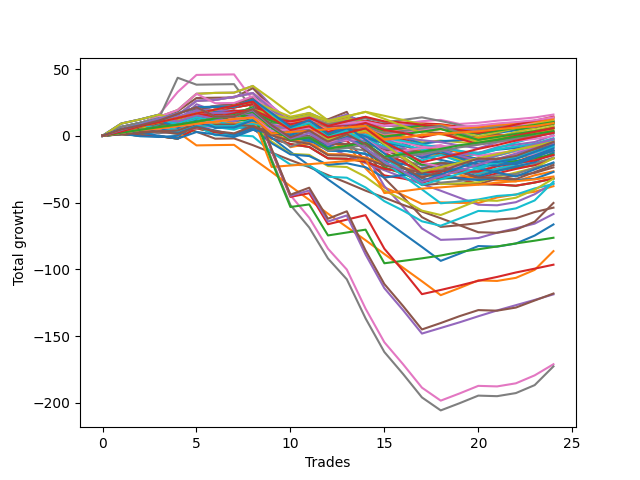

# Long Bulldog 003 
- Symbol: TSLA_Unlimited
- Date Range: 03/23/2022 - 07/08/2022
- Trading Period: 7:20-12:30
- Number of Trades: 24



| Name | Win Percent | Profit | Avg Profit / Trade | Avg Time / Trade |      | Name | Win Percent | Profit | Avg Profit / Trade | Avg Time / Trade |
| ---- | ----------- | ------ | ------------------ | ---------------- | ---- | ---- | ----------- | ------ | ------------------ | ---------------- |
| Sorted By <br> Profit | | | | | | Sorted By <br> Win Percentage ||||
| One Hundred One | 83.33 | 7945.00 | 331.04 | 02:50 |     | One Hundred Twenty-Six | 91.67 | 4740.00 | 197.50 | 07:47 |
| One Hundred Eight | 54.17 | 7130.00 | 297.08 | 06:50 |     | Eighty-One | 91.67 | -15250.00 | -635.42 | 22:27 |
| One Hundred Eleven | 87.50 | 6905.00 | 287.71 | 04:03 |     | One Hundred Eleven | 87.50 | 6905.00 | 287.71 | 04:03 |
| One Hundred Two | 70.83 | 6690.00 | 278.75 | 04:55 |     | One Hundred Twenty-One | 87.50 | -85.00 | -3.54 | 05:27 |
| One Hundred Six | 83.33 | 6335.00 | 263.96 | 03:09 |     | One Hundred One | 83.33 | 7945.00 | 331.04 | 02:50 |
| One Hundred Three | 58.33 | 5820.00 | 242.50 | 07:29 |     | One Hundred Six | 83.33 | 6335.00 | 263.96 | 03:09 |
| Ninety-One | 75.00 | 5670.00 | 236.25 | 02:15 |     | One Hundred Sixteen | 83.33 | 2260.00 | 94.17 | 03:43 |
| Forty-Two | 66.67 | 5535.00 | 230.62 | 16:40 |     | One Hundred Twenty-Seven | 83.33 | 1750.00 | 72.92 | 14:58 |
| Ninety-Nine | 54.17 | 5465.00 | 227.71 | 05:02 |     | One Hundred Twenty-Two | 83.33 | 970.00 | 40.42 | 12:05 |
| One Hundred Seven | 66.67 | 5135.00 | 213.96 | 04:51 |     | Eighty-Two | 83.33 | -38185.00 | -1591.04 | 44:16 |
| Ninety-Six | 75.00 | 5045.00 | 210.21 | 02:38 |     | Ninety-One | 75.00 | 5670.00 | 236.25 | 02:15 |
| Ninety-Two | 62.50 | 4930.00 | 205.42 | 03:58 |     | Ninety-Six | 75.00 | 5045.00 | 210.21 | 02:38 |
| Ninety-Eight | 54.17 | 4845.00 | 201.87 | 04:13 |     | One Hundred Twelve | 75.00 | 2875.00 | 119.79 | 08:15 |
| One Hundred Twenty-Six | 91.67 | 4740.00 | 197.50 | 07:47 |     | One Hundred Seventeen | 75.00 | 2805.00 | 116.88 | 06:15 |
| Ninety-Seven | 58.33 | 4495.00 | 187.29 | 03:25 |     | One Hundred Twenty-Eight | 75.00 | 1120.00 | 46.67 | 18:37 |
| Ninety-Three | 50.00 | 4305.00 | 179.38 | 06:05 |     | One Hundred Twenty-Three | 75.00 | -2320.00 | -96.67 | 17:56 |
| One Hundred Nine | 45.83 | 3515.00 | 146.46 | 08:42 |     | Eighty-Three | 75.00 | -48275.00 | -2011.46 | 64:52 |
| One Hundred Thirteen | 66.67 | 3510.00 | 146.25 | 11:46 |     | One Hundred Two | 70.83 | 6690.00 | 278.75 | 04:55 |
| One Hundred Eighteen | 62.50 | 2940.00 | 122.50 | 09:05 |     | Sixty-Six | 70.83 | 185.00 | 7.71 | 20:12 |
| One Hundred Twelve | 75.00 | 2875.00 | 119.79 | 08:15 |     | One Hundred Twenty-Four | 70.83 | -3725.00 | -155.21 | 27:22 |
| One Hundred Seventeen | 75.00 | 2805.00 | 116.88 | 06:15 |     | Fifty-Eight | 70.83 | -4355.00 | -181.46 | 21:45 |
| One Hundred Sixteen | 83.33 | 2260.00 | 94.17 | 03:43 |     | Two | 70.83 | -8505.00 | -354.38 | 30:42 |
| One Hundred Twenty-Seven | 83.33 | 1750.00 | 72.92 | 14:58 |     | Eighty-Four | 70.83 | -59380.00 | -2474.17 | 83:30 |
| Ninety-Four | 37.50 | 1490.00 | 62.08 | 09:26 |     | Forty-Two | 66.67 | 5535.00 | 230.62 | 16:40 |
| Forty | 62.50 | 1435.00 | 59.79 | 09:59 |     | One Hundred Seven | 66.67 | 5135.00 | 213.96 | 04:51 |
| One Hundred Twenty-Eight | 75.00 | 1120.00 | 46.67 | 18:37 |     | One Hundred Thirteen | 66.67 | 3510.00 | 146.25 | 11:46 |
| One Hundred | 54.17 | 1100.00 | 45.83 | 05:28 |     | One Hundred Twenty-Nine | 66.67 | -2625.00 | -109.37 | 26:10 |
| One Hundred Twenty-Two | 83.33 | 970.00 | 40.42 | 12:05 |     | One Hundred Twenty-Five | 66.67 | -3410.00 | -142.08 | 45:18 |
| Sixty-Six | 70.83 | 185.00 | 7.71 | 20:12 |     | Sixty | 66.67 | -8385.00 | -349.38 | 37:36 |
| One Hundred Twenty-One | 87.50 | -85.00 | -3.54 | 05:27 |     | Five | 66.67 | -26910.00 | -1121.25 | 90:06 |
| Forty-One | 58.33 | -905.00 | -37.71 | 14:20 |     | Four | 66.67 | -29270.00 | -1219.58 | 65:15 |
| One Hundred Ninteen | 45.83 | -1200.00 | -50.00 | 13:00 |     | Eighty-Five | 66.67 | -59065.00 | -2461.04 | 101:26 |
| One Hundred Four | 41.67 | -1410.00 | -58.75 | 11:31 |     | Ninety-Two | 62.50 | 4930.00 | 205.42 | 03:58 |
| Forty-Three | 58.33 | -1625.00 | -67.71 | 20:53 |     | One Hundred Eighteen | 62.50 | 2940.00 | 122.50 | 09:05 |
| Sixty-Eight | 62.50 | -1925.00 | -80.21 | 33:43 |     | Forty | 62.50 | 1435.00 | 59.79 | 09:59 |
| Zero | 62.50 | -2085.00 | -86.88 | 15:00 |     | Sixty-Eight | 62.50 | -1925.00 | -80.21 | 33:43 |
| One Hundred Thirty | 62.50 | -2310.00 | -96.25 | 44:06 |     | Zero | 62.50 | -2085.00 | -86.88 | 15:00 |
| One Hundred Twenty-Three | 75.00 | -2320.00 | -96.67 | 17:56 |     | One Hundred Thirty | 62.50 | -2310.00 | -96.25 | 44:06 |
| One Hundred Twenty-Nine | 66.67 | -2625.00 | -109.37 | 26:10 |     | Sixty-Seven | 62.50 | -3110.00 | -129.58 | 25:40 |
| One Hundred Ten | 45.83 | -2780.00 | -115.83 | 10:31 |     | Fifty-Nine | 62.50 | -5510.00 | -229.58 | 26:24 |
| Forty-Four | 50.00 | -3085.00 | -128.54 | 27:38 |     | Sixty-Four | 62.50 | -6955.00 | -289.79 | 12:36 |
| Sixty-Seven | 62.50 | -3110.00 | -129.58 | 25:40 |     | Sixty-Five | 62.50 | -7180.00 | -299.17 | 17:43 |
| Forty-Eight | 58.33 | -3320.00 | -138.33 | 09:06 |     | Fifty-Six | 62.50 | -7320.00 | -305.00 | 13:16 |
| One Hundred Twenty-Five | 66.67 | -3410.00 | -142.08 | 45:18 |     | Three | 62.50 | -8290.00 | -345.42 | 36:13 |
| One Hundred Twenty-Four | 70.83 | -3725.00 | -155.21 | 27:22 |     | Fifty-Seven | 62.50 | -11845.00 | -493.54 | 19:15 |
| One Hundred Fourteen | 54.17 | -4165.00 | -173.54 | 18:22 |     | Sixty-One | 62.50 | -18065.00 | -752.71 | 55:57 |
| Fifty | 41.67 | -4190.00 | -174.58 | 13:14 |     | One | 62.50 | -18880.00 | -786.67 | 26:25 |
| Fifty-Eight | 70.83 | -4355.00 | -181.46 | 21:45 |     | One Hundred Three | 58.33 | 5820.00 | 242.50 | 07:29 |
| One Hundred Fifteen | 50.00 | -4740.00 | -197.50 | 36:17 |     | Ninety-Seven | 58.33 | 4495.00 | 187.29 | 03:25 |
| Ninety-Five | 25.00 | -5445.00 | -226.88 | 15:14 |     | Forty-One | 58.33 | -905.00 | -37.71 | 14:20 |
| Fifty-Nine | 62.50 | -5510.00 | -229.58 | 26:24 |     | Forty-Three | 58.33 | -1625.00 | -67.71 | 20:53 |
| Forty-Five | 50.00 | -5685.00 | -236.88 | 43:57 |     | Forty-Eight | 58.33 | -3320.00 | -138.33 | 09:06 |
| Fifty-Two | 33.33 | -6205.00 | -258.54 | 18:43 |     | Sixty-Nine | 58.33 | -10345.00 | -431.04 | 49:54 |
| Fifty-One | 37.50 | -6505.00 | -271.04 | 14:25 |     | One Hundred Eight | 54.17 | 7130.00 | 297.08 | 06:50 |
| Sixty-Four | 62.50 | -6955.00 | -289.79 | 12:36 |     | Ninety-Nine | 54.17 | 5465.00 | 227.71 | 05:02 |
| Sixty-Five | 62.50 | -7180.00 | -299.17 | 17:43 |     | Ninety-Eight | 54.17 | 4845.00 | 201.87 | 04:13 |
| Fifty-Six | 62.50 | -7320.00 | -305.00 | 13:16 |     | One Hundred | 54.17 | 1100.00 | 45.83 | 05:28 |
| Forty-Nine | 41.67 | -8200.00 | -341.67 | 12:11 |     | One Hundred Fourteen | 54.17 | -4165.00 | -173.54 | 18:22 |
| Three | 62.50 | -8290.00 | -345.42 | 36:13 |     | Ninety-Three | 50.00 | 4305.00 | 179.38 | 06:05 |
| Sixty | 66.67 | -8385.00 | -349.38 | 37:36 |     | Forty-Four | 50.00 | -3085.00 | -128.54 | 27:38 |
| Two | 70.83 | -8505.00 | -354.38 | 30:42 |     | One Hundred Fifteen | 50.00 | -4740.00 | -197.50 | 36:17 |
| One Hundred Five | 29.17 | -9995.00 | -416.46 | 17:57 |     | Forty-Five | 50.00 | -5685.00 | -236.88 | 43:57 |
| Sixty-Nine | 58.33 | -10345.00 | -431.04 | 49:54 |     | Six | 50.00 | -85540.00 | -3564.17 | 154:39 |
| One Hundred Twenty | 25.00 | -10975.00 | -457.29 | 18:17 |     | One Hundred Nine | 45.83 | 3515.00 | 146.46 | 08:42 |
| Fifty-Seven | 62.50 | -11845.00 | -493.54 | 19:15 |     | One Hundred Ninteen | 45.83 | -1200.00 | -50.00 | 13:00 |
| Fifty-Three | 25.00 | -13285.00 | -553.54 | 22:14 |     | One Hundred Ten | 45.83 | -2780.00 | -115.83 | 10:31 |
| Seventy-Three | 41.67 | -13555.00 | -564.79 | 13:05 |     | Sixty-Two | 45.83 | -33200.00 | -1383.33 | 78:44 |
| Eighty-One | 91.67 | -15250.00 | -635.42 | 22:27 |     | Seven | 45.83 | -86340.00 | -3597.50 | 171:44 |
| Fifty-Five | 25.00 | -16005.00 | -666.88 | 24:22 |     | One Hundred Four | 41.67 | -1410.00 | -58.75 | 11:31 |
| Fifty-Four | 25.00 | -16005.00 | -666.88 | 24:22 |     | Fifty | 41.67 | -4190.00 | -174.58 | 13:14 |
| Seventy | 41.67 | -16040.00 | -668.33 | 69:29 |     | Forty-Nine | 41.67 | -8200.00 | -341.67 | 12:11 |
| Seventy-One | 41.67 | -17190.00 | -716.25 | 76:26 |     | Seventy-Three | 41.67 | -13555.00 | -564.79 | 13:05 |
| Forty-Six | 33.33 | -17720.00 | -738.33 | 63:34 |     | Seventy | 41.67 | -16040.00 | -668.33 | 69:29 |
| Sixty-One | 62.50 | -18065.00 | -752.71 | 55:57 |     | Seventy-One | 41.67 | -17190.00 | -716.25 | 76:26 |
| One | 62.50 | -18880.00 | -786.67 | 26:25 |     | Sixty-Three | 41.67 | -43190.00 | -1799.58 | 91:15 |
| Forty-Seven | 29.17 | -25160.00 | -1048.33 | 73:57 |     | Ninety-Four | 37.50 | 1490.00 | 62.08 | 09:26 |
| Five | 66.67 | -26910.00 | -1121.25 | 90:06 |     | Fifty-One | 37.50 | -6505.00 | -271.04 | 14:25 |
| Four | 66.67 | -29270.00 | -1219.58 | 65:15 |     | Fifty-Two | 33.33 | -6205.00 | -258.54 | 18:43 |
| Sixty-Two | 45.83 | -33200.00 | -1383.33 | 78:44 |     | Forty-Six | 33.33 | -17720.00 | -738.33 | 63:34 |
| Eighty-Two | 83.33 | -38185.00 | -1591.04 | 44:16 |     | One Hundred Five | 29.17 | -9995.00 | -416.46 | 17:57 |
| Sixty-Three | 41.67 | -43190.00 | -1799.58 | 91:15 |     | Forty-Seven | 29.17 | -25160.00 | -1048.33 | 73:57 |
| Eighty-Three | 75.00 | -48275.00 | -2011.46 | 64:52 |     | Ninety-Five | 25.00 | -5445.00 | -226.88 | 15:14 |
| Eighty-Five | 66.67 | -59065.00 | -2461.04 | 101:26 |     | One Hundred Twenty | 25.00 | -10975.00 | -457.29 | 18:17 |
| Eighty-Four | 70.83 | -59380.00 | -2474.17 | 83:30 |     | Fifty-Three | 25.00 | -13285.00 | -553.54 | 22:14 |
| Six | 50.00 | -85540.00 | -3564.17 | 154:39 |     | Fifty-Five | 25.00 | -16005.00 | -666.88 | 24:22 |
| Seven | 45.83 | -86340.00 | -3597.50 | 171:44 |     | Fifty-Four | 25.00 | -16005.00 | -666.88 | 24:22 |

## NO STOPLOSS

### Test Zero
* Sell when price hits the middle line of the 20p bollinger
* No Stoploss
* Results:
```
Total Trades: 24
Percent Up: 62.50
Percent Down: 37.50
Total Points Moved Up: -4.17
Potential Profit: -2085.00
Total Points Ups: 38.08 Count Ups: 15
Total Points Downs: -42.25 Count Downs: 9
```

<details><summary>Trades</summary>

<code>In: 2022-03-25 08:29:00		Out: 2022-03-25 08:41:30		Total Position Time: 12:30		Total Move Up: 3.39		Total to Date: 3.39</code> <br />
<code>In: 2022-03-30 12:10:00		Out: 2022-03-30 12:13:15		Total Position Time: 03:15		Total Move Up: 3.98		Total to Date: 7.37</code> <br />
<code>In: 2022-03-30 12:22:00		Out: 2022-03-30 12:30:50		Total Position Time: 08:50		Total Move Up: 1.08		Total to Date: 8.45</code> <br />
<code>In: 2022-04-07 08:35:00		Out: 2022-04-07 08:48:00		Total Position Time: 13:00		Total Move Up: 2.50		Total to Date: 10.95</code> <br />
<code>In: 2022-04-12 08:10:00		Out: 2022-04-12 08:17:00		Total Position Time: 07:00		Total Move Up: 4.70		Total to Date: 15.65</code> <br />
<code>In: 2022-04-12 11:17:00		Out: 2022-04-12 11:34:50		Total Position Time: 17:50		Total Move Up: -0.38		Total to Date: 15.27</code> <br />
<code>In: 2022-04-27 12:10:00		Out: 2022-04-27 12:14:00		Total Position Time: 04:00		Total Move Up: 3.00		Total to Date: 18.27</code> <br />
<code>In: 2022-04-29 09:46:00		Out: 2022-04-29 10:00:40		Total Position Time: 14:40		Total Move Up: 1.13		Total to Date: 19.40</code> <br />
<code>In: 2022-05-11 09:56:00		Out: 2022-05-11 10:24:35		Total Position Time: 28:35		Total Move Up: -6.71		Total to Date: 12.69</code> <br />
<code>In: 2022-05-11 09:58:00		Out: 2022-05-11 10:24:35		Total Position Time: 26:35		Total Move Up: -3.94		Total to Date: 8.75</code> <br />
<code>In: 2022-05-11 10:49:00		Out: 2022-05-11 11:01:35		Total Position Time: 12:35		Total Move Up: 1.08		Total to Date: 9.83</code> <br />
<code>In: 2022-05-16 07:55:00		Out: 2022-05-16 08:09:55		Total Position Time: 14:55		Total Move Up: -3.09		Total to Date: 6.74</code> <br />
<code>In: 2022-05-16 08:01:00		Out: 2022-05-16 08:09:55		Total Position Time: 08:55		Total Move Up: 4.59		Total to Date: 11.33</code> <br />
<code>In: 2022-05-18 08:32:00		Out: 2022-05-18 08:38:50		Total Position Time: 06:50		Total Move Up: 2.81		Total to Date: 14.14</code> <br />
<code>In: 2022-05-18 08:56:00		Out: 2022-05-18 09:39:50		Total Position Time: 43:50		Total Move Up: -14.14		Total to Date: -0.00</code> <br />
<code>In: 2022-05-18 09:10:00		Out: 2022-05-18 09:39:50		Total Position Time: 29:50		Total Move Up: -5.51		Total to Date: -5.51</code> <br />
<code>In: 2022-05-18 09:11:00		Out: 2022-05-18 09:39:50		Total Position Time: 28:50		Total Move Up: -6.45		Total to Date: -11.96</code> <br />
<code>In: 2022-05-18 09:25:00		Out: 2022-05-18 09:39:50		Total Position Time: 14:50		Total Move Up: 1.30		Total to Date: -10.66</code> <br />
<code>In: 2022-05-24 11:45:00		Out: 2022-05-24 12:03:40		Total Position Time: 18:40		Total Move Up: -1.18		Total to Date: -11.84</code> <br />
<code>In: 2022-05-24 11:47:00		Out: 2022-05-24 12:03:40		Total Position Time: 16:40		Total Move Up: -0.85		Total to Date: -12.69</code> <br />
<code>In: 2022-06-08 09:47:00		Out: 2022-06-08 09:50:25		Total Position Time: 03:25		Total Move Up: 2.22		Total to Date: -10.47</code> <br />
<code>In: 2022-06-27 09:27:00		Out: 2022-06-27 09:41:05		Total Position Time: 14:05		Total Move Up: 1.29		Total to Date: -9.18</code> <br />
<code>In: 2022-06-27 10:47:00		Out: 2022-06-27 10:54:20		Total Position Time: 07:20		Total Move Up: 2.05		Total to Date: -7.13</code> <br />
<code>In: 2022-06-29 08:25:00		Out: 2022-06-29 08:28:15		Total Position Time: 03:15		Total Move Up: 2.96		Total to Date: -4.17</code> <br />


</details>

### Test One
* Sell when the price hits the upper line of the 20p 1std bollinger
* No Stoploss
* Results:
```
Total Trades: 24
Percent Up: 62.50
Percent Down: 37.50
Total Points Moved Up: -37.76
Potential Profit: -18880.00
Total Points Ups: 43.80 Count Ups: 15
Total Points Downs: -81.56 Count Downs: 9
```

<details><summary>Trades</summary>

<code>In: 2022-03-25 08:29:00		Out: 2022-03-25 08:41:55		Total Position Time: 12:55		Total Move Up: 4.56		Total to Date: 4.56</code> <br />
<code>In: 2022-03-30 12:10:00		Out: 2022-03-30 12:32:45		Total Position Time: 22:45		Total Move Up: 2.20		Total to Date: 6.76</code> <br />
<code>In: 2022-03-30 12:22:00		Out: 2022-03-30 12:32:45		Total Position Time: 10:45		Total Move Up: 2.68		Total to Date: 9.44</code> <br />
<code>In: 2022-04-07 08:35:00		Out: 2022-04-07 09:06:30		Total Position Time: 31:30		Total Move Up: 1.47		Total to Date: 10.91</code> <br />
<code>In: 2022-04-12 08:10:00		Out: 2022-04-12 08:21:10		Total Position Time: 11:10		Total Move Up: 7.43		Total to Date: 18.34</code> <br />
<code>In: 2022-04-12 11:17:00		Out: 2022-04-12 11:36:20		Total Position Time: 19:20		Total Move Up: 1.05		Total to Date: 19.39</code> <br />
<code>In: 2022-04-27 12:10:00		Out: 2022-04-27 12:31:10		Total Position Time: 21:10		Total Move Up: 1.77		Total to Date: 21.16</code> <br />
<code>In: 2022-04-29 09:46:00		Out: 2022-04-29 10:01:00		Total Position Time: 15:00		Total Move Up: 2.47		Total to Date: 23.63</code> <br />
<code>In: 2022-05-11 09:56:00		Out: 2022-05-11 11:04:20		Total Position Time: 68:20		Total Move Up: -17.48		Total to Date: 6.15</code> <br />
<code>In: 2022-05-11 09:58:00		Out: 2022-05-11 11:04:20		Total Position Time: 66:20		Total Move Up: -14.71		Total to Date: -8.56</code> <br />
<code>In: 2022-05-11 10:49:00		Out: 2022-05-11 11:04:20		Total Position Time: 15:20		Total Move Up: 2.72		Total to Date: -5.84</code> <br />
<code>In: 2022-05-16 07:55:00		Out: 2022-05-16 08:16:30		Total Position Time: 21:30		Total Move Up: -3.92		Total to Date: -9.76</code> <br />
<code>In: 2022-05-16 08:01:00		Out: 2022-05-16 08:16:30		Total Position Time: 15:30		Total Move Up: 3.76		Total to Date: -6.00</code> <br />
<code>In: 2022-05-18 08:32:00		Out: 2022-05-18 09:46:35		Total Position Time: 74:35		Total Move Up: -18.46		Total to Date: -24.46</code> <br />
<code>In: 2022-05-18 08:56:00		Out: 2022-05-18 09:46:35		Total Position Time: 50:35		Total Move Up: -14.30		Total to Date: -38.76</code> <br />
<code>In: 2022-05-18 09:10:00		Out: 2022-05-18 09:46:35		Total Position Time: 36:35		Total Move Up: -5.67		Total to Date: -44.43</code> <br />
<code>In: 2022-05-18 09:11:00		Out: 2022-05-18 09:46:35		Total Position Time: 35:35		Total Move Up: -6.61		Total to Date: -51.04</code> <br />
<code>In: 2022-05-18 09:25:00		Out: 2022-05-18 09:46:35		Total Position Time: 21:35		Total Move Up: 1.14		Total to Date: -49.90</code> <br />
<code>In: 2022-05-24 11:45:00		Out: 2022-05-24 12:05:10		Total Position Time: 20:10		Total Move Up: -0.37		Total to Date: -50.27</code> <br />
<code>In: 2022-05-24 11:47:00		Out: 2022-05-24 12:05:10		Total Position Time: 18:10		Total Move Up: -0.04		Total to Date: -50.31</code> <br />
<code>In: 2022-06-08 09:47:00		Out: 2022-06-08 09:56:40		Total Position Time: 09:40		Total Move Up: 4.11		Total to Date: -46.20</code> <br />
<code>In: 2022-06-27 09:27:00		Out: 2022-06-27 09:41:15		Total Position Time: 14:15		Total Move Up: 2.26		Total to Date: -43.94</code> <br />
<code>In: 2022-06-27 10:47:00		Out: 2022-06-27 11:01:20		Total Position Time: 14:20		Total Move Up: 2.02		Total to Date: -41.92</code> <br />
<code>In: 2022-06-29 08:25:00		Out: 2022-06-29 08:32:15		Total Position Time: 07:15		Total Move Up: 4.16		Total to Date: -37.76</code> <br />


</details>

### Test Two
* Sell when the price hits the upper line of the 20p 2std bollinger
* No Stoploss
* Results:
```
Total Trades: 24
Percent Up: 70.83
Percent Down: 29.17
Total Points Moved Up: -17.01
Potential Profit: -8505.00
Total Points Ups: 57.48 Count Ups: 17
Total Points Downs: -74.49 Count Downs: 7
```

<details><summary>Trades</summary>

<code>In: 2022-03-25 08:29:00		Out: 2022-03-25 08:44:45		Total Position Time: 15:45		Total Move Up: 5.75		Total to Date: 5.75</code> <br />
<code>In: 2022-03-30 12:10:00		Out: 2022-03-30 12:36:15		Total Position Time: 26:15		Total Move Up: 3.27		Total to Date: 9.02</code> <br />
<code>In: 2022-03-30 12:22:00		Out: 2022-03-30 12:36:15		Total Position Time: 14:15		Total Move Up: 3.75		Total to Date: 12.77</code> <br />
<code>In: 2022-04-07 08:35:00		Out: 2022-04-07 09:09:30		Total Position Time: 34:30		Total Move Up: 2.68		Total to Date: 15.45</code> <br />
<code>In: 2022-04-12 08:10:00		Out: 2022-04-12 08:28:30		Total Position Time: 18:30		Total Move Up: 10.71		Total to Date: 26.16</code> <br />
<code>In: 2022-04-12 11:17:00		Out: 2022-04-12 11:42:05		Total Position Time: 25:05		Total Move Up: 0.75		Total to Date: 26.91</code> <br />
<code>In: 2022-04-27 12:10:00		Out: 2022-04-27 12:31:20		Total Position Time: 21:20		Total Move Up: 2.24		Total to Date: 29.15</code> <br />
<code>In: 2022-04-29 09:46:00		Out: 2022-04-29 10:01:05		Total Position Time: 15:05		Total Move Up: 2.82		Total to Date: 31.97</code> <br />
<code>In: 2022-05-11 09:56:00		Out: 2022-05-11 11:24:00		Total Position Time: 88:00		Total Move Up: -16.25		Total to Date: 15.72</code> <br />
<code>In: 2022-05-11 09:58:00		Out: 2022-05-11 11:24:00		Total Position Time: 86:00		Total Move Up: -13.48		Total to Date: 2.24</code> <br />
<code>In: 2022-05-11 10:49:00		Out: 2022-05-11 11:24:00		Total Position Time: 35:00		Total Move Up: 3.95		Total to Date: 6.19</code> <br />
<code>In: 2022-05-16 07:55:00		Out: 2022-05-16 08:17:25		Total Position Time: 22:25		Total Move Up: -3.28		Total to Date: 2.91</code> <br />
<code>In: 2022-05-16 08:01:00		Out: 2022-05-16 08:17:25		Total Position Time: 16:25		Total Move Up: 4.40		Total to Date: 7.31</code> <br />
<code>In: 2022-05-18 08:32:00		Out: 2022-05-18 09:47:30		Total Position Time: 75:30		Total Move Up: -17.57		Total to Date: -10.26</code> <br />
<code>In: 2022-05-18 08:56:00		Out: 2022-05-18 09:47:30		Total Position Time: 51:30		Total Move Up: -13.41		Total to Date: -23.67</code> <br />
<code>In: 2022-05-18 09:10:00		Out: 2022-05-18 09:47:30		Total Position Time: 37:30		Total Move Up: -4.78		Total to Date: -28.45</code> <br />
<code>In: 2022-05-18 09:11:00		Out: 2022-05-18 09:47:30		Total Position Time: 36:30		Total Move Up: -5.72		Total to Date: -34.17</code> <br />
<code>In: 2022-05-18 09:25:00		Out: 2022-05-18 09:47:30		Total Position Time: 22:30		Total Move Up: 2.03		Total to Date: -32.14</code> <br />
<code>In: 2022-05-24 11:45:00		Out: 2022-05-24 12:05:35		Total Position Time: 20:35		Total Move Up: 0.74		Total to Date: -31.40</code> <br />
<code>In: 2022-05-24 11:47:00		Out: 2022-05-24 12:05:35		Total Position Time: 18:35		Total Move Up: 1.07		Total to Date: -30.33</code> <br />
<code>In: 2022-06-08 09:47:00		Out: 2022-06-08 09:56:55		Total Position Time: 09:55		Total Move Up: 4.34		Total to Date: -25.99</code> <br />
<code>In: 2022-06-27 09:27:00		Out: 2022-06-27 09:44:10		Total Position Time: 17:10		Total Move Up: 2.02		Total to Date: -23.97</code> <br />
<code>In: 2022-06-27 10:47:00		Out: 2022-06-27 11:05:15		Total Position Time: 18:15		Total Move Up: 1.91		Total to Date: -22.06</code> <br />
<code>In: 2022-06-29 08:25:00		Out: 2022-06-29 08:35:35		Total Position Time: 10:35		Total Move Up: 5.05		Total to Date: -17.01</code> <br />


</details>

### Test Three
* Sell when price hits the middle line of the 50p bollinger
* No Stoploss
* Results:
```
Total Trades: 24
Percent Up: 62.50
Percent Down: 37.50
Total Points Moved Up: -16.58
Potential Profit: -8290.00
Total Points Ups: 53.45 Count Ups: 15
Total Points Downs: -70.03 Count Downs: 9
```

<details><summary>Trades</summary>

<code>In: 2022-03-25 08:29:00		Out: 2022-03-25 09:05:25		Total Position Time: 36:25		Total Move Up: 3.08		Total to Date: 3.08</code> <br />
<code>In: 2022-03-30 12:10:00		Out: 2022-03-30 12:33:35		Total Position Time: 23:35		Total Move Up: 2.57		Total to Date: 5.65</code> <br />
<code>In: 2022-03-30 12:22:00		Out: 2022-03-30 12:33:35		Total Position Time: 11:35		Total Move Up: 3.05		Total to Date: 8.70</code> <br />
<code>In: 2022-04-07 08:35:00		Out: 2022-04-07 09:09:25		Total Position Time: 34:25		Total Move Up: 2.49		Total to Date: 11.19</code> <br />
<code>In: 2022-04-12 08:10:00		Out: 2022-04-12 08:26:10		Total Position Time: 16:10		Total Move Up: 8.51		Total to Date: 19.70</code> <br />
<code>In: 2022-04-12 11:17:00		Out: 2022-04-12 11:46:25		Total Position Time: 29:25		Total Move Up: 2.56		Total to Date: 22.26</code> <br />
<code>In: 2022-04-27 12:10:00		Out: 2022-04-27 12:46:20		Total Position Time: 36:20		Total Move Up: 1.24		Total to Date: 23.50</code> <br />
<code>In: 2022-04-29 09:46:00		Out: 2022-04-29 10:03:40		Total Position Time: 17:40		Total Move Up: 5.38		Total to Date: 28.88</code> <br />
<code>In: 2022-05-11 09:56:00		Out: 2022-05-11 11:18:45		Total Position Time: 82:45		Total Move Up: -17.64		Total to Date: 11.24</code> <br />
<code>In: 2022-05-11 09:58:00		Out: 2022-05-11 11:18:45		Total Position Time: 80:45		Total Move Up: -14.87		Total to Date: -3.63</code> <br />
<code>In: 2022-05-11 10:49:00		Out: 2022-05-11 11:18:45		Total Position Time: 29:45		Total Move Up: 2.56		Total to Date: -1.07</code> <br />
<code>In: 2022-05-16 07:55:00		Out: 2022-05-16 08:39:35		Total Position Time: 44:35		Total Move Up: -5.11		Total to Date: -6.18</code> <br />
<code>In: 2022-05-16 08:01:00		Out: 2022-05-16 08:39:35		Total Position Time: 38:35		Total Move Up: 2.57		Total to Date: -3.61</code> <br />
<code>In: 2022-05-18 08:32:00		Out: 2022-05-18 09:50:30		Total Position Time: 78:30		Total Move Up: -15.12		Total to Date: -18.73</code> <br />
<code>In: 2022-05-18 08:56:00		Out: 2022-05-18 09:50:30		Total Position Time: 54:30		Total Move Up: -10.96		Total to Date: -29.69</code> <br />
<code>In: 2022-05-18 09:10:00		Out: 2022-05-18 09:50:30		Total Position Time: 40:30		Total Move Up: -2.33		Total to Date: -32.02</code> <br />
<code>In: 2022-05-18 09:11:00		Out: 2022-05-18 09:50:30		Total Position Time: 39:30		Total Move Up: -3.27		Total to Date: -35.29</code> <br />
<code>In: 2022-05-18 09:25:00		Out: 2022-05-18 09:50:30		Total Position Time: 25:30		Total Move Up: 4.48		Total to Date: -30.81</code> <br />
<code>In: 2022-05-24 11:45:00		Out: 2022-05-24 12:24:25		Total Position Time: 39:25		Total Move Up: -0.53		Total to Date: -31.34</code> <br />
<code>In: 2022-05-24 11:47:00		Out: 2022-05-24 12:24:25		Total Position Time: 37:25		Total Move Up: -0.20		Total to Date: -31.54</code> <br />
<code>In: 2022-06-08 09:47:00		Out: 2022-06-08 10:08:35		Total Position Time: 21:35		Total Move Up: 3.37		Total to Date: -28.17</code> <br />
<code>In: 2022-06-27 09:27:00		Out: 2022-06-27 09:44:55		Total Position Time: 17:55		Total Move Up: 3.33		Total to Date: -24.84</code> <br />
<code>In: 2022-06-27 10:47:00		Out: 2022-06-27 11:08:40		Total Position Time: 21:40		Total Move Up: 2.87		Total to Date: -21.97</code> <br />
<code>In: 2022-06-29 08:25:00		Out: 2022-06-29 08:36:05		Total Position Time: 11:05		Total Move Up: 5.39		Total to Date: -16.58</code> <br />


</details>

### Test Four
* Sell when the price hits the upper line of the 50p 1std bollinger
* No Stoploss
* Results:
```
Total Trades: 24
Percent Up: 66.67
Percent Down: 33.33
Total Points Moved Up: -58.54
Potential Profit: -29270.00
Total Points Ups: 65.33 Count Ups: 16
Total Points Downs: -123.87 Count Downs: 8
```

<details><summary>Trades</summary>

<code>In: 2022-03-25 08:29:00		Out: 2022-03-25 09:08:40		Total Position Time: 39:40		Total Move Up: 5.19		Total to Date: 5.19</code> <br />
<code>In: 2022-03-30 12:10:00		Out: 2022-03-30 12:45:20		Total Position Time: 35:20		Total Move Up: 4.24		Total to Date: 9.43</code> <br />
<code>In: 2022-03-30 12:22:00		Out: 2022-03-30 12:45:20		Total Position Time: 23:20		Total Move Up: 4.72		Total to Date: 14.15</code> <br />
<code>In: 2022-04-07 08:35:00		Out: 2022-04-07 09:10:55		Total Position Time: 35:55		Total Move Up: 5.07		Total to Date: 19.22</code> <br />
<code>In: 2022-04-12 08:10:00		Out: 2022-04-12 08:30:15		Total Position Time: 20:15		Total Move Up: 12.21		Total to Date: 31.43</code> <br />
<code>In: 2022-04-12 11:17:00		Out: 2022-04-12 12:38:45		Total Position Time: 81:45		Total Move Up: 0.69		Total to Date: 32.12</code> <br />
<code>In: 2022-04-27 12:10:00		Out: 2022-04-27 12:47:00		Total Position Time: 37:00		Total Move Up: 0.18		Total to Date: 32.30</code> <br />
<code>In: 2022-04-29 09:46:00		Out: 2022-04-29 10:24:50		Total Position Time: 38:50		Total Move Up: 5.02		Total to Date: 37.32</code> <br />
<code>In: 2022-05-11 09:56:00		Out: 2022-05-11 11:24:05		Total Position Time: 88:05		Total Move Up: -14.96		Total to Date: 22.36</code> <br />
<code>In: 2022-05-11 09:58:00		Out: 2022-05-11 11:24:05		Total Position Time: 86:05		Total Move Up: -12.19		Total to Date: 10.17</code> <br />
<code>In: 2022-05-11 10:49:00		Out: 2022-05-11 11:24:05		Total Position Time: 35:05		Total Move Up: 5.24		Total to Date: 15.41</code> <br />
<code>In: 2022-05-16 07:55:00		Out: 2022-05-16 08:45:20		Total Position Time: 50:20		Total Move Up: -4.32		Total to Date: 11.09</code> <br />
<code>In: 2022-05-16 08:01:00		Out: 2022-05-16 08:45:20		Total Position Time: 44:20		Total Move Up: 3.36		Total to Date: 14.45</code> <br />
<code>In: 2022-05-18 08:32:00		Out: 2022-05-18 11:27:35		Total Position Time: 175:35		Total Move Up: -28.16		Total to Date: -13.71</code> <br />
<code>In: 2022-05-18 08:56:00		Out: 2022-05-18 11:27:35		Total Position Time: 151:35		Total Move Up: -24.00		Total to Date: -37.71</code> <br />
<code>In: 2022-05-18 09:10:00		Out: 2022-05-18 11:27:35		Total Position Time: 137:35		Total Move Up: -15.37		Total to Date: -53.08</code> <br />
<code>In: 2022-05-18 09:11:00		Out: 2022-05-18 11:27:35		Total Position Time: 136:35		Total Move Up: -16.31		Total to Date: -69.39</code> <br />
<code>In: 2022-05-18 09:25:00		Out: 2022-05-18 11:27:35		Total Position Time: 122:35		Total Move Up: -8.56		Total to Date: -77.95</code> <br />
<code>In: 2022-05-24 11:45:00		Out: 2022-05-24 12:33:55		Total Position Time: 48:55		Total Move Up: 0.51		Total to Date: -77.44</code> <br />
<code>In: 2022-05-24 11:47:00		Out: 2022-05-24 12:33:55		Total Position Time: 46:55		Total Move Up: 0.84		Total to Date: -76.60</code> <br />
<code>In: 2022-06-08 09:47:00		Out: 2022-06-08 10:18:05		Total Position Time: 31:05		Total Move Up: 4.03		Total to Date: -72.57</code> <br />
<code>In: 2022-06-27 09:27:00		Out: 2022-06-27 10:13:00		Total Position Time: 46:00		Total Move Up: 3.28		Total to Date: -69.29</code> <br />
<code>In: 2022-06-27 10:47:00		Out: 2022-06-27 11:18:25		Total Position Time: 31:25		Total Move Up: 3.50		Total to Date: -65.79</code> <br />
<code>In: 2022-06-29 08:25:00		Out: 2022-06-29 08:46:50		Total Position Time: 21:50		Total Move Up: 7.25		Total to Date: -58.54</code> <br />


</details>

### Test Five
* Sell when the price hits the upper line of the 50p 2std bollinger
* No Stoploss
* Results:
```
Total Trades: 24
Percent Up: 66.67
Percent Down: 33.33
Total Points Moved Up: -53.82
Potential Profit: -26910.00
Total Points Ups: 61.13 Count Ups: 16
Total Points Downs: -114.95 Count Downs: 8
```

<details><summary>Trades</summary>

<code>In: 2022-03-25 08:29:00		Out: 2022-03-25 09:09:50		Total Position Time: 40:50		Total Move Up: 6.64		Total to Date: 6.64</code> <br />
<code>In: 2022-03-30 12:10:00		Out: 2022-03-30 12:47:00		Total Position Time: 37:00		Total Move Up: 3.07		Total to Date: 9.71</code> <br />
<code>In: 2022-03-30 12:22:00		Out: 2022-03-30 12:47:00		Total Position Time: 25:00		Total Move Up: 3.55		Total to Date: 13.26</code> <br />
<code>In: 2022-04-07 08:35:00		Out: 2022-04-07 10:12:10		Total Position Time: 97:10		Total Move Up: 5.07		Total to Date: 18.33</code> <br />
<code>In: 2022-04-12 08:10:00		Out: 2022-04-12 10:00:45		Total Position Time: 110:45		Total Move Up: 9.95		Total to Date: 28.28</code> <br />
<code>In: 2022-04-12 11:17:00		Out: 2022-04-12 12:47:00		Total Position Time: 90:00		Total Move Up: 0.21		Total to Date: 28.49</code> <br />
<code>In: 2022-04-27 12:10:00		Out: 2022-04-27 12:47:00		Total Position Time: 37:00		Total Move Up: 0.18		Total to Date: 28.67</code> <br />
<code>In: 2022-04-29 09:46:00		Out: 2022-04-29 10:31:30		Total Position Time: 45:30		Total Move Up: 6.98		Total to Date: 35.65</code> <br />
<code>In: 2022-05-11 09:56:00		Out: 2022-05-11 11:36:05		Total Position Time: 100:05		Total Move Up: -14.75		Total to Date: 20.90</code> <br />
<code>In: 2022-05-11 09:58:00		Out: 2022-05-11 11:36:05		Total Position Time: 98:05		Total Move Up: -11.98		Total to Date: 8.92</code> <br />
<code>In: 2022-05-11 10:49:00		Out: 2022-05-11 11:36:05		Total Position Time: 47:05		Total Move Up: 5.45		Total to Date: 14.37</code> <br />
<code>In: 2022-05-16 07:55:00		Out: 2022-05-16 08:47:05		Total Position Time: 52:05		Total Move Up: -2.07		Total to Date: 12.30</code> <br />
<code>In: 2022-05-16 08:01:00		Out: 2022-05-16 08:47:05		Total Position Time: 46:05		Total Move Up: 5.61		Total to Date: 17.91</code> <br />
<code>In: 2022-05-18 08:32:00		Out: 2022-05-18 11:49:05		Total Position Time: 197:05		Total Move Up: -26.91		Total to Date: -9.00</code> <br />
<code>In: 2022-05-18 08:56:00		Out: 2022-05-18 11:49:05		Total Position Time: 173:05		Total Move Up: -22.75		Total to Date: -31.75</code> <br />
<code>In: 2022-05-18 09:10:00		Out: 2022-05-18 11:49:05		Total Position Time: 159:05		Total Move Up: -14.12		Total to Date: -45.87</code> <br />
<code>In: 2022-05-18 09:11:00		Out: 2022-05-18 11:49:05		Total Position Time: 158:05		Total Move Up: -15.06		Total to Date: -60.93</code> <br />
<code>In: 2022-05-18 09:25:00		Out: 2022-05-18 11:49:05		Total Position Time: 144:05		Total Move Up: -7.31		Total to Date: -68.24</code> <br />
<code>In: 2022-05-24 11:45:00		Out: 2022-05-24 12:35:10		Total Position Time: 50:10		Total Move Up: 1.25		Total to Date: -66.99</code> <br />
<code>In: 2022-05-24 11:47:00		Out: 2022-05-24 12:35:10		Total Position Time: 48:10		Total Move Up: 1.58		Total to Date: -65.41</code> <br />
<code>In: 2022-06-08 09:47:00		Out: 2022-06-08 12:33:20		Total Position Time: 166:20		Total Move Up: 2.66		Total to Date: -62.75</code> <br />
<code>In: 2022-06-27 09:27:00		Out: 2022-06-27 11:20:10		Total Position Time: 113:10		Total Move Up: 0.99		Total to Date: -61.76</code> <br />
<code>In: 2022-06-27 10:47:00		Out: 2022-06-27 11:20:10		Total Position Time: 33:10		Total Move Up: 4.63		Total to Date: -57.13</code> <br />
<code>In: 2022-06-29 08:25:00		Out: 2022-06-29 09:58:40		Total Position Time: 93:40		Total Move Up: 3.31		Total to Date: -53.82</code> <br />


</details>

### Test Six
* Sell when the price hits the middle line of the 1std VWAP
* No Stoploss
* Results:
```
Total Trades: 24
Percent Up: 50.00
Percent Down: 50.00
Total Points Moved Up: -171.08
Potential Profit: -85540.00
Total Points Ups: 73.65 Count Ups: 12
Total Points Downs: -244.73 Count Downs: 12
```

<details><summary>Trades</summary>

<code>In: 2022-03-25 08:29:00		Out: 2022-03-25 10:58:35		Total Position Time: 149:35		Total Move Up: 9.16		Total to Date: 9.16</code> <br />
<code>In: 2022-03-30 12:10:00		Out: 2022-03-30 12:47:00		Total Position Time: 37:00		Total Move Up: 3.07		Total to Date: 12.23</code> <br />
<code>In: 2022-03-30 12:22:00		Out: 2022-03-30 12:47:00		Total Position Time: 25:00		Total Move Up: 3.55		Total to Date: 15.78</code> <br />
<code>In: 2022-04-07 08:35:00		Out: 2022-04-07 11:02:00		Total Position Time: 147:00		Total Move Up: 16.99		Total to Date: 32.77</code> <br />
<code>In: 2022-04-12 08:10:00		Out: 2022-04-12 10:20:25		Total Position Time: 130:25		Total Move Up: 12.80		Total to Date: 45.57</code> <br />
<code>In: 2022-04-12 11:17:00		Out: 2022-04-12 12:47:00		Total Position Time: 90:00		Total Move Up: 0.21		Total to Date: 45.78</code> <br />
<code>In: 2022-04-27 12:10:00		Out: 2022-04-27 12:47:00		Total Position Time: 37:00		Total Move Up: 0.18		Total to Date: 45.96</code> <br />
<code>In: 2022-04-29 09:46:00		Out: 2022-04-29 12:47:00		Total Position Time: 181:00		Total Move Up: -19.21		Total to Date: 26.75</code> <br />
<code>In: 2022-05-11 09:56:00		Out: 2022-05-11 12:47:00		Total Position Time: 171:00		Total Move Up: -37.03		Total to Date: -10.28</code> <br />
<code>In: 2022-05-11 09:58:00		Out: 2022-05-11 12:47:00		Total Position Time: 169:00		Total Move Up: -34.26		Total to Date: -44.54</code> <br />
<code>In: 2022-05-11 10:49:00		Out: 2022-05-11 12:47:00		Total Position Time: 118:00		Total Move Up: -16.83		Total to Date: -61.37</code> <br />
<code>In: 2022-05-16 07:55:00		Out: 2022-05-16 12:47:00		Total Position Time: 292:00		Total Move Up: -23.23		Total to Date: -84.60</code> <br />
<code>In: 2022-05-16 08:01:00		Out: 2022-05-16 12:47:00		Total Position Time: 286:00		Total Move Up: -15.55		Total to Date: -100.15</code> <br />
<code>In: 2022-05-18 08:32:00		Out: 2022-05-18 12:47:00		Total Position Time: 255:00		Total Move Up: -29.32		Total to Date: -129.47</code> <br />
<code>In: 2022-05-18 08:56:00		Out: 2022-05-18 12:47:00		Total Position Time: 231:00		Total Move Up: -25.16		Total to Date: -154.63</code> <br />
<code>In: 2022-05-18 09:10:00		Out: 2022-05-18 12:47:00		Total Position Time: 217:00		Total Move Up: -16.53		Total to Date: -171.16</code> <br />
<code>In: 2022-05-18 09:11:00		Out: 2022-05-18 12:47:00		Total Position Time: 216:00		Total Move Up: -17.47		Total to Date: -188.63</code> <br />
<code>In: 2022-05-18 09:25:00		Out: 2022-05-18 12:47:00		Total Position Time: 202:00		Total Move Up: -9.72		Total to Date: -198.35</code> <br />
<code>In: 2022-05-24 11:45:00		Out: 2022-05-24 12:47:00		Total Position Time: 62:00		Total Move Up: 5.37		Total to Date: -192.98</code> <br />
<code>In: 2022-05-24 11:47:00		Out: 2022-05-24 12:47:00		Total Position Time: 60:00		Total Move Up: 5.70		Total to Date: -187.28</code> <br />
<code>In: 2022-06-08 09:47:00		Out: 2022-06-08 12:47:00		Total Position Time: 180:00		Total Move Up: -0.42		Total to Date: -187.70</code> <br />
<code>In: 2022-06-27 09:27:00		Out: 2022-06-27 12:47:00		Total Position Time: 200:00		Total Move Up: 2.32		Total to Date: -185.38</code> <br />
<code>In: 2022-06-27 10:47:00		Out: 2022-06-27 12:47:00		Total Position Time: 120:00		Total Move Up: 5.96		Total to Date: -179.42</code> <br />
<code>In: 2022-06-29 08:25:00		Out: 2022-06-29 10:40:45		Total Position Time: 135:45		Total Move Up: 8.34		Total to Date: -171.08</code> <br />


</details>

### Test Seven
* Sell when the price hits the upper line of the 1std VWAP
* No Stoploss
* Results:
```
Total Trades: 24
Percent Up: 45.83
Percent Down: 54.17
Total Points Moved Up: -172.68
Potential Profit: -86340.00
Total Points Ups: 77.23 Count Ups: 11
Total Points Downs: -249.91 Count Downs: 13
```

<details><summary>Trades</summary>

<code>In: 2022-03-25 08:29:00		Out: 2022-03-25 12:47:00		Total Position Time: 258:00		Total Move Up: 6.31		Total to Date: 6.31</code> <br />
<code>In: 2022-03-30 12:10:00		Out: 2022-03-30 12:47:00		Total Position Time: 37:00		Total Move Up: 3.07		Total to Date: 9.38</code> <br />
<code>In: 2022-03-30 12:22:00		Out: 2022-03-30 12:47:00		Total Position Time: 25:00		Total Move Up: 3.55		Total to Date: 12.93</code> <br />
<code>In: 2022-04-07 08:35:00		Out: 2022-04-07 12:11:25		Total Position Time: 216:25		Total Move Up: 30.51		Total to Date: 43.44</code> <br />
<code>In: 2022-04-12 08:10:00		Out: 2022-04-12 12:47:00		Total Position Time: 277:00		Total Move Up: -5.18		Total to Date: 38.26</code> <br />
<code>In: 2022-04-12 11:17:00		Out: 2022-04-12 12:47:00		Total Position Time: 90:00		Total Move Up: 0.21		Total to Date: 38.47</code> <br />
<code>In: 2022-04-27 12:10:00		Out: 2022-04-27 12:47:00		Total Position Time: 37:00		Total Move Up: 0.18		Total to Date: 38.65</code> <br />
<code>In: 2022-04-29 09:46:00		Out: 2022-04-29 12:47:00		Total Position Time: 181:00		Total Move Up: -19.21		Total to Date: 19.44</code> <br />
<code>In: 2022-05-11 09:56:00		Out: 2022-05-11 12:47:00		Total Position Time: 171:00		Total Move Up: -37.03		Total to Date: -17.59</code> <br />
<code>In: 2022-05-11 09:58:00		Out: 2022-05-11 12:47:00		Total Position Time: 169:00		Total Move Up: -34.26		Total to Date: -51.85</code> <br />
<code>In: 2022-05-11 10:49:00		Out: 2022-05-11 12:47:00		Total Position Time: 118:00		Total Move Up: -16.83		Total to Date: -68.68</code> <br />
<code>In: 2022-05-16 07:55:00		Out: 2022-05-16 12:47:00		Total Position Time: 292:00		Total Move Up: -23.23		Total to Date: -91.91</code> <br />
<code>In: 2022-05-16 08:01:00		Out: 2022-05-16 12:47:00		Total Position Time: 286:00		Total Move Up: -15.55		Total to Date: -107.46</code> <br />
<code>In: 2022-05-18 08:32:00		Out: 2022-05-18 12:47:00		Total Position Time: 255:00		Total Move Up: -29.32		Total to Date: -136.78</code> <br />
<code>In: 2022-05-18 08:56:00		Out: 2022-05-18 12:47:00		Total Position Time: 231:00		Total Move Up: -25.16		Total to Date: -161.94</code> <br />
<code>In: 2022-05-18 09:10:00		Out: 2022-05-18 12:47:00		Total Position Time: 217:00		Total Move Up: -16.53		Total to Date: -178.47</code> <br />
<code>In: 2022-05-18 09:11:00		Out: 2022-05-18 12:47:00		Total Position Time: 216:00		Total Move Up: -17.47		Total to Date: -195.94</code> <br />
<code>In: 2022-05-18 09:25:00		Out: 2022-05-18 12:47:00		Total Position Time: 202:00		Total Move Up: -9.72		Total to Date: -205.66</code> <br />
<code>In: 2022-05-24 11:45:00		Out: 2022-05-24 12:47:00		Total Position Time: 62:00		Total Move Up: 5.37		Total to Date: -200.29</code> <br />
<code>In: 2022-05-24 11:47:00		Out: 2022-05-24 12:47:00		Total Position Time: 60:00		Total Move Up: 5.70		Total to Date: -194.59</code> <br />
<code>In: 2022-06-08 09:47:00		Out: 2022-06-08 12:47:00		Total Position Time: 180:00		Total Move Up: -0.42		Total to Date: -195.01</code> <br />
<code>In: 2022-06-27 09:27:00		Out: 2022-06-27 12:47:00		Total Position Time: 200:00		Total Move Up: 2.32		Total to Date: -192.69</code> <br />
<code>In: 2022-06-27 10:47:00		Out: 2022-06-27 12:47:00		Total Position Time: 120:00		Total Move Up: 5.96		Total to Date: -186.73</code> <br />
<code>In: 2022-06-29 08:25:00		Out: 2022-06-29 12:06:30		Total Position Time: 221:30		Total Move Up: 14.05		Total to Date: -172.68</code> <br />


</details>

## STOPLOSS OF 5

### Test Forty
* Sell when price hits the middle line of the 20p bollinger
* Stoploss is 5 points
* Results:
```
Total Trades: 24
Percent Up: 62.50
Percent Down: 37.50
Total Points Moved Up: 2.87
Potential Profit: 1435.00
Total Points Ups: 38.08 Count Ups: 15
Total Points Downs: -35.21 Count Downs: 9
```

<details><summary>Trades</summary>

<code>In: 2022-03-25 08:29:00		Out: 2022-03-25 08:41:30		Total Position Time: 12:30		Total Move Up: 3.39		Total to Date: 3.39</code> <br />
<code>In: 2022-03-30 12:10:00		Out: 2022-03-30 12:13:15		Total Position Time: 03:15		Total Move Up: 3.98		Total to Date: 7.37</code> <br />
<code>In: 2022-03-30 12:22:00		Out: 2022-03-30 12:30:50		Total Position Time: 08:50		Total Move Up: 1.08		Total to Date: 8.45</code> <br />
<code>In: 2022-04-07 08:35:00		Out: 2022-04-07 08:48:00		Total Position Time: 13:00		Total Move Up: 2.50		Total to Date: 10.95</code> <br />
<code>In: 2022-04-12 08:10:00		Out: 2022-04-12 08:17:00		Total Position Time: 07:00		Total Move Up: 4.70		Total to Date: 15.65</code> <br />
<code>In: 2022-04-12 11:17:00		Out: 2022-04-12 11:34:50		Total Position Time: 17:50		Total Move Up: -0.38		Total to Date: 15.27</code> <br />
<code>In: 2022-04-27 12:10:00		Out: 2022-04-27 12:14:00		Total Position Time: 04:00		Total Move Up: 3.00		Total to Date: 18.27</code> <br />
<code>In: 2022-04-29 09:46:00		Out: 2022-04-29 10:00:40		Total Position Time: 14:40		Total Move Up: 1.13		Total to Date: 19.40</code> <br />
<code>In: 2022-05-11 09:56:00		Out: 2022-05-11 10:04:50		Total Position Time: 08:50		Total Move Up: -5.57		Total to Date: 13.83</code> <br />
<code>In: 2022-05-11 09:58:00		Out: 2022-05-11 10:05:20		Total Position Time: 07:20		Total Move Up: -5.65		Total to Date: 8.18</code> <br />
<code>In: 2022-05-11 10:49:00		Out: 2022-05-11 11:01:35		Total Position Time: 12:35		Total Move Up: 1.08		Total to Date: 9.26</code> <br />
<code>In: 2022-05-16 07:55:00		Out: 2022-05-16 07:57:10		Total Position Time: 02:10		Total Move Up: -5.95		Total to Date: 3.31</code> <br />
<code>In: 2022-05-16 08:01:00		Out: 2022-05-16 08:09:55		Total Position Time: 08:55		Total Move Up: 4.59		Total to Date: 7.90</code> <br />
<code>In: 2022-05-18 08:32:00		Out: 2022-05-18 08:38:50		Total Position Time: 06:50		Total Move Up: 2.81		Total to Date: 10.71</code> <br />
<code>In: 2022-05-18 08:56:00		Out: 2022-05-18 09:05:50		Total Position Time: 09:50		Total Move Up: -5.24		Total to Date: 5.47</code> <br />
<code>In: 2022-05-18 09:10:00		Out: 2022-05-18 09:22:50		Total Position Time: 12:50		Total Move Up: -5.42		Total to Date: 0.05</code> <br />
<code>In: 2022-05-18 09:11:00		Out: 2022-05-18 09:22:15		Total Position Time: 11:15		Total Move Up: -4.97		Total to Date: -4.92</code> <br />
<code>In: 2022-05-18 09:25:00		Out: 2022-05-18 09:39:50		Total Position Time: 14:50		Total Move Up: 1.30		Total to Date: -3.62</code> <br />
<code>In: 2022-05-24 11:45:00		Out: 2022-05-24 12:03:40		Total Position Time: 18:40		Total Move Up: -1.18		Total to Date: -4.80</code> <br />
<code>In: 2022-05-24 11:47:00		Out: 2022-05-24 12:03:40		Total Position Time: 16:40		Total Move Up: -0.85		Total to Date: -5.65</code> <br />
<code>In: 2022-06-08 09:47:00		Out: 2022-06-08 09:50:25		Total Position Time: 03:25		Total Move Up: 2.22		Total to Date: -3.43</code> <br />
<code>In: 2022-06-27 09:27:00		Out: 2022-06-27 09:41:05		Total Position Time: 14:05		Total Move Up: 1.29		Total to Date: -2.14</code> <br />
<code>In: 2022-06-27 10:47:00		Out: 2022-06-27 10:54:20		Total Position Time: 07:20		Total Move Up: 2.05		Total to Date: -0.09</code> <br />
<code>In: 2022-06-29 08:25:00		Out: 2022-06-29 08:28:15		Total Position Time: 03:15		Total Move Up: 2.96		Total to Date: 2.87</code> <br />


</details>

### Test Forty-One
* Sell when the price hits the upper line of the 20p 1std bollinger
* Stoploss is 5 points
* Results:
```
Total Trades: 24
Percent Up: 58.33
Percent Down: 41.67
Total Points Moved Up: -1.81
Potential Profit: -905.00
Total Points Ups: 42.33 Count Ups: 14
Total Points Downs: -44.14 Count Downs: 10
```

<details><summary>Trades</summary>

<code>In: 2022-03-25 08:29:00		Out: 2022-03-25 08:41:55		Total Position Time: 12:55		Total Move Up: 4.56		Total to Date: 4.56</code> <br />
<code>In: 2022-03-30 12:10:00		Out: 2022-03-30 12:32:45		Total Position Time: 22:45		Total Move Up: 2.20		Total to Date: 6.76</code> <br />
<code>In: 2022-03-30 12:22:00		Out: 2022-03-30 12:32:45		Total Position Time: 10:45		Total Move Up: 2.68		Total to Date: 9.44</code> <br />
<code>In: 2022-04-07 08:35:00		Out: 2022-04-07 08:54:40		Total Position Time: 19:40		Total Move Up: -4.99		Total to Date: 4.45</code> <br />
<code>In: 2022-04-12 08:10:00		Out: 2022-04-12 08:21:10		Total Position Time: 11:10		Total Move Up: 7.43		Total to Date: 11.88</code> <br />
<code>In: 2022-04-12 11:17:00		Out: 2022-04-12 11:36:20		Total Position Time: 19:20		Total Move Up: 1.05		Total to Date: 12.93</code> <br />
<code>In: 2022-04-27 12:10:00		Out: 2022-04-27 12:31:10		Total Position Time: 21:10		Total Move Up: 1.77		Total to Date: 14.70</code> <br />
<code>In: 2022-04-29 09:46:00		Out: 2022-04-29 10:01:00		Total Position Time: 15:00		Total Move Up: 2.47		Total to Date: 17.17</code> <br />
<code>In: 2022-05-11 09:56:00		Out: 2022-05-11 10:04:50		Total Position Time: 08:50		Total Move Up: -5.57		Total to Date: 11.60</code> <br />
<code>In: 2022-05-11 09:58:00		Out: 2022-05-11 10:05:20		Total Position Time: 07:20		Total Move Up: -5.65		Total to Date: 5.95</code> <br />
<code>In: 2022-05-11 10:49:00		Out: 2022-05-11 11:04:20		Total Position Time: 15:20		Total Move Up: 2.72		Total to Date: 8.67</code> <br />
<code>In: 2022-05-16 07:55:00		Out: 2022-05-16 07:57:10		Total Position Time: 02:10		Total Move Up: -5.95		Total to Date: 2.72</code> <br />
<code>In: 2022-05-16 08:01:00		Out: 2022-05-16 08:16:30		Total Position Time: 15:30		Total Move Up: 3.76		Total to Date: 6.48</code> <br />
<code>In: 2022-05-18 08:32:00		Out: 2022-05-18 08:54:50		Total Position Time: 22:50		Total Move Up: -5.94		Total to Date: 0.54</code> <br />
<code>In: 2022-05-18 08:56:00		Out: 2022-05-18 09:05:50		Total Position Time: 09:50		Total Move Up: -5.24		Total to Date: -4.70</code> <br />
<code>In: 2022-05-18 09:10:00		Out: 2022-05-18 09:22:50		Total Position Time: 12:50		Total Move Up: -5.42		Total to Date: -10.12</code> <br />
<code>In: 2022-05-18 09:11:00		Out: 2022-05-18 09:22:15		Total Position Time: 11:15		Total Move Up: -4.97		Total to Date: -15.09</code> <br />
<code>In: 2022-05-18 09:25:00		Out: 2022-05-18 09:46:35		Total Position Time: 21:35		Total Move Up: 1.14		Total to Date: -13.95</code> <br />
<code>In: 2022-05-24 11:45:00		Out: 2022-05-24 12:05:10		Total Position Time: 20:10		Total Move Up: -0.37		Total to Date: -14.32</code> <br />
<code>In: 2022-05-24 11:47:00		Out: 2022-05-24 12:05:10		Total Position Time: 18:10		Total Move Up: -0.04		Total to Date: -14.36</code> <br />
<code>In: 2022-06-08 09:47:00		Out: 2022-06-08 09:56:40		Total Position Time: 09:40		Total Move Up: 4.11		Total to Date: -10.25</code> <br />
<code>In: 2022-06-27 09:27:00		Out: 2022-06-27 09:41:15		Total Position Time: 14:15		Total Move Up: 2.26		Total to Date: -7.99</code> <br />
<code>In: 2022-06-27 10:47:00		Out: 2022-06-27 11:01:20		Total Position Time: 14:20		Total Move Up: 2.02		Total to Date: -5.97</code> <br />
<code>In: 2022-06-29 08:25:00		Out: 2022-06-29 08:32:15		Total Position Time: 07:15		Total Move Up: 4.16		Total to Date: -1.81</code> <br />


</details>

### Test Forty-Two
* Sell when the price hits the upper line of the 20p 2std bollinger
* Stoploss is 5 points
* Results:
```
Total Trades: 24
Percent Up: 66.67
Percent Down: 33.33
Total Points Moved Up: 11.07
Potential Profit: 5535.00
Total Points Ups: 54.80 Count Ups: 16
Total Points Downs: -43.73 Count Downs: 8
```

<details><summary>Trades</summary>

<code>In: 2022-03-25 08:29:00		Out: 2022-03-25 08:44:45		Total Position Time: 15:45		Total Move Up: 5.75		Total to Date: 5.75</code> <br />
<code>In: 2022-03-30 12:10:00		Out: 2022-03-30 12:36:15		Total Position Time: 26:15		Total Move Up: 3.27		Total to Date: 9.02</code> <br />
<code>In: 2022-03-30 12:22:00		Out: 2022-03-30 12:36:15		Total Position Time: 14:15		Total Move Up: 3.75		Total to Date: 12.77</code> <br />
<code>In: 2022-04-07 08:35:00		Out: 2022-04-07 08:54:40		Total Position Time: 19:40		Total Move Up: -4.99		Total to Date: 7.78</code> <br />
<code>In: 2022-04-12 08:10:00		Out: 2022-04-12 08:28:30		Total Position Time: 18:30		Total Move Up: 10.71		Total to Date: 18.49</code> <br />
<code>In: 2022-04-12 11:17:00		Out: 2022-04-12 11:42:05		Total Position Time: 25:05		Total Move Up: 0.75		Total to Date: 19.24</code> <br />
<code>In: 2022-04-27 12:10:00		Out: 2022-04-27 12:31:20		Total Position Time: 21:20		Total Move Up: 2.24		Total to Date: 21.48</code> <br />
<code>In: 2022-04-29 09:46:00		Out: 2022-04-29 10:01:05		Total Position Time: 15:05		Total Move Up: 2.82		Total to Date: 24.30</code> <br />
<code>In: 2022-05-11 09:56:00		Out: 2022-05-11 10:04:50		Total Position Time: 08:50		Total Move Up: -5.57		Total to Date: 18.73</code> <br />
<code>In: 2022-05-11 09:58:00		Out: 2022-05-11 10:05:20		Total Position Time: 07:20		Total Move Up: -5.65		Total to Date: 13.08</code> <br />
<code>In: 2022-05-11 10:49:00		Out: 2022-05-11 11:24:00		Total Position Time: 35:00		Total Move Up: 3.95		Total to Date: 17.03</code> <br />
<code>In: 2022-05-16 07:55:00		Out: 2022-05-16 07:57:10		Total Position Time: 02:10		Total Move Up: -5.95		Total to Date: 11.08</code> <br />
<code>In: 2022-05-16 08:01:00		Out: 2022-05-16 08:17:25		Total Position Time: 16:25		Total Move Up: 4.40		Total to Date: 15.48</code> <br />
<code>In: 2022-05-18 08:32:00		Out: 2022-05-18 08:54:50		Total Position Time: 22:50		Total Move Up: -5.94		Total to Date: 9.54</code> <br />
<code>In: 2022-05-18 08:56:00		Out: 2022-05-18 09:05:50		Total Position Time: 09:50		Total Move Up: -5.24		Total to Date: 4.30</code> <br />
<code>In: 2022-05-18 09:10:00		Out: 2022-05-18 09:22:50		Total Position Time: 12:50		Total Move Up: -5.42		Total to Date: -1.12</code> <br />
<code>In: 2022-05-18 09:11:00		Out: 2022-05-18 09:22:15		Total Position Time: 11:15		Total Move Up: -4.97		Total to Date: -6.09</code> <br />
<code>In: 2022-05-18 09:25:00		Out: 2022-05-18 09:47:30		Total Position Time: 22:30		Total Move Up: 2.03		Total to Date: -4.06</code> <br />
<code>In: 2022-05-24 11:45:00		Out: 2022-05-24 12:05:35		Total Position Time: 20:35		Total Move Up: 0.74		Total to Date: -3.32</code> <br />
<code>In: 2022-05-24 11:47:00		Out: 2022-05-24 12:05:35		Total Position Time: 18:35		Total Move Up: 1.07		Total to Date: -2.25</code> <br />
<code>In: 2022-06-08 09:47:00		Out: 2022-06-08 09:56:55		Total Position Time: 09:55		Total Move Up: 4.34		Total to Date: 2.09</code> <br />
<code>In: 2022-06-27 09:27:00		Out: 2022-06-27 09:44:10		Total Position Time: 17:10		Total Move Up: 2.02		Total to Date: 4.11</code> <br />
<code>In: 2022-06-27 10:47:00		Out: 2022-06-27 11:05:15		Total Position Time: 18:15		Total Move Up: 1.91		Total to Date: 6.02</code> <br />
<code>In: 2022-06-29 08:25:00		Out: 2022-06-29 08:35:35		Total Position Time: 10:35		Total Move Up: 5.05		Total to Date: 11.07</code> <br />


</details>

### Test Forty-Three
* Sell when price hits the middle line of the 50p bollinger
* Stoploss is 5 points
* Results:
```
Total Trades: 24
Percent Up: 58.33
Percent Down: 41.67
Total Points Moved Up: -3.25
Potential Profit: -1625.00
Total Points Ups: 50.96 Count Ups: 14
Total Points Downs: -54.21 Count Downs: 10
```

<details><summary>Trades</summary>

<code>In: 2022-03-25 08:29:00		Out: 2022-03-25 09:05:25		Total Position Time: 36:25		Total Move Up: 3.08		Total to Date: 3.08</code> <br />
<code>In: 2022-03-30 12:10:00		Out: 2022-03-30 12:33:35		Total Position Time: 23:35		Total Move Up: 2.57		Total to Date: 5.65</code> <br />
<code>In: 2022-03-30 12:22:00		Out: 2022-03-30 12:33:35		Total Position Time: 11:35		Total Move Up: 3.05		Total to Date: 8.70</code> <br />
<code>In: 2022-04-07 08:35:00		Out: 2022-04-07 08:54:40		Total Position Time: 19:40		Total Move Up: -4.99		Total to Date: 3.71</code> <br />
<code>In: 2022-04-12 08:10:00		Out: 2022-04-12 08:26:10		Total Position Time: 16:10		Total Move Up: 8.51		Total to Date: 12.22</code> <br />
<code>In: 2022-04-12 11:17:00		Out: 2022-04-12 11:46:25		Total Position Time: 29:25		Total Move Up: 2.56		Total to Date: 14.78</code> <br />
<code>In: 2022-04-27 12:10:00		Out: 2022-04-27 12:46:20		Total Position Time: 36:20		Total Move Up: 1.24		Total to Date: 16.02</code> <br />
<code>In: 2022-04-29 09:46:00		Out: 2022-04-29 10:03:40		Total Position Time: 17:40		Total Move Up: 5.38		Total to Date: 21.40</code> <br />
<code>In: 2022-05-11 09:56:00		Out: 2022-05-11 10:04:50		Total Position Time: 08:50		Total Move Up: -5.57		Total to Date: 15.83</code> <br />
<code>In: 2022-05-11 09:58:00		Out: 2022-05-11 10:05:20		Total Position Time: 07:20		Total Move Up: -5.65		Total to Date: 10.18</code> <br />
<code>In: 2022-05-11 10:49:00		Out: 2022-05-11 11:18:45		Total Position Time: 29:45		Total Move Up: 2.56		Total to Date: 12.74</code> <br />
<code>In: 2022-05-16 07:55:00		Out: 2022-05-16 07:57:10		Total Position Time: 02:10		Total Move Up: -5.95		Total to Date: 6.79</code> <br />
<code>In: 2022-05-16 08:01:00		Out: 2022-05-16 08:39:35		Total Position Time: 38:35		Total Move Up: 2.57		Total to Date: 9.36</code> <br />
<code>In: 2022-05-18 08:32:00		Out: 2022-05-18 08:54:50		Total Position Time: 22:50		Total Move Up: -5.94		Total to Date: 3.42</code> <br />
<code>In: 2022-05-18 08:56:00		Out: 2022-05-18 09:05:50		Total Position Time: 09:50		Total Move Up: -5.24		Total to Date: -1.82</code> <br />
<code>In: 2022-05-18 09:10:00		Out: 2022-05-18 09:22:50		Total Position Time: 12:50		Total Move Up: -5.42		Total to Date: -7.24</code> <br />
<code>In: 2022-05-18 09:11:00		Out: 2022-05-18 09:22:15		Total Position Time: 11:15		Total Move Up: -4.97		Total to Date: -12.21</code> <br />
<code>In: 2022-05-18 09:25:00		Out: 2022-05-18 09:50:30		Total Position Time: 25:30		Total Move Up: 4.48		Total to Date: -7.73</code> <br />
<code>In: 2022-05-24 11:45:00		Out: 2022-05-24 12:20:40		Total Position Time: 35:40		Total Move Up: -5.26		Total to Date: -12.99</code> <br />
<code>In: 2022-05-24 11:47:00		Out: 2022-05-24 12:20:45		Total Position Time: 33:45		Total Move Up: -5.22		Total to Date: -18.21</code> <br />
<code>In: 2022-06-08 09:47:00		Out: 2022-06-08 10:08:35		Total Position Time: 21:35		Total Move Up: 3.37		Total to Date: -14.84</code> <br />
<code>In: 2022-06-27 09:27:00		Out: 2022-06-27 09:44:55		Total Position Time: 17:55		Total Move Up: 3.33		Total to Date: -11.51</code> <br />
<code>In: 2022-06-27 10:47:00		Out: 2022-06-27 11:08:40		Total Position Time: 21:40		Total Move Up: 2.87		Total to Date: -8.64</code> <br />
<code>In: 2022-06-29 08:25:00		Out: 2022-06-29 08:36:05		Total Position Time: 11:05		Total Move Up: 5.39		Total to Date: -3.25</code> <br />


</details>

### Test Forty-Four
* Sell when the price hits the upper line of the 50p 1std bollinger
* Stoploss is 5 points
* Results:
```
Total Trades: 24
Percent Up: 50.00
Percent Down: 50.00
Total Points Moved Up: -6.17
Potential Profit: -3085.00
Total Points Ups: 58.22 Count Ups: 12
Total Points Downs: -64.39 Count Downs: 12
```

<details><summary>Trades</summary>

<code>In: 2022-03-25 08:29:00		Out: 2022-03-25 09:08:40		Total Position Time: 39:40		Total Move Up: 5.19		Total to Date: 5.19</code> <br />
<code>In: 2022-03-30 12:10:00		Out: 2022-03-30 12:45:20		Total Position Time: 35:20		Total Move Up: 4.24		Total to Date: 9.43</code> <br />
<code>In: 2022-03-30 12:22:00		Out: 2022-03-30 12:45:20		Total Position Time: 23:20		Total Move Up: 4.72		Total to Date: 14.15</code> <br />
<code>In: 2022-04-07 08:35:00		Out: 2022-04-07 08:54:40		Total Position Time: 19:40		Total Move Up: -4.99		Total to Date: 9.16</code> <br />
<code>In: 2022-04-12 08:10:00		Out: 2022-04-12 08:30:15		Total Position Time: 20:15		Total Move Up: 12.21		Total to Date: 21.37</code> <br />
<code>In: 2022-04-12 11:17:00		Out: 2022-04-12 12:07:05		Total Position Time: 50:05		Total Move Up: -5.17		Total to Date: 16.20</code> <br />
<code>In: 2022-04-27 12:10:00		Out: 2022-04-27 12:47:00		Total Position Time: 37:00		Total Move Up: 0.18		Total to Date: 16.38</code> <br />
<code>In: 2022-04-29 09:46:00		Out: 2022-04-29 10:24:50		Total Position Time: 38:50		Total Move Up: 5.02		Total to Date: 21.40</code> <br />
<code>In: 2022-05-11 09:56:00		Out: 2022-05-11 10:04:50		Total Position Time: 08:50		Total Move Up: -5.57		Total to Date: 15.83</code> <br />
<code>In: 2022-05-11 09:58:00		Out: 2022-05-11 10:05:20		Total Position Time: 07:20		Total Move Up: -5.65		Total to Date: 10.18</code> <br />
<code>In: 2022-05-11 10:49:00		Out: 2022-05-11 11:24:05		Total Position Time: 35:05		Total Move Up: 5.24		Total to Date: 15.42</code> <br />
<code>In: 2022-05-16 07:55:00		Out: 2022-05-16 07:57:10		Total Position Time: 02:10		Total Move Up: -5.95		Total to Date: 9.47</code> <br />
<code>In: 2022-05-16 08:01:00		Out: 2022-05-16 08:45:20		Total Position Time: 44:20		Total Move Up: 3.36		Total to Date: 12.83</code> <br />
<code>In: 2022-05-18 08:32:00		Out: 2022-05-18 08:54:50		Total Position Time: 22:50		Total Move Up: -5.94		Total to Date: 6.89</code> <br />
<code>In: 2022-05-18 08:56:00		Out: 2022-05-18 09:05:50		Total Position Time: 09:50		Total Move Up: -5.24		Total to Date: 1.65</code> <br />
<code>In: 2022-05-18 09:10:00		Out: 2022-05-18 09:22:50		Total Position Time: 12:50		Total Move Up: -5.42		Total to Date: -3.77</code> <br />
<code>In: 2022-05-18 09:11:00		Out: 2022-05-18 09:22:15		Total Position Time: 11:15		Total Move Up: -4.97		Total to Date: -8.74</code> <br />
<code>In: 2022-05-18 09:25:00		Out: 2022-05-18 10:10:10		Total Position Time: 45:10		Total Move Up: -5.01		Total to Date: -13.75</code> <br />
<code>In: 2022-05-24 11:45:00		Out: 2022-05-24 12:20:40		Total Position Time: 35:40		Total Move Up: -5.26		Total to Date: -19.01</code> <br />
<code>In: 2022-05-24 11:47:00		Out: 2022-05-24 12:20:45		Total Position Time: 33:45		Total Move Up: -5.22		Total to Date: -24.23</code> <br />
<code>In: 2022-06-08 09:47:00		Out: 2022-06-08 10:18:05		Total Position Time: 31:05		Total Move Up: 4.03		Total to Date: -20.20</code> <br />
<code>In: 2022-06-27 09:27:00		Out: 2022-06-27 10:13:00		Total Position Time: 46:00		Total Move Up: 3.28		Total to Date: -16.92</code> <br />
<code>In: 2022-06-27 10:47:00		Out: 2022-06-27 11:18:25		Total Position Time: 31:25		Total Move Up: 3.50		Total to Date: -13.42</code> <br />
<code>In: 2022-06-29 08:25:00		Out: 2022-06-29 08:46:50		Total Position Time: 21:50		Total Move Up: 7.25		Total to Date: -6.17</code> <br />


</details>

### Test Forty-Five
* Sell when the price hits the upper line of the 50p 2std bollinger
* Stoploss is 5 points
* Results:
```
Total Trades: 24
Percent Up: 50.00
Percent Down: 50.00
Total Points Moved Up: -11.37
Potential Profit: -5685.00
Total Points Ups: 53.02 Count Ups: 12
Total Points Downs: -64.39 Count Downs: 12
```

<details><summary>Trades</summary>

<code>In: 2022-03-25 08:29:00		Out: 2022-03-25 09:09:50		Total Position Time: 40:50		Total Move Up: 6.64		Total to Date: 6.64</code> <br />
<code>In: 2022-03-30 12:10:00		Out: 2022-03-30 12:47:00		Total Position Time: 37:00		Total Move Up: 3.07		Total to Date: 9.71</code> <br />
<code>In: 2022-03-30 12:22:00		Out: 2022-03-30 12:47:00		Total Position Time: 25:00		Total Move Up: 3.55		Total to Date: 13.26</code> <br />
<code>In: 2022-04-07 08:35:00		Out: 2022-04-07 08:54:40		Total Position Time: 19:40		Total Move Up: -4.99		Total to Date: 8.27</code> <br />
<code>In: 2022-04-12 08:10:00		Out: 2022-04-12 10:00:45		Total Position Time: 110:45		Total Move Up: 9.95		Total to Date: 18.22</code> <br />
<code>In: 2022-04-12 11:17:00		Out: 2022-04-12 12:07:05		Total Position Time: 50:05		Total Move Up: -5.17		Total to Date: 13.05</code> <br />
<code>In: 2022-04-27 12:10:00		Out: 2022-04-27 12:47:00		Total Position Time: 37:00		Total Move Up: 0.18		Total to Date: 13.23</code> <br />
<code>In: 2022-04-29 09:46:00		Out: 2022-04-29 10:31:30		Total Position Time: 45:30		Total Move Up: 6.98		Total to Date: 20.21</code> <br />
<code>In: 2022-05-11 09:56:00		Out: 2022-05-11 10:04:50		Total Position Time: 08:50		Total Move Up: -5.57		Total to Date: 14.64</code> <br />
<code>In: 2022-05-11 09:58:00		Out: 2022-05-11 10:05:20		Total Position Time: 07:20		Total Move Up: -5.65		Total to Date: 8.99</code> <br />
<code>In: 2022-05-11 10:49:00		Out: 2022-05-11 11:36:05		Total Position Time: 47:05		Total Move Up: 5.45		Total to Date: 14.44</code> <br />
<code>In: 2022-05-16 07:55:00		Out: 2022-05-16 07:57:10		Total Position Time: 02:10		Total Move Up: -5.95		Total to Date: 8.49</code> <br />
<code>In: 2022-05-16 08:01:00		Out: 2022-05-16 08:47:05		Total Position Time: 46:05		Total Move Up: 5.61		Total to Date: 14.10</code> <br />
<code>In: 2022-05-18 08:32:00		Out: 2022-05-18 08:54:50		Total Position Time: 22:50		Total Move Up: -5.94		Total to Date: 8.16</code> <br />
<code>In: 2022-05-18 08:56:00		Out: 2022-05-18 09:05:50		Total Position Time: 09:50		Total Move Up: -5.24		Total to Date: 2.92</code> <br />
<code>In: 2022-05-18 09:10:00		Out: 2022-05-18 09:22:50		Total Position Time: 12:50		Total Move Up: -5.42		Total to Date: -2.50</code> <br />
<code>In: 2022-05-18 09:11:00		Out: 2022-05-18 09:22:15		Total Position Time: 11:15		Total Move Up: -4.97		Total to Date: -7.47</code> <br />
<code>In: 2022-05-18 09:25:00		Out: 2022-05-18 10:10:10		Total Position Time: 45:10		Total Move Up: -5.01		Total to Date: -12.48</code> <br />
<code>In: 2022-05-24 11:45:00		Out: 2022-05-24 12:20:40		Total Position Time: 35:40		Total Move Up: -5.26		Total to Date: -17.74</code> <br />
<code>In: 2022-05-24 11:47:00		Out: 2022-05-24 12:20:45		Total Position Time: 33:45		Total Move Up: -5.22		Total to Date: -22.96</code> <br />
<code>In: 2022-06-08 09:47:00		Out: 2022-06-08 12:33:20		Total Position Time: 166:20		Total Move Up: 2.66		Total to Date: -20.30</code> <br />
<code>In: 2022-06-27 09:27:00		Out: 2022-06-27 11:20:10		Total Position Time: 113:10		Total Move Up: 0.99		Total to Date: -19.31</code> <br />
<code>In: 2022-06-27 10:47:00		Out: 2022-06-27 11:20:10		Total Position Time: 33:10		Total Move Up: 4.63		Total to Date: -14.68</code> <br />
<code>In: 2022-06-29 08:25:00		Out: 2022-06-29 09:58:40		Total Position Time: 93:40		Total Move Up: 3.31		Total to Date: -11.37</code> <br />


</details>

### Test Forty-Six
* Sell when the price hits the middle line of the 1std VWAP
* Stoploss is 5 points
* Results:
```
Total Trades: 24
Percent Up: 33.33
Percent Down: 66.67
Total Points Moved Up: -35.44
Potential Profit: -17720.00
Total Points Ups: 45.38 Count Ups: 8
Total Points Downs: -80.82 Count Downs: 16
```

<details><summary>Trades</summary>

<code>In: 2022-03-25 08:29:00		Out: 2022-03-25 10:58:35		Total Position Time: 149:35		Total Move Up: 9.16		Total to Date: 9.16</code> <br />
<code>In: 2022-03-30 12:10:00		Out: 2022-03-30 12:47:00		Total Position Time: 37:00		Total Move Up: 3.07		Total to Date: 12.23</code> <br />
<code>In: 2022-03-30 12:22:00		Out: 2022-03-30 12:47:00		Total Position Time: 25:00		Total Move Up: 3.55		Total to Date: 15.78</code> <br />
<code>In: 2022-04-07 08:35:00		Out: 2022-04-07 08:54:40		Total Position Time: 19:40		Total Move Up: -4.99		Total to Date: 10.79</code> <br />
<code>In: 2022-04-12 08:10:00		Out: 2022-04-12 10:20:25		Total Position Time: 130:25		Total Move Up: 12.80		Total to Date: 23.59</code> <br />
<code>In: 2022-04-12 11:17:00		Out: 2022-04-12 12:07:05		Total Position Time: 50:05		Total Move Up: -5.17		Total to Date: 18.42</code> <br />
<code>In: 2022-04-27 12:10:00		Out: 2022-04-27 12:47:00		Total Position Time: 37:00		Total Move Up: 0.18		Total to Date: 18.60</code> <br />
<code>In: 2022-04-29 09:46:00		Out: 2022-04-29 11:00:05		Total Position Time: 74:05		Total Move Up: -5.03		Total to Date: 13.57</code> <br />
<code>In: 2022-05-11 09:56:00		Out: 2022-05-11 10:04:50		Total Position Time: 08:50		Total Move Up: -5.57		Total to Date: 8.00</code> <br />
<code>In: 2022-05-11 09:58:00		Out: 2022-05-11 10:05:20		Total Position Time: 07:20		Total Move Up: -5.65		Total to Date: 2.35</code> <br />
<code>In: 2022-05-11 10:49:00		Out: 2022-05-11 12:04:50		Total Position Time: 75:50		Total Move Up: -5.28		Total to Date: -2.93</code> <br />
<code>In: 2022-05-16 07:55:00		Out: 2022-05-16 07:57:10		Total Position Time: 02:10		Total Move Up: -5.95		Total to Date: -8.88</code> <br />
<code>In: 2022-05-16 08:01:00		Out: 2022-05-16 09:42:35		Total Position Time: 101:35		Total Move Up: -5.70		Total to Date: -14.58</code> <br />
<code>In: 2022-05-18 08:32:00		Out: 2022-05-18 08:54:50		Total Position Time: 22:50		Total Move Up: -5.94		Total to Date: -20.52</code> <br />
<code>In: 2022-05-18 08:56:00		Out: 2022-05-18 09:05:50		Total Position Time: 09:50		Total Move Up: -5.24		Total to Date: -25.76</code> <br />
<code>In: 2022-05-18 09:10:00		Out: 2022-05-18 09:22:50		Total Position Time: 12:50		Total Move Up: -5.42		Total to Date: -31.18</code> <br />
<code>In: 2022-05-18 09:11:00		Out: 2022-05-18 09:22:15		Total Position Time: 11:15		Total Move Up: -4.97		Total to Date: -36.15</code> <br />
<code>In: 2022-05-18 09:25:00		Out: 2022-05-18 10:10:10		Total Position Time: 45:10		Total Move Up: -5.01		Total to Date: -41.16</code> <br />
<code>In: 2022-05-24 11:45:00		Out: 2022-05-24 12:20:40		Total Position Time: 35:40		Total Move Up: -5.26		Total to Date: -46.42</code> <br />
<code>In: 2022-05-24 11:47:00		Out: 2022-05-24 12:20:45		Total Position Time: 33:45		Total Move Up: -5.22		Total to Date: -51.64</code> <br />
<code>In: 2022-06-08 09:47:00		Out: 2022-06-08 12:47:00		Total Position Time: 180:00		Total Move Up: -0.42		Total to Date: -52.06</code> <br />
<code>In: 2022-06-27 09:27:00		Out: 2022-06-27 12:47:00		Total Position Time: 200:00		Total Move Up: 2.32		Total to Date: -49.74</code> <br />
<code>In: 2022-06-27 10:47:00		Out: 2022-06-27 12:47:00		Total Position Time: 120:00		Total Move Up: 5.96		Total to Date: -43.78</code> <br />
<code>In: 2022-06-29 08:25:00		Out: 2022-06-29 10:40:45		Total Position Time: 135:45		Total Move Up: 8.34		Total to Date: -35.44</code> <br />


</details>

### Test Forty-Seven
* Sell when the price hits the upper line of the 1std VWAP
* Stoploss is 5 points
* Results:
```
Total Trades: 24
Percent Up: 29.17
Percent Down: 70.83
Total Points Moved Up: -50.32
Potential Profit: -25160.00
Total Points Ups: 35.44 Count Ups: 7
Total Points Downs: -85.76 Count Downs: 17
```

<details><summary>Trades</summary>

<code>In: 2022-03-25 08:29:00		Out: 2022-03-25 12:47:00		Total Position Time: 258:00		Total Move Up: 6.31		Total to Date: 6.31</code> <br />
<code>In: 2022-03-30 12:10:00		Out: 2022-03-30 12:47:00		Total Position Time: 37:00		Total Move Up: 3.07		Total to Date: 9.38</code> <br />
<code>In: 2022-03-30 12:22:00		Out: 2022-03-30 12:47:00		Total Position Time: 25:00		Total Move Up: 3.55		Total to Date: 12.93</code> <br />
<code>In: 2022-04-07 08:35:00		Out: 2022-04-07 08:54:40		Total Position Time: 19:40		Total Move Up: -4.99		Total to Date: 7.94</code> <br />
<code>In: 2022-04-12 08:10:00		Out: 2022-04-12 11:15:45		Total Position Time: 185:45		Total Move Up: -4.94		Total to Date: 3.00</code> <br />
<code>In: 2022-04-12 11:17:00		Out: 2022-04-12 12:07:05		Total Position Time: 50:05		Total Move Up: -5.17		Total to Date: -2.17</code> <br />
<code>In: 2022-04-27 12:10:00		Out: 2022-04-27 12:47:00		Total Position Time: 37:00		Total Move Up: 0.18		Total to Date: -1.99</code> <br />
<code>In: 2022-04-29 09:46:00		Out: 2022-04-29 11:00:05		Total Position Time: 74:05		Total Move Up: -5.03		Total to Date: -7.02</code> <br />
<code>In: 2022-05-11 09:56:00		Out: 2022-05-11 10:04:50		Total Position Time: 08:50		Total Move Up: -5.57		Total to Date: -12.59</code> <br />
<code>In: 2022-05-11 09:58:00		Out: 2022-05-11 10:05:20		Total Position Time: 07:20		Total Move Up: -5.65		Total to Date: -18.24</code> <br />
<code>In: 2022-05-11 10:49:00		Out: 2022-05-11 12:04:50		Total Position Time: 75:50		Total Move Up: -5.28		Total to Date: -23.52</code> <br />
<code>In: 2022-05-16 07:55:00		Out: 2022-05-16 07:57:10		Total Position Time: 02:10		Total Move Up: -5.95		Total to Date: -29.47</code> <br />
<code>In: 2022-05-16 08:01:00		Out: 2022-05-16 09:42:35		Total Position Time: 101:35		Total Move Up: -5.70		Total to Date: -35.17</code> <br />
<code>In: 2022-05-18 08:32:00		Out: 2022-05-18 08:54:50		Total Position Time: 22:50		Total Move Up: -5.94		Total to Date: -41.11</code> <br />
<code>In: 2022-05-18 08:56:00		Out: 2022-05-18 09:05:50		Total Position Time: 09:50		Total Move Up: -5.24		Total to Date: -46.35</code> <br />
<code>In: 2022-05-18 09:10:00		Out: 2022-05-18 09:22:50		Total Position Time: 12:50		Total Move Up: -5.42		Total to Date: -51.77</code> <br />
<code>In: 2022-05-18 09:11:00		Out: 2022-05-18 09:22:15		Total Position Time: 11:15		Total Move Up: -4.97		Total to Date: -56.74</code> <br />
<code>In: 2022-05-18 09:25:00		Out: 2022-05-18 10:10:10		Total Position Time: 45:10		Total Move Up: -5.01		Total to Date: -61.75</code> <br />
<code>In: 2022-05-24 11:45:00		Out: 2022-05-24 12:20:40		Total Position Time: 35:40		Total Move Up: -5.26		Total to Date: -67.01</code> <br />
<code>In: 2022-05-24 11:47:00		Out: 2022-05-24 12:20:45		Total Position Time: 33:45		Total Move Up: -5.22		Total to Date: -72.23</code> <br />
<code>In: 2022-06-08 09:47:00		Out: 2022-06-08 12:47:00		Total Position Time: 180:00		Total Move Up: -0.42		Total to Date: -72.65</code> <br />
<code>In: 2022-06-27 09:27:00		Out: 2022-06-27 12:47:00		Total Position Time: 200:00		Total Move Up: 2.32		Total to Date: -70.33</code> <br />
<code>In: 2022-06-27 10:47:00		Out: 2022-06-27 12:47:00		Total Position Time: 120:00		Total Move Up: 5.96		Total to Date: -64.37</code> <br />
<code>In: 2022-06-29 08:25:00		Out: 2022-06-29 12:06:30		Total Position Time: 221:30		Total Move Up: 14.05		Total to Date: -50.32</code> <br />


</details>

## TRAIL STOP OF 5

### Test Forty-Eight
* Sell when price hits the middle line of the 20p bollinger
* Trailing Stop is 5 points
* Results:
```
Total Trades: 24
Percent Up: 58.33
Percent Down: 41.67
Total Points Moved Up: -6.64
Potential Profit: -3320.00
Total Points Ups: 37.00 Count Ups: 14
Total Points Downs: -43.64 Count Downs: 10
```

<details><summary>Trades</summary>

<code>In: 2022-03-25 08:29:00		Out: 2022-03-25 08:41:30		Total Position Time: 12:30		Total Move Up: 3.39		Total to Date: 3.39</code> <br />
<code>In: 2022-03-30 12:10:00		Out: 2022-03-30 12:13:15		Total Position Time: 03:15		Total Move Up: 3.98		Total to Date: 7.37</code> <br />
<code>In: 2022-03-30 12:22:00		Out: 2022-03-30 12:30:50		Total Position Time: 08:50		Total Move Up: 1.08		Total to Date: 8.45</code> <br />
<code>In: 2022-04-07 08:35:00		Out: 2022-04-07 08:48:00		Total Position Time: 13:00		Total Move Up: 2.50		Total to Date: 10.95</code> <br />
<code>In: 2022-04-12 08:10:00		Out: 2022-04-12 08:17:00		Total Position Time: 07:00		Total Move Up: 4.70		Total to Date: 15.65</code> <br />
<code>In: 2022-04-12 11:17:00		Out: 2022-04-12 11:33:05		Total Position Time: 16:05		Total Move Up: -2.88		Total to Date: 12.77</code> <br />
<code>In: 2022-04-27 12:10:00		Out: 2022-04-27 12:14:00		Total Position Time: 04:00		Total Move Up: 3.00		Total to Date: 15.77</code> <br />
<code>In: 2022-04-29 09:46:00		Out: 2022-04-29 10:00:40		Total Position Time: 14:40		Total Move Up: 1.13		Total to Date: 16.90</code> <br />
<code>In: 2022-05-11 09:56:00		Out: 2022-05-11 10:05:05		Total Position Time: 09:05		Total Move Up: -6.92		Total to Date: 9.98</code> <br />
<code>In: 2022-05-11 09:58:00		Out: 2022-05-11 10:05:05		Total Position Time: 07:05		Total Move Up: -4.15		Total to Date: 5.83</code> <br />
<code>In: 2022-05-11 10:49:00		Out: 2022-05-11 10:58:20		Total Position Time: 09:20		Total Move Up: -2.19		Total to Date: 3.64</code> <br />
<code>In: 2022-05-16 07:55:00		Out: 2022-05-16 07:58:35		Total Position Time: 03:35		Total Move Up: -8.54		Total to Date: -4.90</code> <br />
<code>In: 2022-05-16 08:01:00		Out: 2022-05-16 08:09:55		Total Position Time: 08:55		Total Move Up: 4.59		Total to Date: -0.31</code> <br />
<code>In: 2022-05-18 08:32:00		Out: 2022-05-18 08:38:50		Total Position Time: 06:50		Total Move Up: 2.81		Total to Date: 2.50</code> <br />
<code>In: 2022-05-18 08:56:00		Out: 2022-05-18 09:05:55		Total Position Time: 09:55		Total Move Up: -5.25		Total to Date: -2.75</code> <br />
<code>In: 2022-05-18 09:10:00		Out: 2022-05-18 09:21:15		Total Position Time: 11:15		Total Move Up: -2.30		Total to Date: -5.05</code> <br />
<code>In: 2022-05-18 09:11:00		Out: 2022-05-18 09:21:15		Total Position Time: 10:15		Total Move Up: -3.24		Total to Date: -8.29</code> <br />
<code>In: 2022-05-18 09:25:00		Out: 2022-05-18 09:39:50		Total Position Time: 14:50		Total Move Up: 1.30		Total to Date: -6.99</code> <br />
<code>In: 2022-05-24 11:45:00		Out: 2022-05-24 11:56:00		Total Position Time: 11:00		Total Move Up: -4.25		Total to Date: -11.24</code> <br />
<code>In: 2022-05-24 11:47:00		Out: 2022-05-24 11:56:00		Total Position Time: 09:00		Total Move Up: -3.92		Total to Date: -15.16</code> <br />
<code>In: 2022-06-08 09:47:00		Out: 2022-06-08 09:50:25		Total Position Time: 03:25		Total Move Up: 2.22		Total to Date: -12.94</code> <br />
<code>In: 2022-06-27 09:27:00		Out: 2022-06-27 09:41:05		Total Position Time: 14:05		Total Move Up: 1.29		Total to Date: -11.65</code> <br />
<code>In: 2022-06-27 10:47:00		Out: 2022-06-27 10:54:20		Total Position Time: 07:20		Total Move Up: 2.05		Total to Date: -9.60</code> <br />
<code>In: 2022-06-29 08:25:00		Out: 2022-06-29 08:28:15		Total Position Time: 03:15		Total Move Up: 2.96		Total to Date: -6.64</code> <br />


</details>

### Test Forty-Nine
* Sell when the price hits the upper line of the 20p 1std bollinger
* Trailing Stop is 5 points
* Results:
```
Total Trades: 24
Percent Up: 41.67
Percent Down: 58.33
Total Points Moved Up: -16.40
Potential Profit: -8200.00
Total Points Ups: 32.60 Count Ups: 10
Total Points Downs: -49.00 Count Downs: 14
```

<details><summary>Trades</summary>

<code>In: 2022-03-25 08:29:00		Out: 2022-03-25 08:41:55		Total Position Time: 12:55		Total Move Up: 4.56		Total to Date: 4.56</code> <br />
<code>In: 2022-03-30 12:10:00		Out: 2022-03-30 12:20:00		Total Position Time: 10:00		Total Move Up: -1.04		Total to Date: 3.52</code> <br />
<code>In: 2022-03-30 12:22:00		Out: 2022-03-30 12:32:45		Total Position Time: 10:45		Total Move Up: 2.68		Total to Date: 6.20</code> <br />
<code>In: 2022-04-07 08:35:00		Out: 2022-04-07 08:52:20		Total Position Time: 17:20		Total Move Up: -1.82		Total to Date: 4.38</code> <br />
<code>In: 2022-04-12 08:10:00		Out: 2022-04-12 08:21:10		Total Position Time: 11:10		Total Move Up: 7.43		Total to Date: 11.81</code> <br />
<code>In: 2022-04-12 11:17:00		Out: 2022-04-12 11:33:05		Total Position Time: 16:05		Total Move Up: -2.88		Total to Date: 8.93</code> <br />
<code>In: 2022-04-27 12:10:00		Out: 2022-04-27 12:31:10		Total Position Time: 21:10		Total Move Up: 1.77		Total to Date: 10.70</code> <br />
<code>In: 2022-04-29 09:46:00		Out: 2022-04-29 10:01:00		Total Position Time: 15:00		Total Move Up: 2.47		Total to Date: 13.17</code> <br />
<code>In: 2022-05-11 09:56:00		Out: 2022-05-11 10:05:05		Total Position Time: 09:05		Total Move Up: -6.92		Total to Date: 6.25</code> <br />
<code>In: 2022-05-11 09:58:00		Out: 2022-05-11 10:05:05		Total Position Time: 07:05		Total Move Up: -4.15		Total to Date: 2.10</code> <br />
<code>In: 2022-05-11 10:49:00		Out: 2022-05-11 10:58:20		Total Position Time: 09:20		Total Move Up: -2.19		Total to Date: -0.09</code> <br />
<code>In: 2022-05-16 07:55:00		Out: 2022-05-16 07:58:35		Total Position Time: 03:35		Total Move Up: -8.54		Total to Date: -8.63</code> <br />
<code>In: 2022-05-16 08:01:00		Out: 2022-05-16 08:15:55		Total Position Time: 14:55		Total Move Up: -0.27		Total to Date: -8.90</code> <br />
<code>In: 2022-05-18 08:32:00		Out: 2022-05-18 08:47:40		Total Position Time: 15:40		Total Move Up: -2.23		Total to Date: -11.13</code> <br />
<code>In: 2022-05-18 08:56:00		Out: 2022-05-18 09:05:55		Total Position Time: 09:55		Total Move Up: -5.25		Total to Date: -16.38</code> <br />
<code>In: 2022-05-18 09:10:00		Out: 2022-05-18 09:21:15		Total Position Time: 11:15		Total Move Up: -2.30		Total to Date: -18.68</code> <br />
<code>In: 2022-05-18 09:11:00		Out: 2022-05-18 09:21:15		Total Position Time: 10:15		Total Move Up: -3.24		Total to Date: -21.92</code> <br />
<code>In: 2022-05-18 09:25:00		Out: 2022-05-18 09:46:35		Total Position Time: 21:35		Total Move Up: 1.14		Total to Date: -20.78</code> <br />
<code>In: 2022-05-24 11:45:00		Out: 2022-05-24 11:56:00		Total Position Time: 11:00		Total Move Up: -4.25		Total to Date: -25.03</code> <br />
<code>In: 2022-05-24 11:47:00		Out: 2022-05-24 11:56:00		Total Position Time: 09:00		Total Move Up: -3.92		Total to Date: -28.95</code> <br />
<code>In: 2022-06-08 09:47:00		Out: 2022-06-08 09:56:40		Total Position Time: 09:40		Total Move Up: 4.11		Total to Date: -24.84</code> <br />
<code>In: 2022-06-27 09:27:00		Out: 2022-06-27 09:41:15		Total Position Time: 14:15		Total Move Up: 2.26		Total to Date: -22.58</code> <br />
<code>In: 2022-06-27 10:47:00		Out: 2022-06-27 11:01:20		Total Position Time: 14:20		Total Move Up: 2.02		Total to Date: -20.56</code> <br />
<code>In: 2022-06-29 08:25:00		Out: 2022-06-29 08:32:15		Total Position Time: 07:15		Total Move Up: 4.16		Total to Date: -16.40</code> <br />


</details>

### Test Fifty
* Sell when the price hits the upper line of the 20p 2std bollinger
* Trailing Stop is 5 points
* Results:
```
Total Trades: 24
Percent Up: 41.67
Percent Down: 58.33
Total Points Moved Up: -8.38
Potential Profit: -4190.00
Total Points Ups: 40.62 Count Ups: 10
Total Points Downs: -49.00 Count Downs: 14
```

<details><summary>Trades</summary>

<code>In: 2022-03-25 08:29:00		Out: 2022-03-25 08:44:45		Total Position Time: 15:45		Total Move Up: 5.75		Total to Date: 5.75</code> <br />
<code>In: 2022-03-30 12:10:00		Out: 2022-03-30 12:20:00		Total Position Time: 10:00		Total Move Up: -1.04		Total to Date: 4.71</code> <br />
<code>In: 2022-03-30 12:22:00		Out: 2022-03-30 12:36:15		Total Position Time: 14:15		Total Move Up: 3.75		Total to Date: 8.46</code> <br />
<code>In: 2022-04-07 08:35:00		Out: 2022-04-07 08:52:20		Total Position Time: 17:20		Total Move Up: -1.82		Total to Date: 6.64</code> <br />
<code>In: 2022-04-12 08:10:00		Out: 2022-04-12 08:28:30		Total Position Time: 18:30		Total Move Up: 10.71		Total to Date: 17.35</code> <br />
<code>In: 2022-04-12 11:17:00		Out: 2022-04-12 11:33:05		Total Position Time: 16:05		Total Move Up: -2.88		Total to Date: 14.47</code> <br />
<code>In: 2022-04-27 12:10:00		Out: 2022-04-27 12:31:20		Total Position Time: 21:20		Total Move Up: 2.24		Total to Date: 16.71</code> <br />
<code>In: 2022-04-29 09:46:00		Out: 2022-04-29 10:01:05		Total Position Time: 15:05		Total Move Up: 2.82		Total to Date: 19.53</code> <br />
<code>In: 2022-05-11 09:56:00		Out: 2022-05-11 10:05:05		Total Position Time: 09:05		Total Move Up: -6.92		Total to Date: 12.61</code> <br />
<code>In: 2022-05-11 09:58:00		Out: 2022-05-11 10:05:05		Total Position Time: 07:05		Total Move Up: -4.15		Total to Date: 8.46</code> <br />
<code>In: 2022-05-11 10:49:00		Out: 2022-05-11 10:58:20		Total Position Time: 09:20		Total Move Up: -2.19		Total to Date: 6.27</code> <br />
<code>In: 2022-05-16 07:55:00		Out: 2022-05-16 07:58:35		Total Position Time: 03:35		Total Move Up: -8.54		Total to Date: -2.27</code> <br />
<code>In: 2022-05-16 08:01:00		Out: 2022-05-16 08:15:55		Total Position Time: 14:55		Total Move Up: -0.27		Total to Date: -2.54</code> <br />
<code>In: 2022-05-18 08:32:00		Out: 2022-05-18 08:47:40		Total Position Time: 15:40		Total Move Up: -2.23		Total to Date: -4.77</code> <br />
<code>In: 2022-05-18 08:56:00		Out: 2022-05-18 09:05:55		Total Position Time: 09:55		Total Move Up: -5.25		Total to Date: -10.02</code> <br />
<code>In: 2022-05-18 09:10:00		Out: 2022-05-18 09:21:15		Total Position Time: 11:15		Total Move Up: -2.30		Total to Date: -12.32</code> <br />
<code>In: 2022-05-18 09:11:00		Out: 2022-05-18 09:21:15		Total Position Time: 10:15		Total Move Up: -3.24		Total to Date: -15.56</code> <br />
<code>In: 2022-05-18 09:25:00		Out: 2022-05-18 09:47:30		Total Position Time: 22:30		Total Move Up: 2.03		Total to Date: -13.53</code> <br />
<code>In: 2022-05-24 11:45:00		Out: 2022-05-24 11:56:00		Total Position Time: 11:00		Total Move Up: -4.25		Total to Date: -17.78</code> <br />
<code>In: 2022-05-24 11:47:00		Out: 2022-05-24 11:56:00		Total Position Time: 09:00		Total Move Up: -3.92		Total to Date: -21.70</code> <br />
<code>In: 2022-06-08 09:47:00		Out: 2022-06-08 09:56:55		Total Position Time: 09:55		Total Move Up: 4.34		Total to Date: -17.36</code> <br />
<code>In: 2022-06-27 09:27:00		Out: 2022-06-27 09:44:10		Total Position Time: 17:10		Total Move Up: 2.02		Total to Date: -15.34</code> <br />
<code>In: 2022-06-27 10:47:00		Out: 2022-06-27 11:05:15		Total Position Time: 18:15		Total Move Up: 1.91		Total to Date: -13.43</code> <br />
<code>In: 2022-06-29 08:25:00		Out: 2022-06-29 08:35:35		Total Position Time: 10:35		Total Move Up: 5.05		Total to Date: -8.38</code> <br />


</details>

### Test Fifty-One
* Sell when price hits the middle line of the 50p bollinger
* Trailing Stop is 5 points
* Results:
```
Total Trades: 24
Percent Up: 37.50
Percent Down: 62.50
Total Points Moved Up: -13.01
Potential Profit: -6505.00
Total Points Ups: 37.62 Count Ups: 9
Total Points Downs: -50.63 Count Downs: 15
```

<details><summary>Trades</summary>

<code>In: 2022-03-25 08:29:00		Out: 2022-03-25 08:49:55		Total Position Time: 20:55		Total Move Up: 1.24		Total to Date: 1.24</code> <br />
<code>In: 2022-03-30 12:10:00		Out: 2022-03-30 12:20:00		Total Position Time: 10:00		Total Move Up: -1.04		Total to Date: 0.20</code> <br />
<code>In: 2022-03-30 12:22:00		Out: 2022-03-30 12:33:35		Total Position Time: 11:35		Total Move Up: 3.05		Total to Date: 3.25</code> <br />
<code>In: 2022-04-07 08:35:00		Out: 2022-04-07 08:52:20		Total Position Time: 17:20		Total Move Up: -1.82		Total to Date: 1.43</code> <br />
<code>In: 2022-04-12 08:10:00		Out: 2022-04-12 08:26:10		Total Position Time: 16:10		Total Move Up: 8.51		Total to Date: 9.94</code> <br />
<code>In: 2022-04-12 11:17:00		Out: 2022-04-12 11:33:05		Total Position Time: 16:05		Total Move Up: -2.88		Total to Date: 7.06</code> <br />
<code>In: 2022-04-27 12:10:00		Out: 2022-04-27 12:37:35		Total Position Time: 27:35		Total Move Up: -1.63		Total to Date: 5.43</code> <br />
<code>In: 2022-04-29 09:46:00		Out: 2022-04-29 10:03:40		Total Position Time: 17:40		Total Move Up: 5.38		Total to Date: 10.81</code> <br />
<code>In: 2022-05-11 09:56:00		Out: 2022-05-11 10:05:05		Total Position Time: 09:05		Total Move Up: -6.92		Total to Date: 3.89</code> <br />
<code>In: 2022-05-11 09:58:00		Out: 2022-05-11 10:05:05		Total Position Time: 07:05		Total Move Up: -4.15		Total to Date: -0.26</code> <br />
<code>In: 2022-05-11 10:49:00		Out: 2022-05-11 10:58:20		Total Position Time: 09:20		Total Move Up: -2.19		Total to Date: -2.45</code> <br />
<code>In: 2022-05-16 07:55:00		Out: 2022-05-16 07:58:35		Total Position Time: 03:35		Total Move Up: -8.54		Total to Date: -10.99</code> <br />
<code>In: 2022-05-16 08:01:00		Out: 2022-05-16 08:15:55		Total Position Time: 14:55		Total Move Up: -0.27		Total to Date: -11.26</code> <br />
<code>In: 2022-05-18 08:32:00		Out: 2022-05-18 08:47:40		Total Position Time: 15:40		Total Move Up: -2.23		Total to Date: -13.49</code> <br />
<code>In: 2022-05-18 08:56:00		Out: 2022-05-18 09:05:55		Total Position Time: 09:55		Total Move Up: -5.25		Total to Date: -18.74</code> <br />
<code>In: 2022-05-18 09:10:00		Out: 2022-05-18 09:21:15		Total Position Time: 11:15		Total Move Up: -2.30		Total to Date: -21.04</code> <br />
<code>In: 2022-05-18 09:11:00		Out: 2022-05-18 09:21:15		Total Position Time: 10:15		Total Move Up: -3.24		Total to Date: -24.28</code> <br />
<code>In: 2022-05-18 09:25:00		Out: 2022-05-18 09:50:30		Total Position Time: 25:30		Total Move Up: 4.48		Total to Date: -19.80</code> <br />
<code>In: 2022-05-24 11:45:00		Out: 2022-05-24 11:56:00		Total Position Time: 11:00		Total Move Up: -4.25		Total to Date: -24.05</code> <br />
<code>In: 2022-05-24 11:47:00		Out: 2022-05-24 11:56:00		Total Position Time: 09:00		Total Move Up: -3.92		Total to Date: -27.97</code> <br />
<code>In: 2022-06-08 09:47:00		Out: 2022-06-08 10:08:35		Total Position Time: 21:35		Total Move Up: 3.37		Total to Date: -24.60</code> <br />
<code>In: 2022-06-27 09:27:00		Out: 2022-06-27 09:44:55		Total Position Time: 17:55		Total Move Up: 3.33		Total to Date: -21.27</code> <br />
<code>In: 2022-06-27 10:47:00		Out: 2022-06-27 11:08:40		Total Position Time: 21:40		Total Move Up: 2.87		Total to Date: -18.40</code> <br />
<code>In: 2022-06-29 08:25:00		Out: 2022-06-29 08:36:05		Total Position Time: 11:05		Total Move Up: 5.39		Total to Date: -13.01</code> <br />


</details>

### Test Fifty-Two
* Sell when the price hits the upper line of the 50p 1std bollinger
* Trailing Stop is 5 points
* Results:
```
Total Trades: 24
Percent Up: 33.33
Percent Down: 66.67
Total Points Moved Up: -12.41
Potential Profit: -6205.00
Total Points Ups: 38.72 Count Ups: 8
Total Points Downs: -51.13 Count Downs: 16
```

<details><summary>Trades</summary>

<code>In: 2022-03-25 08:29:00		Out: 2022-03-25 08:49:55		Total Position Time: 20:55		Total Move Up: 1.24		Total to Date: 1.24</code> <br />
<code>In: 2022-03-30 12:10:00		Out: 2022-03-30 12:20:00		Total Position Time: 10:00		Total Move Up: -1.04		Total to Date: 0.20</code> <br />
<code>In: 2022-03-30 12:22:00		Out: 2022-03-30 12:40:30		Total Position Time: 18:30		Total Move Up: -0.50		Total to Date: -0.30</code> <br />
<code>In: 2022-04-07 08:35:00		Out: 2022-04-07 08:52:20		Total Position Time: 17:20		Total Move Up: -1.82		Total to Date: -2.12</code> <br />
<code>In: 2022-04-12 08:10:00		Out: 2022-04-12 08:30:15		Total Position Time: 20:15		Total Move Up: 12.21		Total to Date: 10.09</code> <br />
<code>In: 2022-04-12 11:17:00		Out: 2022-04-12 11:33:05		Total Position Time: 16:05		Total Move Up: -2.88		Total to Date: 7.21</code> <br />
<code>In: 2022-04-27 12:10:00		Out: 2022-04-27 12:37:35		Total Position Time: 27:35		Total Move Up: -1.63		Total to Date: 5.58</code> <br />
<code>In: 2022-04-29 09:46:00		Out: 2022-04-29 10:24:50		Total Position Time: 38:50		Total Move Up: 5.02		Total to Date: 10.60</code> <br />
<code>In: 2022-05-11 09:56:00		Out: 2022-05-11 10:05:05		Total Position Time: 09:05		Total Move Up: -6.92		Total to Date: 3.68</code> <br />
<code>In: 2022-05-11 09:58:00		Out: 2022-05-11 10:05:05		Total Position Time: 07:05		Total Move Up: -4.15		Total to Date: -0.47</code> <br />
<code>In: 2022-05-11 10:49:00		Out: 2022-05-11 10:58:20		Total Position Time: 09:20		Total Move Up: -2.19		Total to Date: -2.66</code> <br />
<code>In: 2022-05-16 07:55:00		Out: 2022-05-16 07:58:35		Total Position Time: 03:35		Total Move Up: -8.54		Total to Date: -11.20</code> <br />
<code>In: 2022-05-16 08:01:00		Out: 2022-05-16 08:15:55		Total Position Time: 14:55		Total Move Up: -0.27		Total to Date: -11.47</code> <br />
<code>In: 2022-05-18 08:32:00		Out: 2022-05-18 08:47:40		Total Position Time: 15:40		Total Move Up: -2.23		Total to Date: -13.70</code> <br />
<code>In: 2022-05-18 08:56:00		Out: 2022-05-18 09:05:55		Total Position Time: 09:55		Total Move Up: -5.25		Total to Date: -18.95</code> <br />
<code>In: 2022-05-18 09:10:00		Out: 2022-05-18 09:21:15		Total Position Time: 11:15		Total Move Up: -2.30		Total to Date: -21.25</code> <br />
<code>In: 2022-05-18 09:11:00		Out: 2022-05-18 09:21:15		Total Position Time: 10:15		Total Move Up: -3.24		Total to Date: -24.49</code> <br />
<code>In: 2022-05-18 09:25:00		Out: 2022-05-18 10:03:40		Total Position Time: 38:40		Total Move Up: 2.19		Total to Date: -22.30</code> <br />
<code>In: 2022-05-24 11:45:00		Out: 2022-05-24 11:56:00		Total Position Time: 11:00		Total Move Up: -4.25		Total to Date: -26.55</code> <br />
<code>In: 2022-05-24 11:47:00		Out: 2022-05-24 11:56:00		Total Position Time: 09:00		Total Move Up: -3.92		Total to Date: -30.47</code> <br />
<code>In: 2022-06-08 09:47:00		Out: 2022-06-08 10:18:05		Total Position Time: 31:05		Total Move Up: 4.03		Total to Date: -26.44</code> <br />
<code>In: 2022-06-27 09:27:00		Out: 2022-06-27 10:13:00		Total Position Time: 46:00		Total Move Up: 3.28		Total to Date: -23.16</code> <br />
<code>In: 2022-06-27 10:47:00		Out: 2022-06-27 11:18:25		Total Position Time: 31:25		Total Move Up: 3.50		Total to Date: -19.66</code> <br />
<code>In: 2022-06-29 08:25:00		Out: 2022-06-29 08:46:50		Total Position Time: 21:50		Total Move Up: 7.25		Total to Date: -12.41</code> <br />


</details>

### Test Fifty-Three
* Sell when the price hits the upper line of the 50p 2std bollinger
* Trailing Stop is 5 points
* Results:
```
Total Trades: 24
Percent Up: 25.00
Percent Down: 75.00
Total Points Moved Up: -26.57
Potential Profit: -13285.00
Total Points Ups: 25.78 Count Ups: 6
Total Points Downs: -52.35 Count Downs: 18
```

<details><summary>Trades</summary>

<code>In: 2022-03-25 08:29:00		Out: 2022-03-25 08:49:55		Total Position Time: 20:55		Total Move Up: 1.24		Total to Date: 1.24</code> <br />
<code>In: 2022-03-30 12:10:00		Out: 2022-03-30 12:20:00		Total Position Time: 10:00		Total Move Up: -1.04		Total to Date: 0.20</code> <br />
<code>In: 2022-03-30 12:22:00		Out: 2022-03-30 12:40:30		Total Position Time: 18:30		Total Move Up: -0.50		Total to Date: -0.30</code> <br />
<code>In: 2022-04-07 08:35:00		Out: 2022-04-07 08:52:20		Total Position Time: 17:20		Total Move Up: -1.82		Total to Date: -2.12</code> <br />
<code>In: 2022-04-12 08:10:00		Out: 2022-04-12 08:50:30		Total Position Time: 40:30		Total Move Up: 7.74		Total to Date: 5.62</code> <br />
<code>In: 2022-04-12 11:17:00		Out: 2022-04-12 11:33:05		Total Position Time: 16:05		Total Move Up: -2.88		Total to Date: 2.74</code> <br />
<code>In: 2022-04-27 12:10:00		Out: 2022-04-27 12:37:35		Total Position Time: 27:35		Total Move Up: -1.63		Total to Date: 1.11</code> <br />
<code>In: 2022-04-29 09:46:00		Out: 2022-04-29 10:31:30		Total Position Time: 45:30		Total Move Up: 6.98		Total to Date: 8.09</code> <br />
<code>In: 2022-05-11 09:56:00		Out: 2022-05-11 10:05:05		Total Position Time: 09:05		Total Move Up: -6.92		Total to Date: 1.17</code> <br />
<code>In: 2022-05-11 09:58:00		Out: 2022-05-11 10:05:05		Total Position Time: 07:05		Total Move Up: -4.15		Total to Date: -2.98</code> <br />
<code>In: 2022-05-11 10:49:00		Out: 2022-05-11 10:58:20		Total Position Time: 09:20		Total Move Up: -2.19		Total to Date: -5.17</code> <br />
<code>In: 2022-05-16 07:55:00		Out: 2022-05-16 07:58:35		Total Position Time: 03:35		Total Move Up: -8.54		Total to Date: -13.71</code> <br />
<code>In: 2022-05-16 08:01:00		Out: 2022-05-16 08:15:55		Total Position Time: 14:55		Total Move Up: -0.27		Total to Date: -13.98</code> <br />
<code>In: 2022-05-18 08:32:00		Out: 2022-05-18 08:47:40		Total Position Time: 15:40		Total Move Up: -2.23		Total to Date: -16.21</code> <br />
<code>In: 2022-05-18 08:56:00		Out: 2022-05-18 09:05:55		Total Position Time: 09:55		Total Move Up: -5.25		Total to Date: -21.46</code> <br />
<code>In: 2022-05-18 09:10:00		Out: 2022-05-18 09:21:15		Total Position Time: 11:15		Total Move Up: -2.30		Total to Date: -23.76</code> <br />
<code>In: 2022-05-18 09:11:00		Out: 2022-05-18 09:21:15		Total Position Time: 10:15		Total Move Up: -3.24		Total to Date: -27.00</code> <br />
<code>In: 2022-05-18 09:25:00		Out: 2022-05-18 10:03:40		Total Position Time: 38:40		Total Move Up: 2.19		Total to Date: -24.81</code> <br />
<code>In: 2022-05-24 11:45:00		Out: 2022-05-24 11:56:00		Total Position Time: 11:00		Total Move Up: -4.25		Total to Date: -29.06</code> <br />
<code>In: 2022-05-24 11:47:00		Out: 2022-05-24 11:56:00		Total Position Time: 09:00		Total Move Up: -3.92		Total to Date: -32.98</code> <br />
<code>In: 2022-06-08 09:47:00		Out: 2022-06-08 10:32:00		Total Position Time: 45:00		Total Move Up: -0.30		Total to Date: -33.28</code> <br />
<code>In: 2022-06-27 09:27:00		Out: 2022-06-27 10:34:20		Total Position Time: 67:20		Total Move Up: -0.92		Total to Date: -34.20</code> <br />
<code>In: 2022-06-27 10:47:00		Out: 2022-06-27 11:20:10		Total Position Time: 33:10		Total Move Up: 4.63		Total to Date: -29.57</code> <br />
<code>In: 2022-06-29 08:25:00		Out: 2022-06-29 09:07:15		Total Position Time: 42:15		Total Move Up: 3.00		Total to Date: -26.57</code> <br />


</details>

### Test Fifty-Four
* Sell when the price hits the middle line of the 1std VWAP
* Trailing Stop is 5 points
* Results:
```
Total Trades: 24
Percent Up: 25.00
Percent Down: 75.00
Total Points Moved Up: -32.01
Potential Profit: -16005.00
Total Points Ups: 20.34 Count Ups: 6
Total Points Downs: -52.35 Count Downs: 18
```

<details><summary>Trades</summary>

<code>In: 2022-03-25 08:29:00		Out: 2022-03-25 08:49:55		Total Position Time: 20:55		Total Move Up: 1.24		Total to Date: 1.24</code> <br />
<code>In: 2022-03-30 12:10:00		Out: 2022-03-30 12:20:00		Total Position Time: 10:00		Total Move Up: -1.04		Total to Date: 0.20</code> <br />
<code>In: 2022-03-30 12:22:00		Out: 2022-03-30 12:40:30		Total Position Time: 18:30		Total Move Up: -0.50		Total to Date: -0.30</code> <br />
<code>In: 2022-04-07 08:35:00		Out: 2022-04-07 08:52:20		Total Position Time: 17:20		Total Move Up: -1.82		Total to Date: -2.12</code> <br />
<code>In: 2022-04-12 08:10:00		Out: 2022-04-12 08:50:30		Total Position Time: 40:30		Total Move Up: 7.74		Total to Date: 5.62</code> <br />
<code>In: 2022-04-12 11:17:00		Out: 2022-04-12 11:33:05		Total Position Time: 16:05		Total Move Up: -2.88		Total to Date: 2.74</code> <br />
<code>In: 2022-04-27 12:10:00		Out: 2022-04-27 12:37:35		Total Position Time: 27:35		Total Move Up: -1.63		Total to Date: 1.11</code> <br />
<code>In: 2022-04-29 09:46:00		Out: 2022-04-29 10:40:30		Total Position Time: 54:30		Total Move Up: 3.77		Total to Date: 4.88</code> <br />
<code>In: 2022-05-11 09:56:00		Out: 2022-05-11 10:05:05		Total Position Time: 09:05		Total Move Up: -6.92		Total to Date: -2.04</code> <br />
<code>In: 2022-05-11 09:58:00		Out: 2022-05-11 10:05:05		Total Position Time: 07:05		Total Move Up: -4.15		Total to Date: -6.19</code> <br />
<code>In: 2022-05-11 10:49:00		Out: 2022-05-11 10:58:20		Total Position Time: 09:20		Total Move Up: -2.19		Total to Date: -8.38</code> <br />
<code>In: 2022-05-16 07:55:00		Out: 2022-05-16 07:58:35		Total Position Time: 03:35		Total Move Up: -8.54		Total to Date: -16.92</code> <br />
<code>In: 2022-05-16 08:01:00		Out: 2022-05-16 08:15:55		Total Position Time: 14:55		Total Move Up: -0.27		Total to Date: -17.19</code> <br />
<code>In: 2022-05-18 08:32:00		Out: 2022-05-18 08:47:40		Total Position Time: 15:40		Total Move Up: -2.23		Total to Date: -19.42</code> <br />
<code>In: 2022-05-18 08:56:00		Out: 2022-05-18 09:05:55		Total Position Time: 09:55		Total Move Up: -5.25		Total to Date: -24.67</code> <br />
<code>In: 2022-05-18 09:10:00		Out: 2022-05-18 09:21:15		Total Position Time: 11:15		Total Move Up: -2.30		Total to Date: -26.97</code> <br />
<code>In: 2022-05-18 09:11:00		Out: 2022-05-18 09:21:15		Total Position Time: 10:15		Total Move Up: -3.24		Total to Date: -30.21</code> <br />
<code>In: 2022-05-18 09:25:00		Out: 2022-05-18 10:03:40		Total Position Time: 38:40		Total Move Up: 2.19		Total to Date: -28.02</code> <br />
<code>In: 2022-05-24 11:45:00		Out: 2022-05-24 11:56:00		Total Position Time: 11:00		Total Move Up: -4.25		Total to Date: -32.27</code> <br />
<code>In: 2022-05-24 11:47:00		Out: 2022-05-24 11:56:00		Total Position Time: 09:00		Total Move Up: -3.92		Total to Date: -36.19</code> <br />
<code>In: 2022-06-08 09:47:00		Out: 2022-06-08 10:32:00		Total Position Time: 45:00		Total Move Up: -0.30		Total to Date: -36.49</code> <br />
<code>In: 2022-06-27 09:27:00		Out: 2022-06-27 10:34:20		Total Position Time: 67:20		Total Move Up: -0.92		Total to Date: -37.41</code> <br />
<code>In: 2022-06-27 10:47:00		Out: 2022-06-27 12:02:25		Total Position Time: 75:25		Total Move Up: 2.40		Total to Date: -35.01</code> <br />
<code>In: 2022-06-29 08:25:00		Out: 2022-06-29 09:07:15		Total Position Time: 42:15		Total Move Up: 3.00		Total to Date: -32.01</code> <br />


</details>

### Test Fifty-Five
* Sell when the price hits the upper line of the 1std VWAP
* Trailing Stop is 5 points
* Results:
```
Total Trades: 24
Percent Up: 25.00
Percent Down: 75.00
Total Points Moved Up: -32.01
Potential Profit: -16005.00
Total Points Ups: 20.34 Count Ups: 6
Total Points Downs: -52.35 Count Downs: 18
```

<details><summary>Trades</summary>

<code>In: 2022-03-25 08:29:00		Out: 2022-03-25 08:49:55		Total Position Time: 20:55		Total Move Up: 1.24		Total to Date: 1.24</code> <br />
<code>In: 2022-03-30 12:10:00		Out: 2022-03-30 12:20:00		Total Position Time: 10:00		Total Move Up: -1.04		Total to Date: 0.20</code> <br />
<code>In: 2022-03-30 12:22:00		Out: 2022-03-30 12:40:30		Total Position Time: 18:30		Total Move Up: -0.50		Total to Date: -0.30</code> <br />
<code>In: 2022-04-07 08:35:00		Out: 2022-04-07 08:52:20		Total Position Time: 17:20		Total Move Up: -1.82		Total to Date: -2.12</code> <br />
<code>In: 2022-04-12 08:10:00		Out: 2022-04-12 08:50:30		Total Position Time: 40:30		Total Move Up: 7.74		Total to Date: 5.62</code> <br />
<code>In: 2022-04-12 11:17:00		Out: 2022-04-12 11:33:05		Total Position Time: 16:05		Total Move Up: -2.88		Total to Date: 2.74</code> <br />
<code>In: 2022-04-27 12:10:00		Out: 2022-04-27 12:37:35		Total Position Time: 27:35		Total Move Up: -1.63		Total to Date: 1.11</code> <br />
<code>In: 2022-04-29 09:46:00		Out: 2022-04-29 10:40:30		Total Position Time: 54:30		Total Move Up: 3.77		Total to Date: 4.88</code> <br />
<code>In: 2022-05-11 09:56:00		Out: 2022-05-11 10:05:05		Total Position Time: 09:05		Total Move Up: -6.92		Total to Date: -2.04</code> <br />
<code>In: 2022-05-11 09:58:00		Out: 2022-05-11 10:05:05		Total Position Time: 07:05		Total Move Up: -4.15		Total to Date: -6.19</code> <br />
<code>In: 2022-05-11 10:49:00		Out: 2022-05-11 10:58:20		Total Position Time: 09:20		Total Move Up: -2.19		Total to Date: -8.38</code> <br />
<code>In: 2022-05-16 07:55:00		Out: 2022-05-16 07:58:35		Total Position Time: 03:35		Total Move Up: -8.54		Total to Date: -16.92</code> <br />
<code>In: 2022-05-16 08:01:00		Out: 2022-05-16 08:15:55		Total Position Time: 14:55		Total Move Up: -0.27		Total to Date: -17.19</code> <br />
<code>In: 2022-05-18 08:32:00		Out: 2022-05-18 08:47:40		Total Position Time: 15:40		Total Move Up: -2.23		Total to Date: -19.42</code> <br />
<code>In: 2022-05-18 08:56:00		Out: 2022-05-18 09:05:55		Total Position Time: 09:55		Total Move Up: -5.25		Total to Date: -24.67</code> <br />
<code>In: 2022-05-18 09:10:00		Out: 2022-05-18 09:21:15		Total Position Time: 11:15		Total Move Up: -2.30		Total to Date: -26.97</code> <br />
<code>In: 2022-05-18 09:11:00		Out: 2022-05-18 09:21:15		Total Position Time: 10:15		Total Move Up: -3.24		Total to Date: -30.21</code> <br />
<code>In: 2022-05-18 09:25:00		Out: 2022-05-18 10:03:40		Total Position Time: 38:40		Total Move Up: 2.19		Total to Date: -28.02</code> <br />
<code>In: 2022-05-24 11:45:00		Out: 2022-05-24 11:56:00		Total Position Time: 11:00		Total Move Up: -4.25		Total to Date: -32.27</code> <br />
<code>In: 2022-05-24 11:47:00		Out: 2022-05-24 11:56:00		Total Position Time: 09:00		Total Move Up: -3.92		Total to Date: -36.19</code> <br />
<code>In: 2022-06-08 09:47:00		Out: 2022-06-08 10:32:00		Total Position Time: 45:00		Total Move Up: -0.30		Total to Date: -36.49</code> <br />
<code>In: 2022-06-27 09:27:00		Out: 2022-06-27 10:34:20		Total Position Time: 67:20		Total Move Up: -0.92		Total to Date: -37.41</code> <br />
<code>In: 2022-06-27 10:47:00		Out: 2022-06-27 12:02:25		Total Position Time: 75:25		Total Move Up: 2.40		Total to Date: -35.01</code> <br />
<code>In: 2022-06-29 08:25:00		Out: 2022-06-29 09:07:15		Total Position Time: 42:15		Total Move Up: 3.00		Total to Date: -32.01</code> <br />


</details>

## STOPLOSS OF 10

### Test Fifty-Six
* Sell when price hits the middle line of the 20p bollinger
* Stoploss is 10 points
* Results:
```
Total Trades: 24
Percent Up: 62.50
Percent Down: 37.50
Total Points Moved Up: -14.64
Potential Profit: -7320.00
Total Points Ups: 38.08 Count Ups: 15
Total Points Downs: -52.72 Count Downs: 9
```

<details><summary>Trades</summary>

<code>In: 2022-03-25 08:29:00		Out: 2022-03-25 08:41:30		Total Position Time: 12:30		Total Move Up: 3.39		Total to Date: 3.39</code> <br />
<code>In: 2022-03-30 12:10:00		Out: 2022-03-30 12:13:15		Total Position Time: 03:15		Total Move Up: 3.98		Total to Date: 7.37</code> <br />
<code>In: 2022-03-30 12:22:00		Out: 2022-03-30 12:30:50		Total Position Time: 08:50		Total Move Up: 1.08		Total to Date: 8.45</code> <br />
<code>In: 2022-04-07 08:35:00		Out: 2022-04-07 08:48:00		Total Position Time: 13:00		Total Move Up: 2.50		Total to Date: 10.95</code> <br />
<code>In: 2022-04-12 08:10:00		Out: 2022-04-12 08:17:00		Total Position Time: 07:00		Total Move Up: 4.70		Total to Date: 15.65</code> <br />
<code>In: 2022-04-12 11:17:00		Out: 2022-04-12 11:34:50		Total Position Time: 17:50		Total Move Up: -0.38		Total to Date: 15.27</code> <br />
<code>In: 2022-04-27 12:10:00		Out: 2022-04-27 12:14:00		Total Position Time: 04:00		Total Move Up: 3.00		Total to Date: 18.27</code> <br />
<code>In: 2022-04-29 09:46:00		Out: 2022-04-29 10:00:40		Total Position Time: 14:40		Total Move Up: 1.13		Total to Date: 19.40</code> <br />
<code>In: 2022-05-11 09:56:00		Out: 2022-05-11 10:20:30		Total Position Time: 24:30		Total Move Up: -10.05		Total to Date: 9.35</code> <br />
<code>In: 2022-05-11 09:58:00		Out: 2022-05-11 10:24:35		Total Position Time: 26:35		Total Move Up: -3.94		Total to Date: 5.41</code> <br />
<code>In: 2022-05-11 10:49:00		Out: 2022-05-11 11:01:35		Total Position Time: 12:35		Total Move Up: 1.08		Total to Date: 6.49</code> <br />
<code>In: 2022-05-16 07:55:00		Out: 2022-05-16 08:00:05		Total Position Time: 05:05		Total Move Up: -10.36		Total to Date: -3.87</code> <br />
<code>In: 2022-05-16 08:01:00		Out: 2022-05-16 08:09:55		Total Position Time: 08:55		Total Move Up: 4.59		Total to Date: 0.72</code> <br />
<code>In: 2022-05-18 08:32:00		Out: 2022-05-18 08:38:50		Total Position Time: 06:50		Total Move Up: 2.81		Total to Date: 3.53</code> <br />
<code>In: 2022-05-18 08:56:00		Out: 2022-05-18 09:21:00		Total Position Time: 25:00		Total Move Up: -10.33		Total to Date: -6.80</code> <br />
<code>In: 2022-05-18 09:10:00		Out: 2022-05-18 09:39:50		Total Position Time: 29:50		Total Move Up: -5.51		Total to Date: -12.31</code> <br />
<code>In: 2022-05-18 09:11:00		Out: 2022-05-18 09:31:05		Total Position Time: 20:05		Total Move Up: -10.12		Total to Date: -22.43</code> <br />
<code>In: 2022-05-18 09:25:00		Out: 2022-05-18 09:39:50		Total Position Time: 14:50		Total Move Up: 1.30		Total to Date: -21.13</code> <br />
<code>In: 2022-05-24 11:45:00		Out: 2022-05-24 12:03:40		Total Position Time: 18:40		Total Move Up: -1.18		Total to Date: -22.31</code> <br />
<code>In: 2022-05-24 11:47:00		Out: 2022-05-24 12:03:40		Total Position Time: 16:40		Total Move Up: -0.85		Total to Date: -23.16</code> <br />
<code>In: 2022-06-08 09:47:00		Out: 2022-06-08 09:50:25		Total Position Time: 03:25		Total Move Up: 2.22		Total to Date: -20.94</code> <br />
<code>In: 2022-06-27 09:27:00		Out: 2022-06-27 09:41:05		Total Position Time: 14:05		Total Move Up: 1.29		Total to Date: -19.65</code> <br />
<code>In: 2022-06-27 10:47:00		Out: 2022-06-27 10:54:20		Total Position Time: 07:20		Total Move Up: 2.05		Total to Date: -17.60</code> <br />
<code>In: 2022-06-29 08:25:00		Out: 2022-06-29 08:28:15		Total Position Time: 03:15		Total Move Up: 2.96		Total to Date: -14.64</code> <br />


</details>

### Test Fifty-Seven
* Sell when the price hits the upper line of the 20p 1std bollinger
* Stoploss is 10 points
* Results:
```
Total Trades: 24
Percent Up: 62.50
Percent Down: 37.50
Total Points Moved Up: -23.69
Potential Profit: -11845.00
Total Points Ups: 43.80 Count Ups: 15
Total Points Downs: -67.49 Count Downs: 9
```

<details><summary>Trades</summary>

<code>In: 2022-03-25 08:29:00		Out: 2022-03-25 08:41:55		Total Position Time: 12:55		Total Move Up: 4.56		Total to Date: 4.56</code> <br />
<code>In: 2022-03-30 12:10:00		Out: 2022-03-30 12:32:45		Total Position Time: 22:45		Total Move Up: 2.20		Total to Date: 6.76</code> <br />
<code>In: 2022-03-30 12:22:00		Out: 2022-03-30 12:32:45		Total Position Time: 10:45		Total Move Up: 2.68		Total to Date: 9.44</code> <br />
<code>In: 2022-04-07 08:35:00		Out: 2022-04-07 09:06:30		Total Position Time: 31:30		Total Move Up: 1.47		Total to Date: 10.91</code> <br />
<code>In: 2022-04-12 08:10:00		Out: 2022-04-12 08:21:10		Total Position Time: 11:10		Total Move Up: 7.43		Total to Date: 18.34</code> <br />
<code>In: 2022-04-12 11:17:00		Out: 2022-04-12 11:36:20		Total Position Time: 19:20		Total Move Up: 1.05		Total to Date: 19.39</code> <br />
<code>In: 2022-04-27 12:10:00		Out: 2022-04-27 12:31:10		Total Position Time: 21:10		Total Move Up: 1.77		Total to Date: 21.16</code> <br />
<code>In: 2022-04-29 09:46:00		Out: 2022-04-29 10:01:00		Total Position Time: 15:00		Total Move Up: 2.47		Total to Date: 23.63</code> <br />
<code>In: 2022-05-11 09:56:00		Out: 2022-05-11 10:20:30		Total Position Time: 24:30		Total Move Up: -10.05		Total to Date: 13.58</code> <br />
<code>In: 2022-05-11 09:58:00		Out: 2022-05-11 10:33:40		Total Position Time: 35:40		Total Move Up: -10.63		Total to Date: 2.95</code> <br />
<code>In: 2022-05-11 10:49:00		Out: 2022-05-11 11:04:20		Total Position Time: 15:20		Total Move Up: 2.72		Total to Date: 5.67</code> <br />
<code>In: 2022-05-16 07:55:00		Out: 2022-05-16 08:00:05		Total Position Time: 05:05		Total Move Up: -10.36		Total to Date: -4.69</code> <br />
<code>In: 2022-05-16 08:01:00		Out: 2022-05-16 08:16:30		Total Position Time: 15:30		Total Move Up: 3.76		Total to Date: -0.93</code> <br />
<code>In: 2022-05-18 08:32:00		Out: 2022-05-18 09:06:25		Total Position Time: 34:25		Total Move Up: -9.92		Total to Date: -10.85</code> <br />
<code>In: 2022-05-18 08:56:00		Out: 2022-05-18 09:21:00		Total Position Time: 25:00		Total Move Up: -10.33		Total to Date: -21.18</code> <br />
<code>In: 2022-05-18 09:10:00		Out: 2022-05-18 09:46:35		Total Position Time: 36:35		Total Move Up: -5.67		Total to Date: -26.85</code> <br />
<code>In: 2022-05-18 09:11:00		Out: 2022-05-18 09:31:05		Total Position Time: 20:05		Total Move Up: -10.12		Total to Date: -36.97</code> <br />
<code>In: 2022-05-18 09:25:00		Out: 2022-05-18 09:46:35		Total Position Time: 21:35		Total Move Up: 1.14		Total to Date: -35.83</code> <br />
<code>In: 2022-05-24 11:45:00		Out: 2022-05-24 12:05:10		Total Position Time: 20:10		Total Move Up: -0.37		Total to Date: -36.20</code> <br />
<code>In: 2022-05-24 11:47:00		Out: 2022-05-24 12:05:10		Total Position Time: 18:10		Total Move Up: -0.04		Total to Date: -36.24</code> <br />
<code>In: 2022-06-08 09:47:00		Out: 2022-06-08 09:56:40		Total Position Time: 09:40		Total Move Up: 4.11		Total to Date: -32.13</code> <br />
<code>In: 2022-06-27 09:27:00		Out: 2022-06-27 09:41:15		Total Position Time: 14:15		Total Move Up: 2.26		Total to Date: -29.87</code> <br />
<code>In: 2022-06-27 10:47:00		Out: 2022-06-27 11:01:20		Total Position Time: 14:20		Total Move Up: 2.02		Total to Date: -27.85</code> <br />
<code>In: 2022-06-29 08:25:00		Out: 2022-06-29 08:32:15		Total Position Time: 07:15		Total Move Up: 4.16		Total to Date: -23.69</code> <br />


</details>

### Test Fifty-Eight
* Sell when the price hits the upper line of the 20p 2std bollinger
* Stoploss is 10 points
* Results:
```
Total Trades: 24
Percent Up: 70.83
Percent Down: 29.17
Total Points Moved Up: -8.71
Potential Profit: -4355.00
Total Points Ups: 57.48 Count Ups: 17
Total Points Downs: -66.19 Count Downs: 7
```

<details><summary>Trades</summary>

<code>In: 2022-03-25 08:29:00		Out: 2022-03-25 08:44:45		Total Position Time: 15:45		Total Move Up: 5.75		Total to Date: 5.75</code> <br />
<code>In: 2022-03-30 12:10:00		Out: 2022-03-30 12:36:15		Total Position Time: 26:15		Total Move Up: 3.27		Total to Date: 9.02</code> <br />
<code>In: 2022-03-30 12:22:00		Out: 2022-03-30 12:36:15		Total Position Time: 14:15		Total Move Up: 3.75		Total to Date: 12.77</code> <br />
<code>In: 2022-04-07 08:35:00		Out: 2022-04-07 09:09:30		Total Position Time: 34:30		Total Move Up: 2.68		Total to Date: 15.45</code> <br />
<code>In: 2022-04-12 08:10:00		Out: 2022-04-12 08:28:30		Total Position Time: 18:30		Total Move Up: 10.71		Total to Date: 26.16</code> <br />
<code>In: 2022-04-12 11:17:00		Out: 2022-04-12 11:42:05		Total Position Time: 25:05		Total Move Up: 0.75		Total to Date: 26.91</code> <br />
<code>In: 2022-04-27 12:10:00		Out: 2022-04-27 12:31:20		Total Position Time: 21:20		Total Move Up: 2.24		Total to Date: 29.15</code> <br />
<code>In: 2022-04-29 09:46:00		Out: 2022-04-29 10:01:05		Total Position Time: 15:05		Total Move Up: 2.82		Total to Date: 31.97</code> <br />
<code>In: 2022-05-11 09:56:00		Out: 2022-05-11 10:20:30		Total Position Time: 24:30		Total Move Up: -10.05		Total to Date: 21.92</code> <br />
<code>In: 2022-05-11 09:58:00		Out: 2022-05-11 10:33:40		Total Position Time: 35:40		Total Move Up: -10.63		Total to Date: 11.29</code> <br />
<code>In: 2022-05-11 10:49:00		Out: 2022-05-11 11:24:00		Total Position Time: 35:00		Total Move Up: 3.95		Total to Date: 15.24</code> <br />
<code>In: 2022-05-16 07:55:00		Out: 2022-05-16 08:00:05		Total Position Time: 05:05		Total Move Up: -10.36		Total to Date: 4.88</code> <br />
<code>In: 2022-05-16 08:01:00		Out: 2022-05-16 08:17:25		Total Position Time: 16:25		Total Move Up: 4.40		Total to Date: 9.28</code> <br />
<code>In: 2022-05-18 08:32:00		Out: 2022-05-18 09:06:25		Total Position Time: 34:25		Total Move Up: -9.92		Total to Date: -0.64</code> <br />
<code>In: 2022-05-18 08:56:00		Out: 2022-05-18 09:21:00		Total Position Time: 25:00		Total Move Up: -10.33		Total to Date: -10.97</code> <br />
<code>In: 2022-05-18 09:10:00		Out: 2022-05-18 09:47:30		Total Position Time: 37:30		Total Move Up: -4.78		Total to Date: -15.75</code> <br />
<code>In: 2022-05-18 09:11:00		Out: 2022-05-18 09:31:05		Total Position Time: 20:05		Total Move Up: -10.12		Total to Date: -25.87</code> <br />
<code>In: 2022-05-18 09:25:00		Out: 2022-05-18 09:47:30		Total Position Time: 22:30		Total Move Up: 2.03		Total to Date: -23.84</code> <br />
<code>In: 2022-05-24 11:45:00		Out: 2022-05-24 12:05:35		Total Position Time: 20:35		Total Move Up: 0.74		Total to Date: -23.10</code> <br />
<code>In: 2022-05-24 11:47:00		Out: 2022-05-24 12:05:35		Total Position Time: 18:35		Total Move Up: 1.07		Total to Date: -22.03</code> <br />
<code>In: 2022-06-08 09:47:00		Out: 2022-06-08 09:56:55		Total Position Time: 09:55		Total Move Up: 4.34		Total to Date: -17.69</code> <br />
<code>In: 2022-06-27 09:27:00		Out: 2022-06-27 09:44:10		Total Position Time: 17:10		Total Move Up: 2.02		Total to Date: -15.67</code> <br />
<code>In: 2022-06-27 10:47:00		Out: 2022-06-27 11:05:15		Total Position Time: 18:15		Total Move Up: 1.91		Total to Date: -13.76</code> <br />
<code>In: 2022-06-29 08:25:00		Out: 2022-06-29 08:35:35		Total Position Time: 10:35		Total Move Up: 5.05		Total to Date: -8.71</code> <br />


</details>

### Test Fifty-Nine
* Sell when price hits the middle line of the 50p bollinger
* Stoploss is 10 points
* Results:
```
Total Trades: 24
Percent Up: 62.50
Percent Down: 37.50
Total Points Moved Up: -11.02
Potential Profit: -5510.00
Total Points Ups: 53.45 Count Ups: 15
Total Points Downs: -64.47 Count Downs: 9
```

<details><summary>Trades</summary>

<code>In: 2022-03-25 08:29:00		Out: 2022-03-25 09:05:25		Total Position Time: 36:25		Total Move Up: 3.08		Total to Date: 3.08</code> <br />
<code>In: 2022-03-30 12:10:00		Out: 2022-03-30 12:33:35		Total Position Time: 23:35		Total Move Up: 2.57		Total to Date: 5.65</code> <br />
<code>In: 2022-03-30 12:22:00		Out: 2022-03-30 12:33:35		Total Position Time: 11:35		Total Move Up: 3.05		Total to Date: 8.70</code> <br />
<code>In: 2022-04-07 08:35:00		Out: 2022-04-07 09:09:25		Total Position Time: 34:25		Total Move Up: 2.49		Total to Date: 11.19</code> <br />
<code>In: 2022-04-12 08:10:00		Out: 2022-04-12 08:26:10		Total Position Time: 16:10		Total Move Up: 8.51		Total to Date: 19.70</code> <br />
<code>In: 2022-04-12 11:17:00		Out: 2022-04-12 11:46:25		Total Position Time: 29:25		Total Move Up: 2.56		Total to Date: 22.26</code> <br />
<code>In: 2022-04-27 12:10:00		Out: 2022-04-27 12:46:20		Total Position Time: 36:20		Total Move Up: 1.24		Total to Date: 23.50</code> <br />
<code>In: 2022-04-29 09:46:00		Out: 2022-04-29 10:03:40		Total Position Time: 17:40		Total Move Up: 5.38		Total to Date: 28.88</code> <br />
<code>In: 2022-05-11 09:56:00		Out: 2022-05-11 10:20:30		Total Position Time: 24:30		Total Move Up: -10.05		Total to Date: 18.83</code> <br />
<code>In: 2022-05-11 09:58:00		Out: 2022-05-11 10:33:40		Total Position Time: 35:40		Total Move Up: -10.63		Total to Date: 8.20</code> <br />
<code>In: 2022-05-11 10:49:00		Out: 2022-05-11 11:18:45		Total Position Time: 29:45		Total Move Up: 2.56		Total to Date: 10.76</code> <br />
<code>In: 2022-05-16 07:55:00		Out: 2022-05-16 08:00:05		Total Position Time: 05:05		Total Move Up: -10.36		Total to Date: 0.40</code> <br />
<code>In: 2022-05-16 08:01:00		Out: 2022-05-16 08:39:35		Total Position Time: 38:35		Total Move Up: 2.57		Total to Date: 2.97</code> <br />
<code>In: 2022-05-18 08:32:00		Out: 2022-05-18 09:06:25		Total Position Time: 34:25		Total Move Up: -9.92		Total to Date: -6.95</code> <br />
<code>In: 2022-05-18 08:56:00		Out: 2022-05-18 09:21:00		Total Position Time: 25:00		Total Move Up: -10.33		Total to Date: -17.28</code> <br />
<code>In: 2022-05-18 09:10:00		Out: 2022-05-18 09:50:30		Total Position Time: 40:30		Total Move Up: -2.33		Total to Date: -19.61</code> <br />
<code>In: 2022-05-18 09:11:00		Out: 2022-05-18 09:31:05		Total Position Time: 20:05		Total Move Up: -10.12		Total to Date: -29.73</code> <br />
<code>In: 2022-05-18 09:25:00		Out: 2022-05-18 09:50:30		Total Position Time: 25:30		Total Move Up: 4.48		Total to Date: -25.25</code> <br />
<code>In: 2022-05-24 11:45:00		Out: 2022-05-24 12:24:25		Total Position Time: 39:25		Total Move Up: -0.53		Total to Date: -25.78</code> <br />
<code>In: 2022-05-24 11:47:00		Out: 2022-05-24 12:24:25		Total Position Time: 37:25		Total Move Up: -0.20		Total to Date: -25.98</code> <br />
<code>In: 2022-06-08 09:47:00		Out: 2022-06-08 10:08:35		Total Position Time: 21:35		Total Move Up: 3.37		Total to Date: -22.61</code> <br />
<code>In: 2022-06-27 09:27:00		Out: 2022-06-27 09:44:55		Total Position Time: 17:55		Total Move Up: 3.33		Total to Date: -19.28</code> <br />
<code>In: 2022-06-27 10:47:00		Out: 2022-06-27 11:08:40		Total Position Time: 21:40		Total Move Up: 2.87		Total to Date: -16.41</code> <br />
<code>In: 2022-06-29 08:25:00		Out: 2022-06-29 08:36:05		Total Position Time: 11:05		Total Move Up: 5.39		Total to Date: -11.02</code> <br />


</details>

### Test Sixty
* Sell when the price hits the upper line of the 50p 1std bollinger
* Stoploss is 10 points
* Results:
```
Total Trades: 24
Percent Up: 66.67
Percent Down: 33.33
Total Points Moved Up: -16.77
Potential Profit: -8385.00
Total Points Ups: 65.33 Count Ups: 16
Total Points Downs: -82.10 Count Downs: 8
```

<details><summary>Trades</summary>

<code>In: 2022-03-25 08:29:00		Out: 2022-03-25 09:08:40		Total Position Time: 39:40		Total Move Up: 5.19		Total to Date: 5.19</code> <br />
<code>In: 2022-03-30 12:10:00		Out: 2022-03-30 12:45:20		Total Position Time: 35:20		Total Move Up: 4.24		Total to Date: 9.43</code> <br />
<code>In: 2022-03-30 12:22:00		Out: 2022-03-30 12:45:20		Total Position Time: 23:20		Total Move Up: 4.72		Total to Date: 14.15</code> <br />
<code>In: 2022-04-07 08:35:00		Out: 2022-04-07 09:10:55		Total Position Time: 35:55		Total Move Up: 5.07		Total to Date: 19.22</code> <br />
<code>In: 2022-04-12 08:10:00		Out: 2022-04-12 08:30:15		Total Position Time: 20:15		Total Move Up: 12.21		Total to Date: 31.43</code> <br />
<code>In: 2022-04-12 11:17:00		Out: 2022-04-12 12:38:45		Total Position Time: 81:45		Total Move Up: 0.69		Total to Date: 32.12</code> <br />
<code>In: 2022-04-27 12:10:00		Out: 2022-04-27 12:47:00		Total Position Time: 37:00		Total Move Up: 0.18		Total to Date: 32.30</code> <br />
<code>In: 2022-04-29 09:46:00		Out: 2022-04-29 10:24:50		Total Position Time: 38:50		Total Move Up: 5.02		Total to Date: 37.32</code> <br />
<code>In: 2022-05-11 09:56:00		Out: 2022-05-11 10:20:30		Total Position Time: 24:30		Total Move Up: -10.05		Total to Date: 27.27</code> <br />
<code>In: 2022-05-11 09:58:00		Out: 2022-05-11 10:33:40		Total Position Time: 35:40		Total Move Up: -10.63		Total to Date: 16.64</code> <br />
<code>In: 2022-05-11 10:49:00		Out: 2022-05-11 11:24:05		Total Position Time: 35:05		Total Move Up: 5.24		Total to Date: 21.88</code> <br />
<code>In: 2022-05-16 07:55:00		Out: 2022-05-16 08:00:05		Total Position Time: 05:05		Total Move Up: -10.36		Total to Date: 11.52</code> <br />
<code>In: 2022-05-16 08:01:00		Out: 2022-05-16 08:45:20		Total Position Time: 44:20		Total Move Up: 3.36		Total to Date: 14.88</code> <br />
<code>In: 2022-05-18 08:32:00		Out: 2022-05-18 09:06:25		Total Position Time: 34:25		Total Move Up: -9.92		Total to Date: 4.96</code> <br />
<code>In: 2022-05-18 08:56:00		Out: 2022-05-18 09:21:00		Total Position Time: 25:00		Total Move Up: -10.33		Total to Date: -5.37</code> <br />
<code>In: 2022-05-18 09:10:00		Out: 2022-05-18 10:09:15		Total Position Time: 59:15		Total Move Up: -10.28		Total to Date: -15.65</code> <br />
<code>In: 2022-05-18 09:11:00		Out: 2022-05-18 09:31:05		Total Position Time: 20:05		Total Move Up: -10.12		Total to Date: -25.77</code> <br />
<code>In: 2022-05-18 09:25:00		Out: 2022-05-18 10:45:45		Total Position Time: 80:45		Total Move Up: -10.41		Total to Date: -36.18</code> <br />
<code>In: 2022-05-24 11:45:00		Out: 2022-05-24 12:33:55		Total Position Time: 48:55		Total Move Up: 0.51		Total to Date: -35.67</code> <br />
<code>In: 2022-05-24 11:47:00		Out: 2022-05-24 12:33:55		Total Position Time: 46:55		Total Move Up: 0.84		Total to Date: -34.83</code> <br />
<code>In: 2022-06-08 09:47:00		Out: 2022-06-08 10:18:05		Total Position Time: 31:05		Total Move Up: 4.03		Total to Date: -30.80</code> <br />
<code>In: 2022-06-27 09:27:00		Out: 2022-06-27 10:13:00		Total Position Time: 46:00		Total Move Up: 3.28		Total to Date: -27.52</code> <br />
<code>In: 2022-06-27 10:47:00		Out: 2022-06-27 11:18:25		Total Position Time: 31:25		Total Move Up: 3.50		Total to Date: -24.02</code> <br />
<code>In: 2022-06-29 08:25:00		Out: 2022-06-29 08:46:50		Total Position Time: 21:50		Total Move Up: 7.25		Total to Date: -16.77</code> <br />


</details>

### Test Sixty-One
* Sell when the price hits the upper line of the 50p 2std bollinger
* Stoploss is 10 points
* Results:
```
Total Trades: 24
Percent Up: 62.50
Percent Down: 37.50
Total Points Moved Up: -36.13
Potential Profit: -18065.00
Total Points Ups: 56.06 Count Ups: 15
Total Points Downs: -92.19 Count Downs: 9
```

<details><summary>Trades</summary>

<code>In: 2022-03-25 08:29:00		Out: 2022-03-25 09:09:50		Total Position Time: 40:50		Total Move Up: 6.64		Total to Date: 6.64</code> <br />
<code>In: 2022-03-30 12:10:00		Out: 2022-03-30 12:47:00		Total Position Time: 37:00		Total Move Up: 3.07		Total to Date: 9.71</code> <br />
<code>In: 2022-03-30 12:22:00		Out: 2022-03-30 12:47:00		Total Position Time: 25:00		Total Move Up: 3.55		Total to Date: 13.26</code> <br />
<code>In: 2022-04-07 08:35:00		Out: 2022-04-07 09:49:25		Total Position Time: 74:25		Total Move Up: -10.09		Total to Date: 3.17</code> <br />
<code>In: 2022-04-12 08:10:00		Out: 2022-04-12 10:00:45		Total Position Time: 110:45		Total Move Up: 9.95		Total to Date: 13.12</code> <br />
<code>In: 2022-04-12 11:17:00		Out: 2022-04-12 12:47:00		Total Position Time: 90:00		Total Move Up: 0.21		Total to Date: 13.33</code> <br />
<code>In: 2022-04-27 12:10:00		Out: 2022-04-27 12:47:00		Total Position Time: 37:00		Total Move Up: 0.18		Total to Date: 13.51</code> <br />
<code>In: 2022-04-29 09:46:00		Out: 2022-04-29 10:31:30		Total Position Time: 45:30		Total Move Up: 6.98		Total to Date: 20.49</code> <br />
<code>In: 2022-05-11 09:56:00		Out: 2022-05-11 10:20:30		Total Position Time: 24:30		Total Move Up: -10.05		Total to Date: 10.44</code> <br />
<code>In: 2022-05-11 09:58:00		Out: 2022-05-11 10:33:40		Total Position Time: 35:40		Total Move Up: -10.63		Total to Date: -0.19</code> <br />
<code>In: 2022-05-11 10:49:00		Out: 2022-05-11 11:36:05		Total Position Time: 47:05		Total Move Up: 5.45		Total to Date: 5.26</code> <br />
<code>In: 2022-05-16 07:55:00		Out: 2022-05-16 08:00:05		Total Position Time: 05:05		Total Move Up: -10.36		Total to Date: -5.10</code> <br />
<code>In: 2022-05-16 08:01:00		Out: 2022-05-16 08:47:05		Total Position Time: 46:05		Total Move Up: 5.61		Total to Date: 0.51</code> <br />
<code>In: 2022-05-18 08:32:00		Out: 2022-05-18 09:06:25		Total Position Time: 34:25		Total Move Up: -9.92		Total to Date: -9.41</code> <br />
<code>In: 2022-05-18 08:56:00		Out: 2022-05-18 09:21:00		Total Position Time: 25:00		Total Move Up: -10.33		Total to Date: -19.74</code> <br />
<code>In: 2022-05-18 09:10:00		Out: 2022-05-18 10:09:15		Total Position Time: 59:15		Total Move Up: -10.28		Total to Date: -30.02</code> <br />
<code>In: 2022-05-18 09:11:00		Out: 2022-05-18 09:31:05		Total Position Time: 20:05		Total Move Up: -10.12		Total to Date: -40.14</code> <br />
<code>In: 2022-05-18 09:25:00		Out: 2022-05-18 10:45:45		Total Position Time: 80:45		Total Move Up: -10.41		Total to Date: -50.55</code> <br />
<code>In: 2022-05-24 11:45:00		Out: 2022-05-24 12:35:10		Total Position Time: 50:10		Total Move Up: 1.25		Total to Date: -49.30</code> <br />
<code>In: 2022-05-24 11:47:00		Out: 2022-05-24 12:35:10		Total Position Time: 48:10		Total Move Up: 1.58		Total to Date: -47.72</code> <br />
<code>In: 2022-06-08 09:47:00		Out: 2022-06-08 12:33:20		Total Position Time: 166:20		Total Move Up: 2.66		Total to Date: -45.06</code> <br />
<code>In: 2022-06-27 09:27:00		Out: 2022-06-27 11:20:10		Total Position Time: 113:10		Total Move Up: 0.99		Total to Date: -44.07</code> <br />
<code>In: 2022-06-27 10:47:00		Out: 2022-06-27 11:20:10		Total Position Time: 33:10		Total Move Up: 4.63		Total to Date: -39.44</code> <br />
<code>In: 2022-06-29 08:25:00		Out: 2022-06-29 09:58:40		Total Position Time: 93:40		Total Move Up: 3.31		Total to Date: -36.13</code> <br />


</details>

### Test Sixty-Two
* Sell when the price hits the middle line of the 1std VWAP
* Stoploss is 10 points
* Results:
```
Total Trades: 24
Percent Up: 45.83
Percent Down: 54.17
Total Points Moved Up: -66.40
Potential Profit: -33200.00
Total Points Ups: 56.66 Count Ups: 11
Total Points Downs: -123.06 Count Downs: 13
```

<details><summary>Trades</summary>

<code>In: 2022-03-25 08:29:00		Out: 2022-03-25 10:58:35		Total Position Time: 149:35		Total Move Up: 9.16		Total to Date: 9.16</code> <br />
<code>In: 2022-03-30 12:10:00		Out: 2022-03-30 12:47:00		Total Position Time: 37:00		Total Move Up: 3.07		Total to Date: 12.23</code> <br />
<code>In: 2022-03-30 12:22:00		Out: 2022-03-30 12:47:00		Total Position Time: 25:00		Total Move Up: 3.55		Total to Date: 15.78</code> <br />
<code>In: 2022-04-07 08:35:00		Out: 2022-04-07 09:49:25		Total Position Time: 74:25		Total Move Up: -10.09		Total to Date: 5.69</code> <br />
<code>In: 2022-04-12 08:10:00		Out: 2022-04-12 10:20:25		Total Position Time: 130:25		Total Move Up: 12.80		Total to Date: 18.49</code> <br />
<code>In: 2022-04-12 11:17:00		Out: 2022-04-12 12:47:00		Total Position Time: 90:00		Total Move Up: 0.21		Total to Date: 18.70</code> <br />
<code>In: 2022-04-27 12:10:00		Out: 2022-04-27 12:47:00		Total Position Time: 37:00		Total Move Up: 0.18		Total to Date: 18.88</code> <br />
<code>In: 2022-04-29 09:46:00		Out: 2022-04-29 11:13:10		Total Position Time: 87:10		Total Move Up: -10.23		Total to Date: 8.65</code> <br />
<code>In: 2022-05-11 09:56:00		Out: 2022-05-11 10:20:30		Total Position Time: 24:30		Total Move Up: -10.05		Total to Date: -1.40</code> <br />
<code>In: 2022-05-11 09:58:00		Out: 2022-05-11 10:33:40		Total Position Time: 35:40		Total Move Up: -10.63		Total to Date: -12.03</code> <br />
<code>In: 2022-05-11 10:49:00		Out: 2022-05-11 12:15:55		Total Position Time: 86:55		Total Move Up: -10.27		Total to Date: -22.30</code> <br />
<code>In: 2022-05-16 07:55:00		Out: 2022-05-16 08:00:05		Total Position Time: 05:05		Total Move Up: -10.36		Total to Date: -32.66</code> <br />
<code>In: 2022-05-16 08:01:00		Out: 2022-05-16 10:10:40		Total Position Time: 129:40		Total Move Up: -9.95		Total to Date: -42.61</code> <br />
<code>In: 2022-05-18 08:32:00		Out: 2022-05-18 09:06:25		Total Position Time: 34:25		Total Move Up: -9.92		Total to Date: -52.53</code> <br />
<code>In: 2022-05-18 08:56:00		Out: 2022-05-18 09:21:00		Total Position Time: 25:00		Total Move Up: -10.33		Total to Date: -62.86</code> <br />
<code>In: 2022-05-18 09:10:00		Out: 2022-05-18 10:09:15		Total Position Time: 59:15		Total Move Up: -10.28		Total to Date: -73.14</code> <br />
<code>In: 2022-05-18 09:11:00		Out: 2022-05-18 09:31:05		Total Position Time: 20:05		Total Move Up: -10.12		Total to Date: -83.26</code> <br />
<code>In: 2022-05-18 09:25:00		Out: 2022-05-18 10:45:45		Total Position Time: 80:45		Total Move Up: -10.41		Total to Date: -93.67</code> <br />
<code>In: 2022-05-24 11:45:00		Out: 2022-05-24 12:47:00		Total Position Time: 62:00		Total Move Up: 5.37		Total to Date: -88.30</code> <br />
<code>In: 2022-05-24 11:47:00		Out: 2022-05-24 12:47:00		Total Position Time: 60:00		Total Move Up: 5.70		Total to Date: -82.60</code> <br />
<code>In: 2022-06-08 09:47:00		Out: 2022-06-08 12:47:00		Total Position Time: 180:00		Total Move Up: -0.42		Total to Date: -83.02</code> <br />
<code>In: 2022-06-27 09:27:00		Out: 2022-06-27 12:47:00		Total Position Time: 200:00		Total Move Up: 2.32		Total to Date: -80.70</code> <br />
<code>In: 2022-06-27 10:47:00		Out: 2022-06-27 12:47:00		Total Position Time: 120:00		Total Move Up: 5.96		Total to Date: -74.74</code> <br />
<code>In: 2022-06-29 08:25:00		Out: 2022-06-29 10:40:45		Total Position Time: 135:45		Total Move Up: 8.34		Total to Date: -66.40</code> <br />


</details>

### Test Sixty-Three
* Sell when the price hits the upper line of the 1std VWAP
* Stoploss is 10 points
* Results:
```
Total Trades: 24
Percent Up: 41.67
Percent Down: 58.33
Total Points Moved Up: -86.38
Potential Profit: -43190.00
Total Points Ups: 46.72 Count Ups: 10
Total Points Downs: -133.10 Count Downs: 14
```

<details><summary>Trades</summary>

<code>In: 2022-03-25 08:29:00		Out: 2022-03-25 12:47:00		Total Position Time: 258:00		Total Move Up: 6.31		Total to Date: 6.31</code> <br />
<code>In: 2022-03-30 12:10:00		Out: 2022-03-30 12:47:00		Total Position Time: 37:00		Total Move Up: 3.07		Total to Date: 9.38</code> <br />
<code>In: 2022-03-30 12:22:00		Out: 2022-03-30 12:47:00		Total Position Time: 25:00		Total Move Up: 3.55		Total to Date: 12.93</code> <br />
<code>In: 2022-04-07 08:35:00		Out: 2022-04-07 09:49:25		Total Position Time: 74:25		Total Move Up: -10.09		Total to Date: 2.84</code> <br />
<code>In: 2022-04-12 08:10:00		Out: 2022-04-12 12:06:40		Total Position Time: 236:40		Total Move Up: -10.04		Total to Date: -7.20</code> <br />
<code>In: 2022-04-12 11:17:00		Out: 2022-04-12 12:47:00		Total Position Time: 90:00		Total Move Up: 0.21		Total to Date: -6.99</code> <br />
<code>In: 2022-04-27 12:10:00		Out: 2022-04-27 12:47:00		Total Position Time: 37:00		Total Move Up: 0.18		Total to Date: -6.81</code> <br />
<code>In: 2022-04-29 09:46:00		Out: 2022-04-29 11:13:10		Total Position Time: 87:10		Total Move Up: -10.23		Total to Date: -17.04</code> <br />
<code>In: 2022-05-11 09:56:00		Out: 2022-05-11 10:20:30		Total Position Time: 24:30		Total Move Up: -10.05		Total to Date: -27.09</code> <br />
<code>In: 2022-05-11 09:58:00		Out: 2022-05-11 10:33:40		Total Position Time: 35:40		Total Move Up: -10.63		Total to Date: -37.72</code> <br />
<code>In: 2022-05-11 10:49:00		Out: 2022-05-11 12:15:55		Total Position Time: 86:55		Total Move Up: -10.27		Total to Date: -47.99</code> <br />
<code>In: 2022-05-16 07:55:00		Out: 2022-05-16 08:00:05		Total Position Time: 05:05		Total Move Up: -10.36		Total to Date: -58.35</code> <br />
<code>In: 2022-05-16 08:01:00		Out: 2022-05-16 10:10:40		Total Position Time: 129:40		Total Move Up: -9.95		Total to Date: -68.30</code> <br />
<code>In: 2022-05-18 08:32:00		Out: 2022-05-18 09:06:25		Total Position Time: 34:25		Total Move Up: -9.92		Total to Date: -78.22</code> <br />
<code>In: 2022-05-18 08:56:00		Out: 2022-05-18 09:21:00		Total Position Time: 25:00		Total Move Up: -10.33		Total to Date: -88.55</code> <br />
<code>In: 2022-05-18 09:10:00		Out: 2022-05-18 10:09:15		Total Position Time: 59:15		Total Move Up: -10.28		Total to Date: -98.83</code> <br />
<code>In: 2022-05-18 09:11:00		Out: 2022-05-18 09:31:05		Total Position Time: 20:05		Total Move Up: -10.12		Total to Date: -108.95</code> <br />
<code>In: 2022-05-18 09:25:00		Out: 2022-05-18 10:45:45		Total Position Time: 80:45		Total Move Up: -10.41		Total to Date: -119.36</code> <br />
<code>In: 2022-05-24 11:45:00		Out: 2022-05-24 12:47:00		Total Position Time: 62:00		Total Move Up: 5.37		Total to Date: -113.99</code> <br />
<code>In: 2022-05-24 11:47:00		Out: 2022-05-24 12:47:00		Total Position Time: 60:00		Total Move Up: 5.70		Total to Date: -108.29</code> <br />
<code>In: 2022-06-08 09:47:00		Out: 2022-06-08 12:47:00		Total Position Time: 180:00		Total Move Up: -0.42		Total to Date: -108.71</code> <br />
<code>In: 2022-06-27 09:27:00		Out: 2022-06-27 12:47:00		Total Position Time: 200:00		Total Move Up: 2.32		Total to Date: -106.39</code> <br />
<code>In: 2022-06-27 10:47:00		Out: 2022-06-27 12:47:00		Total Position Time: 120:00		Total Move Up: 5.96		Total to Date: -100.43</code> <br />
<code>In: 2022-06-29 08:25:00		Out: 2022-06-29 12:06:30		Total Position Time: 221:30		Total Move Up: 14.05		Total to Date: -86.38</code> <br />


</details>

## TRAIL STOP OF 10

### Test Sixty-Four
* Sell when price hits the middle line of the 20p bollinger
* Trailing Stop is 10 points
* Results:
```
Total Trades: 24
Percent Up: 62.50
Percent Down: 37.50
Total Points Moved Up: -13.91
Potential Profit: -6955.00
Total Points Ups: 38.08 Count Ups: 15
Total Points Downs: -51.99 Count Downs: 9
```

<details><summary>Trades</summary>

<code>In: 2022-03-25 08:29:00		Out: 2022-03-25 08:41:30		Total Position Time: 12:30		Total Move Up: 3.39		Total to Date: 3.39</code> <br />
<code>In: 2022-03-30 12:10:00		Out: 2022-03-30 12:13:15		Total Position Time: 03:15		Total Move Up: 3.98		Total to Date: 7.37</code> <br />
<code>In: 2022-03-30 12:22:00		Out: 2022-03-30 12:30:50		Total Position Time: 08:50		Total Move Up: 1.08		Total to Date: 8.45</code> <br />
<code>In: 2022-04-07 08:35:00		Out: 2022-04-07 08:48:00		Total Position Time: 13:00		Total Move Up: 2.50		Total to Date: 10.95</code> <br />
<code>In: 2022-04-12 08:10:00		Out: 2022-04-12 08:17:00		Total Position Time: 07:00		Total Move Up: 4.70		Total to Date: 15.65</code> <br />
<code>In: 2022-04-12 11:17:00		Out: 2022-04-12 11:34:50		Total Position Time: 17:50		Total Move Up: -0.38		Total to Date: 15.27</code> <br />
<code>In: 2022-04-27 12:10:00		Out: 2022-04-27 12:14:00		Total Position Time: 04:00		Total Move Up: 3.00		Total to Date: 18.27</code> <br />
<code>In: 2022-04-29 09:46:00		Out: 2022-04-29 10:00:40		Total Position Time: 14:40		Total Move Up: 1.13		Total to Date: 19.40</code> <br />
<code>In: 2022-05-11 09:56:00		Out: 2022-05-11 10:21:10		Total Position Time: 25:10		Total Move Up: -11.97		Total to Date: 7.43</code> <br />
<code>In: 2022-05-11 09:58:00		Out: 2022-05-11 10:21:10		Total Position Time: 23:10		Total Move Up: -9.20		Total to Date: -1.77</code> <br />
<code>In: 2022-05-11 10:49:00		Out: 2022-05-11 11:01:35		Total Position Time: 12:35		Total Move Up: 1.08		Total to Date: -0.69</code> <br />
<code>In: 2022-05-16 07:55:00		Out: 2022-05-16 08:09:55		Total Position Time: 14:55		Total Move Up: -3.09		Total to Date: -3.78</code> <br />
<code>In: 2022-05-16 08:01:00		Out: 2022-05-16 08:09:55		Total Position Time: 08:55		Total Move Up: 4.59		Total to Date: 0.81</code> <br />
<code>In: 2022-05-18 08:32:00		Out: 2022-05-18 08:38:50		Total Position Time: 06:50		Total Move Up: 2.81		Total to Date: 3.62</code> <br />
<code>In: 2022-05-18 08:56:00		Out: 2022-05-18 09:21:05		Total Position Time: 25:05		Total Move Up: -10.24		Total to Date: -6.62</code> <br />
<code>In: 2022-05-18 09:10:00		Out: 2022-05-18 09:23:45		Total Position Time: 13:45		Total Move Up: -7.07		Total to Date: -13.69</code> <br />
<code>In: 2022-05-18 09:11:00		Out: 2022-05-18 09:23:45		Total Position Time: 12:45		Total Move Up: -8.01		Total to Date: -21.70</code> <br />
<code>In: 2022-05-18 09:25:00		Out: 2022-05-18 09:39:50		Total Position Time: 14:50		Total Move Up: 1.30		Total to Date: -20.40</code> <br />
<code>In: 2022-05-24 11:45:00		Out: 2022-05-24 12:03:40		Total Position Time: 18:40		Total Move Up: -1.18		Total to Date: -21.58</code> <br />
<code>In: 2022-05-24 11:47:00		Out: 2022-05-24 12:03:40		Total Position Time: 16:40		Total Move Up: -0.85		Total to Date: -22.43</code> <br />
<code>In: 2022-06-08 09:47:00		Out: 2022-06-08 09:50:25		Total Position Time: 03:25		Total Move Up: 2.22		Total to Date: -20.21</code> <br />
<code>In: 2022-06-27 09:27:00		Out: 2022-06-27 09:41:05		Total Position Time: 14:05		Total Move Up: 1.29		Total to Date: -18.92</code> <br />
<code>In: 2022-06-27 10:47:00		Out: 2022-06-27 10:54:20		Total Position Time: 07:20		Total Move Up: 2.05		Total to Date: -16.87</code> <br />
<code>In: 2022-06-29 08:25:00		Out: 2022-06-29 08:28:15		Total Position Time: 03:15		Total Move Up: 2.96		Total to Date: -13.91</code> <br />


</details>

### Test Sixty-Five
* Sell when the price hits the upper line of the 20p 1std bollinger
* Trailing Stop is 10 points
* Results:
```
Total Trades: 24
Percent Up: 62.50
Percent Down: 37.50
Total Points Moved Up: -14.36
Potential Profit: -7180.00
Total Points Ups: 43.80 Count Ups: 15
Total Points Downs: -58.16 Count Downs: 9
```

<details><summary>Trades</summary>

<code>In: 2022-03-25 08:29:00		Out: 2022-03-25 08:41:55		Total Position Time: 12:55		Total Move Up: 4.56		Total to Date: 4.56</code> <br />
<code>In: 2022-03-30 12:10:00		Out: 2022-03-30 12:32:45		Total Position Time: 22:45		Total Move Up: 2.20		Total to Date: 6.76</code> <br />
<code>In: 2022-03-30 12:22:00		Out: 2022-03-30 12:32:45		Total Position Time: 10:45		Total Move Up: 2.68		Total to Date: 9.44</code> <br />
<code>In: 2022-04-07 08:35:00		Out: 2022-04-07 09:06:30		Total Position Time: 31:30		Total Move Up: 1.47		Total to Date: 10.91</code> <br />
<code>In: 2022-04-12 08:10:00		Out: 2022-04-12 08:21:10		Total Position Time: 11:10		Total Move Up: 7.43		Total to Date: 18.34</code> <br />
<code>In: 2022-04-12 11:17:00		Out: 2022-04-12 11:36:20		Total Position Time: 19:20		Total Move Up: 1.05		Total to Date: 19.39</code> <br />
<code>In: 2022-04-27 12:10:00		Out: 2022-04-27 12:31:10		Total Position Time: 21:10		Total Move Up: 1.77		Total to Date: 21.16</code> <br />
<code>In: 2022-04-29 09:46:00		Out: 2022-04-29 10:01:00		Total Position Time: 15:00		Total Move Up: 2.47		Total to Date: 23.63</code> <br />
<code>In: 2022-05-11 09:56:00		Out: 2022-05-11 10:21:10		Total Position Time: 25:10		Total Move Up: -11.97		Total to Date: 11.66</code> <br />
<code>In: 2022-05-11 09:58:00		Out: 2022-05-11 10:21:10		Total Position Time: 23:10		Total Move Up: -9.20		Total to Date: 2.46</code> <br />
<code>In: 2022-05-11 10:49:00		Out: 2022-05-11 11:04:20		Total Position Time: 15:20		Total Move Up: 2.72		Total to Date: 5.18</code> <br />
<code>In: 2022-05-16 07:55:00		Out: 2022-05-16 08:16:30		Total Position Time: 21:30		Total Move Up: -3.92		Total to Date: 1.26</code> <br />
<code>In: 2022-05-16 08:01:00		Out: 2022-05-16 08:16:30		Total Position Time: 15:30		Total Move Up: 3.76		Total to Date: 5.02</code> <br />
<code>In: 2022-05-18 08:32:00		Out: 2022-05-18 08:55:00		Total Position Time: 23:00		Total Move Up: -7.34		Total to Date: -2.32</code> <br />
<code>In: 2022-05-18 08:56:00		Out: 2022-05-18 09:21:05		Total Position Time: 25:05		Total Move Up: -10.24		Total to Date: -12.56</code> <br />
<code>In: 2022-05-18 09:10:00		Out: 2022-05-18 09:23:45		Total Position Time: 13:45		Total Move Up: -7.07		Total to Date: -19.63</code> <br />
<code>In: 2022-05-18 09:11:00		Out: 2022-05-18 09:23:45		Total Position Time: 12:45		Total Move Up: -8.01		Total to Date: -27.64</code> <br />
<code>In: 2022-05-18 09:25:00		Out: 2022-05-18 09:46:35		Total Position Time: 21:35		Total Move Up: 1.14		Total to Date: -26.50</code> <br />
<code>In: 2022-05-24 11:45:00		Out: 2022-05-24 12:05:10		Total Position Time: 20:10		Total Move Up: -0.37		Total to Date: -26.87</code> <br />
<code>In: 2022-05-24 11:47:00		Out: 2022-05-24 12:05:10		Total Position Time: 18:10		Total Move Up: -0.04		Total to Date: -26.91</code> <br />
<code>In: 2022-06-08 09:47:00		Out: 2022-06-08 09:56:40		Total Position Time: 09:40		Total Move Up: 4.11		Total to Date: -22.80</code> <br />
<code>In: 2022-06-27 09:27:00		Out: 2022-06-27 09:41:15		Total Position Time: 14:15		Total Move Up: 2.26		Total to Date: -20.54</code> <br />
<code>In: 2022-06-27 10:47:00		Out: 2022-06-27 11:01:20		Total Position Time: 14:20		Total Move Up: 2.02		Total to Date: -18.52</code> <br />
<code>In: 2022-06-29 08:25:00		Out: 2022-06-29 08:32:15		Total Position Time: 07:15		Total Move Up: 4.16		Total to Date: -14.36</code> <br />


</details>

### Test Sixty-Six
* Sell when the price hits the upper line of the 20p 2std bollinger
* Trailing Stop is 10 points
* Results:
```
Total Trades: 24
Percent Up: 70.83
Percent Down: 29.17
Total Points Moved Up: 0.37
Potential Profit: 185.00
Total Points Ups: 57.48 Count Ups: 17
Total Points Downs: -57.11 Count Downs: 7
```

<details><summary>Trades</summary>

<code>In: 2022-03-25 08:29:00		Out: 2022-03-25 08:44:45		Total Position Time: 15:45		Total Move Up: 5.75		Total to Date: 5.75</code> <br />
<code>In: 2022-03-30 12:10:00		Out: 2022-03-30 12:36:15		Total Position Time: 26:15		Total Move Up: 3.27		Total to Date: 9.02</code> <br />
<code>In: 2022-03-30 12:22:00		Out: 2022-03-30 12:36:15		Total Position Time: 14:15		Total Move Up: 3.75		Total to Date: 12.77</code> <br />
<code>In: 2022-04-07 08:35:00		Out: 2022-04-07 09:09:30		Total Position Time: 34:30		Total Move Up: 2.68		Total to Date: 15.45</code> <br />
<code>In: 2022-04-12 08:10:00		Out: 2022-04-12 08:28:30		Total Position Time: 18:30		Total Move Up: 10.71		Total to Date: 26.16</code> <br />
<code>In: 2022-04-12 11:17:00		Out: 2022-04-12 11:42:05		Total Position Time: 25:05		Total Move Up: 0.75		Total to Date: 26.91</code> <br />
<code>In: 2022-04-27 12:10:00		Out: 2022-04-27 12:31:20		Total Position Time: 21:20		Total Move Up: 2.24		Total to Date: 29.15</code> <br />
<code>In: 2022-04-29 09:46:00		Out: 2022-04-29 10:01:05		Total Position Time: 15:05		Total Move Up: 2.82		Total to Date: 31.97</code> <br />
<code>In: 2022-05-11 09:56:00		Out: 2022-05-11 10:21:10		Total Position Time: 25:10		Total Move Up: -11.97		Total to Date: 20.00</code> <br />
<code>In: 2022-05-11 09:58:00		Out: 2022-05-11 10:21:10		Total Position Time: 23:10		Total Move Up: -9.20		Total to Date: 10.80</code> <br />
<code>In: 2022-05-11 10:49:00		Out: 2022-05-11 11:24:00		Total Position Time: 35:00		Total Move Up: 3.95		Total to Date: 14.75</code> <br />
<code>In: 2022-05-16 07:55:00		Out: 2022-05-16 08:17:25		Total Position Time: 22:25		Total Move Up: -3.28		Total to Date: 11.47</code> <br />
<code>In: 2022-05-16 08:01:00		Out: 2022-05-16 08:17:25		Total Position Time: 16:25		Total Move Up: 4.40		Total to Date: 15.87</code> <br />
<code>In: 2022-05-18 08:32:00		Out: 2022-05-18 08:55:00		Total Position Time: 23:00		Total Move Up: -7.34		Total to Date: 8.53</code> <br />
<code>In: 2022-05-18 08:56:00		Out: 2022-05-18 09:21:05		Total Position Time: 25:05		Total Move Up: -10.24		Total to Date: -1.71</code> <br />
<code>In: 2022-05-18 09:10:00		Out: 2022-05-18 09:23:45		Total Position Time: 13:45		Total Move Up: -7.07		Total to Date: -8.78</code> <br />
<code>In: 2022-05-18 09:11:00		Out: 2022-05-18 09:23:45		Total Position Time: 12:45		Total Move Up: -8.01		Total to Date: -16.79</code> <br />
<code>In: 2022-05-18 09:25:00		Out: 2022-05-18 09:47:30		Total Position Time: 22:30		Total Move Up: 2.03		Total to Date: -14.76</code> <br />
<code>In: 2022-05-24 11:45:00		Out: 2022-05-24 12:05:35		Total Position Time: 20:35		Total Move Up: 0.74		Total to Date: -14.02</code> <br />
<code>In: 2022-05-24 11:47:00		Out: 2022-05-24 12:05:35		Total Position Time: 18:35		Total Move Up: 1.07		Total to Date: -12.95</code> <br />
<code>In: 2022-06-08 09:47:00		Out: 2022-06-08 09:56:55		Total Position Time: 09:55		Total Move Up: 4.34		Total to Date: -8.61</code> <br />
<code>In: 2022-06-27 09:27:00		Out: 2022-06-27 09:44:10		Total Position Time: 17:10		Total Move Up: 2.02		Total to Date: -6.59</code> <br />
<code>In: 2022-06-27 10:47:00		Out: 2022-06-27 11:05:15		Total Position Time: 18:15		Total Move Up: 1.91		Total to Date: -4.68</code> <br />
<code>In: 2022-06-29 08:25:00		Out: 2022-06-29 08:35:35		Total Position Time: 10:35		Total Move Up: 5.05		Total to Date: 0.37</code> <br />


</details>

### Test Sixty-Seven
* Sell when price hits the middle line of the 50p bollinger
* Trailing Stop is 10 points
* Results:
```
Total Trades: 24
Percent Up: 62.50
Percent Down: 37.50
Total Points Moved Up: -6.22
Potential Profit: -3110.00
Total Points Ups: 53.45 Count Ups: 15
Total Points Downs: -59.67 Count Downs: 9
```

<details><summary>Trades</summary>

<code>In: 2022-03-25 08:29:00		Out: 2022-03-25 09:05:25		Total Position Time: 36:25		Total Move Up: 3.08		Total to Date: 3.08</code> <br />
<code>In: 2022-03-30 12:10:00		Out: 2022-03-30 12:33:35		Total Position Time: 23:35		Total Move Up: 2.57		Total to Date: 5.65</code> <br />
<code>In: 2022-03-30 12:22:00		Out: 2022-03-30 12:33:35		Total Position Time: 11:35		Total Move Up: 3.05		Total to Date: 8.70</code> <br />
<code>In: 2022-04-07 08:35:00		Out: 2022-04-07 09:09:25		Total Position Time: 34:25		Total Move Up: 2.49		Total to Date: 11.19</code> <br />
<code>In: 2022-04-12 08:10:00		Out: 2022-04-12 08:26:10		Total Position Time: 16:10		Total Move Up: 8.51		Total to Date: 19.70</code> <br />
<code>In: 2022-04-12 11:17:00		Out: 2022-04-12 11:46:25		Total Position Time: 29:25		Total Move Up: 2.56		Total to Date: 22.26</code> <br />
<code>In: 2022-04-27 12:10:00		Out: 2022-04-27 12:46:20		Total Position Time: 36:20		Total Move Up: 1.24		Total to Date: 23.50</code> <br />
<code>In: 2022-04-29 09:46:00		Out: 2022-04-29 10:03:40		Total Position Time: 17:40		Total Move Up: 5.38		Total to Date: 28.88</code> <br />
<code>In: 2022-05-11 09:56:00		Out: 2022-05-11 10:21:10		Total Position Time: 25:10		Total Move Up: -11.97		Total to Date: 16.91</code> <br />
<code>In: 2022-05-11 09:58:00		Out: 2022-05-11 10:21:10		Total Position Time: 23:10		Total Move Up: -9.20		Total to Date: 7.71</code> <br />
<code>In: 2022-05-11 10:49:00		Out: 2022-05-11 11:18:45		Total Position Time: 29:45		Total Move Up: 2.56		Total to Date: 10.27</code> <br />
<code>In: 2022-05-16 07:55:00		Out: 2022-05-16 08:39:35		Total Position Time: 44:35		Total Move Up: -5.11		Total to Date: 5.16</code> <br />
<code>In: 2022-05-16 08:01:00		Out: 2022-05-16 08:39:35		Total Position Time: 38:35		Total Move Up: 2.57		Total to Date: 7.73</code> <br />
<code>In: 2022-05-18 08:32:00		Out: 2022-05-18 08:55:00		Total Position Time: 23:00		Total Move Up: -7.34		Total to Date: 0.39</code> <br />
<code>In: 2022-05-18 08:56:00		Out: 2022-05-18 09:21:05		Total Position Time: 25:05		Total Move Up: -10.24		Total to Date: -9.85</code> <br />
<code>In: 2022-05-18 09:10:00		Out: 2022-05-18 09:23:45		Total Position Time: 13:45		Total Move Up: -7.07		Total to Date: -16.92</code> <br />
<code>In: 2022-05-18 09:11:00		Out: 2022-05-18 09:23:45		Total Position Time: 12:45		Total Move Up: -8.01		Total to Date: -24.93</code> <br />
<code>In: 2022-05-18 09:25:00		Out: 2022-05-18 09:50:30		Total Position Time: 25:30		Total Move Up: 4.48		Total to Date: -20.45</code> <br />
<code>In: 2022-05-24 11:45:00		Out: 2022-05-24 12:24:25		Total Position Time: 39:25		Total Move Up: -0.53		Total to Date: -20.98</code> <br />
<code>In: 2022-05-24 11:47:00		Out: 2022-05-24 12:24:25		Total Position Time: 37:25		Total Move Up: -0.20		Total to Date: -21.18</code> <br />
<code>In: 2022-06-08 09:47:00		Out: 2022-06-08 10:08:35		Total Position Time: 21:35		Total Move Up: 3.37		Total to Date: -17.81</code> <br />
<code>In: 2022-06-27 09:27:00		Out: 2022-06-27 09:44:55		Total Position Time: 17:55		Total Move Up: 3.33		Total to Date: -14.48</code> <br />
<code>In: 2022-06-27 10:47:00		Out: 2022-06-27 11:08:40		Total Position Time: 21:40		Total Move Up: 2.87		Total to Date: -11.61</code> <br />
<code>In: 2022-06-29 08:25:00		Out: 2022-06-29 08:36:05		Total Position Time: 11:05		Total Move Up: 5.39		Total to Date: -6.22</code> <br />


</details>

### Test Sixty-Eight
* Sell when the price hits the upper line of the 50p 1std bollinger
* Trailing Stop is 10 points
* Results:
```
Total Trades: 24
Percent Up: 62.50
Percent Down: 37.50
Total Points Moved Up: -3.85
Potential Profit: -1925.00
Total Points Ups: 64.64 Count Ups: 15
Total Points Downs: -68.49 Count Downs: 9
```

<details><summary>Trades</summary>

<code>In: 2022-03-25 08:29:00		Out: 2022-03-25 09:08:40		Total Position Time: 39:40		Total Move Up: 5.19		Total to Date: 5.19</code> <br />
<code>In: 2022-03-30 12:10:00		Out: 2022-03-30 12:45:20		Total Position Time: 35:20		Total Move Up: 4.24		Total to Date: 9.43</code> <br />
<code>In: 2022-03-30 12:22:00		Out: 2022-03-30 12:45:20		Total Position Time: 23:20		Total Move Up: 4.72		Total to Date: 14.15</code> <br />
<code>In: 2022-04-07 08:35:00		Out: 2022-04-07 09:10:55		Total Position Time: 35:55		Total Move Up: 5.07		Total to Date: 19.22</code> <br />
<code>In: 2022-04-12 08:10:00		Out: 2022-04-12 08:30:15		Total Position Time: 20:15		Total Move Up: 12.21		Total to Date: 31.43</code> <br />
<code>In: 2022-04-12 11:17:00		Out: 2022-04-12 12:13:10		Total Position Time: 56:10		Total Move Up: -7.05		Total to Date: 24.38</code> <br />
<code>In: 2022-04-27 12:10:00		Out: 2022-04-27 12:47:00		Total Position Time: 37:00		Total Move Up: 0.18		Total to Date: 24.56</code> <br />
<code>In: 2022-04-29 09:46:00		Out: 2022-04-29 10:24:50		Total Position Time: 38:50		Total Move Up: 5.02		Total to Date: 29.58</code> <br />
<code>In: 2022-05-11 09:56:00		Out: 2022-05-11 10:21:10		Total Position Time: 25:10		Total Move Up: -11.97		Total to Date: 17.61</code> <br />
<code>In: 2022-05-11 09:58:00		Out: 2022-05-11 10:21:10		Total Position Time: 23:10		Total Move Up: -9.20		Total to Date: 8.41</code> <br />
<code>In: 2022-05-11 10:49:00		Out: 2022-05-11 11:24:05		Total Position Time: 35:05		Total Move Up: 5.24		Total to Date: 13.65</code> <br />
<code>In: 2022-05-16 07:55:00		Out: 2022-05-16 08:45:20		Total Position Time: 50:20		Total Move Up: -4.32		Total to Date: 9.33</code> <br />
<code>In: 2022-05-16 08:01:00		Out: 2022-05-16 08:45:20		Total Position Time: 44:20		Total Move Up: 3.36		Total to Date: 12.69</code> <br />
<code>In: 2022-05-18 08:32:00		Out: 2022-05-18 08:55:00		Total Position Time: 23:00		Total Move Up: -7.34		Total to Date: 5.35</code> <br />
<code>In: 2022-05-18 08:56:00		Out: 2022-05-18 09:21:05		Total Position Time: 25:05		Total Move Up: -10.24		Total to Date: -4.89</code> <br />
<code>In: 2022-05-18 09:10:00		Out: 2022-05-18 09:23:45		Total Position Time: 13:45		Total Move Up: -7.07		Total to Date: -11.96</code> <br />
<code>In: 2022-05-18 09:11:00		Out: 2022-05-18 09:23:45		Total Position Time: 12:45		Total Move Up: -8.01		Total to Date: -19.97</code> <br />
<code>In: 2022-05-18 09:25:00		Out: 2022-05-18 10:09:10		Total Position Time: 44:10		Total Move Up: -3.29		Total to Date: -23.26</code> <br />
<code>In: 2022-05-24 11:45:00		Out: 2022-05-24 12:33:55		Total Position Time: 48:55		Total Move Up: 0.51		Total to Date: -22.75</code> <br />
<code>In: 2022-05-24 11:47:00		Out: 2022-05-24 12:33:55		Total Position Time: 46:55		Total Move Up: 0.84		Total to Date: -21.91</code> <br />
<code>In: 2022-06-08 09:47:00		Out: 2022-06-08 10:18:05		Total Position Time: 31:05		Total Move Up: 4.03		Total to Date: -17.88</code> <br />
<code>In: 2022-06-27 09:27:00		Out: 2022-06-27 10:13:00		Total Position Time: 46:00		Total Move Up: 3.28		Total to Date: -14.60</code> <br />
<code>In: 2022-06-27 10:47:00		Out: 2022-06-27 11:18:25		Total Position Time: 31:25		Total Move Up: 3.50		Total to Date: -11.10</code> <br />
<code>In: 2022-06-29 08:25:00		Out: 2022-06-29 08:46:50		Total Position Time: 21:50		Total Move Up: 7.25		Total to Date: -3.85</code> <br />


</details>

### Test Sixty-Nine
* Sell when the price hits the upper line of the 50p 2std bollinger
* Trailing Stop is 10 points
* Results:
```
Total Trades: 24
Percent Up: 58.33
Percent Down: 41.67
Total Points Moved Up: -20.69
Potential Profit: -10345.00
Total Points Ups: 49.37 Count Ups: 14
Total Points Downs: -70.06 Count Downs: 10
```

<details><summary>Trades</summary>

<code>In: 2022-03-25 08:29:00		Out: 2022-03-25 09:09:50		Total Position Time: 40:50		Total Move Up: 6.64		Total to Date: 6.64</code> <br />
<code>In: 2022-03-30 12:10:00		Out: 2022-03-30 12:47:00		Total Position Time: 37:00		Total Move Up: 3.07		Total to Date: 9.71</code> <br />
<code>In: 2022-03-30 12:22:00		Out: 2022-03-30 12:47:00		Total Position Time: 25:00		Total Move Up: 3.55		Total to Date: 13.26</code> <br />
<code>In: 2022-04-07 08:35:00		Out: 2022-04-07 09:38:50		Total Position Time: 63:50		Total Move Up: -3.82		Total to Date: 9.44</code> <br />
<code>In: 2022-04-12 08:10:00		Out: 2022-04-12 09:25:20		Total Position Time: 75:20		Total Move Up: 3.47		Total to Date: 12.91</code> <br />
<code>In: 2022-04-12 11:17:00		Out: 2022-04-12 12:13:10		Total Position Time: 56:10		Total Move Up: -7.05		Total to Date: 5.86</code> <br />
<code>In: 2022-04-27 12:10:00		Out: 2022-04-27 12:47:00		Total Position Time: 37:00		Total Move Up: 0.18		Total to Date: 6.04</code> <br />
<code>In: 2022-04-29 09:46:00		Out: 2022-04-29 10:31:30		Total Position Time: 45:30		Total Move Up: 6.98		Total to Date: 13.02</code> <br />
<code>In: 2022-05-11 09:56:00		Out: 2022-05-11 10:21:10		Total Position Time: 25:10		Total Move Up: -11.97		Total to Date: 1.05</code> <br />
<code>In: 2022-05-11 09:58:00		Out: 2022-05-11 10:21:10		Total Position Time: 23:10		Total Move Up: -9.20		Total to Date: -8.15</code> <br />
<code>In: 2022-05-11 10:49:00		Out: 2022-05-11 11:36:05		Total Position Time: 47:05		Total Move Up: 5.45		Total to Date: -2.70</code> <br />
<code>In: 2022-05-16 07:55:00		Out: 2022-05-16 08:47:05		Total Position Time: 52:05		Total Move Up: -2.07		Total to Date: -4.77</code> <br />
<code>In: 2022-05-16 08:01:00		Out: 2022-05-16 08:47:05		Total Position Time: 46:05		Total Move Up: 5.61		Total to Date: 0.84</code> <br />
<code>In: 2022-05-18 08:32:00		Out: 2022-05-18 08:55:00		Total Position Time: 23:00		Total Move Up: -7.34		Total to Date: -6.50</code> <br />
<code>In: 2022-05-18 08:56:00		Out: 2022-05-18 09:21:05		Total Position Time: 25:05		Total Move Up: -10.24		Total to Date: -16.74</code> <br />
<code>In: 2022-05-18 09:10:00		Out: 2022-05-18 09:23:45		Total Position Time: 13:45		Total Move Up: -7.07		Total to Date: -23.81</code> <br />
<code>In: 2022-05-18 09:11:00		Out: 2022-05-18 09:23:45		Total Position Time: 12:45		Total Move Up: -8.01		Total to Date: -31.82</code> <br />
<code>In: 2022-05-18 09:25:00		Out: 2022-05-18 10:09:10		Total Position Time: 44:10		Total Move Up: -3.29		Total to Date: -35.11</code> <br />
<code>In: 2022-05-24 11:45:00		Out: 2022-05-24 12:35:10		Total Position Time: 50:10		Total Move Up: 1.25		Total to Date: -33.86</code> <br />
<code>In: 2022-05-24 11:47:00		Out: 2022-05-24 12:35:10		Total Position Time: 48:10		Total Move Up: 1.58		Total to Date: -32.28</code> <br />
<code>In: 2022-06-08 09:47:00		Out: 2022-06-08 12:33:20		Total Position Time: 166:20		Total Move Up: 2.66		Total to Date: -29.62</code> <br />
<code>In: 2022-06-27 09:27:00		Out: 2022-06-27 11:20:10		Total Position Time: 113:10		Total Move Up: 0.99		Total to Date: -28.63</code> <br />
<code>In: 2022-06-27 10:47:00		Out: 2022-06-27 11:20:10		Total Position Time: 33:10		Total Move Up: 4.63		Total to Date: -24.00</code> <br />
<code>In: 2022-06-29 08:25:00		Out: 2022-06-29 09:58:40		Total Position Time: 93:40		Total Move Up: 3.31		Total to Date: -20.69</code> <br />


</details>

### Test Seventy
* Sell when the price hits the middle line of the 1std VWAP
* Trailing Stop is 10 points
* Results:
```
Total Trades: 24
Percent Up: 41.67
Percent Down: 58.33
Total Points Moved Up: -32.08
Potential Profit: -16040.00
Total Points Ups: 47.12 Count Ups: 10
Total Points Downs: -79.20 Count Downs: 14
```

<details><summary>Trades</summary>

<code>In: 2022-03-25 08:29:00		Out: 2022-03-25 10:58:35		Total Position Time: 149:35		Total Move Up: 9.16		Total to Date: 9.16</code> <br />
<code>In: 2022-03-30 12:10:00		Out: 2022-03-30 12:47:00		Total Position Time: 37:00		Total Move Up: 3.07		Total to Date: 12.23</code> <br />
<code>In: 2022-03-30 12:22:00		Out: 2022-03-30 12:47:00		Total Position Time: 25:00		Total Move Up: 3.55		Total to Date: 15.78</code> <br />
<code>In: 2022-04-07 08:35:00		Out: 2022-04-07 09:38:50		Total Position Time: 63:50		Total Move Up: -3.82		Total to Date: 11.96</code> <br />
<code>In: 2022-04-12 08:10:00		Out: 2022-04-12 09:25:20		Total Position Time: 75:20		Total Move Up: 3.47		Total to Date: 15.43</code> <br />
<code>In: 2022-04-12 11:17:00		Out: 2022-04-12 12:13:10		Total Position Time: 56:10		Total Move Up: -7.05		Total to Date: 8.38</code> <br />
<code>In: 2022-04-27 12:10:00		Out: 2022-04-27 12:47:00		Total Position Time: 37:00		Total Move Up: 0.18		Total to Date: 8.56</code> <br />
<code>In: 2022-04-29 09:46:00		Out: 2022-04-29 10:51:10		Total Position Time: 65:10		Total Move Up: -0.93		Total to Date: 7.63</code> <br />
<code>In: 2022-05-11 09:56:00		Out: 2022-05-11 10:21:10		Total Position Time: 25:10		Total Move Up: -11.97		Total to Date: -4.34</code> <br />
<code>In: 2022-05-11 09:58:00		Out: 2022-05-11 10:21:10		Total Position Time: 23:10		Total Move Up: -9.20		Total to Date: -13.54</code> <br />
<code>In: 2022-05-11 10:49:00		Out: 2022-05-11 11:56:40		Total Position Time: 67:40		Total Move Up: -0.74		Total to Date: -14.28</code> <br />
<code>In: 2022-05-16 07:55:00		Out: 2022-05-16 09:21:10		Total Position Time: 86:10		Total Move Up: -8.40		Total to Date: -22.68</code> <br />
<code>In: 2022-05-16 08:01:00		Out: 2022-05-16 09:21:10		Total Position Time: 80:10		Total Move Up: -0.72		Total to Date: -23.40</code> <br />
<code>In: 2022-05-18 08:32:00		Out: 2022-05-18 08:55:00		Total Position Time: 23:00		Total Move Up: -7.34		Total to Date: -30.74</code> <br />
<code>In: 2022-05-18 08:56:00		Out: 2022-05-18 09:21:05		Total Position Time: 25:05		Total Move Up: -10.24		Total to Date: -40.98</code> <br />
<code>In: 2022-05-18 09:10:00		Out: 2022-05-18 09:23:45		Total Position Time: 13:45		Total Move Up: -7.07		Total to Date: -48.05</code> <br />
<code>In: 2022-05-18 09:11:00		Out: 2022-05-18 09:23:45		Total Position Time: 12:45		Total Move Up: -8.01		Total to Date: -56.06</code> <br />
<code>In: 2022-05-18 09:25:00		Out: 2022-05-18 10:09:10		Total Position Time: 44:10		Total Move Up: -3.29		Total to Date: -59.35</code> <br />
<code>In: 2022-05-24 11:45:00		Out: 2022-05-24 12:47:00		Total Position Time: 62:00		Total Move Up: 5.37		Total to Date: -53.98</code> <br />
<code>In: 2022-05-24 11:47:00		Out: 2022-05-24 12:47:00		Total Position Time: 60:00		Total Move Up: 5.70		Total to Date: -48.28</code> <br />
<code>In: 2022-06-08 09:47:00		Out: 2022-06-08 12:47:00		Total Position Time: 180:00		Total Move Up: -0.42		Total to Date: -48.70</code> <br />
<code>In: 2022-06-27 09:27:00		Out: 2022-06-27 12:47:00		Total Position Time: 200:00		Total Move Up: 2.32		Total to Date: -46.38</code> <br />
<code>In: 2022-06-27 10:47:00		Out: 2022-06-27 12:47:00		Total Position Time: 120:00		Total Move Up: 5.96		Total to Date: -40.42</code> <br />
<code>In: 2022-06-29 08:25:00		Out: 2022-06-29 10:40:45		Total Position Time: 135:45		Total Move Up: 8.34		Total to Date: -32.08</code> <br />


</details>

### Test Seventy-One
* Sell when the price hits the upper line of the 1std VWAP
* Trailing Stop is 10 points
* Results:
```
Total Trades: 24
Percent Up: 41.67
Percent Down: 58.33
Total Points Moved Up: -34.38
Potential Profit: -17190.00
Total Points Ups: 44.82 Count Ups: 10
Total Points Downs: -79.20 Count Downs: 14
```

<details><summary>Trades</summary>

<code>In: 2022-03-25 08:29:00		Out: 2022-03-25 12:19:40		Total Position Time: 230:40		Total Move Up: 1.15		Total to Date: 1.15</code> <br />
<code>In: 2022-03-30 12:10:00		Out: 2022-03-30 12:47:00		Total Position Time: 37:00		Total Move Up: 3.07		Total to Date: 4.22</code> <br />
<code>In: 2022-03-30 12:22:00		Out: 2022-03-30 12:47:00		Total Position Time: 25:00		Total Move Up: 3.55		Total to Date: 7.77</code> <br />
<code>In: 2022-04-07 08:35:00		Out: 2022-04-07 09:38:50		Total Position Time: 63:50		Total Move Up: -3.82		Total to Date: 3.95</code> <br />
<code>In: 2022-04-12 08:10:00		Out: 2022-04-12 09:25:20		Total Position Time: 75:20		Total Move Up: 3.47		Total to Date: 7.42</code> <br />
<code>In: 2022-04-12 11:17:00		Out: 2022-04-12 12:13:10		Total Position Time: 56:10		Total Move Up: -7.05		Total to Date: 0.37</code> <br />
<code>In: 2022-04-27 12:10:00		Out: 2022-04-27 12:47:00		Total Position Time: 37:00		Total Move Up: 0.18		Total to Date: 0.55</code> <br />
<code>In: 2022-04-29 09:46:00		Out: 2022-04-29 10:51:10		Total Position Time: 65:10		Total Move Up: -0.93		Total to Date: -0.38</code> <br />
<code>In: 2022-05-11 09:56:00		Out: 2022-05-11 10:21:10		Total Position Time: 25:10		Total Move Up: -11.97		Total to Date: -12.35</code> <br />
<code>In: 2022-05-11 09:58:00		Out: 2022-05-11 10:21:10		Total Position Time: 23:10		Total Move Up: -9.20		Total to Date: -21.55</code> <br />
<code>In: 2022-05-11 10:49:00		Out: 2022-05-11 11:56:40		Total Position Time: 67:40		Total Move Up: -0.74		Total to Date: -22.29</code> <br />
<code>In: 2022-05-16 07:55:00		Out: 2022-05-16 09:21:10		Total Position Time: 86:10		Total Move Up: -8.40		Total to Date: -30.69</code> <br />
<code>In: 2022-05-16 08:01:00		Out: 2022-05-16 09:21:10		Total Position Time: 80:10		Total Move Up: -0.72		Total to Date: -31.41</code> <br />
<code>In: 2022-05-18 08:32:00		Out: 2022-05-18 08:55:00		Total Position Time: 23:00		Total Move Up: -7.34		Total to Date: -38.75</code> <br />
<code>In: 2022-05-18 08:56:00		Out: 2022-05-18 09:21:05		Total Position Time: 25:05		Total Move Up: -10.24		Total to Date: -48.99</code> <br />
<code>In: 2022-05-18 09:10:00		Out: 2022-05-18 09:23:45		Total Position Time: 13:45		Total Move Up: -7.07		Total to Date: -56.06</code> <br />
<code>In: 2022-05-18 09:11:00		Out: 2022-05-18 09:23:45		Total Position Time: 12:45		Total Move Up: -8.01		Total to Date: -64.07</code> <br />
<code>In: 2022-05-18 09:25:00		Out: 2022-05-18 10:09:10		Total Position Time: 44:10		Total Move Up: -3.29		Total to Date: -67.36</code> <br />
<code>In: 2022-05-24 11:45:00		Out: 2022-05-24 12:47:00		Total Position Time: 62:00		Total Move Up: 5.37		Total to Date: -61.99</code> <br />
<code>In: 2022-05-24 11:47:00		Out: 2022-05-24 12:47:00		Total Position Time: 60:00		Total Move Up: 5.70		Total to Date: -56.29</code> <br />
<code>In: 2022-06-08 09:47:00		Out: 2022-06-08 12:47:00		Total Position Time: 180:00		Total Move Up: -0.42		Total to Date: -56.71</code> <br />
<code>In: 2022-06-27 09:27:00		Out: 2022-06-27 12:47:00		Total Position Time: 200:00		Total Move Up: 2.32		Total to Date: -54.39</code> <br />
<code>In: 2022-06-27 10:47:00		Out: 2022-06-27 12:47:00		Total Position Time: 120:00		Total Move Up: 5.96		Total to Date: -48.43</code> <br />
<code>In: 2022-06-29 08:25:00		Out: 2022-06-29 12:06:30		Total Position Time: 221:30		Total Move Up: 14.05		Total to Date: -34.38</code> <br />


</details>

## SPECIAL EXIT CONDITIONS 

### Test Seventy-Three
* Sell when the linear regression slope changes to negative
* No Stoploss
* Results:
```
Total Trades: 24
Percent Up: 41.67
Percent Down: 58.33
Total Points Moved Up: -27.11
Potential Profit: -13555.00
Total Points Ups: 22.23 Count Ups: 10
Total Points Downs: -49.34 Count Downs: 14
```

<details><summary>Trades</summary>

<code>In: 2022-03-25 08:29:00		Out: 2022-03-25 08:34:05		Total Position Time: 05:05		Total Move Up: 1.56		Total to Date: 1.56</code> <br />
<code>In: 2022-03-30 12:10:00		Out: 2022-03-30 12:21:05		Total Position Time: 11:05		Total Move Up: -1.91		Total to Date: -0.35</code> <br />
<code>In: 2022-03-30 12:22:00		Out: 2022-03-30 12:41:05		Total Position Time: 19:05		Total Move Up: -0.56		Total to Date: -0.91</code> <br />
<code>In: 2022-04-07 08:35:00		Out: 2022-04-07 08:47:05		Total Position Time: 12:05		Total Move Up: 0.86		Total to Date: -0.05</code> <br />
<code>In: 2022-04-12 08:10:00		Out: 2022-04-12 08:26:05		Total Position Time: 16:05		Total Move Up: 8.15		Total to Date: 8.10</code> <br />
<code>In: 2022-04-12 11:17:00		Out: 2022-04-12 11:25:05		Total Position Time: 08:05		Total Move Up: -1.89		Total to Date: 6.21</code> <br />
<code>In: 2022-04-27 12:10:00		Out: 2022-04-27 12:18:05		Total Position Time: 08:05		Total Move Up: 0.07		Total to Date: 6.28</code> <br />
<code>In: 2022-04-29 09:46:00		Out: 2022-04-29 10:00:05		Total Position Time: 14:05		Total Move Up: -0.74		Total to Date: 5.54</code> <br />
<code>In: 2022-05-11 09:56:00		Out: 2022-05-11 10:21:05		Total Position Time: 25:05		Total Move Up: -11.13		Total to Date: -5.59</code> <br />
<code>In: 2022-05-11 09:58:00		Out: 2022-05-11 10:21:05		Total Position Time: 23:05		Total Move Up: -8.36		Total to Date: -13.95</code> <br />
<code>In: 2022-05-11 10:49:00		Out: 2022-05-11 10:58:05		Total Position Time: 09:05		Total Move Up: -1.25		Total to Date: -15.20</code> <br />
<code>In: 2022-05-16 07:55:00		Out: 2022-05-16 08:16:05		Total Position Time: 21:05		Total Move Up: -6.53		Total to Date: -21.73</code> <br />
<code>In: 2022-05-16 08:01:00		Out: 2022-05-16 08:16:05		Total Position Time: 15:05		Total Move Up: 1.15		Total to Date: -20.58</code> <br />
<code>In: 2022-05-18 08:32:00		Out: 2022-05-18 08:48:05		Total Position Time: 16:05		Total Move Up: -2.97		Total to Date: -23.55</code> <br />
<code>In: 2022-05-18 08:56:00		Out: 2022-05-18 09:08:05		Total Position Time: 12:05		Total Move Up: -7.78		Total to Date: -31.33</code> <br />
<code>In: 2022-05-18 09:10:00		Out: 2022-05-18 09:15:05		Total Position Time: 05:05		Total Move Up: 1.92		Total to Date: -29.41</code> <br />
<code>In: 2022-05-18 09:11:00		Out: 2022-05-18 09:15:05		Total Position Time: 04:05		Total Move Up: 0.98		Total to Date: -28.43</code> <br />
<code>In: 2022-05-18 09:25:00		Out: 2022-05-18 09:32:05		Total Position Time: 07:05		Total Move Up: -1.69		Total to Date: -30.12</code> <br />
<code>In: 2022-05-24 11:45:00		Out: 2022-05-24 11:58:05		Total Position Time: 13:05		Total Move Up: -1.69		Total to Date: -31.81</code> <br />
<code>In: 2022-05-24 11:47:00		Out: 2022-05-24 11:58:05		Total Position Time: 11:05		Total Move Up: -1.36		Total to Date: -33.17</code> <br />
<code>In: 2022-06-08 09:47:00		Out: 2022-06-08 10:03:05		Total Position Time: 16:05		Total Move Up: 1.50		Total to Date: -31.67</code> <br />
<code>In: 2022-06-27 09:27:00		Out: 2022-06-27 09:33:05		Total Position Time: 06:05		Total Move Up: -1.48		Total to Date: -33.15</code> <br />
<code>In: 2022-06-27 10:47:00		Out: 2022-06-27 11:02:05		Total Position Time: 15:05		Total Move Up: 0.91		Total to Date: -32.24</code> <br />
<code>In: 2022-06-29 08:25:00		Out: 2022-06-29 08:46:05		Total Position Time: 21:05		Total Move Up: 5.13		Total to Date: -27.11</code> <br />


</details>

## TAKE PROFIT

### Test Eighty-One
* Take Profit of 1 Point
* No Stoploss
* Results:
```
Total Trades: 24
Percent Up: 91.67
Percent Down: 8.33
Total Points Moved Up: -30.50
Potential Profit: -15250.00
Total Points Ups: 31.69 Count Ups: 22
Total Points Downs: -62.19 Count Downs: 2
```

<details><summary>Trades</summary>

<code>In: 2022-03-25 08:29:00		Out: 2022-03-25 08:30:10		Total Position Time: 01:10		Total Move Up: 2.29		Total to Date: 2.29</code> <br />
<code>In: 2022-03-30 12:10:00		Out: 2022-03-30 12:12:20		Total Position Time: 02:20		Total Move Up: 2.13		Total to Date: 4.42</code> <br />
<code>In: 2022-03-30 12:22:00		Out: 2022-03-30 12:30:50		Total Position Time: 08:50		Total Move Up: 1.08		Total to Date: 5.50</code> <br />
<code>In: 2022-04-07 08:35:00		Out: 2022-04-07 08:36:10		Total Position Time: 01:10		Total Move Up: 1.78		Total to Date: 7.28</code> <br />
<code>In: 2022-04-12 08:10:00		Out: 2022-04-12 08:13:45		Total Position Time: 03:45		Total Move Up: 1.86		Total to Date: 9.14</code> <br />
<code>In: 2022-04-12 11:17:00		Out: 2022-04-12 11:20:25		Total Position Time: 03:25		Total Move Up: 1.31		Total to Date: 10.45</code> <br />
<code>In: 2022-04-27 12:10:00		Out: 2022-04-27 12:13:30		Total Position Time: 03:30		Total Move Up: 2.06		Total to Date: 12.51</code> <br />
<code>In: 2022-04-29 09:46:00		Out: 2022-04-29 09:48:10		Total Position Time: 02:10		Total Move Up: 1.18		Total to Date: 13.69</code> <br />
<code>In: 2022-05-11 09:56:00		Out: 2022-05-11 12:47:00		Total Position Time: 171:00		Total Move Up: -37.03		Total to Date: -23.34</code> <br />
<code>In: 2022-05-11 09:58:00		Out: 2022-05-11 10:03:10		Total Position Time: 05:10		Total Move Up: 1.08		Total to Date: -22.26</code> <br />
<code>In: 2022-05-11 10:49:00		Out: 2022-05-11 10:50:15		Total Position Time: 01:15		Total Move Up: 0.98		Total to Date: -21.28</code> <br />
<code>In: 2022-05-16 07:55:00		Out: 2022-05-16 08:55:15		Total Position Time: 60:15		Total Move Up: 1.12		Total to Date: -20.16</code> <br />
<code>In: 2022-05-16 08:01:00		Out: 2022-05-16 08:02:10		Total Position Time: 01:10		Total Move Up: 1.31		Total to Date: -18.85</code> <br />
<code>In: 2022-05-18 08:32:00		Out: 2022-05-18 08:37:30		Total Position Time: 05:30		Total Move Up: 1.12		Total to Date: -17.73</code> <br />
<code>In: 2022-05-18 08:56:00		Out: 2022-05-18 12:47:00		Total Position Time: 231:00		Total Move Up: -25.16		Total to Date: -42.89</code> <br />
<code>In: 2022-05-18 09:10:00		Out: 2022-05-18 09:11:10		Total Position Time: 01:10		Total Move Up: 1.42		Total to Date: -41.47</code> <br />
<code>In: 2022-05-18 09:11:00		Out: 2022-05-18 09:14:45		Total Position Time: 03:45		Total Move Up: 1.88		Total to Date: -39.59</code> <br />
<code>In: 2022-05-18 09:25:00		Out: 2022-05-18 09:26:10		Total Position Time: 01:10		Total Move Up: 0.96		Total to Date: -38.63</code> <br />
<code>In: 2022-05-24 11:45:00		Out: 2022-05-24 12:05:40		Total Position Time: 20:40		Total Move Up: 1.09		Total to Date: -37.54</code> <br />
<code>In: 2022-05-24 11:47:00		Out: 2022-05-24 11:48:20		Total Position Time: 01:20		Total Move Up: 0.88		Total to Date: -36.66</code> <br />
<code>In: 2022-06-08 09:47:00		Out: 2022-06-08 09:48:10		Total Position Time: 01:10		Total Move Up: 1.56		Total to Date: -35.10</code> <br />
<code>In: 2022-06-27 09:27:00		Out: 2022-06-27 09:29:45		Total Position Time: 02:45		Total Move Up: 1.09		Total to Date: -34.01</code> <br />
<code>In: 2022-06-27 10:47:00		Out: 2022-06-27 10:51:00		Total Position Time: 04:00		Total Move Up: 1.31		Total to Date: -32.70</code> <br />
<code>In: 2022-06-29 08:25:00		Out: 2022-06-29 08:26:10		Total Position Time: 01:10		Total Move Up: 2.20		Total to Date: -30.50</code> <br />


</details>

### Test Eighty-Two
* Take Profit of 2 Point
* No Stoploss
* Results:
```
Total Trades: 24
Percent Up: 83.33
Percent Down: 16.67
Total Points Moved Up: -76.37
Potential Profit: -38185.00
Total Points Ups: 43.31 Count Ups: 20
Total Points Downs: -119.68 Count Downs: 4
```

<details><summary>Trades</summary>

<code>In: 2022-03-25 08:29:00		Out: 2022-03-25 08:30:10		Total Position Time: 01:10		Total Move Up: 2.29		Total to Date: 2.29</code> <br />
<code>In: 2022-03-30 12:10:00		Out: 2022-03-30 12:12:20		Total Position Time: 02:20		Total Move Up: 2.13		Total to Date: 4.42</code> <br />
<code>In: 2022-03-30 12:22:00		Out: 2022-03-30 12:32:05		Total Position Time: 10:05		Total Move Up: 2.06		Total to Date: 6.48</code> <br />
<code>In: 2022-04-07 08:35:00		Out: 2022-04-07 08:37:45		Total Position Time: 02:45		Total Move Up: 1.78		Total to Date: 8.26</code> <br />
<code>In: 2022-04-12 08:10:00		Out: 2022-04-12 08:14:30		Total Position Time: 04:30		Total Move Up: 2.27		Total to Date: 10.53</code> <br />
<code>In: 2022-04-12 11:17:00		Out: 2022-04-12 11:20:55		Total Position Time: 03:55		Total Move Up: 2.53		Total to Date: 13.06</code> <br />
<code>In: 2022-04-27 12:10:00		Out: 2022-04-27 12:13:55		Total Position Time: 03:55		Total Move Up: 2.43		Total to Date: 15.49</code> <br />
<code>In: 2022-04-29 09:46:00		Out: 2022-04-29 10:01:00		Total Position Time: 15:00		Total Move Up: 2.47		Total to Date: 17.96</code> <br />
<code>In: 2022-05-11 09:56:00		Out: 2022-05-11 12:47:00		Total Position Time: 171:00		Total Move Up: -37.03		Total to Date: -19.07</code> <br />
<code>In: 2022-05-11 09:58:00		Out: 2022-05-11 12:47:00		Total Position Time: 169:00		Total Move Up: -34.26		Total to Date: -53.33</code> <br />
<code>In: 2022-05-11 10:49:00		Out: 2022-05-11 10:50:35		Total Position Time: 01:35		Total Move Up: 1.92		Total to Date: -51.41</code> <br />
<code>In: 2022-05-16 07:55:00		Out: 2022-05-16 12:47:00		Total Position Time: 292:00		Total Move Up: -23.23		Total to Date: -74.64</code> <br />
<code>In: 2022-05-16 08:01:00		Out: 2022-05-16 08:03:10		Total Position Time: 02:10		Total Move Up: 2.20		Total to Date: -72.44</code> <br />
<code>In: 2022-05-18 08:32:00		Out: 2022-05-18 08:38:10		Total Position Time: 06:10		Total Move Up: 2.13		Total to Date: -70.31</code> <br />
<code>In: 2022-05-18 08:56:00		Out: 2022-05-18 12:47:00		Total Position Time: 231:00		Total Move Up: -25.16		Total to Date: -95.47</code> <br />
<code>In: 2022-05-18 09:10:00		Out: 2022-05-18 09:11:15		Total Position Time: 01:15		Total Move Up: 1.81		Total to Date: -93.66</code> <br />
<code>In: 2022-05-18 09:11:00		Out: 2022-05-18 09:14:45		Total Position Time: 03:45		Total Move Up: 1.88		Total to Date: -91.78</code> <br />
<code>In: 2022-05-18 09:25:00		Out: 2022-05-18 09:40:45		Total Position Time: 15:45		Total Move Up: 2.10		Total to Date: -89.68</code> <br />
<code>In: 2022-05-24 11:45:00		Out: 2022-05-24 12:35:45		Total Position Time: 50:45		Total Move Up: 2.69		Total to Date: -86.99</code> <br />
<code>In: 2022-05-24 11:47:00		Out: 2022-05-24 12:35:35		Total Position Time: 48:35		Total Move Up: 1.98		Total to Date: -85.01</code> <br />
<code>In: 2022-06-08 09:47:00		Out: 2022-06-08 09:50:20		Total Position Time: 03:20		Total Move Up: 2.13		Total to Date: -82.88</code> <br />
<code>In: 2022-06-27 09:27:00		Out: 2022-06-27 09:41:15		Total Position Time: 14:15		Total Move Up: 2.26		Total to Date: -80.62</code> <br />
<code>In: 2022-06-27 10:47:00		Out: 2022-06-27 10:54:20		Total Position Time: 07:20		Total Move Up: 2.05		Total to Date: -78.57</code> <br />
<code>In: 2022-06-29 08:25:00		Out: 2022-06-29 08:26:10		Total Position Time: 01:10		Total Move Up: 2.20		Total to Date: -76.37</code> <br />


</details>

### Test Eighty-Three
* Take Profit of 3 Point
* No Stoploss
* Results:
```
Total Trades: 24
Percent Up: 75.00
Percent Down: 25.00
Total Points Moved Up: -96.55
Potential Profit: -48275.00
Total Points Ups: 57.13 Count Ups: 18
Total Points Downs: -153.68 Count Downs: 6
```

<details><summary>Trades</summary>

<code>In: 2022-03-25 08:29:00		Out: 2022-03-25 08:30:20		Total Position Time: 01:20		Total Move Up: 3.21		Total to Date: 3.21</code> <br />
<code>In: 2022-03-30 12:10:00		Out: 2022-03-30 12:13:15		Total Position Time: 03:15		Total Move Up: 3.98		Total to Date: 7.19</code> <br />
<code>In: 2022-03-30 12:22:00		Out: 2022-03-30 12:33:30		Total Position Time: 11:30		Total Move Up: 3.02		Total to Date: 10.21</code> <br />
<code>In: 2022-04-07 08:35:00		Out: 2022-04-07 08:40:55		Total Position Time: 05:55		Total Move Up: 3.04		Total to Date: 13.25</code> <br />
<code>In: 2022-04-12 08:10:00		Out: 2022-04-12 08:14:55		Total Position Time: 04:55		Total Move Up: 3.40		Total to Date: 16.65</code> <br />
<code>In: 2022-04-12 11:17:00		Out: 2022-04-12 11:47:05		Total Position Time: 30:05		Total Move Up: 2.97		Total to Date: 19.62</code> <br />
<code>In: 2022-04-27 12:10:00		Out: 2022-04-27 12:14:00		Total Position Time: 04:00		Total Move Up: 3.00		Total to Date: 22.62</code> <br />
<code>In: 2022-04-29 09:46:00		Out: 2022-04-29 10:02:35		Total Position Time: 16:35		Total Move Up: 2.90		Total to Date: 25.52</code> <br />
<code>In: 2022-05-11 09:56:00		Out: 2022-05-11 12:47:00		Total Position Time: 171:00		Total Move Up: -37.03		Total to Date: -11.51</code> <br />
<code>In: 2022-05-11 09:58:00		Out: 2022-05-11 12:47:00		Total Position Time: 169:00		Total Move Up: -34.26		Total to Date: -45.77</code> <br />
<code>In: 2022-05-11 10:49:00		Out: 2022-05-11 10:50:45		Total Position Time: 01:45		Total Move Up: 2.76		Total to Date: -43.01</code> <br />
<code>In: 2022-05-16 07:55:00		Out: 2022-05-16 12:47:00		Total Position Time: 292:00		Total Move Up: -23.23		Total to Date: -66.24</code> <br />
<code>In: 2022-05-16 08:01:00		Out: 2022-05-16 08:05:20		Total Position Time: 04:20		Total Move Up: 3.45		Total to Date: -62.79</code> <br />
<code>In: 2022-05-18 08:32:00		Out: 2022-05-18 08:38:55		Total Position Time: 06:55		Total Move Up: 3.35		Total to Date: -59.44</code> <br />
<code>In: 2022-05-18 08:56:00		Out: 2022-05-18 12:47:00		Total Position Time: 231:00		Total Move Up: -25.16		Total to Date: -84.60</code> <br />
<code>In: 2022-05-18 09:10:00		Out: 2022-05-18 12:47:00		Total Position Time: 217:00		Total Move Up: -16.53		Total to Date: -101.13</code> <br />
<code>In: 2022-05-18 09:11:00		Out: 2022-05-18 12:47:00		Total Position Time: 216:00		Total Move Up: -17.47		Total to Date: -118.60</code> <br />
<code>In: 2022-05-18 09:25:00		Out: 2022-05-18 09:47:50		Total Position Time: 22:50		Total Move Up: 3.13		Total to Date: -115.47</code> <br />
<code>In: 2022-05-24 11:45:00		Out: 2022-05-24 12:36:00		Total Position Time: 51:00		Total Move Up: 3.30		Total to Date: -112.17</code> <br />
<code>In: 2022-05-24 11:47:00		Out: 2022-05-24 12:35:55		Total Position Time: 48:55		Total Move Up: 3.53		Total to Date: -108.64</code> <br />
<code>In: 2022-06-08 09:47:00		Out: 2022-06-08 09:51:40		Total Position Time: 04:40		Total Move Up: 2.93		Total to Date: -105.71</code> <br />
<code>In: 2022-06-27 09:27:00		Out: 2022-06-27 09:44:55		Total Position Time: 17:55		Total Move Up: 3.33		Total to Date: -102.38</code> <br />
<code>In: 2022-06-27 10:47:00		Out: 2022-06-27 11:08:40		Total Position Time: 21:40		Total Move Up: 2.87		Total to Date: -99.51</code> <br />
<code>In: 2022-06-29 08:25:00		Out: 2022-06-29 08:28:15		Total Position Time: 03:15		Total Move Up: 2.96		Total to Date: -96.55</code> <br />


</details>

### Test Eighty-Four
* Take Profit of 4 Point
* No Stoploss
* Results:
```
Total Trades: 24
Percent Up: 70.83
Percent Down: 29.17
Total Points Moved Up: -118.76
Potential Profit: -59380.00
Total Points Ups: 64.24 Count Ups: 17
Total Points Downs: -183.00 Count Downs: 7
```

<details><summary>Trades</summary>

<code>In: 2022-03-25 08:29:00		Out: 2022-03-25 08:30:30		Total Position Time: 01:30		Total Move Up: 4.30		Total to Date: 4.30</code> <br />
<code>In: 2022-03-30 12:10:00		Out: 2022-03-30 12:14:45		Total Position Time: 04:45		Total Move Up: 4.04		Total to Date: 8.34</code> <br />
<code>In: 2022-03-30 12:22:00		Out: 2022-03-30 12:36:20		Total Position Time: 14:20		Total Move Up: 4.23		Total to Date: 12.57</code> <br />
<code>In: 2022-04-07 08:35:00		Out: 2022-04-07 09:10:50		Total Position Time: 35:50		Total Move Up: 4.21		Total to Date: 16.78</code> <br />
<code>In: 2022-04-12 08:10:00		Out: 2022-04-12 08:17:00		Total Position Time: 07:00		Total Move Up: 4.70		Total to Date: 21.48</code> <br />
<code>In: 2022-04-12 11:17:00		Out: 2022-04-12 12:47:00		Total Position Time: 90:00		Total Move Up: 0.21		Total to Date: 21.69</code> <br />
<code>In: 2022-04-27 12:10:00		Out: 2022-04-27 12:47:00		Total Position Time: 37:00		Total Move Up: 0.18		Total to Date: 21.87</code> <br />
<code>In: 2022-04-29 09:46:00		Out: 2022-04-29 10:03:35		Total Position Time: 17:35		Total Move Up: 4.46		Total to Date: 26.33</code> <br />
<code>In: 2022-05-11 09:56:00		Out: 2022-05-11 12:47:00		Total Position Time: 171:00		Total Move Up: -37.03		Total to Date: -10.70</code> <br />
<code>In: 2022-05-11 09:58:00		Out: 2022-05-11 12:47:00		Total Position Time: 169:00		Total Move Up: -34.26		Total to Date: -44.96</code> <br />
<code>In: 2022-05-11 10:49:00		Out: 2022-05-11 11:24:00		Total Position Time: 35:00		Total Move Up: 3.95		Total to Date: -41.01</code> <br />
<code>In: 2022-05-16 07:55:00		Out: 2022-05-16 12:47:00		Total Position Time: 292:00		Total Move Up: -23.23		Total to Date: -64.24</code> <br />
<code>In: 2022-05-16 08:01:00		Out: 2022-05-16 08:09:55		Total Position Time: 08:55		Total Move Up: 4.59		Total to Date: -59.65</code> <br />
<code>In: 2022-05-18 08:32:00		Out: 2022-05-18 12:47:00		Total Position Time: 255:00		Total Move Up: -29.32		Total to Date: -88.97</code> <br />
<code>In: 2022-05-18 08:56:00		Out: 2022-05-18 12:47:00		Total Position Time: 231:00		Total Move Up: -25.16		Total to Date: -114.13</code> <br />
<code>In: 2022-05-18 09:10:00		Out: 2022-05-18 12:47:00		Total Position Time: 217:00		Total Move Up: -16.53		Total to Date: -130.66</code> <br />
<code>In: 2022-05-18 09:11:00		Out: 2022-05-18 12:47:00		Total Position Time: 216:00		Total Move Up: -17.47		Total to Date: -148.13</code> <br />
<code>In: 2022-05-18 09:25:00		Out: 2022-05-18 09:50:00		Total Position Time: 25:00		Total Move Up: 4.20		Total to Date: -143.93</code> <br />
<code>In: 2022-05-24 11:45:00		Out: 2022-05-24 12:36:10		Total Position Time: 51:10		Total Move Up: 4.22		Total to Date: -139.71</code> <br />
<code>In: 2022-05-24 11:47:00		Out: 2022-05-24 12:36:10		Total Position Time: 49:10		Total Move Up: 4.55		Total to Date: -135.16</code> <br />
<code>In: 2022-06-08 09:47:00		Out: 2022-06-08 09:56:55		Total Position Time: 09:55		Total Move Up: 4.34		Total to Date: -130.82</code> <br />
<code>In: 2022-06-27 09:27:00		Out: 2022-06-27 09:53:55		Total Position Time: 26:55		Total Move Up: 3.96		Total to Date: -126.86</code> <br />
<code>In: 2022-06-27 10:47:00		Out: 2022-06-27 11:18:40		Total Position Time: 31:40		Total Move Up: 3.94		Total to Date: -122.92</code> <br />
<code>In: 2022-06-29 08:25:00		Out: 2022-06-29 08:32:15		Total Position Time: 07:15		Total Move Up: 4.16		Total to Date: -118.76</code> <br />


</details>

### Test Eighty-Five
* Take Profit of 5 Point
* No Stoploss
* Results:
```
Total Trades: 24
Percent Up: 66.67
Percent Down: 33.33
Total Points Moved Up: -118.13
Potential Profit: -59065.00
Total Points Ups: 65.29 Count Ups: 16
Total Points Downs: -183.42 Count Downs: 8
```

<details><summary>Trades</summary>

<code>In: 2022-03-25 08:29:00		Out: 2022-03-25 08:42:10		Total Position Time: 13:10		Total Move Up: 4.75		Total to Date: 4.75</code> <br />
<code>In: 2022-03-30 12:10:00		Out: 2022-03-30 12:47:00		Total Position Time: 37:00		Total Move Up: 3.07		Total to Date: 7.82</code> <br />
<code>In: 2022-03-30 12:22:00		Out: 2022-03-30 12:47:00		Total Position Time: 25:00		Total Move Up: 3.55		Total to Date: 11.37</code> <br />
<code>In: 2022-04-07 08:35:00		Out: 2022-04-07 09:10:55		Total Position Time: 35:55		Total Move Up: 5.07		Total to Date: 16.44</code> <br />
<code>In: 2022-04-12 08:10:00		Out: 2022-04-12 08:17:05		Total Position Time: 07:05		Total Move Up: 4.95		Total to Date: 21.39</code> <br />
<code>In: 2022-04-12 11:17:00		Out: 2022-04-12 12:47:00		Total Position Time: 90:00		Total Move Up: 0.21		Total to Date: 21.60</code> <br />
<code>In: 2022-04-27 12:10:00		Out: 2022-04-27 12:47:00		Total Position Time: 37:00		Total Move Up: 0.18		Total to Date: 21.78</code> <br />
<code>In: 2022-04-29 09:46:00		Out: 2022-04-29 10:03:40		Total Position Time: 17:40		Total Move Up: 5.38		Total to Date: 27.16</code> <br />
<code>In: 2022-05-11 09:56:00		Out: 2022-05-11 12:47:00		Total Position Time: 171:00		Total Move Up: -37.03		Total to Date: -9.87</code> <br />
<code>In: 2022-05-11 09:58:00		Out: 2022-05-11 12:47:00		Total Position Time: 169:00		Total Move Up: -34.26		Total to Date: -44.13</code> <br />
<code>In: 2022-05-11 10:49:00		Out: 2022-05-11 11:24:05		Total Position Time: 35:05		Total Move Up: 5.24		Total to Date: -38.89</code> <br />
<code>In: 2022-05-16 07:55:00		Out: 2022-05-16 12:47:00		Total Position Time: 292:00		Total Move Up: -23.23		Total to Date: -62.12</code> <br />
<code>In: 2022-05-16 08:01:00		Out: 2022-05-16 08:17:30		Total Position Time: 16:30		Total Move Up: 5.56		Total to Date: -56.56</code> <br />
<code>In: 2022-05-18 08:32:00		Out: 2022-05-18 12:47:00		Total Position Time: 255:00		Total Move Up: -29.32		Total to Date: -85.88</code> <br />
<code>In: 2022-05-18 08:56:00		Out: 2022-05-18 12:47:00		Total Position Time: 231:00		Total Move Up: -25.16		Total to Date: -111.04</code> <br />
<code>In: 2022-05-18 09:10:00		Out: 2022-05-18 12:47:00		Total Position Time: 217:00		Total Move Up: -16.53		Total to Date: -127.57</code> <br />
<code>In: 2022-05-18 09:11:00		Out: 2022-05-18 12:47:00		Total Position Time: 216:00		Total Move Up: -17.47		Total to Date: -145.04</code> <br />
<code>In: 2022-05-18 09:25:00		Out: 2022-05-18 09:50:45		Total Position Time: 25:45		Total Move Up: 4.80		Total to Date: -140.24</code> <br />
<code>In: 2022-05-24 11:45:00		Out: 2022-05-24 12:36:40		Total Position Time: 51:40		Total Move Up: 5.14		Total to Date: -135.10</code> <br />
<code>In: 2022-05-24 11:47:00		Out: 2022-05-24 12:36:10		Total Position Time: 49:10		Total Move Up: 4.55		Total to Date: -130.55</code> <br />
<code>In: 2022-06-08 09:47:00		Out: 2022-06-08 12:47:00		Total Position Time: 180:00		Total Move Up: -0.42		Total to Date: -130.97</code> <br />
<code>In: 2022-06-27 09:27:00		Out: 2022-06-27 12:47:00		Total Position Time: 200:00		Total Move Up: 2.32		Total to Date: -128.65</code> <br />
<code>In: 2022-06-27 10:47:00		Out: 2022-06-27 11:38:30		Total Position Time: 51:30		Total Move Up: 5.29		Total to Date: -123.36</code> <br />
<code>In: 2022-06-29 08:25:00		Out: 2022-06-29 08:36:00		Total Position Time: 11:00		Total Move Up: 5.23		Total to Date: -118.13</code> <br />


</details>

## TAKE PROFIT Stoploss of Two

### Test Ninety-One
* Take Profit of 1 Point
* Stoploss is 2 points
* Results:
```
Total Trades: 24
Percent Up: 75.00
Percent Down: 25.00
Total Points Moved Up: 11.34
Potential Profit: 5670.00
Total Points Ups: 27.28 Count Ups: 18
Total Points Downs: -15.94 Count Downs: 6
```

<details><summary>Trades</summary>

<code>In: 2022-03-25 08:29:00		Out: 2022-03-25 08:30:10		Total Position Time: 01:10		Total Move Up: 2.29		Total to Date: 2.29</code> <br />
<code>In: 2022-03-30 12:10:00		Out: 2022-03-30 12:12:20		Total Position Time: 02:20		Total Move Up: 2.13		Total to Date: 4.42</code> <br />
<code>In: 2022-03-30 12:22:00		Out: 2022-03-30 12:23:20		Total Position Time: 01:20		Total Move Up: -2.54		Total to Date: 1.88</code> <br />
<code>In: 2022-04-07 08:35:00		Out: 2022-04-07 08:36:10		Total Position Time: 01:10		Total Move Up: 1.78		Total to Date: 3.66</code> <br />
<code>In: 2022-04-12 08:10:00		Out: 2022-04-12 08:13:45		Total Position Time: 03:45		Total Move Up: 1.86		Total to Date: 5.52</code> <br />
<code>In: 2022-04-12 11:17:00		Out: 2022-04-12 11:20:25		Total Position Time: 03:25		Total Move Up: 1.31		Total to Date: 6.83</code> <br />
<code>In: 2022-04-27 12:10:00		Out: 2022-04-27 12:13:30		Total Position Time: 03:30		Total Move Up: 2.06		Total to Date: 8.89</code> <br />
<code>In: 2022-04-29 09:46:00		Out: 2022-04-29 09:48:10		Total Position Time: 02:10		Total Move Up: 1.18		Total to Date: 10.07</code> <br />
<code>In: 2022-05-11 09:56:00		Out: 2022-05-11 09:57:10		Total Position Time: 01:10		Total Move Up: -2.42		Total to Date: 7.65</code> <br />
<code>In: 2022-05-11 09:58:00		Out: 2022-05-11 10:03:10		Total Position Time: 05:10		Total Move Up: 1.08		Total to Date: 8.73</code> <br />
<code>In: 2022-05-11 10:49:00		Out: 2022-05-11 10:50:15		Total Position Time: 01:15		Total Move Up: 0.98		Total to Date: 9.71</code> <br />
<code>In: 2022-05-16 07:55:00		Out: 2022-05-16 07:56:10		Total Position Time: 01:10		Total Move Up: -4.30		Total to Date: 5.41</code> <br />
<code>In: 2022-05-16 08:01:00		Out: 2022-05-16 08:02:10		Total Position Time: 01:10		Total Move Up: 1.31		Total to Date: 6.72</code> <br />
<code>In: 2022-05-18 08:32:00		Out: 2022-05-18 08:34:10		Total Position Time: 02:10		Total Move Up: -1.70		Total to Date: 5.02</code> <br />
<code>In: 2022-05-18 08:56:00		Out: 2022-05-18 08:58:50		Total Position Time: 02:50		Total Move Up: -2.53		Total to Date: 2.49</code> <br />
<code>In: 2022-05-18 09:10:00		Out: 2022-05-18 09:11:10		Total Position Time: 01:10		Total Move Up: 1.42		Total to Date: 3.91</code> <br />
<code>In: 2022-05-18 09:11:00		Out: 2022-05-18 09:14:45		Total Position Time: 03:45		Total Move Up: 1.88		Total to Date: 5.79</code> <br />
<code>In: 2022-05-18 09:25:00		Out: 2022-05-18 09:26:10		Total Position Time: 01:10		Total Move Up: 0.96		Total to Date: 6.75</code> <br />
<code>In: 2022-05-24 11:45:00		Out: 2022-05-24 11:48:50		Total Position Time: 03:50		Total Move Up: -2.45		Total to Date: 4.30</code> <br />
<code>In: 2022-05-24 11:47:00		Out: 2022-05-24 11:48:20		Total Position Time: 01:20		Total Move Up: 0.88		Total to Date: 5.18</code> <br />
<code>In: 2022-06-08 09:47:00		Out: 2022-06-08 09:48:10		Total Position Time: 01:10		Total Move Up: 1.56		Total to Date: 6.74</code> <br />
<code>In: 2022-06-27 09:27:00		Out: 2022-06-27 09:29:45		Total Position Time: 02:45		Total Move Up: 1.09		Total to Date: 7.83</code> <br />
<code>In: 2022-06-27 10:47:00		Out: 2022-06-27 10:51:00		Total Position Time: 04:00		Total Move Up: 1.31		Total to Date: 9.14</code> <br />
<code>In: 2022-06-29 08:25:00		Out: 2022-06-29 08:26:10		Total Position Time: 01:10		Total Move Up: 2.20		Total to Date: 11.34</code> <br />


</details>

### Test Ninety-Two
* Take Profit of 2 Point
* Stoploss is 2 points
* Results:
```
Total Trades: 24
Percent Up: 62.50
Percent Down: 37.50
Total Points Moved Up: 9.86
Potential Profit: 4930.00
Total Points Ups: 32.35 Count Ups: 15
Total Points Downs: -22.49 Count Downs: 9
```

<details><summary>Trades</summary>

<code>In: 2022-03-25 08:29:00		Out: 2022-03-25 08:30:10		Total Position Time: 01:10		Total Move Up: 2.29		Total to Date: 2.29</code> <br />
<code>In: 2022-03-30 12:10:00		Out: 2022-03-30 12:12:20		Total Position Time: 02:20		Total Move Up: 2.13		Total to Date: 4.42</code> <br />
<code>In: 2022-03-30 12:22:00		Out: 2022-03-30 12:23:20		Total Position Time: 01:20		Total Move Up: -2.54		Total to Date: 1.88</code> <br />
<code>In: 2022-04-07 08:35:00		Out: 2022-04-07 08:37:45		Total Position Time: 02:45		Total Move Up: 1.78		Total to Date: 3.66</code> <br />
<code>In: 2022-04-12 08:10:00		Out: 2022-04-12 08:14:30		Total Position Time: 04:30		Total Move Up: 2.27		Total to Date: 5.93</code> <br />
<code>In: 2022-04-12 11:17:00		Out: 2022-04-12 11:20:55		Total Position Time: 03:55		Total Move Up: 2.53		Total to Date: 8.46</code> <br />
<code>In: 2022-04-27 12:10:00		Out: 2022-04-27 12:13:55		Total Position Time: 03:55		Total Move Up: 2.43		Total to Date: 10.89</code> <br />
<code>In: 2022-04-29 09:46:00		Out: 2022-04-29 10:01:00		Total Position Time: 15:00		Total Move Up: 2.47		Total to Date: 13.36</code> <br />
<code>In: 2022-05-11 09:56:00		Out: 2022-05-11 09:57:10		Total Position Time: 01:10		Total Move Up: -2.42		Total to Date: 10.94</code> <br />
<code>In: 2022-05-11 09:58:00		Out: 2022-05-11 10:04:35		Total Position Time: 06:35		Total Move Up: -2.09		Total to Date: 8.85</code> <br />
<code>In: 2022-05-11 10:49:00		Out: 2022-05-11 10:50:35		Total Position Time: 01:35		Total Move Up: 1.92		Total to Date: 10.77</code> <br />
<code>In: 2022-05-16 07:55:00		Out: 2022-05-16 07:56:10		Total Position Time: 01:10		Total Move Up: -4.30		Total to Date: 6.47</code> <br />
<code>In: 2022-05-16 08:01:00		Out: 2022-05-16 08:03:10		Total Position Time: 02:10		Total Move Up: 2.20		Total to Date: 8.67</code> <br />
<code>In: 2022-05-18 08:32:00		Out: 2022-05-18 08:34:10		Total Position Time: 02:10		Total Move Up: -1.70		Total to Date: 6.97</code> <br />
<code>In: 2022-05-18 08:56:00		Out: 2022-05-18 08:58:50		Total Position Time: 02:50		Total Move Up: -2.53		Total to Date: 4.44</code> <br />
<code>In: 2022-05-18 09:10:00		Out: 2022-05-18 09:11:15		Total Position Time: 01:15		Total Move Up: 1.81		Total to Date: 6.25</code> <br />
<code>In: 2022-05-18 09:11:00		Out: 2022-05-18 09:14:45		Total Position Time: 03:45		Total Move Up: 1.88		Total to Date: 8.13</code> <br />
<code>In: 2022-05-18 09:25:00		Out: 2022-05-18 09:31:00		Total Position Time: 06:00		Total Move Up: -2.34		Total to Date: 5.79</code> <br />
<code>In: 2022-05-24 11:45:00		Out: 2022-05-24 11:48:50		Total Position Time: 03:50		Total Move Up: -2.45		Total to Date: 3.34</code> <br />
<code>In: 2022-05-24 11:47:00		Out: 2022-05-24 11:48:50		Total Position Time: 01:50		Total Move Up: -2.12		Total to Date: 1.22</code> <br />
<code>In: 2022-06-08 09:47:00		Out: 2022-06-08 09:50:20		Total Position Time: 03:20		Total Move Up: 2.13		Total to Date: 3.35</code> <br />
<code>In: 2022-06-27 09:27:00		Out: 2022-06-27 09:41:15		Total Position Time: 14:15		Total Move Up: 2.26		Total to Date: 5.61</code> <br />
<code>In: 2022-06-27 10:47:00		Out: 2022-06-27 10:54:20		Total Position Time: 07:20		Total Move Up: 2.05		Total to Date: 7.66</code> <br />
<code>In: 2022-06-29 08:25:00		Out: 2022-06-29 08:26:10		Total Position Time: 01:10		Total Move Up: 2.20		Total to Date: 9.86</code> <br />


</details>

### Test Ninety-Three
* Take Profit of 3 Point
* Stoploss is 2 points
* Results:
```
Total Trades: 24
Percent Up: 50.00
Percent Down: 50.00
Total Points Moved Up: 8.61
Potential Profit: 4305.00
Total Points Ups: 37.83 Count Ups: 12
Total Points Downs: -29.22 Count Downs: 12
```

<details><summary>Trades</summary>

<code>In: 2022-03-25 08:29:00		Out: 2022-03-25 08:30:20		Total Position Time: 01:20		Total Move Up: 3.21		Total to Date: 3.21</code> <br />
<code>In: 2022-03-30 12:10:00		Out: 2022-03-30 12:13:15		Total Position Time: 03:15		Total Move Up: 3.98		Total to Date: 7.19</code> <br />
<code>In: 2022-03-30 12:22:00		Out: 2022-03-30 12:23:20		Total Position Time: 01:20		Total Move Up: -2.54		Total to Date: 4.65</code> <br />
<code>In: 2022-04-07 08:35:00		Out: 2022-04-07 08:40:55		Total Position Time: 05:55		Total Move Up: 3.04		Total to Date: 7.69</code> <br />
<code>In: 2022-04-12 08:10:00		Out: 2022-04-12 08:14:55		Total Position Time: 04:55		Total Move Up: 3.40		Total to Date: 11.09</code> <br />
<code>In: 2022-04-12 11:17:00		Out: 2022-04-12 11:25:30		Total Position Time: 08:30		Total Move Up: -1.79		Total to Date: 9.30</code> <br />
<code>In: 2022-04-27 12:10:00		Out: 2022-04-27 12:14:00		Total Position Time: 04:00		Total Move Up: 3.00		Total to Date: 12.30</code> <br />
<code>In: 2022-04-29 09:46:00		Out: 2022-04-29 10:02:35		Total Position Time: 16:35		Total Move Up: 2.90		Total to Date: 15.20</code> <br />
<code>In: 2022-05-11 09:56:00		Out: 2022-05-11 09:57:10		Total Position Time: 01:10		Total Move Up: -2.42		Total to Date: 12.78</code> <br />
<code>In: 2022-05-11 09:58:00		Out: 2022-05-11 10:04:35		Total Position Time: 06:35		Total Move Up: -2.09		Total to Date: 10.69</code> <br />
<code>In: 2022-05-11 10:49:00		Out: 2022-05-11 10:50:45		Total Position Time: 01:45		Total Move Up: 2.76		Total to Date: 13.45</code> <br />
<code>In: 2022-05-16 07:55:00		Out: 2022-05-16 07:56:10		Total Position Time: 01:10		Total Move Up: -4.30		Total to Date: 9.15</code> <br />
<code>In: 2022-05-16 08:01:00		Out: 2022-05-16 08:05:20		Total Position Time: 04:20		Total Move Up: 3.45		Total to Date: 12.60</code> <br />
<code>In: 2022-05-18 08:32:00		Out: 2022-05-18 08:34:10		Total Position Time: 02:10		Total Move Up: -1.70		Total to Date: 10.90</code> <br />
<code>In: 2022-05-18 08:56:00		Out: 2022-05-18 08:58:50		Total Position Time: 02:50		Total Move Up: -2.53		Total to Date: 8.37</code> <br />
<code>In: 2022-05-18 09:10:00		Out: 2022-05-18 09:21:15		Total Position Time: 11:15		Total Move Up: -2.30		Total to Date: 6.07</code> <br />
<code>In: 2022-05-18 09:11:00		Out: 2022-05-18 09:21:00		Total Position Time: 10:00		Total Move Up: -2.64		Total to Date: 3.43</code> <br />
<code>In: 2022-05-18 09:25:00		Out: 2022-05-18 09:31:00		Total Position Time: 06:00		Total Move Up: -2.34		Total to Date: 1.09</code> <br />
<code>In: 2022-05-24 11:45:00		Out: 2022-05-24 11:48:50		Total Position Time: 03:50		Total Move Up: -2.45		Total to Date: -1.36</code> <br />
<code>In: 2022-05-24 11:47:00		Out: 2022-05-24 11:48:50		Total Position Time: 01:50		Total Move Up: -2.12		Total to Date: -3.48</code> <br />
<code>In: 2022-06-08 09:47:00		Out: 2022-06-08 09:51:40		Total Position Time: 04:40		Total Move Up: 2.93		Total to Date: -0.55</code> <br />
<code>In: 2022-06-27 09:27:00		Out: 2022-06-27 09:44:55		Total Position Time: 17:55		Total Move Up: 3.33		Total to Date: 2.78</code> <br />
<code>In: 2022-06-27 10:47:00		Out: 2022-06-27 11:08:40		Total Position Time: 21:40		Total Move Up: 2.87		Total to Date: 5.65</code> <br />
<code>In: 2022-06-29 08:25:00		Out: 2022-06-29 08:28:15		Total Position Time: 03:15		Total Move Up: 2.96		Total to Date: 8.61</code> <br />


</details>

### Test Ninety-Four
* Take Profit of 4 Point
* Stoploss is 2 points
* Results:
```
Total Trades: 24
Percent Up: 37.50
Percent Down: 62.50
Total Points Moved Up: 2.98
Potential Profit: 1490.00
Total Points Ups: 38.49 Count Ups: 9
Total Points Downs: -35.51 Count Downs: 15
```

<details><summary>Trades</summary>

<code>In: 2022-03-25 08:29:00		Out: 2022-03-25 08:30:30		Total Position Time: 01:30		Total Move Up: 4.30		Total to Date: 4.30</code> <br />
<code>In: 2022-03-30 12:10:00		Out: 2022-03-30 12:14:45		Total Position Time: 04:45		Total Move Up: 4.04		Total to Date: 8.34</code> <br />
<code>In: 2022-03-30 12:22:00		Out: 2022-03-30 12:23:20		Total Position Time: 01:20		Total Move Up: -2.54		Total to Date: 5.80</code> <br />
<code>In: 2022-04-07 08:35:00		Out: 2022-04-07 08:52:25		Total Position Time: 17:25		Total Move Up: -2.11		Total to Date: 3.69</code> <br />
<code>In: 2022-04-12 08:10:00		Out: 2022-04-12 08:17:00		Total Position Time: 07:00		Total Move Up: 4.70		Total to Date: 8.39</code> <br />
<code>In: 2022-04-12 11:17:00		Out: 2022-04-12 11:25:30		Total Position Time: 08:30		Total Move Up: -1.79		Total to Date: 6.60</code> <br />
<code>In: 2022-04-27 12:10:00		Out: 2022-04-27 12:37:45		Total Position Time: 27:45		Total Move Up: -1.99		Total to Date: 4.61</code> <br />
<code>In: 2022-04-29 09:46:00		Out: 2022-04-29 10:03:35		Total Position Time: 17:35		Total Move Up: 4.46		Total to Date: 9.07</code> <br />
<code>In: 2022-05-11 09:56:00		Out: 2022-05-11 09:57:10		Total Position Time: 01:10		Total Move Up: -2.42		Total to Date: 6.65</code> <br />
<code>In: 2022-05-11 09:58:00		Out: 2022-05-11 10:04:35		Total Position Time: 06:35		Total Move Up: -2.09		Total to Date: 4.56</code> <br />
<code>In: 2022-05-11 10:49:00		Out: 2022-05-11 10:58:20		Total Position Time: 09:20		Total Move Up: -2.19		Total to Date: 2.37</code> <br />
<code>In: 2022-05-16 07:55:00		Out: 2022-05-16 07:56:10		Total Position Time: 01:10		Total Move Up: -4.30		Total to Date: -1.93</code> <br />
<code>In: 2022-05-16 08:01:00		Out: 2022-05-16 08:09:55		Total Position Time: 08:55		Total Move Up: 4.59		Total to Date: 2.66</code> <br />
<code>In: 2022-05-18 08:32:00		Out: 2022-05-18 08:34:10		Total Position Time: 02:10		Total Move Up: -1.70		Total to Date: 0.96</code> <br />
<code>In: 2022-05-18 08:56:00		Out: 2022-05-18 08:58:50		Total Position Time: 02:50		Total Move Up: -2.53		Total to Date: -1.57</code> <br />
<code>In: 2022-05-18 09:10:00		Out: 2022-05-18 09:21:15		Total Position Time: 11:15		Total Move Up: -2.30		Total to Date: -3.87</code> <br />
<code>In: 2022-05-18 09:11:00		Out: 2022-05-18 09:21:00		Total Position Time: 10:00		Total Move Up: -2.64		Total to Date: -6.51</code> <br />
<code>In: 2022-05-18 09:25:00		Out: 2022-05-18 09:31:00		Total Position Time: 06:00		Total Move Up: -2.34		Total to Date: -8.85</code> <br />
<code>In: 2022-05-24 11:45:00		Out: 2022-05-24 11:48:50		Total Position Time: 03:50		Total Move Up: -2.45		Total to Date: -11.30</code> <br />
<code>In: 2022-05-24 11:47:00		Out: 2022-05-24 11:48:50		Total Position Time: 01:50		Total Move Up: -2.12		Total to Date: -13.42</code> <br />
<code>In: 2022-06-08 09:47:00		Out: 2022-06-08 09:56:55		Total Position Time: 09:55		Total Move Up: 4.34		Total to Date: -9.08</code> <br />
<code>In: 2022-06-27 09:27:00		Out: 2022-06-27 09:53:55		Total Position Time: 26:55		Total Move Up: 3.96		Total to Date: -5.12</code> <br />
<code>In: 2022-06-27 10:47:00		Out: 2022-06-27 11:18:40		Total Position Time: 31:40		Total Move Up: 3.94		Total to Date: -1.18</code> <br />
<code>In: 2022-06-29 08:25:00		Out: 2022-06-29 08:32:15		Total Position Time: 07:15		Total Move Up: 4.16		Total to Date: 2.98</code> <br />


</details>

### Test Ninety-Five
* Take Profit of 5 Point
* Stoploss is 2 points
* Results:
```
Total Trades: 24
Percent Up: 25.00
Percent Down: 75.00
Total Points Moved Up: -10.89
Potential Profit: -5445.00
Total Points Ups: 31.16 Count Ups: 6
Total Points Downs: -42.05 Count Downs: 18
```

<details><summary>Trades</summary>

<code>In: 2022-03-25 08:29:00		Out: 2022-03-25 08:42:10		Total Position Time: 13:10		Total Move Up: 4.75		Total to Date: 4.75</code> <br />
<code>In: 2022-03-30 12:10:00		Out: 2022-03-30 12:23:10		Total Position Time: 13:10		Total Move Up: -2.23		Total to Date: 2.52</code> <br />
<code>In: 2022-03-30 12:22:00		Out: 2022-03-30 12:23:20		Total Position Time: 01:20		Total Move Up: -2.54		Total to Date: -0.02</code> <br />
<code>In: 2022-04-07 08:35:00		Out: 2022-04-07 08:52:25		Total Position Time: 17:25		Total Move Up: -2.11		Total to Date: -2.13</code> <br />
<code>In: 2022-04-12 08:10:00		Out: 2022-04-12 08:17:05		Total Position Time: 07:05		Total Move Up: 4.95		Total to Date: 2.82</code> <br />
<code>In: 2022-04-12 11:17:00		Out: 2022-04-12 11:25:30		Total Position Time: 08:30		Total Move Up: -1.79		Total to Date: 1.03</code> <br />
<code>In: 2022-04-27 12:10:00		Out: 2022-04-27 12:37:45		Total Position Time: 27:45		Total Move Up: -1.99		Total to Date: -0.96</code> <br />
<code>In: 2022-04-29 09:46:00		Out: 2022-04-29 10:03:40		Total Position Time: 17:40		Total Move Up: 5.38		Total to Date: 4.42</code> <br />
<code>In: 2022-05-11 09:56:00		Out: 2022-05-11 09:57:10		Total Position Time: 01:10		Total Move Up: -2.42		Total to Date: 2.00</code> <br />
<code>In: 2022-05-11 09:58:00		Out: 2022-05-11 10:04:35		Total Position Time: 06:35		Total Move Up: -2.09		Total to Date: -0.09</code> <br />
<code>In: 2022-05-11 10:49:00		Out: 2022-05-11 10:58:20		Total Position Time: 09:20		Total Move Up: -2.19		Total to Date: -2.28</code> <br />
<code>In: 2022-05-16 07:55:00		Out: 2022-05-16 07:56:10		Total Position Time: 01:10		Total Move Up: -4.30		Total to Date: -6.58</code> <br />
<code>In: 2022-05-16 08:01:00		Out: 2022-05-16 08:17:30		Total Position Time: 16:30		Total Move Up: 5.56		Total to Date: -1.02</code> <br />
<code>In: 2022-05-18 08:32:00		Out: 2022-05-18 08:34:10		Total Position Time: 02:10		Total Move Up: -1.70		Total to Date: -2.72</code> <br />
<code>In: 2022-05-18 08:56:00		Out: 2022-05-18 08:58:50		Total Position Time: 02:50		Total Move Up: -2.53		Total to Date: -5.25</code> <br />
<code>In: 2022-05-18 09:10:00		Out: 2022-05-18 09:21:15		Total Position Time: 11:15		Total Move Up: -2.30		Total to Date: -7.55</code> <br />
<code>In: 2022-05-18 09:11:00		Out: 2022-05-18 09:21:00		Total Position Time: 10:00		Total Move Up: -2.64		Total to Date: -10.19</code> <br />
<code>In: 2022-05-18 09:25:00		Out: 2022-05-18 09:31:00		Total Position Time: 06:00		Total Move Up: -2.34		Total to Date: -12.53</code> <br />
<code>In: 2022-05-24 11:45:00		Out: 2022-05-24 11:48:50		Total Position Time: 03:50		Total Move Up: -2.45		Total to Date: -14.98</code> <br />
<code>In: 2022-05-24 11:47:00		Out: 2022-05-24 11:48:50		Total Position Time: 01:50		Total Move Up: -2.12		Total to Date: -17.10</code> <br />
<code>In: 2022-06-08 09:47:00		Out: 2022-06-08 10:37:25		Total Position Time: 50:25		Total Move Up: -2.12		Total to Date: -19.22</code> <br />
<code>In: 2022-06-27 09:27:00		Out: 2022-06-27 10:41:15		Total Position Time: 74:15		Total Move Up: -2.19		Total to Date: -21.41</code> <br />
<code>In: 2022-06-27 10:47:00		Out: 2022-06-27 11:38:30		Total Position Time: 51:30		Total Move Up: 5.29		Total to Date: -16.12</code> <br />
<code>In: 2022-06-29 08:25:00		Out: 2022-06-29 08:36:00		Total Position Time: 11:00		Total Move Up: 5.23		Total to Date: -10.89</code> <br />


</details>

## TAKE PROFIT Trailstop of Two

### Test Ninety-Six
* Take Profit of 1 Point
* Trailing stop is 2 points
* Results:
```
Total Trades: 24
Percent Up: 75.00
Percent Down: 25.00
Total Points Moved Up: 10.09
Potential Profit: 5045.00
Total Points Ups: 26.34 Count Ups: 18
Total Points Downs: -16.25 Count Downs: 6
```

<details><summary>Trades</summary>

<code>In: 2022-03-25 08:29:00		Out: 2022-03-25 08:30:10		Total Position Time: 01:10		Total Move Up: 2.29		Total to Date: 2.29</code> <br />
<code>In: 2022-03-30 12:10:00		Out: 2022-03-30 12:12:20		Total Position Time: 02:20		Total Move Up: 2.13		Total to Date: 4.42</code> <br />
<code>In: 2022-03-30 12:22:00		Out: 2022-03-30 12:30:50		Total Position Time: 08:50		Total Move Up: 1.08		Total to Date: 5.50</code> <br />
<code>In: 2022-04-07 08:35:00		Out: 2022-04-07 08:36:10		Total Position Time: 01:10		Total Move Up: 1.78		Total to Date: 7.28</code> <br />
<code>In: 2022-04-12 08:10:00		Out: 2022-04-12 08:13:45		Total Position Time: 03:45		Total Move Up: 1.86		Total to Date: 9.14</code> <br />
<code>In: 2022-04-12 11:17:00		Out: 2022-04-12 11:20:25		Total Position Time: 03:25		Total Move Up: 1.31		Total to Date: 10.45</code> <br />
<code>In: 2022-04-27 12:10:00		Out: 2022-04-27 12:11:50		Total Position Time: 01:50		Total Move Up: -1.21		Total to Date: 9.24</code> <br />
<code>In: 2022-04-29 09:46:00		Out: 2022-04-29 09:48:10		Total Position Time: 02:10		Total Move Up: 1.18		Total to Date: 10.42</code> <br />
<code>In: 2022-05-11 09:56:00		Out: 2022-05-11 09:58:15		Total Position Time: 02:15		Total Move Up: -3.78		Total to Date: 6.64</code> <br />
<code>In: 2022-05-11 09:58:00		Out: 2022-05-11 10:01:15		Total Position Time: 03:15		Total Move Up: -0.96		Total to Date: 5.68</code> <br />
<code>In: 2022-05-11 10:49:00		Out: 2022-05-11 10:50:15		Total Position Time: 01:15		Total Move Up: 0.98		Total to Date: 6.66</code> <br />
<code>In: 2022-05-16 07:55:00		Out: 2022-05-16 07:57:10		Total Position Time: 02:10		Total Move Up: -5.95		Total to Date: 0.71</code> <br />
<code>In: 2022-05-16 08:01:00		Out: 2022-05-16 08:02:10		Total Position Time: 01:10		Total Move Up: 1.31		Total to Date: 2.02</code> <br />
<code>In: 2022-05-18 08:32:00		Out: 2022-05-18 08:37:30		Total Position Time: 05:30		Total Move Up: 1.12		Total to Date: 3.14</code> <br />
<code>In: 2022-05-18 08:56:00		Out: 2022-05-18 08:58:50		Total Position Time: 02:50		Total Move Up: -2.53		Total to Date: 0.61</code> <br />
<code>In: 2022-05-18 09:10:00		Out: 2022-05-18 09:11:10		Total Position Time: 01:10		Total Move Up: 1.42		Total to Date: 2.03</code> <br />
<code>In: 2022-05-18 09:11:00		Out: 2022-05-18 09:14:45		Total Position Time: 03:45		Total Move Up: 1.88		Total to Date: 3.91</code> <br />
<code>In: 2022-05-18 09:25:00		Out: 2022-05-18 09:26:10		Total Position Time: 01:10		Total Move Up: 0.96		Total to Date: 4.87</code> <br />
<code>In: 2022-05-24 11:45:00		Out: 2022-05-24 11:48:40		Total Position Time: 03:40		Total Move Up: -1.82		Total to Date: 3.05</code> <br />
<code>In: 2022-05-24 11:47:00		Out: 2022-05-24 11:48:20		Total Position Time: 01:20		Total Move Up: 0.88		Total to Date: 3.93</code> <br />
<code>In: 2022-06-08 09:47:00		Out: 2022-06-08 09:48:10		Total Position Time: 01:10		Total Move Up: 1.56		Total to Date: 5.49</code> <br />
<code>In: 2022-06-27 09:27:00		Out: 2022-06-27 09:29:45		Total Position Time: 02:45		Total Move Up: 1.09		Total to Date: 6.58</code> <br />
<code>In: 2022-06-27 10:47:00		Out: 2022-06-27 10:51:00		Total Position Time: 04:00		Total Move Up: 1.31		Total to Date: 7.89</code> <br />
<code>In: 2022-06-29 08:25:00		Out: 2022-06-29 08:26:10		Total Position Time: 01:10		Total Move Up: 2.20		Total to Date: 10.09</code> <br />


</details>

### Test Ninety-Seven
* Take Profit of 2 Point
* Trailing stop is 2 points
* Results:
```
Total Trades: 24
Percent Up: 58.33
Percent Down: 41.67
Total Points Moved Up: 8.99
Potential Profit: 4495.00
Total Points Ups: 29.38 Count Ups: 14
Total Points Downs: -20.39 Count Downs: 10
```

<details><summary>Trades</summary>

<code>In: 2022-03-25 08:29:00		Out: 2022-03-25 08:30:10		Total Position Time: 01:10		Total Move Up: 2.29		Total to Date: 2.29</code> <br />
<code>In: 2022-03-30 12:10:00		Out: 2022-03-30 12:12:20		Total Position Time: 02:20		Total Move Up: 2.13		Total to Date: 4.42</code> <br />
<code>In: 2022-03-30 12:22:00		Out: 2022-03-30 12:32:05		Total Position Time: 10:05		Total Move Up: 2.06		Total to Date: 6.48</code> <br />
<code>In: 2022-04-07 08:35:00		Out: 2022-04-07 08:37:45		Total Position Time: 02:45		Total Move Up: 1.78		Total to Date: 8.26</code> <br />
<code>In: 2022-04-12 08:10:00		Out: 2022-04-12 08:14:30		Total Position Time: 04:30		Total Move Up: 2.27		Total to Date: 10.53</code> <br />
<code>In: 2022-04-12 11:17:00		Out: 2022-04-12 11:20:55		Total Position Time: 03:55		Total Move Up: 2.53		Total to Date: 13.06</code> <br />
<code>In: 2022-04-27 12:10:00		Out: 2022-04-27 12:11:50		Total Position Time: 01:50		Total Move Up: -1.21		Total to Date: 11.85</code> <br />
<code>In: 2022-04-29 09:46:00		Out: 2022-04-29 09:51:40		Total Position Time: 05:40		Total Move Up: -0.55		Total to Date: 11.30</code> <br />
<code>In: 2022-05-11 09:56:00		Out: 2022-05-11 09:58:15		Total Position Time: 02:15		Total Move Up: -3.78		Total to Date: 7.52</code> <br />
<code>In: 2022-05-11 09:58:00		Out: 2022-05-11 10:01:15		Total Position Time: 03:15		Total Move Up: -0.96		Total to Date: 6.56</code> <br />
<code>In: 2022-05-11 10:49:00		Out: 2022-05-11 10:50:35		Total Position Time: 01:35		Total Move Up: 1.92		Total to Date: 8.48</code> <br />
<code>In: 2022-05-16 07:55:00		Out: 2022-05-16 07:57:10		Total Position Time: 02:10		Total Move Up: -5.95		Total to Date: 2.53</code> <br />
<code>In: 2022-05-16 08:01:00		Out: 2022-05-16 08:03:10		Total Position Time: 02:10		Total Move Up: 2.20		Total to Date: 4.73</code> <br />
<code>In: 2022-05-18 08:32:00		Out: 2022-05-18 08:38:10		Total Position Time: 06:10		Total Move Up: 2.13		Total to Date: 6.86</code> <br />
<code>In: 2022-05-18 08:56:00		Out: 2022-05-18 08:58:50		Total Position Time: 02:50		Total Move Up: -2.53		Total to Date: 4.33</code> <br />
<code>In: 2022-05-18 09:10:00		Out: 2022-05-18 09:11:15		Total Position Time: 01:15		Total Move Up: 1.81		Total to Date: 6.14</code> <br />
<code>In: 2022-05-18 09:11:00		Out: 2022-05-18 09:14:45		Total Position Time: 03:45		Total Move Up: 1.88		Total to Date: 8.02</code> <br />
<code>In: 2022-05-18 09:25:00		Out: 2022-05-18 09:26:55		Total Position Time: 01:55		Total Move Up: -0.65		Total to Date: 7.37</code> <br />
<code>In: 2022-05-24 11:45:00		Out: 2022-05-24 11:48:40		Total Position Time: 03:40		Total Move Up: -1.82		Total to Date: 5.55</code> <br />
<code>In: 2022-05-24 11:47:00		Out: 2022-05-24 11:48:40		Total Position Time: 01:40		Total Move Up: -1.49		Total to Date: 4.06</code> <br />
<code>In: 2022-06-08 09:47:00		Out: 2022-06-08 09:50:20		Total Position Time: 03:20		Total Move Up: 2.13		Total to Date: 6.19</code> <br />
<code>In: 2022-06-27 09:27:00		Out: 2022-06-27 09:32:20		Total Position Time: 05:20		Total Move Up: -1.45		Total to Date: 4.74</code> <br />
<code>In: 2022-06-27 10:47:00		Out: 2022-06-27 10:54:20		Total Position Time: 07:20		Total Move Up: 2.05		Total to Date: 6.79</code> <br />
<code>In: 2022-06-29 08:25:00		Out: 2022-06-29 08:26:10		Total Position Time: 01:10		Total Move Up: 2.20		Total to Date: 8.99</code> <br />


</details>

### Test Ninety-Eight
* Take Profit of 3 Point
* Trailing stop is 2 points
* Results:
```
Total Trades: 24
Percent Up: 54.17
Percent Down: 45.83
Total Points Moved Up: 9.69
Potential Profit: 4845.00
Total Points Ups: 30.16 Count Ups: 13
Total Points Downs: -20.47 Count Downs: 11
```

<details><summary>Trades</summary>

<code>In: 2022-03-25 08:29:00		Out: 2022-03-25 08:30:20		Total Position Time: 01:20		Total Move Up: 3.21		Total to Date: 3.21</code> <br />
<code>In: 2022-03-30 12:10:00		Out: 2022-03-30 12:13:15		Total Position Time: 03:15		Total Move Up: 3.98		Total to Date: 7.19</code> <br />
<code>In: 2022-03-30 12:22:00		Out: 2022-03-30 12:33:30		Total Position Time: 11:30		Total Move Up: 3.02		Total to Date: 10.21</code> <br />
<code>In: 2022-04-07 08:35:00		Out: 2022-04-07 08:40:55		Total Position Time: 05:55		Total Move Up: 3.04		Total to Date: 13.25</code> <br />
<code>In: 2022-04-12 08:10:00		Out: 2022-04-12 08:14:55		Total Position Time: 04:55		Total Move Up: 3.40		Total to Date: 16.65</code> <br />
<code>In: 2022-04-12 11:17:00		Out: 2022-04-12 11:21:35		Total Position Time: 04:35		Total Move Up: 0.34		Total to Date: 16.99</code> <br />
<code>In: 2022-04-27 12:10:00		Out: 2022-04-27 12:11:50		Total Position Time: 01:50		Total Move Up: -1.21		Total to Date: 15.78</code> <br />
<code>In: 2022-04-29 09:46:00		Out: 2022-04-29 09:51:40		Total Position Time: 05:40		Total Move Up: -0.55		Total to Date: 15.23</code> <br />
<code>In: 2022-05-11 09:56:00		Out: 2022-05-11 09:58:15		Total Position Time: 02:15		Total Move Up: -3.78		Total to Date: 11.45</code> <br />
<code>In: 2022-05-11 09:58:00		Out: 2022-05-11 10:01:15		Total Position Time: 03:15		Total Move Up: -0.96		Total to Date: 10.49</code> <br />
<code>In: 2022-05-11 10:49:00		Out: 2022-05-11 10:50:45		Total Position Time: 01:45		Total Move Up: 2.76		Total to Date: 13.25</code> <br />
<code>In: 2022-05-16 07:55:00		Out: 2022-05-16 07:57:10		Total Position Time: 02:10		Total Move Up: -5.95		Total to Date: 7.30</code> <br />
<code>In: 2022-05-16 08:01:00		Out: 2022-05-16 08:03:40		Total Position Time: 02:40		Total Move Up: 0.65		Total to Date: 7.95</code> <br />
<code>In: 2022-05-18 08:32:00		Out: 2022-05-18 08:38:55		Total Position Time: 06:55		Total Move Up: 3.35		Total to Date: 11.30</code> <br />
<code>In: 2022-05-18 08:56:00		Out: 2022-05-18 08:58:50		Total Position Time: 02:50		Total Move Up: -2.53		Total to Date: 8.77</code> <br />
<code>In: 2022-05-18 09:10:00		Out: 2022-05-18 09:12:35		Total Position Time: 02:35		Total Move Up: 0.48		Total to Date: 9.25</code> <br />
<code>In: 2022-05-18 09:11:00		Out: 2022-05-18 09:18:20		Total Position Time: 07:20		Total Move Up: 0.04		Total to Date: 9.29</code> <br />
<code>In: 2022-05-18 09:25:00		Out: 2022-05-18 09:26:55		Total Position Time: 01:55		Total Move Up: -0.65		Total to Date: 8.64</code> <br />
<code>In: 2022-05-24 11:45:00		Out: 2022-05-24 11:48:40		Total Position Time: 03:40		Total Move Up: -1.82		Total to Date: 6.82</code> <br />
<code>In: 2022-05-24 11:47:00		Out: 2022-05-24 11:48:40		Total Position Time: 01:40		Total Move Up: -1.49		Total to Date: 5.33</code> <br />
<code>In: 2022-06-08 09:47:00		Out: 2022-06-08 09:51:40		Total Position Time: 04:40		Total Move Up: 2.93		Total to Date: 8.26</code> <br />
<code>In: 2022-06-27 09:27:00		Out: 2022-06-27 09:32:20		Total Position Time: 05:20		Total Move Up: -1.45		Total to Date: 6.81</code> <br />
<code>In: 2022-06-27 10:47:00		Out: 2022-06-27 10:57:20		Total Position Time: 10:20		Total Move Up: -0.08		Total to Date: 6.73</code> <br />
<code>In: 2022-06-29 08:25:00		Out: 2022-06-29 08:28:15		Total Position Time: 03:15		Total Move Up: 2.96		Total to Date: 9.69</code> <br />


</details>

### Test Ninety-Nine
* Take Profit of 4 Point
* Trailing stop is 2 points
* Results:
```
Total Trades: 24
Percent Up: 54.17
Percent Down: 45.83
Total Points Moved Up: 10.93
Potential Profit: 5465.00
Total Points Ups: 31.40 Count Ups: 13
Total Points Downs: -20.47 Count Downs: 11
```

<details><summary>Trades</summary>

<code>In: 2022-03-25 08:29:00		Out: 2022-03-25 08:30:30		Total Position Time: 01:30		Total Move Up: 4.30		Total to Date: 4.30</code> <br />
<code>In: 2022-03-30 12:10:00		Out: 2022-03-30 12:14:45		Total Position Time: 04:45		Total Move Up: 4.04		Total to Date: 8.34</code> <br />
<code>In: 2022-03-30 12:22:00		Out: 2022-03-30 12:36:20		Total Position Time: 14:20		Total Move Up: 4.23		Total to Date: 12.57</code> <br />
<code>In: 2022-04-07 08:35:00		Out: 2022-04-07 08:42:25		Total Position Time: 07:25		Total Move Up: 1.83		Total to Date: 14.40</code> <br />
<code>In: 2022-04-12 08:10:00		Out: 2022-04-12 08:17:00		Total Position Time: 07:00		Total Move Up: 4.70		Total to Date: 19.10</code> <br />
<code>In: 2022-04-12 11:17:00		Out: 2022-04-12 11:21:35		Total Position Time: 04:35		Total Move Up: 0.34		Total to Date: 19.44</code> <br />
<code>In: 2022-04-27 12:10:00		Out: 2022-04-27 12:11:50		Total Position Time: 01:50		Total Move Up: -1.21		Total to Date: 18.23</code> <br />
<code>In: 2022-04-29 09:46:00		Out: 2022-04-29 09:51:40		Total Position Time: 05:40		Total Move Up: -0.55		Total to Date: 17.68</code> <br />
<code>In: 2022-05-11 09:56:00		Out: 2022-05-11 09:58:15		Total Position Time: 02:15		Total Move Up: -3.78		Total to Date: 13.90</code> <br />
<code>In: 2022-05-11 09:58:00		Out: 2022-05-11 10:01:15		Total Position Time: 03:15		Total Move Up: -0.96		Total to Date: 12.94</code> <br />
<code>In: 2022-05-11 10:49:00		Out: 2022-05-11 10:51:55		Total Position Time: 02:55		Total Move Up: 1.18		Total to Date: 14.12</code> <br />
<code>In: 2022-05-16 07:55:00		Out: 2022-05-16 07:57:10		Total Position Time: 02:10		Total Move Up: -5.95		Total to Date: 8.17</code> <br />
<code>In: 2022-05-16 08:01:00		Out: 2022-05-16 08:03:40		Total Position Time: 02:40		Total Move Up: 0.65		Total to Date: 8.82</code> <br />
<code>In: 2022-05-18 08:32:00		Out: 2022-05-18 08:39:55		Total Position Time: 07:55		Total Move Up: 1.11		Total to Date: 9.93</code> <br />
<code>In: 2022-05-18 08:56:00		Out: 2022-05-18 08:58:50		Total Position Time: 02:50		Total Move Up: -2.53		Total to Date: 7.40</code> <br />
<code>In: 2022-05-18 09:10:00		Out: 2022-05-18 09:12:35		Total Position Time: 02:35		Total Move Up: 0.48		Total to Date: 7.88</code> <br />
<code>In: 2022-05-18 09:11:00		Out: 2022-05-18 09:18:20		Total Position Time: 07:20		Total Move Up: 0.04		Total to Date: 7.92</code> <br />
<code>In: 2022-05-18 09:25:00		Out: 2022-05-18 09:26:55		Total Position Time: 01:55		Total Move Up: -0.65		Total to Date: 7.27</code> <br />
<code>In: 2022-05-24 11:45:00		Out: 2022-05-24 11:48:40		Total Position Time: 03:40		Total Move Up: -1.82		Total to Date: 5.45</code> <br />
<code>In: 2022-05-24 11:47:00		Out: 2022-05-24 11:48:40		Total Position Time: 01:40		Total Move Up: -1.49		Total to Date: 3.96</code> <br />
<code>In: 2022-06-08 09:47:00		Out: 2022-06-08 09:56:55		Total Position Time: 09:55		Total Move Up: 4.34		Total to Date: 8.30</code> <br />
<code>In: 2022-06-27 09:27:00		Out: 2022-06-27 09:32:20		Total Position Time: 05:20		Total Move Up: -1.45		Total to Date: 6.85</code> <br />
<code>In: 2022-06-27 10:47:00		Out: 2022-06-27 10:57:20		Total Position Time: 10:20		Total Move Up: -0.08		Total to Date: 6.77</code> <br />
<code>In: 2022-06-29 08:25:00		Out: 2022-06-29 08:32:15		Total Position Time: 07:15		Total Move Up: 4.16		Total to Date: 10.93</code> <br />


</details>

### Test One Hundred
* Take Profit of 5 Point
* Trailing stop is 2 points
* Results:
```
Total Trades: 24
Percent Up: 54.17
Percent Down: 45.83
Total Points Moved Up: 2.20
Potential Profit: 1100.00
Total Points Ups: 22.67 Count Ups: 13
Total Points Downs: -20.47 Count Downs: 11
```

<details><summary>Trades</summary>

<code>In: 2022-03-25 08:29:00		Out: 2022-03-25 08:31:20		Total Position Time: 02:20		Total Move Up: 1.82		Total to Date: 1.82</code> <br />
<code>In: 2022-03-30 12:10:00		Out: 2022-03-30 12:16:15		Total Position Time: 06:15		Total Move Up: 2.43		Total to Date: 4.25</code> <br />
<code>In: 2022-03-30 12:22:00		Out: 2022-03-30 12:38:10		Total Position Time: 16:10		Total Move Up: 2.96		Total to Date: 7.21</code> <br />
<code>In: 2022-04-07 08:35:00		Out: 2022-04-07 08:42:25		Total Position Time: 07:25		Total Move Up: 1.83		Total to Date: 9.04</code> <br />
<code>In: 2022-04-12 08:10:00		Out: 2022-04-12 08:17:05		Total Position Time: 07:05		Total Move Up: 4.95		Total to Date: 13.99</code> <br />
<code>In: 2022-04-12 11:17:00		Out: 2022-04-12 11:21:35		Total Position Time: 04:35		Total Move Up: 0.34		Total to Date: 14.33</code> <br />
<code>In: 2022-04-27 12:10:00		Out: 2022-04-27 12:11:50		Total Position Time: 01:50		Total Move Up: -1.21		Total to Date: 13.12</code> <br />
<code>In: 2022-04-29 09:46:00		Out: 2022-04-29 09:51:40		Total Position Time: 05:40		Total Move Up: -0.55		Total to Date: 12.57</code> <br />
<code>In: 2022-05-11 09:56:00		Out: 2022-05-11 09:58:15		Total Position Time: 02:15		Total Move Up: -3.78		Total to Date: 8.79</code> <br />
<code>In: 2022-05-11 09:58:00		Out: 2022-05-11 10:01:15		Total Position Time: 03:15		Total Move Up: -0.96		Total to Date: 7.83</code> <br />
<code>In: 2022-05-11 10:49:00		Out: 2022-05-11 10:51:55		Total Position Time: 02:55		Total Move Up: 1.18		Total to Date: 9.01</code> <br />
<code>In: 2022-05-16 07:55:00		Out: 2022-05-16 07:57:10		Total Position Time: 02:10		Total Move Up: -5.95		Total to Date: 3.06</code> <br />
<code>In: 2022-05-16 08:01:00		Out: 2022-05-16 08:03:40		Total Position Time: 02:40		Total Move Up: 0.65		Total to Date: 3.71</code> <br />
<code>In: 2022-05-18 08:32:00		Out: 2022-05-18 08:39:55		Total Position Time: 07:55		Total Move Up: 1.11		Total to Date: 4.82</code> <br />
<code>In: 2022-05-18 08:56:00		Out: 2022-05-18 08:58:50		Total Position Time: 02:50		Total Move Up: -2.53		Total to Date: 2.29</code> <br />
<code>In: 2022-05-18 09:10:00		Out: 2022-05-18 09:12:35		Total Position Time: 02:35		Total Move Up: 0.48		Total to Date: 2.77</code> <br />
<code>In: 2022-05-18 09:11:00		Out: 2022-05-18 09:18:20		Total Position Time: 07:20		Total Move Up: 0.04		Total to Date: 2.81</code> <br />
<code>In: 2022-05-18 09:25:00		Out: 2022-05-18 09:26:55		Total Position Time: 01:55		Total Move Up: -0.65		Total to Date: 2.16</code> <br />
<code>In: 2022-05-24 11:45:00		Out: 2022-05-24 11:48:40		Total Position Time: 03:40		Total Move Up: -1.82		Total to Date: 0.34</code> <br />
<code>In: 2022-05-24 11:47:00		Out: 2022-05-24 11:48:40		Total Position Time: 01:40		Total Move Up: -1.49		Total to Date: -1.15</code> <br />
<code>In: 2022-06-08 09:47:00		Out: 2022-06-08 10:01:35		Total Position Time: 14:35		Total Move Up: 2.25		Total to Date: 1.10</code> <br />
<code>In: 2022-06-27 09:27:00		Out: 2022-06-27 09:32:20		Total Position Time: 05:20		Total Move Up: -1.45		Total to Date: -0.35</code> <br />
<code>In: 2022-06-27 10:47:00		Out: 2022-06-27 10:57:20		Total Position Time: 10:20		Total Move Up: -0.08		Total to Date: -0.43</code> <br />
<code>In: 2022-06-29 08:25:00		Out: 2022-06-29 08:33:50		Total Position Time: 08:50		Total Move Up: 2.63		Total to Date: 2.20</code> <br />


</details>

## TAKE PROFIT Stoploss of Three

### Test One Hundred One
* Take Profit of 1 Point
* Stoploss is 3 points
* Results:
```
Total Trades: 24
Percent Up: 83.33
Percent Down: 16.67
Total Points Moved Up: 15.89
Potential Profit: 7945.00
Total Points Ups: 29.48 Count Ups: 20
Total Points Downs: -13.59 Count Downs: 4
```

<details><summary>Trades</summary>

<code>In: 2022-03-25 08:29:00		Out: 2022-03-25 08:30:10		Total Position Time: 01:10		Total Move Up: 2.29		Total to Date: 2.29</code> <br />
<code>In: 2022-03-30 12:10:00		Out: 2022-03-30 12:12:20		Total Position Time: 02:20		Total Move Up: 2.13		Total to Date: 4.42</code> <br />
<code>In: 2022-03-30 12:22:00		Out: 2022-03-30 12:30:50		Total Position Time: 08:50		Total Move Up: 1.08		Total to Date: 5.50</code> <br />
<code>In: 2022-04-07 08:35:00		Out: 2022-04-07 08:36:10		Total Position Time: 01:10		Total Move Up: 1.78		Total to Date: 7.28</code> <br />
<code>In: 2022-04-12 08:10:00		Out: 2022-04-12 08:13:45		Total Position Time: 03:45		Total Move Up: 1.86		Total to Date: 9.14</code> <br />
<code>In: 2022-04-12 11:17:00		Out: 2022-04-12 11:20:25		Total Position Time: 03:25		Total Move Up: 1.31		Total to Date: 10.45</code> <br />
<code>In: 2022-04-27 12:10:00		Out: 2022-04-27 12:13:30		Total Position Time: 03:30		Total Move Up: 2.06		Total to Date: 12.51</code> <br />
<code>In: 2022-04-29 09:46:00		Out: 2022-04-29 09:48:10		Total Position Time: 02:10		Total Move Up: 1.18		Total to Date: 13.69</code> <br />
<code>In: 2022-05-11 09:56:00		Out: 2022-05-11 09:58:10		Total Position Time: 02:10		Total Move Up: -3.32		Total to Date: 10.37</code> <br />
<code>In: 2022-05-11 09:58:00		Out: 2022-05-11 10:03:10		Total Position Time: 05:10		Total Move Up: 1.08		Total to Date: 11.45</code> <br />
<code>In: 2022-05-11 10:49:00		Out: 2022-05-11 10:50:15		Total Position Time: 01:15		Total Move Up: 0.98		Total to Date: 12.43</code> <br />
<code>In: 2022-05-16 07:55:00		Out: 2022-05-16 07:56:10		Total Position Time: 01:10		Total Move Up: -4.30		Total to Date: 8.13</code> <br />
<code>In: 2022-05-16 08:01:00		Out: 2022-05-16 08:02:10		Total Position Time: 01:10		Total Move Up: 1.31		Total to Date: 9.44</code> <br />
<code>In: 2022-05-18 08:32:00		Out: 2022-05-18 08:37:30		Total Position Time: 05:30		Total Move Up: 1.12		Total to Date: 10.56</code> <br />
<code>In: 2022-05-18 08:56:00		Out: 2022-05-18 09:00:20		Total Position Time: 04:20		Total Move Up: -2.95		Total to Date: 7.61</code> <br />
<code>In: 2022-05-18 09:10:00		Out: 2022-05-18 09:11:10		Total Position Time: 01:10		Total Move Up: 1.42		Total to Date: 9.03</code> <br />
<code>In: 2022-05-18 09:11:00		Out: 2022-05-18 09:14:45		Total Position Time: 03:45		Total Move Up: 1.88		Total to Date: 10.91</code> <br />
<code>In: 2022-05-18 09:25:00		Out: 2022-05-18 09:26:10		Total Position Time: 01:10		Total Move Up: 0.96		Total to Date: 11.87</code> <br />
<code>In: 2022-05-24 11:45:00		Out: 2022-05-24 11:49:30		Total Position Time: 04:30		Total Move Up: -3.02		Total to Date: 8.85</code> <br />
<code>In: 2022-05-24 11:47:00		Out: 2022-05-24 11:48:20		Total Position Time: 01:20		Total Move Up: 0.88		Total to Date: 9.73</code> <br />
<code>In: 2022-06-08 09:47:00		Out: 2022-06-08 09:48:10		Total Position Time: 01:10		Total Move Up: 1.56		Total to Date: 11.29</code> <br />
<code>In: 2022-06-27 09:27:00		Out: 2022-06-27 09:29:45		Total Position Time: 02:45		Total Move Up: 1.09		Total to Date: 12.38</code> <br />
<code>In: 2022-06-27 10:47:00		Out: 2022-06-27 10:51:00		Total Position Time: 04:00		Total Move Up: 1.31		Total to Date: 13.69</code> <br />
<code>In: 2022-06-29 08:25:00		Out: 2022-06-29 08:26:10		Total Position Time: 01:10		Total Move Up: 2.20		Total to Date: 15.89</code> <br />


</details>

### Test One Hundred Two
* Take Profit of 2 Point
* Stoploss is 3 points
* Results:
```
Total Trades: 24
Percent Up: 70.83
Percent Down: 29.17
Total Points Moved Up: 13.38
Potential Profit: 6690.00
Total Points Ups: 36.54 Count Ups: 17
Total Points Downs: -23.16 Count Downs: 7
```

<details><summary>Trades</summary>

<code>In: 2022-03-25 08:29:00		Out: 2022-03-25 08:30:10		Total Position Time: 01:10		Total Move Up: 2.29		Total to Date: 2.29</code> <br />
<code>In: 2022-03-30 12:10:00		Out: 2022-03-30 12:12:20		Total Position Time: 02:20		Total Move Up: 2.13		Total to Date: 4.42</code> <br />
<code>In: 2022-03-30 12:22:00		Out: 2022-03-30 12:32:05		Total Position Time: 10:05		Total Move Up: 2.06		Total to Date: 6.48</code> <br />
<code>In: 2022-04-07 08:35:00		Out: 2022-04-07 08:37:45		Total Position Time: 02:45		Total Move Up: 1.78		Total to Date: 8.26</code> <br />
<code>In: 2022-04-12 08:10:00		Out: 2022-04-12 08:14:30		Total Position Time: 04:30		Total Move Up: 2.27		Total to Date: 10.53</code> <br />
<code>In: 2022-04-12 11:17:00		Out: 2022-04-12 11:20:55		Total Position Time: 03:55		Total Move Up: 2.53		Total to Date: 13.06</code> <br />
<code>In: 2022-04-27 12:10:00		Out: 2022-04-27 12:13:55		Total Position Time: 03:55		Total Move Up: 2.43		Total to Date: 15.49</code> <br />
<code>In: 2022-04-29 09:46:00		Out: 2022-04-29 10:01:00		Total Position Time: 15:00		Total Move Up: 2.47		Total to Date: 17.96</code> <br />
<code>In: 2022-05-11 09:56:00		Out: 2022-05-11 09:58:10		Total Position Time: 02:10		Total Move Up: -3.32		Total to Date: 14.64</code> <br />
<code>In: 2022-05-11 09:58:00		Out: 2022-05-11 10:05:00		Total Position Time: 07:00		Total Move Up: -3.54		Total to Date: 11.10</code> <br />
<code>In: 2022-05-11 10:49:00		Out: 2022-05-11 10:50:35		Total Position Time: 01:35		Total Move Up: 1.92		Total to Date: 13.02</code> <br />
<code>In: 2022-05-16 07:55:00		Out: 2022-05-16 07:56:10		Total Position Time: 01:10		Total Move Up: -4.30		Total to Date: 8.72</code> <br />
<code>In: 2022-05-16 08:01:00		Out: 2022-05-16 08:03:10		Total Position Time: 02:10		Total Move Up: 2.20		Total to Date: 10.92</code> <br />
<code>In: 2022-05-18 08:32:00		Out: 2022-05-18 08:38:10		Total Position Time: 06:10		Total Move Up: 2.13		Total to Date: 13.05</code> <br />
<code>In: 2022-05-18 08:56:00		Out: 2022-05-18 09:00:20		Total Position Time: 04:20		Total Move Up: -2.95		Total to Date: 10.10</code> <br />
<code>In: 2022-05-18 09:10:00		Out: 2022-05-18 09:11:15		Total Position Time: 01:15		Total Move Up: 1.81		Total to Date: 11.91</code> <br />
<code>In: 2022-05-18 09:11:00		Out: 2022-05-18 09:14:45		Total Position Time: 03:45		Total Move Up: 1.88		Total to Date: 13.79</code> <br />
<code>In: 2022-05-18 09:25:00		Out: 2022-05-18 09:31:15		Total Position Time: 06:15		Total Move Up: -2.71		Total to Date: 11.08</code> <br />
<code>In: 2022-05-24 11:45:00		Out: 2022-05-24 11:49:30		Total Position Time: 04:30		Total Move Up: -3.02		Total to Date: 8.06</code> <br />
<code>In: 2022-05-24 11:47:00		Out: 2022-05-24 11:55:10		Total Position Time: 08:10		Total Move Up: -3.32		Total to Date: 4.74</code> <br />
<code>In: 2022-06-08 09:47:00		Out: 2022-06-08 09:50:20		Total Position Time: 03:20		Total Move Up: 2.13		Total to Date: 6.87</code> <br />
<code>In: 2022-06-27 09:27:00		Out: 2022-06-27 09:41:15		Total Position Time: 14:15		Total Move Up: 2.26		Total to Date: 9.13</code> <br />
<code>In: 2022-06-27 10:47:00		Out: 2022-06-27 10:54:20		Total Position Time: 07:20		Total Move Up: 2.05		Total to Date: 11.18</code> <br />
<code>In: 2022-06-29 08:25:00		Out: 2022-06-29 08:26:10		Total Position Time: 01:10		Total Move Up: 2.20		Total to Date: 13.38</code> <br />


</details>

### Test One Hundred Three
* Take Profit of 3 Point
* Stoploss is 3 points
* Results:
```
Total Trades: 24
Percent Up: 58.33
Percent Down: 41.67
Total Points Moved Up: 11.64
Potential Profit: 5820.00
Total Points Ups: 44.20 Count Ups: 14
Total Points Downs: -32.56 Count Downs: 10
```

<details><summary>Trades</summary>

<code>In: 2022-03-25 08:29:00		Out: 2022-03-25 08:30:20		Total Position Time: 01:20		Total Move Up: 3.21		Total to Date: 3.21</code> <br />
<code>In: 2022-03-30 12:10:00		Out: 2022-03-30 12:13:15		Total Position Time: 03:15		Total Move Up: 3.98		Total to Date: 7.19</code> <br />
<code>In: 2022-03-30 12:22:00		Out: 2022-03-30 12:33:30		Total Position Time: 11:30		Total Move Up: 3.02		Total to Date: 10.21</code> <br />
<code>In: 2022-04-07 08:35:00		Out: 2022-04-07 08:40:55		Total Position Time: 05:55		Total Move Up: 3.04		Total to Date: 13.25</code> <br />
<code>In: 2022-04-12 08:10:00		Out: 2022-04-12 08:14:55		Total Position Time: 04:55		Total Move Up: 3.40		Total to Date: 16.65</code> <br />
<code>In: 2022-04-12 11:17:00		Out: 2022-04-12 11:33:10		Total Position Time: 16:10		Total Move Up: -3.03		Total to Date: 13.62</code> <br />
<code>In: 2022-04-27 12:10:00		Out: 2022-04-27 12:14:00		Total Position Time: 04:00		Total Move Up: 3.00		Total to Date: 16.62</code> <br />
<code>In: 2022-04-29 09:46:00		Out: 2022-04-29 10:02:35		Total Position Time: 16:35		Total Move Up: 2.90		Total to Date: 19.52</code> <br />
<code>In: 2022-05-11 09:56:00		Out: 2022-05-11 09:58:10		Total Position Time: 02:10		Total Move Up: -3.32		Total to Date: 16.20</code> <br />
<code>In: 2022-05-11 09:58:00		Out: 2022-05-11 10:05:00		Total Position Time: 07:00		Total Move Up: -3.54		Total to Date: 12.66</code> <br />
<code>In: 2022-05-11 10:49:00		Out: 2022-05-11 10:50:45		Total Position Time: 01:45		Total Move Up: 2.76		Total to Date: 15.42</code> <br />
<code>In: 2022-05-16 07:55:00		Out: 2022-05-16 07:56:10		Total Position Time: 01:10		Total Move Up: -4.30		Total to Date: 11.12</code> <br />
<code>In: 2022-05-16 08:01:00		Out: 2022-05-16 08:05:20		Total Position Time: 04:20		Total Move Up: 3.45		Total to Date: 14.57</code> <br />
<code>In: 2022-05-18 08:32:00		Out: 2022-05-18 08:38:55		Total Position Time: 06:55		Total Move Up: 3.35		Total to Date: 17.92</code> <br />
<code>In: 2022-05-18 08:56:00		Out: 2022-05-18 09:00:20		Total Position Time: 04:20		Total Move Up: -2.95		Total to Date: 14.97</code> <br />
<code>In: 2022-05-18 09:10:00		Out: 2022-05-18 09:21:45		Total Position Time: 11:45		Total Move Up: -3.13		Total to Date: 11.84</code> <br />
<code>In: 2022-05-18 09:11:00		Out: 2022-05-18 09:21:15		Total Position Time: 10:15		Total Move Up: -3.24		Total to Date: 8.60</code> <br />
<code>In: 2022-05-18 09:25:00		Out: 2022-05-18 09:31:15		Total Position Time: 06:15		Total Move Up: -2.71		Total to Date: 5.89</code> <br />
<code>In: 2022-05-24 11:45:00		Out: 2022-05-24 11:49:30		Total Position Time: 04:30		Total Move Up: -3.02		Total to Date: 2.87</code> <br />
<code>In: 2022-05-24 11:47:00		Out: 2022-05-24 11:55:10		Total Position Time: 08:10		Total Move Up: -3.32		Total to Date: -0.45</code> <br />
<code>In: 2022-06-08 09:47:00		Out: 2022-06-08 09:51:40		Total Position Time: 04:40		Total Move Up: 2.93		Total to Date: 2.48</code> <br />
<code>In: 2022-06-27 09:27:00		Out: 2022-06-27 09:44:55		Total Position Time: 17:55		Total Move Up: 3.33		Total to Date: 5.81</code> <br />
<code>In: 2022-06-27 10:47:00		Out: 2022-06-27 11:08:40		Total Position Time: 21:40		Total Move Up: 2.87		Total to Date: 8.68</code> <br />
<code>In: 2022-06-29 08:25:00		Out: 2022-06-29 08:28:15		Total Position Time: 03:15		Total Move Up: 2.96		Total to Date: 11.64</code> <br />


</details>

### Test One Hundred Four
* Take Profit of 4 Point
* Stoploss is 3 points
* Results:
```
Total Trades: 24
Percent Up: 41.67
Percent Down: 58.33
Total Points Moved Up: -2.82
Potential Profit: -1410.00
Total Points Ups: 42.72 Count Ups: 10
Total Points Downs: -45.54 Count Downs: 14
```

<details><summary>Trades</summary>

<code>In: 2022-03-25 08:29:00		Out: 2022-03-25 08:30:30		Total Position Time: 01:30		Total Move Up: 4.30		Total to Date: 4.30</code> <br />
<code>In: 2022-03-30 12:10:00		Out: 2022-03-30 12:14:45		Total Position Time: 04:45		Total Move Up: 4.04		Total to Date: 8.34</code> <br />
<code>In: 2022-03-30 12:22:00		Out: 2022-03-30 12:36:20		Total Position Time: 14:20		Total Move Up: 4.23		Total to Date: 12.57</code> <br />
<code>In: 2022-04-07 08:35:00		Out: 2022-04-07 08:52:45		Total Position Time: 17:45		Total Move Up: -3.28		Total to Date: 9.29</code> <br />
<code>In: 2022-04-12 08:10:00		Out: 2022-04-12 08:17:00		Total Position Time: 07:00		Total Move Up: 4.70		Total to Date: 13.99</code> <br />
<code>In: 2022-04-12 11:17:00		Out: 2022-04-12 11:33:10		Total Position Time: 16:10		Total Move Up: -3.03		Total to Date: 10.96</code> <br />
<code>In: 2022-04-27 12:10:00		Out: 2022-04-27 12:41:40		Total Position Time: 31:40		Total Move Up: -3.30		Total to Date: 7.66</code> <br />
<code>In: 2022-04-29 09:46:00		Out: 2022-04-29 10:03:35		Total Position Time: 17:35		Total Move Up: 4.46		Total to Date: 12.12</code> <br />
<code>In: 2022-05-11 09:56:00		Out: 2022-05-11 09:58:10		Total Position Time: 02:10		Total Move Up: -3.32		Total to Date: 8.80</code> <br />
<code>In: 2022-05-11 09:58:00		Out: 2022-05-11 10:05:00		Total Position Time: 07:00		Total Move Up: -3.54		Total to Date: 5.26</code> <br />
<code>In: 2022-05-11 10:49:00		Out: 2022-05-11 10:58:30		Total Position Time: 09:30		Total Move Up: -3.18		Total to Date: 2.08</code> <br />
<code>In: 2022-05-16 07:55:00		Out: 2022-05-16 07:56:10		Total Position Time: 01:10		Total Move Up: -4.30		Total to Date: -2.22</code> <br />
<code>In: 2022-05-16 08:01:00		Out: 2022-05-16 08:09:55		Total Position Time: 08:55		Total Move Up: 4.59		Total to Date: 2.37</code> <br />
<code>In: 2022-05-18 08:32:00		Out: 2022-05-18 08:48:00		Total Position Time: 16:00		Total Move Up: -3.22		Total to Date: -0.85</code> <br />
<code>In: 2022-05-18 08:56:00		Out: 2022-05-18 09:00:20		Total Position Time: 04:20		Total Move Up: -2.95		Total to Date: -3.80</code> <br />
<code>In: 2022-05-18 09:10:00		Out: 2022-05-18 09:21:45		Total Position Time: 11:45		Total Move Up: -3.13		Total to Date: -6.93</code> <br />
<code>In: 2022-05-18 09:11:00		Out: 2022-05-18 09:21:15		Total Position Time: 10:15		Total Move Up: -3.24		Total to Date: -10.17</code> <br />
<code>In: 2022-05-18 09:25:00		Out: 2022-05-18 09:31:15		Total Position Time: 06:15		Total Move Up: -2.71		Total to Date: -12.88</code> <br />
<code>In: 2022-05-24 11:45:00		Out: 2022-05-24 11:49:30		Total Position Time: 04:30		Total Move Up: -3.02		Total to Date: -15.90</code> <br />
<code>In: 2022-05-24 11:47:00		Out: 2022-05-24 11:55:10		Total Position Time: 08:10		Total Move Up: -3.32		Total to Date: -19.22</code> <br />
<code>In: 2022-06-08 09:47:00		Out: 2022-06-08 09:56:55		Total Position Time: 09:55		Total Move Up: 4.34		Total to Date: -14.88</code> <br />
<code>In: 2022-06-27 09:27:00		Out: 2022-06-27 09:53:55		Total Position Time: 26:55		Total Move Up: 3.96		Total to Date: -10.92</code> <br />
<code>In: 2022-06-27 10:47:00		Out: 2022-06-27 11:18:40		Total Position Time: 31:40		Total Move Up: 3.94		Total to Date: -6.98</code> <br />
<code>In: 2022-06-29 08:25:00		Out: 2022-06-29 08:32:15		Total Position Time: 07:15		Total Move Up: 4.16		Total to Date: -2.82</code> <br />


</details>

### Test One Hundred Five
* Take Profit of 5 Point
* Stoploss is 3 points
* Results:
```
Total Trades: 24
Percent Up: 29.17
Percent Down: 70.83
Total Points Moved Up: -19.99
Potential Profit: -9995.00
Total Points Ups: 34.71 Count Ups: 7
Total Points Downs: -54.70 Count Downs: 17
```

<details><summary>Trades</summary>

<code>In: 2022-03-25 08:29:00		Out: 2022-03-25 08:42:10		Total Position Time: 13:10		Total Move Up: 4.75		Total to Date: 4.75</code> <br />
<code>In: 2022-03-30 12:10:00		Out: 2022-03-30 12:23:20		Total Position Time: 13:20		Total Move Up: -3.02		Total to Date: 1.73</code> <br />
<code>In: 2022-03-30 12:22:00		Out: 2022-03-30 12:47:00		Total Position Time: 25:00		Total Move Up: 3.55		Total to Date: 5.28</code> <br />
<code>In: 2022-04-07 08:35:00		Out: 2022-04-07 08:52:45		Total Position Time: 17:45		Total Move Up: -3.28		Total to Date: 2.00</code> <br />
<code>In: 2022-04-12 08:10:00		Out: 2022-04-12 08:17:05		Total Position Time: 07:05		Total Move Up: 4.95		Total to Date: 6.95</code> <br />
<code>In: 2022-04-12 11:17:00		Out: 2022-04-12 11:33:10		Total Position Time: 16:10		Total Move Up: -3.03		Total to Date: 3.92</code> <br />
<code>In: 2022-04-27 12:10:00		Out: 2022-04-27 12:41:40		Total Position Time: 31:40		Total Move Up: -3.30		Total to Date: 0.62</code> <br />
<code>In: 2022-04-29 09:46:00		Out: 2022-04-29 10:03:40		Total Position Time: 17:40		Total Move Up: 5.38		Total to Date: 6.00</code> <br />
<code>In: 2022-05-11 09:56:00		Out: 2022-05-11 09:58:10		Total Position Time: 02:10		Total Move Up: -3.32		Total to Date: 2.68</code> <br />
<code>In: 2022-05-11 09:58:00		Out: 2022-05-11 10:05:00		Total Position Time: 07:00		Total Move Up: -3.54		Total to Date: -0.86</code> <br />
<code>In: 2022-05-11 10:49:00		Out: 2022-05-11 10:58:30		Total Position Time: 09:30		Total Move Up: -3.18		Total to Date: -4.04</code> <br />
<code>In: 2022-05-16 07:55:00		Out: 2022-05-16 07:56:10		Total Position Time: 01:10		Total Move Up: -4.30		Total to Date: -8.34</code> <br />
<code>In: 2022-05-16 08:01:00		Out: 2022-05-16 08:17:30		Total Position Time: 16:30		Total Move Up: 5.56		Total to Date: -2.78</code> <br />
<code>In: 2022-05-18 08:32:00		Out: 2022-05-18 08:48:00		Total Position Time: 16:00		Total Move Up: -3.22		Total to Date: -6.00</code> <br />
<code>In: 2022-05-18 08:56:00		Out: 2022-05-18 09:00:20		Total Position Time: 04:20		Total Move Up: -2.95		Total to Date: -8.95</code> <br />
<code>In: 2022-05-18 09:10:00		Out: 2022-05-18 09:21:45		Total Position Time: 11:45		Total Move Up: -3.13		Total to Date: -12.08</code> <br />
<code>In: 2022-05-18 09:11:00		Out: 2022-05-18 09:21:15		Total Position Time: 10:15		Total Move Up: -3.24		Total to Date: -15.32</code> <br />
<code>In: 2022-05-18 09:25:00		Out: 2022-05-18 09:31:15		Total Position Time: 06:15		Total Move Up: -2.71		Total to Date: -18.03</code> <br />
<code>In: 2022-05-24 11:45:00		Out: 2022-05-24 11:49:30		Total Position Time: 04:30		Total Move Up: -3.02		Total to Date: -21.05</code> <br />
<code>In: 2022-05-24 11:47:00		Out: 2022-05-24 11:55:10		Total Position Time: 08:10		Total Move Up: -3.32		Total to Date: -24.37</code> <br />
<code>In: 2022-06-08 09:47:00		Out: 2022-06-08 10:38:45		Total Position Time: 51:45		Total Move Up: -3.08		Total to Date: -27.45</code> <br />
<code>In: 2022-06-27 09:27:00		Out: 2022-06-27 10:44:30		Total Position Time: 77:30		Total Move Up: -3.06		Total to Date: -30.51</code> <br />
<code>In: 2022-06-27 10:47:00		Out: 2022-06-27 11:38:30		Total Position Time: 51:30		Total Move Up: 5.29		Total to Date: -25.22</code> <br />
<code>In: 2022-06-29 08:25:00		Out: 2022-06-29 08:36:00		Total Position Time: 11:00		Total Move Up: 5.23		Total to Date: -19.99</code> <br />


</details>

## TAKE PROFIT Trailstop of Three

### Test One Hundred Six
* Take Profit of 1 Point
* Trailing stop is 3 points
* Results:
```
Total Trades: 24
Percent Up: 83.33
Percent Down: 16.67
Total Points Moved Up: 12.67
Potential Profit: 6335.00
Total Points Ups: 29.48 Count Ups: 20
Total Points Downs: -16.81 Count Downs: 4
```

<details><summary>Trades</summary>

<code>In: 2022-03-25 08:29:00		Out: 2022-03-25 08:30:10		Total Position Time: 01:10		Total Move Up: 2.29		Total to Date: 2.29</code> <br />
<code>In: 2022-03-30 12:10:00		Out: 2022-03-30 12:12:20		Total Position Time: 02:20		Total Move Up: 2.13		Total to Date: 4.42</code> <br />
<code>In: 2022-03-30 12:22:00		Out: 2022-03-30 12:30:50		Total Position Time: 08:50		Total Move Up: 1.08		Total to Date: 5.50</code> <br />
<code>In: 2022-04-07 08:35:00		Out: 2022-04-07 08:36:10		Total Position Time: 01:10		Total Move Up: 1.78		Total to Date: 7.28</code> <br />
<code>In: 2022-04-12 08:10:00		Out: 2022-04-12 08:13:45		Total Position Time: 03:45		Total Move Up: 1.86		Total to Date: 9.14</code> <br />
<code>In: 2022-04-12 11:17:00		Out: 2022-04-12 11:20:25		Total Position Time: 03:25		Total Move Up: 1.31		Total to Date: 10.45</code> <br />
<code>In: 2022-04-27 12:10:00		Out: 2022-04-27 12:13:30		Total Position Time: 03:30		Total Move Up: 2.06		Total to Date: 12.51</code> <br />
<code>In: 2022-04-29 09:46:00		Out: 2022-04-29 09:48:10		Total Position Time: 02:10		Total Move Up: 1.18		Total to Date: 13.69</code> <br />
<code>In: 2022-05-11 09:56:00		Out: 2022-05-11 10:04:35		Total Position Time: 08:35		Total Move Up: -4.86		Total to Date: 8.83</code> <br />
<code>In: 2022-05-11 09:58:00		Out: 2022-05-11 10:03:10		Total Position Time: 05:10		Total Move Up: 1.08		Total to Date: 9.91</code> <br />
<code>In: 2022-05-11 10:49:00		Out: 2022-05-11 10:50:15		Total Position Time: 01:15		Total Move Up: 0.98		Total to Date: 10.89</code> <br />
<code>In: 2022-05-16 07:55:00		Out: 2022-05-16 07:57:20		Total Position Time: 02:20		Total Move Up: -6.12		Total to Date: 4.77</code> <br />
<code>In: 2022-05-16 08:01:00		Out: 2022-05-16 08:02:10		Total Position Time: 01:10		Total Move Up: 1.31		Total to Date: 6.08</code> <br />
<code>In: 2022-05-18 08:32:00		Out: 2022-05-18 08:37:30		Total Position Time: 05:30		Total Move Up: 1.12		Total to Date: 7.20</code> <br />
<code>In: 2022-05-18 08:56:00		Out: 2022-05-18 09:01:15		Total Position Time: 05:15		Total Move Up: -3.38		Total to Date: 3.82</code> <br />
<code>In: 2022-05-18 09:10:00		Out: 2022-05-18 09:11:10		Total Position Time: 01:10		Total Move Up: 1.42		Total to Date: 5.24</code> <br />
<code>In: 2022-05-18 09:11:00		Out: 2022-05-18 09:14:45		Total Position Time: 03:45		Total Move Up: 1.88		Total to Date: 7.12</code> <br />
<code>In: 2022-05-18 09:25:00		Out: 2022-05-18 09:26:10		Total Position Time: 01:10		Total Move Up: 0.96		Total to Date: 8.08</code> <br />
<code>In: 2022-05-24 11:45:00		Out: 2022-05-24 11:48:50		Total Position Time: 03:50		Total Move Up: -2.45		Total to Date: 5.63</code> <br />
<code>In: 2022-05-24 11:47:00		Out: 2022-05-24 11:48:20		Total Position Time: 01:20		Total Move Up: 0.88		Total to Date: 6.51</code> <br />
<code>In: 2022-06-08 09:47:00		Out: 2022-06-08 09:48:10		Total Position Time: 01:10		Total Move Up: 1.56		Total to Date: 8.07</code> <br />
<code>In: 2022-06-27 09:27:00		Out: 2022-06-27 09:29:45		Total Position Time: 02:45		Total Move Up: 1.09		Total to Date: 9.16</code> <br />
<code>In: 2022-06-27 10:47:00		Out: 2022-06-27 10:51:00		Total Position Time: 04:00		Total Move Up: 1.31		Total to Date: 10.47</code> <br />
<code>In: 2022-06-29 08:25:00		Out: 2022-06-29 08:26:10		Total Position Time: 01:10		Total Move Up: 2.20		Total to Date: 12.67</code> <br />


</details>

### Test One Hundred Seven
* Take Profit of 2 Point
* Trailing stop is 3 points
* Results:
```
Total Trades: 24
Percent Up: 66.67
Percent Down: 33.33
Total Points Moved Up: 10.27
Potential Profit: 5135.00
Total Points Ups: 34.07 Count Ups: 16
Total Points Downs: -23.80 Count Downs: 8
```

<details><summary>Trades</summary>

<code>In: 2022-03-25 08:29:00		Out: 2022-03-25 08:30:10		Total Position Time: 01:10		Total Move Up: 2.29		Total to Date: 2.29</code> <br />
<code>In: 2022-03-30 12:10:00		Out: 2022-03-30 12:12:20		Total Position Time: 02:20		Total Move Up: 2.13		Total to Date: 4.42</code> <br />
<code>In: 2022-03-30 12:22:00		Out: 2022-03-30 12:32:05		Total Position Time: 10:05		Total Move Up: 2.06		Total to Date: 6.48</code> <br />
<code>In: 2022-04-07 08:35:00		Out: 2022-04-07 08:37:45		Total Position Time: 02:45		Total Move Up: 1.78		Total to Date: 8.26</code> <br />
<code>In: 2022-04-12 08:10:00		Out: 2022-04-12 08:14:30		Total Position Time: 04:30		Total Move Up: 2.27		Total to Date: 10.53</code> <br />
<code>In: 2022-04-12 11:17:00		Out: 2022-04-12 11:20:55		Total Position Time: 03:55		Total Move Up: 2.53		Total to Date: 13.06</code> <br />
<code>In: 2022-04-27 12:10:00		Out: 2022-04-27 12:13:55		Total Position Time: 03:55		Total Move Up: 2.43		Total to Date: 15.49</code> <br />
<code>In: 2022-04-29 09:46:00		Out: 2022-04-29 09:58:40		Total Position Time: 12:40		Total Move Up: -1.31		Total to Date: 14.18</code> <br />
<code>In: 2022-05-11 09:56:00		Out: 2022-05-11 10:04:35		Total Position Time: 08:35		Total Move Up: -4.86		Total to Date: 9.32</code> <br />
<code>In: 2022-05-11 09:58:00		Out: 2022-05-11 10:04:35		Total Position Time: 06:35		Total Move Up: -2.09		Total to Date: 7.23</code> <br />
<code>In: 2022-05-11 10:49:00		Out: 2022-05-11 10:50:35		Total Position Time: 01:35		Total Move Up: 1.92		Total to Date: 9.15</code> <br />
<code>In: 2022-05-16 07:55:00		Out: 2022-05-16 07:57:20		Total Position Time: 02:20		Total Move Up: -6.12		Total to Date: 3.03</code> <br />
<code>In: 2022-05-16 08:01:00		Out: 2022-05-16 08:03:10		Total Position Time: 02:10		Total Move Up: 2.20		Total to Date: 5.23</code> <br />
<code>In: 2022-05-18 08:32:00		Out: 2022-05-18 08:38:10		Total Position Time: 06:10		Total Move Up: 2.13		Total to Date: 7.36</code> <br />
<code>In: 2022-05-18 08:56:00		Out: 2022-05-18 09:01:15		Total Position Time: 05:15		Total Move Up: -3.38		Total to Date: 3.98</code> <br />
<code>In: 2022-05-18 09:10:00		Out: 2022-05-18 09:11:15		Total Position Time: 01:15		Total Move Up: 1.81		Total to Date: 5.79</code> <br />
<code>In: 2022-05-18 09:11:00		Out: 2022-05-18 09:14:45		Total Position Time: 03:45		Total Move Up: 1.88		Total to Date: 7.67</code> <br />
<code>In: 2022-05-18 09:25:00		Out: 2022-05-18 09:30:45		Total Position Time: 05:45		Total Move Up: -1.47		Total to Date: 6.20</code> <br />
<code>In: 2022-05-24 11:45:00		Out: 2022-05-24 11:48:50		Total Position Time: 03:50		Total Move Up: -2.45		Total to Date: 3.75</code> <br />
<code>In: 2022-05-24 11:47:00		Out: 2022-05-24 11:48:50		Total Position Time: 01:50		Total Move Up: -2.12		Total to Date: 1.63</code> <br />
<code>In: 2022-06-08 09:47:00		Out: 2022-06-08 09:50:20		Total Position Time: 03:20		Total Move Up: 2.13		Total to Date: 3.76</code> <br />
<code>In: 2022-06-27 09:27:00		Out: 2022-06-27 09:41:15		Total Position Time: 14:15		Total Move Up: 2.26		Total to Date: 6.02</code> <br />
<code>In: 2022-06-27 10:47:00		Out: 2022-06-27 10:54:20		Total Position Time: 07:20		Total Move Up: 2.05		Total to Date: 8.07</code> <br />
<code>In: 2022-06-29 08:25:00		Out: 2022-06-29 08:26:10		Total Position Time: 01:10		Total Move Up: 2.20		Total to Date: 10.27</code> <br />


</details>

### Test One Hundred Eight
* Take Profit of 3 Point
* Trailing stop is 3 points
* Results:
```
Total Trades: 24
Percent Up: 54.17
Percent Down: 45.83
Total Points Moved Up: 14.26
Potential Profit: 7130.00
Total Points Ups: 41.30 Count Ups: 13
Total Points Downs: -27.04 Count Downs: 11
```

<details><summary>Trades</summary>

<code>In: 2022-03-25 08:29:00		Out: 2022-03-25 08:30:20		Total Position Time: 01:20		Total Move Up: 3.21		Total to Date: 3.21</code> <br />
<code>In: 2022-03-30 12:10:00		Out: 2022-03-30 12:13:15		Total Position Time: 03:15		Total Move Up: 3.98		Total to Date: 7.19</code> <br />
<code>In: 2022-03-30 12:22:00		Out: 2022-03-30 12:33:30		Total Position Time: 11:30		Total Move Up: 3.02		Total to Date: 10.21</code> <br />
<code>In: 2022-04-07 08:35:00		Out: 2022-04-07 08:40:55		Total Position Time: 05:55		Total Move Up: 3.04		Total to Date: 13.25</code> <br />
<code>In: 2022-04-12 08:10:00		Out: 2022-04-12 08:14:55		Total Position Time: 04:55		Total Move Up: 3.40		Total to Date: 16.65</code> <br />
<code>In: 2022-04-12 11:17:00		Out: 2022-04-12 11:22:05		Total Position Time: 05:05		Total Move Up: -0.66		Total to Date: 15.99</code> <br />
<code>In: 2022-04-27 12:10:00		Out: 2022-04-27 12:14:00		Total Position Time: 04:00		Total Move Up: 3.00		Total to Date: 18.99</code> <br />
<code>In: 2022-04-29 09:46:00		Out: 2022-04-29 09:58:40		Total Position Time: 12:40		Total Move Up: -1.31		Total to Date: 17.68</code> <br />
<code>In: 2022-05-11 09:56:00		Out: 2022-05-11 10:04:35		Total Position Time: 08:35		Total Move Up: -4.86		Total to Date: 12.82</code> <br />
<code>In: 2022-05-11 09:58:00		Out: 2022-05-11 10:04:35		Total Position Time: 06:35		Total Move Up: -2.09		Total to Date: 10.73</code> <br />
<code>In: 2022-05-11 10:49:00		Out: 2022-05-11 10:50:45		Total Position Time: 01:45		Total Move Up: 2.76		Total to Date: 13.49</code> <br />
<code>In: 2022-05-16 07:55:00		Out: 2022-05-16 07:57:20		Total Position Time: 02:20		Total Move Up: -6.12		Total to Date: 7.37</code> <br />
<code>In: 2022-05-16 08:01:00		Out: 2022-05-16 08:05:20		Total Position Time: 04:20		Total Move Up: 3.45		Total to Date: 10.82</code> <br />
<code>In: 2022-05-18 08:32:00		Out: 2022-05-18 08:38:55		Total Position Time: 06:55		Total Move Up: 3.35		Total to Date: 14.17</code> <br />
<code>In: 2022-05-18 08:56:00		Out: 2022-05-18 09:01:15		Total Position Time: 05:15		Total Move Up: -3.38		Total to Date: 10.79</code> <br />
<code>In: 2022-05-18 09:10:00		Out: 2022-05-18 09:20:50		Total Position Time: 10:50		Total Move Up: -0.82		Total to Date: 9.97</code> <br />
<code>In: 2022-05-18 09:11:00		Out: 2022-05-18 09:20:50		Total Position Time: 09:50		Total Move Up: -1.76		Total to Date: 8.21</code> <br />
<code>In: 2022-05-18 09:25:00		Out: 2022-05-18 09:30:45		Total Position Time: 05:45		Total Move Up: -1.47		Total to Date: 6.74</code> <br />
<code>In: 2022-05-24 11:45:00		Out: 2022-05-24 11:48:50		Total Position Time: 03:50		Total Move Up: -2.45		Total to Date: 4.29</code> <br />
<code>In: 2022-05-24 11:47:00		Out: 2022-05-24 11:48:50		Total Position Time: 01:50		Total Move Up: -2.12		Total to Date: 2.17</code> <br />
<code>In: 2022-06-08 09:47:00		Out: 2022-06-08 09:51:40		Total Position Time: 04:40		Total Move Up: 2.93		Total to Date: 5.10</code> <br />
<code>In: 2022-06-27 09:27:00		Out: 2022-06-27 09:44:55		Total Position Time: 17:55		Total Move Up: 3.33		Total to Date: 8.43</code> <br />
<code>In: 2022-06-27 10:47:00		Out: 2022-06-27 11:08:40		Total Position Time: 21:40		Total Move Up: 2.87		Total to Date: 11.30</code> <br />
<code>In: 2022-06-29 08:25:00		Out: 2022-06-29 08:28:15		Total Position Time: 03:15		Total Move Up: 2.96		Total to Date: 14.26</code> <br />


</details>

### Test One Hundred Nine
* Take Profit of 4 Point
* Trailing stop is 3 points
* Results:
```
Total Trades: 24
Percent Up: 45.83
Percent Down: 54.17
Total Points Moved Up: 7.03
Potential Profit: 3515.00
Total Points Ups: 34.65 Count Ups: 11
Total Points Downs: -27.62 Count Downs: 13
```

<details><summary>Trades</summary>

<code>In: 2022-03-25 08:29:00		Out: 2022-03-25 08:30:30		Total Position Time: 01:30		Total Move Up: 4.30		Total to Date: 4.30</code> <br />
<code>In: 2022-03-30 12:10:00		Out: 2022-03-30 12:14:45		Total Position Time: 04:45		Total Move Up: 4.04		Total to Date: 8.34</code> <br />
<code>In: 2022-03-30 12:22:00		Out: 2022-03-30 12:36:20		Total Position Time: 14:20		Total Move Up: 4.23		Total to Date: 12.57</code> <br />
<code>In: 2022-04-07 08:35:00		Out: 2022-04-07 08:44:25		Total Position Time: 09:25		Total Move Up: 0.50		Total to Date: 13.07</code> <br />
<code>In: 2022-04-12 08:10:00		Out: 2022-04-12 08:17:00		Total Position Time: 07:00		Total Move Up: 4.70		Total to Date: 17.77</code> <br />
<code>In: 2022-04-12 11:17:00		Out: 2022-04-12 11:22:05		Total Position Time: 05:05		Total Move Up: -0.66		Total to Date: 17.11</code> <br />
<code>In: 2022-04-27 12:10:00		Out: 2022-04-27 12:15:55		Total Position Time: 05:55		Total Move Up: 0.18		Total to Date: 17.29</code> <br />
<code>In: 2022-04-29 09:46:00		Out: 2022-04-29 09:58:40		Total Position Time: 12:40		Total Move Up: -1.31		Total to Date: 15.98</code> <br />
<code>In: 2022-05-11 09:56:00		Out: 2022-05-11 10:04:35		Total Position Time: 08:35		Total Move Up: -4.86		Total to Date: 11.12</code> <br />
<code>In: 2022-05-11 09:58:00		Out: 2022-05-11 10:04:35		Total Position Time: 06:35		Total Move Up: -2.09		Total to Date: 9.03</code> <br />
<code>In: 2022-05-11 10:49:00		Out: 2022-05-11 10:52:30		Total Position Time: 03:30		Total Move Up: -0.41		Total to Date: 8.62</code> <br />
<code>In: 2022-05-16 07:55:00		Out: 2022-05-16 07:57:20		Total Position Time: 02:20		Total Move Up: -6.12		Total to Date: 2.50</code> <br />
<code>In: 2022-05-16 08:01:00		Out: 2022-05-16 08:06:10		Total Position Time: 05:10		Total Move Up: 0.30		Total to Date: 2.80</code> <br />
<code>In: 2022-05-18 08:32:00		Out: 2022-05-18 08:40:55		Total Position Time: 08:55		Total Move Up: -0.17		Total to Date: 2.63</code> <br />
<code>In: 2022-05-18 08:56:00		Out: 2022-05-18 09:01:15		Total Position Time: 05:15		Total Move Up: -3.38		Total to Date: -0.75</code> <br />
<code>In: 2022-05-18 09:10:00		Out: 2022-05-18 09:20:50		Total Position Time: 10:50		Total Move Up: -0.82		Total to Date: -1.57</code> <br />
<code>In: 2022-05-18 09:11:00		Out: 2022-05-18 09:20:50		Total Position Time: 09:50		Total Move Up: -1.76		Total to Date: -3.33</code> <br />
<code>In: 2022-05-18 09:25:00		Out: 2022-05-18 09:30:45		Total Position Time: 05:45		Total Move Up: -1.47		Total to Date: -4.80</code> <br />
<code>In: 2022-05-24 11:45:00		Out: 2022-05-24 11:48:50		Total Position Time: 03:50		Total Move Up: -2.45		Total to Date: -7.25</code> <br />
<code>In: 2022-05-24 11:47:00		Out: 2022-05-24 11:48:50		Total Position Time: 01:50		Total Move Up: -2.12		Total to Date: -9.37</code> <br />
<code>In: 2022-06-08 09:47:00		Out: 2022-06-08 09:56:55		Total Position Time: 09:55		Total Move Up: 4.34		Total to Date: -5.03</code> <br />
<code>In: 2022-06-27 09:27:00		Out: 2022-06-27 09:53:55		Total Position Time: 26:55		Total Move Up: 3.96		Total to Date: -1.07</code> <br />
<code>In: 2022-06-27 10:47:00		Out: 2022-06-27 11:18:40		Total Position Time: 31:40		Total Move Up: 3.94		Total to Date: 2.87</code> <br />
<code>In: 2022-06-29 08:25:00		Out: 2022-06-29 08:32:15		Total Position Time: 07:15		Total Move Up: 4.16		Total to Date: 7.03</code> <br />


</details>

### Test One Hundred Ten
* Take Profit of 5 Point
* Trailing stop is 3 points
* Results:
```
Total Trades: 24
Percent Up: 45.83
Percent Down: 54.17
Total Points Moved Up: -5.56
Potential Profit: -2780.00
Total Points Ups: 22.06 Count Ups: 11
Total Points Downs: -27.62 Count Downs: 13
```

<details><summary>Trades</summary>

<code>In: 2022-03-25 08:29:00		Out: 2022-03-25 08:31:50		Total Position Time: 02:50		Total Move Up: 1.00		Total to Date: 1.00</code> <br />
<code>In: 2022-03-30 12:10:00		Out: 2022-03-30 12:17:25		Total Position Time: 07:25		Total Move Up: 1.19		Total to Date: 2.19</code> <br />
<code>In: 2022-03-30 12:22:00		Out: 2022-03-30 12:38:35		Total Position Time: 16:35		Total Move Up: 1.27		Total to Date: 3.46</code> <br />
<code>In: 2022-04-07 08:35:00		Out: 2022-04-07 08:44:25		Total Position Time: 09:25		Total Move Up: 0.50		Total to Date: 3.96</code> <br />
<code>In: 2022-04-12 08:10:00		Out: 2022-04-12 08:17:05		Total Position Time: 07:05		Total Move Up: 4.95		Total to Date: 8.91</code> <br />
<code>In: 2022-04-12 11:17:00		Out: 2022-04-12 11:22:05		Total Position Time: 05:05		Total Move Up: -0.66		Total to Date: 8.25</code> <br />
<code>In: 2022-04-27 12:10:00		Out: 2022-04-27 12:15:55		Total Position Time: 05:55		Total Move Up: 0.18		Total to Date: 8.43</code> <br />
<code>In: 2022-04-29 09:46:00		Out: 2022-04-29 09:58:40		Total Position Time: 12:40		Total Move Up: -1.31		Total to Date: 7.12</code> <br />
<code>In: 2022-05-11 09:56:00		Out: 2022-05-11 10:04:35		Total Position Time: 08:35		Total Move Up: -4.86		Total to Date: 2.26</code> <br />
<code>In: 2022-05-11 09:58:00		Out: 2022-05-11 10:04:35		Total Position Time: 06:35		Total Move Up: -2.09		Total to Date: 0.17</code> <br />
<code>In: 2022-05-11 10:49:00		Out: 2022-05-11 10:52:30		Total Position Time: 03:30		Total Move Up: -0.41		Total to Date: -0.24</code> <br />
<code>In: 2022-05-16 07:55:00		Out: 2022-05-16 07:57:20		Total Position Time: 02:20		Total Move Up: -6.12		Total to Date: -6.36</code> <br />
<code>In: 2022-05-16 08:01:00		Out: 2022-05-16 08:06:10		Total Position Time: 05:10		Total Move Up: 0.30		Total to Date: -6.06</code> <br />
<code>In: 2022-05-18 08:32:00		Out: 2022-05-18 08:40:55		Total Position Time: 08:55		Total Move Up: -0.17		Total to Date: -6.23</code> <br />
<code>In: 2022-05-18 08:56:00		Out: 2022-05-18 09:01:15		Total Position Time: 05:15		Total Move Up: -3.38		Total to Date: -9.61</code> <br />
<code>In: 2022-05-18 09:10:00		Out: 2022-05-18 09:20:50		Total Position Time: 10:50		Total Move Up: -0.82		Total to Date: -10.43</code> <br />
<code>In: 2022-05-18 09:11:00		Out: 2022-05-18 09:20:50		Total Position Time: 09:50		Total Move Up: -1.76		Total to Date: -12.19</code> <br />
<code>In: 2022-05-18 09:25:00		Out: 2022-05-18 09:30:45		Total Position Time: 05:45		Total Move Up: -1.47		Total to Date: -13.66</code> <br />
<code>In: 2022-05-24 11:45:00		Out: 2022-05-24 11:48:50		Total Position Time: 03:50		Total Move Up: -2.45		Total to Date: -16.11</code> <br />
<code>In: 2022-05-24 11:47:00		Out: 2022-05-24 11:48:50		Total Position Time: 01:50		Total Move Up: -2.12		Total to Date: -18.23</code> <br />
<code>In: 2022-06-08 09:47:00		Out: 2022-06-08 10:02:20		Total Position Time: 15:20		Total Move Up: 1.22		Total to Date: -17.01</code> <br />
<code>In: 2022-06-27 09:27:00		Out: 2022-06-27 10:02:20		Total Position Time: 35:20		Total Move Up: 0.93		Total to Date: -16.08</code> <br />
<code>In: 2022-06-27 10:47:00		Out: 2022-06-27 11:38:30		Total Position Time: 51:30		Total Move Up: 5.29		Total to Date: -10.79</code> <br />
<code>In: 2022-06-29 08:25:00		Out: 2022-06-29 08:36:00		Total Position Time: 11:00		Total Move Up: 5.23		Total to Date: -5.56</code> <br />


</details>

## TAKE PROFIT Stoploss of Five

### Test One Hundred Eleven
* Take Profit of 1 Point
* Stoploss is 5 points
* Results:
```
Total Trades: 24
Percent Up: 87.50
Percent Down: 12.50
Total Points Moved Up: 13.81
Potential Profit: 6905.00
Total Points Ups: 30.57 Count Ups: 21
Total Points Downs: -16.76 Count Downs: 3
```

<details><summary>Trades</summary>

<code>In: 2022-03-25 08:29:00		Out: 2022-03-25 08:30:10		Total Position Time: 01:10		Total Move Up: 2.29		Total to Date: 2.29</code> <br />
<code>In: 2022-03-30 12:10:00		Out: 2022-03-30 12:12:20		Total Position Time: 02:20		Total Move Up: 2.13		Total to Date: 4.42</code> <br />
<code>In: 2022-03-30 12:22:00		Out: 2022-03-30 12:30:50		Total Position Time: 08:50		Total Move Up: 1.08		Total to Date: 5.50</code> <br />
<code>In: 2022-04-07 08:35:00		Out: 2022-04-07 08:36:10		Total Position Time: 01:10		Total Move Up: 1.78		Total to Date: 7.28</code> <br />
<code>In: 2022-04-12 08:10:00		Out: 2022-04-12 08:13:45		Total Position Time: 03:45		Total Move Up: 1.86		Total to Date: 9.14</code> <br />
<code>In: 2022-04-12 11:17:00		Out: 2022-04-12 11:20:25		Total Position Time: 03:25		Total Move Up: 1.31		Total to Date: 10.45</code> <br />
<code>In: 2022-04-27 12:10:00		Out: 2022-04-27 12:13:30		Total Position Time: 03:30		Total Move Up: 2.06		Total to Date: 12.51</code> <br />
<code>In: 2022-04-29 09:46:00		Out: 2022-04-29 09:48:10		Total Position Time: 02:10		Total Move Up: 1.18		Total to Date: 13.69</code> <br />
<code>In: 2022-05-11 09:56:00		Out: 2022-05-11 10:04:50		Total Position Time: 08:50		Total Move Up: -5.57		Total to Date: 8.12</code> <br />
<code>In: 2022-05-11 09:58:00		Out: 2022-05-11 10:03:10		Total Position Time: 05:10		Total Move Up: 1.08		Total to Date: 9.20</code> <br />
<code>In: 2022-05-11 10:49:00		Out: 2022-05-11 10:50:15		Total Position Time: 01:15		Total Move Up: 0.98		Total to Date: 10.18</code> <br />
<code>In: 2022-05-16 07:55:00		Out: 2022-05-16 07:57:10		Total Position Time: 02:10		Total Move Up: -5.95		Total to Date: 4.23</code> <br />
<code>In: 2022-05-16 08:01:00		Out: 2022-05-16 08:02:10		Total Position Time: 01:10		Total Move Up: 1.31		Total to Date: 5.54</code> <br />
<code>In: 2022-05-18 08:32:00		Out: 2022-05-18 08:37:30		Total Position Time: 05:30		Total Move Up: 1.12		Total to Date: 6.66</code> <br />
<code>In: 2022-05-18 08:56:00		Out: 2022-05-18 09:05:50		Total Position Time: 09:50		Total Move Up: -5.24		Total to Date: 1.42</code> <br />
<code>In: 2022-05-18 09:10:00		Out: 2022-05-18 09:11:10		Total Position Time: 01:10		Total Move Up: 1.42		Total to Date: 2.84</code> <br />
<code>In: 2022-05-18 09:11:00		Out: 2022-05-18 09:14:45		Total Position Time: 03:45		Total Move Up: 1.88		Total to Date: 4.72</code> <br />
<code>In: 2022-05-18 09:25:00		Out: 2022-05-18 09:26:10		Total Position Time: 01:10		Total Move Up: 0.96		Total to Date: 5.68</code> <br />
<code>In: 2022-05-24 11:45:00		Out: 2022-05-24 12:05:40		Total Position Time: 20:40		Total Move Up: 1.09		Total to Date: 6.77</code> <br />
<code>In: 2022-05-24 11:47:00		Out: 2022-05-24 11:48:20		Total Position Time: 01:20		Total Move Up: 0.88		Total to Date: 7.65</code> <br />
<code>In: 2022-06-08 09:47:00		Out: 2022-06-08 09:48:10		Total Position Time: 01:10		Total Move Up: 1.56		Total to Date: 9.21</code> <br />
<code>In: 2022-06-27 09:27:00		Out: 2022-06-27 09:29:45		Total Position Time: 02:45		Total Move Up: 1.09		Total to Date: 10.30</code> <br />
<code>In: 2022-06-27 10:47:00		Out: 2022-06-27 10:51:00		Total Position Time: 04:00		Total Move Up: 1.31		Total to Date: 11.61</code> <br />
<code>In: 2022-06-29 08:25:00		Out: 2022-06-29 08:26:10		Total Position Time: 01:10		Total Move Up: 2.20		Total to Date: 13.81</code> <br />


</details>

### Test One Hundred Twelve
* Take Profit of 2 Point
* Stoploss is 5 points
* Results:
```
Total Trades: 24
Percent Up: 75.00
Percent Down: 25.00
Total Points Moved Up: 5.75
Potential Profit: 2875.00
Total Points Ups: 38.64 Count Ups: 18
Total Points Downs: -32.89 Count Downs: 6
```

<details><summary>Trades</summary>

<code>In: 2022-03-25 08:29:00		Out: 2022-03-25 08:30:10		Total Position Time: 01:10		Total Move Up: 2.29		Total to Date: 2.29</code> <br />
<code>In: 2022-03-30 12:10:00		Out: 2022-03-30 12:12:20		Total Position Time: 02:20		Total Move Up: 2.13		Total to Date: 4.42</code> <br />
<code>In: 2022-03-30 12:22:00		Out: 2022-03-30 12:32:05		Total Position Time: 10:05		Total Move Up: 2.06		Total to Date: 6.48</code> <br />
<code>In: 2022-04-07 08:35:00		Out: 2022-04-07 08:37:45		Total Position Time: 02:45		Total Move Up: 1.78		Total to Date: 8.26</code> <br />
<code>In: 2022-04-12 08:10:00		Out: 2022-04-12 08:14:30		Total Position Time: 04:30		Total Move Up: 2.27		Total to Date: 10.53</code> <br />
<code>In: 2022-04-12 11:17:00		Out: 2022-04-12 11:20:55		Total Position Time: 03:55		Total Move Up: 2.53		Total to Date: 13.06</code> <br />
<code>In: 2022-04-27 12:10:00		Out: 2022-04-27 12:13:55		Total Position Time: 03:55		Total Move Up: 2.43		Total to Date: 15.49</code> <br />
<code>In: 2022-04-29 09:46:00		Out: 2022-04-29 10:01:00		Total Position Time: 15:00		Total Move Up: 2.47		Total to Date: 17.96</code> <br />
<code>In: 2022-05-11 09:56:00		Out: 2022-05-11 10:04:50		Total Position Time: 08:50		Total Move Up: -5.57		Total to Date: 12.39</code> <br />
<code>In: 2022-05-11 09:58:00		Out: 2022-05-11 10:05:20		Total Position Time: 07:20		Total Move Up: -5.65		Total to Date: 6.74</code> <br />
<code>In: 2022-05-11 10:49:00		Out: 2022-05-11 10:50:35		Total Position Time: 01:35		Total Move Up: 1.92		Total to Date: 8.66</code> <br />
<code>In: 2022-05-16 07:55:00		Out: 2022-05-16 07:57:10		Total Position Time: 02:10		Total Move Up: -5.95		Total to Date: 2.71</code> <br />
<code>In: 2022-05-16 08:01:00		Out: 2022-05-16 08:03:10		Total Position Time: 02:10		Total Move Up: 2.20		Total to Date: 4.91</code> <br />
<code>In: 2022-05-18 08:32:00		Out: 2022-05-18 08:38:10		Total Position Time: 06:10		Total Move Up: 2.13		Total to Date: 7.04</code> <br />
<code>In: 2022-05-18 08:56:00		Out: 2022-05-18 09:05:50		Total Position Time: 09:50		Total Move Up: -5.24		Total to Date: 1.80</code> <br />
<code>In: 2022-05-18 09:10:00		Out: 2022-05-18 09:11:15		Total Position Time: 01:15		Total Move Up: 1.81		Total to Date: 3.61</code> <br />
<code>In: 2022-05-18 09:11:00		Out: 2022-05-18 09:14:45		Total Position Time: 03:45		Total Move Up: 1.88		Total to Date: 5.49</code> <br />
<code>In: 2022-05-18 09:25:00		Out: 2022-05-18 09:40:45		Total Position Time: 15:45		Total Move Up: 2.10		Total to Date: 7.59</code> <br />
<code>In: 2022-05-24 11:45:00		Out: 2022-05-24 12:20:40		Total Position Time: 35:40		Total Move Up: -5.26		Total to Date: 2.33</code> <br />
<code>In: 2022-05-24 11:47:00		Out: 2022-05-24 12:20:45		Total Position Time: 33:45		Total Move Up: -5.22		Total to Date: -2.89</code> <br />
<code>In: 2022-06-08 09:47:00		Out: 2022-06-08 09:50:20		Total Position Time: 03:20		Total Move Up: 2.13		Total to Date: -0.76</code> <br />
<code>In: 2022-06-27 09:27:00		Out: 2022-06-27 09:41:15		Total Position Time: 14:15		Total Move Up: 2.26		Total to Date: 1.50</code> <br />
<code>In: 2022-06-27 10:47:00		Out: 2022-06-27 10:54:20		Total Position Time: 07:20		Total Move Up: 2.05		Total to Date: 3.55</code> <br />
<code>In: 2022-06-29 08:25:00		Out: 2022-06-29 08:26:10		Total Position Time: 01:10		Total Move Up: 2.20		Total to Date: 5.75</code> <br />


</details>

### Test One Hundred Thirteen
* Take Profit of 3 Point
* Stoploss is 5 points
* Results:
```
Total Trades: 24
Percent Up: 66.67
Percent Down: 33.33
Total Points Moved Up: 7.02
Potential Profit: 3510.00
Total Points Ups: 50.30 Count Ups: 16
Total Points Downs: -43.28 Count Downs: 8
```

<details><summary>Trades</summary>

<code>In: 2022-03-25 08:29:00		Out: 2022-03-25 08:30:20		Total Position Time: 01:20		Total Move Up: 3.21		Total to Date: 3.21</code> <br />
<code>In: 2022-03-30 12:10:00		Out: 2022-03-30 12:13:15		Total Position Time: 03:15		Total Move Up: 3.98		Total to Date: 7.19</code> <br />
<code>In: 2022-03-30 12:22:00		Out: 2022-03-30 12:33:30		Total Position Time: 11:30		Total Move Up: 3.02		Total to Date: 10.21</code> <br />
<code>In: 2022-04-07 08:35:00		Out: 2022-04-07 08:40:55		Total Position Time: 05:55		Total Move Up: 3.04		Total to Date: 13.25</code> <br />
<code>In: 2022-04-12 08:10:00		Out: 2022-04-12 08:14:55		Total Position Time: 04:55		Total Move Up: 3.40		Total to Date: 16.65</code> <br />
<code>In: 2022-04-12 11:17:00		Out: 2022-04-12 11:47:05		Total Position Time: 30:05		Total Move Up: 2.97		Total to Date: 19.62</code> <br />
<code>In: 2022-04-27 12:10:00		Out: 2022-04-27 12:14:00		Total Position Time: 04:00		Total Move Up: 3.00		Total to Date: 22.62</code> <br />
<code>In: 2022-04-29 09:46:00		Out: 2022-04-29 10:02:35		Total Position Time: 16:35		Total Move Up: 2.90		Total to Date: 25.52</code> <br />
<code>In: 2022-05-11 09:56:00		Out: 2022-05-11 10:04:50		Total Position Time: 08:50		Total Move Up: -5.57		Total to Date: 19.95</code> <br />
<code>In: 2022-05-11 09:58:00		Out: 2022-05-11 10:05:20		Total Position Time: 07:20		Total Move Up: -5.65		Total to Date: 14.30</code> <br />
<code>In: 2022-05-11 10:49:00		Out: 2022-05-11 10:50:45		Total Position Time: 01:45		Total Move Up: 2.76		Total to Date: 17.06</code> <br />
<code>In: 2022-05-16 07:55:00		Out: 2022-05-16 07:57:10		Total Position Time: 02:10		Total Move Up: -5.95		Total to Date: 11.11</code> <br />
<code>In: 2022-05-16 08:01:00		Out: 2022-05-16 08:05:20		Total Position Time: 04:20		Total Move Up: 3.45		Total to Date: 14.56</code> <br />
<code>In: 2022-05-18 08:32:00		Out: 2022-05-18 08:38:55		Total Position Time: 06:55		Total Move Up: 3.35		Total to Date: 17.91</code> <br />
<code>In: 2022-05-18 08:56:00		Out: 2022-05-18 09:05:50		Total Position Time: 09:50		Total Move Up: -5.24		Total to Date: 12.67</code> <br />
<code>In: 2022-05-18 09:10:00		Out: 2022-05-18 09:22:50		Total Position Time: 12:50		Total Move Up: -5.42		Total to Date: 7.25</code> <br />
<code>In: 2022-05-18 09:11:00		Out: 2022-05-18 09:22:15		Total Position Time: 11:15		Total Move Up: -4.97		Total to Date: 2.28</code> <br />
<code>In: 2022-05-18 09:25:00		Out: 2022-05-18 09:47:50		Total Position Time: 22:50		Total Move Up: 3.13		Total to Date: 5.41</code> <br />
<code>In: 2022-05-24 11:45:00		Out: 2022-05-24 12:20:40		Total Position Time: 35:40		Total Move Up: -5.26		Total to Date: 0.15</code> <br />
<code>In: 2022-05-24 11:47:00		Out: 2022-05-24 12:20:45		Total Position Time: 33:45		Total Move Up: -5.22		Total to Date: -5.07</code> <br />
<code>In: 2022-06-08 09:47:00		Out: 2022-06-08 09:51:40		Total Position Time: 04:40		Total Move Up: 2.93		Total to Date: -2.14</code> <br />
<code>In: 2022-06-27 09:27:00		Out: 2022-06-27 09:44:55		Total Position Time: 17:55		Total Move Up: 3.33		Total to Date: 1.19</code> <br />
<code>In: 2022-06-27 10:47:00		Out: 2022-06-27 11:08:40		Total Position Time: 21:40		Total Move Up: 2.87		Total to Date: 4.06</code> <br />
<code>In: 2022-06-29 08:25:00		Out: 2022-06-29 08:28:15		Total Position Time: 03:15		Total Move Up: 2.96		Total to Date: 7.02</code> <br />


</details>

### Test One Hundred Fourteen
* Take Profit of 4 Point
* Stoploss is 5 points
* Results:
```
Total Trades: 24
Percent Up: 54.17
Percent Down: 45.83
Total Points Moved Up: -8.33
Potential Profit: -4165.00
Total Points Ups: 51.05 Count Ups: 13
Total Points Downs: -59.38 Count Downs: 11
```

<details><summary>Trades</summary>

<code>In: 2022-03-25 08:29:00		Out: 2022-03-25 08:30:30		Total Position Time: 01:30		Total Move Up: 4.30		Total to Date: 4.30</code> <br />
<code>In: 2022-03-30 12:10:00		Out: 2022-03-30 12:14:45		Total Position Time: 04:45		Total Move Up: 4.04		Total to Date: 8.34</code> <br />
<code>In: 2022-03-30 12:22:00		Out: 2022-03-30 12:36:20		Total Position Time: 14:20		Total Move Up: 4.23		Total to Date: 12.57</code> <br />
<code>In: 2022-04-07 08:35:00		Out: 2022-04-07 08:54:40		Total Position Time: 19:40		Total Move Up: -4.99		Total to Date: 7.58</code> <br />
<code>In: 2022-04-12 08:10:00		Out: 2022-04-12 08:17:00		Total Position Time: 07:00		Total Move Up: 4.70		Total to Date: 12.28</code> <br />
<code>In: 2022-04-12 11:17:00		Out: 2022-04-12 12:07:05		Total Position Time: 50:05		Total Move Up: -5.17		Total to Date: 7.11</code> <br />
<code>In: 2022-04-27 12:10:00		Out: 2022-04-27 12:47:00		Total Position Time: 37:00		Total Move Up: 0.18		Total to Date: 7.29</code> <br />
<code>In: 2022-04-29 09:46:00		Out: 2022-04-29 10:03:35		Total Position Time: 17:35		Total Move Up: 4.46		Total to Date: 11.75</code> <br />
<code>In: 2022-05-11 09:56:00		Out: 2022-05-11 10:04:50		Total Position Time: 08:50		Total Move Up: -5.57		Total to Date: 6.18</code> <br />
<code>In: 2022-05-11 09:58:00		Out: 2022-05-11 10:05:20		Total Position Time: 07:20		Total Move Up: -5.65		Total to Date: 0.53</code> <br />
<code>In: 2022-05-11 10:49:00		Out: 2022-05-11 11:24:00		Total Position Time: 35:00		Total Move Up: 3.95		Total to Date: 4.48</code> <br />
<code>In: 2022-05-16 07:55:00		Out: 2022-05-16 07:57:10		Total Position Time: 02:10		Total Move Up: -5.95		Total to Date: -1.47</code> <br />
<code>In: 2022-05-16 08:01:00		Out: 2022-05-16 08:09:55		Total Position Time: 08:55		Total Move Up: 4.59		Total to Date: 3.12</code> <br />
<code>In: 2022-05-18 08:32:00		Out: 2022-05-18 08:54:50		Total Position Time: 22:50		Total Move Up: -5.94		Total to Date: -2.82</code> <br />
<code>In: 2022-05-18 08:56:00		Out: 2022-05-18 09:05:50		Total Position Time: 09:50		Total Move Up: -5.24		Total to Date: -8.06</code> <br />
<code>In: 2022-05-18 09:10:00		Out: 2022-05-18 09:22:50		Total Position Time: 12:50		Total Move Up: -5.42		Total to Date: -13.48</code> <br />
<code>In: 2022-05-18 09:11:00		Out: 2022-05-18 09:22:15		Total Position Time: 11:15		Total Move Up: -4.97		Total to Date: -18.45</code> <br />
<code>In: 2022-05-18 09:25:00		Out: 2022-05-18 09:50:00		Total Position Time: 25:00		Total Move Up: 4.20		Total to Date: -14.25</code> <br />
<code>In: 2022-05-24 11:45:00		Out: 2022-05-24 12:20:40		Total Position Time: 35:40		Total Move Up: -5.26		Total to Date: -19.51</code> <br />
<code>In: 2022-05-24 11:47:00		Out: 2022-05-24 12:20:45		Total Position Time: 33:45		Total Move Up: -5.22		Total to Date: -24.73</code> <br />
<code>In: 2022-06-08 09:47:00		Out: 2022-06-08 09:56:55		Total Position Time: 09:55		Total Move Up: 4.34		Total to Date: -20.39</code> <br />
<code>In: 2022-06-27 09:27:00		Out: 2022-06-27 09:53:55		Total Position Time: 26:55		Total Move Up: 3.96		Total to Date: -16.43</code> <br />
<code>In: 2022-06-27 10:47:00		Out: 2022-06-27 11:18:40		Total Position Time: 31:40		Total Move Up: 3.94		Total to Date: -12.49</code> <br />
<code>In: 2022-06-29 08:25:00		Out: 2022-06-29 08:32:15		Total Position Time: 07:15		Total Move Up: 4.16		Total to Date: -8.33</code> <br />


</details>

### Test One Hundred Fifteen
* Take Profit of 5 Point
* Stoploss is 5 points
* Results:
```
Total Trades: 24
Percent Up: 50.00
Percent Down: 50.00
Total Points Moved Up: -9.48
Potential Profit: -4740.00
Total Points Ups: 50.32 Count Ups: 12
Total Points Downs: -59.80 Count Downs: 12
```

<details><summary>Trades</summary>

<code>In: 2022-03-25 08:29:00		Out: 2022-03-25 08:42:10		Total Position Time: 13:10		Total Move Up: 4.75		Total to Date: 4.75</code> <br />
<code>In: 2022-03-30 12:10:00		Out: 2022-03-30 12:47:00		Total Position Time: 37:00		Total Move Up: 3.07		Total to Date: 7.82</code> <br />
<code>In: 2022-03-30 12:22:00		Out: 2022-03-30 12:47:00		Total Position Time: 25:00		Total Move Up: 3.55		Total to Date: 11.37</code> <br />
<code>In: 2022-04-07 08:35:00		Out: 2022-04-07 08:54:40		Total Position Time: 19:40		Total Move Up: -4.99		Total to Date: 6.38</code> <br />
<code>In: 2022-04-12 08:10:00		Out: 2022-04-12 08:17:05		Total Position Time: 07:05		Total Move Up: 4.95		Total to Date: 11.33</code> <br />
<code>In: 2022-04-12 11:17:00		Out: 2022-04-12 12:07:05		Total Position Time: 50:05		Total Move Up: -5.17		Total to Date: 6.16</code> <br />
<code>In: 2022-04-27 12:10:00		Out: 2022-04-27 12:47:00		Total Position Time: 37:00		Total Move Up: 0.18		Total to Date: 6.34</code> <br />
<code>In: 2022-04-29 09:46:00		Out: 2022-04-29 10:03:40		Total Position Time: 17:40		Total Move Up: 5.38		Total to Date: 11.72</code> <br />
<code>In: 2022-05-11 09:56:00		Out: 2022-05-11 10:04:50		Total Position Time: 08:50		Total Move Up: -5.57		Total to Date: 6.15</code> <br />
<code>In: 2022-05-11 09:58:00		Out: 2022-05-11 10:05:20		Total Position Time: 07:20		Total Move Up: -5.65		Total to Date: 0.50</code> <br />
<code>In: 2022-05-11 10:49:00		Out: 2022-05-11 11:24:05		Total Position Time: 35:05		Total Move Up: 5.24		Total to Date: 5.74</code> <br />
<code>In: 2022-05-16 07:55:00		Out: 2022-05-16 07:57:10		Total Position Time: 02:10		Total Move Up: -5.95		Total to Date: -0.21</code> <br />
<code>In: 2022-05-16 08:01:00		Out: 2022-05-16 08:17:30		Total Position Time: 16:30		Total Move Up: 5.56		Total to Date: 5.35</code> <br />
<code>In: 2022-05-18 08:32:00		Out: 2022-05-18 08:54:50		Total Position Time: 22:50		Total Move Up: -5.94		Total to Date: -0.59</code> <br />
<code>In: 2022-05-18 08:56:00		Out: 2022-05-18 09:05:50		Total Position Time: 09:50		Total Move Up: -5.24		Total to Date: -5.83</code> <br />
<code>In: 2022-05-18 09:10:00		Out: 2022-05-18 09:22:50		Total Position Time: 12:50		Total Move Up: -5.42		Total to Date: -11.25</code> <br />
<code>In: 2022-05-18 09:11:00		Out: 2022-05-18 09:22:15		Total Position Time: 11:15		Total Move Up: -4.97		Total to Date: -16.22</code> <br />
<code>In: 2022-05-18 09:25:00		Out: 2022-05-18 09:50:45		Total Position Time: 25:45		Total Move Up: 4.80		Total to Date: -11.42</code> <br />
<code>In: 2022-05-24 11:45:00		Out: 2022-05-24 12:20:40		Total Position Time: 35:40		Total Move Up: -5.26		Total to Date: -16.68</code> <br />
<code>In: 2022-05-24 11:47:00		Out: 2022-05-24 12:20:45		Total Position Time: 33:45		Total Move Up: -5.22		Total to Date: -21.90</code> <br />
<code>In: 2022-06-08 09:47:00		Out: 2022-06-08 12:47:00		Total Position Time: 180:00		Total Move Up: -0.42		Total to Date: -22.32</code> <br />
<code>In: 2022-06-27 09:27:00		Out: 2022-06-27 12:47:00		Total Position Time: 200:00		Total Move Up: 2.32		Total to Date: -20.00</code> <br />
<code>In: 2022-06-27 10:47:00		Out: 2022-06-27 11:38:30		Total Position Time: 51:30		Total Move Up: 5.29		Total to Date: -14.71</code> <br />
<code>In: 2022-06-29 08:25:00		Out: 2022-06-29 08:36:00		Total Position Time: 11:00		Total Move Up: 5.23		Total to Date: -9.48</code> <br />


</details>

## TAKE PROFIT Trailstop of Five

### Test One Hundred Sixteen
* Take Profit of 1 Point
* Trailing stop is 5 points
* Results:
```
Total Trades: 24
Percent Up: 83.33
Percent Down: 16.67
Total Points Moved Up: 4.52
Potential Profit: 2260.00
Total Points Ups: 29.48 Count Ups: 20
Total Points Downs: -24.96 Count Downs: 4
```

<details><summary>Trades</summary>

<code>In: 2022-03-25 08:29:00		Out: 2022-03-25 08:30:10		Total Position Time: 01:10		Total Move Up: 2.29		Total to Date: 2.29</code> <br />
<code>In: 2022-03-30 12:10:00		Out: 2022-03-30 12:12:20		Total Position Time: 02:20		Total Move Up: 2.13		Total to Date: 4.42</code> <br />
<code>In: 2022-03-30 12:22:00		Out: 2022-03-30 12:30:50		Total Position Time: 08:50		Total Move Up: 1.08		Total to Date: 5.50</code> <br />
<code>In: 2022-04-07 08:35:00		Out: 2022-04-07 08:36:10		Total Position Time: 01:10		Total Move Up: 1.78		Total to Date: 7.28</code> <br />
<code>In: 2022-04-12 08:10:00		Out: 2022-04-12 08:13:45		Total Position Time: 03:45		Total Move Up: 1.86		Total to Date: 9.14</code> <br />
<code>In: 2022-04-12 11:17:00		Out: 2022-04-12 11:20:25		Total Position Time: 03:25		Total Move Up: 1.31		Total to Date: 10.45</code> <br />
<code>In: 2022-04-27 12:10:00		Out: 2022-04-27 12:13:30		Total Position Time: 03:30		Total Move Up: 2.06		Total to Date: 12.51</code> <br />
<code>In: 2022-04-29 09:46:00		Out: 2022-04-29 09:48:10		Total Position Time: 02:10		Total Move Up: 1.18		Total to Date: 13.69</code> <br />
<code>In: 2022-05-11 09:56:00		Out: 2022-05-11 10:05:05		Total Position Time: 09:05		Total Move Up: -6.92		Total to Date: 6.77</code> <br />
<code>In: 2022-05-11 09:58:00		Out: 2022-05-11 10:03:10		Total Position Time: 05:10		Total Move Up: 1.08		Total to Date: 7.85</code> <br />
<code>In: 2022-05-11 10:49:00		Out: 2022-05-11 10:50:15		Total Position Time: 01:15		Total Move Up: 0.98		Total to Date: 8.83</code> <br />
<code>In: 2022-05-16 07:55:00		Out: 2022-05-16 07:58:35		Total Position Time: 03:35		Total Move Up: -8.54		Total to Date: 0.29</code> <br />
<code>In: 2022-05-16 08:01:00		Out: 2022-05-16 08:02:10		Total Position Time: 01:10		Total Move Up: 1.31		Total to Date: 1.60</code> <br />
<code>In: 2022-05-18 08:32:00		Out: 2022-05-18 08:37:30		Total Position Time: 05:30		Total Move Up: 1.12		Total to Date: 2.72</code> <br />
<code>In: 2022-05-18 08:56:00		Out: 2022-05-18 09:05:55		Total Position Time: 09:55		Total Move Up: -5.25		Total to Date: -2.53</code> <br />
<code>In: 2022-05-18 09:10:00		Out: 2022-05-18 09:11:10		Total Position Time: 01:10		Total Move Up: 1.42		Total to Date: -1.11</code> <br />
<code>In: 2022-05-18 09:11:00		Out: 2022-05-18 09:14:45		Total Position Time: 03:45		Total Move Up: 1.88		Total to Date: 0.77</code> <br />
<code>In: 2022-05-18 09:25:00		Out: 2022-05-18 09:26:10		Total Position Time: 01:10		Total Move Up: 0.96		Total to Date: 1.73</code> <br />
<code>In: 2022-05-24 11:45:00		Out: 2022-05-24 11:56:00		Total Position Time: 11:00		Total Move Up: -4.25		Total to Date: -2.52</code> <br />
<code>In: 2022-05-24 11:47:00		Out: 2022-05-24 11:48:20		Total Position Time: 01:20		Total Move Up: 0.88		Total to Date: -1.64</code> <br />
<code>In: 2022-06-08 09:47:00		Out: 2022-06-08 09:48:10		Total Position Time: 01:10		Total Move Up: 1.56		Total to Date: -0.08</code> <br />
<code>In: 2022-06-27 09:27:00		Out: 2022-06-27 09:29:45		Total Position Time: 02:45		Total Move Up: 1.09		Total to Date: 1.01</code> <br />
<code>In: 2022-06-27 10:47:00		Out: 2022-06-27 10:51:00		Total Position Time: 04:00		Total Move Up: 1.31		Total to Date: 2.32</code> <br />
<code>In: 2022-06-29 08:25:00		Out: 2022-06-29 08:26:10		Total Position Time: 01:10		Total Move Up: 2.20		Total to Date: 4.52</code> <br />


</details>

### Test One Hundred Seventeen
* Take Profit of 2 Point
* Trailing stop is 5 points
* Results:
```
Total Trades: 24
Percent Up: 75.00
Percent Down: 25.00
Total Points Moved Up: 5.61
Potential Profit: 2805.00
Total Points Ups: 38.64 Count Ups: 18
Total Points Downs: -33.03 Count Downs: 6
```

<details><summary>Trades</summary>

<code>In: 2022-03-25 08:29:00		Out: 2022-03-25 08:30:10		Total Position Time: 01:10		Total Move Up: 2.29		Total to Date: 2.29</code> <br />
<code>In: 2022-03-30 12:10:00		Out: 2022-03-30 12:12:20		Total Position Time: 02:20		Total Move Up: 2.13		Total to Date: 4.42</code> <br />
<code>In: 2022-03-30 12:22:00		Out: 2022-03-30 12:32:05		Total Position Time: 10:05		Total Move Up: 2.06		Total to Date: 6.48</code> <br />
<code>In: 2022-04-07 08:35:00		Out: 2022-04-07 08:37:45		Total Position Time: 02:45		Total Move Up: 1.78		Total to Date: 8.26</code> <br />
<code>In: 2022-04-12 08:10:00		Out: 2022-04-12 08:14:30		Total Position Time: 04:30		Total Move Up: 2.27		Total to Date: 10.53</code> <br />
<code>In: 2022-04-12 11:17:00		Out: 2022-04-12 11:20:55		Total Position Time: 03:55		Total Move Up: 2.53		Total to Date: 13.06</code> <br />
<code>In: 2022-04-27 12:10:00		Out: 2022-04-27 12:13:55		Total Position Time: 03:55		Total Move Up: 2.43		Total to Date: 15.49</code> <br />
<code>In: 2022-04-29 09:46:00		Out: 2022-04-29 10:01:00		Total Position Time: 15:00		Total Move Up: 2.47		Total to Date: 17.96</code> <br />
<code>In: 2022-05-11 09:56:00		Out: 2022-05-11 10:05:05		Total Position Time: 09:05		Total Move Up: -6.92		Total to Date: 11.04</code> <br />
<code>In: 2022-05-11 09:58:00		Out: 2022-05-11 10:05:05		Total Position Time: 07:05		Total Move Up: -4.15		Total to Date: 6.89</code> <br />
<code>In: 2022-05-11 10:49:00		Out: 2022-05-11 10:50:35		Total Position Time: 01:35		Total Move Up: 1.92		Total to Date: 8.81</code> <br />
<code>In: 2022-05-16 07:55:00		Out: 2022-05-16 07:58:35		Total Position Time: 03:35		Total Move Up: -8.54		Total to Date: 0.27</code> <br />
<code>In: 2022-05-16 08:01:00		Out: 2022-05-16 08:03:10		Total Position Time: 02:10		Total Move Up: 2.20		Total to Date: 2.47</code> <br />
<code>In: 2022-05-18 08:32:00		Out: 2022-05-18 08:38:10		Total Position Time: 06:10		Total Move Up: 2.13		Total to Date: 4.60</code> <br />
<code>In: 2022-05-18 08:56:00		Out: 2022-05-18 09:05:55		Total Position Time: 09:55		Total Move Up: -5.25		Total to Date: -0.65</code> <br />
<code>In: 2022-05-18 09:10:00		Out: 2022-05-18 09:11:15		Total Position Time: 01:15		Total Move Up: 1.81		Total to Date: 1.16</code> <br />
<code>In: 2022-05-18 09:11:00		Out: 2022-05-18 09:14:45		Total Position Time: 03:45		Total Move Up: 1.88		Total to Date: 3.04</code> <br />
<code>In: 2022-05-18 09:25:00		Out: 2022-05-18 09:40:45		Total Position Time: 15:45		Total Move Up: 2.10		Total to Date: 5.14</code> <br />
<code>In: 2022-05-24 11:45:00		Out: 2022-05-24 11:56:00		Total Position Time: 11:00		Total Move Up: -4.25		Total to Date: 0.89</code> <br />
<code>In: 2022-05-24 11:47:00		Out: 2022-05-24 11:56:00		Total Position Time: 09:00		Total Move Up: -3.92		Total to Date: -3.03</code> <br />
<code>In: 2022-06-08 09:47:00		Out: 2022-06-08 09:50:20		Total Position Time: 03:20		Total Move Up: 2.13		Total to Date: -0.90</code> <br />
<code>In: 2022-06-27 09:27:00		Out: 2022-06-27 09:41:15		Total Position Time: 14:15		Total Move Up: 2.26		Total to Date: 1.36</code> <br />
<code>In: 2022-06-27 10:47:00		Out: 2022-06-27 10:54:20		Total Position Time: 07:20		Total Move Up: 2.05		Total to Date: 3.41</code> <br />
<code>In: 2022-06-29 08:25:00		Out: 2022-06-29 08:26:10		Total Position Time: 01:10		Total Move Up: 2.20		Total to Date: 5.61</code> <br />


</details>

### Test One Hundred Eighteen
* Take Profit of 3 Point
* Trailing stop is 5 points
* Results:
```
Total Trades: 24
Percent Up: 62.50
Percent Down: 37.50
Total Points Moved Up: 5.88
Potential Profit: 2940.00
Total Points Ups: 47.33 Count Ups: 15
Total Points Downs: -41.45 Count Downs: 9
```

<details><summary>Trades</summary>

<code>In: 2022-03-25 08:29:00		Out: 2022-03-25 08:30:20		Total Position Time: 01:20		Total Move Up: 3.21		Total to Date: 3.21</code> <br />
<code>In: 2022-03-30 12:10:00		Out: 2022-03-30 12:13:15		Total Position Time: 03:15		Total Move Up: 3.98		Total to Date: 7.19</code> <br />
<code>In: 2022-03-30 12:22:00		Out: 2022-03-30 12:33:30		Total Position Time: 11:30		Total Move Up: 3.02		Total to Date: 10.21</code> <br />
<code>In: 2022-04-07 08:35:00		Out: 2022-04-07 08:40:55		Total Position Time: 05:55		Total Move Up: 3.04		Total to Date: 13.25</code> <br />
<code>In: 2022-04-12 08:10:00		Out: 2022-04-12 08:14:55		Total Position Time: 04:55		Total Move Up: 3.40		Total to Date: 16.65</code> <br />
<code>In: 2022-04-12 11:17:00		Out: 2022-04-12 11:33:05		Total Position Time: 16:05		Total Move Up: -2.88		Total to Date: 13.77</code> <br />
<code>In: 2022-04-27 12:10:00		Out: 2022-04-27 12:14:00		Total Position Time: 04:00		Total Move Up: 3.00		Total to Date: 16.77</code> <br />
<code>In: 2022-04-29 09:46:00		Out: 2022-04-29 10:02:35		Total Position Time: 16:35		Total Move Up: 2.90		Total to Date: 19.67</code> <br />
<code>In: 2022-05-11 09:56:00		Out: 2022-05-11 10:05:05		Total Position Time: 09:05		Total Move Up: -6.92		Total to Date: 12.75</code> <br />
<code>In: 2022-05-11 09:58:00		Out: 2022-05-11 10:05:05		Total Position Time: 07:05		Total Move Up: -4.15		Total to Date: 8.60</code> <br />
<code>In: 2022-05-11 10:49:00		Out: 2022-05-11 10:50:45		Total Position Time: 01:45		Total Move Up: 2.76		Total to Date: 11.36</code> <br />
<code>In: 2022-05-16 07:55:00		Out: 2022-05-16 07:58:35		Total Position Time: 03:35		Total Move Up: -8.54		Total to Date: 2.82</code> <br />
<code>In: 2022-05-16 08:01:00		Out: 2022-05-16 08:05:20		Total Position Time: 04:20		Total Move Up: 3.45		Total to Date: 6.27</code> <br />
<code>In: 2022-05-18 08:32:00		Out: 2022-05-18 08:38:55		Total Position Time: 06:55		Total Move Up: 3.35		Total to Date: 9.62</code> <br />
<code>In: 2022-05-18 08:56:00		Out: 2022-05-18 09:05:55		Total Position Time: 09:55		Total Move Up: -5.25		Total to Date: 4.37</code> <br />
<code>In: 2022-05-18 09:10:00		Out: 2022-05-18 09:21:15		Total Position Time: 11:15		Total Move Up: -2.30		Total to Date: 2.07</code> <br />
<code>In: 2022-05-18 09:11:00		Out: 2022-05-18 09:21:15		Total Position Time: 10:15		Total Move Up: -3.24		Total to Date: -1.17</code> <br />
<code>In: 2022-05-18 09:25:00		Out: 2022-05-18 09:47:50		Total Position Time: 22:50		Total Move Up: 3.13		Total to Date: 1.96</code> <br />
<code>In: 2022-05-24 11:45:00		Out: 2022-05-24 11:56:00		Total Position Time: 11:00		Total Move Up: -4.25		Total to Date: -2.29</code> <br />
<code>In: 2022-05-24 11:47:00		Out: 2022-05-24 11:56:00		Total Position Time: 09:00		Total Move Up: -3.92		Total to Date: -6.21</code> <br />
<code>In: 2022-06-08 09:47:00		Out: 2022-06-08 09:51:40		Total Position Time: 04:40		Total Move Up: 2.93		Total to Date: -3.28</code> <br />
<code>In: 2022-06-27 09:27:00		Out: 2022-06-27 09:44:55		Total Position Time: 17:55		Total Move Up: 3.33		Total to Date: 0.05</code> <br />
<code>In: 2022-06-27 10:47:00		Out: 2022-06-27 11:08:40		Total Position Time: 21:40		Total Move Up: 2.87		Total to Date: 2.92</code> <br />
<code>In: 2022-06-29 08:25:00		Out: 2022-06-29 08:28:15		Total Position Time: 03:15		Total Move Up: 2.96		Total to Date: 5.88</code> <br />


</details>

### Test One Hundred Ninteen
* Take Profit of 4 Point
* Trailing stop is 5 points
* Results:
```
Total Trades: 24
Percent Up: 45.83
Percent Down: 54.17
Total Points Moved Up: -2.40
Potential Profit: -1200.00
Total Points Ups: 46.92 Count Ups: 11
Total Points Downs: -49.32 Count Downs: 13
```

<details><summary>Trades</summary>

<code>In: 2022-03-25 08:29:00		Out: 2022-03-25 08:30:30		Total Position Time: 01:30		Total Move Up: 4.30		Total to Date: 4.30</code> <br />
<code>In: 2022-03-30 12:10:00		Out: 2022-03-30 12:14:45		Total Position Time: 04:45		Total Move Up: 4.04		Total to Date: 8.34</code> <br />
<code>In: 2022-03-30 12:22:00		Out: 2022-03-30 12:36:20		Total Position Time: 14:20		Total Move Up: 4.23		Total to Date: 12.57</code> <br />
<code>In: 2022-04-07 08:35:00		Out: 2022-04-07 08:52:20		Total Position Time: 17:20		Total Move Up: -1.82		Total to Date: 10.75</code> <br />
<code>In: 2022-04-12 08:10:00		Out: 2022-04-12 08:17:00		Total Position Time: 07:00		Total Move Up: 4.70		Total to Date: 15.45</code> <br />
<code>In: 2022-04-12 11:17:00		Out: 2022-04-12 11:33:05		Total Position Time: 16:05		Total Move Up: -2.88		Total to Date: 12.57</code> <br />
<code>In: 2022-04-27 12:10:00		Out: 2022-04-27 12:37:35		Total Position Time: 27:35		Total Move Up: -1.63		Total to Date: 10.94</code> <br />
<code>In: 2022-04-29 09:46:00		Out: 2022-04-29 10:03:35		Total Position Time: 17:35		Total Move Up: 4.46		Total to Date: 15.40</code> <br />
<code>In: 2022-05-11 09:56:00		Out: 2022-05-11 10:05:05		Total Position Time: 09:05		Total Move Up: -6.92		Total to Date: 8.48</code> <br />
<code>In: 2022-05-11 09:58:00		Out: 2022-05-11 10:05:05		Total Position Time: 07:05		Total Move Up: -4.15		Total to Date: 4.33</code> <br />
<code>In: 2022-05-11 10:49:00		Out: 2022-05-11 10:58:20		Total Position Time: 09:20		Total Move Up: -2.19		Total to Date: 2.14</code> <br />
<code>In: 2022-05-16 07:55:00		Out: 2022-05-16 07:58:35		Total Position Time: 03:35		Total Move Up: -8.54		Total to Date: -6.40</code> <br />
<code>In: 2022-05-16 08:01:00		Out: 2022-05-16 08:09:55		Total Position Time: 08:55		Total Move Up: 4.59		Total to Date: -1.81</code> <br />
<code>In: 2022-05-18 08:32:00		Out: 2022-05-18 08:47:40		Total Position Time: 15:40		Total Move Up: -2.23		Total to Date: -4.04</code> <br />
<code>In: 2022-05-18 08:56:00		Out: 2022-05-18 09:05:55		Total Position Time: 09:55		Total Move Up: -5.25		Total to Date: -9.29</code> <br />
<code>In: 2022-05-18 09:10:00		Out: 2022-05-18 09:21:15		Total Position Time: 11:15		Total Move Up: -2.30		Total to Date: -11.59</code> <br />
<code>In: 2022-05-18 09:11:00		Out: 2022-05-18 09:21:15		Total Position Time: 10:15		Total Move Up: -3.24		Total to Date: -14.83</code> <br />
<code>In: 2022-05-18 09:25:00		Out: 2022-05-18 09:50:00		Total Position Time: 25:00		Total Move Up: 4.20		Total to Date: -10.63</code> <br />
<code>In: 2022-05-24 11:45:00		Out: 2022-05-24 11:56:00		Total Position Time: 11:00		Total Move Up: -4.25		Total to Date: -14.88</code> <br />
<code>In: 2022-05-24 11:47:00		Out: 2022-05-24 11:56:00		Total Position Time: 09:00		Total Move Up: -3.92		Total to Date: -18.80</code> <br />
<code>In: 2022-06-08 09:47:00		Out: 2022-06-08 09:56:55		Total Position Time: 09:55		Total Move Up: 4.34		Total to Date: -14.46</code> <br />
<code>In: 2022-06-27 09:27:00		Out: 2022-06-27 09:53:55		Total Position Time: 26:55		Total Move Up: 3.96		Total to Date: -10.50</code> <br />
<code>In: 2022-06-27 10:47:00		Out: 2022-06-27 11:18:40		Total Position Time: 31:40		Total Move Up: 3.94		Total to Date: -6.56</code> <br />
<code>In: 2022-06-29 08:25:00		Out: 2022-06-29 08:32:15		Total Position Time: 07:15		Total Move Up: 4.16		Total to Date: -2.40</code> <br />


</details>

### Test One Hundred Twenty
* Take Profit of 5 Point
* Trailing stop is 5 points
* Results:
```
Total Trades: 24
Percent Up: 25.00
Percent Down: 75.00
Total Points Moved Up: -21.95
Potential Profit: -10975.00
Total Points Ups: 30.40 Count Ups: 6
Total Points Downs: -52.35 Count Downs: 18
```

<details><summary>Trades</summary>

<code>In: 2022-03-25 08:29:00		Out: 2022-03-25 08:42:10		Total Position Time: 13:10		Total Move Up: 4.75		Total to Date: 4.75</code> <br />
<code>In: 2022-03-30 12:10:00		Out: 2022-03-30 12:20:00		Total Position Time: 10:00		Total Move Up: -1.04		Total to Date: 3.71</code> <br />
<code>In: 2022-03-30 12:22:00		Out: 2022-03-30 12:40:30		Total Position Time: 18:30		Total Move Up: -0.50		Total to Date: 3.21</code> <br />
<code>In: 2022-04-07 08:35:00		Out: 2022-04-07 08:52:20		Total Position Time: 17:20		Total Move Up: -1.82		Total to Date: 1.39</code> <br />
<code>In: 2022-04-12 08:10:00		Out: 2022-04-12 08:17:05		Total Position Time: 07:05		Total Move Up: 4.95		Total to Date: 6.34</code> <br />
<code>In: 2022-04-12 11:17:00		Out: 2022-04-12 11:33:05		Total Position Time: 16:05		Total Move Up: -2.88		Total to Date: 3.46</code> <br />
<code>In: 2022-04-27 12:10:00		Out: 2022-04-27 12:37:35		Total Position Time: 27:35		Total Move Up: -1.63		Total to Date: 1.83</code> <br />
<code>In: 2022-04-29 09:46:00		Out: 2022-04-29 10:03:40		Total Position Time: 17:40		Total Move Up: 5.38		Total to Date: 7.21</code> <br />
<code>In: 2022-05-11 09:56:00		Out: 2022-05-11 10:05:05		Total Position Time: 09:05		Total Move Up: -6.92		Total to Date: 0.29</code> <br />
<code>In: 2022-05-11 09:58:00		Out: 2022-05-11 10:05:05		Total Position Time: 07:05		Total Move Up: -4.15		Total to Date: -3.86</code> <br />
<code>In: 2022-05-11 10:49:00		Out: 2022-05-11 10:58:20		Total Position Time: 09:20		Total Move Up: -2.19		Total to Date: -6.05</code> <br />
<code>In: 2022-05-16 07:55:00		Out: 2022-05-16 07:58:35		Total Position Time: 03:35		Total Move Up: -8.54		Total to Date: -14.59</code> <br />
<code>In: 2022-05-16 08:01:00		Out: 2022-05-16 08:15:55		Total Position Time: 14:55		Total Move Up: -0.27		Total to Date: -14.86</code> <br />
<code>In: 2022-05-18 08:32:00		Out: 2022-05-18 08:47:40		Total Position Time: 15:40		Total Move Up: -2.23		Total to Date: -17.09</code> <br />
<code>In: 2022-05-18 08:56:00		Out: 2022-05-18 09:05:55		Total Position Time: 09:55		Total Move Up: -5.25		Total to Date: -22.34</code> <br />
<code>In: 2022-05-18 09:10:00		Out: 2022-05-18 09:21:15		Total Position Time: 11:15		Total Move Up: -2.30		Total to Date: -24.64</code> <br />
<code>In: 2022-05-18 09:11:00		Out: 2022-05-18 09:21:15		Total Position Time: 10:15		Total Move Up: -3.24		Total to Date: -27.88</code> <br />
<code>In: 2022-05-18 09:25:00		Out: 2022-05-18 09:50:45		Total Position Time: 25:45		Total Move Up: 4.80		Total to Date: -23.08</code> <br />
<code>In: 2022-05-24 11:45:00		Out: 2022-05-24 11:56:00		Total Position Time: 11:00		Total Move Up: -4.25		Total to Date: -27.33</code> <br />
<code>In: 2022-05-24 11:47:00		Out: 2022-05-24 11:56:00		Total Position Time: 09:00		Total Move Up: -3.92		Total to Date: -31.25</code> <br />
<code>In: 2022-06-08 09:47:00		Out: 2022-06-08 10:32:00		Total Position Time: 45:00		Total Move Up: -0.30		Total to Date: -31.55</code> <br />
<code>In: 2022-06-27 09:27:00		Out: 2022-06-27 10:34:20		Total Position Time: 67:20		Total Move Up: -0.92		Total to Date: -32.47</code> <br />
<code>In: 2022-06-27 10:47:00		Out: 2022-06-27 11:38:30		Total Position Time: 51:30		Total Move Up: 5.29		Total to Date: -27.18</code> <br />
<code>In: 2022-06-29 08:25:00		Out: 2022-06-29 08:36:00		Total Position Time: 11:00		Total Move Up: 5.23		Total to Date: -21.95</code> <br />


</details>

## TAKE PROFIT Stoploss of Ten

### Test One Hundred Twenty-One
* Take Profit of 1 Point
* Stoploss is 10 points
* Results:
```
Total Trades: 24
Percent Up: 87.50
Percent Down: 12.50
Total Points Moved Up: -0.17
Potential Profit: -85.00
Total Points Ups: 30.57 Count Ups: 21
Total Points Downs: -30.74 Count Downs: 3
```

<details><summary>Trades</summary>

<code>In: 2022-03-25 08:29:00		Out: 2022-03-25 08:30:10		Total Position Time: 01:10		Total Move Up: 2.29		Total to Date: 2.29</code> <br />
<code>In: 2022-03-30 12:10:00		Out: 2022-03-30 12:12:20		Total Position Time: 02:20		Total Move Up: 2.13		Total to Date: 4.42</code> <br />
<code>In: 2022-03-30 12:22:00		Out: 2022-03-30 12:30:50		Total Position Time: 08:50		Total Move Up: 1.08		Total to Date: 5.50</code> <br />
<code>In: 2022-04-07 08:35:00		Out: 2022-04-07 08:36:10		Total Position Time: 01:10		Total Move Up: 1.78		Total to Date: 7.28</code> <br />
<code>In: 2022-04-12 08:10:00		Out: 2022-04-12 08:13:45		Total Position Time: 03:45		Total Move Up: 1.86		Total to Date: 9.14</code> <br />
<code>In: 2022-04-12 11:17:00		Out: 2022-04-12 11:20:25		Total Position Time: 03:25		Total Move Up: 1.31		Total to Date: 10.45</code> <br />
<code>In: 2022-04-27 12:10:00		Out: 2022-04-27 12:13:30		Total Position Time: 03:30		Total Move Up: 2.06		Total to Date: 12.51</code> <br />
<code>In: 2022-04-29 09:46:00		Out: 2022-04-29 09:48:10		Total Position Time: 02:10		Total Move Up: 1.18		Total to Date: 13.69</code> <br />
<code>In: 2022-05-11 09:56:00		Out: 2022-05-11 10:20:30		Total Position Time: 24:30		Total Move Up: -10.05		Total to Date: 3.64</code> <br />
<code>In: 2022-05-11 09:58:00		Out: 2022-05-11 10:03:10		Total Position Time: 05:10		Total Move Up: 1.08		Total to Date: 4.72</code> <br />
<code>In: 2022-05-11 10:49:00		Out: 2022-05-11 10:50:15		Total Position Time: 01:15		Total Move Up: 0.98		Total to Date: 5.70</code> <br />
<code>In: 2022-05-16 07:55:00		Out: 2022-05-16 08:00:05		Total Position Time: 05:05		Total Move Up: -10.36		Total to Date: -4.66</code> <br />
<code>In: 2022-05-16 08:01:00		Out: 2022-05-16 08:02:10		Total Position Time: 01:10		Total Move Up: 1.31		Total to Date: -3.35</code> <br />
<code>In: 2022-05-18 08:32:00		Out: 2022-05-18 08:37:30		Total Position Time: 05:30		Total Move Up: 1.12		Total to Date: -2.23</code> <br />
<code>In: 2022-05-18 08:56:00		Out: 2022-05-18 09:21:00		Total Position Time: 25:00		Total Move Up: -10.33		Total to Date: -12.56</code> <br />
<code>In: 2022-05-18 09:10:00		Out: 2022-05-18 09:11:10		Total Position Time: 01:10		Total Move Up: 1.42		Total to Date: -11.14</code> <br />
<code>In: 2022-05-18 09:11:00		Out: 2022-05-18 09:14:45		Total Position Time: 03:45		Total Move Up: 1.88		Total to Date: -9.26</code> <br />
<code>In: 2022-05-18 09:25:00		Out: 2022-05-18 09:26:10		Total Position Time: 01:10		Total Move Up: 0.96		Total to Date: -8.30</code> <br />
<code>In: 2022-05-24 11:45:00		Out: 2022-05-24 12:05:40		Total Position Time: 20:40		Total Move Up: 1.09		Total to Date: -7.21</code> <br />
<code>In: 2022-05-24 11:47:00		Out: 2022-05-24 11:48:20		Total Position Time: 01:20		Total Move Up: 0.88		Total to Date: -6.33</code> <br />
<code>In: 2022-06-08 09:47:00		Out: 2022-06-08 09:48:10		Total Position Time: 01:10		Total Move Up: 1.56		Total to Date: -4.77</code> <br />
<code>In: 2022-06-27 09:27:00		Out: 2022-06-27 09:29:45		Total Position Time: 02:45		Total Move Up: 1.09		Total to Date: -3.68</code> <br />
<code>In: 2022-06-27 10:47:00		Out: 2022-06-27 10:51:00		Total Position Time: 04:00		Total Move Up: 1.31		Total to Date: -2.37</code> <br />
<code>In: 2022-06-29 08:25:00		Out: 2022-06-29 08:26:10		Total Position Time: 01:10		Total Move Up: 2.20		Total to Date: -0.17</code> <br />


</details>

### Test One Hundred Twenty-Two
* Take Profit of 2 Point
* Stoploss is 10 points
* Results:
```
Total Trades: 24
Percent Up: 83.33
Percent Down: 16.67
Total Points Moved Up: 1.94
Potential Profit: 970.00
Total Points Ups: 43.31 Count Ups: 20
Total Points Downs: -41.37 Count Downs: 4
```

<details><summary>Trades</summary>

<code>In: 2022-03-25 08:29:00		Out: 2022-03-25 08:30:10		Total Position Time: 01:10		Total Move Up: 2.29		Total to Date: 2.29</code> <br />
<code>In: 2022-03-30 12:10:00		Out: 2022-03-30 12:12:20		Total Position Time: 02:20		Total Move Up: 2.13		Total to Date: 4.42</code> <br />
<code>In: 2022-03-30 12:22:00		Out: 2022-03-30 12:32:05		Total Position Time: 10:05		Total Move Up: 2.06		Total to Date: 6.48</code> <br />
<code>In: 2022-04-07 08:35:00		Out: 2022-04-07 08:37:45		Total Position Time: 02:45		Total Move Up: 1.78		Total to Date: 8.26</code> <br />
<code>In: 2022-04-12 08:10:00		Out: 2022-04-12 08:14:30		Total Position Time: 04:30		Total Move Up: 2.27		Total to Date: 10.53</code> <br />
<code>In: 2022-04-12 11:17:00		Out: 2022-04-12 11:20:55		Total Position Time: 03:55		Total Move Up: 2.53		Total to Date: 13.06</code> <br />
<code>In: 2022-04-27 12:10:00		Out: 2022-04-27 12:13:55		Total Position Time: 03:55		Total Move Up: 2.43		Total to Date: 15.49</code> <br />
<code>In: 2022-04-29 09:46:00		Out: 2022-04-29 10:01:00		Total Position Time: 15:00		Total Move Up: 2.47		Total to Date: 17.96</code> <br />
<code>In: 2022-05-11 09:56:00		Out: 2022-05-11 10:20:30		Total Position Time: 24:30		Total Move Up: -10.05		Total to Date: 7.91</code> <br />
<code>In: 2022-05-11 09:58:00		Out: 2022-05-11 10:33:40		Total Position Time: 35:40		Total Move Up: -10.63		Total to Date: -2.72</code> <br />
<code>In: 2022-05-11 10:49:00		Out: 2022-05-11 10:50:35		Total Position Time: 01:35		Total Move Up: 1.92		Total to Date: -0.80</code> <br />
<code>In: 2022-05-16 07:55:00		Out: 2022-05-16 08:00:05		Total Position Time: 05:05		Total Move Up: -10.36		Total to Date: -11.16</code> <br />
<code>In: 2022-05-16 08:01:00		Out: 2022-05-16 08:03:10		Total Position Time: 02:10		Total Move Up: 2.20		Total to Date: -8.96</code> <br />
<code>In: 2022-05-18 08:32:00		Out: 2022-05-18 08:38:10		Total Position Time: 06:10		Total Move Up: 2.13		Total to Date: -6.83</code> <br />
<code>In: 2022-05-18 08:56:00		Out: 2022-05-18 09:21:00		Total Position Time: 25:00		Total Move Up: -10.33		Total to Date: -17.16</code> <br />
<code>In: 2022-05-18 09:10:00		Out: 2022-05-18 09:11:15		Total Position Time: 01:15		Total Move Up: 1.81		Total to Date: -15.35</code> <br />
<code>In: 2022-05-18 09:11:00		Out: 2022-05-18 09:14:45		Total Position Time: 03:45		Total Move Up: 1.88		Total to Date: -13.47</code> <br />
<code>In: 2022-05-18 09:25:00		Out: 2022-05-18 09:40:45		Total Position Time: 15:45		Total Move Up: 2.10		Total to Date: -11.37</code> <br />
<code>In: 2022-05-24 11:45:00		Out: 2022-05-24 12:35:45		Total Position Time: 50:45		Total Move Up: 2.69		Total to Date: -8.68</code> <br />
<code>In: 2022-05-24 11:47:00		Out: 2022-05-24 12:35:35		Total Position Time: 48:35		Total Move Up: 1.98		Total to Date: -6.70</code> <br />
<code>In: 2022-06-08 09:47:00		Out: 2022-06-08 09:50:20		Total Position Time: 03:20		Total Move Up: 2.13		Total to Date: -4.57</code> <br />
<code>In: 2022-06-27 09:27:00		Out: 2022-06-27 09:41:15		Total Position Time: 14:15		Total Move Up: 2.26		Total to Date: -2.31</code> <br />
<code>In: 2022-06-27 10:47:00		Out: 2022-06-27 10:54:20		Total Position Time: 07:20		Total Move Up: 2.05		Total to Date: -0.26</code> <br />
<code>In: 2022-06-29 08:25:00		Out: 2022-06-29 08:26:10		Total Position Time: 01:10		Total Move Up: 2.20		Total to Date: 1.94</code> <br />


</details>

### Test One Hundred Twenty-Three
* Take Profit of 3 Point
* Stoploss is 10 points
* Results:
```
Total Trades: 24
Percent Up: 75.00
Percent Down: 25.00
Total Points Moved Up: -4.64
Potential Profit: -2320.00
Total Points Ups: 57.13 Count Ups: 18
Total Points Downs: -61.77 Count Downs: 6
```

<details><summary>Trades</summary>

<code>In: 2022-03-25 08:29:00		Out: 2022-03-25 08:30:20		Total Position Time: 01:20		Total Move Up: 3.21		Total to Date: 3.21</code> <br />
<code>In: 2022-03-30 12:10:00		Out: 2022-03-30 12:13:15		Total Position Time: 03:15		Total Move Up: 3.98		Total to Date: 7.19</code> <br />
<code>In: 2022-03-30 12:22:00		Out: 2022-03-30 12:33:30		Total Position Time: 11:30		Total Move Up: 3.02		Total to Date: 10.21</code> <br />
<code>In: 2022-04-07 08:35:00		Out: 2022-04-07 08:40:55		Total Position Time: 05:55		Total Move Up: 3.04		Total to Date: 13.25</code> <br />
<code>In: 2022-04-12 08:10:00		Out: 2022-04-12 08:14:55		Total Position Time: 04:55		Total Move Up: 3.40		Total to Date: 16.65</code> <br />
<code>In: 2022-04-12 11:17:00		Out: 2022-04-12 11:47:05		Total Position Time: 30:05		Total Move Up: 2.97		Total to Date: 19.62</code> <br />
<code>In: 2022-04-27 12:10:00		Out: 2022-04-27 12:14:00		Total Position Time: 04:00		Total Move Up: 3.00		Total to Date: 22.62</code> <br />
<code>In: 2022-04-29 09:46:00		Out: 2022-04-29 10:02:35		Total Position Time: 16:35		Total Move Up: 2.90		Total to Date: 25.52</code> <br />
<code>In: 2022-05-11 09:56:00		Out: 2022-05-11 10:20:30		Total Position Time: 24:30		Total Move Up: -10.05		Total to Date: 15.47</code> <br />
<code>In: 2022-05-11 09:58:00		Out: 2022-05-11 10:33:40		Total Position Time: 35:40		Total Move Up: -10.63		Total to Date: 4.84</code> <br />
<code>In: 2022-05-11 10:49:00		Out: 2022-05-11 10:50:45		Total Position Time: 01:45		Total Move Up: 2.76		Total to Date: 7.60</code> <br />
<code>In: 2022-05-16 07:55:00		Out: 2022-05-16 08:00:05		Total Position Time: 05:05		Total Move Up: -10.36		Total to Date: -2.76</code> <br />
<code>In: 2022-05-16 08:01:00		Out: 2022-05-16 08:05:20		Total Position Time: 04:20		Total Move Up: 3.45		Total to Date: 0.69</code> <br />
<code>In: 2022-05-18 08:32:00		Out: 2022-05-18 08:38:55		Total Position Time: 06:55		Total Move Up: 3.35		Total to Date: 4.04</code> <br />
<code>In: 2022-05-18 08:56:00		Out: 2022-05-18 09:21:00		Total Position Time: 25:00		Total Move Up: -10.33		Total to Date: -6.29</code> <br />
<code>In: 2022-05-18 09:10:00		Out: 2022-05-18 10:09:15		Total Position Time: 59:15		Total Move Up: -10.28		Total to Date: -16.57</code> <br />
<code>In: 2022-05-18 09:11:00		Out: 2022-05-18 09:31:05		Total Position Time: 20:05		Total Move Up: -10.12		Total to Date: -26.69</code> <br />
<code>In: 2022-05-18 09:25:00		Out: 2022-05-18 09:47:50		Total Position Time: 22:50		Total Move Up: 3.13		Total to Date: -23.56</code> <br />
<code>In: 2022-05-24 11:45:00		Out: 2022-05-24 12:36:00		Total Position Time: 51:00		Total Move Up: 3.30		Total to Date: -20.26</code> <br />
<code>In: 2022-05-24 11:47:00		Out: 2022-05-24 12:35:55		Total Position Time: 48:55		Total Move Up: 3.53		Total to Date: -16.73</code> <br />
<code>In: 2022-06-08 09:47:00		Out: 2022-06-08 09:51:40		Total Position Time: 04:40		Total Move Up: 2.93		Total to Date: -13.80</code> <br />
<code>In: 2022-06-27 09:27:00		Out: 2022-06-27 09:44:55		Total Position Time: 17:55		Total Move Up: 3.33		Total to Date: -10.47</code> <br />
<code>In: 2022-06-27 10:47:00		Out: 2022-06-27 11:08:40		Total Position Time: 21:40		Total Move Up: 2.87		Total to Date: -7.60</code> <br />
<code>In: 2022-06-29 08:25:00		Out: 2022-06-29 08:28:15		Total Position Time: 03:15		Total Move Up: 2.96		Total to Date: -4.64</code> <br />


</details>

### Test One Hundred Twenty-Four
* Take Profit of 4 Point
* Stoploss is 10 points
* Results:
```
Total Trades: 24
Percent Up: 70.83
Percent Down: 29.17
Total Points Moved Up: -7.45
Potential Profit: -3725.00
Total Points Ups: 64.24 Count Ups: 17
Total Points Downs: -71.69 Count Downs: 7
```

<details><summary>Trades</summary>

<code>In: 2022-03-25 08:29:00		Out: 2022-03-25 08:30:30		Total Position Time: 01:30		Total Move Up: 4.30		Total to Date: 4.30</code> <br />
<code>In: 2022-03-30 12:10:00		Out: 2022-03-30 12:14:45		Total Position Time: 04:45		Total Move Up: 4.04		Total to Date: 8.34</code> <br />
<code>In: 2022-03-30 12:22:00		Out: 2022-03-30 12:36:20		Total Position Time: 14:20		Total Move Up: 4.23		Total to Date: 12.57</code> <br />
<code>In: 2022-04-07 08:35:00		Out: 2022-04-07 09:10:50		Total Position Time: 35:50		Total Move Up: 4.21		Total to Date: 16.78</code> <br />
<code>In: 2022-04-12 08:10:00		Out: 2022-04-12 08:17:00		Total Position Time: 07:00		Total Move Up: 4.70		Total to Date: 21.48</code> <br />
<code>In: 2022-04-12 11:17:00		Out: 2022-04-12 12:47:00		Total Position Time: 90:00		Total Move Up: 0.21		Total to Date: 21.69</code> <br />
<code>In: 2022-04-27 12:10:00		Out: 2022-04-27 12:47:00		Total Position Time: 37:00		Total Move Up: 0.18		Total to Date: 21.87</code> <br />
<code>In: 2022-04-29 09:46:00		Out: 2022-04-29 10:03:35		Total Position Time: 17:35		Total Move Up: 4.46		Total to Date: 26.33</code> <br />
<code>In: 2022-05-11 09:56:00		Out: 2022-05-11 10:20:30		Total Position Time: 24:30		Total Move Up: -10.05		Total to Date: 16.28</code> <br />
<code>In: 2022-05-11 09:58:00		Out: 2022-05-11 10:33:40		Total Position Time: 35:40		Total Move Up: -10.63		Total to Date: 5.65</code> <br />
<code>In: 2022-05-11 10:49:00		Out: 2022-05-11 11:24:00		Total Position Time: 35:00		Total Move Up: 3.95		Total to Date: 9.60</code> <br />
<code>In: 2022-05-16 07:55:00		Out: 2022-05-16 08:00:05		Total Position Time: 05:05		Total Move Up: -10.36		Total to Date: -0.76</code> <br />
<code>In: 2022-05-16 08:01:00		Out: 2022-05-16 08:09:55		Total Position Time: 08:55		Total Move Up: 4.59		Total to Date: 3.83</code> <br />
<code>In: 2022-05-18 08:32:00		Out: 2022-05-18 09:06:25		Total Position Time: 34:25		Total Move Up: -9.92		Total to Date: -6.09</code> <br />
<code>In: 2022-05-18 08:56:00		Out: 2022-05-18 09:21:00		Total Position Time: 25:00		Total Move Up: -10.33		Total to Date: -16.42</code> <br />
<code>In: 2022-05-18 09:10:00		Out: 2022-05-18 10:09:15		Total Position Time: 59:15		Total Move Up: -10.28		Total to Date: -26.70</code> <br />
<code>In: 2022-05-18 09:11:00		Out: 2022-05-18 09:31:05		Total Position Time: 20:05		Total Move Up: -10.12		Total to Date: -36.82</code> <br />
<code>In: 2022-05-18 09:25:00		Out: 2022-05-18 09:50:00		Total Position Time: 25:00		Total Move Up: 4.20		Total to Date: -32.62</code> <br />
<code>In: 2022-05-24 11:45:00		Out: 2022-05-24 12:36:10		Total Position Time: 51:10		Total Move Up: 4.22		Total to Date: -28.40</code> <br />
<code>In: 2022-05-24 11:47:00		Out: 2022-05-24 12:36:10		Total Position Time: 49:10		Total Move Up: 4.55		Total to Date: -23.85</code> <br />
<code>In: 2022-06-08 09:47:00		Out: 2022-06-08 09:56:55		Total Position Time: 09:55		Total Move Up: 4.34		Total to Date: -19.51</code> <br />
<code>In: 2022-06-27 09:27:00		Out: 2022-06-27 09:53:55		Total Position Time: 26:55		Total Move Up: 3.96		Total to Date: -15.55</code> <br />
<code>In: 2022-06-27 10:47:00		Out: 2022-06-27 11:18:40		Total Position Time: 31:40		Total Move Up: 3.94		Total to Date: -11.61</code> <br />
<code>In: 2022-06-29 08:25:00		Out: 2022-06-29 08:32:15		Total Position Time: 07:15		Total Move Up: 4.16		Total to Date: -7.45</code> <br />


</details>

### Test One Hundred Twenty-Five
* Take Profit of 5 Point
* Stoploss is 10 points
* Results:
```
Total Trades: 24
Percent Up: 66.67
Percent Down: 33.33
Total Points Moved Up: -6.82
Potential Profit: -3410.00
Total Points Ups: 65.29 Count Ups: 16
Total Points Downs: -72.11 Count Downs: 8
```

<details><summary>Trades</summary>

<code>In: 2022-03-25 08:29:00		Out: 2022-03-25 08:42:10		Total Position Time: 13:10		Total Move Up: 4.75		Total to Date: 4.75</code> <br />
<code>In: 2022-03-30 12:10:00		Out: 2022-03-30 12:47:00		Total Position Time: 37:00		Total Move Up: 3.07		Total to Date: 7.82</code> <br />
<code>In: 2022-03-30 12:22:00		Out: 2022-03-30 12:47:00		Total Position Time: 25:00		Total Move Up: 3.55		Total to Date: 11.37</code> <br />
<code>In: 2022-04-07 08:35:00		Out: 2022-04-07 09:10:55		Total Position Time: 35:55		Total Move Up: 5.07		Total to Date: 16.44</code> <br />
<code>In: 2022-04-12 08:10:00		Out: 2022-04-12 08:17:05		Total Position Time: 07:05		Total Move Up: 4.95		Total to Date: 21.39</code> <br />
<code>In: 2022-04-12 11:17:00		Out: 2022-04-12 12:47:00		Total Position Time: 90:00		Total Move Up: 0.21		Total to Date: 21.60</code> <br />
<code>In: 2022-04-27 12:10:00		Out: 2022-04-27 12:47:00		Total Position Time: 37:00		Total Move Up: 0.18		Total to Date: 21.78</code> <br />
<code>In: 2022-04-29 09:46:00		Out: 2022-04-29 10:03:40		Total Position Time: 17:40		Total Move Up: 5.38		Total to Date: 27.16</code> <br />
<code>In: 2022-05-11 09:56:00		Out: 2022-05-11 10:20:30		Total Position Time: 24:30		Total Move Up: -10.05		Total to Date: 17.11</code> <br />
<code>In: 2022-05-11 09:58:00		Out: 2022-05-11 10:33:40		Total Position Time: 35:40		Total Move Up: -10.63		Total to Date: 6.48</code> <br />
<code>In: 2022-05-11 10:49:00		Out: 2022-05-11 11:24:05		Total Position Time: 35:05		Total Move Up: 5.24		Total to Date: 11.72</code> <br />
<code>In: 2022-05-16 07:55:00		Out: 2022-05-16 08:00:05		Total Position Time: 05:05		Total Move Up: -10.36		Total to Date: 1.36</code> <br />
<code>In: 2022-05-16 08:01:00		Out: 2022-05-16 08:17:30		Total Position Time: 16:30		Total Move Up: 5.56		Total to Date: 6.92</code> <br />
<code>In: 2022-05-18 08:32:00		Out: 2022-05-18 09:06:25		Total Position Time: 34:25		Total Move Up: -9.92		Total to Date: -3.00</code> <br />
<code>In: 2022-05-18 08:56:00		Out: 2022-05-18 09:21:00		Total Position Time: 25:00		Total Move Up: -10.33		Total to Date: -13.33</code> <br />
<code>In: 2022-05-18 09:10:00		Out: 2022-05-18 10:09:15		Total Position Time: 59:15		Total Move Up: -10.28		Total to Date: -23.61</code> <br />
<code>In: 2022-05-18 09:11:00		Out: 2022-05-18 09:31:05		Total Position Time: 20:05		Total Move Up: -10.12		Total to Date: -33.73</code> <br />
<code>In: 2022-05-18 09:25:00		Out: 2022-05-18 09:50:45		Total Position Time: 25:45		Total Move Up: 4.80		Total to Date: -28.93</code> <br />
<code>In: 2022-05-24 11:45:00		Out: 2022-05-24 12:36:40		Total Position Time: 51:40		Total Move Up: 5.14		Total to Date: -23.79</code> <br />
<code>In: 2022-05-24 11:47:00		Out: 2022-05-24 12:36:10		Total Position Time: 49:10		Total Move Up: 4.55		Total to Date: -19.24</code> <br />
<code>In: 2022-06-08 09:47:00		Out: 2022-06-08 12:47:00		Total Position Time: 180:00		Total Move Up: -0.42		Total to Date: -19.66</code> <br />
<code>In: 2022-06-27 09:27:00		Out: 2022-06-27 12:47:00		Total Position Time: 200:00		Total Move Up: 2.32		Total to Date: -17.34</code> <br />
<code>In: 2022-06-27 10:47:00		Out: 2022-06-27 11:38:30		Total Position Time: 51:30		Total Move Up: 5.29		Total to Date: -12.05</code> <br />
<code>In: 2022-06-29 08:25:00		Out: 2022-06-29 08:36:00		Total Position Time: 11:00		Total Move Up: 5.23		Total to Date: -6.82</code> <br />


</details>

## TAKE PROFIT Trailstop of Ten

### Test One Hundred Twenty-Six
* Take Profit of 1 Point
* Trailing stop is 10 points
* Results:
```
Total Trades: 24
Percent Up: 91.67
Percent Down: 8.33
Total Points Moved Up: 9.48
Potential Profit: 4740.00
Total Points Ups: 31.69 Count Ups: 22
Total Points Downs: -22.21 Count Downs: 2
```

<details><summary>Trades</summary>

<code>In: 2022-03-25 08:29:00		Out: 2022-03-25 08:30:10		Total Position Time: 01:10		Total Move Up: 2.29		Total to Date: 2.29</code> <br />
<code>In: 2022-03-30 12:10:00		Out: 2022-03-30 12:12:20		Total Position Time: 02:20		Total Move Up: 2.13		Total to Date: 4.42</code> <br />
<code>In: 2022-03-30 12:22:00		Out: 2022-03-30 12:30:50		Total Position Time: 08:50		Total Move Up: 1.08		Total to Date: 5.50</code> <br />
<code>In: 2022-04-07 08:35:00		Out: 2022-04-07 08:36:10		Total Position Time: 01:10		Total Move Up: 1.78		Total to Date: 7.28</code> <br />
<code>In: 2022-04-12 08:10:00		Out: 2022-04-12 08:13:45		Total Position Time: 03:45		Total Move Up: 1.86		Total to Date: 9.14</code> <br />
<code>In: 2022-04-12 11:17:00		Out: 2022-04-12 11:20:25		Total Position Time: 03:25		Total Move Up: 1.31		Total to Date: 10.45</code> <br />
<code>In: 2022-04-27 12:10:00		Out: 2022-04-27 12:13:30		Total Position Time: 03:30		Total Move Up: 2.06		Total to Date: 12.51</code> <br />
<code>In: 2022-04-29 09:46:00		Out: 2022-04-29 09:48:10		Total Position Time: 02:10		Total Move Up: 1.18		Total to Date: 13.69</code> <br />
<code>In: 2022-05-11 09:56:00		Out: 2022-05-11 10:21:10		Total Position Time: 25:10		Total Move Up: -11.97		Total to Date: 1.72</code> <br />
<code>In: 2022-05-11 09:58:00		Out: 2022-05-11 10:03:10		Total Position Time: 05:10		Total Move Up: 1.08		Total to Date: 2.80</code> <br />
<code>In: 2022-05-11 10:49:00		Out: 2022-05-11 10:50:15		Total Position Time: 01:15		Total Move Up: 0.98		Total to Date: 3.78</code> <br />
<code>In: 2022-05-16 07:55:00		Out: 2022-05-16 08:55:15		Total Position Time: 60:15		Total Move Up: 1.12		Total to Date: 4.90</code> <br />
<code>In: 2022-05-16 08:01:00		Out: 2022-05-16 08:02:10		Total Position Time: 01:10		Total Move Up: 1.31		Total to Date: 6.21</code> <br />
<code>In: 2022-05-18 08:32:00		Out: 2022-05-18 08:37:30		Total Position Time: 05:30		Total Move Up: 1.12		Total to Date: 7.33</code> <br />
<code>In: 2022-05-18 08:56:00		Out: 2022-05-18 09:21:05		Total Position Time: 25:05		Total Move Up: -10.24		Total to Date: -2.91</code> <br />
<code>In: 2022-05-18 09:10:00		Out: 2022-05-18 09:11:10		Total Position Time: 01:10		Total Move Up: 1.42		Total to Date: -1.49</code> <br />
<code>In: 2022-05-18 09:11:00		Out: 2022-05-18 09:14:45		Total Position Time: 03:45		Total Move Up: 1.88		Total to Date: 0.39</code> <br />
<code>In: 2022-05-18 09:25:00		Out: 2022-05-18 09:26:10		Total Position Time: 01:10		Total Move Up: 0.96		Total to Date: 1.35</code> <br />
<code>In: 2022-05-24 11:45:00		Out: 2022-05-24 12:05:40		Total Position Time: 20:40		Total Move Up: 1.09		Total to Date: 2.44</code> <br />
<code>In: 2022-05-24 11:47:00		Out: 2022-05-24 11:48:20		Total Position Time: 01:20		Total Move Up: 0.88		Total to Date: 3.32</code> <br />
<code>In: 2022-06-08 09:47:00		Out: 2022-06-08 09:48:10		Total Position Time: 01:10		Total Move Up: 1.56		Total to Date: 4.88</code> <br />
<code>In: 2022-06-27 09:27:00		Out: 2022-06-27 09:29:45		Total Position Time: 02:45		Total Move Up: 1.09		Total to Date: 5.97</code> <br />
<code>In: 2022-06-27 10:47:00		Out: 2022-06-27 10:51:00		Total Position Time: 04:00		Total Move Up: 1.31		Total to Date: 7.28</code> <br />
<code>In: 2022-06-29 08:25:00		Out: 2022-06-29 08:26:10		Total Position Time: 01:10		Total Move Up: 2.20		Total to Date: 9.48</code> <br />


</details>

### Test One Hundred Twenty-Seven
* Take Profit of 2 Point
* Trailing stop is 10 points
* Results:
```
Total Trades: 24
Percent Up: 83.33
Percent Down: 16.67
Total Points Moved Up: 3.50
Potential Profit: 1750.00
Total Points Ups: 43.31 Count Ups: 20
Total Points Downs: -39.81 Count Downs: 4
```

<details><summary>Trades</summary>

<code>In: 2022-03-25 08:29:00		Out: 2022-03-25 08:30:10		Total Position Time: 01:10		Total Move Up: 2.29		Total to Date: 2.29</code> <br />
<code>In: 2022-03-30 12:10:00		Out: 2022-03-30 12:12:20		Total Position Time: 02:20		Total Move Up: 2.13		Total to Date: 4.42</code> <br />
<code>In: 2022-03-30 12:22:00		Out: 2022-03-30 12:32:05		Total Position Time: 10:05		Total Move Up: 2.06		Total to Date: 6.48</code> <br />
<code>In: 2022-04-07 08:35:00		Out: 2022-04-07 08:37:45		Total Position Time: 02:45		Total Move Up: 1.78		Total to Date: 8.26</code> <br />
<code>In: 2022-04-12 08:10:00		Out: 2022-04-12 08:14:30		Total Position Time: 04:30		Total Move Up: 2.27		Total to Date: 10.53</code> <br />
<code>In: 2022-04-12 11:17:00		Out: 2022-04-12 11:20:55		Total Position Time: 03:55		Total Move Up: 2.53		Total to Date: 13.06</code> <br />
<code>In: 2022-04-27 12:10:00		Out: 2022-04-27 12:13:55		Total Position Time: 03:55		Total Move Up: 2.43		Total to Date: 15.49</code> <br />
<code>In: 2022-04-29 09:46:00		Out: 2022-04-29 10:01:00		Total Position Time: 15:00		Total Move Up: 2.47		Total to Date: 17.96</code> <br />
<code>In: 2022-05-11 09:56:00		Out: 2022-05-11 10:21:10		Total Position Time: 25:10		Total Move Up: -11.97		Total to Date: 5.99</code> <br />
<code>In: 2022-05-11 09:58:00		Out: 2022-05-11 10:21:10		Total Position Time: 23:10		Total Move Up: -9.20		Total to Date: -3.21</code> <br />
<code>In: 2022-05-11 10:49:00		Out: 2022-05-11 10:50:35		Total Position Time: 01:35		Total Move Up: 1.92		Total to Date: -1.29</code> <br />
<code>In: 2022-05-16 07:55:00		Out: 2022-05-16 09:21:10		Total Position Time: 86:10		Total Move Up: -8.40		Total to Date: -9.69</code> <br />
<code>In: 2022-05-16 08:01:00		Out: 2022-05-16 08:03:10		Total Position Time: 02:10		Total Move Up: 2.20		Total to Date: -7.49</code> <br />
<code>In: 2022-05-18 08:32:00		Out: 2022-05-18 08:38:10		Total Position Time: 06:10		Total Move Up: 2.13		Total to Date: -5.36</code> <br />
<code>In: 2022-05-18 08:56:00		Out: 2022-05-18 09:21:05		Total Position Time: 25:05		Total Move Up: -10.24		Total to Date: -15.60</code> <br />
<code>In: 2022-05-18 09:10:00		Out: 2022-05-18 09:11:15		Total Position Time: 01:15		Total Move Up: 1.81		Total to Date: -13.79</code> <br />
<code>In: 2022-05-18 09:11:00		Out: 2022-05-18 09:14:45		Total Position Time: 03:45		Total Move Up: 1.88		Total to Date: -11.91</code> <br />
<code>In: 2022-05-18 09:25:00		Out: 2022-05-18 09:40:45		Total Position Time: 15:45		Total Move Up: 2.10		Total to Date: -9.81</code> <br />
<code>In: 2022-05-24 11:45:00		Out: 2022-05-24 12:35:45		Total Position Time: 50:45		Total Move Up: 2.69		Total to Date: -7.12</code> <br />
<code>In: 2022-05-24 11:47:00		Out: 2022-05-24 12:35:35		Total Position Time: 48:35		Total Move Up: 1.98		Total to Date: -5.14</code> <br />
<code>In: 2022-06-08 09:47:00		Out: 2022-06-08 09:50:20		Total Position Time: 03:20		Total Move Up: 2.13		Total to Date: -3.01</code> <br />
<code>In: 2022-06-27 09:27:00		Out: 2022-06-27 09:41:15		Total Position Time: 14:15		Total Move Up: 2.26		Total to Date: -0.75</code> <br />
<code>In: 2022-06-27 10:47:00		Out: 2022-06-27 10:54:20		Total Position Time: 07:20		Total Move Up: 2.05		Total to Date: 1.30</code> <br />
<code>In: 2022-06-29 08:25:00		Out: 2022-06-29 08:26:10		Total Position Time: 01:10		Total Move Up: 2.20		Total to Date: 3.50</code> <br />


</details>

### Test One Hundred Twenty-Eight
* Take Profit of 3 Point
* Trailing stop is 10 points
* Results:
```
Total Trades: 24
Percent Up: 75.00
Percent Down: 25.00
Total Points Moved Up: 2.24
Potential Profit: 1120.00
Total Points Ups: 57.13 Count Ups: 18
Total Points Downs: -54.89 Count Downs: 6
```

<details><summary>Trades</summary>

<code>In: 2022-03-25 08:29:00		Out: 2022-03-25 08:30:20		Total Position Time: 01:20		Total Move Up: 3.21		Total to Date: 3.21</code> <br />
<code>In: 2022-03-30 12:10:00		Out: 2022-03-30 12:13:15		Total Position Time: 03:15		Total Move Up: 3.98		Total to Date: 7.19</code> <br />
<code>In: 2022-03-30 12:22:00		Out: 2022-03-30 12:33:30		Total Position Time: 11:30		Total Move Up: 3.02		Total to Date: 10.21</code> <br />
<code>In: 2022-04-07 08:35:00		Out: 2022-04-07 08:40:55		Total Position Time: 05:55		Total Move Up: 3.04		Total to Date: 13.25</code> <br />
<code>In: 2022-04-12 08:10:00		Out: 2022-04-12 08:14:55		Total Position Time: 04:55		Total Move Up: 3.40		Total to Date: 16.65</code> <br />
<code>In: 2022-04-12 11:17:00		Out: 2022-04-12 11:47:05		Total Position Time: 30:05		Total Move Up: 2.97		Total to Date: 19.62</code> <br />
<code>In: 2022-04-27 12:10:00		Out: 2022-04-27 12:14:00		Total Position Time: 04:00		Total Move Up: 3.00		Total to Date: 22.62</code> <br />
<code>In: 2022-04-29 09:46:00		Out: 2022-04-29 10:02:35		Total Position Time: 16:35		Total Move Up: 2.90		Total to Date: 25.52</code> <br />
<code>In: 2022-05-11 09:56:00		Out: 2022-05-11 10:21:10		Total Position Time: 25:10		Total Move Up: -11.97		Total to Date: 13.55</code> <br />
<code>In: 2022-05-11 09:58:00		Out: 2022-05-11 10:21:10		Total Position Time: 23:10		Total Move Up: -9.20		Total to Date: 4.35</code> <br />
<code>In: 2022-05-11 10:49:00		Out: 2022-05-11 10:50:45		Total Position Time: 01:45		Total Move Up: 2.76		Total to Date: 7.11</code> <br />
<code>In: 2022-05-16 07:55:00		Out: 2022-05-16 09:21:10		Total Position Time: 86:10		Total Move Up: -8.40		Total to Date: -1.29</code> <br />
<code>In: 2022-05-16 08:01:00		Out: 2022-05-16 08:05:20		Total Position Time: 04:20		Total Move Up: 3.45		Total to Date: 2.16</code> <br />
<code>In: 2022-05-18 08:32:00		Out: 2022-05-18 08:38:55		Total Position Time: 06:55		Total Move Up: 3.35		Total to Date: 5.51</code> <br />
<code>In: 2022-05-18 08:56:00		Out: 2022-05-18 09:21:05		Total Position Time: 25:05		Total Move Up: -10.24		Total to Date: -4.73</code> <br />
<code>In: 2022-05-18 09:10:00		Out: 2022-05-18 09:23:45		Total Position Time: 13:45		Total Move Up: -7.07		Total to Date: -11.80</code> <br />
<code>In: 2022-05-18 09:11:00		Out: 2022-05-18 09:23:45		Total Position Time: 12:45		Total Move Up: -8.01		Total to Date: -19.81</code> <br />
<code>In: 2022-05-18 09:25:00		Out: 2022-05-18 09:47:50		Total Position Time: 22:50		Total Move Up: 3.13		Total to Date: -16.68</code> <br />
<code>In: 2022-05-24 11:45:00		Out: 2022-05-24 12:36:00		Total Position Time: 51:00		Total Move Up: 3.30		Total to Date: -13.38</code> <br />
<code>In: 2022-05-24 11:47:00		Out: 2022-05-24 12:35:55		Total Position Time: 48:55		Total Move Up: 3.53		Total to Date: -9.85</code> <br />
<code>In: 2022-06-08 09:47:00		Out: 2022-06-08 09:51:40		Total Position Time: 04:40		Total Move Up: 2.93		Total to Date: -6.92</code> <br />
<code>In: 2022-06-27 09:27:00		Out: 2022-06-27 09:44:55		Total Position Time: 17:55		Total Move Up: 3.33		Total to Date: -3.59</code> <br />
<code>In: 2022-06-27 10:47:00		Out: 2022-06-27 11:08:40		Total Position Time: 21:40		Total Move Up: 2.87		Total to Date: -0.72</code> <br />
<code>In: 2022-06-29 08:25:00		Out: 2022-06-29 08:28:15		Total Position Time: 03:15		Total Move Up: 2.96		Total to Date: 2.24</code> <br />


</details>

### Test One Hundred Twenty-Nine
* Take Profit of 4 Point
* Trailing stop is 10 points
* Results:
```
Total Trades: 24
Percent Up: 66.67
Percent Down: 33.33
Total Points Moved Up: -5.25
Potential Profit: -2625.00
Total Points Ups: 64.03 Count Ups: 16
Total Points Downs: -69.28 Count Downs: 8
```

<details><summary>Trades</summary>

<code>In: 2022-03-25 08:29:00		Out: 2022-03-25 08:30:30		Total Position Time: 01:30		Total Move Up: 4.30		Total to Date: 4.30</code> <br />
<code>In: 2022-03-30 12:10:00		Out: 2022-03-30 12:14:45		Total Position Time: 04:45		Total Move Up: 4.04		Total to Date: 8.34</code> <br />
<code>In: 2022-03-30 12:22:00		Out: 2022-03-30 12:36:20		Total Position Time: 14:20		Total Move Up: 4.23		Total to Date: 12.57</code> <br />
<code>In: 2022-04-07 08:35:00		Out: 2022-04-07 09:10:50		Total Position Time: 35:50		Total Move Up: 4.21		Total to Date: 16.78</code> <br />
<code>In: 2022-04-12 08:10:00		Out: 2022-04-12 08:17:00		Total Position Time: 07:00		Total Move Up: 4.70		Total to Date: 21.48</code> <br />
<code>In: 2022-04-12 11:17:00		Out: 2022-04-12 12:13:10		Total Position Time: 56:10		Total Move Up: -7.05		Total to Date: 14.43</code> <br />
<code>In: 2022-04-27 12:10:00		Out: 2022-04-27 12:47:00		Total Position Time: 37:00		Total Move Up: 0.18		Total to Date: 14.61</code> <br />
<code>In: 2022-04-29 09:46:00		Out: 2022-04-29 10:03:35		Total Position Time: 17:35		Total Move Up: 4.46		Total to Date: 19.07</code> <br />
<code>In: 2022-05-11 09:56:00		Out: 2022-05-11 10:21:10		Total Position Time: 25:10		Total Move Up: -11.97		Total to Date: 7.10</code> <br />
<code>In: 2022-05-11 09:58:00		Out: 2022-05-11 10:21:10		Total Position Time: 23:10		Total Move Up: -9.20		Total to Date: -2.10</code> <br />
<code>In: 2022-05-11 10:49:00		Out: 2022-05-11 11:24:00		Total Position Time: 35:00		Total Move Up: 3.95		Total to Date: 1.85</code> <br />
<code>In: 2022-05-16 07:55:00		Out: 2022-05-16 09:21:10		Total Position Time: 86:10		Total Move Up: -8.40		Total to Date: -6.55</code> <br />
<code>In: 2022-05-16 08:01:00		Out: 2022-05-16 08:09:55		Total Position Time: 08:55		Total Move Up: 4.59		Total to Date: -1.96</code> <br />
<code>In: 2022-05-18 08:32:00		Out: 2022-05-18 08:55:00		Total Position Time: 23:00		Total Move Up: -7.34		Total to Date: -9.30</code> <br />
<code>In: 2022-05-18 08:56:00		Out: 2022-05-18 09:21:05		Total Position Time: 25:05		Total Move Up: -10.24		Total to Date: -19.54</code> <br />
<code>In: 2022-05-18 09:10:00		Out: 2022-05-18 09:23:45		Total Position Time: 13:45		Total Move Up: -7.07		Total to Date: -26.61</code> <br />
<code>In: 2022-05-18 09:11:00		Out: 2022-05-18 09:23:45		Total Position Time: 12:45		Total Move Up: -8.01		Total to Date: -34.62</code> <br />
<code>In: 2022-05-18 09:25:00		Out: 2022-05-18 09:50:00		Total Position Time: 25:00		Total Move Up: 4.20		Total to Date: -30.42</code> <br />
<code>In: 2022-05-24 11:45:00		Out: 2022-05-24 12:36:10		Total Position Time: 51:10		Total Move Up: 4.22		Total to Date: -26.20</code> <br />
<code>In: 2022-05-24 11:47:00		Out: 2022-05-24 12:36:10		Total Position Time: 49:10		Total Move Up: 4.55		Total to Date: -21.65</code> <br />
<code>In: 2022-06-08 09:47:00		Out: 2022-06-08 09:56:55		Total Position Time: 09:55		Total Move Up: 4.34		Total to Date: -17.31</code> <br />
<code>In: 2022-06-27 09:27:00		Out: 2022-06-27 09:53:55		Total Position Time: 26:55		Total Move Up: 3.96		Total to Date: -13.35</code> <br />
<code>In: 2022-06-27 10:47:00		Out: 2022-06-27 11:18:40		Total Position Time: 31:40		Total Move Up: 3.94		Total to Date: -9.41</code> <br />
<code>In: 2022-06-29 08:25:00		Out: 2022-06-29 08:32:15		Total Position Time: 07:15		Total Move Up: 4.16		Total to Date: -5.25</code> <br />


</details>

### Test One Hundred Thirty
* Take Profit of 5 Point
* Trailing stop is 10 points
* Results:
```
Total Trades: 24
Percent Up: 62.50
Percent Down: 37.50
Total Points Moved Up: -4.62
Potential Profit: -2310.00
Total Points Ups: 65.08 Count Ups: 15
Total Points Downs: -69.70 Count Downs: 9
```

<details><summary>Trades</summary>

<code>In: 2022-03-25 08:29:00		Out: 2022-03-25 08:42:10		Total Position Time: 13:10		Total Move Up: 4.75		Total to Date: 4.75</code> <br />
<code>In: 2022-03-30 12:10:00		Out: 2022-03-30 12:47:00		Total Position Time: 37:00		Total Move Up: 3.07		Total to Date: 7.82</code> <br />
<code>In: 2022-03-30 12:22:00		Out: 2022-03-30 12:47:00		Total Position Time: 25:00		Total Move Up: 3.55		Total to Date: 11.37</code> <br />
<code>In: 2022-04-07 08:35:00		Out: 2022-04-07 09:10:55		Total Position Time: 35:55		Total Move Up: 5.07		Total to Date: 16.44</code> <br />
<code>In: 2022-04-12 08:10:00		Out: 2022-04-12 08:17:05		Total Position Time: 07:05		Total Move Up: 4.95		Total to Date: 21.39</code> <br />
<code>In: 2022-04-12 11:17:00		Out: 2022-04-12 12:13:10		Total Position Time: 56:10		Total Move Up: -7.05		Total to Date: 14.34</code> <br />
<code>In: 2022-04-27 12:10:00		Out: 2022-04-27 12:47:00		Total Position Time: 37:00		Total Move Up: 0.18		Total to Date: 14.52</code> <br />
<code>In: 2022-04-29 09:46:00		Out: 2022-04-29 10:03:40		Total Position Time: 17:40		Total Move Up: 5.38		Total to Date: 19.90</code> <br />
<code>In: 2022-05-11 09:56:00		Out: 2022-05-11 10:21:10		Total Position Time: 25:10		Total Move Up: -11.97		Total to Date: 7.93</code> <br />
<code>In: 2022-05-11 09:58:00		Out: 2022-05-11 10:21:10		Total Position Time: 23:10		Total Move Up: -9.20		Total to Date: -1.27</code> <br />
<code>In: 2022-05-11 10:49:00		Out: 2022-05-11 11:24:05		Total Position Time: 35:05		Total Move Up: 5.24		Total to Date: 3.97</code> <br />
<code>In: 2022-05-16 07:55:00		Out: 2022-05-16 09:21:10		Total Position Time: 86:10		Total Move Up: -8.40		Total to Date: -4.43</code> <br />
<code>In: 2022-05-16 08:01:00		Out: 2022-05-16 08:17:30		Total Position Time: 16:30		Total Move Up: 5.56		Total to Date: 1.13</code> <br />
<code>In: 2022-05-18 08:32:00		Out: 2022-05-18 08:55:00		Total Position Time: 23:00		Total Move Up: -7.34		Total to Date: -6.21</code> <br />
<code>In: 2022-05-18 08:56:00		Out: 2022-05-18 09:21:05		Total Position Time: 25:05		Total Move Up: -10.24		Total to Date: -16.45</code> <br />
<code>In: 2022-05-18 09:10:00		Out: 2022-05-18 09:23:45		Total Position Time: 13:45		Total Move Up: -7.07		Total to Date: -23.52</code> <br />
<code>In: 2022-05-18 09:11:00		Out: 2022-05-18 09:23:45		Total Position Time: 12:45		Total Move Up: -8.01		Total to Date: -31.53</code> <br />
<code>In: 2022-05-18 09:25:00		Out: 2022-05-18 09:50:45		Total Position Time: 25:45		Total Move Up: 4.80		Total to Date: -26.73</code> <br />
<code>In: 2022-05-24 11:45:00		Out: 2022-05-24 12:36:40		Total Position Time: 51:40		Total Move Up: 5.14		Total to Date: -21.59</code> <br />
<code>In: 2022-05-24 11:47:00		Out: 2022-05-24 12:36:10		Total Position Time: 49:10		Total Move Up: 4.55		Total to Date: -17.04</code> <br />
<code>In: 2022-06-08 09:47:00		Out: 2022-06-08 12:47:00		Total Position Time: 180:00		Total Move Up: -0.42		Total to Date: -17.46</code> <br />
<code>In: 2022-06-27 09:27:00		Out: 2022-06-27 12:47:00		Total Position Time: 200:00		Total Move Up: 2.32		Total to Date: -15.14</code> <br />
<code>In: 2022-06-27 10:47:00		Out: 2022-06-27 11:38:30		Total Position Time: 51:30		Total Move Up: 5.29		Total to Date: -9.85</code> <br />
<code>In: 2022-06-29 08:25:00		Out: 2022-06-29 08:36:00		Total Position Time: 11:00		Total Move Up: 5.23		Total to Date: -4.62</code> <br />


</details>