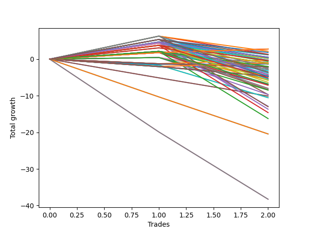

# Long Entry Wallace MJ 007 
- Symbol: TSLA_Unlimited
- Date Range: 03/23/2022 - 07/08/2022
- Trading Period: 7:20-12:30
- Number of Trades: 2



| Name | Win Percent | Profit | Avg Profit / Trade | Avg Time / Trade |      | Name | Win Percent | Profit | Avg Profit / Trade | Avg Time / Trade |
| ---- | ----------- | ------ | ------------------ | ---------------- | ---- | ---- | ----------- | ------ | ------------------ | ---------------- |
| Sorted By <br> Profit | | | | | | Sorted By <br> Win Percentage ||||
| One Hundred Twenty-Six | 100.00 | 1380.00 | 690.00 | 08:22 |     | One Hundred Twenty-Six | 100.00 | 1380.00 | 690.00 | 08:22 |
| One Hundred Twenty-One | 100.00 | 1380.00 | 690.00 | 08:22 |     | One Hundred Twenty-One | 100.00 | 1380.00 | 690.00 | 08:22 |
| One Hundred Sixteen | 100.00 | 1380.00 | 690.00 | 08:22 |     | One Hundred Sixteen | 100.00 | 1380.00 | 690.00 | 08:22 |
| One Hundred Eleven | 100.00 | 1380.00 | 690.00 | 08:22 |     | One Hundred Eleven | 100.00 | 1380.00 | 690.00 | 08:22 |
| One Hundred One | 100.00 | 1380.00 | 690.00 | 08:22 |     | One Hundred One | 100.00 | 1380.00 | 690.00 | 08:22 |
| Eighty-One | 100.00 | 1380.00 | 690.00 | 08:22 |     | Eighty-One | 100.00 | 1380.00 | 690.00 | 08:22 |
| Fifty-Three | 50.00 | 1075.00 | 537.50 | 26:52 |     | Fifty-Three | 50.00 | 1075.00 | 537.50 | 26:52 |
| One Hundred Five | 50.00 | 915.00 | 457.50 | 12:55 |     | One Hundred Five | 50.00 | 915.00 | 457.50 | 12:55 |
| Forty-Five | 50.00 | 660.00 | 330.00 | 27:07 |     | Forty-Five | 50.00 | 660.00 | 330.00 | 27:07 |
| One Hundred Twenty | 50.00 | 615.00 | 307.50 | 13:02 |     | One Hundred Twenty | 50.00 | 615.00 | 307.50 | 13:02 |
| One Hundred Four | 50.00 | 575.00 | 287.50 | 12:50 |     | One Hundred Four | 50.00 | 575.00 | 287.50 | 12:50 |
| One Hundred Ninteen | 50.00 | 275.00 | 137.50 | 12:57 |     | One Hundred Ninteen | 50.00 | 275.00 | 137.50 | 12:57 |
| Fifty-One | 50.00 | 275.00 | 137.50 | 12:57 |     | Fifty-One | 50.00 | 275.00 | 137.50 | 12:57 |
| Three | 50.00 | 260.00 | 130.00 | 27:35 |     | Three | 50.00 | 260.00 | 130.00 | 27:35 |
| One Hundred Fifteen | 50.00 | 200.00 | 100.00 | 13:17 |     | One Hundred Fifteen | 50.00 | 200.00 | 100.00 | 13:17 |
| One Hundred Three | 50.00 | 115.00 | 57.50 | 12:47 |     | One Hundred Three | 50.00 | 115.00 | 57.50 | 12:47 |
| Fifty-Two | 50.00 | 95.00 | 47.50 | 23:32 |     | Fifty-Two | 50.00 | 95.00 | 47.50 | 23:32 |
| Ninety-Six | 50.00 | -130.00 | -65.00 | 03:42 |     | Ninety-Six | 50.00 | -130.00 | -65.00 | 03:42 |
| One Hundred Fourteen | 50.00 | -140.00 | -70.00 | 13:12 |     | One Hundred Fourteen | 50.00 | -140.00 | -70.00 | 13:12 |
| Forty-Three | 50.00 | -140.00 | -70.00 | 13:12 |     | Forty-Three | 50.00 | -140.00 | -70.00 | 13:12 |
| One Hundred Eighteen | 50.00 | -185.00 | -92.50 | 12:55 |     | One Hundred Eighteen | 50.00 | -185.00 | -92.50 | 12:55 |
| Forty-Four | 50.00 | -320.00 | -160.00 | 23:47 |     | Forty-Four | 50.00 | -320.00 | -160.00 | 23:47 |
| One Hundred Six | 50.00 | -510.00 | -255.00 | 07:12 |     | One Hundred Six | 50.00 | -510.00 | -255.00 | 07:12 |
| Fifty-Five | 50.00 | -530.00 | -265.00 | 31:22 |     | Fifty-Five | 50.00 | -530.00 | -265.00 | 31:22 |
| Fifty-Four | 50.00 | -530.00 | -265.00 | 31:22 |     | Fifty-Four | 50.00 | -530.00 | -265.00 | 31:22 |
| Ninety-One | 50.00 | -540.00 | -270.00 | 07:07 |     | Ninety-One | 50.00 | -540.00 | -270.00 | 07:07 |
| One Hundred Thirteen | 50.00 | -600.00 | -300.00 | 13:10 |     | One Hundred Thirteen | 50.00 | -600.00 | -300.00 | 13:10 |
| Seventy-Three | 50.00 | -675.00 | -337.50 | 08:05 |     | Seventy-Three | 50.00 | -675.00 | -337.50 | 08:05 |
| One Hundred Two | 50.00 | -705.00 | -352.50 | 11:32 |     | One Hundred Two | 50.00 | -705.00 | -352.50 | 11:32 |
| One Hundred Seventeen | 50.00 | -1005.00 | -502.50 | 11:40 |     | One Hundred Seventeen | 50.00 | -1005.00 | -502.50 | 11:40 |
| Fifty | 50.00 | -1005.00 | -502.50 | 11:40 |     | Fifty | 50.00 | -1005.00 | -502.50 | 11:40 |
| One Hundred | 0.00 | -1050.00 | -525.00 | 05:30 |     | Forty-Nine | 50.00 | -1180.00 | -590.00 | 11:37 |
| Ninety-Nine | 0.00 | -1050.00 | -525.00 | 05:30 |     | Sixty-Nine | 50.00 | -1310.00 | -655.00 | 28:07 |
| Ninety-Eight | 0.00 | -1050.00 | -525.00 | 05:30 |     | One Hundred Twelve | 50.00 | -1420.00 | -710.00 | 11:55 |
| Ninety-Seven | 0.00 | -1050.00 | -525.00 | 05:30 |     | Forty-Two | 50.00 | -1420.00 | -710.00 | 11:55 |
| Forty-Nine | 50.00 | -1180.00 | -590.00 | 11:37 |     | Forty-One | 50.00 | -1595.00 | -797.50 | 11:52 |
| Sixty-Nine | 50.00 | -1310.00 | -655.00 | 28:07 |     | One Hundred Thirty | 50.00 | -1770.00 | -885.00 | 14:17 |
| One Hundred Twelve | 50.00 | -1420.00 | -710.00 | 11:55 |     | Forty-Eight | 50.00 | -1850.00 | -925.00 | 11:27 |
| Forty-Two | 50.00 | -1420.00 | -710.00 | 11:55 |     | Sixty-One | 50.00 | -1915.00 | -957.50 | 31:37 |
| Forty-One | 50.00 | -1595.00 | -797.50 | 11:52 |     | One Hundred Twenty-Nine | 50.00 | -2110.00 | -1055.00 | 14:12 |
| One Hundred Thirty | 50.00 | -1770.00 | -885.00 | 14:17 |     | Sixty-Seven | 50.00 | -2110.00 | -1055.00 | 14:12 |
| Forty-Eight | 50.00 | -1850.00 | -925.00 | 11:27 |     | Two | 50.00 | -2245.00 | -1122.50 | 24:47 |
| Sixty-One | 50.00 | -1915.00 | -957.50 | 31:37 |     | Forty | 50.00 | -2265.00 | -1132.50 | 11:42 |
| One Hundred Twenty-Nine | 50.00 | -2110.00 | -1055.00 | 14:12 |     | Sixty-Eight | 50.00 | -2290.00 | -1145.00 | 24:47 |
| Sixty-Seven | 50.00 | -2110.00 | -1055.00 | 14:12 |     | One Hundred Twenty-Five | 50.00 | -2375.00 | -1187.50 | 17:47 |
| Two | 50.00 | -2245.00 | -1122.50 | 24:47 |     | One Hundred Twenty-Eight | 50.00 | -2570.00 | -1285.00 | 14:10 |
| Forty | 50.00 | -2265.00 | -1132.50 | 11:42 |     | One Hundred Twenty-Four | 50.00 | -2715.00 | -1357.50 | 17:42 |
| Sixty-Eight | 50.00 | -2290.00 | -1145.00 | 24:47 |     | Fifty-Nine | 50.00 | -2715.00 | -1357.50 | 17:42 |
| One Hundred Ten | 0.00 | -2330.00 | -1165.00 | 10:15 |     | One | 50.00 | -2865.00 | -1432.50 | 24:17 |
| One Hundred Nine | 0.00 | -2330.00 | -1165.00 | 10:15 |     | Sixty | 50.00 | -2895.00 | -1447.50 | 28:17 |
| One Hundred Eight | 0.00 | -2330.00 | -1165.00 | 10:15 |     | One Hundred Twenty-Three | 50.00 | -3175.00 | -1587.50 | 17:40 |
| One Hundred Seven | 0.00 | -2330.00 | -1165.00 | 10:15 |     | One Hundred Twenty-Seven | 50.00 | -3390.00 | -1695.00 | 12:55 |
| Ninety-Five | 0.00 | -2360.00 | -1180.00 | 10:10 |     | Sixty-Six | 50.00 | -3390.00 | -1695.00 | 12:55 |
| Ninety-Four | 0.00 | -2360.00 | -1180.00 | 10:10 |     | Zero | 50.00 | -3455.00 | -1727.50 | 20:45 |
| Ninety-Three | 0.00 | -2360.00 | -1180.00 | 10:10 |     | Sixty-Five | 50.00 | -3565.00 | -1782.50 | 12:52 |
| Ninety-Two | 0.00 | -2360.00 | -1180.00 | 10:10 |     | One Hundred Twenty-Two | 50.00 | -3995.00 | -1997.50 | 16:25 |
| One Hundred Twenty-Five | 50.00 | -2375.00 | -1187.50 | 17:47 |     | Fifty-Eight | 50.00 | -3995.00 | -1997.50 | 16:25 |
| One Hundred Twenty-Eight | 50.00 | -2570.00 | -1285.00 | 14:10 |     | Fifty-Seven | 50.00 | -4170.00 | -2085.00 | 16:22 |
| One Hundred Twenty-Four | 50.00 | -2715.00 | -1357.50 | 17:42 |     | Sixty-Four | 50.00 | -4235.00 | -2117.50 | 12:42 |
| Fifty-Nine | 50.00 | -2715.00 | -1357.50 | 17:42 |     | Five | 50.00 | -4835.00 | -2417.50 | 100:47 |
| One | 50.00 | -2865.00 | -1432.50 | 24:17 |     | Fifty-Six | 50.00 | -4840.00 | -2420.00 | 16:12 |
| Sixty | 50.00 | -2895.00 | -1447.50 | 28:17 |     | Four | 50.00 | -6440.00 | -3220.00 | 86:42 |
| One Hundred Twenty-Three | 50.00 | -3175.00 | -1587.50 | 17:40 |     | Eighty-Five | 50.00 | -6500.00 | -3250.00 | 115:55 |
| One Hundred Twenty-Seven | 50.00 | -3390.00 | -1695.00 | 12:55 |     | Eighty-Four | 50.00 | -6840.00 | -3420.00 | 115:50 |
| Sixty-Six | 50.00 | -3390.00 | -1695.00 | 12:55 |     | Eighty-Three | 50.00 | -7300.00 | -3650.00 | 115:47 |
| Zero | 50.00 | -3455.00 | -1727.50 | 20:45 |     | Eighty-Two | 50.00 | -8120.00 | -4060.00 | 114:32 |
| Sixty-Five | 50.00 | -3565.00 | -1782.50 | 12:52 |     | One Hundred | 0.00 | -1050.00 | -525.00 | 05:30 |
| One Hundred Twenty-Two | 50.00 | -3995.00 | -1997.50 | 16:25 |     | Ninety-Nine | 0.00 | -1050.00 | -525.00 | 05:30 |
| Fifty-Eight | 50.00 | -3995.00 | -1997.50 | 16:25 |     | Ninety-Eight | 0.00 | -1050.00 | -525.00 | 05:30 |
| Fifty-Seven | 50.00 | -4170.00 | -2085.00 | 16:22 |     | Ninety-Seven | 0.00 | -1050.00 | -525.00 | 05:30 |
| Sixty-Four | 50.00 | -4235.00 | -2117.50 | 12:42 |     | One Hundred Ten | 0.00 | -2330.00 | -1165.00 | 10:15 |
| Five | 50.00 | -4835.00 | -2417.50 | 100:47 |     | One Hundred Nine | 0.00 | -2330.00 | -1165.00 | 10:15 |
| Fifty-Six | 50.00 | -4840.00 | -2420.00 | 16:12 |     | One Hundred Eight | 0.00 | -2330.00 | -1165.00 | 10:15 |
| Forty-Seven | 0.00 | -5040.00 | -2520.00 | 41:20 |     | One Hundred Seven | 0.00 | -2330.00 | -1165.00 | 10:15 |
| Forty-Six | 0.00 | -5040.00 | -2520.00 | 41:20 |     | Ninety-Five | 0.00 | -2360.00 | -1180.00 | 10:10 |
| Seventy-One | 0.00 | -5265.00 | -2632.50 | 37:57 |     | Ninety-Four | 0.00 | -2360.00 | -1180.00 | 10:10 |
| Seventy | 0.00 | -5265.00 | -2632.50 | 37:57 |     | Ninety-Three | 0.00 | -2360.00 | -1180.00 | 10:10 |
| Four | 50.00 | -6440.00 | -3220.00 | 86:42 |     | Ninety-Two | 0.00 | -2360.00 | -1180.00 | 10:10 |
| Eighty-Five | 50.00 | -6500.00 | -3250.00 | 115:55 |     | Forty-Seven | 0.00 | -5040.00 | -2520.00 | 41:20 |
| Eighty-Four | 50.00 | -6840.00 | -3420.00 | 115:50 |     | Forty-Six | 0.00 | -5040.00 | -2520.00 | 41:20 |
| Eighty-Three | 50.00 | -7300.00 | -3650.00 | 115:47 |     | Seventy-One | 0.00 | -5265.00 | -2632.50 | 37:57 |
| Eighty-Two | 50.00 | -8120.00 | -4060.00 | 114:32 |     | Seventy | 0.00 | -5265.00 | -2632.50 | 37:57 |
| Sixty-Three | 0.00 | -10220.00 | -5110.00 | 51:05 |     | Sixty-Three | 0.00 | -10220.00 | -5110.00 | 51:05 |
| Sixty-Two | 0.00 | -10220.00 | -5110.00 | 51:05 |     | Sixty-Two | 0.00 | -10220.00 | -5110.00 | 51:05 |
| Seven | 0.00 | -19135.00 | -9567.50 | 197:30 |     | Seven | 0.00 | -19135.00 | -9567.50 | 197:30 |
| Six | 0.00 | -19135.00 | -9567.50 | 197:30 |     | Six | 0.00 | -19135.00 | -9567.50 | 197:30 |

## NO STOPLOSS

### Test Zero
* Sell when price hits the middle line of the 20p bollinger
* No Stoploss
* Results:
```
Total Trades: 2
Percent Up: 50.00
Percent Down: 50.00
Total Points Moved Up: -6.91
Potential Profit: -3455.00
Total Points Ups: 0.44 Count Ups: 1
Total Points Downs: -7.35 Count Downs: 1
```

<details><summary>Trades</summary>

<code>In: 2022-04-29 09:47:00		Out: 2022-04-29 10:00:40		Total Position Time: 13:40		Total Move Up: 0.44		Total to Date: 0.44</code> <br />
<code>In: 2022-05-18 09:12:00		Out: 2022-05-18 09:39:50		Total Position Time: 27:50		Total Move Up: -7.35		Total to Date: -6.91</code> <br />


</details>

### Test One
* Sell when the price hits the upper line of the 20p 1std bollinger
* No Stoploss
* Results:
```
Total Trades: 2
Percent Up: 50.00
Percent Down: 50.00
Total Points Moved Up: -5.73
Potential Profit: -2865.00
Total Points Ups: 1.78 Count Ups: 1
Total Points Downs: -7.51 Count Downs: 1
```

<details><summary>Trades</summary>

<code>In: 2022-04-29 09:47:00		Out: 2022-04-29 10:01:00		Total Position Time: 14:00		Total Move Up: 1.78		Total to Date: 1.78</code> <br />
<code>In: 2022-05-18 09:12:00		Out: 2022-05-18 09:46:35		Total Position Time: 34:35		Total Move Up: -7.51		Total to Date: -5.73</code> <br />


</details>

### Test Two
* Sell when the price hits the upper line of the 20p 2std bollinger
* No Stoploss
* Results:
```
Total Trades: 2
Percent Up: 50.00
Percent Down: 50.00
Total Points Moved Up: -4.49
Potential Profit: -2245.00
Total Points Ups: 2.13 Count Ups: 1
Total Points Downs: -6.62 Count Downs: 1
```

<details><summary>Trades</summary>

<code>In: 2022-04-29 09:47:00		Out: 2022-04-29 10:01:05		Total Position Time: 14:05		Total Move Up: 2.13		Total to Date: 2.13</code> <br />
<code>In: 2022-05-18 09:12:00		Out: 2022-05-18 09:47:30		Total Position Time: 35:30		Total Move Up: -6.62		Total to Date: -4.49</code> <br />


</details>

### Test Three
* Sell when price hits the middle line of the 50p bollinger
* No Stoploss
* Results:
```
Total Trades: 2
Percent Up: 50.00
Percent Down: 50.00
Total Points Moved Up: 0.52
Potential Profit: 260.00
Total Points Ups: 4.69 Count Ups: 1
Total Points Downs: -4.17 Count Downs: 1
```

<details><summary>Trades</summary>

<code>In: 2022-04-29 09:47:00		Out: 2022-04-29 10:03:40		Total Position Time: 16:40		Total Move Up: 4.69		Total to Date: 4.69</code> <br />
<code>In: 2022-05-18 09:12:00		Out: 2022-05-18 09:50:30		Total Position Time: 38:30		Total Move Up: -4.17		Total to Date: 0.52</code> <br />


</details>

### Test Four
* Sell when the price hits the upper line of the 50p 1std bollinger
* No Stoploss
* Results:
```
Total Trades: 2
Percent Up: 50.00
Percent Down: 50.00
Total Points Moved Up: -12.88
Potential Profit: -6440.00
Total Points Ups: 4.33 Count Ups: 1
Total Points Downs: -17.21 Count Downs: 1
```

<details><summary>Trades</summary>

<code>In: 2022-04-29 09:47:00		Out: 2022-04-29 10:24:50		Total Position Time: 37:50		Total Move Up: 4.33		Total to Date: 4.33</code> <br />
<code>In: 2022-05-18 09:12:00		Out: 2022-05-18 11:27:35		Total Position Time: 135:35		Total Move Up: -17.21		Total to Date: -12.88</code> <br />


</details>

### Test Five
* Sell when the price hits the upper line of the 50p 2std bollinger
* No Stoploss
* Results:
```
Total Trades: 2
Percent Up: 50.00
Percent Down: 50.00
Total Points Moved Up: -9.67
Potential Profit: -4835.00
Total Points Ups: 6.29 Count Ups: 1
Total Points Downs: -15.96 Count Downs: 1
```

<details><summary>Trades</summary>

<code>In: 2022-04-29 09:47:00		Out: 2022-04-29 10:31:30		Total Position Time: 44:30		Total Move Up: 6.29		Total to Date: 6.29</code> <br />
<code>In: 2022-05-18 09:12:00		Out: 2022-05-18 11:49:05		Total Position Time: 157:05		Total Move Up: -15.96		Total to Date: -9.67</code> <br />


</details>

### Test Six
* Sell when the price hits the middle line of the 1std VWAP
* No Stoploss
* Results:
```
Total Trades: 2
Percent Up: 0.00
Percent Down: 100.00
Total Points Moved Up: -38.27
Potential Profit: -19135.00
Total Points Ups: 0.00 Count Ups: 0
Total Points Downs: -38.27 Count Downs: 2
```

<details><summary>Trades</summary>

<code>In: 2022-04-29 09:47:00		Out: 2022-04-29 12:47:00		Total Position Time: 180:00		Total Move Up: -19.90		Total to Date: -19.90</code> <br />
<code>In: 2022-05-18 09:12:00		Out: 2022-05-18 12:47:00		Total Position Time: 215:00		Total Move Up: -18.37		Total to Date: -38.27</code> <br />


</details>

### Test Seven
* Sell when the price hits the upper line of the 1std VWAP
* No Stoploss
* Results:
```
Total Trades: 2
Percent Up: 0.00
Percent Down: 100.00
Total Points Moved Up: -38.27
Potential Profit: -19135.00
Total Points Ups: 0.00 Count Ups: 0
Total Points Downs: -38.27 Count Downs: 2
```

<details><summary>Trades</summary>

<code>In: 2022-04-29 09:47:00		Out: 2022-04-29 12:47:00		Total Position Time: 180:00		Total Move Up: -19.90		Total to Date: -19.90</code> <br />
<code>In: 2022-05-18 09:12:00		Out: 2022-05-18 12:47:00		Total Position Time: 215:00		Total Move Up: -18.37		Total to Date: -38.27</code> <br />


</details>

## STOPLOSS OF 5

### Test Forty
* Sell when price hits the middle line of the 20p bollinger
* Stoploss is 5 points
* Results:
```
Total Trades: 2
Percent Up: 50.00
Percent Down: 50.00
Total Points Moved Up: -4.53
Potential Profit: -2265.00
Total Points Ups: 0.44 Count Ups: 1
Total Points Downs: -4.97 Count Downs: 1
```

<details><summary>Trades</summary>

<code>In: 2022-04-29 09:47:00		Out: 2022-04-29 10:00:40		Total Position Time: 13:40		Total Move Up: 0.44		Total to Date: 0.44</code> <br />
<code>In: 2022-05-18 09:12:00		Out: 2022-05-18 09:21:45		Total Position Time: 09:45		Total Move Up: -4.97		Total to Date: -4.53</code> <br />


</details>

### Test Forty-One
* Sell when the price hits the upper line of the 20p 1std bollinger
* Stoploss is 5 points
* Results:
```
Total Trades: 2
Percent Up: 50.00
Percent Down: 50.00
Total Points Moved Up: -3.19
Potential Profit: -1595.00
Total Points Ups: 1.78 Count Ups: 1
Total Points Downs: -4.97 Count Downs: 1
```

<details><summary>Trades</summary>

<code>In: 2022-04-29 09:47:00		Out: 2022-04-29 10:01:00		Total Position Time: 14:00		Total Move Up: 1.78		Total to Date: 1.78</code> <br />
<code>In: 2022-05-18 09:12:00		Out: 2022-05-18 09:21:45		Total Position Time: 09:45		Total Move Up: -4.97		Total to Date: -3.19</code> <br />


</details>

### Test Forty-Two
* Sell when the price hits the upper line of the 20p 2std bollinger
* Stoploss is 5 points
* Results:
```
Total Trades: 2
Percent Up: 50.00
Percent Down: 50.00
Total Points Moved Up: -2.84
Potential Profit: -1420.00
Total Points Ups: 2.13 Count Ups: 1
Total Points Downs: -4.97 Count Downs: 1
```

<details><summary>Trades</summary>

<code>In: 2022-04-29 09:47:00		Out: 2022-04-29 10:01:05		Total Position Time: 14:05		Total Move Up: 2.13		Total to Date: 2.13</code> <br />
<code>In: 2022-05-18 09:12:00		Out: 2022-05-18 09:21:45		Total Position Time: 09:45		Total Move Up: -4.97		Total to Date: -2.84</code> <br />


</details>

### Test Forty-Three
* Sell when price hits the middle line of the 50p bollinger
* Stoploss is 5 points
* Results:
```
Total Trades: 2
Percent Up: 50.00
Percent Down: 50.00
Total Points Moved Up: -0.28
Potential Profit: -140.00
Total Points Ups: 4.69 Count Ups: 1
Total Points Downs: -4.97 Count Downs: 1
```

<details><summary>Trades</summary>

<code>In: 2022-04-29 09:47:00		Out: 2022-04-29 10:03:40		Total Position Time: 16:40		Total Move Up: 4.69		Total to Date: 4.69</code> <br />
<code>In: 2022-05-18 09:12:00		Out: 2022-05-18 09:21:45		Total Position Time: 09:45		Total Move Up: -4.97		Total to Date: -0.28</code> <br />


</details>

### Test Forty-Four
* Sell when the price hits the upper line of the 50p 1std bollinger
* Stoploss is 5 points
* Results:
```
Total Trades: 2
Percent Up: 50.00
Percent Down: 50.00
Total Points Moved Up: -0.64
Potential Profit: -320.00
Total Points Ups: 4.33 Count Ups: 1
Total Points Downs: -4.97 Count Downs: 1
```

<details><summary>Trades</summary>

<code>In: 2022-04-29 09:47:00		Out: 2022-04-29 10:24:50		Total Position Time: 37:50		Total Move Up: 4.33		Total to Date: 4.33</code> <br />
<code>In: 2022-05-18 09:12:00		Out: 2022-05-18 09:21:45		Total Position Time: 09:45		Total Move Up: -4.97		Total to Date: -0.64</code> <br />


</details>

### Test Forty-Five
* Sell when the price hits the upper line of the 50p 2std bollinger
* Stoploss is 5 points
* Results:
```
Total Trades: 2
Percent Up: 50.00
Percent Down: 50.00
Total Points Moved Up: 1.32
Potential Profit: 660.00
Total Points Ups: 6.29 Count Ups: 1
Total Points Downs: -4.97 Count Downs: 1
```

<details><summary>Trades</summary>

<code>In: 2022-04-29 09:47:00		Out: 2022-04-29 10:31:30		Total Position Time: 44:30		Total Move Up: 6.29		Total to Date: 6.29</code> <br />
<code>In: 2022-05-18 09:12:00		Out: 2022-05-18 09:21:45		Total Position Time: 09:45		Total Move Up: -4.97		Total to Date: 1.32</code> <br />


</details>

### Test Forty-Six
* Sell when the price hits the middle line of the 1std VWAP
* Stoploss is 5 points
* Results:
```
Total Trades: 2
Percent Up: 0.00
Percent Down: 100.00
Total Points Moved Up: -10.08
Potential Profit: -5040.00
Total Points Ups: 0.00 Count Ups: 0
Total Points Downs: -10.08 Count Downs: 2
```

<details><summary>Trades</summary>

<code>In: 2022-04-29 09:47:00		Out: 2022-04-29 10:59:55		Total Position Time: 72:55		Total Move Up: -5.11		Total to Date: -5.11</code> <br />
<code>In: 2022-05-18 09:12:00		Out: 2022-05-18 09:21:45		Total Position Time: 09:45		Total Move Up: -4.97		Total to Date: -10.08</code> <br />


</details>

### Test Forty-Seven
* Sell when the price hits the upper line of the 1std VWAP
* Stoploss is 5 points
* Results:
```
Total Trades: 2
Percent Up: 0.00
Percent Down: 100.00
Total Points Moved Up: -10.08
Potential Profit: -5040.00
Total Points Ups: 0.00 Count Ups: 0
Total Points Downs: -10.08 Count Downs: 2
```

<details><summary>Trades</summary>

<code>In: 2022-04-29 09:47:00		Out: 2022-04-29 10:59:55		Total Position Time: 72:55		Total Move Up: -5.11		Total to Date: -5.11</code> <br />
<code>In: 2022-05-18 09:12:00		Out: 2022-05-18 09:21:45		Total Position Time: 09:45		Total Move Up: -4.97		Total to Date: -10.08</code> <br />


</details>

## TRAIL STOP OF 5

### Test Forty-Eight
* Sell when price hits the middle line of the 20p bollinger
* Trailing Stop is 5 points
* Results:
```
Total Trades: 2
Percent Up: 50.00
Percent Down: 50.00
Total Points Moved Up: -3.70
Potential Profit: -1850.00
Total Points Ups: 0.44 Count Ups: 1
Total Points Downs: -4.14 Count Downs: 1
```

<details><summary>Trades</summary>

<code>In: 2022-04-29 09:47:00		Out: 2022-04-29 10:00:40		Total Position Time: 13:40		Total Move Up: 0.44		Total to Date: 0.44</code> <br />
<code>In: 2022-05-18 09:12:00		Out: 2022-05-18 09:21:15		Total Position Time: 09:15		Total Move Up: -4.14		Total to Date: -3.70</code> <br />


</details>

### Test Forty-Nine
* Sell when the price hits the upper line of the 20p 1std bollinger
* Trailing Stop is 5 points
* Results:
```
Total Trades: 2
Percent Up: 50.00
Percent Down: 50.00
Total Points Moved Up: -2.36
Potential Profit: -1180.00
Total Points Ups: 1.78 Count Ups: 1
Total Points Downs: -4.14 Count Downs: 1
```

<details><summary>Trades</summary>

<code>In: 2022-04-29 09:47:00		Out: 2022-04-29 10:01:00		Total Position Time: 14:00		Total Move Up: 1.78		Total to Date: 1.78</code> <br />
<code>In: 2022-05-18 09:12:00		Out: 2022-05-18 09:21:15		Total Position Time: 09:15		Total Move Up: -4.14		Total to Date: -2.36</code> <br />


</details>

### Test Fifty
* Sell when the price hits the upper line of the 20p 2std bollinger
* Trailing Stop is 5 points
* Results:
```
Total Trades: 2
Percent Up: 50.00
Percent Down: 50.00
Total Points Moved Up: -2.01
Potential Profit: -1005.00
Total Points Ups: 2.13 Count Ups: 1
Total Points Downs: -4.14 Count Downs: 1
```

<details><summary>Trades</summary>

<code>In: 2022-04-29 09:47:00		Out: 2022-04-29 10:01:05		Total Position Time: 14:05		Total Move Up: 2.13		Total to Date: 2.13</code> <br />
<code>In: 2022-05-18 09:12:00		Out: 2022-05-18 09:21:15		Total Position Time: 09:15		Total Move Up: -4.14		Total to Date: -2.01</code> <br />


</details>

### Test Fifty-One
* Sell when price hits the middle line of the 50p bollinger
* Trailing Stop is 5 points
* Results:
```
Total Trades: 2
Percent Up: 50.00
Percent Down: 50.00
Total Points Moved Up: 0.55
Potential Profit: 275.00
Total Points Ups: 4.69 Count Ups: 1
Total Points Downs: -4.14 Count Downs: 1
```

<details><summary>Trades</summary>

<code>In: 2022-04-29 09:47:00		Out: 2022-04-29 10:03:40		Total Position Time: 16:40		Total Move Up: 4.69		Total to Date: 4.69</code> <br />
<code>In: 2022-05-18 09:12:00		Out: 2022-05-18 09:21:15		Total Position Time: 09:15		Total Move Up: -4.14		Total to Date: 0.55</code> <br />


</details>

### Test Fifty-Two
* Sell when the price hits the upper line of the 50p 1std bollinger
* Trailing Stop is 5 points
* Results:
```
Total Trades: 2
Percent Up: 50.00
Percent Down: 50.00
Total Points Moved Up: 0.19
Potential Profit: 95.00
Total Points Ups: 4.33 Count Ups: 1
Total Points Downs: -4.14 Count Downs: 1
```

<details><summary>Trades</summary>

<code>In: 2022-04-29 09:47:00		Out: 2022-04-29 10:24:50		Total Position Time: 37:50		Total Move Up: 4.33		Total to Date: 4.33</code> <br />
<code>In: 2022-05-18 09:12:00		Out: 2022-05-18 09:21:15		Total Position Time: 09:15		Total Move Up: -4.14		Total to Date: 0.19</code> <br />


</details>

### Test Fifty-Three
* Sell when the price hits the upper line of the 50p 2std bollinger
* Trailing Stop is 5 points
* Results:
```
Total Trades: 2
Percent Up: 50.00
Percent Down: 50.00
Total Points Moved Up: 2.15
Potential Profit: 1075.00
Total Points Ups: 6.29 Count Ups: 1
Total Points Downs: -4.14 Count Downs: 1
```

<details><summary>Trades</summary>

<code>In: 2022-04-29 09:47:00		Out: 2022-04-29 10:31:30		Total Position Time: 44:30		Total Move Up: 6.29		Total to Date: 6.29</code> <br />
<code>In: 2022-05-18 09:12:00		Out: 2022-05-18 09:21:15		Total Position Time: 09:15		Total Move Up: -4.14		Total to Date: 2.15</code> <br />


</details>

### Test Fifty-Four
* Sell when the price hits the middle line of the 1std VWAP
* Trailing Stop is 5 points
* Results:
```
Total Trades: 2
Percent Up: 50.00
Percent Down: 50.00
Total Points Moved Up: -1.06
Potential Profit: -530.00
Total Points Ups: 3.08 Count Ups: 1
Total Points Downs: -4.14 Count Downs: 1
```

<details><summary>Trades</summary>

<code>In: 2022-04-29 09:47:00		Out: 2022-04-29 10:40:30		Total Position Time: 53:30		Total Move Up: 3.08		Total to Date: 3.08</code> <br />
<code>In: 2022-05-18 09:12:00		Out: 2022-05-18 09:21:15		Total Position Time: 09:15		Total Move Up: -4.14		Total to Date: -1.06</code> <br />


</details>

### Test Fifty-Five
* Sell when the price hits the upper line of the 1std VWAP
* Trailing Stop is 5 points
* Results:
```
Total Trades: 2
Percent Up: 50.00
Percent Down: 50.00
Total Points Moved Up: -1.06
Potential Profit: -530.00
Total Points Ups: 3.08 Count Ups: 1
Total Points Downs: -4.14 Count Downs: 1
```

<details><summary>Trades</summary>

<code>In: 2022-04-29 09:47:00		Out: 2022-04-29 10:40:30		Total Position Time: 53:30		Total Move Up: 3.08		Total to Date: 3.08</code> <br />
<code>In: 2022-05-18 09:12:00		Out: 2022-05-18 09:21:15		Total Position Time: 09:15		Total Move Up: -4.14		Total to Date: -1.06</code> <br />


</details>

## STOPLOSS OF 10

### Test Fifty-Six
* Sell when price hits the middle line of the 20p bollinger
* Stoploss is 10 points
* Results:
```
Total Trades: 2
Percent Up: 50.00
Percent Down: 50.00
Total Points Moved Up: -9.68
Potential Profit: -4840.00
Total Points Ups: 0.44 Count Ups: 1
Total Points Downs: -10.12 Count Downs: 1
```

<details><summary>Trades</summary>

<code>In: 2022-04-29 09:47:00		Out: 2022-04-29 10:00:40		Total Position Time: 13:40		Total Move Up: 0.44		Total to Date: 0.44</code> <br />
<code>In: 2022-05-18 09:12:00		Out: 2022-05-18 09:30:45		Total Position Time: 18:45		Total Move Up: -10.12		Total to Date: -9.68</code> <br />


</details>

### Test Fifty-Seven
* Sell when the price hits the upper line of the 20p 1std bollinger
* Stoploss is 10 points
* Results:
```
Total Trades: 2
Percent Up: 50.00
Percent Down: 50.00
Total Points Moved Up: -8.34
Potential Profit: -4170.00
Total Points Ups: 1.78 Count Ups: 1
Total Points Downs: -10.12 Count Downs: 1
```

<details><summary>Trades</summary>

<code>In: 2022-04-29 09:47:00		Out: 2022-04-29 10:01:00		Total Position Time: 14:00		Total Move Up: 1.78		Total to Date: 1.78</code> <br />
<code>In: 2022-05-18 09:12:00		Out: 2022-05-18 09:30:45		Total Position Time: 18:45		Total Move Up: -10.12		Total to Date: -8.34</code> <br />


</details>

### Test Fifty-Eight
* Sell when the price hits the upper line of the 20p 2std bollinger
* Stoploss is 10 points
* Results:
```
Total Trades: 2
Percent Up: 50.00
Percent Down: 50.00
Total Points Moved Up: -7.99
Potential Profit: -3995.00
Total Points Ups: 2.13 Count Ups: 1
Total Points Downs: -10.12 Count Downs: 1
```

<details><summary>Trades</summary>

<code>In: 2022-04-29 09:47:00		Out: 2022-04-29 10:01:05		Total Position Time: 14:05		Total Move Up: 2.13		Total to Date: 2.13</code> <br />
<code>In: 2022-05-18 09:12:00		Out: 2022-05-18 09:30:45		Total Position Time: 18:45		Total Move Up: -10.12		Total to Date: -7.99</code> <br />


</details>

### Test Fifty-Nine
* Sell when price hits the middle line of the 50p bollinger
* Stoploss is 10 points
* Results:
```
Total Trades: 2
Percent Up: 50.00
Percent Down: 50.00
Total Points Moved Up: -5.43
Potential Profit: -2715.00
Total Points Ups: 4.69 Count Ups: 1
Total Points Downs: -10.12 Count Downs: 1
```

<details><summary>Trades</summary>

<code>In: 2022-04-29 09:47:00		Out: 2022-04-29 10:03:40		Total Position Time: 16:40		Total Move Up: 4.69		Total to Date: 4.69</code> <br />
<code>In: 2022-05-18 09:12:00		Out: 2022-05-18 09:30:45		Total Position Time: 18:45		Total Move Up: -10.12		Total to Date: -5.43</code> <br />


</details>

### Test Sixty
* Sell when the price hits the upper line of the 50p 1std bollinger
* Stoploss is 10 points
* Results:
```
Total Trades: 2
Percent Up: 50.00
Percent Down: 50.00
Total Points Moved Up: -5.79
Potential Profit: -2895.00
Total Points Ups: 4.33 Count Ups: 1
Total Points Downs: -10.12 Count Downs: 1
```

<details><summary>Trades</summary>

<code>In: 2022-04-29 09:47:00		Out: 2022-04-29 10:24:50		Total Position Time: 37:50		Total Move Up: 4.33		Total to Date: 4.33</code> <br />
<code>In: 2022-05-18 09:12:00		Out: 2022-05-18 09:30:45		Total Position Time: 18:45		Total Move Up: -10.12		Total to Date: -5.79</code> <br />


</details>

### Test Sixty-One
* Sell when the price hits the upper line of the 50p 2std bollinger
* Stoploss is 10 points
* Results:
```
Total Trades: 2
Percent Up: 50.00
Percent Down: 50.00
Total Points Moved Up: -3.83
Potential Profit: -1915.00
Total Points Ups: 6.29 Count Ups: 1
Total Points Downs: -10.12 Count Downs: 1
```

<details><summary>Trades</summary>

<code>In: 2022-04-29 09:47:00		Out: 2022-04-29 10:31:30		Total Position Time: 44:30		Total Move Up: 6.29		Total to Date: 6.29</code> <br />
<code>In: 2022-05-18 09:12:00		Out: 2022-05-18 09:30:45		Total Position Time: 18:45		Total Move Up: -10.12		Total to Date: -3.83</code> <br />


</details>

### Test Sixty-Two
* Sell when the price hits the middle line of the 1std VWAP
* Stoploss is 10 points
* Results:
```
Total Trades: 2
Percent Up: 0.00
Percent Down: 100.00
Total Points Moved Up: -20.44
Potential Profit: -10220.00
Total Points Ups: 0.00 Count Ups: 0
Total Points Downs: -20.44 Count Downs: 2
```

<details><summary>Trades</summary>

<code>In: 2022-04-29 09:47:00		Out: 2022-04-29 11:10:25		Total Position Time: 83:25		Total Move Up: -10.32		Total to Date: -10.32</code> <br />
<code>In: 2022-05-18 09:12:00		Out: 2022-05-18 09:30:45		Total Position Time: 18:45		Total Move Up: -10.12		Total to Date: -20.44</code> <br />


</details>

### Test Sixty-Three
* Sell when the price hits the upper line of the 1std VWAP
* Stoploss is 10 points
* Results:
```
Total Trades: 2
Percent Up: 0.00
Percent Down: 100.00
Total Points Moved Up: -20.44
Potential Profit: -10220.00
Total Points Ups: 0.00 Count Ups: 0
Total Points Downs: -20.44 Count Downs: 2
```

<details><summary>Trades</summary>

<code>In: 2022-04-29 09:47:00		Out: 2022-04-29 11:10:25		Total Position Time: 83:25		Total Move Up: -10.32		Total to Date: -10.32</code> <br />
<code>In: 2022-05-18 09:12:00		Out: 2022-05-18 09:30:45		Total Position Time: 18:45		Total Move Up: -10.12		Total to Date: -20.44</code> <br />


</details>

## TRAIL STOP OF 10

### Test Sixty-Four
* Sell when price hits the middle line of the 20p bollinger
* Trailing Stop is 10 points
* Results:
```
Total Trades: 2
Percent Up: 50.00
Percent Down: 50.00
Total Points Moved Up: -8.47
Potential Profit: -4235.00
Total Points Ups: 0.44 Count Ups: 1
Total Points Downs: -8.91 Count Downs: 1
```

<details><summary>Trades</summary>

<code>In: 2022-04-29 09:47:00		Out: 2022-04-29 10:00:40		Total Position Time: 13:40		Total Move Up: 0.44		Total to Date: 0.44</code> <br />
<code>In: 2022-05-18 09:12:00		Out: 2022-05-18 09:23:45		Total Position Time: 11:45		Total Move Up: -8.91		Total to Date: -8.47</code> <br />


</details>

### Test Sixty-Five
* Sell when the price hits the upper line of the 20p 1std bollinger
* Trailing Stop is 10 points
* Results:
```
Total Trades: 2
Percent Up: 50.00
Percent Down: 50.00
Total Points Moved Up: -7.13
Potential Profit: -3565.00
Total Points Ups: 1.78 Count Ups: 1
Total Points Downs: -8.91 Count Downs: 1
```

<details><summary>Trades</summary>

<code>In: 2022-04-29 09:47:00		Out: 2022-04-29 10:01:00		Total Position Time: 14:00		Total Move Up: 1.78		Total to Date: 1.78</code> <br />
<code>In: 2022-05-18 09:12:00		Out: 2022-05-18 09:23:45		Total Position Time: 11:45		Total Move Up: -8.91		Total to Date: -7.13</code> <br />


</details>

### Test Sixty-Six
* Sell when the price hits the upper line of the 20p 2std bollinger
* Trailing Stop is 10 points
* Results:
```
Total Trades: 2
Percent Up: 50.00
Percent Down: 50.00
Total Points Moved Up: -6.78
Potential Profit: -3390.00
Total Points Ups: 2.13 Count Ups: 1
Total Points Downs: -8.91 Count Downs: 1
```

<details><summary>Trades</summary>

<code>In: 2022-04-29 09:47:00		Out: 2022-04-29 10:01:05		Total Position Time: 14:05		Total Move Up: 2.13		Total to Date: 2.13</code> <br />
<code>In: 2022-05-18 09:12:00		Out: 2022-05-18 09:23:45		Total Position Time: 11:45		Total Move Up: -8.91		Total to Date: -6.78</code> <br />


</details>

### Test Sixty-Seven
* Sell when price hits the middle line of the 50p bollinger
* Trailing Stop is 10 points
* Results:
```
Total Trades: 2
Percent Up: 50.00
Percent Down: 50.00
Total Points Moved Up: -4.22
Potential Profit: -2110.00
Total Points Ups: 4.69 Count Ups: 1
Total Points Downs: -8.91 Count Downs: 1
```

<details><summary>Trades</summary>

<code>In: 2022-04-29 09:47:00		Out: 2022-04-29 10:03:40		Total Position Time: 16:40		Total Move Up: 4.69		Total to Date: 4.69</code> <br />
<code>In: 2022-05-18 09:12:00		Out: 2022-05-18 09:23:45		Total Position Time: 11:45		Total Move Up: -8.91		Total to Date: -4.22</code> <br />


</details>

### Test Sixty-Eight
* Sell when the price hits the upper line of the 50p 1std bollinger
* Trailing Stop is 10 points
* Results:
```
Total Trades: 2
Percent Up: 50.00
Percent Down: 50.00
Total Points Moved Up: -4.58
Potential Profit: -2290.00
Total Points Ups: 4.33 Count Ups: 1
Total Points Downs: -8.91 Count Downs: 1
```

<details><summary>Trades</summary>

<code>In: 2022-04-29 09:47:00		Out: 2022-04-29 10:24:50		Total Position Time: 37:50		Total Move Up: 4.33		Total to Date: 4.33</code> <br />
<code>In: 2022-05-18 09:12:00		Out: 2022-05-18 09:23:45		Total Position Time: 11:45		Total Move Up: -8.91		Total to Date: -4.58</code> <br />


</details>

### Test Sixty-Nine
* Sell when the price hits the upper line of the 50p 2std bollinger
* Trailing Stop is 10 points
* Results:
```
Total Trades: 2
Percent Up: 50.00
Percent Down: 50.00
Total Points Moved Up: -2.62
Potential Profit: -1310.00
Total Points Ups: 6.29 Count Ups: 1
Total Points Downs: -8.91 Count Downs: 1
```

<details><summary>Trades</summary>

<code>In: 2022-04-29 09:47:00		Out: 2022-04-29 10:31:30		Total Position Time: 44:30		Total Move Up: 6.29		Total to Date: 6.29</code> <br />
<code>In: 2022-05-18 09:12:00		Out: 2022-05-18 09:23:45		Total Position Time: 11:45		Total Move Up: -8.91		Total to Date: -2.62</code> <br />


</details>

### Test Seventy
* Sell when the price hits the middle line of the 1std VWAP
* Trailing Stop is 10 points
* Results:
```
Total Trades: 2
Percent Up: 0.00
Percent Down: 100.00
Total Points Moved Up: -10.53
Potential Profit: -5265.00
Total Points Ups: 0.00 Count Ups: 0
Total Points Downs: -10.53 Count Downs: 2
```

<details><summary>Trades</summary>

<code>In: 2022-04-29 09:47:00		Out: 2022-04-29 10:51:10		Total Position Time: 64:10		Total Move Up: -1.62		Total to Date: -1.62</code> <br />
<code>In: 2022-05-18 09:12:00		Out: 2022-05-18 09:23:45		Total Position Time: 11:45		Total Move Up: -8.91		Total to Date: -10.53</code> <br />


</details>

### Test Seventy-One
* Sell when the price hits the upper line of the 1std VWAP
* Trailing Stop is 10 points
* Results:
```
Total Trades: 2
Percent Up: 0.00
Percent Down: 100.00
Total Points Moved Up: -10.53
Potential Profit: -5265.00
Total Points Ups: 0.00 Count Ups: 0
Total Points Downs: -10.53 Count Downs: 2
```

<details><summary>Trades</summary>

<code>In: 2022-04-29 09:47:00		Out: 2022-04-29 10:51:10		Total Position Time: 64:10		Total Move Up: -1.62		Total to Date: -1.62</code> <br />
<code>In: 2022-05-18 09:12:00		Out: 2022-05-18 09:23:45		Total Position Time: 11:45		Total Move Up: -8.91		Total to Date: -10.53</code> <br />


</details>

## SPECIAL EXIT CONDITIONS 

### Test Seventy-Three
* Sell when the linear regression slope changes to negative
* No Stoploss
* Results:
```
Total Trades: 2
Percent Up: 50.00
Percent Down: 50.00
Total Points Moved Up: -1.35
Potential Profit: -675.00
Total Points Ups: 0.08 Count Ups: 1
Total Points Downs: -1.43 Count Downs: 1
```

<details><summary>Trades</summary>

<code>In: 2022-04-29 09:47:00		Out: 2022-04-29 10:00:05		Total Position Time: 13:05		Total Move Up: -1.43		Total to Date: -1.43</code> <br />
<code>In: 2022-05-18 09:12:00		Out: 2022-05-18 09:15:05		Total Position Time: 03:05		Total Move Up: 0.08		Total to Date: -1.35</code> <br />


</details>

## TAKE PROFIT

### Test Eighty-One
* Take Profit of 1 Point
* No Stoploss
* Results:
```
Total Trades: 2
Percent Up: 100.00
Percent Down: 0.00
Total Points Moved Up: 2.76
Potential Profit: 1380.00
Total Points Ups: 2.76 Count Ups: 2
Total Points Downs: 0.00 Count Downs: 0
```

<details><summary>Trades</summary>

<code>In: 2022-04-29 09:47:00		Out: 2022-04-29 10:01:00		Total Position Time: 14:00		Total Move Up: 1.78		Total to Date: 1.78</code> <br />
<code>In: 2022-05-18 09:12:00		Out: 2022-05-18 09:14:45		Total Position Time: 02:45		Total Move Up: 0.98		Total to Date: 2.76</code> <br />


</details>

### Test Eighty-Two
* Take Profit of 2 Point
* No Stoploss
* Results:
```
Total Trades: 2
Percent Up: 50.00
Percent Down: 50.00
Total Points Moved Up: -16.24
Potential Profit: -8120.00
Total Points Ups: 2.13 Count Ups: 1
Total Points Downs: -18.37 Count Downs: 1
```

<details><summary>Trades</summary>

<code>In: 2022-04-29 09:47:00		Out: 2022-04-29 10:01:05		Total Position Time: 14:05		Total Move Up: 2.13		Total to Date: 2.13</code> <br />
<code>In: 2022-05-18 09:12:00		Out: 2022-05-18 12:47:00		Total Position Time: 215:00		Total Move Up: -18.37		Total to Date: -16.24</code> <br />


</details>

### Test Eighty-Three
* Take Profit of 3 Point
* No Stoploss
* Results:
```
Total Trades: 2
Percent Up: 50.00
Percent Down: 50.00
Total Points Moved Up: -14.60
Potential Profit: -7300.00
Total Points Ups: 3.77 Count Ups: 1
Total Points Downs: -18.37 Count Downs: 1
```

<details><summary>Trades</summary>

<code>In: 2022-04-29 09:47:00		Out: 2022-04-29 10:03:35		Total Position Time: 16:35		Total Move Up: 3.77		Total to Date: 3.77</code> <br />
<code>In: 2022-05-18 09:12:00		Out: 2022-05-18 12:47:00		Total Position Time: 215:00		Total Move Up: -18.37		Total to Date: -14.60</code> <br />


</details>

### Test Eighty-Four
* Take Profit of 4 Point
* No Stoploss
* Results:
```
Total Trades: 2
Percent Up: 50.00
Percent Down: 50.00
Total Points Moved Up: -13.68
Potential Profit: -6840.00
Total Points Ups: 4.69 Count Ups: 1
Total Points Downs: -18.37 Count Downs: 1
```

<details><summary>Trades</summary>

<code>In: 2022-04-29 09:47:00		Out: 2022-04-29 10:03:40		Total Position Time: 16:40		Total Move Up: 4.69		Total to Date: 4.69</code> <br />
<code>In: 2022-05-18 09:12:00		Out: 2022-05-18 12:47:00		Total Position Time: 215:00		Total Move Up: -18.37		Total to Date: -13.68</code> <br />


</details>

### Test Eighty-Five
* Take Profit of 5 Point
* No Stoploss
* Results:
```
Total Trades: 2
Percent Up: 50.00
Percent Down: 50.00
Total Points Moved Up: -13.00
Potential Profit: -6500.00
Total Points Ups: 5.37 Count Ups: 1
Total Points Downs: -18.37 Count Downs: 1
```

<details><summary>Trades</summary>

<code>In: 2022-04-29 09:47:00		Out: 2022-04-29 10:03:50		Total Position Time: 16:50		Total Move Up: 5.37		Total to Date: 5.37</code> <br />
<code>In: 2022-05-18 09:12:00		Out: 2022-05-18 12:47:00		Total Position Time: 215:00		Total Move Up: -18.37		Total to Date: -13.00</code> <br />


</details>

## TAKE PROFIT Stoploss of Two

### Test Ninety-One
* Take Profit of 1 Point
* Stoploss is 2 points
* Results:
```
Total Trades: 2
Percent Up: 50.00
Percent Down: 50.00
Total Points Moved Up: -1.08
Potential Profit: -540.00
Total Points Ups: 0.98 Count Ups: 1
Total Points Downs: -2.06 Count Downs: 1
```

<details><summary>Trades</summary>

<code>In: 2022-04-29 09:47:00		Out: 2022-04-29 09:58:30		Total Position Time: 11:30		Total Move Up: -2.06		Total to Date: -2.06</code> <br />
<code>In: 2022-05-18 09:12:00		Out: 2022-05-18 09:14:45		Total Position Time: 02:45		Total Move Up: 0.98		Total to Date: -1.08</code> <br />


</details>

### Test Ninety-Two
* Take Profit of 2 Point
* Stoploss is 2 points
* Results:
```
Total Trades: 2
Percent Up: 0.00
Percent Down: 100.00
Total Points Moved Up: -4.72
Potential Profit: -2360.00
Total Points Ups: 0.00 Count Ups: 0
Total Points Downs: -4.72 Count Downs: 2
```

<details><summary>Trades</summary>

<code>In: 2022-04-29 09:47:00		Out: 2022-04-29 09:58:30		Total Position Time: 11:30		Total Move Up: -2.06		Total to Date: -2.06</code> <br />
<code>In: 2022-05-18 09:12:00		Out: 2022-05-18 09:20:50		Total Position Time: 08:50		Total Move Up: -2.66		Total to Date: -4.72</code> <br />


</details>

### Test Ninety-Three
* Take Profit of 3 Point
* Stoploss is 2 points
* Results:
```
Total Trades: 2
Percent Up: 0.00
Percent Down: 100.00
Total Points Moved Up: -4.72
Potential Profit: -2360.00
Total Points Ups: 0.00 Count Ups: 0
Total Points Downs: -4.72 Count Downs: 2
```

<details><summary>Trades</summary>

<code>In: 2022-04-29 09:47:00		Out: 2022-04-29 09:58:30		Total Position Time: 11:30		Total Move Up: -2.06		Total to Date: -2.06</code> <br />
<code>In: 2022-05-18 09:12:00		Out: 2022-05-18 09:20:50		Total Position Time: 08:50		Total Move Up: -2.66		Total to Date: -4.72</code> <br />


</details>

### Test Ninety-Four
* Take Profit of 4 Point
* Stoploss is 2 points
* Results:
```
Total Trades: 2
Percent Up: 0.00
Percent Down: 100.00
Total Points Moved Up: -4.72
Potential Profit: -2360.00
Total Points Ups: 0.00 Count Ups: 0
Total Points Downs: -4.72 Count Downs: 2
```

<details><summary>Trades</summary>

<code>In: 2022-04-29 09:47:00		Out: 2022-04-29 09:58:30		Total Position Time: 11:30		Total Move Up: -2.06		Total to Date: -2.06</code> <br />
<code>In: 2022-05-18 09:12:00		Out: 2022-05-18 09:20:50		Total Position Time: 08:50		Total Move Up: -2.66		Total to Date: -4.72</code> <br />


</details>

### Test Ninety-Five
* Take Profit of 5 Point
* Stoploss is 2 points
* Results:
```
Total Trades: 2
Percent Up: 0.00
Percent Down: 100.00
Total Points Moved Up: -4.72
Potential Profit: -2360.00
Total Points Ups: 0.00 Count Ups: 0
Total Points Downs: -4.72 Count Downs: 2
```

<details><summary>Trades</summary>

<code>In: 2022-04-29 09:47:00		Out: 2022-04-29 09:58:30		Total Position Time: 11:30		Total Move Up: -2.06		Total to Date: -2.06</code> <br />
<code>In: 2022-05-18 09:12:00		Out: 2022-05-18 09:20:50		Total Position Time: 08:50		Total Move Up: -2.66		Total to Date: -4.72</code> <br />


</details>

## TAKE PROFIT Trailstop of Two

### Test Ninety-Six
* Take Profit of 1 Point
* Trailing stop is 2 points
* Results:
```
Total Trades: 2
Percent Up: 50.00
Percent Down: 50.00
Total Points Moved Up: -0.26
Potential Profit: -130.00
Total Points Ups: 0.98 Count Ups: 1
Total Points Downs: -1.24 Count Downs: 1
```

<details><summary>Trades</summary>

<code>In: 2022-04-29 09:47:00		Out: 2022-04-29 09:51:40		Total Position Time: 04:40		Total Move Up: -1.24		Total to Date: -1.24</code> <br />
<code>In: 2022-05-18 09:12:00		Out: 2022-05-18 09:14:45		Total Position Time: 02:45		Total Move Up: 0.98		Total to Date: -0.26</code> <br />


</details>

### Test Ninety-Seven
* Take Profit of 2 Point
* Trailing stop is 2 points
* Results:
```
Total Trades: 2
Percent Up: 0.00
Percent Down: 100.00
Total Points Moved Up: -2.10
Potential Profit: -1050.00
Total Points Ups: 0.00 Count Ups: 0
Total Points Downs: -2.10 Count Downs: 2
```

<details><summary>Trades</summary>

<code>In: 2022-04-29 09:47:00		Out: 2022-04-29 09:51:40		Total Position Time: 04:40		Total Move Up: -1.24		Total to Date: -1.24</code> <br />
<code>In: 2022-05-18 09:12:00		Out: 2022-05-18 09:18:20		Total Position Time: 06:20		Total Move Up: -0.86		Total to Date: -2.10</code> <br />


</details>

### Test Ninety-Eight
* Take Profit of 3 Point
* Trailing stop is 2 points
* Results:
```
Total Trades: 2
Percent Up: 0.00
Percent Down: 100.00
Total Points Moved Up: -2.10
Potential Profit: -1050.00
Total Points Ups: 0.00 Count Ups: 0
Total Points Downs: -2.10 Count Downs: 2
```

<details><summary>Trades</summary>

<code>In: 2022-04-29 09:47:00		Out: 2022-04-29 09:51:40		Total Position Time: 04:40		Total Move Up: -1.24		Total to Date: -1.24</code> <br />
<code>In: 2022-05-18 09:12:00		Out: 2022-05-18 09:18:20		Total Position Time: 06:20		Total Move Up: -0.86		Total to Date: -2.10</code> <br />


</details>

### Test Ninety-Nine
* Take Profit of 4 Point
* Trailing stop is 2 points
* Results:
```
Total Trades: 2
Percent Up: 0.00
Percent Down: 100.00
Total Points Moved Up: -2.10
Potential Profit: -1050.00
Total Points Ups: 0.00 Count Ups: 0
Total Points Downs: -2.10 Count Downs: 2
```

<details><summary>Trades</summary>

<code>In: 2022-04-29 09:47:00		Out: 2022-04-29 09:51:40		Total Position Time: 04:40		Total Move Up: -1.24		Total to Date: -1.24</code> <br />
<code>In: 2022-05-18 09:12:00		Out: 2022-05-18 09:18:20		Total Position Time: 06:20		Total Move Up: -0.86		Total to Date: -2.10</code> <br />


</details>

### Test One Hundred
* Take Profit of 5 Point
* Trailing stop is 2 points
* Results:
```
Total Trades: 2
Percent Up: 0.00
Percent Down: 100.00
Total Points Moved Up: -2.10
Potential Profit: -1050.00
Total Points Ups: 0.00 Count Ups: 0
Total Points Downs: -2.10 Count Downs: 2
```

<details><summary>Trades</summary>

<code>In: 2022-04-29 09:47:00		Out: 2022-04-29 09:51:40		Total Position Time: 04:40		Total Move Up: -1.24		Total to Date: -1.24</code> <br />
<code>In: 2022-05-18 09:12:00		Out: 2022-05-18 09:18:20		Total Position Time: 06:20		Total Move Up: -0.86		Total to Date: -2.10</code> <br />


</details>

## TAKE PROFIT Stoploss of Three

### Test One Hundred One
* Take Profit of 1 Point
* Stoploss is 3 points
* Results:
```
Total Trades: 2
Percent Up: 100.00
Percent Down: 0.00
Total Points Moved Up: 2.76
Potential Profit: 1380.00
Total Points Ups: 2.76 Count Ups: 2
Total Points Downs: 0.00 Count Downs: 0
```

<details><summary>Trades</summary>

<code>In: 2022-04-29 09:47:00		Out: 2022-04-29 10:01:00		Total Position Time: 14:00		Total Move Up: 1.78		Total to Date: 1.78</code> <br />
<code>In: 2022-05-18 09:12:00		Out: 2022-05-18 09:14:45		Total Position Time: 02:45		Total Move Up: 0.98		Total to Date: 2.76</code> <br />


</details>

### Test One Hundred Two
* Take Profit of 2 Point
* Stoploss is 3 points
* Results:
```
Total Trades: 2
Percent Up: 50.00
Percent Down: 50.00
Total Points Moved Up: -1.41
Potential Profit: -705.00
Total Points Ups: 2.13 Count Ups: 1
Total Points Downs: -3.54 Count Downs: 1
```

<details><summary>Trades</summary>

<code>In: 2022-04-29 09:47:00		Out: 2022-04-29 10:01:05		Total Position Time: 14:05		Total Move Up: 2.13		Total to Date: 2.13</code> <br />
<code>In: 2022-05-18 09:12:00		Out: 2022-05-18 09:21:00		Total Position Time: 09:00		Total Move Up: -3.54		Total to Date: -1.41</code> <br />


</details>

### Test One Hundred Three
* Take Profit of 3 Point
* Stoploss is 3 points
* Results:
```
Total Trades: 2
Percent Up: 50.00
Percent Down: 50.00
Total Points Moved Up: 0.23
Potential Profit: 115.00
Total Points Ups: 3.77 Count Ups: 1
Total Points Downs: -3.54 Count Downs: 1
```

<details><summary>Trades</summary>

<code>In: 2022-04-29 09:47:00		Out: 2022-04-29 10:03:35		Total Position Time: 16:35		Total Move Up: 3.77		Total to Date: 3.77</code> <br />
<code>In: 2022-05-18 09:12:00		Out: 2022-05-18 09:21:00		Total Position Time: 09:00		Total Move Up: -3.54		Total to Date: 0.23</code> <br />


</details>

### Test One Hundred Four
* Take Profit of 4 Point
* Stoploss is 3 points
* Results:
```
Total Trades: 2
Percent Up: 50.00
Percent Down: 50.00
Total Points Moved Up: 1.15
Potential Profit: 575.00
Total Points Ups: 4.69 Count Ups: 1
Total Points Downs: -3.54 Count Downs: 1
```

<details><summary>Trades</summary>

<code>In: 2022-04-29 09:47:00		Out: 2022-04-29 10:03:40		Total Position Time: 16:40		Total Move Up: 4.69		Total to Date: 4.69</code> <br />
<code>In: 2022-05-18 09:12:00		Out: 2022-05-18 09:21:00		Total Position Time: 09:00		Total Move Up: -3.54		Total to Date: 1.15</code> <br />


</details>

### Test One Hundred Five
* Take Profit of 5 Point
* Stoploss is 3 points
* Results:
```
Total Trades: 2
Percent Up: 50.00
Percent Down: 50.00
Total Points Moved Up: 1.83
Potential Profit: 915.00
Total Points Ups: 5.37 Count Ups: 1
Total Points Downs: -3.54 Count Downs: 1
```

<details><summary>Trades</summary>

<code>In: 2022-04-29 09:47:00		Out: 2022-04-29 10:03:50		Total Position Time: 16:50		Total Move Up: 5.37		Total to Date: 5.37</code> <br />
<code>In: 2022-05-18 09:12:00		Out: 2022-05-18 09:21:00		Total Position Time: 09:00		Total Move Up: -3.54		Total to Date: 1.83</code> <br />


</details>

## TAKE PROFIT Trailstop of Three

### Test One Hundred Six
* Take Profit of 1 Point
* Trailing stop is 3 points
* Results:
```
Total Trades: 2
Percent Up: 50.00
Percent Down: 50.00
Total Points Moved Up: -1.02
Potential Profit: -510.00
Total Points Ups: 0.98 Count Ups: 1
Total Points Downs: -2.00 Count Downs: 1
```

<details><summary>Trades</summary>

<code>In: 2022-04-29 09:47:00		Out: 2022-04-29 09:58:40		Total Position Time: 11:40		Total Move Up: -2.00		Total to Date: -2.00</code> <br />
<code>In: 2022-05-18 09:12:00		Out: 2022-05-18 09:14:45		Total Position Time: 02:45		Total Move Up: 0.98		Total to Date: -1.02</code> <br />


</details>

### Test One Hundred Seven
* Take Profit of 2 Point
* Trailing stop is 3 points
* Results:
```
Total Trades: 2
Percent Up: 0.00
Percent Down: 100.00
Total Points Moved Up: -4.66
Potential Profit: -2330.00
Total Points Ups: 0.00 Count Ups: 0
Total Points Downs: -4.66 Count Downs: 2
```

<details><summary>Trades</summary>

<code>In: 2022-04-29 09:47:00		Out: 2022-04-29 09:58:40		Total Position Time: 11:40		Total Move Up: -2.00		Total to Date: -2.00</code> <br />
<code>In: 2022-05-18 09:12:00		Out: 2022-05-18 09:20:50		Total Position Time: 08:50		Total Move Up: -2.66		Total to Date: -4.66</code> <br />


</details>

### Test One Hundred Eight
* Take Profit of 3 Point
* Trailing stop is 3 points
* Results:
```
Total Trades: 2
Percent Up: 0.00
Percent Down: 100.00
Total Points Moved Up: -4.66
Potential Profit: -2330.00
Total Points Ups: 0.00 Count Ups: 0
Total Points Downs: -4.66 Count Downs: 2
```

<details><summary>Trades</summary>

<code>In: 2022-04-29 09:47:00		Out: 2022-04-29 09:58:40		Total Position Time: 11:40		Total Move Up: -2.00		Total to Date: -2.00</code> <br />
<code>In: 2022-05-18 09:12:00		Out: 2022-05-18 09:20:50		Total Position Time: 08:50		Total Move Up: -2.66		Total to Date: -4.66</code> <br />


</details>

### Test One Hundred Nine
* Take Profit of 4 Point
* Trailing stop is 3 points
* Results:
```
Total Trades: 2
Percent Up: 0.00
Percent Down: 100.00
Total Points Moved Up: -4.66
Potential Profit: -2330.00
Total Points Ups: 0.00 Count Ups: 0
Total Points Downs: -4.66 Count Downs: 2
```

<details><summary>Trades</summary>

<code>In: 2022-04-29 09:47:00		Out: 2022-04-29 09:58:40		Total Position Time: 11:40		Total Move Up: -2.00		Total to Date: -2.00</code> <br />
<code>In: 2022-05-18 09:12:00		Out: 2022-05-18 09:20:50		Total Position Time: 08:50		Total Move Up: -2.66		Total to Date: -4.66</code> <br />


</details>

### Test One Hundred Ten
* Take Profit of 5 Point
* Trailing stop is 3 points
* Results:
```
Total Trades: 2
Percent Up: 0.00
Percent Down: 100.00
Total Points Moved Up: -4.66
Potential Profit: -2330.00
Total Points Ups: 0.00 Count Ups: 0
Total Points Downs: -4.66 Count Downs: 2
```

<details><summary>Trades</summary>

<code>In: 2022-04-29 09:47:00		Out: 2022-04-29 09:58:40		Total Position Time: 11:40		Total Move Up: -2.00		Total to Date: -2.00</code> <br />
<code>In: 2022-05-18 09:12:00		Out: 2022-05-18 09:20:50		Total Position Time: 08:50		Total Move Up: -2.66		Total to Date: -4.66</code> <br />


</details>

## TAKE PROFIT Stoploss of Five

### Test One Hundred Eleven
* Take Profit of 1 Point
* Stoploss is 5 points
* Results:
```
Total Trades: 2
Percent Up: 100.00
Percent Down: 0.00
Total Points Moved Up: 2.76
Potential Profit: 1380.00
Total Points Ups: 2.76 Count Ups: 2
Total Points Downs: 0.00 Count Downs: 0
```

<details><summary>Trades</summary>

<code>In: 2022-04-29 09:47:00		Out: 2022-04-29 10:01:00		Total Position Time: 14:00		Total Move Up: 1.78		Total to Date: 1.78</code> <br />
<code>In: 2022-05-18 09:12:00		Out: 2022-05-18 09:14:45		Total Position Time: 02:45		Total Move Up: 0.98		Total to Date: 2.76</code> <br />


</details>

### Test One Hundred Twelve
* Take Profit of 2 Point
* Stoploss is 5 points
* Results:
```
Total Trades: 2
Percent Up: 50.00
Percent Down: 50.00
Total Points Moved Up: -2.84
Potential Profit: -1420.00
Total Points Ups: 2.13 Count Ups: 1
Total Points Downs: -4.97 Count Downs: 1
```

<details><summary>Trades</summary>

<code>In: 2022-04-29 09:47:00		Out: 2022-04-29 10:01:05		Total Position Time: 14:05		Total Move Up: 2.13		Total to Date: 2.13</code> <br />
<code>In: 2022-05-18 09:12:00		Out: 2022-05-18 09:21:45		Total Position Time: 09:45		Total Move Up: -4.97		Total to Date: -2.84</code> <br />


</details>

### Test One Hundred Thirteen
* Take Profit of 3 Point
* Stoploss is 5 points
* Results:
```
Total Trades: 2
Percent Up: 50.00
Percent Down: 50.00
Total Points Moved Up: -1.20
Potential Profit: -600.00
Total Points Ups: 3.77 Count Ups: 1
Total Points Downs: -4.97 Count Downs: 1
```

<details><summary>Trades</summary>

<code>In: 2022-04-29 09:47:00		Out: 2022-04-29 10:03:35		Total Position Time: 16:35		Total Move Up: 3.77		Total to Date: 3.77</code> <br />
<code>In: 2022-05-18 09:12:00		Out: 2022-05-18 09:21:45		Total Position Time: 09:45		Total Move Up: -4.97		Total to Date: -1.20</code> <br />


</details>

### Test One Hundred Fourteen
* Take Profit of 4 Point
* Stoploss is 5 points
* Results:
```
Total Trades: 2
Percent Up: 50.00
Percent Down: 50.00
Total Points Moved Up: -0.28
Potential Profit: -140.00
Total Points Ups: 4.69 Count Ups: 1
Total Points Downs: -4.97 Count Downs: 1
```

<details><summary>Trades</summary>

<code>In: 2022-04-29 09:47:00		Out: 2022-04-29 10:03:40		Total Position Time: 16:40		Total Move Up: 4.69		Total to Date: 4.69</code> <br />
<code>In: 2022-05-18 09:12:00		Out: 2022-05-18 09:21:45		Total Position Time: 09:45		Total Move Up: -4.97		Total to Date: -0.28</code> <br />


</details>

### Test One Hundred Fifteen
* Take Profit of 5 Point
* Stoploss is 5 points
* Results:
```
Total Trades: 2
Percent Up: 50.00
Percent Down: 50.00
Total Points Moved Up: 0.40
Potential Profit: 200.00
Total Points Ups: 5.37 Count Ups: 1
Total Points Downs: -4.97 Count Downs: 1
```

<details><summary>Trades</summary>

<code>In: 2022-04-29 09:47:00		Out: 2022-04-29 10:03:50		Total Position Time: 16:50		Total Move Up: 5.37		Total to Date: 5.37</code> <br />
<code>In: 2022-05-18 09:12:00		Out: 2022-05-18 09:21:45		Total Position Time: 09:45		Total Move Up: -4.97		Total to Date: 0.40</code> <br />


</details>

## TAKE PROFIT Trailstop of Five

### Test One Hundred Sixteen
* Take Profit of 1 Point
* Trailing stop is 5 points
* Results:
```
Total Trades: 2
Percent Up: 100.00
Percent Down: 0.00
Total Points Moved Up: 2.76
Potential Profit: 1380.00
Total Points Ups: 2.76 Count Ups: 2
Total Points Downs: 0.00 Count Downs: 0
```

<details><summary>Trades</summary>

<code>In: 2022-04-29 09:47:00		Out: 2022-04-29 10:01:00		Total Position Time: 14:00		Total Move Up: 1.78		Total to Date: 1.78</code> <br />
<code>In: 2022-05-18 09:12:00		Out: 2022-05-18 09:14:45		Total Position Time: 02:45		Total Move Up: 0.98		Total to Date: 2.76</code> <br />


</details>

### Test One Hundred Seventeen
* Take Profit of 2 Point
* Trailing stop is 5 points
* Results:
```
Total Trades: 2
Percent Up: 50.00
Percent Down: 50.00
Total Points Moved Up: -2.01
Potential Profit: -1005.00
Total Points Ups: 2.13 Count Ups: 1
Total Points Downs: -4.14 Count Downs: 1
```

<details><summary>Trades</summary>

<code>In: 2022-04-29 09:47:00		Out: 2022-04-29 10:01:05		Total Position Time: 14:05		Total Move Up: 2.13		Total to Date: 2.13</code> <br />
<code>In: 2022-05-18 09:12:00		Out: 2022-05-18 09:21:15		Total Position Time: 09:15		Total Move Up: -4.14		Total to Date: -2.01</code> <br />


</details>

### Test One Hundred Eighteen
* Take Profit of 3 Point
* Trailing stop is 5 points
* Results:
```
Total Trades: 2
Percent Up: 50.00
Percent Down: 50.00
Total Points Moved Up: -0.37
Potential Profit: -185.00
Total Points Ups: 3.77 Count Ups: 1
Total Points Downs: -4.14 Count Downs: 1
```

<details><summary>Trades</summary>

<code>In: 2022-04-29 09:47:00		Out: 2022-04-29 10:03:35		Total Position Time: 16:35		Total Move Up: 3.77		Total to Date: 3.77</code> <br />
<code>In: 2022-05-18 09:12:00		Out: 2022-05-18 09:21:15		Total Position Time: 09:15		Total Move Up: -4.14		Total to Date: -0.37</code> <br />


</details>

### Test One Hundred Ninteen
* Take Profit of 4 Point
* Trailing stop is 5 points
* Results:
```
Total Trades: 2
Percent Up: 50.00
Percent Down: 50.00
Total Points Moved Up: 0.55
Potential Profit: 275.00
Total Points Ups: 4.69 Count Ups: 1
Total Points Downs: -4.14 Count Downs: 1
```

<details><summary>Trades</summary>

<code>In: 2022-04-29 09:47:00		Out: 2022-04-29 10:03:40		Total Position Time: 16:40		Total Move Up: 4.69		Total to Date: 4.69</code> <br />
<code>In: 2022-05-18 09:12:00		Out: 2022-05-18 09:21:15		Total Position Time: 09:15		Total Move Up: -4.14		Total to Date: 0.55</code> <br />


</details>

### Test One Hundred Twenty
* Take Profit of 5 Point
* Trailing stop is 5 points
* Results:
```
Total Trades: 2
Percent Up: 50.00
Percent Down: 50.00
Total Points Moved Up: 1.23
Potential Profit: 615.00
Total Points Ups: 5.37 Count Ups: 1
Total Points Downs: -4.14 Count Downs: 1
```

<details><summary>Trades</summary>

<code>In: 2022-04-29 09:47:00		Out: 2022-04-29 10:03:50		Total Position Time: 16:50		Total Move Up: 5.37		Total to Date: 5.37</code> <br />
<code>In: 2022-05-18 09:12:00		Out: 2022-05-18 09:21:15		Total Position Time: 09:15		Total Move Up: -4.14		Total to Date: 1.23</code> <br />


</details>

## TAKE PROFIT Stoploss of Ten

### Test One Hundred Twenty-One
* Take Profit of 1 Point
* Stoploss is 10 points
* Results:
```
Total Trades: 2
Percent Up: 100.00
Percent Down: 0.00
Total Points Moved Up: 2.76
Potential Profit: 1380.00
Total Points Ups: 2.76 Count Ups: 2
Total Points Downs: 0.00 Count Downs: 0
```

<details><summary>Trades</summary>

<code>In: 2022-04-29 09:47:00		Out: 2022-04-29 10:01:00		Total Position Time: 14:00		Total Move Up: 1.78		Total to Date: 1.78</code> <br />
<code>In: 2022-05-18 09:12:00		Out: 2022-05-18 09:14:45		Total Position Time: 02:45		Total Move Up: 0.98		Total to Date: 2.76</code> <br />


</details>

### Test One Hundred Twenty-Two
* Take Profit of 2 Point
* Stoploss is 10 points
* Results:
```
Total Trades: 2
Percent Up: 50.00
Percent Down: 50.00
Total Points Moved Up: -7.99
Potential Profit: -3995.00
Total Points Ups: 2.13 Count Ups: 1
Total Points Downs: -10.12 Count Downs: 1
```

<details><summary>Trades</summary>

<code>In: 2022-04-29 09:47:00		Out: 2022-04-29 10:01:05		Total Position Time: 14:05		Total Move Up: 2.13		Total to Date: 2.13</code> <br />
<code>In: 2022-05-18 09:12:00		Out: 2022-05-18 09:30:45		Total Position Time: 18:45		Total Move Up: -10.12		Total to Date: -7.99</code> <br />


</details>

### Test One Hundred Twenty-Three
* Take Profit of 3 Point
* Stoploss is 10 points
* Results:
```
Total Trades: 2
Percent Up: 50.00
Percent Down: 50.00
Total Points Moved Up: -6.35
Potential Profit: -3175.00
Total Points Ups: 3.77 Count Ups: 1
Total Points Downs: -10.12 Count Downs: 1
```

<details><summary>Trades</summary>

<code>In: 2022-04-29 09:47:00		Out: 2022-04-29 10:03:35		Total Position Time: 16:35		Total Move Up: 3.77		Total to Date: 3.77</code> <br />
<code>In: 2022-05-18 09:12:00		Out: 2022-05-18 09:30:45		Total Position Time: 18:45		Total Move Up: -10.12		Total to Date: -6.35</code> <br />


</details>

### Test One Hundred Twenty-Four
* Take Profit of 4 Point
* Stoploss is 10 points
* Results:
```
Total Trades: 2
Percent Up: 50.00
Percent Down: 50.00
Total Points Moved Up: -5.43
Potential Profit: -2715.00
Total Points Ups: 4.69 Count Ups: 1
Total Points Downs: -10.12 Count Downs: 1
```

<details><summary>Trades</summary>

<code>In: 2022-04-29 09:47:00		Out: 2022-04-29 10:03:40		Total Position Time: 16:40		Total Move Up: 4.69		Total to Date: 4.69</code> <br />
<code>In: 2022-05-18 09:12:00		Out: 2022-05-18 09:30:45		Total Position Time: 18:45		Total Move Up: -10.12		Total to Date: -5.43</code> <br />


</details>

### Test One Hundred Twenty-Five
* Take Profit of 5 Point
* Stoploss is 10 points
* Results:
```
Total Trades: 2
Percent Up: 50.00
Percent Down: 50.00
Total Points Moved Up: -4.75
Potential Profit: -2375.00
Total Points Ups: 5.37 Count Ups: 1
Total Points Downs: -10.12 Count Downs: 1
```

<details><summary>Trades</summary>

<code>In: 2022-04-29 09:47:00		Out: 2022-04-29 10:03:50		Total Position Time: 16:50		Total Move Up: 5.37		Total to Date: 5.37</code> <br />
<code>In: 2022-05-18 09:12:00		Out: 2022-05-18 09:30:45		Total Position Time: 18:45		Total Move Up: -10.12		Total to Date: -4.75</code> <br />


</details>

## TAKE PROFIT Trailstop of Ten

### Test One Hundred Twenty-Six
* Take Profit of 1 Point
* Trailing stop is 10 points
* Results:
```
Total Trades: 2
Percent Up: 100.00
Percent Down: 0.00
Total Points Moved Up: 2.76
Potential Profit: 1380.00
Total Points Ups: 2.76 Count Ups: 2
Total Points Downs: 0.00 Count Downs: 0
```

<details><summary>Trades</summary>

<code>In: 2022-04-29 09:47:00		Out: 2022-04-29 10:01:00		Total Position Time: 14:00		Total Move Up: 1.78		Total to Date: 1.78</code> <br />
<code>In: 2022-05-18 09:12:00		Out: 2022-05-18 09:14:45		Total Position Time: 02:45		Total Move Up: 0.98		Total to Date: 2.76</code> <br />


</details>

### Test One Hundred Twenty-Seven
* Take Profit of 2 Point
* Trailing stop is 10 points
* Results:
```
Total Trades: 2
Percent Up: 50.00
Percent Down: 50.00
Total Points Moved Up: -6.78
Potential Profit: -3390.00
Total Points Ups: 2.13 Count Ups: 1
Total Points Downs: -8.91 Count Downs: 1
```

<details><summary>Trades</summary>

<code>In: 2022-04-29 09:47:00		Out: 2022-04-29 10:01:05		Total Position Time: 14:05		Total Move Up: 2.13		Total to Date: 2.13</code> <br />
<code>In: 2022-05-18 09:12:00		Out: 2022-05-18 09:23:45		Total Position Time: 11:45		Total Move Up: -8.91		Total to Date: -6.78</code> <br />


</details>

### Test One Hundred Twenty-Eight
* Take Profit of 3 Point
* Trailing stop is 10 points
* Results:
```
Total Trades: 2
Percent Up: 50.00
Percent Down: 50.00
Total Points Moved Up: -5.14
Potential Profit: -2570.00
Total Points Ups: 3.77 Count Ups: 1
Total Points Downs: -8.91 Count Downs: 1
```

<details><summary>Trades</summary>

<code>In: 2022-04-29 09:47:00		Out: 2022-04-29 10:03:35		Total Position Time: 16:35		Total Move Up: 3.77		Total to Date: 3.77</code> <br />
<code>In: 2022-05-18 09:12:00		Out: 2022-05-18 09:23:45		Total Position Time: 11:45		Total Move Up: -8.91		Total to Date: -5.14</code> <br />


</details>

### Test One Hundred Twenty-Nine
* Take Profit of 4 Point
* Trailing stop is 10 points
* Results:
```
Total Trades: 2
Percent Up: 50.00
Percent Down: 50.00
Total Points Moved Up: -4.22
Potential Profit: -2110.00
Total Points Ups: 4.69 Count Ups: 1
Total Points Downs: -8.91 Count Downs: 1
```

<details><summary>Trades</summary>

<code>In: 2022-04-29 09:47:00		Out: 2022-04-29 10:03:40		Total Position Time: 16:40		Total Move Up: 4.69		Total to Date: 4.69</code> <br />
<code>In: 2022-05-18 09:12:00		Out: 2022-05-18 09:23:45		Total Position Time: 11:45		Total Move Up: -8.91		Total to Date: -4.22</code> <br />


</details>

### Test One Hundred Thirty
* Take Profit of 5 Point
* Trailing stop is 10 points
* Results:
```
Total Trades: 2
Percent Up: 50.00
Percent Down: 50.00
Total Points Moved Up: -3.54
Potential Profit: -1770.00
Total Points Ups: 5.37 Count Ups: 1
Total Points Downs: -8.91 Count Downs: 1
```

<details><summary>Trades</summary>

<code>In: 2022-04-29 09:47:00		Out: 2022-04-29 10:03:50		Total Position Time: 16:50		Total Move Up: 5.37		Total to Date: 5.37</code> <br />
<code>In: 2022-05-18 09:12:00		Out: 2022-05-18 09:23:45		Total Position Time: 11:45		Total Move Up: -8.91		Total to Date: -3.54</code> <br />


</details>