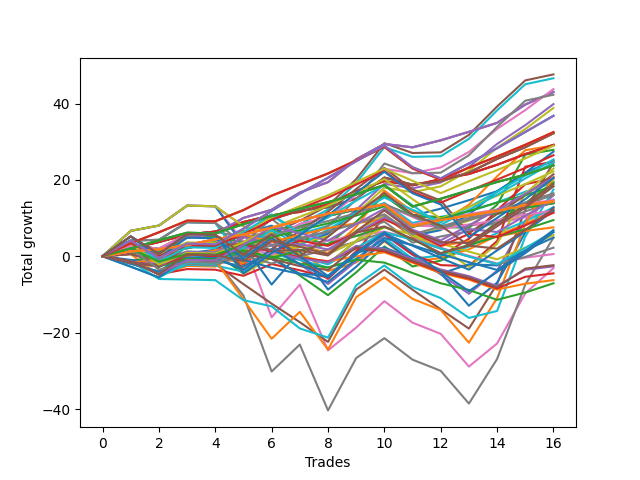

# Long Wallace 1226_003 
- Symbol: TSLA_Unlimited
- Date Range: 03/23/2022 - 07/08/2022
- Trading Period: 7:20-12:30
- Number of Trades: 16



| Name | Win Percent | Profit | Avg Profit / Trade | Avg Time / Trade |      | Name | Win Percent | Profit | Avg Profit / Trade | Avg Time / Trade |
| ---- | ----------- | ------ | ------------------ | ---------------- | ---- | ---- | ----------- | ------ | ------------------ | ---------------- |
| Sorted By <br> Profit | | | | | | Sorted By <br> Win Percentage ||||
| Five | 81.25 | 23815.00 | 1488.44 | 59:25 |     | Sixty-Five | 93.75 | 14585.00 | 911.56 | 11:21 |
| Sixty-One | 81.25 | 23310.00 | 1456.87 | 57:01 |     | Fifty-Seven | 93.75 | 14585.00 | 911.56 | 11:21 |
| Sixty-Eight | 75.00 | 21895.00 | 1368.44 | 29:30 |     | One | 93.75 | 14585.00 | 911.56 | 11:21 |
| Sixty-Six | 87.50 | 21520.00 | 1345.00 | 16:30 |     | One Hundred Eleven | 93.75 | 7345.00 | 459.06 | 05:34 |
| Fifty-Eight | 87.50 | 21520.00 | 1345.00 | 16:30 |     | One Hundred Sixteen | 93.75 | 7230.00 | 451.88 | 05:34 |
| Two | 87.50 | 21520.00 | 1345.00 | 16:30 |     | One Hundred Twenty-Six | 93.75 | 7150.00 | 446.87 | 17:15 |
| Sixty-Nine | 75.00 | 21155.00 | 1322.19 | 55:46 |     | One Hundred Twenty-One | 93.75 | 7150.00 | 446.87 | 17:15 |
| Four | 75.00 | 19925.00 | 1245.31 | 32:40 |     | Eighty-One | 93.75 | 7150.00 | 446.87 | 17:15 |
| Sixty | 75.00 | 19420.00 | 1213.75 | 30:16 |     | Sixty-Six | 87.50 | 21520.00 | 1345.00 | 16:30 |
| One Hundred Twenty-Nine | 75.00 | 18395.00 | 1149.69 | 48:37 |     | Fifty-Eight | 87.50 | 21520.00 | 1345.00 | 16:30 |
| One Hundred Twenty-Four | 75.00 | 18395.00 | 1149.69 | 48:37 |     | Two | 87.50 | 21520.00 | 1345.00 | 16:30 |
| Eighty-Four | 75.00 | 18395.00 | 1149.69 | 48:37 |     | One Hundred Twenty-Seven | 87.50 | 11895.00 | 743.44 | 24:42 |
| One Hundred Twenty-Eight | 81.25 | 16250.00 | 1015.62 | 41:12 |     | One Hundred Twenty-Two | 87.50 | 11895.00 | 743.44 | 24:42 |
| One Hundred Twenty-Three | 81.25 | 16250.00 | 1015.62 | 41:12 |     | Eighty-Two | 87.50 | 11895.00 | 743.44 | 24:42 |
| Eighty-Three | 81.25 | 16250.00 | 1015.62 | 41:12 |     | Forty-One | 87.50 | 9655.00 | 603.44 | 09:56 |
| Sixty-Seven | 81.25 | 16110.00 | 1006.88 | 20:46 |     | Sixty-Four | 87.50 | 6955.00 | 434.69 | 06:44 |
| Fifty-Nine | 81.25 | 16110.00 | 1006.88 | 20:46 |     | Fifty-Six | 87.50 | 6955.00 | 434.69 | 06:44 |
| Three | 81.25 | 16110.00 | 1006.88 | 20:46 |     | Zero | 87.50 | 6955.00 | 434.69 | 06:44 |
| Sixty-Five | 93.75 | 14585.00 | 911.56 | 11:21 |     | One Hundred One | 87.50 | 5955.00 | 372.19 | 04:25 |
| Fifty-Seven | 93.75 | 14585.00 | 911.56 | 11:21 |     | Forty | 87.50 | 5830.00 | 364.38 | 06:05 |
| One | 93.75 | 14585.00 | 911.56 | 11:21 |     | Forty-Eight | 87.50 | 5715.00 | 357.19 | 06:05 |
| Fifty-Three | 50.00 | 14515.00 | 907.19 | 23:05 |     | Five | 81.25 | 23815.00 | 1488.44 | 59:25 |
| One Hundred Three | 75.00 | 14470.00 | 904.37 | 10:03 |     | Sixty-One | 81.25 | 23310.00 | 1456.87 | 57:01 |
| Fifty-Four | 50.00 | 13940.00 | 871.25 | 26:11 |     | One Hundred Twenty-Eight | 81.25 | 16250.00 | 1015.62 | 41:12 |
| Fifty-Two | 56.25 | 13695.00 | 855.94 | 18:55 |     | One Hundred Twenty-Three | 81.25 | 16250.00 | 1015.62 | 41:12 |
| One Hundred Eighteen | 75.00 | 13225.00 | 826.56 | 13:27 |     | Eighty-Three | 81.25 | 16250.00 | 1015.62 | 41:12 |
| One Hundred Four | 62.50 | 12680.00 | 792.50 | 13:28 |     | Sixty-Seven | 81.25 | 16110.00 | 1006.88 | 20:46 |
| Forty-Two | 81.25 | 12570.00 | 785.63 | 13:54 |     | Fifty-Nine | 81.25 | 16110.00 | 1006.88 | 20:46 |
| Fifty-Five | 43.75 | 12365.00 | 772.81 | 34:04 |     | Three | 81.25 | 16110.00 | 1006.88 | 20:46 |
| One Hundred Fourteen | 68.75 | 12305.00 | 769.06 | 18:42 |     | Forty-Two | 81.25 | 12570.00 | 785.63 | 13:54 |
| Forty-Seven | 37.50 | 12255.00 | 765.94 | 83:54 |     | One Hundred Seventeen | 81.25 | 9190.00 | 574.37 | 09:51 |
| One Hundred Twenty-Seven | 87.50 | 11895.00 | 743.44 | 24:42 |     | One Hundred Twelve | 81.25 | 8250.00 | 515.62 | 10:46 |
| One Hundred Twenty-Two | 87.50 | 11895.00 | 743.44 | 24:42 |     | One Hundred Six | 81.25 | 3785.00 | 236.56 | 04:20 |
| Eighty-Two | 87.50 | 11895.00 | 743.44 | 24:42 |     | Sixty-Eight | 75.00 | 21895.00 | 1368.44 | 29:30 |
| Seventy | 50.00 | 11485.00 | 717.81 | 73:50 |     | Sixty-Nine | 75.00 | 21155.00 | 1322.19 | 55:46 |
| One Hundred Thirteen | 75.00 | 11110.00 | 694.38 | 14:43 |     | Four | 75.00 | 19925.00 | 1245.31 | 32:40 |
| Eighty-Five | 62.50 | 10740.00 | 671.25 | 68:26 |     | Sixty | 75.00 | 19420.00 | 1213.75 | 30:16 |
| Sixty-Three | 43.75 | 10405.00 | 650.31 | 130:33 |     | One Hundred Twenty-Nine | 75.00 | 18395.00 | 1149.69 | 48:37 |
| One Hundred Ninteen | 56.25 | 10290.00 | 643.12 | 15:49 |     | One Hundred Twenty-Four | 75.00 | 18395.00 | 1149.69 | 48:37 |
| One Hundred Twenty-Five | 62.50 | 10235.00 | 639.69 | 66:02 |     | Eighty-Four | 75.00 | 18395.00 | 1149.69 | 48:37 |
| Forty-Five | 56.25 | 10220.00 | 638.75 | 31:29 |     | One Hundred Three | 75.00 | 14470.00 | 904.37 | 10:03 |
| Fifty | 68.75 | 9905.00 | 619.06 | 12:11 |     | One Hundred Eighteen | 75.00 | 13225.00 | 826.56 | 13:27 |
| Forty-Four | 62.50 | 9695.00 | 605.94 | 23:40 |     | One Hundred Thirteen | 75.00 | 11110.00 | 694.38 | 14:43 |
| Forty-One | 87.50 | 9655.00 | 603.44 | 09:56 |     | One Hundred Two | 75.00 | 8015.00 | 500.94 | 07:45 |
| One Hundred Twenty | 43.75 | 9470.00 | 591.87 | 19:15 |     | Forty-Nine | 75.00 | 7085.00 | 442.81 | 09:17 |
| One Hundred Seventeen | 81.25 | 9190.00 | 574.37 | 09:51 |     | One Hundred Fourteen | 68.75 | 12305.00 | 769.06 | 18:42 |
| One Hundred Thirty | 56.25 | 9145.00 | 571.56 | 62:12 |     | Fifty | 68.75 | 9905.00 | 619.06 | 12:11 |
| Seventy-One | 31.25 | 8730.00 | 545.62 | 115:37 |     | Forty-Three | 68.75 | 6050.00 | 378.13 | 17:23 |
| One Hundred Twelve | 81.25 | 8250.00 | 515.62 | 10:46 |     | One Hundred Four | 62.50 | 12680.00 | 792.50 | 13:28 |
| One Hundred Two | 75.00 | 8015.00 | 500.94 | 07:45 |     | Eighty-Five | 62.50 | 10740.00 | 671.25 | 68:26 |
| Forty-Six | 50.00 | 7985.00 | 499.06 | 45:54 |     | One Hundred Twenty-Five | 62.50 | 10235.00 | 639.69 | 66:02 |
| One Hundred Nine | 50.00 | 7420.00 | 463.75 | 09:12 |     | Forty-Four | 62.50 | 9695.00 | 605.94 | 23:40 |
| One Hundred Eleven | 93.75 | 7345.00 | 459.06 | 05:34 |     | One Hundred Seven | 62.50 | 4740.00 | 296.25 | 06:52 |
| One Hundred Sixteen | 93.75 | 7230.00 | 451.88 | 05:34 |     | Ninety-One | 62.50 | 290.00 | 18.12 | 03:25 |
| One Hundred Twenty-Six | 93.75 | 7150.00 | 446.87 | 17:15 |     | Fifty-Two | 56.25 | 13695.00 | 855.94 | 18:55 |
| One Hundred Twenty-One | 93.75 | 7150.00 | 446.87 | 17:15 |     | One Hundred Ninteen | 56.25 | 10290.00 | 643.12 | 15:49 |
| Eighty-One | 93.75 | 7150.00 | 446.87 | 17:15 |     | Forty-Five | 56.25 | 10220.00 | 638.75 | 31:29 |
| Forty-Nine | 75.00 | 7085.00 | 442.81 | 09:17 |     | One Hundred Thirty | 56.25 | 9145.00 | 571.56 | 62:12 |
| Sixty-Four | 87.50 | 6955.00 | 434.69 | 06:44 |     | Sixty-Two | 56.25 | 6415.00 | 400.94 | 81:27 |
| Fifty-Six | 87.50 | 6955.00 | 434.69 | 06:44 |     | Fifty-One | 56.25 | 6405.00 | 400.31 | 13:32 |
| Zero | 87.50 | 6955.00 | 434.69 | 06:44 |     | Six | 56.25 | -1550.00 | -96.88 | 100:16 |
| Sixty-Two | 56.25 | 6415.00 | 400.94 | 81:27 |     | Fifty-Three | 50.00 | 14515.00 | 907.19 | 23:05 |
| Fifty-One | 56.25 | 6405.00 | 400.31 | 13:32 |     | Fifty-Four | 50.00 | 13940.00 | 871.25 | 26:11 |
| One Hundred Ten | 50.00 | 6210.00 | 388.12 | 11:25 |     | Seventy | 50.00 | 11485.00 | 717.81 | 73:50 |
| Forty-Three | 68.75 | 6050.00 | 378.13 | 17:23 |     | Forty-Six | 50.00 | 7985.00 | 499.06 | 45:54 |
| One Hundred Five | 43.75 | 5980.00 | 373.75 | 20:01 |     | One Hundred Nine | 50.00 | 7420.00 | 463.75 | 09:12 |
| One Hundred One | 87.50 | 5955.00 | 372.19 | 04:25 |     | One Hundred Ten | 50.00 | 6210.00 | 388.12 | 11:25 |
| Forty | 87.50 | 5830.00 | 364.38 | 06:05 |     | One Hundred Eight | 50.00 | 5700.00 | 356.25 | 08:02 |
| Forty-Eight | 87.50 | 5715.00 | 357.19 | 06:05 |     | One Hundred Fifteen | 50.00 | 3160.00 | 197.50 | 26:16 |
| One Hundred Eight | 50.00 | 5700.00 | 356.25 | 08:02 |     | Ninety-Two | 50.00 | 1125.00 | 70.31 | 06:10 |
| One Hundred Seven | 62.50 | 4740.00 | 296.25 | 06:52 |     | Ninety-Six | 50.00 | -3125.00 | -195.31 | 02:55 |
| One Hundred Six | 81.25 | 3785.00 | 236.56 | 04:20 |     | Fifty-Five | 43.75 | 12365.00 | 772.81 | 34:04 |
| Ninety-Five | 31.25 | 3430.00 | 214.37 | 10:05 |     | Sixty-Three | 43.75 | 10405.00 | 650.31 | 130:33 |
| Ninety-Four | 37.50 | 3205.00 | 200.31 | 08:14 |     | One Hundred Twenty | 43.75 | 9470.00 | 591.87 | 19:15 |
| One Hundred Fifteen | 50.00 | 3160.00 | 197.50 | 26:16 |     | One Hundred Five | 43.75 | 5980.00 | 373.75 | 20:01 |
| Ninety-Three | 43.75 | 2790.00 | 174.37 | 07:00 |     | Ninety-Three | 43.75 | 2790.00 | 174.37 | 07:00 |
| Seventy-Three | 43.75 | 2460.00 | 153.75 | 12:08 |     | Seventy-Three | 43.75 | 2460.00 | 153.75 | 12:08 |
| Seven | 43.75 | 2440.00 | 152.50 | 149:22 |     | Seven | 43.75 | 2440.00 | 152.50 | 149:22 |
| Ninety-Two | 50.00 | 1125.00 | 70.31 | 06:10 |     | Forty-Seven | 37.50 | 12255.00 | 765.94 | 83:54 |
| Ninety-One | 62.50 | 290.00 | 18.12 | 03:25 |     | Ninety-Four | 37.50 | 3205.00 | 200.31 | 08:14 |
| One Hundred | 31.25 | -1170.00 | -73.13 | 05:53 |     | Seventy-One | 31.25 | 8730.00 | 545.62 | 115:37 |
| Ninety-Nine | 31.25 | -1325.00 | -82.81 | 05:31 |     | Ninety-Five | 31.25 | 3430.00 | 214.37 | 10:05 |
| Six | 56.25 | -1550.00 | -96.88 | 100:16 |     | One Hundred | 31.25 | -1170.00 | -73.13 | 05:53 |
| Ninety-Eight | 31.25 | -2240.00 | -140.00 | 05:04 |     | Ninety-Nine | 31.25 | -1325.00 | -82.81 | 05:31 |
| Ninety-Six | 50.00 | -3125.00 | -195.31 | 02:55 |     | Ninety-Eight | 31.25 | -2240.00 | -140.00 | 05:04 |
| Ninety-Seven | 31.25 | -3535.00 | -220.94 | 04:34 |     | Ninety-Seven | 31.25 | -3535.00 | -220.94 | 04:34 |

## NO STOPLOSS

### Test Zero
* Sell when price hits the middle line of the 20p bollinger
* No Stoploss
* Results:
```
Total Trades: 16
Percent Up: 87.50
Percent Down: 12.50
Total Points Moved Up: 13.91
Potential Profit: 6955.00
Total Points Ups: 17.19 Count Ups: 14
Total Points Downs: -3.28 Count Downs: 2
```

<details><summary>Trades</summary>

<code>In: 2022-03-25 08:30:00		Out: 2022-03-25 08:41:30		Total Position Time: 11:30		Total Move Up: 0.89		Total to Date: 0.89</code> <br />
<code>In: 2022-03-31 09:38:00		Out: 2022-03-31 09:40:25		Total Position Time: 02:25		Total Move Up: 0.52		Total to Date: 1.41</code> <br />
<code>In: 2022-03-31 10:19:00		Out: 2022-03-31 10:26:20		Total Position Time: 07:20		Total Move Up: 0.72		Total to Date: 2.13</code> <br />
<code>In: 2022-03-31 12:31:00		Out: 2022-03-31 12:36:05		Total Position Time: 05:05		Total Move Up: 1.51		Total to Date: 3.64</code> <br />
<code>In: 2022-04-27 11:30:00		Out: 2022-04-27 11:31:55		Total Position Time: 01:55		Total Move Up: 2.93		Total to Date: 6.57</code> <br />
<code>In: 2022-04-29 09:47:00		Out: 2022-04-29 10:00:40		Total Position Time: 13:40		Total Move Up: 0.44		Total to Date: 7.01</code> <br />
<code>In: 2022-05-12 10:58:00		Out: 2022-05-12 11:01:05		Total Position Time: 03:05		Total Move Up: 0.68		Total to Date: 7.69</code> <br />
<code>In: 2022-05-16 08:02:00		Out: 2022-05-16 08:09:55		Total Position Time: 07:55		Total Move Up: 2.90		Total to Date: 10.59</code> <br />
<code>In: 2022-05-19 10:52:00		Out: 2022-05-19 10:54:20		Total Position Time: 02:20		Total Move Up: 1.66		Total to Date: 12.25</code> <br />
<code>In: 2022-05-31 11:58:00		Out: 2022-05-31 12:04:50		Total Position Time: 06:50		Total Move Up: 1.28		Total to Date: 13.53</code> <br />
<code>In: 2022-06-08 09:30:00		Out: 2022-06-08 09:50:25		Total Position Time: 20:25		Total Move Up: -3.00		Total to Date: 10.53</code> <br />
<code>In: 2022-06-08 09:42:00		Out: 2022-06-08 09:50:25		Total Position Time: 08:25		Total Move Up: -0.28		Total to Date: 10.25</code> <br />
<code>In: 2022-06-13 10:30:00		Out: 2022-06-13 10:36:40		Total Position Time: 06:40		Total Move Up: 0.28		Total to Date: 10.53</code> <br />
<code>In: 2022-06-17 07:38:00		Out: 2022-06-17 07:43:50		Total Position Time: 05:50		Total Move Up: 0.64		Total to Date: 11.17</code> <br />
<code>In: 2022-06-23 10:44:00		Out: 2022-06-23 10:46:10		Total Position Time: 02:10		Total Move Up: 1.52		Total to Date: 12.69</code> <br />
<code>In: 2022-06-29 08:26:00		Out: 2022-06-29 08:28:15		Total Position Time: 02:15		Total Move Up: 1.22		Total to Date: 13.91</code> <br />


</details>

### Test One
* Sell when the price hits the upper line of the 20p 1std bollinger
* No Stoploss
* Results:
```
Total Trades: 16
Percent Up: 93.75
Percent Down: 6.25
Total Points Moved Up: 29.17
Potential Profit: 14585.00
Total Points Ups: 30.28 Count Ups: 15
Total Points Downs: -1.11 Count Downs: 1
```

<details><summary>Trades</summary>

<code>In: 2022-03-25 08:30:00		Out: 2022-03-25 08:41:55		Total Position Time: 11:55		Total Move Up: 2.06		Total to Date: 2.06</code> <br />
<code>In: 2022-03-31 09:38:00		Out: 2022-03-31 09:44:30		Total Position Time: 06:30		Total Move Up: 1.68		Total to Date: 3.74</code> <br />
<code>In: 2022-03-31 10:19:00		Out: 2022-03-31 10:27:25		Total Position Time: 08:25		Total Move Up: 1.98		Total to Date: 5.72</code> <br />
<code>In: 2022-03-31 12:31:00		Out: 2022-03-31 12:45:10		Total Position Time: 14:10		Total Move Up: 0.74		Total to Date: 6.46</code> <br />
<code>In: 2022-04-27 11:30:00		Out: 2022-04-27 11:44:10		Total Position Time: 14:10		Total Move Up: 2.50		Total to Date: 8.96</code> <br />
<code>In: 2022-04-29 09:47:00		Out: 2022-04-29 10:01:00		Total Position Time: 14:00		Total Move Up: 1.78		Total to Date: 10.74</code> <br />
<code>In: 2022-05-12 10:58:00		Out: 2022-05-12 11:16:15		Total Position Time: 18:15		Total Move Up: 0.87		Total to Date: 11.61</code> <br />
<code>In: 2022-05-16 08:02:00		Out: 2022-05-16 08:16:30		Total Position Time: 14:30		Total Move Up: 2.07		Total to Date: 13.68</code> <br />
<code>In: 2022-05-19 10:52:00		Out: 2022-05-19 10:55:10		Total Position Time: 03:10		Total Move Up: 3.43		Total to Date: 17.11</code> <br />
<code>In: 2022-05-31 11:58:00		Out: 2022-05-31 12:07:40		Total Position Time: 09:40		Total Move Up: 2.58		Total to Date: 19.69</code> <br />
<code>In: 2022-06-08 09:30:00		Out: 2022-06-08 09:56:40		Total Position Time: 26:40		Total Move Up: -1.11		Total to Date: 18.58</code> <br />
<code>In: 2022-06-08 09:42:00		Out: 2022-06-08 09:56:40		Total Position Time: 14:40		Total Move Up: 1.61		Total to Date: 20.19</code> <br />
<code>In: 2022-06-13 10:30:00		Out: 2022-06-13 10:39:25		Total Position Time: 09:25		Total Move Up: 1.36		Total to Date: 21.55</code> <br />
<code>In: 2022-06-17 07:38:00		Out: 2022-06-17 07:44:35		Total Position Time: 06:35		Total Move Up: 2.41		Total to Date: 23.96</code> <br />
<code>In: 2022-06-23 10:44:00		Out: 2022-06-23 10:47:30		Total Position Time: 03:30		Total Move Up: 2.79		Total to Date: 26.75</code> <br />
<code>In: 2022-06-29 08:26:00		Out: 2022-06-29 08:32:15		Total Position Time: 06:15		Total Move Up: 2.42		Total to Date: 29.17</code> <br />


</details>

### Test Two
* Sell when the price hits the upper line of the 20p 2std bollinger
* No Stoploss
* Results:
```
Total Trades: 16
Percent Up: 87.50
Percent Down: 12.50
Total Points Moved Up: 43.04
Potential Profit: 21520.00
Total Points Ups: 45.33 Count Ups: 14
Total Points Downs: -2.29 Count Downs: 2
```

<details><summary>Trades</summary>

<code>In: 2022-03-25 08:30:00		Out: 2022-03-25 08:44:45		Total Position Time: 14:45		Total Move Up: 3.25		Total to Date: 3.25</code> <br />
<code>In: 2022-03-31 09:38:00		Out: 2022-03-31 10:29:25		Total Position Time: 51:25		Total Move Up: -1.41		Total to Date: 1.84</code> <br />
<code>In: 2022-03-31 10:19:00		Out: 2022-03-31 10:29:25		Total Position Time: 10:25		Total Move Up: 3.05		Total to Date: 4.89</code> <br />
<code>In: 2022-03-31 12:31:00		Out: 2022-03-31 12:45:15		Total Position Time: 14:15		Total Move Up: 0.99		Total to Date: 5.88</code> <br />
<code>In: 2022-04-27 11:30:00		Out: 2022-04-27 11:45:25		Total Position Time: 15:25		Total Move Up: 4.16		Total to Date: 10.04</code> <br />
<code>In: 2022-04-29 09:47:00		Out: 2022-04-29 10:01:05		Total Position Time: 14:05		Total Move Up: 2.13		Total to Date: 12.17</code> <br />
<code>In: 2022-05-12 10:58:00		Out: 2022-05-12 11:20:35		Total Position Time: 22:35		Total Move Up: 4.53		Total to Date: 16.70</code> <br />
<code>In: 2022-05-16 08:02:00		Out: 2022-05-16 08:17:25		Total Position Time: 15:25		Total Move Up: 2.71		Total to Date: 19.41</code> <br />
<code>In: 2022-05-19 10:52:00		Out: 2022-05-19 10:55:20		Total Position Time: 03:20		Total Move Up: 5.97		Total to Date: 25.38</code> <br />
<code>In: 2022-05-31 11:58:00		Out: 2022-05-31 12:09:05		Total Position Time: 11:05		Total Move Up: 4.03		Total to Date: 29.41</code> <br />
<code>In: 2022-06-08 09:30:00		Out: 2022-06-08 09:56:55		Total Position Time: 26:55		Total Move Up: -0.88		Total to Date: 28.53</code> <br />
<code>In: 2022-06-08 09:42:00		Out: 2022-06-08 09:56:55		Total Position Time: 14:55		Total Move Up: 1.84		Total to Date: 30.37</code> <br />
<code>In: 2022-06-13 10:30:00		Out: 2022-06-13 10:39:50		Total Position Time: 09:50		Total Move Up: 2.22		Total to Date: 32.59</code> <br />
<code>In: 2022-06-17 07:38:00		Out: 2022-06-17 07:56:25		Total Position Time: 18:25		Total Move Up: 2.35		Total to Date: 34.94</code> <br />
<code>In: 2022-06-23 10:44:00		Out: 2022-06-23 10:55:45		Total Position Time: 11:45		Total Move Up: 4.79		Total to Date: 39.73</code> <br />
<code>In: 2022-06-29 08:26:00		Out: 2022-06-29 08:35:35		Total Position Time: 09:35		Total Move Up: 3.31		Total to Date: 43.04</code> <br />


</details>

### Test Three
* Sell when price hits the middle line of the 50p bollinger
* No Stoploss
* Results:
```
Total Trades: 16
Percent Up: 81.25
Percent Down: 18.75
Total Points Moved Up: 32.22
Potential Profit: 16110.00
Total Points Ups: 36.25 Count Ups: 13
Total Points Downs: -4.03 Count Downs: 3
```

<details><summary>Trades</summary>

<code>In: 2022-03-25 08:30:00		Out: 2022-03-25 09:05:25		Total Position Time: 35:25		Total Move Up: 0.58		Total to Date: 0.58</code> <br />
<code>In: 2022-03-31 09:38:00		Out: 2022-03-31 10:28:35		Total Position Time: 50:35		Total Move Up: -2.02		Total to Date: -1.44</code> <br />
<code>In: 2022-03-31 10:19:00		Out: 2022-03-31 10:28:35		Total Position Time: 09:35		Total Move Up: 2.44		Total to Date: 1.00</code> <br />
<code>In: 2022-03-31 12:31:00		Out: 2022-03-31 12:47:00		Total Position Time: 16:00		Total Move Up: -0.16		Total to Date: 0.84</code> <br />
<code>In: 2022-04-27 11:30:00		Out: 2022-04-27 11:45:25		Total Position Time: 15:25		Total Move Up: 4.16		Total to Date: 5.00</code> <br />
<code>In: 2022-04-29 09:47:00		Out: 2022-04-29 10:03:40		Total Position Time: 16:40		Total Move Up: 4.69		Total to Date: 9.69</code> <br />
<code>In: 2022-05-12 10:58:00		Out: 2022-05-12 11:18:50		Total Position Time: 20:50		Total Move Up: 2.28		Total to Date: 11.97</code> <br />
<code>In: 2022-05-16 08:02:00		Out: 2022-05-16 08:39:35		Total Position Time: 37:35		Total Move Up: 0.88		Total to Date: 12.85</code> <br />
<code>In: 2022-05-19 10:52:00		Out: 2022-05-19 10:54:45		Total Position Time: 02:45		Total Move Up: 2.25		Total to Date: 15.10</code> <br />
<code>In: 2022-05-31 11:58:00		Out: 2022-05-31 12:15:15		Total Position Time: 17:15		Total Move Up: 5.51		Total to Date: 20.61</code> <br />
<code>In: 2022-06-08 09:30:00		Out: 2022-06-08 10:08:35		Total Position Time: 38:35		Total Move Up: -1.85		Total to Date: 18.76</code> <br />
<code>In: 2022-06-08 09:42:00		Out: 2022-06-08 10:08:35		Total Position Time: 26:35		Total Move Up: 0.87		Total to Date: 19.63</code> <br />
<code>In: 2022-06-13 10:30:00		Out: 2022-06-13 10:39:55		Total Position Time: 09:55		Total Move Up: 2.31		Total to Date: 21.94</code> <br />
<code>In: 2022-06-17 07:38:00		Out: 2022-06-17 07:57:00		Total Position Time: 19:00		Total Move Up: 3.57		Total to Date: 25.51</code> <br />
<code>In: 2022-06-23 10:44:00		Out: 2022-06-23 10:50:10		Total Position Time: 06:10		Total Move Up: 3.06		Total to Date: 28.57</code> <br />
<code>In: 2022-06-29 08:26:00		Out: 2022-06-29 08:36:05		Total Position Time: 10:05		Total Move Up: 3.65		Total to Date: 32.22</code> <br />


</details>

### Test Four
* Sell when the price hits the upper line of the 50p 1std bollinger
* No Stoploss
* Results:
```
Total Trades: 16
Percent Up: 75.00
Percent Down: 25.00
Total Points Moved Up: 39.85
Potential Profit: 19925.00
Total Points Ups: 51.07 Count Ups: 12
Total Points Downs: -11.22 Count Downs: 4
```

<details><summary>Trades</summary>

<code>In: 2022-03-25 08:30:00		Out: 2022-03-25 09:08:40		Total Position Time: 38:40		Total Move Up: 2.69		Total to Date: 2.69</code> <br />
<code>In: 2022-03-31 09:38:00		Out: 2022-03-31 10:42:45		Total Position Time: 64:45		Total Move Up: -0.69		Total to Date: 2.00</code> <br />
<code>In: 2022-03-31 10:19:00		Out: 2022-03-31 10:42:45		Total Position Time: 23:45		Total Move Up: 3.77		Total to Date: 5.77</code> <br />
<code>In: 2022-03-31 12:31:00		Out: 2022-03-31 12:47:00		Total Position Time: 16:00		Total Move Up: -0.16		Total to Date: 5.61</code> <br />
<code>In: 2022-04-27 11:30:00		Out: 2022-04-27 12:47:00		Total Position Time: 77:00		Total Move Up: -9.18		Total to Date: -3.57</code> <br />
<code>In: 2022-04-29 09:47:00		Out: 2022-04-29 10:24:50		Total Position Time: 37:50		Total Move Up: 4.33		Total to Date: 0.76</code> <br />
<code>In: 2022-05-12 10:58:00		Out: 2022-05-12 11:28:45		Total Position Time: 30:45		Total Move Up: 3.78		Total to Date: 4.54</code> <br />
<code>In: 2022-05-16 08:02:00		Out: 2022-05-16 08:45:20		Total Position Time: 43:20		Total Move Up: 1.67		Total to Date: 6.21</code> <br />
<code>In: 2022-05-19 10:52:00		Out: 2022-05-19 10:55:20		Total Position Time: 03:20		Total Move Up: 5.97		Total to Date: 12.18</code> <br />
<code>In: 2022-05-31 11:58:00		Out: 2022-05-31 12:28:30		Total Position Time: 30:30		Total Move Up: 6.80		Total to Date: 18.98</code> <br />
<code>In: 2022-06-08 09:30:00		Out: 2022-06-08 10:18:05		Total Position Time: 48:05		Total Move Up: -1.19		Total to Date: 17.79</code> <br />
<code>In: 2022-06-08 09:42:00		Out: 2022-06-08 10:18:05		Total Position Time: 36:05		Total Move Up: 1.53		Total to Date: 19.32</code> <br />
<code>In: 2022-06-13 10:30:00		Out: 2022-06-13 10:44:05		Total Position Time: 14:05		Total Move Up: 4.06		Total to Date: 23.38</code> <br />
<code>In: 2022-06-17 07:38:00		Out: 2022-06-17 08:03:55		Total Position Time: 25:55		Total Move Up: 6.05		Total to Date: 29.43</code> <br />
<code>In: 2022-06-23 10:44:00		Out: 2022-06-23 10:55:50		Total Position Time: 11:50		Total Move Up: 4.91		Total to Date: 34.34</code> <br />
<code>In: 2022-06-29 08:26:00		Out: 2022-06-29 08:46:50		Total Position Time: 20:50		Total Move Up: 5.51		Total to Date: 39.85</code> <br />


</details>

### Test Five
* Sell when the price hits the upper line of the 50p 2std bollinger
* No Stoploss
* Results:
```
Total Trades: 16
Percent Up: 81.25
Percent Down: 18.75
Total Points Moved Up: 47.63
Potential Profit: 23815.00
Total Points Ups: 59.53 Count Ups: 13
Total Points Downs: -11.90 Count Downs: 3
```

<details><summary>Trades</summary>

<code>In: 2022-03-25 08:30:00		Out: 2022-03-25 09:09:50		Total Position Time: 39:50		Total Move Up: 4.14		Total to Date: 4.14</code> <br />
<code>In: 2022-03-31 09:38:00		Out: 2022-03-31 10:42:55		Total Position Time: 64:55		Total Move Up: 0.16		Total to Date: 4.30</code> <br />
<code>In: 2022-03-31 10:19:00		Out: 2022-03-31 10:42:55		Total Position Time: 23:55		Total Move Up: 4.62		Total to Date: 8.92</code> <br />
<code>In: 2022-03-31 12:31:00		Out: 2022-03-31 12:47:00		Total Position Time: 16:00		Total Move Up: -0.16		Total to Date: 8.76</code> <br />
<code>In: 2022-04-27 11:30:00		Out: 2022-04-27 12:47:00		Total Position Time: 77:00		Total Move Up: -9.18		Total to Date: -0.42</code> <br />
<code>In: 2022-04-29 09:47:00		Out: 2022-04-29 10:31:30		Total Position Time: 44:30		Total Move Up: 6.29		Total to Date: 5.87</code> <br />
<code>In: 2022-05-12 10:58:00		Out: 2022-05-12 12:18:55		Total Position Time: 80:55		Total Move Up: 3.47		Total to Date: 9.34</code> <br />
<code>In: 2022-05-16 08:02:00		Out: 2022-05-16 08:47:05		Total Position Time: 45:05		Total Move Up: 3.92		Total to Date: 13.26</code> <br />
<code>In: 2022-05-19 10:52:00		Out: 2022-05-19 10:55:30		Total Position Time: 03:30		Total Move Up: 6.91		Total to Date: 20.17</code> <br />
<code>In: 2022-05-31 11:58:00		Out: 2022-05-31 12:31:05		Total Position Time: 33:05		Total Move Up: 9.44		Total to Date: 29.61</code> <br />
<code>In: 2022-06-08 09:30:00		Out: 2022-06-08 12:33:20		Total Position Time: 183:20		Total Move Up: -2.56		Total to Date: 27.05</code> <br />
<code>In: 2022-06-08 09:42:00		Out: 2022-06-08 12:33:20		Total Position Time: 171:20		Total Move Up: 0.16		Total to Date: 27.21</code> <br />
<code>In: 2022-06-13 10:30:00		Out: 2022-06-13 10:50:35		Total Position Time: 20:35		Total Move Up: 4.57		Total to Date: 31.78</code> <br />
<code>In: 2022-06-17 07:38:00		Out: 2022-06-17 08:06:30		Total Position Time: 28:30		Total Move Up: 7.44		Total to Date: 39.22</code> <br />
<code>In: 2022-06-23 10:44:00		Out: 2022-06-23 11:09:40		Total Position Time: 25:40		Total Move Up: 6.84		Total to Date: 46.06</code> <br />
<code>In: 2022-06-29 08:26:00		Out: 2022-06-29 09:58:40		Total Position Time: 92:40		Total Move Up: 1.57		Total to Date: 47.63</code> <br />


</details>

### Test Six
* Sell when the price hits the middle line of the 1std VWAP
* No Stoploss
* Results:
```
Total Trades: 16
Percent Up: 56.25
Percent Down: 43.75
Total Points Moved Up: -3.10
Potential Profit: -1550.00
Total Points Ups: 60.51 Count Ups: 9
Total Points Downs: -63.61 Count Downs: 7
```

<details><summary>Trades</summary>

<code>In: 2022-03-25 08:30:00		Out: 2022-03-25 10:58:35		Total Position Time: 148:35		Total Move Up: 6.66		Total to Date: 6.66</code> <br />
<code>In: 2022-03-31 09:38:00		Out: 2022-03-31 09:41:15		Total Position Time: 03:15		Total Move Up: 1.38		Total to Date: 8.04</code> <br />
<code>In: 2022-03-31 10:19:00		Out: 2022-03-31 10:45:40		Total Position Time: 26:40		Total Move Up: 5.22		Total to Date: 13.26</code> <br />
<code>In: 2022-03-31 12:31:00		Out: 2022-03-31 12:47:00		Total Position Time: 16:00		Total Move Up: -0.16		Total to Date: 13.10</code> <br />
<code>In: 2022-04-27 11:30:00		Out: 2022-04-27 12:47:00		Total Position Time: 77:00		Total Move Up: -9.18		Total to Date: 3.92</code> <br />
<code>In: 2022-04-29 09:47:00		Out: 2022-04-29 12:47:00		Total Position Time: 180:00		Total Move Up: -19.90		Total to Date: -15.98</code> <br />
<code>In: 2022-05-12 10:58:00		Out: 2022-05-12 12:21:25		Total Position Time: 83:25		Total Move Up: 8.57		Total to Date: -7.41</code> <br />
<code>In: 2022-05-16 08:02:00		Out: 2022-05-16 12:47:00		Total Position Time: 285:00		Total Move Up: -17.24		Total to Date: -24.65</code> <br />
<code>In: 2022-05-19 10:52:00		Out: 2022-05-19 10:55:20		Total Position Time: 03:20		Total Move Up: 5.97		Total to Date: -18.68</code> <br />
<code>In: 2022-05-31 11:58:00		Out: 2022-05-31 12:16:05		Total Position Time: 18:05		Total Move Up: 6.93		Total to Date: -11.75</code> <br />
<code>In: 2022-06-08 09:30:00		Out: 2022-06-08 12:47:00		Total Position Time: 197:00		Total Move Up: -5.64		Total to Date: -17.39</code> <br />
<code>In: 2022-06-08 09:42:00		Out: 2022-06-08 12:47:00		Total Position Time: 185:00		Total Move Up: -2.92		Total to Date: -20.31</code> <br />
<code>In: 2022-06-13 10:30:00		Out: 2022-06-13 12:47:00		Total Position Time: 137:00		Total Move Up: -8.57		Total to Date: -28.88</code> <br />
<code>In: 2022-06-17 07:38:00		Out: 2022-06-17 08:03:55		Total Position Time: 25:55		Total Move Up: 6.05		Total to Date: -22.83</code> <br />
<code>In: 2022-06-23 10:44:00		Out: 2022-06-23 12:07:25		Total Position Time: 83:25		Total Move Up: 13.13		Total to Date: -9.70</code> <br />
<code>In: 2022-06-29 08:26:00		Out: 2022-06-29 10:40:45		Total Position Time: 134:45		Total Move Up: 6.60		Total to Date: -3.10</code> <br />


</details>

### Test Seven
* Sell when the price hits the upper line of the 1std VWAP
* No Stoploss
* Results:
```
Total Trades: 16
Percent Up: 43.75
Percent Down: 56.25
Total Points Moved Up: 4.88
Potential Profit: 2440.00
Total Points Ups: 73.23 Count Ups: 7
Total Points Downs: -68.35 Count Downs: 9
```

<details><summary>Trades</summary>

<code>In: 2022-03-25 08:30:00		Out: 2022-03-25 12:47:00		Total Position Time: 257:00		Total Move Up: 3.81		Total to Date: 3.81</code> <br />
<code>In: 2022-03-31 09:38:00		Out: 2022-03-31 12:47:00		Total Position Time: 189:00		Total Move Up: -4.60		Total to Date: -0.79</code> <br />
<code>In: 2022-03-31 10:19:00		Out: 2022-03-31 12:47:00		Total Position Time: 148:00		Total Move Up: -0.14		Total to Date: -0.93</code> <br />
<code>In: 2022-03-31 12:31:00		Out: 2022-03-31 12:47:00		Total Position Time: 16:00		Total Move Up: -0.16		Total to Date: -1.09</code> <br />
<code>In: 2022-04-27 11:30:00		Out: 2022-04-27 12:47:00		Total Position Time: 77:00		Total Move Up: -9.18		Total to Date: -10.27</code> <br />
<code>In: 2022-04-29 09:47:00		Out: 2022-04-29 12:47:00		Total Position Time: 180:00		Total Move Up: -19.90		Total to Date: -30.17</code> <br />
<code>In: 2022-05-12 10:58:00		Out: 2022-05-12 12:47:00		Total Position Time: 109:00		Total Move Up: 7.05		Total to Date: -23.12</code> <br />
<code>In: 2022-05-16 08:02:00		Out: 2022-05-16 12:47:00		Total Position Time: 285:00		Total Move Up: -17.24		Total to Date: -40.36</code> <br />
<code>In: 2022-05-19 10:52:00		Out: 2022-05-19 12:02:45		Total Position Time: 70:45		Total Move Up: 13.71		Total to Date: -26.65</code> <br />
<code>In: 2022-05-31 11:58:00		Out: 2022-05-31 12:47:00		Total Position Time: 49:00		Total Move Up: 5.21		Total to Date: -21.44</code> <br />
<code>In: 2022-06-08 09:30:00		Out: 2022-06-08 12:47:00		Total Position Time: 197:00		Total Move Up: -5.64		Total to Date: -27.08</code> <br />
<code>In: 2022-06-08 09:42:00		Out: 2022-06-08 12:47:00		Total Position Time: 185:00		Total Move Up: -2.92		Total to Date: -30.00</code> <br />
<code>In: 2022-06-13 10:30:00		Out: 2022-06-13 12:47:00		Total Position Time: 137:00		Total Move Up: -8.57		Total to Date: -38.57</code> <br />
<code>In: 2022-06-17 07:38:00		Out: 2022-06-17 10:04:40		Total Position Time: 146:40		Total Move Up: 11.67		Total to Date: -26.90</code> <br />
<code>In: 2022-06-23 10:44:00		Out: 2022-06-23 12:47:00		Total Position Time: 123:00		Total Move Up: 19.47		Total to Date: -7.43</code> <br />
<code>In: 2022-06-29 08:26:00		Out: 2022-06-29 12:06:30		Total Position Time: 220:30		Total Move Up: 12.31		Total to Date: 4.88</code> <br />


</details>

## STOPLOSS OF 5

### Test Forty
* Sell when price hits the middle line of the 20p bollinger
* Stoploss is 5 points
* Results:
```
Total Trades: 16
Percent Up: 87.50
Percent Down: 12.50
Total Points Moved Up: 11.66
Potential Profit: 5830.00
Total Points Ups: 17.19 Count Ups: 14
Total Points Downs: -5.53 Count Downs: 2
```

<details><summary>Trades</summary>

<code>In: 2022-03-25 08:30:00		Out: 2022-03-25 08:41:30		Total Position Time: 11:30		Total Move Up: 0.89		Total to Date: 0.89</code> <br />
<code>In: 2022-03-31 09:38:00		Out: 2022-03-31 09:40:25		Total Position Time: 02:25		Total Move Up: 0.52		Total to Date: 1.41</code> <br />
<code>In: 2022-03-31 10:19:00		Out: 2022-03-31 10:26:20		Total Position Time: 07:20		Total Move Up: 0.72		Total to Date: 2.13</code> <br />
<code>In: 2022-03-31 12:31:00		Out: 2022-03-31 12:36:05		Total Position Time: 05:05		Total Move Up: 1.51		Total to Date: 3.64</code> <br />
<code>In: 2022-04-27 11:30:00		Out: 2022-04-27 11:31:55		Total Position Time: 01:55		Total Move Up: 2.93		Total to Date: 6.57</code> <br />
<code>In: 2022-04-29 09:47:00		Out: 2022-04-29 10:00:40		Total Position Time: 13:40		Total Move Up: 0.44		Total to Date: 7.01</code> <br />
<code>In: 2022-05-12 10:58:00		Out: 2022-05-12 11:01:05		Total Position Time: 03:05		Total Move Up: 0.68		Total to Date: 7.69</code> <br />
<code>In: 2022-05-16 08:02:00		Out: 2022-05-16 08:09:55		Total Position Time: 07:55		Total Move Up: 2.90		Total to Date: 10.59</code> <br />
<code>In: 2022-05-19 10:52:00		Out: 2022-05-19 10:54:20		Total Position Time: 02:20		Total Move Up: 1.66		Total to Date: 12.25</code> <br />
<code>In: 2022-05-31 11:58:00		Out: 2022-05-31 12:04:50		Total Position Time: 06:50		Total Move Up: 1.28		Total to Date: 13.53</code> <br />
<code>In: 2022-06-08 09:30:00		Out: 2022-06-08 09:39:55		Total Position Time: 09:55		Total Move Up: -5.25		Total to Date: 8.28</code> <br />
<code>In: 2022-06-08 09:42:00		Out: 2022-06-08 09:50:25		Total Position Time: 08:25		Total Move Up: -0.28		Total to Date: 8.00</code> <br />
<code>In: 2022-06-13 10:30:00		Out: 2022-06-13 10:36:40		Total Position Time: 06:40		Total Move Up: 0.28		Total to Date: 8.28</code> <br />
<code>In: 2022-06-17 07:38:00		Out: 2022-06-17 07:43:50		Total Position Time: 05:50		Total Move Up: 0.64		Total to Date: 8.92</code> <br />
<code>In: 2022-06-23 10:44:00		Out: 2022-06-23 10:46:10		Total Position Time: 02:10		Total Move Up: 1.52		Total to Date: 10.44</code> <br />
<code>In: 2022-06-29 08:26:00		Out: 2022-06-29 08:28:15		Total Position Time: 02:15		Total Move Up: 1.22		Total to Date: 11.66</code> <br />


</details>

### Test Forty-One
* Sell when the price hits the upper line of the 20p 1std bollinger
* Stoploss is 5 points
* Results:
```
Total Trades: 16
Percent Up: 87.50
Percent Down: 12.50
Total Points Moved Up: 19.31
Potential Profit: 9655.00
Total Points Ups: 29.41 Count Ups: 14
Total Points Downs: -10.10 Count Downs: 2
```

<details><summary>Trades</summary>

<code>In: 2022-03-25 08:30:00		Out: 2022-03-25 08:41:55		Total Position Time: 11:55		Total Move Up: 2.06		Total to Date: 2.06</code> <br />
<code>In: 2022-03-31 09:38:00		Out: 2022-03-31 09:44:30		Total Position Time: 06:30		Total Move Up: 1.68		Total to Date: 3.74</code> <br />
<code>In: 2022-03-31 10:19:00		Out: 2022-03-31 10:27:25		Total Position Time: 08:25		Total Move Up: 1.98		Total to Date: 5.72</code> <br />
<code>In: 2022-03-31 12:31:00		Out: 2022-03-31 12:45:10		Total Position Time: 14:10		Total Move Up: 0.74		Total to Date: 6.46</code> <br />
<code>In: 2022-04-27 11:30:00		Out: 2022-04-27 11:44:10		Total Position Time: 14:10		Total Move Up: 2.50		Total to Date: 8.96</code> <br />
<code>In: 2022-04-29 09:47:00		Out: 2022-04-29 10:01:00		Total Position Time: 14:00		Total Move Up: 1.78		Total to Date: 10.74</code> <br />
<code>In: 2022-05-12 10:58:00		Out: 2022-05-12 11:10:20		Total Position Time: 12:20		Total Move Up: -4.85		Total to Date: 5.89</code> <br />
<code>In: 2022-05-16 08:02:00		Out: 2022-05-16 08:16:30		Total Position Time: 14:30		Total Move Up: 2.07		Total to Date: 7.96</code> <br />
<code>In: 2022-05-19 10:52:00		Out: 2022-05-19 10:55:10		Total Position Time: 03:10		Total Move Up: 3.43		Total to Date: 11.39</code> <br />
<code>In: 2022-05-31 11:58:00		Out: 2022-05-31 12:07:40		Total Position Time: 09:40		Total Move Up: 2.58		Total to Date: 13.97</code> <br />
<code>In: 2022-06-08 09:30:00		Out: 2022-06-08 09:39:55		Total Position Time: 09:55		Total Move Up: -5.25		Total to Date: 8.72</code> <br />
<code>In: 2022-06-08 09:42:00		Out: 2022-06-08 09:56:40		Total Position Time: 14:40		Total Move Up: 1.61		Total to Date: 10.33</code> <br />
<code>In: 2022-06-13 10:30:00		Out: 2022-06-13 10:39:25		Total Position Time: 09:25		Total Move Up: 1.36		Total to Date: 11.69</code> <br />
<code>In: 2022-06-17 07:38:00		Out: 2022-06-17 07:44:35		Total Position Time: 06:35		Total Move Up: 2.41		Total to Date: 14.10</code> <br />
<code>In: 2022-06-23 10:44:00		Out: 2022-06-23 10:47:30		Total Position Time: 03:30		Total Move Up: 2.79		Total to Date: 16.89</code> <br />
<code>In: 2022-06-29 08:26:00		Out: 2022-06-29 08:32:15		Total Position Time: 06:15		Total Move Up: 2.42		Total to Date: 19.31</code> <br />


</details>

### Test Forty-Two
* Sell when the price hits the upper line of the 20p 2std bollinger
* Stoploss is 5 points
* Results:
```
Total Trades: 16
Percent Up: 81.25
Percent Down: 18.75
Total Points Moved Up: 25.14
Potential Profit: 12570.00
Total Points Ups: 40.80 Count Ups: 13
Total Points Downs: -15.66 Count Downs: 3
```

<details><summary>Trades</summary>

<code>In: 2022-03-25 08:30:00		Out: 2022-03-25 08:44:45		Total Position Time: 14:45		Total Move Up: 3.25		Total to Date: 3.25</code> <br />
<code>In: 2022-03-31 09:38:00		Out: 2022-03-31 10:15:05		Total Position Time: 37:05		Total Move Up: -5.56		Total to Date: -2.31</code> <br />
<code>In: 2022-03-31 10:19:00		Out: 2022-03-31 10:29:25		Total Position Time: 10:25		Total Move Up: 3.05		Total to Date: 0.74</code> <br />
<code>In: 2022-03-31 12:31:00		Out: 2022-03-31 12:45:15		Total Position Time: 14:15		Total Move Up: 0.99		Total to Date: 1.73</code> <br />
<code>In: 2022-04-27 11:30:00		Out: 2022-04-27 11:45:25		Total Position Time: 15:25		Total Move Up: 4.16		Total to Date: 5.89</code> <br />
<code>In: 2022-04-29 09:47:00		Out: 2022-04-29 10:01:05		Total Position Time: 14:05		Total Move Up: 2.13		Total to Date: 8.02</code> <br />
<code>In: 2022-05-12 10:58:00		Out: 2022-05-12 11:10:20		Total Position Time: 12:20		Total Move Up: -4.85		Total to Date: 3.17</code> <br />
<code>In: 2022-05-16 08:02:00		Out: 2022-05-16 08:17:25		Total Position Time: 15:25		Total Move Up: 2.71		Total to Date: 5.88</code> <br />
<code>In: 2022-05-19 10:52:00		Out: 2022-05-19 10:55:20		Total Position Time: 03:20		Total Move Up: 5.97		Total to Date: 11.85</code> <br />
<code>In: 2022-05-31 11:58:00		Out: 2022-05-31 12:09:05		Total Position Time: 11:05		Total Move Up: 4.03		Total to Date: 15.88</code> <br />
<code>In: 2022-06-08 09:30:00		Out: 2022-06-08 09:39:55		Total Position Time: 09:55		Total Move Up: -5.25		Total to Date: 10.63</code> <br />
<code>In: 2022-06-08 09:42:00		Out: 2022-06-08 09:56:55		Total Position Time: 14:55		Total Move Up: 1.84		Total to Date: 12.47</code> <br />
<code>In: 2022-06-13 10:30:00		Out: 2022-06-13 10:39:50		Total Position Time: 09:50		Total Move Up: 2.22		Total to Date: 14.69</code> <br />
<code>In: 2022-06-17 07:38:00		Out: 2022-06-17 07:56:25		Total Position Time: 18:25		Total Move Up: 2.35		Total to Date: 17.04</code> <br />
<code>In: 2022-06-23 10:44:00		Out: 2022-06-23 10:55:45		Total Position Time: 11:45		Total Move Up: 4.79		Total to Date: 21.83</code> <br />
<code>In: 2022-06-29 08:26:00		Out: 2022-06-29 08:35:35		Total Position Time: 09:35		Total Move Up: 3.31		Total to Date: 25.14</code> <br />


</details>

### Test Forty-Three
* Sell when price hits the middle line of the 50p bollinger
* Stoploss is 5 points
* Results:
```
Total Trades: 16
Percent Up: 68.75
Percent Down: 31.25
Total Points Moved Up: 12.10
Potential Profit: 6050.00
Total Points Ups: 33.09 Count Ups: 11
Total Points Downs: -20.99 Count Downs: 5
```

<details><summary>Trades</summary>

<code>In: 2022-03-25 08:30:00		Out: 2022-03-25 09:05:25		Total Position Time: 35:25		Total Move Up: 0.58		Total to Date: 0.58</code> <br />
<code>In: 2022-03-31 09:38:00		Out: 2022-03-31 10:15:05		Total Position Time: 37:05		Total Move Up: -5.56		Total to Date: -4.98</code> <br />
<code>In: 2022-03-31 10:19:00		Out: 2022-03-31 10:28:35		Total Position Time: 09:35		Total Move Up: 2.44		Total to Date: -2.54</code> <br />
<code>In: 2022-03-31 12:31:00		Out: 2022-03-31 12:47:00		Total Position Time: 16:00		Total Move Up: -0.16		Total to Date: -2.70</code> <br />
<code>In: 2022-04-27 11:30:00		Out: 2022-04-27 11:45:25		Total Position Time: 15:25		Total Move Up: 4.16		Total to Date: 1.46</code> <br />
<code>In: 2022-04-29 09:47:00		Out: 2022-04-29 10:03:40		Total Position Time: 16:40		Total Move Up: 4.69		Total to Date: 6.15</code> <br />
<code>In: 2022-05-12 10:58:00		Out: 2022-05-12 11:10:20		Total Position Time: 12:20		Total Move Up: -4.85		Total to Date: 1.30</code> <br />
<code>In: 2022-05-16 08:02:00		Out: 2022-05-16 08:36:10		Total Position Time: 34:10		Total Move Up: -5.17		Total to Date: -3.87</code> <br />
<code>In: 2022-05-19 10:52:00		Out: 2022-05-19 10:54:45		Total Position Time: 02:45		Total Move Up: 2.25		Total to Date: -1.62</code> <br />
<code>In: 2022-05-31 11:58:00		Out: 2022-05-31 12:15:15		Total Position Time: 17:15		Total Move Up: 5.51		Total to Date: 3.89</code> <br />
<code>In: 2022-06-08 09:30:00		Out: 2022-06-08 09:39:55		Total Position Time: 09:55		Total Move Up: -5.25		Total to Date: -1.36</code> <br />
<code>In: 2022-06-08 09:42:00		Out: 2022-06-08 10:08:35		Total Position Time: 26:35		Total Move Up: 0.87		Total to Date: -0.49</code> <br />
<code>In: 2022-06-13 10:30:00		Out: 2022-06-13 10:39:55		Total Position Time: 09:55		Total Move Up: 2.31		Total to Date: 1.82</code> <br />
<code>In: 2022-06-17 07:38:00		Out: 2022-06-17 07:57:00		Total Position Time: 19:00		Total Move Up: 3.57		Total to Date: 5.39</code> <br />
<code>In: 2022-06-23 10:44:00		Out: 2022-06-23 10:50:10		Total Position Time: 06:10		Total Move Up: 3.06		Total to Date: 8.45</code> <br />
<code>In: 2022-06-29 08:26:00		Out: 2022-06-29 08:36:05		Total Position Time: 10:05		Total Move Up: 3.65		Total to Date: 12.10</code> <br />


</details>

### Test Forty-Four
* Sell when the price hits the upper line of the 50p 1std bollinger
* Stoploss is 5 points
* Results:
```
Total Trades: 16
Percent Up: 62.50
Percent Down: 37.50
Total Points Moved Up: 19.39
Potential Profit: 9695.00
Total Points Ups: 45.62 Count Ups: 10
Total Points Downs: -26.23 Count Downs: 6
```

<details><summary>Trades</summary>

<code>In: 2022-03-25 08:30:00		Out: 2022-03-25 09:08:40		Total Position Time: 38:40		Total Move Up: 2.69		Total to Date: 2.69</code> <br />
<code>In: 2022-03-31 09:38:00		Out: 2022-03-31 10:15:05		Total Position Time: 37:05		Total Move Up: -5.56		Total to Date: -2.87</code> <br />
<code>In: 2022-03-31 10:19:00		Out: 2022-03-31 10:42:45		Total Position Time: 23:45		Total Move Up: 3.77		Total to Date: 0.90</code> <br />
<code>In: 2022-03-31 12:31:00		Out: 2022-03-31 12:47:00		Total Position Time: 16:00		Total Move Up: -0.16		Total to Date: 0.74</code> <br />
<code>In: 2022-04-27 11:30:00		Out: 2022-04-27 11:56:25		Total Position Time: 26:25		Total Move Up: -5.24		Total to Date: -4.50</code> <br />
<code>In: 2022-04-29 09:47:00		Out: 2022-04-29 10:24:50		Total Position Time: 37:50		Total Move Up: 4.33		Total to Date: -0.17</code> <br />
<code>In: 2022-05-12 10:58:00		Out: 2022-05-12 11:10:20		Total Position Time: 12:20		Total Move Up: -4.85		Total to Date: -5.02</code> <br />
<code>In: 2022-05-16 08:02:00		Out: 2022-05-16 08:36:10		Total Position Time: 34:10		Total Move Up: -5.17		Total to Date: -10.19</code> <br />
<code>In: 2022-05-19 10:52:00		Out: 2022-05-19 10:55:20		Total Position Time: 03:20		Total Move Up: 5.97		Total to Date: -4.22</code> <br />
<code>In: 2022-05-31 11:58:00		Out: 2022-05-31 12:28:30		Total Position Time: 30:30		Total Move Up: 6.80		Total to Date: 2.58</code> <br />
<code>In: 2022-06-08 09:30:00		Out: 2022-06-08 09:39:55		Total Position Time: 09:55		Total Move Up: -5.25		Total to Date: -2.67</code> <br />
<code>In: 2022-06-08 09:42:00		Out: 2022-06-08 10:18:05		Total Position Time: 36:05		Total Move Up: 1.53		Total to Date: -1.14</code> <br />
<code>In: 2022-06-13 10:30:00		Out: 2022-06-13 10:44:05		Total Position Time: 14:05		Total Move Up: 4.06		Total to Date: 2.92</code> <br />
<code>In: 2022-06-17 07:38:00		Out: 2022-06-17 08:03:55		Total Position Time: 25:55		Total Move Up: 6.05		Total to Date: 8.97</code> <br />
<code>In: 2022-06-23 10:44:00		Out: 2022-06-23 10:55:50		Total Position Time: 11:50		Total Move Up: 4.91		Total to Date: 13.88</code> <br />
<code>In: 2022-06-29 08:26:00		Out: 2022-06-29 08:46:50		Total Position Time: 20:50		Total Move Up: 5.51		Total to Date: 19.39</code> <br />


</details>

### Test Forty-Five
* Sell when the price hits the upper line of the 50p 2std bollinger
* Stoploss is 5 points
* Results:
```
Total Trades: 16
Percent Up: 56.25
Percent Down: 43.75
Total Points Moved Up: 20.44
Potential Profit: 10220.00
Total Points Ups: 51.82 Count Ups: 9
Total Points Downs: -31.38 Count Downs: 7
```

<details><summary>Trades</summary>

<code>In: 2022-03-25 08:30:00		Out: 2022-03-25 09:09:50		Total Position Time: 39:50		Total Move Up: 4.14		Total to Date: 4.14</code> <br />
<code>In: 2022-03-31 09:38:00		Out: 2022-03-31 10:15:05		Total Position Time: 37:05		Total Move Up: -5.56		Total to Date: -1.42</code> <br />
<code>In: 2022-03-31 10:19:00		Out: 2022-03-31 10:42:55		Total Position Time: 23:55		Total Move Up: 4.62		Total to Date: 3.20</code> <br />
<code>In: 2022-03-31 12:31:00		Out: 2022-03-31 12:47:00		Total Position Time: 16:00		Total Move Up: -0.16		Total to Date: 3.04</code> <br />
<code>In: 2022-04-27 11:30:00		Out: 2022-04-27 11:56:25		Total Position Time: 26:25		Total Move Up: -5.24		Total to Date: -2.20</code> <br />
<code>In: 2022-04-29 09:47:00		Out: 2022-04-29 10:31:30		Total Position Time: 44:30		Total Move Up: 6.29		Total to Date: 4.09</code> <br />
<code>In: 2022-05-12 10:58:00		Out: 2022-05-12 11:10:20		Total Position Time: 12:20		Total Move Up: -4.85		Total to Date: -0.76</code> <br />
<code>In: 2022-05-16 08:02:00		Out: 2022-05-16 08:36:10		Total Position Time: 34:10		Total Move Up: -5.17		Total to Date: -5.93</code> <br />
<code>In: 2022-05-19 10:52:00		Out: 2022-05-19 10:55:30		Total Position Time: 03:30		Total Move Up: 6.91		Total to Date: 0.98</code> <br />
<code>In: 2022-05-31 11:58:00		Out: 2022-05-31 12:31:05		Total Position Time: 33:05		Total Move Up: 9.44		Total to Date: 10.42</code> <br />
<code>In: 2022-06-08 09:30:00		Out: 2022-06-08 09:39:55		Total Position Time: 09:55		Total Move Up: -5.25		Total to Date: 5.17</code> <br />
<code>In: 2022-06-08 09:42:00		Out: 2022-06-08 10:37:35		Total Position Time: 55:35		Total Move Up: -5.15		Total to Date: 0.02</code> <br />
<code>In: 2022-06-13 10:30:00		Out: 2022-06-13 10:50:35		Total Position Time: 20:35		Total Move Up: 4.57		Total to Date: 4.59</code> <br />
<code>In: 2022-06-17 07:38:00		Out: 2022-06-17 08:06:30		Total Position Time: 28:30		Total Move Up: 7.44		Total to Date: 12.03</code> <br />
<code>In: 2022-06-23 10:44:00		Out: 2022-06-23 11:09:40		Total Position Time: 25:40		Total Move Up: 6.84		Total to Date: 18.87</code> <br />
<code>In: 2022-06-29 08:26:00		Out: 2022-06-29 09:58:40		Total Position Time: 92:40		Total Move Up: 1.57		Total to Date: 20.44</code> <br />


</details>

### Test Forty-Six
* Sell when the price hits the middle line of the 1std VWAP
* Stoploss is 5 points
* Results:
```
Total Trades: 16
Percent Up: 50.00
Percent Down: 50.00
Total Points Moved Up: 15.97
Potential Profit: 7985.00
Total Points Ups: 51.94 Count Ups: 8
Total Points Downs: -35.97 Count Downs: 8
```

<details><summary>Trades</summary>

<code>In: 2022-03-25 08:30:00		Out: 2022-03-25 10:58:35		Total Position Time: 148:35		Total Move Up: 6.66		Total to Date: 6.66</code> <br />
<code>In: 2022-03-31 09:38:00		Out: 2022-03-31 09:41:15		Total Position Time: 03:15		Total Move Up: 1.38		Total to Date: 8.04</code> <br />
<code>In: 2022-03-31 10:19:00		Out: 2022-03-31 10:45:40		Total Position Time: 26:40		Total Move Up: 5.22		Total to Date: 13.26</code> <br />
<code>In: 2022-03-31 12:31:00		Out: 2022-03-31 12:47:00		Total Position Time: 16:00		Total Move Up: -0.16		Total to Date: 13.10</code> <br />
<code>In: 2022-04-27 11:30:00		Out: 2022-04-27 11:56:25		Total Position Time: 26:25		Total Move Up: -5.24		Total to Date: 7.86</code> <br />
<code>In: 2022-04-29 09:47:00		Out: 2022-04-29 10:59:55		Total Position Time: 72:55		Total Move Up: -5.11		Total to Date: 2.75</code> <br />
<code>In: 2022-05-12 10:58:00		Out: 2022-05-12 11:10:20		Total Position Time: 12:20		Total Move Up: -4.85		Total to Date: -2.10</code> <br />
<code>In: 2022-05-16 08:02:00		Out: 2022-05-16 08:36:10		Total Position Time: 34:10		Total Move Up: -5.17		Total to Date: -7.27</code> <br />
<code>In: 2022-05-19 10:52:00		Out: 2022-05-19 10:55:20		Total Position Time: 03:20		Total Move Up: 5.97		Total to Date: -1.30</code> <br />
<code>In: 2022-05-31 11:58:00		Out: 2022-05-31 12:16:05		Total Position Time: 18:05		Total Move Up: 6.93		Total to Date: 5.63</code> <br />
<code>In: 2022-06-08 09:30:00		Out: 2022-06-08 09:39:55		Total Position Time: 09:55		Total Move Up: -5.25		Total to Date: 0.38</code> <br />
<code>In: 2022-06-08 09:42:00		Out: 2022-06-08 10:37:35		Total Position Time: 55:35		Total Move Up: -5.15		Total to Date: -4.77</code> <br />
<code>In: 2022-06-13 10:30:00		Out: 2022-06-13 11:33:05		Total Position Time: 63:05		Total Move Up: -5.04		Total to Date: -9.81</code> <br />
<code>In: 2022-06-17 07:38:00		Out: 2022-06-17 08:03:55		Total Position Time: 25:55		Total Move Up: 6.05		Total to Date: -3.76</code> <br />
<code>In: 2022-06-23 10:44:00		Out: 2022-06-23 12:07:25		Total Position Time: 83:25		Total Move Up: 13.13		Total to Date: 9.37</code> <br />
<code>In: 2022-06-29 08:26:00		Out: 2022-06-29 10:40:45		Total Position Time: 134:45		Total Move Up: 6.60		Total to Date: 15.97</code> <br />


</details>

### Test Forty-Seven
* Sell when the price hits the upper line of the 1std VWAP
* Stoploss is 5 points
* Results:
```
Total Trades: 16
Percent Up: 37.50
Percent Down: 62.50
Total Points Moved Up: 24.51
Potential Profit: 12255.00
Total Points Ups: 66.18 Count Ups: 6
Total Points Downs: -41.67 Count Downs: 10
```

<details><summary>Trades</summary>

<code>In: 2022-03-25 08:30:00		Out: 2022-03-25 12:47:00		Total Position Time: 257:00		Total Move Up: 3.81		Total to Date: 3.81</code> <br />
<code>In: 2022-03-31 09:38:00		Out: 2022-03-31 10:15:05		Total Position Time: 37:05		Total Move Up: -5.56		Total to Date: -1.75</code> <br />
<code>In: 2022-03-31 10:19:00		Out: 2022-03-31 12:47:00		Total Position Time: 148:00		Total Move Up: -0.14		Total to Date: -1.89</code> <br />
<code>In: 2022-03-31 12:31:00		Out: 2022-03-31 12:47:00		Total Position Time: 16:00		Total Move Up: -0.16		Total to Date: -2.05</code> <br />
<code>In: 2022-04-27 11:30:00		Out: 2022-04-27 11:56:25		Total Position Time: 26:25		Total Move Up: -5.24		Total to Date: -7.29</code> <br />
<code>In: 2022-04-29 09:47:00		Out: 2022-04-29 10:59:55		Total Position Time: 72:55		Total Move Up: -5.11		Total to Date: -12.40</code> <br />
<code>In: 2022-05-12 10:58:00		Out: 2022-05-12 11:10:20		Total Position Time: 12:20		Total Move Up: -4.85		Total to Date: -17.25</code> <br />
<code>In: 2022-05-16 08:02:00		Out: 2022-05-16 08:36:10		Total Position Time: 34:10		Total Move Up: -5.17		Total to Date: -22.42</code> <br />
<code>In: 2022-05-19 10:52:00		Out: 2022-05-19 12:02:45		Total Position Time: 70:45		Total Move Up: 13.71		Total to Date: -8.71</code> <br />
<code>In: 2022-05-31 11:58:00		Out: 2022-05-31 12:47:00		Total Position Time: 49:00		Total Move Up: 5.21		Total to Date: -3.50</code> <br />
<code>In: 2022-06-08 09:30:00		Out: 2022-06-08 09:39:55		Total Position Time: 09:55		Total Move Up: -5.25		Total to Date: -8.75</code> <br />
<code>In: 2022-06-08 09:42:00		Out: 2022-06-08 10:37:35		Total Position Time: 55:35		Total Move Up: -5.15		Total to Date: -13.90</code> <br />
<code>In: 2022-06-13 10:30:00		Out: 2022-06-13 11:33:05		Total Position Time: 63:05		Total Move Up: -5.04		Total to Date: -18.94</code> <br />
<code>In: 2022-06-17 07:38:00		Out: 2022-06-17 10:04:40		Total Position Time: 146:40		Total Move Up: 11.67		Total to Date: -7.27</code> <br />
<code>In: 2022-06-23 10:44:00		Out: 2022-06-23 12:47:00		Total Position Time: 123:00		Total Move Up: 19.47		Total to Date: 12.20</code> <br />
<code>In: 2022-06-29 08:26:00		Out: 2022-06-29 12:06:30		Total Position Time: 220:30		Total Move Up: 12.31		Total to Date: 24.51</code> <br />


</details>

## TRAIL STOP OF 5

### Test Forty-Eight
* Sell when price hits the middle line of the 20p bollinger
* Trailing Stop is 5 points
* Results:
```
Total Trades: 16
Percent Up: 87.50
Percent Down: 12.50
Total Points Moved Up: 11.43
Potential Profit: 5715.00
Total Points Ups: 17.19 Count Ups: 14
Total Points Downs: -5.76 Count Downs: 2
```

<details><summary>Trades</summary>

<code>In: 2022-03-25 08:30:00		Out: 2022-03-25 08:41:30		Total Position Time: 11:30		Total Move Up: 0.89		Total to Date: 0.89</code> <br />
<code>In: 2022-03-31 09:38:00		Out: 2022-03-31 09:40:25		Total Position Time: 02:25		Total Move Up: 0.52		Total to Date: 1.41</code> <br />
<code>In: 2022-03-31 10:19:00		Out: 2022-03-31 10:26:20		Total Position Time: 07:20		Total Move Up: 0.72		Total to Date: 2.13</code> <br />
<code>In: 2022-03-31 12:31:00		Out: 2022-03-31 12:36:05		Total Position Time: 05:05		Total Move Up: 1.51		Total to Date: 3.64</code> <br />
<code>In: 2022-04-27 11:30:00		Out: 2022-04-27 11:31:55		Total Position Time: 01:55		Total Move Up: 2.93		Total to Date: 6.57</code> <br />
<code>In: 2022-04-29 09:47:00		Out: 2022-04-29 10:00:40		Total Position Time: 13:40		Total Move Up: 0.44		Total to Date: 7.01</code> <br />
<code>In: 2022-05-12 10:58:00		Out: 2022-05-12 11:01:05		Total Position Time: 03:05		Total Move Up: 0.68		Total to Date: 7.69</code> <br />
<code>In: 2022-05-16 08:02:00		Out: 2022-05-16 08:09:55		Total Position Time: 07:55		Total Move Up: 2.90		Total to Date: 10.59</code> <br />
<code>In: 2022-05-19 10:52:00		Out: 2022-05-19 10:54:20		Total Position Time: 02:20		Total Move Up: 1.66		Total to Date: 12.25</code> <br />
<code>In: 2022-05-31 11:58:00		Out: 2022-05-31 12:04:50		Total Position Time: 06:50		Total Move Up: 1.28		Total to Date: 13.53</code> <br />
<code>In: 2022-06-08 09:30:00		Out: 2022-06-08 09:40:00		Total Position Time: 10:00		Total Move Up: -5.48		Total to Date: 8.05</code> <br />
<code>In: 2022-06-08 09:42:00		Out: 2022-06-08 09:50:25		Total Position Time: 08:25		Total Move Up: -0.28		Total to Date: 7.77</code> <br />
<code>In: 2022-06-13 10:30:00		Out: 2022-06-13 10:36:40		Total Position Time: 06:40		Total Move Up: 0.28		Total to Date: 8.05</code> <br />
<code>In: 2022-06-17 07:38:00		Out: 2022-06-17 07:43:50		Total Position Time: 05:50		Total Move Up: 0.64		Total to Date: 8.69</code> <br />
<code>In: 2022-06-23 10:44:00		Out: 2022-06-23 10:46:10		Total Position Time: 02:10		Total Move Up: 1.52		Total to Date: 10.21</code> <br />
<code>In: 2022-06-29 08:26:00		Out: 2022-06-29 08:28:15		Total Position Time: 02:15		Total Move Up: 1.22		Total to Date: 11.43</code> <br />


</details>

### Test Forty-Nine
* Sell when the price hits the upper line of the 20p 1std bollinger
* Trailing Stop is 5 points
* Results:
```
Total Trades: 16
Percent Up: 75.00
Percent Down: 25.00
Total Points Moved Up: 14.17
Potential Profit: 7085.00
Total Points Ups: 24.84 Count Ups: 12
Total Points Downs: -10.67 Count Downs: 4
```

<details><summary>Trades</summary>

<code>In: 2022-03-25 08:30:00		Out: 2022-03-25 08:41:55		Total Position Time: 11:55		Total Move Up: 2.06		Total to Date: 2.06</code> <br />
<code>In: 2022-03-31 09:38:00		Out: 2022-03-31 09:44:30		Total Position Time: 06:30		Total Move Up: 1.68		Total to Date: 3.74</code> <br />
<code>In: 2022-03-31 10:19:00		Out: 2022-03-31 10:27:25		Total Position Time: 08:25		Total Move Up: 1.98		Total to Date: 5.72</code> <br />
<code>In: 2022-03-31 12:31:00		Out: 2022-03-31 12:45:10		Total Position Time: 14:10		Total Move Up: 0.74		Total to Date: 6.46</code> <br />
<code>In: 2022-04-27 11:30:00		Out: 2022-04-27 11:38:25		Total Position Time: 08:25		Total Move Up: -1.60		Total to Date: 4.86</code> <br />
<code>In: 2022-04-29 09:47:00		Out: 2022-04-29 10:01:00		Total Position Time: 14:00		Total Move Up: 1.78		Total to Date: 6.64</code> <br />
<code>In: 2022-05-12 10:58:00		Out: 2022-05-12 11:06:00		Total Position Time: 08:00		Total Move Up: -1.63		Total to Date: 5.01</code> <br />
<code>In: 2022-05-16 08:02:00		Out: 2022-05-16 08:15:55		Total Position Time: 13:55		Total Move Up: -1.96		Total to Date: 3.05</code> <br />
<code>In: 2022-05-19 10:52:00		Out: 2022-05-19 10:55:10		Total Position Time: 03:10		Total Move Up: 3.43		Total to Date: 6.48</code> <br />
<code>In: 2022-05-31 11:58:00		Out: 2022-05-31 12:07:40		Total Position Time: 09:40		Total Move Up: 2.58		Total to Date: 9.06</code> <br />
<code>In: 2022-06-08 09:30:00		Out: 2022-06-08 09:40:00		Total Position Time: 10:00		Total Move Up: -5.48		Total to Date: 3.58</code> <br />
<code>In: 2022-06-08 09:42:00		Out: 2022-06-08 09:56:40		Total Position Time: 14:40		Total Move Up: 1.61		Total to Date: 5.19</code> <br />
<code>In: 2022-06-13 10:30:00		Out: 2022-06-13 10:39:25		Total Position Time: 09:25		Total Move Up: 1.36		Total to Date: 6.55</code> <br />
<code>In: 2022-06-17 07:38:00		Out: 2022-06-17 07:44:35		Total Position Time: 06:35		Total Move Up: 2.41		Total to Date: 8.96</code> <br />
<code>In: 2022-06-23 10:44:00		Out: 2022-06-23 10:47:30		Total Position Time: 03:30		Total Move Up: 2.79		Total to Date: 11.75</code> <br />
<code>In: 2022-06-29 08:26:00		Out: 2022-06-29 08:32:15		Total Position Time: 06:15		Total Move Up: 2.42		Total to Date: 14.17</code> <br />


</details>

### Test Fifty
* Sell when the price hits the upper line of the 20p 2std bollinger
* Trailing Stop is 5 points
* Results:
```
Total Trades: 16
Percent Up: 68.75
Percent Down: 31.25
Total Points Moved Up: 19.81
Potential Profit: 9905.00
Total Points Ups: 33.93 Count Ups: 11
Total Points Downs: -14.12 Count Downs: 5
```

<details><summary>Trades</summary>

<code>In: 2022-03-25 08:30:00		Out: 2022-03-25 08:44:45		Total Position Time: 14:45		Total Move Up: 3.25		Total to Date: 3.25</code> <br />
<code>In: 2022-03-31 09:38:00		Out: 2022-03-31 10:00:20		Total Position Time: 22:20		Total Move Up: -3.45		Total to Date: -0.20</code> <br />
<code>In: 2022-03-31 10:19:00		Out: 2022-03-31 10:29:25		Total Position Time: 10:25		Total Move Up: 3.05		Total to Date: 2.85</code> <br />
<code>In: 2022-03-31 12:31:00		Out: 2022-03-31 12:45:15		Total Position Time: 14:15		Total Move Up: 0.99		Total to Date: 3.84</code> <br />
<code>In: 2022-04-27 11:30:00		Out: 2022-04-27 11:38:25		Total Position Time: 08:25		Total Move Up: -1.60		Total to Date: 2.24</code> <br />
<code>In: 2022-04-29 09:47:00		Out: 2022-04-29 10:01:05		Total Position Time: 14:05		Total Move Up: 2.13		Total to Date: 4.37</code> <br />
<code>In: 2022-05-12 10:58:00		Out: 2022-05-12 11:06:00		Total Position Time: 08:00		Total Move Up: -1.63		Total to Date: 2.74</code> <br />
<code>In: 2022-05-16 08:02:00		Out: 2022-05-16 08:15:55		Total Position Time: 13:55		Total Move Up: -1.96		Total to Date: 0.78</code> <br />
<code>In: 2022-05-19 10:52:00		Out: 2022-05-19 10:55:20		Total Position Time: 03:20		Total Move Up: 5.97		Total to Date: 6.75</code> <br />
<code>In: 2022-05-31 11:58:00		Out: 2022-05-31 12:09:05		Total Position Time: 11:05		Total Move Up: 4.03		Total to Date: 10.78</code> <br />
<code>In: 2022-06-08 09:30:00		Out: 2022-06-08 09:40:00		Total Position Time: 10:00		Total Move Up: -5.48		Total to Date: 5.30</code> <br />
<code>In: 2022-06-08 09:42:00		Out: 2022-06-08 09:56:55		Total Position Time: 14:55		Total Move Up: 1.84		Total to Date: 7.14</code> <br />
<code>In: 2022-06-13 10:30:00		Out: 2022-06-13 10:39:50		Total Position Time: 09:50		Total Move Up: 2.22		Total to Date: 9.36</code> <br />
<code>In: 2022-06-17 07:38:00		Out: 2022-06-17 07:56:25		Total Position Time: 18:25		Total Move Up: 2.35		Total to Date: 11.71</code> <br />
<code>In: 2022-06-23 10:44:00		Out: 2022-06-23 10:55:45		Total Position Time: 11:45		Total Move Up: 4.79		Total to Date: 16.50</code> <br />
<code>In: 2022-06-29 08:26:00		Out: 2022-06-29 08:35:35		Total Position Time: 09:35		Total Move Up: 3.31		Total to Date: 19.81</code> <br />


</details>

### Test Fifty-One
* Sell when price hits the middle line of the 50p bollinger
* Trailing Stop is 5 points
* Results:
```
Total Trades: 16
Percent Up: 56.25
Percent Down: 43.75
Total Points Moved Up: 12.81
Potential Profit: 6405.00
Total Points Ups: 28.35 Count Ups: 9
Total Points Downs: -15.54 Count Downs: 7
```

<details><summary>Trades</summary>

<code>In: 2022-03-25 08:30:00		Out: 2022-03-25 08:49:55		Total Position Time: 19:55		Total Move Up: -1.26		Total to Date: -1.26</code> <br />
<code>In: 2022-03-31 09:38:00		Out: 2022-03-31 10:00:20		Total Position Time: 22:20		Total Move Up: -3.45		Total to Date: -4.71</code> <br />
<code>In: 2022-03-31 10:19:00		Out: 2022-03-31 10:28:35		Total Position Time: 09:35		Total Move Up: 2.44		Total to Date: -2.27</code> <br />
<code>In: 2022-03-31 12:31:00		Out: 2022-03-31 12:47:00		Total Position Time: 16:00		Total Move Up: -0.16		Total to Date: -2.43</code> <br />
<code>In: 2022-04-27 11:30:00		Out: 2022-04-27 11:38:25		Total Position Time: 08:25		Total Move Up: -1.60		Total to Date: -4.03</code> <br />
<code>In: 2022-04-29 09:47:00		Out: 2022-04-29 10:03:40		Total Position Time: 16:40		Total Move Up: 4.69		Total to Date: 0.66</code> <br />
<code>In: 2022-05-12 10:58:00		Out: 2022-05-12 11:06:00		Total Position Time: 08:00		Total Move Up: -1.63		Total to Date: -0.97</code> <br />
<code>In: 2022-05-16 08:02:00		Out: 2022-05-16 08:15:55		Total Position Time: 13:55		Total Move Up: -1.96		Total to Date: -2.93</code> <br />
<code>In: 2022-05-19 10:52:00		Out: 2022-05-19 10:54:45		Total Position Time: 02:45		Total Move Up: 2.25		Total to Date: -0.68</code> <br />
<code>In: 2022-05-31 11:58:00		Out: 2022-05-31 12:15:15		Total Position Time: 17:15		Total Move Up: 5.51		Total to Date: 4.83</code> <br />
<code>In: 2022-06-08 09:30:00		Out: 2022-06-08 09:40:00		Total Position Time: 10:00		Total Move Up: -5.48		Total to Date: -0.65</code> <br />
<code>In: 2022-06-08 09:42:00		Out: 2022-06-08 10:08:35		Total Position Time: 26:35		Total Move Up: 0.87		Total to Date: 0.22</code> <br />
<code>In: 2022-06-13 10:30:00		Out: 2022-06-13 10:39:55		Total Position Time: 09:55		Total Move Up: 2.31		Total to Date: 2.53</code> <br />
<code>In: 2022-06-17 07:38:00		Out: 2022-06-17 07:57:00		Total Position Time: 19:00		Total Move Up: 3.57		Total to Date: 6.10</code> <br />
<code>In: 2022-06-23 10:44:00		Out: 2022-06-23 10:50:10		Total Position Time: 06:10		Total Move Up: 3.06		Total to Date: 9.16</code> <br />
<code>In: 2022-06-29 08:26:00		Out: 2022-06-29 08:36:05		Total Position Time: 10:05		Total Move Up: 3.65		Total to Date: 12.81</code> <br />


</details>

### Test Fifty-Two
* Sell when the price hits the upper line of the 50p 1std bollinger
* Trailing Stop is 5 points
* Results:
```
Total Trades: 16
Percent Up: 56.25
Percent Down: 43.75
Total Points Moved Up: 27.39
Potential Profit: 13695.00
Total Points Ups: 42.93 Count Ups: 9
Total Points Downs: -15.54 Count Downs: 7
```

<details><summary>Trades</summary>

<code>In: 2022-03-25 08:30:00		Out: 2022-03-25 08:49:55		Total Position Time: 19:55		Total Move Up: -1.26		Total to Date: -1.26</code> <br />
<code>In: 2022-03-31 09:38:00		Out: 2022-03-31 10:00:20		Total Position Time: 22:20		Total Move Up: -3.45		Total to Date: -4.71</code> <br />
<code>In: 2022-03-31 10:19:00		Out: 2022-03-31 10:42:45		Total Position Time: 23:45		Total Move Up: 3.77		Total to Date: -0.94</code> <br />
<code>In: 2022-03-31 12:31:00		Out: 2022-03-31 12:47:00		Total Position Time: 16:00		Total Move Up: -0.16		Total to Date: -1.10</code> <br />
<code>In: 2022-04-27 11:30:00		Out: 2022-04-27 11:38:25		Total Position Time: 08:25		Total Move Up: -1.60		Total to Date: -2.70</code> <br />
<code>In: 2022-04-29 09:47:00		Out: 2022-04-29 10:24:50		Total Position Time: 37:50		Total Move Up: 4.33		Total to Date: 1.63</code> <br />
<code>In: 2022-05-12 10:58:00		Out: 2022-05-12 11:06:00		Total Position Time: 08:00		Total Move Up: -1.63		Total to Date: -0.00</code> <br />
<code>In: 2022-05-16 08:02:00		Out: 2022-05-16 08:15:55		Total Position Time: 13:55		Total Move Up: -1.96		Total to Date: -1.96</code> <br />
<code>In: 2022-05-19 10:52:00		Out: 2022-05-19 10:55:20		Total Position Time: 03:20		Total Move Up: 5.97		Total to Date: 4.01</code> <br />
<code>In: 2022-05-31 11:58:00		Out: 2022-05-31 12:28:30		Total Position Time: 30:30		Total Move Up: 6.80		Total to Date: 10.81</code> <br />
<code>In: 2022-06-08 09:30:00		Out: 2022-06-08 09:40:00		Total Position Time: 10:00		Total Move Up: -5.48		Total to Date: 5.33</code> <br />
<code>In: 2022-06-08 09:42:00		Out: 2022-06-08 10:18:05		Total Position Time: 36:05		Total Move Up: 1.53		Total to Date: 6.86</code> <br />
<code>In: 2022-06-13 10:30:00		Out: 2022-06-13 10:44:05		Total Position Time: 14:05		Total Move Up: 4.06		Total to Date: 10.92</code> <br />
<code>In: 2022-06-17 07:38:00		Out: 2022-06-17 08:03:55		Total Position Time: 25:55		Total Move Up: 6.05		Total to Date: 16.97</code> <br />
<code>In: 2022-06-23 10:44:00		Out: 2022-06-23 10:55:50		Total Position Time: 11:50		Total Move Up: 4.91		Total to Date: 21.88</code> <br />
<code>In: 2022-06-29 08:26:00		Out: 2022-06-29 08:46:50		Total Position Time: 20:50		Total Move Up: 5.51		Total to Date: 27.39</code> <br />


</details>

### Test Fifty-Three
* Sell when the price hits the upper line of the 50p 2std bollinger
* Trailing Stop is 5 points
* Results:
```
Total Trades: 16
Percent Up: 50.00
Percent Down: 50.00
Total Points Moved Up: 29.03
Potential Profit: 14515.00
Total Points Ups: 47.37 Count Ups: 8
Total Points Downs: -18.34 Count Downs: 8
```

<details><summary>Trades</summary>

<code>In: 2022-03-25 08:30:00		Out: 2022-03-25 08:49:55		Total Position Time: 19:55		Total Move Up: -1.26		Total to Date: -1.26</code> <br />
<code>In: 2022-03-31 09:38:00		Out: 2022-03-31 10:00:20		Total Position Time: 22:20		Total Move Up: -3.45		Total to Date: -4.71</code> <br />
<code>In: 2022-03-31 10:19:00		Out: 2022-03-31 10:42:55		Total Position Time: 23:55		Total Move Up: 4.62		Total to Date: -0.09</code> <br />
<code>In: 2022-03-31 12:31:00		Out: 2022-03-31 12:47:00		Total Position Time: 16:00		Total Move Up: -0.16		Total to Date: -0.25</code> <br />
<code>In: 2022-04-27 11:30:00		Out: 2022-04-27 11:38:25		Total Position Time: 08:25		Total Move Up: -1.60		Total to Date: -1.85</code> <br />
<code>In: 2022-04-29 09:47:00		Out: 2022-04-29 10:31:30		Total Position Time: 44:30		Total Move Up: 6.29		Total to Date: 4.44</code> <br />
<code>In: 2022-05-12 10:58:00		Out: 2022-05-12 11:06:00		Total Position Time: 08:00		Total Move Up: -1.63		Total to Date: 2.81</code> <br />
<code>In: 2022-05-16 08:02:00		Out: 2022-05-16 08:15:55		Total Position Time: 13:55		Total Move Up: -1.96		Total to Date: 0.85</code> <br />
<code>In: 2022-05-19 10:52:00		Out: 2022-05-19 10:55:30		Total Position Time: 03:30		Total Move Up: 6.91		Total to Date: 7.76</code> <br />
<code>In: 2022-05-31 11:58:00		Out: 2022-05-31 12:31:05		Total Position Time: 33:05		Total Move Up: 9.44		Total to Date: 17.20</code> <br />
<code>In: 2022-06-08 09:30:00		Out: 2022-06-08 09:40:00		Total Position Time: 10:00		Total Move Up: -5.48		Total to Date: 11.72</code> <br />
<code>In: 2022-06-08 09:42:00		Out: 2022-06-08 10:32:00		Total Position Time: 50:00		Total Move Up: -2.80		Total to Date: 8.92</code> <br />
<code>In: 2022-06-13 10:30:00		Out: 2022-06-13 10:50:35		Total Position Time: 20:35		Total Move Up: 4.57		Total to Date: 13.49</code> <br />
<code>In: 2022-06-17 07:38:00		Out: 2022-06-17 08:06:30		Total Position Time: 28:30		Total Move Up: 7.44		Total to Date: 20.93</code> <br />
<code>In: 2022-06-23 10:44:00		Out: 2022-06-23 11:09:40		Total Position Time: 25:40		Total Move Up: 6.84		Total to Date: 27.77</code> <br />
<code>In: 2022-06-29 08:26:00		Out: 2022-06-29 09:07:15		Total Position Time: 41:15		Total Move Up: 1.26		Total to Date: 29.03</code> <br />


</details>

### Test Fifty-Four
* Sell when the price hits the middle line of the 1std VWAP
* Trailing Stop is 5 points
* Results:
```
Total Trades: 16
Percent Up: 50.00
Percent Down: 50.00
Total Points Moved Up: 27.88
Potential Profit: 13940.00
Total Points Ups: 43.02 Count Ups: 8
Total Points Downs: -15.14 Count Downs: 8
```

<details><summary>Trades</summary>

<code>In: 2022-03-25 08:30:00		Out: 2022-03-25 08:49:55		Total Position Time: 19:55		Total Move Up: -1.26		Total to Date: -1.26</code> <br />
<code>In: 2022-03-31 09:38:00		Out: 2022-03-31 09:41:15		Total Position Time: 03:15		Total Move Up: 1.38		Total to Date: 0.12</code> <br />
<code>In: 2022-03-31 10:19:00		Out: 2022-03-31 10:45:40		Total Position Time: 26:40		Total Move Up: 5.22		Total to Date: 5.34</code> <br />
<code>In: 2022-03-31 12:31:00		Out: 2022-03-31 12:47:00		Total Position Time: 16:00		Total Move Up: -0.16		Total to Date: 5.18</code> <br />
<code>In: 2022-04-27 11:30:00		Out: 2022-04-27 11:38:25		Total Position Time: 08:25		Total Move Up: -1.60		Total to Date: 3.58</code> <br />
<code>In: 2022-04-29 09:47:00		Out: 2022-04-29 10:40:30		Total Position Time: 53:30		Total Move Up: 3.08		Total to Date: 6.66</code> <br />
<code>In: 2022-05-12 10:58:00		Out: 2022-05-12 11:06:00		Total Position Time: 08:00		Total Move Up: -1.63		Total to Date: 5.03</code> <br />
<code>In: 2022-05-16 08:02:00		Out: 2022-05-16 08:15:55		Total Position Time: 13:55		Total Move Up: -1.96		Total to Date: 3.07</code> <br />
<code>In: 2022-05-19 10:52:00		Out: 2022-05-19 10:55:20		Total Position Time: 03:20		Total Move Up: 5.97		Total to Date: 9.04</code> <br />
<code>In: 2022-05-31 11:58:00		Out: 2022-05-31 12:16:05		Total Position Time: 18:05		Total Move Up: 6.93		Total to Date: 15.97</code> <br />
<code>In: 2022-06-08 09:30:00		Out: 2022-06-08 09:40:00		Total Position Time: 10:00		Total Move Up: -5.48		Total to Date: 10.49</code> <br />
<code>In: 2022-06-08 09:42:00		Out: 2022-06-08 10:32:00		Total Position Time: 50:00		Total Move Up: -2.80		Total to Date: 7.69</code> <br />
<code>In: 2022-06-13 10:30:00		Out: 2022-06-13 11:07:30		Total Position Time: 37:30		Total Move Up: -0.25		Total to Date: 7.44</code> <br />
<code>In: 2022-06-17 07:38:00		Out: 2022-06-17 08:03:55		Total Position Time: 25:55		Total Move Up: 6.05		Total to Date: 13.49</code> <br />
<code>In: 2022-06-23 10:44:00		Out: 2022-06-23 12:07:25		Total Position Time: 83:25		Total Move Up: 13.13		Total to Date: 26.62</code> <br />
<code>In: 2022-06-29 08:26:00		Out: 2022-06-29 09:07:15		Total Position Time: 41:15		Total Move Up: 1.26		Total to Date: 27.88</code> <br />


</details>

### Test Fifty-Five
* Sell when the price hits the upper line of the 1std VWAP
* Trailing Stop is 5 points
* Results:
```
Total Trades: 16
Percent Up: 43.75
Percent Down: 56.25
Total Points Moved Up: 24.73
Potential Profit: 12365.00
Total Points Ups: 43.32 Count Ups: 7
Total Points Downs: -18.59 Count Downs: 9
```

<details><summary>Trades</summary>

<code>In: 2022-03-25 08:30:00		Out: 2022-03-25 08:49:55		Total Position Time: 19:55		Total Move Up: -1.26		Total to Date: -1.26</code> <br />
<code>In: 2022-03-31 09:38:00		Out: 2022-03-31 10:00:20		Total Position Time: 22:20		Total Move Up: -3.45		Total to Date: -4.71</code> <br />
<code>In: 2022-03-31 10:19:00		Out: 2022-03-31 11:09:30		Total Position Time: 50:30		Total Move Up: 1.36		Total to Date: -3.35</code> <br />
<code>In: 2022-03-31 12:31:00		Out: 2022-03-31 12:47:00		Total Position Time: 16:00		Total Move Up: -0.16		Total to Date: -3.51</code> <br />
<code>In: 2022-04-27 11:30:00		Out: 2022-04-27 11:38:25		Total Position Time: 08:25		Total Move Up: -1.60		Total to Date: -5.11</code> <br />
<code>In: 2022-04-29 09:47:00		Out: 2022-04-29 10:40:30		Total Position Time: 53:30		Total Move Up: 3.08		Total to Date: -2.03</code> <br />
<code>In: 2022-05-12 10:58:00		Out: 2022-05-12 11:06:00		Total Position Time: 08:00		Total Move Up: -1.63		Total to Date: -3.66</code> <br />
<code>In: 2022-05-16 08:02:00		Out: 2022-05-16 08:15:55		Total Position Time: 13:55		Total Move Up: -1.96		Total to Date: -5.62</code> <br />
<code>In: 2022-05-19 10:52:00		Out: 2022-05-19 11:01:45		Total Position Time: 09:45		Total Move Up: 6.96		Total to Date: 1.34</code> <br />
<code>In: 2022-05-31 11:58:00		Out: 2022-05-31 12:44:50		Total Position Time: 46:50		Total Move Up: 4.62		Total to Date: 5.96</code> <br />
<code>In: 2022-06-08 09:30:00		Out: 2022-06-08 09:40:00		Total Position Time: 10:00		Total Move Up: -5.48		Total to Date: 0.48</code> <br />
<code>In: 2022-06-08 09:42:00		Out: 2022-06-08 10:32:00		Total Position Time: 50:00		Total Move Up: -2.80		Total to Date: -2.32</code> <br />
<code>In: 2022-06-13 10:30:00		Out: 2022-06-13 11:07:30		Total Position Time: 37:30		Total Move Up: -0.25		Total to Date: -2.57</code> <br />
<code>In: 2022-06-17 07:38:00		Out: 2022-06-17 08:12:10		Total Position Time: 34:10		Total Move Up: 6.57		Total to Date: 4.00</code> <br />
<code>In: 2022-06-23 10:44:00		Out: 2022-06-23 12:47:00		Total Position Time: 123:00		Total Move Up: 19.47		Total to Date: 23.47</code> <br />
<code>In: 2022-06-29 08:26:00		Out: 2022-06-29 09:07:15		Total Position Time: 41:15		Total Move Up: 1.26		Total to Date: 24.73</code> <br />


</details>

## STOPLOSS OF 10

### Test Fifty-Six
* Sell when price hits the middle line of the 20p bollinger
* Stoploss is 10 points
* Results:
```
Total Trades: 16
Percent Up: 87.50
Percent Down: 12.50
Total Points Moved Up: 13.91
Potential Profit: 6955.00
Total Points Ups: 17.19 Count Ups: 14
Total Points Downs: -3.28 Count Downs: 2
```

<details><summary>Trades</summary>

<code>In: 2022-03-25 08:30:00		Out: 2022-03-25 08:41:30		Total Position Time: 11:30		Total Move Up: 0.89		Total to Date: 0.89</code> <br />
<code>In: 2022-03-31 09:38:00		Out: 2022-03-31 09:40:25		Total Position Time: 02:25		Total Move Up: 0.52		Total to Date: 1.41</code> <br />
<code>In: 2022-03-31 10:19:00		Out: 2022-03-31 10:26:20		Total Position Time: 07:20		Total Move Up: 0.72		Total to Date: 2.13</code> <br />
<code>In: 2022-03-31 12:31:00		Out: 2022-03-31 12:36:05		Total Position Time: 05:05		Total Move Up: 1.51		Total to Date: 3.64</code> <br />
<code>In: 2022-04-27 11:30:00		Out: 2022-04-27 11:31:55		Total Position Time: 01:55		Total Move Up: 2.93		Total to Date: 6.57</code> <br />
<code>In: 2022-04-29 09:47:00		Out: 2022-04-29 10:00:40		Total Position Time: 13:40		Total Move Up: 0.44		Total to Date: 7.01</code> <br />
<code>In: 2022-05-12 10:58:00		Out: 2022-05-12 11:01:05		Total Position Time: 03:05		Total Move Up: 0.68		Total to Date: 7.69</code> <br />
<code>In: 2022-05-16 08:02:00		Out: 2022-05-16 08:09:55		Total Position Time: 07:55		Total Move Up: 2.90		Total to Date: 10.59</code> <br />
<code>In: 2022-05-19 10:52:00		Out: 2022-05-19 10:54:20		Total Position Time: 02:20		Total Move Up: 1.66		Total to Date: 12.25</code> <br />
<code>In: 2022-05-31 11:58:00		Out: 2022-05-31 12:04:50		Total Position Time: 06:50		Total Move Up: 1.28		Total to Date: 13.53</code> <br />
<code>In: 2022-06-08 09:30:00		Out: 2022-06-08 09:50:25		Total Position Time: 20:25		Total Move Up: -3.00		Total to Date: 10.53</code> <br />
<code>In: 2022-06-08 09:42:00		Out: 2022-06-08 09:50:25		Total Position Time: 08:25		Total Move Up: -0.28		Total to Date: 10.25</code> <br />
<code>In: 2022-06-13 10:30:00		Out: 2022-06-13 10:36:40		Total Position Time: 06:40		Total Move Up: 0.28		Total to Date: 10.53</code> <br />
<code>In: 2022-06-17 07:38:00		Out: 2022-06-17 07:43:50		Total Position Time: 05:50		Total Move Up: 0.64		Total to Date: 11.17</code> <br />
<code>In: 2022-06-23 10:44:00		Out: 2022-06-23 10:46:10		Total Position Time: 02:10		Total Move Up: 1.52		Total to Date: 12.69</code> <br />
<code>In: 2022-06-29 08:26:00		Out: 2022-06-29 08:28:15		Total Position Time: 02:15		Total Move Up: 1.22		Total to Date: 13.91</code> <br />


</details>

### Test Fifty-Seven
* Sell when the price hits the upper line of the 20p 1std bollinger
* Stoploss is 10 points
* Results:
```
Total Trades: 16
Percent Up: 93.75
Percent Down: 6.25
Total Points Moved Up: 29.17
Potential Profit: 14585.00
Total Points Ups: 30.28 Count Ups: 15
Total Points Downs: -1.11 Count Downs: 1
```

<details><summary>Trades</summary>

<code>In: 2022-03-25 08:30:00		Out: 2022-03-25 08:41:55		Total Position Time: 11:55		Total Move Up: 2.06		Total to Date: 2.06</code> <br />
<code>In: 2022-03-31 09:38:00		Out: 2022-03-31 09:44:30		Total Position Time: 06:30		Total Move Up: 1.68		Total to Date: 3.74</code> <br />
<code>In: 2022-03-31 10:19:00		Out: 2022-03-31 10:27:25		Total Position Time: 08:25		Total Move Up: 1.98		Total to Date: 5.72</code> <br />
<code>In: 2022-03-31 12:31:00		Out: 2022-03-31 12:45:10		Total Position Time: 14:10		Total Move Up: 0.74		Total to Date: 6.46</code> <br />
<code>In: 2022-04-27 11:30:00		Out: 2022-04-27 11:44:10		Total Position Time: 14:10		Total Move Up: 2.50		Total to Date: 8.96</code> <br />
<code>In: 2022-04-29 09:47:00		Out: 2022-04-29 10:01:00		Total Position Time: 14:00		Total Move Up: 1.78		Total to Date: 10.74</code> <br />
<code>In: 2022-05-12 10:58:00		Out: 2022-05-12 11:16:15		Total Position Time: 18:15		Total Move Up: 0.87		Total to Date: 11.61</code> <br />
<code>In: 2022-05-16 08:02:00		Out: 2022-05-16 08:16:30		Total Position Time: 14:30		Total Move Up: 2.07		Total to Date: 13.68</code> <br />
<code>In: 2022-05-19 10:52:00		Out: 2022-05-19 10:55:10		Total Position Time: 03:10		Total Move Up: 3.43		Total to Date: 17.11</code> <br />
<code>In: 2022-05-31 11:58:00		Out: 2022-05-31 12:07:40		Total Position Time: 09:40		Total Move Up: 2.58		Total to Date: 19.69</code> <br />
<code>In: 2022-06-08 09:30:00		Out: 2022-06-08 09:56:40		Total Position Time: 26:40		Total Move Up: -1.11		Total to Date: 18.58</code> <br />
<code>In: 2022-06-08 09:42:00		Out: 2022-06-08 09:56:40		Total Position Time: 14:40		Total Move Up: 1.61		Total to Date: 20.19</code> <br />
<code>In: 2022-06-13 10:30:00		Out: 2022-06-13 10:39:25		Total Position Time: 09:25		Total Move Up: 1.36		Total to Date: 21.55</code> <br />
<code>In: 2022-06-17 07:38:00		Out: 2022-06-17 07:44:35		Total Position Time: 06:35		Total Move Up: 2.41		Total to Date: 23.96</code> <br />
<code>In: 2022-06-23 10:44:00		Out: 2022-06-23 10:47:30		Total Position Time: 03:30		Total Move Up: 2.79		Total to Date: 26.75</code> <br />
<code>In: 2022-06-29 08:26:00		Out: 2022-06-29 08:32:15		Total Position Time: 06:15		Total Move Up: 2.42		Total to Date: 29.17</code> <br />


</details>

### Test Fifty-Eight
* Sell when the price hits the upper line of the 20p 2std bollinger
* Stoploss is 10 points
* Results:
```
Total Trades: 16
Percent Up: 87.50
Percent Down: 12.50
Total Points Moved Up: 43.04
Potential Profit: 21520.00
Total Points Ups: 45.33 Count Ups: 14
Total Points Downs: -2.29 Count Downs: 2
```

<details><summary>Trades</summary>

<code>In: 2022-03-25 08:30:00		Out: 2022-03-25 08:44:45		Total Position Time: 14:45		Total Move Up: 3.25		Total to Date: 3.25</code> <br />
<code>In: 2022-03-31 09:38:00		Out: 2022-03-31 10:29:25		Total Position Time: 51:25		Total Move Up: -1.41		Total to Date: 1.84</code> <br />
<code>In: 2022-03-31 10:19:00		Out: 2022-03-31 10:29:25		Total Position Time: 10:25		Total Move Up: 3.05		Total to Date: 4.89</code> <br />
<code>In: 2022-03-31 12:31:00		Out: 2022-03-31 12:45:15		Total Position Time: 14:15		Total Move Up: 0.99		Total to Date: 5.88</code> <br />
<code>In: 2022-04-27 11:30:00		Out: 2022-04-27 11:45:25		Total Position Time: 15:25		Total Move Up: 4.16		Total to Date: 10.04</code> <br />
<code>In: 2022-04-29 09:47:00		Out: 2022-04-29 10:01:05		Total Position Time: 14:05		Total Move Up: 2.13		Total to Date: 12.17</code> <br />
<code>In: 2022-05-12 10:58:00		Out: 2022-05-12 11:20:35		Total Position Time: 22:35		Total Move Up: 4.53		Total to Date: 16.70</code> <br />
<code>In: 2022-05-16 08:02:00		Out: 2022-05-16 08:17:25		Total Position Time: 15:25		Total Move Up: 2.71		Total to Date: 19.41</code> <br />
<code>In: 2022-05-19 10:52:00		Out: 2022-05-19 10:55:20		Total Position Time: 03:20		Total Move Up: 5.97		Total to Date: 25.38</code> <br />
<code>In: 2022-05-31 11:58:00		Out: 2022-05-31 12:09:05		Total Position Time: 11:05		Total Move Up: 4.03		Total to Date: 29.41</code> <br />
<code>In: 2022-06-08 09:30:00		Out: 2022-06-08 09:56:55		Total Position Time: 26:55		Total Move Up: -0.88		Total to Date: 28.53</code> <br />
<code>In: 2022-06-08 09:42:00		Out: 2022-06-08 09:56:55		Total Position Time: 14:55		Total Move Up: 1.84		Total to Date: 30.37</code> <br />
<code>In: 2022-06-13 10:30:00		Out: 2022-06-13 10:39:50		Total Position Time: 09:50		Total Move Up: 2.22		Total to Date: 32.59</code> <br />
<code>In: 2022-06-17 07:38:00		Out: 2022-06-17 07:56:25		Total Position Time: 18:25		Total Move Up: 2.35		Total to Date: 34.94</code> <br />
<code>In: 2022-06-23 10:44:00		Out: 2022-06-23 10:55:45		Total Position Time: 11:45		Total Move Up: 4.79		Total to Date: 39.73</code> <br />
<code>In: 2022-06-29 08:26:00		Out: 2022-06-29 08:35:35		Total Position Time: 09:35		Total Move Up: 3.31		Total to Date: 43.04</code> <br />


</details>

### Test Fifty-Nine
* Sell when price hits the middle line of the 50p bollinger
* Stoploss is 10 points
* Results:
```
Total Trades: 16
Percent Up: 81.25
Percent Down: 18.75
Total Points Moved Up: 32.22
Potential Profit: 16110.00
Total Points Ups: 36.25 Count Ups: 13
Total Points Downs: -4.03 Count Downs: 3
```

<details><summary>Trades</summary>

<code>In: 2022-03-25 08:30:00		Out: 2022-03-25 09:05:25		Total Position Time: 35:25		Total Move Up: 0.58		Total to Date: 0.58</code> <br />
<code>In: 2022-03-31 09:38:00		Out: 2022-03-31 10:28:35		Total Position Time: 50:35		Total Move Up: -2.02		Total to Date: -1.44</code> <br />
<code>In: 2022-03-31 10:19:00		Out: 2022-03-31 10:28:35		Total Position Time: 09:35		Total Move Up: 2.44		Total to Date: 1.00</code> <br />
<code>In: 2022-03-31 12:31:00		Out: 2022-03-31 12:47:00		Total Position Time: 16:00		Total Move Up: -0.16		Total to Date: 0.84</code> <br />
<code>In: 2022-04-27 11:30:00		Out: 2022-04-27 11:45:25		Total Position Time: 15:25		Total Move Up: 4.16		Total to Date: 5.00</code> <br />
<code>In: 2022-04-29 09:47:00		Out: 2022-04-29 10:03:40		Total Position Time: 16:40		Total Move Up: 4.69		Total to Date: 9.69</code> <br />
<code>In: 2022-05-12 10:58:00		Out: 2022-05-12 11:18:50		Total Position Time: 20:50		Total Move Up: 2.28		Total to Date: 11.97</code> <br />
<code>In: 2022-05-16 08:02:00		Out: 2022-05-16 08:39:35		Total Position Time: 37:35		Total Move Up: 0.88		Total to Date: 12.85</code> <br />
<code>In: 2022-05-19 10:52:00		Out: 2022-05-19 10:54:45		Total Position Time: 02:45		Total Move Up: 2.25		Total to Date: 15.10</code> <br />
<code>In: 2022-05-31 11:58:00		Out: 2022-05-31 12:15:15		Total Position Time: 17:15		Total Move Up: 5.51		Total to Date: 20.61</code> <br />
<code>In: 2022-06-08 09:30:00		Out: 2022-06-08 10:08:35		Total Position Time: 38:35		Total Move Up: -1.85		Total to Date: 18.76</code> <br />
<code>In: 2022-06-08 09:42:00		Out: 2022-06-08 10:08:35		Total Position Time: 26:35		Total Move Up: 0.87		Total to Date: 19.63</code> <br />
<code>In: 2022-06-13 10:30:00		Out: 2022-06-13 10:39:55		Total Position Time: 09:55		Total Move Up: 2.31		Total to Date: 21.94</code> <br />
<code>In: 2022-06-17 07:38:00		Out: 2022-06-17 07:57:00		Total Position Time: 19:00		Total Move Up: 3.57		Total to Date: 25.51</code> <br />
<code>In: 2022-06-23 10:44:00		Out: 2022-06-23 10:50:10		Total Position Time: 06:10		Total Move Up: 3.06		Total to Date: 28.57</code> <br />
<code>In: 2022-06-29 08:26:00		Out: 2022-06-29 08:36:05		Total Position Time: 10:05		Total Move Up: 3.65		Total to Date: 32.22</code> <br />


</details>

### Test Sixty
* Sell when the price hits the upper line of the 50p 1std bollinger
* Stoploss is 10 points
* Results:
```
Total Trades: 16
Percent Up: 75.00
Percent Down: 25.00
Total Points Moved Up: 38.84
Potential Profit: 19420.00
Total Points Ups: 51.07 Count Ups: 12
Total Points Downs: -12.23 Count Downs: 4
```

<details><summary>Trades</summary>

<code>In: 2022-03-25 08:30:00		Out: 2022-03-25 09:08:40		Total Position Time: 38:40		Total Move Up: 2.69		Total to Date: 2.69</code> <br />
<code>In: 2022-03-31 09:38:00		Out: 2022-03-31 10:42:45		Total Position Time: 64:45		Total Move Up: -0.69		Total to Date: 2.00</code> <br />
<code>In: 2022-03-31 10:19:00		Out: 2022-03-31 10:42:45		Total Position Time: 23:45		Total Move Up: 3.77		Total to Date: 5.77</code> <br />
<code>In: 2022-03-31 12:31:00		Out: 2022-03-31 12:47:00		Total Position Time: 16:00		Total Move Up: -0.16		Total to Date: 5.61</code> <br />
<code>In: 2022-04-27 11:30:00		Out: 2022-04-27 12:08:35		Total Position Time: 38:35		Total Move Up: -10.19		Total to Date: -4.58</code> <br />
<code>In: 2022-04-29 09:47:00		Out: 2022-04-29 10:24:50		Total Position Time: 37:50		Total Move Up: 4.33		Total to Date: -0.25</code> <br />
<code>In: 2022-05-12 10:58:00		Out: 2022-05-12 11:28:45		Total Position Time: 30:45		Total Move Up: 3.78		Total to Date: 3.53</code> <br />
<code>In: 2022-05-16 08:02:00		Out: 2022-05-16 08:45:20		Total Position Time: 43:20		Total Move Up: 1.67		Total to Date: 5.20</code> <br />
<code>In: 2022-05-19 10:52:00		Out: 2022-05-19 10:55:20		Total Position Time: 03:20		Total Move Up: 5.97		Total to Date: 11.17</code> <br />
<code>In: 2022-05-31 11:58:00		Out: 2022-05-31 12:28:30		Total Position Time: 30:30		Total Move Up: 6.80		Total to Date: 17.97</code> <br />
<code>In: 2022-06-08 09:30:00		Out: 2022-06-08 10:18:05		Total Position Time: 48:05		Total Move Up: -1.19		Total to Date: 16.78</code> <br />
<code>In: 2022-06-08 09:42:00		Out: 2022-06-08 10:18:05		Total Position Time: 36:05		Total Move Up: 1.53		Total to Date: 18.31</code> <br />
<code>In: 2022-06-13 10:30:00		Out: 2022-06-13 10:44:05		Total Position Time: 14:05		Total Move Up: 4.06		Total to Date: 22.37</code> <br />
<code>In: 2022-06-17 07:38:00		Out: 2022-06-17 08:03:55		Total Position Time: 25:55		Total Move Up: 6.05		Total to Date: 28.42</code> <br />
<code>In: 2022-06-23 10:44:00		Out: 2022-06-23 10:55:50		Total Position Time: 11:50		Total Move Up: 4.91		Total to Date: 33.33</code> <br />
<code>In: 2022-06-29 08:26:00		Out: 2022-06-29 08:46:50		Total Position Time: 20:50		Total Move Up: 5.51		Total to Date: 38.84</code> <br />


</details>

### Test Sixty-One
* Sell when the price hits the upper line of the 50p 2std bollinger
* Stoploss is 10 points
* Results:
```
Total Trades: 16
Percent Up: 81.25
Percent Down: 18.75
Total Points Moved Up: 46.62
Potential Profit: 23310.00
Total Points Ups: 59.53 Count Ups: 13
Total Points Downs: -12.91 Count Downs: 3
```

<details><summary>Trades</summary>

<code>In: 2022-03-25 08:30:00		Out: 2022-03-25 09:09:50		Total Position Time: 39:50		Total Move Up: 4.14		Total to Date: 4.14</code> <br />
<code>In: 2022-03-31 09:38:00		Out: 2022-03-31 10:42:55		Total Position Time: 64:55		Total Move Up: 0.16		Total to Date: 4.30</code> <br />
<code>In: 2022-03-31 10:19:00		Out: 2022-03-31 10:42:55		Total Position Time: 23:55		Total Move Up: 4.62		Total to Date: 8.92</code> <br />
<code>In: 2022-03-31 12:31:00		Out: 2022-03-31 12:47:00		Total Position Time: 16:00		Total Move Up: -0.16		Total to Date: 8.76</code> <br />
<code>In: 2022-04-27 11:30:00		Out: 2022-04-27 12:08:35		Total Position Time: 38:35		Total Move Up: -10.19		Total to Date: -1.43</code> <br />
<code>In: 2022-04-29 09:47:00		Out: 2022-04-29 10:31:30		Total Position Time: 44:30		Total Move Up: 6.29		Total to Date: 4.86</code> <br />
<code>In: 2022-05-12 10:58:00		Out: 2022-05-12 12:18:55		Total Position Time: 80:55		Total Move Up: 3.47		Total to Date: 8.33</code> <br />
<code>In: 2022-05-16 08:02:00		Out: 2022-05-16 08:47:05		Total Position Time: 45:05		Total Move Up: 3.92		Total to Date: 12.25</code> <br />
<code>In: 2022-05-19 10:52:00		Out: 2022-05-19 10:55:30		Total Position Time: 03:30		Total Move Up: 6.91		Total to Date: 19.16</code> <br />
<code>In: 2022-05-31 11:58:00		Out: 2022-05-31 12:31:05		Total Position Time: 33:05		Total Move Up: 9.44		Total to Date: 28.60</code> <br />
<code>In: 2022-06-08 09:30:00		Out: 2022-06-08 12:33:20		Total Position Time: 183:20		Total Move Up: -2.56		Total to Date: 26.04</code> <br />
<code>In: 2022-06-08 09:42:00		Out: 2022-06-08 12:33:20		Total Position Time: 171:20		Total Move Up: 0.16		Total to Date: 26.20</code> <br />
<code>In: 2022-06-13 10:30:00		Out: 2022-06-13 10:50:35		Total Position Time: 20:35		Total Move Up: 4.57		Total to Date: 30.77</code> <br />
<code>In: 2022-06-17 07:38:00		Out: 2022-06-17 08:06:30		Total Position Time: 28:30		Total Move Up: 7.44		Total to Date: 38.21</code> <br />
<code>In: 2022-06-23 10:44:00		Out: 2022-06-23 11:09:40		Total Position Time: 25:40		Total Move Up: 6.84		Total to Date: 45.05</code> <br />
<code>In: 2022-06-29 08:26:00		Out: 2022-06-29 09:58:40		Total Position Time: 92:40		Total Move Up: 1.57		Total to Date: 46.62</code> <br />


</details>

### Test Sixty-Two
* Sell when the price hits the middle line of the 1std VWAP
* Stoploss is 10 points
* Results:
```
Total Trades: 16
Percent Up: 56.25
Percent Down: 43.75
Total Points Moved Up: 12.83
Potential Profit: 6415.00
Total Points Ups: 60.51 Count Ups: 9
Total Points Downs: -47.68 Count Downs: 7
```

<details><summary>Trades</summary>

<code>In: 2022-03-25 08:30:00		Out: 2022-03-25 10:58:35		Total Position Time: 148:35		Total Move Up: 6.66		Total to Date: 6.66</code> <br />
<code>In: 2022-03-31 09:38:00		Out: 2022-03-31 09:41:15		Total Position Time: 03:15		Total Move Up: 1.38		Total to Date: 8.04</code> <br />
<code>In: 2022-03-31 10:19:00		Out: 2022-03-31 10:45:40		Total Position Time: 26:40		Total Move Up: 5.22		Total to Date: 13.26</code> <br />
<code>In: 2022-03-31 12:31:00		Out: 2022-03-31 12:47:00		Total Position Time: 16:00		Total Move Up: -0.16		Total to Date: 13.10</code> <br />
<code>In: 2022-04-27 11:30:00		Out: 2022-04-27 12:08:35		Total Position Time: 38:35		Total Move Up: -10.19		Total to Date: 2.91</code> <br />
<code>In: 2022-04-29 09:47:00		Out: 2022-04-29 11:10:25		Total Position Time: 83:25		Total Move Up: -10.32		Total to Date: -7.41</code> <br />
<code>In: 2022-05-12 10:58:00		Out: 2022-05-12 12:21:25		Total Position Time: 83:25		Total Move Up: 8.57		Total to Date: 1.16</code> <br />
<code>In: 2022-05-16 08:02:00		Out: 2022-05-16 10:00:55		Total Position Time: 118:55		Total Move Up: -9.88		Total to Date: -8.72</code> <br />
<code>In: 2022-05-19 10:52:00		Out: 2022-05-19 10:55:20		Total Position Time: 03:20		Total Move Up: 5.97		Total to Date: -2.75</code> <br />
<code>In: 2022-05-31 11:58:00		Out: 2022-05-31 12:16:05		Total Position Time: 18:05		Total Move Up: 6.93		Total to Date: 4.18</code> <br />
<code>In: 2022-06-08 09:30:00		Out: 2022-06-08 12:47:00		Total Position Time: 197:00		Total Move Up: -5.64		Total to Date: -1.46</code> <br />
<code>In: 2022-06-08 09:42:00		Out: 2022-06-08 12:47:00		Total Position Time: 185:00		Total Move Up: -2.92		Total to Date: -4.38</code> <br />
<code>In: 2022-06-13 10:30:00		Out: 2022-06-13 12:47:00		Total Position Time: 137:00		Total Move Up: -8.57		Total to Date: -12.95</code> <br />
<code>In: 2022-06-17 07:38:00		Out: 2022-06-17 08:03:55		Total Position Time: 25:55		Total Move Up: 6.05		Total to Date: -6.90</code> <br />
<code>In: 2022-06-23 10:44:00		Out: 2022-06-23 12:07:25		Total Position Time: 83:25		Total Move Up: 13.13		Total to Date: 6.23</code> <br />
<code>In: 2022-06-29 08:26:00		Out: 2022-06-29 10:40:45		Total Position Time: 134:45		Total Move Up: 6.60		Total to Date: 12.83</code> <br />


</details>

### Test Sixty-Three
* Sell when the price hits the upper line of the 1std VWAP
* Stoploss is 10 points
* Results:
```
Total Trades: 16
Percent Up: 43.75
Percent Down: 56.25
Total Points Moved Up: 20.81
Potential Profit: 10405.00
Total Points Ups: 73.23 Count Ups: 7
Total Points Downs: -52.42 Count Downs: 9
```

<details><summary>Trades</summary>

<code>In: 2022-03-25 08:30:00		Out: 2022-03-25 12:47:00		Total Position Time: 257:00		Total Move Up: 3.81		Total to Date: 3.81</code> <br />
<code>In: 2022-03-31 09:38:00		Out: 2022-03-31 12:47:00		Total Position Time: 189:00		Total Move Up: -4.60		Total to Date: -0.79</code> <br />
<code>In: 2022-03-31 10:19:00		Out: 2022-03-31 12:47:00		Total Position Time: 148:00		Total Move Up: -0.14		Total to Date: -0.93</code> <br />
<code>In: 2022-03-31 12:31:00		Out: 2022-03-31 12:47:00		Total Position Time: 16:00		Total Move Up: -0.16		Total to Date: -1.09</code> <br />
<code>In: 2022-04-27 11:30:00		Out: 2022-04-27 12:08:35		Total Position Time: 38:35		Total Move Up: -10.19		Total to Date: -11.28</code> <br />
<code>In: 2022-04-29 09:47:00		Out: 2022-04-29 11:10:25		Total Position Time: 83:25		Total Move Up: -10.32		Total to Date: -21.60</code> <br />
<code>In: 2022-05-12 10:58:00		Out: 2022-05-12 12:47:00		Total Position Time: 109:00		Total Move Up: 7.05		Total to Date: -14.55</code> <br />
<code>In: 2022-05-16 08:02:00		Out: 2022-05-16 10:00:55		Total Position Time: 118:55		Total Move Up: -9.88		Total to Date: -24.43</code> <br />
<code>In: 2022-05-19 10:52:00		Out: 2022-05-19 12:02:45		Total Position Time: 70:45		Total Move Up: 13.71		Total to Date: -10.72</code> <br />
<code>In: 2022-05-31 11:58:00		Out: 2022-05-31 12:47:00		Total Position Time: 49:00		Total Move Up: 5.21		Total to Date: -5.51</code> <br />
<code>In: 2022-06-08 09:30:00		Out: 2022-06-08 12:47:00		Total Position Time: 197:00		Total Move Up: -5.64		Total to Date: -11.15</code> <br />
<code>In: 2022-06-08 09:42:00		Out: 2022-06-08 12:47:00		Total Position Time: 185:00		Total Move Up: -2.92		Total to Date: -14.07</code> <br />
<code>In: 2022-06-13 10:30:00		Out: 2022-06-13 12:47:00		Total Position Time: 137:00		Total Move Up: -8.57		Total to Date: -22.64</code> <br />
<code>In: 2022-06-17 07:38:00		Out: 2022-06-17 10:04:40		Total Position Time: 146:40		Total Move Up: 11.67		Total to Date: -10.97</code> <br />
<code>In: 2022-06-23 10:44:00		Out: 2022-06-23 12:47:00		Total Position Time: 123:00		Total Move Up: 19.47		Total to Date: 8.50</code> <br />
<code>In: 2022-06-29 08:26:00		Out: 2022-06-29 12:06:30		Total Position Time: 220:30		Total Move Up: 12.31		Total to Date: 20.81</code> <br />


</details>

## TRAIL STOP OF 10

### Test Sixty-Four
* Sell when price hits the middle line of the 20p bollinger
* Trailing Stop is 10 points
* Results:
```
Total Trades: 16
Percent Up: 87.50
Percent Down: 12.50
Total Points Moved Up: 13.91
Potential Profit: 6955.00
Total Points Ups: 17.19 Count Ups: 14
Total Points Downs: -3.28 Count Downs: 2
```

<details><summary>Trades</summary>

<code>In: 2022-03-25 08:30:00		Out: 2022-03-25 08:41:30		Total Position Time: 11:30		Total Move Up: 0.89		Total to Date: 0.89</code> <br />
<code>In: 2022-03-31 09:38:00		Out: 2022-03-31 09:40:25		Total Position Time: 02:25		Total Move Up: 0.52		Total to Date: 1.41</code> <br />
<code>In: 2022-03-31 10:19:00		Out: 2022-03-31 10:26:20		Total Position Time: 07:20		Total Move Up: 0.72		Total to Date: 2.13</code> <br />
<code>In: 2022-03-31 12:31:00		Out: 2022-03-31 12:36:05		Total Position Time: 05:05		Total Move Up: 1.51		Total to Date: 3.64</code> <br />
<code>In: 2022-04-27 11:30:00		Out: 2022-04-27 11:31:55		Total Position Time: 01:55		Total Move Up: 2.93		Total to Date: 6.57</code> <br />
<code>In: 2022-04-29 09:47:00		Out: 2022-04-29 10:00:40		Total Position Time: 13:40		Total Move Up: 0.44		Total to Date: 7.01</code> <br />
<code>In: 2022-05-12 10:58:00		Out: 2022-05-12 11:01:05		Total Position Time: 03:05		Total Move Up: 0.68		Total to Date: 7.69</code> <br />
<code>In: 2022-05-16 08:02:00		Out: 2022-05-16 08:09:55		Total Position Time: 07:55		Total Move Up: 2.90		Total to Date: 10.59</code> <br />
<code>In: 2022-05-19 10:52:00		Out: 2022-05-19 10:54:20		Total Position Time: 02:20		Total Move Up: 1.66		Total to Date: 12.25</code> <br />
<code>In: 2022-05-31 11:58:00		Out: 2022-05-31 12:04:50		Total Position Time: 06:50		Total Move Up: 1.28		Total to Date: 13.53</code> <br />
<code>In: 2022-06-08 09:30:00		Out: 2022-06-08 09:50:25		Total Position Time: 20:25		Total Move Up: -3.00		Total to Date: 10.53</code> <br />
<code>In: 2022-06-08 09:42:00		Out: 2022-06-08 09:50:25		Total Position Time: 08:25		Total Move Up: -0.28		Total to Date: 10.25</code> <br />
<code>In: 2022-06-13 10:30:00		Out: 2022-06-13 10:36:40		Total Position Time: 06:40		Total Move Up: 0.28		Total to Date: 10.53</code> <br />
<code>In: 2022-06-17 07:38:00		Out: 2022-06-17 07:43:50		Total Position Time: 05:50		Total Move Up: 0.64		Total to Date: 11.17</code> <br />
<code>In: 2022-06-23 10:44:00		Out: 2022-06-23 10:46:10		Total Position Time: 02:10		Total Move Up: 1.52		Total to Date: 12.69</code> <br />
<code>In: 2022-06-29 08:26:00		Out: 2022-06-29 08:28:15		Total Position Time: 02:15		Total Move Up: 1.22		Total to Date: 13.91</code> <br />


</details>

### Test Sixty-Five
* Sell when the price hits the upper line of the 20p 1std bollinger
* Trailing Stop is 10 points
* Results:
```
Total Trades: 16
Percent Up: 93.75
Percent Down: 6.25
Total Points Moved Up: 29.17
Potential Profit: 14585.00
Total Points Ups: 30.28 Count Ups: 15
Total Points Downs: -1.11 Count Downs: 1
```

<details><summary>Trades</summary>

<code>In: 2022-03-25 08:30:00		Out: 2022-03-25 08:41:55		Total Position Time: 11:55		Total Move Up: 2.06		Total to Date: 2.06</code> <br />
<code>In: 2022-03-31 09:38:00		Out: 2022-03-31 09:44:30		Total Position Time: 06:30		Total Move Up: 1.68		Total to Date: 3.74</code> <br />
<code>In: 2022-03-31 10:19:00		Out: 2022-03-31 10:27:25		Total Position Time: 08:25		Total Move Up: 1.98		Total to Date: 5.72</code> <br />
<code>In: 2022-03-31 12:31:00		Out: 2022-03-31 12:45:10		Total Position Time: 14:10		Total Move Up: 0.74		Total to Date: 6.46</code> <br />
<code>In: 2022-04-27 11:30:00		Out: 2022-04-27 11:44:10		Total Position Time: 14:10		Total Move Up: 2.50		Total to Date: 8.96</code> <br />
<code>In: 2022-04-29 09:47:00		Out: 2022-04-29 10:01:00		Total Position Time: 14:00		Total Move Up: 1.78		Total to Date: 10.74</code> <br />
<code>In: 2022-05-12 10:58:00		Out: 2022-05-12 11:16:15		Total Position Time: 18:15		Total Move Up: 0.87		Total to Date: 11.61</code> <br />
<code>In: 2022-05-16 08:02:00		Out: 2022-05-16 08:16:30		Total Position Time: 14:30		Total Move Up: 2.07		Total to Date: 13.68</code> <br />
<code>In: 2022-05-19 10:52:00		Out: 2022-05-19 10:55:10		Total Position Time: 03:10		Total Move Up: 3.43		Total to Date: 17.11</code> <br />
<code>In: 2022-05-31 11:58:00		Out: 2022-05-31 12:07:40		Total Position Time: 09:40		Total Move Up: 2.58		Total to Date: 19.69</code> <br />
<code>In: 2022-06-08 09:30:00		Out: 2022-06-08 09:56:40		Total Position Time: 26:40		Total Move Up: -1.11		Total to Date: 18.58</code> <br />
<code>In: 2022-06-08 09:42:00		Out: 2022-06-08 09:56:40		Total Position Time: 14:40		Total Move Up: 1.61		Total to Date: 20.19</code> <br />
<code>In: 2022-06-13 10:30:00		Out: 2022-06-13 10:39:25		Total Position Time: 09:25		Total Move Up: 1.36		Total to Date: 21.55</code> <br />
<code>In: 2022-06-17 07:38:00		Out: 2022-06-17 07:44:35		Total Position Time: 06:35		Total Move Up: 2.41		Total to Date: 23.96</code> <br />
<code>In: 2022-06-23 10:44:00		Out: 2022-06-23 10:47:30		Total Position Time: 03:30		Total Move Up: 2.79		Total to Date: 26.75</code> <br />
<code>In: 2022-06-29 08:26:00		Out: 2022-06-29 08:32:15		Total Position Time: 06:15		Total Move Up: 2.42		Total to Date: 29.17</code> <br />


</details>

### Test Sixty-Six
* Sell when the price hits the upper line of the 20p 2std bollinger
* Trailing Stop is 10 points
* Results:
```
Total Trades: 16
Percent Up: 87.50
Percent Down: 12.50
Total Points Moved Up: 43.04
Potential Profit: 21520.00
Total Points Ups: 45.33 Count Ups: 14
Total Points Downs: -2.29 Count Downs: 2
```

<details><summary>Trades</summary>

<code>In: 2022-03-25 08:30:00		Out: 2022-03-25 08:44:45		Total Position Time: 14:45		Total Move Up: 3.25		Total to Date: 3.25</code> <br />
<code>In: 2022-03-31 09:38:00		Out: 2022-03-31 10:29:25		Total Position Time: 51:25		Total Move Up: -1.41		Total to Date: 1.84</code> <br />
<code>In: 2022-03-31 10:19:00		Out: 2022-03-31 10:29:25		Total Position Time: 10:25		Total Move Up: 3.05		Total to Date: 4.89</code> <br />
<code>In: 2022-03-31 12:31:00		Out: 2022-03-31 12:45:15		Total Position Time: 14:15		Total Move Up: 0.99		Total to Date: 5.88</code> <br />
<code>In: 2022-04-27 11:30:00		Out: 2022-04-27 11:45:25		Total Position Time: 15:25		Total Move Up: 4.16		Total to Date: 10.04</code> <br />
<code>In: 2022-04-29 09:47:00		Out: 2022-04-29 10:01:05		Total Position Time: 14:05		Total Move Up: 2.13		Total to Date: 12.17</code> <br />
<code>In: 2022-05-12 10:58:00		Out: 2022-05-12 11:20:35		Total Position Time: 22:35		Total Move Up: 4.53		Total to Date: 16.70</code> <br />
<code>In: 2022-05-16 08:02:00		Out: 2022-05-16 08:17:25		Total Position Time: 15:25		Total Move Up: 2.71		Total to Date: 19.41</code> <br />
<code>In: 2022-05-19 10:52:00		Out: 2022-05-19 10:55:20		Total Position Time: 03:20		Total Move Up: 5.97		Total to Date: 25.38</code> <br />
<code>In: 2022-05-31 11:58:00		Out: 2022-05-31 12:09:05		Total Position Time: 11:05		Total Move Up: 4.03		Total to Date: 29.41</code> <br />
<code>In: 2022-06-08 09:30:00		Out: 2022-06-08 09:56:55		Total Position Time: 26:55		Total Move Up: -0.88		Total to Date: 28.53</code> <br />
<code>In: 2022-06-08 09:42:00		Out: 2022-06-08 09:56:55		Total Position Time: 14:55		Total Move Up: 1.84		Total to Date: 30.37</code> <br />
<code>In: 2022-06-13 10:30:00		Out: 2022-06-13 10:39:50		Total Position Time: 09:50		Total Move Up: 2.22		Total to Date: 32.59</code> <br />
<code>In: 2022-06-17 07:38:00		Out: 2022-06-17 07:56:25		Total Position Time: 18:25		Total Move Up: 2.35		Total to Date: 34.94</code> <br />
<code>In: 2022-06-23 10:44:00		Out: 2022-06-23 10:55:45		Total Position Time: 11:45		Total Move Up: 4.79		Total to Date: 39.73</code> <br />
<code>In: 2022-06-29 08:26:00		Out: 2022-06-29 08:35:35		Total Position Time: 09:35		Total Move Up: 3.31		Total to Date: 43.04</code> <br />


</details>

### Test Sixty-Seven
* Sell when price hits the middle line of the 50p bollinger
* Trailing Stop is 10 points
* Results:
```
Total Trades: 16
Percent Up: 81.25
Percent Down: 18.75
Total Points Moved Up: 32.22
Potential Profit: 16110.00
Total Points Ups: 36.25 Count Ups: 13
Total Points Downs: -4.03 Count Downs: 3
```

<details><summary>Trades</summary>

<code>In: 2022-03-25 08:30:00		Out: 2022-03-25 09:05:25		Total Position Time: 35:25		Total Move Up: 0.58		Total to Date: 0.58</code> <br />
<code>In: 2022-03-31 09:38:00		Out: 2022-03-31 10:28:35		Total Position Time: 50:35		Total Move Up: -2.02		Total to Date: -1.44</code> <br />
<code>In: 2022-03-31 10:19:00		Out: 2022-03-31 10:28:35		Total Position Time: 09:35		Total Move Up: 2.44		Total to Date: 1.00</code> <br />
<code>In: 2022-03-31 12:31:00		Out: 2022-03-31 12:47:00		Total Position Time: 16:00		Total Move Up: -0.16		Total to Date: 0.84</code> <br />
<code>In: 2022-04-27 11:30:00		Out: 2022-04-27 11:45:25		Total Position Time: 15:25		Total Move Up: 4.16		Total to Date: 5.00</code> <br />
<code>In: 2022-04-29 09:47:00		Out: 2022-04-29 10:03:40		Total Position Time: 16:40		Total Move Up: 4.69		Total to Date: 9.69</code> <br />
<code>In: 2022-05-12 10:58:00		Out: 2022-05-12 11:18:50		Total Position Time: 20:50		Total Move Up: 2.28		Total to Date: 11.97</code> <br />
<code>In: 2022-05-16 08:02:00		Out: 2022-05-16 08:39:35		Total Position Time: 37:35		Total Move Up: 0.88		Total to Date: 12.85</code> <br />
<code>In: 2022-05-19 10:52:00		Out: 2022-05-19 10:54:45		Total Position Time: 02:45		Total Move Up: 2.25		Total to Date: 15.10</code> <br />
<code>In: 2022-05-31 11:58:00		Out: 2022-05-31 12:15:15		Total Position Time: 17:15		Total Move Up: 5.51		Total to Date: 20.61</code> <br />
<code>In: 2022-06-08 09:30:00		Out: 2022-06-08 10:08:35		Total Position Time: 38:35		Total Move Up: -1.85		Total to Date: 18.76</code> <br />
<code>In: 2022-06-08 09:42:00		Out: 2022-06-08 10:08:35		Total Position Time: 26:35		Total Move Up: 0.87		Total to Date: 19.63</code> <br />
<code>In: 2022-06-13 10:30:00		Out: 2022-06-13 10:39:55		Total Position Time: 09:55		Total Move Up: 2.31		Total to Date: 21.94</code> <br />
<code>In: 2022-06-17 07:38:00		Out: 2022-06-17 07:57:00		Total Position Time: 19:00		Total Move Up: 3.57		Total to Date: 25.51</code> <br />
<code>In: 2022-06-23 10:44:00		Out: 2022-06-23 10:50:10		Total Position Time: 06:10		Total Move Up: 3.06		Total to Date: 28.57</code> <br />
<code>In: 2022-06-29 08:26:00		Out: 2022-06-29 08:36:05		Total Position Time: 10:05		Total Move Up: 3.65		Total to Date: 32.22</code> <br />


</details>

### Test Sixty-Eight
* Sell when the price hits the upper line of the 50p 1std bollinger
* Trailing Stop is 10 points
* Results:
```
Total Trades: 16
Percent Up: 75.00
Percent Down: 25.00
Total Points Moved Up: 43.79
Potential Profit: 21895.00
Total Points Ups: 51.07 Count Ups: 12
Total Points Downs: -7.28 Count Downs: 4
```

<details><summary>Trades</summary>

<code>In: 2022-03-25 08:30:00		Out: 2022-03-25 09:08:40		Total Position Time: 38:40		Total Move Up: 2.69		Total to Date: 2.69</code> <br />
<code>In: 2022-03-31 09:38:00		Out: 2022-03-31 10:42:45		Total Position Time: 64:45		Total Move Up: -0.69		Total to Date: 2.00</code> <br />
<code>In: 2022-03-31 10:19:00		Out: 2022-03-31 10:42:45		Total Position Time: 23:45		Total Move Up: 3.77		Total to Date: 5.77</code> <br />
<code>In: 2022-03-31 12:31:00		Out: 2022-03-31 12:47:00		Total Position Time: 16:00		Total Move Up: -0.16		Total to Date: 5.61</code> <br />
<code>In: 2022-04-27 11:30:00		Out: 2022-04-27 11:56:25		Total Position Time: 26:25		Total Move Up: -5.24		Total to Date: 0.37</code> <br />
<code>In: 2022-04-29 09:47:00		Out: 2022-04-29 10:24:50		Total Position Time: 37:50		Total Move Up: 4.33		Total to Date: 4.70</code> <br />
<code>In: 2022-05-12 10:58:00		Out: 2022-05-12 11:28:45		Total Position Time: 30:45		Total Move Up: 3.78		Total to Date: 8.48</code> <br />
<code>In: 2022-05-16 08:02:00		Out: 2022-05-16 08:45:20		Total Position Time: 43:20		Total Move Up: 1.67		Total to Date: 10.15</code> <br />
<code>In: 2022-05-19 10:52:00		Out: 2022-05-19 10:55:20		Total Position Time: 03:20		Total Move Up: 5.97		Total to Date: 16.12</code> <br />
<code>In: 2022-05-31 11:58:00		Out: 2022-05-31 12:28:30		Total Position Time: 30:30		Total Move Up: 6.80		Total to Date: 22.92</code> <br />
<code>In: 2022-06-08 09:30:00		Out: 2022-06-08 10:18:05		Total Position Time: 48:05		Total Move Up: -1.19		Total to Date: 21.73</code> <br />
<code>In: 2022-06-08 09:42:00		Out: 2022-06-08 10:18:05		Total Position Time: 36:05		Total Move Up: 1.53		Total to Date: 23.26</code> <br />
<code>In: 2022-06-13 10:30:00		Out: 2022-06-13 10:44:05		Total Position Time: 14:05		Total Move Up: 4.06		Total to Date: 27.32</code> <br />
<code>In: 2022-06-17 07:38:00		Out: 2022-06-17 08:03:55		Total Position Time: 25:55		Total Move Up: 6.05		Total to Date: 33.37</code> <br />
<code>In: 2022-06-23 10:44:00		Out: 2022-06-23 10:55:50		Total Position Time: 11:50		Total Move Up: 4.91		Total to Date: 38.28</code> <br />
<code>In: 2022-06-29 08:26:00		Out: 2022-06-29 08:46:50		Total Position Time: 20:50		Total Move Up: 5.51		Total to Date: 43.79</code> <br />


</details>

### Test Sixty-Nine
* Sell when the price hits the upper line of the 50p 2std bollinger
* Trailing Stop is 10 points
* Results:
```
Total Trades: 16
Percent Up: 75.00
Percent Down: 25.00
Total Points Moved Up: 42.31
Potential Profit: 21155.00
Total Points Ups: 56.06 Count Ups: 12
Total Points Downs: -13.75 Count Downs: 4
```

<details><summary>Trades</summary>

<code>In: 2022-03-25 08:30:00		Out: 2022-03-25 09:09:50		Total Position Time: 39:50		Total Move Up: 4.14		Total to Date: 4.14</code> <br />
<code>In: 2022-03-31 09:38:00		Out: 2022-03-31 10:42:55		Total Position Time: 64:55		Total Move Up: 0.16		Total to Date: 4.30</code> <br />
<code>In: 2022-03-31 10:19:00		Out: 2022-03-31 10:42:55		Total Position Time: 23:55		Total Move Up: 4.62		Total to Date: 8.92</code> <br />
<code>In: 2022-03-31 12:31:00		Out: 2022-03-31 12:47:00		Total Position Time: 16:00		Total Move Up: -0.16		Total to Date: 8.76</code> <br />
<code>In: 2022-04-27 11:30:00		Out: 2022-04-27 11:56:25		Total Position Time: 26:25		Total Move Up: -5.24		Total to Date: 3.52</code> <br />
<code>In: 2022-04-29 09:47:00		Out: 2022-04-29 10:31:30		Total Position Time: 44:30		Total Move Up: 6.29		Total to Date: 9.81</code> <br />
<code>In: 2022-05-12 10:58:00		Out: 2022-05-12 12:11:00		Total Position Time: 73:00		Total Move Up: -5.79		Total to Date: 4.02</code> <br />
<code>In: 2022-05-16 08:02:00		Out: 2022-05-16 08:47:05		Total Position Time: 45:05		Total Move Up: 3.92		Total to Date: 7.94</code> <br />
<code>In: 2022-05-19 10:52:00		Out: 2022-05-19 10:55:30		Total Position Time: 03:30		Total Move Up: 6.91		Total to Date: 14.85</code> <br />
<code>In: 2022-05-31 11:58:00		Out: 2022-05-31 12:31:05		Total Position Time: 33:05		Total Move Up: 9.44		Total to Date: 24.29</code> <br />
<code>In: 2022-06-08 09:30:00		Out: 2022-06-08 12:33:20		Total Position Time: 183:20		Total Move Up: -2.56		Total to Date: 21.73</code> <br />
<code>In: 2022-06-08 09:42:00		Out: 2022-06-08 12:33:20		Total Position Time: 171:20		Total Move Up: 0.16		Total to Date: 21.89</code> <br />
<code>In: 2022-06-13 10:30:00		Out: 2022-06-13 10:50:35		Total Position Time: 20:35		Total Move Up: 4.57		Total to Date: 26.46</code> <br />
<code>In: 2022-06-17 07:38:00		Out: 2022-06-17 08:06:30		Total Position Time: 28:30		Total Move Up: 7.44		Total to Date: 33.90</code> <br />
<code>In: 2022-06-23 10:44:00		Out: 2022-06-23 11:09:40		Total Position Time: 25:40		Total Move Up: 6.84		Total to Date: 40.74</code> <br />
<code>In: 2022-06-29 08:26:00		Out: 2022-06-29 09:58:40		Total Position Time: 92:40		Total Move Up: 1.57		Total to Date: 42.31</code> <br />


</details>

### Test Seventy
* Sell when the price hits the middle line of the 1std VWAP
* Trailing Stop is 10 points
* Results:
```
Total Trades: 16
Percent Up: 50.00
Percent Down: 50.00
Total Points Moved Up: 22.97
Potential Profit: 11485.00
Total Points Ups: 51.94 Count Ups: 8
Total Points Downs: -28.97 Count Downs: 8
```

<details><summary>Trades</summary>

<code>In: 2022-03-25 08:30:00		Out: 2022-03-25 10:58:35		Total Position Time: 148:35		Total Move Up: 6.66		Total to Date: 6.66</code> <br />
<code>In: 2022-03-31 09:38:00		Out: 2022-03-31 09:41:15		Total Position Time: 03:15		Total Move Up: 1.38		Total to Date: 8.04</code> <br />
<code>In: 2022-03-31 10:19:00		Out: 2022-03-31 10:45:40		Total Position Time: 26:40		Total Move Up: 5.22		Total to Date: 13.26</code> <br />
<code>In: 2022-03-31 12:31:00		Out: 2022-03-31 12:47:00		Total Position Time: 16:00		Total Move Up: -0.16		Total to Date: 13.10</code> <br />
<code>In: 2022-04-27 11:30:00		Out: 2022-04-27 11:56:25		Total Position Time: 26:25		Total Move Up: -5.24		Total to Date: 7.86</code> <br />
<code>In: 2022-04-29 09:47:00		Out: 2022-04-29 10:51:10		Total Position Time: 64:10		Total Move Up: -1.62		Total to Date: 6.24</code> <br />
<code>In: 2022-05-12 10:58:00		Out: 2022-05-12 12:11:00		Total Position Time: 73:00		Total Move Up: -5.79		Total to Date: 0.45</code> <br />
<code>In: 2022-05-16 08:02:00		Out: 2022-05-16 09:21:10		Total Position Time: 79:10		Total Move Up: -2.41		Total to Date: -1.96</code> <br />
<code>In: 2022-05-19 10:52:00		Out: 2022-05-19 10:55:20		Total Position Time: 03:20		Total Move Up: 5.97		Total to Date: 4.01</code> <br />
<code>In: 2022-05-31 11:58:00		Out: 2022-05-31 12:16:05		Total Position Time: 18:05		Total Move Up: 6.93		Total to Date: 10.94</code> <br />
<code>In: 2022-06-08 09:30:00		Out: 2022-06-08 12:47:00		Total Position Time: 197:00		Total Move Up: -5.64		Total to Date: 5.30</code> <br />
<code>In: 2022-06-08 09:42:00		Out: 2022-06-08 12:47:00		Total Position Time: 185:00		Total Move Up: -2.92		Total to Date: 2.38</code> <br />
<code>In: 2022-06-13 10:30:00		Out: 2022-06-13 12:06:50		Total Position Time: 96:50		Total Move Up: -5.19		Total to Date: -2.81</code> <br />
<code>In: 2022-06-17 07:38:00		Out: 2022-06-17 08:03:55		Total Position Time: 25:55		Total Move Up: 6.05		Total to Date: 3.24</code> <br />
<code>In: 2022-06-23 10:44:00		Out: 2022-06-23 12:07:25		Total Position Time: 83:25		Total Move Up: 13.13		Total to Date: 16.37</code> <br />
<code>In: 2022-06-29 08:26:00		Out: 2022-06-29 10:40:45		Total Position Time: 134:45		Total Move Up: 6.60		Total to Date: 22.97</code> <br />


</details>

### Test Seventy-One
* Sell when the price hits the upper line of the 1std VWAP
* Trailing Stop is 10 points
* Results:
```
Total Trades: 16
Percent Up: 31.25
Percent Down: 68.75
Total Points Moved Up: 17.46
Potential Profit: 8730.00
Total Points Ups: 52.52 Count Ups: 5
Total Points Downs: -35.06 Count Downs: 11
```

<details><summary>Trades</summary>

<code>In: 2022-03-25 08:30:00		Out: 2022-03-25 12:19:40		Total Position Time: 229:40		Total Move Up: -1.35		Total to Date: -1.35</code> <br />
<code>In: 2022-03-31 09:38:00		Out: 2022-03-31 12:47:00		Total Position Time: 189:00		Total Move Up: -4.60		Total to Date: -5.95</code> <br />
<code>In: 2022-03-31 10:19:00		Out: 2022-03-31 12:47:00		Total Position Time: 148:00		Total Move Up: -0.14		Total to Date: -6.09</code> <br />
<code>In: 2022-03-31 12:31:00		Out: 2022-03-31 12:47:00		Total Position Time: 16:00		Total Move Up: -0.16		Total to Date: -6.25</code> <br />
<code>In: 2022-04-27 11:30:00		Out: 2022-04-27 11:56:25		Total Position Time: 26:25		Total Move Up: -5.24		Total to Date: -11.49</code> <br />
<code>In: 2022-04-29 09:47:00		Out: 2022-04-29 10:51:10		Total Position Time: 64:10		Total Move Up: -1.62		Total to Date: -13.11</code> <br />
<code>In: 2022-05-12 10:58:00		Out: 2022-05-12 12:11:00		Total Position Time: 73:00		Total Move Up: -5.79		Total to Date: -18.90</code> <br />
<code>In: 2022-05-16 08:02:00		Out: 2022-05-16 09:21:10		Total Position Time: 79:10		Total Move Up: -2.41		Total to Date: -21.31</code> <br />
<code>In: 2022-05-19 10:52:00		Out: 2022-05-19 12:02:45		Total Position Time: 70:45		Total Move Up: 13.71		Total to Date: -7.60</code> <br />
<code>In: 2022-05-31 11:58:00		Out: 2022-05-31 12:47:00		Total Position Time: 49:00		Total Move Up: 5.21		Total to Date: -2.39</code> <br />
<code>In: 2022-06-08 09:30:00		Out: 2022-06-08 12:47:00		Total Position Time: 197:00		Total Move Up: -5.64		Total to Date: -8.03</code> <br />
<code>In: 2022-06-08 09:42:00		Out: 2022-06-08 12:47:00		Total Position Time: 185:00		Total Move Up: -2.92		Total to Date: -10.95</code> <br />
<code>In: 2022-06-13 10:30:00		Out: 2022-06-13 12:06:50		Total Position Time: 96:50		Total Move Up: -5.19		Total to Date: -16.14</code> <br />
<code>In: 2022-06-17 07:38:00		Out: 2022-06-17 09:00:35		Total Position Time: 82:35		Total Move Up: 1.82		Total to Date: -14.32</code> <br />
<code>In: 2022-06-23 10:44:00		Out: 2022-06-23 12:47:00		Total Position Time: 123:00		Total Move Up: 19.47		Total to Date: 5.15</code> <br />
<code>In: 2022-06-29 08:26:00		Out: 2022-06-29 12:06:30		Total Position Time: 220:30		Total Move Up: 12.31		Total to Date: 17.46</code> <br />


</details>

## SPECIAL EXIT CONDITIONS 

### Test Seventy-Three
* Sell when the linear regression slope changes to negative
* No Stoploss
* Results:
```
Total Trades: 16
Percent Up: 43.75
Percent Down: 56.25
Total Points Moved Up: 4.92
Potential Profit: 2460.00
Total Points Ups: 20.28 Count Ups: 7
Total Points Downs: -15.36 Count Downs: 9
```

<details><summary>Trades</summary>

<code>In: 2022-03-25 08:30:00		Out: 2022-03-25 08:34:05		Total Position Time: 04:05		Total Move Up: -0.94		Total to Date: -0.94</code> <br />
<code>In: 2022-03-31 09:38:00		Out: 2022-03-31 09:51:05		Total Position Time: 13:05		Total Move Up: -0.87		Total to Date: -1.81</code> <br />
<code>In: 2022-03-31 10:19:00		Out: 2022-03-31 10:38:05		Total Position Time: 19:05		Total Move Up: 2.15		Total to Date: 0.34</code> <br />
<code>In: 2022-03-31 12:31:00		Out: 2022-03-31 12:34:05		Total Position Time: 03:05		Total Move Up: -0.62		Total to Date: -0.28</code> <br />
<code>In: 2022-04-27 11:30:00		Out: 2022-04-27 11:41:05		Total Position Time: 11:05		Total Move Up: 1.00		Total to Date: 0.72</code> <br />
<code>In: 2022-04-29 09:47:00		Out: 2022-04-29 10:00:05		Total Position Time: 13:05		Total Move Up: -1.43		Total to Date: -0.71</code> <br />
<code>In: 2022-05-12 10:58:00		Out: 2022-05-12 11:11:05		Total Position Time: 13:05		Total Move Up: -3.86		Total to Date: -4.57</code> <br />
<code>In: 2022-05-16 08:02:00		Out: 2022-05-16 08:16:05		Total Position Time: 14:05		Total Move Up: -0.54		Total to Date: -5.11</code> <br />
<code>In: 2022-05-19 10:52:00		Out: 2022-05-19 11:06:05		Total Position Time: 14:05		Total Move Up: 6.15		Total to Date: 1.04</code> <br />
<code>In: 2022-05-31 11:58:00		Out: 2022-05-31 12:05:05		Total Position Time: 07:05		Total Move Up: 1.22		Total to Date: 2.26</code> <br />
<code>In: 2022-06-08 09:30:00		Out: 2022-06-08 09:38:05		Total Position Time: 08:05		Total Move Up: -2.78		Total to Date: -0.52</code> <br />
<code>In: 2022-06-08 09:42:00		Out: 2022-06-08 09:46:05		Total Position Time: 04:05		Total Move Up: -4.03		Total to Date: -4.55</code> <br />
<code>In: 2022-06-13 10:30:00		Out: 2022-06-13 10:52:05		Total Position Time: 22:05		Total Move Up: 2.45		Total to Date: -2.10</code> <br />
<code>In: 2022-06-17 07:38:00		Out: 2022-06-17 07:51:05		Total Position Time: 13:05		Total Move Up: -0.29		Total to Date: -2.39</code> <br />
<code>In: 2022-06-23 10:44:00		Out: 2022-06-23 10:59:05		Total Position Time: 15:05		Total Move Up: 3.92		Total to Date: 1.53</code> <br />
<code>In: 2022-06-29 08:26:00		Out: 2022-06-29 08:46:05		Total Position Time: 20:05		Total Move Up: 3.39		Total to Date: 4.92</code> <br />


</details>

## TAKE PROFIT

### Test Eighty-One
* Take Profit of 1 Point
* No Stoploss
* Results:
```
Total Trades: 16
Percent Up: 93.75
Percent Down: 6.25
Total Points Moved Up: 14.30
Potential Profit: 7150.00
Total Points Ups: 19.94 Count Ups: 15
Total Points Downs: -5.64 Count Downs: 1
```

<details><summary>Trades</summary>

<code>In: 2022-03-25 08:30:00		Out: 2022-03-25 08:36:55		Total Position Time: 06:55		Total Move Up: 1.30		Total to Date: 1.30</code> <br />
<code>In: 2022-03-31 09:38:00		Out: 2022-03-31 09:40:25		Total Position Time: 02:25		Total Move Up: 0.52		Total to Date: 1.82</code> <br />
<code>In: 2022-03-31 10:19:00		Out: 2022-03-31 10:26:55		Total Position Time: 07:55		Total Move Up: 1.12		Total to Date: 2.94</code> <br />
<code>In: 2022-03-31 12:31:00		Out: 2022-03-31 12:36:05		Total Position Time: 05:05		Total Move Up: 1.51		Total to Date: 4.45</code> <br />
<code>In: 2022-04-27 11:30:00		Out: 2022-04-27 11:31:35		Total Position Time: 01:35		Total Move Up: 1.25		Total to Date: 5.70</code> <br />
<code>In: 2022-04-29 09:47:00		Out: 2022-04-29 10:01:00		Total Position Time: 14:00		Total Move Up: 1.78		Total to Date: 7.48</code> <br />
<code>In: 2022-05-12 10:58:00		Out: 2022-05-12 11:01:55		Total Position Time: 03:55		Total Move Up: 1.91		Total to Date: 9.39</code> <br />
<code>In: 2022-05-16 08:02:00		Out: 2022-05-16 08:05:20		Total Position Time: 03:20		Total Move Up: 1.76		Total to Date: 11.15</code> <br />
<code>In: 2022-05-19 10:52:00		Out: 2022-05-19 10:53:10		Total Position Time: 01:10		Total Move Up: 1.29		Total to Date: 12.44</code> <br />
<code>In: 2022-05-31 11:58:00		Out: 2022-05-31 11:59:15		Total Position Time: 01:15		Total Move Up: 1.06		Total to Date: 13.50</code> <br />
<code>In: 2022-06-08 09:30:00		Out: 2022-06-08 12:47:00		Total Position Time: 197:00		Total Move Up: -5.64		Total to Date: 7.86</code> <br />
<code>In: 2022-06-08 09:42:00		Out: 2022-06-08 09:56:40		Total Position Time: 14:40		Total Move Up: 1.61		Total to Date: 9.47</code> <br />
<code>In: 2022-06-13 10:30:00		Out: 2022-06-13 10:37:30		Total Position Time: 07:30		Total Move Up: 1.20		Total to Date: 10.67</code> <br />
<code>In: 2022-06-17 07:38:00		Out: 2022-06-17 07:44:00		Total Position Time: 06:00		Total Move Up: 1.17		Total to Date: 11.84</code> <br />
<code>In: 2022-06-23 10:44:00		Out: 2022-06-23 10:46:10		Total Position Time: 02:10		Total Move Up: 1.52		Total to Date: 13.36</code> <br />
<code>In: 2022-06-29 08:26:00		Out: 2022-06-29 08:27:15		Total Position Time: 01:15		Total Move Up: 0.94		Total to Date: 14.30</code> <br />


</details>

### Test Eighty-Two
* Take Profit of 2 Point
* No Stoploss
* Results:
```
Total Trades: 16
Percent Up: 87.50
Percent Down: 12.50
Total Points Moved Up: 23.79
Potential Profit: 11895.00
Total Points Ups: 29.59 Count Ups: 14
Total Points Downs: -5.80 Count Downs: 2
```

<details><summary>Trades</summary>

<code>In: 2022-03-25 08:30:00		Out: 2022-03-25 08:41:55		Total Position Time: 11:55		Total Move Up: 2.06		Total to Date: 2.06</code> <br />
<code>In: 2022-03-31 09:38:00		Out: 2022-03-31 10:50:50		Total Position Time: 72:50		Total Move Up: 2.12		Total to Date: 4.18</code> <br />
<code>In: 2022-03-31 10:19:00		Out: 2022-03-31 10:27:25		Total Position Time: 08:25		Total Move Up: 1.98		Total to Date: 6.16</code> <br />
<code>In: 2022-03-31 12:31:00		Out: 2022-03-31 12:47:00		Total Position Time: 16:00		Total Move Up: -0.16		Total to Date: 6.00</code> <br />
<code>In: 2022-04-27 11:30:00		Out: 2022-04-27 11:31:45		Total Position Time: 01:45		Total Move Up: 2.40		Total to Date: 8.40</code> <br />
<code>In: 2022-04-29 09:47:00		Out: 2022-04-29 10:01:05		Total Position Time: 14:05		Total Move Up: 2.13		Total to Date: 10.53</code> <br />
<code>In: 2022-05-12 10:58:00		Out: 2022-05-12 11:01:55		Total Position Time: 03:55		Total Move Up: 1.91		Total to Date: 12.44</code> <br />
<code>In: 2022-05-16 08:02:00		Out: 2022-05-16 08:05:30		Total Position Time: 03:30		Total Move Up: 1.73		Total to Date: 14.17</code> <br />
<code>In: 2022-05-19 10:52:00		Out: 2022-05-19 10:54:35		Total Position Time: 02:35		Total Move Up: 2.06		Total to Date: 16.23</code> <br />
<code>In: 2022-05-31 11:58:00		Out: 2022-05-31 12:07:05		Total Position Time: 09:05		Total Move Up: 2.43		Total to Date: 18.66</code> <br />
<code>In: 2022-06-08 09:30:00		Out: 2022-06-08 12:47:00		Total Position Time: 197:00		Total Move Up: -5.64		Total to Date: 13.02</code> <br />
<code>In: 2022-06-08 09:42:00		Out: 2022-06-08 10:11:10		Total Position Time: 29:10		Total Move Up: 2.04		Total to Date: 15.06</code> <br />
<code>In: 2022-06-13 10:30:00		Out: 2022-06-13 10:39:50		Total Position Time: 09:50		Total Move Up: 2.22		Total to Date: 17.28</code> <br />
<code>In: 2022-06-17 07:38:00		Out: 2022-06-17 07:44:25		Total Position Time: 06:25		Total Move Up: 2.18		Total to Date: 19.46</code> <br />
<code>In: 2022-06-23 10:44:00		Out: 2022-06-23 10:46:30		Total Position Time: 02:30		Total Move Up: 1.91		Total to Date: 21.37</code> <br />
<code>In: 2022-06-29 08:26:00		Out: 2022-06-29 08:32:15		Total Position Time: 06:15		Total Move Up: 2.42		Total to Date: 23.79</code> <br />


</details>

### Test Eighty-Three
* Take Profit of 3 Point
* No Stoploss
* Results:
```
Total Trades: 16
Percent Up: 81.25
Percent Down: 18.75
Total Points Moved Up: 32.50
Potential Profit: 16250.00
Total Points Ups: 41.22 Count Ups: 13
Total Points Downs: -8.72 Count Downs: 3
```

<details><summary>Trades</summary>

<code>In: 2022-03-25 08:30:00		Out: 2022-03-25 08:44:50		Total Position Time: 14:50		Total Move Up: 3.40		Total to Date: 3.40</code> <br />
<code>In: 2022-03-31 09:38:00		Out: 2022-03-31 12:02:15		Total Position Time: 144:15		Total Move Up: 2.88		Total to Date: 6.28</code> <br />
<code>In: 2022-03-31 10:19:00		Out: 2022-03-31 10:29:25		Total Position Time: 10:25		Total Move Up: 3.05		Total to Date: 9.33</code> <br />
<code>In: 2022-03-31 12:31:00		Out: 2022-03-31 12:47:00		Total Position Time: 16:00		Total Move Up: -0.16		Total to Date: 9.17</code> <br />
<code>In: 2022-04-27 11:30:00		Out: 2022-04-27 11:31:55		Total Position Time: 01:55		Total Move Up: 2.93		Total to Date: 12.10</code> <br />
<code>In: 2022-04-29 09:47:00		Out: 2022-04-29 10:03:35		Total Position Time: 16:35		Total Move Up: 3.77		Total to Date: 15.87</code> <br />
<code>In: 2022-05-12 10:58:00		Out: 2022-05-12 11:03:50		Total Position Time: 05:50		Total Move Up: 2.91		Total to Date: 18.78</code> <br />
<code>In: 2022-05-16 08:02:00		Out: 2022-05-16 08:09:55		Total Position Time: 07:55		Total Move Up: 2.90		Total to Date: 21.68</code> <br />
<code>In: 2022-05-19 10:52:00		Out: 2022-05-19 10:55:10		Total Position Time: 03:10		Total Move Up: 3.43		Total to Date: 25.11</code> <br />
<code>In: 2022-05-31 11:58:00		Out: 2022-05-31 12:07:50		Total Position Time: 09:50		Total Move Up: 3.55		Total to Date: 28.66</code> <br />
<code>In: 2022-06-08 09:30:00		Out: 2022-06-08 12:47:00		Total Position Time: 197:00		Total Move Up: -5.64		Total to Date: 23.02</code> <br />
<code>In: 2022-06-08 09:42:00		Out: 2022-06-08 12:47:00		Total Position Time: 185:00		Total Move Up: -2.92		Total to Date: 20.10</code> <br />
<code>In: 2022-06-13 10:30:00		Out: 2022-06-13 10:42:05		Total Position Time: 12:05		Total Move Up: 3.10		Total to Date: 23.20</code> <br />
<code>In: 2022-06-17 07:38:00		Out: 2022-06-17 07:56:40		Total Position Time: 18:40		Total Move Up: 2.93		Total to Date: 26.13</code> <br />
<code>In: 2022-06-23 10:44:00		Out: 2022-06-23 10:50:10		Total Position Time: 06:10		Total Move Up: 3.06		Total to Date: 29.19</code> <br />
<code>In: 2022-06-29 08:26:00		Out: 2022-06-29 08:35:35		Total Position Time: 09:35		Total Move Up: 3.31		Total to Date: 32.50</code> <br />


</details>

### Test Eighty-Four
* Take Profit of 4 Point
* No Stoploss
* Results:
```
Total Trades: 16
Percent Up: 75.00
Percent Down: 25.00
Total Points Moved Up: 36.79
Potential Profit: 18395.00
Total Points Ups: 50.11 Count Ups: 12
Total Points Downs: -13.32 Count Downs: 4
```

<details><summary>Trades</summary>

<code>In: 2022-03-25 08:30:00		Out: 2022-03-25 09:09:50		Total Position Time: 39:50		Total Move Up: 4.14		Total to Date: 4.14</code> <br />
<code>In: 2022-03-31 09:38:00		Out: 2022-03-31 12:47:00		Total Position Time: 189:00		Total Move Up: -4.60		Total to Date: -0.46</code> <br />
<code>In: 2022-03-31 10:19:00		Out: 2022-03-31 10:42:45		Total Position Time: 23:45		Total Move Up: 3.77		Total to Date: 3.31</code> <br />
<code>In: 2022-03-31 12:31:00		Out: 2022-03-31 12:47:00		Total Position Time: 16:00		Total Move Up: -0.16		Total to Date: 3.15</code> <br />
<code>In: 2022-04-27 11:30:00		Out: 2022-04-27 11:32:15		Total Position Time: 02:15		Total Move Up: 4.07		Total to Date: 7.22</code> <br />
<code>In: 2022-04-29 09:47:00		Out: 2022-04-29 10:03:40		Total Position Time: 16:40		Total Move Up: 4.69		Total to Date: 11.91</code> <br />
<code>In: 2022-05-12 10:58:00		Out: 2022-05-12 11:20:35		Total Position Time: 22:35		Total Move Up: 4.53		Total to Date: 16.44</code> <br />
<code>In: 2022-05-16 08:02:00		Out: 2022-05-16 08:17:40		Total Position Time: 15:40		Total Move Up: 4.12		Total to Date: 20.56</code> <br />
<code>In: 2022-05-19 10:52:00		Out: 2022-05-19 10:55:15		Total Position Time: 03:15		Total Move Up: 4.35		Total to Date: 24.91</code> <br />
<code>In: 2022-05-31 11:58:00		Out: 2022-05-31 12:09:00		Total Position Time: 11:00		Total Move Up: 4.03		Total to Date: 28.94</code> <br />
<code>In: 2022-06-08 09:30:00		Out: 2022-06-08 12:47:00		Total Position Time: 197:00		Total Move Up: -5.64		Total to Date: 23.30</code> <br />
<code>In: 2022-06-08 09:42:00		Out: 2022-06-08 12:47:00		Total Position Time: 185:00		Total Move Up: -2.92		Total to Date: 20.38</code> <br />
<code>In: 2022-06-13 10:30:00		Out: 2022-06-13 10:42:35		Total Position Time: 12:35		Total Move Up: 3.95		Total to Date: 24.33</code> <br />
<code>In: 2022-06-17 07:38:00		Out: 2022-06-17 08:03:00		Total Position Time: 25:00		Total Move Up: 3.98		Total to Date: 28.31</code> <br />
<code>In: 2022-06-23 10:44:00		Out: 2022-06-23 10:52:10		Total Position Time: 08:10		Total Move Up: 4.24		Total to Date: 32.55</code> <br />
<code>In: 2022-06-29 08:26:00		Out: 2022-06-29 08:36:15		Total Position Time: 10:15		Total Move Up: 4.24		Total to Date: 36.79</code> <br />


</details>

### Test Eighty-Five
* Take Profit of 5 Point
* No Stoploss
* Results:
```
Total Trades: 16
Percent Up: 62.50
Percent Down: 37.50
Total Points Moved Up: 21.48
Potential Profit: 10740.00
Total Points Ups: 52.55 Count Ups: 10
Total Points Downs: -31.07 Count Downs: 6
```

<details><summary>Trades</summary>

<code>In: 2022-03-25 08:30:00		Out: 2022-03-25 09:13:50		Total Position Time: 43:50		Total Move Up: 5.21		Total to Date: 5.21</code> <br />
<code>In: 2022-03-31 09:38:00		Out: 2022-03-31 12:47:00		Total Position Time: 189:00		Total Move Up: -4.60		Total to Date: 0.61</code> <br />
<code>In: 2022-03-31 10:19:00		Out: 2022-03-31 10:45:25		Total Position Time: 26:25		Total Move Up: 5.22		Total to Date: 5.83</code> <br />
<code>In: 2022-03-31 12:31:00		Out: 2022-03-31 12:47:00		Total Position Time: 16:00		Total Move Up: -0.16		Total to Date: 5.67</code> <br />
<code>In: 2022-04-27 11:30:00		Out: 2022-04-27 12:47:00		Total Position Time: 77:00		Total Move Up: -9.18		Total to Date: -3.51</code> <br />
<code>In: 2022-04-29 09:47:00		Out: 2022-04-29 10:03:50		Total Position Time: 16:50		Total Move Up: 5.37		Total to Date: 1.86</code> <br />
<code>In: 2022-05-12 10:58:00		Out: 2022-05-12 12:19:50		Total Position Time: 81:50		Total Move Up: 4.72		Total to Date: 6.58</code> <br />
<code>In: 2022-05-16 08:02:00		Out: 2022-05-16 08:48:20		Total Position Time: 46:20		Total Move Up: 5.09		Total to Date: 11.67</code> <br />
<code>In: 2022-05-19 10:52:00		Out: 2022-05-19 10:55:20		Total Position Time: 03:20		Total Move Up: 5.97		Total to Date: 17.64</code> <br />
<code>In: 2022-05-31 11:58:00		Out: 2022-05-31 12:15:15		Total Position Time: 17:15		Total Move Up: 5.51		Total to Date: 23.15</code> <br />
<code>In: 2022-06-08 09:30:00		Out: 2022-06-08 12:47:00		Total Position Time: 197:00		Total Move Up: -5.64		Total to Date: 17.51</code> <br />
<code>In: 2022-06-08 09:42:00		Out: 2022-06-08 12:47:00		Total Position Time: 185:00		Total Move Up: -2.92		Total to Date: 14.59</code> <br />
<code>In: 2022-06-13 10:30:00		Out: 2022-06-13 12:47:00		Total Position Time: 137:00		Total Move Up: -8.57		Total to Date: 6.02</code> <br />
<code>In: 2022-06-17 07:38:00		Out: 2022-06-17 08:03:30		Total Position Time: 25:30		Total Move Up: 5.04		Total to Date: 11.06</code> <br />
<code>In: 2022-06-23 10:44:00		Out: 2022-06-23 10:55:50		Total Position Time: 11:50		Total Move Up: 4.91		Total to Date: 15.97</code> <br />
<code>In: 2022-06-29 08:26:00		Out: 2022-06-29 08:46:50		Total Position Time: 20:50		Total Move Up: 5.51		Total to Date: 21.48</code> <br />


</details>

## TAKE PROFIT Stoploss of Two

### Test Ninety-One
* Take Profit of 1 Point
* Stoploss is 2 points
* Results:
```
Total Trades: 16
Percent Up: 62.50
Percent Down: 37.50
Total Points Moved Up: 0.58
Potential Profit: 290.00
Total Points Ups: 12.88 Count Ups: 10
Total Points Downs: -12.30 Count Downs: 6
```

<details><summary>Trades</summary>

<code>In: 2022-03-25 08:30:00		Out: 2022-03-25 08:33:10		Total Position Time: 03:10		Total Move Up: -1.91		Total to Date: -1.91</code> <br />
<code>In: 2022-03-31 09:38:00		Out: 2022-03-31 09:40:25		Total Position Time: 02:25		Total Move Up: 0.52		Total to Date: -1.39</code> <br />
<code>In: 2022-03-31 10:19:00		Out: 2022-03-31 10:26:55		Total Position Time: 07:55		Total Move Up: 1.12		Total to Date: -0.27</code> <br />
<code>In: 2022-03-31 12:31:00		Out: 2022-03-31 12:36:05		Total Position Time: 05:05		Total Move Up: 1.51		Total to Date: 1.24</code> <br />
<code>In: 2022-04-27 11:30:00		Out: 2022-04-27 11:31:35		Total Position Time: 01:35		Total Move Up: 1.25		Total to Date: 2.49</code> <br />
<code>In: 2022-04-29 09:47:00		Out: 2022-04-29 09:58:30		Total Position Time: 11:30		Total Move Up: -2.06		Total to Date: 0.43</code> <br />
<code>In: 2022-05-12 10:58:00		Out: 2022-05-12 11:01:55		Total Position Time: 03:55		Total Move Up: 1.91		Total to Date: 2.34</code> <br />
<code>In: 2022-05-16 08:02:00		Out: 2022-05-16 08:05:20		Total Position Time: 03:20		Total Move Up: 1.76		Total to Date: 4.10</code> <br />
<code>In: 2022-05-19 10:52:00		Out: 2022-05-19 10:53:10		Total Position Time: 01:10		Total Move Up: 1.29		Total to Date: 5.39</code> <br />
<code>In: 2022-05-31 11:58:00		Out: 2022-05-31 11:59:15		Total Position Time: 01:15		Total Move Up: 1.06		Total to Date: 6.45</code> <br />
<code>In: 2022-06-08 09:30:00		Out: 2022-06-08 09:32:25		Total Position Time: 02:25		Total Move Up: -1.86		Total to Date: 4.59</code> <br />
<code>In: 2022-06-08 09:42:00		Out: 2022-06-08 09:43:25		Total Position Time: 01:25		Total Move Up: -2.36		Total to Date: 2.23</code> <br />
<code>In: 2022-06-13 10:30:00		Out: 2022-06-13 10:33:30		Total Position Time: 03:30		Total Move Up: -2.10		Total to Date: 0.13</code> <br />
<code>In: 2022-06-17 07:38:00		Out: 2022-06-17 07:40:50		Total Position Time: 02:50		Total Move Up: -2.01		Total to Date: -1.88</code> <br />
<code>In: 2022-06-23 10:44:00		Out: 2022-06-23 10:46:10		Total Position Time: 02:10		Total Move Up: 1.52		Total to Date: -0.36</code> <br />
<code>In: 2022-06-29 08:26:00		Out: 2022-06-29 08:27:15		Total Position Time: 01:15		Total Move Up: 0.94		Total to Date: 0.58</code> <br />


</details>

### Test Ninety-Two
* Take Profit of 2 Point
* Stoploss is 2 points
* Results:
```
Total Trades: 16
Percent Up: 50.00
Percent Down: 50.00
Total Points Moved Up: 2.25
Potential Profit: 1125.00
Total Points Ups: 16.84 Count Ups: 8
Total Points Downs: -14.59 Count Downs: 8
```

<details><summary>Trades</summary>

<code>In: 2022-03-25 08:30:00		Out: 2022-03-25 08:33:10		Total Position Time: 03:10		Total Move Up: -1.91		Total to Date: -1.91</code> <br />
<code>In: 2022-03-31 09:38:00		Out: 2022-03-31 09:58:00		Total Position Time: 20:00		Total Move Up: -2.13		Total to Date: -4.04</code> <br />
<code>In: 2022-03-31 10:19:00		Out: 2022-03-31 10:27:25		Total Position Time: 08:25		Total Move Up: 1.98		Total to Date: -2.06</code> <br />
<code>In: 2022-03-31 12:31:00		Out: 2022-03-31 12:47:00		Total Position Time: 16:00		Total Move Up: -0.16		Total to Date: -2.22</code> <br />
<code>In: 2022-04-27 11:30:00		Out: 2022-04-27 11:31:45		Total Position Time: 01:45		Total Move Up: 2.40		Total to Date: 0.18</code> <br />
<code>In: 2022-04-29 09:47:00		Out: 2022-04-29 09:58:30		Total Position Time: 11:30		Total Move Up: -2.06		Total to Date: -1.88</code> <br />
<code>In: 2022-05-12 10:58:00		Out: 2022-05-12 11:01:55		Total Position Time: 03:55		Total Move Up: 1.91		Total to Date: 0.03</code> <br />
<code>In: 2022-05-16 08:02:00		Out: 2022-05-16 08:05:30		Total Position Time: 03:30		Total Move Up: 1.73		Total to Date: 1.76</code> <br />
<code>In: 2022-05-19 10:52:00		Out: 2022-05-19 10:54:35		Total Position Time: 02:35		Total Move Up: 2.06		Total to Date: 3.82</code> <br />
<code>In: 2022-05-31 11:58:00		Out: 2022-05-31 12:07:05		Total Position Time: 09:05		Total Move Up: 2.43		Total to Date: 6.25</code> <br />
<code>In: 2022-06-08 09:30:00		Out: 2022-06-08 09:32:25		Total Position Time: 02:25		Total Move Up: -1.86		Total to Date: 4.39</code> <br />
<code>In: 2022-06-08 09:42:00		Out: 2022-06-08 09:43:25		Total Position Time: 01:25		Total Move Up: -2.36		Total to Date: 2.03</code> <br />
<code>In: 2022-06-13 10:30:00		Out: 2022-06-13 10:33:30		Total Position Time: 03:30		Total Move Up: -2.10		Total to Date: -0.07</code> <br />
<code>In: 2022-06-17 07:38:00		Out: 2022-06-17 07:40:50		Total Position Time: 02:50		Total Move Up: -2.01		Total to Date: -2.08</code> <br />
<code>In: 2022-06-23 10:44:00		Out: 2022-06-23 10:46:30		Total Position Time: 02:30		Total Move Up: 1.91		Total to Date: -0.17</code> <br />
<code>In: 2022-06-29 08:26:00		Out: 2022-06-29 08:32:15		Total Position Time: 06:15		Total Move Up: 2.42		Total to Date: 2.25</code> <br />


</details>

### Test Ninety-Three
* Take Profit of 3 Point
* Stoploss is 2 points
* Results:
```
Total Trades: 16
Percent Up: 43.75
Percent Down: 56.25
Total Points Moved Up: 5.58
Potential Profit: 2790.00
Total Points Ups: 22.24 Count Ups: 7
Total Points Downs: -16.66 Count Downs: 9
```

<details><summary>Trades</summary>

<code>In: 2022-03-25 08:30:00		Out: 2022-03-25 08:33:10		Total Position Time: 03:10		Total Move Up: -1.91		Total to Date: -1.91</code> <br />
<code>In: 2022-03-31 09:38:00		Out: 2022-03-31 09:58:00		Total Position Time: 20:00		Total Move Up: -2.13		Total to Date: -4.04</code> <br />
<code>In: 2022-03-31 10:19:00		Out: 2022-03-31 10:29:25		Total Position Time: 10:25		Total Move Up: 3.05		Total to Date: -0.99</code> <br />
<code>In: 2022-03-31 12:31:00		Out: 2022-03-31 12:47:00		Total Position Time: 16:00		Total Move Up: -0.16		Total to Date: -1.15</code> <br />
<code>In: 2022-04-27 11:30:00		Out: 2022-04-27 11:31:55		Total Position Time: 01:55		Total Move Up: 2.93		Total to Date: 1.78</code> <br />
<code>In: 2022-04-29 09:47:00		Out: 2022-04-29 09:58:30		Total Position Time: 11:30		Total Move Up: -2.06		Total to Date: -0.28</code> <br />
<code>In: 2022-05-12 10:58:00		Out: 2022-05-12 11:03:50		Total Position Time: 05:50		Total Move Up: 2.91		Total to Date: 2.63</code> <br />
<code>In: 2022-05-16 08:02:00		Out: 2022-05-16 08:06:15		Total Position Time: 04:15		Total Move Up: -2.07		Total to Date: 0.56</code> <br />
<code>In: 2022-05-19 10:52:00		Out: 2022-05-19 10:55:10		Total Position Time: 03:10		Total Move Up: 3.43		Total to Date: 3.99</code> <br />
<code>In: 2022-05-31 11:58:00		Out: 2022-05-31 12:07:50		Total Position Time: 09:50		Total Move Up: 3.55		Total to Date: 7.54</code> <br />
<code>In: 2022-06-08 09:30:00		Out: 2022-06-08 09:32:25		Total Position Time: 02:25		Total Move Up: -1.86		Total to Date: 5.68</code> <br />
<code>In: 2022-06-08 09:42:00		Out: 2022-06-08 09:43:25		Total Position Time: 01:25		Total Move Up: -2.36		Total to Date: 3.32</code> <br />
<code>In: 2022-06-13 10:30:00		Out: 2022-06-13 10:33:30		Total Position Time: 03:30		Total Move Up: -2.10		Total to Date: 1.22</code> <br />
<code>In: 2022-06-17 07:38:00		Out: 2022-06-17 07:40:50		Total Position Time: 02:50		Total Move Up: -2.01		Total to Date: -0.79</code> <br />
<code>In: 2022-06-23 10:44:00		Out: 2022-06-23 10:50:10		Total Position Time: 06:10		Total Move Up: 3.06		Total to Date: 2.27</code> <br />
<code>In: 2022-06-29 08:26:00		Out: 2022-06-29 08:35:35		Total Position Time: 09:35		Total Move Up: 3.31		Total to Date: 5.58</code> <br />


</details>

### Test Ninety-Four
* Take Profit of 4 Point
* Stoploss is 2 points
* Results:
```
Total Trades: 16
Percent Up: 37.50
Percent Down: 62.50
Total Points Moved Up: 6.41
Potential Profit: 3205.00
Total Points Ups: 24.70 Count Ups: 6
Total Points Downs: -18.29 Count Downs: 10
```

<details><summary>Trades</summary>

<code>In: 2022-03-25 08:30:00		Out: 2022-03-25 08:33:10		Total Position Time: 03:10		Total Move Up: -1.91		Total to Date: -1.91</code> <br />
<code>In: 2022-03-31 09:38:00		Out: 2022-03-31 09:58:00		Total Position Time: 20:00		Total Move Up: -2.13		Total to Date: -4.04</code> <br />
<code>In: 2022-03-31 10:19:00		Out: 2022-03-31 10:42:45		Total Position Time: 23:45		Total Move Up: 3.77		Total to Date: -0.27</code> <br />
<code>In: 2022-03-31 12:31:00		Out: 2022-03-31 12:47:00		Total Position Time: 16:00		Total Move Up: -0.16		Total to Date: -0.43</code> <br />
<code>In: 2022-04-27 11:30:00		Out: 2022-04-27 11:32:15		Total Position Time: 02:15		Total Move Up: 4.07		Total to Date: 3.64</code> <br />
<code>In: 2022-04-29 09:47:00		Out: 2022-04-29 09:58:30		Total Position Time: 11:30		Total Move Up: -2.06		Total to Date: 1.58</code> <br />
<code>In: 2022-05-12 10:58:00		Out: 2022-05-12 11:06:00		Total Position Time: 08:00		Total Move Up: -1.63		Total to Date: -0.05</code> <br />
<code>In: 2022-05-16 08:02:00		Out: 2022-05-16 08:06:15		Total Position Time: 04:15		Total Move Up: -2.07		Total to Date: -2.12</code> <br />
<code>In: 2022-05-19 10:52:00		Out: 2022-05-19 10:55:15		Total Position Time: 03:15		Total Move Up: 4.35		Total to Date: 2.23</code> <br />
<code>In: 2022-05-31 11:58:00		Out: 2022-05-31 12:09:00		Total Position Time: 11:00		Total Move Up: 4.03		Total to Date: 6.26</code> <br />
<code>In: 2022-06-08 09:30:00		Out: 2022-06-08 09:32:25		Total Position Time: 02:25		Total Move Up: -1.86		Total to Date: 4.40</code> <br />
<code>In: 2022-06-08 09:42:00		Out: 2022-06-08 09:43:25		Total Position Time: 01:25		Total Move Up: -2.36		Total to Date: 2.04</code> <br />
<code>In: 2022-06-13 10:30:00		Out: 2022-06-13 10:33:30		Total Position Time: 03:30		Total Move Up: -2.10		Total to Date: -0.06</code> <br />
<code>In: 2022-06-17 07:38:00		Out: 2022-06-17 07:40:50		Total Position Time: 02:50		Total Move Up: -2.01		Total to Date: -2.07</code> <br />
<code>In: 2022-06-23 10:44:00		Out: 2022-06-23 10:52:10		Total Position Time: 08:10		Total Move Up: 4.24		Total to Date: 2.17</code> <br />
<code>In: 2022-06-29 08:26:00		Out: 2022-06-29 08:36:15		Total Position Time: 10:15		Total Move Up: 4.24		Total to Date: 6.41</code> <br />


</details>

### Test Ninety-Five
* Take Profit of 5 Point
* Stoploss is 2 points
* Results:
```
Total Trades: 16
Percent Up: 31.25
Percent Down: 68.75
Total Points Moved Up: 6.86
Potential Profit: 3430.00
Total Points Ups: 27.12 Count Ups: 5
Total Points Downs: -20.26 Count Downs: 11
```

<details><summary>Trades</summary>

<code>In: 2022-03-25 08:30:00		Out: 2022-03-25 08:33:10		Total Position Time: 03:10		Total Move Up: -1.91		Total to Date: -1.91</code> <br />
<code>In: 2022-03-31 09:38:00		Out: 2022-03-31 09:58:00		Total Position Time: 20:00		Total Move Up: -2.13		Total to Date: -4.04</code> <br />
<code>In: 2022-03-31 10:19:00		Out: 2022-03-31 10:45:25		Total Position Time: 26:25		Total Move Up: 5.22		Total to Date: 1.18</code> <br />
<code>In: 2022-03-31 12:31:00		Out: 2022-03-31 12:47:00		Total Position Time: 16:00		Total Move Up: -0.16		Total to Date: 1.02</code> <br />
<code>In: 2022-04-27 11:30:00		Out: 2022-04-27 11:38:35		Total Position Time: 08:35		Total Move Up: -1.97		Total to Date: -0.95</code> <br />
<code>In: 2022-04-29 09:47:00		Out: 2022-04-29 09:58:30		Total Position Time: 11:30		Total Move Up: -2.06		Total to Date: -3.01</code> <br />
<code>In: 2022-05-12 10:58:00		Out: 2022-05-12 11:06:00		Total Position Time: 08:00		Total Move Up: -1.63		Total to Date: -4.64</code> <br />
<code>In: 2022-05-16 08:02:00		Out: 2022-05-16 08:06:15		Total Position Time: 04:15		Total Move Up: -2.07		Total to Date: -6.71</code> <br />
<code>In: 2022-05-19 10:52:00		Out: 2022-05-19 10:55:20		Total Position Time: 03:20		Total Move Up: 5.97		Total to Date: -0.74</code> <br />
<code>In: 2022-05-31 11:58:00		Out: 2022-05-31 12:15:15		Total Position Time: 17:15		Total Move Up: 5.51		Total to Date: 4.77</code> <br />
<code>In: 2022-06-08 09:30:00		Out: 2022-06-08 09:32:25		Total Position Time: 02:25		Total Move Up: -1.86		Total to Date: 2.91</code> <br />
<code>In: 2022-06-08 09:42:00		Out: 2022-06-08 09:43:25		Total Position Time: 01:25		Total Move Up: -2.36		Total to Date: 0.55</code> <br />
<code>In: 2022-06-13 10:30:00		Out: 2022-06-13 10:33:30		Total Position Time: 03:30		Total Move Up: -2.10		Total to Date: -1.55</code> <br />
<code>In: 2022-06-17 07:38:00		Out: 2022-06-17 07:40:50		Total Position Time: 02:50		Total Move Up: -2.01		Total to Date: -3.56</code> <br />
<code>In: 2022-06-23 10:44:00		Out: 2022-06-23 10:55:50		Total Position Time: 11:50		Total Move Up: 4.91		Total to Date: 1.35</code> <br />
<code>In: 2022-06-29 08:26:00		Out: 2022-06-29 08:46:50		Total Position Time: 20:50		Total Move Up: 5.51		Total to Date: 6.86</code> <br />


</details>

## TAKE PROFIT Trailstop of Two

### Test Ninety-Six
* Take Profit of 1 Point
* Trailing stop is 2 points
* Results:
```
Total Trades: 16
Percent Up: 50.00
Percent Down: 50.00
Total Points Moved Up: -6.25
Potential Profit: -3125.00
Total Points Ups: 9.21 Count Ups: 8
Total Points Downs: -15.46 Count Downs: 8
```

<details><summary>Trades</summary>

<code>In: 2022-03-25 08:30:00		Out: 2022-03-25 08:33:05		Total Position Time: 03:05		Total Move Up: -1.57		Total to Date: -1.57</code> <br />
<code>In: 2022-03-31 09:38:00		Out: 2022-03-31 09:40:25		Total Position Time: 02:25		Total Move Up: 0.52		Total to Date: -1.05</code> <br />
<code>In: 2022-03-31 10:19:00		Out: 2022-03-31 10:26:55		Total Position Time: 07:55		Total Move Up: 1.12		Total to Date: 0.07</code> <br />
<code>In: 2022-03-31 12:31:00		Out: 2022-03-31 12:36:05		Total Position Time: 05:05		Total Move Up: 1.51		Total to Date: 1.58</code> <br />
<code>In: 2022-04-27 11:30:00		Out: 2022-04-27 11:31:35		Total Position Time: 01:35		Total Move Up: 1.25		Total to Date: 2.83</code> <br />
<code>In: 2022-04-29 09:47:00		Out: 2022-04-29 09:51:40		Total Position Time: 04:40		Total Move Up: -1.24		Total to Date: 1.59</code> <br />
<code>In: 2022-05-12 10:58:00		Out: 2022-05-12 11:00:25		Total Position Time: 02:25		Total Move Up: -1.87		Total to Date: -0.28</code> <br />
<code>In: 2022-05-16 08:02:00		Out: 2022-05-16 08:03:40		Total Position Time: 01:40		Total Move Up: -1.04		Total to Date: -1.32</code> <br />
<code>In: 2022-05-19 10:52:00		Out: 2022-05-19 10:53:10		Total Position Time: 01:10		Total Move Up: 1.29		Total to Date: -0.03</code> <br />
<code>In: 2022-05-31 11:58:00		Out: 2022-05-31 11:59:15		Total Position Time: 01:15		Total Move Up: 1.06		Total to Date: 1.03</code> <br />
<code>In: 2022-06-08 09:30:00		Out: 2022-06-08 09:32:55		Total Position Time: 02:55		Total Move Up: -2.72		Total to Date: -1.69</code> <br />
<code>In: 2022-06-08 09:42:00		Out: 2022-06-08 09:44:55		Total Position Time: 02:55		Total Move Up: -2.69		Total to Date: -4.38</code> <br />
<code>In: 2022-06-13 10:30:00		Out: 2022-06-13 10:33:15		Total Position Time: 03:15		Total Move Up: -1.75		Total to Date: -6.13</code> <br />
<code>In: 2022-06-17 07:38:00		Out: 2022-06-17 07:41:05		Total Position Time: 03:05		Total Move Up: -2.58		Total to Date: -8.71</code> <br />
<code>In: 2022-06-23 10:44:00		Out: 2022-06-23 10:46:10		Total Position Time: 02:10		Total Move Up: 1.52		Total to Date: -7.19</code> <br />
<code>In: 2022-06-29 08:26:00		Out: 2022-06-29 08:27:15		Total Position Time: 01:15		Total Move Up: 0.94		Total to Date: -6.25</code> <br />


</details>

### Test Ninety-Seven
* Take Profit of 2 Point
* Trailing stop is 2 points
* Results:
```
Total Trades: 16
Percent Up: 31.25
Percent Down: 68.75
Total Points Moved Up: -7.07
Potential Profit: -3535.00
Total Points Ups: 10.77 Count Ups: 5
Total Points Downs: -17.84 Count Downs: 11
```

<details><summary>Trades</summary>

<code>In: 2022-03-25 08:30:00		Out: 2022-03-25 08:33:05		Total Position Time: 03:05		Total Move Up: -1.57		Total to Date: -1.57</code> <br />
<code>In: 2022-03-31 09:38:00		Out: 2022-03-31 09:48:50		Total Position Time: 10:50		Total Move Up: -0.78		Total to Date: -2.35</code> <br />
<code>In: 2022-03-31 10:19:00		Out: 2022-03-31 10:27:25		Total Position Time: 08:25		Total Move Up: 1.98		Total to Date: -0.37</code> <br />
<code>In: 2022-03-31 12:31:00		Out: 2022-03-31 12:43:10		Total Position Time: 12:10		Total Move Up: -0.84		Total to Date: -1.21</code> <br />
<code>In: 2022-04-27 11:30:00		Out: 2022-04-27 11:31:45		Total Position Time: 01:45		Total Move Up: 2.40		Total to Date: 1.19</code> <br />
<code>In: 2022-04-29 09:47:00		Out: 2022-04-29 09:51:40		Total Position Time: 04:40		Total Move Up: -1.24		Total to Date: -0.05</code> <br />
<code>In: 2022-05-12 10:58:00		Out: 2022-05-12 11:00:25		Total Position Time: 02:25		Total Move Up: -1.87		Total to Date: -1.92</code> <br />
<code>In: 2022-05-16 08:02:00		Out: 2022-05-16 08:03:40		Total Position Time: 01:40		Total Move Up: -1.04		Total to Date: -2.96</code> <br />
<code>In: 2022-05-19 10:52:00		Out: 2022-05-19 10:54:35		Total Position Time: 02:35		Total Move Up: 2.06		Total to Date: -0.90</code> <br />
<code>In: 2022-05-31 11:58:00		Out: 2022-05-31 12:02:35		Total Position Time: 04:35		Total Move Up: -0.76		Total to Date: -1.66</code> <br />
<code>In: 2022-06-08 09:30:00		Out: 2022-06-08 09:32:55		Total Position Time: 02:55		Total Move Up: -2.72		Total to Date: -4.38</code> <br />
<code>In: 2022-06-08 09:42:00		Out: 2022-06-08 09:44:55		Total Position Time: 02:55		Total Move Up: -2.69		Total to Date: -7.07</code> <br />
<code>In: 2022-06-13 10:30:00		Out: 2022-06-13 10:33:15		Total Position Time: 03:15		Total Move Up: -1.75		Total to Date: -8.82</code> <br />
<code>In: 2022-06-17 07:38:00		Out: 2022-06-17 07:41:05		Total Position Time: 03:05		Total Move Up: -2.58		Total to Date: -11.40</code> <br />
<code>In: 2022-06-23 10:44:00		Out: 2022-06-23 10:46:30		Total Position Time: 02:30		Total Move Up: 1.91		Total to Date: -9.49</code> <br />
<code>In: 2022-06-29 08:26:00		Out: 2022-06-29 08:32:15		Total Position Time: 06:15		Total Move Up: 2.42		Total to Date: -7.07</code> <br />


</details>

### Test Ninety-Eight
* Take Profit of 3 Point
* Trailing stop is 2 points
* Results:
```
Total Trades: 16
Percent Up: 31.25
Percent Down: 68.75
Total Points Moved Up: -4.48
Potential Profit: -2240.00
Total Points Ups: 13.36 Count Ups: 5
Total Points Downs: -17.84 Count Downs: 11
```

<details><summary>Trades</summary>

<code>In: 2022-03-25 08:30:00		Out: 2022-03-25 08:33:05		Total Position Time: 03:05		Total Move Up: -1.57		Total to Date: -1.57</code> <br />
<code>In: 2022-03-31 09:38:00		Out: 2022-03-31 09:48:50		Total Position Time: 10:50		Total Move Up: -0.78		Total to Date: -2.35</code> <br />
<code>In: 2022-03-31 10:19:00		Out: 2022-03-31 10:29:25		Total Position Time: 10:25		Total Move Up: 3.05		Total to Date: 0.70</code> <br />
<code>In: 2022-03-31 12:31:00		Out: 2022-03-31 12:43:10		Total Position Time: 12:10		Total Move Up: -0.84		Total to Date: -0.14</code> <br />
<code>In: 2022-04-27 11:30:00		Out: 2022-04-27 11:31:55		Total Position Time: 01:55		Total Move Up: 2.93		Total to Date: 2.79</code> <br />
<code>In: 2022-04-29 09:47:00		Out: 2022-04-29 09:51:40		Total Position Time: 04:40		Total Move Up: -1.24		Total to Date: 1.55</code> <br />
<code>In: 2022-05-12 10:58:00		Out: 2022-05-12 11:00:25		Total Position Time: 02:25		Total Move Up: -1.87		Total to Date: -0.32</code> <br />
<code>In: 2022-05-16 08:02:00		Out: 2022-05-16 08:03:40		Total Position Time: 01:40		Total Move Up: -1.04		Total to Date: -1.36</code> <br />
<code>In: 2022-05-19 10:52:00		Out: 2022-05-19 10:55:10		Total Position Time: 03:10		Total Move Up: 3.43		Total to Date: 2.07</code> <br />
<code>In: 2022-05-31 11:58:00		Out: 2022-05-31 12:02:35		Total Position Time: 04:35		Total Move Up: -0.76		Total to Date: 1.31</code> <br />
<code>In: 2022-06-08 09:30:00		Out: 2022-06-08 09:32:55		Total Position Time: 02:55		Total Move Up: -2.72		Total to Date: -1.41</code> <br />
<code>In: 2022-06-08 09:42:00		Out: 2022-06-08 09:44:55		Total Position Time: 02:55		Total Move Up: -2.69		Total to Date: -4.10</code> <br />
<code>In: 2022-06-13 10:30:00		Out: 2022-06-13 10:33:15		Total Position Time: 03:15		Total Move Up: -1.75		Total to Date: -5.85</code> <br />
<code>In: 2022-06-17 07:38:00		Out: 2022-06-17 07:41:05		Total Position Time: 03:05		Total Move Up: -2.58		Total to Date: -8.43</code> <br />
<code>In: 2022-06-23 10:44:00		Out: 2022-06-23 10:50:10		Total Position Time: 06:10		Total Move Up: 3.06		Total to Date: -5.37</code> <br />
<code>In: 2022-06-29 08:26:00		Out: 2022-06-29 08:33:50		Total Position Time: 07:50		Total Move Up: 0.89		Total to Date: -4.48</code> <br />


</details>

### Test Ninety-Nine
* Take Profit of 4 Point
* Trailing stop is 2 points
* Results:
```
Total Trades: 16
Percent Up: 31.25
Percent Down: 68.75
Total Points Moved Up: -2.65
Potential Profit: -1325.00
Total Points Ups: 15.19 Count Ups: 5
Total Points Downs: -17.84 Count Downs: 11
```

<details><summary>Trades</summary>

<code>In: 2022-03-25 08:30:00		Out: 2022-03-25 08:33:05		Total Position Time: 03:05		Total Move Up: -1.57		Total to Date: -1.57</code> <br />
<code>In: 2022-03-31 09:38:00		Out: 2022-03-31 09:48:50		Total Position Time: 10:50		Total Move Up: -0.78		Total to Date: -2.35</code> <br />
<code>In: 2022-03-31 10:19:00		Out: 2022-03-31 10:34:20		Total Position Time: 15:20		Total Move Up: 1.64		Total to Date: -0.71</code> <br />
<code>In: 2022-03-31 12:31:00		Out: 2022-03-31 12:43:10		Total Position Time: 12:10		Total Move Up: -0.84		Total to Date: -1.55</code> <br />
<code>In: 2022-04-27 11:30:00		Out: 2022-04-27 11:32:15		Total Position Time: 02:15		Total Move Up: 4.07		Total to Date: 2.52</code> <br />
<code>In: 2022-04-29 09:47:00		Out: 2022-04-29 09:51:40		Total Position Time: 04:40		Total Move Up: -1.24		Total to Date: 1.28</code> <br />
<code>In: 2022-05-12 10:58:00		Out: 2022-05-12 11:00:25		Total Position Time: 02:25		Total Move Up: -1.87		Total to Date: -0.59</code> <br />
<code>In: 2022-05-16 08:02:00		Out: 2022-05-16 08:03:40		Total Position Time: 01:40		Total Move Up: -1.04		Total to Date: -1.63</code> <br />
<code>In: 2022-05-19 10:52:00		Out: 2022-05-19 10:55:15		Total Position Time: 03:15		Total Move Up: 4.35		Total to Date: 2.72</code> <br />
<code>In: 2022-05-31 11:58:00		Out: 2022-05-31 12:02:35		Total Position Time: 04:35		Total Move Up: -0.76		Total to Date: 1.96</code> <br />
<code>In: 2022-06-08 09:30:00		Out: 2022-06-08 09:32:55		Total Position Time: 02:55		Total Move Up: -2.72		Total to Date: -0.76</code> <br />
<code>In: 2022-06-08 09:42:00		Out: 2022-06-08 09:44:55		Total Position Time: 02:55		Total Move Up: -2.69		Total to Date: -3.45</code> <br />
<code>In: 2022-06-13 10:30:00		Out: 2022-06-13 10:33:15		Total Position Time: 03:15		Total Move Up: -1.75		Total to Date: -5.20</code> <br />
<code>In: 2022-06-17 07:38:00		Out: 2022-06-17 07:41:05		Total Position Time: 03:05		Total Move Up: -2.58		Total to Date: -7.78</code> <br />
<code>In: 2022-06-23 10:44:00		Out: 2022-06-23 10:52:10		Total Position Time: 08:10		Total Move Up: 4.24		Total to Date: -3.54</code> <br />
<code>In: 2022-06-29 08:26:00		Out: 2022-06-29 08:33:50		Total Position Time: 07:50		Total Move Up: 0.89		Total to Date: -2.65</code> <br />


</details>

### Test One Hundred
* Take Profit of 5 Point
* Trailing stop is 2 points
* Results:
```
Total Trades: 16
Percent Up: 31.25
Percent Down: 68.75
Total Points Moved Up: -2.34
Potential Profit: -1170.00
Total Points Ups: 15.50 Count Ups: 5
Total Points Downs: -17.84 Count Downs: 11
```

<details><summary>Trades</summary>

<code>In: 2022-03-25 08:30:00		Out: 2022-03-25 08:33:05		Total Position Time: 03:05		Total Move Up: -1.57		Total to Date: -1.57</code> <br />
<code>In: 2022-03-31 09:38:00		Out: 2022-03-31 09:48:50		Total Position Time: 10:50		Total Move Up: -0.78		Total to Date: -2.35</code> <br />
<code>In: 2022-03-31 10:19:00		Out: 2022-03-31 10:34:20		Total Position Time: 15:20		Total Move Up: 1.64		Total to Date: -0.71</code> <br />
<code>In: 2022-03-31 12:31:00		Out: 2022-03-31 12:43:10		Total Position Time: 12:10		Total Move Up: -0.84		Total to Date: -1.55</code> <br />
<code>In: 2022-04-27 11:30:00		Out: 2022-04-27 11:34:20		Total Position Time: 04:20		Total Move Up: 2.09		Total to Date: 0.54</code> <br />
<code>In: 2022-04-29 09:47:00		Out: 2022-04-29 09:51:40		Total Position Time: 04:40		Total Move Up: -1.24		Total to Date: -0.70</code> <br />
<code>In: 2022-05-12 10:58:00		Out: 2022-05-12 11:00:25		Total Position Time: 02:25		Total Move Up: -1.87		Total to Date: -2.57</code> <br />
<code>In: 2022-05-16 08:02:00		Out: 2022-05-16 08:03:40		Total Position Time: 01:40		Total Move Up: -1.04		Total to Date: -3.61</code> <br />
<code>In: 2022-05-19 10:52:00		Out: 2022-05-19 10:55:20		Total Position Time: 03:20		Total Move Up: 5.97		Total to Date: 2.36</code> <br />
<code>In: 2022-05-31 11:58:00		Out: 2022-05-31 12:02:35		Total Position Time: 04:35		Total Move Up: -0.76		Total to Date: 1.60</code> <br />
<code>In: 2022-06-08 09:30:00		Out: 2022-06-08 09:32:55		Total Position Time: 02:55		Total Move Up: -2.72		Total to Date: -1.12</code> <br />
<code>In: 2022-06-08 09:42:00		Out: 2022-06-08 09:44:55		Total Position Time: 02:55		Total Move Up: -2.69		Total to Date: -3.81</code> <br />
<code>In: 2022-06-13 10:30:00		Out: 2022-06-13 10:33:15		Total Position Time: 03:15		Total Move Up: -1.75		Total to Date: -5.56</code> <br />
<code>In: 2022-06-17 07:38:00		Out: 2022-06-17 07:41:05		Total Position Time: 03:05		Total Move Up: -2.58		Total to Date: -8.14</code> <br />
<code>In: 2022-06-23 10:44:00		Out: 2022-06-23 10:55:50		Total Position Time: 11:50		Total Move Up: 4.91		Total to Date: -3.23</code> <br />
<code>In: 2022-06-29 08:26:00		Out: 2022-06-29 08:33:50		Total Position Time: 07:50		Total Move Up: 0.89		Total to Date: -2.34</code> <br />


</details>

## TAKE PROFIT Stoploss of Three

### Test One Hundred One
* Take Profit of 1 Point
* Stoploss is 3 points
* Results:
```
Total Trades: 16
Percent Up: 87.50
Percent Down: 12.50
Total Points Moved Up: 11.91
Potential Profit: 5955.00
Total Points Ups: 18.33 Count Ups: 14
Total Points Downs: -6.42 Count Downs: 2
```

<details><summary>Trades</summary>

<code>In: 2022-03-25 08:30:00		Out: 2022-03-25 08:36:55		Total Position Time: 06:55		Total Move Up: 1.30		Total to Date: 1.30</code> <br />
<code>In: 2022-03-31 09:38:00		Out: 2022-03-31 09:40:25		Total Position Time: 02:25		Total Move Up: 0.52		Total to Date: 1.82</code> <br />
<code>In: 2022-03-31 10:19:00		Out: 2022-03-31 10:26:55		Total Position Time: 07:55		Total Move Up: 1.12		Total to Date: 2.94</code> <br />
<code>In: 2022-03-31 12:31:00		Out: 2022-03-31 12:36:05		Total Position Time: 05:05		Total Move Up: 1.51		Total to Date: 4.45</code> <br />
<code>In: 2022-04-27 11:30:00		Out: 2022-04-27 11:31:35		Total Position Time: 01:35		Total Move Up: 1.25		Total to Date: 5.70</code> <br />
<code>In: 2022-04-29 09:47:00		Out: 2022-04-29 10:01:00		Total Position Time: 14:00		Total Move Up: 1.78		Total to Date: 7.48</code> <br />
<code>In: 2022-05-12 10:58:00		Out: 2022-05-12 11:01:55		Total Position Time: 03:55		Total Move Up: 1.91		Total to Date: 9.39</code> <br />
<code>In: 2022-05-16 08:02:00		Out: 2022-05-16 08:05:20		Total Position Time: 03:20		Total Move Up: 1.76		Total to Date: 11.15</code> <br />
<code>In: 2022-05-19 10:52:00		Out: 2022-05-19 10:53:10		Total Position Time: 01:10		Total Move Up: 1.29		Total to Date: 12.44</code> <br />
<code>In: 2022-05-31 11:58:00		Out: 2022-05-31 11:59:15		Total Position Time: 01:15		Total Move Up: 1.06		Total to Date: 13.50</code> <br />
<code>In: 2022-06-08 09:30:00		Out: 2022-06-08 09:33:00		Total Position Time: 03:00		Total Move Up: -3.19		Total to Date: 10.31</code> <br />
<code>In: 2022-06-08 09:42:00		Out: 2022-06-08 09:45:15		Total Position Time: 03:15		Total Move Up: -3.23		Total to Date: 7.08</code> <br />
<code>In: 2022-06-13 10:30:00		Out: 2022-06-13 10:37:30		Total Position Time: 07:30		Total Move Up: 1.20		Total to Date: 8.28</code> <br />
<code>In: 2022-06-17 07:38:00		Out: 2022-06-17 07:44:00		Total Position Time: 06:00		Total Move Up: 1.17		Total to Date: 9.45</code> <br />
<code>In: 2022-06-23 10:44:00		Out: 2022-06-23 10:46:10		Total Position Time: 02:10		Total Move Up: 1.52		Total to Date: 10.97</code> <br />
<code>In: 2022-06-29 08:26:00		Out: 2022-06-29 08:27:15		Total Position Time: 01:15		Total Move Up: 0.94		Total to Date: 11.91</code> <br />


</details>

### Test One Hundred Two
* Take Profit of 2 Point
* Stoploss is 3 points
* Results:
```
Total Trades: 16
Percent Up: 75.00
Percent Down: 25.00
Total Points Moved Up: 16.03
Potential Profit: 8015.00
Total Points Ups: 25.43 Count Ups: 12
Total Points Downs: -9.40 Count Downs: 4
```

<details><summary>Trades</summary>

<code>In: 2022-03-25 08:30:00		Out: 2022-03-25 08:41:55		Total Position Time: 11:55		Total Move Up: 2.06		Total to Date: 2.06</code> <br />
<code>In: 2022-03-31 09:38:00		Out: 2022-03-31 09:59:45		Total Position Time: 21:45		Total Move Up: -2.82		Total to Date: -0.76</code> <br />
<code>In: 2022-03-31 10:19:00		Out: 2022-03-31 10:27:25		Total Position Time: 08:25		Total Move Up: 1.98		Total to Date: 1.22</code> <br />
<code>In: 2022-03-31 12:31:00		Out: 2022-03-31 12:47:00		Total Position Time: 16:00		Total Move Up: -0.16		Total to Date: 1.06</code> <br />
<code>In: 2022-04-27 11:30:00		Out: 2022-04-27 11:31:45		Total Position Time: 01:45		Total Move Up: 2.40		Total to Date: 3.46</code> <br />
<code>In: 2022-04-29 09:47:00		Out: 2022-04-29 10:01:05		Total Position Time: 14:05		Total Move Up: 2.13		Total to Date: 5.59</code> <br />
<code>In: 2022-05-12 10:58:00		Out: 2022-05-12 11:01:55		Total Position Time: 03:55		Total Move Up: 1.91		Total to Date: 7.50</code> <br />
<code>In: 2022-05-16 08:02:00		Out: 2022-05-16 08:05:30		Total Position Time: 03:30		Total Move Up: 1.73		Total to Date: 9.23</code> <br />
<code>In: 2022-05-19 10:52:00		Out: 2022-05-19 10:54:35		Total Position Time: 02:35		Total Move Up: 2.06		Total to Date: 11.29</code> <br />
<code>In: 2022-05-31 11:58:00		Out: 2022-05-31 12:07:05		Total Position Time: 09:05		Total Move Up: 2.43		Total to Date: 13.72</code> <br />
<code>In: 2022-06-08 09:30:00		Out: 2022-06-08 09:33:00		Total Position Time: 03:00		Total Move Up: -3.19		Total to Date: 10.53</code> <br />
<code>In: 2022-06-08 09:42:00		Out: 2022-06-08 09:45:15		Total Position Time: 03:15		Total Move Up: -3.23		Total to Date: 7.30</code> <br />
<code>In: 2022-06-13 10:30:00		Out: 2022-06-13 10:39:50		Total Position Time: 09:50		Total Move Up: 2.22		Total to Date: 9.52</code> <br />
<code>In: 2022-06-17 07:38:00		Out: 2022-06-17 07:44:25		Total Position Time: 06:25		Total Move Up: 2.18		Total to Date: 11.70</code> <br />
<code>In: 2022-06-23 10:44:00		Out: 2022-06-23 10:46:30		Total Position Time: 02:30		Total Move Up: 1.91		Total to Date: 13.61</code> <br />
<code>In: 2022-06-29 08:26:00		Out: 2022-06-29 08:32:15		Total Position Time: 06:15		Total Move Up: 2.42		Total to Date: 16.03</code> <br />


</details>

### Test One Hundred Three
* Take Profit of 3 Point
* Stoploss is 3 points
* Results:
```
Total Trades: 16
Percent Up: 75.00
Percent Down: 25.00
Total Points Moved Up: 28.94
Potential Profit: 14470.00
Total Points Ups: 38.34 Count Ups: 12
Total Points Downs: -9.40 Count Downs: 4
```

<details><summary>Trades</summary>

<code>In: 2022-03-25 08:30:00		Out: 2022-03-25 08:44:50		Total Position Time: 14:50		Total Move Up: 3.40		Total to Date: 3.40</code> <br />
<code>In: 2022-03-31 09:38:00		Out: 2022-03-31 09:59:45		Total Position Time: 21:45		Total Move Up: -2.82		Total to Date: 0.58</code> <br />
<code>In: 2022-03-31 10:19:00		Out: 2022-03-31 10:29:25		Total Position Time: 10:25		Total Move Up: 3.05		Total to Date: 3.63</code> <br />
<code>In: 2022-03-31 12:31:00		Out: 2022-03-31 12:47:00		Total Position Time: 16:00		Total Move Up: -0.16		Total to Date: 3.47</code> <br />
<code>In: 2022-04-27 11:30:00		Out: 2022-04-27 11:31:55		Total Position Time: 01:55		Total Move Up: 2.93		Total to Date: 6.40</code> <br />
<code>In: 2022-04-29 09:47:00		Out: 2022-04-29 10:03:35		Total Position Time: 16:35		Total Move Up: 3.77		Total to Date: 10.17</code> <br />
<code>In: 2022-05-12 10:58:00		Out: 2022-05-12 11:03:50		Total Position Time: 05:50		Total Move Up: 2.91		Total to Date: 13.08</code> <br />
<code>In: 2022-05-16 08:02:00		Out: 2022-05-16 08:09:55		Total Position Time: 07:55		Total Move Up: 2.90		Total to Date: 15.98</code> <br />
<code>In: 2022-05-19 10:52:00		Out: 2022-05-19 10:55:10		Total Position Time: 03:10		Total Move Up: 3.43		Total to Date: 19.41</code> <br />
<code>In: 2022-05-31 11:58:00		Out: 2022-05-31 12:07:50		Total Position Time: 09:50		Total Move Up: 3.55		Total to Date: 22.96</code> <br />
<code>In: 2022-06-08 09:30:00		Out: 2022-06-08 09:33:00		Total Position Time: 03:00		Total Move Up: -3.19		Total to Date: 19.77</code> <br />
<code>In: 2022-06-08 09:42:00		Out: 2022-06-08 09:45:15		Total Position Time: 03:15		Total Move Up: -3.23		Total to Date: 16.54</code> <br />
<code>In: 2022-06-13 10:30:00		Out: 2022-06-13 10:42:05		Total Position Time: 12:05		Total Move Up: 3.10		Total to Date: 19.64</code> <br />
<code>In: 2022-06-17 07:38:00		Out: 2022-06-17 07:56:40		Total Position Time: 18:40		Total Move Up: 2.93		Total to Date: 22.57</code> <br />
<code>In: 2022-06-23 10:44:00		Out: 2022-06-23 10:50:10		Total Position Time: 06:10		Total Move Up: 3.06		Total to Date: 25.63</code> <br />
<code>In: 2022-06-29 08:26:00		Out: 2022-06-29 08:35:35		Total Position Time: 09:35		Total Move Up: 3.31		Total to Date: 28.94</code> <br />


</details>

### Test One Hundred Four
* Take Profit of 4 Point
* Stoploss is 3 points
* Results:
```
Total Trades: 16
Percent Up: 62.50
Percent Down: 37.50
Total Points Moved Up: 25.36
Potential Profit: 12680.00
Total Points Ups: 41.44 Count Ups: 10
Total Points Downs: -16.08 Count Downs: 6
```

<details><summary>Trades</summary>

<code>In: 2022-03-25 08:30:00		Out: 2022-03-25 09:01:45		Total Position Time: 31:45		Total Move Up: -2.72		Total to Date: -2.72</code> <br />
<code>In: 2022-03-31 09:38:00		Out: 2022-03-31 09:59:45		Total Position Time: 21:45		Total Move Up: -2.82		Total to Date: -5.54</code> <br />
<code>In: 2022-03-31 10:19:00		Out: 2022-03-31 10:42:45		Total Position Time: 23:45		Total Move Up: 3.77		Total to Date: -1.77</code> <br />
<code>In: 2022-03-31 12:31:00		Out: 2022-03-31 12:47:00		Total Position Time: 16:00		Total Move Up: -0.16		Total to Date: -1.93</code> <br />
<code>In: 2022-04-27 11:30:00		Out: 2022-04-27 11:32:15		Total Position Time: 02:15		Total Move Up: 4.07		Total to Date: 2.14</code> <br />
<code>In: 2022-04-29 09:47:00		Out: 2022-04-29 10:03:40		Total Position Time: 16:40		Total Move Up: 4.69		Total to Date: 6.83</code> <br />
<code>In: 2022-05-12 10:58:00		Out: 2022-05-12 11:09:10		Total Position Time: 11:10		Total Move Up: -3.96		Total to Date: 2.87</code> <br />
<code>In: 2022-05-16 08:02:00		Out: 2022-05-16 08:17:40		Total Position Time: 15:40		Total Move Up: 4.12		Total to Date: 6.99</code> <br />
<code>In: 2022-05-19 10:52:00		Out: 2022-05-19 10:55:15		Total Position Time: 03:15		Total Move Up: 4.35		Total to Date: 11.34</code> <br />
<code>In: 2022-05-31 11:58:00		Out: 2022-05-31 12:09:00		Total Position Time: 11:00		Total Move Up: 4.03		Total to Date: 15.37</code> <br />
<code>In: 2022-06-08 09:30:00		Out: 2022-06-08 09:33:00		Total Position Time: 03:00		Total Move Up: -3.19		Total to Date: 12.18</code> <br />
<code>In: 2022-06-08 09:42:00		Out: 2022-06-08 09:45:15		Total Position Time: 03:15		Total Move Up: -3.23		Total to Date: 8.95</code> <br />
<code>In: 2022-06-13 10:30:00		Out: 2022-06-13 10:42:35		Total Position Time: 12:35		Total Move Up: 3.95		Total to Date: 12.90</code> <br />
<code>In: 2022-06-17 07:38:00		Out: 2022-06-17 08:03:00		Total Position Time: 25:00		Total Move Up: 3.98		Total to Date: 16.88</code> <br />
<code>In: 2022-06-23 10:44:00		Out: 2022-06-23 10:52:10		Total Position Time: 08:10		Total Move Up: 4.24		Total to Date: 21.12</code> <br />
<code>In: 2022-06-29 08:26:00		Out: 2022-06-29 08:36:15		Total Position Time: 10:15		Total Move Up: 4.24		Total to Date: 25.36</code> <br />


</details>

### Test One Hundred Five
* Take Profit of 5 Point
* Stoploss is 3 points
* Results:
```
Total Trades: 16
Percent Up: 43.75
Percent Down: 56.25
Total Points Moved Up: 11.96
Potential Profit: 5980.00
Total Points Ups: 37.53 Count Ups: 7
Total Points Downs: -25.57 Count Downs: 9
```

<details><summary>Trades</summary>

<code>In: 2022-03-25 08:30:00		Out: 2022-03-25 09:01:45		Total Position Time: 31:45		Total Move Up: -2.72		Total to Date: -2.72</code> <br />
<code>In: 2022-03-31 09:38:00		Out: 2022-03-31 09:59:45		Total Position Time: 21:45		Total Move Up: -2.82		Total to Date: -5.54</code> <br />
<code>In: 2022-03-31 10:19:00		Out: 2022-03-31 10:45:25		Total Position Time: 26:25		Total Move Up: 5.22		Total to Date: -0.32</code> <br />
<code>In: 2022-03-31 12:31:00		Out: 2022-03-31 12:47:00		Total Position Time: 16:00		Total Move Up: -0.16		Total to Date: -0.48</code> <br />
<code>In: 2022-04-27 11:30:00		Out: 2022-04-27 11:54:10		Total Position Time: 24:10		Total Move Up: -3.01		Total to Date: -3.49</code> <br />
<code>In: 2022-04-29 09:47:00		Out: 2022-04-29 10:03:50		Total Position Time: 16:50		Total Move Up: 5.37		Total to Date: 1.88</code> <br />
<code>In: 2022-05-12 10:58:00		Out: 2022-05-12 11:09:10		Total Position Time: 11:10		Total Move Up: -3.96		Total to Date: -2.08</code> <br />
<code>In: 2022-05-16 08:02:00		Out: 2022-05-16 08:27:25		Total Position Time: 25:25		Total Move Up: -3.44		Total to Date: -5.52</code> <br />
<code>In: 2022-05-19 10:52:00		Out: 2022-05-19 10:55:20		Total Position Time: 03:20		Total Move Up: 5.97		Total to Date: 0.45</code> <br />
<code>In: 2022-05-31 11:58:00		Out: 2022-05-31 12:15:15		Total Position Time: 17:15		Total Move Up: 5.51		Total to Date: 5.96</code> <br />
<code>In: 2022-06-08 09:30:00		Out: 2022-06-08 09:33:00		Total Position Time: 03:00		Total Move Up: -3.19		Total to Date: 2.77</code> <br />
<code>In: 2022-06-08 09:42:00		Out: 2022-06-08 09:45:15		Total Position Time: 03:15		Total Move Up: -3.23		Total to Date: -0.46</code> <br />
<code>In: 2022-06-13 10:30:00		Out: 2022-06-13 11:31:50		Total Position Time: 61:50		Total Move Up: -3.04		Total to Date: -3.50</code> <br />
<code>In: 2022-06-17 07:38:00		Out: 2022-06-17 08:03:30		Total Position Time: 25:30		Total Move Up: 5.04		Total to Date: 1.54</code> <br />
<code>In: 2022-06-23 10:44:00		Out: 2022-06-23 10:55:50		Total Position Time: 11:50		Total Move Up: 4.91		Total to Date: 6.45</code> <br />
<code>In: 2022-06-29 08:26:00		Out: 2022-06-29 08:46:50		Total Position Time: 20:50		Total Move Up: 5.51		Total to Date: 11.96</code> <br />


</details>

## TAKE PROFIT Trailstop of Three

### Test One Hundred Six
* Take Profit of 1 Point
* Trailing stop is 3 points
* Results:
```
Total Trades: 16
Percent Up: 81.25
Percent Down: 18.75
Total Points Moved Up: 7.57
Potential Profit: 3785.00
Total Points Ups: 16.55 Count Ups: 13
Total Points Downs: -8.98 Count Downs: 3
```

<details><summary>Trades</summary>

<code>In: 2022-03-25 08:30:00		Out: 2022-03-25 08:36:55		Total Position Time: 06:55		Total Move Up: 1.30		Total to Date: 1.30</code> <br />
<code>In: 2022-03-31 09:38:00		Out: 2022-03-31 09:40:25		Total Position Time: 02:25		Total Move Up: 0.52		Total to Date: 1.82</code> <br />
<code>In: 2022-03-31 10:19:00		Out: 2022-03-31 10:26:55		Total Position Time: 07:55		Total Move Up: 1.12		Total to Date: 2.94</code> <br />
<code>In: 2022-03-31 12:31:00		Out: 2022-03-31 12:36:05		Total Position Time: 05:05		Total Move Up: 1.51		Total to Date: 4.45</code> <br />
<code>In: 2022-04-27 11:30:00		Out: 2022-04-27 11:31:35		Total Position Time: 01:35		Total Move Up: 1.25		Total to Date: 5.70</code> <br />
<code>In: 2022-04-29 09:47:00		Out: 2022-04-29 09:58:40		Total Position Time: 11:40		Total Move Up: -2.00		Total to Date: 3.70</code> <br />
<code>In: 2022-05-12 10:58:00		Out: 2022-05-12 11:01:55		Total Position Time: 03:55		Total Move Up: 1.91		Total to Date: 5.61</code> <br />
<code>In: 2022-05-16 08:02:00		Out: 2022-05-16 08:05:20		Total Position Time: 03:20		Total Move Up: 1.76		Total to Date: 7.37</code> <br />
<code>In: 2022-05-19 10:52:00		Out: 2022-05-19 10:53:10		Total Position Time: 01:10		Total Move Up: 1.29		Total to Date: 8.66</code> <br />
<code>In: 2022-05-31 11:58:00		Out: 2022-05-31 11:59:15		Total Position Time: 01:15		Total Move Up: 1.06		Total to Date: 9.72</code> <br />
<code>In: 2022-06-08 09:30:00		Out: 2022-06-08 09:33:10		Total Position Time: 03:10		Total Move Up: -3.29		Total to Date: 6.43</code> <br />
<code>In: 2022-06-08 09:42:00		Out: 2022-06-08 09:46:00		Total Position Time: 04:00		Total Move Up: -3.69		Total to Date: 2.74</code> <br />
<code>In: 2022-06-13 10:30:00		Out: 2022-06-13 10:37:30		Total Position Time: 07:30		Total Move Up: 1.20		Total to Date: 3.94</code> <br />
<code>In: 2022-06-17 07:38:00		Out: 2022-06-17 07:44:00		Total Position Time: 06:00		Total Move Up: 1.17		Total to Date: 5.11</code> <br />
<code>In: 2022-06-23 10:44:00		Out: 2022-06-23 10:46:10		Total Position Time: 02:10		Total Move Up: 1.52		Total to Date: 6.63</code> <br />
<code>In: 2022-06-29 08:26:00		Out: 2022-06-29 08:27:15		Total Position Time: 01:15		Total Move Up: 0.94		Total to Date: 7.57</code> <br />


</details>

### Test One Hundred Seven
* Take Profit of 2 Point
* Trailing stop is 3 points
* Results:
```
Total Trades: 16
Percent Up: 62.50
Percent Down: 37.50
Total Points Moved Up: 9.48
Potential Profit: 4740.00
Total Points Ups: 21.24 Count Ups: 10
Total Points Downs: -11.76 Count Downs: 6
```

<details><summary>Trades</summary>

<code>In: 2022-03-25 08:30:00		Out: 2022-03-25 08:39:40		Total Position Time: 09:40		Total Move Up: -1.68		Total to Date: -1.68</code> <br />
<code>In: 2022-03-31 09:38:00		Out: 2022-03-31 09:49:10		Total Position Time: 11:10		Total Move Up: -0.94		Total to Date: -2.62</code> <br />
<code>In: 2022-03-31 10:19:00		Out: 2022-03-31 10:27:25		Total Position Time: 08:25		Total Move Up: 1.98		Total to Date: -0.64</code> <br />
<code>In: 2022-03-31 12:31:00		Out: 2022-03-31 12:47:00		Total Position Time: 16:00		Total Move Up: -0.16		Total to Date: -0.80</code> <br />
<code>In: 2022-04-27 11:30:00		Out: 2022-04-27 11:31:45		Total Position Time: 01:45		Total Move Up: 2.40		Total to Date: 1.60</code> <br />
<code>In: 2022-04-29 09:47:00		Out: 2022-04-29 09:58:40		Total Position Time: 11:40		Total Move Up: -2.00		Total to Date: -0.40</code> <br />
<code>In: 2022-05-12 10:58:00		Out: 2022-05-12 11:01:55		Total Position Time: 03:55		Total Move Up: 1.91		Total to Date: 1.51</code> <br />
<code>In: 2022-05-16 08:02:00		Out: 2022-05-16 08:05:30		Total Position Time: 03:30		Total Move Up: 1.73		Total to Date: 3.24</code> <br />
<code>In: 2022-05-19 10:52:00		Out: 2022-05-19 10:54:35		Total Position Time: 02:35		Total Move Up: 2.06		Total to Date: 5.30</code> <br />
<code>In: 2022-05-31 11:58:00		Out: 2022-05-31 12:07:05		Total Position Time: 09:05		Total Move Up: 2.43		Total to Date: 7.73</code> <br />
<code>In: 2022-06-08 09:30:00		Out: 2022-06-08 09:33:10		Total Position Time: 03:10		Total Move Up: -3.29		Total to Date: 4.44</code> <br />
<code>In: 2022-06-08 09:42:00		Out: 2022-06-08 09:46:00		Total Position Time: 04:00		Total Move Up: -3.69		Total to Date: 0.75</code> <br />
<code>In: 2022-06-13 10:30:00		Out: 2022-06-13 10:39:50		Total Position Time: 09:50		Total Move Up: 2.22		Total to Date: 2.97</code> <br />
<code>In: 2022-06-17 07:38:00		Out: 2022-06-17 07:44:25		Total Position Time: 06:25		Total Move Up: 2.18		Total to Date: 5.15</code> <br />
<code>In: 2022-06-23 10:44:00		Out: 2022-06-23 10:46:30		Total Position Time: 02:30		Total Move Up: 1.91		Total to Date: 7.06</code> <br />
<code>In: 2022-06-29 08:26:00		Out: 2022-06-29 08:32:15		Total Position Time: 06:15		Total Move Up: 2.42		Total to Date: 9.48</code> <br />


</details>

### Test One Hundred Eight
* Take Profit of 3 Point
* Trailing stop is 3 points
* Results:
```
Total Trades: 16
Percent Up: 50.00
Percent Down: 50.00
Total Points Moved Up: 11.40
Potential Profit: 5700.00
Total Points Ups: 25.34 Count Ups: 8
Total Points Downs: -13.94 Count Downs: 8
```

<details><summary>Trades</summary>

<code>In: 2022-03-25 08:30:00		Out: 2022-03-25 08:39:40		Total Position Time: 09:40		Total Move Up: -1.68		Total to Date: -1.68</code> <br />
<code>In: 2022-03-31 09:38:00		Out: 2022-03-31 09:49:10		Total Position Time: 11:10		Total Move Up: -0.94		Total to Date: -2.62</code> <br />
<code>In: 2022-03-31 10:19:00		Out: 2022-03-31 10:29:25		Total Position Time: 10:25		Total Move Up: 3.05		Total to Date: 0.43</code> <br />
<code>In: 2022-03-31 12:31:00		Out: 2022-03-31 12:47:00		Total Position Time: 16:00		Total Move Up: -0.16		Total to Date: 0.27</code> <br />
<code>In: 2022-04-27 11:30:00		Out: 2022-04-27 11:31:55		Total Position Time: 01:55		Total Move Up: 2.93		Total to Date: 3.20</code> <br />
<code>In: 2022-04-29 09:47:00		Out: 2022-04-29 09:58:40		Total Position Time: 11:40		Total Move Up: -2.00		Total to Date: 1.20</code> <br />
<code>In: 2022-05-12 10:58:00		Out: 2022-05-12 11:03:50		Total Position Time: 05:50		Total Move Up: 2.91		Total to Date: 4.11</code> <br />
<code>In: 2022-05-16 08:02:00		Out: 2022-05-16 08:06:10		Total Position Time: 04:10		Total Move Up: -1.39		Total to Date: 2.72</code> <br />
<code>In: 2022-05-19 10:52:00		Out: 2022-05-19 10:55:10		Total Position Time: 03:10		Total Move Up: 3.43		Total to Date: 6.15</code> <br />
<code>In: 2022-05-31 11:58:00		Out: 2022-05-31 12:07:50		Total Position Time: 09:50		Total Move Up: 3.55		Total to Date: 9.70</code> <br />
<code>In: 2022-06-08 09:30:00		Out: 2022-06-08 09:33:10		Total Position Time: 03:10		Total Move Up: -3.29		Total to Date: 6.41</code> <br />
<code>In: 2022-06-08 09:42:00		Out: 2022-06-08 09:46:00		Total Position Time: 04:00		Total Move Up: -3.69		Total to Date: 2.72</code> <br />
<code>In: 2022-06-13 10:30:00		Out: 2022-06-13 10:42:05		Total Position Time: 12:05		Total Move Up: 3.10		Total to Date: 5.82</code> <br />
<code>In: 2022-06-17 07:38:00		Out: 2022-06-17 07:47:55		Total Position Time: 09:55		Total Move Up: -0.79		Total to Date: 5.03</code> <br />
<code>In: 2022-06-23 10:44:00		Out: 2022-06-23 10:50:10		Total Position Time: 06:10		Total Move Up: 3.06		Total to Date: 8.09</code> <br />
<code>In: 2022-06-29 08:26:00		Out: 2022-06-29 08:35:35		Total Position Time: 09:35		Total Move Up: 3.31		Total to Date: 11.40</code> <br />


</details>

### Test One Hundred Nine
* Take Profit of 4 Point
* Trailing stop is 3 points
* Results:
```
Total Trades: 16
Percent Up: 50.00
Percent Down: 50.00
Total Points Moved Up: 14.84
Potential Profit: 7420.00
Total Points Ups: 28.78 Count Ups: 8
Total Points Downs: -13.94 Count Downs: 8
```

<details><summary>Trades</summary>

<code>In: 2022-03-25 08:30:00		Out: 2022-03-25 08:39:40		Total Position Time: 09:40		Total Move Up: -1.68		Total to Date: -1.68</code> <br />
<code>In: 2022-03-31 09:38:00		Out: 2022-03-31 09:49:10		Total Position Time: 11:10		Total Move Up: -0.94		Total to Date: -2.62</code> <br />
<code>In: 2022-03-31 10:19:00		Out: 2022-03-31 10:42:45		Total Position Time: 23:45		Total Move Up: 3.77		Total to Date: 1.15</code> <br />
<code>In: 2022-03-31 12:31:00		Out: 2022-03-31 12:47:00		Total Position Time: 16:00		Total Move Up: -0.16		Total to Date: 0.99</code> <br />
<code>In: 2022-04-27 11:30:00		Out: 2022-04-27 11:32:15		Total Position Time: 02:15		Total Move Up: 4.07		Total to Date: 5.06</code> <br />
<code>In: 2022-04-29 09:47:00		Out: 2022-04-29 09:58:40		Total Position Time: 11:40		Total Move Up: -2.00		Total to Date: 3.06</code> <br />
<code>In: 2022-05-12 10:58:00		Out: 2022-05-12 11:04:20		Total Position Time: 06:20		Total Move Up: 0.13		Total to Date: 3.19</code> <br />
<code>In: 2022-05-16 08:02:00		Out: 2022-05-16 08:06:10		Total Position Time: 04:10		Total Move Up: -1.39		Total to Date: 1.80</code> <br />
<code>In: 2022-05-19 10:52:00		Out: 2022-05-19 10:55:15		Total Position Time: 03:15		Total Move Up: 4.35		Total to Date: 6.15</code> <br />
<code>In: 2022-05-31 11:58:00		Out: 2022-05-31 12:09:00		Total Position Time: 11:00		Total Move Up: 4.03		Total to Date: 10.18</code> <br />
<code>In: 2022-06-08 09:30:00		Out: 2022-06-08 09:33:10		Total Position Time: 03:10		Total Move Up: -3.29		Total to Date: 6.89</code> <br />
<code>In: 2022-06-08 09:42:00		Out: 2022-06-08 09:46:00		Total Position Time: 04:00		Total Move Up: -3.69		Total to Date: 3.20</code> <br />
<code>In: 2022-06-13 10:30:00		Out: 2022-06-13 10:42:35		Total Position Time: 12:35		Total Move Up: 3.95		Total to Date: 7.15</code> <br />
<code>In: 2022-06-17 07:38:00		Out: 2022-06-17 07:47:55		Total Position Time: 09:55		Total Move Up: -0.79		Total to Date: 6.36</code> <br />
<code>In: 2022-06-23 10:44:00		Out: 2022-06-23 10:52:10		Total Position Time: 08:10		Total Move Up: 4.24		Total to Date: 10.60</code> <br />
<code>In: 2022-06-29 08:26:00		Out: 2022-06-29 08:36:15		Total Position Time: 10:15		Total Move Up: 4.24		Total to Date: 14.84</code> <br />


</details>

### Test One Hundred Ten
* Take Profit of 5 Point
* Trailing stop is 3 points
* Results:
```
Total Trades: 16
Percent Up: 50.00
Percent Down: 50.00
Total Points Moved Up: 12.42
Potential Profit: 6210.00
Total Points Ups: 26.36 Count Ups: 8
Total Points Downs: -13.94 Count Downs: 8
```

<details><summary>Trades</summary>

<code>In: 2022-03-25 08:30:00		Out: 2022-03-25 08:39:40		Total Position Time: 09:40		Total Move Up: -1.68		Total to Date: -1.68</code> <br />
<code>In: 2022-03-31 09:38:00		Out: 2022-03-31 09:49:10		Total Position Time: 11:10		Total Move Up: -0.94		Total to Date: -2.62</code> <br />
<code>In: 2022-03-31 10:19:00		Out: 2022-03-31 10:45:25		Total Position Time: 26:25		Total Move Up: 5.22		Total to Date: 2.60</code> <br />
<code>In: 2022-03-31 12:31:00		Out: 2022-03-31 12:47:00		Total Position Time: 16:00		Total Move Up: -0.16		Total to Date: 2.44</code> <br />
<code>In: 2022-04-27 11:30:00		Out: 2022-04-27 11:36:25		Total Position Time: 06:25		Total Move Up: 1.03		Total to Date: 3.47</code> <br />
<code>In: 2022-04-29 09:47:00		Out: 2022-04-29 09:58:40		Total Position Time: 11:40		Total Move Up: -2.00		Total to Date: 1.47</code> <br />
<code>In: 2022-05-12 10:58:00		Out: 2022-05-12 11:04:20		Total Position Time: 06:20		Total Move Up: 0.13		Total to Date: 1.60</code> <br />
<code>In: 2022-05-16 08:02:00		Out: 2022-05-16 08:06:10		Total Position Time: 04:10		Total Move Up: -1.39		Total to Date: 0.21</code> <br />
<code>In: 2022-05-19 10:52:00		Out: 2022-05-19 10:55:20		Total Position Time: 03:20		Total Move Up: 5.97		Total to Date: 6.18</code> <br />
<code>In: 2022-05-31 11:58:00		Out: 2022-05-31 12:12:35		Total Position Time: 14:35		Total Move Up: 1.63		Total to Date: 7.81</code> <br />
<code>In: 2022-06-08 09:30:00		Out: 2022-06-08 09:33:10		Total Position Time: 03:10		Total Move Up: -3.29		Total to Date: 4.52</code> <br />
<code>In: 2022-06-08 09:42:00		Out: 2022-06-08 09:46:00		Total Position Time: 04:00		Total Move Up: -3.69		Total to Date: 0.83</code> <br />
<code>In: 2022-06-13 10:30:00		Out: 2022-06-13 10:53:20		Total Position Time: 23:20		Total Move Up: 1.96		Total to Date: 2.79</code> <br />
<code>In: 2022-06-17 07:38:00		Out: 2022-06-17 07:47:55		Total Position Time: 09:55		Total Move Up: -0.79		Total to Date: 2.00</code> <br />
<code>In: 2022-06-23 10:44:00		Out: 2022-06-23 10:55:50		Total Position Time: 11:50		Total Move Up: 4.91		Total to Date: 6.91</code> <br />
<code>In: 2022-06-29 08:26:00		Out: 2022-06-29 08:46:50		Total Position Time: 20:50		Total Move Up: 5.51		Total to Date: 12.42</code> <br />


</details>

## TAKE PROFIT Stoploss of Five

### Test One Hundred Eleven
* Take Profit of 1 Point
* Stoploss is 5 points
* Results:
```
Total Trades: 16
Percent Up: 93.75
Percent Down: 6.25
Total Points Moved Up: 14.69
Potential Profit: 7345.00
Total Points Ups: 19.94 Count Ups: 15
Total Points Downs: -5.25 Count Downs: 1
```

<details><summary>Trades</summary>

<code>In: 2022-03-25 08:30:00		Out: 2022-03-25 08:36:55		Total Position Time: 06:55		Total Move Up: 1.30		Total to Date: 1.30</code> <br />
<code>In: 2022-03-31 09:38:00		Out: 2022-03-31 09:40:25		Total Position Time: 02:25		Total Move Up: 0.52		Total to Date: 1.82</code> <br />
<code>In: 2022-03-31 10:19:00		Out: 2022-03-31 10:26:55		Total Position Time: 07:55		Total Move Up: 1.12		Total to Date: 2.94</code> <br />
<code>In: 2022-03-31 12:31:00		Out: 2022-03-31 12:36:05		Total Position Time: 05:05		Total Move Up: 1.51		Total to Date: 4.45</code> <br />
<code>In: 2022-04-27 11:30:00		Out: 2022-04-27 11:31:35		Total Position Time: 01:35		Total Move Up: 1.25		Total to Date: 5.70</code> <br />
<code>In: 2022-04-29 09:47:00		Out: 2022-04-29 10:01:00		Total Position Time: 14:00		Total Move Up: 1.78		Total to Date: 7.48</code> <br />
<code>In: 2022-05-12 10:58:00		Out: 2022-05-12 11:01:55		Total Position Time: 03:55		Total Move Up: 1.91		Total to Date: 9.39</code> <br />
<code>In: 2022-05-16 08:02:00		Out: 2022-05-16 08:05:20		Total Position Time: 03:20		Total Move Up: 1.76		Total to Date: 11.15</code> <br />
<code>In: 2022-05-19 10:52:00		Out: 2022-05-19 10:53:10		Total Position Time: 01:10		Total Move Up: 1.29		Total to Date: 12.44</code> <br />
<code>In: 2022-05-31 11:58:00		Out: 2022-05-31 11:59:15		Total Position Time: 01:15		Total Move Up: 1.06		Total to Date: 13.50</code> <br />
<code>In: 2022-06-08 09:30:00		Out: 2022-06-08 09:39:55		Total Position Time: 09:55		Total Move Up: -5.25		Total to Date: 8.25</code> <br />
<code>In: 2022-06-08 09:42:00		Out: 2022-06-08 09:56:40		Total Position Time: 14:40		Total Move Up: 1.61		Total to Date: 9.86</code> <br />
<code>In: 2022-06-13 10:30:00		Out: 2022-06-13 10:37:30		Total Position Time: 07:30		Total Move Up: 1.20		Total to Date: 11.06</code> <br />
<code>In: 2022-06-17 07:38:00		Out: 2022-06-17 07:44:00		Total Position Time: 06:00		Total Move Up: 1.17		Total to Date: 12.23</code> <br />
<code>In: 2022-06-23 10:44:00		Out: 2022-06-23 10:46:10		Total Position Time: 02:10		Total Move Up: 1.52		Total to Date: 13.75</code> <br />
<code>In: 2022-06-29 08:26:00		Out: 2022-06-29 08:27:15		Total Position Time: 01:15		Total Move Up: 0.94		Total to Date: 14.69</code> <br />


</details>

### Test One Hundred Twelve
* Take Profit of 2 Point
* Stoploss is 5 points
* Results:
```
Total Trades: 16
Percent Up: 81.25
Percent Down: 18.75
Total Points Moved Up: 16.50
Potential Profit: 8250.00
Total Points Ups: 27.47 Count Ups: 13
Total Points Downs: -10.97 Count Downs: 3
```

<details><summary>Trades</summary>

<code>In: 2022-03-25 08:30:00		Out: 2022-03-25 08:41:55		Total Position Time: 11:55		Total Move Up: 2.06		Total to Date: 2.06</code> <br />
<code>In: 2022-03-31 09:38:00		Out: 2022-03-31 10:15:05		Total Position Time: 37:05		Total Move Up: -5.56		Total to Date: -3.50</code> <br />
<code>In: 2022-03-31 10:19:00		Out: 2022-03-31 10:27:25		Total Position Time: 08:25		Total Move Up: 1.98		Total to Date: -1.52</code> <br />
<code>In: 2022-03-31 12:31:00		Out: 2022-03-31 12:47:00		Total Position Time: 16:00		Total Move Up: -0.16		Total to Date: -1.68</code> <br />
<code>In: 2022-04-27 11:30:00		Out: 2022-04-27 11:31:45		Total Position Time: 01:45		Total Move Up: 2.40		Total to Date: 0.72</code> <br />
<code>In: 2022-04-29 09:47:00		Out: 2022-04-29 10:01:05		Total Position Time: 14:05		Total Move Up: 2.13		Total to Date: 2.85</code> <br />
<code>In: 2022-05-12 10:58:00		Out: 2022-05-12 11:01:55		Total Position Time: 03:55		Total Move Up: 1.91		Total to Date: 4.76</code> <br />
<code>In: 2022-05-16 08:02:00		Out: 2022-05-16 08:05:30		Total Position Time: 03:30		Total Move Up: 1.73		Total to Date: 6.49</code> <br />
<code>In: 2022-05-19 10:52:00		Out: 2022-05-19 10:54:35		Total Position Time: 02:35		Total Move Up: 2.06		Total to Date: 8.55</code> <br />
<code>In: 2022-05-31 11:58:00		Out: 2022-05-31 12:07:05		Total Position Time: 09:05		Total Move Up: 2.43		Total to Date: 10.98</code> <br />
<code>In: 2022-06-08 09:30:00		Out: 2022-06-08 09:39:55		Total Position Time: 09:55		Total Move Up: -5.25		Total to Date: 5.73</code> <br />
<code>In: 2022-06-08 09:42:00		Out: 2022-06-08 10:11:10		Total Position Time: 29:10		Total Move Up: 2.04		Total to Date: 7.77</code> <br />
<code>In: 2022-06-13 10:30:00		Out: 2022-06-13 10:39:50		Total Position Time: 09:50		Total Move Up: 2.22		Total to Date: 9.99</code> <br />
<code>In: 2022-06-17 07:38:00		Out: 2022-06-17 07:44:25		Total Position Time: 06:25		Total Move Up: 2.18		Total to Date: 12.17</code> <br />
<code>In: 2022-06-23 10:44:00		Out: 2022-06-23 10:46:30		Total Position Time: 02:30		Total Move Up: 1.91		Total to Date: 14.08</code> <br />
<code>In: 2022-06-29 08:26:00		Out: 2022-06-29 08:32:15		Total Position Time: 06:15		Total Move Up: 2.42		Total to Date: 16.50</code> <br />


</details>

### Test One Hundred Thirteen
* Take Profit of 3 Point
* Stoploss is 5 points
* Results:
```
Total Trades: 16
Percent Up: 75.00
Percent Down: 25.00
Total Points Moved Up: 22.22
Potential Profit: 11110.00
Total Points Ups: 38.34 Count Ups: 12
Total Points Downs: -16.12 Count Downs: 4
```

<details><summary>Trades</summary>

<code>In: 2022-03-25 08:30:00		Out: 2022-03-25 08:44:50		Total Position Time: 14:50		Total Move Up: 3.40		Total to Date: 3.40</code> <br />
<code>In: 2022-03-31 09:38:00		Out: 2022-03-31 10:15:05		Total Position Time: 37:05		Total Move Up: -5.56		Total to Date: -2.16</code> <br />
<code>In: 2022-03-31 10:19:00		Out: 2022-03-31 10:29:25		Total Position Time: 10:25		Total Move Up: 3.05		Total to Date: 0.89</code> <br />
<code>In: 2022-03-31 12:31:00		Out: 2022-03-31 12:47:00		Total Position Time: 16:00		Total Move Up: -0.16		Total to Date: 0.73</code> <br />
<code>In: 2022-04-27 11:30:00		Out: 2022-04-27 11:31:55		Total Position Time: 01:55		Total Move Up: 2.93		Total to Date: 3.66</code> <br />
<code>In: 2022-04-29 09:47:00		Out: 2022-04-29 10:03:35		Total Position Time: 16:35		Total Move Up: 3.77		Total to Date: 7.43</code> <br />
<code>In: 2022-05-12 10:58:00		Out: 2022-05-12 11:03:50		Total Position Time: 05:50		Total Move Up: 2.91		Total to Date: 10.34</code> <br />
<code>In: 2022-05-16 08:02:00		Out: 2022-05-16 08:09:55		Total Position Time: 07:55		Total Move Up: 2.90		Total to Date: 13.24</code> <br />
<code>In: 2022-05-19 10:52:00		Out: 2022-05-19 10:55:10		Total Position Time: 03:10		Total Move Up: 3.43		Total to Date: 16.67</code> <br />
<code>In: 2022-05-31 11:58:00		Out: 2022-05-31 12:07:50		Total Position Time: 09:50		Total Move Up: 3.55		Total to Date: 20.22</code> <br />
<code>In: 2022-06-08 09:30:00		Out: 2022-06-08 09:39:55		Total Position Time: 09:55		Total Move Up: -5.25		Total to Date: 14.97</code> <br />
<code>In: 2022-06-08 09:42:00		Out: 2022-06-08 10:37:35		Total Position Time: 55:35		Total Move Up: -5.15		Total to Date: 9.82</code> <br />
<code>In: 2022-06-13 10:30:00		Out: 2022-06-13 10:42:05		Total Position Time: 12:05		Total Move Up: 3.10		Total to Date: 12.92</code> <br />
<code>In: 2022-06-17 07:38:00		Out: 2022-06-17 07:56:40		Total Position Time: 18:40		Total Move Up: 2.93		Total to Date: 15.85</code> <br />
<code>In: 2022-06-23 10:44:00		Out: 2022-06-23 10:50:10		Total Position Time: 06:10		Total Move Up: 3.06		Total to Date: 18.91</code> <br />
<code>In: 2022-06-29 08:26:00		Out: 2022-06-29 08:35:35		Total Position Time: 09:35		Total Move Up: 3.31		Total to Date: 22.22</code> <br />


</details>

### Test One Hundred Fourteen
* Take Profit of 4 Point
* Stoploss is 5 points
* Results:
```
Total Trades: 16
Percent Up: 68.75
Percent Down: 31.25
Total Points Moved Up: 24.61
Potential Profit: 12305.00
Total Points Ups: 45.58 Count Ups: 11
Total Points Downs: -20.97 Count Downs: 5
```

<details><summary>Trades</summary>

<code>In: 2022-03-25 08:30:00		Out: 2022-03-25 09:09:50		Total Position Time: 39:50		Total Move Up: 4.14		Total to Date: 4.14</code> <br />
<code>In: 2022-03-31 09:38:00		Out: 2022-03-31 10:15:05		Total Position Time: 37:05		Total Move Up: -5.56		Total to Date: -1.42</code> <br />
<code>In: 2022-03-31 10:19:00		Out: 2022-03-31 10:42:45		Total Position Time: 23:45		Total Move Up: 3.77		Total to Date: 2.35</code> <br />
<code>In: 2022-03-31 12:31:00		Out: 2022-03-31 12:47:00		Total Position Time: 16:00		Total Move Up: -0.16		Total to Date: 2.19</code> <br />
<code>In: 2022-04-27 11:30:00		Out: 2022-04-27 11:32:15		Total Position Time: 02:15		Total Move Up: 4.07		Total to Date: 6.26</code> <br />
<code>In: 2022-04-29 09:47:00		Out: 2022-04-29 10:03:40		Total Position Time: 16:40		Total Move Up: 4.69		Total to Date: 10.95</code> <br />
<code>In: 2022-05-12 10:58:00		Out: 2022-05-12 11:10:20		Total Position Time: 12:20		Total Move Up: -4.85		Total to Date: 6.10</code> <br />
<code>In: 2022-05-16 08:02:00		Out: 2022-05-16 08:17:40		Total Position Time: 15:40		Total Move Up: 4.12		Total to Date: 10.22</code> <br />
<code>In: 2022-05-19 10:52:00		Out: 2022-05-19 10:55:15		Total Position Time: 03:15		Total Move Up: 4.35		Total to Date: 14.57</code> <br />
<code>In: 2022-05-31 11:58:00		Out: 2022-05-31 12:09:00		Total Position Time: 11:00		Total Move Up: 4.03		Total to Date: 18.60</code> <br />
<code>In: 2022-06-08 09:30:00		Out: 2022-06-08 09:39:55		Total Position Time: 09:55		Total Move Up: -5.25		Total to Date: 13.35</code> <br />
<code>In: 2022-06-08 09:42:00		Out: 2022-06-08 10:37:35		Total Position Time: 55:35		Total Move Up: -5.15		Total to Date: 8.20</code> <br />
<code>In: 2022-06-13 10:30:00		Out: 2022-06-13 10:42:35		Total Position Time: 12:35		Total Move Up: 3.95		Total to Date: 12.15</code> <br />
<code>In: 2022-06-17 07:38:00		Out: 2022-06-17 08:03:00		Total Position Time: 25:00		Total Move Up: 3.98		Total to Date: 16.13</code> <br />
<code>In: 2022-06-23 10:44:00		Out: 2022-06-23 10:52:10		Total Position Time: 08:10		Total Move Up: 4.24		Total to Date: 20.37</code> <br />
<code>In: 2022-06-29 08:26:00		Out: 2022-06-29 08:36:15		Total Position Time: 10:15		Total Move Up: 4.24		Total to Date: 24.61</code> <br />


</details>

### Test One Hundred Fifteen
* Take Profit of 5 Point
* Stoploss is 5 points
* Results:
```
Total Trades: 16
Percent Up: 50.00
Percent Down: 50.00
Total Points Moved Up: 6.32
Potential Profit: 3160.00
Total Points Ups: 42.74 Count Ups: 8
Total Points Downs: -36.42 Count Downs: 8
```

<details><summary>Trades</summary>

<code>In: 2022-03-25 08:30:00		Out: 2022-03-25 09:13:50		Total Position Time: 43:50		Total Move Up: 5.21		Total to Date: 5.21</code> <br />
<code>In: 2022-03-31 09:38:00		Out: 2022-03-31 10:15:05		Total Position Time: 37:05		Total Move Up: -5.56		Total to Date: -0.35</code> <br />
<code>In: 2022-03-31 10:19:00		Out: 2022-03-31 10:45:25		Total Position Time: 26:25		Total Move Up: 5.22		Total to Date: 4.87</code> <br />
<code>In: 2022-03-31 12:31:00		Out: 2022-03-31 12:47:00		Total Position Time: 16:00		Total Move Up: -0.16		Total to Date: 4.71</code> <br />
<code>In: 2022-04-27 11:30:00		Out: 2022-04-27 11:56:25		Total Position Time: 26:25		Total Move Up: -5.24		Total to Date: -0.53</code> <br />
<code>In: 2022-04-29 09:47:00		Out: 2022-04-29 10:03:50		Total Position Time: 16:50		Total Move Up: 5.37		Total to Date: 4.84</code> <br />
<code>In: 2022-05-12 10:58:00		Out: 2022-05-12 11:10:20		Total Position Time: 12:20		Total Move Up: -4.85		Total to Date: -0.01</code> <br />
<code>In: 2022-05-16 08:02:00		Out: 2022-05-16 08:36:10		Total Position Time: 34:10		Total Move Up: -5.17		Total to Date: -5.18</code> <br />
<code>In: 2022-05-19 10:52:00		Out: 2022-05-19 10:55:20		Total Position Time: 03:20		Total Move Up: 5.97		Total to Date: 0.79</code> <br />
<code>In: 2022-05-31 11:58:00		Out: 2022-05-31 12:15:15		Total Position Time: 17:15		Total Move Up: 5.51		Total to Date: 6.30</code> <br />
<code>In: 2022-06-08 09:30:00		Out: 2022-06-08 09:39:55		Total Position Time: 09:55		Total Move Up: -5.25		Total to Date: 1.05</code> <br />
<code>In: 2022-06-08 09:42:00		Out: 2022-06-08 10:37:35		Total Position Time: 55:35		Total Move Up: -5.15		Total to Date: -4.10</code> <br />
<code>In: 2022-06-13 10:30:00		Out: 2022-06-13 11:33:05		Total Position Time: 63:05		Total Move Up: -5.04		Total to Date: -9.14</code> <br />
<code>In: 2022-06-17 07:38:00		Out: 2022-06-17 08:03:30		Total Position Time: 25:30		Total Move Up: 5.04		Total to Date: -4.10</code> <br />
<code>In: 2022-06-23 10:44:00		Out: 2022-06-23 10:55:50		Total Position Time: 11:50		Total Move Up: 4.91		Total to Date: 0.81</code> <br />
<code>In: 2022-06-29 08:26:00		Out: 2022-06-29 08:46:50		Total Position Time: 20:50		Total Move Up: 5.51		Total to Date: 6.32</code> <br />


</details>

## TAKE PROFIT Trailstop of Five

### Test One Hundred Sixteen
* Take Profit of 1 Point
* Trailing stop is 5 points
* Results:
```
Total Trades: 16
Percent Up: 93.75
Percent Down: 6.25
Total Points Moved Up: 14.46
Potential Profit: 7230.00
Total Points Ups: 19.94 Count Ups: 15
Total Points Downs: -5.48 Count Downs: 1
```

<details><summary>Trades</summary>

<code>In: 2022-03-25 08:30:00		Out: 2022-03-25 08:36:55		Total Position Time: 06:55		Total Move Up: 1.30		Total to Date: 1.30</code> <br />
<code>In: 2022-03-31 09:38:00		Out: 2022-03-31 09:40:25		Total Position Time: 02:25		Total Move Up: 0.52		Total to Date: 1.82</code> <br />
<code>In: 2022-03-31 10:19:00		Out: 2022-03-31 10:26:55		Total Position Time: 07:55		Total Move Up: 1.12		Total to Date: 2.94</code> <br />
<code>In: 2022-03-31 12:31:00		Out: 2022-03-31 12:36:05		Total Position Time: 05:05		Total Move Up: 1.51		Total to Date: 4.45</code> <br />
<code>In: 2022-04-27 11:30:00		Out: 2022-04-27 11:31:35		Total Position Time: 01:35		Total Move Up: 1.25		Total to Date: 5.70</code> <br />
<code>In: 2022-04-29 09:47:00		Out: 2022-04-29 10:01:00		Total Position Time: 14:00		Total Move Up: 1.78		Total to Date: 7.48</code> <br />
<code>In: 2022-05-12 10:58:00		Out: 2022-05-12 11:01:55		Total Position Time: 03:55		Total Move Up: 1.91		Total to Date: 9.39</code> <br />
<code>In: 2022-05-16 08:02:00		Out: 2022-05-16 08:05:20		Total Position Time: 03:20		Total Move Up: 1.76		Total to Date: 11.15</code> <br />
<code>In: 2022-05-19 10:52:00		Out: 2022-05-19 10:53:10		Total Position Time: 01:10		Total Move Up: 1.29		Total to Date: 12.44</code> <br />
<code>In: 2022-05-31 11:58:00		Out: 2022-05-31 11:59:15		Total Position Time: 01:15		Total Move Up: 1.06		Total to Date: 13.50</code> <br />
<code>In: 2022-06-08 09:30:00		Out: 2022-06-08 09:40:00		Total Position Time: 10:00		Total Move Up: -5.48		Total to Date: 8.02</code> <br />
<code>In: 2022-06-08 09:42:00		Out: 2022-06-08 09:56:40		Total Position Time: 14:40		Total Move Up: 1.61		Total to Date: 9.63</code> <br />
<code>In: 2022-06-13 10:30:00		Out: 2022-06-13 10:37:30		Total Position Time: 07:30		Total Move Up: 1.20		Total to Date: 10.83</code> <br />
<code>In: 2022-06-17 07:38:00		Out: 2022-06-17 07:44:00		Total Position Time: 06:00		Total Move Up: 1.17		Total to Date: 12.00</code> <br />
<code>In: 2022-06-23 10:44:00		Out: 2022-06-23 10:46:10		Total Position Time: 02:10		Total Move Up: 1.52		Total to Date: 13.52</code> <br />
<code>In: 2022-06-29 08:26:00		Out: 2022-06-29 08:27:15		Total Position Time: 01:15		Total Move Up: 0.94		Total to Date: 14.46</code> <br />


</details>

### Test One Hundred Seventeen
* Take Profit of 2 Point
* Trailing stop is 5 points
* Results:
```
Total Trades: 16
Percent Up: 81.25
Percent Down: 18.75
Total Points Moved Up: 18.38
Potential Profit: 9190.00
Total Points Ups: 27.47 Count Ups: 13
Total Points Downs: -9.09 Count Downs: 3
```

<details><summary>Trades</summary>

<code>In: 2022-03-25 08:30:00		Out: 2022-03-25 08:41:55		Total Position Time: 11:55		Total Move Up: 2.06		Total to Date: 2.06</code> <br />
<code>In: 2022-03-31 09:38:00		Out: 2022-03-31 10:00:20		Total Position Time: 22:20		Total Move Up: -3.45		Total to Date: -1.39</code> <br />
<code>In: 2022-03-31 10:19:00		Out: 2022-03-31 10:27:25		Total Position Time: 08:25		Total Move Up: 1.98		Total to Date: 0.59</code> <br />
<code>In: 2022-03-31 12:31:00		Out: 2022-03-31 12:47:00		Total Position Time: 16:00		Total Move Up: -0.16		Total to Date: 0.43</code> <br />
<code>In: 2022-04-27 11:30:00		Out: 2022-04-27 11:31:45		Total Position Time: 01:45		Total Move Up: 2.40		Total to Date: 2.83</code> <br />
<code>In: 2022-04-29 09:47:00		Out: 2022-04-29 10:01:05		Total Position Time: 14:05		Total Move Up: 2.13		Total to Date: 4.96</code> <br />
<code>In: 2022-05-12 10:58:00		Out: 2022-05-12 11:01:55		Total Position Time: 03:55		Total Move Up: 1.91		Total to Date: 6.87</code> <br />
<code>In: 2022-05-16 08:02:00		Out: 2022-05-16 08:05:30		Total Position Time: 03:30		Total Move Up: 1.73		Total to Date: 8.60</code> <br />
<code>In: 2022-05-19 10:52:00		Out: 2022-05-19 10:54:35		Total Position Time: 02:35		Total Move Up: 2.06		Total to Date: 10.66</code> <br />
<code>In: 2022-05-31 11:58:00		Out: 2022-05-31 12:07:05		Total Position Time: 09:05		Total Move Up: 2.43		Total to Date: 13.09</code> <br />
<code>In: 2022-06-08 09:30:00		Out: 2022-06-08 09:40:00		Total Position Time: 10:00		Total Move Up: -5.48		Total to Date: 7.61</code> <br />
<code>In: 2022-06-08 09:42:00		Out: 2022-06-08 10:11:10		Total Position Time: 29:10		Total Move Up: 2.04		Total to Date: 9.65</code> <br />
<code>In: 2022-06-13 10:30:00		Out: 2022-06-13 10:39:50		Total Position Time: 09:50		Total Move Up: 2.22		Total to Date: 11.87</code> <br />
<code>In: 2022-06-17 07:38:00		Out: 2022-06-17 07:44:25		Total Position Time: 06:25		Total Move Up: 2.18		Total to Date: 14.05</code> <br />
<code>In: 2022-06-23 10:44:00		Out: 2022-06-23 10:46:30		Total Position Time: 02:30		Total Move Up: 1.91		Total to Date: 15.96</code> <br />
<code>In: 2022-06-29 08:26:00		Out: 2022-06-29 08:32:15		Total Position Time: 06:15		Total Move Up: 2.42		Total to Date: 18.38</code> <br />


</details>

### Test One Hundred Eighteen
* Take Profit of 3 Point
* Trailing stop is 5 points
* Results:
```
Total Trades: 16
Percent Up: 75.00
Percent Down: 25.00
Total Points Moved Up: 26.45
Potential Profit: 13225.00
Total Points Ups: 38.34 Count Ups: 12
Total Points Downs: -11.89 Count Downs: 4
```

<details><summary>Trades</summary>

<code>In: 2022-03-25 08:30:00		Out: 2022-03-25 08:44:50		Total Position Time: 14:50		Total Move Up: 3.40		Total to Date: 3.40</code> <br />
<code>In: 2022-03-31 09:38:00		Out: 2022-03-31 10:00:20		Total Position Time: 22:20		Total Move Up: -3.45		Total to Date: -0.05</code> <br />
<code>In: 2022-03-31 10:19:00		Out: 2022-03-31 10:29:25		Total Position Time: 10:25		Total Move Up: 3.05		Total to Date: 3.00</code> <br />
<code>In: 2022-03-31 12:31:00		Out: 2022-03-31 12:47:00		Total Position Time: 16:00		Total Move Up: -0.16		Total to Date: 2.84</code> <br />
<code>In: 2022-04-27 11:30:00		Out: 2022-04-27 11:31:55		Total Position Time: 01:55		Total Move Up: 2.93		Total to Date: 5.77</code> <br />
<code>In: 2022-04-29 09:47:00		Out: 2022-04-29 10:03:35		Total Position Time: 16:35		Total Move Up: 3.77		Total to Date: 9.54</code> <br />
<code>In: 2022-05-12 10:58:00		Out: 2022-05-12 11:03:50		Total Position Time: 05:50		Total Move Up: 2.91		Total to Date: 12.45</code> <br />
<code>In: 2022-05-16 08:02:00		Out: 2022-05-16 08:09:55		Total Position Time: 07:55		Total Move Up: 2.90		Total to Date: 15.35</code> <br />
<code>In: 2022-05-19 10:52:00		Out: 2022-05-19 10:55:10		Total Position Time: 03:10		Total Move Up: 3.43		Total to Date: 18.78</code> <br />
<code>In: 2022-05-31 11:58:00		Out: 2022-05-31 12:07:50		Total Position Time: 09:50		Total Move Up: 3.55		Total to Date: 22.33</code> <br />
<code>In: 2022-06-08 09:30:00		Out: 2022-06-08 09:40:00		Total Position Time: 10:00		Total Move Up: -5.48		Total to Date: 16.85</code> <br />
<code>In: 2022-06-08 09:42:00		Out: 2022-06-08 10:32:00		Total Position Time: 50:00		Total Move Up: -2.80		Total to Date: 14.05</code> <br />
<code>In: 2022-06-13 10:30:00		Out: 2022-06-13 10:42:05		Total Position Time: 12:05		Total Move Up: 3.10		Total to Date: 17.15</code> <br />
<code>In: 2022-06-17 07:38:00		Out: 2022-06-17 07:56:40		Total Position Time: 18:40		Total Move Up: 2.93		Total to Date: 20.08</code> <br />
<code>In: 2022-06-23 10:44:00		Out: 2022-06-23 10:50:10		Total Position Time: 06:10		Total Move Up: 3.06		Total to Date: 23.14</code> <br />
<code>In: 2022-06-29 08:26:00		Out: 2022-06-29 08:35:35		Total Position Time: 09:35		Total Move Up: 3.31		Total to Date: 26.45</code> <br />


</details>

### Test One Hundred Ninteen
* Take Profit of 4 Point
* Trailing stop is 5 points
* Results:
```
Total Trades: 16
Percent Up: 56.25
Percent Down: 43.75
Total Points Moved Up: 20.58
Potential Profit: 10290.00
Total Points Ups: 37.32 Count Ups: 9
Total Points Downs: -16.74 Count Downs: 7
```

<details><summary>Trades</summary>

<code>In: 2022-03-25 08:30:00		Out: 2022-03-25 08:49:55		Total Position Time: 19:55		Total Move Up: -1.26		Total to Date: -1.26</code> <br />
<code>In: 2022-03-31 09:38:00		Out: 2022-03-31 10:00:20		Total Position Time: 22:20		Total Move Up: -3.45		Total to Date: -4.71</code> <br />
<code>In: 2022-03-31 10:19:00		Out: 2022-03-31 10:42:45		Total Position Time: 23:45		Total Move Up: 3.77		Total to Date: -0.94</code> <br />
<code>In: 2022-03-31 12:31:00		Out: 2022-03-31 12:47:00		Total Position Time: 16:00		Total Move Up: -0.16		Total to Date: -1.10</code> <br />
<code>In: 2022-04-27 11:30:00		Out: 2022-04-27 11:32:15		Total Position Time: 02:15		Total Move Up: 4.07		Total to Date: 2.97</code> <br />
<code>In: 2022-04-29 09:47:00		Out: 2022-04-29 10:03:40		Total Position Time: 16:40		Total Move Up: 4.69		Total to Date: 7.66</code> <br />
<code>In: 2022-05-12 10:58:00		Out: 2022-05-12 11:06:00		Total Position Time: 08:00		Total Move Up: -1.63		Total to Date: 6.03</code> <br />
<code>In: 2022-05-16 08:02:00		Out: 2022-05-16 08:15:55		Total Position Time: 13:55		Total Move Up: -1.96		Total to Date: 4.07</code> <br />
<code>In: 2022-05-19 10:52:00		Out: 2022-05-19 10:55:15		Total Position Time: 03:15		Total Move Up: 4.35		Total to Date: 8.42</code> <br />
<code>In: 2022-05-31 11:58:00		Out: 2022-05-31 12:09:00		Total Position Time: 11:00		Total Move Up: 4.03		Total to Date: 12.45</code> <br />
<code>In: 2022-06-08 09:30:00		Out: 2022-06-08 09:40:00		Total Position Time: 10:00		Total Move Up: -5.48		Total to Date: 6.97</code> <br />
<code>In: 2022-06-08 09:42:00		Out: 2022-06-08 10:32:00		Total Position Time: 50:00		Total Move Up: -2.80		Total to Date: 4.17</code> <br />
<code>In: 2022-06-13 10:30:00		Out: 2022-06-13 10:42:35		Total Position Time: 12:35		Total Move Up: 3.95		Total to Date: 8.12</code> <br />
<code>In: 2022-06-17 07:38:00		Out: 2022-06-17 08:03:00		Total Position Time: 25:00		Total Move Up: 3.98		Total to Date: 12.10</code> <br />
<code>In: 2022-06-23 10:44:00		Out: 2022-06-23 10:52:10		Total Position Time: 08:10		Total Move Up: 4.24		Total to Date: 16.34</code> <br />
<code>In: 2022-06-29 08:26:00		Out: 2022-06-29 08:36:15		Total Position Time: 10:15		Total Move Up: 4.24		Total to Date: 20.58</code> <br />


</details>

### Test One Hundred Twenty
* Take Profit of 5 Point
* Trailing stop is 5 points
* Results:
```
Total Trades: 16
Percent Up: 43.75
Percent Down: 56.25
Total Points Moved Up: 18.94
Potential Profit: 9470.00
Total Points Ups: 37.53 Count Ups: 7
Total Points Downs: -18.59 Count Downs: 9
```

<details><summary>Trades</summary>

<code>In: 2022-03-25 08:30:00		Out: 2022-03-25 08:49:55		Total Position Time: 19:55		Total Move Up: -1.26		Total to Date: -1.26</code> <br />
<code>In: 2022-03-31 09:38:00		Out: 2022-03-31 10:00:20		Total Position Time: 22:20		Total Move Up: -3.45		Total to Date: -4.71</code> <br />
<code>In: 2022-03-31 10:19:00		Out: 2022-03-31 10:45:25		Total Position Time: 26:25		Total Move Up: 5.22		Total to Date: 0.51</code> <br />
<code>In: 2022-03-31 12:31:00		Out: 2022-03-31 12:47:00		Total Position Time: 16:00		Total Move Up: -0.16		Total to Date: 0.35</code> <br />
<code>In: 2022-04-27 11:30:00		Out: 2022-04-27 11:38:25		Total Position Time: 08:25		Total Move Up: -1.60		Total to Date: -1.25</code> <br />
<code>In: 2022-04-29 09:47:00		Out: 2022-04-29 10:03:50		Total Position Time: 16:50		Total Move Up: 5.37		Total to Date: 4.12</code> <br />
<code>In: 2022-05-12 10:58:00		Out: 2022-05-12 11:06:00		Total Position Time: 08:00		Total Move Up: -1.63		Total to Date: 2.49</code> <br />
<code>In: 2022-05-16 08:02:00		Out: 2022-05-16 08:15:55		Total Position Time: 13:55		Total Move Up: -1.96		Total to Date: 0.53</code> <br />
<code>In: 2022-05-19 10:52:00		Out: 2022-05-19 10:55:20		Total Position Time: 03:20		Total Move Up: 5.97		Total to Date: 6.50</code> <br />
<code>In: 2022-05-31 11:58:00		Out: 2022-05-31 12:15:15		Total Position Time: 17:15		Total Move Up: 5.51		Total to Date: 12.01</code> <br />
<code>In: 2022-06-08 09:30:00		Out: 2022-06-08 09:40:00		Total Position Time: 10:00		Total Move Up: -5.48		Total to Date: 6.53</code> <br />
<code>In: 2022-06-08 09:42:00		Out: 2022-06-08 10:32:00		Total Position Time: 50:00		Total Move Up: -2.80		Total to Date: 3.73</code> <br />
<code>In: 2022-06-13 10:30:00		Out: 2022-06-13 11:07:30		Total Position Time: 37:30		Total Move Up: -0.25		Total to Date: 3.48</code> <br />
<code>In: 2022-06-17 07:38:00		Out: 2022-06-17 08:03:30		Total Position Time: 25:30		Total Move Up: 5.04		Total to Date: 8.52</code> <br />
<code>In: 2022-06-23 10:44:00		Out: 2022-06-23 10:55:50		Total Position Time: 11:50		Total Move Up: 4.91		Total to Date: 13.43</code> <br />
<code>In: 2022-06-29 08:26:00		Out: 2022-06-29 08:46:50		Total Position Time: 20:50		Total Move Up: 5.51		Total to Date: 18.94</code> <br />


</details>

## TAKE PROFIT Stoploss of Ten

### Test One Hundred Twenty-One
* Take Profit of 1 Point
* Stoploss is 10 points
* Results:
```
Total Trades: 16
Percent Up: 93.75
Percent Down: 6.25
Total Points Moved Up: 14.30
Potential Profit: 7150.00
Total Points Ups: 19.94 Count Ups: 15
Total Points Downs: -5.64 Count Downs: 1
```

<details><summary>Trades</summary>

<code>In: 2022-03-25 08:30:00		Out: 2022-03-25 08:36:55		Total Position Time: 06:55		Total Move Up: 1.30		Total to Date: 1.30</code> <br />
<code>In: 2022-03-31 09:38:00		Out: 2022-03-31 09:40:25		Total Position Time: 02:25		Total Move Up: 0.52		Total to Date: 1.82</code> <br />
<code>In: 2022-03-31 10:19:00		Out: 2022-03-31 10:26:55		Total Position Time: 07:55		Total Move Up: 1.12		Total to Date: 2.94</code> <br />
<code>In: 2022-03-31 12:31:00		Out: 2022-03-31 12:36:05		Total Position Time: 05:05		Total Move Up: 1.51		Total to Date: 4.45</code> <br />
<code>In: 2022-04-27 11:30:00		Out: 2022-04-27 11:31:35		Total Position Time: 01:35		Total Move Up: 1.25		Total to Date: 5.70</code> <br />
<code>In: 2022-04-29 09:47:00		Out: 2022-04-29 10:01:00		Total Position Time: 14:00		Total Move Up: 1.78		Total to Date: 7.48</code> <br />
<code>In: 2022-05-12 10:58:00		Out: 2022-05-12 11:01:55		Total Position Time: 03:55		Total Move Up: 1.91		Total to Date: 9.39</code> <br />
<code>In: 2022-05-16 08:02:00		Out: 2022-05-16 08:05:20		Total Position Time: 03:20		Total Move Up: 1.76		Total to Date: 11.15</code> <br />
<code>In: 2022-05-19 10:52:00		Out: 2022-05-19 10:53:10		Total Position Time: 01:10		Total Move Up: 1.29		Total to Date: 12.44</code> <br />
<code>In: 2022-05-31 11:58:00		Out: 2022-05-31 11:59:15		Total Position Time: 01:15		Total Move Up: 1.06		Total to Date: 13.50</code> <br />
<code>In: 2022-06-08 09:30:00		Out: 2022-06-08 12:47:00		Total Position Time: 197:00		Total Move Up: -5.64		Total to Date: 7.86</code> <br />
<code>In: 2022-06-08 09:42:00		Out: 2022-06-08 09:56:40		Total Position Time: 14:40		Total Move Up: 1.61		Total to Date: 9.47</code> <br />
<code>In: 2022-06-13 10:30:00		Out: 2022-06-13 10:37:30		Total Position Time: 07:30		Total Move Up: 1.20		Total to Date: 10.67</code> <br />
<code>In: 2022-06-17 07:38:00		Out: 2022-06-17 07:44:00		Total Position Time: 06:00		Total Move Up: 1.17		Total to Date: 11.84</code> <br />
<code>In: 2022-06-23 10:44:00		Out: 2022-06-23 10:46:10		Total Position Time: 02:10		Total Move Up: 1.52		Total to Date: 13.36</code> <br />
<code>In: 2022-06-29 08:26:00		Out: 2022-06-29 08:27:15		Total Position Time: 01:15		Total Move Up: 0.94		Total to Date: 14.30</code> <br />


</details>

### Test One Hundred Twenty-Two
* Take Profit of 2 Point
* Stoploss is 10 points
* Results:
```
Total Trades: 16
Percent Up: 87.50
Percent Down: 12.50
Total Points Moved Up: 23.79
Potential Profit: 11895.00
Total Points Ups: 29.59 Count Ups: 14
Total Points Downs: -5.80 Count Downs: 2
```

<details><summary>Trades</summary>

<code>In: 2022-03-25 08:30:00		Out: 2022-03-25 08:41:55		Total Position Time: 11:55		Total Move Up: 2.06		Total to Date: 2.06</code> <br />
<code>In: 2022-03-31 09:38:00		Out: 2022-03-31 10:50:50		Total Position Time: 72:50		Total Move Up: 2.12		Total to Date: 4.18</code> <br />
<code>In: 2022-03-31 10:19:00		Out: 2022-03-31 10:27:25		Total Position Time: 08:25		Total Move Up: 1.98		Total to Date: 6.16</code> <br />
<code>In: 2022-03-31 12:31:00		Out: 2022-03-31 12:47:00		Total Position Time: 16:00		Total Move Up: -0.16		Total to Date: 6.00</code> <br />
<code>In: 2022-04-27 11:30:00		Out: 2022-04-27 11:31:45		Total Position Time: 01:45		Total Move Up: 2.40		Total to Date: 8.40</code> <br />
<code>In: 2022-04-29 09:47:00		Out: 2022-04-29 10:01:05		Total Position Time: 14:05		Total Move Up: 2.13		Total to Date: 10.53</code> <br />
<code>In: 2022-05-12 10:58:00		Out: 2022-05-12 11:01:55		Total Position Time: 03:55		Total Move Up: 1.91		Total to Date: 12.44</code> <br />
<code>In: 2022-05-16 08:02:00		Out: 2022-05-16 08:05:30		Total Position Time: 03:30		Total Move Up: 1.73		Total to Date: 14.17</code> <br />
<code>In: 2022-05-19 10:52:00		Out: 2022-05-19 10:54:35		Total Position Time: 02:35		Total Move Up: 2.06		Total to Date: 16.23</code> <br />
<code>In: 2022-05-31 11:58:00		Out: 2022-05-31 12:07:05		Total Position Time: 09:05		Total Move Up: 2.43		Total to Date: 18.66</code> <br />
<code>In: 2022-06-08 09:30:00		Out: 2022-06-08 12:47:00		Total Position Time: 197:00		Total Move Up: -5.64		Total to Date: 13.02</code> <br />
<code>In: 2022-06-08 09:42:00		Out: 2022-06-08 10:11:10		Total Position Time: 29:10		Total Move Up: 2.04		Total to Date: 15.06</code> <br />
<code>In: 2022-06-13 10:30:00		Out: 2022-06-13 10:39:50		Total Position Time: 09:50		Total Move Up: 2.22		Total to Date: 17.28</code> <br />
<code>In: 2022-06-17 07:38:00		Out: 2022-06-17 07:44:25		Total Position Time: 06:25		Total Move Up: 2.18		Total to Date: 19.46</code> <br />
<code>In: 2022-06-23 10:44:00		Out: 2022-06-23 10:46:30		Total Position Time: 02:30		Total Move Up: 1.91		Total to Date: 21.37</code> <br />
<code>In: 2022-06-29 08:26:00		Out: 2022-06-29 08:32:15		Total Position Time: 06:15		Total Move Up: 2.42		Total to Date: 23.79</code> <br />


</details>

### Test One Hundred Twenty-Three
* Take Profit of 3 Point
* Stoploss is 10 points
* Results:
```
Total Trades: 16
Percent Up: 81.25
Percent Down: 18.75
Total Points Moved Up: 32.50
Potential Profit: 16250.00
Total Points Ups: 41.22 Count Ups: 13
Total Points Downs: -8.72 Count Downs: 3
```

<details><summary>Trades</summary>

<code>In: 2022-03-25 08:30:00		Out: 2022-03-25 08:44:50		Total Position Time: 14:50		Total Move Up: 3.40		Total to Date: 3.40</code> <br />
<code>In: 2022-03-31 09:38:00		Out: 2022-03-31 12:02:15		Total Position Time: 144:15		Total Move Up: 2.88		Total to Date: 6.28</code> <br />
<code>In: 2022-03-31 10:19:00		Out: 2022-03-31 10:29:25		Total Position Time: 10:25		Total Move Up: 3.05		Total to Date: 9.33</code> <br />
<code>In: 2022-03-31 12:31:00		Out: 2022-03-31 12:47:00		Total Position Time: 16:00		Total Move Up: -0.16		Total to Date: 9.17</code> <br />
<code>In: 2022-04-27 11:30:00		Out: 2022-04-27 11:31:55		Total Position Time: 01:55		Total Move Up: 2.93		Total to Date: 12.10</code> <br />
<code>In: 2022-04-29 09:47:00		Out: 2022-04-29 10:03:35		Total Position Time: 16:35		Total Move Up: 3.77		Total to Date: 15.87</code> <br />
<code>In: 2022-05-12 10:58:00		Out: 2022-05-12 11:03:50		Total Position Time: 05:50		Total Move Up: 2.91		Total to Date: 18.78</code> <br />
<code>In: 2022-05-16 08:02:00		Out: 2022-05-16 08:09:55		Total Position Time: 07:55		Total Move Up: 2.90		Total to Date: 21.68</code> <br />
<code>In: 2022-05-19 10:52:00		Out: 2022-05-19 10:55:10		Total Position Time: 03:10		Total Move Up: 3.43		Total to Date: 25.11</code> <br />
<code>In: 2022-05-31 11:58:00		Out: 2022-05-31 12:07:50		Total Position Time: 09:50		Total Move Up: 3.55		Total to Date: 28.66</code> <br />
<code>In: 2022-06-08 09:30:00		Out: 2022-06-08 12:47:00		Total Position Time: 197:00		Total Move Up: -5.64		Total to Date: 23.02</code> <br />
<code>In: 2022-06-08 09:42:00		Out: 2022-06-08 12:47:00		Total Position Time: 185:00		Total Move Up: -2.92		Total to Date: 20.10</code> <br />
<code>In: 2022-06-13 10:30:00		Out: 2022-06-13 10:42:05		Total Position Time: 12:05		Total Move Up: 3.10		Total to Date: 23.20</code> <br />
<code>In: 2022-06-17 07:38:00		Out: 2022-06-17 07:56:40		Total Position Time: 18:40		Total Move Up: 2.93		Total to Date: 26.13</code> <br />
<code>In: 2022-06-23 10:44:00		Out: 2022-06-23 10:50:10		Total Position Time: 06:10		Total Move Up: 3.06		Total to Date: 29.19</code> <br />
<code>In: 2022-06-29 08:26:00		Out: 2022-06-29 08:35:35		Total Position Time: 09:35		Total Move Up: 3.31		Total to Date: 32.50</code> <br />


</details>

### Test One Hundred Twenty-Four
* Take Profit of 4 Point
* Stoploss is 10 points
* Results:
```
Total Trades: 16
Percent Up: 75.00
Percent Down: 25.00
Total Points Moved Up: 36.79
Potential Profit: 18395.00
Total Points Ups: 50.11 Count Ups: 12
Total Points Downs: -13.32 Count Downs: 4
```

<details><summary>Trades</summary>

<code>In: 2022-03-25 08:30:00		Out: 2022-03-25 09:09:50		Total Position Time: 39:50		Total Move Up: 4.14		Total to Date: 4.14</code> <br />
<code>In: 2022-03-31 09:38:00		Out: 2022-03-31 12:47:00		Total Position Time: 189:00		Total Move Up: -4.60		Total to Date: -0.46</code> <br />
<code>In: 2022-03-31 10:19:00		Out: 2022-03-31 10:42:45		Total Position Time: 23:45		Total Move Up: 3.77		Total to Date: 3.31</code> <br />
<code>In: 2022-03-31 12:31:00		Out: 2022-03-31 12:47:00		Total Position Time: 16:00		Total Move Up: -0.16		Total to Date: 3.15</code> <br />
<code>In: 2022-04-27 11:30:00		Out: 2022-04-27 11:32:15		Total Position Time: 02:15		Total Move Up: 4.07		Total to Date: 7.22</code> <br />
<code>In: 2022-04-29 09:47:00		Out: 2022-04-29 10:03:40		Total Position Time: 16:40		Total Move Up: 4.69		Total to Date: 11.91</code> <br />
<code>In: 2022-05-12 10:58:00		Out: 2022-05-12 11:20:35		Total Position Time: 22:35		Total Move Up: 4.53		Total to Date: 16.44</code> <br />
<code>In: 2022-05-16 08:02:00		Out: 2022-05-16 08:17:40		Total Position Time: 15:40		Total Move Up: 4.12		Total to Date: 20.56</code> <br />
<code>In: 2022-05-19 10:52:00		Out: 2022-05-19 10:55:15		Total Position Time: 03:15		Total Move Up: 4.35		Total to Date: 24.91</code> <br />
<code>In: 2022-05-31 11:58:00		Out: 2022-05-31 12:09:00		Total Position Time: 11:00		Total Move Up: 4.03		Total to Date: 28.94</code> <br />
<code>In: 2022-06-08 09:30:00		Out: 2022-06-08 12:47:00		Total Position Time: 197:00		Total Move Up: -5.64		Total to Date: 23.30</code> <br />
<code>In: 2022-06-08 09:42:00		Out: 2022-06-08 12:47:00		Total Position Time: 185:00		Total Move Up: -2.92		Total to Date: 20.38</code> <br />
<code>In: 2022-06-13 10:30:00		Out: 2022-06-13 10:42:35		Total Position Time: 12:35		Total Move Up: 3.95		Total to Date: 24.33</code> <br />
<code>In: 2022-06-17 07:38:00		Out: 2022-06-17 08:03:00		Total Position Time: 25:00		Total Move Up: 3.98		Total to Date: 28.31</code> <br />
<code>In: 2022-06-23 10:44:00		Out: 2022-06-23 10:52:10		Total Position Time: 08:10		Total Move Up: 4.24		Total to Date: 32.55</code> <br />
<code>In: 2022-06-29 08:26:00		Out: 2022-06-29 08:36:15		Total Position Time: 10:15		Total Move Up: 4.24		Total to Date: 36.79</code> <br />


</details>

### Test One Hundred Twenty-Five
* Take Profit of 5 Point
* Stoploss is 10 points
* Results:
```
Total Trades: 16
Percent Up: 62.50
Percent Down: 37.50
Total Points Moved Up: 20.47
Potential Profit: 10235.00
Total Points Ups: 52.55 Count Ups: 10
Total Points Downs: -32.08 Count Downs: 6
```

<details><summary>Trades</summary>

<code>In: 2022-03-25 08:30:00		Out: 2022-03-25 09:13:50		Total Position Time: 43:50		Total Move Up: 5.21		Total to Date: 5.21</code> <br />
<code>In: 2022-03-31 09:38:00		Out: 2022-03-31 12:47:00		Total Position Time: 189:00		Total Move Up: -4.60		Total to Date: 0.61</code> <br />
<code>In: 2022-03-31 10:19:00		Out: 2022-03-31 10:45:25		Total Position Time: 26:25		Total Move Up: 5.22		Total to Date: 5.83</code> <br />
<code>In: 2022-03-31 12:31:00		Out: 2022-03-31 12:47:00		Total Position Time: 16:00		Total Move Up: -0.16		Total to Date: 5.67</code> <br />
<code>In: 2022-04-27 11:30:00		Out: 2022-04-27 12:08:35		Total Position Time: 38:35		Total Move Up: -10.19		Total to Date: -4.52</code> <br />
<code>In: 2022-04-29 09:47:00		Out: 2022-04-29 10:03:50		Total Position Time: 16:50		Total Move Up: 5.37		Total to Date: 0.85</code> <br />
<code>In: 2022-05-12 10:58:00		Out: 2022-05-12 12:19:50		Total Position Time: 81:50		Total Move Up: 4.72		Total to Date: 5.57</code> <br />
<code>In: 2022-05-16 08:02:00		Out: 2022-05-16 08:48:20		Total Position Time: 46:20		Total Move Up: 5.09		Total to Date: 10.66</code> <br />
<code>In: 2022-05-19 10:52:00		Out: 2022-05-19 10:55:20		Total Position Time: 03:20		Total Move Up: 5.97		Total to Date: 16.63</code> <br />
<code>In: 2022-05-31 11:58:00		Out: 2022-05-31 12:15:15		Total Position Time: 17:15		Total Move Up: 5.51		Total to Date: 22.14</code> <br />
<code>In: 2022-06-08 09:30:00		Out: 2022-06-08 12:47:00		Total Position Time: 197:00		Total Move Up: -5.64		Total to Date: 16.50</code> <br />
<code>In: 2022-06-08 09:42:00		Out: 2022-06-08 12:47:00		Total Position Time: 185:00		Total Move Up: -2.92		Total to Date: 13.58</code> <br />
<code>In: 2022-06-13 10:30:00		Out: 2022-06-13 12:47:00		Total Position Time: 137:00		Total Move Up: -8.57		Total to Date: 5.01</code> <br />
<code>In: 2022-06-17 07:38:00		Out: 2022-06-17 08:03:30		Total Position Time: 25:30		Total Move Up: 5.04		Total to Date: 10.05</code> <br />
<code>In: 2022-06-23 10:44:00		Out: 2022-06-23 10:55:50		Total Position Time: 11:50		Total Move Up: 4.91		Total to Date: 14.96</code> <br />
<code>In: 2022-06-29 08:26:00		Out: 2022-06-29 08:46:50		Total Position Time: 20:50		Total Move Up: 5.51		Total to Date: 20.47</code> <br />


</details>

## TAKE PROFIT Trailstop of Ten

### Test One Hundred Twenty-Six
* Take Profit of 1 Point
* Trailing stop is 10 points
* Results:
```
Total Trades: 16
Percent Up: 93.75
Percent Down: 6.25
Total Points Moved Up: 14.30
Potential Profit: 7150.00
Total Points Ups: 19.94 Count Ups: 15
Total Points Downs: -5.64 Count Downs: 1
```

<details><summary>Trades</summary>

<code>In: 2022-03-25 08:30:00		Out: 2022-03-25 08:36:55		Total Position Time: 06:55		Total Move Up: 1.30		Total to Date: 1.30</code> <br />
<code>In: 2022-03-31 09:38:00		Out: 2022-03-31 09:40:25		Total Position Time: 02:25		Total Move Up: 0.52		Total to Date: 1.82</code> <br />
<code>In: 2022-03-31 10:19:00		Out: 2022-03-31 10:26:55		Total Position Time: 07:55		Total Move Up: 1.12		Total to Date: 2.94</code> <br />
<code>In: 2022-03-31 12:31:00		Out: 2022-03-31 12:36:05		Total Position Time: 05:05		Total Move Up: 1.51		Total to Date: 4.45</code> <br />
<code>In: 2022-04-27 11:30:00		Out: 2022-04-27 11:31:35		Total Position Time: 01:35		Total Move Up: 1.25		Total to Date: 5.70</code> <br />
<code>In: 2022-04-29 09:47:00		Out: 2022-04-29 10:01:00		Total Position Time: 14:00		Total Move Up: 1.78		Total to Date: 7.48</code> <br />
<code>In: 2022-05-12 10:58:00		Out: 2022-05-12 11:01:55		Total Position Time: 03:55		Total Move Up: 1.91		Total to Date: 9.39</code> <br />
<code>In: 2022-05-16 08:02:00		Out: 2022-05-16 08:05:20		Total Position Time: 03:20		Total Move Up: 1.76		Total to Date: 11.15</code> <br />
<code>In: 2022-05-19 10:52:00		Out: 2022-05-19 10:53:10		Total Position Time: 01:10		Total Move Up: 1.29		Total to Date: 12.44</code> <br />
<code>In: 2022-05-31 11:58:00		Out: 2022-05-31 11:59:15		Total Position Time: 01:15		Total Move Up: 1.06		Total to Date: 13.50</code> <br />
<code>In: 2022-06-08 09:30:00		Out: 2022-06-08 12:47:00		Total Position Time: 197:00		Total Move Up: -5.64		Total to Date: 7.86</code> <br />
<code>In: 2022-06-08 09:42:00		Out: 2022-06-08 09:56:40		Total Position Time: 14:40		Total Move Up: 1.61		Total to Date: 9.47</code> <br />
<code>In: 2022-06-13 10:30:00		Out: 2022-06-13 10:37:30		Total Position Time: 07:30		Total Move Up: 1.20		Total to Date: 10.67</code> <br />
<code>In: 2022-06-17 07:38:00		Out: 2022-06-17 07:44:00		Total Position Time: 06:00		Total Move Up: 1.17		Total to Date: 11.84</code> <br />
<code>In: 2022-06-23 10:44:00		Out: 2022-06-23 10:46:10		Total Position Time: 02:10		Total Move Up: 1.52		Total to Date: 13.36</code> <br />
<code>In: 2022-06-29 08:26:00		Out: 2022-06-29 08:27:15		Total Position Time: 01:15		Total Move Up: 0.94		Total to Date: 14.30</code> <br />


</details>

### Test One Hundred Twenty-Seven
* Take Profit of 2 Point
* Trailing stop is 10 points
* Results:
```
Total Trades: 16
Percent Up: 87.50
Percent Down: 12.50
Total Points Moved Up: 23.79
Potential Profit: 11895.00
Total Points Ups: 29.59 Count Ups: 14
Total Points Downs: -5.80 Count Downs: 2
```

<details><summary>Trades</summary>

<code>In: 2022-03-25 08:30:00		Out: 2022-03-25 08:41:55		Total Position Time: 11:55		Total Move Up: 2.06		Total to Date: 2.06</code> <br />
<code>In: 2022-03-31 09:38:00		Out: 2022-03-31 10:50:50		Total Position Time: 72:50		Total Move Up: 2.12		Total to Date: 4.18</code> <br />
<code>In: 2022-03-31 10:19:00		Out: 2022-03-31 10:27:25		Total Position Time: 08:25		Total Move Up: 1.98		Total to Date: 6.16</code> <br />
<code>In: 2022-03-31 12:31:00		Out: 2022-03-31 12:47:00		Total Position Time: 16:00		Total Move Up: -0.16		Total to Date: 6.00</code> <br />
<code>In: 2022-04-27 11:30:00		Out: 2022-04-27 11:31:45		Total Position Time: 01:45		Total Move Up: 2.40		Total to Date: 8.40</code> <br />
<code>In: 2022-04-29 09:47:00		Out: 2022-04-29 10:01:05		Total Position Time: 14:05		Total Move Up: 2.13		Total to Date: 10.53</code> <br />
<code>In: 2022-05-12 10:58:00		Out: 2022-05-12 11:01:55		Total Position Time: 03:55		Total Move Up: 1.91		Total to Date: 12.44</code> <br />
<code>In: 2022-05-16 08:02:00		Out: 2022-05-16 08:05:30		Total Position Time: 03:30		Total Move Up: 1.73		Total to Date: 14.17</code> <br />
<code>In: 2022-05-19 10:52:00		Out: 2022-05-19 10:54:35		Total Position Time: 02:35		Total Move Up: 2.06		Total to Date: 16.23</code> <br />
<code>In: 2022-05-31 11:58:00		Out: 2022-05-31 12:07:05		Total Position Time: 09:05		Total Move Up: 2.43		Total to Date: 18.66</code> <br />
<code>In: 2022-06-08 09:30:00		Out: 2022-06-08 12:47:00		Total Position Time: 197:00		Total Move Up: -5.64		Total to Date: 13.02</code> <br />
<code>In: 2022-06-08 09:42:00		Out: 2022-06-08 10:11:10		Total Position Time: 29:10		Total Move Up: 2.04		Total to Date: 15.06</code> <br />
<code>In: 2022-06-13 10:30:00		Out: 2022-06-13 10:39:50		Total Position Time: 09:50		Total Move Up: 2.22		Total to Date: 17.28</code> <br />
<code>In: 2022-06-17 07:38:00		Out: 2022-06-17 07:44:25		Total Position Time: 06:25		Total Move Up: 2.18		Total to Date: 19.46</code> <br />
<code>In: 2022-06-23 10:44:00		Out: 2022-06-23 10:46:30		Total Position Time: 02:30		Total Move Up: 1.91		Total to Date: 21.37</code> <br />
<code>In: 2022-06-29 08:26:00		Out: 2022-06-29 08:32:15		Total Position Time: 06:15		Total Move Up: 2.42		Total to Date: 23.79</code> <br />


</details>

### Test One Hundred Twenty-Eight
* Take Profit of 3 Point
* Trailing stop is 10 points
* Results:
```
Total Trades: 16
Percent Up: 81.25
Percent Down: 18.75
Total Points Moved Up: 32.50
Potential Profit: 16250.00
Total Points Ups: 41.22 Count Ups: 13
Total Points Downs: -8.72 Count Downs: 3
```

<details><summary>Trades</summary>

<code>In: 2022-03-25 08:30:00		Out: 2022-03-25 08:44:50		Total Position Time: 14:50		Total Move Up: 3.40		Total to Date: 3.40</code> <br />
<code>In: 2022-03-31 09:38:00		Out: 2022-03-31 12:02:15		Total Position Time: 144:15		Total Move Up: 2.88		Total to Date: 6.28</code> <br />
<code>In: 2022-03-31 10:19:00		Out: 2022-03-31 10:29:25		Total Position Time: 10:25		Total Move Up: 3.05		Total to Date: 9.33</code> <br />
<code>In: 2022-03-31 12:31:00		Out: 2022-03-31 12:47:00		Total Position Time: 16:00		Total Move Up: -0.16		Total to Date: 9.17</code> <br />
<code>In: 2022-04-27 11:30:00		Out: 2022-04-27 11:31:55		Total Position Time: 01:55		Total Move Up: 2.93		Total to Date: 12.10</code> <br />
<code>In: 2022-04-29 09:47:00		Out: 2022-04-29 10:03:35		Total Position Time: 16:35		Total Move Up: 3.77		Total to Date: 15.87</code> <br />
<code>In: 2022-05-12 10:58:00		Out: 2022-05-12 11:03:50		Total Position Time: 05:50		Total Move Up: 2.91		Total to Date: 18.78</code> <br />
<code>In: 2022-05-16 08:02:00		Out: 2022-05-16 08:09:55		Total Position Time: 07:55		Total Move Up: 2.90		Total to Date: 21.68</code> <br />
<code>In: 2022-05-19 10:52:00		Out: 2022-05-19 10:55:10		Total Position Time: 03:10		Total Move Up: 3.43		Total to Date: 25.11</code> <br />
<code>In: 2022-05-31 11:58:00		Out: 2022-05-31 12:07:50		Total Position Time: 09:50		Total Move Up: 3.55		Total to Date: 28.66</code> <br />
<code>In: 2022-06-08 09:30:00		Out: 2022-06-08 12:47:00		Total Position Time: 197:00		Total Move Up: -5.64		Total to Date: 23.02</code> <br />
<code>In: 2022-06-08 09:42:00		Out: 2022-06-08 12:47:00		Total Position Time: 185:00		Total Move Up: -2.92		Total to Date: 20.10</code> <br />
<code>In: 2022-06-13 10:30:00		Out: 2022-06-13 10:42:05		Total Position Time: 12:05		Total Move Up: 3.10		Total to Date: 23.20</code> <br />
<code>In: 2022-06-17 07:38:00		Out: 2022-06-17 07:56:40		Total Position Time: 18:40		Total Move Up: 2.93		Total to Date: 26.13</code> <br />
<code>In: 2022-06-23 10:44:00		Out: 2022-06-23 10:50:10		Total Position Time: 06:10		Total Move Up: 3.06		Total to Date: 29.19</code> <br />
<code>In: 2022-06-29 08:26:00		Out: 2022-06-29 08:35:35		Total Position Time: 09:35		Total Move Up: 3.31		Total to Date: 32.50</code> <br />


</details>

### Test One Hundred Twenty-Nine
* Take Profit of 4 Point
* Trailing stop is 10 points
* Results:
```
Total Trades: 16
Percent Up: 75.00
Percent Down: 25.00
Total Points Moved Up: 36.79
Potential Profit: 18395.00
Total Points Ups: 50.11 Count Ups: 12
Total Points Downs: -13.32 Count Downs: 4
```

<details><summary>Trades</summary>

<code>In: 2022-03-25 08:30:00		Out: 2022-03-25 09:09:50		Total Position Time: 39:50		Total Move Up: 4.14		Total to Date: 4.14</code> <br />
<code>In: 2022-03-31 09:38:00		Out: 2022-03-31 12:47:00		Total Position Time: 189:00		Total Move Up: -4.60		Total to Date: -0.46</code> <br />
<code>In: 2022-03-31 10:19:00		Out: 2022-03-31 10:42:45		Total Position Time: 23:45		Total Move Up: 3.77		Total to Date: 3.31</code> <br />
<code>In: 2022-03-31 12:31:00		Out: 2022-03-31 12:47:00		Total Position Time: 16:00		Total Move Up: -0.16		Total to Date: 3.15</code> <br />
<code>In: 2022-04-27 11:30:00		Out: 2022-04-27 11:32:15		Total Position Time: 02:15		Total Move Up: 4.07		Total to Date: 7.22</code> <br />
<code>In: 2022-04-29 09:47:00		Out: 2022-04-29 10:03:40		Total Position Time: 16:40		Total Move Up: 4.69		Total to Date: 11.91</code> <br />
<code>In: 2022-05-12 10:58:00		Out: 2022-05-12 11:20:35		Total Position Time: 22:35		Total Move Up: 4.53		Total to Date: 16.44</code> <br />
<code>In: 2022-05-16 08:02:00		Out: 2022-05-16 08:17:40		Total Position Time: 15:40		Total Move Up: 4.12		Total to Date: 20.56</code> <br />
<code>In: 2022-05-19 10:52:00		Out: 2022-05-19 10:55:15		Total Position Time: 03:15		Total Move Up: 4.35		Total to Date: 24.91</code> <br />
<code>In: 2022-05-31 11:58:00		Out: 2022-05-31 12:09:00		Total Position Time: 11:00		Total Move Up: 4.03		Total to Date: 28.94</code> <br />
<code>In: 2022-06-08 09:30:00		Out: 2022-06-08 12:47:00		Total Position Time: 197:00		Total Move Up: -5.64		Total to Date: 23.30</code> <br />
<code>In: 2022-06-08 09:42:00		Out: 2022-06-08 12:47:00		Total Position Time: 185:00		Total Move Up: -2.92		Total to Date: 20.38</code> <br />
<code>In: 2022-06-13 10:30:00		Out: 2022-06-13 10:42:35		Total Position Time: 12:35		Total Move Up: 3.95		Total to Date: 24.33</code> <br />
<code>In: 2022-06-17 07:38:00		Out: 2022-06-17 08:03:00		Total Position Time: 25:00		Total Move Up: 3.98		Total to Date: 28.31</code> <br />
<code>In: 2022-06-23 10:44:00		Out: 2022-06-23 10:52:10		Total Position Time: 08:10		Total Move Up: 4.24		Total to Date: 32.55</code> <br />
<code>In: 2022-06-29 08:26:00		Out: 2022-06-29 08:36:15		Total Position Time: 10:15		Total Move Up: 4.24		Total to Date: 36.79</code> <br />


</details>

### Test One Hundred Thirty
* Take Profit of 5 Point
* Trailing stop is 10 points
* Results:
```
Total Trades: 16
Percent Up: 56.25
Percent Down: 43.75
Total Points Moved Up: 18.29
Potential Profit: 9145.00
Total Points Ups: 47.83 Count Ups: 9
Total Points Downs: -29.54 Count Downs: 7
```

<details><summary>Trades</summary>

<code>In: 2022-03-25 08:30:00		Out: 2022-03-25 09:13:50		Total Position Time: 43:50		Total Move Up: 5.21		Total to Date: 5.21</code> <br />
<code>In: 2022-03-31 09:38:00		Out: 2022-03-31 12:47:00		Total Position Time: 189:00		Total Move Up: -4.60		Total to Date: 0.61</code> <br />
<code>In: 2022-03-31 10:19:00		Out: 2022-03-31 10:45:25		Total Position Time: 26:25		Total Move Up: 5.22		Total to Date: 5.83</code> <br />
<code>In: 2022-03-31 12:31:00		Out: 2022-03-31 12:47:00		Total Position Time: 16:00		Total Move Up: -0.16		Total to Date: 5.67</code> <br />
<code>In: 2022-04-27 11:30:00		Out: 2022-04-27 11:56:25		Total Position Time: 26:25		Total Move Up: -5.24		Total to Date: 0.43</code> <br />
<code>In: 2022-04-29 09:47:00		Out: 2022-04-29 10:03:50		Total Position Time: 16:50		Total Move Up: 5.37		Total to Date: 5.80</code> <br />
<code>In: 2022-05-12 10:58:00		Out: 2022-05-12 12:11:00		Total Position Time: 73:00		Total Move Up: -5.79		Total to Date: 0.01</code> <br />
<code>In: 2022-05-16 08:02:00		Out: 2022-05-16 08:48:20		Total Position Time: 46:20		Total Move Up: 5.09		Total to Date: 5.10</code> <br />
<code>In: 2022-05-19 10:52:00		Out: 2022-05-19 10:55:20		Total Position Time: 03:20		Total Move Up: 5.97		Total to Date: 11.07</code> <br />
<code>In: 2022-05-31 11:58:00		Out: 2022-05-31 12:15:15		Total Position Time: 17:15		Total Move Up: 5.51		Total to Date: 16.58</code> <br />
<code>In: 2022-06-08 09:30:00		Out: 2022-06-08 12:47:00		Total Position Time: 197:00		Total Move Up: -5.64		Total to Date: 10.94</code> <br />
<code>In: 2022-06-08 09:42:00		Out: 2022-06-08 12:47:00		Total Position Time: 185:00		Total Move Up: -2.92		Total to Date: 8.02</code> <br />
<code>In: 2022-06-13 10:30:00		Out: 2022-06-13 12:06:50		Total Position Time: 96:50		Total Move Up: -5.19		Total to Date: 2.83</code> <br />
<code>In: 2022-06-17 07:38:00		Out: 2022-06-17 08:03:30		Total Position Time: 25:30		Total Move Up: 5.04		Total to Date: 7.87</code> <br />
<code>In: 2022-06-23 10:44:00		Out: 2022-06-23 10:55:50		Total Position Time: 11:50		Total Move Up: 4.91		Total to Date: 12.78</code> <br />
<code>In: 2022-06-29 08:26:00		Out: 2022-06-29 08:46:50		Total Position Time: 20:50		Total Move Up: 5.51		Total to Date: 18.29</code> <br />


</details>