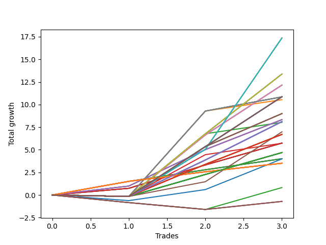

# Long Wallace 1231_002 
- Symbol: TSLA_Unlimited
- Date Range: 03/23/2022 - 07/08/2022
- Trading Period: 7:20-12:30
- Number of Trades: 3



| Name | Win Percent | Profit | Avg Profit / Trade | Avg Time / Trade |      | Name | Win Percent | Profit | Avg Profit / Trade | Avg Time / Trade |
| ---- | ----------- | ------ | ------------------ | ---------------- | ---- | ---- | ----------- | ------ | ------------------ | ---------------- |
| Sorted By <br> Profit | | | | | | Sorted By <br> Win Percentage ||||
| Seventy-One | 66.67 | 8680.00 | 2893.33 | 95:10 |     | Sixty-Six | 100.00 | 4165.00 | 1388.33 | 11:38 |
| Sixty-Three | 66.67 | 8680.00 | 2893.33 | 95:10 |     | Fifty-Eight | 100.00 | 4165.00 | 1388.33 | 11:38 |
| Forty-Seven | 66.67 | 8680.00 | 2893.33 | 95:10 |     | Fifty | 100.00 | 4165.00 | 1388.33 | 11:38 |
| Seven | 66.67 | 8680.00 | 2893.33 | 95:10 |     | Forty-Two | 100.00 | 4165.00 | 1388.33 | 11:38 |
| Seventy | 66.67 | 6685.00 | 2228.33 | 56:16 |     | Two | 100.00 | 4165.00 | 1388.33 | 11:38 |
| Sixty-Two | 66.67 | 6685.00 | 2228.33 | 56:16 |     | Sixty-Five | 100.00 | 2870.00 | 956.67 | 10:01 |
| Forty-Six | 66.67 | 6685.00 | 2228.33 | 56:16 |     | Fifty-Seven | 100.00 | 2870.00 | 956.67 | 10:01 |
| Six | 66.67 | 6685.00 | 2228.33 | 56:16 |     | Forty-Nine | 100.00 | 2870.00 | 956.67 | 10:01 |
| Sixty-Eight | 66.67 | 6075.00 | 2025.00 | 22:26 |     | Forty-One | 100.00 | 2870.00 | 956.67 | 10:01 |
| Sixty | 66.67 | 6075.00 | 2025.00 | 22:26 |     | One | 100.00 | 2870.00 | 956.67 | 10:01 |
| Fifty-Two | 66.67 | 6075.00 | 2025.00 | 22:26 |     | Sixty-Four | 100.00 | 2005.00 | 668.33 | 04:43 |
| Forty-Four | 66.67 | 6075.00 | 2025.00 | 22:26 |     | Fifty-Six | 100.00 | 2005.00 | 668.33 | 04:43 |
| Four | 66.67 | 6075.00 | 2025.00 | 22:26 |     | Forty-Eight | 100.00 | 2005.00 | 668.33 | 04:43 |
| One Hundred Thirty | 66.67 | 5430.00 | 1810.00 | 18:01 |     | Forty | 100.00 | 2005.00 | 668.33 | 04:43 |
| One Hundred Twenty-Five | 66.67 | 5430.00 | 1810.00 | 18:01 |     | Zero | 100.00 | 2005.00 | 668.33 | 04:43 |
| One Hundred Twenty | 66.67 | 5430.00 | 1810.00 | 18:01 |     | One Hundred Twenty-Six | 100.00 | 1755.00 | 585.00 | 02:31 |
| One Hundred Fifteen | 66.67 | 5430.00 | 1810.00 | 18:01 |     | One Hundred Twenty-One | 100.00 | 1755.00 | 585.00 | 02:31 |
| One Hundred Five | 66.67 | 5430.00 | 1810.00 | 18:01 |     | One Hundred Sixteen | 100.00 | 1755.00 | 585.00 | 02:31 |
| Ninety-Five | 66.67 | 5430.00 | 1810.00 | 18:01 |     | One Hundred Eleven | 100.00 | 1755.00 | 585.00 | 02:31 |
| Eighty-Five | 66.67 | 5430.00 | 1810.00 | 18:01 |     | One Hundred Six | 100.00 | 1755.00 | 585.00 | 02:31 |
| Sixty-Nine | 66.67 | 5425.00 | 1808.33 | 47:15 |     | One Hundred One | 100.00 | 1755.00 | 585.00 | 02:31 |
| Sixty-One | 66.67 | 5425.00 | 1808.33 | 47:15 |     | Ninety-Six | 100.00 | 1755.00 | 585.00 | 02:31 |
| Forty-Five | 66.67 | 5425.00 | 1808.33 | 47:15 |     | Ninety-One | 100.00 | 1755.00 | 585.00 | 02:31 |
| Five | 66.67 | 5425.00 | 1808.33 | 47:15 |     | Eighty-One | 100.00 | 1755.00 | 585.00 | 02:31 |
| Fifty-Three | 66.67 | 5270.00 | 1756.67 | 30:06 |     | Seventy-One | 66.67 | 8680.00 | 2893.33 | 95:10 |
| Sixty-Seven | 66.67 | 4500.00 | 1500.00 | 14:26 |     | Sixty-Three | 66.67 | 8680.00 | 2893.33 | 95:10 |
| Fifty-Nine | 66.67 | 4500.00 | 1500.00 | 14:26 |     | Forty-Seven | 66.67 | 8680.00 | 2893.33 | 95:10 |
| Fifty-One | 66.67 | 4500.00 | 1500.00 | 14:26 |     | Seven | 66.67 | 8680.00 | 2893.33 | 95:10 |
| Forty-Three | 66.67 | 4500.00 | 1500.00 | 14:26 |     | Seventy | 66.67 | 6685.00 | 2228.33 | 56:16 |
| Three | 66.67 | 4500.00 | 1500.00 | 14:26 |     | Sixty-Two | 66.67 | 6685.00 | 2228.33 | 56:16 |
| Sixty-Six | 100.00 | 4165.00 | 1388.33 | 11:38 |     | Forty-Six | 66.67 | 6685.00 | 2228.33 | 56:16 |
| Fifty-Eight | 100.00 | 4165.00 | 1388.33 | 11:38 |     | Six | 66.67 | 6685.00 | 2228.33 | 56:16 |
| Fifty | 100.00 | 4165.00 | 1388.33 | 11:38 |     | Sixty-Eight | 66.67 | 6075.00 | 2025.00 | 22:26 |
| Forty-Two | 100.00 | 4165.00 | 1388.33 | 11:38 |     | Sixty | 66.67 | 6075.00 | 2025.00 | 22:26 |
| Two | 100.00 | 4165.00 | 1388.33 | 11:38 |     | Fifty-Two | 66.67 | 6075.00 | 2025.00 | 22:26 |
| One Hundred Twenty-Nine | 66.67 | 4055.00 | 1351.67 | 12:25 |     | Forty-Four | 66.67 | 6075.00 | 2025.00 | 22:26 |
| One Hundred Twenty-Four | 66.67 | 4055.00 | 1351.67 | 12:25 |     | Four | 66.67 | 6075.00 | 2025.00 | 22:26 |
| One Hundred Ninteen | 66.67 | 4055.00 | 1351.67 | 12:25 |     | One Hundred Thirty | 66.67 | 5430.00 | 1810.00 | 18:01 |
| One Hundred Fourteen | 66.67 | 4055.00 | 1351.67 | 12:25 |     | One Hundred Twenty-Five | 66.67 | 5430.00 | 1810.00 | 18:01 |
| One Hundred Nine | 66.67 | 4055.00 | 1351.67 | 12:25 |     | One Hundred Twenty | 66.67 | 5430.00 | 1810.00 | 18:01 |
| One Hundred Four | 66.67 | 4055.00 | 1351.67 | 12:25 |     | One Hundred Fifteen | 66.67 | 5430.00 | 1810.00 | 18:01 |
| Ninety-Four | 66.67 | 4055.00 | 1351.67 | 12:25 |     | One Hundred Five | 66.67 | 5430.00 | 1810.00 | 18:01 |
| Eighty-Four | 66.67 | 4055.00 | 1351.67 | 12:25 |     | Ninety-Five | 66.67 | 5430.00 | 1810.00 | 18:01 |
| Fifty-Four | 66.67 | 4015.00 | 1338.33 | 25:06 |     | Eighty-Five | 66.67 | 5430.00 | 1810.00 | 18:01 |
| One Hundred Ten | 66.67 | 3490.00 | 1163.33 | 17:08 |     | Sixty-Nine | 66.67 | 5425.00 | 1808.33 | 47:15 |
| One Hundred Twenty-Eight | 66.67 | 3350.00 | 1116.67 | 11:48 |     | Sixty-One | 66.67 | 5425.00 | 1808.33 | 47:15 |
| One Hundred Twenty-Three | 66.67 | 3350.00 | 1116.67 | 11:48 |     | Forty-Five | 66.67 | 5425.00 | 1808.33 | 47:15 |
| One Hundred Eighteen | 66.67 | 3350.00 | 1116.67 | 11:48 |     | Five | 66.67 | 5425.00 | 1808.33 | 47:15 |
| One Hundred Thirteen | 66.67 | 3350.00 | 1116.67 | 11:48 |     | Fifty-Three | 66.67 | 5270.00 | 1756.67 | 30:06 |
| One Hundred Eight | 66.67 | 3350.00 | 1116.67 | 11:48 |     | Sixty-Seven | 66.67 | 4500.00 | 1500.00 | 14:26 |
| One Hundred Three | 66.67 | 3350.00 | 1116.67 | 11:48 |     | Fifty-Nine | 66.67 | 4500.00 | 1500.00 | 14:26 |
| Ninety-Three | 66.67 | 3350.00 | 1116.67 | 11:48 |     | Fifty-One | 66.67 | 4500.00 | 1500.00 | 14:26 |
| Eighty-Three | 66.67 | 3350.00 | 1116.67 | 11:48 |     | Forty-Three | 66.67 | 4500.00 | 1500.00 | 14:26 |
| Sixty-Five | 100.00 | 2870.00 | 956.67 | 10:01 |     | Three | 66.67 | 4500.00 | 1500.00 | 14:26 |
| Fifty-Seven | 100.00 | 2870.00 | 956.67 | 10:01 |     | One Hundred Twenty-Nine | 66.67 | 4055.00 | 1351.67 | 12:25 |
| Forty-Nine | 100.00 | 2870.00 | 956.67 | 10:01 |     | One Hundred Twenty-Four | 66.67 | 4055.00 | 1351.67 | 12:25 |
| Forty-One | 100.00 | 2870.00 | 956.67 | 10:01 |     | One Hundred Ninteen | 66.67 | 4055.00 | 1351.67 | 12:25 |
| One | 100.00 | 2870.00 | 956.67 | 10:01 |     | One Hundred Fourteen | 66.67 | 4055.00 | 1351.67 | 12:25 |
| Fifty-Five | 66.67 | 2860.00 | 953.33 | 34:41 |     | One Hundred Nine | 66.67 | 4055.00 | 1351.67 | 12:25 |
| One Hundred Twenty-Seven | 66.67 | 2345.00 | 781.67 | 10:26 |     | One Hundred Four | 66.67 | 4055.00 | 1351.67 | 12:25 |
| One Hundred Twenty-Two | 66.67 | 2345.00 | 781.67 | 10:26 |     | Ninety-Four | 66.67 | 4055.00 | 1351.67 | 12:25 |
| One Hundred Seventeen | 66.67 | 2345.00 | 781.67 | 10:26 |     | Eighty-Four | 66.67 | 4055.00 | 1351.67 | 12:25 |
| One Hundred Twelve | 66.67 | 2345.00 | 781.67 | 10:26 |     | Fifty-Four | 66.67 | 4015.00 | 1338.33 | 25:06 |
| One Hundred Seven | 66.67 | 2345.00 | 781.67 | 10:26 |     | One Hundred Ten | 66.67 | 3490.00 | 1163.33 | 17:08 |
| One Hundred Two | 66.67 | 2345.00 | 781.67 | 10:26 |     | One Hundred Twenty-Eight | 66.67 | 3350.00 | 1116.67 | 11:48 |
| Ninety-Two | 66.67 | 2345.00 | 781.67 | 10:26 |     | One Hundred Twenty-Three | 66.67 | 3350.00 | 1116.67 | 11:48 |
| Eighty-Two | 66.67 | 2345.00 | 781.67 | 10:26 |     | One Hundred Eighteen | 66.67 | 3350.00 | 1116.67 | 11:48 |
| Sixty-Four | 100.00 | 2005.00 | 668.33 | 04:43 |     | One Hundred Thirteen | 66.67 | 3350.00 | 1116.67 | 11:48 |
| Fifty-Six | 100.00 | 2005.00 | 668.33 | 04:43 |     | One Hundred Eight | 66.67 | 3350.00 | 1116.67 | 11:48 |
| Forty-Eight | 100.00 | 2005.00 | 668.33 | 04:43 |     | One Hundred Three | 66.67 | 3350.00 | 1116.67 | 11:48 |
| Forty | 100.00 | 2005.00 | 668.33 | 04:43 |     | Ninety-Three | 66.67 | 3350.00 | 1116.67 | 11:48 |
| Zero | 100.00 | 2005.00 | 668.33 | 04:43 |     | Eighty-Three | 66.67 | 3350.00 | 1116.67 | 11:48 |
| Seventy-Three | 66.67 | 1995.00 | 665.00 | 10:05 |     | Fifty-Five | 66.67 | 2860.00 | 953.33 | 34:41 |
| One Hundred Twenty-Six | 100.00 | 1755.00 | 585.00 | 02:31 |     | One Hundred Twenty-Seven | 66.67 | 2345.00 | 781.67 | 10:26 |
| One Hundred Twenty-One | 100.00 | 1755.00 | 585.00 | 02:31 |     | One Hundred Twenty-Two | 66.67 | 2345.00 | 781.67 | 10:26 |
| One Hundred Sixteen | 100.00 | 1755.00 | 585.00 | 02:31 |     | One Hundred Seventeen | 66.67 | 2345.00 | 781.67 | 10:26 |
| One Hundred Eleven | 100.00 | 1755.00 | 585.00 | 02:31 |     | One Hundred Twelve | 66.67 | 2345.00 | 781.67 | 10:26 |
| One Hundred Six | 100.00 | 1755.00 | 585.00 | 02:31 |     | One Hundred Seven | 66.67 | 2345.00 | 781.67 | 10:26 |
| One Hundred One | 100.00 | 1755.00 | 585.00 | 02:31 |     | One Hundred Two | 66.67 | 2345.00 | 781.67 | 10:26 |
| Ninety-Six | 100.00 | 1755.00 | 585.00 | 02:31 |     | Ninety-Two | 66.67 | 2345.00 | 781.67 | 10:26 |
| Ninety-One | 100.00 | 1755.00 | 585.00 | 02:31 |     | Eighty-Two | 66.67 | 2345.00 | 781.67 | 10:26 |
| Eighty-One | 100.00 | 1755.00 | 585.00 | 02:31 |     | Seventy-Three | 66.67 | 1995.00 | 665.00 | 10:05 |
| Ninety-Seven | 33.33 | 410.00 | 136.67 | 07:40 |     | Ninety-Seven | 33.33 | 410.00 | 136.67 | 07:40 |
| One Hundred | 33.33 | -355.00 | -118.33 | 08:11 |     | One Hundred | 33.33 | -355.00 | -118.33 | 08:11 |
| Ninety-Nine | 33.33 | -355.00 | -118.33 | 08:11 |     | Ninety-Nine | 33.33 | -355.00 | -118.33 | 08:11 |
| Ninety-Eight | 33.33 | -355.00 | -118.33 | 08:11 |     | Ninety-Eight | 33.33 | -355.00 | -118.33 | 08:11 |

## NO STOPLOSS

### Test Zero
* Sell when price hits the middle line of the 20p bollinger
* No Stoploss
* Results:
```
Total Trades: 3
Percent Up: 100.00
Percent Down: 0.00
Total Points Moved Up: 4.01
Potential Profit: 2005.00
Total Points Ups: 4.01 Count Ups: 3
Total Points Downs: 0.00 Count Downs: 0
```

<details><summary>Trades</summary>

<code>In: 2022-03-31 12:31:00		Out: 2022-03-31 12:36:05		Total Position Time: 05:05		Total Move Up: 1.51		Total to Date: 1.51</code> <br />
<code>In: 2022-05-31 11:58:00		Out: 2022-05-31 12:04:50		Total Position Time: 06:50		Total Move Up: 1.28		Total to Date: 2.79</code> <br />
<code>In: 2022-06-29 08:26:00		Out: 2022-06-29 08:28:15		Total Position Time: 02:15		Total Move Up: 1.22		Total to Date: 4.01</code> <br />


</details>

### Test One
* Sell when the price hits the upper line of the 20p 1std bollinger
* No Stoploss
* Results:
```
Total Trades: 3
Percent Up: 100.00
Percent Down: 0.00
Total Points Moved Up: 5.74
Potential Profit: 2870.00
Total Points Ups: 5.74 Count Ups: 3
Total Points Downs: 0.00 Count Downs: 0
```

<details><summary>Trades</summary>

<code>In: 2022-03-31 12:31:00		Out: 2022-03-31 12:45:10		Total Position Time: 14:10		Total Move Up: 0.74		Total to Date: 0.74</code> <br />
<code>In: 2022-05-31 11:58:00		Out: 2022-05-31 12:07:40		Total Position Time: 09:40		Total Move Up: 2.58		Total to Date: 3.32</code> <br />
<code>In: 2022-06-29 08:26:00		Out: 2022-06-29 08:32:15		Total Position Time: 06:15		Total Move Up: 2.42		Total to Date: 5.74</code> <br />


</details>

### Test Two
* Sell when the price hits the upper line of the 20p 2std bollinger
* No Stoploss
* Results:
```
Total Trades: 3
Percent Up: 100.00
Percent Down: 0.00
Total Points Moved Up: 8.33
Potential Profit: 4165.00
Total Points Ups: 8.33 Count Ups: 3
Total Points Downs: 0.00 Count Downs: 0
```

<details><summary>Trades</summary>

<code>In: 2022-03-31 12:31:00		Out: 2022-03-31 12:45:15		Total Position Time: 14:15		Total Move Up: 0.99		Total to Date: 0.99</code> <br />
<code>In: 2022-05-31 11:58:00		Out: 2022-05-31 12:09:05		Total Position Time: 11:05		Total Move Up: 4.03		Total to Date: 5.02</code> <br />
<code>In: 2022-06-29 08:26:00		Out: 2022-06-29 08:35:35		Total Position Time: 09:35		Total Move Up: 3.31		Total to Date: 8.33</code> <br />


</details>

### Test Three
* Sell when price hits the middle line of the 50p bollinger
* No Stoploss
* Results:
```
Total Trades: 3
Percent Up: 66.67
Percent Down: 33.33
Total Points Moved Up: 9.00
Potential Profit: 4500.00
Total Points Ups: 9.16 Count Ups: 2
Total Points Downs: -0.16 Count Downs: 1
```

<details><summary>Trades</summary>

<code>In: 2022-03-31 12:31:00		Out: 2022-03-31 12:47:00		Total Position Time: 16:00		Total Move Up: -0.16		Total to Date: -0.16</code> <br />
<code>In: 2022-05-31 11:58:00		Out: 2022-05-31 12:15:15		Total Position Time: 17:15		Total Move Up: 5.51		Total to Date: 5.35</code> <br />
<code>In: 2022-06-29 08:26:00		Out: 2022-06-29 08:36:05		Total Position Time: 10:05		Total Move Up: 3.65		Total to Date: 9.00</code> <br />


</details>

### Test Four
* Sell when the price hits the upper line of the 50p 1std bollinger
* No Stoploss
* Results:
```
Total Trades: 3
Percent Up: 66.67
Percent Down: 33.33
Total Points Moved Up: 12.15
Potential Profit: 6075.00
Total Points Ups: 12.31 Count Ups: 2
Total Points Downs: -0.16 Count Downs: 1
```

<details><summary>Trades</summary>

<code>In: 2022-03-31 12:31:00		Out: 2022-03-31 12:47:00		Total Position Time: 16:00		Total Move Up: -0.16		Total to Date: -0.16</code> <br />
<code>In: 2022-05-31 11:58:00		Out: 2022-05-31 12:28:30		Total Position Time: 30:30		Total Move Up: 6.80		Total to Date: 6.64</code> <br />
<code>In: 2022-06-29 08:26:00		Out: 2022-06-29 08:46:50		Total Position Time: 20:50		Total Move Up: 5.51		Total to Date: 12.15</code> <br />


</details>

### Test Five
* Sell when the price hits the upper line of the 50p 2std bollinger
* No Stoploss
* Results:
```
Total Trades: 3
Percent Up: 66.67
Percent Down: 33.33
Total Points Moved Up: 10.85
Potential Profit: 5425.00
Total Points Ups: 11.01 Count Ups: 2
Total Points Downs: -0.16 Count Downs: 1
```

<details><summary>Trades</summary>

<code>In: 2022-03-31 12:31:00		Out: 2022-03-31 12:47:00		Total Position Time: 16:00		Total Move Up: -0.16		Total to Date: -0.16</code> <br />
<code>In: 2022-05-31 11:58:00		Out: 2022-05-31 12:31:05		Total Position Time: 33:05		Total Move Up: 9.44		Total to Date: 9.28</code> <br />
<code>In: 2022-06-29 08:26:00		Out: 2022-06-29 09:58:40		Total Position Time: 92:40		Total Move Up: 1.57		Total to Date: 10.85</code> <br />


</details>

### Test Six
* Sell when the price hits the middle line of the 1std VWAP
* No Stoploss
* Results:
```
Total Trades: 3
Percent Up: 66.67
Percent Down: 33.33
Total Points Moved Up: 13.37
Potential Profit: 6685.00
Total Points Ups: 13.53 Count Ups: 2
Total Points Downs: -0.16 Count Downs: 1
```

<details><summary>Trades</summary>

<code>In: 2022-03-31 12:31:00		Out: 2022-03-31 12:47:00		Total Position Time: 16:00		Total Move Up: -0.16		Total to Date: -0.16</code> <br />
<code>In: 2022-05-31 11:58:00		Out: 2022-05-31 12:16:05		Total Position Time: 18:05		Total Move Up: 6.93		Total to Date: 6.77</code> <br />
<code>In: 2022-06-29 08:26:00		Out: 2022-06-29 10:40:45		Total Position Time: 134:45		Total Move Up: 6.60		Total to Date: 13.37</code> <br />


</details>

### Test Seven
* Sell when the price hits the upper line of the 1std VWAP
* No Stoploss
* Results:
```
Total Trades: 3
Percent Up: 66.67
Percent Down: 33.33
Total Points Moved Up: 17.36
Potential Profit: 8680.00
Total Points Ups: 17.52 Count Ups: 2
Total Points Downs: -0.16 Count Downs: 1
```

<details><summary>Trades</summary>

<code>In: 2022-03-31 12:31:00		Out: 2022-03-31 12:47:00		Total Position Time: 16:00		Total Move Up: -0.16		Total to Date: -0.16</code> <br />
<code>In: 2022-05-31 11:58:00		Out: 2022-05-31 12:47:00		Total Position Time: 49:00		Total Move Up: 5.21		Total to Date: 5.05</code> <br />
<code>In: 2022-06-29 08:26:00		Out: 2022-06-29 12:06:30		Total Position Time: 220:30		Total Move Up: 12.31		Total to Date: 17.36</code> <br />


</details>

## STOPLOSS OF 5

### Test Forty
* Sell when price hits the middle line of the 20p bollinger
* Stoploss is 5 points
* Results:
```
Total Trades: 3
Percent Up: 100.00
Percent Down: 0.00
Total Points Moved Up: 4.01
Potential Profit: 2005.00
Total Points Ups: 4.01 Count Ups: 3
Total Points Downs: 0.00 Count Downs: 0
```

<details><summary>Trades</summary>

<code>In: 2022-03-31 12:31:00		Out: 2022-03-31 12:36:05		Total Position Time: 05:05		Total Move Up: 1.51		Total to Date: 1.51</code> <br />
<code>In: 2022-05-31 11:58:00		Out: 2022-05-31 12:04:50		Total Position Time: 06:50		Total Move Up: 1.28		Total to Date: 2.79</code> <br />
<code>In: 2022-06-29 08:26:00		Out: 2022-06-29 08:28:15		Total Position Time: 02:15		Total Move Up: 1.22		Total to Date: 4.01</code> <br />


</details>

### Test Forty-One
* Sell when the price hits the upper line of the 20p 1std bollinger
* Stoploss is 5 points
* Results:
```
Total Trades: 3
Percent Up: 100.00
Percent Down: 0.00
Total Points Moved Up: 5.74
Potential Profit: 2870.00
Total Points Ups: 5.74 Count Ups: 3
Total Points Downs: 0.00 Count Downs: 0
```

<details><summary>Trades</summary>

<code>In: 2022-03-31 12:31:00		Out: 2022-03-31 12:45:10		Total Position Time: 14:10		Total Move Up: 0.74		Total to Date: 0.74</code> <br />
<code>In: 2022-05-31 11:58:00		Out: 2022-05-31 12:07:40		Total Position Time: 09:40		Total Move Up: 2.58		Total to Date: 3.32</code> <br />
<code>In: 2022-06-29 08:26:00		Out: 2022-06-29 08:32:15		Total Position Time: 06:15		Total Move Up: 2.42		Total to Date: 5.74</code> <br />


</details>

### Test Forty-Two
* Sell when the price hits the upper line of the 20p 2std bollinger
* Stoploss is 5 points
* Results:
```
Total Trades: 3
Percent Up: 100.00
Percent Down: 0.00
Total Points Moved Up: 8.33
Potential Profit: 4165.00
Total Points Ups: 8.33 Count Ups: 3
Total Points Downs: 0.00 Count Downs: 0
```

<details><summary>Trades</summary>

<code>In: 2022-03-31 12:31:00		Out: 2022-03-31 12:45:15		Total Position Time: 14:15		Total Move Up: 0.99		Total to Date: 0.99</code> <br />
<code>In: 2022-05-31 11:58:00		Out: 2022-05-31 12:09:05		Total Position Time: 11:05		Total Move Up: 4.03		Total to Date: 5.02</code> <br />
<code>In: 2022-06-29 08:26:00		Out: 2022-06-29 08:35:35		Total Position Time: 09:35		Total Move Up: 3.31		Total to Date: 8.33</code> <br />


</details>

### Test Forty-Three
* Sell when price hits the middle line of the 50p bollinger
* Stoploss is 5 points
* Results:
```
Total Trades: 3
Percent Up: 66.67
Percent Down: 33.33
Total Points Moved Up: 9.00
Potential Profit: 4500.00
Total Points Ups: 9.16 Count Ups: 2
Total Points Downs: -0.16 Count Downs: 1
```

<details><summary>Trades</summary>

<code>In: 2022-03-31 12:31:00		Out: 2022-03-31 12:47:00		Total Position Time: 16:00		Total Move Up: -0.16		Total to Date: -0.16</code> <br />
<code>In: 2022-05-31 11:58:00		Out: 2022-05-31 12:15:15		Total Position Time: 17:15		Total Move Up: 5.51		Total to Date: 5.35</code> <br />
<code>In: 2022-06-29 08:26:00		Out: 2022-06-29 08:36:05		Total Position Time: 10:05		Total Move Up: 3.65		Total to Date: 9.00</code> <br />


</details>

### Test Forty-Four
* Sell when the price hits the upper line of the 50p 1std bollinger
* Stoploss is 5 points
* Results:
```
Total Trades: 3
Percent Up: 66.67
Percent Down: 33.33
Total Points Moved Up: 12.15
Potential Profit: 6075.00
Total Points Ups: 12.31 Count Ups: 2
Total Points Downs: -0.16 Count Downs: 1
```

<details><summary>Trades</summary>

<code>In: 2022-03-31 12:31:00		Out: 2022-03-31 12:47:00		Total Position Time: 16:00		Total Move Up: -0.16		Total to Date: -0.16</code> <br />
<code>In: 2022-05-31 11:58:00		Out: 2022-05-31 12:28:30		Total Position Time: 30:30		Total Move Up: 6.80		Total to Date: 6.64</code> <br />
<code>In: 2022-06-29 08:26:00		Out: 2022-06-29 08:46:50		Total Position Time: 20:50		Total Move Up: 5.51		Total to Date: 12.15</code> <br />


</details>

### Test Forty-Five
* Sell when the price hits the upper line of the 50p 2std bollinger
* Stoploss is 5 points
* Results:
```
Total Trades: 3
Percent Up: 66.67
Percent Down: 33.33
Total Points Moved Up: 10.85
Potential Profit: 5425.00
Total Points Ups: 11.01 Count Ups: 2
Total Points Downs: -0.16 Count Downs: 1
```

<details><summary>Trades</summary>

<code>In: 2022-03-31 12:31:00		Out: 2022-03-31 12:47:00		Total Position Time: 16:00		Total Move Up: -0.16		Total to Date: -0.16</code> <br />
<code>In: 2022-05-31 11:58:00		Out: 2022-05-31 12:31:05		Total Position Time: 33:05		Total Move Up: 9.44		Total to Date: 9.28</code> <br />
<code>In: 2022-06-29 08:26:00		Out: 2022-06-29 09:58:40		Total Position Time: 92:40		Total Move Up: 1.57		Total to Date: 10.85</code> <br />


</details>

### Test Forty-Six
* Sell when the price hits the middle line of the 1std VWAP
* Stoploss is 5 points
* Results:
```
Total Trades: 3
Percent Up: 66.67
Percent Down: 33.33
Total Points Moved Up: 13.37
Potential Profit: 6685.00
Total Points Ups: 13.53 Count Ups: 2
Total Points Downs: -0.16 Count Downs: 1
```

<details><summary>Trades</summary>

<code>In: 2022-03-31 12:31:00		Out: 2022-03-31 12:47:00		Total Position Time: 16:00		Total Move Up: -0.16		Total to Date: -0.16</code> <br />
<code>In: 2022-05-31 11:58:00		Out: 2022-05-31 12:16:05		Total Position Time: 18:05		Total Move Up: 6.93		Total to Date: 6.77</code> <br />
<code>In: 2022-06-29 08:26:00		Out: 2022-06-29 10:40:45		Total Position Time: 134:45		Total Move Up: 6.60		Total to Date: 13.37</code> <br />


</details>

### Test Forty-Seven
* Sell when the price hits the upper line of the 1std VWAP
* Stoploss is 5 points
* Results:
```
Total Trades: 3
Percent Up: 66.67
Percent Down: 33.33
Total Points Moved Up: 17.36
Potential Profit: 8680.00
Total Points Ups: 17.52 Count Ups: 2
Total Points Downs: -0.16 Count Downs: 1
```

<details><summary>Trades</summary>

<code>In: 2022-03-31 12:31:00		Out: 2022-03-31 12:47:00		Total Position Time: 16:00		Total Move Up: -0.16		Total to Date: -0.16</code> <br />
<code>In: 2022-05-31 11:58:00		Out: 2022-05-31 12:47:00		Total Position Time: 49:00		Total Move Up: 5.21		Total to Date: 5.05</code> <br />
<code>In: 2022-06-29 08:26:00		Out: 2022-06-29 12:06:30		Total Position Time: 220:30		Total Move Up: 12.31		Total to Date: 17.36</code> <br />


</details>

## TRAIL STOP OF 5

### Test Forty-Eight
* Sell when price hits the middle line of the 20p bollinger
* Trailing Stop is 5 points
* Results:
```
Total Trades: 3
Percent Up: 100.00
Percent Down: 0.00
Total Points Moved Up: 4.01
Potential Profit: 2005.00
Total Points Ups: 4.01 Count Ups: 3
Total Points Downs: 0.00 Count Downs: 0
```

<details><summary>Trades</summary>

<code>In: 2022-03-31 12:31:00		Out: 2022-03-31 12:36:05		Total Position Time: 05:05		Total Move Up: 1.51		Total to Date: 1.51</code> <br />
<code>In: 2022-05-31 11:58:00		Out: 2022-05-31 12:04:50		Total Position Time: 06:50		Total Move Up: 1.28		Total to Date: 2.79</code> <br />
<code>In: 2022-06-29 08:26:00		Out: 2022-06-29 08:28:15		Total Position Time: 02:15		Total Move Up: 1.22		Total to Date: 4.01</code> <br />


</details>

### Test Forty-Nine
* Sell when the price hits the upper line of the 20p 1std bollinger
* Trailing Stop is 5 points
* Results:
```
Total Trades: 3
Percent Up: 100.00
Percent Down: 0.00
Total Points Moved Up: 5.74
Potential Profit: 2870.00
Total Points Ups: 5.74 Count Ups: 3
Total Points Downs: 0.00 Count Downs: 0
```

<details><summary>Trades</summary>

<code>In: 2022-03-31 12:31:00		Out: 2022-03-31 12:45:10		Total Position Time: 14:10		Total Move Up: 0.74		Total to Date: 0.74</code> <br />
<code>In: 2022-05-31 11:58:00		Out: 2022-05-31 12:07:40		Total Position Time: 09:40		Total Move Up: 2.58		Total to Date: 3.32</code> <br />
<code>In: 2022-06-29 08:26:00		Out: 2022-06-29 08:32:15		Total Position Time: 06:15		Total Move Up: 2.42		Total to Date: 5.74</code> <br />


</details>

### Test Fifty
* Sell when the price hits the upper line of the 20p 2std bollinger
* Trailing Stop is 5 points
* Results:
```
Total Trades: 3
Percent Up: 100.00
Percent Down: 0.00
Total Points Moved Up: 8.33
Potential Profit: 4165.00
Total Points Ups: 8.33 Count Ups: 3
Total Points Downs: 0.00 Count Downs: 0
```

<details><summary>Trades</summary>

<code>In: 2022-03-31 12:31:00		Out: 2022-03-31 12:45:15		Total Position Time: 14:15		Total Move Up: 0.99		Total to Date: 0.99</code> <br />
<code>In: 2022-05-31 11:58:00		Out: 2022-05-31 12:09:05		Total Position Time: 11:05		Total Move Up: 4.03		Total to Date: 5.02</code> <br />
<code>In: 2022-06-29 08:26:00		Out: 2022-06-29 08:35:35		Total Position Time: 09:35		Total Move Up: 3.31		Total to Date: 8.33</code> <br />


</details>

### Test Fifty-One
* Sell when price hits the middle line of the 50p bollinger
* Trailing Stop is 5 points
* Results:
```
Total Trades: 3
Percent Up: 66.67
Percent Down: 33.33
Total Points Moved Up: 9.00
Potential Profit: 4500.00
Total Points Ups: 9.16 Count Ups: 2
Total Points Downs: -0.16 Count Downs: 1
```

<details><summary>Trades</summary>

<code>In: 2022-03-31 12:31:00		Out: 2022-03-31 12:47:00		Total Position Time: 16:00		Total Move Up: -0.16		Total to Date: -0.16</code> <br />
<code>In: 2022-05-31 11:58:00		Out: 2022-05-31 12:15:15		Total Position Time: 17:15		Total Move Up: 5.51		Total to Date: 5.35</code> <br />
<code>In: 2022-06-29 08:26:00		Out: 2022-06-29 08:36:05		Total Position Time: 10:05		Total Move Up: 3.65		Total to Date: 9.00</code> <br />


</details>

### Test Fifty-Two
* Sell when the price hits the upper line of the 50p 1std bollinger
* Trailing Stop is 5 points
* Results:
```
Total Trades: 3
Percent Up: 66.67
Percent Down: 33.33
Total Points Moved Up: 12.15
Potential Profit: 6075.00
Total Points Ups: 12.31 Count Ups: 2
Total Points Downs: -0.16 Count Downs: 1
```

<details><summary>Trades</summary>

<code>In: 2022-03-31 12:31:00		Out: 2022-03-31 12:47:00		Total Position Time: 16:00		Total Move Up: -0.16		Total to Date: -0.16</code> <br />
<code>In: 2022-05-31 11:58:00		Out: 2022-05-31 12:28:30		Total Position Time: 30:30		Total Move Up: 6.80		Total to Date: 6.64</code> <br />
<code>In: 2022-06-29 08:26:00		Out: 2022-06-29 08:46:50		Total Position Time: 20:50		Total Move Up: 5.51		Total to Date: 12.15</code> <br />


</details>

### Test Fifty-Three
* Sell when the price hits the upper line of the 50p 2std bollinger
* Trailing Stop is 5 points
* Results:
```
Total Trades: 3
Percent Up: 66.67
Percent Down: 33.33
Total Points Moved Up: 10.54
Potential Profit: 5270.00
Total Points Ups: 10.70 Count Ups: 2
Total Points Downs: -0.16 Count Downs: 1
```

<details><summary>Trades</summary>

<code>In: 2022-03-31 12:31:00		Out: 2022-03-31 12:47:00		Total Position Time: 16:00		Total Move Up: -0.16		Total to Date: -0.16</code> <br />
<code>In: 2022-05-31 11:58:00		Out: 2022-05-31 12:31:05		Total Position Time: 33:05		Total Move Up: 9.44		Total to Date: 9.28</code> <br />
<code>In: 2022-06-29 08:26:00		Out: 2022-06-29 09:07:15		Total Position Time: 41:15		Total Move Up: 1.26		Total to Date: 10.54</code> <br />


</details>

### Test Fifty-Four
* Sell when the price hits the middle line of the 1std VWAP
* Trailing Stop is 5 points
* Results:
```
Total Trades: 3
Percent Up: 66.67
Percent Down: 33.33
Total Points Moved Up: 8.03
Potential Profit: 4015.00
Total Points Ups: 8.19 Count Ups: 2
Total Points Downs: -0.16 Count Downs: 1
```

<details><summary>Trades</summary>

<code>In: 2022-03-31 12:31:00		Out: 2022-03-31 12:47:00		Total Position Time: 16:00		Total Move Up: -0.16		Total to Date: -0.16</code> <br />
<code>In: 2022-05-31 11:58:00		Out: 2022-05-31 12:16:05		Total Position Time: 18:05		Total Move Up: 6.93		Total to Date: 6.77</code> <br />
<code>In: 2022-06-29 08:26:00		Out: 2022-06-29 09:07:15		Total Position Time: 41:15		Total Move Up: 1.26		Total to Date: 8.03</code> <br />


</details>

### Test Fifty-Five
* Sell when the price hits the upper line of the 1std VWAP
* Trailing Stop is 5 points
* Results:
```
Total Trades: 3
Percent Up: 66.67
Percent Down: 33.33
Total Points Moved Up: 5.72
Potential Profit: 2860.00
Total Points Ups: 5.88 Count Ups: 2
Total Points Downs: -0.16 Count Downs: 1
```

<details><summary>Trades</summary>

<code>In: 2022-03-31 12:31:00		Out: 2022-03-31 12:47:00		Total Position Time: 16:00		Total Move Up: -0.16		Total to Date: -0.16</code> <br />
<code>In: 2022-05-31 11:58:00		Out: 2022-05-31 12:44:50		Total Position Time: 46:50		Total Move Up: 4.62		Total to Date: 4.46</code> <br />
<code>In: 2022-06-29 08:26:00		Out: 2022-06-29 09:07:15		Total Position Time: 41:15		Total Move Up: 1.26		Total to Date: 5.72</code> <br />


</details>

## STOPLOSS OF 10

### Test Fifty-Six
* Sell when price hits the middle line of the 20p bollinger
* Stoploss is 10 points
* Results:
```
Total Trades: 3
Percent Up: 100.00
Percent Down: 0.00
Total Points Moved Up: 4.01
Potential Profit: 2005.00
Total Points Ups: 4.01 Count Ups: 3
Total Points Downs: 0.00 Count Downs: 0
```

<details><summary>Trades</summary>

<code>In: 2022-03-31 12:31:00		Out: 2022-03-31 12:36:05		Total Position Time: 05:05		Total Move Up: 1.51		Total to Date: 1.51</code> <br />
<code>In: 2022-05-31 11:58:00		Out: 2022-05-31 12:04:50		Total Position Time: 06:50		Total Move Up: 1.28		Total to Date: 2.79</code> <br />
<code>In: 2022-06-29 08:26:00		Out: 2022-06-29 08:28:15		Total Position Time: 02:15		Total Move Up: 1.22		Total to Date: 4.01</code> <br />


</details>

### Test Fifty-Seven
* Sell when the price hits the upper line of the 20p 1std bollinger
* Stoploss is 10 points
* Results:
```
Total Trades: 3
Percent Up: 100.00
Percent Down: 0.00
Total Points Moved Up: 5.74
Potential Profit: 2870.00
Total Points Ups: 5.74 Count Ups: 3
Total Points Downs: 0.00 Count Downs: 0
```

<details><summary>Trades</summary>

<code>In: 2022-03-31 12:31:00		Out: 2022-03-31 12:45:10		Total Position Time: 14:10		Total Move Up: 0.74		Total to Date: 0.74</code> <br />
<code>In: 2022-05-31 11:58:00		Out: 2022-05-31 12:07:40		Total Position Time: 09:40		Total Move Up: 2.58		Total to Date: 3.32</code> <br />
<code>In: 2022-06-29 08:26:00		Out: 2022-06-29 08:32:15		Total Position Time: 06:15		Total Move Up: 2.42		Total to Date: 5.74</code> <br />


</details>

### Test Fifty-Eight
* Sell when the price hits the upper line of the 20p 2std bollinger
* Stoploss is 10 points
* Results:
```
Total Trades: 3
Percent Up: 100.00
Percent Down: 0.00
Total Points Moved Up: 8.33
Potential Profit: 4165.00
Total Points Ups: 8.33 Count Ups: 3
Total Points Downs: 0.00 Count Downs: 0
```

<details><summary>Trades</summary>

<code>In: 2022-03-31 12:31:00		Out: 2022-03-31 12:45:15		Total Position Time: 14:15		Total Move Up: 0.99		Total to Date: 0.99</code> <br />
<code>In: 2022-05-31 11:58:00		Out: 2022-05-31 12:09:05		Total Position Time: 11:05		Total Move Up: 4.03		Total to Date: 5.02</code> <br />
<code>In: 2022-06-29 08:26:00		Out: 2022-06-29 08:35:35		Total Position Time: 09:35		Total Move Up: 3.31		Total to Date: 8.33</code> <br />


</details>

### Test Fifty-Nine
* Sell when price hits the middle line of the 50p bollinger
* Stoploss is 10 points
* Results:
```
Total Trades: 3
Percent Up: 66.67
Percent Down: 33.33
Total Points Moved Up: 9.00
Potential Profit: 4500.00
Total Points Ups: 9.16 Count Ups: 2
Total Points Downs: -0.16 Count Downs: 1
```

<details><summary>Trades</summary>

<code>In: 2022-03-31 12:31:00		Out: 2022-03-31 12:47:00		Total Position Time: 16:00		Total Move Up: -0.16		Total to Date: -0.16</code> <br />
<code>In: 2022-05-31 11:58:00		Out: 2022-05-31 12:15:15		Total Position Time: 17:15		Total Move Up: 5.51		Total to Date: 5.35</code> <br />
<code>In: 2022-06-29 08:26:00		Out: 2022-06-29 08:36:05		Total Position Time: 10:05		Total Move Up: 3.65		Total to Date: 9.00</code> <br />


</details>

### Test Sixty
* Sell when the price hits the upper line of the 50p 1std bollinger
* Stoploss is 10 points
* Results:
```
Total Trades: 3
Percent Up: 66.67
Percent Down: 33.33
Total Points Moved Up: 12.15
Potential Profit: 6075.00
Total Points Ups: 12.31 Count Ups: 2
Total Points Downs: -0.16 Count Downs: 1
```

<details><summary>Trades</summary>

<code>In: 2022-03-31 12:31:00		Out: 2022-03-31 12:47:00		Total Position Time: 16:00		Total Move Up: -0.16		Total to Date: -0.16</code> <br />
<code>In: 2022-05-31 11:58:00		Out: 2022-05-31 12:28:30		Total Position Time: 30:30		Total Move Up: 6.80		Total to Date: 6.64</code> <br />
<code>In: 2022-06-29 08:26:00		Out: 2022-06-29 08:46:50		Total Position Time: 20:50		Total Move Up: 5.51		Total to Date: 12.15</code> <br />


</details>

### Test Sixty-One
* Sell when the price hits the upper line of the 50p 2std bollinger
* Stoploss is 10 points
* Results:
```
Total Trades: 3
Percent Up: 66.67
Percent Down: 33.33
Total Points Moved Up: 10.85
Potential Profit: 5425.00
Total Points Ups: 11.01 Count Ups: 2
Total Points Downs: -0.16 Count Downs: 1
```

<details><summary>Trades</summary>

<code>In: 2022-03-31 12:31:00		Out: 2022-03-31 12:47:00		Total Position Time: 16:00		Total Move Up: -0.16		Total to Date: -0.16</code> <br />
<code>In: 2022-05-31 11:58:00		Out: 2022-05-31 12:31:05		Total Position Time: 33:05		Total Move Up: 9.44		Total to Date: 9.28</code> <br />
<code>In: 2022-06-29 08:26:00		Out: 2022-06-29 09:58:40		Total Position Time: 92:40		Total Move Up: 1.57		Total to Date: 10.85</code> <br />


</details>

### Test Sixty-Two
* Sell when the price hits the middle line of the 1std VWAP
* Stoploss is 10 points
* Results:
```
Total Trades: 3
Percent Up: 66.67
Percent Down: 33.33
Total Points Moved Up: 13.37
Potential Profit: 6685.00
Total Points Ups: 13.53 Count Ups: 2
Total Points Downs: -0.16 Count Downs: 1
```

<details><summary>Trades</summary>

<code>In: 2022-03-31 12:31:00		Out: 2022-03-31 12:47:00		Total Position Time: 16:00		Total Move Up: -0.16		Total to Date: -0.16</code> <br />
<code>In: 2022-05-31 11:58:00		Out: 2022-05-31 12:16:05		Total Position Time: 18:05		Total Move Up: 6.93		Total to Date: 6.77</code> <br />
<code>In: 2022-06-29 08:26:00		Out: 2022-06-29 10:40:45		Total Position Time: 134:45		Total Move Up: 6.60		Total to Date: 13.37</code> <br />


</details>

### Test Sixty-Three
* Sell when the price hits the upper line of the 1std VWAP
* Stoploss is 10 points
* Results:
```
Total Trades: 3
Percent Up: 66.67
Percent Down: 33.33
Total Points Moved Up: 17.36
Potential Profit: 8680.00
Total Points Ups: 17.52 Count Ups: 2
Total Points Downs: -0.16 Count Downs: 1
```

<details><summary>Trades</summary>

<code>In: 2022-03-31 12:31:00		Out: 2022-03-31 12:47:00		Total Position Time: 16:00		Total Move Up: -0.16		Total to Date: -0.16</code> <br />
<code>In: 2022-05-31 11:58:00		Out: 2022-05-31 12:47:00		Total Position Time: 49:00		Total Move Up: 5.21		Total to Date: 5.05</code> <br />
<code>In: 2022-06-29 08:26:00		Out: 2022-06-29 12:06:30		Total Position Time: 220:30		Total Move Up: 12.31		Total to Date: 17.36</code> <br />


</details>

## TRAIL STOP OF 10

### Test Sixty-Four
* Sell when price hits the middle line of the 20p bollinger
* Trailing Stop is 10 points
* Results:
```
Total Trades: 3
Percent Up: 100.00
Percent Down: 0.00
Total Points Moved Up: 4.01
Potential Profit: 2005.00
Total Points Ups: 4.01 Count Ups: 3
Total Points Downs: 0.00 Count Downs: 0
```

<details><summary>Trades</summary>

<code>In: 2022-03-31 12:31:00		Out: 2022-03-31 12:36:05		Total Position Time: 05:05		Total Move Up: 1.51		Total to Date: 1.51</code> <br />
<code>In: 2022-05-31 11:58:00		Out: 2022-05-31 12:04:50		Total Position Time: 06:50		Total Move Up: 1.28		Total to Date: 2.79</code> <br />
<code>In: 2022-06-29 08:26:00		Out: 2022-06-29 08:28:15		Total Position Time: 02:15		Total Move Up: 1.22		Total to Date: 4.01</code> <br />


</details>

### Test Sixty-Five
* Sell when the price hits the upper line of the 20p 1std bollinger
* Trailing Stop is 10 points
* Results:
```
Total Trades: 3
Percent Up: 100.00
Percent Down: 0.00
Total Points Moved Up: 5.74
Potential Profit: 2870.00
Total Points Ups: 5.74 Count Ups: 3
Total Points Downs: 0.00 Count Downs: 0
```

<details><summary>Trades</summary>

<code>In: 2022-03-31 12:31:00		Out: 2022-03-31 12:45:10		Total Position Time: 14:10		Total Move Up: 0.74		Total to Date: 0.74</code> <br />
<code>In: 2022-05-31 11:58:00		Out: 2022-05-31 12:07:40		Total Position Time: 09:40		Total Move Up: 2.58		Total to Date: 3.32</code> <br />
<code>In: 2022-06-29 08:26:00		Out: 2022-06-29 08:32:15		Total Position Time: 06:15		Total Move Up: 2.42		Total to Date: 5.74</code> <br />


</details>

### Test Sixty-Six
* Sell when the price hits the upper line of the 20p 2std bollinger
* Trailing Stop is 10 points
* Results:
```
Total Trades: 3
Percent Up: 100.00
Percent Down: 0.00
Total Points Moved Up: 8.33
Potential Profit: 4165.00
Total Points Ups: 8.33 Count Ups: 3
Total Points Downs: 0.00 Count Downs: 0
```

<details><summary>Trades</summary>

<code>In: 2022-03-31 12:31:00		Out: 2022-03-31 12:45:15		Total Position Time: 14:15		Total Move Up: 0.99		Total to Date: 0.99</code> <br />
<code>In: 2022-05-31 11:58:00		Out: 2022-05-31 12:09:05		Total Position Time: 11:05		Total Move Up: 4.03		Total to Date: 5.02</code> <br />
<code>In: 2022-06-29 08:26:00		Out: 2022-06-29 08:35:35		Total Position Time: 09:35		Total Move Up: 3.31		Total to Date: 8.33</code> <br />


</details>

### Test Sixty-Seven
* Sell when price hits the middle line of the 50p bollinger
* Trailing Stop is 10 points
* Results:
```
Total Trades: 3
Percent Up: 66.67
Percent Down: 33.33
Total Points Moved Up: 9.00
Potential Profit: 4500.00
Total Points Ups: 9.16 Count Ups: 2
Total Points Downs: -0.16 Count Downs: 1
```

<details><summary>Trades</summary>

<code>In: 2022-03-31 12:31:00		Out: 2022-03-31 12:47:00		Total Position Time: 16:00		Total Move Up: -0.16		Total to Date: -0.16</code> <br />
<code>In: 2022-05-31 11:58:00		Out: 2022-05-31 12:15:15		Total Position Time: 17:15		Total Move Up: 5.51		Total to Date: 5.35</code> <br />
<code>In: 2022-06-29 08:26:00		Out: 2022-06-29 08:36:05		Total Position Time: 10:05		Total Move Up: 3.65		Total to Date: 9.00</code> <br />


</details>

### Test Sixty-Eight
* Sell when the price hits the upper line of the 50p 1std bollinger
* Trailing Stop is 10 points
* Results:
```
Total Trades: 3
Percent Up: 66.67
Percent Down: 33.33
Total Points Moved Up: 12.15
Potential Profit: 6075.00
Total Points Ups: 12.31 Count Ups: 2
Total Points Downs: -0.16 Count Downs: 1
```

<details><summary>Trades</summary>

<code>In: 2022-03-31 12:31:00		Out: 2022-03-31 12:47:00		Total Position Time: 16:00		Total Move Up: -0.16		Total to Date: -0.16</code> <br />
<code>In: 2022-05-31 11:58:00		Out: 2022-05-31 12:28:30		Total Position Time: 30:30		Total Move Up: 6.80		Total to Date: 6.64</code> <br />
<code>In: 2022-06-29 08:26:00		Out: 2022-06-29 08:46:50		Total Position Time: 20:50		Total Move Up: 5.51		Total to Date: 12.15</code> <br />


</details>

### Test Sixty-Nine
* Sell when the price hits the upper line of the 50p 2std bollinger
* Trailing Stop is 10 points
* Results:
```
Total Trades: 3
Percent Up: 66.67
Percent Down: 33.33
Total Points Moved Up: 10.85
Potential Profit: 5425.00
Total Points Ups: 11.01 Count Ups: 2
Total Points Downs: -0.16 Count Downs: 1
```

<details><summary>Trades</summary>

<code>In: 2022-03-31 12:31:00		Out: 2022-03-31 12:47:00		Total Position Time: 16:00		Total Move Up: -0.16		Total to Date: -0.16</code> <br />
<code>In: 2022-05-31 11:58:00		Out: 2022-05-31 12:31:05		Total Position Time: 33:05		Total Move Up: 9.44		Total to Date: 9.28</code> <br />
<code>In: 2022-06-29 08:26:00		Out: 2022-06-29 09:58:40		Total Position Time: 92:40		Total Move Up: 1.57		Total to Date: 10.85</code> <br />


</details>

### Test Seventy
* Sell when the price hits the middle line of the 1std VWAP
* Trailing Stop is 10 points
* Results:
```
Total Trades: 3
Percent Up: 66.67
Percent Down: 33.33
Total Points Moved Up: 13.37
Potential Profit: 6685.00
Total Points Ups: 13.53 Count Ups: 2
Total Points Downs: -0.16 Count Downs: 1
```

<details><summary>Trades</summary>

<code>In: 2022-03-31 12:31:00		Out: 2022-03-31 12:47:00		Total Position Time: 16:00		Total Move Up: -0.16		Total to Date: -0.16</code> <br />
<code>In: 2022-05-31 11:58:00		Out: 2022-05-31 12:16:05		Total Position Time: 18:05		Total Move Up: 6.93		Total to Date: 6.77</code> <br />
<code>In: 2022-06-29 08:26:00		Out: 2022-06-29 10:40:45		Total Position Time: 134:45		Total Move Up: 6.60		Total to Date: 13.37</code> <br />


</details>

### Test Seventy-One
* Sell when the price hits the upper line of the 1std VWAP
* Trailing Stop is 10 points
* Results:
```
Total Trades: 3
Percent Up: 66.67
Percent Down: 33.33
Total Points Moved Up: 17.36
Potential Profit: 8680.00
Total Points Ups: 17.52 Count Ups: 2
Total Points Downs: -0.16 Count Downs: 1
```

<details><summary>Trades</summary>

<code>In: 2022-03-31 12:31:00		Out: 2022-03-31 12:47:00		Total Position Time: 16:00		Total Move Up: -0.16		Total to Date: -0.16</code> <br />
<code>In: 2022-05-31 11:58:00		Out: 2022-05-31 12:47:00		Total Position Time: 49:00		Total Move Up: 5.21		Total to Date: 5.05</code> <br />
<code>In: 2022-06-29 08:26:00		Out: 2022-06-29 12:06:30		Total Position Time: 220:30		Total Move Up: 12.31		Total to Date: 17.36</code> <br />


</details>

## SPECIAL EXIT CONDITIONS 

### Test Seventy-Three
* Sell when the linear regression slope changes to negative
* No Stoploss
* Results:
```
Total Trades: 3
Percent Up: 66.67
Percent Down: 33.33
Total Points Moved Up: 3.99
Potential Profit: 1995.00
Total Points Ups: 4.61 Count Ups: 2
Total Points Downs: -0.62 Count Downs: 1
```

<details><summary>Trades</summary>

<code>In: 2022-03-31 12:31:00		Out: 2022-03-31 12:34:05		Total Position Time: 03:05		Total Move Up: -0.62		Total to Date: -0.62</code> <br />
<code>In: 2022-05-31 11:58:00		Out: 2022-05-31 12:05:05		Total Position Time: 07:05		Total Move Up: 1.22		Total to Date: 0.60</code> <br />
<code>In: 2022-06-29 08:26:00		Out: 2022-06-29 08:46:05		Total Position Time: 20:05		Total Move Up: 3.39		Total to Date: 3.99</code> <br />


</details>

## TAKE PROFIT

### Test Eighty-One
* Take Profit of 1 Point
* No Stoploss
* Results:
```
Total Trades: 3
Percent Up: 100.00
Percent Down: 0.00
Total Points Moved Up: 3.51
Potential Profit: 1755.00
Total Points Ups: 3.51 Count Ups: 3
Total Points Downs: 0.00 Count Downs: 0
```

<details><summary>Trades</summary>

<code>In: 2022-03-31 12:31:00		Out: 2022-03-31 12:36:05		Total Position Time: 05:05		Total Move Up: 1.51		Total to Date: 1.51</code> <br />
<code>In: 2022-05-31 11:58:00		Out: 2022-05-31 11:59:15		Total Position Time: 01:15		Total Move Up: 1.06		Total to Date: 2.57</code> <br />
<code>In: 2022-06-29 08:26:00		Out: 2022-06-29 08:27:15		Total Position Time: 01:15		Total Move Up: 0.94		Total to Date: 3.51</code> <br />


</details>

### Test Eighty-Two
* Take Profit of 2 Point
* No Stoploss
* Results:
```
Total Trades: 3
Percent Up: 66.67
Percent Down: 33.33
Total Points Moved Up: 4.69
Potential Profit: 2345.00
Total Points Ups: 4.85 Count Ups: 2
Total Points Downs: -0.16 Count Downs: 1
```

<details><summary>Trades</summary>

<code>In: 2022-03-31 12:31:00		Out: 2022-03-31 12:47:00		Total Position Time: 16:00		Total Move Up: -0.16		Total to Date: -0.16</code> <br />
<code>In: 2022-05-31 11:58:00		Out: 2022-05-31 12:07:05		Total Position Time: 09:05		Total Move Up: 2.43		Total to Date: 2.27</code> <br />
<code>In: 2022-06-29 08:26:00		Out: 2022-06-29 08:32:15		Total Position Time: 06:15		Total Move Up: 2.42		Total to Date: 4.69</code> <br />


</details>

### Test Eighty-Three
* Take Profit of 3 Point
* No Stoploss
* Results:
```
Total Trades: 3
Percent Up: 66.67
Percent Down: 33.33
Total Points Moved Up: 6.70
Potential Profit: 3350.00
Total Points Ups: 6.86 Count Ups: 2
Total Points Downs: -0.16 Count Downs: 1
```

<details><summary>Trades</summary>

<code>In: 2022-03-31 12:31:00		Out: 2022-03-31 12:47:00		Total Position Time: 16:00		Total Move Up: -0.16		Total to Date: -0.16</code> <br />
<code>In: 2022-05-31 11:58:00		Out: 2022-05-31 12:07:50		Total Position Time: 09:50		Total Move Up: 3.55		Total to Date: 3.39</code> <br />
<code>In: 2022-06-29 08:26:00		Out: 2022-06-29 08:35:35		Total Position Time: 09:35		Total Move Up: 3.31		Total to Date: 6.70</code> <br />


</details>

### Test Eighty-Four
* Take Profit of 4 Point
* No Stoploss
* Results:
```
Total Trades: 3
Percent Up: 66.67
Percent Down: 33.33
Total Points Moved Up: 8.11
Potential Profit: 4055.00
Total Points Ups: 8.27 Count Ups: 2
Total Points Downs: -0.16 Count Downs: 1
```

<details><summary>Trades</summary>

<code>In: 2022-03-31 12:31:00		Out: 2022-03-31 12:47:00		Total Position Time: 16:00		Total Move Up: -0.16		Total to Date: -0.16</code> <br />
<code>In: 2022-05-31 11:58:00		Out: 2022-05-31 12:09:00		Total Position Time: 11:00		Total Move Up: 4.03		Total to Date: 3.87</code> <br />
<code>In: 2022-06-29 08:26:00		Out: 2022-06-29 08:36:15		Total Position Time: 10:15		Total Move Up: 4.24		Total to Date: 8.11</code> <br />


</details>

### Test Eighty-Five
* Take Profit of 5 Point
* No Stoploss
* Results:
```
Total Trades: 3
Percent Up: 66.67
Percent Down: 33.33
Total Points Moved Up: 10.86
Potential Profit: 5430.00
Total Points Ups: 11.02 Count Ups: 2
Total Points Downs: -0.16 Count Downs: 1
```

<details><summary>Trades</summary>

<code>In: 2022-03-31 12:31:00		Out: 2022-03-31 12:47:00		Total Position Time: 16:00		Total Move Up: -0.16		Total to Date: -0.16</code> <br />
<code>In: 2022-05-31 11:58:00		Out: 2022-05-31 12:15:15		Total Position Time: 17:15		Total Move Up: 5.51		Total to Date: 5.35</code> <br />
<code>In: 2022-06-29 08:26:00		Out: 2022-06-29 08:46:50		Total Position Time: 20:50		Total Move Up: 5.51		Total to Date: 10.86</code> <br />


</details>

## TAKE PROFIT Stoploss of Two

### Test Ninety-One
* Take Profit of 1 Point
* Stoploss is 2 points
* Results:
```
Total Trades: 3
Percent Up: 100.00
Percent Down: 0.00
Total Points Moved Up: 3.51
Potential Profit: 1755.00
Total Points Ups: 3.51 Count Ups: 3
Total Points Downs: 0.00 Count Downs: 0
```

<details><summary>Trades</summary>

<code>In: 2022-03-31 12:31:00		Out: 2022-03-31 12:36:05		Total Position Time: 05:05		Total Move Up: 1.51		Total to Date: 1.51</code> <br />
<code>In: 2022-05-31 11:58:00		Out: 2022-05-31 11:59:15		Total Position Time: 01:15		Total Move Up: 1.06		Total to Date: 2.57</code> <br />
<code>In: 2022-06-29 08:26:00		Out: 2022-06-29 08:27:15		Total Position Time: 01:15		Total Move Up: 0.94		Total to Date: 3.51</code> <br />


</details>

### Test Ninety-Two
* Take Profit of 2 Point
* Stoploss is 2 points
* Results:
```
Total Trades: 3
Percent Up: 66.67
Percent Down: 33.33
Total Points Moved Up: 4.69
Potential Profit: 2345.00
Total Points Ups: 4.85 Count Ups: 2
Total Points Downs: -0.16 Count Downs: 1
```

<details><summary>Trades</summary>

<code>In: 2022-03-31 12:31:00		Out: 2022-03-31 12:47:00		Total Position Time: 16:00		Total Move Up: -0.16		Total to Date: -0.16</code> <br />
<code>In: 2022-05-31 11:58:00		Out: 2022-05-31 12:07:05		Total Position Time: 09:05		Total Move Up: 2.43		Total to Date: 2.27</code> <br />
<code>In: 2022-06-29 08:26:00		Out: 2022-06-29 08:32:15		Total Position Time: 06:15		Total Move Up: 2.42		Total to Date: 4.69</code> <br />


</details>

### Test Ninety-Three
* Take Profit of 3 Point
* Stoploss is 2 points
* Results:
```
Total Trades: 3
Percent Up: 66.67
Percent Down: 33.33
Total Points Moved Up: 6.70
Potential Profit: 3350.00
Total Points Ups: 6.86 Count Ups: 2
Total Points Downs: -0.16 Count Downs: 1
```

<details><summary>Trades</summary>

<code>In: 2022-03-31 12:31:00		Out: 2022-03-31 12:47:00		Total Position Time: 16:00		Total Move Up: -0.16		Total to Date: -0.16</code> <br />
<code>In: 2022-05-31 11:58:00		Out: 2022-05-31 12:07:50		Total Position Time: 09:50		Total Move Up: 3.55		Total to Date: 3.39</code> <br />
<code>In: 2022-06-29 08:26:00		Out: 2022-06-29 08:35:35		Total Position Time: 09:35		Total Move Up: 3.31		Total to Date: 6.70</code> <br />


</details>

### Test Ninety-Four
* Take Profit of 4 Point
* Stoploss is 2 points
* Results:
```
Total Trades: 3
Percent Up: 66.67
Percent Down: 33.33
Total Points Moved Up: 8.11
Potential Profit: 4055.00
Total Points Ups: 8.27 Count Ups: 2
Total Points Downs: -0.16 Count Downs: 1
```

<details><summary>Trades</summary>

<code>In: 2022-03-31 12:31:00		Out: 2022-03-31 12:47:00		Total Position Time: 16:00		Total Move Up: -0.16		Total to Date: -0.16</code> <br />
<code>In: 2022-05-31 11:58:00		Out: 2022-05-31 12:09:00		Total Position Time: 11:00		Total Move Up: 4.03		Total to Date: 3.87</code> <br />
<code>In: 2022-06-29 08:26:00		Out: 2022-06-29 08:36:15		Total Position Time: 10:15		Total Move Up: 4.24		Total to Date: 8.11</code> <br />


</details>

### Test Ninety-Five
* Take Profit of 5 Point
* Stoploss is 2 points
* Results:
```
Total Trades: 3
Percent Up: 66.67
Percent Down: 33.33
Total Points Moved Up: 10.86
Potential Profit: 5430.00
Total Points Ups: 11.02 Count Ups: 2
Total Points Downs: -0.16 Count Downs: 1
```

<details><summary>Trades</summary>

<code>In: 2022-03-31 12:31:00		Out: 2022-03-31 12:47:00		Total Position Time: 16:00		Total Move Up: -0.16		Total to Date: -0.16</code> <br />
<code>In: 2022-05-31 11:58:00		Out: 2022-05-31 12:15:15		Total Position Time: 17:15		Total Move Up: 5.51		Total to Date: 5.35</code> <br />
<code>In: 2022-06-29 08:26:00		Out: 2022-06-29 08:46:50		Total Position Time: 20:50		Total Move Up: 5.51		Total to Date: 10.86</code> <br />


</details>

## TAKE PROFIT Trailstop of Two

### Test Ninety-Six
* Take Profit of 1 Point
* Trailing stop is 2 points
* Results:
```
Total Trades: 3
Percent Up: 100.00
Percent Down: 0.00
Total Points Moved Up: 3.51
Potential Profit: 1755.00
Total Points Ups: 3.51 Count Ups: 3
Total Points Downs: 0.00 Count Downs: 0
```

<details><summary>Trades</summary>

<code>In: 2022-03-31 12:31:00		Out: 2022-03-31 12:36:05		Total Position Time: 05:05		Total Move Up: 1.51		Total to Date: 1.51</code> <br />
<code>In: 2022-05-31 11:58:00		Out: 2022-05-31 11:59:15		Total Position Time: 01:15		Total Move Up: 1.06		Total to Date: 2.57</code> <br />
<code>In: 2022-06-29 08:26:00		Out: 2022-06-29 08:27:15		Total Position Time: 01:15		Total Move Up: 0.94		Total to Date: 3.51</code> <br />


</details>

### Test Ninety-Seven
* Take Profit of 2 Point
* Trailing stop is 2 points
* Results:
```
Total Trades: 3
Percent Up: 33.33
Percent Down: 66.67
Total Points Moved Up: 0.82
Potential Profit: 410.00
Total Points Ups: 2.42 Count Ups: 1
Total Points Downs: -1.60 Count Downs: 2
```

<details><summary>Trades</summary>

<code>In: 2022-03-31 12:31:00		Out: 2022-03-31 12:43:10		Total Position Time: 12:10		Total Move Up: -0.84		Total to Date: -0.84</code> <br />
<code>In: 2022-05-31 11:58:00		Out: 2022-05-31 12:02:35		Total Position Time: 04:35		Total Move Up: -0.76		Total to Date: -1.60</code> <br />
<code>In: 2022-06-29 08:26:00		Out: 2022-06-29 08:32:15		Total Position Time: 06:15		Total Move Up: 2.42		Total to Date: 0.82</code> <br />


</details>

### Test Ninety-Eight
* Take Profit of 3 Point
* Trailing stop is 2 points
* Results:
```
Total Trades: 3
Percent Up: 33.33
Percent Down: 66.67
Total Points Moved Up: -0.71
Potential Profit: -355.00
Total Points Ups: 0.89 Count Ups: 1
Total Points Downs: -1.60 Count Downs: 2
```

<details><summary>Trades</summary>

<code>In: 2022-03-31 12:31:00		Out: 2022-03-31 12:43:10		Total Position Time: 12:10		Total Move Up: -0.84		Total to Date: -0.84</code> <br />
<code>In: 2022-05-31 11:58:00		Out: 2022-05-31 12:02:35		Total Position Time: 04:35		Total Move Up: -0.76		Total to Date: -1.60</code> <br />
<code>In: 2022-06-29 08:26:00		Out: 2022-06-29 08:33:50		Total Position Time: 07:50		Total Move Up: 0.89		Total to Date: -0.71</code> <br />


</details>

### Test Ninety-Nine
* Take Profit of 4 Point
* Trailing stop is 2 points
* Results:
```
Total Trades: 3
Percent Up: 33.33
Percent Down: 66.67
Total Points Moved Up: -0.71
Potential Profit: -355.00
Total Points Ups: 0.89 Count Ups: 1
Total Points Downs: -1.60 Count Downs: 2
```

<details><summary>Trades</summary>

<code>In: 2022-03-31 12:31:00		Out: 2022-03-31 12:43:10		Total Position Time: 12:10		Total Move Up: -0.84		Total to Date: -0.84</code> <br />
<code>In: 2022-05-31 11:58:00		Out: 2022-05-31 12:02:35		Total Position Time: 04:35		Total Move Up: -0.76		Total to Date: -1.60</code> <br />
<code>In: 2022-06-29 08:26:00		Out: 2022-06-29 08:33:50		Total Position Time: 07:50		Total Move Up: 0.89		Total to Date: -0.71</code> <br />


</details>

### Test One Hundred
* Take Profit of 5 Point
* Trailing stop is 2 points
* Results:
```
Total Trades: 3
Percent Up: 33.33
Percent Down: 66.67
Total Points Moved Up: -0.71
Potential Profit: -355.00
Total Points Ups: 0.89 Count Ups: 1
Total Points Downs: -1.60 Count Downs: 2
```

<details><summary>Trades</summary>

<code>In: 2022-03-31 12:31:00		Out: 2022-03-31 12:43:10		Total Position Time: 12:10		Total Move Up: -0.84		Total to Date: -0.84</code> <br />
<code>In: 2022-05-31 11:58:00		Out: 2022-05-31 12:02:35		Total Position Time: 04:35		Total Move Up: -0.76		Total to Date: -1.60</code> <br />
<code>In: 2022-06-29 08:26:00		Out: 2022-06-29 08:33:50		Total Position Time: 07:50		Total Move Up: 0.89		Total to Date: -0.71</code> <br />


</details>

## TAKE PROFIT Stoploss of Three

### Test One Hundred One
* Take Profit of 1 Point
* Stoploss is 3 points
* Results:
```
Total Trades: 3
Percent Up: 100.00
Percent Down: 0.00
Total Points Moved Up: 3.51
Potential Profit: 1755.00
Total Points Ups: 3.51 Count Ups: 3
Total Points Downs: 0.00 Count Downs: 0
```

<details><summary>Trades</summary>

<code>In: 2022-03-31 12:31:00		Out: 2022-03-31 12:36:05		Total Position Time: 05:05		Total Move Up: 1.51		Total to Date: 1.51</code> <br />
<code>In: 2022-05-31 11:58:00		Out: 2022-05-31 11:59:15		Total Position Time: 01:15		Total Move Up: 1.06		Total to Date: 2.57</code> <br />
<code>In: 2022-06-29 08:26:00		Out: 2022-06-29 08:27:15		Total Position Time: 01:15		Total Move Up: 0.94		Total to Date: 3.51</code> <br />


</details>

### Test One Hundred Two
* Take Profit of 2 Point
* Stoploss is 3 points
* Results:
```
Total Trades: 3
Percent Up: 66.67
Percent Down: 33.33
Total Points Moved Up: 4.69
Potential Profit: 2345.00
Total Points Ups: 4.85 Count Ups: 2
Total Points Downs: -0.16 Count Downs: 1
```

<details><summary>Trades</summary>

<code>In: 2022-03-31 12:31:00		Out: 2022-03-31 12:47:00		Total Position Time: 16:00		Total Move Up: -0.16		Total to Date: -0.16</code> <br />
<code>In: 2022-05-31 11:58:00		Out: 2022-05-31 12:07:05		Total Position Time: 09:05		Total Move Up: 2.43		Total to Date: 2.27</code> <br />
<code>In: 2022-06-29 08:26:00		Out: 2022-06-29 08:32:15		Total Position Time: 06:15		Total Move Up: 2.42		Total to Date: 4.69</code> <br />


</details>

### Test One Hundred Three
* Take Profit of 3 Point
* Stoploss is 3 points
* Results:
```
Total Trades: 3
Percent Up: 66.67
Percent Down: 33.33
Total Points Moved Up: 6.70
Potential Profit: 3350.00
Total Points Ups: 6.86 Count Ups: 2
Total Points Downs: -0.16 Count Downs: 1
```

<details><summary>Trades</summary>

<code>In: 2022-03-31 12:31:00		Out: 2022-03-31 12:47:00		Total Position Time: 16:00		Total Move Up: -0.16		Total to Date: -0.16</code> <br />
<code>In: 2022-05-31 11:58:00		Out: 2022-05-31 12:07:50		Total Position Time: 09:50		Total Move Up: 3.55		Total to Date: 3.39</code> <br />
<code>In: 2022-06-29 08:26:00		Out: 2022-06-29 08:35:35		Total Position Time: 09:35		Total Move Up: 3.31		Total to Date: 6.70</code> <br />


</details>

### Test One Hundred Four
* Take Profit of 4 Point
* Stoploss is 3 points
* Results:
```
Total Trades: 3
Percent Up: 66.67
Percent Down: 33.33
Total Points Moved Up: 8.11
Potential Profit: 4055.00
Total Points Ups: 8.27 Count Ups: 2
Total Points Downs: -0.16 Count Downs: 1
```

<details><summary>Trades</summary>

<code>In: 2022-03-31 12:31:00		Out: 2022-03-31 12:47:00		Total Position Time: 16:00		Total Move Up: -0.16		Total to Date: -0.16</code> <br />
<code>In: 2022-05-31 11:58:00		Out: 2022-05-31 12:09:00		Total Position Time: 11:00		Total Move Up: 4.03		Total to Date: 3.87</code> <br />
<code>In: 2022-06-29 08:26:00		Out: 2022-06-29 08:36:15		Total Position Time: 10:15		Total Move Up: 4.24		Total to Date: 8.11</code> <br />


</details>

### Test One Hundred Five
* Take Profit of 5 Point
* Stoploss is 3 points
* Results:
```
Total Trades: 3
Percent Up: 66.67
Percent Down: 33.33
Total Points Moved Up: 10.86
Potential Profit: 5430.00
Total Points Ups: 11.02 Count Ups: 2
Total Points Downs: -0.16 Count Downs: 1
```

<details><summary>Trades</summary>

<code>In: 2022-03-31 12:31:00		Out: 2022-03-31 12:47:00		Total Position Time: 16:00		Total Move Up: -0.16		Total to Date: -0.16</code> <br />
<code>In: 2022-05-31 11:58:00		Out: 2022-05-31 12:15:15		Total Position Time: 17:15		Total Move Up: 5.51		Total to Date: 5.35</code> <br />
<code>In: 2022-06-29 08:26:00		Out: 2022-06-29 08:46:50		Total Position Time: 20:50		Total Move Up: 5.51		Total to Date: 10.86</code> <br />


</details>

## TAKE PROFIT Trailstop of Three

### Test One Hundred Six
* Take Profit of 1 Point
* Trailing stop is 3 points
* Results:
```
Total Trades: 3
Percent Up: 100.00
Percent Down: 0.00
Total Points Moved Up: 3.51
Potential Profit: 1755.00
Total Points Ups: 3.51 Count Ups: 3
Total Points Downs: 0.00 Count Downs: 0
```

<details><summary>Trades</summary>

<code>In: 2022-03-31 12:31:00		Out: 2022-03-31 12:36:05		Total Position Time: 05:05		Total Move Up: 1.51		Total to Date: 1.51</code> <br />
<code>In: 2022-05-31 11:58:00		Out: 2022-05-31 11:59:15		Total Position Time: 01:15		Total Move Up: 1.06		Total to Date: 2.57</code> <br />
<code>In: 2022-06-29 08:26:00		Out: 2022-06-29 08:27:15		Total Position Time: 01:15		Total Move Up: 0.94		Total to Date: 3.51</code> <br />


</details>

### Test One Hundred Seven
* Take Profit of 2 Point
* Trailing stop is 3 points
* Results:
```
Total Trades: 3
Percent Up: 66.67
Percent Down: 33.33
Total Points Moved Up: 4.69
Potential Profit: 2345.00
Total Points Ups: 4.85 Count Ups: 2
Total Points Downs: -0.16 Count Downs: 1
```

<details><summary>Trades</summary>

<code>In: 2022-03-31 12:31:00		Out: 2022-03-31 12:47:00		Total Position Time: 16:00		Total Move Up: -0.16		Total to Date: -0.16</code> <br />
<code>In: 2022-05-31 11:58:00		Out: 2022-05-31 12:07:05		Total Position Time: 09:05		Total Move Up: 2.43		Total to Date: 2.27</code> <br />
<code>In: 2022-06-29 08:26:00		Out: 2022-06-29 08:32:15		Total Position Time: 06:15		Total Move Up: 2.42		Total to Date: 4.69</code> <br />


</details>

### Test One Hundred Eight
* Take Profit of 3 Point
* Trailing stop is 3 points
* Results:
```
Total Trades: 3
Percent Up: 66.67
Percent Down: 33.33
Total Points Moved Up: 6.70
Potential Profit: 3350.00
Total Points Ups: 6.86 Count Ups: 2
Total Points Downs: -0.16 Count Downs: 1
```

<details><summary>Trades</summary>

<code>In: 2022-03-31 12:31:00		Out: 2022-03-31 12:47:00		Total Position Time: 16:00		Total Move Up: -0.16		Total to Date: -0.16</code> <br />
<code>In: 2022-05-31 11:58:00		Out: 2022-05-31 12:07:50		Total Position Time: 09:50		Total Move Up: 3.55		Total to Date: 3.39</code> <br />
<code>In: 2022-06-29 08:26:00		Out: 2022-06-29 08:35:35		Total Position Time: 09:35		Total Move Up: 3.31		Total to Date: 6.70</code> <br />


</details>

### Test One Hundred Nine
* Take Profit of 4 Point
* Trailing stop is 3 points
* Results:
```
Total Trades: 3
Percent Up: 66.67
Percent Down: 33.33
Total Points Moved Up: 8.11
Potential Profit: 4055.00
Total Points Ups: 8.27 Count Ups: 2
Total Points Downs: -0.16 Count Downs: 1
```

<details><summary>Trades</summary>

<code>In: 2022-03-31 12:31:00		Out: 2022-03-31 12:47:00		Total Position Time: 16:00		Total Move Up: -0.16		Total to Date: -0.16</code> <br />
<code>In: 2022-05-31 11:58:00		Out: 2022-05-31 12:09:00		Total Position Time: 11:00		Total Move Up: 4.03		Total to Date: 3.87</code> <br />
<code>In: 2022-06-29 08:26:00		Out: 2022-06-29 08:36:15		Total Position Time: 10:15		Total Move Up: 4.24		Total to Date: 8.11</code> <br />


</details>

### Test One Hundred Ten
* Take Profit of 5 Point
* Trailing stop is 3 points
* Results:
```
Total Trades: 3
Percent Up: 66.67
Percent Down: 33.33
Total Points Moved Up: 6.98
Potential Profit: 3490.00
Total Points Ups: 7.14 Count Ups: 2
Total Points Downs: -0.16 Count Downs: 1
```

<details><summary>Trades</summary>

<code>In: 2022-03-31 12:31:00		Out: 2022-03-31 12:47:00		Total Position Time: 16:00		Total Move Up: -0.16		Total to Date: -0.16</code> <br />
<code>In: 2022-05-31 11:58:00		Out: 2022-05-31 12:12:35		Total Position Time: 14:35		Total Move Up: 1.63		Total to Date: 1.47</code> <br />
<code>In: 2022-06-29 08:26:00		Out: 2022-06-29 08:46:50		Total Position Time: 20:50		Total Move Up: 5.51		Total to Date: 6.98</code> <br />


</details>

## TAKE PROFIT Stoploss of Five

### Test One Hundred Eleven
* Take Profit of 1 Point
* Stoploss is 5 points
* Results:
```
Total Trades: 3
Percent Up: 100.00
Percent Down: 0.00
Total Points Moved Up: 3.51
Potential Profit: 1755.00
Total Points Ups: 3.51 Count Ups: 3
Total Points Downs: 0.00 Count Downs: 0
```

<details><summary>Trades</summary>

<code>In: 2022-03-31 12:31:00		Out: 2022-03-31 12:36:05		Total Position Time: 05:05		Total Move Up: 1.51		Total to Date: 1.51</code> <br />
<code>In: 2022-05-31 11:58:00		Out: 2022-05-31 11:59:15		Total Position Time: 01:15		Total Move Up: 1.06		Total to Date: 2.57</code> <br />
<code>In: 2022-06-29 08:26:00		Out: 2022-06-29 08:27:15		Total Position Time: 01:15		Total Move Up: 0.94		Total to Date: 3.51</code> <br />


</details>

### Test One Hundred Twelve
* Take Profit of 2 Point
* Stoploss is 5 points
* Results:
```
Total Trades: 3
Percent Up: 66.67
Percent Down: 33.33
Total Points Moved Up: 4.69
Potential Profit: 2345.00
Total Points Ups: 4.85 Count Ups: 2
Total Points Downs: -0.16 Count Downs: 1
```

<details><summary>Trades</summary>

<code>In: 2022-03-31 12:31:00		Out: 2022-03-31 12:47:00		Total Position Time: 16:00		Total Move Up: -0.16		Total to Date: -0.16</code> <br />
<code>In: 2022-05-31 11:58:00		Out: 2022-05-31 12:07:05		Total Position Time: 09:05		Total Move Up: 2.43		Total to Date: 2.27</code> <br />
<code>In: 2022-06-29 08:26:00		Out: 2022-06-29 08:32:15		Total Position Time: 06:15		Total Move Up: 2.42		Total to Date: 4.69</code> <br />


</details>

### Test One Hundred Thirteen
* Take Profit of 3 Point
* Stoploss is 5 points
* Results:
```
Total Trades: 3
Percent Up: 66.67
Percent Down: 33.33
Total Points Moved Up: 6.70
Potential Profit: 3350.00
Total Points Ups: 6.86 Count Ups: 2
Total Points Downs: -0.16 Count Downs: 1
```

<details><summary>Trades</summary>

<code>In: 2022-03-31 12:31:00		Out: 2022-03-31 12:47:00		Total Position Time: 16:00		Total Move Up: -0.16		Total to Date: -0.16</code> <br />
<code>In: 2022-05-31 11:58:00		Out: 2022-05-31 12:07:50		Total Position Time: 09:50		Total Move Up: 3.55		Total to Date: 3.39</code> <br />
<code>In: 2022-06-29 08:26:00		Out: 2022-06-29 08:35:35		Total Position Time: 09:35		Total Move Up: 3.31		Total to Date: 6.70</code> <br />


</details>

### Test One Hundred Fourteen
* Take Profit of 4 Point
* Stoploss is 5 points
* Results:
```
Total Trades: 3
Percent Up: 66.67
Percent Down: 33.33
Total Points Moved Up: 8.11
Potential Profit: 4055.00
Total Points Ups: 8.27 Count Ups: 2
Total Points Downs: -0.16 Count Downs: 1
```

<details><summary>Trades</summary>

<code>In: 2022-03-31 12:31:00		Out: 2022-03-31 12:47:00		Total Position Time: 16:00		Total Move Up: -0.16		Total to Date: -0.16</code> <br />
<code>In: 2022-05-31 11:58:00		Out: 2022-05-31 12:09:00		Total Position Time: 11:00		Total Move Up: 4.03		Total to Date: 3.87</code> <br />
<code>In: 2022-06-29 08:26:00		Out: 2022-06-29 08:36:15		Total Position Time: 10:15		Total Move Up: 4.24		Total to Date: 8.11</code> <br />


</details>

### Test One Hundred Fifteen
* Take Profit of 5 Point
* Stoploss is 5 points
* Results:
```
Total Trades: 3
Percent Up: 66.67
Percent Down: 33.33
Total Points Moved Up: 10.86
Potential Profit: 5430.00
Total Points Ups: 11.02 Count Ups: 2
Total Points Downs: -0.16 Count Downs: 1
```

<details><summary>Trades</summary>

<code>In: 2022-03-31 12:31:00		Out: 2022-03-31 12:47:00		Total Position Time: 16:00		Total Move Up: -0.16		Total to Date: -0.16</code> <br />
<code>In: 2022-05-31 11:58:00		Out: 2022-05-31 12:15:15		Total Position Time: 17:15		Total Move Up: 5.51		Total to Date: 5.35</code> <br />
<code>In: 2022-06-29 08:26:00		Out: 2022-06-29 08:46:50		Total Position Time: 20:50		Total Move Up: 5.51		Total to Date: 10.86</code> <br />


</details>

## TAKE PROFIT Trailstop of Five

### Test One Hundred Sixteen
* Take Profit of 1 Point
* Trailing stop is 5 points
* Results:
```
Total Trades: 3
Percent Up: 100.00
Percent Down: 0.00
Total Points Moved Up: 3.51
Potential Profit: 1755.00
Total Points Ups: 3.51 Count Ups: 3
Total Points Downs: 0.00 Count Downs: 0
```

<details><summary>Trades</summary>

<code>In: 2022-03-31 12:31:00		Out: 2022-03-31 12:36:05		Total Position Time: 05:05		Total Move Up: 1.51		Total to Date: 1.51</code> <br />
<code>In: 2022-05-31 11:58:00		Out: 2022-05-31 11:59:15		Total Position Time: 01:15		Total Move Up: 1.06		Total to Date: 2.57</code> <br />
<code>In: 2022-06-29 08:26:00		Out: 2022-06-29 08:27:15		Total Position Time: 01:15		Total Move Up: 0.94		Total to Date: 3.51</code> <br />


</details>

### Test One Hundred Seventeen
* Take Profit of 2 Point
* Trailing stop is 5 points
* Results:
```
Total Trades: 3
Percent Up: 66.67
Percent Down: 33.33
Total Points Moved Up: 4.69
Potential Profit: 2345.00
Total Points Ups: 4.85 Count Ups: 2
Total Points Downs: -0.16 Count Downs: 1
```

<details><summary>Trades</summary>

<code>In: 2022-03-31 12:31:00		Out: 2022-03-31 12:47:00		Total Position Time: 16:00		Total Move Up: -0.16		Total to Date: -0.16</code> <br />
<code>In: 2022-05-31 11:58:00		Out: 2022-05-31 12:07:05		Total Position Time: 09:05		Total Move Up: 2.43		Total to Date: 2.27</code> <br />
<code>In: 2022-06-29 08:26:00		Out: 2022-06-29 08:32:15		Total Position Time: 06:15		Total Move Up: 2.42		Total to Date: 4.69</code> <br />


</details>

### Test One Hundred Eighteen
* Take Profit of 3 Point
* Trailing stop is 5 points
* Results:
```
Total Trades: 3
Percent Up: 66.67
Percent Down: 33.33
Total Points Moved Up: 6.70
Potential Profit: 3350.00
Total Points Ups: 6.86 Count Ups: 2
Total Points Downs: -0.16 Count Downs: 1
```

<details><summary>Trades</summary>

<code>In: 2022-03-31 12:31:00		Out: 2022-03-31 12:47:00		Total Position Time: 16:00		Total Move Up: -0.16		Total to Date: -0.16</code> <br />
<code>In: 2022-05-31 11:58:00		Out: 2022-05-31 12:07:50		Total Position Time: 09:50		Total Move Up: 3.55		Total to Date: 3.39</code> <br />
<code>In: 2022-06-29 08:26:00		Out: 2022-06-29 08:35:35		Total Position Time: 09:35		Total Move Up: 3.31		Total to Date: 6.70</code> <br />


</details>

### Test One Hundred Ninteen
* Take Profit of 4 Point
* Trailing stop is 5 points
* Results:
```
Total Trades: 3
Percent Up: 66.67
Percent Down: 33.33
Total Points Moved Up: 8.11
Potential Profit: 4055.00
Total Points Ups: 8.27 Count Ups: 2
Total Points Downs: -0.16 Count Downs: 1
```

<details><summary>Trades</summary>

<code>In: 2022-03-31 12:31:00		Out: 2022-03-31 12:47:00		Total Position Time: 16:00		Total Move Up: -0.16		Total to Date: -0.16</code> <br />
<code>In: 2022-05-31 11:58:00		Out: 2022-05-31 12:09:00		Total Position Time: 11:00		Total Move Up: 4.03		Total to Date: 3.87</code> <br />
<code>In: 2022-06-29 08:26:00		Out: 2022-06-29 08:36:15		Total Position Time: 10:15		Total Move Up: 4.24		Total to Date: 8.11</code> <br />


</details>

### Test One Hundred Twenty
* Take Profit of 5 Point
* Trailing stop is 5 points
* Results:
```
Total Trades: 3
Percent Up: 66.67
Percent Down: 33.33
Total Points Moved Up: 10.86
Potential Profit: 5430.00
Total Points Ups: 11.02 Count Ups: 2
Total Points Downs: -0.16 Count Downs: 1
```

<details><summary>Trades</summary>

<code>In: 2022-03-31 12:31:00		Out: 2022-03-31 12:47:00		Total Position Time: 16:00		Total Move Up: -0.16		Total to Date: -0.16</code> <br />
<code>In: 2022-05-31 11:58:00		Out: 2022-05-31 12:15:15		Total Position Time: 17:15		Total Move Up: 5.51		Total to Date: 5.35</code> <br />
<code>In: 2022-06-29 08:26:00		Out: 2022-06-29 08:46:50		Total Position Time: 20:50		Total Move Up: 5.51		Total to Date: 10.86</code> <br />


</details>

## TAKE PROFIT Stoploss of Ten

### Test One Hundred Twenty-One
* Take Profit of 1 Point
* Stoploss is 10 points
* Results:
```
Total Trades: 3
Percent Up: 100.00
Percent Down: 0.00
Total Points Moved Up: 3.51
Potential Profit: 1755.00
Total Points Ups: 3.51 Count Ups: 3
Total Points Downs: 0.00 Count Downs: 0
```

<details><summary>Trades</summary>

<code>In: 2022-03-31 12:31:00		Out: 2022-03-31 12:36:05		Total Position Time: 05:05		Total Move Up: 1.51		Total to Date: 1.51</code> <br />
<code>In: 2022-05-31 11:58:00		Out: 2022-05-31 11:59:15		Total Position Time: 01:15		Total Move Up: 1.06		Total to Date: 2.57</code> <br />
<code>In: 2022-06-29 08:26:00		Out: 2022-06-29 08:27:15		Total Position Time: 01:15		Total Move Up: 0.94		Total to Date: 3.51</code> <br />


</details>

### Test One Hundred Twenty-Two
* Take Profit of 2 Point
* Stoploss is 10 points
* Results:
```
Total Trades: 3
Percent Up: 66.67
Percent Down: 33.33
Total Points Moved Up: 4.69
Potential Profit: 2345.00
Total Points Ups: 4.85 Count Ups: 2
Total Points Downs: -0.16 Count Downs: 1
```

<details><summary>Trades</summary>

<code>In: 2022-03-31 12:31:00		Out: 2022-03-31 12:47:00		Total Position Time: 16:00		Total Move Up: -0.16		Total to Date: -0.16</code> <br />
<code>In: 2022-05-31 11:58:00		Out: 2022-05-31 12:07:05		Total Position Time: 09:05		Total Move Up: 2.43		Total to Date: 2.27</code> <br />
<code>In: 2022-06-29 08:26:00		Out: 2022-06-29 08:32:15		Total Position Time: 06:15		Total Move Up: 2.42		Total to Date: 4.69</code> <br />


</details>

### Test One Hundred Twenty-Three
* Take Profit of 3 Point
* Stoploss is 10 points
* Results:
```
Total Trades: 3
Percent Up: 66.67
Percent Down: 33.33
Total Points Moved Up: 6.70
Potential Profit: 3350.00
Total Points Ups: 6.86 Count Ups: 2
Total Points Downs: -0.16 Count Downs: 1
```

<details><summary>Trades</summary>

<code>In: 2022-03-31 12:31:00		Out: 2022-03-31 12:47:00		Total Position Time: 16:00		Total Move Up: -0.16		Total to Date: -0.16</code> <br />
<code>In: 2022-05-31 11:58:00		Out: 2022-05-31 12:07:50		Total Position Time: 09:50		Total Move Up: 3.55		Total to Date: 3.39</code> <br />
<code>In: 2022-06-29 08:26:00		Out: 2022-06-29 08:35:35		Total Position Time: 09:35		Total Move Up: 3.31		Total to Date: 6.70</code> <br />


</details>

### Test One Hundred Twenty-Four
* Take Profit of 4 Point
* Stoploss is 10 points
* Results:
```
Total Trades: 3
Percent Up: 66.67
Percent Down: 33.33
Total Points Moved Up: 8.11
Potential Profit: 4055.00
Total Points Ups: 8.27 Count Ups: 2
Total Points Downs: -0.16 Count Downs: 1
```

<details><summary>Trades</summary>

<code>In: 2022-03-31 12:31:00		Out: 2022-03-31 12:47:00		Total Position Time: 16:00		Total Move Up: -0.16		Total to Date: -0.16</code> <br />
<code>In: 2022-05-31 11:58:00		Out: 2022-05-31 12:09:00		Total Position Time: 11:00		Total Move Up: 4.03		Total to Date: 3.87</code> <br />
<code>In: 2022-06-29 08:26:00		Out: 2022-06-29 08:36:15		Total Position Time: 10:15		Total Move Up: 4.24		Total to Date: 8.11</code> <br />


</details>

### Test One Hundred Twenty-Five
* Take Profit of 5 Point
* Stoploss is 10 points
* Results:
```
Total Trades: 3
Percent Up: 66.67
Percent Down: 33.33
Total Points Moved Up: 10.86
Potential Profit: 5430.00
Total Points Ups: 11.02 Count Ups: 2
Total Points Downs: -0.16 Count Downs: 1
```

<details><summary>Trades</summary>

<code>In: 2022-03-31 12:31:00		Out: 2022-03-31 12:47:00		Total Position Time: 16:00		Total Move Up: -0.16		Total to Date: -0.16</code> <br />
<code>In: 2022-05-31 11:58:00		Out: 2022-05-31 12:15:15		Total Position Time: 17:15		Total Move Up: 5.51		Total to Date: 5.35</code> <br />
<code>In: 2022-06-29 08:26:00		Out: 2022-06-29 08:46:50		Total Position Time: 20:50		Total Move Up: 5.51		Total to Date: 10.86</code> <br />


</details>

## TAKE PROFIT Trailstop of Ten

### Test One Hundred Twenty-Six
* Take Profit of 1 Point
* Trailing stop is 10 points
* Results:
```
Total Trades: 3
Percent Up: 100.00
Percent Down: 0.00
Total Points Moved Up: 3.51
Potential Profit: 1755.00
Total Points Ups: 3.51 Count Ups: 3
Total Points Downs: 0.00 Count Downs: 0
```

<details><summary>Trades</summary>

<code>In: 2022-03-31 12:31:00		Out: 2022-03-31 12:36:05		Total Position Time: 05:05		Total Move Up: 1.51		Total to Date: 1.51</code> <br />
<code>In: 2022-05-31 11:58:00		Out: 2022-05-31 11:59:15		Total Position Time: 01:15		Total Move Up: 1.06		Total to Date: 2.57</code> <br />
<code>In: 2022-06-29 08:26:00		Out: 2022-06-29 08:27:15		Total Position Time: 01:15		Total Move Up: 0.94		Total to Date: 3.51</code> <br />


</details>

### Test One Hundred Twenty-Seven
* Take Profit of 2 Point
* Trailing stop is 10 points
* Results:
```
Total Trades: 3
Percent Up: 66.67
Percent Down: 33.33
Total Points Moved Up: 4.69
Potential Profit: 2345.00
Total Points Ups: 4.85 Count Ups: 2
Total Points Downs: -0.16 Count Downs: 1
```

<details><summary>Trades</summary>

<code>In: 2022-03-31 12:31:00		Out: 2022-03-31 12:47:00		Total Position Time: 16:00		Total Move Up: -0.16		Total to Date: -0.16</code> <br />
<code>In: 2022-05-31 11:58:00		Out: 2022-05-31 12:07:05		Total Position Time: 09:05		Total Move Up: 2.43		Total to Date: 2.27</code> <br />
<code>In: 2022-06-29 08:26:00		Out: 2022-06-29 08:32:15		Total Position Time: 06:15		Total Move Up: 2.42		Total to Date: 4.69</code> <br />


</details>

### Test One Hundred Twenty-Eight
* Take Profit of 3 Point
* Trailing stop is 10 points
* Results:
```
Total Trades: 3
Percent Up: 66.67
Percent Down: 33.33
Total Points Moved Up: 6.70
Potential Profit: 3350.00
Total Points Ups: 6.86 Count Ups: 2
Total Points Downs: -0.16 Count Downs: 1
```

<details><summary>Trades</summary>

<code>In: 2022-03-31 12:31:00		Out: 2022-03-31 12:47:00		Total Position Time: 16:00		Total Move Up: -0.16		Total to Date: -0.16</code> <br />
<code>In: 2022-05-31 11:58:00		Out: 2022-05-31 12:07:50		Total Position Time: 09:50		Total Move Up: 3.55		Total to Date: 3.39</code> <br />
<code>In: 2022-06-29 08:26:00		Out: 2022-06-29 08:35:35		Total Position Time: 09:35		Total Move Up: 3.31		Total to Date: 6.70</code> <br />


</details>

### Test One Hundred Twenty-Nine
* Take Profit of 4 Point
* Trailing stop is 10 points
* Results:
```
Total Trades: 3
Percent Up: 66.67
Percent Down: 33.33
Total Points Moved Up: 8.11
Potential Profit: 4055.00
Total Points Ups: 8.27 Count Ups: 2
Total Points Downs: -0.16 Count Downs: 1
```

<details><summary>Trades</summary>

<code>In: 2022-03-31 12:31:00		Out: 2022-03-31 12:47:00		Total Position Time: 16:00		Total Move Up: -0.16		Total to Date: -0.16</code> <br />
<code>In: 2022-05-31 11:58:00		Out: 2022-05-31 12:09:00		Total Position Time: 11:00		Total Move Up: 4.03		Total to Date: 3.87</code> <br />
<code>In: 2022-06-29 08:26:00		Out: 2022-06-29 08:36:15		Total Position Time: 10:15		Total Move Up: 4.24		Total to Date: 8.11</code> <br />


</details>

### Test One Hundred Thirty
* Take Profit of 5 Point
* Trailing stop is 10 points
* Results:
```
Total Trades: 3
Percent Up: 66.67
Percent Down: 33.33
Total Points Moved Up: 10.86
Potential Profit: 5430.00
Total Points Ups: 11.02 Count Ups: 2
Total Points Downs: -0.16 Count Downs: 1
```

<details><summary>Trades</summary>

<code>In: 2022-03-31 12:31:00		Out: 2022-03-31 12:47:00		Total Position Time: 16:00		Total Move Up: -0.16		Total to Date: -0.16</code> <br />
<code>In: 2022-05-31 11:58:00		Out: 2022-05-31 12:15:15		Total Position Time: 17:15		Total Move Up: 5.51		Total to Date: 5.35</code> <br />
<code>In: 2022-06-29 08:26:00		Out: 2022-06-29 08:46:50		Total Position Time: 20:50		Total Move Up: 5.51		Total to Date: 10.86</code> <br />


</details>