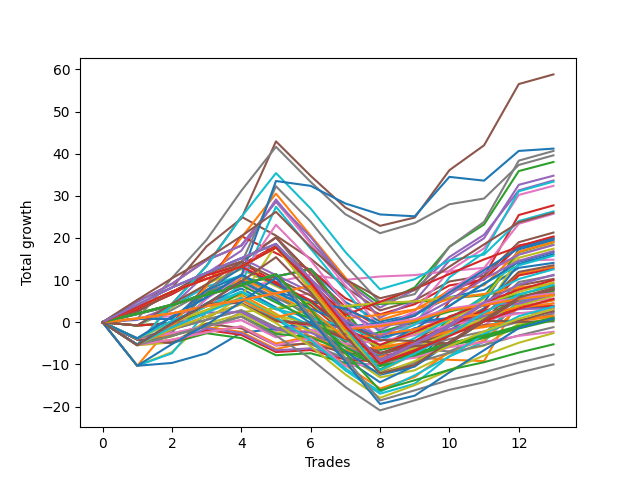

# Long Wallace Doodle 010 
- Symbol: TSLA_Unlimited
- Date Range: 03/23/2022 - 07/08/2022
- Trading Period: 7:20-12:30
- Number of Trades: 13



| Name | Win Percent | Profit | Avg Profit / Trade | Avg Time / Trade |      | Name | Win Percent | Profit | Avg Profit / Trade | Avg Time / Trade |
| ---- | ----------- | ------ | ------------------ | ---------------- | ---- | ---- | ----------- | ------ | ------------------ | ---------------- |
| Sorted By <br> Profit | | | | | | Sorted By <br> Win Percentage ||||
| Five | 76.92 | 29410.00 | 2262.31 | 48:44 |     | Six | 92.31 | 7425.00 | 571.15 | 14:42 |
| Seventy-Three | 61.54 | 20605.00 | 1585.00 | 13:37 |     | Eighty-One | 92.31 | 4585.00 | 352.69 | 13:05 |
| Sixty-Nine | 69.23 | 20325.00 | 1563.46 | 33:37 |     | One Hundred Twenty-One | 92.31 | 3450.00 | 265.38 | 05:11 |
| Seven | 76.92 | 19810.00 | 1523.85 | 58:16 |     | One Hundred Twenty-Six | 92.31 | 3260.00 | 250.77 | 05:12 |
| Two | 76.92 | 19020.00 | 1463.08 | 28:01 |     | Eighty-Three | 84.62 | 10115.00 | 778.08 | 34:54 |
| Sixty-Six | 76.92 | 17390.00 | 1337.69 | 16:40 |     | Zero | 84.62 | 7045.00 | 541.92 | 09:20 |
| Four | 76.92 | 16825.00 | 1294.23 | 34:45 |     | Seventy | 84.62 | 4305.00 | 331.15 | 06:43 |
| Sixty-One | 69.23 | 16690.00 | 1283.85 | 34:24 |     | Eighty-Two | 84.62 | 4295.00 | 330.38 | 32:02 |
| Fifty-Eight | 76.92 | 16190.00 | 1245.38 | 17:16 |     | Sixty-Four | 84.62 | 3675.00 | 282.69 | 08:10 |
| Forty-Five | 61.54 | 13870.00 | 1066.92 | 28:39 |     | Fifty-Six | 84.62 | 3255.00 | 250.38 | 08:12 |
| Seventy-One | 69.23 | 13155.00 | 1011.92 | 26:06 |     | One Hundred Sixteen | 84.62 | 2230.00 | 171.54 | 04:01 |
| Eighty-Five | 76.92 | 12990.00 | 999.23 | 48:59 |     | Sixty-Two | 84.62 | 1870.00 | 143.85 | 06:54 |
| Sixty-Eight | 69.23 | 12865.00 | 989.62 | 21:23 |     | Five | 76.92 | 29410.00 | 2262.31 | 48:44 |
| Forty-Seven | 61.54 | 10645.00 | 818.85 | 21:21 |     | Seven | 76.92 | 19810.00 | 1523.85 | 58:16 |
| Fifty-Five | 61.54 | 10180.00 | 783.08 | 16:17 |     | Two | 76.92 | 19020.00 | 1463.08 | 28:01 |
| Eighty-Three | 84.62 | 10115.00 | 778.08 | 34:54 |     | Sixty-Six | 76.92 | 17390.00 | 1337.69 | 16:40 |
| Ninety-Five | 61.54 | 9935.00 | 764.23 | 13:28 |     | Four | 76.92 | 16825.00 | 1294.23 | 34:45 |
| Three | 76.92 | 9890.00 | 760.77 | 21:17 |     | Fifty-Eight | 76.92 | 16190.00 | 1245.38 | 17:16 |
| Forty-Two | 61.54 | 9725.00 | 748.08 | 13:47 |     | Eighty-Five | 76.92 | 12990.00 | 999.23 | 48:59 |
| Sixty-Three | 69.23 | 9520.00 | 732.31 | 26:53 |     | Three | 76.92 | 9890.00 | 760.77 | 21:17 |
| Forty-Four | 61.54 | 9495.00 | 730.38 | 16:37 |     | Eighty-Four | 76.92 | 9165.00 | 705.00 | 38:01 |
| Sixty | 69.23 | 9230.00 | 710.00 | 22:11 |     | Sixty-Seven | 76.92 | 6760.00 | 520.00 | 14:25 |
| Eighty-Four | 76.92 | 9165.00 | 705.00 | 38:01 |     | One | 76.92 | 6550.00 | 503.85 | 19:15 |
| Fifty | 53.85 | 8730.00 | 671.54 | 11:47 |     | Sixty-Five | 76.92 | 6345.00 | 488.08 | 12:25 |
| One Hundred Ninteen | 69.23 | 8440.00 | 649.23 | 10:33 |     | One Hundred Twenty-Nine | 76.92 | 5630.00 | 433.08 | 13:50 |
| One Hundred Five | 61.54 | 8320.00 | 640.00 | 13:44 |     | Fifty-Nine | 76.92 | 5560.00 | 427.69 | 15:01 |
| Fifty-Two | 53.85 | 8080.00 | 621.54 | 12:56 |     | Fifty-Seven | 76.92 | 5145.00 | 395.77 | 13:01 |
| Ninety-Four | 61.54 | 7895.00 | 607.31 | 08:27 |     | One Hundred Twenty-Four | 76.92 | 4430.00 | 340.77 | 14:26 |
| Six | 92.31 | 7425.00 | 571.15 | 14:42 |     | Fifty-Four | 76.92 | 4180.00 | 321.54 | 04:22 |
| Zero | 84.62 | 7045.00 | 541.92 | 09:20 |     | One Hundred Twenty-Eight | 76.92 | 2765.00 | 212.69 | 12:50 |
| Sixty-Seven | 76.92 | 6760.00 | 520.00 | 14:25 |     | Ninety-One | 76.92 | 2245.00 | 172.69 | 02:22 |
| One | 76.92 | 6550.00 | 503.85 | 19:15 |     | Forty-Six | 76.92 | 1655.00 | 127.31 | 03:43 |
| Sixty-Five | 76.92 | 6345.00 | 488.08 | 12:25 |     | One Hundred Twenty-Three | 76.92 | 1565.00 | 120.38 | 13:26 |
| One Hundred Four | 61.54 | 6280.00 | 483.08 | 08:43 |     | One Hundred One | 76.92 | 1535.00 | 118.08 | 02:23 |
| One Hundred Twenty-Nine | 76.92 | 5630.00 | 433.08 | 13:50 |     | One Hundred Six | 76.92 | 780.00 | 60.00 | 02:39 |
| Fifty-Nine | 76.92 | 5560.00 | 427.69 | 15:01 |     | One Hundred Eleven | 76.92 | -1125.00 | -86.54 | 03:40 |
| Fifty-Seven | 76.92 | 5145.00 | 395.77 | 13:01 |     | One Hundred Twenty-Seven | 76.92 | -2615.00 | -201.15 | 10:00 |
| One Hundred Eighteen | 69.23 | 5010.00 | 385.38 | 09:34 |     | One Hundred Twenty-Two | 76.92 | -3815.00 | -293.46 | 10:36 |
| Ninety-Three | 61.54 | 4745.00 | 365.00 | 07:30 |     | Sixty-Nine | 69.23 | 20325.00 | 1563.46 | 33:37 |
| Eighty-One | 92.31 | 4585.00 | 352.69 | 13:05 |     | Sixty-One | 69.23 | 16690.00 | 1283.85 | 34:24 |
| One Hundred Twenty-Four | 76.92 | 4430.00 | 340.77 | 14:26 |     | Seventy-One | 69.23 | 13155.00 | 1011.92 | 26:06 |
| Seventy | 84.62 | 4305.00 | 331.15 | 06:43 |     | Sixty-Eight | 69.23 | 12865.00 | 989.62 | 21:23 |
| Eighty-Two | 84.62 | 4295.00 | 330.38 | 32:02 |     | Sixty-Three | 69.23 | 9520.00 | 732.31 | 26:53 |
| Fifty-Four | 76.92 | 4180.00 | 321.54 | 04:22 |     | Sixty | 69.23 | 9230.00 | 710.00 | 22:11 |
| One Hundred Thirty | 69.23 | 4080.00 | 313.85 | 21:18 |     | One Hundred Ninteen | 69.23 | 8440.00 | 649.23 | 10:33 |
| One Hundred Eight | 61.54 | 3960.00 | 304.62 | 07:40 |     | One Hundred Eighteen | 69.23 | 5010.00 | 385.38 | 09:34 |
| One Hundred Fifteen | 61.54 | 3905.00 | 300.38 | 16:36 |     | One Hundred Thirty | 69.23 | 4080.00 | 313.85 | 21:18 |
| One Hundred Twenty | 46.15 | 3870.00 | 297.69 | 12:51 |     | Forty-Eight | 69.23 | 2835.00 | 218.08 | 06:01 |
| Fifty-Three | 38.46 | 3810.00 | 293.08 | 16:02 |     | Ninety-Six | 69.23 | 660.00 | 50.77 | 02:19 |
| Sixty-Four | 84.62 | 3675.00 | 282.69 | 08:10 |     | One Hundred Seventeen | 69.23 | 550.00 | 42.31 | 06:45 |
| One Hundred Twenty-One | 92.31 | 3450.00 | 265.38 | 05:11 |     | One Hundred Twenty-Five | 69.23 | 445.00 | 34.23 | 22:05 |
| Fifty-One | 53.85 | 3395.00 | 261.15 | 09:11 |     | Forty | 69.23 | 415.00 | 31.92 | 06:24 |
| One Hundred Nine | 61.54 | 3345.00 | 257.31 | 08:22 |     | Seventy-Three | 61.54 | 20605.00 | 1585.00 | 13:37 |
| One Hundred Twenty-Six | 92.31 | 3260.00 | 250.77 | 05:12 |     | Forty-Five | 61.54 | 13870.00 | 1066.92 | 28:39 |
| Fifty-Six | 84.62 | 3255.00 | 250.38 | 08:12 |     | Forty-Seven | 61.54 | 10645.00 | 818.85 | 21:21 |
| Forty-Nine | 53.85 | 3210.00 | 246.92 | 08:45 |     | Fifty-Five | 61.54 | 10180.00 | 783.08 | 16:17 |
| One Hundred Three | 61.54 | 3130.00 | 240.77 | 07:46 |     | Ninety-Five | 61.54 | 9935.00 | 764.23 | 13:28 |
| Forty-Eight | 69.23 | 2835.00 | 218.08 | 06:01 |     | Forty-Two | 61.54 | 9725.00 | 748.08 | 13:47 |
| One Hundred Twenty-Eight | 76.92 | 2765.00 | 212.69 | 12:50 |     | Forty-Four | 61.54 | 9495.00 | 730.38 | 16:37 |
| Forty-One | 61.54 | 2620.00 | 201.54 | 09:54 |     | One Hundred Five | 61.54 | 8320.00 | 640.00 | 13:44 |
| Forty-Three | 61.54 | 2610.00 | 200.77 | 10:19 |     | Ninety-Four | 61.54 | 7895.00 | 607.31 | 08:27 |
| Ninety-One | 76.92 | 2245.00 | 172.69 | 02:22 |     | One Hundred Four | 61.54 | 6280.00 | 483.08 | 08:43 |
| One Hundred Sixteen | 84.62 | 2230.00 | 171.54 | 04:01 |     | Ninety-Three | 61.54 | 4745.00 | 365.00 | 07:30 |
| Ninety-Eight | 53.85 | 1935.00 | 148.85 | 05:26 |     | One Hundred Eight | 61.54 | 3960.00 | 304.62 | 07:40 |
| Sixty-Two | 84.62 | 1870.00 | 143.85 | 06:54 |     | One Hundred Fifteen | 61.54 | 3905.00 | 300.38 | 16:36 |
| One Hundred Fourteen | 61.54 | 1865.00 | 143.46 | 11:34 |     | One Hundred Nine | 61.54 | 3345.00 | 257.31 | 08:22 |
| Forty-Six | 76.92 | 1655.00 | 127.31 | 03:43 |     | One Hundred Three | 61.54 | 3130.00 | 240.77 | 07:46 |
| One Hundred Twenty-Three | 76.92 | 1565.00 | 120.38 | 13:26 |     | Forty-One | 61.54 | 2620.00 | 201.54 | 09:54 |
| One Hundred One | 76.92 | 1535.00 | 118.08 | 02:23 |     | Forty-Three | 61.54 | 2610.00 | 200.77 | 10:19 |
| One Hundred Ten | 61.54 | 1325.00 | 101.92 | 09:20 |     | One Hundred Fourteen | 61.54 | 1865.00 | 143.46 | 11:34 |
| Ninety-Nine | 53.85 | 1165.00 | 89.62 | 05:43 |     | One Hundred Ten | 61.54 | 1325.00 | 101.92 | 09:20 |
| Ninety-Two | 61.54 | 1035.00 | 79.62 | 04:43 |     | Ninety-Two | 61.54 | 1035.00 | 79.62 | 04:43 |
| One Hundred Six | 76.92 | 780.00 | 60.00 | 02:39 |     | One Hundred Seven | 61.54 | 250.00 | 19.23 | 04:53 |
| Ninety-Six | 69.23 | 660.00 | 50.77 | 02:19 |     | One Hundred Two | 61.54 | -580.00 | -44.62 | 04:59 |
| One Hundred Seventeen | 69.23 | 550.00 | 42.31 | 06:45 |     | One Hundred Thirteen | 61.54 | -1285.00 | -98.85 | 10:38 |
| One Hundred Twenty-Five | 69.23 | 445.00 | 34.23 | 22:05 |     | One Hundred Twelve | 61.54 | -4995.00 | -384.23 | 07:51 |
| Forty | 69.23 | 415.00 | 31.92 | 06:24 |     | Fifty | 53.85 | 8730.00 | 671.54 | 11:47 |
| Ninety-Seven | 53.85 | 410.00 | 31.54 | 03:41 |     | Fifty-Two | 53.85 | 8080.00 | 621.54 | 12:56 |
| One Hundred Seven | 61.54 | 250.00 | 19.23 | 04:53 |     | Fifty-One | 53.85 | 3395.00 | 261.15 | 09:11 |
| One Hundred | 53.85 | 110.00 | 8.46 | 06:12 |     | Forty-Nine | 53.85 | 3210.00 | 246.92 | 08:45 |
| One Hundred Two | 61.54 | -580.00 | -44.62 | 04:59 |     | Ninety-Eight | 53.85 | 1935.00 | 148.85 | 05:26 |
| One Hundred Eleven | 76.92 | -1125.00 | -86.54 | 03:40 |     | Ninety-Nine | 53.85 | 1165.00 | 89.62 | 05:43 |
| One Hundred Thirteen | 61.54 | -1285.00 | -98.85 | 10:38 |     | Ninety-Seven | 53.85 | 410.00 | 31.54 | 03:41 |
| One Hundred Twenty-Seven | 76.92 | -2615.00 | -201.15 | 10:00 |     | One Hundred | 53.85 | 110.00 | 8.46 | 06:12 |
| One Hundred Twenty-Two | 76.92 | -3815.00 | -293.46 | 10:36 |     | One Hundred Twenty | 46.15 | 3870.00 | 297.69 | 12:51 |
| One Hundred Twelve | 61.54 | -4995.00 | -384.23 | 07:51 |     | Fifty-Three | 38.46 | 3810.00 | 293.08 | 16:02 |

## NO STOPLOSS

### Test Zero
* Sell when price hits the middle line of the 20p bollinger
* No Stoploss
* Results:
```
Total Trades: 13
Percent Up: 84.62
Percent Down: 15.38
Total Points Moved Up: 14.09
Potential Profit: 7045.00
Total Points Ups: 26.52 Count Ups: 11
Total Points Downs: -12.43 Count Downs: 2
```

<details><summary>Trades</summary>

<code>In: 2022-03-23 10:21:00		Out: 2022-03-23 10:31:40		Total Position Time: 10:40		Total Move Up: 1.95		Total to Date: 1.95</code> <br />
<code>In: 2022-03-29 09:36:00		Out: 2022-03-29 09:44:55		Total Position Time: 08:55		Total Move Up: 2.00		Total to Date: 3.95</code> <br />
<code>In: 2022-04-25 10:03:00		Out: 2022-04-25 10:06:40		Total Position Time: 03:40		Total Move Up: 3.04		Total to Date: 6.99</code> <br />
<code>In: 2022-05-03 09:34:00		Out: 2022-05-03 09:42:35		Total Position Time: 08:35		Total Move Up: 2.25		Total to Date: 9.24</code> <br />
<code>In: 2022-05-04 11:36:00		Out: 2022-05-04 11:41:15		Total Position Time: 05:15		Total Move Up: 1.64		Total to Date: 10.88</code> <br />
<code>In: 2022-05-13 10:33:00		Out: 2022-05-13 10:34:10		Total Position Time: 01:10		Total Move Up: 1.73		Total to Date: 12.61</code> <br />
<code>In: 2022-05-13 10:39:00		Out: 2022-05-13 11:12:25		Total Position Time: 33:25		Total Move Up: -7.80		Total to Date: 4.81</code> <br />
<code>In: 2022-05-13 10:49:00		Out: 2022-05-13 11:12:25		Total Position Time: 23:25		Total Move Up: -4.63		Total to Date: 0.18</code> <br />
<code>In: 2022-05-23 11:54:00		Out: 2022-05-23 12:01:40		Total Position Time: 07:40		Total Move Up: 1.69		Total to Date: 1.87</code> <br />
<code>In: 2022-05-25 11:09:00		Out: 2022-05-25 11:14:05		Total Position Time: 05:05		Total Move Up: 4.04		Total to Date: 5.91</code> <br />
<code>In: 2022-06-15 10:52:00		Out: 2022-06-15 10:55:00		Total Position Time: 03:00		Total Move Up: 1.80		Total to Date: 7.71</code> <br />
<code>In: 2022-06-15 11:08:00		Out: 2022-06-15 11:12:35		Total Position Time: 04:35		Total Move Up: 5.21		Total to Date: 12.92</code> <br />
<code>In: 2022-06-24 12:07:00		Out: 2022-06-24 12:12:55		Total Position Time: 05:55		Total Move Up: 1.17		Total to Date: 14.09</code> <br />


</details>

### Test One
* Sell when the price hits the upper line of the 20p 1std bollinger
* No Stoploss
* Results:
```
Total Trades: 13
Percent Up: 76.92
Percent Down: 23.08
Total Points Moved Up: 13.10
Potential Profit: 6550.00
Total Points Ups: 40.26 Count Ups: 10
Total Points Downs: -27.16 Count Downs: 3
```

<details><summary>Trades</summary>

<code>In: 2022-03-23 10:21:00		Out: 2022-03-23 10:36:15		Total Position Time: 15:15		Total Move Up: 2.99		Total to Date: 2.99</code> <br />
<code>In: 2022-03-29 09:36:00		Out: 2022-03-29 09:45:25		Total Position Time: 09:25		Total Move Up: 3.70		Total to Date: 6.69</code> <br />
<code>In: 2022-04-25 10:03:00		Out: 2022-04-25 10:11:35		Total Position Time: 08:35		Total Move Up: 4.48		Total to Date: 11.17</code> <br />
<code>In: 2022-05-03 09:34:00		Out: 2022-05-03 09:47:40		Total Position Time: 13:40		Total Move Up: 2.45		Total to Date: 13.62</code> <br />
<code>In: 2022-05-04 11:36:00		Out: 2022-05-04 11:42:00		Total Position Time: 06:00		Total Move Up: 4.44		Total to Date: 18.06</code> <br />
<code>In: 2022-05-13 10:33:00		Out: 2022-05-13 11:31:45		Total Position Time: 58:45		Total Move Up: -10.55		Total to Date: 7.51</code> <br />
<code>In: 2022-05-13 10:39:00		Out: 2022-05-13 11:31:45		Total Position Time: 52:45		Total Move Up: -9.89		Total to Date: -2.38</code> <br />
<code>In: 2022-05-13 10:49:00		Out: 2022-05-13 11:31:45		Total Position Time: 42:45		Total Move Up: -6.72		Total to Date: -9.10</code> <br />
<code>In: 2022-05-23 11:54:00		Out: 2022-05-23 12:08:05		Total Position Time: 14:05		Total Move Up: 2.38		Total to Date: -6.72</code> <br />
<code>In: 2022-05-25 11:09:00		Out: 2022-05-25 11:16:55		Total Position Time: 07:55		Total Move Up: 6.49		Total to Date: -0.23</code> <br />
<code>In: 2022-06-15 10:52:00		Out: 2022-06-15 10:55:25		Total Position Time: 03:25		Total Move Up: 3.47		Total to Date: 3.24</code> <br />
<code>In: 2022-06-15 11:08:00		Out: 2022-06-15 11:16:15		Total Position Time: 08:15		Total Move Up: 8.29		Total to Date: 11.53</code> <br />
<code>In: 2022-06-24 12:07:00		Out: 2022-06-24 12:16:25		Total Position Time: 09:25		Total Move Up: 1.57		Total to Date: 13.10</code> <br />


</details>

### Test Two
* Sell when the price hits the upper line of the 20p 2std bollinger
* No Stoploss
* Results:
```
Total Trades: 13
Percent Up: 76.92
Percent Down: 23.08
Total Points Moved Up: 38.04
Potential Profit: 19020.00
Total Points Ups: 62.35 Count Ups: 10
Total Points Downs: -24.31 Count Downs: 3
```

<details><summary>Trades</summary>

<code>In: 2022-03-23 10:21:00		Out: 2022-03-23 10:38:40		Total Position Time: 17:40		Total Move Up: 4.86		Total to Date: 4.86</code> <br />
<code>In: 2022-03-29 09:36:00		Out: 2022-03-29 09:47:05		Total Position Time: 11:05		Total Move Up: 4.26		Total to Date: 9.12</code> <br />
<code>In: 2022-04-25 10:03:00		Out: 2022-04-25 10:12:05		Total Position Time: 09:05		Total Move Up: 5.62		Total to Date: 14.74</code> <br />
<code>In: 2022-05-03 09:34:00		Out: 2022-05-03 09:48:10		Total Position Time: 14:10		Total Move Up: 3.47		Total to Date: 18.21</code> <br />
<code>In: 2022-05-04 11:36:00		Out: 2022-05-04 11:44:10		Total Position Time: 08:10		Total Move Up: 10.45		Total to Date: 28.66</code> <br />
<code>In: 2022-05-13 10:33:00		Out: 2022-05-13 11:51:25		Total Position Time: 78:25		Total Move Up: -9.60		Total to Date: 19.06</code> <br />
<code>In: 2022-05-13 10:39:00		Out: 2022-05-13 11:51:25		Total Position Time: 72:25		Total Move Up: -8.94		Total to Date: 10.12</code> <br />
<code>In: 2022-05-13 10:49:00		Out: 2022-05-13 11:51:25		Total Position Time: 62:25		Total Move Up: -5.77		Total to Date: 4.35</code> <br />
<code>In: 2022-05-23 11:54:00		Out: 2022-05-23 12:08:50		Total Position Time: 14:50		Total Move Up: 3.92		Total to Date: 8.27</code> <br />
<code>In: 2022-05-25 11:09:00		Out: 2022-05-25 11:28:00		Total Position Time: 19:00		Total Move Up: 9.66		Total to Date: 17.93</code> <br />
<code>In: 2022-06-15 10:52:00		Out: 2022-06-15 10:59:35		Total Position Time: 07:35		Total Move Up: 5.28		Total to Date: 23.21</code> <br />
<code>In: 2022-06-15 11:08:00		Out: 2022-06-15 11:17:40		Total Position Time: 09:40		Total Move Up: 12.67		Total to Date: 35.88</code> <br />
<code>In: 2022-06-24 12:07:00		Out: 2022-06-24 12:46:50		Total Position Time: 39:50		Total Move Up: 2.16		Total to Date: 38.04</code> <br />


</details>

### Test Three
* Sell when price hits the middle line of the 50p bollinger
* No Stoploss
* Results:
```
Total Trades: 13
Percent Up: 76.92
Percent Down: 23.08
Total Points Moved Up: 19.78
Potential Profit: 9890.00
Total Points Ups: 41.09 Count Ups: 10
Total Points Downs: -21.31 Count Downs: 3
```

<details><summary>Trades</summary>

<code>In: 2022-03-23 10:21:00		Out: 2022-03-23 10:55:10		Total Position Time: 34:10		Total Move Up: 2.50		Total to Date: 2.50</code> <br />
<code>In: 2022-03-29 09:36:00		Out: 2022-03-29 09:46:10		Total Position Time: 10:10		Total Move Up: 4.60		Total to Date: 7.10</code> <br />
<code>In: 2022-04-25 10:03:00		Out: 2022-04-25 10:11:50		Total Position Time: 08:50		Total Move Up: 4.62		Total to Date: 11.72</code> <br />
<code>In: 2022-05-03 09:34:00		Out: 2022-05-03 09:58:45		Total Position Time: 24:45		Total Move Up: 2.64		Total to Date: 14.36</code> <br />
<code>In: 2022-05-04 11:36:00		Out: 2022-05-04 11:43:35		Total Position Time: 07:35		Total Move Up: 5.78		Total to Date: 20.14</code> <br />
<code>In: 2022-05-13 10:33:00		Out: 2022-05-13 11:32:00		Total Position Time: 59:00		Total Move Up: -8.60		Total to Date: 11.54</code> <br />
<code>In: 2022-05-13 10:39:00		Out: 2022-05-13 11:32:00		Total Position Time: 53:00		Total Move Up: -7.94		Total to Date: 3.60</code> <br />
<code>In: 2022-05-13 10:49:00		Out: 2022-05-13 11:32:00		Total Position Time: 43:00		Total Move Up: -4.77		Total to Date: -1.17</code> <br />
<code>In: 2022-05-23 11:54:00		Out: 2022-05-23 12:02:15		Total Position Time: 08:15		Total Move Up: 2.75		Total to Date: 1.58</code> <br />
<code>In: 2022-05-25 11:09:00		Out: 2022-05-25 11:16:30		Total Position Time: 07:30		Total Move Up: 6.10		Total to Date: 7.68</code> <br />
<code>In: 2022-06-15 10:52:00		Out: 2022-06-15 10:55:15		Total Position Time: 03:15		Total Move Up: 2.57		Total to Date: 10.25</code> <br />
<code>In: 2022-06-15 11:08:00		Out: 2022-06-15 11:15:55		Total Position Time: 07:55		Total Move Up: 7.96		Total to Date: 18.21</code> <br />
<code>In: 2022-06-24 12:07:00		Out: 2022-06-24 12:16:25		Total Position Time: 09:25		Total Move Up: 1.57		Total to Date: 19.78</code> <br />


</details>

### Test Four
* Sell when the price hits the upper line of the 50p 1std bollinger
* No Stoploss
* Results:
```
Total Trades: 13
Percent Up: 76.92
Percent Down: 23.08
Total Points Moved Up: 33.65
Potential Profit: 16825.00
Total Points Ups: 59.31 Count Ups: 10
Total Points Downs: -25.66 Count Downs: 3
```

<details><summary>Trades</summary>

<code>In: 2022-03-23 10:21:00		Out: 2022-03-23 11:29:15		Total Position Time: 68:15		Total Move Up: 0.56		Total to Date: 0.56</code> <br />
<code>In: 2022-03-29 09:36:00		Out: 2022-03-29 10:16:30		Total Position Time: 40:30		Total Move Up: 3.24		Total to Date: 3.80</code> <br />
<code>In: 2022-04-25 10:03:00		Out: 2022-04-25 10:24:50		Total Position Time: 21:50		Total Move Up: 7.81		Total to Date: 11.61</code> <br />
<code>In: 2022-05-03 09:34:00		Out: 2022-05-03 10:00:35		Total Position Time: 26:35		Total Move Up: 5.36		Total to Date: 16.97</code> <br />
<code>In: 2022-05-04 11:36:00		Out: 2022-05-04 11:44:25		Total Position Time: 08:25		Total Move Up: 12.17		Total to Date: 29.14</code> <br />
<code>In: 2022-05-13 10:33:00		Out: 2022-05-13 11:51:20		Total Position Time: 78:20		Total Move Up: -10.05		Total to Date: 19.09</code> <br />
<code>In: 2022-05-13 10:39:00		Out: 2022-05-13 11:51:20		Total Position Time: 72:20		Total Move Up: -9.39		Total to Date: 9.70</code> <br />
<code>In: 2022-05-13 10:49:00		Out: 2022-05-13 11:51:20		Total Position Time: 62:20		Total Move Up: -6.22		Total to Date: 3.48</code> <br />
<code>In: 2022-05-23 11:54:00		Out: 2022-05-23 12:09:45		Total Position Time: 15:45		Total Move Up: 4.24		Total to Date: 7.72</code> <br />
<code>In: 2022-05-25 11:09:00		Out: 2022-05-25 11:27:00		Total Position Time: 18:00		Total Move Up: 7.78		Total to Date: 15.50</code> <br />
<code>In: 2022-06-15 10:52:00		Out: 2022-06-15 10:59:35		Total Position Time: 07:35		Total Move Up: 5.28		Total to Date: 20.78</code> <br />
<code>In: 2022-06-15 11:08:00		Out: 2022-06-15 11:16:50		Total Position Time: 08:50		Total Move Up: 10.52		Total to Date: 31.30</code> <br />
<code>In: 2022-06-24 12:07:00		Out: 2022-06-24 12:30:00		Total Position Time: 23:00		Total Move Up: 2.35		Total to Date: 33.65</code> <br />


</details>

### Test Five
* Sell when the price hits the upper line of the 50p 2std bollinger
* No Stoploss
* Results:
```
Total Trades: 13
Percent Up: 76.92
Percent Down: 23.08
Total Points Moved Up: 58.82
Potential Profit: 29410.00
Total Points Ups: 78.87 Count Ups: 10
Total Points Downs: -20.05 Count Downs: 3
```

<details><summary>Trades</summary>

<code>In: 2022-03-23 10:21:00		Out: 2022-03-23 11:48:30		Total Position Time: 87:30		Total Move Up: 5.20		Total to Date: 5.20</code> <br />
<code>In: 2022-03-29 09:36:00		Out: 2022-03-29 10:43:05		Total Position Time: 67:05		Total Move Up: 2.96		Total to Date: 8.16</code> <br />
<code>In: 2022-04-25 10:03:00		Out: 2022-04-25 11:18:35		Total Position Time: 75:35		Total Move Up: 9.86		Total to Date: 18.02</code> <br />
<code>In: 2022-05-03 09:34:00		Out: 2022-05-03 10:12:35		Total Position Time: 38:35		Total Move Up: 6.57		Total to Date: 24.59</code> <br />
<code>In: 2022-05-04 11:36:00		Out: 2022-05-04 11:47:00		Total Position Time: 11:00		Total Move Up: 18.34		Total to Date: 42.93</code> <br />
<code>In: 2022-05-13 10:33:00		Out: 2022-05-13 11:52:35		Total Position Time: 79:35		Total Move Up: -8.18		Total to Date: 34.75</code> <br />
<code>In: 2022-05-13 10:39:00		Out: 2022-05-13 11:52:35		Total Position Time: 73:35		Total Move Up: -7.52		Total to Date: 27.23</code> <br />
<code>In: 2022-05-13 10:49:00		Out: 2022-05-13 11:52:35		Total Position Time: 63:35		Total Move Up: -4.35		Total to Date: 22.88</code> <br />
<code>In: 2022-05-23 11:54:00		Out: 2022-05-23 12:47:00		Total Position Time: 53:00		Total Move Up: 1.97		Total to Date: 24.85</code> <br />
<code>In: 2022-05-25 11:09:00		Out: 2022-05-25 11:31:45		Total Position Time: 22:45		Total Move Up: 11.24		Total to Date: 36.09</code> <br />
<code>In: 2022-06-15 10:52:00		Out: 2022-06-15 11:00:20		Total Position Time: 08:20		Total Move Up: 5.91		Total to Date: 42.00</code> <br />
<code>In: 2022-06-15 11:08:00		Out: 2022-06-15 11:21:05		Total Position Time: 13:05		Total Move Up: 14.53		Total to Date: 56.53</code> <br />
<code>In: 2022-06-24 12:07:00		Out: 2022-06-24 12:47:00		Total Position Time: 40:00		Total Move Up: 2.29		Total to Date: 58.82</code> <br />


</details>

### Test Six
* Sell when the price hits the middle line of the 1std VWAP
* No Stoploss
* Results:
```
Total Trades: 13
Percent Up: 92.31
Percent Down: 7.69
Total Points Moved Up: 14.85
Potential Profit: 7425.00
Total Points Ups: 16.06 Count Ups: 12
Total Points Downs: -1.21 Count Downs: 1
```

<details><summary>Trades</summary>

<code>In: 2022-03-23 10:21:00		Out: 2022-03-23 12:47:00		Total Position Time: 146:00		Total Move Up: 0.79		Total to Date: 0.79</code> <br />
<code>In: 2022-03-29 09:36:00		Out: 2022-03-29 09:37:20		Total Position Time: 01:20		Total Move Up: 0.67		Total to Date: 1.46</code> <br />
<code>In: 2022-04-25 10:03:00		Out: 2022-04-25 10:06:25		Total Position Time: 03:25		Total Move Up: 2.30		Total to Date: 3.76</code> <br />
<code>In: 2022-05-03 09:34:00		Out: 2022-05-03 10:00:30		Total Position Time: 26:30		Total Move Up: 4.88		Total to Date: 8.64</code> <br />
<code>In: 2022-05-04 11:36:00		Out: 2022-05-04 11:40:25		Total Position Time: 04:25		Total Move Up: 0.91		Total to Date: 9.55</code> <br />
<code>In: 2022-05-13 10:33:00		Out: 2022-05-13 10:34:10		Total Position Time: 01:10		Total Move Up: 1.73		Total to Date: 11.28</code> <br />
<code>In: 2022-05-13 10:39:00		Out: 2022-05-13 10:40:10		Total Position Time: 01:10		Total Move Up: -1.21		Total to Date: 10.07</code> <br />
<code>In: 2022-05-13 10:49:00		Out: 2022-05-13 10:50:10		Total Position Time: 01:10		Total Move Up: 0.79		Total to Date: 10.86</code> <br />
<code>In: 2022-05-23 11:54:00		Out: 2022-05-23 11:55:10		Total Position Time: 01:10		Total Move Up: 0.34		Total to Date: 11.20</code> <br />
<code>In: 2022-05-25 11:09:00		Out: 2022-05-25 11:10:10		Total Position Time: 01:10		Total Move Up: 0.94		Total to Date: 12.14</code> <br />
<code>In: 2022-06-15 10:52:00		Out: 2022-06-15 10:53:10		Total Position Time: 01:10		Total Move Up: 0.77		Total to Date: 12.91</code> <br />
<code>In: 2022-06-15 11:08:00		Out: 2022-06-15 11:09:25		Total Position Time: 01:25		Total Move Up: 1.74		Total to Date: 14.65</code> <br />
<code>In: 2022-06-24 12:07:00		Out: 2022-06-24 12:08:10		Total Position Time: 01:10		Total Move Up: 0.20		Total to Date: 14.85</code> <br />


</details>

### Test Seven
* Sell when the price hits the upper line of the 1std VWAP
* No Stoploss
* Results:
```
Total Trades: 13
Percent Up: 76.92
Percent Down: 23.08
Total Points Moved Up: 39.62
Potential Profit: 19810.00
Total Points Ups: 60.12 Count Ups: 10
Total Points Downs: -20.50 Count Downs: 3
```

<details><summary>Trades</summary>

<code>In: 2022-03-23 10:21:00		Out: 2022-03-23 12:47:00		Total Position Time: 146:00		Total Move Up: 0.79		Total to Date: 0.79</code> <br />
<code>In: 2022-03-29 09:36:00		Out: 2022-03-29 10:48:35		Total Position Time: 72:35		Total Move Up: 9.72		Total to Date: 10.51</code> <br />
<code>In: 2022-04-25 10:03:00		Out: 2022-04-25 10:25:40		Total Position Time: 22:40		Total Move Up: 9.07		Total to Date: 19.58</code> <br />
<code>In: 2022-05-03 09:34:00		Out: 2022-05-03 10:42:30		Total Position Time: 68:30		Total Move Up: 11.61		Total to Date: 31.19</code> <br />
<code>In: 2022-05-04 11:36:00		Out: 2022-05-04 11:44:10		Total Position Time: 08:10		Total Move Up: 10.45		Total to Date: 41.64</code> <br />
<code>In: 2022-05-13 10:33:00		Out: 2022-05-13 12:47:00		Total Position Time: 134:00		Total Move Up: -8.33		Total to Date: 33.31</code> <br />
<code>In: 2022-05-13 10:39:00		Out: 2022-05-13 12:47:00		Total Position Time: 128:00		Total Move Up: -7.67		Total to Date: 25.64</code> <br />
<code>In: 2022-05-13 10:49:00		Out: 2022-05-13 12:47:00		Total Position Time: 118:00		Total Move Up: -4.50		Total to Date: 21.14</code> <br />
<code>In: 2022-05-23 11:54:00		Out: 2022-05-23 12:01:45		Total Position Time: 07:45		Total Move Up: 2.40		Total to Date: 23.54</code> <br />
<code>In: 2022-05-25 11:09:00		Out: 2022-05-25 11:10:25		Total Position Time: 01:25		Total Move Up: 4.47		Total to Date: 28.01</code> <br />
<code>In: 2022-06-15 10:52:00		Out: 2022-06-15 10:54:40		Total Position Time: 02:40		Total Move Up: 1.36		Total to Date: 29.37</code> <br />
<code>In: 2022-06-15 11:08:00		Out: 2022-06-15 11:15:55		Total Position Time: 07:55		Total Move Up: 7.96		Total to Date: 37.33</code> <br />
<code>In: 2022-06-24 12:07:00		Out: 2022-06-24 12:47:00		Total Position Time: 40:00		Total Move Up: 2.29		Total to Date: 39.62</code> <br />


</details>

## STOPLOSS OF 5

### Test Forty
* Sell when price hits the middle line of the 20p bollinger
* Stoploss is 5 points
* Results:
```
Total Trades: 13
Percent Up: 69.23
Percent Down: 30.77
Total Points Moved Up: 0.83
Potential Profit: 415.00
Total Points Ups: 22.93 Count Ups: 9
Total Points Downs: -22.10 Count Downs: 4
```

<details><summary>Trades</summary>

<code>In: 2022-03-23 10:21:00		Out: 2022-03-23 10:25:30		Total Position Time: 04:30		Total Move Up: -5.34		Total to Date: -5.34</code> <br />
<code>In: 2022-03-29 09:36:00		Out: 2022-03-29 09:44:55		Total Position Time: 08:55		Total Move Up: 2.00		Total to Date: -3.34</code> <br />
<code>In: 2022-04-25 10:03:00		Out: 2022-04-25 10:06:40		Total Position Time: 03:40		Total Move Up: 3.04		Total to Date: -0.30</code> <br />
<code>In: 2022-05-03 09:34:00		Out: 2022-05-03 09:42:35		Total Position Time: 08:35		Total Move Up: 2.25		Total to Date: 1.95</code> <br />
<code>In: 2022-05-04 11:36:00		Out: 2022-05-04 11:39:00		Total Position Time: 03:00		Total Move Up: -4.50		Total to Date: -2.55</code> <br />
<code>In: 2022-05-13 10:33:00		Out: 2022-05-13 10:34:10		Total Position Time: 01:10		Total Move Up: 1.73		Total to Date: -0.82</code> <br />
<code>In: 2022-05-13 10:39:00		Out: 2022-05-13 10:52:50		Total Position Time: 13:50		Total Move Up: -6.71		Total to Date: -7.53</code> <br />
<code>In: 2022-05-13 10:49:00		Out: 2022-05-13 11:02:25		Total Position Time: 13:25		Total Move Up: -5.55		Total to Date: -13.08</code> <br />
<code>In: 2022-05-23 11:54:00		Out: 2022-05-23 12:01:40		Total Position Time: 07:40		Total Move Up: 1.69		Total to Date: -11.39</code> <br />
<code>In: 2022-05-25 11:09:00		Out: 2022-05-25 11:14:05		Total Position Time: 05:05		Total Move Up: 4.04		Total to Date: -7.35</code> <br />
<code>In: 2022-06-15 10:52:00		Out: 2022-06-15 10:55:00		Total Position Time: 03:00		Total Move Up: 1.80		Total to Date: -5.55</code> <br />
<code>In: 2022-06-15 11:08:00		Out: 2022-06-15 11:12:35		Total Position Time: 04:35		Total Move Up: 5.21		Total to Date: -0.34</code> <br />
<code>In: 2022-06-24 12:07:00		Out: 2022-06-24 12:12:55		Total Position Time: 05:55		Total Move Up: 1.17		Total to Date: 0.83</code> <br />


</details>

### Test Forty-One
* Sell when the price hits the upper line of the 20p 1std bollinger
* Stoploss is 5 points
* Results:
```
Total Trades: 13
Percent Up: 61.54
Percent Down: 38.46
Total Points Moved Up: 5.24
Potential Profit: 2620.00
Total Points Ups: 32.83 Count Ups: 8
Total Points Downs: -27.59 Count Downs: 5
```

<details><summary>Trades</summary>

<code>In: 2022-03-23 10:21:00		Out: 2022-03-23 10:25:30		Total Position Time: 04:30		Total Move Up: -5.34		Total to Date: -5.34</code> <br />
<code>In: 2022-03-29 09:36:00		Out: 2022-03-29 09:45:25		Total Position Time: 09:25		Total Move Up: 3.70		Total to Date: -1.64</code> <br />
<code>In: 2022-04-25 10:03:00		Out: 2022-04-25 10:11:35		Total Position Time: 08:35		Total Move Up: 4.48		Total to Date: 2.84</code> <br />
<code>In: 2022-05-03 09:34:00		Out: 2022-05-03 09:47:40		Total Position Time: 13:40		Total Move Up: 2.45		Total to Date: 5.29</code> <br />
<code>In: 2022-05-04 11:36:00		Out: 2022-05-04 11:39:00		Total Position Time: 03:00		Total Move Up: -4.50		Total to Date: 0.79</code> <br />
<code>In: 2022-05-13 10:33:00		Out: 2022-05-13 10:52:20		Total Position Time: 19:20		Total Move Up: -5.49		Total to Date: -4.70</code> <br />
<code>In: 2022-05-13 10:39:00		Out: 2022-05-13 10:52:50		Total Position Time: 13:50		Total Move Up: -6.71		Total to Date: -11.41</code> <br />
<code>In: 2022-05-13 10:49:00		Out: 2022-05-13 11:02:25		Total Position Time: 13:25		Total Move Up: -5.55		Total to Date: -16.96</code> <br />
<code>In: 2022-05-23 11:54:00		Out: 2022-05-23 12:08:05		Total Position Time: 14:05		Total Move Up: 2.38		Total to Date: -14.58</code> <br />
<code>In: 2022-05-25 11:09:00		Out: 2022-05-25 11:16:55		Total Position Time: 07:55		Total Move Up: 6.49		Total to Date: -8.09</code> <br />
<code>In: 2022-06-15 10:52:00		Out: 2022-06-15 10:55:25		Total Position Time: 03:25		Total Move Up: 3.47		Total to Date: -4.62</code> <br />
<code>In: 2022-06-15 11:08:00		Out: 2022-06-15 11:16:15		Total Position Time: 08:15		Total Move Up: 8.29		Total to Date: 3.67</code> <br />
<code>In: 2022-06-24 12:07:00		Out: 2022-06-24 12:16:25		Total Position Time: 09:25		Total Move Up: 1.57		Total to Date: 5.24</code> <br />


</details>

### Test Forty-Two
* Sell when the price hits the upper line of the 20p 2std bollinger
* Stoploss is 5 points
* Results:
```
Total Trades: 13
Percent Up: 61.54
Percent Down: 38.46
Total Points Moved Up: 19.45
Potential Profit: 9725.00
Total Points Ups: 47.04 Count Ups: 8
Total Points Downs: -27.59 Count Downs: 5
```

<details><summary>Trades</summary>

<code>In: 2022-03-23 10:21:00		Out: 2022-03-23 10:25:30		Total Position Time: 04:30		Total Move Up: -5.34		Total to Date: -5.34</code> <br />
<code>In: 2022-03-29 09:36:00		Out: 2022-03-29 09:47:05		Total Position Time: 11:05		Total Move Up: 4.26		Total to Date: -1.08</code> <br />
<code>In: 2022-04-25 10:03:00		Out: 2022-04-25 10:12:05		Total Position Time: 09:05		Total Move Up: 5.62		Total to Date: 4.54</code> <br />
<code>In: 2022-05-03 09:34:00		Out: 2022-05-03 09:48:10		Total Position Time: 14:10		Total Move Up: 3.47		Total to Date: 8.01</code> <br />
<code>In: 2022-05-04 11:36:00		Out: 2022-05-04 11:39:00		Total Position Time: 03:00		Total Move Up: -4.50		Total to Date: 3.51</code> <br />
<code>In: 2022-05-13 10:33:00		Out: 2022-05-13 10:52:20		Total Position Time: 19:20		Total Move Up: -5.49		Total to Date: -1.98</code> <br />
<code>In: 2022-05-13 10:39:00		Out: 2022-05-13 10:52:50		Total Position Time: 13:50		Total Move Up: -6.71		Total to Date: -8.69</code> <br />
<code>In: 2022-05-13 10:49:00		Out: 2022-05-13 11:02:25		Total Position Time: 13:25		Total Move Up: -5.55		Total to Date: -14.24</code> <br />
<code>In: 2022-05-23 11:54:00		Out: 2022-05-23 12:08:50		Total Position Time: 14:50		Total Move Up: 3.92		Total to Date: -10.32</code> <br />
<code>In: 2022-05-25 11:09:00		Out: 2022-05-25 11:28:00		Total Position Time: 19:00		Total Move Up: 9.66		Total to Date: -0.66</code> <br />
<code>In: 2022-06-15 10:52:00		Out: 2022-06-15 10:59:35		Total Position Time: 07:35		Total Move Up: 5.28		Total to Date: 4.62</code> <br />
<code>In: 2022-06-15 11:08:00		Out: 2022-06-15 11:17:40		Total Position Time: 09:40		Total Move Up: 12.67		Total to Date: 17.29</code> <br />
<code>In: 2022-06-24 12:07:00		Out: 2022-06-24 12:46:50		Total Position Time: 39:50		Total Move Up: 2.16		Total to Date: 19.45</code> <br />


</details>

### Test Forty-Three
* Sell when price hits the middle line of the 50p bollinger
* Stoploss is 5 points
* Results:
```
Total Trades: 13
Percent Up: 61.54
Percent Down: 38.46
Total Points Moved Up: 5.22
Potential Profit: 2610.00
Total Points Ups: 32.81 Count Ups: 8
Total Points Downs: -27.59 Count Downs: 5
```

<details><summary>Trades</summary>

<code>In: 2022-03-23 10:21:00		Out: 2022-03-23 10:25:30		Total Position Time: 04:30		Total Move Up: -5.34		Total to Date: -5.34</code> <br />
<code>In: 2022-03-29 09:36:00		Out: 2022-03-29 09:46:10		Total Position Time: 10:10		Total Move Up: 4.60		Total to Date: -0.74</code> <br />
<code>In: 2022-04-25 10:03:00		Out: 2022-04-25 10:11:50		Total Position Time: 08:50		Total Move Up: 4.62		Total to Date: 3.88</code> <br />
<code>In: 2022-05-03 09:34:00		Out: 2022-05-03 09:58:45		Total Position Time: 24:45		Total Move Up: 2.64		Total to Date: 6.52</code> <br />
<code>In: 2022-05-04 11:36:00		Out: 2022-05-04 11:39:00		Total Position Time: 03:00		Total Move Up: -4.50		Total to Date: 2.02</code> <br />
<code>In: 2022-05-13 10:33:00		Out: 2022-05-13 10:52:20		Total Position Time: 19:20		Total Move Up: -5.49		Total to Date: -3.47</code> <br />
<code>In: 2022-05-13 10:39:00		Out: 2022-05-13 10:52:50		Total Position Time: 13:50		Total Move Up: -6.71		Total to Date: -10.18</code> <br />
<code>In: 2022-05-13 10:49:00		Out: 2022-05-13 11:02:25		Total Position Time: 13:25		Total Move Up: -5.55		Total to Date: -15.73</code> <br />
<code>In: 2022-05-23 11:54:00		Out: 2022-05-23 12:02:15		Total Position Time: 08:15		Total Move Up: 2.75		Total to Date: -12.98</code> <br />
<code>In: 2022-05-25 11:09:00		Out: 2022-05-25 11:16:30		Total Position Time: 07:30		Total Move Up: 6.10		Total to Date: -6.88</code> <br />
<code>In: 2022-06-15 10:52:00		Out: 2022-06-15 10:55:15		Total Position Time: 03:15		Total Move Up: 2.57		Total to Date: -4.31</code> <br />
<code>In: 2022-06-15 11:08:00		Out: 2022-06-15 11:15:55		Total Position Time: 07:55		Total Move Up: 7.96		Total to Date: 3.65</code> <br />
<code>In: 2022-06-24 12:07:00		Out: 2022-06-24 12:16:25		Total Position Time: 09:25		Total Move Up: 1.57		Total to Date: 5.22</code> <br />


</details>

### Test Forty-Four
* Sell when the price hits the upper line of the 50p 1std bollinger
* Stoploss is 5 points
* Results:
```
Total Trades: 13
Percent Up: 61.54
Percent Down: 38.46
Total Points Moved Up: 18.99
Potential Profit: 9495.00
Total Points Ups: 46.58 Count Ups: 8
Total Points Downs: -27.59 Count Downs: 5
```

<details><summary>Trades</summary>

<code>In: 2022-03-23 10:21:00		Out: 2022-03-23 10:25:30		Total Position Time: 04:30		Total Move Up: -5.34		Total to Date: -5.34</code> <br />
<code>In: 2022-03-29 09:36:00		Out: 2022-03-29 10:16:30		Total Position Time: 40:30		Total Move Up: 3.24		Total to Date: -2.10</code> <br />
<code>In: 2022-04-25 10:03:00		Out: 2022-04-25 10:24:50		Total Position Time: 21:50		Total Move Up: 7.81		Total to Date: 5.71</code> <br />
<code>In: 2022-05-03 09:34:00		Out: 2022-05-03 10:00:35		Total Position Time: 26:35		Total Move Up: 5.36		Total to Date: 11.07</code> <br />
<code>In: 2022-05-04 11:36:00		Out: 2022-05-04 11:39:00		Total Position Time: 03:00		Total Move Up: -4.50		Total to Date: 6.57</code> <br />
<code>In: 2022-05-13 10:33:00		Out: 2022-05-13 10:52:20		Total Position Time: 19:20		Total Move Up: -5.49		Total to Date: 1.08</code> <br />
<code>In: 2022-05-13 10:39:00		Out: 2022-05-13 10:52:50		Total Position Time: 13:50		Total Move Up: -6.71		Total to Date: -5.63</code> <br />
<code>In: 2022-05-13 10:49:00		Out: 2022-05-13 11:02:25		Total Position Time: 13:25		Total Move Up: -5.55		Total to Date: -11.18</code> <br />
<code>In: 2022-05-23 11:54:00		Out: 2022-05-23 12:09:45		Total Position Time: 15:45		Total Move Up: 4.24		Total to Date: -6.94</code> <br />
<code>In: 2022-05-25 11:09:00		Out: 2022-05-25 11:27:00		Total Position Time: 18:00		Total Move Up: 7.78		Total to Date: 0.84</code> <br />
<code>In: 2022-06-15 10:52:00		Out: 2022-06-15 10:59:35		Total Position Time: 07:35		Total Move Up: 5.28		Total to Date: 6.12</code> <br />
<code>In: 2022-06-15 11:08:00		Out: 2022-06-15 11:16:50		Total Position Time: 08:50		Total Move Up: 10.52		Total to Date: 16.64</code> <br />
<code>In: 2022-06-24 12:07:00		Out: 2022-06-24 12:30:00		Total Position Time: 23:00		Total Move Up: 2.35		Total to Date: 18.99</code> <br />


</details>

### Test Forty-Five
* Sell when the price hits the upper line of the 50p 2std bollinger
* Stoploss is 5 points
* Results:
```
Total Trades: 13
Percent Up: 61.54
Percent Down: 38.46
Total Points Moved Up: 27.74
Potential Profit: 13870.00
Total Points Ups: 55.33 Count Ups: 8
Total Points Downs: -27.59 Count Downs: 5
```

<details><summary>Trades</summary>

<code>In: 2022-03-23 10:21:00		Out: 2022-03-23 10:25:30		Total Position Time: 04:30		Total Move Up: -5.34		Total to Date: -5.34</code> <br />
<code>In: 2022-03-29 09:36:00		Out: 2022-03-29 10:43:05		Total Position Time: 67:05		Total Move Up: 2.96		Total to Date: -2.38</code> <br />
<code>In: 2022-04-25 10:03:00		Out: 2022-04-25 11:18:35		Total Position Time: 75:35		Total Move Up: 9.86		Total to Date: 7.48</code> <br />
<code>In: 2022-05-03 09:34:00		Out: 2022-05-03 10:12:35		Total Position Time: 38:35		Total Move Up: 6.57		Total to Date: 14.05</code> <br />
<code>In: 2022-05-04 11:36:00		Out: 2022-05-04 11:39:00		Total Position Time: 03:00		Total Move Up: -4.50		Total to Date: 9.55</code> <br />
<code>In: 2022-05-13 10:33:00		Out: 2022-05-13 10:52:20		Total Position Time: 19:20		Total Move Up: -5.49		Total to Date: 4.06</code> <br />
<code>In: 2022-05-13 10:39:00		Out: 2022-05-13 10:52:50		Total Position Time: 13:50		Total Move Up: -6.71		Total to Date: -2.65</code> <br />
<code>In: 2022-05-13 10:49:00		Out: 2022-05-13 11:02:25		Total Position Time: 13:25		Total Move Up: -5.55		Total to Date: -8.20</code> <br />
<code>In: 2022-05-23 11:54:00		Out: 2022-05-23 12:47:00		Total Position Time: 53:00		Total Move Up: 1.97		Total to Date: -6.23</code> <br />
<code>In: 2022-05-25 11:09:00		Out: 2022-05-25 11:31:45		Total Position Time: 22:45		Total Move Up: 11.24		Total to Date: 5.01</code> <br />
<code>In: 2022-06-15 10:52:00		Out: 2022-06-15 11:00:20		Total Position Time: 08:20		Total Move Up: 5.91		Total to Date: 10.92</code> <br />
<code>In: 2022-06-15 11:08:00		Out: 2022-06-15 11:21:05		Total Position Time: 13:05		Total Move Up: 14.53		Total to Date: 25.45</code> <br />
<code>In: 2022-06-24 12:07:00		Out: 2022-06-24 12:47:00		Total Position Time: 40:00		Total Move Up: 2.29		Total to Date: 27.74</code> <br />


</details>

### Test Forty-Six
* Sell when the price hits the middle line of the 1std VWAP
* Stoploss is 5 points
* Results:
```
Total Trades: 13
Percent Up: 76.92
Percent Down: 23.08
Total Points Moved Up: 3.31
Potential Profit: 1655.00
Total Points Ups: 14.36 Count Ups: 10
Total Points Downs: -11.05 Count Downs: 3
```

<details><summary>Trades</summary>

<code>In: 2022-03-23 10:21:00		Out: 2022-03-23 10:25:30		Total Position Time: 04:30		Total Move Up: -5.34		Total to Date: -5.34</code> <br />
<code>In: 2022-03-29 09:36:00		Out: 2022-03-29 09:37:20		Total Position Time: 01:20		Total Move Up: 0.67		Total to Date: -4.67</code> <br />
<code>In: 2022-04-25 10:03:00		Out: 2022-04-25 10:06:25		Total Position Time: 03:25		Total Move Up: 2.30		Total to Date: -2.37</code> <br />
<code>In: 2022-05-03 09:34:00		Out: 2022-05-03 10:00:30		Total Position Time: 26:30		Total Move Up: 4.88		Total to Date: 2.51</code> <br />
<code>In: 2022-05-04 11:36:00		Out: 2022-05-04 11:39:00		Total Position Time: 03:00		Total Move Up: -4.50		Total to Date: -1.99</code> <br />
<code>In: 2022-05-13 10:33:00		Out: 2022-05-13 10:34:10		Total Position Time: 01:10		Total Move Up: 1.73		Total to Date: -0.26</code> <br />
<code>In: 2022-05-13 10:39:00		Out: 2022-05-13 10:40:10		Total Position Time: 01:10		Total Move Up: -1.21		Total to Date: -1.47</code> <br />
<code>In: 2022-05-13 10:49:00		Out: 2022-05-13 10:50:10		Total Position Time: 01:10		Total Move Up: 0.79		Total to Date: -0.68</code> <br />
<code>In: 2022-05-23 11:54:00		Out: 2022-05-23 11:55:10		Total Position Time: 01:10		Total Move Up: 0.34		Total to Date: -0.34</code> <br />
<code>In: 2022-05-25 11:09:00		Out: 2022-05-25 11:10:10		Total Position Time: 01:10		Total Move Up: 0.94		Total to Date: 0.60</code> <br />
<code>In: 2022-06-15 10:52:00		Out: 2022-06-15 10:53:10		Total Position Time: 01:10		Total Move Up: 0.77		Total to Date: 1.37</code> <br />
<code>In: 2022-06-15 11:08:00		Out: 2022-06-15 11:09:25		Total Position Time: 01:25		Total Move Up: 1.74		Total to Date: 3.11</code> <br />
<code>In: 2022-06-24 12:07:00		Out: 2022-06-24 12:08:10		Total Position Time: 01:10		Total Move Up: 0.20		Total to Date: 3.31</code> <br />


</details>

### Test Forty-Seven
* Sell when the price hits the upper line of the 1std VWAP
* Stoploss is 5 points
* Results:
```
Total Trades: 13
Percent Up: 61.54
Percent Down: 38.46
Total Points Moved Up: 21.29
Potential Profit: 10645.00
Total Points Ups: 48.88 Count Ups: 8
Total Points Downs: -27.59 Count Downs: 5
```

<details><summary>Trades</summary>

<code>In: 2022-03-23 10:21:00		Out: 2022-03-23 10:25:30		Total Position Time: 04:30		Total Move Up: -5.34		Total to Date: -5.34</code> <br />
<code>In: 2022-03-29 09:36:00		Out: 2022-03-29 10:48:35		Total Position Time: 72:35		Total Move Up: 9.72		Total to Date: 4.38</code> <br />
<code>In: 2022-04-25 10:03:00		Out: 2022-04-25 10:25:40		Total Position Time: 22:40		Total Move Up: 9.07		Total to Date: 13.45</code> <br />
<code>In: 2022-05-03 09:34:00		Out: 2022-05-03 10:42:30		Total Position Time: 68:30		Total Move Up: 11.61		Total to Date: 25.06</code> <br />
<code>In: 2022-05-04 11:36:00		Out: 2022-05-04 11:39:00		Total Position Time: 03:00		Total Move Up: -4.50		Total to Date: 20.56</code> <br />
<code>In: 2022-05-13 10:33:00		Out: 2022-05-13 10:52:20		Total Position Time: 19:20		Total Move Up: -5.49		Total to Date: 15.07</code> <br />
<code>In: 2022-05-13 10:39:00		Out: 2022-05-13 10:52:50		Total Position Time: 13:50		Total Move Up: -6.71		Total to Date: 8.36</code> <br />
<code>In: 2022-05-13 10:49:00		Out: 2022-05-13 11:02:25		Total Position Time: 13:25		Total Move Up: -5.55		Total to Date: 2.81</code> <br />
<code>In: 2022-05-23 11:54:00		Out: 2022-05-23 12:01:45		Total Position Time: 07:45		Total Move Up: 2.40		Total to Date: 5.21</code> <br />
<code>In: 2022-05-25 11:09:00		Out: 2022-05-25 11:10:25		Total Position Time: 01:25		Total Move Up: 4.47		Total to Date: 9.68</code> <br />
<code>In: 2022-06-15 10:52:00		Out: 2022-06-15 10:54:40		Total Position Time: 02:40		Total Move Up: 1.36		Total to Date: 11.04</code> <br />
<code>In: 2022-06-15 11:08:00		Out: 2022-06-15 11:15:55		Total Position Time: 07:55		Total Move Up: 7.96		Total to Date: 19.00</code> <br />
<code>In: 2022-06-24 12:07:00		Out: 2022-06-24 12:47:00		Total Position Time: 40:00		Total Move Up: 2.29		Total to Date: 21.29</code> <br />


</details>

## TRAIL STOP OF 5

### Test Forty-Eight
* Sell when price hits the middle line of the 20p bollinger
* Trailing Stop is 5 points
* Results:
```
Total Trades: 13
Percent Up: 69.23
Percent Down: 30.77
Total Points Moved Up: 5.67
Potential Profit: 2835.00
Total Points Ups: 20.84 Count Ups: 9
Total Points Downs: -15.17 Count Downs: 4
```

<details><summary>Trades</summary>

<code>In: 2022-03-23 10:21:00		Out: 2022-03-23 10:31:40		Total Position Time: 10:40		Total Move Up: 1.95		Total to Date: 1.95</code> <br />
<code>In: 2022-03-29 09:36:00		Out: 2022-03-29 09:44:55		Total Position Time: 08:55		Total Move Up: 2.00		Total to Date: 3.95</code> <br />
<code>In: 2022-04-25 10:03:00		Out: 2022-04-25 10:06:40		Total Position Time: 03:40		Total Move Up: 3.04		Total to Date: 6.99</code> <br />
<code>In: 2022-05-03 09:34:00		Out: 2022-05-03 09:42:35		Total Position Time: 08:35		Total Move Up: 2.25		Total to Date: 9.24</code> <br />
<code>In: 2022-05-04 11:36:00		Out: 2022-05-04 11:37:35		Total Position Time: 01:35		Total Move Up: -4.03		Total to Date: 5.21</code> <br />
<code>In: 2022-05-13 10:33:00		Out: 2022-05-13 10:34:10		Total Position Time: 01:10		Total Move Up: 1.73		Total to Date: 6.94</code> <br />
<code>In: 2022-05-13 10:39:00		Out: 2022-05-13 10:52:50		Total Position Time: 13:50		Total Move Up: -6.71		Total to Date: 0.23</code> <br />
<code>In: 2022-05-13 10:49:00		Out: 2022-05-13 10:54:00		Total Position Time: 05:00		Total Move Up: -3.83		Total to Date: -3.60</code> <br />
<code>In: 2022-05-23 11:54:00		Out: 2022-05-23 12:01:40		Total Position Time: 07:40		Total Move Up: 1.69		Total to Date: -1.91</code> <br />
<code>In: 2022-05-25 11:09:00		Out: 2022-05-25 11:12:45		Total Position Time: 03:45		Total Move Up: -0.60		Total to Date: -2.51</code> <br />
<code>In: 2022-06-15 10:52:00		Out: 2022-06-15 10:55:00		Total Position Time: 03:00		Total Move Up: 1.80		Total to Date: -0.71</code> <br />
<code>In: 2022-06-15 11:08:00		Out: 2022-06-15 11:12:35		Total Position Time: 04:35		Total Move Up: 5.21		Total to Date: 4.50</code> <br />
<code>In: 2022-06-24 12:07:00		Out: 2022-06-24 12:12:55		Total Position Time: 05:55		Total Move Up: 1.17		Total to Date: 5.67</code> <br />


</details>

### Test Forty-Nine
* Sell when the price hits the upper line of the 20p 1std bollinger
* Trailing Stop is 5 points
* Results:
```
Total Trades: 13
Percent Up: 53.85
Percent Down: 46.15
Total Points Moved Up: 6.42
Potential Profit: 3210.00
Total Points Ups: 26.34 Count Ups: 7
Total Points Downs: -19.92 Count Downs: 6
```

<details><summary>Trades</summary>

<code>In: 2022-03-23 10:21:00		Out: 2022-03-23 10:35:30		Total Position Time: 14:30		Total Move Up: -0.76		Total to Date: -0.76</code> <br />
<code>In: 2022-03-29 09:36:00		Out: 2022-03-29 09:45:25		Total Position Time: 09:25		Total Move Up: 3.70		Total to Date: 2.94</code> <br />
<code>In: 2022-04-25 10:03:00		Out: 2022-04-25 10:11:35		Total Position Time: 08:35		Total Move Up: 4.48		Total to Date: 7.42</code> <br />
<code>In: 2022-05-03 09:34:00		Out: 2022-05-03 09:47:40		Total Position Time: 13:40		Total Move Up: 2.45		Total to Date: 9.87</code> <br />
<code>In: 2022-05-04 11:36:00		Out: 2022-05-04 11:37:35		Total Position Time: 01:35		Total Move Up: -4.03		Total to Date: 5.84</code> <br />
<code>In: 2022-05-13 10:33:00		Out: 2022-05-13 10:41:20		Total Position Time: 08:20		Total Move Up: -3.99		Total to Date: 1.85</code> <br />
<code>In: 2022-05-13 10:39:00		Out: 2022-05-13 10:52:50		Total Position Time: 13:50		Total Move Up: -6.71		Total to Date: -4.86</code> <br />
<code>In: 2022-05-13 10:49:00		Out: 2022-05-13 10:54:00		Total Position Time: 05:00		Total Move Up: -3.83		Total to Date: -8.69</code> <br />
<code>In: 2022-05-23 11:54:00		Out: 2022-05-23 12:08:05		Total Position Time: 14:05		Total Move Up: 2.38		Total to Date: -6.31</code> <br />
<code>In: 2022-05-25 11:09:00		Out: 2022-05-25 11:12:45		Total Position Time: 03:45		Total Move Up: -0.60		Total to Date: -6.91</code> <br />
<code>In: 2022-06-15 10:52:00		Out: 2022-06-15 10:55:25		Total Position Time: 03:25		Total Move Up: 3.47		Total to Date: -3.44</code> <br />
<code>In: 2022-06-15 11:08:00		Out: 2022-06-15 11:16:15		Total Position Time: 08:15		Total Move Up: 8.29		Total to Date: 4.85</code> <br />
<code>In: 2022-06-24 12:07:00		Out: 2022-06-24 12:16:25		Total Position Time: 09:25		Total Move Up: 1.57		Total to Date: 6.42</code> <br />


</details>

### Test Fifty
* Sell when the price hits the upper line of the 20p 2std bollinger
* Trailing Stop is 5 points
* Results:
```
Total Trades: 13
Percent Up: 53.85
Percent Down: 46.15
Total Points Moved Up: 17.46
Potential Profit: 8730.00
Total Points Ups: 37.38 Count Ups: 7
Total Points Downs: -19.92 Count Downs: 6
```

<details><summary>Trades</summary>

<code>In: 2022-03-23 10:21:00		Out: 2022-03-23 10:35:30		Total Position Time: 14:30		Total Move Up: -0.76		Total to Date: -0.76</code> <br />
<code>In: 2022-03-29 09:36:00		Out: 2022-03-29 09:47:05		Total Position Time: 11:05		Total Move Up: 4.26		Total to Date: 3.50</code> <br />
<code>In: 2022-04-25 10:03:00		Out: 2022-04-25 10:12:05		Total Position Time: 09:05		Total Move Up: 5.62		Total to Date: 9.12</code> <br />
<code>In: 2022-05-03 09:34:00		Out: 2022-05-03 09:48:10		Total Position Time: 14:10		Total Move Up: 3.47		Total to Date: 12.59</code> <br />
<code>In: 2022-05-04 11:36:00		Out: 2022-05-04 11:37:35		Total Position Time: 01:35		Total Move Up: -4.03		Total to Date: 8.56</code> <br />
<code>In: 2022-05-13 10:33:00		Out: 2022-05-13 10:41:20		Total Position Time: 08:20		Total Move Up: -3.99		Total to Date: 4.57</code> <br />
<code>In: 2022-05-13 10:39:00		Out: 2022-05-13 10:52:50		Total Position Time: 13:50		Total Move Up: -6.71		Total to Date: -2.14</code> <br />
<code>In: 2022-05-13 10:49:00		Out: 2022-05-13 10:54:00		Total Position Time: 05:00		Total Move Up: -3.83		Total to Date: -5.97</code> <br />
<code>In: 2022-05-23 11:54:00		Out: 2022-05-23 12:08:50		Total Position Time: 14:50		Total Move Up: 3.92		Total to Date: -2.05</code> <br />
<code>In: 2022-05-25 11:09:00		Out: 2022-05-25 11:12:45		Total Position Time: 03:45		Total Move Up: -0.60		Total to Date: -2.65</code> <br />
<code>In: 2022-06-15 10:52:00		Out: 2022-06-15 10:59:35		Total Position Time: 07:35		Total Move Up: 5.28		Total to Date: 2.63</code> <br />
<code>In: 2022-06-15 11:08:00		Out: 2022-06-15 11:17:40		Total Position Time: 09:40		Total Move Up: 12.67		Total to Date: 15.30</code> <br />
<code>In: 2022-06-24 12:07:00		Out: 2022-06-24 12:46:50		Total Position Time: 39:50		Total Move Up: 2.16		Total to Date: 17.46</code> <br />


</details>

### Test Fifty-One
* Sell when price hits the middle line of the 50p bollinger
* Trailing Stop is 5 points
* Results:
```
Total Trades: 13
Percent Up: 53.85
Percent Down: 46.15
Total Points Moved Up: 6.79
Potential Profit: 3395.00
Total Points Ups: 26.71 Count Ups: 7
Total Points Downs: -19.92 Count Downs: 6
```

<details><summary>Trades</summary>

<code>In: 2022-03-23 10:21:00		Out: 2022-03-23 10:35:30		Total Position Time: 14:30		Total Move Up: -0.76		Total to Date: -0.76</code> <br />
<code>In: 2022-03-29 09:36:00		Out: 2022-03-29 09:46:10		Total Position Time: 10:10		Total Move Up: 4.60		Total to Date: 3.84</code> <br />
<code>In: 2022-04-25 10:03:00		Out: 2022-04-25 10:11:50		Total Position Time: 08:50		Total Move Up: 4.62		Total to Date: 8.46</code> <br />
<code>In: 2022-05-03 09:34:00		Out: 2022-05-03 09:58:45		Total Position Time: 24:45		Total Move Up: 2.64		Total to Date: 11.10</code> <br />
<code>In: 2022-05-04 11:36:00		Out: 2022-05-04 11:37:35		Total Position Time: 01:35		Total Move Up: -4.03		Total to Date: 7.07</code> <br />
<code>In: 2022-05-13 10:33:00		Out: 2022-05-13 10:41:20		Total Position Time: 08:20		Total Move Up: -3.99		Total to Date: 3.08</code> <br />
<code>In: 2022-05-13 10:39:00		Out: 2022-05-13 10:52:50		Total Position Time: 13:50		Total Move Up: -6.71		Total to Date: -3.63</code> <br />
<code>In: 2022-05-13 10:49:00		Out: 2022-05-13 10:54:00		Total Position Time: 05:00		Total Move Up: -3.83		Total to Date: -7.46</code> <br />
<code>In: 2022-05-23 11:54:00		Out: 2022-05-23 12:02:15		Total Position Time: 08:15		Total Move Up: 2.75		Total to Date: -4.71</code> <br />
<code>In: 2022-05-25 11:09:00		Out: 2022-05-25 11:12:45		Total Position Time: 03:45		Total Move Up: -0.60		Total to Date: -5.31</code> <br />
<code>In: 2022-06-15 10:52:00		Out: 2022-06-15 10:55:15		Total Position Time: 03:15		Total Move Up: 2.57		Total to Date: -2.74</code> <br />
<code>In: 2022-06-15 11:08:00		Out: 2022-06-15 11:15:55		Total Position Time: 07:55		Total Move Up: 7.96		Total to Date: 5.22</code> <br />
<code>In: 2022-06-24 12:07:00		Out: 2022-06-24 12:16:25		Total Position Time: 09:25		Total Move Up: 1.57		Total to Date: 6.79</code> <br />


</details>

### Test Fifty-Two
* Sell when the price hits the upper line of the 50p 1std bollinger
* Trailing Stop is 5 points
* Results:
```
Total Trades: 13
Percent Up: 53.85
Percent Down: 46.15
Total Points Moved Up: 16.16
Potential Profit: 8080.00
Total Points Ups: 36.08 Count Ups: 7
Total Points Downs: -19.92 Count Downs: 6
```

<details><summary>Trades</summary>

<code>In: 2022-03-23 10:21:00		Out: 2022-03-23 10:35:30		Total Position Time: 14:30		Total Move Up: -0.76		Total to Date: -0.76</code> <br />
<code>In: 2022-03-29 09:36:00		Out: 2022-03-29 09:53:40		Total Position Time: 17:40		Total Move Up: 0.52		Total to Date: -0.24</code> <br />
<code>In: 2022-04-25 10:03:00		Out: 2022-04-25 10:24:50		Total Position Time: 21:50		Total Move Up: 7.81		Total to Date: 7.57</code> <br />
<code>In: 2022-05-03 09:34:00		Out: 2022-05-03 10:00:35		Total Position Time: 26:35		Total Move Up: 5.36		Total to Date: 12.93</code> <br />
<code>In: 2022-05-04 11:36:00		Out: 2022-05-04 11:37:35		Total Position Time: 01:35		Total Move Up: -4.03		Total to Date: 8.90</code> <br />
<code>In: 2022-05-13 10:33:00		Out: 2022-05-13 10:41:20		Total Position Time: 08:20		Total Move Up: -3.99		Total to Date: 4.91</code> <br />
<code>In: 2022-05-13 10:39:00		Out: 2022-05-13 10:52:50		Total Position Time: 13:50		Total Move Up: -6.71		Total to Date: -1.80</code> <br />
<code>In: 2022-05-13 10:49:00		Out: 2022-05-13 10:54:00		Total Position Time: 05:00		Total Move Up: -3.83		Total to Date: -5.63</code> <br />
<code>In: 2022-05-23 11:54:00		Out: 2022-05-23 12:09:45		Total Position Time: 15:45		Total Move Up: 4.24		Total to Date: -1.39</code> <br />
<code>In: 2022-05-25 11:09:00		Out: 2022-05-25 11:12:45		Total Position Time: 03:45		Total Move Up: -0.60		Total to Date: -1.99</code> <br />
<code>In: 2022-06-15 10:52:00		Out: 2022-06-15 10:59:35		Total Position Time: 07:35		Total Move Up: 5.28		Total to Date: 3.29</code> <br />
<code>In: 2022-06-15 11:08:00		Out: 2022-06-15 11:16:50		Total Position Time: 08:50		Total Move Up: 10.52		Total to Date: 13.81</code> <br />
<code>In: 2022-06-24 12:07:00		Out: 2022-06-24 12:30:00		Total Position Time: 23:00		Total Move Up: 2.35		Total to Date: 16.16</code> <br />


</details>

### Test Fifty-Three
* Sell when the price hits the upper line of the 50p 2std bollinger
* Trailing Stop is 5 points
* Results:
```
Total Trades: 13
Percent Up: 38.46
Percent Down: 61.54
Total Points Moved Up: 7.62
Potential Profit: 3810.00
Total Points Ups: 28.08 Count Ups: 5
Total Points Downs: -20.46 Count Downs: 8
```

<details><summary>Trades</summary>

<code>In: 2022-03-23 10:21:00		Out: 2022-03-23 10:35:30		Total Position Time: 14:30		Total Move Up: -0.76		Total to Date: -0.76</code> <br />
<code>In: 2022-03-29 09:36:00		Out: 2022-03-29 09:53:40		Total Position Time: 17:40		Total Move Up: 0.52		Total to Date: -0.24</code> <br />
<code>In: 2022-04-25 10:03:00		Out: 2022-04-25 10:28:15		Total Position Time: 25:15		Total Move Up: 4.17		Total to Date: 3.93</code> <br />
<code>In: 2022-05-03 09:34:00		Out: 2022-05-03 10:12:35		Total Position Time: 38:35		Total Move Up: 6.57		Total to Date: 10.50</code> <br />
<code>In: 2022-05-04 11:36:00		Out: 2022-05-04 11:37:35		Total Position Time: 01:35		Total Move Up: -4.03		Total to Date: 6.47</code> <br />
<code>In: 2022-05-13 10:33:00		Out: 2022-05-13 10:41:20		Total Position Time: 08:20		Total Move Up: -3.99		Total to Date: 2.48</code> <br />
<code>In: 2022-05-13 10:39:00		Out: 2022-05-13 10:52:50		Total Position Time: 13:50		Total Move Up: -6.71		Total to Date: -4.23</code> <br />
<code>In: 2022-05-13 10:49:00		Out: 2022-05-13 10:54:00		Total Position Time: 05:00		Total Move Up: -3.83		Total to Date: -8.06</code> <br />
<code>In: 2022-05-23 11:54:00		Out: 2022-05-23 12:12:50		Total Position Time: 18:50		Total Move Up: -0.24		Total to Date: -8.30</code> <br />
<code>In: 2022-05-25 11:09:00		Out: 2022-05-25 11:12:45		Total Position Time: 03:45		Total Move Up: -0.60		Total to Date: -8.90</code> <br />
<code>In: 2022-06-15 10:52:00		Out: 2022-06-15 11:00:10		Total Position Time: 08:10		Total Move Up: -0.30		Total to Date: -9.20</code> <br />
<code>In: 2022-06-15 11:08:00		Out: 2022-06-15 11:21:05		Total Position Time: 13:05		Total Move Up: 14.53		Total to Date: 5.33</code> <br />
<code>In: 2022-06-24 12:07:00		Out: 2022-06-24 12:47:00		Total Position Time: 40:00		Total Move Up: 2.29		Total to Date: 7.62</code> <br />


</details>

### Test Fifty-Four
* Sell when the price hits the middle line of the 1std VWAP
* Trailing Stop is 5 points
* Results:
```
Total Trades: 13
Percent Up: 76.92
Percent Down: 23.08
Total Points Moved Up: 8.36
Potential Profit: 4180.00
Total Points Ups: 14.36 Count Ups: 10
Total Points Downs: -6.00 Count Downs: 3
```

<details><summary>Trades</summary>

<code>In: 2022-03-23 10:21:00		Out: 2022-03-23 10:35:30		Total Position Time: 14:30		Total Move Up: -0.76		Total to Date: -0.76</code> <br />
<code>In: 2022-03-29 09:36:00		Out: 2022-03-29 09:37:20		Total Position Time: 01:20		Total Move Up: 0.67		Total to Date: -0.09</code> <br />
<code>In: 2022-04-25 10:03:00		Out: 2022-04-25 10:06:25		Total Position Time: 03:25		Total Move Up: 2.30		Total to Date: 2.21</code> <br />
<code>In: 2022-05-03 09:34:00		Out: 2022-05-03 10:00:30		Total Position Time: 26:30		Total Move Up: 4.88		Total to Date: 7.09</code> <br />
<code>In: 2022-05-04 11:36:00		Out: 2022-05-04 11:37:35		Total Position Time: 01:35		Total Move Up: -4.03		Total to Date: 3.06</code> <br />
<code>In: 2022-05-13 10:33:00		Out: 2022-05-13 10:34:10		Total Position Time: 01:10		Total Move Up: 1.73		Total to Date: 4.79</code> <br />
<code>In: 2022-05-13 10:39:00		Out: 2022-05-13 10:40:10		Total Position Time: 01:10		Total Move Up: -1.21		Total to Date: 3.58</code> <br />
<code>In: 2022-05-13 10:49:00		Out: 2022-05-13 10:50:10		Total Position Time: 01:10		Total Move Up: 0.79		Total to Date: 4.37</code> <br />
<code>In: 2022-05-23 11:54:00		Out: 2022-05-23 11:55:10		Total Position Time: 01:10		Total Move Up: 0.34		Total to Date: 4.71</code> <br />
<code>In: 2022-05-25 11:09:00		Out: 2022-05-25 11:10:10		Total Position Time: 01:10		Total Move Up: 0.94		Total to Date: 5.65</code> <br />
<code>In: 2022-06-15 10:52:00		Out: 2022-06-15 10:53:10		Total Position Time: 01:10		Total Move Up: 0.77		Total to Date: 6.42</code> <br />
<code>In: 2022-06-15 11:08:00		Out: 2022-06-15 11:09:25		Total Position Time: 01:25		Total Move Up: 1.74		Total to Date: 8.16</code> <br />
<code>In: 2022-06-24 12:07:00		Out: 2022-06-24 12:08:10		Total Position Time: 01:10		Total Move Up: 0.20		Total to Date: 8.36</code> <br />


</details>

### Test Fifty-Five
* Sell when the price hits the upper line of the 1std VWAP
* Trailing Stop is 5 points
* Results:
```
Total Trades: 13
Percent Up: 61.54
Percent Down: 38.46
Total Points Moved Up: 20.36
Potential Profit: 10180.00
Total Points Ups: 39.68 Count Ups: 8
Total Points Downs: -19.32 Count Downs: 5
```

<details><summary>Trades</summary>

<code>In: 2022-03-23 10:21:00		Out: 2022-03-23 10:35:30		Total Position Time: 14:30		Total Move Up: -0.76		Total to Date: -0.76</code> <br />
<code>In: 2022-03-29 09:36:00		Out: 2022-03-29 09:53:40		Total Position Time: 17:40		Total Move Up: 0.52		Total to Date: -0.24</code> <br />
<code>In: 2022-04-25 10:03:00		Out: 2022-04-25 10:25:40		Total Position Time: 22:40		Total Move Up: 9.07		Total to Date: 8.83</code> <br />
<code>In: 2022-05-03 09:34:00		Out: 2022-05-03 10:42:30		Total Position Time: 68:30		Total Move Up: 11.61		Total to Date: 20.44</code> <br />
<code>In: 2022-05-04 11:36:00		Out: 2022-05-04 11:37:35		Total Position Time: 01:35		Total Move Up: -4.03		Total to Date: 16.41</code> <br />
<code>In: 2022-05-13 10:33:00		Out: 2022-05-13 10:41:20		Total Position Time: 08:20		Total Move Up: -3.99		Total to Date: 12.42</code> <br />
<code>In: 2022-05-13 10:39:00		Out: 2022-05-13 10:52:50		Total Position Time: 13:50		Total Move Up: -6.71		Total to Date: 5.71</code> <br />
<code>In: 2022-05-13 10:49:00		Out: 2022-05-13 10:54:00		Total Position Time: 05:00		Total Move Up: -3.83		Total to Date: 1.88</code> <br />
<code>In: 2022-05-23 11:54:00		Out: 2022-05-23 12:01:45		Total Position Time: 07:45		Total Move Up: 2.40		Total to Date: 4.28</code> <br />
<code>In: 2022-05-25 11:09:00		Out: 2022-05-25 11:10:25		Total Position Time: 01:25		Total Move Up: 4.47		Total to Date: 8.75</code> <br />
<code>In: 2022-06-15 10:52:00		Out: 2022-06-15 10:54:40		Total Position Time: 02:40		Total Move Up: 1.36		Total to Date: 10.11</code> <br />
<code>In: 2022-06-15 11:08:00		Out: 2022-06-15 11:15:55		Total Position Time: 07:55		Total Move Up: 7.96		Total to Date: 18.07</code> <br />
<code>In: 2022-06-24 12:07:00		Out: 2022-06-24 12:47:00		Total Position Time: 40:00		Total Move Up: 2.29		Total to Date: 20.36</code> <br />


</details>

## STOPLOSS OF 10

### Test Fifty-Six
* Sell when price hits the middle line of the 20p bollinger
* Stoploss is 10 points
* Results:
```
Total Trades: 13
Percent Up: 84.62
Percent Down: 15.38
Total Points Moved Up: 6.51
Potential Profit: 3255.00
Total Points Ups: 26.52 Count Ups: 11
Total Points Downs: -20.01 Count Downs: 2
```

<details><summary>Trades</summary>

<code>In: 2022-03-23 10:21:00		Out: 2022-03-23 10:31:40		Total Position Time: 10:40		Total Move Up: 1.95		Total to Date: 1.95</code> <br />
<code>In: 2022-03-29 09:36:00		Out: 2022-03-29 09:44:55		Total Position Time: 08:55		Total Move Up: 2.00		Total to Date: 3.95</code> <br />
<code>In: 2022-04-25 10:03:00		Out: 2022-04-25 10:06:40		Total Position Time: 03:40		Total Move Up: 3.04		Total to Date: 6.99</code> <br />
<code>In: 2022-05-03 09:34:00		Out: 2022-05-03 09:42:35		Total Position Time: 08:35		Total Move Up: 2.25		Total to Date: 9.24</code> <br />
<code>In: 2022-05-04 11:36:00		Out: 2022-05-04 11:41:15		Total Position Time: 05:15		Total Move Up: 1.64		Total to Date: 10.88</code> <br />
<code>In: 2022-05-13 10:33:00		Out: 2022-05-13 10:34:10		Total Position Time: 01:10		Total Move Up: 1.73		Total to Date: 12.61</code> <br />
<code>In: 2022-05-13 10:39:00		Out: 2022-05-13 11:04:20		Total Position Time: 25:20		Total Move Up: -9.94		Total to Date: 2.67</code> <br />
<code>In: 2022-05-13 10:49:00		Out: 2022-05-13 11:05:55		Total Position Time: 16:55		Total Move Up: -10.07		Total to Date: -7.40</code> <br />
<code>In: 2022-05-23 11:54:00		Out: 2022-05-23 12:01:40		Total Position Time: 07:40		Total Move Up: 1.69		Total to Date: -5.71</code> <br />
<code>In: 2022-05-25 11:09:00		Out: 2022-05-25 11:14:05		Total Position Time: 05:05		Total Move Up: 4.04		Total to Date: -1.67</code> <br />
<code>In: 2022-06-15 10:52:00		Out: 2022-06-15 10:55:00		Total Position Time: 03:00		Total Move Up: 1.80		Total to Date: 0.13</code> <br />
<code>In: 2022-06-15 11:08:00		Out: 2022-06-15 11:12:35		Total Position Time: 04:35		Total Move Up: 5.21		Total to Date: 5.34</code> <br />
<code>In: 2022-06-24 12:07:00		Out: 2022-06-24 12:12:55		Total Position Time: 05:55		Total Move Up: 1.17		Total to Date: 6.51</code> <br />


</details>

### Test Fifty-Seven
* Sell when the price hits the upper line of the 20p 1std bollinger
* Stoploss is 10 points
* Results:
```
Total Trades: 13
Percent Up: 76.92
Percent Down: 23.08
Total Points Moved Up: 10.29
Potential Profit: 5145.00
Total Points Ups: 40.26 Count Ups: 10
Total Points Downs: -29.97 Count Downs: 3
```

<details><summary>Trades</summary>

<code>In: 2022-03-23 10:21:00		Out: 2022-03-23 10:36:15		Total Position Time: 15:15		Total Move Up: 2.99		Total to Date: 2.99</code> <br />
<code>In: 2022-03-29 09:36:00		Out: 2022-03-29 09:45:25		Total Position Time: 09:25		Total Move Up: 3.70		Total to Date: 6.69</code> <br />
<code>In: 2022-04-25 10:03:00		Out: 2022-04-25 10:11:35		Total Position Time: 08:35		Total Move Up: 4.48		Total to Date: 11.17</code> <br />
<code>In: 2022-05-03 09:34:00		Out: 2022-05-03 09:47:40		Total Position Time: 13:40		Total Move Up: 2.45		Total to Date: 13.62</code> <br />
<code>In: 2022-05-04 11:36:00		Out: 2022-05-04 11:42:00		Total Position Time: 06:00		Total Move Up: 4.44		Total to Date: 18.06</code> <br />
<code>In: 2022-05-13 10:33:00		Out: 2022-05-13 11:04:10		Total Position Time: 31:10		Total Move Up: -9.96		Total to Date: 8.10</code> <br />
<code>In: 2022-05-13 10:39:00		Out: 2022-05-13 11:04:20		Total Position Time: 25:20		Total Move Up: -9.94		Total to Date: -1.84</code> <br />
<code>In: 2022-05-13 10:49:00		Out: 2022-05-13 11:05:55		Total Position Time: 16:55		Total Move Up: -10.07		Total to Date: -11.91</code> <br />
<code>In: 2022-05-23 11:54:00		Out: 2022-05-23 12:08:05		Total Position Time: 14:05		Total Move Up: 2.38		Total to Date: -9.53</code> <br />
<code>In: 2022-05-25 11:09:00		Out: 2022-05-25 11:16:55		Total Position Time: 07:55		Total Move Up: 6.49		Total to Date: -3.04</code> <br />
<code>In: 2022-06-15 10:52:00		Out: 2022-06-15 10:55:25		Total Position Time: 03:25		Total Move Up: 3.47		Total to Date: 0.43</code> <br />
<code>In: 2022-06-15 11:08:00		Out: 2022-06-15 11:16:15		Total Position Time: 08:15		Total Move Up: 8.29		Total to Date: 8.72</code> <br />
<code>In: 2022-06-24 12:07:00		Out: 2022-06-24 12:16:25		Total Position Time: 09:25		Total Move Up: 1.57		Total to Date: 10.29</code> <br />


</details>

### Test Fifty-Eight
* Sell when the price hits the upper line of the 20p 2std bollinger
* Stoploss is 10 points
* Results:
```
Total Trades: 13
Percent Up: 76.92
Percent Down: 23.08
Total Points Moved Up: 32.38
Potential Profit: 16190.00
Total Points Ups: 62.35 Count Ups: 10
Total Points Downs: -29.97 Count Downs: 3
```

<details><summary>Trades</summary>

<code>In: 2022-03-23 10:21:00		Out: 2022-03-23 10:38:40		Total Position Time: 17:40		Total Move Up: 4.86		Total to Date: 4.86</code> <br />
<code>In: 2022-03-29 09:36:00		Out: 2022-03-29 09:47:05		Total Position Time: 11:05		Total Move Up: 4.26		Total to Date: 9.12</code> <br />
<code>In: 2022-04-25 10:03:00		Out: 2022-04-25 10:12:05		Total Position Time: 09:05		Total Move Up: 5.62		Total to Date: 14.74</code> <br />
<code>In: 2022-05-03 09:34:00		Out: 2022-05-03 09:48:10		Total Position Time: 14:10		Total Move Up: 3.47		Total to Date: 18.21</code> <br />
<code>In: 2022-05-04 11:36:00		Out: 2022-05-04 11:44:10		Total Position Time: 08:10		Total Move Up: 10.45		Total to Date: 28.66</code> <br />
<code>In: 2022-05-13 10:33:00		Out: 2022-05-13 11:04:10		Total Position Time: 31:10		Total Move Up: -9.96		Total to Date: 18.70</code> <br />
<code>In: 2022-05-13 10:39:00		Out: 2022-05-13 11:04:20		Total Position Time: 25:20		Total Move Up: -9.94		Total to Date: 8.76</code> <br />
<code>In: 2022-05-13 10:49:00		Out: 2022-05-13 11:05:55		Total Position Time: 16:55		Total Move Up: -10.07		Total to Date: -1.31</code> <br />
<code>In: 2022-05-23 11:54:00		Out: 2022-05-23 12:08:50		Total Position Time: 14:50		Total Move Up: 3.92		Total to Date: 2.61</code> <br />
<code>In: 2022-05-25 11:09:00		Out: 2022-05-25 11:28:00		Total Position Time: 19:00		Total Move Up: 9.66		Total to Date: 12.27</code> <br />
<code>In: 2022-06-15 10:52:00		Out: 2022-06-15 10:59:35		Total Position Time: 07:35		Total Move Up: 5.28		Total to Date: 17.55</code> <br />
<code>In: 2022-06-15 11:08:00		Out: 2022-06-15 11:17:40		Total Position Time: 09:40		Total Move Up: 12.67		Total to Date: 30.22</code> <br />
<code>In: 2022-06-24 12:07:00		Out: 2022-06-24 12:46:50		Total Position Time: 39:50		Total Move Up: 2.16		Total to Date: 32.38</code> <br />


</details>

### Test Fifty-Nine
* Sell when price hits the middle line of the 50p bollinger
* Stoploss is 10 points
* Results:
```
Total Trades: 13
Percent Up: 76.92
Percent Down: 23.08
Total Points Moved Up: 11.12
Potential Profit: 5560.00
Total Points Ups: 41.09 Count Ups: 10
Total Points Downs: -29.97 Count Downs: 3
```

<details><summary>Trades</summary>

<code>In: 2022-03-23 10:21:00		Out: 2022-03-23 10:55:10		Total Position Time: 34:10		Total Move Up: 2.50		Total to Date: 2.50</code> <br />
<code>In: 2022-03-29 09:36:00		Out: 2022-03-29 09:46:10		Total Position Time: 10:10		Total Move Up: 4.60		Total to Date: 7.10</code> <br />
<code>In: 2022-04-25 10:03:00		Out: 2022-04-25 10:11:50		Total Position Time: 08:50		Total Move Up: 4.62		Total to Date: 11.72</code> <br />
<code>In: 2022-05-03 09:34:00		Out: 2022-05-03 09:58:45		Total Position Time: 24:45		Total Move Up: 2.64		Total to Date: 14.36</code> <br />
<code>In: 2022-05-04 11:36:00		Out: 2022-05-04 11:43:35		Total Position Time: 07:35		Total Move Up: 5.78		Total to Date: 20.14</code> <br />
<code>In: 2022-05-13 10:33:00		Out: 2022-05-13 11:04:10		Total Position Time: 31:10		Total Move Up: -9.96		Total to Date: 10.18</code> <br />
<code>In: 2022-05-13 10:39:00		Out: 2022-05-13 11:04:20		Total Position Time: 25:20		Total Move Up: -9.94		Total to Date: 0.24</code> <br />
<code>In: 2022-05-13 10:49:00		Out: 2022-05-13 11:05:55		Total Position Time: 16:55		Total Move Up: -10.07		Total to Date: -9.83</code> <br />
<code>In: 2022-05-23 11:54:00		Out: 2022-05-23 12:02:15		Total Position Time: 08:15		Total Move Up: 2.75		Total to Date: -7.08</code> <br />
<code>In: 2022-05-25 11:09:00		Out: 2022-05-25 11:16:30		Total Position Time: 07:30		Total Move Up: 6.10		Total to Date: -0.98</code> <br />
<code>In: 2022-06-15 10:52:00		Out: 2022-06-15 10:55:15		Total Position Time: 03:15		Total Move Up: 2.57		Total to Date: 1.59</code> <br />
<code>In: 2022-06-15 11:08:00		Out: 2022-06-15 11:15:55		Total Position Time: 07:55		Total Move Up: 7.96		Total to Date: 9.55</code> <br />
<code>In: 2022-06-24 12:07:00		Out: 2022-06-24 12:16:25		Total Position Time: 09:25		Total Move Up: 1.57		Total to Date: 11.12</code> <br />


</details>

### Test Sixty
* Sell when the price hits the upper line of the 50p 1std bollinger
* Stoploss is 10 points
* Results:
```
Total Trades: 13
Percent Up: 69.23
Percent Down: 30.77
Total Points Moved Up: 18.46
Potential Profit: 9230.00
Total Points Ups: 58.75 Count Ups: 9
Total Points Downs: -40.29 Count Downs: 4
```

<details><summary>Trades</summary>

<code>In: 2022-03-23 10:21:00		Out: 2022-03-23 11:05:30		Total Position Time: 44:30		Total Move Up: -10.32		Total to Date: -10.32</code> <br />
<code>In: 2022-03-29 09:36:00		Out: 2022-03-29 10:16:30		Total Position Time: 40:30		Total Move Up: 3.24		Total to Date: -7.08</code> <br />
<code>In: 2022-04-25 10:03:00		Out: 2022-04-25 10:24:50		Total Position Time: 21:50		Total Move Up: 7.81		Total to Date: 0.73</code> <br />
<code>In: 2022-05-03 09:34:00		Out: 2022-05-03 10:00:35		Total Position Time: 26:35		Total Move Up: 5.36		Total to Date: 6.09</code> <br />
<code>In: 2022-05-04 11:36:00		Out: 2022-05-04 11:44:25		Total Position Time: 08:25		Total Move Up: 12.17		Total to Date: 18.26</code> <br />
<code>In: 2022-05-13 10:33:00		Out: 2022-05-13 11:04:10		Total Position Time: 31:10		Total Move Up: -9.96		Total to Date: 8.30</code> <br />
<code>In: 2022-05-13 10:39:00		Out: 2022-05-13 11:04:20		Total Position Time: 25:20		Total Move Up: -9.94		Total to Date: -1.64</code> <br />
<code>In: 2022-05-13 10:49:00		Out: 2022-05-13 11:05:55		Total Position Time: 16:55		Total Move Up: -10.07		Total to Date: -11.71</code> <br />
<code>In: 2022-05-23 11:54:00		Out: 2022-05-23 12:09:45		Total Position Time: 15:45		Total Move Up: 4.24		Total to Date: -7.47</code> <br />
<code>In: 2022-05-25 11:09:00		Out: 2022-05-25 11:27:00		Total Position Time: 18:00		Total Move Up: 7.78		Total to Date: 0.31</code> <br />
<code>In: 2022-06-15 10:52:00		Out: 2022-06-15 10:59:35		Total Position Time: 07:35		Total Move Up: 5.28		Total to Date: 5.59</code> <br />
<code>In: 2022-06-15 11:08:00		Out: 2022-06-15 11:16:50		Total Position Time: 08:50		Total Move Up: 10.52		Total to Date: 16.11</code> <br />
<code>In: 2022-06-24 12:07:00		Out: 2022-06-24 12:30:00		Total Position Time: 23:00		Total Move Up: 2.35		Total to Date: 18.46</code> <br />


</details>

### Test Sixty-One
* Sell when the price hits the upper line of the 50p 2std bollinger
* Stoploss is 10 points
* Results:
```
Total Trades: 13
Percent Up: 69.23
Percent Down: 30.77
Total Points Moved Up: 33.38
Potential Profit: 16690.00
Total Points Ups: 73.67 Count Ups: 9
Total Points Downs: -40.29 Count Downs: 4
```

<details><summary>Trades</summary>

<code>In: 2022-03-23 10:21:00		Out: 2022-03-23 11:05:30		Total Position Time: 44:30		Total Move Up: -10.32		Total to Date: -10.32</code> <br />
<code>In: 2022-03-29 09:36:00		Out: 2022-03-29 10:43:05		Total Position Time: 67:05		Total Move Up: 2.96		Total to Date: -7.36</code> <br />
<code>In: 2022-04-25 10:03:00		Out: 2022-04-25 11:18:35		Total Position Time: 75:35		Total Move Up: 9.86		Total to Date: 2.50</code> <br />
<code>In: 2022-05-03 09:34:00		Out: 2022-05-03 10:12:35		Total Position Time: 38:35		Total Move Up: 6.57		Total to Date: 9.07</code> <br />
<code>In: 2022-05-04 11:36:00		Out: 2022-05-04 11:47:00		Total Position Time: 11:00		Total Move Up: 18.34		Total to Date: 27.41</code> <br />
<code>In: 2022-05-13 10:33:00		Out: 2022-05-13 11:04:10		Total Position Time: 31:10		Total Move Up: -9.96		Total to Date: 17.45</code> <br />
<code>In: 2022-05-13 10:39:00		Out: 2022-05-13 11:04:20		Total Position Time: 25:20		Total Move Up: -9.94		Total to Date: 7.51</code> <br />
<code>In: 2022-05-13 10:49:00		Out: 2022-05-13 11:05:55		Total Position Time: 16:55		Total Move Up: -10.07		Total to Date: -2.56</code> <br />
<code>In: 2022-05-23 11:54:00		Out: 2022-05-23 12:47:00		Total Position Time: 53:00		Total Move Up: 1.97		Total to Date: -0.59</code> <br />
<code>In: 2022-05-25 11:09:00		Out: 2022-05-25 11:31:45		Total Position Time: 22:45		Total Move Up: 11.24		Total to Date: 10.65</code> <br />
<code>In: 2022-06-15 10:52:00		Out: 2022-06-15 11:00:20		Total Position Time: 08:20		Total Move Up: 5.91		Total to Date: 16.56</code> <br />
<code>In: 2022-06-15 11:08:00		Out: 2022-06-15 11:21:05		Total Position Time: 13:05		Total Move Up: 14.53		Total to Date: 31.09</code> <br />
<code>In: 2022-06-24 12:07:00		Out: 2022-06-24 12:47:00		Total Position Time: 40:00		Total Move Up: 2.29		Total to Date: 33.38</code> <br />


</details>

### Test Sixty-Two
* Sell when the price hits the middle line of the 1std VWAP
* Stoploss is 10 points
* Results:
```
Total Trades: 13
Percent Up: 84.62
Percent Down: 15.38
Total Points Moved Up: 3.74
Potential Profit: 1870.00
Total Points Ups: 15.27 Count Ups: 11
Total Points Downs: -11.53 Count Downs: 2
```

<details><summary>Trades</summary>

<code>In: 2022-03-23 10:21:00		Out: 2022-03-23 11:05:30		Total Position Time: 44:30		Total Move Up: -10.32		Total to Date: -10.32</code> <br />
<code>In: 2022-03-29 09:36:00		Out: 2022-03-29 09:37:20		Total Position Time: 01:20		Total Move Up: 0.67		Total to Date: -9.65</code> <br />
<code>In: 2022-04-25 10:03:00		Out: 2022-04-25 10:06:25		Total Position Time: 03:25		Total Move Up: 2.30		Total to Date: -7.35</code> <br />
<code>In: 2022-05-03 09:34:00		Out: 2022-05-03 10:00:30		Total Position Time: 26:30		Total Move Up: 4.88		Total to Date: -2.47</code> <br />
<code>In: 2022-05-04 11:36:00		Out: 2022-05-04 11:40:25		Total Position Time: 04:25		Total Move Up: 0.91		Total to Date: -1.56</code> <br />
<code>In: 2022-05-13 10:33:00		Out: 2022-05-13 10:34:10		Total Position Time: 01:10		Total Move Up: 1.73		Total to Date: 0.17</code> <br />
<code>In: 2022-05-13 10:39:00		Out: 2022-05-13 10:40:10		Total Position Time: 01:10		Total Move Up: -1.21		Total to Date: -1.04</code> <br />
<code>In: 2022-05-13 10:49:00		Out: 2022-05-13 10:50:10		Total Position Time: 01:10		Total Move Up: 0.79		Total to Date: -0.25</code> <br />
<code>In: 2022-05-23 11:54:00		Out: 2022-05-23 11:55:10		Total Position Time: 01:10		Total Move Up: 0.34		Total to Date: 0.09</code> <br />
<code>In: 2022-05-25 11:09:00		Out: 2022-05-25 11:10:10		Total Position Time: 01:10		Total Move Up: 0.94		Total to Date: 1.03</code> <br />
<code>In: 2022-06-15 10:52:00		Out: 2022-06-15 10:53:10		Total Position Time: 01:10		Total Move Up: 0.77		Total to Date: 1.80</code> <br />
<code>In: 2022-06-15 11:08:00		Out: 2022-06-15 11:09:25		Total Position Time: 01:25		Total Move Up: 1.74		Total to Date: 3.54</code> <br />
<code>In: 2022-06-24 12:07:00		Out: 2022-06-24 12:08:10		Total Position Time: 01:10		Total Move Up: 0.20		Total to Date: 3.74</code> <br />


</details>

### Test Sixty-Three
* Sell when the price hits the upper line of the 1std VWAP
* Stoploss is 10 points
* Results:
```
Total Trades: 13
Percent Up: 69.23
Percent Down: 30.77
Total Points Moved Up: 19.04
Potential Profit: 9520.00
Total Points Ups: 59.33 Count Ups: 9
Total Points Downs: -40.29 Count Downs: 4
```

<details><summary>Trades</summary>

<code>In: 2022-03-23 10:21:00		Out: 2022-03-23 11:05:30		Total Position Time: 44:30		Total Move Up: -10.32		Total to Date: -10.32</code> <br />
<code>In: 2022-03-29 09:36:00		Out: 2022-03-29 10:48:35		Total Position Time: 72:35		Total Move Up: 9.72		Total to Date: -0.60</code> <br />
<code>In: 2022-04-25 10:03:00		Out: 2022-04-25 10:25:40		Total Position Time: 22:40		Total Move Up: 9.07		Total to Date: 8.47</code> <br />
<code>In: 2022-05-03 09:34:00		Out: 2022-05-03 10:42:30		Total Position Time: 68:30		Total Move Up: 11.61		Total to Date: 20.08</code> <br />
<code>In: 2022-05-04 11:36:00		Out: 2022-05-04 11:44:10		Total Position Time: 08:10		Total Move Up: 10.45		Total to Date: 30.53</code> <br />
<code>In: 2022-05-13 10:33:00		Out: 2022-05-13 11:04:10		Total Position Time: 31:10		Total Move Up: -9.96		Total to Date: 20.57</code> <br />
<code>In: 2022-05-13 10:39:00		Out: 2022-05-13 11:04:20		Total Position Time: 25:20		Total Move Up: -9.94		Total to Date: 10.63</code> <br />
<code>In: 2022-05-13 10:49:00		Out: 2022-05-13 11:05:55		Total Position Time: 16:55		Total Move Up: -10.07		Total to Date: 0.56</code> <br />
<code>In: 2022-05-23 11:54:00		Out: 2022-05-23 12:01:45		Total Position Time: 07:45		Total Move Up: 2.40		Total to Date: 2.96</code> <br />
<code>In: 2022-05-25 11:09:00		Out: 2022-05-25 11:10:25		Total Position Time: 01:25		Total Move Up: 4.47		Total to Date: 7.43</code> <br />
<code>In: 2022-06-15 10:52:00		Out: 2022-06-15 10:54:40		Total Position Time: 02:40		Total Move Up: 1.36		Total to Date: 8.79</code> <br />
<code>In: 2022-06-15 11:08:00		Out: 2022-06-15 11:15:55		Total Position Time: 07:55		Total Move Up: 7.96		Total to Date: 16.75</code> <br />
<code>In: 2022-06-24 12:07:00		Out: 2022-06-24 12:47:00		Total Position Time: 40:00		Total Move Up: 2.29		Total to Date: 19.04</code> <br />


</details>

## TRAIL STOP OF 10

### Test Sixty-Four
* Sell when price hits the middle line of the 20p bollinger
* Trailing Stop is 10 points
* Results:
```
Total Trades: 13
Percent Up: 84.62
Percent Down: 15.38
Total Points Moved Up: 7.35
Potential Profit: 3675.00
Total Points Ups: 26.52 Count Ups: 11
Total Points Downs: -19.17 Count Downs: 2
```

<details><summary>Trades</summary>

<code>In: 2022-03-23 10:21:00		Out: 2022-03-23 10:31:40		Total Position Time: 10:40		Total Move Up: 1.95		Total to Date: 1.95</code> <br />
<code>In: 2022-03-29 09:36:00		Out: 2022-03-29 09:44:55		Total Position Time: 08:55		Total Move Up: 2.00		Total to Date: 3.95</code> <br />
<code>In: 2022-04-25 10:03:00		Out: 2022-04-25 10:06:40		Total Position Time: 03:40		Total Move Up: 3.04		Total to Date: 6.99</code> <br />
<code>In: 2022-05-03 09:34:00		Out: 2022-05-03 09:42:35		Total Position Time: 08:35		Total Move Up: 2.25		Total to Date: 9.24</code> <br />
<code>In: 2022-05-04 11:36:00		Out: 2022-05-04 11:41:15		Total Position Time: 05:15		Total Move Up: 1.64		Total to Date: 10.88</code> <br />
<code>In: 2022-05-13 10:33:00		Out: 2022-05-13 10:34:10		Total Position Time: 01:10		Total Move Up: 1.73		Total to Date: 12.61</code> <br />
<code>In: 2022-05-13 10:39:00		Out: 2022-05-13 11:04:25		Total Position Time: 25:25		Total Move Up: -10.32		Total to Date: 2.29</code> <br />
<code>In: 2022-05-13 10:49:00		Out: 2022-05-13 11:05:20		Total Position Time: 16:20		Total Move Up: -8.85		Total to Date: -6.56</code> <br />
<code>In: 2022-05-23 11:54:00		Out: 2022-05-23 12:01:40		Total Position Time: 07:40		Total Move Up: 1.69		Total to Date: -4.87</code> <br />
<code>In: 2022-05-25 11:09:00		Out: 2022-05-25 11:14:05		Total Position Time: 05:05		Total Move Up: 4.04		Total to Date: -0.83</code> <br />
<code>In: 2022-06-15 10:52:00		Out: 2022-06-15 10:55:00		Total Position Time: 03:00		Total Move Up: 1.80		Total to Date: 0.97</code> <br />
<code>In: 2022-06-15 11:08:00		Out: 2022-06-15 11:12:35		Total Position Time: 04:35		Total Move Up: 5.21		Total to Date: 6.18</code> <br />
<code>In: 2022-06-24 12:07:00		Out: 2022-06-24 12:12:55		Total Position Time: 05:55		Total Move Up: 1.17		Total to Date: 7.35</code> <br />


</details>

### Test Sixty-Five
* Sell when the price hits the upper line of the 20p 1std bollinger
* Trailing Stop is 10 points
* Results:
```
Total Trades: 13
Percent Up: 76.92
Percent Down: 23.08
Total Points Moved Up: 12.69
Potential Profit: 6345.00
Total Points Ups: 40.26 Count Ups: 10
Total Points Downs: -27.57 Count Downs: 3
```

<details><summary>Trades</summary>

<code>In: 2022-03-23 10:21:00		Out: 2022-03-23 10:36:15		Total Position Time: 15:15		Total Move Up: 2.99		Total to Date: 2.99</code> <br />
<code>In: 2022-03-29 09:36:00		Out: 2022-03-29 09:45:25		Total Position Time: 09:25		Total Move Up: 3.70		Total to Date: 6.69</code> <br />
<code>In: 2022-04-25 10:03:00		Out: 2022-04-25 10:11:35		Total Position Time: 08:35		Total Move Up: 4.48		Total to Date: 11.17</code> <br />
<code>In: 2022-05-03 09:34:00		Out: 2022-05-03 09:47:40		Total Position Time: 13:40		Total Move Up: 2.45		Total to Date: 13.62</code> <br />
<code>In: 2022-05-04 11:36:00		Out: 2022-05-04 11:42:00		Total Position Time: 06:00		Total Move Up: 4.44		Total to Date: 18.06</code> <br />
<code>In: 2022-05-13 10:33:00		Out: 2022-05-13 10:56:50		Total Position Time: 23:50		Total Move Up: -8.40		Total to Date: 9.66</code> <br />
<code>In: 2022-05-13 10:39:00		Out: 2022-05-13 11:04:25		Total Position Time: 25:25		Total Move Up: -10.32		Total to Date: -0.66</code> <br />
<code>In: 2022-05-13 10:49:00		Out: 2022-05-13 11:05:20		Total Position Time: 16:20		Total Move Up: -8.85		Total to Date: -9.51</code> <br />
<code>In: 2022-05-23 11:54:00		Out: 2022-05-23 12:08:05		Total Position Time: 14:05		Total Move Up: 2.38		Total to Date: -7.13</code> <br />
<code>In: 2022-05-25 11:09:00		Out: 2022-05-25 11:16:55		Total Position Time: 07:55		Total Move Up: 6.49		Total to Date: -0.64</code> <br />
<code>In: 2022-06-15 10:52:00		Out: 2022-06-15 10:55:25		Total Position Time: 03:25		Total Move Up: 3.47		Total to Date: 2.83</code> <br />
<code>In: 2022-06-15 11:08:00		Out: 2022-06-15 11:16:15		Total Position Time: 08:15		Total Move Up: 8.29		Total to Date: 11.12</code> <br />
<code>In: 2022-06-24 12:07:00		Out: 2022-06-24 12:16:25		Total Position Time: 09:25		Total Move Up: 1.57		Total to Date: 12.69</code> <br />


</details>

### Test Sixty-Six
* Sell when the price hits the upper line of the 20p 2std bollinger
* Trailing Stop is 10 points
* Results:
```
Total Trades: 13
Percent Up: 76.92
Percent Down: 23.08
Total Points Moved Up: 34.78
Potential Profit: 17390.00
Total Points Ups: 62.35 Count Ups: 10
Total Points Downs: -27.57 Count Downs: 3
```

<details><summary>Trades</summary>

<code>In: 2022-03-23 10:21:00		Out: 2022-03-23 10:38:40		Total Position Time: 17:40		Total Move Up: 4.86		Total to Date: 4.86</code> <br />
<code>In: 2022-03-29 09:36:00		Out: 2022-03-29 09:47:05		Total Position Time: 11:05		Total Move Up: 4.26		Total to Date: 9.12</code> <br />
<code>In: 2022-04-25 10:03:00		Out: 2022-04-25 10:12:05		Total Position Time: 09:05		Total Move Up: 5.62		Total to Date: 14.74</code> <br />
<code>In: 2022-05-03 09:34:00		Out: 2022-05-03 09:48:10		Total Position Time: 14:10		Total Move Up: 3.47		Total to Date: 18.21</code> <br />
<code>In: 2022-05-04 11:36:00		Out: 2022-05-04 11:44:10		Total Position Time: 08:10		Total Move Up: 10.45		Total to Date: 28.66</code> <br />
<code>In: 2022-05-13 10:33:00		Out: 2022-05-13 10:56:50		Total Position Time: 23:50		Total Move Up: -8.40		Total to Date: 20.26</code> <br />
<code>In: 2022-05-13 10:39:00		Out: 2022-05-13 11:04:25		Total Position Time: 25:25		Total Move Up: -10.32		Total to Date: 9.94</code> <br />
<code>In: 2022-05-13 10:49:00		Out: 2022-05-13 11:05:20		Total Position Time: 16:20		Total Move Up: -8.85		Total to Date: 1.09</code> <br />
<code>In: 2022-05-23 11:54:00		Out: 2022-05-23 12:08:50		Total Position Time: 14:50		Total Move Up: 3.92		Total to Date: 5.01</code> <br />
<code>In: 2022-05-25 11:09:00		Out: 2022-05-25 11:28:00		Total Position Time: 19:00		Total Move Up: 9.66		Total to Date: 14.67</code> <br />
<code>In: 2022-06-15 10:52:00		Out: 2022-06-15 10:59:35		Total Position Time: 07:35		Total Move Up: 5.28		Total to Date: 19.95</code> <br />
<code>In: 2022-06-15 11:08:00		Out: 2022-06-15 11:17:40		Total Position Time: 09:40		Total Move Up: 12.67		Total to Date: 32.62</code> <br />
<code>In: 2022-06-24 12:07:00		Out: 2022-06-24 12:46:50		Total Position Time: 39:50		Total Move Up: 2.16		Total to Date: 34.78</code> <br />


</details>

### Test Sixty-Seven
* Sell when price hits the middle line of the 50p bollinger
* Trailing Stop is 10 points
* Results:
```
Total Trades: 13
Percent Up: 76.92
Percent Down: 23.08
Total Points Moved Up: 13.52
Potential Profit: 6760.00
Total Points Ups: 41.09 Count Ups: 10
Total Points Downs: -27.57 Count Downs: 3
```

<details><summary>Trades</summary>

<code>In: 2022-03-23 10:21:00		Out: 2022-03-23 10:55:10		Total Position Time: 34:10		Total Move Up: 2.50		Total to Date: 2.50</code> <br />
<code>In: 2022-03-29 09:36:00		Out: 2022-03-29 09:46:10		Total Position Time: 10:10		Total Move Up: 4.60		Total to Date: 7.10</code> <br />
<code>In: 2022-04-25 10:03:00		Out: 2022-04-25 10:11:50		Total Position Time: 08:50		Total Move Up: 4.62		Total to Date: 11.72</code> <br />
<code>In: 2022-05-03 09:34:00		Out: 2022-05-03 09:58:45		Total Position Time: 24:45		Total Move Up: 2.64		Total to Date: 14.36</code> <br />
<code>In: 2022-05-04 11:36:00		Out: 2022-05-04 11:43:35		Total Position Time: 07:35		Total Move Up: 5.78		Total to Date: 20.14</code> <br />
<code>In: 2022-05-13 10:33:00		Out: 2022-05-13 10:56:50		Total Position Time: 23:50		Total Move Up: -8.40		Total to Date: 11.74</code> <br />
<code>In: 2022-05-13 10:39:00		Out: 2022-05-13 11:04:25		Total Position Time: 25:25		Total Move Up: -10.32		Total to Date: 1.42</code> <br />
<code>In: 2022-05-13 10:49:00		Out: 2022-05-13 11:05:20		Total Position Time: 16:20		Total Move Up: -8.85		Total to Date: -7.43</code> <br />
<code>In: 2022-05-23 11:54:00		Out: 2022-05-23 12:02:15		Total Position Time: 08:15		Total Move Up: 2.75		Total to Date: -4.68</code> <br />
<code>In: 2022-05-25 11:09:00		Out: 2022-05-25 11:16:30		Total Position Time: 07:30		Total Move Up: 6.10		Total to Date: 1.42</code> <br />
<code>In: 2022-06-15 10:52:00		Out: 2022-06-15 10:55:15		Total Position Time: 03:15		Total Move Up: 2.57		Total to Date: 3.99</code> <br />
<code>In: 2022-06-15 11:08:00		Out: 2022-06-15 11:15:55		Total Position Time: 07:55		Total Move Up: 7.96		Total to Date: 11.95</code> <br />
<code>In: 2022-06-24 12:07:00		Out: 2022-06-24 12:16:25		Total Position Time: 09:25		Total Move Up: 1.57		Total to Date: 13.52</code> <br />


</details>

### Test Sixty-Eight
* Sell when the price hits the upper line of the 50p 1std bollinger
* Trailing Stop is 10 points
* Results:
```
Total Trades: 13
Percent Up: 69.23
Percent Down: 30.77
Total Points Moved Up: 25.73
Potential Profit: 12865.00
Total Points Ups: 58.75 Count Ups: 9
Total Points Downs: -33.02 Count Downs: 4
```

<details><summary>Trades</summary>

<code>In: 2022-03-23 10:21:00		Out: 2022-03-23 11:03:05		Total Position Time: 42:05		Total Move Up: -5.45		Total to Date: -5.45</code> <br />
<code>In: 2022-03-29 09:36:00		Out: 2022-03-29 10:16:30		Total Position Time: 40:30		Total Move Up: 3.24		Total to Date: -2.21</code> <br />
<code>In: 2022-04-25 10:03:00		Out: 2022-04-25 10:24:50		Total Position Time: 21:50		Total Move Up: 7.81		Total to Date: 5.60</code> <br />
<code>In: 2022-05-03 09:34:00		Out: 2022-05-03 10:00:35		Total Position Time: 26:35		Total Move Up: 5.36		Total to Date: 10.96</code> <br />
<code>In: 2022-05-04 11:36:00		Out: 2022-05-04 11:44:25		Total Position Time: 08:25		Total Move Up: 12.17		Total to Date: 23.13</code> <br />
<code>In: 2022-05-13 10:33:00		Out: 2022-05-13 10:56:50		Total Position Time: 23:50		Total Move Up: -8.40		Total to Date: 14.73</code> <br />
<code>In: 2022-05-13 10:39:00		Out: 2022-05-13 11:04:25		Total Position Time: 25:25		Total Move Up: -10.32		Total to Date: 4.41</code> <br />
<code>In: 2022-05-13 10:49:00		Out: 2022-05-13 11:05:20		Total Position Time: 16:20		Total Move Up: -8.85		Total to Date: -4.44</code> <br />
<code>In: 2022-05-23 11:54:00		Out: 2022-05-23 12:09:45		Total Position Time: 15:45		Total Move Up: 4.24		Total to Date: -0.20</code> <br />
<code>In: 2022-05-25 11:09:00		Out: 2022-05-25 11:27:00		Total Position Time: 18:00		Total Move Up: 7.78		Total to Date: 7.58</code> <br />
<code>In: 2022-06-15 10:52:00		Out: 2022-06-15 10:59:35		Total Position Time: 07:35		Total Move Up: 5.28		Total to Date: 12.86</code> <br />
<code>In: 2022-06-15 11:08:00		Out: 2022-06-15 11:16:50		Total Position Time: 08:50		Total Move Up: 10.52		Total to Date: 23.38</code> <br />
<code>In: 2022-06-24 12:07:00		Out: 2022-06-24 12:30:00		Total Position Time: 23:00		Total Move Up: 2.35		Total to Date: 25.73</code> <br />


</details>

### Test Sixty-Nine
* Sell when the price hits the upper line of the 50p 2std bollinger
* Trailing Stop is 10 points
* Results:
```
Total Trades: 13
Percent Up: 69.23
Percent Down: 30.77
Total Points Moved Up: 40.65
Potential Profit: 20325.00
Total Points Ups: 73.67 Count Ups: 9
Total Points Downs: -33.02 Count Downs: 4
```

<details><summary>Trades</summary>

<code>In: 2022-03-23 10:21:00		Out: 2022-03-23 11:03:05		Total Position Time: 42:05		Total Move Up: -5.45		Total to Date: -5.45</code> <br />
<code>In: 2022-03-29 09:36:00		Out: 2022-03-29 10:43:05		Total Position Time: 67:05		Total Move Up: 2.96		Total to Date: -2.49</code> <br />
<code>In: 2022-04-25 10:03:00		Out: 2022-04-25 11:18:35		Total Position Time: 75:35		Total Move Up: 9.86		Total to Date: 7.37</code> <br />
<code>In: 2022-05-03 09:34:00		Out: 2022-05-03 10:12:35		Total Position Time: 38:35		Total Move Up: 6.57		Total to Date: 13.94</code> <br />
<code>In: 2022-05-04 11:36:00		Out: 2022-05-04 11:47:00		Total Position Time: 11:00		Total Move Up: 18.34		Total to Date: 32.28</code> <br />
<code>In: 2022-05-13 10:33:00		Out: 2022-05-13 10:56:50		Total Position Time: 23:50		Total Move Up: -8.40		Total to Date: 23.88</code> <br />
<code>In: 2022-05-13 10:39:00		Out: 2022-05-13 11:04:25		Total Position Time: 25:25		Total Move Up: -10.32		Total to Date: 13.56</code> <br />
<code>In: 2022-05-13 10:49:00		Out: 2022-05-13 11:05:20		Total Position Time: 16:20		Total Move Up: -8.85		Total to Date: 4.71</code> <br />
<code>In: 2022-05-23 11:54:00		Out: 2022-05-23 12:47:00		Total Position Time: 53:00		Total Move Up: 1.97		Total to Date: 6.68</code> <br />
<code>In: 2022-05-25 11:09:00		Out: 2022-05-25 11:31:45		Total Position Time: 22:45		Total Move Up: 11.24		Total to Date: 17.92</code> <br />
<code>In: 2022-06-15 10:52:00		Out: 2022-06-15 11:00:20		Total Position Time: 08:20		Total Move Up: 5.91		Total to Date: 23.83</code> <br />
<code>In: 2022-06-15 11:08:00		Out: 2022-06-15 11:21:05		Total Position Time: 13:05		Total Move Up: 14.53		Total to Date: 38.36</code> <br />
<code>In: 2022-06-24 12:07:00		Out: 2022-06-24 12:47:00		Total Position Time: 40:00		Total Move Up: 2.29		Total to Date: 40.65</code> <br />


</details>

### Test Seventy
* Sell when the price hits the middle line of the 1std VWAP
* Trailing Stop is 10 points
* Results:
```
Total Trades: 13
Percent Up: 84.62
Percent Down: 15.38
Total Points Moved Up: 8.61
Potential Profit: 4305.00
Total Points Ups: 15.27 Count Ups: 11
Total Points Downs: -6.66 Count Downs: 2
```

<details><summary>Trades</summary>

<code>In: 2022-03-23 10:21:00		Out: 2022-03-23 11:03:05		Total Position Time: 42:05		Total Move Up: -5.45		Total to Date: -5.45</code> <br />
<code>In: 2022-03-29 09:36:00		Out: 2022-03-29 09:37:20		Total Position Time: 01:20		Total Move Up: 0.67		Total to Date: -4.78</code> <br />
<code>In: 2022-04-25 10:03:00		Out: 2022-04-25 10:06:25		Total Position Time: 03:25		Total Move Up: 2.30		Total to Date: -2.48</code> <br />
<code>In: 2022-05-03 09:34:00		Out: 2022-05-03 10:00:30		Total Position Time: 26:30		Total Move Up: 4.88		Total to Date: 2.40</code> <br />
<code>In: 2022-05-04 11:36:00		Out: 2022-05-04 11:40:25		Total Position Time: 04:25		Total Move Up: 0.91		Total to Date: 3.31</code> <br />
<code>In: 2022-05-13 10:33:00		Out: 2022-05-13 10:34:10		Total Position Time: 01:10		Total Move Up: 1.73		Total to Date: 5.04</code> <br />
<code>In: 2022-05-13 10:39:00		Out: 2022-05-13 10:40:10		Total Position Time: 01:10		Total Move Up: -1.21		Total to Date: 3.83</code> <br />
<code>In: 2022-05-13 10:49:00		Out: 2022-05-13 10:50:10		Total Position Time: 01:10		Total Move Up: 0.79		Total to Date: 4.62</code> <br />
<code>In: 2022-05-23 11:54:00		Out: 2022-05-23 11:55:10		Total Position Time: 01:10		Total Move Up: 0.34		Total to Date: 4.96</code> <br />
<code>In: 2022-05-25 11:09:00		Out: 2022-05-25 11:10:10		Total Position Time: 01:10		Total Move Up: 0.94		Total to Date: 5.90</code> <br />
<code>In: 2022-06-15 10:52:00		Out: 2022-06-15 10:53:10		Total Position Time: 01:10		Total Move Up: 0.77		Total to Date: 6.67</code> <br />
<code>In: 2022-06-15 11:08:00		Out: 2022-06-15 11:09:25		Total Position Time: 01:25		Total Move Up: 1.74		Total to Date: 8.41</code> <br />
<code>In: 2022-06-24 12:07:00		Out: 2022-06-24 12:08:10		Total Position Time: 01:10		Total Move Up: 0.20		Total to Date: 8.61</code> <br />


</details>

### Test Seventy-One
* Sell when the price hits the upper line of the 1std VWAP
* Trailing Stop is 10 points
* Results:
```
Total Trades: 13
Percent Up: 69.23
Percent Down: 30.77
Total Points Moved Up: 26.31
Potential Profit: 13155.00
Total Points Ups: 59.33 Count Ups: 9
Total Points Downs: -33.02 Count Downs: 4
```

<details><summary>Trades</summary>

<code>In: 2022-03-23 10:21:00		Out: 2022-03-23 11:03:05		Total Position Time: 42:05		Total Move Up: -5.45		Total to Date: -5.45</code> <br />
<code>In: 2022-03-29 09:36:00		Out: 2022-03-29 10:48:35		Total Position Time: 72:35		Total Move Up: 9.72		Total to Date: 4.27</code> <br />
<code>In: 2022-04-25 10:03:00		Out: 2022-04-25 10:25:40		Total Position Time: 22:40		Total Move Up: 9.07		Total to Date: 13.34</code> <br />
<code>In: 2022-05-03 09:34:00		Out: 2022-05-03 10:42:30		Total Position Time: 68:30		Total Move Up: 11.61		Total to Date: 24.95</code> <br />
<code>In: 2022-05-04 11:36:00		Out: 2022-05-04 11:44:10		Total Position Time: 08:10		Total Move Up: 10.45		Total to Date: 35.40</code> <br />
<code>In: 2022-05-13 10:33:00		Out: 2022-05-13 10:56:50		Total Position Time: 23:50		Total Move Up: -8.40		Total to Date: 27.00</code> <br />
<code>In: 2022-05-13 10:39:00		Out: 2022-05-13 11:04:25		Total Position Time: 25:25		Total Move Up: -10.32		Total to Date: 16.68</code> <br />
<code>In: 2022-05-13 10:49:00		Out: 2022-05-13 11:05:20		Total Position Time: 16:20		Total Move Up: -8.85		Total to Date: 7.83</code> <br />
<code>In: 2022-05-23 11:54:00		Out: 2022-05-23 12:01:45		Total Position Time: 07:45		Total Move Up: 2.40		Total to Date: 10.23</code> <br />
<code>In: 2022-05-25 11:09:00		Out: 2022-05-25 11:10:25		Total Position Time: 01:25		Total Move Up: 4.47		Total to Date: 14.70</code> <br />
<code>In: 2022-06-15 10:52:00		Out: 2022-06-15 10:54:40		Total Position Time: 02:40		Total Move Up: 1.36		Total to Date: 16.06</code> <br />
<code>In: 2022-06-15 11:08:00		Out: 2022-06-15 11:15:55		Total Position Time: 07:55		Total Move Up: 7.96		Total to Date: 24.02</code> <br />
<code>In: 2022-06-24 12:07:00		Out: 2022-06-24 12:47:00		Total Position Time: 40:00		Total Move Up: 2.29		Total to Date: 26.31</code> <br />


</details>

## SPECIAL EXIT CONDITIONS 

### Test Seventy-Three
* Sell when the linear regression slope changes to negative
* No Stoploss
* Results:
```
Total Trades: 13
Percent Up: 61.54
Percent Down: 38.46
Total Points Moved Up: 41.21
Potential Profit: 20605.00
Total Points Ups: 50.47 Count Ups: 8
Total Points Downs: -9.26 Count Downs: 5
```

<details><summary>Trades</summary>

<code>In: 2022-03-23 10:21:00		Out: 2022-03-23 10:42:05		Total Position Time: 21:05		Total Move Up: 0.77		Total to Date: 0.77</code> <br />
<code>In: 2022-03-29 09:36:00		Out: 2022-03-29 09:43:05		Total Position Time: 07:05		Total Move Up: 0.02		Total to Date: 0.79</code> <br />
<code>In: 2022-04-25 10:03:00		Out: 2022-04-25 10:20:05		Total Position Time: 17:05		Total Move Up: 6.87		Total to Date: 7.66</code> <br />
<code>In: 2022-05-03 09:34:00		Out: 2022-05-03 09:48:05		Total Position Time: 14:05		Total Move Up: 3.35		Total to Date: 11.01</code> <br />
<code>In: 2022-05-04 11:36:00		Out: 2022-05-04 11:59:05		Total Position Time: 23:05		Total Move Up: 22.51		Total to Date: 33.52</code> <br />
<code>In: 2022-05-13 10:33:00		Out: 2022-05-13 10:37:05		Total Position Time: 04:05		Total Move Up: -1.15		Total to Date: 32.37</code> <br />
<code>In: 2022-05-13 10:39:00		Out: 2022-05-13 10:48:05		Total Position Time: 09:05		Total Move Up: -4.17		Total to Date: 28.20</code> <br />
<code>In: 2022-05-13 10:49:00		Out: 2022-05-13 10:53:05		Total Position Time: 04:05		Total Move Up: -2.61		Total to Date: 25.59</code> <br />
<code>In: 2022-05-23 11:54:00		Out: 2022-05-23 12:14:05		Total Position Time: 20:05		Total Move Up: -0.44		Total to Date: 25.15</code> <br />
<code>In: 2022-05-25 11:09:00		Out: 2022-05-25 11:31:05		Total Position Time: 22:05		Total Move Up: 9.35		Total to Date: 34.50</code> <br />
<code>In: 2022-06-15 10:52:00		Out: 2022-06-15 11:04:05		Total Position Time: 12:05		Total Move Up: -0.89		Total to Date: 33.61</code> <br />
<code>In: 2022-06-15 11:08:00		Out: 2022-06-15 11:26:05		Total Position Time: 18:05		Total Move Up: 7.05		Total to Date: 40.66</code> <br />
<code>In: 2022-06-24 12:07:00		Out: 2022-06-24 12:12:05		Total Position Time: 05:05		Total Move Up: 0.55		Total to Date: 41.21</code> <br />


</details>

## TAKE PROFIT

### Test Eighty-One
* Take Profit of 1 Point
* No Stoploss
* Results:
```
Total Trades: 13
Percent Up: 92.31
Percent Down: 7.69
Total Points Moved Up: 9.17
Potential Profit: 4585.00
Total Points Ups: 16.84 Count Ups: 12
Total Points Downs: -7.67 Count Downs: 1
```

<details><summary>Trades</summary>

<code>In: 2022-03-23 10:21:00		Out: 2022-03-23 10:31:35		Total Position Time: 10:35		Total Move Up: 0.90		Total to Date: 0.90</code> <br />
<code>In: 2022-03-29 09:36:00		Out: 2022-03-29 09:37:30		Total Position Time: 01:30		Total Move Up: 1.20		Total to Date: 2.10</code> <br />
<code>In: 2022-04-25 10:03:00		Out: 2022-04-25 10:05:15		Total Position Time: 02:15		Total Move Up: 1.76		Total to Date: 3.86</code> <br />
<code>In: 2022-05-03 09:34:00		Out: 2022-05-03 09:38:05		Total Position Time: 04:05		Total Move Up: 1.40		Total to Date: 5.26</code> <br />
<code>In: 2022-05-04 11:36:00		Out: 2022-05-04 11:41:15		Total Position Time: 05:15		Total Move Up: 1.64		Total to Date: 6.90</code> <br />
<code>In: 2022-05-13 10:33:00		Out: 2022-05-13 10:34:10		Total Position Time: 01:10		Total Move Up: 1.73		Total to Date: 8.63</code> <br />
<code>In: 2022-05-13 10:39:00		Out: 2022-05-13 12:47:00		Total Position Time: 128:00		Total Move Up: -7.67		Total to Date: 0.96</code> <br />
<code>In: 2022-05-13 10:49:00		Out: 2022-05-13 10:50:10		Total Position Time: 01:10		Total Move Up: 0.79		Total to Date: 1.75</code> <br />
<code>In: 2022-05-23 11:54:00		Out: 2022-05-23 12:00:35		Total Position Time: 06:35		Total Move Up: 1.28		Total to Date: 3.03</code> <br />
<code>In: 2022-05-25 11:09:00		Out: 2022-05-25 11:10:15		Total Position Time: 01:15		Total Move Up: 2.48		Total to Date: 5.51</code> <br />
<code>In: 2022-06-15 10:52:00		Out: 2022-06-15 10:53:15		Total Position Time: 01:15		Total Move Up: 1.19		Total to Date: 6.70</code> <br />
<code>In: 2022-06-15 11:08:00		Out: 2022-06-15 11:09:20		Total Position Time: 01:20		Total Move Up: 1.49		Total to Date: 8.19</code> <br />
<code>In: 2022-06-24 12:07:00		Out: 2022-06-24 12:12:50		Total Position Time: 05:50		Total Move Up: 0.98		Total to Date: 9.17</code> <br />


</details>

### Test Eighty-Two
* Take Profit of 2 Point
* No Stoploss
* Results:
```
Total Trades: 13
Percent Up: 84.62
Percent Down: 15.38
Total Points Moved Up: 8.59
Potential Profit: 4295.00
Total Points Ups: 24.59 Count Ups: 11
Total Points Downs: -16.00 Count Downs: 2
```

<details><summary>Trades</summary>

<code>In: 2022-03-23 10:21:00		Out: 2022-03-23 10:32:00		Total Position Time: 11:00		Total Move Up: 2.06		Total to Date: 2.06</code> <br />
<code>In: 2022-03-29 09:36:00		Out: 2022-03-29 09:45:10		Total Position Time: 09:10		Total Move Up: 2.13		Total to Date: 4.19</code> <br />
<code>In: 2022-04-25 10:03:00		Out: 2022-04-25 10:06:25		Total Position Time: 03:25		Total Move Up: 2.30		Total to Date: 6.49</code> <br />
<code>In: 2022-05-03 09:34:00		Out: 2022-05-03 09:42:35		Total Position Time: 08:35		Total Move Up: 2.25		Total to Date: 8.74</code> <br />
<code>In: 2022-05-04 11:36:00		Out: 2022-05-04 11:41:30		Total Position Time: 05:30		Total Move Up: 2.68		Total to Date: 11.42</code> <br />
<code>In: 2022-05-13 10:33:00		Out: 2022-05-13 12:47:00		Total Position Time: 134:00		Total Move Up: -8.33		Total to Date: 3.09</code> <br />
<code>In: 2022-05-13 10:39:00		Out: 2022-05-13 12:47:00		Total Position Time: 128:00		Total Move Up: -7.67		Total to Date: -4.58</code> <br />
<code>In: 2022-05-13 10:49:00		Out: 2022-05-13 12:19:00		Total Position Time: 90:00		Total Move Up: 2.25		Total to Date: -2.33</code> <br />
<code>In: 2022-05-23 11:54:00		Out: 2022-05-23 12:01:45		Total Position Time: 07:45		Total Move Up: 2.40		Total to Date: 0.07</code> <br />
<code>In: 2022-05-25 11:09:00		Out: 2022-05-25 11:10:15		Total Position Time: 01:15		Total Move Up: 2.48		Total to Date: 2.55</code> <br />
<code>In: 2022-06-15 10:52:00		Out: 2022-06-15 10:55:00		Total Position Time: 03:00		Total Move Up: 1.80		Total to Date: 4.35</code> <br />
<code>In: 2022-06-15 11:08:00		Out: 2022-06-15 11:09:40		Total Position Time: 01:40		Total Move Up: 2.27		Total to Date: 6.62</code> <br />
<code>In: 2022-06-24 12:07:00		Out: 2022-06-24 12:20:10		Total Position Time: 13:10		Total Move Up: 1.97		Total to Date: 8.59</code> <br />


</details>

### Test Eighty-Three
* Take Profit of 3 Point
* No Stoploss
* Results:
```
Total Trades: 13
Percent Up: 84.62
Percent Down: 15.38
Total Points Moved Up: 20.23
Potential Profit: 10115.00
Total Points Ups: 36.23 Count Ups: 11
Total Points Downs: -16.00 Count Downs: 2
```

<details><summary>Trades</summary>

<code>In: 2022-03-23 10:21:00		Out: 2022-03-23 10:32:35		Total Position Time: 11:35		Total Move Up: 3.56		Total to Date: 3.56</code> <br />
<code>In: 2022-03-29 09:36:00		Out: 2022-03-29 09:45:25		Total Position Time: 09:25		Total Move Up: 3.70		Total to Date: 7.26</code> <br />
<code>In: 2022-04-25 10:03:00		Out: 2022-04-25 10:06:45		Total Position Time: 03:45		Total Move Up: 3.06		Total to Date: 10.32</code> <br />
<code>In: 2022-05-03 09:34:00		Out: 2022-05-03 09:43:25		Total Position Time: 09:25		Total Move Up: 2.90		Total to Date: 13.22</code> <br />
<code>In: 2022-05-04 11:36:00		Out: 2022-05-04 11:41:40		Total Position Time: 05:40		Total Move Up: 4.52		Total to Date: 17.74</code> <br />
<code>In: 2022-05-13 10:33:00		Out: 2022-05-13 12:47:00		Total Position Time: 134:00		Total Move Up: -8.33		Total to Date: 9.41</code> <br />
<code>In: 2022-05-13 10:39:00		Out: 2022-05-13 12:47:00		Total Position Time: 128:00		Total Move Up: -7.67		Total to Date: 1.74</code> <br />
<code>In: 2022-05-13 10:49:00		Out: 2022-05-13 12:19:20		Total Position Time: 90:20		Total Move Up: 3.13		Total to Date: 4.87</code> <br />
<code>In: 2022-05-23 11:54:00		Out: 2022-05-23 12:08:45		Total Position Time: 14:45		Total Move Up: 3.02		Total to Date: 7.89</code> <br />
<code>In: 2022-05-25 11:09:00		Out: 2022-05-25 11:10:20		Total Position Time: 01:20		Total Move Up: 3.56		Total to Date: 11.45</code> <br />
<code>In: 2022-06-15 10:52:00		Out: 2022-06-15 10:55:25		Total Position Time: 03:25		Total Move Up: 3.47		Total to Date: 14.92</code> <br />
<code>In: 2022-06-15 11:08:00		Out: 2022-06-15 11:10:05		Total Position Time: 02:05		Total Move Up: 3.02		Total to Date: 17.94</code> <br />
<code>In: 2022-06-24 12:07:00		Out: 2022-06-24 12:47:00		Total Position Time: 40:00		Total Move Up: 2.29		Total to Date: 20.23</code> <br />


</details>

### Test Eighty-Four
* Take Profit of 4 Point
* No Stoploss
* Results:
```
Total Trades: 13
Percent Up: 76.92
Percent Down: 23.08
Total Points Moved Up: 18.33
Potential Profit: 9165.00
Total Points Ups: 38.83 Count Ups: 10
Total Points Downs: -20.50 Count Downs: 3
```

<details><summary>Trades</summary>

<code>In: 2022-03-23 10:21:00		Out: 2022-03-23 10:33:05		Total Position Time: 12:05		Total Move Up: 4.12		Total to Date: 4.12</code> <br />
<code>In: 2022-03-29 09:36:00		Out: 2022-03-29 09:46:05		Total Position Time: 10:05		Total Move Up: 4.15		Total to Date: 8.27</code> <br />
<code>In: 2022-04-25 10:03:00		Out: 2022-04-25 10:08:00		Total Position Time: 05:00		Total Move Up: 3.47		Total to Date: 11.74</code> <br />
<code>In: 2022-05-03 09:34:00		Out: 2022-05-03 09:48:10		Total Position Time: 14:10		Total Move Up: 3.47		Total to Date: 15.21</code> <br />
<code>In: 2022-05-04 11:36:00		Out: 2022-05-04 11:41:45		Total Position Time: 05:45		Total Move Up: 3.39		Total to Date: 18.60</code> <br />
<code>In: 2022-05-13 10:33:00		Out: 2022-05-13 12:47:00		Total Position Time: 134:00		Total Move Up: -8.33		Total to Date: 10.27</code> <br />
<code>In: 2022-05-13 10:39:00		Out: 2022-05-13 12:47:00		Total Position Time: 128:00		Total Move Up: -7.67		Total to Date: 2.60</code> <br />
<code>In: 2022-05-13 10:49:00		Out: 2022-05-13 12:47:00		Total Position Time: 118:00		Total Move Up: -4.50		Total to Date: -1.90</code> <br />
<code>In: 2022-05-23 11:54:00		Out: 2022-05-23 12:08:50		Total Position Time: 14:50		Total Move Up: 3.92		Total to Date: 2.02</code> <br />
<code>In: 2022-05-25 11:09:00		Out: 2022-05-25 11:10:25		Total Position Time: 01:25		Total Move Up: 4.47		Total to Date: 6.49</code> <br />
<code>In: 2022-06-15 10:52:00		Out: 2022-06-15 10:59:35		Total Position Time: 07:35		Total Move Up: 5.28		Total to Date: 11.77</code> <br />
<code>In: 2022-06-15 11:08:00		Out: 2022-06-15 11:11:20		Total Position Time: 03:20		Total Move Up: 4.27		Total to Date: 16.04</code> <br />
<code>In: 2022-06-24 12:07:00		Out: 2022-06-24 12:47:00		Total Position Time: 40:00		Total Move Up: 2.29		Total to Date: 18.33</code> <br />


</details>

### Test Eighty-Five
* Take Profit of 5 Point
* No Stoploss
* Results:
```
Total Trades: 13
Percent Up: 76.92
Percent Down: 23.08
Total Points Moved Up: 25.98
Potential Profit: 12990.00
Total Points Ups: 46.48 Count Ups: 10
Total Points Downs: -20.50 Count Downs: 3
```

<details><summary>Trades</summary>

<code>In: 2022-03-23 10:21:00		Out: 2022-03-23 11:48:35		Total Position Time: 87:35		Total Move Up: 5.30		Total to Date: 5.30</code> <br />
<code>In: 2022-03-29 09:36:00		Out: 2022-03-29 09:49:45		Total Position Time: 13:45		Total Move Up: 5.14		Total to Date: 10.44</code> <br />
<code>In: 2022-04-25 10:03:00		Out: 2022-04-25 10:11:50		Total Position Time: 08:50		Total Move Up: 4.62		Total to Date: 15.06</code> <br />
<code>In: 2022-05-03 09:34:00		Out: 2022-05-03 10:00:35		Total Position Time: 26:35		Total Move Up: 5.36		Total to Date: 20.42</code> <br />
<code>In: 2022-05-04 11:36:00		Out: 2022-05-04 11:43:35		Total Position Time: 07:35		Total Move Up: 5.78		Total to Date: 26.20</code> <br />
<code>In: 2022-05-13 10:33:00		Out: 2022-05-13 12:47:00		Total Position Time: 134:00		Total Move Up: -8.33		Total to Date: 17.87</code> <br />
<code>In: 2022-05-13 10:39:00		Out: 2022-05-13 12:47:00		Total Position Time: 128:00		Total Move Up: -7.67		Total to Date: 10.20</code> <br />
<code>In: 2022-05-13 10:49:00		Out: 2022-05-13 12:47:00		Total Position Time: 118:00		Total Move Up: -4.50		Total to Date: 5.70</code> <br />
<code>In: 2022-05-23 11:54:00		Out: 2022-05-23 12:47:00		Total Position Time: 53:00		Total Move Up: 1.97		Total to Date: 7.67</code> <br />
<code>In: 2022-05-25 11:09:00		Out: 2022-05-25 11:16:25		Total Position Time: 07:25		Total Move Up: 5.53		Total to Date: 13.20</code> <br />
<code>In: 2022-06-15 10:52:00		Out: 2022-06-15 10:59:35		Total Position Time: 07:35		Total Move Up: 5.28		Total to Date: 18.48</code> <br />
<code>In: 2022-06-15 11:08:00		Out: 2022-06-15 11:12:35		Total Position Time: 04:35		Total Move Up: 5.21		Total to Date: 23.69</code> <br />
<code>In: 2022-06-24 12:07:00		Out: 2022-06-24 12:47:00		Total Position Time: 40:00		Total Move Up: 2.29		Total to Date: 25.98</code> <br />


</details>

## TAKE PROFIT Stoploss of Two

### Test Ninety-One
* Take Profit of 1 Point
* Stoploss is 2 points
* Results:
```
Total Trades: 13
Percent Up: 76.92
Percent Down: 23.08
Total Points Moved Up: 4.49
Potential Profit: 2245.00
Total Points Ups: 14.30 Count Ups: 10
Total Points Downs: -9.81 Count Downs: 3
```

<details><summary>Trades</summary>

<code>In: 2022-03-23 10:21:00		Out: 2022-03-23 10:22:10		Total Position Time: 01:10		Total Move Up: -3.83		Total to Date: -3.83</code> <br />
<code>In: 2022-03-29 09:36:00		Out: 2022-03-29 09:37:30		Total Position Time: 01:30		Total Move Up: 1.20		Total to Date: -2.63</code> <br />
<code>In: 2022-04-25 10:03:00		Out: 2022-04-25 10:05:15		Total Position Time: 02:15		Total Move Up: 1.76		Total to Date: -0.87</code> <br />
<code>In: 2022-05-03 09:34:00		Out: 2022-05-03 09:38:05		Total Position Time: 04:05		Total Move Up: 1.40		Total to Date: 0.53</code> <br />
<code>In: 2022-05-04 11:36:00		Out: 2022-05-04 11:37:15		Total Position Time: 01:15		Total Move Up: -4.07		Total to Date: -3.54</code> <br />
<code>In: 2022-05-13 10:33:00		Out: 2022-05-13 10:34:10		Total Position Time: 01:10		Total Move Up: 1.73		Total to Date: -1.81</code> <br />
<code>In: 2022-05-13 10:39:00		Out: 2022-05-13 10:41:05		Total Position Time: 02:05		Total Move Up: -1.91		Total to Date: -3.72</code> <br />
<code>In: 2022-05-13 10:49:00		Out: 2022-05-13 10:50:10		Total Position Time: 01:10		Total Move Up: 0.79		Total to Date: -2.93</code> <br />
<code>In: 2022-05-23 11:54:00		Out: 2022-05-23 12:00:35		Total Position Time: 06:35		Total Move Up: 1.28		Total to Date: -1.65</code> <br />
<code>In: 2022-05-25 11:09:00		Out: 2022-05-25 11:10:15		Total Position Time: 01:15		Total Move Up: 2.48		Total to Date: 0.83</code> <br />
<code>In: 2022-06-15 10:52:00		Out: 2022-06-15 10:53:15		Total Position Time: 01:15		Total Move Up: 1.19		Total to Date: 2.02</code> <br />
<code>In: 2022-06-15 11:08:00		Out: 2022-06-15 11:09:20		Total Position Time: 01:20		Total Move Up: 1.49		Total to Date: 3.51</code> <br />
<code>In: 2022-06-24 12:07:00		Out: 2022-06-24 12:12:50		Total Position Time: 05:50		Total Move Up: 0.98		Total to Date: 4.49</code> <br />


</details>

### Test Ninety-Two
* Take Profit of 2 Point
* Stoploss is 2 points
* Results:
```
Total Trades: 13
Percent Up: 61.54
Percent Down: 38.46
Total Points Moved Up: 2.07
Potential Profit: 1035.00
Total Points Ups: 17.60 Count Ups: 8
Total Points Downs: -15.53 Count Downs: 5
```

<details><summary>Trades</summary>

<code>In: 2022-03-23 10:21:00		Out: 2022-03-23 10:22:10		Total Position Time: 01:10		Total Move Up: -3.83		Total to Date: -3.83</code> <br />
<code>In: 2022-03-29 09:36:00		Out: 2022-03-29 09:45:10		Total Position Time: 09:10		Total Move Up: 2.13		Total to Date: -1.70</code> <br />
<code>In: 2022-04-25 10:03:00		Out: 2022-04-25 10:06:25		Total Position Time: 03:25		Total Move Up: 2.30		Total to Date: 0.60</code> <br />
<code>In: 2022-05-03 09:34:00		Out: 2022-05-03 09:42:35		Total Position Time: 08:35		Total Move Up: 2.25		Total to Date: 2.85</code> <br />
<code>In: 2022-05-04 11:36:00		Out: 2022-05-04 11:37:15		Total Position Time: 01:15		Total Move Up: -4.07		Total to Date: -1.22</code> <br />
<code>In: 2022-05-13 10:33:00		Out: 2022-05-13 10:38:10		Total Position Time: 05:10		Total Move Up: -2.18		Total to Date: -3.40</code> <br />
<code>In: 2022-05-13 10:39:00		Out: 2022-05-13 10:41:05		Total Position Time: 02:05		Total Move Up: -1.91		Total to Date: -5.31</code> <br />
<code>In: 2022-05-13 10:49:00		Out: 2022-05-13 10:52:50		Total Position Time: 03:50		Total Move Up: -3.54		Total to Date: -8.85</code> <br />
<code>In: 2022-05-23 11:54:00		Out: 2022-05-23 12:01:45		Total Position Time: 07:45		Total Move Up: 2.40		Total to Date: -6.45</code> <br />
<code>In: 2022-05-25 11:09:00		Out: 2022-05-25 11:10:15		Total Position Time: 01:15		Total Move Up: 2.48		Total to Date: -3.97</code> <br />
<code>In: 2022-06-15 10:52:00		Out: 2022-06-15 10:55:00		Total Position Time: 03:00		Total Move Up: 1.80		Total to Date: -2.17</code> <br />
<code>In: 2022-06-15 11:08:00		Out: 2022-06-15 11:09:40		Total Position Time: 01:40		Total Move Up: 2.27		Total to Date: 0.10</code> <br />
<code>In: 2022-06-24 12:07:00		Out: 2022-06-24 12:20:10		Total Position Time: 13:10		Total Move Up: 1.97		Total to Date: 2.07</code> <br />


</details>

### Test Ninety-Three
* Take Profit of 3 Point
* Stoploss is 2 points
* Results:
```
Total Trades: 13
Percent Up: 61.54
Percent Down: 38.46
Total Points Moved Up: 9.49
Potential Profit: 4745.00
Total Points Ups: 25.02 Count Ups: 8
Total Points Downs: -15.53 Count Downs: 5
```

<details><summary>Trades</summary>

<code>In: 2022-03-23 10:21:00		Out: 2022-03-23 10:22:10		Total Position Time: 01:10		Total Move Up: -3.83		Total to Date: -3.83</code> <br />
<code>In: 2022-03-29 09:36:00		Out: 2022-03-29 09:45:25		Total Position Time: 09:25		Total Move Up: 3.70		Total to Date: -0.13</code> <br />
<code>In: 2022-04-25 10:03:00		Out: 2022-04-25 10:06:45		Total Position Time: 03:45		Total Move Up: 3.06		Total to Date: 2.93</code> <br />
<code>In: 2022-05-03 09:34:00		Out: 2022-05-03 09:43:25		Total Position Time: 09:25		Total Move Up: 2.90		Total to Date: 5.83</code> <br />
<code>In: 2022-05-04 11:36:00		Out: 2022-05-04 11:37:15		Total Position Time: 01:15		Total Move Up: -4.07		Total to Date: 1.76</code> <br />
<code>In: 2022-05-13 10:33:00		Out: 2022-05-13 10:38:10		Total Position Time: 05:10		Total Move Up: -2.18		Total to Date: -0.42</code> <br />
<code>In: 2022-05-13 10:39:00		Out: 2022-05-13 10:41:05		Total Position Time: 02:05		Total Move Up: -1.91		Total to Date: -2.33</code> <br />
<code>In: 2022-05-13 10:49:00		Out: 2022-05-13 10:52:50		Total Position Time: 03:50		Total Move Up: -3.54		Total to Date: -5.87</code> <br />
<code>In: 2022-05-23 11:54:00		Out: 2022-05-23 12:08:45		Total Position Time: 14:45		Total Move Up: 3.02		Total to Date: -2.85</code> <br />
<code>In: 2022-05-25 11:09:00		Out: 2022-05-25 11:10:20		Total Position Time: 01:20		Total Move Up: 3.56		Total to Date: 0.71</code> <br />
<code>In: 2022-06-15 10:52:00		Out: 2022-06-15 10:55:25		Total Position Time: 03:25		Total Move Up: 3.47		Total to Date: 4.18</code> <br />
<code>In: 2022-06-15 11:08:00		Out: 2022-06-15 11:10:05		Total Position Time: 02:05		Total Move Up: 3.02		Total to Date: 7.20</code> <br />
<code>In: 2022-06-24 12:07:00		Out: 2022-06-24 12:47:00		Total Position Time: 40:00		Total Move Up: 2.29		Total to Date: 9.49</code> <br />


</details>

### Test Ninety-Four
* Take Profit of 4 Point
* Stoploss is 2 points
* Results:
```
Total Trades: 13
Percent Up: 61.54
Percent Down: 38.46
Total Points Moved Up: 15.79
Potential Profit: 7895.00
Total Points Ups: 31.32 Count Ups: 8
Total Points Downs: -15.53 Count Downs: 5
```

<details><summary>Trades</summary>

<code>In: 2022-03-23 10:21:00		Out: 2022-03-23 10:22:10		Total Position Time: 01:10		Total Move Up: -3.83		Total to Date: -3.83</code> <br />
<code>In: 2022-03-29 09:36:00		Out: 2022-03-29 09:46:05		Total Position Time: 10:05		Total Move Up: 4.15		Total to Date: 0.32</code> <br />
<code>In: 2022-04-25 10:03:00		Out: 2022-04-25 10:08:00		Total Position Time: 05:00		Total Move Up: 3.47		Total to Date: 3.79</code> <br />
<code>In: 2022-05-03 09:34:00		Out: 2022-05-03 09:48:10		Total Position Time: 14:10		Total Move Up: 3.47		Total to Date: 7.26</code> <br />
<code>In: 2022-05-04 11:36:00		Out: 2022-05-04 11:37:15		Total Position Time: 01:15		Total Move Up: -4.07		Total to Date: 3.19</code> <br />
<code>In: 2022-05-13 10:33:00		Out: 2022-05-13 10:38:10		Total Position Time: 05:10		Total Move Up: -2.18		Total to Date: 1.01</code> <br />
<code>In: 2022-05-13 10:39:00		Out: 2022-05-13 10:41:05		Total Position Time: 02:05		Total Move Up: -1.91		Total to Date: -0.90</code> <br />
<code>In: 2022-05-13 10:49:00		Out: 2022-05-13 10:52:50		Total Position Time: 03:50		Total Move Up: -3.54		Total to Date: -4.44</code> <br />
<code>In: 2022-05-23 11:54:00		Out: 2022-05-23 12:08:50		Total Position Time: 14:50		Total Move Up: 3.92		Total to Date: -0.52</code> <br />
<code>In: 2022-05-25 11:09:00		Out: 2022-05-25 11:10:25		Total Position Time: 01:25		Total Move Up: 4.47		Total to Date: 3.95</code> <br />
<code>In: 2022-06-15 10:52:00		Out: 2022-06-15 10:59:35		Total Position Time: 07:35		Total Move Up: 5.28		Total to Date: 9.23</code> <br />
<code>In: 2022-06-15 11:08:00		Out: 2022-06-15 11:11:20		Total Position Time: 03:20		Total Move Up: 4.27		Total to Date: 13.50</code> <br />
<code>In: 2022-06-24 12:07:00		Out: 2022-06-24 12:47:00		Total Position Time: 40:00		Total Move Up: 2.29		Total to Date: 15.79</code> <br />


</details>

### Test Ninety-Five
* Take Profit of 5 Point
* Stoploss is 2 points
* Results:
```
Total Trades: 13
Percent Up: 61.54
Percent Down: 38.46
Total Points Moved Up: 19.87
Potential Profit: 9935.00
Total Points Ups: 35.40 Count Ups: 8
Total Points Downs: -15.53 Count Downs: 5
```

<details><summary>Trades</summary>

<code>In: 2022-03-23 10:21:00		Out: 2022-03-23 10:22:10		Total Position Time: 01:10		Total Move Up: -3.83		Total to Date: -3.83</code> <br />
<code>In: 2022-03-29 09:36:00		Out: 2022-03-29 09:49:45		Total Position Time: 13:45		Total Move Up: 5.14		Total to Date: 1.31</code> <br />
<code>In: 2022-04-25 10:03:00		Out: 2022-04-25 10:11:50		Total Position Time: 08:50		Total Move Up: 4.62		Total to Date: 5.93</code> <br />
<code>In: 2022-05-03 09:34:00		Out: 2022-05-03 10:00:35		Total Position Time: 26:35		Total Move Up: 5.36		Total to Date: 11.29</code> <br />
<code>In: 2022-05-04 11:36:00		Out: 2022-05-04 11:37:15		Total Position Time: 01:15		Total Move Up: -4.07		Total to Date: 7.22</code> <br />
<code>In: 2022-05-13 10:33:00		Out: 2022-05-13 10:38:10		Total Position Time: 05:10		Total Move Up: -2.18		Total to Date: 5.04</code> <br />
<code>In: 2022-05-13 10:39:00		Out: 2022-05-13 10:41:05		Total Position Time: 02:05		Total Move Up: -1.91		Total to Date: 3.13</code> <br />
<code>In: 2022-05-13 10:49:00		Out: 2022-05-13 10:52:50		Total Position Time: 03:50		Total Move Up: -3.54		Total to Date: -0.41</code> <br />
<code>In: 2022-05-23 11:54:00		Out: 2022-05-23 12:47:00		Total Position Time: 53:00		Total Move Up: 1.97		Total to Date: 1.56</code> <br />
<code>In: 2022-05-25 11:09:00		Out: 2022-05-25 11:16:25		Total Position Time: 07:25		Total Move Up: 5.53		Total to Date: 7.09</code> <br />
<code>In: 2022-06-15 10:52:00		Out: 2022-06-15 10:59:35		Total Position Time: 07:35		Total Move Up: 5.28		Total to Date: 12.37</code> <br />
<code>In: 2022-06-15 11:08:00		Out: 2022-06-15 11:12:35		Total Position Time: 04:35		Total Move Up: 5.21		Total to Date: 17.58</code> <br />
<code>In: 2022-06-24 12:07:00		Out: 2022-06-24 12:47:00		Total Position Time: 40:00		Total Move Up: 2.29		Total to Date: 19.87</code> <br />


</details>

## TAKE PROFIT Trailstop of Two

### Test Ninety-Six
* Take Profit of 1 Point
* Trailing stop is 2 points
* Results:
```
Total Trades: 13
Percent Up: 69.23
Percent Down: 30.77
Total Points Moved Up: 1.32
Potential Profit: 660.00
Total Points Ups: 12.90 Count Ups: 9
Total Points Downs: -11.58 Count Downs: 4
```

<details><summary>Trades</summary>

<code>In: 2022-03-23 10:21:00		Out: 2022-03-23 10:23:35		Total Position Time: 02:35		Total Move Up: -4.09		Total to Date: -4.09</code> <br />
<code>In: 2022-03-29 09:36:00		Out: 2022-03-29 09:37:30		Total Position Time: 01:30		Total Move Up: 1.20		Total to Date: -2.89</code> <br />
<code>In: 2022-04-25 10:03:00		Out: 2022-04-25 10:05:15		Total Position Time: 02:15		Total Move Up: 1.76		Total to Date: -1.13</code> <br />
<code>In: 2022-05-03 09:34:00		Out: 2022-05-03 09:35:50		Total Position Time: 01:50		Total Move Up: -1.15		Total to Date: -2.28</code> <br />
<code>In: 2022-05-04 11:36:00		Out: 2022-05-04 11:37:15		Total Position Time: 01:15		Total Move Up: -4.07		Total to Date: -6.35</code> <br />
<code>In: 2022-05-13 10:33:00		Out: 2022-05-13 10:34:10		Total Position Time: 01:10		Total Move Up: 1.73		Total to Date: -4.62</code> <br />
<code>In: 2022-05-13 10:39:00		Out: 2022-05-13 10:41:15		Total Position Time: 02:15		Total Move Up: -2.27		Total to Date: -6.89</code> <br />
<code>In: 2022-05-13 10:49:00		Out: 2022-05-13 10:50:10		Total Position Time: 01:10		Total Move Up: 0.79		Total to Date: -6.10</code> <br />
<code>In: 2022-05-23 11:54:00		Out: 2022-05-23 12:00:35		Total Position Time: 06:35		Total Move Up: 1.28		Total to Date: -4.82</code> <br />
<code>In: 2022-05-25 11:09:00		Out: 2022-05-25 11:10:15		Total Position Time: 01:15		Total Move Up: 2.48		Total to Date: -2.34</code> <br />
<code>In: 2022-06-15 10:52:00		Out: 2022-06-15 10:53:15		Total Position Time: 01:15		Total Move Up: 1.19		Total to Date: -1.15</code> <br />
<code>In: 2022-06-15 11:08:00		Out: 2022-06-15 11:09:20		Total Position Time: 01:20		Total Move Up: 1.49		Total to Date: 0.34</code> <br />
<code>In: 2022-06-24 12:07:00		Out: 2022-06-24 12:12:50		Total Position Time: 05:50		Total Move Up: 0.98		Total to Date: 1.32</code> <br />


</details>

### Test Ninety-Seven
* Take Profit of 2 Point
* Trailing stop is 2 points
* Results:
```
Total Trades: 13
Percent Up: 53.85
Percent Down: 46.15
Total Points Moved Up: 0.82
Potential Profit: 410.00
Total Points Ups: 13.69 Count Ups: 7
Total Points Downs: -12.87 Count Downs: 6
```

<details><summary>Trades</summary>

<code>In: 2022-03-23 10:21:00		Out: 2022-03-23 10:23:35		Total Position Time: 02:35		Total Move Up: -4.09		Total to Date: -4.09</code> <br />
<code>In: 2022-03-29 09:36:00		Out: 2022-03-29 09:41:00		Total Position Time: 05:00		Total Move Up: -0.81		Total to Date: -4.90</code> <br />
<code>In: 2022-04-25 10:03:00		Out: 2022-04-25 10:06:25		Total Position Time: 03:25		Total Move Up: 2.30		Total to Date: -2.60</code> <br />
<code>In: 2022-05-03 09:34:00		Out: 2022-05-03 09:35:50		Total Position Time: 01:50		Total Move Up: -1.15		Total to Date: -3.75</code> <br />
<code>In: 2022-05-04 11:36:00		Out: 2022-05-04 11:37:15		Total Position Time: 01:15		Total Move Up: -4.07		Total to Date: -7.82</code> <br />
<code>In: 2022-05-13 10:33:00		Out: 2022-05-13 10:34:45		Total Position Time: 01:45		Total Move Up: 0.47		Total to Date: -7.35</code> <br />
<code>In: 2022-05-13 10:39:00		Out: 2022-05-13 10:41:15		Total Position Time: 02:15		Total Move Up: -2.27		Total to Date: -9.62</code> <br />
<code>In: 2022-05-13 10:49:00		Out: 2022-05-13 10:52:10		Total Position Time: 03:10		Total Move Up: -0.48		Total to Date: -10.10</code> <br />
<code>In: 2022-05-23 11:54:00		Out: 2022-05-23 12:01:45		Total Position Time: 07:45		Total Move Up: 2.40		Total to Date: -7.70</code> <br />
<code>In: 2022-05-25 11:09:00		Out: 2022-05-25 11:10:15		Total Position Time: 01:15		Total Move Up: 2.48		Total to Date: -5.22</code> <br />
<code>In: 2022-06-15 10:52:00		Out: 2022-06-15 10:55:00		Total Position Time: 03:00		Total Move Up: 1.80		Total to Date: -3.42</code> <br />
<code>In: 2022-06-15 11:08:00		Out: 2022-06-15 11:09:40		Total Position Time: 01:40		Total Move Up: 2.27		Total to Date: -1.15</code> <br />
<code>In: 2022-06-24 12:07:00		Out: 2022-06-24 12:20:10		Total Position Time: 13:10		Total Move Up: 1.97		Total to Date: 0.82</code> <br />


</details>

### Test Ninety-Eight
* Take Profit of 3 Point
* Trailing stop is 2 points
* Results:
```
Total Trades: 13
Percent Up: 53.85
Percent Down: 46.15
Total Points Moved Up: 3.87
Potential Profit: 1935.00
Total Points Ups: 16.74 Count Ups: 7
Total Points Downs: -12.87 Count Downs: 6
```

<details><summary>Trades</summary>

<code>In: 2022-03-23 10:21:00		Out: 2022-03-23 10:23:35		Total Position Time: 02:35		Total Move Up: -4.09		Total to Date: -4.09</code> <br />
<code>In: 2022-03-29 09:36:00		Out: 2022-03-29 09:41:00		Total Position Time: 05:00		Total Move Up: -0.81		Total to Date: -4.90</code> <br />
<code>In: 2022-04-25 10:03:00		Out: 2022-04-25 10:06:45		Total Position Time: 03:45		Total Move Up: 3.06		Total to Date: -1.84</code> <br />
<code>In: 2022-05-03 09:34:00		Out: 2022-05-03 09:35:50		Total Position Time: 01:50		Total Move Up: -1.15		Total to Date: -2.99</code> <br />
<code>In: 2022-05-04 11:36:00		Out: 2022-05-04 11:37:15		Total Position Time: 01:15		Total Move Up: -4.07		Total to Date: -7.06</code> <br />
<code>In: 2022-05-13 10:33:00		Out: 2022-05-13 10:34:45		Total Position Time: 01:45		Total Move Up: 0.47		Total to Date: -6.59</code> <br />
<code>In: 2022-05-13 10:39:00		Out: 2022-05-13 10:41:15		Total Position Time: 02:15		Total Move Up: -2.27		Total to Date: -8.86</code> <br />
<code>In: 2022-05-13 10:49:00		Out: 2022-05-13 10:52:10		Total Position Time: 03:10		Total Move Up: -0.48		Total to Date: -9.34</code> <br />
<code>In: 2022-05-23 11:54:00		Out: 2022-05-23 12:08:45		Total Position Time: 14:45		Total Move Up: 3.02		Total to Date: -6.32</code> <br />
<code>In: 2022-05-25 11:09:00		Out: 2022-05-25 11:10:20		Total Position Time: 01:20		Total Move Up: 3.56		Total to Date: -2.76</code> <br />
<code>In: 2022-06-15 10:52:00		Out: 2022-06-15 10:55:25		Total Position Time: 03:25		Total Move Up: 3.47		Total to Date: 0.71</code> <br />
<code>In: 2022-06-15 11:08:00		Out: 2022-06-15 11:10:05		Total Position Time: 02:05		Total Move Up: 3.02		Total to Date: 3.73</code> <br />
<code>In: 2022-06-24 12:07:00		Out: 2022-06-24 12:34:35		Total Position Time: 27:35		Total Move Up: 0.14		Total to Date: 3.87</code> <br />


</details>

### Test Ninety-Nine
* Take Profit of 4 Point
* Trailing stop is 2 points
* Results:
```
Total Trades: 13
Percent Up: 53.85
Percent Down: 46.15
Total Points Moved Up: 2.33
Potential Profit: 1165.00
Total Points Ups: 15.20 Count Ups: 7
Total Points Downs: -12.87 Count Downs: 6
```

<details><summary>Trades</summary>

<code>In: 2022-03-23 10:21:00		Out: 2022-03-23 10:23:35		Total Position Time: 02:35		Total Move Up: -4.09		Total to Date: -4.09</code> <br />
<code>In: 2022-03-29 09:36:00		Out: 2022-03-29 09:41:00		Total Position Time: 05:00		Total Move Up: -0.81		Total to Date: -4.90</code> <br />
<code>In: 2022-04-25 10:03:00		Out: 2022-04-25 10:08:00		Total Position Time: 05:00		Total Move Up: 3.47		Total to Date: -1.43</code> <br />
<code>In: 2022-05-03 09:34:00		Out: 2022-05-03 09:35:50		Total Position Time: 01:50		Total Move Up: -1.15		Total to Date: -2.58</code> <br />
<code>In: 2022-05-04 11:36:00		Out: 2022-05-04 11:37:15		Total Position Time: 01:15		Total Move Up: -4.07		Total to Date: -6.65</code> <br />
<code>In: 2022-05-13 10:33:00		Out: 2022-05-13 10:34:45		Total Position Time: 01:45		Total Move Up: 0.47		Total to Date: -6.18</code> <br />
<code>In: 2022-05-13 10:39:00		Out: 2022-05-13 10:41:15		Total Position Time: 02:15		Total Move Up: -2.27		Total to Date: -8.45</code> <br />
<code>In: 2022-05-13 10:49:00		Out: 2022-05-13 10:52:10		Total Position Time: 03:10		Total Move Up: -0.48		Total to Date: -8.93</code> <br />
<code>In: 2022-05-23 11:54:00		Out: 2022-05-23 12:08:50		Total Position Time: 14:50		Total Move Up: 3.92		Total to Date: -5.01</code> <br />
<code>In: 2022-05-25 11:09:00		Out: 2022-05-25 11:10:25		Total Position Time: 01:25		Total Move Up: 4.47		Total to Date: -0.54</code> <br />
<code>In: 2022-06-15 10:52:00		Out: 2022-06-15 10:57:25		Total Position Time: 05:25		Total Move Up: 2.02		Total to Date: 1.48</code> <br />
<code>In: 2022-06-15 11:08:00		Out: 2022-06-15 11:10:15		Total Position Time: 02:15		Total Move Up: 0.71		Total to Date: 2.19</code> <br />
<code>In: 2022-06-24 12:07:00		Out: 2022-06-24 12:34:35		Total Position Time: 27:35		Total Move Up: 0.14		Total to Date: 2.33</code> <br />


</details>

### Test One Hundred
* Take Profit of 5 Point
* Trailing stop is 2 points
* Results:
```
Total Trades: 13
Percent Up: 53.85
Percent Down: 46.15
Total Points Moved Up: 0.22
Potential Profit: 110.00
Total Points Ups: 13.09 Count Ups: 7
Total Points Downs: -12.87 Count Downs: 6
```

<details><summary>Trades</summary>

<code>In: 2022-03-23 10:21:00		Out: 2022-03-23 10:23:35		Total Position Time: 02:35		Total Move Up: -4.09		Total to Date: -4.09</code> <br />
<code>In: 2022-03-29 09:36:00		Out: 2022-03-29 09:41:00		Total Position Time: 05:00		Total Move Up: -0.81		Total to Date: -4.90</code> <br />
<code>In: 2022-04-25 10:03:00		Out: 2022-04-25 10:11:50		Total Position Time: 08:50		Total Move Up: 4.62		Total to Date: -0.28</code> <br />
<code>In: 2022-05-03 09:34:00		Out: 2022-05-03 09:35:50		Total Position Time: 01:50		Total Move Up: -1.15		Total to Date: -1.43</code> <br />
<code>In: 2022-05-04 11:36:00		Out: 2022-05-04 11:37:15		Total Position Time: 01:15		Total Move Up: -4.07		Total to Date: -5.50</code> <br />
<code>In: 2022-05-13 10:33:00		Out: 2022-05-13 10:34:45		Total Position Time: 01:45		Total Move Up: 0.47		Total to Date: -5.03</code> <br />
<code>In: 2022-05-13 10:39:00		Out: 2022-05-13 10:41:15		Total Position Time: 02:15		Total Move Up: -2.27		Total to Date: -7.30</code> <br />
<code>In: 2022-05-13 10:49:00		Out: 2022-05-13 10:52:10		Total Position Time: 03:10		Total Move Up: -0.48		Total to Date: -7.78</code> <br />
<code>In: 2022-05-23 11:54:00		Out: 2022-05-23 12:10:50		Total Position Time: 16:50		Total Move Up: 2.66		Total to Date: -5.12</code> <br />
<code>In: 2022-05-25 11:09:00		Out: 2022-05-25 11:11:00		Total Position Time: 02:00		Total Move Up: 2.47		Total to Date: -2.65</code> <br />
<code>In: 2022-06-15 10:52:00		Out: 2022-06-15 10:57:25		Total Position Time: 05:25		Total Move Up: 2.02		Total to Date: -0.63</code> <br />
<code>In: 2022-06-15 11:08:00		Out: 2022-06-15 11:10:15		Total Position Time: 02:15		Total Move Up: 0.71		Total to Date: 0.08</code> <br />
<code>In: 2022-06-24 12:07:00		Out: 2022-06-24 12:34:35		Total Position Time: 27:35		Total Move Up: 0.14		Total to Date: 0.22</code> <br />


</details>

## TAKE PROFIT Stoploss of Three

### Test One Hundred One
* Take Profit of 1 Point
* Stoploss is 3 points
* Results:
```
Total Trades: 13
Percent Up: 76.92
Percent Down: 23.08
Total Points Moved Up: 3.07
Potential Profit: 1535.00
Total Points Ups: 14.30 Count Ups: 10
Total Points Downs: -11.23 Count Downs: 3
```

<details><summary>Trades</summary>

<code>In: 2022-03-23 10:21:00		Out: 2022-03-23 10:22:10		Total Position Time: 01:10		Total Move Up: -3.83		Total to Date: -3.83</code> <br />
<code>In: 2022-03-29 09:36:00		Out: 2022-03-29 09:37:30		Total Position Time: 01:30		Total Move Up: 1.20		Total to Date: -2.63</code> <br />
<code>In: 2022-04-25 10:03:00		Out: 2022-04-25 10:05:15		Total Position Time: 02:15		Total Move Up: 1.76		Total to Date: -0.87</code> <br />
<code>In: 2022-05-03 09:34:00		Out: 2022-05-03 09:38:05		Total Position Time: 04:05		Total Move Up: 1.40		Total to Date: 0.53</code> <br />
<code>In: 2022-05-04 11:36:00		Out: 2022-05-04 11:37:15		Total Position Time: 01:15		Total Move Up: -4.07		Total to Date: -3.54</code> <br />
<code>In: 2022-05-13 10:33:00		Out: 2022-05-13 10:34:10		Total Position Time: 01:10		Total Move Up: 1.73		Total to Date: -1.81</code> <br />
<code>In: 2022-05-13 10:39:00		Out: 2022-05-13 10:41:20		Total Position Time: 02:20		Total Move Up: -3.33		Total to Date: -5.14</code> <br />
<code>In: 2022-05-13 10:49:00		Out: 2022-05-13 10:50:10		Total Position Time: 01:10		Total Move Up: 0.79		Total to Date: -4.35</code> <br />
<code>In: 2022-05-23 11:54:00		Out: 2022-05-23 12:00:35		Total Position Time: 06:35		Total Move Up: 1.28		Total to Date: -3.07</code> <br />
<code>In: 2022-05-25 11:09:00		Out: 2022-05-25 11:10:15		Total Position Time: 01:15		Total Move Up: 2.48		Total to Date: -0.59</code> <br />
<code>In: 2022-06-15 10:52:00		Out: 2022-06-15 10:53:15		Total Position Time: 01:15		Total Move Up: 1.19		Total to Date: 0.60</code> <br />
<code>In: 2022-06-15 11:08:00		Out: 2022-06-15 11:09:20		Total Position Time: 01:20		Total Move Up: 1.49		Total to Date: 2.09</code> <br />
<code>In: 2022-06-24 12:07:00		Out: 2022-06-24 12:12:50		Total Position Time: 05:50		Total Move Up: 0.98		Total to Date: 3.07</code> <br />


</details>

### Test One Hundred Two
* Take Profit of 2 Point
* Stoploss is 3 points
* Results:
```
Total Trades: 13
Percent Up: 61.54
Percent Down: 38.46
Total Points Moved Up: -1.16
Potential Profit: -580.00
Total Points Ups: 17.60 Count Ups: 8
Total Points Downs: -18.76 Count Downs: 5
```

<details><summary>Trades</summary>

<code>In: 2022-03-23 10:21:00		Out: 2022-03-23 10:22:10		Total Position Time: 01:10		Total Move Up: -3.83		Total to Date: -3.83</code> <br />
<code>In: 2022-03-29 09:36:00		Out: 2022-03-29 09:45:10		Total Position Time: 09:10		Total Move Up: 2.13		Total to Date: -1.70</code> <br />
<code>In: 2022-04-25 10:03:00		Out: 2022-04-25 10:06:25		Total Position Time: 03:25		Total Move Up: 2.30		Total to Date: 0.60</code> <br />
<code>In: 2022-05-03 09:34:00		Out: 2022-05-03 09:42:35		Total Position Time: 08:35		Total Move Up: 2.25		Total to Date: 2.85</code> <br />
<code>In: 2022-05-04 11:36:00		Out: 2022-05-04 11:37:15		Total Position Time: 01:15		Total Move Up: -4.07		Total to Date: -1.22</code> <br />
<code>In: 2022-05-13 10:33:00		Out: 2022-05-13 10:41:20		Total Position Time: 08:20		Total Move Up: -3.99		Total to Date: -5.21</code> <br />
<code>In: 2022-05-13 10:39:00		Out: 2022-05-13 10:41:20		Total Position Time: 02:20		Total Move Up: -3.33		Total to Date: -8.54</code> <br />
<code>In: 2022-05-13 10:49:00		Out: 2022-05-13 10:52:50		Total Position Time: 03:50		Total Move Up: -3.54		Total to Date: -12.08</code> <br />
<code>In: 2022-05-23 11:54:00		Out: 2022-05-23 12:01:45		Total Position Time: 07:45		Total Move Up: 2.40		Total to Date: -9.68</code> <br />
<code>In: 2022-05-25 11:09:00		Out: 2022-05-25 11:10:15		Total Position Time: 01:15		Total Move Up: 2.48		Total to Date: -7.20</code> <br />
<code>In: 2022-06-15 10:52:00		Out: 2022-06-15 10:55:00		Total Position Time: 03:00		Total Move Up: 1.80		Total to Date: -5.40</code> <br />
<code>In: 2022-06-15 11:08:00		Out: 2022-06-15 11:09:40		Total Position Time: 01:40		Total Move Up: 2.27		Total to Date: -3.13</code> <br />
<code>In: 2022-06-24 12:07:00		Out: 2022-06-24 12:20:10		Total Position Time: 13:10		Total Move Up: 1.97		Total to Date: -1.16</code> <br />


</details>

### Test One Hundred Three
* Take Profit of 3 Point
* Stoploss is 3 points
* Results:
```
Total Trades: 13
Percent Up: 61.54
Percent Down: 38.46
Total Points Moved Up: 6.26
Potential Profit: 3130.00
Total Points Ups: 25.02 Count Ups: 8
Total Points Downs: -18.76 Count Downs: 5
```

<details><summary>Trades</summary>

<code>In: 2022-03-23 10:21:00		Out: 2022-03-23 10:22:10		Total Position Time: 01:10		Total Move Up: -3.83		Total to Date: -3.83</code> <br />
<code>In: 2022-03-29 09:36:00		Out: 2022-03-29 09:45:25		Total Position Time: 09:25		Total Move Up: 3.70		Total to Date: -0.13</code> <br />
<code>In: 2022-04-25 10:03:00		Out: 2022-04-25 10:06:45		Total Position Time: 03:45		Total Move Up: 3.06		Total to Date: 2.93</code> <br />
<code>In: 2022-05-03 09:34:00		Out: 2022-05-03 09:43:25		Total Position Time: 09:25		Total Move Up: 2.90		Total to Date: 5.83</code> <br />
<code>In: 2022-05-04 11:36:00		Out: 2022-05-04 11:37:15		Total Position Time: 01:15		Total Move Up: -4.07		Total to Date: 1.76</code> <br />
<code>In: 2022-05-13 10:33:00		Out: 2022-05-13 10:41:20		Total Position Time: 08:20		Total Move Up: -3.99		Total to Date: -2.23</code> <br />
<code>In: 2022-05-13 10:39:00		Out: 2022-05-13 10:41:20		Total Position Time: 02:20		Total Move Up: -3.33		Total to Date: -5.56</code> <br />
<code>In: 2022-05-13 10:49:00		Out: 2022-05-13 10:52:50		Total Position Time: 03:50		Total Move Up: -3.54		Total to Date: -9.10</code> <br />
<code>In: 2022-05-23 11:54:00		Out: 2022-05-23 12:08:45		Total Position Time: 14:45		Total Move Up: 3.02		Total to Date: -6.08</code> <br />
<code>In: 2022-05-25 11:09:00		Out: 2022-05-25 11:10:20		Total Position Time: 01:20		Total Move Up: 3.56		Total to Date: -2.52</code> <br />
<code>In: 2022-06-15 10:52:00		Out: 2022-06-15 10:55:25		Total Position Time: 03:25		Total Move Up: 3.47		Total to Date: 0.95</code> <br />
<code>In: 2022-06-15 11:08:00		Out: 2022-06-15 11:10:05		Total Position Time: 02:05		Total Move Up: 3.02		Total to Date: 3.97</code> <br />
<code>In: 2022-06-24 12:07:00		Out: 2022-06-24 12:47:00		Total Position Time: 40:00		Total Move Up: 2.29		Total to Date: 6.26</code> <br />


</details>

### Test One Hundred Four
* Take Profit of 4 Point
* Stoploss is 3 points
* Results:
```
Total Trades: 13
Percent Up: 61.54
Percent Down: 38.46
Total Points Moved Up: 12.56
Potential Profit: 6280.00
Total Points Ups: 31.32 Count Ups: 8
Total Points Downs: -18.76 Count Downs: 5
```

<details><summary>Trades</summary>

<code>In: 2022-03-23 10:21:00		Out: 2022-03-23 10:22:10		Total Position Time: 01:10		Total Move Up: -3.83		Total to Date: -3.83</code> <br />
<code>In: 2022-03-29 09:36:00		Out: 2022-03-29 09:46:05		Total Position Time: 10:05		Total Move Up: 4.15		Total to Date: 0.32</code> <br />
<code>In: 2022-04-25 10:03:00		Out: 2022-04-25 10:08:00		Total Position Time: 05:00		Total Move Up: 3.47		Total to Date: 3.79</code> <br />
<code>In: 2022-05-03 09:34:00		Out: 2022-05-03 09:48:10		Total Position Time: 14:10		Total Move Up: 3.47		Total to Date: 7.26</code> <br />
<code>In: 2022-05-04 11:36:00		Out: 2022-05-04 11:37:15		Total Position Time: 01:15		Total Move Up: -4.07		Total to Date: 3.19</code> <br />
<code>In: 2022-05-13 10:33:00		Out: 2022-05-13 10:41:20		Total Position Time: 08:20		Total Move Up: -3.99		Total to Date: -0.80</code> <br />
<code>In: 2022-05-13 10:39:00		Out: 2022-05-13 10:41:20		Total Position Time: 02:20		Total Move Up: -3.33		Total to Date: -4.13</code> <br />
<code>In: 2022-05-13 10:49:00		Out: 2022-05-13 10:52:50		Total Position Time: 03:50		Total Move Up: -3.54		Total to Date: -7.67</code> <br />
<code>In: 2022-05-23 11:54:00		Out: 2022-05-23 12:08:50		Total Position Time: 14:50		Total Move Up: 3.92		Total to Date: -3.75</code> <br />
<code>In: 2022-05-25 11:09:00		Out: 2022-05-25 11:10:25		Total Position Time: 01:25		Total Move Up: 4.47		Total to Date: 0.72</code> <br />
<code>In: 2022-06-15 10:52:00		Out: 2022-06-15 10:59:35		Total Position Time: 07:35		Total Move Up: 5.28		Total to Date: 6.00</code> <br />
<code>In: 2022-06-15 11:08:00		Out: 2022-06-15 11:11:20		Total Position Time: 03:20		Total Move Up: 4.27		Total to Date: 10.27</code> <br />
<code>In: 2022-06-24 12:07:00		Out: 2022-06-24 12:47:00		Total Position Time: 40:00		Total Move Up: 2.29		Total to Date: 12.56</code> <br />


</details>

### Test One Hundred Five
* Take Profit of 5 Point
* Stoploss is 3 points
* Results:
```
Total Trades: 13
Percent Up: 61.54
Percent Down: 38.46
Total Points Moved Up: 16.64
Potential Profit: 8320.00
Total Points Ups: 35.40 Count Ups: 8
Total Points Downs: -18.76 Count Downs: 5
```

<details><summary>Trades</summary>

<code>In: 2022-03-23 10:21:00		Out: 2022-03-23 10:22:10		Total Position Time: 01:10		Total Move Up: -3.83		Total to Date: -3.83</code> <br />
<code>In: 2022-03-29 09:36:00		Out: 2022-03-29 09:49:45		Total Position Time: 13:45		Total Move Up: 5.14		Total to Date: 1.31</code> <br />
<code>In: 2022-04-25 10:03:00		Out: 2022-04-25 10:11:50		Total Position Time: 08:50		Total Move Up: 4.62		Total to Date: 5.93</code> <br />
<code>In: 2022-05-03 09:34:00		Out: 2022-05-03 10:00:35		Total Position Time: 26:35		Total Move Up: 5.36		Total to Date: 11.29</code> <br />
<code>In: 2022-05-04 11:36:00		Out: 2022-05-04 11:37:15		Total Position Time: 01:15		Total Move Up: -4.07		Total to Date: 7.22</code> <br />
<code>In: 2022-05-13 10:33:00		Out: 2022-05-13 10:41:20		Total Position Time: 08:20		Total Move Up: -3.99		Total to Date: 3.23</code> <br />
<code>In: 2022-05-13 10:39:00		Out: 2022-05-13 10:41:20		Total Position Time: 02:20		Total Move Up: -3.33		Total to Date: -0.10</code> <br />
<code>In: 2022-05-13 10:49:00		Out: 2022-05-13 10:52:50		Total Position Time: 03:50		Total Move Up: -3.54		Total to Date: -3.64</code> <br />
<code>In: 2022-05-23 11:54:00		Out: 2022-05-23 12:47:00		Total Position Time: 53:00		Total Move Up: 1.97		Total to Date: -1.67</code> <br />
<code>In: 2022-05-25 11:09:00		Out: 2022-05-25 11:16:25		Total Position Time: 07:25		Total Move Up: 5.53		Total to Date: 3.86</code> <br />
<code>In: 2022-06-15 10:52:00		Out: 2022-06-15 10:59:35		Total Position Time: 07:35		Total Move Up: 5.28		Total to Date: 9.14</code> <br />
<code>In: 2022-06-15 11:08:00		Out: 2022-06-15 11:12:35		Total Position Time: 04:35		Total Move Up: 5.21		Total to Date: 14.35</code> <br />
<code>In: 2022-06-24 12:07:00		Out: 2022-06-24 12:47:00		Total Position Time: 40:00		Total Move Up: 2.29		Total to Date: 16.64</code> <br />


</details>

## TAKE PROFIT Trailstop of Three

### Test One Hundred Six
* Take Profit of 1 Point
* Trailing stop is 3 points
* Results:
```
Total Trades: 13
Percent Up: 76.92
Percent Down: 23.08
Total Points Moved Up: 1.56
Potential Profit: 780.00
Total Points Ups: 14.30 Count Ups: 10
Total Points Downs: -12.74 Count Downs: 3
```

<details><summary>Trades</summary>

<code>In: 2022-03-23 10:21:00		Out: 2022-03-23 10:25:30		Total Position Time: 04:30		Total Move Up: -5.34		Total to Date: -5.34</code> <br />
<code>In: 2022-03-29 09:36:00		Out: 2022-03-29 09:37:30		Total Position Time: 01:30		Total Move Up: 1.20		Total to Date: -4.14</code> <br />
<code>In: 2022-04-25 10:03:00		Out: 2022-04-25 10:05:15		Total Position Time: 02:15		Total Move Up: 1.76		Total to Date: -2.38</code> <br />
<code>In: 2022-05-03 09:34:00		Out: 2022-05-03 09:38:05		Total Position Time: 04:05		Total Move Up: 1.40		Total to Date: -0.98</code> <br />
<code>In: 2022-05-04 11:36:00		Out: 2022-05-04 11:37:15		Total Position Time: 01:15		Total Move Up: -4.07		Total to Date: -5.05</code> <br />
<code>In: 2022-05-13 10:33:00		Out: 2022-05-13 10:34:10		Total Position Time: 01:10		Total Move Up: 1.73		Total to Date: -3.32</code> <br />
<code>In: 2022-05-13 10:39:00		Out: 2022-05-13 10:41:20		Total Position Time: 02:20		Total Move Up: -3.33		Total to Date: -6.65</code> <br />
<code>In: 2022-05-13 10:49:00		Out: 2022-05-13 10:50:10		Total Position Time: 01:10		Total Move Up: 0.79		Total to Date: -5.86</code> <br />
<code>In: 2022-05-23 11:54:00		Out: 2022-05-23 12:00:35		Total Position Time: 06:35		Total Move Up: 1.28		Total to Date: -4.58</code> <br />
<code>In: 2022-05-25 11:09:00		Out: 2022-05-25 11:10:15		Total Position Time: 01:15		Total Move Up: 2.48		Total to Date: -2.10</code> <br />
<code>In: 2022-06-15 10:52:00		Out: 2022-06-15 10:53:15		Total Position Time: 01:15		Total Move Up: 1.19		Total to Date: -0.91</code> <br />
<code>In: 2022-06-15 11:08:00		Out: 2022-06-15 11:09:20		Total Position Time: 01:20		Total Move Up: 1.49		Total to Date: 0.58</code> <br />
<code>In: 2022-06-24 12:07:00		Out: 2022-06-24 12:12:50		Total Position Time: 05:50		Total Move Up: 0.98		Total to Date: 1.56</code> <br />


</details>

### Test One Hundred Seven
* Take Profit of 2 Point
* Trailing stop is 3 points
* Results:
```
Total Trades: 13
Percent Up: 61.54
Percent Down: 38.46
Total Points Moved Up: 0.50
Potential Profit: 250.00
Total Points Ups: 17.60 Count Ups: 8
Total Points Downs: -17.10 Count Downs: 5
```

<details><summary>Trades</summary>

<code>In: 2022-03-23 10:21:00		Out: 2022-03-23 10:25:30		Total Position Time: 04:30		Total Move Up: -5.34		Total to Date: -5.34</code> <br />
<code>In: 2022-03-29 09:36:00		Out: 2022-03-29 09:45:10		Total Position Time: 09:10		Total Move Up: 2.13		Total to Date: -3.21</code> <br />
<code>In: 2022-04-25 10:03:00		Out: 2022-04-25 10:06:25		Total Position Time: 03:25		Total Move Up: 2.30		Total to Date: -0.91</code> <br />
<code>In: 2022-05-03 09:34:00		Out: 2022-05-03 09:42:35		Total Position Time: 08:35		Total Move Up: 2.25		Total to Date: 1.34</code> <br />
<code>In: 2022-05-04 11:36:00		Out: 2022-05-04 11:37:15		Total Position Time: 01:15		Total Move Up: -4.07		Total to Date: -2.73</code> <br />
<code>In: 2022-05-13 10:33:00		Out: 2022-05-13 10:36:40		Total Position Time: 03:40		Total Move Up: -0.82		Total to Date: -3.55</code> <br />
<code>In: 2022-05-13 10:39:00		Out: 2022-05-13 10:41:20		Total Position Time: 02:20		Total Move Up: -3.33		Total to Date: -6.88</code> <br />
<code>In: 2022-05-13 10:49:00		Out: 2022-05-13 10:52:50		Total Position Time: 03:50		Total Move Up: -3.54		Total to Date: -10.42</code> <br />
<code>In: 2022-05-23 11:54:00		Out: 2022-05-23 12:01:45		Total Position Time: 07:45		Total Move Up: 2.40		Total to Date: -8.02</code> <br />
<code>In: 2022-05-25 11:09:00		Out: 2022-05-25 11:10:15		Total Position Time: 01:15		Total Move Up: 2.48		Total to Date: -5.54</code> <br />
<code>In: 2022-06-15 10:52:00		Out: 2022-06-15 10:55:00		Total Position Time: 03:00		Total Move Up: 1.80		Total to Date: -3.74</code> <br />
<code>In: 2022-06-15 11:08:00		Out: 2022-06-15 11:09:40		Total Position Time: 01:40		Total Move Up: 2.27		Total to Date: -1.47</code> <br />
<code>In: 2022-06-24 12:07:00		Out: 2022-06-24 12:20:10		Total Position Time: 13:10		Total Move Up: 1.97		Total to Date: 0.50</code> <br />


</details>

### Test One Hundred Eight
* Take Profit of 3 Point
* Trailing stop is 3 points
* Results:
```
Total Trades: 13
Percent Up: 61.54
Percent Down: 38.46
Total Points Moved Up: 7.92
Potential Profit: 3960.00
Total Points Ups: 25.02 Count Ups: 8
Total Points Downs: -17.10 Count Downs: 5
```

<details><summary>Trades</summary>

<code>In: 2022-03-23 10:21:00		Out: 2022-03-23 10:25:30		Total Position Time: 04:30		Total Move Up: -5.34		Total to Date: -5.34</code> <br />
<code>In: 2022-03-29 09:36:00		Out: 2022-03-29 09:45:25		Total Position Time: 09:25		Total Move Up: 3.70		Total to Date: -1.64</code> <br />
<code>In: 2022-04-25 10:03:00		Out: 2022-04-25 10:06:45		Total Position Time: 03:45		Total Move Up: 3.06		Total to Date: 1.42</code> <br />
<code>In: 2022-05-03 09:34:00		Out: 2022-05-03 09:43:25		Total Position Time: 09:25		Total Move Up: 2.90		Total to Date: 4.32</code> <br />
<code>In: 2022-05-04 11:36:00		Out: 2022-05-04 11:37:15		Total Position Time: 01:15		Total Move Up: -4.07		Total to Date: 0.25</code> <br />
<code>In: 2022-05-13 10:33:00		Out: 2022-05-13 10:36:40		Total Position Time: 03:40		Total Move Up: -0.82		Total to Date: -0.57</code> <br />
<code>In: 2022-05-13 10:39:00		Out: 2022-05-13 10:41:20		Total Position Time: 02:20		Total Move Up: -3.33		Total to Date: -3.90</code> <br />
<code>In: 2022-05-13 10:49:00		Out: 2022-05-13 10:52:50		Total Position Time: 03:50		Total Move Up: -3.54		Total to Date: -7.44</code> <br />
<code>In: 2022-05-23 11:54:00		Out: 2022-05-23 12:08:45		Total Position Time: 14:45		Total Move Up: 3.02		Total to Date: -4.42</code> <br />
<code>In: 2022-05-25 11:09:00		Out: 2022-05-25 11:10:20		Total Position Time: 01:20		Total Move Up: 3.56		Total to Date: -0.86</code> <br />
<code>In: 2022-06-15 10:52:00		Out: 2022-06-15 10:55:25		Total Position Time: 03:25		Total Move Up: 3.47		Total to Date: 2.61</code> <br />
<code>In: 2022-06-15 11:08:00		Out: 2022-06-15 11:10:05		Total Position Time: 02:05		Total Move Up: 3.02		Total to Date: 5.63</code> <br />
<code>In: 2022-06-24 12:07:00		Out: 2022-06-24 12:47:00		Total Position Time: 40:00		Total Move Up: 2.29		Total to Date: 7.92</code> <br />


</details>

### Test One Hundred Nine
* Take Profit of 4 Point
* Trailing stop is 3 points
* Results:
```
Total Trades: 13
Percent Up: 61.54
Percent Down: 38.46
Total Points Moved Up: 6.69
Potential Profit: 3345.00
Total Points Ups: 23.79 Count Ups: 8
Total Points Downs: -17.10 Count Downs: 5
```

<details><summary>Trades</summary>

<code>In: 2022-03-23 10:21:00		Out: 2022-03-23 10:25:30		Total Position Time: 04:30		Total Move Up: -5.34		Total to Date: -5.34</code> <br />
<code>In: 2022-03-29 09:36:00		Out: 2022-03-29 09:46:05		Total Position Time: 10:05		Total Move Up: 4.15		Total to Date: -1.19</code> <br />
<code>In: 2022-04-25 10:03:00		Out: 2022-04-25 10:08:00		Total Position Time: 05:00		Total Move Up: 3.47		Total to Date: 2.28</code> <br />
<code>In: 2022-05-03 09:34:00		Out: 2022-05-03 09:45:55		Total Position Time: 11:55		Total Move Up: 0.14		Total to Date: 2.42</code> <br />
<code>In: 2022-05-04 11:36:00		Out: 2022-05-04 11:37:15		Total Position Time: 01:15		Total Move Up: -4.07		Total to Date: -1.65</code> <br />
<code>In: 2022-05-13 10:33:00		Out: 2022-05-13 10:36:40		Total Position Time: 03:40		Total Move Up: -0.82		Total to Date: -2.47</code> <br />
<code>In: 2022-05-13 10:39:00		Out: 2022-05-13 10:41:20		Total Position Time: 02:20		Total Move Up: -3.33		Total to Date: -5.80</code> <br />
<code>In: 2022-05-13 10:49:00		Out: 2022-05-13 10:52:50		Total Position Time: 03:50		Total Move Up: -3.54		Total to Date: -9.34</code> <br />
<code>In: 2022-05-23 11:54:00		Out: 2022-05-23 12:08:50		Total Position Time: 14:50		Total Move Up: 3.92		Total to Date: -5.42</code> <br />
<code>In: 2022-05-25 11:09:00		Out: 2022-05-25 11:10:25		Total Position Time: 01:25		Total Move Up: 4.47		Total to Date: -0.95</code> <br />
<code>In: 2022-06-15 10:52:00		Out: 2022-06-15 10:59:35		Total Position Time: 07:35		Total Move Up: 5.28		Total to Date: 4.33</code> <br />
<code>In: 2022-06-15 11:08:00		Out: 2022-06-15 11:10:25		Total Position Time: 02:25		Total Move Up: 0.07		Total to Date: 4.40</code> <br />
<code>In: 2022-06-24 12:07:00		Out: 2022-06-24 12:47:00		Total Position Time: 40:00		Total Move Up: 2.29		Total to Date: 6.69</code> <br />


</details>

### Test One Hundred Ten
* Take Profit of 5 Point
* Trailing stop is 3 points
* Results:
```
Total Trades: 13
Percent Up: 61.54
Percent Down: 38.46
Total Points Moved Up: 2.65
Potential Profit: 1325.00
Total Points Ups: 19.75 Count Ups: 8
Total Points Downs: -17.10 Count Downs: 5
```

<details><summary>Trades</summary>

<code>In: 2022-03-23 10:21:00		Out: 2022-03-23 10:25:30		Total Position Time: 04:30		Total Move Up: -5.34		Total to Date: -5.34</code> <br />
<code>In: 2022-03-29 09:36:00		Out: 2022-03-29 09:49:45		Total Position Time: 13:45		Total Move Up: 5.14		Total to Date: -0.20</code> <br />
<code>In: 2022-04-25 10:03:00		Out: 2022-04-25 10:11:50		Total Position Time: 08:50		Total Move Up: 4.62		Total to Date: 4.42</code> <br />
<code>In: 2022-05-03 09:34:00		Out: 2022-05-03 09:45:55		Total Position Time: 11:55		Total Move Up: 0.14		Total to Date: 4.56</code> <br />
<code>In: 2022-05-04 11:36:00		Out: 2022-05-04 11:37:15		Total Position Time: 01:15		Total Move Up: -4.07		Total to Date: 0.49</code> <br />
<code>In: 2022-05-13 10:33:00		Out: 2022-05-13 10:36:40		Total Position Time: 03:40		Total Move Up: -0.82		Total to Date: -0.33</code> <br />
<code>In: 2022-05-13 10:39:00		Out: 2022-05-13 10:41:20		Total Position Time: 02:20		Total Move Up: -3.33		Total to Date: -3.66</code> <br />
<code>In: 2022-05-13 10:49:00		Out: 2022-05-13 10:52:50		Total Position Time: 03:50		Total Move Up: -3.54		Total to Date: -7.20</code> <br />
<code>In: 2022-05-23 11:54:00		Out: 2022-05-23 12:12:00		Total Position Time: 18:00		Total Move Up: 1.53		Total to Date: -5.67</code> <br />
<code>In: 2022-05-25 11:09:00		Out: 2022-05-25 11:12:15		Total Position Time: 03:15		Total Move Up: 0.68		Total to Date: -4.99</code> <br />
<code>In: 2022-06-15 10:52:00		Out: 2022-06-15 10:59:35		Total Position Time: 07:35		Total Move Up: 5.28		Total to Date: 0.29</code> <br />
<code>In: 2022-06-15 11:08:00		Out: 2022-06-15 11:10:25		Total Position Time: 02:25		Total Move Up: 0.07		Total to Date: 0.36</code> <br />
<code>In: 2022-06-24 12:07:00		Out: 2022-06-24 12:47:00		Total Position Time: 40:00		Total Move Up: 2.29		Total to Date: 2.65</code> <br />


</details>

## TAKE PROFIT Stoploss of Five

### Test One Hundred Eleven
* Take Profit of 1 Point
* Stoploss is 5 points
* Results:
```
Total Trades: 13
Percent Up: 76.92
Percent Down: 23.08
Total Points Moved Up: -2.25
Potential Profit: -1125.00
Total Points Ups: 14.30 Count Ups: 10
Total Points Downs: -16.55 Count Downs: 3
```

<details><summary>Trades</summary>

<code>In: 2022-03-23 10:21:00		Out: 2022-03-23 10:25:30		Total Position Time: 04:30		Total Move Up: -5.34		Total to Date: -5.34</code> <br />
<code>In: 2022-03-29 09:36:00		Out: 2022-03-29 09:37:30		Total Position Time: 01:30		Total Move Up: 1.20		Total to Date: -4.14</code> <br />
<code>In: 2022-04-25 10:03:00		Out: 2022-04-25 10:05:15		Total Position Time: 02:15		Total Move Up: 1.76		Total to Date: -2.38</code> <br />
<code>In: 2022-05-03 09:34:00		Out: 2022-05-03 09:38:05		Total Position Time: 04:05		Total Move Up: 1.40		Total to Date: -0.98</code> <br />
<code>In: 2022-05-04 11:36:00		Out: 2022-05-04 11:39:00		Total Position Time: 03:00		Total Move Up: -4.50		Total to Date: -5.48</code> <br />
<code>In: 2022-05-13 10:33:00		Out: 2022-05-13 10:34:10		Total Position Time: 01:10		Total Move Up: 1.73		Total to Date: -3.75</code> <br />
<code>In: 2022-05-13 10:39:00		Out: 2022-05-13 10:52:50		Total Position Time: 13:50		Total Move Up: -6.71		Total to Date: -10.46</code> <br />
<code>In: 2022-05-13 10:49:00		Out: 2022-05-13 10:50:10		Total Position Time: 01:10		Total Move Up: 0.79		Total to Date: -9.67</code> <br />
<code>In: 2022-05-23 11:54:00		Out: 2022-05-23 12:00:35		Total Position Time: 06:35		Total Move Up: 1.28		Total to Date: -8.39</code> <br />
<code>In: 2022-05-25 11:09:00		Out: 2022-05-25 11:10:15		Total Position Time: 01:15		Total Move Up: 2.48		Total to Date: -5.91</code> <br />
<code>In: 2022-06-15 10:52:00		Out: 2022-06-15 10:53:15		Total Position Time: 01:15		Total Move Up: 1.19		Total to Date: -4.72</code> <br />
<code>In: 2022-06-15 11:08:00		Out: 2022-06-15 11:09:20		Total Position Time: 01:20		Total Move Up: 1.49		Total to Date: -3.23</code> <br />
<code>In: 2022-06-24 12:07:00		Out: 2022-06-24 12:12:50		Total Position Time: 05:50		Total Move Up: 0.98		Total to Date: -2.25</code> <br />


</details>

### Test One Hundred Twelve
* Take Profit of 2 Point
* Stoploss is 5 points
* Results:
```
Total Trades: 13
Percent Up: 61.54
Percent Down: 38.46
Total Points Moved Up: -9.99
Potential Profit: -4995.00
Total Points Ups: 17.60 Count Ups: 8
Total Points Downs: -27.59 Count Downs: 5
```

<details><summary>Trades</summary>

<code>In: 2022-03-23 10:21:00		Out: 2022-03-23 10:25:30		Total Position Time: 04:30		Total Move Up: -5.34		Total to Date: -5.34</code> <br />
<code>In: 2022-03-29 09:36:00		Out: 2022-03-29 09:45:10		Total Position Time: 09:10		Total Move Up: 2.13		Total to Date: -3.21</code> <br />
<code>In: 2022-04-25 10:03:00		Out: 2022-04-25 10:06:25		Total Position Time: 03:25		Total Move Up: 2.30		Total to Date: -0.91</code> <br />
<code>In: 2022-05-03 09:34:00		Out: 2022-05-03 09:42:35		Total Position Time: 08:35		Total Move Up: 2.25		Total to Date: 1.34</code> <br />
<code>In: 2022-05-04 11:36:00		Out: 2022-05-04 11:39:00		Total Position Time: 03:00		Total Move Up: -4.50		Total to Date: -3.16</code> <br />
<code>In: 2022-05-13 10:33:00		Out: 2022-05-13 10:52:20		Total Position Time: 19:20		Total Move Up: -5.49		Total to Date: -8.65</code> <br />
<code>In: 2022-05-13 10:39:00		Out: 2022-05-13 10:52:50		Total Position Time: 13:50		Total Move Up: -6.71		Total to Date: -15.36</code> <br />
<code>In: 2022-05-13 10:49:00		Out: 2022-05-13 11:02:25		Total Position Time: 13:25		Total Move Up: -5.55		Total to Date: -20.91</code> <br />
<code>In: 2022-05-23 11:54:00		Out: 2022-05-23 12:01:45		Total Position Time: 07:45		Total Move Up: 2.40		Total to Date: -18.51</code> <br />
<code>In: 2022-05-25 11:09:00		Out: 2022-05-25 11:10:15		Total Position Time: 01:15		Total Move Up: 2.48		Total to Date: -16.03</code> <br />
<code>In: 2022-06-15 10:52:00		Out: 2022-06-15 10:55:00		Total Position Time: 03:00		Total Move Up: 1.80		Total to Date: -14.23</code> <br />
<code>In: 2022-06-15 11:08:00		Out: 2022-06-15 11:09:40		Total Position Time: 01:40		Total Move Up: 2.27		Total to Date: -11.96</code> <br />
<code>In: 2022-06-24 12:07:00		Out: 2022-06-24 12:20:10		Total Position Time: 13:10		Total Move Up: 1.97		Total to Date: -9.99</code> <br />


</details>

### Test One Hundred Thirteen
* Take Profit of 3 Point
* Stoploss is 5 points
* Results:
```
Total Trades: 13
Percent Up: 61.54
Percent Down: 38.46
Total Points Moved Up: -2.57
Potential Profit: -1285.00
Total Points Ups: 25.02 Count Ups: 8
Total Points Downs: -27.59 Count Downs: 5
```

<details><summary>Trades</summary>

<code>In: 2022-03-23 10:21:00		Out: 2022-03-23 10:25:30		Total Position Time: 04:30		Total Move Up: -5.34		Total to Date: -5.34</code> <br />
<code>In: 2022-03-29 09:36:00		Out: 2022-03-29 09:45:25		Total Position Time: 09:25		Total Move Up: 3.70		Total to Date: -1.64</code> <br />
<code>In: 2022-04-25 10:03:00		Out: 2022-04-25 10:06:45		Total Position Time: 03:45		Total Move Up: 3.06		Total to Date: 1.42</code> <br />
<code>In: 2022-05-03 09:34:00		Out: 2022-05-03 09:43:25		Total Position Time: 09:25		Total Move Up: 2.90		Total to Date: 4.32</code> <br />
<code>In: 2022-05-04 11:36:00		Out: 2022-05-04 11:39:00		Total Position Time: 03:00		Total Move Up: -4.50		Total to Date: -0.18</code> <br />
<code>In: 2022-05-13 10:33:00		Out: 2022-05-13 10:52:20		Total Position Time: 19:20		Total Move Up: -5.49		Total to Date: -5.67</code> <br />
<code>In: 2022-05-13 10:39:00		Out: 2022-05-13 10:52:50		Total Position Time: 13:50		Total Move Up: -6.71		Total to Date: -12.38</code> <br />
<code>In: 2022-05-13 10:49:00		Out: 2022-05-13 11:02:25		Total Position Time: 13:25		Total Move Up: -5.55		Total to Date: -17.93</code> <br />
<code>In: 2022-05-23 11:54:00		Out: 2022-05-23 12:08:45		Total Position Time: 14:45		Total Move Up: 3.02		Total to Date: -14.91</code> <br />
<code>In: 2022-05-25 11:09:00		Out: 2022-05-25 11:10:20		Total Position Time: 01:20		Total Move Up: 3.56		Total to Date: -11.35</code> <br />
<code>In: 2022-06-15 10:52:00		Out: 2022-06-15 10:55:25		Total Position Time: 03:25		Total Move Up: 3.47		Total to Date: -7.88</code> <br />
<code>In: 2022-06-15 11:08:00		Out: 2022-06-15 11:10:05		Total Position Time: 02:05		Total Move Up: 3.02		Total to Date: -4.86</code> <br />
<code>In: 2022-06-24 12:07:00		Out: 2022-06-24 12:47:00		Total Position Time: 40:00		Total Move Up: 2.29		Total to Date: -2.57</code> <br />


</details>

### Test One Hundred Fourteen
* Take Profit of 4 Point
* Stoploss is 5 points
* Results:
```
Total Trades: 13
Percent Up: 61.54
Percent Down: 38.46
Total Points Moved Up: 3.73
Potential Profit: 1865.00
Total Points Ups: 31.32 Count Ups: 8
Total Points Downs: -27.59 Count Downs: 5
```

<details><summary>Trades</summary>

<code>In: 2022-03-23 10:21:00		Out: 2022-03-23 10:25:30		Total Position Time: 04:30		Total Move Up: -5.34		Total to Date: -5.34</code> <br />
<code>In: 2022-03-29 09:36:00		Out: 2022-03-29 09:46:05		Total Position Time: 10:05		Total Move Up: 4.15		Total to Date: -1.19</code> <br />
<code>In: 2022-04-25 10:03:00		Out: 2022-04-25 10:08:00		Total Position Time: 05:00		Total Move Up: 3.47		Total to Date: 2.28</code> <br />
<code>In: 2022-05-03 09:34:00		Out: 2022-05-03 09:48:10		Total Position Time: 14:10		Total Move Up: 3.47		Total to Date: 5.75</code> <br />
<code>In: 2022-05-04 11:36:00		Out: 2022-05-04 11:39:00		Total Position Time: 03:00		Total Move Up: -4.50		Total to Date: 1.25</code> <br />
<code>In: 2022-05-13 10:33:00		Out: 2022-05-13 10:52:20		Total Position Time: 19:20		Total Move Up: -5.49		Total to Date: -4.24</code> <br />
<code>In: 2022-05-13 10:39:00		Out: 2022-05-13 10:52:50		Total Position Time: 13:50		Total Move Up: -6.71		Total to Date: -10.95</code> <br />
<code>In: 2022-05-13 10:49:00		Out: 2022-05-13 11:02:25		Total Position Time: 13:25		Total Move Up: -5.55		Total to Date: -16.50</code> <br />
<code>In: 2022-05-23 11:54:00		Out: 2022-05-23 12:08:50		Total Position Time: 14:50		Total Move Up: 3.92		Total to Date: -12.58</code> <br />
<code>In: 2022-05-25 11:09:00		Out: 2022-05-25 11:10:25		Total Position Time: 01:25		Total Move Up: 4.47		Total to Date: -8.11</code> <br />
<code>In: 2022-06-15 10:52:00		Out: 2022-06-15 10:59:35		Total Position Time: 07:35		Total Move Up: 5.28		Total to Date: -2.83</code> <br />
<code>In: 2022-06-15 11:08:00		Out: 2022-06-15 11:11:20		Total Position Time: 03:20		Total Move Up: 4.27		Total to Date: 1.44</code> <br />
<code>In: 2022-06-24 12:07:00		Out: 2022-06-24 12:47:00		Total Position Time: 40:00		Total Move Up: 2.29		Total to Date: 3.73</code> <br />


</details>

### Test One Hundred Fifteen
* Take Profit of 5 Point
* Stoploss is 5 points
* Results:
```
Total Trades: 13
Percent Up: 61.54
Percent Down: 38.46
Total Points Moved Up: 7.81
Potential Profit: 3905.00
Total Points Ups: 35.40 Count Ups: 8
Total Points Downs: -27.59 Count Downs: 5
```

<details><summary>Trades</summary>

<code>In: 2022-03-23 10:21:00		Out: 2022-03-23 10:25:30		Total Position Time: 04:30		Total Move Up: -5.34		Total to Date: -5.34</code> <br />
<code>In: 2022-03-29 09:36:00		Out: 2022-03-29 09:49:45		Total Position Time: 13:45		Total Move Up: 5.14		Total to Date: -0.20</code> <br />
<code>In: 2022-04-25 10:03:00		Out: 2022-04-25 10:11:50		Total Position Time: 08:50		Total Move Up: 4.62		Total to Date: 4.42</code> <br />
<code>In: 2022-05-03 09:34:00		Out: 2022-05-03 10:00:35		Total Position Time: 26:35		Total Move Up: 5.36		Total to Date: 9.78</code> <br />
<code>In: 2022-05-04 11:36:00		Out: 2022-05-04 11:39:00		Total Position Time: 03:00		Total Move Up: -4.50		Total to Date: 5.28</code> <br />
<code>In: 2022-05-13 10:33:00		Out: 2022-05-13 10:52:20		Total Position Time: 19:20		Total Move Up: -5.49		Total to Date: -0.21</code> <br />
<code>In: 2022-05-13 10:39:00		Out: 2022-05-13 10:52:50		Total Position Time: 13:50		Total Move Up: -6.71		Total to Date: -6.92</code> <br />
<code>In: 2022-05-13 10:49:00		Out: 2022-05-13 11:02:25		Total Position Time: 13:25		Total Move Up: -5.55		Total to Date: -12.47</code> <br />
<code>In: 2022-05-23 11:54:00		Out: 2022-05-23 12:47:00		Total Position Time: 53:00		Total Move Up: 1.97		Total to Date: -10.50</code> <br />
<code>In: 2022-05-25 11:09:00		Out: 2022-05-25 11:16:25		Total Position Time: 07:25		Total Move Up: 5.53		Total to Date: -4.97</code> <br />
<code>In: 2022-06-15 10:52:00		Out: 2022-06-15 10:59:35		Total Position Time: 07:35		Total Move Up: 5.28		Total to Date: 0.31</code> <br />
<code>In: 2022-06-15 11:08:00		Out: 2022-06-15 11:12:35		Total Position Time: 04:35		Total Move Up: 5.21		Total to Date: 5.52</code> <br />
<code>In: 2022-06-24 12:07:00		Out: 2022-06-24 12:47:00		Total Position Time: 40:00		Total Move Up: 2.29		Total to Date: 7.81</code> <br />


</details>

## TAKE PROFIT Trailstop of Five

### Test One Hundred Sixteen
* Take Profit of 1 Point
* Trailing stop is 5 points
* Results:
```
Total Trades: 13
Percent Up: 84.62
Percent Down: 15.38
Total Points Moved Up: 4.46
Potential Profit: 2230.00
Total Points Ups: 15.20 Count Ups: 11
Total Points Downs: -10.74 Count Downs: 2
```

<details><summary>Trades</summary>

<code>In: 2022-03-23 10:21:00		Out: 2022-03-23 10:31:35		Total Position Time: 10:35		Total Move Up: 0.90		Total to Date: 0.90</code> <br />
<code>In: 2022-03-29 09:36:00		Out: 2022-03-29 09:37:30		Total Position Time: 01:30		Total Move Up: 1.20		Total to Date: 2.10</code> <br />
<code>In: 2022-04-25 10:03:00		Out: 2022-04-25 10:05:15		Total Position Time: 02:15		Total Move Up: 1.76		Total to Date: 3.86</code> <br />
<code>In: 2022-05-03 09:34:00		Out: 2022-05-03 09:38:05		Total Position Time: 04:05		Total Move Up: 1.40		Total to Date: 5.26</code> <br />
<code>In: 2022-05-04 11:36:00		Out: 2022-05-04 11:37:35		Total Position Time: 01:35		Total Move Up: -4.03		Total to Date: 1.23</code> <br />
<code>In: 2022-05-13 10:33:00		Out: 2022-05-13 10:34:10		Total Position Time: 01:10		Total Move Up: 1.73		Total to Date: 2.96</code> <br />
<code>In: 2022-05-13 10:39:00		Out: 2022-05-13 10:52:50		Total Position Time: 13:50		Total Move Up: -6.71		Total to Date: -3.75</code> <br />
<code>In: 2022-05-13 10:49:00		Out: 2022-05-13 10:50:10		Total Position Time: 01:10		Total Move Up: 0.79		Total to Date: -2.96</code> <br />
<code>In: 2022-05-23 11:54:00		Out: 2022-05-23 12:00:35		Total Position Time: 06:35		Total Move Up: 1.28		Total to Date: -1.68</code> <br />
<code>In: 2022-05-25 11:09:00		Out: 2022-05-25 11:10:15		Total Position Time: 01:15		Total Move Up: 2.48		Total to Date: 0.80</code> <br />
<code>In: 2022-06-15 10:52:00		Out: 2022-06-15 10:53:15		Total Position Time: 01:15		Total Move Up: 1.19		Total to Date: 1.99</code> <br />
<code>In: 2022-06-15 11:08:00		Out: 2022-06-15 11:09:20		Total Position Time: 01:20		Total Move Up: 1.49		Total to Date: 3.48</code> <br />
<code>In: 2022-06-24 12:07:00		Out: 2022-06-24 12:12:50		Total Position Time: 05:50		Total Move Up: 0.98		Total to Date: 4.46</code> <br />


</details>

### Test One Hundred Seventeen
* Take Profit of 2 Point
* Trailing stop is 5 points
* Results:
```
Total Trades: 13
Percent Up: 69.23
Percent Down: 30.77
Total Points Moved Up: 1.10
Potential Profit: 550.00
Total Points Ups: 19.66 Count Ups: 9
Total Points Downs: -18.56 Count Downs: 4
```

<details><summary>Trades</summary>

<code>In: 2022-03-23 10:21:00		Out: 2022-03-23 10:32:00		Total Position Time: 11:00		Total Move Up: 2.06		Total to Date: 2.06</code> <br />
<code>In: 2022-03-29 09:36:00		Out: 2022-03-29 09:45:10		Total Position Time: 09:10		Total Move Up: 2.13		Total to Date: 4.19</code> <br />
<code>In: 2022-04-25 10:03:00		Out: 2022-04-25 10:06:25		Total Position Time: 03:25		Total Move Up: 2.30		Total to Date: 6.49</code> <br />
<code>In: 2022-05-03 09:34:00		Out: 2022-05-03 09:42:35		Total Position Time: 08:35		Total Move Up: 2.25		Total to Date: 8.74</code> <br />
<code>In: 2022-05-04 11:36:00		Out: 2022-05-04 11:37:35		Total Position Time: 01:35		Total Move Up: -4.03		Total to Date: 4.71</code> <br />
<code>In: 2022-05-13 10:33:00		Out: 2022-05-13 10:41:20		Total Position Time: 08:20		Total Move Up: -3.99		Total to Date: 0.72</code> <br />
<code>In: 2022-05-13 10:39:00		Out: 2022-05-13 10:52:50		Total Position Time: 13:50		Total Move Up: -6.71		Total to Date: -5.99</code> <br />
<code>In: 2022-05-13 10:49:00		Out: 2022-05-13 10:54:00		Total Position Time: 05:00		Total Move Up: -3.83		Total to Date: -9.82</code> <br />
<code>In: 2022-05-23 11:54:00		Out: 2022-05-23 12:01:45		Total Position Time: 07:45		Total Move Up: 2.40		Total to Date: -7.42</code> <br />
<code>In: 2022-05-25 11:09:00		Out: 2022-05-25 11:10:15		Total Position Time: 01:15		Total Move Up: 2.48		Total to Date: -4.94</code> <br />
<code>In: 2022-06-15 10:52:00		Out: 2022-06-15 10:55:00		Total Position Time: 03:00		Total Move Up: 1.80		Total to Date: -3.14</code> <br />
<code>In: 2022-06-15 11:08:00		Out: 2022-06-15 11:09:40		Total Position Time: 01:40		Total Move Up: 2.27		Total to Date: -0.87</code> <br />
<code>In: 2022-06-24 12:07:00		Out: 2022-06-24 12:20:10		Total Position Time: 13:10		Total Move Up: 1.97		Total to Date: 1.10</code> <br />


</details>

### Test One Hundred Eighteen
* Take Profit of 3 Point
* Trailing stop is 5 points
* Results:
```
Total Trades: 13
Percent Up: 69.23
Percent Down: 30.77
Total Points Moved Up: 10.02
Potential Profit: 5010.00
Total Points Ups: 28.58 Count Ups: 9
Total Points Downs: -18.56 Count Downs: 4
```

<details><summary>Trades</summary>

<code>In: 2022-03-23 10:21:00		Out: 2022-03-23 10:32:35		Total Position Time: 11:35		Total Move Up: 3.56		Total to Date: 3.56</code> <br />
<code>In: 2022-03-29 09:36:00		Out: 2022-03-29 09:45:25		Total Position Time: 09:25		Total Move Up: 3.70		Total to Date: 7.26</code> <br />
<code>In: 2022-04-25 10:03:00		Out: 2022-04-25 10:06:45		Total Position Time: 03:45		Total Move Up: 3.06		Total to Date: 10.32</code> <br />
<code>In: 2022-05-03 09:34:00		Out: 2022-05-03 09:43:25		Total Position Time: 09:25		Total Move Up: 2.90		Total to Date: 13.22</code> <br />
<code>In: 2022-05-04 11:36:00		Out: 2022-05-04 11:37:35		Total Position Time: 01:35		Total Move Up: -4.03		Total to Date: 9.19</code> <br />
<code>In: 2022-05-13 10:33:00		Out: 2022-05-13 10:41:20		Total Position Time: 08:20		Total Move Up: -3.99		Total to Date: 5.20</code> <br />
<code>In: 2022-05-13 10:39:00		Out: 2022-05-13 10:52:50		Total Position Time: 13:50		Total Move Up: -6.71		Total to Date: -1.51</code> <br />
<code>In: 2022-05-13 10:49:00		Out: 2022-05-13 10:54:00		Total Position Time: 05:00		Total Move Up: -3.83		Total to Date: -5.34</code> <br />
<code>In: 2022-05-23 11:54:00		Out: 2022-05-23 12:08:45		Total Position Time: 14:45		Total Move Up: 3.02		Total to Date: -2.32</code> <br />
<code>In: 2022-05-25 11:09:00		Out: 2022-05-25 11:10:20		Total Position Time: 01:20		Total Move Up: 3.56		Total to Date: 1.24</code> <br />
<code>In: 2022-06-15 10:52:00		Out: 2022-06-15 10:55:25		Total Position Time: 03:25		Total Move Up: 3.47		Total to Date: 4.71</code> <br />
<code>In: 2022-06-15 11:08:00		Out: 2022-06-15 11:10:05		Total Position Time: 02:05		Total Move Up: 3.02		Total to Date: 7.73</code> <br />
<code>In: 2022-06-24 12:07:00		Out: 2022-06-24 12:47:00		Total Position Time: 40:00		Total Move Up: 2.29		Total to Date: 10.02</code> <br />


</details>

### Test One Hundred Ninteen
* Take Profit of 4 Point
* Trailing stop is 5 points
* Results:
```
Total Trades: 13
Percent Up: 69.23
Percent Down: 30.77
Total Points Moved Up: 16.88
Potential Profit: 8440.00
Total Points Ups: 35.44 Count Ups: 9
Total Points Downs: -18.56 Count Downs: 4
```

<details><summary>Trades</summary>

<code>In: 2022-03-23 10:21:00		Out: 2022-03-23 10:33:05		Total Position Time: 12:05		Total Move Up: 4.12		Total to Date: 4.12</code> <br />
<code>In: 2022-03-29 09:36:00		Out: 2022-03-29 09:46:05		Total Position Time: 10:05		Total Move Up: 4.15		Total to Date: 8.27</code> <br />
<code>In: 2022-04-25 10:03:00		Out: 2022-04-25 10:08:00		Total Position Time: 05:00		Total Move Up: 3.47		Total to Date: 11.74</code> <br />
<code>In: 2022-05-03 09:34:00		Out: 2022-05-03 09:48:10		Total Position Time: 14:10		Total Move Up: 3.47		Total to Date: 15.21</code> <br />
<code>In: 2022-05-04 11:36:00		Out: 2022-05-04 11:37:35		Total Position Time: 01:35		Total Move Up: -4.03		Total to Date: 11.18</code> <br />
<code>In: 2022-05-13 10:33:00		Out: 2022-05-13 10:41:20		Total Position Time: 08:20		Total Move Up: -3.99		Total to Date: 7.19</code> <br />
<code>In: 2022-05-13 10:39:00		Out: 2022-05-13 10:52:50		Total Position Time: 13:50		Total Move Up: -6.71		Total to Date: 0.48</code> <br />
<code>In: 2022-05-13 10:49:00		Out: 2022-05-13 10:54:00		Total Position Time: 05:00		Total Move Up: -3.83		Total to Date: -3.35</code> <br />
<code>In: 2022-05-23 11:54:00		Out: 2022-05-23 12:08:50		Total Position Time: 14:50		Total Move Up: 3.92		Total to Date: 0.57</code> <br />
<code>In: 2022-05-25 11:09:00		Out: 2022-05-25 11:10:25		Total Position Time: 01:25		Total Move Up: 4.47		Total to Date: 5.04</code> <br />
<code>In: 2022-06-15 10:52:00		Out: 2022-06-15 10:59:35		Total Position Time: 07:35		Total Move Up: 5.28		Total to Date: 10.32</code> <br />
<code>In: 2022-06-15 11:08:00		Out: 2022-06-15 11:11:20		Total Position Time: 03:20		Total Move Up: 4.27		Total to Date: 14.59</code> <br />
<code>In: 2022-06-24 12:07:00		Out: 2022-06-24 12:47:00		Total Position Time: 40:00		Total Move Up: 2.29		Total to Date: 16.88</code> <br />


</details>

### Test One Hundred Twenty
* Take Profit of 5 Point
* Trailing stop is 5 points
* Results:
```
Total Trades: 13
Percent Up: 46.15
Percent Down: 53.85
Total Points Moved Up: 7.74
Potential Profit: 3870.00
Total Points Ups: 27.90 Count Ups: 6
Total Points Downs: -20.16 Count Downs: 7
```

<details><summary>Trades</summary>

<code>In: 2022-03-23 10:21:00		Out: 2022-03-23 10:35:30		Total Position Time: 14:30		Total Move Up: -0.76		Total to Date: -0.76</code> <br />
<code>In: 2022-03-29 09:36:00		Out: 2022-03-29 09:49:45		Total Position Time: 13:45		Total Move Up: 5.14		Total to Date: 4.38</code> <br />
<code>In: 2022-04-25 10:03:00		Out: 2022-04-25 10:11:50		Total Position Time: 08:50		Total Move Up: 4.62		Total to Date: 9.00</code> <br />
<code>In: 2022-05-03 09:34:00		Out: 2022-05-03 10:00:35		Total Position Time: 26:35		Total Move Up: 5.36		Total to Date: 14.36</code> <br />
<code>In: 2022-05-04 11:36:00		Out: 2022-05-04 11:37:35		Total Position Time: 01:35		Total Move Up: -4.03		Total to Date: 10.33</code> <br />
<code>In: 2022-05-13 10:33:00		Out: 2022-05-13 10:41:20		Total Position Time: 08:20		Total Move Up: -3.99		Total to Date: 6.34</code> <br />
<code>In: 2022-05-13 10:39:00		Out: 2022-05-13 10:52:50		Total Position Time: 13:50		Total Move Up: -6.71		Total to Date: -0.37</code> <br />
<code>In: 2022-05-13 10:49:00		Out: 2022-05-13 10:54:00		Total Position Time: 05:00		Total Move Up: -3.83		Total to Date: -4.20</code> <br />
<code>In: 2022-05-23 11:54:00		Out: 2022-05-23 12:12:50		Total Position Time: 18:50		Total Move Up: -0.24		Total to Date: -4.44</code> <br />
<code>In: 2022-05-25 11:09:00		Out: 2022-05-25 11:12:45		Total Position Time: 03:45		Total Move Up: -0.60		Total to Date: -5.04</code> <br />
<code>In: 2022-06-15 10:52:00		Out: 2022-06-15 10:59:35		Total Position Time: 07:35		Total Move Up: 5.28		Total to Date: 0.24</code> <br />
<code>In: 2022-06-15 11:08:00		Out: 2022-06-15 11:12:35		Total Position Time: 04:35		Total Move Up: 5.21		Total to Date: 5.45</code> <br />
<code>In: 2022-06-24 12:07:00		Out: 2022-06-24 12:47:00		Total Position Time: 40:00		Total Move Up: 2.29		Total to Date: 7.74</code> <br />


</details>

## TAKE PROFIT Stoploss of Ten

### Test One Hundred Twenty-One
* Take Profit of 1 Point
* Stoploss is 10 points
* Results:
```
Total Trades: 13
Percent Up: 92.31
Percent Down: 7.69
Total Points Moved Up: 6.90
Potential Profit: 3450.00
Total Points Ups: 16.84 Count Ups: 12
Total Points Downs: -9.94 Count Downs: 1
```

<details><summary>Trades</summary>

<code>In: 2022-03-23 10:21:00		Out: 2022-03-23 10:31:35		Total Position Time: 10:35		Total Move Up: 0.90		Total to Date: 0.90</code> <br />
<code>In: 2022-03-29 09:36:00		Out: 2022-03-29 09:37:30		Total Position Time: 01:30		Total Move Up: 1.20		Total to Date: 2.10</code> <br />
<code>In: 2022-04-25 10:03:00		Out: 2022-04-25 10:05:15		Total Position Time: 02:15		Total Move Up: 1.76		Total to Date: 3.86</code> <br />
<code>In: 2022-05-03 09:34:00		Out: 2022-05-03 09:38:05		Total Position Time: 04:05		Total Move Up: 1.40		Total to Date: 5.26</code> <br />
<code>In: 2022-05-04 11:36:00		Out: 2022-05-04 11:41:15		Total Position Time: 05:15		Total Move Up: 1.64		Total to Date: 6.90</code> <br />
<code>In: 2022-05-13 10:33:00		Out: 2022-05-13 10:34:10		Total Position Time: 01:10		Total Move Up: 1.73		Total to Date: 8.63</code> <br />
<code>In: 2022-05-13 10:39:00		Out: 2022-05-13 11:04:20		Total Position Time: 25:20		Total Move Up: -9.94		Total to Date: -1.31</code> <br />
<code>In: 2022-05-13 10:49:00		Out: 2022-05-13 10:50:10		Total Position Time: 01:10		Total Move Up: 0.79		Total to Date: -0.52</code> <br />
<code>In: 2022-05-23 11:54:00		Out: 2022-05-23 12:00:35		Total Position Time: 06:35		Total Move Up: 1.28		Total to Date: 0.76</code> <br />
<code>In: 2022-05-25 11:09:00		Out: 2022-05-25 11:10:15		Total Position Time: 01:15		Total Move Up: 2.48		Total to Date: 3.24</code> <br />
<code>In: 2022-06-15 10:52:00		Out: 2022-06-15 10:53:15		Total Position Time: 01:15		Total Move Up: 1.19		Total to Date: 4.43</code> <br />
<code>In: 2022-06-15 11:08:00		Out: 2022-06-15 11:09:20		Total Position Time: 01:20		Total Move Up: 1.49		Total to Date: 5.92</code> <br />
<code>In: 2022-06-24 12:07:00		Out: 2022-06-24 12:12:50		Total Position Time: 05:50		Total Move Up: 0.98		Total to Date: 6.90</code> <br />


</details>

### Test One Hundred Twenty-Two
* Take Profit of 2 Point
* Stoploss is 10 points
* Results:
```
Total Trades: 13
Percent Up: 76.92
Percent Down: 23.08
Total Points Moved Up: -7.63
Potential Profit: -3815.00
Total Points Ups: 22.34 Count Ups: 10
Total Points Downs: -29.97 Count Downs: 3
```

<details><summary>Trades</summary>

<code>In: 2022-03-23 10:21:00		Out: 2022-03-23 10:32:00		Total Position Time: 11:00		Total Move Up: 2.06		Total to Date: 2.06</code> <br />
<code>In: 2022-03-29 09:36:00		Out: 2022-03-29 09:45:10		Total Position Time: 09:10		Total Move Up: 2.13		Total to Date: 4.19</code> <br />
<code>In: 2022-04-25 10:03:00		Out: 2022-04-25 10:06:25		Total Position Time: 03:25		Total Move Up: 2.30		Total to Date: 6.49</code> <br />
<code>In: 2022-05-03 09:34:00		Out: 2022-05-03 09:42:35		Total Position Time: 08:35		Total Move Up: 2.25		Total to Date: 8.74</code> <br />
<code>In: 2022-05-04 11:36:00		Out: 2022-05-04 11:41:30		Total Position Time: 05:30		Total Move Up: 2.68		Total to Date: 11.42</code> <br />
<code>In: 2022-05-13 10:33:00		Out: 2022-05-13 11:04:10		Total Position Time: 31:10		Total Move Up: -9.96		Total to Date: 1.46</code> <br />
<code>In: 2022-05-13 10:39:00		Out: 2022-05-13 11:04:20		Total Position Time: 25:20		Total Move Up: -9.94		Total to Date: -8.48</code> <br />
<code>In: 2022-05-13 10:49:00		Out: 2022-05-13 11:05:55		Total Position Time: 16:55		Total Move Up: -10.07		Total to Date: -18.55</code> <br />
<code>In: 2022-05-23 11:54:00		Out: 2022-05-23 12:01:45		Total Position Time: 07:45		Total Move Up: 2.40		Total to Date: -16.15</code> <br />
<code>In: 2022-05-25 11:09:00		Out: 2022-05-25 11:10:15		Total Position Time: 01:15		Total Move Up: 2.48		Total to Date: -13.67</code> <br />
<code>In: 2022-06-15 10:52:00		Out: 2022-06-15 10:55:00		Total Position Time: 03:00		Total Move Up: 1.80		Total to Date: -11.87</code> <br />
<code>In: 2022-06-15 11:08:00		Out: 2022-06-15 11:09:40		Total Position Time: 01:40		Total Move Up: 2.27		Total to Date: -9.60</code> <br />
<code>In: 2022-06-24 12:07:00		Out: 2022-06-24 12:20:10		Total Position Time: 13:10		Total Move Up: 1.97		Total to Date: -7.63</code> <br />


</details>

### Test One Hundred Twenty-Three
* Take Profit of 3 Point
* Stoploss is 10 points
* Results:
```
Total Trades: 13
Percent Up: 76.92
Percent Down: 23.08
Total Points Moved Up: 3.13
Potential Profit: 1565.00
Total Points Ups: 33.10 Count Ups: 10
Total Points Downs: -29.97 Count Downs: 3
```

<details><summary>Trades</summary>

<code>In: 2022-03-23 10:21:00		Out: 2022-03-23 10:32:35		Total Position Time: 11:35		Total Move Up: 3.56		Total to Date: 3.56</code> <br />
<code>In: 2022-03-29 09:36:00		Out: 2022-03-29 09:45:25		Total Position Time: 09:25		Total Move Up: 3.70		Total to Date: 7.26</code> <br />
<code>In: 2022-04-25 10:03:00		Out: 2022-04-25 10:06:45		Total Position Time: 03:45		Total Move Up: 3.06		Total to Date: 10.32</code> <br />
<code>In: 2022-05-03 09:34:00		Out: 2022-05-03 09:43:25		Total Position Time: 09:25		Total Move Up: 2.90		Total to Date: 13.22</code> <br />
<code>In: 2022-05-04 11:36:00		Out: 2022-05-04 11:41:40		Total Position Time: 05:40		Total Move Up: 4.52		Total to Date: 17.74</code> <br />
<code>In: 2022-05-13 10:33:00		Out: 2022-05-13 11:04:10		Total Position Time: 31:10		Total Move Up: -9.96		Total to Date: 7.78</code> <br />
<code>In: 2022-05-13 10:39:00		Out: 2022-05-13 11:04:20		Total Position Time: 25:20		Total Move Up: -9.94		Total to Date: -2.16</code> <br />
<code>In: 2022-05-13 10:49:00		Out: 2022-05-13 11:05:55		Total Position Time: 16:55		Total Move Up: -10.07		Total to Date: -12.23</code> <br />
<code>In: 2022-05-23 11:54:00		Out: 2022-05-23 12:08:45		Total Position Time: 14:45		Total Move Up: 3.02		Total to Date: -9.21</code> <br />
<code>In: 2022-05-25 11:09:00		Out: 2022-05-25 11:10:20		Total Position Time: 01:20		Total Move Up: 3.56		Total to Date: -5.65</code> <br />
<code>In: 2022-06-15 10:52:00		Out: 2022-06-15 10:55:25		Total Position Time: 03:25		Total Move Up: 3.47		Total to Date: -2.18</code> <br />
<code>In: 2022-06-15 11:08:00		Out: 2022-06-15 11:10:05		Total Position Time: 02:05		Total Move Up: 3.02		Total to Date: 0.84</code> <br />
<code>In: 2022-06-24 12:07:00		Out: 2022-06-24 12:47:00		Total Position Time: 40:00		Total Move Up: 2.29		Total to Date: 3.13</code> <br />


</details>

### Test One Hundred Twenty-Four
* Take Profit of 4 Point
* Stoploss is 10 points
* Results:
```
Total Trades: 13
Percent Up: 76.92
Percent Down: 23.08
Total Points Moved Up: 8.86
Potential Profit: 4430.00
Total Points Ups: 38.83 Count Ups: 10
Total Points Downs: -29.97 Count Downs: 3
```

<details><summary>Trades</summary>

<code>In: 2022-03-23 10:21:00		Out: 2022-03-23 10:33:05		Total Position Time: 12:05		Total Move Up: 4.12		Total to Date: 4.12</code> <br />
<code>In: 2022-03-29 09:36:00		Out: 2022-03-29 09:46:05		Total Position Time: 10:05		Total Move Up: 4.15		Total to Date: 8.27</code> <br />
<code>In: 2022-04-25 10:03:00		Out: 2022-04-25 10:08:00		Total Position Time: 05:00		Total Move Up: 3.47		Total to Date: 11.74</code> <br />
<code>In: 2022-05-03 09:34:00		Out: 2022-05-03 09:48:10		Total Position Time: 14:10		Total Move Up: 3.47		Total to Date: 15.21</code> <br />
<code>In: 2022-05-04 11:36:00		Out: 2022-05-04 11:41:45		Total Position Time: 05:45		Total Move Up: 3.39		Total to Date: 18.60</code> <br />
<code>In: 2022-05-13 10:33:00		Out: 2022-05-13 11:04:10		Total Position Time: 31:10		Total Move Up: -9.96		Total to Date: 8.64</code> <br />
<code>In: 2022-05-13 10:39:00		Out: 2022-05-13 11:04:20		Total Position Time: 25:20		Total Move Up: -9.94		Total to Date: -1.30</code> <br />
<code>In: 2022-05-13 10:49:00		Out: 2022-05-13 11:05:55		Total Position Time: 16:55		Total Move Up: -10.07		Total to Date: -11.37</code> <br />
<code>In: 2022-05-23 11:54:00		Out: 2022-05-23 12:08:50		Total Position Time: 14:50		Total Move Up: 3.92		Total to Date: -7.45</code> <br />
<code>In: 2022-05-25 11:09:00		Out: 2022-05-25 11:10:25		Total Position Time: 01:25		Total Move Up: 4.47		Total to Date: -2.98</code> <br />
<code>In: 2022-06-15 10:52:00		Out: 2022-06-15 10:59:35		Total Position Time: 07:35		Total Move Up: 5.28		Total to Date: 2.30</code> <br />
<code>In: 2022-06-15 11:08:00		Out: 2022-06-15 11:11:20		Total Position Time: 03:20		Total Move Up: 4.27		Total to Date: 6.57</code> <br />
<code>In: 2022-06-24 12:07:00		Out: 2022-06-24 12:47:00		Total Position Time: 40:00		Total Move Up: 2.29		Total to Date: 8.86</code> <br />


</details>

### Test One Hundred Twenty-Five
* Take Profit of 5 Point
* Stoploss is 10 points
* Results:
```
Total Trades: 13
Percent Up: 69.23
Percent Down: 30.77
Total Points Moved Up: 0.89
Potential Profit: 445.00
Total Points Ups: 41.18 Count Ups: 9
Total Points Downs: -40.29 Count Downs: 4
```

<details><summary>Trades</summary>

<code>In: 2022-03-23 10:21:00		Out: 2022-03-23 11:05:30		Total Position Time: 44:30		Total Move Up: -10.32		Total to Date: -10.32</code> <br />
<code>In: 2022-03-29 09:36:00		Out: 2022-03-29 09:49:45		Total Position Time: 13:45		Total Move Up: 5.14		Total to Date: -5.18</code> <br />
<code>In: 2022-04-25 10:03:00		Out: 2022-04-25 10:11:50		Total Position Time: 08:50		Total Move Up: 4.62		Total to Date: -0.56</code> <br />
<code>In: 2022-05-03 09:34:00		Out: 2022-05-03 10:00:35		Total Position Time: 26:35		Total Move Up: 5.36		Total to Date: 4.80</code> <br />
<code>In: 2022-05-04 11:36:00		Out: 2022-05-04 11:43:35		Total Position Time: 07:35		Total Move Up: 5.78		Total to Date: 10.58</code> <br />
<code>In: 2022-05-13 10:33:00		Out: 2022-05-13 11:04:10		Total Position Time: 31:10		Total Move Up: -9.96		Total to Date: 0.62</code> <br />
<code>In: 2022-05-13 10:39:00		Out: 2022-05-13 11:04:20		Total Position Time: 25:20		Total Move Up: -9.94		Total to Date: -9.32</code> <br />
<code>In: 2022-05-13 10:49:00		Out: 2022-05-13 11:05:55		Total Position Time: 16:55		Total Move Up: -10.07		Total to Date: -19.39</code> <br />
<code>In: 2022-05-23 11:54:00		Out: 2022-05-23 12:47:00		Total Position Time: 53:00		Total Move Up: 1.97		Total to Date: -17.42</code> <br />
<code>In: 2022-05-25 11:09:00		Out: 2022-05-25 11:16:25		Total Position Time: 07:25		Total Move Up: 5.53		Total to Date: -11.89</code> <br />
<code>In: 2022-06-15 10:52:00		Out: 2022-06-15 10:59:35		Total Position Time: 07:35		Total Move Up: 5.28		Total to Date: -6.61</code> <br />
<code>In: 2022-06-15 11:08:00		Out: 2022-06-15 11:12:35		Total Position Time: 04:35		Total Move Up: 5.21		Total to Date: -1.40</code> <br />
<code>In: 2022-06-24 12:07:00		Out: 2022-06-24 12:47:00		Total Position Time: 40:00		Total Move Up: 2.29		Total to Date: 0.89</code> <br />


</details>

## TAKE PROFIT Trailstop of Ten

### Test One Hundred Twenty-Six
* Take Profit of 1 Point
* Trailing stop is 10 points
* Results:
```
Total Trades: 13
Percent Up: 92.31
Percent Down: 7.69
Total Points Moved Up: 6.52
Potential Profit: 3260.00
Total Points Ups: 16.84 Count Ups: 12
Total Points Downs: -10.32 Count Downs: 1
```

<details><summary>Trades</summary>

<code>In: 2022-03-23 10:21:00		Out: 2022-03-23 10:31:35		Total Position Time: 10:35		Total Move Up: 0.90		Total to Date: 0.90</code> <br />
<code>In: 2022-03-29 09:36:00		Out: 2022-03-29 09:37:30		Total Position Time: 01:30		Total Move Up: 1.20		Total to Date: 2.10</code> <br />
<code>In: 2022-04-25 10:03:00		Out: 2022-04-25 10:05:15		Total Position Time: 02:15		Total Move Up: 1.76		Total to Date: 3.86</code> <br />
<code>In: 2022-05-03 09:34:00		Out: 2022-05-03 09:38:05		Total Position Time: 04:05		Total Move Up: 1.40		Total to Date: 5.26</code> <br />
<code>In: 2022-05-04 11:36:00		Out: 2022-05-04 11:41:15		Total Position Time: 05:15		Total Move Up: 1.64		Total to Date: 6.90</code> <br />
<code>In: 2022-05-13 10:33:00		Out: 2022-05-13 10:34:10		Total Position Time: 01:10		Total Move Up: 1.73		Total to Date: 8.63</code> <br />
<code>In: 2022-05-13 10:39:00		Out: 2022-05-13 11:04:25		Total Position Time: 25:25		Total Move Up: -10.32		Total to Date: -1.69</code> <br />
<code>In: 2022-05-13 10:49:00		Out: 2022-05-13 10:50:10		Total Position Time: 01:10		Total Move Up: 0.79		Total to Date: -0.90</code> <br />
<code>In: 2022-05-23 11:54:00		Out: 2022-05-23 12:00:35		Total Position Time: 06:35		Total Move Up: 1.28		Total to Date: 0.38</code> <br />
<code>In: 2022-05-25 11:09:00		Out: 2022-05-25 11:10:15		Total Position Time: 01:15		Total Move Up: 2.48		Total to Date: 2.86</code> <br />
<code>In: 2022-06-15 10:52:00		Out: 2022-06-15 10:53:15		Total Position Time: 01:15		Total Move Up: 1.19		Total to Date: 4.05</code> <br />
<code>In: 2022-06-15 11:08:00		Out: 2022-06-15 11:09:20		Total Position Time: 01:20		Total Move Up: 1.49		Total to Date: 5.54</code> <br />
<code>In: 2022-06-24 12:07:00		Out: 2022-06-24 12:12:50		Total Position Time: 05:50		Total Move Up: 0.98		Total to Date: 6.52</code> <br />


</details>

### Test One Hundred Twenty-Seven
* Take Profit of 2 Point
* Trailing stop is 10 points
* Results:
```
Total Trades: 13
Percent Up: 76.92
Percent Down: 23.08
Total Points Moved Up: -5.23
Potential Profit: -2615.00
Total Points Ups: 22.34 Count Ups: 10
Total Points Downs: -27.57 Count Downs: 3
```

<details><summary>Trades</summary>

<code>In: 2022-03-23 10:21:00		Out: 2022-03-23 10:32:00		Total Position Time: 11:00		Total Move Up: 2.06		Total to Date: 2.06</code> <br />
<code>In: 2022-03-29 09:36:00		Out: 2022-03-29 09:45:10		Total Position Time: 09:10		Total Move Up: 2.13		Total to Date: 4.19</code> <br />
<code>In: 2022-04-25 10:03:00		Out: 2022-04-25 10:06:25		Total Position Time: 03:25		Total Move Up: 2.30		Total to Date: 6.49</code> <br />
<code>In: 2022-05-03 09:34:00		Out: 2022-05-03 09:42:35		Total Position Time: 08:35		Total Move Up: 2.25		Total to Date: 8.74</code> <br />
<code>In: 2022-05-04 11:36:00		Out: 2022-05-04 11:41:30		Total Position Time: 05:30		Total Move Up: 2.68		Total to Date: 11.42</code> <br />
<code>In: 2022-05-13 10:33:00		Out: 2022-05-13 10:56:50		Total Position Time: 23:50		Total Move Up: -8.40		Total to Date: 3.02</code> <br />
<code>In: 2022-05-13 10:39:00		Out: 2022-05-13 11:04:25		Total Position Time: 25:25		Total Move Up: -10.32		Total to Date: -7.30</code> <br />
<code>In: 2022-05-13 10:49:00		Out: 2022-05-13 11:05:20		Total Position Time: 16:20		Total Move Up: -8.85		Total to Date: -16.15</code> <br />
<code>In: 2022-05-23 11:54:00		Out: 2022-05-23 12:01:45		Total Position Time: 07:45		Total Move Up: 2.40		Total to Date: -13.75</code> <br />
<code>In: 2022-05-25 11:09:00		Out: 2022-05-25 11:10:15		Total Position Time: 01:15		Total Move Up: 2.48		Total to Date: -11.27</code> <br />
<code>In: 2022-06-15 10:52:00		Out: 2022-06-15 10:55:00		Total Position Time: 03:00		Total Move Up: 1.80		Total to Date: -9.47</code> <br />
<code>In: 2022-06-15 11:08:00		Out: 2022-06-15 11:09:40		Total Position Time: 01:40		Total Move Up: 2.27		Total to Date: -7.20</code> <br />
<code>In: 2022-06-24 12:07:00		Out: 2022-06-24 12:20:10		Total Position Time: 13:10		Total Move Up: 1.97		Total to Date: -5.23</code> <br />


</details>

### Test One Hundred Twenty-Eight
* Take Profit of 3 Point
* Trailing stop is 10 points
* Results:
```
Total Trades: 13
Percent Up: 76.92
Percent Down: 23.08
Total Points Moved Up: 5.53
Potential Profit: 2765.00
Total Points Ups: 33.10 Count Ups: 10
Total Points Downs: -27.57 Count Downs: 3
```

<details><summary>Trades</summary>

<code>In: 2022-03-23 10:21:00		Out: 2022-03-23 10:32:35		Total Position Time: 11:35		Total Move Up: 3.56		Total to Date: 3.56</code> <br />
<code>In: 2022-03-29 09:36:00		Out: 2022-03-29 09:45:25		Total Position Time: 09:25		Total Move Up: 3.70		Total to Date: 7.26</code> <br />
<code>In: 2022-04-25 10:03:00		Out: 2022-04-25 10:06:45		Total Position Time: 03:45		Total Move Up: 3.06		Total to Date: 10.32</code> <br />
<code>In: 2022-05-03 09:34:00		Out: 2022-05-03 09:43:25		Total Position Time: 09:25		Total Move Up: 2.90		Total to Date: 13.22</code> <br />
<code>In: 2022-05-04 11:36:00		Out: 2022-05-04 11:41:40		Total Position Time: 05:40		Total Move Up: 4.52		Total to Date: 17.74</code> <br />
<code>In: 2022-05-13 10:33:00		Out: 2022-05-13 10:56:50		Total Position Time: 23:50		Total Move Up: -8.40		Total to Date: 9.34</code> <br />
<code>In: 2022-05-13 10:39:00		Out: 2022-05-13 11:04:25		Total Position Time: 25:25		Total Move Up: -10.32		Total to Date: -0.98</code> <br />
<code>In: 2022-05-13 10:49:00		Out: 2022-05-13 11:05:20		Total Position Time: 16:20		Total Move Up: -8.85		Total to Date: -9.83</code> <br />
<code>In: 2022-05-23 11:54:00		Out: 2022-05-23 12:08:45		Total Position Time: 14:45		Total Move Up: 3.02		Total to Date: -6.81</code> <br />
<code>In: 2022-05-25 11:09:00		Out: 2022-05-25 11:10:20		Total Position Time: 01:20		Total Move Up: 3.56		Total to Date: -3.25</code> <br />
<code>In: 2022-06-15 10:52:00		Out: 2022-06-15 10:55:25		Total Position Time: 03:25		Total Move Up: 3.47		Total to Date: 0.22</code> <br />
<code>In: 2022-06-15 11:08:00		Out: 2022-06-15 11:10:05		Total Position Time: 02:05		Total Move Up: 3.02		Total to Date: 3.24</code> <br />
<code>In: 2022-06-24 12:07:00		Out: 2022-06-24 12:47:00		Total Position Time: 40:00		Total Move Up: 2.29		Total to Date: 5.53</code> <br />


</details>

### Test One Hundred Twenty-Nine
* Take Profit of 4 Point
* Trailing stop is 10 points
* Results:
```
Total Trades: 13
Percent Up: 76.92
Percent Down: 23.08
Total Points Moved Up: 11.26
Potential Profit: 5630.00
Total Points Ups: 38.83 Count Ups: 10
Total Points Downs: -27.57 Count Downs: 3
```

<details><summary>Trades</summary>

<code>In: 2022-03-23 10:21:00		Out: 2022-03-23 10:33:05		Total Position Time: 12:05		Total Move Up: 4.12		Total to Date: 4.12</code> <br />
<code>In: 2022-03-29 09:36:00		Out: 2022-03-29 09:46:05		Total Position Time: 10:05		Total Move Up: 4.15		Total to Date: 8.27</code> <br />
<code>In: 2022-04-25 10:03:00		Out: 2022-04-25 10:08:00		Total Position Time: 05:00		Total Move Up: 3.47		Total to Date: 11.74</code> <br />
<code>In: 2022-05-03 09:34:00		Out: 2022-05-03 09:48:10		Total Position Time: 14:10		Total Move Up: 3.47		Total to Date: 15.21</code> <br />
<code>In: 2022-05-04 11:36:00		Out: 2022-05-04 11:41:45		Total Position Time: 05:45		Total Move Up: 3.39		Total to Date: 18.60</code> <br />
<code>In: 2022-05-13 10:33:00		Out: 2022-05-13 10:56:50		Total Position Time: 23:50		Total Move Up: -8.40		Total to Date: 10.20</code> <br />
<code>In: 2022-05-13 10:39:00		Out: 2022-05-13 11:04:25		Total Position Time: 25:25		Total Move Up: -10.32		Total to Date: -0.12</code> <br />
<code>In: 2022-05-13 10:49:00		Out: 2022-05-13 11:05:20		Total Position Time: 16:20		Total Move Up: -8.85		Total to Date: -8.97</code> <br />
<code>In: 2022-05-23 11:54:00		Out: 2022-05-23 12:08:50		Total Position Time: 14:50		Total Move Up: 3.92		Total to Date: -5.05</code> <br />
<code>In: 2022-05-25 11:09:00		Out: 2022-05-25 11:10:25		Total Position Time: 01:25		Total Move Up: 4.47		Total to Date: -0.58</code> <br />
<code>In: 2022-06-15 10:52:00		Out: 2022-06-15 10:59:35		Total Position Time: 07:35		Total Move Up: 5.28		Total to Date: 4.70</code> <br />
<code>In: 2022-06-15 11:08:00		Out: 2022-06-15 11:11:20		Total Position Time: 03:20		Total Move Up: 4.27		Total to Date: 8.97</code> <br />
<code>In: 2022-06-24 12:07:00		Out: 2022-06-24 12:47:00		Total Position Time: 40:00		Total Move Up: 2.29		Total to Date: 11.26</code> <br />


</details>

### Test One Hundred Thirty
* Take Profit of 5 Point
* Trailing stop is 10 points
* Results:
```
Total Trades: 13
Percent Up: 69.23
Percent Down: 30.77
Total Points Moved Up: 8.16
Potential Profit: 4080.00
Total Points Ups: 41.18 Count Ups: 9
Total Points Downs: -33.02 Count Downs: 4
```

<details><summary>Trades</summary>

<code>In: 2022-03-23 10:21:00		Out: 2022-03-23 11:03:05		Total Position Time: 42:05		Total Move Up: -5.45		Total to Date: -5.45</code> <br />
<code>In: 2022-03-29 09:36:00		Out: 2022-03-29 09:49:45		Total Position Time: 13:45		Total Move Up: 5.14		Total to Date: -0.31</code> <br />
<code>In: 2022-04-25 10:03:00		Out: 2022-04-25 10:11:50		Total Position Time: 08:50		Total Move Up: 4.62		Total to Date: 4.31</code> <br />
<code>In: 2022-05-03 09:34:00		Out: 2022-05-03 10:00:35		Total Position Time: 26:35		Total Move Up: 5.36		Total to Date: 9.67</code> <br />
<code>In: 2022-05-04 11:36:00		Out: 2022-05-04 11:43:35		Total Position Time: 07:35		Total Move Up: 5.78		Total to Date: 15.45</code> <br />
<code>In: 2022-05-13 10:33:00		Out: 2022-05-13 10:56:50		Total Position Time: 23:50		Total Move Up: -8.40		Total to Date: 7.05</code> <br />
<code>In: 2022-05-13 10:39:00		Out: 2022-05-13 11:04:25		Total Position Time: 25:25		Total Move Up: -10.32		Total to Date: -3.27</code> <br />
<code>In: 2022-05-13 10:49:00		Out: 2022-05-13 11:05:20		Total Position Time: 16:20		Total Move Up: -8.85		Total to Date: -12.12</code> <br />
<code>In: 2022-05-23 11:54:00		Out: 2022-05-23 12:47:00		Total Position Time: 53:00		Total Move Up: 1.97		Total to Date: -10.15</code> <br />
<code>In: 2022-05-25 11:09:00		Out: 2022-05-25 11:16:25		Total Position Time: 07:25		Total Move Up: 5.53		Total to Date: -4.62</code> <br />
<code>In: 2022-06-15 10:52:00		Out: 2022-06-15 10:59:35		Total Position Time: 07:35		Total Move Up: 5.28		Total to Date: 0.66</code> <br />
<code>In: 2022-06-15 11:08:00		Out: 2022-06-15 11:12:35		Total Position Time: 04:35		Total Move Up: 5.21		Total to Date: 5.87</code> <br />
<code>In: 2022-06-24 12:07:00		Out: 2022-06-24 12:47:00		Total Position Time: 40:00		Total Move Up: 2.29		Total to Date: 8.16</code> <br />


</details>